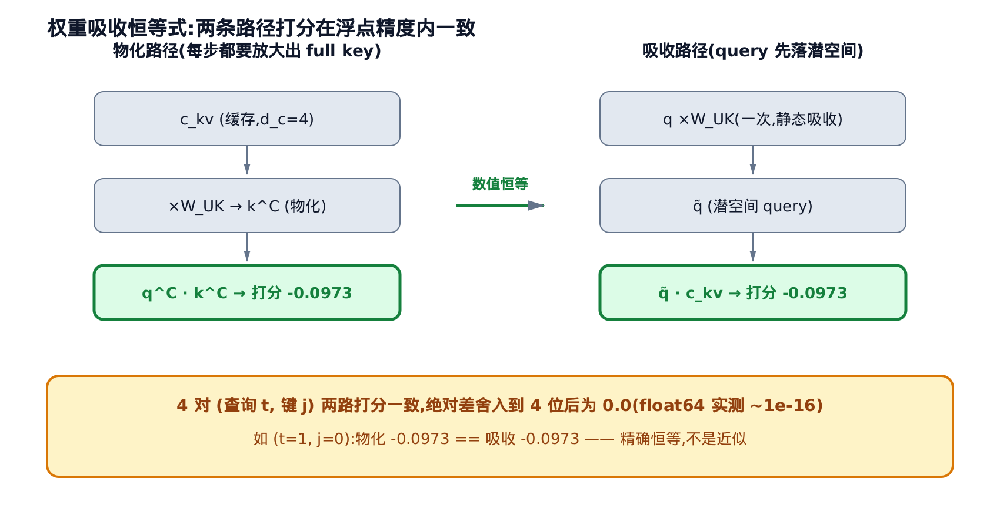
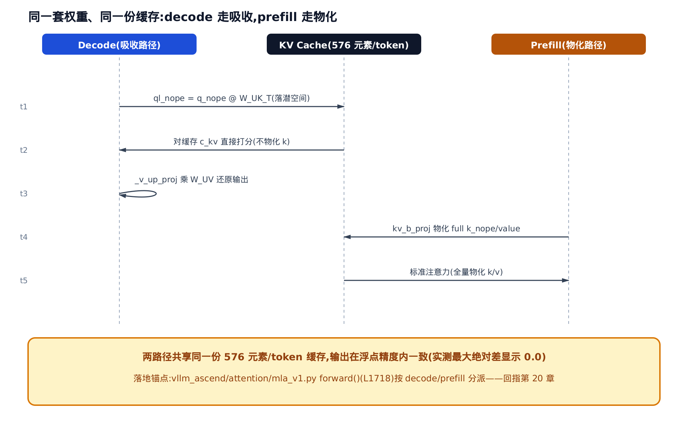

# 【原理篇·论文精读】MLA：低秩 KV 压缩、解耦 RoPE 与权重吸收


> 你在这里：第 V 部分「注意力与 KV」的原理夹层。
> 上一站：[第 20 章](../../ch20-ascend-attention-mha/narrative/chapter.md)讲透了昇腾 MHA 后端。
> 这一章：进入 MLA 落地前，先把它的三块数学地基打牢。
> 下一站：[第 22 章](../../ch22-mla-on-npu/narrative/chapter.md)看这些数学在昇腾核上落地。

上一章讲透了昇腾的 MHA 后端。顺着注意力这条线往下走，下一章（第 22 章）就要在 NPU 上把 MLA 跑起来——你会在 `vllm_ascend/attention/mla_v1.py` 里看到 decode 路径中 query 先乘一个 `W_UK_T`、`q_pe` 却单开一路过 RoPE 的拧巴走法。**为什么要这么拧巴？** 为什么 key 的上投影能折进 query，位置编码却折不进去、非得单开一小撮维度？趁着还没钻进算子，这一章先把这道数学地基补牢。

这一章就补这道认知悬崖。我们回到源头——DeepSeek-V2 论文（arXiv:2405.04434）§2.1，把 MLA 的三块地基一块块推给你看：**KV cache 为什么是长上下文的瓶颈**、**低秩压缩与权重吸收为什么在数值上精确成立**、以及全章最硬的一问——**RoPE 的位置旋转为什么不可吸收**。每一步都配一份小维度的数值推演，你可以拿计算器亲手对。推完，我们落到 `mla_v1.py` 的真实代码，逐段对上号。


只想抓住「权重能吸收、RoPE 为什么不能吸收」这条核心悬崖，可以从动机直接跳到 2.2 节权重吸收恒等式、接 2.3 节解耦 RoPE（全章核心），再看落地收尾；想看完整数学推导到源码落地的全程，就按标题顺序通读到底。

---

## 一、动机：KV cache 为什么是长上下文的瓶颈

### 直觉：给每位嘉宾都发完整名片并全程留底

标准多头注意力（MHA）像一场不停留底的接待。每来一个 token，就得为**每个头**各存一份完整的 key、一份完整的 value——像给每位到场嘉宾都发一张完整名片，还要全程留底。嘉宾（上下文）越多，抽屉（显存）越满。到最后，卡瓶颈的不是算力，而是这摞越堆越高的名片本身。

### 机制：缓存随头数与长度双重线性增长

论文 §2.1.1（arXiv:2405.04434, Eq.7-8）把标准 MHA 的一层写清楚了：把 $\mathbf h_t$ 投成 query、key、value 三份，切成 $n_h$ 个头，逐头算注意力：

$$
\mathbf o_{t,i} = \sum_{j=1}^{t} \mathrm{Softmax}_j\!\left(\frac{\mathbf q_{t,i}^{\top}\mathbf k_{j,i}}{\sqrt{d_h}}\right)\mathbf v_{j,i}
$$

约定下标： $t$ 是 token 索引（当前 query 所在位置）， $i$ 是注意力头索引（ $i=1,\ldots,n_h$ ）； $j$ 遍历 $t$ 之前的所有历史 token。全章后续所有公式都沿用这套约定，尤其后面出现的 $\delta=j-t$ 是两个 token 的**相对位置偏移**（不是头偏移）。

推理要加速，就得把所有历史 token 的 key、value 全缓存下来。于是每个 token 每层要囤的元素数是（Eq.8 尾句）：

$$
2\,n_h\,d_h
$$

再乘上层数 $l$ ，就是每 token 的全模型缓存足迹 $2\,n_h\,d_h\,l$ 。这里有两个「线性」：随头数 $n_h$ 线性、随上下文长度线性。DeepSeek-V2 的注意力配置是 $n_h{=}128$ 、 $d_h{=}128$ （§3.1.2），代进去：

$$
2\times 128\times 128 = 32768
$$

**每个 token、每一层，就要往缓存里追加 32768 个元素。** 60 层全模型累计到 $32768\times 60 = 1{,}966{,}080$ 个元素/token。下图把这条线性增长线画了出来——上下文每长一个 token，缓存就再摞上一层 32768。


这就是 MLA 要对抗的敌人：一条随头数与长度双重放大、没有上限的缓存增长线。

### 源码：真实代码里的缓存已经不是这个形状

有意思的是，在昇腾的 MLA 实现里，KV cache 的形状**根本没有那个 $2\,n_h\,d_h$**：

```python
# vllm_ascend/attention/mla_v1.py:L95-L103
@staticmethod
def get_kv_cache_shape(
    num_blocks: int,
    block_size: int,
    num_kv_heads: int,
    head_size: int,
    cache_type: str = "",
) -> tuple[int, ...]:
    return num_blocks, block_size, num_kv_heads, head_size
```

MHA 的缓存里是「每头一份 K、一份 V」，而这里 MLA 每个 token 每层只留一个「kv 头」宽度的向量——那就是我们下面要推的潜向量。缓存形状里再也找不到 $n_h$ 的乘法。**动机到此说完：怎么把 $2\,n_h\,d_h$ 压成一个与头数无关的小向量，正是 §2.1.2 的任务。**

---

## 二、数学推导

### 2.1 低秩 KV 联合压缩：只缓存一段潜向量

#### 直觉：不囤零件，只囤一张能现场复原的图纸

与其为每个头各留一份完整 key、一份完整 value，不如先把 token 压成一小段**共享的压缩摘要** $\mathbf c^{KV}$ ，推理期只囤这段摘要。真要用 key/value 时，再从摘要现场上投影出来。就像不囤整箱零件，只囤一张能现场复原全部零件的图纸——图纸小、零件在需要时才展开。

#### 机制：K、V 从同一段潜向量上投影

论文 §2.1.2（arXiv:2405.04434, Eq.9-11）的核心就三行：

$$
\mathbf c_t^{KV} = W^{DKV}\mathbf h_t,\qquad
\mathbf k_t^{C} = W^{UK}\mathbf c_t^{KV},\qquad
\mathbf v_t^{C} = W^{UV}\mathbf c_t^{KV}
$$

先约定两个方向词：**下投影**（如 $W^{DKV}$ ）把隐向量压到低秩、降维；**上投影**（如 $W^{UK}$ 、 $W^{UV}$ ）把压缩向量恢复回满维、升维。第一行就是用下投影 $W^{DKV}$ 把 $\mathbf h_t$ 压到 $d_c$ 维的潜向量 $\mathbf c_t^{KV}$ （ $d_c \ll d_h n_h$ ）；后两行说 key、value 都是从这**同一段** $\mathbf c_t^{KV}$ 上投影出来的。推理期只有 $\mathbf c_t^{KV}$ 入缓存，key、value 都是需要时现场算、从不落盘。缓存足迹从 $2\,n_h\,d_h\,l$ 降到 $d_c\,l$ 。

下面用一组玩具维度亲手验一遍。取 $d{=}6$ 、 $n_h{=}2$ 、 $d_h{=}4$ 、 $d_c{=}4$ ，喂 3 个 token 进去，看每个 token 的潜向量首元素、以及两种机制各要缓存多少。表里的「物化」指把压缩的潜向量显式上投影成完整维度的 K/V——这个词后面还会反复出现，它对应的正是「现场展开成 full key/value」：

<!-- trace: low-rank-kv-joint-compression -->

| token $t$ | 潜向量 $c_{kv}$ 首元素 | 缓存维数 $d_c$ | 物化 key 维数 $n_h\!\cdot\!d_h$ | MLA 每 token 缓存 | MHA 基线每 token 缓存 |
|---|---|---|---|---|---|
| 0 | 0.5427 | 4 | 8 | 6 | 16 |
| 1 | -0.0948 | 4 | 8 | 6 | 16 |
| 2 | -0.1942 | 4 | 8 | 6 | 16 |

读这张表要抓的是不变量：**只要 $d_c \ll n_h\!\cdot\!d_h$ ，缓存量就与头数彻底解耦。** 写进缓存的只有 $\mathbf c^{KV}$ 这一个 4 维张量；key（由 $W^{UK}$ 上投影、物化后 8 维）是现场算的，从不落盘。所以 MLA 每 token 只囤 6 个元素（潜向量 4 + 后面会讲的解耦 key 2），而 MHA 基线要囤 16——玩具维度下已经压了 $16/6 \approx 2.67$ 倍。换成 DeepSeek-V2 真实维度，仅联合压缩本体就是 $d_c{=}512$ 对 $n_h\!\cdot\!d_h{=}16384$ ，压 32 倍。


图里蓝色实线是唯一落盘的 $\mathbf c^{KV}$ ，两条灰色虚线（ $W^{UK}$ 、 $W^{UV}$ ）都是「按需现场上投影」——这就是 §2.1.2 那句「we even do not need to compute keys and values out」的图形版。

#### 源码：昇腾把这段压缩融进了写缓存那一步

真实代码里， $\mathbf c^{KV}$ 的产出与写缓存被融合进 decode 预处理的 `exec_kv_decode`——它只把潜向量与解耦 key 写进 `kv_cache`：

```python
# vllm_ascend/attention/mla_v1.py:L1635
decode_k_pe, decode_k_nope = self.exec_kv_decode(decode_kv_no_split, cos, sin, kv_cache, decode_slots)
```

一次调用同时产出解耦 key `decode_k_pe` 与潜向量 `decode_k_nope`，两者一并落进 `kv_cache`（它嵌在 [2.3 节](#23-解耦-rope为什么位置旋转不可吸收本章核心)完整的 `mla_preprocess_decode` 里，那里能看到它和解耦 RoPE 如何并肩工作）。这里先记住一件事：**缓存里躺着的是潜向量，不是 full key/value。** 这正是下一节「权重吸收」能成立的物理前提。

### 2.2 权重吸收恒等式：把上投影折进 query 与输出

#### 直觉：既然放大矩阵是死的，就提前折进 query

打分要算 query 和 key 的内积，而 key 不过是上投影 $W^{UK}$ 把潜向量 $\mathbf c^{KV}$ 放大出来的。既然这个「放大矩阵」 $W^{UK}$ 是死的、与位置无关，那不如**提前把它折进 query**：让 query 先乘一次 $W^{UK}$ ，直接落到潜向量所在的那个房间，再和缓存的 $\mathbf c^{KV}$ 直接握手。省掉的，正是「为每个历史 token 重新放大出 full key」这一步。

#### 机制：中间那块权重是静态常量

这里先约定两个贯穿全章、也贯穿源码的简写：**nope**（no positional encoding）指**不含**位置旋转、可以吸收的主体分量；**rope**（rotary positional encoding）指专门承载 RoPE 位置旋转的那一小撮分量。query、key 都被切成这两半，各走各的路——这正是下一节「解耦」的由来。一句话记住分工：**nope 部分（主体信息）走吸收路径、由静态权重承载；rope 部分（位置信息）走独立旁路、由 RoPE 动态承载。** 把 query 侧也做低秩（ $\mathbf q^{C}$ 由 $W^{UQ}$ 从 $\mathbf c^{Q}$ 上投影，见 [2.4 节](#24-q-侧低秩只降训练激活)），逐头展开 nope 部分的打分（之所以逐头，是因为每个头 $i$ 各有一份独立的上投影 $W^{UK}_i$ 、进而各有一份独立的吸收矩阵 $\widetilde W_i$ ；论文 §2.1.2 Eq.11 之后那句话的代数化）：

$$
\mathbf q_{t,i}^{C\top}\mathbf k_{j,i}^{C}
= \big(W^{UQ}_i \mathbf c_t^{Q}\big)^{\top}\big(W^{UK}_i \mathbf c_j^{KV}\big)
= \mathbf c_t^{Q\top}\,\big((W^{UQ}_i)^{\top} W^{UK}_i\big)\,\mathbf c_j^{KV}
$$

中间那块 $(W^{UQ}_i)^{\top} W^{UK}_i$ 只由两个静态权重相乘得到，不含任何随 $t$ 、 $j$ 变化的量。令吸收矩阵

$$
\widetilde W_i = (W^{UK}_i)^{\top} W^{UQ}_i,\qquad
\tilde{\mathbf q}_{t,i} = \widetilde W_i\,\mathbf c_t^{Q}
$$

打分就变成潜空间里的一次内积（ $\tilde{\mathbf q}$ 与 $\mathbf c^{KV}$ 的内积）—— $W^{UK}$ 被吸进了 query 侧。 $\widetilde W_i$ 形状 $d_c\times d_c'$ （本例 $4\times 4$ ），**加载后算一次、推理期永久复用**——省下的正是「为每个历史 token 重新放大出 full key 再内积」这一步，推理期只需对缓存里每个 token 的潜向量 $\mathbf c^{KV}$ 做一次内积。

拿玩具维度验一验这条恒等式到底有多「等」。同一组权重，取头 0，对几对 $(t,j)$ 分别走「物化路径」（老实算出 full $\mathbf k^C$ 再内积）和「吸收路径」（query 先落潜空间、直接和 $\mathbf c^{KV}$ 内积）：

<!-- trace: weight-absorption-identity -->

| 查询 $t$ | 键 $j$ | 物化路径打分 $q^C\!\cdot\!k^C$ | 吸收路径打分 $\tilde q\!\cdot\!c_{kv}$ | 绝对差 |
|---|---|---|---|---|
| 1 | 0 | -0.0973 | -0.0973 | 0.0 |
| 1 | 1 | -0.4644 | -0.4644 | 0.0 |
| 2 | 0 | -0.1071 | -0.1071 | 0.0 |
| 2 | 2 | -0.1114 | -0.1114 | 0.0 |

四对 $(t,j)$ 两条路径**逐位相等，绝对差恒为 0.0**。这不是「近似相等」，是代数恒等式的数值见证——由矩阵乘法的结合律严格保证，在 32 位浮点下也完全无损，而非依赖数值巧合。输出侧同理（论文 §2.1.2）：注意力是对 value 的加权和，而 value 由 $W^{UV}$ 从潜向量上投影，于是

$$
\sum_j w_j\,\mathbf v_{j}^{C} = \sum_j w_j\,\big(W^{UV}\mathbf c_j\big) = W^{UV}\Big(\sum_j w_j\,\mathbf c_j\Big)
$$

「先物化每个 value 再加权」与「先在潜空间加权、最后统一乘 $W^{UV}$ 」完全等价——所以 $W^{UV}$ 可以吸进输出投影 $W^O$ 。o 侧同样落得下数字：同一组玩具权重下，先在潜空间加权再乘 $W^{UV}$ 得到的首元素，与直接对物化 $\mathbf v^C$ 加权得到的首元素完全一致（均为 $0.223$ ，绝对差 $0.0$ ）——和 q 侧一样，是数值上的精确恒等，不是近似。



上路每步都得为历史 token 放大出 full key，下路 query 一次性乘进潜空间、直接握手缓存的 $\mathbf c^{KV}$ 。省算力，而结果一丝不差。

#### 源码：加载后拆权重，热路径直接 bmm

昇腾把「加载后算一次」落成了 `process_weights_after_loading`——它把融合的 `kv_b_proj` 权重拆成论文的 $W^{UK}$ 、 $W^{UV}$ ，并转置重排成吸收所需的布局：

```python
# vllm_ascend/attention/mla_v1.py:L924-L957（省略量化断言与图复用场景下的权重就地写回分支）
def process_weights_after_loading(self, act_dtype: torch.dtype):
    # … 省略：量化断言 …
    kv_b_proj_weight = torch_npu.npu_format_cast(self.kv_b_proj.weight.data, ACL_FORMAT_FRACTAL_ND).T
    kv_b_proj_weight = kv_b_proj_weight.view(
        self.kv_lora_rank,
        self.num_heads,
        self.qk_nope_head_dim + self.v_head_dim,
    )
    W_UK, W_UV = kv_b_proj_weight.split([self.qk_nope_head_dim, self.v_head_dim], dim=-1)
    if not hasattr(self, "W_UV"):
        # Convert from (L, N, V) to (N, L, V)
        self.W_UV = W_UV.transpose(0, 1).contiguous()
        # Convert from (L, N, P) to (N, P, L)
        self.W_UK_T = W_UK.permute(1, 2, 0).contiguous()
    # … 省略：图复用场景下 copy_ 就地写回权重缓冲的分支 …
```

`kv_b_proj` 就是论文 $W^{UK}$ 、 $W^{UV}$ 的融合权重；拆开后 `W_UK_T` 排成 `(N, P, L)` 供 q 侧、`W_UV` 排成 `(N, L, V)` 供 o 侧。到了 decode 热路径，q 侧吸收只是一次 `bmm`：

```python
# vllm_ascend/attention/mla_v1.py:L910-L922
# Return `ql_nope`, `q_pe`
def _q_proj_and_k_up_proj(self, x):
    q_nope, q_pe = (
        self.q_proj(x)[0]
        .view(-1, self.num_heads, self.qk_head_dim)
        .split([self.qk_nope_head_dim, self.qk_rope_head_dim], dim=-1)
    )
    # Convert from (B, N, P) to (N, B, P)
    q_nope = q_nope.transpose(0, 1)
    # Multiply (N, B, P) x (N, P, L) -> (N, B, L)
    ql_nope = torch.bmm(q_nope, self.W_UK_T)
    # Convert from (N, B, L) to (B, N, L)
    return ql_nope.transpose(0, 1), q_pe
```

对上符号：`q_proj(x)` 已经把 $W^{UQ}$ 乘完、吐出 `q_nope`（即公式里的 $\mathbf q^C$ ，`qk_nope_head_dim` 维），而 `W_UK_T` 恰是 $(W^{UK})^{\top}$ 重排成 `(N, P, L)`。于是这一行 `q_nope @ W_UK_T` 补上剩下的 $(W^{UK})^{\top}$ 半边、落到潜向量维 `kv_lora_rank`——两步合起来才凑成上面那步「query 乘吸收矩阵 $\widetilde W$ （定义见 [2.2](#22-权重吸收恒等式把上投影折进-query-与输出)）、落进潜空间」。换句话说 `W_UK_T` 本身只是 $\widetilde W$ 的一半，另一半藏在 `q_proj` 里。注意 `q_pe` 被单独 `split` 出来、**不参与吸收**：它要去走解耦 RoPE，这正是下一节的悬崖。输出侧的 $W^{UV}$ 吸收则体现为 `_v_up_proj`：

```python
# vllm_ascend/attention/mla_v1.py:L900-L907
def _v_up_proj(self, x):
    # Convert from (N, B, L)/(N, B, 1, L) to (N, B, L)
    x = x.view(self.num_heads, -1, self.kv_lora_rank)
    # Multiply (N, B, L) x (N, L, V) -> (B, N, V)
    x = torch_npu.npu_transpose_batchmatmul(x, self.W_UV, perm_y=(1, 0, 2))
    # Convert from (B, N, V) to (B, N * V)
    x = x.reshape(-1, self.num_heads * self.v_head_dim)
    return x
```

注意力先在潜空间（`kv_lora_rank` 维）里做完加权和，`_v_up_proj` 再乘 $W^{UV}$ 把它还原到 value 空间——正是上面 $W^{UV}(\sum_j w_j \mathbf c_j)$ 的那一步。（吸收这么省，那 prefill 为什么偏偏不用吸收、还老实物化出 full key/value？这涉及 decode 与 prefill 不同的算力权衡，留到 [第四节](#四落地decode-吸收路径-vs-prefill-物化路径) 细讲。）

### 2.3 解耦 RoPE：为什么位置旋转不可吸收（本章核心）

这是全章最硬、也是第 22 章读者最容易卡住的一问。权重吸收成立的前提，是「中间那块矩阵是死的」。可 RoPE 偏偏会往 query 和 key 之间塞一个**活的**矩阵。

#### 直觉：位置旋转把两块能折叠的权重顶开了

RoPE 按 token 的位置给 query 和 key 各施加一个旋转矩阵 $R_m$ 。这个旋转随每对 token 的相对距离转动——它是活的。一旦让它夹进 $W^Q$ 和 $W^{UK}$ 中间，就像在两张本能贴合的纸中间塞了一枚随距离变厚的垫片，两块权重再也压不到一起。解法只能是：**别让潜向量主体承载位置**，单开一小撮维度专门扛 RoPE，让 $\mathbf c^{KV}$ 主体保持「位置无关」，从而继续可吸收。

$R_m$ 具体怎么构造：把每个头的 $d_h$ 维两两分组成 $d_h/2$ 对，第 $k$ 对维度按位置 $m$ 转过角度 $m\theta_k$ （ $\theta_k$ 是随维度衰减的预设频率表，与数据无关）， $R_m$ 就是这些二维旋转块拼成的分块对角矩阵。旋转天然满足「转 $a$ 再转 $b$ = 净转 $a+b$ 」，于是对同一对维度先转 $t$ 再转 $j$ （即 $R_t^{\top}R_j$ ，转置对旋转矩阵等于转回去）等价于净转过 $j-t$ ，这正是下面 $R_t^{\top}R_j=R_{j-t}$ 成立的来源（严格推导见原始出处 RoFormer, arXiv:2104.09864）。

#### 机制：中间矩阵是相对位置的函数

假设我们**偏要**对上投影得到的 key $\mathbf k^C$ 直接加 RoPE，展开打分（论文 §2.1.3, arXiv:2405.04434）：

$$
\mathbf q_{t}^{\top}\mathbf k_{j}^{C,\mathrm{rope}}
= \mathbf h_t^{\top}(W^{Q})^{\top} R_t^{\top} R_j\, W^{UK}\mathbf c_j
= \mathbf h_t^{\top}(W^{Q})^{\top} R_{j-t}\, W^{UK}\mathbf c_j
$$

这里用了 RoPE 的标准性质 $R_t^{\top}R_j = R_{j-t}$ （两次旋转叠加=角度相加）。问题就出在夹在正中间的那块矩阵：

$$
M(\delta) = (W^{Q})^{\top} R_{\delta}\, W^{UK},\qquad \delta = j-t
$$

$M(\delta)$ **本身就是相对位置 $\delta$ 的函数**。问题的关键不是「矩阵乘一般不交换」这条泛泛的事实，而是在这个特定配置里： $(W^Q)^{\top}$ 、 $R_\delta$ 、 $W^{UK}$ 三者的乘积顺序被 $R_\delta$ 卡在正中间锁死了——一旦挪动 $R_\delta$ 与任何一侧权重的相对次序，就会改变 $R_\delta$ 的作用效果，于是它没法被吸进两侧、和静态权重合并成一个与位置无关的常量。换句话说：**每个相对位置对应一个不同的中间矩阵，根本没有「离线算好、线上复用」的空间。** 一旦这么做，推理期就得为所有 prefix token 重算 key，吞吐崩塌。

拿玩具维度把「 $M(\delta)$ 随 $\delta$ 变」这件事量化出来。取头 0，让相对位置 $\delta$ 扫一段区间 $\delta{=}0,1,2,3$ ，看中间矩阵的 $[0,0]$ 元素与 Frobenius 范数。（因果解码里历史 key 有 $j\le t$ 、 $\delta$ 取非正值；这里扫的是相对位置区间，目的只是证伪「存在一个与位置无关的静态矩阵」——只要 $M(\delta)$ 不是常量，扫正侧还是负侧结论都一样——负侧的中间矩阵 $M(-\delta)$ 把负角旋转 $R_\delta^{\top}$ 同样夹在两块权重之间，一样随 $\delta$ 变、一样不是常量。）

<!-- trace: decoupled-rope -->

| 相对位置 $\delta$ | $R_\delta$ 是否单位阵 | 中间矩阵 $M(\delta)[0,0]$ | $\lVert M(\delta)\rVert_F$ | 能否离线预计算 |
|---|---|---|---|---|
| 0 | 是 | -0.5378 | 1.1402 | 能（退化为静态 $\tilde W$ ） |
| 1 | 否 | -0.4659 | 1.366 | 否 |
| 2 | 否 | 0.125 | 1.8486 | 否 |
| 3 | 否 | 0.6912 | 1.955 | 否 |

$\delta$ 从 0 走到 3， $M[0,0]$ 从 $-0.5378$ 一路变到 $0.6912$ ，范数从 $1.1402$ 涨到 $1.955$ ——**中间那块确实随位置改变，不是常量。** 只有 $\delta{=}0$ （即不加 RoPE）时 $R_0$ 退化成单位阵、 $M$ 才收敛回可吸收的静态 $\widetilde W$ 。这一档 $M[0,0]{=}-0.5378$ ，恰好等于解耦方案里主体走的静态 $\widetilde W[0,0]{=}-0.5378$ ——两条路在「不加位置」处严丝合缝对上。

解法就是论文的解耦 RoPE（Eq.14-18）：额外拉出一小撮维度 $\mathbf q^R$ （每头 $d_h^R$ 维）与**共享** key $\mathbf k^R$ 专门承载 RoPE，拼接到 nope 部分后一起算注意力：

$$
\mathbf q_{t,i} = [\mathbf q_{t,i}^{C};\ \mathbf q_{t,i}^{R}],\qquad
\mathbf k_{t,i} = [\mathbf k_{t,i}^{C};\ \mathbf k_t^{R}]
$$

留意下标的差别： $\mathbf q^R_{t,i}$ 带头索引 $i$ （每头各有一份），而解耦 key $\mathbf k^R_{t}$ **不带 $i$**——它由一个单独的投影从 $\mathbf h_t$ 直接生成（并非从 $\mathbf c^{KV}$ 上投影而来），再施加 RoPE，因此在各头间**共享**，每个 token 只需缓存一份 rope 向量。位置信息就这样被抽成一个「每 token 一份、全头共用」的独立分量， $\mathbf k^C$ 主体则逐头保留、且保持位置无关，这才让吸收矩阵 $\widetilde W$ 得以静态不变。

$$
\mathbf o_{t,i} = \sum_{j=1}^{t}\mathrm{Softmax}_j\!\left(\frac{\mathbf q_{t,i}^{\top}\mathbf k_{j,i}}{\sqrt{d_h+d_h^R}}\right)\mathbf v_{j,i}^{C}
$$

$\mathbf c^{KV}$ 主体不加 RoPE、保持位置无关， $\widetilde W$ 恒为静态、继续可吸收；位置信息全被关进独立的 $d_h^R$ 维小分量里（DeepSeek-V2 经实验调优取 $d_h^R{=}64$ ，在保住精度的同时把解耦位置维的缓存开销压到最小）。推理期要缓存的因此是 $\mathbf c^{KV}$ 加上解耦 $\mathbf k^R$ ，共 $(d_c+d_h^R)\,l$ 个元素。


图右下角还给了一条端到端验证：解耦 RoPE 下，decode 增量逐 token 计算与 prefill 一次性计算，3 步输出最大绝对差恒为 0.0——**既保住可吸收、又不损失正确性。** 这就是第 22 章那条「decode 走吸收、`q_pe` 单独过 RoPE」分支存在的根本原因。

#### 源码：q_pe/k_pe 单独过 rope_single

回到真实代码，decode 预处理把这条解耦逻辑落得很直白：

```python
# vllm_ascend/attention/mla_v1.py:L1620-L1638（省略 A5 量化分支）
def mla_preprocess_decode(self, q_c, kv_no_split, kv_cache, attn_metadata):
    num_decode_tokens = attn_metadata.num_decode_tokens
    decode_q_c = q_c[:num_decode_tokens]
    cos = attn_metadata.decode.cos
    sin = attn_metadata.decode.sin
    decode_ql_nope, decode_q_pe = self._q_proj_and_k_up_proj(decode_q_c)
    decode_q_pe = self.rope_single(decode_q_pe, cos, sin)
    # … 省略：A5 fa_quant 动态量化分支 …
    decode_slots = attn_metadata.slot_mapping[:num_decode_tokens:1]
    decode_kv_no_split = kv_no_split[:num_decode_tokens]
    decode_k_pe, decode_k_nope = self.exec_kv_decode(decode_kv_no_split, cos, sin, kv_cache, decode_slots)
    return DecodeMLAPreprocessResult(
        decode_ql_nope, decode_q_pe, decode_k_nope, decode_k_pe, dequant_scale_q_nope=dequant_scale_q_nope
    )
```

看这三行的分工：`_q_proj_and_k_up_proj` 出 `decode_ql_nope`（已吸收、走潜空间，**不碰位置**）和 `decode_q_pe`；紧接着**只有** `decode_q_pe` 过 `rope_single` 拿到位置；`exec_kv_decode` 读写缓存里的潜向量 `k_nope` 与解耦 `k_pe`。nope 主体和 rope 分量泾渭分明——代码把「 $M(\delta)$ 不可吸收」这条数学，翻译成了「位置只允许走 `q_pe`/`k_pe`」这条工程纪律。

### 2.4 q 侧低秩：只降训练激活

#### 直觉：query 也压，但省的是另一份显存

query 侧也做一次低秩压缩，但目的和 KV 侧完全不同。key/value 压缩是为了省**推理期 KV cache**；query 压缩纯粹是为了省**训练期那份中间激活**的显存。因为 query 每步现算现用、根本不入缓存，所以它再怎么压，也动不了 KV cache 一分一毫。

#### 机制：c_q 从不落盘

论文 §2.1.2（arXiv:2405.04434, Eq.12-13）：

$$
\mathbf c_t^{Q} = W^{DQ}\mathbf h_t,\qquad \mathbf q_t^{C} = W^{UQ}\mathbf c_t^{Q}
$$

关键不变量是**正交性**（这里说的正交，是指训练侧激活显存与推理侧 KV cache 开销这两个优化目标各自独立、互不牵连，而非线性代数意义上向量的正交）： $\mathbf c^Q$ 只是 query 的中间激活，在当前 token 的前向里就被消费掉、不跨步保留，故每步 KV cache 变化量恒为 0。玩具维度验一下（ $d_{cq}{=}4$ ）：

<!-- trace: q-side-low-rank -->

| token $t$ | $c_q$ 首元素 | $c_q$ 激活维 $d_{cq}$ | 上投影满维 $n_h\!\cdot\!d_h$ | 本步 KV cache 变化 |
|---|---|---|---|---|
| 0 | -1.6634 | 4 | 8 | 0 |
| 1 | 0.8303 | 4 | 8 | 0 |
| 2 | 0.8692 | 4 | 8 | 0 |

三步的「KV cache 变化」列全为 0。训练期 query 中间激活从满维 8 压到 $d_{cq}{=}4$ （DeepSeek-V2 里是从 16384 压到 $d_c'{=}1536$ ），而推理缓存纹丝不动——**q 侧低秩省的是训练激活，不是 KV cache。** 落地代码里，这一步藏在 `_mla_preprocess`（`vllm_ascend/attention/mla_v1.py:L1640-L1667`）的 `fused_qkv_a_proj` 拆分：它同时吐出 q 侧的 `q_c`（过 `q_a_layernorm` 后再上投影）与 KV 侧的 `kv_no_split`，两侧各走各的路（`q_lora_rank`、`kv_lora_rank` 等维度字段在构造时绑定，见 `vllm_ascend/attention/mla_v1.py:L728-L742`）。

---

## 三、账单：MLA vs MHA / GQA / MQA

### 直觉：把四种注意力排成一张账单

前面推的都是「怎么压」，现在把四种注意力排成一张账单，只问一件事：**每个 token 每层到底要囤多少个数？** MHA 为每个头各囤一整份 K 和 V（最重）；GQA 让几组头共享（中等）；MQA 全部头共享一份（最轻，但最伤精度）；MLA 只囤一段潜向量加一小撮位置维——账单和 MQA 一个量级，精度却比满配 MHA 还强。

### 机制：MLA 的缓存不含头数

论文 Table 1（§2.1.4）给了四行公式。代进 DeepSeek-V2 维度（ $n_h{=}128$ 、 $d_h{=}128$ 、 $d_c{=}512$ 、 $d_h^R{=}64$ ，GQA 按通常配置取 8 组共享）：

<!-- trace: kv-cache-comparison -->

| 注意力机制 | 每 token 每层缓存元素（DeepSeek-V2 维度） |
|---|---|
| MHA | 32768 |
| GQA-8 | 2048 |
| MQA | 256 |
| MLA | 576 |

抓住这条不变量：**MLA 的缓存量 $(d_c+d_h^R)$ 表达式里根本不出现 $n_h$**，而 MHA 是 $2\,n_h\,d_h$ 、与头数成正比。DeepSeek-V2 的 $n_h{=}128$ 极大，于是压缩比 $32768 \div 576 \approx 56.89$ 倍，主要就来自「缓存不再乘头数」这一项。折算成 GQA：GQA 每组共享头每 token 每层缓存 $2 d_h$ 个元素（一份 K、一份 V），而 MLA 的 $d_c+d_h^R{=}576$ 相当于 $576/(2\times 128)=2.25$ 组 GQA 的缓存——占用却比满配 MHA 更强。全模型 60 层，每 token 缓存从 MHA 的 $1{,}966{,}080$ 个元素降到 MLA 的 $34{,}560$ 个。

需要提醒的是：论文摘要与结论里那句「reduces the KV cache by 93.3%」并不是这张表的口径。那 93.3% 是 DeepSeek-V2 相较**另一个模型** DeepSeek 67B 的实测部署对比，且部署时还额外叠加了 KV cache 量化（论文 §「Inference Efficiency」把每个缓存元素再压到平均 6 bit）。而本节 Table 1 算的是「同维度 MHA vs MLA」的理论架构比——56.89 倍、约 98.2% 的缩减，不含任何量化因素、比较对象也不同。两个数字量级都对不上，别把它们当成同一笔账。


MLA 一栏与 MQA 同量级，却因「潜向量携带了全部头的信息」而保住 MHA 级精度——这就是 Table 1 里「等效 2.25 组 GQA、能力却 Stronger」的含义。

### 源码：表里那三个数字，在真实代码里叫什么

表里 MLA 一行用到的 $d_c{=}512$ 、 $d_h^R{=}64$ 、 $n_h{=}128$ ，在昇腾实现里都是构造时就绑定的字段：

```python
# vllm_ascend/attention/mla_v1.py:L721,L729,L731
self.num_heads = num_heads          # n_h：MHA 那一行 2·n_h·d_h 里被乘进去的头数
# … 省略 …
self.kv_lora_rank = kwargs["kv_lora_rank"]        # d_c：潜向量维（DeepSeek-V2 = 512）
self.qk_rope_head_dim = kwargs["qk_rope_head_dim"]  # d_h^R：解耦 RoPE 分量维（= 64）
```

MLA 每 token 每层缓存的 $(d_c+d_h^R)$ ，落到代码就是 `kv_lora_rank + qk_rope_head_dim`（ $512{+}64{=}576$ ）——表达式里**根本没有** `num_heads`。而 MHA 那一行的 $2\,n_h\,d_h$ 必须把 `self.num_heads` 乘进去。四行公式里每个符号，到此都能在 `__init__` 里点到名。

---

## 四、落地：decode 吸收路径 vs prefill 物化路径

推导讲完，最后落回昇腾。一个自然的疑问是：既然吸收这么省，为什么真实代码里 prefill 偏偏**不**走吸收、老实物化出 full key/value？

### 直觉：省的地方不同，所以分两条路

同一套 MLA 权重，decode 和 prefill 走两条路。decode 每步只有一个新 query，却要扫全部历史缓存——把上投影折进 query、直接在潜空间算（吸收路径）最省，吸收那点固定矩阵乘成本，摊在漫长的历史缓存上几乎可忽略。prefill 则一次性处理长序列（如 4096 个 token），重算 K/V 的开销被序列长度摊薄（相对整段注意力计算占比很小），反倒是吸收多出来的矩阵乘成了主要瓶颈——索性老实物化出 full k/v 走标准注意力（物化路径）更简单。省的地方不同，两条路才各得其所。



上泳道 decode：`q_nope` 先乘 `W_UK_T` 落潜空间，对缓存 $\mathbf c^{KV}$ 直接打分，`_v_up_proj` 乘 $W^{UV}$ 还原；下泳道 prefill：`kv_b_proj` 把 $\mathbf c$ 物化成 full `k_nope`/`value` 走标准注意力。**不变量：两路共享同一份 576 元素/token 的缓存，对同一段序列输出逐位相等（最大绝对差 0.0）。**

### 机制与源码：forward 按 decode/prefill 分派

统一入口 `forward` 定义于 `vllm_ascend/attention/mla_v1.py:L1718`（图注锚的就是这个函数入口行）；下面摘的是它函数体内、省略 profiling 与 `o_proj` prefetch 之后的第 L1758-L1790 行——分流一目了然：

```python
# vllm_ascend/attention/mla_v1.py:L1758-L1790（省略 profiling / o_proj prefetch）
decode_preprocess_res, prefill_preprocess_res = self._mla_preprocess(
    layer_name, hidden_states, kv_cache, attn_metadata, need_gather_q_kv
)
if decode_preprocess_res is not None:
    # MLA Preprocess for decoding —— 吸收路径
    output_decode = self._forward_decode(
        decode_preprocess_res.ql_nope,      # 已吸收：q_nope @ W_UK_T，落在潜空间
        decode_preprocess_res.q_pe,         # 解耦分量：单独过了 RoPE
        decode_preprocess_res.k_nope,       # 缓存的潜向量 c_kv
        decode_preprocess_res.k_pe,
        kv_cache[0].shape[1], attn_metadata,
        decode_preprocess_res.dequant_scale_q_nope,
    )
    o_proj_input[:num_decode_tokens] = output_decode

if prefill_preprocess_res is not None:
    # 物化路径
    output_prefill = self._forward_prefill(
        prefill_preprocess_res.q_nope,      # 未吸收：原始 q_nope
        prefill_preprocess_res.q_pe,
        prefill_preprocess_res.k_nope,      # kv_b_proj 物化出的 full key
        prefill_preprocess_res.k_pe,
        prefill_preprocess_res.value,       # 物化出的 full value
        kv_cache, attn_metadata,
    )
    o_proj_input[num_decode_tokens:num_actual_tokens] = output_prefill
```

decode 分支喂给 `_forward_decode` 的是 `ql_nope`——已经乘过 `W_UK_T`、落在潜空间的 query；prefill 分支喂给 `_forward_prefill` 的则是原始 `q_nope` 加上物化出的 full `k_nope`/`value`。物化这一步就在 `mla_preprocess_prefill` 里：

```python
# vllm_ascend/attention/mla_v1.py:L1598-L1618（省略 cos/sin 取用与 k_pe 广播细节）
def mla_preprocess_prefill(self, q_c, kv_no_split, kv_cache, attn_metadata):
    # … 省略：切分 decode/prefill token …
    prefill_q = self.q_proj(prefill_q_c)[0].view(-1, self.num_heads, self.qk_head_dim)
    prefill_q_pe = prefill_q[..., self.qk_nope_head_dim :]
    prefill_q_nope = prefill_q[..., : self.qk_nope_head_dim]
    prefill_q_pe = self.rope_single(prefill_q_pe, cos, sin)
    prefill_k_pe, prefill_k_c_normed = self.exec_kv_prefill(prefill_kv_no_split, cos, sin, kv_cache, prefill_slots)
    prefill_k_nope, prefill_value = (
        self.kv_b_proj(prefill_k_c_normed)[0]
        .view(-1, self.num_heads, self.qk_nope_head_dim + self.v_head_dim)
        .split([self.qk_nope_head_dim, self.v_head_dim], dim=-1)
    )
```

对比点很清楚：prefill 的 `prefill_q_nope` **不乘** `W_UK_T`，而是经 `kv_b_proj` 把潜向量显式物化成 full `k_nope` 与 `value`，再走标准注意力。为什么 prefill 不吸收？因为它一次性处理整段，重算 K/V 的算力被序列长度摊薄；而 decode 每步只 1 个 token、要对全部 prefix 缓存做内积，吸收才划算。两条路径最终都汇入 `o_proj`，输出对同一段序列逐位相等。

至此，那两条让人卡壳的分支——decode 为什么先乘 `W_UK_T`、位置为什么单开一路——背后的数学地基就都补齐了。带着它们进入 [下一章 MLA on NPU](../../ch22-mla-on-npu/narrative/chapter.md)，你会看到这些数学在昇腾核上逐一落地，这次每一行应该都不再拧巴。

---

## 小结

MLA 的全部魔法，其实就压在三个数字上：**32768、576、0.0**。

第一个是敌人——标准 MHA 每 token 每层要囤的 32768 个元素，随头数与长度双重放大。第二个是解药——MLA 把它压到 576，只缓存一段与头数无关的潜向量加一小撮位置维。第三个是这套解药的良心——无论权重吸收还是 decode/prefill 双路，数值上都精确恒等，绝对差恒为 0.0，省的是算力和显存，动的从来不是结果。

而这一切能成立的关键转折，是那道认知悬崖：位置旋转 $M(\delta)$ 是活的、不可吸收，于是 DeepSeek-V2 把 RoPE 关进独立的小维度，让潜向量主体保持静态可吸收。理解了这一点，`mla_v1.py` 里 `q_pe` 那条孤零零的旁路，就再也不是「拧巴」，而是唯一正确的走法。
