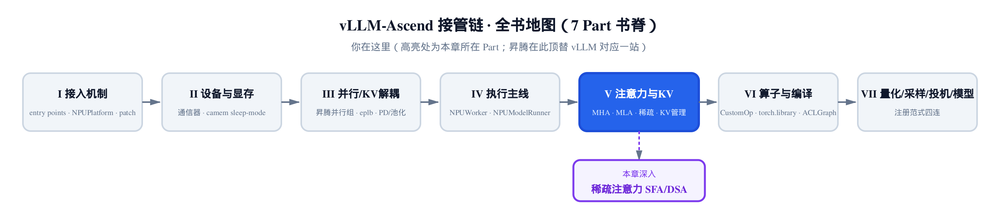
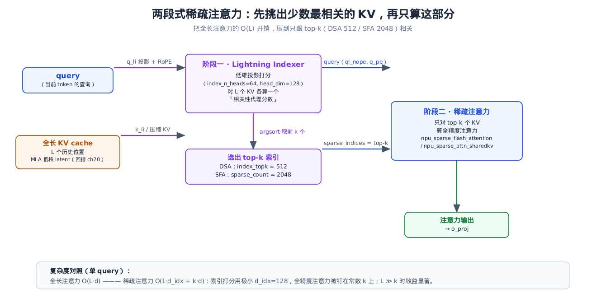
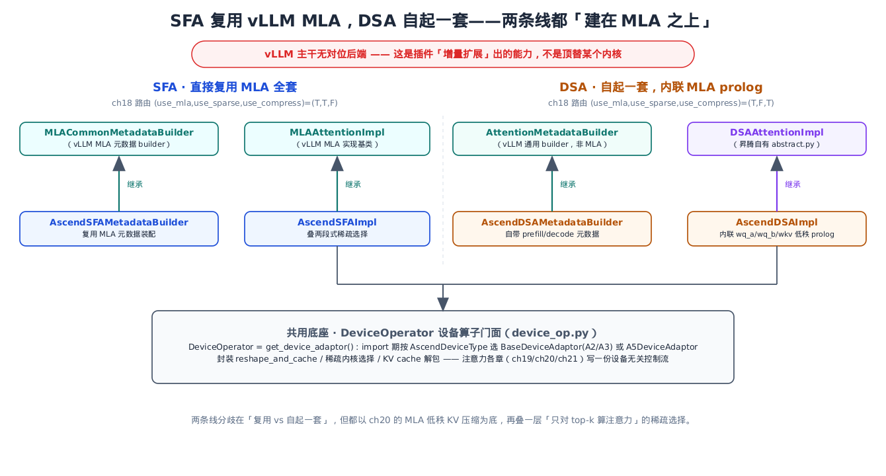
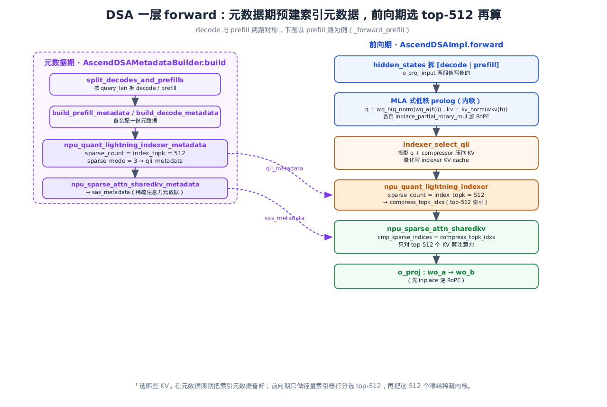

# 第 21 章 稀疏注意力：SFA 与 DSA（Lightning Indexer）



> 上一章讲透了 MLA：用低秩压缩把 KV cache 砍到约 1/57，再用权重吸收省掉解码期的解压。
> 本章在 MLA 之上再叠一层「稀疏」：先用轻量索引器挑出少数最相关的 KV，只算这部分。
> 关键看点：这两个后端在 vLLM 主干里**根本不存在**——是插件「加法式扩展」出来的。

到目前为止，我们看到的昇腾后端都在做同一件事：**顶替**。`AscendAttentionBackend` 顶替 vLLM 的标准注意力、`AscendMLABackend` 顶替 MLA——同一个抽象位置，换一套昇腾算子。但 OOT（out-of-tree，树外）插件的能耐不止于此。本章的两个后端，`AscendSFABackend` 与 `AscendDSABackend`，在 vLLM 主干里**找不到对位**：主干只有标准注意力和 MLA，没有稀疏注意力这条线。它们是昇腾在 MLA 基础上**新增**出来的算法。这正是[第 8 章《Ascend 并行组》](../ch08-ascend-parallel-groups/narrative/chapter.md)里见过的「加法式扩展」母题在注意力子系统的再现——不替换、只新增。

这就回答了一个一直悬着的问题：插件除了 monkey-patch「换内核」，还能不能给 vLLM **加**一个它本来没有的东西？能。本章就是活证据。

两份源码体量极大——`vllm_ascend/attention/sfa_v1.py` 约 1376 行、`vllm_ascend/attention/dsa_v1.py` 约 2897 行，底下还垫着一堆昇腾私有算子。我们不逐行啃，只抓机制：**怎么在 MLA 之上叠稀疏选择、怎么用一个轻量索引器把长上下文的注意力开销从 O(L) 压到 O(top-k)**。

## 21.1 长上下文的「注意力税」

先说清楚痛点。标准注意力里，每生成一个 token，它的 query 要和**全部** L 个历史 KV 做点积、过 softmax、再加权求和。上下文越长，这笔账越重——单个 query 的开销正比于 L，即 O(L)；而整条序列有 L 个 query，每个都摊一遍 O(L)，故总成本 = L × O(L) = $O(L^2)$。当 L 涨到 32K、128K，这笔「注意力税」就压过了其它所有开销。

[第 20 章的 MLA](../ch20-mla-on-npu/narrative/chapter.md) 攻的是另一个维度：**每个 KV 存多大**。它把 KV cache 压成低秩 latent，省显存、省带宽。但它没动「要扫多少个 KV」——decode 仍然对每个历史位置都算一遍。

稀疏注意力攻的正是这后半句。它的赌注很直接：**对某个 query 来说，绝大多数历史 KV 其实没什么贡献**。softmax 之后，注意力权重高度集中在少数几个位置上，剩下的几乎是噪声。既然如此，何必对全部 L 个都算全精度注意力？先想办法**便宜地**挑出最相关的少数几个，只算这几个就行。

难点在「便宜地挑」。要判断哪些 KV 相关，本身就得算一遍打分——如果这个打分跟全精度注意力一样贵，那就白搭了。稀疏注意力的解法是**两段式**：用一个维度极低的「索引器」算一个粗糙的相关性代理分数，挑出 top-k；再只对这 top-k 个 KV 算真正的全精度注意力。本章两份后端 `vllm_ascend/attention/sfa_v1.py` 与 `vllm_ascend/attention/dsa_v1.py`，就是这套两段式的两种实现。



这就是本章两个后端共同的骨架。SFA 和 DSA 的差别在「怎么挑、挑多少、建在谁身上」，但两段式这个大框架是一样的。

## 21.2 从 ch18 接棒：三元 key 选出「主干没有的后端」

[第 18 章](../ch18-attention-backend-selection/narrative/chapter.md)讲过昇腾如何按模型与配置路由到具体的注意力后端。路由的落点是 `vllm_ascend/platform.py` 的 `get_attn_backend_cls`，本章的两个主角就从这里被选出来：

```python
# vllm_ascend/platform.py:L738
@classmethod
def get_attn_backend_cls(cls, selected_backend, attn_selector_config, num_heads: int | None = None):
    use_compress = getattr(attn_selector_config, "use_compress", False)
    # … 省略：FLASH_ATTN 早返回 AscendFABackend 的旁支（它另用一个二元 key=(use_mla, use_sparse) 判断，与下面的三元键无关）…
    backend_map = {
        (True, False, False): "vllm_ascend.attention.mla_v1.AscendMLABackend",
        (False, False, False): "vllm_ascend.attention.attention_v1.AscendAttentionBackend",
        (True, True, False): "vllm_ascend.attention.sfa_v1.AscendSFABackend",
        (True, False, True): "vllm_ascend.attention.dsa_v1.AscendDSABackend",
    }
    # … 省略：is_310p() 的 backend_map_310 旁支（ch17 已讲 310P）…
    return backend_map[(attn_selector_config.use_mla, attn_selector_config.use_sparse, use_compress)]
```

看这张 `backend_map`。它的 key 是一个三元组 `(use_mla, use_sparse, use_compress)`（下表末栏的「对位」，指 vLLM 主干中功能对应的同类后端实现）：

| 三元 key | 选中的后端 | 是不是 MLA | 主干有对位吗 |
|---|---|---|---|
| `(True, False, False)` | `AscendMLABackend` | 是 | 有（vLLM 有 MLA） |
| `(False, False, False)` | `AscendAttentionBackend` | 否 | 有（vLLM 标准注意力） |
| `(True, True, False)` | `AscendSFABackend` | 是 + **稀疏** | **无** |
| `(True, False, True)` | `AscendDSABackend` | 是 + **压缩** | **无** |

前两行是「顶替」：同一个抽象位置，vLLM 有、昇腾换一套实现。后两行不一样——`use_sparse` 或 `use_compress` 拨到 `True` 时选出的 SFA / DSA，**在 vLLM 主干里没有任何对位的后端**。它们不是替换谁，是凭空多出来的两条算法路线。

所以本章不做「基座算子级对照」——没有基座可对。这正是 OOT 插件「加法式扩展」最干净的一个样本：vLLM 通过 entry-point 暴露后端注册点，插件就能往里塞一个主干设计时压根没设想过的注意力算法。

> 顺带交代一个 ch18 埋下的细节。SFA 和 DSA 的后端 `get_name()` 都故意撒了个谎：

```python
# vllm_ascend/attention/sfa_v1.py:L74
@staticmethod
def get_name() -> str:
    # HACK(Ronald1995): vllm `initialize_kv_cache` 在 model runner v2 里对注意力
    # 名字做断言，这里把名字设成 FLASH_ATTN 绕过断言。等 vllm 去掉断言再改回来。
    return "ASCEND_SFA" if not envs_vllm.VLLM_USE_V2_MODEL_RUNNER else "FLASH_ATTN"
```

这是「加法式扩展」碰到主干刚性约束时的典型摩擦：vLLM 的 model runner v2（负责加载模型、初始化 KV cache 的那个组件）在 `initialize_kv_cache` 时会对注意力后端名做**硬断言**，只认 `FLASH_ATTN` 这类预定义名字，根本不认识 `ASCEND_SFA`，于是初始化阶段就会断言失败。昇腾的对策不是改 vLLM，而是在 v2 model runner 下让 `get_name()` 报一个它认得的名字 `FLASH_ATTN` 蒙混过关——这正是 [ch18](../ch18-attention-backend-selection/narrative/chapter.md) 那条后端选择/命名约束之线在本章的延伸。一句 `HACK` 注释把这份无奈写得明明白白。

## 21.3 稀疏到底省了多少：把 O(L) 钉成 O(k)

回到机制本身。两段式稀疏的核心收益，是把「要算全精度注意力的 KV 数」从 L **钉死**成一个常数 k。索引打分那一遍仍是 O(L)，但它用的维度极小（`index_head_dim = 128`），单位成本远低于全精度注意力。

把账算清楚。设单 query：

$$
\mathrm{full} = O(L \cdot d)
$$

$$
\mathrm{sparse} = O(L \cdot d_{idx} + k \cdot d)
$$

其中 $d$ 是全精度注意力每个 KV 位置的成本、$d_{idx}$ 是索引打分每个位置的成本，前者远大于后者。$k$ 是 top-k 预算（DSA 的 `index_topk`，见 `vllm_ascend/attention/dsa_v1.py`）。第一项是索引打分：扫全部 L 个位置，但每位置只花极小的索引维度。第二项是全精度注意力：只在 k 个位置上算。上下文远长于 k 时，原本随 L 线性增长的昂贵全精度注意力被钉死成常数；剩下随 L 增长的，只有便宜得多的索引打分。

$d_{idx}$ 为什么能比 $d$ 便宜这么多？不是靠「索引器头数少一点」——单论头数也就差几倍。真正的来源有两处：其一，索引器对每个 KV 位置只算一个**标量代理分数**（一次点积代理），**省掉了 softmax、也省掉对 value 的加权求和**——而这两笔恰是全精度注意力每位置开销里最重的部分；其二，DSA 还更进一步，先用 `compressor` 把待打分的位置按 `cmp_ratio=4` 压到约 L/4 再打分，把第一项又砍掉一截。两相叠加，索引那一遍的单位成本就被压到远低于全精度注意力的量级（与 [§21.1](#211-长上下文的注意力税) 总览图里复杂度脚注 $O(L \cdot d_{idx} + k \cdot d)$ 的两项一一对应）。

最直观的是看「有多少个 KV 进了全精度注意力」。DSA 取 k=512，随上下文长度 L 变化：

| 上下文长度 L | 全长：全精度注意力的 KV 数 | 稀疏：全精度注意力的 KV 数 | 省掉的比例 |
|---|---|---|---|
| 2K（2048） | 2048 | 512 | 75.0% |
| 8K（8192） | 8192 | 512 | 93.8% |
| 32K（32768） | 32768 | 512 | 98.4% |
| 128K（131072） | 131072 | 512 | 99.6% |

人话翻译：上下文越长，稀疏越赚。到 128K 时，全精度注意力只碰 512 个位置、跳过 99.6%；剩下那笔 O(L) 的索引打分只算标量代理分数、不过 softmax、不加权 value，单位成本比全精度小得多。**这就是稀疏注意力为长上下文而生的原因**——它把最贵的那部分开销从「随上下文线性增长」改成了「常数」。

代价当然有：top-k 是有损近似，万一某个本该有贡献的 KV 落在 top-k 之外，就被漏掉了。k 取 512 还是 2048，是精度和速度的权衡点。这个值不是随手定的——用 DSA/SFA 这套结构的模型（DeepSeek-V3.2 / V4 一系）在训练阶段就已经按这个稀疏度适配过，让模型「学会」把注意力集中到 top-k 以内。

## 21.4 SFA：直接长在 MLA 身上

先看 SFA（Sparse Flash Attention）。它的设计哲学是**最省事**——MLA 那套低秩压缩、权重吸收、prefill/decode 拆分，整套照搬，只在 forward 里多插两段式稀疏选择。这份「照搬」是用 Python 继承字面写出来的：

```python
# vllm_ascend/attention/sfa_v1.py:L170
# 基类 MLACommonMetadataBuilder 来自 vllm/model_executor/layers/attention/mla_attention.py
class AscendSFAMetadataBuilder(MLACommonMetadataBuilder[AscendSFAMetadata]):
    # … 省略：__init__ 只是 super() 委托 + 记录 block_size；元数据装配整套复用 MLA 基类 …

# vllm_ascend/attention/sfa_v1.py:L390
# 基类 MLAAttentionImpl 来自 vllm/v1/attention/backend.py
class AscendSFAImpl(MLAAttentionImpl):
    # … 省略：大量 enable_mlapo / enable_dsa_cp / use_sparse_c8_indexer 等开关的初始化 …
        # 稀疏选择的「索引器」是 SFA 的必备件——没它就退化成普通 MLA。
        assert self.indexer is not None, "Indexer is required for DSA."
```

两行类声明把话说尽了。`AscendSFAMetadataBuilder` 继承 [第 20 章](../ch20-mla-on-npu/narrative/chapter.md) 反复出现的 `MLACommonMetadataBuilder`——元数据装配（cos/sin、block_table、slot_mapping、seq_lens）一步不改，全靠基类。`AscendSFAImpl` 继承 vLLM 的 `MLAAttentionImpl`——低秩压缩、权重吸收、`exec_kv` 写 cache，全是 ch20 讲过的那套。

唯一的硬性新增，是那句 `assert self.indexer is not None`。SFA 之所以是 SFA 而不是普通 MLA，全在这个 `indexer`（索引器）上——它就是两段式里负责「挑」的那一段。断言把它钉成必备件：缺了索引器，SFA 没法稀疏，整个后端的存在意义就没了。

这个 indexer 不大。它在 `__init__` 里被拆出几个独立的小投影：

```python
# vllm_ascend/attention/sfa_v1.py:L468（节选 indexer 相关字段）
self.n_head: int = self.indexer.n_head    # 64
self.head_dim: int = self.indexer.head_dim  # 128
self.wq_b = self.indexer.wq_b
self.wk_weights_proj = self.indexer.wk_weights_proj
self.k_norm = self.indexer.k_norm
```

64 个头、每头 128 维——比模型主体的注意力小得多（主体的头数与隐藏维都大出一截，具体值随模型而定）。它算的不是真正的注意力，只是一个**相关性代理分数**：够用来排个序、挑出 top-k 就行，不需要精确。便宜，正是它能跑在 O(L) 上还不亏的前提。

SFA 这条线和 DSA 那条线的继承差异，画在一起最清楚：



## 21.5 SFA forward：两段式落地

把 SFA 的 forward 主脊摊开，两段式就藏在 MLA 式 prolog 之后：

```python
# vllm_ascend/attention/sfa_v1.py:L1107（节选主脊，省略 MLAPO / CP / 量化旁路）
def forward(self, layer_name, hidden_states, kv_cache, attn_metadata,
            need_gather_q_kv=False, output=None):
    # … 省略：cos/sin/slot_mapping 等从 attn_metadata 取出 …
    # ---- MLA 式 q/kv 低秩 prolog（回指 ch20）----
    qkv_lora = self.fused_qkv_a_proj(hidden_states)[0]
    q_c, kv_no_split = qkv_lora.split(
        [self.q_lora_rank, self.kv_lora_rank + self.qk_rope_head_dim], dim=-1)
    q_c = self.q_a_layernorm(q_c)

    # 阶段一·key 侧：建索引器的 k_li
    k_li, k_li_scale = self.indexer_select_pre_process(x=hidden_states, cos=cos, sin=sin)
    self.exec_kv(kv_no_split, cos, sin, kv_cache, slot_mapping, attn_metadata)  # 写 MLA 低秩 KV cache
    ql_nope, q_pe = self._q_proj_and_k_up_proj(q_c)
    q_pe = self.rope_single(q_pe, cos, sin)
    # … 省略：把 k_li 写进 indexer KV cache（kv_cache[2]）的 scatter …

    # 阶段一·query 侧 + 选 top-k（sparse_count=2048）
    topk_indices = self.indexer_select_post_process(
        x=hidden_states, q_c=q_c, kv_cache=kv_cache, attn_metadata=attn_metadata,
        cos=cos, sin=sin, actual_seq_lengths_query=actual_seq_lengths_query,
        actual_seq_lengths_key=actual_seq_lengths_key)

    # 阶段二：只对 top-k 个 KV 算全精度稀疏 flash 注意力
    attn_output = self._execute_sparse_flash_attention_process(
        ql_nope, q_pe, kv_cache, topk_indices, attn_metadata,
        actual_seq_lengths_query, actual_seq_lengths_key)

    attn_output = self._v_up_proj(attn_output)
    output[...] = self.o_proj(attn_output)[0]
    return output
```

从上往下读，前半段（`fused_qkv_a_proj` 拆 `q_c`/`kv_no_split`、`exec_kv` 写 cache、`_q_proj_and_k_up_proj` 权重吸收）**逐字就是 [ch20](../ch20-mla-on-npu/narrative/chapter.md) 的 MLA 低秩压缩 prolog**——这套「降维存 latent、权重吸收省解压」的机制完全继承自 MLA，是上一章讲透的**已有机制**，不是本章的新概念；SFA 一行没改、直接用基类那套。本章真正新增的，只有标了「阶段一/阶段二」的三步——它在 MLA prolog 之上**叠加**稀疏选择。

**阶段一**分 key 侧和 query 侧。key 侧 `indexer_select_pre_process` 把 `hidden_states` 投影成索引器的 `k_li`、加 RoPE，写进一张独立的 indexer KV cache（`kv_cache[2]`）。query 侧 `indexer_select_post_process` 把 `q_c` 投影成 `q_li`，再触发真正的索引算子。后者的核心几行：

```python
# vllm_ascend/attention/sfa_v1.py:L1002（节选 query 侧投影）
def indexer_select_post_process(self, x, q_c, kv_cache, attn_metadata, cos, sin,
                                actual_seq_lengths_query, actual_seq_lengths_key):
    kw, _ = self.wk_weights_proj(x)
    weights = kw[:, self.head_dim:]
    q_li, _ = self.wq_b(q_c)
    q_li = q_li.view(-1, self.n_head, self.head_dim)  # [n_toks, 64, 128]
    # … 省略：q_li 切 pe/nope 两半、npu_rotary_mul 加 RoPE、再拼回 …
    return DeviceOperator.indexer_select_post_process(
        self, q_li, q_li_scale, q_li_shape_ori, weights, kv_cache, attn_metadata,
        actual_seq_lengths_query, actual_seq_lengths_key,
        self.use_sparse_c8_indexer, self.use_torch_npu_lightning_indexer)
```

注意最后一步：它不直接调内核，而是甩给 `DeviceOperator`——这就是 [ch19](../ch19-ascend-attention-mha/narrative/chapter.md)/ch20 都露过脸的设备算子门面（[§21.8](#218-deviceoperator注意力各章共用的设备底座) 详谈）。门面里的 default 分支才是 Lightning Indexer 的真身：

```python
# vllm_ascend/device/device_op.py:L371（节选 default 分支）
@staticmethod
def indexer_select_post_process(sfa_impl, q_li, q_li_scale, q_li_shape_ori, weights,
                                kv_cache, attn_metadata, actual_seq_lengths_query,
                                actual_seq_lengths_key, use_sparse_c8_indexer,
                                use_torch_npu_lightning_indexer):
    # … 省略：use_sparse_c8_indexer(INT8 量化索引) / use_torch_npu_lightning_indexer 两条
    #         等价旁支——只为不同代际/量化，三条都 sparse_count=2048, sparse_mode=3 …
    topk_indices, _ = torch.ops._C_ascend.npu_lightning_indexer(
        query=q_li,
        key=kv_cache[2],
        weights=weights,
        actual_seq_lengths_query=actual_seq_lengths_query,
        actual_seq_lengths_key=actual_seq_lengths_key,
        block_table=attn_metadata.block_table,
        layout_query="TND",
        layout_key="PA_BSND",
        sparse_count=2048,
        sparse_mode=3,
    )
    return topk_indices
```

`npu_lightning_indexer` 吃 `q_li`（query 侧投影）和 `kv_cache[2]`（key 侧 `k_li`），按 `block_table` 分页扫一遍，给每个 query 算出和各 KV 位置的代理分数，取 `sparse_count=2048` 个最高的，返回它们的索引 `topk_indices`。`sparse_mode=3` 是内核约定的稀疏模式（按分页 block_table 选择）。

**阶段二**就一步：把 `topk_indices` 喂给稀疏 flash 内核，只对这些位置算注意力。

```python
# vllm_ascend/device/device_op.py:L437
@staticmethod
def execute_sparse_flash_attention_process(sfa_impl, ql_nope, q_pe, kv_cache, topk_indices,
                                           attn_metadata, actual_seq_lengths_query,
                                           actual_seq_lengths_key):
    # … 省略：从 kv_cache 取 kv / key_rope …
    attn_output, _, _ = torch.ops._C_ascend.npu_sparse_flash_attention(
        query=ql_nope,
        key=kv,
        value=kv,
        sparse_indices=topk_indices,   # 核心：只对索引器选出的 top-k 个 KV 算
        scale_value=sfa_impl.scale,
        sparse_block_size=1,
        block_table=block_table,
        # … 省略：actual_seq_lengths / query_rope=q_pe / key_rope 等布局入参 …
        sparse_mode=3,
        attention_mode=2,
    )
    return attn_output
```

`sparse_indices=topk_indices` 是整个机制的落点。内核拿到这份索引，就只对选中的 2048 个 KV 位置做全精度注意力，其余的根本不碰。算完 `_v_up_proj`（MLA 的 V 上投影，回指 ch20）、`o_proj`，一层 SFA 就结束了。

把这条链的张量形状串起来看一遍，机制就具体了（T 为本次 forward 的 token 数）：

| 步骤 | 产物 | 形状 | 含义 |
|---|---|---|---|
| 输入 | `hidden_states` | `[T, H]` | T 个 token 的隐状态 |
| query 侧投影 | `q_li` | `[T, 64, 128]` | 索引器 query：64 头、128 维 |
| Lightning Indexer | `topk_indices` | `[T, 2048]` | 每个 token 选出 2048 个 KV 位置 |
| 稀疏 flash | `attn_output` | `[T, N·d_v]` | N=num_heads、d_v=v_head_dim；与历史长度 L 无关——稀疏把这一维钉成常数 |

记号：T = 本次 forward 的 token 数；H = 隐藏维；N = 注意力头数（`num_heads`）；d_v = 每头的 value 维（`v_head_dim`）；top-k = 稀疏选中的 KV 位置数（SFA 取 2048、DSA 取 512）。注意 `attn_output` 最后一维 `N·d_v` 由 `sfa_v1.py:L843` 的 `attn_output.view(-1, self.tp_size, self.num_heads * self.v_head_dim)` 钉死——它只跟头数与每头维度有关，**和历史长度 L 毫无关系**。这正是「稀疏把开销钉成常数」在张量形状上的印证。

第三行是关键：不管历史有多长 L，`topk_indices` 的第二维永远钉死在 2048。后面的稀疏 flash 只在这 2048 个位置上工作——这就是 [§21.3](#213-稀疏到底省了多少把-ol-钉成-ok) 那张表「全精度 KV 数 = 常数」在代码里的样子。

> 这里顺带说一句 SFA 删掉的旁支。真实 `forward` 里还有一条 `use_sparse_c8_indexer` 的路：先对 `q_li`/`k_li` 做哈达玛变换、再 INT8 动态量化，走 `npu_lightning_indexer_quant` 这个量化版索引算子。它是索引器的加速变体，和「选 top-k」的语义无关——量化只是让打分更快，挑出来的还是那批位置。我们保留非量化的 default 主路把机制讲清，量化路点到为止。

## 21.6 DSA：自起一套，但还是建在 MLA 上

DSA（DeepSeek Sparse Attention）走的是另一条路。它的索引器结构更复杂——除了打分投影，还带一个 `compressor`（压缩器）：按 `compress_ratio=4` 把 KV 做 4:1 压缩（每 4 个相邻位置归并成 1 个代表），再让量化索引器只对这份压缩版打分、选 top-k；而最终的稀疏注意力仍读**原始** KV——压缩只发生在「打分」这一步，是让索引更便宜的二次优化。它的 KV cache 是多张量布局，和 MLA 那套差异很大。所以 DSA **不**直接继承 vLLM 的 `MLAAttentionImpl`，而是自起一套抽象：

```python
# vllm_ascend/attention/abstract.py:L18
# 基类 AttentionImpl 来自 vllm/v1/attention/backend.py（DSA 是它的子类，但与 MLA 那条线无关）
class DSAAttentionImpl(AttentionImpl[T], Generic[T]):
    @abstractmethod
    def __init__(self, dim, n_heads, scale, n_local_heads, q_lora_rank, o_lora_rank,
                 head_dim, rope_head_dim, nope_head_dim, n_groups, n_local_groups,
                 window_size, compress_ratio) -> None:
        raise NotImplementedError
    # … 省略：abstractmethod forward 的签名 …
```

`DSAAttentionImpl` 是昇腾自己定义的抽象基类，它是 vLLM `AttentionImpl[T]` 的子类，但签名和职责跟 MLA 那条线完全不同——构造参数里就带着 `compress_ratio`、`window_size` 这些 MLA 没有的概念。`AscendDSAImpl` 继承的是它，不是 `MLAAttentionImpl`。元数据 builder 也一样：

```python
# vllm_ascend/attention/dsa_v1.py:L343
# 基类 AttentionMetadataBuilder 来自 vllm/v1/attention/backend.py（vLLM 通用 builder，非 MLA 专用）
class AscendDSAMetadataBuilder(AttentionMetadataBuilder[AscendDSAMetadata]):
    # … DSA 自带一套元数据装配，继承 vLLM 通用 builder，不走 MLACommonMetadataBuilder …
```

注意这里继承的是 vLLM 的**通用** `AttentionMetadataBuilder`，不是 SFA 那个 MLA 专用 builder。这就是 [§21.4](#214-sfa直接长在-mla-身上) 那张继承对照图里「自起一套」的字面依据。

但「自起一套」不等于「抛弃 MLA」。打开 `AscendDSAImpl` 的 forward 路径，里头仍然**内联重写**了一段 MLA 式的低秩 prolog——注意是「重写」不是「复用」：它没继承基类那份，而是在 DSA impl 里自己用 `wq_a`/`wq_b`/`wkv`/`q_norm`/`kv_norm` 把同一套逻辑又码了一遍（[§21.7](#217-dsa-forward低秩-prolog--选-top-512--稀疏注意力) 会看到）。所以本章标题说两者「都建在 MLA 之上」：SFA 靠继承复用，DSA 靠内联重写，殊途同归。

DSA 的元数据装配是它和 SFA 最不一样的地方，也是「Lightning Indexer」这个名字真正落地的地方。`build` 入口先按 decode/prefill 拆开，各装配一份：

```python
# vllm_ascend/attention/dsa_v1.py:L506（节选 build 尾部）
def build(self, common_prefix_len, common_attn_metadata, fast_build=False, **kwargs):
    # … 省略：split_decodes_and_prefills 拆 decode/prefill、取 cos/sin、slot_mapping 等 …
    prefill_metadata = None
    if self.num_prefills > 0:
        prefill_metadata = self.build_prefill_metadata(common_prefix_len, common_attn_metadata)
    decode_metadata = None
    if self.num_decodes > 0:
        decode_metadata = self.build_decode_metadata(common_prefix_len, common_attn_metadata, None)
    return self.metadata_cls(
        # … 省略：num_decodes / num_prefills / query_start_loc / seq_lens / cos / sin 等字段 …
        prefill=prefill_metadata,
        decode=decode_metadata,
    )
```

这个 decode/prefill 拆分范式，正是 ch20 MLA 立下的规矩——decode 一个 token、prefill 一批 token，两者数据形态差太多，分两条路各装各的元数据最干净。DSA 把这个范式照搬了过来，只是装配的内容换成了稀疏专属的两份元数据。看 prefill 路最关键的一段：

```python
# vllm_ascend/attention/dsa_v1.py:L604（节选 qli 元数据装配）
def build_prefill_metadata(self, common_prefix_len, common_attn_metadata):
    # … 省略：取 prefill 段的 query_start_loc / seq_lens / cos/sin、装配 sas_metadata（稀疏注意力元数据）…
    # Lightning Indexer 元数据：sparse_count=index_topk=512、sparse_mode=3（章节核心）
    qli_metadata = torch.ops._C_ascend.npu_quant_lightning_indexer_metadata(
        actual_seq_lengths_query=prefill_query_start_loc[1:].clone(),
        actual_seq_lengths_key=self.seq_lens[reqs_start:].clone(),
        num_heads_q=self.model_config.hf_config.index_n_heads,  # 64
        num_heads_k=1,
        head_dim=self.model_config.hf_config.index_head_dim,    # 128
        # … 省略：query/key_quant_mode、batch_size、max_seqlen_q/k、layout 等 …
        sparse_count=self.model_config.hf_config.index_topk,    # 512
        sparse_mode=3,
        # … 省略：pre_tokens / next_tokens / cmp_ratio=4 / device …
    )
    # … 省略：把 qli_metadata、sas_metadata 装进 AscendDSAPrefillMetadata 返回 …
```

`npu_quant_lightning_indexer_metadata` 在**元数据期**就把索引器要用的形状信息（query/key 长度、头数、稀疏度）预先算好，存成一份 `qli_metadata`。`sparse_count=self.model_config.hf_config.index_topk` 直接从模型的 `hf_config` 里读 `index_topk=512`——这是 DSA 的 top-k 预算，写死在模型配置里，不是随手填的常量。`decode` 路（`build_decode_metadata`）做完全对称的事，同样 `sparse_count=512`。

为什么要在元数据期就建？因为这份元数据只跟 batch 的形状有关，和具体数值无关。预建一次、前向期反复用，省得每步重算。这是「选哪些 KV」这件事在时间上的拆分：**形状级的准备工作（建索引元数据）提前到 build，数值级的打分（真正挑 top-512）留到 forward**。



## 21.7 DSA forward：低秩 prolog → 选 top-512 → 稀疏注意力

DSA 的 forward 主脊，先把 `hidden_states` 按 decode/prefill 切成两段，各走各的稀疏路，再合并过输出投影：

```python
# vllm_ascend/attention/dsa_v1.py:L1574（节选主脊）
def forward(self, layer_name, hidden_states, kv_cache, attn_metadata,
            need_gather_q_kv=False, output=None):
    # … 省略：attn_metadata 规整成 list、取 num_prefills / num_decodes / decode_tokens …
    prefill_hidden_states = hidden_states[decode_tokens:actual_tokens]
    decode_hidden_states = hidden_states[:decode_tokens]
    # … 省略：分配 o_proj_input 缓冲 …
    if has_prefill:
        output_prefill = self._forward_prefill(layer_name, prefill_hidden_states, kv_cache, attn_metadata, False)
        o_proj_input[decode_tokens:actual_tokens] = output_prefill
    if has_decode:
        output_decode = self._forward_decode(layer_name, decode_hidden_states, kv_cache, attn_metadata)
        o_proj_input[:decode_tokens] = output_decode
    # … 省略：inplace 逆 RoPE …
    # o_proj 输出投影 wo_a → wo_b
    output[...] = self.wo_b(o_proj_input)
    return output_padded
```

这个「decode 段写 `[:nd]`、prefill 段写 `[nd:]`、最后一起过 o_proj」的结构，和 ch20 MLA 的 forward 分流如出一辙。两路各自调 `_forward_prefill` / `_forward_decode`，逻辑对称，下面只拆 prefill 路。

`_forward_prefill` 里，先是内联的 MLA 式低秩 prolog，再是两段式稀疏：

```python
# vllm_ascend/attention/dsa_v1.py:L1866（节选，省略多流/量化/解包旁支）
def _forward_prefill(self, layer_name, hidden_states, kv_cache, attn_metadata, need_prefill_gather=False):
    # … 省略：从 kv_cache / attn_metadata 解包出 compress_kv_cache / swa_kv_cache / 各 metadata …
    # ---- MLA 式低秩 prolog（内联）：q = wq_b(q_norm(wq_a(h)))，kv = kv_norm(wkv(h)) ----
    q_a = self.wq_a(hidden_states)
    qr = self.q_norm(q_a)
    q = self.wq_b(qr).unflatten(-1, (self.n_local_heads, self.head_dim))
    q = DeviceOperator.apply_dsa_q_rms(q, self.eps, self.q_norm_without_weight)
    # … 省略：q / kv 各自 inplace_partial_rotary_mul 加 RoPE、kv 写滑窗 cache …

    # 阶段一：Lightning Indexer 选 top-512
    compress_topk_idxs = self.indexer_select_qli(
        x=hidden_states, qr=qr, kv_cache=kv_cache, attn_metadata=attn_metadata,
        cos=cos, sin=sin, compressed_cos=compress_cos, compressed_sin=compress_sin,
        actual_seq_lengths_query=actual_seq_lengths_query,
        actual_seq_lengths_key=actual_seq_lengths_key,
        with_prefill=True, qr_pertoken_scale=qr_pertoken_scale)
    # … 省略：compressor 算子把 KV 压成代表、写 compress_kv_cache …

    # 阶段二：只对 top-512 个 KV 算稀疏注意力（cmp_sparse_indices=compress_topk_idxs）
    attn_op = DeviceOperator.get_dsa_sparse_attn_op()   # npu_sparse_attn_sharedkv
    attn_output = attn_op(
        q,
        ori_kv=swa_kv_cache,
        cmp_kv=compress_kv_cache,
        cmp_sparse_indices=compress_topk_idxs,   # 核心：只对 top-512 算
        # … 省略：block_table / cu_seqlens / sinks / metadata=sas_metadata / 各 mask_mode / layout …
    )[0]
    return attn_output
```

`q = self.wq_b(self.q_norm(self.wq_a(...)))` 这串就是 MLA 的低秩 prolog——先降维（`wq_a`）、归一化（`q_norm`）、再升维（`wq_b`）。DSA 没继承 `MLAAttentionImpl`，但把这套手写了一遍。**阶段一**是 `indexer_select_qli`，**阶段二**是 `attn_op(..., cmp_sparse_indices=compress_topk_idxs)`——和 SFA 一个套路，只是算子名换成了 `npu_sparse_attn_sharedkv`（经门面 `get_dsa_sparse_attn_op` 拿到）、索引参数叫 `cmp_sparse_indices`。

`indexer_select_qli` 是 DSA 的 Lightning Indexer 主链，三步：投影 query + 压缩 KV → 量化写 indexer cache → 调索引算子出 top-512。最后那步落在 `_indexer_qli`：

```python
# vllm_ascend/attention/dsa_v1.py:L2660（节选）
def _indexer_qli(self, q, weights, q_scale, indexer_k_cache, indexer_scale_cache,
                 indexer_kv_scale_metadata, with_prefill):
    # … 省略：按 with_prefill 取 qlens/kvlens/block_table 与预建的 qli_metadata …
    # Lightning Indexer 真身：出 top-index_topk(=512) 个最相关 KV 的索引
    topk_idxs, _ = torch.ops._C_ascend.npu_quant_lightning_indexer(
        query=q,
        key=indexer_k_cache,
        weights=DeviceOperator.prepare_dsa_indexer_weights(weights),
        # … 省略：query/key 的 dequant_scale、actual_seq_lengths、block_table …
        metadata=qli_metadata,
        sparse_count=self.index_topk,   # 512
        sparse_mode=3,
        # … 省略：pre_tokens / next_tokens / cmp_ratio=4 / return_value=False …
    )
    return topk_idxs
```

`npu_quant_lightning_indexer` 吃前向期算好的 `query`、indexer KV cache，外加 [§21.6](#216-dsa自起一套但还是建在-mla-上) 在元数据期预建的 `metadata=qli_metadata`——元数据期和前向期在这里**接上头**了。`sparse_count=self.index_topk` 仍是 512，和元数据期的值严丝合缝。算子返回 `top-512` 个 KV 的索引 `topk_idxs`，回传给阶段二的 `cmp_sparse_indices`。

这里有个 SFA 没有的精细之处：DSA 的索引器在打分前，还先用 `compressor` 把 KV **压**成更短的代表（`cmp_ratio=4`，即每 4 个位置压成 1 个）再打分。这是「让索引器更便宜」的二次优化——本来索引打分是 O(L)，压一道之后变成 O(L/4)，索引开销又降一截。压缩 KV 写进独立的 `compress_kv_cache`，量化后的 indexer KV 写进 `indexer_k_cache`，各管各的。

> SFA 取 2048、DSA 取 512，为什么不一样？两者用的是**不同代际的索引内核**，top-k 预算各按各的模型配置定。别把这两个数当成同一个——SFA 的 2048 是 `npu_lightning_indexer` 的内核常量，DSA 的 512 是模型 `hf_config.index_topk`。统一的只有 `sparse_mode=3`（都按分页 block_table 选择）。

## 21.8 DeviceOperator：注意力各章共用的设备底座

前面 SFA、DSA 反复出现一个 `DeviceOperator.xxx(...)` 的调用——选稀疏内核、解包 KV cache、做 q 的 RMSNorm，都甩给它。这是本章立意的第四块：`vllm_ascend/device/device_op.py` 的 `DeviceOperator`，是注意力各章（ch19/ch20/ch21）**共用的设备算子门面**。

它解决的问题很实际：同一个门面方法（比如 `reshape_and_cache`），在不同昇腾代际（A2/A3 vs A5）上落到的底层昇腾内核**函数名和参数都不一样**——A2/A3 上调 `torch_npu._npu_reshape_and_cache(..., slot_indices=...)`，到了 A5 就换成 `torch_npu.npu_scatter_pa_kv_cache(..., slot_mapping=..., cache_mode="Norm")`：函数名变了、入参也变了（下面的两份实现并排就能看到）。如果让 sfa/dsa/mla 每个 impl 自己 `if 设备 == A5: ... else: ...`，代码会被代际分支撑爆。门面把这层差异收进一处：

```python
# vllm_ascend/device/device_op.py:L42
class BaseDeviceAdaptor:
    @classmethod
    def reshape_and_cache(cls, key, value, key_cache, value_cache, slot_mapping):
        torch_npu._npu_reshape_and_cache(
            key=key, value=value, key_cache=key_cache, value_cache=value_cache, slot_indices=slot_mapping)
    # … 省略：indexer_select_post_process / execute_sparse_flash_attention_process /
    #         get_dsa_sparse_attn_op / unpack_dsa_forward_kv_cache 等几十个门面方法 …

# vllm_ascend/device/device_op.py:L785
class A5DeviceAdaptor(BaseDeviceAdaptor):
    @classmethod
    def reshape_and_cache(cls, key, value, key_cache, value_cache, slot_mapping):
        torch_npu.npu_scatter_pa_kv_cache(
            key=key.contiguous(), value=value.contiguous(),
            key_cache=key_cache, value_cache=value_cache,
            slot_mapping=slot_mapping.contiguous(), cache_mode="Norm")
    # … 省略：A5 代际对其余方法的 override（indexer_quant_scatter / unpack_* / apply_dsa_q_rms …）…
```

`BaseDeviceAdaptor` 是 A2/A3 主路实现，`A5DeviceAdaptor` 继承它、只 override 那些 A5 代际签名变了的方法（比如这里 `reshape_and_cache` 在 A5 上换成 `npu_scatter_pa_kv_cache`）。选哪个类，在模块加载时一次性定好：

```python
# vllm_ascend/device/device_op.py:L1663
def get_device_adaptor() -> type["BaseDeviceAdaptor"]:
    ascend_device_type = get_ascend_device_type()
    if ascend_device_type == AscendDeviceType.A5:
        return A5DeviceAdaptor
    return BaseDeviceAdaptor


# 模块级单例：import 期按当前设备代际选定门面类。
DeviceOperator: type["BaseDeviceAdaptor"] = get_device_adaptor()
```

`DeviceOperator` 是个**模块级单例**——`import` 这个模块时 `get_device_adaptor()` 就跑一次，按当前设备代际把类选好。之后 sfa/dsa/mla 全写 `DeviceOperator.reshape_and_cache(...)`，调到哪个实现由这次选择决定。impl 里一行设备分支都不用写，控制流是设备无关的；代际差异全封在门面背后。

这就是为什么 [§21.5](#215-sfa-forward两段式落地)、[§21.7](#217-dsa-forward低秩-prolog--选-top-512--稀疏注意力) 里的稀疏内核都经门面拿：`DeviceOperator.execute_sparse_flash_attention_process`（SFA）、`DeviceOperator.get_dsa_sparse_attn_op`（DSA）。换了代际，impl 不动，门面背后换算子即可。

这套门面在开发机上可以验得很干净——它本质是纯 Python 的多态派发，不碰加速器。把设备类型设成 A2，`DeviceOperator` 就是 `BaseDeviceAdaptor`，`reshape_and_cache` 派到 `_npu_reshape_and_cache`；设成 A5，就是 `A5DeviceAdaptor`，派到 `npu_scatter_pa_kv_cache`。两条派发路径各跑一遍，分发逻辑就钉死了——至于底下的昇腾内核真不真算，那要上 NPU 才知道，但「门面按代际选对了方法」这件事，形状级就能确认。

## 21.9 小结：插件如何「无中生有」一条算法线

回头看，本章和前面所有「顶替」章节的根本区别，就凝在一个词上：**加法式扩展**。

- **SFA / DSA 在 vLLM 主干里没有对位**。`vllm_ascend/platform.py` 的三元 key `(use_mla, use_sparse, use_compress)` 后两个分量一旦拨上，路由就落到主干设计时根本没有的后端。这是 OOT 插件经 entry-point 后端注册「往 vLLM 里加东西」的活样本——不是换内核，是加算法。
- **两段式稀疏把 O(L) 钉成 O(k)**。先用一个低维（64 头 ×128 维）的轻量索引器对全部 KV 打代理分数、选 top-k（SFA 2048 / DSA 512），再只对这 top-k 个算全精度注意力。长上下文下，全精度注意力碰的位置从随 L 线性增长改成常数，128K 上下文省掉 99.6%。
- **两者都建在 MLA 之上，但姿势不同**。SFA 直接继承 `MLACommonMetadataBuilder` / `MLAAttentionImpl`，照搬 ch20 的低秩压缩与 prefill/decode 拆分，只在 forward 插两段式；DSA 自起一套 `DSAAttentionImpl` 抽象、内联重写 MLA 式低秩 prolog，外加 `compressor` 把 KV 压短再打分。
- **Lightning Indexer 的元数据期 / 前向期分工**。DSA 在 `build` 时就用 `npu_quant_lightning_indexer_metadata`（`sparse_count=512`）把形状级的索引元数据备好，前向期 `npu_quant_lightning_indexer` 拿着它做数值级的打分选 top-512，再喂给 `npu_sparse_attn_sharedkv`。
- **DeviceOperator 是注意力各章的共用底座**。`vllm_ascend/device/device_op.py` 里一个模块级单例门面，import 期按昇腾代际选 `BaseDeviceAdaptor` / `A5DeviceAdaptor`，让 sfa/dsa/mla 写一份设备无关的控制流。

至此，注意力子系统的昇腾实现——标准 MHA、MLA、稀疏的 SFA/DSA——就全讲完了。这些后端写出的 KV cache，是怎么被分页管理、又怎么和调度器对齐的？下一章离开注意力本身，进入 KV cache 管理与调度器的 NPU 特化。
