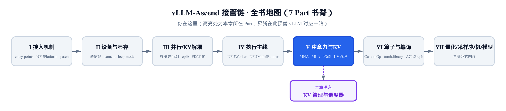
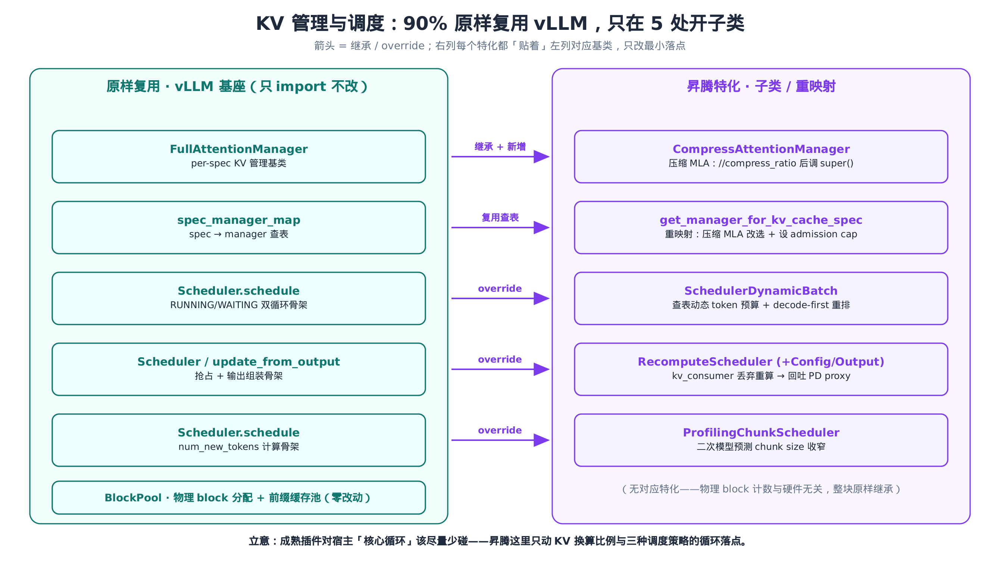
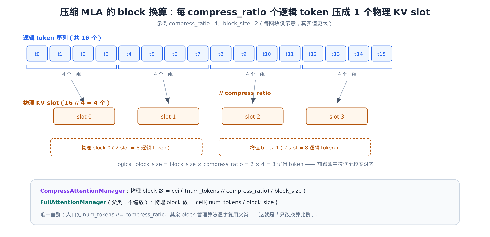
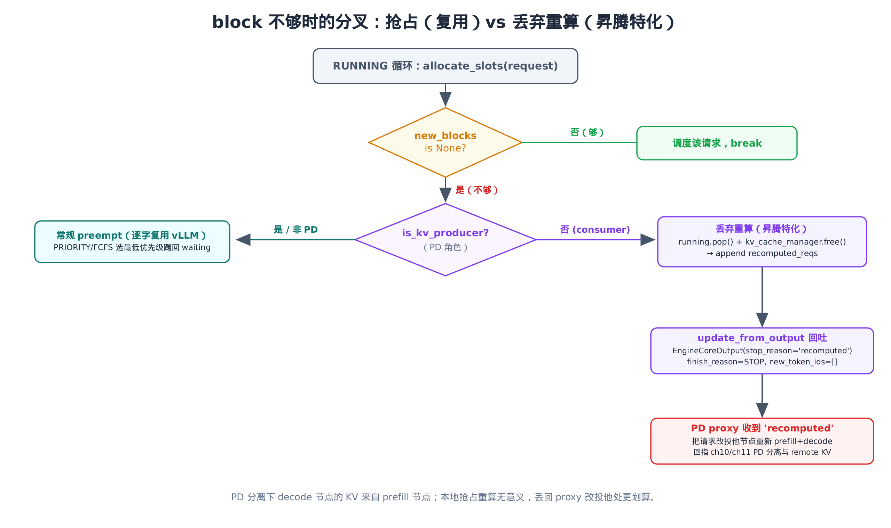
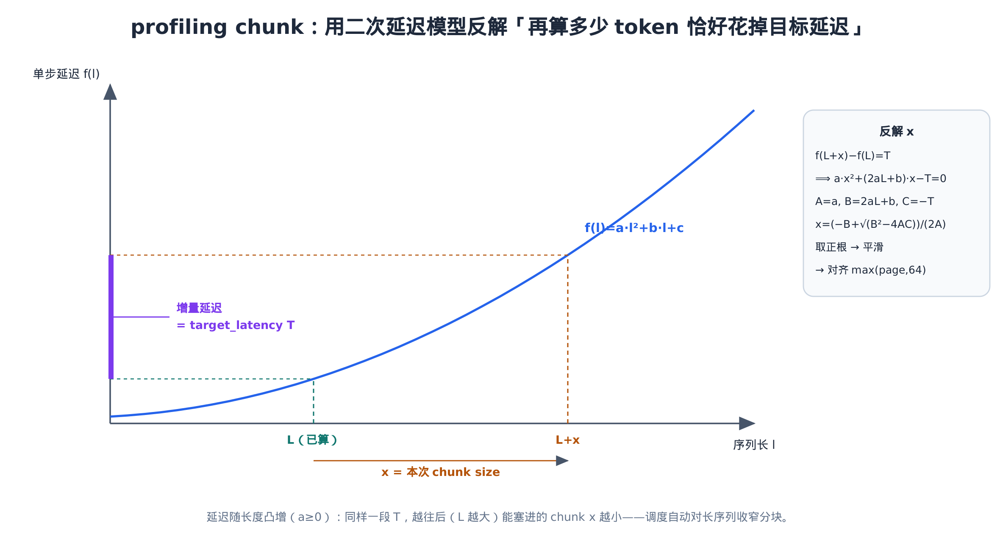

# 第 22 章 KV 管理与调度器的 NPU 特化：哪些原样复用，哪些必须特化



> 上一章看的是「加法」：SFA 与 DSA 在 vLLM 主干里根本不存在，是插件凭空新增的后端。
> 本章反过来，看的是「减法」：KV 分配与请求调度是引擎的核心循环，昇腾几乎原样继承。
> 关键看点：90% 复用、只在 5 处开子类——一个成熟插件该有的克制。

[第 20 章](../ch20-mla-on-npu/narrative/chapter.md)和[第 21 章](../ch21-sparse-attention-sfa-dsa/narrative/chapter.md)都是「重度特化」的样本：MLA 把整套注意力实现换掉、SFA/DSA 直接新起两条算法线。读到这里你大概会形成一个印象——昇腾插件就是「凡能改的都改」。这一章是个必要的纠偏。

KV cache 管理（`vllm/v1/core/single_type_kv_cache_manager.py`、`vllm/v1/core/block_pool.py`）和请求调度（`vllm/v1/core/sched/scheduler.py`）是 vLLM 引擎的**核心循环**：前者决定每个请求拿多少物理 block、命中多少前缀缓存，后者决定每一步前向喂哪些请求、各算多少 token。它俩跟硬件几乎无关——都是纯 Python 的 block 计数、哈希查表、队列调度。所以昇腾对它们的态度是：**能不碰就不碰**。

整章可以浓缩成一张图。



左列五个组件昇腾**一行不改**，只 `import` 进来用；右列五处是仅有的特化，且每一处都「贴着」左边对应的基类，只改最小落点。本章就沿着这五处特化走一遍，顺带把「为什么这几处非改不可、其余为什么能原样复用」讲清楚。这正好收束 Part V「注意力与 KV」，也示范一条容易被忽视的工程原则：**该复用就复用，别为改而改**。

承接[第 13 章 NPUWorker](../ch13-npuworker-execution-control/narrative/chapter.md) / [第 14 章 NPUModelRunner](../ch14-npumodelrunner-cuda-monkeypatch/narrative/chapter.md) / [第 15 章单步前向](../ch15-single-step-forward-context-dp-sync/narrative/chapter.md)——那三章讲「拿到一批已调度好的请求后怎么跑」，本章讲的是它们**上游**：这批请求是怎么被调度出来的、KV block 是怎么分配的。

## 22.1 入口：三个开关，默认一个都不拨

先看特化是从哪里注入的。调度器的选择落在启动期的 `check_and_update_config`（[第 5 章](../ch05-check-and-update-config/narrative/chapter.md)讲过这个统一改配置的钩子）里：

```python
# vllm_ascend/platform.py:L632
        if ascend_config.recompute_scheduler_enable:
            kv_transfer_config = vllm_config.kv_transfer_config
            kv_role = getattr(kv_transfer_config, "kv_role", None)
            if kv_transfer_config is None or kv_role == "kv_both":
                raise ValueError(
                    "recompute_scheduler_enable can only be enabled in PD-disaggregated mode "
                    "(kv_role='kv_producer' or 'kv_consumer'), and is not supported in PD-mixed mode."
                )
            from vllm_ascend.core.recompute_scheduler import RecomputeSchedulerConfig
            recompute_scheduler_config = RecomputeSchedulerConfig.initialize_from_config(vllm_config)
            vllm_config.scheduler_config = recompute_scheduler_config

        # Extend original scheduler_config to use SchedulerDynamicBatch.
        if ascend_config.SLO_limits_for_dynamic_batch != -1:
            vllm_config.scheduler_config.scheduler_cls = (
                "vllm_ascend.core.scheduler_dynamic_batch.SchedulerDynamicBatch"
            )
            vllm_config.scheduler_config.enable_chunked_prefill = True
            vllm_config.scheduler_config.SLO_limits_for_dynamic_batch = ascend_config.SLO_limits_for_dynamic_batch

        # Use ProfilingChunkScheduler when profiling-based chunk sizing is on.
        if ascend_config.profiling_chunk_config.enabled:
            vllm_config.scheduler_config.scheduler_cls = (
                "vllm_ascend.core.scheduler_profiling_chunk.ProfilingChunkScheduler"
            )
            # … 省略：import patch_profiling_chunk 的副作用补丁 …
```

三个 `if`，三个互斥的开关，对应三个昇腾子类：

| 开关（`ascend_config`） | 默认值 | 选中的调度器 | 用途 |
|---|---|---|---|
| `recompute_scheduler_enable` | `False` | `RecomputeScheduler` | PD 分离侧，block 不够时丢弃重算 |
| `SLO_limits_for_dynamic_batch` | `-1` | `SchedulerDynamicBatch` | 按 decode 负载查表动态调 token 预算 |
| `profiling_chunk_config.enabled` | `False` | `ProfilingChunkScheduler` | profiling 出最优 chunk size |

三者互斥：它们写的是**同一个槽位**——`scheduler_config.scheduler_cls`（recompute 那支更进一步，直接整体替换 `scheduler_config`）。三段 `if` 虽可同时为真、顺序执行，但同一时刻这个槽只能指向一个调度器类，后命中的覆盖先前的，最终只有一个生效；不是并行跑三个调度器。

注意三个默认值：`False` / `-1` / `False`——**默认一个都不拨**。也就是说，绝大多数部署里 `vllm_config.scheduler_config.scheduler_cls` 压根没被改，引擎跑的是 vLLM 原生的 `Scheduler`。三个子类都是「按需启用的特殊策略」，不是「昇腾默认换掉调度器」。这是「该复用就复用」的第一层证据：连入口都默认走原版。

`recompute` 那一支还多一道前置校验：`if kv_transfer_config is None or kv_role == "kv_both"` 就 `raise`——它只在 PD 分离模式（`kv_role` 是 `kv_producer` 或 `kv_consumer`）下才允许开，PD 混部（`kv_both`）或根本没配 KV 传输时一律拒绝。动机在「重算」对谁才有意义：PD 混部下，同一个节点既做 prefill 又做 decode，block 不够时本地重新 prefill 完全可行，用不着这套特化；只有纯 decode 节点（`kv_consumer`，KV 是从远端 prefill 节点拉来的）丢弃请求后无法在本地重算，才需要把它回吐 proxy 改投他处。这条约束本身就在说——recompute 是一个**强场景绑定**的特化，不是通用增强。

## 22.2 KV manager：复用查表，只重映射一个 spec

先交代一个贯穿本章的基本单位：**KV block 是 KV cache 的分配单位**，一个 block 容纳 `block_size` 个 token 的完整 KV 向量；调度器和 KV manager 都按 block 粒度分配、回收，从不按单个 token 记账。后面所有「要几个 block」「命中几个 block」的算账，都是在这个粒度上做的。

KV manager 那一侧的注入点不在 `platform.py`，而在一处 monkey-patch。`KVCacheCoordinator`（负责给每个 KV cache 组建 manager 的协调器）的构造被换成调用**昇腾版**的工厂：

```python
# vllm_ascend/patch/platform/patch_kv_cache_coordinator.py:L104
        self.single_type_managers = tuple(
            get_manager_for_kv_cache_spec(
                kv_cache_spec=kv_cache_group.kv_cache_spec,
                block_pool=self.block_pool,
                enable_caching=enable_caching,
                kv_cache_group_id=i,
                # … 省略：dcp/pcp world_size 等并行参数 …
                max_num_batched_tokens=max_num_batched_tokens,
                max_model_len=max_model_len,
            )
            for i, kv_cache_group in enumerate(self.kv_cache_config.kv_cache_groups)
        )
```

这里的 `get_manager_for_kv_cache_spec` 是昇腾自己的版本（从 `vllm_ascend.core.single_type_kv_cache_manager` 导入）。上面那个 `self.block_pool`——管物理 block 分配与前缀缓存的 `BlockPool`——则是 vLLM 原样构造的，昇腾一行没动。所谓前缀缓存（prefix cache），是指两个请求输入 prompt 的前缀相同时，复用已经算好的那段 KV：`BlockPool` 用一张哈希表记下每个 block 的内容指纹，新请求查表命中就直接挂上旧 block，省掉这段前缀的重算。

工厂本体也极克制：

```python
# vllm_ascend/core/single_type_kv_cache_manager.py:L236
# spec_manager_map 是 vllm/v1/core/single_type_kv_cache_manager.py 的模块级原生查表
def get_manager_for_kv_cache_spec(
    kv_cache_spec: KVCacheSpec,
    max_num_batched_tokens: int | None = None,
    max_model_len: int | None = None,
    **kwargs,
) -> SingleTypeKVCacheManager:
    # … 省略：docstring 交代 DSv4/DSA 背景与 vLLM issue #40863 死锁 …
    manager_class = spec_manager_map[type(kv_cache_spec)]
    if isinstance(kv_cache_spec, MLAAttentionSpec) and kv_cache_spec.compress_ratio > 1:
        manager_class = CompressAttentionManager
        if max_model_len is not None:
            # Compressed-MLA peak in blocks: ceil(max_model_len/compress/block).
            compress_ratio = kv_cache_spec.compress_ratio
            block_size = kv_cache_spec.block_size
            max_compressed_tokens = max_model_len // compress_ratio
            kwargs["max_admission_blocks_per_request"] = cdiv(max_compressed_tokens, block_size) + 1
    elif isinstance(kv_cache_spec, (SlidingWindowSpec, ChunkedLocalAttentionSpec)):
        # … 省略：SWA/ChunkedLocal 的 cap 重设（见下文）…
        if max_num_batched_tokens is not None and max_model_len is not None:
            kwargs["max_admission_blocks_per_request"] = kv_cache_spec.max_admission_blocks_per_request(
                max_num_batched_tokens=max_num_batched_tokens,
                max_model_len=max_model_len,
            )
    manager = manager_class(kv_cache_spec, **kwargs)
    return manager
```

第一行 `manager_class = spec_manager_map[type(kv_cache_spec)]` 直接查 **vLLM 原生**的那张 `spec_manager_map`——`FullAttentionSpec → FullAttentionManager`、`MLAAttentionSpec → FullAttentionManager`、`SlidingWindowSpec → SlidingWindowManager`……整张表昇腾不重建。工厂只做一件事：**对压缩 MLA spec（`compress_ratio > 1`）把 `manager_class` 改成 `CompressAttentionManager`**，其它 spec 一律放行用 vLLM 的 manager。

这就是右列「重映射」的全部含义：复用查表，只对一个 spec 类型 override。这里的 `MLAAttentionSpec`、`compress_ratio` 一路接的是 [第 4 章 AscendMLAAttentionSpec](../ch04-patch-engine-core-kvcache/narrative/chapter.md)和 [第 20 章 MLA](../ch20-mla-on-npu/narrative/chapter.md)——压缩 KV 是那两章埋下的，到这一层才需要一个专门的 block manager 来配它。

### 覆盖了父工厂，就得自己补上死掉的代码

`elif` 那支看着突兀：SWA / ChunkedLocalAttention 明明用的是 vLLM 原生 manager，为什么还要在这里给它们设 `max_admission_blocks_per_request`？

因为昇腾这个工厂**整个覆盖**了 vLLM 的同名工厂。vLLM 原本在它自己的工厂里给这两种「带回收的 spec」设了一个 admission 上限（vLLM PR #40946 引入），可昇腾的工厂顶替上来后，vLLM 那段设 cap 的代码就成了**永不到达的死代码**。不在这里补一遍，SWA / ChunkedLocal 组就没有 cap——`allocate_slots` 的 `full_sequence_must_fit` 分支会按整个 `max_model_len` 预留 block，并发一上去（cc≥2）直接耗尽 block 池（vLLM issue #40863 记录的死锁）。

这是「覆盖父类方法」的一个隐性代价：你接管了一个函数，就同时接管了它**所有**的职责，包括那些跟你的特化无关、但原版顺手做了的事。这条经验后面 §22.4 / §22.5 会反复撞见——昇腾几个 `schedule()` 子类之所以体量巨大，根子都在这。

## 22.3 CompressAttentionManager：只改换算比例

现在看右列唯一的「新增」manager。它继承 `FullAttentionManager`，构造函数只多存了两个字段：

```python
# vllm_ascend/core/single_type_kv_cache_manager.py:L28
# 父类 FullAttentionManager 定义于 vllm/v1/core/single_type_kv_cache_manager.py（原样复用）
class CompressAttentionManager(FullAttentionManager):
    def __init__(self, kv_cache_spec: MLAAttentionSpec, block_pool: BlockPool, **kwargs) -> None:
        super().__init__(kv_cache_spec, block_pool, **kwargs)
        self.compress_ratio = kv_cache_spec.compress_ratio
        self._null_block = block_pool.null_block

    def get_num_blocks_to_allocate(
        self,
        request_id: str,
        num_tokens: int,
        new_computed_blocks: Sequence[KVCacheBlock],
        total_computed_tokens: int,
        num_tokens_main_model: int,
        apply_admission_cap: bool = False,
    ) -> int:
        # … 省略：关于 MTP/EAGLE speculative 的注释 …
        num_tokens //= self.compress_ratio
        num_tokens_main_model //= self.compress_ratio
        return super().get_num_blocks_to_allocate(
            request_id, num_tokens, new_computed_blocks,
            total_computed_tokens, num_tokens_main_model, apply_admission_cap,
        )
```

看 `get_num_blocks_to_allocate`：两行 `num_tokens //= self.compress_ratio`，然后**原封不动调 `super()`**。这就是整个 manager 的设计母题——压缩 MLA 把每 `compress_ratio` 个逻辑 token 压成 1 个物理 KV slot，所以「要多少物理 block」这道题里的 `num_tokens` 先除以 `compress_ratio`，剩下的 block 计数逻辑跟全注意力**一模一样**，不必重写。

`allocate_new_blocks`、`cache_blocks` 也是同一个套路：入口处把 token 数除以 `compress_ratio`，主体调父类。把账算清楚就一目了然：



物理 block 数的两个公式只差一个除法：

$$
\mathrm{full}:\quad \mathrm{blocks} = \left\lceil \frac{\mathrm{num\_tokens}}{\mathrm{block\_size}} \right\rceil
$$

$$
\mathrm{compress}:\quad \mathrm{blocks} = \left\lceil \frac{\mathrm{num\_tokens} \mathbin{//} \mathrm{compress\_ratio}}{\mathrm{block\_size}} \right\rceil
$$

人话：压缩比 4 时，1024 个逻辑 token 只占 256 个 slot 的 KV——按 `block_size=128` 算，全注意力要 8 个 block，压缩 MLA 只要 2 个。manager 本身不懂「压缩」是什么物理含义，它只知道把 token 数缩小 4 倍再去数 block。

### 前缀命中：按「逻辑块」对齐

唯一比「除一下」复杂些的是前缀缓存命中。这是 manager 里改动最实的一处：

```python
# vllm_ascend/core/single_type_kv_cache_manager.py:L188
    @classmethod
    def find_longest_cache_hit(
        cls,
        block_hashes: BlockHashList,
        max_length: int,
        # … 省略：kv_cache_group_ids / block_pool / kv_cache_spec / use_eagle 等形参 …
        alignment_tokens: int,
        dcp_world_size: int = 1,
        pcp_world_size: int = 1,
    ) -> tuple[list[KVCacheBlock], ...]:
        # … 省略：被注释掉的 isinstance 断言 …
        computed_blocks: tuple[list[KVCacheBlock], ...] = tuple([] for _ in range(len(kv_cache_group_ids)))
        block_size = kv_cache_spec.block_size
        if dcp_world_size * pcp_world_size > 1:
            block_size *= dcp_world_size * pcp_world_size
        logical_block_size = block_size * kv_cache_spec.compress_ratio
        logical_block_hashes = BlockHashListWithBlockSize(block_hashes, block_size, logical_block_size)
        max_num_blocks = max_length // logical_block_size
        for block_hash in itertools.islice(logical_block_hashes, max_num_blocks):
            if cached_block := block_pool.get_cached_block(block_hash, kv_cache_group_ids):
                for computed, cached in zip(computed_blocks, cached_block):
                    computed.append(cached)
            else:
                break
        # … 省略：use_eagle 丢最后一块、alignment_tokens 对齐尾块的两段收尾 …
        return computed_blocks
```

关键是 `logical_block_size = block_size * kv_cache_spec.compress_ratio`。动机就在压缩本身：压缩 MLA 把多个逻辑 token 压进同一个物理 slot，于是前缀复用时两个请求的对齐边界必须按**逻辑块**单位算、而不是物理块，否则共享缓存的边界会错位——这正是引入 `logical_block_size = block_size × compress_ratio` 的理由。父类 `FullAttentionManager` 直接按物理 `block_size` 找命中；这里乘上 `compress_ratio`，命中的边界就抬到逻辑块——一个物理 block 对应 `compress_ratio` 倍的逻辑 token，错位半个 block 命中就废了。`max_num_blocks = max_length // logical_block_size` 也跟着用逻辑块大小来截断。

至于 §22.2 给压缩 MLA 设的那个 `max_admission_blocks_per_request`，背后是一道简单的上界：

$$
\mathrm{peak\_blocks} = \left\lceil \frac{\mathrm{max\_model\_len} \mathbin{//} \mathrm{compress\_ratio}}{\mathrm{block\_size}} \right\rceil + 1
$$

压缩 MLA 的 KV 不像 SWA 那样随窗口滑动回收，但它也**永不超过**这个峰值。把 admission 上限钉在这里，就和启动期 block 池的尺寸算法对齐了——长输入请求不会被 `allocate_slots` 静默拒掉、卡死在 waiting 队列里。

到此 KV manager 这一侧讲完了，回头数一下账：`BlockPool`、`SingleTypeKVCacheManager`、`FullAttentionManager`、`spec_manager_map`——四样原样复用；`get_manager_for_kv_cache_spec` 重映射、`CompressAttentionManager` 新增——两处特化，且后者的全部覆写就是「`//= compress_ratio` 后调 super()」。这就是「核心循环尽量少碰」的标准姿势。

## 22.4 SchedulerDynamicBatch：动态预算 + decode 优先

接下来三节是三个调度器子类。它们有一个共同的、反直觉的特点：**改动极小，文件却极大**。先用最简单的 `SchedulerDynamicBatch` 把这个矛盾讲透。

它对 vLLM `Scheduler` 只有两处实质改动。第一处是动态 token 预算，靠一个 `BudgetRefiner`。`BudgetRefiner` 启动时读一张 `profile_table.csv`（含 `ctx_len` / `d_num` / `cost` / `chunk_size` 几列），`groupby` 整理成一张查找表，运行时按当前 decode 负载查表。这张表由**离线** profiling 预先生成、随包放在 `core/` 目录下；本类只用 `pd.read_csv` 读它的结果、**不负责生成**——文件缺失时只记一条 error 日志、把 `enabled` 置回 `False` 退到静态预算（源码注释直接写「Please download the corresponding table file」）：

```python
# vllm_ascend/core/scheduler_dynamic_batch.py:L83
    def _align_key(self, value, valid_keys):
        """Align the minimum value within the valid_keys that is greater than the value."""
        for k in valid_keys:
            if k >= value:
                return k
        return None

    def _get_max_budget(self, num_decode_tokens, num_decode):
        aligned_ctx = self._align_key(num_decode_tokens, self.context_keys)
        aligned_dnum = self._align_key(num_decode, self.dnum_keys)
        if aligned_ctx is None or aligned_dnum is None:
            return self.default_budget
        budget = self.lookup.get((aligned_ctx, aligned_dnum), None)
        if budget is None:
            logger.warning("Table miss for ctx,dnum%s", (aligned_ctx, aligned_dnum))
            budget = self.default_budget
        return budget

    def refine_budget(self, running_request, budget):
        if not self.enabled:
            return budget
        # assume all running request will be scheduled.
        num_decode_token_lst = [
            req.num_tokens_with_spec for req in running_request if req.num_computed_tokens >= req.num_prompt_tokens
        ]
        num_decode = len(num_decode_token_lst)
        if num_decode <= 0:
            return budget
        num_decode_tokens = sum(num_decode_token_lst) / num_decode
        return self._get_max_budget(num_decode_tokens, num_decode)
```

逻辑链很短：`refine_budget` 从当前 `running` 里挑出 decode 请求（`num_computed_tokens >= num_prompt_tokens`，即已过 prefill），算出「平均 decode 上下文长度」和「decode 请求数」两个画像值；`_get_max_budget` 把这两个值各自向上对齐到表里最近的档位键，查出该格的预算。

先注意第一行的逃生门：`if not self.enabled: return budget`。`enabled = slo_limit > 0`，没配 `SLO_limits_for_dynamic_batch` 时 `refine_budget` **恒等返回**传进来的预算——零开销。这又是一处「默认不改变行为」的设计：特化只在你显式开启 SLO 约束时才生效。

把查表过程摆成两拍看它怎么动。设表里 `context_keys = {1024, 4096}`、`dnum_keys = {8, 16}`，`default_budget = 16384`，查找表如下：

| `(ctx, dnum)` | `(1024, 8)` | `(1024, 16)` | `(4096, 8)` | `(4096, 16)` |
|---|---|---|---|---|
| budget | 8192 | 4096 | 4096 | 2048 |

| 拍 | running 里的 decode 画像 | `num_decode` | 平均 ctx | 对齐后 `(ctx,dnum)` | 查得 budget | 相对 default |
|---|---|---|---|---|---|---|
| 1 | 8 个 decode，平均上下文 ~900 | 8 | 900→1024 | (1024, 8) | **8192** | 砍半 |
| 2 | 16 个 decode，平均上下文 ~3000 | 16 | 3000→4096 | (4096, 16) | **2048** | 砍到 1/8 |

读这两拍：decode 请求越多、上下文越长，查出的 token 预算就越小。为什么？因为 decode 阶段对延迟最敏感（每步只出 1 个 token，用户在等下一个字）。decode 负载重时，调度器主动**收紧** prefill 能吃的 token 量，给 decode 让出算力和时间——这就是「dynamic batch」的意图：用一张离线 profiling 表，把「当前该给 prefill 多少预算」做成查表，而不是写死一个常数。

第二处改动是 decode 优先重排，它和动态预算一起，构成 `schedule()` 仅有的两处「ASCEND CHANGE」：

```python
# vllm_ascend/core/scheduler_dynamic_batch.py:L171
        token_budget = self.max_num_scheduled_tokens
        token_budget = self.budget_refiner.refine_budget(self.running, token_budget)

        # NOTE: We move the prefill requests to the end of the self.running
        # list and keep the relative order unchanged. This rearrangement makes this
        # scheduling algorithm a strict decode-first chunked prefills.
        d_lst = [req for req in self.running if req.num_computed_tokens >= req.num_prompt_tokens]
        p_lst = [req for req in self.running if req.num_computed_tokens < req.num_prompt_tokens]
        self.running = d_lst + p_lst
```

把 `self.running` 重排成「decode 全在前、prefill 全在后，各自保序」。下游的 RUNNING 循环按这个顺序逐个分预算，于是 decode 永远先吃饱、prefill 捡剩下的——严格的 decode-first chunked prefill。为什么值得这样偏袒 decode？因为 decode 阶段对延迟最敏感——每步只产 1 个 token、是用户逐字看到的输出，慢一拍就直接体感卡顿；所以优先保住 decode 的算力，让对单步延迟不敏感的 prefill 捡剩下的。

### 为什么改两处，却要重抄四百行

这就来到那个矛盾。`schedule()` 这个方法在 `scheduler_dynamic_batch.py` 里有四百多行，可上面圈出的「实质改动」只有这七八行。其余的呢？

```python
# vllm_ascend/core/scheduler_dynamic_batch.py:L151
    def schedule(self) -> SchedulerOutput:
        # … 上面两处 ASCEND CHANGE …

        # 此处省略 ~400 行：RUNNING 循环、WAITING 循环、约束断言、
        # SchedulerOutput 组装——逐字复刻 vllm/v1/core/sched/scheduler.py 的
        # Scheduler.schedule，非昇腾特化。

        return scheduler_output
```

那四百行的骨架是两段循环：RUNNING 循环逐个为运行中（已在跑）的请求分配本步的 token 预算与 KV block、推进 decode；WAITING 循环再把等待队列里的新请求拉起来、起 prefill。读这种文件知道这个整体框架就够了，不必逐行追那四百行。它整段是 vLLM `Scheduler.schedule` 的**逐字复制**。原因很硬核：Python 没法「热补一个方法内部的某几行」。`refine_budget` 这处改动夹在 `schedule()` 长方法的开头、decode-first 重排紧随其后，下面的 RUNNING 循环又要用重排后的 `self.running`——这些改动点全在方法**体内**，不是能靠覆写一个小函数就钩进去的接缝。于是昇腾只能把整个 `schedule()` 抄下来，在抄本里插进自己的两处改动。

理解了这一点，本章「改动小、文件大」的悖论就解开了：**文件体量 ≠ 特化程度**。`scheduler_dynamic_batch.py` 几百行里，真正属于昇腾的不到十行，其余都是为了「能在方法中段插一脚」而付的复制税。读这种文件别被行数吓住——盯住 `ASCEND CHANGE` 注释，跳过逐字复刻段就行。

## 22.5 RecomputeScheduler：把「抢占」改成「丢弃重算」

`RecomputeScheduler` 是 PD 分离侧的调度器，承接[第 10 章 PD 分离](../ch10-pd-disaggregation-mooncake/narrative/chapter.md)和[第 11 章 KV 池化](../ch11-kv-pooling-ascend-store/narrative/chapter.md)。它的核心特化只有一个想法：**当 block 不够时，decode 节点不做本地抢占，而是把请求丢回 PD proxy 让别处重算**。这里的「重算」要先消歧：它**不是**在本节点重新计算，而是 `running.pop()` 摘掉请求、`kv_cache_manager.free()` 释放它的 KV，再回吐一个 `stop_reason='recomputed'` 的 `EngineCoreOutput`，由 PD proxy 把请求改投到有余量的节点、从头走一遍 prefill+decode（PD 分离与 remote KV 的来龙去脉见[第 10 章](../ch10-pd-disaggregation-mooncake/narrative/chapter.md)、[第 11 章](../ch11-kv-pooling-ascend-store/narrative/chapter.md)）。

先看这个分叉长什么样：



代码落在 RUNNING 循环里 `allocate_slots` 失败之后：

```python
# vllm_ascend/core/recompute_scheduler.py:L322
            with record_function_or_nullcontext("schedule: allocate_slots"):
                while True:
                    new_blocks = self.kv_cache_manager.allocate_slots(
                        request, num_new_tokens, num_lookahead_tokens=self.num_lookahead_tokens,
                    )
                    if new_blocks is not None:
                        # The request can be scheduled.
                        break

                    # The request cannot be scheduled.
                    # NOTE: We add the preempted_req to recomputed_reqs in kv_consumer to
                    # drop the request to PD proxy.
                    transfer_config = self.vllm_config.kv_transfer_config
                    if transfer_config is not None and not transfer_config.is_kv_producer:
                        recomputed_req = self.running.pop()
                        self.kv_cache_manager.free(recomputed_req)
                        recomputed_reqs.append(
                            RecomputeReqInfo(
                                recomputed_req.request_id, recomputed_req.output_token_ids, recomputed_req.client_index
                            )
                        )
                        if recomputed_req == request:
                            break
                    # … 省略：else 分支——kv_producer 侧或非 PD 走常规 PRIORITY/FCFS preempt …
```

`if transfer_config is not None and not transfer_config.is_kv_producer` 这个条件成立，就是当前节点是 **kv_consumer**（decode 侧）。这时它不调 vLLM 原本的 `_preempt_request`（把请求踢回 waiting 队列、保留状态等下次重排），而是：`running.pop()` 摘掉队尾请求、`kv_cache_manager.free()` 立刻还掉它的 KV、把它的身份信息装进一个 `RecomputeReqInfo` 记进 `recomputed_reqs`。`else` 分支（kv_producer 侧或非 PD 场景）则是 vLLM 原版的抢占逻辑，逐字复刻。

**为什么 consumer 侧要这么干？** PD 分离下，decode 节点的 KV 不是它自己 prefill 出来的，而是从 prefill 节点拉过来的。本地抢占的语义是「先放一放、待会儿在本地重新算」——可 decode 节点本就不负责 prefill，本地重算无从谈起。更划算的做法是把这个请求**整个丢回 PD proxy**，由 proxy 改投到有空闲的节点重新走一遍 prefill+decode。

丢回的动作在 `update_from_output` 收尾：

```python
# vllm_ascend/core/recompute_scheduler.py:L831
        # return recomputed requests as EngineCoreOutput
        if scheduler_output.recomputed_reqs is not None:
            for req_info in scheduler_output.recomputed_reqs:
                logger.warning("Recompute triggered for request %s.", req_info.request_id)
                outputs[req_info.client_index].append(
                    EngineCoreOutput(
                        request_id=req_info.request_id,
                        finish_reason=FinishReason.STOP,
                        new_token_ids=[],
                        stop_reason="recomputed",
                    )
                )
```

被丢弃的请求以一个特殊的 `EngineCoreOutput` 回吐：没有新 token，`finish_reason=STOP`，但带一个约定的 `stop_reason="recomputed"`。PD proxy 看到这个暗号就明白「这不是正常结束，是 decode 节点容量不够，请改投他处」。这套 `recomputed_reqs` 数据流贯穿三个类：`RecomputeReqInfo` 装单个请求、`RecomputeSchedulerOutput`（`SchedulerOutput` 子类）在调度输出里多带一个 `recomputed_reqs` 字段、`update_from_output` 负责把它回吐。

### 这个 while 循环为什么一定会停

`while True` 配上 `running.pop()`，第一反应是「会不会转不出去」。不会。一句话先说骨架：每一轮没 break 的迭代必然执行一次 `self.running.pop()`，running 严格变短一格；`len(running)` 是个非负整数、单调递减，有限步内必然触底；而当前 `request` 始终在 `running` 里，pop 到它本身（`recomputed_req == request`）就 break——最坏情况一路 pop 到把 `request` 自己也摘掉为止，故必停。于是循环要么因为 `free` 腾出空间、`allocate_slots` 成功而提前 break，要么因为 pop 到 `request` 自己而 break，**绝不空转**。

关键记号要对准：`pop()` 摘的是**队尾**（最右），所以受冲击的是队列末端的请求。设 `running = [R1=request, R2, R3, …, R_tail]`——把 `request` 摆在队头，这是最坏情形：得一路 pop 到头才轮到它。`pop()` 从队尾 `R_tail` 起、一格格往前摘：

| 轮 | `allocate_slots` | 动作（`pop()` 摘队尾） | `running` 长度 | `recomputed_reqs` | 是否 break |
|---|---|---|---|---|---|
| 1 | None | pop `R_tail`（非 request）→ `free` 还 KV → 记入 | n → n−1 | +R_tail | 否 |
| 2 | None（仍不够） | pop 次队尾（非 request） | n−1 → n−2 | 再 +1 | 否 |
| … | None | 继续从队尾往前摘（都非 request） | 逐格递减 | 持续累加 | 否 |
| k | None | pop 出的正是队头 `request` | 1 → 0 | +request | **是**（`==request`）|

每一轮要么腾出 KV 后 `allocate_slots` 成功、要么队列严格缩短一格——终止性就来自那个单调递减的非负长度：pop 到 `request` 自己时一定收敛。

### 两块「时序」补丁

`RecomputeScheduler` 还带两处不属于主线、但很说明问题的细节。一是 `RecomputeSchedulerConfig`，它按 `async_scheduling` 决定最终用哪个类：

```python
# vllm_ascend/core/recompute_scheduler.py:L76
@dataclass
class RecomputeSchedulerConfig(SchedulerConfig):
    scheduler_cls: str | type[object] = "vllm_ascend.core.recompute_scheduler.RecomputeScheduler"

    @classmethod
    def initialize_from_config(cls, vllm_config: VllmConfig):
        vllm_scheduler_config = vllm_config.scheduler_config
        scheduler_config = {
            field.name: getattr(vllm_scheduler_config, field.name)
            for field in fields(vllm_scheduler_config) if field.init
        }
        if vllm_scheduler_config.async_scheduling:
            scheduler_config["scheduler_cls"] = "vllm_ascend.core.recompute_scheduler.AsyncRecomputeScheduler"
        else:
            scheduler_config["scheduler_cls"] = "vllm_ascend.core.recompute_scheduler.RecomputeScheduler"
        scheduler_config["max_model_len"] = vllm_config.model_config.max_model_len
        scheduler_config["is_encoder_decoder"] = vllm_config.model_config.is_encoder_decoder
        return cls(**scheduler_config)
```

开了异步调度就选 `AsyncRecomputeScheduler`，否则 `RecomputeScheduler`。那个异步版本用一行多继承把两件事拼起来：

```python
# vllm_ascend/core/recompute_scheduler.py:L1088
class AsyncRecomputeScheduler(AsyncScheduler, RecomputeScheduler):
    def __init__(self, *args, **kwargs):
        register_ascend_mla_spec_in_manager()
        super().__init__(*args, **kwargs)
```

MRO 是 `AsyncRecomputeScheduler → AsyncScheduler → RecomputeScheduler → Scheduler`：`schedule()` 沿 MRO 命中 `RecomputeScheduler.schedule`（拿到 recompute 分叉），而异步调度专属的 `_update_after_schedule` 之类落到 `AsyncScheduler`。一个类同时拿到「异步」和「重算」两套行为，没复制一行代码——这是多继承组合用得恰当的样本。

二是构造函数开头那句 `register_ascend_mla_spec_in_manager()`，专治一个 import 时序坑：

```python
# vllm_ascend/core/recompute_scheduler.py:L65
def register_ascend_mla_spec_in_manager():
    import sys as _sys
    from vllm.v1.core.single_type_kv_cache_manager import FullAttentionManager
    from vllm.v1.kv_cache_interface import MLAAttentionSpec as AscendMLAAttentionSpec

    _stm = _sys.modules.get("vllm.v1.core.single_type_kv_cache_manager")
    if _stm is not None and AscendMLAAttentionSpec not in _stm.spec_manager_map:
        _stm.spec_manager_map[AscendMLAAttentionSpec] = FullAttentionManager
```

`spec_manager_map`（§22.2 那张查表）的键是**类对象**，在模块 import 时绑定。PD 场景下，`EngineCoreProc` 子进程 unpickle 一个 `AscendMLAAttentionSpec` 实例时，那张表可能还没把这个 spec 类登记进去，于是后面拿 `type(实例)` 去查表就 `KeyError`。补丁很轻：每次调度器构造时，若发现表里缺这个键，就补登记一份指向 `FullAttentionManager`。这类「为绕过 vLLM 内部时序而打的小补丁」，是 OOT 插件的家常便饭——[第 3 章两段式 monkey-patch](../ch03-two-stage-monkey-patch/narrative/chapter.md)讲的就是这套打补丁的纪律。

## 22.6 ProfilingChunkScheduler：用二次模型在线选 chunk size

第三个子类 `ProfilingChunkScheduler` 解决的是另一个问题：**chunked prefill 每次切多大一块最合适？** 切太大，单步前向延迟飙高、拖累同批的 decode；切太小，调度开销摊不平。它的答案是——启动期实测、运行期反解。

机制分两段。启动期 `run_profiling_chunk_init` 用真实前向跑几个不同长度的 prefill、量出延迟，拟合一条二次曲线：

```python
# vllm_ascend/core/scheduler_profiling_chunk.py:L106 —— 启动期 profiling（骨架）
    def run_profiling_chunk_init(self, model_executor) -> None:
        # … 省略：collective_rpc('profile_prefill_latency') 对多个 chunk size 采样，
        #          收集 seq_lens / latencies（PP rank/warm-up/异常细节）…
        predictor = self.profiling_chunk_manager.predictor
        if not predictor.fit(seq_lens, latencies):
            return
        predictor.set_target_latency(base_chunk_size)
        predictor.is_ready = True
        self.profiling_chunk_manager._profiling_done = True
```

拟合的模型是 `f(l) = a·l² + b·l + c`（`a, b ≥ 0`，最小二乘拟合采样点）——prefill 单步延迟随序列长 `l` 大致二次增长。运行期调度时，给定「目标延迟 T」和「已算长度 L」，反解「再算多少 token（chunk `x`）恰好花掉 T」：



要求 `f(L+x) − f(L) = T`，展开就是一个一元二次方程：

$$
a \cdot x^2 + (2aL + b)\cdot x - T = 0
$$

取正根。`ChunkSizePredictor.predict` 把这套解出来：

```python
# vllm_ascend/core/profiling_chunk_predictor.py:L222
    def predict(self, num_computed_tokens: int, base_chunk_size: int, page_size: int) -> int | None:
        if not self.is_ready or self.target_latency is None:
            return None
        if self.quadratic_coeff_a <= 0:
            return None
        A = self.quadratic_coeff_a
        B = 2 * self.quadratic_coeff_a * num_computed_tokens + self.linear_coeff_b
        C = -self.target_latency
        discriminant = B * B - 4 * A * C
        if discriminant < 0:
            return None
        sqrt_disc = math.sqrt(discriminant)
        x = (-B + sqrt_disc) / (2 * A)
        if x <= 0:
            return None
        smoothed = base_chunk_size + self.smooth_factor * (x - base_chunk_size)
        chunk_size = max(int(smoothed), self.min_chunk)
        align = max(page_size, 64)
        chunk_size = ((chunk_size + align - 1) // align) * align
        # … 省略：低于 align 的兜底，返回 chunk_size …
        return chunk_size if chunk_size >= align else None
```

`A=a`、`B=2aL+b`、`C=−T`，标准求根公式 `x=(−B+√(B²−4AC))/(2A)`，再经 `smooth_factor` 平滑、`min_chunk` 兜底、对齐到 `max(page_size, 64)`。

代入数值看「越长越收窄」。设拟合出 `a = 1e-5`、`b = 0.05`，目标延迟 `T = 200`（ms）：

| 已算长度 L | `B = 2aL+b` | 判别式 `B²−4AC` | 正根 x ≈ |
|---|---|---|---|
| 1000 | 0.07 | 0.0129 | **2179** |
| 16000 | 0.37 | 0.1449 | **533** |

同样一段 200ms 的延迟预算，已算 1000 token 时还能再吃约 2179 个，已算到 16000 token 时只能再吃约 533 个。这就是二次模型的价值：**延迟随长度凸增**，所以越往后、单位 token 越贵，调度自动把 chunk 收窄——比写死一个固定 chunk size 更贴合真实算力曲线。（这两个原始正根之后还会过 `smooth_factor` 与 `min_chunk`，最终落到 page 对齐的整数。）

调度时的接法和前两个子类同构——在 `schedule()` 抄本里插改动点：

```python
# vllm_ascend/core/scheduler_profiling_chunk.py:L316
            # >>> PROFILING CHUNK: dynamic chunk sizing for RUNNING >>>
            if (
                self.profiling_chunk_manager is not None
                and self.profiling_chunk_manager.is_ready
                and num_new_tokens > 1
                and request.num_computed_tokens > 0
            ):
                predicted_chunk = self.profiling_chunk_manager.predict_chunk_size(
                    num_computed_tokens=request.num_computed_tokens,
                    target_time=time_budget,
                )
                if predicted_chunk is not None and predicted_chunk > 0:
                    num_new_tokens = min(predicted_chunk, num_new_tokens)
            # <<< PROFILING CHUNK <<<
```

预测出的 `predicted_chunk` 只用来**收窄** `num_new_tokens`（`min(...)`），不会放大——profiling 没就绪（`is_ready` 为假）时整段跳过，行为退回原版。又是熟悉的「默认不改变行为」。

值得点破一处「未完全启用」的实情：源码里 `time_budget` 被硬编码成 `0.01`、`target_latency` 那条路径用注释关掉了。原因写在注释里——FIA 算子在多请求组同批时性能异常，按目标延迟动态记账的那条路暂时禁用，`time_budget = 0.01` 只是个「非零守卫」让循环条件 `time_budget > 0` 恒成立。还有一套 history-aware 的拟合变体，默认 `with_history_ready=False`、调度路径走不到。换句话说，`ProfilingChunkScheduler` 是三个子类里成熟度最低的一个——二次模型的骨架完整可读，但「按实测延迟实时调」那半步还在等算子修复。把它如实标出来，比假装它已全功能上线诚实。

## 22.7 没细讲的：KV offload 这类重度减法支线

最后点一笔本章**没有**展开的东西。昇腾在 KV 这块还有一条更重的支线：KV offload（把 KV 卸到 host CPU，见[第 12 章](../ch12-kv-offloading-host-cpu/narrative/chapter.md)），底下甚至有 CPU offload 的多套 manager 实现。它们体量比本章任何一个文件都大。

为什么不逐行讲？因为它们和本章立意是**两条线**。本章问的是「KV 分配与请求调度的核心循环，昇腾碰了哪几处」；KV offload 问的是「显存放不下时往哪挪」——那是另一个故事，自有它的章节。这里只需点明一件事：offload 的 manager 同样**复用** `vllm_ascend/core/single_type_kv_cache_manager.py` 里的 `get_manager_for_kv_cache_spec` 这个重映射入口接进来，底下仍坐在 vLLM 原生的 `vllm/v1/core/block_pool.py` 之上，不另起炉灶。点到代表、不逐行铺开，本身也是「只做减法」的一种——讲清边界，不为凑全而稀释主线。

## 小结：克制是一种设计

把本章五处特化连起来看，会发现它们有个共同的形状：每一处都**贴着**一个 vLLM 基类/基方法，只改最小的那个落点。

- `CompressAttentionManager`（`vllm_ascend/core/single_type_kv_cache_manager.py`）：贴着 `vllm/v1/core/single_type_kv_cache_manager.py` 的 `FullAttentionManager`，只在入口 `//= compress_ratio`；
- `get_manager_for_kv_cache_spec`：贴着 `spec_manager_map`，只对压缩 MLA 一个 spec 改选；
- 三个 `Scheduler` 子类：贴着 `vllm/v1/core/sched/scheduler.py` 的 `Scheduler.schedule`，各自只插一两处改动点——动态预算、丢弃重算、chunk 收窄。

其余的——`vllm/v1/core/block_pool.py` 的 `BlockPool`、`SingleTypeKVCacheManager`、调度的双循环骨架、输出组装——**整块原样继承**。那些上百行的逐字复刻不是「也改了」，而是 Python「没法热补方法中段」逼出来的复制税：文件大，特化小。

这正好和 [ch20 的 MLA](../ch20-mla-on-npu/narrative/chapter.md)、[ch21 的 SFA/DSA](../ch21-sparse-attention-sfa-dsa/narrative/chapter.md) 形成对照。那两章是「重度特化」：注意力的**计算**强绑硬件——什么算子、怎么排布、怎么吸收权重——昇腾必须深改。而 KV 分配和请求调度是**设备无关的控制流**：数 block、查哈希、排队列，跟是 NPU 还是 GPU 没关系，于是昇腾选择几乎不碰。

一个成熟插件对宿主核心循环的正确态度，不是「能改的都改」，而是**分清哪些必须改、哪些不该改**。该复用就复用，别为改而改——这份克制，和上一章的「大胆新增」并不矛盾：它们是同一种判断力的两面。Part V 至此收束。下一章起进入 Part VI「算子与编译」，从「调度与 KV 这层控制流」往下，走到真正落到昇腾算子的那一层——CustomOp、`torch.library`、ACLGraph。
