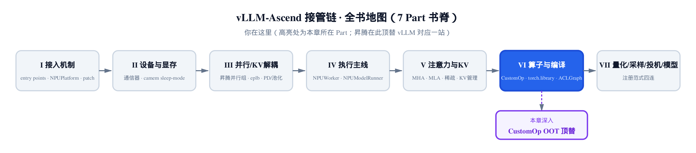
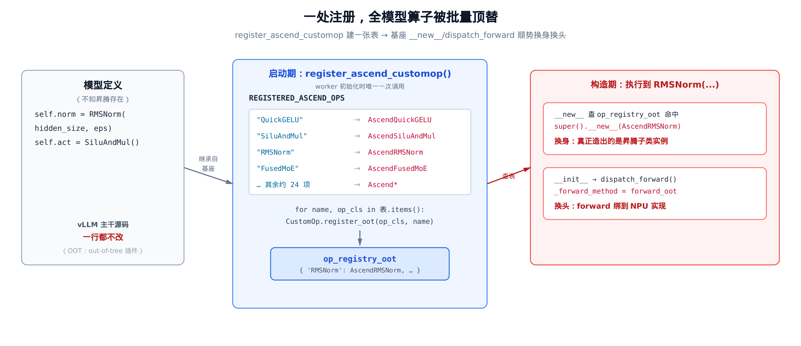
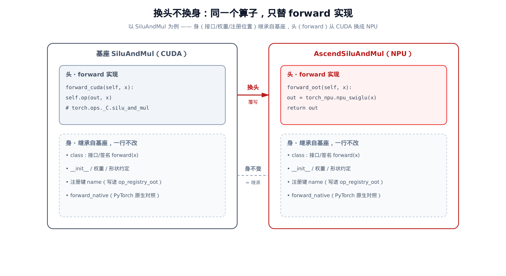
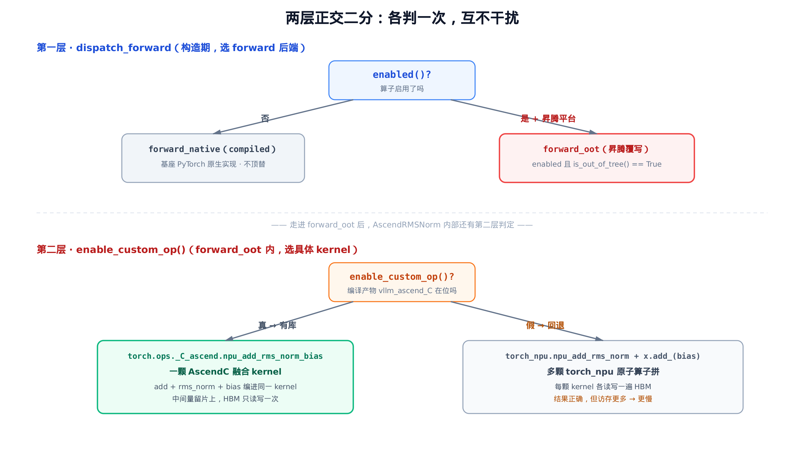

# 第 23 章 CustomOp 的 OOT 顶替：昇腾算子如何替换 vLLM 算子



> 前五个 Part 接管的是「外围」：平台、设备、并行、执行、注意力。
> 从这一章起，进入算子与编译层——模型真正算数的地方。
> 本章解决一个总问题：不改 vLLM 模型一行，怎么把算子换成昇腾实现。

打开任意一个 vLLM 模型定义，你会看到这样的代码：归一化层写 `RMSNorm(hidden_size, eps)`，激活层写 `SiluAndMul()`。这些类来自 vLLM 主干，实现是 CUDA。昇腾要让模型在 NPU 上跑，第一个绕不开的问题是：**这些算子怎么换成 NPU 实现？**

最笨的办法是把模型代码 fork 一份，挨个改。但 vLLM 有上百个模型，且天天更新——fork 等于自杀。昇腾插件（OOT，out-of-tree，即不在 vLLM 主仓里的树外插件）选的是另一条路：**模型定义一行不改，靠一张注册表，在算子被实例化的瞬间把它「掉包」成昇腾子类。**

这一章拆开这套顶替机制，主角是两份源码：插件侧的 `vllm_ascend/utils.py` 建表、基座侧的 `vllm/model_executor/custom_op.py` 完成掉包。它分两层：第一层是**注册表总开关**，一处调用、全模型算子批量换头；第二层藏在每个昇腾算子内部，决定走不走编译出来的融合 kernel（kernel——NPU 上执行的单个计算函数）。理解了这两层，Part VI 后面几章（算子注册、ACLGraph 编译、FusedMoE）都是在这个骨架上长出来的细节。

整章的总览先放这里，后面逐段拆。



> *图注：左边模型代码不知昇腾存在；中间 `register_ascend_customop` 在启动期建一张表、遍历写进基座的 `op_registry_oot`；右边构造算子时，基座的 `__new__` 顺势换身、`dispatch_forward` 顺势换头。模型代码 0 改动。*

## 23.1 一处调用：register_ascend_customop

顶替的入口只有一处，在 worker 初始化时被调一次：

```python
# vllm_ascend/worker/worker.py:L110
        register_ascend_customop(vllm_config)
```

就这一行。它之后，整个模型里所有继承自 `CustomOp` 的算子——RMSNorm、SiluAndMul、FusedMoE……二十多种——的实现，全部被换成昇腾版。我们先看这个总开关做了什么：

```python
# vllm_ascend/utils.py:L638
def register_ascend_customop(vllm_config: VllmConfig | None = None):
    """Register Ascend CustomOP

    NOTE: if the register branch requires model type, please use `vllm.config.get_current_vllm_config`,
    and ensure this will execute after model config is initilazed.
    """
    global _ASCEND_CUSTOMOP_IS_REIGISTERED
    if _ASCEND_CUSTOMOP_IS_REIGISTERED:
        return
    from vllm.model_executor.custom_op import CustomOp

    from vllm_ascend.ops.activation import (
        AscendQuickGELU,
        AscendSiluAndMul,
        AscendSiluAndMulWithClamp,
    )
    from vllm_ascend.ops.layernorm import AscendGemmaRMSNorm, AscendRMSNorm, AscendRMSNormGated
    from vllm_ascend.ops.fused_moe.fused_moe import AscendFusedMoE
    # … 省略：linear / rotary_embedding / mla / vocab_parallel_embedding 等约 20 个 Ascend* 子类的 import …

    global REGISTERED_ASCEND_OPS
    REGISTERED_ASCEND_OPS = {
        "QuickGELU": AscendQuickGELU,
        "SiluAndMul": AscendSiluAndMul,
        "RMSNorm": AscendRMSNorm,
        "FusedMoE": AscendFusedMoE,
        # … 省略：其余约 23 项「vLLM 类名字符串 → Ascend 子类」映射 …
    }
```

`REGISTERED_ASCEND_OPS` 是这套机制的数据核心：一张普通的 `dict`。**键是 vLLM 算子的类名字符串**（如 `"RMSNorm"`、`"SiluAndMul"`），**值是对应的昇腾子类**（如 `AscendRMSNorm`、`AscendSiluAndMul`）。整张表说的就是一件事：「凡是 vLLM 里叫 `RMSNorm` 的算子，请改用 `AscendRMSNorm`。」

注意键是**类名**而非 lowercase 注册名。vLLM 主干给 RMSNorm 的注册名是 `"rms_norm"`（小写带下划线），昇腾这里用的是类名 `"RMSNorm"`——这个差别后面 §23.5 会派上用场。

建好表，接下来是真正的顶替动作：

```python
# vllm_ascend/utils.py:L726
    # 310P: override selected ops with 310P implementations (keep minimal changes outside _310p)
    if is_310p():
        # … 省略：import 一批 *310 子类，再 REGISTERED_ASCEND_OPS.update({...})
        #         把 "RMSNorm"/"SiluAndMul" 等键换成 310P 实现（同一套机制，只换实现类）…
        ...

    for name, op_cls in REGISTERED_ASCEND_OPS.items():
        CustomOp.register_oot(_decorated_op_cls=op_cls, name=name)

    # NOTE: Keep this at last to ensure all custom actions are registered
    _ASCEND_CUSTOMOP_IS_REIGISTERED = True
```

核心是那个 `for` 循环：遍历整张表，对每一项调一次基座的 `CustomOp.register_oot`，把昇腾子类登记进去。`is_310p()` 那个分支是同构旁路——[第 17 章](../ch17-310p-inference-chip-specialization/narrative/chapter.md)讲过的 310P 推理卡，算子实现不同，但顶替机制完全复用，只是把表里几个键 `update` 成 `*310` 类，主流程一点不分叉。

末尾把 `_ASCEND_CUSTOMOP_IS_REIGISTERED` 置 `True`——配合开头的幂等闸，保证这一整套**全程只跑一次**。多 worker、测试反复调，第二次进来撞上闸门直接 `return`。这件事的细节留到 §23.6。

我们先把「`register_oot` 到底干了什么」看清。

## 23.2 register_oot：把昇腾子类写进全局注册表

`register_oot` 在 vLLM 主干里：

```python
# vllm/model_executor/custom_op.py:L331
    @classmethod
    def register_oot(cls, _decorated_op_cls=None, name: str | None = None):
        def decorator(op_cls):
            reg_name = name if name is not None else cls.__name__
            assert reg_name not in op_registry_oot, f"Duplicate op name: {reg_name}"
            op_cls.name = reg_name
            op_registry_oot[reg_name] = op_cls
            return op_cls
        # … 省略：带括号 / 不带括号两种装饰器调用形态的分派；
        #         本章以 register_oot(_decorated_op_cls=op_cls, name=name) 形态调用，等价于立即对该类执行 decorator …
```

它做三件事，都很短：

1. `reg_name = name`——注册键取传进来的类名字符串（如 `"RMSNorm"`）。
2. `op_cls.name = reg_name`——给昇腾子类**打上 `.name` 属性**，值就是这个类名键。
3. `op_registry_oot[reg_name] = op_cls`——把昇腾子类**写进全局字典 `op_registry_oot`**。

`op_registry_oot` 是基座维护的一张全局表，专收 OOT 子类。开头那句 `assert reg_name not in op_registry_oot` 是一道防线：同名再注册直接报错，避免静默覆盖——这也是为什么外层必须有幂等闸，否则第二次遍历就会撞 `assert`。

遍历跑完，`op_registry_oot` 就被填满了。我们把这个填表过程逐轮摆出来看：

| 轮次 | 取出的 (name, op_cls) | `op_cls.name` ← | `op_registry_oot` 写入 | 表大小 |
|---|---|---|---|---|
| 1 | `"QuickGELU"` → `AscendQuickGELU` | `"QuickGELU"` | `+ "QuickGELU"` | 1 |
| 2 | `"SiluAndMul"` → `AscendSiluAndMul` | `"SiluAndMul"` | `+ "SiluAndMul"` | 2 |
| 3 | `"RMSNorm"` → `AscendRMSNorm` | `"RMSNorm"` | `+ "RMSNorm"` | 3 |
| … | … | … | … | … |
| 27 | `"BailingMoELinearAttention"` → `Ascend…` | … | `+ …` | 27 |

每轮严格 `+1`，没有删除、没有覆盖（`assert` 守着），表大小是单调递增的非负整数，跑满 27 项即停。建表与注册各是 $O(N)$ 量级（$N \approx 27$），纯属启动期一次性成本。

到这里，「准备工作」全部就绪：`op_registry_oot` 里躺着一张「vLLM 类名 → 昇腾子类」的全局映射。但模型还没构造呢。真正的魔法发生在算子被实例化的那一刻。

## 23.3 换身：__new__ 在实例化前掉包

这是整章最巧的一步。先问一个 Python 问题：当你写 `RMSNorm(hidden_size, eps)`，到底是谁决定「造出来的对象属于哪个类」？

答案是 `__new__`——它在 `__init__` **之前**执行，负责分配并返回实例。`__init__` 只是给已经造好的实例填字段。基座 `CustomOp` 改写了 `__new__`：

```python
# vllm/model_executor/custom_op.py:L109
    def __new__(cls, *args, **kwargs):
        try:
            op_name = cls.__name__
        except AttributeError:
            raise TypeError(...) from None

        if op_name not in op_registry_oot:
            op_cls_to_instantiate = cls
        else:
            op_cls_to_instantiate = op_registry_oot[op_name]
            logger.debug(
                "Instantiating custom op: %s using %s",
                op_name,
                str(op_cls_to_instantiate),
            )
        return super().__new__(op_cls_to_instantiate)
```

逻辑直白：拿到正在被实例化的类名 `op_name`，去 `op_registry_oot` 里查。

- **查不到**——`op_cls_to_instantiate = cls`，照常实例化原类。
- **查到了**——`op_cls_to_instantiate = op_registry_oot[op_name]`，把要实例化的类**换成注册表里的昇腾子类**。

最后一行 `super().__new__(op_cls_to_instantiate)` 真正分配实例。所以当模型写 `RMSNorm(...)` 时：`cls.__name__ == "RMSNorm"`，命中 `op_registry_oot["RMSNorm"] == AscendRMSNorm`，于是 `super().__new__` 造出来的其实是一个 **`AscendRMSNorm` 实例**。

**调用方语法一字没改，对象身份已经换了。** 这就是「换身」。模型代码里写的还是 `RMSNorm`，运行时拿到的却是昇腾子类——它对此毫不知情。

精简版把这条路径钉死成一个测试：

```python
# 模型代码照常写 RMSNorm(...)，不知昇腾存在
obj = RMSNorm(8)
# __new__ 命中 op_registry_oot['RMSNorm'] → 真正被实例化的是昇腾子类（换身）
assert type(obj) is AscendRMSNorm
assert isinstance(obj, RMSNorm)  # 身（继承/接口）不变
```

最后一行 `isinstance(obj, RMSNorm)` 仍然成立——因为 `AscendRMSNorm` 继承自 `RMSNorm`。这点很关键：换身没有破坏类型契约，昇腾子类**就是**一个 RMSNorm，只是更具体。注册之前若构造 `RMSNorm(8)`，`op_registry_oot` 里没有这个键，拿到的就还是原版 `RMSNorm`——所以顶替严格依赖「先 `register_ascend_customop`、后构造模型」这个时序。

## 23.4 换头：dispatch_forward 选 forward_oot

换身只解决了「实例化哪个类」。但昇腾子类的 NPU 实现写在哪个方法里、前向时怎么被选中——这是「换头」，由 `__init__` 接着触发：

```python
# vllm/model_executor/custom_op.py:L130
    def __init__(self, *, enforce_enable: bool = False, compile_native: bool = False):
        super().__init__()
        self._enforce_enable = enforce_enable
        self._forward_method = self.dispatch_forward(compile_native=compile_native)

    def forward(self, *args, **kwargs):
        return self._forward_method(*args, **kwargs)
```

`__init__` 在构造期调一次 `dispatch_forward`，把选中的实现**绑进 `self._forward_method`**。之后每次前向，`forward` 只是转调这个已绑定的函数引用——热路径上零额外分发开销，分发只在构造期算一次。（`compile_native` 是个旁路开关：仅当算子未 enabled、退回 `forward_native` 时，决定是否用 `torch.compile` 把这份原生实现再编译一遍——下面 `dispatch_forward` 里会用到，与顶替主线无关。）

`dispatch_forward` 是怎么选的：

```python
# vllm/model_executor/custom_op.py:L174
    def dispatch_forward(self, compile_native: bool):
        compilation_config = get_cached_compilation_config()

        enabled = self._enforce_enable or self.enabled()  # enabled(): 继承自基座，查该算子有无可用的优化实现
        if enabled:
            compilation_config.enabled_custom_ops.update([self.__class__.name])
        else:
            compilation_config.disabled_custom_ops.update([self.__class__.name])

        if not enabled:
            # Compile forward_native to avoid eager torch ops if inside
            # opaque torch custom op (e.g. fused_moe, unified_attention, etc.)
            return self.maybe_compile(self.forward_native, enable=compile_native)

        if current_platform.is_rocm():
            return self.forward_hip
        # … 省略：is_cpu() / is_tpu()（Google TPU）/ is_xpu()（Intel）等同构平台分支，各返回对应 forward_* 实现 …
        elif current_platform.is_out_of_tree():
            return self.forward_oot
        else:
            return self.forward_cuda
```

这里有一个**二分**：

- **未 enabled**——回退去编译 `forward_native`（PyTorch 原生实现），不走任何后端 kernel。
- **enabled**——按平台选具体后端。昇腾是 OOT 平台，命中 `current_platform.is_out_of_tree()`，返回 `self.forward_oot`。

为什么昇腾是 OOT 平台？[第 2 章](../ch02-entry-points-and-npuplatform/narrative/chapter.md)讲过：`NPUPlatform` 把 `_enum` 设成了 `PlatformEnum.OOT`，于是 `is_out_of_tree()` 恒为 `True`。这是昇腾平台的身份标记，也是 `dispatch_forward` 能在一众平台分支里准确选中 `forward_oot` 的依据。

那 `forward_oot` 又是什么？看基座的默认实现：

```python
# vllm/model_executor/custom_op.py:L169
    def forward_oot(self, *args, **kwargs):
        # By default, we assume that OOT ops are compatible with the
        # PyTorch-native implementation.
        return self.forward_native(*args, **kwargs)
```

**基座默认的 `forward_oot` 就等于 `forward_native`。** 这条设计极其重要：它意味着「不覆写 `forward_oot` == 没有顶替」。一个昇腾没接管的算子，`dispatch_forward` 仍会返回 `forward_oot`，但它退化成 native 实现，行为和原版完全一致。**昇腾子类要顶替一个算子，唯一要做的就是覆写 `forward_oot`。** 覆写了，就是 NPU 实现；不覆写，自动退回 native，互不干扰。

至此两个动作讲完，它们是**正交**的：

- **换身**（`__new__`，先发生）——决定实例化哪个**类**。
- **换头**（`dispatch_forward`，后发生）——决定 `forward` 绑哪个**方法**。

精简版分别钉死了两条分支：

```python
# enabled 且 is_out_of_tree() → _forward_method 绑到 forward_oot（换头）
knobs.is_out_of_tree = True
knobs.custom_ops[:] = ["all"]      # default_on → enabled
obj = mods.layernorm.RMSNorm(8)    # 已换身为 AscendRMSNorm
assert obj._forward_method == obj.forward_oot

# 未 enabled → 编译 forward_native（不顶替）
knobs.custom_ops[:] = ["none"]
obj = mods.layernorm.RMSNorm(8)
assert obj._forward_method == obj.forward_native
```

## 23.5 标本一：AscendSiluAndMul，最简的「只覆 forward_oot」

理论讲完，看两个真实标本。先看激活算子，它把「只换头」演示到了极致：

```python
# vllm_ascend/ops/activation.py:L24
class AscendQuickGELU(QuickGELU):
    def forward_oot(self, x: torch.tensor) -> torch.Tensor:
        out = torch_npu.npu_fast_gelu(x)
        return out


class AscendSiluAndMul(SiluAndMul):
    def forward_oot(self, x: torch.Tensor) -> torch.Tensor:
        # … 省略：weight_prefetch_method 权重预取（性能优化，与顶替语义无关）…
        out = torch_npu.npu_swiglu(x)
        # … 省略：预取后处理 …
        return out
```

`AscendSiluAndMul` 继承 `SiluAndMul`，**整个类只有一个方法 `forward_oot`，核心只有一行** `torch_npu.npu_swiglu(x)`——用一颗 NPU 算子顶替基座的 CUDA 实现。`AscendQuickGELU` 更干脆，一行 `npu_fast_gelu`。没有 `__init__`、没碰任何字段、没动接口。

对照一下基座 `SiluAndMul` 的「身」长什么样：

```python
# vllm/model_executor/layers/activation.py:L137
    @staticmethod
    def forward_native(x: torch.Tensor) -> torch.Tensor:
        """PyTorch-native implementation equivalent to forward()."""
        d = x.shape[-1] // 2
        return F.silu(x[..., :d]) * x[..., d:]

    def forward_cuda(self, x: torch.Tensor) -> torch.Tensor:
        d = x.shape[-1] // 2
        output_shape = x.shape[:-1] + (d,)
        out = torch.empty(output_shape, dtype=x.dtype, device=x.device)
        self.op(out, x)
        return out
```

基座有 `forward_native`（PyTorch 原生）、`forward_cuda`（绑 `torch.ops._C.silu_and_mul`），还有 `__init__`、权重、形状约定。昇腾子类**全部继承下来，一行不改**——这些是「身」。它只新增了一个 `forward_oot`——这是「头」。CUDA 平台用 `forward_cuda`，昇腾平台用 `forward_oot`，同一个对象、同一套接口，前向实现各走各的。



> *图注：身（虚线框，接口 / 权重 / 注册键 / forward_native）继承自基座，一行不改；头（实线框，forward 实现）从 CUDA 的 `silu_and_mul` 换成 NPU 的 `npu_swiglu`。两边的「身」完全相同。*

这里回收 §23.1 埋的那个伏笔——**注册键为什么用类名 `"SiluAndMul"` 而非 lowercase**。`dispatch_forward` 里那句 `compilation_config.enabled_custom_ops.update([self.__class__.name])` 用的是 `self.__class__.name`，而 `enabled()` 判断启停也查 `cls.name`。`register_oot` 把昇腾子类的 `.name` 设成了类名键 `"SiluAndMul"`（覆盖了基座 `register("silu_and_mul")` 设的小写名）。于是昇腾算子的启停以**类名**为键——这点精简版专门钉了一个测试：

```python
mods.utils.register_ascend_customop()
assert AscendRMSNorm.name == "RMSNorm"            # OOT 注册键 = 类名
assert mods.layernorm.RMSNorm.name == "rms_norm"  # 基座 in-tree 注册键不变
```

## 23.6 标本二：AscendRMSNorm 与第二层二分

第二个标本更有料。`AscendRMSNorm` 的 `forward_oot` 里藏着一个**新的二分**——这是本章承诺的「第二层」：

```python
# vllm_ascend/ops/layernorm.py:L63
    def forward_oot(
        self,
        x: torch.Tensor,
        residual: torch.Tensor | None = None,
    ) -> torch.Tensor | tuple[torch.Tensor, torch.Tensor]:
        import torch_npu

        if residual is not None:
            residual = torch.ops.vllm.maybe_chunk_residual(x, residual)  # 按数据并行分片切 residual；形状已配则 no-op
            if enable_custom_op():
                x, _, residual = torch.ops._C_ascend.npu_add_rms_norm_bias(
                    x, residual, self.weight, self.bias, self.variance_epsilon
                )
            else:
                x, _, residual = torch_npu.npu_add_rms_norm(x, residual, self.weight, self.variance_epsilon)
                if self.bias is not None:
                    x.add_(self.bias)
            return x, residual

        x, residual = torch_npu.npu_rms_norm(x, self.weight, self.variance_epsilon)
        # … 省略：bias 加法与权重预取后处理 …
        return x
```

进二分前先有一行预处理：`residual = torch.ops.vllm.maybe_chunk_residual(x, residual)`，它按 `x` 的 batch 维把 `residual` 切到本 rank 的分片，形状已对齐就原样返回，故名 `maybe`。切齐之后，融合算子拿到的两个张量才能逐元素对得上。这一步是为张量并行/序列并行准备的——这些模式下多个 rank 各持数据的一部分分片（区别只在切 batch 维还是 sequence 维），`x` 已是本 rank 的分片，而 `residual` 可能还是整份。

盯着 `if enable_custom_op():` 这个分支。带 residual 的 RMSNorm，数学上是三步：`add(x, residual)` → `rms_norm` → `+ bias`。两条路径都算对这件事，区别在**用几颗 kernel**：

- **`enable_custom_op()` 为真**——走 `torch.ops._C_ascend.npu_add_rms_norm_bias`：**一颗 AscendC 融合 kernel**，把 add、rms_norm、bias 三步编进同一个算子。
- **为假**——走 `torch_npu.npu_add_rms_norm`（一颗原子算子）算 add+rmsnorm，再单独 `x.add_(self.bias)`（又一颗）补上 bias。

两个分支里的 `x, _, residual = ...` 都把算子返回的三元组解包——第一项是规范化后的 `x`、第二项是中间量、第三项是 `residual`；中间量用 `_` 接住后直接丢弃，仅调试时有用。



> *图注：第一层 `dispatch_forward` 在构造期选 forward 后端（oot vs native）；第二层 `enable_custom_op()` 在 `forward_oot` 内选具体 kernel（融合 vs 回退）。两层各判一次，正交。*

**为什么要费劲编译一颗融合 kernel？** 因为 RMSNorm 是**访存受限**（memory-bound）算子——所谓访存受限，是说它计算密度低、瓶颈在显存 I/O 带宽而非算力；RMSNorm 算得少，于是张量进出 HBM（High Bandwidth Memory，NPU 的高带宽显存）的遍数直接决定时延。算一遍这个账：

| 路径 | kernel 数 | 中间结果 HBM 往返 | 结果 |
|---|---|---|---|
| 融合 `npu_add_rms_norm_bias` | 1 颗 | 0 次（中间量留片上） | 正确，更快 |
| 回退 `npu_add_rms_norm` + `add_` | 2 颗 | 至少 1 次（归一化结果写出 HBM、再读回加 bias） | 正确，但更慢 |

> 注：本表以**带 bias 的量化场景**为例（对应 `npu_add_rms_norm_bias` 的设计目标）。非量化时 `self.bias is None`，源码里 `if self.bias is not None: x.add_(...)` 不触发，回退退化为单颗 `npu_add_rms_norm`（1 颗 kernel、0 次中间往返），本表「2 颗」的对照不成立——但融合省往返的立意不变。

对访存受限算子，**访存遍数≈决定时延**。融合把两颗 kernel 并成一颗，中间结果不必写出 HBM 再读回，省下的就是这一趟往返。回退路径数值上完全正确——它只是慢，所以是安全的兜底，不是错误。

为什么敢说两条路径数值等价？因为它们执行的是**同一组数学算子**（`add`、`rms_norm`、可选 `+bias`），融合 kernel 只是把这几步编进同一颗、回退则用多颗原子算子逐一拼出来，算子语义一一对应，所以输出的数值口径一致——差别只在 kernel 粒度与 HBM 访存次数，不在结果。这也正是回退能当「安全兜底」而非「近似」的根据。（host 上无 NPU、无法真跑数值追踪，这里给的是算子级的结构论证；逐位数值由 NPU 端到端测试保证。）

`AscendRMSNorm` 的「身」也基本继承自基座，只是多维护了一个 `self.bias` 字段——这个字段一直在（默认 `None`），只在量化场景才被填成真正的 `Parameter`（由 `bias_loaded` 触发）：

```python
# vllm_ascend/ops/layernorm.py:L28
class AscendRMSNorm(RMSNorm):
    def __init__(
        self,
        hidden_size: int,
        eps: float = 1e-6,
        var_hidden_size: int | None = None,
        has_weight: bool = True,
        dtype: torch.dtype | None = None,
    ) -> None:
        super().__init__(hidden_size, eps, var_hidden_size, has_weight, dtype)
        # … 省略：量化 anti_method m4 场景下探测并追加 self.bias（边缘场景）…
        self.bias = None
        self.bias_loaded = False
```

`super().__init__(...)` 把基座 RMSNorm 的 `weight`、`variance_epsilon` 等全盘复用——身不变。`self.bias` 是子类新增的字段，默认 `None`，给上面 `forward_oot` 的二分引用。

## 23.7 enable_custom_op：第二层开关的真身

`enable_custom_op()` 决定第二层走哪边。它的真身在 `utils.py`：

```python
# vllm_ascend/utils.py:L357
def enable_custom_op():
    """
    Enable lazy init for vllm_ascend_C to avoid early initialization of CANN's RTS component.
    Ensure that ASCEND_RT_VISIBLE_DEVICES can be dynamically modified before torch.npu.set_device().
    """
    import vllm.envs as envs

    global _CUSTOM_OP_ENABLED

    if _CUSTOM_OP_ENABLED is not None:
        return _CUSTOM_OP_ENABLED

    # … 省略：batch-invariant 与 A5 芯片强制走回退（_CUSTOM_OP_ENABLED = False）…

    try:
        # … 省略：torch.compile 环境下跳过 bootstrap …
        import vllm_ascend.vllm_ascend_C  # type: ignore  # noqa: F401
        import vllm_ascend.meta_registration  # type: ignore  # noqa: F401  # 副作用 import：给融合算子注册 meta 实现（只推形状/dtype、不真算），torch.compile / ACLGraph 图捕获要它（详见 ch24/ch25）
        _CUSTOM_OP_ENABLED = True
    except ImportError as e:
        # … 省略：尝试修正 LD_LIBRARY_PATH 后重试；仍失败则置 _CUSTOM_OP_ENABLED = False 并告警 …
        ...
    return _CUSTOM_OP_ENABLED
```

它的判定标准很硬核：**能不能 `import vllm_ascend.vllm_ascend_C`。** 这个 `vllm_ascend_C` 是昇腾 AscendC 算子源码**编译出来的 C 扩展**（`.so`）——融合 kernel 都在里面。import 成功，说明编译产物在位，置 `_CUSTOM_OP_ENABLED = True`，第二层走融合分支；import 失败（没编译、环境没配好），或撞上 batch-invariant、A5 芯片这些特例，置 `False`，走 torch_npu 原子算子回退。

这里有两个设计点值得记住。

**第一，惰性 + 缓存。** 函数开头 `if _CUSTOM_OP_ENABLED is not None: return` 是一道缓存闸——`_CUSTOM_OP_ENABLED` 初值是 `None`，第一次调用才真正去 import 判定，结果存进这个全局布尔，往后所有调用直接命中缓存返回。惰性 import 是为了避免提前初始化 CANN（Compute Architecture for Neural Networks，昇腾异构计算框架）的 RTS 组件（注释里写明了：要让 `ASCEND_RT_VISIBLE_DEVICES` 在 `set_device` 之前还能改）；缓存是为了让前向热路径上的二分只判一次。

把这两次调用摆出来：

| 调用 | 入口 `_CUSTOM_OP_ENABLED` | 动作 | 返回 | 出口缓存 |
|---|---|---|---|---|
| #1 | `None` | 试 `import vllm_ascend_C`（host 无 CANN → 失败） | `False` | `False` |
| #2 | `False` | 入口 `is not None` 命中 → 直接返回 | `False` | `False` |

第一次判定、第二次命中缓存——和懒加载只解析一次是同一个套路。精简版把它钉死：

```python
assert mods.utils._CUSTOM_OP_ENABLED is None
first = mods.utils.enable_custom_op()
assert mods.utils._CUSTOM_OP_ENABLED is first  # 已缓存
assert mods.utils.enable_custom_op() is first
```

**第二，host 上的真实行为。** 我们在没有 NPU/CANN 的机器上验证这套控制流时，`import vllm_ascend.vllm_ascend_C` 必然 `ImportError`——所以 `enable_custom_op()` 返回 `False`，二分自然走回退分支。精简版的两个测试正好覆盖两侧：

```python
# host 无编译产物 → enable_custom_op()=False → 走 torch_npu.npu_add_rms_norm 原子算子回退
assert mods.utils.enable_custom_op() is False
obj.forward_oot(x, residual)
assert "torch_npu.npu_add_rms_norm" in names           # 原子算子回退分支
assert "_C_ascend.npu_add_rms_norm_bias" not in names  # 未走融合分支

# 模拟编译产物在位 → 走融合 kernel
mods.utils._CUSTOM_OP_ENABLED = True
obj.forward_oot(x, residual)
assert "_C_ascend.npu_add_rms_norm_bias" in names       # 融合 kernel 分支
```

真实的 `npu_add_rms_norm_bias` / `npu_swiglu` 算子在 host 上不真跑，由测试的记录替身承接——我们验的是**控制流走对了哪条分支**，不是算子的数值。数值正确性由 NPU 上的端到端测试保证；这里要钉死的是「库在不在 → 融合还是回退」这条判定。

## 23.8 幂等闸：为什么只生效一次

最后收回 §23.1 的另一个伏笔——总开关的幂等性。`register_ascend_customop`（`vllm_ascend/utils.py:L645`）开头 `if _ASCEND_CUSTOMOP_IS_REIGISTERED: return`、结尾置 `True`，把整个建表 + 注册过程包成「最多跑一次」。

这道闸不是可有可无的。`register_oot`（`vllm/model_executor/custom_op.py:L335`）里那句 `assert reg_name not in op_registry_oot` 对重复注册是**零容忍**的——一旦第二次遍历同一张表，第一个键就会撞 `assert` 炸掉。多 worker 进程、测试反复初始化都可能触发二次调用，幂等闸把它们挡在门外：

| 调用 | 入口 `_ASCEND…REIGISTERED` | 动作 | `op_registry_oot` 大小 |
|---|---|---|---|
| #1 | `False` | 建表 + 遍历注册 27 项 | `0 → 27` |
| #2 | `True` | 闸命中 → 直接 `return` | `27`（不变） |

第二次调用什么都不做，注册表纹丝不动。精简版钉死这一点：

```python
mods.utils.register_ascend_customop()
assert mods.utils._ASCEND_CUSTOMOP_IS_REIGISTERED is True
n_first = len(co.op_registry_oot)

mods.utils.register_ascend_customop()  # 再调一次
assert len(co.op_registry_oot) == n_first  # 幂等：表不变
```

「全局且一次性」是这套机制的隐含前提：`op_registry_oot` 是进程级全局表，顶替对整个进程生效，所以注册动作天然只该发生一次。幂等闸 + `assert` 双保险，把这个前提变成了硬约束。

## 小结

这一章拆开了昇腾插件「换头不换身」的总开关，归结成两层正交的二分：

**第一层——顶替发生在哪里。** `register_ascend_customop`（`vllm_ascend/utils.py`）在启动期建一张 `REGISTERED_ASCEND_OPS` 表（vLLM 类名 → 昇腾子类），遍历 `register_oot` 写进基座全局的 `op_registry_oot`。之后构造算子时，基座 `__new__`（`vllm/model_executor/custom_op.py`）查表**换身**（实例化昇腾子类）、`dispatch_forward` 在 OOT 平台**换头**（`forward` 绑到 `forward_oot`）。模型定义一行不改，全靠继承 + 一张表。

**第二层——融合还是回退。** 昇腾子类只覆写 `forward_oot`，里面再做一次 `enable_custom_op()` 二分：编译产物 `vllm_ascend_C` 在位就走一颗 AscendC 融合 kernel，不在位就回退到多颗 torch_npu 原子算子。前者更快（省 HBM 往返），后者正确但慢，是安全兜底。

两层各判一次、互不干扰——这就是 OOT 插件不碰 vLLM 模型一行、却把每个算子的「身体」从 CUDA 换成昇腾的全部秘密。

留了三个尾巴，都是 Part VI 接下来的事：

- 那颗融合 kernel 怎么从 AscendC 源码进到 `torch.ops._C_ascend` 命名空间、`meta` 实现又是做什么的——第 24 章「torch.library 算子注册」拆。
- `enable_custom_op()` 背后的编译产物和 ACLGraph 图捕获怎么咬合——第 25 章讲。
- `FusedMoE` 这个表里最重的一项，`forward_oot` 复杂到要单开一章——第 26 章专门拆。

这一章把骨架立好，后面都是往骨架上长肉。
