# 第 23 章 稀疏注意力谱系：从 NSA 到 DSA Lightning Indexer

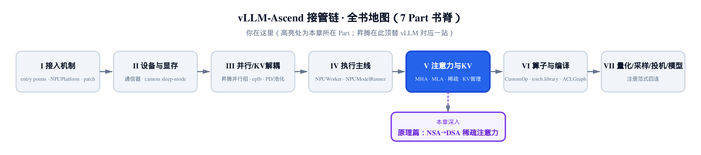

*你在这里：注意力与 KV 那一 Part 的原理深潜，昇腾在此顶替 vLLM 对应一站。*

先给三句话的方位感：

- 上一章讲透了 MLA 的 latent KV,以及 q/k 的 nope/rope 记号。
- 本章精读 NSA→DSA 稀疏注意力：打分函数、top-k、加速账。
- 工程实现的细节留给 [稀疏注意力实现章](../../ch24-sparse-attention-sfa-dsa/narrative/chapter.md)。

这是一篇论文精读，主线是两篇论文 —— NSA(arXiv:2502.11089)与 DeepSeek-V3.2 的 DSA(arXiv:2512.02556)。全章只证一个命题： **稀疏注意力并不消灭 $`O(L^2)`$ ，它只是把这笔账转包出去** ——「扫全场」这份 $`O(L^2)`$ 的活交给一个单价约 1/9 的轻量打分器(lightning indexer)，真正贵的主注意力被 top-k 砍成 $`O(L\cdot k)`$ ；而「砍了不掉点」不是打分器天生准，是训练用 KL 散度把它对齐到真注意力换来的。§一 先算清那笔 $`O(L^2)`$ 的税；§二 看 NSA 埋下的种子——廉价打分器→排序→截断；§三、§四 推 DSA 把种子推到极致的两条公式；§五 补上「不掉点」的担保；§六 把两笔账诚实地合起来——主注意力 256 倍、端到端只有 8.69 倍，这个落差正是命题的数值形状；§七 用一张落地地图收线。

承接上一章的记号：DSA 是「instantiate under MLA」——它跑在 MLA 的 MQA 模式上，每个 latent KV 条目被一个 query token 的所有头共享(arXiv:2512.02556 §2.1)。(MQA，多查询注意力，是所有 query 头共享同一份 KV 缓存的注意力配置；它是 GQA 分组查询注意力「只有一组」的极端情形，后面第二节还会再碰到。)所以下文的「选哪些 KV」天然是跨头一致的，这一点后面会反复用到。

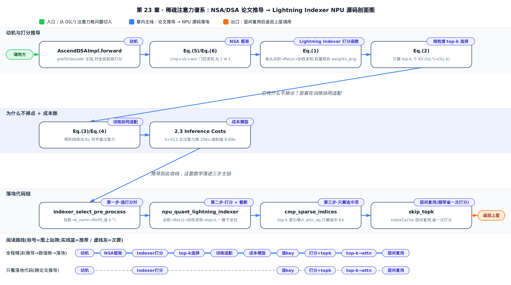

只想抓命题主线，读「一、动机」「三、Lightning Indexer 打分函数」「四、细粒度 top-k 选择」，再跳到「六、成本模型」看两笔账合拢；想把两篇论文的谱系推导跟完，按一到七顺序通读；源码在本章只占「七、落地地图」一节——完整剖析在实现章。

两篇论文会陆续冒出几个容易被忽略的专用记号——先摆一张速查表混个脸熟，后面碰到时不用回头翻定义：

| 符号 | 含义 | 首次出现 |
|---|---|---|
| $`d_k`$ | key 向量的特征维度——标准缩放点积注意力 $`1/\sqrt{d_k}`$ 里那个分母的来源，维度变大时把内积规模压回合理范围，避免 softmax 被推进梯度消失区 | 一、动机 节，Eq.(1)-(2) 标准注意力打分公式 |
| $`H`$ | 同一 GQA 组内共享这份 KV 的 query 头数——跨头求和 $`\sum_{h=1}^{H}`$ 的上界。留意：下一节还会出现形近的 indexer 头数 $`H^I`$ ，两者不是同一个量，别混淆 | 二、NSA 框架 节，Eq.(10) 跨头求和公式 |

---

## 一、动机：O(L²) 注意力税

### 税单本身

标准因果自注意力里，第 $`t`$ 个 query 要对它前面全部 $`t`$ 个 token 各算一次 $`q\cdot k`$ ——像会场里每个新进门的人都要跟在场所有人握一遍手。整条序列的点积总数就是 $`1+2+\cdots+L = L(L+1)/2`$ ：这就是那笔「 $`O(L^2)`$ 注意力税」。NSA 论文的背景公式先把标准注意力写清楚(arXiv:2502.11089 §3.1 Eq.(1)-(2)，下式把 Eq.(1) 的输出 $`\mathbf{o}_t`$ 与 Eq.(2) 的 softmax 展开并作一处):

$$
\mathbf{o}_t = \sum_{i=1}^{t} \frac{\alpha_{t,i}\,\mathbf{v}_i}{\sum_{j=1}^{t}\alpha_{t,j}}, \qquad
\alpha_{t,i} = \exp\!\left(\frac{\mathbf{q}_t^{\top}\mathbf{k}_i}{\sqrt{d_k}}\right)
$$

这里 $`d_k`$ 是 key 向量的特征维度——分母 $`\sqrt{d_k}`$ 是标准缩放点积注意力的老规矩，维度变大时把点积规模压回合理范围，避免 softmax 被推进梯度消失区；第三节讲 indexer 的缩放会再碰到同一个直觉，只是换了个记号。

关键在求和上界 $`t`$:query $`t`$ 要对全部 $`t`$ 个前驱各打一次分。序列越长， $`\alpha_{t,\cdot}`$ 的求和项越多，这正是税单的来源。

把税单摊开看几组小数据。取序列长 $`L`$ 从 4 翻到 32,数一数总点积：

<!-- trace: attn-quadratic-tax -->

| 序列长 L | q·k 点积总数 = L(L+1)/2 | 相对 L=4 的倍数 |
|---|---|---|
| 4 | 10 | 1.0x |
| 8 | 36 | 3.6x |
| 16 | 136 | 13.6x |
| 32 | 528 | 52.8x |

看最右列的指纹：序列每翻一倍，点积数不是变 2 倍，而是趋向变 4 倍(36/10=3.6、136/36≈3.78、528/136≈3.88 → 逼近 4)。这是二次增长独有的签名。

**不变量：这笔税不可能靠常数因子降成线性。** 设点积总数 $`T(L)=L(L+1)/2`$ 。基例 $`T(1)=1`$;归纳步 $`T(L)=T(L-1)+L`$ —— 每加一个 token 就新增 $`L`$ 次点积，而新增量本身随 $`L`$ 线性上升，累加起来必然是二次。人均代价 $`T(L)/L=(L+1)/2`$ 无上界，所以它是超线性，不是线性。换句话说，你没法靠「把每次点积算得更快」把 $`O(L^2)`$ 抹平 —— 得从**少算几次**下手。

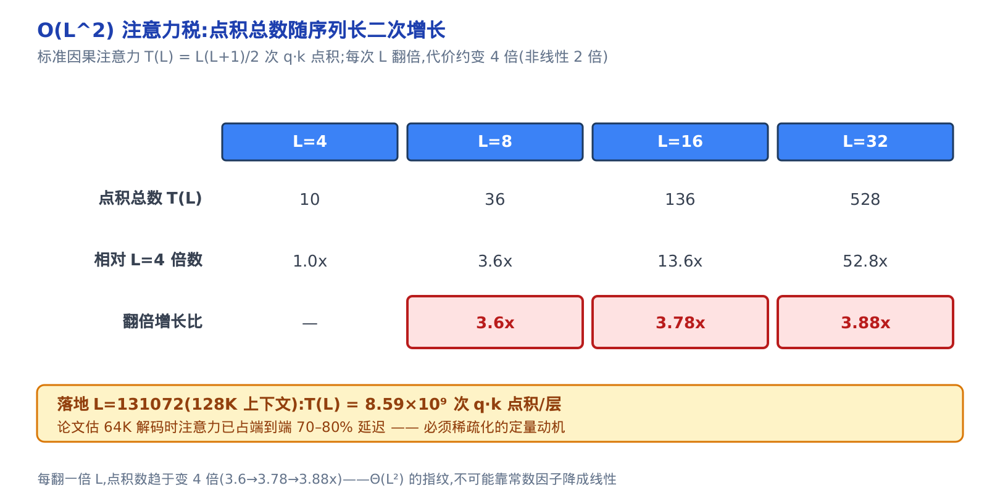

*图 32-1　序列每翻一倍，q·k 点积数趋向变 4 倍。落地 128K 上下文单层已达 8.59×10⁹ 次点积。*

### 落到真实规模

代入落地长上下文 $`L=131072`$(DeepSeek-V3.1-Terminus 续训到的 128K),稠密因果注意力单层要算 L(L+1)/2 = 8,590,000,128 ≈ 8.59×10⁹ 次 $`q\cdot k`$ 点积。论文估计(NSA arXiv:2502.11089 §1 Introduction)，64K 解码时注意力已占端到端 70–80% 的延迟。这就是「必须稀疏化」的定量动机 —— 不是嫌它慢，是它主导了长上下文推理的账。

这条稠密账在昇腾侧落在 `AscendDSAImpl.forward` 的 prefill/decode 两条主链上——它正是本章要替换的对象，源码剖面见[第 24 章](../../ch24-sparse-attention-sfa-dsa/narrative/chapter.md)。

先把全章命题的数值形状剧透在一张图里：主注意力将被砍到 $`O(L\cdot k)`$ 、加速 256 倍，但端到端只有 8.69 倍——因为 $`O(L^2)`$ 并没有死，它只是换了个单价约 1/9 的付账人(lightning indexer)。§三到§六 会把图上每个数字逐一挣出来。

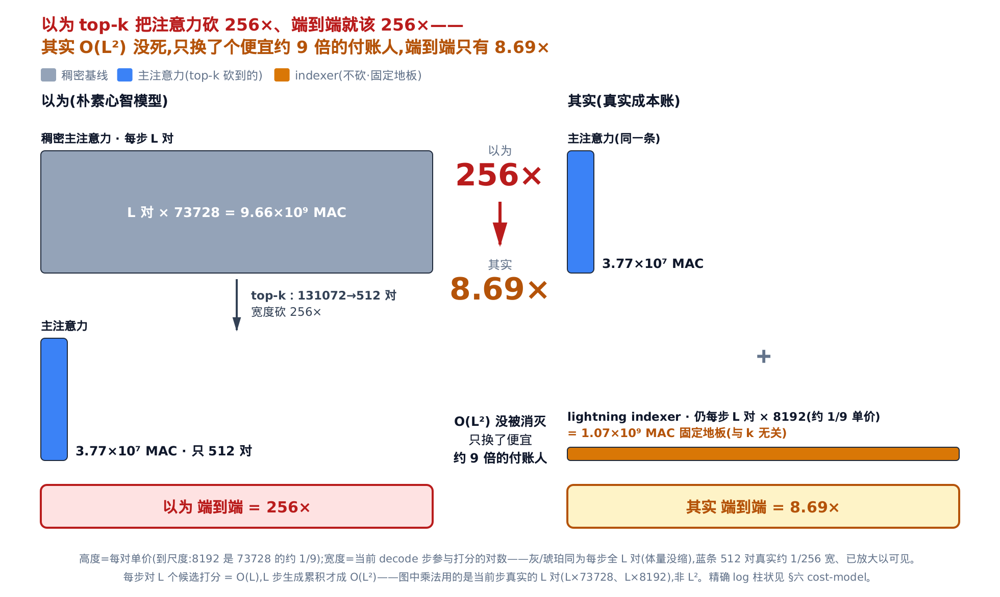

*以为 256×，其实 8.69×——O(L²) 的三角没被消灭，只是单价从 73728 降到 8192 MAC/对(约 1/9)；indexer 这块 1.07×10⁹ MAC 的固定地板与 k 无关，正是端到端加速的天花板所在。*

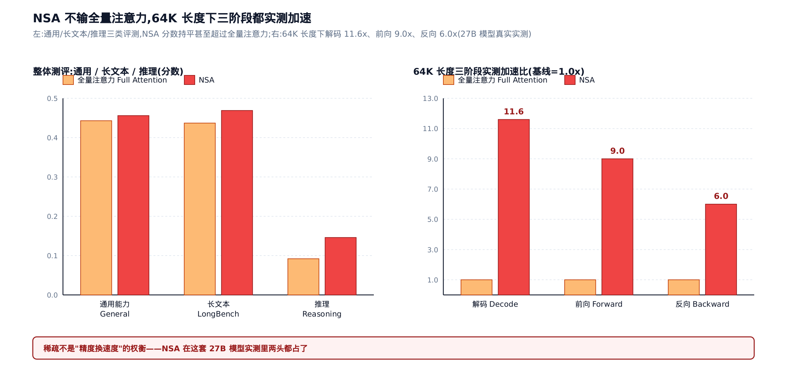

这不只是纸面上的论证——论文用真实 27B 参数模型跑出的实测证据摆在这里：左图通用/长文本/推理三类评测，NSA 分数持平甚至超过全量注意力基线；右图 64K 长度下，解码/前向/反向三个阶段分别实测加速 11.6×/9.0×/6.0×。稀疏化不是「掉点换速度」的权衡，两头都占了——下面几节就是把「少算几次」这件事，一步步推成一个可训练、可落地的机制。

---

## 二、从三支路到一条打分：NSA 框架

### 三支路框架

NSA 的洞见一句话：先用便宜的手段决定「看哪里」，再只对入选者付全价注意力——像读长报告先扫目录抓大意(**压缩**)、翻到最相关几章细读(**选择**)、顺手瞄一眼手边段落(**滑窗**)。只要三路留下的 token 总数远小于全文长度，就省掉了大部分注意力。

NSA(arXiv:2502.11089 §3.2)把这套思路写成一个统一框架。它用一组门控 $`g_t^c`$ 把三条支路的输出加权求和(§3.2 Eq.(5)):

$$
\mathbf{o}_t^{*} = \sum_{c\in\mathcal{C}} g_t^c \cdot \mathrm{Attn}\!\left(\mathbf{q}_t, \widetilde{K}_t^{c}, \widetilde{V}_t^{c}\right), \qquad
\mathcal{C} = \{\mathrm{cmp}, \mathrm{slc}, \mathrm{win}\}
$$

门控 $`g_t^c`$ 本身也是学出来的——由输入特征过一个小 MLP 加 sigmoid 得到，每条支路各自一个，训练时随主模型一起调，不是复用某个已有打分、也不是人工设定的固定权重。

$`\mathcal{C}`$ 里的 cmp/slc/win 就是压缩、选择、滑窗三支路，每支路只对一份紧凑的 KV 做注意力。省不省钱，取决于三支路留下的 token 总数 $`N_t`$(§3.2 Eq.(6)):

$$
N_t = \sum_{c\in\mathcal{C}} \mathrm{size}\!\left[\widetilde{K}_t^{c}\right], \qquad N_t \ll t
$$

这个 $`N_t \ll t`$ 就是「稀疏为何省」的定量定义。

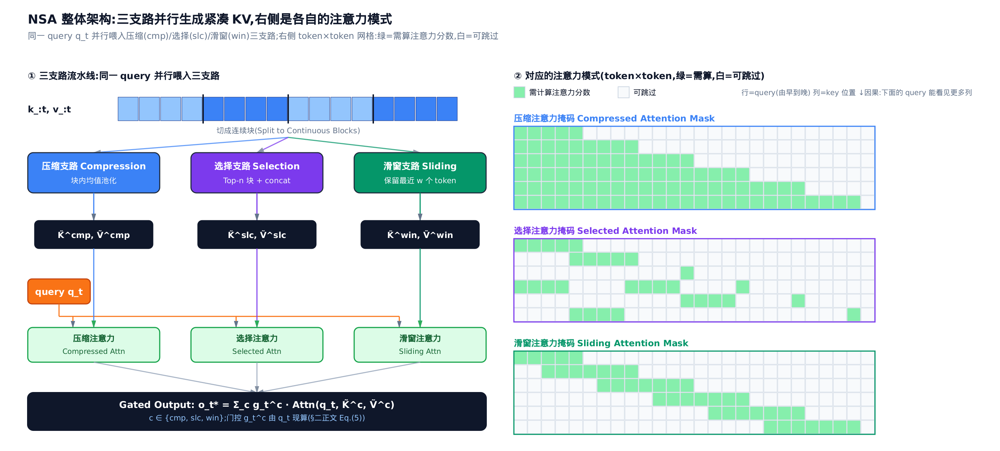

论文原图把这套框架的空间样子画了出来：左侧同一个 query 并行喂进压缩/选择/滑窗三支路，各自产出紧凑 KV；右侧把三支路实际产生的注意力模式画成 token×token 网格——绿色是需要算的分数，白色是可以跳过的区域。三张掩码的形状不一样：压缩注意力覆盖面最广但每格代价最低，选择注意力挑出稀疏的几块，滑窗注意力只沿对角线一条带。三条模式叠在一起，才是 Eq.(5) 那个门控加权求和真正省下的地方。

### 机制：稀疏比随上下文越拉越低

给三支路各配一份预算(压缩块数、选块数、滑窗宽),它们都不随 $`t`$ 线性膨胀。这里「块」指把原序列按固定长度切出的一段连续 token(每块含 $`l`$ 个 token,$`l`$ 是分块长度),压缩支路把每块汇总成一条紧凑 KV,选择支路则以块为单位挑；三路预算都以块或 token 计。看两组上下文长：

<!-- trace: nsa-three-branch -->

| 上下文长 t | cmp 保留 | slc 保留 | win 保留 | N_t = 三路之和 | 稀疏比 N_t/t |
|---|---|---|---|---|---|
| 64 | 4 | 8 | 4 | 16 | 0.25 |
| 1024 | 8 | 16 | 8 | 32 | 0.0312 |

**不变量：上下文越长，稀疏收益越大。** $`t`$ 从 64 涨到 1024(16 倍),$`N_t`$ 只从 16 涨到 32(2 倍),稀疏比从 0.25 掉到 0.0312(约 8 倍下降)。分母涨得比分子快，稀疏比单调趋 0。这正是 Eq.(6) 那个 $`N_t \ll t`$ 在数值上的样子 —— 每条支路的预算与 $`t`$ 解耦，近似常数，所以序列越长越划算。

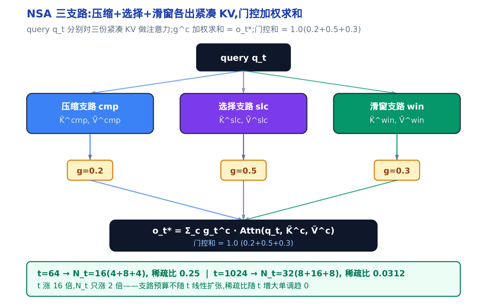

*图 32-2　三支路各产出紧凑 KV,按门控 g^c 加权求和。t 从 64 到 1024,稀疏比从 0.25 降到 0.031。*

把三支路预算折成 DSA 落地的等效 $`k\approx512`$,代入 $`t=131072`$:稀疏比约 $`512/131072\approx0.39\%`$ —— 每个 query 只碰约 0.4% 的前驱。DSA 就是这套框架的**简化后裔**:砍掉 cmp 和 win,只留一条由打分器驱动的选择支路。要理解 DSA 的那条打分，得先看 NSA 的选择支路是怎么打分的。

### 免费的重要性打分

选择支路要回答一个问题：哪些块值得细读？最朴素的做法是给每个块单独算一遍打分 —— 但那又是一笔开销。NSA 的洞见很漂亮：**不用额外算**,直接复用压缩支路已经算出的注意力分数(§3.3.2 Eq.(8)):

$$
\mathbf{p}_t^{\mathrm{cmp}} = \mathrm{Softmax}\!\left(\mathbf{q}_t^{\top}\widetilde{K}_t^{\mathrm{cmp}}\right)
$$

能不能复用，取决于两条支路怎么切块：当压缩块与选择块用同一套分块时，同一段 token 在两条支路里落在同一个块位置，压缩支路的注意力分数与选择块一一重合，直接搬过来就是选择块的重要性——这正是「不用额外算」的全部来由。拿到分数后，先在 GQA 组内**跨头求和**(把组内所有 query 头各自的分数逐块相加，得到共享分数 $`\mathbf{p}'`$ ，撇号专门标记「已跨头求和」)，保证同组头共享同一套选择；再取排名前 $`n`$ 的块。分块不对齐时的换算、top-n 块拼接的完整记号(Eq.(10)–(12))是 NSA-specific 的机制——DSA 后来连同 cmp/win 两条支路一起把它们砍掉了——细节收进本节末的严谨框，跳过不影响主线。

用一个 6 块、2 头、取 top-3 的小例子走一遍。每块两头各有一个压缩注意力分数，组内一求和得 $`\mathbf{p}'`$,按它排名：

<!-- trace: nsa-importance-score -->

| 压缩块 idx | 头0 分数 | 头1 分数 | 组内求和 p' | 重要性排名 | 入 top-3? |
|---|---|---|---|---|---|
| 0 | 0.0333 | 0.106 | 0.1393 | 6 | 0 |
| 1 | 0.1213 | 0.0338 | 0.1551 | 5 | 0 |
| 2 | 0.1333 | 0.4861 | 0.6194 | 1 | 1 |
| 3 | 0.2558 | 0.1012 | 0.357 | 3 | 1 |
| 4 | 0.2059 | 0.1316 | 0.3375 | 4 | 0 |
| 5 | 0.2504 | 0.1413 | 0.3917 | 2 | 1 |

**不变量：选中块严格是组内求和分数最高的那几个，而打分开销为零。** 组内求和只是对已有中间量相加，没有新增任何 $`q\cdot k`$ 。降序排名唯一确定 top-3 = {块 2(0.6194)、块 5(0.3917)、块 3(0.357)},正好是前三名。用了 50% 的块(3/6),兜住了 68% 的注意力质量(被选块占组内总质量 $`1.3681/2.0\approx0.68`$)—— 少数块占多数注意力。

这就是「打分函数代理相关性」在 NSA 里的首次出现，也是 DSA lightning indexer 的思想前身，开篇命题里「转包」的第一环：**一个廉价打分器排序，然后截断，只算选中项。** DSA 把它推到极致 —— 从块级选择细化到 token 级，并且换上一个专门的、可训练的打分函数。

> **严谨(NSA 的分块对齐与 top-n 拼接——DSA 已弃用，选读)**：NSA 按固定长度切块(arXiv:2502.11089 §3.3.1–3.3.2)： $`l`$ 是压缩块长度、 $`d`$ 是相邻压缩块的滑动步长、 $`l'`$ 是选择块大小(这个 $`d`$ 是分块步长，与后文成本模型里表示特征维的 $`d`$ 只是同符不同义)。当 $`l'=l=d`$ ，选择块的重要性直接取压缩分数 $`\mathbf{p}_t^{\mathrm{slc}}=\mathbf{p}_t^{\mathrm{cmp}}`$ ；不对齐时按块的空间重叠把压缩分数折算到选择块上再用。跨头求和是 Eq.(10)： $`\mathbf{p}_t^{\mathrm{slc}\prime}=\sum_{h=1}^{H}\mathbf{p}_t^{\mathrm{slc},(h)}`$ ，每个 $`\mathbf{p}_t^{\mathrm{slc},(h)}`$ 是头 $`h`$ 的那份 softmax 注意力权重，求和上界 $`H`$ 是同一 GQA 组内共享这份 KV 的 query 头数(与下一节 indexer 头数 $`H^I`$ 形近不同义)。GQA 把 query 头分组、每组共享一份 KV；DSA 用的 MQA 是它「只有一组」的特例——二者都靠组内求和拿到跨头一致的选择。选块与拼接是 Eq.(11)–(12)： $`\mathcal{I}_t=\{\,i\mid\mathrm{rank}(\mathbf{p}_t^{\mathrm{slc}\prime}[i])\le n\,\}`$ ， $`\widetilde{K}_t^{\mathrm{slc}}=\mathrm{Cat}[\{\mathbf{k}_{i\cdot l'+1\,:\,(i+1)\cdot l'}\mid i\in\mathcal{I}_t\}]`$ ——排名前 $`n`$ 的块的原始 key 逐块拼接，喂给选择支路的注意力。

---

## 三、DSA 的一刀：Lightning Indexer 打分函数

### 独立的轻量打分器

NSA 复用压缩注意力的分数，聪明，但仍绑在「先做压缩注意力」这条支路上。DSA 干脆立一个独立的、极轻的打分器 —— lightning indexer：每个 indexer 头像独立的评委，只给「合得来」的前驱投正分，合不来记 0、绝不倒扣成负分——这就是 ReLU。论文明说选 ReLU 是为了吞吐：头少、可用 FP8(一种 8 位低精度浮点格式，省显存、算得快，细节见[第 31 章：量化数学](../../ch31-primer-quantization/narrative/chapter.md))这样的低精度格式算，算得飞快(arXiv:2512.02556 §2.1)。

### 机制：每头点积 → ReLU → 加权求和

lightning indexer 给 query token $`\mathbf{h}_t`$ 和前驱 token $`\mathbf{h}_s`$ 算一个 index score(arXiv:2512.02556 §2.1 Eq.(1)):

$$
I_{t,s} = \sum_{j=1}^{H^I} w_{t,j}^I \cdot \mathrm{ReLU}\!\left(\mathbf{q}_{t,j}^I \cdot \mathbf{k}_s^I\right)
$$

$`H^I`$ 是 indexer 头数； $`\mathbf{q}_{t,j}^I`$ 和标量权重 $`w_{t,j}^I`$ 从 query token 导出， $`\mathbf{k}_s^I`$ 从前驱 token 导出。三步：每头做一次点积、ReLU 把负相关清零、按权重 $`w^I`$ 加权求和。

用一个 2 头、权重 $`w=[1.0, 2.0]`$ 的小例子看清 ReLU 的作用：

<!-- trace: dsa-lightning-indexer -->

| 前驱 s | 头0 q·k | 头1 q·k | ReLU 头0 | ReLU 头1 | I = 1·r0 + 2·r1 |
|---|---|---|---|---|---|
| 0 | 1.0 | 0.5 | 1.0 | 0.5 | 2.0 |
| 1 | 0.0 | 1.0 | 0.0 | 1.0 | 2.0 |
| 2 | 0.0 | 1.5 | 0.0 | 1.5 | 3.0 |
| 3 | -2.0 | -0.5 | 0.0 | 0.0 | 0.0 |

**不变量：权重非负时 index score 恒 $`\ge 0`$,任何负相关贡献恰好为 0,绝不污染排序。** 看 $`s=3`$:两头点积都是负的(−2.0、−0.5),经 ReLU 双双清零 → $`I=0.0`$ 。要是不做 ReLU,它会留下 $`1\cdot(-2)+2\cdot(-0.5)=-3`$ 这种大负值，把排序搅乱。对比 $`s=2`$:只有头 1 强正(1.5),靠权重 2 就能拿到最高分 3.0 被选中。这正是 ReLU 而非 softmax 的设计意图 —— **各头独立正向投票，不互相归一化压制。**

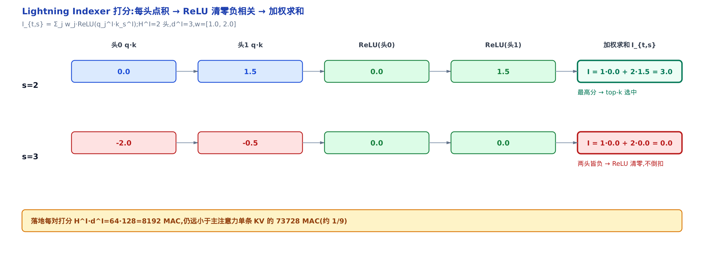

*图 32-3　s=2 靠头1 拿最高分被选中；s=3 两头皆负，ReLU 清零不倒扣。单对打分仅 8192 MAC。*

每对 $`(t,s)`$ 的打分成本是 $`H^I\cdot d^I`$ 次乘加。本例取 $`H^I=2`$ 头、 $`d^I=3`$ 维(表里 4 个前驱),$`2\times3=6`$;落地取 $`H^I=64`$ 、 $`d^I=128`$,即 8192 次乘加 —— 仍远小于主注意力单条 KV 的 73728 次(约 1/9)。所以 indexer 虽然也对全部前驱打分，常数却小得多。这个「常数小」是后面成本账的关键。

Eq.(1) 的每个符号在推理侧都有实名落点—— $`H^I`$ 即 indexer 头数、 $`w^I`$ 由 `weights_proj` 投影产出、 $`k`$ 即 top-k 参数 `index_topk`；打分同样按 $`(d^I)^{-1/2}`$ 缩放，与本章开头 Eq.(2) 的 $`1/\sqrt{d_k}`$ 是同一个直觉，不是 DSA 的新发明。参数怎么装配，见[第 24 章](../../ch24-sparse-attention-sfa-dsa/narrative/chapter.md)；点积、ReLU、加权求和连同下一节的 top-k，则融进一个 NPU 算子——§七 的落地地图上能看到它。

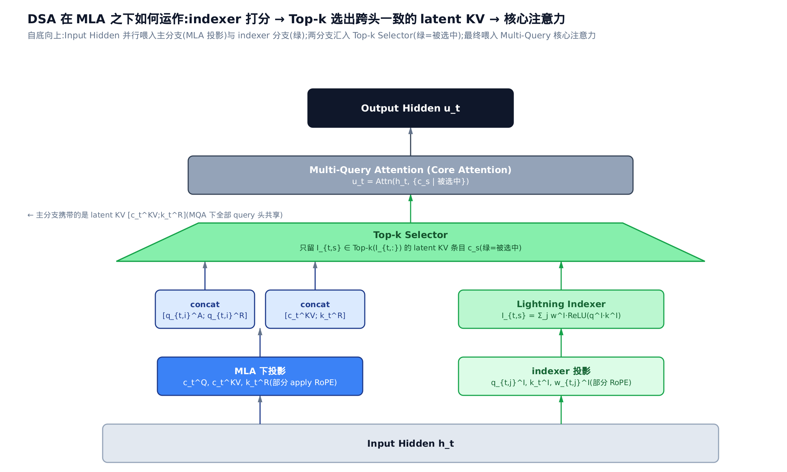

这张图把本节和下一节缝回一条流水线：底部 indexer 分支算出 index score 后，汇入 Top-k Selector(绿色标出被选中的 latent KV 条目)，再喂进最上层的 Multi-Query 核心注意力——呼应本章开头的 MQA 前提，被选中的这一小撮 latent KV 对该 query 的所有头统一生效，不是各头各选各的。这一节讲的是图里 indexer 分支怎么打分，下一节接着讲 Top-k Selector 怎么截断。

---

## 四、细粒度 top-k 选择：把 O(L²) 砍成 O(L·k)

### 排序，截断

有了每个前驱的 index score,下一步简单粗暴：排序，只取分数最高的 $`k`$ 个 KV 进主注意力——考前只复习最可能考的 $`k`$ 个知识点。每个 query 要算的 $`q\cdot k`$ 从 $`L`$ 个砍到 $`k`$ 个。

DSA 的细粒度 token 选择就是这一刀(arXiv:2512.02556 §2.1 Eq.(2)):

$$
\mathbf{u}_t = \mathrm{Attn}\!\left(\mathbf{h}_t, \left\{\mathbf{c}_s \;\middle|\; I_{t,s} \in \mathrm{Top-}k(I_{t,:})\right\}\right)
$$

式中 $`\mathbf{c}_s`$ 是前驱 token $`s`$ 对应的 KV 条目(在 MLA 下就是那个 latent KV);只有 index score 落在 Top-$`k`$ 内的 $`\{\mathbf{c}_s\}`$ 参与主注意力。承接开头的 MQA 前提：MLA 下每个 latent KV 条目被一个 query token 的所有头共享，所以 Top-$`k`$ 选出的是**一组跨头一致的 latent KV 条目**，而不是各头各自挑 token —— 选择在 token(latent 条目)粒度上做，却对全部头统一生效。这就是把 $`O(L^2)`$ 主注意力降到 $`O(L\cdot k)`$ 的那一刀。

### 机制：k=L 时精确退化回稠密

用 $`L=8`$ 的序列，分别取 $`k=8`$ 和 $`k=3`$ 跑：

<!-- trace: dsa-topk-selection -->

| top-k 的 k | 实际选中 | 序列长 L | 关键校验值 | 注意力路径 |
|---|---|---|---|---|
| 8 | 8 | 8 | 0.0 | 稠密(退化) |
| 3 | 3 | 8 | 2.67 | 稀疏 |

> 表注：「关键校验值」逐行含义不同—— $`k=8`$ 行是稀疏输出与稠密注意力的最大逐元素绝对差(0.0=数值完全一致);$`k=3`$ 行是每 query 点积数的下降倍数($`8/3\approx2.67`$)。表中数字是本章参考实现跑出的真实输出(非估算)， $`L=8`$ 是便于手算的小例子，落地规模在本节末代入。

**不变量： $`k\ge L`$ 时选中全部前驱，稀疏输出与稠密注意力逐元素相等； $`k<L`$ 时主注意力点积数从 $`L`$ 降到 $`k`$ 。** 看第一行： $`k=8=L`$,选中集就是全部 8 个 KV,稀疏路径和稠密路径喂进相同的 KV,输出最大绝对差 = 0.0 —— 数值验证了退化基例的正确性。第二行 $`k=3`$,只留 3 个 KV,每 query 点积数 $`8\to3`$,降 $`8/3\approx2.67`$ 倍。所以 $`k=L`$ 只是用来验证正确性的退化基例(两路数值必须完全一致),真正的稀疏发生在 $`k<L`$ —— 别把第一行的「最大差 0.0」误读成两条路径永远相同。

这里有个容易误读的点：因为 softmax 只在选中集内归一化，top-k 注意力**不是**去近似整段稠密注意力，而是定义了一种「只看 top-k」的**新**注意力。它凭什么不掉点？答案不在这一节 —— 在下一节的训练协同适配。

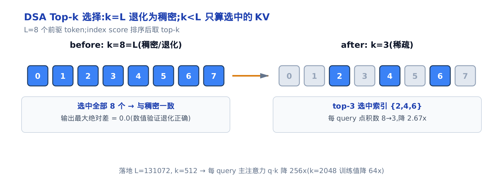

*图 32-4　左稠密(k=L=8,与全注意力差 0.0);右稀疏(k=3,只算选中的 {2,4,6})。落地 k=512 时降 256 倍。*

代入落地规模 $`L=131072`$ 、 $`k=512`$:每个 query 的主注意力 $`q\cdot k`$ 从 131072 降到 512,降幅 $`131072/512 = 256`$ 倍。若取论文训练用的 $`k=2048`$,降幅 64 倍。这就是 Eq.(2) 那一刀在真实规模上的力道。

---

## 五、为什么稀疏不掉点：训练协同适配

### 掉点的根因，与「教」的解法

如果只是拿一个训练好的稠密模型，推理时硬砍掉 80% 的 token —— 会掉点。NSA 论文点破了根因：top 20% 的注意力只覆盖 70% 的总分数(§2.2 引 Chen et al. 2024b——即 MagicPIG,arXiv:2410.16179),硬剪会破坏 retrieval head(检索头：预训练里学会专门盯着某类关键 token 的注意力头)这类结构。DSA 的解法不是「剪」,是「教」——先让 indexer 照着真注意力的判断学一遍，学到位再让它独立筛选；「照着学」用的尺子就是 KL 损失(KL 散度衡量两个分布有多不像——完全相同时为 0，越不像值越大)。

### 机制：两阶段续训，KL 对齐

DSA 从 DeepSeek-V3.1-Terminus 的 checkpoint 续训，分两阶段(arXiv:2512.02556 §2.1.1)。

**Dense warm-up:** 冻结主模型，只训 indexer。把主注意力每个头的 softmax 注意力权重(即 §3.1 里的 $`\alpha_{t,\cdot}`$,不是原始点积 $`\mathbf{q}^{\top}\mathbf{k}`$)跨头求和、再 L1 归一化(除以总和，使其变成加总为 1 的概率分布),得到目标分布 $`p_{t,:}`$,用 KL 让 indexer 的 $`\mathrm{Softmax}(I_{t,:})`$ 去对齐它(§2.1.1 Eq.(3)):

$$
\mathcal{L}^{I} = \sum_t \mathbb{D}_{\mathrm{KL}}\!\left(p_{t,:} \,\|\, \mathrm{Softmax}(I_{t,:})\right)
$$

**Sparse stage:** 引入 top-k,放开全参微调，让主模型主动适配「只看 top-k」的输入分布。KL 这时只在选中集 $`\mathcal{S}_t`$ 上算(§2.1.1 Eq.(4)):

$$
\mathcal{L}^{I} = \sum_t \mathbb{D}_{\mathrm{KL}}\!\left(p_{t,\mathcal{S}_t} \,\|\, \mathrm{Softmax}(I_{t,\mathcal{S}_t})\right), \qquad
\mathcal{S}_t = \left\{s \;\middle|\; I_{t,s} \in \mathrm{Top-}k(I_{t,:})\right\}
$$

论文有个细节值得记：**indexer 的输入是 detach 的，与主模型分开优化。**(detach 即切断反向传播的梯度回流 —— 打分器这一路的梯度不再流回主模型。)indexer 只由 $`\mathcal{L}^I`$ 训练，主模型只由语言建模损失训练，互不污染梯度 —— 这才有稳定的协同适配。

要提醒一句：这套两阶段续训（dense warm-up 与 sparse stage 的 KL 对齐）**是训练侧的事，它的代码不在 `vllm_ascend` 这个推理仓库里** —— 本机制是纯论文推导。推理侧能看到的，只是训练凝固下来的那份 indexer 权重：§七 落地地图上 `npu_quant_lightning_indexer` 算子吃进的 `weights`(即 `weights_proj` 产出的 $`w^I`$ )，就是 KL 换来的「对齐好的打分器」训完的样子——我们看不到它怎么被训出来，但看得到它训完长什么样。

怎么定量证明「对齐 → 不掉点」？做个对照实验(呼应 §2.1.1 Eq.(3) 的 KL 对齐)：构造一个可调 indexer —— 把「与真注意力对齐的打分」($`\log p_{t,:}`$,标准化后)和「纯随机打分」按旋钮 $`\alpha`$ 线性插值：

$$
I = (1-\alpha)\cdot\widehat{\log p_{t,:}} + \alpha\cdot\mathrm{noise}
$$

于是 $`\alpha=0`$ 时 $`\mathrm{Softmax}(I)\approx`$ 真分布 $`p_{t,:}`$ 、 $`\alpha=1`$ 时纯随机；每个 $`\alpha`$ 跑 400 次随机试验取平均，看 KL 和 top-k 召回怎么变。这里的**top-k 质量召回**指：indexer 选中的那 $`k`$ 个 token，占了真注意力全部权重的多大比例(召回 0.386 就是说这 $`k`$ 个 token 汇聚了约 39% 的真注意力质量)—— 召回越高，说明打分器越没漏掉真正重要的 token。

<!-- trace: dsa-training-coadapt -->

| 对齐旋钮 α(0=对齐，1=随机) | 平均 dense-warmup KL | 平均 top-k 质量召回 |
|---|---|---|
| 0.0 | 0.002 | 0.386 |
| 0.25 | 0.044 | 0.368 |
| 0.5 | 0.198 | 0.284 |
| 0.75 | 0.478 | 0.181 |
| 1.0 | 0.864 | 0.126 |

**不变量：KL 越低，top-k 召回的真注意力质量越高 —— 两者反向单调。** 基例：当 indexer 打分 $`=\log p`$ 时 $`\mathrm{Softmax}(I)=p`$,KL $`(p\|p)=0`$,此时按 $`I`$ 排序等于按 $`p`$ 排序，top-k 选中的正是真注意力质量最大的 $`k`$ 个，召回达理论上界。旋钮从对齐扫到随机，平均 KL 单调升(0.002→0.864),平均召回同步单调降(0.386→0.126)。对齐端召回是随机端的约 3 倍。别被 0.386 这个绝对值吓到看着低 —— 它是「每 query 只选 $`k`$ 个、 $`k`$ 远小于 $`L`$ 」这个硬约束下的召回上界；剩下没被这 $`k`$ 个 token 覆盖的注意力质量，正是靠 sparse stage 的全参微调让主模型主动适配、吸收掉的。

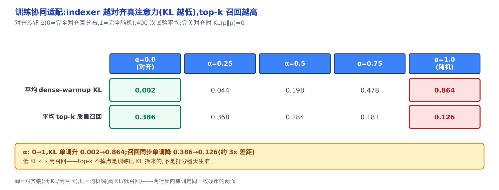

*图 32-5　α 从对齐扫到随机：平均 KL 单调升、召回单调降。低 KL 就是高召回，是同一枚硬币的两面。*

结论落地：top-k 不掉点**不是打分器天生准，是训练压 KL 换来的**。post-hoc 硬剪之所以掉点，正因为跳过了这步对齐。论文据此两阶段续训 —— dense warm-up(学习率 $`10^{-3}`$ 、1000 步、2.1B token)先对齐，sparse stage(学习率 $`7.3\times10^{-6}`$ 、每 query 选 2048 KV、15000 步、943.7B token)全参适配。论文的 parity 评测(即与稠密基线打平的效果对比)显示短、长上下文均无显著退化。

---

## 六、算一笔诚实的加速账：成本模型

### 直觉：主程省了钱，但起步价还得付

到这里很容易得意忘形：主注意力降了 256 倍，是不是总延迟也降 256 倍？**不是。** 打车省了主程的钱，但每次还得付起步价 —— lightning indexer 仍要扫全部前驱，复杂度仍是 $`O(L^2)`$ ,只是常数极小；把起步价并进去，端到端才约 8.7 倍。这正是开篇命题的数值形状： $`O(L^2)`$ 没有被消灭，只是转包给了便宜的付账人。还要补一句口径：下面这笔账全是 MAC(乘加)数，是**算力视角**;真实的墙钟延迟还受内存带宽、KV 搬运等因素影响 —— 这里按论文口径只算算量，不等于端到端延迟也恰好降 8.7 倍。

### 机制：主注意力 O(L·k),indexer 仍 O(L²)

成本模型看两笔账(arXiv:2512.02556 §2.3)。对单个 query token,indexer 打分对 $`L`$ 个前驱各做 $`H^I`$ 个 $`d^I`$ 维点积，选出 $`k`$ 个后主注意力只在这 $`k`$ 条 KV 上算。两笔单-query 成本写成：

$$
\mathrm{indexer} \approx O(L\cdot d_{\mathrm{idx}}), \qquad
\mathrm{main\ attn} \approx O(k\cdot d)
$$

其中 $`d_{\mathrm{idx}}:=H^I\cdot d^I`$ 是 indexer 的特征总维(落地 $`64\times128`$),$`d`$ 是主注意力单条 KV 的特征维。整条序列，主注意力从 $`O(L^2)`$ 降到 $`O(L\cdot k)`$,而 indexer 仍是 $`O(L^2)`$ —— 只是常数小一个数量级。

代入 $`L=131072`$ 、每条 KV 主注意力 73728 次乘加、 $`H^I=64`$ 、 $`d^I=128`$,分别取 $`k=512`$ 和 $`k=2048`$:

<!-- trace: dsa-cost-model -->

| top-k 的 k | 主注意力(稠密) MAC | 主注意力(稀疏) MAC | indexer MAC | 主注意力加速 L/k | 端到端加速(含 indexer) |
|---|---|---|---|---|---|
| 512 | 9663676416 | 37748736 | 1073741824 | 256x | 8.69x |
| 2048 | 9663676416 | 150994944 | 1073741824 | 64x | 7.89x |

> 表注(算量口径)：以单条 KV 的主注意力乘加数 $`\mathrm{per\_kv\_dim}=73728`$(MLA 下一条 latent KV 的 $`q\cdot k`$ 点积 + 值加权合计，取自落地维度配置；它取决于具体模型的 head 数与 latent 维，换模型会变)为单位。稠密主注意力 $`=L\times 73728`$,代入 $`L=131072`$ 得表中的 $`9{,}663{,}676{,}416`$;稀疏主注意力 $`=k\times 73728`$;indexer $`=L\times H^I\times d^I`$,即 $`131072\times 64\times 128`$ 。这些数都是本章参考实现按上述口径算出的，可逐项复核。

**不变量：只看主注意力的加速精确等于 $`L/k`$;算上 indexer 后端到端加速恒小于 $`L/k`$ 。** 单 decode 步：稠密主注意力是 L·73728 次乘加，稀疏主注意力是 k·73728,比值精确等于 $`L/k`$($`k=512`$ 得 256 倍， $`k=2048`$ 得 64 倍)。indexer 开销是 L·H^I·d^I = 131072×64×128 = 1073741824,**与 $`k`$ 无关**。端到端 = 稠密主 /(稀疏主 + indexer):$`k=512`$ 时算得 9663676416 /(37748736 + 1073741824) = 8.69 倍。因为 indexer 项被固定托底，端到端远小于 $`L/k`$ 。

这也解释了一个反直觉的落地选择： $`k`$ 越小主注意力越省，但 indexer 占比越大，边际收益递减。所以落地敢用比论文训练值(2048)更激进的 $`k=512`$ —— 反正端到端瓶颈已经压在 indexer 的固定开销上了。

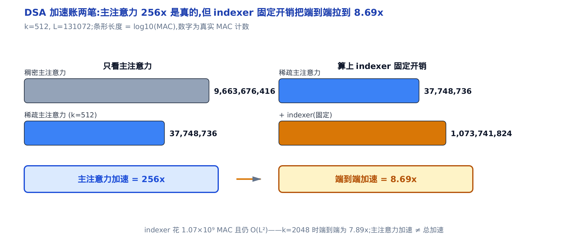

*图 32-6　主注意力从 9.66×10⁹ 降到 3.77×10⁷ MAC(L/k=256x),但 indexer 固定花 1.07×10⁹ MAC。端到端约 8.7x。*

再看整条 prefill 的量级，把误会彻底掐掉——这三个总量**不是**把上表的单步 MAC 直接乘以 $`L`$ 得来的：稠密主注意力和 indexer 都像第一节那样，每个 query 只看它前面的若干位置，整条序列要按第一节的三角求和 $`T(L)=L(L+1)/2\approx L^2/2`$ ；而稀疏主注意力选中的 $`k`$ 与位置无关，整条序列就是平铺的 $`L\times k`$ ，不带那个 $`1/2`$ 因子。显式换算一遍：

| 整条 prefill 的总量 | 换算 | 结果 |
|---|---|---|
| 稠密主注意力 | per_kv_dim × T(L) = 73728 × 8,590,000,128 | ≈ 6.33×10¹⁴ |
| indexer | H^I·d^I × T(L) = 8192 × 8,590,000,128 | ≈ 70.4×10¹² |
| 稀疏主注意力 | k × per_kv_dim × L = 512 × 73728 × 131072 | ≈ 4.95×10¹² |

稠密总量正呼应第一节已经算过的那个 $`8.59\times10^9`$ 点积数；稀疏主注意力总量线性于 $`L`$ ，而 indexer 的 $`O(L^2)`$ 并没有消失 —— 它只是常数比稠密主注意力的 $`O(L^2)`$ 小一个数量级。所以论文的原话是「indexer 仍 $`O(L^2)`$,但比 MLA 便宜得多」。端到端加速来自主注意力那一刀，加上 indexer 的小常数 —— **不是把总复杂度降成了线性。**

这两笔账在代码里各有实名落点：indexer 那笔 $`O(L^2)`$ MAC，就是 §七 地图上 `npu_quant_lightning_indexer` 那一行算子（它对全部前驱打分）；被砍到 $`O(L\cdot k)`$ 的主注意力，就是 top-k 索引经 `cmp_sparse_indices` 喂进稀疏注意力算子后、只在选中 KV 上算的那一步。成本模型的两项，就是这两个算子的算量。

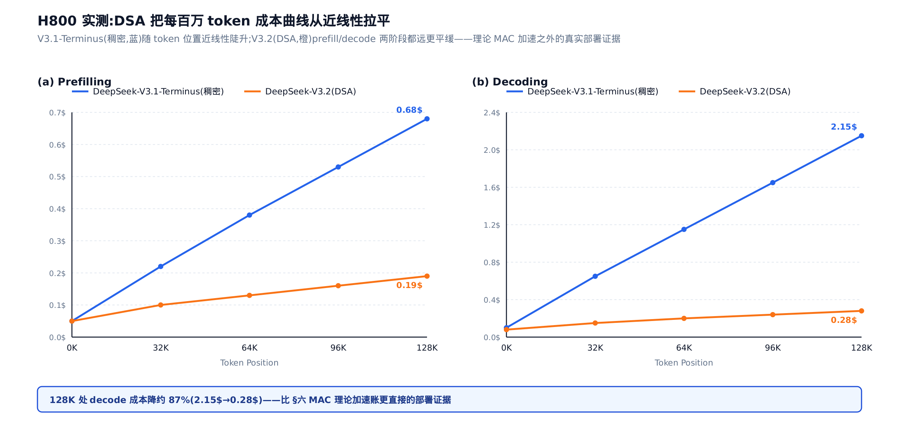

前面反复提醒「这笔账是算力视角，不等于端到端延迟」——这张图正是补上这个缺口的实测证据：DeepSeek-V3.1-Terminus(稠密)在 H800 上，每百万 token 成本随 token 位置近线性陡升；DeepSeek-V3.2(DSA)无论 prefill 还是 decode 阶段，成本曲线都远更平缓——128K 处 decode 成本从 2.15 美元降到 0.28 美元，降约 87%。这不是本节算出的 8.69× MAC 加速，是真实部署跑出来的墙钟成本，两者不是一回事，但结论一致：稀疏了是真的更省。

---

## 七、落地地图：三个算子落点

推导到此收线。这套数学在昇腾侧有两个同构实现——`vllm_ascend/attention/sfa_v1.py`(SFA,Sparse Flash Attention)与带压缩支路的 `vllm_ascend/attention/dsa_v1.py`——共享同一条三步主链，每一步都能与前面的公式一一对上。

**第一步，造打分对。** `indexer_select_pre_process` 对隐状态做投影、`k_norm` 归一化、加 RoPE，产出 Eq.(1) 的 $`\mathbf{k}_s^I`$ ；对称的 `indexer_select_post_process` 产出 $`\mathbf{q}^I`$ 与权重 $`w^I`$ 。

**第二步，打分 + 截断。** 每头点积、ReLU、加权求和、top-k 四步不在 Python 里逐个写，融进一个 NPU 算子——这一行就是 Eq.(1) 与 Eq.(2) 落地成真：

```python
# vllm_ascend/attention/dsa_v1.py:L2683
        topk_idxs, _ = torch.ops._C_ascend.npu_quant_lightning_indexer(
            query=q,
            key=indexer_k_cache,
            weights=DeviceOperator.prepare_dsa_indexer_weights(weights),
            # … 省略:量化标度、内存布局、序列长度等工程参数 …
            sparse_count=self.index_topk,
            # … 省略:sparse_mode、压缩粒度等配置旗标 …
        )
        return topk_idxs
```

`query`/`key`/`weights` 就是 $`\mathbf{q}^I`$ / $`\mathbf{k}^I`$ / $`w^I`$ ，`sparse_count=self.index_topk` 就是 Eq.(2) 的 $`k`$(落地默认 512,比论文训练的 2048 更激进，道理 §六 已给)；算子直接吐出每个 query 的 top-k 索引。

**第三步，只算选中项。** top-k 索引经 `cmp_sparse_indices` 参数喂进稀疏注意力算子 `attn_op`，主注意力只在这 $`k`$ 条选中 KV 上算，兑现 Eq.(2) 的 $`O(L\cdot k)`$ ——§二 NSA 的 $`N_t\ll t`$ 在这里收敛成单一的 $`k`$ 。另有一个省钱小机关：相邻层的注意力选择往往相似，`skip_topk` 为真时直接复用前一 indexer 层算出的 top-k(IndexCache)，省掉一次 $`O(L^2)`$ 打分——§六 说过 indexer 的固定开销是端到端瓶颈，这一刀正砍在痛点上。

这三步的完整源码剖析——metadata 编排、KV cache 布局、多流 overlap、IndexCache 的层间管理——见[第 24 章](../../ch24-sparse-attention-sfa-dsa/narrative/chapter.md)。

---

## 小结

回到开篇的命题： **稀疏注意力不消灭 $`O(L^2)`$ ，它做的是一笔转包。**

- **税单**：标准注意力的 $`q\cdot k`$ 点积总数 $`L(L+1)/2`$ 随序列二次增长， $`L=131072`$ 时单层 $`8.59\times10^9`$ 次——降不了常数，只能少算。
- **转包的种子**来自 NSA：廉价打分器→排序→截断。它的选择支路复用压缩支路的注意力分数，打分开销为零。
- **转包给谁**：DSA 的 lightning indexer——每头点积、ReLU 清零负相关、加权求和得 $`I_{t,s}`$(Eq.(1))。它仍要扫全部前驱、仍是 $`O(L^2)`$ ，但单对打分 8192 MAC，只有主注意力单条 KV 的约 1/9。
- **省在哪**：top-k 那一刀(Eq.(2))把真正贵的主注意力从 $`O(L^2)`$ 砍成 $`O(L\cdot k)`$ ， $`k=512`$ 时降 256 倍。
- **凭什么不掉点**：两阶段续训的 KL 对齐——低 KL 就是高召回，不掉点是训练压出来的，不是打分器天生准。
- **账要诚实**：indexer 的固定 $`O(L^2)`$ 托底，端到端约 8.7 倍，不是 256 倍。

这套数学的落点就是 §七 那三步：造打分对、一算子打分 + top-k、只算选中项。至于怎么排 metadata、怎么摆 KV cache 布局、怎么用多流 overlap 把 indexer 和主注意力藏在一起跑快 —— 那是工程实现的活，交给 [稀疏注意力实现章](../../ch24-sparse-attention-sfa-dsa/narrative/chapter.md)。而 DSA 赖以站立的 MLA latent KV 与 nope/rope 记号，则来自 [第 21 章的 MLA 原理](../../ch21-primer-mla/narrative/chapter.md)。
