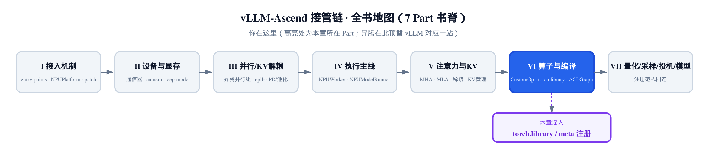
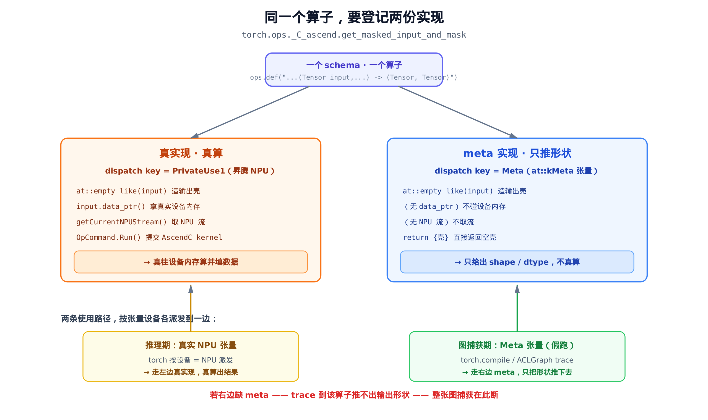
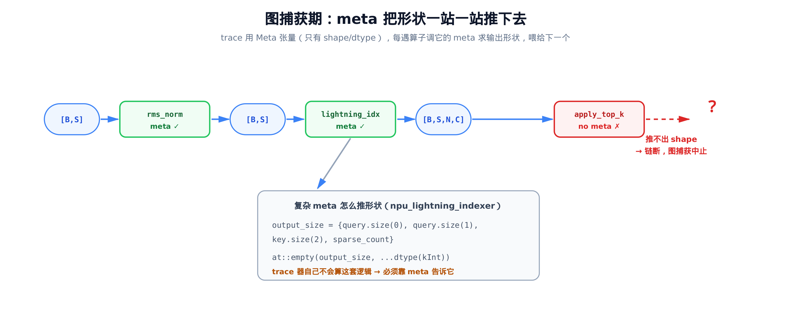
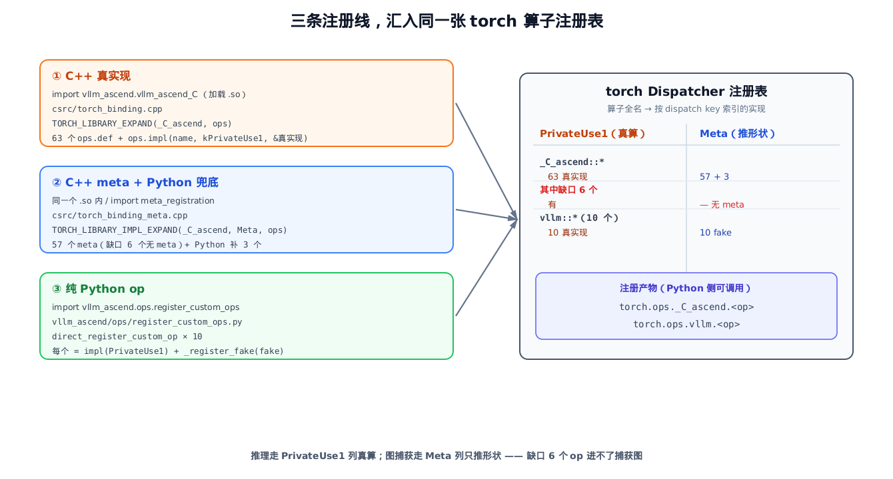

# 第 24 章 torch.library 算子注册与 meta 实现：AscendC kernel 怎么进图



> 上一章：算子被注册表掉包成昇腾子类。
> 本章：被换进来的真 kernel 怎么注册成 `torch.ops`、能进图。
> 下一章：编译层利用这些注册，把算子录进 ACLGraph。

[第 23 章](../ch23-customop-oot-replacement/narrative/chapter.md)讲清了一件事：模型代码一行不改，`RMSNorm` 在被构造的瞬间就被换成了 `AscendRMSNorm`，内部走的是昇腾自己的融合 kernel。可那一章停在了「调用 `torch.ops._C_ascend.npu_add_rms_norm_bias`」这一行——它假设这个 `torch.ops._C_ascend.*` 已经存在、可调。

这一章回答那个被跳过的问题：**一个用 C++/AscendC 写的真实 kernel，是怎么变成 `torch.ops._C_ascend.npu_add_rms_norm_bias` 这样一个 Python 能调、`torch.compile` 能捕获的算子的？** 注册代码分散在几处文件——C++ 侧 `csrc/torch_binding.cpp`、`csrc/torch_binding_meta.cpp`，Python 侧 `vllm_ascend/meta_registration.py` 与 `vllm_ascend/ops/register_custom_ops.py`。

答案比「注册一下」要多一层。先看一个最容易踩的坑。

## 24.1 一个算子，为什么要登记两份实现

假设你把 AscendC kernel 注册进了 torch，推理能跑、数值也对。然后你打开 `torch.compile` 或 ACLGraph 想加速——结果图捕获在你的算子那里断了，报「无法推断输出形状」。

问题出在**图捕获的工作方式**。`torch.compile` 的 Dynamo / AOTAutograd、以及 ACLGraph 的录制，都不是真的把数据算一遍再记下来，而是**假跑一遍**。这里先单独立住一个核心概念：PyTorch 用 **Meta 张量**（`torch.device('meta')` 上的张量）做假跑，它只记录 shape / dtype / stride 这些元信息、**不分配任何真实存储**。所谓假跑，就是让 Meta 张量走一遍计算图，把「依次调用了哪些算子、每处张量是什么形状」追踪下来，再编译或录制成可重放的图。

假跑遇到你的算子时，它需要知道：**喂进这个形状的输入，会吐出什么形状的输出？** 真实 kernel 答不了这个问题——它要真有数据、真有设备内存才能算。（你可能会问：那让真实 kernel 真跑一遍、再读出输出形状不行吗？不行——假跑时根本没有真实设备内存、没有数据、没有 NPU 计算资源；而推形状只需要形状逻辑，在任何设备上都能做。）所以每个想进图的算子，除了「真算」那份实现，还得额外提供一份**只推形状、不真算**的实现，专供假跑时查询。

这就是本章的核心立意：



> *图注：左边是真实现，派发键 `PrivateUse1`（昇腾 NPU），`data_ptr` 拿设备内存、`OpCommand` 提交 AscendC kernel 真算。右边是 meta 实现，派发键 `Meta`，只 `at::empty_like` 造个同形空壳就返回，从不碰设备。推理期按真实 NPU 张量派发到左，图捕获期按 Meta 张量派发到右。右边一旦缺位，假跑到这里推不出形状，整张图断。*

这里有个 PyTorch 的基础心智模型要先立住：**一个算子（operator）= 一个 schema（签名）+ 多个「按派发键（DispatchKey）索引的实现」**。同一个算子名，可以对 `CPU` / `CUDA` / `PrivateUse1` / `Meta` 各注册一份不同的实现；运行时 torch 看输入张量的设备、属性，选对应的键去派发。昇腾真算走 `PrivateUse1`，图捕获走 `Meta`——**同名算子的两份实现，各管一摊**。

> 为什么是 `PrivateUse1`？这是 PyTorch 给第三方加速器预留的「私有设备」派发键。昇腾 NPU 不是 torch 内建的 CUDA/CPU，作为树外（Out-Of-Tree, OOT）后端，它在 torch 里就注册成 `PrivateUse1` 设备——所有真实算子实现都挂这个键，torch 才能按张量设备把活分派到 NPU。Python 侧 `vllm_ascend/ops/register_custom_ops.py` 里直接写的就是 `dispatch_key="PrivateUse1"`。

vLLM-Ascend 把这两份实现，分三条线注册进 torch。下面逐条拆。

## 24.2 第一条线：C++ 把真实 kernel 注册成 torch.ops

真算那份实现在 `csrc/torch_binding.cpp`。注册的入口是一个宏块：

```cpp
// csrc/torch_binding.cpp:L2158
// Pybind on other platform
TORCH_LIBRARY_EXPAND(CONCAT(_C, _ascend), ops)
{
    // vLLM-Ascend custom ops
    // Gemma RmsNorm
    ops.def(
        "npu_gemma_rms_norm(Tensor x, "
                            "Tensor gamma, "
                            "float epsilon=1e-6)"
        "-> (Tensor y ,Tensor rstd)"
        );
    ops.impl("npu_gemma_rms_norm", torch::kPrivateUse1, &vllm_ascend::npu_gemma_rms_norm);

    // … 省略：中间约 60 个结构完全相同的 def/impl 对 …

    ops.def(
        "get_masked_input_and_mask(Tensor input, "
        "                         int org_vocab_start_index, "
        "                         int org_vocab_end_index, "
        "                         int num_org_vocab_padding, "
        "                         int added_vocab_start_index, "
        "                         int added_vocab_end_index) -> (Tensor masked_input, Tensor mask)");
    ops.impl("get_masked_input_and_mask", torch::kPrivateUse1, &vllm_ascend::get_masked_input_and_mask);
}
```

范式恒定，只有两步：

- **`ops.def("<schema 字符串>")`** 声明算子签名——输入输出各是什么（`Tensor`、标量 `int`/`float`、可空 `Tensor?`），以及返回什么。这一步只立「合同」，不绑实现。
- **`ops.impl("<name>", torch::kPrivateUse1, &真实函数)`** 把刚声明的算子，在 `PrivateUse1` 键上绑到那个真实的 C++ 函数指针。

这套 `def + impl` 在这个主块里**对 63 个算子各做了一遍**（标准芯片分支；另有一段 `#ifdef ASCEND_PLATFORM_310P` 给 [310P 推理卡](../ch17-310p-inference-chip-specialization/narrative/chapter.md)单独注册 2 个，与主块互斥编译，本章只看主分支）。其中绝大多数（59 个）都把实现绑在 `PrivateUse1`，是模型真正算数的重活——RmsNorm、各种 attention、MoE gating、量化 matmul……

剩下 4 个工具算子用别的派发键：`swap_blocks_batch` 走 `torch::kCPU`，`device_print` / `device_print_tensor` / `get_npu_storage_shape` 走 `CompositeExplicitAutograd`（63 = 59 + 4）。它们本就不在 NPU 真算的热路径上，所以不挂 `PrivateUse1`——这也预告了 [§24.5](#245-缺口-6-个无-meta-不能进图的实证) 那几个『无 meta 不进图』里的工具算子。

### 算子全名从哪来：`_C_ascend` 这个命名空间

注意宏名是 `TORCH_LIBRARY_EXPAND`，库名是 `CONCAT(_C, _ascend)`——不是直接写字面量。这两个东西在隔壁头文件：

```cpp
// csrc/utils.h:L13
// A version of the TORCH_LIBRARY macro that expands the NAME, i.e. so NAME
// could be a macro instead of a literal token.
#define TORCH_LIBRARY_EXPAND(NAME, MODULE) TORCH_LIBRARY(NAME, MODULE)

// A version of the TORCH_LIBRARY_IMPL macro that expands the NAME, i.e. so NAME
// could be a macro instead of a literal token.
#define TORCH_LIBRARY_IMPL_EXPAND(NAME, DEVICE, MODULE) \
  TORCH_LIBRARY_IMPL(NAME, DEVICE, MODULE)
```

`_EXPAND` 后缀宏存在的唯一意义：原生 `TORCH_LIBRARY` 要求库名是**字面 token**，没法直接吃 `CONCAT(_C, _ascend)` 这种宏拼接。多包一层 `EXPAND`，就能让 `NAME` 先展开成 `_C_ascend` 再交给原生宏。

这个库名 `_C_ascend` 就是 torch 里的**算子命名空间**。注册完，63 个算子的全名都是 `_C_ascend::<op>`，Python 侧经 `torch.ops._C_ascend.<op>` 调用——正是第 23 章里 `AscendRMSNorm` 调的那个 `torch.ops._C_ascend.npu_add_rms_norm_bias` 的来历。

### 「真算」长什么样

`ops.impl` 绑的真实函数，以贯穿全章的样本 `get_masked_input_and_mask` 为例（它给词表并行的 embedding 算掩码）：

```cpp
// csrc/torch_binding.cpp:L316
std::tuple<at::Tensor, at::Tensor> get_masked_input_and_mask(
    at::Tensor &input,
    const int64_t org_vocab_start_index,
    const int64_t org_vocab_end_index,
    const int64_t num_org_vocab_padding,
    const int64_t added_vocab_start_index,
    const int64_t added_vocab_end_index)
{
    // … 省略：几条 TORCH_CHECK 参数校验、一段讲 TP 分片布局的 ASCII 图注释 …

    int64_t size = input.numel();

    // Create output tensors
    at::Tensor masked_input = at::empty_like(input);
    at::Tensor mask = at::empty_like(input).to(at::kBool);

    // Get data pointers
    void *input_ptr = input.data_ptr();
    void *masked_input_ptr = masked_input.data_ptr();
    void *mask_ptr = mask.data_ptr();

    // Get current stream
    aclrtStream stream = c10_npu::getCurrentNPUStream().stream();

    // Create and configure OpCommand
    at_npu::native::OpCommand cmd;
    cmd.Name("get_masked_input_and_mask");
    cmd.SetCustomHandler([scalar_type, size, stream,
                         input_ptr, masked_input_ptr, mask_ptr, /* … 其余捕获略 … */]() -> int {
        // … 省略：取设备 vector core 数、算 loop_cnt …
        get_masked_input_and_mask_impl(
            stream, input_ptr, masked_input_ptr, mask_ptr,
            org_vocab_start_index, org_vocab_end_index, num_org_vocab_padding,
            added_vocab_start_index, added_vocab_end_index, size, /* … */ );
        return 0;
    });
    cmd.Run();
    return {masked_input, mask};
}
```

看清两半：

1. **建输出张量**：`at::empty_like(input)` 造出 `masked_input`，再造个同形但 dtype 强制 `kBool` 的 `mask`。
2. **真算**：`data_ptr()` 拿到真实设备内存地址、`getCurrentNPUStream()` 取 NPU 流、`OpCommand` 把 AscendC kernel（`get_masked_input_and_mask_impl`）提交到流上跑，真往那块内存里写结果。（`OpCommand` 是昇腾把 kernel 异步提交到 NPU 流的封装，`SetCustomHandler` 注册的就是真正在设备上跑的那段 kernel 实现。）

记住第 2 半——`data_ptr` + NPU 流 + 提交 kernel。等会儿看 meta 实现时，**第 1 半几乎一模一样，第 2 半整个消失**，这个对比就是「真算 vs 推形状」的全部。（这段 C++ 在 host（运行框架的那台通用 CPU 计算机，区别于挂在旁边、真正算 kernel 的 NPU 设备）上编译不了——昇腾 kernel 要 CANN 工具链和真 NPU——本章对它只做源码解读，不真跑。）

## 24.3 为什么缺 meta，图就在这里断

回到那个坑。假跑用 Meta 张量走计算图，每遇一个算子，torch 的派发器（dispatcher）会拿这个算子在 **`Meta` 键上的实现**，去求输出的形状和 dtype，再把这个「输出 Meta 张量」喂给下一个算子。一站接一站，形状沿着整张图传播下去：



> *图注（示意）：Meta 张量（只有形状）流过算子链，每个算子调自己的 meta 求出输出形状、传给下一个。某个算子在 `Meta` 键上没有注册实现时，派发器找不到它的 meta——这一站推不出输出形状——后续的形状推断链断在这里，子图无法整体捕获，只能回退 eager 或直接报错。*

把这条「接力」说成一个归纳会更严谨。**基例**：trace 入口那批 Meta 张量，形状 / dtype 本就已知。**归纳步**：若链上第 k 个算子的输出 Meta 张量形状已知、且第 k+1 个算子在 `Meta` 键上有实现，则第 k+1 个算子的输出形状也能推出。于是「整条链可推」当且仅当「链上每个算子都有 meta」；只要某个算子缺 meta，归纳步就在它这一站失效——这正是下面 [§24.5](#245-缺口-6-个无-meta-不能进图的实证) 那 6 个缺口算子要给的实证。

把这条因果链摆直：

$$
\mathrm{算子无\ Meta\ 实现} \Rightarrow \mathrm{派发器查不到\ meta} \Rightarrow \mathrm{推不出输出\ shape/dtype} \Rightarrow \mathrm{形状推断链中断} \Rightarrow \mathrm{子图无法捕获}
$$

一句人话：**假跑是靠每个算子的 meta「自报输出形状」接力的；少一个人报，接力就断。** 这就是为什么 63 个真算子，绝大多数都得再配一份 meta。

torch 自己能不能猜出输出形状？对简单算子（逐元素加法之类）有通用规则，但对昇腾这些自定义 kernel——输出形状要按 layout、按稀疏度参数算——torch 毫无办法，**只能靠 meta 函数显式告诉它**。`vllm_ascend/meta_registration.py` 顶部的注释把这点说死了：meta 「is essential for supporting `torch.compile` and aclgraph」。下一节的 `npu_lightning_indexer` 就是活例子。

## 24.4 第二条线：C++ meta，只推形状不真算

meta 实现集中在 `csrc/torch_binding_meta.cpp`。文件顶部的注释把规矩讲得很白：

```cpp
// csrc/torch_binding_meta.cpp:L8
/*
 * How to write a meta implementation for a custom operator (meta kernel):
 *
 * Meta implementations are used for shape and dtype inference, tracing, and export.
 * They do NOT perform any real computation or allocate device memory.
 * Instead, they return empty tensors with the correct shapes, dtypes, and device types.
 * …
 */
```

「不做任何真实计算、不分配设备内存、只返回正确形状/dtype 的空张量。」看同一个 `get_masked_input_and_mask` 的 meta 版，跟上一节的真实现并排读：

```cpp
// csrc/torch_binding_meta.cpp:L40
std::tuple<at::Tensor, at::Tensor> get_masked_input_and_mask_meta(
    at::Tensor &input,
    const int64_t org_vocab_start_index,
    const int64_t org_vocab_end_index,
    const int64_t num_org_vocab_padding,
    const int64_t added_vocab_start_index,
    const int64_t added_vocab_end_index) {

    at::Tensor masked_input = at::empty_like(input);
    at::Tensor mask = at::empty_like(input, input.options().dtype(at::kBool));

    return {masked_input, mask};
}
```

签名**逐字对齐**真实现，但函数体只剩「建输出张量」那半：`masked_input` 同形、`mask` 同形且 dtype 强制 `kBool`（精确复刻真实现里那句 `.to(at::kBool)`），然后直接 `return`。**没有 `data_ptr`、没有 NPU 流、没有 `OpCommand`。** 假跑调它，就能在不碰任何设备内存的前提下，把「输出俩张量、一个跟输入同形、一个同形 bool」这个结论推下去。

> 别被「两边都 `at::empty_like` 」绊住——以为它俩没区别。区别全在后半段：真实现 `empty_like` 之后**真往设备上算并填了数据**；meta `empty_like` 之后**直接返回空壳**，那块内存里是什么它根本不关心。形状对了就够了。

### 复杂 meta：形状得自己算

`get_masked_input_and_mask` 的 meta 简单（输出跟输入同形）。但很多算子的输出形状要现算。看 `npu_lightning_indexer`：

```cpp
// csrc/torch_binding_meta.cpp:L244
std::tuple<at::Tensor, at::Tensor> npu_lightning_indexer_meta(
    const at::Tensor &query, const at::Tensor &key, const at::Tensor &weights,
    /* … 省略：若干可空张量与 layout/标量参数 … */
    c10::string_view layout_query, c10::string_view layout_key,
    int64_t sparse_count, /* … */ bool return_value)
{
    // … 省略：几条 TORCH_CHECK 参数校验 …

    std::string query_layout_str = std::string(layout_query);
    std::string key_layout_str = std::string(layout_key);
    at::SmallVector<int64_t, SIZE> output_size;
    if (query_layout_str == "BSND") {
        output_size = {query.size(DIM_0), query.size(DIM_1), key.size(DIM_2), sparse_count};
    } else {
        int n_dim_index = (key_layout_str == "TND") ? DIM_1 : DIM_2;
        output_size = {query.size(DIM_0), key.size(n_dim_index), sparse_count};
    }
    // construct the output tensor
    at::Tensor sparse_indices_out = at::empty(output_size, query.options().dtype(at::kInt));
    at::Tensor sparse_values_out;
    if (return_value) {
        sparse_values_out = at::empty(output_size, query.options().dtype(query.dtype()));
    } else {
        sparse_values_out = at::empty({0}, query.options().dtype(query.dtype()));
    }
    return std::tuple<at::Tensor, at::Tensor>(sparse_indices_out, sparse_values_out);
}
```

这里 `output_size` 不是简单的「跟输入同形」，而是按 `layout`（`BSND` 还是 `TND`）从输入张量的各维 `size(i)` 和标量参数 `sparse_count` 拼出来（代码里的 `DIM_0` / `DIM_1` / `DIM_2` 就是维度下标常量，值分别为 0/1/2，用来取张量对应轴的大小）；dtype 也分两路（indices 写死 `kInt`、values 用 query 的 dtype）。返回的全是 `at::empty`——**空壳，不真算**。

代进一组昇腾常见维度，把两条 layout 分支并排走一遍，就看清这套形状逻辑了。

**`BSND` 一路**（走 `if` 分支）：`query=[4,1024,8,128]`、`key=[4,1024,16,128]`、`sparse_count=2048` → 取 `query.size(DIM_0)=4`、`query.size(DIM_1)=1024`、`key.size(DIM_2)=16`、再拼上 `sparse_count=2048`，于是 `output_size = {4, 1024, 16, 2048}`（四维），`sparse_indices_out` 的 dtype 推成 `kInt`。

**`TND` 一路**（走 `else` 分支）：把上面同一批数据按 token 维铺平，`B·S = 4·1024 = 4096` 合成一个 `T` 轴——`query=[4096,8,128]`、`key=[4096,16,128]`、`sparse_count=2048`。`query_layout != "BSND"` 进 `else`，`key_layout == "TND"` 让 `n_dim_index` 取 `DIM_1`，于是公式是 `{query.size(DIM_0), key.size(DIM_1), sparse_count}` → 取 `query.size(0)=4096`、`key.size(1)=16`、`sparse_count=2048` → `output_size = {4096, 16, 2048}`（三维）。

同一个算子，layout 一换、输出连维数都退了一档（四维 `{4,1024,16,2048}` ↔ 三维 `{4096,16,2048}`）——这种东西派发器绝无可能凭空猜出，只能靠 meta 一行行算给它。

这正是 [§24.3](#243-为什么缺-meta图就在这里断) 那句「torch 自己猜不出」的具体化：这套 `if BSND … else …` 的形状逻辑，派发器不可能凭空知道，**必须由 meta 函数一行行写清楚**。meta 不是可有可无的样板，它承载着真实的形状推断知识。

### meta 怎么绑到 Meta 键

跟真实现对称，文件末尾用 `_IMPL_EXPAND` 把这些 meta 函数批量绑到 `Meta` 键：

```cpp
// csrc/torch_binding_meta.cpp:L1632
// Register the meta implementations of the custom kernels for symbolic tracing, this will also
// the custom kernel been captured into aclgraph
// … 省略：#ifdef ASCEND_PLATFORM_310P 分支绑 2 个 310P 专用 meta …
TORCH_LIBRARY_IMPL_EXPAND(CONCAT(_C, _ascend), Meta, ops) {
    ops.impl("npu_gemma_rms_norm", &vllm_ascend::meta::npu_gemma_rms_norm_meta);
    // … 省略：中间约 55 个同构的 ops.impl(name, &meta::*_meta) …
    ops.impl("get_masked_input_and_mask", &vllm_ascend::meta::get_masked_input_and_mask_meta);
    ops.impl("npu_lightning_indexer", &vllm_ascend::meta::npu_lightning_indexer_meta);
    // … 省略：其余 …
}
```

跟 `torch_binding.cpp` 那边对照看，区别就一处：那边 `ops.impl(name, torch::kPrivateUse1, &真实现)`，这边 `ops.impl(name, &meta::*_meta)`——派发键换成了宏参数里的 `Meta`（写在 `_IMPL_EXPAND(..., Meta, ...)` 里），不再逐行写键。顶上那行注释直接点题：注册 meta 是「for symbolic tracing, this will also the custom kernel been captured into aclgraph」——**meta 在场，AscendC kernel 才进得了 ACLGraph。**

这套 C++ meta 不是 meta 的全部来源——有一批被编译开关裹着的算子，会在 `vllm_ascend/meta_registration.py` 里由 Python 兜底补注，下面 [§24.6](#246-python-兜底补上缺位的-meta) 细讲。

## 24.5 缺口 6 个：「无 meta 不能进图」的实证

既然每个想进图的真实现都得配一份 meta，我们有理由预期这两个数字应当相近——理想情况下相等。数一下实际数字：`torch_binding.cpp` 主块 `ops.def` 了 **63** 个算子，`torch_binding_meta.cpp` 主块 `ops.impl` 了 **57** 个 meta。差 **6** 个。

$$
63\ \mathrm{(真实现)} - 57\ \mathrm{(C{+}{+}\ meta)} = 6\ \mathrm{(有真实现、却没\ C{+}{+}\ meta\ 的算子)}
$$

这 6 个不是随便差的，点名是：`bgmv_shrink`、`sgmv_shrink`、`swap_blocks`、`swap_blocks_batch`、`get_npu_storage_shape`、`npu_apply_top_k_top_p`。它们在 `torch_binding.cpp` 都有 `def` + 真实现，但在 `torch_binding_meta.cpp` 主块**没有对应的 meta**。（`bgmv_shrink` / `sgmv_shrink` 是 LoRA 相关算子——批量 / 分段的矩阵-向量收缩，源码里它们的 `weight` 形状就是 `[num_loras, …]`。）

按 [§24.3](#243-为什么缺-meta图就在这里断) 的因果链，结论是确定的：**这 6 个算子不进 `torch.compile` / ACLGraph 的捕获图**（或者得靠别的兜底机制单独处理）。这不是 bug，而是设计取舍——比如 `swap_blocks` 是 KV 块搬运、`get_npu_storage_shape` 返回的是 `int[]` 而非张量，它们本就不在那条需要被捕获的计算热路径（执行频繁、最该被图优化的关键路径）上，没 meta 也无妨。但它正好把本章的论点**焊死成可验证的事实**：一个算子进不进得了图，看的就是它在 `Meta` 键上有没有实现。

> 一个反直觉的对照：`device_print` / `store_kv_block` 这些看着「不像要进图」的算子，反而**都有**独立 meta（分别注册在别处）。所以缺口不是按「重不重要」分的，纯粹按「有没有写 meta」分。要判断一个算子能否进图，别猜用途，去 `Meta` 键的注册表里查它在不在——`vllm_ascend/meta_registration.py` 里那个 `_dispatch_get_registrations_for_dispatch_key("Meta")` 查的就是这张表。

## 24.6 Python 兜底：补上缺位的 meta

C++ meta 还有个变数：其中一批（包括 `get_masked_input_and_mask`、`bgmv_expand`、`sgmv_expand`）被 `#ifdef VLLM_ENABLE_ATB_AND_DIRECT_KERNELS` 这个编译开关裹着——这个开关只在某些编译配置下打开，门控这批走 ATB / direct-kernel 实现的算子要不要编进 `.so`（ATB 是昇腾的一套高性能融合 kernel 库，direct-kernel 则是直接走 AscendC kernel 的路径）。开关没开时，编译出来的 `.so` 里**根本没有这些 C++ meta**。

于是有了第二条 meta 来源——Python 层兜底，在 `vllm_ascend/meta_registration.py`：

```python
# vllm_ascend/meta_registration.py:L44
lib = Library("_C_ascend", "IMPL")


def register_meta_if_necessary(ns: str, op_name: str, fn, overload: str = ""):
    if overload != "":
        op_name = op_name + "." + overload
    schema_to_find = ns + "::" + op_name
    meta_impl_list = torch._C._dispatch_get_registrations_for_dispatch_key("Meta")
    if schema_to_find in meta_impl_list:
        return
    lib.impl(op_name, fn, "Meta")
```

三个动作串起来：

- **`Library("_C_ascend", "IMPL")`** ——打开 C++ 那边已经注册的 `_C_ascend` 命名空间，模式 `IMPL`（追加实现，不是新建库）。这是 Python 往同一个算子命名空间补注实现的句柄。
- **`_dispatch_get_registrations_for_dispatch_key("Meta")`** ——查 torch 内部，`Meta` 键上**已经注册过哪些算子**，返回一个名字列表。
- **`if schema_to_find in meta_impl_list: return`** ——已经有了就跳过，没有才 `lib.impl(op_name, fn, "Meta")` 补上。

为什么要 `if_necessary` 这个查重？因为 C++ meta 是否编进 `.so` 取决于编译开关，**Python 这边不知道**。如果 C++ 已经注册了，Python 再注册一次会**重复注册报错**。先查表、缺了才补，就既能在 C++ meta 缺位时兜底，又不会在 C++ meta 在场时撞车。这个查重让注册变得**幂等**（idempotent）——同一个 op 被 `register_meta_if_necessary` 调用多次，结果都是让 `Meta` 键上的注册数稳定不变。

把幂等性摆成一张表，看 `get_masked_input_and_mask` 这个 op 两次走进 `register_meta_if_necessary` 会怎样：

| 调用 | `Meta` 键已有该 op？ | 命中分支 | 动作 | `Meta` 键注册数 |
|---|---|---|---|---|
| 第 1 次（C++ 未编进该 meta） | 否 | 走到 `lib.impl(...)` | 注册 Python meta | +1 |
| 第 2 次（含测试反复调） | 是（上一次刚加的） | `if … in …: return` | 跳过 | 不变 |

第二次撞上查重直接 `return`，注册数稳住不动——**这正是精简版在 host 上能验证的点之一**（[§24.9](#249-跑起来看精简版交叉验证)）。

补注的 meta 函数本身，跟 C++ meta 同构：

```python
# vllm_ascend/meta_registration.py:L57
def get_masked_input_and_mask_meta(
    input: torch.Tensor,
    org_vocab_start_index: int,
    org_vocab_end_index: int,
    num_org_vocab_padding: int,
    added_vocab_start_index: int,
    added_vocab_end_index: int,
):
    masked_input = torch.empty_like(input)
    mask = torch.empty_like(input).to(torch.bool)
    return masked_input, mask


# … 省略：bgmv_expand_meta / sgmv_expand_meta，同样只 empty_like 推形状 …


if not is_310p():
    register_meta_if_necessary("_C_ascend", "get_masked_input_and_mask", get_masked_input_and_mask_meta)
    register_meta_if_necessary("_C_ascend", "bgmv_expand", bgmv_expand_meta)
    register_meta_if_necessary("_C_ascend", "sgmv_expand", sgmv_expand_meta)
```

跟 C++ 版逐字对得上：`torch.empty_like(input)` + `.to(torch.bool)`，只推形状。末尾的 `if not is_310p()` 守卫，跟 C++ 那边的 `#ifdef ASCEND_PLATFORM_310P` 一一呼应——同一套芯片分叉逻辑，在两种语言里各表一次。补的就是 [§24.4](#244-第二条线c-meta只推形状不真算) 末尾点到的、被编译开关控住的那几个 direct-kernel 算子——它们跟 [§24.5](#245-缺口-6-个无-meta-不能进图的实证) 那 6 个永久缺口是两组不同的算子：这 3 个是「C++ 没编进就 Python 补」，那 6 个是「C++ / Python 都没有」。

## 24.7 第三条线：纯 Python 算子，一站式注册

前两条线管的是 C++ 写的 AscendC kernel。但 vLLM-Ascend 还有一批算子是**纯 Python** 写的——通信胶水、权重预取、量化、rope、triton kernel——它们也要能进图。这条线在 `vllm_ascend/ops/register_custom_ops.py`，用的是 vLLM 基座提供的 `direct_register_custom_op`。

先看基座这个函数本体（它在 `vllm/utils/torch_utils.py`，昇腾直接 import 复用）：

```python
# vllm/utils/torch_utils.py:L931
def direct_register_custom_op(
    op_name: str,
    op_func: Callable,
    mutates_args: list[str] | None = None,
    fake_impl: Callable | None = None,
    target_lib: Library | None = None,
    dispatch_key: str | None = None,
    tags: tuple[torch.Tag, ...] = (),
):
    if mutates_args is None:
        mutates_args = []

    if dispatch_key is None:
        from vllm.platforms import current_platform
        dispatch_key = current_platform.dispatch_key

    schema_str = infer_schema(op_func, mutates_args=mutates_args)

    my_lib = target_lib or vllm_lib
    my_lib.define(op_name + schema_str, tags=tags)
    my_lib.impl(op_name, op_func, dispatch_key=dispatch_key)
    if fake_impl is not None:
        my_lib._register_fake(op_name, fake_impl)
```

这其实就是前面 C++ 那套 `def + impl + meta` 三件套的 **Python 同构版**，一个函数全包了：

- **`infer_schema(op_func, ...)`** ——从 `op_func` 的**类型注解**自动推出 schema 字符串。省掉了 C++ 那边手写 `"...(Tensor x, ...) -> ..."` 的活。
- **`my_lib.define(...)`** ≈ C++ 的 `ops.def`，声明算子。
- **`my_lib.impl(..., dispatch_key=...)`** ≈ C++ 的 `ops.impl(name, kPrivateUse1, ...)`，绑真实现。默认键取 `current_platform.dispatch_key`——昇腾平台它正是 `PrivateUse1`。
- **`my_lib._register_fake(op_name, fake_impl)`** ≈ C++ 的 Meta-键 `impl`，绑那份只推形状的实现。

注意这里 torch 的术语是 **fake**（`_register_fake`），跟 C++ 的 **meta** 是一回事——都是「假跑时只推形状的那份实现」，换了个名字而已。

> 顺带一个设计取舍：为什么不用 torch 官方的 `torch.library.custom_op`？基座注释给了理由——那个走完整 dispatch 逻辑、开销大；`direct_register_custom_op` 直接 `define` + `impl` + `_register_fake`，省掉中间层，对 vLLM 这种每个 token 都要过一遍算子的场景更划算。

### 10 个 op，每个配一对 impl/fake

昇腾侧的用法，是对 10 个算子各调一次 `direct_register_custom_op`：

```python
# vllm_ascend/ops/register_custom_ops.py:L220
direct_register_custom_op(op_name="maybe_chunk_residual", op_func=_maybe_chunk_residual_impl,
    fake_impl=lambda x, residual: torch.empty_like(x), mutates_args=[], dispatch_key="PrivateUse1")
direct_register_custom_op(op_name="maybe_all_gather_and_maybe_unpad", op_func=_maybe_all_gather_and_maybe_unpad_impl,
    fake_impl=_maybe_all_gather_and_maybe_unpad_fake, mutates_args=[], dispatch_key="PrivateUse1")
direct_register_custom_op(op_name="maybe_pad_and_reduce", op_func=_maybe_pad_and_reduce_impl,
    fake_impl=_maybe_pad_and_reduce_fake, mutates_args=[], dispatch_key="PrivateUse1")
direct_register_custom_op(op_name="prefetch_preprocess", op_func=_prefetch_preprocess_impl,
    fake_impl=_prefetch_preprocess_impl_fake, mutates_args=[], dispatch_key="PrivateUse1")
direct_register_custom_op(op_name="prefetch_postprocess", op_func=_prefetch_postprocess_impl,
    fake_impl=_prefetch_postprocess_impl_fake, mutates_args=[], dispatch_key="PrivateUse1")
direct_register_custom_op(op_name="maybe_all_reduce_tensor_model_parallel", op_func=_maybe_all_reduce_tensor_model_parallel_impl,
    fake_impl=lambda x: x, mutates_args=[], dispatch_key="PrivateUse1")
direct_register_custom_op(op_name="matmul_and_reduce", op_func=_matmul_and_reduce_impl,
    fake_impl=_matmul_and_reduce_impl_fake, mutates_args=[], dispatch_key="PrivateUse1")
direct_register_custom_op(op_name="quantize", op_func=_quantize_impl,
    fake_impl=_quantize_impl_fake, mutates_args=[], dispatch_key="PrivateUse1")
direct_register_custom_op(op_name="npu_rotary_embedding", op_func=rope_forward_oot,
    fake_impl=_rope_forward_oot_impl_fake, mutates_args=[], dispatch_key="PrivateUse1")
direct_register_custom_op(op_name="muls_add", op_func=muls_add_triton,
    fake_impl=_muls_add_impl_fake, mutates_args=[], dispatch_key="PrivateUse1")
```

（原文每个调用展开成 8 行，这里压成两行排版，参数一字未改。）10 个算子覆盖通信胶水（`maybe_chunk_residual` / `maybe_all_gather_and_maybe_unpad` / `maybe_pad_and_reduce` / `maybe_all_reduce_tensor_model_parallel`）、预取（`prefetch_preprocess` / `postprocess`）、`matmul_and_reduce`、量化（`quantize`）、rope（`npu_rotary_embedding`）和 triton kernel（`muls_add`）——大多是 [Part III 通信章](../ch20-mla-on-npu/narrative/chapter.md)里那些算子之间的搬运/重排逻辑。注册完，它们的全名是 `torch.ops.vllm.<op>`（命名空间是 `vllm`，跟 C++ 那批 `_C_ascend` 是两个不同的库）。

每个都带 `dispatch_key="PrivateUse1"`（真实现派到 NPU）和一个 `fake_impl`。**`fake_impl` 就是 Python 版的 meta**——缺它，这个 op 一样进不了 `torch.compile` 的图。挑三个 fake 看看它们的样子：

```python
# vllm_ascend/ops/register_custom_ops.py:L194
def _quantize_impl_fake(
    in_tensor: torch.Tensor, input_scale: torch.Tensor, input_scale_reciprocal: torch.Tensor, input_offset: torch.Tensor
) -> torch.Tensor:
    return torch_npu.npu_quantize(in_tensor, input_scale_reciprocal, input_offset, torch.qint8, -1, False)


# vllm_ascend/ops/register_custom_ops.py:L200
def _rope_forward_oot_impl_fake(
    positions: torch.Tensor, query: torch.Tensor, key: torch.Tensor,
    cos_sin_cache: torch.Tensor, head_dim: int, rotary_dim: int, is_neox_style: bool = True,
) -> tuple[torch.Tensor, torch.Tensor]:
    return query, key


# vllm_ascend/ops/register_custom_ops.py:L212
def _muls_add_impl_fake(x: torch.Tensor, y: torch.Tensor, scale: float) -> torch.Tensor:
    return torch.empty_like(x)
```

三种典型写法：

- **`_muls_add_impl_fake`**：最常见——`torch.empty_like(x)`，输出跟输入同形的空壳。
- **`_rope_forward_oot_impl_fake`**：rope 不改形状，干脆 `return query, key`——直接把输入张量当输出形状返回。
- **`_quantize_impl_fake`**：特例——它跟真实现**字面相同**，都调 `torch_npu.npu_quantize`。因为 `npu_quantize` 本身带 meta 内核、能在假跑时推形状（还能把 dtype 推成 `int8`），作者就让 fake 直接复用它。多数 op 的 fake 跟 impl 不同，这个是例外。

fake 的形态可以五花八门，但职责只有一个：**给假跑一个能算出输出形状的捷径。**

## 24.8 三条线，一张表，一个加载次序

把三条线收到一起：



> *图注：① C++ `torch_binding.cpp` 注册 63 个真实现到 `PrivateUse1`；② C++ `torch_binding_meta.cpp` 注册 57 个 meta 到 `Meta`（缺口 6 个无 meta），Python `meta_registration.py` 再按编译开关兜底补 3 个；③ Python `register_custom_ops.py` 用 `direct_register_custom_op` 注册 10 个 `torch.ops.vllm.*`，每个 impl + fake。三条线最终都汇进 torch 的同一张派发表，产物是 `torch.ops._C_ascend.*` 和 `torch.ops.vllm.*`。*

三条线的**触发时机**藏在 `vllm_ascend/utils.py` 的加载序列里，次序很关键：

```python
# vllm_ascend/utils.py:L378
        # isort: off
        # register custom ops into torch_library here
        import vllm_ascend.vllm_ascend_C  # type: ignore  # noqa: F401

        # register the meta implementation for custom kernel if necessary
        import vllm_ascend.meta_registration  # type: ignore  # noqa: F401
        # isort: on
```

外面那对 `# isort: off` / `# isort: on` 不是风格洁癖——它挡住 isort 自动重排这两行 import，因为这里的**顺序带语义**：必须先注册 C++ ops、再上 Python 兜底，次序不能被工具打乱（下面两条正是为什么）。

- **`import vllm_ascend.vllm_ascend_C`** ——加载编译好的 C++ 扩展 `.so`。**加载即执行**它里面所有的 `TORCH_LIBRARY_EXPAND`（第一条线，63 个真实现 + schema）和 `TORCH_LIBRARY_IMPL_EXPAND` Meta（第二条线 C++ 部分，57 个 meta）。
- **`import vllm_ascend.meta_registration`** ——紧接着运行 Python 兜底（第二条线 Python 部分）。**必须在 `vllm_ascend_C` 之后**——因为它要先查 C++ 已经注册了哪些 meta，才知道该补哪几个。次序反了，查重就查了个空表。

第三条线（`register_custom_ops.py` 的 10 个 `torch.ops.vllm.*`）走另一条 import 路径（经 `ops/__init__.py`），但道理一样：import 到哪个文件，哪批注册就执行。所有这些，都发生在模型真正前向之前——等推理开始时，`torch.ops._C_ascend.*` 和 `torch.ops.vllm.*` 早已躺在派发表里，真实现和 meta 各就各位。

## 24.9 跑起来看：精简版交叉验证

C++ 那两条线在 host 上跑不了（要 CANN 和真 NPU）。但 Python 的两条线——`meta_registration.py` 的兜底、`register_custom_ops.py` 的 10 个 op——是纯 Python，能在普通机器上跑通，正好用来**亲眼验证本章的论点**。

把真实的 `direct_register_custom_op`（基座那段）和 `register_meta_if_necessary` 接上真实的 torch 派发器，用桩模块顶掉 `torch_npu` 这些 host 装不了的依赖，再用真实的 `Library("_C_ascend", "DEF")` 模拟「C++ `.so` 已经 DEF 过算子」的局面。然后问几个问题：

**1. 10 个 op 都注册成功、且每个在 `Meta` 键都有 fake 吗？** ——是。`torch.ops.vllm.<op>` 全部可取到；查 `_dispatch_get_registrations_for_dispatch_key("Meta")`，10 个 `vllm::<op>` 全在场。缺 fake 的话这一步就会露馅。

**2. 假跑真的走 fake、不碰真实现吗？** ——在 `FakeTensorMode`（这正是图捕获「假跑只追形状」的那套机制）下 dispatch，结果由 fake 推出：`maybe_chunk_residual` 给 `empty_like`、`npu_rotary_embedding` 形状不变、`muls_add` 给 `empty_like`、`maybe_all_reduce_tensor_model_parallel` 给 `lambda x: x`——真实现（要 NPU 的那些）**一次都没被调到**。这就把「真算 vs 推形状是两份独立实现、假跑只碰 meta/fake」这件事实测出来了。`quantize` 的 fake 还把 dtype 推成了 `int8`，形状不变——印证 fake 能推 dtype 变化。

**3. Python meta 兜底 + 幂等查重对不对？** ——`meta_registration` 给 `_C_ascend::{get_masked_input_and_mask, bgmv_expand, sgmv_expand}` 补上了 `Meta` 实现；在 meta 设备张量上调 `get_masked_input_and_mask`，输出 `masked_input` 同形同 dtype、`mask` 同形 `kBool`、`device=meta`，全程不真算。对已有 meta 的 op 再调一次 `register_meta_if_necessary`，命中 [§24.6](#246-python-兜底补上缺位的-meta) 那张表的第 2 行——`if … in …: return`，不重复注册、不报错。

三组验证，对应本章三个论点：注册三件套成立、假跑只走 meta/fake、缺位才兜底且幂等。host 上 8 个用例全过，没碰一次 NPU。

## 24.10 小结：地基已经打好

退一步看这一章干了什么。第 23 章把模型里的算子换成了昇腾实现；这一章回答「换进来的那个真实 kernel，凭什么能被 `torch.compile` 和 ACLGraph 接住」。

答案是一句话：**每个想进图的算子，都在 torch 的派发表里登记两份——真实现（`PrivateUse1`，真算）+ meta/fake（`Meta`，只推形状）。** 这两份各管一摊：推理期按真实 NPU 张量派发到真实现，图捕获期按 Meta 张量派发到 meta。三条注册线（C++ 真实现、C++/Python meta、纯 Python `direct_register_custom_op`）把这件事在两种语言里铺满，由 `vllm_ascend/utils.py` 的加载序列按次序触发，最终都汇进同一张派发表。

而那 6 个有真实现、没 meta 的算子，是这套机制最硬的证据：进不进得了图，不看用途、不看重要性，只看 `Meta` 键上有没有那一行注册。

到这里，所有该进图的算子都备齐了「假跑能查的形状」。但备齐 meta 只是**让图捕获成为可能**——真正去 trace、去编译、去把这些算子录进一张可重放的 ACLGraph，是[下一章 `AscendCompiler` 与 ACLGraph](../ch25-ascend-compiler-aclgraph/narrative/chapter.md) 的事。那一章会把本章打好的地基，真正盖成楼。
