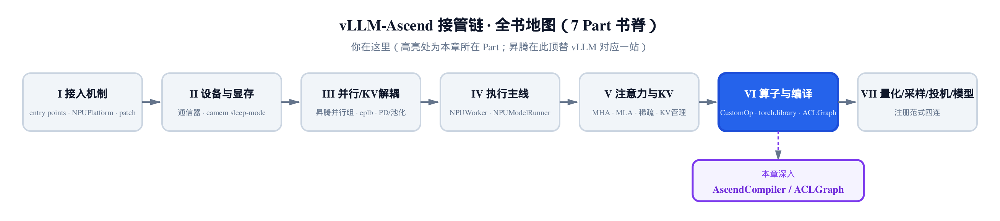
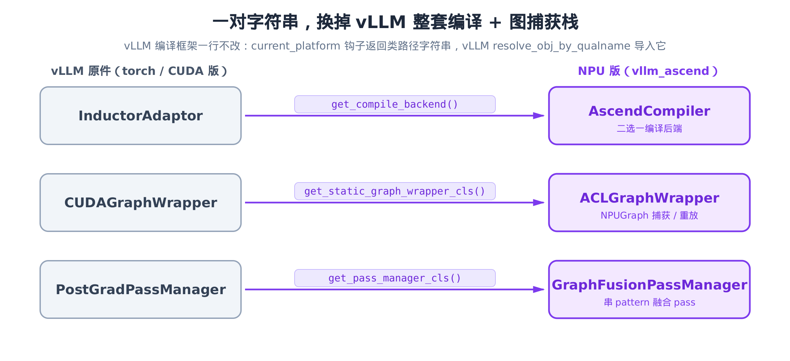
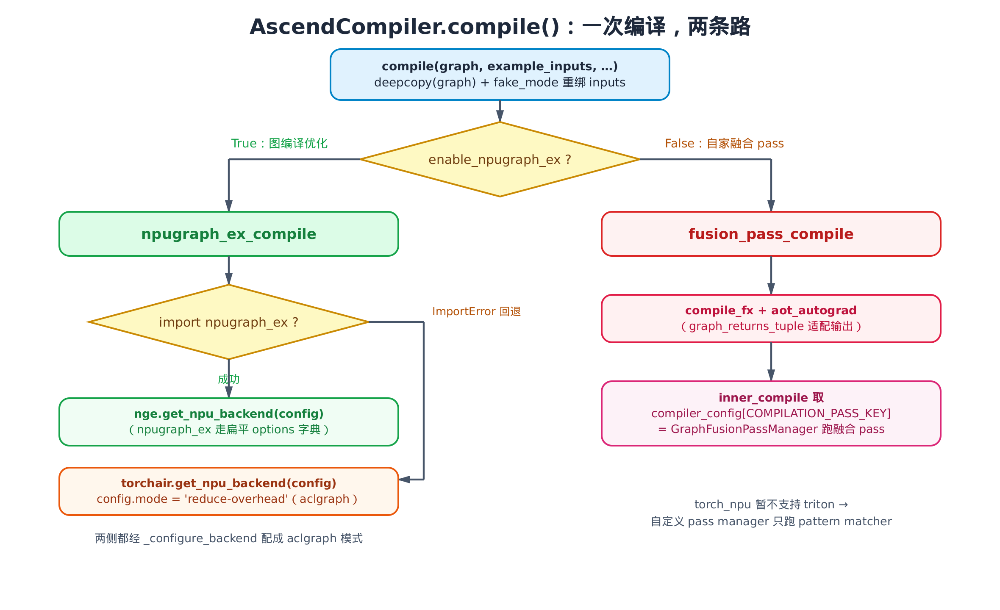
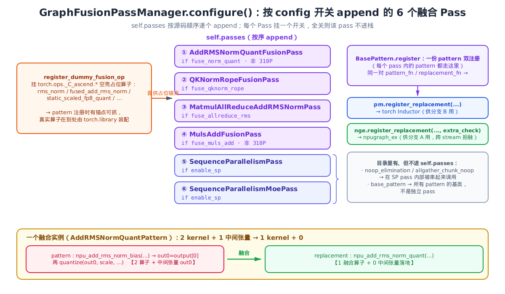
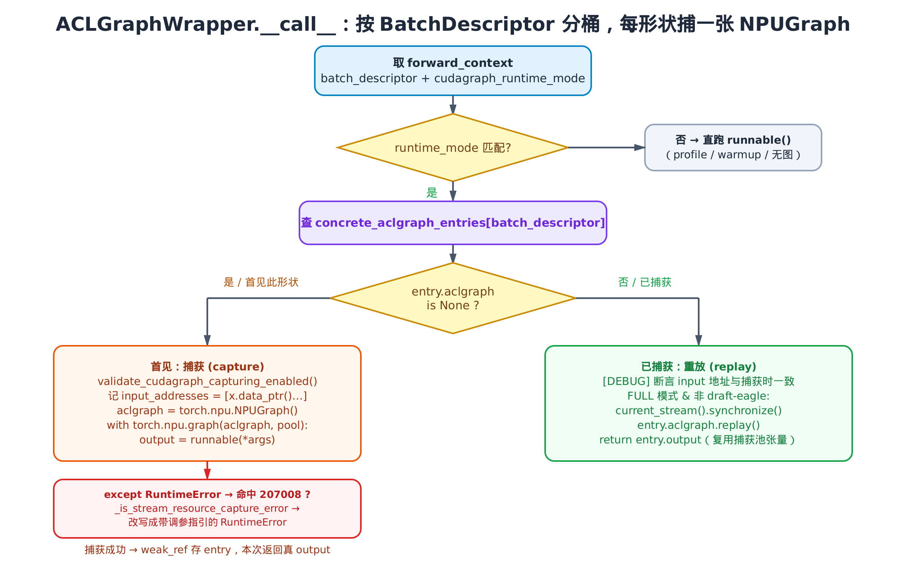

# 第 25 章 AscendCompiler 与 ACLGraph：torch.compile + cudagraph 栈的整体顶替



> 上一章：算子备齐了 meta，假跑推得出形状、进得了图。
> 本章：图怎么编、怎么捕获、怎么重放。
> 下一章：进入量化与采样的注册范式。

[上一章](../ch24-torch-library-and-meta/narrative/chapter.md)收尾时留了个悬念：昇腾给每个算子都补了一份 meta 实现，让 `torch.compile` 的 Dynamo 能「假跑」推形状，把算子纳进 fx 图。可那只是「进得了图」的入场券——**图本身怎么编译、怎么被录成可重放的图，上一章一字未提**。

这一章就来兑现。`torch.compile` 与 cudagraph，是 vLLM 拿性能的两大支柱：前者把 Python 前向编译成优化过的计算图，后者把一次前向的 device 端 kernel 序列「录」成一张图、之后固定输入地址 replay，省掉逐 kernel 的 host 端下发开销。

问题来了：这两根支柱在 vLLM 里都是为 CUDA / Inductor 写的。昇腾 NPU 既不走 Inductor，也没有 `torch.cuda.CUDAGraph`。**它要怎么把这两套栈换成 NPU 版，又不去改 vLLM 编译框架的一行代码？**

答案出奇地干净：在 `platform.py` 上动了三处钩子，但归根结底是**「编译」和「图捕获」两根支柱**——pass manager 是为编译后端服务的，算是「编译」这根支柱里的一颗螺丝。三处钩子、两根支柱，这一章就围着这层关系展开。

## 25.1 三个字符串，换掉 vLLM 整套编译栈 {#251-三个字符串换掉-vllm-整套编译栈}

vLLM 早把「编译后端」「图捕获包装器」「pass manager」都抽象成了 `current_platform` 上的钩子——每个钩子返回一个**类路径字符串**，vLLM 再按字符串 import 出真正的类。换句话说，这几样东西在 vLLM 框架里本就是「可替换插槽」。

昇腾要做的，就是让这几个钩子各返回一个 NPU 版的字符串。看 `vllm_ascend/platform.py` 上的三个方法（它们在 `NPUPlatform` 类里并不相邻，这里抽出来并列看）：

```python
# vllm_ascend/platform.py:L165
@classmethod
def get_pass_manager_cls(cls) -> str:
    """
    Get the pass manager class for this platform.
    It will be registered as a custom pass under the current_platform.pass_key.
    """
    return "vllm_ascend.compilation.graph_fusion_pass_manager.GraphFusionPassManager"

# vllm_ascend/platform.py:L173
@classmethod
def get_compile_backend(self) -> str:
    """
    Get the custom compile backend. Previously, we used EagerAdaptor by default.
    To use graph fusion operations, we defined our own backend compiler.
    """
    return "vllm_ascend.compilation.compiler_interface.AscendCompiler"

# vllm_ascend/platform.py:L815  （与上两个方法非相邻）
@classmethod
def get_static_graph_wrapper_cls(cls) -> str:
    """
    Get piecewise backend class for piecewise graph.
    """
    return "vllm_ascend.compilation.acl_graph.ACLGraphWrapper"  # noqa
```

三个字符串，对应三处顶替。但别被「三」带偏了——这三处不是三件平起平坐的事：`get_compile_backend` 和 `get_static_graph_wrapper_cls` 各立一根支柱（**编译** / **图捕获**），而 `get_pass_manager_cls` 返回的 pass manager 是给编译后端供货的，本质上是「编译」这根支柱里的一颗螺丝。所以全章看下来是**三个钩子、两根支柱**——这也是 §25.5 收尾时要回到的那两根。配一张图把全景立住：



> *图注：左列是 vLLM 原件（torch / CUDA 版），右列是 NPU 版。中间标的是 `current_platform` 钩子名。vLLM 编译框架一行不改——它只管按钩子拿字符串、import 出类来用。*

「一行不改」不是夸张。看 vLLM 自己怎么用这个字符串——`vllm/compilation/backends.py` 的 `make_compiler`：

```python
# vllm/compilation/backends.py:L96
def make_compiler(compilation_config: CompilationConfig) -> CompilerInterface:
    # … 省略：VLLM_USE_MEGA_AOT_ARTIFACT 的前置 assert …
    if compilation_config.backend == "inductor":
        # … 省略：走内建 InductorAdaptor / InductorStandaloneAdaptor …
        return InductorAdaptor()
    elif compilation_config.backend == "eager":
        return EagerAdaptor()
    else:
        logger.debug("Using custom backend: %s", compilation_config.backend)
        compiler = resolve_obj_by_qualname(current_platform.get_compile_backend())()
        assert isinstance(compiler, CompilerInterface)
        return compiler
```

`resolve_obj_by_qualname(...)` 拿到的就是钩子返回的那个字符串，把它当**全限定类名（qualname）**解析成类、实例化。紧跟一句 `assert isinstance(compiler, CompilerInterface)`——这就是契约：昇腾返回的 `AscendCompiler` **必须**是 vLLM `CompilerInterface` 的子类。打开源码，正是如此：

```python
# vllm_ascend/compilation/compiler_interface.py:L30
from vllm.compilation.compiler_interface import CompilerInterface
# …
# vllm_ascend/compilation/compiler_interface.py:L202
class AscendCompiler(CompilerInterface):
```

至此，顶替的「外壳」清楚了：昇腾不碰 vLLM 的编译流程，只在三个插槽里换上自己的实现类。**vLLM 看到的还是 `CompilerInterface` / `CUDAGraphWrapper` / `PostGradPassManager` 这套接口，背后的肉已经全换成 NPU 的了。**

剩下三章节，就是逐一打开这三个 NPU 版实现：编译后端 `AscendCompiler`（§25.2）、融合 pass 栈 `GraphFusionPassManager`（§25.3）、图捕获包装器 `ACLGraphWrapper`（§25.4）。先从编译后端开始。

## 25.2 AscendCompiler.compile()：一次编译，两条路 {#252-ascendcompilercompile一次编译两条路}

`CompilerInterface` 的核心方法是 `compile(graph, example_inputs, ...)`——Dynamo 把 Python 前向 trace 成 `fx.GraphModule`（PyTorch FX 的符号计算图，相当于一份类 IR 的中间表示）后，就把图交给它，期待返回一个编译好的可调用对象 `compiled_fn`。`AscendCompiler.compile` 占的就是这个位：

```python
# vllm_ascend/compilation/compiler_interface.py:L231
def compile(
    self,
    graph: fx.GraphModule,
    example_inputs: list[Any],
    compiler_config: dict[str, Any],
    compile_range: Range,
    key: str | None = None,
) -> tuple[Callable | None, Any | None]:
    # inductor can inplace modify the graph, so we need to copy it
    # see https://github.com/pytorch/pytorch/issues/138980
    graph = copy.deepcopy(graph)

    from torch._guards import detect_fake_mode

    current_fake_mode = detect_fake_mode()
    if current_fake_mode is not None:
        example_inputs = [
            current_fake_mode.from_tensor(inp)
            if (
                isinstance(inp, torch.Tensor)
                and hasattr(inp, "fake_mode")
                and inp.fake_mode is not current_fake_mode
            )
            else inp
            for inp in example_inputs
        ]

    ascend_compilation_config = get_ascend_config().ascend_compilation_config
    if ascend_compilation_config.enable_npugraph_ex:
        # … 省略：取 cache_dir、info_once 日志、assert hasattr(self, "vllm_config") …
        return npugraph_ex_compile(
            graph, example_inputs, compiler_config, self.vllm_config,
            ascend_compilation_config, compile_range, key, cache_dir,
        )
    else:
        return fusion_pass_compile(graph, example_inputs, compiler_config, compile_range, key)
```

进二分之前，先两手防御：

- **`copy.deepcopy(graph)`**：Inductor 可能就地改图（注释挂了 PyTorch issue #138980），先拷一份再动手，免得污染别处持有的同一张图。
- **`fake_mode` 重绑**：把 `example_inputs` 里那些挂着「别的 fake_mode」的张量，统一重绑到**当前**的 fake_mode。这正接上一章——假跑用的是 fake/meta 张量，编译前得保证它们都归属同一套 fake 上下文，否则形状推断会对不上。

防御做完，落到全章第一个关键分叉——`ascend_compilation_config.enable_npugraph_ex`：

- **开**：走 `npugraph_ex_compile`，交给成熟的 NPU 图编译栈。
- **关**：走 `fusion_pass_compile`，退回 `compile_fx` + 自家手写的融合 pass。

两条路对应「有 / 无 npugraph_ex 栈」两种环境。画成流程图：



> *图注：`enable_npugraph_ex` 开则走左路 npugraph_ex_compile（`ImportError` 回退 torchair，两侧都配成 aclgraph 模式）；关则走右路 fusion_pass_compile，在 GraphFusionPassManager 里跑自家融合 pass。*

下面分别拆。

### 分支 A：npugraph_ex_compile —— 图编译优化路，torchair 兜底 {#分支-a-npugraph_ex_compile}

第一条路把图交给 NPU 的图编译后端。这里还藏着一层二分——**npugraph_ex 优先、torchair 作回退**：

```python
# vllm_ascend/compilation/compiler_interface.py:L125
def npugraph_ex_compile(
    graph, example_inputs, compiler_config, vllm_config,
    ascend_compilation_config, compile_range, key=None, cache_dir=None,
):
    # Try npugraph_ex first, fall back to torchair for backward compatibility.
    try:
        import npugraph_ex as nge
        # … 省略：cache_path 计算、新旧 npugraph_ex 模块路径兼容、编译产物落盘缓存巧思 …
        config = nge.CompilerConfig()
        _configure_backend(
            config, ascend_compilation_config, vllm_config, process_kwargs_options=_process_kwargs_options
        )
        backend = nge.get_npu_backend(compiler_config=config)
        # torch.compile requires the output of the fx graph to be a tuple
        if not graph_returns_tuple(graph):
            compiled_fn = make_graph_return_tuple(graph, example_inputs, backend)
        else:
            compiled_fn = backend(graph, example_inputs)
        return compiled_fn, (key, cache_path)
    except ImportError:
        import torchair

        torch.npu.set_compile_mode(jit_compile=False)
        config = torchair.CompilerConfig()
        _configure_backend(config, ascend_compilation_config, vllm_config)
        backend = torchair.get_npu_backend(compiler_config=config)
        # torch.compile requires the output of the fx graph to be a tuple
        if not graph_returns_tuple(graph):
            compiled_fn = make_graph_return_tuple(graph, example_inputs, backend)
        else:
            compiled_fn = backend(graph, example_inputs)
        return compiled_fn, None
```

`try import npugraph_ex` 失败就 `except ImportError` 落到 `import torchair`——新环境用新栈 `npugraph_ex`，旧环境无该包时退回成熟的 `torchair`。两侧结构几乎对称：建 `CompilerConfig` → `_configure_backend` 配置 → `get_npu_backend` 取后端 → 调后端编图。

这里有个反复出现的小动作值得点一下：`graph_returns_tuple(graph)` 不成立时套一层 `make_graph_return_tuple`。这是 `torch.compile` 后端协议的硬要求——**fx 图的输出必须是 flat tuple**。两侧分支、乃至后面的分支 B，都得过这一关。

两条后端的差别，全压在 `_configure_backend` 里。它就是把后端配成 **aclgraph 模式**的地方：

```python
# vllm_ascend/compilation/compiler_interface.py:L82
def _configure_backend(
    config, ascend_compilation_config, vllm_config, process_kwargs_options=None,
):
    if process_kwargs_options is not None:
        # npugraph_ex (both old and new): build options dict and use _process_kwargs_options.
        # force_eager=True: execute FX graph in eager mode before graph capture.
        # inplace_pass=False: disable reinplace pass to avoid gelu fallback to CPU.
        options: dict[str, Any] = {
            "force_eager": True,
            "inplace_pass": False,
        }
        # … 省略：enable_static_kernel 开关下的 static_kernel 设置与 batch 尺寸限定 …
        process_kwargs_options(config, {"options": options})
    else:
        # torchair (reduce-overhead): use nested config structure directly.
        # mode="reduce-overhead": use aclgraph mode, avoid fx graph to Ascend IR transformation.
        config.mode = "reduce-overhead"
        config.debug.run_eagerly = True
        # Disable reinplace pass to avoid gelu fallback to CPU causing host-device copy error.
        config.debug.aclgraph.disable_reinplace_inplaceable_ops_pass = True
        # … 省略：enable_static_kernel 开关下的 static_kernel 设置与 sym_range …
```

两条分支配的是同一件事，写法不同：

- **npugraph_ex** 走扁平的 `options` 字典（`force_eager` / `inplace_pass`）。
- **torchair** 走嵌套的 `config.mode = "reduce-overhead"`——这个字符串就是 torchair 的 **aclgraph 模式**标志，含义是**绕开「fx 图 → 昇腾 IR」的转换**，直接走 aclgraph 路径。

两边都把 `reinplace`/`inplace_pass` 关掉，注释说得很直白：开着会让 `gelu` 回退到 CPU，触发 host-device 拷贝错误。这是踩过的坑，不是洁癖。

### 分支 B：fusion_pass_compile —— 自家融合 pass 路 {#分支-b-fusion_pass_compile}

`enable_npugraph_ex` 关掉时，走第二条路。它不依赖 npugraph_ex/torchair，而是用 PyTorch 自带的 `compile_fx` + `aot_autograd`（ahead-of-time autograd，把前向/反向提前拆开并做算子分解），在中间塞进**自家的融合 pass**：

```python
# vllm_ascend/compilation/compiler_interface.py:L47
def fusion_pass_compile(
    graph, example_inputs, compiler_config, compile_range, key=None,
):
    def compile_inner(graph, example_inputs):
        current_pass_manager = compiler_config[COMPILATION_PASS_KEY]
        graph = current_pass_manager(graph)
        return graph

    decompositions = select_decomp_table()

    compiled_fn = compile_fx(
        graph=graph,
        example_inputs=example_inputs,
        inner_compile=compile_inner,
        decompositions=decompositions,
    )

    return compiled_fn, None
```

关键在 `compile_inner`：它从 `compiler_config[COMPILATION_PASS_KEY]` 取出一个对象，对图调用它、返回改过的图。这个 `COMPILATION_PASS_KEY`（值是 `"graph_fusion_manager"`）取出来的，**正是 §25.1 那个 `get_pass_manager_cls` 顶替进来的 `GraphFusionPassManager` 实例**——它经 Inductor 的自定义 pass 机制注入到了 `compiler_config` 里。三个钩子在这里第一次「合流」。

再看 `compile_fx` 这层包装：

```python
# vllm_ascend/compilation/compiler_interface.py:L39
def compile_fx(graph: GraphModule, example_inputs: list, inner_compile: Callable, decompositions: dict) -> Callable:
    recursive_compile_fx = functools.partial(compile_fx, inner_compile=inner_compile, decompositions=decompositions)

    if not graph_returns_tuple(graph):
        return make_graph_return_tuple(graph, example_inputs, recursive_compile_fx)
    return aot_autograd(fw_compiler=inner_compile)(graph, example_inputs)
```

又见 `graph_returns_tuple` / `make_graph_return_tuple`——同样是「保证输出是 tuple」那道关。过关后用 `aot_autograd(fw_compiler=inner_compile)` 把 `compile_inner` 包成前向编译器。`aot_autograd` 负责把图的前向/反向拆出来、做算子分解（`decompositions`），`inner_compile` 则在分解后的图上跑融合 pass。

那 `GraphFusionPassManager` 到底跑了哪些融合？这就是下一节。

## 25.3 融合 pass 栈：GraphFusionPassManager {#253-融合-pass-栈graphfusionpassmanager}

`GraphFusionPassManager` 对位的是 vLLM 的 `PostGradPassManager`。为什么不直接复用 vLLM 那个？类自己的 docstring 给了理由：

```python
# vllm_ascend/compilation/graph_fusion_pass_manager.py:L25
class GraphFusionPassManager:
    """
    A pass manager for graph fusion passes.
    It handles the configuration and execution of passes.
    The counterpart in vllm is PostGradPassManager. Since torch_npu
    does not support triton for now, we define our own pass manager.
    """

    def __init__(self):
        self.passes: list[VllmInductorPass] = []

    def __call__(self, graph: fx.Graph) -> fx.Graph:
        compile_range = get_pass_context().compile_range

        for pass_ in self.passes:
            if pass_.is_applicable_for_range(compile_range):
                pass_(graph)
        graph.recompile()
        return graph

    def add(self, pass_: VllmInductorPass):
        assert isinstance(pass_, VllmInductorPass)
        self.passes.append(pass_)
```

「torch_npu 暂不支持 triton」——vLLM 的 `PostGradPassManager` 依赖 Inductor/triton 那条路，昇腾用不了，所以另起一个**只跑 pattern matcher** 的精简 pass manager。`__call__` 的逻辑很朴素：遍历 `self.passes`，对每个适用于当前 `compile_range` 的 pass 调一遍，最后 `graph.recompile()` 让改动生效。

那 `self.passes` 里有哪些 pass？看 `configure`：

```python
# vllm_ascend/compilation/graph_fusion_pass_manager.py:L49
def configure(self, config: VllmConfig):
    from vllm_ascend.utils import is_310p

    # By default, we enable the graph fusion and quantization fusion pass.
    self.ascend_compilation_config: dict = config.additional_config.get("ascend_compilation_config", {})
    if self.ascend_compilation_config.get("fuse_norm_quant", True) and not is_310p():
        from .passes.norm_quant_fusion_pass import AddRMSNormQuantFusionPass
        self.passes.append(AddRMSNormQuantFusionPass(config))

    if self.ascend_compilation_config.get("fuse_qknorm_rope", True):
        from .passes.qknorm_rope_fusion_pass import QKNormRopeFusionPass
        self.passes.append(QKNormRopeFusionPass(config))

    if self.ascend_compilation_config.get("fuse_allreduce_rms", True):
        from .passes.allreduce_rmsnorm_fusion_pass import MatmulAllReduceAddRMSNormPass
        self.passes.append(MatmulAllReduceAddRMSNormPass(config))

    if self.ascend_compilation_config.get("fuse_muls_add", True) and not is_310p():
        from .passes.muls_add_pass import MulsAddFusionPass
        self.passes.append(MulsAddFusionPass(config))

    if config.compilation_config.pass_config.enable_sp:
        from .passes.sequence_parallelism import SequenceParallelismPass
        from .passes.sequence_parallelism_moe import SequenceParallelismMoePass
        self.passes.append(SequenceParallelismPass(config))
        self.passes.append(SequenceParallelismMoePass(config))
```

每个 pass 都挂在一个开关后面。默认开的四个（`fuse_norm_quant` / `fuse_qknorm_rope` / `fuse_allreduce_rms` / `fuse_muls_add`）外加序列并行的两个（由 `enable_sp` 控制），`configure` 显式 `append` 进来的就是**这六个 Pass 类**。`passes/` 目录下还有 `noop_elimination` 与 `allgather_chunk_noop` 两个清理 pass，但它们不在这里 append——而是在序列并行 pass 内部被串起来调用；`base_pattern` 则是所有 pattern 的基类，不是独立 pass。别被目录文件数误导。

注意 `is_310p()` 这个门控：310P 推理卡上 `fuse_norm_quant` / `fuse_muls_add` 直接跳过——平台内部还有平台差异，[第 17 章](../ch17-310p-inference-chip-specialization/narrative/chapter.md)讲过 310P 的特殊待遇，这里又见一例。

§25.3 是全章最密的一段，先用一张全景图把这套融合 pass 栈的零件摆齐，后面几小节再逐个拧：



> *图注：中列是 `configure` 按开关 append 的六个 Pass（按源码顺序①→⑥，最后两个由 `enable_sp` 一并控制）；左侧 `register_dummy_fusion_op` 先挂一组 `torch.ops._C_ascend.*` 空壳占位算子，给 pattern 注册提供锚点；右上 `BasePattern.register` 把每条 pattern 同时注册进 torch Inductor（`pm.register_replacement`，供分支 B）和 npugraph_ex（`nge.register_replacement`，供分支 A），即「一份 pattern、双注册」；右侧旁注点明 `noop_elimination` / `allgather_chunk_noop` 在 SP pass 内部被串调、`base_pattern` 只是基类——它们都不在 `self.passes` 里。底部给一例融合：`add_rms_norm_bias → quantize`（2 kernel + 1 中间张量）经融合收成 `npu_add_rms_norm_quant`（1 kernel + 0）。*

### 占位算子：让 pattern 有锚点可抓 {#占位算子让-pattern-有锚点可抓}

讲具体 pass 之前，得先解决一个鸡生蛋的问题。融合 pass 的工作方式是「pattern matching」：先描述一个**要匹配的子图**（pattern），再描述**替换成什么**（replacement）。pattern 描述里要引用具体算子，比如 `torch.ops._C_ascend.rms_norm`。

可问题是——pattern **注册**发生在进程启动早期，那一刻这些 `torch.ops._C_ascend.*` 算子可能还没真正实现挂上去。引用一个不存在的算子对象，注册阶段就崩了。

昇腾的解法很巧：先挂一组**空壳占位算子**当锚点：

```python
# vllm_ascend/ops/__init__.py:L36
class dummyFusionOp:
    default = None

    def __init__(self, name=""):
        self.name = name


def register_dummy_fusion_op() -> None:
    torch.ops._C_ascend.rms_norm = dummyFusionOp(name="rms_norm")
    torch.ops._C_ascend.fused_add_rms_norm = dummyFusionOp(name="fused_add_rms_norm")
    torch.ops._C_ascend.static_scaled_fp8_quant = dummyFusionOp(name="static_scaled_fp8_quant")
    torch.ops._C_ascend.dynamic_scaled_fp8_quant = dummyFusionOp(name="dynamic_scaled_fp8_quant")
    torch.ops._C_ascend.dynamic_per_token_scaled_fp8_quant = dummyFusionOp(name="dynamic_per_token_scaled_fp8_quant")
    torch.ops._C_ascend.rms_norm_static_fp8_quant = dummyFusionOp(name="rms_norm_static_fp8_quant")
    torch.ops._C_ascend.fused_add_rms_norm_static_fp8_quant = dummyFusionOp(name="fused_add_rms_norm_static_fp8_quant")
    torch.ops._C_ascend.rms_norm_dynamic_per_token_quant = dummyFusionOp(name="rms_norm_dynamic_per_token_quant")
```

`dummyFusionOp` 是个什么都不算的空类，`register_dummy_fusion_op` 在 worker 启动期把它挂到 `torch.ops._C_ascend.*` 上。这样 pattern 注册时引用这些名字就有对象可抓——**它们只是匹配用的「锚点」，真实算子在别处实现**（正是[上一章](../ch24-torch-library-and-meta/narrative/chapter.md)讲的 `torch.library` 注册那一套）。锚点和真实现，各管一摊。

### 一份 pattern，注册进两套引擎 {#一份-pattern注册进两套引擎}

锚点就位，pattern 怎么注册？看基类 `BasePattern.register`：

```python
# vllm_ascend/compilation/passes/base_pattern.py:L41
def register(self, pm_pass: PatternMatcherPass) -> None:
    # Create a unique identifier for this pattern based on class name and eps
    pattern_id = f"{self.__class__.__name__}_{self.eps}"

    # Skip registration if this pattern has already been registered globally
    if pattern_id in _registered_patterns:
        return

    pattern_fn = self.get_pattern()
    replacement_fn = self.get_replacement()
    example_inputs = self.get_inputs()

    pm.register_replacement(pattern_fn, replacement_fn, example_inputs, pm.fwd_only, pm_pass)

    nge.register_replacement(
        search_fn=pattern_fn,
        replace_fn=replacement_fn,
        example_inputs=example_inputs,
        extra_check=self.get_extra_stream_scope_check(),
    )

    # Mark this pattern as registered
    _registered_patterns.add(pattern_id)
```

同一对 `pattern_fn` / `replacement_fn`，**注册了两份**：

- `pm.register_replacement(...)`——注册进 torch Inductor 的 pattern matcher。这是分支 B（`fusion_pass_compile`）那条路要用的。
- `nge.register_replacement(...)`——注册进 npugraph_ex（`import npugraph_ex as nge`；无该包则 `except ImportError` 回退 `import torchair as nge`）。这是分支 A 那条路要用的。

为什么双注册？因为两条编译路都得认得同一个融合规则——分支 A 走 npugraph_ex，分支 B 走 Inductor，各注册一份才能两边通吃。`nge` 那侧多带个 `extra_check=...get_extra_stream_scope_check()`，作用是**跨 stream 时拒绝融合**——融合算子假设在同一 stream 上，跨 stream 误融会出错。

还有个细节：`pattern_id = f"{类名}_{eps}"` + `_registered_patterns` 全局去重。同一个 pattern 在不同 `eps` 下会被注册多次，靠这个 id 防重复。

### 一个融合实例：AddRMSNorm + 量化 → 单算子 {#一个融合实例addrmsnorm--量化-单算子}

抽象讲完，落到一个具体 pattern。`norm_quant_fusion_pass.py` 里有八个同构的变体，挑最有代表性的 `AddRMSNormQuantPattern` 看它的 pattern / replacement：

```python
# vllm_ascend/compilation/passes/norm_quant_fusion_pass.py:L45
def get_pattern(self):
    def pattern(rms_norm_input, residual, rms_norm_weight, scale, scale_reciprocal, offset):
        output = torch.ops._C_ascend.npu_add_rms_norm_bias(
            rms_norm_input, residual, rms_norm_weight, None, self.eps
        )
        out0 = output[0]
        out1 = output[2]
        quantized_output = torch.ops.vllm.quantize(out0, scale, scale_reciprocal, offset)
        return quantized_output, out1

    return pattern

def get_replacement(self):
    def replacement(rms_norm_input, residual, rms_norm_weight, scale, scale_reciprocal, offset):
        output = torch.ops.npu.npu_add_rms_norm_quant(
            rms_norm_input, residual, rms_norm_weight, scale, offset, epsilon=self.eps
        )
        quantized_output = output[0]
        out1 = output[2]
        return quantized_output, out1

    return replacement
```

读法很直接：

- **pattern（要匹配的子图）**：先 `npu_add_rms_norm_bias` 做带 bias 的 AddRMSNorm（它返回一个 tuple，`output[0]` 是归一化结果、`output[2]` 是残差输出），再单独一个 `quantize` 把 `out0` 量化——**两个算子，中间还落一次中间张量 `out0`**。
- **replacement（替换成什么）**：一个 `npu_add_rms_norm_quant`——**AddRMSNorm 与量化合成一个融合算子**，中间张量不落地。

收益可以数出来：pattern 这边是 **2 个算子**（`npu_add_rms_norm_bias` + `quantize`）外加 **1 个落地的中间张量 `out0`**；replacement 这边是 **1 个融合算子**、**0 个中间张量落地**。一句话——**「2 kernel + 1 中间张量」收成「1 kernel + 0」**：省一次 kernel 启动、省一趟中间张量的显存往返。而这类 norm/quant 子图**每个 transformer 层都有一份**，所以这点收益会随层数 $L$ **线性放大**——L 层模型就省下约 L 次 kernel 启动和 L 趟中间张量往返。其余七个变体（带 bias 的 / 序列并行 SP 的 / 动态量化 DynamicQuant 的，以及它们的组合）结构同构，只是算子签名、是否带 bias、是否插 `all_gather` 不同，机制一样，不赘述。

这些 pattern 怎么被串进一个 pass？看 `AddRMSNormQuantFusionPass`：

```python
# vllm_ascend/compilation/passes/norm_quant_fusion_pass.py:L477
class AddRMSNormQuantFusionPass(VllmInductorPass):
    """
    A pass for fusing AddRMSNorm and W8A8 quantization operations on Ascend.
    """

    def __init__(self, vllm_config: VllmConfig):
        super().__init__(vllm_config)
        self.pattern_match_passes: PatternMatcherPass = PatternMatcherPass(pass_name="rmsnorm_quant_fusion_pass")

        dtype = vllm_config.model_config.dtype
        if dtype not in (torch.bfloat16, torch.float16):
            logger.debug("Quant fusion not enabled: unsupported dtype %s", dtype)
            return

        common_epsilons = [1e-5, 1e-6]
        for eps in common_epsilons:
            AddRMSNormDynamicQuantPattern(vllm_config, eps=eps).register(self.pattern_match_passes)
            # … 省略：enable_custom_op() 下其余 6 个同构 Pattern 的 register …

    def __call__(self, graph: torch.fx.Graph):
        self.begin()
        self.matched_count = self.pattern_match_passes.apply(graph)
        logger.debug("Replaced %s patterns", self.matched_count)
        self.end_and_log()

    def is_applicable_for_range(self, compile_range: Range) -> bool:
        return True
```

`__init__` 里按 `eps ∈ {1e-5, 1e-6}` 和 `dtype` 门控，把多个 pattern `register` 进一个 `PatternMatcherPass`。到 `__call__` 时，`pattern_match_passes.apply(graph)` 一次性把图里所有匹配上的子图替换成融合算子，返回替换次数。这就回扣了 `GraphFusionPassManager.__call__` 里那句 `pass_(graph)`——pass 被调用时，干的就是这件「扫一遍图、把 pattern 替成融合算子」的活。

至此分支 B 的全链路通了：`fusion_pass_compile` → `GraphFusionPassManager.__call__` → 各 `Pass.__call__` → `PatternMatcherPass.apply` → 把 `add_rms_norm_bias + quantize` 替成 `npu_add_rms_norm_quant`。编译这条线收尾。

## 25.4 ACLGraphWrapper：把一次前向录成一张图 {#254-aclgraphwrapper把一次前向录成一张图}

编译解决「图怎么算得快」；图捕获解决另一个问题——**host 端下发 kernel 的开销**。每跑一次前向，CPU 要逐个把 kernel 提交给 device，几百上千次提交累起来，小 batch 下 host 反而成了瓶颈。aclgraph/cudagraph 的思路是：**第一次跑时把这串 device 端 kernel「录」成一张图，之后同样形状的前向直接 replay 这张图**，host 只下发一条 replay 指令。

vLLM 的 `CUDAGraphWrapper` 是为 `torch.cuda.CUDAGraph` 写的。昇腾的 `ACLGraphWrapper` 几乎是它的**逐字移植**——同样的 `concrete_*_entries` 字典、同样的 `__getattr__` 透传、同样的 weak_ref 套路。差异集中在三处：`torch.cuda.CUDAGraph` → `torch.npu.NPUGraph`、新增错误码 207008 兜底、新增 replay 前的 `synchronize`。先看主控制流：

```python
# vllm_ascend/compilation/acl_graph.py:L152
def __call__(self, *args, **kwargs):
    forward_context = get_forward_context()
    batch_descriptor = forward_context.batch_descriptor
    aclgraph_runtime_mode = forward_context.cudagraph_runtime_mode

    if aclgraph_runtime_mode == CUDAGraphMode.NONE or aclgraph_runtime_mode != self.runtime_mode:
        # CUDAGraphMode.NONE could mean the profile run, a warmup run, or
        # running without aclgraphs. … dispatch to the correct wrapper when nesting.
        return self.runnable(*args, **kwargs)

    if batch_descriptor not in self.concrete_aclgraph_entries:
        # create a new entry for this batch descriptor
        self.concrete_aclgraph_entries[batch_descriptor] = ACLGraphEntry(batch_descriptor=batch_descriptor)

    entry = self.concrete_aclgraph_entries[batch_descriptor]

    if entry.aclgraph is None:
        # … 省略：debug 日志 …
        validate_cudagraph_capturing_enabled()

        input_addresses = [x.data_ptr() for x in args if isinstance(x, torch.Tensor)]
        entry.input_addresses = input_addresses
        aclgraph = torch.npu.NPUGraph()

        with ExitStack() as stack:
            if self.aclgraph_options.gc_disable:
                stack.enter_context(patch("gc.collect", lambda: None))
                stack.enter_context(patch("torch.npu.empty_cache", lambda: None))

            # mind-exploding: carefully manage the reference and memory.
            from vllm.model_executor.offloader.base import get_offloader
            get_offloader().sync_prev_onload()
            forward_context.capturing = True
            try:
                with torch.npu.graph(aclgraph, pool=self.graph_pool):
                    # `output` is managed by pytorch's aclgraph pool
                    output = self.runnable(*args, **kwargs)
                    get_offloader().join_after_forward()
                    if self.aclgraph_options.weak_ref_output:
                        output = weak_ref_tensors(output)
            except RuntimeError as exc:
                if _is_stream_resource_capture_error(exc):
                    _raise_stream_resource_capture_error(exc)
                raise

        # … 省略：对三套 GraphParams 的 workspaces 转弱引用以省显存 …

        entry.output = weak_ref_tensors(output)
        entry.aclgraph = aclgraph
        compilation_counter.num_cudagraph_captured += 1

        # important: return real output (not weak ref) so pytorch manages memory during capture
        return output
```

这是一台状态机，按 `get_forward_context()`（vLLM 主循环每轮前向前设好的前向上下文）里的两个量分派——`batch_descriptor`（记这一批的形状，如 seq_len / batch_size；同形状复用同一张图、不同形状各捕各的）和 `cudagraph_runtime_mode`（这轮该不该走图、走哪种图）。配图：



> *图注：`runtime_mode` 不匹配（profile / warmup / 无图）直跑 runnable；匹配则按 `batch_descriptor` 查桶。桶里 `aclgraph is None`（首见此形状）走捕获、否则走重放。每个 BatchDescriptor 对应一张独立的 NPUGraph。*

拆三档：

**第一档：mode 不匹配，直跑。** `runtime_mode == NONE`（profile / warmup / 不用图）或当前 mode 与本 wrapper 的 `runtime_mode` 不一致，就 `return self.runnable(...)` 原样跑，不碰图。多个不同 mode 的 wrapper 嵌套时，这一判定保证活派给对的那层。

**第二档：首见某形状，捕获。** 这是核心。先 `validate_cudagraph_capturing_enabled()` 确认此刻允许捕获，记下输入张量的 `data_ptr()`（地址，replay 时要校验），建一张 `torch.npu.NPUGraph()`，然后在 `with torch.npu.graph(aclgraph, pool=self.graph_pool):` 上下文里跑一遍 `runnable`——`graph_pool` 是各 NPUGraph 共享的捕获内存池，这一跑，device 端的 kernel 序列就被录进 `aclgraph` 了。录完把 `aclgraph` 和 `output` 存进 `entry`。

注意末尾那句注释和它的反直觉操作：**捕获分支返回的是真 `output`，不是弱引用**。原因是捕获期 PyTorch 要靠真引用正确管理 aclgraph 内存池；而存进 `entry.output` 的则转成弱引用省显存。一存一返，两个版本，刻意为之。

**第三档：再见同形状，重放。** 落到 `__call__` 后半段：

```python
# vllm_ascend/compilation/acl_graph.py:L248
    if self.is_debugging_mode:
        # check if the input addresses are the same
        new_input_addresses = [x.data_ptr() for x in args if isinstance(x, torch.Tensor)]
        assert new_input_addresses == entry.input_addresses, (
            f"Input addresses for aclgraphs are different "
            f"during replay. Expected {entry.input_addresses}, "
            f"got {new_input_addresses}"
        )

    logger.info_once("Replaying aclgraph")
    # In async scheduling or multi-threaded (MT) scenarios … we must call
    # synchronize here before replaying, so that update_attn_params only
    # executes after the previous graph replay has fully completed.
    is_draft_eagle = _EXTRA_CTX.is_draft_model and self.use_eagle
    need_sync = self.runtime_mode == CUDAGraphMode.FULL and not is_draft_eagle
    if not self.enable_enpu and need_sync:
        torch.npu.current_stream().synchronize()
    entry.aclgraph.replay()
    return entry.output
```

`entry.aclgraph.replay()` 一句话重放整张图，返回缓存的 `entry.output`。两个守护值得点名：

- **DEBUG 下断言输入地址一致**。aclgraph 录的是「在这些固定地址上执行」的序列，replay 时输入张量必须落在**捕获时的同一地址**，否则图读的是错的内存。这条断言把这个不变量焊死成可验证的事实。
- **FULL 模式下 replay 前 `synchronize`**。异步调度 / 多线程下，可能出现「第 i 轮的 CPU 记录事件，早于第 i-1 轮图重放完成」的乱序。同步一下，保证 `update_attn_params` 排在上一轮 replay 之后。注意这道同步只在 `runtime_mode == FULL` 且**非** draft-eagle 时才加（`is_draft_eagle` 指投机解码的草稿模型走 EAGLE 模式那一路，留待采样/投机章细说）。这是 NPU 版相对 vLLM 新增的一道屏障（对照基座 `vllm/compilation/cuda_graph.py` 的 replay 段没有这一步）。

### 两轮过后：分桶字典怎么长出来 {#两轮过后分桶字典怎么长出来}

把这台状态机连着跑几拍，看 `concrete_aclgraph_entries` 这个分桶字典怎么演化。假设连续来四次前向，形状依次是 `D1`、`D1`、`D2`、`D1`（`D` 是 `BatchDescriptor`，可粗略想成「这一批的 batch 形状」）：

| 轮次 | batch_descriptor | 进来时 entry.aclgraph | 走哪档 | 动作 | 返回 |
|---|---|---|---|---|---|
| 1 | D1 | 桶不存在 → 新建，`None` | 捕获 | `NPUGraph()` + `torch.npu.graph` 录第一张图 | 真 `output` |
| 2 | D1 | 已存在，非 `None` | 重放 | `entry.aclgraph.replay()` | `entry.output`（缓存） |
| 3 | D2 | 桶不存在 → 新建，`None` | 捕获 | 录**第二张**图（D2 专属） | 真 `output` |
| 4 | D1 | 已存在，非 `None` | 重放 | 复用 D1 那张图 replay | `entry.output`（缓存） |

读这张表能看清两件事。其一，**每个形状只捕一次**：`entry.aclgraph` 一旦从 `None` 变成 `NPUGraph`，就再不回头，后续同形状全走 replay。其二，**形状各捕各的**：D1、D2 各占一张图，互不干扰。

这背后是个简单但要紧的不变量：

**捕获次数 ≤ 不同 batch 形状数。** 论证骨架——`entry.aclgraph` 这个字段对每个桶只做一次 `None → NPUGraph` 的单向跃迁（第二档结尾 `entry.aclgraph = aclgraph`），之后永不复位；所以一个桶最多触发一次捕获，总捕获次数被「不同 `batch_descriptor` 的个数」死死压住。这正是「按形状分桶、每形状一张图」的精确含义。

把它落回上面那张表数一下：4 次前向、`D1`/`D2` 两个不同形状，恰好 **2 次捕获 + 2 次重放**——即**捕获次数 = 不同形状数 = 2、重放次数 = 前向次数 − 形状数 = 4 − 2 = 2**。这里取的是等号而非小于号，因为每个形状首次出现时**必然**当场捕一次（首见走第二档）；只有当某个形状从头到尾一次没出现，才会落到严格小于。

### 当桶太多：207008 兜底 {#当桶太多207008-兜底}

分桶解释了一个隐患：捕的图越多，占的 stream 资源、显存越多。这些不是无限的。`cudagraph_capture_sizes` 配大了，捕获时可能撞上 NPU 报 **207008**——stream 资源耗尽。裸抛这个错误码，用户一脸懵。

昇腾专门为它兜了底。回头看捕获分支里那个 `except RuntimeError`，它调的就是这两个函数：

```python
# vllm_ascend/compilation/acl_graph.py:L27
_STREAM_RESOURCE_ERROR_CODE = "207008"
_STREAM_RESOURCE_ERROR_MARKERS = (
    "insufficient_stream_resources",
    "stream resources are insufficient",
)
_STREAM_RESOURCE_GUIDANCE = (
    "ACL graph capture failed with a known stream-resource exhaustion "
    "signature. Consider upgrading to a newer HDK/CANN stack, reducing "
    "cudagraph_capture_sizes, lowering max_cudagraph_capture_size, preferring "
    "FULL or FULL_DECODE_ONLY for mostly uniform decode workloads, or "
    "temporarily disabling graph mode to confirm the failure is capture-related."
)


def _is_stream_resource_capture_error(exc: RuntimeError) -> bool:
    message = str(exc)
    lowered_message = message.lower()
    has_error_code = _STREAM_RESOURCE_ERROR_CODE in message
    has_stream_resource_marker = any(marker in lowered_message for marker in _STREAM_RESOURCE_ERROR_MARKERS)
    return has_stream_resource_marker or (has_error_code and "stream resource" in lowered_message)


def _raise_stream_resource_capture_error(exc: RuntimeError) -> None:
    raise RuntimeError(f"{_STREAM_RESOURCE_GUIDANCE}\nOriginal error:\n{exc}") from exc
```

识别逻辑留了个心眼：**不是光看到 `207008` 就认**。要么命中两个英文标志串之一，要么是「错误码 207008 **且** 文本里含 `stream resource`」——避免把碰巧含这串数字的无关错误误判。命中后 `_raise_stream_resource_capture_error` 把它改写成一条**带具体调参指引**的 `RuntimeError`：升级 CANN、调小 `cudagraph_capture_sizes`、降 `max_cudagraph_capture_size`、改用 FULL 模式、或临时关图确认问题是否出在捕获。`from exc` 保留原始异常链，排查时仍能看到底层报错。

把一个晦涩的厂商错误码，翻译成「你该改哪个参数」——这是把踩坑经验沉淀进代码的典型一手。

### 一条仍悬着的线：图捕获与 custom all-reduce {#一条仍悬着的线图捕获与-custom-all-reduce}

讲到这，正好回收[第 6 章](../ch06-npu-communicator/narrative/chapter.md)埋下、[第 7 章](../ch07-sleep-mode-camem-allocator/narrative/chapter.md)又点过的一条悬线：`NPUCommunicator.ca_comm = None` 那个占位。

GPU 上的 custom all-reduce 是一种「把 all-reduce 也录进 cudagraph」的优化——通信和计算一起被图捕获、一起 replay。它的落点，本就在「图捕获框架」之上。

而本章讲的 `ACLGraphWrapper`（`torch.npu.NPUGraph` 的 capture / replay + 按 `BatchDescriptor` 分桶），**正是昇腾这套图捕获框架本身**。custom all-reduce 与图捕获的集成，是建立在这套框架之上的一个具体特性。诚实地说：当前 vllm-ascend 这一集成**尚未落地**——`ca_comm` 仍在 `vllm_ascend/distributed/device_communicators/npu_communicator.py` 里留 `None` 占位，本章的编译 / 图捕获文件（`compiler_interface.py`、`acl_graph.py`、`graph_fusion_pass_manager.py`）里没有一处引用它。

所以这条线的结论是：**框架在此，接入待来**。图捕获的地基（NPUGraph 捕获 / 分桶 / 207008 兜底）已经夯实，custom all-reduce 接到这块地基上，是这套机制之上顺理成章的下一步，只是 `ca_comm` 现在还空着。把它如实标在这里，比硬塞一段源码里不存在的调用要诚实。

## 25.5 小结：两个字符串撑起的两根支柱 {#255-小结两个字符串撑起的两根支柱}

回头看，这一章其实只讲了两个字符串能撬动多大的事。

**编译这根支柱**：`vllm_ascend/platform.py` 的 `get_compile_backend` 返回 `AscendCompiler`，把 vLLM 的编译后端整个换成 NPU 版。`vllm_ascend/compilation/compiler_interface.py` 里的 `compile()` 再按 `enable_npugraph_ex` 二分——开则走 npugraph_ex（`ImportError` 回退 torchair，两者都配成 `reduce-overhead` 的 aclgraph 模式），关则走 `compile_fx` + `aot_autograd`，在 `vllm_ascend/compilation/graph_fusion_pass_manager.py` 的 `GraphFusionPassManager` 里跑自家的 pattern 融合 pass（`add_rms_norm_bias + quantize → npu_add_rms_norm_quant` 那一类）。这些 pass 之所以能注册起来，靠的是 `register_dummy_fusion_op` 的占位锚点 + `BasePattern.register` 的双注册。

`get_static_graph_wrapper_cls` 返回 `ACLGraphWrapper`，把图捕获包装器换成 NPU 版——`vllm_ascend/compilation/acl_graph.py` 里用 `torch.npu.NPUGraph` 做 capture / replay，按 `BatchDescriptor` 分桶（每形状一张图、每形状只捕一次），并对 stream 资源耗尽的 207008 专项兜底。对照基座 `vllm/compilation/cuda_graph.py` 的 `CUDAGraphWrapper`，差异只在 NPU 替换、207008 与 replay 前 `synchronize` 那几处。

这正是[上一章](../ch24-torch-library-and-meta/narrative/chapter.md)那句承诺的兑现：meta 让算子「进得了图」，本章让图「编得了、捕得了、放得了」。

**交叉验证：在 host 上把控制流跑一遍。** 真实的 npugraph_ex / torchair 编译与 NPUGraph 捕获要 NPU/CANN，host 上跑不了。但这一章的肉是**纯 Python 控制流**——`compile()` 的二分、`GraphFusionPassManager` 串 pass、`ACLGraphWrapper` 的 capture-replay-分桶、207008 识别——这些都不依赖真 device。把这几个文件按精简子集抽出来、用 stub 顶住 `torch.npu` / npugraph_ex 这些边界对象，控制流就能在 host 上原样跑：能测出 `compile()` 按 `enable_npugraph_ex` 走对了分支、首见形状捕获 / 再见重放 / 不同形状各捕一张图、捕获中 207008 被改写而非裸抛、裸的 `207008` 不被误判。数值要上 NPU，但**逻辑的对错，host 上就能钉死**。

下一章起进入第七部分，回到「注册范式」的收束——量化、采样、投机、模型这些子系统，各自怎么用前面这套接入机制落地。
