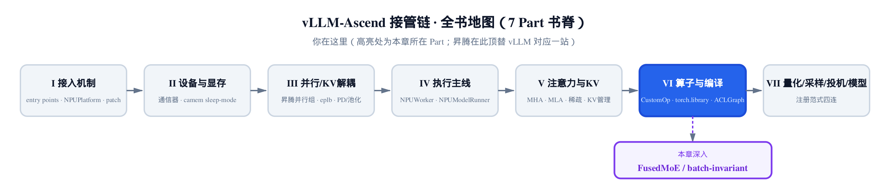
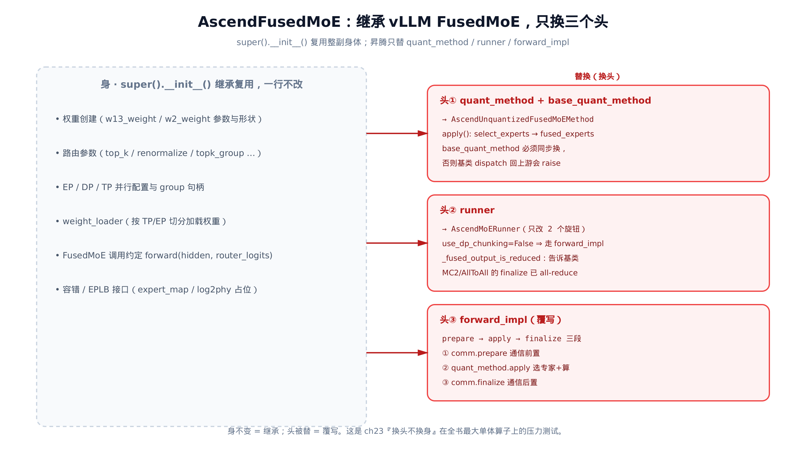
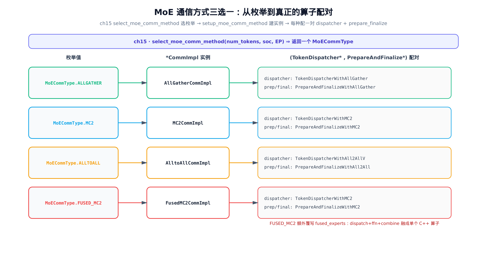
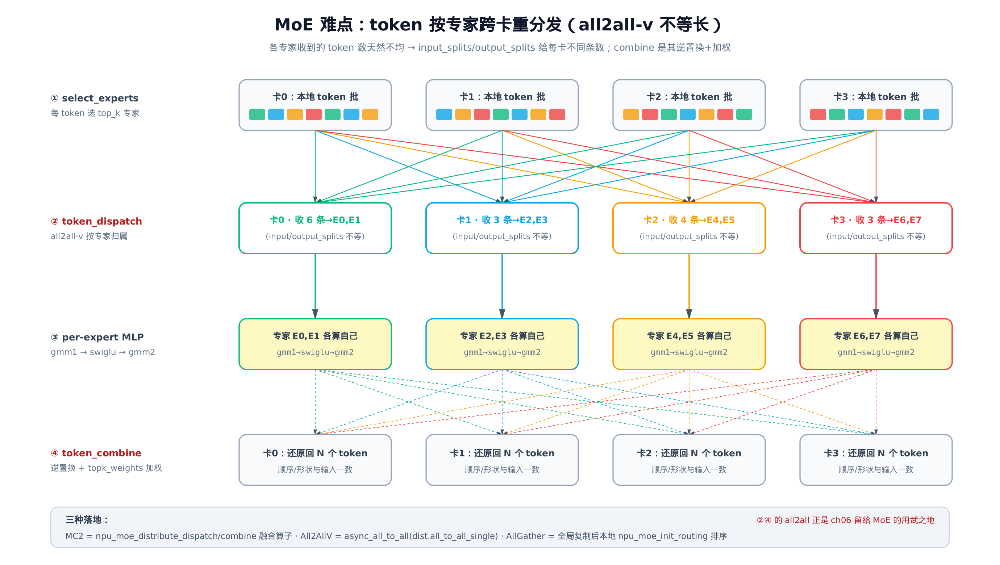
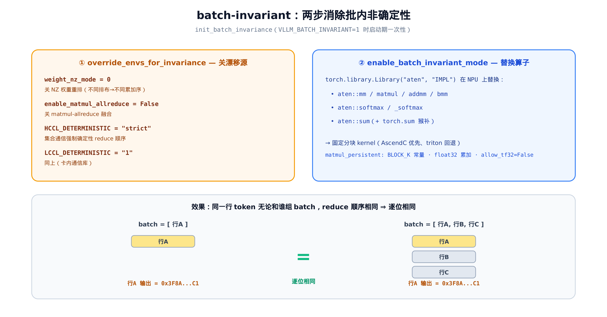

# 第 26 章 FusedMoE 算子与 batch-invariant 一致性



> 上一章把算子编译进 ACLGraph，一次捕获回放。
> 本章拆开全书最大的单个算子 FusedMoE。看它怎么靠继承顶替、难点在哪。
> 这是 Part VI 算子与编译层的收官，也回收两条老伏笔。

第 23 章立过一个总规矩：**模型代码一行不改，靠注册表在算子实例化的瞬间把它换成昇腾子类**。那一章拿 `SiluAndMul` 这种小算子举例——身（接口/权重/注册位置）继承自基座，头（forward）从 CUDA 换成 NPU。换头不换身，看着轻巧。

但如果被顶替的算子有近 900 行、横跨 12 个文件、内部还分出 4 条通信路径呢？这就是 **FusedMoE**——MoE（Mixture-of-Experts，混合专家）层的融合算子。模型里每个 MoE 层都是一个 `FusedMoE` 实例：路由器给每个 token 选 top_k 个专家，token 被送到对应专家算 FFN，再加权聚回来。它（`vllm_ascend/ops/fused_moe/fused_moe.py`）是全书最大的单体 OOT（out-of-tree，树外插件——在 vLLM 主干之外单独维护、却深度嵌进主干前向的算子）算子，集成度高、影响面大，也是「换头不换身」机制压力最大的一次实测。

这一章要回答三个问题：

1. **顶替**——这么大的算子，昇腾怎么只在三个接缝处接入，身体仍原样复用基类？
2. **通信**——MoE 真正的难点不是矩阵乘，而是「token 按专家跨卡重分发」。昇腾按硬件代际和并行规模，把它落到 all_gather / all_to_all / MC2 三种通信算子上，怎么选、怎么算？（先记住三者的本质差别：all_gather 让每张卡都拿到全体 token 的副本，省事但显存随卡数翻倍；all_to_all 只按专家归属把每个 token 搬到它要去的卡，省带宽；MC2 是把通信与计算流水线并行重叠的融合算子。）
3. **可复现**——昇腾额外提供一个保证：同一个输入，不管和谁拼成一个 batch、batch 怎么切分，结果逐位一致。这靠的是 batch-invariant 模式——浮点加法不满足结合律，batch 一变会改变求和的累加顺序、带来逐位差异，固定分块能消除这种依赖。

前两问还顺手把两条老伏笔兑现了：第 15 章选定的 MoE 通信方式，在这里才真正落地成算子；第 6 章那个只讲了形状代数的 `NPUCommunicator.all_to_all`，在这里第一次有了「按专家路由」的用武之地。

## 26.1 全书最大的「换头不换身」

先看主角的骨架。`AscendFusedMoE` 直接继承 vLLM 的 `FusedMoE`：

```python
# vllm_ascend/ops/fused_moe/fused_moe.py:L335
class AscendFusedMoE(FusedMoE):
    moe_counter = -1
    gate_stream: torch.npu.Stream | None = None

    def __init__(self, *args, **kwargs):
        # Save original routed_scaling_factor before super().__init__ modifies it.
        # … 省略：apply_routed_scale_to_output 时基类会把 routed_scaling_factor 改成 1.0 的背景注释 …
        self._original_routed_scaling_factor = kwargs.get("routed_scaling_factor", 1.0)
        super().__init__(*args, **kwargs)
        # … 省略：moe_instance_id / _expert_map / log2phy / tid2eid 等字段初始化 …

        if self.quant_config is None:
            self.quant_method = AscendUnquantizedFusedMoEMethod(self.moe_config, tid2eid=self.tid2eid)
        else:
            self.quant_method = self.quant_config.get_quant_method(self, self.layer_name, tid2eid=self.tid2eid)

        assert self.quant_method is not None
        # Keep base_quant_method in sync with the swapped-in Ascend method,
        # otherwise FusedMoE.maybe_init_modular_kernel (called via the V2
        # model runner's prepare_communication_buffer_for_model) would dispatch
        # to the upstream UnquantizedFusedMoEMethod.maybe_make_prepare_finalize,
        # which raises by design.
        self.base_quant_method = self.quant_method
        # … 省略：tp/dp/ep group 绑定、create_weights、并流/EPLB 旁路初始化 …

        setup_moe_comm_method(self.moe_config)
        self.quant_type = self._get_quant_type()

        self.runner = AscendMoERunner(
            self.layer_name,
            self.moe_config,
            self.router,
            self._routed_input_transform,
            kwargs.pop("gate", None),
            kwargs.pop("shared_experts", None),
            self.quant_method,
            self.vllm_config.parallel_config.enable_dbo,
        )
```

这段 `__init__` 是整个顶替机制的缩影。一行 `super().__init__(*args, **kwargs)` 把基类的「身体」全建好了——权重创建、路由参数、EP/DP/TP 并行配置、weight_loader（按张量并行/专家并行把权重切片加载到各卡——这套分片策略一旦改错，专家拿到的权重就和它该算的 token 对不上、结果直接错，所以昇腾原样保留、绝不插手）。这些昇腾一律不碰。接下来昇腾只换三个「头」：

- **头①：`quant_method` 与 `base_quant_method`**——换成昇腾的 `AscendUnquantizedFusedMoEMethod`（或量化版）。这是真正执行「选专家 + 算 FFN」的方法对象。
- **头②：`runner`**——换成 `AscendMoERunner`。
- **头③：`forward_impl`**（下一节看）——覆写前向实现，走昇腾的「通信—计算—通信」三段路径。



> *图注：左边灰框是 `super().__init__()` 复用的整副身体，一行不改。右边三个红框是昇腾替换的头。身不变=继承，头被替=覆写。*

这里有一个容易踩的坑，源码注释专门写了出来：换 `quant_method` 时**必须同步把 `base_quant_method` 也换掉**。原因藏在基类的初始化链里。vLLM 的 `FusedMoE.maybe_init_modular_kernel` 会去读 `base_quant_method`。它若还指向上游的 `UnquantizedFusedMoEMethod`，就会转调 `maybe_make_prepare_finalize`——而这个方法在昇腾场景下**设计上就会抛异常**。所以昇腾在子类里把上游那条路堵死：

```python
# vllm_ascend/ops/fused_moe/fused_moe.py:L102
def maybe_make_prepare_finalize(self, routing_tables=None):
    # Ascend uses its own MoE communication and forward_impl path.
    # Do not let upstream modular-kernel initialization replace it.
    return None
```

返回 `None`，明确告诉基类：「这条 modular-kernel 流水线我不用，别替我建。」昇腾要走自己的通信路径，不接管 vLLM 那套 prepare/finalize 模块化内核。

## 26.2 forward 的两段委托：runner → forward_impl

算子建好了，前向怎么跑？`forward` 本身极薄：

```python
# vllm_ascend/ops/fused_moe/fused_moe.py:L590
def forward(
    self,
    hidden_states: torch.Tensor,
    router_logits: torch.Tensor,
) -> torch.Tensor | tuple[torch.Tensor, torch.Tensor]:
    self.ensure_moe_quant_config_init()
    return self.runner.forward(
        hidden_states,
        router_logits,
    )
```

它把活全委托给 `self.runner.forward`。`runner` 是头②换进来的 `AscendMoERunner`，它继承自 vLLM 的 `MoERunner`，而且**只覆写了两个属性旋钮**——这是「换头不换身」最干净的一次示范：

```python
# vllm_ascend/ops/fused_moe/fused_moe.py:L265
class AscendMoERunner(MoERunner):
    @property
    def use_dp_chunking(self) -> bool:
        """Ascend uses its own forward_impl path, not the FlashInfer Cutlass
        chunked path. Always return False to stay on forward_impl."""
        return False

    @property
    def _fused_output_is_reduced(self) -> bool:
        # … 省略：注释说明这三种 comm 的 finalize 已含 TP all-reduce …
        moe_comm_type = _EXTRA_CTX.moe_comm_type
        return moe_comm_type in {
            MoECommType.ALLTOALL,
            MoECommType.MC2,
            MoECommType.FUSED_MC2,
        } or (moe_comm_type == MoECommType.ALLGATHER and _EXTRA_CTX.flash_comm_v1_enabled)
```

`MoERunner.forward` 的骨架不变，但两个旋钮改变了它的走向：

- `use_dp_chunking=False`——基类有一条 FlashInfer Cutlass 的分块路径，那是 CUDA 的。昇腾强制返回 `False`，让 `forward` 落到 `forward_impl`（昇腾覆写的那个）。
- `_fused_output_is_reduced`——这是个精细的「别重复算」开关。MC2 / ALLTOALL / FUSED_MC2 三种通信方式的 finalize 内部**已经做过一次张量并行 all-reduce**；若基类 `forward` 尾部那次最终归约 all-reduce 再来一遍，结果就会被加倍（double-count）。这个属性按当前 comm 类型如实告诉基类「我这条路已经 reduce 过了」。只有 AllGather（每卡只持有部分输出）才仍需基类补一次 reduce。

旋钮拨好，控制流落到 `forward_impl`。这是头③，昇腾的核心方法，三段式结构一目了然：

```python
# vllm_ascend/ops/fused_moe/fused_moe.py:L601
def forward_impl(  # type: ignore[override]
    self, hidden_states: torch.Tensor, router_logits: torch.Tensor, return_with_event: bool = False
) -> torch.Tensor | FusedMoEResult:
    assert self.quant_method is not None
    # … 省略：static-kernel 索引回绕、multistream 并流 gate 块（不改数值与数据流）…
    enable_force_load_balance = _EXTRA_CTX.in_profile_run

    # ① 通信前置
    prepare_output = _EXTRA_CTX.moe_comm_method.prepare(
        hidden_states=hidden_states,
        router_logits=router_logits,
        replace_allreduce=_EXTRA_CTX.flash_comm_v1_enabled,
        enable_shared_expert_dp=self.enable_shared_expert_dp,
        quant_type=self.quant_type,
    )
    hidden_states = prepare_output.hidden_states
    router_logits = prepare_output.router_logits
    mc2_mask = prepare_output.mc2_mask
    padded_hidden_states_shape = prepare_output.padded_hidden_states_shape
    pertoken_scale = prepare_output.pertoken_scale

    # ② Matrix multiply（选专家 + 算 FFN）
    fused_experts_results: FusedExpertsResult = self.quant_method.apply(
        layer=self,
        x=hidden_states,
        router_logits=router_logits,
        # … 省略：top_k / renormalize / expert_map / e_score_correction_bias 等路由参数透传 …
        mc2_mask=mc2_mask,
    )

    # ③ 通信后置
    routed_out = _EXTRA_CTX.moe_comm_method.finalize(
        hidden_states=fused_experts_results.routed_out,
        reduce_results=isinstance(_EXTRA_CTX.moe_comm_method, AllGatherCommImpl),
        padded_hidden_states_shape=padded_hidden_states_shape,
    )
    # … 省略：dynamic_eplb 负载统计、return_with_event 包装分支 …
    return routed_out
```

三段骨架就是 MoE 算子的全部主线：

1. **prepare（通信前置）**——把 hidden_states 调整成通信需要的形状。AllGather 在这里做 DP all-gather（把各卡的 token 收齐）；MC2/All2All 做 padding 到通信边界 + 张量并行切片。（透传进去的 `enable_shared_expert_dp` 是个并行开关：决定那个「所有 token 必过的通用专家」shared_expert 是否也跟着走 DP all-reduce，不影响 routed 专家的主线。）
2. **apply（算）**——`quant_method.apply` 选专家、算 FFN，下一节展开。
3. **finalize（通信后置）**——把专家算完的结果聚合还原。注意 `reduce_results` 只在 `AllGatherCommImpl` 时为 `True`，呼应上一节那个「别重复 reduce」的旋钮。

`forward_impl` 里反复出现的 `_EXTRA_CTX`，是**单步前向的执行上下文**（第 15 章建立的那个 per-step context）；其中的 `_EXTRA_CTX.moe_comm_method` 就是这一拍前向**当前选中的那一种通信方式**。它从哪来？这就接到第二个问题了。

## 26.3 选专家：apply 是路由器到 fused_experts 的桥

第②步的 `quant_method.apply`，主线非常短——选专家，然后打包交给通信层：

```python
# vllm_ascend/ops/fused_moe/fused_moe.py:L129
def apply(
    self,
    layer: torch.nn.Module,
    x: torch.Tensor,
    # … 省略：use_grouped_topk / top_k / router_logits / expert_map / mc2_mask 等参数 …
) -> torch.Tensor:
    # … 省略：zero-expert / shared-expert 数量计算 …
    topk_weights, topk_ids = select_experts(
        hidden_states=x,
        router_logits=router_logits,
        top_k=top_k,
        # … 省略：renormalize / topk_group / scoring_func / e_score_correction_bias 等路由配置 …
    )
    topk_weights = topk_weights.to(x.dtype)
    # naive load balance for profile runs
    if enable_force_load_balance:
        random_matrix = torch.rand(topk_ids.size(0), num_experts, device=topk_ids.device)
        topk_ids = torch.argsort(random_matrix, dim=1)[:, : topk_ids.size(1)].to(topk_ids.dtype)

    # … 省略：FUSED_MC2 把 w1/w2 包成 list + dummy scale 的分支 …
    w1 = layer.w13_weight
    w2 = layer.w2_weight

    moe_comm_method = _EXTRA_CTX.moe_comm_method
    final_hidden_states = moe_comm_method.fused_experts(
        fused_experts_input=build_fused_experts_input(
            hidden_states=x,
            topk_weights=topk_weights,
            topk_ids=topk_ids,
            w1=w1,
            w2=w2,
            # … 省略：quant_type / expert_map / log2phy / pertoken_scale / activation 等打包字段 …
        )
    )
    return final_hidden_states
```

`select_experts` 是 vLLM 的路由器：给每个 token 算出它该去的 `top_k` 个专家（`topk_ids`）和对应权重（`topk_weights`），两者形状都是 `[num_tokens, top_k]`。这是 token 重分发的输入来源——知道了「每个 token 去哪些专家」，才谈得上把它们搬过去。

代码里那对 `w13_weight / w2_weight` 是专家 FFN（feed-forward network，前馈网络，也就是 transformer 每层里那个 MLP——MoE 的「专家」本质上就是一个个独立的 FFN）的权重：`w13_weight` 是 SwiGLU FFN 第一层的合并投影。SwiGLU 的结构是把两路线性投影（`w1·x` 与 `w3·x`）的输出逐元素相乘再过激活——举个最小数值例：若 `w1·x = [1, 2, 3]`、`w3·x = [2, 1, 1]`，逐元素相乘得 `[2, 2, 3]`，再把这一路过 Swish 激活，就是该专家这一层的输出。因为 `w1`、`w3` 形状相同，可以融成一个线性层一次并行算，省一次 kernel 启动（这正是 `w13` 名字里 1 和 3 并列的由来）；`w2_weight` 则是第二层输出投影。这俩此刻只是被打包，真正参与计算要等到 `fused_experts`。

（被省略的 `zero-expert / shared-expert 数量计算` 是两类特殊专家槽。**shared-expert** 是「所有 token 必过」的通用专家——不参与路由 top_k 竞争，每个 token 都额外过它一遍，承接所有 token 共享的通用变换。**zero-expert** 是另一类特殊槽：本仓 `zero_experts_compute` 里 `zero_expert_type == "identity"` 的实现，把命中它的 token 按权重「原样透传」（恒等变换，不进 FFN）。两者数量都在 apply 开头按 `layer` 上的配置算出，不影响下面的 routed 专家主线，本章按下不表。）

然后 `apply` 把所有东西打包成 `build_fused_experts_input`，交给 `_EXTRA_CTX.moe_comm_method.fused_experts`。注意：**矩阵乘本身（专家的 FFN）还没发生**。真正的 token 跨卡搬运和专家计算，都在 `fused_experts` 里。但要调 `fused_experts`，得先知道 `_EXTRA_CTX.moe_comm_method` 这个「当前通信方式」从哪来——下一节先接回第 15 章那条伏笔，看枚举怎么变成真正建好的通信对象，再进它的三段骨架。

（`profile run` 那个 `enable_force_load_balance` 分支值得一提：profile 阶段为了估准显存，用随机路由把 token 均匀打散到所有专家，避免「恰好都堆到一张卡」造成的显存估计偏差。这不影响真实推理路径。）

## 26.4 MoE 通信三选一注册表（回收 ch15）

`_EXTRA_CTX.moe_comm_method` 这个「当前通信方式」是怎么定下来的？这要把第 15 章的伏笔接回来。

第 15 章讲单步前向上下文时，每拍前向开始会调一个 [`select_moe_comm_method`](../ch15-single-step-forward-context-dp-sync/narrative/chapter.md)，按 token 数、芯片代际（soc）、专家并行规模选一个**通信类型枚举**。当时只说选定了枚举，真正的算子实现「留到 FusedMoE 章」。现在兑现。

枚举一共四种：

```python
# vllm_ascend/ascend_forward_context.py:L26
class MoECommType(Enum):
    ALLGATHER = 0
    MC2 = 1
    ALLTOALL = 2
    FUSED_MC2 = 3
```

`select_moe_comm_method` 的选择逻辑，骨架是「按并行规模和硬件代际分流」：

```python
# vllm_ascend/ascend_forward_context.py:L233
def select_moe_comm_method(num_tokens: int, vllm_config: VllmConfig, is_draft_model=False) -> MoECommType | None:
    if not is_moe_model(vllm_config):
        return None
    mc2_tokens_capacity = get_mc2_tokens_capacity()
    soc_version = get_ascend_device_type()

    if not vllm_config.parallel_config.enable_expert_parallel or get_ep_group().world_size == 1:
        moe_comm_type = MoECommType.ALLGATHER
    elif soc_version in {AscendDeviceType.A2}:
        # … 省略：num_experts_per_device ≤ 24 且 ep_world_size ≥ 16 且 token 数在容量内 → MC2，否则 ALLGATHER …
        ...
    elif soc_version in {AscendDeviceType.A3}:
        if num_tokens <= mc2_tokens_capacity:
            # … 省略：fused_mc2 守卫满足时 → FUSED_MC2 …
            moe_comm_type = MoECommType.MC2
        else:
            moe_comm_type = MoECommType.ALLTOALL
    elif soc_version in {AscendDeviceType._310P}:
        moe_comm_type = MoECommType.ALLGATHER
    elif soc_version in {AscendDeviceType.A5}:
        # … 省略：A5 的 world_size / num_experts_per_tok 阈值细判 …
        ...
    else:
        raise ValueError(f"Unsupported soc_version: {soc_version}")
    return moe_comm_type
```

逐条阈值不重要，重要的是它的形状：**没开专家并行（或 EP 只有 1 张卡），一律 AllGather**——单卡装得下全部专家，根本不需要跨卡重分发；**开了专家并行，再按芯片代际 + token 数细分**。这里的 `get_mc2_tokens_capacity` 取的是 MC2 的硬件 token 容量上限——一拍能塞进 MC2 流水线的 token 数有上界，随芯片代际（A2/A3/A5）与 EP 规模而变。

一条直觉贯穿这些阈值，也正是下一节量级轴要量化的东西：decode 阶段 token 少（落在 MC2 容量内），用 MC2 这种通信—计算流水线化的融合算子最优；prefill 阶段 token 多（超出容量），用 all_to_all 只搬真正需要的 token 更省。

但 `select_moe_comm_method` 返回的只是一个**枚举值**。从枚举到「真正建好的通信对象」，是 `setup_moe_comm_method` 干的——它在 §26.1 那个 `__init__` 里被调用，把每个枚举映射到一个 `*CommImpl` 实例，存进一张注册表：

```python
# vllm_ascend/ops/fused_moe/moe_comm_method.py:L48
_MoECommMethods: dict[MoECommType | None, MoECommMethod] = {}


def get_moe_comm_method(moe_comm_type: MoECommType | None) -> MoECommMethod | None:
    return _MoECommMethods.get(moe_comm_type)


def setup_moe_comm_method(moe_config):
    if moe_config.ep_size > 1:
        _MoECommMethods[MoECommType.ALLTOALL] = AlltoAllCommImpl(moe_config)
        _MoECommMethods[MoECommType.ALLGATHER] = AllGatherCommImpl(moe_config)
        _MoECommMethods[MoECommType.MC2] = MC2CommImpl(moe_config)
        _MoECommMethods[MoECommType.FUSED_MC2] = FusedMC2CommImpl(moe_config)
    else:
        _MoECommMethods[MoECommType.ALLGATHER] = AllGatherCommImpl(moe_config)
```

这就是伏笔的落地。注意两个时刻分得很开：注册表是**算子 `__init__` 时一次性建好**的（`setup_moe_comm_method` 把所有候选 `*CommImpl` 都 `new` 出来存进 `_MoECommMethods`，建完不再动）；而**每拍前向**才由第 15 章的 `select_moe_comm_method` 现选一个枚举。一拍前向的完整链路是：`select_moe_comm_method` 按 token 数/soc/EP 选出枚举 → 存进前向上下文的 `moe_comm_type` → 本章的 `get_moe_comm_method` 用它从那张已建好的 `_MoECommMethods` 表里取出对应的 `*CommImpl` 实例 → 存进 `_EXTRA_CTX.moe_comm_method`，供 `forward_impl` 的 prepare/finalize 调用。建表一次、选表每拍——这样每拍只是一次字典查表，没有重复构造开销。`EP=1` 时只注册 AllGather——没有专家并行，不需要别的。



> *图注：每个枚举映射到一个 `*CommImpl`，每个 `*CommImpl` 又配一对 `(TokenDispatcher*, PrepareAndFinalize*)`。ch15 选枚举、本章建实例，伏笔在此闭合。*

取出来的 `*CommImpl` 都继承自同一个基类 `MoECommMethod`，它定义了 MoE 计算的「策略模式」骨架：

```python
# vllm_ascend/ops/fused_moe/moe_comm_method.py:L87
class MoECommMethod(ABC):
    """Base class for MoE communication methods."""

    def __init__(self, moe_config: FusedMoEConfig):
        self.moe_config = moe_config
        self.token_dispatcher = self._get_token_dispatcher()
        self.prepare_finalize = self._get_prepare_finalize()
        self.use_fusion_ops = set_gmmswigluquant_method()

    # … 省略：prepare / finalize 转调 self.prepare_finalize 的两个薄方法 …

    def fused_experts(self, fused_experts_input: MoEFusedExpertsInput):
        # … 省略：hidden_states.dtype 白名单 assert、并流计时 record_event …
        routed_topk_ids = fused_experts_input.topk_ids
        if fused_experts_input.routing.log2phy is not None:
            routed_topk_ids = fused_experts_input.routing.log2phy[routed_topk_ids]

        token_dispatch_input = build_token_dispatch_input(
            fused_experts_input=fused_experts_input,
            topk_ids=routed_topk_ids,
        )
        # ① 按专家把 token 重分发到对应专家所在卡
        token_dispatch_output = self.token_dispatcher.token_dispatch(token_dispatch_input=token_dispatch_input)

        mlp_compute_input = build_mlp_compute_input(
            fused_experts_input=fused_experts_input,
            token_dispatch_output=token_dispatch_output,
            use_fusion_ops=self.use_fusion_ops,
        )
        # ② 每个专家算自己那摞 token 的 gmm1 → swiglu → gmm2
        mlp_output, before_gmm2_evt = self._apply_mlp(mlp_compute_input)

        # ③ 把结果按原顺序聚回来
        routed_out = self.token_dispatcher.token_combine(
            hidden_states=mlp_output,
            combine_metadata=token_dispatch_output.combine_metadata,
        )
        return FusedExpertsResult(routed_out=routed_out, ...)

    def _apply_mlp(self, mlp_compute_input: MoEMlpComputeInput) -> torch.Tensor:
        return unified_apply_mlp(mlp_compute_input=mlp_compute_input)

    @abstractmethod
    def _get_token_dispatcher(self) -> MoETokenDispatcher:
        raise NotImplementedError("_get_token_dispatcher function not implemented.")

    @abstractmethod
    def _get_prepare_finalize(self) -> PrepareAndFinalize:
        raise NotImplementedError("_get_prepare_finalize function not implemented.")
```

`fused_experts` 这条三段流水线——**dispatch（重分发）→ mlp（每专家算）→ combine（聚回）**——是所有通信方式共用的骨架。差异全压进两个 `@abstractmethod`：子类只回答「用哪个 `TokenDispatcher`、用哪个 `PrepareAndFinalize`」，骨架一行不改。

（开头那行 `log2phy` 是「逻辑专家→物理专家」的映射表：EPLB 做专家负载均衡时，多个逻辑专家可能被映到同一个物理专家块，于是路由器输出的逻辑 ID 要先经 `log2phy` 查表换成物理 ID，再按物理归属 dispatch。没开 EPLB 时它是 `None`，这行直接跳过。）

于是四个 `*CommImpl` 的类体都薄得只剩两个工厂方法：

```python
# vllm_ascend/ops/fused_moe/moe_comm_method.py:L185
class AllGatherCommImpl(MoECommMethod):
    def _get_token_dispatcher(self):
        return TokenDispatcherWithAllGather(
            top_k=self.moe_config.experts_per_token,
            num_experts=self.moe_config.num_experts,
            num_local_experts=self.moe_config.num_local_experts,
        )
    def _get_prepare_finalize(self):
        return PrepareAndFinalizeWithAllGather(self.moe_config)


# vllm_ascend/ops/fused_moe/moe_comm_method.py:L215
class MC2CommImpl(MoECommMethod):
    def _get_token_dispatcher(self):
        return TokenDispatcherWithMC2()
    def _get_prepare_finalize(self):
        return PrepareAndFinalizeWithMC2(self.moe_config)


# vllm_ascend/ops/fused_moe/moe_comm_method.py:L235
class AlltoAllCommImpl(MoECommMethod):
    def _get_token_dispatcher(self):
        return TokenDispatcherWithAll2AllV(
            top_k=self.moe_config.experts_per_token,
            num_experts=self.moe_config.num_experts,
            num_local_experts=self.moe_config.num_local_experts,
        )
    def _get_prepare_finalize(self):
        return PrepareAndFinalizeWithAll2All(self.moe_config)
```

复杂度全在被它们 `new` 出来的 `TokenDispatcher*` 里。这正是该看 token 重分发的时候了。

## 26.5 token 按专家重分发（回收 ch06）

先把 MoE 路由的通信代数说清楚，再看代码就有了坐标。这套代数只用四个记号，先列出来：

- $N$：一拍前向的 token 数；
- $top\_k$：每个 token 选中的专家数；
- $E$：专家总数；
- $ep\_size$：专家并行的卡数（$E$ 个专家均分到这些卡，每卡 $E / ep\_size$ 个本地专家）。

下文会用一组具体值把这套代数走一遍：$N=8$ 个 token、$top\_k=2$、$E=8$ 个专家均分到 $ep\_size=4$ 张卡（每卡 2 个本地专家）。先把抽象规则说清。

dispatch 阶段要把 $N \times top\_k$ 个 `(token, expert)` 对，按专家归属的卡**重新分发**。关键事实是：**每张卡收到的 token 数，等于落到本卡专家的 `(token, expert)` 对数**。

这个数**天然不均**——路由是数据驱动的，热门专家会被更多 token 选中。普通的 **all2all**（各卡之间等长交换、每对卡发收相同行数）在这里不够用：MoE 各专家收到的 token 数不齐，必须用 **all2all-v**（v = variable，不等长）：按每张卡各自的 `input_splits / output_splits` 给不同卡发不同条数。combine 阶段则是它的**逆置换** + 按 `topk_weights` 加权求和，把结果还原回 $N$ 个 token。



> *图注：① 选专家 → ② dispatch 按专家归属把 token all2all-v 重分发（各卡收到不等长）→ ③ 每专家算 FFN → ④ combine 逆置换加权聚回。②④ 的 all2all 正是第 6 章留给 MoE 的落点。*

三种 dispatcher 里，`TokenDispatcherWithAll2AllV` 最能说明这套代数，也正是第 6 章那条伏笔的兑现处。第 6 章讲 [`NPUCommunicator.all_to_all`](../ch06-npu-communicator/narrative/chapter.md) 时只推了形状代数，说「真正按专家路由 token 的地方留给 FusedMoE 章」。就是这里：

```python
# vllm_ascend/ops/fused_moe/token_dispatcher.py:L465
def token_dispatch(self, token_dispatch_input: MoETokenDispatchInput):
    hidden_states = token_dispatch_input.hidden_states
    topk_weights = token_dispatch_input.topk_weights
    topk_ids = token_dispatch_input.topk_ids

    # dispatch 前置：按 topk_ids 把本卡 token permute 排好，并算出各卡 input/output_splits
    (
        permutated_local_input_tokens,
        reversed_local_input_permutation_mapping,
        tokens_per_expert,
        input_splits,
        output_splits,
        global_input_tokens_local_experts_indices,
        hidden_shape,
        hidden_shape_before_permute,
    ) = self._dispatch_preprocess(hidden_states, topk_ids)

    # 真正跨 EP 卡重分发：按 input_splits/output_splits 不等长搬运
    _, global_input_tokens, permute1_ep_all_to_all_handle = async_all_to_all(
        permutated_local_input_tokens, output_splits, input_splits, self.ep_group
    )
    permute1_ep_all_to_all_handle.wait()
    permutated_local_input_tokens.untyped_storage().resize_(0)
    # … 省略：with_quant 时第二趟 all_to_all 传 scale、多本地专家二次 permute …

    return MoETokenDispatchOutput(
        hidden_states=global_input_tokens,
        group_list=tokens_per_expert,
        group_list_type=1,
        combine_metadata=MoEAllToAllCombineMetadata(
            input_splits=input_splits,
            output_splits=output_splits,
            topk_weights=topk_weights,
            # … 省略：reversed_*_permutation_mapping / hidden_shape* 等还原所需 metadata …
        ),
    )
```

两步：先 `_dispatch_preprocess` 按 `topk_ids` 把本卡的 token 在本地 permute 排序（同一个专家的 token 排到一起），顺便算出 `input_splits / output_splits`——这两个数组就是「我要发给每张卡几条、我会从每张卡收几条」；然后 `async_all_to_all` 真正跨卡搬。返回里那个 `group_list`（即 `tokens_per_expert`）是「本卡收到的 token 按专家分组后、每个专家各几条」的个数列表，下一步算 MLP 时要靠它告诉每个专家「你这摞有几条」。注意它的入参顺序是 `output_splits`（收）在前、`input_splits`（发）在后，名词顺序看着反，其实是 PyTorch `all_to_all_single` 的约定，不是 bug。combine 是镜像的——再 all_to_all 一次把专家输出送回原卡，注意 `input_splits` 和 `output_splits` 位置互换（来的路反着走回去），最后 unpermute 还原回原 token 顺序、按 `topk_weights` 加权：

```python
# vllm_ascend/ops/fused_moe/token_dispatcher.py:L526
def token_combine(self, hidden_states, combine_metadata, bias=None):
    assert bias is None, "Bias is not supported in MoEAlltoAllvTokenDispatcher."
    hidden_states = self._combine_preprocess(hidden_states, combine_metadata)
    _, permutated_local_input_tokens, handle = async_all_to_all(
        hidden_states,
        combine_metadata.input_splits,
        combine_metadata.output_splits,
        self.ep_group,
    )
    handle.wait()
    hidden_states.untyped_storage().resize_(0)
    output = self._combine_postprocess(permutated_local_input_tokens, combine_metadata)
    return output
```

底层那个 `async_all_to_all`，就是第 6 章形状代数的真身——`dist.all_to_all_single` 的异步封装：

```python
# vllm_ascend/ops/fused_moe/comm_utils.py:L26
def async_all_to_all(input_, output_split_sizes, input_split_sizes, group, event=None):
    if output_split_sizes is None:
        # Equal split (all2all)
        a2a_out = torch.empty_like(input_)
    else:
        # Unequal split (all2all-v)
        a2a_out = input_.new_empty(
            size=[sum(output_split_sizes)] + list(input_.size()[1:]),
            dtype=input_.dtype,
            device=torch.npu.current_device(),
        )
    # … 省略：event != None 时在独立 COMM_STREAM 上等事件再发起的多流重叠分支 …
    handle = dist.all_to_all_single(
        a2a_out,
        input_.contiguous(),
        output_split_sizes=output_split_sizes,
        input_split_sizes=input_split_sizes,
        group=group,
        async_op=True,
    )
    return input_, a2a_out, handle
```

两个要点。其一，`output_split_sizes` 给定时，输出张量按 `sum(output_split_sizes)` 开辟——**不等长**，正是 MoE「各专家收到 token 数不均」所需。其二，`async_op=True` 配 `handle.wait()`：通信先发起、不阻塞，让后续 permute 计算能和通信重叠。

### 一拍 dispatch / combine 的数值追踪

抽象的代数落到具体数字才好懂。设 $N=8$ 个 token，$top\_k=2$，$E=8$ 个专家均分在 $ep\_size=4$ 张卡上（每卡 2 个本地专家：卡 $i$ 管专家 $E_{2i}, E_{2i+1}$，即卡0 管 $E_0,E_1$、卡1 管 $E_2,E_3$、卡2 管 $E_4,E_5$、卡3 管 $E_6,E_7$）。8 个 token 各选 2 个专家，全系统共 $N \times top\_k = 16$ 个 `(token,expert)` 对。

先给一组具体的路由分配（路由器算出来的 `topk_ids`），后面那张 `6/3/4/3` 的落卡表就能一格格数出来、而不是凭空给定：

| token | 选中的 2 个专家 | 各自落到 |
|---|---|---|
| t0 | $E_0, E_1$ | 卡0, 卡0 |
| t1 | $E_0, E_4$ | 卡0, 卡2 |
| t2 | $E_0, E_5$ | 卡0, 卡2 |
| t3 | $E_1, E_2$ | 卡0, 卡1 |
| t4 | $E_1, E_3$ | 卡0, 卡1 |
| t5 | $E_4, E_6$ | 卡2, 卡3 |
| t6 | $E_5, E_7$ | 卡2, 卡3 |
| t7 | $E_2, E_6$ | 卡1, 卡3 |

按「卡 $i$ 管 $E_{2i}, E_{2i+1}$」把上表每一格归卡、数一数：卡0 收到落在 $E_0/E_1$ 上的对——t0 贡献 2 条、t1/t2/t3/t4 各 1 条，共 **6**；卡1（$E_2/E_3$）收 t3、t4、t7 共 **3**；卡2（$E_4/E_5$）收 t1、t2、t5、t6 共 **4**；卡3（$E_6/E_7$）收 t5、t6、t7 共 **3**。$6+3+4+3=16$，正好是那 16 个 `(token,expert)` 对。这组 `6/3/4/3` 就是下表 dispatch 行的来历：

| 阶段 | 卡0 收 | 卡1 收 | 卡2 收 | 卡3 收 | 本卡 `group_list`（每专家几条）|
|---|---|---|---|---|---|
| dispatch（按专家归属搬运）| 6 | 3 | 4 | 3 | 如卡1：`[E2:2, E3:1]` |
| 每专家 MLP（gmm1→swiglu→gmm2）| 算 6 | 算 3 | 算 4 | 算 3 | 各卡独立算自己收到的那摞 |
| combine（逆向 all2all + 加权）| 发回 6 | 发回 3 | 发回 4 | 发回 3 | `input/output_splits` 互换 |

（卡1 的 `group_list` 为何是 `[E2:2, E3:1]`？数上表：落在 $E_2$ 的是 t3、t7 共 2 条，落在 $E_3$ 的只有 t4 共 1 条。）

combine 跑完，四张卡各自落回原来的 $N$ 个 token × hidden，顺序与形状和输入逐一对齐。这里有三件事值得分开看。

**现象**：dispatch 这行四张卡收到 `6/3/4/3`，加起来正好是全系统那 16 个 `(token,expert)` 对。

**为何不等**：路由是数据驱动的，热门专家被更多 token 选中，各卡条数天然不齐。这才是必须 all2all-v（不等长）而非等长 all2all 的真正原因——哪怕总数 16 恰好能被 4 整除，`6/3/4/3` 照样不同，等长 all2all 没法表达这种差异。

**为何能精确还原**：combine 是 dispatch 的严格逆操作。`input_splits` 与 `output_splits` 一互换，每条 token 沿来路原样返回，再按它当初的 `topk_weights` 加权求和。直觉上像这样：原序 `[T0, T1, T2]` 在 dispatch 时被 permute 排成 `[T1, T0, T2]`、并记下这个映射，combine 时就按映射反着走、把 `[T1, T0, T2]` 还原回 `[T0, T1, T2]`。之所以一定能还原，是因为 dispatch 阶段记下了 `reversed_local_input_permutation_mapping`（permute 的逆索引）和两个 splits——permute 是一个**双射**，双射的逆唯一存在，于是聚回去的每个 token 必定落回它原来的行位，一个不多一个不少。

### 另外两种 dispatcher：MC2 与 AllGather

`TokenDispatcherWithMC2` 走的是另一条路——把「按专家 all2all 重分发」整件事塞进一个 NPU 融合算子：

```python
# vllm_ascend/ops/fused_moe/token_dispatcher.py:L226
def token_dispatch(self, token_dispatch_input: MoETokenDispatchInput):
    kwargs_mc2 = self.get_dispatch_mc2_kwargs(token_dispatch_input)
    output = (
        torch_npu.npu_moe_distribute_dispatch_v2(**kwargs_mc2)
        if self.enable_dispatch_v2
        else torch_npu.npu_moe_distribute_dispatch(**kwargs_mc2)
    )
    (
        expand_x,            # 本卡专家收到的 token
        dynamic_scale,
        assist_info_for_combine,
        expert_token_nums,   # 每个专家几条
        ep_recv_counts,
        tp_recv_counts,
        expand_scales,
    ) = output[0:7]
    # … 省略：拆出 combine 阶段要原路返回的一堆 metadata …
```

`npu_moe_distribute_dispatch` 一次返回 `expand_x`（本卡专家收到的 token）+ `expert_token_nums`（每专家几条）+ 一摞 combine 要用的 metadata。它和 all2all-v 做的是同一件事，但通信与计算在算子内部流水线化重叠（这是 MC2 名字的由来：communication-computation parallelism），小 batch decode 下最优。

`TokenDispatcherWithAllGather` 则**根本不跨卡 all2all**——它假设 prepare 阶段已经把 hidden_states all-gather 成全局张量，每张卡都有全部 token，于是 dispatch 只在**本地**用 `npu_moe_init_routing` 把 token 按专家排序聚拢：

```python
# vllm_ascend/ops/fused_moe/token_dispatcher.py:L352
def token_dispatch(self, token_dispatch_input: MoETokenDispatchInput):
    # … 省略：取 hidden_states/topk_ids/expert_map、算 active_expert_range 圈出本卡专家区间 …
    sorted_hidden_states, expanded_row_idx, expert_tokens, dynamic_scale = DeviceOperator.npu_moe_init_routing(
        hidden_states,
        topk_ids,
        scale=dynamic_scale,
        active_num=num_tokens * self.top_k,
        expert_num=global_num_experts,
        expert_tokens_num_type=1,
        expert_tokens_num_flag=True,
        active_expert_range=[first_expert_idx, last_expert_idx],
        quant_mode=quant_mode,
    )
    # … 省略：打包 MoEAllGatherCombineMetadata …
```

combine 阶段它用 `npu_moe_token_unpermute` 按 `topk_weights` 加权还原。这里有个值得记的工程细节：源码注释明示**不**用看似对口的 `npu_moe_finalize_routing`，因为那个算子的浮点累加会引入精度问题（可能产生逐位差异，和本章末尾要讲的 batch-invariant 一致性目标相冲突），改用数值更稳的 `unpermute` 作 workaround。

三种通信方式的权衡，可以摆成一条量级轴（设 $N$ 个 token、hidden 维 $h$、$ep\_size$ 张卡、每 token 选 $top\_k$ 专家；下面的量级都按**全系统跨卡搬运的 token 总量**计，不是单卡量）：

| 通信方式 | 搬运量级 | 适用 |
|---|---|---|
| AllGather | 随 $ep\_size$ 线性涨：全部 token 复制到每卡 | 实现稳妥；EP=1 / 小规模 |
| All2AllV | 与 $ep\_size$ 无关：只搬真正需要的 token | DP>1、prefill 大 batch 更省 |
| MC2 / FusedMC2 | 同 All2AllV 量级，但通信与计算流水线重叠 | 小 batch decode 最优 |

两者的搬运量级因此是：

$$
\mathrm{AllGather} \propto N \cdot ep\_size \cdot h = 512 \times 16 \times 4096, \qquad \mathrm{All2AllV} \propto N \cdot top\_k \cdot h = 512 \times 2 \times 4096
$$

上式代入了一组具体值：$N=512$、$h=4096$、$ep\_size=16$、$top\_k=2$（Mixtral / DeepSeek 这类 MoE 的路由 top_k 通常就在 2~8）。AllGather 把全部 token 复制到 16 张卡，All2AllV 只搬被选中的 `(token,expert)` 对——同样的 token 数与 hidden 维，AllGather 多搬 **8 倍**。

差距倍数恰好是 $ep\_size / top\_k$：根子在 $ep\_size$——AllGather 随卡数线性涨、All2AllV 不随卡数涨，卡越多、top_k 越小，All2AllV 省得越多。`select_moe_comm_method` 就是在这条轴上按 soc/EP/token 取点。

## 26.6 FusedMC2：把三步融成一个算子

`FusedMC2CommImpl` 是个特例。它的 `_get_token_dispatcher / _get_prepare_finalize` 和 MC2 一样，但它**覆写了基类的 `fused_experts`**，把「dispatch → mlp → combine」三步整个融成一个 C++ 融合算子：

```python
# vllm_ascend/ops/fused_moe/moe_comm_method.py:L285
def fused_experts(self, fused_experts_input: MoEFusedExpertsInput):
    # … 省略：量化 scale/bias 非空 assert …
    topk_ids = fused_experts_input.topk_ids
    if fused_experts_input.routing.log2phy is not None:
        topk_ids = fused_experts_input.routing.log2phy[topk_ids]

    expert_tokens = None
    if get_ascend_config().enable_fused_mc2 == 1:
        out = torch.empty_like(fused_experts_input.hidden_states)
        torch.ops._C_ascend.dispatch_ffn_combine(
            x=fused_experts_input.hidden_states,
            weight1=fused_experts_input.weights.w1,
            weight2=fused_experts_input.weights.w2,
            expert_idx=topk_ids,
            # … 省略：scale/bias/probs/mask 等量化掩码细节 …
            group=self.token_dispatcher.moe_all_to_all_group_name,
            out=out,
            expert_token_nums=self.expert_token_nums,
        )
        expert_tokens = self.expert_token_nums
    elif get_ascend_config().enable_fused_mc2 == 2:
        # … 省略：dispatch_gmm_combine_decode 的 decode 专用融合算子 …
        out, expert_tokens = torch.ops._C_ascend.dispatch_gmm_combine_decode(...)
    else:
        raise ValueError(f"Wrong value of {get_ascend_config().enable_fused_mc2=}")
    return FusedExpertsResult(routed_out=out, expert_tokens=expert_tokens, ...)
```

`dispatch_ffn_combine` 一个算子里把 dispatch + 两段 FFN（gmm1 / swiglu / gmm2）+ combine 全做完。为什么值得？decode/prefill 小 batch 下，分步走三个独立算子的 kernel launch 开销 + 中间张量进出显存的带宽开销很显眼；融成一个算子一次调完，省下这些。

这也解释了第 23 章一个当时没说透的细节：`process_weights_after_loading` 为什么在 `enable_fused_mc2` 时要把权重 `npu_format_cast` 成 NZ 格式——因为 `dispatch_ffn_combine` 这个融合算子**只吃 NZ 排布的权重**。这里的 NZ 不是「非零」，而是昇腾硬件友好的**分形（FRACTAL）NZ 内存排布**：它把张量切成小块、按匹配 cube 矩阵计算单元吞吐形状的次序摆放，融合算子要求权重按此排布才能充分利用 cube 单元的算力。算子的格式偏好，倒逼了加载期的权重转换。换头机制的接缝，一路传导到了权重布局。

## 26.7 batch-invariant：可复现推理的额外保证

最后这一节和 MoE 正交，但同属 Part VI 的算子层，且是昇腾的一个特色保证：**batch-invariance**（批不变性）——同一个输入，不管它和谁拼成一个 batch、batch 怎么切分，输出**逐位相同**。

先说为什么会在乎这件事。推理服务要可复现：同一个 prompt 今天和明天、单独发和混在大 batch 里发，都该得到一模一样的输出。可浮点加法有个反直觉的毛病——**换个相加的顺序，结果就可能变**。要复现，就必须把累加顺序钉死。

根因是一条容易被忽略的数学事实：**浮点加法不满足结合律**，$(a + b) + c$ 和 $a + (b + c)$ 在浮点下可能差最后几个 bit。

先给个十进制直觉。想象一个只保留 3 位有效数字的计算器，算 $1000 + 4 - 1000$：先算 $1000 + 4 = 1004$、四舍五入回 3 位有效数字成 $1.00 \times 10^3$，再减 $1000$，得 **0**；可若先算 $4 - 1000 = -996$（这步没超 3 位、精确），再加 $1000$，得 **4**。同样三个数，加法分组一换，结果从 0 跳到 4——小数被大数「吃掉」与否，取决于它何时入账。

float32 是同一回事，只是位数更多。举个极端例子：取 $a = 2^{24} = 16777216$，此时 $\mathrm{ulp}(a) = 2$（相邻可表示浮点的间隔是 2）。`(a + 1.0) - a` 算出来是 `0.0`——`1.0` 只有半个 ulp，加进 `a` 时被舍掉了；但 `a + (1.0 - a)` 是 `1.0`——因为 `1.0 - a = -16777215` 在 float32 下可精确表示，`1.0` 没丢。这两式在 numpy `float32` 下可一行复现。

于是任何「求和归约」（reduce，即把一个轴上的多个值聚合成单值，比如 all-reduce 把各卡的张量逐元素加起来）的结果都依赖**累加顺序**。而 batch 一变，很多算子的 reduce 顺序就跟着变了——根子是 batch 的拼法变了，分块/通信的累加分组就跟着变，reduce 顺序随之改变：

- 矩阵乘的 $K$ 维累加，会按硬件把 $K$ 切成若干块分别累加——分块方式若随 $M$（batch 那一维）变化，累加顺序就变了；
- 集合通信（all-reduce）的归约顺序，默认实现不保证确定；
- TF32 之类的低精度累加引入额外抖动。

要让「$x_i$ 在 batch A 中的输出」严格等于「$x_i$ 在 batch B 中的输出」，需要让每个输出元素的归约顺序**只与该元素自身的 $K$/$N$ 维有关，与 batch 维 $M$ 怎么切分无关**。昇腾用两步合力做到（这两步都由启动期的总开关 `init_batch_invariance` 调用，本节末会看到）：

```python
# vllm_ascend/batch_invariant.py:L76
def override_envs_for_invariance():
    from vllm_ascend.ascend_config import get_ascend_config
    ascend_config = get_ascend_config()
    ascend_config.weight_nz_mode = 0
    ascend_config.enable_matmul_allreduce = False
    os.environ["HCCL_DETERMINISTIC"] = "strict"
    os.environ["LCCL_DETERMINISTIC"] = "1"


_batch_invariant_LIB = None


# vllm_ascend/batch_invariant.py:L90
def enable_batch_invariant_mode():
    global _batch_invariant_LIB
    _batch_invariant_LIB = torch.library.Library("aten", "IMPL")

    # Register operators only implemented in triton.
    if HAS_TRITON:
        _batch_invariant_LIB.impl("aten::addmm", addmm_batch_invariant, "NPU")
        _batch_invariant_LIB.impl("aten::bmm", bmm_batch_invariant, "NPU")
        _batch_invariant_LIB.impl("aten::softmax", softmax_batch_invariant, "NPU")
        _batch_invariant_LIB.impl("aten::_softmax", softmax_batch_invariant, "NPU")

    # Register operators implemented in Ascend batch-invariant ops in priority.
    if HAS_ASCENDC_BATCH_INVARIANT:
        _batch_invariant_LIB.impl("aten::mm", torch.ops.batch_invariant_ops.npu_mm_batch_invariant, "NPU")
        _batch_invariant_LIB.impl("aten::matmul", torch.ops.batch_invariant_ops.npu_matmul_batch_invariant, "NPU")
        _batch_invariant_LIB.impl("aten::sum", torch.ops.batch_invariant_ops.npu_reduce_sum_batch_invariant, "NPU")
        torch_npu.npu_fused_infer_attention_score = (
            torch.ops.batch_invariant_ops.npu_fused_infer_attention_score_batch_invariant
        )
        torch_npu.npu_add_rms_norm = add_rms_norm
        torch.sum = reduce_sum
    # register triton implementations if ascendc is not available.
    elif HAS_TRITON:
        _batch_invariant_LIB.impl("aten::mm", mm_batch_invariant, "NPU")
        _batch_invariant_LIB.impl("aten::matmul", matmul_batch_invariant, "NPU")
        _batch_invariant_LIB.impl("aten::linear", linear_batch_invariant, "NPU")
```

**第一步 `override_envs_for_invariance`——关掉漂移源**：`weight_nz_mode=0` 关 NZ 权重重排（不同排布会改变累加分块）；`enable_matmul_allreduce=False` 关 matmul-allreduce 融合；`HCCL_DETERMINISTIC="strict"` 和 `LCCL_DETERMINISTIC="1"` 强制集合通信走确定性 reduce 顺序（HCCL = 华为集合通信库 Huawei Collective Communication Library，LCCL 是其轻量版；非确定模式下各卡的归约执行顺序会浮动、从而改变 all-reduce 的累加结果，strict 模式把这个顺序钉死）。

**第二步 `enable_batch_invariant_mode`——替换算子**：用 `torch.library.Library("aten", "IMPL")` 在 NPU 后端把 `aten::mm / matmul / addmm / bmm / softmax / sum` 整体替换成「固定分块、reduce 顺序固定」的 batch-invariant 实现（有 AscendC 内核就优先用、否则回退 triton）。注意最后三行——`torch.sum`、`torch_npu.npu_add_rms_norm` 这类**不走 aten dispatch** 的函数，没法用 Library 拦，就直接猴补（monkey-patch）函数指针。



> *图注：左块关漂移源（env + config），右块用 torch.library 把关键 aten 算子换成固定分块实现。同一行 token 在 batch=[A] 与 batch=[A,B,C] 下因 reduce 顺序相同而逐位一致。*

两步的总开关是 `init_batch_invariance`，在 `VLLM_BATCH_INVARIANT=1` 时启动期一次性执行：

```python
# vllm_ascend/batch_invariant.py:L126
def init_batch_invariance():
    if envs.VLLM_BATCH_INVARIANT:
        if HAS_TRITON or HAS_ASCENDC_BATCH_INVARIANT:
            logger.info("Enabling batch-invariant mode for vLLM on Ascend NPU.")
            override_envs_for_invariance()
            enable_batch_invariant_mode()
        else:
            logger.warning(
                "Batch-invariant mode requested but Triton or AscendC batch-invariant "
                "ops is not available.skipping batch-invariant initialization."
            )
```

替换进去的固定分块 matmul 长这样——批不变的全部秘密都在那几个常量上：

```python
# vllm_ascend/ops/triton/batch_invariant/matmul.py:L101
def matmul_persistent(x, y, bias=None):
    """Implement matrix multiplication with optional bias using Triton: x @ y + bias"""
    # … 省略：维度 assert、转 contiguous …
    x = x.contiguous()
    y = y.contiguous()
    M, K = x.shape
    _, N = y.shape
    # … 省略：bias 形状校验 …
    output = torch.empty((M, N), dtype=x.dtype, device=x.device)
    # Define block sizes (can be adjusted based on hardware)
    BLOCK_M, BLOCK_N, BLOCK_K = 128, 128, 64
    grid = (triton.cdiv(M, BLOCK_M), triton.cdiv(N, BLOCK_N))
    # … 省略：bias 是否为 None 的入参拼装 …
    matmul_bias_persistent_kernel[grid](
        x, y, bias_to_pass, output,
        M, N, K,
        # … 省略：strides 与 has_bias 透传 …
        BLOCK_M=BLOCK_M, BLOCK_N=BLOCK_N, BLOCK_K=BLOCK_K,
    )
    return output
```

`BLOCK_M, BLOCK_N, BLOCK_K = 128, 128, 64` 是写死的常量——`BLOCK_M / BLOCK_N / BLOCK_K` 分别是把 $M / N / K$ 三个维度切块的块大小，取值来自这份 kernel 配置。它们之所以**固定**而非随输入自适应调优，正是批不变的关键：只有块大小恒定，累加的分组方式才会和 batch 无关。kernel 内部（host 上不真跑，但逻辑清楚）的 $K$ 维累加是 `acc = tl.zeros(..., dtype=tl.float32)`（float32 累加，不掉精度）+ `for k in range(0, tl.cdiv(K, BLOCK_K))`（按固定 `BLOCK_K=64` 分块）+ `tl.dot(..., allow_tf32=False)`（关 TF32）。

**为什么这就批不变？** 一句话归纳：`BLOCK_K` 是常量，所以 $K$ 维的累加分块数 $\lceil K / 64 \rceil$ 和分块顺序**只取决于 $K$**，和 $M$（batch 怎么拼）毫无关系。同一行 token 无论单独成 batch、还是和另外几行拼成 batch，它在 $K$ 维上都走**完全相同**的累加顺序，于是 float32 累加出**逐位相同**的结果。

### 批不变的两行数值追踪

把它落到一个 mini 例子。设某行 token 的一次 matmul，$K=128$，`BLOCK_K=64`，于是 $K$ 维固定切成 $\lceil 128/64 \rceil = 2$ 块。追踪「同一行 A」在两种 batch 下的累加：

| 场景 | batch 形状 $M$ | 行 A 的 $K$ 维分块 | 累加顺序 | 行 A 输出 |
|---|---|---|---|---|
| 单独成 batch | $M=1$ | 块0:[k0..63] → 块1:[k64..127] | `acc=0; acc+=dot(块0); acc+=dot(块1)` | `bits(行A)` |
| 和 B、C 拼 batch | $M=3$ | 块0:[k0..63] → 块1:[k64..127] | `acc=0; acc+=dot(块0); acc+=dot(块1)` | `bits(行A)` |

最后一列写成符号 `bits(行A)` 而非某个具体十六进制位串——这是**示意**：host 上不真跑这个 NPU kernel，要点也不在那串 bit 等于多少，而在两场景的累加过程完全一致。看前面三列：两行的「$K$ 维分块」「累加顺序」**逐项相同**，因为分块只由 $K$ 和 `BLOCK_K` 决定，$M$ 从 1 变到 3 一点没影响它们。两列输入相同的 float32 数、按完全相同的顺序累加，结果**必然逐位相同**——所以两行的 `bits(行A)` 是同一个值。这正是 batch-invariance 想要的：你的请求和别人的请求拼不拼在一起，结果不变，推理可复现。

（对照基座：vLLM 主干的 batch_invariant 是同一套设计思路，昇腾把它落到了 NPU 的 triton / AscendC 内核上，并补了 HCCL/LCCL 这层昇腾特有的集合通信确定性开关。）

## 26.8 小结：换头机制的上界，与一致性的下界

这一章用全书最大的单体算子，把第 23 章的「换头不换身」推到了压力极限。`AscendFusedMoE`（`vllm_ascend/ops/fused_moe/fused_moe.py`）近 900 行、横跨 12 个文件、内分 4 条通信路径，却仍然只通过三个接缝接入基类：

- 换 `quant_method` + `base_quant_method`（顺手堵死上游 modular-kernel）；
- 换 `runner`（只拨两个旋钮 `use_dp_chunking` / `_fused_output_is_reduced`）；
- 覆写 `forward_impl`（prepare → apply → finalize 三段）。

身体——权重、路由、并行配置、weight_loader——全由 `super().__init__()` 原样复用。这证明了一件事：CustomOp 顶替机制的可扩展性上界足够高，再复杂的算子也接得进来。

MoE 的真正难点不在矩阵乘，而在「token 按专家跨卡重分发」的通信。昇腾把它抽象成 `MoECommMethod` 的 dispatch→mlp→combine 三段骨架，差异全压进 `(TokenDispatcher*, PrepareAndFinalize*)` 配对，按 soc / EP / token 数在 MC2 / all_to_all / all_gather 三种算子上取点。第 15 章选枚举、本章建实例与落算子，伏笔在此闭合；第 6 章只讲形状代数的 `all_to_all`，在 `TokenDispatcherWithAll2AllV` 里第一次有了按专家路由的用武之地。

batch-invariant 则是昇腾对「可复现推理」的额外承诺：关掉非确定性的 reduce 与通信，用固定分块的内核顶替 matmul / softmax / sum，让浮点归约的顺序只由数据维度决定、与 batch 拼法无关。

Part VI 到此收官。从第 23 章的注册表总开关，到第 24 章的 torch.library 算子注册、第 25 章的 ACLGraph 编译，再到本章最复杂算子的顶替——算子与编译层这条线，立在同一套「换头不换身」的骨架上。接下来进入 Part VII，看量化、采样、投机与模型适配怎么在这套地基上长出来。
