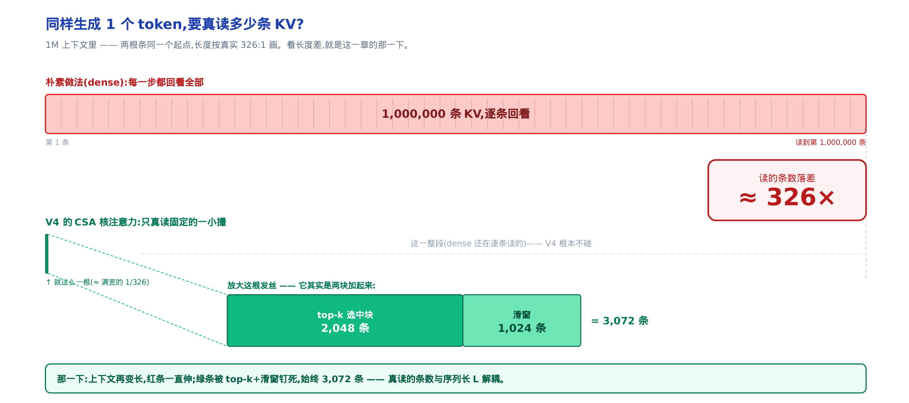
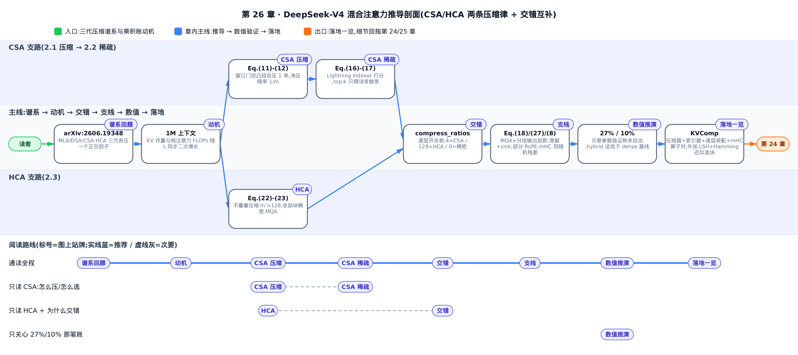
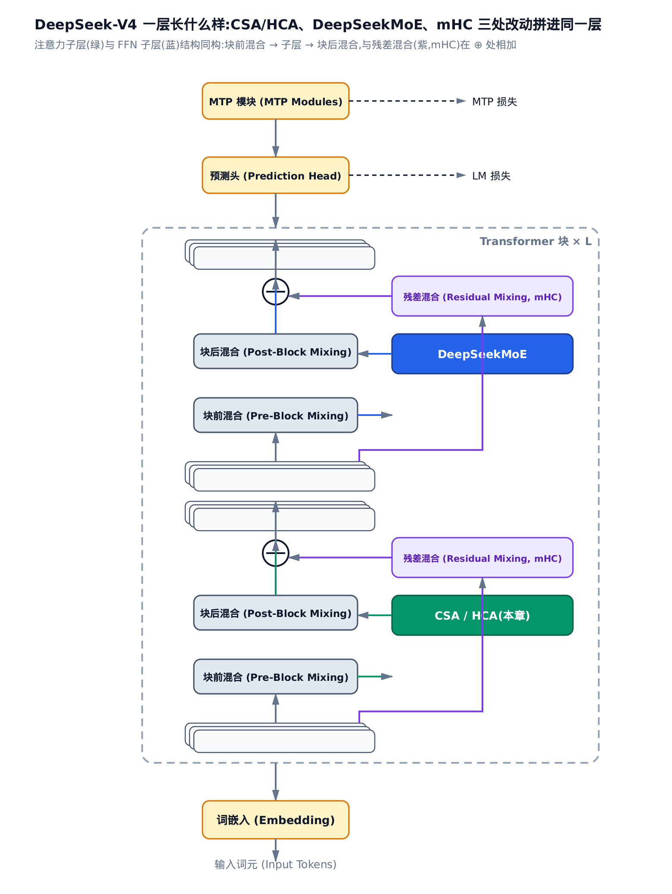
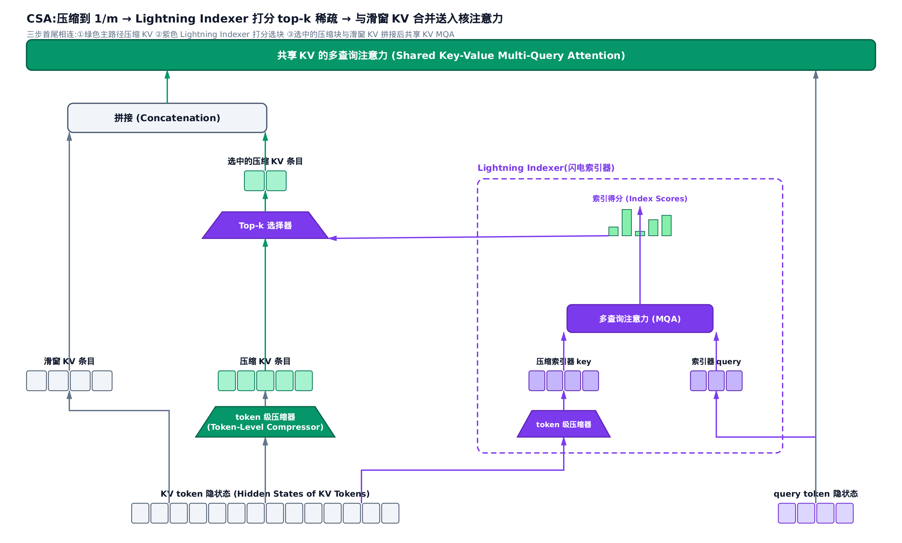
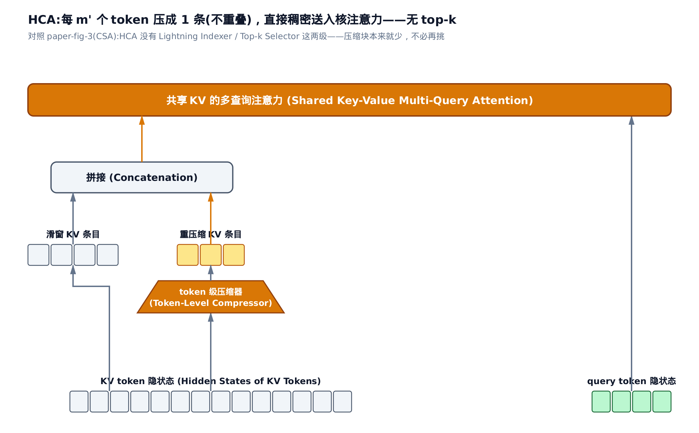
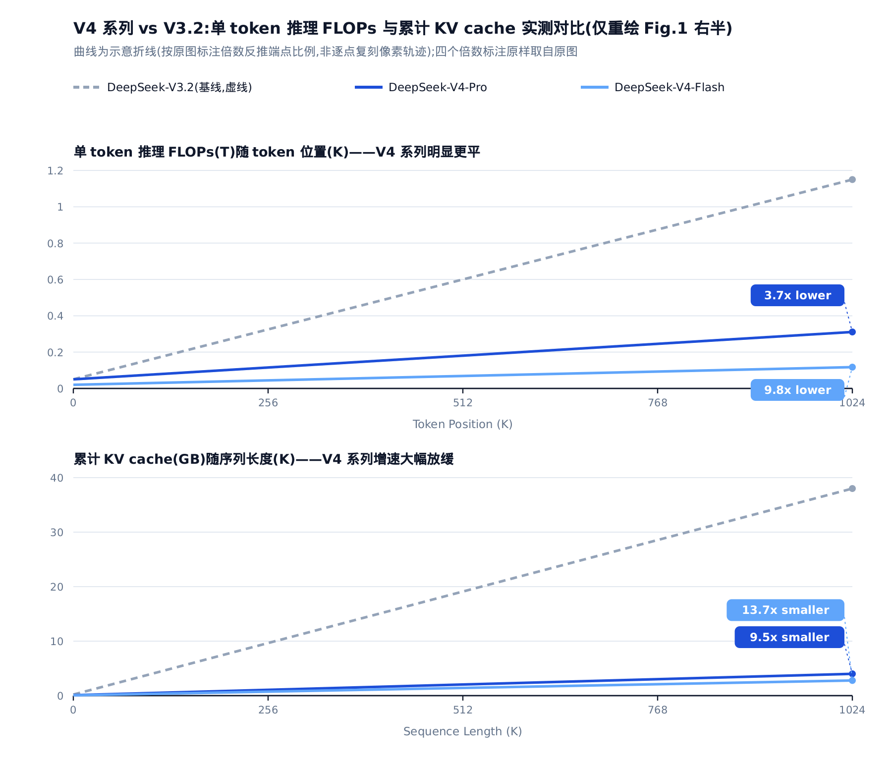

# 第 26 章 DeepSeek-V4 的两级压缩混合注意力：CSA 与 HCA（论文精读）


> 你在这里：注意力与 KV 那一 Part 的原理收束。
> 上一站：[第 25 章](../../ch25-kv-manager-and-schedulers/narrative/chapter.md)讲透了 KV cache 的管理与调度器。
> 本章合流 MLA / DSA 两线成 V4，下一站转入算子与编译篇。

这是一篇论文精读，主线论文是 DeepSeek-V4（arXiv:2606.19348）。全章只有一条主线，开篇先点破：**注意力的推理成本是一笔乘积账**。每生成一个 token，KV cache（注意力的 key/value 缓存）占用 = $`N_{\mathrm{store}}\cdot c\cdot b`$ （存的条数 × 每条宽度 × 每元素字节），核注意力 FLOPs（浮点运算次数） $`\simeq N_{\mathrm{read}}\cdot c`$ （实读条数 × 每条宽度）。四个因子彼此正交，于是每砍一个因子，收益就与其余各刀**相乘**：

- $`c`$ （每条宽度）——MLA（多头潜在注意力，[第 21 章](../../ch21-primer-mla/narrative/chapter.md)）的刀：把每条 KV 压成低秩 latent。
- $`N_{\mathrm{read}}`$ （实读条数）——DSA（DeepSeek 稀疏注意力，[第 23 章](../../ch23-primer-sparse-attention/narrative/chapter.md)）的刀：打分 + top-k，只精读最相关的几条。
- $`N_{\mathrm{store}}`$ （存的条数）——**本章的新刀**：把每 $`m`$ 个相邻 token 的 KV 压成 1 条，条数从 $`L`$ （上下文长度）降到 $`L/m`$ 。
- $`b`$ （每元素字节）——低精度存储的刀，本章第三节顺带算清。

DeepSeek-V4 把后三刀捏进同一套**混合注意力**，在 100 万 token 上下文下把单 token 推理 FLOPs 压到 DeepSeek-V3.2 的 27%、KV cache 压到 10%（arXiv:2606.19348 §1）。承担这件事的两个新词先摆出来：

- **CSA**（Compressed Sparse Attention，压缩稀疏注意力）：先把每 $`m=4`$ 个 token 的 KV 压成 1 条（砍 $`N_{\mathrm{store}}`$ ），再做 DSA 式 top-k 稀疏（砍 $`N_{\mathrm{read}}`$ ）。
- **HCA**（Heavily Compressed Attention，重压缩注意力）：每 $`m'=128`$ （ $`\gg m`$ ）个 token 重压成 1 条后做稠密注意力——把 $`N_{\mathrm{store}}`$ 砍得足够狠， $`N_{\mathrm{read}}`$ 就小到不必再砍。

这几刀相乘砍掉的是什么量级，一张图先看落差：



*图 36-0　两根条同一起点、长度按真实 326:1 画：dense 每一步回看全部 1,000,000 条；V4 那根「发丝」放大开是 top-k 2,048 条 + 滑窗 1,024 条 = 3,072 条，约 1/326——且被 top-k 钉成常数，上下文再涨它也不动。这一落差怎么一步步买到，就是本章全部内容。*



只想弄清 CSA 怎么压、怎么选，跳读 2.1 与 2.2；想看 HCA 为什么反而不挑、两种层怎么交错互补，读 2.3 与 2.4；只关心「27% / 10%」那笔账怎么相乘出来，直接跳第三节；想跟全程，按序通读即可。

全章记号一张速查表，正文首现处仍各给一句人话解释：

| 符号 | 含义 | 首现 |
|---|---|---|
| $`N_{\mathrm{store}}`$ 、 $`N_{\mathrm{read}}`$ 、 $`b`$ | 乘积账三因子：KV 存的条数 / 核注意力实读条数 / 每元素字节数 | 开篇 |
| $`L`$ | 上下文长度（当前 token 之前已有的 token 数） | 开篇 |
| $`m`$ 、 $`m'`$ | 压缩率：每 $`m`$ 个 token 压成 1 条（CSA 取 4；HCA 取 $`m'=128`$ ） | 开篇 |
| $`k`$ | top-k 稀疏每个 query 选中的压缩块数 | 一、动机 |
| $`n_{\mathrm{win}}`$ | 滑窗保留的未压缩近端 token 数 | 一、动机 |
| $`c`$ | 核注意力单头宽度 = 每条压缩 KV 的宽度（小写；别与大写的 KV 条目 $`C`$ 混淆） | 一、动机 |
| $`d`$ 、 $`\mathbf h_t`$ | 隐状态宽度；token $`t`$ 的隐状态（ $`1\times d`$ 行向量） | 2.1 节 |
| $`C`$ 、 $`Z`$ | 每个 token 投影出的两条 $`c`$ 维向量：值条目与压缩门控 | 2.1 节 |
| $`C^{\mathrm{Comp}}_i`$ | 第 $`i`$ 个压缩块——窗口内 $`C`$ 值的门控加权平均，唯一落盘的 KV 条目 | 2.1 节 |
| $`S`$ 、 $`B`$ | 压缩权重（softmax 出的门控）与可学习位置偏置 | 2.1 节 |
| $`\mathbf c^Q_t`$ | query 的低秩潜向量（承自[第 21 章](../../ch21-primer-mla/narrative/chapter.md)的 MLA） | 2.2 节 |
| $`I_{t,s}`$ | indexer 给「query $`t`$ × 压缩块 $`s`$ 」打的相关分 | 2.2 节 |
| $`z_{h,i,j}`$ 、 $`z'_h`$ | 头 $`h`$ 、query $`i`$ 对候选 $`j`$ 的核注意力原始 logit（还没除 softmax 分母、没加 sink 票的点积打分）；第 $`h`$ 头的可学习 sink 弃权 logit | 2.5 节 |

---

## 谱系回顾：三代压缩，三条正交轴

CSA/HCA 不是推倒 MLA 和 DSA 重来，而是在它们之上再叠一条轴——乘积账里还没人动过的那个因子 $`N_{\mathrm{store}}`$ 。


*图 36-1　三代各压一个因子：MLA 压每条宽度、DSA 压实读条数、CSA/HCA 压存的条数。因子正交，故收益可叠乘。*

- **MLA（[第 21 章](../../ch21-primer-mla/narrative/chapter.md)）**： $`L`$ 条 KV 一条不少，每条压成低秩 latent——砍 $`c`$ 。
- **DSA（[第 23 章](../../ch23-primer-sparse-attention/narrative/chapter.md)）**：KV 全都存着，每个 query 只挑 top-k 条精读——砍 $`N_{\mathrm{read}}`$ 。
- **CSA/HCA（本章）**：把每 $`m`$ 个相邻 token 合成 1 条——砍 $`N_{\mathrm{store}}`$ ，条数从 $`L`$ 降到 $`L/m`$ 。

正交意味着可叠加：CSA 层 = 先压条数（新轴）+ 再套 DSA 稀疏（老轴）。CSA 里的 lightning indexer（闪电索引器，[第 23 章](../../ch23-primer-sparse-attention/narrative/chapter.md) DSA 的轻量打分器，用低秩代理代替全精度内积给候选打分）几乎原样复用，只是打分对象从「原始 token」换成了「压缩块」。

> **衍生仓定位**：本章讲的这套注意力，在昇腾接管链里对应基座 vLLM 的注意力后端那一站——vLLM-Ascend 为 DeepSeek-V4 新写了模型定义，用压缩器与索引器顶替基座里普通的 MLA 注意力模块。落地细节回指本书的稀疏注意力实现章（[第 24 章](../../ch24-sparse-attention-sfa-dsa/narrative/chapter.md)）、KV 缓存布局章（[第 25 章](../../ch25-kv-manager-and-schedulers/narrative/chapter.md)）与模型注册章（[第 38 章](../../ch38-model-lora-netloader-registration/narrative/chapter.md)）。

分头拆 CSA、HCA 之前，先看这条演进线的最新一环落到模型里，一层 Transformer 长什么样：



---

## 一、动机：1M 上下文下的「回看税」

因果自注意力的成本结构一句话：第 $`t`$ 个 query 要对它前面的每个 token 各算一次 $`q\cdot k`$ 打分，还得把这些 token 的 KV 全存着——像一个每读一页都得把之前所有页各回看一遍的读者，读到第 100 万页时光「回看」就压垮一切。对应到乘积账就是 $`N_{\mathrm{store}} = N_{\mathrm{read}} = L`$ ：KV 存量与单 token FLOPs 都随 $`L`$ 线性涨，整条序列合起来是 $`O(L^2)`$ 的回看税。论文开篇点得很直白（arXiv:2606.19348 §1）：test-time scaling（测试时扩展，靠推理时多花算力换性能）这条路，正被 vanilla 注意力的二次复杂度卡死在超长上下文上。

把小参数代进去看这笔税，以及 CSA 砍完两刀后它变成什么样。取 head_dim（每个头的宽度，即乘积账的 $`c`$ ） $`=1`$ 、压缩率 $`m=4`$ 、每 query 选 $`k=2`$ 个压缩块、滑窗 $`n_{\mathrm{win}}=1`$ ，序列长 $`L`$ 从 16 翻到 1024。dense 两列就是 $`N_{\mathrm{store}}=N_{\mathrm{read}}=L`$ 的直接体现（单 token FLOPs = 对前面 $`L`$ 条各做 $`c=1`$ 次乘加 = $`L`$ ）；「CSA 核注意力 FLOPs」列只数**核注意力**——选中压缩块后真正做的那步内积与加权求和（对应 2.5 节的 Eq.(18)-(19)），不含 indexer 打分开销，这个界定下一段展开。

<!-- trace: motivation-kv-flops-account -->

| 序列长 $`L`$ | dense KV 存量 | dense 单 token FLOPs | CSA KV 存量 | CSA 核注意力 FLOPs（有界） | CSA 总 FLOPs |
|---|---|---|---|---|---|
| 16 | 16.0 | 16.0 | 4.0 | 3 | 7.0 |
| 64 | 64.0 | 64.0 | 16.0 | 3 | 19.0 |
| 256 | 256.0 | 256.0 | 64.0 | 3 | 67.0 |
| 1024 | 1024.0 | 1024.0 | 256.0 | 3 | 259.0 |

两条指纹。第一，dense 的 KV 存量与单 token FLOPs 两列， $`L`$ 从 16 翻到 1024（64 倍），数字同步从 16 涨到 1024——随 $`L`$ 线性、全序列二次的税单。第二，「CSA 核注意力 FLOPs」列不管 $`L`$ 涨多少倍**恒为 3**：核注意力只读固定的 $`k+n_{\mathrm{win}}=2+1=3`$ 条，被 top-k 钉死， $`N_{\mathrm{read}}`$ 与序列长彻底解耦。

**不变量：CSA 的核注意力成本恒为 $`(k+n_{\mathrm{win}})\cdot c`$ ，与 $`L`$ 无关；KV 存量恒为 $`L/m`$ （ $`L=1024`$ 时 256，斜率降 4 倍）。** 一个诚实的细节：「CSA 总 FLOPs」列（ $`L=1024`$ 时 259）并没有变成常数——indexer 打分仍要扫全部 $`L/m`$ 个候选块，只是单次打分是廉价的标量代理（[第 23 章](../../ch23-primer-sparse-attention/narrative/chapter.md) lightning indexer 的省法）；最贵的核注意力那本账已被钉成常数 3。


*图 36-2　同一 $`L`$ ，dense 的 FLOPs/KV 与 $`L`$ 齐涨；CSA 核注意力恒为 3、KV 只以 $`1/m`$ 斜率增长。*

一句话收束动机： $`N_{\mathrm{store}}`$ 与 $`N_{\mathrm{read}}`$ 两个因子都随 $`L`$ 涨，**必须同时下手**——这正是 CSA 把压缩与稀疏两件事捏进同一层做的原因。这些成本旋钮（ $`m`$ 、 $`k`$ 、滑窗宽度 $`n_{\mathrm{win}}`$ 、注意力 sink）落到代码，就是一层注意力构造时一次性读入的 config 字段，落地见[第 24 章](../../ch24-sparse-attention-sfa-dsa/narrative/chapter.md)。

---

## 二、推导：CSA 怎么压、怎么选，HCA 为什么反而不挑

2.1、2.2 把 CSA 拆成「压缩」「稀疏」两步各讲一遍。先看论文的端到端参考画法，把三步怎么首尾相连在脑子里过一遍，再进细节：



### 2.1　CSA 压缩：压缩块是 2m 个 token 的门控凸组合

先亮这一节的全部内容——一条律：

$$
C^{\mathrm{Comp}}_i \;=\; \sum_{j\in\mathcal W_i} S_j \odot C_j,
\qquad
S = \mathrm{Softmax}_{\mathrm{row}}\big(Z_{\mathcal W_i} + B\big),
\qquad
|\mathcal W_i| = 2m
$$

（arXiv:2606.19348 §2.3.1 Eq.(11)-(12) 的合并写法，与原式的逐项对应见严谨框。）符号的人话：每个 token 先各投出两条 $`c`$ 维向量——值条目 $`C_j`$ 与门控 $`Z_j`$ （由隐状态 $`\mathbf h_j`$ 各乘一个可训练矩阵得到，Eq.(9)-(10)）；窗口 $`\mathcal W_i`$ = 本块的 $`m`$ 个 token ∪ 向上一块借来的 $`m`$ 个 token；把窗口内门控加上可学习位置偏置 $`B`$ 、过一次 softmax 得权重 $`S`$ ，对值条目逐元素（ $`\odot`$ ）加权求和，得到这一块**唯一落盘**的压缩条目 $`C^{\mathrm{Comp}}_i`$ ——像把每 4 个词打包成一张摘要卡片、相邻卡片共享一条边界，比喻只此一句。这条律有三个一眼要看出的性质：

1. **凸组合**：softmax 权重非负、沿窗口和为 1，所以 $`C^{\mathrm{Comp}}_i`$ 落在窗口内 $`C`$ 值的 $`[\min,\max]`$ 之间——压缩是加权平均，不会外推出源值之外。
2. **重叠免费**：块 $`i`$ 借的那 $`m`$ 个 token 恰是块 $`i-1`$ 的本块 token——两块窗口**索引交叠**，落盘条目总数仍是 $`L/m`$ ，净压缩率是 $`1/m`$ 而非 $`1/(2m)`$ 。重叠买到边界连续性（硬切可能正好切碎一句话），付的存储是零。
3. **因果起点**：块 0 没有上一块可借，借位门控补 $`-\infty`$ 、值补 0—— $`\exp(-\infty)=0`$ ，借位权重恒 0，不污染输出。

代入 $`n=8`$ 、 $`m=4`$ 、权重矩阵取恒等（ $`C=Z=H`$ ）、偏置 $`B=0`$ 、token $`t`$ 的值 $`=t+1`$ ，两个压缩块跑出来：

<!-- trace: csa-overlap-compress -->

| 压缩块 $`i`$ | 窗口来源（通道 0 的 C 值） | 参与 token 数 | softmax 权重（降序尾部） | 压缩输出 C_comp[0] |
|---|---|---|---|---|
| 0 | padding（权重 0）+ 本块 token 1.0~4.0 | 4 | 0.644 / 0.237 / 0.087 / 0.032 | 3.493 |
| 1 | 借块 0 的 token 1.0~4.0 + 本块 token 5.0~8.0 | 8 | 0.632 / 0.233 / 0.086 / 0.031 | 7.421 |


*图 36-3　块 0 前半被 $`-\infty`$ padding 清零，只用本块 4 个 token；块 1 借块 0 的 4 个 token，共 8 个位置参与，但相邻块索引交叠，序列长仍只压到 $`1/4`$ 。*

对着表把三个性质各核一遍：块 0 输出 3.493 落在源值 $`[1.0,4.0]`$ 内、块 1 输出 7.421 落在 $`[1.0,8.0]`$ 内（凸组合——权重沿窗口和为 1，块 0 有效 4 位、块 1 有效 8 位）；块 1 的 8 个参与 token 里前 4 个正是块 0 的本块 token（重叠交叠）；块 0 的借位权重全为 0（因果起点）。两块输出都偏向权重最大（0.644 / 0.632）的近端 token，符合「近端更相关」的直觉。

> **严谨（完整原式与维度账，想要深度再展开）**：论文把这条律写成两套投影（arXiv:2606.19348 §2.3.1 Eq.(9)-(12)）。先投影： $`C^a = H\,W^{aKV}`$ 、 $`C^b = H\,W^{bKV}`$ 、 $`Z^a = H\,W^{aZ}`$ 、 $`Z^b = H\,W^{bZ}`$ ，四个可训练矩阵均 $`\in\mathbb R^{d\times c}`$ ； $`H\in\mathbb R^{n\times d}`$ 每行一个 token 的隐状态，行向量右乘 $`d\times c`$ 矩阵得 $`1\times c`$ ，故四个输出均 $`\in\mathbb R^{n\times c}`$ 。 $`a`$ 套是「本块的」、 $`b`$ 套是「借给下一块的」——正文那条律里的 $`C_j`$ 在本块位置取 $`C^a_j`$ 、借位取 $`C^b_j`$ （门控同理），偏置也分 $`B^a,B^b`$ 两段。再压缩（Eq.(11)-(12)）： $`[\,S^a_{mi:m(i+1)-1};\ S^b_{m(i-1):mi-1}\,] = \mathrm{Softmax}_{\mathrm{row}}([\,Z^a_{mi:m(i+1)-1}+B^a;\ Z^b_{m(i-1):mi-1}+B^b\,])`$ ，然后 $`C^{\mathrm{Comp}}_i = \sum_{j=mi}^{m(i+1)-1} S^a_j\odot C^a_j + \sum_{j=m(i-1)}^{mi-1} S^b_j\odot C^b_j`$ ——两段求和正是正文里 $`\mathcal W_i`$ 的两半。 $`\mathrm{Softmax}_{\mathrm{row}}`$ 是**逐通道**归一而非标量注意力：把窗口门控摊成 $`2m\times c`$ 矩阵（行 = $`2m`$ 个位置、列 = $`c`$ 个通道），则 $`\mathrm{Softmax}_{\mathrm{row}}(Z)_{j,u} = \exp(Z_{j,u})\big/\sum_{j'=0}^{2m-1}\exp(Z_{j',u})`$ ——每个通道 $`u`$ 的 $`2m`$ 个权重自成一组、和为 1，通道间互不影响；所以凸组合性质是逐通道成立的，正文表格取通道 0 验证。 $`i=0`$ 时 $`Z^b`$ 段补 $`-\infty`$ 、 $`C^b`$ 段补 0。落地时 CSA 的投影一次打包出 $`a,b`$ 两套（输出宽度 $`2c`$ ）、HCA 只有一套，「续借上一块」在分页推理里靠一个跨块滚动的状态缓存续接——这套压缩器的构造与前向见[第 24 章](../../ch24-sparse-attention-sfa-dsa/narrative/chapter.md)。

### 2.2　CSA 稀疏：给每块打一个 ReLU 相关分，只精读 top-k

压完， $`N_{\mathrm{store}}`$ 从 $`L`$ 降到 $`L/m`$ ；但要是每块都进核注意力， $`N_{\mathrm{read}}`$ 仍随 $`L`$ 涨。于是 CSA 复用 [第 23 章](../../ch23-primer-sparse-attention/narrative/chapter.md) 的 DSA：给每个压缩块打一个廉价的「相关分」，只把分最高的 $`k`$ 块调进来精读——打分器就是谱系回顾里的 lightning indexer。

> 先修：马上要用的 $`\mathbf{c}^Q_t`$ 不是新符号——它就是[第 21 章](../../ch21-primer-mla/narrative/chapter.md) 2.2 节讲权重吸收时的那个 query 低秩潜向量：先下投影把隐状态压瘦、再上投影升回每头 query（arXiv:2405.04434，DeepSeek-V2）。不需要重看那部分推导，接受「 $`\mathbf{c}^Q_t`$ 是 query 的低秩摘要」就能往下走。

打分与选块两行（arXiv:2606.19348 §2.3.1 Eq.(16)-(17)， $`s<\lfloor t/m\rfloor`$ 保因果）：

$$
I_{t,s} = \sum_{h=1}^{n^I_h} w^I_{t,h}\cdot \mathrm{ReLU}\big(\mathbf{q}^I_{t,h}\cdot K^{\mathrm{IComp}}_s\big),
\qquad
\mathcal{C}^{\mathrm{SprsComp}}_t = \big\{\, C^{\mathrm{Comp}}_s \;\big|\; I_{t,s}\in \mathrm{TopK}(I_{t,:}) \,\big\}
$$

人话：每个 indexer 头 $`h`$ 拿自己的 query $`\mathbf q^I_{t,h}`$ 与块摘要 $`K^{\mathrm{IComp}}_s`$ 算内积、过 ReLU 清掉负相关，再按头的标量权重 $`w^I_{t,h}`$ 加权求和——一个标量 $`I_{t,s}`$ 把「块 $`s`$ 值不值得精读」定死；top-k 之后进核注意力的块恒为 $`k`$ 条， $`N_{\mathrm{read}}`$ 被钉成常数。两个新记号的来历各一句： $`\mathbf q^I_{t,h}`$ 由低秩 $`\mathbf c^Q_t`$ 经每头独立的升维矩阵升出（Eq.(13)-(14)）； $`K^{\mathrm{IComp}}`$ 用与 2.1 节**同一套**压缩操作从 token 压出（论文原话「same compression operation」）——indexer 打分的对象与主路压缩块同粒度、一一对应。

代入 2 个 indexer 头、 $`k=2`$ 、5 个候选块、query 取单位基向量（只为让内积直接读出 key 分量、便于心算，不影响 top-k 排序）：

<!-- trace: csa-lightning-indexer-topk -->

| 候选块 $`s`$ | head0·key | head1·key | ReLU 后加权分 $`I_{t,s}`$ | 入选 top-2？ |
|---|---|---|---|---|
| 0 | 2.0 | 0.0 | 2.0 | 否 |
| 1 | 0.0 | 3.0 | 3.0 | 是 |
| 2 | -1.0 | -1.0 | 0.0 | 否 |
| 3 | 1.0 | 1.0 | 2.0 | 否 |
| 4 | 4.0 | 1.0 | 5.0 | 是 |


*图 36-4　块 4（分 5）与块 1（分 3）胜出；块 2 两头点积皆负，ReLU 清零后得分 0 被淘汰。选块数固定为 $`k`$ ，不随上下文长增长。*

**不变量：index score 经 ReLU 后非负；选中集大小恒为 $`k`$ 与候选数的较小者，与序列长解耦。** 块 2 两头点积均 $`-1`$ ，ReLU 清零后得分 0；块 4 得 5、块 1 得 3 入选，块 0/3/2 的 2/2/0 被裁，选中率 $`2/5`$ 。核注意力代价从 $`O(L/m)`$ 个候选降到固定 $`O(k)`$ ——这是 CSA 在「压条数 $`1/m`$ 」之上再叠的第二重收益。

> **严谨（Eq.(13)-(15) 的维度账）**：indexer query 是 $`\mathbf q^I_{t,h} = W^{IUQ}_h\,\mathbf c^Q_t`$ （Eq.(14)），每个 indexer 头 $`h`$ 各有独立升维矩阵，落地时全部头拼成一次批量线性；头权重由隐状态一次线性投出： $`\mathbf w^I_t = \mathbf h_t\,W^{w}`$ （Eq.(15)）， $`W^w\in\mathbb R^{d\times n^I_h}`$ ， $`\mathbf h_t`$ 是 $`1\times d`$ 行向量，故 $`\mathbf w^I_t\in\mathbb R^{1\times n^I_h}`$ ，第 $`h`$ 分量即标量 $`w^I_{t,h}`$ 。indexer 头数 $`n^I_h`$ 与核注意力头数彼此独立；indexer 与核注意力共享同一个 $`\mathbf c^Q_t`$ （Eq.(13)），是「一次下投影、多处升维」的复用。索引器模块只在 CSA 层挂载——为什么 HCA 不挂，正是下一节的主角；其构造与打分核的落地见[第 24 章](../../ch24-sparse-attention-sfa-dsa/narrative/chapter.md)。

### 2.3　HCA：压得越狠，反而越不必挑

反直觉先亮：HCA 把压缩率从 4 提到 128，却把 lightning indexer 与 top-k **整个扔掉**。道理还在乘积账上：稀疏选择省的是 $`N_{\mathrm{read}}`$ 相对 $`N_{\mathrm{store}}`$ 的差额——候选一共只有 $`L/m'`$ 条、本来就没几条时，「先打分再挑」的开销与漏选风险都盖过「全读」的成本，于是 $`N_{\mathrm{read}} = N_{\mathrm{store}} = L/m'`$ 干脆全读。更狠的摘要，狠到不必再挑。（ $`m'=128`$ 据论文实验是「压得够狠、兜底够省」与「不过度糊掉细节」之间的平衡点，不是随手拍的数。）



压缩律与 2.1 节是同一条，改三处（arXiv:2606.19348 §2.3.2 Eq.(22)-(23)）：只有一套 $`C,Z`$ 投影（没有 $`a/b`$ ，不借上一块）；窗口严格是本块的 $`m'`$ 个 token（ $`\mathcal W_i = [m'i,\ m'(i+1)-1]`$ ，块间源区间不相交）；压完对**全部** $`L/m'`$ 块做共享 KV 的 MQA（多查询注意力：所有 query 头共用同一份 KV，压缩块 $`C^{\mathrm{Comp}}_i`$ 本身同时充当 key 与 value），不做 top-k——核注意力 Eq.(24)-(26) 与 CSA 的 Eq.(18)-(19) 同构。

把 $`m'`$ 缩小为 4 便于心算，取 $`n=8`$ 、不重叠，跑一遍：

<!-- trace: hca-heavy-compress-dense -->

| 压缩块 $`i`$ | 源 token 区间 | 源 token 数（无重叠） | softmax 权重（降序） | 输出 / 结果 |
|---|---|---|---|---|
| 0 | token 0–3 | 4 | 0.644 / 0.237 / 0.087 / 0.032 | 3.493 |
| 1 | token 4–7 | 4 | 0.644 / 0.237 / 0.087 / 0.032 | 7.493 |
| 稠密 MQA | attend 全部 2 个压缩块 | 2 | 无 top-k 裁剪 | o_head0[0] = 7.269 |


*图 36-5　CSA 靠重叠窗口保边界连续、HCA 靠源区间不相交换极简。左（CSA）块 1 借块 0 的 token 而重叠；右（HCA）块 0、1 源区间 0–3 与 4–7 互不相交。HCA 之后对全部块稠密注意力，不再 top-k。*

**不变量：HCA 每块严格只用自己的 $`m'`$ 个 token，块间源区间不相交；压缩后对全部 $`L/m'`$ 块稠密注意力。** 块 0 源 token 0–3、块 1 源 token 4–7，无交叠——与 CSA 块 1「借块 0 的 token」鲜明对比；两块 softmax 权重完全相同（0.644 / 0.237 / 0.087 / 0.032），因为不借位时块内相对结构一致。单 token 核注意力 FLOPs 是 $`(L/m'+n_{\mathrm{win}})\cdot c`$ —— $`O(L/m')`$ 而非 $`O(L)`$ ： $`N_{\mathrm{read}}`$ 没有被钉成常数，但它的斜率被 $`1/128`$ 压到从属地位，靠的纯是压缩、不靠稀疏。

### 2.4　交错：一个怕漏、一个怕糊

CSA 与 HCA 的误差模式恰好错开：CSA（轻压 + 稀疏）保细节，但 top-k 没选中的远程信息整块消失——**怕漏**；HCA（重压 + 稠密）兜住全局每一块，但 128 合 1 抹平细节——**怕糊**。两种层交错堆叠，上一层漏的下一层用全局摘要兜住、上一层糊的下一层用细粒度块补回——两种缺陷互相抵消，这就是 V4 的「混合」注意力（arXiv:2606.19348 §2.3.2）。

落到模型，交错就是一张逐层整数表，读取入口只有 6 行（`vllm_ascend/utils.py:L105-110`）：

```python
# vllm_ascend/utils.py:L105-110
def get_dsv4_compress_ratio(config: Any, layer_idx: int) -> int:
    """Return DSV4 compress ratio, treating unspecified MTP layers as dense."""
    compress_ratios = getattr(config, "compress_ratios", None)
    if compress_ratios is None or layer_idx >= len(compress_ratios):
        return 0
    return compress_ratios[layer_idx]
```

返回的整数就是本章的压缩率：`4` = CSA 层、`128` = HCA 层、`0`/未登记 = 稠密层（兜底分支给 MTP——多 token 预测头，DeepSeek 自带的投机草稿头——这类不在表里的层）。这六行是交错设计本身：每层挂什么模块、走哪条压缩律，全由这张表逐层指派；按表构建各层的细节见[第 24 章](../../ch24-sparse-attention-sfa-dsa/narrative/chapter.md)。


*图 36-6　每层读一个整数：4 挂压缩器 + 索引器（CSA）、128 只挂压缩器（HCA）、 $`\le 1`$ 走稠密滑窗。两者短板互补。*

**不变量：`compress_ratios` 是建模期一次性读入的静态表，每层的 CSA/HCA/稠密身份在整个前向中固定，不随输入变化。** 前面「为什么互补」是设计层面的论证；这条不变量保证交错的稳定性：无论输入长短，第 $`l`$ 层永远是它建模期被指派的那一类。

### 2.5　支线：核注意力与分组输出、滑窗与 sink、部分 RoPE、mHC

主干讲完，四条支线让这套注意力真正能训、能跑。

**共享 KV 的 MQA + 分组输出投影**（arXiv:2606.19348 §2.3.1 Eq.(18)-(19)；分组输出投影是同小节无编号的文字描述）。核注意力是 MQA：每条压缩条目同时当 key 和 value，全部 query 头共用。query 从共享的 $`\mathbf c^Q_t`$ 升出（Eq.(18)，与 indexer query 同构、矩阵与头数各自独立），打分-加权就是标准缩放点积注意力（论文记作抽象算子 $`\mathrm{CoreAttn}(\cdot)`$ ，按 MQA 展开即）：

$$
\mathbf{o}_{t,i} = \mathrm{Softmax}\!\left(\frac{\mathbf{q}_{t,i}\,(\mathcal{C}_t^{\mathrm{SprsComp}})^{\top}}{\sqrt{c}}\right)\mathcal{C}_t^{\mathrm{SprsComp}}
$$

（arXiv:2606.19348 §2.3.1 Eq.(19) 写实。） $`\mathbf q_{t,i}\in\mathbb R^{1\times c}`$ 是头 $`i`$ 的 query 行向量， $`\mathcal C^{\mathrm{SprsComp}}_t\in\mathbb R^{k\times c}`$ 是 Eq.(17) 选中的 $`k`$ 条压缩条目， $`\mathbf o_{t,i}\in\mathbb R^{c}`$ 是头 $`i`$ 的输出。两点一句话点透：key 与 value 是**同一份** $`\mathcal C^{\mathrm{SprsComp}}_t`$ ，这正是 MQA 的定义；top-k 已在选块阶段把候选裁到 $`k`$ 条，这一步内部不再裁剪。输出侧还有一处省钱：V4 的 $`c\cdot n_h`$ （ $`n_h`$ 为核注意力头数）很大，直接投回 $`d`$ 维太贵，于是先把 $`n_h`$ 个头分 $`g`$ 组、每组降到低秩 $`d_g`$ 、再拼接投回 $`d`$ ——两段瘦线性替一段胖线性，这就是分组输出投影，落地形状见[第 24 章](../../ch24-sparse-attention-sfa-dsa/narrative/chapter.md)。

**滑窗 + 注意力 sink**（arXiv:2606.19348 §2.3.3 Eq.(27)）。压缩块有个天生盲区：核注意力只读各压缩块的**输出**（单条摘要）、不读块内细节，而因果约束只允许 query 看 $`s<\lfloor t/m\rfloor`$ 的块——query 自己所在的块连同块内近邻 token 一起落进盲区，而近端恰恰最相关。滑窗支线因此额外保留最近 $`n_{\mathrm{win}}`$ 个**未压缩**的 KV 补上近端细节。注意力 sink 则给每头一张「弃权票」：

$$
s_{h,i,j} = \frac{\exp(z_{h,i,j})}{\sum_k \exp(z_{h,i,k}) + \exp(z'_h)}
$$

（arXiv:2606.19348 §2.3.3 Eq.(27)。） $`z_{h,i,j}`$ 就是动机节「对前面每个候选各算一次 $`q\cdot k`$ 」里的那个打分，补上头 $`h`$ 、query 位置 $`i`$ 、候选 $`j`$ （滑窗 token 或压缩块）三个下标——还没除 softmax 分母、没加 sink 票的原始 logit； $`z'_h`$ 是第 $`h`$ 头的可学习 sink logit。分母多加一项 $`\exp(z'_h)`$ ，每头的注意力总和便不必等于 1、甚至可近 0——遇到无信息的候选，头可以「什么都不投」。（这个 softmax 与 2.1 节 $`\mathrm{Softmax}_{\mathrm{row}}`$ 是同一族「沿某一维归一」操作：那里沿窗口位置逐通道归一，这里沿候选逐头归一、再加 sink 项。）代入极端值看行为：

<!-- trace: sliding-window-attn-sink -->

| 场景 | 参数 | 关键标量 | 结果 |
|---|---|---|---|
| sink 弱 | sink_logit = -10.0 | 注意力总和 = 1.0 | 吸收质量 0.0 |
| sink 强 | sink_logit = 3.0 | 注意力总和 = 0.356 | 吸收质量 0.644 |
| 滑窗 中段 | query_pos = 7, n_win = 4 | 取 4 条 | token 4–7 |
| 滑窗 起点 | query_pos = 1, n_win = 4 | 取 2 条 | token 0–1 |

**不变量：加 sink 后注意力分数之和 $`\le 1`$ ，sink logit 越大吸收越多；滑窗在序列起点自动截断。** sink logit 从 $`-10`$ 升到 3，单头被「弃权」吸收的质量从 0.0 升到 0.644；3.0 只是中等强度示范，同一组候选换 sink logit 为 10.0 时总和已降到 0.001（吸收质量 0.9995），这才是「可近 0」的量级。滑窗名义 4 条，但 query 在位置 1 时起点截断只取得到 2 条（token 0–1），不会越界到负位置。

> 先修：马上用到 RoPE 的一条代数性质——两次旋转的角度直接相加， $`R_aR_b=R_{a+b}`$ （等价形式 $`R_t^\top R_j=R_{j-t}`$ 的复数推导见[第 21 章](../../ch21-primer-mla/narrative/chapter.md) 2.3 节的严谨框；arXiv:2104.09864，RoFormer）。不需要重推，接受这个结论就能看懂下面「减一个位置」为什么能把绝对位置抵消成相对位置。

**部分 RoPE**（arXiv:2606.19348 §2.3.3）。RoPE（旋转位置编码）只施加到 query 与 KV 条目的**最后 64 维**。压缩条目同时当 key 和 value，于是核注意力输出会混进一份「被 attend 块的绝对索引」；对冲的办法：对每个输出 $`\mathbf{o}_{t,i}`$ 的最后 64 维再用位置 $`-i`$ 施一次 RoPE。此处 $`-i`$ 里的 $`i`$ 指 query 自己所在的压缩块索引 $`i=\lfloor t/m\rfloor`$ ——与 $`\mathbf o_{t,i}`$ 的头下标撞了同一个字母，论文原文没有分开记号，是两件不同的事。压缩块的旋转是**块粒度**的：块 $`s`$ 携带的旋转角正比于块索引 $`s`$ ，输出再乘 $`-i`$ 的旋转，角度可加性 $`R_sR_{-i}=R_{s-i}`$ 一相加，指数里只剩**相对**块间距 $`s-i`$ ，两个绝对索引都被抵消。可心算的示意（把每挪一个块索引的旋转角取成 $`\theta=1`$ 弧度，只借它验证角度相加）： $`m=4`$ 、query 在 $`t=13`$ ，所在块 $`i=\lfloor13/4\rfloor=3`$ ；被选中的压缩块 $`s=1`$ （满足因果 $`s<i`$ ）。块旋转角 $`\theta\cdot s=1\times1=1`$ ，输出再转 $`-3`$ ，净角 $`1+(-3)=-2=\theta\cdot(s-i)=1\times(1-3)`$ —— $`s=1`$ 与 $`i=3`$ 的绝对值在角度加法里抵消，只剩相对间距。压缩层的 RoPE 还换用一个独立的频率基——压缩条目的位置是块粒度、相邻条目间距被拉大了 $`m`$ 倍，装配细节见[第 24 章](../../ch24-sparse-attention-sfa-dsa/narrative/chapter.md)。

**mHC：把残差钉在双随机流形上**（arXiv:2606.19348 §2.2 Eq.(1)-(8)）。这是 V4 的另一根支柱，与注意力正交但同样为「深栈稳定」服务。标准 Hyper-Connections 把残差流从 $`\mathbb{R}^d`$ 扩宽到 $`\mathbb{R}^{n_{\mathrm{hc}}\times d}`$ ，用一个 $`B_l`$ 矩阵混合各路残差（Eq.(1)）；但堆多层容易数值发散。mHC（Manifold-Constrained Hyper-Connections，流形约束超连接）把 $`B_l`$ 约束到**双随机矩阵**（每行每列和都为 1）流形上，用 Sinkhorn-Knopp 算法迭代实现。先给直觉：这套迭代像把一张预算表来回按行、按列配平，直到每行每列都恰好加起来是 1——先 $`\exp`$ 保正，再反复列归一、行归一（即下式 Eq.(8) 中内层先做列归一 $`\mathcal{T}_c`$ 、外层再做行归一 $`\mathcal{T}_r`$ ）：

$$
M^{(t)} = \mathcal{T}_r\big(\mathcal{T}_c(M^{(t-1)})\big)
$$

（arXiv:2606.19348 §2.2 Eq.(8)， $`\mathcal{T}_r,\mathcal{T}_c`$ 是行/列归一，取 $`t_{\max}=20`$ ）。两者的具体定义是逐元素除以对应的行和/列和：

$$
\mathcal{T}_c(M)_{ij} = \frac{M_{ij}}{\sum_{i'} M_{i'j}}, \qquad \mathcal{T}_r(M)_{ij} = \frac{M_{ij}}{\sum_{j'} M_{ij'}}
$$

$`\mathcal{T}_c`$ 把每一**列**的和配平到 1（列归一，固定 $`j`$ 、对 $`i`$ 求和）， $`\mathcal{T}_r`$ 把每一**行**的和配平到 1（行归一，固定 $`i`$ 、对 $`j`$ 求和）；两步交替应用直到收敛，就是 Sinkhorn-Knopp 迭代。

接着上面「配平预算表」那个直觉往下核对：配平后的双随机矩阵谱范数（矩阵对任意向量最多能放大多少倍） $`\le 1`$ （非扩张），残差不会被逐层放大。这一步不难有一个直觉桥接（不必看严格证明）：双随机矩阵可以写成一堆排列矩阵的加权平均——排列矩阵只是把坐标搬家，不缩放不放大，谱范数恰为 1；一堆「不放大」的操作加权平均，出来的整体自然也不会放大，这就是谱范数 $`\le 1`$ 的来源。代入一个 $`2\times2`$ 例子，看收敛：

<!-- trace: mhc-manifold-hyperconnections -->

| Sinkhorn 迭代数 | 行和最大偏离 1 | 列和最大偏离 1 | 是否双随机 |
|---|---|---|---|
| 0 | 2.5648 | 2.681 | 否 |
| 1 | 0.0 | 0.0186 | 否 |
| 3 | 0.0 | 0.0001 | 否 |
| 20 | 0.0 | 0.0 | 是 |

**不变量：迭代越多，行/列和对 1 的最大偏离单调趋 0，收敛到双随机矩阵。** 迭代 0（仅 $`\exp`$ 、未归一）列偏离达 2.681；迭代 1 因最后一步是行归一故行和精确为 1，列偏 0.0186；迭代 3 列偏降到 0.0001；迭代 20 行列皆 0。每轮归一都是压缩映射，偏离几何式衰减——这就是标准 HC 堆栈易发散、而 mHC 稳定的根因。落地是一对融合算子把注意力与 MLP 各包一层，见本章末尾的落地一览。

---

## 三、数值推演：把「27% FLOPs / 10% KV」的账逐项算出来

诚实先行：论文只给了结论性的两个百分比，没有公开能精确重推它们的完整发行版配置（逐层 `compress_ratios` 数组、每层 $`k`$ 、indexer 头数等）。所以这一节用**示意性参数**跑一遍账本模型，目的不是复现「27%/10%」这两个具体数字，而是验证**账本模型本身自洽、hybrid 确实比两条基线都省**，并看清这几笔账是怎么相乘的。在动手跑账本模型之前，先看一眼论文自己的实测曲线长什么样——这是真实基准，本节账本模型只负责验证方向一致，不冒充复现它：



取 $`L=10^6`$ 、head_dim $`=128`$ 、 $`k=2048`$ 、 $`n_{\mathrm{win}}=1024`$ （这几个都取自大规模模型的**示意量级**， $`k=2048`$ 是这类配置里 indexer top-k 的典型档位——本例只借它验证账本结构自洽，无意复现论文的精确百分比），示意配置 `compress_ratios = [4,4,4,128] × 9`（27 个 CSA 层 + 9 个 HCA 层），把每种层的 KV 存量与单 token FLOPs 代理拆开算再按层比例平均。这笔账还依赖两个之前没露面的参数：lightning indexer 用 4 个头、每头维度 64（模型配置里的 `index_n_heads`/`index_head_dim` 两个字段）——它们直接决定了下面 CSA 那行 FLOPs 代理里最大的一块开销：

<!-- trace: efficiency-account-27-10 -->

| 层类型 / 度量 | KV 存量（单 token） | 单 token FLOPs 代理 | 相对基线 |
|---|---|---|---|
| CSA（ $`m=4`$ ） | 250000.0 | 64393216.0 | — |
| HCA（ $`m'=128`$ ） | 7812.5 | 1131072.0 | — |
| dense 基线 | 1000000.0 | 128000000.0 | 基线 |
| hybrid 平均 | 189453.1 | 48577680.0 | FLOPs 0.3795 / KV 0.1895 |


*图 36-7　CSA 存 $`L/4`$ 、HCA 存 $`L/128`$ ，混合平均降到 dense 的 0.1895；叠上混合精度后每条目 0.75、KV 再降约 1/4。论文口径的 27%/10% 是同一套账加未公开配置算出的，本例只验证方向一致。*

**不变量：hybrid 平均 KV 与 FLOPs 严格小于 dense 基线。** 逐层看：CSA KV $`=L/4=250000`$ 、HCA KV $`=L/128=7812.5`$ ，均远小于 dense 的 $`10^6`$ ；混合平均 189453.1 是 dense 的 0.1895。FLOPs 代理平均 48577680 是 dense 的 0.3795。两个比都小于 1，方向与论文一致。顺手拆开 CSA 那行 64393216 是怎么凑出来的：indexer 要扫 $`L/m=250000`$ 个候选块、每块 4 个头各算 64 维的内积，开销 $`\approx 250000\times4\times64=64{,}000{,}000`$ ；核注意力真正算的那步只有 $`(k+n_{\mathrm{win}})\cdot c=(2048+1024)\times128=393216`$ ，两者相加正好是 64393216——indexer 扫描占了这笔账 99% 以上，比核注意力那步贵一百多倍。这与「一、动机」小节「indexer 打分是廉价代理」的印象看似冲突，其实不冲突：那里的玩具例 $`k=2`$ 、序列极短，indexer 要扫的候选本来就没几个；这里 $`k=2048`$ 、 $`L=10^6`$ 已经是更贴近真实的量级，候选数暴涨，扫描开销自然从「可忽略」变成账本里的显性大头——indexer 单次打分仍比全精度内积便宜，变的只是要扫的候选数量级。这张账本里 CSA:HCA 的层数比例（示意配置的 27:9），落到代码就是 2.4 节那张 `compress_ratios` 逐层开关表——账不是纸面推演，每一层归到哪类由那张表定。

这还只是「压序列长 + top-k 稀疏」两笔账。论文的第三笔是**低精度**（arXiv:2606.19348 §2.3.4）：KV 用混合精度存储——RoPE 那 64 维用 BF16（16 位浮点）、其余维用 FP8（8 位浮点）。按 head_dim=128 拆成 64+64 维粗算，每条目约 192 字节，对比纯 BF16 的 256 字节，比值 0.75——这只坐实了「混合精度确实比纯 BF16 省」这个**方向**，量级并不等于论文原话的「近乎减半」（§2.3.4 "reduces the KV cache size by nearly half"）：这里借用的 head_dim=128 其实是论文同段落里**另一个**基线（BF16 GQA8）的维度，并非 V4 自身 KV 条目宽度的确认值，按 64/64 的示意拆分只能算出 0.75，本章不冒充复现那句「nearly half」。indexer 的打分路径更进一步用 FP4（4 位浮点）。三笔账（压序列长 $`\times`$ top-k 稀疏 $`\times`$ 低精度）相乘，才凑出论文那种「27% FLOPs / 10% KV」的量级。本例不冒充复现那两个百分比，但把它们背后的账本结构讲清了。

---

## 四、落地一览：四个模块、一个论文没写的近似

前三节的数学落到 `vllm_ascend` 里，骨架就四个模块——本章只给一览，模块构造、forward 细节与算子调用链是[第 24 章](../../ch24-sparse-attention-sfa-dsa/narrative/chapter.md)的主线：

- **压缩器**——2.1 与 2.3 的同一条压缩律共用一个类，靠压缩率分叉：4 带重叠（投影一次打包 $`a,b`$ 两套、宽度 $`2c`$ ）、128 不重叠；「续借上一块」在分页推理里靠一个跨块滚动的状态缓存续接。
- **索引器**——2.2 的打分器，只在 CSA 层挂载；自带一个压缩器专压 indexer key，「same compression operation」落到实处。
- **逐层装配**——每层读 2.4 节那张 `compress_ratios` 表决定挂什么；压缩层的 RoPE 换独立频率基（2.5 节部分 RoPE 说的块粒度间距）。
- **mHC 算子对**——一对融合算子把注意力与 MLP 各包一层（先混残差、过子层、再混回去）；Sinkhorn 迭代把混合矩阵钉上双随机流形是训练期的事，推理期约束已固化进权重。

四类 KV 缓存（MLA 主 KV、滑窗未压缩 KV、CSA 状态、HCA 状态）的分页布局与逐类 block size 分流见[第 25 章](../../ch25-kv-manager-and-schedulers/narrative/chapter.md)；整个模型（含 CSA/HCA 层与 MTP 头）怎么注册进 vLLM-Ascend 见[第 38 章](../../ch38-model-lora-netloader-registration/narrative/chapter.md)。

最后一件事值得单独一段：**运行期选块用的是一套论文没有描述的工程近似**（KVComp，KV 压缩选块）。Eq.(16) 的打分是逐维浮点内积，1M 上下文下每个 query 对成千上万个候选块各算一次仍是可观开销。昇腾的近似把打分换成检索：给每块 KV 算一串 LSH（Locality-Sensitive Hashing，局部敏感哈希）指纹——随机正交投影后取符号位、按位打包；选块只比两串指纹的 Hamming 距离（汉明距离，两串 0/1 位里不同的位数），XOR + popcount 位运算即可。近似可能漏，于是再加一道保底：**最终入选 = 汉明 top-k ∪ 强制块**——序列首块（sink）与最近几块（recent）无论距离多大都必入选。一句话读它：用位运算代理浮点内积、用并集保底堵住近似的漏。示意（强制首块 + 末块各 1 个）：

<!-- trace: kvcomp-hash-hamming-selection -->

| 块 | 汉明距离 | 汉明 top-2 命中 | must-select 强制 | 最终入选 |
|---|---|---|---|---|
| 0 | 5 | 否 | 是（sink） | 是 |
| 1 | 3 | 是 | 否 | 是 |
| 2 | 5 | 否 | 否 | 否 |
| 3 | 0 | 是 | 否 | 是 |
| 4 | 4 | 否 | 否 | 否 |
| 5 | 4 | 否 | 是（recent） | 是 |


*图 36-8　块 3 汉明距 0 自然入 top-2；块 0 距 5、块 5 距 4 本会被淘汰，被强制项拉回。最终入选 = 汉明 top-2 ∪ 强制块。*

**不变量：最终入选块 = 汉明 top-k ∪ 强制块；首块与最近块无论汉明距离多大都必入选——近似检索的安全阀。** 块 3（距 0，指纹几乎与 query 重合）与块 1（距 3）是汉明 top-2 入选；块 0 距 5、块 5 距 4 本会被淘汰，但强制项拉回；块 2、块 4 既非 top-2 也非强制，淘汰。指纹怎么打包、强制保底的参数怎么传进选块算子，属运行期调用链，同样归[第 24 章](../../ch24-sparse-attention-sfa-dsa/narrative/chapter.md)与[第 25 章](../../ch25-kv-manager-and-schedulers/narrative/chapter.md)。

---

## 小结：一笔乘积账，四刀相乘

回到开篇那笔账：KV 占用 = $`N_{\mathrm{store}}\cdot c\cdot b`$ ，核注意力 FLOPs $`\simeq N_{\mathrm{read}}\cdot c`$ 。MLA 砍 $`c`$ 、DSA 砍 $`N_{\mathrm{read}}`$ ，本章的 DeepSeek-V4 补上剩下两刀：

- **CSA**：砍 $`N_{\mathrm{store}}`$ ——每 4 个 token 重叠压 1 条（压缩块 = 窗口内 $`C`$ 值的门控凸组合，重叠只借索引、净率仍 $`1/m`$ ）；再用 indexer + top-k 把 $`N_{\mathrm{read}}`$ 钉成常数。
- **HCA**：把 $`N_{\mathrm{store}}`$ 砍到 $`L/128`$ ——狠到候选没几条， $`N_{\mathrm{read}}`$ 不必再砍，全读兜住全局。
- 两种层一个怕漏、一个怕糊，靠一张逐层开关表交错互补；再叠上混合精度砍 $`b`$ ，三笔账相乘，凑出 1M 上下文下「27% FLOPs / 10% KV」的量级。

落地骨架是压缩器（靠压缩率分叉 CSA/HCA）、索引器（仅 CSA 挂）、逐层装配与 mHC 算子对四个模块，外加运行期一套「指纹 + 汉明 + 强制保底」的选块近似——模块细节归[第 24 章](../../ch24-sparse-attention-sfa-dsa/narrative/chapter.md)，缓存布局归[第 25 章](../../ch25-kv-manager-and-schedulers/narrative/chapter.md)。原理篇的注意力演进线到此收束。从下一章起，全书转入算子与编译篇，去看这些注意力与 MoE 模块背后的昇腾算子怎么被顶替、编译、跑起来。
