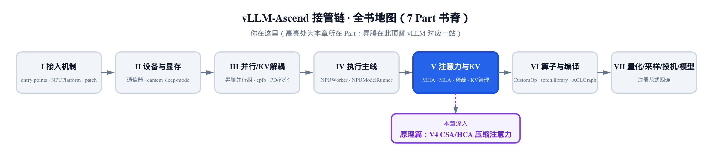
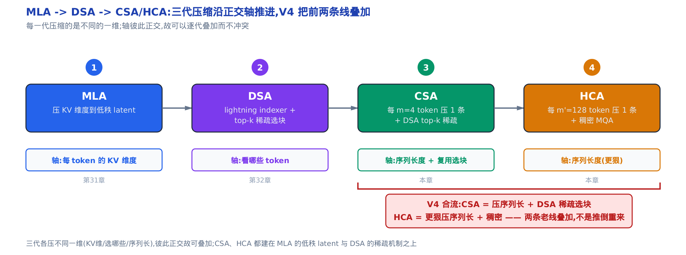
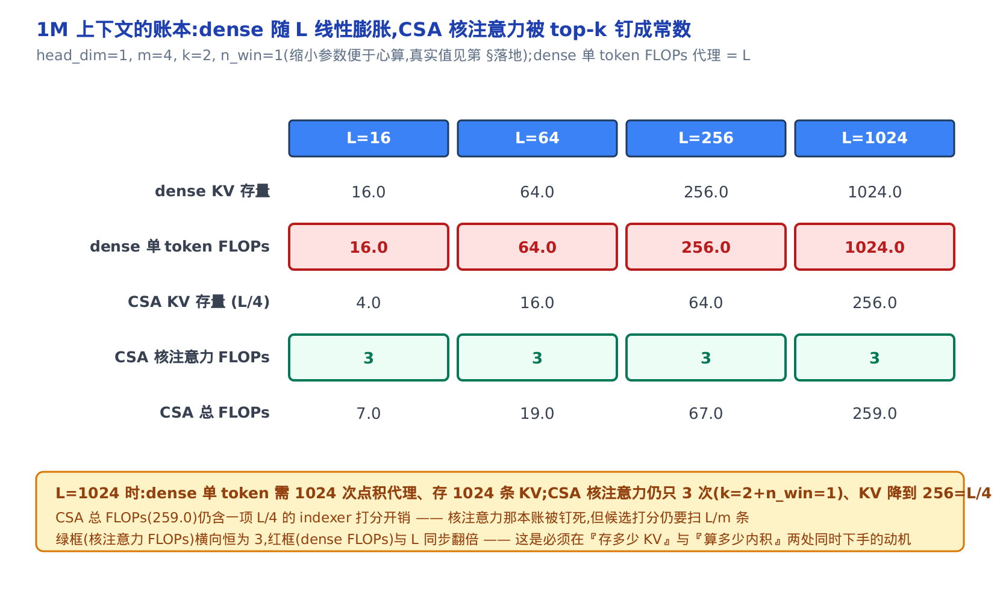
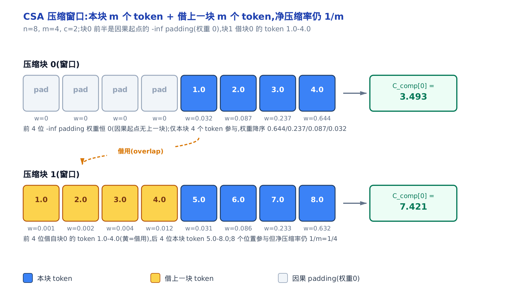
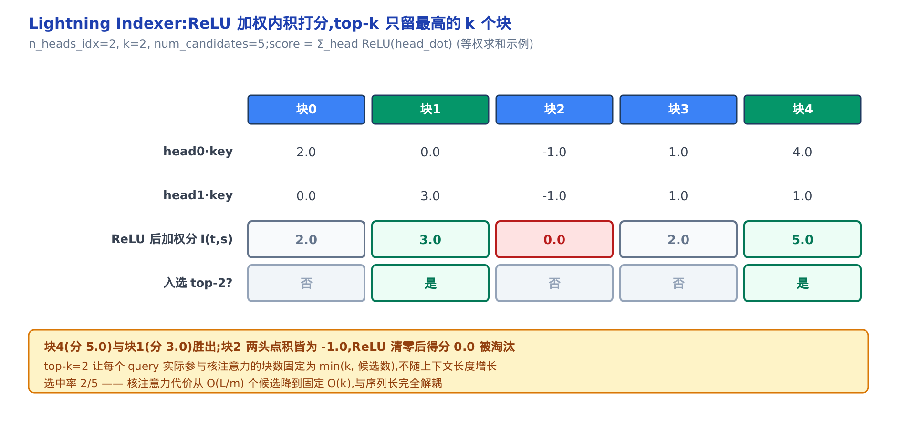
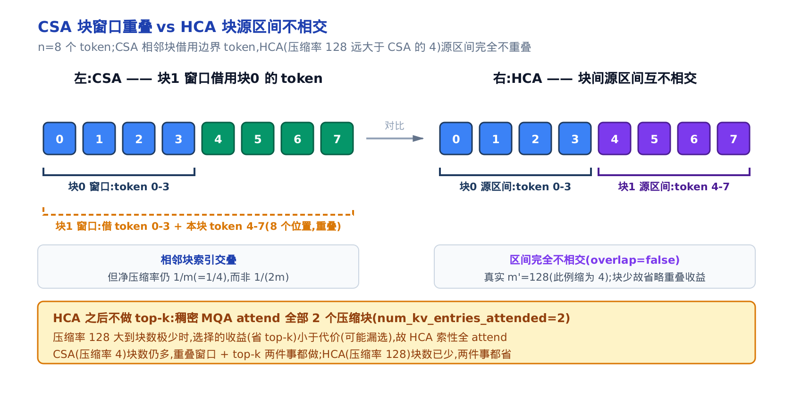
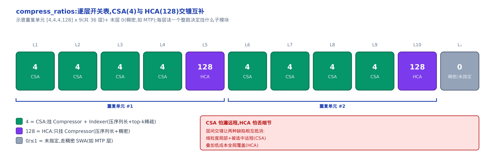
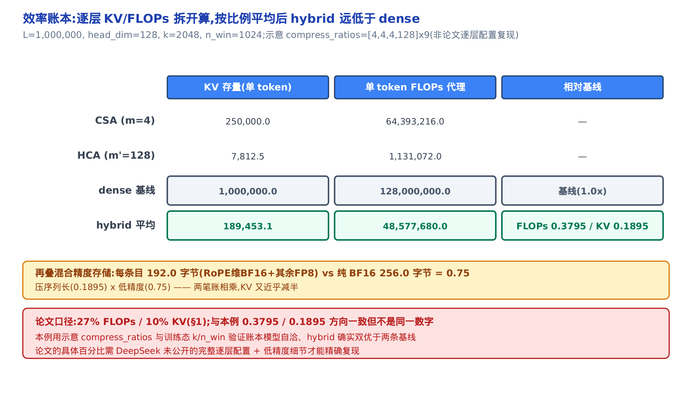
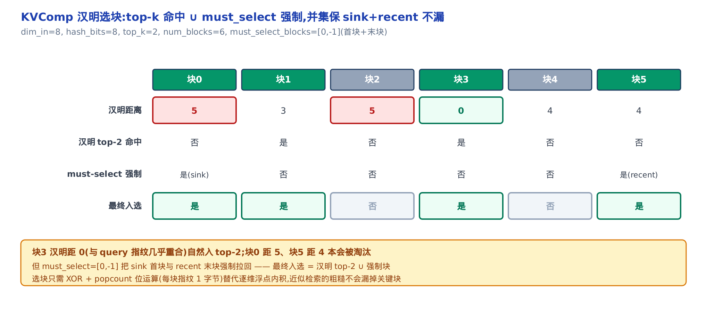

# 第 26 章 DeepSeek-V4 的两级压缩混合注意力：CSA 与 HCA（论文精读）



*图 36-0　你在这里：注意力与 KV 那一 Part 的原理收束。*

*上一站精读了 DSA 的稀疏选块，本章把压缩与稀疏两条线合流。*

*落地对照 `vllm_ascend/models/deepseek_v4.py` 的真实代码。*

先给三句话的方位感：

- 第 21 章立起 MLA，把每个 token 的 KV **维度**压到低秩 latent。
- 第 23 章立起 DSA，用打分 + top-k 只**看**最相关的几块 KV。
- 本章的 DeepSeek-V4 把这两条线合流，再多压一条正交轴——**序列长度**。

这是一篇论文精读，主线论文是 DeepSeek-V4（arXiv:2606.19348）。它是本书原理篇「注意力演进线」的收束章：DeepSeek-V4 用一套**混合注意力**同时踩下压缩与稀疏两个踏板，把 100 万 token 上下文下的单 token 推理 FLOPs（浮点运算次数）压到 DeepSeek-V3.2 的 27%、KV cache（注意力的 key/value 缓存）压到 10%（arXiv:2606.19348 §1）。

两个新词先摆出来，后面反复用：

- **CSA**（Compressed Sparse Attention，压缩稀疏注意力）：先把每 $m$ 个 token 的 KV 压成 1 条，再做 DSA 式 top-k 稀疏。
- **HCA**（Heavily Compressed Attention，重压缩注意力）：每 $m'$（$\gg m$）个 token 重压成 1 条后做稠密注意力，用极低成本兜住全局。

我们按四段式走：先算清**动机**（1M 上下文下 KV 与 FLOPs 那笔账），再**推导**（CSA 怎么压、怎么选，HCA 为什么反而不选，两者为什么互补），接着代入小参数做**数值推演**，最后落到 `vllm_ascend` 的真实代码看这套数学怎么装配。

---

## 谱系回顾：三代压缩沿三条正交轴推进

在动手之前，先把这条演进线摆正——CSA/HCA 不是推倒 MLA 和 DSA 重来，而是在它们之上再叠一条轴。



*图 36-1　三代各压不同一维：MLA 压 KV 维度、DSA 压「看哪些」、CSA/HCA 压序列长度。三轴正交，故可叠加。*

三代方法压的其实是三条彼此**正交**的轴：

- **MLA（[第 21 章](../../ch21-primer-mla/narrative/chapter.md)）** 压的是「每个 token 的 KV 维度」——把 KV 投到低秩 latent，$L$ 条 KV 一条不少，但每条更瘦。
- **DSA（[第 23 章](../../ch23-primer-sparse-attention/narrative/chapter.md)）** 压的是「看哪些 token」——KV 全都存着，但每个 query 只挑 top-k 条算注意力。
- **CSA/HCA（本章）** 压的是「序列长度」——把每 $m$ 个相邻 token 合成 1 条，条数直接从 $L$ 降到 $L/m$。

轴正交意味着可以叠加：CSA 层 = 先压序列长（新轴）+ 再套 DSA 稀疏（第 23 章那条轴）。这就是为什么读懂本章要先备好前两章的记号——CSA 里的「lightning indexer + top-k」几乎原样复用 DSA。lightning indexer（闪电索引器）是第 23 章 DSA 的轻量打分器：用低秩代理代替全精度内积给每个候选打分，CSA 里原样沿用，只是打分对象从「原始 token」换成了「压缩块」。

> **衍生仓定位**：本章讲的这套注意力，在昇腾接管链里对应基座 vLLM 的注意力后端那一站——`vllm_ascend/models/deepseek_v4.py` 是 vLLM-Ascend 为 DeepSeek-V4 新写的模型定义，`Compressor`/`Indexer` 顶替了基座里普通的 MLA 注意力模块。落地细节回指本书的稀疏注意力实现章（[第 24 章](../../ch24-sparse-attention-sfa-dsa/narrative/chapter.md)）、KV 缓存布局章（[第 25 章](../../ch25-kv-manager-and-schedulers/narrative/chapter.md)）与模型注册章（[第 36 章](../../ch36-model-lora-netloader-registration/narrative/chapter.md)）。

---

## 一、动机：1M 上下文下 KV 与 FLOPs 的账

### 直觉：图书馆读者的「回看税」

先讲个画面。一个读者进图书馆，规矩是每读一页，都要把之前读过的所有页各回看一遍。读第 1 页回看 0 次，第 2 页回看 1 次……读到第 100 万页时，光是「回看」就压垮了一切。

标准因果自注意力就是这个结构：第 $t$ 个 query 要对它前面的每个 token 各算一次 $q\cdot k$，还得把这些 token 的 KV 全存着。KV 存量随上下文长 $L$ 线性涨，单 token 的注意力 FLOPs 也随 $L$ 线性涨——整条序列合起来就是那笔 $O(L^2)$ 的「回看税」。1M token 时，这笔税是推理成本的绝对主导项。

论文开篇点得很直白（arXiv:2606.19348 §1）：test-time scaling（测试时扩展，靠推理时多花算力换性能）这条路，正被 vanilla 注意力的二次复杂度卡死在超长上下文上。所以要动手，得在两处**同时**下手——「存多少 KV」和「算多少内积」。

### 机制：把账摊开算，看 CSA 怎么把两笔都压下去

把小参数代进去，两笔账一目了然。取 head_dim（每个头的维度）$=1$、压缩率 $m=4$、每 query 选 $k=2$ 个压缩块、滑窗 $n_{\mathrm{win}}=1$，让序列长 $L$ 从 16 翻到 1024，数一数每种方案的 KV 存量与单 token FLOPs。先说清 dense 那两列怎么来的：dense 的单 token FLOPs 就是「query 对前面 $L$ 个 token 各算一次内积、每次 $d_h=1$ 次乘加」，合计 $L\cdot d_h=L$，故表中该列与 $L$ 同值（$L=16$ 时 16.0、$L=1024$ 时 1024.0）；dense KV 存量同理是 $L$ 条各存 $d_h=1$ 维。表里「CSA 核注意力 FLOPs」那列先剧透一句：它只数**核注意力**——选中压缩块后真正做的那步内积与加权求和，不含 indexer（闪电索引器，见谱系回顾）的打分开销，这个界定后一段还会再展开。

<!-- trace: motivation-kv-flops-account -->

| 序列长 $L$ | dense KV 存量 | dense 单 token FLOPs | CSA KV 存量 | CSA 核注意力 FLOPs（有界） | CSA 总 FLOPs |
|---|---|---|---|---|---|
| 16 | 16.0 | 16.0 | 4.0 | 3 | 7.0 |
| 64 | 64.0 | 64.0 | 16.0 | 3 | 19.0 |
| 256 | 256.0 | 256.0 | 64.0 | 3 | 67.0 |
| 1024 | 1024.0 | 1024.0 | 256.0 | 3 | 259.0 |

看两条指纹。第一，dense 的 KV 存量与单 token FLOPs 两列，$L$ 从 16 翻到 1024（64 倍），数字也同步从 16 涨到 1024——这就是随 $L$ 线性、全序列二次的税单。第二，看「CSA 核注意力 FLOPs」那列（**核注意力**＝选中压缩块后真正做的那步注意力计算，对应后文 Eq.(18)-(19) 的内积与加权求和，不含 indexer 的打分开销）：不管 $L$ 涨多少倍，它**恒为 3**。因为核注意力只看固定的 $k+n_{\mathrm{win}}=2+1=3$ 条，被 top-k 钉死了，与序列长彻底解耦。

**不变量：CSA 的主注意力成本与 $L$ 无关，恒为 $(k+n_{\mathrm{win}})\cdot d_h$（$d_h$ 即 head_dim）。** dense_flops 列 $16\to64\to256\to1024$ 与 $L$ 同步翻倍；csa_core_flops 列岿然不动为 3。CSA 的 KV 存量则恒为 $L/m$（斜率降了 $m=4$ 倍：$L=1024$ 时降到 256）。要留意一个诚实的细节：CSA 总 FLOPs 那列（$L=1024$ 时是 259）并没有变成常数——因为 indexer 打分仍要扫全部 $L/m$ 个候选块。但「核注意力」这本最贵的账已被 top-k 钉成常数 3，剩下的 indexer 打分是廉价的标量代理（这正是第 23 章 lightning indexer 的省法）。



*图 36-2　同一 $L$，dense 的 FLOPs/KV 与 $L$ 齐涨；CSA 核注意力恒为 3、KV 只以 $1/m$ 斜率增长。*

一句话收束动机：**必须在「存多少 KV」（压序列长 → $L/m$）与「算多少内积」（top-k → 常数）两处同时下手**，这正是 CSA 把压缩和稀疏两件事捏在一层里做的原因。下面进入推导，先看它怎么压。

### 落到真实代码的成本旋钮

这些「旋钮」在昇腾代码里是实打实的构造参数。一层注意力 `DeepseekV4Attention` 初始化时，就把决定成本的几个量一次性读进来（`vllm_ascend/models/deepseek_v4.py:L730-744`）：

```python
# vllm_ascend/models/deepseek_v4.py:L730-744  DeepseekV4Attention.__init__
        self.q_lora_rank = config.q_lora_rank
        self.o_lora_rank = config.o_lora_rank
        self.head_dim = config.head_dim
        self.rope_head_dim = config.qk_rope_head_dim
        self.nope_head_dim = config.head_dim - config.qk_rope_head_dim
        self.n_groups = config.o_groups
        self.n_local_groups = self.n_groups // tp_size
        self.window_size = config.sliding_window
        self.eps = config.rms_norm_eps
        self.norm_eps = config.rms_norm_eps
        self.scale = self.head_dim**-0.5
        self.enable_dsa_cp = enable_dsa_cp()

        attn_sink_heads = self.n_heads if self.enable_dsa_cp else self.n_local_heads
        self.attn_sink = nn.Parameter(torch.empty(attn_sink_heads, dtype=torch.float32))
```

`window_size` 就是上表里的 $n_{\mathrm{win}}$（滑窗保留几条未压缩的近端 KV），`n_groups` 决定分组输出投影的组数，`attn_sink`（注意力 sink，一组可学习的「弃权 logit」）让每头能把总注意力压到近 0——三者后面都会各讲一节。这里先记住：成本账不是抽象的大 O，而是这几个 config 字段。

---

## 二、推导：CSA 怎么压、怎么选，HCA 为什么反而不选

### 2.1　CSA 压缩：每 4 个 token 重叠 softmax 加权压成 1 条

#### 直觉：打包成摘要卡片，但相邻卡片共享一条边界词

把每 4 个相邻词打包成一张「摘要卡片」。最朴素的做法是硬切——第 0~3 词一张、第 4~7 词一张。但硬切可能正好切在句子中间，把语义割裂。CSA 的做法是让相邻卡片**重叠**共享一条边界：每张卡片用「本块自己的 4 个词 + 上一块借来的 4 个词」共 8 个词浓缩而成。4 张卡浓缩成 1 张，序列缩短到 $1/4$；重叠只增加边界连续性，不增加存储。

#### 机制：Eq.9–12 的两段投影 + 重叠窗口 softmax

论文先把输入 $H\in\mathbb{R}^{n\times d}$ 投影出两套 KV 条目 $C^a,C^b$ 和两套压缩权重 $Z^a,Z^b$（arXiv:2606.19348 §2.3.1 Eq.(9)-(10)，$W^{aKV},W^{bKV},W^{aZ},W^{bZ}$ 是可训练矩阵）。$a$ 那套是「本块的」，$b$ 那套是「借给下一块的」。然后每 $m$ 个条目压成 1 条：

$$
[\,S^a_{mi:m(i+1)-1};\; S^b_{m(i-1):mi-1}\,] = \mathrm{Softmax}_{\mathrm{row}}\big([\,Z^a_{mi:m(i+1)-1} + B^a;\; Z^b_{m(i-1):mi-1} + B^b\,]\big)
$$

$$
C^{\mathrm{Comp}}_i = \sum_{j=mi}^{m(i+1)-1} S^a_j \odot C^a_j \;+\; \sum_{j=m(i-1)}^{mi-1} S^b_j \odot C^b_j
$$

（arXiv:2606.19348 §2.3.1 Eq.(11)-(12)）

人话翻译：Eq.(11) 把「本块的 $m$ 个 $Z^a$」和「上一块借来的 $m$ 个 $Z^b$」拼成 $2m$ 个位置，加上可学习位置偏置 $B^a,B^b$，再沿这 $2m$ 个位置做一次 softmax 归一——$\mathrm{Softmax}_{\mathrm{row}}$ 是逐通道独立归一，不是标量注意力。Eq.(12) 拿这组权重对 $C$ 值加权求和，得到这一块的单条压缩输出 $C^{\mathrm{Comp}}_i$。$\odot$ 是逐元素乘。当 $i=0$（因果起点，没有上一块），$Z^b$ 补 $-\infty$、$C^b$ 补 0——softmax 里 $\exp(-\infty)=0$，借来的位置权重恒为 0，不污染输出。

关键的一句话在论文里（arXiv:2606.19348 §2.3.1）：每个 $C^{\mathrm{Comp}}_i$ 虽由 $2m$ 个 KV 条目参与，但块 $i$ 用的 $C^b$ 索引与块 $i-1$ 用的 $C^a$ 索引是**交叠**的，所以净压缩率仍是 $1/m$，而不是 $1/(2m)$。重叠是「免费」的边界连续性。

代入 $n=8$、$m=4$、权重矩阵取恒等（$C=Z=H$）、偏置 $B=0$、让 token $t$ 的值 $=t+1$，跑一遍看两个压缩块的窗口与输出：

<!-- trace: csa-overlap-compress -->

| 压缩块 $i$ | 窗口来源（通道 0 的 C 值） | 参与 token 数 | softmax 权重（降序尾部） | 压缩输出 C_comp[0] |
|---|---|---|---|---|
| 0 | padding（权重 0）+ 本块 token 1.0~4.0 | 4 | 0.644 / 0.237 / 0.087 / 0.032 | 3.493 |
| 1 | 借块 0 的 token 1.0~4.0 + 本块 token 5.0~8.0 | 8 | 0.632 / 0.233 / 0.086 / 0.031 | 7.421 |



*图 36-3　块 0 前半被 $-\infty$ padding 清零，只用本块 4 个 token；块 1 借块 0 的 4 个 token，共 8 个位置参与，但相邻块索引交叠，序列长仍只压到 $1/4$。*

**不变量：$C^{\mathrm{Comp}}$ 是块内 $C$ 值的凸组合，落在 $[\min,\max]$ 内。** softmax 保证每块权重非负且沿 $2m$ 个位置和为 1（块 0 有效 4 位、块 1 有效 8 位）；$-\infty$ 的 padding 位经 $\exp$ 得 0 权重，不参与。凸组合性质使块 0 输出 3.493 落在其源值 $[1.0,4.0]$ 内、块 1 输出 7.421 落在 $[1.0,8.0]$ 内——压缩不会外推出源之外的值。两块输出都偏向权重最大（0.644 / 0.632）的近端 token，符合「近端更相关」的直觉。

#### 源码：`Compressor` 与 `overlap_transform`

这套数学在昇腾代码里是一个 `Compressor` 模块（`vllm_ascend/models/deepseek_v4.py:L610-666`）。看它的构造，几个量与论文一一对应：

```python
# vllm_ascend/models/deepseek_v4.py:L610-666  Compressor.__init__
        self.dim = config.hidden_size
        self.head_dim = head_dim
        self.rope_head_dim = config.qk_rope_head_dim
        self.nope_head_dim = head_dim - config.qk_rope_head_dim
        self.compress_ratio = compress_ratio
        self.overlap = compress_ratio == 4
        self.rotate = rotate
        self.norm_eps = config.rms_norm_eps
        self.coff = 1 + self.overlap

        self.ape = nn.Parameter(torch.empty(compress_ratio, self.coff * self.head_dim, dtype=torch.float32))
        self.wkv = ReplicatedLinear(self.dim, self.coff * self.head_dim, bias=False, ...)
        self.wgate = ReplicatedLinear(self.dim, self.coff * self.head_dim, bias=False, ...)
        self.norm = RMSNorm(self.head_dim, config.rms_norm_eps, dtype=norm_dtype)
        # … 省略：A5 device 分支与 return_bias …
        if compress_ratio == 4:
            self.state_cache = AscendCompressorStateCache(state_dim=2 * self.coff * self.head_dim, ...)  # kv_state + score_state
        elif compress_ratio == 128:
            self.state_cache = AscendCompressorStateCache(state_dim=2 * self.head_dim, ...)
        else:
            raise ValueError(f"Only support compress_ratio in [4, 128]. Got unsupported compress_ratio: {compress_ratio}")
```

对照论文：`wkv`（ReplicatedLinear 是各卡复制一份权重的线性层）就是 $W^{KV}$、`wgate` 是 $W^{Z}$、`ape`（absolute positional embedding）是可学习位置偏置 $B$、`norm` 是核注意力前的 RMSNorm。最点睛的是两个字段：

- `self.overlap = compress_ratio == 4`——只有 $m=4$ 的 CSA 层才重叠。
- `self.coff = 1 + self.overlap`——CSA 重叠时 `coff=2`（一次投影打包 $a,b$ 两段），HCA 不重叠时 `coff=1`。所以 `wkv` 的输出宽度是 `coff * head_dim`：CSA 是 $2\times$，因为要同时出 $C^a$ 和 $C^b$。

`AscendCompressorStateCache`（压缩器跨块滚动的状态缓存）存 `kv_state + score_state`，让「借上一块」这件事在分页推理里能跨 block 续接。注意最后那个 `raise`——只支持 `compress_ratio` 为 4 或 128 两种，这就是 CSA 与 HCA 的分水岭。

重叠窗口的拼接逻辑单独是一个方法（`vllm_ascend/models/deepseek_v4.py:L668-674`）：

```python
# vllm_ascend/models/deepseek_v4.py:L668-674
    def overlap_transform(self, tensor: torch.Tensor, value=0):
        b, s, _, _ = tensor.size()
        ratio, d = self.compress_ratio, self.head_dim
        new_tensor = tensor.new_full((b, s, 2 * ratio, d), value)
        new_tensor[:, :, ratio:] = tensor[:, :, :, d:]
        new_tensor[:, 1:, :ratio] = tensor[:, :-1, :, :d]
        return new_tensor
```

逐行读：先造一个 $2\times\mathrm{ratio}$ 宽的全 `value`（默认 0，即 padding）张量；`[:, :, ratio:]` 填后半窗口（本块自己的 $a$ 段，取 `tensor` 后 $d$ 维）；`[:, 1:, :ratio]` 填前半窗口，用 `tensor[:, :-1]`（**上一块**的 $b$ 段，取前 $d$ 维）。第 0 块（`[:, 0, :ratio]`）保持初值 0，正是论文说的「$i=0$ 时 $C^b$ 补零」。图 36-3 里块 1 前半那 4 个黄格「借块 0 的 token」，就是这行 `[:, 1:, :ratio] = tensor[:, :-1, ...]` 的错位借用。

### 2.2　CSA 稀疏：lightning indexer 打分 + top-k 选压缩块

#### 直觉：先看目录挑最相关的几页

压完序列长，CSA 手里还有 $L/m$ 个压缩块。要是每块都算核注意力，成本仍随 $L$ 涨。于是 CSA 复用第 23 章的 DSA：先给每个压缩块打一个「相关分」，只把分最高的 $k$ 块调进来精读，其余略过——像查资料时只翻目录里最相关的几页，而不是从头读到尾。这个打分器就是**lightning indexer**（闪电索引器）。

#### 机制：Eq.13–17 的低秩 query + ReLU 加权打分 + top-k

indexer 先把 query 的隐状态 $\mathbf{h}_t$ 低秩降到 $\mathbf{c}^Q_t$，再升成 indexer query（arXiv:2606.19348 §2.3.1 Eq.(13)-(14)，$\mathbf{c}^Q_t$ 与核注意力共享），每头再配一个标量权重 $w^I_{t,h}$（Eq.(15)，由可学习线性层 `weights_proj` 从隐状态投出，用于加权组合各 indexer 头的打分，后文源码可见）。indexer 的 key $K^{\mathrm{IComp}}$ 用与 $C^{\mathrm{Comp}}$ 同样的压缩操作压出来。打分和选块是：

$$
I_{t,s} = \sum_{h=1}^{n^I_h} w^I_{t,h}\cdot \mathrm{ReLU}\big(\mathbf{q}^I_{t,h}\cdot K^{\mathrm{IComp}}_s\big)
$$

$$
\mathcal{C}^{\mathrm{SprsComp}}_t = \big\{\, C^{\mathrm{Comp}}_s \;\big|\; I_{t,s}\in \mathrm{TopK}(I_{t,:}) \,\big\}
$$

（arXiv:2606.19348 §2.3.1 Eq.(16)-(17)，$s<\lfloor t/m\rfloor$ 保因果）

人话：query $t$ 对每个在它前面的压缩块 $s$ 算一个 index score $I_{t,s}$——每个 indexer 头先算内积、过 ReLU 清掉负值，再按头权重加权求和。然后 top-k 选出分最高的 $k$ 个压缩块 $\mathcal{C}^{\mathrm{SprsComp}}_t$，只有这几块进核注意力。

代入 2 个 indexer 头、$k=2$、5 个候选块、query 取单位基向量（取单位基向量只是让每个内积直接读出 key 的对应分量、便于心算，不影响 top-k 的相对排序），看打分与入选：

<!-- trace: csa-lightning-indexer-topk -->

| 候选块 $s$ | head0·key | head1·key | ReLU 后加权分 $I_{t,s}$ | 入选 top-2？ |
|---|---|---|---|---|
| 0 | 2.0 | 0.0 | 2.0 | 否 |
| 1 | 0.0 | 3.0 | 3.0 | 是 |
| 2 | -1.0 | -1.0 | 0.0 | 否 |
| 3 | 1.0 | 1.0 | 2.0 | 否 |
| 4 | 4.0 | 1.0 | 5.0 | 是 |



*图 36-4　块 4（分 5）与块 1（分 3）胜出；块 2 两头点积皆负，ReLU 清零后得分 0 被淘汰。选块数固定为 $k$，不随上下文长增长。*

**不变量：index score 经 ReLU 后非负，top-k 只保留分最高的 $k$ 个块（候选不足 $k$ 时取全部）。** 块 2 两头点积均 $-1$，ReLU 清零后得分 0；块 4 得 5、块 1 得 3 入选，块 0/3/2 的 2/2/0 被裁。选中集大小恒为 $k$ 与候选数的较小者，与序列长解耦——选中率 $2/5$，核注意力代价因此从 $O(L/m)$ 个候选降到固定的 $O(k)$。这是 CSA 在「压序列长 $1/m$」之上再叠的第二重稀疏收益。

#### 源码：`Indexer` 只在 CSA 层挂载

对应的 `Indexer` 模块（`vllm_ascend/models/deepseek_v4.py:L544-592`）：

```python
# vllm_ascend/models/deepseek_v4.py:L544-592  Indexer.__init__
        self.n_heads = config.index_n_heads
        self.head_dim = config.index_head_dim
        self.rope_head_dim = config.qk_rope_head_dim
        self.index_topk = config.index_topk
        self.softmax_scale = self.head_dim**-0.5
        self.compress_ratio = compress_ratio

        self.wq_b = ReplicatedLinear(self.q_lora_rank, self.n_heads * self.head_dim, bias=False, ...)
        self.weights_proj = ReplicatedLinear(config.hidden_size, self.n_heads, bias=False, ...)
        # … 省略：ReplicatedLinear 的 quant_config/prefix/return_bias 参数 …
        if self.compress_ratio == 4:
            self.k_cache = AscendDeepseekV4IndexerCache(head_dim=self.head_dim, dtype=k_dtype, ..., compress_ratio=self.compress_ratio)
        self.compressor = None
        if self.compress_ratio > 1:
            self.compressor = Compressor(vllm_config, config, self.compress_ratio, head_dim=self.head_dim, rotate=True, ...)  # Compressor(4, 128)
```

对照论文：`wq_b` 是 $W^{IUQ}$（把低秩 $\mathbf{c}^Q_t$ 升成 indexer query）、`weights_proj` 是 $W^{w}$（出每头权重 $w^I$）、`index_topk` 就是 top-k 的那个 $k$。最值得注意的是最后两行——`Indexer` 自带一个 `Compressor`，专门用来压出 indexer 的 key $K^{\mathrm{IComp}}$（论文说 indexer key 用「same compression operation」）。而 `k_cache` 只在 `compress_ratio == 4` 时建——因为**只有 CSA 层才有 indexer**。为什么 HCA 不挂 indexer，正是下一节的主角。

### 2.3　HCA：每 128 个 token 重压成 1 条 + 稠密 MQA

#### 直觉：更狠的摘要，狠到不必再挑

HCA 是「更狠的摘要」：每 128 个词才压成 1 张卡片（$m'=128$，是 CSA 的 32 倍；据论文实验，128 是在「压得够狠、兜底够省」与「不过度糊掉细节」之间取的平衡点，不是随手拍的数）。卡片总数极少，于是可以**每张都读**（稠密注意力），用极低成本兜住全局所有信息——不像 CSA 还要挑 top-k，因为块本来就没几个，再挑收益不足、代价还高。

#### 机制：Eq.20–26 的不重叠压缩 + 全块 MQA

HCA 的压缩与 CSA 同构，但两点不同（arXiv:2606.19348 §2.3.2）：压缩率大（$m'\gg m$）、**不重叠**。

$$
S_i = \mathrm{Softmax}_{\mathrm{row}}(Z_i + B),\qquad
C^{\mathrm{Comp}}_i = \sum_{j=m'i}^{m'(i+1)-1} S_j \odot C_j
$$

（arXiv:2606.19348 §2.3.2 Eq.(22)-(23)）

对照 CSA 的 Eq.(11)-(12)：这里只有一套 $C,Z$（没有 $a/b$ 两套），求和上下界严格是本块的 $m'$ 个 token，不借上一块。序列长压到 $1/m'$。压完之后，HCA 对**全部** $L/m'$ 个压缩块做共享 KV 的 MQA（多查询注意力，所有 query 头共享同一份 KV），不做 top-k（Eq.(24)-(26) 与 CSA 的 Eq.(18)-(19) 同构）。

把 $m'$ 缩小为 4 便于心算，取 $n=8$、不重叠，跑一遍：

<!-- trace: hca-heavy-compress-dense -->

| 压缩块 $i$ | 源 token 区间 | 源 token 数（无重叠） | softmax 权重（降序） | 输出 / 结果 |
|---|---|---|---|---|
| 0 | token 0–3 | 4 | 0.644 / 0.237 / 0.087 / 0.032 | 3.493 |
| 1 | token 4–7 | 4 | 0.644 / 0.237 / 0.087 / 0.032 | 7.493 |
| 稠密 MQA | attend 全部 2 个压缩块 | 2 | 无 top-k 裁剪 | o_head0[0] = 7.269 |



*图 36-5　CSA 靠重叠窗口保边界连续、HCA 靠源区间不相交换极简——块少到 HCA 那种程度，不相交反比重叠更省。左（CSA）块 1 借块 0 的 token 而重叠，右（HCA）块 0、1 源区间 0–3 与 4–7 互不相交；HCA 之后对全部块稠密注意力，不再 top-k。*

**不变量：HCA 每块严格只用自己的 $m'$ 个 token，块间源区间不相交；压缩后对全部 $L/m'$ 块稠密注意力。** 块 0 源 token 0–3、块 1 源 token 4–7，无交叠——与 CSA 块 1「借块 0 的 token」鲜明对比。两块 softmax 权重完全相同（0.644 / 0.237 / 0.087 / 0.032），因块内相对结构一致。稠密 MQA attend 全部 2 个压缩块，不挑子集。单 token 核注意力 FLOPs 是 $(L/m'+n_{\mathrm{win}})\cdot d_h$——仍是 $O(L/m')$ 而非 $O(L)$，靠的纯是压缩，不靠稀疏。

#### 源码：同一个 `Compressor`，靠 `coff` 分叉

HCA 不需要新类——它复用 2.1 节那个 `Compressor`，只是构造时 `compress_ratio=128`，于是 `overlap=False`、`coff=1`（回看 L618-621 那两行）。装配也在同一段代码里（`vllm_ascend/models/deepseek_v4.py:L815-824`）：

```python
# vllm_ascend/models/deepseek_v4.py:L815-824
        if self.compress_ratio > 1:
            self.compressor = Compressor(vllm_config, config, self.compress_ratio, head_dim=self.head_dim, ...)  # Compressor(4, 128)

            if self.compress_ratio == 4:
                self.indexer = Indexer(vllm_config, config, self.compress_ratio, ...)
```

这九行把整个混合注意力的装配规则讲完了：`compress_ratio > 1` 就挂 `Compressor`（CSA 和 HCA 都要压）；但 `Indexer` 只在 `compress_ratio == 4`（CSA）才挂。HCA 层压完直接稠密 MQA，省掉了 indexer 的全部打分开销——这就是「块少故不必挑」的落地。

### 2.4　为什么交错：CSA 与 HCA 短板互补

#### 直觉：一个怕漏、一个怕糊，交错让缺陷相互抵消

CSA（轻压 + 稀疏）保细节，但怕漏掉没被 top-k 选中的远程信息；HCA（重压 + 稠密）兜全局，但 128 合 1 太狠，丢细节。把两种层**交错**堆叠，让每种层的短板被另一种补上——CSA 层管细粒度局部与被选中的远程依赖，HCA 层用极低成本覆盖全局所有块。稀疏怕漏、重压怕糊，层间交错让两种缺陷相互抵消。

#### 机制与源码：`compress_ratios` 是一张逐层开关表

这套交错不需要复杂控制流，就是一张逐层的整数开关表。读取入口只有 6 行（`vllm_ascend/utils.py:L105-110`）：

```python
# vllm_ascend/utils.py:L105-110
def get_dsv4_compress_ratio(config: Any, layer_idx: int) -> int:
    """Return DSV4 compress ratio, treating unspecified MTP layers as dense."""
    compress_ratios = getattr(config, "compress_ratios", None)
    if compress_ratios is None or layer_idx >= len(compress_ratios):
        return 0
    return compress_ratios[layer_idx]
```

逐层查一个整数：`4` = CSA 层、`128` = HCA 层、`0` = 稠密/未指定。最后那个 `return 0` 是给 MTP（多 token 预测头，DeepSeek 自带的投机草稿头）这类未在 `compress_ratios` 里登记的层兜底——它们走稠密。模型构建时，`DeepseekV4Model` 就靠这张表把 CSA/HCA 层交错拼起来（`vllm_ascend/models/deepseek_v4.py:L1044-1048` 的 `make_layers` 按 `compress_ratios` 逐层构建）。



*图 36-6　每层读一个 `compress_ratio`：4 挂 Compressor+Indexer（CSA）、128 只挂 Compressor（HCA）、$\le 1$ 走稠密 SWA。两者短板互补。*

**不变量：`compress_ratios` 是建模期一次性读入的静态表，每层的 CSA/HCA/稠密身份在整个前向传播中固定不变，不随输入变化。** 交错模式在权重加载时就钉死——`make_layers` 按这张表逐层实例化对应模块，运行期不再有分支切换。前面讲的「为什么互补」是**设计**层面的论证，这条不变量则保证这套交错的**稳定性**：无论输入长短，第 $l$ 层永远是它建模期被指派的那一类。

### 2.5　几条支线：分组输出投影、滑窗、sink、部分 RoPE、mHC

主干讲完，还有几条支线让这套注意力真正能训、能跑。

**共享 KV 的 MQA + 分组输出投影**（arXiv:2606.19348 §2.3.1 Eq.(18)-(19)；其中「产生 query + 做 MQA」两步对应 Eq.(18)-(19)，紧随的「分组输出投影」在论文里是该小节无编号的文字描述）。核注意力用 MQA：每个压缩条目同时当 key 和 value。但 DeepSeek-V4 里 $c\cdot n_h$ 很大，直接把核注意力输出投回 $d$ 维成本高。于是先把 $n_h$ 个头分 $g$ 组、每组降到 $d_g$ 维，再拼接投影回 $d$。代码里就是两段线性 `wo_a`（先分组降维）与 `wo_b`（再投回 $d$），下一节落地时会看到它们的形状。

**滑窗支线 + 注意力 sink**（arXiv:2606.19348 §2.3.3 Eq.(27)）。压缩块有个天生的盲区：query 看不到自己所在压缩块内的 token（因果约束），而近端 token 恰恰最相关。为什么看不到？第 $t$ 个 token 被压进块 $\lfloor t/m\rfloor$，而核注意力只读各压缩块的**输出**（单条摘要）、不读块内细节；加上因果约束只允许看 $s<\lfloor t/m\rfloor$ 的块，query 自身所在的那块连同块内其它 token 就一起落进了盲区。滑窗支线因此额外保留最近 $n_{\mathrm{win}}$ 个**未压缩**的 KV，补上近端细节。注意力 sink 则是给每头一张「弃权票」：

$$
s_{h,i,j} = \frac{\exp(z_{h,i,j})}{\sum_k \exp(z_{h,i,k}) + \exp(z'_h)}
$$

（arXiv:2606.19348 §2.3.3 Eq.(27)，$z'_h$ 是第 $h$ 头的可学习 sink logit）

分母里多加一个 $\exp(z'_h)$，于是每头的注意力总和不必等于 1、甚至可近 0——遇到无信息的 token，头可以「什么都不投」。代入极端值看行为：

<!-- trace: sliding-window-attn-sink -->

| 场景 | 参数 | 关键标量 | 结果 |
|---|---|---|---|
| sink 弱 | sink_logit = -10.0 | 注意力总和 = 1.0 | 吸收质量 0.0 |
| sink 强 | sink_logit = 3.0 | 注意力总和 = 0.356 | 吸收质量 0.644 |
| 滑窗 中段 | query_pos = 7, n_win = 4 | 取 4 条 | token 4–7 |
| 滑窗 起点 | query_pos = 1, n_win = 4 | 取 2 条 | token 0–1 |

**不变量：加 sink 后注意力分数之和 $\le 1$，sink logit 越大吸收越多；滑窗在序列起点自动截断。** sink logit 从 $-10$ 升到 3，单头吸收质量从 0.0 升到 0.644——超过六成注意力被「弃权」吸收。滑窗名义固定成本 4 条，但 `query_pos=1` 时 `start=max(0, pos-n_win+1)` 只能取 2 条（token 0–1），起点处不会越界到负位置。这两个字段就是上一节看到的 `window_size` 与 `attn_sink`。

**部分 RoPE**（arXiv:2606.19348 §2.3.3）。RoPE（旋转位置编码）只施加到 query 与 KV 条目的**最后 64 维**。由于压缩条目同时当 key 和 value，核注意力输出会带上绝对位置信息；作为对冲，论文对每个输出 $\mathbf{o}_{t,i}$ 的最后 64 维再用位置 $-i$ 施一次 RoPE，让输出携带**相对**位置。直觉：核注意力输出里已经带上了被压块的绝对位置信息，再对它旋转一个**负**位置，相当于把参考系平移回 query 自身所在位置——绝对位置被抵消，剩下的正是「相对本块参考点的位移」。（原文这个 $-i$ 的 $i$ 与 Eq.18-19 的头下标 $i$ 记号重叠，字面上有歧义；结合「输出携带相对位置」的说明，更合理的读法是把它理解为 query 自身 token 位置的负值。）落地是 `ComplexExpRotaryEmbedding` 按 `rope_groups` 装配（L792-810）。

**mHC：把残差钉在双随机流形上**（arXiv:2606.19348 §2.2 Eq.(1)-(8)）。这是 V4 的另一根支柱，与注意力正交但同样为「深栈稳定」服务。标准 Hyper-Connections 把残差流从 $\mathbb{R}^d$ 扩宽到 $\mathbb{R}^{n_{\mathrm{hc}}\times d}$，用一个 $B_l$ 矩阵混合各路残差（Eq.(1)）；但堆多层容易数值发散。mHC（Manifold-Constrained Hyper-Connections，流形约束超连接）把 $B_l$ 约束到**双随机矩阵**（每行每列和都为 1）流形上，用 Sinkhorn-Knopp 算法迭代实现。先给直觉：这套迭代像把一张预算表来回按行、按列配平，直到每行每列都恰好加起来是 1——先 $\exp$ 保正，再反复列归一、行归一（即下式 Eq.(8) 中内层先做列归一 $\mathcal{T}_c$、外层再做行归一 $\mathcal{T}_r$）：

$$
M^{(t)} = \mathcal{T}_r\big(\mathcal{T}_c(M^{(t-1)})\big)
$$

（arXiv:2606.19348 §2.2 Eq.(8)，$\mathcal{T}_r,\mathcal{T}_c$ 是行/列归一，取 $t_{\max}=20$）

接着上面「配平预算表」那个直觉往下核对：配平后的双随机矩阵谱范数 $\le 1$（非扩张），残差不会被逐层放大。代入一个 $2\times2$ 例子，看收敛：

<!-- trace: mhc-manifold-hyperconnections -->

| Sinkhorn 迭代数 | 行和最大偏离 1 | 列和最大偏离 1 | 是否双随机 |
|---|---|---|---|
| 0 | 2.5648 | 2.681 | 否 |
| 1 | 0.0 | 0.0186 | 否 |
| 3 | 0.0 | 0.0001 | 否 |
| 20 | 0.0 | 0.0 | 是 |

**不变量：迭代越多，行/列和对 1 的最大偏离单调趋 0，收敛到双随机矩阵。** 迭代 0（仅 $\exp$、未归一）列偏离达 2.681；迭代 1 因最后一步是行归一故行和精确为 1，列偏 0.0186；迭代 3 列偏降到 0.0001；迭代 20 行列皆 0。每轮归一都是压缩映射，偏离几何式衰减——这就是标准 HC 堆栈易发散、而 mHC 稳定的根因。它在代码里怎么包裹注意力，下一节落地时看。

---

## 三、数值推演：把「27% FLOPs / 10% KV」的账逐项算出来

诚实先行：论文只给了结论性的两个百分比，没有公开能精确重推它们的完整发行版配置（逐层 `compress_ratios` 数组、每层 $k$、indexer 头数等）。所以这一节用**示意性参数**跑一遍账本模型，目的不是复现「27%/10%」这两个具体数字，而是验证**账本模型本身自洽、hybrid 确实比两条基线都省**，并看清这几笔账是怎么相乘的。

取 $L=10^6$、head_dim $=128$、$k=2048$、$n_{\mathrm{win}}=1024$（这几个都取自大规模模型的**示意量级**，$k=2048$ 是这类配置里 indexer top-k 的典型档位——本例只借它验证账本结构自洽，无意复现论文的精确百分比），示意配置 `compress_ratios = [4,4,4,128] × 9`（27 个 CSA 层 + 9 个 HCA 层），把每种层的 KV 存量与单 token FLOPs 代理拆开算再按层比例平均：

<!-- trace: efficiency-account-27-10 -->

| 层类型 / 度量 | KV 存量（单 token） | 单 token FLOPs 代理 | 相对基线 |
|---|---|---|---|
| CSA（$m=4$） | 250000.0 | 64393216.0 | — |
| HCA（$m'=128$） | 7812.5 | 1131072.0 | — |
| dense 基线 | 1000000.0 | 128000000.0 | 基线 |
| hybrid 平均 | 189453.1 | 48577680.0 | FLOPs 0.3795 / KV 0.1895 |



*图 36-7　CSA 存 $L/4$、HCA 存 $L/128$，混合平均降到 dense 的 0.1895；叠上混合精度后每条目 0.75、KV 再降约 1/4。论文口径的 27%/10% 是同一套账加未公开配置算出的，本例只验证方向一致。*

**不变量：hybrid 平均 KV 与 FLOPs 严格小于 dense 基线。** 逐层看：CSA KV $=L/4=250000$、HCA KV $=L/128=7812.5$，均远小于 dense 的 $10^6$；混合平均 189453.1 是 dense 的 0.1895。FLOPs 代理平均 48577680 是 dense 的 0.3795。两个比都小于 1，方向与论文一致。这张账本里 CSA:HCA 的层数比例（示意配置的 27:9），落到代码就是下一节 4.1 `get_dsv4_compress_ratio` 逐层读出的那张 `compress_ratios` 开关表——账不是纸面推演，每一层归到哪类由那张表定。

这还只是「压序列长 + top-k 稀疏」两笔账。论文的第三笔是**低精度**（arXiv:2606.19348 §2.3.4）：KV 用混合精度存储——RoPE 那 64 维用 BF16（16 位浮点）、其余维用 FP8（8 位浮点）。按 head_dim=128 拆成 64+64 维粗算，每条目约 192 字节，对比纯 BF16 的 256 字节，比值 0.75——这只坐实了「混合精度确实比纯 BF16 省」这个**方向**，量级并不等于论文原话的「近乎减半」（§2.3.4 "reduces the KV cache size by nearly half"）：这里借用的 head_dim=128 其实是论文同段落里**另一个**基线（BF16 GQA8）的维度，并非 V4 自身 KV 条目宽度的确认值，按 64/64 的示意拆分只能算出 0.75，本章不冒充复现那句「nearly half」（本章测试套件 `test_mixed_precision_kv_bytes_less_than_pure_bf16` 也如实标注：只验证方向、不验证量级）。indexer 的打分路径更进一步用 FP4（4 位浮点）。三笔账（压序列长 $\times$ top-k 稀疏 $\times$ 低精度）相乘，才凑出论文那种「27% FLOPs / 10% KV」的量级。本例不冒充复现那两个百分比，但把它们背后的账本结构讲清了。

---

## 四、落地：这套数学在 `vllm_ascend` 里怎么装配

前三节的数学，最终落在 `vllm_ascend/models/deepseek_v4.py` 与 `vllm_ascend/worker/kvcomp_utils.py` 的真实代码里。这一节把装配链走一遍。

### 4.1　一层注意力的装配器：`DeepseekV4Attention`

一层的挂载规则前面拆过（2.3 节那段 `if compress_ratio == 4`）。完整的开关在同一个构造里（`vllm_ascend/models/deepseek_v4.py:L790-834`）：

```python
# vllm_ascend/models/deepseek_v4.py:L790-834
        self.compress_ratio = get_dsv4_compress_ratio(config, config_layer_idx)

        if self.compress_ratio > 1:
            config.rope_parameters["rope_theta"] = config.compress_rope_theta
            rope_groups = ["default", f"c{self.compress_ratio}"]
        else:
            config.rope_parameters["rope_theta"] = config.rope_theta
            rope_groups = ["default"]
        # … 省略：ComplexExpRotaryEmbedding(...) 装配 …

        self.compressor: Compressor | None = None
        self.indexer: Indexer | None = None

        if self.compress_ratio > 1:
            self.compressor = Compressor(vllm_config, config, self.compress_ratio, head_dim=self.head_dim, ...)  # Compressor(4, 128)

            if self.compress_ratio == 4:
                self.indexer = Indexer(vllm_config, config, self.compress_ratio, ...)
```

一行读一层的开关表，据此挂 `Compressor`（CSA/HCA 都挂）与 `Indexer`（仅 CSA）。留意开头那几行还顺手换了 RoPE 的频率基：`compress_ratio > 1` 的层把 `rope_theta`（RoPE 频率基）换成单独的 `compress_rope_theta`——因为压缩条目的位置是**块粒度**（每条目概括 $m$/$m'$ 个 token），相邻条目的位置间隔被拉大了 $m$/$m'$ 倍，需要一个不同的频率基来匹配这更宽的跨度。而分组输出投影就是构造里更早的两段线性（`vllm_ascend/models/deepseek_v4.py:L774-789`）：

```python
# vllm_ascend/models/deepseek_v4.py:L774-789
        self.wo_a = ColumnParallelLinear(
            self.n_heads * self.head_dim // self.n_groups,
            self.n_groups * config.o_lora_rank,
            bias=False, quant_config=quant_config, prefix=f"{prefix}.wo_a", return_bias=False,
        )
        self.wo_b = RowParallelLinear(
            self.n_groups * config.o_lora_rank,
            self.dim,
            bias=False, quant_config=quant_config, prefix=f"{prefix}.wo_b", return_bias=False,
        )
```

`wo_a` 把每组 $n_h/g$ 个头的输出降到 `o_lora_rank`（就是 $d_g$），`wo_b` 再把 $g$ 组拼起来投回 $d$——正是 Eq.(18)-(19) 的分组输出投影。这条注意力的组织方式，回指本书的稀疏注意力实现章（[第 24 章](../../ch24-sparse-attention-sfa-dsa/narrative/chapter.md)）里 SFA/DSA 的落地骨架。

### 4.2　mHC 包裹注意力与 MLP：`DeepseekV2DecoderLayer.forward`

2.5 节讲的 mHC，在解码层里就是一对融合算子包裹住 attn 和 mlp（`vllm_ascend/models/deepseek_v4.py:L984-1003`）：

```python
# vllm_ascend/models/deepseek_v4.py:L984-1003  DeepseekV2DecoderLayer.forward
    def forward(self, positions, hidden_states, residual, llama_4_scaling=None):
        residual = hidden_states.clone()
        hidden_states, post, comb = self.hc_pre(hidden_states, self.hc_attn_fn, self.hc_attn_scale, self.hc_attn_base)
        hidden_states = self.input_layernorm(hidden_states)
        hidden_states = self.self_attn(positions=positions, hidden_states=hidden_states, llama_4_scaling=llama_4_scaling)
        hidden_states = self.hc_post(hidden_states, residual, post, comb)
        residual = hidden_states.clone()
        hidden_states, post, comb = self.hc_pre(hidden_states, self.hc_ffn_fn, self.hc_ffn_scale, self.hc_ffn_base)
        hidden_states = self.post_attention_layernorm(hidden_states)
        hidden_states = self.mlp(hidden_states)
        hidden_states = self.hc_post(hidden_states, residual, post, comb)
        return hidden_states, residual
```

看结构：`hc_pre` → 子层（attn 或 mlp）→ `hc_post`，一模一样地套两遍（一遍包 attn、一遍包 mlp）。Eq.(1)-(8) 的 Sinkhorn 迭代（`hc_sinkhorn_iters`）封装在 `hc_pre`/`hc_post` 这对昇腾融合算子内部——训练要 20 次迭代把 $B_l$ 钉到双随机流形，推理期这些约束已固化进权重。子层内部（真正的 CSA/HCA 注意力）是另一件事，mHC 只管「残差流怎么把子层输出重新混回去」。

### 4.3　运行期选块的工程近似：KVComp

论文正文的 lightning indexer（Eq.16-17）是逐维浮点内积打分。这在 1M 上下文的运行期仍是可观开销：每个 query 要对成千上万个候选块各做一次浮点内积，纯打分就吃掉大量算力与带宽。所以昇腾用了一套更省的**工程近似**——KVComp（KV 压缩选块）：把每个块压成一串「指纹」，选块时只比指纹差多少位（位运算），把浮点内积代理换成廉价的检索；再用后面会看到的 `must_select_blocks` 当安全阀，保证近似再粗也不漏关键块。这是落地代码里的工程机制，出于性能考量，论文本身没有描述这个具体方案。

配置真相源是 `KVCompConfig`（`vllm_ascend/worker/kvcomp_utils.py:L150-194`）：

```python
# vllm_ascend/worker/kvcomp_utils.py:L150-194  KVCompConfig
    model_name: str = "DummyModel"
    is_mla: bool = False
    hash_weight_type: str | None = "random"      # either "random" or "fixed"
    num_hidden_layers: int = 36
    seq_len_threshhold: int = 2048               # the minimal seq_len to trigger KVComp
    chunk_size: int = 128                        # any value divisible by 128
    chunk_repre_method: str = "max"              # either "max", "min" or "sum"
    head_dim: int = 128
    hash_bits: int = 128
    top_k_ratio_per_layer: list[float] = field(default_factory=lambda: [0.3] * 36)
    top_k_index_reuse: list[int] = field(default_factory=lambda: [-1] * 36)
    # nonnegative means slicing from the start, negative means slicing from the end
    must_select_blocks: list[int] = field(default_factory=lambda: [0, -2, -1])
    # … 省略：MLA 条件字段 kv_lora_rank / qk_rope_head_dim / hash_bits_* …
    vllm_hash_attention_topk: int = 4096
    vllm_hash_attention_rollback_layers: list[int] = field(default_factory=lambda: [])
    vllm_hash_attention_skip_layers: list[int] = field(default_factory=lambda: [])
```

几个字段直接呼应前面的机制：`chunk_size`（选块粒度，须被 128 整除）、`chunk_repre_method`（用块内 max/min/sum 当块代表，选块前先降维）、`top_k_ratio_per_layer`（逐层稀疏度）、`seq_len_threshhold`（短序列不触发）。最点睛的是 `must_select_blocks = [0, -2, -1]`——沿用 Python 索引约定（非负从头数、负数从尾数：0=首块、-1=末块、-2=倒数第二块），即**强制保留首块与最近两块**，正是 2.5 节注意力 sink（首块）与滑窗 recent（最近块）在运行期选块里的落地保证：近似检索再粗糙，也不能漏掉这两类关键块。

指纹怎么算？`HashEncoder.compute_hash`（`vllm_ascend/worker/kvcomp_utils.py:L423-458`）：

```python
# vllm_ascend/worker/kvcomp_utils.py:L423-458  HashEncoder.compute_hash
    def compute_hash(self, x: torch.Tensor) -> torch.Tensor:
        # x: (..., input_dim) -> (..., hash_numbers=hash_bits//8) uint8 hash codes
        orig_shape = x.shape[:-1]
        x_flat = x.reshape(-1, self.input_dim)
        if x_flat.dtype != self.dtype:
            x_flat = x_flat.to(self.dtype)
        xW = torch.matmul(x_flat, self.hash_weights)          # [N, hash_bits]
        xW_flat = xW.view(-1)
        packed_codes_flat = torch.ops._C_ascend.npu_sign_bits_pack(xW_flat, size=1)
        out_shape = orig_shape + (self.hash_numbers,)
        packed_codes = packed_codes_flat.view(out_shape)
        return packed_codes
```

这是标准的 LSH（Locality-Sensitive Hashing，局部敏感哈希）：`hash_weights`（构造时用 QR 正交化的随机高斯投影）把浮点向量投到 `hash_bits` 维，取符号位，经昇腾算子 `npu_sign_bits_pack` 打包成 uint8——每 8 位一个字节。选块时不再算浮点内积，改比两串指纹的 **Hamming 距离**（汉明距离，两串 0/1 位里不同的位数），只需 XOR + popcount 位运算。这就是把 Eq.16-17 的 ReLU 加权打分近似成汉明检索。

运行期的选块张量集在 `KVCompMetaData`（`vllm_ascend/worker/kvcomp_utils.py:L491-513`）：

```python
@dataclass
class KVCompMetaData:
    # for both GQA and MLA
    kvcomp_config: KVCompConfig
    chunk_sizes_for_hamming_full: torch.Tensor
    topk_for_hamming_full: torch.Tensor
    topk_for_hamming_full_cpu: torch.Tensor
    seq_lens_for_hamming: torch.Tensor
    hamming_output: torch.Tensor
    # … 省略：seq_lens_from_hamming / valid_query_mask 等张量 …
    sink: int
    recent: int
    hash_encoder: HashEncoder
    hashk_caches: list[torch.Tensor]
    num_actual_tokens: int = 0
    max_seq_len_for_hamming: int = 0
    # … 省略：slot_mapping / block_tables_for_hamming 等 …
```

`initialize_kvcomp_metadata` 构造它时固定 `sink=1, recent=4`——这就是注意力 sink 与滑窗最近块在运行期的实际取值。代入一个小例子（`hash_bits=8`、`top_k=2`、6 个块、`must_select_blocks=[0,-1]`）看选块并集：

<!-- trace: kvcomp-hash-hamming-selection -->

| 块 | 汉明距离 | 汉明 top-2 命中 | must-select 强制 | 最终入选 |
|---|---|---|---|---|
| 0 | 5 | 否 | 是（sink） | 是 |
| 1 | 3 | 是 | 否 | 是 |
| 2 | 5 | 否 | 否 | 否 |
| 3 | 0 | 是 | 否 | 是 |
| 4 | 4 | 否 | 否 | 否 |
| 5 | 4 | 否 | 是（recent） | 是 |



*图 36-8　块 3 汉明距 0 自然入 top-2；块 0 距 5、块 5 距 4 本会被淘汰，被 must_select=[0,-1] 强制拉回。最终入选 = 汉明 top-2 ∪ 强制块。*

**不变量：最终入选块 = 汉明 top-k ∪ must_select；首块/最近块无论汉明距离多大都必入选。** 块 3（距 0，指纹几乎与 query 重合）与块 1（距 3）是汉明 top-2 入选；块 0 距 5、块 5 距 4 本会被淘汰，但 must_select 强制拉回；块 2、块 4 既非 top-2 也非强制，淘汰。并集运算保证 sink + recent 永不漏——这是近似检索的安全阀。

### 4.4　四类 KV 缓存的分页布局

最后，CSA/HCA/滑窗/MLA 各自的 KV 缓存 block_size 不同，`layer.py` 用一张表分流（`vllm_ascend/models/layer/attention/layer.py:L174-192` 的 `DSAAttention.get_kv_cache_spec`）：`compress_ratio <= 1` 的层走独立的 SWA（sliding window attention，滑窗注意力）缓存，否则用带 `compress_ratio` 的 `MLAAttentionSpec`。四类缓存（mla、swa、c4 state、c128 state）的 block_size 表 `DSV4_BLOCK_SIZES`（`vllm_ascend/models/layer/attention/layer.py:L31-49`）就是 2.1 节 `Compressor` 里 `AscendCompressorStateCache(block_size=...)` 那个 magic number 的来源——四个值分别是 MLA 主 KV、滑窗未压缩 KV、CSA（$m=4$）状态、HCA（$m'=128$）状态各自一页存多少条目的字节宽度，四类缓存并存互不挤占。选块用的指纹缓存 `hashk_caches` 则另走一路：它按 `head_dim//8` 打包成 uint8（每 8 个符号位塞进 1 字节），正是 4.3 节 `HashEncoder.compute_hash` 里 `npu_sign_bits_pack` 输出的那种紧凑 uint8 编码——指纹只需比位、不需还原浮点，故用最省显存的字节宽度存。这套分页 KV 布局，回指本书的 KV 缓存管理章（[第 25 章](../../ch25-kv-manager-and-schedulers/narrative/chapter.md)）；而整个 DeepSeek-V4 模型（含 CSA/HCA 层与 MTP 头）如何注册进 vLLM-Ascend，则回指模型注册章（[第 36 章](../../ch36-model-lora-netloader-registration/narrative/chapter.md)）。

---

## 小结：两条老线合流成一套账

回到开篇那三句话的方位感。MLA 压 KV 维度、DSA 压「看哪些」，本章的 DeepSeek-V4 把这两条正交线合流，再多压一条序列长度轴：

- **CSA** = 压序列长（每 $m=4$ 个 token 重叠压 1 条）+ DSA 式 top-k 稀疏——保细粒度局部与被选中的远程依赖。
- **HCA** = 更狠地压序列长（每 $m'=128$ 个 token 不重叠压 1 条）+ 稠密 MQA——用极低成本兜住全局。
- 两者靠一张 `compress_ratios` 开关表**层间交错**，短板互补。再叠上混合精度存储，三笔账相乘，凑出 1M 上下文下「27% FLOPs / 10% KV」的量级。

落地看，这套数学在 `vllm_ascend/models/deepseek_v4.py` 里就是 `Compressor`（靠 `coff` 分叉 CSA/HCA）、`Indexer`（仅 CSA 挂）、`DeepseekV4Attention`（一层装配器）、`DeepseekV2DecoderLayer`（mHC 包裹）四个模块，加上 `vllm_ascend/worker/kvcomp_utils.py` 里 hash + 汉明的运行期选块近似。原理篇的注意力演进线到此收束——下一步就是把这些真实模块在昇腾上跑起来看数值，那是实现篇的事。
