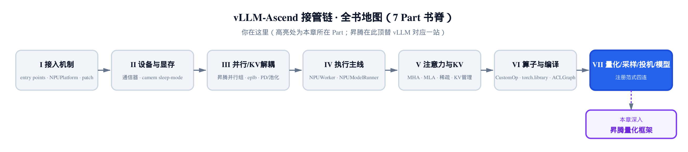
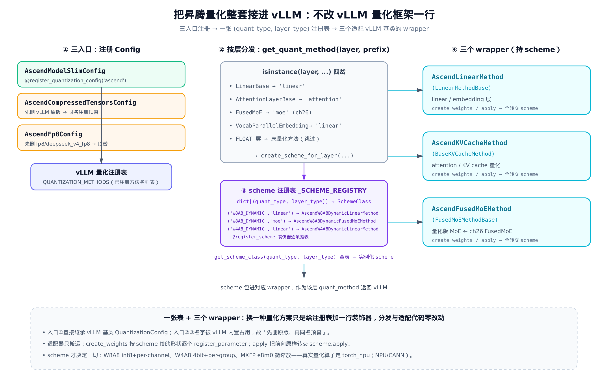
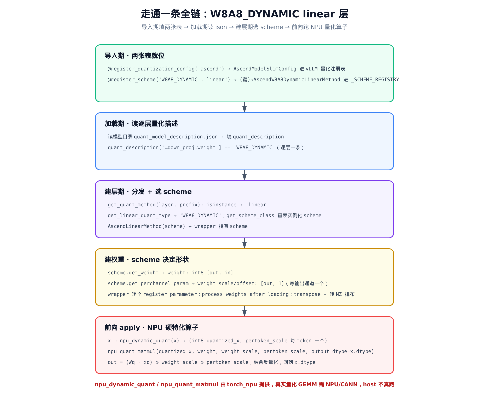
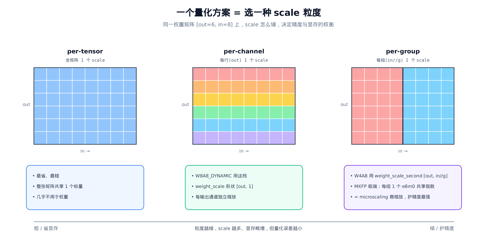

# 第 27 章 昇腾量化框架：把 NPU 量化方案接进 vLLM



> 上一章拆完全书最大的单体算子 FusedMoE，收官 Part VI。
> 本章翻开 Part VII，先看全栈最大的一块——量化（约 6k 行）。
> 下面采样、投机、模型加载（ch28–30）都沿这条注册式接入往下走。

第 23 章立过一条总规矩：**模型代码一行不改，靠注册表在算子实例化的瞬间把 CUDA 算子换成昇腾子类**——换头不换身。第 26 章把这条规矩压在了全书最大的单体算子 `FusedMoE` 上，还顺手提过一句：量化版的 MoE 走的是另一个入口 `AscendFusedMoEMethod`。那个入口，就在这一章。

量化（quantization，把高精度权重/激活压成低位宽整数或窄浮点）是 vLLM-Ascend 里**单块最大的代码**——`vllm_ascend/quantization/` 近 6000 行，从 `modelslim_config.py` 的注册入口到 `methods/registry.py` 的 scheme 表（scheme = 昇腾的量化方案实现类，一个 scheme 对应一种 (quant_type, layer_type) 组合、定义该组合的权重形状与前向），十七八个 scheme 文件，覆盖 W8A8 / W4A8 / MXFP 一整谱量化方案。可它的**接入方式**却出奇地干净：不靠散落各处的 `if quant == "xxx"`，而是**一张注册表 + 三个适配器**，把整套昇腾量化方案当成一个插件，整体插进 vLLM——**vLLM 量化框架一行不改**。

这一章就读这套接入机制。它是全书「OOT（out-of-tree，树外）注册表 + 适配器」范式最干净的一次实证。我们要回答四个问题：

1. **怎么进门**——昇腾怎么把自己的量化 Config 注进 vLLM 的量化注册表？三个入口，两种手法。
2. **怎么选方案**——一层该用 W8A8 还是 W4A8？这个决策落在哪、查哪张表？
3. **怎么接口**——昇腾自己的一套 scheme 体系，怎么满足 vLLM 各层认的那三个方法基类？
4. **怎么算**——以 W8A8_DYNAMIC 为例，从造权重到跑量化 matmul，一条全链长什么样？

先把全景摆出来，后面逐块拆。



> *图 27-1：左——三个 Config 经 `@register_quantization_config` 注进 vLLM 量化注册表。中——`get_quant_method` 按层类型分发，再查 `_SCHEME_REGISTRY` 选 scheme。右——三个 wrapper 各持一个 scheme，满足 vLLM 三个方法基类接口。一张表 + 三个 wrapper，换一种量化只是给表加一行装饰器。*

## 27.1 三入口注册：把昇腾 Config 注进 vLLM 量化注册表

vLLM 启动时认 `--quantization <名字>`。这个名字怎么和一段实现对上？靠 vLLM 暴露的一个注册装饰器 `register_quantization_config`——谁想新增一种量化方法，就继承基类 `QuantizationConfig`、用这个装饰器把自己登记进去。这是典型的 OOT 注册点：vLLM 开一个口，树外的昇腾把实现塞进来。

昇腾用了三个入口。**第一个入口**是主角——ModelSlim 量化（华为 ModelSlim 工具压出来的权重）：

```python
# vllm_ascend/quantization/modelslim_config.py:L401
@register_quantization_config(ASCEND_QUANTIZATION_METHOD)
class AscendModelSlimConfig(QuantizationConfig):
    """Config class for Ascend ModelSlim quantization.

    This class is a general class that parses quantization configs
    that are supported on Ascend hardware, specifically for models
    quantized using the ModelSlim tool.
    """

    def __init__(self, quant_config: dict[str, Any] | None = None):
        super().__init__()
        self.quant_description = quant_config if quant_config is not None else {}
        self._apply_extra_quant_adaptations()
        self.model_type: str | None = None
        self.hf_to_vllm_mapper: WeightsMapper | None = None
        self._mapper_applied = False
        self._add_kvcache_quant_metadata()

    # … 省略：__repr__（仅返回带类名前缀的字符串）…

    @classmethod
    def get_name(cls) -> str:
        return ASCEND_QUANTIZATION_METHOD
```

`ASCEND_QUANTIZATION_METHOD` 就是字符串 `'ascend'`。整个入口只做一件事：继承 vLLM 的 `QuantizationConfig`，用装饰器把自己以 `'ascend'` 这个名字登记进 vLLM 的量化注册表。启动时跑 `--quantization ascend`，vLLM 就实例化这个类。注意 `__init__` 里那个 `self.quant_description`——它存的是**逐层量化描述**，一个 dict：键是层名 + `.weight`、值是量化类型串，形如 `{'model.layers.0.mlp.down_proj.weight': 'W8A8_DYNAMIC', ...}`。后面分发时全靠它，先记住这个名字。

**第二、三个入口手法不同，要先删后替换。** 因为 `compressed-tensors` 和 `fp8` 这两个名字 vLLM 内置已经占用了。同名再注册会冲突，所以昇腾先从 vLLM 的已注册方法名列表里**删掉原版**，再用同一个名字注册自己的实现顶上去：

```python
# vllm_ascend/quantization/compressed_tensors_config.py:L41
# Remove the original compressed_tensors method to replace with our implementation
def _remove_quantization_method():
    if COMPRESSED_TENSORS_METHOD in QUANTIZATION_METHODS:
        QUANTIZATION_METHODS.remove(COMPRESSED_TENSORS_METHOD)


_remove_quantization_method()

# … 省略：类型别名 …

@register_quantization_config(COMPRESSED_TENSORS_METHOD)
class AscendCompressedTensorsConfig(QuantizationConfig):
```

`QUANTIZATION_METHODS` 是 vLLM 维护的「已注册量化方法名」列表。`_remove_quantization_method()` 在**模块导入时立即执行**（注意它不是被谁调用，就是模块顶层一句裸调用）——先把 `'compressed-tensors'` 从列表里摘掉，紧接着的装饰器再以同名注册昇腾版。一删一注册，原版就被悄悄换成了昇腾实现。

第三个入口 `fp8` 一模一样，只多一个小花样——它顺手把 `deepseek_v4_fp8` 这个别名也删了，最后让别名复用同一个 Config：

```python
# vllm_ascend/quantization/fp8_config.py:L18
def remove_quantization_method():
    if FP8_METHOD in QUANTIZATION_METHODS:
        QUANTIZATION_METHODS.remove(FP8_METHOD)
    if "deepseek_v4_fp8" in QUANTIZATION_METHODS:
        QUANTIZATION_METHODS.remove("deepseek_v4_fp8")


remove_quantization_method()

# … 省略：fp8 专属 create_scheme_for_layer 等中间实现 …

@register_quantization_config(FP8_METHOD)
class AscendFp8Config(QuantizationConfig):

# …（文件末尾）…

# deepseek_v4_fp8 is handled identically to fp8 on Ascend — reuse the same config.
register_quantization_config("deepseek_v4_fp8")(AscendFp8Config)
```

最后那行值得停一秒：`register_quantization_config("deepseek_v4_fp8")` 先拿到装饰器函数，再 `(AscendFp8Config)` 把同一个类喂进去——等价于在 `AscendFp8Config` 头上再贴一个 `@register_quantization_config("deepseek_v4_fp8")`。一个类、两个名字，避免把同样的逻辑抄两遍。

三个入口，两种手法（直接注册 / 先删后替换），但内核完全一致：**继承 vLLM 基类，用装饰器登记，启动时被名字选中**。vLLM 的量化框架对此毫不知情——它只是发现注册表里多了几个名字。

## 27.2 一张 scheme 注册表：(quant_type, layer_type) 二维寻址

进了门，下一个问题是：W8A8、W4A8、MXFP……十几种量化方案，每种又要分 linear / attention / moe 不同层，组合起来几十个具体实现，怎么管理？

昇腾的答案不是一条几十分支的 `if/elif`，而是一张**二维注册表**。整张表就是一个 dict、一个装饰器、一个查表函数——整章的核心数据结构，干净到可以全文照抄：

```python
# vllm_ascend/quantization/methods/registry.py:L20
# Registry: maps (quant_type, layer_type) -> SchemeClass
_SCHEME_REGISTRY: dict[tuple[str, str], type[Any]] = {}


def register_scheme(quant_type: str, layer_type: str):
    """Decorator to register a quantization scheme.

    Example:
        @register_scheme("W8A8_DYNAMIC", "linear")
        class W8A8DynamicLinearScheme(AscendLinearScheme):
            ...
    """

    def decorator(cls: type[Any]) -> type[Any]:
        key = (quant_type, layer_type)
        if key in _SCHEME_REGISTRY:
            raise ValueError(
                f"Scheme already registered for {quant_type}/{layer_type}: {_SCHEME_REGISTRY[key].__name__}"
            )
        _SCHEME_REGISTRY[key] = cls
        return cls

    return decorator


def get_scheme_class(quant_type: str, layer_type: str) -> type[Any] | None:
    """Get scheme class for given quant_type and layer_type."""
    return _SCHEME_REGISTRY.get((quant_type, layer_type))
```

键是 `(quant_type, layer_type)` 二元组——比如 `("W8A8_DYNAMIC", "linear")`；值是实现这个组合的 scheme 类。三个函数各管一件事：

- `register_scheme` 是装饰器：贴在 scheme 类头上，把 `(quant_type, layer_type) → 类` 写进表。**重复注册立刻 `raise`**——同一个键被两个类抢，启动期就炸，绝不让冲突默默蒙混到运行时。
- `get_scheme_class` 是查表：拿键取类，查不到返回 `None`。

那这张表**什么时候被填满**？答案藏在一个 import 的副作用里。`methods/__init__.py` 顶部把所有 scheme 模块挨个 import 进来：

```python
# vllm_ascend/quantization/methods/__init__.py:L36
# Import all scheme classes for external access
from .fp8 import AscendW4A8MXFPDSDynamicFusedMoEMethod, AscendW8A8MXFP8DSDynamicLinearMethod
from .w4a8 import AscendW4A8DynamicFusedMoEMethod, AscendW4A8DynamicLinearMethod
from .w8a8_dynamic import AscendW8A8DynamicFusedMoEMethod, AscendW8A8DynamicLinearMethod
# … 省略：其余十余个 scheme 模块的 import（每个 import 都触发其 @register_scheme 落表）…


def is_mx_quant_type(instance: Any) -> bool:
    """Checks if the quantization method is a microscaling (MX) type."""
    MX_QUANT_TYPES = (
        AscendW8A8MXFP8DynamicLinearMethod,
        AscendW4A4MXFP4DynamicLinearMethod,
        AscendW4A4MXFP4DynamicFusedMoEMethod,
        AscendW4A4MXFP4FlatQuantDynamicLinearMethod,
        AscendW4A8MXFPDynamicLinearMethod,
        AscendW4A8MXFPDynamicFusedMoEMethod,
    )
    return isinstance(instance, MX_QUANT_TYPES)
```

每 import 一个 scheme 模块，模块里那些 `@register_scheme(...)` 装饰器就**执行一次**，把自己写进 `_SCHEME_REGISTRY`。所以「import 即注册」——`methods` 包一被加载，整张表就填满了。这是 Python 装饰器 + 模块导入副作用最经典的用法：注册的动作发生在导入瞬间，不需要任何人显式调用「初始化注册表」。

末尾那个 `is_mx_quant_type` 先记一笔：它圈出哪些 scheme 属于 MXFP「微缩放」家族，是 NPU 的硬特化量化，[§27.6](#276-量化粒度谱与-mxfp-微缩放) 会回到它。

**为什么用表，不用 if/elif？** 两条理由，一条工程一条复杂度：

- 工程上，新增一种 quant_type 只需写一个 scheme 文件、贴一个装饰器——**分发代码零改动**。如果是 `if/elif` 长链，每加一种都要去那条链上插一刀，几十个 scheme 会把分发函数撑成几百行，且容易漏。
- 复杂度上，scheme 选择从 `if/elif` 的逐个比较（scheme 数为 N 时是 $O(N)$）降为字典查的 $O(1)$。十几种 quant_type × 多种 layer_type 的组合，被一张表统一寻址。

## 27.3 按层分发：get_quant_method 四类分发 + 逐层解析

表填好了，下一个问题：模型有几百层，每层该选哪个 scheme？这事发生在**建层期**——vLLM 给每一层都调一次 `config.get_quant_method(layer, prefix)`，问昇腾「这一层用什么量化方法」。`prefix` 是这层的全限定名（如 `model.layers.0.mlp.down_proj`）。

```python
# vllm_ascend/quantization/modelslim_config.py:L512
def get_quant_method(self, layer: torch.nn.Module, prefix: str, tid2eid=None) -> Optional["QuantizeMethodBase"]:
    from .method_adapters import (
        AscendEmbeddingMethod,
        AscendFusedMoEMethod,
        AscendKVCacheMethod,
        AscendLinearMethod,
    )
    # … 省略：model_type 专属 prefix 改写（minimax / bailing_hybrid）…

    if isinstance(layer, LinearBase):
        if self.is_layer_skipped_ascend(prefix, self.packed_modules_mapping):
            from vllm_ascend.ops.linear import AscendUnquantizedLinearMethod
            return AscendUnquantizedLinearMethod()
        scheme = create_scheme_for_layer(self.quant_description, prefix, "linear", self.packed_modules_mapping)
        return AscendLinearMethod(scheme)
    elif isinstance(layer, AttentionLayerBase) and (
        self.is_fa_quant_layer(prefix) or self.is_indexer_quant_layer(prefix)
    ):
        scheme = create_scheme_for_layer(self.quant_description, prefix, "attention", self.packed_modules_mapping)
        return AscendKVCacheMethod(scheme)
    # … 省略：C8 KV cache 量化的专属分支 …
    elif isinstance(layer, FusedMoE):
        if self.is_layer_skipped_ascend(prefix, self.packed_modules_mapping):
            from vllm_ascend.ops.fused_moe.fused_moe import AscendUnquantizedFusedMoEMethod
            return AscendUnquantizedFusedMoEMethod(layer.moe_config)
        scheme = create_scheme_for_layer(self.quant_description, prefix, "moe", self.packed_modules_mapping)
        return AscendFusedMoEMethod(scheme, layer.moe_config, tid2eid)
    elif isinstance(layer, VocabParallelEmbedding):
        if self.is_layer_skipped_ascend(prefix, self.packed_modules_mapping):
            return UnquantizedEmbeddingMethod()
        scheme = create_scheme_for_layer(self.quant_description, prefix, "linear", self.packed_modules_mapping)
        return AscendEmbeddingMethod(scheme)
    return None
```

骨架是一组 `isinstance(layer, ...)` 判定，按**目标层类型**分四类分发，把 vLLM 的层类型映射到 `layer_type` 字符串：

| `isinstance` 判定 | `layer_type` | 包进的 wrapper |
|---|---|---|
| `LinearBase` | `"linear"` | `AscendLinearMethod` |
| `AttentionLayerBase`（fa/indexer） | `"attention"` | `AscendKVCacheMethod` |
| `FusedMoE` | `"moe"` | `AscendFusedMoEMethod` |
| `VocabParallelEmbedding` | `"linear"` | `AscendEmbeddingMethod` |

表里归并成四类，但源码里的 `isinstance` 其实不止四处——attention 那一类的判定里还嵌了 `is_fa_quant_layer` / `is_indexer_quant_layer`：这是 attention 内部两条不同的注意力量化路径（按层 id 是否落在各自的待量化集合里命中），量化的对象与方式各不相同；此外还有一处已省略的 C8 KV cache 量化分支。按**目标层类型**归并，这些就收进上表的四类分发。

每一类的套路都一样：先问 `is_layer_skipped_ascend`——这层是不是**未量化层**（逐层描述里标了 `FLOAT` 的敏感层，如某些 MTP 头；`FLOAT` 表示这层不量化、保持原始浮点精度，不是某种 float 量化格式），是就回退到对应的 `Unquantized*` 方法、不套量化 scheme；否则 `create_scheme_for_layer(...)` 造出 scheme，再包进对应 wrapper 返回。注意 MoE 那一岔——`AscendFusedMoEMethod(scheme, layer.moe_config, tid2eid)`，这就是第 26 章 `FusedMoE` 在量化路径下的落点：量化版 MoE 从这里接进来。

**那「这层用 W8A8 还是 W4A8」到底谁说了算？** 不是代码硬编码，是模型自己带的一份逐层描述。ModelSlim 工具压完权重，会生成一个 `quant_model_description.json`，逐层记下每层的量化类型。加载期它被解析成 `self.quant_description` 这个 dict。`create_scheme_for_layer` 的第一步就是按 `prefix` 去查它：

```python
# vllm_ascend/quantization/modelslim_config.py:L297
def get_linear_quant_type(
    quant_description: dict[str, Any], prefix: str, packed_modules_mapping: dict[str, Any]
) -> str | None:
    """Determine the quantization type for a linear layer."""
    proj_name = prefix.split(".")[-1]
    if proj_name in packed_modules_mapping:
        quant_type = None
        shard_prefixes = [
            prefix.replace(proj_name, shard_proj_name) for shard_proj_name in packed_modules_mapping[proj_name]
        ]
        for shard_prefix in shard_prefixes:
            shard_quant_type = quant_description[shard_prefix + ".weight"]

            if quant_type is None:
                quant_type = shard_quant_type
            elif shard_quant_type != quant_type:
                err_msg = (
                    f"Not all shards of {prefix} are quantized with same quant type. "
                    f"Shard {proj_name} uses {shard_quant_type}, but another shard "
                    f"uses {quant_type}. Please check quantization config."
                )
                logger.error(err_msg)
                raise ValueError(err_msg)
    else:
        quant_type = quant_description[prefix + ".weight"]
    return quant_type
```

函数先取 `proj_name = prefix.split(".")[-1]`——`proj` 即投影层名，`prefix` 的最后一段（如 `down_proj`）。普通层走 `else`：直接 `quant_description[prefix + ".weight"]` 拿到类型字符串，比如 `"W8A8_DYNAMIC"`。**融合层要多一道校验**——像 `qkv_proj`、`gate_up_proj` 是把几个小投影拼成一个大权重一起算的（`packed_modules_mapping` 这张表正是记融合层的分片关系，如 `gate_up_proj → [gate_proj, up_proj]`，几个小投影打包成一个大权重）。这种层在 checkpoint 里仍是分开的几个 shard，函数挨个查它们的量化类型，**要求全部一致**，不一致立刻 `raise`。原因很实在：融合层是一次矩阵乘把几个 shard 一起算的，如果 gate 是 W8A8、up 是 W4A8，根本没法用同一个量化 kernel 跑——所以宁可启动期报错，也不让它跑出错误数值。

拿到 quant_type 后，就是「解析」和「注册表」缝合的那一针：

```python
# vllm_ascend/quantization/modelslim_config.py:L366
def create_scheme_for_layer(
    quant_description: dict[str, Any],
    prefix: str,
    layer_type: str,
    packed_modules_mapping: dict[str, Any] | None = None,
):
    """Create a quantization scheme instance for a layer."""
    logger.info_once("Using the vLLM Ascend modelslim Quantization now!")
    quant_type = get_quant_type_for_layer(quant_description, prefix, layer_type, packed_modules_mapping)

    if quant_type is None:
        err_msg = f"Could not determine quantization type for layer {prefix} (layer_type={layer_type})."
        logger.error(err_msg)
        raise ValueError(err_msg)

    # Use registry to get scheme class
    scheme_cls = get_scheme_class(quant_type, layer_type)
    if scheme_cls is not None:
        return scheme_cls()

    err_msg = f"Currently, vLLM Ascend doesn't support quant_type={quant_type} for layer_type={layer_type}."
    logger.error(err_msg)
    raise NotImplementedError(err_msg)
```

一句话：**从 json 解析出 `quant_type`，用 `(quant_type, layer_type)` 查注册表，查到就实例化，查不到抛 `NotImplementedError`**。逐层解析（json）与注册表（dict）在这里合流——`get_linear_quant_type` 负责「这层是什么类型」，`get_scheme_class` 负责「这个类型对应哪个类」。混合精度（每层量化方案可以不同，比如对精度敏感的 `down_proj` 回退到更高位宽）就是靠这套「json 逐层记 + 运行时按层查」实现的。

## 27.4 三个适配器 wrapper：满足 vLLM 三个方法基类

现在有了 scheme，但 scheme 是昇腾自己定义的一套类——vLLM 各层并不认识它们。vLLM 的层只认三个**方法基类**：linear 层认 `LinearMethodBase`，attention 认 `BaseKVCacheMethod`，MoE 认 `FusedMoEMethodBase`。怎么让昇腾的一套 scheme 体系整体插进这三个口子？

适配器模式。昇腾写了三个 wrapper，**各继承一个 vLLM 基类**，满足它的接口契约；内部持有一个 scheme，把活全转交下去。先看 linear 这个：

```python
# vllm_ascend/quantization/method_adapters.py:L37
class AscendLinearMethod(LinearMethodBase):
    """Linear method for Ascend quantization.

    This wrapper class delegates to the actual quantization scheme implementation.
    The scheme is determined by the Config class and passed directly to this wrapper.
    """

    def __init__(self, scheme: AscendLinearScheme) -> None:
        self.quant_method = scheme
        self._enable_dsa_cp_with_layer_shard = enable_dsa_cp_with_layer_shard()

    def create_weights(
        self,
        layer: torch.nn.Module,
        input_size_per_partition: int,
        output_partition_sizes: list[int],
        input_size: int,
        output_size: int,
        params_dtype: torch.dtype,
        **extra_weight_attrs,
    ) -> None:
        output_size_per_partition = sum(output_partition_sizes)
        weight_loader = extra_weight_attrs.get("weight_loader")

        weight_dict = self.quant_method.get_weight(input_size_per_partition, output_size_per_partition, params_dtype)

        # Extract packing information (if present)
        packed_dim = weight_dict.pop("_packed_dim", None)
        packed_factor = weight_dict.pop("_packed_factor", None)

        for weight_name, weight_param in weight_dict.items():
            param = torch.nn.Parameter(weight_param, requires_grad=False)
            set_weight_attrs(param, {"input_dim": 1, "output_dim": 0})
            if packed_dim is not None and packed_factor is not None:
                set_weight_attrs(param, {"packed_dim": packed_dim, "packed_factor": packed_factor})
            layer.register_parameter(weight_name, param)
            set_weight_attrs(param, extra_weight_attrs)

        # … 省略：get_pertensor_param（input_scale 等）逐个注册 …

        perchannel_dict = self.quant_method.get_perchannel_param(output_size_per_partition, params_dtype)
        for perchannel_name, perchannel_param in perchannel_dict.items():
            param = torch.nn.Parameter(perchannel_param, requires_grad=False)
            set_weight_attrs(param, {"output_dim": 0})
            layer.register_parameter(perchannel_name, param)
            set_weight_attrs(param, extra_weight_attrs)
```

这段是整章「适配器只搬运、scheme 才决定」最直接的证据。注意 `create_weights` **自己一个权重形状都没写死**——它问 `self.quant_method.get_weight(...)` 要一个「参数名 → 空张量」的字典，然后**逐个 `register_parameter`** 挂到 layer 上。per-channel 的 scale 也一样，问 `get_perchannel_param(...)` 要、再逐个注册。wrapper 只干两件杂活：给参数打方向属性（`input_dim` / `output_dim`，告诉 weight_loader 这个权重该按哪个维度切给各 rank 做并行分片），以及把 packing 信息搬过去。**到底造几个张量、什么形状、什么 dtype，全是 scheme 说了算。**

前向也一样转交：

```python
# vllm_ascend/quantization/method_adapters.py:L124
def process_weights_after_loading(self, layer: torch.nn.Module) -> None:
    if hasattr(self.quant_method, "process_weights_after_loading"):
        self.quant_method.process_weights_after_loading(layer)

    # … 省略：get_computed_params（标出哪些参数是『算出来的』而非加载的）…

def apply(
    self,
    layer: torch.nn.Module,
    x: torch.Tensor,
    bias: torch.Tensor | None = None,
) -> torch.Tensor:
    if isinstance(layer, RowParallelLinear):
        # … 省略：按 o_proj/down_proj + 各并行开关选 tp_rank 的 5 个分支 …
        tp_rank = get_tensor_model_parallel_rank()
    else:
        tp_rank = 0
    return self.quant_method.apply(layer, x, bias, tp_rank)
```

`apply` 唯一的实质工作是算一个 `tp_rank`（张量并行下哪些层要按 rank 取对应的 scale 分片）——省略的那 5 个分支，就是按层名（`o_proj` / `down_proj`）叠加各并行开关，判当前 rank 是否持有该权重片的 5 种组合。算完原样 `self.quant_method.apply(layer, x, bias, tp_rank)`——**前向计算 wrapper 一点不碰，全在 scheme 里**。

另两个 wrapper 同构。KV cache 这个甚至更薄——注释直接点明 attention 在 vLLM 没有权重切分步骤，连 `create_weights` 都整个塞进 scheme：

```python
# vllm_ascend/quantization/method_adapters.py:L165
class AscendKVCacheMethod(BaseKVCacheMethod):
    """KVCache method for Ascend quantization.

    This wrapper class delegates to the actual attention quantization scheme.
    """

    def __init__(self, scheme: AscendAttentionScheme) -> None:
        self.quant_method = scheme

    def create_weights(self, layer: torch.nn.Module) -> None:
        # Different from linear method, there are no weight processing/slicing
        # steps for attention in vllm. So the whole process of create weights
        # is hidden into the specific quant method.
        self.quant_method.create_weights(layer)

    def process_weights_after_loading(self, layer: torch.nn.Module) -> None:
        self.quant_method.process_weights_after_loading(layer)

    def apply(
        self, layer, query, key, value, kv_cache, attn_metadata, attn_type, scale, output,
    ) -> torch.Tensor:
        return self.quant_method.apply(layer, query, key, value, kv_cache, attn_metadata, attn_type, scale, output)
```

第三个 `AscendFusedMoEMethod`（继承 `FusedMoEMethodBase`）就是第 26 章那个量化版 MoE 的入口，套路完全相同——只是参数更多，且多带一个 `tid2eid`（专家映射）：

```python
# vllm_ascend/quantization/method_adapters.py:L201
class AscendFusedMoEMethod(FusedMoEMethodBase):
    """FusedMoE method for Ascend quantization.

    This wrapper class delegates to the actual MoE quantization scheme.
    """

    def __init__(self, scheme: AscendMoEScheme, moe_config: FusedMoEConfig, tid2eid=None) -> None:
        super().__init__(moe_config)
        self.quant_method = scheme
        self.tid2eid = tid2eid

    def create_weights(
        self,
        layer: torch.nn.Module,
        num_experts: int,
        hidden_size: int,
        intermediate_size_per_partition: int,
        params_dtype: torch.dtype,
        **extra_weight_attrs,
    ) -> None:
        weight_param = self.quant_method.get_weight(
            num_experts, intermediate_size_per_partition, hidden_size, params_dtype
        )
        for param_key, param_value in weight_param.items():
            param = torch.nn.Parameter(param_value, requires_grad=False)
            layer.register_parameter(param_key, param)
            set_weight_attrs(param, extra_weight_attrs)
        # … 省略：逐 expert 注册 per-channel/per-group 的 dynamic_quant_param（weight_scale/offset）…
```

把这三段连起来看，一句话就能收住：**三个 wrapper 长相各异、内核同一**——`__init__` 收下一个 scheme，`create_weights` / `apply` 几乎原样甩给它，自己只补几处 vLLM 接口要的杂活（方向属性、`tp_rank`、`tid2eid`）。它们能这样「盲转交」，靠的是 scheme 侧有一份**固定契约**。scheme 不是随便写的类，是三个抽象基类（ABC）的子类。以 linear 侧为例：

```python
# vllm_ascend/quantization/methods/base.py:L42
class AscendLinearScheme(ABC):
    """Base class for all linear quantization schemes.

    Subclasses must implement get_weight() and apply() methods.
    Other methods have default implementations that return empty dicts
    or do nothing.
    """

    @abstractmethod
    def get_weight(self, input_size: int, output_size: int, params_dtype: torch.dtype) -> dict[str, Any]:
        ...

    # get_pertensor_param / get_perchannel_param / get_pergroup_param
    # 默认返回 {} —— 子类按需覆写

    @abstractmethod
    def apply(
        self, layer: torch.nn.Module, x: torch.Tensor, bias: torch.Tensor | None = None, tp_rank: int | None = 0
    ) -> torch.Tensor:
        ...
```

契约固定：每个 linear scheme **必须**实现 `get_weight` 和 `apply`；至于 per-tensor / per-channel / per-group 三档 scale 参数（这是量化粒度，[§27.6](#276-量化粒度谱与-mxfp-微缩放) 细讲，这里只需知 scheme 会按需返回不同粒度的 scale），基类给了「默认返回空字典」的实现，子类**按需覆写**——用 per-channel 就只覆写 `get_perchannel_param`，不用的那两个保持空。正因为接口被钉死，wrapper 才能闭着眼调 `get_weight` / `get_*_param` / `apply` 而不管底下是哪种量化。

这就是适配器分层的价值。从 vLLM 的层往下数，一共四层，每多一层换来一处解耦：

$$
\mathrm{vLLM\ layer} \;\to\; \mathrm{wrapper} \;\to\; \mathrm{scheme} \;\to\; \mathrm{torch\_npu\ kernel}
$$

wrapper 隔离 vLLM 接口（vLLM 改基类，只动 wrapper）；scheme 隔离量化算法（加一种量化，只加 scheme）；kernel 隔离硬件后端（换 NPU 代际，只动算子）。三处各管各的，互不牵连。

## 27.5 走通一条全链：W8A8_DYNAMIC

前面拆的是结构。现在挑一个具体 scheme，把「造权重 → 加载 → 前向」一条线跑通，看结构怎么落到数值。选 `W8A8_DYNAMIC`——权重 8 位、激活 8 位、激活动态量化，最常用也最好讲：它链路最完整（per-channel 权重 scale + per-token 动态激活 scale），`create_weights → apply` 全要素都齐，拿它走一遍能把前面所有结构都串起来。

它就是 [§27.2](#272-一张-scheme-注册表quant_type-layer_type-二维寻址) 那张表里 `("W8A8_DYNAMIC", "linear")` 这一格背后的类。注册、造权重、scale 全在这里：

```python
# vllm_ascend/quantization/methods/w8a8_dynamic.py:L48
@register_scheme("W8A8_DYNAMIC", "linear")
class AscendW8A8DynamicLinearMethod(AscendLinearScheme):
    """Linear method for Ascend W8A8_DYNAMIC.

    This scheme uses dynamic per-token quantization for activations
    and per-channel quantization for weights.
    """

    def __init__(self):
        pass

    def get_weight(self, input_size: int, output_size: int, params_dtype: torch.dtype) -> dict[str, Any]:
        params_dict = {"weight": torch.empty(output_size, input_size, dtype=torch.int8)}
        return params_dict

    def get_perchannel_param(
        self,
        output_size: int,
        params_dtype: torch.dtype,
    ) -> dict[str, Any]:
        params_dict = {}
        params_dict["weight_scale"] = torch.empty(output_size, 1, dtype=params_dtype)
        params_dict["weight_offset"] = torch.empty(output_size, 1, dtype=params_dtype)
        return params_dict
```

`get_weight` 返回一个 `int8` 权重张量 `[output, input]`——这就是 [§27.4](#274-三个适配器-wrapper满足-vllm-三个方法基类) 里 wrapper 拿去 `register_parameter` 的那个 `weight`。`get_perchannel_param` 返回 `weight_scale` 和 `weight_offset`，形状都是 `[output, 1]`——**每个输出通道一个 scale**，这就是「per-channel 量化」。回头看 wrapper 的 `create_weights`：它正是把这两个字典里的张量逐个挂上去。scheme 给字典、wrapper 做登记，分工严丝合缝。

权重加载进来后，前向之前还有一道 `process_weights_after_loading`，把权重转成昇腾算子友好的内存排布：

```python
# vllm_ascend/quantization/methods/w8a8_dynamic.py:L125
def process_weights_after_loading(self, layer):
    layer.weight.data = layer.weight.data.transpose(0, 1).contiguous()
    # … 省略：大权重（>=65536）的 DSA-CP 切分 workaround …
    # cast quantized weight tensors in NZ format for higher inference speed
    layer.weight.data = maybe_trans_nz(layer.weight.data)
    layer.weight_scale.data = layer.weight_scale.data.flatten()
    layer.weight_scale_fp32 = layer.weight_scale.data.to(torch.float32)
    layer.weight_offset.data = layer.weight_offset.data.flatten()
```

权重落盘是 `[out, in]`，这里先转置，再 `maybe_trans_nz` 按需转成 NZ 格式（`FRACTAL_NZ`，昇腾硬件友好的分形内存排布——是一种 memory layout、不是「非零」，矩阵乘算子吃这种分块排布更快），scale 摊平并备一份 fp32。这些都是为了让接下来的量化 matmul 跑得快。

最后是前向的终点 `apply`——全链真正出数值的地方：

```python
# vllm_ascend/quantization/methods/w8a8_dynamic.py:L73
def apply(
    self,
    layer: torch.nn.Module,
    x: torch.Tensor,
    bias: torch.Tensor | None = None,
    tp_rank: int | None = 0,
) -> torch.Tensor:
    quantized_x, pertoken_scale = torch_npu.npu_dynamic_quant(x)
    need_unsqz = False
    if pertoken_scale.dim() == 2:
        need_unsqz = True
        quantized_x = quantized_x.squeeze(dim=1)
        pertoken_scale = pertoken_scale.squeeze(dim=1)

    chunk_size = getattr(layer, "_chunk_size", 0)
    if isinstance(chunk_size, int) and chunk_size > 0:
        # … 省略：大权重（>=65536）切两半各跑一次 npu_quant_matmul 再 cat …
        pass
    else:
        output = torch_npu.npu_quant_matmul(
            quantized_x,
            layer.weight,
            layer.weight_scale,
            pertoken_scale=pertoken_scale,
            bias=bias,
            output_dtype=x.dtype,
        )
    if need_unsqz:
        output = output.unsqueeze(dim=1)
    return output
```

两步。第一步 `npu_dynamic_quant(x)`：把激活 `x` **动态**量化成 `int8` 的 `quantized_x`，同时给**每个 token** 算一个 `pertoken_scale`（per-token 指一个 batch 里的每个 token，scale 是运行时按该 token 的实际幅度现算的，不是序列位置）。「动态」就在这——激活的 scale 不是预先校准好落盘的，而是前向时按当前这批 token 的实际幅度现算。第二步 `npu_quant_matmul`：拿 `int8` 激活 × `int8` 权重，配上 `weight_scale`（per-channel）和 `pertoken_scale`（per-token），融合算出 `output_dtype=x.dtype` 的结果。整条全链如下图：



> *图 27-2：从导入期填两张表，到加载期读 json、建层期选 scheme、建权重、前向跑 NPU 量化算子。`npu_dynamic_quant` / `npu_quant_matmul` 由 torch_npu 提供，真实量化 GEMM 需 NPU/CANN，host 不真跑。*

### 数值上发生了什么

`npu_quant_matmul` 把量化、矩阵乘、反量化融成一个 kernel。拆开看，它在算这件事——对第 t 个 token、第 j 个输出通道：

$$
\mathrm{out}[t, j] = \left( \sum_i x_q[t, i] \cdot W_q[j, i] \right) \cdot s_w[j] \cdot s_x[t]
$$

式中 `x_q`、`W_q` 是 `int8` 量化值；$s_w$ 是 `weight_scale`，每个输出通道一个（per-channel，落盘固定）；$s_x$ 是 `pertoken_scale`，每个 token 一个（动态，前向现算）。整数乘加在 `int8` 域里跑（NPU 的强项），最后两个 scale 一乘把结果拉回浮点。人话：**用整数算 GEMM 省算力省带宽，再用两个缩放因子把数值还原回原来的量级。**

这条式子按**对称量化**写，所以没出现 `weight_offset`——对称量化下 `weight_offset≈0`，offset 项可略（[§27.4](#274-三个适配器-wrapper满足-vllm-三个方法基类) 里 `get_perchannel_param` 仍把 `weight_offset` 和 `weight_scale` 一起注册，只是这一格里它取零）。若是非对称量化，每个量化值要先减去对应的 offset、再乘 scale 才能还原。

「动态」的好处也在这条式子里。`pertoken_scale` 按每个 token 自己的幅度算，所以一个幅值忽大忽小的序列里，大 token 和小 token 各用各的 scale，不会被一个全局 scale 一刀切——省了离线校准、对分布偏移更稳。

为了把「动态 per-token」看实，跟两个 token 走一遍。设 `int8` 对称量化（量化范围关于 0 对称：取 −127..127、不用 −128，0 恒映射到 0、不引入偏置）、上限 127，每个 token 的 scale 取该 token 绝对值最大值除以 127：

| 轮次 | token 激活 x | pertoken_scale = max(\|x\|)/127 | 量化 x_q = round(x / scale) |
|---|---|---|---|
| t=0 | `[1.0, -2.0, 0.5]` | `2.0/127 ≈ 0.01575` | `[64, -127, 32]` |
| t=1 | `[10.0, -5.0, 2.5]` | `10.0/127 ≈ 0.07874` | `[127, -64, 32]` |

关键在两行的 scale 不同：t=1 整体幅值是 t=0 的 5 倍，它的 scale 也大约 5 倍。如果用一个**全局**激活 scale（static），就得用大的那个 `0.07874` 去量化 t=0，于是 t=0 的 `1.0` 量化成 `round(1.0/0.07874)=13`——只用到 `int8` 量程的零头，小 token 的精度被大 token 拖垮。动态量化让每个 token 各用其 scale，t=0 的 `-2.0` 仍能顶到 `-127`，量程吃满。这就是「动态」对精度的实际意义。

### 这条链 host 跑不了真值，但能验通

`npu_dynamic_quant` 和 `npu_quant_matmul` 都是 `torch_npu`（PyTorch 的 NPU 后端库，提供 NPU 量化算子、真实计算落在 NPU/CANN 上）提供的 NPU 算子，真实的 `int8` GEMM 要 NPU/CANN 才能算——host 上没有。但**控制流**是纯 Python，可以在 host 上验通：注册有没有落表、分发选没选对 scheme、wrapper 有没有把 scheme 给的参数如数注册、`apply` 有没有按 `npu_dynamic_quant → npu_quant_matmul` 的次序调对入参。把这两个算子换成「只记录调用、不真算」的替身后，这些都能逐一断言。比如造权重那步，scheme 说权重是 `int8 [out, in]`、scale 是 `[out, 1]`，wrapper 注册完查 layer：

```text
layer.weight       : shape (4, 8),  dtype int8     ← scheme.get_weight 说的形状
layer.weight_scale : shape (4, 1)                  ← per-channel，每输出通道一个
layer.weight.input_dim  == 1                       ← wrapper 搬运时打的方向属性
layer.weight.output_dim == 0
```

`apply` 那步，断言调用次序与入参：

```text
调用序: ["npu_dynamic_quant", "npu_quant_matmul"]   ← 先动态量化激活，再量化 matmul
npu_quant_matmul 收到 layer.weight / layer.weight_scale，output_dtype == x.dtype
```

「host 跑不了真值、用替身验通控制流」和前面说的「精简版作交叉验证」是同一回事：**验控制流、不验数值**。这正是它的本分——不替你算真实量化值（那是 NPU 的事），但替你证明**这套注册—分发—适配—转交的骨架接对了**。

## 27.6 量化粒度谱与 MXFP 微缩放

W8A8 用的是 per-channel——每个输出通道一个 scale。但这只是量化粒度谱上的一档。粒度越细，scale 越多、显存略增，但量化误差越小。把同一个权重矩阵摆出来，三档一目了然：



> *图 27-3：同一权重矩阵 [out, in] 上三种 scale 覆盖。per-tensor 全矩阵一个 scale（最省最糙）；per-channel 每行一个（W8A8 用）；per-group 每行的每组输入通道各一个（W4A8 / MXFP 用，对齐 `[out, in//group_size]`）。MXFP 是 per-group 的极端——每组配一个 e8m0 共享指数。*

- **per-tensor**：整张矩阵共享一个标量 scale。最省，但太糙，权重上几乎不用。
- **per-channel**：每个输出通道（每行）一个 scale。W8A8_DYNAMIC 的 `weight_scale` 形状 `[out, 1]` 就是这档。
- **per-group**：把输入维切成若干组，**每个输出通道的每一组输入通道各配一个 scale**（即每行 × 每组一个）。W4A8 除了 per-channel 的 `weight_scale`，还多一个 per-group 的 `weight_scale_second`，形状正是 `[out, in//group_size]`（`out` 行 × `in//group_size` 组）——更细、更护精度，代价是多存一份分组 scale。4 位权重量化误差天然大，得靠更细的粒度补回来。

**MXFP（microscaling，微缩放）是 per-group 的极端，也是 NPU 的硬特化。** 它把组切得很细，每组配一个共享指数 scale，且这个 scale 用一种特殊 dtype——`FLOAT8_E8M0FNU`，8 位纯指数（e8m0：8 位指数、0 位尾数，只能表示 2 的幂）。这套配置集中记在一张映射表里：

```python
# vllm_ascend/quantization/quant_parser.py:L11
class QuantTypeMapping:
    quant_configs = {
        "W8A8_MXFP8": {
            "act_quant_type": torch.float8_e4m3fn,
            "weight_quant_type": None,
            "scale_dtype": FLOAT8_E8M0FNU_DTYPE,
            "per_token_scale_dtype": FLOAT8_E8M0FNU_DTYPE,
        },
        # … 省略：W4A4_MXFP4 / W4A8_MXFP 等其余 MXFP 表项，结构同上 …
    }
```

每个 MXFP 量化类型对应一组 dtype 配置：激活用什么浮点格式、权重用什么、scale 用什么。关键就是 `scale_dtype=FLOAT8_E8M0FNU_DTYPE`——每个微缩放组共享一个 e8m0 指数。为什么用纯指数？因为 microscaling 的 scale 只需表达「这一组整体放大/缩小多少个 2 的幂」，一个指数就够，省下尾数的位。这是 NPU 硬件直接支持的量化格式，host 上既没有这个 dtype 也没有对应 kernel。

`quant_parser.py` 这张表只管 MXFP 的 dtype 映射（外加 `down_proj` 回退解析等），它**不决定每层走哪个 scheme**——别把「逐层 scheme 决策」记到它头上，那是 [§27.3](#273-按层分发get_quant_method-四类分发--逐层解析) 里 `get_linear_quant_type` / `get_scheme_class` 的活。`quant_parser` 只在某层确实是 MXFP 时，告诉它该用哪几种 dtype。

哪些 scheme 属于 MXFP 家族，由 [§27.2](#272-一张-scheme-注册表quant_type-layer_type-二维寻址) 见过的 `is_mx_quant_type` 圈定——它列出六个 MX scheme 类，`isinstance` 判一下就知道一个量化方法是不是微缩放型。前向时据此对 scale 张量做特殊处理（比如把 scale 的 `input_dim` 设为 1：MXFP 的 scale 是 per-group 张量、按输入维对齐，把 `input_dim` 标成 1 是让 weight_loader 沿输入维去切它）。这条线把「MXFP 是 per-group 极端」从概念落到了代码上的一处 `isinstance` 分支。

至于 MoE 侧的量化类型，还另有一个轻量枚举 `QuantType`，单独放在一个 35 行、无副作用的小文件里：

```python
# vllm_ascend/quantization/quant_type.py:L26
class QuantType(Enum):
    """Quantization type enum for MoE schemes."""

    NONE = 0
    W8A8 = 1
    W4A8 = 2
    MXFP8 = 3
    W4A16 = 4
    MXFP4 = 5
    W4A8MXFP = 6
```

它被刻意做轻——只有这一个枚举、不 import 任何重东西。这样核心运行模块要用到 quant_type 时，import 它不会顺带触发整个量化包的重初始化（那十几个 scheme 模块的 import 副作用）。一个小文件，藏着一处依赖隔离的用心。

## 小结：一张表 + 三个 wrapper，量化整体即插

回到开篇那四个问题，这一章的答案合起来就是 OOT「注册表 + 适配器」范式：

- **怎么进门**——三个 Config（`modelslim_config.py` / `compressed_tensors_config.py` / `fp8_config.py`）经 `@register_quantization_config` 注进 vLLM 量化注册表；名字被占用的（compressed-tensors / fp8）先删原版再同名顶替。
- **怎么选方案**——ModelSlim 把逐层量化类型记进 `quant_model_description.json`，`modelslim_config.py` 的 `get_quant_method` 按层类型分四类分发，`get_linear_quant_type` 逐层查类型，`methods/registry.py` 的 `get_scheme_class` 查 `_SCHEME_REGISTRY` 选 scheme。
- **怎么接口**——`method_adapters.py` 里三个 wrapper 各继承一个 vLLM 方法基类，靠 scheme 侧固定的 ABC 契约，把 `create_weights` / `apply` 全转交内部 scheme。
- **怎么算**——`methods/w8a8_dynamic.py` 的 W8A8_DYNAMIC 造 `int8` 权重 + per-channel scale，前向 `npu_dynamic_quant` 动态量化激活、`npu_quant_matmul` 跑量化 GEMM，两个 scale 把结果拉回浮点。

整套机制最值钱的一句话：**换一种量化方案，只是给注册表加一行装饰器，分发与适配代码零改动；vLLM 量化框架一行不改。** 这正是第 23 章「换头不换身」在数据结构层面的回响——那里是算子实例化时换子类，这里是量化方法注册时填一张表，本质都是「vLLM 开注册点，昇腾树外塞实现」。第 26 章那个量化版 MoE 的入口 `AscendFusedMoEMethod`，也在这一章归了位。

这是 Part VII 的开篇。同一套注册式接入，接下来还会在采样、投机解码、模型加载里反复出现——每一处都是 vLLM 开一个口、昇腾在树外把 NPU 特化塞进去。机制看懂了一遍，后面就是同一个范式在不同子系统上的变奏。
