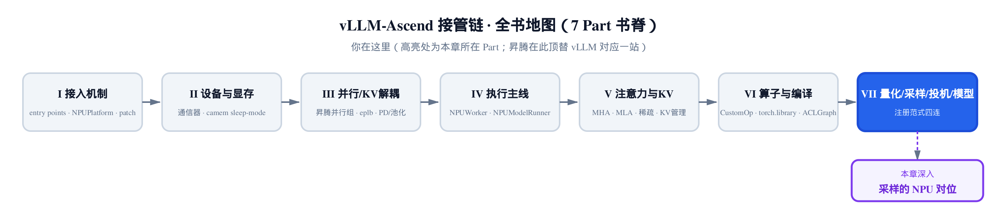
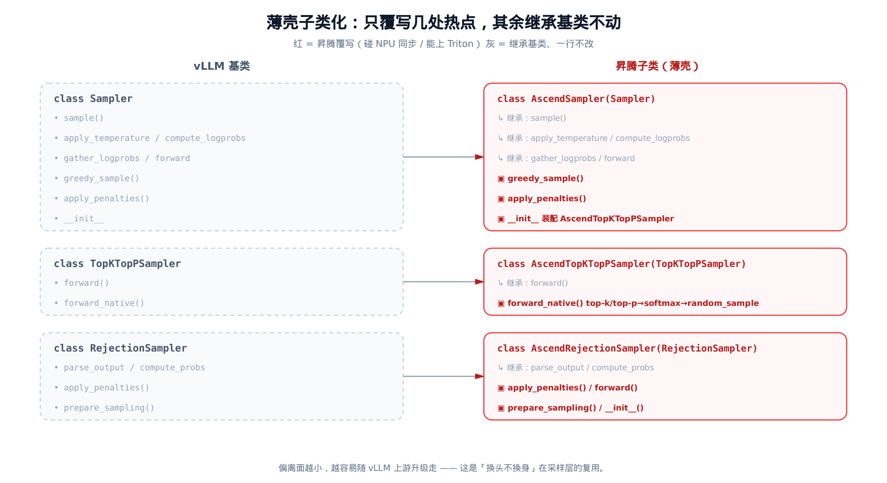
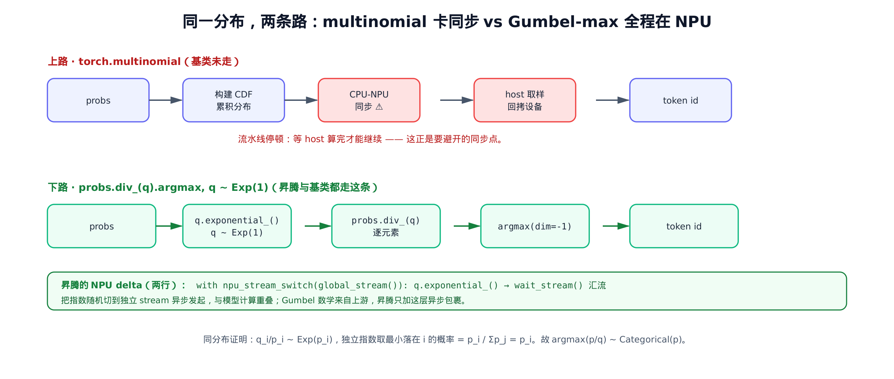
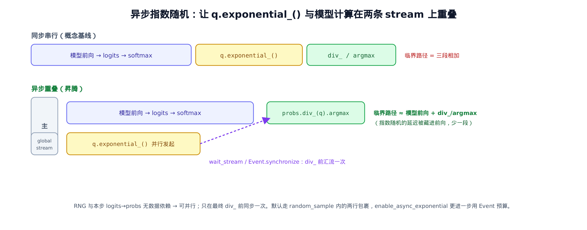
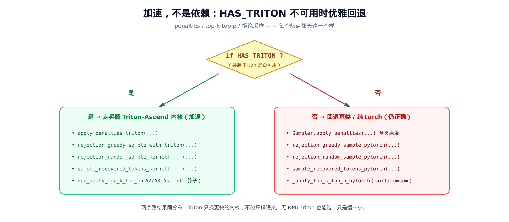

# 第 28 章 采样的 NPU 对位：薄壳子类化 + 异步指数随机 + Triton 优雅回退



> 上一章拆完量化框架，模型已经能在 NPU 上算出 logits。
> 本章是最后一步：把 logits 变成 token，且不卡流水线。
> 这也兑现了第 15 章留下的那个悬念——采样器内部到底做了什么。

第 [15 章](../ch15-single-step-forward-context-dp-sync/narrative/chapter.md)讲单步前向时，留过一个没打开的盒子。`NPUModelRunner._sample` 走到最后，只做了一次二选一的派发：没有投机解码就交给 `self.sampler`，有投机解码就交给 `self.rejection_sampler`。当时我们说，采样器内部那些「规避 CPU-NPU 同步、Triton 回退」的 NPU 对位，留到采样章再讲。

这一章就是来开这个盒子的。盒子里装着两个采样器：`vllm_ascend/sample/sampler.py` 里的 `AscendSampler`，和 `vllm_ascend/sample/rejection_sampler.py` 里的 `AscendRejectionSampler`。它们都继承自 vLLM 基类，但**只覆写少数几个方法**，其余原样继承。这是全书见过最薄的一层「壳」——比第 26 章的 FusedMoE 还薄。

为什么这么薄？因为采样这件事，绝大部分逻辑（温度、top-k、top-p、logprobs、贪心 vs 随机的派发）vLLM 上游早就写好了，而且写得很对。昇腾要做的对位只有三类：

1. **避开一个会卡住 NPU 的同步点**——`torch.multinomial`。基类早用 Gumbel-max 等价式绕开了它（Gumbel-max：给每个概率配一个独立随机扰动后取 argmax，等价于按概率采样），昇腾继承这套数学，再加两行把指数随机切到独立 stream 异步做。
2. **给热点换上更快的 Triton 内核**——penalties、top-k/top-p、拒绝采样都有昇腾 Triton 版；但 Triton 是**加速、不是依赖**，不可用时优雅回退基类原版。
3. **按芯片型号派发**——A2/A3 走 AscendC 自定义算子，其余走纯 torch。

三件事，全靠「覆写几处、其余继承」做到。我们一件一件看。

## 28.1 薄壳：基类把活干完了，昇腾只补三处

先看基类是怎么派发采样的。vLLM 的 `Sampler.sample` 把贪心和随机两条路并起来：

```python
# vllm/v1/sample/sampler.py:L232
def sample(
    self,
    logits: torch.Tensor,
    sampling_metadata: SamplingMetadata,
    logprobs_mode_override: LogprobsMode | None = None,
) -> tuple[torch.Tensor, torch.Tensor | None]:
    # … 省略：logprobs_mode 解析、all_greedy 提前返回 …
    if sampling_metadata.all_random:
        greedy_sampled = None
    else:
        greedy_sampled = self.greedy_sample(logits)
        # … 省略：all_greedy 时直接 return greedy_sampled …
    # Apply temperature.
    logits = self.apply_temperature(logits, sampling_metadata.temperature, sampling_metadata.all_random)
    # … 省略：argmax-invariant 的 logits processors …
    # Apply top_k and/or top_p.
    random_sampled, processed_logprobs = self.topk_topp_sampler(
        logits, sampling_metadata.generators, sampling_metadata.top_k, sampling_metadata.top_p,
    )
    if greedy_sampled is None:
        return random_sampled, processed_logprobs
    sampled = torch.where(
        sampling_metadata.temperature < _SAMPLING_EPS,
        greedy_sampled, random_sampled, out=greedy_sampled,
    )
    return sampled, processed_logprobs
```

整套骨架就两件事：`greedy_sample(logits)` 出贪心结果，`self.topk_topp_sampler(...)` 出随机结果，最后按温度用 `torch.where` 逐行选——温度近 0 取贪心，否则取随机。这套派发逻辑昇腾**一行都不碰**。

`AscendSampler` 继承它，只补三处。第一处是装配——把基类的 `topk_topp_sampler` 换成昇腾版：

```python
# vllm_ascend/sample/sampler.py:L45
class AscendSampler(Sampler):
    # … 省略：apply_penalties / greedy_sample（见下文）…

    def __init__(self, logprobs_mode=DEFAULT_LOGPROBS_MODE):
        # TODO: support logprobs_mode in vllm-ascend
        super().__init__(logprobs_mode=logprobs_mode)
        self.topk_topp_sampler = AscendTopKTopPSampler(logprobs_mode=logprobs_mode)
        # … 省略：async_exponential_event 与 debug 日志 …
```

`super().__init__()` 把基类的身体全建好，然后只把 `topk_topp_sampler` 这一个成员换成 `AscendTopKTopPSampler`。基类的 `sample()` 在运行时调到 `self.topk_topp_sampler(...)`，自然就走进了昇腾版——这是典型的「换头不换身」：调用约定不变，实现被替换。

剩下两处覆写是 `greedy_sample` 和 `apply_penalties`。把三个采样器的覆写面摊开看，薄到什么程度一目了然：



> *图注：灰色全是继承基类、一行不改的方法。红色才是昇腾覆写的——`AscendSampler` 只动 3 处，`AscendTopKTopPSampler` 只动 1 处，`AscendRejectionSampler` 只动 4 处。偏离面越小，越容易跟着 vLLM 上游升级走。*

`greedy_sample` 的覆写尤其能说明问题。它在单卡下和基类**完全一样**：

```python
# vllm_ascend/sample/sampler.py:L104
@staticmethod
def greedy_sample(logits: torch.Tensor) -> torch.Tensor:
    if get_ascend_config().enable_reduce_sample:
        # … 省略：词表按 TP 切分时，用 all-gather 求全局 argmax（默认关）…
    else:
        return logits.argmax(dim=-1).view(-1)
```

`else` 分支就是基类原版的 `logits.argmax(dim=-1).view(-1)`。那昇腾为什么还要覆写它？因为多了一个可选的 `enable_reduce_sample` 分支：当词表大到要按张量并行（tensor parallel，TP，即前文讲过的多卡切分并行）切到多张卡上时，每张卡只有局部词表的 logits，单卡 `argmax` 求出的是「局部最大」，得用一次 all-gather 把各卡的局部最大拼起来再选全局最大。这个分支默认关闭，是分布式场景的次要优化。换句话说，昇腾覆写 `greedy_sample` 不是为了改单卡行为，而是给它**加**了一条多卡旁路；单卡走的还是基类那行 argmax。

这就是「薄壳」的精髓：覆写的目的往往不是推翻基类，而是在基类正确实现的基础上，补一条硬件相关的旁路。看懂了这点，下面每个覆写方法你都能用同一把尺子量。

## 28.2 算法宝石：Gumbel-max 如何避开 multinomial 的同步

现在进到这一章的核心——随机采样到底怎么做。

直觉上，「按概率分布 $p$ 抽一个 token」最直接的写法是 `torch.multinomial(probs, 1)`。但 vLLM v1 的**主采样路径**（PyTorch 原生 / CUDA）不用它（ROCm 的 aiter 旁路是例外，仍调 multinomial，但那不是主线）。原因藏在一句注释里。先看昇腾版的 `random_sample`：

```python
# vllm_ascend/sample/sampler.py:L19
def random_sample(
    probs: torch.Tensor,
    generators: dict[int, torch.Generator],
) -> torch.Tensor:
    """Randomly sample from the probabilities.

    We use this function instead of torch.multinomial because torch.multinomial
    causes CPU-NPU synchronization.
    """
    # NOTE(woosuk): To batch-process the requests without their own seeds,
    # which is the common case, we first assume that every request does
    # not have its own seed. Then, we overwrite the values for the requests
    # that have their own seeds.
    with npu_stream_switch(global_stream()):
        q = torch.empty_like(probs)
        if len(generators) != probs.shape[0]:
            q.exponential_()
        if generators:
            for i, generator in generators.items():
                q[i].exponential_(generator=generator)
    torch.npu.current_stream().wait_stream(global_stream())
    return probs.div_(q).argmax(dim=-1).view(-1)
```

注意 docstring 第一句：**用这个函数代替 `torch.multinomial`，因为 multinomial 会触发 CPU-NPU 同步**。

为什么 multinomial 会卡同步？因为它内部要先把概率累成 CDF（累积分布函数），再抽一个均匀随机数、在 CDF 上二分查找落点。这个查找过程在很多实现里要把数据拉回 host 算，算完再回拷到设备——一来一回就是一次 CPU-NPU 同步。同步意味着设备得停下来等 host：流水线在这里被掐断一拍。在每生成一个 token 都要采样一次的解码循环里，这一拍乘以成千上万步，代价相当可观。

而这段代码全程在设备上，没有任何 host 回拷。它用的是 **Gumbel-max trick**（Gumbel 最大值技巧）的指数变体。核心就一行：

```python
return probs.div_(q).argmax(dim=-1).view(-1)
```

其中 `q` 是一张和 `probs` 同形、每个元素独立服从 $\mathrm{Exp}(1)$（速率为 1 的指数分布）的随机张量，由 `q.exponential_()` 原地填充。然后 `probs.div_(q)` 逐元素算 $p_i/q_i$，最后 `argmax` 取最大的那个下标。

**关键的归属问题先说清楚**：这套 Gumbel 数学**不是昇腾发明的**。它是 vLLM 上游为规避 multinomial 同步早就采用的手法。把基座的 `random_sample` 拉过来对照，几乎逐字一致：

```python
# vllm/v1/sample/ops/topk_topp_sampler.py:L385
def random_sample(
    probs: torch.Tensor,
    generators: dict[int, torch.Generator],
) -> torch.Tensor:
    """Randomly sample from the probabilities.

    We use this function instead of torch.multinomial because torch.multinomial
    causes CPU-GPU synchronization.
    """
    q = torch.empty_like(probs)
    # … 省略：与昇腾版完全相同的 generators 注释 …
    if len(generators) != probs.shape[0]:
        q.exponential_()
    if generators:
        for i, generator in generators.items():
            q[i].exponential_(generator=generator)
    return probs.div_(q).argmax(dim=-1).view(-1)
```

两份代码的差别只有两处：一是 docstring 里 `CPU-GPU` 改成了 `CPU-NPU`（同一个道理换了硬件名）；二是昇腾把指数随机那几行用 `with npu_stream_switch(global_stream()): ... wait_stream(...)` 包了起来。`div_(q).argmax` 这个算法宝石本身，是上游的、昇腾原样继承。那两行 stream 包裹才是昇腾真正新增的 delta，下一节细讲。



> *图注：上路是 multinomial 的概念流程，CDF 之后那一步 CPU-NPU 同步是要避开的卡点。*
> *下路是 Gumbel-max：指数随机、逐元素除、argmax，全程在设备上、没有 host 回拷。*

### 为什么 argmax(p/q) 和按 p 多项式采样同分布

这是全章最值得推一遍的等式。直觉上很难相信「除一个指数随机再取最大」会等价于「按概率抽样」，但它精确成立。

**命题**：设类别概率为 $p_1, \dots, p_V$（归一）。对每个类别独立抽一个标准指数随机数，算比值后取最大下标，其分布等于按概率的多项式采样：

$$
q_i \sim \mathrm{Exp}(1)\ \mathrm{i.i.d.} \quad\Longrightarrow\quad \arg\max_i \frac{p_i}{q_i}\ \sim\ \mathrm{Categorical}(p)
$$

也就是每个下标被取中的概率，恰好等于它自己那一项的概率。

**证明**。第一步，把 argmax 翻成 argmin——比值取最大，等价于它的倒数取最小：

$$
\arg\max_i \frac{p_i}{q_i} = \arg\min_i \frac{q_i}{p_i}
$$

第二步，看这个倒数的分布。指数分布有个缩放性质：标准指数除以一个常数后，变成速率等于该常数的指数。代进来就是：

$$
q_i \sim \mathrm{Exp}(1) \;\Longrightarrow\; \frac{q_i}{p_i} \sim \mathrm{Exp}(p_i)
$$

速率从 1 变成了 $p_i$。

第三步，用独立指数变量取最小的经典结论：最小值落在第 $i$ 个的概率，等于它的速率占总速率的比例：

$$
P\!\left(\arg\min_i X_i = i\right) = \frac{\lambda_i}{\sum_j \lambda_j}, \qquad X_i \sim \mathrm{Exp}(\lambda_i)
$$

把速率 $\lambda_i = p_i$ 代入，各速率之和等于 1，于是这个概率正好是 $p_i$。证毕。

一句话翻译：除以指数随机，相当于给每个类别一个「按概率拉伸过的赛跑时间」，概率越大的类别期望跑得越快、越容易成为最小值——而最小值取中谁的概率，精确等于它的概率 $p_i$。所以 `div_(q).argmax` 抽出来的 token，分布和 multinomial 完全一样，但它只用了一次逐元素除法加一次 argmax，没有 CDF、没有 host 同步。

> 等价地从 Gumbel 视角看：给每个 $\log p_i$ 加一个独立的标准 Gumbel 噪声、再取 argmax，结果同样服从 $\mathrm{Categorical}(p)$——这就是教科书里的 Gumbel-max trick，指数变体只是它的另一种写法。

### 数值验证：经验频率逼近 $p$

数学证明之外，跑一遍看数值。取 $p = [0.1, 0.2, 0.3, 0.4]$，复制成 $B = 40000$ 行的 batch，调一次 `random_sample`（无种子，`generators` 为空，整张 `q` 走一次 `exponential_()`），再统计每个 token 被抽中的经验频率。下面是 host CPU torch 上 `manual_seed(0)` 真跑一次的结果：

| token | 真实概率 $p_i$ | 经验频率（B=40000，实测） | 偏差 |
|---|---|---|---|
| 0 | 0.10 | 0.1004 | 0.0004 |
| 1 | 0.20 | 0.1974 | 0.0026 |
| 2 | 0.30 | 0.3018 | 0.0018 |
| 3 | 0.40 | 0.4003 | 0.0003 |

注意经验频率和真实概率 **接近但不相等**——这正是采样噪声的指纹，说明这组数是真跑出来的而非把概率抄了一遍。偏差的量级由标准误决定：

$$
\mathrm{SE}_i = \sqrt{p_i(1-p_i)/B}
$$

在 B=40000 下约 0.0015～0.0024，四个类别的实测偏差全落在 1 个标准误附近，且随 batch 增大而继续收缩。这正是 Gumbel-max 与 `Categorical(p)` 同分布的实测证据——而且这段验证在 host 的 CPU torch 上就能跑（`probs.div_(q).argmax` 是纯数学，不碰 NPU）。

有种子的请求（`generators` 非空）走的是同一套数学，只是把对应行的 `q[i]` 用带种子的 `exponential_(generator=...)` 重新填一遍，保证可复现：同样的种子两次调用，抽出的 token 逐位相同。

## 28.3 异步指数随机：把 RNG 藏进模型前向

回到昇腾真正新增的那两行。`random_sample` 里，指数随机被包在一个 stream 切换里：

```python
# vllm_ascend/sample/sampler.py:L32
with npu_stream_switch(global_stream()):
    q = torch.empty_like(probs)
    if len(generators) != probs.shape[0]:
        q.exponential_()
    # … 省略：带种子的逐行覆写 …
torch.npu.current_stream().wait_stream(global_stream())
```

`npu_stream_switch` 和 `global_stream` 都来自 `vllm_ascend.utils`，作用是把上下文里的后续算子切到指定的 NPU stream 上异步发起。这里 `npu_stream_switch(global_stream())` 把 `q.exponential_()` 切到一条独立的 **side stream**（`global_stream()`）上——所谓 side stream，是相对模型计算所在的「主 stream」而言的另一条独立 stream，让指数随机和主计算各跑各的、互不阻塞；`wait_stream` 则在退出后让主 stream 等这条 side stream 完成、再继续往下算 `div_(q)`。

这有什么用？关键观察是：填充 `q` 的指数随机，和本步「logits → softmax → probs」的计算**没有任何数据依赖**。`q` 只是一堆随机数，它的生成不需要等 probs 算好。既然无依赖，就可以让它和模型计算在两条 stream 上**并行**跑，只在最后真正要用 `q` 的那一步（`div_`）之前同步一次。



> *图注：概念上串行要把三段时间相加；异步重叠把指数随机藏进模型前向那段，临界路径少掉一段 RNG 延迟。*
> *只在 div_ 之前用 wait_stream 汇流一次。*

`AscendTopKTopPSampler.forward_native` 把这条默认路径和另外两条特殊路径拼在一起。这是这个子类**唯一**覆写的方法：

```python
# vllm_ascend/sample/sampler.py:L145
def forward_native(self, logits, generators, k, p):
    """Override pytorch native implementation to torch_npu"""
    # when batch_invariant mode is enabled, we should use vllm's implementation.
    # or it will make batch_invariant mode not working.
    if envs.VLLM_BATCH_INVARIANT:
        # … 省略：logger.debug_once 提示回退 vLLM 原生实现 …
        return super().forward_native(logits, generators, k, p)

    if get_ascend_config().enable_reduce_sample:
        # … 省略：词表按 TP 切分的候选集采样分支（默认关）…
    else:
        logits = self.apply_top_k_top_p(logits, k, p)
        # … 省略：logprobs_mode 下回传 processed logits/logprobs …
        probs = logits.softmax(dim=-1, dtype=torch.float32)
        if get_ascend_config().enable_async_exponential:
            # Add synchronize to prevent synchronize error.
            self.async_event.synchronize()
            return probs.div_(self.q).argmax(dim=-1).view(-1), logits_to_return
        return random_sample(probs, generators), logits_to_return
```

读这段要抓三条分支的优先级：

- **`VLLM_BATCH_INVARIANT` 回退基类**——确定性模式开启时，直接 `super().forward_native(...)` 走 vLLM 原生实现。这一条和第 [26 章的批不变（batch-invariant）一致性](../ch26-fusedmoe-batch-invariant/narrative/chapter.md)同源：昇腾的 torch_npu / Triton 路径会破坏「同一输入、不管和谁拼 batch 都逐位一致」的保证，所以确定性模式下必须退回基类那套固定分块的原生算子。两章用的是同一个开关、同一个理由。
- **`enable_async_exponential` 旁路**——这是前面那两行异步包裹的完整版：模型前向期间就在 side stream 上把 `q` 预算好、用 Event 记录完成点；走到这里只需 `self.async_event.synchronize()` 等一下，再直接 `probs.div_(self.q).argmax(...)`，把指数随机的延迟彻底藏进前向。这里的 `self.q`（side stream 上预算好的指数随机缓冲）和 `self.async_event`（记录其完成点的跨 stream 同步 Event）并不在 `__init__` 里——它们由 `set_q_event` 在模型前向期间的 `do_async_exponential` 写入；`__init__` 只创建了那个 Event 本体（`self.async_exponential_event = torch.npu.Event()`）。默认关闭。
- **默认分支**——落到最后一行 `random_sample(probs, generators)`，也就是 28.2 那个带 stream 包裹的 Gumbel-max。绝大多数请求走这条。

三条分支，默认那条最朴素，另两条是「确定性优先」和「极致重叠」的可选偏向。覆写 `forward_native` 的意义，就是在基类的采样契约里，把这三种取向接进来。

## 28.4 top-k/top-p：按芯片派发，纯 torch 兜底

`forward_native` 里那句 `self.apply_top_k_top_p(logits, k, p)` 也值得一看。`apply_top_k_top_p` 不是一个普通函数，而是**模块加载时按芯片型号定下来的派发入口**：

```python
# vllm_ascend/sample/sampler.py:L268
def _apply_top_k_top_p_ascendc(logits, k, p, top_k=None):
    # … 省略：enable_reduce_sample 的 TP all-gather 候选集分支 …
    if p is None and k is None:
        return logits
    return torch.ops._C_ascend.npu_apply_top_k_top_p(logits, k=k, p=p)


apply_top_k_top_p = (
    _apply_top_k_top_p_ascendc
    if get_ascend_device_type() in [AscendDeviceType.A2, AscendDeviceType.A3]
    else _apply_top_k_top_p_pytorch
)
```

A2/A3（昇腾芯片代际，见[第 17 章](../ch17-310p-inference-chip-specialization/narrative/chapter.md)的 `AscendDeviceType`）芯片走 AscendC 自定义算子 `npu_apply_top_k_top_p`——一个把 top-k 截断、top-p 截断融在一起的昇腾内核。其余型号走 `_apply_top_k_top_p_pytorch`，纯 torch 的 sort / cumsum / masked_fill 实现。两者结果一致，只是前者更快。这个选择在模块导入时一次定死，运行期不再判断。

纯 torch 那条兜底实现，逻辑是经典的「按概率排序后截断」：

```python
# vllm_ascend/sample/sampler.py:L193
def _apply_top_k_top_p_pytorch(logits, k, p, top_k=None):
    # … 省略：enable_reduce_sample 的多卡分支（默认关）…
    if p is None and k is None:
        return logits

    probs = logits.softmax(dim=-1)
    probs_sort, _ = probs.sort(dim=-1, descending=False)

    if k is not None:
        top_k_count = probs_sort.size(1) - k.to(torch.long)
        top_k_count = top_k_count.unsqueeze(dim=1)
        top_k_cutoff = probs_sort.gather(-1, top_k_count)
        # … 省略：no_top_k_mask 让「不截断」的行变 no-op …
        elements_to_discard = probs < top_k_cutoff
        logits.masked_fill_(elements_to_discard, -float("inf"))

    if p is not None:
        cumprob = torch.cumsum(probs_sort, dim=-1)
        top_p_mask = cumprob <= 1 - p.unsqueeze(dim=1)
        top_p_mask[:, -1] = False  # at least one
        top_p_count = top_p_mask.sum(dim=-1).unsqueeze(1)
        top_p_cutoff = probs_sort.gather(-1, top_p_count)
        elements_to_discard = probs < top_p_cutoff
        logits.masked_fill_(elements_to_discard, -float("inf"))

    return logits
```

函数内部先用 `probs = logits.softmax(dim=-1)` 把 logits 归一成概率，再按概率排序做截断：top-k 把概率第 $k$ 大以下的全置 `-inf`；top-p 沿升序累积概率，把累积质量落在尾部 $1-p$ 区间里的（即不在核 top-p 集合里的）置 `-inf`。被置 `-inf` 的 token 经 softmax 后概率归零，自然不会被采到。注意 `top_p_mask[:, -1] = False` 这行：因为 `probs_sort` 是升序排的，最后一列 `[:, -1]` 正是概率最大的那个候选，把它的 mask 强制设回 `False` 就保证每行至少留一个候选（最高概率那个永远不被 top-p 截掉），避免整行被截空。

这套 host 可跑的纯 torch 实现，正是「无 NPU 也能验证语义」的关键：可以在 CPU 上喂一个 `logits=[1,2,3,4]`、`k=2`，验证它确实只留下最大的两个（值 4、3）、其余两个变 `-inf`。芯片专用算子只是把同样的语义做得更快。

## 28.5 penalties：同接口、换内核、HAS_TRITON 优雅回退

接着是这一章的第二个母题：Triton 是加速、不是依赖。`AscendSampler.apply_penalties` 是最干净的样板：

```python
# vllm_ascend/sample/sampler.py:L46
@staticmethod
def apply_penalties(
    logits: torch.Tensor,
    sampling_metadata: SamplingMetadata,
    output_token_ids: list[list[int]],
) -> torch.Tensor:
    """Use Triton-Ascend penalties on NPU when Triton is available; else vLLM default."""
    if not HAS_TRITON:
        # … 省略：一行 warning_once 提示性能降级 …
        return Sampler.apply_penalties(logits, sampling_metadata, output_token_ids)

    if sampling_metadata.no_penalties:
        return logits
    assert sampling_metadata.prompt_token_ids is not None
    return apply_all_penalties(
        logits,
        sampling_metadata.prompt_token_ids,
        sampling_metadata.presence_penalties,
        sampling_metadata.frequency_penalties,
        sampling_metadata.repetition_penalties,
        output_token_ids,
    )
```

第一行 `if not HAS_TRITON:` 就是优雅回退的开关。`HAS_TRITON` 是 vLLM 探测到的「昇腾 Triton 是否可用」标志。不可用时，直接 `return Sampler.apply_penalties(...)`——调基类原版（纯 torch 实现），结果正确，只是没有 Triton 加速。可用时才走昇腾的 `apply_all_penalties`。

而 `apply_all_penalties` 本身，是「薄壳」在函数层的又一例：和基座 `vllm/v1/sample/ops/penalties.py` 的同名函数**签名完全一致**，只把内核从纯 torch 换成昇腾 Triton kernel：

```python
# vllm_ascend/sample/penalties.py:L25
def apply_all_penalties(
    logits: torch.Tensor,
    prompt_token_ids: torch.Tensor,
    presence_penalties: torch.Tensor,
    frequency_penalties: torch.Tensor,
    repetition_penalties: torch.Tensor,
    output_token_ids: list[list[int]],
) -> torch.Tensor:
    """Apply penalties to logits via Triton-Ascend."""
    _, vocab_size = logits.shape
    output_tokens_t = _convert_to_tensors(output_token_ids, vocab_size, logits.device)
    output_tokens_t.masked_fill_(output_tokens_t == -1, vocab_size)

    return apply_penalties_triton(
        logits, prompt_token_ids, output_tokens_t,
        presence_penalties, frequency_penalties, repetition_penalties,
    )
```

调用方完全感觉不到内核被换了——这就是「同接口换内核」。`_convert_to_tensors` 把变长的 `output_token_ids` padding 成定形张量，最后交给 `apply_penalties_triton` 做 presence / frequency / repetition 三种惩罚。

把这个回退模式画成一张图，它在全章反复出现：



> *图注：penalties、top-k/top-p、拒绝采样，每个热点都是这一个判定。有 Triton 走昇腾内核，没有就回退基类或纯 torch。*
> *两条路结果同分布——Triton 只换更快的内核，不改采样语义。*

## 28.6 投机解码：拒绝采样也是一层薄壳

最后是盒子里的第二个采样器：`AscendRejectionSampler`，投机解码（speculative decoding）专用。投机解码用一个小的 draft 模型先猜出若干 token，再用大的 target 模型一次性验证；拒绝采样（rejection sampling）就是那个「验证并决定接受到哪一位」的算法。

它同样是薄壳——继承基类 `RejectionSampler`，只覆写 `apply_penalties`、`forward`、`prepare_sampling`、`__init__` 四处，连特殊常量（`PLACEHOLDER_TOKEN_ID`、`GREEDY_TEMPERATURE`、`MAX_SPEC_LEN`）和 `generate_uniform_probs` 都从基类 import 复用：

```python
# vllm_ascend/sample/rejection_sampler.py:L34
class AscendRejectionSampler(RejectionSampler):
    """Ascend-optimized rejection sampler for speculative decoding."""

    @staticmethod
    def apply_penalties(logits, sampling_metadata, metadata, repeat_indices, output_token_ids):
        if sampling_metadata.no_penalties:
            return logits
        if not HAS_TRITON:
            # … 省略：warning_once 后回退基类 …
            return Sampler.apply_penalties(logits, sampling_metadata, output_token_ids)
        assert sampling_metadata.prompt_token_ids is not None
        prompt_token_ids = sampling_metadata.prompt_token_ids[repeat_indices]
        # … 省略：presence/frequency/repetition 同样按 repeat_indices 取行 …
        return apply_all_penalties(logits, prompt_token_ids, presence_penalties,
                                   frequency_penalties, repetition_penalties, output_token_ids)
```

`apply_penalties` 又是同一个 `if not HAS_TRITON: return Sampler.apply_penalties(...)` 回退。唯一的新东西是 `repeat_indices`——投机解码把每个请求按它的 draft token 数展开成多行，`repeat_indices` 就是把每请求的惩罚参数广播到对应的 draft 行上。

真正的算法在模块级的 `rejection_sample`。它的接受检验同样贯彻「有 Triton 走内核、否则走 pytorch」：

```python
# vllm_ascend/sample/rejection_sampler.py:L404
# For greedy sampling, we need to do allgather first to get global argmax
if not sampling_metadata.all_random:
    if get_ascend_config().enable_reduce_sample:
        # … 省略：多卡 all-gather 求全局 argmax（默认关）…
        target_argmax = greedy_sample(target_logits)
    else:
        target_argmax = target_logits.argmax(dim=-1).view(-1)

    if HAS_TRITON:
        rejection_greedy_sample_with_triton(
            output_token_ids, num_draft_tokens, cu_num_draft_tokens, draft_token_ids,
            target_argmax, bonus_token_ids, is_greedy, max_spec_len, grid, block_size,
        )
    else:
        # … 省略：spec_len==1 的快路 rejection_greedy_sample_spec_len_1_pytorch …
        rejection_greedy_sample_pytorch(
            output_token_ids, cu_num_draft_tokens, draft_token_ids, target_argmax,
            bonus_token_ids, num_draft_tokens, max_spec_len, is_greedy,
        )
    if sampling_metadata.all_greedy:
        return output_token_ids
```

`target_argmax` 是 target 模型对每个位置最看好的 token。贪心投机的接受规则很简单：从头比对，draft 猜的 token 和 target 的 argmax 一致就接受、继续往后；第一次不一致就用 target 的 argmax 改写那一位、停下。如果全部 draft 都被接受，再追加一个 target 在末位预测的「bonus token」（白送的一步）。

### 两轮位置追踪：接受、拒绝、bonus

把贪心拒绝采样的状态摆出来看最清楚。设 draft 猜了两个 token `[5, 6]`、bonus 是 `7`，看两个场景逐位演化（`PH` 是占位符 `PLACEHOLDER_TOKEN_ID = -1`，表示该位未填）：

| 场景 | 位置 | draft | target argmax | 判定 | 写入 output |
|---|---|---|---|---|---|
| **全接受** | pos0 | 5 | 5 | 5 == 5 接受 | `out[0] = 5` |
|  | pos1 | 6 | 6 | 6 == 6 接受 | `out[1] = 6` |
|  | bonus | — | (末位预测 7) | 全接受 → 补 bonus | `out[2] = 7` → `[5, 6, 7]` |
| **中途拒绝** | pos0 | 5 | 5 | 5 == 5 接受 | `out[0] = 5` |
|  | pos1 | 6 | 9 | 6 ≠ 9 拒绝 → 改写 | `out[1] = 9`，停 |
|  | bonus | — | — | 有拒绝 → 不补 bonus | `out[2] = PH` → `[5, 9, PH]` |

两个场景对照出拒绝采样的全部要点：接受时填 draft 的猜测；第一次失配时用 target 的 token 改写并短路（后面位置一律不再接受）；只有「一路全接受、没出现任何拒绝」时才追加 bonus。`rejection_greedy_sample_pytorch` 用全向量化的方式实现这套逻辑——先算出每个请求的「首个失配位置」，再用掩码批量决定每一位填 draft、填改写、还是填 bonus。

### 随机投机的接受判据与残差重采

如果不是贪心而是带温度的随机采样，接受规则换成概率比。对一个 draft token，设它在 target 分布下的概率 `p_target`、在 draft 分布下的概率 `p_draft`、再抽一个均匀随机数 $u$，**接受当且仅当**比值不小于这个均匀样本：

$$
\frac{p_{\mathrm{target}}}{p_{\mathrm{draft}}} \ge u
$$

源码里就是这一行（`rejection_random_sample_pytorch`）：

```python
# vllm_ascend/sample/rejection_sampler.py:L1036
acceptance_condition = (draft_token_probs > zero_threshold) & (
    target_token_probs / draft_token_probs >= uniform_token_probs
)
```

直觉：target 比 draft 越「看好」这个 token（比值越大），越容易接受；比值 ≥ 1 时必接受。举个数：draft 笃定选 token1，概率 1.0；target 对 token1 的概率 0.6，比值就是 0.6。均匀数若抽到 0.3，则 0.6 ≥ 0.3，接受；若抽到 0.9，则 0.6 < 0.9，拒绝。前半个判据 `draft_token_probs > zero_threshold` 是道护栏：`zero_threshold` 是函数内现造的 0.0 常量张量（`torch.tensor([0.0], pin_memory=True).to(device, non_blocking=True)`），要求 draft 概率严格大于 0，避免下一步用它做分母时除以零。

一旦某位被拒，不能简单丢弃——那会让最终分布偏离 target。标准投机解码的做法是从**残差分布**重新采一个「恢复 token」。残差是 target 减 draft 的正部，`∝` 之后还要除以归一化常数 $Z$ 才是一个合法概率分布：

$$
p_{\mathrm{recover}}(x) = \frac{\max\!\bigl(0,\; p_{\mathrm{target}}(x) - p_{\mathrm{draft}}(x)\bigr)}{Z}, \qquad Z = \sum_x \max\!\bigl(0,\; p_{\mathrm{target}}(x) - p_{\mathrm{draft}}(x)\bigr)
$$

而这个重采，用的又是 28.2 那套 Gumbel-max——`sample_recovered_tokens_pytorch` 里照样是 `q.exponential_()` 填指数随机、残差除以 `q` 再 argmax：

```python
# vllm_ascend/sample/rejection_sampler.py:L1238
else:
    prob = torch.maximum(
        target_probs - draft_probs,
        torch.tensor(0.0, pin_memory=True).to(device, non_blocking=True),
    )
# … 省略：q==0 / inf 的数值保护 …
prob_over_q = prob / q_values_safe
# … 省略：把无效列压到 -1e10、以及 enable_reduce_sampling 的候选集映射（默认关）…
recovered_ids = torch.argmax(prob_over_q, dim=1)
```

代码里那个 `torch.tensor(0.0, pin_memory=True).to(device, non_blocking=True)` 顺带演示了一个昇腾上常见的小手法：用锁页内存（`pin_memory`）+ 非阻塞拷贝（`non_blocking=True`）发起 H2D 传输，让这点常量的搬运和设备上的计算重叠、不卡一次同步。

接受时取 draft 的 token、拒绝时取残差重采的 token、全接受时追加 bonus——这套「接受/拒绝/补偿」的组合，保证了最终采出的 token 边缘分布精确等于 target 分布。为什么？把单个位置输出某个 token $x$ 的概率拆成「draft 提议 $x$ 且被接受」与「先拒绝、再从残差采到 $x$」两项相加：

$$
P(\mathrm{out}=x) = \underbrace{p_{\mathrm{draft}}(x)\cdot\min\!\Bigl(1,\tfrac{p_{\mathrm{target}}(x)}{p_{\mathrm{draft}}(x)}\Bigr)}_{\mathrm{accept}} \;+\; \underbrace{Z\cdot p_{\mathrm{recover}}(x)}_{\mathrm{residual}}
$$

下面记 $p_d=p_{\mathrm{draft}}(x)$、$p_t=p_{\mathrm{target}}(x)$。第一项化简就是 $\min(p_d, p_t)$。第二项里，总拒绝概率恰好等于残差归一化常数 $Z$——因为两侧正部之和相等：

$$
\sum_y \max\!\bigl(0,\, p_{\mathrm{draft}}(y)-p_{\mathrm{target}}(y)\bigr) = \sum_y \max\!\bigl(0,\, p_{\mathrm{target}}(y)-p_{\mathrm{draft}}(y)\bigr) = Z
$$

于是 $Z\cdot p_{\mathrm{recover}}(x)$ 正好等于 $\max(0,\, p_t - p_d)$。两项相加得：

$$
\min(p_d, p_t) + \max(0,\, p_t - p_d) = p_{\mathrm{target}}(x)
$$

无论 $p_t$ 大于还是小于 $p_d$ 都成立。这就是拒绝采样保边缘分布的经典结论——和 [§28.2](#为什么-argmaxpq-和按-p-多项式采样同分布) 的 Gumbel 等价一样，是一句话能推完的数学。draft 只是加速猜测，是否采纳由 target 说了算，且被拒时从残差补回，一个分布都不偏。

把端到端串起来：`AscendRejectionSampler.forward` 先用持有的 `self.sampler`（也就是 `AscendSampler`）采出 bonus token，再 `apply_sampling_constraints` 套上温度/top-k/top-p，最后调 `rejection_sample` 做接受检验。无 Triton 时全程走上面那些 `*_pytorch` 回退，host 上就能验证四种场景的输出，逐一对上前面讲过的规则：

| 场景 | draft 走向 | 输出 | 对应规则 |
|---|---|---|---|
| 贪心全接受 | 两位都 == target argmax | `[5,6,7]` | 全接受 → 末位补 bonus `7` |
| 贪心中途失配 | 第二位 ≠ target argmax | `[5,9,PH]` | 失配处用 target 改写、短路，不补 bonus |
| 随机接受补 bonus | 比值判据通过、draft 被采纳 | `[1,7]` | 接受 draft 的 `1`，再追加 bonus `7` |
| 随机拒绝取残差 | 比值判据未过、draft 被拒 | `[3,PH]` | 从残差分布重采出 `3`，该位之后短路、不补 bonus |

这四种输出和真仓 Triton 路径的可观察行为一致——精简版只是把同一套语义在 host 上跑给你看。

## 28.7 小结：薄到几乎看不见的一层壳

这一章打开了第 15 章留下的采样盒子，里面是两个采样器（`vllm_ascend/sample/sampler.py` 与 `vllm_ascend/sample/rejection_sampler.py`，惩罚内核在 `vllm_ascend/sample/penalties.py`），加起来覆写的方法不超过十个。回头看，它们贯彻了三条对位策略：

- **薄壳子类化**：基类把温度、派发、logprobs 这些通用逻辑写对了，昇腾只覆写「碰 NPU 同步」或「能上 Triton」的几处，其余继承不动。偏离面小，跟着上游升级几乎零成本。
- **数学等价绕硬件短板**：`torch.multinomial` 会卡 CPU-NPU 同步，Gumbel-max 用 `div_(q).argmax` 在设备上等价地完成多项式采样——这套数学是上游的，昇腾继承之，再加 `npu_stream_switch` / `wait_stream` 两行把指数随机异步化，把 RNG 延迟藏进模型前向。
- **加速器可选回退**：penalties、top-k/top-p、拒绝采样的每个热点，都是 `if HAS_TRITON: 昇腾内核 else: 基类/纯 torch`。Triton 是加速、不是依赖，缺了也能正确跑。

采样是整条推理流水线的最后一棒。把它做成一层薄壳，意味着昇腾把「正确性」交给了上游久经考验的实现，自己只负责「在 NPU 上别卡住、能更快就更快」——这恰是一个成熟硬件后端该有的克制。
