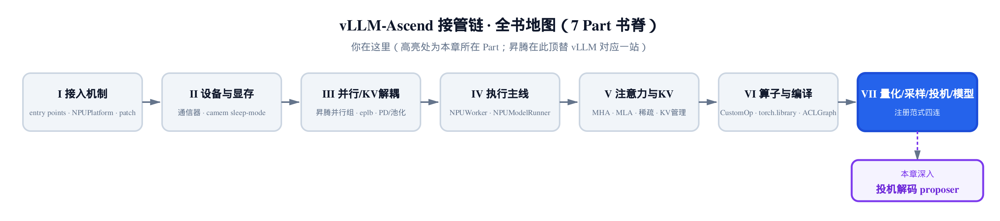
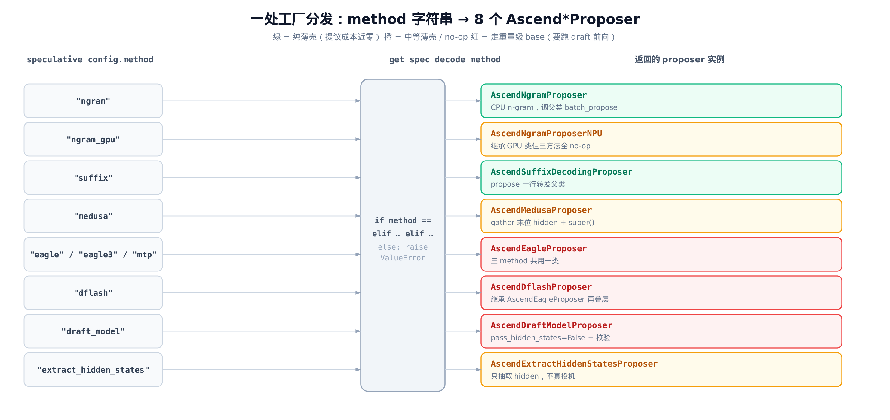
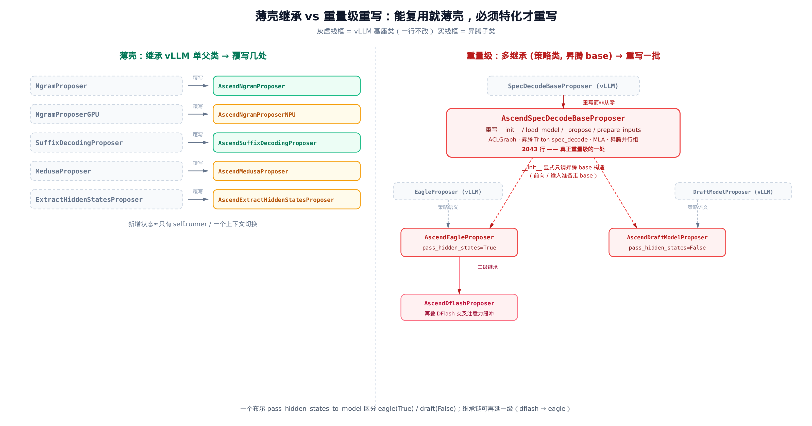
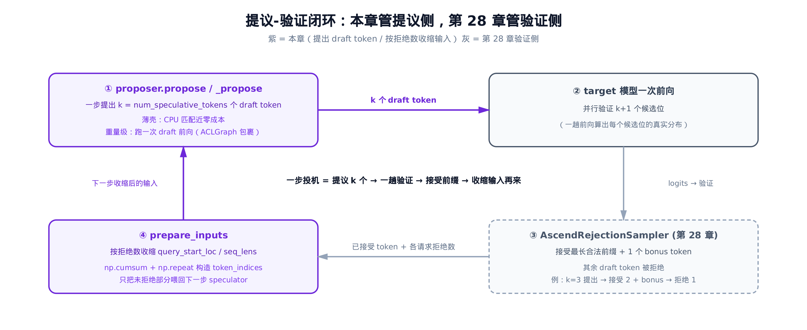

# 第 29 章 投机解码的 NPU 对位：proposer 工厂与薄壳继承



> 上一章把 logits 采成 token，那是投机解码的验证侧。
> 本章转到提议侧：谁来提出那串 draft token。
> 一处工厂分发 + 一批薄壳继承，收束投机这条线。

第 [28 章](../ch28-sampling-npu-adaptation/narrative/chapter.md)拆采样器时，反复出现一个名字：`AscendRejectionSampler`。它做的是「接受还是拒绝 draft token」（draft token＝proposer 在验证前投机提出的候选 token）——可那串 draft token 是谁提出来的？投机解码是一组「提议-验证」的搭档：一方先猜出 $k$ 个候选 token，另一方一趟前向并行验证。验证时除了核对这 $k$ 个候选，还会顺手多采 1 个 token（即第 k+1 位）——就是上一章那个白送的 bonus token，所以 n 个 draft token 最多能被接受 n+1 个，后面 `rejection_count = n+1-len` 里那个加一就是它。上一章讲了验证侧，这一章补上提议侧。

提议侧的代码全在 `vllm_ascend/spec_decode/` 这个目录里，入口是 `vllm_ascend/spec_decode/__init__.py`。打开它你会发现一件有意思的事：投机解码有 8 种策略（ngram、eagle、medusa、dflash……），但昇腾几乎没有从零写过哪一种。它的做法是一个非常典型的工程范式——**一处工厂分发，一批薄壳继承，只有少数几处重量级重写**。能直接复用 vLLM 的就套一层薄壳，必须为 NPU 特化的才动刀。这一章就来看清这三层。

## 29.1 一处工厂：if-elif 把 method 分发到 8 个 proposer

入口在包的 `__init__.py`。整个提议侧只有一个对外函数 `get_spec_decode_method`，它把配置里的 `method` 字符串映射到具体的 proposer 类：

```python
# vllm_ascend/spec_decode/__init__.py:L21
from vllm_ascend.spec_decode.dflash_proposer import AscendDflashProposer
from vllm_ascend.spec_decode.draft_proposer import AscendDraftModelProposer
from vllm_ascend.spec_decode.eagle_proposer import AscendEagleProposer
from vllm_ascend.spec_decode.extract_hidden_states_proposer import (
    AscendExtractHiddenStatesProposer,
)
from vllm_ascend.spec_decode.medusa_proposer import AscendMedusaProposer
from vllm_ascend.spec_decode.ngram_proposer import AscendNgramProposer
from vllm_ascend.spec_decode.ngram_proposer_npu import AscendNgramProposerNPU
from vllm_ascend.spec_decode.suffix_proposer import AscendSuffixDecodingProposer


# vllm_ascend/spec_decode/__init__.py:L33
def get_spec_decode_method(method, vllm_config, device, runner):
    if method == "ngram":
        return AscendNgramProposer(vllm_config, runner)
    elif method == "ngram_gpu":
        return AscendNgramProposerNPU(vllm_config, device, runner)
    elif method == "suffix":
        return AscendSuffixDecodingProposer(vllm_config, runner)
    elif method == "medusa":
        return AscendMedusaProposer(vllm_config, device)
    elif method in ("eagle", "eagle3", "mtp"):
        return AscendEagleProposer(vllm_config, device, runner)
    elif method == "dflash":
        return AscendDflashProposer(vllm_config, device, runner)
    elif method == "draft_model":
        return AscendDraftModelProposer(vllm_config, device, runner)
    elif method == "extract_hidden_states":
        return AscendExtractHiddenStatesProposer(vllm_config, device, runner)
    else:
        raise ValueError(f"Unknown speculative decoding method: {method}")
```

这就是全部。一处 if-elif，按字符串选一个 proposer 返回。简单到几乎不值得画图——但它藏着三个值得停一停的细节。

**第一，method 字符串和类名不是一一同名。** `"ngram_gpu"` 映射到 `AscendNgramProposerNPU`（注意是 NPU 不是 GPU），`"draft_model"` 映射到 `AscendDraftModelProposer`，而 `"eagle"`、`"eagle3"`、`"mtp"` 三个 method 共用同一个 `AscendEagleProposer`。对外暴露的是 method 这一个旋钮，旋钮背后接哪个类、几个 method 复用一个类，工厂自己消化。

**第二，构造签名也不齐。** `ngram` 和 `suffix` 不收 `device`，`medusa` 不收 `runner`，eagle 这一支收齐 `(vllm_config, device, runner)`。各 proposer 需要什么参数各不相同，工厂把这些差异全吸收在 if-elif 的每一支里，调用方只管给齐四个参数。

**第三，未知 method 直接抛错。** 最后那个 `else` 把拼错的 method 挡在门口，不会静默退化成某个默认策略。

把这套分发画出来，就是一张「左边 method 字符串、右边 proposer 实例」的多对多映射：



图里右侧的颜色已经剧透了本章的主线：这 8 个 proposer 不是一个量级的。绿色是**纯薄壳**，提议成本近乎为零；橙色是**中等薄壳**或 no-op 占位；红色是**走重量级 base** 的、每步要真跑一次 draft 模型前向的。下面就按这三类，从最薄的看起。

## 29.2 最薄的薄壳：一行转发给父类

先看绿色那端最极端的标本——薄到几乎只剩一层壳的 `AscendSuffixDecodingProposer`。它的全部代码就这么多：

```python
# vllm_ascend/spec_decode/suffix_proposer.py:L4
class AscendSuffixDecodingProposer(SuffixDecodingProposer):
    def __init__(self, vllm_config, runner):
        super().__init__(vllm_config)
        self.runner = runner

    def dummy_run(
        self,
        num_tokens,
        # … 省略：with_prefill / num_reqs / aclgraph_runtime_mode 等对齐昇腾 runner 的长签名参数 …
        is_profile=False,
    ):
        pass

    def propose(self, valid_sampled_token_ids):
        return super().propose(self.runner.input_batch, valid_sampled_token_ids)
```

它继承 vLLM 的 `SuffixDecodingProposer`，新增的状态只有一个 `self.runner`。`propose` 是一行——转发给父类，顺手补上父类需要的 `self.runner.input_batch`。`dummy_run` 是空的 `pass`。后缀解码的真正算法（在 token 序列里找后缀匹配）整个在 vLLM 父类里，device 无关，昇腾一行不改。

`dummy_run` 那串长签名值得说一句：它不是后缀解码需要的，而是为了对齐昇腾 runner 在图捕获时统一的调用约定——runner 会拿同一套参数去 `dummy_run` 每一个 proposer，所以即便用不上，签名也得摆齐。这个长签名你会在本章几乎每个薄壳里看到，它是「插进昇腾 runner 这套接口」的入场券。

## 29.3 真干活的薄壳 vs 占位的薄壳：ngram 的两副面孔

n-gram 提议有意思在于：它有**两个** proposer，对应两个 method，一个真干活、一个纯占位。先看真干活的 `AscendNgramProposer`（method `"ngram"`）：

```python
# vllm_ascend/spec_decode/ngram_proposer.py:L29
def propose(
    self,
    sampled_token_ids: list[list[int]],
    # … 省略：num_tokens_no_spec / token_ids_cpu / slot_masks 兼容参数 …
) -> list[list[int]]:
    valid_ngram_requests = []
    for i, sampled_ids in enumerate(sampled_token_ids):
        num_sampled_ids = len(sampled_ids)
        if not num_sampled_ids:
            continue

        req_id = self.runner.input_batch.req_ids[i]
        if req_id in self.runner.input_batch.spec_decode_unsupported_reqs:
            continue

        num_tokens = self.runner.input_batch.num_tokens_no_spec[i]
        if num_tokens >= self.runner.input_batch.max_model_len:
            # Skip requests that have already reached the max model length.
            continue

        start_idx = self.runner.input_batch.num_tokens_no_spec[i]
        end_idx = start_idx + num_sampled_ids
        self.runner.input_batch.token_ids_cpu[i, start_idx:end_idx] = sampled_ids

        valid_ngram_requests.append(i)

    draft_token_ids = self.batch_propose(
        len(sampled_token_ids),
        valid_ngram_requests,
        self.runner.input_batch.num_tokens_no_spec,
        self.runner.input_batch.token_ids_cpu,
    )

    return draft_token_ids
```

它真干活，但干的也只是「准备 + 转发」：先一趟循环筛掉三种请求——本步没采到 token 的（空）、被标记为不支持投机的、已经顶到 `max_model_len` 的；把活下来的请求的新 token 写回 `input_batch.token_ids_cpu`；最后把真正的 n-gram 匹配交给父类 `NgramProposer.batch_propose`。匹配逻辑纯 CPU、device 无关，所以昇腾继承父类原样用，自己只补一段把数据搬到位的预处理。

再看占位的 `AscendNgramProposerNPU`（method `"ngram_gpu"`），它继承的是 vLLM 的 GPU 版父类 `NgramProposerGPU`：

```python
# vllm_ascend/spec_decode/ngram_proposer_npu.py:L5
class AscendNgramProposerNPU(NgramProposerGPU):
    def __init__(self, vllm_config, device: torch.device, runner):
        super().__init__(vllm_config, device=device)

    def load_model(self, *args, **kwargs):
        # No model to load.
        pass

    @torch.inference_mode()
    def dummy_run(
        self,
        num_tokens,
        # … 省略：同款对齐昇腾 runner 的长签名 …
        is_profile=False,
    ):
        pass

    def propose(
        self,
        num_tokens_no_spec: torch.Tensor,  # [batch_size]
        token_ids_gpu: torch.Tensor,  # [batch_size, max_len]
        valid_sampled_token_ids_gpu: torch.Tensor,  # [batch_size, num_spec_tokens + 1]
        valid_sampled_tokens_count: torch.Tensor,  # [batch_size]
    ):
        pass
```

整个文件 35 行，`load_model`、`dummy_run`、`propose` **三个方法全是 `pass`**。这里有个容易看反的地方：它继承了 `NgramProposerGPU`，却**没有复用**父类那段在 GPU 上批量做 n-gram 匹配的 kernel——`propose` 是裸 `pass`，直接把父类实现盖掉了。

为什么这么写？因为父类那段 kernel 是为 CUDA GPU 写的，搬不到 NPU 上跑。它继承 `NgramProposerGPU` 只为沿用父类同一套张量形状契约与初始化接口——这样工厂分发到 `"ngram_gpu"` 时能无缝套进 runner 那套张量布局、不必为它单开一种接口，而把 `propose` 等方法体全 stub 成 no-op；真正的 NPU n-gram 提议走的是上面那条 method `"ngram"` 的纯 CPU 匹配路径。两个 method、两副面孔，对照着看正好说明薄壳的边界——

| proposer | method | 父类 | propose 体 | 谁真干活 |
|---|---|---|---|---|
| `AscendNgramProposer` | `"ngram"` | `NgramProposer` | 筛请求 + 写回 + 调父类 `batch_propose` | CPU 父类算法 |
| `AscendNgramProposerNPU` | `"ngram_gpu"` | `NgramProposerGPU` | 裸 `pass`（stub 掉 GPU kernel） | 无（占位） |

一个把 device 无关的父类算法照搬，一个把 device 相关的父类算法整段 stub 掉。**能复用就薄壳、不能复用就占位**——同一个范式的一体两面。

## 29.4 中等薄壳：只在数据布局的接缝处插一层

再往上一档是「中等薄壳」：核心算法仍照搬父类，但昇腾要在 device 或数据布局的接缝处插一小段自己的逻辑。`AscendMedusaProposer` 是典型：

```python
# vllm_ascend/spec_decode/medusa_proposer.py:L46
def propose(
    self,
    valid_sampled_token_ids: list[list[int]],
    sampling_metadata: SamplingMetadata,
    spec_decode_metadata: SpecDecodeMetadata,
    sample_hidden_states: torch.Tensor,
):
    if sample_hidden_states.shape[0] == len(valid_sampled_token_ids):
        # The input to the target model does not include draft tokens.
        hidden_states = sample_hidden_states
    else:
        num_accepted_tokens = torch.tensor(
            [len(t) for t in valid_sampled_token_ids], device=self.device, dtype=torch.long
        )
        num_draft_tokens = torch.tensor(spec_decode_metadata.num_draft_tokens, device=self.device, dtype=torch.long)

        offsets = torch.cumsum(num_draft_tokens + 1, dim=0) - (num_draft_tokens + 1)
        indices = offsets + num_accepted_tokens - 1
        hidden_states = sample_hidden_states[indices]

    spec_token_ids = super().propose(
        target_hidden_states=hidden_states,
        sampling_metadata=sampling_metadata,
    )
    return spec_token_ids
```

medusa 用最后一个隐藏状态去预测后续 token——只取最近那个位置的表示来引导下一步 draft，而不是把整段序列重新前向一遍，这本身就是把投机前向成本压低的设计选择。问题在于 `sample_hidden_states` 是把一批请求的隐藏状态拼在一起的扁平张量，昇腾要从里头 gather 出**每个请求最后一个已接受位置**的那行隐藏状态。这段 `offsets`/`indices` 的索引计算就是干这个的，算完一交给父类 `super().propose`——真正的 medusa 提议仍是 vLLM 父类的活。

这段索引值得手算一遍。假设两个请求，每个提出 `num_draft_tokens = [2, 2]` 个 draft token，验证后接受数 `num_accepted = [2, 1]`：

| 量 | 算式 | 取值 |
|---|---|---|
| `num_draft + 1` | 每请求拼接 draft + 1 个 bonus 位 | `[3, 3]` |
| `cumsum(...)` | 前缀和 | `[3, 6]` |
| `offsets` | `cumsum - (num_draft+1)` = 每请求块起点 | `[0, 3]` |
| `indices` | `offsets + accepted - 1` = 末位已接受行 | `[1, 3]` |

`offsets` 给出每个请求在扁平张量里的块起点，加上「已接受数 - 1」就落到该请求最后一个已接受 token 的那一行。请求 0 的块从第 0 行起、接受 2 个，取第 1 行；请求 1 的块从第 3 行起、接受 1 个，取第 3 行。`if` 那个分支是快捷路径：当输入本就不含 draft token（行数正好等于请求数），直接整块拿去，省掉 gather。

同一档里还有 `AscendExtractHiddenStatesProposer`（method `"extract_hidden_states"`，定义在 `vllm_ascend/spec_decode/extract_hidden_states_proposer.py`）：它覆写 `dummy_run` 换上 ACL graph 签名、覆写 `prepare_next_token_ids_padded` 适配昇腾的 indices/count 模式，但本身只抽取并缓存隐藏状态、不真做投机。也是「只在接缝处插一层，核心照搬」。

## 29.5 走重量级 base 的薄入口：多继承拼出策略与实现

前面这几类薄壳，父类要么是 vLLM 的 device 无关基类（ngram/suffix/medusa），要么干脆把搬不动的 GPU 基类 stub 掉（ngram_gpu）——总之提议逻辑都不必真跑一个 draft 模型。但 eagle、draft_model、mtp、dflash 这几种不一样——它们要真跑一个 draft 模型前向，必须落到昇腾自己重写的重量级基类 `AscendSpecDecodeBaseProposer` 上。可它们的入口文件却薄得出奇。`AscendEagleProposer` 整个 19 行：

```python
# vllm_ascend/spec_decode/eagle_proposer.py:L10
class AscendEagleProposer(EagleProposer, AscendSpecDecodeBaseProposer):
    def __init__(
        self,
        vllm_config: VllmConfig,
        device: torch.device,
        runner=None,
    ):
        AscendSpecDecodeBaseProposer.__init__(
            self, vllm_config, device, pass_hidden_states_to_model=True, runner=runner
        )
```

`AscendDraftModelProposer` 几乎同构，只有两处差别：

```python
# vllm_ascend/spec_decode/draft_proposer.py:L8
class AscendDraftModelProposer(DraftModelProposer, AscendSpecDecodeBaseProposer):
    def __init__(
        self,
        vllm_config: VllmConfig,
        device: torch.device,
        runner=None,
    ):
        AscendSpecDecodeBaseProposer.__init__(self, vllm_config, device, False, runner=runner)
        self._raise_if_vocab_size_mismatch()
        self._raise_if_draft_tp_mismatch()
```

看这个**多继承**：`(EagleProposer, AscendSpecDecodeBaseProposer)`，第一个父类是 vLLM 的策略类、第二个是昇腾的重量级 base。但 `__init__` 里**只显式调了 `AscendSpecDecodeBaseProposer.__init__`**。这是一记漂亮的正交拆分：

- **策略语义**来自 vLLM 的 `EagleProposer`——eagle 怎么用隐藏状态、draft_model 怎么挂 draft 模型，这些上游写好的方法照用；
- **构造与前向**来自昇腾的 `AscendSpecDecodeBaseProposer`——持久缓冲、ACLGraph、MLA、昇腾并行组，全在这个重量级 base 里。

两个父类各管一摊：一个出策略、一个出实现，边界清清楚楚，`__init__` 只显式调后者就够了。

两者正交组合，靠一个布尔 `pass_hidden_states_to_model` 区分：eagle 传 `True`（要把 target 的隐藏状态喂进 draft 模型），draft_model 传 `False`（不喂，外加两行校验）。一个布尔切换两种策略，其余代码完全共用。

这条继承链还能再往上叠一级。`AscendDflashProposer` 继承的不是 vLLM 类，而是 `AscendEagleProposer` 自己——在 eagle 的重量级之上再叠一层 DFlash 的交叉注意力缓冲。薄壳与重量级、单继承与多继承、二级继承，整张继承结构图长这样：



左半边五个薄壳，每个都是「继承 vLLM 单父类 + 覆写几处」；右半边一个重量级 `AscendSpecDecodeBaseProposer`，重写一大批方法，eagle / draft / dflash 都从它构造。下面进这个重量级核心看一眼骨架。

## 29.6 重量级核心：AscendSpecDecodeBaseProposer 的骨架

`vllm_ascend/spec_decode/llm_base_proposer.py` 有 2043 行——是前面所有薄壳加起来的几十倍。它继承 vLLM 的 `SpecDecodeBaseProposer`，是**重写而非从零写**，但重写的面非常大。这一节我们只挑三个骨架节点看，不逐行——它把 ACLGraph（第 [25 章](../ch25-ascend-compiler-aclgraph/narrative/chapter.md)）、昇腾 Triton kernel（第 [13](../ch13-npuworker-execution-control/narrative/chapter.md)、[26](../ch26-fusedmoe-batch-invariant/narrative/chapter.md) 章）、MLA（第 [20 章](../ch20-mla-on-npu/narrative/chapter.md)）、昇腾并行组（第 [8 章](../ch08-ascend-parallel-groups/narrative/chapter.md)）全缝在了一起，这些细节都各属前面专章，本章不展开，只看它们如何在 proposer 里会合。

先看 `__init__` 里几个主线字段：

```python
# vllm_ascend/spec_decode/llm_base_proposer.py:L111
class AscendSpecDecodeBaseProposer(SpecDecodeBaseProposer):
    _runnable: ACLGraphWrapper | Callable

    def __init__(self, vllm_config: VllmConfig, device: torch.device, pass_hidden_states_to_model: bool, runner=None):
        super().__init__(vllm_config, device, pass_hidden_states_to_model, runner=runner)

        self.runner = runner
        # … 省略：日志、pcp/dcp 并行尺寸、若干持久张量缓冲（按 num_speculative_tokens 各建一组）…
        self.pass_hidden_states_to_model = pass_hidden_states_to_model
        self.decode_threshold = 1 + self.num_speculative_tokens
        # … 省略：query_start_loc / arange 等缓冲、attn_mask_builder …
```

`decode_threshold = 1 + self.num_speculative_tokens` 是个值得记住的上界：每个 decode 请求一步最多产出 1 个 bonus token 加 $k$ 个候选位，所以它单步的 query 最长就是这么多。这个上界后面落在 draft 前向那条路上——`_propose` 里给 `cad.max_query_len` 定值、给图捕获时的 block_table 缓冲切片定步长，让静态图按最坏长度预留空间。（它和稍后 [§29.7](#297-prepare_inputs按拒绝数把输入收缩回来) 的 `prepare_inputs` 是两回事：那里收缩 query 靠的是逐请求实测的拒绝数 `num_rejected_tokens`，而不是这个全局上界。）

往下两处是昇腾接缝。第一处，draft 模型的并行组：

```python
# vllm_ascend/spec_decode/llm_base_proposer.py:L166
# … 省略：注释说明 draft_tensor_parallel_size 对 Eagle 不生效、draft 实际与 target 同 TP …
if vllm_config.parallel_config.tensor_parallel_size != self.speculative_config.draft_tensor_parallel_size:
    tp_group = init_model_parallel_group(
        [[get_world_group().rank]],
        get_world_group().rank,
        torch.distributed.get_backend(get_world_group().device_group),
        use_message_queue_broadcaster=True,
        group_name="tp",
    )
    self.tp_group_context = patch_tensor_parallel_group(tp_group)
else:
    self.tp_group_context = nullcontext()

# 「cuda_graph」沿用 vLLM 命名，落地是昇腾 ACLGraph。
self.use_cuda_graph = self.runner._use_aclgraph() and not self.speculative_config.enforce_eager
```

当 draft 的 TP 尺寸与 target 不一致时，就用 `patch_tensor_parallel_group` 给 draft 单独建一个并行组——这正是第 [8 章](../ch08-ascend-parallel-groups/narrative/chapter.md)那套昇腾并行组 patch 的复用。紧接着 `use_cuda_graph` 这个字段名沿用了 vLLM 的命名，但它实际由 `self.runner._use_aclgraph()` 决定——落地是第 [25 章](../ch25-ascend-compiler-aclgraph/narrative/chapter.md)的 ACLGraph，不是 CUDA Graph。

ACLGraph 怎么用在 draft 前向上？看 `load_model` 的尾段：

```python
# vllm_ascend/spec_decode/llm_base_proposer.py:L425
# … 省略：load_model 主体——建 draft vllm_config、get_model、共享 embedding/lm_head、mtp 特判（L247-423）…
if self.vllm_config.compilation_config.cudagraph_mode.has_full_cudagraphs() and self.use_cuda_graph:
    self.update_stream = torch.npu.Stream()
    self._runnable = ACLGraphWrapper(
        self._run_merged_draft,
        self.vllm_config,
        runtime_mode=CUDAGraphMode.FULL,
        use_eagle=self.use_eagle,
        enable_enpu=self.enable_enpu,
    )
```

默认情况下 `self._runnable` 就是普通函数 `self._run_merged_draft`（在 `__init__` 里赋的）。只有当编译配置开了 FULL graph，这里才把它替换成 `ACLGraphWrapper` 包裹版。draft 模型多步前向是投机解码的热路径，用 ACLGraph 捕获成静态图，能把每步的派发开销压掉。`_runnable` 这个分派点是骨架的关键——前向到底走普通函数还是图捕获版，全看这一处替没替。

最后是真正提议一步的 `_propose`，我们只看它的开头骨架：

```python
# vllm_ascend/spec_decode/llm_base_proposer.py:L621
def _propose(
    self,
    target_token_ids: torch.Tensor,
    target_positions: torch.Tensor,
    target_hidden_states: torch.Tensor,
    next_token_ids: torch.Tensor,
    token_indices_to_sample: torch.Tensor | None,
    common_attn_metadata: CommonAttentionMetadata,
    target_model_batch_desc: BatchDescriptor,
    sampling_metadata: SamplingMetadata,
    # … 省略：mm_embed_inputs / long_seq_metadata / num_rejected_tokens_gpu 等多个可选参数 …
) -> torch.Tensor:
    batch_size = common_attn_metadata.batch_size()

    if token_indices_to_sample is None:
        token_indices_to_sample = common_attn_metadata.query_start_loc[1:] - 1

    if self.method in ("eagle3", "dflash"):
        # … 省略：assert draft 模型类型 …
        target_hidden_states = self.model.combine_hidden_states(target_hidden_states)
        assert target_hidden_states.shape[-1] == self.hidden_size

    num_tokens, token_indices_to_sample, common_attn_metadata, long_seq_args = self.set_inputs_first_pass(
        # … 省略：把 target token / positions / hidden states 整理成 draft 首遍前向的输入 …
    )
    # … 省略：cudagraph_dispatcher.dispatch → self._runnable(...) 跑（ACLGraph 包裹的）draft 前向
    #          → 多步 draft 循环 → 采样产出 draft token → return draft_token_ids（L669-953）…
```

骨架很清楚：eagle3/dflash 先把多层隐藏状态 `combine_hidden_states` 拼一下，统一走 `set_inputs_first_pass` 准备首遍输入，再经 `cudagraph_dispatcher` 派发、调 `self._runnable` 跑 draft 前向产出 draft token。后面那段多步循环和采样要在 NPU 上真跑 Triton kernel 和 MLA（第 [20 章](../ch20-mla-on-npu/narrative/chapter.md)），这里只看到它的入口骨架就够了——本章要讲清的是「工厂 + 薄壳 + 一处重量级」这个范式，而不是 draft 前向的每一行。

## 29.7 prepare_inputs：按拒绝数把输入收缩回来

重量级 base 里有一个方法值得逐步走一遍，因为它是纯 host 端的索引运算、不碰 NPU，又恰好把「提议-验证」闭环的衔接讲透了——`prepare_inputs`。

场景是这样的：上一步提议出的 draft token，被第 28 章的 rejection sampler 验证后，每个请求会**拒掉一部分**。下一步再提议时，不能把被拒的 token 再喂给 draft 模型，得先把每个请求的 query 长度、序列长度按拒绝数收缩回来。`prepare_inputs` 干的就是这件事：

```python
# vllm_ascend/spec_decode/llm_base_proposer.py:L1701
def prepare_inputs(
    self,
    common_attn_metadata: CommonAttentionMetadata,
    sampled_token_ids: list[list[int]],
    num_draft_tokens: list[int],
) -> tuple[CommonAttentionMetadata, torch.Tensor]:
    # … 省略：docstring 用 [0,q1,q1+q2,...] 的 ASCII 示例说明算法意图 …
    num_actual_reqs = len(num_draft_tokens)
    num_rejected_tokens = [
        n + 1 - len(sampled_token_ids[i]) if n > 0 else 0 for i, n in enumerate(num_draft_tokens)
    ]
    num_rejected_tokens = torch.tensor(num_rejected_tokens, dtype=torch.int32)
    # … 省略：取 query_start_loc_cpu / seq_lens_cpu 切片 …

    # [0, q1, q1+q2, q1+q2+q3] -> [q1, q2, q3]
    new_query_len_per_req = query_start_loc_cpu[1:] - query_start_loc_cpu[:-1]
    # [q1, q2, q3] -> [q1 - n1, q2 - n2, q3 - n3]
    new_num_tokens_per_req = new_query_len_per_req - num_rejected_tokens
    new_num_tokens_per_req_np = new_num_tokens_per_req.numpy()

    # [q1 - n1, ...] -> [0, q1 - n1, q1 + q2 - n1 - n2, ...]
    # … 省略：建 new_query_start_loc_cpu 零张量 …
    np.cumsum(new_num_tokens_per_req_np, out=new_query_start_loc_np[1:])

    total_num_tokens = new_query_start_loc_np[-1]
    new_query_start_locs_expanded = np.repeat(new_query_start_loc_np[:-1], new_num_tokens_per_req_np)
    token_offsets = self.token_arange_np[:total_num_tokens] - new_query_start_locs_expanded

    old_query_start_locs_expanded = np.repeat(query_start_loc_cpu[:-1].numpy(), new_num_tokens_per_req_np)
    token_indices_np = token_offsets + old_query_start_locs_expanded
    token_indices = torch.from_numpy(token_indices_np).to(device, non_blocking=True)
    # … 省略：按 token_indices 重排 slot_mapping、装箱成 AscendCommonAttentionMetadata 返回 …
```

全是 numpy 索引算术，host 上就能跑。拿一个具体例子走两步它就透了。设 3 个请求，原 query 长度 `q = [2, 4, 3]`（于是 `query_start_loc = [0, 2, 6, 9]`），原序列长度 `seq_lens = [10, 20, 15]`；这一步 `num_draft_tokens = [1, 3, 2]`，而验证后实际采到的 token 数 `len(sampled) = [2, 2, 3]`。逐请求追一遍：

| 请求 | `num_draft` n | 采到 len | 拒绝数 = n+1-len | new query 长 = q-拒绝 | old 块起点 | token_indices |
|---|---|---|---|---|---|---|
| 0 | 1 | 2 | 0 | 2 | 0 | `[0, 1]` |
| 1 | 3 | 2 | 2 | 2 | 2 | `[2, 3]` |
| 2 | 2 | 3 | 0 | 3 | 6 | `[6, 7, 8]` |

拼起来：`token_indices = [0, 1, 2, 3, 6, 7, 8]`，`new_query_start_loc = [0, 2, 4, 7]`，`new_seq_lens = seq_lens - 拒绝 = [10, 18, 15]`，`total_num_tokens = 7`。看请求 1：原本占了第 `2..5` 共 4 个位置，拒了 2 个，只保留前 2 个 `[2, 3]`，第 `4, 5` 两个被拒位置就此丢掉。

> 这里有个值得留个心眼的地方：`prepare_inputs` 的 docstring 把新序列长度写成 `s − n + 1`（带一个 `+1`），但实际代码（`llm_base_proposer.py:L1745`）是 `new_seq_lens_cpu = seq_lens_cpu - num_rejected_tokens`，并没有那个 `+1`。docstring 那行是没跟上实现改动的过时注释，本章一律以代码为准——这正是「源码才是唯一真相源、注释会过时」的一个现成注脚。

这里的拒绝数公式 `n + 1 - len` 要解一下：一个请求提出 `n` 个 draft token，验证侧最多接受「最长合法前缀 + 1 个 bonus」，所以采到的 token 数 `len` 落在 1 到 `n+1` 之间；`n + 1 - len` 正好是被拒的那截尾巴的长度。`if n > 0 else 0` 是因为没走投机的请求（`n == 0`）压根没有可拒的。

为什么取每个请求块的**前缀**就对？因为被拒的 token 永远在 draft 窗口的**尾部**——rejection sampler 接受的是「最长合法前缀」，一旦某位失配，它之后的全丢。所以「保留前 `q - 拒绝` 个、丢掉尾部 `拒绝` 个」恰好对上验证侧的语义。`token_indices` 的闭式正是这个意思：`token_offsets`（每个保留位在自己新块里的偏移）加上 `old_query_start_locs_expanded`（该请求在原数组里的块起点），落回原始 token 的下标。而 `new_query_start_loc` 由非负的 `new_num_tokens_per_req` 做 `cumsum` 得到，单调不减——前缀和天然保证了新的 query 边界合法。

收缩之后的这套 metadata 喂回 draft 模型，下一步提议就只在未被拒的 token 上做。把刚算出的收缩结果当作下一步 `_propose` 的输入具体走一遍：`new_query_start_loc = [0, 2, 4, 7]` 把这一拍划成三段，draft 模型只在保留下来的 **7** 个 token（而不是上一拍的原 9 个）上前向；请求 1 那两个被拒的第 `4、5` 位已从 `token_indices` 里剔除，既不再喂进 draft、也不再占 query 预算，就此退出下一轮。`new_seq_lens = [10, 18, 15]` 同时告诉注意力：这三个请求 KV 缓存里的有效长度也按各自拒绝数缩了回去。提议、验证、按拒绝收缩、再提议——闭环就这样从「画出来」变成一串「算得出」的数转起来。

## 29.8 提议-验证闭环：本章管提议，第 28 章管验证

把两章合起来看，一步投机解码是这么转的：



proposer 一步提出 $k$ 个 draft token（本章的提议侧）；target 模型一趟前向并行验证这 `k+1` 个候选位；`AscendRejectionSampler` 接受最长合法前缀加 1 个 bonus token（第 [28 章](../ch28-sampling-npu-adaptation/narrative/chapter.md)的验证侧，定义在 `vllm_ascend/sample/rejection_sampler.py`）；`prepare_inputs` 按拒绝数收缩输入，回到 proposer 提下一步。提议侧和验证侧各管一段，拼成一个完整的「猜测-检验」循环。

这条线上有个值得量化的工程账。先说工厂这一头：if-elif 串有 8 支，最坏情况一次调用要比 8 次字符串、命中则 $O(1)$ 返回——而且这只在配置阶段调一次，运行期零开销。新增一种投机策略的边际成本，就是「加一支 elif + 写一个薄文件」，不动其余任何一支。策略数从 8 涨到 16，工厂也只是多 8 行。

再说提议成本这一头，两类 proposer 差着数量级：

| 路径 | proposer | 一步提议成本 | 为何这样设计 |
|---|---|---|---|
| 薄壳 | ngram / suffix | 近零（CPU 匹配，不跑模型） | device 无关算法，继承 vLLM 即可 |
| 重量级 | eagle / draft / mtp / dflash | 一次 draft 模型前向 | 必须特化，故用 ACLGraph + Triton 把每步开销压到最低 |

这张表正好解释了为什么只有重量级 base 才值得花 2043 行：薄壳路径提议几乎不花钱，套层壳就够；重量级路径每步都要真跑一次 draft 前向，是热路径中的热路径，才配得上 ACLGraph 静态图捕获和昇腾 Triton kernel 这套重武器。**能复用就薄壳、必须特化才重写**——这句话不是审美，而是成本算出来的。

## 29.9 小结：一处工厂、一批薄壳、一处重量级

回头看 `vllm_ascend/spec_decode/` 这个目录，投机解码的提议侧贯彻了一个非常克制的范式：

- **一处工厂分发**：`vllm_ascend/spec_decode/__init__.py` 的 `get_spec_decode_method` 用一处 if-elif 把 method 字符串映射到 8 个 proposer。对外一个旋钮，背后消化 method 与类名不同名、构造签名不齐的所有差异。
- **一批薄壳继承**：多数 proposer 是极薄子类。`suffix` 一行转发父类（`vllm_ascend/spec_decode/suffix_proposer.py`），`ngram` 照搬父类 CPU 算法、`ngram_gpu` 干脆把搬不动的 GPU kernel 整段 stub 成 no-op，`medusa` 只在数据布局接缝处插一段 gather。能复用 vLLM 的就套层壳，连「把搬不动的占位掉」也算一种壳。
- **一处重量级重写**：只有要真跑 draft 前向的 eagle / draft / mtp / dflash，才落到 2043 行的 `AscendSpecDecodeBaseProposer`（`vllm_ascend/spec_decode/llm_base_proposer.py`）上——它缝进了 ACLGraph、昇腾 Triton kernel、MLA、昇腾并行组。eagle/draft 用多继承把「vLLM 策略语义」和「昇腾重量级实现」正交拼起来，靠一个布尔 `pass_hidden_states_to_model` 切换。

这一章也收束了投机解码这条线：第 28 章讲验证侧怎么接受或拒绝，这一章讲提议侧怎么生出那串 draft token，两者合成一个闭环。而整本书走到这里，你会发现昇腾接管 vLLM 的手法从头到尾一以贯之——`CustomOp` 的注册替换、采样器的薄壳子类、proposer 的工厂分发，骨子里都是同一句话：**能站在上游肩膀上的就不另起炉灶，只在硬件真正逼着你特化的地方才重写**。这份克制，正是一个成熟硬件后端最难也最值得的修养。
