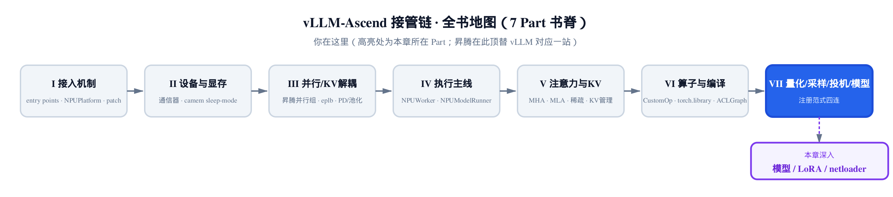
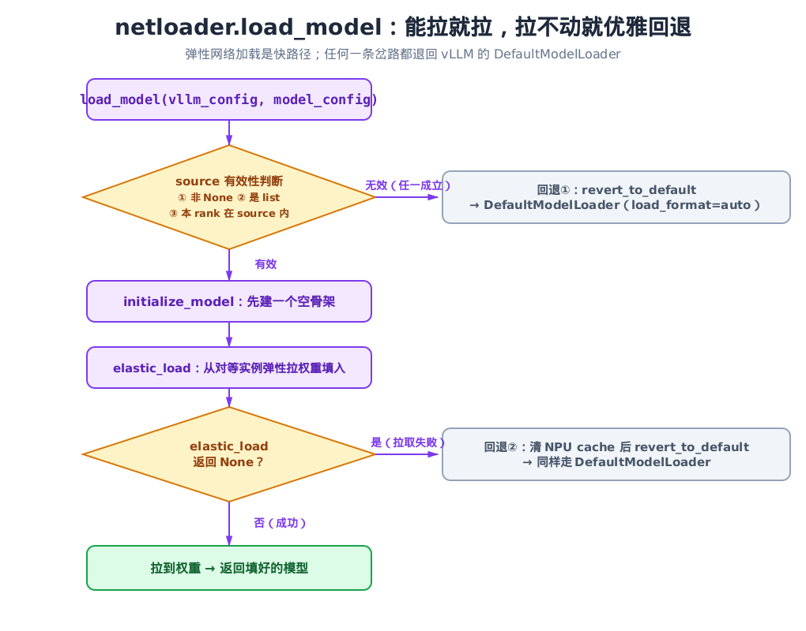
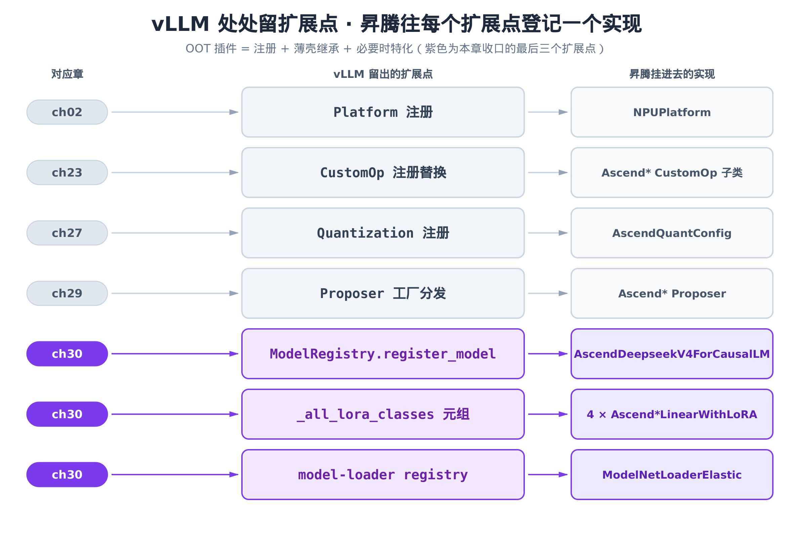

# 第 30 章 注册的收口：模型、LoRA 与 netloader 的昇腾接入



> 上一章用工厂分发收束了投机解码的提议侧。
> 本章是全书最后一个代码章：模型、LoRA、网络加载三处注册一起收口。
> 把贯穿全书的「往 vLLM 扩展点登记昇腾实现」这条主线钉死。

走到这一章，你已经看过昇腾接管 vLLM 的十几种姿势。但如果把它们抽干水分，留下的骨架其实只有一句话：**vLLM 在每个该让外人插手的地方都留了一个扩展点，昇腾的工作就是往每个扩展点登记一个昇腾实现**。

第 [2 章](../ch02-entry-points-and-npuplatform/narrative/chapter.md)登记的是平台（`NPUPlatform`）；第 [23 章](../ch23-customop-oot-replacement/narrative/chapter.md)登记的是算子（`CustomOp` 子类）；第 [27 章](../ch27-ascend-quantization-framework/narrative/chapter.md)登记的是量化方法；第 [29 章](../ch29-speculative-decode-npu/narrative/chapter.md)登记的是投机 proposer。每一处的范式都一样：vLLM 留一个口，昇腾递一个名字进去。

这一章把**最后三个扩展点**一并收口——它们恰好覆盖了「注册」这件事的三种典型形态：

- **模型注册**：一行 `ModelRegistry.register_model(arch, cls)`，规规矩矩走 vLLM 给的注册表（`vllm/model_executor/models/registry.py`）。
- **LoRA 类替换**：vLLM 没留显式 API，昇腾直接改写它的模块级全局元组——一个「全局类替换」的小 trick。
- **loader 注册**：一个 `@register_model_loader("netloader")` 装饰器，把自定义加载器挂进 vLLM 的 loader 注册表。

三种形态，从「最规矩」到「最野」，正好把昇腾接入 vLLM 的手法谱系补全。看完这三处，你对「OOT 插件到底在干什么」会有一个完整的答案。OOT（out-of-tree，树外插件）指不改 vLLM 源码、纯靠外部包注册进去的扩展方式——这正是 vllm-ascend 的全部立身之本。

## 30.1 模型注册：一行 register_model，把整个 DeepSeek-V4 递进去

先看最规矩的一种。昇腾要让 vLLM 认识一个 NPU 特化的模型，全部代码就在 `vllm_ascend/models/__init__.py`，整个文件只有七行：

```python
# vllm_ascend/models/__init__.py:L1-L7
from vllm import ModelRegistry


def register_model():
    ModelRegistry.register_model("DeepseekV4ForCausalLM", "vllm_ascend.models.deepseek_v4:AscendDeepseekV4ForCausalLM")

    ModelRegistry.register_model("DeepSeekV4MTPModel", "vllm_ascend.models.deepseek_v4_mtp:DeepSeekV4MTP")
```

两次调用，做的是同一件事：把一个**架构名**映射到一个**实现**。`"DeepseekV4ForCausalLM"` 是 HuggingFace config 里 `architectures` 字段会出现的字符串；vLLM 加载模型时拿这个字符串去注册表查实现。第二个参数 `"vllm_ascend.models.deepseek_v4:AscendDeepseekV4ForCausalLM"` 是一个 `<module>:<class>` 格式的字符串——不是类本身，是一个「到时候再 import」的懒加载地址。

第二次注册的 `"DeepSeekV4MTPModel"` 是同一个 DeepSeek-V4 的 MTP 草稿头。MTP（Multi-Token Prediction，多 token 预测）是 DeepSeek 自带的投机解码草稿模块——它在主模型末尾挂几层 `num_nextn_predict_layers`，一次前向多预测几个 token，正是第 [29 章](../ch29-speculative-decode-npu/narrative/chapter.md)投机解码消费的那种 proposer 草稿。主模型和它的 MTP 草稿头各注册一次，vLLM 才能在投机解码时分别把两者加载起来。

这个 `register_model()` 由插件加载流程在启动时统一触发，入口在 `vllm_ascend/__init__.py`：

```python
# vllm_ascend/__init__.py:L72-L76
def register_model():
    from .models import register_model

    register_model()
```

### 为什么传字符串，不传类

第二个参数明明可以直接传 `AscendDeepseekV4ForCausalLM` 这个类对象，为什么偏要传一个字符串？答案在 vLLM 侧的注册表里。`ModelRegistry.register_model` 定义在 `vllm/model_executor/models/registry.py`：

```python
# vllm/model_executor/models/registry.py:L939-L975
    def register_model(
        self,
        model_arch: str,
        model_cls: type[nn.Module] | str,
    ) -> None:
        """
        Register an external model to be used in vLLM.

        `model_cls` can be either:

        - A [`torch.nn.Module`][] class directly referencing the model.
        - A string in the format `<module>:<class>` which can be used to
          lazily import the model. This is useful to avoid initializing CUDA
          when importing the model ...
        """
        # … 省略：model_arch 类型校验 …

        if model_arch in self.models:
            logger.warning(
                "Model architecture %s is already registered, and will be "
                "overwritten by the new model class %s.",
                model_arch,
                model_cls,
            )

        if isinstance(model_cls, str):
            split_str = model_cls.split(":")
            if len(split_str) != 2:
                msg = "Expected a string in the format `<module>:<class>`"
                raise ValueError(msg)

            model = _LazyRegisteredModel(*split_str)
        elif isinstance(model_cls, type) and issubclass(model_cls, nn.Module):
            model = _RegisteredModel.from_model_cls(model_cls)
        # … 省略：落表 self.models[model_arch] = model …
```

docstring 把动机说得很白：传字符串可以**懒加载**模型，避免在 import 时就初始化 CUDA。这件事在多进程推理里是致命的——vLLM 经常 `fork` 出子进程，而 CUDA/NPU 一旦在父进程初始化过，子进程里再用就会撞上 `Cannot re-initialize CUDA in forked subprocess`。所以注册时只存一个 `_LazyRegisteredModel(module, class)`，里面就是两个字符串，真正的 `import vllm_ascend.models.deepseek_v4` 推迟到注册表第一次解析这个架构时才发生。

还有一个细节值得圈出来：`if model_arch in self.models` 这一支——**已注册的同名架构会被覆盖**，只打一条 warning。这不是 bug，正是昇腾顶替模型的机制。如果 vLLM 内置已经有某个架构，昇腾再注册一次同名的，就能用 NPU 版盖掉原版。这条「重名即覆盖」的规则，和第 [23 章](../ch23-customop-oot-replacement/narrative/chapter.md) CustomOp 的「同名替换」一脉相承。

### 被注册进去的是什么：一个特化的整模型

那么 `AscendDeepseekV4ForCausalLM` 本身是什么？它定义在 `vllm_ascend/models/deepseek_v4.py`，是**昇腾全仓唯一一个被整体特化的模型**——别的模型都靠下层扩展点（平台、CustomOp、量化）就能在 NPU 上跑，唯独 DeepSeek-V4 用了 NPU 专属的稀疏注意力等组件，不得不整模型改写。整个文件一千五百多行，但本章不逐行讲前向——只看它的「身份证」一段，就能读出它改了哪几类东西：

```python
# vllm_ascend/models/deepseek_v4.py:L1212-L1216
class AscendDeepseekV4ForCausalLM(nn.Module, SupportsPP, DeepseekV2MixtureOfExperts, SupportsLoRA, SupportsEagle):
    packed_modules_mapping = {
        "gate_up_proj": ["gate_proj", "up_proj"],
    }
    model_cls = DeepseekV4Model
```

类签名里的多继承（`SupportsPP` / `SupportsLoRA` / `SupportsEagle` …）声明了它支持的能力——流水并行、LoRA、Eagle 投机。真正暴露改动面的是文件头部的 imports：

```python
# vllm_ascend/models/deepseek_v4.py:L74-L76
from vllm_ascend.ops.dsa import AscendDeepseekSparseAttention, DSAModules
from vllm_ascend.ops.rope_dsv4 import ComplexExpRotaryEmbedding
from vllm_ascend.ops.triton.mul_add import muls_add_triton
```

```python
# vllm_ascend/models/deepseek_v4.py:L113-L182（三处非相邻的 *Cache 子类定义，略去类体）
class AscendCompressorStateCache(CompressorStateCache):
    # … 省略：状态压缩 cache 的 NPU 实现 …

class AscendDeepseekV4IndexerCache(DeepseekV4IndexerCache):
    # … 省略 …

class AscendDeepseekV4SWACache(VllmDeepseekV4SWACache):
    # … 省略 …
```

把这几行连起来看，「同一个 DeepSeek-V4 在 NPU 上改了哪几类东西」就一目了然了：

| 改动类别 | NPU 版组件 | 对位 vLLM |
|---|---|---|
| 注意力 | `AscendDeepseekSparseAttention` | DeepSeek 稀疏注意力（见第 [21 章](../ch21-sparse-attention-sfa-dsa/narrative/chapter.md)） |
| 位置编码 | `ComplexExpRotaryEmbedding` | 标准 RoPE |
| KV/状态 cache | `Ascend*Cache` 三件套 | vLLM 同名基类 |
| 逐元素算子 | `muls_add_triton` 等 Triton kernel | PyTorch 原生算子 |

骨架（`DeepseekV4MoE` / `Attention` / `Model` / `ForCausalLM`）与 vLLM 的 `vllm/model_executor/models/deepseek_v2.py` 完全同构——昇腾只是把每一层里的 layer 和 op 换成 NPU 版，外壳一字未动。这正解释了为什么模型注册可以这么轻：注册表只认架构名和懒加载地址，至于 NPU 改了多少层，是 `deepseek_v4.py` 自己的事，注册这一步只递一个名字。

## 30.2 LoRA 第一招：改写 vLLM 的全局元组，把昇腾类塞进候选池

模型注册有现成 API。LoRA 这一处没有——vLLM 没给「注册一个自定义 LoRA 层」的公开口子。昇腾的解法是直接伸手改 vLLM 的模块级全局变量。这就是本章的第二种注册形态，一个干净利落的「全局类替换」trick。

要理解这个 trick，先得看 vLLM 怎么给一个普通线性层套上 LoRA。逻辑在 `vllm/lora/utils.py`：

```python
# vllm/lora/utils.py:L78-L124
_all_lora_classes: tuple[type[BaseLayerWithLoRA], ...] = (
    VocabParallelEmbeddingWithLoRA,
    ColumnParallelLinearWithLoRA,
    # … 省略：12 个 vLLM 内置 LoRA 层类 …
    FusedMoEWithLoRA,
    FusedMoE3DWithLoRA,
)


def from_layer(
    layer: nn.Module,
    max_loras: int,
    lora_config: LoRAConfig,
    packed_modules_list: list,
    model_config: PretrainedConfig | None = None,
) -> nn.Module:
    for lora_cls in _all_lora_classes:
        if lora_cls.can_replace_layer(
            source_layer=layer,
            lora_config=lora_config,
            packed_modules_list=packed_modules_list,
            model_config=model_config,
        ):
            instance_layer = lora_cls(layer)
            instance_layer.create_lora_weights(max_loras, lora_config, model_config)
            return instance_layer
    return layer
```

机制很直白：`_all_lora_classes` 是一个候选 LoRA 层的元组；`from_layer` 拿到一个普通层后，**顺序遍历**这个元组，逐个问 `can_replace_layer(源层)`——第一个回答「我能替」的类胜出，用它把原层包成 LoRA 层。

问题来了：昇腾把 QKV 线性层换成了自己的 `AscendQKVParallelLinear`（第 [23 章](../ch23-customop-oot-replacement/narrative/chapter.md)那条线性层主线的产物）。可 vLLM 内置的 `QKVParallelLinearWithLoRA` 只认 `QKVParallelLinear`，认不出昇腾这个变种。于是 `from_layer` 遍历一圈，没有一个类愿意替它——LoRA 直接失效。

### 解法一半：四个薄壳，只改匹配判据

昇腾的对策第一步，是写四个薄壳子类，每个只重写一个方法。看代表性的一个，在 `vllm_ascend/lora/utils.py`：

```python
# vllm_ascend/lora/utils.py:L18-L28
class AscendQKVParallelLinearWithLoRA(QKVParallelLinearWithLoRA):
    @classmethod
    @_not_fully_sharded_can_replace
    def can_replace_layer(
        cls,
        source_layer: nn.Module,
        lora_config: LoRAConfig,
        packed_modules_list: list,
        model_config: PretrainedConfig | None,
    ) -> bool:
        return type(source_layer) is AscendQKVParallelLinear and len(packed_modules_list) == 1
```

它继承 vLLM 的 `QKVParallelLinearWithLoRA`，LoRA 的全部计算逻辑原样复用，**只重写 `can_replace_layer`**——把匹配目标从 vLLM 的 `QKVParallelLinear` 改成昇腾的 `AscendQKVParallelLinear`。注意这里用的是 `type(source_layer) is AscendQKVParallelLinear`，严格类型相等，不是 `isinstance`。这是关键的安全设计：严格相等保证这个昇腾类**只在源层确确实实是昇腾版时才命中**，绝不会误伤别的层。

另外三个类结构同构，只是基类不同、`can_replace_layer` 里判 `packed_modules_list` 长度（1 或 3）和分片装饰器不同。这四个类不是随便凑的——它们恰好铺满「QKV 是否合并」×「LoRA 是否全分片」两个维度的四格：

| 昇腾类 | 合并（`len == 3`）？ | 全分片装饰器 |
|---|---|---|
| `AscendQKVParallelLinearWithLoRA` | 否（`len == 1`） | `_not_fully_sharded` |
| `AscendMergedQKVParallelLinearWithLoRA` | 是（`len == 3`） | `_not_fully_sharded` |
| `AscendMergedQKVParallelLinearWithShardedLoRA` | 是（`len == 3`） | `_fully_sharded` |
| `AscendQKVParallelLinearWithShardedLoRA` | 否（`len == 1`） | `_fully_sharded` |

四个类各占一格，`can_replace_layer` 都用 `type(source_layer) is AscendQKVParallelLinear` 锁死昇腾类型，再靠长度和装饰器把四种组合精确分派——无论模型把 QKV 合成一个大矩阵还是拆三段、无论 LoRA 权重要不要跨卡全分片，总有且只有一个昇腾类认领。

### 解法另一半：把四个类追加进全局元组

光有薄壳还不够——它们得进 `_all_lora_classes` 这个元组，`from_layer` 才会遍历到。可这个元组是 vLLM 模块里的全局变量，没有任何「往里加一项」的 API。昇腾的做法是直接改写它：

```python
# vllm_ascend/lora/utils.py:L70-L82
def refresh_all_lora_classes():
    ascend_classes = (
        AscendQKVParallelLinearWithLoRA,
        AscendMergedQKVParallelLinearWithLoRA,
        AscendMergedQKVParallelLinearWithShardedLoRA,
        AscendQKVParallelLinearWithShardedLoRA,
    )
    # vLLM #35077 changed _all_lora_classes from set to ordered tuple.
    # Append the Ascend classes in a deterministic order.
    vllm.lora.utils._all_lora_classes = (
        *vllm.lora.utils._all_lora_classes,
        *ascend_classes,
    )
```

这就是「全局类替换」trick 的本体：一行赋值，把 vLLM 模块级的 `_all_lora_classes` 整个换成「原元组 + 四个昇腾类」。注意它追加到**尾部**——这正好和 `from_layer` 的顺序遍历配合得天衣无缝：vLLM 内置类排在前面先被问，问到的全是 `QKVParallelLinear` 这类标准层；轮到昇腾层时，前面没人认领，昇腾类用严格类型相等一举命中。前面的匹配秩序一点没被破坏，昇腾类只是悄悄在末尾补了几条新规则。

代码里那条注释点出一个真实的工程坑：vLLM 的 PR #35077 把 `_all_lora_classes` 从 `set` 改成了**有序 tuple**。一旦匹配顺序变得有意义，追加就必须用确定的顺序（元组 splat），否则不同进程间遍历顺序漂移，行为就不可复现。

### 两拍数值追踪：trick 到底改变了什么

把这个 trick 摊开成「替换前 / 替换后」两个状态，最能看清它干了什么。设 vLLM 原元组有 16 个内置类，源层是一个 `AscendQKVParallelLinear`（非合并，`len(packed_modules_list) == 1`）：

| 时刻 | `_all_lora_classes` 长度 | `from_layer` 遍历前 16 项 | 遍历第 17 项（`AscendQKVParallelLinearWithLoRA`） | 结果 |
|---|---|---|---|---|
| `refresh` 之前 | 16 | 逐个 `can_replace_layer` 全 `False`（无人认 `AscendQKVParallelLinear`） | —（元组里没有这一项） | 返回原层，**LoRA 失效** |
| `refresh` 之后 | 20 | 同上，前 16 项仍全 `False` | `type is AscendQKVParallelLinear and len==1` → **`True`** | 包成 `AscendQKVParallelLinearWithLoRA`，LoRA 生效 |

一行赋值的全部效果，就是把元组从 16 项变成 20 项，让 `from_layer` 的遍历多走 4 步、在第 17 步命中。原有 16 项的匹配结果**逐字不变**——这就是为什么昇腾敢用「改全局变量」这种看着野的手法：严格类型相等 + 追加到尾部，两个约束合起来保证了零侵入。

那么 `refresh_all_lora_classes()` 在什么时候被调？这把我们带到 LoRA 的第二招。

## 30.3 LoRA 第二招：按 device/rank 二选一，绑定 bgmv/sgmv 算子

这一节代码块偏密，先给一条路标，读的时候带着它走：**platform 返回 wrapper 名 → wrapper 的 `__init__` 一手绑算子、一手刷全局类 → 岔进一段「大 rank 为何退回通用实现」的算账 → 回到 `add_lora_linear` 看 shrink/expand 怎么落地 → bgmv 与 sgmv 按 decode/prefill 分工 → 最底层 `lora_ops` 只是转调 NPU kernel 的薄壳**。六步连起来，就是「一个 LoRA 算子从被选中到真正在 NPU 上算」的完整链路。

LoRA 在 NPU 上要跑得快，光有层匹配还不够，还得有真正算 LoRA GEMM 的 kernel。这部分的调度全压在一个 wrapper 类的构造函数里。

wrapper 怎么被选中，又是一条注册主线。vLLM 通过平台层问「这台机器用哪个 LoRA wrapper」，昇腾在 `vllm_ascend/platform.py` 答：

```python
# vllm_ascend/platform.py:L795-L796
    def get_punica_wrapper(cls) -> str:
        return "vllm_ascend.lora.punica_npu.PunicaWrapperNPU"
```

又是返回一个限定名字符串（CUDA 平台这里返回的是 `PunicaWrapperGPU`），由 vLLM 的选择器实例化。punica 这个名字来自 LoRA 的 batched-GEMM 论文，你只需把它理解成「管 LoRA 算子元数据、分发 LoRA GEMM 的那个对象」。

被选中的 `PunicaWrapperNPU` 定义在 `vllm_ascend/lora/punica_npu.py`，它继承 vLLM 的 `PunicaWrapperBase`——又是薄壳继承的范式。LoRA 接入的两招都挤在它的 `__init__` 里：

```python
# vllm_ascend/lora/punica_npu.py:L21-L50
    def __init__(self, max_num_batched_tokens: int, max_batches: int, device: torch.device | str, **kwargs):
        PunicaWrapperBase.__init__(self, max_num_batched_tokens, max_batches, device)
        refresh_all_lora_classes()
        self.lora_config = kwargs.get("lora_config")
        if get_ascend_device_type() == AscendDeviceType._310P or (
            self.lora_config is not None and self.lora_config.max_lora_rank >= 128
        ):
            from vllm.lora.ops.torch_ops import (
                bgmv_expand,
                bgmv_expand_slice,
                bgmv_shrink,
                sgmv_expand,
                sgmv_expand_slice,
                sgmv_shrink,
            )
        else:
            from vllm_ascend.lora.lora_ops import (
                bgmv_expand,
                bgmv_expand_slice,
                bgmv_shrink,
                sgmv_expand,
                sgmv_expand_slice,
                sgmv_shrink,
            )
        self.bgmv_expand = bgmv_expand
        self.bgmv_expand_slice = bgmv_expand_slice
        self.bgmv_shrink = bgmv_shrink
        self.sgmv_expand = sgmv_expand
        self.sgmv_expand_slice = sgmv_expand_slice
        self.sgmv_shrink = sgmv_shrink
```

第一招上一节讲过：构造函数第三行 `refresh_all_lora_classes()` 完成全局类替换。wrapper 被实例化的那一刻，四个昇腾 LoRA 层就进了候选池——时机刚好在模型加载、`from_layer` 被调之前。

第二招是这段 if/else：**按设备和 rank 二选一，绑定六个 LoRA 算子**。

- 当芯片是 310P（推理卡，见第 [17 章](../ch17-310p-inference-chip-specialization/narrative/chapter.md)），**或** `max_lora_rank >= 128` 时，退回 vLLM 的 `torch_ops`——纯 PyTorch 实现，慢一点但通用，对老芯片和大 rank 都稳。
- 否则（主流训练卡 + 常规 rank），绑昇腾自己的 `lora_ops`——薄壳转调 NPU C++ kernel，快。

六个算子绑成实例属性后，后续所有 LoRA 计算都通过 `self.bgmv_shrink` 这类属性间接调用，调用方完全不知道底下是 PyTorch 还是 NPU kernel。这是「绑定一次、处处复用」的经典分发。

### 为什么大 rank 要退回通用实现：算一笔账

`max_lora_rank >= 128` 退回 `torch_ops`，背后是 LoRA 的低秩账。LoRA 把权重增量分解成两个低秩矩阵 $\Delta W = BA$，前向时不直接算满秩乘法，而是分两步走。记 token 数为 T、输入维为 d、输出维为 o、LoRA rank 为 r、缩放为 s：

$$
\mathrm{shrink}: \; u = x A, \qquad \mathrm{expand}: \; y \mathrel{+}= (u B) \cdot s
$$

shrink 先把输入从 d 维降到 r 维的 buffer，expand 再把它升回 o 维。两步的 FLOPs 约为 $2 T r (d + o)$。对比满秩增量直算的 $2 T d o$，省下的倍数是：

$$
\frac{2 T d o}{2 T r (d + o)} = \frac{d o}{r (d + o)}
$$

代入数值看一眼。取 d = o = 4096，先算常规的 r = 16：

$$
\frac{4096 \times 4096}{16 \times (4096 + 4096)} = \frac{4096}{32} = 128
$$

省约 128 倍——这就是 LoRA「低秩」二字的算力含义。

但这个收益随 r 增大而缩水。把 r 提到阈值 128，同一公式原样代进去：

$$
\frac{4096 \times 4096}{128 \times (4096 + 4096)} = \frac{4096}{256} = 16
$$

两个数据点并排一看就清楚了：r = 16 省 128 倍，r = 128 只省 16 倍——r 涨 8 倍，省下的算力也跟着缩到八分之一。低秩的红利在大 rank 上所剩无几，自定义 NPU kernel 为小 r 做的特化（比如把 r 维塞进片上缓存）也跟着失去意义。这时退回 PyTorch 原生实现，既不丢多少性能，又换来正确性和兼容性的保障。`max_lora_rank >= 128` 这个阈值，就是「自定义 kernel 还值不值」的分界线。

### shrink→expand 怎么走到 NPU kernel

绑好的六个算子在哪被调？看 wrapper 实现的核心方法 `add_lora_linear`，它是 `PunicaWrapperBase` 要求子类实现的抽象方法之一：

```python
# vllm_ascend/lora/punica_npu.py:L277-L322（略去 docstring 与断言细节）
    def add_lora_linear(
        self,
        y: torch.Tensor,
        x: torch.Tensor,
        lora_a_stacked: tuple[torch.Tensor, ...],
        lora_b_stacked: tuple[torch.Tensor, ...],
        scale: float,
        output_slices: tuple[int, ...],
        *,
        buffer: tuple[torch.Tensor, ...] | None = None,
        **kwargs,
    ) -> None:
        # … 省略：长度一致性断言 …
        if buffer is None:
            r = lora_b_stacked[0].size(-1)
            buffer = tuple(
                torch.zeros((x.size(0), r), dtype=torch.float32, device=x.device) for _ in range(len(output_slices))
            )
        self.add_shrink(buffer, x, lora_a_stacked, scale, **kwargs)
        self.add_expand(y, buffer, lora_b_stacked, output_slices, add_inputs=True, **kwargs)
```

一目了然就是上面那条公式的代码化：先开一个 `r` 维的 `buffer`，`add_shrink` 把 $x A$ 算进 buffer，`add_expand` 把 $\mathrm{buffer} \cdot B$ 加进 `y`。`add_shrink` / `add_expand` 内部再按当前是 prefill 还是 decode，二选一调 `sgmv_*` 或 `bgmv_*`——这正是 `__init__` 绑定的那六个算子。

这里 bgmv 和 sgmv 的分工，对应推理的两个阶段：

- **bgmv**（batched gather matvec）：decode 阶段，每个请求每拍只生一个 token，多个请求各带不同 LoRA，按 token 选各自的 LoRA 权重做矩阵-向量乘。
- **sgmv**（segmented gather matvec）：prefill 阶段，prompt 变长，按 segment 边界分段做矩阵乘。

走到最底层，昇腾的算子不过是一层薄壳。看 `vllm_ascend/lora/lora_ops.py` 里的两个代表：

```python
# vllm_ascend/lora/lora_ops.py:L19-L49
def bgmv_shrink(
    inputs: torch.Tensor,
    lora_a_weights: torch.Tensor,
    output_tensor: torch.Tensor,
    lora_indices_tensor: torch.Tensor,
    scaling: float = 1.0,
):
    return torch.ops._C_ascend.bgmv_shrink(
        inputs,
        lora_a_weights,
        lora_indices_tensor,
        output_tensor,
        scaling,
    )


def bgmv_expand(
    inputs: torch.Tensor,
    lora_b_weights: torch.Tensor,
    output_tensor: torch.Tensor,
    lora_indices_tensor: torch.Tensor,
    add_inputs: bool = True,
):
    return torch.ops._C_ascend.bgmv_expand(
        inputs,
        lora_b_weights,
        lora_indices_tensor,
        output_tensor,
        0,
        output_tensor.size(1),
    )
```

每个 Python 函数只做一件事：调整参数顺序，转调 `torch.ops._C_ascend.*` 注册的 NPU C++ kernel（`torch.ops` 的注册机制见第 [24 章](../ch24-torch-library-and-meta/narrative/chapter.md)）。真正的 bgmv/sgmv 计算在 CANN 上跑，host 上看不到数值，但控制流和签名一清二楚。

有一处签名细节值得圈出来：`bgmv_expand` 的形参里有 `add_inputs`，函数体里却**没用它**，反而固定传了 `0` 和 `output_tensor.size(1)`。这不是笔误——Python 薄壳的形参是为了对齐上层 wrapper 的调用约定，而转调时填的是 C++ kernel 真正要的 `(slice_offset=0, slice_size=整个输出宽度)`。薄壳的职责就是在两套签名之间做翻译，多出来的形参被默默吃掉很正常。其余四个算子（`bgmv_expand_slice` / 三个 `sgmv_*`）同构，无非参数顺序和切片偏移不同。

## 30.4 第三处注册：netloader 把自定义加载器挂进 loader 注册表

第三个扩展点，是模型权重的加载方式。vLLM 这次给的是一个装饰器形态的注册口，定义在 `vllm/model_executor/model_loader/__init__.py`：

```python
# vllm/model_executor/model_loader/__init__.py:L67-L125
def register_model_loader(load_format: str):
    """Register a customized vllm model loader. …"""

    def _wrapper(model_loader_cls):
        if load_format in _LOAD_FORMAT_TO_MODEL_LOADER:
            logger.warning(
                "Load format `%s` is already registered, …",
                load_format,
                model_loader_cls,
            )
        if not issubclass(model_loader_cls, BaseModelLoader):
            raise ValueError(
                "The model loader must be a subclass of `BaseModelLoader`."
            )
        _LOAD_FORMAT_TO_MODEL_LOADER[load_format] = model_loader_cls
        # … 省略：注册成功的 info 日志 …
        return model_loader_cls

    return _wrapper


def get_model_loader(load_config: LoadConfig) -> BaseModelLoader:
    """Get a model loader based on the load format."""
    load_format = load_config.load_format
    if load_format not in _LOAD_FORMAT_TO_MODEL_LOADER:
        raise ValueError(f"Load format `{load_format}` is not supported")
    return _LOAD_FORMAT_TO_MODEL_LOADER[load_format](load_config)
```

范式和前两处又是同一个模子：`_LOAD_FORMAT_TO_MODEL_LOADER` 是一个「load_format 字符串 → loader 类」的全局 dict，内置 `auto` / `hf` / `gguf` 等键；`register_model_loader` 把新键写进去，附带一个 `issubclass(BaseModelLoader)` 的校验，确保挂进来的确实是个合规 loader。运行时 `get_model_loader` 按 `--load-format` 取类、实例化。注册一个自定义加载器，就是往这个 dict 里加一个键。

昇腾的加载器在 `vllm_ascend/model_loader/netloader/netloader.py`，用装饰器挂进去：

```python
# vllm_ascend/model_loader/netloader/netloader.py:L39-L52（略去配置字段的类型声明）
@register_model_loader("netloader")
class ModelNetLoaderElastic(BaseModelLoader):
    """
    A model loader that uses elastic loading for loading weights.
    """
    # … 省略：source / model_path / listen_port 等配置字段声明 …

    def __init__(self, load_config: LoadConfig):
        # … 省略：从 CONFIG_FILE / extra_config 解析 source/port 等配置 …
        super().__init__(load_config)
```

一行 `@register_model_loader("netloader")`，`ModelNetLoaderElastic` 就成了 `--load-format=netloader` 时被取出的 loader，与 vLLM 内置的 `DefaultModelLoader` 平级。它的兄弟 `rfork`（fork 冷启动加载器）用的是同一个装饰器、同一套范式，两者都由 `vllm_ascend/__init__.py` 的 `register_model_loader()` 统一触发注册：

```python
# vllm_ascend/__init__.py:L54-L61
def register_model_loader():
    _ensure_global_patch()

    from .model_loader.netloader import register_netloader
    from .model_loader.rfork import register_rforkloader

    register_netloader()
    register_rforkloader()
```

### netloader 干什么：弹性拉权重，失败优雅回退

netloader 解决的是冷启动慢的问题。这里的**冷启动**，指推理进程刚起、显存里还没有任何权重，要把几十上百 GB 的权重从磁盘或 HuggingFace 现读进 NPU 显存的那段慢启动期。传统加载串行读 N 个权重分片，IO 是瓶颈；netloader 则从**已经加载好的对等实例**经网络并行拉权重，把磁盘 IO 换成网络带宽，多副本部署时显著降冷启动延迟。

这也解释了类名 `ModelNetLoaderElastic` 里的 **elastic（弹性）**从何而来：一来它从多个对等副本 P2P 拉取权重、来源可伸缩；二来——正如下面 `load_model` 会看到的——从 source 配置到网络传输，任何一环出问题都能优雅回退到默认加载。快路径可有可无、失败即回退，这份「拉不到就退、绝不锁死」的伸缩性，正是 elastic 的本意。

核心逻辑在 `load_model`。把样板和边角分支剥掉，主干是一个清晰的「能拉就拉、拉不动就退」：

```python
# vllm_ascend/model_loader/netloader/netloader.py:L163-L219（剥去备份/draft 端口/释放细节）
        if (
            self.source is None
            or not isinstance(self.source, list)
            or device_id
            not in [
                one_device["device_id"]
                for one_device in self.source
                if isinstance(one_device, dict) and "device_id" in one_device
            ]
        ):
            logger.warning("Did not get valid source info, use DefaultModelLoader")
            model, need_process_weights_after_loading = self.revert_to_default(
                model_config, vllm_config, device_config, prefix
            )

        else:
            target_device = torch.device(device_config.device)
            with set_default_torch_dtype(model_config.dtype):
                with target_device:
                    model = initialize_model(vllm_config=vllm_config, model_config=model_config, prefix=prefix)
                # … 省略：is_draft 时把 source 端口 +DRAFT_PORT_OFFSET 重写 …
                model = elastic_load(
                    model=model,
                    device_id=device_id,
                    model_path=model_config.model,
                    sources=sources,
                    tp=parallel_config.tensor_parallel_size,
                    pp=parallel_config.pipeline_parallel_size,
                    group_name="netloader_draft" if is_draft else "netloader",
                )
                need_process_weights_after_loading = True
                # … 省略：elastic_load 返回 None（拉取失败）时清 NPU cache 再 revert_to_default …
```

开头那段嵌套 `if` 有点绕，读之前先认清里面的两个变量。`device_id = torch.distributed.get_rank()`（在前面几行取得）是当前进程在分布式里的编号；`self.source` 是 `__init__` 从配置解析出的一个 `list[dict] | None`，每个 dict 形如 `{"device_id": ..., "sources": [...]}`，登记着「哪个 rank 该从哪些对等地址拉权重」。那段嵌套判断问的其实是一件事：**当前这个 rank，在不在 source 的名单里**——它先用内层列表推导，把 `self.source` 里所有带合法 `device_id` 键的 dict 的 `device_id` 收集成一个列表，再看自己的 `device_id` 在不在其中。

于是主干就是清清楚楚两条路：

1. **source 无效** → 直接 `revert_to_default`，走 vLLM 默认加载。三重判断任一成立即算无效：`source is None`（根本没配）、`not isinstance(self.source, list)`（配了但格式不对）、或本 rank 的 `device_id` 不在 source 名单里（配了但没轮到我拉）。
2. **source 有效** → `initialize_model` 先建一个空骨架，`elastic_load` 从网络对等实例弹性拉权重填进去。万一 `elastic_load` 返回 `None`（拉取失败），照样回退默认加载。



> *图注：`load_model` 的控制流，两道关串成一条快路径。*
> *source 三重判断任一不满足 → 走回退①；source 有效才建空壳、`elastic_load` 弹性拉权重。*
> *拉取返回 `None` → 走回退②；只有两道关全过，才用网络拉到的权重返回。两条回退都收敛到 vLLM 的 `DefaultModelLoader`。*

`elastic_load` 真正的网络传输要 NPU + 网络才跑得起来，这里只读到这层控制流：建空壳 → 网络填权重 → 失败兜底。`revert_to_default` 把兜底做得很干净：

```python
# vllm_ascend/model_loader/netloader/netloader.py:L324-L363（略去 docstring）
    def revert_to_default(self, model_config, vllm_config, device_config, prefix: str = "") -> tuple[nn.Module, bool]:
        load_config = deepcopy(self.load_config)
        load_config.model_loader_extra_config = {}
        load_config.load_format = "auto"
        default_model_loader = DefaultModelLoader(load_config)

        if model_config.quantization is None:
            model = default_model_loader.load_model(vllm_config=vllm_config, model_config=model_config, prefix=prefix)
            need_process_weights_after_loading = False
        else:
            logger.warning("Quantization is set, netloader use DefaultModelLoader with process_weights_after_loading ")
            need_process_weights_after_loading = True
            target_device = torch.device(device_config.device)
            with set_default_torch_dtype(model_config.dtype):
                with target_device:
                    model = initialize_model(vllm_config=vllm_config, model_config=model_config, prefix=prefix)
                default_model_loader.load_weights(model, model_config)
            model = model.eval()

        return model, need_process_weights_after_loading
```

它复制一份 `load_config`、把 `load_format` 强行改回 `"auto"`，然后**委托 vLLM 内置的 `DefaultModelLoader`** 走常规加载。这是 OOT 插件稳健性的范本：弹性网络加载是冷启动优化，是锦上添花的快路径，不是必经之路。一旦 source 没配好、本 rank 不该拉、或网络拉取失败，任何一条岔路都优雅退回 vLLM 默认实现——扩展点接管的是「更快的方式」，但绝不独占「能不能加载」这个底线职责。这种「我只负责优化，兜底交给上游」的克制，让昇腾的 loader 即使在最糟的网络环境里也不会让服务起不来。

## 30.5 全书收口：vLLM 处处留扣，昇腾处处递名

三处注册看完，把它们和前面几章并排放，全书最长的那条主线就完整浮现了。



> *图注：vLLM 在每个该让外人插手的地方留一个扩展点（中列），昇腾递一个实现挂进去（右列）。紫色三行是本章收口的最后三处。*

从第 2 章到这一章，昇腾接管 vLLM 的全部手法，都能归到这张图的某一行：

- **平台**（第 [2 章](../ch02-entry-points-and-npuplatform/narrative/chapter.md)）：注册 `NPUPlatform`，回答「这是什么硬件」。
- **算子**（第 [23 章](../ch23-customop-oot-replacement/narrative/chapter.md)）：注册 `CustomOp` 子类，按名替换前向实现。
- **量化**（第 [27 章](../ch27-ascend-quantization-framework/narrative/chapter.md)）：注册 `AscendQuantConfig`，接管权重量化。
- **投机 proposer**（第 [29 章](../ch29-speculative-decode-npu/narrative/chapter.md)）：工厂分发到 `Ascend*Proposer`。
- **模型 / LoRA / loader**（本章）：注册整模型、追加 LoRA 类、挂自定义加载器。

更妙的是，本章这三处恰好把「注册」这件事的三种形态摆齐了，对应着 OOT 插件能用的三种力度：

| 形态 | 本章实例 | vLLM 给的口子 | 力度 |
|---|---|---|---|
| 走官方注册表 | `ModelRegistry.register_model` | 公开 API（`vllm/model_executor/models/registry.py`），传懒加载字符串 | 最规矩 |
| 改全局变量 | `refresh_all_lora_classes` 改 `_all_lora_classes` | 没给 API，自己伸手改模块全局（`vllm/lora/utils.py`） | 最野，但用严格匹配 + 尾部追加锁死风险 |
| 装饰器注册 | `@register_model_loader("netloader")` | 公开装饰器 + 子类校验（`vllm/model_executor/model_loader/__init__.py`） | 居中 |

把这三种力度连起来看，OOT 插件的设计哲学就清楚了：**能走官方 API 就走官方 API；没有 API 就改全局变量，但必须把侵入面收到最小（严格类型相等、只追加不删改）；任何快路径都给慢路径留兜底**（netloader 失败退回 `DefaultModelLoader`）。

这也是整本书反复在不同子系统里证明的同一句话——昇腾从不另起炉灶重写一个推理引擎，它只是**站在 vLLM 的肩膀上，往每一个预留的扣子里递一个昇腾的名字**。多数时候是注册加薄壳继承，少数时候靠全局类替换的小 trick，极个别像 DeepSeek-V4 那样才整模型特化。一个成熟硬件后端最难的修养，不是能写多少 NPU kernel，而是知道**什么时候该忍住不写**——把绝大多数复杂度留给上游，只在硬件真正逼着你特化的地方动刀。

到这里，「把昇腾接进 vLLM」这条主线正式收口。你手里现在有一张完整的地图：从入口注册到平台、从算子替换到量化、从注意力特化到投机解码，最后到模型、LoRA 与加载器的三处收尾。每一站的形态各异，骨子里却是同一件事——**注册一个昇腾实现，让 vLLM 在对的地方调到它**。
