# 【原理篇·论文精读】量化数学：从 scale/zero-point 到 GPTQ、AWQ、SmoothQuant

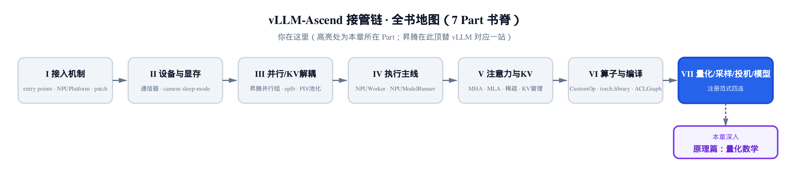

> 你在这里：第 VII 部分「量化 / 采样 / 投机 / 模型」的开篇，先打原理地基。
> 上一站：[第 30 章](../../ch30-fusedmoe-batch-invariant/narrative/chapter.md)拆完 FusedMoE，收官算子与编译篇。
> 这一章：补上量化框架将要消费的三篇论文的数学。
> 下一站：[第 32 章](../../ch32-ascend-quantization-framework/narrative/chapter.md)看这套数学怎么接进 vLLM 框架、加载执行。

昇腾的量化框架（下一章的主角）是 vLLM 基座量化栈的**昇腾特化顶替**——out-of-tree 后端把 GEMM（矩阵乘）换成昇腾 INT8 算子；但它加载的量化权重与 scale，全是**离线校准的产物**，出自三篇奠基论文：**GPTQ**（arXiv:2210.17323）、**AWQ**（arXiv:2306.00978）、**SmoothQuant**（arXiv:2211.10438）——W4A16（权重 4 bit、激活 16 bit）与 W8A8（权重 8 bit、激活 8 bit）两族落地记号，背后分别站着 GPTQ / AWQ 与 SmoothQuant 的数学。先点破贯穿全章的一条主线：**固定位宽下，量化步长被 absmax（绝对值最大值）钉死，刻度是一份增发不了的预算；三篇论文没有一篇造出新刻度——它们全部的数学，是把量化误差从付不起的地方挪到付得起的地方**。

三篇论文是同一笔挪账的三个方向。GPTQ 把取整误差挪给还没量化的邻居权重，方向由 Hessian（二阶导矩阵）逆的列给出；AWQ 把显著权重的误差挪给同组非显著权重——只要不顶破组内 absmax，这一挪是免费的；SmoothQuant 把激活的难度整体挪给权重，挪多少由一只迁移强度旋钮定，甜点在两侧齐平的几何均值。至于「为什么只能挪、不能就地消灭」，答案是一条硬件约束：INT8 GEMM 的收缩维一经求和便抹掉通道身份，激活侧数学最优的粒度做不到，outlier（离群值）甩不掉、只能找下家。论文算法本体全部离线跑、不在本仓；正文所有数值由一套论文忠实的参考实现（纯 NumPy）跑出，可亲手复验。产物怎么被框架加载执行，留给[第 32 章](../../ch32-ascend-quantization-framework/narrative/chapter.md)。

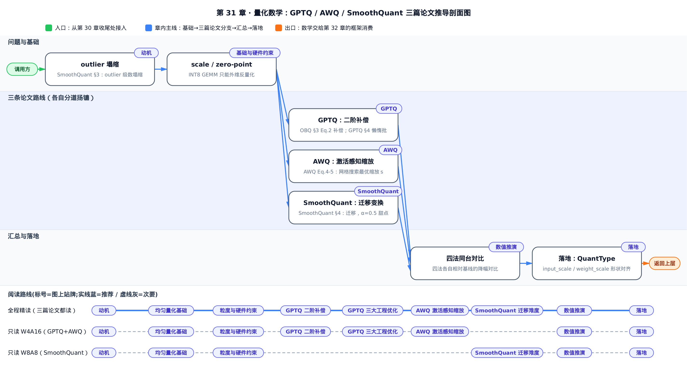

只想弄清一种量化方案怎么来：只关心 W4A16，顺着「四、GPTQ 二阶补偿」→「五、GPTQ 三大工程优化」→「六、AWQ 激活感知缩放」跳读；只关心 W8A8，直接跳到「七、SmoothQuant 迁移难度」一节。三篇论文都要吃透，就从「一、动机」按序通读到「九、落地」。

下面几个符号全章会反复用到、但都只在某一处正式登场，容易翻页翻丢——先摆一张速查表混个眼熟，具体怎么用留到对应小节再展开：

| 符号 | 含义 | 首次出现 |
|---|---|---|
| $`p`$ | 就是 $`q`$ ——GPTQ 论文原文在 Hessian 逆更新公式（Eq.3）里把外层下标从 $`q`$ 换写成了 $`p`$ ，并非本章笔误； $`(\cdot)_{-p}`$ 就是删去第 $`q`$ 行第 $`q`$ 列后的矩阵 | 四、GPTQ 二阶补偿 |
| $`Q`$ （大写） | 当前正在处理的一批列索引集合（大小 B=128），是单个索引 $`q`$ 的推广，二者不是同一个对象；Algorithm 1 伪代码里还有个同名但另指「量化输出矩阵」的 $`Q`$ ，是论文自身的记号复用 | 五、GPTQ 三大工程优化 |
| $`d_{\mathrm{row}}`$ 、 $`d_{\mathrm{col}}`$ | 权重矩阵的行数与列数，沿用 GPTQ 论文自身记法；与第三节 SmoothQuant 记法的行列角色相反—— $`d_{\mathrm{row}}`$ 对应输出通道、 $`d_{\mathrm{col}}`$ 对应输入通道 | 四、GPTQ 二阶补偿节末 |
| $`j`$ | 输入通道索引，取值 $`1,\ldots,C_i`$ （对应第三节建立的输入通道数 $`C_i`$ ） | 七、SmoothQuant 迁移难度 |

---

## 一、动机：省的是访存，险的是 outlier

一个 FP16（16 位浮点）权重占 2 字节，int8 占 1 字节：位宽减半，权重从显存搬进计算单元的字节数减半。大模型推理的瓶颈常在**访存带宽**而非算力，这才是量化省钱的真正来源；昇腾 INT8 GEMM（整数矩阵乘）吞吐接近 FP16 的两倍，是搭头。代价是把连续实数塞进 $`2^N`$ 个整数档位——档位怎么摆、数据怎么落进去，决定误差多大。

真正的坑不在档位少，在**刻度被谁用掉**。SmoothQuant §3（arXiv:2211.10438）给了精确的定量刻画：per-tensor（整矩阵共用一个 scale，即量化步长）量化下，通道 $`i`$ 的**有效量化级数** $`\ell_i`$ 是：

```math
\ell_i = 2^{N}\cdot \dfrac{m_i}{m}
```

$`m_i`$ 是通道 $`i`$ 自己的最大幅值、 $`m`$ 是整个矩阵的最大幅值、 $`N`$ 是位宽：量程被 $`m`$ 撑到头，通道 $`i`$ 实际用到的刻度只有满量程的 $`m_i/m`$ 那么多。而大模型的激活里，恰有极少数通道（往往固定就那几个）的幅值系统性地比别人大上百倍——这就是 **outlier**。一个 outlier 把 $`m`$ 撑大百倍，其余正常通道的有效级数就塌到个位数；SmoothQuant 论文原话：非 outlier 通道只剩「2-3 级」，256 个档位名存实亡。这不是玩具现象，论文用真实模型的真实层验证过：

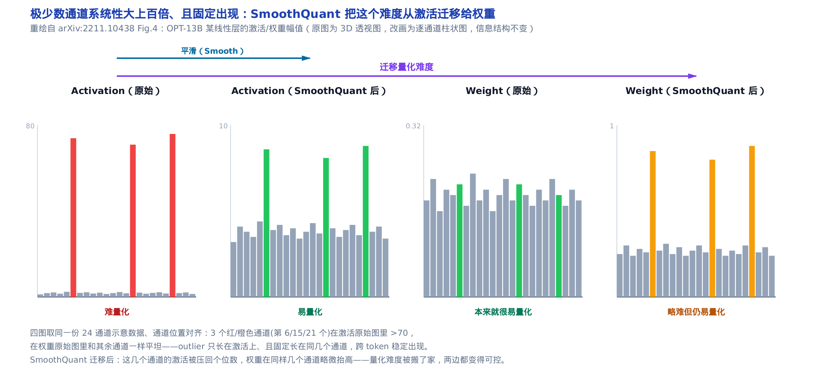

OPT-13B 某线性层里，红色通道的激活幅值持续 >70、跨 token 固定出现在同一批通道，权重（灰/绿）本身平坦；迁移后这些通道被压回个位数、权重略微抬高——难度是被**挪走**的，不是消失的。代进参考实现的小例子：3 通道激活幅值分别 0.15、0.2、10.0，通道 2 是约 50 倍的 outlier，整矩阵 $`m = 10.0`$ 。通道 0 的有效级数 $`256\times 0.15/10.0 = 3.84`$ 、通道 1 是 5.12，outlier 通道独占满量程 256 级；再往极端推一步——把通道 1 的幅值 0.2 放大 125 倍成新的矩阵 absmax $`m=25.0`$ ，通道 0 就只剩 $`256\times 0.15/25.0 = 1.536`$ 级，不足 2 档——**8 bit 在这些通道上退化成不到 1 bit。险的不是位宽，是刻度被偷**。

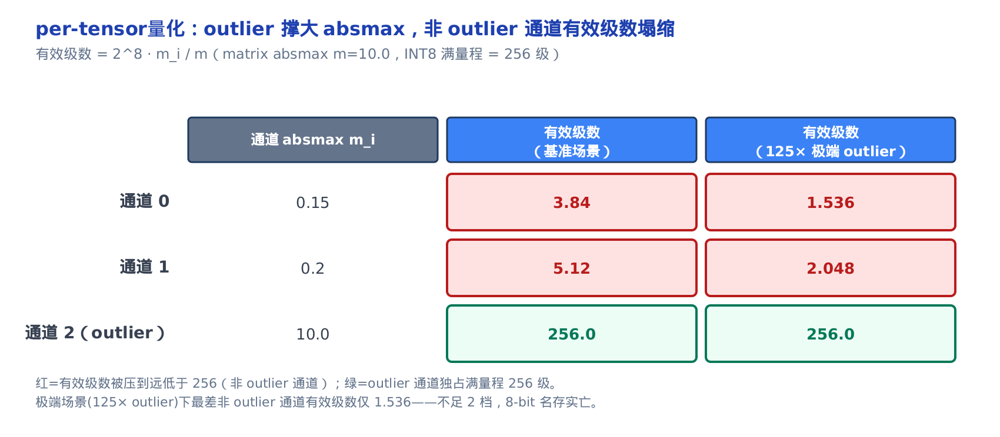

权重分布集中、相对温顺；激活的 outlier 甩不掉（第三节会证明为什么甩不掉）。于是主线里那笔挪账有了三个方向，也有了三个落地名字——`QuantType`（量化类型枚举）把它们一字排开：

```python
# vllm_ascend/quantization/quant_type.py:L26-L36
class QuantType(Enum):
    """Quantization type enum for MoE schemes."""

    NONE = 0
    W8A8 = 1
    W4A8 = 2
    MXFP8 = 3
    W4A16 = 4
    MXFP4 = 5
    W4A8MXFP = 6
```

`W8A8` 权重、激活都压 8 bit，要正面碰激活，是 SmoothQuant 的领地；`W4A16` 避开激活量化，是 GPTQ / AWQ 的领地；`W4A8` 是两者的混合。这张枚举表是本章唯一一段仓库代码——「论文方法 → 落地命名」的对照锚；框架侧的其余一切（参数注册、加载、前向）都属于[第 32 章](../../ch32-ascend-quantization-framework/narrative/chapter.md)。下面从最基础的均匀量化开始。

---

## 二、均匀量化基础：scale、zero-point、粒度

先把「预算的定价公式」写下来。SmoothQuant §2 Eq.1（arXiv:2211.10438）的对称均匀量化：

```math
\overline{\mathbf{X}}^{\mathrm{INT8}} = \left\lceil \dfrac{\mathbf{X}^{\mathrm{FP16}}}{\Delta} \right\rfloor, \quad \Delta = \dfrac{\max(|\mathbf{X}|)}{2^{N-1}-1}
```

$`\lceil\cdot\rfloor`$ 是四舍五入取整。量化 = 除以步长再取整，反量化 = 乘回步长；步长 $`\Delta`$ 由 absmax 定——把最大幅值映到最大码位 $`2^{N-1}-1`$ （N=8 时是 127）。取整误差至多半个码位，乘回 $`\Delta`$ 就是全章反复使用的误差界： $`|\hat w - w| \le \Delta/2`$ 。两条直接推论：位宽每降 1 bit， $`\Delta`$ 近似翻倍，误差上界跟着翻倍——「低位宽更糙」的定量说法；更要紧的是 $`\Delta`$ 正比于 absmax——这正是主线的汇率，**谁改小了付账处的 absmax，谁就买到更细的刻度**，后面三篇论文的每一笔挪账都按它结算。（约定差异一句说破：AWQ §3.2 Eq.1（arXiv:2306.00978）的量化函数几乎一样，只是分母用满量程 $`2^{N-1}`$ 而非 $`2^{N-1}-1`$ ，N=8 时二者之比 $`128/127\approx1.0079`$ ，只差一个码位，文献里两种约定都常见、**不是矛盾**；本章参考实现把两个函数分开写，不硬凑成一个。）

拿一个 4 元权重向量手算一遍。 $`w = [1.27, -0.633, 0.307, -0.951]`$ ，8 bit，SmoothQuant 约定。absmax = 1.27，步长 $`\Delta = 1.27/127 = 0.01`$ 。逐个量化再反量化：

<!-- trace: M2 -->

| 权重 $`w_i`$ | $`w_i/\Delta`$ （ $`\Delta=0.01`$ ） | 量化码 $`\mathrm{round}(w/\Delta)`$ | 反量化 $`\hat w_i = \mathrm{code}\cdot\Delta`$ | $`\lvert`$ 误差 $`\rvert`$ |
|---|---|---|---|---|
| 1.27 | 127.0 | 127.0 | 1.27 | 0.0 |
| -0.633 | -63.3 | -63.0 | -0.63 | 0.003 |
| 0.307 | 30.7 | 31.0 | 0.31 | 0.003 |
| -0.951 | -95.1 | -95.0 | -0.95 | 0.001 |

absmax 那个权重（1.27）正好落在码位 127 上，零误差。其余的取整误差最大 0.003——严格小于误差上界 $`\Delta/2 = 0.005`$ ，界成立。

对称量化把零点钉死在正中间，适合正负大致平衡的权重；激活常常一侧偏多（比如 ReLU 之后全是正数），钉死中点等于白扔一半档位。非对称量化多留一个自由度 **zero-point**（零点 $`z`$ ），把档位整体挪到数据真正的区间上：

```math
q = \mathrm{round}\!\left(\dfrac{x}{\Delta}\right) + z, \quad \Delta = \dfrac{\max(x)-\min(x)}{2^{N}-1}, \quad z = -\mathrm{round}\!\left(\dfrac{\min(x)}{\Delta}\right)
```

步长 $`\Delta`$ 按数据的实际值域算（而不是以 0 为中心的 absmax），零点 $`z`$ 跟着实际最小值走。全正激活 $`a = [0.1, 0.55, 0.9, 0.32]`$ 、3 bit（8 个档位）：对称量化负半轴那 4 个档位全程用不上，最大误差 0.1；非对称量化用 (scale=0.1143, zero_point=-1) 把 8 个档位全铺在 [0.1, 0.9] 上，最大误差降到 0.0229。代入验证这两个数字： $`\Delta=(0.9-0.1)/7=0.1143`$ 、 $`z=-\mathrm{round}(0.1/0.1143)=-\mathrm{round}(0.875)=-1`$ ，正好对上。

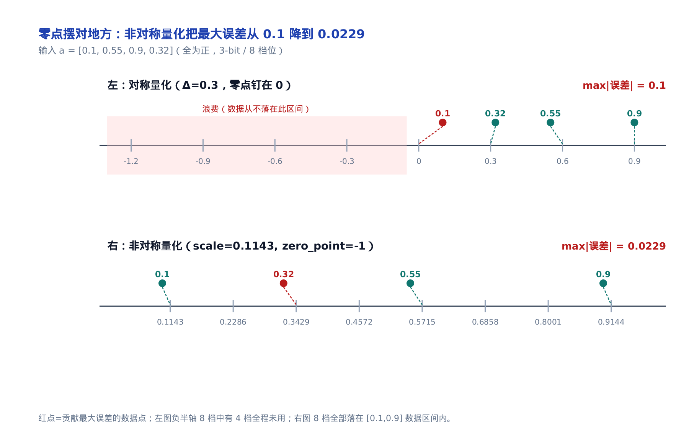

同样 8 个档位，零点摆对地方，误差就小四倍——这也是一次挪：不动数据，挪档位。全章的分工由此定下：GPTQ / AWQ 量化权重用对称（上面那个分母 $`2^{N-1}-1`$ 的形式），SmoothQuant 量化激活用非对称、带 zero-point——迁移只是把 outlier 难度从激活挪给权重，并不改激活「非对称」这条设定；两套 scale / zero-point 落地成什么形状的参数张量，见[第 32 章](../../ch32-ascend-quantization-framework/narrative/chapter.md)。

尺子讲完了还差一问：scale 能配多细？给激活的每个输入通道各配一把，outlier 不就被单独隔离了？数学上对，硬件上做不到——这就要说到下一节的硬件约束。

---

## 三、粒度与 INT8 GEMM 的硬件约束

线性层是 $`\mathbf{Y} = \mathbf{X}\mathbf{W}`$ ，维度约定沿 SmoothQuant §2（arXiv:2211.10438，Preliminaries 的一句叙述，未编号）：

```math
\mathbf{Y} = \mathbf{X}\,\mathbf{W}, \quad \mathbf{X}\in\mathbb{R}^{T\times C_i},\ \mathbf{W}\in\mathbb{R}^{C_i\times C_o}
```

$`T`$ 是 token 数、 $`C_i`$ 是输入通道、 $`C_o`$ 是输出通道。INT8 GEMM 在 int8 域把乘加做完、攒成 int32，**最后**才乘 scale 一次性反量化回浮点。SmoothQuant §3 Eq.2 把这一步写死了——反量化只能在矩阵乘**之后**、从两个外维还原：

```math
\mathbf{Y} = \mathrm{diag}(\boldsymbol{\Delta}_{\mathbf{X}})\cdot\big(\overline{\mathbf{X}}^{\mathrm{INT8}}\,\overline{\mathbf{W}}^{\mathrm{INT8}}\big)\cdot\mathrm{diag}(\boldsymbol{\Delta}_{\mathbf{W}})
```

洞见一句话：**scale 只能活在输出里还存活的维上**。 $`T`$ （行）与 $`C_o`$ （列）在 $`\mathbf{Y}`$ 里都还在，所以左侧 $`\mathrm{diag}(\boldsymbol{\Delta}_{\mathbf{X}})`$ 可以是 per-tensor（对角线上 $`T`$ 个元素全相等，退化成标量）或 per-token（每行 token 各自一个 scale），右侧 $`\mathrm{diag}(\boldsymbol{\Delta}_{\mathbf{W}})`$ 是权重的 per-channel（每输出通道一个）。而输入通道 $`C_i`$ 是 GEMM 的**收缩维**（累加维）：每个输出元素都要沿所有 $`C_i`$ 求和，一旦求和，通道的身份就没了——你再没法回头说「这部分和来自通道 0，给它乘 $`s_0`$ 」，整个和已经坍成一个数。数学最优的「激活 per-channel（沿 $`C_i`$ ）」恰好死在这里：上一节想用来隔离 outlier 的那把逐通道尺子，GEMM 还原不了。

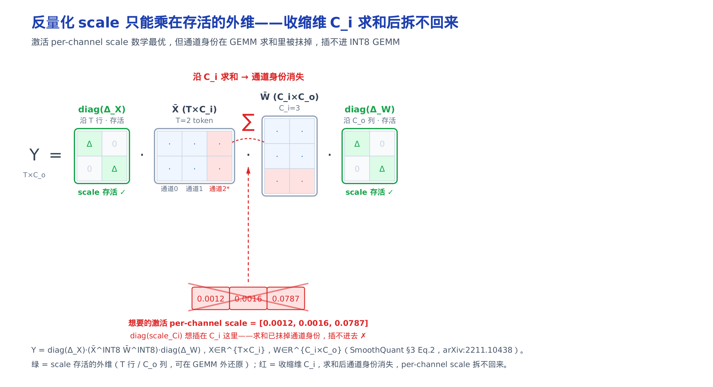

用一个 2 token × 3 通道、通道 2 是 outlier 的激活，看三种粒度的 scale 长什么样：

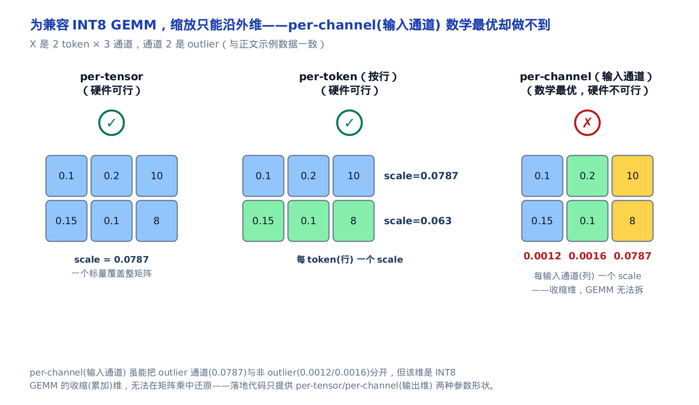

per-tensor 全矩阵一个 scale 0.0787，被 outlier 主导；per-token 每行一个（0.0787 和 0.063）；而沿输入通道切的话，scale 是 [0.0012, 0.0016, 0.0787]——差异悬殊，确实能把 outlier 通道单独隔离，但这一维是收缩维，拆不回来。这就是为什么落地代码只提供 per-tensor 和 per-channel（输出维）两种参数形状，外加 W4A16 分组量化用的 per-group（按组）——唯独没有沿收缩维缩放激活的接口；接口清单见[第 32 章](../../ch32-ascend-quantization-framework/narrative/chapter.md)。

outlier 就地隔离不了，难度只能转移。三篇论文给了三个下家：GPTQ 干脆不碰激活，只量化权重，把取整误差在权重之间挪；AWQ 也只碰权重，但按激活的重要性决定护谁；SmoothQuant 正面接下 W8A8，把激活的难度挪给权重。先看 GPTQ。

---

## 四、GPTQ 二阶补偿：让整层输出尽量不变

朴素量化 RTN（round-to-nearest，逐权重独立四舍五入）让每个权重各扫门前雪。GPTQ 的出发点是换目标——不逼近权重，逼近**层输出**（GPTQ §3 Eq.1，arXiv:2210.17323）：

```math
\underset{\widehat{\mathbf{W}}}{\arg\min}\ \big\| \mathbf{W}\mathbf{X} - \widehat{\mathbf{W}}\mathbf{X} \big\|_2^2
```

目标一换，问题就从「一堆独立取整」变成「一串互相耦合的决定」：量化一个权重留下的误差，可以让还没量化的邻居**反向吸收**。这套贪心-补偿由 GPTQ 的前身 OBQ（Optimal Brain Quantization，最优脑量化）给出闭式解（OBQ §3 Eq.2，arXiv:2210.17323；下标 $`F`$ 指当前尚未量化的全精度权重集合， $`\mathbf{H}_F^{-1}`$ 即限制在这批权重上的 Hessian 逆）：

```math
w_q = \underset{w_q}{\arg\min}\ \dfrac{\big(\mathrm{quant}(w_q)-w_q\big)^2}{[\mathbf{H}_F^{-1}]_{qq}}, \qquad \boldsymbol{\delta}_F = -\dfrac{w_q-\mathrm{quant}(w_q)}{[\mathbf{H}_F^{-1}]_{qq}}\cdot(\mathbf{H}_F^{-1})_{:,q}
```

左式挑人：在所有剩余权重里，选「量化误差平方除以 Hessian 逆对角」最小的先动手。右式摊账：把 $`w_q`$ 的取整误差按 $`\mathbf{H}_F^{-1}`$ **第 $`q`$ 列**的比例摊给所有剩余的全精度权重——这一列刻画的正是「在 $`q`$ 处注入单位误差，每个邻居该分摊多少来抵消」，补偿的方向不是拍的，是它给出的。比喻只需一句：结账时把多收的零头当场补给下一位顾客。

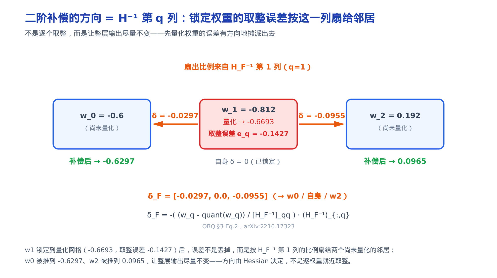

这里的 Hessian 从哪来，三句话说完：输出误差 $`\|\mathbf W\mathbf X-\hat{\mathbf W}\mathbf X\|_2^2`$ 沿 $`\mathbf W`$ 的行拆开、行行独立；单独一行的贡献是二次型 $`(\mathbf w-\hat{\mathbf w})^{\top}(\mathbf X\mathbf X^{\top})(\mathbf w-\hat{\mathbf w})`$ ；对它求两次导，每行得到同一个 $`\mathbf{H} = 2\,\mathbf{X}\mathbf{X}^{\top}`$ —— $`\mathbf{X}`$ 是喂进这一层的**校准激活**（一小批真实样本的输入）。它是对称矩阵，非对角元 $`H_{ij}`$ 衡量「量化权重 $`i`$ 会给权重 $`j`$ 的输出误差带来多大扰动」：相关性高就该协同量化，而非各自独立取整。

量化掉一个权重后，Hessian 逆不必从头重算——OBQ §3 Eq.3 用一次秩-1 高斯消元，直接得到「去掉该权重后」的 Hessian 逆：

```math
\mathbf{H}_{-q}^{-1} = \left( \mathbf{H}^{-1} - \dfrac{1}{[\mathbf{H}^{-1}]_{qq}}\,\mathbf{H}^{-1}_{:,q}\,\mathbf{H}^{-1}_{q,:} \right)_{-p}
```

括号里的减项是秩-1 更新，不是把某行某列简单删掉；外层下标 $`-p`$ 里的 $`p`$ 就是 $`q`$ ——论文原文在这一条公式里换写了记号（见速查表）。由此还得到收敛**不变量**：每轮严格量化并移除一个权重，剩余全精度集合单调减 1， $`d`$ 个权重必在 $`d`$ 轮内全部量化并终止。

> 直觉（先修）：那两条闭式解，是把「 $`w_q`$ 必须落在量化网格点」当等式约束，对二次型 $`(\mathbf w-\hat{\mathbf w})^{\top}\mathbf H(\mathbf w-\hat{\mathbf w})`$ 用拉格朗日乘子法求出的极值——GPTQ 论文在这里也只引结论、未推导。你不需要看证明，接受这两条就能往下走；完整推导见 Optimal Brain Compression（Frantar & Alistarh，2022，arXiv:2208.11580）§3、§5。

> **严谨（想要深度再展开）**：「沿行拆开」的依据是 Frobenius 范数的迹恒等式 $`\|\mathbf A\|^2=\mathrm{tr}(\mathbf A\mathbf A^{\top})`$ （迹 = 方阵对角线元素之和），取 $`\mathbf A=(\mathbf W-\hat{\mathbf W})\mathbf X`$ ，得 $`\|(\mathbf W-\hat{\mathbf W})\mathbf X\|_2^2 = \mathrm{tr}\big((\mathbf W-\hat{\mathbf W})\,\mathbf X\mathbf X^{\top}\,(\mathbf W-\hat{\mathbf W})^{\top}\big) = \sum_{r}(\mathbf w_r-\hat{\mathbf w}_r)^{\top}\mathbf X\mathbf X^{\top}(\mathbf w_r-\hat{\mathbf w}_r)`$ —— $`r`$ 遍历 $`\mathbf W`$ 的行，行与行之间不耦合，故可逐行独立处理（GPTQ §3 原文即『把 Eq.1 写成按 $`\mathbf W`$ 逐行的平方误差之和，并逐行独立处理』）。Hessian 那一步：对单行自由变量 $`\hat{\mathbf w}`$ ，一阶导是 $`-2\,\mathbf X\mathbf X^{\top}(\mathbf w-\hat{\mathbf w})`$ ，再求一次导，一次项消去、只剩 $`2\,\mathbf X\mathbf X^{\top}`$ ，与行号无关——所以全部行共用同一个 $`\mathbf H`$ ，这颗种子在下一节长成「全行同序」优化；限制在尚未量化的权重集合上就是 $`\mathbf{H}_F = 2\,\mathbf{X}_F\mathbf{X}_F^{\top}`$ （ $`\mathbf{X}_F`$ 只取 $`F`$ 对应的激活列，此式 GPTQ §3 直接给出）。

拿参考实现在一个 3 权重、2 bit 的行上跑一遍。权重 $`w = [-0.6, -0.812, 0.192]`$ ，配一批强相关的校准激活（让 Hessian 有大非对角，补偿才真会翻转决定）。逐轮追踪：

<!-- trace: M4 -->

| 轮次 | 各候选代价 Δq²/[H⁻¹]_qq | 选中（原索引） | 量化值 q | 量化误差 w−q | 补偿 δ_F（给其余全精度权重） | 补偿后剩余权重 |
|---|---|---|---|---|---|---|
| 1 | [0.001411, 0.001402, 0.002587] | 1 | -0.6693 | -0.1427 | [-0.0297, 0.0, -0.0955] | [-0.6297, -0.6693, 0.0965] |
| 2 | [0.000566, 0.006811] | 0 | -0.6693 | 0.0397 | [0.0, 0.026] | [-0.6693, 0.1225] |
| 3 | [0.086854] | 2 | 0.0 | 0.1225 | [0.0] | [0.0] |

第 1 轮选代价最小的权重 1，量化成 -0.6693，误差 -0.1427 沿 $`\mathbf{H}_F^{-1}`$ 第 1 列摊给邻居——权重 0 被推到 -0.6297、权重 2 被推到 0.0965。第 2 轮量化权重 0。到第 3 轮，权重 2 已被前两轮的补偿从原值 0.192 推到 0.1225，量化到网格上恰好落到 **0.0** ——而 RTN 会直接把原始的 0.192 四舍五入到网格点 0.3347：

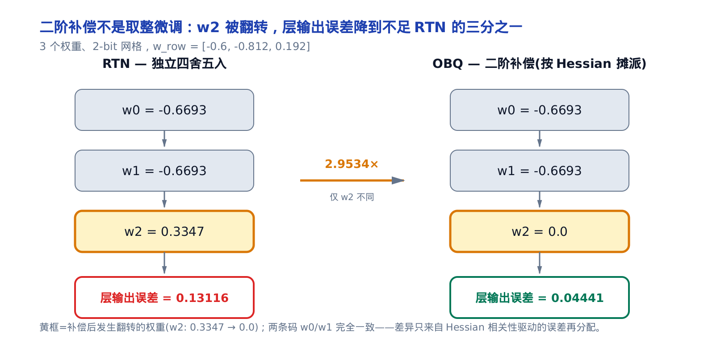

两条码 $`[-0.6693, -0.6693, 0.0]`$ 与 RTN 的 $`[-0.6693, -0.6693, 0.3347]`$ 只差最后一个权重，层输出误差 $`\|\mathbf{W}\mathbf{X}-\hat{\mathbf{W}}\mathbf{X}\|^2`$ 却从 0.13116 降到 0.04441——降了 **2.95 倍**。误差没有消失，是被挪去了能抵消的地方。

只剩一个拦路虎：OBQ 逐权重贪心的复杂度是 $`O(d_{\mathrm{row}}\cdot d_{\mathrm{col}}^3)`$ （ $`d_{\mathrm{row}}\times d_{\mathrm{col}}`$ 是权重矩阵的行数与列数，沿用 GPTQ 论文自身记法；行列角色恰与第三节 SmoothQuant 记法 $`\mathbf W\in\mathbb R^{C_i\times C_o}`$ 相反—— $`d_{\mathrm{row}}`$ 对应 $`C_o`$ 、 $`d_{\mathrm{col}}`$ 对应 $`C_i`$ ，说的是同一个权重矩阵），真实层上贵得离谱。GPTQ 的三大工程优化就是来治这个的；治完之后离线产出的，是分组量化（group-wise，每组独立 scale 以抵抗组内幅值差异，论文的 g128 / g64 / g32 即组大小）的 int4 权重，其打包格式与加载路径见[第 32 章](../../ch32-ascend-quantization-framework/narrative/chapter.md)。

---

## 五、GPTQ 三大工程优化：同结果、更省访存

GPTQ 在 OBQ 之上加的三处优化（GPTQ §4，arXiv:2210.17323）没有一处改算法，全是「同结果、更省访存 / 更稳数值」的恒等重排；比喻一句：逐笔结账改成整箱结账，每笔账不变，少跑很多趟仓库。空间结构先看论文原图：

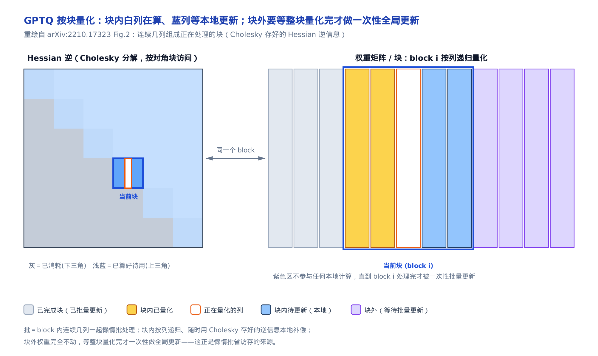

连续几列（图右侧深蓝框）组成当前正在处理的一个块：块内按列递归量化（橙色=已量化、白色=正在量化的列、浅蓝=块内待更新的剩余列），块外的权重（紫色）完全不动，直到整块处理完才做一次性的全局批量更新。三处优化都是在具体化这幅图。

**其一，全行同序。** OBQ 允许每行各按各的顺序挑权重；GPTQ 让所有行同按一个列序——精度几乎不变，而 $`\mathbf H_F^{-1}`$ 的更新只依赖列输入 $`\mathbf X_F`$ 、与具体哪一行权重无关（上一节严谨框刚证明 $`\mathbf H`$ 与行号无关），于是整份 Hessian 逆全体行共享：每列只更新一次（共 $`d_{\mathrm{col}}`$ 次、每次 $`O(d_{\mathrm{col}}^2)`$ ），再把结果套用到全部 $`d_{\mathrm{row}}`$ 行上（ $`O(d_{\mathrm{row}}d_{\mathrm{col}}^2)`$ ），两部分取较大者：

```math
O(d_{\mathrm{row}}\cdot d_{\mathrm{col}}^3)\ \longrightarrow\ O\!\big(\max\{d_{\mathrm{row}}\cdot d_{\mathrm{col}}^2,\ d_{\mathrm{col}}^3\}\big)
```

快约 $`\min\{d_{\mathrm{row}}, d_{\mathrm{col}}\}`$ 倍。

**其二，懒惰批。** 逐列把补偿立即写回全部剩余列是访存密集操作；GPTQ §4 Eq.4-5 把补偿攒成一批（B=128 列；大写 $`Q`$ 是这一批列的索引集合、单个 $`q`$ 的推广， $`[\mathbf{H}_F^{-1}]_{QQ}`$ 是把 Hessian 逆限制在这批索引的行列上取出的子块）：

```math
\boldsymbol{\delta}_F = -\big(\mathbf{w}_Q-\mathrm{quant}(\mathbf{w}_Q)\big)\big([\mathbf{H}_F^{-1}]_{QQ}\big)^{-1}(\mathbf{H}_F^{-1})_{:,Q}
```

它是逐列 OBQ 的**代数恒等重排**：块内逐列即时更新，块末才对块外一次性写回；逐列各除一次对角项的标量除法，收拢成一次子块求逆，子块逆顺带吸收块内各列彼此的补偿耦合——求和顺序换了、每一项没变，结果逐位相同。把访存密集的操作攒成算力密集的批操作，实测再快一个数量级。

> **严谨（想要深度再展开）**：恒等的账摊开一层。攒到块末，投到某个块外列 $`c`$ 上的总补偿，是这批列各自补偿在 $`c`$ 处的分量之和： $`\Delta w_c = -\sum_{q\in Q}\mathbf{E}_q\,[\mathbf{H}_F^{-1}]_{qc}`$ ，其中 $`\mathbf{E}_q = (w_q-\mathrm{quant}(w_q))/[\mathbf{H}_F^{-1}]_{qq}`$ 是块内量化到第 $`q`$ 列时除过对角项的归一化误差——这正是下方 Algorithm 1 块末那行 `W[:, i+B:] -= E · H^{-1}` 做的事。再把这个对 $`q`$ 的求和写成矩阵形式：一批列的误差 $`(\mathbf{w}_Q-\mathrm{quant}(\mathbf{w}_Q))`$ 乘上耦合列 $`(\mathbf{H}_F^{-1})_{:,Q}`$ ，逐个 $`q`$ 的标量除法收拢成一次子块求逆 $`([\mathbf{H}_F^{-1}]_{QQ})^{-1}`$ ，就得到上面的批公式——矩阵块运算的恒等改写，不是近似。

**其三，Cholesky + 阻尼。** 大模型上 Hessian 逆可能变不定（indefinite），补偿方向就错了。对策：给 Hessian 对角加 1% 均值的阻尼（dampening），把对角整体抬高一点，保证矩阵**正定**（特征值全正，分解 / 求逆不再失败），再对阻尼后的 Hessian 做一次 Cholesky 分解 $`\mathbf{H}=\mathbf{L}\mathbf{L}^{\top}`$ ，用数值稳定的三角求解一次预算好所有需要的行，替代反复的矩阵求逆。

完整流程就是论文的 Algorithm 1（伪代码第一行的 $`Q`$ 是量化输出矩阵，与上文列索引集合的 $`Q`$ 是论文自身的记号复用，见速查表）：

```text
# GPTQ Algorithm 1 (arXiv:2210.17323 §4)
Q ← 0_{d_row × d_col}                       // 量化输出
E ← 0_{d_row × B}                           // 块量化误差
H^{-1} ← Cholesky(H^{-1})^T                  // 预计算：对(阻尼后)Hessian H=(2XX^T+λI)做Cholesky，λ=1%均值对角；此后用三角求解替代逐步矩阵求逆
for i = 0, B, 2B, ... do
    for j = i, ..., i+B-1 do
        Q[:,j] ← quant(W[:,j])                                  // 量化当前列
        E[:,j-i] ← (W[:,j] - Q[:,j]) / [H^{-1}]_{jj}            // 量化误差
        W[:, j:i+B] ← W[:, j:i+B] - E[:,j-i] · H^{-1}_{j, j:i+B} // 块内补偿
    end for
    W[:, i+B:] ← W[:, i+B:] - E · H^{-1}_{i:i+B, i+B:}          // 块末全局补偿
end for
```

关键**不变量**：量化输出与 blocksize（批大小）无关——懒惰批既是恒等重排，blocksize 从 1 到 $`d_{\mathrm{col}}`$ 都得到同一个结果。参考实现在一个 3×6、3 bit 的权重上，把 blocksize 扫过 {1, 2, 3, 6}：

<!-- trace: M5 -->

| blocksize | GPTQ 层输出误差 $`\|\mathbf{W}\mathbf{X}-\hat{\mathbf{W}}\mathbf{X}\|^2`$ | 相对 RTN（1.15236）倍数 |
|---|---|---|
| 1 | 0.99387 | 1.159 |
| 2 | 0.99387 | 1.159 |
| 3 | 0.99387 | 1.159 |
| 6 | 0.99387 | 1.159 |

四个 blocksize，输出误差逐位相同（0.99387），跨块最大差 0.0——懒惰批是效率重排，不是新算法，这一栏数字是该不变量的数值印证。

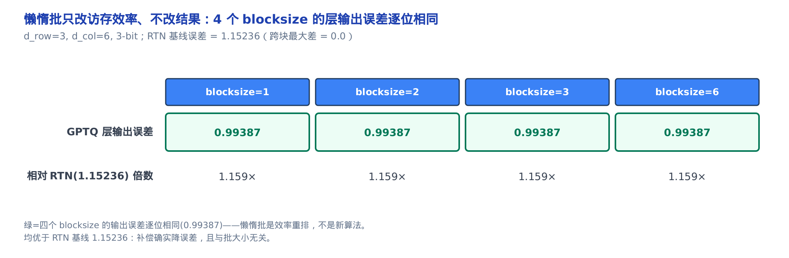

同时四个都优于 RTN 基线的 1.15236：补偿确实降了误差，且与批大小无关。（这个小玩具上 GPTQ 相对 RTN 收益温和，规模化到真实层才显著——真实层的 Hessian 相关性远比 3×6 丰富。）这一切的省都在访存层面，结果一分不改。GPTQ 把**权重**的误差摊得聪明，但对「哪些权重根本不该承受误差」不置一词——AWQ 的回答从激活开始。

---

## 六、AWQ 激活感知缩放：重要的不是权重大，是激活大

AWQ 的反直觉洞见一行写完：权重 $`w`$ 的取整误差落到输出里是 $`(w-\hat w)\cdot x`$ ——**误差被它乘的激活 $`x`$ 放大，所以「重要」由激活定，不由权重自己定**。AWQ §3.1（arXiv:2306.00978）实测：按激活幅值挑出的 0.1%-1% 权重是「显著」的，保住它们就保住大局。这个发现有多大分量、又为什么不能简单混合精度了事，论文自己的实验说得很直接：

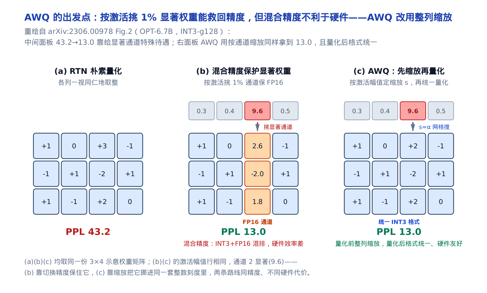

朴素 RTN 量化 OPT-6.7B 到 INT3-g128，困惑度（PPL，越低越好）是 43.2；只把按激活幅值挑出的这 1% 显著权重换回 FP16、其余仍是 INT3，困惑度就降到 13.0——显著权重确实关键。但混合精度（INT3+FP16 混排）对硬件不友好：同一份权重掺两种位宽，访存和 kernel 都要多绕一道弯。AWQ 换一条路：不换精度，把显著权重按通道整体缩放，格式统一仍是 INT3，同样拿到 13.0。

保护的手段是**挪误差**：显著权重 $`w`$ 乘 $`s>1`$ 、对应激活 $`x`$ 除 $`s`$ ，乘积不变（下式左半即 AWQ §3.2 Eq.2；右半的误差比 $`\mathrm{Err}_{s}/\mathrm{Err}_{1}`$ 是本章为论文的文字结论取的记号，论文未单独编号）：

```math
Q(w\cdot s)\cdot\dfrac{x}{s} = \Delta'\cdot\mathrm{Round}\!\left(\dfrac{ws}{\Delta'}\right)\cdot x\cdot\dfrac{1}{s}, \qquad \dfrac{\mathrm{Err}_{s}}{\mathrm{Err}_{1}} = \dfrac{\Delta'}{\Delta}\cdot\dfrac{1}{s}
```

两个事实合起来就是 $`1/s`$ ：其一，四舍五入的取整误差只看 $`x/\Delta`$ 的小数部分，期望约 0.25 个码位、**与步长无关**——于是缩放前后的两个取整误差因子在期望下约掉，误差比只剩 $`\Delta'/\Delta\cdot 1/s`$ ；其二，只要放大后的 $`\max(|ws|)`$ 不顶破组内原有的 absmax，步长就不变（ $`\Delta'=\Delta`$ ，因为 $`\Delta`$ 由组 absmax 除以量化级数定），误差比精确化到 $`1/s<1`$ 。**边界**也在这：一旦 $`s`$ 大到让显著权重自己成了组内新的最大值， $`\Delta'`$ 随之涨大，这一涨会拖累组内**所有**非显著权重—— $`1/s`$ 的好处被 $`\Delta'/\Delta>1`$ 反噬。挪账免费的前提，是不撑破口袋。比喻一句：给重要的字用更粗的笔写，手抖的相对影响更小。

> **严谨（想要深度再展开）**：「取整误差与步长无关」是**期望意义**的成立条件。数据连续、不刻意对齐码位时， $`x/\Delta-\mathrm{round}(x/\Delta)`$ 只由 $`x/\Delta`$ 的小数部分决定，近似均匀分布在 $`[-0.5, 0.5]`$ 个码位的区间内，其绝对值的期望是区间半宽的一半、即 0.25 个码位——只由分布形状决定，与缩放倍数 $`s`$ 无关。单个权重的取整误差仍随小数部分起伏，对大量权重取平均才收敛到 0.25；下面的数值表对多次随机显著权重取误差均值，验证的正是这个期望。

于是要搜一个「护得住显著权重、又不顶破组 absmax」的 $`s`$ 。AWQ §3.2 Eq.4-5 用一个超参 $`\alpha`$ 参数化这个搜索：

```math
\mathbf{s}^{*} = \underset{\mathbf{s}}{\arg\min}\ \big\| Q(\mathbf{W}\cdot\mathrm{diag}(\mathbf{s}))\,(\mathrm{diag}(\mathbf{s})^{-1}\mathbf{X}) - \mathbf{W}\mathbf{X} \big\|, \qquad \mathbf{s} = \mathbf{s_X}^{\alpha}
```

$`\mathbf{s_X}`$ 是逐输入通道的激活**平均**幅值（在 token 维上对 $`|\mathbf X|`$ 取平均，每个输入通道得一个标量——是平均、不是最大，AWQ §3.2 原文即 average magnitude of activation per-channel）， $`\alpha\in[0,1]`$ 网格搜： $`\alpha=0`$ 不缩放、 $`\alpha=1`$ 最激进。**不变量**：只要放大不改组 absmax（ $`\Delta'=\Delta`$ ），相对误差期望就精确等于 $`1/s`$ 。参考实现在 4 bit 上，对多次随机显著权重取误差均值（因为 $`1/s`$ 是期望意义的规律），扫 $`s`$ ：

<!-- trace: M6 -->

| 缩放 s | 朴素预测 1/s | 实测平均误差比（均值误差之比） | 组 absmax 被位移比例 |
|---|---|---|---|
| 1.0 | 1.0 | 1.0 | 0.0 |
| 2.0 | 0.5 | 0.5694 | 0.0 |
| 4.0 | 0.25 | 0.2658 | 0.0 |

$`s=2`$ 实测误差比 0.5694（朴素 0.5）、 $`s=4`$ 实测 0.2658（朴素 0.25），都贴着 $`1/s`$ ——表里「组 absmax 被位移比例」在 $`s=2,4`$ 恒为 0.0，验证这两个 $`s`$ 放大后的 $`\max(|ws|)`$ 都没顶破组内原 absmax， $`\Delta'=\Delta`$ 成立， $`1/s`$ 才成立。

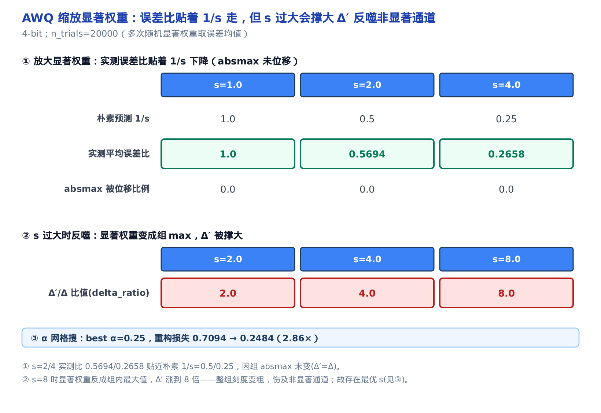

图的下半截给了反面： $`s`$ 一旦大到让显著权重反成组内 max（ $`s=8`$ 时 $`\Delta'`$ 涨 8 倍），整组刻度变粗，非显著通道反受害——所以要网格搜。参考实现在一个激活-显著通道的玩具层上搜出最优 $`\alpha=0.25`$ ，把重构损失从不缩放（ $`\alpha=0`$ ）的 0.7094 降到 0.2484，即 2.86 倍。

AWQ 与 GPTQ 殊途同归：都只碰权重、不碰激活（W4A16），离线产物是同一种 int4 打包权重，落地看不出谁产的，差异全在离线那一端——GPTQ 用 Hessian 补偿，AWQ 用激活感知缩放。为什么权重-only 就够吃掉大头？硬件账本：

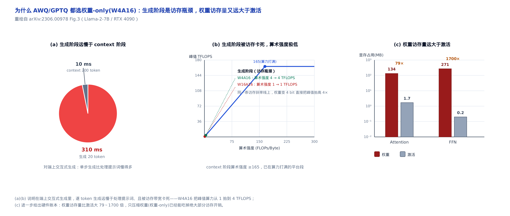

端上交互式生成时，逐 token 生成（310 ms）远慢于处理提示词（10 ms）：生成阶段被访存带宽卡死、算术强度极低，W4A16 把峰值算力从 1 TFLOPS 抬到 4 TFLOPS，正卡在瓶颈线上；而权重的访存量比激活大 79~1700 倍——只压权重已能吃掉绝大部分访存开销。可 W8A8 那道坎（激活也要压）终究得有人迈——那就是 SmoothQuant。

---

## 七、SmoothQuant 迁移难度：把激活的坑挪给权重

激活难量化、权重好量化——那就把难度挪账过去，这是全章主线最字面的一次兑现。SmoothQuant §4 Eq.3（arXiv:2211.10438）的迁移变换：

```math
\mathbf{Y} = \big(\mathbf{X}\,\mathrm{diag}(\mathbf{s})^{-1}\big)\cdot\big(\mathrm{diag}(\mathbf{s})\,\mathbf{W}\big) = \widehat{\mathbf{X}}\,\widehat{\mathbf{W}}
```

激活逐通道除 $`s`$ 、权重逐通道乘 $`s`$ ， $`\mathrm{diag}(\mathbf{s})^{-1}\mathrm{diag}(\mathbf{s})`$ 抵消——乘积对任意正 $`s`$ **恒等**，不是近似：挪走的是量化友好度，不是数学。挪多少由难度因子定（§4 Eq.4；下标 $`j`$ 是输入通道索引，取值 $`1,\ldots,C_i`$ ——Eq.3 的整体记号 $`\mathrm{diag}(\mathbf s)`$ 到这里才按通道展开）：

```math
\mathbf{s}_j = \dfrac{\max(|\mathbf{X}_j|)^{\alpha}}{\max(|\mathbf{W}_j|)^{1-\alpha}}
```

$`\alpha`$ 是迁移强度（migration strength）——开篇说的那只旋钮。「分子分母互补指数」这个形式自带一个漂亮的对称性：把 $`\mathbf s_j`$ 代回迁移变换，两侧的新 max **底数相同、指数互补**——

```math
\max(|\widehat{\mathbf{X}}_j|) = \big(\max(|\mathbf{X}_j|)\max(|\mathbf{W}_j|)\big)^{1-\alpha},\qquad
\max(|\widehat{\mathbf{W}}_j|) = \big(\max(|\mathbf{X}_j|)\max(|\mathbf{W}_j|)\big)^{\alpha}
```

$`\alpha=0.5`$ 时两指数相等，两侧 max 齐平于**几何平均** $`\sqrt{\max(|\mathbf{X}_j|)\max(|\mathbf{W}_j|)}`$ ——量化难度正好均分； $`\alpha`$ 偏离 0.5，两个指数此消彼长，总有一侧的 max 被重新放大、难度失衡（ $`\alpha\to1`$ 全推给权重、 $`\alpha\to0`$ 全留激活，两极端都恶化）。这就是甜点为什么常在 0.5（OPT / BLOOM 的经验值）；下面数值表的 U 形谷底是它的经验印证。**不变量**：迁移对任意正 $`s`$ 乘积无损， $`\alpha`$ 只改量化友好度，不改这个乘积。

> **严谨（想要深度再展开）**：两条新 max 各是一行代入（推导见原论文 arXiv:2211.10438 §4 Eq.7 附近）。激活侧： $`\max(|\widehat{\mathbf X}_j|)=\max(|\mathbf X_j|)/\mathbf s_j=\max(|\mathbf X_j|)\cdot\max(|\mathbf W_j|)^{1-\alpha}/\max(|\mathbf X_j|)^{\alpha}=\max(|\mathbf X_j|)^{1-\alpha}\max(|\mathbf W_j|)^{1-\alpha}`$ （除以 $`\mathbf s_j`$ 即乘它的倒数）；权重侧： $`\max(|\widehat{\mathbf W}_j|)=\max(|\mathbf W_j|)\cdot\mathbf s_j=\max(|\mathbf W_j|)\cdot\max(|\mathbf X_j|)^{\alpha}/\max(|\mathbf W_j|)^{1-\alpha}=\max(|\mathbf X_j|)^{\alpha}\max(|\mathbf W_j|)^{\alpha}`$ 。两式合并即正文那对互补指数；令 $`\alpha=1-\alpha`$ 得 $`\alpha=0.5`$ ，代回任一式都是同一个几何平均值——两侧齐平由此严格成立。

参考实现在一个 T=16、 $`C_i`$=4 的玩具层上（输入通道 0 是约 44 倍的激活 outlier），扫 $`\alpha`$ ：

<!-- trace: M7 -->

| α（迁移强度） | 通道0 迁移因子 s | 原始 per-tensor 误差（raw） | 迁移后误差 |
|---|---|---|---|
| 0.0 | 6.6752 | 0.082 | 0.0325 |
| 0.25 | 7.1736 | 0.082 | 0.0273 |
| 0.5 | 7.7092 | 0.082 | 0.0233 |
| 0.75 | 8.2849 | 0.082 | 0.0261 |
| 1.0 | 8.9035 | 0.082 | 0.0285 |

原始 per-tensor 误差恒 0.082（不迁移的基线）。迁移后误差随 $`\alpha`$ 呈 U 形：两端（0.0 → 0.0325、1.0 → 0.0285）都更差， $`\alpha=0.5`$ 降到最低 0.0233，即 3.52 倍。这印证了「难度均分」的甜点在中间。

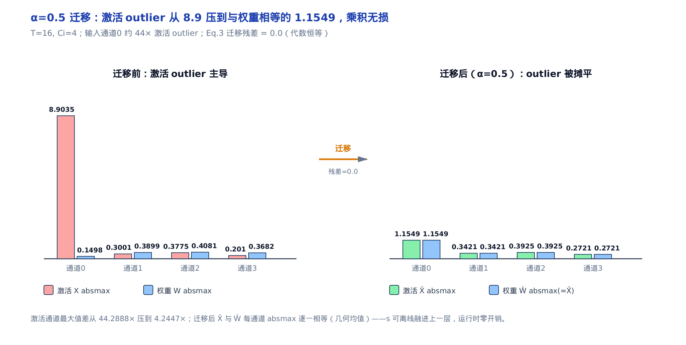

图里看得最直观：迁移前激活通道 0 是 8.9 的 outlier、其余不到 0.4，per-tensor 量化必被它主导； $`\alpha=0.5`$ 迁移后，激活和权重每通道的 max 相等（几何均值，通道 0 两侧都是 1.1549），outlier 被摊平，激活通道最大值之差从 44.3 倍压到 4.2 倍，而 Eq.3 迁移残差是 0.0（乘积一分不差）。

迁移因子 $`s`$ 在离线校准时算好、融进上一层（LayerNorm / Linear）的参数，运行时零额外 kernel。落地端要认的只有一行——`deq_scale = input_scale * weight_scale`（反量化 scale = 激活 scale × 权重 scale，即 $`\boldsymbol{\Delta}_{\mathbf{X}}\cdot\boldsymbol{\Delta}_{\mathbf{W}}`$ ）：INT8 GEMM 在 int8 域算完，两侧 scale 相乘一次性还原浮点，正是第三节那条 Eq.2 的代码化身；迁移因子 $`s`$ 已提前融进 `input_scale`，前向不必再单独乘。W8A8 的静态 / 动态两套（预存 scale 更快 vs 逐 token 现算更准）以及这行代码所在的方案类，见[第 32 章](../../ch32-ascend-quantization-framework/narrative/chapter.md)。

---

## 八、数值推演：四法同台，各在自己的赛道降误差

三笔挪账各自记完，摆到一张台上对账（含朴素 RTN 基线）。前提先说清：**它们不在同一位宽赛道上**——GPTQ / AWQ 走 W4 权重-only，SmoothQuant 走 W8A8，所以只能「各自相对自己的朴素基线」比降幅，不能横向比谁的绝对误差小。参考实现让每种方法对照「自己的」朴素基线、在「自己的」regime（位宽赛道）里跑：

<!-- trace: M8 -->

| 方法（regime） | 朴素基线误差 | 方法误差 | 降幅 × |
|---|---|---|---|
| GPTQ (W4 权重-only) | 1.0735 | 0.9969 | 1.0768 |
| AWQ (W4 权重-only) | 0.7094 | 0.2484 | 2.8558 |
| SmoothQuant (W8A8) | 0.082 | 0.0233 | 3.5177 |

**不变量**：每种方法的「方法误差」都不超过它的朴素基线——补偿、缩放、迁移都只是量化误差或难度的**再分配**，挪对了地方，总账只减不增；三法降幅分别 1.0768、2.8558、3.5177 倍，都 ≥1。这正是开篇那条主线的对账单：没有谁造出新刻度，赢的都是把误差挪去了付得起的地方。

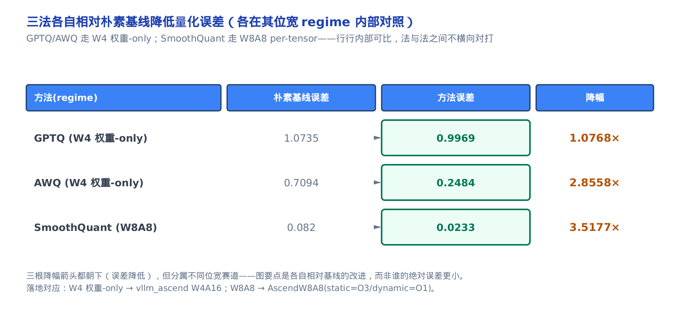

三根降幅箭头都朝下，但分属不同赛道：GPTQ 在小玩具上补偿收益温和（规模化后才显著），AWQ 和 SmoothQuant 收益明显。图的要点是「各自相对基线的改进」，不是谁的绝对误差小。这也回答了本章开篇的问题——为什么权重能压到 4 bit 还不塌：因为 GPTQ 用二阶信息补、AWQ 按激活重要性护，都不是无脑取整。

---

## 九、落地：论文数学接回 vllm_ascend 框架

收束回主线：量化的数学是一份挪账账本。GPTQ 沿 $`\mathbf{H}^{-1}`$ 的列把取整误差摊给邻居权重（玩具行上 2.95 倍），三大工程优化全是恒等重排、结果逐位不动；AWQ 在不顶破组 absmax 的空隙里把显著权重的误差挪给同组，相对误差压到约 $`1/s`$ ；SmoothQuant 用互补指数把激活的难度挪到与权重齐平的几何均值， $`\alpha=0.5`$ 甜点降 3.52 倍。这些算法（Hessian 补偿、缩放搜索、迁移变换）全部在**离线校准**跑完，`vllm_ascend` 只消费产物：GPTQ / AWQ 殊途同归到同一种 W4A16 int4 打包权重（差异全在离线端），SmoothQuant 的迁移因子融进 W8A8 的 `input_scale`。所以框架里的每个参数张量——`input_scale`、`weight_scale`、`group_size`、`deq_scale`——背后都站着本章推过的一支数学；它们怎么被 `QuantType` 分族的工厂注册、加载后怎么在前向里被消费，正是[下一章](../../ch32-ascend-quantization-framework/narrative/chapter.md)的主线。带着「刻度是预算、误差只能挪」这条主线去读，那些字段就不再是黑盒。
