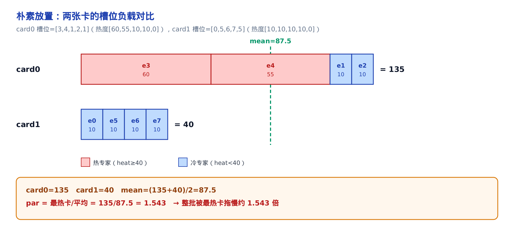
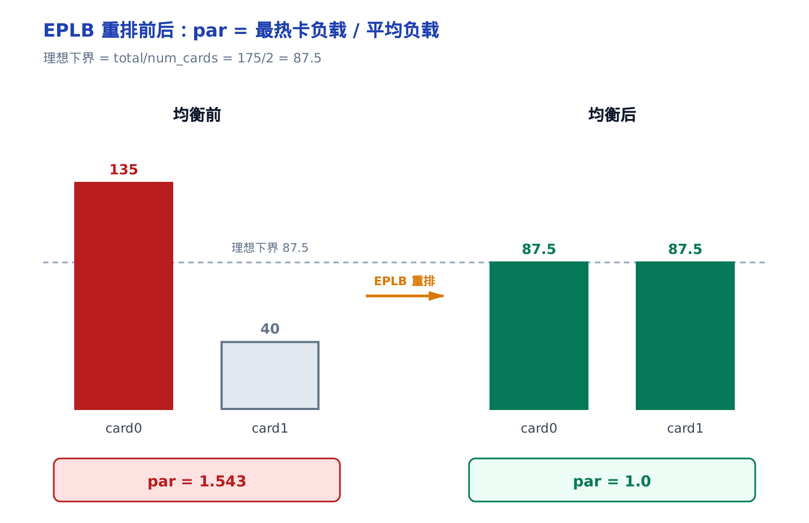
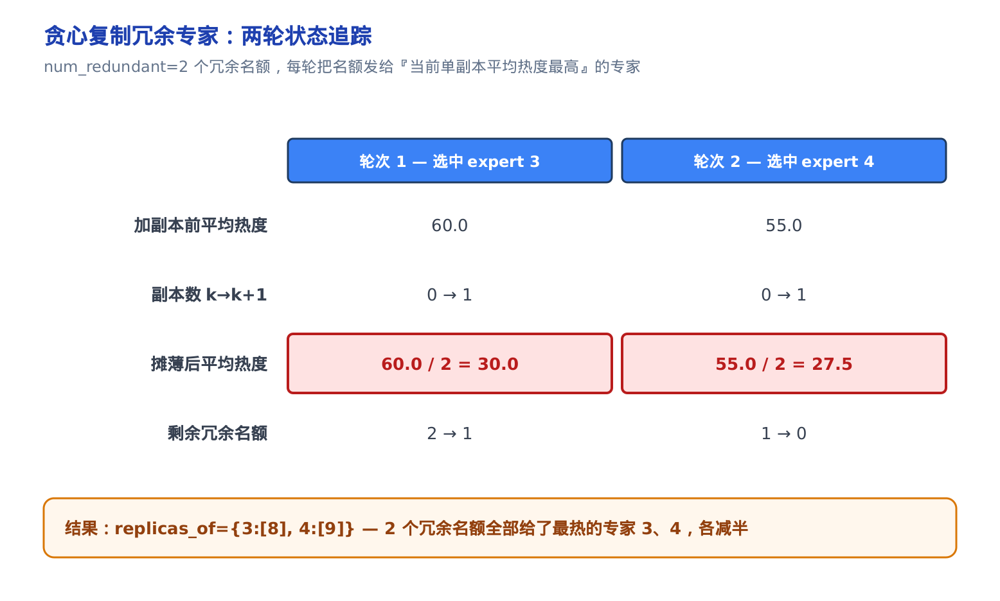
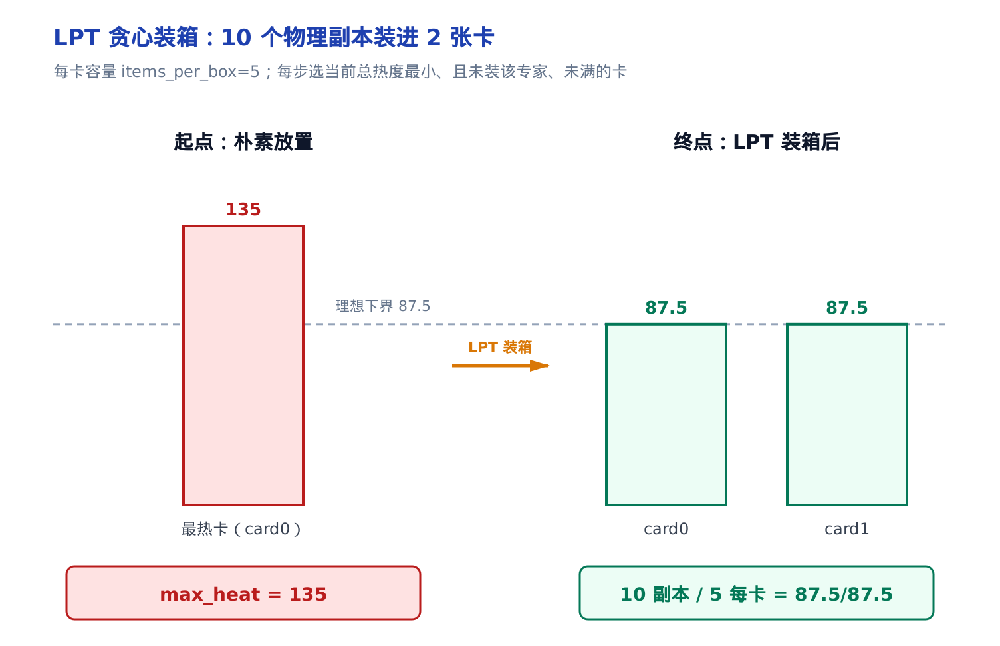
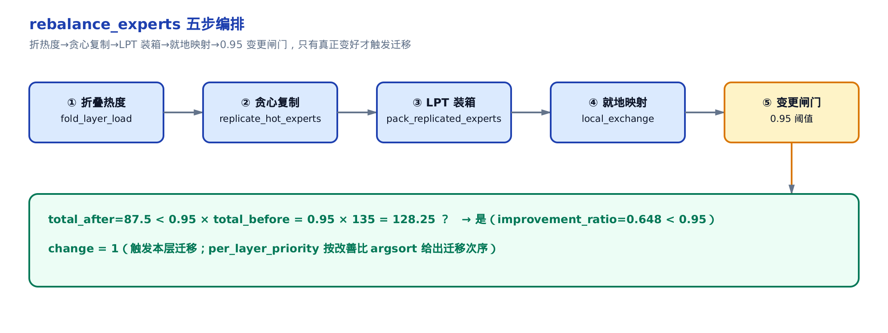

# 【原理篇 P8·论文精读】EPLB：专家负载均衡的算法本体


> 你在这里：第 III 部分「并行/KV 解耦」的原理夹层。
> 上一站：[第 9 章](../ch09-eplb-expert-load-balancing/narrative/chapter.md)搭好了 EPLB 的迁移机器。
> 这一章：打开那台机器里被当黑盒的规划器。
> 下一站：回到执行主线，看均衡后的放置怎么被跑起来。

第 9 章带你读完了 EPLB（expert parallelism load balancer，专家并行负载均衡器）的整套**搬运机制**：updator 的节拍、子进程里的规划队列、把专家权重在卡间挪来挪去的 D2D（device-to-device，设备间拷贝）搬运器，还有 `PolicyFactory` 怎么按类型号分发规划策略。但那一章有一处刻意留白——真正决定「哪个专家该复制、该落到哪张卡」的那个函数 `rebalance_experts`，被当成一个黑盒：给它一张当前放置表和一张负载表，它吐回一张新放置表，中间发生了什么，第 9 章没展开。

这一章就把这个黑盒撬开。我们要回答的是一个纯算法问题：**给定每个专家有多热、手上有几张卡，怎样重新摆放专家，才能让最忙的那张卡尽可能不那么忙？** 这个问题的数学骨架来自 DeepSeek-V3 技术报告（arXiv:2412.19437）§3.4 的「冗余专家」部署策略，以及配套开源的 deepseek-ai/EPLB 参考实现。落地代码是昇腾自带的 `DefaultEplb` 规划器——`PolicyFactory` 里 `policy_type=1` 的默认策略，它把论文里的思路实打实写成了 NumPy。

我们按四步走：先看**动机**（专家热度为什么会不均、不均了会怎样），再推**均衡目标**（要最小化什么、为什么必须复制），然后用一个 2 卡 8 专家的小例子把**冗余复制 + 贪心装箱**逐步跑一遍，最后回到 `vllm_ascend/eplb/core/policy/policy_default_eplb.py` 的真实代码，逐段对上号。

---

## 一、动机：最热的那张卡，决定整批的快慢

### 直觉：一队人抬桌子，最慢那个定速度

MoE（mixture-of-experts，混合专家）模型每一层有一大堆 FFN 专家，但每个 token 只激活其中 top-K 个。用 EP（expert parallelism，专家并行）部署时，这些专家被摊到不同的卡（rank，一张卡 = 一个进程）上，每张卡管一撮专家。一层的前向要等**所有**卡都把自己那撮专家算完、再做一次 all-to-all 汇合——所以这一层的墙钟时间，由**最慢**的那张卡决定。

问题在于：专家有多热，是数据说了算的。有的专家天生招人爱，路由过来的 token 特别多；有的门可罗雀。要是几个热门专家凑巧挤在同一张卡上，这张卡就成了那个最慢的人——它一个人抬着整队的进度。

### 机制：用 par = 最热 / 平均，量化「被拖慢几倍」

怎么把「拖慢」这件事变成一个数？EPLB 用的度量叫 **par**（partition ratio 的意思，这里就理解成「不均衡度」）：

$$
\mathrm{par} = \frac{\max_g L_g}{\mathrm{mean}_g\, L_g}
$$

分子是最热那张卡的负载 $\max_g L_g$，分母是所有卡的平均负载。par 恒 ≥ 1，par = 1 就是完美均衡（每张卡一样忙）。它的物理含义很直白：**par 就是整批被最热卡拖慢的倍数**。par = 1.5，意味着这批本可以快 1.5 倍，只因为有张卡特别忙。这正是 DeepSeek-V3 §3.4 要「ensure that each GPU processes approximately the same number of tokens」的量化版本。

### 数值：一个把两个热门专家挤在一起的坏放置

拿本章的小例子说话。1 个 MoE 层、2 张卡、每卡 5 个物理槽、8 个逻辑专家（id 0..7）。一个朴素的起始放置偏偏把两个真正的热门专家——专家 3（热度 60）和专家 4（热度 55）——塞进了同一张 card0，还把两个冗余副本浪费在了本就很冷的专家 1、5 身上：



card0 扛了 60+55+10+10 = 135，card1 只有 10×4 = 40，平均是 (135+40)/2 = 87.5。代进 par：

$$
\mathrm{par} = \frac{135}{87.5} \approx 1.543
$$

也就是说，这批被 card0 一张卡拖慢了约 1.54 倍——另一张卡有近一半时间在干等。EPLB 要做的，就是把这个 1.543 压回接近 1。

### 源码：观测侧怎么算这个 par

这个度量在昇腾代码里是真实存在的。第 9 章的规划宿主 `EplbWorker` 有一个 `_compute_imbalance`，把任意一张放置方案量化成 par，供 metrics 观测均衡前后的差异：

```python
# vllm_ascend/eplb/core/eplb_worker.py:L290-L309
@staticmethod
def _compute_imbalance(deployment_all_layer, hotness_all_layer: np.ndarray, return_list: bool = False):
    imbalance_list = []
    deployment_all_layer = np.array(deployment_all_layer)
    for deployment, hotness in zip(deployment_all_layer, hotness_all_layer):
        counts = np.bincount(deployment.reshape(-1), minlength=hotness.shape[0])

        unit_hotness = np.divide(hotness, counts, out=np.zeros_like(hotness, dtype=float), where=counts != 0)

        stage_load = unit_hotness[deployment].sum(-1)
        stage_par = stage_load.max() / stage_load.mean()
        imbalance_list.append(stage_par)
    # … 省略：把逐层 par 归并成 mean/max 供日志上报 …
    return mean_val, max_val
```

逐层看：`counts` 数每个逻辑专家现在有几个物理副本；`unit_hotness` 把逻辑专家的总热度除以副本数，得到**每副本的平均热度**（复制越多、单副本越轻）；`stage_load` 把每张卡上各槽位的单副本热度加起来，就是那张卡的负载 $L_g$；最后 `stage_par = stage_load.max() / stage_load.mean()` 一行，正是上面那个 $\max/\mathrm{mean}$。这里 `hotness_all_layer` 是逐层聚回逻辑专家的热度向量，由旁边的 `_calculate_hotness` 按放置把每卡负载摊回专家（此处一句带过）。

至于为什么用 max/mean 而不用方差——因为墙钟延迟只由最慢那张卡决定，「最热/平均」直接就是被拖慢的倍数，比方差更贴目标。规划器内部也是奔着最小化 `max_heat`（最热卡负载）去的，两者同向。

---

## 二、均衡目标：把「最热卡负载」压到下界

### 训练期的前传：auxiliary-loss-free 偏置

在讲推理期怎么重排之前，值得先交代一句：DeepSeek-V3 其实在**训练时**就努力压过一轮专家热度了。它的做法叫 auxiliary-loss-free load balancing（无辅助损失的负载均衡），来自 §2.1.2（arXiv:2412.19437）。核心是给每个专家一个偏置 $b_i$，只在 top-K 路由选择时加上去：

$$
g_{i,t}^{\prime} = \begin{cases} s_{i,t}, & s_{i,t} + b_{i} \in \mathrm{Topk}(\{s_{j,t} + b_{j} \mid 1 \leqslant j \leqslant N_{r}\}, K_{r}), \\ 0, & \mathrm{otherwise}. \end{cases}
$$

这是论文 Eq.16。注意一个精巧之处：偏置 $b_i$ 只参与「选不选这个专家」的排序，真正乘到 FFN 输出上的门控值 $g$ 仍用原始亲和度 $s_{i,t}$——所以调偏置不损伤模型质量。训练时每个 step 结束监控专家负载，过载的专家把 $b_i$ 减 $\gamma$（bias update speed，偏置更新速率），欠载的加 $\gamma$，动态把训练期的专家热度分布压平。

### 推理期为什么还得再来一遍

既然训练时已经压过，推理时为什么还需要本章这套重排？因为训练压的是**分布**——让长期平均下来各专家差不多热。但推理部署时，路由由训练好的模型 + 眼下这批真实输入共同决定，某个 10 分钟窗口里的实际热度照样会不均。于是需要一条**独立于训练**的推理期通路：按线上实时统计出来的热度，动态地复制热门专家、重排放置。两者互补：一个压训练分布，一个补推理放置。论文 §3.4 把这条推理期通路说得很清楚：

> To achieve load balancing among different experts in the MoE part, we need to ensure that each GPU processes approximately the same number of tokens. To this end, we introduce a deployment strategy of redundant experts, which duplicates high-load experts and deploys them redundantly. The high-load experts are detected based on statistics collected during the online deployment and are adjusted periodically (e.g., every 10 minutes). After determining the set of redundant experts, we carefully rearrange experts among GPUs ... striving to balance the load across GPUs as much as possible.

两个关键词：**redundant experts**（冗余专家，复制热门专家）+ **rearrange**（重排放置）。这一句就是本章算法的全部纲领。

### 目标函数与理想下界

把它写成优化问题。设 $N_r$ 个逻辑专家、$G$ 张卡，专家 $e$ 的热度 $w_e$，若它有 $r_e$ 个物理副本，则每副本承担 $w_e / r_e$。卡 $g$ 的负载是落在它上面的所有槽位的单副本热度之和：

$$
L_g = \sum_{e \in g} \frac{w_e}{r_e}
$$

目标是最小化最热卡负载 $\max_g L_g$，因为整批延迟正比于它。这个量有个雷打不动的**理想下界**——就算能把所有热度完美均分，最热卡也至少得扛总热度的 $1/G$：

$$
\max_g L_g \;\ge\; \frac{\sum_e w_e}{G}
$$

本例总热度 $175$、$G=2$，下界就是 $175/2 = 87.5$。这条线是任何放置都逾越不过去的地板。

### 为什么「只搬不复制」注定失败

这里有个关键的数学观察，也是**冗余专家策略存在的理由**：如果某个专家单体热度 $w_e$ 已经超过公平份额 $(\sum w)/G$，那么任何**不复制**的放置都逃不过 $\max_g L_g \ge w_e > $ 下界——因为这个专家整块压在某一张卡上，那张卡至少有 $w_e$ 这么重。纯搬迁在这种情况下**无解**。

本例的专家 3 热度 60，公平份额是 87.5，看似没超。但当它和专家 4（55）被迫共卡、且槽位有限时，光靠搬也很难两全。而只要把专家 3 复制成 2 个副本，它的单副本负载就降到 $60/2 = 30$，才有可能塞进一个平衡的箱子。这就是「先复制、再装箱」两段式的由来——复制负责把过高的单体削平，装箱负责把削平后的碎块均匀铺开。



图里左边是均衡前 card0=135 的高柱，右边是均衡后两卡各 87.5、齐刷刷贴在下界线上。par 从 1.543 一路压到 1.0——本例恰好命中理想下界，达到了完美均衡。下面两节，就把「怎么复制」和「怎么装箱」逐步跑给你看。

---

## 三、冗余复制：把最长的木板锯短

### 直觉：每一轮，锯当前最长的那根

复制阶段的目标，是用有限的几个冗余名额，把「最大单副本负载」尽量压下去。想象你有几根长短不一的木板，整体高度由最长那根决定。你能做的不是搬走它，而是把它锯成几段——每段扛一部分，最长的板才不再拍板。策略很自然：**每一轮，都锯当前最长的那根**。谁现在的单副本平均热度最高，下一个副本名额就发给谁。

### 数值推演：两个名额，都发给了真正的热门

本例有 2 个冗余名额、8 个专家，折叠后的热度是 `[10,10,10,60,55,10,10,10]`。贪心两轮：

<!-- trace: redundant-experts-replication -->

| 轮次 | 选中最热专家 | 加副本前平均热度 | 副本数 k→k+1 | 摊薄后平均热度 | 剩余冗余名额 |
| --- | --- | --- | --- | --- | --- |
| 1 | expert 3 | 60.0 | 0→1 | 30.0 | 2→1 |
| 2 | expert 4 | 55.0 | 0→1 | 27.5 | 1→0 |

第 1 轮全场最热是专家 3（60），给它加 1 个副本，负载被两个副本平摊成 $60/2 = 30.0$；此时全场最热变成专家 4（55），第 2 轮给它加副本，摊成 $55/2 = 27.5$。两个名额用完，最终 `replicas_of = {3:[8], 4:[9]}`——热门专家 3、4 各多一个物理副本（新副本的物理 id 是 8、9），其余专家原封不动。



注意贪心的精妙：名额没有浪费在冷专家上，而是**优先给「即便已复制、平均热度仍最高」的那个**。这正是「锯最长的板」——而不是去锯已经不长的板。

### 不变量与复杂度

**每发一个名额，被选中专家的单副本平均热度严格下降，且全局最大单副本负载单调不增。** 论证：第 $k$ 次给某专家加副本时，新平均 = 旧平均 $\times (k+1)/(k+2)$，因子恒小于 1，故该专家平均严格下降；每轮只对「当前最大单副本负载」者动手（argsort 取顶），故全局 max 单副本负载不会升。冗余名额是固定的 2 个，每轮减一，有限步必停。

复杂度上，每个名额做一次对 $E$ 个专家的 argsort，共 $R$ 个名额：

$$
O(R\cdot E \log E)
$$

本例 $R=2$、$E=8$，约 48 次比较量级——纯 CPU、离线，跑在第 9 章那个独立子进程里，不占推理主循环。

### 源码：`(k+1)/(k+2)` 的摊薄就在这里

对上真实代码。这段叫 `original_compute_balanced_pack_redundancy`，Step 1 就是复制：

```python
# vllm_ascend/eplb/core/policy/policy_default_eplb.py:L43-L57
@staticmethod
# Split hot (high-load) experts into redundant experts
def original_compute_balanced_pack_redundancy(origin_weights, card_num, num_redundancy_expert):
    # Step 1: Sort the items by weight in descending order (we are sorting by weight now)
    # Sort based on the second element (the second value of each tuple)
    route_expert_num = len(origin_weights)
    route_expert_redundancy: list[list[int]] = [[] for _ in range(route_expert_num)]
    for i in range(num_redundancy_expert):
        sorted_indices = np.argsort([t[1] for t in origin_weights], kind="stable")[::-1]
        weights = [origin_weights[idx] for idx in sorted_indices]
        tmp_raw_weight = weights[0][1] * (len(route_expert_redundancy[weights[0][0]]) + 1)
        route_expert_redundancy[weights[0][0]].append(route_expert_num + i)
        avg_weight = tmp_raw_weight / (len(route_expert_redundancy[weights[0][0]]) + 1)
        weights[0] = (weights[0][0], avg_weight)
        origin_weights = weights
```

逐行拆：`origin_weights` 是 `(专家id, 平均热度)` 的列表。循环跑 `num_redundancy_expert` 次，一次发一个名额。`np.argsort(...)[::-1]` 按平均热度**降序**排，`weights[0]` 就是当前最热的那个。`route_expert_redundancy[...]` 记这个专家的副本 id 列表，`.append(route_expert_num + i)` 给它加一个新副本（物理 id 从 `route_expert_num` 往后编，本例就是 8、9）。

关键是那两行摊薄。设这个专家加副本前已有 $k$ 个副本（`len(...)` = k），则 `tmp_raw_weight = 当前平均 × (k+1)` 先还原出原始总热度，再除以 `(k+2)` 得到新平均，也就是（对应 §3.4，arXiv:2412.19437 的冗余复制）：

$$
\mathrm{新平均} = \mathrm{旧平均}\times\frac{k+1}{k+2}
$$

本例专家 3 第一次被选时 $k=0$，$60 \times 1 / 2 = 30$，和推演表一字不差。摊薄后写回 `weights[0]`，下一轮它就未必是最热的了——名额自然流向下一个瓶颈。

---

## 四、贪心装箱：重的先放、轻的填缝

### 直觉：分行李上两台手推车

复制把过高的单体削成了碎块，接下来要把这些碎块均匀铺到卡上。这是个经典的装箱问题。想象你要把一堆行李分上两台手推车，怎么让两台车最接近一样重？**先放最重的箱子，每一件都塞进当前最轻的那台车。** 重的先安置好，轻的用来填缝——最后两台车总重最接近。这套启发式有名字，叫 LPT（longest processing time first，最长处理时间优先）。

这里多一条约束：**同一个专家的多个副本，不能上同一台车**（否则复制就白做了——两个副本挤一张卡，那张卡还是扛全量）。

### 数值推演：10 个副本，装成 87.5 / 87.5

本例复制后共 $8+2 = 10$ 个物理副本，装到 2 张卡、每卡 5 槽。逐步跑：

<!-- trace: greedy-balanced-packing -->

| 步骤 | 放入（专家，热度） | 候选 card0 负载 | 候选 card1 负载 | 选中卡 | 该卡新负载 |
| --- | --- | --- | --- | --- | --- |
| seed | 副本 (3,30.0) | — | — | card0 | 30.0 |
| seed | 副本 (4,27.5) | — | — | card1 | 27.5 |
| 1 | (3,30.0) | 30.0 | 27.5 | card1 | 57.5 |
| 2 | (4,27.5) | 30.0 | 57.5 | card0 | 57.5 |
| 3 | (7,10.0) | 57.5 | 57.5 | card0 | 67.5 |
| 4 | (6,10.0) | 67.5 | 57.5 | card1 | 67.5 |
| 5 | (5,10.0) | 67.5 | 67.5 | card0 | 77.5 |
| 6 | (2,10.0) | 77.5 | 67.5 | card1 | 77.5 |
| 7 | (1,10.0) | 77.5 | 77.5 | card0 | 87.5 |
| 8 | (0,10.0) | 87.5 | 77.5 | card1 | 87.5 |

先 seed：每个新副本各占一张卡（专家 3 的副本占 card0=30.0，专家 4 的副本占 card1=27.5）。再按热度降序放基副本：专家 3（30）不能进已含 3 的 card0，落 card1（→57.5）；专家 4 落 card0（→57.5）；随后 6 个热度 10 的专家轮流填当前最空的卡，每次都避开「已含该专家的卡」。到第 8 步 card0 已满 5 项，专家 0 只能进 card1。最终两卡各 **87.5**——恰好等于理想下界。



### 不变量与复杂度

**每步都选「当前总热度最小、且未装该专家、且未满」的卡，装完后每卡恰好 5 项，且最大卡负载被压到接近下界。** 容量闸保证没有卡超载，「未装该专家」约束保证副本分散，降序 + 填最空箱就是 LPT。LPT 对 makespan（最大箱负载）最小化的近似比是 $4/3 - 1/(3m)$；本例更幸运——直接命中最优下界。装箱阶段的复杂度是（本例 $(8+2)\times 2 = 20$ 次候选卡比较量级）：

$$
O((E+R)\cdot G)
$$

### 源码：seed、容量闸、填最空箱

对上代码，Step 2 到 Step 4 就是装箱主体：

```python
# vllm_ascend/eplb/core/policy/policy_default_eplb.py:L59-L106
    # Step 2: Calculate the number of items per box
    expert_num = route_expert_num + num_redundancy_expert
    items_per_box = expert_num // card_num  # Number of items per box
    remaining_items = expert_num % card_num  # Number of items per box

    # Step 3: Initialize card_num boxes with empty lists to store item IDs
    boxes: list[list[int]] = [[] for _ in range(card_num)]
    boxes_weights: list[list[float]] = [[] for _ in range(card_num)]
    box_weights = [0] * card_num  # To store the total weight of each box
    box_counts = [0] * card_num  # To store the number of items in each box
    index = 0
    for i in range(route_expert_num):
        redundancy_num = len(route_expert_redundancy[i])
        for _ in range(redundancy_num):
            cur_weight = 0
            for item, weight in origin_weights:
                if item == i:
                    cur_weight = weight

            boxes[index].append(i)
            boxes_weights[index].append(cur_weight)
            box_weights[index] += cur_weight
            box_counts[index] += 1
            index += 1

    sorted_indices = np.argsort([t[1] for t in origin_weights], kind="stable")[::-1]
    origin_weights = [origin_weights[idx] for idx in sorted_indices]
    # Step 4: Distribute items into boxes based on weight
    for item_id, weight in origin_weights:
        # Find the box with the least items but not full
        min_box_index = -1
        for i in range(card_num):
            if item_id in boxes[i]:
                continue
            # Only choose boxes that still have space (box_counts[i] < items_per_box)
            if box_counts[i] < items_per_box or (box_counts[i] == items_per_box and remaining_items > 0):
                if min_box_index == -1 or box_weights[i] < box_weights[min_box_index]:
                    min_box_index = i

        # Place the item (id) into the selected box
        boxes[min_box_index].append(item_id)
        boxes_weights[min_box_index].append(weight)
        box_weights[min_box_index] += weight
        box_counts[min_box_index] += 1

        # If there's an imbalance in the remaining items, reduce the "remaining_items" counter
        if box_counts[min_box_index] == (items_per_box + 1) and remaining_items > 0:
            remaining_items -= 1
    # … 省略：Step 5 把每卡 items / total_weight 打包成 result 字典返回 …
```

`items_per_box = expert_num // card_num` 是每卡基本容量（本例 10//2=5），余数 `remaining_items` 用来给个别卡多分一项。第一段双重循环是 **seed**：遍历每个专家，凡有冗余副本的（`redundancy_num > 0`），先把这些副本一个一个 `index++` 摊到不同的箱里占坑——对应推演表的两行 seed。

Step 4 是主循环，对应表里的 8 步。降序取每个基副本，在所有箱里找 `min_box_index`：跳过已含该专家的箱（`if item_id in boxes[i]: continue`），只在还有空间的箱里选**当前总重最小**的那个（`box_weights[i] < box_weights[min_box_index]`）。容量闸 `box_counts[i] < items_per_box` 保证不超载，余数用 `remaining_items` 分摊。放入后更新四个记账数组。跑完，`box_weights = [87.5, 87.5]`，和推演一致。

---

## 五、折叠热度与就地映射：输入准备和省搬运

前面两节是算法核心。但要让它跑起来，前后各有一个配套步骤：进来时得先把物理观测折成逻辑热度，出去时得把新放置尽量落回旧槽位以省搬运。这两步都不改变均衡结果，但一个决定「算得对不对」，一个决定「搬得多不多」。

### 折叠热度：从物理槽位聚回逻辑专家

规划器的输入是两张三维表：`workload_table[layer, gpu, slot]` 是每个物理槽位的热度，`placement_table` 同形状、存的是每个槽位放的物理专家 id。但复制/装箱要按**逻辑专家**算——一个逻辑专家可能有多个物理副本散在各处，得先把它们的热度加回一处。这就是 `add_redundant`：

```python
# vllm_ascend/eplb/core/policy/policy_default_eplb.py:L29-L41
@staticmethod
def add_redundant(current_expert_table, expert_workload, num_original_expert):
    layer_num, npu_num, experts_per_npu = expert_workload.shape
    workload_new = np.zeros((layer_num, num_original_expert))
    for layer_idx in range(layer_num):
        workload_dict: dict[int, int] = defaultdict(int)
        placement_layer = current_expert_table[layer_idx].copy()
        workload_layer = expert_workload[layer_idx].copy()
        for npu_idx in range(npu_num):
            for expert_idx in range(experts_per_npu):
                workload_dict[placement_layer[npu_idx][expert_idx]] += workload_layer[npu_idx][expert_idx]
        for expert_idx in range(num_original_expert):
            workload_new[layer_idx][expert_idx] = workload_dict[expert_idx]
    return workload_new
```

双重循环扫遍每个物理槽位，按它放的专家 id 把热度累进 `workload_dict`。本例朴素放置里专家 1 有两个物理副本（热度 10 + 0），聚回来还是 10；专家 3、4 各一份，60、55。折完得到 `[10,10,10,60,55,10,10,10]`——正是复制阶段的输入。这一步对应论文 §3.4 里「statistics collected during the online deployment」，把线上采到的逐副本负载还原成逐专家热度。

### 就地映射：能不动的专家就别动

装箱只决定「某专家落哪张卡」，没决定「落哪个槽位」。这里有优化空间：如果一个专家新方案里还在原来那张卡，就让它**留在原槽位**，权重根本不用搬。只有跨卡新来的副本才触发 D2D 拷贝。`constraint_expert_local_exchange` 干的就是这个：

<!-- trace: constraint-local-exchange -->

| 卡 | 旧槽位 | 装箱新集合 | 对上→原位保留 | 新到→填空槽 | 最终槽位 | D2D 拷贝数 |
| --- | --- | --- | --- | --- | --- | --- |
| card0 | [3,4,1,2,1] | [3,4,7,5,1] | {3,4,1} | [7,5] | [3,4,1,7,5] | 2 |
| card1 | [0,5,6,7,5] | [4,3,6,2,0] | {6,0} | [4,3,2] | [0,4,6,3,2] | 3 |

card0 的新集合 `{3,4,7,5,1}` 里，3、4、1 本来就在 card0 → 保留在原槽位；只有 7、5 是新到，填进 2、1 让出的空槽 → 只触发 2 次 D2D 拷贝。card1 同理保留 6、0，新到 4、3、2，3 次拷贝。相比「整卡重灌 5 个」，就地映射把本层搬运量从 10 降到 5——直接对应第 9 章 D2D 搬运器要拷的权重块数。

```python
# vllm_ascend/eplb/core/policy/policy_default_eplb.py:L250-L281
@staticmethod
def constraint_expert_local_exchange(current_expert_table, global_deployment):
    for layer_id in range(len(global_deployment)):
        for card_id in range(len(global_deployment[layer_id])):
            current_list = [int(x) for x in current_expert_table[layer_id][card_id]]
            new_list = [int(x) for x in global_deployment[layer_id][card_id]]
            num = len(new_list)

            new_index = [-1] * num
            new_result = [-1] * num
            remaining_elements = []

            for i in range(num):
                flag = True
                for j in range(num):
                    if new_list[i] == current_list[j] and new_index[j] == -1:
                        new_index[j] = 0
                        new_result[j] = current_list[j]
                        flag = False
                        break
                if flag:
                    remaining_elements.append(new_list[i])

            index = 0
            for k in range(num):
                if new_result[k] == -1:
                    new_result[k] = remaining_elements[index]
                    index += 1

            global_deployment[layer_id][card_id] = new_result

    return global_deployment
```

第一个双重循环给每个新专家在旧列表 `current_list` 里找一个「未被占用的同 id 槽位」占住——对上就 `new_result[j] = current_list[j]`（原位保留），对不上的进 `remaining_elements`（新到）。第二个循环把新到的依次填进仍为 `-1` 的空槽。因为新集合与旧集合等大，保留数 + 新到数 = 槽数、空槽数 = 新到数，填充恰好用尽、无溢出——输出必是新集合的一个排列。第 9 章的 `check_expert_placement` 还会硬性拒绝「同卡内专家挪位」的非法方案，与这步互为保障。

---

## 六、编排与变更闸门：什么时候才值得迁

前面五步拆开讲完了。`rebalance_experts` 是把它们串起来的编排函数，也是第 9 章那个黑盒的真身。它还多做一件事——**决定这次到底迁不迁**。

```python
# vllm_ascend/eplb/core/policy/policy_default_eplb.py:L283-L350
def rebalance_experts(self, current_expert_table, expert_workload):
    info = DynamicTable()
    info.workload_table = np.array(expert_workload)
    info.placement_table = np.array(current_expert_table)
    layer_num, num_npus, experts_per_npu = info.workload_table.shape
    row = cast(np.ndarray, info.placement_table[0])
    expert_ids, counts = np.unique(row, return_counts=True)
    num_redundancy_expert = self.get_redundant_num(num_npus, counts)
    num_original_expert = len(expert_ids)
    layer_workloads = self.add_redundant(info.placement_table, info.workload_table, num_original_expert)
    max_heat_per_layer_before = self.calculate_max_heat_per_layer(info.workload_table, layer_num)
    npu_heat_all_origin = sum(max_heat_per_layer_before)
    # … 省略：入参校验（专家数一致 / NPU>0 / NPU≥冗余数）…
    global_deployment: list[list[list[int]]] = [[[] for _ in range(num_npus)] for _ in range(layer_num)]
    max_heat_per_layer_after = np.zeros([layer_num])
    for layer in range(layer_num):
        weights = np.zeros((expert_num,), dtype="object")
        for expert_id, workload_weight in enumerate(layer_workloads[layer]):
            weights[expert_id] = (expert_id, workload_weight)

        result, layer_deployment = self.original_compute_balanced_pack_redundancy(
            weights, num_npus, num_redundancy_expert
        )

        global_deployment[layer] = layer_deployment
        max_heat_per_layer_after[layer] = max(result, key=lambda x: x["total_weight"])["total_weight"]

    new_global_deployment = self.constraint_expert_local_exchange(current_expert_table, global_deployment)
    # Obtain the priority of each layer
    layer_changed_ratio = []
    for layer_idx in range(layer_num):
        layer_changed_ratio.append(max_heat_per_layer_after[layer_idx] / max_heat_per_layer_before[layer_idx])

    per_layer_priority = np.argsort(layer_changed_ratio)
    npu_heat_all_after = sum(max_heat_per_layer_after)

    change = 0
    if npu_heat_all_after < 0.95 * npu_heat_all_origin:
        change = 1

    return change, per_layer_priority, np.array(new_global_deployment).tolist()
```

从头顺一遍，正好是前五节的串联：

1. **反推冗余数**：`np.unique(row, return_counts=True)` 数第 0 层每个逻辑专家的物理副本数 `counts`，`get_redundant_num` 返回 $\sum(\mathrm{counts}-1)$——本例专家 1、5 各有 2 个副本，冗余数 = 2。
2. **折叠热度**：`add_redundant`（第五节），得逐逻辑专家热度。
3. **记录均衡前最热**：`calculate_max_heat_per_layer` 求每层最热卡负载，求和得 `npu_heat_all_origin`（本例 135）。
4. **逐层规划**：对每层调 `original_compute_balanced_pack_redundancy`（第三、四节的复制 + 装箱），记均衡后每层最热 `max_heat_per_layer_after`（本例 87.5）。
5. **就地映射**：`constraint_expert_local_exchange`（第五节）。
6. **层优先级**：`layer_changed_ratio = 均衡后最热 / 均衡前最热`，`argsort` 得 `per_layer_priority`——改善越大（比值越小）的层排越前。因为一整轮迁移会被第 9 章的 D2D 搬运器逐层摊到多个 step，需要一个次序；优先迁改善最大的层，让每步搬运的边际收益最大。

### 0.95 变更闸门

最后是那个 `change`。热迁移本身有代价——D2D 拷贝、一致性风险。小打小闹的改善不值得折腾。所以有个死区：**只有均衡后总最热卡负载降到均衡前的 95% 以下，才置 `change=1`**。

$$
\mathrm{change} = 1 \iff \mathrm{npu\_heat\_all\_after} < 0.95 \times \mathrm{npu\_heat\_all\_origin}
$$

（对应 §3.4「adjusted periodically based on observed loads」——周期性评估、但不是每次都动。）本例阈值 $0.95 \times 135 = 128.25$，而均衡后是 87.5，改善比 $87.5/135 = 0.648$，远低于 0.95，闸门放行，`change=1`。这 5% 的死区抑制了抖动：负载轻微波动时不会来回搬专家。



图里把五步串成流水线，末端那个判定框正是这道闸——本例降幅 35%，闸门开，迁。

---

## 七、两种论文策略，与落地的「全局」这一支

到这里，`rebalance_experts` 的算法本体讲透了。但有一处必须对读者诚实交代：论文附带的 deepseek-ai/EPLB 参考实现里其实给了**两种**打包策略，而昇腾的 `DefaultEplb` 只落地了其中一支。

> **Hierarchical Load Balancing** — When the number of server nodes divides the number of expert groups, we use the hierarchical load balancing policy ... We first pack the expert groups to nodes evenly ... Then, we replicate the experts within each node. Finally, we pack the replicated experts to individual GPUs ...
>
> **Global Load Balancing** — In other cases, we use the global load balancing policy that replicates the experts globally regardless of expert groups, and pack the replicated experts to individual GPUs.

区别在**要不要按 expert group 绑节点**。**分层策略**先把专家组均匀摊到节点、组内复制、再摊到卡——利用 group-limited routing 减少跨节点流量，适合 prefill（预填充）阶段的小 EP。**全局策略**无视分组，全局复制 + 全局贪心装箱，适合 decode（解码）阶段的大 EP。

本章从头到尾讲的复制 + 装箱，走的正是**全局**这一支。昇腾的 `DefaultEplb` 并没有实现分层的 group→node 绑定——它就是全局复制 + 全局贪心。这不是遗漏，而是设计选择：`DefaultEplb` 定位为通用的全局规划器。这一点在 `PolicyFactory` 的分发表里看得清楚：

```python
# vllm_ascend/eplb/core/policy/policy_factory.py:L14-L27
policy: dict[int, type[EplbPolicy]] = {
    0: RandomLoadBalance,  # RandomLoadBalance: shuffle last physical expert on NPU 1 and 3
    1: DefaultEplb,  # Dynamic EPLB policy: overall expert replacement based on current moe load
    2: SwiftBalanceEplb,
    3: FlashLB,
}
```

`policy_type=1` 的注释写得明白：`overall expert replacement based on current moe load`——「overall」（全局）正对应论文的 global 一支。这个 `DefaultEplb` 是昇腾在 vLLM 之外自带（out-of-tree）的规划器实现：它把 DeepSeek-V3 / deepseek-ai/EPLB 的全局均衡思路移植成一份独立的 NumPy 代码，作为 `PolicyFactory` 的默认策略落地（工厂里还有 random / swift / flashlb 三种备选，第 9 章已介绍分发机制）。

---

## 小结：黑盒里装的，是一套「削峰 + 铺平」的贪心

回到开头那个黑盒。第 9 章把 `rebalance_experts` 当成一个「给放置表、还放置表」的函数；这一章拆开它，看到里面是一条清清爽爽的贪心流水线：

- **动机**：MoE 专家热度天生不均，最热的卡拖慢整批，用 par = 最热/平均量化（本例 1.543）。
- **目标**：最小化最热卡负载 $\max_g L_g$，理想下界是总热度均分（本例 87.5）；单体超份额的专家「只搬不复制」无解——这是冗余专家策略的数学理由。
- **复制**：每轮把名额发给当前最热专家、按副本数 $(k+1)/(k+2)$ 摊薄，等价于「锯最长的木板」（专家 3、4 各减半）。
- **装箱**：LPT 贪心，重的先放、轻的填最空箱，同专家副本不共卡（本例装成 87.5/87.5，命中下界，par→1.0）。
- **省搬运 + 闸门**：就地映射把没必要搬的权重留在原地，0.95 死区决定小改善不迁。

规划器算出的这张新放置表和 `change` 标志，交回给[第 9 章的迁移机器](../ch09-eplb-expert-load-balancing/narrative/chapter.md)——由它的 updator 节拍、子进程队列、D2D 搬运器，把专家权重真正在卡间搬到位。规划与搬运，一静一动，合起来才是完整的 EPLB。
