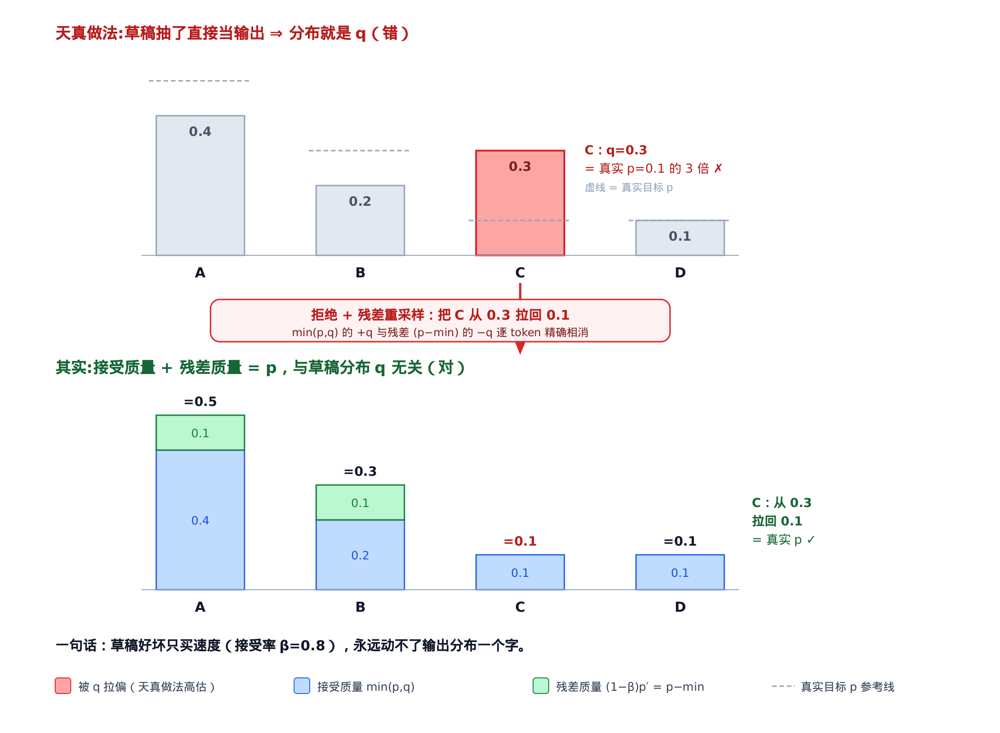
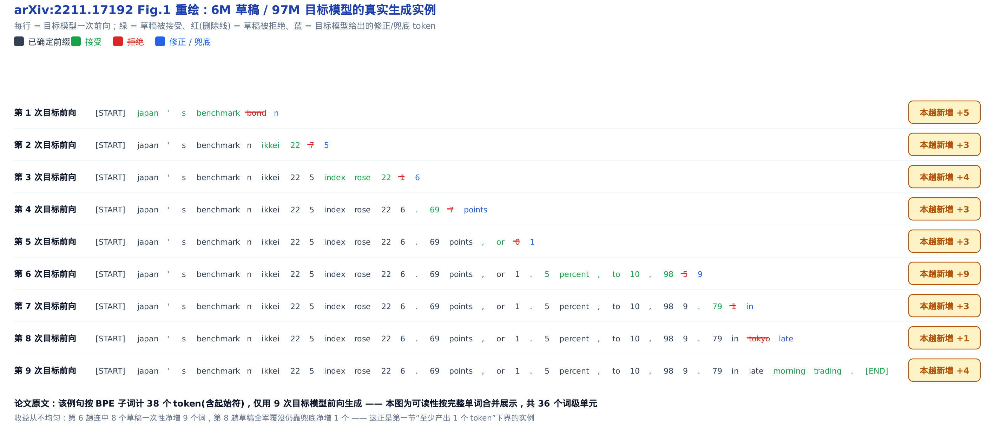
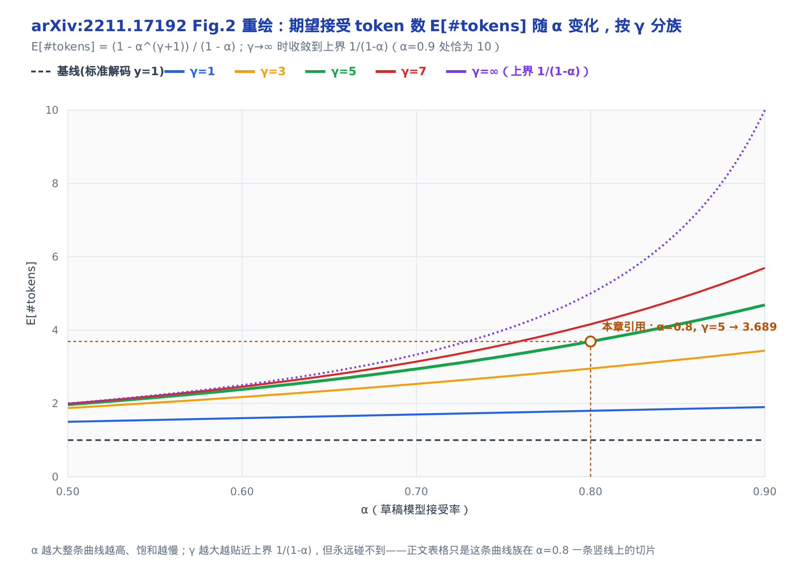
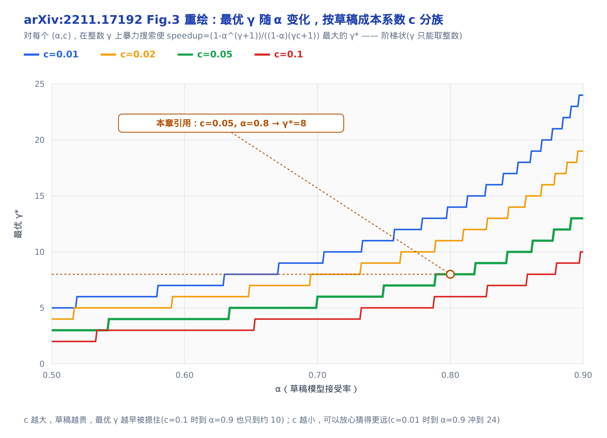
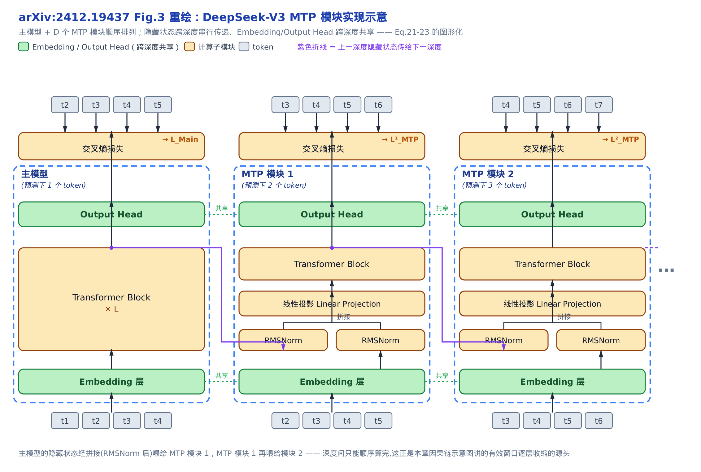

# 【原理篇·论文精读】投机采样：拒绝采样保分布定理与加速账本


> 你在这里：全书第七部分「量化 / 采样 / 投机 / 模型」的原理深潜。
> 上一站 [第 33 章](../../ch33-sampling-npu-adaptation/narrative/chapter.md) 讲了昇腾采样器，含投机的验证侧拒绝采样。
> 这一章补齐它背后的数学：拒绝采样为什么不改分布、加速比从哪来。
> 下一站 [第 35 章](../../ch35-primer-dflash/narrative/chapter.md) 顺着「draft 怎么猜」往前走，看 DFlash 怎么把草稿从逐 token 换成一次前向的整块。

投机解码有一句听起来像魔法的承诺：**用小模型抢跑、大模型并行验证，能几倍加速，而输出分布分毫不差。**「更快」好理解，「分毫不差」才是它凭什么敢在生产里默认开启的底气。本章的全部数学挂在一条恒等式上：发出任何一个 token 的总概率等于「接受质量」加「残差质量」两段之和—— $`\min(p,q) + \big(p-\min(p,q)\big) = p`$ ，草稿分布 $`q`$ 在加法里**整个相消**。这一下相消把投机解码劈成互不往来的两本账：**正确性无条件**——无论草稿多烂，输出分布严格是 $`p`$ ，不是近似；**速度单独定价**——草稿的好坏全部折算进接受率 $`\alpha`$ （它恰好等于 1 减去两个分布的距离），只决定快多少。每一节都挂在这条主线上。



路线：先看**自回归解码为什么串行受限**、并行验证为什么近乎白赚（动机）；再**证明这条恒等式**并给草稿开出成绩单 $`\alpha`$ （保分布定理）；然后**把每趟期望产出与墙钟加速比写成闭式**（加速账本）；最后看草稿侧的 MTP 因果链怎么把 $`\alpha`$ 抬上去（MTP）。所有公式都锚定两篇论文——投机采样的奠基作 Leviathan 等人的 arXiv:2211.17192，以及 DeepSeek-V3 的 MTP 节选 arXiv:2412.19437。这些数学落进昇腾代码的样子不归本章：验证侧采样器[第 33 章](../../ch33-sampling-npu-adaptation/narrative/chapter.md)已经拆过，投机解码的整机装配见[第 36 章](../../ch36-speculative-decode-npu/narrative/chapter.md)。

先约定一个贯穿全章的记号：用 $`\gamma`$ 表示草稿模型每趟并行验证前预测的 token 数（draft 长度）。它是驱动整个加速比公式的核心旋钮，第三节会正式定义并给它定最优值——在此之前的图注里出现的 $`\gamma`$ （如 Figure 1 示意用的 $`\gamma=7`$ ）都是这个意思。

全程我们用一对好心算的玩具分布贯穿：目标模型 $`M_p`$ 给出 $`p=[0.5,0.3,0.1,0.1]`$ ，草稿模型 $`M_q`$ 给出 $`q=[0.4,0.2,0.3,0.1]`$ ，词表就四个 token $`\{A,B,C,D\}`$ 。数字挑得很讲究，跟着推导能一路口算下来；每张表的数字都另跑过 $`N=400000`$ 的蒙特卡洛参考实现复核（如保分布表的经验频率 $`[0.499,0.301,0.1,0.1]`$ 对目标 $`[0.5,0.3,0.1,0.1]`$ ），这里一句说清，后文不再逐表列出。


只想知道「猜多少、能快多少」，直接跳「三、加速账本」一节；想把「分毫不差」看穿，从「二、保分布定理」顺序读；「四、MTP」一节讲草稿侧怎么把接受率抬上去，可独立阅读。

全章记号先列一张速查表，正文首现处仍会给一句人话解释：

| 符号 | 含义 | 首次出现 |
|---|---|---|
| $`M_p`$ ／ $`M_q`$ | 目标模型（要严格保住其输出分布的大模型）／草稿模型（抢跑代猜的小模型） | 开篇 |
| $`p(x)`$ ／ $`q(x)`$ | 同一前缀下 $`M_p`$ ／ $`M_q`$ 给出的 next-token 分布 | 开篇 |
| $`\gamma`$ | 草稿每趟连猜的 token 数（draft 长度），加速账本的核心旋钮 | 开篇 |
| $`\beta`$ | 单点接受率 $`\sum_x\min(p,q)`$ ：一个前缀下草稿平均被保留的比例 | 二、接受准则 |
| $`p'(x)`$ | 残差分布 $`\mathrm{norm}(\max(0,p-q))`$ ：草稿被拒后找补用的分布 | 二、残差重采样 |
| $`\alpha`$ | 期望接受率 $`E(\beta)`$ ：草稿模型的成绩单，对所有前缀取期望 | 二、成绩单 |
| $`D_{LK}`$ | 对称散度 $`\sum_x\lvert p-M\rvert`$ （ $`M=(p+q)/2`$ 为两分布平均），满足 $`\beta=1-D_{LK}`$ | 二、成绩单 |
| $`c`$ | 成本系数：单次 $`M_q`$ 与单次 $`M_p`$ 的耗时之比 | 三、墙钟加速比 |
| $`M_k`$ | 深度 $`k`$ 专属的可学习投影矩阵（论文标注 $`M_k\in\mathbb{R}^{d\times 2d}`$ ），把两路 RMSNorm 输出拼接成的 2d 维向量线性映射回 d 维——和目标模型 $`M_p`$ 、草稿模型 $`M_q`$ 只是字母撞车，不是同一类对象 | 四、MTP（论文 Eq.21） |

---

## 一、动机：自回归解码为什么串行受限

先说清楚要解决什么。自回归解码像一个**只能一次写一个字的打字员**：第 $`t`$ 个字必须等前 $`t-1`$ 个字落纸才能动笔——解码 $`K`$ 个 token 就是 $`K`$ 次串行前向。这是 arXiv:2211.17192 §1 开篇点的题：`decoding K tokens takes K serial runs of the model`。

关键的一层洞察是：大模型单步慢，**不是算力用满了，而是在等着从显存里把几百亿参数搬进来**（内存带宽 / 通信受限，§1）。一次前向要把几百亿参数从显存搬进计算单元，延迟被这段搬运时间主导，而不是被乘加算力主导——参数搬进来的那段时间里，算力其实大量闲置。投机解码正是拿这段闲置做文章：**让小模型先猜一串，再让大模型一趟并行验证这一串**。既然验证 1 个和验证 $`\gamma`$ 个都要把同一批参数搬一遍，把 $`\gamma`$ 个草稿塞进同一趟并行验证，等于把这次参数搬运的固定成本摊到多个 token 上——猜对多少就一次落地多少 token，近乎免费。


> 标准解码：38 个 token 要 38 次串行 $`M_p`$ 。
> 投机解码：同样 38 个 token 只用了 9 次 $`M_p`$ 。
> 差距全靠 $`M_q`$ 的草稿并行摊进验证里。

论文 Figure 1 那个例子最直观：一句 38 个 token 的生成，标准解码要 38 次串行的大模型前向；投机解码只用了 **9 次**大模型串行前向就产出了同样 38 个 token（论文并未给出该例的 $`\gamma`$ ；上图里每次验证前那串草稿，是借论文 Figure 5 的 $`\gamma=7`$ 设置做的示意穿插）。省下的近 30 次串行深度，就是加速的来源。

上面的泳道图只讲清楚了「次数变少」，论文原图更进一步——它是用真实训练出来的两个模型跑出来的一句话，逐 token 标了色，让「哪些词被接受、哪些词被替换」看得一清二楚：



第 1 次前向就一次接受了 5 个词（`japan's benchmark`，`bond` 被拒改判 `n`），第 6 趟更是连中 8 个草稿、一次净增 9 个词；就算某一趟草稿全军覆没（如第 8 趟），大模型也会兜底吐出 1 个词——这正是下面「每趟至少产出 1 个 token」这条下界在真实生成里的样子。

**不变量（下界保证）**：这里必须强调一个下界——**每趟并行验证至少产出 1 个 token**。哪怕小模型全猜错，大模型这一趟也会自己出一个「兜底」token。所以投机解码在最坏情况下也不会比标准解码慢（不计小模型开销）——它只有上行空间，这也是它敢默认开启的另一半底气。

但「不改分布」这句话，光靠「并行验证」是撑不住的。天真地「小模型猜、大模型点头」必然引入偏差：直接把草稿当输出，分布就是 $`q`$ ——玩具例里 C 会被系统性高估 3 倍（ $`q=0.3`$ 对 $`p=0.1`$ ）。把「分布 $`=q`$ 」恒等修复成「分布 $`=p`$ 」的，是下一节那个精心设计的**接受—拒绝—残差重采样**三段式——也就是开篇那条 $`q`$ 相消的恒等式。

---

## 二、保分布定理： $`q`$ 在恒等式里相消

这一节兑现开篇主线的前一半：**按投机采样的规则采出来的 token，其分布严格等于直接从 $`p`$ 采样。** 证明分三块搭起来——接受准则、残差重采样、两段相加时 $`q`$ 的相消——最后给草稿开一张成绩单 $`\alpha`$ ，它是主线的后一半「速度定价」里唯一的模型变量。

这三块合起来就是论文的 Algorithm 1（arXiv:2211.17192 §2.3）。先把它整段摆出来，后面三小节逐行拆解：

```text
输入：目标模型 M_p、草稿模型 M_q、前缀 prefix、draft 长度 γ
1. 草稿连猜：用 M_q 自回归采 γ 个 token x_1..x_γ，记下各自的 q(x_i)
2. 并行验证：用 M_p 一趟算出 p(x_i)，i = 1..γ+1（第 γ+1 个供全接受时兜底）
3. for i = 1..γ:                        # 逐个判定，见「接受准则」小节
       r ~ U(0,1)
       if r ≤ p(x_i)/q(x_i):  接受 x_i   # 等价于以 min(1,p/q) 接受
       else:                            # 第一个被拒处停下
           n ← i-1
           从残差 p' = norm(max(0,p-q)) 重采一个 token，break   # 见「残差重采样」小节
4. 若 γ 个全部接受：额外再从 p 采一个 bonus token
5. 返回接受的前 n 个 + 那 1 个（重采或 bonus）
```

下面三小节就是把这段伪代码的每一步讲清楚（接受准则 = 第 3 行，残差重采样 = 第 3 行的 else，保分布 = 两者相加）。它的向量化实现住在验证侧采样器里（[第 33 章](../../ch33-sampling-npu-adaptation/narrative/chapter.md)已拆过本体，[第 36 章](../../ch36-speculative-decode-npu/narrative/chapter.md)讲整机装配）——本章只管把每一步「为什么合法」证清楚。

### 接受准则：以 $`\min(1, p/q)`$ 保留草稿

先看单个 token。小模型采出一个 $`x\sim q(x)`$ ，我们该不该留它？投机采样的规则（arXiv:2211.17192 §2.3）是：

> `keeping it if q(x) <= p(x), and in case q(x) > p(x) we reject the sample with probability 1 - p(x)/q(x)`

翻成一句人话：**草稿不比主编更自信就免费采纳；一旦草稿对某个 token 用力过猛（ $`q>p`$ ），主编只按 $`p/q`$ 的赔率保留它。** 合起来，接受概率恰好是

```math
\mathrm{accept}(x) = \min\!\left(1,\ \frac{p(x)}{q(x)}\right)
```

这里 $`M_q`$ 是抢着起草的实习生， $`M_p`$ 是主编。 $`q\le p`$ 的 token 主编只会更想要，直接保留； $`q>p`$ 的 token 是实习生自作主张多提的，得打折。

把玩具分布代进去，逐 token 算一遍（这就是接受准则的数值追踪）。表格末行会先出现一个记号 $`\beta=\sum_x\min(p,q)`$ ——它是**单点接受率**（本小节末会正式定义并证明 $`\beta\in[0,1]`$ ），这里先记住它是「草稿平均有多大比例被留下」即可：

<!-- trace: speculative-sampling-accept-reject -->

| token | p(x) | q(x) | q<=p？ | 接受概率 min(1,p/q) |
|---|---|---|---|---|
| A | 0.5 | 0.4 | yes | 1.0 |
| B | 0.3 | 0.2 | yes | 1.0 |
| C | 0.1 | 0.3 | no | 0.333 |
| D | 0.1 | 0.1 | yes | 1.0 |
| 合计：单点接受率 β = Σ min(p,q) | | | | 0.8 |


> A、B、D 三个 $`q\le p`$ ，接受概率恒为 1.0。
> 只有 C（ $`q=0.3>p=0.1`$ ）被过度提议，只以 $`p/q=0.333`$ 存活。
> 单点接受率合计 $`\beta=\sum_x\min(p,q)=0.8`$ 。

C 是唯一的例外：小模型给它 0.3 的概率，主编只想要 0.1，于是它只有 $`0.1/0.3\approx0.333`$ 的机会活下来。把每个 token 「被采到（ $`q`$ ）× 被接受（ $`\min(1,p/q)`$ ）」的概率加起来，正好是 $`\sum_x\min(p,q)=0.8`$ ——这个量后面会反复出现，它就是单点接受率 $`\beta`$ 。

**不变量（接受概率合法，见 arXiv:2211.17192 §2.3(接受准则)与 §3.1 Definition 3.1(β 的正式定义)）**： $`\min(1,\cdot)`$ 由构造 $`\le 1`$ ，又因 $`p,q\ge 0`$ 故 $`\ge 0`$ ；而单点接受率

```math
\beta = \sum_x \min(p,q) \le \sum_x q(x) = 1
```

且 $`\ge 0`$ 。它正是 $`q`$ 的质量里「同时落在 $`p`$ 之下」的那一份，必然是 $`[0,1]`$ 内的合法概率。

### 残差重采样：被拒时从 $`p'`$ 采回

接受准则解决了「留不留」，但草稿被拒时得**补一个** token——补什么？如果还是从 $`q`$ 整个重摇，偏差就回来了。投机采样的答案是从**残差分布**重采：

```math
p'(x) = \mathrm{norm}\big(\max(0,\ p(x)-q(x))\big)
```

直觉是：**只从「主编想要得比实习生给得更多」的地方（ $`\max(0,p-q)`$ ）重摇。** 这块补丁恰好填上 $`p`$ 超出 $`q`$ 的缺口，一点不多一点不少。

它的归一化常数不是随便一个数——arXiv:2211.17192 §A.1 证明它恰好是 $`1-\beta`$ 。这里先点破一条被悄悄换了写法的恒等式： $`\max(0,a-b)=a-\min(a,b)`$ —— $`a>b`$ 时两边都等于 $`a-b`$ ， $`a\le b`$ 时两边都等于 $`0`$ 。所以上一步的 $`\max(0,p-q)`$ 和下面这个分数式里的 $`p-\min(p,q)`$ 说的是同一个量：

```math
p'(x) = \frac{p(x) - \min(p(x),q(x))}{\sum_{x'}\big(p(x') - \min(p(x'),q(x'))\big)} = \frac{p(x) - \min(p(x),q(x))}{1-\beta}
```

分母那步只用了归一化： $`\sum_x p(x)=1`$ 而 $`\sum_x\min(p,q)=\beta`$ ，逐项相减即 $`\sum_x(p-\min)=1-\beta`$ 。这个「归一化常数 = $`1-\beta`$ 」是保分布证明的临门一脚，记住它。

代入玩具分布：

<!-- trace: residual-recovered-distribution -->

| token | p-q | max(0,p-q) | p'(x)=norm |
|---|---|---|---|
| A | 0.1 | 0.1 | 0.5 |
| B | 0.1 | 0.1 | 0.5 |
| C | -0.2 | 0.0 | 0.0 |
| D | 0.0 | 0.0 | 0.0 |
| 归一化常数 Σ max(0,p-q)（残差总质量）| 0.2 | 0.2 | 0.2 |


> 只有 A、B 被欠提议（ $`p`$ 各比 $`q`$ 多 0.1）。
> 残差总质量 0.2 平分给它们， $`p'=[0.5,0.5,0,0]`$ 。
> 被过度提议的 C、D 分不到任何找补质量。

只有 A、B 是「主编想要更多」的 token（ $`p-q=0.1`$ ），残差质量 0.2 平分给它们，得 $`p'=[0.5,0.5,0,0]`$ 。C 被过度提议（ $`p-q=-0.2`$ ，裁成 0），它的问题已经在拒绝环节处理过了，这里分不到。

**不变量（残差质量 = $`1-\beta`$ ）**：

```math
\sum_x \max(0, p-q) = \sum_x \big(p - \min(p,q)\big) = 1 - \sum_x \min(p,q) = 1-\beta
```

本例 $`0.2=1-0.8`$ 。只要 $`\beta<1`$ （可能发生拒绝）， $`p'`$ 就是一个合法分布。

### 合起来：保分布定理的完整证明

现在把两块拼起来。发出一个 token $`x'`$ 有两条**互斥**路径：要么保留一个被接受的草稿，要么找补一个被拒的草稿。arXiv:2211.17192 §A.1 把两条路径的概率分别算出来：

```math
P(x=x') = P(\mathrm{accepted},\ x=x') + P(\mathrm{rejected},\ x=x')
```

接受路径——采到 $`x'`$ （概率 $`q(x')`$ ）且它被接受（概率 $`\min(1,p/q)`$ ）：

```math
P(\mathrm{accepted},\ x=x') = q(x')\cdot\min\!\left(1,\frac{p(x')}{q(x')}\right) = \min(p(x'),\ q(x'))
```

拒绝路径——发生了拒绝（概率 $`1-\beta`$ ）且残差采到 $`x'`$ （概率 $`p'(x')`$ ），代入上面的归一化常数：

```math
P(\mathrm{rejected},\ x=x') = (1-\beta)\,p'(x') = p(x') - \min(p(x'),\ q(x'))
```

两条相加（arXiv:2211.17192 §A.1）， $`\min`$ 项精确相消：

```math
P(x=x') = \min(p,q) + \big(p(x')-\min(p,q)\big) = p(x')
```

证毕。 $`\square`$ 这就是那句「分毫不差」的全部数学——**接受贡献 $`\min(p,q)`$ ，残差贡献 $`p-\min(p,q)`$ ，合起来永远是 $`p`$**，像把一块饼切成两份，合起来永远是整块。

用玩具分布把这块饼摆出来（ $`\beta=0.8`$ ）：

<!-- trace: distribution-preserving-proof -->

| token | 接受 min(p,q) | 残差 (1-β)p'(x) | 合计 P(x=x') | p(x) 目标 |
|---|---|---|---|---|
| A | 0.4 | 0.1 | 0.5 | 0.5 |
| B | 0.2 | 0.1 | 0.3 | 0.3 |
| C | 0.1 | 0.0 | 0.1 | 0.1 |
| D | 0.1 | 0.0 | 0.1 | 0.1 |


> 每个 token 的柱子分两段：接受质量 $`\min(p,q)`$ 加残差质量 $`(1-\beta)p'`$ 。
> 两段合计精确等于目标 $`p(x)`$ ，A、B、C、D 无一例外。
> 40 万次蒙特卡洛的经验频率逼近各自的 $`p`$ 。

A 的 $`0.4+0.1=0.5`$ ，B 的 $`0.2+0.1=0.3`$ ，C、D 各 $`0.1+0=0.1`$ ——四个 token 的合计精确重构出目标 $`p=[0.5,0.3,0.1,0.1]`$ 。

**不变量（保分布与草稿无关）**：证明里 $`q`$ 完全相消了。也就是说，**无论草稿模型 $`M_q`$ 有多烂，输出分布永远是 $`p`$**——draft 的好坏只影响速度，永不影响正确性。这正是 §3.6 说的 `guarantee an identical output distribution for any choice of approximation model`。哪怕用一个随机猜的 $`M_q`$ ，输出也是对的，只是几乎没有加速。开篇说的「两本账」在此分家：正确性这本账已经无条件关账，剩下的全是速度。

> **严谨（与经典拒绝采样的分界）**：投机采样和经典拒绝采样长得像但不是一回事。经典拒绝采样要一个全局常数 $`M=\max_x p/q`$ （这是它自己的记号，只是个上界常数，与本章的 $`M_p`$ 、 $`M_q`$ 无关），接受准则是 $`r<p/(Mq)`$ ，其期望接受率 $`\le\alpha`$ （arXiv:2211.17192 §A.2 有不等式对比）。投机采样的逐点 $`\min(1,p/q)`$ 期望接受率恰为 $`\alpha`$ ，（可能大幅）更高，还省去了求 $`M`$ ——这也是它值得单独起一个名字的原因。

### 成绩单 $`\alpha`$ ：接受率就是 1 减分布距离

上面反复出现的 $`\beta=\sum_x\min(p,q)`$ 是**单个 prefix** 的接受率。给整对模型打分，对所有 prefix 取期望（arXiv:2211.17192 §3.2 Corollary 3.6），就是草稿模型的成绩单 $`\alpha`$ ——而这张成绩单只有一行洞见：**接受率恰好等于 1 减去两个分布的距离**，

```math
\alpha = E(\beta) = E\big(\min(p,q)\big) = 1 - E\big(D_{LK}(p,q)\big)
```

其中 $`D_{LK}`$ 是论文 Definition 3.2 的对称散度（ $`M=(p+q)/2`$ 是两分布的平均——这个 $`M`$ 只是散度定义里的中点记号）：

```math
D_{LK}(p,q) = \sum_x |p(x) - M(x)| = 1 - \sum_x \min(p(x),\ q(x)) = 1-\beta
```

草稿越贴着目标（ $`D_{LK}\to 0`$ ），成绩越满（ $`\alpha\to 1`$ ）；抛硬币式的草稿距离拉满、成绩趋零。 $`\alpha`$ 是模型和任务的**内在属性**，与硬件无关——下一节的速度账本里，它是唯一的模型变量。

> **严谨（Lemma 3.3 / Theorem 3.5 的推导）**：Definition 3.2 原式是两个绝对值和 $`\sum_x|p(x)-M(x)| = \sum_x|q(x)-M(x)|`$ ，相等是因为 $`M`$ 是中点： $`p(x)-M(x) = (p(x)-q(x))/2 = -(q(x)-M(x))`$ ，两式只差一个符号，取绝对值后一样。Lemma 3.3 走另一条恒等式 $`|a-b|=a+b-2\min(a,b)`$ （较大值减较小值，对任意实数成立）：代 $`a=p(x),b=q(x)`$ 、对 $`x`$ 求和，再用 $`\sum_x p(x)=\sum_x q(x)=1`$ 化简，得 $`\sum_x|p-q| = 2 - 2\sum_x\min(p,q)`$ ；两边除以 2（左边正是 $`\sum_x|p-M|`$ ），即 $`D_{LK} = 1-\sum_x\min(p,q)`$ 。于是 Theorem 3.5 给出 $`\beta = E_{x\sim q}\min(1,p/q) = \sum_x\min(p,q) = 1-D_{LK}`$ 。由此 $`0\le\beta\le1`$ 逐点成立，故 $`\alpha=E(\beta)\in[0,1]`$ ； $`\alpha=1`$ 当且仅当处处 $`p=q`$ ——草稿与目标完全重合的极端情形。

$`\beta`$ 会随 prefix 波动，取两个 prefix 感受一下（prefix1 用我们的玩具分布，prefix2 换成一个 $`q`$ 近均匀的「难」例子）：

<!-- trace: acceptance-rate-alpha -->

| prefix | β = Σ min(p,q) | D_LK = 1-β |
|---|---|---|
| prefix1（易）| 0.8 | 0.2 |
| prefix2（难：q 近均匀）| 0.55 | 0.45 |
| α = E(β) 平均 | 0.675 | 0.325 |

易的 prefix 给 $`\beta=0.8`$ ，难的（草稿几乎在瞎猜）只给 0.55，两者平均得这对模型的 $`\alpha=0.675`$ ；等价地 $`1-E(D_{LK})=1-0.325=0.675`$ 。论文实测里，比目标小两个数量级的草稿模型通常落在 $`\alpha\in[0.5,0.9]`$ （Table 3），比如 T5-XXL 配 T5-small 在翻译任务上 $`\alpha\approx0.75`$ ——这些实测值下一节要直接代进加速比。

---

## 三、加速账本：期望产出与墙钟加速比

定理把「对」无条件关账，这一节记「快」的账。两个量：一趟平均产出几个 token（ $`E[L]`$ ），以及换算成墙钟的加速比。整本账里只有 $`\alpha`$ 、 $`\gamma`$ 、 $`c`$ 三个变量——没有任何「质量折扣」项，这正是主线恒等式买来的自由。

### 期望接受长度 $`E[L]`$

一趟 Algorithm 1 让 $`M_q`$ 连猜 $`\gamma`$ 个， $`M_p`$ 一趟并行验证，产出的 token 数是一个**截断几何变量**（truncated geometric random variable）：以概率 $`\alpha^k`$ 连续接受前 $`k`$ 个（ $`k\le\gamma`$ ），不走运就在第 $`\gamma`$ 步截断——即成功概率 $`1-\alpha`$ 、上限封在 $`\gamma+1`$ 的几何分布。arXiv:2211.17192 §3.1 Eq.1 给出期望：

```math
E[\#\mathrm{tokens}] = \frac{1 - \alpha^{\gamma+1}}{1-\alpha}
```

推导只是一个几何级数：想连接受 $`k`$ 位，前面每一位都得接受，概率 $`\alpha^k`$ 。这里借了一条对任意取值有限的非负整数随机变量都成立的恒等式——期望等于各尾概率之和：

```math
E[N] = \sum_k P(N>k)
```

代入这里的场景，第 $`k`$ 个尾项 $`P(N>k)`$ 就是「前 $`k`$ 个 guess 全被接受」的概率 $`\alpha^k`$ （ $`k=0`$ 时为空积，等于 $`1`$ ，对应每趟至少兜底产出的那 1 个 token）；逐项加总，于是 $`E`$ 就是 $`\sum_{k=0}^{\gamma}\alpha^k`$ ，正好收敛成上面那个闭式。直觉是：**再多猜一个 token，只有在前面全接受时才兑现（概率 $`\alpha^k`$ ）**，所以收益像一条会饱和的几何级数。

代 $`\alpha=0.8`$ ，让 $`\gamma`$ 一路涨：

<!-- trace: expected-accepted-length -->

| γ | E[#tokens] = (1-a^(g+1))/(1-a) | 几何和 Σ_{k=0}^{g} a^k | 上界 1/(1-a) |
|---|---|---|---|
| 1 | 1.8 | 1.8 | 5.0 |
| 3 | 2.952 | 2.952 | 5.0 |
| 5 | 3.689 | 3.689 | 5.0 |
| 10 | 4.571 | 4.571 | 5.0 |


> $`\alpha=0.8`$ 时每趟期望产出随 $`\gamma`$ 上升。
> 但上界恒为 $`1/(1-\alpha)=5.0`$ ，永远够不到。
> $`\gamma`$ 从 5 翻到 10，收益只从 3.689 涨到 4.571。

闭式在每个 $`\gamma`$ 都精确等于直接几何和（中间两列相等，是对公式的交叉验证）。关键观察是**收益递减**： $`\gamma`$ 从 5 加到 10（翻倍），期望产出只从 3.689 涨到 4.571，逼近上界 $`1/(1-\alpha)=5.0`$ 却永远够不到。

**不变量（单调有上界）**：因 $`0<\alpha<1`$ ， $`\alpha^{\gamma+1}`$ 随 $`\gamma`$ 严格递减，故 $`E`$ 关于 $`\gamma`$ 严格递增——每多一个 draft 位置带来 $`+\alpha^{\gamma+1}>0`$ 的增量，正但几何式衰减，累加起来永不超过上界 $`1/(1-\alpha)`$ 。

上面这张表只是 $`\alpha=0.8`$ 这一条竖线上的四个采样点；论文原图把 $`\alpha`$ 、 $`\gamma`$ 两个维度一起铺开，一眼就能看到整条曲线族的形状：



$`\alpha`$ 越大，整条曲线越高、饱和得越慢； $`\gamma`$ 越大，曲线越贴近各自的上界 $`1/(1-\alpha)`$ ，但永远碰不到——本章的数值表只是这整条曲线族在 $`\alpha=0.8`$ 处切下来的一条竖线。

### 墙钟加速比与最优 $`\gamma`$

$`E[L]`$ 还没算上小模型的开销。设 $`c`$ 为**成本系数**（Definition 3.7）：单次 $`M_q`$ 与单次 $`M_p`$ 的耗时之比。一趟 Algorithm 1 花 $`T(1+c\gamma)`$ 、产出上面那个期望个数的 token，两者相除就是墙钟加速比（arXiv:2211.17192 §3.3 Theorem 3.8）：

```math
\mathrm{speedup} = \frac{1 - \alpha^{\gamma+1}}{(1-\alpha)(\gamma c + 1)}
```

这是一场拔河：**猜更多 token 让每次目标调用验证得更多（分子涨），但每个额外草稿都要花掉 $`c`$ （分母涨）**。分子饱和于 $`1/(1-\alpha)`$ 、分母线性增长，所以比值先升后降，有唯一内部极大。

代入实测 $`\alpha`$ 复算，并对照论文 Table 1：

<!-- trace: walltime-speedup -->

| α | γ | c | 加速比 (1-a^(g+1))/((1-a)(gc+1)) | 备注 |
|---|---|---|---|---|
| 0.8 | 5 | 0.0 | 3.689 | Table 1 |
| 0.9 | 10 | 0.0 | 6.862 | Table 1 |
| 0.8 | 8 | 0.05 | 3.092 | 最优 γ；Cor 3.9 ≥ 1.714 |


> 草稿开销可忽略（ $`c=0`$ ）时复现论文 Table 1： $`\alpha`$=0.8、 $`\gamma`$=5 时得 3.689×。
> 加入现实开销 $`c=0.05`$ ，最优点移到 $`\gamma=8`$ ，得 $`3.092\times`$ 。
> 仍远高于 Corollary 3.9 的下界 $`1.714\times`$ 。

草稿开销可忽略（ $`c=0`$ ）时， $`\alpha=0.8,\gamma=5`$ 得 $`3.689\times`$ ， $`\alpha=0.9,\gamma=10`$ 得 $`6.862\times`$ ——精确复现论文 Table 1。加入现实草稿开销 $`c=0.05`$ 后，最优点从 $`\gamma`$ 无限大缩回到 $`\gamma=8`$ ，得 $`3.092\times`$ 。这里的 $`c=0.05`$ 是个示意值：它取决于硬件与草稿模型相对主模型的大小，草稿越小、主模型越受内存带宽约束， $`c`$ 越小；实践中比目标小一两个数量级的草稿常落在 $`c\in[0.02,0.11]`$ （论文 Table 4 里最大的 T5-large 档位到 0.11）， $`c`$ 越小，最优 $`\gamma`$ 越大、可榨出的加速比越高。

> **严谨（Corollary 3.9：有增益的充分条件）**：只要 $`\alpha>c`$ ，就存在使加速比 $`>1`$ 的 $`\gamma`$ ，且至少 $`(1+\alpha)/(1+c)`$ 。下界的来路很朴素：把加速比公式代进 $`\gamma=1`$ ，分子 $`1-\alpha^2`$ 里的因子 $`1-\alpha`$ 与分母约掉，正好剩 $`(1+\alpha)/(1+c)`$ ——它就是 $`\gamma=1`$ 这一个特例的加速比；最优加速比是对所有 $`\gamma`$ 取最大，自然不小于族中任一成员。本例 $`0.8>0.05`$ ，下界 $`(1+0.8)/(1+0.05)=1.714\times`$ ，最优点的 $`3.092\times`$ 远高于保底。注意这只是**存在性**结论，不能反推「更大的 $`\gamma`$ 不会更差」：同样在 $`\alpha=0.8,c=0.05`$ 下， $`\gamma=100`$ 时加速比只剩 $`0.833\times`$ ——草稿开销 $`100c`$ 早已压垮饱和的分子。加速比随 $`\gamma`$ 先升后降， $`\gamma`$ 又是整数，最优值直接数值搜索（§3.5）。

正文这里只给了 3 行离散数值，「拔河」的比喻讲清了方向感，但看不到「c 越小、最优 γ 越大」这条关系在连续谱上的整体形状——论文原图把这条关系铺成了完整的阶梯曲线族：



$`c`$ 越大，草稿越贵，最优 $`\gamma`$ 越早被摁住（ $`c=0.1`$ 时到 $`\alpha=0.9`$ 也只到约 10）； $`c`$ 越小，可以放心猜得更远（ $`c=0.01`$ 时到 $`\alpha=0.9`$ 冲到 24）。本章代入的 $`c=0.05,\alpha=0.8\to\gamma^*=8`$ 只是这条阶梯曲线族上的一个点。

小结一下这三张表连起来的故事： $`\alpha`$ 定上限， $`\gamma`$ 在收益递减和草稿开销之间找平衡， $`c`$ 把「有用的 $`\gamma`$ 」摁在一个有限值上。这个 $`\gamma`$ 在工程里有具体的名字——上层配置的 `num_speculative_tokens`，传到验证入口就是形参 `max_spec_len`；验证输出的宽度是 $`\gamma+1`$ ，多出的 **+1** 正是第一节「每趟至少产出 1 个 token」的兜底位。本节两条曲线（饱和的 $`E[L]`$ 、先升后降的加速比），本质就是为调这个旋钮准备的理论账本；旋钮所在的向量化验证实现，见[第 33 章](../../ch33-sampling-npu-adaptation/narrative/chapter.md)与[第 36 章](../../ch36-speculative-decode-npu/narrative/chapter.md)。

---

## 四、MTP：把接受率抬上去的草稿链

正确性无条件、速度由 $`\alpha`$ 与 $`c`$ 定价——主线走到这里，投机解码的设计空间只剩一个问题：**去哪找一个 $`\alpha`$ 高、 $`c`$ 低的 $`M_q`$ ？** 独立训练一个小模型是一条路，DeepSeek-V3 给了个更顺手的答案：MTP（Multi-Token Prediction，多 token 预测，arXiv:2412.19437 §2.2）。它本是**训练目标**——在每个位置额外预测多个未来 token，给训练加稠密信号——副产品是每个深度都逐位置给出一个 next-token 分布，这正好是投机解码要的草稿源 $`q`$ 。论文原话直白：`we can also repurpose these MTP modules for speculative decoding to further improve the generation latency`（§2.2, MTP in Inference）。

先亮它的设计洞见：**草稿与目标同源——MTP 共享主模型的 Embedding 与输出头、吃主模型的隐状态起步，让 $`q`$ 天生长得像 $`p`$ 。** 回到成绩单那行等式 $`\alpha = 1-E(D_{LK}(p,q))`$ ：抬 $`\alpha`$ 的唯一途径是压 $`q`$ 与 $`p`$ 的距离，「同源」正是压距离的架构手段；付出的代价是深度间只能串行，换来完整的因果链。

MTP 与 Gloeckle 等人的独立并行头不同，它**串行预测、保持完整因果链**。

> 直觉：Gloeckle 等人的方案（arXiv:2404.19737《Better & Faster Large Language Models via Multi-Token Prediction》）用 D 个互相独立的输出头，从同一套共享 trunk 表示并行地直接预测未来 D 个 token，各头互不看彼此的中间结果；DeepSeek-V3 的 MTP 则让每个深度先吃进上一深度的隐状态、逐层保持因果依赖——这正是它能被复用为串行 draft proposer 的原因。你不需要看 Gloeckle 论文本身的架构细节，接受这一句对比就能继续往下读。

第 $`k`$ 个深度的三步（Eq.21-23）。先把记号备齐： $`t_j`$ 是序列第 $`j`$ 个 token， $`i`$ 是位置下标， $`T`$ 是序列长度； $`\mathrm{Emb}`$ 与 $`\mathrm{OutHead}`$ 是与主模型**共享**的嵌入层与输出头， $`\mathrm{TRM}_k`$ 是深度 $`k`$ 自己的 Transformer block。第一步拼接融合，第二步过 block，第三步出分布：

```math
\mathbf{h}'^k_i = M_k\big[\mathrm{RMSNorm}(\mathbf{h}^{k-1}_i);\ \mathrm{RMSNorm}(\mathrm{Emb}(t_{i+k}))\big]
```

```math
\mathbf{h}^k_{1:T-k} = \mathrm{TRM}_k(\mathbf{h}'^k_{1:T-k})
```

```math
P^k_{i+k+1} = \mathrm{OutHead}(\mathbf{h}^k_i)
```

一句人话：**第 $`k`$ 深度把上一深度的隐状态与第 $`i+k`$ 个 token 的 embedding 拼起来，过一个 Transformer block，再输出这一深度的 next-token 分布**，然后把结果喂给第 $`k+1`$ 深度——这就是因果链。 $`k=1`$ 时 $`\mathbf{h}^{k-1}`$ 就是主模型的表示。Emb 与 OutHead 都与主模型共享，省参数又对齐词表分布（让 $`q`$ 更接近 $`p`$ 、抬高 $`\alpha`$ ）。这里的 $`M_k`$ 是这一深度专属的可学习投影矩阵（ $`M_k\in\mathbb{R}^{d\times 2d}`$ ）——把两路 RMSNorm 拼接成的 2d 维向量线性映射回 d 维，公式里的 $`M_k[\cdot;\cdot]`$ 就是「先拼接、再乘这个矩阵」；它与开篇的目标模型 $`M_p`$ 、草稿模型 $`M_q`$ 只是字母撞车，不是同一类对象，读到这里不要联想成「又一个模型」。

**不变量（窗口随深度收缩）**：Eq.22 里那个 $`1{:}T{-}k`$ 的窗口也来自这里：深度 $`k`$ 的位置 $`i`$ 要用到第 $`i+k`$ 个 token 的 embedding，只有 $`i+k\le T`$ （即 $`i\le T-k`$ ）的位置才凑得齐输入，所以每往深一层，右端就少一个可用位置。落成具体数字：以序列长 $`T=6`$ 为例，深度 1 的有效窗口是 $`T-1=5`$ ，深度 2 是 $`4`$ ，深度 3 是 $`3`$ ——窗口随深度线性收缩（ $`6\to5\to4\to3`$ ），直到 $`\gamma`$ 个深度全部跑完。同理 Eq.23 的下标 $`P^k_{i+k+1}`$ ：位置 $`i`$ 在深度 $`k`$ 已经吃进了截至第 $`i+k`$ 个 token 的信息，于是它预测的是紧随其后的第 $`i+k+1`$ 个 token——深度 $`k`$ 相对位置 $`i`$ 正好前瞻 $`k+1`$ 步。


> 深度 $`k`$ 的输出 $`\mathbf{h}^k`$ 喂给深度 $`k+1`$ 的输入，构成串行因果链。
> 每深一层，有效窗口收缩一个位置（ $`T{-}k`$ ）。
> Emb 与 OutHead 跨深度、跨主模型共享。

上面是本章据 Eq.21-23 自绘的示意图；下面是 DeepSeek-V3 论文自己给出的标准图，可以拿来交叉核对深度间箭头方向、共享层的位置有没有画走样：



主模型的隐藏状态经拼接（RMSNorm 后）喂给 MTP 模块 1，MTP 模块 1 再喂给模块 2——深度间只能顺序算完，这正是上面因果链示意图里「有效窗口逐层收缩」的源头。

数学到此完整。源码只需要一行就能对上 Eq.21——「拼接后乘 $`M_k`$ 」在代码里等价地拆成两路投影相加：

```python
# vllm_ascend/models/deepseek_v4_mtp.py:L121
hidden_states = self.e_proj(inputs_embeds).unsqueeze(-2) + self.h_proj(previous_hidden_states)
```

`e_proj`／`h_proj` 就是 $`M_k`$ 沿拼接维一分为二的两块子矩阵，分别作用在 Eq.21 方括号里的两路 RMSNorm 输出上（`unsqueeze` 只是平台的形状对齐）。除此之外的落地全部住在隔壁：MTP 逐深度的串行路由与共享 Emb／OutHead 的权重装配、验证侧两个算子——接受判定 $`\min(1,p/q)`$ 与残差重采样 $`\mathrm{norm}(\max(0,p-q))`$ ——的向量化实现（含免显式归一化的指数竞速采样技巧，及超出论文标准判定的工程加速分支），见[第 36 章](../../ch36-speculative-decode-npu/narrative/chapter.md)；验证侧采样器本体[第 33 章](../../ch33-sampling-npu-adaptation/narrative/chapter.md)已经拆过。那边的 proposer 工厂除了 MTP 还能分发 EAGLE（另一种草稿 proposer：用对目标模型隐藏特征的外推造草稿，arXiv:2401.15077，同样扮演 $`M_q`$ ；完整原理见姊妹篇《vLLM 源码解读》的 EAGLE 原理章）——无论谁当草稿，本章的定理与账本原封不动。

---

## 五、前瞻：从逐 token 到一次一整块

投机采样这套「猜—并行验证—残差纠偏」的框架有很强的延展性，MTP 只是「怎么造草稿」的其中一种答案——逐深度串行、一次挤出一个 token。下一章 [第 35 章](../../ch35-primer-dflash/narrative/chapter.md) 要讲的 DFlash 换了一条路：把起草也改成一次前向并行吐出一整块草稿，起草延迟不再随块长变长。它的验证侧不用改一个字——本章证明的接受判定 $`\min(1,p/q)`$ 与残差重采样，原封不动就是 DFlash 那趟并行验证要用的地基。

（再往前看一步，还有一个面向半自回归、多头前视的前瞻方案 DSpark，是 DFlash 并行骨干之上的再升级，见 [第 37 章](../../ch37-primer-dspark/narrative/chapter.md)。）

---

## 小结

投机采样的全部数学挂在开篇那条恒等式上：接受一条草稿贡献质量 $`\min(p,q)`$ ，拒绝后从残差 $`p'=\mathrm{norm}(\max(0,p-q))`$ 找补贡献 $`p-\min(p,q)`$ ，两段相加恒等于 $`p`$ —— $`q`$ 整个相消，**正确性无条件、与草稿无关**。草稿质量于是只进速度那本账：成绩单 $`\alpha=1-E(D_{LK}(p,q))`$ 把每趟期望产出封在 $`1/(1-\alpha)`$ 之下，成本系数 $`c`$ 再把最优 $`\gamma`$ 摁在有限值上。想更快只剩一条路——让 $`q`$ 更像 $`p`$ ：MTP 用共享 Emb／OutHead、吃主模型隐状态的串行因果链把 $`\alpha`$ 抬上去；[第 35 章](../../ch35-primer-dflash/narrative/chapter.md)的 DFlash 再去攻起草本身的串行延迟。这些草稿无论换成谁，验证那一半——也就是这条恒等式——一个字都不用改。落地侧：验证采样器见[第 33 章](../../ch33-sampling-npu-adaptation/narrative/chapter.md)，投机解码整机装配见[第 36 章](../../ch36-speculative-decode-npu/narrative/chapter.md)。
