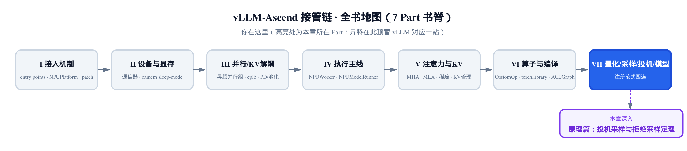
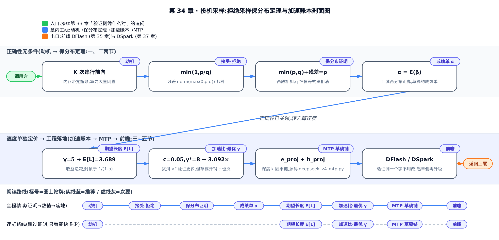
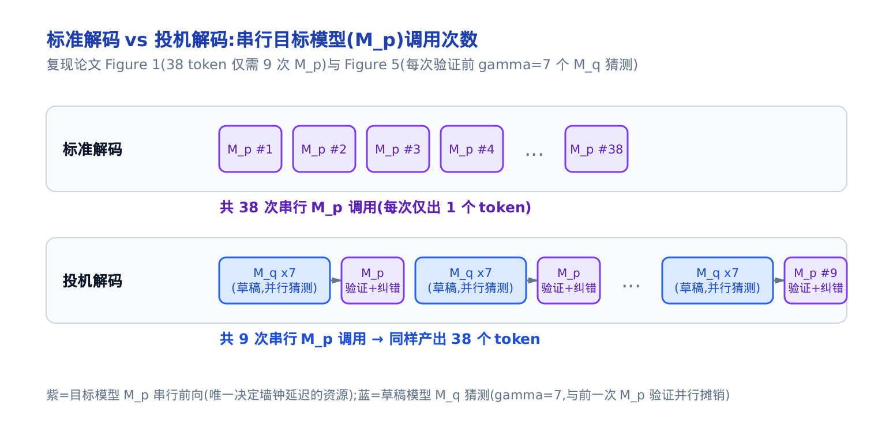
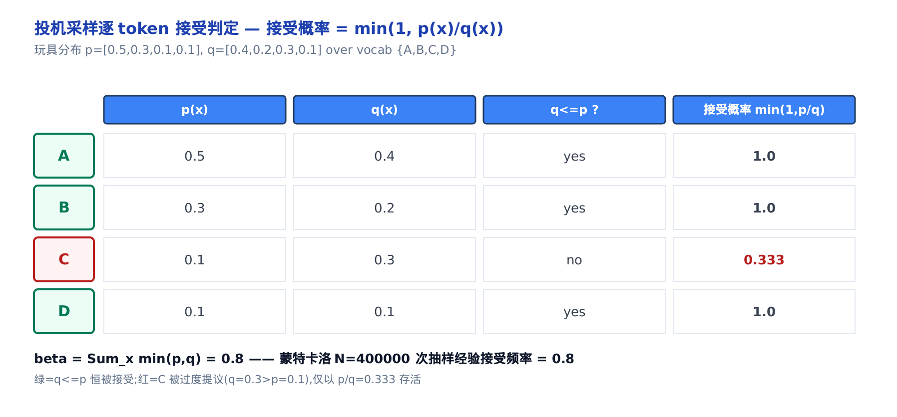
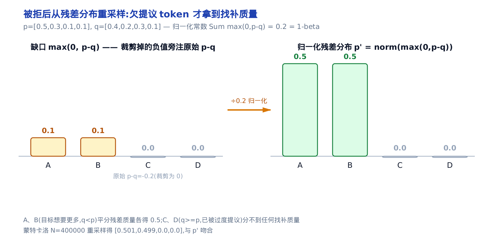
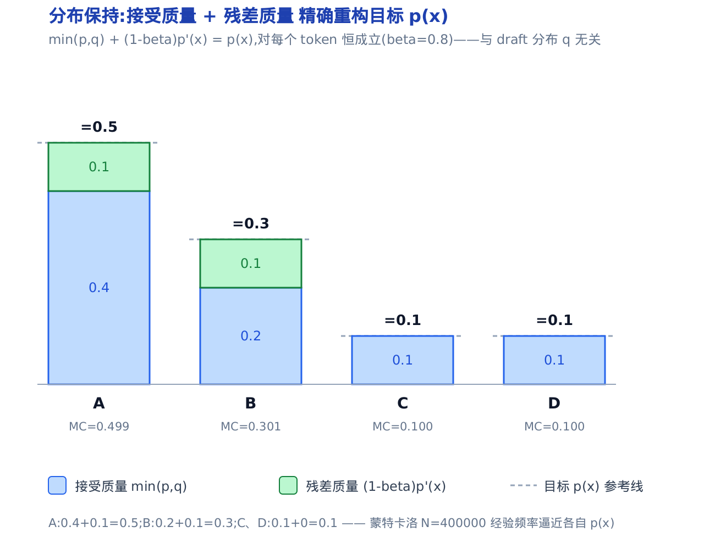
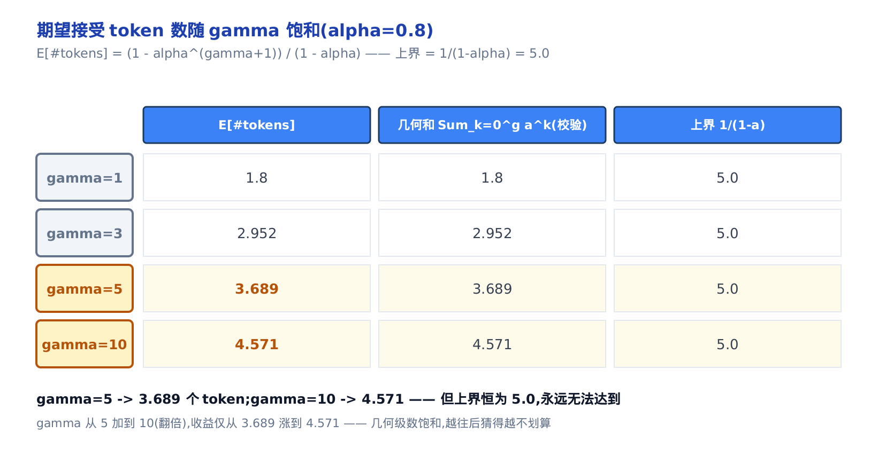
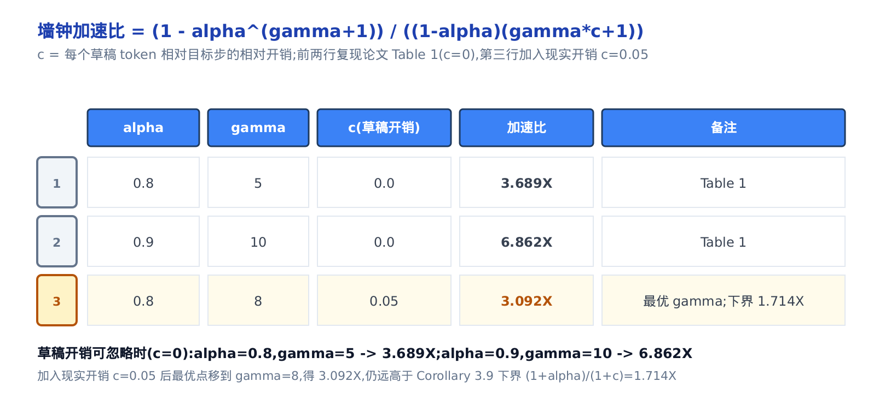
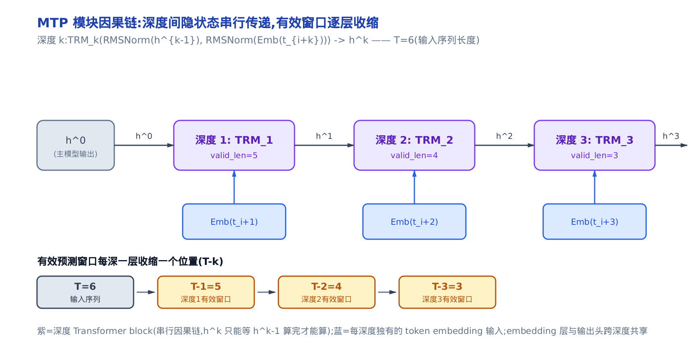

# 投机采样：拒绝采样保分布定理、MTP 与 DSpark 前瞻



> 你在这里：全书第七部分「量化 / 采样 / 投机 / 模型」的原理深潜。
> 上一站 [第 33 章](../../ch33-sampling-npu-adaptation/narrative/chapter.md) 讲了昇腾采样器，含投机的验证侧拒绝采样。
> 这一章补齐它背后的数学：拒绝采样为什么不改分布、加速比从哪来。
> 下一站 [第 35 章](../../ch35-speculative-decode-npu/narrative/chapter.md) 回到工程，看提议侧 proposer 怎么落地。

投机解码有一句听起来像魔法的承诺：**用小模型抢跑、大模型并行验证，能几倍加速，而输出分布分毫不差。**「更快」好理解，「分毫不差」才是它凭什么敢在生产里默认开启的底气——它不是近似，是**数学上可证的无偏加速**。

这一章我们把这句承诺拆成四步走完：先看**自回归解码为什么串行受限**（动机），再**完整证明拒绝采样保分布定理**（推导），然后**代入小参数把加速比算出来**（数值推演），最后落到昇腾栈里 MTP 模块与验证侧拒绝采样器的**真实源码**（落地）。所有公式都锚定两篇论文——投机采样的奠基作 Leviathan 等人的 arXiv:2211.17192，以及 DeepSeek-V3 的 MTP 节选 arXiv:2412.19437。

先约定一个贯穿全章的记号：用 $\gamma$ 表示草稿模型每趟并行验证前预测的 token 数（draft 长度）。它是驱动整个加速比公式的核心旋钮，第三节会正式定义并给它定最优值——在此之前的图注里出现的 $\gamma$ （如 Figure 1 示意用的 $\gamma=7$ ）都是这个意思。

全程我们用一对好心算的玩具分布贯穿：目标模型 $M_p$ 给出 $p=[0.5,0.3,0.1,0.1]$ ，草稿模型 $M_q$ 给出 $q=[0.4,0.2,0.3,0.1]$ ，词表就四个 token $\{A,B,C,D\}$ 。数字挑得很讲究，跟着推导能一路口算下来。



只想看『猜多少、能快多少』怎么落地成真代码，可以跳过证明细节，从「三、数值推演」这一节直接读到「四、落地」；想把『分毫不差』的证明看穿，就从头按顺序通读。

---

## 一、动机：自回归解码为什么串行受限

先说清楚要解决什么。自回归解码像一个**只能一次写一个字的打字员**：第 $t$ 个字必须等前 $t-1$ 个字落纸才能动笔——解码 $K$ 个 token 就是 $K$ 次串行前向。这是 arXiv:2211.17192 §1 开篇点的题：`decoding K tokens takes K serial runs of the model`。

关键的一层洞察是：大模型单步慢，**不是算力用满了，而是在等着从显存里把几百亿参数搬进来**（内存带宽 / 通信受限，§1）。一次前向要把几百亿参数从显存搬进计算单元，延迟被这段搬运时间主导，而不是被乘加算力主导——参数搬进来的那段时间里，算力其实大量闲置。投机解码正是拿这段闲置做文章：**让小模型先猜一串，再让大模型一趟并行验证这一串**。既然验证 1 个和验证 $\gamma$ 个都要把同一批参数搬一遍，把 $\gamma$ 个草稿塞进同一趟并行验证，等于把这次参数搬运的固定成本摊到多个 token 上——猜对多少就一次落地多少 token，近乎免费。



> 标准解码：38 个 token 要 38 次串行 $M_p$ 。
> 投机解码：同样 38 个 token 只用了 9 次 $M_p$ 。
> 差距全靠 $M_q$ 的草稿并行摊进验证里。

论文 Figure 1 那个例子最直观：一句 38 个 token 的生成，标准解码要 38 次串行的大模型前向；投机解码只用了 **9 次**大模型串行前向就产出了同样 38 个 token（论文并未给出该例的 $\gamma$ ；上图里每次验证前那串草稿，是借论文 Figure 5 的 $\gamma=7$ 设置做的示意穿插）。省下的近 30 次串行深度，就是加速的来源。

**不变量（下界保证）**：这里必须强调一个下界——**每趟并行验证至少产出 1 个 token**。哪怕小模型全猜错，大模型这一趟也会自己出一个「兜底」token。所以投机解码在最坏情况下也不会比标准解码慢（不计小模型开销）——它只有上行空间，这也是它敢默认开启的另一半底气。

但「不改分布」这句话，光靠「并行验证」是撑不住的。天真地做「小模型猜、大模型对不对」会引入偏差：小模型偏爱的 token 会被系统性地高估。真正让分布严丝合缝的，是下一节那个精心设计的**接受—拒绝—残差重采样**三段式。

---

## 二、推导：拒绝采样保分布定理

这一节是全章的数学核心。我们要证明的定理只有一句话：**按投机采样的规则采出来的 token，其分布严格等于直接从 $p$ 采样。** 证明分三块搭起来——接受准则、残差重采样、合起来的保分布证明——最后再补上一个刻画「小模型有多好」的量 $\alpha$ 。

这三块合起来就是论文的 Algorithm 1（arXiv:2211.17192 §2.3）。先把它整段摆出来，后面三小节逐行拆解：

```text
输入：目标模型 M_p、草稿模型 M_q、前缀 prefix、draft 长度 γ
1. 草稿连猜：用 M_q 自回归采 γ 个 token x_1..x_γ，记下各自的 q(x_i)
2. 并行验证：用 M_p 一趟算出 p(x_i)，i = 1..γ+1（第 γ+1 个供全接受时兜底）
3. for i = 1..γ:                        # 逐个判定，见 §2.1
       r ~ U(0,1)
       if r ≤ p(x_i)/q(x_i):  接受 x_i   # 等价于以 min(1,p/q) 接受
       else:                            # 第一个被拒处停下
           n ← i-1
           从残差 p' = norm(max(0,p-q)) 重采一个 token，break   # 见 §2.2
4. 若 γ 个全部接受：额外再从 p 采一个 bonus token
5. 返回接受的前 n 个 + 那 1 个（重采或 bonus）
```

下面三小节就是把这段伪代码的每一步讲清楚（接受准则 = 第 3 行，残差重采样 = 第 3 行的 else，保分布 = 两者相加），第四节的验证侧代码正是它的向量化实现。

### 接受准则：以 $\min(1, p/q)$ 保留草稿

先看单个 token。小模型采出一个 $x\sim q(x)$ ，我们该不该留它？投机采样的规则（arXiv:2211.17192 §2.3）是：

> `keeping it if q(x) <= p(x), and in case q(x) > p(x) we reject the sample with probability 1 - p(x)/q(x)`

翻成一句人话：**草稿不比主编更自信就免费采纳；一旦草稿对某个 token 用力过猛（ $q>p$ ），主编只按 $p/q$ 的赔率保留它。** 合起来，接受概率恰好是

$$
\mathrm{accept}(x) = \min\!\left(1,\ \frac{p(x)}{q(x)}\right)
$$

这里 $M_q$ 是抢着起草的实习生， $M_p$ 是主编。 $q\le p$ 的 token 主编只会更想要，直接保留； $q>p$ 的 token 是实习生自作主张多提的，得打折。

把玩具分布代进去，逐 token 算一遍（这就是接受准则的数值追踪）。表格末行会先出现一个记号 $\beta=\sum_x\min(p,q)$ ——它是**单点接受率**（本小节末会正式定义并证明 $\beta\in[0,1]$ ），这里先记住它是「草稿平均有多大比例被留下」即可：

<!-- trace: speculative-sampling-accept-reject -->

| token | p(x) | q(x) | q<=p？ | 接受概率 min(1,p/q) |
|---|---|---|---|---|
| A | 0.5 | 0.4 | yes | 1.0 |
| B | 0.3 | 0.2 | yes | 1.0 |
| C | 0.1 | 0.3 | no | 0.333 |
| D | 0.1 | 0.1 | yes | 1.0 |
| β = Σ min(p,q)（MC N=400000 验证）| 0.8 | | 经验接受率 | 0.8 |



> A、B、D 三个 $q\le p$ ，接受概率恒为 1.0。
> 只有 C（ $q=0.3>p=0.1$ ）被过度提议，只以 $p/q=0.333$ 存活。
> 单点接受率合计 $\beta=\sum_x\min(p,q)=0.8$ 。

C 是唯一的例外：小模型给它 0.3 的概率，主编只想要 0.1，于是它只有 $0.1/0.3\approx0.333$ 的机会活下来。把每个 token 「被采到（ $q$ ）× 被接受（ $\min(1,p/q)$ ）」的概率加起来，正好是 $\sum_x\min(p,q)=0.8$ ——这个量后面会反复出现，它就是单点接受率 $\beta$ 。跑一个 40 万次的蒙特卡洛参考实验，经验接受频率是 0.8，与 $\beta$ 吻合。

**不变量（接受概率合法，见 arXiv:2211.17192 §2.3(接受准则)与 §3.1 Definition 3.1(β 的正式定义)）**： $\min(1,\cdot)$ 由构造 $\le 1$ ，又因 $p,q\ge 0$ 故 $\ge 0$ ；而单点接受率

$$
\beta = \sum_x \min(p,q) \le \sum_x q(x) = 1
$$

且 $\ge 0$ 。它正是 $q$ 的质量里「同时落在 $p$ 之下」的那一份，必然是 $[0,1]$ 内的合法概率。

### 残差重采样：被拒时从 $p'$ 采回

接受准则解决了「留不留」，但草稿被拒时得**补一个** token——补什么？如果还是从 $q$ 整个重摇，偏差就回来了。投机采样的答案是从**残差分布**重采：

$$
p'(x) = \mathrm{norm}\big(\max(0,\ p(x)-q(x))\big)
$$

直觉是：**只从「主编想要得比实习生给得更多」的地方（ $\max(0,p-q)$ ）重摇。** 这块补丁恰好填上 $p$ 超出 $q$ 的缺口，一点不多一点不少。

它的归一化常数不是随便一个数——arXiv:2211.17192 §A.1 证明它恰好是 $1-\beta$ ：

$$
p'(x) = \frac{p(x) - \min(p(x),q(x))}{\sum_{x'}\big(p(x') - \min(p(x'),q(x'))\big)} = \frac{p(x) - \min(p(x),q(x))}{1-\beta}
$$

分母那步用了 Lemma 3.3 与 Theorem 3.5（下面马上讲）： $\sum_x\min(p,q)=\beta$ ，所以 $\sum_x(p-\min)=1-\beta$ 。这个「归一化常数 = $1-\beta$ 」是保分布证明的临门一脚，记住它。

代入玩具分布：

<!-- trace: residual-recovered-distribution -->

| token | p-q | max(0,p-q) | p'(x)=norm | MC 频率 (N=400000) |
|---|---|---|---|---|
| A | 0.1 | 0.1 | 0.5 | 0.501 |
| B | 0.1 | 0.1 | 0.5 | 0.499 |
| C | -0.2 | 0.0 | 0.0 | 0.0 |
| D | 0.0 | 0.0 | 0.0 | 0.0 |
| 归一化常数 Σ max(0,p-q)（残差总质量）| 0.2 | 0.2 | 0.2 | — |



> 只有 A、B 被欠提议（ $p$ 各比 $q$ 多 0.1）。
> 残差总质量 0.2 平分给它们， $p'=[0.5,0.5,0,0]$ 。
> 被过度提议的 C、D 分不到任何找补质量。

只有 A、B 是「主编想要更多」的 token（ $p-q=0.1$ ），残差质量 0.2 平分给它们，得 $p'=[0.5,0.5,0,0]$ 。C 被过度提议（ $p-q=-0.2$ ，裁成 0），它的问题已经在拒绝环节处理过了，这里分不到。蒙特卡洛重采 40 万次得 $[0.501,0.499,0,0]$ ，与 $p'$ 吻合。

**不变量（残差质量 = $1-\beta$ ）**：

$$
\sum_x \max(0, p-q) = \sum_x \big(p - \min(p,q)\big) = 1 - \sum_x \min(p,q) = 1-\beta
$$

本例 $0.2=1-0.8$ 。只要 $\beta<1$ （可能发生拒绝）， $p'$ 就是一个合法分布。

### 合起来：保分布定理的完整证明

现在把两块拼起来。发出一个 token $x'$ 有两条**互斥**路径：要么保留一个被接受的草稿，要么找补一个被拒的草稿。arXiv:2211.17192 §A.1 把两条路径的概率分别算出来：

$$
P(x=x') = P(\mathrm{accepted},\ x=x') + P(\mathrm{rejected},\ x=x')
$$

接受路径——采到 $x'$ （概率 $q(x')$ ）且它被接受（概率 $\min(1,p/q)$ ）：

$$
P(\mathrm{accepted},\ x=x') = q(x')\cdot\min\!\left(1,\frac{p(x')}{q(x')}\right) = \min(p(x'),\ q(x'))
$$

拒绝路径——发生了拒绝（概率 $1-\beta$ ）且残差采到 $x'$ （概率 $p'(x')$ ），代入上面的归一化常数：

$$
P(\mathrm{rejected},\ x=x') = (1-\beta)\,p'(x') = p(x') - \min(p(x'),\ q(x'))
$$

两条相加（arXiv:2211.17192 §A.1）， $\min$ 项精确相消：

$$
P(x=x') = \min(p,q) + \big(p(x')-\min(p,q)\big) = p(x')
$$

证毕。 $\square$ 这就是那句「分毫不差」的全部数学——**接受贡献 $\min(p,q)$ ，残差贡献 $p-\min(p,q)$ ，合起来永远是 $p$**，像把一块饼切成两份，合起来永远是整块。

用玩具分布把这块饼摆出来（ $\beta=0.8$ ）：

<!-- trace: distribution-preserving-proof -->

| token | 接受 min(p,q) | 残差 (1-β)p'(x) | 合计 P(x=x') | p(x) 目标 | MC 频率 |
|---|---|---|---|---|---|
| A | 0.4 | 0.1 | 0.5 | 0.5 | 0.499 |
| B | 0.2 | 0.1 | 0.3 | 0.3 | 0.301 |
| C | 0.1 | 0.0 | 0.1 | 0.1 | 0.1 |
| D | 0.1 | 0.0 | 0.1 | 0.1 | 0.1 |



> 每个 token 的柱子分两段：接受质量 $\min(p,q)$ 加残差质量 $(1-\beta)p'$ 。
> 两段合计精确等于目标 $p(x)$ ，A、B、C、D 无一例外。
> 40 万次蒙特卡洛的经验频率逼近各自的 $p$ 。

A 的 $0.4+0.1=0.5$ ，B 的 $0.2+0.1=0.3$ ，C、D 各 $0.1+0=0.1$ ——四个 token 的合计精确重构出目标 $p=[0.5,0.3,0.1,0.1]$ 。蒙特卡洛（N=400000）得 $[0.499,0.301,0.1,0.1]$ ，逼近 $p$ 。

**不变量（保分布与草稿无关）**：证明里 $q$ 完全相消了。也就是说，**无论草稿模型 $M_q$ 有多烂，输出分布永远是 $p$**——draft 的好坏只影响速度，永不影响正确性。这正是 §3.6 说的 `guarantee an identical output distribution for any choice of approximation model`。哪怕用一个随机猜的 $M_q$ ，输出也是对的，只是几乎没有加速。

顺带一提，投机采样和经典拒绝采样长得像但不是一回事。经典拒绝采样要一个全局常数 $M=\max_x p/q$ ，接受准则是 $r<p/(Mq)$ ，其期望接受率 $\le\alpha$ （arXiv:2211.17192 §A.2 有不等式对比）。投机采样的逐点 $\min(1,p/q)$ 期望接受率恰为 $\alpha$ ，（可能大幅）更高，还省去了求 $M$ 。这也是它为什么值得单独起一个名字。

### 接受率 $\alpha$ ：小模型有多好

上面反复出现的 $\beta=\sum_x\min(p,q)$ 是**单个 prefix** 的接受率。arXiv:2211.17192 §3.2 给它配了一个漂亮的等价刻画，把接受率跟一个可度量的分布距离挂上钩（Lemma 3.3 马上要用）。先按 Definition 3.2 定义一个对称散度（ $M=(p+q)/2$ 是两分布的平均）：

$$
D_{LK}(p,q) = \sum_x |p(x) - M(x)| = \sum_x |q(x) - M(x)|
$$

Lemma 3.3 证明它有一个更好用的等价形式：

$$
D_{LK}(p,q) = 1 - \sum_x \min(p(x),\ q(x))
$$

于是 Theorem 3.5 立刻给出：

$$
\beta = E_{x\sim q}\min\!\left(1,\frac{p(x)}{q(x)}\right) = \sum_x\min(p(x),q(x)) = 1 - D_{LK}(p,q)
$$

而对所有 prefix 取期望（arXiv:2211.17192 §3.2 Corollary 3.6），就得到刻画整对模型的 $\alpha$ ：

$$
\alpha = E(\beta) = 1 - E\big(D_{LK}(p,q)\big) = E\big(\min(p,q)\big)
$$

$\alpha$ 是**草稿模型的成绩单**：目标模型平均保留它多大比例的猜测。越锐利、越对齐主模型的草稿把 $\alpha$ 推向 1；抛硬币式的草稿接近 0。它是模型和任务的**内在属性**，与硬件无关。

**不变量（ $\alpha$ 落在 $[0,1]$ ）**：由 Lemma 3.3， $0\le\beta\le1$ 逐点成立，故 $\alpha=E(\beta)$ 也落在 $[0,1]$ ； $\alpha=1$ 当且仅当处处 $p=q$ ——草稿与目标完全重合的极端情形。

$\beta$ 会随 prefix 波动，取两个 prefix 感受一下（prefix1 用我们的玩具分布，prefix2 换成一个 $q$ 近均匀的「难」例子）：

<!-- trace: acceptance-rate-alpha -->

| prefix | β = Σ min(p,q) | D_LK = 1-β | MC 接受频率 |
|---|---|---|---|
| prefix1（易）| 0.8 | 0.2 | 0.799 |
| prefix2（难：q 近均匀）| 0.55 | 0.45 | 0.549 |
| α = E(β) 平均 | 0.675 | 0.325 | 0.674 |

易的 prefix 给 $\beta=0.8$ ，难的（草稿几乎在瞎猜）只给 0.55，两者平均得这对模型的 $\alpha=0.675$ ；等价地 $1-E(D_{LK})=1-0.325=0.675$ 。论文实测里，比目标小两个数量级的草稿模型通常落在 $\alpha\in[0.5,0.9]$ （Table 3），比如 T5-XXL 配 T5-small 在翻译任务上 $\alpha\approx0.75$ ——这些实测值下一节要直接代进加速比。

---

## 三、数值推演：接受长度与加速比

定理保证了「对」，这一节回答「快多少」。两个量：一趟平均产出几个 token（ $E[L]$ ），以及换算成墙钟的加速比。

### 期望接受长度 $E[L]$

一趟 Algorithm 1 让 $M_q$ 连猜 $\gamma$ 个， $M_p$ 一趟并行验证，产出的 token 数是一个**截断几何变量**（truncated geometric random variable）：以概率 $\alpha^k$ 连续接受前 $k$ 个（ $k\le\gamma$ ），不走运就在第 $\gamma$ 步截断——即成功概率 $1-\alpha$ 、上限封在 $\gamma+1$ 的几何分布。arXiv:2211.17192 §3.1 Eq.1 给出期望：

$$
E[\#\mathrm{tokens}] = \frac{1 - \alpha^{\gamma+1}}{1-\alpha}
$$

推导只是一个几何级数：想连接受 $k$ 位，前面每一位都得接受，概率 $\alpha^k$ ，于是 $E$ 就是 $\sum_{k=0}^{\gamma}\alpha^k$ ，正好收敛成上面那个闭式。直觉是：**再多猜一个 token，只有在前面全接受时才兑现（概率 $\alpha^k$ ）**，所以收益像一条会饱和的几何级数。

代 $\alpha=0.8$ ，让 $\gamma$ 一路涨：

<!-- trace: expected-accepted-length -->

| γ | E[#tokens] = (1-a^(g+1))/(1-a) | 几何和 Σ_{k=0}^{g} a^k | 上界 1/(1-a) |
|---|---|---|---|
| 1 | 1.8 | 1.8 | 5.0 |
| 3 | 2.952 | 2.952 | 5.0 |
| 5 | 3.689 | 3.689 | 5.0 |
| 10 | 4.571 | 4.571 | 5.0 |



> $\alpha=0.8$ 时每趟期望产出随 $\gamma$ 上升。
> 但上界恒为 $1/(1-\alpha)=5.0$ ，永远够不到。
> $\gamma$ 从 5 翻到 10，收益只从 3.689 涨到 4.571。

闭式在每个 $\gamma$ 都精确等于直接几何和（中间两列相等，是对公式的交叉验证）。关键观察是**收益递减**： $\gamma$ 从 5 加到 10（翻倍），期望产出只从 3.689 涨到 4.571，逼近上界 $1/(1-\alpha)=5.0$ 却永远够不到。

**不变量（单调有上界）**：因 $0<\alpha<1$ ， $\alpha^{\gamma+1}$ 随 $\gamma$ 严格递减，故 $E$ 关于 $\gamma$ 严格递增——每多一个 draft 位置带来 $+\alpha^{\gamma+1}>0$ 的增量，正但几何式衰减，累加起来永不超过上界 $1/(1-\alpha)$ 。

### 墙钟加速比与最优 $\gamma$

$E[L]$ 还没算上小模型的开销。设 $c$ 为**成本系数**（Definition 3.7）：单次 $M_q$ 与单次 $M_p$ 的耗时之比。一趟 Algorithm 1 花 $T(1+c\gamma)$ 、产出上面那个期望个数的 token，两者相除就是墙钟加速比（arXiv:2211.17192 §3.3 Theorem 3.8）：

$$
\mathrm{speedup} = \frac{1 - \alpha^{\gamma+1}}{(1-\alpha)(\gamma c + 1)}
$$

这是一场拔河：**猜更多 token 让每次目标调用验证得更多（分子涨），但每个额外草稿都要花掉 $c$ （分母涨）**。分子饱和于 $1/(1-\alpha)$ 、分母线性增长，所以比值先升后降，有唯一内部极大。

代入实测 $\alpha$ 复算，并对照论文 Table 1：

<!-- trace: walltime-speedup -->

| α | γ | c | 加速比 (1-a^(g+1))/((1-a)(gc+1)) | 备注 |
|---|---|---|---|---|
| 0.8 | 5 | 0.0 | 3.689 | Table 1 |
| 0.9 | 10 | 0.0 | 6.862 | Table 1 |
| 0.8 | 8 | 0.05 | 3.092 | 最优 γ；Cor 3.9 ≥ 1.714 |



> 草稿开销可忽略（ $c=0$ ）时复现论文 Table 1： $\alpha$=0.8、 $\gamma$=5 时得 3.689×。
> 加入现实开销 $c=0.05$ ，最优点移到 $\gamma=8$ ，得 $3.092\times$ 。
> 仍远高于 Corollary 3.9 的下界 $1.714\times$ 。

草稿开销可忽略（ $c=0$ ）时， $\alpha=0.8,\gamma=5$ 得 $3.689\times$ ， $\alpha=0.9,\gamma=10$ 得 $6.862\times$ ——精确复现论文 Table 1。加入现实草稿开销 $c=0.05$ 后，最优点从 $\gamma$ 无限大缩回到 $\gamma=8$ ，得 $3.092\times$ 。这里的 $c=0.05$ 是个示意值：它取决于硬件与草稿模型相对主模型的大小，草稿越小、主模型越受内存带宽约束， $c$ 越小；实践中比目标小一两个数量级的草稿常落在 $c\in[0.02,0.11]$ （论文 Table 4 里最大的 T5-large 档位到 0.11）， $c$ 越小，最优 $\gamma$ 越大、可榨出的加速比越高。

**不变量（有增益的充分条件）**：Corollary 3.9 说，只要 $\alpha>c$ ，就存在使加速比 $>1$ 的 $\gamma$ ，且至少 $(1+\alpha)/(1+c)$ 。这里 $0.8>0.05$ ，代 $\gamma=1$ 得下界 $(1+0.8)/(1+0.05)=1.714\times$ ——最优点的 $3.092\times$ 远高于这个保底。由于 $\gamma$ 是整数，最优值直接数值搜索即可（§3.5）。

小结一下这三张表连起来的故事： $\alpha$ 定上限， $\gamma$ 在收益递减和草稿开销之间找平衡， $c$ 把「有用的 $\gamma$ 」摁在一个有限值上。而这个反复出现的 $\gamma$ ，在昇腾栈里不是一个抽象记号——它就是验证入口 `rejection_sample` 的一个真实形参 `max_spec_len`：

```python
# vllm_ascend/sample/rejection_sampler.py:L289  rejection_sample —— γ 的落地形参
def rejection_sample(
    draft_token_ids: torch.Tensor,      # [num_tokens] 草稿连猜出来的 token
    num_draft_tokens: list[int],        # 每条请求实际猜了几个
    max_spec_len: int,                  # ← 本章通篇的 γ：一趟最多验证多少个 draft
    # … 省略：cu_num_draft_tokens / draft_probs / target_logits / bonus 等入参 …
    sampling_metadata: SamplingMetadata,
) -> torch.Tensor:
    """
    Rejection sampling for speculative decoding in distributed setting.

    Args:
        max_spec_len: Maximum speculative length
        # … 省略：其余入参说明 …

    Returns:
        output_token_ids: [batch_size, max_spec_len + 1]
    """
```

`max_spec_len` 就是本章反复出现的 $\gamma$ ：`expected-accepted-length` 那条饱和曲线的横轴、`walltime-speedup` 那条先升后降曲线的自变量，找的都是这一个真实旋钮的理论最优值。返回形状 `[batch_size, max_spec_len + 1]` 里那个不起眼的 **+1**，正是第一节「每趟至少产出 1 个 token」的兜底位—— $\gamma$ 个 draft 就算全被拒，主模型这一趟仍会从残差里补出一个，所以输出宽度永远是 $\gamma+1$ 。前两节的 $E[L]$ 与加速比公式，本质上就是在为工程师调这个 `max_spec_len`（也即上层配置里的 `num_speculative_tokens`）提供一份「该设多大」的理论账本。

---

## 四、落地：MTP 作为投机 proposer

理论讲完，回到真实源码。投机解码要跑起来缺两样东西：一个**能一次给出多个未来 token 分布的 proposer**（ $M_q$ 的角色），和一个**执行接受—残差重采样的验证侧**。在昇腾栈里，前者的一个主力实现是 DeepSeek 的 MTP 模块（`vllm_ascend/models/deepseek_v4_mtp.py`），后者是拒绝采样器（`vllm_ascend/sample/rejection_sampler.py`）。这一节把上面的公式一条条对到这些代码上。

### MTP 模块：论文 Eq.21-23 的落地

DeepSeek-V3 的 MTP（Multi-Token Prediction，多 token 预测）本是**训练目标**：在每个位置额外预测多个未来 token，给训练加稠密信号（arXiv:2412.19437 §2.2）。但它有个副产品——每个深度都逐位置给出一个 next-token 分布 $q$ ，这正好是投机解码要的草稿源。论文原话直白：`we can also repurpose these MTP modules for speculative decoding to further improve the generation latency`（§2.2, MTP in Inference）。

MTP 与 Gloeckle 等人的独立并行头不同，它**串行预测、保持完整因果链**。第 $k$ 个深度的三步（Eq.21-23）：

$$
\mathbf{h}'^k_i = M_k\big[\mathrm{RMSNorm}(\mathbf{h}^{k-1}_i);\ \mathrm{RMSNorm}(\mathrm{Emb}(t_{i+k}))\big]
$$

$$
\mathbf{h}^k_{1:T-k} = \mathrm{TRM}_k(\mathbf{h}'^k_{1:T-k})
$$

$$
P^k_{i+k+1} = \mathrm{OutHead}(\mathbf{h}^k_i)
$$

一句人话：**第 $k$ 深度把上一深度的隐状态与第 $i+k$ 个 token 的 embedding 拼起来，过一个 Transformer block，再输出这一深度的 next-token 分布**，然后把结果喂给第 $k+1$ 深度——这就是因果链。 $k=1$ 时 $\mathbf{h}^{k-1}$ 就是主模型的表示。Emb 与 OutHead 都与主模型共享，省参数又对齐词表分布（让 $q$ 更接近 $p$ 、抬高 $\alpha$ ）。

**不变量（窗口随深度收缩）**：Eq.22 里那个 $1{:}T{-}k$ 的窗口也来自这里：深度 $k$ 的位置 $i$ 要用到第 $i+k$ 个 token 的 embedding，只有 $i+k\le T$ （即 $i\le T-k$ ）的位置才凑得齐输入，所以每往深一层，右端就少一个可用位置。落成具体数字：以序列长 $T=6$ 为例，深度 1 的有效窗口是 $T-1=5$ ，深度 2 是 $4$ ，深度 3 是 $3$ ——窗口随深度线性收缩（ $6\to5\to4\to3$ ），直到 $\gamma$ 个深度全部跑完。同理 Eq.23 的下标 $P^k_{i+k+1}$ ：位置 $i$ 在深度 $k$ 已经吃进了截至第 $i+k$ 个 token 的信息，于是它预测的是紧随其后的第 $i+k+1$ 个 token——深度 $k$ 相对位置 $i$ 正好前瞻 $k+1$ 步。



> 深度 $k$ 的输出 $\mathbf{h}^k$ 喂给深度 $k+1$ 的输入，构成串行因果链。
> 每深一层，有效窗口收缩一个位置（ $T{-}k$ ）。
> Emb 与 OutHead 跨深度、跨主模型共享。

看单个 MTP 深度模块的构件，Eq.21 里的三个角色一一对上——`enorm`/`hnorm` 是两个 RMSNorm，`e_proj`/`h_proj` 是投影，`mtp_block` 就是 $\mathrm{TRM}_k$ ：

```python
# vllm_ascend/models/deepseek_v4_mtp.py:L56  DeepSeekMultiTokenPredictorLayer.__init__
        self.e_proj = ReplicatedLinear(
            config.hidden_size, config.hidden_size, bias=False, quant_config=quant_config, return_bias=False
        )
        self.h_proj = ReplicatedLinear(
            config.hidden_size, config.hidden_size, bias=False, quant_config=quant_config, return_bias=False
        )
        self.enorm = RMSNorm(config.hidden_size, eps=config.rms_norm_eps)
        self.hnorm = RMSNorm(config.hidden_size, eps=config.rms_norm_eps)
        # … 省略：V3.2 索引缓冲等平台细节 …
        self.shared_head = SharedHead(config=config, prefix=prefix, quant_config=quant_config)
        self.mtp_block = DeepseekV2DecoderLayer(
            vllm_config, prefix, config=self.config,
            topk_indices_buffer=topk_indices_buffer, is_draft_layer=True,
        )
```

`mtp_block` 用的是一整个 `DeepseekV2DecoderLayer`——即完整的 MoE（mixture-of-experts，专家混合路由）/ 注意力栈，比参考推导里「一个 encoder layer」的占位复杂得多，这是论文把 $\mathrm{TRM}_k$ 留成 `a Transformer block`（架构无关）的工程兑现。

再看 forward，Eq.21 的那行加法一目了然：

```python
# vllm_ascend/models/deepseek_v4_mtp.py:L106  DeepSeekMultiTokenPredictorLayer.forward
        assert inputs_embeds is not None
        # masking inputs at position 0, as not needed by MTP
        inputs_embeds = torch.where(positions.unsqueeze(-1) == 0, 0, inputs_embeds)
        inputs_embeds = self.enorm(inputs_embeds)
        previous_hidden_states = previous_hidden_states.view(-1, self.hc_mult, self.config.hidden_size)
        previous_hidden_states = self.hnorm(previous_hidden_states)

        hidden_states = self.e_proj(inputs_embeds).unsqueeze(-2) + self.h_proj(previous_hidden_states)

        hidden_states, residual = self.mtp_block(positions=positions, hidden_states=hidden_states, residual=None)
        # … 省略：V4 的 hc_head 组合头（compute_logits 时才用）…
        return hidden_states
```

`e_proj(enorm(emb)) + h_proj(hnorm(previous_hidden))` 就是上面 Eq.21 的那步 $M_k[\,\cdot\,;\,\cdot\,]$ ——论文用「拼接后乘 $M_k$ 」表述，代码等价地拆成两路投影再相加。随后过 `mtp_block`（ $\mathrm{TRM}_k$ ，Eq.22），输出这一深度的表示。（代码里的 `hc_mult`/`hc_head` 是 V4 版「头合并」（head combination）的旋钮：`hc_mult` 是把上一步隐状态按几路 reshape，`hc_head` 则在 `compute_logits` 时把多路 MTP 输出汇合再送进共享 OutHead——都属平台工程细节，与 Eq.21-23 的主干无关。）

### 串行选深度 + 共享头：一个 draft 是怎么出来的

多个深度由容器 `DeepSeekMultiTokenPredictor` 管。投机的第几步就路由到第几个深度——`spec_step_idx % num_mtp_layers` 选层，串行保持因果链（Eq.22-23）：

```python
# vllm_ascend/models/deepseek_v4_mtp.py:L166  DeepSeekMultiTokenPredictor.forward / compute_logits
        if inputs_embeds is None:
            inputs_embeds = self.embed_tokens(input_ids)
        current_step_idx = spec_step_idx % self.num_mtp_layers
        return self.layers[str(current_step_idx)](
            input_ids, positions, previous_hidden_states, inputs_embeds, current_step_idx,
        )
    # … 省略：compute_logits 走 hc_head 组合后过 shared_head 出 draft logits …
```

这里有条支撑串行因果链的不变量：取模路由是良定义的——`spec_step_idx % num_mtp_layers` 对任意 `spec_step_idx` 都恰好落到 `0 … num_mtp_layers-1` 里唯一一个深度层， $\gamma$ 步依次路由、不重不漏，保证 Eq.22-23 的因果链一层都不断档。第一节说的自回归串行瓶颈——第 $t$ 步必须等前 $t-1$ 步落地——在这里有了具体的代码影子：`spec_step_idx` 每次只能加一，逐步路由到下一个深度，草稿本身也是一条串行链，只是链条搭在小模型上、代价远低于大模型的串行前向。

`embed_tokens` 与 `shared_head` 都复用主模型权重（`load_weights` 做名字重写，把 checkpoint 里 `mtp.0.*` 映射到 `model.layers.0.mtp_block.*`）——这正是 Eq.21/23 说的共享 Emb 与 OutHead。顶层 `DeepSeekV4MTP` 吃主模型上一步的 `hidden_states`，串行跑 $\gamma$ 个深度产出 $\gamma$ 个 draft token，然后交给验证侧。它是 [第 35 章](../../ch35-speculative-decode-npu/narrative/chapter.md) 那个 proposer 工厂分发出来的 eagle / mtp 类落地对象之一——那个工厂负责在推理时按模型类型选出 proposer——EAGLE（另一种草稿 proposer，用小模型对目标模型隐藏状态特征的外推做草稿，而非 MTP 这种训练期就有的多头预测，实现方式不同，但同样扮演 $M_q$ 的角色）还是 MTP——并调度验证，是纯工程装配；本章不重复它，只补上选中 MTP 之后「为什么这么长」的数学依据。工厂怎么装配、怎么调度，看第 35 章。

### 验证侧：接受判定与残差重采样的向量化实现

draft 有了，接受—拒绝—残差重采样这套第二节的定理，落在 `rejection_sampler.py` 里。它把 flatten 的 draft / target 概率映射成 `[batch, max_draft_len]` 网格，一次性并行算接受条件——第二节那个逐 token 的 $\min(1,p/q)$ ，在这里是一句向量化的比较：

```python
# vllm_ascend/sample/rejection_sampler.py:L1035  接受判定（向量化）
    else:
        acceptance_condition = (draft_token_probs > zero_threshold) & (
            target_token_probs / draft_token_probs >= uniform_token_probs
        )
    # … 省略：把网格上的 acceptance_condition 求首个被拒位置 …
    first_reject_pos = torch.where(
        first_rejection.any(dim=1, keepdim=True), first_rejection.float().argmax(dim=1, keepdim=True), default_pos
    )
    pos_mask = pos_indices >= first_reject_pos
    should_skip = pos_mask & valid_mask
    final_acceptance = acceptance_condition & (~should_skip)
```

`target_token_probs / draft_token_probs >= uniform_token_probs` 就是 Algorithm 1 的 $r\le p(x)/q(x)$ ——等价于以 $\min(1,p/q)$ 接受（ $r\sim U(0,1)$ 就是这里的 `uniform_token_probs`）。随后用 `argmax(first_rejection)` 求首个被拒位置，把它之后的 token 全部短路（`should_skip`）：这正是 Algorithm 1 那个 $n=\min\{i-1\mid r_i>p_i/q_i\}$ 。这套向量化判定是在整批 `[batch, max_draft_len]` 网格上一次性算完的，等价于同时给每条请求都算出一份经验 $\beta$ （该请求这一趟里草稿被接受的比例）；把 `final_acceptance` 在整批上取平均，得到的正是第二节定义的 $\alpha=E(\beta)$ 的经验估计。

被拒的那一位要从残差分布采回， $p'=\mathrm{norm}(\max(0,p-q))$ 一步不落：

```python
# vllm_ascend/sample/rejection_sampler.py:L1238  残差重采样 norm(max(0,p-q))
            prob = torch.maximum(
                target_probs - draft_probs,
                torch.tensor(0.0, pin_memory=True).to(device, non_blocking=True),
            )
    q_values = q[token_to_batch]      # q：调用方现采的 i.i.d. Exp(1) 噪声，不是草稿概率 q(x)
    # … 省略：q==0 / inf 的数值保护 …
    prob_over_q = prob / q_values_safe
    prob_over_q = torch.where((q_values == 0) | torch.isinf(q_values), -1e10, prob_over_q)
    # … 省略：ngram / reduce_sampling 分支 …
    recovered_ids = torch.argmax(prob_over_q, dim=1)
    output_token_ids[:] = recovered_ids
```

`torch.maximum(target_probs - draft_probs, 0)` 就是 $\max(0,p-q)$ ，也就是残差分布 $p'$ 的**未归一化权重** $w$ 。接着 `prob / q_values` 再 `argmax`——这里要格外当心一个撞名的陷阱：分母 `q_values`（L1243 的 `q_values = q[token_to_batch]`）**不是**本章通篇的草稿概率 $q(x)$ ，而是调用方 `sample_recovered_tokens` 现采的一批指数噪声（`vllm_ascend/sample/rejection_sampler.py:L792` 处 `q = torch.empty(...); q.exponential_()`，即每次调用重新采的 i.i.d. $\varepsilon\sim\mathrm{Exp}(1)$ ）。源码里它恰好也叫 `q`，但与草稿分布 $q(x)$ 语义上毫无关系——为免混淆，下文记它作 $\varepsilon$ 。用它做的是**指数竞速采样**（exponential racing，Gumbel-max 采样的除法变体，等价于一次类别采样、不涉及任何逐维递归）：对一组非负权重 $w_i$ 各配一个独立的 $\varepsilon_i\sim\mathrm{Exp}(1)$ ，则

$$
\arg\max_i \frac{w_i}{\varepsilon_i} \sim \mathrm{Categorical}(w)
$$

这条恒等式本身不是投机采样（arXiv:2211.17192 §2.3）或 MTP 论文的结果——它是一条通用的统计事实（与 Gumbel-max 技巧同源的除法变体），这里只是被工程实现拿来复用，作为 Algorithm 1 第 3 步「残差重采样」的向量化手段，省掉了显式归一化。于是 `argmax(prob / ε)` 恰好等价于从 $\mathrm{norm}\big(\max(0,p-q)\big)=p'$ 采一个 token——一步做完残差重采样，还省掉了显式归一化那一步。落到代码里，第二节那块「切成两半的饼」的残差那一半，就是这几行。验证侧完整的 `AscendRejectionSampler` 装配（均匀随机数怎么产、bonus token 怎么接）属 [第 33 章](../../ch33-sampling-npu-adaptation/narrative/chapter.md) 的采样落地，这里只对到定理的两个关键算子。

值得一提的是，真实代码里还有一条我们**没讲**的分支：`ENTROPY_VERIFY` 用熵阈值放宽 $r$ （MagicMTP 加速项），以及 ngram 无 draft 概率时把 draft 概率清零而非相减。这些是超出论文标准判定的工程加速，正确性的地基仍是上面那个标准分支 $p/q\ge r$ 与 $\max(0,p-q)$ 。想「跑起来看数值」验证定理，本章配的小型参考实现（玩具分布 + 蒙特卡洛）比读这套向量化网格更直接——前面几张表里的 MC 频率就是它跑出来的。

---

## 五、前瞻：DSpark

投机采样这套「猜—并行验证—残差纠偏」的框架有很强的延展性。社区正在 RFC 阶段推进一个面向昇腾的前瞻 / 多头投机方案 **DSpark**，目标是在 MTP proposer 之上进一步压低延迟。

本章 pin 的源码版本里**还没有 DSpark 的实现代码**，所以这里只作一个前向指路，不做正文级的公式或伪代码推导（避免讲一份仓库里不存在的源码）。想跟进它的设计与进展，见 vllm-ascend 社区 **RFC #11126**。等它落地进主线，会是投机解码这条线的下一块拼图——而它能不能保分布、加速比怎么算，用的还是本章这套接受判定 $\min(1,p/q)$ 加残差重采样、加 Theorem 3.8 墙钟加速比的老账本。

---

**这一章我们做了什么**：从自回归的串行瓶颈出发，完整证明了投机采样的保分布定理（接受 $\min(p,q)$ + 残差 $p-\min(p,q)=p$ ，与 $q$ 无关），用玩具分布把每一步的数字口算兼蒙特卡洛验了一遍，代入实测 $\alpha$ 算出加速比并复现了论文 Table 1，最后把这些公式一条条对到昇腾栈的 MTP 模块（Eq.21-23）与拒绝采样器（接受判定 + 残差重采样）的真实源码上。理论到此闭环。工程侧的落地——验证侧的采样器怎么实现（[第 33 章](../../ch33-sampling-npu-adaptation/narrative/chapter.md)已讲）、提议侧怎么产出那串草稿 token——交给下一章 [第 35 章](../../ch35-speculative-decode-npu/narrative/chapter.md)。
