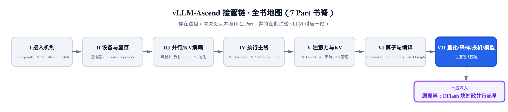
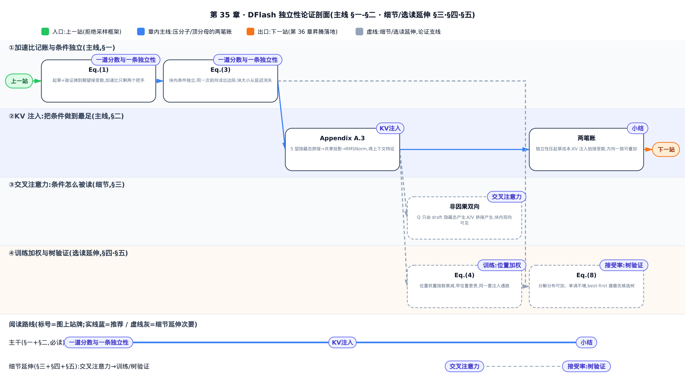
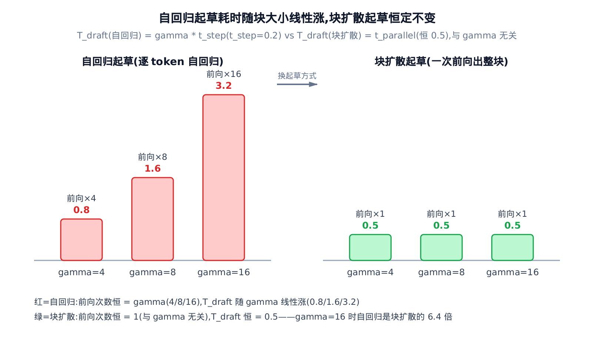
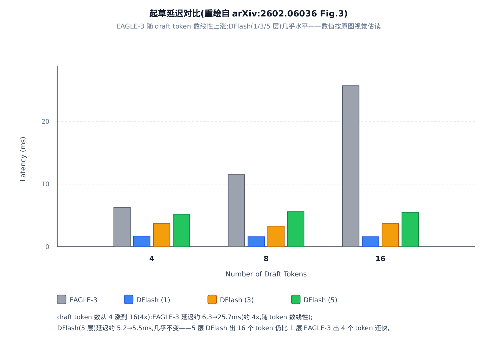
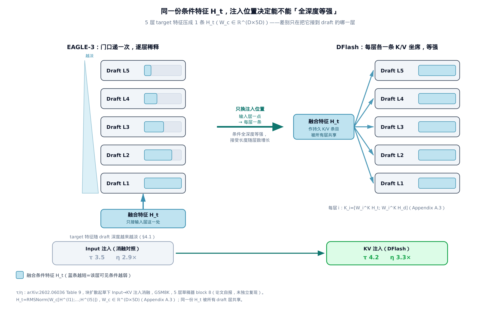
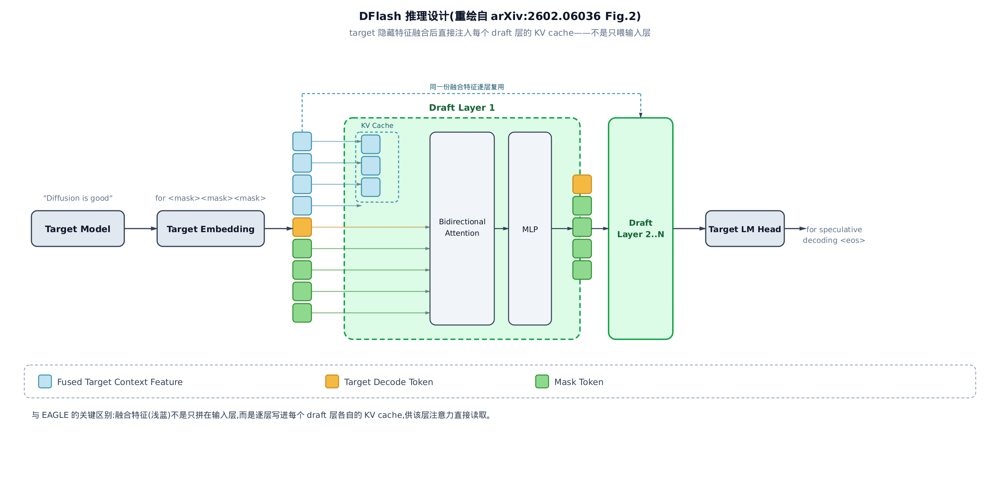
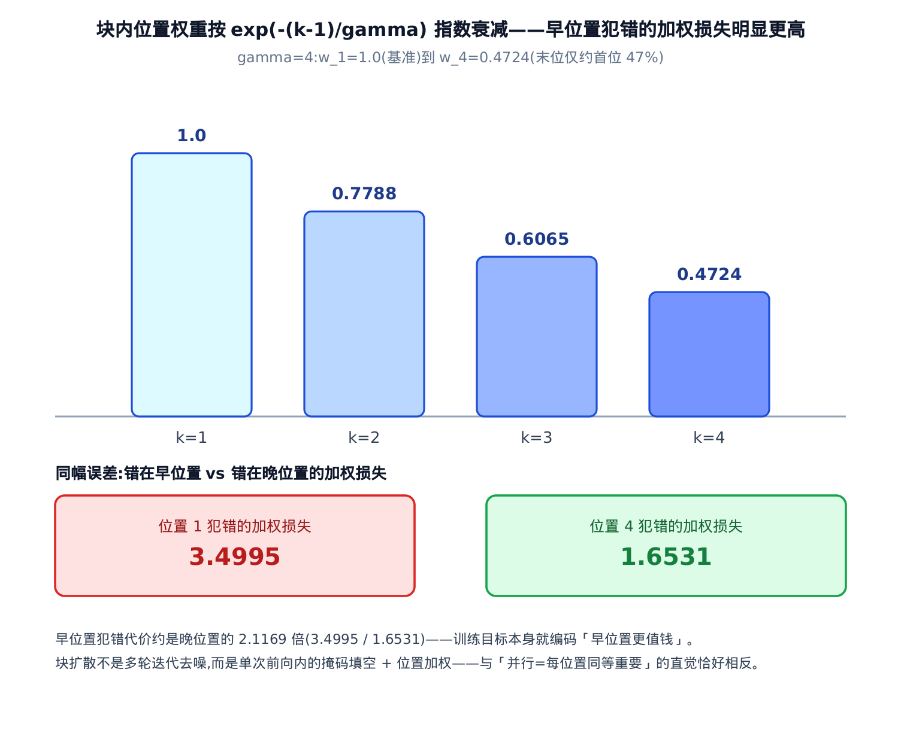
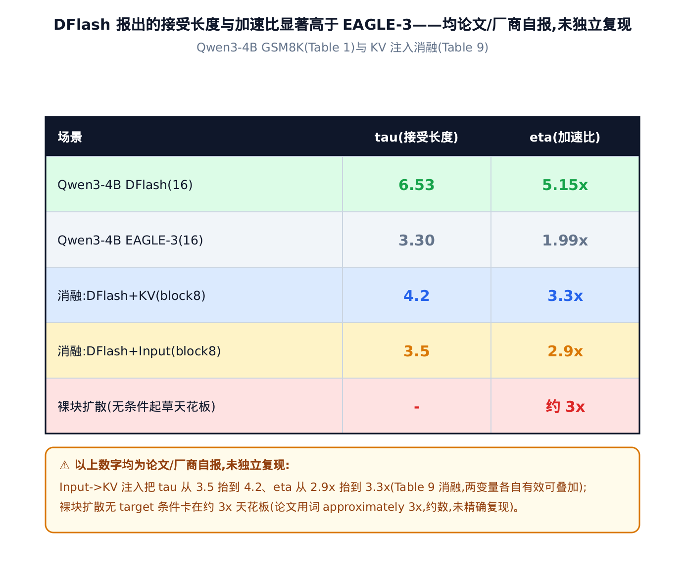
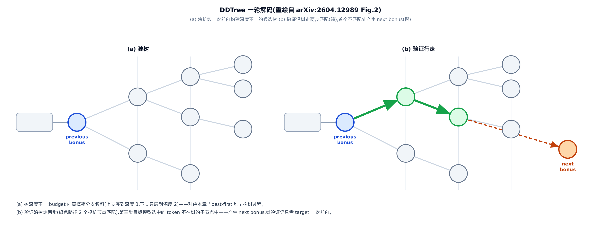

# 【原理篇·论文精读】DFlash：块扩散并行起草与逐层 KV 注入

> **你在这里（Roadmap）**
> 上一站建立了投机采样的拒绝采样框架：draft 猜、target 验、无损接受。
> 这一站换掉「draft 怎么猜」——块扩散一次前向出整块草稿，target 特征逐层注入把草稿磨准。
> 下一站把它接进昇腾的调度主线，跑成端到端的投机解码。

投机采样的老问题：draft 模型再快，也得一个 token 一次前向地猜——草稿越长、起草越慢，EAGLE-3（特征外推式草稿器，投机解码的主流基线）为压住起草延迟只敢用**一层** Transformer，质量被卡死。DFlash（arXiv:2602.06036）从分布层面换掉这半边：块扩散（block diffusion，把一段固定长度的块当整体、以掩码填空方式并行生成）草稿器一次前向输出的不是一条序列，而是块内每个位置各自的候选分布。全章主线只有一条命题—— **块内位置条件独立** 。独立性买到并行：块大小从起草延迟里消失，草稿器敢做深到 5 层；独立性也卖掉序贯准头：每个位置的分布只能靠条件撑。于是设计的另一半是把条件做到最足——把 target 的隐藏特征压成一条上下文向量，作为 K/V 坐进 draft 的**每一层**，而不是像 EAGLE 那样只在输入层递一次。快与准各归一招，论文自报 Qwen3-8B 上 6× 无损加速、比 EAGLE-3 快约 2.5 倍。此前的尝试恰好各踩一头（论文 §1）：DiffuSpec、SpecDiff-2 搬 7B 级大扩散模型当草稿器，起草延迟压不住，卡在约 3×；PARD 用小自回归模型模仿并行，建模能力不足，同样约 3×——轻的草稿器加借来的条件，正是同时躲开两个坑的解。本章只讲数学；每处工程落地都以一句指路[第 36 章](../../ch36-speculative-decode-npu/narrative/chapter.md)收束。

只想抓住「独立性怎么买到并行、又靠什么赎回准头」，读 §一、§二就够；§三看条件怎么被注意力读到；§四（训练）与 §五（接受率与树验证）是论文侧延伸，适合最后回看。

全章记号先列一张速查表，正文首现处仍会给一句解释：

| 符号 | 含义 | 首现 |
|---|---|---|
| $`\gamma`$ | 投机预算 / 块大小——一轮想草拟多少个未来 token | §一 |
| $`L`$ | 平均每 token 延迟——跑一轮投机解码摊到每个接受 token 上的时间 | §一 Eq.(1) |
| $`T_{\mathrm{draft}}`$ / $`T_{\mathrm{verify}}`$ | 起草耗时 / 验证耗时（target 并行核对整块的一次前向） | §一 Eq.(1) |
| $`\tau`$ | 每轮期望接受 token 数（含 bonus token），取值 $`[1,\gamma+1]`$ ，越大越省 | §一 Eq.(1) |
| $`\eta`$ | 加速比 = target 自回归延迟 / 投机解码延迟，就是对外报的「几倍」 | §一 |
| $`L_{\mathrm{target}}`$ | target 自己逐 token 解码的每 token 延迟（加速比的对照基准） | §一 |
| $`t_{\mathrm{step}}`$ | draft 跑一次前向的延迟（自回归起草每个 token 花一次） | §一 Eq.(2) |
| $`t_{\mathrm{parallel}}`$ | 块扩散一次前向出整块的延迟——与 $`\gamma`$ 无关 | §一 Eq.(3) |
| $`c`$ 、 $`b`$ 、 $`y_i`$ | 上下文（已确定的前缀）、bonus token（块首锚点）、块内第 $`i`$ 位选中的 token | §一 |
| $`q_i(y_i\mid c,b)`$ | 块扩散一次前向给出的第 $`i`$ 位边际分布——只依赖 $`c`$ 与 $`b`$ ，不依赖块内其他位置 | §一 |
| $`D`$ 、 $`n`$ | 隐藏维、上下文长度 | §二 |
| $`\mathbf{H}^{(l_i)}`$ | target 第 $`l_i`$ 层的隐藏态（从浅到深均匀采 5 层） | §二 |
| $`W_c`$ | 共享投影矩阵（ $`D\times 5D`$ ），DFlash 唯一新增的带参组件 | §二 |
| $`\mathbf{H}_t`$ | target 上下文特征——5 层隐藏态拼接投影+归一化后的共享条件向量 | §二 |
| $`\mathbf{H}_d`$ | draft token 自己的隐藏态——只用来产生 Q | §三 |
| $`\mathbf{Q}_i,\mathbf{K}_i,\mathbf{V}_i`$ | draft 第 $`i`$ 层的 Query/Key/Value | §三 |
| $`W_i^Q,W_i^K,W_i^V`$ | draft 第 $`i`$ 层的 Q/K/V 投影矩阵 | §三 |
| $`w_k`$ | 块内第 $`k`$ 位的训练损失权重 $`\exp(-(k-1)/\gamma)`$ ，早位置权重大 | §四 Eq.(4) |
| $`\mathrm{CE}_k`$ | 块内第 $`k`$ 位的交叉熵损失（draft 预测分布对真值 token 的负对数似然） | §四 |
| $`B`$ | DDTree 的树节点预算——最多验证多少个候选前缀 | §五 |
| $`\rho`$ 、 $`\sigma(\rho)`$ | rank-tuple（按每层概率排名而非词表 id 索引一个前缀）及其对数概率得分 | §五 |

> **先修：投机采样是什么。** 直觉：让一个便宜的 draft 模型先猜一串未来 token，再用昂贵的 target 模型**一次前向并行核对**，接受能对上的最长前缀、其余丢弃。拒绝采样定理保证「接受后的分布和 target 直接采样完全一致」——所以是**无损**加速。本章不重推这个保证，[上一站已经把它讲透了](../../ch34-primer-speculative-sampling/narrative/chapter.md)，接受这个结论就能往下走。DFlash 只动「draft 怎么猜」这一半，验证那一半原封不动。

在本书的接管链里，这套机制的工程实现拆在两处：draft 模型本体住在基座 vLLM 树（`vllm/model_executor/models/qwen3_dflash.py`），vllm-ascend 顶替/扩展的是昇腾专属起草器与「把 target 特征写进缓存」的热点函数（换成昇腾算子、算法不动）。本章不读这些代码——原理讲透之后，[第 36 章](../../ch36-speculative-decode-npu/narrative/chapter.md)按对位关系逐段落地。

---

## 一、一道分数与一条独立性

### 加速比只有两个把手

先记账：跑一轮投机解码，总成本是起草加验证，收益是这一轮真正落袋的 token 数。论文沿用标准记法（arXiv:2602.06036 §3.1 Eq.(1)）把「平均每 token 延迟」写成：

$$
L=\frac{T_{\mathrm{draft}}+T_{\mathrm{verify}}}{\tau}
$$

分子是一轮的总成本（ $`T_{\mathrm{draft}}`$ 起草、 $`T_{\mathrm{verify}}`$ 验证），分母 $`\tau`$ 是这一轮期望接受的 token 数；加速比 $`\eta=L_{\mathrm{target}}/L`$ ，对照基准 $`L_{\mathrm{target}}`$ 是不投机时 target 逐 token 解码的每 token 延迟。 $`\tau`$ 的下界恰为 1：target 每轮验证必然自产一个确定的下一 token（bonus token），哪怕草稿全被拒也至少落袋它，故 $`\tau\in[1,\gamma+1]`$ 。

这道分数只有两个把手：**压小分子 $`T_{\mathrm{draft}}`$** ，或 **顶大分母 $`\tau`$** 。DFlash 的两招各打一处——块扩散并行起草压 $`T_{\mathrm{draft}}`$ （本节），KV 注入抬 $`\tau`$ （§二）。拿一组小参数把两个把手拆开单独看（ $`L_{\mathrm{target}}=1.0`$ 、 $`T_{\mathrm{verify}}=1.0`$ 、 $`\gamma=8`$ ，三行只改起草方式与 $`\tau`$ ）：

<!-- trace: speedup-latency-model -->

| 场景 | 起草模式 | $`T_{\mathrm{draft}}`$ | $`T_{\mathrm{verify}}`$ | $`\tau`$ | 延迟 $`L`$ | 加速比 $`\eta`$ |
|---|---|---|---|---|---|---|
| 自回归起草（EAGLE 式 $`\tau`$ ） | autoregressive | 1.6 | 1.0 | 3.0 | 0.8667 | 1.1538 |
| 扩散起草（仅换起草方式， $`\tau`$ 不变） | diffusion | 0.5 | 1.0 | 3.0 | 0.5 | 2.0 |
| 扩散起草 + KV 注入（ $`\tau`$ 抬高） | diffusion | 0.5 | 1.0 | 4.2 | 0.3571 | 2.8 |

第 1→2 行只换起草方式（ $`T_{\mathrm{draft}}`$ 从 1.6 降到 0.5， $`\tau`$ 都是 3.0）， $`\eta`$ 从 1.1538 涨到 2.0；第 2→3 行只抬 $`\tau`$ （3.0→4.2，这是 KV 注入的功劳）， $`\eta`$ 从 2.0 继续涨到 2.8。两招方向一致、可叠加，是乘性收益。

### 独立性：块大小为什么能从延迟里消失

自回归草稿器的成本由控制流决定：逐 token 生成，每个 token 一次前向（arXiv:2602.06036 §3.2 Eq.(2)）：

$$
T_{\mathrm{draft}}=\gamma\cdot t_{\mathrm{step}}
$$

块大小 $`\gamma`$ 直接乘在 draft 单次前向延迟 $`t_{\mathrm{step}}`$ 上——想多猜一倍，起草就慢一倍。这不是工程没优化，是「逐 token」的代数宿命，也是 EAGLE-3 只敢用一层的原因。块扩散草稿器换掉的正是这个控制流，而它「一次前向出整块」的合法性可以写成一条式子——后续树验证工作 DDTree 给出了最精确的表述（arXiv:2604.12989 §3 Eq.(2)）：整块草稿的分布是**分解分布**，

$$
Q(y_{1:\gamma}\mid c,b)=\prod_{i=1}^{\gamma}q_i(y_i\mid c,b)
$$

每个因子 $`q_i(y_i\mid c,b)`$ 是块内第 $`i`$ 位的边际分布，只依赖上下文 $`c`$ 与块首锚点 $`b`$ （bonus token），**不依赖块内其他位置的采样结果**——位置间条件独立，谁都不用等谁，全部 $`\gamma`$ 个分布在同一次前向里一起读出。于是起草成本变成（arXiv:2602.06036 §3.2 Eq.(3)）：

$$
T_{\mathrm{draft}}=t_{\mathrm{parallel}}
$$

$`\gamma`$ 从延迟表达式里**消失了**：块再大，也只是同一次前向里多几列并行的掩码位，而现代加速器上一次宽前向远比多趟窄前向划算， $`t_{\mathrm{parallel}}\ll\gamma\cdot t_{\mathrm{step}}`$ （arXiv:2602.06036 §3.2）。比喻只需一句：自回归起草是单车道打印机逐字打，块扩散是一次曝光的照相制版。拿 $`t_{\mathrm{step}}=0.2`$ 、 $`t_{\mathrm{parallel}}=0.5`$ 数一遍前向次数：

<!-- trace: block-diffusion-parallel-drafting -->

| 块大小 $`\gamma`$ | 自回归起草前向次数 | 扩散起草前向次数 | 自回归 $`T_{\mathrm{draft}}`$ | 扩散 $`T_{\mathrm{draft}}`$ |
|---|---|---|---|---|
| 4 | 4 | 1 | 0.8 | 0.5 |
| 8 | 8 | 1 | 1.6 | 0.5 |
| 16 | 16 | 1 | 3.2 | 0.5 |

扩散那列前向次数**恒为 1**， $`\gamma`$ 从 4 涨到 16，耗时纹丝不动停在 0.5；自回归随 $`\gamma`$ 线性爬到 3.2（ $`\gamma=16`$ 时是块扩散的 6.4 倍）。再点透一层：在自回归里「快」与「深」是零和——层数抬 $`t_{\mathrm{step}}`$ ，再被 $`\gamma`$ 放大；在块扩散里层数只进常数项 $`t_{\mathrm{parallel}}`$ ，**深度与块大小解耦**，DFlash 才敢把草稿器做到 5 层。

在真实模型上，这个「延迟不随块变大」是可测的：论文 Figure 3 把 1/3/5 层 DFlash 与 1 层 EAGLE-3 的起草延迟画在一起——DFlash 各层数的曲线几乎水平，EAGLE-3 随 token 数线性爬升，5 层 DFlash 出 16 个 token 比 1 层 EAGLE-3 出 8 个 token 延迟还低（论文原话的对照基准）。下图取的是更保守的一档：5 层 DFlash 出 16 个 token，仍快过 1 层 EAGLE-3 只出 4 个 token——两个基准下结论一致。

### 一次前向喂进去的块长什么样

分解分布里的条件 $`(c,b)`$ 落到输入上，就是块的形状：先铺上下文 $`c`$ ，再放 **1 个 bonus 锚点 + $`\gamma`$ 个掩码位**——bonus 是 target 上轮验证自产的确定 token，当块首锚点；掩码位填统一的占位 token，等 draft 一次前向并行填空。玩具例（ $`\gamma=3`$ ，上下文收在位置 2，bonus 的 token id 为 42，掩码占位 id 为 151669）：

<!-- trace: input-expansion-kernel -->

| 块内位置 | 序列位置 | 写入 token | 掩码位？ | 登记采样序号 |
|---|---|---|---|---|
| 0 | 3 | 42（bonus token） | 否 | — |
| 1 | 4 | 151669（mask） | 是 | 0 |
| 2 | 5 | 151669（mask） | 是 | 1 |
| 3 | 6 | 151669（mask） | 是 | 2 |

单请求展开 $`1+\gamma=4`$ 个位置，从上下文末尾顺延排开；只有 3 个掩码位登记采样——一次前向后，这 3 个位置的边际分布 $`q_1,q_2,q_3`$ 同时可读，各自采样即得整块草稿。落地一句：昇腾把块大小实现为 `num_query_per_req = 1 + num_speculative_tokens`（每轮投机 token 数），块的摆位由一个融合算子一趟算好、draft 模型仍只跑一次前向——展开与记账细节见[第 36 章](../../ch36-speculative-decode-npu/narrative/chapter.md)。

> **严谨（独立性的代价先记在这）**：分解分布 $`Q`$ 只是 target 真分布的近似——target 给块内第 $`i`$ 位的分布依赖块内已生成的前缀 $`y_{1:i-1}`$ ，是路径条件分布；而 $`q_i`$ 把这份块内相关性整个扔掉了（arXiv:2604.12989 §3 对 Eq.(1)(2) 的对照）。无损性不受影响：上一站的拒绝采样框架只要求 draft 给出提议、target 逐位核对，最长前缀匹配会把不合格的尾巴整段裁掉——DFlash 换掉的只是提议分布。近似的代价全部体现在 $`\tau`$ 上：相关性丢得越多、草稿越容易在早位置断链， $`\tau`$ 越低。这就是为什么 §二要花大力气把每个 $`q_i`$ 的条件磨到最足，§四的训练还要按位置价值加权。

---

## 二、KV 注入：把条件做到最足

独立性把块内的序贯信息全卖了，每个 $`q_i(\cdot\mid c,b)`$ 的准头只剩一个来源：条件。所以「怎么把 target 知道的东西喂给草稿器」不是锦上添花，而是这套设计的另一半命门。EAGLE-3 的喂法是把 target 特征与 token embedding 融合后**只作输入层的输入**——论文 §4.1 点破其宿命：draft 越深，target 的信息被逐层稀释，加层的接受长度收益递减（arXiv:2602.06036 §4.1）。DFlash 换的是**位置**：把 target 特征投影成 K/V 条目、直接写进 draft **每一层**注意力的现场——比喻一句，一张随身携带的旁听席位。层层都能回头看原始条件，信号不衰减，接受长度才能随 draft 层数有效增长。

先把条件本身压紧。从 target **从浅到深均匀采 5 层**（具体是第 2 层到倒数第 3 层之间均匀采样，arXiv:2602.06036 §5），把每个上下文位置的 5 段隐藏态 $`\mathbf{H}^{(l_1)},\ldots,\mathbf{H}^{(l_5)}`$ 沿特征维拼成一条 $`5D`$ 向量（ $`D`$ 为隐藏维），过共享投影 $`W_c`$ 压回 $`D`$ 维、再做 RMSNorm（Root Mean Square Normalization，Transformer 的标准归一化算子），得到**上下文特征**（arXiv:2602.06036 Appendix A.3）：

$$
\mathbf{H}_t=\mathrm{RMSNorm}\!\left(W_c[\mathbf{H}^{(l_1)};\ldots;\mathbf{H}^{(l_5)}]\right)
$$

维度账：拼接后是 $`n\times 5D`$ （ $`n`$ 为上下文长度）， $`W_c\in\mathbb R^{D\times 5D}`$ 压回 $`n\times D`$ 。 $`W_c`$ 是 DFlash **唯一新增的带参组件**——草稿器的「知识」几乎全部借自 target 的表征，自己只学怎么读。这份 $`\mathbf{H}_t`$ 被**所有 draft 层共享**，每层再各自经该层的 K/V 投影变成注意力条目（式子见 §三），写进 draft 的 KV cache（推理期缓存的 key/value）跨起草轮复用（arXiv:2602.06036 §4.1）。小参数见证（draft 2 层、上下文 3 位、选定 5 层）：

<!-- trace: kv-injection -->

| 步骤 | 操作 | 关键标量 | 判定 |
|---|---|---|---|
| 1 | 扰动选定层 $`l_1`$ 的隐藏态 | ‖ΔH_t‖ = 1.9151 | 浅层进 $`\mathbf{H}_t`$ ✓ |
| 2 | 扰动选定层 $`l_5`$ 的隐藏态 | ‖ΔH_t‖ = 2.8071 | 深层也进 $`\mathbf{H}_t`$ ，5 层名副其实 ✓ |
| 3 | 换掉 target 特征后重算 K/V | ‖Δ draft 层输出‖ = 0.2289 | KV 注入确有条件化效应 ✓ |

前两行扰动的是 5 层拼接向量里**位置最远的两端**：连最浅（ $`l_1`$ ）和最深（ $`l_5`$ ）的端点都能改动 $`\mathbf{H}_t`$ ，夹在中间的三层同理（拼接与 $`W_c`$ 投影对每层完全对称，不偏袒任何一段）——「5 层」名副其实，不是只有浅层进了条件。第三行把 target 特征整个换掉，draft 层输出跟着变 0.2289：注入的 K/V 真在起条件作用，不是摆设。

工程上这份注入发生在 draft 前向**之外**：上下文张量与草稿块张量形状不同，不便共用一条编译好的前向路径，于是「投影出全层 K/V、写进各层 cache」做成前向之前的一次独立调用（落地为 `precompute_and_store_context_kv` ，昇腾以覆写版把 CUDA 算子换成昇腾算子、算法一字不改）；生产实现还把全部层的 K/V 投影权重堆成一个大矩阵、一次矩阵乘出全层，纯省算子启动、逐元素不改数值。两处都是实现优化，与原理无关，细节见[第 36 章](../../ch36-speculative-decode-npu/narrative/chapter.md)。

> **严谨（这份条件的开销账与合法性）**：唯一新增参数是 $`W_c\in\mathbb R^{D\times 5D}`$ ，相对约 70 GB 量级的 target 可忽略；batch 1、序列长 2048 时投影输入/输出约 40 MB/8 MB，块大小 16 的 decode 期临时激活不足 400 KB（arXiv:2602.06036 A.3，论文自报）。跨起草轮复用之所以合法：注入的 K/V 是上下文的确定函数——投影权重静态、上下文已定，算一次写进 cache 即可反复读，与 KV cache 缓存历史 key/value 的逻辑同源。另外别把注入误当训练期手法： $`\mathbf{H}_t`$ 在推理期逐轮由 target 的真实隐藏态现算，草稿器是被**当场**条件化的。

---

## 三、交叉注意力：条件怎么被读

注入的 K/V 进了 cache，draft 层怎么用它？一句话：**提问的只有草稿 token，资料架上摆着注入的 target 条件和草稿自己**。论文正文没用「cross-attention（交叉注意力）」这个词，但其算子形式（arXiv:2602.06036 Appendix A.3）就是交叉注意力与块内自注意力合并进同一次 attention：

$$
\mathbf{Q}_i=W_i^Q\mathbf{H}_d
$$

$$
\mathbf{K}_i=[W_i^K\mathbf{H}_t;\,W_i^K\mathbf{H}_d]_{\mathrm{seq}}
$$

$$
\mathbf{V}_i=[W_i^V\mathbf{H}_t;\,W_i^V\mathbf{H}_d]_{\mathrm{seq}}
$$

逐式读一遍：第 $`i`$ 层的 Query $`\mathbf{Q}_i`$ **只由 draft token 的隐藏态 $`\mathbf{H}_d`$ 投影**，target 特征完全不进 Q；Key/Value 则由 $`[\mathbf{H}_t;\mathbf{H}_d]`$ **沿序列轴拼接**后投影——注入的 $`\mathbf{H}_t`$ 只作为**额外的 KV 条目**摆上资料架。论文 A.3 说得很清楚：target 特征「绕过 draft 的 Q 投影、输出投影、自注意力更新和 FFN（feed-forward network，前馈网络）」，它只被查、不提问、不更新。小参数见证（上下文 3 位、块 4 位 = bonus + 3 mask）：

<!-- trace: cross-attention-qkv-split -->

| 操作 | 关键标量 | 判定 |
|---|---|---|
| Q 只由 draft token（bonus + 3 mask）投影 | Q 行数 = 4 | $`\mathbf{H}_d`$ 独占 Q（target 特征不进 Q）✓ |
| K/V = [context(3); query(4)] 沿序列轴拼接 | K/V 序列长 = 7 | target 特征只作额外 KV 条目 ✓ |
| 扰动最后一个 mask 位（idx 3） | bonus 位（idx 0）输出变化 ‖Δ‖ = 0.2788 | 非因果：后位能影响前位 ✓ |
| 移除注入的 context K/V | 输出变化 ‖Δ‖ = 1.0215 | 注入的 K/V 确实参与了注意力 ✓ |

打分为什么敢**非因果**（块内双向可见）？回到主线：块内位置条件独立、没有先后，草稿是掩码填空而非接龙，位置 3 看位置 1 与位置 1 看位置 3 同样合法——表格第三行 0.2788≠0 正是双向可见的实测。双向只在块内与上下文范围内生效，不跨请求。

![Q 出自 draft token，K/V 由 [H_t; H_d] 拼成长 7 的序列，非因果 softmax 打分](../diagrams/fig-cross-attention-qkv.png)

落地一句：draft 每层前向只算草稿块自己的 Q/K/V，上下文条目直接从 cache 里读（§二已预写）；昇腾在注意力元数据上以 `causal=False` 打开块内双向，连同「上一轮被拒 token 的上下文截断」的记账，见[第 36 章](../../ch36-speculative-decode-npu/narrative/chapter.md)。

> **严谨（形状核算与「持久条件」的分水岭）**：玩具例的打分矩阵是 $`4\times 7`$ ——Q 4 行（1 bonus + 3 掩码位），K/V 列 $`3+4=7`$ （上下文 3 列 + 块内 4 列）；移除 3 列上下文输出位移 1.0215，远大于块内扰动的 0.2788，条件在打分里占实打实的主导。更要紧的是 $`\mathbf{H}_t`$ **不回写**：它绕过输出投影与 FFN、不进 draft 的残差流（arXiv:2602.06036 A.3），于是 5 层 draft 的每一层读到的都是**同一份未经加工的原始条件**，而不是被前几层改写过的版本。这正是「持久条件」与 EAGLE「输入层融合后随深度稀释」的分水岭：前者每层都从原件读，后者只能读逐层转述。

---

## 四、训练：随机锚点掩码与位置加权

推理侧讲完了，回头看训练——它解释两件容易望文生义的事：**块扩散不是多轮迭代去噪**，以及**块内位置并不平权**。

### 与推理同构的掩码填空

训练时把整条「prompt + response」先过一遍 target 抽取融合特征、注入 draft 的 K/V——与推理**同一套注入通路**（arXiv:2602.06036 §4.2）。块的构造专门对齐投机解码：从 response 里**随机采锚点**当块首（对应推理时 target 白送的 bonus token），mask 掉锚点之后的整块位置让 draft 并行预测；多个块拼成一条序列、用稀疏掩码一次前向训完——块内双向可见 + 可见对应的 target 特征列，**块间互相屏蔽**。

这张图钉死主线里的一个措辞：块扩散的「并行去噪」是**单次前向内的掩码填空**（一次读出全部 $`q_i`$ ），不是多步迭代；训练与推理的注意力结构一模一样，只是训练时并排塞了多个块。

### 位置加权：早位置更值钱

分解分布让每个位置的边际独立训练，但位置的**价值**不独立：接受是最长前缀匹配——第 1 位错了，后面全作废；末位错了，只赔一个。训练目标按此加权，给早位置指数级更大的损失权重（arXiv:2602.06036 §4.2 Eq.(4)）：

$$
w_k=\exp\!\left(-\frac{k-1}{\gamma}\right)
$$

块内第 $`k`$ 位（ $`k`$ 从 1 起）的交叉熵权重指数衰减： $`k=1`$ 时指数为 0、 $`w_1=1`$ 最大，越往后越小。论文只给出权重定义 Eq.(4)；把 $`w_k`$ 套进标准的加权交叉熵、按权重归一化求平均，是下面这个还原写法（非论文原文的编号公式）：

$$
\mathrm{loss}=\frac{\sum_k w_k\cdot \mathrm{CE}_k}{\sum_k w_k}
$$

其中 $`\mathrm{CE}_k`$ 是第 $`k`$ 位的交叉熵。拿 $`\gamma=4`$ 、块 4 位算一遍，再比一个「一位押错、其余全对」的场景把错位放早还是放晚：

<!-- trace: training-anchor-mask-weighted-loss -->

| 项目 | 数值 | 判定 |
|---|---|---|
| 块内位置 k=1 权重 w_1 | 1.0 | 基准（权重最大） |
| k=2 权重 w_2 | 0.7788 | 指数衰减 |
| k=3 权重 w_3 | 0.6065 | 指数衰减 |
| k=4 权重 w_4 | 0.4724 | 最小 |
| 位置 1 犯错的加权损失 | 3.4995 | 早错更贵 |
| 位置 4 犯错的加权损失 | 1.6531 | 晚错更便宜 |

权重从 $`w_1=1.0`$ 衰减到 $`w_4=0.4724`$ （末位仅约首位的 47%）。同样一处错误，放在位置 1 的加权损失是 3.4995，放在位置 4 只有 1.6531——早位置犯错约贵 2.1 倍。**训练目标本身就编码了「早位置更值钱」**，和「并行去噪 = 每位置同等重要」的望文生义恰好相反。

> **严谨（单调性的通用论证）**：指数 $`-(k-1)/\gamma`$ 在 $`\gamma>0`$ 时随 $`k`$ 严格递减，而 $`\exp(\cdot)`$ 单调增，故 $`w_k`$ 对**任意** $`k`$ 严格单调递减、 $`w_1`$ 恒为 1——块开多长，早位置的权重都严格大于晚位置，不止本例 4 位。加权损失对「错位前移」严格增大：等幅 $`\mathrm{CE}`$ 从晚位置移到早位置，即乘上更大的 $`w_k`$ ，分子严格增大而分母 $`\sum_k w_k`$ 不变。

---

## 五、接受率与树验证

### 数值：论文/厂商自报，未独立复现

把前面两招合起来，接受长度 $`\tau`$ 和加速比 $`\eta`$ 涨到多少？下面这些数字**全部是论文与厂商博客自报，本书未独立复现**，读时请带着这个前提。

主表（arXiv:2602.06036 Table 1，Qwen3-4B、GSM8K、温度 0）：DFlash(16) 报 5.15× / $`\tau`$ 6.53，EAGLE-3(16) 报 1.99× / $`\tau`$ 3.30。消融表（Table 9，5 层草稿器、block 8）把两个变量拆开验证：只把条件注入从 Input 换成 KV， $`\tau`$ 从 3.5 抬到 4.2、 $`\eta`$ 从 2.9× 抬到 3.3×——和 §一那道分数题里「抬 $`\tau`$ 就抬 $`\eta`$ 」完全一致。另一头，不带 target 条件的**裸块扩散**起草卡在约 3× 天花板（论文用词 approximately 3×，约数）——主线的另一半在数值上现形：没有条件撑着，独立的 $`q_i`$ 就是不够准，光快没用。

昇腾这一版落地的是 **vanilla DFlash**（未加树扩展的基础版）：每轮只把分解分布里逐位概率最高的那**一条轨迹**交给 target 验证，投机预算就是「1 个 bonus + 每轮投机 token 数」的单块——配置与调度见[第 36 章](../../ch36-speculative-decode-npu/narrative/chapter.md)。

### DDTree：同一次前向，验证一棵树

单轨迹其实浪费了信息：主线那条分解分布一次前向给出的是**每个位置的完整边际分布**，vanilla 却只挑最可能的一条路去验证。后续工作 DDTree（arXiv:2604.12989）用同一次前向的分布，在固定节点预算 $`B`$ 下把「最值得验证的前几条前缀」组成一棵树，target 仍只跑一次前向（祖先-only 掩码）整树验证。它的最优性恰好也挂在分解分布上，两条推论各交代一半。

**其一，目标可加**。给定候选树，期望接受长度的代理目标（surrogate，arXiv:2604.12989 §4.2 Eq.(8)）等于树中各前缀概率之和，而每个前缀的概率按分解分布连乘 $`q(u_{1:d})=\prod_{i\le d}q_i(u_i\mid c,b)`$ ——可加性让「选哪 $`B`$ 个前缀」变成贪心可解：取概率前 $`B`$ 大。

**其二，前缀概率单调不增**。每往后延伸一位，就多乘一个 $`\le 1`$ 的因子（arXiv:2604.12989 Prop.2 证明内使用）：

$$
Q(y_{1:i+1})=Q(y_{1:i})\cdot q_{i+1}\le Q(y_{1:i})
$$

因此任一前缀的概率不小于它的任何延伸——「取前 $`B`$ 大」自动把每个入选节点的全部祖先一并选进，贪心的结果恰好是一棵**合法树**（前缀闭合），不需要额外校验。可加保证贪心的目标最优、单调不增保证贪心的结果合法，合起来才有「贪心取前 $`B`$ 大 = 最优树」；best-first（最高分优先）堆按前缀得分 $`\sigma(\rho)`$ 非增序弹出即可实现。拿一个 depth 3、每层 top-2、预算 $`B=4`$ 的小例子（边际分布 [[0.6,0.4],[0.7,0.3],[0.8,0.2]]）跑一遍：

<!-- trace: ddtree-tree-verification -->

| pop 次序 | 弹出的 rank-tuple | 该前缀概率 | 累计 surrogate |
|---|---|---|---|
| 1 | [1] | 0.6 | 0.6 |
| 2 | [1, 1] | 0.42 | 1.02 |
| 3 | [2] | 0.4 | 1.42 |
| 4 | [1, 1, 1] | 0.336 | 1.756 |

堆依次弹出 [1]、[1,1]、[2]、[1,1,1]，累计 surrogate 到 1.756，和暴力枚举 top-4 前缀集合完全一致（前缀闭合、可证明最优）。对比 vanilla 单轨迹只走 [1]、[1,1]、[1,1,1]，surrogate 仅 1.356——同一堆边际分布，树验证把期望接受长度代理抬高约 30%，多花的只是把预算铺成 4 个节点，验证仍是 target **一次前向**。

![best-first 堆按前缀概率非增序弹出 [1]→[1,1]→[2]→[1,1,1]，树 surrogate 1.756 高于单轨迹 1.356](../diagrams/fig-ddtree-best-first.png)

DDTree 是 DFlash 之上的延伸，昇腾当前落地的仍是单轨迹版——但它把「块扩散一次前向出的是分布、不只是一条序列」这件事的价值点透了，也是接受率-延迟权衡后续能继续压的方向。

> **严谨（best-first 为什么恰好弹出前 $`B`$ 大）**：按每层概率排名索引前缀——rank-tuple $`\rho=(\rho_1,\ldots,\rho_d)`$ 表示「第 1 位取该位分布的第 $`\rho_1`$ 大、…、第 $`d`$ 位取第 $`\rho_d`$ 大」，得分 $`\sigma(\rho)=\sum_{i\le d}\log q_i^{(\rho_i)}`$ 。堆每次弹出当前最高分前缀，只推入两个候选：同层换下一名次的兄弟、与下探一层取第 1 名的孩子——前者把一个因子换成更小的，后者多乘一个 $`\le 1`$ 的因子，二者得分都不高于被弹出者，故弹出序全局非增，弹到第 $`B`$ 个恰是全体前缀的前 $`B`$ 大（arXiv:2604.12989 §4.3 Algorithm 1、Prop.3；小例中与暴力枚举集合相等）。

---

## 小结：一条独立性，两笔账

块扩散草稿器输出分解分布 $`Q(y_{1:\gamma}\mid c,b)=\prod_i q_i(y_i\mid c,b)`$ ——**块内位置条件独立**，全章挂在这一条命题上。**买到的**：全部边际在同一次前向里读出， $`\gamma`$ 从起草延迟里消失（ $`T_{\mathrm{draft}}=t_{\mathrm{parallel}}`$ ），块内掩码填空天然双向可见，草稿器敢做深到 5 层。**卖掉的**：块内序贯相关性——每个 $`q_i`$ 的准头只剩条件可靠，于是 target 特征压成 $`\mathbf{H}_t`$ 、以 K/V 条目坐进 draft 每一层（只被查、不提问、不回写），而非在输入层递一次任其稀释；训练再按「早错全作废」的前缀价值给位置加权；树验证把同一次前向的边际铺成可证明最优的候选树，替单轨迹把 $`\tau`$ 再抬一档。在加速比 $`\eta`$ 那道分数上，前者压分子、后者顶分母，方向一致、可叠加。这套数学怎么接进昇腾的调度主线、和 target 模型的前向如何交替跑，是[下一站投机解码在昇腾落地](../../ch36-speculative-decode-npu/narrative/chapter.md)的事。
