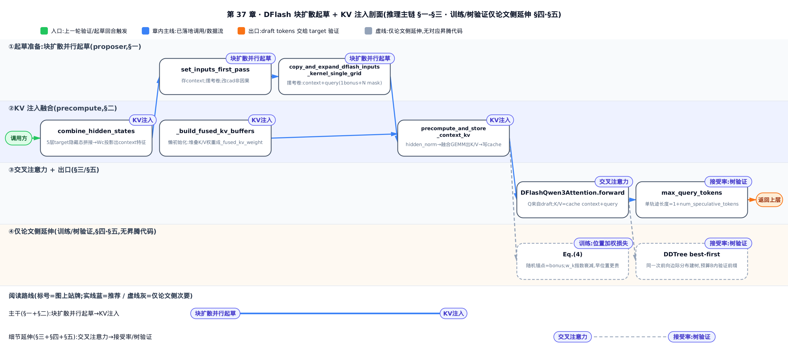
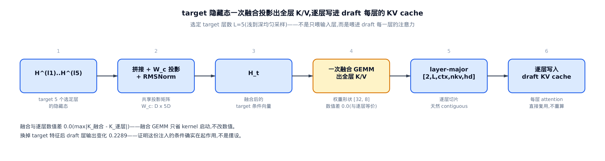
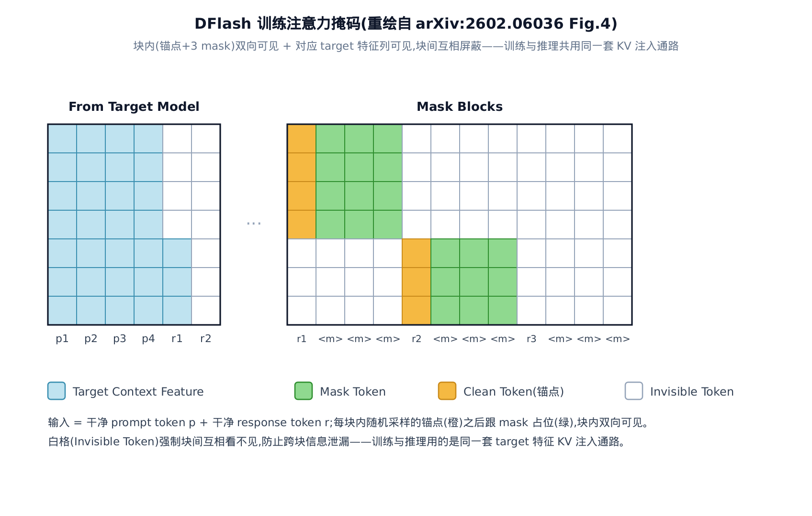

# DFlash：把投机起草从「逐 token 自回归」升级为「单次前向并行」

> **你在这里（Roadmap）**
> 上一站建立了投机采样的拒绝采样框架：draft 猜、target 验、无损接受。
> 这一站换掉「draft 怎么猜」——用块扩散一次前向出整块草稿。
> 下一站把它接进昇腾的调度主线，跑成端到端的投机解码。


投机采样的老问题是：draft 模型再快，也得**一个 token 一个 token 地猜**。想多猜几个未来 token，就得多跑几趟前向——草稿越长、起草越慢。EAGLE-3 为了压住这份延迟，只敢用**一层** Transformer 当草稿器，质量被卡死。

DFlash 换了个思路：让草稿器**一次前向就并行吐出整块 token**，起草延迟不再随块大小涨。腾出来的预算用去把草稿器做深（5 层），并把 target 模型的隐藏特征**逐层注入** draft 的 KV cache 做条件——草稿又快又准。论文自报在 Qwen3-8B 上做到 6× 无损加速、比 EAGLE-3 快约 2.5 倍（arXiv:2602.06036）。

会有人问：既然扩散天生能并行，为什么不干脆搬一个现成的大扩散模型来当草稿器？论文 §1 专门点了两条失败前例：DiffuSpec、SpecDiff-2 用 7B 级的**大**扩散草稿器，内存吃紧、起草延迟居高不下，实际加速卡在约 3×；PARD 反其道用**小型自回归**模型去模仿扩散式并行，模型太小、建模能力不足，加速上限同样约 3×。一头撞在延迟上、一头撞在质量上——DFlash 的设计正是要同时躲开这两个坑：草稿器极轻（5 层量级压住延迟），又借 target 的隐藏特征补足建模能力（下面的 KV 注入）。

这是一本「原理章」：**上半场推公式**（DFlash 论文 arXiv:2602.06036 + 树扩展 DDTree arXiv:2604.12989），**下半场读真实源码**——vllm-ascend 侧的 `AscendDflashProposer` 与昇腾覆写的 `precompute_and_store_context_kv`，以及基座 vLLM 树里的 draft 模型本体 `DFlashQwen3Model`。每个机制都走「直觉 → 小参数亲手算一遍 → 真实源码逐段解读」三层。

> 想只抓主干：§一（为什么块扩散快）+ §二（KV 注入怎么注）读完就够用了。§三是注意力算子的细节，§四讲训练，§五是接受率数值与 DDTree 树验证的延伸——按兴趣挑读，也可以顺序读完。



图上实线是落地到昇腾代码的推理主链——从「块扩散并行起草」（§一）一路到「KV 注入」（§二），跟着它走就能拿到完整推理链路；虚线连的 §四（训练）、§五（接受率与树验证）是论文侧延伸，没有对应昇腾代码，可以跳过留到最后再回来读。

先把本章会反复出现的符号列在一处，读到公式回头查即可。

| 符号 | 含义 | 首现 |
|---|---|---|
| $L$ | 平均每 token 延迟——跑一轮投机解码摊到每个接受 token 上的时间，越小越快 | §一 Eq.(1) |
| $T_{\mathrm{draft}}$ | 起草耗时——draft 造出一整块草稿的时间（DFlash 要压小它） | §一 Eq.(1)/(2)/(3) |
| $T_{\mathrm{verify}}$ | 验证耗时——target 并行核对整块草稿的一次前向时间 | §一 Eq.(1) |
| $\tau$ | 每轮期望接受 token 数（含 target 白送的 bonus token），取值 $[1,\gamma+1]$ ，越大越省 | §一 Eq.(1) |
| $\eta$ | 加速比 = target 自回归延迟 / 投机解码延迟，就是对外报的「几倍」 | §一 Eq.(1) |
| $\gamma$ | 投机预算 / 块大小——一轮想草拟多少个未来 token | §一 Eq.(2) |
| $t_{\mathrm{step}}$ | draft 跑一次前向的延迟（自回归起草每个 token 花一次） | §一 Eq.(2) |
| $t_{\mathrm{parallel}}$ | 块扩散一次前向出整块的延迟——与 $\gamma$ 无关，是压 $T_{\mathrm{draft}}$ 的关键常数 | §一 Eq.(3) |
| $L_{\mathrm{target}}$ | target 自己逐 token 解码的每 token 延迟（加速比分母基准） | §一 Eq.(1) |
| $\mathbf{H}_t$ | target 上下文特征——若干层隐藏态拼接投影+归一化后的共享条件向量，逐层注入 draft 的 K/V | §二 A.3 |
| $\mathbf{H}_d$ | draft token 自己的隐藏态——只用来产生 Q | §二 A.3 |
| $W_c$ | 共享投影矩阵（ $D\times 5D$ ），DFlash 唯一新增的带参组件，把 5 层 target 特征融成一个 $\mathbf{H}_t$ | §二 A.3 |
| $\mathbf{H}^{(l_i)}$ | target 第 $l_i$ 层的隐藏态（从浅到深均匀采 5 层） | §二 A.3 |
| $\mathbf{Q}_i$ | draft 第 $i$ 层的 Query——只由 $\mathbf{H}_d$ 产生，target 特征完全不进 Q | §三 A.3 |
| $\mathbf{K}_i$ | draft 第 $i$ 层的 Key——由 $[\mathbf{H}_t;\mathbf{H}_d]$ 沿序列轴拼接投影而来（注入点） | §三 A.3 |
| $\mathbf{V}_i$ | draft 第 $i$ 层的 Value——同样由 $[\mathbf{H}_t;\mathbf{H}_d]$ 拼接投影 | §三 A.3 |
| $W_i^Q,W_i^K,W_i^V$ | draft 第 $i$ 层的 Query/Key/Value 投影矩阵（把隐藏态投成 Q/K/V 的标准线性层） | §三 A.3 |
| $w_k$ | 块内第 $k$ 位的训练损失权重 $\exp(-(k-1)/\gamma)$ ，早位置权重大 | §四 Eq.(4) |
| $\mathrm{CE}_k$ | 块内第 $k$ 位的交叉熵损失（draft 预测分布对真值 token 的负对数似然） | §四 |
| $q_i(y_i\mid c,b)$ | 块扩散一次前向给出的第 $i$ 位边际分布——只依赖上下文 $c$ 与 bonus token $b$ | §五 Eq.(2) |
| $y_i,\,c,\,b$ | 分别是块内第 $i$ 位选中的 token、上下文（prompt 部分）、bonus token（块首锚点） | §五 Eq.(2) |
| $B$ | DDTree 的树节点预算——最多验证多少个候选前缀 | §五 |
| $\rho$ | rank-tuple——按每层概率排名（而非词表 id）索引一个前缀 | §五 |
| $\sigma(\rho)$ | 前缀 $\rho$ 的对数概率得分 = 各层选中 rank 的 $\log q$ 之和 | §五 |
| $\alpha_T(Y)$ | 给定草稿树 $T$ 与目标采样 $Y$ 的接受长度（最长匹配深度） | §五（定义见 arXiv:2604.12989 Eq.(4)） |

> **先修：投机采样是什么。** 直觉：让一个便宜的 draft 模型先猜一串未来 token，再用昂贵的 target 模型**一次前向并行核对**，接受能对上的最长前缀、其余丢弃。拒绝采样定理保证「接受后的分布和 target 直接采样完全一致」——所以是**无损**加速。本章不重推这个保证，[上一站已经把它讲透了](../../ch34-primer-speculative-sampling/narrative/chapter.md)，接受这个结论就能往下走。DFlash 只动「draft 怎么猜」这一半，验证那一半原封不动。

在本书的接管链里，**DFlash 的 draft 模型本体**（`DFlashQwen3Model`）住在基座 vLLM 树的 `vllm/model_executor/models/qwen3_dflash.py`；vllm-ascend 做的是两件顶替/扩展的事——提供昇腾专属的起草器 `AscendDflashProposer`（`vllm_ascend/spec_decode/dflash_proposer.py`），并用 monkey-patch **覆写** draft 模型里那个把 target 特征写进 cache 的热点函数（`vllm_ascend/patch/worker/patch_qwen3_dflash.py`），把基座的 CUDA 融合算子换成昇腾算子。下面每读一段昇腾代码，都会点出它对位基座的哪一站。

---

## 一、块扩散并行起草：延迟为什么不随块变大

### 加速比是一道分数题

先看投机解码的延迟长什么样。论文沿用 Sadhukhan 等人的记法（arXiv:2602.06036 §3.1 Eq.(1)），把「平均每 token 延迟」写成：

$$
L=\frac{T_{\mathrm{draft}}+T_{\mathrm{verify}}}{\tau}
$$

这一步在说：跑一轮的总成本 = 起草 + 验证，摊到这一轮**真正接受**的 $\tau$ 个 token 头上。 $\tau$ 含 target 白送的那个 bonus token，取值 $[1,\gamma+1]$ 。加速比就是 $\eta=L_{\mathrm{target}}/L$ ，即「不投机时的每 token 延迟」比上「投机后的每 token 延迟」。

想让 $\eta$ 变大，只有两招：**压小分子 $T_{\mathrm{draft}}$ **，或**顶大分母 $\tau$ **。DFlash 的两个招正好各打一处——块扩散并行起草压 $T_{\mathrm{draft}}$ ，KV 注入抬 $\tau$ 。拿一组小参数把这道分数算给自己看（ $L_{\mathrm{target}}=1.0$ 、 $T_{\mathrm{verify}}=1.0$ 、 $\gamma=8$ ，三行只改起草方式与 $\tau$ ）：

<!-- trace: speedup-latency-model -->

| 场景 | 起草模式 | $T_{\mathrm{draft}}$ | $T_{\mathrm{verify}}$ | $\tau$ | 延迟 $L$ | 加速比 $\eta$ |
|---|---|---|---|---|---|---|
| 自回归起草（EAGLE 式 $\tau$ ） | autoregressive | 1.6 | 1.0 | 3.0 | 0.8667 | 1.1538 |
| 扩散起草（仅换起草方式， $\tau$ 不变） | diffusion | 0.5 | 1.0 | 3.0 | 0.5 | 2.0 |
| 扩散起草 + KV 注入（ $\tau$ 抬高） | diffusion | 0.5 | 1.0 | 4.2 | 0.3571 | 2.8 |

第 1→2 行只换起草方式（ $T_{\mathrm{draft}}$ 从 1.6 降到 0.5， $\tau$ 都是 3.0）， $\eta$ 从 1.1538 涨到 2.0；第 2→3 行只抬 $\tau$ （3.0→4.2，这是 KV 注入的功劳）， $\eta$ 从 2.0 继续涨到 2.8。两招方向一致、可叠加，是乘性收益。这道分数在 $\tau\le 0$ 时无意义（分母必须为正），本章配套的极简参考实现 `per_token_latency`（纯论文推导，昇腾/基座生产代码里没有对应函数，仅供跑数验证）就在 $\tau\le 0$ 时直接抛错兜底。要注意别把这条正性要求当成「 $\tau$ 下界为 1」的原因——纯数学上「分母为正」只保证 $\tau>0$ ，并不解释下界为何正好是 1。 $\tau\in[1,\gamma+1]$ 下界恰为 1（而非任意小正数）的真正出处，是 target 每轮必然产出的那个 bonus token（前文符号表已说明）——哪怕 draft 猜的全被拒，这一轮也至少接受 1 个 token。

### 自回归 vs 扩散： $\gamma$ 到底进不进延迟

那 $T_{\mathrm{draft}}$ 凭什么能从 1.6 掉到 0.5？关键在起草的**控制流**。自回归草稿器逐个 token 生成，每个都要一次前向，起草成本（arXiv:2602.06036 §3.2 Eq.(2)）：

$$
T_{\mathrm{draft}}=\gamma\cdot t_{\mathrm{step}}
$$

这里 $\gamma$ （块大小）直接乘进延迟——想多猜一倍 token，起草就慢一倍。这不是工程没优化，是「逐 token」这个控制流的**代数宿命**。为了不让它爆炸，EAGLE-3 只能把草稿器压到一层。

块扩散草稿器不一样：一整块的所有掩码位在**同一次前向里并行去噪**，起草成本（arXiv:2602.06036 §3.2 Eq.(3)）：

$$
T_{\mathrm{draft}}=t_{\mathrm{parallel}}
$$

$\gamma$ 从延迟表达式里**消失了**，代价挪进了「单次前向」的常数 $t_{\mathrm{parallel}}$ ，而现代加速器上并行远比多趟串行划算（arXiv:2602.06036 §3.2）：

$$
t_{\mathrm{parallel}}\ll\gamma\cdot t_{\mathrm{step}}
$$

直觉上：自回归起草像单车道打印机逐字打，要 16 个字走 16 趟；块扩散像一次曝光的照相制版——4 个字还是 16 个字，都只「咔嚓」一次。趟数从随字数线性增长，变成恒等于 1。

拿 $t_{\mathrm{step}}=0.2$ 、 $t_{\mathrm{parallel}}=0.5$ 把两种起草的前向次数与耗时摆开：

<!-- trace: block-diffusion-parallel-drafting -->

| 块大小 $\gamma$ | 自回归起草前向次数 | 扩散起草前向次数 | 自回归 $T_{\mathrm{draft}}$ | 扩散 $T_{\mathrm{draft}}$ |
|---|---|---|---|---|
| 4 | 4 | 1 | 0.8 | 0.5 |
| 8 | 8 | 1 | 1.6 | 0.5 |
| 16 | 16 | 1 | 3.2 | 0.5 |

扩散那列前向次数**恒为 1**， $\gamma$ 从 4 涨到 16，耗时纹丝不动停在 0.5；自回归随 $\gamma$ 线性爬到 3.2（ $\gamma=16$ 时是块扩散的 6.4 倍）。这就是 DFlash 敢把草稿器做深到 5 层的底气——层数进的是常数项 $t_{\mathrm{parallel}}$ ，不再乘以 $\gamma$ 。


在真实模型上，这个「延迟不随块变大」是可测的：论文 Figure 3 把 1/3/5 层 DFlash 与 1 层 EAGLE-3 的起草延迟画在一起——DFlash 各层数的曲线几乎水平，EAGLE-3 随 token 数线性爬升，5 层 DFlash 出 16 个 token 比 1 层 EAGLE-3 出 8 个 token 延迟还低（论文原话的对照基准）。下图取的是更保守的一档：5 层 DFlash 出 16 个 token，仍快过 1 层 EAGLE-3 只出 4 个 token——两个基准下结论一致。


### 源码： $\gamma$ 落成 `num_query_per_req`

「块大小 $\gamma$ 」在昇腾侧的名字是 `num_query_per_req`——每个请求要并行草拟多少个 query 位。起草器 `AscendDflashProposer` 继承自昇腾的 EAGLE 起草器 `AscendEagleProposer`（`num_speculative_tokens`（每轮投机 token 数）、`input_ids` 缓冲、`parallel_drafting_token_id`（并行起草的掩码占位 token id）这些基础设施都是复用它的），只覆写「context/query 怎么划分」这一小段。看 `set_inputs_first_pass` 的头部：

```python
# vllm_ascend/spec_decode/dflash_proposer.py:L63-L120
    def set_inputs_first_pass(
        self,
        target_token_ids: torch.Tensor,
        next_token_ids: torch.Tensor,
        target_positions: torch.Tensor,
        target_hidden_states: torch.Tensor,
        token_indices_to_sample: torch.Tensor | None,
        cad: CommonAttentionMetadata,
        num_rejected_tokens_gpu: torch.Tensor | None,
        req_scheduled_tokens=None,
        long_seq_metadata=None,
        num_prefill_reqs=0,
        num_decode_reqs=0,
    ) -> tuple[int, torch.Tensor, CommonAttentionMetadata, tuple[Any, Any] | None]:
        # DFlash cross-attention: context K/V from target hidden states,
        # Q from query embeddings (bonus + mask tokens).
        batch_size = cad.num_reqs
        num_context = target_token_ids.shape[0]
        num_query_per_req = 1 + self.num_speculative_tokens
        num_query_total = batch_size * num_query_per_req

        self._dflash_num_context = num_context
        self._dflash_hidden_states[:num_context] = target_hidden_states

        token_indices_to_sample = torch.empty(
            batch_size * self.num_speculative_tokens,
            dtype=torch.int32,
            device=self.device,
        )

        has_num_rejected = num_rejected_tokens_gpu is not None

        copy_and_expand_dflash_inputs_kernel_single_grid[1,](
            # Inputs
            next_token_ids_ptr=next_token_ids,
            target_positions_ptr=target_positions,
            # Outputs
            out_input_ids_ptr=self.input_ids,
            # … 省略：其余 output/block-table 指针逐个传入（见 §三） …
            # Scalars
            parallel_drafting_token_id=self.parallel_drafting_token_id,
            block_size=self.kernel_block_size,
            num_query_per_req=num_query_per_req,
            num_speculative_tokens=self.num_speculative_tokens,
            total_input_tokens=num_context,
            batch_size=batch_size,
            HAS_NUM_REJECTED=has_num_rejected,
        )
```

一行 `num_query_per_req = 1 + self.num_speculative_tokens` 就是块结构的全部：**1 个 bonus token + `num_speculative_tokens` 个掩码位**。整块的展开交给一个融合 triton kernel `copy_and_expand_dflash_inputs_kernel_single_grid` 一趟算完（§三细看），这里的关键是——不论 `num_query_per_req` 是 4 还是 17，draft 模型都只跑**一次**前向。`target_hidden_states` 被存进 `_dflash_hidden_states` 留作 context（下一节它会变成注入的 K/V）。这正是 Eq.(3) 的代码化身：块变大只是 `num_query_total` 变大，前向次数恒为 1。顺带说清楚一件事——同一个 `num_query_per_req` 也是 Eq.(1)/(2)/(3) 里 $\gamma$ 在代码中的**唯一**落点：加速比公式那道分数题（ $L$ 、 $T_{\mathrm{draft}}$ 、 $\tau$ 那几个量）本身没有独立的昇腾实现，它是纯论文推导，代码层就浓缩在这一行块结构里。

---

## 二、KV 注入：目标特征如何进入 draft 的每一层

块扩散把起草变快了，但「快而不准」没意义——接受率上不去， $\tau$ 上不去，分数题的分母还是小。DFlash 抬 $\tau$ 的招叫 **KV 注入**。

### 直觉：一张随身携带的旁听席位

EAGLE 把 target 的「提示」只在**门口**（输入层）塞给草稿器，走到深层就被稀释得差不多了——加层收益递减。DFlash 把这份提示做成一张**随身携带的旁听席位**：投影成 K/V 直接坐进草稿器**每一层**的注意力现场，层层都能回头看，信号不衰减。而且这份 K/V 是前向开跑**之前**一次性算好、写进 cache 复用的。


数学上（arXiv:2602.06036 Appendix A.3），先把 target 从浅到深均匀选定的 5 层隐藏态 **沿 feature 维**拼成一条长度 $5D$ 的向量（每个 context 位一条， $n$ 是 context 长度、 $D$ 是隐藏维），过一个共享投影 $W_c$ 把 $5D$ 压回 $D$ ，再归一化（RMSNorm，Root Mean Square Normalization，Transformer 里的标准归一化算子），融成一个紧凑的**上下文特征** $\mathbf{H}_t$ ：

$$
\mathbf{H}_t=\mathrm{RMSNorm}\!\left(W_c[\mathbf{H}^{(l_1)};\ldots;\mathbf{H}^{(l_5)}]\right)
$$

这一步在做的事：把 target 5 层的隐藏态 $\mathbf{H}^{(l_i)}$ 沿特征维拼成一条（ $n\times 5D$ ）， $W_c$ 是 DFlash **唯一新增的带参组件**（形状 $D\times 5D$ ，相对 70 GB 量级的 target 几乎可忽略）。落到代码里，这条式子**拆成两段、跑在两处**：拼接 + $W_c$ 投影由起草器在正式起草前调用一次 `combine_hidden_states`（即 draft 模型的 `fc` 线性层，就是那个 $D\times 5D$ 的 $W_c$ ）完成，产出的就是下节源码里的 `context_states`；剩下的 RMSNorm 则在 `precompute_and_store_context_kv` 内部用 `hidden_norm` 补上（源码里的对应关系下节点明）。这个 $\mathbf{H}_t$ 被**所有 draft 层共享**，逐层再投影成各自的 K/V 条目——注意这一步用的是 §三的 $W_i^K/W_i^V$ （与 $W_c$ 是两码事）；K/V 的完整拼接式留到 §三。

论文 §4.1 把这里与 EAGLE-3 的差别说得很直白：EAGLE-3 只把 target 特征在输入层和 token embedding 融合，「随着 draft 深度增加，target 的信息越来越被稀释，加层的接受长度收益递减」；DFlash 则把它当**持久上下文**注入每层 K/V 并存进 KV cache 跨轮复用，「让接受长度能随 draft 层数有效增长」。

拿一组小参数（draft 2 层、context 3 位、5 个选定层）把注入验一遍：

<!-- trace: kv-injection -->

| 步骤 | 操作 | 关键标量 | 判定 |
|---|---|---|---|
| 1 | 一次融合 GEMM 出全 $L$ 层 K/V（权重堆成 [32, 8]） | max｜K_融合 − K_逐层｜ = 0.0 | 与逐层投影数值等价 ✓ |
| 2 | 扰动选定层 l1 的隐藏态 | ‖ΔH_t‖ = 1.9151 | 浅层进 H_t ✓ |
| 3 | 扰动选定层 l5 的隐藏态 | ‖ΔH_t‖ = 2.8071 | 深层也进 H_t，5 层名副其实 ✓ |
| 4 | 换掉 target 特征后重算 K/V | ‖Δ draft 层输出‖ = 0.2289 | KV 注入确有条件化效应 ✓ |

两件事被这张表钉死：其一，扰动 5 个选定层里**任意一层**的隐藏态， $\mathbf{H}_t$ 都会变（步骤 2/3），说明「5 层」名副其实、不是只有浅层进了条件——这里只测了 $l_1$ 、 $l_5$ 两层，是因为它们是那条 5 层拼接向量里位置最远的两端；连最浅和最深的端点都能改动 $\mathbf{H}_t$ ，夹在中间的三层同理（拼接与 $W_c$ 投影对每一层的处理方式完全对称，不偏袒任何一段），无需逐层再验；其二，把 target 特征换一份、draft 层输出就跟着变 0.2289（步骤 4），说明注入的 K/V **真的在起条件作用**，不是摆设。步骤 1 的「融合 vs 逐层数值差 0.0」下一小节再说。

### 源码：注入发生在前向之外

为什么 KV 注入要**单独**跑、而不是塞进 draft 的 forward？因为 context 张量的形状（`num_context`，覆盖整段 prompt）和 query 张量的形状（`num_query_total`，只有一小块）不同，塞进同一条 torch.compile/图捕获的前向路径会打架。所以昇腾把它拆成一次独立调用，放在正式前向**之前**。看 `build_model_inputs_first_pass`：

```python
# vllm_ascend/spec_decode/dflash_proposer.py:L250-L264
    def build_model_inputs_first_pass(
        self,
        num_input_tokens: int,
    ) -> dict[str, Any]:
        num_context = self._dflash_num_context

        self.model.precompute_and_store_context_kv(
            self._dflash_hidden_states[:num_context],
            self._context_positions_buffer[:num_context],
            self._context_slot_mapping_buffer[:num_context],
        )

        return dict(
            input_ids=self.input_ids[:num_input_tokens], positions=self.positions[:num_input_tokens], inputs_embeds=None
        )
```

分工一目了然：先 `precompute_and_store_context_kv` 把 target 隐藏态投影成 K/V **直接预写进每层的 KV cache**，然后**只把 query**（bonus + mask 的 `input_ids`/`positions`）交给 draft 模型 forward。这对位的正是论文 §4.1「projected features are stored in the draft model's KV cache and reused across drafting iterations」，以及生产博客说的 **immediate materialization**——提前把特征物化进 cache，别等前向跑到每层再现算。

这里传给 precompute 的 `context_states`（即 `self._dflash_hidden_states`）**不是** target 的原始隐藏态，而是**已经过 $W_c$ 融合的 5 层特征**——就是上一节 $\mathbf{H}_t$ 公式里 $W_c[\ldots]$ 那一段（5 层拼接再乘 $W_c$ ）。这道融合发生在起草器调 `set_inputs_first_pass` **之前**，在基座起草流程里补上：

```python
# vllm_ascend/spec_decode/llm_base_proposer.py:L649-L654
        if self.method in ("eagle3", "dflash"):
            assert isinstance(
                self.get_model(), (Eagle3LlamaForCausalLM, DFlashQwen3ForCausalLM, Eagle3DeepseekV2ForCausalLM)
            )
            target_hidden_states = self.model.combine_hidden_states(target_hidden_states)
            assert target_hidden_states.shape[-1] == self.hidden_size
```

`combine_hidden_states` 内部就是 `self.model.fc(...)`——那个 $D\times 5D$ 的 $W_c$ ，把沿 feature 维拼成 $5D$ 的 5 层 aux 隐藏态压回 $D$ 维（`assert ... == self.hidden_size` 正是在核这个维度）。所以到 `precompute` 手里的 `context_states` 已是 $W_c[\ldots]$ ，只差最后一道 RMSNorm 就凑齐 $\mathbf{H}_t$ ——这也回答了「5 层从哪儿抽、 $W_c$ 在哪儿乘」：都在这一行 `combine_hidden_states` 里，读 precompute 时它已经算完了。

再看昇腾覆写的 `precompute_and_store_context_kv` 本体。它顶替的是基座 vLLM 树 `DFlashQwen3Model` 里的同名方法，算法骨架一致，只把 CUDA 融合算子换成昇腾的 module 调用：

```python
# vllm_ascend/patch/worker/patch_qwen3_dflash.py:L6-L62
def precompute_and_store_context_kv(
    self,
    context_states: torch.Tensor,
    context_positions: torch.Tensor,
    context_slot_mapping: torch.Tensor | None = None,
) -> None:
    if not hasattr(self, "_num_attn_layers"):
        self._build_fused_kv_buffers()

    num_ctx = context_states.shape[0]
    L = self._num_attn_layers
    kv = self._kv_size
    hd = self._head_dim
    nkv = self._num_kv_heads

    # --- Fused KV projection (one GEMM for all layers) ---
    normed_context_states = self.hidden_norm(context_states)
    all_kv_flat = F.linear(normed_context_states, self._fused_kv_weight, self._fused_kv_bias)
    # Single contiguous copy that separates K/V and transposes to
    # layer-major layout.  Result: [2, L, num_ctx, nkv, hd] contiguous.
    all_kv = all_kv_flat.view(num_ctx, L, 2, nkv, hd).permute(2, 1, 0, 3, 4).contiguous()
    all_k = all_kv[0]  # [L, num_ctx, nkv, hd], contiguous
    all_v = all_kv[1]  # [L, num_ctx, nkv, hd], contiguous

    # --- Per-layer RMSNorm K (3D: [num_ctx, nkv, hd] per layer) ---
    all_k_normed = torch.empty_like(all_k)
    for i in range(L):
        k_norm_layer = self.layers[i].self_attn.k_norm
        all_k_normed[i] = k_norm_layer(all_k[i])

    # --- Fused RoPE across all layers ---
    all_k_flat = all_k_normed.view(L * num_ctx, kv)
    positions_repeated = context_positions.repeat(L)
    tmpv = all_k_flat.clone()
    self.layers[0].self_attn.rotary_emb(positions_repeated, all_k_flat, tmpv)

    if context_slot_mapping is None:
        return

    # --- Per-layer cache insert ---
    all_k_final = all_k_flat.view(L, num_ctx, nkv, hd)
    for i in range(L):
        attn = self._attn_layers[i]
        kv_cache = attn.kv_cache
        attn.impl.do_kv_cache_update(
            attn,
            all_k_final[i],
            all_v[i],
            kv_cache,
            context_slot_mapping,
        )
```

流水线六步：`hidden_norm` 归一化 context（对应 $\mathbf{H}_t$ 里那个 RMSNorm）→ 一次融合 GEMM `F.linear` 出**全 $L$ 层**的 K/V → view+permute 转成 layer-major 布局 → 逐层 `k_norm` → 把 $L$ 层拼成一个大 batch 做融合 RoPE → 逐层 `do_kv_cache_update` 写进各层 cache。注意 `context_slot_mapping is None` 时提前 return——那是 dummy_run 显存预估的路径，只算不写。

先把这段代码和前面两条公式对齐，免得读者在「公式 vs 代码」之间掉链子：**第一行 `self.hidden_norm(context_states)` 就是 $\mathbf{H}_t$ 公式里最外层那道 RMSNorm**（ $W_c$ 拼接投影已在上面 `combine_hidden_states` 算完，`context_states` 进来时就是 $W_c[\ldots]$ ）；**紧跟的 `F.linear(..., self._fused_kv_weight)` 则是 §三里 $\mathbf{K}_i/\mathbf{V}_i$ 那条拼接式的 $W_i^K\mathbf{H}_t$ 、 $W_i^V\mathbf{H}_t$ 部分**——把 $L$ 层的 $W_i^K/W_i^V$ 沿输出维堆成一个大矩阵一次算完（下一小节展开），逐元素等于逐层各投影一次，只是省了 kernel 启动。换句话说，「拼 5 层 + $W_c$ （在 proposer）→ RMSNorm + 逐层 $W_i^K/W_i^V$ 投影（在 precompute）」就是那两条公式的完整代码化身，中间没有跳步。

至于「昇腾覆写」这层：它顶替的是基座 `DFlashQwen3Model` 的同名方法，只把 `ops.rms_norm`/`ops.rotary_embedding` 这些 CUDA 融合算子换成 `self.hidden_norm(...)`、`self.layers[i].self_attn.k_norm`、`rotary_emb(positions, k, tmpv)` 的 module 调用——**算法逻辑与基座一字未改**，换的只是算子后端。

### 融合 GEMM 与 layer-major 布局

上面那句「一次融合 GEMM 出全 $L$ 层」值得单拎出来。如果逐层各做一次投影 GEMM，就是 $L$ 次 kernel 启动加访存；DFlash 把 $L$ 层的 KV 投影权重**堆成一个大矩阵**，一次 matmul 出全层，再切分。这正是生产博客点名的 **layer-batched linear projection**。堆权重的活由基座树的 `_build_fused_kv_buffers` 干：

```python
# vllm/model_executor/models/qwen3_dflash.py:L287-L308
    def _build_fused_kv_buffers(self) -> None:
        """Build fused weight buffers for precompute_and_store_context_kv.
        Must be called after weights are loaded. Stacks the KV-projection
        weights ... so that precompute_and_store_context_kv can run one fused
        GEMM for all layers at once."""
        layers_attn = [layer.self_attn for layer in self.layers]
        attn0 = layers_attn[0]
        has_bias = attn0.qkv_proj.bias is not None

        self._hidden_norm_weight = self.hidden_norm.weight.data

        # KV projection weights: [num_layers * 2 * kv_size, hidden_size]
        kv_weights = [a.qkv_proj.weight[a.q_size :] for a in layers_attn]
        self._fused_kv_weight = torch.cat(kv_weights, dim=0)
        # … 省略：bias 与逐层 k_norm/RoPE 参数缓存（L304-L340） …
```

每层 `qkv_proj.weight[a.q_size:]` 去掉前面 Q 的部分，只留 K/V 段，全层沿输出维 `cat` 成 `_fused_kv_weight`，形状 `[L·2·kv_size, hidden_size]`。这也解释了上一张表步骤 1 的 **0.0**：线性投影对行分块可分配，堆起来一次算和逐层各算**逐元素相等**——融合纯粹省 kernel 启动，不动数值。

再看 `permute(2, 1, 0, 3, 4)` 那句为什么要转成 layer-major `[2, L, num_ctx, nkv, hd]`：这样 `all_k[i]`/`all_v[i]` 按层切片天然 contiguous，能直接喂给 `do_kv_cache_update`，不用额外拷贝。拿 draft 2 层的小例子看形状怎么流转：

![融合 KV 权重 [32,8] 一次 GEMM 出全层，permute 成 layer-major 逐层切片 contiguous](../diagrams/fig-fused-kv-layer-major.png)

融合权重 `[32, 8]`（行数 = L·2·kv_size = 2·2·8 = 32，列数 = hidden = 8）经 `F.linear` 出 `[num_ctx, L, 2, nkv, hd]`，permute 后成 layer-major `[2, L=2, num_ctx=3, nkv=2, hd=4]`。真实模型里 $L\approx 5$ 、context 覆盖整段 prompt，一次融合 GEMM 省下的是约 5 倍的 kernel 启动开销。整条注入通路可以浓缩成一张图：



---

## 三、交叉注意力：Q 来自 draft、K/V 由 [H_t; H_d] 拼接

注入的 K/V 进了 cache，draft 层怎么用它？答案是一次巧妙的注意力：**提问的只有 draft token，被查阅的资料架上既摆着注入的 target 特征、也摆着 draft token 自己**。论文正文没用「cross-attention」这个词，但它的算子形式（arXiv:2602.06036 Appendix A.3）就是交叉注意力和自注意力合并在一次 attention 里：

$$
\mathbf{Q}_i=W_i^Q\mathbf{H}_d
$$

$$
\mathbf{K}_i=[W_i^K\mathbf{H}_t;\,W_i^K\mathbf{H}_d]_{\mathrm{seq}}
$$

$$
\mathbf{V}_i=[W_i^V\mathbf{H}_t;\,W_i^V\mathbf{H}_d]_{\mathrm{seq}}
$$

逐式读一遍：第 $i$ 层的 Query $\mathbf{Q}_i$ **只由 draft token 的隐藏态 $\mathbf{H}_d$ 投影**，target 特征完全不进 Q；Key/Value 则由 $[\mathbf{H}_t;\mathbf{H}_d]$ **沿序列轴拼接**后投影——注入的 target 特征 $\mathbf{H}_t$ 只作为**额外的 KV 条目**摆上资料架。论文 A.3 说得很清楚：target 特征「绕过 draft 的 Q 投影、输出投影、自注意力更新和 FFN」，它只被查、不提问、不更新。

拿一组小参数（context 3 位、block 4 = bonus + 3 mask）把这次注意力拆开验：

<!-- trace: cross-attention-qkv-split -->

| 操作 | 关键标量 | 判定 |
|---|---|---|
| Q 只由 draft token（bonus + 3 mask）投影 | Q 行数 = 4 | H_d 独占 Q（函数无 target_hidden 参与 Q）✓ |
| K/V = [context(3); query(4)] 沿序列轴拼接 | K/V 序列长 = 7 | target 特征只作额外 KV 条目 ✓ |
| 扰动最后一个 mask 位（idx 3） | bonus 位（idx 0）输出变化 ‖Δ‖ = 0.2788 | 非因果：后位能影响前位 ✓ |
| 移除注入的 context K/V | 输出变化 ‖Δ‖ = 1.0215 | 注入的 K/V 确实参与了注意力 ✓ |

打分矩阵是 $4\times 7$ ：query 4 行，被查的 K/V 7 列（3 个 context + 4 个 query）。两个数字最要紧：扰动块内最后一位、竟能改变第 0 位的输出（0.2788≠0），说明块内注意力是**非因果**的（后位看得到前位、双向可见）；把 3 列 context 清零、输出整体位移 1.0215（远大于块内扰动的 0.2788），说明注入的 target 特征在打分里占了实打实的权重，不是可有可无的旁支。

![Q 出自 draft token，K/V 由 [H_t; H_d] 拼成长 7 的序列，非因果 softmax 打分](../diagrams/fig-cross-attention-qkv.png)

### 源码：draft 层只算 query，K/V 已在 cache 里

draft 单层的 attention 本体在基座树 `DFlashQwen3Attention.forward`。它的 docstring 把前提写死了——**KV cache 里已经被 precompute 填好了 context 的 K/V**，本层只算 query 自己的 Q/K/V：

```python
# vllm/model_executor/models/qwen3_dflash.py:L125-L150
    def forward(
        self,
        positions: torch.Tensor,
        hidden_states: torch.Tensor,
    ) -> torch.Tensor:
        """DFlash attention assumes that the KV cache is already populated
        with the context K/V from the target model's hidden states. This forward op
        computes attention for the query tokens only.
        See also: precompute_and_store_context_kv"""
        qkv = F.linear(hidden_states, self.qkv_proj.weight, self.qkv_proj.bias)
        q, k, v = qkv.split([self.q_size, self.kv_size, self.kv_size], dim=-1)

        # Per-head RMSNorm
        q_shape, k_shape = q.shape, k.shape
        q = self.q_norm(
            q.view(*q_shape[:-1], q_shape[-1] // self.head_dim, self.head_dim)
        ).view(q_shape)
        k = self.k_norm(
            k.view(*k_shape[:-1], k_shape[-1] // self.head_dim, self.head_dim)
        ).view(k_shape)

        q, k = self.rotary_emb(positions, q, k)

        attn_output = self.attn(q, k, v)
        output, _ = self.o_proj(attn_output)
        return output
```

`hidden_states` 传进来的是 query（bonus + mask），投影出 query 自己的 `q/k/v`；`self.attn(q, k, v)` 一算，query 的 Q 就同时看到「cache 里注入的 context K/V」+「query 自己刚算的 K/V」——正是 A.3 里 $\mathbf{K}_i$ 那条拼接式的工程落地。target 特征从没进过 `q`，也没回写 `hidden_states`、没过 `o_proj` 之外的东西，和「只作 KV 条目」严丝合缝。

### 非因果元数据改写

query 块内要双向可见（非因果），得改注意力元数据。回到昇腾起草器 `set_inputs_first_pass` 的尾部：

```python
# vllm_ascend/spec_decode/dflash_proposer.py:L129-L148
        cad.query_start_loc = new_query_start_loc
        cad.seq_lens = effective_seq_lens + num_query_per_req
        cad.query_start_loc_cpu = (
            torch.from_numpy(self.token_arange_np[: batch_size + 1]).clone() * num_query_per_req
        ).to(torch.int32)

        if hasattr(cad, "actual_seq_lengths_q"):
            cad.actual_seq_lengths_q = [num_query_per_req] * batch_size
        if hasattr(cad, "decode_token_per_req"):
            cad.decode_token_per_req = num_query_per_req

        cad.num_actual_tokens = num_query_total
        cad.max_query_len = num_query_per_req
        cad.max_seq_len = cad.max_seq_len + num_query_per_req
        cad.slot_mapping = query_slot_mapping
        cad.causal = False
        cad.attn_mask = None
        cad.attn_state = AscendAttentionState.ChunkedPrefill

        return num_query_total, token_indices_to_sample, cad, None
```

`cad`（CommonAttentionMetadata，一次注意力所需的元数据包）被改写成「query 段」的视角：一句 `cad.causal = False` 就把块内注意力设成非因果（这就是上表 0.2788 的来源——该双向可见只在块内生效、不跨请求边界）；`seq_lens` 补上 query 段的长度；`attn_state` 设成 `ChunkedPrefill` 走并行前缀路径。还有一处细节——`effective_seq_lens`：

```python
# vllm_ascend/spec_decode/dflash_proposer.py:L125-L127
        effective_seq_lens = cad.seq_lens
        if has_num_rejected:
            effective_seq_lens = effective_seq_lens - num_rejected_tokens_gpu
```

上一轮 draft 若有部分被 target 拒绝，被拒 token 对应的 context K/V 不该再被这轮 query 看到，所以 `seq_lens` 要减掉 `num_rejected_tokens_gpu`，截断 context 的有效前缀。举个数：上一轮 4 个 mask 位里有 2 个被拒（`num_rejected=2`），`effective_seq_lens` 就从 7 减到 5，这轮 query 只会看到截断后的 5 个 context 位、而不是原来的 7 个。这是投机解码「按最长匹配前缀接受」在起草器里的收尾账。

### 输入展开 kernel：谁是 bonus、谁是 mask

最后补上 §一里跳过的那个融合 kernel——它是「摆考卷」的地方：每个请求先铺 context 位，再补 `num_query_per_req` 个 query 位，第一个填 bonus token 当锚点、其余填掩码占位符等 draft 并行填空。

```python
# vllm_ascend/ops/triton/spec_decode/utils.py:L95-L136
    for req_idx in range(0, batch_size):
        ctx_start = tl.load(query_start_loc_ptr + req_idx)
        ctx_end = tl.load(query_start_loc_ptr + req_idx + 1)
        num_ctx = ctx_end - ctx_start

        for j in range(0, num_ctx):
            ctx_pos_idx = ctx_start + j
            pos = tl.load(target_positions_ptr + ctx_pos_idx)
            tl.store(out_context_positions_ptr + ctx_pos_idx, pos)

            block_num = pos // block_size
            block_id = tl.load(block_table_ptr + req_idx * block_table_stride + block_num).to(tl.int64)
            slot = block_id * block_size + (pos % block_size)
            tl.store(out_context_slot_mapping_ptr + ctx_pos_idx, slot)

        if HAS_NUM_REJECTED:
            num_rejected = tl.load(num_rejected_tokens_ptr + req_idx)
            valid_ctx_end = ctx_end - num_rejected
        else:
            valid_ctx_end = ctx_end

        last_pos = tl.load(target_positions_ptr + valid_ctx_end - 1)

        for q_idx in range(0, num_query_per_req):
            query_pos = last_pos + 1 + q_idx
            query_out_idx = req_idx * num_query_per_req + q_idx

            tl.store(out_query_positions_ptr + query_out_idx, query_pos)

            block_num_q = query_pos // block_size
            block_id_q = tl.load(block_table_ptr + req_idx * block_table_stride + block_num_q).to(tl.int64)
            slot_q = block_id_q * block_size + (query_pos % block_size)
            tl.store(out_query_slot_mapping_ptr + query_out_idx, slot_q)

            if q_idx == 0:
                bonus_token = tl.load(next_token_ids_ptr + req_idx)
                tl.store(out_input_ids_ptr + query_out_idx, bonus_token)
            else:
                tl.store(out_input_ids_ptr + query_out_idx, parallel_drafting_token_id)

                sample_out_idx = req_idx * num_speculative_tokens + (q_idx - 1)
                tl.store(out_token_indices_ptr + sample_out_idx, query_out_idx)
```

那个 `if q_idx == 0` 分支就是块结构的分水岭：**q_idx==0 写 bonus token**（target 上轮验证产出的确定 token，当块首锚点，不登记采样）；**其余 q_idx 写 `parallel_drafting_token_id`**（统一的掩码占位符）并把 `query_out_idx` 登记进 `out_token_indices` 供采样。host 上用纯 Python 复刻这段索引算术，跑一个请求（`num_speculative_tokens=3`、last_pos=2、bonus=42、掩码 id=151669）：

<!-- trace: input-expansion-kernel -->

| q_idx | query 位置 | out 索引 query_out_idx | 写入 input_id | 掩码位？ | 登记 sample_out_idx |
|---|---|---|---|---|---|
| 0 | 3 | 0 | 42（bonus token） | 否 | — |
| 1 | 4 | 1 | 151669（mask） | 是 | 0 |
| 2 | 5 | 2 | 151669（mask） | 是 | 1 |
| 3 | 6 | 3 | 151669（mask） | 是 | 2 |

单请求展开 4 个 query（1 bonus + 3 mask），登记 3 个采样位——恰好 `num_query_per_req - 1 = num_speculative_tokens`。query 位置从 `last_pos+1` 顺延；多请求时 `query_out_idx` 以 `req_idx·4` 为步长错开、`sample_out_idx` 以 `req_idx·3` 错开，融合 kernel 一趟就给整个 batch 摆好了考卷。这些掩码位随后经 lm_head 一次并行采样，出 `num_speculative_tokens` 个 draft token——**整块草稿，一次前向**。

---

## 四、训练：随机锚点掩码与位置加权损失

推理侧讲完了，回头看训练——它解释了两件容易望文生义的事：**块扩散不是多轮迭代去噪**，以及**块内位置并不平权**。

### 训练与推理共用一套注入通路

论文 §4.2 说，训练时把整条「prompt + response」先过一遍 target 抽取融合特征、注入 draft 的 K/V——和推理**同一套 KV 注入通路**。块的构造专门对齐了投机解码：从 response 里**随机采锚点**当块首（对应推理时 target 白送的 bonus token），mask 掉后面 `block_size - 1` 位让 draft 并行预测。多个块拼成一条序列、用稀疏掩码一次前向训完：块内双向可见+可见对应的 target 特征列，**块间互相屏蔽**。



这张图钉死一个直觉：块扩散的「并行去噪」是**单次前向内的掩码填空**，不是多步迭代。训练和推理的注意力结构一模一样，只是训练时并排塞了多个块。

### 位置加权损失：早位置更值钱

块内虽然并行出 token，但位置**不等价**。因为接受是**最长前缀匹配**——第 1 位错了，后面全作废；第 16 位错了，只赔 1 个。所以训练时给早位置更大的损失权重，指数衰减（arXiv:2602.06036 §4.2 Eq.(4)）：

$$
w_k=\exp\!\left(-\frac{k-1}{\gamma}\right)
$$

块内第 $k$ 位（ $k$ 从 1 起）的权重按 $\exp(-(k-1)/\gamma)$ 衰减： $k=1$ 时指数为 0、 $w_1=1$ 最大，越往后越小。这里给个通用论证（不止本例的 4 个位置）：指数 $-(k-1)/\gamma$ 在 $\gamma>0$ 时随 $k$ 严格递减，而 $\exp(\cdot)$ 单调增，故 $w_k$ 对**任意** $k$ 严格单调递减——块内不管开多长，早位置的权重恒大于晚位置。于是同幅误差（ $\mathrm{CE}_k$ 相等）放在越早的位置、乘上越大的 $w_k$ ，加权损失就越大。论文只给出权重定义 Eq.(4)，并未写出完整的损失式；把 $w_k$ 套进标准的加权交叉熵、按权重归一化求平均，是下面这个还原写法（非论文原文的编号公式）：

$$
\mathrm{loss}=\frac{\sum_k w_k\cdot \mathrm{CE}_k}{\sum_k w_k}
$$

拿 $\gamma=4$ 、block 4 算一遍，再比一个「一位押错、其余全对」的场景把错位放早还是放晚：

<!-- trace: training-anchor-mask-weighted-loss -->

| 项目 | 数值 | 判定 |
|---|---|---|
| 块内位置 k=1 权重 w_1 | 1.0 | 基准（权重最大） |
| k=2 权重 w_2 | 0.7788 | 指数衰减 |
| k=3 权重 w_3 | 0.6065 | 指数衰减 |
| k=4 权重 w_4 | 0.4724 | 最小 |
| 位置 1 犯错的加权损失 | 3.4995 | 早错更贵 |
| 位置 4 犯错的加权损失 | 1.6531 | 晚错更便宜 |

权重从 $w_1=1.0$ 衰减到 $w_4=0.4724$ （末位仅约首位的 47%）。同样一处错误，放在位置 1 的加权损失是 3.4995，放在位置 4 只有 1.6531——早位置犯错约贵 2.1 倍。**训练目标本身就编码了「早位置更值钱」**，和「并行去噪 = 每位置同等重要」的望文生义恰好相反。


---

## 五、接受率与加速比：从单轨迹到树验证

### 数值：论文/厂商自报，未独立复现

把前面几招合起来，接受长度 $\tau$ 和加速比 $\eta$ 涨到多少？下面这些数字**全部是论文与厂商博客自报，本书未独立复现**，读时请带着这个前提。


主表（arXiv:2602.06036 Table 1，Qwen3-4B、GSM8K、温度 0）：DFlash(16) 报 5.15× / $\tau$ 6.53，EAGLE-3(16) 报 1.99× / $\tau$ 3.30。消融表（Table 9，5 层草稿器、block 8）把两个变量拆开验证：只把条件注入从 Input 换成 KV， $\tau$ 从 3.5 抬到 4.2、 $\eta$ 从 2.9× 抬到 3.3×——和 §一那道分数题里「抬 $\tau$ 就抬 $\eta$ 」完全一致。另一头，不带 target 条件的**裸块扩散**起草卡在约 3× 天花板（论文用词 approximately 3×，约数），也说明快而不准不够、KV 注入这一半不可省。

昇腾这一版落地的是 **vanilla DFlash**：每轮块扩散前向只草拟并验证**一条轨迹**。起草器构造时就把投机预算配死了：

```python
# vllm_ascend/spec_decode/dflash_proposer.py:L28
        self.max_query_tokens = self.max_batch_size * (1 + self.num_speculative_tokens)
```

`max_query_tokens = max_batch_size × (1 + num_speculative_tokens)`——每个请求 1 个 bonus + `num_speculative_tokens` 个掩码位，就是那条单轨迹的长度。

### DDTree：同一次前向，验证一棵树

单轨迹其实浪费了信息：块扩散一次前向已经给出**每个位置的完整候选分布**，却只挑最可能的一条路去验证。后续工作 DDTree（arXiv:2604.12989）用同一次前向的分布，在固定节点预算下把「最值得验证的前几条前缀」组成一棵树一次验证。它成立的代数前提是**分解分布**（arXiv:2604.12989 §3 Eq.(2)）：

$$
Q(y_{1:L}\mid c,b):=\prod_{i=1}^{L}q_i(y_i\mid c,b)
$$

整块的分布 $Q$ 直接**连乘**各位置的边际因子 $q_i(y_i\mid c,b)$ ——其中每个 $q_i$ 就是块扩散一次前向给出的第 $i$ 位边际分布，只依赖上下文 $c$ 与 bonus token $b$ 、**不依赖块内其他位置**。这正是「能一次并行出整块」的代数原因（位置间独立，谁都不用等谁），也让前缀概率能这样连乘。DDTree 的目标函数（期望接受长度的代理，arXiv:2604.12989 §4.2 Eq.(8)）在这种分布下**可加**。但「可加」还推不出「取概率前 $B$ 大就是最优树」——中间还压着一条论文单独证过的引理：前缀概率随长度**单调不增**，每往后延伸一位，就多乘一个 $\le 1$ 的因子 $q_i$ ：

$$
Q(y_{1:i+1})=Q(y_{1:i})\cdot q_{i+1}\le Q(y_{1:i})
$$

因此概率最高的 $B$ 个前缀会**自动满足前缀闭合**——任一前缀的所有祖先概率都不小于它、必然一同入选，而「祖先都在集合里」正是「合法树」的必要条件。于是**可加**（Eq.(8)）保证贪心的目标最优、**单调不增**（Prop. 2）保证贪心的结果恰好是一棵合法树，两件事各交代一半，合起来才有「贪心取前 $B$ 大 = 最优树」，全程不需要额外校验树的合法性。best-first 堆按前缀得分 $\sigma(\rho)$ 非增序弹出即可。拿一个 depth 3、每层 top-2、预算 $B=4$ 的小例子（边际分布 [[0.6,0.4],[0.7,0.3],[0.8,0.2]]）跑一遍：

<!-- trace: ddtree-tree-verification -->

| pop 次序 | 弹出的 rank-tuple | 该前缀概率 | 累计 surrogate |
|---|---|---|---|
| 1 | [1] | 0.6 | 0.6 |
| 2 | [1, 1] | 0.42 | 1.02 |
| 3 | [2] | 0.4 | 1.42 |
| 4 | [1, 1, 1] | 0.336 | 1.756 |

堆依次弹出 [1]、[1,1]、[2]、[1,1,1]，累计 surrogate 到 1.756，和暴力枚举 top-4 前缀集合完全一致（前缀闭合、可证明最优）。对比 vanilla 单轨迹只走 [1]、[1,1]、[1,1,1]，surrogate 仅 1.356——同一堆边际分布，树验证把期望接受长度代理抬高约 30%，多花的只是把预算铺成 4 个节点，验证仍是 target **一次前向**（祖先-only 掩码）。

![best-first 堆按前缀概率非增序弹出 [1]→[1,1]→[2]→[1,1,1]，树 surrogate 1.756 高于单轨迹 1.356](../diagrams/fig-ddtree-best-first.png)


DDTree 是 DFlash 之上的延伸，昇腾当前落地的仍是单轨迹版——但它把「块扩散一次前向出的是分布、不只是一条序列」这件事的价值点透了，也是接受率-延迟权衡后续能继续压的方向。

---

## 小结：两招各打一处

DFlash 把投机起草的两个瓶颈分头拆掉：

- **块扩散并行起草**压 $T_{\mathrm{draft}}$ —— $\gamma$ 移出延迟表达式，一次前向出整块，草稿器敢做深到 5 层。落地在 `num_query_per_req = 1 + num_speculative_tokens` 与那个一趟摆好考卷的融合 kernel。
- **KV 注入**抬 $\tau$ ——target 特征投影成 K/V 逐层注入 draft 的 cache、跨轮复用，全深度一致条件化。落地在前向之外的 `precompute_and_store_context_kv`（昇腾覆写基座本体）与一次融合 GEMM + layer-major 布局。

两招在加速比那道分数题里方向一致、可叠加。至于这套原理怎么接进昇腾的调度主线、和 target 模型的前向如何交替跑，是[下一站投机解码在昇腾落地](../../ch35-speculative-decode-npu/narrative/chapter.md)的事。
