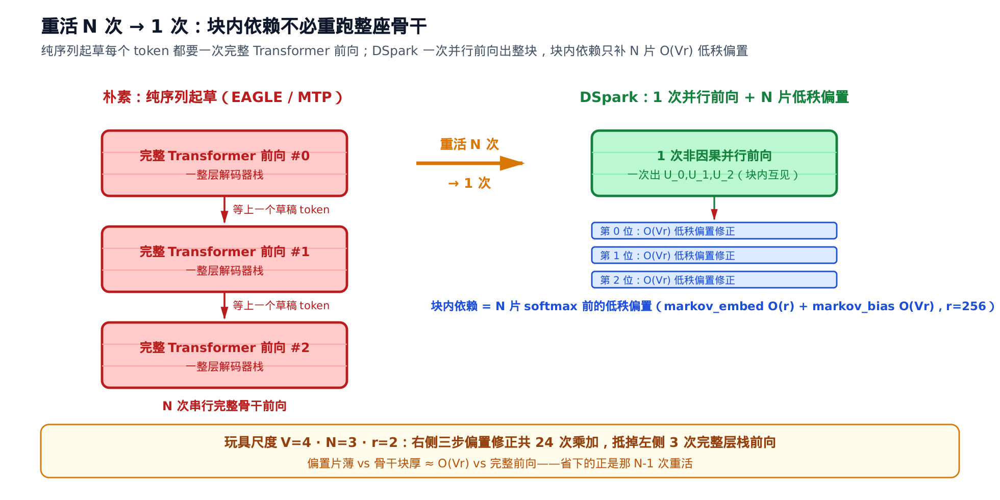
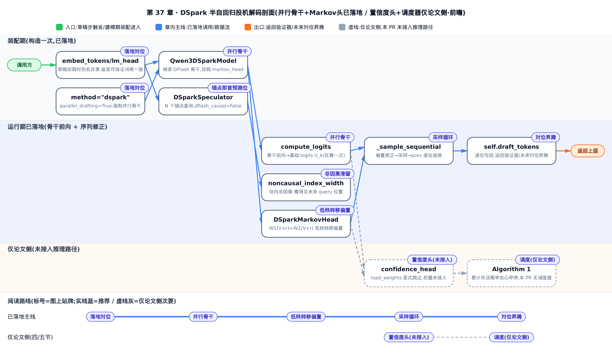
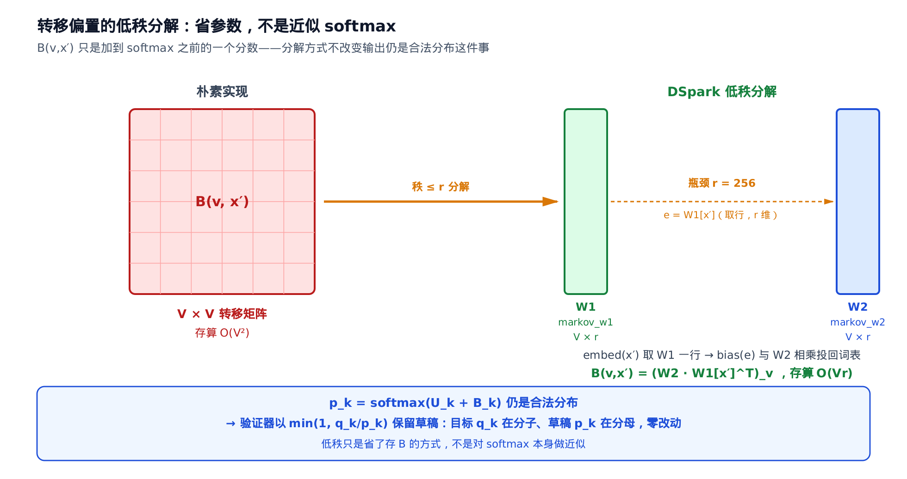
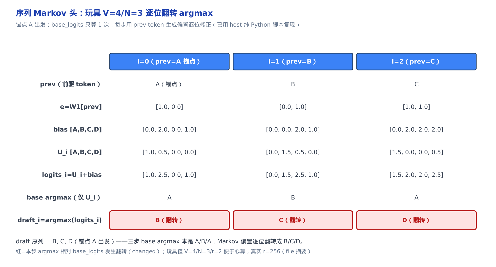
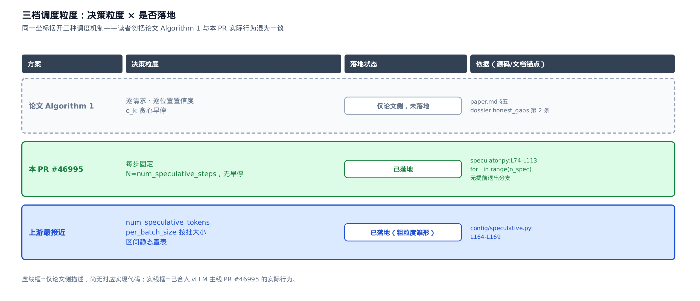

# DSpark 半自回归投机解码：并行骨干 + 序列 Markov 头（前瞻）

> **你在这里**：昇腾接管链走到了第七部分「量化/采样/投机/模型」的尽头。
> 上一站：[第 36 章](../../ch36-speculative-decode-npu/narrative/chapter.md)把投机解码（含 DFlash 的并行起草）落地到了昇腾——`AscendDflashProposer` 已经跑在真实的 proposer 工厂分发里。
> 本章是一篇 **前瞻 capstone**：DSpark 是 DFlash（[第 35 章](../../ch35-primer-dflash/narrative/chapter.md)）并行骨干之上的半自回归升级，读的是 pin 版之外的上游新代码，看投机解码的下一代形态。


> ⚠️ **前瞻声明（务必先读）**：DSpark **尚未合入 vllm-ascend**——它还只是一份 RFC（[#11126](https://github.com/vllm-project/vllm-ascend/issues/11126)，"Add DSpark speculative decoding support for DeepSeek-V4"）。本章内嵌的每一段代码都来自 **vLLM 主线** 的 PR [#46995](https://github.com/vllm-project/vllm/pull/46995)（"[Spec Decode] DSpark"，MERGED 2026-07-01，merge commit `f5a8d73`），**不在本书 pin 的 v0.21.0 源码树里**。所以本章是「读上游、看未来」的前瞻解读，凡内嵌上游片段都标注「来自 vLLM 主线 PR #46995 @f5a8d73，尚未合入本书 pin 的 v0.21.0——前瞻解读」。**更重要的诚实前提**：DSpark 的「论文全貌」（置信度头 + 硬件感知调度器）比「当前代码到哪」（并行骨干 + Markov 头）走得远——本章会一路把这条落差讲清，绝不把论文机制包装成已落地代码。

DSpark 没有单一 arXiv 论文可锚（DeepSeek 尚未为它发独立报告），机制描述散在技术博客、DFlash 谱系博客与 vllm-ascend 的 RFC 里。本章数学以公开技术摘要（ai-infrastructure.net）为主锚、以上游 PR #46995 源码为落地对照，两者逐点对齐。凡涉及生产/评测数字，一律标「据来源，未独立复现」。

投机解码的草稿模型历来二选一：纯序列（EAGLE / MTP）逐 token 自回归，块内依赖精确，但 N 个草稿 token 要 N 次完整前向；纯并行（DFlash）一次前向出整块，硬件友好，但块内依赖整个丢掉。DSpark 的答案是一条贯穿全章的命题：**块内依赖不必靠重跑骨干找回——它可以被压成 softmax 之前的一个加性低秩偏置**。这一行等式（第一节正式写出）同时买到三件事：骨干只前向一次（基础 logits 与块内采样无关，N 次完整前向塌成 1 次）；逐位修正轻到向量级（偏置低秩，每步一次取行、一次瘦矩阵乘）；草稿仍是显式合法分布（偏置加在 softmax 之前，[第 34 章](../../ch34-primer-speculative-sampling/narrative/chapter.md)的保分布定理与验证器零改动）。敢把块内依赖砍到只剩「前驱一个 token、秩 r 一张表」这么糙，底气在同一条定理的另一面：草稿的糙只折算进接受率（速度），永不污染输出分布（正确性）。本章沿这条主线推完已落地的两件（并行骨干、序列 Markov 头），再诚实划出论文侧尚未落地的两件（置信度头、Algorithm 1 调度）——后两件同样挂在主线上：草稿分布显式合法，才谈得上预测接受率、进而按吞吐调度。



*据 ai-infrastructure.net 摘要与 PR #46995 源码结构自绘。厚薄落差就是全章的账：玩具尺度（V=4、N=3、r=2）下三步偏置修正共 24 次乘加，抵掉的是 3 次完整解码器层栈前向——省下的正是那 N−1 次重活，第三节的数值推演会逐步复现这笔账。*



只想建立「半自回归省的是哪部分算力」，读一、二两节；想吃透「低秩偏置为什么省参数、不近似 softmax」，重点读第三节的推导与数值推演；只关心「论文说的和代码到哪的落差」，直接跳四、五两节；想知道真落地到 vllm-ascend 会插在哪，看第六节。

全章记号一张速查表（首现处正文还会各给一句人话，这张表只作回查）：

| 符号 | 含义 | 首现节 |
|---|---|---|
| $`N`$ | 每块草稿 token 数 = query 数（锚点 + N-1 噪声），即 `num_speculative_steps` | 一 |
| $`p_k(v \mid x_0, x_{<k})`$ | 块内位置 k 的草稿分布，只以前驱采样 token $`x_{k-1}`$ 为条件 | 一 |
| $`U_k`$ | 并行骨干在块内位置 k 输出的**基础 logits**（只看上下文，不含块内已采样依赖） | 一 |
| $`B_k(x', v)`$ | **转移偏置**：给定前驱 token $`x'`$ ，加到候选 token $`v`$ 基础分数上的一阶 Markov 修正 | 一 |
| $`x_{k-1}`$ | 位置 k-1 上一步采样出的具体 token（喂回 Markov 头当条件） | 一 |
| $`h_k`$ | 骨干在位置 k 的输出 hidden state（喂给 lm-head 前的表示） | 二 |
| $`W_1`$ | $`V \times r`$ 前驱-token 嵌入表 `markov_w1`，取一行得 r 维 Markov 嵌入 | 三 |
| $`W_2`$ | $`V \times r`$ 投影表 `markov_w2`，当伪 lm-head 把 r 维嵌入投回词表 | 三 |
| $`r`$ | Markov 头低秩维度 `markov_rank`（摘要值 256） | 三 |
| $`V`$ | 词表规模（数万–十万量级） | 三 |
| $`q_k(v)`$ | 目标模型在位置 k 的验证分布——[第 34 章](../../ch34-primer-speculative-sampling/narrative/chapter.md)记号里的 $`p`$ ；本章为免与草稿分布 $`p_k`$ 撞名而改记 | 三 |
| $`c_k`$ ／ $`c_k^{*}`$ | 置信度头预测的存活概率／它逼近的解析接受率 $`1-\mathrm{TV}`$ （**论文侧；本 PR 权重被跳过**） | 四 |
| $`\mathrm{TV}(p,q)`$ | 全变差距离，度量两个分布的差异（本章取归一化定义：逐点差绝对值和的一半） | 四 |
| $`\Theta`$ ／ $`\tau`$ ／ $`\mathrm{SPS}(B)`$ | 调度目标吞吐 $`= \tau \cdot \mathrm{SPS}(B)`$ ；期望被接受的 token 数；批大小 B 下可 O(1) 查表的每秒步数（**论文侧；本 PR 无调度器**） | 五 |

## 一、动机：块内依赖的两难与第三条路

投机解码的核心是「小模型出草稿，大模型批量验证」（机制与保分布证明见[第 34 章](../../ch34-primer-speculative-sampling/narrative/chapter.md)）。草稿那串 token 怎么产出，两条老路各有一个硬伤：

- **纯序列（EAGLE / MTP）**：草稿逐 token 自回归采样。EAGLE（arXiv:2401.15077，用小模型外推目标模型隐藏状态特征做草稿）、MTP（Multi-Token Prediction，多 token 预测头，DeepSeek-V3 让每个深度吃上一深度隐状态、逐层保持因果）都属这一类。块内依赖精确，但 $`N`$ 个草稿 token 要 $`N`$ 次串行前向——小模型也躲不开延迟的骨牌效应。
- **纯并行（DFlash，[第 35 章](../../ch35-primer-dflash/narrative/chapter.md)）**：把上下文的 KV cache（键值缓存，注意力已算好的历史键值）一次性注入草稿模型，一次**非因果**前向出整块草稿。硬件友好，但代价是**丢弃块内依赖**——块内第 $`k`$ 个位置的草稿分布，不再以「块内前 k-1 个已采样草稿 token」为条件，只以目标模型的上下文表示为条件。

DSpark 走第三条路——**半自回归（semi-autoregressive）**：重活（一整层 Transformer 解码器栈）保持一次非因果并行前向，轻活（块内 $`N`$ 步从左到右的修正）只花向量级计算，不重跑骨干。宏观并行、微观（块内）序列。写成本章那行主线等式（对应技术摘要 §三）：

$$
p_k(v \mid x_0, x_{<k}) = \mathrm{softmax}\big(U_k(v) + B_k(x_{k-1}, v)\big)
$$

$`p_k`$ 是块内位置 $`k`$ 的草稿分布； $`U_k(v)`$ 是并行骨干给候选 token $`v`$ 的**基础分数**——它与块内采样无关，第二节造它； $`B_k(x_{k-1}, v)`$ 是「前驱是 $`x_{k-1}`$ 时给 $`v`$ 的转移偏置」——块内依赖**全部**住在这一项里，第三节造它。条件记号沿一般自回归写作 $`(x_0, x_{<k})`$ ，但一阶 Markov（马尔可夫：分布只依赖上一步状态）假设下它实际只依赖前驱一个 token $`x_{k-1}`$ 。这行等式怎么读：依赖项是 **加性** 的、**低秩** 的、且在 **softmax 之前**——加性，所以骨干可以脱开采样先并行算完；低秩，所以逐位修正便宜到向量级；在 softmax 之前，所以输出仍是合法分布、验证器零改动。全章就是把这三个从句逐一坐实。

血缘与对位一句话：并行骨干直接继承自 DFlash（[第 35 章](../../ch35-primer-dflash/narrative/chapter.md)那套 context-KV 预计算 + 非因果 query-block 前向），DSpark 只在骨干顶上挂了个新头；验证侧原封不动是[第 34 章](../../ch34-primer-speculative-sampling/narrative/chapter.md)的拒绝采样（第三节论证）；真落到昇腾，会插进[第 36 章](../../ch36-speculative-decode-npu/narrative/chapter.md)那个 proposer 工厂（RFC #11126 计划中的 `AscendDsparkProposer`，第六节收口）。

## 二、并行骨干：基础 logits 只看上下文，所以只算一次

**洞见**： $`U_k`$ 的定义里没有块内其他位置的采样结果——它只依赖目标模型给的上下文表示。与采样无关的量就没有理由串行算： $`N`$ 个位置的 $`U_k`$ 可以在同一次前向里全部出完。半自回归省下的算力全部落在这一步： $`N`$ 次完整前向 → 1 次。

**机制**：骨干零架构新增——`Qwen3DSparkModel` 直接继承 DFlash 的 Qwen3 解码器栈，整个类体只多挂一个 `markov_head`，docstring 直书「DFlash Qwen3 backbone + DSpark Markov head」，这就是「半自回归」的代码级定义；DeepSeek-V4 版本（`DSparkDeepseekV4Model`）额外复用目标模型的超连接（hyper-connection，跨层残差直连）MLA 解码层——正是[第 26 章](../../ch26-primer-v4-csa-hca/narrative/chapter.md)讲的两级压缩混合注意力。骨干输出块内每个位置的 hidden state $`h_k`$ （下标 $`k`$ 记块内位置， $`k = 0, \ldots, N-1`$ ），经最终归一化与 lm-head（词表投影层）得基础 logits $`U_k`$ （对应技术摘要 §二）：

$$
U_k = \mathrm{lm\_head}(\mathrm{norm}(h_k))
$$

其中 $`\mathrm{norm}`$ 是 head 前的最终归一化，与骨干内部逐层 norm 是两回事。这条公式在源码里就是三行，注释直书：

```python
# vllm/models/deepseek_v4/nvidia/dspark.py:L317-L319
# 来自 vLLM 主线 PR #46995 @f5a8d73，尚未合入本书 pin 的 v0.21.0——前瞻解读
def compute_logits(self, hidden_states: torch.Tensor) -> torch.Tensor:
    """Base logits U_k = lm_head(norm(head_hidden))."""
    return self.logits_processor(self.lm_head, self.model.norm(hidden_states))
```

骨干其余细节都是继承来的，与本章数学相关的输入排布只有两件，各一句话：

- **锚点即首个预测位**：DFlash 的输入是 $`1 + N`$ 个 query token（第 0 个「锚点」只提供上下文、不产生预测）；DSpark 改成恰好 $`N`$ 个 query（锚点 + $`N-1`$ 个占位噪声 token），**每个 query 位置都是一次预测**——锚点自己就预测块内第一个草稿 token。投机器构造函数里三行赋值把这件事定死（上游 speculator.py，PR #46995）。
- **块内非因果互见**：要在一次前向里同时出 $`N`$ 个位置的 $`U_k`$ ，注意力就必须让块内每个 query 除了看历史滑窗（滑动窗口注意力：只看邻近一段历史），还看得到**块内其他所有 query（含未来位置）**。落到注意力后端，是一条把索引宽度从「仅历史窗口」扩到「历史窗口 + 整个草稿块」的专用非因果索引路径（上游 sparse_swa.py 的 kernel 搬运细节与原理无关，本章不展开）。

这一步产出的 $`U_k`$ ，语义上是「位置 k 只看得到上下文、看不到块内已采样草稿 token」的无依赖初稿——块内依赖，靠第三节的序列头找回。下面这张时间线图，把「一次并行前向」和「N 步序列修正」在一条时间轴上对齐，也顺手标出了哪些已落地、哪些仅论文侧：


*据 ai-infrastructure.net 摘要与 PR #46995 源码结构自绘。* 实线泳道（并行骨干 + 序列 Markov 头）是本 PR 已落地部分；虚线泳道（置信度头 + 硬件感知调度器）仅存在于论文侧——第四、五节专门讲这条落差。

## 三、序列 Markov 头：块内依赖 = softmax 前的低秩加性偏置

骨干丢掉的依赖，DSpark 用主线等式里的 $`B_k`$ 找回：块内位置 $`k`$ 的分布只以位置 k-1 采样出的 token $`x_{k-1}`$ 为条件——一阶 Markov 假设，即 $`p_k(v \mid x_0, x_{<k}) = p_k(v \mid x_{k-1})`$ ，偏置项里也确实只出现 $`x_{k-1}`$ 。剩下两个问题：这张偏置表怎么存得起（低秩），以及它凭什么不破坏投机采样的无损性（softmax 之前）；最后看它落成的那个 `for` 循环。

### 低秩分解：省参数，不是近似 softmax

**洞见**： $`B_k`$ 要对每个（前驱 token，候选 token）配对存一个数，朴素实现是一张 $`V \times V`$ 矩阵——词表 $`V`$ 数万到十万量级，存不起也学不动。但**两张 $`V \times r`$ 瘦表的乘积，就是一张秩 $`\le r`$ 的 $`V \times V`$ 表**：每个词先压成 $`r`$ 维的小签名（ $`W_1`$ 取行），再从签名展开成对整个词表的偏好（ $`W_2`$ 投影）。写成矩阵形式（技术摘要 §三）：

$$
B(v, x') = \big(W_2\, W_1[x']^\top\big)_v ,\qquad B = W_2\, W_1^\top
$$

这里 $`x'`$ 是前驱 token， $`v`$ 是候选 token。维度账逐步核一遍： $`W_1 \in \mathbb{R}^{V \times r}`$ ，取一行得 $`W_1[x'] \in \mathbb{R}^{r}`$ ， $`^\top`$ 把它当列向量（ $`r \times 1`$ ）； $`W_2 \in \mathbb{R}^{V \times r}`$ ，于是 $`W_2\, W_1[x']^\top \in \mathbb{R}^{V}`$ ，其第 $`v`$ 个分量就是标量偏置 $`B(v, x')`$ 。存储与每步计算量都是 $`O(Vr)`$ 而非 $`O(V^2)`$ —— $`r = 256`$ （摘要值，未独立复现）、 $`V`$ 数万级时差**两个量级**。源码里这就是 `DSparkMarkovHead` 仅有的两张表与两个方法：`embed()` 按 token id 从 $`W_1`$ （词表并行嵌入表 `markov_w1`）取一行，`bias()` 拿这个 $`r`$ 维嵌入与 $`W_2`$ （`markov_w2`，当伪 lm-head 用）相乘投回词表——各自一行矩阵乘，上面的矩阵恒等式已把整个类说尽。

这张图把「省的是 $`O(V^2) \to O(Vr)`$ 」和「偏置只加在 softmax 之前、输出仍是合法分布」两件事钉在一起——务必别把「低秩」误读成「近似 softmax」：



*据 ai-infrastructure.net 摘要与 `DSparkMarkovHead` 源码自绘。*

### 精确性：偏置在 softmax 之前，验证器零改动

**洞见**： $`p_k`$ 是对「加了偏置之后的完整 logits」做一次**标准** softmax——词表上合法、逐点显式、严格为正的概率分布，不是近似、不是采样内插。于是[第 34 章](../../ch34-primer-speculative-sampling/narrative/chapter.md)的接受准则（arXiv:2211.17192 §2.3）原封不动适用：草稿采出 token $`v`$ 后，验证器以概率

$$
\min\!\left(1,\ \frac{q_k(v)}{p_k(v)}\right)
$$

保留它——分子 $`q_k`$ 是**目标模型**的验证分布，分母 $`p_k`$ 是**草稿**分布。这正是[第 34 章](../../ch34-primer-speculative-sampling/narrative/chapter.md)的 $`\min(1, p/q)`$ ：那里 $`p`$ 记目标、 $`q`$ 记草稿，本章的草稿分布叫 $`p_k`$ ，两个字母恰好对调——认角色（目标在分子、草稿在分母）不认字母。分母是 softmax 的输出、逐点严格为正，比值处处良定义，验证器不需要为 DSpark 改一行。

再点透一层，这是 DSpark 敢把依赖砍这么狠的真正底气。一阶 Markov 显然是粗近似——只看前驱一个 token，连块内隔一位的依赖都不看。但[第 34 章](../../ch34-primer-speculative-sampling/narrative/chapter.md)那本双账已经证明：**输出分布无条件等于目标分布，草稿的好坏只折算进接受率**。「近似」的账因此全部记在速度上（接受率低一点、草稿浪费一点），一分都不记在正确性上——草稿头的设计可以放开手脚往便宜里砍，DSpark 砍到每步 $`O(Vr)`$ ，还换来对 DFlash +16–18% 的接受长度（第七节的账单）。

> **严谨（良定义性的完整链条）**： $`W_1[x_{k-1}]`$ 与 $`W_2`$ 都是有限权重，故 $`B_k`$ 有限；加到有限的 $`U_k`$ 上和仍有限； $`\exp`$ 处处为正且 $`\sum_v \exp > 0`$ ，softmax 把它归一到 $`(0,1)`$ 、总和为 1——合法分布。目标侧 $`q_k`$ 同为 softmax 输出。于是 $`q_k/p_k`$ 逐点有限非负， $`\min(1,\cdot)`$ 是合法概率。整条链没有用到 $`B_k`$ 「学得好不好」——精确性与草稿质量彻底解耦，这就是正文那本双账的形式化。

### 块内采样循环：重活一次、轻活 N 次

落到代码是一个 `for` 循环——骨干输出先在循环外一次性算出全部 base_logits（即 $`U_k`$ ，只算这一次），再从锚点采样结果起步逐位加偏置：

```python
# vllm/v1/worker/gpu/spec_decode/dspark/speculator.py:L74-L113
# 来自 vLLM 主线 PR #46995 @f5a8d73，尚未合入本书 pin 的 v0.21.0——前瞻解读
def _sample_sequential(self, num_reqs: int, head_hidden: torch.Tensor) -> None:
    n_spec = self.num_speculative_steps
    # … 省略：按 (req, step) 取 sample_hidden …
    base_logits = self.model.compute_logits(sample_hidden)   # 骨干输出→U_k，只算这一次
    base_logits = base_logits.view(num_reqs, n_spec, base_logits.shape[-1])
    # … 省略：idx_map / sample_pos reshape …
    # Anchor (bonus) token per request = the input id at query offset 0.
    prev = self.input_buffers.input_ids[self._anchor_idx[:num_reqs]]

    for i in range(n_spec):
        # Sequential stage: Markov bias from the previously sampled token.
        markov_embed = self.model.markov_embed(prev)   # W1[prev]，O(r)
        bias = self.model.markov_bias(markov_embed)     # W2·embed，O(Vr)
        logits_i = base_logits[:, i] + bias
        if self.draft_logits is not None:
            draft_i = gumbel_sample(logits_i, ...)      # 记录处理后 logits 供验证
        else:
            draft_i = logits_i.argmax(dim=-1)
        self.draft_tokens[:num_reqs, i] = draft_i
        prev = draft_i                                   # 递推：这一位的采样喂给下一位
```

逐行只认与主线等式对得上的几处：`markov_embed` / `markov_bias` 就是 $`W_1`$ 取行与 $`W_2`$ 投影（各自 $`O(r)`$ / $`O(Vr)`$ ，循环里唯一的重复计算）；`logits_i = base_logits[:, i] + bias` 就是 $`U_i + B_i`$ ；`gumbel_sample`（Gumbel-max 采样：对 logits 加 Gumbel 噪声后取 argmax，等价于按 softmax 概率抽样）或 `argmax` 出这一位草稿；`prev = draft_i` 把它喂给下一位当条件——一阶 Markov 的递推正体（`_anchor_idx` 是锚点在输入缓冲里的位置索引，基例 $`i{=}0`$ 的 `prev` 就是锚点 token）。骨干那一整层 Transformer 前向只在第二节做过一次：`base_logits = compute_logits(…)` 在循环外。

**数值推演**（玩具值便于心算： $`V=4`$ （词表 A/B/C/D）、 $`N=3`$ 、 $`r=2`$ 、锚点 = A，用源码 `else` 分支的 `argmax` 避开 gumbel 随机性；真实 $`r=256`$ 见摘要）。骨干先出三个位置的基础 logits $`U_0/U_1/U_2`$ （只算一次），然后从锚点 A 出发逐位加 Markov 偏置：

<!-- trace: m6-sequential-sampling -->

| i（块内位置） | prev（前驱 token） | e=W1[prev] | markov bias [A,B,C,D] | U_i [A,B,C,D] | logits_i=U_i+bias | base argmax（仅 U_i） | draft_i=argmax(logits_i) |
|---|---|---|---|---|---|---|---|
| 0 | A(锚点) | [1.0, 0.0] | [0.0, 2.0, 0.0, 1.0] | [1.0, 0.5, 0.0, 0.0] | [1.0, 2.5, 0.0, 1.0] | A | B（翻转） |
| 1 | B | [0.0, 1.0] | [0.0, 0.0, 2.0, 1.0] | [0.0, 1.5, 0.5, 0.0] | [0.0, 1.5, 2.5, 1.0] | B | C（翻转） |
| 2 | C | [1.0, 1.0] | [0.0, 2.0, 2.0, 2.0] | [1.5, 0.0, 0.0, 0.5] | [1.5, 2.0, 2.0, 2.5] | A | D（翻转） |

读法：如果只看骨干的 $`U_i`$ ，三步 argmax 本是 A/B/A；Markov 偏置把它们逐位翻成 **B/C/D**——块内依赖正是靠这个逐位偏置一步步找回，而骨干只前向了一次。 $`i=0`$ 的 prev 是锚点 A（`prev = input_ids[_anchor_idx]`）， $`i=1`$ 的 prev 是上一步的 draft B， $`i=2`$ 的 prev 是 C，严格前推。

把上一小节「加偏置后仍是合法分布」的断言落到具体数字：取 $`i=0`$ 那行的 $`\mathrm{logits}_0 = [1.0, 2.5, 0.0, 1.0]`$ ，过一次标准 softmax 得 $`p_0 = [0.146, 0.654, 0.054, 0.146]`$ （求和 $`= 1.000`$ ）——这就是位置 0 的草稿分布 $`p_0(v)`$ ，仍是词表 A/B/C/D 上一个合法、逐点显式的概率分布（每项 $`> 0`$ 、总和为 1）。分母每项严格为正，验证器的 $`\min(1, q_0/p_0)`$ 逐点良定义，无需为 DSpark 改动。



*玩具算术已用 host 纯 Python 脚本复现，仅作示教核对。*

> **严谨（终止性与递推良基）**：`for i in range(n_spec)` 固定步数， $`i`$ 每轮 +1、无提前退出分支 → 恰 $`N`$ 步必停。基例 $`i=0`$ 用锚点 input id 作 `prev`；归纳步 $`\mathrm{prev} = \mathrm{draft}_{i-1}`$ 严格前推，第 $`i`$ 步只消费第 $`i-1`$ 步产物——块内条件链 $`x_0 \to x_1 \to \cdots`$ 从不指向未来。良定义性（合法分布 → 比值良定义）已由上一小节严谨框给出，循环不改变它。

**复杂度**：玩具例里 `base_logits` 只算 1 次（= 1 次骨干前向）； $`N=3`$ 步修正，每步 `markov_embed` 是 $`O(r)=O(2)`$ 、`markov_bias` 是 $`O(Vr)=O(4\times 2)=8`$ 次乘加，三步共 24 次乘加——对比 EAGLE/MTP 要 3 次完整骨干前向（一整层 Transformer 解码器栈）。真实规模 $`r=256`$ 、 $`V`$ 数万–十万级，每步修正 $`O(Vr)`$ 、N 步共 $`O(N \cdot Vr)`$ ，仍远小于 N 次骨干层栈前向。这就是半自回归省的那部分算力。

到这里，DSpark 的**已落地部分**（并行骨干 + 序列 Markov 头）就讲完了。接下来两节转向**论文侧**——摘要描述了、checkpoint 里也有权重、但本 PR 快照的推理路径**尚未接入**的两个机制。先点破它们与主线的关系：正因为 $`p_k`$ 是显式合法分布，「这一位草稿能活下来的概率」本身成了一个可计算、可学习的量（第四节的置信度头），而可预测的存活概率才谈得上按吞吐收益决定录取多少（第五节的调度器）——两节都是主线等式的下游。这条「论文说了、代码没到」的落差，是本前瞻章的诚实底线。

## 四、论文侧其一：置信度头与温度校准（本 PR 快照未接入推理路径）

**论文说的是什么**：技术摘要描述了一个**置信度头**（confidence head），在验证之前预测每个草稿位置的存活概率——把骨干 hidden state $`h_k`$ 与该位置的 Markov 嵌入 $`W_1[x_{k-1}]`$ 拼接后过一个线性层（权重向量 $`w`$ ，长度即拼接维度；记号简洁起见略去偏置项）加 sigmoid，输出 $`c_k`$ （对应摘要 §四）：

$$
c_k = \mathrm{sigmoid}\big(w^\top [\,h_k\,;\, W_1[x_{k-1}]\,]\big)
$$

它逼近的目标是**解析接受率** $`c_k^*`$ ——用全变差距离 $`\mathrm{TV}`$ （total variation，取**归一化**定义：逐点差绝对值和的一半，值域 $`[0,1]`$ ）度量草稿分布 $`p_{\mathrm{draft}}`$ （本章的 $`p_k`$ ）与目标分布 $`p_{\mathrm{target}}`$ （本章的 $`q_k`$ ）的差异：

$$
c_k^{*} = 1 - \mathrm{TV}(p_{\mathrm{draft}}, p_{\mathrm{target}})
$$

这不是一个新量：此归一化下 $`\mathrm{TV}`$ 与[第 34 章](../../ch34-primer-speculative-sampling/narrative/chapter.md)的散度 $`D_{LK}`$ 逐点相等（因 $`|p-m| = \tfrac{1}{2}|p-q|`$ ， $`m`$ 为两分布中点），故 $`c_k^* = 1 - D_{LK} = \beta`$ ——**置信度头学的就是那张成绩单（单点接受率 $`\beta`$ ）的逐位置版本**（arXiv:2211.17192 的接受率定义）。极端一验：两分布无重叠（ $`p=(1,0)`$ 、 $`q=(0,1)`$ ）时 $`\mathrm{TV}=1`$ 、 $`c_k^*=0`$ ，与真实接受率 $`\beta = \sum_v \min(p,q) = 0`$ 吻合——所以定义里**不带** $`1/2`$ （误带会算出 0.5）。摘要还提到 **Sequential Temperature Scaling（STS，序列温度校准）**：一维网格搜索校准 $`c_k`$ ，把期望校准误差（ECE，Expected Calibration Error，预测置信度与实际正确率的平均偏离）从 3–8% 压到约 1%，让「累计存活概率」（连乘 $`c_i`$ ）数值可信，才够格当第五节的调度判据。

**代码到哪了（诚实标注）**：本 PR #46995 快照里，`confidence_head` 的权重被**显式跳过**，尚未接入前向/采样路径。铁证在 Qwen3 版的权重加载里：

```python
# vllm/model_executor/models/qwen3_dspark.py:L142-L153
# 来自 vLLM 主线 PR #46995 @f5a8d73，尚未合入本书 pin 的 v0.21.0——前瞻解读
# mask_embedding is an unused placeholder param; DSpark masks via the vocab row.
# confidence_head is not wired into inference yet; skip its weights.
skip_substrs = ["mask_embedding", "confidence_head"]
if not includes_embed_tokens:
    skip_substrs.append("embed_tokens")
if not includes_lm_head:
    skip_substrs.append("lm_head")
loader = AutoWeightsLoader(self, skip_substrs=skip_substrs)
loader.load_weights(model_weights.items())
```

DeepSeek-V4 版的权重名映射同样把 `confidence_head.*` 直接映成 `None` 丢弃，注释一字不差地重复「The confidence head is not wired into inference yet; drop its weights.」。也就是说：**checkpoint 里确实存在 `confidence_head.*` 权重（训练侧已经产出这个头），但当前这版 vLLM 主线代码只加载并丢弃它**——本节公式停在「论文/checkpoint 有、上游推理代码暂未使用」的阶段。这句「not wired into inference yet」是逐字引用的源码注释，不是本章推测；按前瞻纪律如实标注，不把论文机制包装成已落地机制。

## 五、论文侧其二：硬件感知动态调度 Algorithm 1（本 PR 快照无调度器代码）

**论文说的是什么**：有了第四节的逐位存活概率 $`c_k`$ ，DeepSeek 报告描述了一个**贪心动态调度器**，目标是最大化吞吐量（对应摘要 §五）：

$$
\Theta = \tau \cdot \mathrm{SPS}(B)
$$

$`\tau`$ 是（给定批大小 $`B`$ 下）期望被接受的 token 数， $`\mathrm{SPS}(B)`$ （steps-per-second）是针对批大小 $`B`$ 离线 profile 好、可 O(1) 查表的硬件吞吐曲线。调度过程（摘要复述的 Algorithm 1）：

1. 把候选草稿 token 按**累计前缀存活概率** $`\prod_{i \le k} c_i`$ （块内从锚点往后逐位相乘）排序；
2. 逐个贪心录取，每录取一个就更新有效批大小 $`B`$ 与期望 $`\tau`$ ；
3. 每步用 $`\mathrm{SPS}(B)`$ 查表评估吞吐是否提升；
4. **一旦吞吐不再提升就立即停止**——这是保证「不破坏因果」的早停闸门。

**直觉**：草稿越长，被目标模型全盘接受的概率越低（存活概率逐位连乘、越乘越小）。调度器像「边加菜边看总收益」：每多录取一个草稿 token 就用 $`\Theta`$ 算一次吞吐，加到收益开始下降的那一口就停筷。玩具推演（ $`c=[0.9, 0.8, 0.5, 0.4]`$ 、`SPS` 查表随草稿变长而递减，均为便于心算的玩具值、非厂方实测）：

<!-- trace: m8-scheduler-algo1 -->

| k（录取到第几位） | c_k | P_k=∏_{i≤k}c_i（累计存活） | τ(k)=Σ P_i（期望接受数） | SPS(k) | Θ=τ·SPS | 决策 |
|---|---|---|---|---|---|---|
| 1 | 0.9 | 0.9 | 0.9 | 100.0 | 90 | 录取（Θ↑） |
| 2 | 0.8 | 0.72 | 1.62 | 90.0 | 145.8 | 录取（Θ↑） |
| 3 | 0.5 | 0.36 | 1.98 | 75.0 | 148.5 | 录取（Θ↑，达峰） |
| 4 | 0.4 | 0.144 | 2.124 | 55.0 | 116.8 | 早停（Θ↓）→ 录取 3 |

吞吐 $`\Theta`$ 在 $`k=3`$ 达峰 148.5（录取 3 个草稿）， $`k=4`$ 跌到 116.8 触发早停。对照盲取满 $`N=4`$ （ $`\Theta=116.8`$ ）是 $`148.5/116.8 \approx 1.271\times`$ ，对照保守 $`N=1`$ （ $`\Theta=90`$ ）是 $`1.65\times`$ 。

![玩具 c=[.9,.8,.5,.4] 调度表 + 吞吐趋势：Θ 在 k=3 达峰、k=4 跌落触发早停，录取 3](../diagrams/fig-m8-greedy-earlystop.png)

*据摘要 Algorithm 1 描述自绘；玩具算术已用 host 纯 Python 复现。*

**不变量 + 早停的因果正确性**：累计存活概率 $`P_k = \prod_{i \le k} c_i`$ 关于 $`k`$ 单调非增（ $`c_i \in [0,1]`$ ，基例 $`P_0=1`$ 、归纳步 $`P_k = P_{k-1} c_k \le P_{k-1}`$ ），所以 $`\tau`$ 增速递减、 $`\Theta`$ 至多在 $`\le N`$ 步内现峰值并触发早停，有限步终止。**因果性**：第 $`k`$ 步决策只依赖 $`\{c_1, \ldots, c_k\}`$ （已产生的、从左到右的过去信息），**从不回看目标模型的验证结果**。摘要给出的一个反例说明这一点的必要性：若允许「回看全局」式搜索（而非贪心、单调、一旦劣化立停），会把一个 $`(0.7, 0.3)`$ 的目标分布系统性搜偏成 $`(0.85, 0.15)`$ ——即「提前窥视未来验证结果再决定接受多少」会偏置输出分布。贪心早停等价于「只用已产生的、单调不减的信息做决策，不回溯」，这与拒绝采样「不能用目标模型的验证结果反过来影响草稿采样」的因果约束是一回事，也和分块预填充里「因果不倒错」的道理同源。

**代码到哪了（诚实标注）**：本 PR #46995 快照里**没有实现**这套基于置信度的自适应调度器——`DSparkSpeculator` 每步固定生产 `num_speculative_steps` 个草稿 token，第三节那个 `for i in range(n_spec)` 循环**没有提前退出的分支**。上游现存粒度最接近的替代，只是一个配置字段 `num_speculative_tokens_per_batch_size`（上游 config/speculative.py）：按**批大小区间**静态查表选草稿长度——部署时定死、对所有请求生效同一长度，与 Algorithm 1「逐请求、逐位置、按运行时累计存活概率贪心录取」是两个粒度的机制，代码里目前只有前者的雏形。这张图把三种粒度沿「决策粒度 × 是否落地」摆开，务必别把它们混为一谈：



*据摘要 Algorithm 1 与 `config/speculative.py` 源码自绘。* 虚线框 = 仅论文侧、尚无对应实现代码；实线框 = 已合入 PR #46995 的实际行为。

## 六、落地地图：文件对位与 vllm-ascend 前瞻

前面五节的机制在上游散在六个文件里，收口成一张「谁在哪」的对位表：

| 本章机制 | 上游文件（PR #46995，前瞻） |
|---|---|
| 并行骨干继承 DFlash Qwen3 栈 + Markov 头挂载 | `vllm/model_executor/models/qwen3_dspark.py` |
| DeepSeek-V4 版并行骨干（超连接 MLA）+ 权重映射 | `vllm/models/deepseek_v4/nvidia/dspark.py` |
| 序列采样循环 / 锚点即首预测位 | `vllm/v1/worker/gpu/spec_decode/dspark/speculator.py` |
| 草稿模型加载 / 与目标共享 embed·lm_head | `vllm/v1/worker/gpu/spec_decode/dspark/utils.py` |
| 块内非因果滑窗索引 kernel | `vllm/v1/attention/backends/mla/sparse_swa.py` |
| `method="dspark"` 配置 / 批大小静态草稿长度 | `vllm/config/speculative.py` |

装配一段话讲完，不逐块读码：DSpark 的草稿模型不单独发布 checkpoint——DeepSeek-V4 版权重随目标 checkpoint 的 `mtp.*` 发布，加载时草稿与目标模型**共享 embed/lm_head**（别名，省显存 + 保证词表一致——词表一致也是第三节 $`q_k/p_k`$ 逐点成比的前提）；配置上 `method="dspark"` 一个开关触发全部装配，并强制 `parallel_drafting = True`（并行骨干的总开关）。

**对位昇腾**：DSpark 现在只在 vLLM 主线，昇腾侧要落地得走 RFC #11126——计划中的 `AscendDsparkProposer` 会插进[第 36 章](../../ch36-speculative-decode-npu/narrative/chapter.md)那个 proposer 工厂（propose → verify → reject-sample 三段式），加载官方 `*-DSpark` checkpoint（含 Markov 头，也含那个被跳过的 confidence 头）。它顶替的不是某个具体后端，而是给工厂再添一类草稿 proposer——与 EAGLE、MTP 并列。它的 DeepSeek-V4 骨干那套超连接 MLA 解码层，正是[第 26 章](../../ch26-primer-v4-csa-hca/narrative/chapter.md)讲的两级压缩混合注意力的复用。

## 七、数字与小结

**生产/评测数字（据来源，未独立复现）**。本书未接触 DeepSeek-V4 生产环境或对应硬件复现，以下仅作「厂方报告的数量级参考」（SLA：服务水平目标，此处指每用户每秒 token 数的下限）：

| 目标模型 | 匹配吞吐下的单用户加速 | 中等 SLA 下的聚合吞吐提升 |
|---|---|---|
| V4-Flash | 60–85% | +51%（SLA 80 tok/s/user） |
| V4-Pro | 57–78% | +52%（SLA 35 tok/s/user） |

离线基准（Qwen3 4B/8B/14B 目标）宏平均接受长度：vs EAGLE-3 `+30.9% / +26.7% / +30.0%`，vs DFlash `+16.3% / +18.4% / +18.3%`；逐位置条件接受率（Qwen3-4B，Math，位置 1）DSpark 0.93 / DFlash 0.88 / EAGLE-3 0.81。作为并行骨干血缘参照，DFlash 自身数字（据 LMSYS 博客，对 EAGLE-3 5 层）：GSM8K 加速 **3.3x**、HumanEval **3.2x**、MT-Bench **2.2x**。以上均未独立复现。

这也是投机解码这条线在本书里的终点：从[第 34 章](../../ch34-primer-speculative-sampling/narrative/chapter.md)的拒绝采样保分布定理，到 [第 35 章](../../ch35-primer-dflash/narrative/chapter.md) DFlash 把起草换成一次并行前向、[第 36 章](../../ch36-speculative-decode-npu/narrative/chapter.md)真正落地昇腾，再到 DSpark 这份还停在 RFC 阶段的半自回归前瞻——「证明无损 → 换掉起草 → 工程落地 → 再往前看一步」的完整弧线。下一章 [第 38 章](../../ch38-model-lora-netloader-registration/narrative/chapter.md) 转向全书最后一类主题：模型、LoRA、netloader 三处注册的收口，也是整条昇腾接管链的收尾。

**这一章我们做了什么**：全章一行等式收线—— $`p_k = \mathrm{softmax}(U_k + B_k)`$ ，块内依赖被整个压成 softmax 前的一个加性低秩偏置。依赖项**加性**，所以骨干脱开采样、一次非因果并行前向出整块 $`U_k`$ （重活塌成 1 次）；依赖项**低秩**，所以逐位修正只花 $`O(Vr)`$ （轻活 N 次，玩具例里 24 次乘加对 3 次层栈前向）；依赖项在 **softmax 之前**，所以 $`p_k`$ 仍是显式合法分布，[第 34 章](../../ch34-primer-speculative-sampling/narrative/chapter.md)的验证器零改动——一阶 Markov 再糙，账也只记在接受率上，一分不记在输出分布上。论文侧的置信度头（学 $`c_k^* = \beta`$ 的逐位置预测器）与 Algorithm 1（拿它按吞吐贪心调度、因果早停）是同一行等式的下游，但本 PR #46995 快照**显式跳过 / 尚未实现**——落差以逐字源码注释为据，不是本章推测。DSpark 真要在昇腾上跑起来，还得等 RFC #11126 把它接进 proposer 工厂。到那时，本章的前瞻代码，就该从「读上游」变成「读 pin 树」了。
