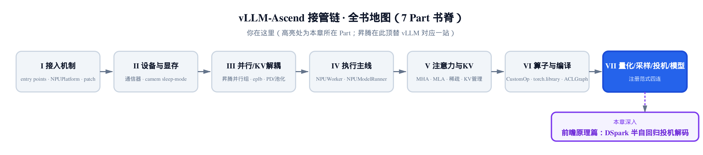
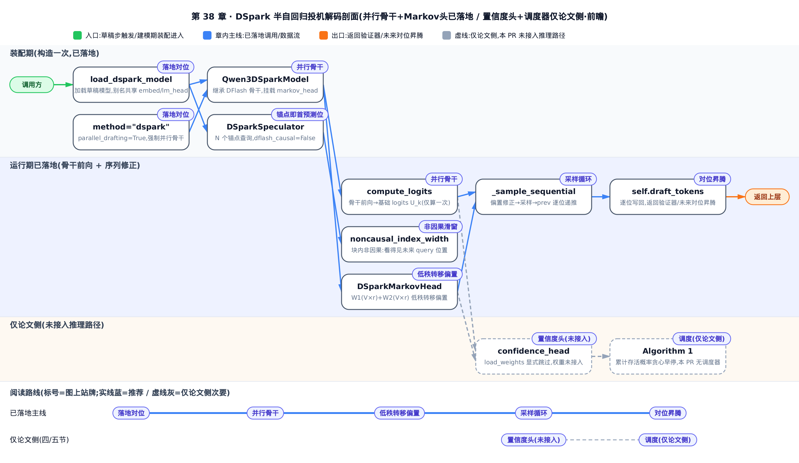
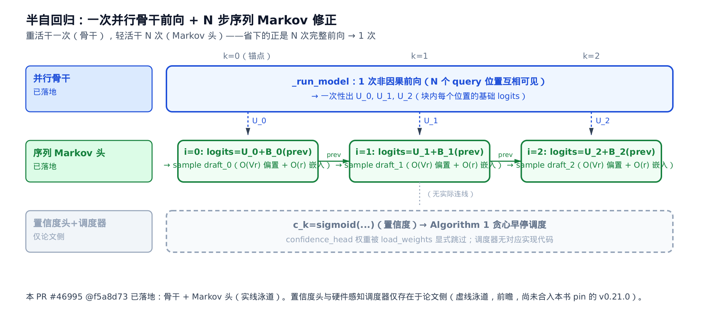
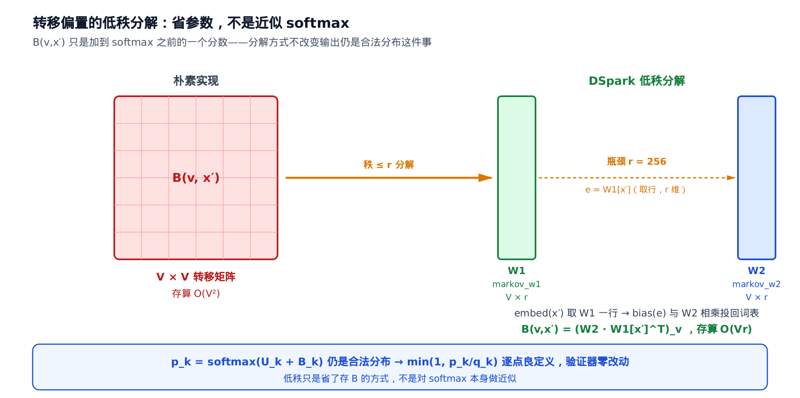
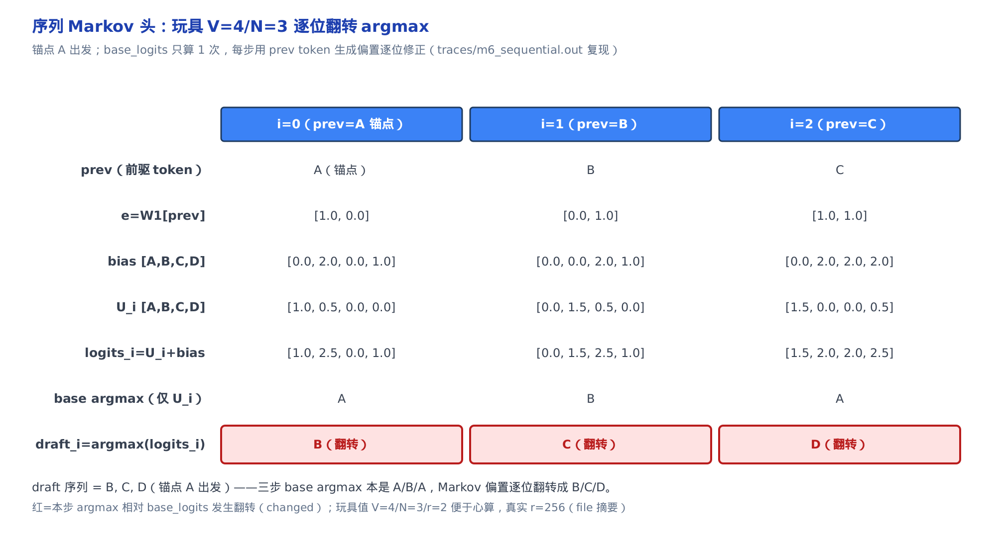

# DSpark 半自回归投机解码：并行骨干 + 序列 Markov 头（前瞻）

> **你在这里**：昇腾接管链走到了第七部分「量化/采样/投机/模型」的尽头。
> 上一站把投机解码在昇腾上落了地（proposer 工厂 + 薄壳继承）。
> 本章是一篇**前瞻 capstone**：读 pin 版之外的上游新代码，看投机解码的下一代形态。



> ⚠️ **前瞻声明（务必先读）**：DSpark **尚未合入 vllm-ascend**——它还只是一份 RFC（[#11126](https://github.com/vllm-project/vllm-ascend/issues/11126)，"Add DSpark speculative decoding support for DeepSeek-V4"）。本章内嵌的每一段代码都来自 **vLLM 主线** 的 PR [#46995](https://github.com/vllm-project/vllm/pull/46995)（"[Spec Decode] DSpark"，MERGED 2026-07-01，merge commit `f5a8d73`），**不在本书 pin 的 v0.21.0 源码树里**。所以本章是「读上游、看未来」的前瞻解读，凡内嵌上游片段都标注「来自 vLLM 主线 PR #46995 @f5a8d73，尚未合入本书 pin 的 v0.21.0——前瞻解读」。**更重要的诚实前提**：DSpark 的「论文全貌」（置信度头 + 硬件感知调度器）比「当前代码到哪」（并行骨干 + Markov 头）走得远——本章会一路把这条落差讲清，绝不把论文机制包装成已落地代码。

DSpark 没有单一 arXiv 论文可锚（DeepSeek 尚未为它发独立报告），机制描述散在技术博客、DFlash 谱系博客与 vllm-ascend 的 RFC 里。本章数学以公开技术摘要（ai-infrastructure.net）为主锚、以上游 PR #46995 源码为落地对照，两者逐点对齐。凡涉及生产/评测数字，一律标「据来源，未独立复现」。

**术语与符号速查**（首现处正文还会各给一句人话，这张表只作回查）：

| 符号 | 含义 | 首现节 |
|---|---|---|
| `N` | 每块草稿 token 数 = query 数（锚点 + N-1 噪声），即 `num_speculative_steps` | 二 |
| `U_k` | 并行骨干在块内位置 k 输出的**基础 logits**（只看上下文，不含块内已采样依赖） | 二 |
| `h_k` | 骨干在位置 k 的输出 hidden state（喂给 lm-head 前的表示） | 二 |
| `B_k(x', v)` | **转移偏置**：给定前驱 token `x'`，加到候选 token `v` 基础分数上的一阶 Markov 修正 | 三 |
| `p_k(v \mid x_0, x_{<k})` | 块内位置 k 的草稿分布，只以前驱采样 token `x_{k-1}` 为条件 | 三 |
| `x_{k-1}` | 位置 k-1 上一步采样出的具体 token（喂回 Markov 头当条件） | 三 |
| `W_1` | `V×r` 前驱-token 嵌入表 `markov_w1`，取一行得 r 维 Markov 嵌入 | 三 |
| `W_2` | `V×r` 投影表 `markov_w2`，当伪 lm-head 把 r 维嵌入投回词表 | 三 |
| `r` | Markov 头低秩维度 `markov_rank`（摘要值 256） | 三 |
| `V` | 词表规模（数万–十万量级） | 三 |
| `q_k(v)` | 目标模型在位置 k 的验证分布（拒绝采样判据分母） | 三 |
| `c_k` | 置信度头输出：位置 k 的预测存活概率（**论文/checkpoint 侧；本 PR 权重被跳过**） | 四 |
| `w` | 置信度头那个线性层的权重向量，长度 = 拼接向量 `[h_k; W_1[x_{k-1}]]` 的维度（`h_k` 维 + `r`） | 四 |
| `\mathrm{TV}(p,q)` | 全变差距离，度量两个分布的差异（本章取归一化定义：逐点差绝对值和的一半） | 四 |
| `\Theta` | 动态调度器优化目标：吞吐量 `= τ·SPS(B)`（**论文侧；本 PR 无调度器**） | 五 |
| `\tau` | 给定批大小下期望被接受的 token 数 | 五 |
| `\mathrm{SPS}(B)` | 批大小 B 下离线 profile 好、可 O(1) 查表的每秒步数 | 五 |



这张图把「已落地」的实线泳道（骨干装配 → 并行前向出 `U_k` → 非因果滑窗 → Markov 采样循环）和「仅论文侧」的虚线泳道（置信度头、Algorithm 1 调度）分开画——只想看落地了多少，跟实线走一遍就够；要按顺序细读，图下面的选读指引给出了每段该看第几节。

**选读指引**：想先建立「半自回归省的是哪部分算力」的整体直觉，读一、二两节 + 那张时间线图就够；想吃透低秩转移偏置为什么「省参数不近似 softmax」，重点看第三节的推导与数值推演；只关心「论文说的和代码到哪的落差」，直接跳四、五两节；想知道真落地到 vllm-ascend 会插在哪，看第六节。

## 一、动机：为什么是「半自回归」

投机解码的核心是「小模型出草稿，大模型批量验证」。草稿模型（记它给出的分布为 `q`）怎么产出那串草稿 token，历来有两条路数，各有一个硬伤：

- **纯序列（EAGLE / MTP）**：草稿逐 token 自回归采样。EAGLE（arXiv:2401.15077，用小模型外推目标模型隐藏状态特征做草稿）、MTP（Multi-Token Prediction，多 token 预测头，DeepSeek-V3 让每个深度吃上一深度隐状态、逐层保持因果）都属这一类。块内依赖精确，但 `γ` 个草稿 token 要 `γ` 次串行前向——小模型也躲不开延迟的骨牌效应。
- **纯并行（DFlash）**：把上下文的 KV cache（键值缓存，注意力已算好的历史键值）一次性注入草稿模型，一次**非因果**前向出整块草稿。硬件友好，但代价是**丢弃块内依赖**——块内第 `k` 个位置的草稿分布，不再以「块内前 k-1 个已采样草稿 token」为条件，只以目标模型的上下文表示为条件。

DSpark 走的是第三条路——**半自回归（semi-autoregressive）**：复用 DFlash 的并行骨干做「重」计算，只在骨干之上补一个极轻的**序列头**找回块内依赖。重的部分（一整层 Transformer 解码器栈）保持一次非因果并行前向；轻的部分（块内 `N` 步的从左到右修正）只需向量内积规模的低秩偏置计算，不重跑骨干。名字由此而来：**宏观并行、微观（块内）序列**。

这里要点名它的血缘与对位：DSpark 的并行骨干**直接继承自 DFlash**（本书 DFlash 原理章讲的那套 context-KV 预计算 + 非因果 query-block 前向），DSpark 只是在骨干顶上挂了个新头。而它验证侧仍走标准的拒绝采样——[第 34 章](../../ch34-primer-speculative-sampling/narrative/chapter.md)证明过的 `min(1, p/q)` 保分布定理原封不动适用，这一点第三节会用它来论证 DSpark 的采样精确性。真要落到昇腾，它会插进 [第 35 章](../../ch35-speculative-decode-npu/narrative/chapter.md) 那个 proposer 工厂（RFC #11126 计划中的 `AscendDsparkProposer`），第六节收口时再回到这条线。

## 二、并行骨干：一次非因果前向出一整块

**直觉先行**：把骨干想成「通读全文」——它是一整层 Transformer 解码器栈，只做一遍，就把块内 `N` 个位置的「无上下文初稿」基础 logits 都出了；序列头是「逐句润色」，每句只花一点点向量级的力气。半自回归省的，正是「`N` 次完整前向 → 1 次完整前向」。

**机制**：DSpark 的骨干直接复用 DFlash 的 Qwen3 解码器栈——`Qwen3DSparkModel` 继承 `DFlashQwen3Model`，**零架构改动**；DeepSeek-V4 版本（`DSparkDeepseekV4Model`）额外复用了目标模型的超连接（hyper-connection，跨层残差直连）MLA 解码层。骨干输出块内每个位置的 hidden state `h_k`，经 `compute_logits` 得到该位置的**基础 logits** `U_k`（下标 `k` 记块内位置，`k = 0, …, N-1`）。这一步的公式（对应技术摘要 §二）：

$$
U_k = \mathrm{lm\_head}(\mathrm{norm}(h_k))
$$

其中 `\mathrm{norm}` 是 head 前的最终归一化，与骨干内部逐层 norm 是两回事。落到源码，注释直书这条公式：

```python
# vllm/models/deepseek_v4/nvidia/dspark.py:L317-L319
# 来自 vLLM 主线 PR #46995 @f5a8d73，尚未合入本书 pin 的 v0.21.0——前瞻解读
def compute_logits(self, hidden_states: torch.Tensor) -> torch.Tensor:
    """Base logits U_k = lm_head(norm(head_hidden))."""
    return self.logits_processor(self.lm_head, self.model.norm(hidden_states))
```

「继承 DFlash + 挂一个新头」这件事，在骨干类的定义里看得最清楚——整个类体只多了一个 `markov_head`：

```python
# vllm/model_executor/models/qwen3_dspark.py:L62-L80
# 来自 vLLM 主线 PR #46995 @f5a8d73，尚未合入本书 pin 的 v0.21.0——前瞻解读
class Qwen3DSparkModel(DFlashQwen3Model):
    """DFlash Qwen3 backbone + DSpark Markov head."""

    def __init__(self, *, vllm_config: VllmConfig,
                 start_layer_id: int = 0, prefix: str = "") -> None:
        super().__init__(vllm_config=vllm_config,
                         start_layer_id=start_layer_id, prefix=prefix)
        config = self.config
        self.markov_head = DSparkMarkovHead(
            config.vocab_size, config.markov_rank,
            prefix=maybe_prefix(prefix, "markov_head"),
        )
```

那句 docstring `DFlash Qwen3 backbone + DSpark Markov head` 就是「半自回归」的代码级定义——骨干继承来的，Markov 头是唯一新增。

**两个关键架构细节**，各点一句：

**其一，锚点即首个预测位**（anchor-as-first-prediction）。DFlash 的输入是 `1 + N` 个 query token（第 0 个「锚点」只提供上下文、不产生预测）。DSpark 改成恰好 `N` 个 query（锚点 + `N-1` 个占位噪声 token），**每个 query 位置都是一次预测**——锚点自己就预测块内第一个草稿 token。三个 DSpark 定义性赋值写在投机器构造函数里：

```python
# vllm/v1/worker/gpu/spec_decode/dspark/speculator.py:L38-L65
# 来自 vLLM 主线 PR #46995 @f5a8d73，尚未合入本书 pin 的 v0.21.0——前瞻解读
class DSparkSpeculator(DFlashSpeculator):
    def __init__(self, vllm_config: VllmConfig, device: torch.device):
        super().__init__(vllm_config, device)
        # Anchor-first: N query tokens per request (anchor + N-1 noise), not 1+N.
        self.num_query_per_req = self.num_speculative_steps
        # … 省略：hidden_states 缓冲分配（draft_hidden 宽，mean-pooled aux hidden）…
        self.dflash_causal = False
        # The anchor query position is itself a prediction (see module docstring).
        self.sample_from_anchor = True
        # … 省略：_step_cols / _anchor_idx 持久索引（供 CUDA graph 固定地址）…
```

`num_query_per_req = num_speculative_steps`（N 而非 1+N）、`dflash_causal = False`（块内非因果互见）、`sample_from_anchor = True`（锚点位也采样）——三行确立了 DSpark 的输入排布。

**其二，块内非因果注意力**。`dflash_causal = False` 落到注意力后端，就是一条**非因果**索引路径：块内每个 query 位置除了看滑窗内的历史上下文，还要看**块内其他所有 query 位置（含未来位置）**——这正是「并行骨干一次出整块」在注意力层面的实现（块内位置互相可见，才能一次前向出 N 个位置的 `U_k`）。稀疏滑窗注意力（SWA，Sliding Window Attention，只关注邻近窗口的注意力）的 metadata 构建里，`is_dspark` 开关把索引宽度从「仅历史 `window_size`」扩到「历史窗口 + 整个草稿块」：

```python
# vllm/v1/attention/backends/mla/sparse_swa.py:L379-L384
# 来自 vLLM 主线 PR #46995 @f5a8d73，尚未合入本书 pin 的 v0.21.0——前瞻解读
self.is_dspark = spec_config is not None and spec_config.use_dspark()
self.noncausal_index_width = (
    cdiv(self.window_size + self.num_speculative_tokens, 128) * 128
    if self.is_dspark
    else 0
)
```

再往下的 Triton kernel（GPU 算子）把这条「非因果」坐实——块内每个 query 位置共享同一段覆盖 `[历史窗口 + 整块]`：

```python
# vllm/v1/attention/backends/mla/sparse_swa.py:L738-L764
# 来自 vLLM 主线 PR #46995 @f5a8d73，尚未合入本书 pin 的 v0.21.0——前瞻解读
# Non-causal per-token indices for the DSpark draft block:
# trailing window of context tokens, plus all query tokens (including future ones).
query_start = tl.load(query_start_loc_ptr + req_idx)
query_end = tl.load(query_start_loc_ptr + req_idx + 1)
query_len = query_end - query_start
seq_len = tl.load(seq_lens_ptr + req_idx)
prefix_len = seq_len - query_len
# Block-anchored window (shared by every token in the block) + full block.
start_pos = tl.maximum(prefix_len - window_size, 0)
end_pos = seq_len
# … 省略：把 [start_pos, end_pos) 映射到 paged-cache slot_ids 的搬运循环 …
```

`start_pos = max(prefix_len - window_size, 0)`、`end_pos = seq_len`——块内每个 query 共享同一段覆盖，能看到块内未来位置，这就是「非因果」的字面含义。

这一步产出的 `U_k`，是「位置 k 只看得到上下文、看不到块内其他位置**已采样的草稿 token**」的基础分布。它天然独立于块内相邻位置的采样结果——块内依赖，得靠第三节的序列头找回来。下面这张时间线图，把「一次并行前向」和「N 步序列修正」在一条时间轴上对齐，也顺手标出了哪些已落地、哪些仅论文侧：



*据 ai-infrastructure.net 摘要与 PR #46995 源码结构自绘。* 实线泳道（并行骨干 + 序列 Markov 头）是本 PR 已落地部分；虚线泳道（置信度头 + 硬件感知调度器）仅存在于论文侧——第四、五节专门讲这条落差。

## 三、序列 Markov 头：低秩转移偏置里的精确 softmax

骨干丢掉了块内依赖，DSpark 不重跑骨干来补，而是给基础 logits 加一个**只依赖「前一个已采样 token」的转移偏置**——即一阶 Markov 假设：块内位置 `k` 的草稿分布，只以位置 k-1 采样出的具体 token `x_{k-1}` 为条件，不看更早的块内 token。

**直觉**：块内位置 k 的最终分布 = 骨干给的「无依赖初稿」`U_k`，加上一个「上一个词是 `x_{k-1}`，那接下来倾向哪些词」的偏好修正 `B_k`，再过一次标准 softmax。写成公式（对应技术摘要 §三）：

$$
p_k(v \mid x_0, x_{<k}) = \mathrm{softmax}\big(U_k(v) + B_k(x_{k-1}, v)\big)
$$

这里 `p_k` 是块内位置 k 对候选 token `v` 的草稿概率，`U_k(v)` 是骨干给 `v` 的基础分数，`B_k(x_{k-1}, v)` 是「前驱是 `x_{k-1}` 时给 `v` 的转移偏置」。条件记号写作 `(x_0, x_{<k})` 只是沿用一般自回归的写法，但一阶 Markov 假设下它**实际只依赖前驱一个 token** `x_{k-1}`——即 `p_k(v \mid x_0, x_{<k}) = p_k(v \mid x_{k-1})`，偏置项 `B_k` 里也确实只出现 `x_{k-1}`。

### 低秩：省参数，不是近似 softmax

**直觉**：与其为『每个前驱词 × 每个候选词』存一张天文数字的 `V × V` 大表，不如让每个词先压成一个 `r` 维的小签名（`W1` 取行），再从签名展开成对整个词表的偏好（`W2` 投影）——两张瘦长表的乘积等价一张秩 `\le r` 的大表，存算省两个量级；而且这偏置只加在 softmax 之前，输出仍是合法概率分布，不是『近似 softmax』。

`B_k` 要对每个（前驱 token，候选 token）配对存一个数——朴素实现是一张 `V × V` 矩阵。词表 `V` 常有数万到十万量级，`V × V` 存不起也学不动。`DSparkMarkovHead` 把它**低秩分解**成两张瘦长表：

```python
# vllm/model_executor/models/qwen3_dspark.py:L36-L59
# 来自 vLLM 主线 PR #46995 @f5a8d73，尚未合入本书 pin 的 v0.21.0——前瞻解读
class DSparkMarkovHead(nn.Module):
    """Sequential transition-bias head (low-rank V x r, r x V).

    ``markov_w1[token]`` is an r-dim embedding of the previously sampled token;
    ``markov_w2`` projects it back to a vocab-size bias added to the base logits.
    """

    def __init__(self, vocab_size: int, markov_rank: int, prefix: str) -> None:
        super().__init__()
        self.markov_w1 = VocabParallelEmbedding(
            vocab_size, markov_rank, prefix=maybe_prefix(prefix, "markov_w1")
        )
        self.markov_w2 = ParallelLMHead(
            vocab_size, markov_rank, prefix=maybe_prefix(prefix, "markov_w2")
        )

    def embed(self, token_ids: torch.Tensor) -> torch.Tensor:
        """r-dim Markov embedding of ``token_ids`` ([B] -> [B, r])."""
        return self.markov_w1(token_ids)

    def bias(self, markov_embed: torch.Tensor, logits_processor) -> torch.Tensor:
        """Vocab-size transition bias from a Markov embedding ([B, r] -> [B, V])."""
        return logits_processor(self.markov_w2, markov_embed)
```

`markov_w1` 是 `V × r` 的嵌入表（`VocabParallelEmbedding`，按 token id 取行的词表并行嵌入），把前驱 token 映到一个 `r` 维向量 `e = W_1[x_{k-1}]`；`markov_w2` 是另一张 `V × r` 表（`ParallelLMHead`，词表并行的输出投影），当伪 lm-head 用，把 `e` 投回词表维度。两次调用 `embed()` / `bias()` 串起来，写成矩阵形式（技术摘要 §三）：

$$
B(v, x') = \big(W_2\, W_1[x']^\top\big)_v
$$

这里 `x'` 是前驱 token，`v` 是候选 token，`W_1[x']` 是从 `W_1` 取出前驱那一行（r 维）。维度账逐步核一遍：`W_1 \in \mathbb{R}^{V \times r}`，取一行得 `W_1[x'] \in \mathbb{R}^{r}`，`^\top` 把它当列向量（`r \times 1`）；`W_2 \in \mathbb{R}^{V \times r}`，于是 `W_2\, W_1[x']^\top \in \mathbb{R}^{V}`，其第 `v` 个分量就是标量偏置 `B(v, x')`。也就是等价于学一张**秩 `\le r`** 的 `V × V` 转移矩阵 `B = W_2 W_1^\top`，但存储和计算量只有 `O(Vr)`，不是 `O(V^2)`。`r = 256`（摘要值，未独立复现）、`V` 数万级时，两者差**两个量级**。

这张图把「省的是 `O(V^2) → O(Vr)`」和「偏置只加在 softmax 之前、输出仍是合法分布」两件事钉在一起——务必别把「低秩」误读成「近似 softmax」：



*据 ai-infrastructure.net 摘要与 `DSparkMarkovHead` 源码自绘（这里"偏置只加在 softmax 之前、输出仍是合法分布"的良定义性逐点证明，见下文『不变量』段）。*

**为什么这个偏置不破坏投机采样的精确性**（这是本章最需要讲透的一点）。注意 `p_k` 依然是对**加了偏置之后的完整 logits** 做一次标准 softmax——它仍然是词表上一个合法的、逐点显式的概率分布，不是某种近似或采样内插。既然 `p_k(v)` 和目标模型的验证分布 `q_k(v)` 都是词表上的合法分布，接受率判据 `\min(1, p_k(v)/q_k(v))` 的比值就逐点良定义，下游的拒绝采样验证器**不需要为 DSpark 做任何特殊改动**——[第 34 章](../../ch34-primer-speculative-sampling/narrative/chapter.md)证过的那套 `min(1, p/q)` 保分布定理（arXiv:2211.17192 §2.3）原封不动适用。关键在于：偏置只改变了 softmax 之前的分数，没改变「过完 softmax 得到合法分布」这件事。「低秩」省的是参数，不是对 softmax 本身做近似。

### 块内采样循环：base_logits 算一次，逐位 Markov 修正

**直觉**：像接力赛写句子。骨干一口气把 N 个空位的「无上下文初稿」都填好（并行），但每个空位没看见前一个填了啥；Markov 头就是把上一位采样出的 token 悄悄递给下一位当提示，逐位微调 argmax——不重写整句，只在每个位置的 `U_i` 上加一个 `O(Vr)` 的偏置。落到代码是一个 `for` 循环，从锚点采样结果起步：

```python
# vllm/v1/worker/gpu/spec_decode/dspark/speculator.py:L74-L113
# 来自 vLLM 主线 PR #46995 @f5a8d73，尚未合入本书 pin 的 v0.21.0——前瞻解读
def _sample_sequential(self, num_reqs: int, head_hidden: torch.Tensor) -> None:
    n_spec = self.num_speculative_steps
    # … 省略：按 (req, step) 取 sample_hidden …
    base_logits = self.model.compute_logits(sample_hidden)   # 骨干输出→U_k，只算这一次
    base_logits = base_logits.view(num_reqs, n_spec, base_logits.shape[-1])
    # … 省略：idx_map / sample_pos reshape …
    # Anchor (bonus) token per request = the input id at query offset 0.
    prev = self.input_buffers.input_ids[self._anchor_idx[:num_reqs]]

    for i in range(n_spec):
        # Sequential stage: Markov bias from the previously sampled token.
        markov_embed = self.model.markov_embed(prev)   # W1[prev]，O(r)
        bias = self.model.markov_bias(markov_embed)     # W2·embed，O(Vr)
        logits_i = base_logits[:, i] + bias
        if self.draft_logits is not None:
            draft_i = gumbel_sample(logits_i, ...)      # 记录处理后 logits 供验证
        else:
            draft_i = logits_i.argmax(dim=-1)
        self.draft_tokens[:num_reqs, i] = draft_i
        prev = draft_i                                   # 递推：这一位的采样喂给下一位
```

循环里唯一「重复计算」的是 `markov_embed` / `markov_bias`（各自 `O(r)` / `O(Vr)`）；骨干那一整层 Transformer 前向只在第二节做过一次（`base_logits = compute_logits(…)` 在循环外）。这就是半自回归省下的算力：`N` 次完整前向 → 1 次完整前向 + `N` 次向量级修正。整个草稿步（骨干前向 + 序列采样）在一个 CUDA graph（把一串 GPU kernel 捕获成一张静态图、消除 launch 开销）内捕获，`_anchor_idx` 这类持久索引就是为固定缓冲地址服务的。

**数值推演**（玩具值便于心算：`V=4`（词表 A/B/C/D）、`N=3`、`r=2`、锚点 = A，用源码 `else` 分支的 `argmax` 避开 gumbel 随机性；真实 `r=256` 见摘要）。骨干先出三个位置的基础 logits `U_0/U_1/U_2`（只算一次），然后从锚点 A 出发逐位加 Markov 偏置：

<!-- trace: m6-sequential-sampling -->

| i（块内位置） | prev（前驱 token） | e=W1[prev] | markov bias [A,B,C,D] | U_i [A,B,C,D] | logits_i=U_i+bias | base argmax（仅 U_i） | draft_i=argmax(logits_i) |
|---|---|---|---|---|---|---|---|
| 0 | A(锚点) | [1.0, 0.0] | [0.0, 2.0, 0.0, 1.0] | [1.0, 0.5, 0.0, 0.0] | [1.0, 2.5, 0.0, 1.0] | A | B（翻转） |
| 1 | B | [0.0, 1.0] | [0.0, 0.0, 2.0, 1.0] | [0.0, 1.5, 0.5, 0.0] | [0.0, 1.5, 2.5, 1.0] | B | C（翻转） |
| 2 | C | [1.0, 1.0] | [0.0, 2.0, 2.0, 2.0] | [1.5, 0.0, 0.0, 0.5] | [1.5, 2.0, 2.0, 2.5] | A | D（翻转） |

读法：如果只看骨干的 `U_i`，三步 argmax 本是 A/B/A；Markov 偏置把它们逐位翻成 **B/C/D**——块内依赖正是靠这个逐位偏置一步步找回，而骨干只前向了一次。`i=0` 的 prev 是锚点 A（`prev = input_ids[_anchor_idx]`），`i=1` 的 prev 是上一步的 draft B，`i=2` 的 prev 是 C，严格前推。

把上一节「加偏置后仍是合法分布」的断言落到具体数字：取 `i=0` 那行的 `logits_0 = [1.0, 2.5, 0.0, 1.0]`，过一次标准 softmax 得 `p_0 = [0.146, 0.654, 0.054, 0.146]`（求和 `= 1.000`）——这就是位置 0 的草稿分布 `p_0(v)`，仍是词表 A/B/C/D 上一个合法、逐点显式的概率分布（每项 `> 0`、总和为 1）。所以只要目标模型的 `q_0(v)` 也是合法分布，`\min(1, p_0/q_0)` 就逐点良定义，验证器无需为 DSpark 改动。



*玩具算术已用 host 纯 Python 脚本复现，仅作示教核对。*

**不变量**（终止性 + 良定义性）：

- **终止性**：`for i in range(n_spec)` 固定步数，`i` 每轮 +1、无提前退出分支 → 恰 `N` 步必停。基例 `i=0` 用锚点 input id 作 `prev`；归纳步 `prev = draft_{i-1}` 严格前推，第 `i` 步只消费第 `i-1` 步产物。
- **良定义性**：`bias = W_2 W_1[prev]` 是有限值，加到有限的 `U_i` → 和有限 → `\exp` 有界且 `\sum \exp > 0` → softmax 归一到 `(0,1)`、和为 1 → 合法分布。故 `p_k/q_k` 逐点有限，`\min(1, \cdot)` 良定义、验证器零改动。

**复杂度**：玩具例里 `base_logits` 只算 1 次（= 1 次骨干前向）；`N=3` 步修正，每步 `markov_embed` 是 `O(r)=O(2)`、`markov_bias` 是 `O(Vr)=O(4×2)=8` 次乘加，三步共 24 次乘加——对比 EAGLE/MTP 要 3 次完整骨干前向（一整层 Transformer 解码器栈）。真实规模 `r=256`、`V` 数万–十万级，每步修正 `O(Vr)`、N 步共 `O(N·Vr)`，仍远小于 N 次骨干层栈前向。这就是半自回归省的那部分算力。

到这里，DSpark 的**已落地部分**（并行骨干 + 序列 Markov 头）就讲完了。接下来两节转向**论文侧**——摘要描述了、checkpoint 里也有权重、但本 PR 快照的推理路径**尚未接入**的两个机制。这条落差是本前瞻章的诚实底线。

## 四、置信度头与温度校准（论文机制；本 PR 快照未接入推理路径）

**论文说的是什么**：技术摘要描述了一个**置信度头**（confidence head），用于在验证之前预测每个草稿位置的存活概率 `c_k`——把骨干 hidden state `h_k` 与该位置的 Markov 嵌入 `W_1[x_{k-1}]` 拼接后过一个线性层加 sigmoid（对应摘要 §四）：

$$
c_k = \mathrm{sigmoid}\big(w^\top [\,h_k\,;\, W_1[x_{k-1}]\,]\big)
$$

这里 `w` 就是那个线性层的权重向量，长度等于拼接向量 `[h_k; W_1[x_{k-1}]]` 的维度（`h_k` 维加 Markov 秩 `r`）；为记号简洁略去了偏置项（写全是 `w^\top[\cdot] + b`）。它逼近的目标是**解析接受率** `c_k^*`——用全变差距离 `\mathrm{TV}`（total variation，这里取**归一化**定义：两个分布逐点差绝对值和的一半，值域 `[0,1]`）度量草稿与目标分布的差异：

$$
c_k^{*} = 1 - \mathrm{TV}(p_{\mathrm{draft}}, p_{\mathrm{target}})
$$

这里 $p_{\mathrm{draft}}$ （草稿分布，即本节草稿模型给出的分布 `p_k`）与 $p_{\mathrm{target}}$ （目标分布，即验证侧分布 `q_k`）——两个记号分别对应块内位置 `k` 上草稿模型与目标模型各自给出的分布。

这与第三节「接受率 `\min(1, p/q)` 的期望等于 `1 - D_{LK}(p,q)`」不是「同族近亲」而是**同一个恒等式**：在上面的归一化定义下，`\mathrm{TV}(p,q)` 与[第 34 章](../../ch34-primer-speculative-sampling/narrative/chapter.md)的 `D_{LK}(p,q) = \sum_v |p(v) - m(v)|`（`m = (p+q)/2`）**逐点严格相等**（因 `|p - m| = \tfrac{1}{2}|p - q|`），所以 `c_k^* = 1 - \mathrm{TV} = 1 - D_{LK}`，与[第 34 章](../../ch34-primer-speculative-sampling/narrative/chapter.md) `\beta = 1 - D_{LK}` 是同一份归一化下的同一个量（参见 arXiv:2211.17192 的接受率定义）。取极端反例 `p=(1,0)`、`q=(0,1)`（两分布无重叠）：`\mathrm{TV}=1`，`c_k^* = 0`，恰与真实接受率 `\beta = \sum_v \min(p,q) = 0` 吻合——若误写成 `1 - \mathrm{TV}/2` 会算出 `0.5`，与真值差 `0.5`，故此处**不带**那个 `1/2`。摘要还提到 **Sequential Temperature Scaling（STS，序列温度校准）**：用一维网格搜索校准 `c_k`，把期望校准误差（ECE，Expected Calibration Error，预测置信度与实际正确率的平均偏离）从 3–8% 压到约 1%，让「累计存活概率」（连乘 `c_i`）在数值上可信，能真正用作第五节的调度判据。

**代码到哪了（诚实标注）**：本 PR #46995 快照里，`confidence_head` 的权重被**显式跳过**，尚未接入前向/采样路径。第一处铁证在 Qwen3 版的权重加载里：

```python
# vllm/model_executor/models/qwen3_dspark.py:L142-L153
# 来自 vLLM 主线 PR #46995 @f5a8d73，尚未合入本书 pin 的 v0.21.0——前瞻解读
# mask_embedding is an unused placeholder param; DSpark masks via the vocab row.
# confidence_head is not wired into inference yet; skip its weights.
skip_substrs = ["mask_embedding", "confidence_head"]
if not includes_embed_tokens:
    skip_substrs.append("embed_tokens")
if not includes_lm_head:
    skip_substrs.append("lm_head")
loader = AutoWeightsLoader(self, skip_substrs=skip_substrs)
loader.load_weights(model_weights.items())
```

第二处在 DeepSeek-V4 版的权重名映射里，`confidence_head.` 直接返回 `None` 丢弃：

```python
# vllm/models/deepseek_v4/nvidia/dspark.py:L451-L477
# 来自 vLLM 主线 PR #46995 @f5a8d73，尚未合入本书 pin 的 v0.21.0——前瞻解读
def _remap_dspark_name(self, name: str) -> str | None:
    m = re.match(r"mtp\.(\d+)\.(.*)", name)
    if m is None:
        return None
    stage, rest = int(m.group(1)), m.group(2)
    # The confidence head is not wired into inference yet; drop its weights.
    if rest.startswith("confidence_head."):
        return None
    # … 省略：head-stack（norm./hc_head*/markov_head.）映到 model 级，其余映到 layers.{stage} …
```

也就是说：**checkpoint 里确实存在 `confidence_head.*` 权重（训练侧已经产出这个头），但当前这版 vLLM 主线代码只加载并丢弃它**。第四节的公式目前停在「论文/checkpoint 有、上游推理代码暂未使用」的阶段。这两句 `confidence_head is not wired into inference yet` 是逐字引用的源码注释，不是本章推测——按前瞻纪律如实标注，不把论文机制包装成已落地机制。

## 五、硬件感知动态调度 Algorithm 1（论文机制；本 PR 快照未包含调度器代码）

**论文说的是什么**：有了第四节的逐位存活概率 `c_k`，DeepSeek 报告描述了一个**贪心动态调度器**，目标是最大化吞吐量（对应摘要 §五）：

$$
\Theta = \tau \cdot \mathrm{SPS}(B)
$$

`\tau` 是（给定批大小 `B` 下）期望被接受的 token 数，`\mathrm{SPS}(B)`（steps-per-second）是针对批大小 `B` 离线 profile 好、可 O(1) 查表的硬件吞吐曲线。调度过程（摘要复述的 Algorithm 1）：

1. 把候选草稿 token 按**累计前缀存活概率** `\prod_{i \le k} c_i`（块内从锚点往后逐位相乘）排序；
2. 逐个贪心录取，每录取一个就更新有效批大小 `B` 与期望 `\tau`；
3. 每步用 `\mathrm{SPS}(B)` 查表评估吞吐是否提升；
4. **一旦吞吐不再提升就立即停止**——这是保证「不破坏因果」的早停闸门。

**直觉**：草稿越长，被目标模型全盘接受的概率越低（存活概率逐位连乘、越乘越小）。调度器像「边加菜边看总收益」：每多录取一个草稿 token 就用 `\Theta` 算一次吞吐，加到收益开始下降的那一口就停筷。玩具推演（`c=[0.9, 0.8, 0.5, 0.4]`、`SPS` 查表随草稿变长而递减，均为便于心算的玩具值、非厂方实测）：

<!-- trace: m8-scheduler-algo1 -->

| k（录取到第几位） | c_k | P_k=∏_{i≤k}c_i（累计存活） | τ(k)=Σ P_i（期望接受数） | SPS(k) | Θ=τ·SPS | 决策 |
|---|---|---|---|---|---|---|
| 1 | 0.9 | 0.9 | 0.9 | 100.0 | 90 | 录取（Θ↑） |
| 2 | 0.8 | 0.72 | 1.62 | 90.0 | 145.8 | 录取（Θ↑） |
| 3 | 0.5 | 0.36 | 1.98 | 75.0 | 148.5 | 录取（Θ↑，达峰） |
| 4 | 0.4 | 0.144 | 2.124 | 55.0 | 116.8 | 早停（Θ↓）→ 录取 3 |

吞吐 `\Theta` 在 `k=3` 达峰 148.5（录取 3 个草稿），`k=4` 跌到 116.8 触发早停。对照盲取满 `N=4`（`\Theta=116.8`）是 `148.5/116.8 ≈ 1.271×`，对照保守 `N=1`（`\Theta=90`）是 `1.65×`。

![玩具 c=[.9,.8,.5,.4] 调度表 + 吞吐趋势：Θ 在 k=3 达峰、k=4 跌落触发早停，录取 3](../diagrams/fig-m8-greedy-earlystop.png)

*据摘要 Algorithm 1 描述自绘；玩具算术已用 host 纯 Python 复现。*

**不变量 + 早停的因果正确性**：累计存活概率 `P_k = \prod_{i \le k} c_i` 关于 `k` 单调非增（`c_i \in [0,1]`，基例 `P_0=1`、归纳步 `P_k = P_{k-1} c_k \le P_{k-1}`），所以 `\tau` 增速递减、`\Theta` 至多在 `\le N` 步内现峰值并触发早停，有限步终止。**因果性**：第 `k` 步决策只依赖 `{c_1, …, c_k}`（已产生的、从左到右的过去信息），**从不回看目标模型的验证结果**。摘要给出的一个反例说明这一点的必要性：若允许「回看全局」式搜索（而非贪心、单调、一旦劣化立停），会把一个 `(0.7, 0.3)` 的目标分布系统性搜偏成 `(0.85, 0.15)`——即「提前窥视未来验证结果再决定接受多少」会偏置输出分布。贪心早停等价于「只用已产生的、单调不减的信息做决策，不回溯」，这与拒绝采样「不能用目标模型的验证结果反过来影响草稿采样」的因果约束是一回事，也和分块预填充里「因果不倒错」的道理同源。

**代码到哪了（诚实标注）**：本 PR #46995 快照里**没有实现**这套基于置信度的自适应调度器——`DSparkSpeculator` 每步固定生产 `num_speculative_steps` 个草稿 token，第三节那个 `for i in range(n_spec)` 循环**没有提前退出的分支**。上游现存的、粒度最接近的「动态」机制是 `num_speculative_tokens_per_batch_size`——按**批大小区间**（而非逐请求置信度）查表选草稿长度的粗粒度调度：

```python
# vllm/config/speculative.py:L164-L169
# 来自 vLLM 主线 PR #46995 @f5a8d73，尚未合入本书 pin 的 v0.21.0——前瞻解读
num_speculative_tokens_per_batch_size: list[tuple[int, int, int]] | None = None
"""Batch-size schedule used to dynamically choose speculative-token count.

Each entry is ``(range_start, range_end, num_speculative_tokens)`` with an
inclusive batch-size range.
"""
```

这与 Algorithm 1「逐请求、逐位置、按累计存活概率贪心录取」是两个不同粒度的机制：前者是**部署时静态查表**（对所有请求生效同一个草稿长度），后者是**运行时按每个请求实时置信度**动态决定录取多少。第五节描述的是后者，代码里目前只有前者的雏形。这张图把三种粒度沿「决策粒度 × 是否落地」摆开，务必别把它们混为一谈：


*据摘要 Algorithm 1 与 `config/speculative.py` 源码自绘。* 虚线框 = 仅论文侧、尚无对应实现代码；实线框 = 已合入 PR #46995 的实际行为。

## 六、落地：真实代码锚点与 vllm-ascend 对位

前面五节的机制都散在几个文件里，这里收口成一张「谁在哪」的对位表，也交代它真落到昇腾会插在哪。

**草稿权重加载与别名**。DSpark 的草稿模型不单独发布 checkpoint——它与目标模型**共享 embed/lm_head**（别名，省显存 + 保证词表一致），DeepSeek-V4 版权重随目标 checkpoint 的 `mtp.*` 发布。入口是 `load_dspark_model`：

```python
# vllm/v1/worker/gpu/spec_decode/dspark/utils.py:L12-L64
# 来自 vLLM 主线 PR #46995 @f5a8d73，尚未合入本书 pin 的 v0.21.0——前瞻解读
def load_dspark_model(target_model: nn.Module, vllm_config: VllmConfig) -> nn.Module:
    # … 省略：取 draft_model_config …
    causal = False   # DSpark uses non-causal attention.
    draft_vllm_config = replace(vllm_config, attention_config=replace(
        vllm_config.attention_config,
        use_non_causal=not causal,
        backend=speculative_config.attention_backend,
    ))
    with set_model_tag("dspark_head"):
        draft_model = get_model(vllm_config=draft_vllm_config, model_config=draft_model_config)
    if get_pp_group().world_size != 1:
        raise NotImplementedError("DSpark does not support pipeline parallelism.")
    # … 省略：_should_share 决定是否把 draft.embed_tokens / draft.lm_head 别名到 target 的 …
    return draft_model
```

两点：`causal = False`（DSpark 用非因果注意力，呼应第二节）；草稿与 target 共享 `embed_tokens` / `lm_head`（`_should_share` 决定是否别名）。

**配置分支**。`method="dspark"` 触发两件事：非-Qwen3 目标走 DeepSeek-V4 版（权重随 target checkpoint），以及 `dflash/dspark` 强制 `parallel_drafting = True`（并行骨干的总开关）：

```python
# vllm/config/speculative.py:L832-L844
# 来自 vLLM 主线 PR #46995 @f5a8d73，尚未合入本书 pin 的 v0.21.0——前瞻解读
if self.method == "dspark" and (
    "Qwen3DSparkModel" not in self.draft_model_config.architectures
):
    # DeepSeek-V4 DSpark reuses the full DeepSeek-V4 config
    # and its weights ship in the target checkpoint.
    self.draft_model_config.hf_config.model_type = "deepseek_v4"
    self.draft_model_config.hf_config.architectures = ["DSparkDraftModel"]
    self.update_arch_()

if self.method in ("dflash", "dspark"):
    self.parallel_drafting = True
```

（`use_dspark()` 定义在同文件 `L1167`：`return self.method == "dspark"`，就是前面 `is_dspark` 那些开关的判据源头。）

**机制 ↔ 文件一览**：

| 本章机制 | 上游文件（PR #46995，前瞻） |
|---|---|
| 并行骨干继承 DFlash Qwen3 栈 + Markov 头挂载 | `vllm/model_executor/models/qwen3_dspark.py` |
| DeepSeek-V4 版并行骨干（超连接 MLA）+ 权重映射 | `vllm/models/deepseek_v4/nvidia/dspark.py` |
| 序列采样循环 / 锚点即首预测位 / CUDA graph 捕获 | `vllm/v1/worker/gpu/spec_decode/dspark/speculator.py` |
| 草稿模型加载 / 与目标共享 embed·lm_head | `vllm/v1/worker/gpu/spec_decode/dspark/utils.py` |
| 块内非因果滑窗索引 kernel | `vllm/v1/attention/backends/mla/sparse_swa.py` |
| `method="dspark"` 配置 / 批大小动态草稿长度 | `vllm/config/speculative.py` |

**对位昇腾**：DSpark 现在只在 vLLM 主线，昇腾侧要落地得走 RFC #11126——计划中的 `AscendDsparkProposer` 会插进 [第 35 章](../../ch35-speculative-decode-npu/narrative/chapter.md) 那个 proposer 工厂（propose → verify → reject-sample 三段式），加载官方 `*-DSpark` checkpoint（含 Markov 头，也含那个被跳过的 confidence 头）。它顶替的不是某个具体后端，而是给工厂再添一类草稿 proposer——与 EAGLE、MTP 并列。它的 DeepSeek-V4 骨干那套超连接 MLA 解码层，正是[第 26 章](../../ch26-primer-v4-csa-hca/narrative/chapter.md)讲的两级压缩混合注意力的复用。

## 七、数字与小结

**生产/评测数字（据来源，未独立复现）**。本书未接触 DeepSeek-V4 生产环境或对应硬件复现，以下仅作「厂方报告的数量级参考」：

| 目标模型 | 匹配吞吐下的单用户加速 | 中等 SLA 下的聚合吞吐提升 |
|---|---|---|
| V4-Flash | 60–85% | +51%（SLA 80 tok/s/user） |
| V4-Pro | 57–78% | +52%（SLA 35 tok/s/user） |

离线基准（Qwen3 4B/8B/14B 目标）宏平均接受长度：vs EAGLE-3 `+30.9% / +26.7% / +30.0%`，vs DFlash `+16.3% / +18.4% / +18.3%`；逐位置条件接受率（Qwen3-4B，Math，位置 1）DSpark 0.93 / DFlash 0.88 / EAGLE-3 0.81。作为并行骨干血缘参照，DFlash 自身数字（据 LMSYS 博客，对 EAGLE-3 5 层）：GSM8K 加速 **3.3x**、HumanEval **3.2x**、MT-Bench **2.2x**。以上均未独立复现。

**这一章我们做了什么**：从投机解码「纯序列 vs 纯并行」的两难出发，讲清 DSpark 的半自回归选择——一次非因果并行骨干前向出整块基础 `U_k`（重算一次），再用低秩转移偏置的序列 Markov 头逐位找回块内依赖（轻修 N 次）；证明了低秩是「省参数不近似 softmax」、`min(1, p/q)` 验证器零改动，用玩具 `V=4/N=3` 把逐位翻转的数字口算了一遍。然后诚实划出「论文全貌」与「当前代码到哪」的落差：置信度头 `c_k` 与 Algorithm 1 调度器摘要里描述得很完整、checkpoint 里也有权重，但本 PR #46995 快照的推理路径**显式跳过 / 尚未实现**——这不是本章的保留，而是逐字引用的源码注释。DSpark 真要在昇腾上跑起来，还得等 RFC #11126 把它接进 proposer 工厂。到那时，本章的每一段前瞻代码，就该从「读上游」变成「读 pin 树」了。
