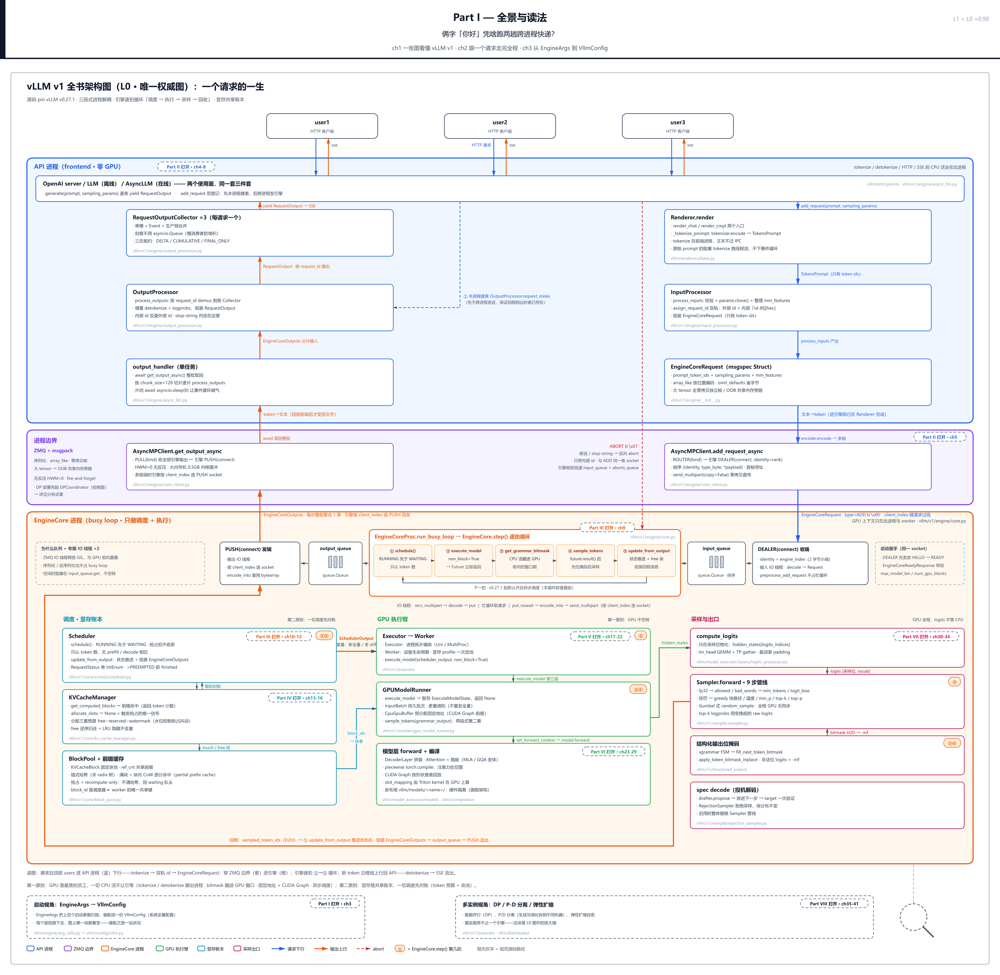

# 第 1 章　一张图看懂 vLLM v1

你在终端里敲下一个问题，回车，两秒钟后答案开始一个字一个字往外流。这件事每天都在发生，平淡到你不会多想——可是停下来问一句：vLLM 让「你好」这两个字进门，凭什么要跨两趟进程快递、换两次数据形状，再被 GPU 一拍一拍地喂出来？把所有活儿塞进一个进程里，从文本一路算到文本，不行吗？

行，但会很慢——慢到浪费掉你花大价钱买的那块 GPU。为什么？这一章先把整个系统压成一张图回答这个问题，之后的三十九章，都在把这张图一块一块点亮。

先把「v0 / v1」两个称呼的来历交代清楚，免得你以为这是本书发明的黑话：它们是 vLLM 项目自己的架构里程碑——2024 年 9 月官方 RFC 提出重写方向，2025 年 1 月官宣 V1，2025 年 9 月把 v0 代码删光（[官方发布博客](https://vllm.ai/blog/2025-01-27-v1-alpha-release)、[弃用决议](https://github.com/vllm-project/vllm/issues/18571)）。先消一个易撞车的歧义：v0.27.1 是 vLLM 的发布版本号（0.27.1），与架构代际的 v0/v1 是两套记号，本章及全书所有 v0.x.y 字样均为版本号。在 v0.27.1 里，v1 是唯一引擎，连当年用来切换的 `VLLM_USE_V1` 开关都不存在了——在本书所读的 v0.27.1 源码树里全文检索这个名字，零命中；重写已经完成，我们读的是成品。

## 你在这里

这是全书的第一章，没有「上一章」。本章要交给你的，是贯穿全书的唯一地图：


> *图注：这张图叫 **L0**，是全书唯一权威架构图，本章是它的首次亮相——之后每一章开篇都会回到它，把本章要打开的那一块放大。图上从上到下三条横向进程带：**API 进程**（前端，零 GPU）、紫色 **ZMQ 消息边界**、**EngineCore 进程**（引擎内核，GPU 在这里）；带 ① 到 ⑤ 的圆圈是引擎一拍内的五步编号（图例明示「① = EngineCore.step() 第几拍」）——① schedule → ② execute → ④ sample → ⑤ update 是时序主干，③ 语法位掩码塞在 ② 的 GPU 执行窗口里并行、不占时序位，图数五拍、时序位四段（「心跳」一节对这笔账）；一个请求的一生看整图自上而下的走向，图底「读图」行就是走法。每块上的虚线标注「第几 Part 打开」是本书的行程表——本章把每块只开一条门缝：指认骨架在哪、形状是什么，不做逐行精读，深挖全部留给后续 Part。图上没有站号：站号账本（请求流经代码的逐站顺序）从下一章起建立，拍号不是站号。*

Part I 一共三站，都站在这张图的不同视角上：



> *图注：Part I「全景与读法」的导览图——Part I 覆盖全图，全局即局部：本章给静态全景（这张 L0 图本身）、下一章让图动起来（跟一个请求走完全程）、第三站换启动视角（EngineArgs 怎么把系统装配出来）。本章不设站号账本——站号（请求流经代码的逐站顺序）自下一章的走读起建、拍号不是站号——这张图按三个视角自上而下读即可。*

对这张图你先只需要记三件事：

1. **三条横带，一条紫线**。上带管「跟用户打交道」，下带管「驱动 GPU」，中间紫线管「递消息」。两带是两组独立进程，谁也不进谁的地盘。
2. **文本不过线，token 过线**。看图上两个方向的箭头：下行带标注的是「文本→token」，上行是「token→文本」——文字永远留在 API 进程里，跨线的只有整数数组（token id；token 是文本切成的最小单元，模型真正的输入不是文字，是每个单元映射出的一个整数）。为什么？「下行与上行」一节拆给你看。
3. **虚线是行程表**。每块标着「第几 Part 打开」：调度账本 Part III、显存账本 Part IV、GPU 执行臂 Part V、模型层 Part VI、采样出口 Part VII、多实例 Part VIII。本书就是照这张图逐块点亮的。

读法建议：本章按图从上到下走，先看清形状，再追问「为什么长成这样」。只想看 v1 被什么逼出来，直接读下一节；只关心两个使用面怎么共享一套结构，跳到[「三件套」](#三件套两个使用面一套结构两种驱动)一节；想先感受引擎的心跳，从[「五拍」](#心跳enginecore-的五拍)一节进。

## 图上最粗的三条线：三段式解耦

现在把镜头拉回 L0 图顶端。一个 chat 请求从 `POST /v1/chat/completions` 进门（`vllm/entrypoints/openai/chat_completion/api_router.py:L51` 起），第一站落在 API 进程的双泳道上：**Renderer** 负责把 HTTP 里的 JSON 变成 token——聊天模板展开（把多轮对话按模型约定的格式拼成一段输入文本）、分词（tokenize，文本变 token id）、多模态预处理（图片等非文本输入的预处理）全在这里；**InputProcessor** 接过 token 做校验和参数整理，产出跨进程请求。回程相反：**OutputProcessor** 把引擎吐回的 token id 增量地变回文字（detokenize），**RequestOutputCollector**——每请求一个的单槽「信箱」——攒着增量等流式接口来取，最后由 SSE（Server-Sent Events，HTTP 长连接上逐段推送的流式协议）送给用户。

中间那条紫带是两组进程之间唯一的通道。它背后是一个叫 **ZMQ**（ZeroMQ）的库——一个不需要独立 broker（常驻的消息代理进程，如 RabbitMQ 那类）的轻量消息库，两端像用 socket 一样直接互发消息，收发时还会释放 GIL（全局解释器锁——这个性质马上会变得很重要，下一节专门讲；[ZeroMQ 官方指南](https://zguide.zeromq.org/docs/chapter2/)）。下行一条通道送请求、上行一条通道送输出，跨界消息在发送前要打包成字节流——线格式与拓扑的细节是 Part II 的主场，本章只要知道「这条带上跑的是打包好的消息，不是活的 Python 对象」。

下带是 **EngineCore 进程**——引擎内核。它独占 GPU：图左下的调度账本列（Scheduler 与 KV cache 账本——KV cache 是注意力机制为每个已算 token 保存的键值缓存、推理显存的大头，Part IV 打开）、中间的逐拍循环框（引擎的心跳，五拍转一圈）、右下的 GPU 执行臂、模型层、采样出口，全部住在这一个进程带里。它们每一块都会在后面的 Part 里被逐个拆开。

这就是 v1 的地基，本书称之为 **三段式解耦**：API 前端进程 / ZMQ 消息边界 / EngineCore 引擎进程。把「解耦」数出来最直观：`tp=4`（张量并行，把模型切片摊到 4 张卡上）单机是 **6 个进程**——1 个 API server + 1 个 EngineCore + 4 个 GPU worker，每个 worker 也是独立进程（官方架构文档的算例，说明性）；单卡部署按源码数是 **2 个进程**——1 个 API server + 1 个 EngineCore：TP=1 时执行臂的 worker 就住在 EngineCore 进程内（`UniProcExecutor` 直接在本进程构造 worker，`vllm/v1/executor/uniproc_executor.py:L45-L48`），官方文档「每 GPU 一个 worker 进程」的通式没有特判这一点、照它数单卡会数出 3。顺带钉死一个口径：L0 图按单卡画；`tp>1` 才把 worker 派生成独立子进程，就是算例里多出来的那 4 个。GPU 上下文（GPU 在一个进程里的运行时状态——有了它，这个进程才摸得到显卡）与 KV cache 显存只存在于引擎一侧，API 进程里连一把「螺丝刀」都没有。

这么拆的代价同样真实：每请求生命周期**至少 2 次跨进程消息**——进 1 条请求、出每步 1 批输出——两侧各付一次序列化 CPU 税。这正是「俩字凭啥跑两趟跨进程快递」的答案的一半；另一半，要看 v1 是被什么逼出来的。

## 为什么不是一个大进程：v0 的教训与一把大锁

每个设计都是被痛点逼出来的，三段式解耦也不例外。先看旧设计。

**v0 是单进程的。** 早期 vLLM 里，从 tokenize、调度、GPU 执行到 detokenize，全在一个 Python 进程里；「异步」只是 asyncio 事件循环上的一层包装，不是并行。彼时有两台平行的引擎类——同步的 `LLMEngine` 和异步的 `AsyncLLMEngine`，后者是把前者子类化再包一层：

```python
# 外部历史版本：v0.8.5 tag 的 vllm/engine/async_llm_engine.py（说明性骨架，非本书 pin 源码）
class _AsyncLLMEngine(LLMEngine):
    """Extension of LLMEngine to add async methods."""

class AsyncLLMEngine(EngineClient):
    """An asynchronous wrapper for :class:`LLMEngine`."""
    # start_background_loop() 里：
    #     asyncio.get_event_loop().create_task(self.run_engine_loop(...))
# RequestTracker.add_request 的 docstring：
#     "Add a request to be sent to the engine on the next background loop iteration."
```

三行证据各有分量：`_AsyncLLMEngine(LLMEngine)` 说明异步引擎是同步引擎的镜像副本——同一套逻辑两处维护；`create_task` 说明所谓「后台循环」只是事件循环上的一个 task，不是另一个进程；`on the next background loop iteration` 说明新请求要等下一拍才被引擎看见。全链路串在同一条时间线上：HTTP 处理、tokenize、调度、detokenize 你等我、我等你。

**痛点是被 GPU 的进步放大的。** 官方 V1 发布博客给了个扎眼的数字（外部博客口径）：Llama-8B（一个 80 亿参数的开源模型）在 H100（NVIDIA 当家数据中心 GPU）上单步执行时间低至约 5 毫秒。GPU 一拍只要 5ms，那么任何几毫秒级的 Python CPU 活——解析 JSON、跑 tokenizer、组装流式响应——都开始「显眼」起来：博客原话是 CPU 开销 becomes increasingly pronounced。粗算一笔（分析性估算）：5ms 是小批量下的下限，满载一拍（数千 token 进批）通常是几十毫秒——保守按几十毫秒估，串进 10ms 的 CPU 杂务就是约 20% 的吞吐损失，而这些都是同进程的 Python 活。

**而 Python 活在同进程里躲不开同一把锁。** 这里必须把 **GIL**（Global Interpreter Lock，全局解释器锁）讲透——它是 CPython 解释器的一把「全局大锁」：同一进程里任一时刻，只有一个线程在执行 Python 字节码。拆成三层最好用：

1. **多线程不是 CPU 并行加速器。** 两个线程跑纯 Python 的 CPU 密集代码不会变快，典型情况反而略慢——两线程在锁上乒乓交接。（说明性实验：起两个线程各把计数器加一千万次，wall time 不比单线程好；换成两个进程，接近 2 倍加速。）
2. **但 GIL 不是永远攥着不放。** 官方文档明确：做 I/O 时 GIL 总是释放；写得好的 C 扩展——NumPy、PyTorch 的重活、ZMQ 的 socket 收发——也会在计算或 IO 期间主动放锁。所以「IO 混 C 扩展」的多线程有意义，「纯 Python CPU 活」的多线程没意义。
3. **想让纯 Python 的 CPU 活真正并行，标准答案一直是多进程**——每个进程有自己独立的一把 GIL。

v0 的困境正是第 2 层的反面教材：API server 的 HTTP/SSE、tokenize、detokenize、引擎调度循环，全是同进程的 Python 活，共用一把 GIL；GPU 快到 5ms 一拍时，任何一段 CPU 活都在跟 GPU 心跳抢这把锁。顺带一句现状（外部链接：[PEP 703](https://peps.python.org/pep-0703/)、[PEP 779](https://peps.python.org/pep-0779/)；PEP 即 Python 官方的演进提案文档）：free-threaded（去 GIL 构建）的 Python 已在 3.14 进入「官方支持但独立构建」阶段——vLLM 没等它，选了拆进程。

v1 源码里有一段注释，恰好是「线程够不够用」这条判断线的活证据——引擎进程内部，ZMQ 收发被放进两个守护线程：

```python
# vllm/v1/engine/core.py:L1092-L1096
# Background Threads and Queues for IO. These enable us to
# overlap ZMQ socket IO with GPU since they release the GIL,
# and to overlap some serialization/deserialization with the
# model forward pass.
# Threads handle Socket <-> Queues and core_busy_loop uses Queue.
# … 省略：紧随其后是输入/输出两个守护线程的创建与启动（L1097-L1119） …
```

读法：**进程内能用线程解决的（IO 重叠——socket 收发会释放 GIL），v1 就地用线程解决；跨进程才能解决的（GIL 彻底隔离），才付出进程拆分的代价。** 这条判断线后面还会反复出现——它是「什么时候加锁、什么时候拆进程」的工程直觉本身。

于是方案落地成你在 L0 图上看到的样子。在线使用面 `AsyncLLM` 的构造函数里，三段结构一次装配完毕：

```python
# vllm/v1/engine/async_llm.py:L135-L156
self.renderer = renderer = renderer_from_config(self.vllm_config)

# Convert EngineInput --> EngineCoreRequest.
self.input_processor = InputProcessor(self.vllm_config, renderer)

# Converts EngineCoreOutputs --> RequestOutput.
self.output_processor = OutputProcessor(
    renderer.tokenizer,
    log_stats=self.log_stats,
    stream_interval=self.vllm_config.scheduler_config.stream_interval,
    tracing_enabled=tracing_endpoint is not None,
)

# EngineCore (starts the engine in background process).
self.engine_core = EngineCoreClient.make_async_mp_client(
    vllm_config=vllm_config,
    executor_class=executor_class,
    log_stats=self.log_stats,
    client_addresses=client_addresses,
    client_count=client_count,
    client_index=client_index,
)
```

三行注释摆明三段分工：`InputProcessor` 把输入变引擎请求、`OutputProcessor` 把引擎输出变回给用户的格式、`EngineCore` 在**后台进程**里跑起来（`vllm/v1/engine/async_llm.py:L148` 的注释原话是 starts the engine in background process）——引擎核心搬进独立子进程，就是三段式解耦的物理前提。

**代价（诚实账）**：除了前文说的每请求至少 2 次 IPC（Inter-Process Communication，跨进程通信）与两侧序列化税，启动从「调一个构造函数」变成多层握手协议——引擎就绪超时给到 `VLLM_ENGINE_READY_TIMEOUT_S = 600` 秒（`vllm/envs.py:L27`，给大模型慢加载留量）；故障域也分裂了，引擎进程死掉要靠哨兵消息（一条内容特殊的通知消息，收到即知引擎已死）转成异常告知前端；调试时你得跨进程看两份日志。拆进程不是免费的，v1 认为值得。

## 三件套：两个使用面，一套结构，两种驱动

回到 L0 图顶端。API 进程带的标题行同时点名两个使用面——OpenAI server / `LLM`（离线）/ `AsyncLLM`（在线）；带的左右两条泳道分的是下行与上行（右边 Renderer、InputProcessor 送请求出去，左边 RequestOutputCollector、OutputProcessor 收结果回来），不是离线与在线。vLLM 的产品形态就这两半——离线批处理跑吞吐，在线服务要低延迟。它们共享的那套前端结构，本书简称 **三件套**：**Renderer+InputProcessor（下行）/ EngineCore（引擎）/ OutputProcessor（上行）**——注意这是本书的自造简称，对应 L0 图上 API 进程里的组件块加引擎本体——上行那条单槽信箱 `RequestOutputCollector` 是 `OutputProcessor` 的收件搭档，图上虽然单独画成一块，但不算独立的第四件——数「三件」时它跟着 `OutputProcessor` 一起算；官方文档按职责描述、并无这个词。

v0 时代这两半是两台引擎（上一节骨架里的同步/异步双类谱系），输出处理逻辑两处维护，行为漂移就是「离线与在线结果不一致」的 bug 面。v1 收敛成一套结构，证据可以并排读——离线面 `LLMEngine` 的构造：

```python
# vllm/v1/engine/llm_engine.py:L91-L111
self.renderer = renderer = renderer_from_config(self.vllm_config)

# Convert EngineInput --> EngineCoreRequest.
self.input_processor = InputProcessor(self.vllm_config, renderer)

# Converts EngineCoreOutputs --> RequestOutput.
self.output_processor = OutputProcessor(
    renderer.tokenizer,
    log_stats=self.log_stats,
    stream_interval=self.vllm_config.scheduler_config.stream_interval,
    tracing_enabled=tracing_endpoint is not None,
)

# EngineCore (gets EngineCoreRequests and gives EngineCoreOutputs)
self.engine_core = EngineCoreClient.make_client(
    multiprocess_mode=multiprocess_mode,
    asyncio_mode=False,
    vllm_config=vllm_config,
    executor_class=executor_class,
    log_stats=self.log_stats,
)
```

与上一节 `AsyncLLM.__init__` 几乎逐行同形——前两条 Convert 注释一字不差，差异全在最底下：注释从「starts the engine in background process」换成「gets EngineCoreRequests and gives EngineCoreOutputs」，工厂调用换成 `make_client(asyncio_mode=False)`。这个工厂按「多进程否 × 异步否」两根轴分发客户端，总共一屏：

```python
# vllm/v1/engine/core_client.py:L89-L112
@staticmethod
def make_client(
    multiprocess_mode: bool,
    asyncio_mode: bool,
    vllm_config: VllmConfig,
    executor_class: type[Executor],
    log_stats: bool,
) -> "EngineCoreClient":
    # TODO: support this for debugging purposes.
    if asyncio_mode and not multiprocess_mode:
        raise NotImplementedError(
            "Running EngineCore in asyncio without multiprocessing "
            "is not currently supported."
        )

    if multiprocess_mode and asyncio_mode:
        return EngineCoreClient.make_async_mp_client(
            vllm_config, executor_class, log_stats
        )

    if multiprocess_mode and not asyncio_mode:
        return SyncMPClient(vllm_config, executor_class, log_stats)

    return InprocClient(vllm_config, executor_class, log_stats)
```

两轴四格，三格有主：同步多进程给离线面、异步多进程给在线面、同进程兜底留作逃生舱（`InprocClient`，`vllm/v1/engine/core_client.py:L306`，后面还会提到它）；第四格「同进程 × 异步」没有产品形态——工厂入口对它直接 `raise NotImplementedError`，只留一句 TODO 说将来仅供调试。缺席不必听转述，它就印在工厂的第一段里。

结构相同，两半真正的区别是**怎么驱动**。离线面是「拉取」——调用方线程亲自一脚一脚踩：

```python
# vllm/entrypoints/offline_utils.py:L590-L595
# Run the engine.
outputs: list[_O] = []
total_in_toks = 0
total_out_toks = 0
while self.llm_engine.has_unfinished_requests():
    step_outputs = self.llm_engine.step()
# … 省略：finished 输出收集、tqdm 进度、吞吐统计 …
```

在线面是「自转」——EngineCore 在独立进程里永不停步地跑忙循环（busy loop）：

```python
# vllm/v1/engine/core.py:L1378-L1389
def run_busy_loop(self):
    """Core busy loop of the EngineCore."""
    while self._handle_shutdown():
        # 1) Poll the input queue until there is work to do.
        self._process_input_queue()
        # Publish request counts before and after GPU step to ensure freshness.
        self._maybe_publish_request_counts()
        # 2) Step the engine core and return the outputs.
        self._process_engine_step()
        self._maybe_publish_request_counts()

    raise SystemExit
```

同一个引擎内核：离线是外面的人摇手柄、在线是自己转——「同一台发动机，两种变速箱」。这套收敛的墓碑兼纪念碑，是 v0 双引擎的故居：

```python
# vllm/engine/async_llm_engine.py:L1-L7
# SPDX-License-Identifier: Apache-2.0
# SPDX-FileCopyrightText: Copyright contributors to the vLLM project

from vllm.v1.engine.async_llm import AsyncLLM

AsyncLLMEngine = AsyncLLM  # type: ignore
"""The `AsyncLLMEngine` class is an alias of [vllm.v1.engine.async_llm.AsyncLLM][]."""
```

这个文件曾经是 1032 行的双引擎适配层（v0 删除前最后版本口径——2025 年 9 月 PR #25025 把它收编成别名垫片之前，外部历史版本口径），今天只剩 7 行别名垫片——老用户代码零改动存活，「两台引擎」在源码里已不存在。读官方文档时留意：文档里仍沿用 `AsyncLLMEngine` 旧名，它如今只是 `AsyncLLM` 的别名。

**代价**：一套结构、一条代码路径、两种模式，意味着每次改动都要同时推演两种驱动的分支；更实在的一笔是——**同步面默认也付进程税**：`VLLM_ENABLE_V1_MULTIPROCESSING` 默认 `True`（`vllm/envs.py:L149`），离线 `LLM` 默认也 spawn 独立引擎进程、每步输出过一次 IPC。为什么？同进程与多进程两套路径行为分叉、测试矩阵翻倍的旧痛，v1 宁可让离线用户也付这笔税；纯 CPU 玩具模型场景想省掉，显式走 `InprocClient` 逃生舱即可（`vllm/v1/engine/core_client.py:L306`）。

## 心跳：EngineCore 的五拍

现在走进 L0 图下带的循环框——整个系统的心脏。直觉先立住：**生成不是一次调用，是数百次心跳。** 模型每「想」一个字，引擎就要完整地跑一轮循环：点名分活、把这拍的工作发射给 GPU、收卷子、按分数挑答案、记账发通知。一个 token 一拍，一百个 token 一百拍。

五拍的真身（`vllm/v1/engine/core.py:L584-L614`）：

```python
# vllm/v1/engine/core.py:L584-L614
def step(self) -> tuple[dict[int, EngineCoreOutputs], bool]:
    """Schedule, execute, and make output.

    Returns tuple of outputs and a flag indicating whether the model
    was executed.
    """

    # Check for any requests remaining in the scheduler - unfinished,
    # or finished and not yet removed from the batch.
    if not self.scheduler.has_requests():
        return {}, False
    scheduler_output = self.scheduler.schedule(self._should_throttle_prefills())
    future = self.model_executor.execute_model(scheduler_output, non_block=True)
    grammar_output = self.scheduler.get_grammar_bitmask(scheduler_output)
    with (
        self.capture_iteration_details(scheduler_output) as iteration_details,
        self.log_error_detail(scheduler_output),
    ):
        model_output = future.result()
        if model_output is None:
            model_output = self.model_executor.sample_tokens(grammar_output)

    # Before processing the model output, process any aborts that happened
    # during the model execution.
    self._process_aborts_queue()
    engine_core_outputs = self.scheduler.update_from_output(
        scheduler_output, model_output
    )
    self._attach_iteration_details(engine_core_outputs, iteration_details)

    return engine_core_outputs, scheduler_output.total_num_scheduled_tokens > 0
```

逐拍点名（行号即上段里的位置）：

1. **schedule**（`L595`）：问账本这拍组什么批——所有可能慢、可能触发抢占（preemption：显存吃紧时把在跑的请求踢出去腾地方）的决策，全部放在 GPU 启动之前做完；
2. **execute_model**（`L596`）：发起前向。注意 `non_block=True`——发射后立即返回一个 Future（先拿到手的「取货凭证」，结果稍后凭它取），**不等 GPU 算完**；
3. **get_grammar_bitmask**（`L597`）：趁 GPU 在算，CPU 干一件结构化输出的活——给受语法约束的请求算位掩码（一种「这拍哪些 token 被禁止」的位图，细节 Part VII）；
4. **future.result() → sample_tokens**（`L602-L604`）：等前向完成（CPU 只在一个极轻量的 GPU 同步点上、等结果拷回来），从分数向量里选出 token；
5. **update_from_output**（`L609`）：推进请求状态机、组装回程消息、回收显存块。

五拍走完看一眼返回值，两个成员各有归宿：第一项是按前端索引的输出包裹——字典每个键对应一个前端进程、每个前端一条包裹（为什么按前端打包，[「下行与上行」](#下行与上行文本不过线)一节拆开）；第二项布尔位标记这拍模型有没有真的执行（`total_num_scheduled_tokens > 0`，docstring 里那个 flag），上层的事后检查只在真执行过的拍上做。

排布本身就是性能哲学。它的反面——旧形态——是「做一步等一步」：v0 的 `LLMEngine.step` 就是这样一个同步循环，tokenize、调度、前向、采样、后处理串在一条时间线上、做一步等一步；更早的 v1 `step()` 也曾是 `execute_model` 同步等完再采样。而忙循环是单线程的（`run_busy_loop` 只有一个 Python 线程驱动一切），任何阻塞都让 GPU 空转——一拍只有几十毫秒（每拍数千 token 的计算量级；钉住这个数的「预算」旋钮，下一节才正式立起来），10ms 串行杂务就是约 20% 的吞吐损失（分析性估算）。于是你看到：第 3 拍被**塞进 GPU 计算的窗口里**，与第 2 拍的执行真并行——顺带对上 L0 图的账：图把五拍各画一格、编号 ① 到 ⑤，但 ③ 那格的注释字自己招了：「CPU 活藏进 GPU 前向的窗口期」。墙上时钟的账只有四段：schedule → execute → sample → update 是时序主干，第 3 拍塞在第 2 拍的执行窗口里并行、不占独立时序位——图数五拍、时序位四段；慢决策全部前置；连「执行」都被劈成两段——execute 只出中间结果、sample 紧随其后，两段之间隔着那个 GPU 窗口。这个两段式契约写在执行臂的基类里：「If this method returns None, sample_tokens should be called immediately after」（`vllm/v1/worker/worker_base.py:L142-L158`）。

还有一句诚实的注脚：v0.27.1 的服务态默认心跳已经是**重叠版**——异步调度默认开启（调度下一拍与上一拍执行重叠，`vllm/config/vllm.py:L1095-L1143` 一带），上面这个同步 `step()` 是理解重叠版的唯一地基。代价也诚实：两段式让执行器带上跨调用暂存态，中间态出错的归属变模糊；执行期间的取消请求必须双投递（保序队列一条、及时通道一条）才不丢。

这五拍里每一拍都值得单独一章——**Part III 会把这个循环框逐拍拆开**，那也是本书第一段深潜的开始。

## 调度只认 token 数，不认请求数

循环框第一拍 schedule 要问账本：这拍让谁进批？v1 的答案简单到只有一句话，先看直觉：**自助餐厅按菜的份数出餐，不按桌数。** 一桌 256 位客人每人只点 1 份菜，是 256 份；另一桌只有 1 位客人，一口气点了 8192 份——厨房的灶眼只认份数，桌数完全告诉不了你这顿要做多少菜。

对应到引擎：正在生成的请求每拍只要 1 个 token（decode，逐 token 生成的阶段）；新到的请求一上来要消化整个 prompt（prefill，消化输入的阶段）——两者对「一步计算量」的贡献天差地别。v1 调度器因此只有一个记账单位：token。woosuk（vLLM 一作）在 v1 首提交写下的这段注释沿用至今——中途只被动过两笔：一次随投机解码落地扩写（记账数 `num_tokens` 增为 `num_tokens_with_spec`、多收一项 `spec_token_ids`，特性清单添上 `speculative decoding`），一处改名（`jump forward` 改称 `jump decoding`）：

```python
# vllm/v1/core/sched/scheduler.py:L441-L450
# NOTE(woosuk) on the scheduling algorithm:
# There's no "decoding phase" nor "prefill phase" in the scheduler.
# Each request just has the num_computed_tokens and
# num_tokens_with_spec. num_tokens_with_spec =
# len(prompt_token_ids) + len(output_token_ids) + len(spec_token_ids).
# At each step, the scheduler tries to assign tokens to the requests
# so that each request's num_computed_tokens can catch up its
# num_tokens_with_spec. This is general enough to cover
# chunked prefills, prefix caching, speculative decoding,
# and the "jump decoding" optimization in the future.
```

翻译成人话：每个请求只带两个数——「已经算了多少 token」（`num_computed_tokens`）和「总共要算多少 token」；每拍调度就是给各请求分 token 配额，让前者追赶后者（本书称之为「追赶公式」）。没有 prefill 批、没有 decode 批，**一个循环、一种账**。注意最后那句预言：chunked prefill（长输入切块分拍消化）、前缀缓存（记住相同开头请求已算过的部分，来一个共享一个）、投机解码（让小模型先猜、大模型一次验证多个的加速法）——这句注释提前点到的每个特性，全都只是「token 差距」这单一模型上的推论。注释自己的历史就是第一份证词：首提交的清单里还没有投机解码，它落地那天，这个单一模型只是多收了一项 spec token、特性清单里多了一个词——预言每兑现一次，都靠一次扩写给自己作证。

这笔账算出来有多悬殊，用默认预算走一遍（预算取 `SchedulerConfig` 的类默认 2048，`vllm/config/scheduler.py:L42`；两场景为说明性构造）：

<!-- trace: m4 -->
| 拍 | 场景 | 待算 token（算式） | 预算钳制（对 2048） | 本拍调度决定 | 拍后状态 |
|---|---|---|---|---|---|
| 拍 1 | A：256 个 decode 请求 | 256 请求 × 1 token = 256 | 256 ≤ 2048，不钳制 | 256 个请求全部进批：一次 forward 各推 1 个 token；预算剩 2048−256 = 1792 还能收新请求 | 256 个请求各 +1 token，继续等各自下一个 token |
| 拍 1 | B：1 个 8K prompt 新请求 | 1 请求 × 8192 token = 8192 | min(8192, 2048) = 2048，被钳制 | 该请求只进前 2048 个 prompt token（chunked prefill 第一块）；预算耗尽，本拍不再收别的 | num_computed_tokens: 0 → 2048（乐观推进，GPU 尚未算，vllm/v1/core/sched/scheduler.py:L1317-L1331）；还差 8192−2048 = 6144 |
| 拍 2-4 | B：同一个请求继续 prefill | 每拍待算 6144 → 4096 → 2048 → 0 | 每拍再钳到 2048 | 每拍吃满 2048 token；ceil(8192/2048) = 4 拍完成全部 prefill | 第 4 拍后 num_computed_tokens = 8192 追平 prompt，下一拍起进入 decode、每拍 1 token |
| 对照 | A vs B 同按「请求数」记账 | A 计 256 个请求；B 计 1 个请求 | — | 按请求数看 A 是「大批」、B 是「小批」；按 token 数看 B 一拍（2048）是 A 一拍（256）的 8 倍、B 全程（8192）是 A 一拍（256）的 32 倍 | 结论：请求数无法预测一步计算量，调度器只认 token 数（woosuk 注释原文，vllm/v1/core/sched/scheduler.py:L441-L450） |

同样「1 个请求」，工作量差 32 倍——这就是不能按请求数限批的全部理由：按请求数限批，要么全 decode 小批让 GPU 饿死，要么混进一个大 prompt 把在场所有请求的下一个 token 都拖住。

这张表还藏着一个不变量，值得说破（只看 token 账本的简化口径——显存准入与抢占是 Part III 的戏，在那里，一个没算完的请求也可能当拍一个 token 都分不到）：只要还有没算完且可调度的请求，每拍被调度的 token 总数就落在 1 与预算之间。终止性由两头保证：prefill 的账面差额（prompt 还剩多少没算）是有限非负整数，每拍严格减去本拍调度量，减到 0 该请求转进 decode；decode 的追赶目标每拍长 1——上表 A 场景每拍 256 → 256，正是这笔账不降的原因——但它被 max_tokens（单请求输出长度上限）或提前命中的停止条件封顶，到头即完成离场。两头都有限，调度循环必然终止；无请求可调度时，循环空转守卫直接返回（`vllm/v1/engine/core.py:L593`）。单个请求的 prefill 至多「prompt 长度除以预算」向上取整这么多拍完成，本例是 4 拍。

预算本身是个按硬件拨的旋钮：类默认 2048 的注释自述「主要为测试便利」；实际部署由 `EngineArgs` 按硬件与使用面拨大——怎么分档、每个旋钮拨下去系统哪里变，Part I 最后一站的启动视角展开。**代价**：长 prompt 被切成多拍，意味着首个 token 的延迟（TTFT，Time To First Token）去换在场请求每拍节奏的稳定（TPOT，Time Per Output Token）——这笔交易是 chunked prefill 的本质，Part III 连同连续批处理（每拍重组批次、新请求随到随进，不必等整批完成）的学术血统（Orca 与 Sarathi-Serve 两篇系统工作的对照实验）一起展开；抢占、水位（留出的显存余量）、RUNNING（在跑）先于 WAITING（排队）的组批次序，也都在那里。

## 下行与上行：文本不过线

再回到那条紫带，把「两趟快递」的货物清单看清楚——这是 L0 图上下两条数据泳道的形状约束。顺带把开篇的另一问也结了：「换两次数据形状」就是这两次——下行把文本变成 token、上行把 token 变回文本，两次都发生在 API 进程内。

**下行：请求以 token 数组过线。** 看跨界请求的字段表：

```python
# vllm/v1/engine/__init__.py:L97-L112
class EngineCoreRequest(
    msgspec.Struct,
    array_like=True,  # type: ignore[call-arg]
    omit_defaults=True,  # type: ignore[call-arg]
    gc=False,
):  # type: ignore[call-arg]
    request_id: str
    prompt_token_ids: list[int] | None
    mm_features: list[MultiModalFeatureSpec] | None
    sampling_params: SamplingParams | None
    pooling_params: PoolingParams | None
    arrival_time: float
    lora_request: LoRARequest | None
    cache_salt: str | None
    data_parallel_rank: int | None
    prompt_embeds: torch.Tensor | None = None
# … 省略：prompt_is_token_ids / client_index / current_wave / priority 等字段（L113-L154）…
```

字段表里没有 prompt 字符串，只有 `prompt_token_ids`——「文本不过线、token 过线」的物证：tokenize 在 API 进程的 Renderer 线程池里就完成了（`vllm/renderers/base.py:L84-L111`，阻塞的分词被挪进线程池、不卡事件循环）。其余字段各一句话：`mm_features` 装多模态特征、`pooling_params` 服务嵌入/打分类模型（这类模型不逐 token 生成，只把整个输入编码成一个向量，与 `sampling_params` 二选一）、`lora_request` 可指定一个 LoRA 适配器（低秩适配，一种省显存的微调方案）、`cache_salt` 是缓存隔离的盐值、`data_parallel_rank` 标记多引擎部署时的目的地、`prompt_embeds` 允许跳过分词、直接以嵌入向量（本该由 token id 查表得到的数值向量）作输入——各自主场再讲。顺带认识 `msgspec.Struct`：一个高性能序列化结构体库的声明方式，那三个开关是为了压序列化体积——编码细节 Part II 拆。为什么这么设计？token 化是纯 CPU 活，放在零 GPU 的前端做，引擎进程一个字节都不用为「文字长什么样」操心。

**上行：token 以整批包裹回程。** 引擎不是给每个请求单独发消息，而是每拍、每个前端各发一条 `EngineCoreOutputs`，把该前端所有请求这一拍的新 token 打成一个包裹（`vllm/v1/engine/__init__.py:L230-L258`）。为什么整批打包？摊薄每条消息的固定开销。为什么按前端分装？因为每个 API 前端是一条独立的进程与连接，包裹只能按收件人分装——引擎把各家的 token 发给各家（多开 API server 对着同一引擎的水平扩展，靠的正是这条按址投递的规矩，下一段会再见到它）。前端收到大包裹后按 128 条一片分片消化、片间让出事件循环（`VLLM_V1_OUTPUT_PROC_CHUNK_SIZE = 128`，`vllm/envs.py:L160`），防止一批 detokenize 独占事件循环伤了其他连接的延迟。

**API 进程零 GPU，是一份钉死的职责清单**：图上前端带里做的一切——tokenize、校验、detokenize、logprobs（每个候选 token 的对数概率，API 的一类可选返回值）组装、SSE——全是普通 CPU 活；进程内的 torch 仅限 CPU 侧用途（CPU 侧 profiler 只开 `ProfilerActivity.CPU`，`vllm/v1/engine/async_llm.py:L191-L195`；占位张量显式 `device="cpu"`，`vllm/v1/engine/output_processor.py:L42`）。收益有三：并发上，HTTP/JSON/SSE 的 CPU 活与引擎调度彻底不抢锁；部署上，前端可以独立于 GPU 数水平扩展（多开 API server 对着同一引擎）；存活上，引擎崩了前端还能体面收尾。**代价**：边界两侧各持一份请求状态、全靠消息对账；一个具体例子是 stop-string（用户指定的停止词）只有在前端 detokenizer 里才看得见——命中后要反向再发一次取消消息让引擎停手（Part II 展开）。纯 CPU 场景嫌进程税冤枉，还是那个 `InprocClient` 逃生舱（`vllm/v1/engine/core_client.py:L306`）。

双登记（前端与引擎各记一份请求状态）、请求 id 双轨（对外一套 id、引擎内部一套）、断连反向取消——下行上行的全部细节，Part II 五章都在这条带与两条泳道上。

## 图的下带与底部：账本、执行臂与出口

L0 图还剩几块，本节只给每块一句「它是什么、为什么需要它」的直觉加一个 Part 指针——它们各自的主场都在后面。

**显存账本列（Part IV）**：推理的显存大头是 KV cache——生成越长攒得越多。v1 把它做成**虚拟内存的显存版**——vLLM 论文的原话类比是「块当页、token 当字节、请求当进程」（arXiv:2309.06180，外部论文）：整块显存切成等大的块池（默认块大小 16，`vllm/config/cache.py:L47`），每个请求按需领块、不必预占一整条连续显存；注意力算子通过每请求的逻辑块表（页表的显存版）找到每个 token 的物理位置（`vllm/v1/core/block_pool.py:L175-L181` 一次预构全部块）。说明性小账：一个 100 token 的请求领 7 块共 112 个槽（每块 16 个 token 位），尾部浪费 12 个、永远小于一整块——对比「每个请求按最大长度预留一整条显存」的老办法，这是 vLLM 赖以成名的分页 KV。前缀缓存、显存对账、抢占恢复，Part IV 四章。

**GPU 执行臂（Part V）**：循环框往下走，执行侧是三层各答一问的结构——**Executor** 只答「在哪跑」（按并行后端分发单机直调/多进程/Ray，Ray 是一个分布式计算框架；`vllm/v1/executor/abstract.py:L48-L92`）；**Worker** 只答「设备归谁管」（GPU 初始化、显存盘点、模型装载）；**GPUModelRunner** 只答「这一拍怎么算」（每拍只改批次张量的差异——差量调和，再发起前向、采样，`vllm/v1/worker/gpu_model_runner.py:L4166` 起）。三层各管一根独立变化的轴：换硬件不动进程编排、换编排不动设备管理。臂上还有两个本书重头戏的名词先混个脸熟：**持久批次**（批次张量常驻，每拍只做上面那句差量调和、不再从零重建）与 **CUDA Graph**（把一整段 GPU 调用序列录下来、之后同形状直接重播的机制）——它们共同回答「Python 为什么追不上 GPU、怎么追」，Part V 六章。

**模型层（Part VI）**：Executor 臂的末端是模型定义层，v1 的接法是「Attention 当插座、实现另插」——模型定义只声明「这里要一次注意力」，MLA（DeepSeek 系的多头潜在注意力）、GQA（分组查询注意力）这类注意力变体作为后端插进来。接一个新架构主要是「拼层」而不是改引擎，Part VI 从拼装术讲到 DeepSeek 系的实战。

**采样出口列（Part VII）**：GPU 出门的不是文字，是**记分板**——对全词表每个候选 token 打的分数向量（logits；词表约 13 万，DeepSeek 为 129280 维，说明性量级）。两个关键形状约束：其一，forward 只算出每个位置的「意见向量」（hidden_states），**只在需要打分的位置**——每请求最后一个 token——才投影成记分板（`vllm/model_executor/models/llama.py:L516-L533` 的 forward/compute_logits 两方法分工；`vllm/v1/worker/gpu_model_runner.py:L4484-L4485` 先切出采样位再投影）。为什么？同卡数字例（说明性）：若像训练那样全位置物化 fp32（32 位浮点）分数，一个 4096 token 的 prefill 块要 4096 × 129280 × 4B ≈ 2GB——纯浪费。其二，把分数向量变成 1 个 token id 的采样，是一条 9 步管线（`vllm/v1/sample/sampler.py:L20-L59` 的 docstring 逐步列着）——惩罚、温度、截断、约束掩码、argmax（取分数最高者）的不变性，Part VII 五章。

**图的底部两块**：左下「启动视角」回答「每个旋钮拨下去系统哪里变」——`EngineArgs`（把上百个启动参数归拢）装配成 `VllmConfig`（一份系统全量配置）是 Part I 的最后一站（下一章之后就到）；右下「多实例视角」是 L0 图外的放大镜（图上带放大镜挂角的那块虚线块自述「这块是 L0 图外的放大镜」）——数据并行、P/D 分离（prefill 消化与 decode 生成拆到不同机器）、弹性扩缩，真实服务不止一个引擎，Part VIII。

## 逐章点亮：这本书怎么读

回到整张 L0 图。你大概已经注意到了那些虚线框和虚线标注——「第几 Part 打开」不是装饰，是本书与你的契约：**每章开篇都把这张图摆回来，放大本章要打开的那一块**；读完一个 Part，那个区域从「知道在哪」变成「读过源码」。全书 40 章走完，这张图没有任何一块留白——最后一章会把它完整点亮一遍复盘。

| Part | 打开 L0 的哪块 | 回答什么问题 |
|---|---|---|
| II 分而治之 | API 进程双泳道 + 紫色边界 | 进程边界与消息协议：两趟快递的线格式、tokenize/detokenize、logprobs（`vllm/v1/engine/core_client.py` 一带） |
| III 引擎的心跳 | 循环框 + 调度账本列 | 五拍逐拍拆开、连续批处理、抢占与请求的一生、异步调度（`vllm/v1/engine/core.py`、`vllm/v1/core/sched/scheduler.py`） |
| IV 显存是主角 | KV 账本列 | 分页 KV、显存对账、前缀缓存、把外部 KV 世界接进池子（`vllm/v1/core/kv_cache_manager.py` 一带） |
| V GPU 不等 Python | 执行臂 | 执行三层、持久批次、编译与 CUDA Graph、slot 换算（token 落在显存块里的槽位定位），附 Flash-Attention 数学原理章（`vllm/v1/worker/` 一带） |
| VI 模型的形状 | 模型层框 | 拼装术、注意力变体数学、DeepSeek 索引器、量化、实战拼装（`vllm/model_executor/models/` 一带） |
| VII 选一个 token 出门 | 采样出口列 | 9 步管线、约束解码、投机解码（`vllm/v1/sample/` 一带） |
| VIII 走向生产 | 图外放大镜 | 分布式、部署实战、P/D 分离、KV 池化、服务面、弹性、终章复盘 |

（Part I 就是脚下这三章：本章的静态全景、下一章的动态走读、之后的启动视角。）

这张图背后还站着五句话——全书的设计哲学，本章你已经全部见过雏形，这里立此存照、后面的每一章都会来印证：

1. **GPU 不等 CPU**：一切 CPU 活或挪出循环（tokenize/detokenize 过进程）、或藏进 GPU 窗口（位掩码）、或固化（CUDA Graph）——本节的五拍排布是它第一次现身；
2. **账本先行**：显存与 token 都先记账、再行动——调度只认 token 数是它的第一次现身；
3. **单循环单真相**：一个忙循环、一套三件套双驱动，消掉 v0 的双引擎双路径；
4. **每个设计都有代价**：IPC 税、序列化税、TTFT 换 TPOT——每个「为什么」都配一个「付出了什么」；
5. **演进是被逼出来的**：v0 的每个痛点，都变成了 v1 里一块你刚认过的框。

读法上给你完全的自由：按 Part 顺序走是主线；只关心某一块（比如只想搞懂调度），直接从对应 Part 的首章进——每章开篇的「你在这里」都会把你接回这张图。

## 总结：整图在手，一块未开

本章点亮的是 L0 图本身——所有块都有了名字、位置和归属的 Part，但没有一块被打开。这是设计好的节奏：先有地图，再谈细节；你此刻应该能在脑内重画这张图的骨架（三条横带、一条紫线、循环框、账本列与执行臂），并能回答三个问题——为什么拆进程（GIL 与 5ms 的账）、为什么两个使用面共享一套结构（v0 双引擎之死）、为什么调度只认 token 数（32 倍的工作量差）。

图上的虚线标注，从下一章开始逐一转实：**下一章我们让这张图动起来**——跟一个真实请求从 HTTP 进门到 SSE 出门走完全程，每一跳落到具体的文件与行号，把「16 站」的站号账本立起来。静态的图是地图，跑起来的图才是行程表。

带着本章的三件事上路：文本不过线、token 过线；生成是数百次心跳；GPU 是最贵的员工，一切 CPU 活都不能让它等。
