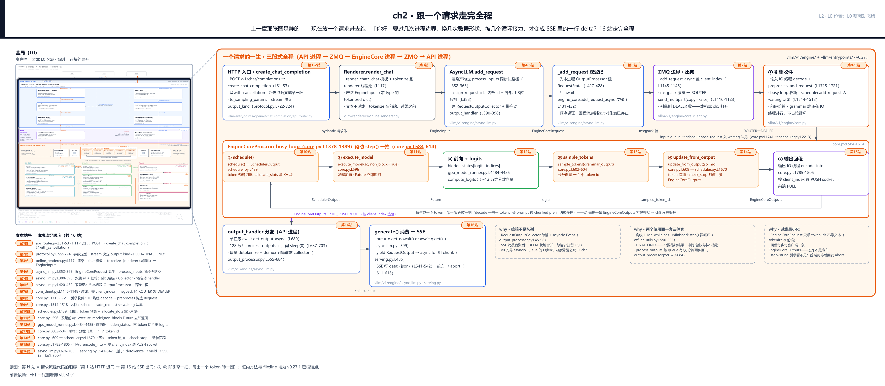

# 第 2 章　跟一个请求走完全程

上一章那张图是静的：三条横带、一条紫线、一个循环框，画在纸上不会动。这一章把它点着——我们放一个真实的流式请求进去，从进门一路跟到出门：用户敲下的「你好」两个字，要跨几次进程边界、换几次数据形状、被几个循环接力，才能换来浏览器里一行一行往外冒的 SSE 增量？[第 1 章](../../ch01-vllm-v1-in-one-map/narrative/chapter.md)末尾立过承诺：站号账本从本章起建。答案先报出来——十六站、六次变身、两次过线。本章的任务，就是把这三个数字变成你读完全书的坐标系：每一站都落到具体的文件与行号，每一站都标好它在哪一章被放大。

我们的样例请求长这样：`POST /v1/chat/completions`，`stream=true`，消息体里一句「你好」。经 chat 模板展开、连同模板围栏（模板自带的轮次/角色标记 token，像 `<|user|>` 这类，也计入这 256），prompt 按 256 个 token 计（教学取值，后文算账都用它）。还有一个巧合先说破：我们的样例模型对这句问候恰好也回两个字「你好」——后文回程与 SSE 示例里的增量装的是模型的回复，与输入同文纯属场景设定，不是服务器在回显你发出去的话。它是千千万万请求里最朴素的一个，朴素到每一站都躲不掉。

## 你在这里



> *图注：这张图就是上一章那张 L0 图的动态版——左列顶部小地图里高亮框框住的「请求生命线」（API 带 → ZMQ 带 → EngineCore 带，三带合一），右侧主体是这条线的展开——最上一行自左向右走完出向的站 1-9（HTTP 进门到引擎收件），中间一行转过引擎一拍的站 10-14、行末第 15 站发回程班车，最下一行是站 16 回到 API 进程理货出门；右下三只 why 注记框另收三笔取舍账：单槽信箱、班车式回程、离线裸循环。本章打开的正是 L0 图上这条贯穿三带的主线：它接在上一章立好的三段式解耦、三件套、五拍心跳之上，让那些静态的框全部转起来。左列站号 = 请求流经代码的顺序（第 1 站进门 → 第 16 站出门）；注意站号不是拍号——第 10-14 站是引擎一拍的五段（图内引擎段框头的 ②-⑥ 徽标即这五站；小地图另带一套 ①-⑤ 五拍徽标，那是上一章的拍号、与框头圈号错一位，认站号为准），我们的请求要在那里转许多圈。正文按讲解需要编排，不必照站号读。*

读法建议：只想看引擎怎么把请求变成 token，直接进[「引擎的一拍」](#引擎的一拍请求在这里变成-token站-10-14)；只关心答案怎么流回浏览器，跳到[「回程」](#回程班车信箱与-sse站-15-16)；按序读则是全程跟队——本站走读不设先修，上一章的图还记得个大概就够。

## 账本：十六站，六次变身，两次过线

先立账本再上路。这趟旅程最有用的心智模型只有一句话：**谁，在哪个进程，把数据变成了什么。** 十六站可以压成六次形态变换——每次变换都有明确的 owner 与明确的场地，两次进程跨界各夹在变换中间。上一章粗看只说「换两次数据形状」（文字变 token、token 变回文字）；镜头推近到代码层，这两大变各自再碎成三段——下行变换 1-3、上行变换 4-6——共六次：

<!-- trace: m1 -->
| 变换 | 站号 | 场地（进程/线程） | 进 → 出（数据形态） | 关键内容变化 | 放大去处 |
|---|---|---|---|---|---|
| 变换 1 | 第 1、2、3 站 | API 进程（renderer 线程池） | ChatCompletionRequest（pydantic 对象）→ EngineInput（带 type 的 dict，含 token ids） | 文本消息经 chat 模板展开 + tokenize 成整数序列（render_chat，online_renderer.py:L117）——从此单据上再没有字符串 | Part II 下行章 |
| 变换 2 | 第 4、5、6 站 | API 进程（事件循环，同步快路径） | EngineInput → EngineCoreRequest（msgspec Struct） | 盖双轨 id：外部 id + 8 位随机后缀（input_processor.py:L249）；建单槽信箱；双登记（本进程 RequestState + 跨进程） | Part II 前端章 |
| 变换 3 | 第 7、8、9 站 | 跨界第 1 次（ZMQ ROUTER→DEALER）→ 引擎进程输入 IO 线程 | EngineCoreRequest（msgpack 帧）→ Request（引擎实体） | 过线只传 token ids 不传文本（字段表无 prompt 字符串，v1/engine/__init__.py:L97-L146）；Request 归引擎独占可变（request.py:L223 构造，token 列表可 append）；入 waiting 队尾 | Part II 线格式 / Part III 逐拍 |
| 变换 4 | 第 10、11、12、13、14 站 | 引擎进程（busy loop 一拍五段） | Request → EngineCoreOutput（msgspec Struct） | 每拍 schedule 组批 → 前向出 hidden_states → 只在每请求末 token 物化 ~13 万维 logits → 采出 1 个 token id 追加进 Request（gpu_model_runner.py:L4484-L4485） | Part III/IV/V/VII |
| 变换 5 | 第 15、16 站 | 跨界第 2 次（PUSH→PULL）→ API 进程 | EngineCoreOutput → RequestOutput（增量文本） | 整批按步聚合过线；前端查表对账 + 增量 detokenize：token id 变回文字增量，终拍附 finish_reason（output_processor.py:L617-L684） | Part II 上行章 |
| 变换 6 | 第 16 站 | API 进程（SSE generator） | RequestOutput → SSE「data: {json}」行 | 增量文本装进 chat.completion.chunk JSON，yield 一行 + 空行（serving.py:L541-L542）；SSE 节拍 = generate yield 节拍 = 引擎拍节拍 | Part VIII 服务面 |

表注：变换 2/3 提前用到的两个序列化词先给个落脚点——msgspec 是 Python 的高性能序列化库（跨进程消息的类型就用它的 Struct 声明），msgpack 是「像 JSON 但更快更小」的二进制格式；两者都在第 7 站正式登场。

对着 L0 图读这张表：变换 1、2 发生在上带 API 进程的右泳道（下行），变换 6 发生在左泳道末端（上行出口），两次跨界夹着中间那条紫带，变换 3 落进下带 EngineCore 的输入侧、变换 4 在它的循环框里转、变换 5 从它的输出侧出发。上一章认过的每一块框，这张表都给了它「这个请求路过时它干什么」的答案。

还有一个不变量先立在这里，走完全程再回来验收：**一个流式请求从进门到出门恰经历六次形态变换、两次进程跨界；出向 1 条请求消息、回程每个有产出的拍 1 条聚合消息；终态 finish_reason 恰被置一次，两侧各清理一次。** 为什么敢说「恰」——每一步的论证放在各自的站点讲。

下面出发。

## 出向：从一行 JSON 到引擎的队尾（站 1-9）

现在走到 L0 图最顶端：HTTP 进门。

### 进门与定型（站 1、2）

第 1 站，HTTP 请求落地成 Python 函数调用。FastAPI（Python 的异步 Web 框架，vLLM 的 OpenAI 兼容服务建在它上面）把 `POST /v1/chat/completions` 路由到这个 handler：

```python
# vllm/entrypoints/openai/chat_completion/api_router.py:L51-L53
@with_cancellation
@load_aware_call
async def create_chat_completion(request: ChatCompletionRequest, raw_request: Request):
```

两个装饰器各背一句话：`@with_cancellation` 挂上「断连监听竞速」——客户端中途断开时取消整个 handler（这是本章末尾「客人离席」故事的第一环，先记住有它）；`@load_aware_call` 是负载感知的入口计数——启用 `--enable-server-load-tracking` 时统计在飞请求数：进门 +1、响应结束经后台任务 −1，读数供指标端点消费（`vllm/entrypoints/serve/utils/api_utils.py:L101-L146`）。函数体还没跑，请求的 JSON 已经被 FastAPI 解析成了 `ChatCompletionRequest`（pydantic 对象——pydantic 是 Python 的数据校验库，HTTP 进来的 JSON 第一站就变成它，字段类型全被校验过）。HTTP 与 OpenAI 协议面本身的深挖（路由与协议层的组织）是 Part VIII 服务面那一章的活——本章只把 HTTP 当进门这一站。

第 2 站，参数定型。body 里那个 `stream=true` 布尔，在构造采样参数时被翻译成一个枚举：

```python
# vllm/entrypoints/openai/chat_completion/protocol.py:L722-L724
            output_kind=(
                RequestOutputKind.DELTA if self.stream else RequestOutputKind.FINAL_ONLY
            ),
```

先给一个日常对应物：寄件时勾「要物流轨迹吗」——勾了（DELTA）每站推一条增量；不勾（FINAL_ONLY）只送最终件，中间各站的增量根本不打包；库里自提（CUMULATIVE）则每次都给全量快照。勾选权在使用面入口，下游照单裁剪。落进代码，`RequestOutputKind`（`vllm/sampling_params.py:L182-L188`）是三态：`DELTA`（只要增量）、`CUMULATIVE`（每次全量快照）、`FINAL_ONLY`（只要最终结果）。这个设计值得一条完整的 why 链：

- **旧设计**：v0 根本没有这个维度——引擎对每个请求每一步都产出完整输出，流式与否的差异全靠 API 层自己消化。
- **痛点**：离线批处理与非流式 HTTP 根本不需要每 token 的中间输出——照样生产、照样跨进程传、照样排队，是每 token 每请求的纯浪费（CPU + IPC + 内存三连）；而流式 SSE 恰恰相反，要的就是增量。
- **v1 方案**：使用面在入口声明消费方式（上面两行就是声明点），下游照单裁剪——`FINAL_ONLY` 且未结束时，中间输出在前端 `OutputProcessor` 里**根本不构造**（`vllm/v1/engine/output_processor.py:L284-L290` 直接 `return None`；引擎照常产出并过线的 `EngineCoreOutput` 不受影响——省下的是用户侧 `RequestOutput` 的构造与入队）；离线 `LLM` 更是在入口强制 `FINAL_ONLY`（`vllm/entrypoints/offline_utils.py:L559-L561`，注释原话 "We only care about the final output"）。
- **代价**：输出形态是继并行采样（一份 prompt 同时要 n 份输出）、流式输入之后的第三根正交行为轴——所有下游（logprobs 切片、metrics）都要感知它，三轴叠加时分支组合爆炸；`CUMULATIVE` 这个中间态实际使用面很窄（库用户同步迭代），却是你必须懂的三态之一——本章用 `DELTA` 主线，它留到 Part II 上行章再展开。

### 渲染：文字在这里下车（站 3）

第 3 站在 L0 图上带右泳道。serving 层把消息列表交给 Renderer（`render_chat`，`vllm/renderers/online_renderer.py:L117`）：多轮对话按模型约定的 chat 模板拼成一段完整输入文本，然后 tokenize——文本变成 token id 整数序列。分词是纯 CPU 的阻塞活，被放进 Renderer 自带的线程池跑（`vllm/renderers/base.py:L472-L487` 的同步版、`L86-L111` 的线程池版），不卡 API 进程的事件循环。产出叫 `EngineInput`：一个带 `type` 标记的 dict，token ids 已经躺在里面。

「文本不过线」这条上一章立过的规矩，落点就在这一站。它也是一条完整的 why 链：

- **旧设计**：v1 早期的 `EngineCoreRequest` 其实还带 prompt 文本字段——直到 #11963（2025 年 1 月，标题就叫 "Avoid sending text prompt to core engine"）把它删掉；v0.27.1 更是把「绕过 Renderer 直塞原始 prompt」正式标记 deprecated（`vllm/v1/engine/input_processor.py:L291-L295` 的警告原文写着这条路将被移除）。
- **痛点**：文本字符串白白过 IPC（占字节、引擎侧还得处理）；tokenizer 是 CPU 大户，留在引擎进程会挤占「只做调度+执行」的核心循环。
- **方案**：跨界请求的字段表里躺着的是 `request_id`、`prompt_token_ids`、`mm_features`、`sampling_params`、`arrival_time` 这些字段，没有 prompt 字符串（`vllm/v1/engine/__init__.py:L97-L146`）——文字在进海关前就换成了整数数组。
- **代价（诚实账）**：API 进程必须加载并持有 tokenizer（内存 + 冷启动成本）；更微妙的是**停止条件被劈成两地**——字符串级的 stop-string（用户指定的停止词）引擎根本看不见，它只见 token ids，只能等前端 detokenize 拼出文字后再判，命中还得反向通知引擎停火。这个推论在回程的第 16 站会亲眼看到。

### 盖章、建信箱、写两本账（站 4-6）

第 4 站起进入 `AsyncLLM`——在线使用面的门面。serving 层拿渲染产物调它的 `generate()`（`vllm/entrypoints/openai/chat_completion/serving.py:L343-L357`，传进去的已是 token ids），`generate()` 第一件事是 `add_request`。第 4、5 站的主体都在这个函数里：

```python
# vllm/v1/engine/async_llm.py:L351-L399
        else:
            if isinstance(prompt, dict) and "type" in prompt:
                # Rendered EngineInput; no blocking preprocessing needed.
                request = self.input_processor.process_inputs(
                    request_id,
                    prompt,
                    params,
                    # … 省略：supported_tasks/arrival_time/lora_request 等
                    #       七个透传实参，两分支同形 …
                )
            else:
                # Raw prompts require tokenization and possibly multimodal
                # processing, which must not block the event loop.
                request = await self.input_processor.process_inputs_async(
                    request_id,
                    prompt,
                    params,
                    # … 省略：同上 …
                )
            prompt_text, _, _ = extract_prompt_components(self.model_config, prompt)

        # … 省略：reasoning_ended / reasoning_parser_kwargs 的回填
        #       （思考模型专题，Part VIII 服务面展开） …

        self.input_processor.assign_request_id(request)

        # We start the output_handler on the first call to add_request() so
        # we can call __init__ before the event loop, which enables us
        # to handle startup failure gracefully in the OpenAI server.
        self._run_output_handler()

        # Create a new output collector for the request.
        queue = RequestOutputCollector(params.output_kind, request.request_id)

        # Use cloned params that may have been updated in process_inputs()
        params = request.params
```

四个动作依次读——① 落在第 4 站，②③④ 挤在第 5 站：① **EngineCoreRequest 诞生**——`process_inputs` 校验参数、构造出跨进程请求（构造点 `vllm/v1/engine/input_processor.py:L379-L394`）。注意那个 if：渲染过的输入（带 `type` 的 dict）走**同步快路径**，因为 tokenize 已经在第 3 站做完了；只有绕过 serving 直连库 API 的裸文本才需要异步路径（分词进线程池）。② **盖双轨 id**——`assign_request_id` 把用户给的外部 id 存进 `external_req_id`，再生成内部 id：

```python
# vllm/v1/engine/input_processor.py:L249
            request.request_id = f"{request.external_req_id}-{random_uuid():.8}"
```

网名与本名：对外你叫 `chatcmpl-x`，进系统领工牌 `chatcmpl-x-3f9a2c1b`（8 位随机十六进制后缀）。为什么？真实世界用户会重试、复用 id（浏览器刷新、SDK 重连）；同一外部 id 撞进路由表就直接污染分发表。v0 一切以用户 id 为键，重复 id 就是 KeyError 或错路由。代价是日志调试都要过一遍映射脑内换算，还留了 `VLLM_DISABLE_REQUEST_ID_RANDOMIZATION` 逃生舱（`input_processor.py:L242-L247`，警告重复外部 id 会出微妙错误）。③ **懒启动 output_handler**——注释原话给出 why：让 `__init__` 能在事件循环存在之前跑，OpenAI server 才能优雅处理启动失败。这个后台任务干什么，第 16 站见。④ **建信箱**——每请求一个 `RequestOutputCollector`，回程再讲，先记下「信箱已建好，钥匙在 generate 手里」。

第 6 站，本章最关键的一步——**双登记**，同一个请求被同时挂到两处：

```python
# vllm/v1/engine/async_llm.py:L420-L432
    async def _add_request(
        self,
        request: EngineCoreRequest,
        prompt: str | None,
        parent_req: ParentRequest | None,
        index: int,
        queue: RequestOutputCollector,
    ):
        # Add the request to OutputProcessor (this process).
        self.output_processor.add_request(request, prompt, parent_req, index, queue)

        # Add the EngineCoreRequest to EngineCore (separate process).
        await self.engine_core.add_request_async(request)
```

源码注释自己点名两侧：`this process` / `separate process`。直觉是贵重包裹的双保险：发货时既在**自家账本**上登记（`output_processor.add_request` 建 `RequestState`，`vllm/v1/engine/output_processor.py:L525-L554`——记着对话上下文、断词状态、消费方式、外→内 id 映射），又把**货单寄给工厂**（跨进程发 `EngineCoreRequest`）。签名里那对还没解释的形参顺手交代：`parent_req` / `index` 是并行采样的扇出机关——n>1 时同一个外部 id 会裂成 n 条引擎侧子请求（`vllm/v1/engine/async_llm.py:L401-L417` 的扇出分支就在这段代码紧邻处），`parent_req` 标记母请求、`index` 是子请求序号，好把 n 路输出汇回同一条流；我们的主线请求 n=1，两参恒为 `None` / `0`。为什么非记两本账不可？回程包裹上只写单号（request_id）——v0 同进程时代 demux 表（demux＝多路分解：把合流的回程消息按归属拆回各请求的表）和引擎状态在同一对象里，不存在这个问题；v1 拆进程后，没有本进程侧表，你根本没法把「3 个新 token」还原成「这是哪个对话、断在哪个词中间、该怎么拼」。

登记顺序有讲究：**先本进程、后跨进程**——保证回程消息到达时对账表必已存在。代价也真实：同一请求的状态在两个进程各有一份，生命周期要两边同步清理，对账错位就是泄漏或 KeyError；「查不到就跳过」是为此存在的防御分支（`output_processor.py:L620-L624`，回程会亲眼见到它工作）。深挖在 Part II 前端章。

### 过线：第一趟快递发车（站 7）

第 7 站，请求的字节离开 API 进程——L0 图中间那条紫带。三行做完三件事：

```python
# vllm/v1/engine/core_client.py:L1145-L1148
    async def add_request_async(self, request: EngineCoreRequest) -> None:
        request.client_index = self.client_index
        await self._send_input(EngineCoreRequestType.ADD, request)
        self._ensure_output_queue_task()
```

① **盖 client_index 章**：「谁发的」随请求过线——回程按它选收件 socket，多开 API server 对着同一引擎的水平扩展靠的就是这个章。② **发 ADD 消息**。③ **确保输出泵任务在跑**（回程的伏笔）。发送本体一行：

```python
# vllm/v1/engine/core_client.py:L1116-L1123
    def _send_input_message(
        self, message: tuple[bytestr, ...], engine: EngineIdentity
    ) -> Awaitable[Any]:
        self.ensure_alive()
        # Any zero-copy tensor/ndarray frames are kept alive by zmq itself
        # until it's finished sending them (there is a ref chain from the underlying
        # memoryview back to the original owning tensor/ndarray).
        return self.input_socket.send_multipart((engine,) + message, copy=False)
```

消息布局是 `(engine_identity, request_type, *payload 帧)`，`copy=False` 零拷贝——注释原话讲清保活机制：zmq 自己的引用链保证发送完才释放底层内存。这一站真正首现的词是 **msgpack**——「像 JSON 但更快更小」的二进制格式，不用预先定义 schema；vLLM 用 msgspec 库做编码（上一章字段表里认过的 msgspec.Struct 就是消息类型的声明方式），decode 即类型校验。至于 ZMQ 本体，上一章已给过定义（无需 broker 的消息库、两端各开一个 socket 直收发、收发释放 GIL），本章才第一次真正打它的交道——而且一打就是两对 socket 模式：出向 ROUTER→DEALER、回向 PUSH→PULL（可寻址路由 vs 单向推拉）。线格式、帧布局、零拷贝细节全部是 Part II ZMQ 章的主场，本章只认「字节离开了 API 进程」这一步。

### 收件与入队（站 8、9）

第 8 站，字节到达对岸。引擎进程有两个守护 IO 线程分管收发（上一章见过那段注释：socket 收发释放 GIL，所以收发与 GPU 重叠），输入 IO 线程收件并解码：

```python
# vllm/v1/engine/core.py:L1713-L1741
                    # Deserialize the request data.
                    request: Any
                    if request_type == EngineCoreRequestType.ADD:
                        req: EngineCoreRequest = add_request_decoder.decode(data_frames)
                        try:
                            request = self.preprocess_add_request(req)
                        except Exception:
                            self._handle_request_preproc_error(req)
                            continue
                    elif request_type == EngineCoreRequestType.UTILITY:
                        # … 省略：UTILITY 是薄 RPC 信令（工具调用面），本章不展开 …
                    else:
                        request = generic_decoder.decode(data_frames)

                        if request_type == EngineCoreRequestType.ABORT:
                            # Aborts are added to *both* queues, allows us to eagerly
                            # process aborts while also ensuring ordering in the input
                            # queue to avoid leaking requests. This is ok because
                            # aborting in the scheduler is idempotent.
                            self.aborts_queue.put_nowait(request)

                    # Push to input queue for core busy loop.
                    self.input_queue.put_nowait((request_type, request))
```

ADD 分支做两件事：decode 出 `EngineCoreRequest`（字节 → 带类型的 Struct，一步完成），然后 `preprocess_add_request` 把它造成引擎自己的实体 `Request`。为什么要在这条 IO 线程里做、而不是丢给忙循环？docstring 原话："allow request initialization running in parallel with Model forward"——请求初始化里藏着慢活（`Request.from_engine_core_request` 构造、结构化输出的语法编译——结构化输出＝让生成服从 JSON Schema、正则等格式约束，约束要先编译成语法与位掩码再参与采样，Part VII 展开，`core.py:L969-L991`），放 IO 线程就不占用只有一个线程的忙循环。顺带记住 ABORT 的双投递（急切的 `aborts_queue` + 保序的 `input_queue`，注释说幂等所以不冲突）——「客人离席」那节回来对账。

第 9 站，忙循环从 `input_queue` 取出它，登记进调度器的账本：

```python
# vllm/v1/core/sched/scheduler.py:L2213-L2235
    def add_request(self, request: Request) -> None:
        existing = self.requests.get(request.request_id)
        if existing is not None:
            # … 省略：existing 分支是流式输入会话的续跑（同一外部 id 反复发
            #       输入块），Part VIII 服务面展开 …
        else:
            if request.resumable:
                request.streaming_queue = deque()
            self._enqueue_waiting_request(request)
            self.requests[request.request_id] = request
            if self.connector is not None:
                self.connector.on_new_request(request)
            if self.log_stats:
                request.record_event(EngineCoreEventType.QUEUED)
```

新请求走 else 分支：`requests` dict 登记 + `_enqueue_waiting_request` 排进 waiting 队尾 + `record_event(QUEUED)`（生命周期事件埋点，前端用它算排队与首 token 延迟）。从这一刻起，请求归引擎进程独占——它的 token 列表（`Request._all_token_ids`，`vllm/v1/request.py:L223` 构造）引擎想 append 就 append，不再过问任何人。

出向九站走完。回头看账本：JSON 已经变成引擎队尾里一个带 256 个 token 的 `Request`，全程三次形态变换、一次跨界。接下来是引擎的地盘。

## 引擎的一拍：请求在这里变成 token（站 10-14）

现在走到 L0 图下带的循环框。上一章认过它静态的骨架（五拍心跳），本章把我们这个请求放进去**转**。先把「拍」的口径换算清楚：上一章的「五拍」里一拍指一段（① 到 ⑤ 五段）；本章起「拍」升格为转完一整圈——五段合为一拍，站 10-14 就是这一拍里的五段（站号自然也不是拍号）。注意动词语境的变化：站 10-14 是五个代码位置，请求要在那里循环许多次，每循环一次产出一个 token。

### 一拍的真身

忙循环的宿主 `run_busy_loop`（`vllm/v1/engine/core.py:L1378-L1389`）上一章嵌过全文——poll 输入、步进、永不停。步进落到 `step()`，五段就是第 10-14 站：

```python
# vllm/v1/engine/core.py:L584-L614
    def step(self) -> tuple[dict[int, EngineCoreOutputs], bool]:
        """Schedule, execute, and make output.

        Returns tuple of outputs and a flag indicating whether the model
        was executed.
        """

        # Check for any requests remaining in the scheduler - unfinished,
        # or finished and not yet removed from the batch.
        if not self.scheduler.has_requests():
            return {}, False
        scheduler_output = self.scheduler.schedule(self._should_throttle_prefills())
        future = self.model_executor.execute_model(scheduler_output, non_block=True)
        grammar_output = self.scheduler.get_grammar_bitmask(scheduler_output)
        with (
            # … 省略：capture_iteration_details / log_error_detail
            #       两个观测性上下文管理器 …
        ):
            model_output = future.result()
            if model_output is None:
                model_output = self.model_executor.sample_tokens(grammar_output)

        # Before processing the model output, process any aborts that happened
        # during the model execution.
        self._process_aborts_queue()
        engine_core_outputs = self.scheduler.update_from_output(
            scheduler_output, model_output
        )

        return engine_core_outputs, scheduler_output.total_num_scheduled_tokens > 0
```

对照站号读五段：**站 10** `schedule()`（`L595`）——问账本这拍组什么批；**站 11** `execute_model(non_block=True)`（`L596`）——发起前向立即返回 Future；趁 GPU 在算，CPU 干一件结构化输出的活 `get_grammar_bitmask`（`L597`，塞进 GPU 窗口的 CPU 活塞）；**站 13** `future.result()` 后 `sample_tokens`（`L602-L604`）——等前向结果、采样。紧邻的 `if model_output is None` 不是防御性废话，是两段式契约的路标：默认执行器的前向只把中间结果暂存进执行器、返回 None（契约原话在 `vllm/v1/worker/worker_base.py:L145-L146`——若返回 None，应紧接着调 `sample_tokens`），采样留成独立调用，正是为了让站 11 那个 bitmask 能赶在采样前塞进去；非 None 只出现在采样已折进执行臂的执行器变体（池化模型路径、`use_v2_model_runner` 开关启用的新版 runner 等，`vllm/v1/worker/gpu_worker.py:L1082-L1091`），那时引擎跳过自己的采样——主线恒走 None 分支。**站 14** `update_from_output`（`L609`）——记账、判停、组装回程包裹。站 12 在执行臂内部（马上看）。返回值是 `dict[client_index → EngineCoreOutputs]`——**按前端分组的输出包裹**，第 15 站按它选 socket。

站 10 展开：调度器每拍只有一个 token 预算（默认 2048，`vllm/config/scheduler.py:L42`），woosuk 那段「调度只认 token 数」的注释在上一章逐句拆过，不再重讲——落到我们的请求上：256 个 token 的 prompt 一次吃得下（256 ≤ 2048），所以整个 prompt **一拍 prefill 完成**；若是 8192 的长 prompt，就会被预算切成四拍（chunked prefill，拿首 token 延迟换在场请求的节奏稳定，Part III 展开）。组批的同时，`allocate_slots`（`vllm/v1/core/sched/scheduler.py:L973-L985` → `vllm/v1/core/kv_cache_manager.py:L344`）为这批 token 领 KV cache 块——默认块大小 16（`vllm/config/cache.py:L47`），我们的请求首拍领 `ceil(256/16) = 16` 块。块账本怎么记是 Part IV 的戏，本章只到「块已到手」。

站 12 在 GPU 执行臂的末端。前向算完，出来的不是文字、甚至不是分数，而是每个位置的 hidden_states（意见向量）；分数向量只在**采样位**物化——每请求本拍最后一个 token：

```python
# vllm/v1/worker/gpu_model_runner.py:L4484-L4485
                sample_hidden_states = hidden_states[logits_indices]
                logits = self.model.compute_logits(sample_hidden_states)
```

切一刀再投影，契约写在模型层：

```python
# vllm/model_executor/models/llama.py:L528-L533
    def compute_logits(
        self,
        hidden_states: torch.Tensor,
    ) -> torch.Tensor | None:
        logits = self.logits_processor(self.lm_head, hidden_states)
        return logits
```

`compute_logits` 独立于 `forward` 存在——「哪里要 logits」的策略归 runner，模型层只提供投影服务。为什么不全位置物化？上一章算过账（4096 token 的满批全量物化 fp32 分数要约 2GB 纯浪费——4096 是上一章的示例取值，本章默认预算 2048、量级同理）；decode 批每请求只有 1 个位置需要分数。物化出来的 logits 是一个 ~13 万维的分数向量（词表约 13 万，DeepSeek 为 129280 维，外部模型事实）——GPU 出门的从来不是文字，是记分板。

站 13，采样把记分板变成 1 个 token id（惩罚、温度、截断、约束掩码、挑最大——一条 9 步管线，Part VII 的主场，本章只认「分数向量进、token id 出」）。站 14，`update_from_output`（`vllm/v1/core/sched/scheduler.py:L1670` 起）记账：新 token 追加进 `Request`、`check_stop` 判停（`vllm/v1/core/sched/utils.py:L94-L130`——EOS（模型的结束符 token，采到即「说完了」）、stop_token（用户在采样参数里点名的结束 token，区别于模型自带的 EOS）、长度上限都在这里判，全是 **token 级**条件；字符串级 stop-string 不在此地，回程见）、组装回程包裹。

### 首拍与 decode 拍的账

把我们的 256-token 请求放进时间线，逐拍记账：

<!-- trace: m8 -->
| 拍 | 阶段 | 调度动作（算式） | KV 块账 | 采样产出 | 拍后请求状态 |
|---|---|---|---|---|---|
| 拍 1 | prefill（首拍） | num_new_tokens = 256 − 0 = 256；min(256, 2048) = 256，预算与长 prefill 阈值（long_prefill_token_threshold，默认 0 = 关闭）都不钳制 → 整个 prompt 一拍吃完 | 新领 ceil(256/16) = 16 块（256 槽，全序列准入） | prefill 尾 token 才物化 logits → 采出第 1 个输出 token（t1） | WAITING→RUNNING；num_computed_tokens 0→256（乐观推进，GPU 尚未算完，scheduler.py:L1327-L1331）；output_token_ids = [t1] |
| 拍 2 | decode | num_new_tokens = 257 + 0 − 256 = 1 | 总 token 257 > 16×16 = 256 槽 → 再领 1 块，累计 17 块 = 272 槽；尾部浪费 272 − 257 = 15 = block_size − 1 | 1 个 token（t2） | num_computed_tokens 256→257；output = [t1, t2] |
| 拍 3 | decode | num_new_tokens = 258 − 257 = 1 | 258 ≤ 272 槽 → 不新增块（仍 17 块） | 1 个 token（t3） | output = [t1, t2, t3]；此后每拍同理恰 +1 |
| 终拍 | decode + check_stop | 每拍仍恰 1 token | — | 采出的 t_n 恰为 EOS，或 num_output_tokens 达 max_tokens / num_tokens 达 max_model_len | check_stop 置 FINISHED_STOPPED（EOS/stop_token，sched/utils.py:L104-L111）或 FINISHED_LENGTH_CAPPED（长度，L112-L117）→ 当拍摘除、free 全部已领块、del requests[req_id]（引擎侧终拍收尾：scheduler.py:L1896-L1907 → _free_request L2300-L2327 → _free_blocks L2329-L2332，del 落在最后一跳） |

这张表有两个值得说破的规律。**其一，decode 拍的公式恒等于 1**：`num_new_tokens = num_tokens_with_spec + num_output_placeholders − num_computed_tokens`（`scheduler.py:L516-L520`）——`num_tokens_with_spec` 是已有序列全长（prompt＋已产出 token；名字里的 spec 是投机解码的扩展位，本章不出现），`num_output_placeholders` 是异步调度的采样占位项（Part III 异步调度章展开），本章它恒为 0——上表拍 2 的「+0」就是它；追赶目标（前两项之和）每拍长 1、上拍已追平，所以差恒为 1。这也是「一个 token 一拍」的机械由来。**其二，有限拍必停**：生成余量 `min(max_tokens, max_model_len − prompt 长度)` 是有限非负整数，每个 decode 拍严格减 1，`check_stop` 的两条长度钳制（`sched/utils.py:L112-L117`）保证触界当拍即停——基例是触界即停，归纳步是未触界则余量严格减 1，所以不存在永远转下去的请求。KV 账的封顶也顺手记下：本例若生成不超过 16 个输出 token，全程至多 17 块；生成更长则按 `ceil((256+n)/16)` 同式续领（块账本 Part IV 展开）——不变的是尾部浪费恒小于一个块（至多 15 槽）。表里那笔「乐观推进」的底账也补一句：敢把 256 提前记成已算，是因为若后续 token 被拒收（投机解码场景），`update_from_output` 会把多记的账冲回来——源码注释自己招认（`scheduler.py:L1325-L1326`）；本例没有拒收，账不用回冲。

### 慢操作为什么全部出循环

五段的排布本身就是一条 why 链，值得单独点名：

- **旧设计**：朴素单线程引擎（v0 `LLMEngine.step` 的形态）——tokenize、调度、前向、采样、后处理串在一个同步循环里，做一步等一步；更早的 v1 `step()` 也是 `execute_model` 同步等完再采样。
- **痛点**：忙循环是单线程（只有一个 Python 线程驱动一切），任何阻塞都让 GPU 空转；一拍只有几十毫秒（满载数千 token 的量级），10ms 串行 CPU 杂务就是约 20% 的吞吐损失（分析性估算）。
- **v1 方案**：就是上面那五段的顺序——所有可能慢、可能触发抢占的决策放在 GPU 启动**前**（schedule）；`execute_model` 只发起不等待（Future 立即返回）；CPU 活塞进 GPU 计算窗口（bitmask）；连「执行」都劈成两段（execute 出中间结果、sample 紧随其后）。同类设计贯穿循环外缘：请求构造在输入 IO 线程（第 8 站见过）、ZMQ 收发在守护 IO 线程、detokenize 干脆挪去了另一个进程。
- **代价**：两段式让执行器带上跨调用暂存态，中间态出错的归属变模糊；执行期间到达的 abort 必须双投递（第 8 站见过的两个队列）才不丢。还有一句诚实的注脚：v0.27.1 服务态默认的一拍已经是**重叠版**（调度下一拍与上一拍执行重叠，异步调度默认开）——本章走的同步 `step()` 是理解它的唯一地基，Part III 展开。

## 回程：班车、信箱与 SSE（站 15-16）

token 有了，现在把它送回家。回程走 L0 图紫带的上行方向，落回上带左泳道。

### 班车不是专车（站 15）

第 14 站末尾，`update_from_output` 收口时把本拍产物按收件人分装——每个 client_index 一条 `EngineCoreOutputs`（`vllm/v1/core/sched/scheduler.py:L2014-L2017`），内装该前端所有请求这拍的新 token（每请求一条 `EngineCoreOutput`）。忙循环把分装结果交给输出侧：

```python
# vllm/v1/engine/core.py:L1435-L1442
    def _process_engine_step(self) -> bool:
        """Called only when there are unfinished local requests."""

        # Step the engine core.
        outputs, model_executed = self.step_fn()
        # Put EngineCoreOutputs into the output queue.
        for output in outputs.items() if outputs else ():
            self.output_queue.put_nowait(output)
```

从这里起产物归 IO 线程管，调度器不再触碰。第 15 站，输出 IO 线程把它编码发回：

```python
# vllm/v1/engine/core.py:L1778-L1805
            while True:
                output = self.output_queue.get()
                if output == EngineCoreProc.ENGINE_CORE_DEAD:
                    for socket in sockets:
                        socket.send(output)
                    break
                assert not isinstance(output, bytes)
                client_index, outputs = output
                outputs.engine_index = engine_index

                if client_index == -1:
                    # … 省略：DP coordinator 的统计通道（多引擎专题，Part VIII）…
                    continue

                # Reclaim buffers that zmq is finished with.
                while pending and pending[-1][0].done:
                    reclaimed = pending.pop()[1]
                    if len(reuse_buffers) < max_reuse_bufs:
                        reuse_buffers.append(reclaimed)

                buffer = reuse_buffers.pop() if reuse_buffers else bytearray()
                buffers = encoder.encode_into(outputs, buffer)
                tracker = self._send_msg_tracking_payload(
                    sockets[client_index], buffers
                )
```

逐行看：从 `output_queue` 取分装好的 `(client_index, outputs)`，`encode_into` msgpack 编码进可复用缓冲，然后 **按 client_index 选 PUSH socket 发回**——第 7 站盖的章在这里兑现。「可复用」的机关就是中间那几行与请求主流程无关的代码：`pending` 登记在途发送，`tracker`（zmq 的发送完成跟踪器）报告完成后把缓冲归还 `reuse_buffers` 池（上限 `max_reuse_bufs`），下一条消息优先从池里领——纯内存复用，细节 Part II。死讯哨兵 `ENGINE_CORE_DEAD` 也走这条通道（引擎崩溃时先于关 socket 发出，前端才知道引擎死了）。

回程的形状值得一条 why 链——**输出按步聚合，每拍每客户端只发一条**：

- **旧设计**：朴素做法（多数自研推理服务的第一版）：逐请求、逐 token 发事件或回调。
- **痛点**：每条消息有固定开销（ZMQ 帧 + msgpack 头 + 解码对象 + 前端事件循环唤醒）；小模型一拍 5ms、批内几十上百请求时，逐 token 发消息的 IPC 次数爆炸（5ms 为官方博客口径的外部数字）。
- **方案**：就是上面的分装——每 forward step 每客户端一条 `EngineCoreOutputs`，批内所有请求的新 token 打包。
- **代价**：单条消息变大，前端一口气解码 + detokenize 会长时间独占事件循环（逼出下一站的 128 分片）；行式序列化密度低于列式（源码 NOTE 自认 "could consider ... columnwise layout"）。

量化一下「两趟快递」的第二趟——回程是按班次发车的厂车，不是每人每件派一趟专车：

<!-- trace: m9 -->
| 拍 | 批内产出（4 请求 × 1 token） | 回程消息（v1 按步聚合） | 若逐请求逐 token 发 | 累计对比 |
|---|---|---|---|---|
| 拍 1 | 4 个新 token | 1 条 EngineCoreOutputs（内含 4 条 EngineCoreOutput，每请求一条） | 4 条 | 1 vs 4 |
| 拍 2 | 4 个新 token | 1 条 | 4 条 | 2 vs 8 |
| 拍 3 | 4 个新 token（含某请求采出 EOS 终止——它的 EngineCoreOutput 带 finish_reason，消息仍 1 条） | 1 条 | 4 条 | 3 vs 12——消息数压缩到 1/4 = 批内请求数分之一 |
| 长生成对照 | 同批持续 100 拍 | 100 条 | 400 条 | 比值恒 = 4 = 批内请求数：消息数只随拍数线性，与批大小无关 |

单客户端视角的不变量：每拍至多 1 条回程消息（`scheduler.py:L2014-L2017` 每客户端每拍至多一键），且只有真有产出才发明（`should_emit_output = bool(new_token_ids or ...)`，`scheduler.py:L1885-L1887`；源码自证的不变量注释 "EngineCore returns no partial prefill outputs"，`L1943`——解码一下：partial prefill 指的正是 chunked prefill 切出的中间拍，那几拍尚无任何新 token，一概不发消息，8192 切四拍的例子里前三拍对回程完全静默）。于是「两趟快递」的完整答案：**第一趟是专车**（出向 1 条 `EngineCoreRequest`，一次过线），**第二趟是班车**（每拍每客户端 1 条聚合，生成 n 个 token ≈ n 班车）——不是每 token 一趟，但也绝不是只跑一趟。

### 唯一的理货员（站 16 生产端）

字节回到 API 进程，先进一条 asyncio 队列（第 7 站 `_ensure_output_queue_task` 起的那个后台泵任务在喂），然后交给**唯一的长驻理货员**——`output_handler` 后台任务：

```python
# vllm/v1/engine/async_llm.py:L676-L709
        async def output_handler():
            try:
                while True:
                    # 1) Pull EngineCoreOutputs from the EngineCore.
                    outputs = await engine_core.get_output_async()
                    num_outputs = len(outputs.outputs)

                    iteration_stats = (
                        IterationStats() if (log_stats and num_outputs) else None
                    )

                    # Split outputs into chunks of at most
                    # VLLM_V1_OUTPUT_PROC_CHUNK_SIZE, so that we don't block the
                    # event loop for too long.
                    engine_core_outputs = outputs.outputs
                    for start in range(0, num_outputs, chunk_size):
                        end = start + chunk_size
                        outputs_slice = engine_core_outputs[start:end]
                        # 2) Process EngineCoreOutputs.
                        processed_outputs = output_processor.process_outputs(
                            outputs_slice, outputs.timestamp, iteration_stats
                        )
                        # NOTE: RequestOutputs are pushed to their queues.
                        assert not processed_outputs.request_outputs

                        # Allow other asyncio tasks to run between chunks
                        if end < num_outputs:
                            await asyncio.sleep(0)

                        # 3) Abort any reqs that finished due to stop strings.
                        if processed_outputs.reqs_to_abort:
                            await engine_core.abort_requests_async(
                                processed_outputs.reqs_to_abort
                            )
```

一个任务做 1→N 多路分发：拉整批、按 `chunk_size` 切片（默认 128，`vllm/envs.py:L160`）逐片处理、**片间 `await asyncio.sleep(0)` 让出事件循环**。为什么必须分片？旧设计就是反面教材——v1 初版的 output_handler 正是一口气处理整批（#12287 之前没有分块）。这里是全书反复用到的一个直觉的首次登场：**API 进程的事件循环是单核的**——理货、接新 HTTP、写 SSE、跑 `add_request`，全在这一个循环上排队。`process_outputs` 是纯 Python 的 CPU 活（逐请求 detokenize + logprobs + 组装），一批数百请求一口气做完，期间所有连接一起被拖住。分片实测收益（外部基准，PR #12287：A100、Llama-3.2-1B、6000 请求）：吞吐 63.62→67.72 req/s（+6.4%），平均首 token 延迟 229.23→197.34ms（−14%），p99 TPOT（99 分位的每 token 延迟）68.90→47.38ms（−31%）。代价：每个输出多两级中转、高负载下任务切换更频繁——用切换换公平。

### 对账、断词、裁剪（站 16 变换车间）

理货员的核心工序是 `process_outputs`——回程数据形态变换（变换 5）的发生地。它的 docstring 有一句值得抄来的自我声明：这是**唯一**应当遍历 `EngineCoreOutputs` 的函数：

```python
# vllm/v1/engine/output_processor.py:L617-L684
        request_outputs: list[RequestOutput | PoolingRequestOutput] = []
        reqs_to_abort: list[str] = []
        for engine_core_output in engine_core_outputs:
            req_id = engine_core_output.request_id
            req_state = self.request_states.get(req_id)
            if req_state is None:
                # Ignore output for already-aborted request.
                continue

            # 1) Compute stats for this iteration.
            # … 省略：stats 计算与 MoE/disagg 等专题字段搬运 …

            if req_state.is_prefilling:
                # … 省略：prefill_stats 的缓存命中记账 …
                req_state.is_prefilling = False

            if pooling_output is None:
                assert req_state.detokenizer is not None
                assert req_state.logprobs_processor is not None
                # 2) Detokenize the token ids into text and perform stop checks.
                stop_string = req_state.detokenizer.update(
                    new_token_ids, finish_reason == FinishReason.STOP
                )
                if stop_string:
                    finish_reason = FinishReason.STOP
                    stop_reason = stop_string

                # 3) Compute sample and prompt logprobs for request,
                # if required.
                req_state.logprobs_processor.update_from_output(engine_core_output)

            # 4) Create and handle RequestOutput objects.
            if request_output := req_state.make_request_output(
                new_token_ids,
                # … 省略：pooling/finish/stop/transfer 等参数 …
            ):
                if req_state.streaming_input:
                    request_output.finished = False

                if req_state.queue is not None:
                    # AsyncLLM: put into queue for handling by generate().
                    req_state.queue.put(request_output)
                else:
                    # LLMEngine: return list of RequestOutputs.
                    request_outputs.append(request_output)
```

对着第 6 站的双登记读，四步各有着落：**对账**——按 req_id 查 `request_states`，查不到就是已 abort 的请求，跳过（防御分支亲眼见到了）；**增量 detokenize**——token id 变回文字增量，同时判 stop-string，命中则改写 finish_reason 并把该请求记进 `reqs_to_abort`（这就是第 3 站埋的「两地判停」的兑现处：引擎只判 token 级，字符串级只能等前端拼完字才判——上面理货员代码的第 3 步回头给引擎发 abort）；**裁剪**——`make_request_output` 按 output_kind 裁剪，`FINAL_ONLY` 的中间输出在这里被吞掉（第 2 站的声明在此生效）；**投递**——`queue is not None` 走在线信箱，否则收进 list 返回（离线路径，本章末尾见）。代码里还有两处主线用不上、却会撞见的标识符，顺手交代：`pooling_output` 取自上面被省略的字段搬运段（`engine_core_output.pooling_output`）——pooling 指嵌入/打分类模型（上一章字段表认过的那类「不逐 token 生成、把整个输入编码成一个向量」的模型，产物走 `PoolingRequestOutput`），生成式请求恒为 None，`if pooling_output is None` 分支只是让两类模型共用同一条流水线；`streaming_input` 是流式输入会话的标记——请求的输入本身分块到达、还没收完时，即便本拍有产出也强制 `finished = False`（上面代码里那两行就是它），主线请求恒为 False，流式输入专题 Part VIII 服务面展开。

### 单槽信箱：不是队列（站 16 对接点）

每个请求一个输出通道——如果你是后端读者，此刻心里猜的多半是 `asyncio.Queue`。vLLM 偏不：

```python
# vllm/v1/engine/output_processor.py:L45-L96
class RequestOutputCollector:
    """
    Collects streamed RequestOutputs per individual request,
    for hand-off to the consuming asyncio generate task.

    When streaming deltas, RequestOutputs are merged if the
    producer gets ahead of the consumer.
    """

    def __init__(self, output_kind: RequestOutputKind, request_id: str):
        self.aggregate = output_kind == RequestOutputKind.DELTA
        self.request_id = request_id
        self.output: RequestOutput | PoolingRequestOutput | Exception | None = None
        self.ready = asyncio.Event()

        self._input_stream_task: asyncio.Task | None = None

    def put(self, output: RequestOutput | PoolingRequestOutput | Exception) -> None:
        """Non-blocking put operation."""
        if self.output is None or isinstance(output, Exception):
            self.output = output
            self.ready.set()
        elif isinstance(self.output, RequestOutput) and isinstance(
            output, RequestOutput
        ):
            # This ensures that request outputs with different request indexes
            # (if n > 1) do not override each other.
            self.output.add(output, aggregate=self.aggregate)
        elif isinstance(self.output, PoolingRequestOutput) and isinstance(
            output, PoolingRequestOutput
        ):
            self.output = output

    async def get(self) -> RequestOutput | PoolingRequestOutput:
        """Get operation blocks on put event."""
        while (output := self.output) is None:
            await self.ready.wait()
        self.output = None
        self.ready.clear()
        if isinstance(output, Exception):
            raise output
        return output

    def get_nowait(self) -> RequestOutput | PoolingRequestOutput | None:
        """Non-blocking get operation."""
        output = self.output
        if output is not None:
            self.output = None
            self.ready.clear()
        if isinstance(output, Exception):
            raise output
        return output
```

**单槽 + `asyncio.Event`（协程间的放行开关：`set` 放行全部等待者，取走后 `clear` 复位、等下次装填——每个输出周期扳一次）+ 生产侧合并**——每人一个取餐呼叫器，不是传送带。why 链：

- **旧设计**：v0 每请求一条**无界** `asyncio.Queue`（历史版本原样 `asyncio.Queue()`，每条输出 `put_nowait` 排队）；v1 初版沿用，#12298（2025 年 1 月）先在消费侧加合并，#15156（2025 年 3 月，标题 "Simpler request output queues"）才落成今天的单槽。
- **痛点**：SSE 消费者会滞后（TCP 背压——接收方跟不上时网络栈层层堵住发送方；再加上慢客户端、忙事件循环）；无界队列把每一条中间输出都留在内存，高并发 × 长生成的中间态全部滞留，CUMULATIVE 模式每条快照持有全量已生成文本、滞留代价是平方级；`asyncio.Queue` 的 put/get 每次还有锁与 future 的固定开销。
- **方案**：如上——槽空则占槽置位；槽非空且双 `RequestOutput` 则 `add` 就地合并（DELTA 融成大块）；错误无条件抢槽。消费者无论滞后多久，每请求驻留内存 O(1)。
- **代价（诚实账）**：单槽意味着 CUMULATIVE 模式下慢消费者永远看不到中间快照（只有最新态幸存）；DELTA 收到的是融合大块、失去节拍粒度；错误抢槽会覆盖未取走的正常输出——错误优先的设计取舍。合并的实现（`RequestOutput.add`，`vllm/outputs.py:L152-L181`）在 Part II 上行章拆开。

### 出门：SSE 与拉动的节拍（站 16 出口）

最后一站，变换 6：增量文本变成 HTTP 连接上的流。先把这个协议讲透——**SSE（Server-Sent Events）**。

普通 HTTP 响应是「攒齐再发」：服务器把整个 body 生成完才返回，对 LLM 意味着用户盯着空白等几十秒。SSE 让同一条 HTTP 连接保持打开，服务器往 body 里持续写一种固定格式的事件流：每个事件由若干字段行加一个**空行**组成，字段行形如 `data: <文本>`；响应的 Content-Type 必须是 `text/event-stream`（WHATWG——HTML 标准的维护组织——在规范里定的，不是这个类型则连接直接判失败）。vLLM 这条流只用 `data:` 字段，长这样（说明性示例：帧结构逐字对齐下文源码的 yield 原文，JSON 内容为示意、字段有裁剪；delta 里装的是模型的回复——样例模型恰好也回了「你好」，开篇说过的巧合）：

```text
data: {"id":"chatcmpl-x","object":"chat.completion.chunk","choices":[{"index":0,"delta":{"content":"你"}}]}

data: {"id":"chatcmpl-x","object":"chat.completion.chunk","choices":[{"index":0,"delta":{"content":"好"}}]}

data: [DONE]

```

逐行点：`data:` 后面是任意 UTF-8 文本，这里是 OpenAI Chat Completions 约定的 JSON chunk（`object` 是 `chat.completion.chunk`、增量装在 `delta.content` 里）；每条事件后的**空行**才是「事件结束、可分派」的信号（只有行尾没有空行的尾部块会被浏览器丢弃）；`data: [DONE]` 是 OpenAI 约定的流终止哨兵——payload 是字符串 `[DONE]` 不是 JSON（vLLM 在 `vllm/entrypoints/openai/chat_completion/serving.py:L475` 原样 yield 这一行）。为什么 LLM 流式天然适合 SSE、而不是 WebSocket？WebSocket 是全双工（两边随时互发、需要协议升级握手），LLM 生成恰好是「一次请求进、一路 token 出」的**单向**流——用不上全双工，却吃到 SSE 的三个好处：纯 HTTP 语义不用协议升级（代理、CDN、防火墙都认得）、推送粒度由服务器掌控（引擎一拍一推）、浏览器自带断线重连（EventSource API，规范还定义了 `Last-Event-ID` 续传游标——vLLM 没用到这些高级字段，想再深挖的读者三个官方入口备好：[WHATWG 规范](https://html.spec.whatwg.org/multipage/server-sent-events.html)、[MDN：Using server-sent events](https://developer.mozilla.org/en-US/docs/Web/API/Server-sent_events/Using_server-sent_events)、[OpenAI 官方流式指南](https://developers.openai.com/api/docs/guides/streaming-responses)）。HTTP 包装在进门的第 1 站就备好了：`StreamingResponse(content=generator, media_type="text/event-stream")`（`vllm/entrypoints/openai/chat_completion/api_router.py:L74`）——生成器每 yield 一段字符串，框架就写进响应 body。

那「水从哪来」？这里必须讲透一个容易踩空的 Python 语义——**异步生成器的拉动语义**。`async def` 里带 `yield` 的函数，调用时一行代码都不执行，只产出一个生成器对象；直到有人 `async for` 去拉，函数体才跑到下一个 `yield` 交出一条值。最小例子（说明性，纯标准库可跑）：

```python
import asyncio

async def agen():
    print("body starts only when pulled")
    yield 1
    yield 2

async def main():
    g = agen()            # 此刻无任何输出——函数体一行没跑
    async for x in g:     # 第一次迭代才拉动执行体
        print(x)

asyncio.run(main())
# 输出顺序：body starts only when pulled / 1 / 2
```

对照本站的两段源码就懂为什么专门讲它。serving 层建生成器（`serving.py:L343-L357`）只是「造了个没点火的对象」；真正的驱动点在流式循环里：

```python
# vllm/entrypoints/openai/chat_completion/serving.py:L484-L486
        try:
            async for res in result_generator:
                last_res = res
```

`async for` 每拉一次，`AsyncLLM.generate` 内部就从自己的信箱取一条 `RequestOutput` yield 上来。于是节拍链成立：**SSE 行的节拍 = generate 被拉的节拍 = 引擎每拍的节拍**（消费者跟得上时逐拍一行；消费者滞后时，单槽信箱一节的合并会把多拍融成一行——节拍仍由引擎拍定，只是粒度变粗）——首拍 prefill 定首 token 延迟，其后每拍 1 token 定每 token 延迟。顺手把开篇的最后一问也结了：接力这个请求的循环主力三班——API 进程事件循环上的 `generate` 消费协程与 `output_handler` 理货任务，加上引擎进程里一圈圈转的忙循环；没算进班次的还有 ZMQ 两侧的 IO 线程（第 8、15 站照过面）和第 7 站起的那只输出泵任务——它们是管道与泵，不是接力干活的人。而消费端的 `generate`，只从自己的信箱拉、从不碰引擎：

```python
# vllm/v1/engine/async_llm.py:L596-L616
            while not finished:
                # Note: drain queue without await if possible (avoids
                # task switching under load which helps performance).
                out = q.get_nowait() or await q.get()

                # Note: both OutputProcessor and EngineCore handle their
                # own request cleanup based on finished.
                assert isinstance(out, RequestOutput)
                finished = out.finished
                if out is not STREAM_FINISHED:
                    yield out

        # If the request is disconnected by the client, generate()
        # is cancelled or the generator is garbage collected. So,
        # we abort the request if we end up here.
        except (asyncio.CancelledError, GeneratorExit):
            if q is not None:
                await self.abort(q.request_id, internal=True)
            if self.log_requests:
                logger.info("Request %s aborted.", request_id)
            raise
```

`out = q.get_nowait() or await q.get()`——先非阻塞取、空了才 await（注释原话：避免高负载下任务切换）。`finished` 置位即收工。循环里那个 `STREAM_FINISHED` 是流式输入（请求分块进流）收尾专用的哨兵值——前端投它进信箱以解开 generate 的等待，本章主线的请求不会遇到它（Part VIII 服务面展开）。代码里那条注释还招认了两侧的收尾分工：OutputProcessor 与 EngineCore 各自按 `finished` 清理自己那份账——前端一半就落在变换车间（`finish_reason` 非空即调 `_finish_request` 摘掉 `request_states`，`output_processor.py:L695` → `L713-L720`），开篇不变量「两侧各清理一次」至此验收完毕；引擎那一半，终拍行的 `del requests[req_id]` 早就见过了。最后每个增量被组装成 chunk、序列化、yield 成 `data:` 行：

```python
# vllm/entrypoints/openai/chat_completion/serving.py:L541-L542
                        data = chunk.model_dump_json(exclude_unset=True)
                        yield f"data: {data}\n\n"
```

「你好」的最后一个字，就是以这样一行离开服务器的。顺便认出这段代码里的另一个机关：`except (asyncio.CancelledError, GeneratorExit)` 分支——消费者不在了（断连或生成器被回收），`generate` 是**唯一知道这件事的地方**，它负责发起 abort。这就引出旅途之外的第一件事。

## 旅途之外：退场与另一条车道

### 客人离席：断连与反向 abort

用户关掉页面、网络超时、SDK 重试换路——HTTP 连接断在半路。若什么都不做，引擎会继续为这个幽灵请求逐 token 烧 GPU：batch 场景下它白占一个批位直到 max_tokens，是真实的吞吐损失。旧设计只能被动等：v0 没有统一的断连监听，要等生成器被关闭才间接触发取消。v1 的答案是主动竞速、三层接力，把「没人看的请求」从引擎里抠掉：

1. **竞速**（第 1 站进门时埋的线）：`@with_cancellation` 让 handler 任务与一个 `listen_for_disconnect` 任务并排跑（`vllm/entrypoints/serve/utils/api_utils.py:L52-L94`，实现是 `asyncio.wait([...], return_when=FIRST_COMPLETED)`）——断连任务先完成，handler 被取消。
2. **传导**：handler 取消传导为 `generate()` 的 `CancelledError`/`GeneratorExit`——就是上面那段 except，`await self.abort(q.request_id, internal=True)`。`internal=True` 表示拿的是内部 id（双轨 id 在这里派上用场：外部 id 一律展开为其名下全部内部 id 再 abort——「全部」的复数来源就是第 6 站那对 `parent_req` / `index`：并行采样 n>1 时一个外部 id 名下裂着 n 条内部子请求，abort 得一次全点名）。
3. **两跳落地**（`vllm/v1/engine/async_llm.py:L729-L738`）：本进程 `OutputProcessor.abort_requests` 移状态，并给信箱投一条 `finish_reason=ABORT` 的终态输出——防消费者卡在 `await q.get()` 上等一个永远不会来的消息（`vllm/v1/engine/output_processor.py:L494-L515`）；再 `abort_requests_async` 跨进程通知引擎停算。引擎侧就是第 8 站见过的 ABORT 双投递：急切队列保及时、输入队列保序，幂等所以不冲突。

代价两笔：每请求多一个常驻竞速任务（持续读断连通道）；abort 是异步的——断连到引擎真停之间还差一次 IPC 加引擎当前一拍，期间仍会算出几个废 token（浪费有界但不为零）。深挖在 Part II 上行章，服务面视角的收尾在 Part VIII。

### 另一条车道：离线的 while 循环

旅程的对照组：同一个引擎、同一套三件套，离线 `LLM` 是另一种开法。上一章静态地比过结构，这里让两条车道都跑起来。离线入口同样先定输出形态——强制 `FINAL_ONLY`：

```python
# vllm/entrypoints/offline_utils.py:L559-L561
        if isinstance(params, SamplingParams):
            # We only care about the final output
            params.output_kind = RequestOutputKind.FINAL_ONLY
```

然后没有事件循环、没有后台任务、没有信箱——调用方线程亲自一脚一脚踩：

```python
# vllm/entrypoints/offline_utils.py:L590-L599
        # Run the engine.
        outputs: list[_O] = []
        total_in_toks = 0
        total_out_toks = 0
        while self.llm_engine.has_unfinished_requests():
            step_outputs = self.llm_engine.step()
            for output in step_outputs:
                assert isinstance(output, output_type)
                if output.finished:
                    outputs.append(output)  # type: ignore[arg-type]
```

在线面是事件循环上一个 `generate` 消费协程加一个理货员任务经信箱对接；离线面是 `while step()` 裸拉。两条车道汇进同一个分流点——回程变换车间里那行 `if req_state.queue is not None`：信箱在就 put（在线），不在就收进 list（离线）。v0 时代这是两台引擎（同步 `LLMEngine` 与异步 `AsyncLLMEngine` 双类谱系，输出处理逻辑两处维护），v1 收敛成一套结构两种驱动——代价是每次改动都要同时推演两个分支，且同步面默认也付进程税（`VLLM_ENABLE_V1_MULTIPROCESSING` 默认 `True`，`vllm/envs.py:L149`：离线 `LLM` 同样 spawn 独立引擎进程、每步输出过一次 IPC）。上一章讲过这笔税为什么宁可付，这里只补一句动态视角：我们的十六站在离线车道上是同一批代码位置，只是「拉车」的角色从 asyncio 换成了你的 while。

## 总结：这张图从此会动了

本章点亮的是 L0 图上那条贯穿三带的**请求生命线**：上带双泳道从进门、渲染、双登记到信箱与 SSE 出口全程走通，紫带两个方向各过了一遍，下带从收件、入队到一拍五段、按址分装全部动态经过。它接在上一章的静态地图上，从此那张图在你眼里应该是会动的：每块框都有自己的时态——渲染在下行的线程池里跑过，循环框在下带一圈圈转，信箱在上带一条条亮。

带走三件事：其一，**十六站、六次变身、两次过线**——「谁在哪个进程把数据变成了什么」是全书最强的定位问句，迷路时先问它。其二，**回程是班车加单槽信箱**——第一趟专车一次过线，第二趟每拍每客户端一班、批再大也不加车；消费端滞后多久，每请求内存都是 O(1)。其三，**判停与退场都是两地协作**——token 级判停在引擎、字符串级在前端；正常收尾靠 finish_reason，中途退场靠三层接力的反向 abort。

旅程走完，账本合上，但有一个视角还没转过：这一路我们住的房子——两个进程、三件套、ZMQ 通道——是谁、在启动那一刻搭起来的？那些旋钮（token 预算 2048、块大小 16、分片 128）都拧在哪、拧下去系统哪里变？下一章换上**启动视角**，从 `EngineArgs` 装配出 `VllmConfig` 的流水线走一遍：[第 3 章](../../ch03-engineargs-to-vllmconfig/narrative/chapter.md)见。
