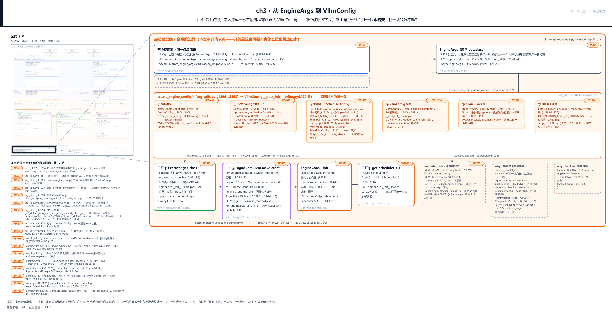
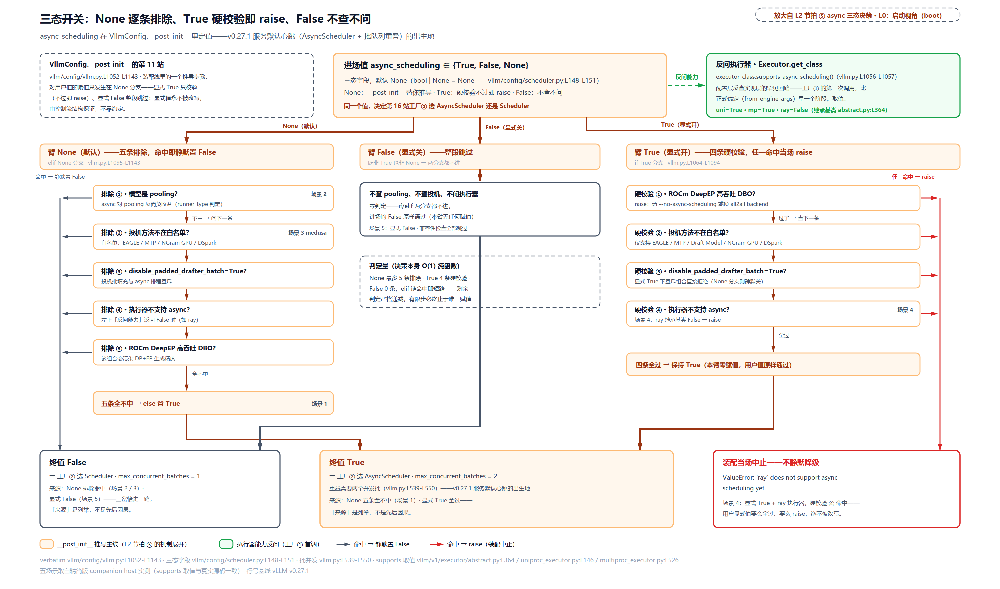
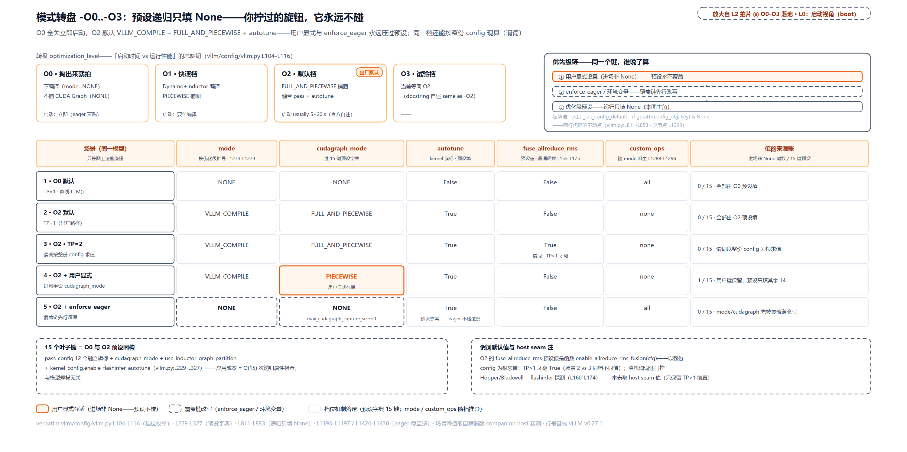

# 第 3 章　从 EngineArgs 到 VllmConfig

上一章结尾留了一个没转过去的视角：这一路住的房子——两个进程、三件套、ZMQ 通道——是谁、在启动那一刻搭起来的？现在换上启动视角。运维敲下一行命令：`vllm serve Qwen/Qwen3-8B --tensor-parallel-size 2 -O3`。回车之后、第一个请求进门之前，这行命令要完成一件前两章从未展开的事：把它背后的上百个旋钮（v0.27.1 里 `EngineArgs` 精确数到 227 个字段）拧成一份配置，再按这份配置把 [第 1 章](../../ch01-vllm-v1-in-one-map/narrative/chapter.md) 那台机器真的造出来。

问题跟着就来。谁保证这 227 个旋钮互不打架——`--tensor-parallel-size 2` 要求多卡，你偏给单卡机器，谁第一个报错？`-O3` 一拨，为什么启动要多等一段以秒计的编译、之后每个 token 却更快？`--max-num-seqs`（并发请求数上限）从 1024 拨到 512，为什么整个系统几乎纹丝不动、连编译产物都不用重编——而拨的若是 `--max-num-batched-tokens`（每拍的 token 计算预算），编译缓存却整个作废？这些问题共用一个答案：两级映射。上百个扁平参数先被拧成一份三段进程都认账的 `VllmConfig`，再由这份配置把具体实现类一个一个选出来。本章就走这条装配线：[第 1 章](../../ch01-vllm-v1-in-one-map/narrative/chapter.md)末尾留的话——「每个旋钮拨下去系统哪里变，启动视角展开」——在这里兑现。

## 你在这里



> *图注：这张图是 [第 1 章](../../ch01-vllm-v1-in-one-map/narrative/chapter.md) L0 图左下角「启动视角」块的放大——那块在 L0 图上虚线标着「Part I 打开」，本章来兑现。它画的不是请求流（[第 2 章](../../ch02-request-lifecycle/narrative/chapter.md)的十六站是机器转起来之后的事），而是这台机器本身怎么按配置被造出来：最上行两个使用面把上百个关键字收进 EngineArgs；中区 `create_engine_config` 把扁平参数逐个打包成子配置、聚合成 `VllmConfig` 并当场交叉校验（①-⑥ 六个拍片）；南行三个工厂按同一份配置选出执行器、客户端与调度器，在 `EngineCore.__init__` 汇合成整机；右端 `compute_hash` 给这份配置盖一枚 10 位指纹。左列站号轨道 1-17 = 启动装配的代码顺序——注意它与上一章的请求站号是两套账本，本文一律称「第 N 站」时都指装配站号；正文按讲解需要编排，不必照站号读。*

读法建议：只想知道默认值（token 预算、并发上限）怎么来的，直接进[「打包」一节的查表段](#打包扁平参数变成五大-config站-3-8)；只关心 `-O3` 是什么，跳到[「一个数字换一桌旋钮」](#一个数字换一桌旋钮-o0-到--o3站-12)；想知道改哪个参数会触发重编译，直奔[「指纹」](#指纹这份配置的-10-位身份证站-17)。按序读则是从收拢到装配走完全程——本章不设新先修，前两章的图还记得个大概就够。

## 总纲：两级映射，一份配置

先把整条装配线压成一句话：**扁平参数空间 →（`create_engine_config`）→ 结构化配置空间（一份 `VllmConfig`）→（三个工厂）→ 具体实现类。** 第一级把「两百多个同层的旋钮」变成「二十来个各管一摊的子配置」；第二级把「子配置里的意图」变成「具体的类」。两级之间的接缝就是 `VllmConfig`：它是跨进程传递的唯一上下文容器——API 进程拿它选客户端，引擎进程拿它选调度器，worker 拿到的是同一份。前两章反复出现的「三段进程都认账」，账本就是它。

两级映射的骨架在同步使用面的入口方法里，二十七行看完一条线：

```python
# vllm/v1/engine/llm_engine.py:L160-L186
    @classmethod
    def from_engine_args(
        cls,
        engine_args: EngineArgs,
        usage_context: UsageContext = UsageContext.ENGINE_CONTEXT,
        stat_loggers: list[StatLoggerFactory] | None = None,
        enable_multiprocessing: bool = False,
    ) -> "LLMEngine":
        """Creates an LLM engine from the engine arguments."""

        # Create the engine configs.
        vllm_config = engine_args.create_engine_config(usage_context)  # L171
        executor_class = Executor.get_class(vllm_config)  # L172

        if envs.VLLM_ENABLE_V1_MULTIPROCESSING:
            logger.debug("Enabling multiprocessing for LLMEngine.")
            enable_multiprocessing = True

        # Create the LLMEngine.
        return cls(
            vllm_config=vllm_config,
            executor_class=executor_class,
            log_stats=not engine_args.disable_log_stats,
            usage_context=usage_context,
            stat_loggers=stat_loggers,
            multiprocess_mode=enable_multiprocessing,
        )
```

三段各对一块：`create_engine_config(usage_context)`（L171）是第一级映射的全部，占本章站 3-12；`Executor.get_class(vllm_config)`（L172）是第二级映射的第一次正式调用——按配置选出执行器**类**（不是实例，后面细说），站 13；末尾 `cls(...)` 进构造函数后，里面的 `multiprocess_mode` 轴（由 `VLLM_ENABLE_V1_MULTIPROCESSING` 默认 `True` 翻开，`vllm/envs.py:L149`——[第 1 章](../../ch01-vllm-v1-in-one-map/narrative/chapter.md)说过的「离线也付进程税」就是它）驱动工厂③在站 14 选出客户端。`usage_context`（使用场景标记：这段配置是给离线 `LLM` 还是给在线 API server 用的）一路随行——后面会看到它直接改变默认值的大小。

两个使用面走的是同一条装配线，这不是巧合，是一条完整的取舍链：

- **旧设计**：v0 是两条平行的类谱系——同步 `LLMEngine` 与异步 `_AsyncLLMEngine`（子类化再加包装），detokenize、输出组装、请求生命周期这些逻辑在两条路径里各写一份。
- **痛点**：离线批处理与在线 serving 是 vLLM 产品形态的两半，同一套输出逻辑维护两遍，行为一漂移就是「离线跑得好好的、在线结果不一样」这类最恶心的事故，双倍成本。
- **v1 方案**：收敛成一套结构、两种驱动。`AsyncLLM.from_engine_args` 与上面这段同构（`vllm/v1/engine/async_llm.py:L235-L257`）；`vllm serve` 那边的服务端装配入口同样先调 `create_engine_config`（`vllm/entrypoints/openai/api_server.py:L156`，走 `AsyncEngineArgs`——`EngineArgs` 的子类，只多几个异步面参数，`vllm/engine/arg_utils.py:L2805`）。
- **代价（如实列出）**：一条代码路径两种模式，每次改动都要同时推演两个分支；同步面默认也付进程解耦的代价——离线 `LLM` 同样默认 spawn 独立引擎进程（[第 1 章「一套结构两种驱动」一节](../../ch01-vllm-v1-in-one-map/narrative/chapter.md)算过这笔税）。

这条链解释了本章的立足点：**讲一条装配线，就等于同时讲了两个使用面的启动**。下面从北行出发，站 1-2 先看旋钮怎么被收拢。

## 收拢：两百多个旋钮进一个 dataclass（站 1-2）

第 1 站在离线使用面的入口。`LLM` 的构造函数收下上百个关键字参数，第一件事就是原样转交：

```python
# vllm/entrypoints/llm.py:L295-L303
        engine_args = EngineArgs(  # L295
            model=model,
            runner=runner,
            convert=convert,
            tokenizer=tokenizer,
            tokenizer_mode=tokenizer_mode,
            skip_tokenizer_init=skip_tokenizer_init,
            trust_remote_code=trust_remote_code,
            # … 省略：其余两百多个关键字参数的逐个透传，到 L334 收尾 …
```

`vllm serve` 那边同构：CLI 参数解析后装进 `AsyncEngineArgs` 再进同一条线。收拢动作本身平平无奇，有趣的是容器：`EngineArgs` 是个 Python **dataclass**——读懂本章一半的代码组织方式，要从这两个机制说起。

**dataclass 与 `__post_init__`。** `@dataclass` 是 Python 标准库的「数据类」装饰器：读类体里的类型注解字段，按定义顺序自动生成 `__init__`（带默认值）、`__repr__`、`__eq__`——不写它你就得手写 `def __init__(self, a, b, ...): self.a = a ...`。`__post_init__` 是配套钩子：生成的 `__init__` 把字段赋完值后**自动调用**它，官方点名的用途就是「初始化依赖其他字段的字段」。看一个十行小例（说明性，纯标准库）：

```python
from dataclasses import dataclass, field

@dataclass
class Rectangle:
    w: float
    h: float
    area: float = field(init=False)   # init=False：不进 __init__ 参数表

    def __post_init__(self):
        self.area = self.w * self.h   # 生成的 __init__ 尾部自动调用

r = Rectangle(3.0, 4.0)
print(r.area)   # 12.0——没人手动调用过 __post_init__
```

vLLM 把这个钩子用成了「构造即校验/推导」的固定槽位：`EngineArgs`、五大子配置、`VllmConfig` 全是 dataclass，每层的「依赖其他字段的推导」都收在自己的 `__post_init__` 里。后文看到「`VllmConfig` 聚合构造的瞬间，七百多行校验与推导就跑了」，不是什么魔法，就是这段小例的时序。顺带一个本章会用到的配套件：可变默认值（列表、字典、新对象）不许直接写进字段默认值，要写 `field(default_factory=...)`——零参可调用，每个实例各拿一份新对象。

第 2 站看容器本身。`EngineArgs` 的字段定义有个一眼看不出的机关：

```python
# vllm/engine/arg_utils.py:L421-L463
@dataclass
class EngineArgs:
    """Arguments for vLLM engine."""

    model: str = ModelConfig.model  # L425
    enable_return_routed_experts: bool = ModelConfig.enable_return_routed_experts
    model_weights: str = ModelConfig.model_weights
    served_model_name: str | list[str] | None = ModelConfig.served_model_name
    tokenizer: str | None = ModelConfig.tokenizer
    hf_config_path: str | None = ModelConfig.hf_config_path
    runner: RunnerOption = ModelConfig.runner
    convert: ConvertOption = ModelConfig.convert
    skip_tokenizer_init: bool = ModelConfig.skip_tokenizer_init
    enable_prompt_embeds: bool = ModelConfig.enable_prompt_embeds
    tokenizer_mode: TokenizerMode | str = ModelConfig.tokenizer_mode
    trust_remote_code: bool = ModelConfig.trust_remote_code
    allowed_local_media_path: str = ModelConfig.allowed_local_media_path
    allowed_media_domains: list[str] | None = ModelConfig.allowed_media_domains
    download_dir: str | None = LoadConfig.download_dir
    safetensors_load_strategy: SafetensorsLoadStrategy | None = (
        LoadConfig.safetensors_load_strategy
    )
    safetensors_prefetch_num_threads: int = LoadConfig.safetensors_prefetch_num_threads
    safetensors_prefetch_block_size: int = LoadConfig.safetensors_prefetch_block_size
    load_format: str | LoadFormats = LoadConfig.load_format
    config_format: str = ModelConfig.config_format
    dtype: ModelDType = ModelConfig.dtype
    kv_cache_dtype: CacheDType = CacheConfig.cache_dtype  # L448
    seed: int = ModelConfig.seed
    max_model_len: int = ModelConfig.max_model_len
    cudagraph_capture_sizes: list[int] | None = (
        CompilationConfig.cudagraph_capture_sizes
    )
    max_cudagraph_capture_size: int | None = get_field(
        CompilationConfig, "max_cudagraph_capture_size"
    )
    ir_op_priority: IrOpPriorityConfig = get_field(KernelConfig, "ir_op_priority")
    # Note: Specifying a custom executor backend by passing a class
    # is intended for expert use only. The API may change without
    # notice.
    distributed_executor_backend: (  # L461
        str | DistributedExecutorBackend | type[Executor] | None
    ) = ParallelConfig.distributed_executor_backend
    # … 省略：调度、缓存、编译、投机、KV-transfer、多模态、LoRA 等
    #       后续字段同构透传，共 227 个 …
```

每个字段的默认值**直接引用对应子 Config 类的同名类属性**：`model=ModelConfig.model`、`kv_cache_dtype=CacheConfig.cache_dtype`、`distributed_executor_backend=ParallelConfig.distributed_executor_backend`——开头四十行就能见到六个来源（Model/Load/Cache/Compilation/Kernel/Parallel）。这条「单一真相源」规矩值得一条取舍链：

- **旧做法（朴素的）**：CLI 参数的默认值在参数表手写一份（示意：`default=8192`），子 Config 类里再写一份 `8192`。
- **痛点**：两处默认值必漂移——加一个字段要改两处，改一个默认值也要改两处，漏掉任何一处，用户不传参时看到的默认行为就和文档/子配置对不上，这类 bug 还特别难查。
- **v1 方案**：默认值只写在各子 Config 类里，`EngineArgs` 的字段默认值借它的类属性——CLI 默认与子配置默认天然同步。
- **代价**：读代码多跳一层（想看 `model` 的默认值得去 `vllm/config/model.py` 找）；默认值在类定义时求值一次，是「快照」而不是「实时引用」——好在这些类属性全是静态常量，快照与引用无差。

字段清单里那几个 `safetensors_*` 旋钮顺带认一下：safetensors 是 Hugging Face 推的模型权重格式，与 Python pickle（会顺带执行文件里编码的任意代码）不同，它只存张量数据加一个描述名字/形状/偏移的 JSON 头，加载时不执行任何代码；`prefetch` 两个旋钮就是在「按偏移读字节」的加载过程上加多线程分块预读。它们属于 Part V 装载那一侧的门牌，这里路过即可。

`EngineArgs` 自己的 `__post_init__`（站 2 的另一半）干三件事：

```python
# vllm/engine/arg_utils.py:L755-L795
    def __post_init__(self):
        # support `EngineArgs(compilation_config={...})`
        # without having to manually construct a
        # CompilationConfig object
        if isinstance(self.compilation_config, dict):
            self.compilation_config = CompilationConfig(**self.compilation_config)
        if isinstance(self.attention_config, dict):
            self.attention_config = AttentionConfig(**self.attention_config)
        # … 省略：mamba/kernel/eplb/weight_transfer/fault_tolerance/ir_op_priority
        #       六个同构的 dict 升格分支 …

        from vllm.config.quantization import resolve_quantization_config

        self.quantization_config = resolve_quantization_config(  # L788
            self.quantization, self.quantization_config
        )

        # Setup plugins
        from vllm.plugins import load_general_plugins

        load_general_plugins()  # L795
```

一是**升格**：允许用户 `EngineArgs(compilation_config={...})` 直接传 dict，免得手工构造 Config 对象——「两百个旋钮给普通人、结构化给程序」两个口味都留着。二是**量化解析**：把 `--quantization` 字符串与显式传入的量化配置归并成一份。三是**加载插件**——注意它在参数解析的更上游，因为插件可能注册新的 CLI 选项，必须赶在 argparse 建表之前把插件装进来。收拢到此完成：两百多个旋钮躺在一个 dataclass 里，等下一站开拆。

## 打包：扁平参数变成五大 config（站 3-8）

现在走到 L0 图的「启动视角」带中区：`create_engine_config`——第一级映射的主体，近六百行（`vllm/engine/arg_utils.py:L1896-L2493`）一路把扁平参数重新打包成子配置。先看开场（站 3-4）：

```python
# vllm/engine/arg_utils.py:L1896-L1936
    def create_engine_config(
        self,
        usage_context: UsageContext | None = None,
        headless: bool = False,
    ) -> VllmConfig:
        """
        Create the VllmConfig.

        NOTE: If VllmConfig is incompatible, we raise an error.
        """
        current_platform.pre_register_and_update()

        device_config = DeviceConfig(device=cast(Device, current_platform.device_type))

        envs.validate_environ(self.fail_on_environ_validation)

        # Check if the model is a speculator and override model/tokenizer/config
        # BEFORE creating ModelConfig, so the config is created with the target model
        # Skip speculator detection for cloud storage models (eg: S3, GCS) since
        # HuggingFace cannot load configs directly from S3 URLs. S3 models can still
        # use speculators with explicit --speculative-config.
        if not is_cloud_storage(self.model):
            (self.model, self.tokenizer, self.speculative_config) = (
                maybe_override_with_speculators(
                    model=self.model,
                    tokenizer=self.tokenizer,
                    revision=self.revision,
                    trust_remote_code=self.trust_remote_code,
                    vllm_speculative_config=self.speculative_config,
                    hf_token=self.hf_token,
                )
            )

        model_config = self.create_model_config()  # L1929
        self.model = model_config.model
        self.model_weights = model_config.model_weights
        self.tokenizer = model_config.tokenizer

        self._check_feature_supported()
        self._set_default_chunked_prefill_and_prefix_caching_args(model_config)
        self._set_default_reasoning_config_args()
```

四步读：① `current_platform.pre_register_and_update()` 是平台钩子——CUDA/ROCm/TPU 各平台在这里注册自己的能力与默认值；② `DeviceConfig` 只装一个设备类型；③ **speculator 覆盖**：如果用户给的是个「投机草稿模型」的名字，先把真正的目标模型换进来，这样后面读到的 config 才是对的（投机解码 [第 1 章](../../ch01-vllm-v1-in-one-map/narrative/chapter.md)认过：小模型猜、大模型验的加速法；细节在 Part VII）；④ `create_model_config()`（L1929）——整条装配线最重的一步，它要去读模型的 HF config（Hugging Face 模型仓里那份 `config.json`，记录层数、hidden size、架构名等），装配流程的 IO 大头就在这里。读回来的 `ModelConfig` 也是**派生源**：`is_moe`（是不是混合专家模型——把 FFN 换成多个专家子网络的架构）、`is_multimodal`（能不能吃图片等非文本输入）、`runner_type` 这些标志，后面的子配置都要从它这里取。开场末尾三行是「按模型能力定默认」的第一批：chunked prefill（切块预填充，前两章立过）与前缀缓存开不开，先看模型支持不支持（`vllm/engine/arg_utils.py:L2598` 起）——这个模式马上还会见到一次更大的。

二十多个子配置里，五个是理解 L0 图的主力。**五大 config** 各管一摊：

| 子配置 | 管什么（关键字段） | 对应 L0 图哪块 | 谁打开 |
|---|---|---|---|
| `ModelConfig` | 模型本体：HF config、dtype、max_model_len、runner_type、is_moe | 决定整图的形状（模型层） | Part VI |
| `CacheConfig` | KV 账本：block_size、gpu_memory_utilization、enable_prefix_caching | 下带 KV cache 列 | Part IV |
| `ParallelConfig` | 进程拓扑：TP/PP/DP 尺寸、distributed_executor_backend | 进程带怎么切、执行臂分几路 | Part VIII |
| `SchedulerConfig` | 调度循环：max_num_batched_tokens、max_num_seqs、async_scheduling | 循环框的预算与心跳 | Part III |
| `CompilationConfig` | 执行臂：torch.compile 与 cudagraph 的全部开关 | 循环框往下的执行臂 | Part V |

`ParallelConfig` 的三个尺寸旋钮（TP/PP/DP）值得第一次见面就把直觉立住——「一个大模型跑在很多张卡上」的三种切法，各解决一个瓶颈：

- **TP（tensor parallel，张量并行）**：把每一层**内部**的权重矩阵切开、多卡同算一层再拼回结果——解决「单卡装不下」。层内切分每层都要卡间通信、吃卡间带宽，所以官方配方是 TP 等于单机 GPU 数、不跨节点（算法出自 NVIDIA 的 Megatron-LM）。
- **PP（pipeline parallel，流水线并行）**：把层叠**切成前后接力的一段段**流水，第 1 段算完把中间激活传给第 2 段——通信量小，官方配方是 PP 等于节点数。
- **DP（data parallel，数据并行）**：模型**一份不切、原样复制 N 份**，各吃各的请求批——解决「跑得快」：吞吐近线性涨、单请求延迟不变，副本前面挂负载均衡。

```bash
# 说明性：官方文档给的典型配方
vllm serve model --tensor-parallel-size 8                  # 单机 8 卡：每层切 8 份同算
vllm serve model --tensor-parallel-size 8 --pipeline-parallel-size 2   # 2 节点×8 卡
vllm serve model --data-parallel-size 4                    # 模型复制 4 份各接各的请求
```

本章只到「三个整数进 `ParallelConfig`」为止——它们引起的集合通信与调度全是 Part VIII 的活。

### 打包样板：CacheConfig（站 5）

站 5 的 `CacheConfig` 构造是「重新打包」的典型样板——每个关键字参数直接来自 `EngineArgs` 字段或上面推导出的局部变量，一个字段都不算数：

```python
# vllm/engine/arg_utils.py:L1954-L1976
        cache_config = CacheConfig(
            block_size=self.block_size,  # type: ignore[arg-type]
            gpu_memory_utilization=self.gpu_memory_utilization,
            kv_cache_memory_bytes=self.kv_cache_memory_bytes,
            cache_dtype=resolved_cache_dtype,  # type: ignore[arg-type]
            is_attention_free=model_config.is_attention_free,
            num_gpu_blocks_override=self.num_gpu_blocks_override,
            sliding_window=sliding_window,
            enable_prefix_caching=self.enable_prefix_caching,
            prefix_caching_hash_algo=self.prefix_caching_hash_algo,
            calculate_kv_scales=self.calculate_kv_scales,
            # … 省略：mamba/前缀匹配/kv offloading 等十余个同构透传 …
        )
```

`block_size`（KV 块大小，[第 2 章](../../ch02-request-lifecycle/narrative/chapter.md)账本里那个 16）、`gpu_memory_utilization`（允许多少比例显存给这套系统）——L0 图上 KV cache 列的旋钮都收在这里。这份配置的下游消费点是引擎侧的显存盘点，Part IV 打开。`ParallelConfig`、`SchedulerConfig` 的构造同构（站 6、站 8），不再贴全。

### 后端默认推导：单卡 uni、多卡 mp（站 6）

`ParallelConfig` 构造时只拿到 TP/PP/DP 三个整数与一批地址参数；它的 `__post_init__` 会算出 world_size（总并行度 = TP×PP，DP 另计）并顺手推导一个本章后面要用到的关键值——**执行后端**（`distributed_executor_backend`，谁来管多进程编排）：

```python
# vllm/config/parallel.py:L911-L956
        if self.distributed_executor_backend is None and self.world_size_across_dp > 1:
            # We use multiprocessing by default if world_size fits on the
            # current node and we aren't in a ray placement group.

            from vllm.v1.executor import ray_utils

            backend: DistributedExecutorBackend = "mp"  # L917
            ray_found = ray_utils.ray_is_available()
            if current_platform.is_tpu() and envs.VLLM_XLA_USE_SPMD:
                backend = "uni"
            elif current_platform.is_cuda() and self.nnodes > 1:
                backend = "mp"
            elif (
                current_platform.is_cuda()
                and current_platform.device_count() < self.world_size
            ):
                gpu_count = current_platform.device_count()
                raise ValueError(
                    f"World size ({self.world_size}) is larger than the number of "
                    f"available GPUs ({gpu_count}) in this node. If this is "
                    "intentional and you are using:\n"
                    "- ray, set '--distributed-executor-backend ray'.\n"
                    "- multiprocessing, set '--nnodes' appropriately."
                )
            elif self.data_parallel_backend == "ray":
                backend = "ray"
            elif ray_found:
                if self.placement_group:
                    backend = "ray"
                # … 省略：否则查 ray 是否已初始化及其 placement group，
                #       命中则同样 backend = "ray" …
            self.distributed_executor_backend = backend
            logger.debug("Defaulting to use %s for distributed inference", backend)

        if self.distributed_executor_backend is None and self.world_size == 1:
            self.distributed_executor_backend = "uni"  # L956
```

用户没显式指定时：需要多进程（`world_size_across_dp > 1`）默认 `mp`（Python 标准库 multiprocessing 管本机子进程）；但检测到身处 Ray 集群或 DP 后端指定了 ray，就换成 `ray`（[第 1 章](../../ch01-vllm-v1-in-one-map/narrative/chapter.md)认过一句话：Ray 是通用分布式计算框架，跨机器编排交给它）；单卡（`world_size == 1`）则 `uni`——不用任何子进程编排。**「单卡 uni、多卡 mp、Ray 环境 ray」** 这句口诀的出生地就是这里。注意时序：这段跑在 `ParallelConfig.__post_init__` 里，早于 `VllmConfig` 聚合——后面工厂①的源码注释说 backend「must be set in VllmConfig.__post_init__」，是句滞后表述，按实际时序理解即可。还有个防御值得一眼：本机 GPU 数不够 world_size 时，这里直接 raise 教你怎么改——本章开篇问的「谁第一个报错」，单机硬拨多卡的答案就在这附近（`ParallelConfig` 构造瞬间，比任何进程启动都早）。

### 默认值不是常数：显存×场景查表（站 7）

站 7 是全章最有「拨开云雾」感的一站。[第 1 章](../../ch01-vllm-v1-in-one-map/narrative/chapter.md)留过钩子：token 预算这个旋钮「类默认 2048 主要为测试便利，实际部署由 EngineArgs 按硬件与使用面拨大」。现在看拨大的代码——先补一条完整的取舍链：

- **旧设计**：v0 调度器是双相位（decode 批、prefill 批两条路径三套队列），朴素做法按**请求数**限批。
- **痛点**：请求数预测不了一步的计算量——256 个 decode 请求各 1 token 是 256 token 的工作量，1 个 8K prompt 的请求是 8192 token 的工作量，同样算「1 个请求」，工作量差 32 倍。按请求数限批，要么 GPU 饿死，要么单步延迟爆炸。Sarathi-Serve（arXiv:2308.16369）证明了按 **token 预算**混相组批才能同时保住 GPU 利用率与每 token 延迟——「调度只认 token 数不认请求数」这个 [第 1 章](../../ch01-vllm-v1-in-one-map/narrative/chapter.md)立过的结论，出处在这里。
- **v1 方案**：每拍只有一个 token 预算 `max_num_batched_tokens`；预算的**默认值不是常数，是（显存、设备名、使用场景）的函数**——站 7 的查表代码。
- **代价**：长 prompt 被切成多拍（TTFT 换 TPOT，这笔交易 Part III 展开）；而「零配置开箱即用」的直接代价是——默认值推导链本身成了需要理解的代码。

推导链的真实执行位置有个讲究：唯一调用点在 `ParallelConfig` 打包之后、`SchedulerConfig` 之前（`vllm/engine/arg_utils.py:L2254`，`_set_default_max_num_seqs_and_batched_tokens_args`——名字很长的那个函数），因为推导要吃 parallel_config 里的信息。查表的核心是 `get_batch_defaults`：

```python
# vllm/engine/arg_utils.py:L2515-L2563
    def get_batch_defaults(
        cls,
        world_size: int,
    ) -> tuple[dict[UsageContext | None, int], dict[UsageContext | None, int]]:
        from vllm.usage.usage_lib import UsageContext

        default_max_num_batched_tokens: dict[UsageContext | None, int]
        default_max_num_seqs: dict[UsageContext | None, int]

        # When no user override, set the default values based on the usage
        # context.
        # Use different default values for different hardware.

        # Try to query the device name on the current platform. If it fails,
        # it may be because the platform that imports vLLM is not the same
        # as the platform that vLLM is running on (e.g. the case of scaling
        # vLLM with Ray) and has no GPUs. In this case we use the default
        # values for non-H100/H200 GPUs.
        try:
            device_memory = current_platform.get_device_total_memory()
            device_name = current_platform.get_device_name().lower()
        except Exception:
            # This is only used to set default_max_num_batched_tokens
            device_memory = 0
            device_name = ""

        # NOTE(Kuntai): Setting large `max_num_batched_tokens` for A100 reduces
        # throughput, see PR #17885 for more details.
        # So here we do an extra device name check to prevent such regression.
        if device_memory >= 70 * GiB_bytes and "a100" not in device_name:
            # For GPUs like H100 and MI300x, use larger default values.
            default_max_num_batched_tokens = {
                UsageContext.LLM_CLASS: 16384,
                UsageContext.OPENAI_API_SERVER: 8192,
            }
            default_max_num_seqs = {
                UsageContext.LLM_CLASS: 1024,
                UsageContext.OPENAI_API_SERVER: 1024,
            }
        else:
            # TODO(woosuk): Tune the default values for other hardware.
            default_max_num_batched_tokens = {
                UsageContext.LLM_CLASS: 8192,
                UsageContext.OPENAI_API_SERVER: 2048,
            }
            default_max_num_seqs = {
                UsageContext.LLM_CLASS: 256,
                UsageContext.OPENAI_API_SERVER: 256,
            }
        # … 省略：TPU/CPU 平台分支（L2565-L2594） …
```

三个输入两两交叉就出默认值：**显存够大**（≥70GiB）且**设备名不含 a100**，给大默认；否则给小默认。A100 与 H100 都是 NVIDIA 的 80GB 数据中心 GPU，为什么 A100 特判排除？源码注释自己招了：大预算在 A100 上反而降吞吐（PR #17885 的实测回归）——默认值是**经验参数，不是物理定律**。同一块 H100 上还有第二维：离线 `LLM_CLASS` 给 16384，在线 `OPENAI_API_SERVER` 只给一半 8192——服务面更保守，因为 token 预算直接放大单拍计算量、撑高 TPOT 下界；离线批处理没人等，预算大点无妨。查表之后还有两步钳制（`vllm/engine/arg_utils.py:L2712-L2801`）：throughput 性能模式（`performance_mode` 旋钮的吞吐取向档位，聚合一节还会见到它）翻倍；关掉 chunked prefill 时抬底到 `max_model_len`（长 prompt 必须一拍装下）再封顶。数值全貌一张表（跑在本章精简版上取证——设备名与显存是注入的探针值，分支逻辑与全部常量逐字来自上面这段 GPU 主线）：

<!-- trace: ch03-batch-defaults -->
| 场景（设备·用途） | 显存（GiB） | 查表默认 tokens/seqs | 钳制算术 | max_num_batched_tokens 终值 | max_num_seqs 终值 |
|---|---|---|---|---|---|
| 1 H100 · LLM() 离线 | 80 | 16384 / 1024 | min(1024×4096, 16384) → 16384 | 16384 | 1024 |
| 2 H100 · vllm serve 在线 | 80 | 8192 / 1024 | min(1024×4096, 8192) → 8192 | 8192 | 1024 |
| 3 A100 · LLM() 离线（#17885 反例） | 80 | 8192 / 256 | min(256×4096, 8192) → 8192 | 8192 | 256 |
| 4 A100 · vllm serve 在线 | 80 | 2048 / 256 | min(256×4096, 2048) → 2048 | 2048 | 256 |
| 5 RTX 4090 · LLM() 离线（小卡，同一 else 的另一入口） | 24 | 8192 / 256 | min(256×4096, 8192) → 8192 | 8192 | 256 |
| 6 H100 · LLM() · throughput 模式 | 80 | 16384 / 1024 | 翻倍 16384→32768 · 1024→2048（封顶未触发） | 32768 | 2048 |
| 7 H100 · LLM() · 关 chunked prefill（max_model_len=32768） | 80 | 16384 / 1024 | 抬底 max(32768, 16384)=32768 · min(1024×32768, 32768) → 32768 | 32768 | 1024 |

对着读：场景 1 对 2 是「同一块卡、用途差一档、预算差一半」；场景 3 对 1 是「同为 80GB、换个架构、默认掉一档」（A100 的 LLM 默认 8192 只有 H100 的一半，serve 的 2048 只有 H100 serve 的四分之一）；场景 5 说明小卡与 A100 走的是同一个 else——这张表是「显存、设备名、场景」三维查表，不是白名单。默认推导还有一条自保的不变量：终值恒满足 `max_num_batched_tokens ≤ max_num_seqs × max_model_len` 且 `max_num_seqs ≤ max_num_batched_tokens`（两步 min 钳制互相咬合）——`SchedulerConfig` 后置的 `verify_max_model_len`（三个 raise 一个 warn，`vllm/config/scheduler.py:L249` 起）在默认路径上永真，推导链不会自己造出违约配置。

### SchedulerConfig：预算进场，三态进场（站 8）

站 8 打包 `SchedulerConfig`，此刻批默认已填好（紧邻的 assert 强保证非 None）：

```python
# vllm/engine/arg_utils.py:L2270-L2289
        scheduler_config = SchedulerConfig(
            runner_type=model_config.runner_type,
            max_num_batched_tokens=self.max_num_batched_tokens,
            max_num_scheduled_tokens=self.max_num_scheduled_tokens,
            max_num_seqs=self.max_num_seqs,
            max_model_len=model_config.max_model_len,
            enable_chunked_prefill=self.enable_chunked_prefill,
            # … 省略：多模态/编码器-解码器/策略/水位等十余个同构透传 …
            async_scheduling=self.async_scheduling,  # L2286
            stream_interval=self.stream_interval,
        )
```

注意最后一对：`async_scheduling=self.async_scheduling`——用户没传时 `self.async_scheduling` 是 `None`（字段声明 `async_scheduling: bool | None = None`，`vllm/config/scheduler.py:L148`）。**布尔字段声明成三态**：`True` 用户强制开、`False` 用户强制关、`None` 交给系统自动定。这个模式不是 `async_scheduling` 独有（`disable_nccl_for_dp_synchronization` 同款，`vllm/config/vllm.py:L1145` 起），但 `async_scheduling` 是最重要的那个——它的「自动」定出了 v0.27.1 的默认心跳。怎么定的，下一节。

## 聚合：VllmConfig 与构造瞬间的交叉校验（站 9-10）

站 9，全部子配置一次性汇合：

```python
# vllm/engine/arg_utils.py:L2464-L2493
        config = VllmConfig(
            model_config=model_config,
            cache_config=cache_config,
            parallel_config=parallel_config,
            scheduler_config=scheduler_config,
            device_config=device_config,
            load_config=load_config,
            offload_config=offload_config,
            attention_config=attention_config,
            mamba_config=mamba_config,
            kernel_config=kernel_config,
            lora_config=lora_config,
            speculative_config=speculative_config,
            diffusion_config=diffusion_config,
            structured_outputs_config=self.structured_outputs_config,
            observability_config=observability_config,
            compilation_config=compilation_config,
            kv_transfer_config=self.kv_transfer_config,
            kv_events_config=self.kv_events_config,
            ec_transfer_config=self.ec_transfer_config,
            reasoning_config=self.reasoning_config,
            profiler_config=self.profiler_config,
            additional_config=self.additional_config,
            optimization_level=self.optimization_level,
            performance_mode=self.performance_mode,
            weight_transfer_config=self.weight_transfer_config,
            shutdown_timeout=self.shutdown_timeout,
        )

        return config
```

26 项关键字、约 20 个子配置，外加两个总旋钮（`optimization_level` 下一节的主角、`performance_mode` 性能模式——balanced/throughput/latency 的取向开关）。`VllmConfig` 本体实有 29 个字段：多出来的三个不来自这次调用——`instance_id` 由 `__post_init__` 现场生成、`quant_config`（量化配置）由 `__post_init__` 从 model/load 推导、`ec_manager_config` 走 `default_factory`。聚合的意义就一句话：**下游所有模块只需要传它一个**——前两章源码里处处 `vllm_config=vllm_config` 的形参，就是这份。

dataclass 的时序在这里显威力：构造的**瞬间**，`__post_init__` 自动开跑（站 10）：

```python
# vllm/config/vllm.py:L972-L1031
    def __post_init__(self):
        """Verify configs are valid & consistent with each other."""

        # To give each torch profile run a unique instance name.
        self.instance_id = f"{time.time_ns()}"

        if self.performance_mode != "balanced":
            logger.info_once("Performance mode set to '%s'.", self.performance_mode)

        self.try_verify_and_update_config()  # L981

        if self.model_config is not None:
            self.model_config.verify_with_parallel_config(self.parallel_config)
            self.model_config.verify_dual_chunk_attention_config(self.load_config)

            self.parallel_config.is_moe_model = self.model_config.is_moe

        # … 省略：enable_return_routed_experts 与 PP/KV-connector 的互斥校验、
        #       LoRA 互验、mamba 随机舍入校验（L989-L1026） …

        if self.quant_config is None and self.model_config is not None:
            self.quant_config = VllmConfig._get_quantization_config(
                self.model_config, self.load_config
            )
```

三件事：① **按架构改写**——`try_verify_and_update_config`（L981，实现在 `vllm/config/vllm.py:L2055` 起）经一张「架构名→处理器」的注册表（`MODELS_CONFIG_MAP`）分发：某些模型架构需要特殊的配置改写（改 dtype、关某特性），逻辑收在那里；② **跨子配置互验**——`model_config.verify_with_parallel_config(parallel_config)` 就是「单卡硬拨多卡，谁第一个报错」的另一处答案：模型与并行度的兼容性在配置对象构造的瞬间对质；③ **缺省推导**——量化配置没显式给就从模型与装载配置里推。这类约束有个共同点：**扁平参数表达不了**——「`--enable-return-routed-experts` 与 PP>1 互斥」这种跨两个子配置的规则，只能在两份子配置都存在的地方检查，而它们聚齐的第一刻就是这里。为什么收口在构造瞬间而不是「谁用谁校验」？朴素做法是每个消费方各自检查自己关心的约束——检查逻辑随消费方散落、口径漂移、漏检就是运行时炸；v1 把全部跨子配置约束压进 `__post_init__`，买到「**配置对象一旦构造出来就是已校验的**」这条硬保证。代价也直白：这个方法在 v0.27.1 已有七百多行（L972-L1704）——它的长度本身就是「跨子配置约束有多少」的度量，也成了读者需要理解的代码。

## 三态开关：async_scheduling 的默认值在哪定（站 11）

直觉先立住：`async_scheduling` 像一个三档开关——拨到 `True`（强制开）、`False`（强制关）、`None`（AUTO：传感器按房间实况自己定）。AUTO 不是「缺省关」，是把决策权交给握有全部上下文的 `__post_init__`。决策代码是本章最重要的单段：

```python
# vllm/config/vllm.py:L1052-L1143
        from vllm.platforms import current_platform
        from vllm.v1.executor.abstract import Executor

        executor_backend = self.parallel_config.distributed_executor_backend
        executor_class = Executor.get_class(self)  # L1056
        executor_supports_async_sched = executor_class.supports_async_scheduling()
        uses_rocm_deepep_ht_dbo = (
            current_platform.is_rocm()
            and self.parallel_config.enable_dbo
            and self.parallel_config.all2all_backend == "deepep_high_throughput"
        )

        if self.scheduler_config.async_scheduling:  # L1064
            # Async scheduling explicitly enabled, hard fail any incompatibilities.
            # Currently, async scheduling only support eagle speculative
            # decoding.
            if uses_rocm_deepep_ht_dbo:
                raise ValueError(
                    "Async scheduling is not compatible with ROCm DeepEP "
                    "high-throughput DBO. Please use --no-async-scheduling or "
                    "select a different all2all backend."
                )
            # … 省略：投机方法白名单与 disable_padded_drafter_batch 两条硬校验 …
            if not executor_supports_async_sched:
                raise ValueError(
                    f"`{executor_backend}` does not support async scheduling yet."
                )
        elif self.scheduler_config.async_scheduling is None:  # L1095
            # Enable async scheduling unless there is an incompatible option.
            if (
                self.model_config is not None
                and self.model_config.runner_type == "pooling"
            ):
                # The current implementation of asynchronous scheduling negatively
                # impacts performance of pooling models, so we disable by default.
                logger.debug(
                    "Disabling asynchronous scheduling by default for pooling model."
                )
                self.scheduler_config.async_scheduling = False
            elif (
                self.speculative_config is not None
                and self.speculative_config.method not in get_args(EagleModelTypes)
                and self.speculative_config.method not in get_args(NgramGPUTypes)
                and self.speculative_config.method != "dspark"
            ):
                logger.warning_once(
                    "Async scheduling not supported with %s-based "
                    "speculative decoding and will be disabled.",
                    self.speculative_config.method,
                )
                self.scheduler_config.async_scheduling = False
            # … 省略：disable_padded_drafter_batch 一条排除 …
            elif not executor_supports_async_sched:
                logger.warning_once(
                    "Async scheduling will be disabled because it is not supported "
                    "with the `%s` distributed executor backend. ",
                    executor_backend,
                )
                self.scheduler_config.async_scheduling = False
            # … 省略：ROCm DeepEP DBO 一条排除（与 True 臂同条件） …
            else:
                self.scheduler_config.async_scheduling = True  # L1143
```

先看第 1056 行——`Executor.get_class(self)`。工厂①在这里**第一次被调用**，但目的不是选执行器，是**反问能力**：拿到执行器类，问它 `supports_async_scheduling()`（基类一律答 `False`，`vllm/v1/executor/abstract.py:L364`；单进程与多进程执行器覆写成 `True`）。配置层反向查询实现层，这在整条装配线里是罕见回路——async 决策依赖执行器能力，而执行器正式选定还要等站 13。三条臂三种纪律：

- **显式 `True`（L1064）**：四条硬校验，撞上任何一条直接 `raise`——绝不偷偷替你关掉。
- **显式 `False`**：既非 `True` 也非 `None`，整段跳过——连查都不查（用户说关就关，兼容性无所谓了）。
- **`None`（L1095）**：五条排除逐条过——pooling 模型（嵌入/打分类模型，一遍前向出向量/分数，没有逐拍生成可重叠——源码注释自述异步调度对它们是负优化）、不在白名单的投机方法（EAGLE/MTP/NGram/DSpark 之外的方法名，如 medusa——都是投机解码的具体方法，Part VII 展开）、`disable_padded_drafter_batch`（关掉投机草稿批填充的开关）、执行器不支持、ROCm（AMD 的 GPU 软件栈）平台上 DeepEP（分布式 MoE 的通信库）高吞吐 DBO 组合。五条全不中，落到 `else`：**置 `True`**。



> *图注：站 11 的放大——同一棵决策树、三种进场值、三种纪律。None（默认）臂五条排除逐条短路、全不中即默认开 True，这就是 v0.27.1 服务默认心跳的出生地；True 臂四条硬校验任一命中即红轨直达 raise（装配当场中止，不静默降级）；False 臂零判定。左上那根「反问」箭头（根 → Executor.get_class）就是 L1056 的首调——工厂①比自己的正式选定早一个阶段出场。*

五个场景把三条臂各走一遍（同样取自本章精简版的运行轨迹——`supports_async_scheduling` 的取值与真实源码一致：基类 `abstract.py:L364` 为 `False`、uni/mp 执行器为 `True`）：

<!-- trace: ch03-async-scheduling-tri-state -->
| 场景 | 进场值 | 上游事实（决策输入） | 决策路径 | 终值 | 下游装配 |
|---|---|---|---|---|---|
| 1 默认 None + generate + 单卡 | None | runner_type=generate · UniProcExecutor.supports=True | elif None：五条排除全不中 → else 置 True | True | get_scheduler_cls→AsyncScheduler · max_concurrent_batches=2 |
| 2 默认 None + pooling 模型 | None | runner_type=pooling | elif None：排除条件一（pooling）命中 → 置 False | False | Scheduler · max_concurrent_batches=1 |
| 3 默认 None + medusa 投机解码 | None | speculative method=medusa（不在 EAGLE/MTP/NGram/DSpark 白名单） | elif None：排除条件二（投机方法）命中 → 置 False | False | Scheduler · max_concurrent_batches=1 |
| 4 显式 True + ray 执行器 | True | RayDistributedExecutor.supports=False（继承基类） | if True：硬校验·执行器能力不过 → raise | ValueError: `ray` does not support async scheduling yet. | 装配当场中止——不静默降级 |
| 5 显式 False | False | 用户手动关 | 既非 True 也非 None → 整段跳过（不查任何兼容性） | False | Scheduler · max_concurrent_batches=1 |

两个不变量，一条结构性、一条算法性。结构性的是「**用户显式值永不被改写**」：对 `async_scheduling` 的赋值语句全部住在 `None` 分支里，显式 `True`/`False` 分支一行赋值都没有——保证不靠约定、靠控制流。算法性的是「**出口唯一**」：elif 链每条命中即赋值并短路退出，剩余判定数逐条递减，有限步内必终止于唯一赋值或 raise——给定（runner_type、投机配置、执行器能力、平台旗标），终值唯一确定。

这个默认值为什么是 `True`？一条完整的取舍链：

- **旧设计**：同步 `step()`——必须等 `update_from_output` 拿到采样出的 token，才能算出下一步各请求的 `num_new_tokens`、才能 `schedule` 下一拍。异步调度在 v1 早期是 opt-in 开关（2025-07 的 d4d309409 才实现 `AsyncScheduler`）。
- **痛点**：单拍延迟 = GPU forward + CPU 调度 + IPC 三段相加。千级并发下 `schedule()`/`update_from_output()` 的 Python 循环达毫秒级（作者在调度器注释里自认瓶颈），GPU 每 10-20ms 空转一次等 CPU，稳态吞吐直接打折。
- **v1 方案**：三步演进——d4d309409（2025-07）实现异步调度与输出占位符；c2ff33cc8（2025-12-29）翻转默认（注释原文 "Enable async scheduling unless there is an incompatible option"——上面那段 elif None 就是它的落点）；3e440786a（2026-01-28）让异步与流水线并行完全兼容，commit 标题自带数字：E2E 吞吐 +30.8%、TPOT +31.8%。
- **代价（诚实账单）**：调度器的状态领先真实进度（乐观推进），一连串补偿机制全是这笔账——占位符扣减、过期输出清理、延迟释放的栅栏、结构化输出推迟采样；v0.27.1 之前三个月内这个域就有三个 underflow/陈旧性修复（#42117/#46066/#48245）。用状态机复杂度换 GPU 利用率，价格真实存在。

终值 `True` 的下游立竿见影：引擎核允许两个并发批在飞（`max_concurrent_batches`，`vllm/config/vllm.py:L540` 起——注释写明「async scheduling requires 2 concurrent batches to overlap」，单 PP 时返回 2），工厂②据此选出 `AsyncScheduler`。异步调度本体（重叠怎么实现、占位符怎么还账）是[第 12 章](../../ch12-async-scheduling/narrative/chapter.md)的主场，本章只答「默认值在哪定」。

## 一个数字换一桌旋钮：-O0 到 -O3（站 12）

`-O3` 这个写法读者多半见过亲戚：`gcc -O2`。「字母 O 加数字」是 C 编译器世界几十年通用的记法——`-O0` 不优化（编译快、好调试），数字越大开越多优化（编译慢、跑得快）。vLLM 的 `-O0..-O3` 借用的正是这套「一个旋钮，换启动/编译时间与运行性能」的外形与直觉；通读它的提案全文（RFC #20283）并没有明写「参照 GCC」——两边记法同构是可核实的事实，文献层面的直接出处未写明，这样说才诚实。命令行上 `vllm serve model -O3` 会被预处理改写成 `--optimization-level 3`（`vllm/utils/argparse_utils.py:L322-L333`，`-O 3` 与 `-O=3` 也认）。

这套级别不是 vLLM 一出生就有的，来龙去脉值得一段。2025-06-30 的 RFC #20283 吐槽旧状况：想拿到完整性能，得同时理解 `--compilation-config` 的 mode、cudagraph_mode 与一桌 `fuse_*` 旋钮，每个都影响启动时间，组合根本记不住——提案原话「having to manually configure a bunch of flags is bad UX」（手动配一堆旗标是坏 UX）。经 PR #26847 落地，v0.12.0（2025-12）正式发布；到本章所读的 v0.27.1，默认档是 `-O2`。语义的权威定义在枚举 docstring 里：

```python
# vllm/config/vllm.py:L104-L116
class OptimizationLevel(IntEnum):
    """Optimization level enum."""

    O0 = 0
    """O0 : No optimization. no compilation, no cudagraphs, no other
    optimization, just starting up immediately"""
    O1 = 1
    """O1: Quick optimizations. Dynamo+Inductor compilation and Piecewise
    cudagraphs"""
    O2 = 2
    """O2: Full optimizations. -O1 as well as Full and Piecewise cudagraphs."""
    O3 = 3
    """O3: Currently the same as -O2s."""
```

O0 纯启动（不编译、不捕图、不调参）、O1 加编译与按段捕图、O2（默认）再加整图捕获、O3 当前等同 O2。这三个打包的外部机制，第一次见面得讲透：

- **torch.compile**：PyTorch 2.0 起的 JIT 编译器，「一行装饰器让模型跑得更快」。内部分两级——TorchDynamo（借 CPython 的帧求值 API 在字节码层拦截，把能识别的算子序列「抓」成计算图；遇到依赖张量值的动态分支就在那里断开，那一段退回普通 Python 执行）+ TorchInductor（拿到图生成快代码——GPU 上用 Triton 生成融合过的 kernel）。O1 那句「Dynamo+Inductor compilation」的全部含义就是这条流水线。它也是「编译过的模型也可能有没编译到的段」的原因：graph break 的段是 eager 的。
- **CUDA Graph**：[第 1 章](../../ch01-vllm-v1-in-one-map/narrative/chapter.md)立过一句「把一整段 GPU 调用序列录下来、之后同形状直接重播」，这里把机制补全。GPU 上每个算子本身微秒级，但 CPU 每发起一次 kernel 调用都有几微秒固定开销——算子又多又小时，CPU 发指令的速度成了瓶颈，GPU 在等下一条指令。CUDA Graph 的解法：先跑一遍 capture，CUDA 只记录要做的操作与依赖、不真执行；之后每次 `replay()` 一次调用整串重放，CPU 不再逐条发指令。前提是图里的形状、控制流、显存地址在捕获时全部固定死——这正是 vLLM 用 PIECEWISE（只对可静态化的子图录图，其余留给编译/eager）而不是无脑 FULL 的原因；FULL_AND_PIECEWISE（O2 默认）是两者叠加：能整图捕的捕整图、不能的按段捕。捕获时地址烤死的代价链（一切输入必须写回固定 buffer）在 Part V 展开。
- **FlashInfer autotune**：FlashInfer 是面向 LLM serving 的 GPU kernel 库（attention/采样/MoE 算子），autotune 指 warmup 期对同一计算任务试多种 kernel 参数组合、测出最快的固定用之——代价是启动时间。v0.27.1 的 O1/O2/O3 预设里它默认开、仅 O0 关；这个默认曾是「关」（2026 年初报过 autotune 下 FP4 MoE 精度回归的 issue，现已关闭），当前态度是放开了——但别读成「彻底无风险」。

每级预设就是一张字典——O0 全关，O2（默认）大部分开：

```python
# vllm/config/vllm.py:L229-L251
OPTIMIZATION_LEVEL_00 = {
    "compilation_config": {
        "pass_config": {
            "fuse_norm_quant": False,
            "fuse_act_quant": False,
            "fuse_allreduce_rms": False,
            # … 省略：其余九个融合旗标同样全 False …
        },
        "cudagraph_mode": CUDAGraphMode.NONE,
        "use_inductor_graph_partition": False,
    },
    "kernel_config": {
        "enable_flashinfer_autotune": False,
    },
}
```

```python
# vllm/config/vllm.py:L275-L297
OPTIMIZATION_LEVEL_02 = {
    "compilation_config": {
        "pass_config": {
            "fuse_norm_quant": enable_norm_fusion,
            "fuse_act_quant": enable_act_fusion,
            "fuse_allreduce_rms": enable_allreduce_rms_fusion,
            # … 省略：其余融合旗标与 O0 逐位对应 …
        },
        "cudagraph_mode": CUDAGraphMode.FULL_AND_PIECEWISE,
        "use_inductor_graph_partition": False,
    },
    "kernel_config": {
        "enable_flashinfer_autotune": True,
    },
}
```

对照着读就见分晓：O2 的取值**不再是布尔常量，是函数**——`enable_norm_fusion` 这些是谓词函数，应用时以整份 `VllmConfig` 为根求值，按平台、模型、并行度现场决定开不开。同一档 `-O2`，不同配置跑出不同结果——「声明式配置」的优雅与代价各占一半。

**预设怎么应用**是本机制的内核，两段代码一个不动点。原子操作只认 `None`：

```python
# vllm/config/vllm.py:L811-L853
    def _set_config_default(self, config_obj: Any, key: str, value: Any) -> None:
        """Set config attribute to default if not already set by user.

        Args:
            config_obj: Configuration object to update.
            key: Attribute name.
            value: Default value (static or callable).
        """
        if getattr(config_obj, key) is None:  # L819
            # Some config values are known before initialization and are
            # hard coded.
            # Other values depend on the user given configuration, so they are
            # implemented with lambda functions and decided at run time.
            setattr(config_obj, key, value(self) if callable(value) else value)

    def _apply_optimization_level_defaults(self, defaults: dict[str, Any]) -> None:
        """Apply optimization level defaults using self as root.

        Recursively applies values from defaults into nested config objects.
        Only fields present in defaults are overwritten.

        If the user configuration does not specify a value for a default field
        and if the default field is still None after all user selections are
        applied, then default values will be applied to the field. User specified
        fields will not be overridden by the default.
        …
        """
        # … 省略：apply_recursive 内函数——对嵌套 dict×dataclass 递归下钻，
        #       落笔一律经 _set_config_default（无其他写路径） …
```

`_set_config_default` 第一句就是 `if getattr(config_obj, key) is None`——字段不是 `None` 直接返回、不写。递归下钻没有第二条写路径，于是对任意深度的预设应用，「非 None 不写」逐层成立。两条优先级覆盖它也压不过：覆盖链的头部在 L1193——`enforce_eager`（强制走 eager 直执行、不编译不捕图的逃生开关）直接把 mode 与 cudagraph 双双置 `NONE`，`TORCH_COMPILE_DISABLE=1` 环境变量关掉编译（`vllm/config/vllm.py:L1193-L1205`）；链的尾部在站 12 的应用点：

```python
# vllm/config/vllm.py:L1270-L1300
        current_platform.apply_config_platform_defaults(self)

        if self.compilation_config.mode is None:
            if self.optimization_level > OptimizationLevel.O0:
                self.compilation_config.mode = CompilationMode.VLLM_COMPILE  # L1274
            else:
                self.compilation_config.mode = CompilationMode.NONE

        # By default, enable torch wrapping only when using custom Inductor lowering
        if self.compilation_config.ir_enable_torch_wrap is None:
            self.compilation_config.ir_enable_torch_wrap = (
                self.compilation_config.mode == CompilationMode.VLLM_COMPILE
                and self.compilation_config.backend == "inductor"
            )

        # … 省略：custom_ops 默认与 quant_fp8 custom op 两段 …
        self.kernel_config.set_platform_defaults(self)

        default_config = OPTIMIZATION_LEVEL_TO_CONFIG[self.optimization_level]  # L1299
        self._apply_optimization_level_defaults(default_config)  # L1300
```

先平台默认、再按优化级定编译模式（>O0 才 `VLLM_COMPILE`），最后查表应用预设（L1299-L1300）——预设排在队尾，进场非 `None` 的字段它一概不碰。优先级链完整成型：**用户显式 > enforce_eager/环境变量 > 优化级预设**，由「只填 None」结构性保证。官方设计文档把这两条写成了明文原则：「All optimization level defaults can be achieved by manually setting the underlying flags」（级别只是预设打包，不是另一套机制）与「User-set flags take precedence over optimization level defaults」——代码与文档逐条对得上。



> *图注：站 12 的放大（L2 图拍片 ⑥）。上排是转盘四档——O0 掏出来就拍、O2 出厂默认（chip 上标着官方自述的「usually 5~20 s」编译捕获价）、O3 当前等同 O2；中排优先级链的三级怎么由 `if getattr(...) is None` 这一个判断保证；下排五行五开关终值对照——场景 4 的 PIECEWISE 是用户显式值存活（预设只填其余 14 键）、场景 2 与 3 同一档 O2 因谓词跑出不同的 `fuse_allreduce_rms`。*

五场景数值推演（本章精简版取证；谓词取值一处须挑明：`fuse_allreduce_rms` 的真实谓词还门控 Hopper/Blackwell 架构与 flashinfer 探测，`vllm/config/vllm.py:L155-L175`，下表场景 3 取的是仅含 TP>1 前置的 host 取值——真机上 TP>1 但无 flashinfer 时它可能仍为 `False`）：

<!-- trace: ch03-optimization-levels -->
| 场景 | 优化级 | mode | cudagraph_mode | autotune | fuse_allreduce_rms | custom_ops | 优先级证据（进场非 None 键数/预设总键数） |
|---|---|---|---|---|---|---|---|
| 1 O0 默认 | O0 | NONE | NONE | False | False | all | 0/15——全部由 O0 字典填 |
| 2 O2 默认 TP=1 | O2 | VLLM_COMPILE | FULL_AND_PIECEWISE | True | False | none | 0/15——全部由 O2 字典填 |
| 3 O2 TP=2 | O2 | VLLM_COMPILE | FULL_AND_PIECEWISE | True | True | none | 0/15——谓词以整份 config 为根求值：TP>1 翻 True |
| 4 O2 + 用户显式 cudagraph_mode=PIECEWISE | O2 | VLLM_COMPILE | PIECEWISE | True | False | none | 1/15——用户键保留，预设只填其余 14 |
| 5 O2 + enforce_eager | O2 | NONE | NONE | True | False | all | 0/15——enforce_eager 先行覆盖，预设在后只填 None |

对着读：场景 1 对 2 看档位差（编译与捕图整体开关）；场景 2 对 3 看谓词（同一档 O2，TP 从 1 到 2，`fuse_allreduce_rms` 翻 `True`——allreduce 与归一化的融合只在多卡通信场景有收益）；场景 4 看优先级（用户显式的 PIECEWISE 存活，预设只填其余 14 键）；场景 5 看覆盖链（enforce_eager 抢在预设前面把 mode/cudagraph 压成 NONE，而 autotune 不归它管、预设照填）。不变量再证一遍：预设应用是纯读遍历加「只写 None」——对进场非 `None` 的字段，任何深度都不存在写路径，应用后值不变。

最后给这条总旋钮自己的取舍链：

- **旧设计**：eager 每拍重新发起全部 kernel（Python 派发加逐层 launch 开销）；v0 已有按 batch size 捕获的 cudagraph，v1 重做捕获核心，2025-09 把默认档升到 FULL_AND_PIECEWISE 混合模式。
- **痛点**：编译开不开、图捕不捕、捕哪种——这桌旋钮的组合用户根本记不住；记不住就配不对，配不对就白白丢性能或白白多等启动。
- **v1 方案**：`-O0..-O3` 把整桌旋钮打包成一个数字，预设字典加「只填 None」的递归应用。
- **代价**：档位的真实价格在启动侧——O2 要付编译加捕获的等待，源码官方自述「This usually takes 5~20 seconds」（`vllm/v1/worker/gpu_model_runner.py:L6912-L6913`，指图捕获段）；图池独占显存（默认计入 KV 预算）；捕获形状是离散的，实际 batch 会 padding 到最近的捕获形状（bs=9 pad 到 16 白算 7 行）；一切输入写回固定 buffer 的下游约束链在 Part V。编译与捕获的机制本体（BatchDescriptor、回放断言、padding 四件套）也全部留给 Part V。

## 工厂三连：一份配置，三个查表点（站 13-16）

第二级映射的主体是三个**工厂**——「要什么对象别在调用点直接 new，让专门的工厂去选」。这是 GoF《Design Patterns》（1994 年那本「四人帮」设计模式书）收录的经典创建型模式（工厂方法），教科书形态靠子类重写；工程实践更常见的是「注册表/查表」变体：一个函数按参数返回具体类。六行微例（说明性）：

```python
from abc import ABC

class Transport(ABC): ...
class Car(Transport): ...
class Bike(Transport): ...

def get_transport(mode: str) -> type[Transport]:   # 工厂：返回类，不 new
    table = {"car": Car, "bike": Bike}
    return table[mode]

cls = get_transport("car")
t = cls()          # 实例化的时机与地点由调用方决定
```

调用方只认基类；换/加实现只动 table 一处。vLLM 的三个工厂都是这个形状，且都更近一步——**查表依据不是裸参数，是 `VllmConfig` 的某个字段**；其中两个返回的是**类**而不是实例。逐个看。

**工厂①（站 13）：执行器选类。** [第 1 章](../../ch01-vllm-v1-in-one-map/narrative/chapter.md)执行臂三层里的第一层（`Executor` 只答「在哪跑」）——现在看它怎么被选出来：

```python
# vllm/v1/executor/abstract.py:L47-L92
    @staticmethod
    def get_class(vllm_config: VllmConfig) -> type["Executor"]:
        executor_class: type[Executor]
        parallel_config = vllm_config.parallel_config
        distributed_executor_backend = parallel_config.distributed_executor_backend
        # distributed_executor_backend must be set in VllmConfig.__post_init__
        if isinstance(distributed_executor_backend, type):
            if not issubclass(distributed_executor_backend, Executor):
                raise TypeError(
                    "distributed_executor_backend must be a subclass of "
                    f"Executor. Got {distributed_executor_backend}."
                )
            executor_class = distributed_executor_backend
        elif distributed_executor_backend == "ray":
            if envs.VLLM_USE_RAY_V2_EXECUTOR_BACKEND:
                from vllm.v1.executor.ray_executor_v2 import RayExecutorV2

                executor_class = RayExecutorV2
            else:
                from vllm.v1.executor.ray_executor import RayDistributedExecutor

                executor_class = RayDistributedExecutor
        elif distributed_executor_backend == "mp":
            from vllm.v1.executor.multiproc_executor import MultiprocExecutor

            executor_class = MultiprocExecutor
        elif distributed_executor_backend == "uni":
            from vllm.v1.executor.uniproc_executor import UniProcExecutor

            executor_class = UniProcExecutor
        elif distributed_executor_backend == "external_launcher":
            # TODO: make v1 scheduling deterministic
            # to support external launcher
            executor_class = ExecutorWithExternalLauncher
        # … 省略：qualname 字符串动态解析分支（外部插件传类名进来） …
        else:
            raise ValueError(
                f"Unknown distributed executor backend: {distributed_executor_backend}"
            )
        return executor_class
```

查表键就是站 6 推导的 `distributed_executor_backend`：显式传类（专家用法）→ 原样校验返回；`ray`/`mp`/`uni` → 对应执行器类；`external_launcher`（外部启动器对接——被分布式训练框架拉起时用）→ 适配执行器。源码那行注释说 backend「must be set in VllmConfig.__post_init__」——前文已对过账：实际在 `ParallelConfig.__post_init__`，表述滞后，时序以站 6 为准。

**工厂③（站 14）：客户端选类。** 前端进程里选「怎么跟引擎核说话」的客户端——[第 1 章](../../ch01-vllm-v1-in-one-map/narrative/chapter.md)贴过它的两轴四格，这里再看一眼工厂形状（差异维度换成两个布尔）：

```python
# vllm/v1/engine/core_client.py:L89-L112
    @staticmethod
    def make_client(
        multiprocess_mode: bool,
        asyncio_mode: bool,
        vllm_config: VllmConfig,
        executor_class: type[Executor],
        log_stats: bool,
    ) -> "EngineCoreClient":
        # TODO: support this for debugging purposes.
        if asyncio_mode and not multiprocess_mode:
            raise NotImplementedError(  # L99
                "Running EngineCore in asyncio without multiprocessing "
                "is not currently supported."
            )

        if multiprocess_mode and asyncio_mode:
            return EngineCoreClient.make_async_mp_client(
                vllm_config, executor_class, log_stats
            )

        if multiprocess_mode and not asyncio_mode:
            return SyncMPClient(vllm_config, executor_class, log_stats)  # L110

        return InprocClient(vllm_config, executor_class, log_stats)  # L112
```

（同文件 `make_async_mp_client`，`vllm/v1/engine/core_client.py:L116-L139`，再按数据并行维度细分出 `AsyncMPClient`/`DPAsyncMPClient`/`DPLBAsyncMPClient` 三种——数据并行的负载均衡形态，Part VIII 打开。）四格语义[第 1 章](../../ch01-vllm-v1-in-one-map/narrative/chapter.md)讲过：离线默认 mp×同步 `SyncMPClient`、在线 mp×异步 `AsyncMPClient`、都否的 `InprocClient` 是逃生舱、同进程×异步那格 `NotImplementedError`（L99）。这里补上「为什么都否那格只是逃生舱」的完整链——那一章付了一半（进程税那笔账），另一半是进程怎么起的历史：

- **旧设计**：v1 初期多进程默认**关**——只有显式设环境变量才开，离线 `LLM` 默认走 `InprocClient`（随仓设计文档 `docs/design/multiprocessing.md` 的「Prior State in v1」一节原话交代了原因：依赖兼容性与「把 vLLM 当库用」的兼容性）。
- **痛点**：同进程与多进程两套路径行为分叉、测试矩阵翻倍；而且没有一条万能的起进程方式——fork（把当前进程整个复制一份，快）在已初始化 CUDA 的多线程进程里会崩（CUDA 运行时自带后台线程并持有 GPU 上下文，正是不可安全 fork 的典型）；spawn（起全新解释器，干净）则要求一切跨进程传递的东西可 pickle，还要求用户脚本有 `if __name__ == "__main__":` 保护——文档收录了两段真实报错日志，其中一段就是无保护脚本被 spawn 的子进程重新执行、无限递归。
- **v1 方案**：PR #11074（2024-12）默认开启并做 best-effort 选择——检测到 CUDA 已初始化就强制 spawn 并警告（文档原话「We know fork will break」）。落到 v0.27.1：`VLLM_ENABLE_V1_MULTIPROCESSING` 默认 `True`（`vllm/envs.py:L149`）。
- **代价**：离线推理也付 IPC 与序列化税；spawn 语义要求一切可 pickle（这就是下一小节「只选类不实例化」的直接原因之一）；Python 3.14 起 POSIX 默认 start method 已从 fork 改成 forkserver——「fork 之危」的又一记时代注脚。

**只选类、不实例化。** 回看总纲那段 `from_engine_args`：`executor_class = Executor.get_class(vllm_config)` 拿到的是**类**，一行 `UniProcExecutor(...)` 都没有。为什么？执行器实例化要碰 GPU、拉子进程——重资源，且在多进程模式下这份实例化必须发生在**引擎进程**里（前端进程根本没有 GPU）。类则轻：可以先在前端选好、pickle 过线、由引擎进程实例化。这是「工厂返回类」在 vLLM 里的真实理由——微例里那句「实例化的时机与地点由调用方决定」，在这里具体成「由另一个进程决定」。

**汇合点（站 15-16）。** 三个工厂的产物在引擎核的构造函数里碰头：

```python
# vllm/v1/engine/core.py:L128-L168
        # Opaque weight version supplied by the caller.
        self._weight_version = "default"

        # Setup Model.
        self.model_executor = executor_class(vllm_config)  # L132
        self._pooler_config_logged = False
        if executor_fail_callback is not None:
            self.model_executor.register_failure_callback(executor_fail_callback)

        self.available_gpu_memory_for_kv_cache = -1

        if envs.VLLM_ELASTIC_EP_SCALE_UP_LAUNCH:
            self._eep_scale_up_before_kv_init()

        # Setup KV Caches and update CacheConfig after profiling.
        kv_cache_config = self._initialize_kv_caches(vllm_config)  # L143
        self.structured_output_manager = StructuredOutputManager(vllm_config)

        # Setup scheduler.
        Scheduler = vllm_config.scheduler_config.get_scheduler_cls()  # L147

        if len(kv_cache_config.kv_cache_groups) == 0:  # noqa: SIM102
            # Encoder models without KV cache don't support
            # chunked prefill. But do SSM models?
            if vllm_config.scheduler_config.enable_chunked_prefill:
                logger.warning("Disabling chunked prefill for model without KVCache")
                vllm_config.scheduler_config.enable_chunked_prefill = False

        scheduler_block_size, hash_block_size = resolve_kv_cache_block_sizes(
            kv_cache_config, vllm_config
        )

        self.scheduler: SchedulerInterface = Scheduler(  # L160
            vllm_config=vllm_config,
            kv_cache_config=kv_cache_config,
            structured_output_manager=self.structured_output_manager,
            include_finished_set=include_finished_set,
            log_stats=self.log_stats,
            block_size=scheduler_block_size,
            hash_block_size=hash_block_size,
        )
```

L132：`executor_class(vllm_config)`——工厂①选出的类**此刻才实例化**（一路从站 13 传过来的只是类）。L143：`_initialize_kv_caches`——显存盘点与 KV 账本定账，`CacheConfig` 的下游消费点，Part IV 的门牌在这里；紧随其后的 `StructuredOutputManager`（结构化输出管理器——上一章提过的「语法约束先编译成位掩码再参与采样」那套的装配侧，Part VII 展开）。L147：轮到工厂②——

```python
# vllm/config/scheduler.py:L170-L190
    def get_scheduler_cls(self) -> type["SchedulerInterface"]:
        if self.scheduler_cls is None:
            if self.async_scheduling:
                from vllm.v1.core.sched.async_scheduler import AsyncScheduler

                return AsyncScheduler
            from vllm.v1.core.sched.scheduler import Scheduler

            return Scheduler

        # The first half of this warning can be removed once the Scheduler interface is
        # finalized and we can maintain support for scheduler classes that implement it
        logger.warning_once(
            "Using custom scheduler class %s. This scheduler interface is not public "
            "and compatibility may not be maintained. If you have subclassed Scheduler "
            "instead of AsyncScheduler, you will see degraded performance due to async "
            "scheduling being disabled.",
            self.scheduler_cls,  # type: ignore[arg-type]
        )
        # … 省略：自定义类/qualname 的返回分支（L190 之后） …
```

站 11 定出的那个布尔，在这里变成具体调度器类：`True` → `AsyncScheduler`、`False` → `Scheduler`；用户还可以传自定义类（警告「接口非公开」）。L160：调度器实例化，装配到此完成——三个工厂、三个产物（执行器实例、客户端实例、调度器实例）加 KV 账本，全部从同一份 `VllmConfig` 查表得出。**三个工厂住在不同进程**也是同一份配置的直接受益：①③ 在前端进程跑（①还在 `__post_init__` 里提前跑过一次问能力）、②在引擎进程跑，两边谁都不需要知道对方的分支逻辑。「配置与实现选择解耦」落到地面就是：同一份配置，单卡/多卡/Ray、同步/异步各选出各的实现，调用方一行 if 都不用写。引擎跑起来之后的逐拍循环是[第 9 章](../../ch09-engine-core-step-loop/narrative/chapter.md)的主场。

## 指纹：这份配置的 10 位身份证（站 17）

装配的最后一件事：给这份配置盖一枚指纹。直觉像装修图纸的版本号——只有「影响房子结构」的改动才算新版本：拆承重墙（改并行度）要重新报建，换施工队（换进程编排方式）、多摆几把椅子（改并发上限）不算。

```python
# vllm/config/vllm.py:L431-L451
    def compute_hash(self) -> str:
        """
        WARNING: Whenever a new field is added to this config,
        ensure that it is included in the factors list if
        it affects the computation graph.

        Provide a hash that uniquely identifies all the configs
        that affect the structure of the computation
        graph from input ids/embeddings to the final hidden states,
        excluding anything before input ids/embeddings and after
        the final hidden states.
        """
        factors: list[Any] = []

        # summarize vllm config
        vllm_factors: list[Any] = []
        from vllm import __version__

        vllm_factors.append(__version__)
        if self.model_config:
            vllm_factors.append(self.model_config.compute_hash())
        # … 省略：其余子配置的同构追加与 multimodal 特判（L452-L504） …
```

收集因子——vLLM 版本号加上每个子配置自己的 `compute_hash()`——拼成一个列表：

```python
# vllm/config/vllm.py:L528-L537
                additional_config_hash = additional_config.compute_hash()
            vllm_factors.append(additional_config_hash)
        else:
            vllm_factors.append("None")
        factors.append(vllm_factors)

        hash_str = safe_hash(str(factors).encode(), usedforsecurity=False).hexdigest()[
            :10
        ]
        return hash_str
```

整串过一遍哈希、取前 10 位。docstring 那句 WARNING 划定了作用域：只收「影响 **input ids/embeddings → final hidden states 计算图结构**」的因子——tokenize/detokenize 这些前后处理不入哈希。作用域的收窄发生在每个子配置自己的 `compute_hash` 里，最锋利的一条在调度配置：

```python
# vllm/config/scheduler.py:L193-L219
    def compute_hash(self) -> str:
        """
        WARNING: Whenever a new field is added to this config,
        ensure that it is included in the factors list if
        it affects the computation graph.

        Provide a hash that uniquely identifies all the configs
        that affect the structure of the computation
        graph from input ids/embeddings to the final hidden states,
        excluding anything before input ids/embeddings and after
        the final hidden states.
        """
        factors: list[Any] = []

        # max_num_batched_tokens need to be included in the hash due
        # to two reasons:
        # 1. LoRA creates static buffers based on max_num_batched_tokens.
        #   The tensor sizes and strides get captured in the torch.compile
        #   graph explicitly.
        # 2. Inductor decides whether using 32-bit or 64-bit indexing integer
        #   based on the data sizes. `max_num_batched_tokens` has an
        #   impact on that. For more details, please check
        #   https://github.com/vllm-project/vllm/issues/29585
        factors.append(self.max_num_batched_tokens)  # L216

        hash_str = safe_hash(str(factors).encode(), usedforsecurity=False).hexdigest()
        return hash_str
```

`SchedulerConfig` 十几个字段，入哈希的**只有一个** `max_num_batched_tokens`（L216）——注释给出两条理由：LoRA（低秩旁路微调——给模型挂小适配器的技术）会按 token 预算建静态缓冲，缓冲的尺寸与步进被显式捕获进编译图；Inductor 按**数据规模**决定索引用 32 位还是 64 位整数，token 预算影响这个选择（#29585）。换句话说：改 `max_num_seqs` 不改计算图的结构与形状，改 token 预算改。并行配置那边对称地**忽略**一批字段——`ignored_factors` 里躺着 `distributed_executor_backend` 等运行拓扑（`vllm/config/parallel.py:L785` 起）：执行器换 uni 还是 mp，计算图同构，不该触发重编译。四组单变量实验一张表（取自本章精简版的运行轨迹——**绝对指纹值不与真实 vLLM 逐位对齐**：精简版的因子集是子集、版本号用常量替身；但「哪些因子入哈希、哪些被忽略」的作用域语义与真实源码逐字一致，本表只消费这个语义）：

<!-- trace: ch03-compute-hash -->
| 场景（单变量变更） | 指纹（10 位） | 与基线 | 哪个子 hash 动了（为什么） |
|---|---|---|---|
| 1 基线： TP=1 · backend=None（→uni） · tokens=16384 · seqs=1024 | 6554b0c982 | （参照） | — |
| 2 改 max_num_seqs 1024→512 | 6554b0c982 | 相同 | 都不动——SchedulerConfig.compute_hash 只收 max_num_batched_tokens（scheduler.py:L193-L219） |
| 3 改 backend： None（→uni）→显式 mp | 6554b0c982 | 相同 | 都不动——ParallelConfig.compute_hash 的 ignored_factors 含 distributed_executor_backend（parallel.py:L774-L829） |
| 4 改 TP 1→2（在场景 3 的 mp 配置上，单变量隔离） | 1a82553dfd | 不同 | parallel 子 hash 变（TP 改变集体通信）+ compilation 子 hash 连带变——TP=2 使 O2 预设谓词 fuse_allreduce_rms（vllm.py:L155-L175）翻 True，pass_config 入 CompilationConfig.compute_hash（compilation.py:L780）——单变量输入，派生涟漪动第二个子 hash |
| 5 改 max_num_batched_tokens 16384→8192 | 54ea689dea | 不同 | scheduler 子 hash 变——LoRA 静态缓冲尺寸 + Inductor 32/64 位索引选择（#29585） |
| 6 基线重建（全新 VllmConfig 实例）再算 | 6554b0c982 | 相同（确定性） | —同一份配置重复计算，指纹不变 |

开篇那个「纹丝不动」的问题在这里结案：拨 `--max-num-seqs`，进程不变、调度行为微调、**指纹不变**——因为并发上限不进任何子哈希；拨 `--max-num-batched-tokens`，指纹立刻变。场景 4 还暴露一条派生涟漪：单改 TP，除了 parallel 子哈希，O2 预设的谓词跟着翻转、把 compilation 子哈希也拖下水——**改一个旋钮的「编译影响面」不能靠直觉，要看因子表**。这也解释了为什么 `compute_hash` 在全部派生落定**之后**才被调用（worker 编译期，`vllm/compilation/backends.py:L1034`）：它指纹的是最终形态。

指纹的用途：torch.compile 编译缓存的键。编译产物持久化在 `VLLM_CACHE_ROOT`（默认 `~/.cache/vllm`）下，官方文档明说这个缓存目录可以拷到别的机器、烤进容器镜像——配置指纹就是缓存条目的钥匙：配置一变、指纹变、缓存失效、触发重编译。O 级别那一节「启动 5~20 秒」的编译与捕获，只在指纹变化时才真付；同配置重启直接吃缓存。AOT 编译（ahead-of-time，运行前预编译）走同一把钥匙（`vllm/compilation/caching.py:L574`）。

## 旋钮账本：拨下去，哪里变

全章走完，把开篇的问题一次结清——每个旋钮拨下去，系统哪里变：

| 旋钮（示例值） | 落进哪个子配置 | L0 图哪里跟着变 | 哪里纹丝不动 | 谁打开 |
|---|---|---|---|---|
| `--model` | ModelConfig | 全图（一切子配置的派生源） | — | Part VI |
| `--tensor-parallel-size 2` | ParallelConfig | 进程 2→4 个、执行器、集合通信 | 计算图结构（TP=2 才动指纹，见涟漪） | Part VIII |
| `--distributed-executor-backend` | ParallelConfig | 执行器选类、进程编排方式 | **指纹不变**（backend 躺在 `vllm/config/parallel.py:L785` 的 ignored_factors 里） | Part VIII |
| `--gpu-memory-utilization` / `--block-size` | CacheConfig | KV 账本列的容量与块粒度 | — | Part IV |
| `--max-num-batched-tokens` | SchedulerConfig | 循环框的 token 预算 | —（**指纹变**、触发重编译——`vllm/config/scheduler.py:L216` 只收它入哈希） | Part III |
| `--max-num-seqs` | SchedulerConfig | 并发上限（调度行为微调） | **全图与指纹都不变** | Part III |
| `-O0..-O3` / `--enforce-eager` | CompilationConfig | 执行臂（编译/捕图/融合整体开关） | — | Part V |
| `--async-scheduling` 三态 | SchedulerConfig | 工厂②选 Async 或 Sync 调度器 | — | [第 12 章](../../ch12-async-scheduling/narrative/chapter.md) |

本章点亮的是 L0 图左下角的**启动视角**块：从上百个 CLI 旋钮到一份 `VllmConfig`，再到三工厂选出具体实现——「两级映射」这条线从头走到尾。连同前两章，L0 图上已经亮了三块：图本身（[第 1 章](../../ch01-vllm-v1-in-one-map/narrative/chapter.md)）、请求生命线（[第 2 章](../../ch02-request-lifecycle/narrative/chapter.md)）、启动视角（本章）；其余的块都还只是门牌——每张门牌都写着「第几 Part 打开」。

但装配线只回答了「机器怎么造出来」。造好的机器上，API 进程里那套三件套怎么随一个真实请求各司其职？两个使用面——离线的 `while step()` 与在线的事件循环——怎么在同一套结构上跑出不同的节奏？双登记、单槽信箱这些上一章路过的机关，该进屋细看了。下一章进入 Part II：[第 4 章](../../ch04-two-usage-faces-one-trio/narrative/chapter.md)，两个使用面，一套三件套。
