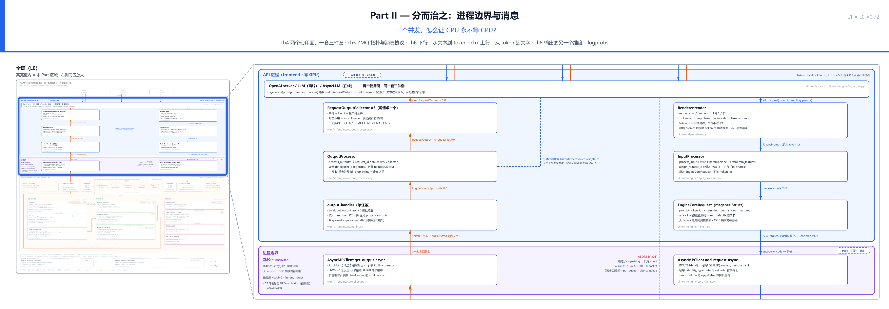
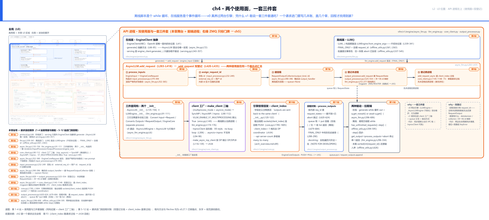
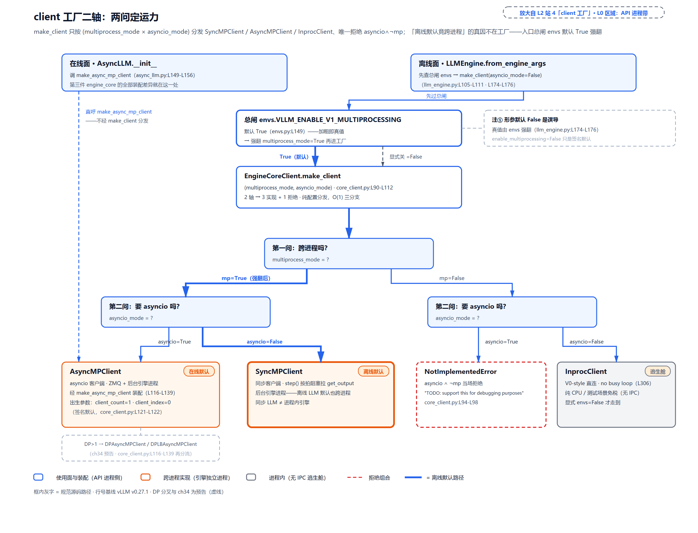
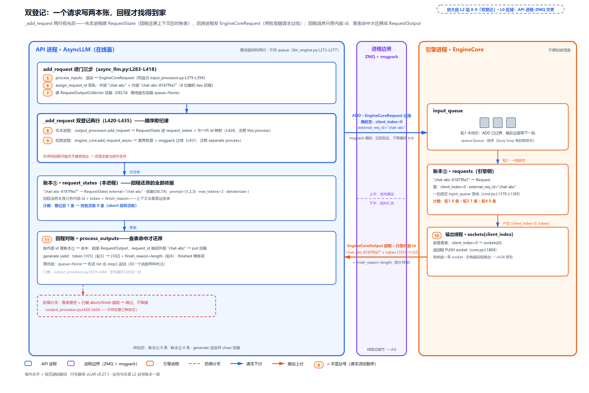

# 第 4 章　两个使用面，一套三件套

同一个 vLLM，你在[第 2 章](../../ch02-request-lifecycle/narrative/chapter.md)跟过一个流式请求走完全程——那是它的在线面孔：`vllm serve` 起一个常驻进程，事件循环里挂着一千个连接。可你多半还用过它的另一副面孔：脚本里 `llm = LLM(model=...)`、`llm.generate(prompts)` 拿一个列表、跑完退出——剥开看，就是一个普普通通的 `while` 循环。一个像服务器，一个像批处理脚本，怎么看都不像一家人。而 v0 时代它们真的不是一家人：同步引擎与异步引擎是两条平行的类谱系，同一套输出处理逻辑写了两遍、改了两遍，还会悄悄漂移出「离线和在线结果不一致」的 bug。凭什么 v1 敢说一套三件套通吃两副面孔？再往下还有更落地的一问：引擎拆成独立进程之后，一个请求进门要写几本账、盖几个章，回程消息才能找到回家的路？

这两副面孔不是 vLLM 的怪癖，是推理引擎的行业标配。vLLM 官方 quickstart 开篇就分两节：Offline Batched Inference（原话「LLM is the main class for running offline inference with vLLM engine」）与 Online Serving（原话「can be deployed as a server that implements the OpenAI API protocol」，可以直接顶替 OpenAI 官方服务、调用代码一行不用改）；SGLang 的文档同构——一半是 `sgl.Engine(...)` 直连跑批，一半是 `launch_server` 起 OpenAI 兼容服务（[vLLM quickstart](https://docs.vllm.ai/en/latest/getting_started/quickstart.html)、[SGLang Offline Engine API](https://docs.sglang.io/basic_usage/offline_engine_api.html)，外部文档）。形态由消费者决定：跑批的要「库」——像 numpy 那样 import 进脚本、同步调用、拿列表，指标是总吞吐；服务的要「进程」——监听端口、扛并发、说 OpenAI 协议，有真人等第一个字，指标是逐 token 延迟。两种消费者对同一台引擎的要求天然错位——这正是 v0 养两台引擎的诱惑，也是本章要正面回答的问题。

## 你在这里

本章是 Part II 的第一站。Part II 要回答的总问题是：**一千个并发，怎么让 GPU 永不等 CPU？**——答案从进程边界开始：



> *图注：Part II「分而治之：进程边界与消息」共五章。L0 全图上本 Part 五章负责的区域——API 进程带与 ZMQ 边界带——在此亮起，区域外退后：ch4 两个使用面，一套三件套、ch5 ZMQ 拓扑与消息协议、ch6 下行（文本到 token）、ch7 上行（token 到文字）、ch8 logprobs。本章打头，先把 API 进程带左上角放大。*

放大之后，本章自己的地图长这样：



> *图注：左上小地图高亮框框住的，就是[第 1 章](../../ch01-vllm-v1-in-one-map/narrative/chapter.md)那张 L0 图的 API 进程带左上——两个使用面进门、`add_request` 双登记、过线前的盖章；本章打开的就是这一块，接在[第 1 章](../../ch01-vllm-v1-in-one-map/narrative/chapter.md)立好的三件套骨架与[第 2 章](../../ch02-request-lifecycle/narrative/chapter.md)的十六站动态走读之上（本章站 5-12 正是那次走读第 4-6 站的深挖，加上 client_index 过线与兑现；站 1-4 则补上使用面门面与三件套装配）。站号 1-12 = 请求流经代码的顺序：1-4 是使用面与三件套的装配，5-12 是一个请求从进门到回程对账；正文按讲解需要编排，不必照站号读。*

读法建议：只想知道「凭什么一套通吃」，读[「同一张图纸」](#同一张图纸两个构造函数的-diff)与[「client 工厂」](#client-工厂谁在回答那两个问题站-4)两节；直奔本章主角，跳到[「一个请求，两本账」](#一个请求两本账站-5-9)；想知道断连时谁负责收尾，看[「两种驱动」](#两种驱动裸循环与事件循环站-12)的后半节。

## 两个进门，只认一张协议

先站到 L0 图最顶端：请求从两个不同的门进来。

在线的门在 serving 层。[第 2 章](../../ch02-request-lifecycle/narrative/chapter.md)走过：chat 请求经渲染变成 token 后，serving 层调 `generate()` 拿到流式生成器。但有一件事当时一笔带过、现在必须拆开——**serving 层自始至终不知道 AsyncLLM 的存在**。它面向的是一个抽象：

```python
# vllm/engine/protocol.py:L66-L85
    def generate(
        self,
        prompt: EngineCoreRequest
        | PromptType
        | EngineInput
        | AsyncGenerator[StreamingInput, None],
        sampling_params: SamplingParams,
        request_id: str,
        *,
        prompt_text: str | None = None,
        lora_request: LoRARequest | None = None,
        tokenization_kwargs: dict[str, Any] | None = None,
        trace_headers: Mapping[str, str] | None = None,
        priority: int = 0,
        data_parallel_rank: int | None = None,
        reasoning_ended: bool | None = None,
        reasoning_parser_kwargs: dict[str, Any] | None = None,
    ) -> AsyncGenerator[RequestOutput, None]:
        """Generate outputs for a request."""
        ...
```

这是 `EngineClient`（使用面与引擎门面之间的协议面，一个抽象基类，`vllm/engine/protocol.py:L41`）上的抽象方法——函数体只有 `...`，Python 的习惯写法：「子类必须实现我」。签名里那串四臂联合类型是 prompt 的四种进门形态：`PromptType` 是用户给的原始 prompt（文本、token 列表、多模态字典）；`EngineInput` 是它渲染后的产物（token id 就位、可直接进引擎）——本书主线走这一臂；`EngineCoreRequest` 是已装配完毕的跨进程请求（线格式，直传已被源码标为 deprecated 旁路）；`AsyncGenerator[StreamingInput, None]` 是流式输入的异步源——调用方不一次交齐 prompt、分块续送的多轮用法，后文 `add_request` 的续跑分支就是为它留的。证据链三步走完：serving 层的构造参数类型就写着 `engine_client: EngineClient`（`vllm/entrypoints/openai/chat_completion/serving.py:L113`）；调用点是 `self.engine_client.generate(...)`（同文件 `L343`）；而这个文件里全文检索 `AsyncLLM`，零命中。谁来实现它？全仓检索 `EngineClient` 的子类，只有 `AsyncLLM` 一个（`vllm/v1/engine/async_llm.py:L72`，`class AsyncLLM(EngineClient)`）。一张窄窄的协议面隔在中间：serving 对着抽象编程，引擎门面怎么换实现都不用动 serving——这就是在线使用面的进门方式。

离线的门完全不同——没有协议面，直连：

```python
# vllm/entrypoints/llm.py:L339-L345
        self.llm_engine = LLMEngine.from_engine_args(
            engine_args=engine_args, usage_context=UsageContext.LLM_CLASS
        )
        self.model_config = self.llm_engine.model_config
        self.engine_class = type(self.llm_engine)

        self.request_counter = Counter()
```

`LLM()` 构造期直接拿到 `LLMEngine`（离线使用面的同步引擎，`vllm/v1/engine/llm_engine.py:L48`）这个具体类，不经任何抽象。为什么离线不需要协议面？库形态下调用方就在本进程里同步调用，不存在「serving 与引擎实现解耦」的诉求；协议面是给「常驻服务可能换门面」买的保险，离线用不上。顺带认出最后一行：`request_counter` 是个自增计数器（vLLM 自带的 `Counter` 小类，`vllm/utils/counter.py:L6`：每次 `next()` 吐一个新号——不是标准库那个数频次用的同名 `collections.Counter`），它是离线面「自己发号」的源头，本章末节会回来对账。

这两个门背后其实站着同一个老朋友——**门面模式**（Facade，GoF 设计模式里的结构型一族，[refactoring.guru 的定义](https://refactoring.guru/design-patterns/facade)原话：provides a simplified interface to a library, a framework）：给一整套复杂子系统包一层简单接口，调用方只认这层门面。`LLM` 与 `AsyncLLM` 就是「三件套 + 驱动」的门面——用户写 `llm.generate(prompts)` 一行，背后是构造三件套、spawn 引擎进程、双登记、裸循环驱动、按序还原一整条流水线。门面的两个价值本章都在兑现：调用方简单（两行代码用上整条流水线）；子系统可自由重构（v0 两台引擎收敛成 v1 一套三件套，用户代码零改动，靠的就是门面方法签名没变）。防一个混：**门面**是 LLM/AsyncLLM 给调用方的简面，**协议面**是 EngineClient 给 serving 的抽象——两个都叫「面」，方向相反，别当成一个东西。还有一处 v0 残留顺手指认：`LLM` 的文档串至今写着「For online serving, use the [AsyncLLMEngine][vllm.AsyncLLMEngine] class instead」（`vllm/entrypoints/llm.py:L173-L174`）——那是两台引擎时代劝你换引擎的话，而 `AsyncLLMEngine` 今天只是[第 1 章](../../ch01-vllm-v1-in-one-map/narrative/chapter.md)看过的 7 行别名垫片。

## 同一张图纸：两个构造函数的 diff

「一套三件套」不是口号，是可以并排 diff 的事实。两个构造函数三件套的装配段上下紧挨着摆——先看在线面 `AsyncLLM.__init__`（[第 1 章](../../ch01-vllm-v1-in-one-map/narrative/chapter.md)嵌过，这里为就地对照再摆一次）：

```python
# vllm/v1/engine/async_llm.py:L135-L156
        self.renderer = renderer = renderer_from_config(self.vllm_config)

        # Convert EngineInput --> EngineCoreRequest.
        self.input_processor = InputProcessor(self.vllm_config, renderer)

        # Converts EngineCoreOutputs --> RequestOutput.
        self.output_processor = OutputProcessor(
            renderer.tokenizer,
            log_stats=self.log_stats,
            stream_interval=self.vllm_config.scheduler_config.stream_interval,
            tracing_enabled=tracing_endpoint is not None,
        )

        # EngineCore (starts the engine in background process).
        self.engine_core = EngineCoreClient.make_async_mp_client(
            vllm_config=vllm_config,
            executor_class=executor_class,
            log_stats=self.log_stats,
            client_addresses=client_addresses,
            client_count=client_count,
            client_index=client_index,
        )
```

离线面 `LLMEngine.__init__` 的对应段：

```python
# vllm/v1/engine/llm_engine.py:L91-L111
        self.renderer = renderer = renderer_from_config(self.vllm_config)

        # Convert EngineInput --> EngineCoreRequest.
        self.input_processor = InputProcessor(self.vllm_config, renderer)

        # Converts EngineCoreOutputs --> RequestOutput.
        self.output_processor = OutputProcessor(
            renderer.tokenizer,
            log_stats=self.log_stats,
            stream_interval=self.vllm_config.scheduler_config.stream_interval,
            tracing_enabled=tracing_endpoint is not None,
        )

        # EngineCore (gets EngineCoreRequests and gives EngineCoreOutputs)
        self.engine_core = EngineCoreClient.make_client(
            multiprocess_mode=multiprocess_mode,
            asyncio_mode=False,
            vllm_config=vllm_config,
            executor_class=executor_class,
            log_stats=self.log_stats,
        )
```

逐行对：前两件——`renderer`+`InputProcessor` 是第一件，`OutputProcessor` 是第二件——两边逐行相同（连 `self.renderer = renderer = ...` 的双绑定写法都一样），两条 Convert 注释一字不差——「把引擎输入变成跨进程请求」「把引擎输出变回给用户的格式」，两个使用面共用同一份图纸。分叉只在第三件 `EngineCoreClient`（本章 L2 站 4「client 工厂」的接线点）这一段：注释从「starts the engine in background process」换成「gets EngineCoreRequests and gives EngineCoreOutputs」，取法也在此分岔——在线面直呼专用入口 `make_async_mp_client`（绕过两问工厂，下一节展开），离线面走工厂 `make_client(asyncio_mode=False)`。运行期的分叉同样只有两处：回程分流那一个 `queue is not None` 分支（本章「回程对账」一节），和「谁拉输出」（本章「两种驱动」一节）——全部差异就压在这三点里。

这条压缩是一整条 why 链换来的。旧设计：v0 两条类谱系——同步 `LLMEngine` 加上把它子类化再包一层的异步引擎（[第 1 章](../../ch01-vllm-v1-in-one-map/narrative/chapter.md)给过骨架与 1032 行适配层的下场）。痛点：离线批处理与在线 serving 是产品的两半，同一套 detokenize、输出组装、请求生命周期逻辑要在两条路径重复维护——行为漂移就是「离线与在线结果不一致」的 bug 面，双倍成本。v1 方案：一套三件套，差异全部压进第三件的取法（在线直呼 `make_async_mp_client`、离线走 `make_client` 工厂）、回程的一个分支、驱动的方式。代价也如实记：一条代码路径两种模式，每次改动都要同时推演两分支；同步面默认也付进程税——这就是下一节要拆的反直觉点。

## client 工厂：谁在回答那两个问题（站 4）

现在走到 L0 图 API 进程带里三件套第三件的接线点：离线面那句 `self.engine_core = make_client(...)`——client 工厂就在这里。

[第 1 章](../../ch01-vllm-v1-in-one-map/narrative/chapter.md)贴过 `make_client` 的全文（`vllm/v1/engine/core_client.py:L90-L112`）：两根轴——「要跨进程吗（multiprocess_mode）」「要 asyncio 吗（asyncio_mode）」——四格三实现加一块红牌（`asyncio` 且不跨进程直接 `NotImplementedError`）。其中有一个问题当时没有展开：**第一根轴的值，是谁、按什么规矩给出的？** 答案在离线面的入口：

```python
# vllm/v1/engine/llm_engine.py:L170-L186
        # Create the engine configs.
        vllm_config = engine_args.create_engine_config(usage_context)
        executor_class = Executor.get_class(vllm_config)

        if envs.VLLM_ENABLE_V1_MULTIPROCESSING:
            logger.debug("Enabling multiprocessing for LLMEngine.")
            enable_multiprocessing = True

        # Create the LLMEngine.
        return cls(
            vllm_config=vllm_config,
            executor_class=executor_class,
            log_stats=not engine_args.disable_log_stats,
            usage_context=usage_context,
            stat_loggers=stat_loggers,
            multiprocess_mode=enable_multiprocessing,
        )
```

先钉死一个最容易踩的坑：`from_engine_args` 的形参默认值 `enable_multiprocessing: bool = False`（`vllm/v1/engine/llm_engine.py:L166`）**是个幌子**——`L174-L176` 这三行会拿 `envs.VLLM_ENABLE_V1_MULTIPROCESSING`（默认 `True`，`vllm/envs.py:L149`）把它强翻成 `True`。所以离线 `LLM` 的默认落点是 `SyncMPClient`——后台进程里的 EngineCore、ZMQ 通道、守护收数线程，一样不少。**同步 `LLM` ≠ 进程内引擎**，这是本章最反直觉的一枚钉子。

为什么默认值要这样定？这条 why 链的四要素齐着讲：

- **旧设计**：v1 初期这个开关默认是**关**的——随源码发布的设计文档 `docs/design/multiprocessing.md`（「Prior State in v1」一节）原话：It was off by default for all the reasons mentioned above - compatibility with dependencies and code using vLLM as a library。只有显式设环境变量才开，离线走进程内引擎。
- **痛点**：进程内与多进程两套路径行为分叉，测试矩阵翻倍；更麻烦的是启动方式两难——`fork` 会撞已初始化的 CUDA 上下文直接崩，`spawn` 要求一切可 pickle（pickle＝Python 的对象序列化，spawn 靠它把启动材料搬进新进程）、用户脚本没写 `if __name__ == "__main__":` 这道保护就会反复重新 import 自己、无限递归。这两种方式各自的坑，上面那份设计文档里贴着两段真实报错日志。
- **v1 方案**：PR #11074（2024 年 12 月）把默认翻开，同时给「新进程怎么起」定了一套按环境的尽力选择（设计文档自称 best effort：没有一种 multiprocessing 方案处处能跑，只能按环境挑最稳的）：默认 `fork`，主进程是 vLLM 自己的 CLI 起的就用 `spawn`，检测到 CUDA 已经初始化就强制 `spawn` 并警告——`fork` 必炸，只能这么兜。落到 v0.27.1，开关本身默认 True，就是上面那三行强翻。
- **代价（如实记）**：离线推理也要交每请求至少两次跨进程消息加两侧序列化的 IPC 税；`spawn` 语义要求一切可 pickle；想免税只有显式关闸走逃生舱。

逃生舱长什么样？`make_client` 两轴全关时落到 `InprocClient`——它的 docstring 自己招供身份：

```python
# vllm/v1/engine/core_client.py:L306-L314
class InprocClient(EngineCoreClient):
    """
    InprocClient: client for in-process EngineCore. Intended
    for use in LLMEngine for V0-style add_request() and step()
        EngineCore setup in this process (no busy loop).

        * pushes EngineCoreRequest directly into the EngineCore
        * pulls EngineCoreOutputs by stepping the EngineCore
    """
```

V0-style、进程内、no busy loop——busy loop 指「引擎自己常驻一只无限循环、边收边算」的形态；这里没有那只循环，引擎与调用方同进程同生死，由调用方同步逐拍 step。它保留给测试与纯 CPU 玩具模型场景（免 IPC、免 spawn），代价是与多进程路径行为有分叉的可能，所以只是逃生舱、不是默认。

在线面不进这个工厂，走自己的专用入口：

```python
# vllm/v1/engine/core_client.py:L116-L139
    def make_async_mp_client(
        vllm_config: VllmConfig,
        executor_class: type[Executor],
        log_stats: bool,
        client_addresses: dict[str, Any] | None = None,
        client_count: int = 1,
        client_index: int = 0,
    ) -> "AsyncMPClient":
        parallel_config = vllm_config.parallel_config
        client_args = (
            vllm_config,
            executor_class,
            log_stats,
            client_addresses,
            client_count,
            client_index,
        )
        if parallel_config.data_parallel_size > 1:
            if parallel_config.data_parallel_external_lb:
                # External load balancer - client per DP rank.
                return DPAsyncMPClient(*client_args)
            # Internal load balancer - client balances to all DP ranks.
            return DPLBAsyncMPClient(*client_args)
        return AsyncMPClient(*client_args)
```

两个新面孔先记住名字：签名里的 `client_count` / `client_index`（默认 1 / 0）随构造传入——「这个前端是第几个、一共几个」。顺手把三个叫法钉死：**前端 = API 进程 = 代码里的一个 client**（本章 L0 图那条「API 进程带」，在线部署时一个服务进程就是一个前端，`client_count` 数的就是它）；发请求来的下游程序（浏览器、调用脚本）叫**调用方**——下文「调用方断连」说的是后者，别与前端混。这是 AsyncMPClient 的出生参数，本章末段会看到它盖进每个请求；`data_parallel_size > 1` 的两个分支（外部/内部负载均衡）是多引擎部署的地图，留给 Part VIII。两个 `__init__` 的全部装配差异，就此收进一张图：



> *图注：放大自本章 L2 站 4——L0 图 API 进程带里三件套第三件的接线点。读法自上而下：在线面直呼 `make_async_mp_client`（虚线旁路，绕过工厂）；离线面 `from_engine_args` 先过总闸 `VLLM_ENABLE_V1_MULTIPROCESSING`（默认 True，envs.py:L149，加粗）强翻 `multiprocess_mode`，再进 `make_client` 两问——四组合落三实现一块拒绝牌：`AsyncMPClient`（在线默认）、`SyncMPClient`（离线默认，粗线路径）、`NotImplementedError`（asyncio 且不跨进程）、`InprocClient`（灰阶逃生舱，显式关闸才走到）。注①是那枚钉子：形参默认 False 是幌子，真值由 envs 强翻（llm_engine.py:L174-L176）。*

这一节的四组合不必凭记忆信——本章的精简版把每种组合各跑了一遍：两轴全开落 `AsyncMPClient`、只开跨进程落 `SyncMPClient`、全关落 `InprocClient`、只要 asyncio 不要跨进程当场 `NotImplementedError`；再把总闸关掉，`from_engine_args` 落 `InprocClient`。图纸说的和跑出来的，一行不差。

## 一个请求，两本账（站 5-9）

现在把镜头对准本章主角。L0 图上，请求已经走进 API 进程带、正要从「使用面」下到三件套——一个请求从这里开始，要写两本账。

[第 2 章](../../ch02-request-lifecycle/narrative/chapter.md)的十六站走读已经把这五站顺过一遍（渲染产物走 `process_inputs` 同步快路径、盖双轨 id、建单槽信箱、懒启动 output_handler，见该章站 4-6）；本节换一个问法重走：**每一步到底记下了什么、为什么非记不可**。先补第 6 站没拆完的账本——双轨 id：

```python
# vllm/v1/engine/input_processor.py:L232-L249
    def assign_request_id(request: EngineCoreRequest):
        """Replace the externally supplied request ID with an internal request ID
        that adds 8 random characters in order to ensure uniqueness.
        """
        if request.external_req_id is not None:
            raise ValueError(
                "The external_req_id field should not be set on EngineCoreRequests"
                " passed to vLLM; use the request_id field."
            )
        request.external_req_id = request.request_id
        if envs.VLLM_DISABLE_REQUEST_ID_RANDOMIZATION:
            logger.warning_once(
                "VLLM_DISABLE_REQUEST_ID_RANDOMIZATION is set and will be "
                "removed in a future release. Duplicate externally-provided "
                "request IDs may cause failures and/or subtle correctness errors."
            )
        else:
            request.request_id = f"{request.external_req_id}-{random_uuid():.8}"
```

「网名与本名」这个比喻[第 2 章](../../ch02-request-lifecycle/narrative/chapter.md)立过：对外叫 `chatcmpl-x`，进系统领工牌 `chatcmpl-x-3f9a2c1b`。这里看账本侧——外部 id 原样存进 `external_req_id`，内部 id 换成「外部 id + 8 位随机后缀」（8 位 hex 的后缀空间有 16⁸ = 2³² ≈ 42.9 亿种，同一个外部 id 重试 8 次也零碰撞——本章精简版的测试实测），而 `OutputProcessor` 手里握着一张外→内的名册：`external_req_ids: defaultdict[str, list[str]]`（`vllm/v1/engine/output_processor.py:L445`），登记在双登记的第一行（下文源码的末两行）。为什么是一对多？该章站 6 交代过的那对形参 `parent_req` / `index` 在这里显形——并行采样 n>1 时一个外部 id 名下裂 n 条内部子请求，名册就得是一外多内。这张名册在退号时派上用场，abort 的双轨就写在它身上：

```python
# vllm/v1/engine/output_processor.py:L477-L492
        internal_req_ids = []
        for request_id in request_ids:
            if internal:
                # Internal ID - this may be a parent request
                internal_req_ids.append(request_id)

                # Remove internal ID from the external->internal mapping
                if req_state := self.request_states.get(request_id):
                    external_req_id = req_state.external_req_id
                    internal_ids = self.external_req_ids[external_req_id]
                    internal_ids.remove(request_id)
                    if not internal_ids:
                        del self.external_req_ids[external_req_id]
            elif internal_ids := self.external_req_ids.pop(request_id, []):
                # External ID - abort all requests in the external->internal mapping
                internal_req_ids.extend(internal_ids)
```

拿内部 id 来退号，只退它一个、顺手从名册划掉；拿外部 id 来退号，一律展开成名下**全部**内部 id 一次点名——所以 `generate` 断连时那句 `abort(q.request_id, internal=True)`（q 里存的是内部 id）与用户侧按外部 id abort，走的同一张名册、都对得上号。逃生舱 `VLLM_DISABLE_REQUEST_ID_RANDOMIZATION` 还在，但警告原话写着「may cause failures and/or subtle correctness errors」——能不用就不用。

接着是本章最关键的 16 行——`AsyncLLM._add_request`，双登记的扇出点：

```python
# vllm/v1/engine/async_llm.py:L420-L435
    async def _add_request(
        self,
        request: EngineCoreRequest,
        prompt: str | None,
        parent_req: ParentRequest | None,
        index: int,
        queue: RequestOutputCollector,
    ):
        # Add the request to OutputProcessor (this process).
        self.output_processor.add_request(request, prompt, parent_req, index, queue)

        # Add the EngineCoreRequest to EngineCore (separate process).
        await self.engine_core.add_request_async(request)

        if self.log_requests:
            logger.info("Added request %s.", request.request_id)
```

源码注释自己点名两侧：`this process` / `separate process`——同一个请求，一次写两处。离线面在同一个位置汇合，同一个形状（片段开头的 `n` 就是前文那个并行采样数，源码里的 `params.n`；`n>1` 的分支被裁去——它对每个子请求重复同样的两行登记、各发一条 ADD，正是上面名册「一外多内」的来源）：

```python
# vllm/v1/engine/llm_engine.py:L272-L277
        if n == 1:
            # Make a new RequestState and queue.
            self.output_processor.add_request(request, prompt_text, None, 0)
            # Add the request to EngineCore.
            self.engine_core.add_request(request)
            return req_id
```

同样的两行，只是不传信箱（`queue=None`；片段里「Make a new RequestState and queue」那句注释沿用在线面的写法，这里实际不建信箱）——双登记不是在线面的私设，两个使用面在同一个扇出点写同样两本账。账本①的表项长这样：

```python
# vllm/v1/engine/output_processor.py:L525-L554
    def add_request(
        self,
        request: EngineCoreRequest,
        prompt: str | None,
        parent_req: ParentRequest | None = None,
        request_index: int = 0,
        queue: RequestOutputCollector | None = None,
    ) -> None:
        request_id = request.request_id
        req_state = self.request_states.get(request_id)
        if req_state is not None:
            self._update_streaming_request_state(req_state, request, prompt)
            return

        req_state = RequestState.from_new_request(
            tokenizer=self.tokenizer,
            request=request,
            prompt=prompt,
            parent_req=parent_req,
            request_index=request_index,
            queue=queue,
            log_stats=self.log_stats,
            stream_interval=self.stream_interval,
        )
        self.request_states[request_id] = req_state
        if parent_req:
            self.parent_requests[parent_req.request_id] = parent_req

        # Track the external_req_id -> [internal_req_id, ...] mapping
        self.external_req_ids[req_state.external_req_id].append(request_id)
```

`RequestState`（`vllm/v1/engine/output_processor.py:L129`）装着回程还原所需的本进程上下文：detokenizer（增量解码器）、logprobs 处理器、信箱、输出方式、外部 id——末两行把外→内名册也登记了。开头的 `if req_state is not None` 分支是流式输入的续跑：流式输入（就是开篇 `generate` 签名里 `AsyncGenerator[StreamingInput, None]` 那一臂）＝调用方不一次交齐 prompt、而是把后续输入分块继续送进同一请求的多轮用法，后续块带着同一内部 id 再进 `add_request`，故只更新表项、不重建；本书主线是一次性 prompt，这个旁支不展开，主线请求碰不到该分支。

为什么要写两本账？why 链四要素：

- **旧设计**：v0 把请求交给单一 `RequestTracker` 缓冲——`add_request` 先入队，等后台引擎循环的下一拍才真正进引擎（[第 1 章](../../ch01-vllm-v1-in-one-map/narrative/chapter.md)引过它的 docstring 原话：to be sent to the engine on the next background loop iteration）。而且 v0 的输出分发表与引擎状态在同一个进程同一个对象里，根本不存在「对账」问题。
- **痛点**：其一，新请求要等下一拍才被引擎看到，入队延迟随负载抖动；其二，v1 拆进程后，回程消息过线时只带**结果性**字段——顺带把一对差一个字母 s 的名字钉死：单个载荷叫 `EngineCoreOutput`（每请求一条：request_id、新 token、finish_reason），一拍整批装进信封 `EngineCoreOutputs`（上面 Convert 注释里那个复数名字）过线——引擎进程不持有 prompt 文本、detokenizer 状态、输出方式这些前端上下文，没有本进程侧表，你永远没法把「3 个新 token」还原成「这是哪个对话、断在哪个词中间、该怎么交给谁」。
- **v1 方案**：就是上面那两行——先本进程建表，后跨进程发请求，发送立刻经 ZMQ 出去、不等任何循环 tick。
- **代价（如实记）**：同一请求的状态在两个进程各有一份，生命周期要两边同步清理，对账错位就是内存泄漏或 KeyError；两行**先本进程、后跨进程**的顺序也是纪律——反过来的话，回程消息可能比建表先到，查表落空被当「已 abort」丢弃，活请求的输出就凭空蒸发了。

把一个请求放进时间线，两本账逐拍对出来是这样（数值取自本章精简版的实测——它把 ZMQ/msgpack 物理层换成同进程队列与引擎替身，「过线」的消息次序、两侧账本内容、回程路由与真实系统一致，但两个「进程」实为同一个 OS 进程；真实系统另有编码与收数线程、外加一条只报警不碰数据的引擎看护线程，本章「两种驱动」一节就近挑明。这个只做减法的复刻不是主角，只是让控制流能跑出数值的一面镜子）：

<!-- trace: m3 -->
| 轮次 | 动作 | 账本①（本进程 request_states） | 账本②（引擎侧 requests） | 过线 / 回程 |
|---|---|---|---|---|
| 轮 1 · 双登记 | add_request("chat-abc") 走到 _add_request 两行（async_llm.py:L420-L435） | 1 条：内部 id「chat-abc-8187f9a7」→ RequestState{external="chat-abc"、信箱（DELTA 增量模式）、max_tokens=2、prompt=[1,2,3]、detokenizer} | 0 条（尚未入引擎） | 1 条 (ADD, EngineCoreRequest{client_index=0、external_req_id="chat-abc"}) 已过界、躺在引擎 input_queue——「已过界未入引擎」中间态可见 |
| 轮 2 · 引擎一拍 | 引擎替身的一拍 emit_step_outputs([])：先排空 input_queue 再 step（真实系统 run_busy_loop 同序，core.py:L1377-L1389） | 仍 1 条 | 1 条：同一请求 EngineCoreRequest{request_id=内部 id、client_index=0、external_req_id="chat-abc"、prompt=[1,2,3]} | —（本拍无产出） |
| 轮 3 · 中间拍 | 引擎产出 (client_index=0, token [101]) → sockets[0]（引擎侧按前端编号建好的回程插座，下节「盖章过线」展开）→ output_handler → process_outputs 按内部 id 查表 | 仍 1 条（未 finish 不清账） | 仍 1 条 | 信箱收增量；generate yield：request_id="chat-abc"（外 id 还原）、token [101]、finished=False |
| 轮 4 · 终拍清账 | 引擎产出 token [102] + finish_reason=length | 0 条（_finish_request 弹表项+删外→内映射） | 0 条（引擎侧按 finished 清账） | 信箱收终帧 finished=True；generate 退出并 close 信箱 |

表里最值钱的是轮 1 到轮 2 之间的中间态：消息已过界、引擎还没开工——两本账此刻一条有、一条没有，这是「两次登记确实写在两处」的直接物证。这张表还立着一个不变量，值得说破论证：**每个成功登记的请求在两侧账本各恰有一个表项；任何一条回程消息查表要么命中、要么该请求已被 abort 或 finish 主动移除，不存在第三种状态。** 时序上：先本进程后跨进程的两行顺序，保证引擎见到请求以 ADD 过线为前提、ADD 又严格晚于建表完成——所以查表落空当且仅当表项已被主动移除，「查不到=已 abort 跳过」是唯一需要的防御分支；数量上：两侧账本大小恒等于在途请求数，每个请求的生成余量有限（`max_tokens` 封顶），必经 finish 或 abort 离开、使计数严格减一——跑完收敛回零，不泄漏。

扇出与汇合画在一张图上：



> *图注：放大自本章 L2 站 8-9——L0 图 API 进程与 ZMQ 边界的交界。上半扇出：先本进程建 `RequestState`（还原上下文的对账表）、后跨进程发 `EngineCoreRequest`（两枚章随请求过线）；下半汇合：回程消息只带内部 id，查表命中才组装 `RequestOutput`（出门换回外部 id），查不到=已 abort 的防御分支（虚线旁路）直接跳过。先站 8 后站 9 不是随手写法：反序则回程可能先于建表到达，活请求被当废件丢弃。数字（id 后缀、章值、账本 1→0 的计数、token 101/102）全部来自上表同一次实测。*

## 盖章过线：client_index 的约定（站 9-10）

请求马上要过线了——L0 图中间那条紫带就在脚下。过线前，它被盖了两枚章：本章引入的最后一个新概念 `client_index`（客户端编号：前端进程的序号，「这个请求是第几个前端发的」），连同双轨 id 的外半边，都写在线格式的字段表里：

```python
# vllm/v1/engine/__init__.py:L119-L137

    # Index of the client, used to ensure outputs are sent back to the same
    # client for this request when scaling out the front-end.
    client_index: int = 0

    # Used in DP case to indicate which wave of requests this is expected to
    # belong to, to cover a race condition where the request is sent before
    # a wave finished notification is received.
    current_wave: int = 0
    priority: int = 0

    trace_headers: Mapping[str, str] | None = None
    resumable: bool = False

    # The user-provided request ID. This field is set internally,
    # copied from the provided request_id that's originally assigned
    # to the request_id field, see InputProcessor.assign_request_id().
    # Used in outputs and to support abort(req_id, internal=False).
    external_req_id: str | None = None
```

注释原话值得逐字读：`client_index`「used to ensure outputs are sent back to the same client ... when scaling out the front-end」——**回程路由键写进请求本身**。盖章的动作在发送前一行：

```python
# vllm/v1/engine/core_client.py:L1145-L1148
    async def add_request_async(self, request: EngineCoreRequest) -> None:
        request.client_index = self.client_index
        await self._send_input(EngineCoreRequestType.ADD, request)
        self._ensure_output_queue_task()
```

三行三件事：盖章（值来自构造时确定的出生参数，`make_async_mp_client` 签名里那个默认 0）、发 ADD 消息、确保输出泵任务在跑。为什么把路由键印在请求上，而不是让引擎维护一张「连接↔在飞请求」映射表？对应物很日常：快递面单上的网点编号——包裹全网流转只认面单，分发中心看一眼编号就把回件放进对应网点的筐，不需要一块要专人维护、要上锁、要跟每个包裹一生对账的大黑板。替代方案那张映射表正是如此：多前端多引擎下是要加锁的共享状态，增删必须与每个请求的生命周期精确同步，错一处就错路由。把编号印进每张面单，单前端时恒为 0（一个 int 字段的开销约等于零），多前端时引擎一次下标查表。

两个前端共用一个引擎时，账是这样走的（同样取自精简版实测；两前端的接线在真实系统是各自的 ZMQ 地址连到同一引擎——官方架构文档明说每个 API server 连**所有**引擎、many-to-many 拓扑，路由语义与下表逐字一致）：

<!-- trace: m4 -->
| 轮次 | 动作 | 盖章（谁发的） | 引擎侧路由 | 各前端收到 |
|---|---|---|---|---|
| 轮 1 · 前端 0 发请求 | add_request("chat-A")（client_count=2、client_index=0 出生） | EngineCoreRequest.client_index=0 | — | — |
| 轮 2 · 前端 1 发请求 | add_request("chat-B")（client_index=1 出生） | client_index=1 | — | — |
| 轮 3 · 同拍产出 | 引擎一拍产出 (0, A批) 与 (1, B批) 两组 | — | sockets[0]←A批、sockets[1]←B批（下标查表，core.py:L1804） | 前端 0 信箱收 chat-A 的 token [201]；前端 1 收 chat-B 的 token [202] |
| 轮 4 · 终拍 | 各带 finish_reason=length | — | 同上，各回各家 | 前端 0 收 [203] 终帧、前端 1 收 [204] 终帧；三本账（两个前端 request_states + 引擎 requests）全清零 |
| 单前端对照 | 默认 make_async_mp_client()（不带出生参数） | client_index=0（默认）——看似冗余的 0 | sockets[0] | 恒回唯一前端；多前端时它就是回程路由键（Part VIII 分布式章回收） |

引擎侧的兑现端在第 10 站——输出 IO 线程按章投递：

```python
# vllm/v1/engine/core.py:L1784-L1805
                assert not isinstance(output, bytes)
                client_index, outputs = output
                outputs.engine_index = engine_index

                if client_index == -1:
                    # Don't reuse buffer for coordinator message
                    # which will be very small.
                    assert coord_socket is not None
                    coord_socket.send_multipart(encoder.encode(outputs))
                    continue

                # Reclaim buffers that zmq is finished with.
                while pending and pending[-1][0].done:
                    reclaimed = pending.pop()[1]
                    if len(reuse_buffers) < max_reuse_bufs:
                        reuse_buffers.append(reclaimed)

                buffer = reuse_buffers.pop() if reuse_buffers else bytearray()
                buffers = encoder.encode_into(outputs, buffer)
                tracker = self._send_msg_tracking_payload(
                    sockets[client_index], buffers
                )
```

从输出队列取出 `(client_index, outputs)` 二元组：`-1` 是哨兵值，走多引擎统计通道（Part VIII 的地图）；正常值就是下标——`sockets[client_index]` 选中对应前端的 PUSH socket 回发（中间那段 `reuse_buffers`/`pending` 是零拷贝发送的缓冲回收池：消息零拷贝发出后，字节要等 ZMQ 确认「发完了」才许动，这几行就是把确认完的 buffer 捞回来循环用——本章末尾预告的那句「零拷贝靠什么保活」，现场就在这里，下一章拆开）。`sockets` 列表在启动时按「每前端一条」建好（`vllm/v1/engine/core.py:L1760-L1766`）、运行期只读；上一步调度器组装输出时也已经按请求的 `client_index` 分好了桶（`outputs[request.client_index].append(...)`，`vllm/v1/core/sched/scheduler.py:L1924`）。于是整条路由是一个纯查表：回程目的地在盖章那一瞬间完全确定、此后不变——全程没有共享可变路由表，也就没有路由竞态。

代价也记两笔：`client_index` 进了跨进程契约的线格式（schema 要演进就得两端同步），「谁发的」这一粒状态随每个请求过线；多前端时引擎侧每前端一条输出 socket，输出扇出按前端数翻倍。

最后看末行那个「单前端对照」：只有一个前端时，这个章恒为 0，看着像多余的印刷。可它就是为那一刻准备的——GPU 扩了、前端事件循环先饱和时，多开 API server 对着同一引擎水平扩展（`--api-server-count` 可配，默认随数据并行规模走，`docs/design/arch_overview.md:L89`）。到那时，引擎要记住「谁发的」才能路由回去，靠的不是大黑板，正是这枚今天看起来冗余的章。这个 0 的故事，到 Part VIII 讲分布式部署时回来兑现。

## 回程对账：一个分支吃下两种面（站 11）

现在坐回 API 进程带上行的左泳道：回程消息过线回来了。

[第 2 章](../../ch02-request-lifecycle/narrative/chapter.md)的站 16 走过 `process_outputs` 的全文（对账、增量 detokenize、裁剪、投递四步）；本节不再逐行重走，只看两件本章视角下才显形的事。第一件，它的 docstring 里钉着一条纪律：

```python
# vllm/v1/engine/output_processor.py:L607-L615
        NOTE FOR DEVELOPERS

        vLLM V1 minimizes the number of python loops over the full
        batch to ensure system overheads are minimized. This is the
        only function that should loop over EngineCoreOutputs.

        If you need to touch every element of the batch, do it from
        within the loop below.
        """
```

全批遍历只许这一处——每请求每拍一条输出，任何多余的整批循环都是白付的系统开销，所以源码把「谁许碰整批」写成了一条给开发者的规矩。

第二件，两本账怎么合上。对账的键是内部 id，查表命中才有下文，查不到（已 abort）直接跳过——这个防御分支上一节论证过了。命中的请求走完 detokenize 与裁剪，来到一个只有六行的岔路口：

```python
# vllm/v1/engine/output_processor.py:L679-L684
                if req_state.queue is not None:
                    # AsyncLLM: put into queue for handling by generate().
                    req_state.queue.put(request_output)
                else:
                    # LLMEngine: return list of RequestOutputs.
                    request_outputs.append(request_output)
```

两条注释直接点名两种面：信箱在，就投进该请求的单槽信箱等 `generate` 来拉（在线）；信箱不在（`queue=None`），就收进 list 由 `step()` 返回（离线）。**一个函数、一个分支、吃下两种使用面**——「一套三件套」在运行期的最硬证据。表项自身的清账也在本进程这一侧合拢：

```python
# vllm/v1/engine/output_processor.py:L713-L720
    def _finish_request(self, req_state: RequestState) -> None:
        req_id = req_state.request_id
        self.request_states.pop(req_id)

        internal_ids = self.external_req_ids[req_state.external_req_id]
        internal_ids.remove(req_id)
        if not internal_ids:
            del self.external_req_ids[req_state.external_req_id]
```

终拍一到：账本①弹掉表项、名册划掉这条内部 id（名下空了连键一起删）——与引擎侧按 `finished` 清账各清各的，两本账同时归零，上表轮 4 的两列 0 就是它。

顺带把[第 2 章](../../ch02-request-lifecycle/narrative/chapter.md)站 2 立过的 `output_kind` 契约在此接上：使用面在入口声明消费方式（在线流式 DELTA、在线非流式与离线 FINAL_ONLY），照单裁剪的是**前端**——`FINAL_ONLY` 且未结束时，`make_request_output` 直接 `return None`（`vllm/v1/engine/output_processor.py:L286-L290`），中间的 `RequestOutput` 根本不构造、不排队；引擎照常每拍把 `EngineCoreOutput` 送过线，省的是 API 进程侧的构造与投递——[第 2 章](../../ch02-request-lifecycle/narrative/chapter.md)站 2 拆过这层。这是「离线便宜」的可量化一半；另一半（自增 id 与按序还原）在下一节。DELTA 的增量切片、CUMULATIVE 的全量快照、stream_interval 的节流，都留给 Part II 的上行章。

## 两种驱动：裸循环与事件循环（站 12）

最后一块拼图：输出到了信箱或 list 里，**谁来拉**。这是两种使用面剩下的全部差异，就立在本章开篇 L2 站图的站 12「两种驱动 · 拉取端」那格：在线 `generate` 在事件循环里拉信箱，离线调用方线程亲踩 `step()` 一拍一拍拉整批；L0 图上则各归各位——在线侧常驻的拉取任务画成 API 进程带底部那只「output_handler（单任务）」框，离线的裸循环藏在带顶使用面的「LLM（离线）」里、不单独成框——它不是引擎的常驻部件，就是调用方脚本自己的 `while` 循环，架构图自然不画。

离线面是裸循环。[第 2 章](../../ch02-request-lifecycle/narrative/chapter.md)嵌过它的两行（`while has_unfinished_requests(): step()`，`vllm/entrypoints/offline_utils.py:L590-L595`）；现在把 `step()` 这个单拍单元拆开：

```python
# vllm/v1/engine/llm_engine.py:L296-L334
    def step(self) -> list[RequestOutput | PoolingRequestOutput]:
        if self.should_execute_dummy_batch:
            self.should_execute_dummy_batch = False
            self.engine_core.execute_dummy_batch()
            return []

        # 1) Get EngineCoreOutput from the EngineCore.
        with record_function_or_nullcontext("llm_engine step: get_output"):
            outputs = self.engine_core.get_output()

        # 2) Process EngineCoreOutputs.
        with record_function_or_nullcontext("llm_engine step: process_outputs"):
            iteration_stats = IterationStats() if self.log_stats else None
            processed_outputs = self.output_processor.process_outputs(
                outputs.outputs,
                engine_core_timestamp=outputs.timestamp,
                iteration_stats=iteration_stats,
            )
            self.output_processor.update_scheduler_stats(outputs.scheduler_stats)

        # 3) Abort any reqs that finished due to stop strings.
        with record_function_or_nullcontext("llm_engine step: abort_requests"):
            self.engine_core.abort_requests(processed_outputs.reqs_to_abort)

        # 4) Record stats
        with record_function_or_nullcontext("llm_engine step: record_stats"):
            # … 省略：logger_manager 的统计记录块（观测旁路） …
        return processed_outputs.request_outputs
```

（开头的 dummy-batch 分支是多引擎部署专用，单引擎下恒不触发；`record_function_or_nullcontext` 只是 profiler 标签。）四步读下来：取输出 → 送进**与在线面同一个** `process_outputs` → 把 stop-string 命中的请求反向 abort → 返回 list。没有事件循环、没有后台任务，调用方线程亲自一拍一拍踩。那「取输出」到底阻塞在哪？在 `SyncMPClient` 的这一行：

```python
# vllm/v1/engine/core_client.py:L872-L882
    def get_output(self) -> EngineCoreOutputs:
        # If an exception arises in process_outputs_socket task,
        # it is forwarded to the outputs_queue so we can raise it
        # from this (run_output_handler) task to shut down the server.
        outputs = self.outputs_queue.get()

        if isinstance(outputs, Exception):
            raise self._format_exception(outputs) from None
        if outputs.wave_complete is not None:
            self.engines_running = False
        return outputs
```

`outputs_queue.get()`——标准库 `queue.Queue` 的阻塞取（队列空就挂起线程，直到有新元素）；末尾 `wave_complete` 两行是多引擎部署的波次收尾——上一节线格式里那个 `current_wave` 字段的搭档，一条消息宣布「这一波干完了、引擎已暂停」，前端就把 `engines_running` 翻成 `False` 记下（Part VIII 的地图）。喂这条队列的是 `SyncMPClient` 的一条守护收数线程 `EngineCoreOutputQueueThread`（`vllm/v1/engine/core_client.py:L861-L867`）：它在后台守着 ZMQ socket 收引擎回程消息、解码、投队列；主线程则阻塞在 `get()` 上，引擎出一批、醒一次。所以真实系统里离线的线程画面是：主线程 + 一条守护收数线程 + 一条引擎看护线程，加一个独立引擎进程——「同步 LLM」同步的只是调用方，物理上照样是两个进程在跳舞。那条看护线程 `MPClientEngineMonitor`（`vllm/v1/engine/core_client.py:L708-L735`）两种使用面都有——`SyncMPClient` 与 `AsyncMPClient` 同继承 `MPClient`，构造时各起一条，只盯引擎进程死活报警、不碰数据流。

离线面还有四条自己的规矩，各有落点。头两条在入口：

```python
# vllm/entrypoints/offline_utils.py:L552-L565
    def _add_request(
        self,
        prompt: EngineInput,
        params: SamplingParams | PoolingParams,
        lora_request: LoRARequest | None = None,
        priority: int = 0,
    ) -> str:
        if isinstance(params, SamplingParams):
            # We only care about the final output
            params.output_kind = RequestOutputKind.FINAL_ONLY

        request_id = str(next(self.request_counter))

        return self.llm_engine.add_request(
            # … 省略：五个实参（request_id、prompt、params 等） …
```

其一，强制 `FINAL_ONLY`（注释原话「We only care about the final output」）——中间输出不构造；其二，`request_id` 是自增计数器发的数字串（本章开篇认过的那个 `Counter` 在这里干活）。第三条是事务性：批量 add 包在 try/except 里，任何一个 add 失败，已加进去的请求全部反向 abort（`vllm/entrypoints/offline_utils.py:L533-L548`）——精简版实测过界消息序恰为 [ADD, ABORT]、两侧账本清零，一批要么全下、要么撤回已下部分。第四条在出口，自增 id 的配套功夫：

```python
# vllm/entrypoints/offline_utils.py:L623-L626
        # Sort the outputs by request ID.
        # This is necessary because some requests may be finished earlier than
        # its previous requests.
        return sorted(outputs, key=lambda x: int(x.request_id))
```

请求是乱序完成的（短请求先完），交付前按 `int(request_id)` 排序还原输入序——自增的数字串保证了这个 `int()` 永远解析得动，`generate` 返回的列表与 prompts 一一对应。

在线面是事件循环。消费端 `generate` 的拉取循环[第 2 章](../../ch02-request-lifecycle/narrative/chapter.md)站 16 嵌过（`out = q.get_nowait() or await q.get()`——先非阻塞取、空了才 await）；生产端是那只唯一的 `output_handler` 后台任务，拉整批、按默认 128 条一片分片（chunk_size 取自环境变量 `VLLM_V1_OUTPUT_PROC_CHUNK_SIZE`，`vllm/envs.py:L160`）、片间 `await asyncio.sleep(0)` 让出事件循环（`vllm/v1/engine/async_llm.py:L674、L703`；分片为什么必要，那次走读给过数据）。`sleep(0)` 这个写法值得一句：[asyncio 官方文档](https://docs.python.org/3/library/asyncio.html#asyncio.sleep)明说它是「让其他任务跑一次」的优化路径——不是真睡，是主动让道。真实系统里在线面的任务清单是：每请求一个 `generate` 消费协程 + 全进程一个 `output_handler` 常驻任务 + 每前端一个收数任务 `EngineCoreOutputQueueTask`（`vllm/v1/engine/core_client.py:L1089-L1091`）——输出这条链上零条额外线程，全靠 `await` 让出、而不是线程切换（进程里唯一常驻的例外就是上面那条看护线程 `MPClientEngineMonitor`，它不在数据流上）。

在线面还剩一个本章该答的问题：**调用方断连时，谁去喊停引擎**？答案就写在 `generate` 的收尾：

```python
# vllm/v1/engine/async_llm.py:L608-L616
        # If the request is disconnected by the client, generate()
        # is cancelled or the generator is garbage collected. So,
        # we abort the request if we end up here.
        except (asyncio.CancelledError, GeneratorExit):
            if q is not None:
                await self.abort(q.request_id, internal=True)
            if self.log_requests:
                logger.info("Request %s aborted.", request_id)
            raise
```

[第 2 章](../../ch02-request-lifecycle/narrative/chapter.md)讲过三层接力的「谁触发」；这里补上「为什么 `except` 挂在协程内部就能接得住」的语言层机制——asyncio 的取消不是从外面杀掉一个协程，而是**把一个异常扔进它当时停住的那一行**：`Task.cancel()` 的官方语义是让 `CancelledError` 在被取消协程下一个 await 点炸入；关闭一个异步生成器（`aclose()`，或被事件循环善后）则是把 `GeneratorExit` 扔进它挂起的那个 `yield` 处。最小例子（说明性，纯标准库可直接跑）：

```python
# 说明性示例：取消 = 异常落进停住的那个 await
import asyncio

async def fetch():
    try:
        await asyncio.sleep(10)               # 协程停在这里
    except asyncio.CancelledError:
        print("cancelled AT my await point")  # 异常从停住的那行炸进来
        raise                                 # 善后完必须 re-raise

async def main():
    t = asyncio.create_task(fetch())
    await asyncio.sleep(0.1)
    t.cancel()                                # 不是杀掉，是安排把异常扔进任务
    try:
        await t
    except asyncio.CancelledError:
        pass

asyncio.run(main())                           # 打印: cancelled AT my await point
```

对照源码：例子里 `sleep(10)` 的位置对应 `await q.get()`——HTTP 客户端断连，上游取消消费任务，`CancelledError` 就在等信箱的那一行炸进来；另一条来路是 `yield out` 处炸入的 `GeneratorExit`（生成器被关闭或回收）。两条来路落进同一个 `except`，翻译成同一个动作：`abort(q.request_id, internal=True)`——拿内部 id 退号，名册展开、引擎停算（abort 的完整两跳在 Part II 上行章）。最后一行的 `raise` 不是多余：善后完把异常原样放行——吞掉 `CancelledError`，任务会被当成「正常跑完」，取消语义就废了。

两种驱动放在同一时刻对照，画面是这样的（仍取自本章精简版实测；两列来自两次独立实测、请求参数不同——在线 A/B 各 2 个 token，离线 0/1 号分别 3 与 2 个 token——对照的是同一阶段各自的控制流画面，不是同一批请求的两份记录）：

<!-- trace: m8 -->
| 时刻 | 在线面（事件循环里的画面） | chat-A / chat-B 各自收到 | 离线面（调用方线程的画面） | step()/循环返回 |
|---|---|---|---|---|
| 进门后 · 首拍前 | 2 个 generate 消费者协程 + 1 个 output_handler 后台任务在事件循环里（任务清单实测：output_handler×1、消费者×2）；handler 按默认 128 一片切批 | 各自信箱已建、空 | 批量 add 全部完成后进 _run_engine；主线程即将调 step() | — |
| 拍 1（中间拍） | output_handler 拉整批（1 条 EngineCoreOutputs 内含两请求）→ process_outputs 按内部 id 拆开分发 → 两封信箱各 put 一封 | chat-A: token [101]；chat-B: token [111] | step() 卡在 get_output() 的阻塞队列上（实测阻塞、直到引擎出批才返回） | 在线：两消费者各 yield 1 条增量；离线：step() 返回 0 条（FINAL_ONLY：中间输出不构造） |
| 拍 2（终拍） | 同一条链路；finished 经信箱到消费者 | chat-A: [102] 后停；chat-B: [112] 后停 | step() 拿到终帧返回；request_states 弹掉一个 | 在线收 2 条终态；离线三拍返回条数 [0,1,1]（第二、三拍各 1 条终帧） |
| 收尾 | generate 以 out.finished 退出、finally close 信箱 | chat-A 共 [101,102]；chat-B 共 [111,112]（外 id 还原） | while has_unfinished… 退出；sorted 按 int(request_id) 还原输入序（请求 1 先完成、请求 0 后完成，返回仍按 "0","1"） | 离线最终 token：0 号 [101,102,103]、1 号 [101,102] |

*表后记两笔复刻与真实系统的差异，免得对照时对不上号：其一，复刻删掉了离线的守护收数线程与在线的收数任务（引擎看护线程同样没有——它本就不碰数据流），由引擎替身直投队列——阻塞点同一行、由同一侧投递解锁，语义一致；其二，复刻的 detokenizer 走无 tokenizer 路径，文本恒为空串，可观察输出以 token id 为准。*

注意中间拍那一行的两半：在线面每拍往信箱投增量、消费者逐条 yield；离线面同一拍 `step()` 返回 **0 条**——`FINAL_ONLY` 让中间输出根本不诞生，这就是「离线便宜」在驱动端的直接读数。两种驱动殊途同归：每个请求的消费者恰在终态帧停止，信箱或表项恰清一次——在线靠 `out.finished` 退出循环加 `finally` 关信箱（abort 时由 abort 终帧解阻塞），离线靠未完成计数减到零退出 `while`。

## 总结：左上角点亮了

本章点亮的是 L0 图 API 进程带左上角——两个使用面的门面、三件套的同构装配、client 工厂、双登记、盖章与对账、两种驱动——从「知道在哪」变成了「读过源码」。带走三件事：

1. **「一套三件套」是可 diff 的事实**。两个 `__init__` 逐行几乎相同，全部差异压在三处：第三件的取法（在线直呼 `make_async_mp_client`，离线走 `make_client` 两问工厂——离线默认也跨进程，`VLLM_ENABLE_V1_MULTIPROCESSING` 默认 True 强翻，形参默认是幌子）、回程 `queue is not None` 一个分支、驱动方式。v0 双引擎的双倍维护，就是被这点压缩换掉的。
2. **双登记是拆进程的必然**。回程消息只有内部 id，prompt 文本、detokenizer 状态、输出方式这些还原上下文只活在前端——所以 `add_request` 必须一次写两本账：本进程的 `RequestState` 表（还原）加跨进程的 `EngineCoreRequest`（开算）；先本进程后跨进程的顺序是防竞态的纪律，两侧生命周期同步清理、查不到即跳过是配套的防御。
3. **`client_index` 随请求过线**。路由键印在请求上而不是引擎侧的映射表里——单前端恒 0 看似冗余，多前端 many-to-many 时它就是回程找到家的唯一凭据；这笔账 Part VIII 讲分布式时回来收。

还有一根线头故意留到现在：本章每到「过线」都只有一句话——「发送立刻经 ZMQ 出去」。请求离开 API 进程坐的到底是什么车？ROUTER 与 DEALER 怎么握手、msgpack 帧长什么样、零拷贝靠什么保活、每前端一条的 PUSH socket 何时搭好？Part II 的总问题「一千个并发，怎么让 GPU 永不等 CPU」，答案的下一层就在那条紫带里——[第 5 章](../../ch05-zmq-topology-and-protocol/narrative/chapter.md)把它整条拆开。
