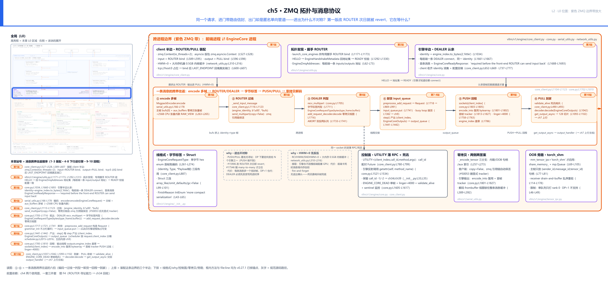
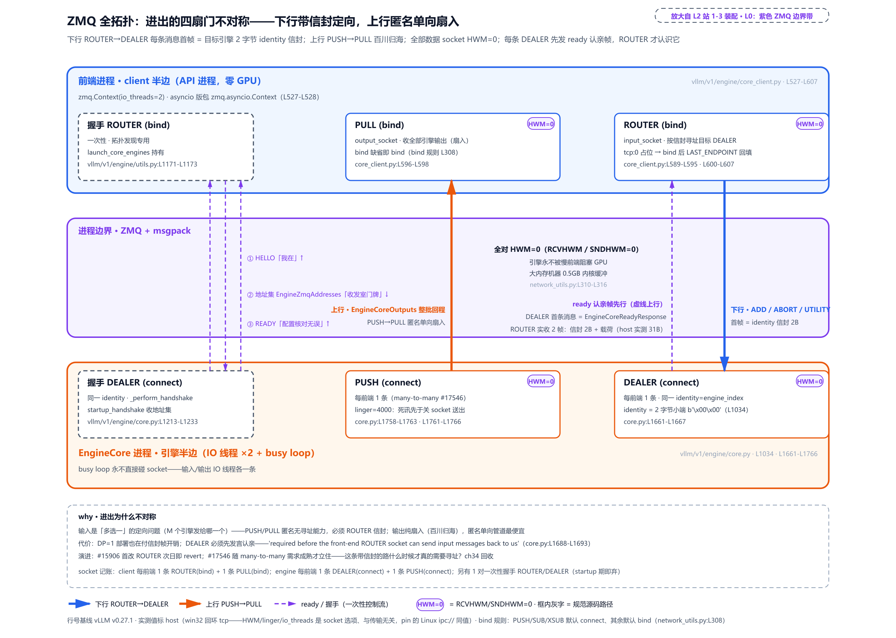
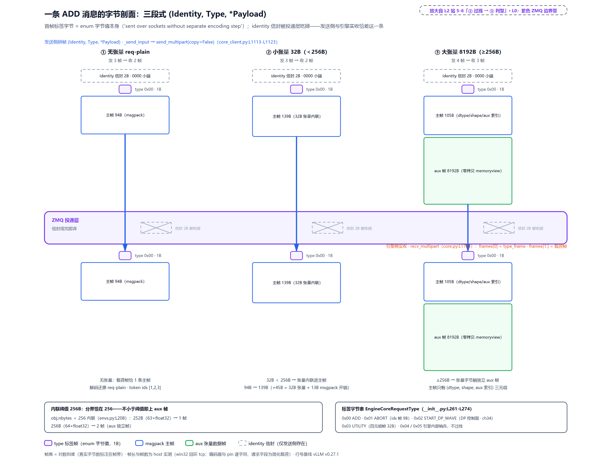
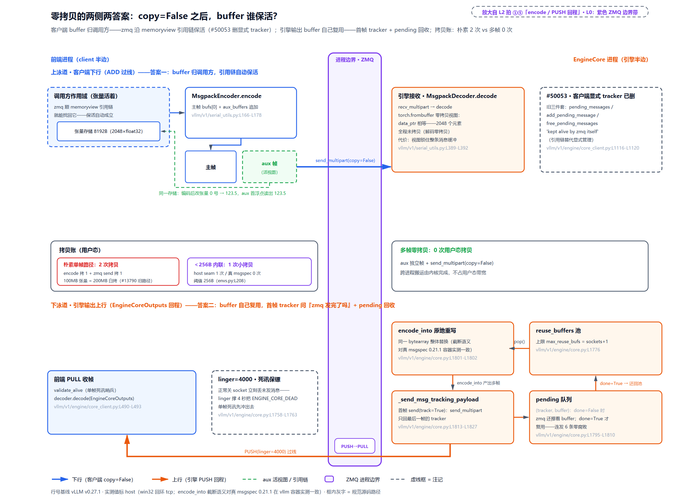
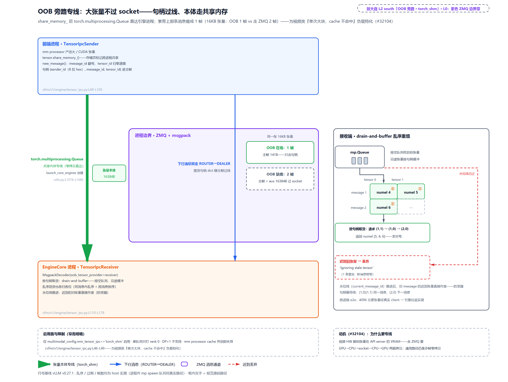

# 第 5 章　ZMQ 拓扑与消息协议

先看一个反常的细节：同一个请求，进门的路带地址信封——每条消息的第一帧是 2 个字节的目标引擎编号，投递层靠它点名；可它的输出回家时，走的却是匿名单向管道——引擎只管扔、前端只管收，消息里根本不写「发给谁」。一个要信封、一个不要，进出为什么不对称？再看一段更有味道的历史：把输入通道改成带信封的 ROUTER/DEALER，第一版 PR 合入第二天就被整个 revert，在仓库历史里躺了近两个月，才由另一个 PR 重新立住。这个改造明明方向正确，它到底在等什么？

这两个问题的答案连着 Part II 的总问题——一千个并发，怎么让 GPU 永不等 CPU。[第 4 章](../../ch04-two-usage-faces-one-trio/narrative/chapter.md)把 API 进程带左上拆完：三件套怎么装配、请求怎么写两本账、怎么盖着章过线。现在请求正好站在进程边界上——[第 2 章](../../ch02-request-lifecycle/narrative/chapter.md)十六站走读两次过线，两次都只认「字节离开/回到 API 进程」这一步，线格式、帧布局、零拷贝细节全部留给本章（变换表里一句「整批按步聚合过线」就是全部交代）；[第 4 章](../../ch04-two-usage-faces-one-trio/narrative/chapter.md)每到「过线」更是只有一句话——「发送立刻经 ZMQ 出去」，末尾还专门留了这根线头。本章把这些交代展开成一整套协议：socket 怎么搭、谁先开口、字节怎么排、大张量怎么少拷贝、前端堵死了引擎会不会等、引擎死了前端怎么知道。

## 你在这里

本章把 L0 图正中间那条紫色 ZMQ 边界带放大——[第 1 章](../../ch01-vllm-v1-in-one-map/narrative/chapter.md)立三段式时只开了一条门缝、[第 4 章](../../ch04-two-usage-faces-one-trio/narrative/chapter.md)末尾预告要拆的那条带：



> *图注：左上小地图高亮的那条带，就是[第 1 章](../../ch01-vllm-v1-in-one-map/narrative/chapter.md) L0 图中间的紫色 ZMQ 边界带（「下行 ROUTER→DEALER、上行 PUSH→PULL」那条横带）——[第 2 章](../../ch02-request-lifecycle/narrative/chapter.md)十六站走读的第 7、15 站各穿它一次、[第 4 章](../../ch04-two-usage-faces-one-trio/narrative/chapter.md)末尾留下的那根线头。本章打开它三层：上排三个装配半边（client 半边的 ROUTER/PULL、一次性的握手 ROUTER、引擎半边的 DEALER 认亲），中带一条消息的六拍（① encode 多帧 → ② ROUTER 过线 → ③ DEALER 判型 → ④ 卸货 input_queue → ⑤ PUSH 回程 → ⑥ PULL 到家），下排六块注脚——线格式、why×2（进出不对称、HWM=0 无反压）、控制面、零拷贝、OOB 旁路；接在[第 4 章](../../ch04-two-usage-faces-one-trio/narrative/chapter.md)立好的三件套装配与 client_index 盖章之上——本章站 4-5 正是那一章「盖章过线」的物理展开。站号 1-10 = 请求流经代码的顺序（1-3 装配、4-8 下行进引擎、9-10 回程；站 8 是交界——调度器把这一拍的产出投进 output_queue、回程从这里开始，图里归在下行侧，正文「回程」一节从站 8 讲起），正文按讲解需要编排、不必照站号读。*

读法建议：只想知道进出为什么不对称，读[「四扇门」](#四扇门不对称的进出站-1-3)；想亲眼看一条消息的字节，读[「一条消息的字节」](#一条消息的字节标签信封与-msgpack站-4-7)；关心拷贝与延迟的代价，跳[「零拷贝」](#零拷贝同一个问题两侧两种答案)、[「HWM=0」](#hwm0永不反压的取舍)与[「回程」](#回程按步聚合按章路由站-8-10)；想知道引擎死了前端怎么知道，直奔[「控制面」](#折进同一条线的控制面撤单远调用与死讯)最后一节。

## 四扇门：不对称的进出（站 1-3）

现在站到那条紫带跟前。先看全貌——这条带上一共四扇门（外加一条开工前用一次的握手旁路），进门与出门用的是两种完全不同的 socket：



> *图注：放大自本章 L2 站 1-3——L0 图紫色 ZMQ 边界带的双进程全拓扑。下行（请求进门）：client 侧 ROUTER（bind）→ 引擎侧 DEALER（connect，每前端一条，identity=engine_index 两字节小端），每条消息首帧带 2 字节信封定向。上行（输出回家）：引擎侧 PUSH（connect，每前端一条）→ client 侧 PULL（bind），匿名单向扇入。四类 socket 全对 HWM=0（HWM＝ZMQ 每对端内存队列的未决消息条数上限，为何一律清零见后文「HWM=0」一节）；每条 DEALER 的第一条消息永远是 ready 认亲帧（源码注释原话 'required before the front-end ROUTER socket can send input messages back to us'）；左侧还有一条一次性握手旁路（HELLO → 地址集 → READY）。帧长类数字（认亲载荷 31B）为本章实测环境的值，见下文就近说明。*

四种 socket 类型不是 vLLM 的发明，是 ZMQ（ZeroMQ）库的内置语义——[第 1 章](../../ch01-vllm-v1-in-one-map/narrative/chapter.md)立过这个库的身份：不需要独立 broker 进程的消息库，两端像用 socket 一样直发消息（官方指南 [zguide](https://zguide.zeromq.org/docs/chapter3/) 有专章讲 socket 类型）。它的设计哲学是「选 socket 类型 = 选拓扑」，四种里本章用到两对，各自的官方语义值得逐条认：

- **PUSH**：只发不收。发给谁它不关心——libzmq 官方文档原话，消息「round-robined to all connected downstream nodes」（在所有已连接的下游之间轮询分发）。这是一根匿名单向管道的「扔」端。
- **PULL**：只收不发，「fair-queued from among all connected upstream nodes」（从所有已连接的上游公平取货）。匿名管道的「接」端。一对 PUSH/PULL 就是流水线：天生只会扇出/扇入——扇出 = 一个出口把消息轮流分发给多个接收端（PUSH 那端），扇入 = 多个来源把消息汇进同一个入口（PULL 那端）——没有「发给谁」的概念。
- **ROUTER**：带身份的收发台。收到的每条消息，它自动把来源身份粘成首帧（官方原话「prepend a message part containing the routing id of the originating peer」）；往回发时剥掉首帧、按这帧里的身份找到对端投递。**发给不认识的身份，默认静默丢弃**（除非设 ROUTER_MANDATORY 换成报错）——这条规则马上会解释一个启动时序上的怪规矩。
- **DEALER**：不带自动信封的异步双向端，连接时可自报一个 identity（身份标识，一段字节），让对端的 ROUTER 能按这个身份定向找到它。

一句话对比：**ROUTER 能点名，PUSH 只会排队**。带着这四种语义，看 vLLM 怎么把它们拼起来——先看 client 半边的装配：

```python
# vllm/v1/engine/core_client.py:L586-L607
            else:
                # Engines are managed by this client.
                addresses = get_engine_zmq_addresses(vllm_config)
                self.input_socket = self.resources.input_socket = make_zmq_socket(
                    self.ctx,
                    addresses.inputs[0],
                    zmq.ROUTER,
                    bind=True,
                    router_handover=enable_input_socket_handover,
                )
                self.resources.output_socket = make_zmq_socket(
                    self.ctx, addresses.outputs[0], zmq.PULL
                )

                # Resolve ``tcp://host:0`` placeholders to bound endpoints
                # before engines DEALER-connect. No-op for IPC.
                addresses.inputs[0] = self.input_socket.getsockopt(
                    zmq.LAST_ENDPOINT
                ).decode()
                addresses.outputs[0] = self.resources.output_socket.getsockopt(
                    zmq.LAST_ENDPOINT
                ).decode()
```

这段在 `MPClient.__init__`。`MPClient` 是 [第 4 章](../../ch04-two-usage-faces-one-trio/narrative/chapter.md)工厂四格里跨进程两格的共同基类——为什么连离线 LLM 也默认跨进程付这笔 IPC 税（fork 撞 CUDA、spawn 撞 `__main__` 无限递归的两难，#11074 把默认翻转），那一章已拆过、本章不重讲。`self.ctx` 在几行之前建好（`core_client.py:L527-L528` 两行）：底层是 `zmq.Context(io_threads=2)`——Context 是建 socket 的上下文工厂，`io_threads` 是 libzmq 内部收发线程数，默认 1，vLLM 给 2；异步客户端再把它包一层变成 `zmq.asyncio.Context`，本章在线面的客户端正是异步形态，异步 Context 建出的 socket 收发是 `await` 形态——下文认亲循环里 shadow 的必要性根子在这。三件事：

其一，输入 socket 是 **ROUTER 且 bind**。bind 的一方「持有地址、坐等被连接」，connect 的一方「找上门」。谁 bind 谁不是风格问题：多节点部署时引擎进程可能在另一台机器上，必须由有固定地址的前端 bind。其二，输出 socket 是 **PULL 且 bind**（这行没写 `bind=`——`make_zmq_socket` 的默认规则替它 bind 了：PUSH/SUB/XSUB 三类默认 connect、其余默认 bind，`vllm/utils/network_utils.py:L308`，下文嵌它的全文）。其三，末尾八行是一个小巧但实用的技法：地址先用 `tcp://host:0` 占位（「0 = 让操作系统随便分个空端口」），bind 之后再 `getsockopt(zmq.LAST_ENDPOINT)` 问系统「实际分到了几号」，把真实端口回填进地址表。反过来「先自己挑号再 bind」有竞态——两个同时启动的 API server 可能挑中同一个号（先检查、后使用的时间差竞态，行话 TOCTOU），#42585 修的就是它；「先占到、再登记」把这个窗口关死。

引擎半边在另一个进程里对齐：每前端一条 DEALER connect，统一自报 identity：

```python
# vllm/v1/engine/core.py:L1660-L1693
        with ExitStack() as stack, zmq.Context() as ctx:
            input_sockets = [
                stack.enter_context(
                    make_zmq_socket(
                        ctx, input_address, zmq.DEALER, identity=identity, bind=False
                    )
                )
                for input_address in input_addresses
            ]
            # … 省略：coord_input_address 非空时的 XSUB 分支（DP 控制面订阅，Part VIII 分布式章） …

            # Register sockets with poller.
            poller = zmq.Poller()
            ready_response = self._make_ready_response()
            ready_payload = msgspec.msgpack.encode(ready_response)
            for input_socket in input_sockets:
                # Send initial message to each input socket - this is required
                # before the front-end ROUTER socket can send input messages
                # back to us.
                input_socket.send(ready_payload)
                poller.register(input_socket, zmq.POLLIN)
```

列表推导 `for input_address in input_addresses` 就是「每前端一条」：地址表里有几个前端，就建几条 DEALER——多 API server 对多引擎的 many-to-many 拓扑（每个前端连所有引擎、每个引擎也连所有前端）在 socket 层就是这样平平无奇的几行。`identity` 这个变量在引擎进程构造时定死：

```python
# vllm/v1/engine/core.py:L1027-L1042
        self.input_queue = queue.Queue[tuple[EngineCoreRequestType, Any]]()
        self.output_queue = queue.Queue[tuple[int, EngineCoreOutputs] | bytes]()
        executor_fail_callback = lambda: self.input_queue.put_nowait(
            (EngineCoreRequestType.EXECUTOR_FAILED, b"")
        )

        self.engine_index = engine_index
        identity = self.engine_index.to_bytes(length=2, byteorder="little")
        self.engines_running = False
        self.shutdown_state = EngineShutdownState.RUNNING

        # Receiver for tensor IPC
        self.tensor_ipc_receiver: TensorIpcReceiver | None = None
        if tensor_queue is not None:
            self.tensor_ipc_receiver = TensorIpcReceiver(tensor_queue)
            logger.info("Using tensor IPC queue for multimodal tensor sharing")
```

`identity = engine_index.to_bytes(length=2, byteorder="little")`——引擎编号写成 2 字节小端整数（engine 0 是 `b"\x00\x00"`、engine 1 是 `b"\x01\x00"`）。client 要给哪个引擎发消息，就把哪个引擎的这 2 字节放进消息首帧；ROUTER 剥帧一看就知道投给谁。这段还顺手立了引擎进程内部的两条 `queue.Queue`（`input_queue`/`output_queue`，下一节展开）和 `EXECUTOR_FAILED` 哨兵的注入点（执行器失败时往输入队列塞一条带标签的空消息，本章末节回收）。

### 进出为什么不对称

四种 socket 两两配对，vLLM 为什么不把输出也做成 ROUTER/DEALER？这条 why 链的四要素齐着讲：

- **旧设计**：v1 第一版（PR #9826，2024 年 11 月）输入输出都是 PUSH/PULL——client PUSH bind / 引擎 PULL connect，另开一条一次性 socket 传 ready 信号。
- **痛点**：其一，PUSH 是匿名轮询，「把这条请求定向发给 N 个引擎中的第 2 个」它做不到——数据并行（DP，一份数据切开由多个引擎并行服务的部署形态）一上就需要定向。其二，ready 走独立 socket 有竞态，#15906 的 PR 描述原话：「the front-end could start sending messages before the engine has finished connecting」——前端可能在引擎连上数据 socket 之前就开始发消息。其三，远程引擎要求 client 侧 bind（同 PR 原话「will also be needed for remote engines」）。
- **v1 方案**：输入换 ROUTER(bind)/DEALER(connect, identity)，ready 改走同一条数据 socket 的首条消息；输出保持 PUSH/PULL——因为输出是纯单向扇入（M 个引擎的输出按请求来源回流到 N 个前端），匿名单向管道正是最便宜的答案，应答式 socket（REQ/REP 那种一问一答）反而会让引擎被慢前端的「答」卡住。
- **代价（如实记）**：每条下行消息多一个信封帧——单引擎部署也在为它此刻用不上的寻址能力付这个开销；「对端必须先发言」成了写死在启动时序里的硬约束；同 identity 的连接死而复生需要 ROUTER_HANDOVER（让新连接顶替死连接留下的身份，`core_client.py:L540-L544`，弹性扩缩容场景才用，Part VIII 弹性章）——复杂度又长了一层。

这段历史本身值得多看一眼，因为它回答了开篇第二问。#15906（2025 年 4 月 4 日合入）第一次把输入改成 ROUTER/DEALER，三条动机当时就全对——次日即被 revert（revert commit 296c6572d 留在仓库历史里；评审暴露的启动轮询悬挂问题后来由 #16137 补修）。躺了近两个月，2025 年 5 月 30 日的 #17546 才把它重新立住——标题就是动机：「[Perf] API-server scaleout with many-to-many server-engine comms」，PR 原话「there's all-to-all zmq-based communication between API servers and data parallel engines」，并带来 `--api-server-count` 配置。教训不是「设计错了」，而是：**拓扑改造的收益要等真正驱动这个改造的用例成熟才兑现**——单前端时代，ROUTER 的寻址能力兑不了现、回归风险却先到；many-to-many 用例一到，同一改造立刻从「多余」变成「地基」。这条带信封的路什么时候才真的非用不可？Part VIII 讲分布式部署时回来回答这个问题。

### DEALER 必须先发言（认亲）

现在可以解释 ROUTER 语义里那条「静默丢弃」规则为什么逼出一个怪规矩了。ROUTER 只能回发给它**见过**的 identity——没见过，就无处投递，消息静默蒸发。而 ROUTER 怎么「见过」一个 DEALER？只有对方先发来一条消息、身份被自动登记。所以上面引擎装配代码里有这么一段：DEALER 建好后立刻 `input_socket.send(ready_payload)`，注释原话「this is required before the front-end ROUTER socket can send input messages back to us」。这不是握手礼节，是机制必然：**不先发言，门禁不认识你，谁也给你发不了信**。

这条首条消息（认亲帧）是 `EngineCoreReadyResponse`，一帧两用：既让 ROUTER 登记身份，又把「引擎实测配置」带回前端——auto-fit（按显存实际大小推算容量）跑完才知道的 `max_model_len`、`num_gpu_blocks`、`block_size` 都在这一帧里回填（`vllm/v1/engine/__init__.py:L69-L95`；本章实测环境里认亲后回填的 `num_gpu_blocks` 是 128）。顺带认一个名字：装配代码里把它编成字节的那行 `msgspec.msgpack.encode` 露出了 **msgspec**——vLLM 实际使用的 msgpack 编解码库，「载荷怎么编码」一节详讲。client 侧的收齐循环长这样：

```python
# vllm/v1/engine/core_client.py:L645-L671

            # ZMQ identity of each engine that this client will talk to.
            self.core_engines: list[EngineIdentity] = [
                rank.to_bytes(2, "little") for rank in self.engine_ranks_managed
            ]

            # Wait for ready messages from each engine on the input socket.
            identities = set(self.core_engines)
            sync_input_socket = zmq.Socket.shadow(self.input_socket)
            while identities:
                if not sync_input_socket.poll(
                    timeout=VLLM_ENGINE_READY_TIMEOUT_S * 1000  # convert to ms
                ):
                    raise TimeoutError(
                        f"Timed out waiting for engine core processes to "
                        f"start. This is often caused by slow weight loading "
                        f"for large models. Waited "
                        f"{VLLM_ENGINE_READY_TIMEOUT_S}s (configured by "
                        f"VLLM_ENGINE_READY_TIMEOUT_S). To increase the "
                        f"timeout, set the environment variable: "
                        f"VLLM_ENGINE_READY_TIMEOUT_S=<seconds>"
                    )
                identity, payload = sync_input_socket.recv_multipart()
                identities.remove(identity)
                self._apply_ready_response(payload)

            self.core_engine: EngineIdentity = self.core_engines[0]
```

循环体一目了然：把期望的引擎 identity 装进集合，收一条认亲帧就划掉一个，划空为止。列表推导里的 `engine_ranks_managed` 是这个 client 负责的引擎编号表——`rank` 是 engine_index 在分布式部署里的行话叫法（组内的引擎编号），本章两个词同义。两处细节值得点破。`zmq.Socket.shadow(self.input_socket)`——给同一个底层 socket 造一个**同步视图**：构造函数是同步代码、asyncio 事件循环还没跑起来，而 asyncio 版 socket 的收发是 `await` 形态；shadow 让同步代码在启动期也能 `poll/recv`，收完即弃。超时 `VLLM_ENGINE_READY_TIMEOUT_S` 默认 600 秒（`vllm/envs.py:L27`）——大模型加载权重动辄几分钟，报错文案自己都写着「This is often caused by slow weight loading」。

### 开工前的三步握手

数据 socket 之外还有一条一次性的握手旁路（图中左侧虚线），负责「拓扑发现」——引擎怎么知道该往哪 connect？流程三步：引擎子进程起身后在握手专线上喊一声 HELLO；前端（`launch_core_engines`，`vllm/v1/engine/utils.py:L1171-L1173` 持一条专用握手 ROUTER）回一包 `EngineHandshakeMetadata`，内含 `EngineZmqAddresses` 地址集——每前端一条 input/output 地址（`utils.py:L62-L85`；引擎等的就是这包对 HELLO 的回音，这一等自带 5 分钟超时，常量 `HANDSHAKE_TIMEOUT_MINS = 5` 定义于 `core.py:L98`、用在 `core.py:L1253` 的 poll 上）；引擎照地址表建好全部 socket、数据通路打通后回 READY，前端校验配置一致——READY 发出后引擎不再等任何回执，这条一次性专线用完即弃。前文那个 `tcp://host:0` 占位回填，回填的就是要进这包地址集的端口。工程细节到此为止——读者只需带走时序：**先握手拿地址、再 connect、connect 后先认亲、认亲后数据才通**。顺带辨析一条易混点：握手专线上的 READY 与 DEALER 的首条认亲帧是两条不同 socket 上的**不同消息**——前者只确认「地址到手、socket 建好」，后者（`EngineCoreReadyResponse`）才让 ROUTER 登记引擎身份、带回引擎实测配置。启动时刻两条都由引擎发给前端、时间上紧挨着，拼时间线时别把它们并成一条。

至此四扇门搭好了。单机单引擎的部署里，这条带一共 6 只 socket：client 侧 ROUTER、PULL、一次性握手 ROUTER 各一，引擎侧 DEALER、PUSH、一次性握手 DEALER 各一（握手段里引擎在专线上喊 HELLO、回 READY 用的就是这只 DEALER）；N 个前端 M 个引擎时，每前端一对 ROUTER/PULL、每引擎对每前端一对 DEALER/PUSH——全连起来就是 many-to-many。

## 一条消息的字节：标签、信封与 msgpack（站 4-7）

现在跟着一条 ADD 消息走下行的紫带半边。先交代取证环境，后文所有实测数字共用这套说明：数值取自本章精简版（对源码只做减法的可运行复刻）的实测——socket 是真 ZMQ（pyzmq）、字节是真 msgpack、张量是真 torch。两处环境差异就近挑明：取证的 Windows 机器没有 ipc:// 传输，按精简版约定用回环 tcp:// 等价替代（bind/connect 流程、信封语义、HWM/linger 等选项与 Linux 的 ipc:// 路径一致）；该机装不了 msgspec 库，编码走精简版自带的 seam 后端（对 msgspec 逐字对齐的 msgpack 替身，后文表格里「seam 拷 1 次」指的就是它；唯一已知的数字偏差是 <256B 内联路径多一次拷贝，真 msgspec 是零拷贝，涉及处双列标注）。引擎进程级的端到端事实（盖章、回程、死讯）引精简版测试套件——同一套测试在 Windows 与 Linux 容器（真 fork + 真 ipc://）两个平台全绿。

### 三个部分：信封、标签、载荷

一条下行消息在 socket 上是多个「帧」（frame，一次 `send_multipart` 发出的每段字节各成一帧），布局三段式——**信封（目标引擎 identity）+ 标签（消息类型）+ 载荷（≥1 帧）**。标签的来历先看定义：

```python
# vllm/v1/engine/__init__.py:L261-L274
class EngineCoreRequestType(enum.Enum):
    """
    Request types defined as hex byte strings, so it can be sent over sockets
    without separate encoding step.
    """

    ADD = b"\x00"
    ABORT = b"\x01"
    START_DP_WAVE = b"\x02"
    UTILITY = b"\x03"
    # Sentinel used within EngineCoreProc.
    EXECUTOR_FAILED = b"\x04"
    # Sentinel to wake up input_queue.get() during shutdown.
    WAKEUP = b"\x05"
```

这个 enum 的巧劲儿在 docstring 第一句：值本身就是字节（`b"\x00"` 这样），所以标签**不需要第二次编码行程**——「写一个字符串再编码成字节」这一步被设计掉了，撕下来直接当帧用。六个成员里初读只需盯三个真过线的：ADD（新请求）、ABORT（撤单）、UTILITY（跨进程远调用，本章末节）；`START_DP_WAVE` 是 DP 波次控制面信令（Part VIII 分布式章），`EXECUTOR_FAILED`/`WAKEUP` 是引擎进程**内部**的哨兵、根本不过线（前者就是前文那段 lambda 往 `input_queue` 里塞的东西）。

载荷的主角是 `EngineCoreRequest`——「前端 → 引擎」唯一的请求载体：

```python
# vllm/v1/engine/__init__.py:L97-L130
class EngineCoreRequest(
    msgspec.Struct,
    array_like=True,  # type: ignore[call-arg]
    omit_defaults=True,  # type: ignore[call-arg]
    gc=False,
):  # type: ignore[call-arg]
    request_id: str
    prompt_token_ids: list[int] | None
    mm_features: list[MultiModalFeatureSpec] | None
    sampling_params: SamplingParams | None
    pooling_params: PoolingParams | None
    arrival_time: float
    lora_request: LoRARequest | None
    cache_salt: str | None
    data_parallel_rank: int | None
    prompt_embeds: torch.Tensor | None = None

    # Per-position mask for mixed-mode inputs (e.g chat completion with
    # prompt_embeds content parts). `True` means the position is a real
    # token ID; `False` means the position uses a pre-computed entry from
    # `prompt_embeds`. `None` for pure-tokens and pure-embeds requests.
    prompt_is_token_ids: list[bool] | None = None

    # Index of the client, used to ensure outputs are sent back to the same
    # client for this request when scaling out the front-end.
    client_index: int = 0

    # Used in DP case to indicate which wave of requests this is expected to
    # belong to, to cover a race condition where the request is sent before
    # a wave finished notification is received.
    current_wave: int = 0
    priority: int = 0

    trace_headers: Mapping[str, str] | None = None

    # … 省略：L131 起的 resumable / external_req_id / reasoning_* / abort_immediately
    # 等尾部字段——逐一看过，同样没有 prompt 文本 …
```

两件事先钉住。其一，字段表里**没有 prompt 文本**——只有 `prompt_token_ids`（token 编号列表）：tokenize 在前端就做完了，引擎进程从头到尾不见用户的 prompt 原文（[第 2 章](../../ch02-request-lifecycle/narrative/chapter.md)的十六站走读立过这条——变换表里那句「过线只传 token ids 不传文本」；渲染与 tokenize 的内部是 Part II 下行章的主场）。其二，`client_index` 那三行注释就是[第 4 章](../../ch04-two-usage-faces-one-trio/narrative/chapter.md)盖章过线的那枚章——前端编号随请求本体走，回程路由全靠它（本章「回程」一节看它被消费）。类声明那三个开关（`array_like`/`omit_defaults`/`gc=False`）是序列化策略，马上讲。

### 拼帧与过线（站 5）

发送侧的拼帧就是一行元组拼接：

```python
# vllm/v1/engine/core_client.py:L1104-L1123
    def _send_input(
        self,
        request_type: EngineCoreRequestType,
        request: Any,
        engine: EngineIdentity | None = None,
    ) -> Awaitable[Any]:
        if engine is None:
            engine = self.core_engine

        message = (request_type.value, *self.encoder.encode(request))
        return self._send_input_message(message, engine)

    def _send_input_message(
        self, message: tuple[bytestr, ...], engine: EngineIdentity
    ) -> Awaitable[Any]:
        self.ensure_alive()
        # Any zero-copy tensor/ndarray frames are kept alive by zmq itself
        # until it's finished sending them (there is a ref chain from the underlying
        # memoryview back to the original owning tensor/ndarray).
        return self.input_socket.send_multipart((engine,) + message, copy=False)
```

最后一行把三段拼齐：`(engine,) + message`，而 `message` 本身就是「标签帧在前、载荷帧随后」的元组（类型注解里的 `bytestr` 是 vLLM 给 bytes/bytearray/memoryview 一族字节对象起的别名，信封帧、标签帧都是这类字节串）——信封永远第 0 帧，`send_multipart` 一次发出，`copy=False`（零拷贝发送，下节主角）。同步版 `SyncMPClient._send_input` 与这版逐行同构（`core_client.py:L884-L891`），开头的注释就是布局的官方自述：`# (Identity, RequestType, SerializedRequest)`。`encoder.encode(request)` 返回的不止一帧——主帧加零拷贝张量帧，也是下一节；这里先看 `add_request_async` 怎么走到它：

```python
# vllm/v1/engine/core_client.py:L1145-L1148
    async def add_request_async(self, request: EngineCoreRequest) -> None:
        request.client_index = self.client_index
        await self._send_input(EngineCoreRequestType.ADD, request)
        self._ensure_output_queue_task()
```

[第 4 章](../../ch04-two-usage-faces-one-trio/narrative/chapter.md)嵌过这三行：盖章、发 ADD、确保输出泵在跑——那就是本章站 5 的全景。

### 引擎侧收帧（站 6-7）

消息过线，引擎进程这边接它的是**输入 IO 线程**。先把引擎进程内部的两层结构立起来：

```python
# vllm/v1/engine/core.py:L1092-L1119
            # Background Threads and Queues for IO. These enable us to
            # overlap ZMQ socket IO with GPU since they release the GIL,
            # and to overlap some serialization/deserialization with the
            # model forward pass.
            # Threads handle Socket <-> Queues and core_busy_loop uses Queue.
            ready_event = threading.Event()
            input_thread = threading.Thread(
                target=self.process_input_sockets,
                args=(
                    addresses.inputs,
                    addresses.coordinator_input,
                    identity,
                    ready_event,
                ),
                daemon=True,
            )
            input_thread.start()

            self.output_thread = threading.Thread(
                target=self.process_output_sockets,
                args=(
                    addresses.outputs,
                    addresses.coordinator_output,
                    self.engine_index,
                ),
                daemon=True,
            )
            self.output_thread.start()
```

[第 1 章](../../ch01-vllm-v1-in-one-map/narrative/chapter.md)引过开头那段注释（socket 收发释放 GIL，所以 IO 放线程、与 GPU 并行），这里补齐另一半：线程与忙循环（busy loop，引擎那只边收边算的常驻主循环）之间隔着两条 `queue.Queue`——注释末行「Threads handle Socket <-> Queues and core_busy_loop uses Queue」就是分工宣言。队列是进程内的第二层解耦：第一层进程边界挡住 CPU 大户（tokenize/detokenize 这类纯 Python 活，线程救不了，[第 1 章](../../ch01-vllm-v1-in-one-map/narrative/chapter.md)的 GIL 三层讲过），第二层队列吸收 socket 的收发抖动——网络毛刺不会侵入忙循环的步进节奏，忙循环也永远不直接碰 socket。输入线程的主体就是收帧循环：

```python
# vllm/v1/engine/core.py:L1702-L1741
            while True:
                for input_socket, _ in poller.poll():
                    # (RequestType, RequestData)
                    type_frame, *data_frames = input_socket.recv_multipart(copy=False)
                    # NOTE(yongji): ignore READY message sent by DP coordinator
                    # that is used to notify newly started engines
                    if type_frame.buffer == b"READY":
                        assert input_socket == coord_socket
                        continue
                    request_type = EngineCoreRequestType(bytes(type_frame.buffer))

                    # Deserialize the request data.
                    request: Any
                    if request_type == EngineCoreRequestType.ADD:
                        req: EngineCoreRequest = add_request_decoder.decode(data_frames)
                        try:
                            request = self.preprocess_add_request(req)
                        except Exception:
                            self._handle_request_preproc_error(req)
                            continue
                    elif request_type == EngineCoreRequestType.UTILITY:
                        request = generic_decoder.decode(data_frames)
                        client_idx, call_id, method, args = request
                        if method == FT_UTILITY_METHOD:
                            self.ft_sentinel.handle_command(
                                client_idx, call_id, args[0]
                            )
                            continue
                    else:
                        request = generic_decoder.decode(data_frames)

                        if request_type == EngineCoreRequestType.ABORT:
                            # Aborts are added to *both* queues, allows us to eagerly
                            # process aborts while also ensuring ordering in the input
                            # queue to avoid leaking requests. This is ok because
                            # aborting in the scheduler is idempotent.
                            self.aborts_queue.put_nowait(request)

                    # Push to input queue for core busy loop.
                    self.input_queue.put_nowait((request_type, request))
```

读法四步。第一步 `recv_multipart` 收到的 `frames[0]` 恒为标签帧——ROUTER 的信封在投递时被吃掉了（发送侧 4 帧、引擎实收 3 帧，下文实测表轮 3 可见），所以判型从第 0 帧开始。第二步 `EngineCoreRequestType(bytes(...))`——字节到 enum 是有限集上的双射（六个值两两不同），不存在「判不出型」的合法消息。第三步**按型选 decoder**：ADD 用专属的 `add_request_decoder`，其余用 `generic_decoder`——这就是「标签免编码」的第二重收益，类型与载荷分帧，先看一眼标签就知道用哪套拆包工具。第四步卸货进 `input_queue`（站 7）：`preprocess_add_request` 把 `EngineCoreRequest` 变成引擎自己的 `Request` 实体（语法初始化这类重活在这一步做掉、不占忙循环——「语法」指结构化输出请求要把「输出必须匹配这个格式」的约束编译成能逐 token 判合法的对象，编译是 CPU 大户，后文约束解码章的主场；预处理抛错走 `_handle_request_preproc_error` 给这个请求单独回一条 ERROR 输出，不炸引擎），从此这个对象归引擎进程独占可变。（两支控制面分支初读可跳：`b"READY"` 是 DP coordinator 发来的通知——DP coordinator 是 DP>1 部署时单独起的那个协调进程，夹在多台引擎与前端之间收发负载统计、协调波次，细节 Part VIII 展开；发它用的 `coord_socket` 就是装配段省略的 XSUB 分支建的那条 DP 订阅 socket，只有它收得到、所以那行 assert 敢断言来源；`FT_UTILITY_METHOD` 是容错信令，也属 Part VIII。ABORT 的双队列投递本章末节讲。）

### 载荷怎么编码：msgpack 与 msgspec

载荷的编码格式是 **msgpack**（MessagePack）——[第 2 章](../../ch02-request-lifecycle/narrative/chapter.md)第 7 站首认过它「像 JSON 但更快更小」的身份，这里把它讲透。它是跨语言的二进制序列化格式（官方定位原话「It's like JSON but fast and small」，[msgpack.org](https://msgpack.org/)）：能表达 JSON 同款结构（数字/字符串/数组/映射），但用紧凑二进制代替文本——说明性的最小对照（外部规范示例）：整数 `1` 编码成单字节 `0x01`；字符串 `"a"` 编码成 `0xa1 0x61`（`0xa1` 表示「定长字符串、长度 1」，`0x61` 就是字母 a），而 JSON 的 `"a"` 要 3 个字符带引号。它还原生留了 **Ext（扩展类型）**：应用自定义「类型码 + 原始字节」的二进制块——vLLM 用它把小张量字节内联进消息（下节）。

vLLM 真正干活的库不是 msgpack 官方 Python 库，是 **msgspec**——msgpack 之上提供「带 schema 的超快编解码」：解码时直接按类型构造消息对象，类型即 schema，省掉先解成 dict 再逐字段校验的开销。`EngineCoreRequest` 的基类 `msgspec.Struct` 带三个开关，逐一拆：

- **`array_like=True`**：结构编成「按位置的数组」而非「键值映射」——官方文档原话，收益是「removing the field names from the encoded message」（字段名不上船）。官方最小例（说明性、外部文档示例）：两字段 `Point(x, y)`，普通 Struct 编成 `{"x":1,"y":2}`，`array_like` 编成 `[1,2]`——两端各持一份 schema（字段表），按位置对号，格子名不必运过海。解码端 `decode(b"[3,4]", type=Point2)` 按位置还原 `Point2(x=3, y=4)`。这也立着一条隐性契约：**字段增删换序必须两端同步**，否则位置错位——vLLM 靠同仓同版本保证。
- **`omit_defaults=True`**：跳过「值等于默认值」的字段。要对读者诚实的是它在**本章线上不生效**：它只对键值式编码有效，对按位置数组是空操作——本章四个线载体 Struct 全是 array_like（真 msgspec 0.19.0/0.20.0/0.21.1 三个版本容器实测一致；线上 `EngineCoreOutput("r",[1])` 过线是全字段数组 `["r",[1],None,None,None,0]`——例取本章精简版的 6 字段 EngineCoreOutput，真实结构有 14 个字段，同样全字段上船，元素数不同、结论相同）。三开关齐开是双保险的写法，实际起作用的是 array_like 省字段名。
- **`gc=False`**：实例永不进 Python GC 追踪——热路径每 step 解码出大量短生命周期消息，免掉 GC 记账。官方警告「only recommended for users who fully understand the implications」：此类结构若成环则永不回收，风险自担。

同款紧凑哲学还有一处：`FinishReason`（结束原因枚举）用 `IntEnum` 而不是字符串枚举，源码注释原话「Int rather than Str for more compact serialization」（`vllm/v1/engine/__init__.py:L43-L65`）——五个状态 STOP/LENGTH/ABORT/ERROR/REPETITION 编成 0-4 一个字节，何必运「repetition」这 11 个字节。最后一条纪律：**不认识的类型默认拒发**——`MsgpackEncoder` 的 `enc_hook` 只认 Tensor/ndarray/slice 等白名单，遇未知类型直接 `TypeError`（`vllm/v1/serial_utils.py:L221-L226`）。这道白名单是被坑出来的：v1 第一版（#9826）用 msgspec 原生编解码，只认它支持的类型；多模态一上线，PIL 图片这类类型它认不了，#10245 干脆整体退回 pickle——PR 原话「multimodal inputs include types incompatible with msgspec (e.g., PIL images), we use pickle」，慢且把「反序列化即执行」的门敞着；#12918 才带着自定义钩子回到 msgpack，白名单就是那次教训的产物。想运任意 Python 对象只有一个逃生舱：`VLLM_ALLOW_INSECURE_SERIALIZATION=1` 回退 pickle——变量名里的 insecure 不是谦虚：Python 官方文档警告原话「It is possible to construct malicious pickle data which will execute arbitrary code during unpickling」，pickle 的字节流里带指令、反序列化即执行，跨进程消息线上「解开就执行」意味着消息可被伪造就等于远程代码执行入口。默认关死这道门，是协议层面的安全边界。

### 实测：同一条 socket，六种消息

把上面全部拼起来，实测一条 socket 上跑六轮（真 ROUTER bind ↔ DEALER connect, identity=`b"\x00\x00"`；请求带三种张量形态；ABORT/UTILITY 作对照）。帧长数字是本章实测环境的值（简化请求字段——结构关系「几帧、谁多谁少、阈值分界」与真实系统一致，绝对字节数以实测为准）。表中「RAW_VIEW」与「aux 帧」两个标签的来历要到下一节「零拷贝」才展开——前者是内联进主帧的 msgpack 扩展类型码、后者是扛张量字节的独立帧，这里先当名字用：

<!-- trace: m3 -->
| 轮次 | 消息 | 发送侧拼帧 | 接收侧实收（recv_multipart） | 解码判定 |
|---|---|---|---|---|
| 轮 0 · 认亲 | DEALER 先发言（ready 帧） | 发 1 帧 | 收 2 帧：[identity 信封 2B（0000）+ 载荷 31B]——ROUTER 侧才看得见信封 | 信封=对端 identity，ROUTER 从此认识它 |
| 轮 1 · ADD 无张量 | req-plain（token ids [1,2,3]） | 发 3 帧（identity 2B + 标签 0x00 + 主帧） | 收 2 帧：[0x00（1B）+ 主帧 94B] | request_id=req-plain、token ids 还原，roundtrip OK |
| 轮 2 · ADD 小张量 | req-small（张量 32B） | 发 3 帧 | 收 2 帧：[0x00 + 主帧 139B]——主帧比轮 1 的 94B 长出 45B | 32B < 256B 阈值 → 张量内联进主帧（RAW_VIEW），解码 numel 8 全等 |
| 轮 3 · ADD 大张量 | req-big（张量 8192B） | 发 4 帧（identity + 0x00 + 主帧 + aux 帧） | 收 3 帧：[0x00 + 主帧 105B + aux 帧 8192B]——张量字节躺在独立帧里 | 主帧里只有 (dtype, shape, aux 索引)；解码 numel 2048 全等 |
| 轮 4 · ABORT | 撤单 ["req-big"] | 发 3 帧 | 收 2 帧：[0x01 + ids 9B] | 解码还原 request_ids 列表——同一条 socket 换一个标签字节就是另一类消息 |
| 轮 5 · UTILITY | 薄 RPC 四元组 | 发 3 帧 | 收 2 帧：[0x03 + 元组 32B] | 解码还原 client_index=0 + method 名——RPC 与 ADD 同一条线 |
| 阈值边界 | 内联判定 obj.nbytes < 256 | — | 252B（63 个 float32）→ 1 帧；256B（64 个）→ 2 帧 | 分界恰在 256：不小于阈值即走 aux 独立帧 |

三列对照里最值钱的是轮 2 对轮 3：**同样是带张量的请求，32B 的小张量内联进主帧（主帧 94B→139B，长出的 45B = 32B 数据 + 13B msgpack 包装），8192B 的大张量却让主帧反而变瘦（105B）、字节自己单独成帧**。分界线在 256 字节（`VLLM_MSGPACK_ZERO_COPY_THRESHOLD`，`vllm/envs.py:L208`，判定是严格小于）：小于它内联、一次小拷贝换掉一整帧的管理开销；不小于它上「零拷贝拖车」。轮 0 那行还坐实了两件事：DEALER 发 1 帧、ROUTER 实收 2 帧——信封是 ROUTER 收到时**自动补上**的；而 31B 这个载荷大小随字段集而变（真实 `EngineCoreReadyResponse` 是含 version/world_size 等一批字段的 dataclass，明显更大），要取的是「两条帧」这个结构。整张表立着本章第一条不变量：**每条下行消息 = 信封 1 帧 + 标签 1 帧 + 载荷 ≥1 帧；DEALER 收到的 frames[0] 恒为标签帧**——发送侧唯一拼帧点保证帧序，ROUTER 的信封语义保证投递时恰消费一条，无论消息类型与张量形态，布局不变式沿任何消息序列保持。字节堆叠画成图：



> *图注：放大自本章 L2 中带「② ROUTER 过线 → ③ DEALER 判型」那一跨（跨进程边界的那段）。三列对照：①无张量（发 3 帧 → 收 2 帧）②小张量 32B（仍收 2 帧，内联进主帧 139B）③大张量 8192B（发 4 帧 → 收 3 帧，aux 独立帧扛字节、主帧只剩 105B 的三元组）；灰虚线信封帧只出现在发送侧、投递时被吃掉；标签帧紫色 1B 窄条（0x00/0x01/0x03 就是 enum 字节值本身）；底部阈值标尺：252B→1 帧 / 256B→2 帧，分界恰在 256（envs.py:L208）。帧高为对数刻度、真实字节数标在帧旁；数字全部来自上表同一次实测。*

## 零拷贝：同一个问题，两侧两种答案

回到 L0 紫带的下行线上——上一节那条 4 帧消息里，真正贵的是 8192B 的张量帧。多模态的图/视频特征张量是 MB 到百 MB 级的常客，逐请求拷来拷去直接吃首 token 延迟和内存带宽。这一节算清拷贝账。

### 朴素路径贵在哪

先看没有多帧机制时的朴素路径：张量转成 bytes、整体 encode 进**单一** buffer、zmq 发送时再拷进 libzmq 内部缓冲——用户态至少 2 次拷贝（encode 一次 + send 一次）。100MB 的视频特征张量，每条消息 200MB 白拷。#13790（2025 年 3 月）的 PR 描述原话点破了改造方向：「the backing data of tensors/numpy arrays contained in messages is sent directly by zmq without copying」——张量的后备数据不进主 buffer，作为独立 ZMQ 帧直接交给 zmq 发。

### 多帧编码：aux_buffers

编码器把「主帧 + 零拷贝帧」打包成一个帧序列返回：

```python
# vllm/v1/serial_utils.py:L166-L189
    def encode(self, obj: Any) -> Sequence[bytestr]:
        try:
            if self.oob_tensor_consumer is not None:
                self.oob_tensor_consumer.new_message()
            self.aux_buffers = bufs = [b""]
            bufs[0] = self.encoder.encode(obj)
            # This `bufs` list allows us to collect direct pointers to backing
            # buffers of tensors and np arrays, and return them along with the
            # top-level encoded buffer instead of copying their data into the
            # new buffer.
            return bufs
        finally:
            self.aux_buffers = None

    def encode_into(self, obj: Any, buf: bytearray) -> Sequence[bytestr]:
        try:
            if self.oob_tensor_consumer is not None:
                self.oob_tensor_consumer.new_message()
            self.aux_buffers = [buf]
            bufs = self.aux_buffers
            self.encoder.encode_into(obj, buf)
            return bufs
        finally:
            self.aux_buffers = None
```

`encode` 把主帧放 `bufs[0]`，`aux_buffers` 这个实例字段是给编码钩子留的「暗道」——编码主结构的过程中遇到张量，钩子把张量数据的引用（不是拷贝）append 进来。张量的三种命运在 `_encode_tensor` 的三分支里：

```python
# vllm/v1/serial_utils.py:L257-L273
    def _encode_tensor(
        self, obj: torch.Tensor
    ) -> tuple[str, tuple[int, ...], int | dict | memoryview]:
        oob_consumer = self.oob_tensor_consumer
        # view the tensor as a contiguous 1D array of bytes
        if obj.nbytes < self.size_threshold and obj.is_cpu:
            # Smaller tensors are encoded inline, just like ndarrays.
            data = msgpack.Ext(CUSTOM_TYPE_RAW_VIEW, tensor_data(obj))
        elif oob_consumer is not None and (data := oob_consumer(obj)) is not None:
            assert isinstance(data, dict)
        else:
            # Otherwise encode index of backing buffer to avoid copy.
            assert self.aux_buffers is not None
            data = len(self.aux_buffers)
            self.aux_buffers.append(tensor_data(obj))
        dtype = str(obj.dtype).removeprefix("torch.")
        return dtype, obj.shape, data
```

三分支：① 小 CPU 张量（< 256B）走 `CUSTOM_TYPE_RAW_VIEW` 内联进主帧（msgpack Ext 类型码 + 原始字节——就是上一节 139B 那条路）；② 有 OOB 消费者且它接单（返回 dict）——张量走带外专线，主帧里只放提货句柄（下一节）；③ 其余把**张量在 aux_buffers 里的下标**编进主帧，`tensor_data(obj)` 取的是 uint8 内存视图（memoryview，不拷贝数据的字节窗口，与张量存储共享同一块内存——下文实测表轮 2 的「改动穿透」会证明这块视图是活的、可被写的，`vllm/v1/utils.py:L777-L787`）追加成独立帧——上一节 105B 主帧里那个「(dtype, shape, aux 索引)」三元组就是它。发送端 `send_multipart(copy=False)`——不拷你的内存，libzmq 的 IO 线程直接引用这块内存去发。用户态拷贝从 2 次降到 0 次（跨进程搬运由内核完成，不占用户态带宽）。

### 保活问题：谁盯着「zmq 还没发完」的内存

`copy=False` 买来自由也买来一个安全问题：libzmq 异步发送期间，那块内存**不许被改动或释放**——「zmq 还没发完就不许动」。这件事在收发两侧有两种完全不同的答案，因为两边的 buffer 归属不同。

**客户端的答案：什么都不做。** 上一节 `_send_input_message` 里那段注释就是全部：「Any zero-copy tensor/ndarray frames are kept alive by zmq itself until it's finished sending them (there is a ref chain from the underlying memoryview back to the original owning tensor/ndarray)」。pyzmq 包装一块 buffer 成消息时会给它加引用计数（官方文档：计一次存成实例属性、一次挂在消息上，第二计数保证发完才释放）；而 memoryview 的底层引用链一直指回调用方作用域里活着的原张量——调用方拿着张量，zmq 就找得到内存，保活自动成立。v0.21.0 时代客户端还自己维护一套显式登记（pending_messages 三件套），#50053（2026 年 7 月）把它整个删了——PR 自述原话：那套登记「had no effect beyond looking like protection it did not provide」（除了看起来像保护，实际什么都没保），zmq 自己的引用链早就够了。至于「不许改动」的另一半，客户端没有也不需要机制性防护——靠的是调用纪律：请求张量发出去就不再碰这块内存（通常就此易主交给这条消息）；引擎输出侧为什么不能同样靠纪律、必须显式问「发完了吗」，下一段的复用机制就是答案。

**引擎输出侧的答案：首帧 tracker。** 引擎的输出线程每 step 都要发消息，为了不每拍分配新内存，它**复用同一批 bytearray**——下一拍就要原地覆写同一块 buffer，光靠引用链不够（引用链只保证「对象不被回收」，不保证「内容不被改写」）。必须显式问「zmq 发完了吗」：

```python
# vllm/v1/engine/core.py:L1749-L1810
        encoder = MsgpackEncoder()
        # Send buffers to reuse.
        reuse_buffers: list[bytearray] = []
        # Payload buffers that can't be reused yet because zmq may still be
        # sending them.
        # Buffers of the zero-copy tensor/ndarray frames don't need tracking
        # here: zmq itself holds a reference to each until it's done with it.
        pending = deque[tuple[zmq.MessageTracker, bytearray]]()

        # We must set linger to ensure the ENGINE_CORE_DEAD
        # message is sent prior to closing the socket.
        with ExitStack() as stack, zmq.Context() as ctx:
            sockets = [
                stack.enter_context(
                    make_zmq_socket(ctx, output_path, zmq.PUSH, linger=4000)
                )
                for output_path in output_paths
            ]
            # … 省略：coord_output_path 非空时的 DP coordinator PUSH（Part VIII 分布式章） …
            max_reuse_bufs = len(sockets) + 1

            while True:
                output = self.output_queue.get()
                if output == EngineCoreProc.ENGINE_CORE_DEAD:
                    for socket in sockets:
                        socket.send(output)
                    break
                assert not isinstance(output, bytes)
                client_index, outputs = output
                outputs.engine_index = engine_index

                # … 省略：client_index == -1 走 coordinator 的哨兵分支（Part VIII 分布式章） …

                # Reclaim buffers that zmq is finished with.
                while pending and pending[-1][0].done:
                    reclaimed = pending.pop()[1]
                    if len(reuse_buffers) < max_reuse_bufs:
                        reuse_buffers.append(reclaimed)

                buffer = reuse_buffers.pop() if reuse_buffers else bytearray()
                buffers = encoder.encode_into(outputs, buffer)
                tracker = self._send_msg_tracking_payload(
                    sockets[client_index], buffers
                )
                if not tracker.done:
                    pending.appendleft((tracker, buffer))
                elif len(reuse_buffers) < max_reuse_bufs:
                    # Limit the number of buffers to reuse.
                    reuse_buffers.append(buffer)
```

循环逻辑：每拍从 `reuse_buffers` 池里领一块 bytearray，`encode_into` 原地重写（截断语义已对真 msgspec 0.21.1 容器实测一致），发出去后二选一——tracker 已完成就当场还池；没完成就 `(tracker, buffer)` 挂 `pending` 队列，下拍先从队尾回收已完成的。池有上限 `max_reuse_bufs = len(sockets) + 1`（单前端部署 = 2），封顶内存占用。

那个 `tracker` 从哪来？有个 pyzmq 的坑必须绕：`send_multipart` 返回的 tracker **只跟踪最后一帧**，而这里要保活的恰是**第一帧**（主 buffer 在 `buffers[0]`）。所以专门写了一个手工分帧函数：

```python
# vllm/v1/engine/core.py:L1812-L1827
    @staticmethod
    def _send_msg_tracking_payload(
        socket: zmq.Socket, buffers: Sequence[bytestr]
    ) -> zmq.MessageTracker:
        """Send `buffers` as a zero-copy multipart message, returning a tracker
        for the *first* frame.

        Used instead of `Socket.send_multipart()` because we reuse the buffer
        passed to `MsgpackEncoder.encode_into()`: `send_multipart()` returns a
        tracker for the last frame only.
        """
        more_flag = zmq.SNDMORE if len(buffers) > 1 else 0
        tracker = socket.send(buffers[0], more_flag, copy=False, track=True)
        if more_flag:
            socket.send_multipart(buffers[1:], copy=False)
        return tracker
```

docstring 把缘由说尽：第一帧单独 `send(track=True)` 拿 tracker，其余帧再 `send_multipart` 补上。为什么必须这么较真？#50053 修的正是这个坑的前身：引擎侧原来拿 `send_multipart` 末帧的 tracker 当回收闸门，可末帧常常是小张量帧——pyzmq 有个 `copy_threshold`（默认 64KiB），小于它的帧即使 `copy=False` 也自动拷一份（官方文档还警告小消息零拷贝反而更贵），于是 tracker 恒显示完成、`pending` 成了死代码，复用的 buffer 在途被覆写，CI 里偶发形状错乱的崩溃。修法就是现在这个首帧 tracker。顺带把两层阈值分清：pyzmq 的 64KiB 是**库行为**（小帧自动拷），vLLM 的 256B 是**自家编码策略**（小张量内联）——一个在发送层、一个在编码层，别混。

### 接收端与物证

解码侧对偶还原：

```python
# vllm/v1/serial_utils.py:L399-L425
    def _decode_tensor(self, arr: Any) -> torch.Tensor:
        dtype, shape, data = arr
        if isinstance(data, dict):
            assert self.oob_tensor_provider, (
                "Received OOB tensor but tensor provider is not set"
            )
            return self.oob_tensor_provider(dtype, shape, data)

        is_aux = isinstance(data, int)
        buffer = self.aux_buffers[data] if is_aux else data
        buffer = buffer if isinstance(buffer, memoryview) else memoryview(buffer)
        torch_dtype = getattr(torch, dtype)
        assert isinstance(torch_dtype, torch.dtype)
        if not buffer.nbytes:  # torch.frombuffer doesn't like empty buffers
            assert 0 in shape
            return torch.empty(shape, dtype=torch_dtype)
        # Create uint8 array
        arr = torch.frombuffer(buffer, dtype=torch.uint8)
        # Clone ensures tensor is backed by pytorch-owned memory for safe
        # future async CPU->GPU transfer.
        # Pin larger tensors for more efficient CPU->GPU transfer.
        if not is_aux:
            arr = arr.clone()
        elif not self.share_mem:
            arr = arr.pin_memory() if self.pin_tensors else arr.clone()
        # Convert back to proper shape & type
        return arr.view(torch_dtype).view(shape)
```

与编码三分支严格对偶：dict 走 OOB 取货（下节）、int 是 aux 下标、memoryview 是内联字节。`torch.frombuffer` 建的是零拷贝视图——代价写在源码注释里：这个视图**锁住整条接收消息缓冲**（数据还躺在收到的帧里，msgspec 解码完前不许丢帧）。末段的按需拷贝是一次诚实的权衡，分支与紧邻代码严格对齐：非 aux（内联）张量一律 `clone` 一份独立内存；aux 张量拷不拷贝由解码器构造时的 `share_mem` 开关定（默认开）——开着，`elif` 那两行整段跳过、张量直接共享接收帧的内存（实测表轮 3 的「全程未拷贝」走的正是它）；关了才落到拷贝，此时 pin 还是 clone 由 `pin_tensors` 定——它来自 `PIN_MEMORY` 平台能力旗标（CUDA 可用与否，`serial_utils.py:L330`），不按张量大小分岔。大小的取舍写在紧邻的源码注释里（「Pin larger tensors for more efficient CPU->GPU transfer」）：pin 对大张量值回票价——pinned memory（页锁定内存——被 OS 钉住不许换出的物理页，CPU→GPU 拷贝从这里出发快得多、且可异步）付一次拷贝换每次传输提速，小张量 clone 一份更省（pin 本身是贵操作，PyTorch 官方最佳实践原话「pinning is often an expensive operation」）。

两侧两种答案 + 拷贝账，实测对账（同一实测环境；「pending 态」一轮是构造性演示——host 回环小数据无法自然触发拥塞，真实部署里它出现在发送管道堆积时）：

<!-- trace: m5 -->
| 轮次 | 路径 | 观察 | 数值 | 判定 |
|---|---|---|---|---|
| 轮 1 · 小张量编码 | 32B 内联 | 1 帧（张量进主帧） | 32B < 256B 阈值；seam 拷 1 次（真 msgspec 0 次） | 一次小拷贝换掉一整帧的管理开销 |
| 轮 2 · 大张量编码 | 8192B aux 帧 | 2 帧；编码后把张量 0 号元素改成 123.5，aux 帧首浮点读出 123.5——aux 是张量存储的活视图 | aux 帧 8192B；用户态拷贝 0 次 | 张量字节不进主帧、编码零拷贝（物证：改动穿透） |
| 轮 3 · 解码视图 | aux 索引路径 | torch.frombuffer 建视图，data_ptr 与原张量相等 | 2048 个元素全程未拷贝 | 解码零拷贝；代价=视图锁住整条接收消息缓冲 |
| 轮 4 · 引擎输出快路 | encode_into 复用 + 首帧 tracker | 帧即刻被吸收，tracker.done=True | 1 条消息、首帧 26B | done=True → buffer 当场还进 reuse_buffers（上限 = sockets+1） |
| 轮 5 · pending 态 | 多帧消息不补尾 | 首帧滞留发送管道：done=False；补上尾帧立刻 done=True | 构造后等 300ms 仍 False；补尾后 True；收端实收 2 帧 | done=False 期间 zmq 攥着 buffer——此刻复用就是 #50053 修的那类腐败；(tracker, buffer) 必须进 pending |
| 轮 6 · 复用循环 | 同一 bytearray 连发 | 每条等 tracker done 再原地重写复用 | 连发 6 条（token 100–105），全数按序到达 | 复用纪律成立：等 done → 重写 → 零腐败 |

轮 2 的「改动穿透」是零拷贝最硬的物证：编码完把原张量 0 号元素改成 123.5，aux 帧里读出来的首浮点跟着变成 123.5——aux 帧不是拷贝，就是张量存储本身的视图。这一改一读发生在**编码侧**、用来证明「aux 是视图」，并不是说在途消息里这么干也安全——发送途中改这块内存正是 #50053 修的那类在途覆写腐败，也是客户端一侧靠调用纪律禁止的事。轮 5 的构造手法也值得拆穿一层：ZMQ 的多帧消息是**原子投递**——带 SNDMORE 的首帧在尾帧发出前不会真正冲出管道，所以「不补尾」恰好让首帧滞留发送管道、tracker 恒 False；补上尾帧，整条消息一次性放行——这就是 pending 态必须存在的直接证据。整节立着第二条不变量：**任一复用 buffer 在任一时刻至多被三方之一持有（zmq 发送中 / pending 队列 / 复用池），从「zmq 持有」到「可复用」的唯一闸门是 tracker.done**——单输出线程串行执行保证无并发写；linger 兜底保证发送有限步完成，pending 里的元素必然被回收。两侧的答案与整笔拷贝账画成一张图：



> *图注：放大自本章 L2 中带「① encode 多帧」（下行）与「⑤ PUSH 回程」（上行）两块。上泳道客户端：encode 出 [主帧 + aux 活视图帧] 后 send_multipart(copy=False)，aux 帧的引用链指回调用方作用域里的原张量（改张量、aux 字节跟着变），zmq 发完前引用链自动保活，无需显式管理（#50053 后）。下泳道引擎输出：reuse 池（上限 sockets+1）→ encode_into 原地重写 → 首帧单独 send(track=True)（send_multipart 的 tracker 只跟最后一帧）→ done=False 的 (tracker, buffer) 挂 pending、done 才还池（复用循环 6 条零腐败）。中间记账：朴素单帧 2 次拷贝（100MB 张量=200MB 白拷）vs 多帧 0 次；分界 256B 以下内联（host 实测 1 次小拷贝/真 msgspec 0 次）。*

## 大件走专线：OOB 共享内存旁路

紫带上还挂着一条绕行管道。「带外」（out-of-band，OOB）是网络领域老词：数据不走主消息通道、另开一条独立通道，主通道里只放小句柄——词源是电信业把控制信号与话务分开走。落到 vLLM（`vllm/v1/engine/tensor_ipc.py`）：多模态大张量（尤其视频硬解出来的 CUDA 张量）不再塞进 ZMQ 帧，`share_memory_()` 之后走 torch 共享内存专线，msgpack 主帧里只留一个提货句柄。

动机来自 #32104（2025 年 8 月，视频解码重负载）：硬件解码器的输出张量在 API server 进程的显存里，走 ZMQ 得搬「GPU→CPU→socket→CPU→GPU」——这条链四段搬运里免不掉的两次拷贝是 GPU→CPU 与 CPU→GPU（中间 socket 段在零拷贝多帧下可以免掉，但张量必须先离开显存才能进消息）；走共享内存专线，两进程映射同一块物理内存，数据一次都不用搬运过线。torch 这套能力是为多进程 DataLoader 原生设计的（`torch.multiprocessing` 的队列对 Tensor 注册了专属的传输方式——塞进队列的张量自动走共享内存，不整体拷贝），vLLM 把它挪用为跨进程张量通道。发送端的全部逻辑：

```python
# vllm/v1/engine/tensor_ipc.py:L69-L105
    def __call__(self, tensor: torch.Tensor) -> dict[str, Any] | None:
        """Send tensor via queue, return its handle. Returns None if failed."""
        try:
            # Move tensor to shared memory for IPC
            # This is required for proper inter-process communication
            if not tensor.is_shared():
                tensor = tensor.share_memory_()

            metadata = {
                "sender_id": self._sender_id,
                "message_id": self._message_counter,
                "tensor_id": self._tensor_id_counter,
            }

            self._tensor_id_counter += 1

            ipc_data = TensorIpcData(**metadata, tensor=tensor)  # type: ignore[arg-type]

            # Use a timeout to avoid blocking indefinitely
            self.queue.put(ipc_data, timeout=10.0)

            # … 省略：一条 logger.debug（观测旁路） …

            return metadata
        except Exception as e:
            logger.warning(
                "Failed to send tensor via IPC queue: %s. "
                "Falling back to standard serialization.",
                e,
            )
            return None
```

它作为 `oob_tensor_consumer` 钩子挂进编码器——正是 `_encode_tensor` 三分支里的第②支：钩子接单，张量 `share_memory_()`（把底层存储搬进 OS 共享内存段）、`TensorIpcData`（句柄+张量）进 `torch.multiprocessing.Queue`，返回的 metadata dict（`sender_id` 8 位随机十六进制 + 递增的 `message_id`/`tensor_id`，合起来是全局唯一的提货码）嵌进 msgpack 主帧随消息过 ZMQ。except 兜底返回 None = 优雅回退：专线出任何故障，编码器退回普通序列化，消息照发。

两条通道各走各的，**可能乱序到货**——句柄随 ZMQ 先到、张量在队列里后到（或反过来）。接收端 `TensorIpcReceiver` 用「排空并缓冲」（drain-and-buffer）应对：每次解码遇到句柄，先把队列里现有的张量全部取出、按 (sender_id, message_id, tensor_id) 存进缓冲架，再对号取货；同时按 sender 维护消息水位线——水位线＝这个 sender 已成功对上号取走张量的最新 message_id，比它旧的提货句柄不会再有人来取，迟到的旧张量直接丢弃（日志「Ignoring stale tensor」），防止缓冲架泄漏。实测三件事：同一张 16KB 张量，OOB 在场编码 1 帧（主帧 141B 只含句柄）、OOB 缺席 2 帧（aux 帧扛 16384B 过 socket）；乱序请求 (message 1, tensor 1)→(1,0)→(2,0) 全部对号入座；一条迟到的旧张量被丢弃、新消息不受影响。端到端也有实测：4096 元素的张量句柄经真实 client→引擎往返（精简版测试套件的 OOB 端到端用例）。

适用面窄而明确：仅 `multimodal_config.mm_tensor_ipc='torch_shm'` 时启用（队列在 `launch_core_engines` 创建，`vllm/v1/engine/utils.py:L1078-L1085`），类注释明言两条——单队列只打 rank 0（只有 0 号引擎从这条队列取货）、DP>1 不支持；#32104 另记一条已知限制：多模态处理器缓存开启时此路径失效。它是为视频这类「单次大块、缓存不命中」负载特化的通道；通用路径仍是上一节的多帧零拷贝。整条旁路画成图：



> *图注：放大自本章 L2 下排「OOB 旁路 · torch_shm」块。紫色 ZMQ 带内消息箭头（主帧只带句柄 dict），带外一条粗管道（torch.multiprocessing.Queue 共享内存专线，张量本体 16384B 不过 socket）；左下接收端代码框（引擎侧 TensorIpcReceiver；这四步的图形演绎在右上面板「接收端 · drain-and-buffer 乱序重组」）：排空队列 → 缓冲架按 (message_id, tensor_id) 格位 → 按句柄取货（乱序 (1,1)→(1,0)→(2,0) 全对号）→ 迟到旧张量丢进作废框。帧数对比：16KB 张量 OOB 1 帧（主帧 141B）vs 走 ZMQ 2 帧；启用开关 mm_tensor_ipc='torch_shm'，限制三条（单队列 rank 0 / DP>1 不支持 / mm cache 开启即失效）。*

## HWM=0：永不反压的取舍

现在看这条带上一个安静的、但决定了系统性格的设置。ZMQ 的每对通信端之间各有一条内存队列，上限叫 **HWM**（high-water mark，高水位标记）——libzmq 官方定义原话：每对端队列中未决消息数的硬上限，「a hard limit on the maximum number of outstanding messages ØMQ shall queue in memory for any single peer」，默认 1000 条。队列满后 ZMQ 按 socket 类型处理：阻塞发送者（PUSH 类）或丢弃（PUB 类）——阻塞发送者就是**反压**（backpressure：下游消化不动时顶住上游别再发，语义类似 TCP 接收窗口）。vLLM 把收发两侧的 HWM 全部设成 0——官方原话「A value of zero means no limit」：不限条数、永不因队列满而阻塞。落点在统一的 socket 工厂函数里：

```python
# vllm/utils/network_utils.py:L283-L326
# Adapted from: https://github.com/sgl-project/sglang/blob/v0.4.1/python/sglang/srt/utils.py#L783 # noqa: E501
def make_zmq_socket(
    ctx: zmq.asyncio.Context | zmq.Context,  # type: ignore[name-defined]
    path: str,
    socket_type: Any,
    bind: bool | None = None,
    identity: bytes | None = None,
    linger: int | None = None,
    router_handover: bool = False,
) -> zmq.Socket | zmq.asyncio.Socket:  # type: ignore[name-defined]
    """Make a ZMQ socket with the proper bind/connect semantics."""

    mem = psutil.virtual_memory()
    socket = ctx.socket(socket_type)

    # Calculate buffer size based on system memory
    total_mem = mem.total / 1024**3
    available_mem = mem.available / 1024**3
    # For systems with substantial memory (>32GB total, >16GB available):
    # - Set a large 0.5GB buffer to improve throughput
    # For systems with less memory:
    # - Use system default (-1) to avoid excessive memory consumption
    buf_size = int(0.5 * 1024**3) if total_mem > 32 and available_mem > 16 else -1

    if bind is None:
        bind = socket_type not in (zmq.PUSH, zmq.SUB, zmq.XSUB)

    if socket_type in (zmq.PULL, zmq.DEALER, zmq.ROUTER):
        socket.setsockopt(zmq.RCVHWM, 0)
        socket.setsockopt(zmq.RCVBUF, buf_size)

    if socket_type in (zmq.PUSH, zmq.DEALER, zmq.ROUTER):
        socket.setsockopt(zmq.SNDHWM, 0)
        socket.setsockopt(zmq.SNDBUF, buf_size)

    # … 省略：ROUTER_HANDOVER 两行（弹性扩缩容重连接管，Part VIII 弹性章） …

    if identity is not None:
        socket.setsockopt(zmq.IDENTITY, identity)

    if linger is not None:
        socket.setsockopt(zmq.LINGER, linger)
```

本章四类数据 socket 全被覆盖：PULL/DEALER/ROUTER 置 `RCVHWM=0`、PUSH/DEALER/ROUTER 置 `SNDHWM=0`（实测探针四类 socket 双向 HWM 全 0）——任何一侧留着默认值都会重新引入反压，所以两侧一起清零。大内存机器（总量 >32GB 且可用 >16GB）再给内核 socket 缓冲 0.5GB（`RCVBUF`/`SNDBUF`——另一个维度，映射 OS 的收发缓冲字节数）。函数头注释自述改编自 SGLang——推理引擎圈在这条取舍上趋同。

为什么宁可内存风险自担？把两个世界摆开：假设前端事件循环卡死 10 秒。默认 HWM 的世界里，引擎侧发送队列摞到 1000 条满 → PUSH 的 `send` 阻塞 → 输出线程卡住 → 忙循环的产出堆积在无界的 `output_queue` 里越积越多、一条也送不出去——GPU 名义上还在算，实际在给一根塞死的管道打工，这正是 Part II 总问题「GPU 永不等 CPU」的反面。HWM=0 的世界里，消息全部堆进内存（内核缓冲 + ZMQ 队列 + client 侧接收队列三层），引擎照跑，内存账单事后算。vLLM 的选择是一次明确的取舍：这条链路两侧成本不对称——引擎一步是 5ms 级的 GPU 时间，前端是 Python 事件循环——宁可堆内存，不让 GPU 等。代价也要记全：fire-and-forget（发了就不管，不等对方确认收下），没有送达确认——前端死了消息默默蒸发，引擎死了前端怎么知道？靠的不是心跳，是下一节的三重死讯机制。（较真的读者注意官方文档的一句提醒：HWM 是近似值不是精确开关，实际触限位置受消息流影响、且与 OS 缓冲协同工作——「simply don't rely on the exact HWM value」，当 0 = 无限来用就好。）

## 回程：按步聚合，按章路由（站 8-10）

现在走到紫带的上行半边。引擎每拍算完，产出从哪来、怎么打包、怎么找到回家的门？

### 为什么一拍一条，而不是一条请求一条

回程消息叫 `EngineCoreOutputs`——注意复数：**每个 forward step、每个前端，只发这一条**，整批所有请求这一拍新生成的 token 全打包在里面：

```python
# vllm/v1/engine/__init__.py:L230-L246
class EngineCoreOutputs(
    msgspec.Struct,
    array_like=True,  # type: ignore[call-arg]
    omit_defaults=True,  # type: ignore[call-arg]
    gc=False,
):  # type: ignore[call-arg]
    # NOTE(Nick): We could consider ways to make this more compact,
    # e.g. columnwise layout

    engine_index: int = 0

    # [num_reqs]
    outputs: list[EngineCoreOutput] = []
    scheduler_stats: SchedulerStats | None = None
    timestamp: float = 0.0

    utility_output: UtilityOutput | None = None

    # … 省略：L247-L258 的 finished_requests / wave_complete / start_wave
    # 三个尾部字段（finished_requests 承载已完结请求的回执、撤单一节它
    # 同帧到达；wave 两个是 DP 波次控制面，Part VIII 分布式章）…
```

`outputs` 列表里每请求一条 `EngineCoreOutput`（request_id + 新 token 列表 + finish_reason 等）；开头那行 NOTE(Nick) 是源码自己承认的设计债——按行存（每请求一行）不如按列存（所有 request_id 一列、所有新 token 一列）紧凑，「We could consider ways to make this more compact, e.g. columnwise layout」，尚未榨干。为什么按步聚合？why 链四要素：

- **旧设计**：朴素做法是逐请求、逐 token 发事件——多数自研推理服务的第一版都这么写。
- **痛点**：每条消息有固定开销（帧头、msgpack 头、解码对象、事件循环唤醒）。小模型一步低至 5ms（[第 1 章](../../ch01-vllm-v1-in-one-map/narrative/chapter.md)引过的 V1 alpha 数字），批内 B 个请求时逐 token 发 = 每秒 B × 200 条消息；B = 1000 就是每秒 20 万条——消息本身成了主负载。
- **v1 方案**：按步聚合——每秒恒 200 条（一秒 1000ms ÷ 每 step 5ms），与批内请求数无关，三个数量级的差距。
- **代价（如实记）**：单条消息变大——解码与 detokenize 若一口气做完会长时间独占前端事件循环，逼出「按 128 条一片切片、片间 `await asyncio.sleep(0)` 让出」的机制（`VLLM_V1_OUTPUT_PROC_CHUNK_SIZE` 默认 128，`vllm/envs.py:L160`；[第 4 章](../../ch04-two-usage-faces-one-trio/narrative/chapter.md)两种驱动一节与[第 2 章](../../ch02-request-lifecycle/narrative/chapter.md)站 16 已拆过切片机制，不重讲）。行式序列化密度低于列式（NOTE 承认）。外部的对照数字（vLLM PR #12287 的基准，A100 / Llama-3.2-1B / 6000 请求，外部实测非本章产物）：吞吐 63.62→67.72 req/s（+6.4%），平均首 token 延迟（TTFT）229.23→197.34ms（−14%），p99 每 token 间隔（TPOT，最慢那 1% 请求的逐 token 延迟）68.90→47.38ms（−31%）——大消息的批处理收益是实测级的。

聚合发生在调度器出口——按 client_index 分桶组装：

```python
# vllm/v1/core/sched/scheduler.py:L2012-L2017
        # Create EngineCoreOutputs for all clients that have requests with
        # outputs in this step.
        engine_core_outputs = {
            client_index: EngineCoreOutputs(outputs=outs)
            for client_index, outs in outputs.items()
        }
```

分桶早在上面 `update_from_output` 的逐请求循环里就分好了（`outputs[request.client_index].append(...)`，`scheduler.py:L1924`——每个请求携带的章在这里起作用）。忙循环把每个 `(client_index, EngineCoreOutputs)` 二元组投进 `output_queue`（`core.py:L1441-L1442`，五拍的细节是 Part III 逐拍章的主场，本章到队列为止），输出 IO 线程取出来——就是「零拷贝」一节嵌过的那段输出线程代码：盖 `engine_index` 章（回程消息也带引擎编号，前端知道是谁的产出）、`sockets[client_index]` 按章选 PUSH、零拷贝编码过线。

### 回程路由：章怎么兑现（站 10）

把这条路由键的全程串起来（[第 4 章](../../ch04-two-usage-faces-one-trio/narrative/chapter.md)从前端视角讲过盖章，这里补引擎侧的完整旅程）：前端 `add_request_async` 盖 `client_index` 进请求 → 请求过线 → 引擎的 `Request` 实体携带它（`vllm/v1/request.py:L230`）→ 调度器按它分桶 → 输出线程按它选 socket——**四次只读、一次盖章，路由是启动拓扑的纯函数，没有共享可变路由表，也就没有路由竞态**。这中间还有一段演进值得记：v1 第一版（#9826）的单前端时代，「这条输出该回给哪个前端」根本不成为问题——只有一个前端、一条回程线，天然回得对地方；#17546（2025 年 5 月，就是开篇那个次日被 revert 又重新立住的 PR）引入 many-to-many，前端多起来，这个问题第一次需要答案——答案就是把它写进消息本体：`EngineCoreRequest.client_index` 字段，注释原话「used to ensure outputs are sent back to the same client」。路由契约从「藏在拓扑里」变成「写在单据上」。

到家最后一站是前端侧的输出任务（在线面是 asyncio 任务、离线面是守护线程跑同一个循环）：

```python
# vllm/v1/engine/core_client.py:L1037-L1044
        async def process_outputs_socket():
            try:
                while True:
                    frames = await output_socket.recv_multipart(copy=False)
                    resources.validate_alive(frames)
                    outputs: EngineCoreOutputs = decoder.decode(frames)
                    if outputs.utility_output:
                        # … 省略：utility_output 的分流（按 call_id 配对唤醒，见下文；
                        # EEP 弹性专家并行/FT 容错两个保留编号的分支属 Part VIII）…
```

主线就前四行：收帧、验活（下一节的死讯哨兵就在这里拦）、解码、分流——`utility_output` 走 call_id 配对唤醒（下节）、普通产出投 `outputs_queue` 交给 `get_output_async`，然后进 `output_handler` 的 128 切片循环，交回[第 2 章](../../ch02-request-lifecycle/narrative/chapter.md)的上行主线（detokenize 与组装是 Part II 上行章的主场）。

至此一条消息的往返走完。还有最后一个问题要答——这条线上除了数据，还跑着什么？

## 折进同一条线的控制面：撤单、远调用与死讯

紫带上没有第二组 socket。撤单、跨进程方法调用、引擎死讯，全部折进同一条线——「一条消息的字节」一节嵌过的那段输入主循环里其实都见过了，这里逐个收编。

### ABORT：双投两队列

撤单消息（`ABORT = b"\x01"`，载荷是 request_id 列表）抵达输入线程后做一件不太直觉的事——**同时投两个队列**（`core.py:L1733-L1741`，注释原话）：「Aborts are added to *both* queues, allows us to eagerly process aborts while also ensuring ordering in the input queue to avoid leaking requests. This is ok because aborting in the scheduler is idempotent」。`aborts_queue` 是加急通道——忙循环在模型执行的间隙立刻处理撤单，不用等下一整拍；`input_queue` 是保序通道——保证撤单与它前面的请求在调度器眼里次序不乱、不漏。敢双投是因为撤单幂等（重复撤一次无害）。只走加急通道会漏请求——撤单赶到时，它要撤的那条 ADD 可能还压在 `input_queue` 里没被调度器见过，对没见过的请求撤单是空操作，等这条 ADD 随后进调度器，就再没人撤它了；`input_queue` 里那份投递保证调度器永远「先见 ADD、后见它的 ABORT」。只走正式队列又慢一拍（要等忙循环下一次取队列）。幂等性换双保险，正确性与低延迟兼得。撤单的触发场景（调用方断连时前端反向喊停）在 Part II 上行章展开；实测：ABORT 过线后 `finish_reason=ABORT` 的终帧随下一步输出回程（精简版测试实测，finished_requests 集合与 ABORT 枚举同帧到达）。

### UTILITY：单向流上的远调用

前端偶尔要跨进程调引擎一个方法（问一句支持哪些任务、清一下缓存）。ZMQ 单向流没有内建的「调用-返回」配对，vLLM 在协议上补了一层薄 RPC：载荷是四元组 `(client_index, call_id, method, args)`，随 `UTILITY = b"\x03"` 过线。发送侧的全部逻辑就这几行——走的正是「一条消息的字节」一节嵌过的 `_send_input_message` 那条通路：

```python
# vllm/v1/engine/core_client.py:L1128-L1140
    async def _call_utility_async(
        self, method: str, *args, engine: EngineIdentity
    ) -> Any:
        call_id = uuid.uuid1().int >> 64
        future = asyncio.get_running_loop().create_future()
        self.utility_results[call_id] = future
        message = (
            EngineCoreRequestType.UTILITY.value,
            *self.encoder.encode((self.client_index, call_id, method, args)),
        )
        await self._send_input_message(message, engine)
        self._ensure_output_queue_task()
        return await future
```

`call_id = uuid.uuid1().int >> 64`——UUID version 1 的高 64 位恰是它的时间戳段（RFC 9562 的位域布局：v1 把 60 位时间戳拆三段放高 64 位，右移丢掉的是时钟序列与节点号），时间戳随时间推进、取值空间 64 位，作无协调的调用编号足够。前端发之前把 `call_id → Future` 存进表（就是上面 `self.utility_results[call_id] = future` 那行）；引擎侧反射调用（`getattr(self, method_name)`，`core.py:L1521-L1534`，Struct 类型参数自动按类型还原）；结果连同同一 `call_id` 包成 `UtilityOutput` 随回程消息返回；前端按 `call_id` 从表里取出 Future 置值（`core_client.py:L780-L799`）。多个调用在飞、回复乱序，永远对得上号——这个手法在消息系统里叫 correlation identifier（关联标识符，企业集成模式里的正式命名；HTTP 的 X-Request-ID 同款思想）。两个细节：方法抛异常也封成 failure_message 回程、Future 收到异常——引擎不炸；线上真值上元组过线解码回列表（`-> tuple` 注解只在进程内直连路径成立）。另有两个保留编号——-1 是弹性专家并行（EEP）扩缩容的完成通知、-2 是容错（FT）的状态回执——属两支控制信令，Part VIII 两章各回各的。这套 RPC 薄到本章实测把它当测试脚手架用——本身就是协议简单性的证据。

### 死讯：没有心跳的三重保险

最后一块：引擎进程死了，前端怎么知道？没有心跳、没有轮询，靠三层机制各管一段。

第一层，**发出保证**（引擎侧）。引擎异常退出前把一条单帧死讯投进输出队列：

```python
# vllm/v1/engine/core.py:L1605-L1617
    def _send_engine_dead(self):
        """Send EngineDead status to the EngineCoreClient."""

        # Put ENGINE_CORE_DEAD in the queue.
        self.output_queue.put_nowait(EngineCoreProc.ENGINE_CORE_DEAD)

        # Wait until msg sent by the daemon before shutdown.
        self.output_thread.join(timeout=5.0)
        if self.output_thread.is_alive():
            logger.fatal(
                "vLLM shutdown signal from EngineCore failed "
                "to send. Please report this issue."
            )
```

`ENGINE_CORE_DEAD` 是 16 字节的哨兵常量（`core.py:L1011`，`b"ENGINE_CORE_DEAD"`）；输出线程认出它（就是「零拷贝」一节嵌过的那段输出线程代码里 `if output == EngineCoreProc.ENGINE_CORE_DEAD` 那两行）、从每条 PUSH 发出后，`join(timeout=5.0)` 等发送线程干完活再继续死。配套还有一处早已埋下的伏笔要回收：输出 PUSH 建 socket 时恒传 `linger=4000`（`core.py:L1758-L1763`）——linger 是「关 socket 时未发消息再滞留多少毫秒」的选项，ZMQ 默认 -1 = 无限滞留：关门时一直等在途消息发完，对端若已消失，关闭流程可能被无限挂住；0 才是立刻丢弃在途消息。设 4000ms 是折中：既给死讯一个保证发出的冲刷窗口，又不让垂死的引擎进程无限等下去——注释原话「We must set linger to ensure the ENGINE_CORE_DEAD message is sent prior to closing the socket」，4 秒滞留保证死讯在 socket 关门之前发出去。

第二层，**消费**（前端侧）。就是回程一节那行 `validate_alive`：

```python
# vllm/v1/engine/core_client.py:L490-L493
    def validate_alive(self, frames: Sequence[zmq.Frame]):
        if len(frames) == 1 and (frames[0].buffer == EngineCoreProc.ENGINE_CORE_DEAD):
            self.engine_dead = True
            raise EngineDeadError()
```

判定条件精巧：**单帧**且字节等于哨兵。单帧只是快速通道——别拿「正常消息至少两帧」来论证，那是下行线的不变量（信封 + 标签 + 载荷）；上行的正常消息本来就可能只有一帧主帧（无张量的 `EngineCoreOutputs` 不带 aux 帧，零拷贝一节实测表轮 4 那条 26B 消息就是单帧）。真正咬死的是**字节等于 16 字节哨兵**：任何合法 `EngineCoreOutputs` 的 msgpack 编码，首字节必是带高位标记的定长数组头（八个字段，首字节落在 0x90-0x9f 的 fixarray 区间），而哨兵 16 个字节全是可打印 ASCII（首字节是字母 E）——逐字节相等在编码上就不可能成立。命中即置 `engine_dead` 标记、抛 `EngineDeadError`；此后 `ensure_alive` 在每次发送前快速失败，不用等超时。第三层，**进程级兜底**：万一引擎死得太快、死讯没发出去（或 socket 已断），前端还有一条监控线程盯着引擎进程句柄（`core_client.py:L708-L735`）——进程消失本身就报警。三层各管一段：发出保证管「死讯确实发出去了」、消费管「前端收到后立刻置错」、进程监控管「引擎进程句柄本身消失」的情况。实测闭环：通过真实的 UTILITY RPC 触发执行器失败 → `EXECUTOR_FAILED` 哨兵注入 → 忙循环抛错 → 单帧死讯过线 → 前端 `EngineDeadError` 且标记置位（精简版测试的死讯契约两用例，两平台全绿）。

顺带把前端的资源收尾补完：所有 socket、任务与引擎进程管理装在一个 `BackgroundResources` 包里，用 Python 标准库的 `weakref.finalize` 挂在 client 生命周期上——client 被垃圾回收或构造中途抛异常，终结器都会干净关闭资源（比 `__del__` 安全、不造循环引用，标准库管理原生资源的推荐做法）。

## 总结：紫带点亮了

本章点亮的是 L0 图中间那条紫色 ZMQ 边界带——四扇门的拓扑、认亲时序、三段式线格式、msgpack 载荷、零拷贝的两侧答案、OOB 旁路、HWM=0、按步聚合与路由、折进同一条线的控制面与死讯。带走三件事：

1. **进出不对称是任务形状决定的**。输入是「多选一」的定向问题——DP 下要把请求发给 N 个引擎之一，PUSH 的匿名轮询做不到，所以用 ROUTER 的身份信封；输出是纯扇入，匿名单向管道就是最便宜的答案。这段拓扑不是一步到位的：#15906 方向正确却次日被 revert，等 #17546 的 many-to-many 用例成熟才立住——设计要等收益能兑现的时机。
2. **这条线的钱都花在明处**。每条下行消息一帧信封、一次序列化、两侧各付一次编码解码；换来的是 GPU 与 CPU 永不互相等待——HWM=0 让引擎永不被慢前端顶住、按步聚合让消息率与批大小脱钩、两条内部队列让 socket 抖动不进忙循环。每笔开销都能指到具体的帧或行。
3. **可靠性靠显式协议，不靠魔法**。没有心跳：认亲帧写死「先发言才可投递」、撤单靠幂等双投、远调用靠 call_id 配对、死讯靠「哨兵帧 + linger 滞留 + 进程监控」三层各管一段。每一个「万一」都有一个具名的机制在值班。

紫带拆完，请求已经能完整地往返于两个进程。但回看 `EngineCoreRequest` 的字段表还有一块没打开：`prompt_token_ids` 这串编号是从哪来的？用户的文本（还有图片、视频）在前端到底经过哪几道工序才变成这串编号、`mm_features` 里装的又是什么？下一章掉头回到 API 进程带，打开下行泳道——从文本到 token 的完整生产线。
