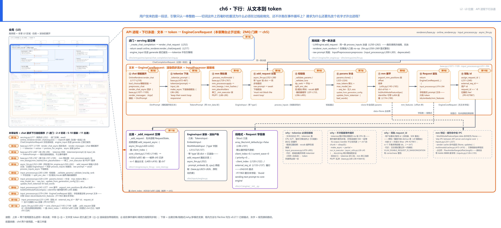
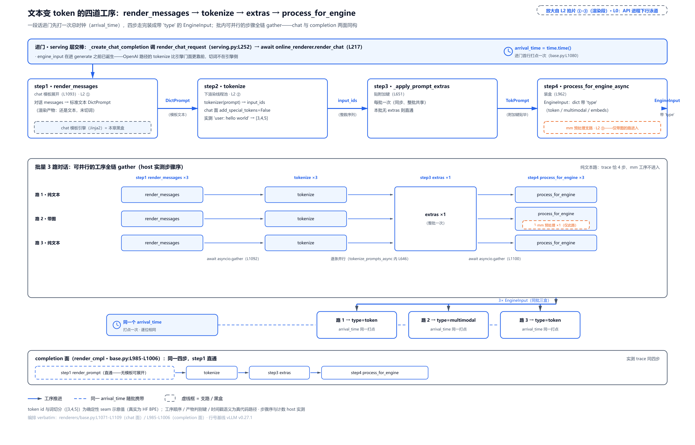
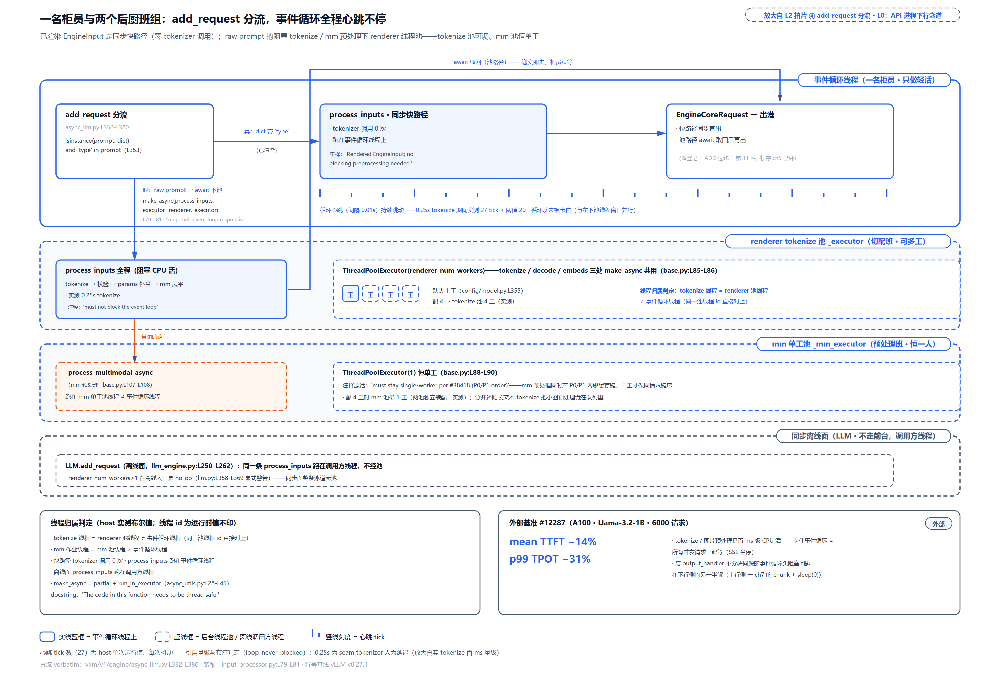
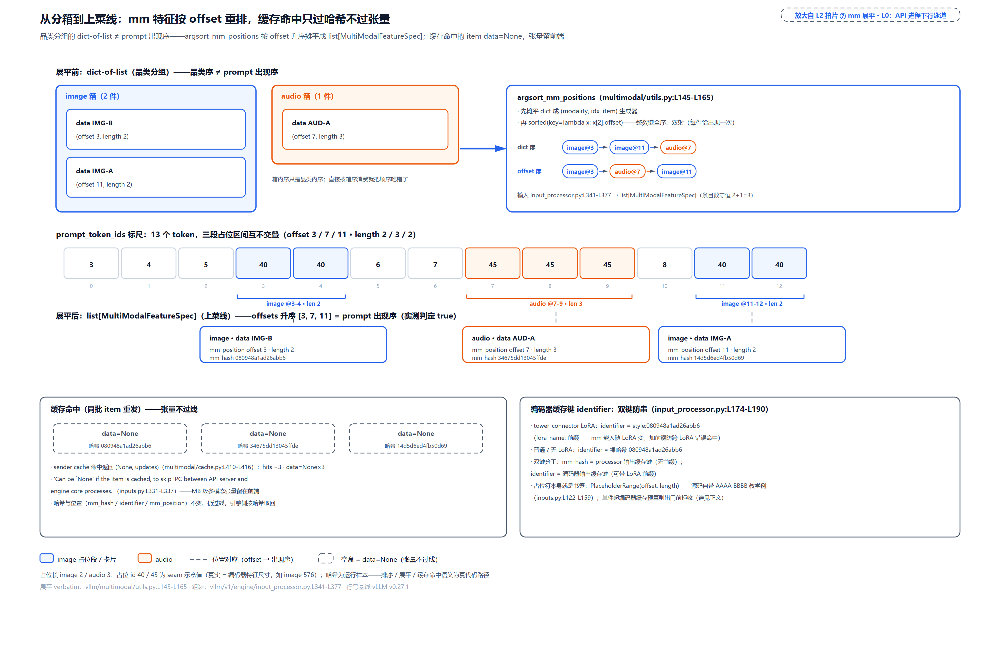

# 第 6 章　下行：从文本到 token

[第 5 章](../../ch05-zmq-topology-and-protocol/narrative/chapter.md)拆完紫带，留了一个没打开的问题：跨进程请求 `EngineCoreRequest` 的字段表里，再没有承载原文的字段——跟那段话直接对应的只剩一个 `prompt_token_ids`，一串整数。可用户发来的明明是一段话，可能还带着图。这段话是在哪一步变成整数的？图片这种压根不是文字的东西，又是怎么塞进同一串整数里的？

更奇怪的是两处安排。其一，切词（tokenize，文本变 token id）是上百毫秒级的 CPU 重活，多模态更重，vLLM 却把它放在请求过线**之前**做完，还专门配了线程池、源码注释里明令禁止它跑在事件循环上——把文本原样扔给引擎、让引擎自己切，看起来省事得多，为什么不？其二，切完之后还有一道反直觉的工序：请求要先改个名字——id 后面追加 8 位随机字符——才被放出进程。用户自己起的 id 有什么不好，非得出发前换掉？

这两个安排都连着 Part II 的总问题：一千个并发，怎么让 GPU 永不等 CPU。本章把 L0 图蓝色 API 进程带的下行泳道整条拆开——一段话（或一张图）进 API 进程之后、过 ZMQ 边界之前的全部工序。

## 你在这里



> *图注：本章放大的是[第 1 章](../../ch01-vllm-v1-in-one-map/narrative/chapter.md) L0 图蓝色 API 进程带的下行半边——[第 2 章](../../ch02-request-lifecycle/narrative/chapter.md)十六站走读的第 3-6 站（那套站号是[第 2 章](../../ch02-request-lifecycle/narrative/chapter.md)的账本，与下文本图站号不是一套）匆匆走过的那条生产线。上排是两个使用面怎么汇进同一条泳道：在线面 serving 层进门交棒，离线面 `LLM` 走同一条组装线（跑在调用方线程）；中排 ①-⑨ 是正文主线——①-③ 渲染层自带两个线程池，真正下池的是重活：② 切词本体下切词池、③ mm 预处理下 mm 单工池，① 模板展开留在事件循环线程上；④ 起在事件循环线程同步组装。下排是出港交棒、EngineInput 家族、线格式与四块 why 注脚。接点：④-⑨ 正是[第 4 章](../../ch04-two-usage-faces-one-trio/narrative/chapter.md)双登记之前的那半段，⑧⑨ 与出港框产出的就是[第 5 章](../../ch05-zmq-topology-and-protocol/narrative/chapter.md)过线载荷的产地。本图站号 1-11 = 请求流经代码的顺序（1 进门、2-4 切词即徽标 ①-③、5-10 组装即徽标 ④-⑨、11 出港），正文按讲解需要编排、不必照站号读。*

读法建议：只想知道切词为什么不许跑在事件循环上，读[「线程池」](#线程池重活不许跑在事件循环上站-5)一节；想知道一段话怎么一步步变成 token，读[「渲染四步流水」](#渲染四步流水一段话变成-engineinput站-2-4)；关心图片怎么进模型的，直奔[「多模态支线」](#多模态支线图怎么进-token-序列站-4-的支路与站-8)；对「为什么先改名再出港」好奇的，读[「出发前改名」](#出发前改名双轨-request_id站-10)。

## 进门交棒：切词为什么不在引擎侧（站 1）

故事从 L0 图蓝色带的最上游开始。在线面，HTTP 请求进 FastAPI 路由后变成 pydantic 校验过的 `ChatCompletionRequest`——此刻它还是一段话。serving 层做完模型与引擎健康检查，把渲染整件事交给渲染层：

```python
# vllm/entrypoints/openai/chat_completion/serving.py:L211-L217
        # If the engine is dead, raise the engine's DEAD_ERROR.
        # This is required for the streaming case, where we return a
        # success status before we actually start generating text :).
        if self.engine_client.errored:
            raise self.engine_client.dead_error

        return await self.online_renderer.render_chat(request)
```

调用链一次说清：`_create_chat_completion` 在 `serving.py:L252` 调 serving 层的薄包装 `render_chat_request`——上面 `L211-L217` 这段就是它的收尾几行；包装层把渲染整件事交给渲染门面 `online_renderer.render_chat`（补工具校验、组装模板参数），门面再往下调编排本体 `BaseRenderer.render_chat_async`（下一个代码块）。注意交出去的是什么：**还是一段话的请求对象**；收回来的是什么：`engine_input`——token 已经躺在里面的渲染产物。也就是说，**tokenize 发生在 serving 层调 `generate()` 之前、发生在 API 进程里、与引擎进程无关**。这句话是本章第一条 why 链的结论，值得把它的来龙去脉拆开。

**旧设计**。v0 时代引擎与前端同进程，引擎自己拿文本切词（`LLMEngine` 内部就有 input 预处理）。v1 拆了进程，但早期的 `EngineCoreRequest` 仍然带着 `prompt` 文本字段——文本切完一遍，原样又随请求过线一次。

**痛点**。三个，一个比一个具体。① 文本白白过 IPC：序列化、传输、对侧解码，每条请求都为一段引擎根本不再用的字符串付费。② tokenizer 是 CPU 大户，留在引擎进程会挤占那个「只做调度与执行」的核心循环——三段式解耦（[第 1 章](../../ch01-vllm-v1-in-one-map/narrative/chapter.md)立的 API 进程 / ZMQ 边界 / EngineCore 三段）的整个意义就是让 GPU 循环不为 CPU 活停顿，把切词塞回去等于自拆墙角。③ 阻塞的切词若跑在前端事件循环上，会卡住整个 API server（这条留给下一节展开）。

**v1 方案**。[PR #11963](https://github.com/vllm-project/vllm/pull/11963)（2025 年 1 月，标题就叫 "Avoid sending text prompt to core engine"）把它钉死：动机原话「The original text prompt is already tokenized in the processing process and thus should not be needed in the core engine」「everything is done with token IDs on the engine」。它的基准很说明问题（外部，上游 PR 实测）：pickle（Python 对象序列化）十万个各带 131072-token prompt 的请求对象，带文本 94.44 秒、文本置 None 90.21 秒——长 prompt 极端情形下约 4.5% 的序列化开销纯粹喂了这段冗余字符串。有个工程细节值得记：第一版直接删字段，CI（持续集成自动测试）当场崩——离线面的增量解码器还要原文（增量解码把 token 逐个拼回文字，要以 prompt 原文做底，下一章拆）；最终改法是先在调用侧停发、dataclass 上留 Optional 字段过渡，到本章的 v0.27.1，字段表里已经彻底没有文本字段了（后文站 9 亲眼看）。此后两步演化都在收紧同一件事：2026 年 6 月 [#44285](https://github.com/vllm-project/vllm/pull/44285) 把渲染逻辑从 serving 层析出、`vllm/renderers/` 独立成层（渲染这半从此是两个使用面正式复用的独立构件——三件套第一件「Renderer+InputProcessor」里可复用的那一半）；2026 年 8 月 [#49608](https://github.com/vllm-project/vllm/pull/49608) 把绕过渲染层直塞原始文本的最后一条路径也赶下了事件循环（下一节）。

把镜头拉远一层，这也是三段式「API 进程零 GPU」的具体化，三个理由：**并发**——HTTP/JSON/SSE 的 CPU 活与引擎调度若同进程同 GIL，越忙越互相拖；**部署弹性**——API 进程数可以独立于 GPU 数水平扩展（`--api-server-count`），每个前端进程都自带切词能力，扩展才不用动引擎；**存活**——引擎崩了，监控线程把死讯转成 `EngineDeadError`，API 进程还能优雅收尾（[第 5 章](../../ch05-zmq-topology-and-protocol/narrative/chapter.md)死讯一节拆过这半边）。同构的旁证：SGLang 的 [TokenizerManager](https://github.com/sgl-project/sglang/blob/main/python/sglang/srt/managers/tokenizer_manager.py) 进程同样在前端切词、token id 过线进调度器——同一个问题，各家的答案趋同。

**代价（如实记）**。前端必须加载并持有 tokenizer：内存与冷启动成本，多前端部署时每个 API 进程一份。token 列表过线后两侧各持一份副本——引擎侧把 `prompt_token_ids` 复制成独占的可变列表（`vllm/v1/request.py:L143-L148`，`self._all_token_ids = self.prompt_token_ids.copy()`），因为引擎要在后面追加生成的 token，不能碰前端的那份。还有一条容易混：vocab 越界这类**输入错误**只能提前到前端报（站 6 亲眼看），HTTP 400 直接回给用户；而引擎执行期才暴露的错误走回程消息报——两条报错通路，位置与格式都不同，排查问题时先分清自己撞上的是哪条。

离线面在图的上排另一格：同一个 `LLM` 入口最终也汇进这条泳道——`LLMEngine.add_request` 调的是同一个 `InputProcessor.process_inputs`（`vllm/v1/engine/llm_engine.py:L250-L262`），只是跑在调用方线程、没有池（[第 4 章](../../ch04-two-usage-faces-one-trio/narrative/chapter.md)立的「一套三件套、两种驱动」在此兑现）。下文凡说「事件循环」都指在线面；离线面把「事件循环线程」换成「调用方线程」即可。

## 渲染四步流水：一段话变成 EngineInput（站 2-4）

现在请求在 `OnlineRenderer`（OpenAI 层的渲染门面）手里，往下交给渲染基类 `BaseRenderer`。L0 图上，这是蓝色带下行泳道最上面的 `Renderer.render` 块——本章 L2 章图把它展开成中排头三格：① chat 模板展开、② tokenize 下池、③ mm 预处理下 mm 单工池（mm＝multimodal，多模态——仓内惯用缩写，下文「多模态支线」一节专讲）；① 模板展开留在事件循环线程上，哪道工序下哪个池、为什么，线程池一节细算。三格对正文四步的折法交代一下：第一步落在①、第二步落在②，最短的第三步（extras）不占格；第四步装盒也不占格——只有它拐进的多模态支路单独画成③，装盒本体折在①格「render_chat_async 四步」那行里（那格画的就是这条编排流水）。先给直觉：**四道工序的传送带**——第一道把客人的点单（消息列表）抄成标准格式的文本，第二道把文本切成编号，第三道贴附加标签，第四道装进印好类别的餐盒。进门第一行先打一个总时钟，之后无论哪道工序排队多久，延迟都从「收到话」那刻算起。

编排全貌就一个函数：

```python
# vllm/renderers/base.py:L1071-L1109
    async def render_chat_async(
        self,
        conversations: Sequence[list["ChatCompletionMessageParam"]],
        chat_params: ChatParams,
        tok_params: TokenizeParams | None = None,
        *,
        prompt_extras: dict[str, Any] | None = None,
        skip_mm_cache: bool = False,
    ):
        arrival_time = time.time()  # L1080

        if tok_params is None:
            tok_params = self.default_chat_tok_params

        rendered = [
            self.render_messages_async(conversation, chat_params)
            for conversation in conversations
        ]
        # … 省略：await gather 收拢 render_messages 结果、分别装进 out_conversations 与 dict_prompts 两个列表 …
        tok_prompts = await self.tokenize_prompts_async(dict_prompts, tok_params)

        self._apply_prompt_extras(tok_prompts, prompt_extras)

        eng_prompts = await asyncio.gather(
            *(
                self.process_for_engine_async(
                    p, arrival_time, skip_mm_cache=skip_mm_cache
                )
                for p in tok_prompts
            )
        )

        return out_conversations, eng_prompts
```

四步在列：`render_messages_async`（模板展开）→ `tokenize_prompts_async`（切词）→ `_apply_prompt_extras`（附加键）→ `process_for_engine_async`（装盒）。completion 面的 `render_cmpl` 是同一副骨架（`base.py:L985-L1006`），只有第一步换成直通——纯文本 prompt 没有模板可展开。逐道工序走。

**第一步：chat 模板展开——对话先变回一段文字。** 用户眼里的多轮对话是 `[{"role": "user", "content": ...}, ...]` 这样的消息列表；模型眼里**只有一段带控制记号的 token 序列**——HuggingFace 官方文档的原话就是「The chat is still just a sequence of tokens, though!」。谁负责把列表变成那段文字？chat 模板：随模型分发的一张 Jinja2（Python 生态最常用的模板语言库）格式说明书，存在 `tokenizer_config.json` 里。为什么必须跟着模型走？因为各家模型的控制记号完全不同——同一个消息列表，Mistral-7B-Instruct 渲染成 `<s>[INST] Hello, how are you? [/INST]`，zephyr-7b-beta 渲染成 `<|user|>\nHello, how are you?</s>\n<|assistant|>\n`（说明性示例，来自 [HF 文档](https://huggingface.co/docs/transformers/chat_templating)）。模板错了、控制记号错了，模型直接答非所问——HF 文档警告「with the wrong control tokens, these models would have drastically worse performance」。这一步的产物，运行时就是一个 dict：`{"prompt": "<s>[INST] … [/INST]"}`——载荷就是那段模型格式文本，类型是 `TextPrompt`（TypedDict，必填键只有 `prompt`）。源码签名里写的 `DictPrompt` 不是另一个类，是「已标准化成 dict 形状的 prompt」的联合别名，定义两行（`vllm/renderers/inputs/preprocess.py:L71/L112`）：`DecoderOnlyDictPrompt: TypeAlias = TextPrompt | TokensPrompt | EmbedsPrompt`、`DictPrompt: TypeAlias = DecoderOnlyDictPrompt | EncoderDecoderDictPrompt`（后一项是 enc_dec 复合盒在 prompt 侧的 dict 形状）——纯文本 `TextPrompt`、纯 token `TokensPrompt`（恰好是第二步的返回型）、预制嵌入 `EmbedsPrompt` 都是它的成员。第一步的产出、第二步的入参，用的都是 `TextPrompt` 本尊：两步之间没有再换类型。本章按约定把模板引擎当黑盒，认到「消息列表进、格式化文本出」这一层即可。

**第二步：tokenize——切词的真身是一个 Rust 库。** 切词本体只有一行有效调用：

```python
# vllm/renderers/base.py:L472-L487
    def _tokenize_prompt(
        self,
        prompt: TextPrompt,
        params: TokenizeParams,
    ) -> TokensPrompt:
        tokenizer = self.get_tokenizer()
        want_offsets = self._wants_offsets(prompt, params)
        kwargs = params.get_encode_kwargs()
        if want_offsets:
            kwargs = {**kwargs, "return_offsets_mapping": True}
        encoding = tokenizer(prompt["prompt"], **kwargs)
        return self._build_tokens_prompt(
            encoding["input_ids"],
            prompt,
            offset_mapping=encoding["offset_mapping"] if want_offsets else None,
        )
```

`tokenizer(prompt["prompt"], **kwargs)` 一进一出，文本进、`input_ids` 出。这个 tokenizer 是 HuggingFace transformers 的 fast tokenizer：Python 侧一个薄壳，真身是 `tokenizers` 库——Rust 写的切词引擎。有个反直觉的事实值得现在记下（下一节它就是主角）：**单条文本进去，走的也是批接口**——transformers 的内部路径会把它包成长度 1 的批再调 Rust 侧的 `encode_batch`（2026-08 现核的 transformers v5 源码，注释原话「Direct rust backend call」）；而这条批路径**会释放 GIL**（Rust 绑定里包了 PyO3（Python 与 Rust 互操作的绑定库）的 `py.detach`，即「这段时间不持有 Python 全局锁」）。换句话说，切词跑在别的线程上时，不只是「让出」，而是真能与事件循环并行。`want_offsets` 分支是字符偏移的可选特性（`return_token_offsets`），不在主线，跳过。

**第三步：extras。** `_apply_prompt_extras` 给整批产物贴附加键，没有就不动——传送带上最短的一道。

**第四步：装盒。** `process_for_engine` 把 `TokensPrompt` 转成带 `type` 标记的 `EngineInput`（餐盒家族下一小节专讲）。带图的路在这里拐进一道多模态预处理支路——图根本不是文字，它怎么进的 token 序列？这是本章要讲的最后一个大概念，按下不表，[「多模态支线」](#多模态支线图怎么进-token-序列站-4-的支路与站-8)整节拆。



> *图注：放大自本章 L2 站 1-4——L0 图蓝色 API 进程带的渲染段。进门条（serving 层交棒）打的 `arrival_time` 是全批共用的时间戳；传送带四道工序间标注产物形状（DictPrompt → input_ids → EngineInput）；批量面板是 3 路对话的实测轨迹——step1/tokenize/装盒各 3 份、extras 整批 1 份、多模态预处理恰 1 次且只落在带图的那路；右侧 completion 面同四步、第一步直通。图中 token 编号（如 [3,4,5]）为示意值，见下文说明。*

批量并行的形态值得点破：**批内每路对话独立跑，能并的步骤全用 `asyncio.gather` 并**（[第 4 章](../../ch04-two-usage-faces-one-trio/narrative/chapter.md)立过事件循环的基本盘：`await` 让出、不平行新增线程）。实测轨迹（本章配套精简版在宿主机跑出，控制流与 v0.27.1 逐行同构）：3 路对话的批量请求，trace 是 3×模板展开 → 3×切词 → 1×extras → 3×装盒（其中多模态预处理恰 1 次、落在带图那路），三个 `EngineInput` 携带**逐位相同**的 `arrival_time`；纯文本请求的 trace 恰 4 步、多模态工序不进入；completion 面同样 4 步、第一步直通。

**取证环境说明**（本章数值第一次出现，先交代清楚）：本章的运行数值全部来自配套精简版在宿主机上的实测——其中分词器与多模态处理器换成了固定的示意实现（文档化替换点），所以 token 编号（如 `[3,4,5]`）、占位 token 长度（如图 2 个、音频 3 个）与真实 HF 切词器、真实视觉编码器的数值不同（真实一张图的占位是数百个 token）；控制流、线程归属、排序与缓存语义与 v0.27.1 源码逐行同构。凡示意值，正文就近标注「示意」。

还有一个容易被忽略的小设计藏在第一行：`arrival_time = time.time()` 是四个顶层渲染方法——`render_cmpl`、`render_cmpl_async`、`render_chat`、`render_chat_async`——共同的首行（`base.py:L993/L1016/L1044/L1080`）。TTFT（Time To First Token，首 token 延迟）的度量起点定在「收到话」，不在「进引擎」——前端排队、渲染耗时全都算在前端头上，不许这段延迟在指标里凭空消失。它写进每个 `EngineInput` 的可选键 `arrival_time`——这个键不住在哪个具体成员里，住在全家公共的基类 `_InputOptions` 上（下一节 `TokensInput` 清单的父类，清单里省了它），站 6 的 `prompt.get("arrival_time", …)` 读的就是它；过线时装进 `EngineCoreRequest`、落在它的 `arrival_time` 字段上（站 9 的字段表里能认出它）。

### 三种餐盒：EngineInput 家族

第四步产出的 `EngineInput` 不是一个类，是一族 TypedDict。**TypedDict**（PEP 589）是 Python 的一个类型记法：像声明类一样声明「这个 dict 必须长这个形状」，但实例仍是普通 dict、运行时不做任何校验——形状说明书只给 mypy/pyright 这类静态检查器看。区分变体的惯用法是给一个 `Literal` 字面量字段当标签：

```python
# 说明性示例（外部记法，非本仓源码）：TypedDict 判别联合的最小形态
from typing import TypedDict, Literal

class TokensInput(TypedDict):
    type: Literal["token"]
    prompt_token_ids: list[int]

x: TokensInput = {"type": "token", "prompt_token_ids": [1, 2, 3]}
```

`type` 钉死 `"token"` 字面量，检查器据此把它与 `type: Literal["embeds"]` 的另一个 TypedDict 区分开；漏字段、错标签在静态检查时报错——但运行时塞错值 Python 不拦，`x` 就是普通 dict。vLLM 的渲染产物选 TypedDict 而不是 dataclass，正因为它们要保持 dict 形态以便逐键消费与序列化。本仓的真身（`vllm/inputs/engine.py:L31-L50`）：

```python
# vllm/inputs/engine.py:L31-L50
class TokensInput(_InputOptions):
    """Represents token-based input to the engine."""

    type: Literal["token"]
    """The type of input."""

    prompt_token_ids: list[int]
    """The token IDs of the prompt."""

    prompt: NotRequired[str]
    """The prompt text corresponding to the token IDs, if available."""
    # … 省略：prompt_token_offsets / assistant_tokens_mask 两个可选字段 …
```

家族三个主要成员加一个复合成员：`TokensInput`（`type="token"`，纯 token）、`EmbedsInput`（`type="embeds"`，预制嵌入向量——调用方自己算好向量直接喂：每个位置一个 hidden_size 维向量，形状 `(seq_len, hidden_size)`，正是嵌入层输出的形状，跳过查词表这一步）、`MultiModalInput`（`type="multimodal"`，token 加多模态的三样产出，下一节专讲）、`EncoderDecoderInput`（`enc_dec` 复合盒，编码器-解码器架构的模型拆双侧输入）。判别全靠 `type` 键——这就解释了下一节分流点的写法为什么那么松：`isinstance(prompt, dict) and "type" in prompt`，运行时只查「是 dict 且有 type 键」，不验形状，因为 TypedDict 本来就不在运行时验。

`EmbedsInput` 有一处序列化纪律要说：过线前必须 `.cpu()`。

```python
# vllm/renderers/base.py:L820-L826
        if prompt_embeds.ndim != 2:
            raise ValueError("prompt_embeds must be of shape (seq_len, hidden_size).")

        # Tensors must be on CPU for serialization between processes
        # in the MsgpackEncoder. Casting to CPU here ensures that there is no
        # hidden device transfer in the critical path of generation.
        prompt_embeds = prompt_embeds.cpu()
```

注释原话说得直白：张量必须在 CPU 上才能跨进程序列化；在这里显式转，是为了保证生成关键路径上**不藏隐式设备搬运**——如果放任一个 GPU 张量混进消息，序列化那一刻才在关键路径上偷偷搬一次，比现在显式付这笔账贵得多。（`enable_prompt_embeds` 未开时这里直接报错；若传入形如 `(1, seq_len, hidden)` 的张量——单请求多套了个批维——这段代码上方几行会先把它无歧义地压回 2D：批维恰为 1 时压缩不丢信息，批维大于 1 则压不动、落到下面的形状报错。）

## 线程池：重活不许跑在事件循环上（站 5）

渲染产物回到了引擎门面 `AsyncLLM.add_request` 手里。L0 图上，这是 `Renderer.render` 与 `InputProcessor` 两块交接的位置；本章 L2 章图上，中排在这里从渲染段（①-③）拐进组装段（④-⑨）——④ 是拐点，也就是本节这一站。先给直觉：**前台只有一名柜员**（事件循环线程，伺候所有连接的收发与调度），让柜员当场数完一麻袋硬币（百 ms 级切词），全店客户排队干等。所以重活递给后台班组（线程池）——柜员递交即走、继续招呼下一位；已经封装好的成品（已渲染 `EngineInput`）连后台都不必进，柜员当面装配放行。

这套分流不是生来就有——[#49608](https://github.com/vllm-project/vllm/pull/49608) 之前，raw prompt 的预处理就是在事件循环协程里同步跑的（下文基准里的「改造前」就是那个世界）。分流点就写在 `add_request` 里：

```python
# vllm/v1/engine/async_llm.py:L352-L380
            if isinstance(prompt, dict) and "type" in prompt:
                # Rendered EngineInput; no blocking preprocessing needed.
                request = self.input_processor.process_inputs(
                    request_id,
                    prompt,
                    params,
                    # … 省略：supported_tasks 现场求值 + arrival_time/lora_request/… 六个透传参数（共 7 个关键字实参），与下一分支逐字相同 …
                )
            else:
                # Raw prompts require tokenization and possibly multimodal
                # processing, which must not block the event loop.
                request = await self.input_processor.process_inputs_async(
                    request_id,
                    prompt,
                    params,
                    # … 省略：同一串参数透传 …
                )
```

两段注释是设计意图的源码原话：带 `type` 的 dict 是「已渲染的 `EngineInput`，没有阻塞预处理要做」——同步调 `process_inputs`，零次 tokenizer 调用；原始 prompt（字符串或不含 `type` 的 dict）「需要切词、可能还有多模态预处理，**不许阻塞事件循环**」——`await` 一个下池版本。谁把这个函数包装成下池版本的？`InputProcessor` 构造时自己装的：

```python
# vllm/v1/engine/input_processor.py:L77-L82
        # Raw-prompt preprocessing (tokenization and multimodal processing)
        # is blocking, so async callers should run it on the renderer's
        # thread pool to keep their event loop responsive.
        self.process_inputs_async = make_async(
            self.process_inputs, executor=self.renderer._executor
        )
```

注释就是动机全文：原始 prompt 的预处理是阻塞活，异步调用方应该把它甩到渲染层的线程池上跑，好让自己的事件循环保持响应。`make_async` 是什么？Python 官方给「协程里必须调阻塞函数」开的标准后门的三行直译：

```python
# vllm/utils/async_utils.py:L28-L45
def make_async(
    func: Callable[P, T],
    executor: Executor | None = None,
) -> Callable[P, Awaitable[T]]:
    """
    Take a blocking function, and run it on in an executor thread.

    This function prevents the blocking function from blocking the
    asyncio event loop.
    The code in this function needs to be thread safe.
    """

    def _async_wrapper(*args: P.args, **kwargs: P.kwargs) -> Future[T]:
        loop = asyncio.get_event_loop()
        p_func = partial(func, *args, **kwargs)
        return loop.run_in_executor(executor=executor, func=p_func)

    return _async_wrapper
```

[asyncio 官方文档](https://docs.python.org/3/library/asyncio-eventloop.html)的示例注释写着同样的话：「File operations (such as logging) can block the event loop: run them in a thread pool」「CPU-bound operations will block the event loop」。官方解法 `loop.run_in_executor(executor, func)`：把函数丢进 executor（执行器，标准库 `concurrent.futures` 的线程池）里跑、立刻返回一个可 `await` 的 Future——事件循环线程得以继续伺候别的协程；要传关键字参数，官方建议 `functools.partial()`。`make_async` = partial + run_in_executor + 显式传渲染层自建的池，一字不差。docstring 最后一句「The code in this function needs to be thread safe」是契约：被包的函数必须线程安全——这条契约马上就会看到它在防什么。

### 双池：为什么多模态预处理独享一个单工池

渲染层不是一个池，是两个。装配代码在 `BaseRenderer.__init__`：

```python
# vllm/renderers/base.py:L82-L98
        # Thread pool executor for blocking tokenizer operations.  The
        # multimodal processor receives a deep-copied tokenizer (see #36557)
        # so it is safe to run tokenization and MM preprocessing concurrently.
        pool_workers = config.model_config.renderer_num_workers
        self._executor = ThreadPoolExecutor(max_workers=pool_workers)

        # Separate single-worker executor so tokenization never queues behind
        # MM preprocessing; must stay single-worker per #38418 (P0/P1 order).
        self._mm_executor: Executor = ThreadPoolExecutor(max_workers=1)

        # Offload tokenization to the thread pool. The sync
        # ``_tokenize_prompt`` already encapsulates the unified ``__call__``
        # path and char-offset extraction, so the async variant is just it
        # offloaded (mirrors ``_process_multimodal_async`` below).
        self._tokenize_prompt_async = make_async(
            self._tokenize_prompt, executor=self._executor
        )
```

第一个池 `_executor`：工位数取 `renderer_num_workers`（配置项，默认 1，`vllm/config/model.py:L355`），承担切词、解码、嵌入加载。第二个池 `_mm_executor`：**恒单工**，专门跑多模态预处理。为什么分开、为什么单工？两层理由，源码注释与上游 PR 各说了一层，都成立：

一层是**排队隔离**（注释前半句「tokenization never queues behind MM preprocessing」）：切词与图片预处理轻重悬殊，混在一个队列里，长任务会把小任务饿在后面——分开两个池，互不排队。另一层是**顺序与并发安全**（注释后半句「must stay single-worker per #38418 (P0/P1 order)」）：多模态预处理要产出两级缓存键——P0（处理器输出缓存，键 `mm_hash`，前端侧）与 P1（编码器缓存，键 `identifier`，引擎侧；这两级各缓在哪一侧、存的是什么，多模态支线一节展开）。先把「键序」说准：它防的不是单条请求内部乱序——单条请求的预处理本来就在一条线程上从头跑到尾，乱不起来；防的是**多条请求并发**写这些缓存：每次命中与写入都要动 LRU 的换链淘汰，交错改一个非线程安全的链表，坏得悄无声息。而 workers>1 真能放大的并发写，源头不在渲染正路——站 5 的兜底分支里，原始 prompt 的 `process_inputs` 整段跑在切词池 `_executor` 上，其中的 `input_preprocessor.preprocess` 内含现场多模态预处理（正是下面站 6 代码块里 else 分支那几行）；`renderer_num_workers>1` 时，多条走兜底的请求就并发写同一个处理器缓存。[#38418](https://github.com/vllm-project/vllm/pull/38418) 的 PR 描述钉死了底线：「Neither the LRU nor SHM multimodal processor cache is thread-safe」——LRU（最近最少使用置换）缓存与 SHM（共享内存环形缓冲）都不是线程安全结构。配置上于是有一道硬拒绝（`vllm/config/model.py:L783-L794`）：预处理会跑在 renderer 工位上的组合（报错原话点名的是 pooling 面——嵌入/打分类模型的预处理全走这条道），开了多模态缓存还想多工，启动即报错；渲染正路的 mm 预处理恒走单工 `_mm_executor`，不受 `renderer_num_workers` 影响。

再往下挖一层，单工与深拷贝防的是同一个真实事故。2026 年 3 月，vLLM 自己撞上了：[#36557](https://github.com/vllm-project/vllm/pull/36557)「Fix RuntimeError: Already borrowed that degrades VLM serving throughput under concurrent load」（VLM＝视觉语言模型，即带视觉输入的多模态模型）——`BaseRenderer` 把**同一个** HF tokenizer 实例同时给了微批切词线程与多模态处理器线程，两边各自调 `tokenizer(...)`。HF fast tokenizer 的 Python 包装每次编码前都要改 Rust 侧 tokenizer 的截断/填充配置（`enable_truncation` / `enable_padding`，改的是同一个共享对象），Rust 绑定对同一对象的并发「改配置 + 编码」触发 `RuntimeError: Already borrowed`；当时的重试机制（5 次、每次歇 0.5 秒）把错误从客户端面前藏住了，代价是严重的延迟毛刺。修法的初版口径就写在上面代码的第一段注释里——「给多模态处理器一份深拷的 tokenizer」。

到本章的 v0.27.1，它已演进成**借用池**：`HfRenderer.__init__` 先把 tokenizer 浅拷一份（`vllm/renderers/hf.py:L902`）交给基类——多模态处理器从 `create_processor` 拿到的就是这个对象；随后 `maybe_make_thread_pool(self.tokenizer, renderer_num_workers + 1)`（`vllm/renderers/hf.py:L920-L921`）把这个两边共用的对象**原地**换成 `TokenizerPool` 类（`vllm/tokenizers/hf.py:L101`）：启动时深拷好 workers+1 份 Rust 后端（每份 1-5MB）。此后每次公共调用从池里借一份、用完归还（`vllm/tokenizers/hf.py:L44-L57`），池空再现场深拷一份。两边名义上仍共用同一个 Python 对象，但并发调用各借各的后端、永不操作同一份——`Already borrowed` 无从谈起。workers+1 里的 +1，留给不走切词池的那一路：切词池工位全忙时，mm 单工线程也总有得借。基准（外部，上游 PR 实测）：Qwen3-VL-4B、并发 128，吞吐 14.4 → 253.8 req/s（每秒请求数），p50 延迟（一半请求快于此值的分位）8.563s → 0.471s——一个共享可变对象，吃掉了一个数量级的吞吐。

顺带把上一节埋的线索接完：既然切词放 GIL，为什么默认还是单工？因为并发安全不止 GIL 一层——上面刚看完，「配置可变 + 缓存非线程安全」这层 GIL 管不了，靠单工与深拷贝防。**线程池救的是事件循环的响应性；并行度能吃到多少，取决于被卸载的活放不放 GIL**——这正是与[第 1 章](../../ch01-vllm-v1-in-one-map/narrative/chapter.md) GIL 三层结论的接法：切词走 Rust 批路径、放 GIL，是真并行；而多模态预处理的大部分仍是持 GIL 的 Python 活，卸载它买到的是「事件循环不卡」，不是「变快」。



> *图注：放大自本章 L2 站 5 与下排「不许阻塞」注脚——L0 图蓝色 API 进程带的线程剖面。四条泳道：事件循环线程（柜员只做轻活，已渲染输入当面装配、零次 tokenizer 调用）、renderer 切词池（renderer_num_workers 工，默认 1 可调）、mm 单工池（恒 1 工，#38418）、同步离线面（调用方线程、不经池）。实测：0.25s 阻塞切词期间事件循环心跳全程不停（心跳＝一个周期性空转的探针任务，间隔 0.01s 跳一次——阻塞发生时它跳不动，它还在跳就说明循环没被卡住），切词跑在池线程上、不在循环线程上。0.25s 为示意放大值（真实切词是百 ms 量级），tick 数每次运行有抖动，判定以布尔为准。*

外部基准把这笔账算得很清楚（[PR #49608](https://github.com/vllm-project/vllm/pull/49608)，H100（NVIDIA 数据中心 GPU）、Qwen2-VL-2B、并发 32 路各带 4 张 1024² 图，外部实测）：改造前，一个 CPU 线程在事件循环上狂算图片时「GPU 几乎闲着」（PR 原话 the GPU sits nearly idle）；改造后，平均端到端延迟 6.17s → 3.50s，**事件循环单次最长停顿 6.14s → 0.99s**，心跳间隔 323ms → 2ms。最有教学价值的是它的反面数字：实际总耗时只降了约 8%（6.32s → 5.79s）。两个数字口径不同，值得当场点破：平均端到端延迟**按请求计**——改造前，事件循环要把 128 张图顺序算完才放第一路请求进引擎，32 路挤在同一时刻完成；改造后各自预处理完就走，所以近乎减半。实际总耗时**按整批计**——CPU 总工作量一点没少（还是那段持 GIL 的预处理，换线程跑、不换工作量），PR 作者自注原话「since the preprocessing itself is still GIL-bound CPU work regardless of which thread runs it」——**救响应性，不救吞吐**，与上一段口径互证。同源问题的另一半天在[第 5 章](../../ch05-zmq-topology-and-protocol/narrative/chapter.md)见过：输出侧不分块独占事件循环的病，靠 128 条一片 + `await asyncio.sleep(0)` 解决（#12287 基准：mean TTFT −14%、p99 TPOT −31%；p99＝最慢那 1% 请求的分位，TPOT＝每输出一个 token 的耗时）——下行侧切词下池，是同一个「事件循环头阻塞」问题的另一半解。如实记一句已知缺口：[#50896](https://github.com/vllm-project/vllm/pull/50896)（仍 open）指出 #49608 打开的新路径在某些配置组合下可绕开单工池——pin 内已知上游缺口，等修复。

**代价**。`add_request` 多一个分支，读者要懂「渲染过没有」这层区分才能读懂控制流；线程池并发度成了新调优参数（默认 1 是并发安全约束下的保守值，不是性能建议）；离线面完全不消费这个池——`vllm/entrypoints/llm.py:L358-L369` 显式警告 `renderer_num_workers>1` 在离线入口不生效（no-op：同步路径串行跑多模态预处理），配了只出一条警告日志，别白调。

## 组装线第一站：校验链，坏请求不过线（站 6）

过了分流点，`process_inputs` 开工。L0 图上，从这里进的是蓝色带的 `InputProcessor` 块；本章 L2 章图上，它还在中排的组装段里——这一格是⑤，组装段④-⑨全在中排，要等出港（站 11）才落到下排。直觉：**出境安检**——按「谁最便宜先查谁」排好队，全部过完才许去打包台。本该在引擎里炸的错误，出门前拦下：省一次跨进程往返，引擎的调度循环见不到坏请求。

```python
# vllm/v1/engine/input_processor.py:L265-L303
        self._validate_params(params, supported_tasks)
        self._validate_lora(lora_request)
        # … 省略：data_parallel_rank 的 0 ≤ rank < num_ranks 界检查（越界即 raise）…
        if isinstance(prompt, dict) and "type" in prompt:
            # … 省略：tokenization_kwargs 的 deprecation 警告 …
            if arrival_time is None:
                arrival_time = prompt.get("arrival_time", time.time())  # type: ignore[assignment]
            processed_inputs: EngineInput = prompt  # type: ignore[assignment]
        else:
            logger.warning_once(
                "Passing raw prompts to InputProcessor is deprecated "
                "and will be removed in v0.18. You should instead pass "
                "the outputs of Renderer.render_cmpl() or Renderer.render_chat()."
            )

            if arrival_time is None:
                arrival_time = time.time()

            processed_inputs = self.input_preprocessor.preprocess(
                prompt,
                tokenization_kwargs=tokenization_kwargs,
            )
```

开头那个 `else` 分支值得停下来看一眼：这是「绕过渲染层直塞原始 prompt」的兜底路径——`InputPreprocessor.preprocess` 现场切词、现场做多模态，功能还在，但警告原话写着 deprecated（v0.18 移除）、应该改传 Renderer 的产物。门还开着，挂着「即将拆除」的牌子——牌子上的日期甚至已经过期：承诺的 v0.18 早于 pin 的 v0.27.1，兼容期比承诺的长。另一扇后门同理：直接把 `EngineCoreRequest` 塞给 `AsyncLLM.generate()`/`add_request()` 的调用方（`vllm/v1/engine/async_llm.py:L337-L342`），也吃到 deprecated 警告——后半句一字不差，同样指向「改传 `Renderer.render_cmpl()`/`render_chat()` 的产物」。两扇门，同一块牌子。谁会真的走进来？绕开渲染层直塞原始文本的调用方——典型是直接用 `AsyncLLM.generate("一段话", …)` 这类引擎级入口（不经 serving 层渲染）、或直接调 `LLMEngine.add_request` 传裸字符串的人。两个正式入口都不走它：在线面 serving 层先渲染再交棒（本章开头那段代码）；离线面 `LLM.generate`/`chat` 也在 add_request 之前先过同步渲染层（`vllm/entrypoints/offline_utils.py` 里那步 "Rendering prompts"，进度条上能看到）——到 `process_inputs` 手里的都是带 `type` 的已渲染输入、命中上分支。「新代码不该再走」，说的就是直塞这条道。

校验关口一共七道，按成本从低到高排：

1. **参数与任务路由**：generation（生成）与 pooling（嵌入/打分）各查 `supported_tasks`，「This model does not support generation/pooling」当场报。
2. **LoRA 有没有开**：请求带了 LoRA 适配器但服务没启用，报错。LoRA（Low-Rank Adaptation）是冻结基座、只训一对低秩旁路矩阵的微调法——一份基座可插拔几十个变体、按请求指定，`lora_request` 参数就是「这个请求用哪个插件」的载体（[论文](https://arxiv.org/abs/2106.09685)、[vLLM 文档](https://docs.vllm.ai/en/stable/features/lora/)）。
3. **dp_rank 界检查**：调用方指定的数据并行 rank 必须落在 `[0, num_ranks)` 内。
4. **平台校验**：`current_platform.validate_request`，平台不支持该输入形态时拦截（默认放行）。
5. **长度三连问**：空不空（decoder prompt 为空报错）？超不超（`prompt_len > max_model_len` 报错）？满不满（`prompt_len == max_model_len` 且任务是生成**也**报错——生成至少还要产出 1 个 token，满长必炸，提前拦；`max_model_len` 是模型一次能处理的上下文长度上限）。
6. **多模态编码器缓存预算**：每个多模态 item 的占位数与 `mm_encoder_cache_size` 比对，超了拒收（`input_processor.py:L463-L476`）——这条的机制在多模态支线一节展开。
7. **vocab 越界**：判定式是 `max_input_id > max(tokenizer.max_token_id, model_vocab_size - 1)`（`input_processor.py:L478-L495`）。为什么取两侧较大者？因为 tokenizer 词表与模型词表可能不一致——Qwen3 的语言模型有 tokenizer 里没有的多余 token；反过来，多模态模型的占位 token 在 tokenizer 里有、在模型词表里没有（源码注释钉着这两个实例，还给了 Qwen3 的 issue 链接）。取较大者做合法上界，既不误杀合法 id，又把真越界（OOV，out-of-vocabulary）拦在线内。

校验链「真的拦得住」不是枚举出来的，是跑出来的：空/超长/等长/词表越界（含 `max(两侧)` 判定两侧各验一侧）/dp_rank 越界/pooling 与 generation 互斥/params 类型错/LoRA 未启用——八类拒绝路径在配套精简版的测试里逐条断言、全部通过。

## 组装线第二站：params 克隆补全（站 7）

校验全过，下一站处理采样参数。直觉：**签证官在你的护照复印件上补章，不动原件**。引擎拿到的是 `params.clone()` 克隆件——补默认值、注入停机 token、展开禁词，全在克隆上做；你传入的原始 `params` 对象原样归还（调用方可能复用它、继续读它）：

```python
# vllm/v1/engine/input_processor.py:L320-L339
        sampling_params = None
        pooling_params = None
        if isinstance(params, SamplingParams):
            # TODO: can we avoid cloning here in multiproc case?
            sampling_params = params.clone()
            # If unset max tokens, then generate up to the max_model_len.
            if sampling_params.max_tokens is None:
                seq_len = length_from_prompt_token_ids_or_embeds(
                    prompt_token_ids, prompt_embeds
                )
                sampling_params.max_tokens = self.model_config.max_model_len - seq_len

            sampling_params.update_from_generation_config(
                self.generation_config_fields,
                self.renderer.get_eos_token_id(),
            )
            if self.tokenizer is not None:
                sampling_params.update_from_tokenizer(self.tokenizer)
        else:
            pooling_params = params.clone()
```

三处补全。① `max_tokens` 默认值：没设就补成 `max_model_len − seq_len`——「能吃多长就生成到最长」，输入序列长度从 token 数或嵌入行数度量（`length_from_prompt_token_ids_or_embeds`，两个来源都认）。② EOS 注入：`update_from_generation_config` 从模型自带的生成配置（generation config，随模型分发的采样默认值文件）把停机 token 塞进停止条件——tokenizer 的主 EOS 进 `_eos_token_id`，配置里的额外 EOS 进停止集合，主 EOS 被显式排除出 `stop_token_ids`（源码注释：它由停止逻辑单独处理）；`all_stop` 则是主 EOS、额外 EOS 与 `stop_token_ids` 并起来的完整停止集合（表轮 1 的 {2,5}，就是主 EOS 2 并上额外 EOS 5）。③ 禁词展开：`update_from_tokenizer` 把 `bad_words`（采样时屏蔽的词）从字符串展开成 token 序列。`# TODO: can we avoid cloning here in multiproc case?` 这行注释值得念出声：多进程模式下克隆完立即序列化过线，克隆只为隔离调用方对象——一笔开发者自认的已知税。

<!-- trace: m6 -->
| 轮次 | 入口 params 状态 | 过线的克隆（出口） | 调用方对象（出口） | 判定 |
|---|---|---|---|---|
| 轮 0 · max_tokens 未设 | max_tokens=None | max_tokens=29（=32−3） | max_tokens=None | 默认 = max_model_len − seq_len；只补未设、不动调用方 |
| 轮 1 · eos 注入 | stop 集空 | _eos_token_id=2；all_stop={2,5}；stop_token_ids=[5] | stop 集空、_eos=None | 2 来自 tokenizer、5 来自 generation_config；主 eos 不进 stop_token_ids（单独处理） |
| 轮 2 · bad_words（词级 tokenizer） | bad_words=["stopword"] | _bad_words_token_ids=[[3]]（1 条） | None | 前缀空格不产生新 token → 去重，只留 1 条 |
| 轮 3 · bad_words（前缀空格 tokenizer） | bad_words=["stopword"] | _bad_words_token_ids=[[3],[4]]（2 条） | None | " stopword" 是另一个 token → 带/不带前缀两种变体都保留 |
| 轮 4 · 显式 max_tokens=5 | max_tokens=5 | max_tokens=5 | max_tokens=5 | 守卫 if max_tokens is None——非 None 不覆盖 |
| 轮 5 · pooling 面 | PoolingParams() | pooling_params=独立深拷贝 | 原对象 | sampling_params=None——克隆分支按参数类型二选一 |

配置是 `max_model_len=32`、3 个 token 的已渲染输入、tokenizer 的 eos 为 2、生成配置的额外 eos 为 5（示意配置，控制流与 v0.27.1 逐字同源）。表里最有分量的是「调用方对象（出口）」这一列：六轮全部等于入口快照——这就是克隆隔离不变式：`clone()` 是深拷贝（递归复制整个对象图，克隆之后两侧没有共享的可变节点），`process_inputs` 里的全部写点只经局部名 `sampling_params` 触达克隆侧；`max_tokens` 的唯一赋值点被 `if … is None` 守卫，轮 4 的 5→5 就是守卫生效的直接证据。轮 2 与轮 3 的对照还顺带解释了 `bad_words` 为什么每词最多两条变体：带前缀空格与不带，在「前缀空格分词器」下是两个不同的 token，都得屏蔽。

## 多模态支线：图怎么进 token 序列（站 4 的支路与站 8）

现在回头拆渲染第四步拐进的那道支路——本章欠的最后一个大概念：**mm 特征**。问题本身很扎手：LLM 的输入端是一条离散 token 序列，词表里全是整数 id；一张图是连续的像素矩阵，压根没有「id」可言。它怎么进模型的序列？

### 占位符-特征拼接：LLaVA 立的范式

行业答案来自 [LLaVA](https://arxiv.org/abs/2304.08485)（2023 年 4 月，视觉指令微调的开山之作），此后成了事实标准（Qwen-VL、Phi-Vision 等同思路）。三步：

1. **视觉塔**把图变成特征：视觉编码器（LLaVA 用 CLIP ViT-L/14——CLIP 是 OpenAI 的图文对齐模型，ViT 是 Vision Transformer 视觉编码器骨干）把图片切成 patch（小图块）、逐块编码，输出一组连续特征向量；
2. **投影**把特征搬进语言空间：一个可训练的线性投影矩阵把视觉特征变换到与词嵌入**同维**的空间（论文原话「a simple linear layer to connect image features into the word embedding space」——后来的模型升级成 MLP（多层感知机，最基础的多层神经网络）等，骨架不变）；
3. **占位替换**：prompt 里用占位 token 占座，模型前向到嵌入层时，这些座位不查词表、改用送来的视觉特征向量。

一句话钉死读者最常卡的点：**占位 token 是词表里的真 id，负责占住序列位置；投影后的视觉特征没有 id，负责这个位置真正喂给注意力的是什么**。以 vLLM 官方文档的 LLaVA 例（说明性示例）：prompt 写 `"USER: <image>\nWhat is in this image?\nASSISTANT:"`，`<image>` 这一个特殊 token 会被展开成 576 个重复的 image token id 占座（LLaVA-1.5 的 336px 输入：ViT-L/14 每 14 像素一个 patch，336÷14 = 24，24×24 = 576 个 patch 特征——「一张图 ≈ 几百个 token」的量级感由此来；在线 serving 连占位符都不用写，server 按 content parts（OpenAI 消息里图文混排的内容分块）替你插）。引擎侧在嵌入层做替换：576 个座位不查词表、用送来的 576 个特征向量，序列其余部分照常。

vLLM 把这套范式工程化成三个结构：**座位号**（`PlaceholderRange`）、**特征载荷**（`MultiModalFeatureSpec`）、**按序排列**（展平排序）。逐个看。

### 座位号：PlaceholderRange

```python
# vllm/multimodal/inputs.py:L121-L142
@dataclass(frozen=True)
class PlaceholderRange:
    """
    Placeholder location information for multi-modal data.

    Example:

    Prompt: `AAAA BBBB What is in these images?`

    # … 省略：docstring 接着给出 A/B 两图的示例，见下文 …
    """

    offset: int
    """The start index of the placeholder in the prompt."""

    length: int
    """The length of the placeholder."""
```

docstring 自带教学例：prompt `AAAA BBBB What is in these images?`，两张图 A、B 分别是 `PlaceholderRange(offset=0, length=4)`（第 0 格起连占 4 格）与 `PlaceholderRange(offset=5, length=4)`（第 5 格起连占 4 格）。一枚座位号记两件事：从 prompt 第几格起、连占几格。

座位号还有一个特化形态。混合嵌入模式（一段占位里有的位置走真 token、有的走预制嵌入，chat 请求混传 `prompt_embeds` 内容块时出现）下，`is_embed` 掩码逐位置标记「这格填嵌入还是真 token」，配套的计数器是：

```python
# vllm/multimodal/inputs.py:L150-L159
    @cached_property
    def embeds_cumsum(self) -> list[int] | None:
        # python list so python indexing avoids torch C++ overhead/conversions/deallocs
        return None if self.is_embed is None else self.is_embed.cumsum(dim=0).tolist()

    def get_num_embeds(self) -> int:
        if self.embeds_cumsum is None:
            return self.length

        return self.embeds_cumsum[-1] if self.embeds_cumsum else 0
```

无掩码时 `get_num_embeds()` 就是 `length`（整段占位都要嵌入）；有掩码时数掩码里 True 的个数。这个计数是编码器缓存的「每件行李尺寸」——校验链第六道关口用的就是它：出门前量一次，单件超预算直接拒收，不过线。实测对照（示意规模：真实一张图数百占位）：

<!-- trace: m9 -->
| 轮次 | 输入 | 关键标量 | 判定 |
|---|---|---|---|
| 轮 0 · 源码教学例 | prompt = AAAA BBBB What is in these images? | A=(offset 0,length 4)；B=(offset 5,length 4)；两座位号间隙 1 | is_embed=None → get_num_embeds()=length（4/4）：无掩码时整段占位都要嵌入 |
| 轮 1 · is_embed 掩码 | offset=2、length=6、mask=[1,1,0,0,1,0] | embeds_cumsum=[1,2,2,2,3,3]；get_num_embeds()=3 | 嵌入数 3 < 占位 6；range 查询 (0,4)→(0,2)；两个嵌入区段 (2,3) 与 (6,6)（闭区间） |
| 轮 2 · 预算 4 拦截 | image item 展开 6 占位 token | get_num_embeds()=6 > encoder_cache_size=4 | VLLMValidationError 在 process_inputs 内抛出——ADD 帧 0 条，不过线即拦 |
| 轮 3 · 预算 8 放行 | 同一 item | 6 ≤ 8 | 正常构造并过线——ADD 帧 1 条 |

轮 1 的掩码算术值得亲手过一遍：`mask=[1,1,0,0,1,0]` 长度 6，逐位累加 `[1,2,2,2,3,3]`，末位 3——六个座位里 3 个填嵌入、3 个走真 token。轮 2 与轮 3 是同一件行李两种预算的对照：预算 4 拦截时 `VLLMValidationError` 在 `process_inputs` 内抛出、`ADD` 帧 0 条（控制流上校验点在构造请求与一切发送之前，抛错即整条 `add_request` 中断）；错误文案给足了自救信息——「exceeds the pre-allocated encoder cache size … increase the encoder cache size by setting --limit-mm-per-prompt at startup」。单遍前置校验比进了引擎再炸便宜得多：后者要回程报错、还要清理半途状态。表里轮 1 判定栏的两个记号也交代下来路：`range 查询 (0,4)→(0,2)` 是 `get_embeds_indices_in_range(0, 4)`（`vllm/multimodal/inputs.py`）的实测——问「占位内第 0 到 4 格（左闭右开）装的是第几到第几枚嵌入」，它拿两端前缀和相减、O(1) 答出 `[0, 2)`：前 4 格里有第 0、1 枚；`两个嵌入区段 (2,3) 与 (6,6)` 是 `extract_embeds_range()` 的实测——把掩码里连续 True 的段换算回 prompt 坐标：`mask=[1,1,0,0,1,0]` 加 `offset=2`，True 落在 prompt 第 2、3、6 格，连成闭区间 (2,3) 与 (6,6) 两段，引擎照这两段把送来的嵌入切进对应座位。

### 特征载荷与展平：从分箱到上菜线

多模态预处理本体在渲染第四步的支路里（`base.py:L729-L767` 的 `_process_multimodal`）：`mm_processor.apply(...)` 一进一出，按模型各自的处理器把图/音/视频变成三样产出——`mm_kwargs`（特征载荷本体）、`mm_hashes`（内容哈希，缓存键）、`mm_placeholders`（座位号）；对上前文预告的三个结构——`MultiModalFeatureSpec` 不是第四样产出，而是把单件载荷从 `mm_kwargs` 的品类箱里取出、连同缓存键与座位号装在一起的壳（站 8 的循环逐件构造，马上看到）。处理器内部（resize、切块、过视觉塔的预处理配置）按本书约定是黑盒——本章只关心三样产物的形状与后续旅程。

三样产出里 `mm_placeholders` 的形状值得多看一眼：**dict-of-list，按品类分箱**——image 箱里装它的座位号、audio 箱里装它的，箱内顺序只是品类内顺序。但引擎要按「出现在 prompt 里的先后」单遍消费交错的多媒体——image 箱序在前、audio 在后，跟它们在句子里交错的顺序不是一回事。InputProcessor 在站 8 做的就是展平重排：

```python
# vllm/multimodal/utils.py:L145-L165
def argsort_mm_positions(
    mm_positions: MultiModalPlaceholders,
) -> list[tuple[str, int]]:
    """
    Given a `MultiModalPlaceholders`, output a sequence of keys to
    sort the dictionary by `offset` (starting index in the input sequence)
    in ascending order.

    Returns:
        A list of `(modality, idx)`, which can be used to access an item
        by `mm_positions[modality][idx]`.
    """
    flat_items = (
        (modality, idx, item)
        for modality, items in mm_positions.items()
        for idx, item in enumerate(items)
    )

    sorted_flat_items = sorted(flat_items, key=lambda x: x[2].offset)

    return [(modality, idx) for modality, idx, _ in sorted_flat_items]
```

把 dict 摊平成 `(modality, idx, item)` 三元组流，按座位号的 `offset` 升序排序，返回 `(modality, idx)` 对的列表——调用方拿它回查三个箱子里对应位置的数据。展平的产物逐件装进 `MultiModalFeatureSpec`——下面代码里的 `decoder_inputs` 不是新变量，就是站 6 校验完的那个 `processed_inputs`（enc_dec 复合盒取其 decoder 侧、普通模型即请求本体，`vllm/inputs/engine.py:L381-L387` 的 `split_enc_dec_input` 干的就是这一下）：

```python
# vllm/multimodal/inputs.py:L321-L352
@dataclass
class MultiModalFeatureSpec:
    """
    Represents a single multimodal input with its processed data and metadata.

    Used to track multimodal data through processing and caching.
    A request containing multiple multimodal items will have one
    `MultiModalFeatureSpec` per item.
    """

    data: "MultiModalKwargsItem | None"
    """
    Represents multimodal data for this feature.

    Can be `None` if the item is cached, to skip IPC between API server
    and engine core processes.
    """

    modality: str
    """The input modality, e.g., `"image"`, `"audio"`, `"video"`."""

    identifier: str
    """The hash for caching encoder outputs (with LoRA prefix if applicable)."""

    mm_position: PlaceholderRange
    # … 省略：mm_position 的 docstring（示例 PlaceholderRange(offset=2, length=336)）…
    mm_hash: str | None = None
    """The hash for caching processor outputs (without LoRA prefix)."""
```

一个 item 一份：特征数据、品类、编码器缓存键 `identifier`、座位号、处理器缓存键 `mm_hash`。注意 `data` 字段 docstring 的原话「Can be `None` if the item is cached, to skip IPC between API server and engine core processes」——缓存命中的 item 连货都不装，马上展开。组装侧的调用：

```python
# vllm/v1/engine/input_processor.py:L341-L394
        # Multimodal related.
        mm_features: list[MultiModalFeatureSpec] | None = None

        if decoder_inputs["type"] == "multimodal":
            decoder_mm_inputs = decoder_inputs["mm_kwargs"]
            decoder_mm_positions = decoder_inputs["mm_placeholders"]
            decoder_mm_hashes = decoder_inputs["mm_hashes"]
            # … 省略：mm_hashes 必须全字符串的防御校验（自定义 processor 写错时拦截）…

            # Merge and flatten multimodal placeholders, hashes and inputs
            # from dictionaries to lists, and sort them by each item's position
            # in the input sequence.
            sorted_mm_idxs = argsort_mm_positions(decoder_mm_positions)

            mm_features = []
            for modality, idx in sorted_mm_idxs:
                base_mm_hash = decoder_mm_hashes[modality][idx]
                mm_features.append(
                    MultiModalFeatureSpec(
                        data=decoder_mm_inputs[modality][idx],
                        modality=modality,
                        identifier=self._get_mm_identifier(
                            base_mm_hash,
                            lora_request,
                        ),
                        mm_position=decoder_mm_positions[modality][idx],
                        mm_hash=base_mm_hash,
                    )
                )

        return EngineCoreRequest(
            request_id=request_id,
            prompt_token_ids=prompt_token_ids,
            prompt_embeds=prompt_embeds,
            prompt_is_token_ids=prompt_is_token_ids,
            mm_features=mm_features,
            sampling_params=sampling_params,
            pooling_params=pooling_params,
            arrival_time=arrival_time,
            lora_request=lora_request,
            cache_salt=decoder_inputs.get("cache_salt"),
            priority=priority,
            data_parallel_rank=data_parallel_rank,
            trace_headers=trace_headers,
            resumable=resumable,
        )
```

`return EngineCoreRequest(...)` 就是站 9 的构造点，下一节拆它。顺带补一句 return 里三个 `prompt_*` 变量的来路——它们不是这段里冒出来的：站 6 校验完之后、站 7 克隆之前，有几行按 `type` 从 `decoder_inputs` 把它们抽好（`input_processor.py:L311-L318`：embeds 面取 `prompt_embeds` 与混合模式掩码，token 面只填 `prompt_token_ids`），站 7 算 `seq_len` 用的也是它们。先用一个交错请求把展平跑通——`'look at <图B> then hear <音A> finally <图A>'`，image → audio → image，品类分组序与 prompt 出现序刻意错开：

<!-- trace: m8 -->
| 轮次 | 动作 | 展平前（dict-of-list，品类分组） | 展平后 list[MultiModalFeatureSpec] | 判定 |
|---|---|---|---|---|
| 轮 0 · 交错首次过线 | image→audio→image 的 chat 请求 | image:[(offset 3,length 2),(offset 11,length 2)]；audio:[(offset 7,length 3)]——品类序 ≠ prompt 序 | [(image,3)、(audio,7)、(image,11)]，payload 3 条全在场 | offsets [3,7,11] 升序 = prompt 出现序；prompt_token_ids 共 13 个（占位符嵌入其中） |
| 轮 1 · 同一批 item 重发 | processor cache 命中 | mm_kwargs 载荷 None×3 | 同序同哈希，data=None×3 | 张量留前端不过线（省 MB 级 IPC）；mm_hash/identifier/mm_position 仍过线，引擎侧按哈希取回 |
| 轮 2 · tower-connector LoRA | lora_name="style" 过塔式 LoRA | — | identifier=style:080948a1ad26abb6 | 普通 LoRA 下 identifier=裸哈希——前缀防跨 LoRA 错误命中编码器缓存 |

（占位长度与哈希为示意值，见开头取证说明。）轮 0 是机制核心：展平前 image 箱两件在前 `[offset 3, offset 11]`、audio 箱一件在后 `[offset 7]`——若按箱序消费，引擎会先吃 prompt 里的第二张图再吃中间那段音频，顺序就吃错了；按 offset 排序后 `[(image,3),(audio,7),(image,11)]`，恰等于三个 item 在 13 个 prompt token 里的出现顺序。这背后有个不变式值得专门论证：**展平后的顺序严格等于各 item `offset` 的升序，与品类分组、箱内顺序无关；条目数守恒（各箱长度之和 == `mm_features` 长度），每个条目恰出现一次**。`sorted` 对整数键产出的排列是条目集合上的双射（每条恰出现一次，计数由构造保证）；而占位区间互不相交由上游保证——mm 处理器把每个 item 的占位 token 写进 `prompt_token_ids` 的不重叠区段（实测三段区间 3/2、7/3、11/2 互不交叠），所以 offset 升序 == 出现序。下游（编码器缓存预算、调度、引擎侧逐件消费）顺着这条线单遍走完，不必回查位置，摊平 O(M) 加排序 O(M log M)，M 是 item 总数。



> *图注：放大自本章 L2 站 8 与下排「mm 特征」注脚。左栏两个品类箱（image 2 件、audio 1 件）与 13 格 prompt_token_ids 标尺——三段占位互不交叠、直接按箱序消费就把顺序吃错；中经 argsort_mm_positions 按 offset 排序，右栏展平成三张 MultiModalFeatureSpec 卡片，顺序即 prompt 出现序；底部是轮 1 的缓存命中（data=None、只剩哈希与位置过线）与轮 2 的 LoRA 前缀双键。占位长度为示意值。*

轮 1 展开讲——**缓存命中省 IPC** 是 mm 特征设计里最实惠的一笔。先把两级缓存摆到一张对照里：**前端处理器缓存**住在 API 进程（键 `mm_hash`），存处理器产物——resize、切块之后准备喂视觉塔的输入张量；**引擎编码器缓存**住在 EngineCore 进程（键 `identifier`），存视觉塔算好的输出——正是站 5 提过的 P0/P1 那两级。同一批 item 重发时，前端处理器缓存命中，`get_and_update_item` 返回 `(None, prompt_updates)`（`vllm/multimodal/cache.py:L410-L416`）：张量留在前端**不序列化不过线**，线上只剩哈希、座位号与品类；引擎侧的编码器缓存按 `identifier`（普通请求下就是裸 `mm_hash`）取回上次视觉塔算好的输出，不必重算。省的是多模态张量的跨进程拷贝——图片视频动辄 MB 级，正是直接伤 TTFT 的那部分。轮 2 是缓存键的双轨：`mm_hash` 是处理器输出缓存的键；`identifier` 是编码器输出缓存的键，开了塔式连接器 LoRA（视觉塔侧也挂 LoRA 适配器的用法）时加 `lora_name:` 前缀——不加前缀的话，同一张图在两个 LoRA 变体下会错误命中彼此的编码器缓存，视觉特征就串味了。普通 LoRA（只动语言模型侧）不加前缀，两个键都是裸哈希。

## 诞生即 tokenized：EngineCoreRequest 的字段表（站 9）

组装线的终点，跨进程请求本体。字段表全貌：

```python
# vllm/v1/engine/__init__.py:L97-L146
class EngineCoreRequest(
    msgspec.Struct,
    array_like=True,  # type: ignore[call-arg]
    omit_defaults=True,  # type: ignore[call-arg]
    gc=False,
):  # type: ignore[call-arg]
    request_id: str
    prompt_token_ids: list[int] | None
    mm_features: list[MultiModalFeatureSpec] | None
    sampling_params: SamplingParams | None
    pooling_params: PoolingParams | None
    arrival_time: float
    lora_request: LoRARequest | None
    cache_salt: str | None
    data_parallel_rank: int | None
    prompt_embeds: torch.Tensor | None = None

    # Per-position mask for mixed-mode inputs (e.g chat completion with
    # prompt_embeds content parts). `True` means the position is a real
    # token ID; `False` means the position uses a pre-computed entry from
    # `prompt_embeds`. `None` for pure-tokens and pure-embeds requests.
    prompt_is_token_ids: list[bool] | None = None

    # Index of the client, used to ensure outputs are sent back to the same
    # client for this request when scaling out the front-end.
    client_index: int = 0
    # … 省略：current_wave/priority/trace_headers/resumable 四个默认值字段（DP 波次、优先级等主线之外的旋钮）…

    # The user-provided request ID. This field is set internally,
    # copied from the provided request_id that's originally assigned
    # to the request_id field, see InputProcessor.assign_request_id().
    # Used in outputs and to support abort(req_id, internal=False).
    external_req_id: str | None = None
    # … 省略：reasoning_ended/reasoning_parser_kwargs/abort_immediately 三个旁支字段 …
```

把「用户输入」相关的前几个字段数一遍：`prompt_token_ids`（token 编号）、`prompt_embeds`（预制嵌入）、`prompt_is_token_ids`（混合模式掩码）、`mm_features`（多模态特征与座位号）——**没有 prompt 字符串**。开篇那条 why 链在这里兑现成字段表本身：文本在过线之前就已经完成使命，#11963 从「调用侧停发」走到「字段彻底移除」。几个熟面孔也都在：`client_index` 的注释就是[第 4 章](../../ch04-two-usage-faces-one-trio/narrative/chapter.md)盖进每请求的那枚回程路由章——「回程路由键写进请求本身」；`external_req_id` 的注释预告了下一节「出发前改名」；`arrival_time` 是渲染进门打的那个时钟。

类声明那三个开关是序列化策略，[第 5 章](../../ch05-zmq-topology-and-protocol/narrative/chapter.md)拆过字节账——这里补一句本章视角的账：`array_like`（按位置编码、字段名不进帧）是实际主力，多数常态请求真正过线的可变字节就剩 `prompt_token_ids` 数组加 `sampling_params`——这正是「文本不过线」的量化面。至于 `omit_defaults`（等于默认值的字段不进帧）的意图，如实记一个保留：它与 `array_like` 组合的实际效果有未决的[上游 issue](https://github.com/msgspec/msgspec/issues/720)（2024 年开、至今无维护者回应），安全口径是「三开关齐开算双保险，字节主力看 array_like」。

## 出发前改名：双轨 request_id（站 10）

请求组装完了，还差最后一道反直觉工序：改名。直觉：**订单号与包裹号**。客户只报订单号（外部 id）——会重复，浏览器刷新、SDK 重试、并发重发都用同一个；仓库给每件包裹印唯一个体号（内部 id = 订单号加 8 位随机尾）。分拣系统（引擎）从头到尾只见包裹号，永不撞车；查件退货（abort）时前台再拿订单号反查出它名下全部包裹。

**旧设计**。v0 一切以用户给的 request_id 为键，重复 id 直接撞坏按 id 分发的表（回程消息错路由）。你可能会想「前端查重不就行了」——[PR #27987](https://github.com/vllm-project/vllm/pull/27987)（2025 年 12 月合入）的讨论里列了三种查不住的竞态：abort 竞态（旧请求刚被撤、id 刚回收，新请求带着同一 id 进来，窗口期撞上）、异步调度回收竞态（这个 id 刚被前端从按 id 分发的表里移除、查重查不到，旧请求在引擎里其实还没跑完）、P/D 分离（prefill 与 decode 拆到不同引擎实例跑的部署形态）场景 prefill 引擎长持 id——三种都是「查的那一刻没有、用的那一刻撞上」的结构性窗口，不是代码写错。

**方案**。数据库世界对这个分工有个五十年的老名字：**代理键与自然键**（surrogate key / natural key，1976 年提出）——用户给的、有含义但会重复的键叫自然键；系统自己造的、无含义但保证唯一的键叫代理键。vLLM 的双轨 id 是教科书式套用：`external_req_id` 存用户 id（自然键，日志关联用——PR 动机原话「it can be very helpful when you need to correlate vLLM logs with logs of a related service」，允许自定义 id 的初衷就是日志对账）；内部 `request_id` 加随机后缀（代理键，引擎内唯一），且是可读混合体——用户 id 前缀保可读、随机尾保唯一。机制本体：

```python
# vllm/v1/engine/input_processor.py:L231-L249
    @staticmethod
    def assign_request_id(request: EngineCoreRequest):
        """Replace the externally supplied request ID with an internal request ID
        that adds 8 random characters in order to ensure uniqueness.
        """
        if request.external_req_id is not None:
            raise ValueError(
                "The external_req_id field should not be set on EngineCoreRequests"
                " passed to vLLM; use the request_id field."
            )
        request.external_req_id = request.request_id
        if envs.VLLM_DISABLE_REQUEST_ID_RANDOMIZATION:
            logger.warning_once(
                "VLLM_DISABLE_REQUEST_ID_RANDOMIZATION is set and will be "
                "removed in a future release. Duplicate externally-provided "
                "request IDs may cause failures and/or subtle correctness errors."
            )
        else:
            request.request_id = f"{request.external_req_id}-{random_uuid():.8}"
```

改名逻辑：外部 id 原样存进 `external_req_id`；随机化没关，内部 id 重写为「外部 id-随机 8 字符」。`random_uuid()` 生成 16 个十六进制字符（`vllm/utils/__init__.py:L11-L12`，uuid4 均匀采样的低 64 位），f-string 的 `:.8` 截前 8 个——**8 hex = 32 bit 熵**。出发前还有一道门禁：调用方若预设了 `external_req_id` 字段（它本来是内部字段），`assign_request_id` 开头就 `ValueError` 拒绝——这个字段是 vLLM 内部专用，不许外部携带。实测四轮：

<!-- trace: m5 -->
| 轮次 | 动作 | external_req_id（用户 id） | request_id（内部 id，过线） | 判定 |
|---|---|---|---|---|
| 轮 0 · 首次发送 | add_request("chatcmpl-7f3a") | chatcmpl-7f3a | chatcmpl-7f3a-a6ab4a96 | 后缀恰 8 位 hex；collector 按内部 id 建键；ADD 帧 1 条 |
| 轮 1 · 同 id 重试 | add_request("chatcmpl-7f3a")（复用同一外部 id） | chatcmpl-7f3a | chatcmpl-7f3a-99f79cd4 | 后缀互异；demux 表 1 个外部 id 下挂 2 个内部 id；引擎见到 2 个互异 id |
| 轮 2 · 关随机化 | VLLM_DISABLE_REQUEST_ID_RANDOMIZATION=1 | chatcmpl-noRand | chatcmpl-noRand | 内部 == 外部；correctness 警告触发（重复外部 id 会出微妙错误） |
| 轮 3 · 预设 external_req_id | 调用方预填该内部字段 | preset-by-caller | —（未过线） | ValueError 拒绝：该字段是 vLLM 内部专用，不许外部携带 |

（后缀样本为本次运行值，每次运行不同。）轮 1 就是双轨存在的理由：同一个外部 id 发两次，两次内部 id 互异，分发表（demux，按 id 把回程消息分发回各请求的那张表）里一个外部键下挂两个内部键，引擎见到两个互不干扰的请求；回程侧的组装、abort 的双轨语义（外部 id 展开杀全部、内部 id 单杀）[第 4 章](../../ch04-two-usage-faces-one-trio/narrative/chapter.md)从账本侧讲过，本章不重讲。

「32 bit 够不够」这笔账，上游自己算过——用**生日界**（birthday bound）：把 n 个东西随机丢进 s 个桶，任意两个同桶的概率约 n²/2s（就是「23 人里两人同生日概率过半」那条数学，碰撞概率随 n 平方增长）。8 hex 是 2³² 个桶，同一外部 id 重复 n 次，撞率约 n²/2³³。[PR #27987](https://github.com/vllm-project/vllm/pull/27987) 原文代入的数字：一万个并发共享同一外部 id，撞率约 1.16%——真撞也只退化为 v0 行为（错误路由）而非崩溃，判定可接受；常规重试十次量级时撞率是亿分之一量级，实际不可见（[生日问题](https://en.wikipedia.org/wiki/Birthday_problem)的近似式与精确式见链接）。

**代价**。每个请求两套 id，日志与调试都要过一遍「外→内」映射换算；逃生舱 `VLLM_DISABLE_REQUEST_ID_RANDOMIZATION` 的存在本身说明确有下游工具链假定两 id 相等——但 pin 对它挂着 correctness 警告（轮 2 亲测触发），能不用就不用。

## 出港：两本账与一枚章（站 11）

改完名，出港。这最后一段[第 4 章](../../ch04-two-usage-faces-one-trio/narrative/chapter.md)从账本视角拆过、[第 5 章](../../ch05-zmq-topology-and-protocol/narrative/chapter.md)拆过它的字节与帧——本章把它接在下行泳道的末尾，对齐全程：

```python
# vllm/v1/engine/async_llm.py:L420-L432
    async def _add_request(
        self,
        request: EngineCoreRequest,
        prompt: str | None,
        parent_req: ParentRequest | None,
        index: int,
        queue: RequestOutputCollector,
    ):
        # Add the request to OutputProcessor (this process).
        self.output_processor.add_request(request, prompt, parent_req, index, queue)

        # Add the EngineCoreRequest to EngineCore (separate process).
        await self.engine_core.add_request_async(request)
```

两行注释点名双登记两侧：先本进程建 `RequestState`（回程对账靠它——先建表后发请求的顺序是防竞态纪律，反了的话回程可能比建表先到）、后跨进程发请求。`add_request_async` 的三行在[第 5 章](../../ch05-zmq-topology-and-protocol/narrative/chapter.md)站 5 看过：盖 `client_index`、发 `ADD` 帧——请求离开 API 进程，本章终点。有个分支留了个念想：`params.n > 1`（一次采样要 n 个答案）时，这里会扇出 n 个子请求、内部 id 前面拼上子请求序号前缀（`0_`、`1_` 这样，来自 `vllm/v1/engine/parallel_sampling.py:L92` 的 `f"{index}_{self.request_id}"`）、输出聚合回一条流——那是上行章的故事，本章按 n=1 主线走完。

## 总结：下行泳道点亮了

本章点亮的是 L0 图蓝色 API 进程带的下行半边——渲染四步流水、线程池卸载、校验链、params 克隆补全、多模态占位与展平、无文本字段的 `EngineCoreRequest`、双轨 id、出港双登记。带走三件事：

1. **切词在前端、且不许卡事件循环，是三段式的具体化**。文本不过线（#11963：字段表里只剩整数）、重活下线程池（#49608：循环停顿 6.14s → 0.99s，但实际总耗时只降约 8%——救响应性不救吞吐）、API 进程零 GPU（并发、弹性、存活三个理由）。代价也真实：前端养 tokenizer、token 两份副本、报错通路变两条。
2. **多模态的关键是「占位符占座、特征换座」**。图不是 token：视觉塔加投影把它变成与词嵌入同维的连续向量（一张图约几百个座位），`PlaceholderRange` 记座位、`MultiModalFeatureSpec` 装特征、`argsort_mm_positions` 按出现序展平；缓存命中时张量根本不过线，线上只剩哈希。
3. **代理键思维贯穿细节**。双轨 request_id 是数据库老套路的新用法——用户键管可读可关联，系统键管唯一；8 位随机后缀的 32 bit 熵，用生日界算过账。同样的「出发前把该做的做完」也体现在：参数补全、七道校验、错误前移——引擎见到的每个请求都是干净的。

请求过线了，带着一串整数、可能还有几张哈希。下一章掉头看回程：引擎每拍吐回的 token id 怎么增量拼回文字、n 路采样怎么聚合、断连怎么反向撤单——上行泳道，从 token 到文字。
