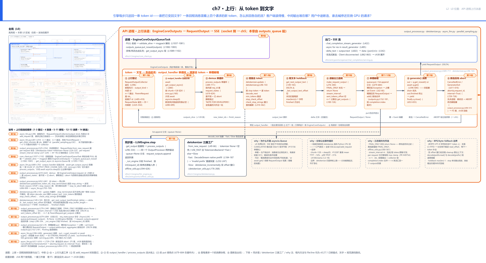
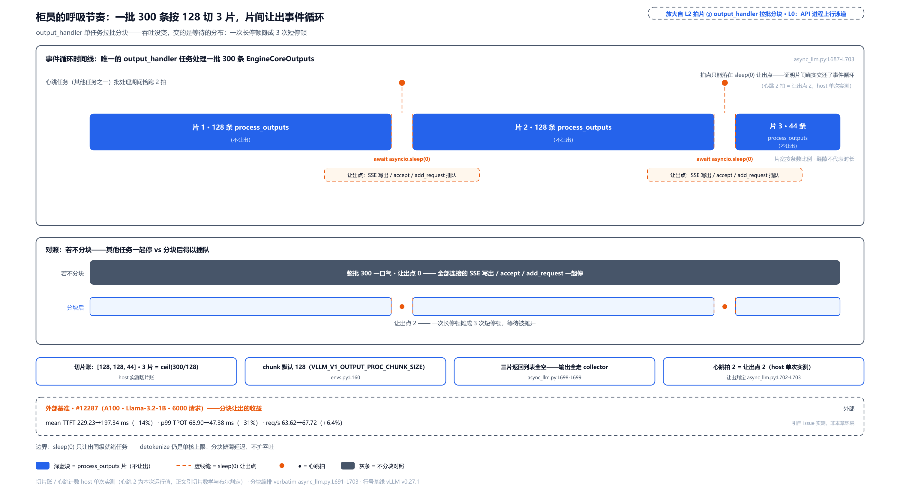
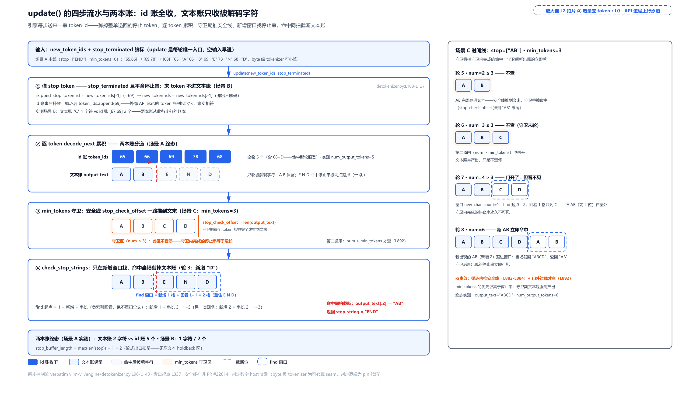
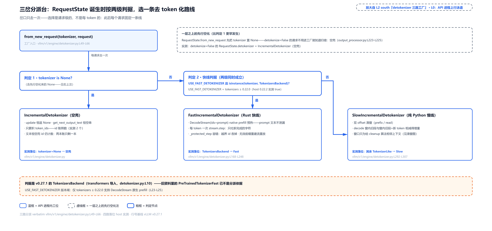
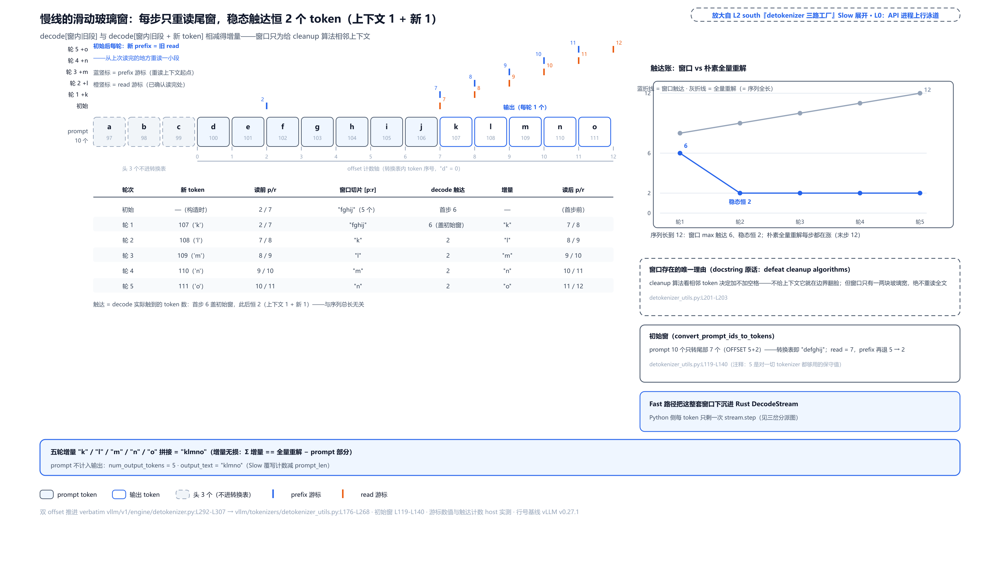
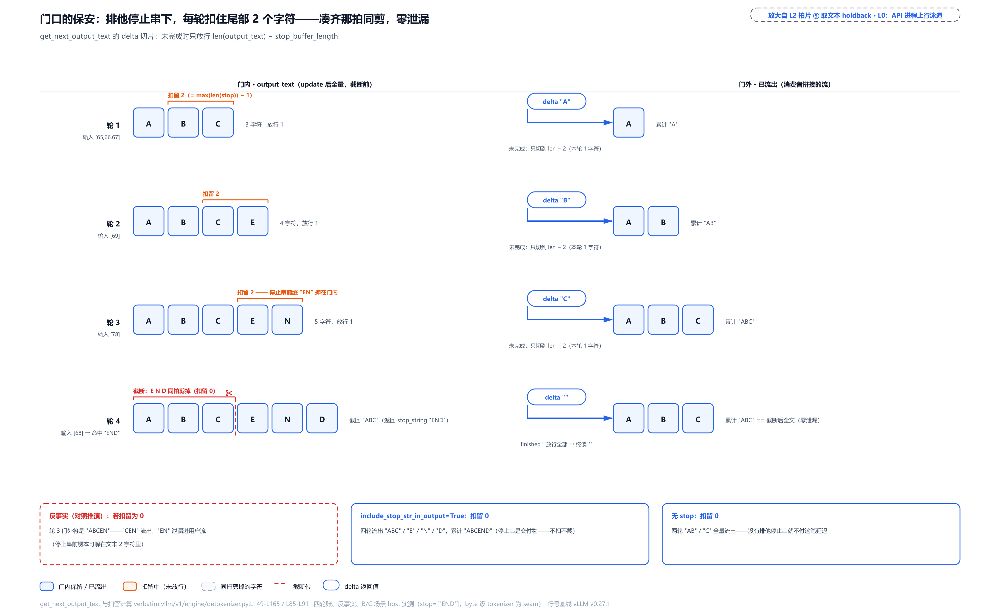
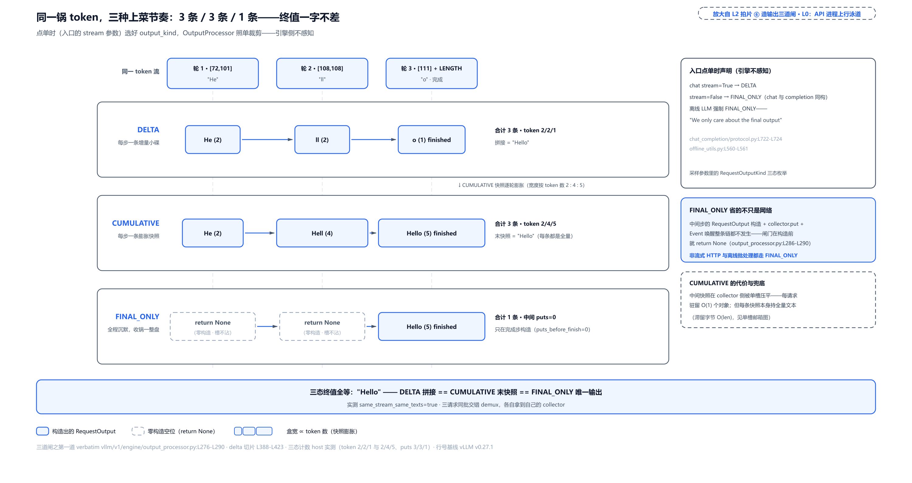
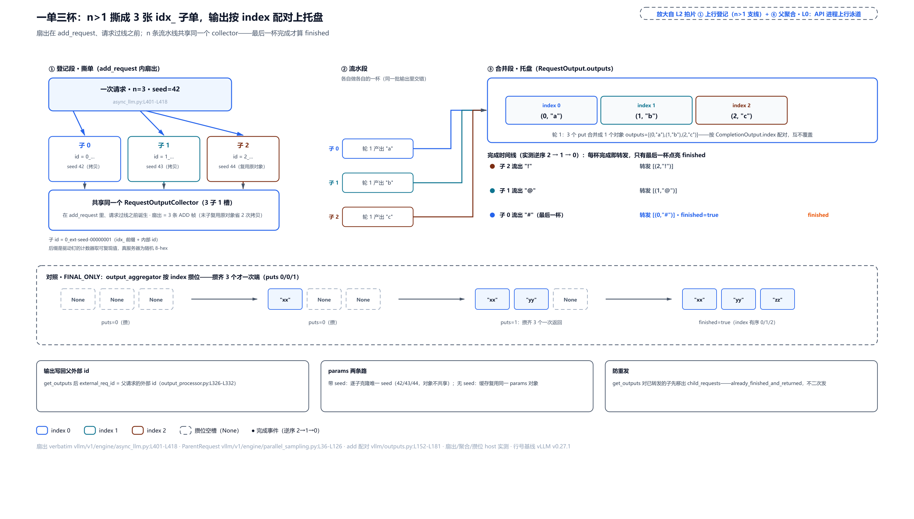
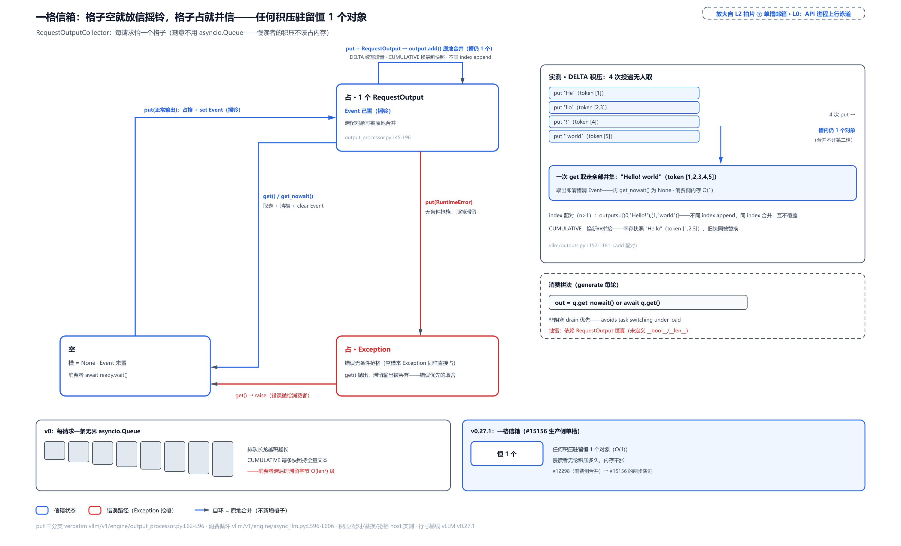
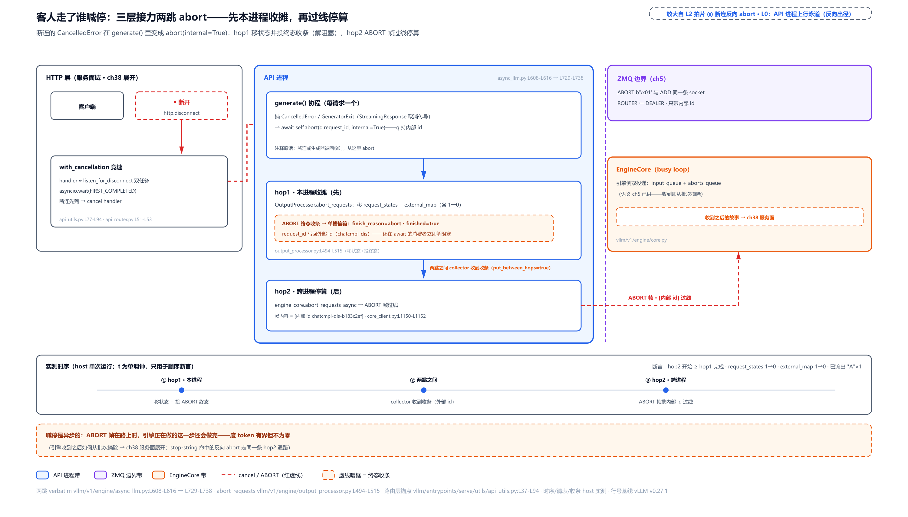

# 第 7 章　上行：从 token 到文字

[第 6 章](../../ch06-downlink-text-to-token/narrative/chapter.md)的结尾，请求带着一串整数过了线。现在引擎的回程到了：一条 ZMQ 消息，msgpack 解开是 `EngineCoreOutputs`——里面每个请求一条 `EngineCoreOutput`（回程消息的每请求明细，字段就几个：`request_id`、`new_token_ids`、`finish_reason`）。全是数字和标志位，没有一个字。可用户在浏览器里等的是字。这段「token id 变回文字」的活发生在哪、谁来干、为什么它不在引擎那一侧干？

而且远不止「变回来」一件事。一条回程消息混着上百个请求的新 token，怎么拆回各自的流？客户端读得慢——TCP 背压顶住（对端收不动，数据堵在链路里送不进来）、事件循环忙不过来——中间输出堆在哪、堆多大、会不会把内存堆爆？还有最难的一问：用户中途关掉页面，谁去喊停那个还在 GPU 上逐 token 烧钱的请求？

这四个问题都在 L0 图同一个地方：蓝色 API 进程带的上行泳道——回程消息进港之后、SSE 出门之前的全部工序，外加一条反向出径（abort 回发引擎）。Part II 的总问题「一千个并发，怎么让 GPU 永不等 CPU」，上行这半边的答案概括成一句话：解包的全部 CPU 活都收在前端进程，且任何时候都不许长时间霸占事件循环。本章把这条泳道整条拆开。

## 你在这里



> *图注：本章放大的是[第 1 章](../../ch01-vllm-v1-in-one-map/narrative/chapter.md) L0 图蓝色 API 进程带的上行半边——正是[第 2 章](../../ch02-request-lifecycle/narrative/chapter.md)十六站走读里变换 5、6（第 15、16 站：回程对账、增量去 token、SSE 出门）只给结论、没展开的那段流水线。上排是两个接口：回程消息自[第 5 章](../../ch05-zmq-topology-and-protocol/narrative/chapter.md)拆过的紫带进港（本章从队列起步，socket 侧不重讲）；出门即[第 2 章](../../ch02-request-lifecycle/narrative/chapter.md)立过的 SSE 帧格式，yield 之后一句话带过。中排 ①-⑨ 是九道工序：① 在 add_request 时刻登记（邮箱、对账表与 n>1 撕单都在这一格里）；②-⑦ 在 output_handler 与 process_outputs 流水线上——② 拉批分块、③ demux 对账、④ 增量去 token、⑤ 取文本扣留、⑥ 造输出三道闸、⑦ 投递进单槽邮箱（put 的调用点就在解包循环里）；⑧ 是每请求一个的消费协程；⑨ 是断连的反向出径。下排是同步面（离线驱动）、去 token 化三路工厂与四块 why 注脚。接点：① 正是[第 4 章](../../ch04-two-usage-faces-one-trio/narrative/chapter.md)双登记里「先本进程」那半边的内容物，格内的 n>1 扇出兑现[第 6 章](../../ch06-downlink-text-to-token/narrative/chapter.md)结尾留的念想；⑥ 造输出写回的外部 id 是[第 6 章](../../ch06-downlink-text-to-token/narrative/chapter.md)双轨 id 的回程半边。本图站号 1-14 = 请求流经代码的顺序（1-3 出发前登记、4 进境、5-11 解包流水、12-13 消费、14 断连出径），正文按讲解需要编排、不必照站号读。*

读法建议：只想知道「token 怎么变回字、为什么会有半个字」，读[「两本账与四步流水」](#两本账与四步流水去-token-化主流程站-8)与[「半个词、半个字、三条产线」](#半个词半个字三条产线词表地基与两条解码路站-7-入口与站-8-支线)；想先看整批解包的总览，直奔[「拆包裹的唯一循环」](#拆包裹的唯一循环process_outputs-走读站-6-7-与-11)；关心慢客户端与内存积压的，读[「一格信箱」](#一格信箱单槽合并与消费站-12-13)；「断连了谁去喊停」在[「客人离席」](#客人离席断连反向-abort站-14)。

## 出发前就备好：邮箱与登记表（站 1-3）

上行故事的第一幕不在回程，而在请求出发之前。[第 4 章](../../ch04-two-usage-faces-one-trio/narrative/chapter.md)立过双登记的纪律：先本进程、后跨进程——回程消息只有内部 id，还原上下文（prompt 原文、去 token 化状态、输出方式）只活在前端，所以表必须先于回程建好。现在打开「先本进程」那半边的内容物：

```python
# vllm/v1/engine/async_llm.py:L390-L403
        # We start the output_handler on the first call to add_request() so
        # we can call __init__ before the event loop, which enables us
        # to handle startup failure gracefully in the OpenAI server.
        self._run_output_handler()

        # Create a new output collector for the request.
        queue = RequestOutputCollector(params.output_kind, request.request_id)  # L396

        # Use cloned params that may have been updated in process_inputs()
        params = request.params

        if is_pooling or params.n == 1:
            await self._add_request(request, prompt_text, None, 0, queue)
            return queue
```

三件事按顺序发生。第一，`_run_output_handler` 懒启动那只常驻的分发任务（下一节的主角；若 AsyncLLM 构造时事件循环已在跑则更早启动——`async_llm.py:L173-L179` 的 eager 分支——双启动只为一件事：OpenAI server 能在进事件循环之前优雅处理启动失败）。第二，L396 诞生**邮箱**：`RequestOutputCollector`（每请求一个的单槽信箱——「一格信箱」一节专拆，此刻记三点就够：它诞生于请求过线之前；构造参数是 `output_kind`（消费方式，三道闸一节的主角）与内部 id（abort 时用的地址）；它就是未来 `generate()` 协程取信的地址）。第三，n=1 的普通请求直连 `_add_request`——那两行就是[第 6 章](../../ch06-downlink-text-to-token/narrative/chapter.md)看过的双登记（本进程 `RequestState` + 跨进程 `EngineCoreRequest`）。这个析取条件的另一半 `is_pooling` 也走同一条直连：池化类模型（嵌入/打分产品线——输出是向量或分数、不是生成文本，装箱走 `PoolingRequestOutput` 另一条输出类型）没有逐 token 的概念，本章主线只顺路路过它，三道闸一节再遇其装箱分支。上面代码里 `params.n > 1` 的扇出分支我省去了（就在 L2 图 ① 那格里），它值得单独一节（[「一单多杯」](#一单多杯n1-的扇出与汇合站-2)）。

本进程那半边登记的实体是 `OutputProcessor`（上行解包总入口，`vllm/v1/engine/output_processor.py`——持有三张表：request_states、parent_requests、external_req_ids）：

```python
# vllm/v1/engine/output_processor.py:L525-L554
    def add_request(
        self,
        request: EngineCoreRequest,
        prompt: str | None,
        parent_req: ParentRequest | None = None,
        request_index: int = 0,
        queue: RequestOutputCollector | None = None,
    ) -> None:
        request_id = request.request_id
        # … 省略：流式输入复用已有 RequestState 的分支（边角特性，Part VIII 服务面展开）…
        req_state = RequestState.from_new_request(
            tokenizer=self.tokenizer,
            request=request,
            # … 省略：prompt / parent_req / request_index 透传 …
            queue=queue,
            # … 省略：log_stats=self.log_stats（观测开关透传）…
            stream_interval=self.stream_interval,
        )
        self.request_states[request_id] = req_state  # L549
        if parent_req:
            self.parent_requests[parent_req.request_id] = parent_req

        # Track the external_req_id -> [internal_req_id, ...] mapping
        self.external_req_ids[req_state.external_req_id].append(request_id)  # L554
```

`RequestState` 是每请求的上行状态袋：去 token 化器、输出方式、信箱引用、节流偏移全挂在上面（工厂里三路选去 token 化器、clamp 节流参数，各自后面展开）。末两行是两笔登记：父请求表（n>1 时挂聚合器）与外→内映射 `external_req_ids`——后者就是**双轨 id 的回程半边**：[第 6 章](../../ch06-downlink-text-to-token/narrative/chapter.md)讲过出发侧——用户给的 id 会被追加 8 位随机后缀变成内部 id；这里 L554 把映射存起来：外部 id → 名下全部内部 id 的列表。为什么值得一张表？

- **旧设计与痛点（回指）**：单轨 id 的撞车账，[第 6 章](../../ch06-downlink-text-to-token/narrative/chapter.md)「出发前改名」一节（`assign_request_id` 给用户 id 加随机尾变内部 id）已算清——重试复用 id 相撞、n>1 扇出汇流污染对账表。本章只补一个具体锚点：v0 的 `RequestTracker._request_streams` 就是一个以用户 id 为键的 dict，n 个子请求汇流时它先撞。
- **v1 方案**：内部 id 全局唯一作键（`request_states`），L554 那行外→内映射留一条按外部 id 展开的通路——输出组装时把外部 id 写回 `RequestOutput`（`output_processor.py:L374` 源码注释原话 `request_id is what was provided externally`），abort 时两套 id 都认（「客人离席」一节亲眼看）。
- **代价（如实记）**：日志与调试都要过一遍映射换算——看到的 id 和用户报的 id 长得不一样；映射表的生命周期要精确跟随请求——完成即由 `_finish_request` 弹表项、划掉外→内名册行（[第 4 章](../../ch04-two-usage-faces-one-trio/narrative/chapter.md)终拍清账演过的同一套名册划账），错位一条就是泄漏。

表建好了，请求过线。回程这一侧的故事正式开场。

## 回程到港：一条队列，坏消息也走它（站 4）

镜头回到 L2 图上排的进境框。[第 5 章](../../ch05-zmq-topology-and-protocol/narrative/chapter.md)拆过紫带与 socket：每前端一条 PULL socket，`process_outputs_socket` 协程收帧、`validate_alive` 查死讯哨兵、msgpack 解码成 `EngineCoreOutputs`。本章从它最后一步起步——解码完的去处：

```python
# vllm/v1/engine/core_client.py:L1082-L1102
                    if outputs.outputs or outputs.scheduler_stats:
                        outputs_queue.put_nowait(outputs)  # L1083
            except Exception as e:
                outputs_queue.put_nowait(e)
            except asyncio.CancelledError:
                outputs_queue.put_nowait(EngineDeadError())

        resources.output_queue_task = asyncio.create_task(
            process_outputs_socket(), name="EngineCoreOutputQueueTask"  # L1090
        )

    async def get_output_async(self) -> EngineCoreOutputs:
        self._ensure_output_queue_task()
        # If an exception arises in process_outputs_socket task,
        # it is forwarded to the outputs_queue so we can raise it
        # from this (run_output_handler) task to shut down the server.
        assert self.outputs_queue is not None
        outputs = await self.outputs_queue.get()  # L1099
        if isinstance(outputs, Exception):
            raise self._format_exception(outputs) from None
        return outputs
```

设计一眼见底：**收货的活（IO 协程）与加工的活（output_handler）用一条普通 `asyncio.Queue` 解耦，谁也不等谁**。入队条件里那个或项也交代一下：有些回程帧不带任何请求输出、只带 `scheduler_stats`（调度侧统计，观测性数据）——这种空拍消息同样进这条队列，由 output_handler 顺手回填统计后丢弃，不另开通道。更值得看的是坏消息的待遇：引擎死讯（`EngineDeadError`，[第 5 章](../../ch05-zmq-topology-and-protocol/narrative/chapter.md)拆过的哨兵帧）和任何异常**不走特权通道，也躺进同一条队列**——由取货方在 L1099 之后转抛。注释原话说得明白：异常被转进队列，是为了「从 output_handler 任务里把它抛出来、好关掉整个 server」——单一队列、单一错误出口，不用维护第二条通知路径。

队列里流动的 `EngineCoreOutputs` 里头，本章主线只消费每请求那条明细的最小字段集：

```python
# vllm/v1/engine/__init__.py:L184-L215
class EngineCoreOutput(
    msgspec.Struct,
    array_like=True,  # type: ignore[call-arg]
    omit_defaults=True,  # type: ignore[call-arg]
    gc=False,
):  # type: ignore[call-arg]
    request_id: str
    new_token_ids: list[int]

    new_logprobs: LogprobsLists | None = None
    # … 省略：new_prompt_logprobs_tensors / pooling_output 字段——logprobs 归下一章，
    #         池化输出归后文 …
    finish_reason: FinishReason | None = None
    stop_reason: int | str | None = None
    # … 省略：events / kv_transfer_params / ec_transfer_params / trace_headers /
    #         prefill_stats / routed_experts / num_nans_in_logits 字段——各归后文领域章 …

    @property
    def finished(self) -> bool:
        return self.finish_reason is not None  # L215
```

上行消费的最小集 = `request_id`（对账键）+ `new_token_ids`（本拍新增的 token）+ `finish_reason`/`stop_reason`（完成原因枚举与停止源，STOP/LENGTH/ABORT 三种本章都会遇到——LENGTH＝token 数撞上 max_tokens（最大生成 token 数）这个采样上限）+ `.finished` 便捷判断。`new_logprobs` 字段本章每次路过都不打开——它是下一章的主角。

还有一条[第 5 章](../../ch05-zmq-topology-and-protocol/narrative/chapter.md)拆紫带时立过的形状事实（按步聚合），本章全程要记着：**每个 forward step、每个前端只来一条 `EngineCoreOutputs`**，整批所有被调度请求的新 token 全打包在里面。引擎侧怎么攒出这条消息归 Part III；源码里甚至留着一条 NOTE(Nick) 自注——行式布局还没榨干，「We could consider ways to make this more compact, e.g. columnwise layout」（可以考虑更紧凑的布局，比如按列排）。代价落在接收侧：单条消息可能非常大，怎么消化它而不憋死整个进程——正是下一节。

## 一名柜员与一整车货：分块让出事件循环（站 5）

直觉先立住：一名柜员面对一整车货（一批 300 条 `EngineCoreOutput`）。一口气卸完，柜台前所有人——新连接、SSE 写出、add_request——都干等；所以每搬 128 箱就停下来喘一口气，让排队的别人先办一桩，再继续搬。货还是那些货，变的是等待的分布：一次长停顿摊成若干次短停顿。

这个设计的来龙去脉值得整条 why 链。**旧设计**：v0 引擎与前端同进程，输出分发内嵌在引擎循环里同步做；v1 拆进程后，初版的 output_handler 是一口气处理整批 `EngineCoreOutputs` 的。**痛点**：v1 里 API 进程只有一条 ZMQ 输出流，每拍带回整批所有请求的输出；`process_outputs` 是纯 Python 的 CPU 活（逐请求去 token 化、组装对象），一批数百请求一口气做完，事件循环单线程（[第 4 章](../../ch04-two-usage-faces-one-trio/narrative/chapter.md)立过基本盘）——期间不能 accept 新 HTTP、不能写任何 SSE、不能收 add_request，所有请求一起被这一批拖住，直接伤尾部的每 token 延迟。**v1 方案**：

```python
# vllm/v1/engine/async_llm.py:L657-L727
    def _run_output_handler(self):
        """Background loop: pulls from EngineCore and pushes to AsyncStreams."""

        if self.output_handler is not None:
            return

        # Ensure that the task doesn't have a circular ref back to the AsyncLLM
        # object, or else it won't be garbage collected and cleaned up properly.
        engine_core = self.engine_core
        output_processor = self.output_processor
        # … 省略：log_stats 与 logger_ref——logger 装进可变列表传递，
        #         弹性 EP 扩缩期可换 logger 而不造回环引用（分布式章的事）…
        chunk_size = envs.VLLM_V1_OUTPUT_PROC_CHUNK_SIZE  # L674

        async def output_handler():
            try:
                while True:
                    # 1) Pull EngineCoreOutputs from the EngineCore.
                    outputs = await engine_core.get_output_async()  # L680
                    num_outputs = len(outputs.outputs)
                    # … 省略：iteration_stats 统计对象的按需构造 …
                    # Split outputs into chunks of at most
                    # VLLM_V1_OUTPUT_PROC_CHUNK_SIZE, so that we don't block the
                    # event loop for too long.
                    engine_core_outputs = outputs.outputs
                    for start in range(0, num_outputs, chunk_size):  # L691
                        end = start + chunk_size
                        outputs_slice = engine_core_outputs[start:end]
                        # 2) Process EngineCoreOutputs.
                        processed_outputs = output_processor.process_outputs(
                            outputs_slice, outputs.timestamp, iteration_stats
                        )
                        # NOTE: RequestOutputs are pushed to their queues.
                        assert not processed_outputs.request_outputs  # L699

                        # Allow other asyncio tasks to run between chunks
                        if end < num_outputs:
                            await asyncio.sleep(0)  # L703

                        # 3) Abort any reqs that finished due to stop strings.
                        if processed_outputs.reqs_to_abort:
                            await engine_core.abort_requests_async(
                                processed_outputs.reqs_to_abort
                            )
                    # … 省略：update_scheduler_stats 与第 4 步 Logging（观测性）…
            except Exception as e:
                logger.exception("AsyncLLM output_handler failed.")
                output_processor.propagate_error(e)  # L725

        self.output_handler = asyncio.create_task(output_handler())  # L727
```

骨架四步：整批取回（L680）→ 按 `chunk_size` 切片、逐片 `process_outputs`（L691，默认 128，环境变量 `VLLM_V1_OUTPUT_PROC_CHUNK_SIZE` 可调）→ 片间 `await asyncio.sleep(0)` 让出（L703，只在还有下一片时）→ 片后处理 stop-string 反向 abort（下一节见到它的出处）。`sleep(0)` 的语言层语义（让其他就绪任务跑一次、不是真睡）[第 4 章](../../ch04-two-usage-faces-one-trio/narrative/chapter.md)立过，这里只问「为什么在这用」：因为它是把一段长 CPU 活切片、在缝里交还事件循环的最便宜写法。两个容易漏看的点：L699 的断言钉死异步面的契约——输出必须全走信箱，返回列表必空（谁改出了第三条路，CI 当场报错）；开头那段闭包捕获（engine_core/output_processor 存局部变量）是刻意不引用 self——否则任务对 AsyncLLM 的回环引用会挡垃圾回收。

实测账（配套精简版在宿主机跑出，控制流与 v0.27.1 逐行同构）：一批 300 条按 128 切成 3 片、片长 128/128/44（= 300 除以 128 向上取整）；批处理期间一个心跳任务实跑 2 拍、恰好对上 2 个让出点——心跳只能在让出缝里被调度，这是「确实交还了事件循环」的直接证据（拍数是单次运行值，别当普适常数）。外部基准（上游 PR #12287，A100/Llama-3.2-1B，6000 条 ShareGPT prompt（ShareGPT＝开源对话语料库，压测常用负载源）、并发上限 400）：mean TTFT（首 token 平均延迟）−14%、p99 TPOT（尾部用户的每 token 平均间隔）−31%、吞吐 +6.4%。吞吐这 +6.4% 要跟「分块不增产」当面调和：它不是解包算得更快，而是事件循环不再被长占、accept 与 IO 插进缝里与解包重叠挣来的——解包任务自身的单核上限一点没变；分块救的是所有人一起卡住的尾部。**代价（如实记）**：每个输出多两级中转（队列→handler→信箱→SSE）；高负载下任务切换次数变多（用切换换公平）；以及一条硬边界——detokenize 仍在这一个任务里跑，单核吞吐上限没变，分块摊薄延迟、不扩吞吐。



> *图注：时间带上唯一的 output_handler 任务把一批 300 条输出切成 128/128/44 三片，两条 sleep(0) 缝里其他任务（SSE 写出、accept、add_request）插队，心跳任务的 2 个落点恰对齐两条缝；时间带下方对照框里的灰条是「若不分块」的对照——整批一口气、让出点 0、其他任务全停。外部基准 #12287 的数字标在图角落（mean TTFT −14%、p99 TPOT −31%、吞吐 +6.4%）。放大自 L2 站 5——L0 图蓝色 API 进程带的事件循环剖面。*

## 拆包裹的唯一循环：process_outputs 走读（站 6-7 与 11）

现在走进 L2 图 ③ 的分拣台。直觉一句话：包裹上只有内部快递号，墙上贴着对账表（request_states）；查得到就拆，查不到说明这单已被取消——包裹直接进碎纸机，连错误都不算。全函数值得整段读：

```python
# vllm/v1/engine/output_processor.py:L589-L711
    def process_outputs(
        self,
        engine_core_outputs: list[EngineCoreOutput],
        engine_core_timestamp: float | None = None,
        iteration_stats: IterationStats | None = None,
    ) -> OutputProcessorOutput:
        """
        Process the EngineCoreOutputs:
        …
        NOTE FOR DEVELOPERS

        vLLM V1 minimizes the number of python loops over the full
        batch to ensure system overheads are minimized. This is the
        only function that should loop over EngineCoreOutputs.

        If you need to touch every element of the batch, do it from
        within the loop below.
        """

        request_outputs: list[RequestOutput | PoolingRequestOutput] = []
        reqs_to_abort: list[str] = []
        for engine_core_output in engine_core_outputs:  # L619
            req_id = engine_core_output.request_id
            req_state = self.request_states.get(req_id)
            if req_state is None:
                # Ignore output for already-aborted request.
                continue  # L624

            # 1) Compute stats for this iteration.
            # … 省略：stats 记账与 routed_experts（MoE 专家路由记录）累积——观测性/正交特性 …
            new_token_ids = engine_core_output.new_token_ids
            pooling_output = engine_core_output.pooling_output
            finish_reason = engine_core_output.finish_reason
            stop_reason = engine_core_output.stop_reason
            # … 省略：kv_transfer_params / ec_transfer_params 字段搬运（P/D 分离章）…

            if req_state.is_prefilling:
                # … 省略：prefill_stats 两行记账 …
                req_state.is_prefilling = False

            if pooling_output is None:
                assert req_state.detokenizer is not None
                assert req_state.logprobs_processor is not None
                # 2) Detokenize the token ids into text and perform stop checks.
                stop_string = req_state.detokenizer.update(  # L656
                    new_token_ids, finish_reason == FinishReason.STOP
                )
                if stop_string:
                    finish_reason = FinishReason.STOP
                    stop_reason = stop_string

                # 3) Compute sample and prompt logprobs for request,
                # if required.
                req_state.logprobs_processor.update_from_output(engine_core_output)

            # 4) Create and handle RequestOutput objects.
            if request_output := req_state.make_request_output(  # L668
                new_token_ids,
                pooling_output,
                finish_reason,
                stop_reason,
                kv_transfer_params,
                ec_transfer_params,
            ):
                # … 省略：流式输入会话强制不收尾的两行（Part VIII 服务面）…
                if req_state.queue is not None:
                    # AsyncLLM: put into queue for handling by generate().
                    req_state.queue.put(request_output)  # L681
                else:
                    # LLMEngine: return list of RequestOutputs.
                    request_outputs.append(request_output)  # L684

            # Free completed requests.
            if finish_reason is not None:
                if req_state.streaming_input:
                    # … 省略：流式输入会话消费下一个输入块的分支（Part VIII 服务面）…
                else:
                    self._finish_request(req_state)
                    if not engine_core_output.finished:
                        # If req not finished in EngineCore, but Detokenizer
                        # detected stop string, abort needed in EngineCore.
                        reqs_to_abort.append(req_id)  # L699
                # … 省略：stats / tracing 收尾 …

        return OutputProcessorOutput(
            request_outputs=request_outputs,
            reqs_to_abort=reqs_to_abort,
        )
```

先看那段全大写的 **NOTE FOR DEVELOPERS**：vLLM V1 刻意把「遍历整批」的 Python 循环数压到最少——**全批遍历只许这一个函数**，谁要碰每条输出，只能从这个循环里进。批量循环是性能预算，不许开第二个。这是本章主线代码的宪法，下面逐段读它。

**demux（L619-L624）**。按内部 id 查 `request_states`，查到就进入解包。查不到呢——continue，静默跳过。这不是偷懒，是用幂等跳过（同一单的包裹来一件还是来几件，处置都一样：丢）兜住一个真实竞态：客户端断连后本进程已经销了这一单（「客人离席」一节亲眼看销单），但引擎侧在途的输出还会到几拍——这些「幽灵包裹」查无此单，直接丢弃。配套精简版测试实测过这条边界：同一批里混进一条已销单的幽灵 id，两个活请求照常各自收到自己的输出、未完成计数纹丝不动——丢幽灵不伤活人。反过来，登记永远先于请求过线（站 1-3），所以不存在「活请求查不到」的方向。

**去 token 化与停止判定（L656-L661）**。`detokenizer.update` 是本章最大的一块（下两节整拆），它吃本拍新 token、吐两样东西：增量文本（记在 detokenizer 自己的账上）与命中的停止串（若有）。注意 L659-661 的改写：命中停止串时，`finish_reason` 被改写成 STOP、`stop_reason` 记为命中的串——文本层的判定覆盖了引擎层的判定。这引出一个不对称：**停止串只有前端的眼睛看得见，引擎只认 token**（[第 2 章](../../ch02-request-lifecycle/narrative/chapter.md)点过的「两地判停」）。于是 L699 有了那份差事：若去 token 化判停了、而引擎自己还不知道（`engine_core_output.finished` 为假），把该请求记进 `reqs_to_abort`——上一节代码里片后那行 `abort_requests_async` 发的就是这份名单。前端反手递一张停做单回去：这单在文本层已经完成，引擎里的 KV 与 batch 位该还给别人了。这是本章两条反向出径的第一条（第二条是断连），机制同源：**前端是唯一看得见文字的地方，它要能把停机令发回引擎**。

**造输出（L668）**。`make_request_output` 三道闸（FINAL_ONLY 裁剪、节流、父聚合）整节在后。返回 None 时连对象都不存在——「不造」也是它的输出之一。

**分发分叉（L679-L684）**。`req_state.queue` 有无是唯一判据：异步面（AsyncLLM）投信箱；同步面（LLMEngine，离线批处理的引擎门面）收进列表返回。**同一个 OutputProcessor、两种驱动**——在线是一只常驻跑堂（output_handler 协程）往信箱投；离线是客户自己站在柜台前一步一等：

```python
# vllm/v1/engine/llm_engine.py:L296-L334
    def step(self) -> list[RequestOutput | PoolingRequestOutput]:
        # … 省略：DP 场景的占位批分支（分布式章）…
        # 1) Get EngineCoreOutput from the EngineCore.
        with record_function_or_nullcontext("llm_engine step: get_output"):
            outputs = self.engine_core.get_output()

        # 2) Process EngineCoreOutputs.
        with record_function_or_nullcontext("llm_engine step: process_outputs"):
            # … 省略：iteration_stats 构造 …
            processed_outputs = self.output_processor.process_outputs(
                outputs.outputs,
                engine_core_timestamp=outputs.timestamp,
                iteration_stats=iteration_stats,
            )
            # … 省略：update_scheduler_stats ——调度侧统计回填（观测性）…

        # 3) Abort any reqs that finished due to stop strings.
        with record_function_or_nullcontext("llm_engine step: abort_requests"):
            self.engine_core.abort_requests(processed_outputs.reqs_to_abort)

        # 4) Record stats
        # … 省略：stats 记账 …
        return processed_outputs.request_outputs
```

四步 = 上一节 output_handler 一轮的**无 await 镜像**：阻塞取（`get_output` 睡在线程的队列上）→ process_outputs → stop-string abort → 统计，返回列表。调用方 `_run_engine` 循环 step、只收 finished 的请求，收尾还有一步排序——按 `int(request_id)` 还原输入顺序。妙处在于离线面自动生成的**外部** id 是自增整数计数器（`offline_utils.py` 的 `request_counter`）——RequestOutput 出门写回的正是它（出发前那节引过的 `output_processor.py:L374`），恰好可直接排序；在线面的 id 是用户给的任意串，本无排序可言，但在线面本来也不需要保序——各请求各走各的流。离线面还强制 `FINAL_ONLY`（`offline_utils.py:L560-L561`，注释原话「We only care about the final output」——为什么这是便宜事，三道闸一节见）。

**完成清理**。`finish_reason` 非空即 `_finish_request`：从 request_states 摘牌、从外→内映射删行、父请求联动收尾——三张表的生命周期到此对齐。至此循环读完：一条 `EngineCoreOutput` 从进门到进信箱（或进列表），中间只经过这一个 for。

## 两本账与四步流水：去 token 化主流程（站 8）

镜头推近 L2 图 ④。直觉：去 token 化的收银台对两本账——**id 账**（token_ids）什么都收，连被弹掉的停止 token 也事后补登；**文本账**（output_text）只收进得厨房的字符。顺手回答开篇第一段压着的最后一问——这活为什么不在引擎那一侧干：它是逐请求的纯 Python CPU 活，塞进引擎就挤占那只「只做调度与执行」的循环（[第 6 章](../../ch06-downlink-text-to-token/narrative/chapter.md)决定切词位置时的同一条理由，方向反过来）；且停止串判定要读用户的采样参数与文本上下文——这些还原材料按站 1-3 的设计本来就只在前端。先把取证环境交代清楚，再看代码与数值。

> **取证环境说明**（去 token 化各数值表的取证环境，一次交代、后文就近补充；站 5 的分块实测只数条数与拍数、不涉词表，先行读过无妨）：本章数值全部来自配套精简版在宿主机上的实测（72 个测试全绿），其中分词器换成手工 byte 级实现——1 个 token 恰是 1 个字节、token id 就是字节值（65='A'、228=0xE4），为的是读者能心算验证；真实 HF 分词器的 token 切分与此不同（真实值以 HF 分词器为准），但**控制流、判定逻辑与源码逐字同构**。Fast 路径跑在真实的 Rust `DecodeStream` 上（tokenizers 0.22.2）——native prefill、UTF-8 字节缓冲、无效前缀异常都是真行为；宿主机的 transformers 版本较旧、没有 `TokenizersBackend` 类，测试用同名替身类只补名字与 `._tokenizer` 触达面。凡示意值，正文就近标注。

```python
# vllm/v1/engine/detokenizer.py:L96-L143
    def update(self, new_token_ids: list[int], stop_terminated: bool) -> str | None:
        """
        Update RequestState for the request_id by:
            1) Detokenize the new token ids incrementally.
            2) Evaluate stop criteria.

        Return matched stop string or None.
        """
        if not new_token_ids:
            # Skip detokenization if no new token ids.
            return None

        if stop_terminated and not self.include_stop_str_in_output:  # L108
            # If stop-terminated, exclude last token from detokenization
            # based on include_stop_str_in_output parameter.
            skipped_stop_token_id = new_token_ids[-1]
            new_token_ids = new_token_ids[:-1]
        else:
            skipped_stop_token_id = None

        # 1) Detokenize the new token ids incrementally.
        stop_check_offset = len(self.output_text)  # L117
        for new_token_id in new_token_ids:
            self.token_ids.append(new_token_id)
            self.output_text += self.decode_next(new_token_id)
            # Support min_tokens, see https://github.com/vllm-project/vllm/pull/22014
            if self.min_tokens and self.num_output_tokens() <= self.min_tokens:  # L122
                stop_check_offset = len(self.output_text)

        if skipped_stop_token_id is not None:
            # Cleanup after skipping detokenization.
            self.token_ids.append(skipped_stop_token_id)

        # 2) Evaluate stop strings.
        stop_string = None
        if self.stop and self.num_output_tokens() > self.min_tokens:  # L131
            stop = check_stop_strings(
                output_text=self.output_text,
                new_char_count=len(self.output_text) - stop_check_offset,
                stop=self.stop,
                include_in_output=self.include_stop_str_in_output,
            )
            if stop is not None:
                stop_string, truncate_to = stop
                if truncate_to != -1:
                    self.output_text = self.output_text[:truncate_to]  # L141

        return stop_string
```

四步流水，逐步读。**第一步：弹停止 token**（L108-114）。`stop_terminated` 是 update 的形参——调用点传的是 `finish_reason == FinishReason.STOP`（引擎判了这个请求撞上了停止 token）。此时若用户不想看停止串（`include_stop_str_in_output`，采样参数：命中的停止内容是否随文交付），末位 token 被弹出**不解码**——文本账不收；但循环后 L126-127 把它补登进 id 账。为什么文本与 id 要各记各的？因为对外 API 承诺的 token 序列**包含**停止 token（账实要相符），而交付文本**不包含**它的字——两本账从第一天起就不是同一个东西。

**第二步：逐 token 现炒**（L117-123）。`decode_next` 是抽象方法——Fast/Slow 两条产线各自的实现是下一节的大戏，此处只管它返回一个字符串增量、拼进文本账。循环里夹着第三步。

**第三步：min_tokens 推安全线**（L122-123）。`min_tokens`（最少生成 token 数的采样参数）是一份「至少说完 N 句」的合同：合同期内文本照常产出，但 `stop_check_offset`（停止串检查的起点安全线）被一路推到文末——守卫期长出来的停止串等于没长。这是 PR #22014 补的守卫，与第四步门外的 `num_output_tokens() > self.min_tokens`（L131）双保险：门内推线让守卫期文本**永不进入**检查窗口，门外卡数让守卫期**根本不查**。

**第四步：窗口查停**（L131-142）。只在满足守卫条件时调 `check_stop_strings`（模块级函数，后文「文本层的刹车」一节专拆），给它的是文本账、本拍新增字符数（`new_char_count`）与停止串清单。命中则当场把文本账剪到截断点（L141），返回命中的串——回到上一节 L659，它会改写 finish_reason 并可能触发反向 abort。

数值推演（byte 级分词器实测，三个场景拼出四步全貌）。三个场景各自从空状态独立起跑，连排只为省一张表：A＝stop=["END"]、排他模式；B＝无 stop 配置、引擎判停（stop_terminated=True）；C＝stop=["AB"]、min_tokens=3。

<!-- trace: m4 -->
| 轮次 | update 输入（token id） | output_text 累积 | 停止串判定 | 返回 | 关键观察 |
|---|---|---|---|---|---|
| 轮 1 · 场景A | [65, 66] → "AB" | "AB" | 新增 2 字符窗口内无 END | None | 正常累积 |
| 轮 2 · 场景A | [69, 78] → "EN" | "ABEN" | 仍无完整 END | None | 停止串前缀已就位但未完成 |
| 轮 3 · 场景A | [68] → "D" | 命中 END → 当场截断回 "AB" | find 在窗口内命中 | "END" | 文本账 2 字符 vs id 账 5 个——两本账分道 |
| 轮 4 · 场景B | [67, 69]，stop_terminated=True | "C"（弹 69 不解码，事后补登 id 账） | 无 stop 配置 | None | 文本账 1 字符 / id 账 2 个 |
| 轮 5 · 场景C | [65, 66] → "AB" | "AB" | num=2 ≤ min_tokens=3 → 不查 | None | 守卫吞掉命中（stop_check_offset 推到文末） |
| 轮 6 · 场景C | [67] → "C" | "ABC" | num=3 ≤ 3 → 不查 | None | 守卫末轮 |
| 轮 7 · 场景C | [68] → "D" | "ABCD" | num=4 > 3 但窗口 new_char_count=1 回看不到旧 AB | None | 守卫内完成的 stop 永不可见 |
| 轮 8 · 场景C | [65, 66] → 新 "AB" | 截断回 "ABCD" | 新出现的 AB 在窗口内命中 | "AB" | 守卫后新出现的 stop 立即可见、当场截断 |

场景 A 是主线：5 个 token 进来（A、B、E、N、D），文本账只剩 2 字符——"END" 在文本里凑齐的同一拍被剪掉。场景 B 是第一步的两本账：69 只进 id 账。场景 C 最有味道，把 min_tokens 的语义钉死了：stop=["AB"]、min_tokens=3，头两轮 AB 完整躺在文本里无人理会（守卫期）；轮 7 守卫期满（4>3），但那道门开了也白开——本拍只新增 1 个字符，检查窗口回看不到旧 AB（守卫期内安全线一路推到了文末，旧 AB 整段留在窗口之外）；轮 8 新出现的 AB 落进窗口，立即命中、当场截断。结论一句话：**守卫内完成的停止串永久不可见，守卫后新出现的立即作数**——min_tokens 的优先级高于停止串，这是设计语义不是 bug。

不变量跟着立住（后面几节都要用它）：**id 账严格单调**——每轮 update 后其长度恰增加输入长度（停止 token 弹出解码后必补登），上界是 max_tokens，所以有限步必停；**文本账单调不减**，唯一的收缩点是停止串命中的同一调用内截断（L141），且截断位置永远落在「尚未流出的区域」——怎么保证尚未流出？靠后文「文本层的刹车」一节门口的扣留。两本账 + 同拍截断 + 扣留，三者合起来，才完整兑现「用户永远看不见停止串」这句外部承诺。



> *图注：四步纵向流水——弹 stop token 的分拣框（id 账虚线补登）、两本账并排的 decode_next 累积带（id 账 65,66,69,78,68 全收 5 个、文本账只收 AB）、min_tokens 安全线（守卫区标注「此区不查停」）、check_stop_strings 的滑窗与剪刀。右侧场景 C 时间线：守卫期吞掉 AB、期满一轮窗口也回看不到、新 AB 出现立即剪。放大自 L2 站 8——L0 图蓝色 API 进程带的去 token 化工位。*

## 半个词、半个字、三条产线：词表地基与两条解码路（站 7 入口与站 8 支线）

`decode_next` 怎么把一个整数变成字符增量？现在离开中排流水线、走到 L2 图下排的「detokenizer 三路工厂」——中排 ④ 那步增量去 token 的活，就由这里选出的产线干。这事值得先把地基讲清楚——不理解词表，就看不懂 vLLM 去 token 化的全部特殊处理是在对付什么。

### 词表不是词的清单：BPE、byte-level 与 ▁

模型的词表不是「词的清单」，是**碎片清单**。三种主流切法各贡献一类麻烦。

**BPE（Byte Pair Encoding，字节对编码）**：训练时从字符这种最小单元出发，「反复合并出现频率最高的相邻对」（HF 官方 tokenizer 文档的定义）直到词表填满；编码时按学到的合并规则贪心合并。效果：高频词整词成 token，生僻词拆碎片——GPT-2 词表里 "Playing" 是 ["Play", "ing"] 两个 token，一个生僻串能拆成五六块（说明性示例，见 [HF tokenizer 综述](https://huggingface.co/docs/transformers/tokenizer_summary)）。对解码的含义：一个 token 可能只是**半个词**。

**byte-level BPE**（GPT-2 一脉）：底座干脆是全部 256 个字节值，官方文档原话「ensuring every word can be tokenized without the `<unk>` token」——任何字符串（包括乱码、emoji）都切得开、绝不出未登录符。GPT-2 的 50257 词表 = 256 字节 + 50000 次合并 + 1 个结束符。对解码的含义：一个 token 可能是**多字节字符的一部分**——emoji ✨ 的 UTF-8 编码是 3 个字节，即使词表从没合并过它，它也会以字节 token 的组合出现。

**SentencePiece**（LLaMA 一脉）：把输入当原始字符流处理，空格不特殊对待、写成记号 ▁（U+2581，下横线元记号）跟字一起进词表（[官方训练选项文档](https://github.com/google/sentencepiece/blob/master/doc/options.md)：默认把空格替换为 ▁ 以保留空白信息）。"Hello world" 编码成 ["▁Hello", "▁world"]——空格粘在前一个词的 token 里；逐 token 直接拼接得到 "▁Hello▁world"，必须把 ▁ 换回空格才是人话。对解码的含义：**decode 不是纯拼接**——分词器的 decode 步骤（cleanup 算法）要按相邻 token 决定加不加空格、换不换记号，而这正是后文慢线那扇「滑动玻璃窗」存在的唯一理由。

一句话收拢：token 边界和字符边界、词边界**不对齐**——半个词、半个字符、带记号的词，三种碎片都得增量解码来对付。vLLM 给每个请求选一条产线干这活。

### 三岔口：空壳、快线、慢线

直觉：分派台的三岔口——没带刀具的去空壳窗口只记账不发菜；带了厂里新式快刀（且刀的型号达标）去 Rust 快线；刀不合规格退回纯 Python 慢线。岔口在 `RequestState` 诞生时走一次，此后每个请求固定一条线——选择是请求级的，不是每 token 的。

```python
# vllm/v1/engine/detokenizer.py:L31-L66
class IncrementalDetokenizer:
    def __init__(self):
        self.token_ids: list[int] = []
    # … 省略：空壳的 output_token_ids / num_output_tokens / update / get_next_output_text——
    #         全部退化为「只累积 id、update 恒返 None、文本恒空串」…

    @classmethod
    def from_new_request(
        cls,
        tokenizer: TokenizerLike | None,
        request: EngineCoreRequest,
    ) -> "IncrementalDetokenizer":
        assert request.sampling_params is not None

        if tokenizer is None:  # L57
            # No tokenizer => skipping detokenization.
            return IncrementalDetokenizer()

        if USE_FAST_DETOKENIZER and isinstance(tokenizer, TokenizersBackend):  # L61
            # Fast tokenizer => use tokenizers library DecodeStream.
            return FastIncrementalDetokenizer(tokenizer, request)

        # Fall back to slow python-based incremental detokenization.
        return SlowIncrementalDetokenizer(tokenizer, request)
```

三路的判据两级。第一级：`tokenizer is None`——去空壳 `IncrementalDetokenizer` 本尊（这个类既是家族根、也是空壳实现：只记 id 账，update 恒返 None、取文本恒空串）。谁会没有 tokenizer？库用户传 token_ids 只要 id 序列、不要文本时，可在采样参数里关掉去 token 化——`RequestState.from_new_request` 会先把 tokenizer 置 None（`output_processor.py:L224-L225`）再进工厂，殊途同归落进空壳。第二级：`USE_FAST_DETOKENIZER`（版本闸：tokenizers 库 ≥ 0.22.0 才放行，源码注释原话「Only tokenizers >= 0.22.0 supports DecodeStream with native prefill」）**且** isinstance 判据 `TokenizersBackend`（transformers 的 fast tokenizer 后端类）——双双满足走快线，否则退慢线。有个读旧资料的地雷要拆：判据是 v0.27.1 的 `TokenizersBackend`，早先版本的 `PreTrainedTokenizerFast` 判据已过时。实测四路探针（精简版跑真 `RequestState` 路径）：tokenizer=None→空壳、TokenizersBackend→Fast、其他 TokenizerLike→Slow、detokenize=False→先空化再落空壳——全部按判据落位。



> *图注：两层决策树——tokenizer 为 None（含一层之上 detokenize=False 的先行空化）落空壳（update 恒 None、文本恒空、id 照数）；tokenizers≥0.22.0 且 TokenizersBackend 落 Fast；其余落 Slow。三个终端盒带实测落位探针；版本判据横幅标明 TokenizersBackend 是 v0.27.1 的分派依据。放大自 L2 图下排的「detokenizer 三路工厂」。*

### 快线：DecodeStream 与它的两名保镖

快线的主角是 HuggingFace `tokenizers` 库（Rust 内核）的 **DecodeStream**——流式解码器，契约一句话：逐个喂 token id，能凑成合法文本就返回这段文本、凑不成就返回 None。官方文档原话「individual calls to step may return None when the current token completes a partial sequence that cannot yet be decoded」；构造函数的 `ids` 参数可传入整段 prompt 做预热（native prefill，v0.22.0 引入，[版本发布页](https://github.com/huggingface/tokenizers/releases/tag/v0.22.0)）——这正是 vLLM 用的那个参数。它内部按 read/prefix/rest 三段维护缓冲——tokenizers 源码注释的拆法：read 是垫在前面的上下文 token，让整段重解码时已交出的部分保持原样（对付的还是 cleanup）；prefix 是上一步已交出的那段文本，新一轮解码结果先减掉它才是增量；rest 是攒着还没凑成合法字符的尾巴。先记住这个结构，慢线一节你会看见**同一个思想的另一份实现**。裸契约的用法四行（说明性示例，据[官方文档](https://github.com/huggingface/tokenizers/blob/main/bindings/python/src/decoders.rs)的签名直译）：

```python
# 说明性示例（外部契约直译，非本仓源码）：
stream = DecodeStream(ids=prompt_token_ids, skip_special_tokens=True)  # 预热
for tid in new_token_ids:
    chunk = stream.step(tokenizer, tid)   # 返回 str 或 None
    if chunk is not None:
        output_text += chunk              # None = 半个字符，攒着等下个 token
```

vLLM 的快线就是这个壳加两层防御。构造：

```python
# vllm/v1/engine/detokenizer.py:L168-L209
class FastIncrementalDetokenizer(BaseIncrementalDetokenizer):
    def __init__(self, tokenizer: TokenizersBackend, request: EngineCoreRequest):
        super().__init__(request)

        # … 省略：request_id / skip_special_tokens / self.tokenizer 三行常规赋值 …
        # Use native prefill to prime the decode stream with prompt tokens.
        # Look up DecodeStream on the module so backend patches (e.g. the
        # fastokens shim that replaces ``tokenizers.decoders.DecodeStream``)
        # are honored regardless of import order.
        self.stream = tokenizers.decoders.DecodeStream(  # L184
            ids=request.prompt_token_ids,
            skip_special_tokens=self.skip_special_tokens,
        )
        # … 省略：spaces_between_special_tokens=False 时的相邻特殊 token 空格抑制（可选优化）…
```

两个点。其一，native prefill：prompt 一次性喂进 Rust 侧，把流的状态建好——此后每步只交「新完成的字符」，prompt 文本永不出现在增量里（实测预热 "Hi" 后连喂 65、66 两个 token，output_text 从 "A" 拼到 "AB"，从头到尾没有 "Hi" 前缀）。其二，那行 `tokenizers.decoders.DecodeStream(...)` 为什么绕一层模块查找而不直接用导入好的名字？注释招了：给 backend 补丁留门。环境变量 `VLLM_USE_FASTOKENS=1` 可以选装 [fastokens](https://github.com/crusoecloud/fastokens)（Crusoe 开源的 Rust 编码加速器，项目自述比 tokenizers 快 10 倍以上——它加速的是**编码**，不是解码；这个开关 v0.21.0 起就有（引入于 PR #41741），不是 v0.27.1 新增）：其补丁会换掉 HF fast tokenizer 的 Rust 内核、并重绑 `tokenizers.decoders.DecodeStream`；vLLM 走模块属性查找，保证拿到的是被重绑后的版本——所以那层间接不是多余的。

每 token 一步与它的两名保镖：

```python
# vllm/v1/engine/detokenizer.py:L211-L248
    def decode_next(self, next_token_id: int) -> str:
        token = self._protected_step(next_token_id)
        # … 省略：spaces_between_special_tokens=False 时的空格抑制段（可选优化）…
        return token or ""  # L222

    def _protected_step(self, next_token_id: int) -> str | None:
        try:
            token = self.stream.step(self.tokenizer, next_token_id)
        except (OverflowError, TypeError):
            # Handle rare observed overflow, still to be diagnosed.
            # See https://github.com/vllm-project/vllm/issues/21951.
            logger.exception("Encountered invalid token id: %r", next_token_id)
            token = None
        except Exception as e:
            if not str(e).startswith(INVALID_PREFIX_ERR_MSG):
                raise e
            # Recover from edge case where tokenizer can produce non-monotonic,
            # invalid UTF-8 output, which breaks the internal state of
            # tokenizers' DecodeStream.
            # See https://github.com/vllm-project/vllm/issues/17448.
            logger.warning(
                "Encountered invalid prefix detokenization error"
                " for request %s, resetting decode stream.",
                self.request_id,
            )
            self.stream = tokenizers.decoders.DecodeStream(  # L244
                skip_special_tokens=self.skip_special_tokens
            )
            token = self.stream.step(self.tokenizer, next_token_id)
        return token
```

`decode_next` 本体只剩「step 一步、None 归零为空串」。保镖一号（OverflowError/TypeError）：模型吐出超出 u64（64 位无符号整数——它能表示的 id 上限就是 2 的 64 次方减 1）的 id（issue #21951 的真实案例）时绑定层抛异常——记日志、吞掉、当 None 处理，不炸整个请求。保镖二号（`Invalid prefix encountered`，tokenizers 内部的错误字符串，`INVALID_PREFIX_ERR_MSG` 常量逐字取自其源码）：模型输出非单调、无效的 UTF-8 序列把 Rust 流的内部状态弄坏时（issue #17448），当场失忆重修——新建一条**无预热**的流、重放这一个 token、继续干活。注意重建的流没有 prefill 上下文，这是真实语义：跨边界的 cleanup（空格类处理）会失准，但字节级解码照常。数值推演（真 Rust 流，byte 级分词器）：

<!-- trace: m6 -->
| 轮次 | 输入 token id | Rust step 原始返回 | decode_next（update 视角） | 判定 |
|---|---|---|---|---|
| 轮 1 · prefill 后首步 | 65（'A'） | "A" | "A" | prompt 文本不泄漏：预热 "Hi" 后连喂 "A"、"B" 两个 token，output_text 开头即 "AB"、绝无 "Hi" 前缀 |
| 轮 2 · 多字节 1/3 | 228（E4） | None | ""（token or 空串） | 首字节被 Rust 内部缓冲，text 零增量 |
| 轮 3 · 多字节 2/3 | 184（B8） | None | "" | 仍不完整 |
| 轮 4 · 多字节 3/3 | 173（AD） | "中" | "中" | 第三字节补全，整字一次交出 |
| 轮 5 · 超 vocab id | 256 | None | "" | 真 Rust 流对越界 id 不报错、直接返回 None |
| 轮 6 · 超 u64 id | 18446744073709551616 | TypeError 被 _protected_step 吞掉 → None | "" | 绑定层异常吞掉（issue #21951 同款分支），不炸请求 |
| 轮 7 · 无效前缀恢复 | 72（stub 流抛 'Invalid prefix encountered'） | 重建流重放 → "H" | "H" | 重建的流是全新的（无 prefill 上下文——真实语义），后续 update 照常工作 |

轮 2-4 是快线最核心的行为：多字节字符「中」（UTF-8 三字节 E4/B8/AD）分三个 token 到达，前两步 Rust 侧返回 None、第三步整字一次交出——**半个字符被攒在 Rust 里，从不出门**。轮 6 的 18446744073709551616 是 2 的 64 次方，保镖一号的实测证据。轮 7 的触发方式就近挑明：良构词表上难以自然产生无效前缀，取证时往流里注入了一条会抛这句错的替身流——验证的是真码的「捕获-重建-重放」三步，重建后流无 prefill 上下文也是真实语义。

### 慢线：双 offset 滑动玻璃窗

慢线不是快线的降级替代那么简单——它是这套「增量解码」思想的 Python 原版，先在 vLLM 里存在，后来 tokenizers 才把同类逻辑下沉进 Rust。直觉：装配工靠一块滑动的玻璃窗读图纸——窗口左沿 `prefix_offset`（重读的上下文起点）、右沿 `read_offset`（已确认读完的地方）。每来一个新 token，把窗口从上次读完的地方重新拉一遍：先 decode 窗内旧段得 `prefix_text`、再 decode 窗内旧段加新 token 得 `new_text`，两者相减就是增量。

为什么非要重读旧段？**朴素做法**是每步 decode 整个序列——每步 O(n)、生成 n 个 token 总共 O(n²)，长输出下这笔账不可接受。但把窗口砍到只剩新 token 也不行：分词器的 cleanup 算法（决定加不加空格、怎么处理 ▁）看的是**相邻 token**——不给上下文它就在边界上翻脸。所以窗口必须留一点上下文。源码 docstring 原话：「The offsets are necessary to defeat cleanup algorithms in the decode which decide to add a space or not depending on the surrounding ids」。三段源码连读：

```python
# vllm/v1/engine/detokenizer.py:L252-L307
    def __init__(self, tokenizer: TokenizerLike, request: EngineCoreRequest):
        super().__init__(request)

        self.tokenizer = tokenizer
        # … 省略：prompt_len 从 token_ids 或 embeds 度量 …
        # Metadata for incremental detokenization.
        if request.prompt_token_ids is not None:
            self.tokens, self.prefix_offset, self.read_offset = (
                convert_prompt_ids_to_tokens(  # L266
                    tokenizer=tokenizer,
                    prompt_ids=request.prompt_token_ids,
                    skip_special_tokens=params.skip_special_tokens,
                )
            )
        else:
            # Prompt embedding requests cannot be detokenized, in general.
            self.tokens = [""] * self.prompt_len
            self.prefix_offset = 0
            self.read_offset = 0

        self.token_ids.extend(request.prompt_token_ids or [0] * self.prompt_len)

        # … 省略：skip_special_tokens / spaces_between_special_tokens 两行赋值
        #         （L280-281——下方 decode_next 传的就是这两个属性）…

    @property
    def output_token_ids(self) -> list[int]:  # L284
        if self.prompt_len:
            return self.token_ids[self.prompt_len :]
        return self.token_ids

    def num_output_tokens(self) -> int:
        return len(self.token_ids) - self.prompt_len

    def decode_next(self, next_token_id: int) -> str:
        new_tokens, decoded_text, prefix_offset, read_offset = detokenize_incrementally(  # L293
            tokenizer=self.tokenizer,
            all_input_ids=self.token_ids,
            prev_tokens=self.tokens,
            prefix_offset=self.prefix_offset,
            read_offset=self.read_offset,
            skip_special_tokens=self.skip_special_tokens,
            spaces_between_special_tokens=self.spaces_between_special_tokens,
        )

        self.tokens.extend(new_tokens)
        self.prefix_offset = prefix_offset
        self.read_offset = read_offset

        return decoded_text
```

慢线的 `token_ids` 里**含 prompt**（构造时整段 extend 进来，decode 需要全序列做上下文），所以 L284-290 覆写 `output_token_ids`/`num_output_tokens` 减去 `prompt_len`——快线的账本不含 prompt，两路口径不同，这是读代码时最容易踩的坑。embeds 请求（[第 6 章](../../ch06-downlink-text-to-token/narrative/chapter.md)见过的嵌入输入）在慢线只得到占位空转——源码自注「Prompt embedding requests cannot be detokenized, in general」（嵌入请求一般无法去 token 化，没有 token 可言）。初始窗口：

```python
# vllm/tokenizers/detokenizer_utils.py:L119-L140
def convert_prompt_ids_to_tokens(
    tokenizer: TokenizerLike,
    prompt_ids: list[int],
    skip_special_tokens: bool = False,
) -> tuple[list[str], int, int]:
    """Converts the prompt ids to tokens and returns the tokens and offsets
    for incremental detokenization.

    Note that not all tokens are converted to strings. Only the tokens that
    are necessary for incremental detokenization are converted to strings.
    """
    # We do not need to convert the whole prompt to tokens.
    # Offset a little more in case we have special tokens.
    new_tokens = tokenizer.convert_ids_to_tokens(
        prompt_ids[-INITIAL_INCREMENTAL_DETOKENIZATION_OFFSET - 2 :],
        skip_special_tokens=skip_special_tokens,
    )
    read_offset = len(new_tokens)
    prefix_offset = max(read_offset - INITIAL_INCREMENTAL_DETOKENIZATION_OFFSET, 0)
    # This is required to guard against out-of-vocab prompt token ids
    _replace_none_with_empty(new_tokens)  # type: ignore[arg-type]
    return new_tokens, prefix_offset, read_offset
```

`INITIAL_INCREMENTAL_DETOKENIZATION_OFFSET` 是模块常量 5（注释自认「5 is an arbitrary value that should work for all tokenizers (bigger = more conservative)」——5 是个对所有分词器都够用的任意值，更大更保守）。所以初始窗口 = prompt **尾部 7 个 token**（5+2），`read_offset=7`、`prefix_offset` 再退 5。10 个 token 的 prompt 只预热尾部 7 个——prompt 的字从头到尾不需要重新解码，窗口只为输出侧的 cleanup 上下文服务。窗口本体：

```python
# vllm/tokenizers/detokenizer_utils.py:L176-L268
def detokenize_incrementally(
    # … 省略：八个参数（tokenizer/全序列/已转 token 串/双 offset/两个开关）…
) -> tuple[list[str], str, int, int]:
    # … 省略：完整 docstring——offsets 的使命见上文引文 …
    new_token_id = all_input_ids[-1]
    # … 省略：首迭代（prev_tokens 为 None 时回头调 convert_prompt_ids_to_tokens）、
    #         新 token id 转 token 串（越界返空串防崩）…
    output_tokens = prev_tokens + new_tokens

    # … 省略：首迭代整窗返回的三行（is_first_iter → new_tokens = output_tokens，
    #         L234-236——预热窗口未建时的兜底路径，本章构造时已建窗口，走不到）…

    # The prefix text is necessary only to defeat cleanup algorithms in
    # the decode which decide to add a space or not depending on the
    # surrounding ids.
    if tokenizer.is_fast or not tokenizer.get_added_vocab():
        prefix_text = tokenizer.convert_tokens_to_string(
            output_tokens[prefix_offset:read_offset]
        )
        new_text = tokenizer.convert_tokens_to_string(output_tokens[prefix_offset:])
    else:
        # … 省略：非 fast 且带附加词表的 tokenizer 走逐 added-token 切段的同构分支 …

    if len(new_text) <= len(prefix_text) or new_text.endswith("�"):  # L260
        # utf-8 char at the end means it's a potential unfinished byte sequence
        # from byte fallback tokenization.
        # If it's in the middle, it's probably a real invalid id generated
        # by the model
        return new_tokens, "", prefix_offset, read_offset

    new_text = new_text[len(prefix_text) :]
    return new_tokens, new_text, read_offset, len(output_tokens)
```

三步账：decode 窗内已读段（`[prefix_offset:read_offset]`）得 `prefix_text`——上一步已交出的原文；decode 窗内全部（`[prefix_offset:]`）得 `new_text`；增量 = `new_text[len(prefix_text):]`。推进规则在末行：新 `prefix_offset` = 旧 `read_offset`（已交出的边界成为下轮的上下文起点），新 `read_offset` = 当前 token 总数。L260 那行判定是下一小节的主角，先按下。数值推演（byte 级测试分词器，10-token prompt、每轮 1 个新 token）：

<!-- trace: m7 -->
| 轮次 | 新 token | 读前 prefix/read | 窗口切片 [prefix:read] | decode 触达范围 | 增量文本 | 读后 prefix/read |
|---|---|---|---|---|---|---|
| 初始 · prompt 10 token | —（构造时） | 2 / 7 | "fghij"（5 个） | 首步 6 | — | （首步前） |
| 轮 1 | 107（'k'） | 2 / 7 | "fghij" | 6（盖初始窗） | "k" | 7 / 8 |
| 轮 2 | 108（'l'） | 7 / 8 | "k"（1 个） | 2（上下文 1 + 新 1） | "l" | 8 / 9 |
| 轮 3 | 109（'m'） | 8 / 9 | "l" | 2 | "m" | 9 / 10 |
| 轮 4 | 110（'n'） | 9 / 10 | "m" | 2 | "n" | 10 / 11 |
| 轮 5 | 111（'o'） | 10 / 11 | "n" | 2 | "o" | 11 / 12 |

读法盯住「decode 触达范围」列：首步 6（盖住初始窗口），此后**稳态恒 2**——1 个上下文 token 加 1 个新 token；而序列总长涨到 12。对照朴素全量重解：每步触达 8、9、10、11、12 一路上涨。这笔对照的坐标系要挑明：两边数的都是**预热串表**的长度，不是含全 prompt 的 `token_ids`——`self.tokens` 只收 prompt 尾部 7 个加输出，所以全量重解首步触达 7+1=8、涨到 12（若按含全 prompt 的 10 个加输出去算，会得出 11 到 15——那不是窗口法所在的坐标系）；游标 `prefix_offset`/`read_offset` 数的同样是这张串表的长度，推进规则末行的「当前 token 总数」＝ `len(output_tokens)`。这就是把每步 O(n)、总 O(n²) 压到「每步摊还 O(1) 上下文」（摊还＝把维护成本平摊到每一步看仍是常数，偶发的贵步不破坏平均）的全部机关——窗口足够小（cleanup 只看邻居），又足够准（增量相减、无损：五轮增量 k/l/m/n/o 拼接恰为 "klmno"，`num_output_tokens` 恰 5——prompt 不计入）。



> *图注：token 序列条上两根游标（prefix/read）按轮推进，每轮窗口切片 fghij→k→l→m→n、触达 6→2→2→2→2；右上对照折线——全量重解每步触达随序列涨到 12，窗口触达恒 2。窗口唯一理由（docstring 原话 defeat cleanup algorithms）标注在侧。放大自 L2 站 8 的慢线支线。*

回头看快线开头那句预告：DecodeStream 内部的 read/prefix/rest 三段缓冲，与慢线的 `prefix_offset`/`read_offset` 是**同一个思想的 Rust 版与 Python 版**——read 是重读的上下文、prefix 是要减掉的旧账，rest 是还没凑齐的尾巴（对应慢线冻结时留在读窗之外、补全了才一并交付的半个字符）。先读旧段定基线、再读全窗取增量——快慢两线不是两个算法，是一门手艺的两种写法。

### 半个字的出口：尾部替换字符与冻结窗口

byte-fallback（字节回退）是 SentencePiece 的兜底设计：词表外的字符不再塌成 `<unk>`（训练时信息全丢、解码时无法还原），而是拆成 `<0xNN>` 形式的字节 token（[官方文档](https://github.com/google/sentencepiece/blob/master/doc/options.md)：把未登录字符分解为 UTF-8 字节 token、彻底避开 `<unk>`）。LLaMA 系词表默认开。代价转移到解码侧：**一个多字节字符被摊到多个 token 上**，增量解码每步都可能拿到半个字符。判定它是快慢两线殊途同归的核心机关。

半个字符长什么样：把字节序列交给解码器，凑不齐的部分显示为 U+FFFD「�」——Unicode 标准的替换字符（[官方码表](https://www.unicode.org/charts/PDF/UFFF0.pdf)），任何解码器碰到不完整或非法序列都用它占位。慢线的判定就是上一段代码的 L260：**末尾**是 � → 字节序列可能还没凑齐 → 本步吐空串、`read_offset` 原样返回（冻结，等下一 token 一起拼）；**中间**是 � → 模型真生成了非法 id → 照常流出。位置决定语义。一个可心算的最小例（说明性）：LLaMA 类词表没有「你」的整字 token，UTF-8 编码是 3 个字节 E4/BD/A0，序列里就是 `<0xE4> <0xBD> <0xA0>` 三个 token——第一步得「�」（不完整），吐空串、窗口冻结；第二步仍「�」、仍冻结；第三步补齐，整字「你」一次交出。前两步的扣留是正确性必需：吐出 � 用户就看见乱码了。快线的对应物就是前表轮 2-4 的 None/None/"中"——Rust 侧字节缓冲，同一个「不确定就扣住、凑齐再吐」。

同一条字节流灌进快慢两线的完整对照（实测，含一个刁钻的搁浅字节）：

<!-- trace: m8 -->
| 轮次 | 字节（hex） | Fast delta | Slow delta | Slow read_offset | 判定 |
|---|---|---|---|---|---|
| 轮 1 | 65（41）"A" | "A" | "A" | 2 → 3 | 完整 ASCII 字符立即流出 |
| 轮 2 | 228（E4）中-第1字节 | "" | "" | 3 → 3 冻结 | 半截序列：吐空串、不推进读窗（id 账照常 +1） |
| 轮 3 | 184（B8）中-第2字节 | "" | "" | 3 → 3 冻结 | 仍不完整 |
| 轮 4 | 173（AD）中-第3字节 | "中" | "中" | 3 → 6（一次跳 3） | 补全：连同冻结段整字一次交出 |
| 轮 5 | 184（B8）搁浅续字节 | "" | "" | 6 → 6 冻结 | 尾部仍可能未完——继续等 |
| 轮 6 | 66（42）"B" | "�B" | "�B" | 6 → 8 | 尾部可解：搁浅字节成了中间的替换字符——真非法 id，照常流出 |

六轮逐列看点：两线 delta **逐轮全等**（最后实测断言 `paths_agree_every_round`）——判定规则一在 Rust 缓冲、一在 Python 后验，输出契约同为「新完成的字符」。轮 5-6 是「搁浅」出口：一个续字节 B8 后面没有跟完，下一字符 'B' 到达后它被顶到中间、按真非法 id 流出（输出 "�B"）。冻结有界：UTF-8 最长 4 字节，连续冻结最多 3 个 token 内必有出口（补全或搁浅），不存在无限等待；id 账不受冻结影响照常累加。结构上你会发现这与下一节的 stop 扣留是**同一招**——尾部不确定就 withhold，凑齐或定罪再放行。

## 文本层的刹车：停止串裁判与门口的扣留（站 8 尾与站 9）

去 token 化把字拼出来了，但流式交付前还有两道关于**停止串**（stop 参数，用户给的「见到这段字就停」清单）的关卡：一是判定（在哪里找、找到几条怎么办），二是扣留（判定命中前，尾巴上可能构成停止串前缀的字不能先流出去）。

### 停止串裁判：只看新字，谁先写完谁赢

直觉两条规矩：一、只看新到的字——已经搜过的旧文绝不重扫；二、多条停止串同时命中时，谁在文本里**先写完**谁赢——这样一步多 token 的裁决和逐 token 追加时谁先触发完全一致。

```python
# vllm/v1/engine/detokenizer.py:L310-L362
def check_stop_strings(
    output_text: str,
    new_char_count: int,
    stop: list[str],
    include_in_output: bool,
) -> tuple[str, int] | None:
    """Check if any stop strings are matched and truncate sequence
    output text accordingly.

    Returns tuple (stop_string, offset) if matched or else None.

    Where stop_string is the matched stop string and offset is the
    length to which output_text should be truncated, or -1 for no
    truncation.

    When several stop strings match within the newly generated text (for
    example when speculative decoding appends multiple tokens in a single
    step), the stop string that completes earliest in the text is selected,
    so the result matches appending one token at a time. Ties are broken by
    stop-list order.
    """
    if not new_char_count or not stop:
        return None

    best_stop_str: str | None = None
    best_stop_index = 0
    best_end = sys.maxsize
    for stop_str in stop:
        stop_string_len = len(stop_str)
        # Avoid searching already-searched text.
        stop_index = output_text.find(stop_str, 1 - new_char_count - stop_string_len)  # L340
        if stop_index == -1:
            continue

        # Prefer the stop string that completes earliest in the text.
        end = stop_index + stop_string_len
        if end < best_end:
            best_stop_str = stop_str
            best_stop_index = stop_index
            best_end = end

    if best_stop_str is None:
        return None

    if include_in_output:
        # Truncate to end of stop string.
        if best_end >= len(output_text):
            # No truncation required.
            return best_stop_str, -1
        return best_stop_str, best_end

    # Truncate the output text to the beginning of the stop string.
    return best_stop_str, best_stop_index
```

窗口账先算：`find` 的起点是 `1 - new_char_count - stop_string_len`——Python 负索引语义直接给出绝对位置，即「从文本末尾回看（新增字符数 + 串长 − 1）」。为什么这点回看就够：一个停止串若不与本拍新增区间相交，要么早已完整出现（早被截断，轮不到现在）、要么根本没出现；需要覆盖的只有「跨新旧边界」的形态——起点距新增区左端至多串长减 1。于是每步查找代价 O(新增 + 串长)，与全文长度无关。仲裁账：多个 stop 同时命中时按 `end = 起点 + 串长`（完成位置）取最小——docstring 点名了动机：投机解码（小模型先草拟多个 token、主模型一步验证——所以一个 step 可能带回多个 token；它是 Part VII 两章的主角，此刻只需这一个属性）一步塞进来多个 token 时，选中的停止串必须与逐 token 追加时**先触发的那条**一致。这是 v0.27.x 的新语义；旧版按 stop 列表序取首个命中，一步多 token 时结果会漂——读旧资料注意换脑。并列（完成位置相同）才按列表序（`if end < best_end` 的严格小于）。截断三态：`include_in_output=True` 截到串尾（恰在文末则 −1 免截）；排他模式截到串首。数值推演（被测函数逐字于 v0.27.1）：

<!-- trace: m10 -->
| 轮次 | 输入 | 候选命中（位置→完成） | 胜者 | 截断到 | 截后文本 | 判定 |
|---|---|---|---|---|---|---|
| 算例 1 · 完成最早仲裁 | "XENDSTOP!" 一步 9 字符，stop=["STOP!","END"] | STOP!：4→9；END：1→4 | END（完成 4 早于 9） | 1 | "X" | 胜者由完成位置决定，非列表序 |
| 算例 2 · 并列按列表序 | "xxab"，stop=["b","ab"] | b：3→4；ab：2→4（并列 4） | b（先查到，严格小于才替换） | 3 | "xxa" | 并列留给列表序先者 |
| 算例 2 换序 | "xxab"，stop=["ab","b"] | 同上并列 | ab | 2 | "xx" | 两种列表序给出不同截断点（3 vs 2） |
| 算例 3 · 窗口下界 | "abxx" 新增 2，stop=["ab"] | find 起点 -3（绝对位 1）——旧文中的 ab 不可见 | 无 | 不截 | "abxx" | 只回看『新增 + 串长 - 1』，绝不重扫旧文 |
| 算例 4 · 同窗新文命中（对照） | "xxab" 新增 2，stop=["ab"] | ab：2→4 在窗内 | ab | 2 | "xx" | 同一串挪进新增区即命中——窗口边界的行为分界 |
| 算例 5 · 零新增短路 | "xxab" 新增 0 | — | 无 | — | — | new_char_count=0 直接 None |
| 算例 6 · include 三态 | "xxabyy" / "xxab" include=True；"xxabyy" include=False | ab：2→4 | ab | 4 / -1 / 2 | "xxab" / 免截 / "xx" | 含串截到串尾（恰在文末则 -1 免截）；排他截到串首 |

算例 1 是新语义的招牌：列表序在前的是 "STOP!"，赢的却是完成位置更早的 "END"——逐 token 追加时 END 会先凑齐，一步 9 字符的裁决必须与之一致。算例 3-4 这对对照钉死窗口边界：同一个 "ab"，躺在旧文里看不见（那是要避免的重扫）、挪进新增区立即可见。

### 门口的扣留：stop_buffer_length 的账

判定讲完，第二道关卡回答一个更刁的问题：**停止串可能还没凑齐，但它的前缀已经躺在文本尾巴上了——流式交付能把这些字先发出去吗？** 不能。外部承诺压着：OpenAI API 的 stop 参数文档原文「The returned text will not contain the stop sequence」（[官方参考](https://developers.openai.com/api/reference/resources/completions/methods/create/)，另注最多 4 条）——交付文本不含停止串本身。流式一旦把 "EN" 发出去、随后 "D" 到达凑齐 "END"，前两个字符**收不回来了**。这条外部承诺就是下面全部复杂度的存在理由。

对照组可以帮你看清 vLLM 付的是什么精确账：HuggingFace 的 TextIteratorStreamer（transformers 官方流式方案）走朴素路线——每步把整个 token 缓存**全量重解码**（源码自述「decodes the entire thing」），然后靠启发式放行安全前缀：最后半个词扣住不发（按空格词边界 `rfind(" ")`，官方注释自嘲「there are probably smarter ways to do this」），CJK 字符逐码点直放。全量重解码正是双 offset 窗口要消灭的 O(n²) 形态；词边界启发式与本节的扣留思想同源（尾部不确定就不放）——但 vLLM 把「扣多少」算成了精确账而不是猜：

```python
# vllm/v1/engine/detokenizer.py:L69-L94
class BaseIncrementalDetokenizer(IncrementalDetokenizer, ABC):
    def __init__(self, request: EngineCoreRequest):
        super().__init__()

        # Stop strings
        # … 省略：stop 参数归一化（单个字符串也包成列表）与 min_tokens /
        #         include_stop_str_in_output 两参数的读取 …
        # Number of chars to hold back when stop strings are to be excluded
        # from streamed output.
        if self.stop and not self.include_stop_str_in_output:
            self.stop_buffer_length = max(len(s) for s in self.stop) - 1  # L88
        else:
            self.stop_buffer_length = 0
        self._last_output_text_offset: int = 0

        # Generation data
        self.output_text = ""
```

扣留长度 = 最长停止串的长度减 1（`stop_buffer_length`）。为什么恰好是 max(len)−1：设最长串长 L，任何**尚未完整出现**的停止串在文本里的存在形态只能是长度 ≤ L−1 的尾巴（否则早就完整出现、早被截断了）；扣住 L−1 个字符，所有潜在前缀就都押在门内。一旦第 L 个字符到达使串完整，`check_stop_strings` 在**同一次 update 里**命中并截断（上一节「同拍截断」），被剪的字节从未流出。为什么不是扣 L：扣 L 会把「恰好在文末完整出现的正常文本」也多压一步——那不是停止串，不该被扣。两个免扣开关：`include_stop_str_in_output=True`（停止串本来就要交付，无需藏）与没有停止串（无账可扣）。门口的执行：

```python
# vllm/v1/engine/detokenizer.py:L149-L165
    def get_next_output_text(self, finished: bool, delta: bool) -> str:
        """If delta is True, only new text since the last call to
        this method is returned"""

        # We return the full output text if the sequence is finished.
        buffer_length = 0 if finished else self.stop_buffer_length  # L154
        if not delta:
            if not buffer_length:
                return self.output_text
            return self.output_text[:-buffer_length]

        length = len(self.output_text) - buffer_length  # L160
        last_offset = self._last_output_text_offset
        if last_offset < length:
            self._last_output_text_offset = length
            return self.output_text[last_offset:length]  # L164
        return ""
```

`finished` 时扣留清零——序列结束，不确定性消失，全部放行（所以最后一读经常是空串：门内的字早在前面几轮发完了，剩下被截的又剪掉了）。delta 模式从 `_last_output_text_offset`（上次放行到的位置）切到「当前长度减扣留」——放行边界单调推进，流出侧永不超过 `len − 扣留`。数值推演（stop=["END"]、排他模式，四轮流式）：

<!-- trace: m9 -->
| 轮次 | update 输入 | 截后 output_text | holdback 扣留 | delta 流出 | 累计已流出 | 判定 |
|---|---|---|---|---|---|---|
| 轮 1 · A | [65,66,67] → "ABC" | "ABC" | 2 | "A" | "A" | 长度 3 扣 2 只放行 1 |
| 轮 2 · A | [69] → "E" | "ABCE" | 2 | "B" | "AB" | 继续扣 |
| 轮 3 · A | [78] → "N" | "ABCEN" | 2 | "C" | "ABC" | 停止串前缀 "EN" 被扣住（若无扣留将流出 "CEN" 泄漏） |
| 轮 4 · A | [68] → "D" 命中 | 同拍截断回 "ABC" | 0（finished） | "" | "ABC" | 命中与截断同拍，零字节泄漏；终读恰为空 |
| B 场景 · 四轮 | 同流 include=True | "ABC"→"ABCEND" | 0 | "ABC"/"E"/"N"/"D" | "ABCEND" | 停止串是交付物——不扣不截 |
| C 场景 · 两轮 | stop 为空 | "AB"→"ABC" | 0 | "AB"/"C" | "ABC" | 无排他停止串即零扣留 |

场景 A 的账对着图读最直观：文本长到 3、4、5，流出永远落后整整 2 字符——"EN" 押在门内；轮 4 "D" 到达凑齐 "END"，同一拍截回 "ABC"、终读恰为空串，消费者拼接所得与截断后全文一字不差（实测断言零字节泄漏；反事实——若扣留为 0，轮 3 会流出 "CEN"，"EN" 泄漏进用户流）。代价照实记：排他停止串让每个流式请求的输出恒滞后至多 L−1 个字符——用时延换正确性，finish 时一次性结清。



> *图注：四轮 before-after——门内 output_text 尾部 2 字符染警戒色扣住，门外只放行 A/B/C；轮 4 剪刀落在凑齐的 END 上，门外不再增长、终读空串；反事实条标红（无扣留时轮 3 泄漏 "CEN"）；底部两小例：include=True 全量交付、无 stop 零扣留。放大自 L2 站 9——L0 图蓝色带的取文本工位。*

## 三道闸：为谁造、何时造、造多少（站 10）

字拼好了、该剪的剪了，最后一问：**要不要为这一步造一个 RequestOutput 对象、造的话装多少**。现在走到 L2 图 ⑥。先把外部世界的给法摆出来：OpenAI API 本就两态——stream=true 时每帧只给增量 delta（客户端自行拼接），stream=false 时等全部生成完一次给全量。vLLM 把它翻译成引擎侧的枚举，外加一个中间态：

```python
# vllm/sampling_params.py:L182-L188
class RequestOutputKind(Enum):
    # Return entire output so far in every RequestOutput
    CUMULATIVE = 0
    # Return only deltas in each RequestOutput
    DELTA = 1
    # Do not return intermediate RequestOutput
    FINAL_ONLY = 2
```

三态语义：**DELTA** 每步只给增量；**CUMULATIVE** 每步给当前全量快照（越来越大的盘子，给库用户同步迭代用）；**FINAL_ONLY** 中间一概不给、完成时给全文。使用面在入口点菜：

```python
# vllm/entrypoints/openai/chat_completion/protocol.py:L722-L725
            output_kind=(
                RequestOutputKind.DELTA if self.stream else RequestOutputKind.FINAL_ONLY
            ),
            stream_interval=self.stream_interval,
```

stream 二值直接映射 DELTA/FINAL_ONLY（completion 面同构）；离线面强制 FINAL_ONLY（前文引过注释「We only care about the final output」）。这条设计的 why 链四要素：**旧设计**——v0 没有这个维度，引擎对每个请求每步都产完整输出，流式与否的差异全靠 API 层自己消化。**痛点**——离线批处理与非流式 HTTP 根本不需要每 token 的中间输出：照样生产、照样跨进程传、照样排队，是每 token 每请求的纯浪费（对象构造 + IPC + 内存三连）。**v1 方案**——使用面在入口声明消费方式，引擎照单裁剪，闸门在 `make_request_output`：

```python
# vllm/v1/engine/output_processor.py:L276-L340
    def make_request_output(
        self,
        new_token_ids: list[int],
        pooling_output: torch.Tensor | None,
        finish_reason: FinishReason | None,
        stop_reason: int | str | None,
        kv_transfer_params: dict[str, Any] | None = None,
        ec_transfer_params: dict[str, Any] | None = None,
    ) -> RequestOutput | PoolingRequestOutput | None:
        finished = finish_reason is not None
        final_only = self.output_kind == RequestOutputKind.FINAL_ONLY

        if not finished and final_only:  # L288
            # Only the final output is required in FINAL_ONLY mode.
            return None

        if self.stream_interval > 1:  # L292
            assert self.detokenizer is not None

            # Send output request only when
            # 1. It has finished, or
            # 2. It is the first token, or
            # 3. It has reached the stream interval number of tokens
            if not (
                finished
                or self.sent_tokens_offset == 0
                or self.detokenizer.num_output_tokens() - self.sent_tokens_offset
                >= self.stream_interval
            ):
                return None  # L305

            if self.output_kind == RequestOutputKind.DELTA:
                # Send tokens from the offset in DELTA mode, otherwise all
                # tokens are sent.
                new_token_ids = self.detokenizer.output_token_ids[
                    self.sent_tokens_offset :
                ]
                self.sent_tokens_offset = self.detokenizer.num_output_tokens()  # L313

        external_req_id = self.external_req_id

        if pooling_output is not None:
            # … 省略：池化模型分支（嵌入/打分产品线，另一条输出类型）…
            return self._new_request_output(
                external_req_id,
                [self._new_pooling_output(pooling_output)],
                finished,
            )

        output = self._new_completion_output(new_token_ids, finish_reason, stop_reason)

        if self.parent_req is None:
            outputs = [output]
        else:
            outputs, finished = self.parent_req.get_outputs(self.request_id, output)  # L329
            if not outputs:
                return None
            external_req_id = self.parent_req.external_req_id

        return self._new_request_output(
            external_req_id,
            outputs,
            finished,
            kv_transfer_params,
            ec_transfer_params,
        )
```

**第一道闸：FINAL_ONLY**（L288-290）——未完成直接 `return None`。注意这是**零构造不是过滤**：中间的 RequestOutput 对象根本不诞生、不进信箱、不占槽——省的是对象构造 + put + Event 唤醒整条链，不只是省网络。这就是「离线为什么便宜」的机关。**第二道闸：stream_interval**（L292-313，下一段专拆）。**第三道闸：父聚合**（L329）——n>1 的请求在这里汇流，「一单多杯」一节专拆。DELTA/CUMULATIVE 的实际装箱在 `_new_completion_output`：

```python
# vllm/v1/engine/output_processor.py:L388-L423
    def _new_completion_output(
        self,
        token_ids: list[int],
        finish_reason: FinishReason | None,
        stop_reason: int | str | None,
    ) -> CompletionOutput:
        assert self.detokenizer is not None
        assert self.logprobs_processor is not None
        finished = finish_reason is not None
        delta = self.output_kind == RequestOutputKind.DELTA

        # Prepare text and token_ids, based on delta mode
        text = self.detokenizer.get_next_output_text(finished, delta)  # L400
        if not delta:
            token_ids = self.detokenizer.output_token_ids

        # Prepare logprobs, based on delta mode
        logprobs = self.logprobs_processor.logprobs
        if delta and logprobs:
            logprobs = logprobs[-len(token_ids) :]

        # … 省略：routed_experts 完成时拼接（MoE 观测特性）…
        return CompletionOutput(
            index=self.request_index,
            text=text,
            token_ids=token_ids,
            # … 省略：logprobs / cumulative_logprob / finish_reason / stop_reason 装箱——
            #         logprobs 桶归下一章 …
        )
```

L400 就是门口保安的调用点：DELTA 拿扣留后的增量、非 DELTA 拿当前快照（未完成时同样被扣 L−1，finish 时扣留清零才见真全量）；token_ids 不参与扣留——DELTA 用本拍新增、CUMULATIVE 用全量。`index=self.request_index` 记住自己是第几路输出——n>1 汇流全靠它，先按下。三态对照实测（三请求同批交错、唯一差异 output_kind，token 流 "He"→"ll"→"o"+LENGTH 完成——完成标志由驱动在末步注入，模拟引擎撞上 max_tokens 上限的收尾）：

<!-- trace: m13 -->
| 轮次 | 步输入（token id） | DELTA 收到 | CUMULATIVE 收到 | FINAL_ONLY 收到 | 判定 |
|---|---|---|---|---|---|
| 轮 1 | [72, 101]（"He"） | 1 条 "He"（2 token） | 1 条 "He"（快照） | 0 条 | FINAL_ONLY 零构造（槽不沾） |
| 轮 2 | [108, 108]（"ll"） | 1 条 "ll"（2 token） | 1 条 "Hell"（4 token 全量） | 0 条 | CUMULATIVE 快照膨胀 |
| 轮 3 | [111]（"o"）+ LENGTH | 1 条 "o"（1 token，finished） | 1 条 "Hello"（5 token，finished） | 1 条 "Hello"（5 token，finished） | FINAL_ONLY 只在完成步构造 |
| 合计 | 5 token | 3 条，拼接 "Hello" | 3 条，末快照 "Hello" | 1 条，即全文 "Hello" | 三态终值同文；中间流量 3/3/1 |

三态终值全等（实测断言），差别只在中间产物流量：3/3/1 条。CUMULATIVE 的中间快照一路膨胀（2/4/5 token），这也是它在高并发下的滞留隐患——但后文[「一格信箱」](#一格信箱单槽合并与消费站-12-13)一节你会看到单槽信箱把这份隐患压平了。**代价（如实记）**：三态是继「哪个请求」「哪一步」之后贯穿全链路的第三根正交轴——logprobs 切片、信箱合并模式、n>1 聚合、指标统计全都要感知它；与流式输入叠加时分支组合继续膨胀；而 CUMULATIVE 实际使用面很窄（库用户同步迭代），却是每个读者都必须懂的三态之一。



> *图注：三条泳道吃同一份 token 流——DELTA 三小碟增量、CUMULATIVE 三盘越来越大的快照（块宽按 token 数 2/4/5 膨胀）、FINAL_ONLY 前两拍空位（return None 零构造）第三拍一整盘；右侧入口声明栏：stream=True→DELTA、stream=False→FINAL_ONLY、离线强制 FINAL_ONLY。放大自 L2 站 10——L0 图蓝色带的造输出工位。*

### stream_interval：攒批发货的批发行

三道闸的第二道是节流：不是每个 token 都值得发一趟快递——攒够 interval 个再打包，首 token 和完成单永远即发（保首 token 延迟感知与收尾语义）。这不是 vLLM 独创：SGLang 有同名参数 `--stream-interval`（默认 1，[官方文档](https://docs.sglang.io/advanced_features/server_arguments.html)描述「按 token 数计的发送间隔」，小值更顺滑、大值更高吞吐），vLLM 引擎级参数（`--stream-interval`）的描述几乎逐字同款；2026 年 7 月的 PR [#49754](https://github.com/vllm-project/vllm/pull/49754) 再把它开放到请求级——动机原话是让「工作负载自己动态决定优先什么」（交互式取小、批式取大）。那次评审有一段有味道的拉锯：评审人 njhill 起初反对「服务端定的节流不该被单个客户端随意绕过」，最终折中是 **clamp——引擎级设置当下限、请求只能调高不能调低**。clamp 落在 `RequestState.from_new_request`（顺带把工厂一节说的 detokenize=False 空化也在此现身）：

```python
# vllm/v1/engine/output_processor.py:L223-L237
        if sampling_params := request.sampling_params:
            if not sampling_params.detokenize:
                tokenizer = None
            output_kind = sampling_params.output_kind
            if sampling_params.stream_interval is not None:
                # clamp to the engine-level stream interval.
                stream_interval = max(sampling_params.stream_interval, stream_interval)  # L229
            # … 省略：logprobs / detokenizer 工厂调用（前文已见）…
```

闸门本体就是上面 make_request_output 的 L295-313：三个放行条件（完成 / 首 token / `num_output_tokens() - sent_tokens_offset >= interval`）缺一不发；发的时候 DELTA 从 `sent_tokens_offset`（已发偏移账）切到当前末尾——批与批两两不交、批批相接，攒批**不破坏 DELTA 语义**（无重叠无丢失）。数值推演（引擎级 interval=3、DELTA、每步恰 1 token、第 8 步 LENGTH 完成——完成标志同为驱动注入，模拟撞上限收尾）：

<!-- trace: m14 -->
| 轮次 | token | num_output_tokens | 门判定（finished / 首token / 攒够） | sent_tokens_offset → | 发出 | 判定 |
|---|---|---|---|---|---|---|
| 轮 1 | 97 'a' | 1 | 首 token（offset 为 0） | 0 → 1 | "a"（1 token） | 首 token 强制发 |
| 轮 2 | 98 'b' | 2 | 距已发 1 差 1 < 3 不发 | 1 → 1 | 无 | 攒批中 |
| 轮 3 | 99 'c' | 3 | 差 2 < 3 不发 | 1 → 1 | 无 | 攒批中 |
| 轮 4 | 100 'd' | 4 | 差 3 ≥ 3 发 | 1 → 4 | "bcd"（3 token） | 攒满整批发 |
| 轮 5 | 101 'e' | 5 | 距已发 4 差 1 < 3 不发 | 4 → 4 | 无 | 重新攒 |
| 轮 6 | 102 'f' | 6 | 差 2 < 3 不发 | 4 → 4 | 无 | 重新攒 |
| 轮 7 | 103 'g' | 7 | 差 3 ≥ 3 发 | 4 → 7 | "efg"（3 token） | 第二整批 |
| 轮 8 | 104 'h' | 8 | finished 强制发 | 7 → 8 | "h"（1 token） | 完成强制发；1+3+3+1=8 无重叠无丢失 |

八轮发送轮恰 [1、4、7、8]、批 1/3/3/1、拼接 "a"+"bcd"+"efg"+"h" = "abcdefgh"——偏移账 0→1→4→7→8 把 [0,8) 区间切成了不相交的四段。clamp 实测：请求级 2 配引擎级 3 生效 3（下限胜出）；请求级 5 配引擎级 3 生效 5（发送轮 [1、6、8]、批 1/5/2）。收益账：每请求发送频率降到约 1/interval，省的是每 token 的序列化、事件循环唤醒与 SSE 帧开销；代价是流式粒度变粗——用户看到的是包不是 token。

## 一单多杯：n>1 的扇出与汇合（站 2）

兑现[第 6 章](../../ch06-downlink-text-to-token/narrative/chapter.md)结尾的念想——现在回到 L2 图 ① 那格的撕单支线，add_request 里当时省去的那段。先立外部形状：OpenAI API 的 `n` 参数 = 一次 prompt 生成几条候选，官方定义「How many completions to generate for each prompt」（[参考文档](https://developers.openai.com/api/reference/resources/completions/methods/create/)），多条结果装在响应的 `choices` 数组里、每条带 `index`（0 到 n−1）。引擎要做的就是把 n 条独立序列安全汇回这个带序号的列表。历史上它还有两个兄弟：`best_of`（多生成几条、按累计对数概率挑最好的 n 条——源自早期 OpenAI completion API，vLLM 已在 [#13361](https://github.com/vllm-project/vllm/issues/13361) 退役，官方理由是低使用率且可用 n + logprobs 复合实现）与 beam search（每步动态开删分支的搜索）；RFC [#6226](https://github.com/vllm-project/vllm/issues/6226) 里那句话说透了取舍——「parallel sampling does not require gang-scheduling」（n 路并行采样不需要成组调度）：**n 条序列彼此独立，与 continuous batching（连续批处理——每拍重组批次、请求随到随进、随完随出，不等整批；[第 1 章](../../ch01-vllm-v1-in-one-map/narrative/chapter.md)点过名字，Part III 展开）天然相容**（各自调度、各自停止、靠 index 汇合），beam search 的动态分叉则与批调度打架。v1 最终留下的多候选方案就是 n——不是「一个请求复制 n 份」的笨办法，而是把外部契约的 choices 形状翻译成「n 个独立引擎请求 + 一个前端聚合器」的最简一致方案。**代价（如实记）**：一次 n=3 的请求扇成 3 个独立引擎请求——3 份 GPU 算力换 3 条候选；n 条子流共用一个信箱，DELTA 的交付节拍随 n 变粗（慢消费者拿到的合并块更大）；ParentRequest 的聚合状态与递归 abort 也只在 n>1 时存在，n=1 路径从不付这份复杂度。

扇出发生在 add_request（本章站 2，当时省去的那段）：

```python
# vllm/v1/engine/async_llm.py:L405-L418
        parent_params = params
        assert isinstance(parent_params, SamplingParams)

        # Fan out child requests (for n>1).
        parent_request = ParentRequest(request)
        for idx in range(parent_params.n):
            request_id, child_params = parent_request.get_child_info(idx)
            child_request = request if idx == parent_params.n - 1 else copy(request)
            child_request.request_id = request_id
            child_request.sampling_params = child_params
            await self._add_request(
                child_request, prompt_text, parent_request, idx, queue
            )
        return queue
```

n 个子请求逐个过线，三个细节：子 id 由 `get_child_info` 盖 `idx_` 前缀（`f"{index}_{self.request_id}"`，parallel_sampling.py:L92——0_、1_、2_ 这样）；**末子复用原对象**（`request if idx == n-1`），前 n−1 个走 copy，省最后一次拷贝；子参数的 seed 若非空则逐子克隆唯一值（42→42/43/44，保证 n 条采样路径不同）、否则缓存复用同一份。关键在于**每个子请求都传同一个 queue**——n 条流水线共享一个信箱。聚合器本体：

```python
# vllm/v1/engine/parallel_sampling.py:L36-L50
    def __init__(self, request: EngineCoreRequest) -> None:
        assert request.external_req_id is not None
        sampling_params = request.params
        # … 省略：request_id / external_req_id / sampling_params 记录 …
        self.child_requests = set()
        self.output_aggregator = (
            [cast(CompletionOutput, None)] * sampling_params.n
            if (sampling_params.output_kind == RequestOutputKind.FINAL_ONLY)
            else []
        )
        # … 省略：stats 与子参数缓存两个字段 …
```

```python
# vllm/v1/engine/parallel_sampling.py:L83-L126
    def get_child_info(self, index: int) -> tuple[str, SamplingParams]:
        """Get child request ID and sampling params.

        Args:
          index: index within `n` child requests.

        Returns:
          (request ID, sampling_params) tuple
        """
        child_req_id = f"{index}_{self.request_id}"
        self.child_requests.add(child_req_id)
        return child_req_id, self._get_child_sampling_params(index)

    @property
    def n(self) -> int:
        return self.sampling_params.n

    def get_outputs(
        self,
        child_request_id: str,
        completion_output: CompletionOutput,
    ) -> tuple[list[CompletionOutput], bool]:
        already_finished_and_returned: bool = False
        if completion_output.finished():
            if child_request_id in self.child_requests:
                self.child_requests.remove(child_request_id)
            else:
                # child request ID is not available in child_requests
                # which means the request had finished in previous
                # batch step and returned to the client earlier
                already_finished_and_returned = True

        if self.sampling_params.output_kind != RequestOutputKind.FINAL_ONLY:
            # If streaming, just return the current output
            #
            # DO NOT output finished and already returned child request to client again
            outputs = [] if already_finished_and_returned else [completion_output]
        else:
            # If not streaming, aggregate the n final outputs.
            self.output_aggregator[completion_output.index] = completion_output
            outputs = [] if self.child_requests else self.output_aggregator

        finished = not self.child_requests
        return outputs, finished
```

`ParentRequest`（父请求聚合器）的账三样：`child_requests` 集合（还剩几杯没做完——整体 finished 的判据）、`output_aggregator`（FINAL_ONLY 才预分配的 n 格架子）、`get_outputs`（汇合点——三道闸的父聚合分支逐子调它）。流式模式**逐子转发**：某子完成即从集合除名、当拍输出照发；`already_finished_and_returned` 防重发——同一子请求的完成输出若再次到达（源码注释的措辞是「上一拍已 finish 且已交付给客户端」），集合里已除名就发空列表。这个分支在主线时序下到不了：子请求完成当拍就从 `request_states` 摘牌，后续同 id 的包裹在 demux 那里已被拦下；真正能走到它的是流式输入会话的续轮——那里 finish 不摘牌、请求带着下一个输入块继续（process_outputs 里省略的那段分支），同一子请求的第二次完成才会再进这道门，归 Part VIII 服务面。FINAL_ONLY 模式按 `completion_output.index` 攒进格子，`child_requests` 空了才一次端出全架。汇流到信箱的最后一环是按 index 配对的合并（`RequestOutput.add` 的核心段）：

```python
# vllm/outputs.py:L152-L181
    def add(self, next_output: "RequestOutput", aggregate: bool) -> None:
        """Merge subsequent RequestOutput into this one"""

        self.finished |= next_output.finished
        # … 省略：kv_transfer_params / ec_transfer_params 透传 …

        for next_completion in next_output.outputs:
            for i, completion in enumerate(self.outputs):
                if completion.index == next_completion.index:  # L161
                    if aggregate:
                        # Merge outputs with same index
                        completion.text += next_completion.text  # L164
                        if not isinstance(completion.token_ids, MutableSequence):
                            completion.token_ids = list(completion.token_ids)
                        completion.token_ids.extend(next_completion.token_ids)
                        # … 省略：logprobs 追加与 finish_reason/stop_reason 更新 …
                    else:
                        # Replace the output with the new one
                        self.outputs[i] = next_completion
                    break
            else:
                self.outputs.append(next_completion)  # L181
```

配对规则：`completion.index` 相等才合并（DELTA 拼文本与 token、CUMULATIVE 整体替换），配不上的 **append**——n 条子流的输出在信箱里各占各的槽、永不互相覆盖（信箱 put 处源码注释原话「This ensures that request outputs with different request indexes (if n > 1) do not override each other」）。外部的 `choices[].index` 与内部的 `CompletionOutput.index` 一一对应——这就是 n 条流能安全汇进一个单槽的根据。扇出与汇合全程实测（n=3）：

<!-- trace: m15 -->
| 轮次 | 事件 | 子请求/输出 | collector 单槽内容 | finished | 判定 |
|---|---|---|---|---|---|
| 轮 0 · 扇出 | add_request（n=3，seed=42） | 3 条 ADD 帧：子 id = 0_/1_/2_ 前缀 + 内部 id；末子复用原对象；子 params n=1、seed 42/43/44 | 共享同一个 collector（3 子 1 槽） | — | 无 seed 版 params 对象缓存复用（同一对象） |
| 轮 1 · 交错产出 | 一批 3 条输出（子0 'a'/子1 'b'/子2 'c'） | 3 个 put | 1 个对象：outputs=[(0,"a"),(1,"b"),(2,"c")]——按 index 配对互不覆盖 | false | 生产者跑赢消费者，单槽合并成整托盘 |
| 轮 2 · 子2 完成 | 子 2 流出 '!' | 转发 [(2,"!")] | 并入托盘 | false | child_requests 还剩子 0/1 |
| 轮 3 · 子1 完成 | 子 1 流出 '@' | 转发 [(1,"@")] | 并入托盘 | false | 还剩子 0 |
| 轮 4 · 子0 完成 | 子 0 流出 '#'（最后一个） | 转发 [(0,"#")] | 托盘齐 | true | 最后一个子完成才 finished |
| 对照 · FINAL_ONLY | 子逐个完成（xx/yy/zz） | 前两轮 puts=0/0（攒） | 攒齐后 1 条：[(0,"xx"),(1,"yy"),(2,"zz")]（index 有序） | true | output_aggregator 按 index 攒位，齐了才一次返回 |

一处取证说明：表里子 id 后缀（如 0_ext-seed-00000001）是测试驱动把随机数钉成计数器的产物，真实服务器里是随机 8 位 hex。流式聚合轮 1 最能说明问题：一批 3 个 put，信箱里仍只有一个对象、托盘上三个 index 槽各就各位；逆序完成（子 2→1→0）时只有最后一杯点亮 finished 灯。输出出门前写回**父请求的外部 id**（make_request_output 的 L332 那行 `external_req_id = self.parent_req.external_req_id`）——用户看到的一直是自己那个单号。



> *图注：左段撕单——一张请求撕成 3 张 idx_ 前缀子单（seed 42/43/44、末子复用原对象）汇入同一个信箱；中段三条流水线各自产出、右端汇成单槽托盘（一轮 3 put 合并为 [(0,"a"),(1,"b"),(2,"c")]）；托盘下方完成时间线逆序 2→1→0、仅最后一杯点亮 finished；底部 FINAL_ONLY 的攒位架（None 占位逐个填、齐了一次端）。放大自 L2 站 1-2 的扇出支线（站 1 诞生的共享信箱加站 2 的撕单——节标题的「站 2」指撕单本身）与站 10 的父聚合分支。*

## 一格信箱：单槽、合并与消费（站 12-13）

现在拆本章开篇第三问：客户端读得慢，中间输出堆在哪？答案的字面在 L2 图 ⑦——每请求一个单槽信箱 `RequestOutputCollector`。直觉：一格信箱，寄件人（output_handler）来投信，格子空着就放进去摇铃；格子还占着就把新信**并进旧信**——DELTA 把增量续写在滞留信后面、CUMULATIVE 直接换上最新快照。总之格子永远只有一封。这个设计的 why 链是本章最重的一条。**旧设计**：v0 每请求一条 `asyncio.Queue`——而且是无界的（[Python 文档](https://docs.python.org/3/library/asyncio-queue.html)原话：maxsize ≤ 0 时「the queue size is infinite」）；v1 初版（PR #9826）原样沿用。**痛点**：SSE 消费者天然会滞后——TCP 背压、慢客户端、事件循环忙——无界队列把每一条中间 RequestOutput 都留在内存；CUMULATIVE 模式每条快照持有全量已生成文本，高并发乘长生成，滞留字节数是平方级；asyncio.Queue 每次锁与 future 还有固定开销。**v1 方案**分两步走：#12298（2025-01）先在 generate() 消费侧加合并（消费者勤快点自己合并）；#15156（2025-03，标题就叫「[V1][Perf] Simpler request output queues」）把合并搬进生产侧、落成今天的一格信箱——消费者无论滞后多久，每请求驻留恒为 1 个对象：

```python
# vllm/v1/engine/output_processor.py:L45-L96
class RequestOutputCollector:
    """
    Collects streamed RequestOutputs per individual request,
    for hand-off to the consuming asyncio generate task.

    When streaming deltas, RequestOutputs are merged if the
    producer gets ahead of the consumer.
    """

    def __init__(self, output_kind: RequestOutputKind, request_id: str):
        self.aggregate = output_kind == RequestOutputKind.DELTA
        self.request_id = request_id
        self.output: RequestOutput | PoolingRequestOutput | Exception | None = None
        self.ready = asyncio.Event()

        self._input_stream_task: asyncio.Task | None = None

    def put(self, output: RequestOutput | PoolingRequestOutput | Exception) -> None:
        """Non-blocking put operation."""
        if self.output is None or isinstance(output, Exception):  # L64
            self.output = output
            self.ready.set()
        elif isinstance(self.output, RequestOutput) and isinstance(
            output, RequestOutput
        ):
            # This ensures that request outputs with different request indexes
            # (if n > 1) do not override each other.
            self.output.add(output, aggregate=self.aggregate)  # L72
        elif isinstance(self.output, PoolingRequestOutput) and isinstance(
            output, PoolingRequestOutput
        ):
            self.output = output
        # … 省略：close/__del__ 收拾流式输入任务（边角特性，Part VIII 服务面）…

    async def get(self) -> RequestOutput | PoolingRequestOutput:
        """Get operation blocks on put event."""
        while (output := self.output) is None:
            await self.ready.wait()  # L81
        self.output = None
        self.ready.clear()
        if isinstance(output, Exception):
            raise output
        return output

    def get_nowait(self) -> RequestOutput | PoolingRequestOutput | None:
        """Non-blocking get operation."""
        output = self.output
        if output is not None:
            self.output = None
            self.ready.clear()
        if isinstance(output, Exception):
            raise output
        return output
```

结构三件：一个槽（`self.output`）、一把铃（`asyncio.Event`，asyncio 的同步原语——置位唤醒等待者；它所跑的事件循环，[第 4 章](../../ch04-two-usage-faces-one-trio/narrative/chapter.md)立过基本盘）、一个合并开关（`aggregate = DELTA`）。`put` 的分支恰三路，与上面源码一一对应：格子空**或来的是异常** → 占格摇铃；格子占着且两封都是普通输出 → `add()` 原地合并（上一节刚读完的那个函数——同 index 拼接、新 index append）；两封都是池化输出（嵌入/打分类模型的产品线，`PoolingRequestOutput`）→ 直接替换。异常为什么要跟「格子空」挤同一句条件、无条件抢格顶掉滞留信？因为错误意味着这条流要完了——滞留的正常输出再也没人取，占着格子只会让消费者多等一步。同步原语的角色一句话：Event 是「有信」的信号灯，槽是内容本身——两者分离让 get_nowait 可以零开销快取。

这个模式在消息系统里有个现成的名字：**conflation（汇流）**。ZMQ 的 `ZMQ_CONFLATE` 选项（[官方文档](https://libzmq.readthedocs.io/en/latest/zmq_setsockopt.html)）原文「Keep only last message」——队列退化成单槽、新消息顶掉旧的，适用前提是消费者要的是**状态**（最新行情、最新遥测）而非**事件流**（一条不能漏）。vLLM 的一格信箱是 conflation 的流式定制版，比 ZMQ 的裸覆盖多一手：DELTA 模式下不覆盖而是**就地合并**——错过的是节拍粒度、不丢内容；CUMULATIVE 模式才是 ZMQ 式的 latest-wins（最新快照替换旧快照，保的就是「最新状态」语义）。数值推演：

<!-- trace: m16 -->
| 轮次 | 动作 | 槽内对象数 | 结果 | 判定 |
|---|---|---|---|---|
| 轮 1 · DELTA 积压 | put "He"（token [1]） | 1（占槽 + set Event） | 格子从空到 1 | put 非阻塞 |
| 轮 2 · DELTA 积压 | put "llo"（token [2,3]） | 仍 1 | add() 就地合并 → "He"+"llo" | 槽满走合并，不开第二格 |
| 轮 3、4 · DELTA 积压 | put "!"[4]、put " world"[5] | 仍 1 | → "Hello! world"（token [1,2,3,4,5]） | 4 个不同对象并入同一滞留对象 |
| 轮 5 · 一次取走 | await get() 恰一次 | 0（清槽 + clear Event） | 拿到合并后的 "Hello! world"；再 get_nowait() 为 None | 任意积压，驻留恒 1 个对象——内存 O(1) |
| 轮 6 · CUMULATIVE | put "He" → put "Hello" | 1 → 1 | 幸存快照 "Hello"（token [1,2,3]），旧快照被替换 | CUMULATIVE 不是拼接是换新 |
| 续 · index 配对 | put index0 "He" → put index1 "world" → put index0 "llo!" | 1 | outputs=[(0,"Hello!"),(1,"world")]——不同 index append、同 index 合并 | n 条子流互不覆盖 |
| 续 · 异常抢槽 | 槽持 "He" 时 put RuntimeError | 1（Exception） | get() 抛 RuntimeError（滞留输出被丢弃） | 错误无条件抢槽——错误优先的取舍 |

前五轮是内存账的主证据：四次投递无人来取，槽内始终一个对象，收信人一次取走全部并集 "Hello! world"（token [1,2,3,4,5]）。**代价（如实记）**：慢消费者在 CUMULATIVE 下永远看不到中间快照（只有最新态幸存——语义正确但失去逐步视图）；DELTA 收到的是融合大块而非逐 step 小块（省内存但失去节拍粒度）；错误抢槽会覆盖未取走的正常输出；另外 `close`/`__del__` 还要收拾流式输入的任务句柄（省略的几行）。

错误广播顺理成章在这里讲完：output_handler 是**正常输出的唯一生产者**（另一处向信箱投递的是断连 abort 的终态收条，「客人离席」一节 L515 亲眼看它 put），它一炸就是全员事故——所以异常不是往上抛了事，而是 `propagate_error` 给每个在飞请求的信箱都 put 一份同一个异常（无条件抢格），消费者取信时当场 raise。等待者全部退出、没人挂死在空信箱上（`async_llm.py:L723-L725` → `output_processor.py:L455-L460`——本章开篇那条「坏消息也走队列」在信箱侧的镜像）。



> *图注：三态状态机——空（Event 未置）→ put 占格摇铃 → 占（1 个对象）；占态两条自环（add 原地合并：DELTA 续写/CUMULATIVE 替换）与一条 Exception 抢格转移；get/get_nowait 清槽清铃。底部对照：v0 无界队列的排队长龙（CUMULATIVE 滞留平方级字节）vs 单格恒 1（#12298→#15156 两步演进）。放大自 L2 工序 ⑦ 单槽邮箱（站 11-12——put 分叉与槽本体）；本节的消费端（get_nowait() or await get()）落在站 13，节标题的「站 12-13」即槽加消费两站。*

消费端是每请求一个 `generate()` 协程：

```python
# vllm/v1/engine/async_llm.py:L577-L616
        q: RequestOutputCollector | None = None
        try:
            q = await self.add_request(
                request_id,
                prompt,
                sampling_params,
                # … 省略：lora / tokenization / trace / priority / DP rank /
                #         prompt_text / reasoning 等透传参数 …
            )

            # The output_handler task pushes items into the queue.
            # This task pulls from the queue and yields to caller.
            finished = False
            while not finished:
                # Note: drain queue without await if possible (avoids
                # task switching under load which helps performance).
                out = q.get_nowait() or await q.get()  # L599

                # Note: both OutputProcessor and EngineCore handle their
                # own request cleanup based on finished.
                assert isinstance(out, RequestOutput)
                finished = out.finished
                if out is not STREAM_FINISHED:
                    yield out  # L606

        # If the request is disconnected by the client, generate()
        # is cancelled or the generator is garbage collected. So,
        # we abort the request if we end up here.
        except (asyncio.CancelledError, GeneratorExit):  # L611
            if q is not None:
                await self.abort(q.request_id, internal=True)
            if self.log_requests:
                logger.info("Request %s aborted.", request_id)
            raise
        # … 省略：EngineDeadError / 客户端错误 / 意外 Exception 各自的
        #         abort 或包装上抛分支，finally 里 q.close() …
```

消费循环的拼法 L599 值得念出声：先非阻塞快取、空槽才 await——高负载下省掉任务切换（注释原话）。这行代码踩着一个隐性前提：`or` 要求 RequestOutput **恒为真值**——outputs.py 里这个类没定义 `__bool__` 也没定义 `__len__`（已核 v0.27.1），默认对象恒真成立；哪天有人给它加上 `__len__` 且空输出算零，这行会静默错乱。这是埋着的地雷，记在此处。`STREAM_FINISHED` 是流式输入会话的哨兵值（[第 2 章](../../ch02-request-lifecycle/narrative/chapter.md)注过，主线请求遇不到）。`yield out` 之后就是[第 2 章](../../ch02-request-lifecycle/narrative/chapter.md)立过的老路：SSE generator 把增量装进 `chat.completion.chunk` JSON、序列化成 `data:` 行发走（`chat_completion/serving.py:L602` 的 `delta_text = output.text` 取的就是信箱里的增量）——本章到 yield 为止，出门的活不重讲。生产者-消费者的全景至此收拢：**一名分发员对一墙信箱**——output_handler 单生产者按内部 id 1 对 N 扇出，每请求一个消费协程守着自己的格子取信上楼，生产与消费彻底解耦，`finished` 是收班铃（两条注释原话：output_handler 推、generate 拉；两侧各自按 finished 清理自己的账）。

## 客人离席：断连反向 abort（站 14）

最后一问：用户中途关掉页面，谁去喊停还在烧 GPU 的请求？现在走到 L2 图 ⑨ 的反向出径——方向掉了个头：前面所有工序都是引擎到前端，这一条是前端往引擎发。直觉三连呼：门口的服务员先发现人走了，立刻撤掉点单任务；点单任务临走前给后厨喊停——先在前台把这单从账上划掉、往信箱塞一张「此单已撤」的收条（还在等的跑堂立刻收工、不会干等），再给引擎发正式停做通知。

**旧设计**：v0 靠 AsyncStream 生成器被关闭时的 cancel（GeneratorExit）兜底——依赖生成器被关闭才触发，HTTP 层没有主动监听断连的统一机制。**痛点**：HTTP 客户端中途断开（关页面、超时、重试换路）后若不显式 abort，引擎会继续为幽灵请求逐 token 烧 GPU——batch 场景下这是真实的吞吐损失：每个断连请求白白占一个 batch 位直到 max_tokens。**v1 方案**是三层接力。第一层在路由层：`with_cancellation` 装饰器（挂在 POST /v1/chat/completions 上，`chat_completion/api_router.py:L51-L53`）让 handler 任务与一个断连监听任务竞速：

```python
# vllm/entrypoints/serve/utils/api_utils.py:L77-L94
    async def wrapper(*args, **kwargs):
        # The request is either the second positional arg or `raw_request`
        request = args[1] if len(args) > 1 else kwargs["raw_request"]

        handler_task = asyncio.create_task(handler_func(*args, **kwargs))
        cancellation_task = asyncio.create_task(listen_for_disconnect(request))  # L82

        done, pending = await asyncio.wait(
            [handler_task, cancellation_task], return_when=asyncio.FIRST_COMPLETED
        )
        for task in pending:
            task.cancel()  # L88

        if handler_task in done:
            return handler_task.result()
        return None

    return wrapper
```

`listen_for_disconnect` 持续读 HTTP receive 通道等 `http.disconnect` 消息；`asyncio.wait` 谁先完成听谁的——断连先到，cancellation 方胜出，handler 被 cancel（装饰器 docstring 自述这是照 starlette StreamingResponse 的模式：两个任务同跑、先完成者取消另一个）。第二层是取消的传导：handler 被取消 → StreamingResponse 链路断开 → generate 协程在某个 await 点收到 CancelledError。中间那跳的管道看一眼：handler 任务此刻正 await 着响应体的下一次迭代（SSE 帧一帧帧由这条 await 链吐出），cancel 把 CancelledError 沿链一路传到 generate() 挂起的那一行——正是上一节代码里 L599 的 `q.get()` 或 L606 的 `yield`。语言层机制（取消是把异常扔进协程停住的那一行）[第 4 章](../../ch04-two-usage-faces-one-trio/narrative/chapter.md)拆过，上一节的代码 L611 正是接它的地方：`abort(q.request_id, internal=True)`，注意传的是**内部 id**（信箱自己记的那个地址）。第三层两步落地：

```python
# vllm/v1/engine/async_llm.py:L729-L738
    async def abort(
        self, request_id: str | Iterable[str], internal: bool = False
    ) -> None:
        """Abort RequestId in OutputProcessor and EngineCore."""

        request_ids = (
            (request_id,) if isinstance(request_id, str) else as_list(request_id)
        )
        all_request_ids = self.output_processor.abort_requests(request_ids, internal)  # L737
        await self.engine_core.abort_requests_async(all_request_ids)  # L738
```

先本进程、后跨进程——与 add_request 双登记完全同构的反向操作。本进程这步（`abort_requests`，节选主线）：

```python
# vllm/v1/engine/output_processor.py:L462-L523
    def abort_requests(self, request_ids: Iterable[str], internal: bool) -> list[str]:
        """Abort a list of requests.

        The request_ids may be either external request IDs (those passed to
        InputProcessor.process_inputs()) or internal request IDs (those randomly
        generated when creating the EngineCoreRequest).

        If an external request ID is provided, and that external request ID
        was used for multiple requests, all requests associated with that external
        request ID are aborted.

        In the case of parallel sampling, a request ID may be used to identify
        a parent request, in which case the associated child requests are aborted
        also.
        """
        internal_req_ids = []
        for request_id in request_ids:
            if internal:  # L479
                # Internal ID - this may be a parent request
                internal_req_ids.append(request_id)

                # Remove internal ID from the external->internal mapping
                if req_state := self.request_states.get(request_id):
                    # … 省略：从 external_req_ids 映射表摘除该内部 id、
                    #         名下清空则删行 …
            elif internal_ids := self.external_req_ids.pop(request_id, []):
                # External ID - abort all requests in the external->internal mapping
                internal_req_ids.extend(internal_ids)

        request_ids_to_abort = []
        for request_id in internal_req_ids:
            req_state = self.request_states.pop(request_id, None)  # L496
            if req_state is not None:
                # … 省略：lora 观测性一行 …
                request_ids_to_abort.append(request_id)
                # Produce final abort output.
                if req_state.queue is not None and (
                    request_output := req_state.make_request_output(
                        new_token_ids=[],
                        # … 省略：pooling 分支的三元占位 …
                        finish_reason=FinishReason.ABORT,  # L509
                        stop_reason=None,
                        kv_transfer_params=None,
                        ec_transfer_params=None,
                    )
                ):
                    req_state.queue.put(request_output)  # L515
            elif parent := self.parent_requests.get(request_id):
                # Abort children prior to removing the parent.
                if parent.child_requests:
                    child_reqs = list(parent.child_requests)
                    child_reqs = self.abort_requests(child_reqs, internal=True)
                    request_ids_to_abort.extend(child_reqs)
                self.parent_requests.pop(request_id, None)
        return request_ids_to_abort
```

docstring 把双轨语义说全了：外部 id 展开为名下**全部**内部 id（重试复用 id 的请求一锅端）；内部 id 单删并同步摘映射；父请求 id 联动 abort 全部子请求（递归调自己）。最妙的是 L502-515 那段「终态收条」：从对账表摘牌**之后**、跨进程停做单发回**之前**，顺手往信箱投一条 `finish_reason=ABORT`、`finished=True` 的输出——还在 `await q.get()` 的消费者立刻解阻塞拿到 finished 而非挂死。这张收条的一般用途与断连路径的实际去向要分清：断连时消费者自己已在退出路上（except 块先 abort 再 raise），收条实际无人取，由 generate 的 finally `q.close()` 兜底收拾；它真正解救的是 abort 从别处发起的场景——比如按外部 id 停单，那时消费者还好好挂在 `await q.get()` 上等信，收条一到立刻解阻塞收场。收条上的 request_id 写回外部 id（出门那道工序不变）。跨进程那步（L738）把内部 id 列表装进 ABORT 帧发回引擎——[第 5 章](../../ch05-zmq-topology-and-protocol/narrative/chapter.md)拆过的那条撤单通路，`finish_reason=ABORT` 在引擎侧会记为 `FINISHED_ABORTED`。

实测时间线（配套精简版，用任务取消产生同款 CancelledError 驱动）：取消发生后严格两跳——hop1 本进程移状态（returned_ids = 内部 id）→ 两跳之间信箱收到 ABORT 终态收条（finish_reason="abort"、finished=true、写回外部 id）→ hop2 ABORT 帧携同一内部 id 过线；断言 hop2 开始时刻不早于 hop1 完成时刻；事后 request_states 与外→内映射双双清空、ABORT 帧内容恰为该内部 id（时间数值是单调钟——只前进、不回拨的时钟——的单次运行值，只取顺序不取绝对值）。**代价（如实记）**：每请求多一个常驻竞速任务（listen_for_disconnect 一直读 receive 通道）；abort 是异步的——断连到引擎真停之间还差一次 IPC 加引擎当前 step，期间仍会算出几个废 token（浪费有界但不为零）；abort 的终态收条依赖信箱还活着，与 generate 的 finally `q.close()` 之间靠内部 id 与 put 的幂等性兜住时序。喊停发出去了，但这一帧在路上的故事还没讲完——引擎那一侧收到 ABORT 之后怎么接（双队列怎么接单、`FINISHED_ABORTED` 怎么落账），到 Part VIII 服务面一章展开。



> *图注：三泳道——HTTP 层 with_cancellation 双任务竞速（断连方胜）→ API 进程 generate 捕 CancelledError → hop1 移对账表与外→内映射两张表并投 ABORT 终态收条（写回外部 id）→ hop2 ABORT 帧携内部 id 穿 ZMQ 边界回引擎；时序条三枚图钉（hop1 → 收条 → hop2）与两表清空的对账。放大自 L2 站 14 的反向出径（工序 ⑨）与站 4 的边界接缝。*

## 总结：上行泳道点亮了

本章点亮的是 L0 图蓝色 API 进程带的上行半边——进境队列、分块让出、唯一解包循环、去 token 化两条产线、停止串判定与门口扣留、三道闸、n>1 扇出汇合、一格信箱、断连反向 abort。带走三件事：

1. **去 token 化把「每步全量重解」压成每步摊还常数**。词表的碎片性（半个词、半个字、▁ 记号）决定了 decode 不是纯拼接：双 offset 窗口给 cleanup 算法留邻居上下文（慢线）、DecodeStream 把同款逻辑下沉 Rust（快线），两者增量语义逐轮全等；尾部替换字符的冻结判定与停止串的 max(len)−1 扣留是同一招——尾部不确定就扣住、凑齐再吐，外部承诺「交付文本不含停止串」因此一个字节都不漏。文本账与 id 账分立，停止 token 照登 id、不上文本。
2. **慢读者的积压不该占内存**。每请求一格的信箱（#12298 消费侧合并 → #15156 单槽化）让任意滞后下驻留恒为 1 个对象：DELTA 就地并信不丢内容只丢节拍，CUMULATIVE 留最新快照——conflation 模式的流式定制版；错误无条件抢格、全员广播。三态契约把「为谁造输出」前移到入口声明：FINAL_ONLY 中间零构造，离线与非流式的便宜是从源头省出来的；stream_interval 攒批发货，引擎级设置是下限。
3. **前端是唯一看得见文字的地方，因此握有两条反向出径**。停止串在前端命中而引擎不自知时，reqs_to_abort 反手停掉引擎（两地判停的兑现）；客户端断连时三层接力两跳 abort——先本进程移状态并投终态收条解阻塞，再 ABORT 帧过线停算。两条路共用同一句设计：判定在文本层、执行要跨进程，前端必须能把停机令发回引擎。喊停是异步的——帧在路上时引擎当前 step 还会做完，这个有界浪费到 Part VIII 服务面再算细账。

上行泳道还有一个没打开的维度：`EngineCoreOutput` 字段表里那个每次路过都没碰的 `new_logprobs`——采样时每 token 的对数概率，推理服务用它做评分、筛选与蒸馏。它怎么增量累积、raw 与处理后的两种语义差在哪，是本章打开的「上行」故事的第二个维度，下一章展开。
