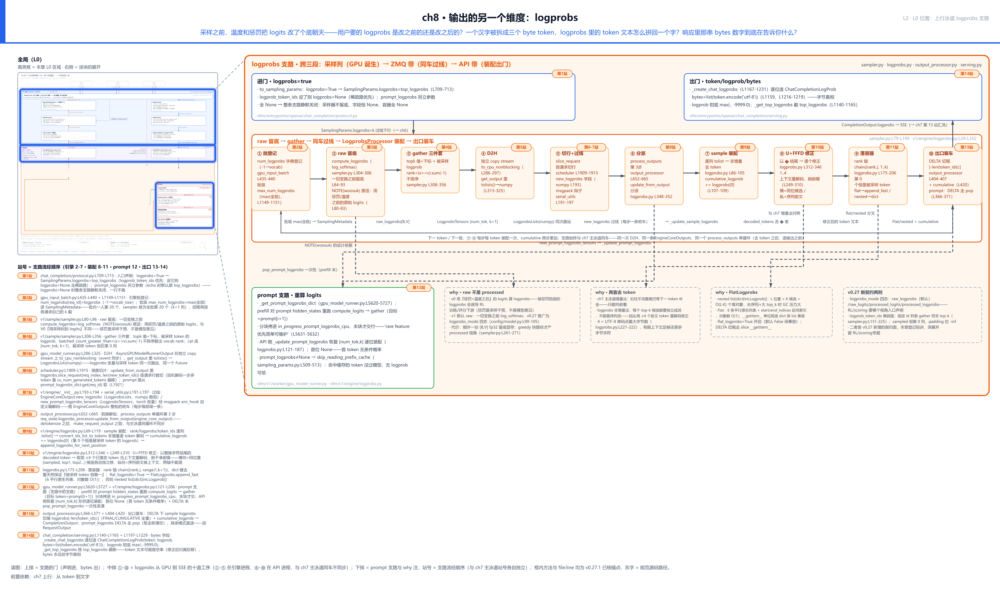
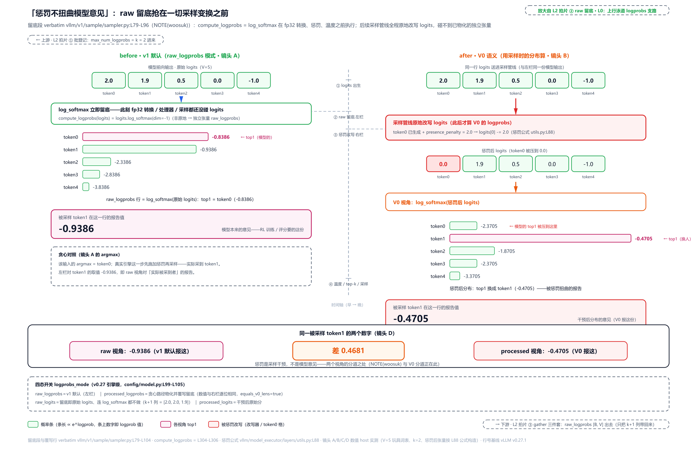
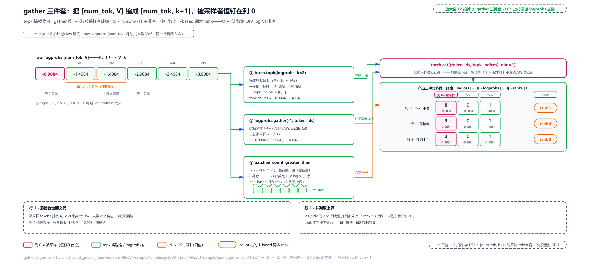
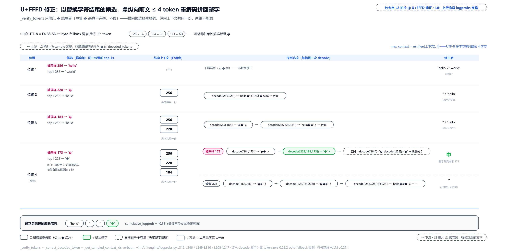
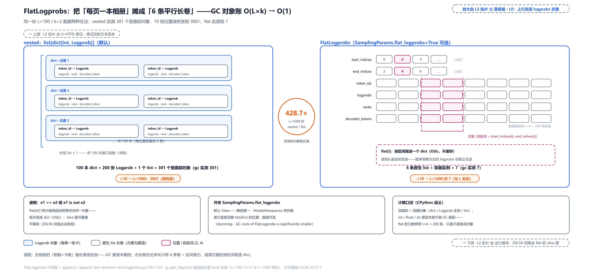

# 第 8 章　输出的另一个维度：logprobs

[第 7 章](../../ch07-uplink-token-to-text/narrative/chapter.md)结尾留了个念想：`EngineCoreOutput` 的字段表里，`new_logprobs` 每次路过都没打开过。现在打开它——顺着这个字段往下走，三个问题会一个比一个硌手。

第一问：采样之前，惩罚（对已出现 token 压分的干预）和温度（把分布拉尖或摊平的旋钮）已经把 logits 改了个底朝天（[第 1 章](../../ch01-vllm-v1-in-one-map/narrative/chapter.md)立过的记分板——全词表分数向量，此刻正被逐项改写）。用户要的 logprobs，报的是改之前的数还是改之后的数？两份答案差多远、坑的是谁？

第二问：一个汉字被 byte-fallback 词表拆成三个 byte token（[第 7 章](../../ch07-uplink-token-to-text/narrative/chapter.md)立过的字节回退——词表外的字符按 UTF-8 逐字节拆开）。主泳道的增量解码靠「扣住尾巴等凑齐」拼回整字；可 logprobs 的要求苛刻得多——每个位置要报一排候选：不止被采中的那个，还有模型最想要的另外几个，**每个候选都得独立成词**。半个字节拼不成字，那半个字怎么单独报？

第三问：响应里那串 bytes 数字 `[228, 184, 173]`，到底在告诉你什么？半个字的候选文本被修成空串后，为什么把全位置的 bytes 串起来，仍能无损还原原文？

这三个问题在同一条支路上。上一章走的是上行泳道的主泳道——token 变文字；本章走它的邻座——概率维度。两条泳道搭同一班车、进同一个循环、在同一个门口出门，但一路上干的是完全不同的活。

## 你在这里



> *图注：本章放大的是[第 1 章](../../ch01-vllm-v1-in-one-map/narrative/chapter.md) L0 图上横跨三段的一线——橙色 EngineCore 带里的采样出口列（品红那列，logprobs 在这里诞生，对应 L0 图一拍里 ④ sample 那一步的内部，sampler.py 的 ④ sample_tokens 框就画在这列）、紫色 ZMQ 带（跟主泳道同车过线）、蓝色 API 进程带（装配与出门）——正是[第 2 章](../../ch02-request-lifecycle/narrative/chapter.md)十六站走读里站 13 采样、站 15 回程、站 16 理货这三站的支路视角。上排是支路的两个门：进门把用户的 logprobs 声明翻译成采样参数，出门装出 token/logprob/bytes 三件套；中排 ①-⑩ 是十道工序（①-④ 在引擎侧的 GPU 执行臂与采样出口列、⑤ 也在引擎进程——它的「过线」指发车动作，切行的 scheduler.py 与 msgpack 编码钩子都仍在引擎侧跑；⑥-⑩ 在 API 进程），与[第 7 章](../../ch07-uplink-token-to-text/narrative/chapter.md)主泳道的九道工序同车不同步；下排是 prompt 支路（支路中的支路）与四笔小注（三笔 why 注 + 一笔 v0.27 新契约登记）。接点：⑥ 分派正是上一章 process_outputs 单循环里「第 3 步」那个每次路过都没展开的调用点；⑩ 出口装车兑现上一章装箱时省略的 logprobs 与 cumulative_logprob 两个桶。站号 1-14 = 支路流经代码的顺序（与上一章主泳道的站号各自独立），正文按讲解需要编排、不必照站号读。*

读法建议：只想知道「惩罚前还是惩罚后」这个题眼，直奔[「留底要早：惩罚不扭曲模型意见」](#留底要早惩罚不扭曲模型意见站-3)；「半个字怎么报」在[「半个字怎么报：U+FFFD 修正」](#半个字怎么报ufffd-修正站-10)；「bytes 数字是什么」在[「出口三件套：token、logprob、bytes」](#出口三件套tokenlogprobbytes站-14)；想从头跟支路全程，按序读。图与正文有两套编号，对照是：中排工序 ①=站 2（批登记）、②=站 3（raw 留底）、③=站 4（gather 三件套）、④=站 5（D2H）、⑤=站 6-7（切行+过线）、⑥=站 8（分派）、⑦=站 9（sample 装配）、⑧=站 10（U+FFFD 修正）、⑨=站 11（落容器）、⑩=站 13（出口装车）——站 1（进门翻译）、站 12（prompt 支路）、站 14（OpenAI 门面）不在中排十道工序内，图上分别住在北排与下排。

## 一个开关，四份声明（站 1）

支路的第一站不在引擎、不在 GPU，在 HTTP 请求进门的翻译处。[第 2 章](../../ch02-request-lifecycle/narrative/chapter.md)走过这里：`to_sampling_params` 把请求参数逐项抄进 `SamplingParams`。上一章抄的是 `output_kind`（三态契约的入口声明），这次轮到 logprobs 的四份声明：

```python
# vllm/entrypoints/openai/chat_completion/protocol.py:L709-L715
            logprobs=(
                self.top_logprobs
                if self.logprobs and not self.logprob_token_ids
                else None
            ),  # L713
            prompt_logprobs=prompt_logprobs,
            logprob_token_ids=self.logprob_token_ids or None,
```

（节选自 `to_sampling_params` 的参数抄写处——上面是 `SamplingParams.from_optional(...)` 这个大调用里的七行，前后的采样参数与输出参数行省去；`output_kind` 那两行上一章见过：`stream=True` → DELTA、否则 FINAL_ONLY——三态契约见[第 7 章](../../ch07-uplink-token-to-text/narrative/chapter.md)，本章第 13 站是它在概率维度上的投影。）

四份声明对应四个采样参数（`vllm/sampling_params.py:L267-L289`），语义各管一段：

- **`logprobs`（整数）**：每个**生成**位置要报几个最可能 token 的对数概率——vLLM 自家的口径是「k 个候选 + 恒含被采样 token，最多 k+1 条」。这个「+1」的形状是从 OpenAI 那里继承的：legacy Completions API 的 `logprobs` 本来就是整数参数，官方定义是「返回前 logprobs 名最可能 token 的对数概率，**外加被选中的 token**」、取值 0-5（[官方参考](https://developers.openai.com/api/reference/resources/completions/methods/create/)）；Chat API 后来改成了 `logprobs=true` + `top_logprobs=N` 两参数的形状。vLLM 对齐的是这份接口**形状**：入口把 `logprobs=true` 与 `top_logprobs=N` 合并翻译成 `SamplingParams.logprobs=N`（L713 那个条件表达式）。
- **`prompt_logprobs`（整数）**：给 **prompt** 的每个位置也报概率——「模型看这段前文时，有多想写下一个字」。它跟 `logprobs` 完全独立：不想要生成侧的概率、只想要 prompt 侧的，可以单开它。
- **`logprob_token_ids`（token id 列表）**：不报 top-k（前 k 名），只报你点名的几个 token 的概率——打分场景（scoring，比较固定几个标签 token 的概率）比全词表省得多。注意 L713 的条件里藏着优先级：设了 `logprob_token_ids`，`logprobs` 就被置 None——点名册优先于领奖台（第 4 站细看）。
- **`flat_logprobs`（布尔，默认 False）**：容器形状开关——概率数据用嵌套 dict 还是扁平列表存。第 11 站专门算这笔账。

四份声明全空时发生什么？**整条支路一行不跑**。采样器不留底（`sampler.py:L86` 的条件不满足）、引擎批不登记、`EngineCoreOutput` 的两个 logprobs 字段恒为 None、API 进程的装配器三个容器全 None、出口字段全 None。没开 logprobs 的请求，每个环节只付一次 None 判断的成本——这条支路与主泳道零耦合，开了才付账（每步 k+1 列的 GPU、搬运、过线、装配四道税，第 5-7 站算）。一个「可选维度」从入口到出口全程静默关闭，这是引擎能把可选功能做便宜的唯一方式。

顺带一句边界：OpenAI Chat API 的 `top_logprobs` 上限是 20（服务端硬顶，[官方参考](https://developers.openai.com/api/reference/resources/chat/subresources/completions/methods/create/)；legacy Completions `logprobs` 才是上面那个 0-5 档），vLLM 的上限是自家的引擎参数 `max_logprobs`——默认 20（源码 docstring 自注默认值取自 OpenAI Chat Completions API），但可配置、设 -1 不设顶可要全词表（`config/model.py:L242`）。兼容的是形状；上限一硬一软。

## 团体餐的账：批登记与批级最大值（站 2）

镜头切到 L0 图的 EngineCore 带（橙色带里那段绿色 GPU 执行臂）。请求进了引擎批（[第 2 章](../../ch02-request-lifecycle/narrative/chapter.md)站 10 调度组的那个持久批次），它对 logprobs 的需求要在批上登记：

```python
# vllm/v1/worker/gpu_input_batch.py:L435-L444
            if sampling_params.logprobs is not None:
                self.num_logprobs[req_id] = (
                    self.vocab_size
                    if sampling_params.logprobs == -1
                    else sampling_params.logprobs
                )  # L440

            # Store specific token IDs to compute logprobs for (more efficient)
            if sampling_params.logprob_token_ids is not None:
                self.logprob_token_ids[req_id] = sampling_params.logprob_token_ids
```

一个 dict 记账：`num_logprobs[req_id] = k`，请求完成时弹出。`logprobs=-1`（全词表）在登记位就换算成 `vocab_size`——引擎批这份账里从此没有「-1」这个值、sampler 只见具体数字（API 侧请求参数里那份 -1 仍原样保留，装配端有专门分支兜住——第 11 站情形 4 就是它）。

登记的用途只有一个：算批级最大值。

```python
# vllm/v1/worker/gpu_input_batch.py:L1149-L1151
    @property
    def max_num_logprobs(self) -> int | None:
        return max(self.num_logprobs.values()) if self.num_logprobs else None
```

为什么取 max 而不是各算各的？直觉是**团体餐按最挑食的人点菜**：GPU 张量必须批内形状一致——全批一个 `[num_tok, k+1]` 张量装下所有请求的候选。批内一人要 20 个候选，sampler 就为全批每行都算满 21 列；回程各请求下车时再按自己的 k 截断，多算的候选静默丢弃。这笔账实测过（配套精简版，host 实跑；引擎侧输入手工构造、形状与真实 gather 产出同构）：

<!-- trace: m3 -->
| 阶段 | 动作 | 数字 | 结果 |
|---|---|---|---|
| 登记 · 三请求进批 | num_logprobs 字典记账 | r_a=1、r_b=3、r_c 不进字典 | 静默请求零记账——max_num_logprobs=3 |
| 均一化 · 采样元数据 | max_num_logprobs=max(全部) 进 SamplingMetadata | k=3 → 全批算 k+1=4 列 | r_a 的行也带满 4 列过线（indices [5,3,2,4]）；r_b 行 [0,0,1,2] |
| -1 探针 | logprobs=-1 登记 | -1 → vocab_size=8 | 全词表档在登记位换算；此刻批 max 跳到 8 |
| 回程切行 | slice_request 按请求行数切 | 各 1 行、4 列 | 调度器给每请求切出自己的 numpy 行 |
| 装配截断 | append 时按自己的 k 截 rank 链 | r_a(k=1) 留 2 项 [5,3]；r_b(k=3) 收 4 列去重成 3 项 [0,1,2] | 多算的候选静默丢弃；被采样==top1 的重复列被 dict 键吃掉 |
| 退场 | finish 时 remove_request 弹出 | max 3 → 1 → None | 最后一人退场，sampler 的 k 随批收缩 |

（探测的 r_d 加入后批 max 短暂跳 8 又随退场回落，只为看清登记位换算；真实批按请求生命周期进出，不会这样振荡。表里三个先用的词按结论记：indices＝过线的候选 token id 列，第 4 站 gather 三件套的产物；SamplingMetadata＝每拍随采样调用下发的批级参数包，k 值从批账本到采样器就靠它传递——max_num_logprobs 与点名册名单都装在里面往 sampler 送（下一站代码里 `sampling_metadata.max_num_logprobs` 读的就是它）；「按自己的 k 截 rank 链」「dict 键吃掉重复列」两处机关第 11 站才展开——结论是批 max 算宽的列会在装配端按各请求自己的 k 截掉，多算的候选静默丢弃。）

两笔对冲的账：批内 max=20 而多数请求 k=1 时，每步每请求多算 19 列 GPU gather、多搬 19 列、多编 19 列的字节——纯浪费；换来的是**批均一张量**这个前提——一个张量装全批、一次 GPU 算子跑全批、一条消息带全批（回程班车的形状要求，第 7 站细看）。变长列需要变长编码与逐请求 kernel，vLLM 选了「算宽点、传一条」。

## 留底要早：惩罚不扭曲模型意见（站 3）

现在走到 L0 图采样出口列的内部——本章题眼所在。先补数学地基，再看代码为什么长成那样。

### logprob 是什么：概率在浮点机里的住法

**logprob 就是概率取自然对数**：模型在某个位置对「下一个 token 是它」打出的对数分。OpenAI Cookbook 的定义：「a logprob is log(p), where p = probability of a token occurring at a specific position based on the previous tokens in the context」（[Cookbook](https://developers.openai.com/cookbook/examples/using_logprobs)）——取值是任意负数或 0，0 对应 100% 概率。

模型每步吐的原始产物是 logits（[第 1 章](../../ch01-vllm-v1-in-one-map/narrative/chapter.md)的记分板：全词表、未归一化的分数向量）。从 logit 到 logprob 只差一个归一化：

```math
\mathrm{logprob}(x_i) \;=\; \log\,\mathrm{softmax}(\mathrm{logits})_i \;=\; \mathrm{logits}_i - \mathrm{logsumexp}(\mathrm{logits})
\qquad \mathrm{logsumexp}(z) = \log \sum_j e^{z_j}
```

手算一遍（说明性例子，三词表）：logits = [2.0, 1.0, 0.1]。

```math
\mathrm{logsumexp} = \ln(e^{2.0} + e^{1.0} + e^{0.1}) = \ln(7.389 + 2.718 + 1.105) = \ln(11.212) = 2.417
```

归一化项 2.417，逐项减它得 logprobs = [−0.417, −1.417, −2.317]；验算 $`e^{-0.417} \approx 0.659`$，正是 softmax 第一名（softmax＝把 logits 逐项指数化再归一化成概率分布的那一步——上面手算在 log 空间做的就是它：先指数化求和、再逐项减去总账）。要点在那句减法：**每个 token 的 logprob = 自家 logit − 全词表公共归一化项**——「模型意见」的分布形状由此定。

为什么整个生态都住 log 空间而不是概率空间？两个硬理由。一是数值：PyTorch 文档对 `log_softmax` 的原话——「While mathematically equivalent to log(softmax(x)), doing these two operations separately is slower and numerically unstable」（[文档](https://docs.pytorch.org/docs/stable/generated/torch.nn.functional.log_softmax.html)）；朴素地先 softmax 再取对数，小概率会下溢成 0、log(0) 直接 −inf，log_softmax 用 log-sum-exp 技巧单 kernel 保稳（`logsumexp` 文档原话「The computation is numerically stabilized」）。二是连乘：序列联合概率 $`\prod_i P(x_i)`$ 在 fp32（最小正规范数约 1.18e-38）下几十个 token 就下溢——100 个 token 每个 P=0.01，乘积 1e-200 存不下；log 域里换成加法 $`\sum_i \log P(x_i)`$，本例 = 100 × (−4.605) = −460.5，有限且精确。本章后面那个 `cumulative_logprob` 字段用加法不用乘法，全部理由就在这。

（顺带：训练 loss 是平均负对数似然、困惑度是它的指数——语言模型从来都在 log 域记账。本章 prompt 支路产的就是自建困惑度/打分管线的原料。）

### 代码：抢在一切变换之前

采样器一拍里对 logits 的加工顺序是固定的：先算 logprobs 留底，再做 fp32 转换（fp32＝32 位单精度浮点，模型计算里的稳妥精度档）、上惩罚、上温度、采样。看代码：

```python
# vllm/v1/sample/sampler.py:L79-L104
        logprobs_mode = logprobs_mode_override or self.logprobs_mode
        # NOTE(woosuk): Use the original logits (before any penalties or
        # temperature scaling) for the top-k logprobs.
        # This is different from the V0 sampler, which uses the logits that
        # is used for sampling (after penalties and temperature scaling).
        num_logprobs = sampling_metadata.max_num_logprobs  # L84
        raw_logprobs: torch.Tensor | None = None  # L85
        if num_logprobs is not None or sampling_metadata.logprob_token_ids:
            if logprobs_mode == "raw_logprobs":
                raw_logprobs = self.compute_logprobs(logits)  # L88
            elif logprobs_mode == "raw_logits":
                if logits.dtype == torch.float32:
                    raw_logprobs = logits.clone()
                else:
                    raw_logprobs = logits.to(torch.float32)

        # Use float32 for the logits.
        logits = logits.to(torch.float32)

        logits = self.apply_logits_processors(
            logits, sampling_metadata, predict_bonus_token
        )
        # Sample the next token.
        sampled, processed_logprobs = self.sample(logits, sampling_metadata)  # L102
        if processed_logprobs is not None:
            raw_logprobs = processed_logprobs  # L104
```

留底发生在 L88——`compute_logprobs` 就一行（`log_softmax(dim=-1, dtype=float32)`，`sampler.py:L304-L306`）。注意时序：此刻 **fp32 转换、惩罚、温度、采样全都还没碰 logits**。变元名 `raw_logprobs` 里的 raw 说的就是这个——原始分布的对数概率。注释 NOTE(woosuk) 把话挑明：这份留底与 V0 采样器不同，V0 用的是「采样时真正用的 logits」——惩罚与温度**之后**的。

这是个设计决策，四要素摆开：

- **旧设计**：v0 采样器对每请求统一走温度+截断（temperature=0 的贪心请求也在做无意义的 softmax/排序）；且 v0 用惩罚+温度之后的 logits 算 top-k logprobs。
- **痛点**：惩罚（presence/frequency/repetition——对已出现 token 压分的采样干预，具体公式归后面的采样章）和温度会改写整个分布。用户拿 logprobs 多半是想看**模型自己的意见**——最想要哪个词、第二想要哪个。被惩罚扭曲的报告会把模型的 top1 压到十名开外，下游全被带偏。
- **v1 方案**：logprobs 在一切变换之前先算好（L84-L93）；随后 logits 才进加工管线，而且 `log_softmax` 产的是新张量（非原地），后面管线全程原地改写的是 logits 张量、物理碰不到已物化的 raw_logprobs。
- **代价（如实记）**：额外一份 `[batch, vocab]` 的 fp32 张量驻留峰值显存——真实词表 129280（DeepSeek 规模）时一个 32 行批 ≈ 32 × 129280 × 4B ≈ 16MB/步；这就是下一站「gather 要窄」的原因：留底要早，带出 GPU 的只有 k+1 列。另有两笔小账：raw 与 processed 两个视角共享同一个 tensor，投机解码分支需要显式 clone 保住 raw（`vllm/v1/sample/rejection_sampler.py:L157-L159` 注释原话「preserve the original raw logits ... since apply_logits_processors modifies the tensor in-place」，投机解码章展开）；批全贪心时有条快路径提前返回，那里的留底走另一条物化路（下一小节）。

「惩罚是采样干预、不是模型意见」——这句话的下游论据最硬的一条来自 RL（强化学习）训练。策略梯度类算法（PPO 一脉——Proximal Policy Optimization，近端策略优化，[arXiv:1707.06347](https://arxiv.org/abs/1707.06347)）的核心量是新旧策略对同一动作的概率比，并把它裁剪在有界区间——OpenAI 官方教学页对裁剪的概括：「clipping serves as a regularizer by removing incentives for the policy to change dramatically」（[Spinning Up](https://spinningup.openai.com/en/latest/algorithms/ppo.html)）。映射到语言模型：动作就是 token，$`\pi_\theta(a|s)`$ 就是模型给该 token 的概率，推理引擎在 RL 循环里扮演的是「产 token + logprob 的数据服务器」。要是引擎报的 logprob 是惩罚之后的值，它描述的分布已不是任何策略：惩罚随序列内容漂移、温度是外加缩放。拿它算 ratio——设某位置 raw logprob = −0.2（P ≈ 0.82）、重复惩罚把它改到 −2.0（P ≈ 0.14），两数当分子分母，ratio 直接差 $`e^{1.8} \approx 6`$ 倍；clip 上限典型才 1+ε（ε ≈ 0.2）。这不是噪声，是方向性错误。今天 LLM RL 的主力算法 GRPO（组相对策略优化）同谱系（自述「a variant of Proximal Policy Optimization」，[arXiv:2402.03300](https://arxiv.org/abs/2402.03300)），同样逐 token 消费 logprob——这就是引擎把「logprobs 必须是 raw」做成默认的生态压力。

两份答案到底差多远？实测（配套精简版，host 实跑；五词表玩具、k=2，惩罚后张量按真实公式 `logits -= presence_penalties.unsqueeze(dim=1) * output_mask`（`unsqueeze(dim=1)` 把每请求一个的惩罚系数广播对到全部词表位；`vllm/model_executor/layers/utils.py:L88`）由驱动构造——精简版的处理器实现体是采样章之前的占位，对到达的张量做 log_softmax 是逐字真码，喂惩罚后的张量进去就是 V0 语义，无数值模拟）：

<!-- trace: m1 -->
| 镜头 | 喂给 forward 的 logits | greedy 采样 | top-k 报告（列 0=被采样） | 关键观察 |
|---|---|---|---|---|
| 镜头 A · v1 默认（raw 留底） | 模型原始 [2.0, 1.9, 0.5, 0.0, -1.0] | 0 | token0 -0.8386 / token0 -0.8386 / token1 -0.9386 | 留底发生在一切变换之前（fp32 转换、处理器、采样都还没碰 logits）——此刻模型的 top1 是 token 0（-0.8386） |
| 镜头 B · V0 语义（惩罚后的 logits 喂进去） | 惩罚后 [0.0, 1.9, 0.5, 0.0, -1.0]（presence=2.0 把 token 0 压到 0.0） | 1 | token1 -0.4705 / token1 -0.4705 / token2 -1.8705 | V0 用「采样时真正用的分布」算 logprobs：top1 换人成 token 1，模型的 top1 token 0 掉到 -2.3705——被惩罚扭曲的报告 |
| 镜头 C · v0.27 processed_logprobs 模式 | 同镜头 B 的输入（Sampler 构造期设模式） | 1 | 与镜头 B 逐位相同（-0.4705 / -0.4705 / -1.8705） | 贪心路径物化 processed 视角并覆写留底（sampler.py:L103-L104 覆写行）——把 V0 语义从「默认行为」降级成「显式开关」 |
| 镜头 D · 同一被采样 token 的两个数字 | —— | 1 | raw 视角报 -0.9386（模型意见）vs processed 视角报 -0.4705（干预后） | 差 0.4681——惩罚是采样干预不是模型意见：RL 训练/评分消费的是前者，这正是 NOTE(woosuk) 与 V0 分道之处 |

（greedy＝贪心采样，永远取分数最高者；argmax＝取最大值的下标。镜头 A 的 greedy 采样 token 0 是该输入张量的 argmax；真实引擎同一拍会先施加惩罚再采样、采到 token 1——「同一被采样 token」行取的是 raw 视角对 token 1 的报告值 −0.9386。）



> *图注：左半是 raw 留底——log_softmax 抢在改写器之前对原始 logits 物化（token0 以 −0.8386 领跑）；右半是 V0 视角——presence −2.0 先把 token0 压到 0.0 再算 logprob，top1 换成 token1（−0.4705）、模型 top1 掉到 −2.3705。底部对比条：同一被采样 token1 两视角 −0.9386 vs −0.4705、差 0.4681。放大自本章 L2 图 ②『raw 留底』工序（L0 采样出口列内部），上游 ① 批登记送 k、下游 ③ gather 取 raw_logprobs。*

### 四态开关：把「要哪张照片」做成配置

L79-L93 里那个 `logprobs_mode` 不是摆设——v0.27 把「报哪个视角」推广成了引擎级四选一（片段首行的 `logprobs_mode_override` 是调用方可临时覆盖引擎默认的入参，本章按引擎默认档走读）：

```python
# vllm/config/model.py:L99-L105
LogprobsMode = Literal[
    "raw_logits", "raw_logprobs", "processed_logits", "processed_logprobs"
]
PROCESSED_LOGPROBS_MODES: tuple[LogprobsMode, ...] = (
    "processed_logits",
    "processed_logprobs",
)
```

（第二个常量是 processed 两档的名册——采样器拿它判断当前模式要不要在贪心快路径里物化加工后的视角。）

两轴各两档：**raw**（模型素颜）× **processed**（采样管线加工后）为视角轴；**logits**（原始分数）× **logprobs**（归一化对数概率）为形态轴。默认 `raw_logprobs`——本节前面讲的留底。三个非默认档的去处：`raw_logits` 连 log_softmax 都不做，留底就是原始 logits（实测同一输入下「logprobs」列是 [2.0, 2.0, 1.9]——logits 原值）；`processed_*` 两档只在批全贪心的快路径里物化（贪心路径提前返回时顺手把加工后的 logits/logprobs 算出来，`sampler.py:L261-L271`），随后由 L103-L104 覆写留底——上一张表的镜头 C 就是它。谁需要 processed？想精确复现「采样器看到什么」的调试场景；而 RL/评分要 raw（动机前面算过）。**代价**：四态是又一处「同一份数据、两种真相」的分叉——所有消费端都得知道自己拿到的是哪个视角；prompt 支路干脆退化：prompt 不走采样处理器，四态在那一侧全部等价于 raw（`gpu_model_runner.py:L5696-L5702` 注释原话「prompt tokens skip sampling processors, so processed_* and raw_* yield the same scores here」）。这条契约面的深展开（RL/scoring 的完整故事）超出本书范围，留给后续的 RL/scoring 专题。

## 三件套：领奖台、成绩单、名次（站 4）

留底有了——一张 `[num_tok, V]` 的大张量躺在 GPU 上。全词表搬回 CPU 太贵（129280 列），下一站之前必须把它缩成 `[num_tok, k+1]`。缩法是三条并行取数，汇成一个张量（还在 L0 图采样出口列内，留底的下一个动作）：

```python
# vllm/v1/sample/sampler.py:L304-L356
    @staticmethod
    def compute_logprobs(logits: torch.Tensor) -> torch.Tensor:
        return logits.log_softmax(dim=-1, dtype=torch.float32)  # L306

    @staticmethod
    def gather_logprobs(
        logprobs: torch.Tensor,
        num_logprobs: int,
        token_ids: torch.Tensor,
    ) -> LogprobsTensors:
        # … 省略：Args/Returns docstring（三件套的形状契约）…
        assert token_ids.dtype == torch.int64
        # Find the topK values.
        topk_logprobs, topk_indices = torch.topk(logprobs, num_logprobs, dim=-1)  # L334

        # Get with the logprob of the prompt or sampled token.
        token_ids = token_ids.unsqueeze(-1)
        token_logprobs = logprobs.gather(-1, token_ids)  # L338

        # Compute the ranks of the actual token.
        # … 省略：mark_unbacked 两行的注释——让 dynamo（torch.compile 的
        #         编译前端）不对批大小 0/1 特化重编译 …
        torch._dynamo.decorators.mark_unbacked(logprobs, 0)
        torch._dynamo.decorators.mark_unbacked(token_logprobs, 0)
        token_ranks = batched_count_greater_than(logprobs, token_logprobs)  # L347

        # Concatenate together with the topk.
        indices = torch.cat((token_ids, topk_indices), dim=1)  # L350
        logprobs = torch.cat((token_logprobs, topk_logprobs), dim=1)  # L351

        # Use int32 to reduce the tensor size.
        indices = indices.to(torch.int32)

        return LogprobsTensors(indices, logprobs, token_ranks)  # L356
```

三件套逐个看：

- **topk（领奖台）**：L334 取前 k 名的值和下标。复杂度 O(V log k)。
- **gather（成绩单）**：L338 按被采样 token 的下标取它**自己**的 logprob——哪怕它排在第 4 名、落在领奖台外，成绩单照样要。这是「+1」的来源：k 个候选 + 1 个被采样者，可能重合。
- **count（名次）**：被采样 token 在全词表里排第几？排序要 O(V log V)，这里不排——数：

```python
# vllm/v1/sample/ops/logprobs.py:L11-L27
def batched_count_greater_than(x: torch.Tensor, values: torch.Tensor) -> torch.Tensor:
    """
    Counts elements in each row of x that are greater than the corresponding
    value in values.  Use torch.compile to generate an optimized kernel for
    this function. otherwise, it will create additional copies of the input
    tensors and cause memory issues.

    Args:
        x (torch.Tensor): A 2D tensor of shape (batch_size, n_elements).
        values (torch.Tensor): A 2D tensor of shape (batch_size, 1).

    Returns:
        torch.Tensor: A 1D tensor of shape (batch_size,) with the counts.
    """
    torch._check(x.shape[0] >= 1)
    torch._check(x.shape[0] == values.shape[0])
    return (x >= values).sum(-1)
```

数全词表里 logprob **大于等于**本 token 的条目数（含自身）——一遍 O(V) 计数，出来直接是 1-based 名次。注意这是计数不是排序名次：并列时名次取并列上界（两个同分的 token 名次相同、都偏大）。这个 rank 是 vLLM 对 OpenAI 响应形状的**扩展字段**——OpenAI 的响应里没有 rank 对应物：站 14 出场的 `ChatCompletionLogProb`（OpenAI 形状的候选记录类，三栏 token/logprob/bytes）里没有它，站 1 引的 OpenAI 官方响应形状同样没有（`vllm/logprobs.py` 的 `Logprob` docstring 自述「supporting OpenAI compatible logprobs and token ranks」——「and token ranks」正是 vLLM 在兼容形状之外多给的部分）；下游想快速判断「被采样 token 是不是模型 top1」时它比看 top_logprobs 列表省事。

最后两行 cat 是本章最重要的不变式的物理起点：**被采样 token 恒在第 0 列**。`cat((token_ids, topk_indices))` 把被采样者钉在位置 0，后面才是 top1..topk。下游所有「第 0 个 = 被采样」的约定（累计账加 `logprobs[0]`、rank 链首元素、dict 首键）全是这一行的后代。

实测（配套精简版，六词表、logits 行 [3.0, 2.5, 2.5, 1.0, 0.5, 0.0]——id1/id2 并列 2.5 专为踩并列边界；「被采样 token」由参数显式给定、同一 logits 行复用三次，gather 逐字真码走真 `torch.topk`/`gather` 全链）：

<!-- trace: m2 -->
| 行 | 被采样 token | count 式 rank = (x>=v).sum(-1) | cat 出的 3 列 token id | 3 列 logprob | 看点 |
|---|---|---|---|---|---|
| 行 0 · 常态：被采样=top1 | 0 | 1 | [0, 0, 1] | [-0.9084, -0.9084, -1.4084] | 列 0 与 topk 首列重复——回程 dict 键去重（见 rank 链条目） |
| 行 1 · 落榜者：被采样不在 topk | 3 | 4 | [3, 0, 1] | [-2.9084, -0.9084, -1.4084] | k=2 只带 2 个候选，被采样 token 3 排名 4 也必须给——张量恒 k+1=3 列、被采样恒列 0 |
| 行 2 · 并列平手（2.5/2.5） | 2 | 3 | [2, 0, 1] | [-1.4084, -0.9084, -1.4084] | 计数把并列者都算上 → rank 3（上界）；topk 平手按下标排：id1 进 topk、id2 只剩被采样列 |
| kernel 直证 · batched_count_greater_than | 0 / 3 / 2 | 1 / 4 / 3 | —— | 对应 -0.9084 / -2.9084 / -1.4084 | 不排序：一遍计数数完全词表——O(V) 计数免 O(V log V) 排序 |

输入行是 log_softmax 后的 [-0.9084, -1.4084, -1.4084, -2.9084, -3.4084, -3.9084]，可手算复验。三行产出形状恒 [3, 3]：**落榜者与并列上界都有交代**——被采样者不管多差都在列 0，rank 恒 1..V。



> *图注：一张 [num_tok, V] 的 raw_logprobs（六词表例）经三路汇成 [num_tok, k+1]——topk 摘领奖台、gather 取被采样者成绩、(x>=v).sum(-1) 一遍数出 1-based 名次；cat 把被采样者钉在列 0（列 0 高亮贯穿三行），落榜行与并列行各挂气泡注。放大自本章 L2 图 ③『gather 三件套』工序，上游 ② 送 raw_logprobs、下游 ④ D2H 取 [num_tok, k+1]。*

### 点名册：稀疏变体（轻讲）

第 1 站埋的 `logprob_token_ids` 在这里兑现。`gather_specific_token_logprobs`（`sampler.py:L151-L225`）不取 top-k，只 gather 你点名的 token id：批内各请求名单长度不齐，按最长者 padding 成矩阵，列 0 仍恒为被采样 token（直接在 GPU 上从 sampled 张量填充）、点名的 id 依次列 1..n、padding 位 `masked_fill` 成 −inf 作废；rank 仍只对被采样者计数——源码注释原话「log_softmax is monotonic w.r.t. the original logits, so ranks computed from logprobs are equivalent」（log_softmax 单调，在 logprobs 上数名次与在 logits 上等价）。两个开关同时在场时点名册无条件覆盖领奖台（`sampler.py:L133-L136` 的 prefer 分支）。实测形状（配套精简版，两请求异长名单 padding 到 3 列）：

<!-- trace: m17 -->
| req_index | 指定 ids / 被采样 | 矩阵行（列 0=被采样） | logprob 行 | rank |
|---|---|---|---|---|
| 0 | [5, 7] / 3 | [3, 5, 7] | [-0.9143, -2.4143, -4.4143] | 1 |
| 1 | [2] / 1 | [1, 2, 0]（第 3 列是 padding 位） | [-1.4729, -2.4729, -inf] | 2 |
| 双开关在场（forward 面） | max_num_logprobs=1 与稀疏字典同设 | forward 返回 3 列（稠密路只会给 2 列） | 稀疏优先覆盖（prefer 分支） | forward 自采 [3, 0] |

省的账一眼见底：指定 2 个 id，GPU 只 gather 3 格；`logprobs=-1` 全词表是 13 万格/行。打分场景（固定标签集比较概率）该用它。这条稀疏路与 generative scoring API 的完整故事超出本书范围，留给后续的 scoring 专题。

## 同一趟班车：D2H 与过线（站 5-7）

gather 之后，logprobs 缩成了 k+1 列的小张量。接下来三站横穿 L0 图——从采样出口列出发、穿过紫色 ZMQ 带、抵达蓝色 API 带的门口，全程是「搬运」。但值得看清楚它搬的是哪辆车、走的哪条道，因为 logprobs 从头到尾**没有专车**。

### D2H：copy stream 上的捎带（站 5）

```python
# vllm/v1/worker/gpu_model_runner.py:L286-L297
        # Initiate the copy on a separate stream, but do not synchronize it.
        default_stream = torch.cuda.current_stream()
        with torch.cuda.stream(async_output_copy_stream):
            async_output_copy_stream.wait_stream(default_stream)
            self.sampled_token_ids_cpu = self._sampled_token_ids.to(
                "cpu", non_blocking=True
            )
            self._logprobs_tensors_cpu = (
                self._logprobs_tensors.to_cpu_nonblocking()  # L294
                if self._logprobs_tensors
                else None
            )
            # … 省略：routed_experts 拷贝、EP 故障查询、event.record()——
            #         并行搬运的其他载荷与完成标记 …
```

对岸取货在 `get_output`——这个函数**阻塞到拷贝完成为止**：

```python
# vllm/v1/worker/gpu_model_runner.py:L308-L325
    def get_output(self) -> ModelRunnerOutput:
        """Copy the device tensors to the host and return a ModelRunnerOutput.

        This function blocks until the copy is finished.
        """
        max_gen_len = self.sampled_token_ids_cpu.shape[-1]
        self.async_copy_ready_event.synchronize()  # L314

        # Release the device tensors once the copy has completed.
        del self._logprobs_tensors
        del self._sampled_token_ids
        if max_gen_len == 1:
            valid_sampled_token_ids = self.sampled_token_ids_cpu.tolist()
            for i in self._invalid_req_indices:
                valid_sampled_token_ids[i].clear()
            logprobs_lists = None
            if self._logprobs_tensors_cpu is not None:
                logprobs_lists = self._logprobs_tensors_cpu.tolists()  # L325
```

这是采样结果回家的最后一程——D2H 拷贝（D2H＝device to host，GPU 到主机内存）。[第 2 章](../../ch02-request-lifecycle/narrative/chapter.md)站 13 的 `sample_tokens`（采样那一步）里它只是被发起、没有等（那一章只认「分数向量进、token id 出」），这里打开看：采样 token 与 logprobs 张量在**独立的 copy stream**（CUDA 流——GPU 上的任务队列，独立流让拷贝与前向计算重叠）上一起发车、`non_blocking`（不等拷完先返回，页锁定内存配合——[第 5 章](../../ch05-zmq-topology-and-protocol/narrative/chapter.md)立过 pinned memory 语境）、event（GPU 事件——流上的完成标记）到点同步。logprobs 的搬运没有单独的车次——L294 跟采样 token 同一次发车，L325 同一次 `get_output` 里转成 numpy。转换接口在两个形态类上：

```python
# vllm/v1/outputs.py:L28-L71
class LogprobsLists(NamedTuple):
    # [num_reqs x num_generated_tokens, max_num_logprobs + 1]
    logprob_token_ids: np.ndarray
    # [num_reqs x num_generated_tokens, max_num_logprobs + 1]
    logprobs: np.ndarray
    # [num_reqs x num_generated_tokens]
    sampled_token_ranks: np.ndarray
    # [num_reqs]
    # Used for slicing the logprobs in cases like speculative
    # decoding where the number of generated tokens may be
    # different for each request.
    cu_num_generated_tokens: list[int] | None = None

    def slice_request(self, req_idx: int, num_positions: int):  # L41
        if self.cu_num_generated_tokens is not None:
            req_idx = self.cu_num_generated_tokens[req_idx]
        end_idx = req_idx + num_positions
        return LogprobsLists(
            self.logprob_token_ids[req_idx:end_idx],
            self.logprobs[req_idx:end_idx],
            self.sampled_token_ranks[req_idx:end_idx],
            None,
        )


class LogprobsTensors(NamedTuple):
    # … 省略：同构的三个 torch.Tensor 字段 + 同款偏移账 …
    def tolists(self, cu_num_generated_tokens: list[int] | None = None):
        return LogprobsLists(
            self.logprob_token_ids.cpu().numpy(),
            self.logprobs.cpu().numpy(),
            self.selected_token_ranks.cpu().numpy(),
            cu_num_generated_tokens
            if cu_num_generated_tokens is not None
            else self.cu_num_generated_tokens,
        )
```

一对孪生形态：`LogprobsTensors` 是 torch 张量版（GPU/CPU 上流动），`LogprobsLists` 是 numpy 版（跨进程信封里的载荷）——`tolists()` 是两者间的转换点（转换时名次字段换了名：张量版叫 `selected_token_ranks`、numpy 版叫 `sampled_token_ranks`，同物异名）。NamedTuple（带字段名的元组）保证形状契约写死在类型里。那行注释里 `cu_num_generated_tokens`（逐请求累计生成数）是投机解码（[第 1 章](../../ch01-vllm-v1-in-one-map/narrative/chapter.md)立过的 speculative decoding——小模型起草、大模型批量验证的加速法）的偏移账：一步多 token 时按它定位各请求的行区间，本章只需知道「slice_request 靠它切得准」。

### 调度切行与装车（站 6）

引擎一拍的收尾（[第 2 章](../../ch02-request-lifecycle/narrative/chapter.md)站 14 `update_from_output`）把整批 logprobs 按请求切行、装进各自的回程明细：

```python
# vllm/v1/core/sched/scheduler.py:L1909-L1941
            # Extract sample logprobs if needed.
            if (
                request.sampling_params is not None
                and request.sampling_params.num_logprobs is not None
                and logprobs
            ):
                new_logprobs = logprobs.slice_request(req_index, len(new_token_ids))  # L1915

            # … 省略：num_nans_in_logits 记账 …
            # Get prompt logprobs for this request.
            prompt_logprobs_tensors = prompt_logprobs_dict.get(req_id)  # L1921
            if should_emit_output:
                # Add EngineCoreOutput for this Request.
                outputs[request.client_index].append(
                    EngineCoreOutput(
                        request_id=req_id,
                        new_token_ids=new_token_ids,
                        finish_reason=finish_reason,
                        new_logprobs=new_logprobs,  # L1929
                        new_prompt_logprobs_tensors=prompt_logprobs_tensors,
                    )
                )
            # … 省略：EngineCoreOutput 的 pooling_output / stop_reason / events
            #         等非本章字段（L1931-L1939）…
```

三条件守卫（参数在、开了 logprobs、批产物在）过了才切行——没开 logprobs 的请求连 `slice_request` 都不调，`new_logprobs` 保持 None。守卫里的 `request.sampling_params.num_logprobs` 是 `SamplingParams` 上的属性——`logprobs` 字段值或点名册长度的统一口径，站 8 末点破它的小机关；它与站 2 批级字典 `self.num_logprobs` 同名不同物：一个是每请求的声明，一个是引擎批的记账本。prompt 路另走一个字典（第 12 站）。切好的行装进回程明细的两个专用字段：

```python
# vllm/v1/engine/__init__.py:L184-L215
class EngineCoreOutput(
    msgspec.Struct,
    array_like=True,  # type: ignore[call-arg]
    omit_defaults=True,  # type: ignore[call-arg]
    gc=False,
):  # type: ignore[call-arg]
    request_id: str
    new_token_ids: list[int]

    new_logprobs: LogprobsLists | None = None  # L193
    new_prompt_logprobs_tensors: LogprobsTensors | None = None  # L194

    # … 省略：pooling_output / finish_reason / stop_reason / events
    #         等非本章字段——上一章拆过整张字段表 …
```

`new_logprobs`（numpy 三件套）装生成侧、`new_prompt_logprobs_tensors`（torch 张量版）装 prompt 侧。两个默认 None 的字段在线上并不省——[第 5 章](../../ch05-zmq-topology-and-protocol/narrative/chapter.md)实测过 `omit_defaults`（跳过「值等于默认值」的字段的 msgspec 编码选项）对 `array_like` 是空操作：按位置数组全字段上船，None 以 nil 占槽。没开 logprobs 的请求线上只多两个空槽，**没有任何 logprobs 载荷过线**。（上面类装饰器里那个 `array_like=True` 也是[第 5 章](../../ch05-zmq-topology-and-protocol/narrative/chapter.md)立过的按位置线格式——字段按位置编成数组、字段名不上线。）

### 过线：海关的护照（站 7）

numpy 数组和 torch 张量不是 msgpack 的原生公民。回程消息编码时，[第 5 章](../../ch05-zmq-topology-and-protocol/narrative/chapter.md)拆过的那对编码钩子给它们发「原生类型护照」：

```python
# vllm/v1/serial_utils.py:L191-L204
    def enc_hook(self, obj: Any) -> Any:
        if isinstance(obj, torch.Tensor):
            return self._encode_tensor(obj)

        # Fall back to pickle for object or void kind ndarrays.
        if isinstance(obj, np.ndarray) and obj.dtype.kind not in ("O", "V"):
            return self._encode_ndarray(obj)  # L197

        # … 省略：slice 钩子与多模态/utility 分支 …
```

```python
# vllm/v1/serial_utils.py:L350-L365
    def dec_hook(self, t: type, obj: Any) -> Any:
        # Given native types in `obj`, convert to type `t`.
        if isclass(t):
            if issubclass(t, np.ndarray):
                return self._decode_ndarray(obj)
            if issubclass(t, torch.Tensor):
                return self._decode_tensor(obj)
            # … 省略：slice / 多模态 / utility 的其余重建分支——
            #         都不命中则原样交回（函数末行 return obj）…
```

`enc_hook` 把 ndarray/tensor 降成原生类型元组（dtype、shape、字节），对端 `dec_hook` 按目标类型重建。钩子的完整故事（三分支、零拷贝帧、保活）[第 5 章](../../ch05-zmq-topology-and-protocol/narrative/chapter.md) IPC 部分讲过，这里只看 logprobs 的过线路径：**numpy 三件套走 `_encode_ndarray`、prompt 侧 torch 张量走 `_encode_tensor`，随 `EngineCoreOutputs` 整批一条消息过线**——支路不另开通道、不另起消息。

这条「班车」本身的 why 链值得四要素摆一遍，因为 logprobs 的 IPC 账全记在它头上：

- **旧设计**：朴素做法是逐请求、逐 token 发事件/回调——多数自研推理服务的第一版都这么写。v0.21 时代这仓还经历过 msgspec → pickle → msgpack 的序列化三段演变（多模态输入带 PIL image 等类型时一度整体退回 pickle）。
- **痛点**：每条消息有固定开销（ZMQ 帧 + msgpack 头 + 解码 + 前端事件循环唤醒）；小模型 5ms/拍、批内几十上百请求时，逐 token 发消息的 IPC 次数爆炸。pickle 那条回头路则慢且有安全面（对象反序列化可执行代码）。
- **v1 方案**：msgpack + 自定义钩子（本节开头那对 enc/dec），输出按步聚合——每个 forward step 每个前端**只发一条** `EngineCoreOutputs`，批内所有请求的明细打包（`vllm/v1/engine/__init__.py:L230-L258`；`step()` 按 client_index（客户端索引——发给哪个前端，[第 2 章](../../ch02-request-lifecycle/narrative/chapter.md)立过）分组产出，`core.py:L584-L614`）。
- **代价（如实记）**：单条消息变大——开 logprobs 后每请求每步多 k+1 列浮点、整数、名次，消息明显变重，但**条数不变**；解码与后续处理若一口气做完会长时间霸占前端事件循环，逼出「拉批分块、片间 `await asyncio.sleep(0)` 让出」的消化机制（上一章拆过；分块消化的实测收益——PR #12287 外部基准：吞吐 +6.4%、平均首 token 延迟 −14%、p99（99 分位）每 token 延迟 −31%）。代码里还留着行家注：行式布局（每请求一条）序列化密度低于列式，NOTE 原话「We could consider ways to make this more compact, e.g. columnwise layout」——班车没榨干，但方向定了。

## 到港第三步：LogprobsProcessor 开工（站 8）

消息穿完紫色带、进港到 L0 图蓝色 API 带。上一章 process_outputs 单循环里那个每次路过都没展开的「第 3 步」，现在打开：

```python
# vllm/v1/engine/output_processor.py:L652-L665
            if pooling_output is None:
                assert req_state.detokenizer is not None
                assert req_state.logprobs_processor is not None
                # 2) Detokenize the token ids into text and perform stop checks.
                # … 省略：detokenizer.update 与 stop-string 判定——主泳道（上一章第 2 步）…
                # 3) Compute sample and prompt logprobs for request,
                # if required.
                req_state.logprobs_processor.update_from_output(engine_core_output)  # L665
```

位置讲过：detokenize 之后、造输出之前，与主泳道**同循环不同步**——两个泳道各自处理自己负责的字段，谁也不等谁。每请求一个的装配器在请求登记时出生：

```python
# vllm/v1/engine/logprobs.py:L29-L67
@dataclass
class LogprobsProcessor:
    # Tokenizer for this request,
    # None if detokenization is disabled.
    tokenizer: TokenizerLike | None

    # Logprobs for this request
    logprobs: SampleLogprobs | None
    prompt_logprobs: PromptLogprobs | None
    cumulative_logprob: float | None
    num_logprobs: int | None
    num_prompt_logprobs: int | None

    @classmethod
    def from_new_request(
        cls,
        tokenizer: TokenizerLike | None,
        request: EngineCoreRequest,
    ) -> "LogprobsProcessor":
        sampling_params = request.sampling_params
        assert sampling_params is not None
        num_logprobs = sampling_params.num_logprobs
        num_prompt_logprobs = sampling_params.prompt_logprobs
        return cls(
            tokenizer=tokenizer,
            cumulative_logprob=(None if num_logprobs is None else 0.0),  # L54
            logprobs=(
                None
                if num_logprobs is None
                else create_sample_logprobs(sampling_params.flat_logprobs)
            ),
            prompt_logprobs=(
                None
                if num_prompt_logprobs is None
                else create_prompt_logprobs(sampling_params.flat_logprobs)
            ),
            num_prompt_logprobs=num_prompt_logprobs,
            num_logprobs=num_logprobs,
        )
```

构造即分派：`num_logprobs` 是 None（没开）→ 三个容器全是 None、累计器 None，后面每次 `update_from_output` 两分支都不命中、白调一次；开了 → 累计器从 0.0 起步、容器按 flat/nested 选好形状（第 11 站）。唯一的对外入口只有几行：

```python
# vllm/v1/engine/logprobs.py:L348-L352
    def update_from_output(self, output: EngineCoreOutput) -> None:
        if output.new_logprobs is not None:
            self._update_sample_logprobs(output.new_logprobs)
        if output.new_prompt_logprobs_tensors is not None:
            self._update_prompt_logprobs(output.new_prompt_logprobs_tensors)
```

`new_logprobs` 非 None 走生成路（第 9-11 站的装配循环）、`new_prompt_logprobs_tensors` 非 None 走 prompt 路（第 12 站）——两路各装配各的容器，谁也不碰谁。

`num_logprobs` 这个属性本身有个小机关（`vllm/sampling_params.py:L738-L746`）：设了 `logprob_token_ids` 而没设 `logprobs` 时，它返回 `len(logprob_token_ids)`——点名册把点名数当 k 并进同一本账，下游整条支路不用知道你走的是领奖台还是点名册。

## 逐列拆包：非增量解码与累计账（站 9）

生成路的主装配是一个循环，每轮处理一个位置的三列数据。直觉一句话：**过线的三列 numpy 逐列拆成 python 列表，每个 token 单独现解一次码，账本翻页只记每页第一行（被采样者），整页贴进容器**。

```python
# vllm/v1/engine/logprobs.py:L69-L119
    def _update_sample_logprobs(self, logprobs_lists: LogprobsLists) -> None:
        """Update with sample logprobs from EngineCore.

        Outer lists are only of len > 1 if EngineCore made
        >1 tokens in prior step (e.g. in spec decoding).

        Args:
          logprobs_lists: the lists of logprob tokens, logprobs, and ranks.

        """
        assert self.num_logprobs is not None
        assert self.logprobs is not None
        assert self.cumulative_logprob is not None

        token_ids_lst, logprobs_lst, ranks_lst, _ = logprobs_lists

        for rank_np, logprobs_np, token_ids_np in zip(
            ranks_lst, logprobs_lst, token_ids_lst
        ):
            rank = rank_np.tolist()  # L89
            logprobs = logprobs_np.tolist()
            token_ids = token_ids_np.tolist()
            # Detokenize (non-incrementally).
            decoded_tokens: list[str] | Iterable[None]
            if self.tokenizer is None:
                decoded_tokens = NONES
            else:
                decoded_tokens_list = convert_ids_list_to_tokens(
                    self.tokenizer, token_ids
                )
                context_token_ids = self._get_sampled_context_ids(self.logprobs)
                decoded_tokens = self._verify_tokens(
                    decoded_tokens_list=decoded_tokens_list,
                    tokens=token_ids,
                    context_token_ids=context_token_ids,
                )

            # Sampler puts the sampled logprob in first.
            sampled_token_logprob = logprobs[0]  # L108
            self.cumulative_logprob += sampled_token_logprob  # L109

            # Update with the Logprob container for this pos.
            append_logprobs_for_next_position(
                self.logprobs,
                token_ids,
                logprobs,
                decoded_tokens,
                rank,
                self.num_logprobs,
            )
```

三个看点。

**其一，非增量解码。** `convert_ids_list_to_tokens` 对每个 token **单独**调一次 `decode`（还带前导空格恢复——`decode` 会吃掉 SentencePiece 的 ▁ 前缀记号，这里从词表原文里补回来，`vllm/tokenizers/detokenizer_utils.py:L143-L170`）：

```python
# vllm/tokenizers/detokenizer_utils.py:L143-L170
def convert_ids_list_to_tokens(
    tokenizer: TokenizerLike,
    token_ids: list[int],
) -> list[str]:
    """Detokenize the input ids individually.

    Uses decode() for human-readable output, then checks the raw vocab
    piece via convert_ids_to_tokens() to restore any leading spaces that
    decode() stripped (SentencePiece add_dummy_prefix inverse).

    Args:
      tokenizer: tokenizer used by model under test
      token_ids: convert these tokens (Python list form)

    Returns:
      Python list of token string representations

    """
    if not token_ids:
        return []
    marker = _get_leading_space_marker(tokenizer)
    if marker is None:
        return [tokenizer.decode([tid]) or "" for tid in token_ids]
    raw_tokens = tokenizer.convert_ids_to_tokens(token_ids)
    return [
        _restore_leading_spaces(raw, tokenizer.decode([tid]) or "", marker)
        for tid, raw in zip(token_ids, raw_tokens)
    ]
```

这跟主泳道的增量解码是**两套去 token 策略**，值得摆清为什么不能用同一套。主泳道（[第 7 章](../../ch07-uplink-token-to-text/narrative/chapter.md)的增量 detokenize）维护跨步状态：碰到不完整的字节尾巴就「扣住等凑齐」，每 token 摊还常数成本。logprobs 不行——它要的不是一个连贯字符串，是**每个候选各自的文本**：k=20 时一个位置 21 个候选，每个都要独立成词（第 10 站的修正也按候选独立走）。增量法没有「单个 token 的文本」这个产物可给。代价照实记：每位置解码 k+1 次 vs 主泳道每 token 增量 1 次——k=20 时是 21:1 的 tokenizer 调用比。换来的是无状态（不用维护解码器跨步状态）与逐候选独立修正的能力。

**其二，累计账。** L108-L109：`cumulative_logprob += logprobs[0]`。第 0 个恒是被采样 token 的 logprob（第 4 站 cat 列序传下来的），所以累计器加的**永远是被采样者**——终值 = 序列里每个被采样 token 的 logprob 之和 = 整条生成序列联合概率的对数（本章开头算过的「连乘变累加」）。这就是出口那个 `cumulative_logprob` 字段的语义：整个生成有多大概率发生的一把尺。它的历史回声：退役的 `best_of` 参数当年就是「多生成几条、按累计对数概率挑最好」——[第 7 章](../../ch07-uplink-token-to-text/narrative/chapter.md)提过它的退役，那把「尺」如今还留在这。（prompt 路从不累计——prompt 不是模型生成的，那些概率不是模型对自己输出的意见，加起来没有「联合概率」的含义；第 12 站会再遇到这个对照。）

**其三，tokenizer 缺席的支路。** `tokenizer is None`（`detokenize=False` 或 `skip_tokenizer_init=True` 的请求）时 `decoded_tokens` 恒为 `NONES`（一个无限吐 None 的迭代器）——容器照建、数值照流、累计照加，只是每条记录的文本栏一律空。下游出口对空文本栏的处理是 bytes 给 None（第 14 站看）——「没有文本」与「文本是空串」在出口是两个语义。

实测（配套精简版，真 tokenizers 0.22.2 Rust 解码器、手工玩具词表 256='hello'/257=' world'/65='A'——为了让数字可心算；三轮 logprob 值为构造的引擎侧输入，形状与真实 gather 产出同构，装配算法逐字保真）：

<!-- trace: m7 -->
| 轮次 | 过线行 [被采样，top1] / logprob | 非增量解码 | cumulative += logprobs[0] | 容器 |
|---|---|---|---|---|
| 轮 1 | [256, 257] / [-0.25, -0.5] | ['hello', ' world'] | 0.0 → -0.25 | 1 个位置；首键=被采样 256，rank 1 |
| 轮 2 | [257, 256] / [-1.5, -2.0] | [' world', 'hello'] | -0.25 → -1.75 | 2 个位置；首键=被采样 257 |
| 轮 3 | [65, 256] / [-0.05, -0.1] | ['A', 'hello'] | -1.75 → -1.8 | 3 个位置；首键=被采样 65；终值 -1.8 = -0.25 + -1.5 + -0.05 |

累计器三轮 0.0 → −0.25 → −1.75 → −1.8，与手算逐位一致；容器每轮恰长 1。（表里第二列的「top1」是构造的次候选，只保 k+1 列的形状、不保 topk 次序——真实 gather 产出里，被采样者若已是 top1（轮 1 的 256 正是），第二列必然是重复的被采样 id 本身，靠容器键去重合并，第 11 站情形 2 演的就是这一步。）

## 半个字怎么报：U+FFFD 修正（站 10）

还在蓝色 API 带的装配工位上（L2 章图 ⑧），非增量解码的坑在第 9 站就埋下了：byte-fallback 词表把「中」拆成 E4/B8/AD 三个 byte token，`decode([228])` 拿到 3 字节序列的开头一个字节——Python 默认按「替换」策略解码不完整序列，吐出替换字符 U+FFFD（�，[第 7 章](../../ch07-uplink-token-to-text/narrative/chapter.md)立过的 Unicode 替换字符）。主泳道不怕它（扣住尾巴等凑齐）；logprobs 的每个候选都被迫独立解码，**半个字节序列必然解出 �**。这一站就是修它的。

直觉一句话：**拼乐高缺件登记**——前三袋零件单独看都拼不出东西，修正员拿「已经拼好的前文」当参照，把零件袋试着往后接：接得成（拼出「中」）就把拼出的整字记在最后那袋头上、前几袋登记为空；接不成就老实记空串。

```python
# vllm/v1/engine/logprobs.py:L312-L346
    def _verify_tokens(
        self,
        decoded_tokens_list: list[str],
        tokens: list[int],
        context_token_ids: list[int] | None = None,
    ) -> list[str]:
        """Verify and correct decoded tokens with replacement characters.

        Args:
            decoded_tokens_list: Decoded token strings to verify.
            tokens: Token IDs corresponding to decoded_tokens_list.
                These are alternatives at the SAME position (e.g.
                [sampled, top1, top2]), NOT sequential tokens.
            context_token_ids: Preceding sampled token IDs providing
                sequential context. If None, extracted from
                self.logprobs.
        """
        if context_token_ids is None:
            context_token_ids = self._get_sampled_context_ids(self.logprobs)

        corrected_decoded_token_map = dict()
        for idx, text in enumerate(decoded_tokens_list):
            if text.endswith("�"):  # L334
                # Replacement char at the end means a potential
                # unfinished byte sequence from byte-fallback
                # tokenization. Correct each token independently
                # using only the sequential context.
                corrected_decoded_token_map[idx] = self._correct_decoded_token(
                    tokens[idx], context_token_ids
                )

        for idx, text in corrected_decoded_token_map.items():
            decoded_tokens_list[idx] = text

        return decoded_tokens_list
```

先看清两条轴，**不能混**：**横向**是同一位置的候选列表 `[被采样，top1，top2，…]`——docstring 特意强调「alternatives at the SAME position」；**纵向**是序列前文——真正落定的 token 串。修正对每个 � 尾候选**独立**做（横向各修各的），用的参照只有一份（纵向上下文共用）。

触发条件 L334 有讲究：只认**以** � **结尾**的候选。中置的 �（比如词表里真有不完整字节的怪 token）是真不完整，修不了也不该修；尾部的 � 才是「可能只是后面几袋零件还没到」。

修正本体：

```python
# vllm/v1/engine/logprobs.py:L249-L310
    def _correct_decoded_token(
        self, token_id: int, context_token_ids: list[int]
    ) -> str:
        """Correct a decoded token that contains the replacement character.

        When byte-fallback tokenization splits multi-byte UTF-8
        characters across tokens, individual token decoding produces
        the replacement character U+FFFD. This method uses preceding
        sampled tokens as context to reconstruct the correct text.
        """
        # … 省略：docstring 的 Args/Returns 两段（单 token 修正与顺序上下文契约）…
        assert self.tokenizer is not None

        max_ctx = min(len(context_token_ids), 4)  # L271

        for num_ctx in range(1, max_ctx + 1):  # L273
            context = context_token_ids[-num_ctx:]
            full_decoded = self.tokenizer.decode(context + [token_id])

            if full_decoded.endswith("�"):
                continue

            # Find the boundary between "clean" context tokens and
            # byte-fallback tokens that are part of the same incomplete
            # sequence. Byte-fallback context tokens returned "" when
            # they were processed, so their text must be attributed to
            # this completing token.
            clean_end = len(context)
            for j in range(len(context) - 1, -1, -1):
                if self.tokenizer.decode([context[j]]).endswith("�"):
                    clean_end = j
                else:
                    break

            # Decode only the clean (non-byte-fallback) prefix.
            if clean_end > 0:
                clean_prefix = self.tokenizer.decode(context[:clean_end])
            else:
                clean_prefix = ""

            if full_decoded.startswith(clean_prefix):
                return full_decoded[len(clean_prefix) :]

            # Tokenizer normalization may cause prefix mismatch.
            # Find the longest common prefix between them.
            common_len = 0
            for a, b in zip(clean_prefix, full_decoded):
                if a != b:
                    break
                common_len += 1
            return full_decoded[common_len:]

        return ""
```

三个问题逐个答。**试几袋零件？** L271-L273：从 1 个上下文 token 到最多 4 个逐档试拼（拼上下文+本 token 重新 decode），拼得成（不以 � 结尾）就进剥前缀。**为什么是 4？** 不是调出来的经验值——RFC 3629 的规定：UTF-8 里任何 Unicode 码点「are encoded using sequences of 1 to 4 octets」（[RFC 3629 §3](https://www.rfc-editor.org/rfc/rfc3629.html)）：汉字在 3 字节区（U+0800..U+FFFF），多数 emoji 在 4 字节区（U+10000..U+10FFFF）。被拆开的多字节字符**至多横跨 4 个 byte token**——带前 4 个落定 token 当上下文必然罩得住。4 字节 emoji（🙂 = F0 9F 99 82，拆 4 个 token）就是「为什么取 4 不取 3」的极端例。（早期 UTF-8 曾经允许 5-6 字节，2003 年 RFC 3629 把合法范围收紧到 U+10FFFF、序列上界定死 4——源码 docstring 的「4 is sufficient for any UTF-8 multi-byte sequence」是这个 2003 年决定的遗产。）**剥前缀是干嘛？** 拼成「hello中」时，得把「hello」还给前文——本 token 只该拿属于自己的部分。剥法：从尾往头扫上下文，凡是「自己也解出 �」的上下文 token（就是同一场缺件的零件袋）划出干净前缀；剩下的干净前缀 decode 出来从拼接结果里剥掉。极端情形整段上下文全是零件袋——干净前缀为空，**拼出的整字记在最后那袋（完成者）头上**。若全档试拼都失败（零件真的不齐，比如「中」的 E4 还没到）——老实返回空串。

上下文从哪来：

```python
# vllm/v1/engine/logprobs.py:L208-L247
    @staticmethod
    def _get_sampled_context_ids(
        logprobs_source: SampleLogprobs | PromptLogprobs | None,
        max_context: int = 4,
    ) -> list[int]:
        """Extract recent sampled token IDs from a logprobs source.

        The sampled (or prompt) token at each position is the first
        entry, since it is always inserted first by
        append_logprobs_for_next_position.

        Args:
            logprobs_source: The logprobs container to extract from.
            max_context: Maximum number of preceding tokens to return.
                4 is sufficient for any UTF-8 multi-byte sequence.

        Returns:
            List of sampled token IDs, oldest first, most recent last.
        """
        if not logprobs_source:
            return []

        n = len(logprobs_source)
        start = max(0, n - max_context)

        # Efficient path for FlatLogprobs: access token_ids directly.
        if isinstance(logprobs_source, FlatLogprobs):
            return [
                logprobs_source.token_ids[logprobs_source.start_indices[i]]
                for i in range(start, n)
                if logprobs_source.start_indices[i] < logprobs_source.end_indices[i]
            ]

        # list[dict] path
        result: list[int] = []
        for i in range(start, n):
            entry = logprobs_source[i]
            if entry is not None:
                result.append(next(iter(entry)))  # L246
        return result
```

取已落定容器**每位置的第一个 token**当纵向上下文——「第一个=被采样」不变式的又一个消费端（第 11 站看它怎么被保证）。docstring 说 4 足够，理由就是上面 RFC 那条。

成本账：干净 ASCII 流零开销（没有 � 尾就不触发）；触发时每候选至多 4 次小 decode 加前缀回扫——k=20 的最坏位置也就百次量级的 tokenizer 调用，且只落在含多字节字符的请求上。「以 � 结尾才触发、试拼有 4 的硬上界、修正永不碰干净 token」——终止与无副作用都有结构保证。

实测（配套精简版；真 Rust byte-fallback 解码器，「中」= E4/B8/AD 拆成 token 228/184/173 的逐 token � 与三袋拼整字都是解码器真行为、非模拟；采样序列 [256 'hello', 228, 184, 173]，第 4 位候选=[被采样 173, top1 228]，logprob 值为构造输入）：

<!-- trace: m8 -->
| 位置 | 候选 [被采样，top1] | 原始逐 token 解码 | 纵向上下文（已落定） | 修正后 | decode 探测轨迹（实测） |
|---|---|---|---|---|---|
| 位置 1 | [256, 257] | ['hello', ' world'] | []（空） | ['hello', ' world'] | 干净 token 不触发修正（无 � 尾） |
| 位置 2 | [228, 256] | ['�', 'hello'] | [256] | ['', 'hello'] | decode([256,228])='hello�' 仍以 � 结尾 → 放弃，返回 ''（零件未齐） |
| 位置 3 | [184, 256] | ['�', 'hello'] | [256, 228] | ['', 'hello'] | decode([228,184])='��'、decode([256,228,184])='hello��' 都失败 → '' |
| 位置 4（横向两轴） | [173, 228] | ['�', '�'] | [256, 228, 184] | ['中', ''] | 被采样 173：decode([184,173]) 失败 → decode([228,184,173])='中' 成功 → 剥前缀（decode([184])、decode([228]) 均 � → 前缀长 0）→ 整字归 173；候选 228 独立修：[184,228]/[228,184,228]/[256,228,184,228] 全 � → '' |

修正后采样轴的解码序列是 `['hello', '', '', '中']`——两个空串加一个整字；累计值 −0.55（＝ −0.25 − 0.10 − 0.15 − 0.05，四个被采样 logprob 之和——logprob 值为构造输入、未进上表）一路不受文本修正影响（概率账与文本账是两本账）。



> *图注：byte-fallback 把「中」拆成 228/184/173 三袋零件，位置 2/3 零件未齐修成空串、位置 4 被采样 173 拼出整字（decode([228,184,173]) 成功、干净前缀长 0、整字归 173），同位候选 228 独立修得空串——横向候选各修各的、纵向上下文共用一份；右侧注 max_context=4 的依据（UTF-8 四字节上界）。放大自本章 L2 图 ⑧『U+FFFD 修正』工序（L0 蓝色 API 带装配段），上游 ⑦ 送含 � 的候选文本、下游 ⑨ 落容器收修正文本。*

回头看第二问的答案：半个字报不了整字——vLLM 的选择是**报空串、把整字记在完成者头上**，字节真相留给出口的 bytes 字段兜底（第 14 站）。

## 落容器：相册与长卷（站 11）

还在蓝色带的装配工位（L2 章图 ⑨），修正完的文本与三列数值要落进容器。直觉一句话：**相册的排头兵规则**——每本相册的第一张永远先贴「实际被选中的人」（带他的全词表名次——第 4 站那个 count 名次），后面照领奖台名次贴 top1..topk；被选中的人若本来就在领奖台上，照片只贴一次。这条规矩是本站要守的不变式（它同时是第 9 站累计账、第 10 站上下文提取的地基），落到代码是这么写的：

```python
# vllm/logprobs.py:L175-L206
def append_logprobs_for_next_position(
    request_logprobs: PromptLogprobs | SampleLogprobs,
    token_ids: list[int],
    logprobs: list[float],
    decoded_tokens: Iterable[str | None],
    rank: int,
    num_logprobs: int,
) -> None:
    """Appends logprobs for the next position"""
    if num_logprobs == -1:
        num_logprobs = len(logprobs)
    # We do not need a special case for the sampled token
    # being in the topk, since inserting duplicated data
    # into a dictionary twice is the same as doing it once.
    topk_ranks = range(1, num_logprobs + 1)  # L189
    ranks = itertools.chain((rank,), topk_ranks)  # L190

    if isinstance(request_logprobs, FlatLogprobs):
        request_logprobs.append_fast(token_ids, logprobs, ranks, decoded_tokens)  # L193
    else:
        request_logprobs.append(
            {
                token_id: Logprob(
                    logprob=logprob,
                    rank=rank,
                    decoded_token=token,
                )
                for token_id, logprob, rank, token in zip(
                    token_ids, logprobs, ranks, decoded_tokens
                )
            }
        )  # L206
```

机关在 L189-L190 那条 rank 链：`chain((rank,), range(1, k+1))`——首元素是被采样 token 的**计数名次**（第 4 站那个 count），其后是 topk 的**位置名次** 1..k。这条链与列序 [被采样，top1，…，topk] 一一对齐，落到 dict comprehension 里按序插入——Python dict 保首插序，被采样 token 恒为首页键。被采样==top1 时同一 token 写两次：注释原话「inserting duplicated data into a dictionary twice is the same as doing it once」——键去重、值覆盖，天然合并不重复。

实测五种情形（配套精简版，情形 3 走真 gather 全链）：

<!-- trace: m9 -->
| 情形 | 写入列与计数 rank | rank 链 chain((rank,), range(1,k+1)) | 容器键序 | 存下的 rank | 看点 |
|---|---|---|---|---|---|
| 情形 1 · 被采样落榜 | [12,4,7] / [-0.4,-1.1,-2.2] / rank 3 | (3, 1, 2) | [12, 4, 7] | [3, 1, 2] | 被采样带自己的词表 rank 领头；topk 用位置 rank 1..k |
| 情形 2 · 被采样==top1 | [12,12,7] / rank 1 | (1, 1, 2) | [12, 7] | [1, 2] | 重复键两次插入==一次（源码注释原话）；键序仍被采样在前 |
| 情形 3 · 并列平手（真 gather 全链） | logits [3.0,2.5,2.5,1.0] 采样 id1，gather 列 [1,0,1]，logprob [-1.3537,-0.8537,-1.3537] | (3, 1, 2) | [1, 0] | [2, 1] | 计数 rank=3（并列上界）被后来 topk 位置 rank 2 覆盖——值以后写为准、键序以首插为准（上游同码同行为，dict 语义） |
| 情形 4 · k=-1 全词表 | [12,4] / rank 3 | (3, 1)——num_logprobs 取 len(logprobs) | [12, 4] | [3, 1] | 链条放开到所有列 |
| 情形 5 · flat 容器 | [12,12,7] | (1, 1, 2) | 写入 3 列不去重（flat.start_indices=[0]、end=[3]）；读 flat[0] 得 2 键 | flat.ranks=[1,1,2] | 去重推迟到读（__getitem__ 现造 dict）——flat 与 nested 的唯一行为差 |

（情形 3 如实记一笔：并列时展示的 rank 会被后写的 topk 位置名次覆盖——这是 dict comprehension 的标准语义、上游 vLLM 同码同行为；无并列时两个值恒等。）

### 长卷：FlatLogprobs 的对象账

情形 5 里的 flat 容器值得单开。nested 格式（`list[dict[int, Logprob]]`）每位置造一个 dict、每条记录造一个 `Logprob` 对象（`vllm/logprobs.py:L12-L27`：logprob 值、rank、decoded_token 三字段的数据类）。位置多了会怎样？CPython 的循环垃圾回收器（GC——引用计数之外、专抓引用环的回收器）**只追踪可能装引用的容器对象**：官方文档对 `gc.is_tracked` 的规则原话「As a general rule, instances of atomic types aren't tracked and instances of non-atomic types (containers, user-defined objects…) are」（[Python 文档](https://docs.python.org/3/library/gc.html)）——int/float/str 原子对象从不进它的扫描名单，dict 和实例全进。nested 存法把每个候选都变成一个被追踪对象，GC 分代扫描的账随序列长度线性涨。

FlatLogprobs 换住法——**从「每页一本相册」到「一条长卷」**：

```python
# vllm/logprobs.py:L30-L93
@dataclass
class FlatLogprobs(MutableSequence[LogprobsOnePosition | None]):
    """
    Flat logprobs of a request into multiple primitive type lists.

    Compared to list[dict[int, Logprob]], this data structure reduced GC
    overhead significantly. As it flattened logprob information for
    all positions and ranks in to multiple primitive type lists (i.e.
    logprobs, token_ids, ranks per token_ids, decoded_tokens).
    So regardless of the sequence length and top_logprobs setup,
    FlatLogprobs would only introduce a constant amount of objects.

    As each position might contains different amount of ranks,
    start_indices_per_position would be used to access the logprob ranges
    for different positions.

    NOTE: To reduce the migration overhead and improve backward compatibility,
    we support the key Sequence APIs of list, so it could act as
    list[LogprobsOnePosition]
    """
    # Start / end indices to indicate the range of logprobs for each position.
    start_indices: list[int] = field(default_factory=list)
    end_indices: list[int] = field(default_factory=list)

    # Flatten Logprob information for (each position, rank).
    # For position <i>, the logprobs are ranged
    # from self.start_indices[i] to self.end_indices[i] (exclusive).
    token_ids: list[int] = field(default_factory=list)
    logprobs: list[float] = field(default_factory=list)
    ranks: list[int | None] = field(default_factory=list)
    decoded_tokens: list[str | None] = field(default_factory=list)

    def append(self, logprobs_one_position: LogprobsOnePosition | None) -> None:
        """Appends the container with logprobs for the next position"""
        self.start_indices.append(len(self.logprobs))
        # … 省略：逐条展开写入四列 + end_indices 收口 …
    def append_fast(
        self,
        token_ids: list[int],
        logprobs: list[float],
        ranks: itertools.chain[int],
        decoded_tokens: Iterable[str | None],
    ) -> None:
        """
        Appends logprobs for the next position without creating
        the intermediate logprob dictionary.
        """
        self.start_indices.append(len(self.logprobs))
        for token_id, logprob, rank, decoded_token in zip(
            token_ids, logprobs, ranks, decoded_tokens
        ):
            self.token_ids.append(token_id)
            self.logprobs.append(logprob)
            self.ranks.append(rank)
            self.decoded_tokens.append(decoded_token)
        self.end_indices.append(len(self.logprobs))
```

六条平行原生列表（起止索引两卷 + id/值/名次/文本四卷），每位置的记录摊进 `[start_indices[i], end_indices[i])` 区间。类签名与 docstring 里的 `LogprobsOnePosition` 是 `dict[int, Logprob]` 的类型别名（`vllm/logprobs.py:L27`）——「单位置那页候选」的学名，下面 `__getitem__` 按位现造的 dict 就是它。它实现 `MutableSequence`（Python 标准库的可变序列协议）——对外照样能当 list 用：`__getitem__` 按位现造一个 dict（读侧 O(k)）、切片重建平移版（出口切尾就走这条）。

实测两种住法的对象账（配套精简版，`gc.get_objects()` 建造前后差，计的是受 GC 跟踪的容器对象）：

<!-- trace: m10 -->
| 容器 | 位置数 | 受跟踪对象（实测） | 构成 | 读侧 |
|---|---|---|---|---|
| nested list[dict] | 100 | 301 | 100 个 dict + 200 个 Logprob 实例 + 1 个外层 list（算术 301，与实测一致） | 直接索引——读零成本 |
| FlatLogprobs | 100 | 7 | 6 条平行原生列表（start/end_indices + token_ids/logprobs/ranks/decoded_tokens）+ 容器实例本身；元素全是原语 | __getitem__ 每次现造 dict（O(k)）、slice 重建平移版 FlatLogprobs |
| 10 倍探针 nested | 1000 | 3001 | 对象数随 L 线性涨（3001 = 1000 dict + 2000 Logprob + 1） | —— |
| 10 倍探针 flat | 1000 | 7 | 恒 7——与 L 无关（实测比值 428.7） | flat[42] 两次调用返回相等但非同一对象（e1==e2 且 e1 is not e2）——每次现造 |

L=100：301 对 7；L=1000：3001 对 7——flat 的被追踪对象数是**常数**，不管多少位置、多大 k。真实规模的账：2000 token 的流 × k=20，nested 约 2000 × 21 + 1 = 42001 个对象进分代扫描（每位置 1 个 dict + 20 个 Logprob——k+1 列被采样==top1 去重后 20 条，与上表同一算术口径），flat 恒 7。**代价**：读侧从零成本变 O(k)（现造 dict）；顺序消费为主的 logprobs 场景正合适。开关 `SamplingParams.flat_logprobs` 默认 False——兼容第一、提速可选（docstring 原话「GC costs of FlatLogprobs is significantly smaller than list[dict[int, Logprob]]」）。省的这笔明确是 **GC 扫描成本**，不是数据本身的内存（原语列表也占内存，那是另一笔账）。



> *图注：同一份 logprobs 两种住法——左 nested 每位置一本 dict 相册、每条记录一张 Logprob 对象照片（L=100 实测 301 个受跟踪对象、十倍位置线性涨到 3001）；右 FlatLogprobs 摊进六条平行长卷、区间索引圈位（实测恒 7、比值徽章 428.7×），读某位置时现造 dict（O(k)）。放大自本章 L2 图 ⑨『落容器』工序（L0 蓝色 API 带装配段）。*

## 支路中的支路：prompt logprobs（站 12）

生成路的容器满了。还剩一条岔路（L2 章图下排那条从 ⑥ 分叉的 prompt 支路）：第 1 站那份 `prompt_logprobs` 声明——给 prompt 的每个位置也报概率。直觉一句话：**补考的分段批改**——prompt 的每个位置都欠一份概率账（模型看这段前文时有多想写下一个字），按 chunked prefill（[第 1 章](../../ch01-vllm-v1-in-one-map/narrative/chapter.md)立过的切块预填充——长 prompt 分多拍消化）的节奏分批改，每块只改本块覆盖的位次，改完先押着，最后一块交卷才整本发给前端；目标答案永远是「下一位写下的字」。

### 为什么能补算：两方法契约

prompt logprobs 要的是「对 prompt 的每个位置重算一遍 logits」——这在架构上成立，靠的是模型接口的一份契约，why 链四要素：

- **旧设计**：HF transformers（HuggingFace 的模型库）的 `ForCausalLM.forward`（vLLM 的模型类就是从 `modeling_llama.py` 改编的，文件头注明 Adapted from）在 forward 里一口气跑 lm_head（词表投影层——意见向量变 logits 的最后一层变换）、返回**全部位置**的 logits——训练语义（每个位置都要算 loss）。v0 早期推理沿用这个形状。
- **痛点**：decode 批次每请求只有**最后 1 个**位置需要下一词分布；vocab 约 13 万（DeepSeek 129280）时一个 4096-token 的 prefill 块全量物化 fp32 logits ≈ 4096 × 129280 × 4B ≈ 2GB，纯属浪费；且张量并行（[第 1 章](../../ch01-vllm-v1-in-one-map/narrative/chapter.md)点过名的并行方式）下 lm_head 按词表分片，全量物化意味着全量 gather（跨卡归拢），通信量同倍放大。
- **v1 方案**：模型契约拆两方法——`forward` 只出 hidden_states（意见向量），`compute_logits(hidden_states)` 独立（`vllm/model_executor/models/llama.py:L516-L533`，内部走 lm_head 投影 → 张量并行 gather → 裁词表 padding）。「哪些位置要 logits」的策略归 runner：普通 decode 只取每请求最后一行，prompt logprobs 取 prompt 的行——同一份契约，两种取法。
- **代价（如实记）**：模型类接入面变大（两个方法都要实现）；「哪里要 logits」的策略散在 runner 各处（prompt logprobs / 投机解码 / 池化各不同），模型层无法自洽；流水线并行（模型竖切多段各居一卡）的场景还要把 logits 跨进程广播。

**prompt 支路之所以能「事后补考」，正建立在这个契约上**——logits 没在 forward 里全量物化，才可能事后按需补算。

### 引擎侧：分块批改、末块交付

```python
# vllm/v1/worker/gpu_model_runner.py:L5620-L5675
    def _get_prompt_logprobs_dict(
        self,
        hidden_states: torch.Tensor,
        num_scheduled_tokens: dict[str, int],
    ) -> dict[str, LogprobsTensors | None]:
        num_prompt_logprobs_dict = self.num_prompt_logprobs
        if not num_prompt_logprobs_dict:
            return {}

        prompt_logprobs_dict: dict[str, LogprobsTensors | None] = {}

        # Since prompt logprobs are a rare feature, prioritize simple,
        # maintainable loop over optimal performance.  # L5632
        completed_prefill_reqs = []
        for req_id, num_prompt_logprobs in num_prompt_logprobs_dict.items():
            num_tokens = num_scheduled_tokens.get(req_id)
            if num_tokens is None:
                # This can happen if the request was preempted in prefill stage.
                continue

            # Get metadata for this request.
            request = self.requests[req_id]
            if request.prompt_token_ids is None:
                # Prompt logprobs is incompatible with prompt embeddings
                continue

            num_prompt_tokens = len(request.prompt_token_ids)
            prompt_token_ids = async_tensor_h2d(
                request.prompt_token_ids, device=self.device
            )

            # Set up target LogprobsTensors object.
            logprobs_tensors = request.in_progress_prompt_logprobs_cpu
            if logprobs_tensors is None:
                # Create empty logprobs CPU tensors for the entire prompt.
                # If chunked, we'll copy in slice by slice.
                logprobs_tensors = LogprobsTensors.empty_cpu(
                    num_prompt_tokens - 1, num_prompt_logprobs + 1  # L5657
                )
                request.in_progress_prompt_logprobs_cpu = logprobs_tensors

            # Determine number of logits to retrieve.
            start_idx = request.num_computed_tokens
            start_tok = start_idx + 1
            num_remaining_tokens = num_prompt_tokens - start_tok
            if num_tokens <= num_remaining_tokens:
                # This is a chunk, more tokens remain.
                # In the == case, there are no more prompt logprobs to produce
                # but we want to defer returning them to the next step where we
                # have new generated tokens to return.
                num_logits = num_tokens
            else:
                # This is the last chunk of prompt tokens to return.
                num_logits = num_remaining_tokens
                completed_prefill_reqs.append(req_id)
                prompt_logprobs_dict[req_id] = logprobs_tensors  # L5675
```

（省去 L5676-L5681 的末块防御分支——上一块刚好算完前 n−1 个 token、本块只剩最后一个 token 的请求，没有可计分的位置，直接 continue。）循环体的下半场是补算与分块拷贝：

```python
# vllm/v1/worker/gpu_model_runner.py:L5683-L5715
            # Get the logits corresponding to this req's prompt tokens.
            # If this is a partial request (i.e. chunked prefill),
            # then there is prompt logprob generated for each index.
            req_idx = self.input_batch.req_id_to_index[req_id]
            offset = self.query_start_loc.np[req_idx].item()
            prompt_hidden_states = hidden_states[offset : offset + num_logits]
            logits = self.model.compute_logits(prompt_hidden_states)  # L5689

            # Get the "target" tokens for each index. For prompt at index i,
            # the token at prompt index i+1 is the "sampled" token we want
            # to gather the logprob for.
            tgt_token_ids = prompt_token_ids[start_tok : start_tok + num_logits]  # L5694

            # Compute prompt scores respecting logprobs_mode.
            # NOTE: prompt tokens skip sampling processors, so
            # processed_* and raw_* yield the same scores here.
            if self.model_config.logprobs_mode in ("raw_logits", "processed_logits"):
                scores = logits.to(torch.float32)
            else:
                scores = self.sampler.compute_logprobs(logits)  # L5702
            token_ids, logprobs, ranks, _ = self.sampler.gather_logprobs(
                scores, num_prompt_logprobs, tgt_token_ids
            )

            # Transfer GPU->CPU async.
            chunk_slice = slice(start_idx, start_idx + num_logits)
            logprobs_tensors.logprob_token_ids[chunk_slice].copy_(  # L5709
                token_ids, non_blocking=True
            )
            logprobs_tensors.logprobs[chunk_slice].copy_(logprobs, non_blocking=True)
            logprobs_tensors.selected_token_ranks[chunk_slice].copy_(
                ranks, non_blocking=True
            )
```

（循环收尾在 L5717-L5727：交付过的请求从 `num_prompt_logprobs` 字典注销、挂账字段置 None，最后 `_sync_device()` 同步非阻塞拷贝——纯记账，不再展开。）

L5631-L5632 那两行注释先记下——「prompt logprobs 是个罕见特性，优先简单可维护而非最优性能」，这条支路的实现取舍全在这句话里。主线五步：**整本预分配**（L5656-L5657：首次遇到就给整个 prompt 开好 CPU 张量，位次 = prompt 长度 − 1——首 token 没有条件概率、不计分）；**定位本块**（start_idx = 已算过的 token 数，随 chunk 推进）；**补算 logits**（L5689：两方法契约的兑现——对 prompt 的 hidden_states 行调 `compute_logits`）；**gather**（目标 token 恒为 prompt[i+1]——位置 i 的「被采样者」就是下一位真实写下的字，L5694）；**分块拷入、末块交付**（L5709：结果按位次区间拷进预分配张量；只有覆盖到最后一块的请求才把它放进交付字典——中间块全部押在请求的 `in_progress_prompt_logprobs_cpu` 挂账字段上）。

实测（配套精简版，五 token prompt [1,2,0,2,1] 分两块消化；模型用恒等 compute_logits——hidden 行即 logits 行，专为可心算；gather/log_softmax 逐字真码，如位 0 的分数可手算复核：log_softmax([5,4,3,2,1,0]) 对目标 2 = −2.4562）：

<!-- trace: m11 -->
| chunk | 排进本步 token 数 | start_idx / num_computed | 本步计分位（目标 = prompt[i+1]） | 交付？ | 挂账状态 |
|---|---|---|---|---|---|
| chunk 1 | 2 | 0 / 0 | 位 0、位 1 → 目标 prompt[1]=2（列 [2,0]，rank 3）、prompt[2]=0（列 [0,1]，rank 2） | 否——交付字典为空 | 首次调用即 empty_cpu(4,2) 整 prompt 预分配；结果拷进本块行，张量押在 in_progress_prompt_logprobs_cpu；num_prompt_logprobs 字典仍登记 p0 |
| chunk 2 | 3 | 2 / 2 | 位 2、位 3 → 目标 prompt[3]=2（列 [2,2]，rank 1）、prompt[4]=1（列 [1,3]，rank 3） | 是——一次性交整张 [4,2] | num_tokens 3 > 剩余 2 → 末块；交完即注销：num_prompt_logprobs 字典清空、in_progress 置 None |

两块的计分位区间 [0,2) 与 [2,4) 不重叠地铺满 [0, 5−1)，交付恰一次；各块目标列的首列 [2,0,2,1] 正是 prompt[1..4]。

### API 侧：装配、首位空位、一次性支票

引擎侧交来的 `LogprobsTensors` 在到港第 3 步走 prompt 分支装配。直觉一句话：**整版排好版的拼贴表先过一遍塑封机**——按张量形状恢复版式，把所有 id 一把摊平、一次 decode 全部解完，再按每位的列数切回成条，每条各自做 U+FFFD 修正。看代码：

```python
# vllm/v1/engine/logprobs.py:L121-L187
    def _update_prompt_logprobs(
        self,
        prompt_logprobs_tensors: LogprobsTensors,
    ) -> None:
        """Update with prompt logprobs from EngineCore.

        Args:
          prompt_logprobs_tensors: tuple containing the prompt logprobs
                                   tensors.

        """

        # Prompt logprobs are enabled.
        assert self.num_prompt_logprobs is not None
        assert self.prompt_logprobs is not None

        token_ids, logprobs, ranks, _ = prompt_logprobs_tensors

        # Recover shapes.
        num_prompt_tokens, num_logprobs = logprobs.shape  # L140

        # Detokenize non-incrementally.
        # Output is flat: [num_tok, num_lps] -> [num_tok * num_lps]
        all_decoded_tokens: list[str] | None = (
            None
            if self.tokenizer is None
            else convert_ids_list_to_tokens(
                self.tokenizer, token_ids.flatten().tolist()
            )
        )

        # Pythonize the torch tensors.
        prompt_token_ranks = ranks.tolist()
        prompt_logprobs = logprobs.tolist()
        token_ids_list = token_ids.tolist()

        # Make Logprob for each position.
        for pos in range(num_prompt_tokens):
            # Handle flattening and UTF-8 correction per position
            offset = pos * num_logprobs  # L160
            offset_end = offset + num_logprobs
            # … 省略：本位置切片 + _get_sampled_context_ids 取上下文
            #         + _verify_tokens 逐位修正（与生成路同款算法）…
            append_logprobs_for_next_position(
                self.prompt_logprobs,
                token_ids_list[pos],
                prompt_logprobs[pos],
                decoded_tokens_for_pos,
                prompt_token_ranks[pos],
                self.num_prompt_logprobs,
            )
```

三个看点。**形状恢复**（L140）：张量形状自带版式——`logprobs.shape` 把 `[num_tok, k+1]` 拆回行列。**一次到位的扁平解码**：九个 id 摊平进一次 `convert_ids_list_to_tokens` 调用（省的是外层调用与切片开销；它内部仍逐 id 单独 decode、单 token decode 次数不变——全程 9 次，见下一张表后的记账）——再按 `offset = pos × num_logprobs` 切回各位置（行主序展开，切片与三列数据天然对齐）。**无累计**：这一路从头到尾不碰 `cumulative_logprob`——prompt 不是模型生成的，这些概率加起来没有联合概率的含义（与第 9 站的对照）。

容器的出生有个细节：

```python
# vllm/logprobs.py:L162-L167
def create_prompt_logprobs(flat_logprobs: bool) -> PromptLogprobs:
    """Creates a container to store prompt logprobs for a request"""
    logprobs: PromptLogprobs = FlatLogprobs() if flat_logprobs else []
    # NOTE: logprob of first prompt token is None.
    logprobs.append(None)
    return logprobs
```

账本的第一页永远印着「无此账」：prompt 首位前面什么都没有、没有条件概率可言，出生自带一个 None 占位——这样容器位次才能与 prompt 位次一一对齐。而整本账在流式（DELTA）模式下是一次性支票——第一次 pop 全额兑付、随即作废：

```python
# vllm/v1/engine/logprobs.py:L189-L206
    def pop_prompt_logprobs(self) -> PromptLogprobs | None:
        """Pop and return all request prompt logprobs

        The logprobs processor aggregates prompt chunk logprobs
        over one or more prefill chunks. This method returns
        all prompt logprobs at once and then forgets them.
        Ensures correct RequestOutputKind.DELTA semantics
        wherein all prompt logprobs are returned at once at
        the end of prefill.
        """
        # … 省略：Returns docstring（禁用返回 None、启用返回全表）…
        plp = self.prompt_logprobs
        if plp:
            self.prompt_logprobs = []
        return plp
```

取走即清空。为什么 pop 而不是直读？DELTA 语义下 prompt 账只该出现一次（prefill 末整本到齐）；若每个后续 step 都直读，每帧都会重复捎上整份 prompt logprobs——SSE（Server-Sent Events，流式响应协议，[第 1 章](../../ch01-vllm-v1-in-one-map/narrative/chapter.md)立过）的帧白白膨胀。非 DELTA 直读无此问题（每帧本来就全量）。

实测（配套精简版；2 个计分位、k=1）：

<!-- trace: m12 -->
| 时刻 | 容器内容 / 动作 | 长度 | 语义 |
|---|---|---|---|
| 出生（请求登记时） | [None]（nested）/ 空位（flat：start=end=[0]） | 1 | 首 token 无条件概率——先占位 |
| 一次 prefill 装配完 | [None, 位1 {256:-0.1, 257:-0.3}, 位2 {257:-0.2, 256:-0.4}] | 3 | None 占位 + 2 个计分位 |
| DELTA 第一次 pop | 取走全部并清空（logprobs -0.1/-0.3、-0.2/-0.4） | 3 | 跨 chunk 聚合的账在 prefill 末一次发清 |
| DELTA 第二次 pop | 容器已空：返回 []（非 None——if plp: 守卫跳过重置、照样返回空容器） | 0 | 取走即遗忘 |
| 禁用请求 pop | prompt_logprobs=None 的请求 | —— | 恒 None——开关关闭整条支路不设账 |

prompt 装配的完整逐位走一遍（含字节修正；配套精简版，prompt [256 'hello', 228, 184, 173]——含「中」的三字节拆分，num_prompt_logprobs=2 每位 3 列 [目标，top1，top2]；logprob 与 rank 为构造输入，形状恢复/扁平切片/修正路径逐字保真）：

<!-- trace: m13 -->
| 位置 | 列 [目标，top1，top2] / logprob | 扁平解码切片（offset..offset_end） | 修正后 decoded | rank |
|---|---|---|---|---|
| 位 0 | —— | —— | None 占位（首 token 无条件概率） | —— |
| 位 1 | [228, 256, 257] / [-0.1, -0.9, -1.5] | 0..3 → ['�', 'hello', ' world'] | ['', 'hello', ' world'] | [3, 1, 2] |
| 位 2 | [184, 256, 257] / [-0.2, -0.8, -1.4] | 3..6 → ['�', 'hello', ' world'] | ['', 'hello', ' world'] | [3, 1, 2] |
| 位 3 | [173, 256, 257] / [-0.05, -0.7, -1.3] | 6..9 → ['�', 'hello', ' world'] | ['中', 'hello', ' world'] | [1, 1, 2] |
| 全程 | 形状恢复 [3,3]（num_tok=3、列=3） | flatten 长 9 → 一次 convert_ids_list_to_tokens 解 9 个 id | cumulative 恒 0.0（prompt 非模型生成、不累计） | —— |

位 3 的目标 173 拼出整字「中」（上下文 [228,184]、与前一站同源同算法），decode 调用全程 9 次扁平 + 位 3 修正 5 次——修正只花在以 � 结尾的目标上。

最后一句边界：prompt logprobs 与前缀缓存（[第 1 章](../../ch01-vllm-v1-in-one-map/narrative/chapter.md)点过名的 prefix caching——重复前文复用 KV 的缓存）天然互斥：命中缓存的 token 当年没过模型前向、没有概率账可补。要 prompt logprobs 就必须整段重算——登记位一行 `skip_reading_prefix_cache = self.prompt_logprobs is not None`（`vllm/sampling_params.py:L509-L513`）把缓存通道对本请求关死；源码注释原话「If prefix caching is enabled, the output of prompt logprobs may less than n_prompt_tokens, we need to skip reading cache at this request」。前缀缓存机制本身留到后面专章展开。

## 出口装车：三态契约的投影（站 13）

容器满了、账齐了，走到蓝色 API 带的出门工位（L2 章图 ⑩）。出口怎么装车由[第 7 章](../../ch07-uplink-token-to-text/narrative/chapter.md)立过的三态契约（`output_kind`：DELTA 流式增量 / CUMULATIVE 每帧全量 / FINAL_ONLY 只发终帧）决定——logprobs 的装法就是这份契约在概率维度上的投影：

```python
# vllm/v1/engine/output_processor.py:L388-L423
    def _new_completion_output(
        self,
        token_ids: list[int],
        finish_reason: FinishReason | None,
        stop_reason: int | str | None,
    ) -> CompletionOutput:
        assert self.detokenizer is not None
        assert self.logprobs_processor is not None
        finished = finish_reason is not None
        delta = self.output_kind == RequestOutputKind.DELTA  # L397

        # Prepare text and token_ids, based on delta mode
        text = self.detokenizer.get_next_output_text(finished, delta)
        if not delta:
            token_ids = self.detokenizer.output_token_ids

        # Prepare logprobs, based on delta mode
        logprobs = self.logprobs_processor.logprobs  # L405
        if delta and logprobs:
            logprobs = logprobs[-len(token_ids) :]  # L407

        # … 省略：routed_experts 终帧拼接 …
        return CompletionOutput(
            index=self.request_index,
            text=text,
            token_ids=token_ids,
            # … 省略：routed_experts=routed_experts（L418，上面那三行的产物）…
            logprobs=logprobs,  # L419
            cumulative_logprob=self.logprobs_processor.cumulative_logprob,  # L420
            finish_reason=str(finish_reason) if finished else None,
            stop_reason=stop_reason if finished else None,
        )
```

L405-L407：DELTA 只带尾部——`logprobs[-len(token_ids):]` 切出与本帧 token 数一致的尾段（与文本切尾 `get_next_output_text` 同法；flat 容器走切片重建面）；CUMULATIVE/FINAL 直读全量容器。L420 的累计器不分模式、恒为整车读数（它从来只增不减）。

```python
# vllm/v1/engine/output_processor.py:L366-L386
        assert self.logprobs_processor is not None
        if self.output_kind == RequestOutputKind.DELTA:
            # Side effect: logprobs processor forgets prompt logprobs
            prompt_logprobs = self.logprobs_processor.pop_prompt_logprobs()  # L369
        else:
            prompt_logprobs = self.logprobs_processor.prompt_logprobs

        return RequestOutput(
            request_id=external_req_id,  # request_id is what was provided externally
            lora_request=self.lora_request,
            prompt=self.prompt,
            prompt_token_ids=prompt_token_ids,
            prompt_logprobs=prompt_logprobs,  # L378
            outputs=cast(list[CompletionOutput], outputs),
            finished=finished,
            kv_transfer_params=kv_transfer_params,
            ec_transfer_params=ec_transfer_params,
            num_cached_tokens=self.num_cached_tokens,
            num_cache_creation_tokens=self.num_cache_creation_tokens,
            metrics=self.stats,
        )
```

prompt 账在 DELTA 下走第 12 站的 pop（一次性支票在此兑现），其余模式直读。注释原话点明副作用：「Side effect: logprobs processor forgets prompt logprobs」。

三态契约本身的 why 链（[第 7 章](../../ch07-uplink-token-to-text/narrative/chapter.md)已给全案，这里只报 logprobs 相关的两端）——旧设计：v0 没这个维度，引擎对每个请求每步都产完整输出，流式与否全靠 API 层消化；痛点：离线批处理与非流式 HTTP 根本不需要中间输出，照样生产、照样跨进程、照样排队；v1 方案：使用面在入口声明消费方式（`stream=True` → DELTA、否则 FINAL_ONLY，离线强制 FINAL_ONLY），引擎照单裁剪——中间输出根本不构造；代价：logprobs 切片、prompt pop、信箱合并、指标统计……**所有下游都要感知这根新轴**——与 n>1 多候选（n＝每请求生成的候选条数）、流式输入两根旧维度并列，分支组合随它们继续膨胀。

实测三种模式的装车对照（配套精简版；token 流 [256, 257, 65] 三轮、每轮 1 token、k=1，第 1 轮随车 prompt 账 2 个计分位；detokenizer 是 host 面同语义实现，logprobs 段逐字保真）：

<!-- trace: m14 -->
| 模式 · 轮次 | CompletionOutput.token_ids | logprobs 条数 | cumulative_logprob | RequestOutput.prompt_logprobs |
|---|---|---|---|---|
| DELTA · 轮 1 | [256] | 1（切尾） | -0.25 | 3（pop 一次性：None + 2 计分位） |
| DELTA · 轮 2 | [257] | 1 | -1.75 | 0（已 pop 空——恒空箱） |
| DELTA · 轮 3 | [65] | 1 | -1.8 | 0 |
| CUMULATIVE · 轮 1/2/3 | [256] → [256,257] → [256,257,65] | 1 → 2 → 3（全量） | -0.25 → -1.75 → -1.8 | 恒 3（直读不清空） |
| FINAL_ONLY · 轮 1/2/3 | 同 CUMULATIVE 全量（精简版走直线；吞中间输出的三道闸是上一章的域——真实引擎在未 finish 时返回 None） | 1 → 2 → 3 | -0.25 → -1.75 → -1.8 | 3 |

DELTA 三轮各 1 条、每条恰出现于一帧不重不漏；cumulative 三个模式逐位相同；prompt 账 3 → 0 → 0 一次性。

## 出口三件套：token、logprob、bytes（站 14）

最后一站，回到 L0 图蓝色 API 带最上层的 OpenAI 门面（L2 章图北排的出门框）。SSE（Server-Sent Events，[第 1 章](../../ch01-vllm-v1-in-one-map/narrative/chapter.md)立过的流式响应协议）帧要出门了，logprobs 得装进 OpenAI 的响应形状。本章要讲透的另一个新概念——bytes 字段——就在这里诞生。先看协议定义：

```python
# vllm/entrypoints/openai/chat_completion/protocol.py:L81-L95
class ChatCompletionLogProb(OpenAIBaseModel):
    token: str
    logprob: float = -9999.0
    bytes: list[int] | None = None


class ChatCompletionLogProbsContent(ChatCompletionLogProb):
    # Workaround: redefine fields name cache so that it's not
    # shared with the super class.
    field_names: ClassVar[set[str] | None] = None
    top_logprobs: list[ChatCompletionLogProb] = Field(default_factory=list)


class ChatCompletionLogProbs(OpenAIBaseModel):
    content: list[ChatCompletionLogProbsContent] | None = None
```

每个位置一条 `ChatCompletionLogProbsContent`：自己的 token/logprob/bytes，加一个 `top_logprobs` 候选列表（列表里每个元素同款三件套）。门面里没有 rank——第 4 站立的那个扩展字段不进 OpenAI 形状：它只随原生接口的 `CompletionOutput.logprobs`（`Logprob` 三字段对象，站 11 落容器用的那个）露面，留给离线/打分侧消费。装配在两处被调（流式 `serving.py:L587-L600` / 非流式 `serving.py:L885-L895`），先看候选位的构造器：

```python
# vllm/entrypoints/openai/chat_completion/serving.py:L1140-L1165
    def _get_top_logprobs(
        self,
        logprobs: dict[int, Logprob],
        top_logprobs: int | None,
        tokenizer: TokenizerLike | None,
        should_return_as_token_id: bool,
        return_all: bool = False,
    ) -> list[ChatCompletionLogProb]:
        return [
            ChatCompletionLogProb(
                token=(
                    token := self._get_decoded_token(
                        p[1],
                        p[0],
                        tokenizer,
                        return_as_token_id=should_return_as_token_id,
                    )
                ),
                logprob=max(p[1].logprob, -9999.0),  # L1158
                bytes=list(token.encode("utf-8", errors="replace")),  # L1159
            )
            for i, p in enumerate(logprobs.items())
            if return_all
            or top_logprobs == -1
            or (top_logprobs is not None and i < top_logprobs)
        ]
```

主位的循环体在 `_create_chat_logprobs`，节选主线：

```python
# vllm/entrypoints/openai/chat_completion/serving.py:L1167-L1231
    def _create_chat_logprobs(
        self,
        token_ids: GenericSequence[int],
        top_logprobs: GenericSequence[dict[int, Logprob] | None],
        tokenizer: TokenizerLike | None,
        num_output_top_logprobs: int | None = None,
        logprob_token_ids: list[int] | None = None,
        return_as_token_id: bool | None = None,
    ) -> ChatCompletionLogProbs:
        """Create OpenAI-style logprobs."""
        logprobs_content: list[ChatCompletionLogProbsContent] = []
        # … 省略：should_return_as_token_id 三元式 …
        for i, token_id in enumerate(token_ids):
            step_top_logprobs = top_logprobs[i]  # L1185
            if step_top_logprobs is None or step_top_logprobs.get(token_id) is None:
                if should_return_as_token_id:
                    token = format_token_id_placeholder(token_id)
                else:
                    if tokenizer is None:
                        raise ValueError(
                            "Unable to get tokenizer because `skip_tokenizer_init=True`"
                        )

                    token = tokenizer.decode(token_id)

                logprobs_content.append(
                    ChatCompletionLogProbsContent(
                        token=token,
                        bytes=list(token.encode("utf-8", errors="replace")),
                    )
                )
            else:
                step_token = step_top_logprobs[token_id]  # L1204
                step_decoded = step_token.decoded_token

                logprobs_content.append(
                    ChatCompletionLogProbsContent(
                        token=self._get_decoded_token(
                            step_token,
                            token_id,
                            tokenizer,
                            should_return_as_token_id,
                        ),
                        logprob=max(step_token.logprob, -9999.0),  # L1215
                        bytes=(
                            None
                            if step_decoded is None  # L1218
                            else list(step_decoded.encode("utf-8", errors="replace"))
                        ),
                        top_logprobs=self._get_top_logprobs(  # L1221
                            step_top_logprobs,
                            num_output_top_logprobs,
                            tokenizer,
                            should_return_as_token_id,
                            return_all=bool(logprob_token_ids),
                        ),
                    )
                )

        return ChatCompletionLogProbs(content=logprobs_content)
```

三件套逐个拆开。上面主位循环的分工一眼可见：缺步（容器里没有本位记录）走 `if` 分支现解文本、logprob 落协议默认；正常步走 `else` 分支从容器取记录，候选列表交给 `_get_top_logprobs`——主位与候选位走的是同一套三件套逻辑。

**token 栏（名字）** —— 候选的解码文本，第 10 站修正过的那份。它可能不可靠：byte-fallback 的碎片候选修正后是空串、归属后移。出口有个 `return_as_token_id` 开关，把 token 栏改写成 `token_id:N` 形式（要按 id 对账的下游用）。

**logprob 栏（分数）** —— L1158 钳底 `max(logprob, -9999.0)`：极小概率的 logprob 可以非常负（13 万词表下 log_softmax 产得出 −100 以下），钳到协议自身的保底哨兵 −9999.0（`ChatCompletionLogProb.logprob` 的默认值就是它）——真 −inf 无法 JSON 编码，天文数字般的负值对下游也没有信息量，统一钳到哨兵既可编码又对齐协议形状。主位同样钳（`_create_chat_logprobs` 的 L1215），还处理「缺步」回退：某位置容器里没有本 token 的记录（`step_top_logprobs` 为 None 或查不到该 id）时现解 token 文本、logprob 用协议默认 −9999.0（`serving.py:L1186-L1202`）——detokenize=False 的请求不缺步：容器照建、记录在（第 9 站），走的是 else 分支、logprob 是真值。正常开了 logprobs 的生成请求同样不会缺步——每步每 token 容器都有记录（第 9 站的装配循环）；这一支是对齐 OpenAI 形状的防御兜底，接住容器与 token 流意外错位的场景。

**bytes 栏（字节指纹）** —— L1159，`list(token.encode("utf-8"))`：token 文本的 UTF-8 字节序列逐字节列成整数表。**这是三件套里唯一不受修正干扰、能无损还原原文的字段**。为什么这么说：本章第 10 站刚看过，token 文本会因修正而移动归属——「中」的三个 byte token 里前两个的文本是空串、整字归了第三个；文本列读者根本拼不回原文。字节不会撒谎：空串的 bytes=[] 如实告诉你「此候选没有独占字节」，拿到整字的候选 bytes=[228,184,173] 如实标出它凑齐了三个字节；把全位置的 bytes 串起来，正好无损重组成全文的 UTF-8 字节流。OpenAI 官方对这个字段的定位（Cookbook 原话）：「the bytes field also contains the UTF-8 byte values for each output token, which is particularly useful for reproducing emojis and special characters」（[Cookbook](https://developers.openai.com/cookbook/examples/using_logprobs)）——注意这层意思：**OpenAI 自己也要对付多字节 token 的同一坑**，bytes 字段是生态通用的解法，不是 vLLM 的怪癖。空串（`[]`，字节归属后移）与没有文本（`None`，tokenizer 缺席——第 9 站那条支路的出口语义）是两个不同的值，别混。

出口形状的完整样子（说明性外部示例，形状按 OpenAI 规范与本仓出口装配，数字为手算示意）：

```json
{
  "choices": [{
    "message": { "content": "你好" },
    "logprobs": { "content": [
      { "token": "你", "logprob": -0.42, "bytes": [228, 189, 160],
        "top_logprobs": [
          { "token": "你", "logprob": -0.42, "bytes": [228, 189, 160] }
        ] },
      { "token": "好", "logprob": -0.03, "bytes": [229, 165, 189],
        "top_logprobs": [
          { "token": "好", "logprob": -0.03, "bytes": [229, 165, 189] }
        ] }
    ] }
  }]
}
```

「你」的 UTF-8 是 E4 BD A0 → 十进制 [228, 189, 160]；若某候选是 byte-fallback 拆出的半个字符，修正后它的 token 栏是 ""、bytes=[]——该字节的归属已后移；拿到整字的完成位候选 bytes=[228, 189, 160] 如实标出它独占三个字节。把全位置的 bytes 串起来，仍能无损重组原文——这就是三问最后一问的答案。

`top_logprobs` 的截断在 L1162-L1164。这一刀与站 2 的「装配截断」不是同一刀：装配端截的是**批 max 算宽的列**——按各请求自己的 k 截（站 2/站 11 的账，截完每位置恰 k+1 条、被采样者领头）；出口截的是 **OpenAI 协议的展示条数**——容器整列带过来，协议的候选列表只要 `top_logprobs` 条，按序裁尾。点名册模式（`return_all`）豁免截断、候选全返；`top_logprobs==-1` 全返。

实测五组（配套精简版，逐字保真的出口装配；case 1 的输入就是第 10 站修正后的完成位）：

<!-- trace: m15 -->
| case | 入口数据 | 出口 token / logprob | bytes | 看点 |
|---|---|---|---|---|
| case 1 · bytes 字节真相 | step {173:'中'(-0.05), 228:''(-0.25), 256:'hello'(-0.9)}，top_logprobs=1 | '中' / -0.05 | [228, 184, 173] | 修正后归属后移：候选 228 文本是空串 → bytes=[]（该字的字节已归完成 token）；top_logprobs 截断只留 1 个 |
| case 2 · 钳底 | logprob=-12345.6（极小概率输入） | 'A' / -9999.0 | [65] | max(·, -9999.0)——钳到协议保底哨兵（真 -inf 不可 JSON 编码） |
| case 3 · 缺步回退 | step=None（容器该位无记录的构造场景） | ' world' / -9999.0（字段默认） | [32, 119, 111, 114, 108, 100] | 回退 tokenizer.decode(token_id) 现解；logprob 用协议默认 |
| case 4 · 稀疏 return_all | logprob_token_ids=[173,228,256] 模式 | '中' / -0.05 | [228, 184, 173] | top_logprobs 截断被豁免、3 候选全返：'' 候选 bytes=[]、'hello' bytes=[104, 101, 108, 108, 111] |
| case 5 · return_as_token_id | return_as_token_id=True | 'token_id:173' / -0.05 | [116, 111, 107, 101, 110, 95, 105, 100, 58, 49, 55, 51] | token 栏以 token_id:N 形式给——bytes 给的是这串文本的字节（非 token 原字节） |

case 2 的 −12345.6 是构造输入（演示钳底边界）；case 5 提醒一个细节——bytes 永远跟着 **token 栏文本**走（海象赋值 `:=` 让二者同源、不可能失同步），token 栏被改写成 `token_id:173` 时 bytes 就是那串文本的字节。

## 总结：logprobs 支路点亮了

本章点亮的是 L0 图上横跨三段的一线——采样出口列里 logprobs 的诞生、ZMQ 带上的同车过线、API 带里的装配与出门——上一章主泳道身旁那条全程并行的邻座。带走三件事：

1. **留底要早：惩罚不扭曲模型意见**。logprobs 在一切采样变换之前对原始 logits 做 log_softmax（NOTE(woosuk) 与 V0 的分道点）；raw 与 processed 两个视角对同一 token 能差出方向性错误（实测同 token 差 0.4681，RL 的 ratio 会差 $`e^{1.8} \approx 6`$ 倍）——v0.27 把「要哪张」做成 logprobs_mode 四态开关，默认 raw。概率住 log 空间的两个硬理由（数值稳定、连乘变累加）贯穿全链：cumulative_logprob 用加法、终值是序列联合概率的对数。
2. **每个候选独立成词，逼出两套与主泳道不同的算法**。非增量解码（每位置 k+1 次、无状态）换增量法（每 token 1 次、有状态）；U+FFFD 修正回头重解码——横向候选各修各的、纵向前文共用一份、上下文 4 个 token 的上界直接来自 RFC 3629 的 UTF-8 四字节规定；半个字报不了整字就报空串、整字记在完成者头上，字节真相留给 bytes 字段兜底。
3. **支路的账记在主泳道的班车上**。同一次 D2H、同一条 EngineCoreOutputs（msgpack 钩子给 ndarray/tensor 发原生类型护照）、process_outputs 单循环的第 3 步、同门口出门——logprobs 让班车变重但从不多发一辆；批均一 max（团体餐按最挑食的点菜）与 DELTA 切尾/pop（三态契约的概率投影）都是「搭主泳道的车、按自己的规矩装」的具体形状。容器侧 FlatLogprobs 把 GC 账从 O(位置×候选) 个对象压到常数个——可选维度连存储形状都有自己的取舍。

上行故事到这里收束：token 维度与概率维度都到齐了，API 进程把能给的都给了。但整本书至今有一半一直是灰的——引擎进程内部，[第 2 章](../../ch02-request-lifecycle/narrative/chapter.md)十六站走读只给了五段骨架的那个循环：每拍怎么组批、KV 的账怎么划、被抢占的请求怎么活着回来。下一章把这个循环框整个放大——EngineCore 的逐拍循环，前面所有章在引擎侧留下的「调度器说了算」将第一次有正文。
