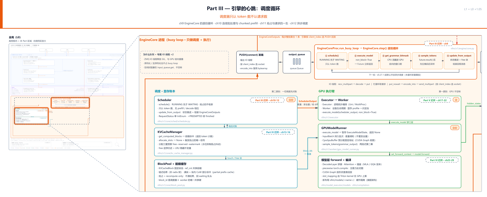
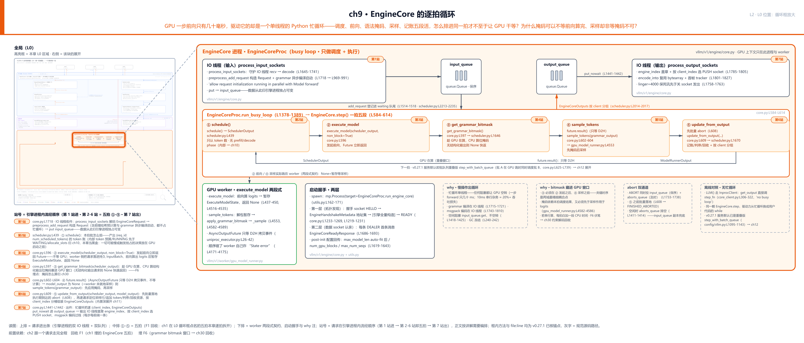
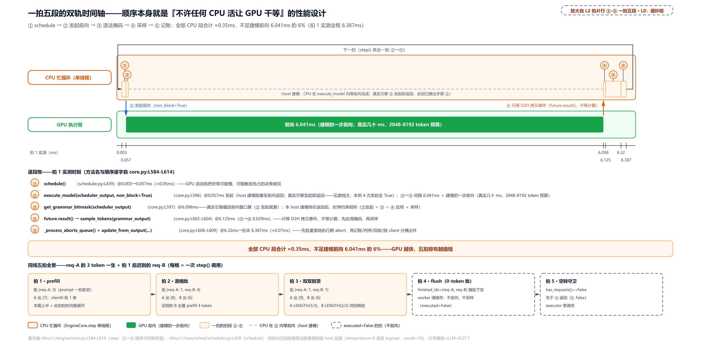
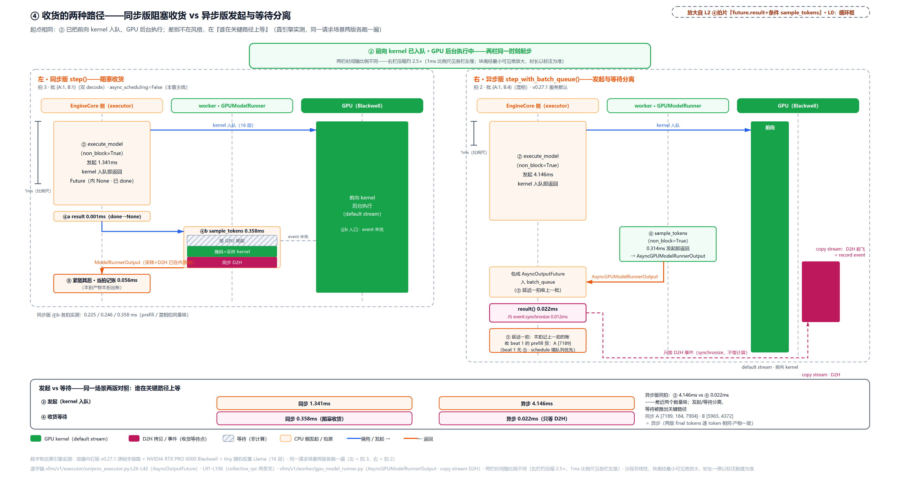
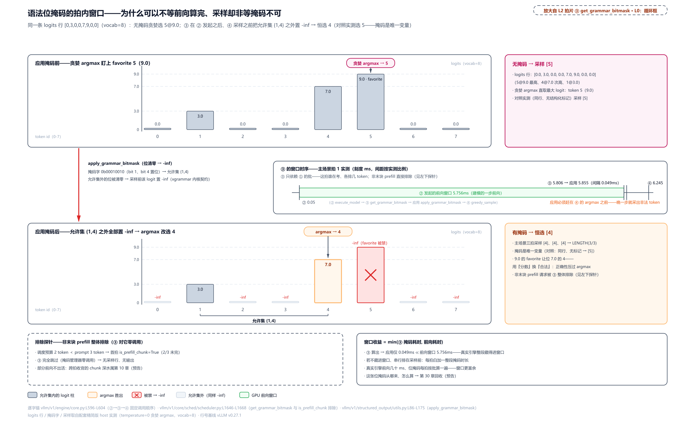

# 第 9 章　EngineCore 的逐拍循环

GPU 一步前向只有几十毫秒，驱动它的却是一个**单线程的 Python 忙循环**——调度、前向、语法掩码、采样、记账，五段活全挤在同一个循环线程里。一拍怎么排，才不至于让 GPU 干等一段 Python？更怪的是其中一段时序：语法掩码可以不等前向算完就算，采样却非等掩码不可。同为「等」，凭什么两种待遇？

[第 1 章](../../ch01-vllm-v1-in-one-map/narrative/chapter.md)在 L0 图的循环框里点名过这五拍，当时留了话：Part III 会把它逐拍拆开。[第 2 章](../../ch02-request-lifecycle/narrative/chapter.md)的十六站走读搭车路过（站 10-14 就是这五段），[第 5 章](../../ch05-zmq-topology-and-protocol/narrative/chapter.md)把循环框外圈的两条 IO 线程和两条队列讲完了。现在下车进框，本章把这颗心脏从起床到停跳完整拆一遍：引擎进程怎么出生、循环怎么转起来、一拍的五段各干什么活、最后怎么收场。

## 你在这里

本章是 Part III 的第一站。Part III 要回答的总问题是：**调度器只认 token 数，不认请求数**——这句话[第 1 章](../../ch01-vllm-v1-in-one-map/narrative/chapter.md)用自助餐厅的比喻立过，现在进它的主场，四章连着把调度循环拆到底：



> *图注：Part III「引擎的心跳：调度循环」共四章（ch9-12）。L0 全图上本 Part 负责的区域（EngineCore 带中间的五拍循环框加调度账本列上半）在此亮起、区域外退后：ch9 逐拍循环（本章）、ch10 连续批处理与 chunked prefill、ch11 抢占与请求的一生、ch12 异步调度。本章打头，先把循环框放大。*

放大之后，本章自己的地图长这样：



> *图注：本章放大的是[第 1 章](../../ch01-vllm-v1-in-one-map/narrative/chapter.md) L0 图 EngineCore 带中间的逐拍循环框（五拍转一圈的那块）；外圈把[第 5 章](../../ch05-zmq-topology-and-protocol/narrative/chapter.md)讲过的双 IO 线程与 input_queue/output_queue 一起圈进来，因为循环框从来不是孤岛。上排是请求的进出通道；中排 ①-⑤ 是五拍，即[第 1 章](../../ch01-vllm-v1-in-one-map/narrative/chapter.md)在 L0 图点名、[第 2 章](../../ch02-request-lifecycle/narrative/chapter.md)十六站的站 10-14 搭车路过的那五段，本章逐拍拆开；下排是 GPU worker 的两段式契约、启动握手与 why 注。站号 1-7 = 请求在引擎进程内流经代码的顺序（第 1 站进、第 2-6 站即五拍、第 7 站出），握手发生在一切请求之前、不占站号；正文按讲解需要编排、不必照站号读。*

读法建议：只想看「五段怎么排进一拍」，直奔[「一拍五段：顺序就是性能设计」](#一拍五段顺序就是性能设计站-2-6)；题眼「掩码为什么能藏进前向窗口」在[「第三拍：掩码藏进前向窗口」](#第三拍掩码藏进前向窗口站-4)；「两段式契约」的实体在[「第二拍与第四拍：把一次执行劈成两段」](#第二拍与第四拍把一次执行劈成两段站-3-和-5)；想看引擎怎么死，跳[「收场：退出与死讯」](#收场退出与死讯)；想跟全程，按序读。

## 起床：握手、线程与第一次心跳

一切请求之前，先有引擎进程的出生。本章主线是「一拍怎么转」，出生这一段只挑与循环直接相关的部分讲：进程怎么拉起、READY 之前为什么必须先构造完、慢活怎么预先搬出循环。[第 4 章](../../ch04-two-usage-faces-one-trio/narrative/chapter.md)讲过总闸默认开、离线也 spawn 引擎进程；出生点在 `CoreEngineProcManager.__init__` 的孵化循环里：

```python
# vllm/v1/engine/utils.py:L162-L171 · CoreEngineProcManager.__init__
            # Start EngineCore in background process.
            local_dp_ranks.append(local_index)
            self.processes.append(
                context.Process(
                    target=EngineCoreProc.run_engine_core,  # L166
                    name=f"EngineCore_DP{global_index}" if is_dp else "EngineCore",
                    kwargs=common_kwargs
                    | {"dp_rank": global_index, "local_dp_rank": local_index},
                )
            )
```

`CoreEngineProcManager` 用 `context.Process`（multiprocessing 按平台选定的进程上下文）把 `EngineCoreProc.run_engine_core` 拉成子进程。`EngineCoreProc` 是 EngineCore 的子进程包装（docstring 自注「ZMQ-wrapper for running EngineCore in background process」，`vllm/v1/engine/core.py:L1008`），从此引擎有了自己的进程、自己那把 GIL（全局解释器锁，[第 1 章](../../ch01-vllm-v1-in-one-map/narrative/chapter.md)三层拆透的那把大锁）。子进程入口 `run_engine_core` 的使命清单三行：构造 `EngineCoreProc`、装两个信号处理器、调 `run_busy_loop()`（`core.py:L1272-L1342`）。信号那两个函数留到收场一节拆，这里先看构造期发生什么。

### 两层握手：地址可以谈，身份必须认

[第 5 章](../../ch05-zmq-topology-and-protocol/narrative/chapter.md)讲过握手两层的 socket 语义（DEALER 必须先发言、握手专线上的 READY 与认亲帧是两条不同消息）——本章换引擎侧的时序视角，看一个当时没展开的问题：**READY 凭什么必须排在引擎全量构造之后？**

```python
# vllm/v1/engine/core.py:L1194-L1231
    @contextmanager
    def _perform_handshake(
        self,
        ctx: zmq.Context,
        handshake_address: str,
        identity: bytes,
        # … 省略：local_client / headless / vllm_config /
        #       parallel_config_to_update 四个参数 …
    ) -> Generator[EngineZmqAddresses, None, None]:
        with make_zmq_socket(
            ctx,
            handshake_address,
            zmq.DEALER,
            identity=identity,
            linger=5000,
            bind=False,
        ) as handshake_socket:
            # Register engine with front-end.
            addresses = self.startup_handshake(  # L1214
                handshake_socket, local_client, headless, parallel_config_to_update
            )
            yield addresses  # L1217
            # Send ready message.
            ready_msg = {
                "status": "READY",
                "local": local_client,
                "headless": headless,
            }
            # Include config hash for DP configuration validation
            if vllm_config.parallel_config.data_parallel_size > 1:  # L1226
                ready_msg["parallel_config_hash"] = (
                    vllm_config.parallel_config.compute_hash()
                )

            handshake_socket.send(msgspec.msgpack.encode(ready_msg))  # L1231
```

这是一个上下文管理器，关键在 `yield` 那一行（L1217）：`startup_handshake` 先在握手专线上喊 HELLO、等前端回一包 `EngineHandshakeMetadata`（里面是全部 ZMQ 地址集，`core.py:L1233-L1269`，等不到 5 分钟直接报错）；然后 **`yield` 把控制权交出去：EngineCore 的全量构造（executor、KV cache、调度器）就发生在 `with` 体内这段窗口里**；构造完了，管理器收尾时才在同一条 socket 上发 READY。顺序不是礼节：前端收到 READY 就认为引擎可用、开始发请求，若 READY 发在构造前，请求会砸进一个还没有 KV cache 的引擎。多引擎（DP）部署还在 READY 里附 `parallel_config_hash` 供前端校验各引擎配置一致。

第二层在数据 socket 上。输入 IO 线程的主循环 `EngineCoreProc.process_input_sockets` 里，建好每前端一条 DEALER 后，第一件事不是收消息，是发：

```python
# vllm/v1/engine/core.py:L1684-L1693 · EngineCoreProc.process_input_sockets
            # Register sockets with poller.
            poller = zmq.Poller()
            ready_response = self._make_ready_response()
            ready_payload = msgspec.msgpack.encode(ready_response)
            for input_socket in input_sockets:
                # Send initial message to each input socket - this is required
                # before the front-end ROUTER socket can send input messages
                # back to us.
                input_socket.send(ready_payload)  # L1692
                poller.register(input_socket, zmq.POLLIN)
```

片段里的 `poller` 是 ZMQ 的多路等待器（登记一批 socket、之后统一问「谁有消息可读」），马上用于收消息。注释原话「this is required before the front-end ROUTER socket can send input messages back to us」。ROUTER 只回发给它见过的身份，这条首消息让前端登记自己（机制必然，[第 5 章](../../ch05-zmq-topology-and-protocol/narrative/chapter.md)拆过）。但这条消息**还背着第二份货**：

```python
# vllm/v1/engine/__init__.py:L68-L94
@dataclass
class EngineCoreReadyResponse:
    """Sent from EngineCore to each frontend at the end of engine startup.

    Contains post-initialization config that may differ from the original
    values (e.g. max_model_len after KV cache auto-fitting).
    """

    max_model_len: int  # L76
    num_gpu_blocks: int  # L77
    block_size: int
    dp_stats_address: str | None
    dtype: str
    vllm_version: str
    world_size: int
    data_parallel_size: int
    tensor_parallel_size: int
    pipeline_parallel_size: int
    decode_context_parallel_size: int
    data_parallel_rank: int
    max_num_seqs: int
    max_num_batched_tokens: int
    instance_id: str
    # KV cache capacity (None for encoder-only/attention-free models).
    kv_cache_size_tokens: int | None = None
    kv_cache_max_concurrency: float | None = None
    kv_events_config: KVEventsConfig | None = None
```

docstring 自己说明用途：「post-initialization config that may differ from the original values（e.g. max_model_len after KV cache auto-fitting）」。`max_model_len`（模型最大序列长度）、`num_gpu_blocks`（KV cache 块数）这些值，要等引擎真的盘完显存才知道：auto-fit（按显存实际大小推算容量）跑完才有的真相，由这条认亲帧捎回前端。这又反过来解释了第一层为什么把构造夹在 HELLO 与 READY 之间：构造不完成，这份配置就编不出来。前端的收账分两条线，细节可跳、记住「两边都收齐才算完事」即可。第一条线在握手专线：`wait_for_engine_startup`（`vllm/v1/engine/utils.py:L1206` 起）等齐全部引擎的 HELLO→READY 才返回，从头到尾不碰数据 socket。第二条线在数据 socket：前端客户端的构造函数逐引擎等齐认亲帧，`MPClient.__init__`（`vllm/v1/engine/core_client.py:L503` 起）在 L651-L670 逐身份轮询输入 socket，每收一条就交 `_apply_ready_response`（L737）落账。两边都收齐，`AsyncLLM.__init__` 才算完事。

### 双 IO 线程与「慢操作出循环」的第一笔

构造期最后一件事是拉起两条守护 IO 线程（`core.py:L1092-L1119`）。装配代码和「socket 收发释放 GIL，所以 IO 放线程」的动机，[第 5 章](../../ch05-zmq-topology-and-protocol/narrative/chapter.md)已整段嵌过、[第 1 章](../../ch01-vllm-v1-in-one-map/narrative/chapter.md)的 GIL 三层是它的地基，这里不重讲。本章补上当时只点了名的一段：输入线程收帧之后、投 `input_queue` 之前，干的预处理活：

```python
# vllm/v1/engine/core.py:L969-L991
    def preprocess_add_request(self, request: EngineCoreRequest) -> tuple[Request, int]:
        """Preprocess the request.

        This function could be directly used in input processing thread to allow
        request initialization running in parallel with Model forward
        """
        # Note on thread safety: no race condition.
        # `mm_receiver_cache` is reset at the end of LLMEngine init,
        # and will only be accessed in the input processing thread afterwards.
        if self.mm_receiver_cache is not None and request.mm_features:
            request.mm_features = self.mm_receiver_cache.get_and_update_features(
                request.mm_features
            )

        req = Request.from_engine_core_request(request, self.request_block_hasher)  # L983
        if req.use_structured_output:
            # Note on thread safety: no race condition.
            # `grammar_init` is only invoked in input processing thread. For
            # `structured_output_manager`, each request is independent and
            # grammar compilation is async. Scheduler always checks grammar
            # compilation status before scheduling request.
            self.structured_output_manager.grammar_init(req)  # L990
        return req, request.current_wave
```

docstring 原话：「allow request initialization running in parallel with Model forward」。`Request.from_engine_core_request` 把线格式请求变成引擎自己的 `Request` 实体（顺带算好前缀哈希，前缀缓存要用的那本账，Part IV 展开）；带结构化输出约束的请求在这里启动 `grammar_init`（语法编译，异步的，编译完才允许被调度）。这些都是 CPU 大户，全放在 IO 线程做掉，忙循环只消费结果。这是「慢操作出循环」清单的第一笔，后面还会看到 encoding、detokenize、GC（garbage collection，Python 垃圾回收）各归各位。两段「Note on thread safety: no race condition」注释值得多看一眼：它们不是拍胸脯，是在说明**为什么**无竞态。这个方法只在输入线程被调用、编译又是异步的，忙循环摸到请求时编译早已在别处排队。预处理抛错也不炸引擎，走该请求自己的 ERROR 回程（`_handle_request_preproc_error`，`core.py:L1829-L1836`）。

数据从此归位：IO 线程把 `(request_type, request)` 投进 `input_queue`，这个对象此后归引擎进程独占可变（第 1 站到此）。忙循环消费侧的分派函数 `_handle_client_request`（`core.py:L1507-L1540`）按消息类型走四条路：ADD 转 `EngineCore.add_request` 校验后交调度器登记进 waiting 队尾（`scheduler.py:L2213-L2231`）；ABORT 落 `abort_requests`；UTILITY 走[第 5 章](../../ch05-zmq-topology-and-protocol/narrative/chapter.md)讲过的反射薄 RPC；WAKEUP 哨兵（sentinel，约定好的特殊消息：不携带业务数据、只用来发一个信号）直接 return（它的戏在收场一节）。登记入队的锚点到 L2231 为止：函数体再往后是 KV connector 的钩子与统计事件（KVConnector＝跨机搬运 KV cache 的接入组件，机制本体在 Part IV 末章 KVConnector 章），与本节无关。

## 轮子：忙循环，专职而不空转

轮到主角。「busy loop（忙循环）」这个名字第一次正面出场，得先把名字说清：**它不是 busy-waiting（忙等）**。操作系统教科书里的 busy-waiting 是「反复检查条件是否成立」的自旋：循环体里唯一的事就是问「好了没」，等一毫秒就白烧一毫秒 CPU，教科书明确把它列为反模式（[Wikipedia：Busy waiting](https://en.wikipedia.org/wiki/Busy_waiting)，原话「processor time that could be used to execute a different task is instead wasted on useless activity」）。vLLM 官方架构文档对 EngineCore 的描述原话就是「It runs a busy loop that continuously schedules requests and dispatches work to the GPU workers」（[架构文档](https://docs.vllm.ai/en/latest/design/arch_overview/)），调度器接口的 docstring 也写着「called repeatedly by a busy loop in the engine」（`vllm/v1/core/sched/interface.py:L59`）。名字是官方的，但「忙」的意思是**这条线程专职驱动引擎、从出生转到退出**，不是空转。它跟 asyncio 的事件循环同一血统：循环永真，空转时睡在队列上。

三种等待方式摆在一起最清楚（说明性例子，标准库，可直接跑）：

```python
import queue, time
q = queue.Queue()

# ① busy-waiting（反模式）：烧着 CPU 反复看
while q.empty():      # 等多久白烧多久
    pass

# ② 阻塞等待（正解）：没消息就睡着，消息来了被操作系统唤醒
item = q.get(block=True)   # 文档原话：block if necessary until an item is available

# ③ 限频轮询（折中）：把「反复看」的频率压到固定值
while q.empty():
    time.sleep(0.001)      # 轮询频率上限约 1000 次/秒，其余时间片让给别人
```

vLLM 三种各用在各自该在的地方。看骨架（[第 1 章](../../ch01-vllm-v1-in-one-map/narrative/chapter.md)嵌过全文，这次带行号锚细读）：

```python
# vllm/v1/engine/core.py:L1378-L1389
    def run_busy_loop(self):
        """Core busy loop of the EngineCore."""
        while self._handle_shutdown():  # L1380
            # 1) Poll the input queue until there is work to do.
            self._process_input_queue()  # L1382
            # Publish request counts before and after GPU step to ensure freshness.
            self._maybe_publish_request_counts()
            # 2) Step the engine core and return the outputs.
            self._process_engine_step()  # L1386
            self._maybe_publish_request_counts()

        raise SystemExit  # L1389
```

四步骨架：取件 → 发统计 → 步进 → 发统计。`_maybe_publish_request_counts` 是多引擎负载均衡的统计旁路（`core.py:L1391-L1402`，单引擎部署它直接 return），`_handle_shutdown` 既当循环条件又当关停仲裁（收场一节拆）。`raise SystemExit` 是这个循环**唯一的正常出口**：循环不 return、不 break，跑完就是进程退场。注意全程只有一个 Python 线程在跑这段代码：调度、驱动 GPU、记账都在它手上，所以任何一段卡住，GPU 就跟着停。这是后面一切时序设计的出发点。

### 空闲：睡在队列上，不烧一个核

「有活就转、没活就睡」的实现全在 `_process_input_queue`：

```python
# vllm/v1/engine/core.py:L1404-L1433
    def _process_input_queue(self):
        """Exits when an engine step needs to be performed."""

        waited = False
        while not self.has_work() and self.is_running():  # L1408
            # Notify callbacks waiting for engine to become idle.
            self._notify_idle_state_callbacks()
            if self.input_queue.empty():
                # Drain aborts queue; all aborts are also processed via input_queue.
                with self.aborts_queue.mutex:
                    self.aborts_queue.queue.clear()  # L1414
                # … 省略：两行 DEBUG 日志（"waiting for work" / waited 标记），
                #       及循环外睡醒补记的 "EngineCore loop active." 日志行 …
            block = self.process_input_queue_block
            try:
                req = self.input_queue.get(block=block)  # L1420
                self._handle_client_request(*req)
            except queue.Empty:
                break
            if not block:
                break

        # Handle any more client requests.
        while not self.input_queue.empty():  # L1431
            req = self.input_queue.get_nowait()
            self._handle_client_request(*req)
```

逐层读。`has_work()`（`core.py:L1365-L1371`）问三处有没有活：`engines_running`（多引擎波次控制）、`scheduler.has_requests()`（调度器手里还有请求，含已完成未摘除的）、`batch_queue` 非空（重叠版的批队列）；本章场景只有第二处会为真。没活时，引擎睡在 `input_queue.get(block=True)` 上，即方式②的阻塞等待：线程挂起、CPU 占用为零，新请求到达由操作系统唤醒。一个文档级细节埋在这里：Python 官方 queue 文档注明，Windows 上无超时的阻塞 get 会进入「uninterruptible wait on an underlying lock」，信号打断不了它。所以后面你会看到 vLLM 关停时不靠信号去打断这个睡眠，而是往队列里投一个 WAKEUP 消息「用消息叫醒」（[Python queue 文档](https://docs.python.org/3/library/queue.html)）。

空闲分支里还夹着一件事：清空 `aborts_queue`。注释自证「all aborts are also processed via input_queue」——ABORT 消息本来就会双投（[第 5 章](../../ch05-zmq-topology-and-protocol/narrative/chapter.md)末节拆过双投与幂等），引擎全闲时，aborts_queue 里积压的撤单已随 input_queue 那份处理掉了，这里把可能残留的急件通道清干净，下一拍从零开始。一旦有活，尾部循环把积压的请求一次清空，攒批进调度器。

### 步进：step_fn 的驱动点与 1 毫秒的让路

有活之后，`_process_engine_step` 驱动一拍：

```python
# vllm/v1/engine/core.py:L1435-L1452
    def _process_engine_step(self) -> bool:
        """Called only when there are unfinished local requests."""

        # Step the engine core.
        outputs, model_executed = self.step_fn()  # L1439
        # Put EngineCoreOutputs into the output queue.
        for output in outputs.items() if outputs else ():
            self.output_queue.put_nowait(output)  # L1442
        # Post-step hook.
        self.post_step(model_executed)

        # If no model execution happened but there is still scheduler work
        # (e.g. WAITING_FOR_REMOTE_KVS or delayed KV connector frees), yield
        # the GIL briefly to allow background transfer threads to make progress.
        if not model_executed and self.scheduler.has_requests():
            time.sleep(0.001)  # L1450

        return model_executed
```

三件事：调 `self.step_fn()`（下一节的主角）、把产出逐条 `(client_index, EngineCoreOutputs)` 投进 `output_queue`（第 7 站：输出 IO 线程从队列取件、盖章、路由、编码过线，全在[第 5 章](../../ch05-zmq-topology-and-protocol/narrative/chapter.md)「零拷贝」一节，不重讲）、跑 `post_step` 钩子（投机解码的草稿更新位，本章场景是空操作）。

尾部那个 `time.sleep(0.001)` 值得单独说——方式③的限频轮询用在了它该在的地方。注释点名两个场景：请求在等远端 KV（`WAITING_FOR_REMOTE_KVS`：等的是 NIXL 这类 KV 传输库的后台搬运，pin 版本钉 `nixl==1.3.1`，跨机 KV 搬运细归 Part IV 末章 KVConnector 章）或延迟的块释放。这种拍没有模型执行，但调度器有活；忙循环若紧咬着转，后台传输线程拿不到 GIL、永远搬不完。睡 1 毫秒把轮询限到约 1000 次/秒并让出 GIL。这被允许，恰因 GPU 此刻本来就闲：让出去的是 Python 的时间片，不是 GPU 的。

### CPU 占用账：三种状态，没有一种空转

把忙循环的 CPU 占用按状态结一遍账：**有请求时**，一拍的耗时由 `step_fn` 主导（GPU 忙，单线程 Python 跟着 GPU 的拍子走）；**空闲时**，阻塞在 `input_queue.get(block=True)` 上，占用为零；**等远端 KV 的窄场景**，1ms 限频轮询，占用有界且低频。同一个「慢操作出循环」的纪律还有两笔零碎：启动期把 GC 堆冻结（`freeze_gc_heap`，`core.py:L240-L242`：权重、KV cache 这些启动期分配的大对象不再被反复扫描，GC 全场停顿随之变短变少）、环境变量读取缓存。都是把「可能让循环停顿的东西」提前搬走。

### 先说破：你马上要学的不是默认版

`step_fn` 是个实例属性，在 `EngineCore.__init__` 里静态绑定：

```python
# vllm/v1/engine/core.py:L231-L236 · EngineCore.__init__
        self.step_fn = (
            self.step if self.batch_queue is None else self.step_with_batch_queue  # L232
        )
        self.async_scheduling = vllm_config.scheduler_config.async_scheduling

        self.aborts_queue = queue.Queue[list[str]]()
```

`batch_queue`（批队列，`max_concurrent_batches > 1` 时才建，`core.py:L206-L212`）非空就绑 `step_with_batch_queue`——批 A 在 GPU 跑的同时调度批 B 的重叠版。而 v0.27.1 的服务场景**默认就是这个重叠版**：异步调度配置为 None 时，规则是「Enable async scheduling unless there is an incompatible option」（`vllm/config/vllm.py:L1095-L1143`），只有池化模型（pooling model：不做逐 token 生成、只取整段表示向量做池化输出的那类，embedding/rerank 是典型用法）、部分投机解码方法、部分执行后端才降级关闭。本章接下来一整章讲同步版 `step()`，教学顺序与生产默认相反，必须先说破。为什么这么教：同步版的四段骨架（schedule → execute → sample → update，③的掩码塞在 execute 与 sample 之间的窗口里）是理解重叠版的唯一地基，重叠版只是把「等上一拍结束再调度下一拍」的串行段折叠掉；地基的账算不清，重叠版省了什么就无从判断。两版的实测对照（发起与等待差两个数量级）在「第二拍与第四拍」一节末尾先看一眼，完整拆解归 Part III 末章（异步调度）。

## 一拍五段：顺序就是性能设计（站 2-6）

口径先对齐（[第 2 章](../../ch02-request-lifecycle/narrative/chapter.md)升过格：**拍 = 转完一整圈**，五段合为一拍）：本章小节标题里的「第 N 拍」沿用[第 1 章](../../ch01-vllm-v1-in-one-map/narrative/chapter.md)L0 图例的拍号，指的是圈内的一段（①-⑤，下文也直呼「段」）；实测表里「拍 1、拍 2…」的序号数的是圈。**段认 ①-⑤、圈认数字**，两个口径都在场，见号先分清说的是段还是圈。

现在正题。把 `step()` 全文放在面前。[第 1 章](../../ch01-vllm-v1-in-one-map/narrative/chapter.md)逐拍点名过它，[第 2 章](../../ch02-request-lifecycle/narrative/chapter.md)搭车路过它，本章逐拍拆开：

```python
# vllm/v1/engine/core.py:L584-L614
    def step(self) -> tuple[dict[int, EngineCoreOutputs], bool]:
        """Schedule, execute, and make output.

        Returns tuple of outputs and a flag indicating whether the model
        was executed.
        """

        # Check for any requests remaining in the scheduler - unfinished,
        # or finished and not yet removed from the batch.
        if not self.scheduler.has_requests():  # L593
            return {}, False
        scheduler_output = self.scheduler.schedule(self._should_throttle_prefills())  # L595
        future = self.model_executor.execute_model(scheduler_output, non_block=True)  # L596
        grammar_output = self.scheduler.get_grammar_bitmask(scheduler_output)  # L597
        with (
            self.capture_iteration_details(scheduler_output) as iteration_details,
            self.log_error_detail(scheduler_output),
        ):
            model_output = future.result()  # L602
            if model_output is None:
                model_output = self.model_executor.sample_tokens(grammar_output)  # L604

        # Before processing the model output, process any aborts that happened
        # during the model execution.
        self._process_aborts_queue()  # L608
        engine_core_outputs = self.scheduler.update_from_output(
            scheduler_output, model_output
        )  # L609
        self._attach_iteration_details(engine_core_outputs, iteration_details)

        return engine_core_outputs, scheduler_output.total_num_scheduled_tokens > 0
```

对着 L0 图的循环框读：第一拍 schedule（L595）、第二拍发起前向（L596）、第三拍算语法掩码（L597）、第四拍等结果并采样（L602-L604）、第五拍记账（L609）；L608 在④⑤之间夹一步批量撤单。开头还有个空转守卫（L593）：调度器手里一个请求都没有（包括已完成但还没摘除的）就返回 `({}, False)`，executor 零调用（后面实测表里它会亲自出场）。`with` 里那两个上下文管理器先当透传管道：`log_error_detail` 是两段式契约的故障兜底（下下节它会回来），`capture_iteration_details` 是统计附件（DP=1 时基本是空转，`_attach_iteration_details` 直接返回）。

这个顺序本身就是本章第一号设计决策，why 链四笔账：

- **旧设计**：朴素单线程引擎——v0 `LLMEngine.step` 把 tokenize、调度、前向、采样、后处理串在一个同步循环里，做一步等一步；更早的 v1 `step()` 也是 `execute_model` 同步等完再采样。
- **痛点**：忙循环单线程，任何阻塞都让 GPU 空转。一步 forward 只有几十毫秒（2048-8192 token 预算量级）；10ms 串行 CPU 杂务叠上去，按 50ms 前向算每拍变 60ms、吞吐掉约 17%。而 GPU 越快这笔账越狠：vLLM 官方 V1 alpha 博客实测 Llama-8B 在 H100 上单步低至约 5ms；真到那个速度，同样 10ms 杂务把每拍拖成 15ms，吞吐只剩纯 GPU 节奏的三分之一。
- **v1 方案**：就是上面这段顺序。所有可能慢、可能触发抢占的决策放在 GPU 启动**前**（①）；`execute_model` 只发起不等待（②）；CPU 活塞进 GPU 计算窗口（③）；连「执行」都劈成两段，两段之间隔着那个窗口（②④）。循环外缘同一纪律：请求构造和语法编译在 IO 线程（上一节）、msgpack 编码在输出线程、detokenize 干脆在前端进程（[第 7 章](../../ch07-uplink-token-to-text/narrative/chapter.md)）。
- **代价**（诚实记）：执行劈两段，worker 带上跨调用暂存态，中间态出错归属变模糊——要用专门的状态防御和错误兜底把模糊钉回去（下一节整节就是它）；执行期到达的撤单必须双投递才不丢（[第 5 章](../../ch05-zmq-topology-and-protocol/narrative/chapter.md)已拆）；「GPU 空转」的边界情形仍有一处残留（等远端 KV 时的 1ms 让路，上一节已见）。

### 一拍在时间轴上长什么样

顺序好不好，放到时间轴上量一下就知道。这次的数字来自真引擎：配套脚本把钉版 v0.27.1 源树装进容器（镜像只供给依赖），接上一块真 GPU（NVIDIA RTX PRO 6000 Blackwell 工作站卡），用 `InprocClient`（同进程客户端，[第 4 章](../../ch04-two-usage-faces-one-trio/narrative/chapter.md)见过的逃生舱：EngineCore 放在本进程直接调用，不走 ZMQ 不开子进程）手动逐拍驱动真正的 `step()`——被测函数与忙循环里那个 `step_fn` 是同一个，只是驱动者从忙循环换成了脚本。模型是随机权重的 16 层小 Llama（词表 8192），贪婪采样，token 直接注入；取证显式回退到 V1 GPUModelRunner（正是本章逐段引用的 `gpu_model_runner.py`；这个模型在 v0.27.1 的新默认 V2 runner 依赖的 CUDA 特性在该容器运行时不可用）。V2 是 `vllm/v1/worker/gpu/` 目录下的实验性重构，②④契约与 V1 同构：同样在 `execute_model` 里暂存 `ExecuteModelState` 并返回 None、`sample_tokens` 解包即清，差异在执行内部，归执行篇。计时用 `time.perf_counter`（Python 的高精度墙钟）记各段耗时，前向算没算完用 CUDA event（GPU 流上的时间戳，CPU 可非阻塞查询）取证。



> *图注：同步版 `step()` 双 decode 拍（拍 3）的实测时序，pin v0.27.1 全链路 + RTX PRO 6000 Blackwell（`core.py:L584-L614`）。① schedule 0.045ms，调度决策在 GPU 启动前做完；② `execute_model(non_block=True)` 1.341ms，16 层前向 kernel 入队即返回，GPU 前向转入后台；③ 掩码 0.001ms，落在前向窗口内（③结束时 CUDA event 查询显示前向仍在算）；④a 已 done 的 Future 直返 0.001ms；④b `sample_tokens` 0.358ms，入口时前向仍未完，等的是 GPU 尾程加采样加 D2H；⑤ 记账 0.056ms。本拍全程 1.860ms；无请求的守卫拍 0.006ms 且 executor 零调用。③④a 全部藏进前向窗口、④b 只等 GPU 尾程：这就是五拍排布在真实时间轴上的形状。*

图与表分工：图讲这一拍的动态时序（谁先谁后、谁等谁），下面的表对全场景的静态账（每拍各段耗时与产出）。实测场景：req-A（prompt 3 个 token，`max_tokens=3`）先到，一拍后 req-B（prompt 4 个 token，`max_tokens=2`）赶到。一个请求的一生加一个迟到者，五拍走完（异步版跑同一场景的对照，见「第二拍与第四拍」一节）：

<!-- trace: m1 -->
| 拍 | ① schedule (ms) | ② 发起 execute_model(non_block=True) (ms) | ③ 掩码·结束时前向已完? | ④a result (ms) | ④b sample_tokens (ms) | ⑤ 记账 (ms) | 批形状→产出 | 拍全程 (ms) |
|---|---|---|---|---|---|---|---|---|
| 1 | 0.070 | 2.516 | 0.001·是 | 0.001 | 0.225 | 0.028 | {req-A:3} prefill→A 得 [7189] | 2.870 |
| 2 | 0.071 | 2.636 | 0.001·是 | 0.001 | 0.246 | 0.032 | {req-A:1, req-B:4} 混相→A [184]、B [5965] | 3.021 |
| 3 | 0.045 | 1.341 | 0.001·否（前向仍在 GPU 执行） | 0.001 | 0.358（入口时前向亦未完） | 0.056 | {req-A:1, req-B:1}→A [7904]、B [4372]，双双 LENGTH | 1.860 |
| 4 | 0.023 | 0.242 | 0.001·— | 0.001 | 跳过（④a 拿到非 None 空输出，不调 sample_tokens） | 0.004 | {} flush：total=0 批仍下发（冲刷 finished 名单） | 0.534 |
| 5 | —（守卫先于①早退） | 零调用 | — | — | — | — | 空转守卫：has_requests()==False，step 返回 ({}, False)（复验拍同 0.005ms 零事件） | 0.006 |

（采样为 temperature=0 的贪婪 argmax。③列的「前向已完?」是 CUDA event 非阻塞查询的结果；拍 3 查出来「否」，就是掩码藏进前向窗口的直接证据。表的「拍全程」是 `step()` 整段墙钟，五段之外还有未单列的段间开销：step 入口守卫、`with` 上下文进出、L608 批量撤单、⑤后的附件挂接与返回——按实测事件时刻，拍 1-3 这部分合计 0.03-0.06ms；拍 4 没有④b 大段，0.26ms 的差值全是它、占比显形。）逐拍读表。拍 1 是 req-A 的 prefill，整拍 3 个 token。值得注意的是②发起就要 2.516ms：在这个 16 层的小模型上，把 kernel 排进 GPU 队列的 CPU 工作比 GPU 真正计算还久，发起段主导整拍（launch-bound，发起主导）；模型越重这个比例越倒过来，见本节末的量级账。

拍 2 是**混相批**：req-A 逐 token decode（1 个）与 req-B 的 prefill（4 个）同批，这正是[第 1 章](../../ch01-vllm-v1-in-one-map/narrative/chapter.md)「调度器没有 prefill 批与 decode 批之分」的账面证据。拍 3 双双到达长度上限，两个请求同一拍完成、一起释放。拍 4 是个 0-token 的空批，它的存在有讲究：拍 3 里完成的请求要等下一拍的 `schedule()` 把 finished 名单随批下发给 worker 清缓存，所以「完成之后、清账之前」还有一拍。这拍 `has_requests()` 仍为真（已完成未摘除的请求也算数），但批是空的、不碰 GPU：②的调用照走，worker 对 0-token 批走空批早退分支（`vllm/v1/worker/gpu_model_runner.py:L4218-L4233`，注释原话「Return empty ModelRunnerOutput if no work to do」），不发起前向、直接返回非 None 的空结果常量 `EMPTY_MODEL_RUNNER_OUTPUT`。④a 的 `future.result()` 拿到它非 None，④b 的采样整段跳过——表里拍 4 那行④b 列的「跳过」正是这么来的。（配了 KV connector 的部署在这一拍另有走法，交给 KV 传输组件处置，归 Part IV 末章 KVConnector 章。）拍 5 守卫拦下，引擎回到队列上睡觉。

这张表还立着一条不变式（**拍序不变式**）：每次 `step()` 五段至多各执行一次、顺序固定；`has_requests()` 为假时先于①早退、executor 零调用。论证用单调量：任一请求的产出 token 数每拍至多加一、被 `max_tokens` 钉死上界，所以每请求有限拍内完成；完成者当拍释放、finished 名单恰被下一拍冲刷——最后一个请求 flush 完，`has_requests()` 转假，守卫接手。上表五拍账目闭合：拍 3 双完成 → 拍 4 恰一次 flush → 拍 5 守卫（0.006ms，事件表为空即 executor 零调用），无泄漏、无多余。

量级账顺手结了。这个小模型上 GPU 计算段是亚毫秒的，反而是②的发起（1.3-2.6ms）主导整拍；好处是把「发起」与「计算」拆得清清楚楚：③④a 在前向还在 GPU 上跑时就已做完（event 查询为证），④b 只等 GPU 尾程加采样加 D2H。模型越重、前向越久，这套排布越值钱：真实 8B 模型在 H100 上单步约 5ms（V1 alpha 博客的外证数字），GPU 计算主导时，③④a 这类窗口内的 CPU 段合计仍是亚毫秒，完全藏得住；①在 GPU 启动前做完，不在关键路径。反过来算一笔示意的账：若 10ms 级 CPU 杂务不藏进窗口、串行堆在前向后面，一步 50ms 前向的引擎每拍变 60ms、吞吐掉约 17%；前向只有 5ms 时，同样 10ms 把每拍拖成 15ms，吞吐只剩纯 GPU 节奏的三分之一。**GPU 越快，五拍的排布越值钱**——这正是重叠版要进一步消灭的串行段，账留到 Part III 末章算。

**建模值与真值的对照**。配套精简版也能在无 GPU 的 host 上把 `step()` 跑起来，前向用睡 6.041ms 的同步等待代行。它适合验证顺序约束，不适合报时序数字；把它与真跑放在一起，三笔账值得点破。第一，顺序约束两者完全一致：①<②<③<④a<④b<⑤、守卫早退、flush 无采样，逐项对得上。第二，绝对时长是编的：6.041ms 是脚本睡出来的，不是任何真实前向。第三，②的语义反了：建模里②睡完前向才返回，③排在窗口之后；真引擎里②发起即返回，③在前向进行中就算。这个先后差是 host 建模的痕迹，不是同步版与重叠版的差别——真实同步版 `step()` 的③同样在窗内。本章时间轴的数字一律出自真跑，6.041ms 一类建模值只在这个对照口径里出现。

下面四节逐段下潜（②与④共用一节，它们本就是一份契约的两半）。①的黑盒边界、⑤的内景深处各有一章等着（组批内部归下一章、抢占与请求状态机归 Part III 第三、四章），本章按「循环本体」的边界走。

## 第一拍 schedule：每次前向前重新组批（站 2）

现在下潜到五拍的第一段：调度。它在 L0 图循环框的最上游，决定这一拍 GPU 算什么。第一拍的契约写在调度器接口的 docstring 里——这段话是「迭代级调度」的书面契约，也是「busy loop」一词在源码里的出处：

```python
# vllm/v1/core/sched/interface.py:L53-L67
    @abstractmethod
    def schedule(self, throttle_prefills: bool = False) -> "SchedulerOutput":
        """Schedule the requests to process in this scheduling step.

        The scheduling decision is made at the iteration level. Each scheduling  # L57
        step corresponds to a single forward pass of the model. Therefore, this
        method is called repeatedly by a busy loop in the engine.  # L59

        Essentially, the scheduler produces a dictionary of {req_id: num_tokens}
        that specifies how many tokens to process for each request in this
        scheduling step. For example, num_tokens can be as large as the number
        of prompt tokens for new requests, or it can be 1 for the requests that
        are auto-regressively generating new tokens one by one. Otherwise, it
        can be somewhere in between in case of chunked prefills, prefix caching,
        speculative decoding, etc.
```

三句话各管一件事：**每次 forward 前重新组批**（迭代级，The scheduling decision is made at the iteration level）；**一拍=一次 forward**（Each scheduling step corresponds to a single forward pass）；**被忙循环反复调用**（called repeatedly by a busy loop）。产出是一份 token 账 `{req_id: num_tokens}`：新请求可以是整个 prompt、逐 token 生成的请求是 1、中间值留给 chunked prefill（长输入切块分拍）、前缀缓存、投机解码。三种取值各开一扇门，下一章和 Part IV 依次走进去。

这拍的设计决策同样是一条 why 链。**旧设计**是请求级批处理（request-level batching，vLLM 之前的主流服务形态）：攒一批请求、pad（补齐）到最长序列、整批全部生成完才整批换血。**痛点**两头卡：先做完的请求不能提前走，陪着长请求空转到整批结束；新请求必须等整批腾位，排队延迟高。这个痛有学术出处：首尔大学的 Orca 论文（OSDI 2022，系统方向顶会）第一个把调度粒度从「整个请求」降到「一次迭代」，称之为 iteration-level scheduling（迭代级调度），在 GPT-3 175B 上对 NVIDIA FasterTransformer 拿到同延迟水平下最高 36.9 倍吞吐（[论文页](https://www.usenix.org/conference/osdi22/presentation/yu)）——这套做法后来被业界称作连续批处理（continuous batching），是 vLLM、SGLang、TGI（Hugging Face 的文本生成推理服务）共同的血统起点（谱系与 chunked prefill 的演进是下一章的主场）。**v1 方案**：`schedule()`（`vllm/v1/core/sched/scheduler.py:L439`）每拍产出上面的 token 账，完成的请求当拍退出、新请求同拍可入。woosuk 那段「没有 prefill phase 也没有 decoding phase，只有 num_computed_tokens 追赶 num_tokens_with_spec」的开头注释，[第 1 章](../../ch01-vllm-v1-in-one-map/narrative/chapter.md)已逐句拆过，不重讲。**代价**：每生成一个 token 都要过一遍 CPU 调度，调度逻辑本身成了吞吐上限，`update_from_output` 里 woosuk 自己的另一段注释承认这一点（第五拍会见到原文）；且它要求 KV 存储支持任意请求任意拍进出，没有分页 KV cache 就没有安全的逐拍换血（Part IV 的戏）。

本章把 `schedule()` 当黑盒：它吃调度器状态、吐 `SchedulerOutput`（调度决定的数据包：token 账、新入批请求、KV 块指派、finished 名单……），一切可能慢或触发抢占的决策都在 GPU 启动前做完，交给 executor 的批必然可执行。`throttle_prefills` 参数是多引擎预填充对齐的钩子，单引擎部署恒为 False（`core.py:L579-L582`）。

## 第二拍与第四拍：把一次执行劈成两段（站 3 和 5）

现在下潜到五拍里最特殊的一对：②与④。`step()` 里它们是 L596 与 L602-L604 两行，实际是同一份契约的两半：②只发起，④才收货。读源码之前，先把最容易混的一件事钉死——**②拍 `execute_model` 的返回值是什么，取决于执行模式**：

- **同步版**（`async_scheduling=False`，本章主线，也是「一拍五段」实测表跑的那版）：worker 把前向算出的中间结果暂存进自己的状态，返回 **None**。所谓「普通值」就是它：一个表示「活已入账、货未到」的返回值，由 executor 装进一个已经完成（done）的普通 Future。
- **异步版**（`async_scheduling=True`，v0.27.1 服务默认）：worker 交回 `AsyncModelRunnerOutput`（异步输出对象，语义自带「结果还在 GPU、D2H 拷贝（device to host，GPU 显存到 CPU 内存的拷贝）未完」），executor 把它包成 `AsyncOutputFuture`（一个把等待推迟到 `result()` 的 Future 子类）。

本章沿同步版一路讲到底，先把主线路径走通；异步版在本节末尾用同一场景的实测对照一次。两版共用同一份契约骨架，骨架的直觉像餐厅的传菜口：前厨把菜做好（logits 算完）不装盘，先挂在传菜口；服务员来取（`sample_tokens`）才算一道菜上桌；服务员没取走之前，前厨不许开下一道菜。为什么劈？为了让第三拍的掩码能塞进两段之间的窗口，细节下一节，先把契约的实体看全。

这里需要一个标准库背景：`Future`（concurrent.futures，「异步任务结果的占位符」，官方文档原话「The Future class encapsulates the asynchronous execution of a callable」）。典型用法三步：提交任务立刻拿到 Future（不用等结果）、`done()` 非阻塞问一句「好了没」、`result()` 阻塞等到有结果（说明性例子，标准库）：

```python
from concurrent.futures import ThreadPoolExecutor

with ThreadPoolExecutor() as pool:
    fut = pool.submit(lambda: 1 + 1)   # 立刻返回提货单，不等任务跑完
    fut.done()                          # 可能是 False
    fut.result()                        # 阻塞直到有结果 -> 2
```

「提交即拿提货单、之后才决定何时等」：②拍 `execute_model(non_block=True)` 拿 Future、③拍先去干别的、④拍 `future.result()` 收货，语法地基就是它。

### 同步版主线：② 发起即返回 None

executor（单机执行器的转发层）把两拍都原样转发给 worker，自己不干活：

```python
# vllm/v1/executor/uniproc_executor.py:L108-L131
    def execute_model(  # type: ignore[override]
        self, scheduler_output: SchedulerOutput, non_block: bool = False
    ) -> ModelRunnerOutput | None | Future[ModelRunnerOutput | None]:
        output = self.collective_rpc(
            "execute_model",
            args=(scheduler_output,),
            non_block=non_block,
            single_value=True,
        )
        # In non-blocking mode, surface any exception as early as possible.
        if non_block and output.done():  # L118
            # Raise the exception in-line if the task failed.
            output.result()
        return output

    def sample_tokens(  # type: ignore[override]
        self, grammar_output: GrammarOutput | None, non_block: bool = False
    ) -> ModelRunnerOutput | None | Future[ModelRunnerOutput | None]:
        return self.collective_rpc(
            "sample_tokens",
            args=(grammar_output,),
            non_block=non_block,
            single_value=True,
        )
```

转发的目的地是 worker（真正跑模型的那层）。同步版主线三站，每站说清「谁在什么时刻把什么交给谁」：

**②发起：worker 更新持久批、把 16 层前向 kernel 排进 GPU 队列、暂存中间结果，返回 None。** 这一切发生在忙循环线程内。真引擎实测里这段 1.341ms（worker 侧 1.281ms，主体是 kernel 入队的 CPU 工作）。「发起即返回」的意思是：函数返回时 GPU 还在算，CPU 已经腾出手去干③。

**④a 收 Future：0.001ms 直返。** ②拿回的 Future 已经 done，`result()` 不等任何东西，把 None 领出来就走。None 在这里是取货凭证：它告诉 `if model_output is None`「前向已发射、采样欠着」，④b 于是接着上。空批那一拍兑现的则是非 None 的 `EMPTY_MODEL_RUNNER_OUTPUT`（「一拍五段」实测表拍 4 的「跳过」），采样整段绕开。

**④b 收货：`sample_tokens` 阻塞等三样东西。** worker 先盖语法掩码（下一节的主角），再把采样 kernel 排进前向后面的 GPU 队列，最后发起 D2H 拷贝并在事件上同步等它（sync 路径行为，源码注释自注，`gpu_model_runner.py:L4782-L4786`）。真引擎实测拍 3 的 0.358ms 里，入口时前向还没算完（CUDA event 查询为证）：这 0.358ms 等掉的是 GPU 前向尾程加采样加 D2H 一条龙，醒来时拿到 `ModelRunnerOutput`（采样结果的普通返回对象，逐请求采出的 token id 就装在它里面）。注意「只等 D2H」说的是等的内容、不是等的时长：拷贝排在前向之后才就绪，墙钟照样要等掉前向尾程。两段式买到的不是更短的等待，而是等待的方式与位置：线程睡在拷贝同步点上，零 CPU、释放 GIL。

②拿回的 Future 里到底装的什么、由谁包装，这层「包装账」在本节末尾「包装层一眼账」一次对清，先不岔开主线。

### worker 半边：暂存态与入口防御

worker 收到的两段契约长这样。第一段（`execute_model`）的入口先查防御：

```python
# vllm/v1/worker/gpu_model_runner.py:L4166-L4175
    def execute_model(
        self,
        scheduler_output: "SchedulerOutput",
        intermediate_tensors: IntermediateTensors | None = None,
    ) -> ModelRunnerOutput | AsyncModelRunnerOutput | IntermediateTensors | None:
        if self.execute_model_state is not None:  # L4171
            raise RuntimeError(
                "State error: sample_tokens() must be called "
                "after execute_model() returns None."
            )
```

上一拍的暂存还没被消费，就再来 `execute_model`，worker 自己炸，不产出错数据。暂存的实体：

```python
# vllm/v1/worker/gpu_model_runner.py:L437-L450
class ExecuteModelState(NamedTuple):  # L437
    """Ephemeral cached state transferred between execute_model() and
    sample_tokens(), after execute_model() returns None."""

    scheduler_output: "SchedulerOutput"
    logits: torch.Tensor
    spec_decode_metadata: SpecDecodeMetadata | None
    spec_decode_common_attn_metadata: CommonAttentionMetadata | None
    hidden_states: torch.Tensor
    sample_hidden_states: torch.Tensor
    aux_hidden_states: list[torch.Tensor] | None
    ec_connector_output: ECConnectorOutput | None
    cudagraph_stats: CUDAGraphStat | None
    slot_mappings: dict[str, torch.Tensor] | list[dict[str, torch.Tensor]] | None
```

一个 10 字段的 NamedTuple（带字段名的不可变元组），docstring 自注「Ephemeral cached state transferred between execute_model() and sample_tokens(), after execute_model() returns None」，说的就是「前向算完、采样欠着」这个中间态。前向跑完，全套装进去、返回 None：

```python
# vllm/v1/worker/gpu_model_runner.py:L4516-L4535 · GPUModelRunner.execute_model（尾段）
        self.execute_model_state = ExecuteModelState(  # L4516
            scheduler_output,
            logits,
            spec_decode_metadata,
            spec_decode_common_attn_metadata,
            hidden_states,
            sample_hidden_states,
            aux_hidden_states,
            ec_connector_output,
            cudagraph_stats,
            slot_mappings,
        )
        self.kv_connector_output = kv_connector_output

        # Now the batch has been launched we can wait for corrections from the
        # previous model forward without breaking async scheduling.
        if deferred_state_corrections_fn:
            deferred_state_corrections_fn()

        return None  # L4535
```

（`deferred_state_corrections_fn` 是重叠版的延迟状态修正钩子，Part III 末章的地盘，此处过路。）第四拍第二段，解包、清态、掩码、采样：

```python
# vllm/v1/worker/gpu_model_runner.py:L4553-L4589
    def sample_tokens(
        self, grammar_output: "GrammarOutput | None"
    ) -> ModelRunnerOutput | AsyncModelRunnerOutput | IntermediateTensors:
        # … 省略：execute_model_state 为 None 的流水线并行（pipeline
        #       parallelism，模型按层切段、多卡接力计算）特例分支 …
        # Unpack ephemeral state.
        (
            scheduler_output,
            logits,
            # … 省略：spec_decode / hidden_states 等 6 个解包字段 …
        ) = self.execute_model_state
        # Clear ephemeral state.
        self.execute_model_state = None  # L4580

        # Apply structured output bitmasks if present.
        if grammar_output is not None:
            apply_grammar_bitmask(  # L4584
                scheduler_output, grammar_output, self.input_batch, logits
            )

        with record_function_or_nullcontext("gpu_model_runner: sample"):
            sampler_output = self._sample(logits, spec_decode_metadata)  # L4589
```

一置一清、互斥推进：`execute_model` 入口查旧值非 None 即炸，`sample_tokens` 入口先解包立即置 None，「前向算完、采样欠着」的中间态因此永不重叠，误序被入口防御拦死。掩码应用（`apply_grammar_bitmask`）恰在 `_sample` 之前，这个位置是下一节的全部内容。

### 实测：worker 面的契约，逐手验（配套精简版）

配套精简版直接驱动 worker，把两段式契约的手感逐手过一遍（贪婪采样、词表 8）。边界先说清：异步调度系统的全貌（batch_queue、延迟一拍收货、`step_with_batch_queue`）归 Part III 末章[第 12 章](../../ch12-async-scheduling/narrative/chapter.md)；本节与下一节只验两段式契约本身，worker 面与 executor 面在同步版里验，异步面只验「发起与等待分离」这一件事。静态账一张（动作、暂存态、返回三列；流程怎么走到下一步，读下面的散文）：

<!-- trace: m3 -->
| 动作 | execute_model_state | 返回 |
|---|---|---|
| execute_model(批{'req-1': 3}) | 暂存 10 字段（logits 1×8） | None |
| 再来一次 execute_model | 非 None（上一拍未消费） | RuntimeError：State error |
| sample_tokens(None) | 解包→清 None | sampled=[[1]]（argmax=favorite 1） |
| 消费后再 execute_model（批含新 req-2） | 重新暂存（新批） | None |

逐手读（配套精简版 host 实测）。**第一手，②暂存**：对批 {'req-1': 3} 调 `execute_model`，worker 把 10 个字段的中间结果暂存进 `ExecuteModelState`（logits 1×8）、返回 None，「前向算完、采样欠着」成立。**第二手，误用防御**：暂存未消费时再来一次 `execute_model`，worker 当场炸出 `RuntimeError: State error: sample_tokens() must be called after execute_model() returns None.`（上引源码原文），不产出错数据。**第三手，④消费**：`sample_tokens(None)` 解包暂存、立即清 None，掩码位之后贪心采样交出 `sampled=[[1]]`（argmax 命中 favorite 1），态已清。**第四手，复用合法**：消费之后再 `execute_model`（批含新 req-2），重新暂存新批、返回 None，合法——随后采样得 `sampled=[[1], [2]]`（req-1 续 decode + req-2 新入批），「一置一清」的循环从这里接上。

不变式（**暂存态不变式**）：`execute_model_state` 非 None 当且仅当恰有一拍前向的采样欠着；两次 `execute_model` 之间必恰有一次 `sample_tokens`。基例是初始 None；归纳步就是上面那对入口防御，非空时引擎不可能发起第二拍前向——四手正好把「置 →（防御）→ 清 → 再置」的合法循环走通一遍。

两段式的故障兜底补一笔：中间态出错时，`step()` 里那个 `log_error_detail` 上下文会连带 `dump_engine_exception` 把两段各自的状态现场倒出来（`core.py:L493-L507`）。「中间态出错归属变模糊」这个代价，用专门的诊断出口把模糊钉回去。

### 异步版对照：发起与等待分离

本节开头钉死的那件事，现在看后半边。异步版（`async_scheduling=True`，v0.27.1 服务默认，`step_fn` 绑 `step_with_batch_queue`）里，④的收货劈成两步：worker 的 `sample_tokens` 同样把掩码与采样 kernel 排进 GPU 队列，但不在函数里等 D2H。拷贝在 copy stream（专用的拷贝流）上以非阻塞方式发起、在事件上登记，函数立即返回 `AsyncGPUModelRunnerOutput`（V1 GPU runner 对 `AsyncModelRunnerOutput` 的实现，构造时完成拷贝起飞与事件登记）。executor 把它包成 `AsyncOutputFuture` 放进 batch_queue，等待推迟到之后的 `result()`：

```python
# vllm/v1/executor/uniproc_executor.py:L26-L42
class AsyncOutputFuture(Future):
    def __init__(self, async_output: AsyncModelRunnerOutput, single_value: bool):
        self.async_output = async_output
        self.single_value = single_value
        super().__init__()

    def result(self, timeout=None):
        if timeout is not None:
            raise RuntimeError("timeout not implemented")

        if not super().done():
            try:
                output = self.async_output.get_output()  # L38
                self.set_result(output if self.single_value else [output])
            except Exception as e:
                self.set_exception(e)
        return super().result()
```

`result()` 惰性调 `async_output.get_output()`：那是在等 D2H 拷贝事件，不是在等计算。配套精简版也把这一手演了一遍（host 契约演示：D2H 用线程事件代行，语义同 `get_output()` 的「阻塞至拷贝完成」，CUDA 拷贝流本体属执行篇）。`executor.sample_tokens(non_block=True)` 交回 `AsyncOutputFuture`（done=False）；事件未置位时 `result()` 挂起，脚本注入 0.25s 的拷贝延迟、期间零返回；事件置位后 0.142ms 交出结果（采样 [[4]]），二次 `result()` 只剩 0.008ms（Future 已 done，纯缓存读）。「只等搬运」的真实含义在这里看得分明：等的方式便宜（挂起、零 CPU、释放 GIL）、等待排在③之后，亚毫秒只是就绪后的取货价；至于等的墙钟罩不罩住前向余尾，取决于取货时机——当拍发起后立刻取就罩着，batch_queue 版延迟一拍才取、常常已就绪（下面真引擎的数字正是后者）。

真引擎把同一对请求在两版引擎上各跑一遍（「一拍五段」一节的实测环境），「发起与等待分离」直接量了出来：

- 异步版拍 2 的④ `sample_tokens(non_block=True)` 0.314ms 发起即返回；之后的 `result()` 只等 0.022ms，其中 D2H 事件同步仅 0.012ms。
- 同一拍的②发起 4.146ms，④等待 0.022ms，差近两个数量级。「提交即拿提货单」不是修辞，是实测。
- batch_queue 版的⑤延迟一拍收货：拍 1 没有⑤事件（填队列优先于取输出），拍 2 的⑤记的是拍 1 的账。`result()` 消费的也是上一拍入队的 Future——等到能取货时，D2H 事件早已就绪（拍 1 的 GPU 活在拍 1 末尾就落完，拍 2 又先跑了 4ms 的发起段），0.022ms 只是核对；若当拍发起后立刻取货（同步版④b 的做法），等待才会罩住前向余尾。
- 两版 final tokens 逐 token 相同（req-A [7189, 184, 7904]、req-B [5965, 4372]）：排布与等待点不同，产物一致。



> *图注：④拍收货的两种路径，真引擎实测对照（`uniproc_executor.py:L91-L106` 两条支的落地）。左栏同步版：`worker.sample_tokens` 阻塞到「前向尾程（入口时 CUDA event 未完）+ 掩码/采样 kernel + 同步 D2H」全部落地才返回，实测 0.358ms，交回 `ModelRunnerOutput`。右栏异步版：`sample_tokens(non_block=True)` 0.314ms 即返回 `AsyncGPUModelRunnerOutput`（D2H 已在 copy stream 起飞、事件已登记），executor 包成 `AsyncOutputFuture` 入 batch_queue，⑤延迟一拍处理上一批；隔一拍后 `result()` 只对事件同步，0.022ms（其中 event.synchronize 0.012ms）。两栏底行对账：②发起 1.341/4.146ms 对④等待 0.358/0.022ms（两栏各取自身代表性拍——同步拍 3 双 decode、异步拍 2，跨栏的②时长不可直接比）。两条路径的差别不在风格，在「谁在关键路径上等」。*

### 包装层一眼账：collective_rpc 的两条支

上面反复出现的 `AsyncOutputFuture` 与「已 done 的普通 Future」都出自 executor 转发层 `collective_rpc` 的收货规则（`vllm/v1/executor/uniproc_executor.py:L91-L106`），一共两条支：worker 交回 `AsyncModelRunnerOutput` 就包成 `AsyncOutputFuture`；交回普通值（同步版的 None、空批的 `EMPTY_MODEL_RUNNER_OUTPUT`）就装进一个已 done 的普通 Future。若任务已经失败，当场把异常抛出来（「surface any exception as early as possible」：早失败早暴露，不留给④拍一个坏 Future）。②④两拍的返回值就这两类，没有第三种。

## 第三拍：掩码藏进前向窗口（站 4）

回到开篇第二问：为什么掩码可以不等前向算完、采样却非等掩码不可？

先花三十秒把「语法位掩码（grammar bitmask）」这个词立住：它是一张「允许/禁止」开关表。批内每个结构化输出请求一行 × 词表每个 token 一位，第 i 位是 1 表示「这个位置允许采样 token i」。执法动作发生在采样之前：把掩码盖到模型刚算出的 logits 上，被禁位的分数被压成 −∞，softmax（把分数向量归一化成概率分布的那一步）之后概率恰好为零，采样器无论怎么随机都只能落在合法 token 上。最小例子（说明性，非源码；真实掩码带批维，内部表示归约束解码章）：

```python
import torch

logits  = torch.tensor([0.2, 1.0, 0.8, 0.6, 0.4])           # 5-token 词表
bitmask = torch.tensor([0,   0,   1,   1,   0  ], dtype=torch.bool)  # 只允许第 2、3 位
logits  = logits.masked_fill(~bitmask, float("-inf"))        # -> [-inf, -inf, 0.8, 0.6, -inf]
probs   = torch.softmax(logits, dim=-1)                      # 概率全落在允许位上
```

vLLM v0.27.1 里这张表由默认后端 xgrammar 提供（版本钉 `xgrammar >= 0.2.1`），三步函数名即工作流：`allocate_token_bitmask`（按批×词表分配）→ `fill_next_token_bitmask`（按语法当前状态逐请求填表）→ `apply_token_bitmask_inplace`（盖到 logits 上）。**表怎么算出来，是本书约束解码两章的整章主场，本章只讲它在这拍的位置。**

### 夹缝时序：②之后、④之前

调度器侧的第三拍实现：

```python
# vllm/v1/core/sched/scheduler.py:L1646-L1668
    def get_grammar_bitmask(
        self, scheduler_output: SchedulerOutput
    ) -> GrammarOutput | None:
        # Collect list of scheduled request ids that use structured output.
        # The corresponding rows of the bitmask will be in this order.
        if not scheduler_output.has_structured_output_requests:  # L1651
            return None

        structured_output_request_ids = [
            req_id
            for req_id in scheduler_output.num_scheduled_tokens
            if (req := self.requests.get(req_id))
            and (req.use_structured_output and not req.is_prefill_chunk)  # L1658
        ]
        if not structured_output_request_ids:
            return None

        bitmask = self.structured_output_manager.grammar_bitmask(  # L1663
            self.requests,
            structured_output_request_ids,
            scheduler_output.scheduled_spec_decode_tokens,
        )
        return GrammarOutput(structured_output_request_ids, bitmask)  # L1668
```

两个快速出口先看：批里没有结构化输出请求，返回 None（第一拍表里③列的 None 就是它，多数流量不过这张表）；有结构化请求但都在 prefill 中段，也返回 None（`is_prefill_chunk`：被切块的 prefill 还在消化 prompt，此刻不算掩码）。剩下的交给 `structured_output_manager.grammar_bitmask` 算出表，包成 `GrammarOutput(request_ids, bitmask)` 传给④。

为什么它卡在②④之间的夹缝里？两侧约束把它钉死。**左边**：掩码依赖本拍的调度结果（批里有哪些请求、各排几个 token），而调度结果在②发起时就已定，所以③不必等 GPU，②一发起就能算。**右边**：掩码必须在④的 argmax（取分数最高者）作用于 logits **之前**到位，晚一步非法 token 就可能被采出去。能算的最早时刻是②之后，必须到位的最晚时刻是④之前，这段夹缝正好与前向窗口重合，掩码计算就被整个藏了进去。收益有数学：窗口收益是掩码耗时与前向耗时二者的较小值。掩码短于前向（常态）时被前向完全掩盖、一拍零新增延迟；反过来若串行排在采样前，每拍白加一整段。

### 同一行 logits：先被掩码改写、再采样

配套精简版实测：一行 logits `[0.0, 3.0, 0.0, 0.0, 7.0, 9.0, 0.0, 0.0]`（词表 8；贪婪采样最想选 5 号，分数 9.0 最高；掩码允许集 {1, 4}，掩码字第 0 行 `0b00010010`，即 bit 1 与 bit 4 置位。掩码行经脚本注入，真实的语法编译器是约束解码章的主角）：



> *图注：放大自 L2 章图第三拍拍片。上半：无掩码，贪婪 argmax 指向 5 号（9.0）；中部：掩码字 0b00010010 把允许集缩成 {1,4}，允许集外位清零、采样前置 −∞；下半：5 号被打上 −∞，argmax 落到 4 号（7.0）。夹层时序条是主场景拍 1 的实测四刻度：execute → bitmask → apply → greedy，掩码计算与应用的间隔远小于前向窗口。*

全场景账：

<!-- trace: m4 -->
| 场景/拍 | ① 批 | is_prefill_chunk | ③ 掩码 | ④ 采样（贪婪想选 5@9.0） | 输出/判定 |
|---|---|---|---|---|---|
| 探针（预算 2） | {p: 2} | True（2/3 未完） | 排除（grammar manager 零调用） | 采样行被清空（无采样行） | 无输出（部分 prefill 不出活） |
| 主场景拍 1 | {g: 3}（一拍收官） | False（3/3） | 算出·允许集 {1, 4} | 5 被禁（置 -inf）→ 选 4（7.0） | client0 收 [4]（首 token） |
| 主场景拍 2 | {g: 1} | False | 算出·允许集 {1, 4} | 选 4 | [4] |
| 主场景拍 3 | {g: 1} | False | 算出·允许集 {1, 4} | 选 4 | [4]→LENGTH（3/3） |
| 对照 | {ctrl: 2}（无结构化标记） | False | None（快速返回） | 无掩码 → 贪婪选 favorite → [5] | 同一行 logits，掩码是唯一变量 |

（主场景：prompt 3 token 一拍收官、`max_tokens=3`；探针：调度预算 2 token 小于 prompt 3，首拍是 prefill 中段块；对照：同一行 logits、请求不带结构化标记。本表出自配套精简版 host 实测。）读三笔账。第一笔，掩码改写了选谁：主场景三拍恒选 4，最想选的 5 号（9.0 分）在允许集外，允许集里分数最高的是 4 号（7.0 分）；对照组无掩码选 5。允许集从 8 缩到 2，结构化输出用「分数」换「合法」，正确性压过 argmax。第二笔，排除有判据：探针场景③对 grammar manager 零调用，prefill 中段请求不进掩码名单（`is_prefill_chunk` 判据的真身）。部分 prefill 不出活，也就没有 token 可约束。第三笔，窗口装得下：主场景拍 1 实测事件序 `execute_model < get_grammar_bitmask < apply_bitmask < greedy_sample`，掩码从算出到应用 0.049ms，远小于 5.756ms 的建模前向窗口，真实引擎里这段完全藏得进前向窗口（真引擎的直接证据见「一拍五段」一节的表：拍 3 的③做完时，CUDA event 查询显示前向仍在算）；前向真实几十毫秒时更富余。

不变式（**窗口不变式**）两面。时序半边：掩码应用严格落在②发起之后、④采样之前，本例事件序逐刻度实测。数学半边：被禁 token 的 logit 为 −∞，argmax 在任何平局规则下都不可能选中它。留一个钩子：这张「每 token 一位的允许表」从哪来？语法怎么编译成状态机、状态机怎么逐拍填表、xgrammar 与 guidance 两个后端怎么选，Part VII 约束解码两章回收。另：重叠版调度下掩码还需要上一拍的采样结果，缺 token 时走一条延迟采样的旁路，又一张留给 Part III 末章的账单。

## 第五拍 update_from_output：一拍一结账（站 6）

五拍的最后一段：记账。它回到调度器，把这一拍的产出逐请求入账。直觉：像旅行团一天行程收尾的逐人点名——导游按当拍名单挨个过：在场的记一笔新见闻（追加 token）、到站离团的当场办退房（判停、释放、记 finished）、名单上已划掉的直接跳过（点名不复活）；最后按「哪家旅行社」（client_index，请求进门时盖的前端编号）分袋装单寄出。

热循环（＝woosuk 注释里的 the below loop：⑤里逐请求记账的那个内层 `for`）与忙循环（整条 `while`）是两个东西。热循环开头先看那段性能自注——第一拍代价的兑现处：

```python
# vllm/v1/core/sched/scheduler.py:L1728-L1764 · Scheduler.update_from_output（热循环体）
        # NOTE(woosuk): As len(num_scheduled_tokens) can be up to 1K or more,
        # the below loop can be a performance bottleneck. We should do our best
        # to avoid expensive operations inside the loop.
        stopped_running_reqs: set[Request] = set()
        stopped_preempted_reqs: set[Request] = set()
        for req_id, num_tokens_scheduled in num_scheduled_tokens.items():  # L1733
            assert num_tokens_scheduled > 0
            request = self.requests.get(req_id)
            # … 省略：num_in_flight_tokens 记账与 stale 份额排干两行（抢占协议，
            #       Part III 第三、四章）与 failed_kv_load 跳过分支（KV connector
            #       装载失败/待重排的请求不进本拍账，归 Part IV 末章 KVConnector 章）…
            if request is None or request.is_finished():  # L1747
                # The request is already finished. This can happen if the
                # request is aborted while the model is executing it (e.g.,
                # in pipeline parallelism or in async scheduling).
                # NOTE(Kuntai): When delay_free_blocks=True (for async KV
                # cache transfer in KV connector), the aborted request will not
                # be set to None (in order to finish async KV transfer).
                # In this case, we use is_finished() to check.
                continue

            # … 省略：drop-mode stale 输出丢弃（同拍恢复的抢占配套）…
            req_index = model_runner_output.req_id_to_index[req_id]  # L1761
            generated_token_ids = (
                sampled_token_ids[req_index] if sampled_token_ids else []
            )
```

注释原话承认：批内请求数可以到一千以上，这个循环是公认的性能瓶颈，循环体内必须避免昂贵操作。循环体对每个当拍调度的请求恰处理一次：`req_id_to_index`（请求 id → 批内行号的路由表）定位它的采样行，追加 token、`check_stop` 判停（EOS、stop token、长度上限，[第 2 章](../../ch02-request-lifecycle/narrative/chapter.md)站 14 讲过判停条件表），停止的请求当场释放资源并记进 finished 名单。中间那段跳过分支是真实案例级的注释：「aborted while the model is executing it」——撤单到达时它可能正在 GPU 上被执行，④已经把它的采样行算出来了，⑤在这里把行丢弃、零输出。收尾按 `client_index` 分桶组装 `EngineCoreOutputs`（`scheduler.py:L2014-L2031`：前四行的分桶推导式就是章图上标的 L2014-2017，L2019 起把 finished 名单塞进对应前端的包裹）。名单随后随**下一拍**的批下发给 worker 清缓存（「一拍五段」一节的实测表里拍 4 那次 flush 就是它的账面身影）。

### 撤单的急件通道

`step()` 的 L608（④与⑤之间）还夹着一步批量撤单：

```python
# vllm/v1/engine/core.py:L741-L749
    def _process_aborts_queue(self):
        if not self.aborts_queue.empty():
            request_ids = []
            while not self.aborts_queue.empty():
                ids = self.aborts_queue.get_nowait()
                # Should be a list here, but also handle string just in case.
                request_ids.extend((ids,) if isinstance(ids, str) else ids)
            # More efficient to abort all as a single batch.
            self.abort_requests(request_ids)  # L749
```

把急件通道里积压的撤单**合并成一次** `abort_requests`（落成 `FINISHED_ABORTED`），比逐个高效，且赶在⑤记账之前，被撤请求当拍就从名单上划掉。为什么撤单要双投两条队列（`input_queue` 保序 + `aborts_queue` 及时）、为什么敢双投（调度器侧撤单幂等）——[第 5 章](../../ch05-zmq-topology-and-protocol/narrative/chapter.md)末节拆过，不重讲；本章补的是它在拍内的落点：执行期到达的撤单走这条急件通道，⑤之前批量落地；引擎全闲时这条通道直接被清空（忙循环节里见过）。[第 2 章](../../ch02-request-lifecycle/narrative/chapter.md)末尾「客人离席」一节讲过的断连反向 abort，前端发起端走的就是这条路。

### 实测：三请求同场，一拍撤一个

配套精简版场景：a（前端 0，`max_tokens=2`）、b（前端 1，`max_tokens=4`）、c（前端 0，`max_tokens=8`）同场；拍 2 之前 c 被撤单走急件通道——它的采样行已被④算出，却在⑤被跳过：

<!-- trace: m12 -->
| 拍 | ⑤ 输入批 | 逐请求动作 | 状态转移/回收 | 分桶输出 client0｜client1 | finished_ids 随下拍批 |
|---|---|---|---|---|---|
| 1 | {a:1, b:1, c:1} | 3 请求定位行→append→判停（a→7, b→6, c→5） | 3×RUNNING 续跑 | a[7], c[5]｜b[6] | ∅ |
| 2 | {a:1, b:1, c:1}（c 的行已被 ④ 采样） | a: append→LENGTH→释放；b: append；c: 已 abort→跳过（行丢弃） | a→LENGTH(2/2)、c→ABORTED；b 续 | a[8]+length｜b[6] | {a, c} |
| 3 | {b:1}（批已剔除 a/c） | b: 定位行→append | b 续（3/4） | ∅｜b[6] | ∅ |
| 4 | {b:1} | b: append→LENGTH→释放 | b→length(4/4) | ∅｜b[6]+length | {b} |
| 5 | {}（flush） | 无请求可记账，冲刷 finished 簿记 | — | ∅｜∅ | ∅ |
| 6 | 未到达（空转守卫） | — | — | — | — |

不变式（**守恒不变式**）：⑤对每个当拍调度的 req_id 恰处理一次，已撤/已完成的跳过（不产出、不复活）；每个完成的请求恰进一次 finished 名单、恰被下一拍冲刷。计数论证：热循环遍历 token 账每键恰一次；跳过分支以 `is_finished()` 为判据，完成者的释放路径只走一次。上表六拍闭合：a 与 c 同拍出账、{a, c} 恰在拍 3 出现一次；b 的 {b} 恰在拍 5 出现一次；拍 6 守卫，无泄漏、无重复。热循环的成本线性于批内请求数：本例三请求的⑤段亚毫秒，真引擎实测的⑤段量级可对照「一拍五段」一节的表（两请求的拍 0.028-0.056ms），按 woosuk 注释的上限千级批线性外推就是几十毫秒一拍。迭代级调度的代价，在这里第一次显形。

## 收场：退出与死讯

循环怎么停、进程怎么死，是心跳故事的最后一章。先看信号。信号（signal）是操作系统异步递给进程的通知：`kill` 命令默认发的 SIGTERM（终止）、终端里 Ctrl+C 发的 SIGINT（中断）都是信号；进程可以登记处理器函数，操作系统会在任意时刻中断主线程、插进去调它。`run_engine_core` 尾段装的就是 SIGTERM/SIGINT 两个处理器：

```python
# vllm/v1/engine/core.py:L1318-L1342 · EngineCoreProc.run_engine_core（信号装配段）
                engine_core = EngineCoreProc(*args, engine_index=dp_rank, **kwargs)
            assert engine_core is not None

            def wakeup_engine():
                # Wakes up idle engine via input_queue when shutdown is requested
                # Not safe in a signal handler - we may interrupt the main thread
                # while it is holding the non-reentrant input_queue.mutex
                engine_core.input_queue.put_nowait((EngineCoreRequestType.WAKEUP, None))  # L1326

            signal_callback = SignalCallback(wakeup_engine)

            def signal_handler(signum, frame):
                signal_name = signal.Signals(signum).name
                logger.info(
                    "[shutdown] EngineCore: trigger received signal=%s",
                    signal_name,
                )
                engine_core.shutdown_state = EngineShutdownState.REQUESTED  # L1336
                signal_callback.trigger()  # L1337

            signal.signal(signal.SIGTERM, signal_handler)
            signal.signal(signal.SIGINT, signal_handler)

            engine_core.run_busy_loop()  # L1342
```

读这段要带着一条 Unix/Python 通用铁律：**信号处理器里不能拿锁**——处理器可能在任意两条字节码之间插入执行，插入点若恰是主线程攥着锁的那一刻，处理器再去拿同一把锁就是自己等自己（官方文档警告原话「Synchronization primitives such as threading.Lock should not be used within signal handlers. Doing so can lead to unexpected deadlocks」，[Python signal 文档](https://docs.python.org/3/library/signal.html)）。`wakeup_engine` 的注释自己点破处境：「Not safe in a signal handler - we may interrupt the main thread while it is holding the non-reentrant input_queue.mutex」，`queue.Queue` 的内部锁不处理同线程重入（queue 文档原话「they are not designed to handle reentrancy within a thread」）。所以处理器只做两件最轻的事：把 `shutdown_state` 置为 REQUESTED、触发 `SignalCallback`（`utils.py:L253-L277`，一条睡在 Event 上的守护线程。守护线程＝daemon thread：主流程退出时不拦着进程结束的后台线程；`trigger()` 只是 `event.set()`）。真正的动作（往 `input_queue` 投 WAKEUP 哨兵叫醒可能睡在 `get()` 上的忙循环）放在信号上下文**之外**的线程里执行。这是 self-pipe trick（自管道技巧：处理器只写一个字节唤醒主循环，真正的活在正常上下文做）的标准变体，把「写管道字节」换成了「set 一个 Event」。回想忙循环节那句 Windows 注脚：无超时的阻塞 get 信号打断不了，WAKEUP 哨兵是跨平台的可靠叫醒方式。

`EngineShutdownState` 是个三态枚举：RUNNING → REQUESTED → SHUTTING_DOWN。`run_busy_loop` 的循环条件 `self._handle_shutdown()` 兼任仲裁：

```python
# vllm/v1/engine/core.py:L1459-L1505
    def _handle_shutdown(self) -> bool:
        # Check if shutdown was requested and handle it
        if self.shutdown_state == EngineShutdownState.RUNNING:
            return True

        if self.shutdown_state == EngineShutdownState.REQUESTED:
            shutdown_timeout = self.vllm_config.shutdown_timeout
            mode = "abort" if shutdown_timeout == 0 else "drain"  # L1466
            # … 省略：两种模式各两行 INFO 日志 …
            if shutdown_timeout == 0:
                num_requests = self.scheduler.get_num_unfinished_requests()
                if num_requests > 0:
                    # … 省略：aborting in-flight requests 日志 …
                aborted_reqs = self.scheduler.finish_requests(  # L1481
                    None, RequestStatus.FINISHED_ABORTED
                )
                self._send_abort_outputs(aborted_reqs)
            else:
                num_requests = self.scheduler.get_num_unfinished_requests()
                if num_requests > 0:
                    # … 省略：draining in-flight requests 日志 …
            self.shutdown_state = EngineShutdownState.SHUTTING_DOWN  # L1495

        # Exit when no work remaining
        if not self.has_work():  # L1498
            logger.info(
                "[shutdown] EngineCore: request processing complete; "
                "starting resource teardown"
            )
            return False

        return True
```

REQUESTED 之后按 `shutdown_timeout` 分流两种死法：**abort 模式**（超时为 0）全部在途请求立刻置 `FINISHED_ABORTED`、把撤单输出送回前端；**drain 模式**（大于 0）不再接新活，排空在途请求再走。之后进入 SHUTTING_DOWN，每圈循环回到这里问一句 `has_work()`，活干完了返回 False，`while` 结束，`raise SystemExit`，进程退场。收尾一幕在 `run_engine_core` 的异常分支：致命错误时发死讯——

```python
# vllm/v1/engine/core.py:L1605-L1617
    def _send_engine_dead(self):
        """Send EngineDead status to the EngineCoreClient."""

        # Put ENGINE_CORE_DEAD in the queue.
        self.output_queue.put_nowait(EngineCoreProc.ENGINE_CORE_DEAD)  # L1609

        # Wait until msg sent by the daemon before shutdown.
        self.output_thread.join(timeout=5.0)  # L1612
        if self.output_thread.is_alive():
            logger.fatal(
                "vLLM shutdown signal from EngineCore failed "
                "to send. Please report this issue."
            )
```

单帧哨兵 `ENGINE_CORE_DEAD` 进 `output_queue`，然后**等**：join 输出线程最多 5 秒，确保这帧真的发出去了再让进程倒下。输出线程认得它：

```python
# vllm/v1/engine/core.py:L1778-L1787 · EngineCoreProc.process_output_sockets（收发循环）
        while True:
            output = self.output_queue.get()
            if output == EngineCoreProc.ENGINE_CORE_DEAD:  # L1780
                for socket in sockets:
                    socket.send(output)  # L1782
                break
            assert not isinstance(output, bytes)
            client_index, outputs = output
            outputs.engine_index = engine_index
```

收到哨兵就向所有前端广播、自己 break 收摊。而「死讯先于关 socket 发出」还差一环保险：输出 PUSH socket 建的时候就带 `linger=4000`（`core.py:L1758-L1763`，注释原话「We must set linger to ensure the ENGINE_CORE_DEAD message is sent prior to closing the socket」；linger 的语义[第 5 章](../../ch05-zmq-topology-and-protocol/narrative/chapter.md)讲过）。整套设计里**没有心跳协议**：跨进程健康不走周期心跳，靠「输出通道上的单帧哨兵 + 前端 `validate_alive` 消费 + 进程 sentinel 监控」三层各管一段（[第 5 章](../../ch05-zmq-topology-and-protocol/narrative/chapter.md)从前端视角拆过三重保险）。为什么不做心跳？心跳要周期唤醒、要调超时参数；而输出通道本来每拍都有消息——**死讯搭末班车，比心跳便宜也更快**。

## 同一颗心脏，三种驱动

回到 `step_fn`。同一个 `EngineCore.step`，可以有三种驱动力：本章主线的同步版（忙循环逐拍调）、离线逃生舱的无忙循环版（用户代码逐拍调）、服务默认的重叠版（批队列并行调）。先看第二种，最朴素的那种。[第 4 章](../../ch04-two-usage-faces-one-trio/narrative/chapter.md)见过 `InprocClient` 这个逃生舱（显式关掉多进程总闸才走到），它把 EngineCore 放在**本进程**里：

```python
# vllm/v1/engine/core_client.py:L306-L322
class InprocClient(EngineCoreClient):
    """
    InprocClient: client for in-process EngineCore. Intended
    for use in LLMEngine for V0-style add_request() and step()
        EngineCore setup in this process (no busy loop).

        * pushes EngineCoreRequest directly into the EngineCore
        * pulls EngineCoreOutputs by stepping the EngineCore
    """

    def __init__(self, *args, **kwargs):
        self.engine_core = EngineCore(*args, **kwargs)

    def get_output(self) -> EngineCoreOutputs:
        outputs, model_executed = self.engine_core.step_fn()  # L320
        self.engine_core.post_step(model_executed=model_executed)  # L321
        return outputs and outputs.get(0) or EngineCoreOutputs()
```

docstring 自己招供「no busy loop」：`get_output` 直接调 `step_fn()` 加 `post_step`，驱动力从忙循环换成用户代码的 `while`。上层长这样（离线 `LLM()` 的引擎步进，`vllm/v1/engine/llm_engine.py`）：

```python
# vllm/v1/engine/llm_engine.py:L296-L322
    def step(self) -> list[RequestOutput | PoolingRequestOutput]:
        if self.should_execute_dummy_batch:  # L297
            self.should_execute_dummy_batch = False
            self.engine_core.execute_dummy_batch()  # L299
            return []

        # 1) Get EngineCoreOutput from the EngineCore.
        with record_function_or_nullcontext("llm_engine step: get_output"):
            outputs = self.engine_core.get_output()  # L304

        # 2) Process EngineCoreOutputs.
        # … 省略：process_outputs 与 scheduler_stats 更新（输出处理是
        #       Part II 上行章的戏）…

        # 3) Abort any reqs that finished due to stop strings.
        with record_function_or_nullcontext("llm_engine step: abort_requests"):
            self.engine_core.abort_requests(processed_outputs.reqs_to_abort)

        # 4) Record stats
        # … 省略：统计记录 …
```

摘录开头那个 `should_execute_dummy_batch` 分支是多引擎（DP，数据并行）部署的同步要求：别的引擎还有活、本引擎已空时，`has_unfinished_requests_dp` 把旗立起来（`llm_engine.py:L197-L203`），下一拍空跑一个 dummy 批让各引擎的 GPU 集合通信保持同拍、返回空列表。单引擎部署这行永不触发。除此之外引擎代码全同、五拍一支不少：没有 ZMQ、没有 input_queue/output_queue 这对交接队列、没有守护线程，用户每调一次 `step()` 就是一拍。这是「心脏与外壳分离」最干净的证据：本章拆的是心脏，外壳（进程、线程、队列）按需装配。

第三种驱动就是开头说破的重叠版。它的演进有三步 git 证据：d4d309409（2025-07）实现异步调度，当时还是 opt-in 开关（要用户显式打开才生效）；c2ff33cc8（2025-12）把它翻转为默认——就是前面引过的「Enable async scheduling unless there is an incompatible option」；3e440786a（2026-01）打通异步与流水线并行，commit 标题自带数字：端到端吞吐 +30.8%、TPOT（每 token 生成时间）缩短 31.8%（标题原文『31.8% TPOT improvement』，improvement 指更快）。机制一句话：`max_concurrent_batches > 1` 时装上批队列（`core.py:L206-L212`）、`step_fn` 绑定 `step_with_batch_queue`：批 A 在 GPU 上跑的同时，CPU 同步调度批 B，填队列优先于取输出，CPU 调度时间从 GPU 执行时间**之后**挪到了**旁边**。④拍「发起与等待分离」的实测对照（上一节图 B 的右栏）就是它的收货侧一角。代价也真实：调度器状态领先真实进度（乐观推进），投机解码拒绝回扣、过期输出排空、延迟释放的栅栏、缺 token 的延迟采样分支，一连串补偿机制全是这笔账；本 pin 前三个月里就有三个此域的修复 PR。用状态机复杂度换 GPU 利用率，30% 级的吞吐是价签。拆解归 Part III 末章。

## 总结：循环框点亮，账本列待开

本章点亮的是 L0 图 EngineCore 带中间的**循环框**：[第 1 章](../../ch01-vllm-v1-in-one-map/narrative/chapter.md)点名的五拍至此逐段拆完：①的迭代级契约、②④的两段式、③的掩码窗口、⑤的逐请求记账，加上框外的忙循环骨架、双 IO 线程分工、握手、退出与死讯。带三件事走：

1. **顺序就是设计**。五拍的排布回答开篇第一问：一切可能慢的 CPU 活要么前置（schedule 在 GPU 启动前）、要么塞进前向窗口（bitmask）、要么劈开执行腾出窗口（execute/sample 两段）、要么挪出循环（构造/编码/detokenize/GC）。真引擎实测里，③④a 全部落在前向窗口内（CUDA event 查询的直接证据）、④b 只等 GPU 尾程；GPU 越快这套排布越值钱（真实 8B 模型 H100 单步约 5ms，外证）。
2. **第二问的答案在夹缝里**。掩码依赖调度结果（②发起时已定），所以能不等前向；它必须先于 argmax 作用于 logits，所以采样非等它不可。③被钉在②④之间，恰好与前向窗口重合，收益是掩码耗时与前向耗时的较小值。这张允许表怎么算出来，Part VII 约束解码两章回收。
3. **可靠性靠显式机制，不靠运气**。两段式有入口防御（State error）、暂存态有故障兜底（dump 现场）、撤单有急件通道（幂等双投）、关停有两模式（abort/drain）、死讯有单帧哨兵加 linger 保底：每一个「万一」都有具名的机制值班。

但 L0 图的循环框亮了，紧挨着它的**调度账本列还黑着**——①的黑盒没开：token 预算每拍怎么花、RUNNING 为什么先于 WAITING、8192 的长 prompt 怎么被切成四拍（chunked prefill 拿什么换什么）、Orca 与后继引擎 Sarathi（把长 prefill 切块混进 decode 批的那一支）的谱系怎么落到 vLLM 的取舍上。下一章《连续批处理与 chunked prefill》打开账本列：调度器只认 token 数的那本账，一页一页翻。而⑤的更深处（抢占时请求怎么活着回来、RequestStatus 状态机的全图）和重叠版的完整拆解，是 Part III 剩下两章的戏。
