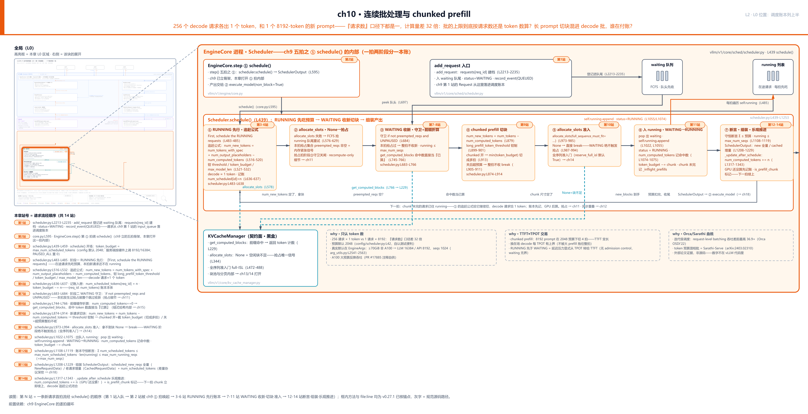
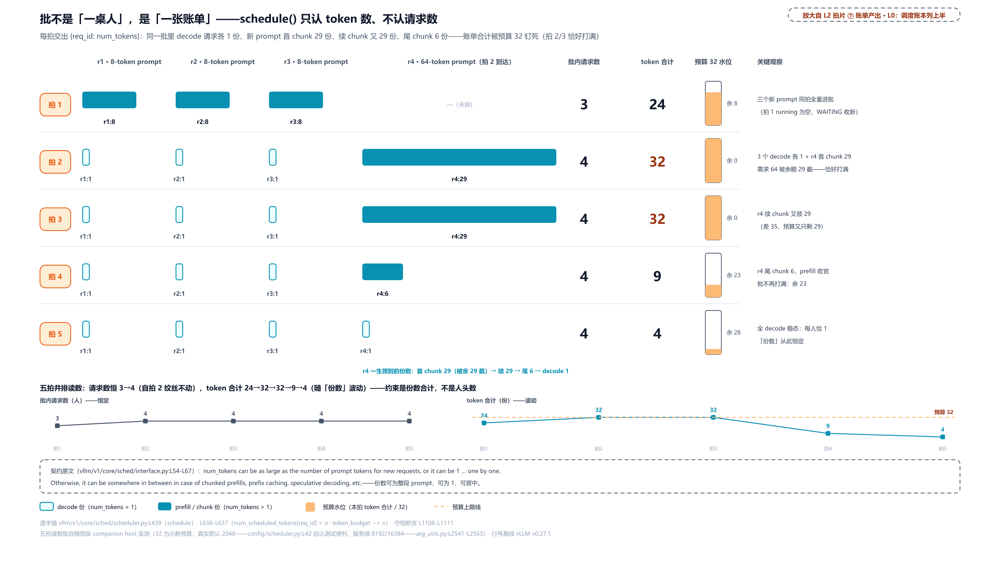
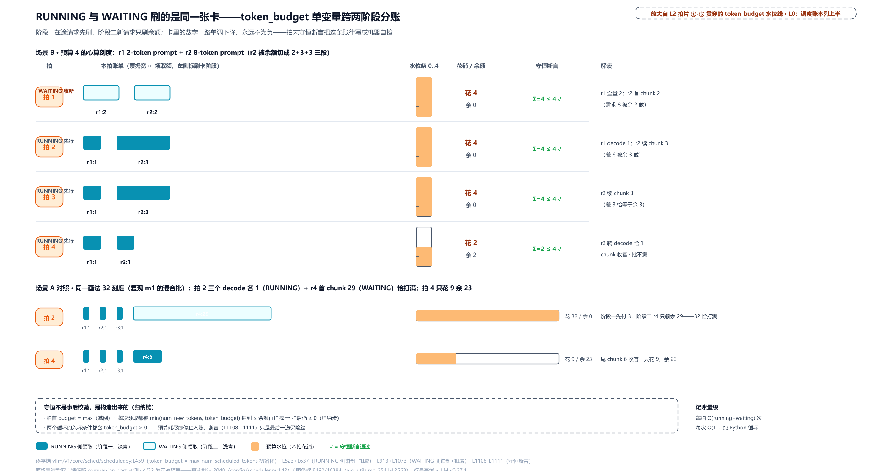
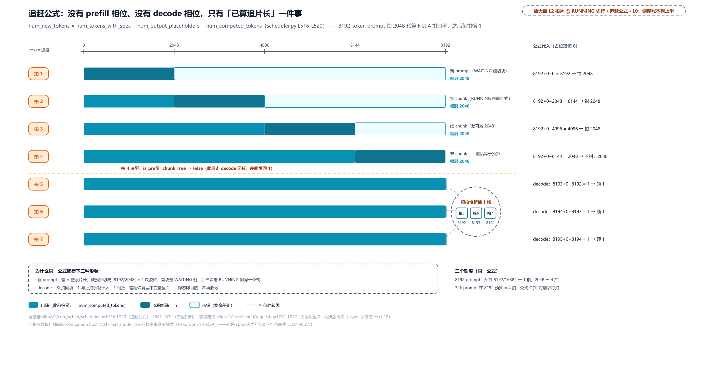
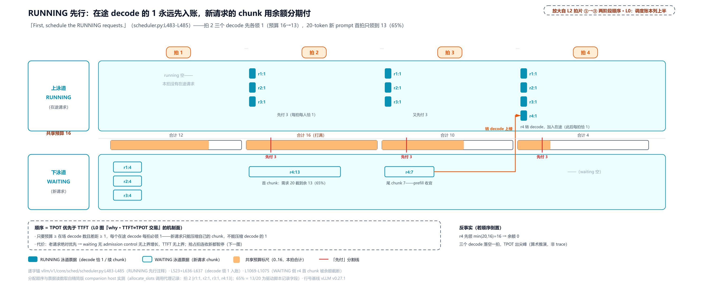
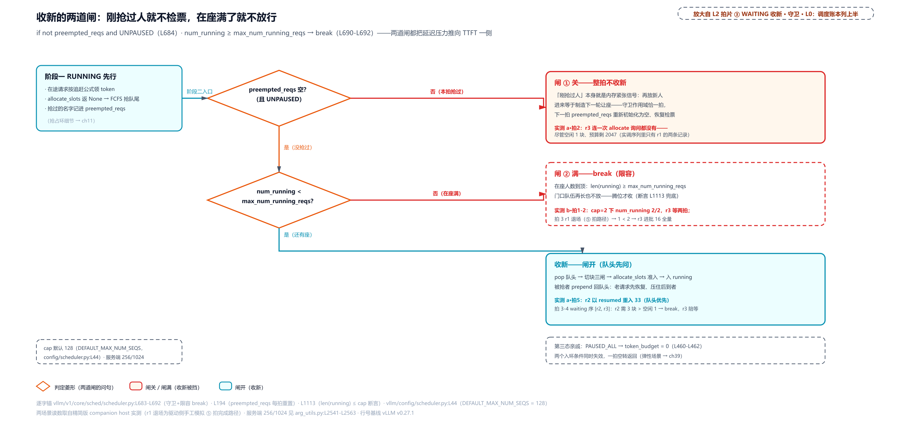
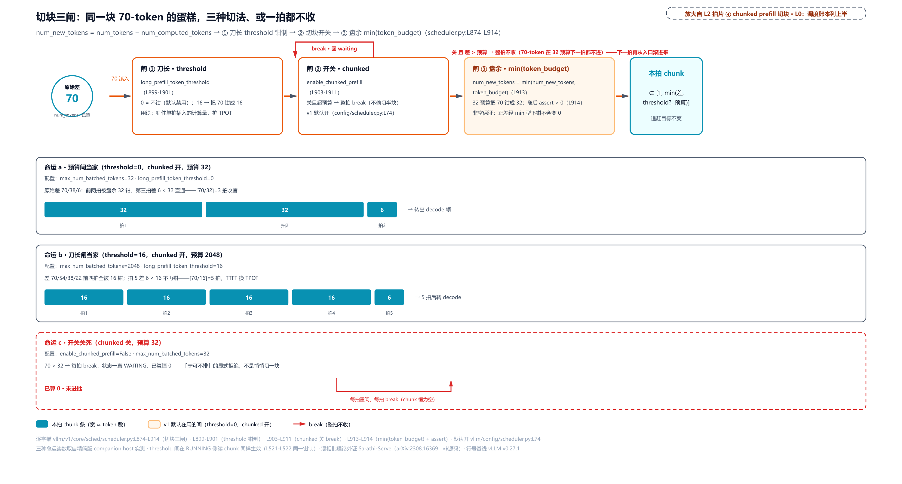
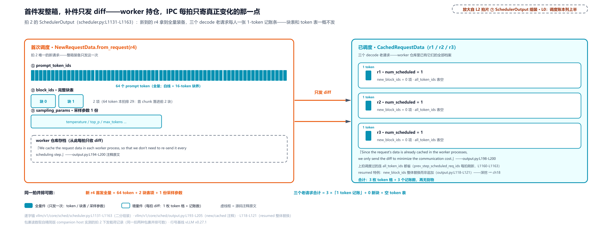
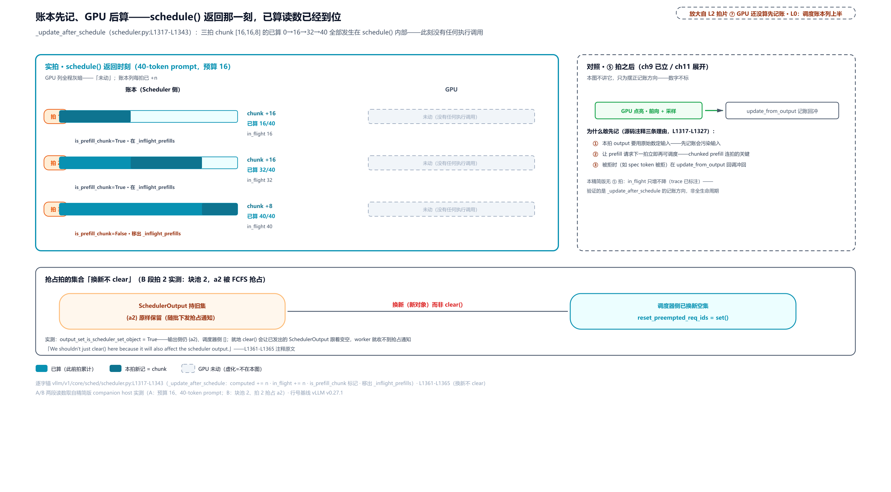
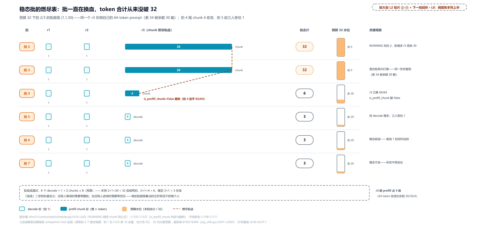

# 第 10 章　连续批处理与 chunked prefill

256 个正在生成的请求各出 1 个 token，一次前向是 256 个 token 的活；1 个新到的 8192-token prompt 也是「1 个请求」，一次前向却是 8192 个 token 的活。同一个量词「个请求」，背后的计算量差 32 倍。批的上限到底该按请求数算，还是按 token 数算？

第二问更扎手：就算认了 token 数这本账，一个 8192 的长 prompt 要连吃好几拍预算才消化得完。正在逐字吐字的老用户，他们的下一个字会不会被这口大锅拖住？把长 prompt 切成小块、混进 decode 的批里分期消化，这笔账到底谁在付？付到什么程度，有没有上限？

[第 9 章](../../ch09-engine-core-step-loop/narrative/chapter.md)结尾留了话：循环框亮了，旁边那列「调度 · 显存账本」还黑着。本章就打开它：第 ① 拍 `schedule()` 的内部。一个 token 预算、两个阶段，收新的两道闸、切块的三道闸、准入的一扇门，一本账从请求进门翻到批出发。

## 你在这里



> *图注：本章放大的是[第 1 章](../../ch01-vllm-v1-in-one-map/narrative/chapter.md) L0 图左下「调度 · 显存账本」列的上半，即 Scheduler 那个框，也就是[第 9 章](../../ch09-engine-core-step-loop/narrative/chapter.md)五拍循环里第 ① 拍一直当黑盒用的那块。上一章拆的是循环怎么转，本章拆的是循环第一拍怎么把「批」攒出来，图上三段读：上排是进门与账本：`add_request` 入口（第 1 站）把请求排进 waiting 队列，EngineCore.step（第 2 站，ch9 忙循环的 ① 拍）唤起 `schedule()`，running 列表装着在途请求；中排 ①-⑦ 七张拍片是 `schedule()` 内部的一拍两阶段全程：① RUNNING 先行·追赶公式、② allocate_slots 拿不到块进抢占环、③ WAITING 收新的守卫与前缀折算、④ chunked prefill 切块、⑤ 准入（拿不到块只收摊）、⑥ 出队入 running、⑦ 断言·组装·乐观推进；下排 KVCacheManager 当契约面用（`allocate_slots` 返回 None 就是显存不够，块池内部 Part IV 打开），旁边三笔 why 注立本章三条主线：只认 token 数、TTFT↔TPOT 交易、Orca/Sarathi 血统（TTFT/TPOT 是首字延迟与吐字节奏两个延迟指标、Orca/Sarathi 是连续批处理与切块的两篇血统论文，都在后文对应小节展开，图上先混个脸熟）。站号 1-14 = 一条新请求首拍流经 `schedule()` 的代码顺序（第 1 站入队、第 2 站被唤起、第 3 站开场立预算、第 4-6 站阶段一、第 7-11 站阶段二、第 12-14 站收尾），正文按讲解需要编排、不必照站号读。*

读法建议：只想知道长 prompt 怎么被切，直奔[「切蛋糕的三道闸」](#切蛋糕的三道闸chunked-prefill站-9)；关心谁先谁后、为什么老用户优先，跳[「为什么在途请求优先」](#为什么在途请求优先一笔显式的延迟交易)；想看预算数字的真实默认值，看[「预算的数字从哪来」](#预算的数字从哪来三档地形与一个反例)；想跟全程，按序读。

## 账本先立名词：档案、计数器与两条队列（站 1）

开场先认人。一条请求从[第 2 章](../../ch02-request-lifecycle/narrative/chapter.md)的十六站走读来到引擎进程后，第一站不是被调度，而是**进账本**：调度器先给它建档、排队，然后才有后面每一拍的分账。入口在 `add_request`：

```python
# vllm/v1/core/sched/scheduler.py:L2213-L2235
    def add_request(self, request: Request) -> None:
        existing = self.requests.get(request.request_id)
        # … 省略：existing is not None 的流式续跑分支，即重复 req_id 的流式输入
        #       会话按 StreamingUpdate 续写既有档案（L2215-L2226），一次性请求
        #       不走；else 主路径开头 resumable 流队列的初始化两行（L2227-L2229）……
            self._enqueue_waiting_request(request)               # 入 waiting 队尾  # L2230
            self.requests[request.request_id] = request          # 全量档案建档     # L2231
            # … 省略：KV connector 的 on_new_request 通知与 QUEUED 事件登记两行 ……
```

两行各记一笔：`requests` 是一张 req_id 到 Request 的全量档案表（请求这辈子所有状态都在这查得到）；`_enqueue_waiting_request` 把请求排进 waiting 队尾。调度器手里的三个容器在构造期一次立好：

```python
# vllm/v1/core/sched/scheduler.py:L177-L190 · Scheduler.__init__
        # req_id -> Request
        self.requests: dict[str, Request] = {}                   # 全量档案表        # L178
        # … 省略：policy 解析七行（默认 fcfs，见下）……
        # Priority queues for requests.
        self.waiting = create_request_queue(self.policy)         # 排队等收新        # L187
        # requests skipped in waiting flow due async deps or constraints.
        self.skipped_waiting = create_request_queue(self.policy) # 阻塞态隔离队列    # L189
        self.running: list[Request] = []                         # 已进批在途        # L190
```

`waiting` 与 `skipped_waiting` 是一对：普通请求进前者；状态卡在「等远程 KV、等语法、等流式输入」这类阻塞态的进后者（`_enqueue_waiting_request` 按状态分流，`vllm/v1/core/sched/scheduler.py:L2058-L2062`）。本章的路径里 skipped 恒空、可以只当 waiting 一条队看；它的完整戏份（谁会把请求挂进去、怎么提回来）在下一章。容器的具体形状是个再朴素不过的双端队列：

```python
# vllm/v1/core/sched/request_queue.py:L75-L94
class FCFSRequestQueue(deque[Request], RequestQueue):
    """A first-come-first-served queue that supports deque operations."""

    def add_request(self, request: Request) -> None:
        """Add a request to the queue according to FCFS policy."""
        self.append(request)                                     # 队尾进           # L80

    def pop_request(self) -> Request:
        """Pop a request from the queue according to FCFS policy."""
        return self.popleft()                                    # 队头出           # L84

    def peek_request(self) -> Request:
        """Peek at the next request in the queue without removing it."""
        if not self:
            raise IndexError("peek from an empty queue")
        return self[0]                                           # 看队头不取       # L90

    def prepend_request(self, request: Request) -> None:
        """Prepend a request to the front of the queue."""
        self.appendleft(request)                                 # 插回队头         # L94
```

FCFS（first-come-first-served，先来先服务）策略下四个操作就是 `append`/`popleft`/看队头/`appendleft`。最后那个 `prepend_request` 本章只路过一次、下一章才是主角：被抢占的请求靠它插回队头。另一种 policy 是 PRIORITY（按请求携带的优先级出队），走堆不走队列，默认不启用（`vllm/config/scheduler.py:L99-L105`）。

账本的另一半名词在请求自己身上。调度器不看请求的内容，只读几个整数：

```python
# vllm/v1/request.py:L271-L277
    @property
    def num_tokens(self) -> int:
        return len(self._all_token_ids)                # 目标：prompt + 已生成输出   # L273

    @property
    def num_tokens_with_spec(self) -> int:
        return len(self._all_token_ids) + len(self.spec_token_ids)   # 再加草稿 token # L277
```

`_all_token_ids` 是 prompt 拼上已生成输出的完整 token 序列，`num_tokens` 就是它的长度，即**这条请求总共要算多少 token**。`spec_token_ids` 是投机解码场景小模型预先猜出的草稿 token（大模型一次验证多个的那套加速法，[第 1 章](../../ch01-vllm-v1-in-one-map/narrative/chapter.md)提过一句），加上它就是 `num_tokens_with_spec`。与之相对的另一个计数器 `num_computed_tokens` 记**已经算了多少**，出厂为 0（`vllm/v1/request.py:L173`）。还有一个本章恒为 0 的字段：`num_output_placeholders`（输出占位数，异步调度用来给「已发给 GPU 但结果还没回来」的 token 占位置，`vllm/v1/request.py:L151`；Part III 末章给它灌值）。以及一个布尔标记 `is_prefill_chunk`（本请求是否还有没算完的 prefill 块，`vllm/v1/request.py:L188`）。

一条请求的一生，就是这几个整数的增减：`num_computed_tokens` 从 0 追到 `num_tokens_with_spec`，追平后每拍被生成的新 token 顶开一格、再追一格，直到满足停止条件退场。本章全部机制，都是围绕这几个数怎么涨、谁让谁先涨展开的。

## 「连续」二字的来历：批处理的三层谱系

章题里的「连续批处理」（continuous batching）不是 vLLM 自造的词，是行业通用名。但「批」这个词在推理服务里至少有三个层次的含义，混淆它们是初学者最常见的坑，值得先把谱系摆正。

**第一层：static batching（静态批处理）**，最早期的默认形态：服务器攒够固定数量（或等到超时）的一批请求，pad（补齐）到最长序列，整批一起进 GPU；批里所有序列全部生成完，整批一起返回。**第二层：dynamic batching（动态批处理）**，NVIDIA Triton 推理服务器的术语。它只改良了「批什么时候凑齐」：给一个时间窗（参数名 `max_queue_delay_microseconds`），攒满即发、时间到了也发。但批一旦开跑，成员就焊死了：短请求照旧陪长请求空转到整批结束。**第三层才是本章的形态：continuous batching**。调度粒度降到单次迭代（iteration，一次前向），每个迭代结束完成的请求立刻退出、排队的新请求立刻补位，批的成员逐拍换血。

用一个说明性构造把三层跑一遍：请求 A（prompt 50 token，输出 10 个）、B（prompt 2000，输出 500）几乎同时到达，短请求 C 稍后到达。static batching：A、B 同批开跑，A 早早生成完 10 个 token，却必须等 B 的 500 个全部跑完才能随整批返回；C 等下一整批。dynamic batching：只决定 A、B 何时凑成批，开跑后 A 的命运与 static 一模一样，依然陪跑。continuous batching：A 生成完的那一拍立刻退出返回，C 下一拍就插进 A 空出的位置，B 继续按拍推进。批的「大小」从此不再由请求数描述，而由**这一拍总共算多少 token** 描述。这正是本章 token 预算的由来。

各家的别名一并记下，跨引擎读文档时会反复遇到：NVIDIA TensorRT-LLM 管它叫 in-flight batching（官方博客原话「in-flight batching (IFB, also called continuous batching)」），LMDeploy 叫 persistent batching，Orca 团队自己的口径是「introduced continuous batching (also known as iteration batching)」。**唯独 Triton 的 dynamic batching 不是这个东西**：它只解决何时凑齐，不解决何时散伙，望文生义最容易在这里踩空。

第三层的学术出处是 Orca（[OSDI 2022](https://www.usenix.org/conference/osdi22/presentation/yu)，首尔国立大学团队）。它对 request-level batching 的两句批评，[第 9 章](../../ch09-engine-core-step-loop/narrative/chapter.md)讲第 ① 拍时已用中文摆过（先做完的不能提前走、新来的必须等整批腾位）。摘要原话更直白："requests that have finished earlier than other requests in a batch cannot return to the client"（先完成的请求无法返回给客户端）、"newly arrived requests have to wait until the current batch completely finishes"（新到的请求必须等当前整批完全结束）。Orca 的解法一句话：**按迭代粒度调度**（"schedules execution at the granularity of iteration (instead of request)"），配套对 Transformer 层里的算子做选择性批处理（selective batching，论文原话 applies batching only to a selected set of operations；同一迭代里各请求进度参差，只把形状规整、可补齐的算子跨请求合批，attention 这类各请求 KV 长度不同的按各自长度单独算）。同延迟下对 FasterTransformer 最高 36.9 倍吞吐（GPT-3 175B 评测；外部论文证据，非源码数字）。这个思想后来被 vLLM、TensorRT-LLM、TGI 等全数吸收，团队也据此创业（FriendliAI）。落到 v1 代码里，契约就写在调度器接口的 docstring 上：

```python
# vllm/v1/core/sched/interface.py:L53-L67
    @abstractmethod
    def schedule(self, throttle_prefills: bool = False) -> "SchedulerOutput":
        """Schedule the requests to process in this scheduling step.

        The scheduling decision is made at the iteration level. Each scheduling
        step corresponds to a single forward pass of the model. Therefore, this
        method is called repeatedly by a busy loop in the engine.

        Essentially, the scheduler produces a dictionary of {req_id: num_tokens}
        that specifies how many tokens to process for each request in this
        scheduling step. For example, num_tokens can be as large as the number
        of prompt tokens for new requests, or it can be 1 for the requests that
        are auto-regressively generating new tokens one by one. Otherwise, it
        can be somewhere in between in case of chunked prefills, prefix caching,
        speculative decoding, etc.
```

三句话定义迭代级调度（iteration-level scheduling，[第 9 章](../../ch09-engine-core-step-loop/narrative/chapter.md)已逐句拆过，这里取其骨架）：调度决策在迭代级做、每步对应一次前向、被忙循环反复调用。产出是一份字典 `{req_id: num_tokens}`，即每个请求这一拍算多少 token。关键在最后一句：**num_tokens 可大（新请求的整段 prompt）、可小（decode 请求的 1）、可居中（chunked prefill、前缀缓存、投机解码）**。这个「可居中」就是本章第二主角 chunked prefill 的入口，后面专门一节拆。

调用点在引擎侧只有一行，第 ① 拍的名字就来自这里：

```python
# vllm/v1/engine/core.py:L593-L596 · EngineCore.step
        if not self.scheduler.has_requests():
            return {}, False
        scheduler_output = self.scheduler.schedule(self._should_throttle_prefills())  # L595
        future = self.model_executor.execute_model(scheduler_output, non_block=True)
```

`has_requests()` 为假时空转早退（[第 9 章](../../ch09-engine-core-step-loop/narrative/chapter.md)立过的守卫）；否则调 `schedule()` 拿到 `SchedulerOutput`，立刻交给 ② 拍发起前向。实参 `_should_throttle_prefills()` 也是[第 9 章](../../ch09-engine-core-step-loop/narrative/chapter.md)立过的钩子（多引擎数据并行时给 prefill 刹车对齐各引擎进度，单引擎部署恒为 False，本章当它不存在）。一拍之内，①在前、GPU 在后，所以调度器做决定时，**手里只有账本，没有 GPU**。这一点本章结尾会回来。

现在把契约跑成数字。实测（配套精简版：按 v0.27.1 只做减法抽出的调度器，host 上实跑纯控制流；本章全部数值表同源。KV 管理器用契约面替身（空闲块计数、前缀命中数可注入）；请求完成退场由第五拍的完成路径在驱动脚本里显式调用。预算取 32 是为心算缩小的示教刻度，真实默认 2048/8192/16384 见下一节）。三个 8-token prompt 先到，一个 64-token prompt 第二拍赶到：

<!-- trace: m1 -->
| 拍 | 批组成 {req_id: num_tokens} | 批内请求数 | 批 token 合计 | 预算余额 | 关键观察 |
|---|---|---|---|---|---|
| 1 | {r1:8, r2:8, r3:8} | 3 | 24 | 8 | 三个新 prompt 同拍全量进批（WAITING 收新） |
| 2 | {r1:1, r2:1, r3:1, r4:29} | 4 | 32 | 0 | 3 个 decode 各 1 + 新 prompt 首 chunk 29，恰好打满 |
| 3 | {r1:1, r2:1, r3:1, r4:29} | 4 | 32 | 0 | r4 续 chunk 又领 29（预算又只剩 29） |
| 4 | {r1:1, r2:1, r3:1, r4:6} | 4 | 9 | 23 | r4 尾 chunk 6，prefill 收官；批不再打满 |
| 5 | {r1:1, r2:1, r3:1, r4:1} | 4 | 4 | 28 | 全 decode 稳态：每人恰 1 |

五拍读完，「连续」二字已经不是口号：批内请求数 3 → 4 只动了一次，token 合计却在 24 → 32 → 32 → 9 → 4 之间大幅起落；r4 的一生领到 29、29、6、1——同一个请求，四种「批大小」。请求数从头到尾不是约束，token 合计才是（拍 2/3 恰好打满 32，拍 4 只花 9）。这就是「批是一张账单，不是一桌人」：



> *图注：schedule() 每拍交出 {req_id: num_tokens} 的账单（interface.py:L54-L67 + scheduler.py:L1108-L1111）：decode 请求各 1 份、新 prompt 首拍 29 份、续 chunk 又 29 份、尾 chunk 6 份，账单合计被 32 的预算钉死。同一张表下方两条 sparkline（嵌在表底的迷你折线）一眼见主题：请求数平直（3→4），token 数起伏（24→32→32→9→4）。*

代价也在[第 9 章](../../ch09-engine-core-step-loop/narrative/chapter.md)立过、这里只需记档：迭代级调度让**每个 token 都要过一遍 CPU 调度**，千级并发下这个 Python 循环本身就是吞吐上限（woosuk 在 `update_from_output` 里的性能自注，第五拍原文）；且它要求 KV 存储支持任意请求任意拍进出：没有分页 KV cache 就没有安全的逐拍换血，这是调度列与显存列的天然耦合，Part IV 打开。

## 一本账：token 预算怎么立、怎么守

回到开篇第一问：批的上限按请求数还是 token 数？[第 1 章](../../ch01-vllm-v1-in-one-map/narrative/chapter.md)已经把 32 倍的算术摆过（256 请求 × 1 token 对 1 请求 × 8192 token），结论是请求数预测不了单步计算量。本章要看的是 v1 把这个结论写进代码的姿势。它不是「限制请求数、再补丁」，而是把批的定义整个换掉：**批的上限 = 一个 token 数，预算**。`schedule()` 的开场十行就是这本账的立账现场：

```python
# vllm/v1/core/sched/scheduler.py:L439-L462
    def schedule(self, throttle_prefills: bool = False) -> SchedulerOutput:
        self.current_step += 1
        # NOTE(woosuk) on the scheduling algorithm:
        # There's no "decoding phase" nor "prefill phase" in the scheduler.
        # Each request just has the num_computed_tokens and
        # num_tokens_with_spec. num_tokens_with_spec =
        # len(prompt_token_ids) + len(output_token_ids) + len(spec_token_ids).
        # At each step, the scheduler tries to assign tokens to the requests
        # so that each request's num_computed_tokens can catch up its
        # num_tokens_with_spec. This is general enough to cover
        # chunked prefills, prefix caching, speculative decoding,
        # and the "jump decoding" optimization in the future.

        scheduled_new_reqs: list[Request] = []
        scheduled_resumed_reqs: list[Request] = []
        scheduled_running_reqs: list[Request] = []
        preempted_reqs: list[Request] = []

        req_to_new_blocks: dict[str, KVCacheBlocks] = {}
        num_scheduled_tokens: dict[str, int] = {}
        token_budget = self.max_num_scheduled_tokens              # 预算落袋       # L459
        if self._pause_state == PauseState.PAUSED_ALL:
            # Do not schedule any requests when paused.
            token_budget = 0                                     # 总闸短路       # L462
```

woosuk 那段「没有 decoding 相位也没有 prefill 相位，只有已算追赶目标」的算法注，[第 1 章](../../ch01-vllm-v1-in-one-map/narrative/chapter.md)逐句拆过，不重讲。本章要看的是它落进数据结构的形状：四个结果列表（首次调度的、抢占恢复的、在途继续的、被抢的；后三个很快见到）、一份块指派表、一本 `{req_id: num_tokens}` 账，以及唯一的预算变量 `token_budget`。这个设计不是理所当然的，它有一条完整的 why 链。

**旧设计**是 vLLM v0 的调度器（v1 落地前的旧引擎，2025 年 9 月随 V0 整体退役删除）：prefill 批与 decode 批**分开调度**，`_schedule_default` 组 decode 批、`_schedule_chunked_prefill` 组 prefill 批，两条代码路径、三个队列（waiting/running/swapped）、SequenceGroup/Sequence 两层请求结构；chunked prefill 在那边是后来补进去的特例路径。**痛点**在请求级思维本身：一个「decode 批」按请求数限批还说得过去：每人 1 token，256 个请求就是 256 token；可 prefill 一进来这个口径就失灵（256 请求 × 1 token 对 1 请求 × 8192 token，32 倍差），混相批（prefill 与 decode 同拍）在双相位结构里只能靠特例叠特例。外部证据来自 Sarathi-Serve（arXiv:2403.02310，OSDI'24）：论文证明把 prefill 切块、每拍限制总 token 数（它称之为 token budget，按延迟目标反推），才能同时保住 GPU 利用率与在途 decode 的节奏，原话是「it throttles the number of prefill tokens in each iteration while admitting new requests in a running batch」（在向运行中的批收新请求的同时，限制每拍的 prefill token 数）。**v1 方案**（首提交 6c5af09b3，2024-10）就是把相位删掉：每拍只有一个 `token_budget`，RUNNING 侧与 WAITING 侧钳制共用这一个变量分账（`vllm/v1/core/sched/scheduler.py:L523` 与 `L913`）。**代价**后面逐条见：长 prompt 被切成多拍（TTFT 变长）、混相批削弱部分纯 decode 优化（源码两处注释自供，见三道闸一节）、一切特性必须能表达成「token 差距」这单一模型。

预算的用法像一张全家共用的饭卡：拍首充进 `max_num_scheduled_tokens`，RUNNING 阶段在途请求先刷、WAITING 阶段新请求刷余额，卡里的数字一路单调下降、永不为负。两个入账点（阶段一的 `vllm/v1/core/sched/scheduler.py:L636-L637`、阶段二的 `L1072-L1073`）都是先把领取额钳到「不超余额」再扣减，两个循环的入环条件都含 `token_budget > 0`。所以拍末必然守恒。而且代码把这条账律写成了机器自检，拍拍都跑：

```python
# vllm/v1/core/sched/scheduler.py:L1108-L1119 · Scheduler.schedule
        # Check if the scheduling constraints are satisfied.
        total_num_scheduled_tokens = sum(num_scheduled_tokens.values())
        assert total_num_scheduled_tokens <= self.max_num_scheduled_tokens  # L1110

        assert token_budget >= 0                                          # L1112
        assert len(self.running) <= self.max_num_running_reqs             # L1113
        # Since some requests in the RUNNING queue may not be scheduled in
        # this step, the total number of scheduled requests can be smaller than
        # len(self.running).
        assert len(scheduled_new_reqs) + len(scheduled_resumed_reqs) + len(
            scheduled_running_reqs
        ) <= len(self.running)
```

四条断言：token 合计不超预算、余额不为负、在座请求数不超上限、本拍调度数不超过在座数。守恒不是靠这个断言**保证**的（它是最后一道保险丝），是靠「先钳后扣」**构造**出来的。归纳链很直白：拍首余额 = 预算（基例），每个成员领取额 ≤ 当前余额、扣完仍 ≥ 0（归纳步），所以任意时刻 Σ 已花 = 预算 − 余额 ≤ 预算。断言只是把这条链机器化。顺带一提开场那两行的另一支：`PauseState.PAUSED_ALL`（暂停三态的「全停」档，`vllm/v1/core/sched/interface.py:L24-L35`）直接把预算置 0，两个循环的入环条件同时失效，一拍空转返回。这不是崩溃是可恢复的暂停（弹性场景用它，Part VIII 的话头）。

预算 4 的最小心算例（示教刻度；r1 是 2-token prompt、r2 是 8-token prompt；实测，配套精简版，host 实跑）：

<!-- trace: m3 -->
| 场景·拍 | 本拍账单（谁·领多少） | 花销 | 拍末余额 | 守恒断言 |
|---|---|---|---|---|
| B·拍1 | r1 全量 2；r2 首 chunk 2（需求 8 被余 2 截） | 4 | 0 | Σ=4 ≤ 4 ✓ |
| B·拍2 | r1 decode 1；r2 续 chunk 3（差 6 被余 3 截） | 4 | 0 | Σ=4 ≤ 4 ✓ |
| B·拍3 | r1 decode 1；r2 续 chunk 3（差 3 恰等于余 3） | 4 | 0 | Σ=4 ≤ 4 ✓ |
| B·拍4 | r1 decode 1；r2 转 decode 领 1 | 2 | 2 | Σ=2 ≤ 4 ✓ |
| A·拍2 | 三个 decode 各 1；r4 首 chunk 29 | 32 | 0 | Σ=32 = 32 ✓ |
| A·拍4 | 三个 decode 各 1；r4 尾 chunk 6 | 9 | 23 | Σ=9 ≤ 32 ✓ |

场景 B 是预算 4 的四拍：全家每拍刷 4、4、4、2，r2 的 8-token prompt 被余额切成 2+3+3 三段进后续拍。场景 A 是上一节 32 刻度的两行对照。同一张卡、换哪种刻度，账律不变；下面的示意图把 B 的四拍与 A 的两拍放进一张图对照：阶段一在途请求先扣、阶段二新请求只领余额，一张卡刷到见底也不透支。



> *图注：一个 token_budget 变量跨 RUNNING/WAITING 两阶段分账（scheduler.py:L459 → L637 → L1073 → L1108-L1111）：阶段一在途请求先扣、阶段二新请求只领余额，每拍合计恰好 ≤ 预算且余额不为负。预算就是一拍计算量的上限：一拍批多大，预算说了算。*

这里可以回答开篇第一问了：**批的上限按 token 数算，因为单步前向的计算量约等于本拍 token 数**（attention 部分还要看各请求的 KV 长度，但量级由 token 数定）。预算钉住的不只是显存，是**每拍的实际耗时**。这是后面一切延迟交易的物理基础。

## 预算的数字从哪来：三档地形与一个反例

预算这么要紧的旋钮，默认值是多少？答案是「看你问哪一层」。第一层在配置类里：

```python
# vllm/config/scheduler.py:L42-L44, L49-L61 · SchedulerConfig
    DEFAULT_MAX_NUM_BATCHED_TOKENS: ClassVar[int] = 2048       # 预算基线       # L42
    DEFAULT_MAX_NUM_BATCHED_TOKENS_FOR_BATCHED_DP: ClassVar[int] = 256  # batched DP MoE 场景的基线（Part VIII 话头）
    DEFAULT_MAX_NUM_SEQS: ClassVar[int] = 128                  # 在座上限基线   # L44

    max_num_batched_tokens: int = Field(default=DEFAULT_MAX_NUM_BATCHED_TOKENS, ge=1)
    """Maximum number of tokens that can be processed in a single iteration.

    The default value here is mainly for convenience when testing.
    In real usage, this should be set in `EngineArgs.create_engine_config`.
    """

    max_num_scheduled_tokens: int | None = Field(default=None, ge=0)
    """Maximum number of tokens that the scheduler may issue in a single iteration.

    This is usually equal to max_num_batched_tokens, but can be smaller in cases
    when the model might append tokens into the batch (such as speculative decoding).
    Defaults to max_num_batched_tokens."""
```

2048 这个默认值，docstring 自己招了：**主要为测试便利**，真实使用应在 `EngineArgs.create_engine_config` 里重设。第二层就是真实部署的仲裁现场，按显存与使用场景分档：

```python
# vllm/engine/arg_utils.py:L2541-L2563 · EngineArgs.get_batch_defaults
        # NOTE(Kuntai): Setting large `max_num_batched_tokens` for A100 reduces
        # throughput, see PR #17885 for more details.
        # So here we do an extra device name check to prevent such regression.
        if device_memory >= 70 * GiB_bytes and "a100" not in device_name:
            # For GPUs like H100 and MI300x, use larger default values.
            default_max_num_batched_tokens = {
                UsageContext.LLM_CLASS: 16384,
                UsageContext.OPENAI_API_SERVER: 8192,
            }
            default_max_num_seqs = {
                UsageContext.LLM_CLASS: 1024,
                UsageContext.OPENAI_API_SERVER: 1024,
            }
        else:
            # TODO(woosuk): Tune the default values for other hardware.
            default_max_num_batched_tokens = {
                UsageContext.LLM_CLASS: 8192,
                UsageContext.OPENAI_API_SERVER: 2048,
            }
            default_max_num_seqs = {
                UsageContext.LLM_CLASS: 256,
                UsageContext.OPENAI_API_SERVER: 256,
            }
```

同一份 vLLM，四种默认：显存 ≥70GiB 且不是 A100（H100、MI300x 这类）的，离线 LLM 类用 16384、API 服务用 8192，在座上限放到 1024；其余显卡是 8192/2048、上限 256。注意这里连「当 LLM 用还是当 API server 用」都进了决策（离线吞吐优先给大预算、在线服务的单拍延迟要小些）。最扎眼的是开头那三行注释：**给 A100 设大预算反而降吞吐**，PR #17885 的实测结论，所以代码专门做了设备名检查，把 A100 挡在大默认值门外。预算不是「越大越好」的常数，是「单拍延迟上限 × 这块卡吃不吃得下大拍」的乘积。

第三层是调度器自己的回落装配：

```python
# vllm/v1/core/sched/scheduler.py:L108-L114 · Scheduler.__init__
        # Scheduling constraints.
        self.max_num_running_reqs = self.scheduler_config.max_num_seqs           # L109
        self.max_num_scheduled_tokens = (
            self.scheduler_config.max_num_scheduled_tokens
            if self.scheduler_config.max_num_scheduled_tokens is not None
            else self.scheduler_config.max_num_batched_tokens                    # L113
        )
```

在座上限 `max_num_running_reqs` 直接取 `max_num_seqs`（默认 128，服务端 256/1024）；预算 `max_num_scheduled_tokens` 没单独配就回落到 `max_num_batched_tokens`。单独存在的原因见 docstring：投机解码场景 worker 会往批里追加 token，调度器可发行的量要更小。三个名字、一个数值、一条回落链，配上 A100 反例，这就是预算数字的地形。

## 阶段一：在途请求先吃——追赶公式（站 4-6）

名词立完、规矩立完，现在按 L2 图拍片的顺序走进 `schedule()` 本体。阶段一的入口注释写得直白：**First, schedule the RUNNING requests**，先把预算分给在途请求：

```python
# vllm/v1/core/sched/scheduler.py:L483-L532 · Scheduler.schedule
        # First, schedule the RUNNING requests.
        req_index = 0
        while req_index < len(self.running) and token_budget > 0:
            request = self.running[req_index]
            # … 省略：三处 continue（异步调度的提前剪枝，其注释自供：不排 partial
            #       draft tokens，因为会妨碍统一的 decode 优化）、流水线并行的步距限制、
            #       多引擎预填充对齐（L488-L514，分别归 Part III 末章与 Part VIII 分布式章）……
            num_new_tokens = (
                request.num_tokens_with_spec
                + request.num_output_placeholders
                - request.num_computed_tokens                # 追赶公式本体     # L519
            )
            if 0 < self.scheduler_config.long_prefill_token_threshold < num_new_tokens:
                num_new_tokens = self.scheduler_config.long_prefill_token_threshold  # 刀长钳：见后文「切蛋糕」闸 1  # L521-L522
            num_new_tokens = min(num_new_tokens, token_budget)   # 预算钳制      # L523

            # Make sure the input position does not exceed the max model len.
            # This is necessary when using spec decoding.
            num_new_tokens = min(
                num_new_tokens,
                self.max_model_len
                - request.num_computed_tokens
                - self.num_sampled_tokens_per_step,          # 边界保险         # L531
            )
```

核心就是中间那个三元减法，即**追赶公式**：目标（`num_tokens_with_spec`）加占位（本章恒 0）减已算（`num_computed_tokens`），差多少就补多少；补不动就向下钳。直觉像看视频的进度条：`num_computed_tokens` 是已看进度、`num_tokens_with_spec` 是片长，每拍新看一段；新片一次看不完就分几次（chunk），追更的剧每集只有 1 分钟（decode 每拍 1 token）。播放器不关心你在看新片还是追更，它只做一件事：把进度往片长推。

这个公式为什么能一条顶三条路径？代入三个特例就清楚。**特例一，decode 稳态**：上一拍 ⑤ 拍（`update_from_output`，[第 9 章](../../ch09-engine-core-step-loop/narrative/chapter.md)第五拍）把新生成的 1 个 token 追加进 `_all_token_ids`，目标 +1；而上拍的 1 已被乐观推进计入已算（本章站 14 讲），差恒等于 1，decode 请求每拍恰好领 1。**特例二，续 chunk**：`is_prefill_chunk=True` 的请求，差 = 剩余未算的 prompt，继续被钳制切小块。**特例三，边界**：max_model_len 保险钳保证输入位置不越上限（投机解码场景的保险，普通路径余量充足基本不触发）。三条路径一个公式，没有 if 分支。这就是「无相位」的数学含义。

一条 8192-token prompt 在 2048 预算（config 基线值）下的完整一生（实测，配套精简版，host 实跑；占位项恒 0 属同步版语义，异步版才灌值）：

<!-- trace: m2 -->
| 拍 | 特例 | num_tokens_with_spec | +占位 | −已算 | 原始差 | 生效的闸 | 本拍领到 | 拍后已算 |
|---|---|---|---|---|---|---|---|---|
| 1 | 新 prompt（WAITING 侧切块） | 8192 | 0 | 0 | 8192 | 预算 2048 | 2048 | 2048 |
| 2 | 续 chunk（RUNNING 侧同公式） | 8192 | 0 | 2048 | 6144 | 预算 2048 | 2048 | 4096 |
| 3 | 续 chunk（同拍 2，差再减 2048） | 8192 | 0 | 4096 | 4096 | 预算 2048 | 2048 | 6144 |
| 4 | 末 chunk | 8192 | 0 | 6144 | 2048 | 无（差恰等于预算） | 2048 | 8192 |
| 5 | decode | 8193 | 0 | 8192 | 1 | 无 | 1 | 8193 |
| 6 | decode | 8194 | 0 | 8193 | 1 | 无 | 1 | 8194 |

注意第一拍走的是 WAITING 侧的切块公式（下一节），第二拍起请求已进 running、走的就是这段 RUNNING 侧代码：**同一个公式，两边共用**。表达式有两处小出入，当场调和：RUNNING 侧多带 spec 草稿与占位两项（照顾投机解码与异步调度，本章路径里恒为 0）；WAITING 侧直接用 `num_tokens`（排队的要么是新请求、没有草稿与占位可带，要么是被抢占重入者，它的 `num_tokens` 就是整条重算的全量目标）。本章的同步、无投机路径里，两个式子算出的数恒等。8192 ÷ 2048 恰好 4 拍追平，拍 4 与拍 5 之间 `is_prefill_chunk` 翻成 False，从此每拍 1。同一公式换个刻度再验一遍，公式与刻度的分工就看清了：还是这条 8192 的 prompt，预算放到 API server 默认的 8192，⌈8192 ÷ 8192⌉ = 1 拍追平；LLM 默认的 16384 绰绰有余，也是 1 拍。公式一个字符没变，变的只是预算刻度，拍数跟着 ⌈8192 ÷ 预算⌉ 走（三档默认值的出处见[「预算的数字从哪来」](#预算的数字从哪来三档地形与一个反例)）：



> *图注：一条公式三种形状（scheduler.py:L516-L520）：8192 格的进度带被 2048 预算切成四段：首段走 WAITING 侧、后三段走 RUNNING 侧同一公式；拍 4 追平、is_prefill_chunk 翻 False，拍 5 起每拍只铺 1 格（放大镜里那 1 格就是 decode 的全部工作量）。没有 prefill 相位也没有 decode 相位，只有「已算追片长」一件事。*

公式之后是两个岔口。第一个岔口：差为 0 怎么办。

```python
# vllm/v1/core/sched/scheduler.py:L557-L573 · Scheduler.schedule
            if num_new_tokens == 0:
                # The request cannot be scheduled because one of the following
                # reasons:
                # 1. No new tokens to schedule. This may happen when
                #    (1) PP>1 and we have already scheduled all prompt tokens
                #    but they are not finished yet.
                #    (2) Async scheduling and the request has reached to either
                #    its max_total_tokens or max_model_len.
                # 2. The encoder budget is exhausted.
                # 3. The encoder cache is exhausted.
                # 4. Insufficient budget for a block-aligned chunk in hybrid
                #    models with mamba cache mode \"align\".
                # NOTE(woosuk): Here, by doing `continue` instead of `break`,
                # we do not strictly follow the FCFS scheduling policy and
                # allow the lower-priority requests to be scheduled.
                req_index += 1
                continue
```

差为 0 的请求这一拍没有活干（注释列了四种真实成因：流水线未完、异步到顶、编码预算尽、混合模型对齐；本章同步路径几乎不遇），处理方式是 `continue` 不是 `break`：像超市结账，前面的人购物车临时出了问题，收银员不关台，直接「下一位」。woosuk 自己标注了这层语义：**不严格 FCFS**，卡住的高优先请求不阻塞后面的低优先请求。这个 `continue` 也不会让循环停不下来：该分支唯一的动作是 `req_index` 前进一格，索引只增不减、上界是 `len(running)`，整个阶段一至多 `len(running)` 轮必然走完。实测（配套精简版；r1 的差为 0 由驱动侧模拟「采样回填延迟」触发；真实同步引擎每拍必有 ⑤ 拍回填，零差距的四种真实成因见上面源码注释）：

<!-- trace: m6 -->
| 拍 | r1（tokens/已算/拍前差） | r1 判定 | r2（tokens/已算/拍前差） | r2 判定 | 本拍产出 |
|---|---|---|---|---|---|
| A·拍2 | 6/6/0 | continue | 9/8/1 | 排 1 | {r2:1} |
| A·拍3 | 6/6/0 | continue | 10/9/1 | 排 1 | {r2:1} |
| A·拍4 | 7/6/1 | 排 1 | 11/10/1 | 排 1 | {r1:1, r2:1} |
| B·拍2 | 6/6/0 | continue | 8/8/0 | continue | {}（空拍） |

场景 A：r1 连续两拍差 0 被跳过，r2 照常每拍领 1，一个人卡住不拖累全队；场景 B：全员差 0，一拍空转，`schedule()` 正常返回、断言全过，空拍是合法状态。

第二个岔口在显存：领到了 token 预算，还要有地方放这些 token 的 KV，入口是 `allocate_slots`（分配 KV 块；KVCacheManager 的方法，本章当黑盒：返回块指派、显存不够返回 None）：

```python
# vllm/v1/core/sched/scheduler.py:L576-L629 · Scheduler.schedule
            with record_function_or_nullcontext("schedule: allocate_slots"):
                while True:
                    new_blocks = self.kv_cache_manager.allocate_slots(
                        request,
                        num_new_tokens,
                        num_lookahead_tokens=self.num_lookahead_tokens,
                    )

                    if new_blocks is not None:
                        # The request can be scheduled.
                        break                                        # 拿到块，出环  # L586

                    # The request cannot be scheduled.
                    # Preempt the lowest-priority request.
                    # … 省略：PRIORITY 策略的抢占对象选择与回滚（L590-L613，
                    #       默认 fcfs 不走）……
                    else:
                        preempted_req = self.running.pop()          # FCFS 抢队尾   # L615

                    self._preempt_request(
                        preempted_req,
                        scheduled_timestamp,
                        drop_stale_output=self.requires_kv_delivery,
                    )                                                # 抢占执行      # L621
                    preempted_reqs.append(preempted_req)             # 记入本拍抢占集 # L622
                    if preempted_req == request:
                        # No more request to preempt. Cannot schedule this request.
                        break                                        # 把自己抢掉了  # L625

            if new_blocks is None:
                # Cannot schedule this request.
                break                                                # 阶段一收摊    # L629
```

None 就抢占，抢谁？FCFS 下抢 running 列表的**队尾**，也就是最晚进来、最「年轻」的请求。像剧场满座时来了一位必须落座的客人：请走最晚进场、重看损失最小的观众，座位腾给来客；被请走的下次从片头重看（v1 的抢占是 recompute-only，已算的全部作废重算，没有 v0 时代的 swap 换出（把 KV 数据从显存挪到主存暂存、恢复时再搬回的老办法）；重看怎么重、被抢请求怎么活着回来，是下一章的主戏，本章只立因果）。抢完重试，直到拿到块或把自己抢掉。这个环也停得下来：每轮 None 之后 `running` 都少一个成员，至多初始长度轮后要么拿到块、要么把自己抢掉出环；而且 FCFS 下被抢的队尾排在当前扫描点之后、本拍还没记账，抢它不需要回滚 `num_scheduled_tokens` 的账。这段环还有一个下游后果要记住：**`preempted_reqs` 非空 = 本拍发生过抢占 = 显存紧张的信号**，它马上成为阶段二入口的守卫条件。

实测抢占环的轮次（配套精简版；块池 2 块 × 16 token，r1/r2 各占一块后池空；allocate 调用序列由驱动侧代理记录（包一层日志不改语义）；拍 5 的 r1 退场由第五拍完成路径在驱动侧显式调用）：

<!-- trace: m7 -->
| 拍 | allocate_slots 实调序列 | 结果 | 被抢者/重入者账面 | 池（空闲块） |
|---|---|---|---|---|
| 2 | (r1,1)→None；(r1,1)→OK | r1 领 1；FCFS 队尾 r2 被抢（队尾=最年轻） | r2：已算 16→0 · num_preemptions 0→1 · 回 waiting 队头 | 0→1→0 |
| 3 | (r1,1)→OK；(r2,17)→None | r1 领 1；r2 重入被「整条序列必须装得下」的检查拒（需 2 块 > 空闲 0；「准入」一节详述）→ break | r2 留 waiting（WAITING 绝不触发抢占） | 0 |
| 4 | (r1,1)→OK；(r2,17)→None | 同拍 3，r2 的重算需求一直得不到满足 | r2 继续等 | 0 |
| 5 | (r2,17)→OK | r2 以 resumed 重入：整段重算 17（16 prompt + 1 旧输出成了输入） | r2 已算 0→17 · resumed 的块表按整体替换语义下发（「落座与打包」一节详述） | 2→0 |

拍 2 一目了然：r1 要 1 个 token 的块拿不到 → 抢队尾 r2 → 重试成功；r2 的已算清零、回 waiting 队头。拍 5 的 17 也值得看一眼：被抢时已生成的 1 个输出 token 现在成了重算的输入——**抢占的账单按整条序列计**。

岔口走完，在途请求领到 token、拿到块，记账入册。`{req_id: num_tokens}` 账本的一行就是这几行（其中 `prefill_scheduled |= request.is_prefill_chunk` 是给本拍批记「有没有混进 prefill 块」的总标记，它唯一的消费点在后文「切蛋糕」省略注释里那段投机解码均匀 pad：新 decode 请求只在纯 decode 批上才 pad 到均匀尺寸、保 CUDA graph，同形状的批才能整段重播，[第 1 章](../../ch01-vllm-v1-in-one-map/narrative/chapter.md)立过一句定义、[第 3 章](../../ch03-engineargs-to-vllmconfig/narrative/chapter.md)补全了机制课；本章无投机解码，扫一眼即可）：

```python
# vllm/v1/core/sched/scheduler.py:L631-L638 · Scheduler.schedule
            # Schedule the request.
            scheduled_running_reqs.append(request)
            prefill_scheduled |= request.is_prefill_chunk
            request_id = request.request_id
            req_to_new_blocks[request_id] = new_blocks
            num_scheduled_tokens[request_id] = num_new_tokens   # 账本落一行    # L636
            token_budget -= num_new_tokens                      # 饭卡扣一笔    # L637
            req_index += 1
```

## 为什么在途请求优先：一笔显式的延迟交易

阶段一的循环走完，预算还剩多少，才轮到 waiting 里的新请求。这个**顺序本身是一个设计决策**，值得单独立案审一遍它的 why 链。

**旧设计**是朴素 FCFS 一条队：谁先到谁先跑，新 prompt 到了直接插进来跑 prefill。后果是正在 decode 的在途请求被新来的大活反复挤出内存、刚恢复又被抢占（thrash，来回抖动），逐 token 的节奏完全失控。v0 版本换了个姿势：被换出的请求放 swapped 队列、恢复时 swapped 优先于 waiting。woosuk 当年自己在这个顺序旁标过 FIXME：「This makes our scheduling policy a bit bizarre」（这条调度策略有点怪）。**痛点**指标要先把度量立起来才能说清。LLM 服务的延迟不是一个数，是三个互补的数：TTFT（Time To First Token，首 token 延迟，从提交请求到收到第一个输出 token 的时间，包含排队、prefill、网络）、ITL（Inter-Token Latency，相邻两个输出 token 的平均间隔；也叫 TPOT，Time Per Output Token，衡量开始吐字之后流得顺不顺）、端到端延迟 ≈ TTFT + (输出 token 数 − 1) × ITL。举个说明性构造的例子：某请求 TTFT 2.0 秒，之后流式输出 100 个 token、端到端 6.0 秒，生成阶段 4.0 秒，ITL = (6.0 − 2.0) ÷ (100 − 1) ≈ 40 毫秒：用户等 2 秒看到第一个字，之后平均每 40 毫秒蹦一个字。若此刻系统混进一条 8192-token 的大 prefill 且不许切块，这一拍的前向时间暴涨，该请求的下一个 token 可能迟到几百毫秒。ITL 的尾部抖动就是这么来的。（Sarathi 系论文用 TBT 称呼同一个量，见到不要陌生。）

**v1 方案**：两阶段固定顺序，RUNNING 先于 WAITING（`vllm/v1/core/sched/scheduler.py:L483` 的 First 注释 + L683 的 Next 注释），在途请求的每个 token 先入账，新请求只能领余额；外加「本拍抢占过就整拍不收新」的守卫（下一节）。在途 decode 的 1 token 只要预算余额 ≥1 就必然到手；新请求的存在只能压缩自己的 chunk，压缩不了 decode 的 1。这条保护的真实边界要分两层数：两阶段顺序挡的是新来的 WAITING 请求；running 内部则纯按 FCFS 序先到先得、没有第二层保护。一条更早进 running 的长 prompt 续 chunk，只要剩余差 ≥ 预算，每拍都会把预算整拍吃光（就是阶段一 `scheduler.py:L523` 那把 min 钳：预算归零、RUNNING 循环随即退出），排在它后面进 running 的 decode 便在这条 chunk 的整个消化期内拍拍落空。m1 实测里 r4 连拍领 29/29/6 正是同一把钳子，差别只在它排在三个 decode 之后、钳掉的是自己的 chunk。「最低档预算 2048 > 最高档在座上限 1024」这笔账只担保全场皆 decode 时人人装得下（每人 1、合计 ≤ 1024 < 2048），管不住一条长 chunk。边界真实存在，暴露窗口就是该 chunk 的消化期（8192 prompt 在 2048 预算下即开头那 4 拍）；要收窄这个窗口，得显式设刀长闸 `long_prefill_token_threshold`（「切蛋糕的三道闸」的闸 1），而它默认 0、不启用。**代价**诚实写在另一头：老请求绝对优先 → 高负载下 waiting 队列**没有上界**（v1 没有准入控制 admission control，即到达率超过服务能力时主动拒客的机制；这里不拒，只排队）、TTFT 无上界；突发新请求至少多等一拍。操作系统教科书给这个现象起过名字：严格优先级调度的**饥饿**（starvation，低优先级任务可能永远等不到，因为总有高优先级任务插在前面）；教科书的解药叫 **aging**（老化：等得越久优先级越高）。v1 显式选择**不做** aging：waiting 里的请求优先级永远不变，只要显存一直被在途请求占满，它就一直排队。这不是疏忽，是把延迟压力从一头（TPOT）显式压到另一头（TTFT）的取舍：与其两头都抖，不如保住正在吐字的那批用户的节奏。

顺序是行为，账是证据。实测 allocate 的调用序把「谁先刷卡」钉死（配套精简版；预算 16，r1/r2/r3 各 4-token prompt 拍 1 进批、拍 2 起 decode，r4 20-token prompt 拍 2 到达）：

<!-- trace: m5 -->
| 拍 | RUNNING 先吃（allocate 实测顺序） | WAITING 后收 | 批合计 | r4 到手 | 关键观察 |
|---|---|---|---|---|---|
| 2 | r1:1 → r2:1 → r3:1（先付 3） | r4 首 chunk 13（需求 20 截到 13） | 16 | 13 | 三个 decode 本拍都有 token；r4 首拍只拿到 65% |
| 3 | r1:1 → r2:1 → r3:1 | r4 尾 chunk 7 | 10 | 7 | r4 prefill 收官 |
| 4 | r1:1 → r2:1 → r3:1 → r4:1 | 无（waiting 空） | 4 | 1 | r4 转 decode，四人同拍各 1 |

拍 2 的分配序 `[r1:1, r2:1, r3:1, r4:13]`：三个在途 decode 先各领 1（预算 16 → 13），20-token 的新 prompt 首拍只领到 13（65%）、拍 3 尾 chunk 7 补齐、拍 4 起四人同拍各 1。反过来算一笔（反事实算术，非实测）：若顺序倒置、r4 先领 min(20, 16) = 16，余额清零，三个 decode 全部落空一拍，每个在途用户的下一个字都迟到了整整一拍。这笔反账就是顺序存在的全部理由：



> *图注：allocate_slots 的实测调用序（scheduler.py:L483-L485）：拍 2 三个在途 decode 先各领 1、预算 16 掉到 13，新到的 r4 只能领 13。RUNNING 先行 = 在途请求的 TPOT 优先，新请求的 TTFT 用 chunk 分期来付。*

## 阶段二收新：两道闸（站 7）

阶段一的循环退出后，`schedule()` 进入下半场，注释换个口气：Next, schedule the WAITING requests。但收新不是无条件开门，入口先过两道闸：

```python
# vllm/v1/core/sched/scheduler.py:L683-L692 · Scheduler.schedule
        # Next, schedule the WAITING requests.
        if not preempted_reqs and self._pause_state == PauseState.UNPAUSED:  # 闸1 # L684
            step_skipped_waiting = create_request_queue(self.policy)

            while (self.waiting or self.skipped_waiting) and token_budget > 0:
                # Paused streaming sessions (WAITING_FOR_STREAMING_REQ) are not
                # in `running` but still hold a model-runner request slot.
                num_running = len(self.running) + self.num_waiting_for_streaming_input
                if num_running >= self.max_num_running_reqs:                 # 闸2 # L691
                    break
                # … 省略：双队列选队与阻塞态提升（L694-L711），其中 skipped 队列的
                #       完整戏份在下一章，本章路径里它恒空 ……
```

**第一道闸问「本拍抢过人吗」**：`not preempted_reqs`。阶段一只要发生过抢占，整个收新阶段跳过，一拍都不收。刚发生过让座事件的剧场这一场不再检票：门口挂「暂停入场」牌，哪怕还有空位、预算还有剩余。因为「刚抢过人」本身就是显存紧张的信号，这时候再放新人进来，等于制造下一轮让座。**第二道闸问「在座满了吗」**：在座请求数到 `max_num_running_reqs`（= `max_num_seqs`，默认 128、服务端 256/1024）就 break，消防限容，队伍再长也不放。两道闸都把延迟压力推向 TTFT 一侧，与上一节的取舍一脉相承。

实测两道闸各自的拦法（配套精简版；场景 a：块池 3 块，r1 是 16-token prompt 占 1 块、r2 是 32-token prompt 占 2 块，拍 1 两请求进批、池恰好占满，r3 排队，拍 2 r1 需要新块触发抢占；场景 b：cap=2，三条 16-token prompt 排队）：

<!-- trace: m8 -->
| 场景·拍 | 本拍抢占？ | waiting 队列 | allocate 实调 | 收新结果 | 解读 |
|---|---|---|---|---|---|
| a·拍2 | 是（r2） | [r3] | (r1,1)→None；(r1,1)→OK | 0 个（守卫关闸，r3 连被 peek 都没有） | 空闲 1 块、预算余 2047 也绝不收 |
| a·拍3 | 否 | [r2, r3] | (r1,1)→OK；(r2,33)→None | 0 个（r2 在队头需 3 块 > 1 → break） | 被抢者 prepend 回队头，压住 r3 |
| a·拍5 | 否 | [r3] | (r2,33)→OK；(r3,16)→None | r2 resumed 33；r3 仍被拒（r2 用光 3 块） | 队头优先：老请求先恢复 |
| b·拍1 | 否 | [r3] | 无 | 收 r1、r2 后 num_running=2 ≥ cap → break | r3 留 waiting |
| b·拍2 | 否 | [r3] | 无 | r1/r2 各 decode 1；仍在座 2 ≥ cap | r3 继续等 |
| b·拍3 | 否 | [] | 无 | r1 退场后 num_running 1 < 2 → r3 进批 16 | 腾位才收 |

a·拍2 是第一道闸最锋利的证据：空闲还有 1 块、预算还剩 2047 token，r3 依然连一次 allocate 询问都没有。守卫不问余量，只问「本拍抢过没有」。a·拍3 顺带展示了 `prepend_request` 的效果：被抢的 r2 插回队头，它 3 块的重算需求挡在 r3 前面——**队头优先，老请求先恢复**，新请求陪着等。a·拍5 之前的那笔空闲账也摊开算：r1 生成完毕退场（驱动侧模拟 ⑤ 拍完成路径），名下归还 2 块（16-token 的 prompt 恰好占满第 1 块，decode 每拍 +1、拍 2 就顶进了第 2 块），加上原有 1 块空闲，池里才凑出 3 块，r2 整条 33-token 的重算需求（需 3 块）第一次被满足，r3 的 16 token 仍被拒在门外。b 场景是第二道闸：cap=2 下 r3 等了两拍，直到 r1 退场腾出在座名额才进批。两道闸的状态机全貌：



> *图注：收新的两道闸（scheduler.py:L684 + L690-L692）：第一道问「本拍抢过人吗」，抢过就整拍关闸（实测 r3 连被询问都没有，尽管有 1 块空闲和 2047 预算剩余）；第二道问「在座满了吗」，len(running) 到 max_num_seqs 就 break，r3 等到有人退场才进场。两道闸都把延迟压力推向 TTFT 一侧。*

## 老顾客免单：前缀命中折进账本（站 8）

过了闸，循环从队头取请求。第一件事不是切块，是**查旧账**，查的是这条 prompt 的开头，是不是有别的请求算过：

```python
# vllm/v1/core/sched/scheduler.py:L744-L766 · Scheduler.schedule
                # Get already-cached tokens.
                if request.num_computed_tokens == 0:              # 只查一次      # L745
                    did_prefix_cache_lookup = True
                    hit_diverged = False
                    # Get locally-cached tokens.
                    if self.connector is not None:
                        # … 省略：KV connector 的远程命中分支（P/D 分离，即
                        #       prefill 与 decode 拆到不同引擎/机器的部署形态，
                        #       Part VIII 的话头）……
                    else:
                        (
                            new_computed_blocks,
                            num_new_local_computed_tokens,
                            # Marconi shared-prefix junction to pin; 0 if none.
                            request.shared_prefix_boundary,
                        ) = self.kv_cache_manager.get_computed_blocks(request)  # L766
```

`get_computed_blocks`（查前缀缓存命中）是 KVCacheManager 的方法，本章继续当黑盒，调度器只消费它吐出的一个整数：**命中了多少 token**（三元组第三项注释里的 Marconi 是一个外部共享前缀缓存系统的名字，vLLM 借它的思路在「多条请求共享的长前缀」处设钉住点，防止定期清理把共用前缀误删、断了跨请求复用；混合模型（Mamba/滑动窗）才用得上，本章 shared_prefix_boundary 恒 0，Part IV 前缀缓存站的话头）。命中的部分直接当「已算」记账：像回头客进店，发现前面有客人点过同一道菜、后厨现成，直接上桌不重做。已算那一项（追赶公式的减数）变大，差、也就是剩下要付的账，随之缩小。比如一条 256-token 的 prompt 命中 64（说明性构造，数字为测试打桩注入的命中数：配套精简版的前缀缓存默认关、命中数由测试注入，调度器的消费语义是真的）：`num_computed_tokens` 先记 64，本拍只需排 256 − 64 = 192，schedule() 返回时账面 64 命中 + 192 已排 = 256 全量。有一条上限约定值得先记下：全命中也必须重算最后一个 token，因为没有最后一个 token 的前向就没有 logits（模型对下一个 token 在整个词表上的未归一化打分），所以命中的上限是 `num_tokens − 1`。链式哈希怎么把命中算出来、被 free 的块为什么还能命中，是 Part IV 前缀缓存那几站的戏。

## 切蛋糕的三道闸：chunked prefill（站 9）

现在到本章第二主角的正题。前缀账折算完，排队请求的待算量就是 `num_new_tokens = num_tokens − num_computed_tokens`（用 `num_tokens` 而非 `num_prompt_tokens` 是为了照顾被抢占后重入的 resumed 请求，它们带输出 token）。这个数可能很大，切多大进本拍，由三道串行的闸决定：

```python
# vllm/v1/core/sched/scheduler.py:L874-L914 · Scheduler.schedule
                else:
                    # Number of tokens to be scheduled.
                    # We use `request.num_tokens` instead of
                    # `request.num_prompt_tokens` to consider the resumed
                    # requests, which have output tokens.
                    num_new_tokens = request.num_tokens - num_computed_tokens  # L879

                    # Pad new decode requests to uniform spec decoding size to
                    # preserve full cudagraph for this step.
                    # Not for diffusion where draft tokens can't be padded.
                    # … 省略：投机解码的均匀 pad 分支（L884-L897）：默认
                    #       num_spec_tokens=0 不触发，但注释值得记档：
                    #       "Prefer to not schedule than schedule un-padded here."
                    #       （宁可不排，也不排尺寸不齐的，为的是保 CUDA graph 优先；CUDA graph
                    #       即「GPU 调用序列录制重播」机制）……

                    threshold = self.scheduler_config.long_prefill_token_threshold
                    if 0 < threshold < num_new_tokens:
                        num_new_tokens = threshold                # 闸1：刀长    # L901

                    # chunked prefill has to be enabled explicitly to allow
                    # pooling requests to be chunked
                    if (
                        not self.scheduler_config.enable_chunked_prefill
                        and num_new_tokens > token_budget
                    ):
                        # If chunked_prefill is disabled,
                        # we can stop the scheduling here.
                        break                                     # 闸2：开关    # L911

                    num_new_tokens = min(num_new_tokens, token_budget)  # 闸3：盘余 # L913
                    assert num_new_tokens > 0                     # 切出来必非空 # L914
```

**闸 1（刀长）**：`long_prefill_token_threshold` 是单拍 chunk 的上限，超过就截到这个数（0 表示不启用，默认就是 0）。**闸 2（允不允许切）**：`enable_chunked_prefill` 关着且待算量超预算 → `break` 整拍不收。不切块的语义下「装不下」就必须显式化为零收，不许偷偷切一半。**闸 3（盘余）**：`min(token_budget)`，剩下的预算全给也只能给这么多。闸 1、闸 3 是 min 型下钳，闸 2 是开关式否决。三道闸只影响本拍切多大／切不切，都不改变追赶目标；`assert` 保证切出来的块必非空。三个旋钮的出厂值：

```python
# vllm/config/scheduler.py:L70-L80 · SchedulerConfig
    long_prefill_token_threshold: int = Field(default=0, ge=0)
    """For chunked prefill, a request is considered long if the prompt is
    longer than this number of tokens. 0 disables the cap (default)."""

    enable_chunked_prefill: bool = True
    """If True, prefill requests can be chunked based
    on the remaining `max_num_batched_tokens`.

    The default value here is mainly for convenience when testing.
    In real usage, this should be set in `EngineArgs.create_engine_config`.
    """
```

`enable_chunked_prefill` 的默认是 **True**：v1 把切块开成了默认行为（与 v0 时代的显式开关相反；encoder-decoder 模型才被构造期检查关掉）。官方文档的口径与源码互证：「In V1, chunked prefill is enabled by default whenever possible」「If a pending prefill request cannot fit into max_num_batched_tokens, it automatically chunks it」「With chunked prefill enabled, the scheduling policy prioritizes decode requests」，最后一句就是本章两阶段顺序的官方说法。反过来，文档还有一条告警值得记档：**禁用 chunked prefill 时 `max_num_batched_tokens` 必须大于 `max_model_len`，否则启动即崩**。这是闸 2 的 break 语义推到极限：预算连一条最长请求都装不下，又永不肯切，waiting 就变成死等。

为什么要把 prefill 切开混进 decode 批？血统论文是 Sarathi（arXiv:2308.16369，2023）。它先立住一个不对称：prefill（消化输入的阶段）是**算力密集**操作，一批就能喂饱 GPU；decode（逐 token 生成）是**访存密集**操作，单请求每拍只算一个 token，算力大量闲置。若一条长 prompt 的 prefill 独占一整拍，同批正在 decode 的请求就被顶得整拍卡顿（用户观感：正在流式输出的字突然停了）。Sarathi 的解法两个构件（论文原词）：chunked-prefills（把 prefill 请求切成等大小块）、decode-maximal batching（每拍批里放一个 prefill 块、剩余名额全塞 decode），被捎带的 decode 搭便车（piggyback）：论文实测这些 decode 的开销比独立组一批 decode 最多低一个数量级，几乎不推高这一拍的实际耗时。同一个思想 2024 年初被微软 DeepSpeed 团队独立发明并另起一名 Dynamic SplitFuse（长 prompt 拆小块跨多次前向调度，arXiv:2401.08671）。vLLM 文档讲 chunked prefill 时把两篇并列引用。服务级完整版是 Sarathi-Serve（前面引过）：token 预算 + 混相批，保住 decode 节奏的同时不牺牲吞吐。v1 的三道闸，就是这套思想的工程化。

同一块 70-token 的蛋糕过三道闸的三种命运（实测，配套精简版，host 实跑）：

<!-- trace: m10 -->
| 场景·拍 | 原始差 | 闸1 threshold | 闸2 chunked 开关 | 闸3 min(预算) | 本拍 chunk | 拍后已算 |
|---|---|---|---|---|---|---|
| a·拍1 | 70 | 0（不钳） | 开 | 32 | 32 | 32 |
| a·拍2 | 38 | 0（不钳） | 开 | 32 | 32 | 64 |
| a·拍3 | 6 | 0（不钳） | 开 | 6 | 6 | 70 |
| b·拍1 | 70 | 16 | 开 | 不截（16 < 2048） | 16 | 16 |
| b·拍5 | 6 | 不钳（6 < 16） | 开 | 6 | 6 | 70 |
| c·拍1 | 70 | 0 | 关且 70 > 32 → break | 未走到 | 未进批 | 0 |
| c·拍2 | 70 | 0 | 同 | 未走到 | 未进批 | 0 |

场景 a（预算闸当家）：⌈70/32⌉ = 3 拍，切成 32+32+6；场景 b（刀长闸当家）：threshold=16 把每拍钳到 16，⌈70/16⌉ = 5 拍切成 16×4+6。threshold 的用途是**钉住单拍插入的计算量以保护在途 decode 的节奏**，代价是 prefill 拍数变多、该请求的 TTFT 变长；场景 c（闸 2 关死）：70 > 32 每拍 break，状态一直 WAITING、已算恒 0，预算比它小的引擎里它永远进不了批；只有预算大过最长请求，不切块的死等才解得开（这正是官方那条「禁用时预算必须大于 max_model_len」告警的场景）。补一句对称性：threshold 闸在阶段一（RUNNING 侧续 chunk）同样生效，就是前面阶段一代码里那把刀长钳（`vllm/v1/core/sched/scheduler.py:L521-L522`），场景 b 的拍 2-5 实际走的就是 RUNNING 阶段：



> *图注：三道串行闸（scheduler.py:L874-L914）：70-token 的待算量先过「刀长」threshold（16 把 70 钳成 16）、再过「允不允许切」开关（关且超预算 → 整拍 break）、最后过「盘余」min(token_budget)（32 预算把 70 钳成 32）。三种配置给出 [32,32,6]、[16,16,16,16,6] 和永远 0。*

这笔交易到此可以算总账了。开篇第二问「谁在付账」的答案：**双方都付，且都付得有数**。新请求付 TTFT：prompt 至少 ⌈长度 ÷ 预算⌉ 拍才消化得完，预算独享时恰好取等（8192 ÷ 2048 正好 4 拍），同拍还有 decode 分账就更久（前面那组实测里 64-token 的 prompt 搭 3 个 decode，走了 29+29+6 三拍而非两拍），首 token 出得更晚；在场 decode 付的则是**有上界的单拍加价**：预算把每拍总 token 数（≈ 每拍前向耗时）钉住了，一个 chunk 混进来不会把一拍撑爆，ITL 的尾部被压平。混相批削弱纯 decode 优化的代价，源码自己招了两处：上面省略号里那句「Prefer to not schedule than schedule un-padded」（宁可不排也不排不齐的，保 CUDA graph），以及阶段一省略分支里的「partial draft tokens 会妨碍统一 decode 优化」，两处分别是投机解码章与异步调度章的话头，此处记档不展开。

## 准入：整团住得下才接（站 10）

切好了块，还要付得起房钱：KV 块。先把一个词说清：标题里的「准入」不是前面说 v1 不做的那个 admission control（流量层的主动拒客）；它是显存层的体检，整条序列装得下才收，装不下连第一块都不发。WAITING 侧的分配调用背着一大排参数（承重的只有一个 `full_sequence_must_fit`；调用点上方那几行异步 KV 加载的在途预约护轨先省去，见 `vllm/v1/core/sched/scheduler.py:L965-L971`，connector 场景才走、远程 KV 搬运是 Part VIII 的话头）：

```python
# vllm/v1/core/sched/scheduler.py:L973-L994 · Scheduler.schedule
                new_blocks = self.kv_cache_manager.allocate_slots(
                    request,
                    num_new_tokens,
                    num_new_computed_tokens=num_new_local_computed_tokens,
                    new_computed_blocks=new_computed_blocks,
                    num_lookahead_tokens=effective_lookahead_tokens,
                    num_external_computed_tokens=num_external_computed_tokens,
                    delay_cache_blocks=load_kv_async,
                    num_encoder_tokens=num_encoder_tokens,
                    full_sequence_must_fit=self.scheduler_reserve_full_isl,  # L982
                    reserved_blocks=reserved_blocks,
                    has_scheduled_reqs=bool(self.running),
                )

                if new_blocks is None:
                    # The request cannot be scheduled.
                    # … 省略：encoder 缓存的取消登记两行 ……
                    break                                            # WAITING 绝不抢占 # L994
```

`full_sequence_must_fit`（整条序列必须装得下）取自配置 `scheduler_reserve_full_isl`，默认 True。调用里其余参数各归其主、扫一眼即可：`num_encoder_tokens` 是 encoder-decoder 模型（如 Whisper）给交叉注意力分配的编码输入账，纯解码模型恒 0；`reserved_blocks` 是异步 KV 搬运的在途预约，即上面 L965-L971 那段护轨算出来的数；`has_scheduled_reqs` 标记本拍在座有没有人、控制水位扣不扣（Part IV）；阶段一调用里的 `num_lookahead_tokens` 是投机解码的前瞻槽（投机解码章）。本章路径上它们不是 0 就是不咬合。它的 why 链又是一个完整回合。**旧设计**：chunked prefill 只检查**第一个 chunk** 的块需求，首块装得下就放进来。**痛点**：一条比整个块池还长的请求可能被放进来，prefill 跑到一半才发现后面住不下，这是中途 OOM（out of memory，显存不够直接报错）或死锁的温床（GitHub issue #39734 一类）；更普遍的病是抖动循环：短时超收 → 全体增长 → 池尽 → 抢占刚准入的 → 重 prefill → 再抢占（vLLM 自带的基准脚本 `benchmarks/kv_cache_watermark.sh` 注释里论证过这个循环）。**v1 方案**（2026 年 3 月 #37307 引入）：准入门升级为**整序列检查**，按这条请求的完整长度算块数对比空闲，放不下直接 None 拒之门外。配置注释原话：

```python
# vllm/config/scheduler.py:L130-L134 · SchedulerConfig
    scheduler_reserve_full_isl: bool = True
    """If True, the scheduler checks whether the full input sequence length
    fits in the KV cache before admitting a new request, rather than only
    checking the first chunk. Prevents over-admission and KV cache thrashing
    with chunked prefill."""
```

（ISL = input sequence length，输入序列全长；prevents over-admission，防超收。）**代价**：整序列门更保守，最长请求决定门槛，batch 可能装不满（吞吐换活性）；被拒的请求在 waiting 排队，TTFT 变长。另有一条铁律要单独点出：`None → break`，**WAITING 阶段绝不触发抢占**。对照阶段一：RUNNING 侧拿不到块进抢占环（抢别人救自己），WAITING 侧拿不到块只收摊（谁也不抢）。被拒者完整留在 waiting，下一拍同判据重评，有人退场释放了块，它自然进得来。两扇门的实测对照（配套精简版；块池 4 块 × 16 token。两个场景同一起点：拍 1 三个请求全在 waiting，FCFS 同一轮收新扫描先收 r1/r2 各 16、各占 1 块，随后才轮到 r3 被检：r3 是 48-token prompt，整条需 3 块 > 剩余空闲 2，门开场景拍 1 即拒、判定与表内拍 2 相同（表从拍 2 起列）；门关场景拍 1 的判定见表首行。预算两场景取值不同：门开 2048、门关 64，后者恰好等于 4 块 × 16 token 的池容量。另交代驱动侧设定：门开场景没有给 r1/r2 回填生成 token（真实引擎的 ⑤ 拍每拍会做），故表中 r1/r2 差恒 0、按差-0 的 continue 跳过，不长块、空闲恒 2，被测的判定不受影响，整条检查只看 r3 的全长对空闲）：

<!-- trace: m11 -->
| 场景·拍 | 准入判定 | r3 状态/已算 | 在场 r1/r2 | 代价 |
|---|---|---|---|---|
| 门开·拍2 | 整条 48 需 3 块 > 空闲 2 → None → break | WAITING / 0 | 无恙（0 抢占） | 0 浪费 |
| 门开·拍3 | 同拍 2，每拍重试每拍拒 | WAITING / 0 | 无恙 | 0 浪费 |
| 门关·拍1 | 首 chunk 32 需 2 块 ≤ 2 → 收 | RUNNING / 32 | r1、r2 照跑 | 暂 0 |
| 门关·拍2 | 续 chunk 需 1 块 > 0 → 自抢占（FCFS 队尾 = r3 自己） | PREEMPTED / 0 | 无恙 | 32 token prefill 白算 |
| 门关·拍3 | 重入 48 需 3 块 > 2 → 拒 | PREEMPTED / 0 | 无恙 | r3 搁置 |

门开（默认）：每拍重试每拍拒，代价为零浪费、在场请求零打扰，r3 只是多等几拍。门关（假设回到旧语义）：首 chunk 装得下就收。拍 1 的 32 是预算钳出来的：预算 64 被 r1/r2 的 16+16 用掉一半，48 的待算量被钳到余额 32、恰好 2 块放得下 → 第二拍续 chunk 拿不到块 → **自抢占**（FCFS 队尾恰好是它自己）→ 已算的 32 个 token 全部白算、请求搁置。「首 chunk 装得下 ≠ 整条装得下」，这就是这道门存在的全部理由。拍 3 的「重入 48」也交代一下基准：门关查的仍是**本拍 chunk、不是整条序列**；预算 64 ≥ 48，这一次本拍 chunk 恰好就是整段 48，它与门开行「整条 48 需 3 块」同数是巧合、不是同一次检查。块数怎么按全长算、水位（watermark，留出的显存余量）怎么扣，是 Part IV 显存账本站的戏。

## 落座与打包：请求进批的最后一米（站 11、13）

门过了、块拿了，请求正式落座。十几行一口气完成，没有中间态：

```python
# vllm/v1/core/sched/scheduler.py:L1022, L1055-L1082 · Scheduler.schedule
                request = request_queue.pop_request()             # 出 waiting 队头  # L1022
                # … 省略：异步 KV 加载的 WAITING_FOR_REMOTE_KV 分支（L1023-L1053，
                #       connector 场景，默认不走）……
                self.running.append(request)                      # 挂进 running    # L1055
                # … 省略：SCHEDULED 事件登记两行 ……
                if request.status == RequestStatus.WAITING:
                    scheduled_new_reqs.append(request)            # 首次调度        # L1061
                elif request.status == RequestStatus.PREEMPTED:
                    scheduled_resumed_reqs.append(request)        # 抢占恢复        # L1063
                else:
                    raise RuntimeError(f"Invalid request status: {request.status}")

                # … 省略：LoRA 登记一行 ……
                req_to_new_blocks[request_id] = self.kv_cache_manager.get_blocks(
                    request_id
                )
                num_scheduled_tokens[request_id] = num_new_tokens # 账本落一行      # L1072
                token_budget -= num_new_tokens                    # 饭卡扣一笔      # L1073
                request.status = RequestStatus.RUNNING            # 状态翻 RUNNING  # L1074
                request.num_computed_tokens = num_computed_tokens # 记前缀命中数    # L1075
                # … 省略：pad_spec_decode 的均匀 pad 登记四行（L1076-L1079，投机解码章的话头）……
                # Only track requests that will still be prefilling after this chunk.
                if num_computed_tokens + num_new_tokens < request.num_tokens:
                    self._inflight_prefills.add(request)          # chunk 未完挂账  # L1082
```

值得按行读的三个细节：`WAITING` 状态的进 `scheduled_new_reqs`、`PREEMPTED` 状态的进 `scheduled_resumed_reqs`。同一个落位动作，按来处分流（被抢占重入的走 resumed 通道，马上看到它的特殊语义）；`num_computed_tokens` 这里先记**前缀命中数**（本拍的量由站 14 的乐观推进去加）；chunk 未完的请求挂进 `_inflight_prefills`（还在 prefill 的在途集合，统计与下一拍续切的依据）。

两阶段走完、断言过了，`schedule()` 的最后一件活是把这本账**打包发货**。发货的形状是本章最后一条 why 链。**旧设计**：v0 每步把全批的元数据（全量 token、完整块表、采样参数）整个序列化发给 worker 进程；更朴素的做法是每步从零重建批次。**痛点**：decode 稳态下每拍 99% 的下发内容与上一拍相同，全量重发是纯浪费；这条 IPC 通道的开销随「请求数 × prompt 长度」涨，千级并发时足以吃掉调度预算（通道本身是[第 5 章](../../ch05-zmq-topology-and-protocol/narrative/chapter.md)拆过的那条）。**v1 方案**：增量下发。worker 缓存请求全量数据，调度器每拍只发 diff。数据类上一分为二：

```python
# vllm/v1/core/sched/output.py:L192-L224
@dataclass
class SchedulerOutput:
    # list of the requests that are scheduled for the first time.
    # We cache the request's data in each worker process, so that we don't
    # need to re-send it every scheduling step.
    scheduled_new_reqs: list[NewRequestData]
    # list of the requests that have been scheduled before.
    # Since the request's data is already cached in the worker processes,
    # we only send the diff to minimize the communication cost.
    scheduled_cached_reqs: CachedRequestData                             # L201

    # req_id -> num_scheduled_tokens
    # Number of tokens scheduled for each request.
    num_scheduled_tokens: dict[str, int]
    # Total number of tokens scheduled for all requests.
    # Equal to sum(num_scheduled_tokens.values())
    total_num_scheduled_tokens: int

    # … 省略：投机解码/编码器输入/公共前缀三组字段，各归邻章 ……
    # Request IDs that are finished in between the previous and the current
    # steps. This is used to notify the workers about the finished requests
    # so that they can free the cached states for those requests.
    finished_req_ids: set[str]
```

注释把协议说尽了：首次调度的请求发 `NewRequestData` **全量**（整段 prompt token、采样参数、块表，worker 存档保管）；已调度过的发 `CachedRequestData` **增量**（本拍的新块、几个数字）。装配现场在 `schedule()` 收尾（`vllm/v1/core/sched/scheduler.py:L1131-L1163`：new 走 `NewRequestData.from_request` 全量打包、老请求走 `_make_cached_request_data` 增量打包、`prev_step_scheduled_req_ids` 每拍刷新标记上拍已调度者，上拍没排过的才补传全量 token 表。后半句的动机一句话：差量协议的基准是「上拍在批」，worker 侧的持久批次（persistent batch，跨拍驻留的执行批；与前文 LMDeploy 的 persistent batching 同名不同物：那是 continuous batching 的别名，这是 worker 进程里的数据结构）只热着上拍执行过的请求，token 表靠逐拍追加采样结果保持同步；跳了一拍的请求已掉出持久批次、追加史接不上，回来时只能整表重发重建）。实测量级（m1 那组数据的拍 2）：新 r4 首发全量 64 个 prompt token + 2 项块表（首 chunk 只有 29 token，按 16-token 块恰好分到头 2 块，剩下的块随后续拍以增量形式补发）+ 采样参数；三个老请求合计只发三个「1 token」记账条 + 0 个新块 + 空 token 表。**代价**：worker 必须维护匹配的缓存与失效逻辑，两进程的请求视图可能漂移；协议语义也分了叉：resumed 请求的 `new_block_ids` 是**整体替换**而非追加（`vllm/v1/core/sched/output.py:L118-L121` 注释明说），因为被抢占恢复的请求块表全变了，追加语义对不上。差量协议的完整深挖（worker 侧持久批次怎么缓存、怎么失效）在执行篇的批次协议章。



> *图注：同一拍两种包裹（scheduler.py:L1131-L1163 + output.py:L193-L205）：首次调度的 r4 发整箱全量，64 个 prompt token、2 项块表、采样参数，worker 从此替它保管；三个 decode 老请求每人一张 1 token 的记账条，块表和 token 表一概不发。IPC 的浪费被压到每拍真正变化的那一点。*

## 乐观推进：账本先记，GPU 后算（站 14）

打包完、`SchedulerOutput` 返回之前，还有一步最反直觉的动作，即把本拍的量**提前记进已算**：

```python
# vllm/v1/core/sched/scheduler.py:L1317-L1343
    def _update_after_schedule(self, scheduler_output: SchedulerOutput) -> None:
        # Advance the number of computed tokens for the request AFTER
        # the request is scheduled.
        # 1. The scheduler_output of the current step has to include the
        #    original number of scheduled tokens to determine input IDs.
        # 2. Advance the number of computed tokens here allowing us to
        #    schedule the prefill request again immediately in the next
        #    scheduling step.
        # 3. If some tokens (e.g. spec tokens) are rejected later, the number of
        #    computed tokens will be adjusted in update_from_output.
        num_scheduled_tokens = scheduler_output.num_scheduled_tokens
        for req_id, num_scheduled_token in num_scheduled_tokens.items():
            request = self.requests[req_id]
            request.num_computed_tokens += num_scheduled_token    # GPU 还没算先记账 # L1330
            request.num_in_flight_tokens += num_scheduled_token   # 在途计数        # L1331
            # … 省略：延迟释放栅栏的步号记录两行（异步场景，Part III 末章）……
            request.is_prefill_chunk = request.num_computed_tokens < (
                request.num_tokens + request.num_output_placeholders
            )                                                     # chunk 未完标记  # L1335-L1337
            # … 省略：结构化输出的标志累计两行（约束解码篇）……
            # Drop from the in-flight-prefill set once it's no longer prefilling.
            if not request.is_prefill_chunk:
                self._inflight_prefills.discard(request)          # 追平出集合      # L1343
```

此刻 GPU 一个数都还没算（② 拍的前向还没发起），账本上已经写好「本拍已算 n」。注释给了三条理由，逐条翻：①本拍的输出包必须用**原始**调度数定输入位置（先发包、后改账，顺序不能反）；②**提前记账让 prefill 请求下一拍立即能再被调度**。chunked prefill 连拍续上的全部机关就在这一行：下一拍追赶公式的减数已经变大、差正好是剩余量；③如果后面有 token 被拒（投机解码的草稿被否），⑤ 拍 `update_from_output` 再回调冲账。乐观推进不是无限乐观，是有对账出口的乐观。`is_prefill_chunk` 的翻转也在这：已算追平目标 → False → 移出 `_inflight_prefills`，这条请求的 prefill 人生结束，下一拍起走 decode 的差恒 1 闭环。40-token prompt 三拍的账面（实测，配套精简版；`num_in_flight_tokens` 在真实引擎由 ⑤ 拍消耗，精简版无 ⑤ 拍故只增不降，验证的是记账方向）：

<!-- trace: m15 -->
| 段·拍 | 本拍 chunk | 拍前已算 | schedule() 返回时已算 | in_flight 累计 | is_prefill_chunk | _inflight_prefills |
|---|---|---|---|---|---|---|
| A·拍1 | 16 | 0 | 16 | 16 | True | 在 |
| A·拍2 | 16 | 16 | 32 | 32 | True | 在 |
| A·拍3 | 8 | 32 | 40 | 40 | False | 移出 |

同一份驱动脚本还跑了第二个场景（块池 2 块、两条 16-token prompt，拍 2 a1 抢占 a2），牵出同一函数里另一个容易漏看的细节：finished 与 preempted 两个通知集合在这里**换新而不清空**：`self.finished_req_ids = set()`、`self.reset_preempted_req_ids = set()`（`vllm/v1/core/sched/scheduler.py:L1361-L1365`）是**赋一个新空集**，不是对旧集合 `clear()`。原因：`SchedulerOutput` 里握着旧集合的引用（worker 要靠它收到「谁被抢了、谁完了」的通知），就地清空会连着输出一起清空。注释原话「We shouldn't just clear() here because it will also affect the scheduler output」。实测验证：拍 2 抢占后，输出侧集合仍是 {a2}、调度器侧已换新空集，两者是不同对象（same_object=True 记录的正是「输出持的就是调度器换下的那个旧对象」）：



> *图注：schedule() 返回那一刻，账本已推进而 GPU 未动（scheduler.py:L1317-L1343）：三拍 chunk [16,16,8] 的已算读数 0→16→32→40 全部发生在 schedule() 内部；is_prefill_chunk 在追平拍翻 False、移出在途集合。抢占拍的 preempted 集合「换新不 clear」：输出握着旧集不受影响，就地清空会让 worker 收不到通知。*

这个「账本先记、GPU 后算」的心智模型先立住：同步版里乐观只领先半拍（⑤ 拍马上对账），Part III 末章的异步版把乐观跨度拉大到一整拍，`num_output_placeholders` 那个本章恒 0 的字段就是为它准备的。

## 稳态：批在换血，账不破

单拍机制全部到位，最后把镜头拉远看连续多拍：连续批处理的稳态长什么样。场景（实测，配套精简版）：预算 32，r1/r2 各 16-token prompt 拍 1 进批转 decode，r3 一条 64-token prompt 拍 2 到达：

<!-- trace: m16 -->
| 拍 | r1 | r2 | r3（chunk 燃尽轨迹） | 批合计 | 预算 | 关键观察 |
|---|---|---|---|---|---|---|
| 2 | 1 | 1 | 30（首 chunk） | 32 | 32 | RUNNING 先吃 2，新请求领剩余 30 |
| 3 | 1 | 1 | 30（差 34 截到 30） | 32 | 32 | 混合批再次打满，同一形状复现 |
| 4 | 1 | 1 | 4（尾 chunk 收官） | 6 | 32 | r3 已算 64/64，is_prefill_chunk 翻 False |
| 5 | 1 | 1 | 1 | 3 | 32 | 纯 decode 稳态：三人各恰 1 |
| 6 | 1 | 1 | 1 | 3 | 32 | 稳态延续，与拍 5 同形，差恒 1 的闭环自持 |
| 7 | 1 | 1 | 1 | 3 | 32 | 稳态不变，差恒 1 的闭环 |

拍 2/3 两拍的批形状一模一样 `[1, 1, 30]`，但那个 30 是同一条请求在烧自己的 64-token prompt（拍 3 的差 34 被余额 30 截）；拍 4 尾 chunk 4 收官、r3 并入 decode 行列；拍 5 起三行同形、永续。批组成有通式：**K 个 decode × 1 + Σ 各 chunk ≤ B**（B = 预算），本例 2×1+30 = 32 连续两拍、2×1+4 = 6、3×1 = 3 永续。两条不变量撑着这个稳态：decode 请求的差是**恢复型不变量**（每拍回填 +1 与上拍乐观计入 +1 相抵，差恒回到 1，它不是在收敛，是在原地踏步地推进）；chunk 请求的差是**收敛量**（每拍减 ≥1 的非负整数，有限拍归零后并入前者）。批的组成一直在换血，批的 token 合计从来没破 32。「连续」二字的机器含义：没有人离场时需要等整批，也没有人进场时需要等空位。



> *图注：连续批处理稳态（scheduler.py:L516-L520 + L1335-L1337）：拍 2/3 的批是 [decode 1, decode 1, chunk 30]，两拍形状一样、烧的是同一条请求的 64-token prompt；拍 4 尾 chunk 收官、拍 5 起三人全是 1。批的组成一直在换血，批的 token 合计从没破预算。*

## 总结：账本列上半点亮

本章点亮了 L0 图「调度 · 显存账本」列的上半，即 Scheduler 框，第 ① 拍的黑盒至此打开。开篇两问都有了机器级的答案：**批的上限按 token 数算**，单一 `token_budget` 跨两阶段分账、先钳后扣构造守恒、拍末断言机器自检，预算钉住的是每拍前向的实际耗时；**切块的账单双方都付且都有数**：新请求付 TTFT（至少 ⌈长度 ÷ 预算⌉ 拍分期消化，decode 同拍分账时更久），在场 decode 付的是有上界的单拍加价（预算钉死混相批的总计算量），RUNNING 先于 WAITING 再把这笔交易的偏向显式写死：TPOT 优先、TTFT 让路、饥饿不做 aging。带三件事走：

1. **一个公式顶三条路径**。追赶公式（目标 + 占位 − 已算）统一了新 prompt、续 chunk、decode 三种形态，无相位的全部含义就是它；三道闸（threshold / 开关 / 盘余）里 threshold 与盘余是 min 型下钳、开关是整拍否决，都只影响本拍切多大／切不切，不改变追赶目标。
2. **账本先记、GPU 后算**。`_update_after_schedule` 在前向发起前推进 `num_computed_tokens`，chunked prefill 连拍续上、decode 差恒 1 的闭环全靠这个乐观；⑤ 拍是它的对账出口。
3. **收新有两道闸、准入有一扇门**。抢占拍不收新（显存紧张信号）+ 在座封顶 `max_num_seqs`；整序列准入门把「首块装得下 ≠ 整条装得下」拦在门外：WAITING 侧拿不到块只收摊，绝不抢占，与 RUNNING 侧的抢占环一体两面。

但账本列只亮了上半。本章一路当黑盒用的 `allocate_slots` 返回 None，「显存不够」这四个字背后，块怎么按 16-token 切、空闲块怎么数、水位怎么扣、前缀命中怎么算出来，是下半（Part IV 显存账本）要打开的块池与分页 KV。而阶段一那个抢占环里的一句带过（recompute-only、已算清零、`prepend_request` 回队头），加上 ⑤ 拍没收完的请求状态机全图（被抢的请求怎么活着回来、stale 输出怎么处理），是 Part III 下一站《抢占与请求的一生》的全部戏。账本列的上半本账，到此翻完。
