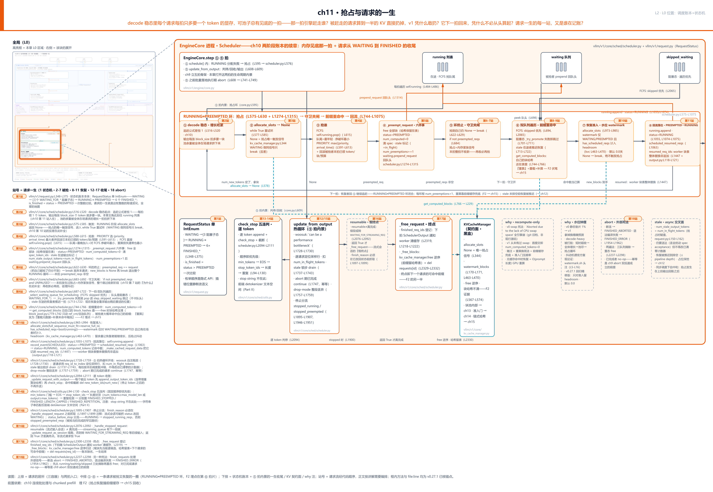
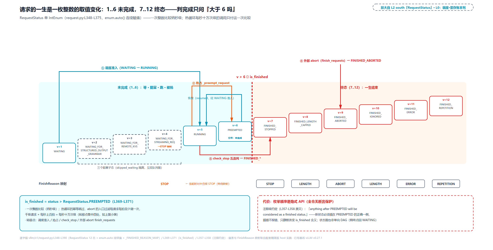
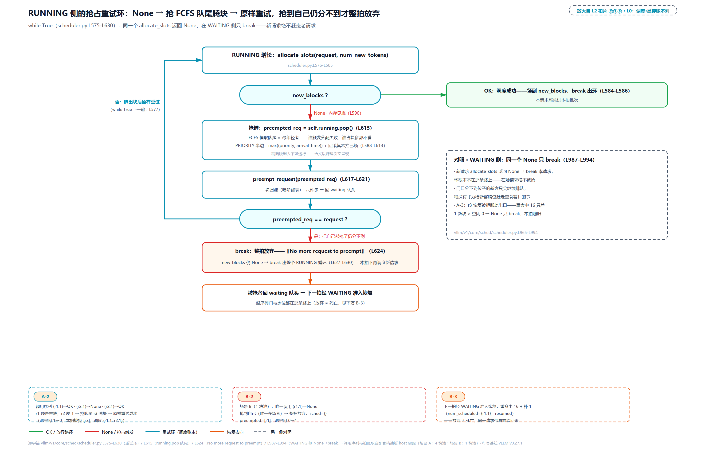
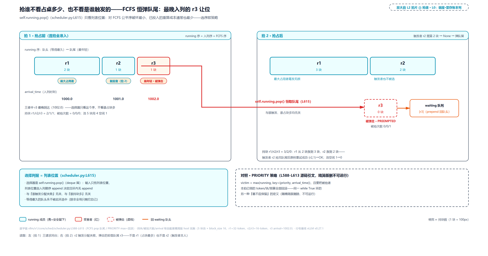
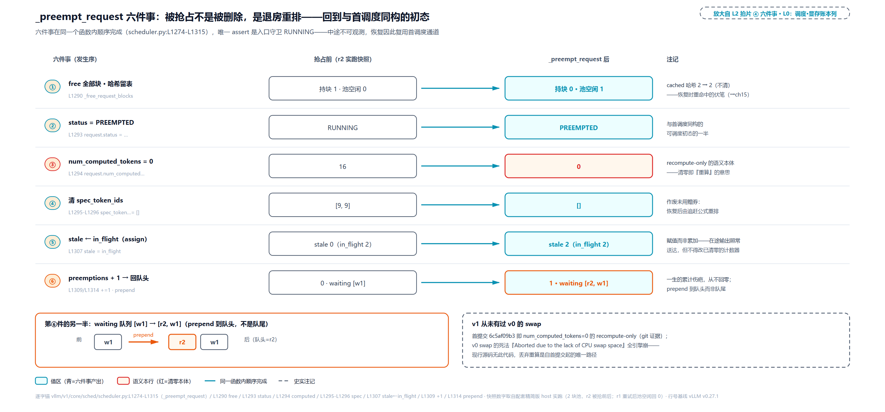
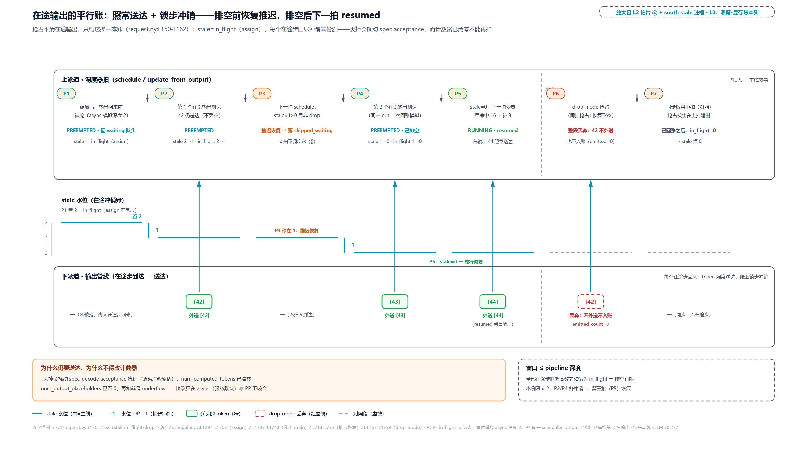
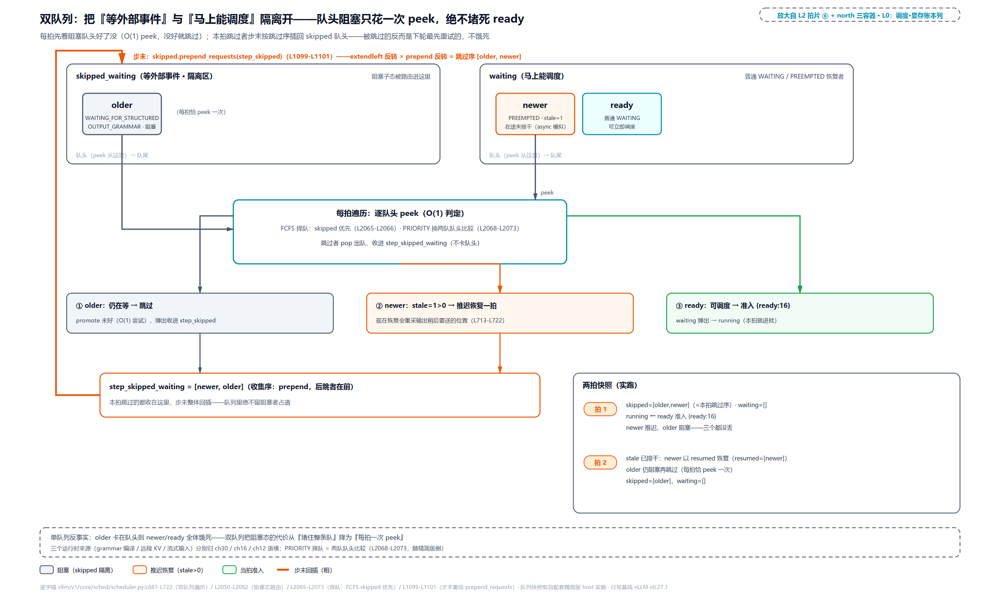
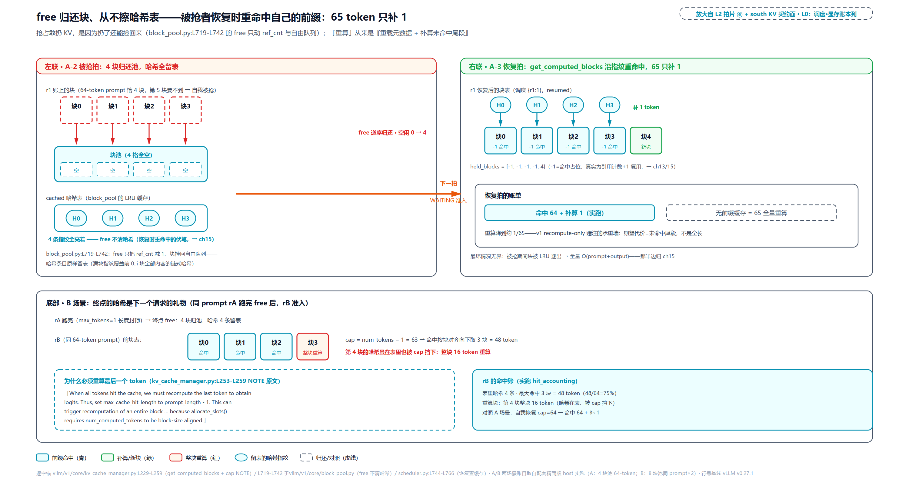
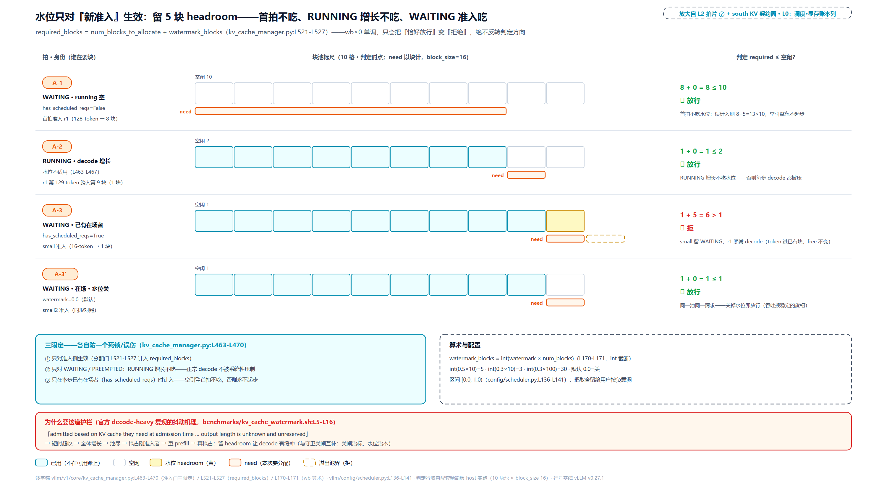

# 第 11 章　抢占与请求的一生

decode 稳态里，每个请求每拍只多要一个 token 的显存。一章前我们算过这本账：追赶公式差恒 1，温柔得像呼吸。可池子总有见底的一拍。那一拍，引擎赶走谁？被赶走的请求，算到一半的 KV 缓存直接扔掉。v1 凭什么敢扔？它下一拍回来，凭什么不必从头算起？而一条请求从进门排队到吐完最后一个 token 退场，这一生的每一站，又是谁在记账？

这四问在[第 10 章](../../ch10-continuous-batching-chunked-prefill/narrative/chapter.md)结尾已经挂了号：抢占环那里只留了一句「recompute-only、已算清零、`prepend_request` 回队头，重看怎么重、被抢请求怎么活着回来，是下一章的主戏」；守卫那里只立了现象（本拍抢占过就整拍不收新），「为什么」欠着；[第 9 章](../../ch09-engine-core-step-loop/narrative/chapter.md)讲第五拍时也预告过：热循环里被省略号盖住的那几行（在途记账、stale 排干），「Part III 第三、四章」拆。本章三张欠条一起兑现。

## 你在这里



> *图注：本章放大的是[第 1 章](../../ch01-vllm-v1-in-one-map/narrative/chapter.md) L0 图左下「调度 · 显存账本」列的上半：Scheduler 那个框，就是[第 10 章](../../ch10-continuous-batching-chunked-prefill/narrative/chapter.md)翻开过账本、本章继续住人的同一块。上一章立的是一拍两阶段怎么分 token 预算，本章打开的是它留下的两扇门：内存见底那一拍的抢占内环，以及[第 9 章](../../ch09-engine-core-step-loop/narrative/chapter.md)五拍循环里第 ⑤ 拍一直收着的「请求生命周期」内景。图上三段读：上排是请求的三个居所（running 在途、waiting 排队、skipped_waiting 阻塞隔离）与两拍入口；中排 ①-⑧ 八张拍片是一条请求被抢又恢复的一整圈，从 allocate_slots 返回 None 到回流落位 RUNNING；「抢占恢复撞前缀缓存」的伏笔（F2，第 15 章回收）埋在第 ⑥ 拍片；下排是状态机账本、⑤ 拍内景的一生收尾、KVCacheManager 契约面与四笔虚线小注（两笔 why：recompute-only、水位钟摆；另有 abort 外部死法、stale async 交叉面）。站号 1-18 = 请求流经代码的顺序（第 1 站状态机 · 第 2-7 站被抢的一拍 · 第 8-11 站恢复的下一拍 · 第 12-17 站一生的收尾 · 第 18 站外部 abort），正文按讲解需要编排、不必照站号读。*

读法建议：只想看「被抢之后怎么活着回来」，直奔[「恢复第一步：捡回自己的前缀」](#恢复第一步捡回自己的前缀站-9)；关心引擎凭什么敢扔 KV、扔了有什么代价，从[「池子见底那一拍」](#池子见底那一拍抢占环站-2-3-与-6)读起；想调参压抢占抖动的，跳[「恢复第二步：准入与水位」](#恢复第二步准入与水位站-10)；想跟一条请求从生到死的全程，按序读。

还有一句环境交代，全章的数值表都适用：本章实测来自配套精简版（按 v0.27.1 只做减法抽出的调度器，host 上实跑纯控制流，全部脚本不依赖 GPU 与 vLLM 运行时）。它与真实引擎有两处刻意的差别，后文碰到会就近再提：其一，KVCacheManager 用契约面替身（空闲块计数、满块哈希表是真的，块池内部分页与驱逐归 Part IV）；其二，精简版按同步语义跑，而 stale 协议、被抢当拍完成这些机制只在异步调度（v0.27.1 服务的默认形态，下一章主角）下真正咬合。凡属此类，驱动脚本用人工置位模拟交错，表里逐处标明。

## 一枚整数的一生：请求状态机（站 1）

先把全章的地图挂起来。一条请求进引擎之后的一切遭遇（排队、被调度、被抢占、恢复、判停、退场）在代码里全部落在一个字段上：`Request.status`。它是一个枚举，而且这个枚举本身就是本章三个要讲透的概念里的第一个：

```python
# vllm/v1/request.py:L348-L375
class RequestStatus(enum.IntEnum):
    """Status of a request."""

    WAITING = enum.auto()                                          # 1  排队等收   # L351
    WAITING_FOR_STRUCTURED_OUTPUT_GRAMMAR = enum.auto()            # 2  等语法编译 # L352
    WAITING_FOR_REMOTE_KVS = enum.auto()                           # 3  等远程 KV  # L353
    WAITING_FOR_STREAMING_REQ = enum.auto()                        # 4  等流式输入 # L354
    RUNNING = enum.auto()                                          # 5  在批在途   # L355
    PREEMPTED = enum.auto()                                        # 6  被抢占     # L356
    # Note: anything after PREEMPTED will be considered
    # as a finished status.                                        # 注释级约定   # L357-L358
    FINISHED_STOPPED = enum.auto()                                 # 7  命中停止   # L359
    FINISHED_LENGTH_CAPPED = enum.auto()                           # 8  长度封顶   # L360
    FINISHED_ABORTED = enum.auto()                                 # 9  外部撤单   # L361
    FINISHED_IGNORED = enum.auto()                                 # 10 超长忽略   # L362
    FINISHED_ERROR = enum.auto()                                   # 11 出错       # L363
    FINISHED_REPETITION = enum.auto()                              # 12 重复检测   # L364

    def __str__(self) -> str:
        return self.name

    @staticmethod
    def is_finished(status: "RequestStatus") -> bool:
        return status > RequestStatus.PREEMPTED                     # 一次整数比较 # L371

    # … 省略：get_finished_reason（L373-L375）：终态→FinishReason 的映射，
    #       查表 _FINISHED_REASON_MAP（L378 起）；下面站 1 总表「FinishReason
    #       映射」列与站 15「先抓原因」的时序约束，出处都在这 ……
```

这个设计值得停三分钟讲透，因为它初看不起眼（「一个枚举而已」），却同时回答了「怎么判死活」和「为什么这样排」两个问题。

第一，`IntEnum` 的成员**本身就是整数**。Python 标准库的约定：继承 `IntEnum` 的枚举成员是 `int` 的子类，可以在任何能用整数的地方使用（[官方文档](https://docs.python.org/3/library/enum.html)原话 "are also integers and can be used anywhere that an integer can be used"），而且永远是 int，不会视语境漂移。普通 `Enum` 成员之间做不了 `>` `<` 排序比较，`IntEnum` 可以。标准库自己最著名的用例是 `http.HTTPStatus`（`HTTPStatus.OK == 200` 成立）。不过那里数值有外部语义（HTTP 规范定的状态码），`RequestStatus` 正相反：数值纯属内部编号，真正承重的是**排列顺序**。

第二，`enum.auto()` 按声明顺序从 1 起每个 +1 赋值（文档原话 "the appropriate value will be the last value plus one"），所以**声明顺序就是数值顺序**。上面代码里我标在注释里的 1..12 就是这么来的。两条合起来：把一生的全部状态按生命周期排在一条数轴上，「是否终局」就退化成一次整数比较：`status > PREEMPTED`，即「大于 6 吗」。拿一个可以自己跑的最小例看穿它（说明性例子，非 vLLM 源码）：

```python
>>> import enum
>>> class TaskStatus(enum.IntEnum):
...     QUEUED = enum.auto()    # 1
...     RUNNING = enum.auto()   # 2
...     PAUSED = enum.auto()    # 3   <- 分界：此后都是终态
...     DONE = enum.auto()      # 4
...     FAILED = enum.auto()    # 5

>>> TaskStatus.DONE > TaskStatus.PAUSED   # 判「终态」= 一次整数比较（4 > 3）
True
>>> TaskStatus.RUNNING == 2               # 成员本来就是 int
True
```

风险也藏在这个例子里：若在 PAUSED 与 DONE 之间插一个新状态 `WAITING_INPUT = enum.auto()`，它会拿到 4、DONE 顺延成 5，于是 `WAITING_INPUT > PAUSED` 为 True，终态判定对它**静默误判**，任何不碰这条路径的测试都发现不了。vLLM 源码里防这件事的只有那两行注释（L357-L358："anything after PREEMPTED will be considered as a finished status"），全仓没有一条断言保护。「新状态必须插在 PREEMPTED 的正确一侧」从此是所有后来者的隐式契约——**枚举顺序本身成了 API**。

那为什么要为一次比较这么较劲？这是一条完整的 why 链。**旧设计**是 v0 的两层状态机：`SequenceGroup`（一组序列的容器，beam search 时代一个请求对应多条候选序列）有自己的状态，每条 `Sequence` 又各有 `SequenceStatus`，再配 waiting/running/swapped 三队列的标志位。判一个请求完没完，要跨两层查属性链。**痛点**在第五拍热循环里：`update_from_output` 每请求每拍至少判一次死活（后面站 12 亲眼见），千级请求乘上每秒上百拍，就是每秒十万次级的判断；属性链、集合查找在这个频度下都嫌贵。更隐蔽的痛是两层状态容易漏改：v0 时代「泄漏请求」（请求完成了却没从队列摘掉）一类 bug 的温床。**v1 方案**就是上面这枚单 IntEnum：一层、一次比较、全部转移点集中在调度器四处：WAITING→RUNNING（调度准入，`vllm/v1/core/sched/scheduler.py:L1074`）、RUNNING→PREEMPTED（抢占，L1293）、RUNNING→FINISHED_*（判停，`vllm/v1/core/sched/utils.py`，站 14 展开）、任何态→FINISHED_ABORTED（外部撤单，站 18 展开）。**代价**同样诚实：转移逻辑分散在四个函数而非一处状态机类里，读代码要自己拼全图；状态图也不是单向的：流式会话会「停了又回 WAITING 续跑」（站 16 展开）。这条回流路马上会逼出一个精巧的时序约束。

把 12 个态、取值与终局判定铺成一张总表（实测：配套精简版，枚举值直接打印）：

<!-- trace: m10 -->
| 状态 | 值 | >PREEMPTED? | FinishReason 映射 |
|---|---|---|---|
| WAITING | 1 | false | — |
| WAITING_FOR_STRUCTURED_OUTPUT_GRAMMAR | 2 | false | — |
| WAITING_FOR_REMOTE_KVS | 3 | false | — |
| WAITING_FOR_STREAMING_REQ | 4 | false | STOP（特例） |
| RUNNING | 5 | false | — |
| PREEMPTED | 6 | false（分界） | — |
| FINISHED_STOPPED | 7 | true | STOP |
| FINISHED_LENGTH_CAPPED | 8 | true | LENGTH |
| FINISHED_ABORTED | 9 | true | ABORT |
| FINISHED_IGNORED | 10 | true | LENGTH |
| FINISHED_ERROR | 11 | true | ERROR |
| FINISHED_REPETITION | 12 | true | REPETITION |

值 2-4 是三个阻塞子态：等语法编译（约束解码：让输出严格符合 JSON 之类结构的一族方法，vLLM 要先把语法编译成状态机才能逐拍执法，Part VII 的正戏）、等远程 KV 传送（KVConnector，跨机搬运 KV cache 的接入组件：机制本体在 Part IV 末章 KVConnector 章，它的典型场景 P/D 分离，即 prefill 与 decode 拆到不同引擎/机器的部署形态，归 Part VIII）、等流式输入的下一段。三者共同点是「暂时调度不了但没死」，站 8 会看到它们被隔离进专用队列。表里还有一处刺眼的特例：`WAITING_FOR_STREAMING_REQ` 明明是未完成态（值 4），却映射到 STOP：流式会话挂起等输入时，对外口径仍是「这一段停了」。这个特例是站 16 那个时序约束的一半伏笔，先记下。全序图景一张：



> *图注：RequestStatus 十二态按数值 1..12 排成阶梯（request.py:L348-L375）：青带 1..6 未完成（含三个阻塞子态与 PREEMPTED 中转），橙带 7..12 终态，6 与 7 之间的粗分界就是 is_finished 的那次「大于 6 吗」比较；四面小旗标出转移点：调度准入（L1074）、抢占（L1293）、check_stop（sched/utils.py:L94-L130）、abort（L2237-L2298）。注释级约定「anything after PREEMPTED will be considered as a finished status」没有任何断言保护，插错侧就是静默 bug。*

状态机之外，请求身上还有一簇整数在记细账（被抢那一刻、恢复那一拍、判停那一 token 都靠它们对齐）：

```python
# vllm/v1/request.py:L150-L162 · Request.__init__
        # Used in async scheduling.
        self.num_output_placeholders = 0            # 异步占位数（本章恒 0，下一章灌值）
        # Tokens of output in flight when the request was preempted: delivered
        # on return, but must not mutate the reset counters.
        self.num_stale_output_tokens = 0            # 被抢时的在途输出份额        # L154
        # Drop the stale output instead, for same-step preempt + resume
        # (reset_prefix_cache).
        self.drop_stale_output = False              # 同拍抢占+恢复时整段丢弃      # L157

        # Tokens of steps whose output is not yet processed (async scheduling
        # and PP run ahead of the GPU); `num_computed_tokens` counts them
        # optimistically.
        self.num_in_flight_tokens = 0               # 已调度未回账的乐观计数      # L162
```

`num_computed_tokens`（已算多少）与 `num_preemptions`（被抢次数，`vllm/v1/request.py:L200`）上一章已经入册。本章新增三枚：`num_stale_output_tokens` 记「被抢时还有多少输出在路上」，`drop_stale_output` 是它的弃置开关，`num_in_flight_tokens` 记「已调度、GPU 还没回账」的乐观数，是[第 10 章](../../ch10-continuous-batching-chunked-prefill/narrative/chapter.md)「账本先记、GPU 后算」在请求侧的镜像。它们的具体戏份在被抢那一拍（站 5）正式开演。

## 池子见底那一拍：抢占环（站 2-3 与 6）

地图挂好，现在把镜头放到出事的那一拍。场景接上一章的稳态：三个请求都已 prefill 完、住在 running 列表里 decode，每拍各领 1 个 token。追赶公式差恒 1，看着无害，但每 16 个 token（一个 block 的容量）就要多要一块显存，池子的余量被全体在场请求这样一拍一拍挤下来。终于有一拍，某个请求去领块，`allocate_slots` 返回了 None。

「抢占」这个词先正一下名，因为它不是 vLLM 自造的：操作系统语境里，抢占（preemption）指外层调度器**不经任务自身配合**就中断一个正在执行的任务、并打算稍后恢复它（[Wikipedia](https://en.wikipedia.org/wiki/Preemption_(computing)) 定义原话 "the act performed by an external scheduler — without assistance or cooperation from the task — of temporarily interrupting an executing task"），与之相对的是协作式（cooperative）让出。LLM 引擎里的抢占是同一件事在显存维度的翻版：KV 块不够了，调度器强制挂起某个正在 decode 的请求，不问它同不同意，因为它也没有「同意」的接口。RUNNING 循环里那个环就是执行现场：

```python
# vllm/v1/core/sched/scheduler.py:L575-L629 · Scheduler.schedule
            # Schedule newly needed KV blocks for the request.
            with record_function_or_nullcontext("schedule: allocate_slots"):
                while True:
                    new_blocks = self.kv_cache_manager.allocate_slots(
                        request,
                        num_new_tokens,
                        num_lookahead_tokens=self.num_lookahead_tokens,
                    )                                                # 要块          # L578-L582

                    if new_blocks is not None:
                        # The request can be scheduled.
                        break                                        # 拿到块，出环  # L586

                    # The request cannot be scheduled.
                    # Preempt the lowest-priority request.
                    if self.policy == SchedulingPolicy.PRIORITY:
                        # … 省略：PRIORITY 的受害者选择与本拍已领资源回滚
                        #       （L590-L613），下节展开 ……
                    else:
                        preempted_req = self.running.pop()           # FCFS 抢队尾   # L615

                    self._preempt_request(
                        preempted_req,
                        scheduled_timestamp,
                        drop_stale_output=self.requires_kv_delivery,
                    )                                                # 抢占执行      # L617-L621
                    preempted_reqs.append(preempted_req)             # 记入本拍被抢集 # L622
                    if preempted_req == request:
                        # No more request to preempt. Cannot schedule this request.
                        break                                        # 把自己抢掉了  # L625

            if new_blocks is None:
                # Cannot schedule this request.
                break                                                # 整拍放弃      # L629
```

读法顺着环走：**调度路径上**，`allocate_slots` 返回 None 是抢占的**唯一触发信号**，没有别的条件会走到这个环里（环外另有抢占发起者：管理接口 `reset_prefix_cache`，站 5 的 drop-mode 处见到）。None 之后不报错、不等待，立刻抢一个「最不应保留者」（FCFS 下就是队尾）腾块，然后**原样重试**同一次分配。注意环的两个出口：重试成功（break 出环，请求照常调度）；或者抢来抢去轮到 `preempted_req == request`：把自己都抢了还是分不到（此时 running 已空、没有更不该留的人了），break 放弃本请求。出了环还有一道判定：`new_blocks is None` 说明整个 RUNNING 循环都收摊了，本拍就到这里。环里顺手传下去的两个实参不参与本章主线，各给一句交代：`num_lookahead_tokens` 是投机解码的前瞻 token 数（配置了投机解码才非 0，本环只把它原样转给分配器）；`drop_stale_output=self.requires_kv_delivery` 是 KV 传输连接器的旗标，配置了连接器、且其递交的 KV 必须可靠送达时为真（调度器初始化时从 connector 拷来，L158），被抢请求的在途输出因此要走整段丢弃的 drop-mode，站 5 对表。

这个环为什么停得下来，值得一句不变量级的论证：环内对 `self.running` 只减不增（每迭代必 pop 掉一个成员），`len(running)` 是严格递减的自然数，至多初始长度轮之后，队尾必然轮到 `request` 自己，触发 `preempted_req == request` 的 break；另一条路是某轮重试成功（每次 pop 必先 free 一份块，空闲只增不减而需求不变，越过需求即成功）。两条路都在有限轮内，不存在无限抢占。

### v1 凭什么敢扔：recompute-only

环里真正的宣言在 `_preempt_request` 里（下一节全文走读），它做的事翻译成人话是：把被抢请求的 KV 缓存**全部扔掉**。这是本章三个要讲透的概念里最重的一个：**recompute-only（只重算）**，即 v1 对被抢请求的唯一处置方式，不搬运、不换出，恢复时把 prompt 拼上已生成的 token 当一个「新 prompt」重算。它不是拍脑袋，是一条有出处的取舍。

两条经典处置路是 vLLM 自己的奠基论文（《Efficient Memory Management for Large Language Model Serving with PagedAttention》，[SOSP 2023，arXiv:2309.06180](https://arxiv.org/abs/2309.06180) 的 Section 4.5）并列提出的：**swap**（换出）把被抢请求的 KV 块物理拷贝到 CPU 内存存着、恢复时原样拷回 GPU。代价是两次 PCIe 搬运（PCIe：GPU 与 CPU 之间传数据的那条总线，这里就是把 KV 在显存与内存之间对拷）加 CPU 侧一块镜像内存；**recompute**（重算）干脆不存，块全部释放、进度记账清零，恢复时用一次 prefill 迭代把所有位置的 KV 批量重算。注意不是逐 token 慢慢重跑 decode，论文原话 "recomputation latency can be significantly lower than the original latency, as the tokens generated at decoding can be concatenated with the original user prompt as a new prompt"。拿一个说明性构造走一遍：请求 A 有 500-token prompt、已生成 200 token。swap 路径：700 token 的 KV 拷去 CPU，恢复时拷回，从第 701 个 token 续算（两次搬运，零重算）。recompute 路径（v1 实际做法）：KV 块直接释放回池子，A 回等待队列；恢复时把 500+200 拼成 700-token 的「新 prompt」一次 prefill 重算；若前缀缓存命中自己刚释放的块，实为「重载元数据+补算尾段」而非全量重算（站 9 展开，这是 v1 敢扔的另一半底气）。论文还在 §7.3 的消融实验里实测了两者的适用面：小块尺寸下 swap 反而吃亏（"swapping incurs excessive overhead with small block sizes"，大量小块传输吃不满 PCIe 带宽），而重算的开销与块大小无关（"the overhead of recomputation remains constant across different block sizes"）。

工程化后的 v0 一直双模并存：`SchedulerConfig.preemption_mode` 接受 `"swap"`/`"recompute"` 二选一，不指定时自动选，recompute 是默认（开销更低），swap 留给 beam search 这类多序列场景（v0.6.6/v0.9.1 源码一手核实）。转折在 v1：[官方文档](https://docs.vllm.ai/en/stable/configuration/optimization/)现文明说 "In vLLM V1, the default preemption mode is RECOMPUTE rather than SWAP, as recomputation has lower overhead in the V1 architecture"，而且整页再无 `preemption_mode` 这个配置项。这不是换默认，是删掉了另一条腿。两条 git 考古证据钉死这件事（均为历史证据，现行源码无此代码）：其一，v1 首提交（6c5af09b3，2024-10）的调度器里抢占就一行 `preempted_req.num_computed_tokens = 0`，全文件无 swap/PreemptionMode 字样，v1 从出生起就没写过换出；其二，v0 时代 swap 空间不足的死法是整个引擎崩：`RuntimeError: Aborted due to the lack of CPU swap space. Please increase the swap space to avoid this error.`（git 旧档 `vllm/core/block_manager.py:L1833`，c99db8c8d^ 版本）。那不是降级、不是丢一个请求，是全引擎停摆。v0 双模加三队列也被作者自认是调度器最难维护的部分（woosuk 在 v0 源码里的自注 "a bit bizarre"，上一章引过）。v1 删掉它的理由链完整了：v1 取消 SequenceGroup/beam search 多序列，swap 存在的最大理由消失；swap 耗尽是致命故障而非优雅降级；再加上前缀缓存兜底（站 9）与准入控制压频率（站 10）这两重兜底。**代价**同样要诚实记下：被抢请求恢复 = 一次（部分）prefill 重算，该请求的吐字节奏出现尖刺、系统烧掉的 forward 不产出新 token（吞吐净损失）；极端反复抢占时纯属浪费。对单请求延迟极敏感、KV 又恰好放得进 CPU 的场景，swap 理论上仍可更优。v1 用「重算换简洁」的赌注删掉了它，赌注的兜底就是后面两站的戏。

### 实测：4 块池子的两幕

上环跑真数字（实测：配套精简版；场景 A：池 4 块 × block_size 16，r1/r2/r3 各 16-token prompt；场景 B：池只 1 块、单请求。allocate 调用序列由驱动侧代理记录，包日志不改语义）：

<!-- trace: m1 -->
| 拍 | allocate 调用序列 (req,ask)→结果 | 动作 | 池空闲 | 本拍被抢 | 本拍调度 |
|---|---|---|---|---|---|
| A-1 | (r1,16)→OK,(r2,16)→OK,(r3,16)→OK | 三请求首拍全量准入 | 4→1 | [] | {r1:16,r2:16,r3:16} |
| A-2 | (r1,1)→OK,(r2,1)→None,(r2,1)→OK | r1 领走末块；r2 差 1 → 抢队尾 r3 腾块 → 原样重试成功 | 1→0 | [r3] | {r1:1,r2:1} |
| A-3 | (r1,1)→OK,(r2,1)→OK,(r3,1)→None | r3 恢复重命中 16 只差 1 新块 > 空闲 0：None 只 break，绝不抢占 | 0 | [] | {r1:1,r2:1} |
| B-2 | (r1,1)→None | 抢到自己（唯一在场者）→ break 整拍放弃 | 0→1 | [r1] | {} |
| B-3 | (r1,1)→OK | 下一拍经 WAITING 准入恢复：重命中 16+补 1（resumed） | 1→0 | [] | {r1:1} |

五行的看点各有其主。A-2 是环的标准动作：`(r2,1)→None`、抢队尾 r3、`(r2,1)→OK`：同一请求、同一需求，前后两次调用之间只隔一次抢占。A-3 是与 WAITING 侧的对照：同一个 None 信号，发生在恢复准入（r3 重回队头后下一拍来领块）时只 break。**新来的、排队的，绝不赶走在场的**。B-2 是自我放弃：r1 是唯一在场者，被抢的就是它自己，`preempted_req == request` 触发 break；注意紧接着的细节：此时 r1 自己 free 的块已回到池里（空闲 0→1）、算术上够它领 1 个 token，但环**不在本拍重试**：break 发生在重试之前。恢复统一走下一拍的 WAITING 准入通道（整序列门与水位都在那条路上，站 10），语义与账本才一致。B-3 兑现：同一请求带着 16 token 命中 + 1 个补算回来了——**放弃不是死亡**。整个环的样子一张图：



> *图注：RUNNING 侧 allocate_slots 一返回 None 就进 while True（scheduler.py:L575-L630）：抢占 FCFS 队尾腾块后原样重试，抢到自己仍分不到才整拍放弃；放弃者回 waiting 队头，下一拍经 WAITING 准入恢复（B-3 重命中 16+补 1）。同一个 None 到了 WAITING 侧只 break（右下虚线框）：新请求绝不赶走老请求。*

顺带把本拍被抢集的下游交代了：环里每次 `_preempt_request` 后都有 `preempted_reqs.append(preempted_req)`；这个列表非空，就是「本拍发生过抢占」的信号，马上成为下一节守卫的判据。

## 抢谁：队尾的最年轻者（站 4）

环里被我省略的那个分支，本节补全。FCFS 侧的选择器短得只有一行 `self.running.pop()`；PRIORITY 侧是同一环里另一种「最不应保留」的定义，麻烦在选择之后还要回滚：

```python
# vllm/v1/core/sched/scheduler.py:L590-L615 · Scheduler.schedule
                    if self.policy == SchedulingPolicy.PRIORITY:
                        preempted_req = max(
                            self.running,
                            key=lambda r: (r.priority, r.arrival_time),
                        )                                          # 字典序最大者   # L591-L594
                        self.running.remove(preempted_req)
                        if preempted_req in scheduled_running_reqs:
                            preempted_req_id = preempted_req.request_id
                            scheduled_running_reqs.remove(preempted_req)
                            token_budget += num_scheduled_tokens.pop(preempted_req_id)
                            req_to_new_blocks.pop(preempted_req_id) # 回滚 token/块  # L598-L600
                            scheduled_spec_decode_tokens.pop(preempted_req_id, None)
                            # … 省略：encoder 输入的预算归还十一行（L602-L612，
                            #       多模态正交）……
                            req_index -= 1                          # 扫描点回退一格 # L613
                    else:
                        preempted_req = self.running.pop()          # FCFS 抢队尾    # L615
```

FCFS 抢队尾的理由，上一章给过直觉（剧场请走最晚进场的观众），这里补全论证。running 列表按调度准入顺序 `append`，队尾就是**最晚加入者**，即最「年轻」的请求。抢它两头都划算：对 FCFS 公平序破坏最小（等得最久的队头永远安全）；已投入的 forward 通常最少（刚完成 prefill 或刚恢复），重算损失通常最小。但注意这是启发式不是最优：一个跑了很久、输出很长的老请求，重算成本可以远超一个新请求。但 v1 不做精确的「重算成本」比较（那要给每个请求维护成本模型），**选序即策略**，位置就是全部判据。PRIORITY 策略换成 `(priority, arrival_time)` 字典序取最大，即优先级最低者、同级里最晚到者（vLLM 约定 priority 数值越小优先级越高，类似 Unix 的 nice 值，所以取最大恰是挑优先级最低者）。并且因为被抢者可能排在本拍扫描点**之前**（已经领过 token、块、预算），必须把这些本拍已领资源一样样退回来（`token_budget +=`、`req_to_new_blocks.pop`、`req_index -= 1`）；FCFS 没有这个负担：队尾必然排在扫描点之后、本拍还没记过账，抢它零回滚。实测把「只看座次」钉死（配套精简版；池 5 块，r1 是 32-token prompt（2 块，最大占用者）、r2/r3 各 16-token（各 1 块，唯一差别是入列顺序，r3 的 arrival_time 1002.0 三者最晚））：

<!-- trace: m2 -->
| 拍 | running 序（入列序=FCFS 序） | 受害者与理由 | 各请求持块 r1/r2/r3 | 各请求被抢次数 |
|---|---|---|---|---|
| 1 | [r1,r2,r3] | —（三请求全准入） | 2/1/1 | 0/0/0 |
| 2 | [r1,r2]（r3 被弹走） | r3=队尾=最晚到达（1002.0）；触发者 r2 与最大占用者 r1 均不被选 | 3/2/0 | 0/0/1 |

拍 2 分配失败由 r2 触发，被弹走的却是 r3；占块最多的 r1 毫发无损。「抢谁」与「谁触发」「谁占得多」都无关，只看列表位置。三格长条一张图：



> *图注：抢谁不看占桌多少、也不看是谁触发的。FCFS 下 running.pop() 恒取队尾（scheduler.py:L615）：最晚入列的 r3 让位（arrival 1002.0 三者最晚），最大占用者 r1（3 块）与触发分配失败的 r2 都安全。PRIORITY 策略只是换了一种「最不应保留」的定义：按 (priority, arrival_time) 取最大并回滚其本拍已领资源（L588-L613）。*

## 六件事：退房的全部手续（站 5）

选好了受害者，接下来执行。`_preempt_request` 是被抢那一瞬的完整动作清单。被抢不是被删除，是**退房重排**：

```python
# vllm/v1/core/sched/scheduler.py:L1274-L1315
    def _preempt_request(
        self, request: Request, timestamp: float, drop_stale_output: bool = False
    ) -> None:
        """Preempt a request and put it back to the waiting queue.

        NOTE: The request should be popped from the running queue outside of this
        method.

        drop_stale_output: drop (rather than deliver) any in-flight output; used
        by reset_prefix_cache, whose same-step resume would otherwise deliver
        tokens out of order, and for connectors with a pending KV hand-off,
        which the preemption's block free would leave without valid KV.
        """
        assert request.status == RequestStatus.RUNNING, (
            "Only running requests can be preempted"
        )
        self._free_request_blocks(request)          # ① 归还全部块（哈希留表）      # L1290
        self.encoder_cache_manager.free(request)    # … 多模态正交，一句带过 ……
        self._inflight_prefills.discard(request)    #   未完 chunk 的挂账也撤        # L1292
        request.status = RequestStatus.PREEMPTED    # ② 状态翻 PREEMPTED            # L1293
        request.num_computed_tokens = 0             # ③ 进度清零：重算的语义本体   # L1294
        if request.spec_token_ids:
            request.spec_token_ids = []             # ④ 清投机草稿                  # L1295-L1296
        # Async scheduling: mark all in-flight output as stale. Its tokens are
        # still delivered on return (dropping them would perturb spec-decode
        # acceptance) but must not mutate the reset counters; each step drains
        # its share in update_from_output. num_in_flight_tokens already
        # includes any undrained stale share, so assign rather than accumulate.
        # An undrained drop-mode share stays dropped: its positions have
        # already been resampled.
        request.drop_stale_output = drop_stale_output or (
            request.drop_stale_output and request.num_stale_output_tokens > 0
        )                                            #    弃置旗标（继承未排干的旧账）# L1304-L1306
        request.num_stale_output_tokens = request.num_in_flight_tokens
                                                   # ⑤ 在途输出记入平行账（赋值）   # L1307
        request.num_output_placeholders = 0         #    异步占位同步清零             # L1308
        request.num_preemptions += 1                # ⑥ 被抢次数 +1（一生的累计伤疤） # L1309
        if self.log_stats:
            request.record_event(EngineCoreEventType.PREEMPTED, timestamp)

        # Put the request back to the waiting queue.
        self.waiting.prepend_request(request)       # ⑥' 回 waiting 队头              # L1314
        self.reset_preempted_req_ids.add(request.request_id)
                                                   #    登记本拍被抢集（通告 worker） # L1315
```

六件事（①归块、②置态、③清零、④清草稿、⑤stale 平行账、⑥记账回队头，顺手还有撤挂账、清占位、登记通告三笔）一口气在同一函数内顺序完成，除入口断言外无 IO、无异常出口，中途不可观测：外界看到的永远是「之前」或「之后」。逐件读：**①归还全部块**是「扔 KV」的执行现场，注意 `_free_request_blocks` 走到块池那层只动引用计数和自由队列、**块哈希留在表里**。这一笔是站 9 前缀重命中的全部伏笔，此处按住不表。**③进度清零**是 recompute-only 的语义本体：`num_computed_tokens = 0`，恢复时这条请求与新请求在账本上无法区分（除了状态是 PREEMPTED 不是 WAITING）。**⑤在途输出记入平行账**单独开一小节讲，它是本章最精巧的协议。**⑥被抢次数 +1** 是只增不减的字段，即请求一生的累计伤疤，官方基准脚本用它观测护栏效果（站 10 见）。紧随其后那两行 `if self.log_stats: record_event(PREEMPTED)` 是生命周期事件埋点（QUEUED/SCHEDULED/PREEMPTED 三类，随输出回传前端，用于算排队时长与首 token 延迟；`log_stats` 开着才记）。一个请求的一生，除账本之外还留这一份对外的时间线；紧接着的**回 waiting 队头**用的正是上一章埋过伏笔的 `prepend_request`（`appendleft`）：被抢者优先恢复，别让它在队尾再排一遍队。登记进 `reset_preempted_req_ids` 的那一笔，拍末随 `SchedulerOutput.preempted_req_ids` 发给 worker（`vllm/v1/core/sched/scheduler.py:L1217`）。跨进程的「此人被抢」通告。docstring 里那句 NOTE 也值得记：调用方必须先把请求从 running 里 pop 出来，本函数不管队列，职责切得干净。实测把六件事的前后账面拍成快照（配套精简版；池 2 块，r1/r2 各 16-token，w1 在 r2 之后入 waiting；拍 2 前预置 r2.spec_token_ids=[9,9]、r2.num_in_flight_tokens=2（后者是人工置位模拟异步交错，同步引擎此处为 0）：

<!-- trace: m3 -->
| 拍·时点 | r2.status | computed | spec_token_ids | stale | in_flight | 持块/池空闲 | waiting 队列 | 被抢次数 | cached 哈希 |
|---|---|---|---|---|---|---|---|---|---|
| 2·抢占前 | RUNNING | 16 | [9,9] | 0 | 2 | 1 / 0 | [w1] | 0 | 2 |
| 2·_preempt_request 后 | PREEMPTED | 0 | [] | 2 | 2 | 0 / 1 | [r2,w1] | 1 | 2 |
| 2·r1 重试落定 | PREEMPTED | 0 | [] | 2 | 2 | 0 / 0 | [r2,w1] | 1 | 2 |

三行读出全部六件事：computed 16→0（③）、spec [9,9]→[]（④）、stale 0→2（⑤，恰等于 in_flight）、被抢次数 0→1（⑥）、waiting [w1]→[r2,w1]（⑥ 的收尾，prepend 到队头）。还有一列不动声色地重要：**cached 哈希 2→2**：块归池了（持块 1→0、池空闲 0→1），哈希表纹丝不动（①的伏笔）。这六件事合起来把请求带回一个**与首调度同构的可调度初态**：computed=0、块为空、状态 PREEMPTED、排 waiting 队头。所以恢复路径可以原样复用首调度的通道（查缓存→领块→落座），一点特判都不用。一张图记账：



> *图注：_preempt_request 一口气做六件事，把请求带回与首调度同构的初态（scheduler.py:L1274-L1315）：free 块（哈希留表）/ 置 PREEMPTED / computed=0 / 清 spec / stale←in_flight（赋值不累加）/ preemptions+1，最后 prepend 回 waiting 队头。v1 从未有过 v0 的 swap：首提交（6c5af09b3）即 num_computed_tokens=0 的 recompute-only。*

### 在途快递：stale 输出的平行账

六件事里最反直觉的是⑤：被抢请求「已经发出去还没回来」的输出 token 怎么办？直觉的答案要么「照常送达」要么「扔掉」，v1 的答案是**两条都要，但记账分开**。token 照常送达，账本一刀切开：`num_stale_output_tokens = num_in_flight_tokens`（L1307）。

为什么不能直接扔？源码注释给了理由（L1297-L1299 原话的逻辑）："dropping them would perturb spec-decode acceptance"：投机解码的接受率统计要数「草稿对了几个」，凭空吞掉在途 token 会让统计失真，而这套统计是动态调草稿数的依据。为什么送达却又不能记正常的账？因为③刚把 `num_computed_tokens` 清零、把 `num_output_placeholders` 置 0。这些计数器已经归零，stale 输出再走正常路径去扣它们就是 underflow（下溢，即把已经归零的计数器再往下扣成负数；下一章 AsyncScheduler 的覆写里有对应的断言注释）。所以协议是：**送达不动账，另立一本冲销账**。stale 记下份额，此后每个在途步的输出回来时，热循环按当拍调度数「锁步冲销」一份（站 12 见 L1737-L1743 原文），份额清零之前**恢复被推迟**（站 8 见 L713-L722）。还有一个源码注释里点破的细节：赋值用的是 `=` 不是 `+=`。注释原话 "num_in_flight_tokens already includes any undrained stale share, so assign rather than accumulate"（在途计数本就含着未排干的旧 stale 份额，赋值即可、累加会重复计）。第二条形态是 **drop-mode**：`drop_stale_output` 旗标立起时整段丢弃、不送达。来源有两种。一是同拍抢占+恢复：`reset_prefix_cache` 是清前缀缓存的管理接口（scheduler.py:L2423-L2449），它会当场把全部在场请求逆序抢占、又在同一步内放回重调度（源码注释原话 "forcing preemption + resumption in the same step"）。「抢」与「恢复」挤进同一拍，那些位置反正马上要重采，交付反而乱序（docstring 原话 "whose same-step resume would otherwise deliver tokens out of order"）。二是 KV connector 有未决交接（P/D，即 prefill 与 decode 分离部署的场景，部署形态归 Part VIII，KVConnector 搬运机制本体在 Part IV 末章，两处都只点到即止）：判据正是抢占环里传的 `requires_kv_delivery`：被抢后块已还池、未决交接随之失效，在途输出只能整段丢弃。全协议七幕实测（配套精简版；深度 2 的异步模拟（P1 在调度后、输出回来前人工置 in_flight=2 模拟两步在途，P4 用同一 scheduler_output 二次回账模拟第 2 个在途步返回；同步引擎的对照见 P7）：

<!-- trace: m4 -->
| 阶段 | 动作 | in_flight | stale | drop | 送达 | 状态 |
|---|---|---|---|---|---|---|
| P1 | 调度后、输出回来前被抢（async 模拟） | 2 | 2 | false | — | PREEMPTED·回 waiting 队头 |
| P2 | 第 1 个在途输出到达 | 2→1 | 2→1 | false | [42] | PREEMPTED |
| P3 | 下一拍 schedule：stale>0 且非 drop | 1 | 1 | false | [] | 推迟恢复→skipped_waiting（候位隔离队，「两条队」一节展开） |
| P4 | 第 2 个在途输出到达（同一 out 二次回账） | 1→0 | 1→0 | false | [43] | PREEMPTED（已排空） |
| P5 | 下一拍恢复 | 0 | 0 | false | [44] | RUNNING·resumed（重命中 16+补 3） |
| P6 | drop-mode 抢占（同拍抢占+恢复形态） | 1→0 | 1→0 | true | [] | 整段丢弃：42 不送达不入账 |
| P7 | 同步版自中和（对照） | 0 | 0 | false | — | 上拍已回账→stale 恒 0 |

P1→P5 是主形态：份额 2→1→0 两拍排空、第三拍恢复，期间 P2/P4 的 token [42][43] 照常送达，P5 恢复后新输出 [44] 接上，用户侧输出流不断流。P5 行「补 3、只送 1」的差额正是协议的收口。先补一级台阶：被抢清零的只是进度计数器（六件事之③），`_output_token_ids`（请求自记的已生成输出序列账）原样保留。送达过的 42、43 仍在账上，恢复时它们的位置要连 prompt 一起重建 KV。补的三个位置（prefill 顺手产出的首 token 与 42、43）都已送达过，此刻只是重建 KV 的输入、不再重复送达；一次算 3 个位置的 forward 只在末位采出新 token（44），同 recompute「prompt 拼上已生成 token 当新 prompt」的输入化口径。P3 那一拍是「推迟恢复」：stale 还有 1 未排干，此刻恢复会**重采一个稍后要送达的位置**（正确性窗口不超过管线深度。「管线深度」指同时在途、未回账的步数，本模拟为 2；与后文「流水线并行」的「流水线」同一个词）。P6 是 drop-mode：整段作废。P7 是最重要的一行对照——**同步调度下这套协议自中和**：抢占发生在第 ① 拍、而上一拍的第 ⑤ 拍早已把在途账清零，被抢那一刻 in_flight 恒 0、stale 恒 0，协议空转。它是给异步调度（下一章主角、v0.27.1 服务的默认形态）与流水线并行（把模型按层切成几段、分到多卡接力执行的部署形态，第 34 章展开）预备的账单。本 pin 前三个月里此域就有三个修复（#42117、#46066、#48245，外部 PR 史），精巧的协议也是修出来的。双泳道一张图：



> *图注：被抢请求的在途输出走一条「照常送达+锁步冲销」的平行账（request.py:L150-L162 + scheduler.py:L1307/L1737-L1743）：stale=in_flight（赋值），每个在途步回账时冲销其份额、token 照常送达（丢掉会扰动 spec acceptance，而计数器已清零不能再扣）。排空前恢复被推迟一拍（P3 落 skipped_waiting），窗口不超过管线深度；drop-mode（同拍抢占+恢复）才整段作废。同步引擎里这套协议自中和（P7），它是异步调度的账单。*

## 关闸与重新排队：守卫和两条队（站 7-8）

抢占发生的那一拍，`schedule()` 还没走完：RUNNING 循环收摊之后是 WAITING 收新阶段，而它的入口立着一道上一章只立了现象的守卫：

```python
# vllm/v1/core/sched/scheduler.py:L683-L722 · Scheduler.schedule
        # Next, schedule the WAITING requests.
        if not preempted_reqs and self._pause_state == PauseState.UNPAUSED:
                                                   # 闸：本拍抢过人吗              # L684
            step_skipped_waiting = create_request_queue(self.policy)

            while (self.waiting or self.skipped_waiting) and token_budget > 0:
                # Paused streaming sessions (WAITING_FOR_STREAMING_REQ) are not
                # in `running` but still hold a model-runner request slot.
                num_running = len(self.running) + self.num_waiting_for_streaming_input
                if num_running >= self.max_num_running_reqs:
                    break                          # 在座封顶（上一章第二道闸）    # L692

                request_queue = self._select_waiting_queue_for_scheduling()
                assert request_queue is not None

                request = request_queue.peek_request()   # 看队头，不取              # L697

                # try to promote blocked statuses while traversing skipped queue.
                if self._is_blocked_waiting_status(
                    request.status
                ) and not self._try_promote_blocked_waiting_request(request):
                    # … 省略：request_id 取行（L698，消费者就是下面
                    #       那条日志）与 REMOTE_KVS 的 debug 日志（L704-L708
                    #       五行）……
                    request_queue.pop_request()
                    step_skipped_waiting.prepend_request(request)
                    continue                        # 阻塞态：跳过，不卡队头        # L711

                if (
                    request.num_stale_output_tokens > 0
                    and not request.drop_stale_output
                ):
                    # Deliverable stale output still in flight: resuming now
                    # could resample a position that output later delivers.
                    # It drains within the pipeline depth.
                    request_queue.pop_request()
                    step_skipped_waiting.prepend_request(request)
                    continue                        # stale 未排空：推迟恢复一拍    # L722
```

`if not preempted_reqs` 是上一章「第一道闸」的正身：本拍发生过抢占（被抢集非空）= 显存紧张的信号，整个收新阶段跳过。条件里还并着另一个合取项 `self._pause_state == PauseState.UNPAUSED`，是引擎级暂停开关（三态：正常 / 暂停收新 / 全停，管理接口用），本章路径恒为正常态，机制不属本章，略。上一章给的是现象与直觉（刚赶过人再迎新客，多半下一拍还得再赶），本章补全因果链与代价账。因果：刚被抢者回到 waiting 队头，此刻若继续收新，新请求进来立刻分走刚腾出的块，被抢者的恢复遥遥无期，而新请求自己也会在下一次池子见底时被抢（它最年轻）。守卫用「一拍不收新」把这个抖动环剪断。代价也真实：突发新请求至少多等一拍；更根本的，RUNNING 绝对优先 + 无准入拒客（到达率超服务能力时只排队不拒绝）意味着高负载下排队延迟没有上界。这是[第 10 章](../../ch10-continuous-batching-chunked-prefill/narrative/chapter.md)立过的「TPOT 优先、TTFT 让路」取舍在抢占侧的延长线。还有一条上一章见过的机制在此闭环：守卫**只关一拍**：判定用的是本拍局部变量 `preempted_reqs`，步末 `_update_after_schedule` 把调度器侧的 `reset_preempted_req_ids` **换新而非清空**（上一章实测过：输出握着旧集引用，就地 clear 会连带清空通告），下一拍守卫必开。「本拍被抢」这条信息至此三个化身串成一线：环内局部列表 `preempted_reqs`（守卫判据）→ 调度器字段 `reset_preempted_req_ids`（站 5 六件事里逐笔登记，步末在此换新而非清空）→ 拍末打包的 `SchedulerOutput.preempted_req_ids`（发给 worker 的跨进程通告）。谁在哪一拍读哪个集合，顺着这条线走。守卫的实测（配套精简版；场景 A：池 8 块，r1=16-token（1 块）、r2=112-token（7 块，队尾）；场景 B：池 2 块，r1=32-token、victim=16-token）：

<!-- trace: m5 -->
| 拍 | 本拍调度 | 池空闲 | 被抢 | 守卫/不对称判定 |
|---|---|---|---|---|
| A-1 | {r1:16,r2:112} | 8→0 | [] | 双准入：r1 占 1 块 + r2 占 7 块 |
| A-2 | {r1:1} | 0→6 | [r2] | 守卫关闸：空闲 6 足够 r2 恢复（重命中 112 只差 1 新块），本拍仍不收：再收必再抢 |
| A-3 | {r1:1,r2:1} | 6→5 | [] | 守卫开（下一拍）：r2 重命中 112+补 1 → resumed |
| B-1 | {r1:32} | 2→0 | [] | victim 准入需 1 块 > 空闲 0 → None 只 break：在场请求无人被抢 |
| B-2 | {} | 0→2 | [r1] | RUNNING 侧同信号才触发抢占：r1 自我牺牲；victim 仍 WAITING、被抢 0 次 |

A-2 是守卫的承重场景：抢占后空闲明明还有 6 块、足够 r2 恢复（重命中 112 只差 1 个新块），守卫照样关闸：它不问余量、只问「本拍抢过没有」。多等一拍的延迟，换掉一次几乎必然的再抢占。B 场景是两扇门的不对称闭环：WAITING 侧 victim 分不到块只 break、在场者无人被抢；同一信号在 RUNNING 侧（B-2）才触发抢占。这个不对称是**结构性的**：抢占环只写在 RUNNING 循环里（L577-L629），WAITING 循环里 None 的出口只有 break（L987-L994，站 10 见原文），不靠运行时检查，靠代码布局保证。

### 两条队：阻塞态的隔离区

守卫往里走是收新循环，而循环的第一件事不是领块，是**挑队**：`_select_waiting_queue_for_scheduling`。要理解为什么有两条队，先看一个反面场景：一条 waiting 队里，队头是个等语法编译的请求（编译在别的组件里进行，可能要几拍），它后面排着一串随时能跑的请求。FCFS 只看队头，队头不动，全场饿死。这就是**队头阻塞**（head-of-line blocking，HOL blocking）：FIFO 队列里队头一项因外部条件卡住，后面全部可处理项陪着等，最坏吞吐塌到零。这不是 vLLM 自造的困境，是网络与系统领域的经典问题。输入缓冲交换机时代就有理论结果：单一 FIFO 输入缓冲、均匀随机目的地、端口数趋大时吞吐上限约 58.6%（Karol/Hluchyj/Morgan 1987）；标准解法是虚拟输出队列（VOQ，给每个目标端口单开一队），核心就一句：**分开排队**。HTTP/1.1 的单连接顺序响应、TCP 一个丢包堵住后面已到的数据，都是它的变体（[概览](https://en.wikipedia.org/wiki/Head-of-line_blocking)）。v1 的解法同源：

```python
# vllm/v1/core/sched/scheduler.py:L2050-L2074
    @staticmethod
    def _is_blocked_waiting_status(status: RequestStatus) -> bool:
        return status in (
            RequestStatus.WAITING_FOR_STRUCTURED_OUTPUT_GRAMMAR,   # 等语法编译
            RequestStatus.WAITING_FOR_REMOTE_KVS,                  # 等远程 KV
            RequestStatus.WAITING_FOR_STREAMING_REQ,               # 等流式输入
        )

    def _enqueue_waiting_request(self, request: Request) -> None:
        if self._is_blocked_waiting_status(request.status):
            self.skipped_waiting.add_request(request)   # 阻塞态进隔离队           # L2060
        else:
            self.waiting.add_request(request)           # 可调度态进正常队         # L2062

    def _select_waiting_queue_for_scheduling(self) -> RequestQueue | None:
        if self.policy == SchedulingPolicy.FCFS:
            return self.skipped_waiting or self.waiting or None    # FCFS：skipped 优先 # L2066
        # PRIORITY mode: compare queue heads when both queues are non-empty.
        # … 省略：PRIORITY 的两队队头比较五行（L2069-L2073，默认不走）……
```

三个阻塞子态（状态机表里值 2/3/4 的那三位）在**入队时**就被路由进 `skipped_waiting` 隔离队；每拍收新先看隔离队（FCFS 下 skipped 优先）。遍历到阻塞队头时，花一次 `peek` + 一次提升尝试（`_try_promote_blocked_waiting_request`：条件满足就把状态提回 WAITING/PREEMPTED，不满足返回 False），失败就 pop 进本拍的临时收集队 `step_skipped_waiting`、继续下一位，**队头阻塞的代价从「堵住整条队」降为「每拍一次 O(1) 的张望」**。被跳过的也不饿死，步末整批插回隔离队队头：

```python
# vllm/v1/core/sched/scheduler.py:L1099-L1101 · Scheduler.schedule
            # re-queue requests skipped in this pass ahead of older skipped items.
            if step_skipped_waiting:
                self.skipped_waiting.prepend_requests(step_skipped_waiting)
```

`prepend_requests` 是 `extendleft`，逐个从左边插入会把列表顺序**反转一次**，恰好抵消收集时 `prepend` 造成的反转，最终重排序就是本拍的跳过发生序：刚跳过的排最前，下一拍最先重试。双队列全流程实测（配套精简版；三个角色：older 是阻塞态（等语法）、newer 是 PREEMPTED 且 stale=1（人工置位模拟异步在途未排干，stale 协议的推迟规则在此咬合）、ready 是普通 WAITING）：

<!-- trace: m6 -->
| 拍 | 动作 | 对象 | 队列变化 | 结果 |
|---|---|---|---|---|
| 0 | 初始路由 | older/newer/ready | skipped=[older]；waiting=[newer,ready] | 阻塞态隔离进 skipped |
| 1 | peek older：阻塞且 promote 失败 | older | skipped 队头弹出→step_skipped | 跳过不卡队头 |
| 1 | peek newer：stale>0 且非 drop | newer | waiting 弹出→step_skipped | 推迟恢复一拍（stale 协议素材） |
| 1 | peek ready：可调度 | ready | waiting 弹出→running | 准入 {ready:16} |
| 1 | 步末重排 | step_skipped=[newer,older] | prepend 回 skipped（extendleft 再反转） | skipped=[older,newer]=本拍跳过序 |
| 2 | peek older 仍阻塞；newer stale 已排干 | older/newer | older 再跳过；newer 准入 | resumed=[newer]；skipped=[older] |

两拍内三类请求各得其所：阻塞者每拍一次 O(1) 重试、推迟者下一拍恢复、ready 当拍准入。反事实很直白：单队列时 older 卡在队头，newer 与 ready 全体饿死。一张布局图：



> *图注：双队列把「等外部事件」与「马上能调度」隔离开（scheduler.py:L2050-L2062 路由、L687-L722 遍历）：阻塞队头每拍只花一次 peek 就被跳过，绝不堵死 ready 请求；本拍跳过者步末按跳过序插回 skipped 队头（extendleft 反转抵消 prepend 反转），下轮最先重试：被跳过的反而是下轮最先被看的，不饿死。*

## 恢复第一步：捡回自己的前缀（站 9）

被抢的那一拍到此全部走完。下一拍，被抢者坐在 waiting 队头，守卫已开，收新循环 `peek` 到它。此刻它与一条新请求走的是**同一条通道**，第一站就是上一章的「查旧账」：

```python
# vllm/v1/core/sched/scheduler.py:L744-L766 · Scheduler.schedule
                # Get already-cached tokens.
                if request.num_computed_tokens == 0:      # 被抢者必为 0（六件事之③）# L745
                    did_prefix_cache_lookup = True
                    hit_diverged = False
                    # Get locally-cached tokens.
                    if self.connector is not None:
                        # … 省略：KV connector 的远程命中分支（L749-L759，
                        #       P/D 场景，Part VIII 的话头）……
                    else:
                        (
                            new_computed_blocks,
                            num_new_local_computed_tokens,
                            # Marconi shared-prefix junction to pin; 0 if none.
                            request.shared_prefix_boundary,
                        ) = self.kv_cache_manager.get_computed_blocks(request)
                                                          # 沿自己的块哈希查前缀命中 # L766
```

（摘录第三项的源码注释点到了 Marconi shared-prefix junction，一个外部共享前缀缓存方案，`shared_prefix_boundary` 记它要钉住的共享前缀边界；[第 10 章](../../ch10-continuous-batching-chunked-prefill/narrative/chapter.md)立过，本章路径恒 0，Part IV 再见。）

新请求查缓存，查的是「有没有**别的**请求算过同样的开头」；被抢者查缓存，查的是「有没有**我自己**刚扔下的开头」。而答案是大概率有，因为六件事之①归还块时，块池只做了减引用计数、挂回自由队列两件事（自由队列按 LRU 排：LRU 即 least recently used，最近最少使用，最久没人用的块排最前、新分配先拿它），**块哈希从头到尾没被清过**：

```python
# vllm/v1/core/block_pool.py:L719-L742
    def free_blocks(self, ordered_blocks: Iterable[KVCacheBlock]) -> None:
        """Free a list of blocks. The blocks should be ordered by their
        eviction priority, where the first block will be evicted first.

        Args:
            ordered_blocks: A list of blocks to free ordered by their eviction
                priority.
        """
        # Identify blocks with hash (LRU cache) and without it (never match APC)
        blocks_with_hash = []
        blocks_without_hash = []
        for block in ordered_blocks:
            block.ref_cnt -= 1                          # 只动引用计数              # L731
            if block.ref_cnt == 0 and not block.is_null:  # is_null：无真实 KV 的占位块 # L732
                # When caching is disabled we always append for better
                # GPU cache locality from reusing recently used blocks
                if block.block_hash is None and self.enable_caching:  # L735
                    blocks_without_hash.append(block)   # 无哈希块：先驱逐          # L736
                else:
                    blocks_with_hash.append(block)      # 有哈希块：挂 LRU 尾       # L738

        # Blocks without hash get evicted first - prepend them last to the tail
        self.free_block_queue.prepend_n(blocks_without_hash)
        self.free_block_queue.append_n(blocks_with_hash)
```

整个函数没有一行改写 `block_hash`、也没有一行把它从哈希表摘除。它只在 L735 的分类判定里被读取一次，用来决定释放的块归哪个堆（无哈希块先驱逐）。（代码注释里的 APC 是 automatic prefix caching 的缩写，即自动前缀缓存，这套满块哈希表机制的名字。）被抢请求的满块留在表里当驱逐候选，恢复时 `get_computed_blocks` 沿它自己的 `block_hashes`（每产出一个 token 都在增量续算的指纹，站 13 还会见到）逐块查表，大概率一路命中到只剩尾段。查询侧还有一条上限规则，写在 KVCacheManager 的 NOTE 里：

```python
# vllm/v1/core/kv_cache_manager.py:L246-L259 · KVCacheManager.get_computed_blocks
        # We skip finding the prefix cache hit when prefix caching is
        # disabled or the request is marked as skipping kv cache read
        # (which happens when the request requires prompt logprobs
        # or calls a pooling model with all pooling).
        if not self.prefix_cache_lookup_enabled(request):
            return self.empty_kv_cache_blocks, 0, 0

        # NOTE: When all tokens hit the cache, we must recompute the last token
        # to obtain logits. Thus, set max_cache_hit_length to prompt_length - 1.
        # This can trigger recomputation of an entire block, rather than just
        # the single last token, because allocate_slots() requires
        # num_computed_tokens to be block-size aligned. Removing this limitation
        # could slightly improve performance in the future.
        max_cache_hit_length = request.num_tokens - 1    # 命中上限=全长-1         # L259
```

摘录 NOTE 里点到的 pooling 模型即池化模型，不算 token、只做整段打分/嵌入的一类，与逐 token 生成的模型相对。上限 `num_tokens − 1` 的道理上一章立过（全命中也要重算最后一个 token，否则没有 logits）；NOTE 的后半句是新的：命中数必须**块对齐**，于是「重算最后 1 个 token」会放大成「重算最后**一块**」。命中为什么是连续前缀、查到第一个 miss 为什么能停？这依赖块哈希的**链式结构**：每块哈希把父块哈希和本块 token 一起算进去（$`hash_i = H(parent_{i-1}, tokens_i)`$），前缀任何一处变了、后面全部失效，所以 miss 之后必 miss、连续命中计数无需回溯就是最长可命中前缀。链式哈希怎么增量算、驱逐顺序的两个不变量，是 Part IV 前缀缓存站的正戏；本章只立「free 不清哈希」这一条事实。[第 10 章](../../ch10-continuous-batching-chunked-prefill/narrative/chapter.md)留的那半句「被 free 的块为什么还能命中」，先把事实这一半还上，机制正戏仍归 Part IV。两个场景实测（配套精简版；场景 A：池 4 块、r1 的 64-token prompt 恰占 4 块；注意 prefill 拍已顺手产出首个输出 token，被抢时账面是 65 token（64 prompt + 1 output），decode 正要为第 65 个位置领第 5 块才见底，自我被抢后恢复；场景 B：池 8 块、rA/rB 同 64-token prompt，rA 跑完退场后 rB 准入，rB 是全新请求、账面恰 64 token）：

<!-- trace: m7 -->
| 拍 | 事件 | 命中 token | 补算 token | cached 哈希 | 备注 |
|---|---|---|---|---|---|
| A-2 | 自我被抢：4 块归还池 | — | — | 4（不清） | 池空闲 0→4，哈希留表 |
| A-3 | 恢复：重命中自己的 4 块 | 64 | 1 | 4 | cap=64（=num_tokens-1=65-1）；无前缀缓存的世界=65 全量重算 |
| B-1 | rA 完成 free（max_tokens=1 长度封顶） | — | — | 4（不清） | 终点的哈希=下一个请求的可命中前缀 |
| B-2 | rB 同 prompt 准入 | 48 | 16 | 4 | cap=63（=num_tokens-1=64-1）→按块向下取 3 块：第 4 块整块重算（哈希在表也被 cap 挡下） |

A 场景是「v1 敢扔」的直接答案：65 token 的重算账单，实际只补 1。「重算」从来是「重载元数据 + 补算未命中尾段」，抢占的期望代价是尾段而非全长。B 场景是同一机制的另一面：rA 走完一生退场时留下的哈希，让同 prompt 的 rB 命中 48/64——**终点即下一个请求的礼物**。但最坏情况也必须看全：哈希留表不等于永远留表：块池的自由队列是 LRU 驱逐序，新分配吃紧时这些块会被真正分走，届时被抢者恢复就是全量重算（O(prompt+output) 的 GPU 重跑）。驱逐从哪头吃起、为什么尾块先当驱逐候选，同样归 Part IV。本章先把两头事实都放在这：**命中率极高时重算近乎免费，块被逐出时重算无界**，真实代价落在这两者之间，由负载决定。一张图收拢：



> *图注：free 归还块但不清哈希，被抢者恢复时 get_computed_blocks 重命中自己的前缀：65 token 只补 1（scheduler.py:L744-L766 + block_pool.py:L719-L742 只动 ref_cnt 和自由队列）；同一个机制也让「终点」成为下一个请求的礼物：rA 完成后留下的哈希让同 prompt 的 rB 命中 48/64（cap=num_tokens-1 使第 4 块整块重算）。「重算」从来是「重载+补算」；块被 LRU 逐出后的全量重算那一头，Part IV 前缀缓存站展开。*

取证边界交代：配套精简版的哈希表无驱逐，「逐出→全量重算」这半边不可运行，上文按真实源码事实陈述；命中块在精简版记 -1 占位，真实实现是引用计数加一共享与写时复制换块（写时复制：要改共享块时才复制一份私有的，[第 15 章](../../ch15-prefix-caching/narrative/chapter.md)前缀缓存站整节展开，即 Part IV）。

## 恢复第二步：准入与水位（站 10）

查完缓存，被抢者带着命中数走向分配。这一步的调用背着两个有名字的参数，各管一件事：

```python
# vllm/v1/core/sched/scheduler.py:L965-L994 · Scheduler.schedule
                reserved_blocks = 0
                # … 省略：load_kv_async 的在途预约护轨六行（L966-L971，
                #       connector 场景防死锁，Part IV 末章）……
                new_blocks = self.kv_cache_manager.allocate_slots(
                    request,
                    num_new_tokens,
                    num_new_computed_tokens=num_new_local_computed_tokens,
                    new_computed_blocks=new_computed_blocks,
                    # … 省略：connector/encoder/lookahead 四个参数（L978-L981，
                    #       各归其主，本章路径上不是 0 就是不咬合）……
                    full_sequence_must_fit=self.scheduler_reserve_full_isl,
                                                   # 全序列准入门（上一章已立）    # L982
                    reserved_blocks=reserved_blocks,
                    has_scheduled_reqs=bool(self.running),
                                                   # 水位的作用开关               # L984
                )

                if new_blocks is None:
                    # The request cannot be scheduled.

                    # NOTE: we need to untouch the request from the encode cache
                    # manager
                    # … 省略：encoder 缓存取消登记两行 ……
                    break                          # WAITING 绝不抢占             # L994
```

`full_sequence_must_fit`（整序列必须装得下）上一章整节立过：整条序列的块需求对比空闲、放不下直接 None。它在**源头**上让「prefill 跑到一半发现住不下」的 mid-prefill 抢占变稀有。`has_scheduled_reqs`（本步已有在场者）是本章新主角的开关：**水位（watermark）**，本章三个讲透概念的最后一个。先讲概念本身。

「水位」在系统工程里借自洪水退去留在墙上的那道刻度线（high water mark 的字面本义）：在缓冲区或资源池上预先划一条阈值，用量越过或跌破就触发动作。工程里最常见的形态是**成对阈值**，比如 Netty（Java 生态用得最广的网络框架）的写缓冲水位（[官方 javadoc](https://netty.io/4.1/api/io/netty/channel/WriteBufferWaterMark.html)：排队字节超过高水位，`Channel.isWritable()` 开始返回 false；跌回低水位之下才恢复 true）。一对阈值中间留出迟滞带，避免在单一临界点附近反复开关抖动。vLLM 的水位是**单阈值、准入侧**的用法：新收一个 waiting/preempted 请求时，除了它要的块，还要求「收完后剩余空闲块 ≥ 总块数 × watermark」，宁可不收，不让在跑请求的增长撞墙。拿一个说明性例子走：池共 100 块、watermark=0.10，此刻空闲 30 块，队头来了要 25 块的请求。裸判断 30 ≥ 25 收；带水位判断 30 − 25 = 5 < 10，拒（推迟准入，等池子更空）。被拒的请求只是继续排队，那 10 块余量留给已在跑的请求们每拍 +1 token 的增长。与 Netty 的对照一句话：那边是「涨过 64KB 关阀、跌回 32KB 开阀」的迟滞带，这边是只在「收新」这一个动作上设单阈值，不是防开关抖动，而是给准入留余量。

vLLM 自己的水位史来回走了三步（旧版源码与 PR 均为一手核实的外部证据）：**v0.2.7 即已核实带**：块管理器的构造参数 `watermark` 默认 0.01（1%），`watermark_blocks = int(watermark * num_gpu_blocks)`，分配检查里注释原话 "Use watermark to avoid frequent cache eviction"，要求分配后剩余 ≥ watermark_blocks 才放行，是一个恒定生效的全局静态垫片。**v1 出生时删掉了**：v1 起初的 KVCacheManager 没有这个参数，思路是换成精确预测（整序列准入门）。**2026 年 6 月又加了回来**（PR [#44594](https://github.com/vllm-project/vllm/pull/44594)，commit 4085ff7cb），动机是精确预测补不上的缺口：输入长度有整序列门兜底，**输出长度未知、不预留**。decode-heavy 负载（输出远长于输入）高并发下，请求都还短时被大量收进来，随后全体增长、池尽、抢占刚收进来的请求、重 prefill、再抢占，循环抖动。PR 作者报告（单点配置：Qwen2.5-7B、KV 池压到近临界）watermark 0.05 时抢占次数 −82%、token 间隔 p99（尾部）−56%、端到端 p50（中位）−7%、吞吐 +5.1%。数字是作者报告的单点测量，量级做参考。加回来时的形态与 v0 有三点不同，恰好圈出「精修版」的边界：

```python
# vllm/v1/core/kv_cache_manager.py:L463-L488 · KVCacheManager.allocate_slots
        watermark_blocks = 0
        # The watermark is applied to waiting/preempted requests only, and only
        # when there's at least one request already scheduled.
        if has_scheduled_reqs and request.status in (
            RequestStatus.WAITING,
            RequestStatus.PREEMPTED,
        ):
            watermark_blocks = self.watermark_blocks      # 三限定圈住「新准入」   # L463-L470

        if full_sequence_must_fit:
            # First check and fail if the full request sequence won't fit.
            full_num_tokens = min(request.num_tokens, self.max_model_len)

            num_blocks_to_allocate = self.coordinator.get_num_blocks_to_allocate(
                request_id=request.request_id,
                num_tokens=full_num_tokens,
                new_computed_blocks=new_computed_block_list,
                # … 省略：块数预测的参数四行（L480-L483），「算出需要的块数」，
                #       预测数学归 Part IV ……
                apply_admission_cap=True,
            )
            required_blocks = num_blocks_to_allocate + watermark_blocks
                                                      # 需求 + 水位              # L486
            if required_blocks > self.block_pool.get_num_free_blocks():
                return None                            # 不够，拒之门外           # L488
```

三个限定各自防一个坑。**只对 WAITING/PREEMPTED 生效**：RUNNING 请求的 decode 增长不走水位门。若增长也吃水位，每个 decode 步都要过一遍余量检查，正常生成被系统性压制。**只在 has_scheduled_reqs 时生效**：引擎空转后的第一个请求不吃水位。若首拍也计入，空引擎的第一个请求就要「需求 + 水位 ≤ 空闲」，池小或水位大时永不满足，引擎永远起步不了（活性死锁）。**只抬高门槛、不反转判定**：`required = need + watermark_blocks` 与空闲比较，水位非负，只会把「恰好放行」变「拒绝」，绝不会把「拒绝」变「放行」。它是过滤器不是配额。对着源码 diff 的读者还会在同函数里撞见第二处 `watermark_blocks`：过了准入门之后，常规分配检查也会把它并入需求、对 `空闲 − reserved_blocks` 的余量再判一次（L521-L527）。两道门用的是同一份 `watermark_blocks`（准入门处按三限定算好），同一限定生效两次，不是重复计费。块数换算一行算术：`watermark_blocks = int(watermark × num_blocks)`（构造期一次算好，`vllm/v1/core/kv_cache_manager.py:L170-L171`）。配置面与默认值：

```python
# vllm/config/scheduler.py:L130-L141 · SchedulerConfig
    scheduler_reserve_full_isl: bool = True
    """If True, the scheduler checks whether the full input sequence length
    fits in the KV cache before admitting a new request, rather than only
    checking the first chunk. Prevents over-admission and KV cache thrashing
    with chunked prefill."""

    watermark: float = Field(default=0.0, ge=0.0, lt=1.0)
    """Fraction of total KV cache blocks to keep free (the watermark) when
    admitting waiting or preempted requests into the running queue. This headroom
    helps avoid frequent KV cache eviction and the resulting repeated preemption
    of requests when GPU memory is scarce. Must be in the range [0.0, 1.0); 0.0
    (the default) disables the watermark."""
```

默认 0.0，即**关着**。这是把「要不要留余量」还给用户的旋钮：留出的块不接客，吞吐换稳定，只有 decode-heavy 高并发才值得开。三限定的判定实测（配套精简版；池 10 块 × block_size 16，watermark=0.5 → watermark_blocks=5；r1=128-token prompt（8 块）、small=16-token（1 块））：

<!-- trace: m8 -->
| 拍 | 调用（对象·身份） | 池空闲 | required=need+水位 | 判定 |
|---|---|---|---|---|
| A-1 | r1 准入（WAITING·running 空） | 10 | 8+0=8 | 8≤10 放行：首拍不吃水位（误计入则 8+5=13>10 永不起步） |
| A-2 | r1 decode 增长（RUNNING） | 2 | 1+0=1 | 1≤2 放行：RUNNING 增长不吃水位 |
| A-3 | small 准入（WAITING·有在场者） | 1 | 1+5=6 | 6>1 拒之门外，small 留 WAITING；r1 照常 decode |
| A-3' | small2 准入（同形对照·watermark=0.0） | 1 | 1+0=1 | 1≤1 放行：默认关 |

四行各自踩一个限定：首拍放行（防死锁）、增长放行（防误伤）、WAITING 准入被拒（水位的本职）、关掉水位同请求放行（旋钮语义）。抖动机理不必自己构造：官方基准脚本的头部注释把整条链写成了文档（`benchmarks/kv_cache_watermark.sh`，外部脚本证据）：

```bash
# benchmarks/kv_cache_watermark.sh:L5-L19
# Reproducible demonstration of the KV cache watermark (`--watermark`) for
# reducing preemption thrashing.
#
# The watermark is the fraction of total KV cache blocks the scheduler keeps
# free when admitting a waiting/preempted request into the running queue.
#
# Why this workload triggers thrashing:
#   Requests are admitted based on the KV cache they need *at admission time*.
#   With `--scheduler-reserve-full-isl` (default) the input length is reserved up
#   front, but the *output* length is unknown and unreserved. A decode-heavy
#   workload (output >> input) at high concurrency therefore over-admits while
#   requests are short, then runs out of KV cache as they all grow during decode
#   -> the scheduler preempts (recompute) recently-admitted requests, re-prefills
#   them later, and repeats. The watermark keeps a block of KV cache free so
#   running requests can grow into it instead of triggering this churn.
```

脚本自带可复现配置：并发 128、输入约 1000 token、输出约 5000 token（±20% 抖动），KV 池压到约 1.5 倍均值需求，一个「故意把引擎推到抢占抖动」的展示台（小坑：脚本头注仍写着旧数字「concurrency 200, input ~300, output ~4000」，环境变量默认值才是实际生效的，以运行为准）。到此本章的护栏可以合起来看了：守卫（站 7）与水位是同一类病的两层药：**关闸治标**（本拍发生过的紧张，下一拍不收新，一拍即愈）、**水位治本**（准入时就留余量，让增长有处可去）；准入侧另有两道门，整序列门管输入长度、水位管输出未知，一起把抢占从「常态」压成「稀有事件」。一张图收拢三限定：



> *图注：水位是只对「新准入」生效的余量（kv_cache_manager.py:L463-L470）：同一池 10 块、水位 5：首拍准入不吃（8+0≤10）、RUNNING 增长不吃（1+0≤2）、WAITING 准入吃（1+5=6>1 拒）；watermark=0.0（默认）时同一请求放行。留 5 块不接客是吞吐换稳定：decode 增长有缓冲，刚准入者不再被反复抢占。*

## 回流落位：整表替换的房卡（站 11）

块到手，落座。十几行一口气完成，其中两行带着「被抢者」的专属语义：

```python
# vllm/v1/core/sched/scheduler.py:L1055-L1075 · Scheduler.schedule
                self.running.append(request)              # 挂回 running             # L1055
                if self.log_stats:
                    request.record_event(
                        EngineCoreEventType.SCHEDULED, scheduled_timestamp
                    )
                if request.status == RequestStatus.WAITING:
                    scheduled_new_reqs.append(request)    # 首次调度                # L1061
                elif request.status == RequestStatus.PREEMPTED:
                    scheduled_resumed_reqs.append(request) # 抢占恢复                # L1063
                else:
                    raise RuntimeError(f"Invalid request status: {request.status}")

                # … 省略：LoRA 登记一行 ……
                req_to_new_blocks[request_id] = self.kv_cache_manager.get_blocks(
                    request_id
                )
                num_scheduled_tokens[request_id] = num_new_tokens
                token_budget -= num_new_tokens
                request.status = RequestStatus.RUNNING    # 状态翻 RUNNING           # L1074
                request.num_computed_tokens = num_computed_tokens
                                                          # 已算=前缀命中数          # L1075
```

分流判据是**来时状态**：WAITING 的进 `scheduled_new_reqs`，PREEMPTED 的进 `scheduled_resumed_reqs`，第三态直接抛异常，状态机二分在此收口。`num_computed_tokens` 记的正是上一站查出的命中数（64 命中 + 1 补算的场景里，这里记 64）。resumed 这个分流不是纯统计，它向 worker 侧传递的是一种不同的块表语义：

```python
# vllm/v1/core/sched/output.py:L115-L121
@dataclass
class CachedRequestData:
    req_ids: list[str]
    # For request ids not in resumed_req_ids, new_block_ids will be appended to
    # the request's block IDs. For those in the set, new_block_ids will be used as the
    # request's block IDs instead of appending to the existing block IDs.
    resumed_req_ids: set[str]
```

注释说尽协议（[第 10 章](../../ch10-continuous-batching-chunked-prefill/narrative/chapter.md)差量协议的代价清单里点过这一句：resumed 请求的 `new_block_ids` 整体替换而非追加、追加语义对不上全变的块表；这里从被抢者的视角补全登记点与通信量）：不在 `resumed_req_ids` 里的请求，本拍新块**追加**到既有块表后；在集合里的，本拍块表**整体替换**旧表。登记发生在拍末打包（`scheduler.py:L1446-L1447`）：拍末打包按「既有成员在前、本拍恢复者殿后」的顺序遍历批次列表，`scheduled_resumed_reqs` 里的请求（它们是本拍才挂回 running 的新成员，在批次列表里排在既有成员之后）逐一登记进 `resumed_req_ids`。为什么必须替换：被抢时旧块表已全部归还（六件事之①），恢复后的块号组合（命中块挂共享指纹的账、新块是新拨的号）与旧表没有任何继承关系。追加等于把一张已失效的旧表拼在新表后面。实测看通信量的差（配套精简版；池 3 块，r1 48-token prompt 恰 3 块（prefill 拍已顺手产出首个输出 token、账面 49 token，同 m7 场景 A 的口径），cap=48、命中恰 3 块）：

<!-- trace: m9 -->
| 拍 | r1 状态 | 调度 token | new_block_ids 条目 | resumed? | worker 侧语义 |
|---|---|---|---|---|---|
| 3 | PREEMPTED→RUNNING | 1 | [-1,-1,-1,3] | true | 整体替换：4 项全量表（3 命中占位 + 1 新块） |
| 4 | RUNNING | 1 | [] | false | 追加：本拍 0 新块，什么都不追加 |

恢复拍发整表 4 项（3 个命中占位 + 1 个新块号），相邻下一拍发 0 项。同一请求两拍之间，块表通信量是「整表」与「空」之差，协议二态完备：每个 req_id 要么在集合（替换）、要么不在（追加），worker 侧按同一集合分叉，两侧永远对齐。

## 一生的收尾：热循环逐请求结账（站 12-13）

被抢者已经回到了 decode 行列。现在把镜头切到每条请求无论是否被抢过都必然反复经过的地方，即第五拍 `update_from_output`：上一章管它叫「一拍一结账」，[第 9 章](../../ch09-engine-core-step-loop/narrative/chapter.md)讲循环时用省略号盖住了它的请求生命周期内景，本章兑现。入口先看调用点与它前面那步批量撤单：

```python
# vllm/v1/engine/core.py:L606-L611 · EngineCore.step
        # Before processing the model output, process any aborts that happened
        # during the model execution.
        self._process_aborts_queue()                     # 执行期撤单先批量落地   # L608
        engine_core_outputs = self.scheduler.update_from_output(
            scheduler_output, model_output
        )                                                 # ⑤ 记账                # L609-L611
```

执行期到达的断连撤单赶在⑤之前批量落地（急件通道，[第 9 章](../../ch09-engine-core-step-loop/narrative/chapter.md)立过）；然后热循环开跑。第一段是三个跳过分支加两本账的扣减，woosuk 的性能自注就钉在循环头上：

```python
# vllm/v1/core/sched/scheduler.py:L1728-L1764 · Scheduler.update_from_output
        # NOTE(woosuk): As len(num_scheduled_tokens) can be up to 1K or more,
        # the below loop can be a performance bottleneck. We should do our best
        # to avoid expensive operations inside the loop.
        stopped_running_reqs: set[Request] = set()
        stopped_preempted_reqs: set[Request] = set()
        for req_id, num_tokens_scheduled in num_scheduled_tokens.items():
            assert num_tokens_scheduled > 0
            request = self.requests.get(req_id)
            output_is_stale = False
            if request is not None:
                request.num_in_flight_tokens -= num_tokens_scheduled
                                                          # 核销在途乐观账         # L1738
                # Drain any stale share (see _preempt_request) in lockstep.
                if request.num_stale_output_tokens > 0:
                    output_is_stale = True
                    request.num_stale_output_tokens -= num_tokens_scheduled
                                                          # stale 锁步冲销一份     # L1742
                    assert request.num_stale_output_tokens >= 0
            # … 省略：KV connector 装载失败的跳过分支三行（L1744-L1746，
            #       Part IV 末章）……
            if request is None or request.is_finished():
                # The request is already finished. This can happen if the
                # request is aborted while the model is executing it (e.g.,
                # in pipeline parallelism or in async scheduling).
                # … 省略：delay_free_blocks 场景的 NOTE 四行（L1751-L1754，
                #       connector 场景）……
                continue                                  # 已撤/已死：跳过不复活  # L1755

            # Drop-mode stale output (same-step resume) is discarded entirely.
            if output_is_stale and request.drop_stale_output:
                continue                                  # drop-mode：整段丢弃    # L1759

            req_index = model_runner_output.req_id_to_index[req_id]
                                                          # 定位本请求的采样行     # L1761
            generated_token_ids = (
                sampled_token_ids[req_index] if sampled_token_ids else []
            )
```

逐段读。**在途核销**（L1738）：`num_in_flight_tokens` 是[第 10 章](../../ch10-continuous-batching-chunked-prefill/narrative/chapter.md)「账本先记、GPU 后算」的请求侧镜像：schedule 时加、这里减，两侧共用同一本字典，稳态归零（每个键各加减一次，代数和为零）。**stale 冲销**（L1740-L1743）就是站 5 那本平行账的还款现场：每拍按本拍调度数扣一份、断言不透支，`assert >= 0` 是协议的机器自检。**幂等跳过**（L1747-L1755）：执行期被 abort 的请求，`requests` 里已除名（`request is None`）或已是终态。采样行算都算出来了，这里翻页跳过、不产出不报错。这一支是[第 9 章](../../ch09-engine-core-step-loop/narrative/chapter.md)「撤单敢双投递」的引擎侧前提的**一半**（另一半在站 18 的幂等）。**drop-mode 丢弃**（L1757-L1759）：上一站见过的弃置旗标在此兑现。**定位采样行**（L1761）：`req_id_to_index` 是请求 id 到批内行号的路由表，拿到这一拍为该请求采出的 token。热循环四个动作面的实测（配套精简版；预算 80，r1=16-token prompt、r2=128-token prompt（chunked 64+64）；mid-prefill chunk 的空采样行按真实契约注入（model runner 对未完 chunk 返回空行）；拍 4 的执行期 abort 由驱动模拟撤单通道落地）：

<!-- trace: m11 -->
| 拍 | 本拍调度 | 采样行定位 | 在途核销 | 外送 |
|---|---|---|---|---|
| 1 | {r1:16,r2:64} | r1→0 有行；r2→1 空行 | r1:16→0；r2:64→0 | {r1:[1]}（r2 mid-chunk 不外送） |
| 2 | {r1:1,r2:64} | r1→0；r2→1（chunk 末有 logits） | 1→0；64→0 | {r1:[2],r2:[5]} |
| 3 | {r1:1,r2:1} | r1→0；r2→1 | 1→0；1→0 | {r1:[3],r2:[6]} |
| 4 | {r1:1,r2:1}（执行期 abort r1） | r1→0；r2→1 | r2:1→0；r1 已除名跳过 | {r2:[7]}（r1 无输出不报错） |

### 逐件过机：token 级的入账与截断

采样行到手，往下是逐 token 的循环。判停发生在**每一个 token 之后**，不是每拍一次：

```python
# vllm/v1/core/sched/scheduler.py:L2094-L2111
    def _update_request_with_output(
        self, request: Request, new_token_ids: list[int], is_stale: bool = False
    ) -> tuple[list[int], bool]:
        # is_stale is only used by the AsyncScheduler override.
        # Append generated tokens and check for stop. Note that if
        # a request is still being prefilled, we expect the model runner
        # to return empty token ids for the request.
        stopped = False
        for num_new, output_token_id in enumerate(new_token_ids, 1):
            request.append_output_token_ids(output_token_id)
                                                          # 先入账，后判停        # L2103

            # Check for stop and update request state.
            # This must be called before we make the EngineCoreOutput.
            stopped = check_stop(request, self.max_model_len)
            if stopped:
                del new_token_ids[num_new:]  # Trim new tokens if needed.
                                                          # 截断：停后 token 不外送 # L2109
                break
        return new_token_ids, stopped
```

循环体顺序固定：**先入账再判停**，判定永远基于最新账本；命中停止就 `del new_token_ids[num_new:]` 把停止 token 之后的全部退回。这里有一条构造性同步：外送清单与入账清单由同一下标切割：停止 token 本身入账（用户要看到触发词）、其后 token 既不入账也不外送。一拍多 token 的行（投机解码的常态，下一章见）靠这条规则做到 token 级截断。还有一条暗线值得点破：`append_output_token_ids` 不只追加 token，还顺手**增量续算块哈希**：

```python
# vllm/v1/request.py:L249-L260
    def append_output_token_ids(
        self,
        token_ids: int | list[int],
    ) -> None:
        if isinstance(token_ids, int):
            self._output_token_ids.append(token_ids)
            self._all_token_ids.append(token_ids)
        else:
            self._output_token_ids.extend(token_ids)
            self._all_token_ids.extend(token_ids)

        self.update_block_hashes()                       # 每次输出都续指纹        # L260
```

每满一个块就多算一枚链式哈希。站 9 那场「重命中自己的前缀」，弹药是在每一次输出时一点一点攒下的：请求活得越久，可被捡回的前缀越长。两个场景实测（配套精简版；场景 A：r1 16-token prompt、eos_token_id=6，拍 2 喂三 token 采样行 [5,6,7] 模拟多 token 行；场景 B：block_size=4、prompt 6 token，看哈希增长）：

<!-- trace: m12 -->
| 场景·拍 | 输入行 | 逐 token 动作 | 判停/满块 | 外送或哈希 |
|---|---|---|---|---|
| A-1 | [1] | 1 入账后 check_stop | 未停 | 外送 [1] |
| A-2 | [5,6,7] | 5 入账未停→6 入账命中 EOS→停止即截断 | FINISHED_STOPPED | 外送 [5,6]；7 不入账不外送 |
| B-构造 | prompt 6 token | 构造时算满块哈希（block_size=4） | — | block_hashes 1 |
| B-append 8 | [8] | 第 8 token：第 2 块满 | — | block_hashes 2 |
| B-append 12 | [12] | 第 12 token：第 3 块满 | — | block_hashes 3 |

A-2 一行三个 token 只送两个：第三个 token 7 在 6 命中 EOS 的当刻被截掉，入账与外送同点终止。B 场景是暗线本身：6→8→12 token，哈希 1→2→3，每满 4 token 一枚。

### 循环体经济学：连函数调用都要省

woosuk 那段自注不是空话，配套的微优化写在 utils 里。停止的请求要从 running 摘除，摘除走 `remove_all`：

```python
# vllm/v1/core/sched/utils.py:L62-L91
def remove_all(lst: list, items_to_remove: set) -> list:
    """Remove all items from a list that are in the items_to_remove set.
    This method optimizes for the common case of removing a single item,
    falling back to list comprehension for multiple items.

    # … 省略：Args/Returns 段 ……
    """
    if not items_to_remove:
        return lst

    if len(items_to_remove) == 1:
        # Fast path for single item removal (most common case)
        item = next(iter(items_to_remove))
        with contextlib.suppress(ValueError):
            lst.remove(item)                             # 铅笔划掉：原地删     # L87-L88
        return lst
    # For multiple items, use list comprehension
    return [item for item in lst if item not in items_to_remove]
```

热路径上每拍通常只停一个请求，快路径（一次 `list.remove`，零新分配）就是常态路径；要划一批才整表重建。同款纪律还有 `# OPTIMIZATION: Avoid list(set) if the set is empty.`（`scheduler.py:L2117-L2118`，连 `list(set)` 都省）。三形态直测：

<!-- trace: m20 -->
| 形态 | removed | 返回对象 | 列表变化 |
|---|---|---|---|
| 空集合 | 0 | 原对象（is lst） | 不动（3 项原样） |
| 单元素 {b} | 1 | 原对象（is lst） | 原地删 1 项得 [a,c]（零新分配） |
| 多元素 {a,c} | 2 | 新列表（is not lst） | 重建 [b,d]；原 4 项不动 |

三条路径语义等价、身份不等价：多元素路径返回新表、原列表原地不动，所以调用方必须接住返回值（docstring 原话 "Callers should use the returned value"）。后面站 15 收尾的 `self.running = remove_all(self.running, stopped_running_reqs)` 正是这么写的；漏写等号，摘除就静默失效。

热循环里还路过一族「乐观记账的补偿机制」，spec 拒绝回扣：投机解码一拍排了 1 真 + 3 草稿、采样只接受了部分时，多记的账要原额划回（`scheduler.py:L1766-L1784`，源码注释原话 "Rejections roll back num_computed_tokens (and, under async scheduling, num_output_placeholders...)"）。它与 stale 协议同族不同职：stale 保输出一致性，回扣保账本收敛。按源码语义推演一例（非运行观测：回扣分支随投机解码从精简版删除，下一章与投机解码章展开）：

<!-- trace: m19 -->
| 时点 | 动作 | num_computed_tokens | num_output_placeholders（async） |
|---|---|---|---|
| 调度后 | _update_after_schedule 乐观推进（1 真+3 草稿） | +4 | +4（async 占位） |
| 采样回账 | 验证接受 1、拒绝 3（num_rejected=3） | 回扣 −3（净 +1） | 回扣 −3（净 +1） |
| 下一拍 | 追赶公式重算差值 | 差=3（恰为重算量） | — |

## 五道关卡：判停的优先级（站 14）

`check_stop` 在逐 token 循环里被反复调用，它是请求「寿终正寝」的判定现场。[第 2 章](../../ch02-request-lifecycle/narrative/chapter.md)在走读十六站时见过它的三项常见判据（EOS、stop token、长度上限），本章补全它的全貌与**顺序**：五段串行的 if，顺序本身就是优先级：

```python
# vllm/v1/core/sched/utils.py:L94-L130
def check_stop(request: Request, max_model_len: int) -> bool:
    assert not request.pooling_params

    sampling_params = request.sampling_params
    assert sampling_params is not None

    if request.num_output_tokens < sampling_params.min_tokens:
        return False                                     # 判1：最低长度门槛      # L100-L101

    last_token_id = request.output_token_ids[-1]
    if last_token_id == sampling_params.eos_token_id:
        request.status = RequestStatus.FINISHED_STOPPED
        return True                                      # 判2：EOS              # L103-L106

    if last_token_id in (sampling_params.stop_token_ids or ()):
        request.status = RequestStatus.FINISHED_STOPPED
        request.stop_reason = last_token_id
        return True                                      # 判3：用户点名的停止 token # L108-L111
    if (
        request.num_tokens >= max_model_len
        or request.num_output_tokens >= request.max_tokens
    ):
        request.status = RequestStatus.FINISHED_LENGTH_CAPPED
        return True                                      # 判4：长度封顶          # L112-L117

    repetition_detection = sampling_params.repetition_detection
    if repetition_detection is not None and (
        check_sequence_repetition(
            request.output_token_ids,
            repetition_detection,
        )
    ):
        request.status = RequestStatus.FINISHED_REPETITION
        request.stop_reason = "repetition_detected"
        return True                                      # 判5：复读机检测        # L119-L128

    return False
```

五判按固定顺序短路：**判 1** 是唯一的否定性门槛：输出还没到 `min_tokens`（用户要求的最低输出长度）时直接 return False，纵使末位已是 EOS 也拦下；**判 2** EOS（模型自带的结束符）、**判 3** stop_token_ids（用户在采样参数里点名的结束 token，命中记进 `stop_reason`）、**判 4** 长度封顶（总长触 `max_model_len` 或输出触 `max_tokens`，两条钳制保证每个请求有限拍必停，[第 2 章](../../ch02-request-lifecycle/narrative/chapter.md)证过）、**判 5** 复读机检测（输出尾部出现指定模式的最小重复次数即停。参数是个三元组 `RepetitionDetectionParams(max_pattern_size, min_pattern_size, min_count)`：在 min_pattern_size..max_pattern_size 的模式长度里逐个试，尾部连续重复满 min_count 遍即命中。`check_sequence_repetition` 的 N-gram 匹配在同文件 L10-L59，只在配置了 `repetition_detection` 时才付这个开销，默认 None 短路）。每 token 至多五次谓词、无循环无回溯。命中即置终态，注意置的全是状态机橙带里的 `FINISHED_*`，回写的位置就是站 1 那张表。一个必须再钉一遍的澄清（[第 2 章](../../ch02-request-lifecycle/narrative/chapter.md)立过「两地判停」、此处是引擎侧的正身）：**这里只有 token 编号**，字面意义上的停止词（stop string，字符串子串匹配）不在这道关卡，它在前端 detokenizer 的文本空间里判、发现后反向调 `finish_requests` 通知引擎停火（站 18 见到这个入口）。九个用例覆盖五判全分支与顺序（实测：配套精简版直测 check_stop）：

<!-- trace: m13 -->
| 判 | 场景 | 关键输入 | 返回 | 置态 | stop_reason |
|---|---|---|---|---|---|
| 1 | min_tokens=3 拦 EOS | 输出 [5]（1<3）而末位=EOS | False | （未变） | — |
| 1 | min_tokens=3 拦 EOS | 输出 [5,5]（2<3） | False | （未变） | — |
| 1→2 | 3≥3 放行后 EOS 生效 | 输出 [5,5,5] | True | FINISHED_STOPPED | — |
| 2 | EOS 命中 | 输出 [1,9]，eos=9 | True | FINISHED_STOPPED | — |
| 3 | stop_token_ids 命中 | 输出 [1,7]，stop=[7] | True | FINISHED_STOPPED | 7 |
| 4a | 长度封顶（模型上限） | num_tokens 8 ≥ max_model_len 8 | True | FINISHED_LENGTH_CAPPED | — |
| 4b | 长度封顶（输出上限） | output 2 ≥ max_tokens 2 | True | FINISHED_LENGTH_CAPPED | — |
| 5 | 重复检测 | 输出 [1,2]×3；参数 (2,1,3)=（模式最长 2、最短 1、重复满 3 遍） | True | FINISHED_REPETITION | repetition_detected |
| — | 无命中 | 输出 [5] | False | （未变） | — |

前三行是顺序证明：纵使末位是 EOS，1<3 与 2<3 都被判 1 拦下，第三行 3≥3 放行后判 2 才生效。min_tokens 先于 EOS，写死的。

## 停止之后：先抓原因，再问真伪（站 15-16）

`check_stop` 置了终态、`_update_request_with_output` 返回 `stopped=True`，热循环的下半场接手。这里的代码顺序藏着一个不看注释想不到的约束：

```python
# vllm/v1/core/sched/scheduler.py:L1895-L1907 · Scheduler.update_from_output
            finish_reason = None
            if stopped:
                # Capture finish_reason BEFORE _handle_stopped_request, which may
                # reset the status to WAITING for streaming requests that continue.
                finish_reason = request.get_finished_reason()
                                                          # 先抓原因              # L1899
                finished = self._handle_stopped_request(request)
                                                          # 再办手续              # L1900
                if finished:
                    kv_transfer_params, ec_transfer_params = self._free_request(request)

                if status_before_stop == RequestStatus.RUNNING:
                    stopped_running_reqs.add(request)    # 从堂食区离场          # L1904-L1905
                else:
                    stopped_preempted_reqs.add(request)  # 从候位区离场          # L1907
```

注释原话把「为什么」说尽了：`_handle_stopped_request` 可能把 status 改回 WAITING（流式会话的续跑），而 WAITING 系的未完成态大多没有 FinishReason 映射。所以**先抓后办**，否则丢因或错因。抓完原因办手续，真完成的当场 `_free_request`（站 17 展开），然后按**停止时的身份**分流：RUNNING 的进 `stopped_running_reqs`，否则进 `stopped_preempted_reqs`。后者是罕见路径：请求已被抢、住在 waiting，它的在途输出回来时恰好命中停止条件（异步重叠下才可达，同步引擎里被抢请求本拍不在调度名单中）。循环收尾统一摘除：

```python
# vllm/v1/core/sched/scheduler.py:L1946-L1952 · Scheduler.update_from_output
        # Remove the stopped requests from the running and waiting queues.
        if stopped_running_reqs:
            self.running = remove_all(self.running, stopped_running_reqs)
        if stopped_preempted_reqs:
            # This is a rare case and unlikely to impact performance.
            self.waiting.remove_requests(stopped_preempted_reqs)
            self.skipped_waiting.remove_requests(stopped_preempted_reqs)
```

源码自己标注 "rare case"（罕见、不太影响性能）的正是 PREEMPTED 那一路，从 waiting 与 skipped 双队列摘除。停止分流的实测（配套精简版；场景 A：r1 正常 decode 停止；场景 B：rB 本拍已调度、输出回来前被抢（人工模拟异步交错）、在途 token 恰是 EOS，即被抢当拍完成的罕见路径）：

<!-- trace: m14 -->
| 场景 | 停止时身份 | finish_reason | handle 返回 | 摘除名单 | 终点 |
|---|---|---|---|---|---|
| A | RUNNING（正常 decode 停止） | STOP（先抓） | True→free | running（remove_all） | del requests；下拍 finished_req_ids 通告 worker |
| B | PREEMPTED（被抢当拍完成） | STOP（先抓） | True→free | waiting+skipped（罕见路径） | del requests；输出仍带 [42] 与 STOP |

场景 B 最见「先抓原因」的价值：罕见路径上对外行为与正常路径完全一致：输出带 [42] 与 STOP，请求从候位区摘除、走同一条 free 收尾。那道时序约束防的另一半在 `_handle_stopped_request` 里：

```python
# vllm/v1/core/sched/scheduler.py:L2076-L2092
    def _handle_stopped_request(self, request: Request) -> bool:
        """Return True if finished (can be False for resumable requests)."""
        if not request.resumable:
            return True                                  # 非流式：真终点        # L2078-L2079

        if request.streaming_queue:
            update = request.streaming_queue.popleft()
            if update is None:
                # Streaming request finished.
                return True                              # 会话终点             # L2083-L2085
            self._update_request_as_session(request, update)
                                                          # 有下一段：重写 prompt 续跑 # L2086
        else:
            request.status = RequestStatus.WAITING_FOR_STREAMING_REQ
            self.num_waiting_for_streaming_input += 1
                                                          # 无下一段：挂起等输入  # L2088-L2089

        self._enqueue_waiting_request(request)
        return False                                     # 假终点：未真完成      # L2091-L2092
```

「停止」不等于「完成」，得问过它才知道。非流式请求（绝大多数部署）恒返回 True；**流式输入会话**（resumable，输入本身分块到达的多轮形态）的「停止」可能只是换房：会话队列里还有下一段就重写 prompt 续跑（状态回 WAITING、重新入队），队列暂时空着就转 `WAITING_FOR_STREAMING_REQ` 挂起等输入。站 1 表里那个特例映射（值 4 的未完成态映射 STOP）正是给挂起态准备的对外口径：客户端看到的是「这一段停了」，不是「请求死了」。四行三分的完整推演（按真实源码分支推演：流式会话随精简版删除、`_handle_stopped_request` 在精简版坍缩为恒 True，本表锚 L2076-L2092 手工推演，非运行观测）：

<!-- trace: m15 -->
| 场景 | _handle_stopped_request 动作 | 返回 | 请求去向 |
|---|---|---|---|
| 非流式请求停止 | not resumable → 直接 return True | True | _free_request 真终点 |
| 流式会话·有下一段 | popleft 下一段 update → _update_request_as_session 重写 prompt → 重新入队 | False | 回 WAITING 续跑（假终点） |
| 流式会话·队列空 | 转 WAITING_FOR_STREAMING_REQ + 计数递增 → 重新入队 | False | 挂起等输入（另一形态假终点） |
| 流式会话·队列终点 | popleft 得 None → return True | True | 真终点 |

这就是站 1 说的「状态图不是单向 DAG」：RUNNING→FINISHED_STOPPED→WAITING 的回流真实存在，站 15 的时序约束与站 1 的特例映射都是它的直接后果。

## 终点：账本除名（站 17）

真完成的请求走进 `_free_request`，一生的最后一站：

```python
# vllm/v1/core/sched/scheduler.py:L2300-L2332
    def _free_request(
        self, request: Request, delay_free_blocks: bool = False
    ) -> tuple[dict[str, Any] | None, dict[str, Any] | None]:
        assert request.is_finished()

        self._inflight_prefills.discard(request)
        # … 省略：connector/ec_connector 的收尾钩子（L2306-L2316，
        #       KVConnector 未决交接归 Part IV 末章）……
        self.encoder_cache_manager.free(request)
        request_id = request.request_id
        self.finished_req_ids.add(request_id)
                                                          # 登记已完成集          # L2319
        # … 省略：多前端分桶登记两行与 delay_free_blocks 并算（L2320-L2323）……
        if not delay_free_blocks:
            self._free_blocks(request)

        return kv_xfer_params, ec_xfer_params

    def _free_blocks(self, request: Request):
        assert request.is_finished()
        self._free_request_blocks(request)               # 归还全部 KV 块        # L2331
        del self.requests[request.request_id]            # 账本除名              # L2332
```

三笔账按序清：`finished_req_ids` 登记：下一拍的 `SchedulerOutput` 带着它通知 worker「这些人完了、缓存状态可以清了」（组装处注释原话 "It contains the request IDs that are finished in between the previous and the current steps"，`vllm/v1/core/sched/scheduler.py:L1217-L1222`）；`_free_request_blocks` 归还全部 KV 块，走的是 KVCacheManager 的 `free`，它的 docstring 写着一条站 9 已见其效果的不变量：

```python
# vllm/v1/core/kv_cache_manager.py:L567-L574
    def free(self, request: Request) -> None:
        """Free the blocks allocated for the request.
        We free the blocks in reverse order so that the tail blocks are evicted
        first when caching is enabled.

        Args:
            request: The request to free the blocks.
        """
```

**逆序归还**：尾块先挂到驱逐候选位。配上「哈希不清」，终点就长成了站 9 场景 B 的样子：这条请求留下的块与指纹，成为下一条同前缀请求的可命中缓存。一生最后一步 `del self.requests[request.request_id]`：全量档案表除名，热循环再遍历到它的 req_id 时 `requests.get` 返回 None、幂等跳过，除名与跳过互为因果。至此一条请求的一生在账本上闭合：进表（上一章 `add_request` 建档）、住表（每拍被追赶公式驱赶）、出表（一行 del）。观测面上还留了一条可查的记录：请求还在账上的日子里，前缀缓存统计会记下 `preempted=num_preemptions > 0` 的旗标（`vllm/v1/core/kv_cache_manager.py:L226`）。被抢过的请求恢复时命中了多少，官方基准就靠这两笔对照算「护栏省了多少重算」。

## 另一种死法：外部 abort（站 18）

寿终正寝之外，请求还可以被外面杀掉：客户端断连、语法编译失败，都汇到同一个入口。调用链上一段已经见过：前端断连的反向 abort 进 `aborts_queue`，⑤ 拍之前批量落地（`core.py:L608` → `L741-L749`）；stop string 在前端命中后也回调这里；语法编译失败攒批后以 `FINISHED_ERROR` 走同路（`scheduler.py:L1954-L1962`，精简版随约束解码删除、按真实源码记档）。入口本体：

```python
# vllm/v1/core/sched/scheduler.py:L2237-L2298
    def finish_requests(
        self, request_ids: str | Iterable[str] | None, finished_status: RequestStatus
    ) -> list[Request]:
        """Handles the finish signal from outside the scheduler.

        For example, the API server can abort a request when the client
        disconnects.

        If request_ids is None, all requests will be finished.

        Returns:
            List of requests that were aborted. Will not include any that were
            already finished.
        """
        assert RequestStatus.is_finished(finished_status)    # 只收终态入参      # L2251
        if isinstance(request_ids, str):
            request_ids = (request_ids,)
        elif request_ids is not None:
            request_ids = set(request_ids)
        else:
            request_ids = self.requests.keys()               # None=全量          # L2257

        running_requests_to_remove = set()
        waiting_requests_to_remove = []
        valid_requests = []

        # First pass: collect requests to remove from queues
        for req_id in request_ids:
            request = self.requests.get(req_id)
            if request is None or request.is_finished():
                # Invalid request ID.
                continue                                     # 已完成：no-op      # L2266-L2268

            valid_requests.append(request)
            if request.status == RequestStatus.RUNNING:
                running_requests_to_remove.add(request)
            else:
                # … 省略：流式挂起计数递减两行（L2274-L2275）……
                waiting_requests_to_remove.append(request)

        # Remove all requests from queues at once for better efficiency
        if running_requests_to_remove:
            self.running = remove_all(self.running, running_requests_to_remove)
        if waiting_requests_to_remove:
            self.waiting.remove_requests(waiting_requests_to_remove)
            self.skipped_waiting.remove_requests(waiting_requests_to_remove)
                                                             # 三队列全摘          # L2282-L2283

        # Second pass: set status and free requests
        for request in valid_requests:
            # … 省略：REMOTE_KVS 的延迟释放判定七行（L2287-L2293，connector）……
            request.status = finished_status                 # 置终态              # L2295
            self._free_request(request, delay_free_blocks=delay_free_blocks)

        return valid_requests
```

两遍法是结构的骨头：**先收集摘除、再统一置态 free**：free 时请求已不在任何队列，无悬挂引用（单遍边遍历边删才是悬挂的温床）。**幂等**是它最重要的性质：第一遍就过滤 `request is None or request.is_finished()`，对已完成请求 no-op，重复撤单无害、销错人无害。这性质是[第 9 章](../../ch09-engine-core-step-loop/narrative/chapter.md)「撤单敢双投递」（input_queue 保序 + aborts_queue 及时两条队列都投）成立的引擎侧前提，与热循环里 `request is None` 的跳过分支一体两面。`request_ids=None` 的全量形态就是关停 drain 用的（[第 9 章](../../ch09-engine-core-step-loop/narrative/chapter.md)立过 abort/drain 两种死法）。五种场景的实测（配套精简版；场景 D 的全量 finish 即 shutdown drain 形态；执行期 abort 的⑤侧幂等半边见 m11 表拍 4）：

<!-- trace: m17 -->
| 场景 | 入参形 | 停止前状态 | 返回 | 摘除 | 终点动作 |
|---|---|---|---|---|---|
| A | str 'r1' | RUNNING | [r1] | running | FINISHED_ABORTED→free：块归池（空闲 4）、del requests、finished_req_ids={r1} |
| A' | str 'r1'（重复）/ghost | 已 FINISHED / 不存在 | [] / [] | — | no-op（幂等：abort 双投递成立前提） |
| B | list ['r2'] | WAITING | [r2] | waiting+skipped | 同上 free |
| C | list ['r3'] | PREEMPTED | [r3] | waiting+skipped | 同上 free（被抢者住在 waiting） |
| D | None | WAITING | [r4] | waiting+skipped | 全量 finish（shutdown drain 形态） |

A 与 A' 是幂等性的正反两面：第一遍有效、第二遍空手而归；C 行顺带验证被抢者住在 waiting。死法面前人人平等，无论住哪个居所，三队列摘除全覆盖。

## 总结：调度器的全副内景

本章点亮的是 L0 图「调度 · 显存账本」列上半的**内景**。与[第 10 章](../../ch10-continuous-batching-chunked-prefill/narrative/chapter.md)合起来，第 ① 拍的黑盒至此从外到里全部打开；与[第 9 章](../../ch09-engine-core-step-loop/narrative/chapter.md)合起来，五拍循环里的第 ⑤ 拍也交足了内景。开篇四问的答案：**赶走谁**：FCFS 抢 running 队尾（最年轻者，对公平序破坏最小、重算损失通常最少），PRIORITY 换 (priority, arrival_time) 最大者并回滚其本拍已领；**凭什么敢扔**：recompute-only 是自 v1 首提交起的唯一路径（v0 的 swap 连同它的双模与三队列一起被删），赌注的两道兜底是前缀缓存（free 不清哈希，重算实为重载+补算，65 token 只补 1）与准入控制（整序列门 + 水位）；**凭什么不必从头算起**：被抢者的块哈希留在表里，恢复时 get_computed_blocks 重命中自己的前缀，最坏情况（块被逐出）才是全量重算；**谁在记账**：一枚 IntEnum 记生死（大于 6 即终局）、一簇整数记细账（computed/in_flight/stale/preemptions），转移点集中在调度器四处。带三件事走：

1. **抢占是一套完整的事故预案，不是一行 if**。触发（allocate_slots 返回 None，唯一信号）→ 选择（队尾/字典序最大）→ 执行（六件事带回与首调度同构的初态）→ 止损（守卫关闸一拍、推迟恢复到 stale 排空）→ 恢复（前缀重命中 → 水位准入 → resumed 整表替换）。环必有限轮终止（running 只减不增），恢复复用首调度通道（零特判）。
2. **乐观记账的每一笔都有对账出口**。账本先记 GPU 后算（computed/in_flight 每拍核销归零）、在途输出走平行账（stale 赋值不累加、锁步冲销、排空前不恢复）、spec 拒绝原额回扣。三本账彼此独立，混账就是 underflow，本 pin 前三个月三个修复修的都是这条线上的缝。
3. **护栏把抢占压成稀有事件**。准入两道门：整序列门管输入长度（首块装得下不等于整条装得下）、水位管输出未知（三道限定：只认准入身份（RUNNING 增长不吃）、只在有在场者时计入、默认 0.0 关，吞吐换稳定的旋钮留给用户）；止损两层药：守卫关闸治标（本拍抢过就一拍不收新）、水位治本（准入留余量）。守卫与 TPOT→TTFT 的转嫁同源：老请求绝对优先的代价是排队延迟无上界。

但调度器的故事还差最后一块：本章反复出现的那几个「同步版里恒 0」的字段，`num_output_placeholders`（异步占位）、stale 协议的真正咬合面、推迟恢复的管线深度，全是为**异步调度**预备的账单，而 v0.27.1 的服务默认跑的就是那个形态。调度器凭什么敢在上一拍的输出还没回来时就把下一拍排出去？[第 12 章《异步调度》](../../ch12-async-scheduling/narrative/chapter.md)拆这颗心脏的重叠版心跳，也是 Part III 的收官一站。
