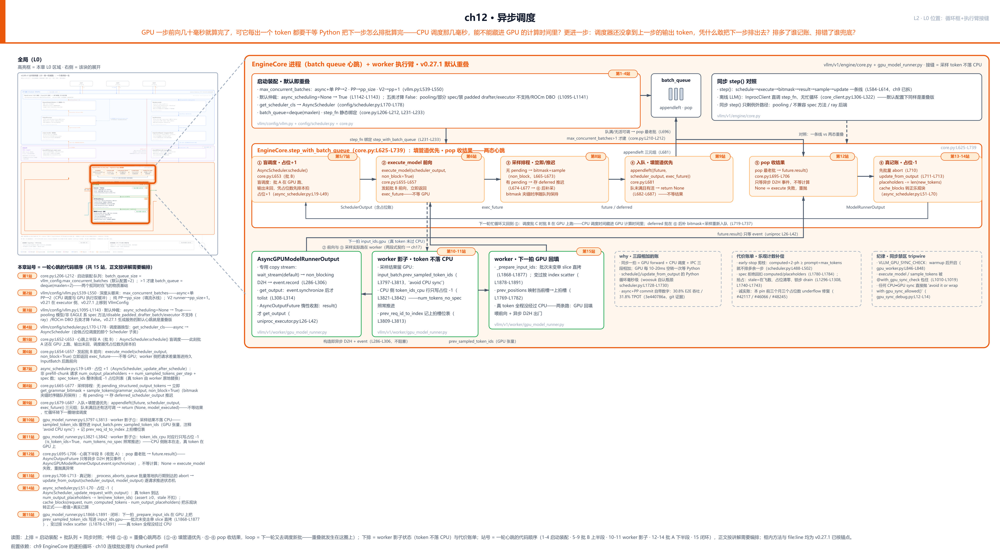
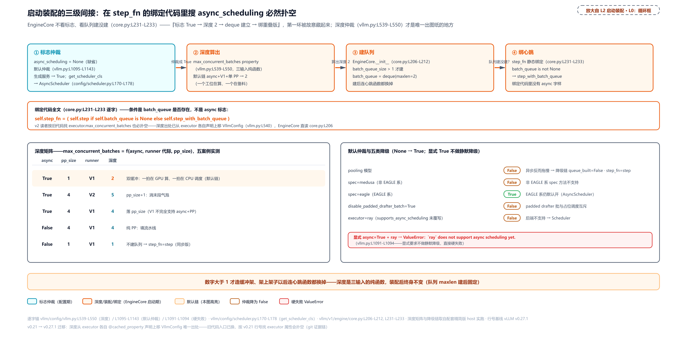
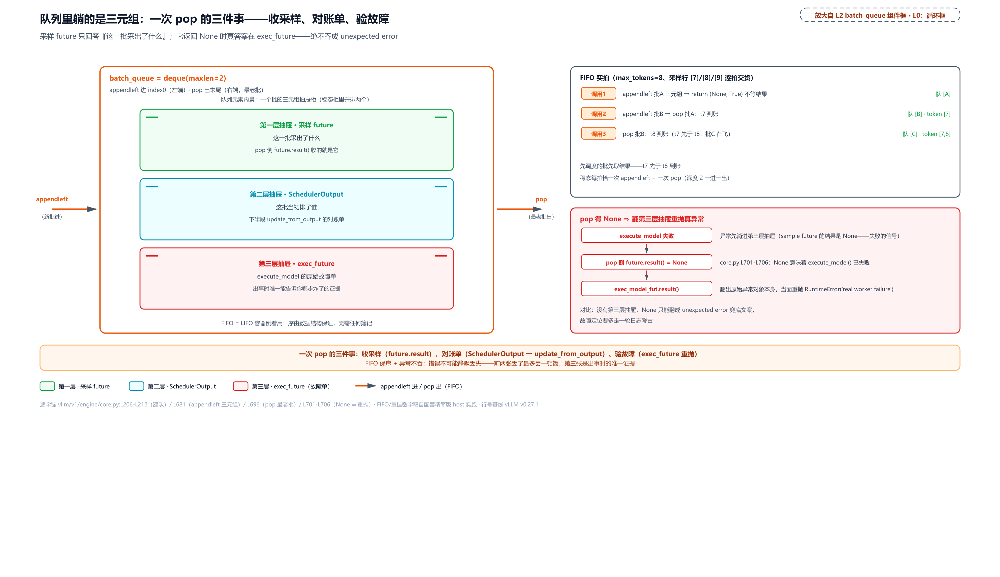
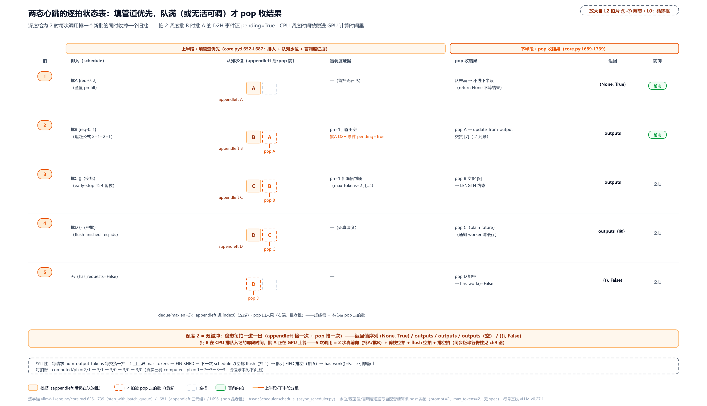
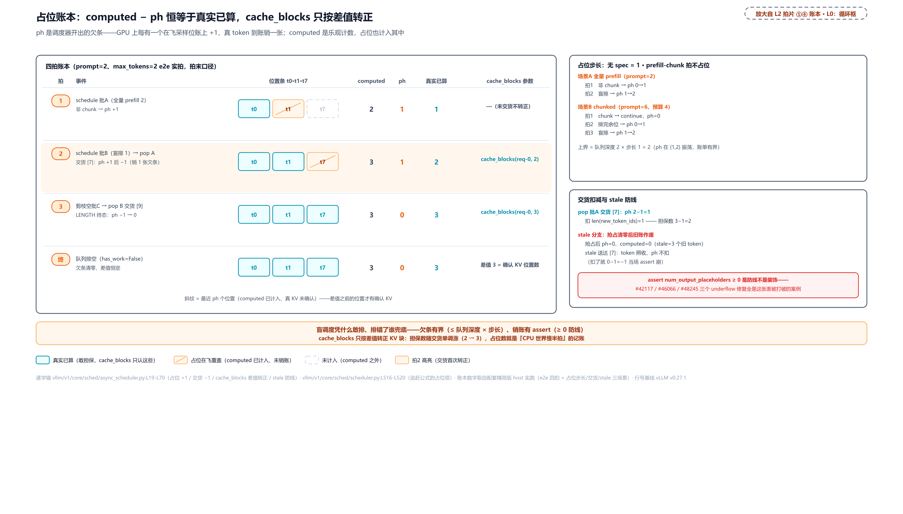
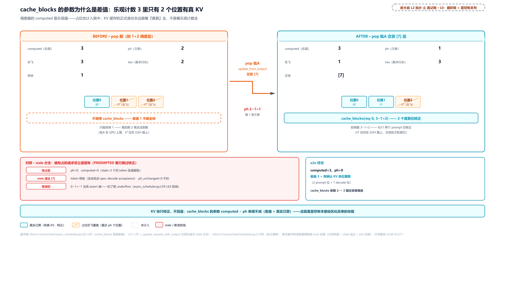
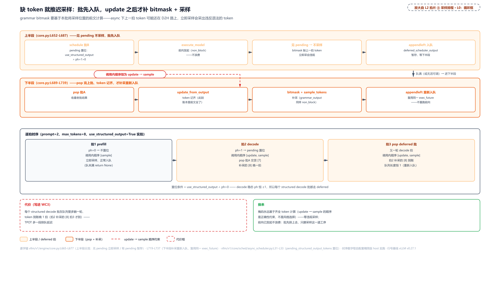
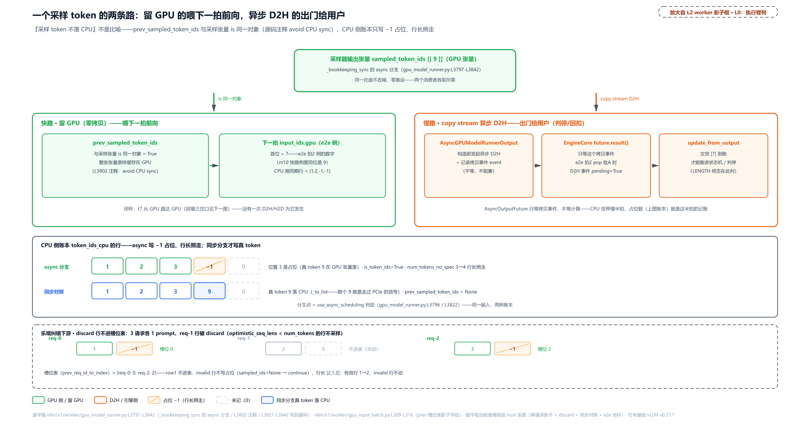
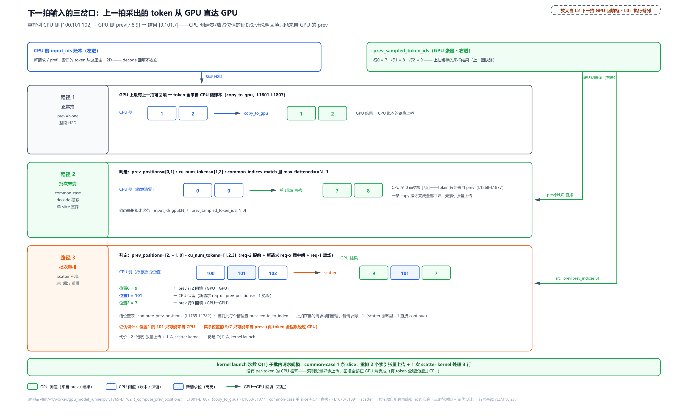

# 第 12 章　异步调度

GPU 一步前向几十毫秒就算完了，可它每产出一个 token，都得先干等同一个线程里的 Python 把「下一步怎么排批」算完——调度那几毫秒里，GPU 在空转。CPU 的活，能不能藏进 GPU 的计算时间里？

更扎手的在下一层。要把调度藏进去，调度器就得在**上一拍的输出 token 还没回来时**把下一拍排出去——它凭什么敢？此刻排出去的每个位置，token 还没采出来，账上怎么记？排多了、排错了，谁扣回来、谁兜底？

这两问不是选修题。[第 9 章](../../ch09-engine-core-step-loop/narrative/chapter.md)讲两段式契约时留了话：「重叠版怎么折、付什么代价，Part III 末章整章拆」；[第 10 章](../../ch10-continuous-batching-chunked-prefill/narrative/chapter.md)翻账本时也留了话——`num_output_placeholders` 这个在那章恒为 0 的字段，就是为 Part III 末章（本章）的异步版准备的。本章兑现这两张欠条，而且要先说一个容易被忽略的事实：在 v0.27.1 里这不是什么深水区选项——你把服务跑起来，默认转的就是这个重叠版循环。

## 你在这里



> *图注：本章放大的是[第 1 章](../../ch01-vllm-v1-in-one-map/narrative/chapter.md) L0 图里 EngineCore 循环框与右侧 GPU 执行臂**相接的那道缝**——左上角缩略图里两块高亮拼在一起的那处。第 10 章拆的是调度账本怎么分 token、上一章拆的是抢占与请求的一生，本章拆的是循环框本身怎么换心跳、以及框里的账怎么跟 GPU 上正在算的活错开一拍。图上三段读：上排是启动装配——深度仲裁、默认开启、调度器换型、队列建立（第 1-4 站），旁边是同步 `step()` 的对照与离线门面；中排 ①-⑥ 是两态心跳的六张拍片——①-④ 填管道优先、⑤-⑥ pop 收结果，回环箭头是下一轮又去调度新批（重叠就发生在这圈上；第 5-9 站与第 12-14 站）；下排是 worker 执行臂的影子状态与回填（第 10-11、15 站），加三笔注：三段相加的 why 账、乐观计数的代价账单、同步禁区的运行期纠察。站号 1-15 = 一轮心跳的代码顺序（1-4 启动装配 · 5-9 批 B 上半段 · 10-11 worker 影子 · 12-14 批 A 下半段 · 15 闭环），正文按讲解需要编排、不必照站号读。*

读法建议：想知道「凭什么敢、谁记账」，直奔[「调度器的胆量：占位账本」](#调度器的胆量占位账本站-7-与-14-展开)；想看循环本体怎么两态切换，跳[「两态心跳」](#两态心跳step_with_batch_queue-全文走读站-5-14)；好奇 token 怎么绕开 CPU 走 GPU 快路，看[「worker 半边」](#worker-半边采样-token-不落-cpu站-10-11-与-15)；想跟全程，按序读。

## 为什么要重叠：一拍三段的账

先把同步版的痛处算成一笔账。[第 9 章](../../ch09-engine-core-step-loop/narrative/chapter.md)拆过 `step()` 的五段，这里只把串行脊柱竖起来当对照（诊断上下文省去）：

```python
# vllm/v1/engine/core.py:L595-L611
        scheduler_output = self.scheduler.schedule(self._should_throttle_prefills())  # L595
        future = self.model_executor.execute_model(scheduler_output, non_block=True)  # L596
        grammar_output = self.scheduler.get_grammar_bitmask(scheduler_output)         # L597
        with (
            # … 省略：两个诊断上下文管理器（iteration_details 观测，L599-L600）……
        ):
            model_output = future.result()                                            # L602
            if model_output is None:
                model_output = self.model_executor.sample_tokens(grammar_output)      # L604

        # Before processing the model output, process any aborts that happened
        # during the model execution.
        self._process_aborts_queue()
        engine_core_outputs = self.scheduler.update_from_output(                      # L609
            scheduler_output, model_output
        )
```

L595 的 `schedule()` 要等 L609 的 `update_from_output()` 把上一拍的 token 记完账才算得出下一拍——五段一条线，每段等上一段。这条线在时间轴上是三段相加：GPU 前向 $`T_{gpu}`$、CPU 调度与记账 $`T_{cpu}`$、以及输入输出跨进程的搬运 $`T_{ipc}`$。三段里 GPU 只干第一段——**后两段里它在空转**。这笔空转有多大？woosuk 在 `update_from_output` 的热循环（⑤拍里逐请求记账的内层 `for`）上方留了段性能自注：「批内请求数可达 1K 或更多，这个循环可能成为性能瓶颈」（`vllm/v1/core/sched/scheduler.py:L1728-L1730`）——千级并发下 `schedule()` 与 `update_from_output` 的 Python 循环是毫秒级，GPU 每 10-20ms 就空转一次等 Python。decode 小批的场景更惨：一拍 GPU 计算量极小，整拍时长几乎被 CPU 端支配。

解法只有一个方向：把三段相加变成取最大。稳态节拍从 $`T_{gpu}+T_{cpu}+T_{ipc}`$ 压到 $`\max(T_{gpu},\ T_{cpu})`$——批 A 在 GPU 上算的那段时间里，CPU 同时调度批 B、收批 A 的上一轮结果，互相把活藏进对方的时间里。（$`T_{ipc}`$ 并没有从公式里无声消失——搬运交给专用拷贝流异步推进、CPU 只在收货侧等一次事件，worker 半边专拆；稳态下这点搬运被并行的调度时间盖住，节拍公式里只剩 GPU 与 CPU 两项取最大。）这在工程上有个现成的名字：**双缓冲**（double buffering）——图形学的老发明：显示器放上一帧（front buffer）的同时，显卡画下一帧（back buffer），每帧交换角色，读的一方永远拿到完整版本（[Wikipedia：multiple buffering](https://en.wikipedia.org/wiki/Multiple_buffering)）。批队列的两个槽位正是这个结构：一个批在 GPU 上「放映」，另一个在 CPU 侧「绘制」。

这不是 vLLM 一拍脑袋的发明，演进有完整的 git 证据链。**旧设计**：同步 `step()` 串行三段——异步调度（async scheduling）2025 年 7 月才进仓（[PR #19970](https://github.com/vllm-project/vllm/pull/19970)，当时还是 opt-in 开关，要用户显式打开）；**痛点**：上面那笔三段相加的账，GPU 利用率有缝；**v1 方案**：分四步走到今天的形态——① #19970 实现 `AsyncScheduler` 与占位账本；② #23569（2025-09）把「采样 token 不落 CPU」补上；③ #24799（2025-11）打通与投机解码的兼容；④ #27614（2025-12-29）翻转默认——配置为 None 时开启、仅五类不兼容例外降回 False（下一节的仲裁链逐条拆），从此它就是服务场景的默认心跳。作者在 #19970 里把目标说得很直白：「主要目标是让调度与模型执行重叠以压缩调度开销……做法是让调度器比当前执行抢先跑一步」，并且特意注明这套机制「与 NanoFlow 论文描述的做法相似」（[arXiv:2408.12757](https://arxiv.org/abs/2408.12757)，设备内 nano-batch 流水线重叠的学术近亲）。**代价**同样写在明处，后面整章都在还这笔账：调度器状态领先真实进度，一整族补偿机制（占位扣减、块转正、拒绝回扣、stale 排空——stale 指被抢占时遗留的在飞输出）全是它的利息，性能口径上作者自报「吞吐 +3-15%（小模型/大 batch 更明显），TPOT（每 token 生成时间）降、TTFT（首 token 延迟）微涨」——新请求要多等一个调度步，这笔交换不是白拿的。

顺带拆掉一个常见误读：这里的 async **不是** Python 的 asyncio。作者在 #19970 里明说「调度器与 GPU worker 必须跑在独立进程里才能并行执行」——靠的是[第 9 章](../../ch09-engine-core-step-loop/narrative/chapter.md)讲过的进程分工加 Future 提货单（`execute_model(non_block=True)` 立即返回 Future、`result()` 才取货那套），不是协程让出事件循环。你在这里看不到 `async def`/`await`，看到的是队列、Future 和账本。

## 默认即重叠：三级装配链（站 1-4）

「默认开启」不是一句文档话，是一串装配代码。从配置到心跳函数，要走三级间接——先看配置位本身：

```python
# vllm/config/scheduler.py:L148-L151
    async_scheduling: bool | None = None
    """If set to False, disable async scheduling. Async scheduling helps to
    avoid gaps in GPU utilization, leading to better latency and throughput.
    """
```

三态：`None` 是默认（交给 VllmConfig 仲裁）、显式 `True`、显式 `False`。docstring 一句话讲动机——「避免 GPU 利用率出现空隙」。仲裁逻辑在 VllmConfig 的默认值检查里（五类不兼容才降 False，日志各留一句）：

```python
# vllm/config/vllm.py:L1095-L1143
        elif self.scheduler_config.async_scheduling is None:
            # Enable async scheduling unless there is an incompatible option.
            if (
                self.model_config is not None
                and self.model_config.runner_type == "pooling"
            ):                                                          # pooling 模型：降 False   # L1100
                # … 省略：logger.debug——异步实现对 pooling 反而拖慢（L1101-L1105）……
                self.scheduler_config.async_scheduling = False
            elif (
                self.speculative_config is not None
                # … 省略：方法不在 EAGLE 系 / NgramGPU / dspark 名单的三个并列条件……
            ):                                                          # 非 EAGLE 系 spec：降 False  # L1112
                # … 省略：logger.warning_once——该方法族的投机解码还不支持异步……
                self.scheduler_config.async_scheduling = False
            elif (
                self.speculative_config is not None
                and self.speculative_config.disable_padded_drafter_batch
            ):                                                          # 禁用 padded drafter 批：降 False  # L1122
                # … 省略：logger.warning_once——与 padded drafter batch 不兼容……
                self.scheduler_config.async_scheduling = False
            elif not executor_supports_async_sched:                     # 执行后端不支持（如 ray）：降 False  # L1128
                # … 省略：logger.warning_once——该分布式后端还不支持异步调度……
                self.scheduler_config.async_scheduling = False
            elif uses_rocm_deepep_ht_dbo:                               # ROCm DeepEP 高吞吐 DBO（double-buffered overlap，双缓冲重叠）：降 False  # L1135
                # … 省略：logger.warning_once——该组合会损 DP+EP（数据并行/专家并行）生成精度……
                self.scheduler_config.async_scheduling = False
            else:
                self.scheduler_config.async_scheduling = True           # 其余一律 True  # L1143
```

结构比分支内容更重要：**默认 True、例外才关**。五类例外各有原因——pooling 模型（打分/嵌入类，整个输入编码成一个向量，不逐 token 生成）没有逐拍 decode，异步实现反而拖慢；投机解码（小模型先草拟 k 个 token、大模型一次前向全验证的加速法，Part VII 专讲）里，已适配的 EAGLE 系、NgramGPU、dspark 三类之外的草稿方法族还没适配；`disable_padded_drafter_batch` 关掉了 drafter 批填充，与异步的批形状假设冲突；ray 执行后端没实现 `supports_async_scheduling()`；ROCm（AMD 的 GPU 计算栈）上 DeepEP——MoE（mixture of experts，混合专家：每 token 只路由到少数专家子网络计算的稀疏架构）的跨卡通信库——的高吞吐双缓冲重叠（即上面的 DBO）会损 DP+EP 生成精度。还有半边语义别漏：显式 True 不走这套仲裁——撞上不兼容组合（如 ray 后端）在入口直接 raise ValueError 硬失败（`vllm/config/vllm.py:L1064-L1094`，就在上面那段 None 仲裁代码块的正上方），没有静默降级这回事；「撞了不兼容降 False 而不是报错」，只发生在 None 这条路上。仲裁的实测落点（配套精简版实测，含调度器换型；第五类 ROCm 组合 host 侧未复现、未入下表，见表注）：

<!-- trace: m1 -->
| 场景 | 仲裁结果 | 换上的调度器 |
|---|---|---|
| 生成模型 + uniproc（默认链） | True | AsyncScheduler |
| pooling 模型（异步反而拖慢） | False | Scheduler |
| spec 方法 medusa（非 EAGLE 系/NgramGPU/dspark） | False | Scheduler |
| spec 方法 eagle（EAGLE 系 → 仍默认开） | True | AsyncScheduler |
| disable_padded_drafter_batch=True | False | Scheduler |
| executor 后端 ray（supports_async_scheduling 未覆写 → False） | False | Scheduler |

表注：第五类例外——ROCm 上的 DeepEP 高吞吐 DBO——要凑齐那套 GPU 与跨卡通信组合才走得进分支，host 侧纯 CPU 精简版无法复现、未入上表；它降 False 的证据是仲裁分支本身（`vllm/config/vllm.py:L1135-L1141`），不是实跑枚举。

第二级：深度。仲裁出 True 之后，批队列的容量由一个 property 一锤定音：

```python
# vllm/config/vllm.py:L539-L550
    @property
    def max_concurrent_batches(self) -> int:
        # PP requires PP-size concurrent batches to fill the pipeline.
        # Async scheduling requires 2 concurrent batches to overlap.
        pp_size = self.parallel_config.pipeline_parallel_size
        if self.scheduler_config.async_scheduling:
            if self.use_v2_model_runner:
                return pp_size + 1
            # V1 Model Runner does not fully support async scheduling with PP.
            if pp_size <= 1:
                return 2
        return pp_size
```

注释自带两句设计动机：流水线并行（pipeline parallelism，模型按层切段多卡接力，PP）需要 pp_size 个并发批把流水线填满——每一段都得有活在算，否则就有「气泡」（bubble：流水线填充与排空阶段某些卡在干等的空转窗口，吃掉的正是理论加速比；这个话题的完整展开在讲分布式的 Part VIII）；异步调度需要 2 个并发批做重叠——一个在 GPU 上算、一个在 CPU 侧备。V2 Model Runner（vLLM 的下一代 runner，仍在实验期）多给 1，消掉流水线末段的气泡。五种配置组合的实测矩阵：

<!-- trace: m2 -->
| 配置场景 | async（仲裁后） | pp_size | runner | max_concurrent_batches | 装配落点 |
|---|---|---|---|---|---|
| 默认生成服务（None → 仲裁 True） | True | 1 | V1 | 2 | 建 deque(maxlen=2)、step_fn=step_with_batch_queue |
| 显式 True + V2 runner + PP=4 | True | 4 | V2 | 5 | pp_size+1（消末段气泡） |
| 显式 True + V1 + PP=4 | True | 4 | V1 | 4 | 落 pp_size（V1 不完全支持 async+PP） |
| async=False + PP=4 | False | 4 | V1 | 4 | 纯 PP：填流水线 |
| async=False + 单 PP | False | 1 | V1 | 1 | 不建队列、step_fn=step（同步版） |

默认服务落在第一行：深度 2，恰好双缓冲。第三级：EngineCore 拿着深度建队列、绑心跳：

```python
# vllm/v1/engine/core.py:L206-L212
        self.batch_queue_size = vllm_config.max_concurrent_batches       # L206
        self.batch_queue: (
            deque[tuple[Future[ModelRunnerOutput], SchedulerOutput, Future[Any]]] | None
        ) = None
        if self.batch_queue_size > 1:
            logger.debug("Batch queue is enabled with size %d", self.batch_queue_size)
            self.batch_queue = deque(maxlen=self.batch_queue_size)       # L212
```

```python
# vllm/v1/engine/core.py:L231-L234
        self.step_fn = (
            self.step if self.batch_queue is None else self.step_with_batch_queue  # L232
        )
        self.async_scheduling = vllm_config.scheduler_config.async_scheduling       # L234
```

注意 L232 这个判据：EngineCore 选心跳**不看 `async_scheduling` 标志、看队列建没建**。于是纯 PP（深度 4）也绑重叠版——批队列本来就有两重身份：异步调度用深度 2 做重叠，PP 用 pp_size 填流水线。`async_scheduling` 落成实例字段（L234）另有用途：`post_step` 里短路草稿 token 回传（后文一句带过）。这一级间接有个实际后果：在绑定代码里搜 `async_scheduling` 会扑空，得追两级（标志→深度→队列）才知道默认绑的是重叠版——这不是故弄玄虚，是深度这个量本来就是「拓扑 × 调度模式 × runner 代际」三者的函数，收在一处算（这条装配线还有个版本注脚：v0.21 时 `max_concurrent_batches` 是各 executor 自己声明的属性——uniproc 一个算法、multiproc 一个算法，v0.27.1 上移到 VllmConfig 唯一出处，按旧代码找 `executor.max_concurrent_batches` 的读者会扑空）。

装配的最后一件是调度器换型——异步换的不只是 step，连调度器类一起换：

```python
# vllm/config/scheduler.py:L170-L178
    def get_scheduler_cls(self) -> type["SchedulerInterface"]:
        if self.scheduler_cls is None:
            if self.async_scheduling:
                from vllm.v1.core.sched.async_scheduler import AsyncScheduler

                return AsyncScheduler
            from vllm.v1.core.sched.scheduler import Scheduler

            return Scheduler
```

`AsyncScheduler` 是 `Scheduler` 的子类，全文件 70 行、连构造器在内只有三个 `def`——记账逻辑只覆写两个方法，下一节见。队列本身的容器是 Python 标准库的 `deque`（[第 10 章](../../ch10-continuous-batching-chunked-prefill/narrative/chapter.md)见过它当 FCFS 队列的用法：`append`/`popleft` 右进左出）。本章用法方向反过来：`appendleft` 从左端进新批、`pop()` 从右端取最老批——同一个双端队列倒着用，配成先调度的批先被收结果的 FIFO（first-in-first-out，先进先出）；`maxlen=2` 是深度的物理保险（官方语义：满了再进、对端自动挤掉最老的），正常路径用不到它——入队前查长度，挤掉从不会发生。



> *图注：从 `async_scheduling=None` 到 `step_fn=step_with_batch_queue` 的完整链条（vllm.py:L1095-L1143 + L539-L550 + core.py:L206-L234）：仲裁成 True → 深度算出 2 → 建 deque(maxlen=2) → 绑定只看队列建没建。绑定代码条里没有 async 字样；仲裁逐场景各走一环——图中五行：四类降 False、eagle 照常开启作对照（第五类 ROCm DBO 未入实测矩阵），显式 True 撞上不支持的后端（如 ray）直接 ValueError 硬失败、不做静默降级。*

## 两态心跳：step_with_batch_queue 全文走读（站 5-14）

深度 2 的队列一旦建立，忙循环每圈调用的就是它——先看上半段（填管道）：

```python
# vllm/v1/engine/core.py:L625-L687
    def step_with_batch_queue(
        self,
    ) -> tuple[dict[int, EngineCoreOutputs] | None, bool]:
        """Schedule and execute batches with the batch queue.
        Note that if nothing to output in this step, None is returned.

        The execution flow is as follows:
        1. Try to schedule a new batch if the batch queue is not full.
        If a new batch is scheduled, directly return an empty engine core
        output. In other words, fulfilling the batch queue has a higher priority
        than getting model outputs.
        2. If there is no new scheduled batch, meaning that the batch queue
        is full or no other requests can be scheduled, we block until the first
        batch in the job queue is finished.
        3. Update the scheduler from the output.
        """

        batch_queue = self.batch_queue
        assert batch_queue is not None

        # Try to schedule a new batch if the batch queue is not full, but
        # the scheduler may return an empty batch if all requests are scheduled.
        # Note that this is not blocking.
        assert len(batch_queue) < self.batch_queue_size              # L648

        model_executed = False
        deferred_scheduler_output = None
        if self.scheduler.has_requests():
            scheduler_output = self.scheduler.schedule(self._should_throttle_prefills())  # L653
            with self.log_error_detail(scheduler_output):
                exec_future = self.model_executor.execute_model(
                    scheduler_output, non_block=True                  # L656
                )
            if self.is_ec_consumer:
                model_executed = scheduler_output.total_num_scheduled_tokens > 0

            if self.is_pooling_model or not model_executed:
                # No sampling required (no requests scheduled).
                future = cast(Future[ModelRunnerOutput], exec_future)
            else:
                if not scheduler_output.pending_structured_output_tokens:   # L665
                    # We aren't waiting for any tokens, get any grammar output
                    # and sample immediately.
                    grammar_output = self.scheduler.get_grammar_bitmask(
                        scheduler_output
                    )
                    future = self.model_executor.sample_tokens(
                        grammar_output, non_block=True              # L672
                    )
                else:
                    # We need to defer sampling until we have processed the model output
                    # from the prior step.
                    deferred_scheduler_output = scheduler_output     # L677

            if not deferred_scheduler_output:
                # Add this step's future to the queue.
                batch_queue.appendleft((future, scheduler_output, exec_future))  # L681
                if len(batch_queue) < self.batch_queue_size and (
                    model_executed or self.scheduler.has_requests()
                ):
                    # Don't block on next worker response unless the queue is full
                    # or there are no more requests to schedule.
                    return None, model_executed                      # L687
```

docstring 三步走就是设计宣言：**填满队列优先于取模型输出**。逐段读：

- **L648 的断言**：入口保证队列未满——忙循环侧配合 `has_work()`（`core.py:L1365-L1371`，`bool(self.batch_queue)` 算有活）保证队非空时循环不睡。两者合起来，队列长度恒在 `[0, batch_queue_size]`。
- **L653 盲调度**：此刻上一拍（批 A）可能还在 GPU 上跑、输出未回，调度器照样排本拍（批 B）——「盲调度」是本书对这种「输出未回先排下一拍」的叫法，它凭什么敢，下一节专门拆。`is_ec_consumer` 那两行是分布式 encoder cache 的非消费端小众场景（常规部署恒为 True），看 `model_executed` 的赋值即可：本拍真排了 token 才算执行过。
- **L655-L657 发起前向**：`execute_model(scheduler_output, non_block=True)` 立即返回 `exec_future`——不等 GPU，这正是[第 9 章](../../ch09-engine-core-step-loop/narrative/chapter.md)两段式契约的 non_block 面（外层包着的 `log_error_detail` 是诊断上下文，无功能影响）。pooling 模型或空批没有采样这一说，`exec_future` 直接当最终 future。
- **L665-L677 采样排程**：`pending_structured_output_tokens` 为假就立即 `get_grammar_bitmask` + `sample_tokens(non_block=True)`——掩码算在前向窗口里、采样发起即返回 future，[第 9 章](../../ch09-engine-core-step-loop/narrative/chapter.md)的③拍夹缝时序原样保留；为真则把 `scheduler_output` 暂存进 `deferred_scheduler_output`，本拍不采样——这一支是结构化输出与异步相乘出的时序难题，专设一节（见[「缺 token 的批」](#缺-token-的批deferred-sampling)）。
- **L681 入队 + L687 早退**：三元组 `appendleft` 进队；队未满且还有活可调（真排了 token 或调度器手里还有请求），直接 `return (None, model_executed)`——**不等任何结果**，忙循环立刻转下一圈继续调度。这就是「填管道优先」的机器形态。

上半段像一间双灶厨房：灶上永远炖着一锅（批 A 在 GPU），手里永远备着下一锅的料（批 B 在 CPU 侧）——而且规矩是先把备料区填上、再去揭锅盖。

### 三元组：一次 pop 要办的三件事

L681 入队的不是单个 future，是三层抽屉（采样 future、SchedulerOutput、exec_future）。第三层最不起眼也最关键——看下半段怎么用它：

```python
# vllm/v1/engine/core.py:L689-L706
        elif not batch_queue:
            # Queue is empty. We should not reach here since this method should
            # only be called when the scheduler contains requests or the queue
            # is non-empty.
            return None, False

        # Block until the next result is available.
        future, scheduler_output, exec_model_fut = batch_queue.pop()    # L696
        with (
            # … 省略：两个诊断上下文管理器（L698-L699，观测无功能影响）……
        ):
            model_output = future.result()                              # L701
            if model_output is None:
                # None from sample_tokens() implies that the original execute_model()
                # call failed - raise that exception.
                exec_model_fut.result()                                 # L705
                raise RuntimeError("unexpected error")
```

pop 弹出最老批（右端），三件事一次办：**收采样**（L701 的 `future.result()`）、**对账单**（`scheduler_output` 记着这批当初排了谁，交给 `update_from_output`）、**验故障**（L705）。第三件事只在坏日子有用：`sample_tokens` 的 future 交回 `None` 意味着更早的 `execute_model` 就失败了——真异常躺在第三层抽屉的 `exec_future` 里，当面重抛；没有这层，故障只能翻成一句 `unexpected error`，定位要多走一轮日志考古。FIFO 与重抛的实测（配套精简版：脚本采样行 [7]/[8] 逐拍交货；失败路径独立注入 `RuntimeError`）：

<!-- trace: m5 -->
| 调用 | 队列动作 | future.result() | 交货/异常 | 拍末队列 | output_token_ids |
|---|---|---|---|---|---|
| 1 | appendleft 批A 三元组 | —（return None 不等） | 无 | [A] | [] |
| 2 | appendleft 批B → pop 批A | [7] | t7 到账 | [B] | [7] |
| 3 | appendleft 批C → pop 批B | [8] | t8 到账（FIFO：t7 先于 t8） | [C] | [7, 8] |
| 失败路径 | appendleft 批B′ → pop 批A′（sample future=None） | None → exec_model_fut.result() | 重抛 RuntimeError('real worker failure') | — | — |



> *图注：队列元素的三元组结构（core.py:L207-L212/L681/L696-L706）：第一层采样 future 回答「这批采出了什么」、第二层 SchedulerOutput 是对账单、第三层 exec_future 是原始故障单——appendleft 进/pop 出配成 FIFO，采样 future 出 None 时翻第三层重抛真异常。*

### 下半段：pop 最老批，真记账（站 12-14）

pop 之后的正路：

```python
# vllm/v1/engine/core.py:L708-L739
        # Before processing the model output, process any aborts that happened
        # during the model execution.
        self._process_aborts_queue()
        engine_core_outputs = self.scheduler.update_from_output(        # L711
            scheduler_output, model_output
        )
        self._attach_iteration_details(engine_core_outputs, iteration_details)

        # NOTE(nick): We can either handle the deferred tasks here or save
        # in a field and do it immediately once step_with_batch_queue is
        # re-called. The latter slightly favors TTFT over TPOT/throughput.
        if deferred_scheduler_output:                                    # L719
            # When draft tokens are used with structured output, validate them
            # before computing the grammar bitmask for the deferred request.
            if self.check_for_draft_tokens:
                # … 省略：take_draft_token_ids + update_draft_token_ids_in_output——
                #       过滤无效草稿、-1 填充位跳过掩码计算（L722-L730）……
            # We now have the tokens needed to compute the bitmask for the
            # deferred request. Get the bitmask and call sample tokens.
            grammar_output = self.scheduler.get_grammar_bitmask(
                deferred_scheduler_output
            )
            future = self.model_executor.sample_tokens(grammar_output, non_block=True)  # L736
            batch_queue.appendleft((future, deferred_scheduler_output, exec_future))   # L737

        return engine_core_outputs, model_executed
```

三段各自接住一件事：aborts 批量落地执行期到达的撤单（[第 9 章](../../ch09-engine-core-step-loop/narrative/chapter.md)讲过的急件通道）；`update_from_output` 真记账——此刻 pop 出的 token 已经落进 CPU，调度器逐请求推进状态机、判停、释放；deferred 补采——上半段欠下的那个「没采样的批」在这里补上 bitmask 和采样、此刻才首次 `appendleft` 入队（L737 复用同一个 `exec_future`，**前向不重跑**——它早就发起完了，欠的只是采样这一步）。`post_step` 里的 spec 分叉顺手记下：异步模式下草稿 token 在 worker 进程内更新、不回传主进程——`if self.check_for_draft_tokens and not self.async_scheduling and model_executed` 三条件短路（`core.py:L616-L623`），投机解码的细节归 Part VII 专章。

关于 L701 的 `future.result()` 要把话说准（[第 9 章](../../ch09-engine-core-step-loop/narrative/chapter.md)立过的口径）：它等的是**一次 D2H 拷贝事件**（D2H：device to host，GPU 显存到 CPU 内存），不是「零等待」——拷贝排在前向之后才就绪，实际花掉的时间照样罩着前向余尾。买到的有两样：等待的方式（挂事件上、零 CPU、释放 GIL）与等待的位置（挪到队列 pop 侧，前面整段时间 CPU 都在调度别的批）。稳态下深度 2 的队列一进一出，等的那点拷贝余尾早被下一批的调度盖住。

两态合起来跑一遍全程（实测——配套精简版，host 纯 CPU 实跑：前向为脚本化的 logits 行、D2H 完成事件由脚本显式放行模拟——真实环境里由拷贝流硬件推进；控制流与账本数值逐字对 v0.27.1 源码。单请求 prompt=2、max_tokens=2、无 spec、队列深度 2。表中 computed = `num_computed_tokens`（已算数）、ph = `num_output_placeholders`（占位数）——下文沿用这对简写）：

<!-- trace: m4 -->
| 心跳调用 | 队列变化（老→新） | 上半段排入 | 盲调度证据 | 下半段动作 | 返回 | 拍末 computed/ph（真实已算） |
|---|---|---|---|---|---|---|
| 1 | [] → [A] | 批A {req-0:2}（全量 prefill） | —（首拍无在飞） | 无（队未满不进下半段） | (None, True) | 2/1（1） |
| 2 | [A] → [B,A] → pop A | 批B {req-0:1} | schedule 时 ph=1、输出空、批A 的 D2H 事件未完成 | pop A → update_from_output 交货 [7] | outputs | 3/1（2） |
| 3 | [B] → [C,B] → pop B | 批C {}（early-stop 剪枝：确信到顶不排多余一步，4≥4 为判定式，专节见后） | ph=1 但确信到顶 | pop B 交货 [9] → LENGTH 终态 | outputs | 3/0（3） |
| 4 | [C] → [D,C] → pop C | 批D {}（flush finished_req_ids 空批） | —（无真调度） | pop C（plain future，通知 worker 清缓存） | outputs（空） | 3/0（3） |
| 5 | [D] → pop D | 无（has_requests=False） | — | pop D 排空 | ({}, False) | 3/0（3）——has_work 转 False |

五次心跳里真前向只有 2 次（批A/批B）——单请求 max_tokens=2 的最小心算规模让空拍占比高得刺眼，这是刻意的；稳态多请求下剪枝空拍与排空拍会被其他请求的调度摊薄。真正要看的是拍 2 那格「盲调度证据」：**schedule 时刻 ph=1（有占位欠条）、output_token_ids 还是空的、批 A 的 D2H 事件未完成**——同步版走到这里公式值为 0、无 token 可排（占位账本一节有双引擎对照表），重叠版照样排出了批 B。这就是「CPU 调度时间藏进 GPU 计算时间」的现场。终止性也有账：每个请求的输出每交货一拍严格 +1 且上界 max_tokens，有限次交货后 FINISHED 进 `finished_req_ids`，下一次 schedule 以空批 flush（拍 4）、队列 FIFO 排空（拍 5），`has_work()` 转 False 引擎静止。



> *图注：深度 2 的批队列让每次心跳「调度一个新批 + 收掉一个旧批」（core.py:L625-L739）：上半段队未满且有活就 return None 不等结果；队满（或无活可调）才 pop 最老批收结果。5 次调用 = 2 次真前向 + 剪枝/flush/排空 3 次空拍——单请求小例的固定开销，稳态下被摊薄。*

两个收尾的对照。其一，离线 `LLM()` 走的 `InprocClient`（同进程客户端，不 spawn 引擎进程的那个门面）没有忙循环——`get_output()` 直接调 `engine_core.step_fn()` 再 `post_step`（`vllm/v1/engine/core_client.py:L306-L322`）——但默认配置下 `step_fn` 同样是重叠版，「同步」只是没有忙循环在驱动，心跳本身没换。其二，同步 `step()` 在 v0.27.1 里退成了例外路径（pooling、不兼容 spec 方法、ray 无 PP、以及用户显式 `False` 且无 PP——总之是队列没建的那些场景才绑它），不再是主角。

## 调度器的胆量：占位账本（站 7 与 14 展开）

回到那问：调度器没拿到上一步的输出 token，凭什么敢把下一步排出去？答案是一笔账——每个请求身上多了一个计数器：

```python
# vllm/v1/request.py:L150-L162
        # Used in async scheduling.
        self.num_output_placeholders = 0                              # L151
        # Tokens of output in flight when the request was preempted: delivered
        # on return, but must not mutate the reset counters.
        self.num_stale_output_tokens = 0
        # Drop the stale output instead, for same-step preempt + resume
        # (reset_prefix_cache).
        self.drop_stale_output = False

        # Tokens of steps whose output is not yet processed (async scheduling
        # and PP run ahead of the GPU); `num_computed_tokens` counts them
        # optimistically.
        self.num_in_flight_tokens = 0
```

四个字段、四种身份：`num_output_placeholders`（输出占位数——已发起、未交货的采样位数，[第 10 章](../../ch10-continuous-batching-chunked-prefill/narrative/chapter.md)见过它恒 0 的样子，下文简写 ph）；`num_in_flight_tokens`（在飞 token 数——已调度未结算的部分，`num_computed_tokens` 乐观地把它计入）；`num_stale_output_tokens`（被抢占时的在飞输出，恢复后照送但不动计数器——抢占的内景归上一章，本章只看异步这半边账）；`drop_stale_output`（同拍抢加恢复时整段丢弃的开关，小众场景记下即可）。名字最像的两个——in_flight 与 ph——值得就地对一次账：in_flight 数的是输入侧的调度位，每拍排入几个 token 位就加几（`vllm/v1/core/sched/scheduler.py:L1331` 的基类记账，同步版同样在走），交货一拍按同量减（L1738，后文抢占一节会看到这段代码）；ph 数的是输出侧的采样位，每个完整采样步加 1、prefill chunk 不占位。后文双引擎对照表拍 1 末 in_flight=2（两个 prompt 位在飞）而 ph=1（该步将采出的 1 个输出位）——两个数不相等不是谁记错了，是它们数的根本不是同一批位置；抢占一节按 in_flight 整批标 stale、销欠条只动 ph，分工源头就在这里。给「调度后 +1」（`_update_after_schedule`）与「交货后 −1 加块转正」（`_update_request_with_output`）这两个覆写记账的，就是装配链末端换上的 `AsyncScheduler`——全文件 70 行、连构造器在内只有三个 `def`，记账只覆写这两处。

### 占位 +1：给每个在飞的采样位立欠条

第一处在调度之后（`_update_after_schedule` 是基类钩子——同步版在这里乐观推进 `num_computed_tokens`，[第 10 章](../../ch10-continuous-batching-chunked-prefill/narrative/chapter.md)拆过；异步版在推进之外多记一笔）：

```python
# vllm/v1/core/sched/async_scheduler.py:L19-L49
    def _update_after_schedule(self, scheduler_output: SchedulerOutput) -> None:
        super()._update_after_schedule(scheduler_output)
        spec_decode_tokens = scheduler_output.scheduled_spec_decode_tokens
        # Use the latest num of scheduled draft tokens in next step as placeholder.
        self._spec_token_placeholders = [
            -1
        ] * scheduler_output.num_spec_tokens_to_schedule
        for req_id in scheduler_output.num_scheduled_tokens:
            request = self.requests[req_id]
            if request.is_prefill_chunk:
                continue                                              # L29

            scheduler_output.pending_structured_output_tokens |= (    # L31
                request.use_structured_output and request.num_output_placeholders > 0
            )
            # The request will generate num_sampled_tokens_per_step new tokens
            # plus num_spec_tokens in this scheduling step. Diffusion has no AR
            # bonus token (num_sampled_tokens_per_step == 0) — only the canvas
            # (spec) tokens.
            cur_num_spec_tokens = len(spec_decode_tokens.get(req_id, ()))
            request.num_output_placeholders += (                      # L39
                self.num_sampled_tokens_per_step + cur_num_spec_tokens
            )
            # Add placeholders for the new draft/spec tokens.
            # We will update the actual spec token ids in the worker process.
            request.spec_token_ids = self._spec_token_placeholders    # L44

            # … 省略：use_v2_model_runner 的 next_decode_eligible_step 两行（V2+PP 专属）……
```

核心一行是 L39：每个**非 prefill-chunk** 的请求，`num_output_placeholders += num_sampled_tokens_per_step + 草稿数`——无 spec 时步长恰 1。上面注释里的几个生词顺手注掉：AR（autoregressive，自回归——逐 token 从左到右生成的标准范式）；bonus＝每步在草稿之外照例多采的那 1 个采样 token（`num_sampled_tokens_per_step`，无 spec 时恒 1，后文回扣表沿用此口径）；Diffusion 指扩散式语言模型——不逐 token 自回归、而是对一整段草稿多轮迭代精修的生成范式，它没有 bonus 位（该计数为 0），每拍进账的只有 canvas token——canvas 即那块被逐轮改写的整段草稿，在本仓账上以 spec token 身份登记。图书馆的「预留座」是这个机制最好的形象：人还没到馆，管理员先把座位牌翻成「已订」——别人看到牌就不抢；到馆销牌、座位归你。两处例外也各有道理：prefill 还在分章搬运时（chunk）不订座——书没搬完，谈不上「下一步坐哪」；投机解码的草稿 token 连具体 id 都先不写——L44 把 `spec_token_ids` 整个换成 `-1` 占位列表，真 token 由 worker 进程原地替换（草稿 token 的来历，Part VII 投机解码章再讲）。L31 顺手置位的 `pending_structured_output_tokens` 先记着，deferred 一节回收。占位节奏的实测（场景 A 全量 prefill、场景 B prompt=6 分两块搬运）：

<!-- trace: m6 -->
| 场景 | 拍 | 排入 token | computed | is_prefill_chunk | ph | 判定 |
|---|---|---|---|---|---|---|
| A 全量 prefill | 1 | 2 | 2 | False | 1 | 非 chunk → ph += 1 |
| A | 2 | 1 | 3 | False | 2 | 盲排下一位置 → ph=2 |
| B chunked | 1 | 4 | 4 | True | 0 | chunk → continue 不占位 |
| B | 2 | 2 | 6 | False | 1 | 排完余位 → 非 chunk → ph=1 |
| B | 3 | 1 | 7 | False | 2 | 盲排下一位置 → ph=2 |

无 spec 时 ph 在 {1,2} 之间振荡——上界 = 队列深度 2 × 每拍采样数 1。欠条有界，因为同时在飞的完整采样步最多就队列深度那么多。

### 追赶公式灌值：位置先占上

[第 10 章](../../ch10-continuous-batching-chunked-prefill/narrative/chapter.md)立的追赶公式一字未改，改的是 ph 这一项从恒 0 变成真有数：

```python
# vllm/v1/core/sched/scheduler.py:L516-L520
            num_new_tokens = (
                request.num_tokens_with_spec
                + request.num_output_placeholders            # L518
                - request.num_computed_tokens
            )
```

同一公式、两种走法——异步调度器与同步调度器对同一条请求各跑两拍（中间不交货，模拟批 A 还在 GPU 上）的双引擎对照（实测——配套精简版；表中 tws = `num_tokens_with_spec`，token 总数账面）：

<!-- trace: m8 -->
| 调度器 | 拍 | tws | ph | computed | 公式值 = 排入 | 拍末 ph/computed/in_flight |
|---|---|---|---|---|---|---|
| AsyncScheduler | 1 | 2 | 0 | 0 | 2（全量 prefill） | 1/2/2 |
| AsyncScheduler | 2 | 2 | 1 | 2 | 1（盲排下一位置） | 2/3/3 |
| Scheduler（同步对照） | 1 | 2 | 0 | 0 | 2 | 0/2/2 |
| Scheduler（同步对照） | 2 | 2 | 0 | 2 | 0（continue，无 token 可排） | 0/2/2 |

天壤之别在拍 2：异步版算出 2+1−2=1、排下一个位置（t2 还没采回来，位置先占上）；同步版算出 2+0−2=0、`continue` 干等。每在飞一步多推进一个位置——这正是 GPU 不空转的直接来源。公式的补偿项为什么恰好是 ph：computed 乐观地把在飞位置也计入（每发起一个采样位 +1），无 spec 时 tws 只随交货增长——ph 补的正是这两者之间的时间差。规律有两条：**交货一拍，tws +交货量、ph −交货量——一增一减，公式值纹丝不动；非 chunk 的调度一拍，computed +公式值、ph +步长——computed 吃掉的正是公式值自己，下一次公式值恒回到步长**。第二条拿上面 m8 的异步两拍逐事件核（中间无交货）：拍 1 调度后 computed 0→2、ph 0→1；拍 2 调度前公式值 = 2+1−2 = 1，调度后 computed 2→3、ph 1→2，再下一次公式值 = 2+2−3 = 1——2、1、1，无 spec 时步长就是 1。欠条本身也有界：ph 是「已发起未交货的采样位数」，同时在飞的完整采样步最多就队列深度那么多，ph ≤ 队列深度 × 步长。同步版每拍末尾 update 恰把 computed 拉平目标（无在飞）——它是这条公式在 ph≡0 下的退化形态，不是另一条公式。

### 占位 −1 与块转正：真 token 到账销欠条

第二个覆写在交货侧——pop 批 A、`update_from_output` 逐请求调它：

```python
# vllm/v1/core/sched/async_scheduler.py:L51-L70
    def _update_request_with_output(
        self, request: Request, new_token_ids: list[int], is_stale: bool = False
    ) -> tuple[list[int], bool]:
        status_before_update = request.status
        new_token_ids, stopped = super()._update_request_with_output(
            request, new_token_ids
        )

        # Placeholders were zeroed at preemption; a stale delivery must not
        # decrement them (it would underflow).
        if not is_stale:
            request.num_output_placeholders -= len(new_token_ids)     # L62
            assert request.num_output_placeholders >= 0

        # Cache the new tokens. Preempted requests should be skipped.
        if status_before_update == RequestStatus.RUNNING:
            self.kv_cache_manager.cache_blocks(
                request, request.num_computed_tokens - request.num_output_placeholders  # L68
            )
        return new_token_ids, stopped
```

两笔账。**L62 销欠条**：真 token 到账多少、ph 扣多少，`assert >= 0` 是防线不是装饰——配对关系（调度侧每发起一个采样位 +1，交货侧每到达一个真 token −1）保证 ph = 在飞未交货位数，先加后减不会翻负；翻负说明有人少加多减，当场炸比错着账继续跑好。stale 交货不扣——抢占时 ph 已被清零，再扣就 underflow（这条防线就是干这个的，后面账单节有真实案例）。**L68 块转正**：`cache_blocks` 的参数是差值 `computed − ph` 而不是 computed 本身——computed 是乐观值（占位也计入），差值才是「敢担保的真实已算」；KV cache 的正式身份只跟着真算走，不跟着乐观计数走（块池内部怎么记账，Part IV 打开）。交货前后这笔账的实测：

<!-- trace: m7 -->
| 事件 | ph | computed | cache_blocks 参数（computed−ph） | output_token_ids |
|---|---|---|---|---|
| 拍1+拍2 调度后（pop 前） | 2 | 3 | 1（未交货，只敢担保 1 个真算位） | [] |
| pop 批A 交货 [7] | 1 | 3 | 2（3−1，转正 2 个真算位） | [7] |
| 对照：抢占后 stale 送达 [7] | 0（不扣） | 0 | 跳过（PREEMPTED 不转正） | [7]（照送） |



> *图注：盲调度凭什么敢排、排错了谁兜底，一张表看完（async_scheduler.py:L19-L70 + scheduler.py:L516-L520）：ph 是调度器开出的欠条，GPU 上每有一个在飞采样位账上 +1，真 token 到账销一张；computed−ph 这列就是「敢担保的真实已算」——cache_blocks 只按它转正 KV 块。欠条有界（≤ 队列深度×步长）、销账有 assert（≥0 防线），本版本前三个月的三个 underflow 修复全是这张表被打破的案例。*



> *图注：cache_blocks 的参数为什么是差值（async_scheduler.py:L65-L69）：左图 pop 前的账本——3 个已算位里只有 1 个有真 KV，差的那 2 笔还在 D2H 路上；右图交货 [7] 后欠条销到 1、担保数涨到 2。被抢过的请求（PREEMPTED）整行跳过转正。*

贯穿全程的不变式于是浮出水面：**computed − ph = 真实已算**，且恒 ≥ 0。回看「两态心跳」那张五拍表的最后一列（2/1→3/1→3/0，真实已算 1→2→3）：computed 乐观推进、ph 随完整步 +1 随交货 −1，差值单调不减。这本账也有例外——排多了（草稿被拒）要往回扣、整条请求被抢要清账重记——都收在「排错了谁兜底」一小节；在那之前，先处理一个更日常的浪费：明明到顶了还排一步。

### early-stop：确信到顶就不排多余一步

盲调度有个天然的浪费点：请求已经生成到最后一个 token 了，但占位还没销账——调度器看见的 computed 虚高，可能再排一个注定多余的步。RUNNING 循环里有一段 async 专属的剪枝算术：

```python
# vllm/v1/core/sched/scheduler.py:L488-L502
            if (
                request.num_output_placeholders > 0
                # This is (num_computed_tokens + 1) - (num_output_placeholders - 1).
                # Since output placeholders are also included in the computed tokens
                # count, we subtract (num_output_placeholders - 1) to remove any draft
                # tokens, so that we can be sure no further steps are needed even if
                # they are all rejected.
                and request.num_computed_tokens + 2 - request.num_output_placeholders
                >= request.num_prompt_tokens + request.max_tokens           # L495
            ):
                # Async scheduling: Avoid scheduling an extra step when we are sure that
                # the previous step has reached request.max_tokens. We don't schedule
                # partial draft tokens since this prevents uniform decode optimizations.
                req_index += 1
                continue                                                     # L502
```

L495 那个式子看着像谜题，注释把它拆开了：lhs = (computed+1) − (ph−1)。「确定已算」在此就地定义、并与刚立好的「真实已算」对齐：computed 含占位，减掉 (ph−1) 把草稿位的影响摘干净，得 computed − (ph−1)；由不变式「真实已算 = computed − ph」可知它恰为真实已算 + 1——多出的 1 是最新在飞步的必采位（即 bonus 位：草稿可能全被拒、这个位采出的 token 必然落地），把这一位也算作确定，故名确定已算；lhs 比它再多 1，多的是本拍若排下去、必将采出的那个 token。拿下表第一行的实测数对账：判定时 computed=3、ph=1——真实已算 = 3−1 = 2，确定已算 = 3−0 = 3（恰比真实已算多 1），lhs = 3+2−1 = 4 = 确定已算 + 1。lhs ≥ prompt+max_tokens 时，**就算上一拍的草稿全被拒**，长度预算也已用尽——本拍排了也产不出会被消费的 token，剪。注释还交代了为什么不排半个草稿步：那会破坏统一 decode 的批形状优化（uniform decode，同一批请求排同样多的 token 才能走统一的 kernel 路径——一句记下即可）。两案例对照（实测——配套精简版）：

<!-- trace: m9 -->
| 案例 | 判定时 computed/ph | lhs = computed+2−ph | rhs = prompt+max_tokens | 判定 | 拍3 排入 |
|---|---|---|---|---|---|
| max_tokens=2（确信到顶） | 3/1 | 4 | 4 | 4≥4 → 剪枝 | {}（total=0） |
| max_tokens=8（远未到顶） | 3/1 | 4 | 10 | 4<10 → 照排 | {req-0:1} |

判定的前提是 ph>0——同步版 ph 恒 0、此分支不可达，「async 专属」名副其实。剪掉的是确定冗余：lhs≥rhs 时无论上拍采样接受多少都不再有前向需要；差一个 token 都不剪（第二行 4<10 照排）。被剪请求的终局由在飞批的交货判定完成——剪枝不创造新状态，只是拒绝多余动作（五拍表拍 3 的空批 C 正是它的产物）。

### 排错了谁兜底：spec 拒绝回扣与抢占的 stale 账

占位覆盖的不只是每拍 1 个采样位——投机解码（[第 1 章](../../ch01-vllm-v1-in-one-map/narrative/chapter.md)提过，机制本体 Part VII 两章专讲）的草稿位也记在同一本账上：L39 的步长是「采样数 + 草稿数」。于是草稿被拒时要**两头同时回滚**：

```python
# vllm/v1/core/sched/scheduler.py:L1769-L1784
            if scheduled_spec_token_ids and (
                generated_token_ids or self.num_sampled_tokens_per_step == 0
            ):
                num_draft_tokens = len(scheduled_spec_token_ids)
                num_sampled = self.num_sampled_tokens_per_step
                num_accepted = max(len(generated_token_ids) - num_sampled, 0)
                num_rejected = num_draft_tokens - num_accepted       # L1775
                # Rejections roll back num_computed_tokens (and, under async
                # scheduling, num_output_placeholders, which covers the spec
                # tokens). A stale rejection count predates the preemption
                # rollback and must not apply.
                if not output_is_stale:
                    if request.num_computed_tokens > 0:
                        request.num_computed_tokens -= num_rejected   # L1782
                    if request.num_output_placeholders > 0:
                        request.num_output_placeholders -= num_rejected  # L1784
```

被拒的位置本来就没产出有效 KV——回扣 num_rejected 个，computed 与 ph **同步**回退，差值（真实已算）在回扣前后不变；只退一头，computed−ph 就不再是真实已算，下一拍调度在错位的地基上开工。双回退的实测（配套精简版不含 spec 登记分支——那是投机解码章的地盘，此表的草稿行按 `_update_after_schedule` 同一灌值口径注入，口径与源码 L39 一致）：

<!-- trace: m15 -->
| 事件 | computed | ph | 说明 |
|---|---|---|---|
| prefill 后（拍1，无 spec） | 5 | 1 | 基线：每拍 1 个采样位 |
| 注入 spec 账（1 bonus + 3 draft） | 5 | 4 | 与 _update_after_schedule 灌值口径一致；bonus＝接受草稿之外照例多采的那 1 个采样 token（num_sampled_tokens_per_step，无 spec 时恒 1） |
| 交货：0 草稿接受 → num_rejected=3 | 2 | 1 | computed −3、ph −3（双回退） |
| delivery [7] 扣位 | 2 | 0 | cache_blocks(2−0=2) 转正 |

`if not output_is_stale` 那半句守的是另一类坑——被抢过的请求。抢占发生在 EngineCore 进程里，此刻批 A 可能正在 GPU 上跑：它的在飞输出怎么办？上一章讲了抢占的内景（recompute-only、已算清零、插回队头），这里只看异步这半边的账单：

```python
# vllm/v1/core/sched/scheduler.py:L1296-L1309
            request.spec_token_ids = []
        # Async scheduling: mark all in-flight output as stale. Its tokens are
        # still delivered on return (dropping them would perturb spec-decode
        # acceptance) but must not mutate the reset counters; each step drains
        # its share in update_from_output. num_in_flight_tokens already
        # includes any undrained stale share, so assign rather than accumulate.
        # An undrained drop-mode share stays dropped: its positions have
        # already been resampled.
        request.drop_stale_output = drop_stale_output or (
            request.drop_stale_output and request.num_stale_output_tokens > 0
        )
        request.num_stale_output_tokens = request.num_in_flight_tokens    # L1307
        request.num_output_placeholders = 0                               # L1308
        request.num_preemptions += 1
```

抢占时把在飞输出整批标记 stale：`num_stale_output_tokens = num_in_flight_tokens`（赋值不累加——in_flight 里本就含未排空的旧 stale 份额）、占位清零（L1308）。**这些 token 恢复后照样送出去**——注释给了理由：丢掉会扰动投机解码的接受率统计——但**不许动已清零的计数器**。交货侧的锁步排空在热循环开头：

```python
# vllm/v1/core/sched/scheduler.py:L1736-L1743
            output_is_stale = False
            if request is not None:
                request.num_in_flight_tokens -= num_tokens_scheduled      # L1738
                # Drain any stale share (see _preempt_request) in lockstep.
                if request.num_stale_output_tokens > 0:
                    output_is_stale = True
                    request.num_stale_output_tokens -= num_tokens_scheduled  # L1742
                    assert request.num_stale_output_tokens >= 0
```

每交货一拍、stale 扣一份，锁步排空——本拍输出标 `output_is_stale`，后面所有分支（销欠条、块转正、拒绝回扣）见标绕行：`_update_request_with_output` 的 stale 不扣（L62 的 `if not is_stale`）、cache_blocks 跳过（PREEMPTED 行）、回扣不算（L1780）。三处守的全是同一件事：**清零后的计数器不许被旧账碰**——碰了就是负数，账本崩。

把这条不变式连同它被打破的历史记成一页：**computed − ph = 真实已算，ph 恒 ≥ 0，块转正只按差值**。本版本发布前三个月里有三个修复全是它被打破的案例——#42117（2026-05，暂停加清缓存后丢 token）、#46066（2026-07，占位数 underflow）、#48245（2026-07，抢占时占位数 underflow）——`async_scheduler.py` 里那句「a stale delivery must not decrement them (it would underflow)」的注释，就是 #48245 这类问题的防线。重叠的收益不是白拿的——代价就是维持这本精密的账。

## 缺 token 的批：deferred sampling

上半段 L665 那个分流条件还欠着账。结构化输出（structured output，用语法规则约束生成内容的请求——JSON schema、正则那类，Part VII 约束解码两章的主场）的采样要过语法位掩码（grammar bitmask，[第 9 章](../../ch09-engine-core-step-loop/narrative/chapter.md)讲③拍时立过：掩码先于 argmax 作用于 logits）。同步版里掩码的时序很简单：本拍 `schedule()` 时采样所需的全部 token 位置已经确定，掩码算在前向窗口里即可。异步版里这不再成立——**调度新批时，上一拍的输出 token 可能还在队列里等 pop、甚至还在 D2H 路上**，而掩码要基于本批将采样的位置（含草稿）的前文计算：缺 token 就算不出正确的掩码，立即采样会采出违反语法的 token。

置位的一端在 `AsyncScheduler._update_after_schedule` 的 L31（占位账本节路过的那行）：

```python
# vllm/v1/core/sched/async_scheduler.py:L31-L33
            scheduler_output.pending_structured_output_tokens |= (
                request.use_structured_output and request.num_output_placeholders > 0
            )
```

字段定义处注释明说这是 async 专属标志（`vllm/v1/core/sched/output.py:L235-L241`）：`has_structured_output_requests`（批里有没有结构化输出请求）与 `pending_structured_output_tokens`（批里的请求还缺算掩码所需的输出 token）——后者就是 deferred 的开关：请求用结构化输出**且**已有占位（decode 稳态恒真），本批采样推迟。推迟怎么走，上半段已见（存 `deferred_scheduler_output`、批不入队——L681 的 `appendleft` 被 `if not deferred_scheduler_output` 守着，前向早已发起、不浪费），下半段的补采也已见（L719-L737：pop 完上批、`update_from_output` 把 token 记齐，再补 bitmask + `sample_tokens(non_block=True)`，此刻才首次 `appendleft` 入队）。把整条支线的时序跑一遍（实测——配套精简版 e2e，掩码在测试面恒为全 1 即无约束、数值不变，观察的是调用内顺序）：

<!-- trace: m14 -->
| 拍 | pending 是否置位 | 调用内顺序 | 交货 token | 拍末队列 | ph |
|---|---|---|---|---|---|
| 1 prefill | False（ph=0 不置位） | [sample] | 无（填管道优先 return None） | 1 | 1 |
| 2 decode | True（ph=1>0） | [update, sample] | [7]（pop 批A 交货） | 1（deferred 批此刻首次入队） | 1 |
| 3 pop deferred 批 | True（又一轮 decode） | [update, sample] | [8]（拍2 补采的 token 到账） | 1 | 1 |

结构化请求的每个 decode 拍都走 deferred（置位条件在 decode 稳态恒真）——代价是采样没法跟着前向立即发起，必须等上一批 pop 交货、token 记齐之后（拍 2 补采的 [8] 拍 3 才到账），TPOT 里多保留一段排队延迟；换来的是掩码永远基于齐全的 token 计算、零违规采样，且前向不浪费（`exec_future` 早就发起完了）。源码里还有个坦白的取舍注：`NOTE(nick)` 说 deferred 也可以存成字段等下一次调用再处理，「后者略偏 TTFT」——两个延迟指标之间的量级权衡，作者选了当场补。[第 9 章](../../ch09-engine-core-step-loop/narrative/chapter.md)埋的「窗口不变式」伏笔（那张每 token 一位的允许表从哪来）在本章第二次路过：这里只讲了时序的半边（缺 token 必须推迟），掩码本身怎么算、怎么落进 kernel，Part VII 回收。



> *图注：structured+async 的每个 decode 拍都推迟采样（core.py:L665-L677/L719-L737）：上半段见 pending 不采样、批暂不入队（前向早已发起、不浪费），pop 完上批、update_from_output 把 token 记齐，才补 bitmask + sample_tokens——此刻首次入队，调用内顺序恒为 update → sample。代价：采样要等上一批交货记齐才发起，TPOT 多一段排队延迟。*

## worker 半边：采样 token 不落 CPU（站 10-11 与 15）

到现在为止故事都在 EngineCore 进程里。另一半在 worker：批 B 在 CPU 被调度的同时，批 A 的采样正在 GPU 上收尾——而「GPU 不等 Python」这条战线最硬的一仗在这里打：**采出来的 token 连 CPU 都不落地**。[第 9 章](../../ch09-engine-core-step-loop/narrative/chapter.md)进过 worker 的门（两段式契约的那半边）；worker 把请求差量落进持久批次（InputBatch，随请求驻留的批容器，Part V 专讲它的内景），本章只看它身上两个为异步而生的字段：

```python
# vllm/v1/worker/gpu_input_batch.py:L309-L316
        # Cached reference to the GPU tensor of previously sampled tokens
        self.prev_sampled_token_ids: torch.Tensor | None = None       # L310
        self.prev_req_id_to_index: dict[str, int] | None = None       # L311
        # These are used to update output_token_ids with real sampled
        # ids from prior step, if required by current sampling params
        # (e.g. penalties).
        self.sampled_token_ids_cpu: torch.Tensor | None = None
        self.async_copy_ready_event: torch.Event | None = None
```

`prev_sampled_token_ids`——上一拍采样 token 的 GPU 张量缓存，**真 token 的 GPU 住所**；`prev_req_id_to_index`——上一拍「请求 → 批内槽位」的映射表，下一拍回填的索引来源。（后两行另有其主：penalties 场景要拿真 token 算采样惩罚时的 CPU 侧缓存，路过。）这两个（连同 worker 里其他「为上一拍保留的镜像」）构成本章的第三块拼图——前两块是换掉的心跳（「两态心跳」一节）与占位账本（「调度器的胆量」一节）——本书给这族字段一个统称：**影子状态**——调度器与 CPU 世界读到的进度是完整但滞后一拍的版本，真值在 GPU 上先行。这是本书的概括用词，vLLM 源码没有拿它命名这族字段；但「CPU-side shadow」作为惯用语在代码库另有实证——投机解码的 proposer 里就有「Invalidate the CPU-side shadows to avoid H<>D sync」（使 CPU 侧镜像失效以避免主机设备同步）这样的注释，指同一族模式。

### 采样之后：一张张量走两条路

采样的 bookkeeping（`_bookkeeping_sync`，同步版在此把 token 拉回 CPU 记账）在异步版里改道：

```python
# vllm/v1/worker/gpu_model_runner.py:L3797-L3813
        else:
            valid_sampled_token_ids = []
            invalid_req_indices = discard_sampled_tokens_req_indices.tolist()
            invalid_req_indices_set = set(invalid_req_indices)

            # Cache the sampled tokens on the GPU and avoid CPU sync.
            # These will be copied into input_ids in the next step
            # when preparing inputs.
            # With spec decoding, this is done in propose_draft_token_ids().
            if self.input_batch.prev_sampled_token_ids is None:
                assert sampled_token_ids.shape[-1] == 1
                self.input_batch.prev_sampled_token_ids = sampled_token_ids  # L3808
            self.input_batch.prev_req_id_to_index = {
                req_id: i
                for i, req_id in enumerate(self.input_batch.req_ids)
                if i not in invalid_req_indices_set
            }
```

注释直说动机：「把采样 token 缓存在 GPU 上、避免 CPU sync」——整张采样张量原样塞进 `prev_sampled_token_ids`（L3808），一次 D2H 都不做；顺手记下上拍槽位表（invalid 的行不进表——乐观纠错的下游，后文一句带过）。CPU 侧的账本行长照走、内容改占位：

```python
# vllm/v1/worker/gpu_model_runner.py:L3815-L3842
        # Cache the sampled tokens in the model runner, so that the scheduler
        # doesn't need to send them back.
        # NOTE(woosuk): As an exception, when using PP, the scheduler sends
        # the sampled tokens back, because there's no direct communication
        # between the first-stage worker and the last-stage worker.
        req_ids = self.input_batch.req_ids
        for req_idx in range(num_sampled_tokens):
            if self.use_async_scheduling:
                sampled_ids = [-1] if req_idx not in invalid_req_indices_set else None  # L3823
            else:
                sampled_ids = valid_sampled_token_ids[req_idx]

            # … 省略：行长推进与上限断言（L3827-L3838）……
            self.input_batch.token_ids_cpu[req_idx, start_idx:end_idx] = sampled_ids
            self.input_batch.is_token_ids[req_idx, start_idx:end_idx] = True
            self.input_batch.num_tokens_no_spec[req_idx] = end_idx      # L3842
```

L3823 是分叉点：异步分支 `sampled_ids = [-1]`——CPU 侧 token 账本（`token_ids_cpu`，每行一条请求的 token 序列）对应位置只写占位 `-1`，行长（`num_tokens_no_spec`）照常推进、有效位标记（`is_token_ids`）同步置真。台账在走、真货在生产线上：行长与 token 值解耦，判停与回扣全在慢路（出门那侧）交货后才发生。woosuk 的注释还交代了唯一例外：PP 场景下调度器要把采样 token 发回来——首段与末段 worker 之间没有直连通道。两条路的实测对照（host 上 GPU 张量以 CPU 张量代行——「留 GPU」的可观测证据是 `prev_sampled_token_ids` 与采样张量 **is 同一对象**（未做任何拷贝），语义见源码注释 'avoid CPU sync'）：

<!-- trace: m10 -->
| 场景/行 | token_ids_cpu 行（前几位） | num_tokens_no_spec | prev 槽位表 | 证据 |
|---|---|---|---|---|
| async·req-0（采样 [[9]]） | [1,2,3,-1]（位置3 是占位） | 3→4 | {req-0:0} | prev_sampled_token_ids 与采样张量 is 同一对象 |
| async·3 请求、req-1 被 discard | row0=[1,-1] row1=[2,0]（未动） row2=[3,-1] | [2,1,2] | {req-0:0, req-2:2}（row1 不进表） | invalid 行不写占位（continue） |
| 同步对照（同输入） | [1,2,3,9]（真 token 落 CPU） | 3→4 | 无（None） | 分叉点 = use_async_scheduling 判定 |



> *图注：同一个采样 token 有两个消费者（gpu_model_runner.py:L3797-L3842）：快路——整张张量留在 GPU（prev_sampled_token_ids，与采样张量同一对象、零拷贝），下一拍直接喂前向；慢路——AsyncGPUModelRunnerOutput 在专用拷贝流上异步 D2H 出门给用户，future.result() 等的只是一次拷贝事件。CPU 侧账本行只写 −1 占位、行长照走；判停与回扣全在慢路交货后发生——CPU 世界慢半拍，占位数就是这半拍的记账。*

慢路的载体是 `AsyncGPUModelRunnerOutput`（[第 9 章](../../ch09-engine-core-step-loop/narrative/chapter.md)只在 executor 侧看过包它的 `AsyncOutputFuture`，这里打开生产端）：

```python
# vllm/v1/worker/gpu_model_runner.py:L286-L314
        # Initiate the copy on a separate stream, but do not synchronize it.
        default_stream = torch.cuda.current_stream()                    # L287
        with torch.cuda.stream(async_output_copy_stream):
            async_output_copy_stream.wait_stream(default_stream)        # L289
            self.sampled_token_ids_cpu = self._sampled_token_ids.to(
                "cpu", non_blocking=True                                # L291
            )
            # … 省略：logprobs / routed_experts / EP 故障位的同款异步拷贝三分支……
            self.async_copy_ready_event.record()                        # L306

    def get_output(self) -> ModelRunnerOutput:
        """Copy the device tensors to the host and return a ModelRunnerOutput.

        This function blocks until the copy is finished.
        """
        max_gen_len = self.sampled_token_ids_cpu.shape[-1]
        self.async_copy_ready_event.synchronize()                       # L314
```

这段代码里三个 CUDA 原语，逐个认（[PyTorch 官方 CUDA 语义](https://docs.pytorch.org/docs/2.13/notes/cuda.html)）：**流**（stream）是操作排队的车道——同一车道内按提交顺序串行、不同车道可并行，这是「专设一条拷贝车道」能与其他 GPU 活并行的全部依据；**事件**（event）是跨车道对齐的哨兵——`wait_stream`（L289）让拷贝车道等默认流（前向计算所在的车道）跑完再动，保证拷的是算完的结果，注意它约束的是 GPU 侧后续工作，CPU 线程要等得用 `synchronize`（L314）；**锁页内存**（pinned memory，页锁定主机内存）是异步搬运的前提——普通内存会被操作系统换页，GPU 无法保证搬运途中地址有效，`non_blocking=True`（L291）的拷贝必须落到预锁页的缓冲才成立。一个可以在任何有 CUDA 的环境照跑核对的说明性片段：

```python
import torch
a_pin = torch.randn(1024).pin_memory()             # 锁页：之后才能异步拷贝
s = torch.cuda.Stream()                            # 侧流：专用「拷贝车道」
with torch.cuda.stream(s):
    gpu_src = a_pin.to("cuda", non_blocking=True)  # 提交即返回，CPU 不等
torch.cuda.current_stream().wait_stream(s)         # 默认流等侧流：数据就位才继续
out = gpu_src * 2                                  # 计算放心用这份数据
torch.cuda.synchronize()                           # CPU 等全部落定
```

本章的 L287-L306 就是它的 D2H 方向版：构造即发起拷贝、记事件、**不等待**（L306 的 `record` 只是把哨兵插进车道尾）；`get_output` 的 `event.synchronize` 才真正落地成 Python list——EngineCore 侧 `future.result()` 等的就是它（[第 9 章](../../ch09-engine-core-step-loop/narrative/chapter.md)拆过的 `AsyncOutputFuture.result()` 惰性调它）。一个容易漏看的细节：事件构造带 `blocking=True`（`gpu_model_runner.py:L274-L276`），即等待走睡眠而非自旋轮询（自旋＝原地循环查「完成没有」、一直烧着 CPU 的忙等）。注释给的理由只有一句：「Blocking (sleep) event to avoid busy-polling the CUDA driver lock」——别忙着轮询 CUDA 驱动锁。往深一层，注释没写破、这里按它的方向引申：TP 多卡是多进程共用一套 CUDA 驱动、驱动锁是共享的，自旋轮询的进程会把轮询流量反复灌进锁里，同抢这把锁的其他卡跟着等——TP 每步全员对齐，被拖慢的卡就是掉队者。

### 下一拍之前：GPU 直接回填 input_ids

快路的消费端——下一拍 `_prepare_inputs` 准备输入时，`input_ids` 的回填全部在 GPU 上完成。先看槽位映射：

```python
# vllm/v1/worker/gpu_model_runner.py:L1769-L1782
    def _compute_prev_positions(self, num_reqs: int) -> None:
        """Build prev_positions mapping: current pos -> previous pos (-1 if new).

        Populates self.prev_positions.np[:num_reqs] with the mapping.
        """
        prev_req_id_to_index = self.input_batch.prev_req_id_to_index
        prev_positions = self.prev_positions.np[:num_reqs]

        if not prev_req_id_to_index:
            prev_positions.fill(-1)
            return

        for i, req_id in enumerate(self.input_batch.req_ids[:num_reqs]):
            prev_positions[i] = prev_req_id_to_index.get(req_id, -1)    # L1782
```

当前批每个槽位查上拍槽位表：查得到记旧槽号、查不到（新请求）记 −1。然后是三岔口：

```python
# vllm/v1/worker/gpu_model_runner.py:L1784-L1891
    def _prepare_input_ids(
        self,
        scheduler_output: "SchedulerOutput",
        num_reqs: int,
        total_num_scheduled_tokens: int,
        cu_num_tokens: np.ndarray,
    ) -> None:
        """Prepare the input IDs for the current batch.

        Carefully handles the `prev_sampled_token_ids` which can be cached
        from the previous engine iteration, in which case those tokens on the
        GPU need to be copied into the corresponding slots into input_ids.

        Uses self.prev_positions[:num_reqs] which maps current pos -> prev pos
        (-1 for new requests).
        """

        if self.input_batch.prev_sampled_token_ids is None:
            # Normal scheduling case
            self.input_ids.copy_to_gpu(total_num_scheduled_tokens)      # L1803
            # … 省略：prompt embeds 的补拷分支（多模态）……
            return

        # Async scheduling case, where some decode requests from the previous
        # iteration won't have entries in input_ids_cpu and need to be copied
        # on the GPU from prev_sampled_token_ids.
        prev_positions = self.prev_positions.np[:num_reqs]
        # … 省略：索引声明与逐请求算展平索引的循环、num_common_tokens 与
        #       total_without_spec 赋值、多模态补拷（L1813-L1857）——每个续跑
        #       请求记「采样 token 一列 + 草稿 token 若干列」的目标位置与来源行；
        #       草稿列的二段索引归投机解码章（L1893-L1913）……
        if num_common_tokens < total_without_spec:
            # If not all requests are decodes from the last iteration,
            # we need to copy the input_ids_cpu to the GPU first.
            self.input_ids.copy_to_gpu(total_num_scheduled_tokens)      # L1861
            # … 省略：enable_prompt_embeds 的 embeds 补拷（L1862-L1863，同上多模态分支）……
        if num_common_tokens == 0:
            # No requests in common with the previous iteration
            # So input_ids.cpu will have all the input ids.
            return
        if common_indices_match and max_flattened_index == (num_common_tokens - 1):
            # Common-case optimization: the batch is unchanged
            # and no reordering happened.
            # The indices are both the same permutation of 0..N-1 so
            # we can copy directly using a single slice.
            self.input_ids.gpu[:num_common_tokens].copy_(
                self.input_batch.prev_sampled_token_ids[:num_common_tokens, 0],  # L1874
                non_blocking=True,
            )
            return
        # Upload the index tensors asynchronously so the scatter can be non-blocking.
        sampled_tokens_index_tensor = torch.tensor(
            sample_flattened_indices, dtype=torch.int64, pin_memory=PIN_MEMORY
        ).to(self.device, non_blocking=True)
        prev_common_req_indices_tensor = torch.tensor(
            prev_indices, dtype=torch.int64, pin_memory=PIN_MEMORY
        ).to(self.device, non_blocking=True)
        self.input_ids.gpu.scatter_(                                       # L1885
            dim=0,
            index=sampled_tokens_index_tensor,
            src=self.input_batch.prev_sampled_token_ids[
                prev_common_req_indices_tensor, 0
            ],
        )
```

三条路按「本批与上批的重合度」选：**正常拍**（`prev_sampled_token_ids` 为 None——同步版、或本拍没有可复用的采样位）整段 H2D 拷贝（host to device，CPU 到 GPU，D2H 的反方向），CPU 账本说了算；**decode 稳态**（批次没变、没重排）一条 slice 拷贝直通（L1873-L1874）——上拍采的 token 原封不动变成这拍的输入，一条指令搬完整个批；**变过**（重排、新请求插入、有人离场）按 index scatter（L1885）——两个索引张量异步上传，GPU 上把每行的 token 从旧槽位直达新槽位。省略的那段循环算的是「每个续跑请求的采样 token 落在展平输入的哪一格」（源码注释里带了 `cu_num_tokens` 的 worked example），草稿列的搬运另有一轮 scatter——那部分连同 CUDA graph（形状全等才能回放的那套）归 Part V 的执行管线章。三岔口的实测（host 上 CPU 张量代 GPU 面，索引算术与判定逐字同源码；路径 2/3 的证伪设计——CPU 侧故意清零或放占位值——说明回填的 token 只可能来自 GPU 侧的 prev）：

<!-- trace: m11 -->
| 路径 | prev_positions | CPU 侧 input_ids | GPU 结果 | token 来源 |
|---|---|---|---|---|
| 正常拍（prev=None） | — | [1,2] | [1,2] | copy_to_gpu（CPU 账本） |
| common-case 单 slice（批次未变） | [0,1] | [0,0]（故意清零） | [7,8] | prev_sampled_token_ids（GPU 直拷） |
| scatter（重排 + 新请求） | [2,-1,0] | [100,101,102] | [9,101,7] | 位置0/2 从 prev 行 2/0；位置1 保留 CPU（新请求） |



> *图注：上一拍采出的 token 怎么变成这一拍的输入（gpu_model_runner.py:L1769-L1891）：`_compute_prev_positions` 先给当前批每个槽位找上拍槽号（−1=新请求），三岔口按重合度选路——decode 稳态一条 slice 拷贝完成全部回填；重排/进出批时按 index scatter，索引张量异步上传、全程 GPU 端完成。证伪设计（CPU 侧清零/放占位值）说明 token 来源只能是 GPU 侧的 prev——真 token 全程没经过 CPU。*

一个 token 的一生在异步模式下于是有了完整地图：**喂下一拍前向走快路**（留在 GPU 的 `prev_sampled_token_ids`，被 `_prepare_input_ids` 直拷或 scatter 进 `input_ids.gpu`，不过 CPU）；**出门给用户走慢路**（拷贝流异步 D2H、`future.result()` 落地、`update_from_output` 记账判停）。两条路异步并行，`prev_sampled_token_ids` 在下一拍 `sample_tokens` 开头被置 None、本拍重新缓存——每拍至多一份影子。CPU 世界慢半拍，占位数就是这半拍的记账。

### 同步禁区：写成运行期纠察的纪律

「token 不落 CPU」背后是一整条纪律：重叠的循环里，任何一处 CPU↔GPU 同步都会把藏好的等待重新拽回前台。这条纪律在代码里先是以注释的形式存在——注意力后端的公共接口上写着「Prefer using device seq_lens directly to avoid implicit H<>D sync which breaks full async scheduling」（直接用设备侧 seq_lens，避免隐式同步打断异步调度，`vllm/v1/attention/backend.py:L506-L530`）。v0.27 把它升级成了**运行期纠察**：`VLLM_GPU_SYNC_CHECK` 开启后，`execute_model` 与 `sample_tokens` 被 `@with_gpu_sync_check` 包住（`vllm/v1/worker/gpu_worker.py:L1010-L1021`），任何同步直接抛：

```python
# vllm/utils/gpu_sync_debug.py:L12-L14
SYNC_ERROR_MESSAGE = (
    "GPU<->CPU sync detected - avoid it or wrap with gpu_sync_allowed()"
)
```

纠察在 warmup（预热，启动期的首次编译与试跑）完成后才开（`gpu_worker.py:L846-L848`）——首次编译的同步是合法的、放行；之后每一步执行里的同步都是事故。真需要同步的地方（比如诊断）用 `gpu_sync_allowed()` 显式豁免登记。后面讲 slot_mapping 与 block_table 的那章（Part V）会遇到这条纪律最著名的反面案例（D2H 斩断异步调度之忌），此处先把规矩立下。

最后补一角：乐观纠错群。异步加投机解码时，worker 甚至不等草稿验证结果就按「全接受」准备输入——`optimistic_seq_lens_cpu`（乐观序列长度，假定上拍草稿全接受的 seq_lens，`gpu_model_runner.py:L2081-L2090`）配 `discard_request_mask`（按乐观长度标记本拍不该采样的请求）；纠偏推迟到前向发起之后（CPU 侧回调等修正）甚至直接在 GPU 上做（修正 kernel 用上拍的有效采样数改 `num_computed_tokens`）。[第 9 章](../../ch09-engine-core-step-loop/narrative/chapter.md)路过那个 `deferred_state_corrections_fn` 钩子时说过它是「Part III 末章的地盘」——就是这里：**把「等结果再准备输入」改成「先乐观准备、错误在 GPU 上纠」**，与占位账本是同一哲学的两面（调度器侧欠账、worker 侧镜像）。这套机器的完整拆解归 Part VII 投机解码落地章。

## 总结：接缝点亮，Part III 收束

开篇三问至此都有机器级的答案。**CPU 的活怎么藏进 GPU 的时间**：深度 2 的批队列配双缓冲——批 A 在 GPU 上算的整段时间里，CPU 在调度批 B、收批 A-1 的结果，稳态节拍从三段相加压到取最大；v0.27.1 里这是默认装配（None 仲裁 True → 深度 2 → 队列建立 → 绑 `step_with_batch_queue`），不是选修。**凭什么敢排**：占位账本——每个在飞采样位记一笔欠条，追赶公式加一项就能在输出未回时算出下一拍该排多少；`AsyncScheduler` 只覆写两个记账方法（调度后 +1、交货后 −1 加块转正；连构造器在内全文件也只有三个 `def`、70 行）。**谁记账、谁兜底**：不变式 computed − ph = 真实已算撑着整本账——early-stop 剪枝拒绝冗余步、spec 拒绝双回退、抢占 stale 锁步排空、deferred 采样等齐 token，全是它的守卫；worker 侧采样 token 留 GPU、影子状态记上一拍、下一拍直拷或 scatter 回填——排出去的位置，GPU 自己喂饱自己。

收益与价签都摆在明处：收益有作者自报的口径（#19970「吞吐 +3-15%」、#23569「在异步调度之上再 +5-10%」），也有 git 证据（async+PP 打通的 commit 3e440786a 标题自报「30.8% E2E（端到端）吞吐 / 31.8% TPOT improvement」——commit 标题数字，非论文基准）；价签是状态机复杂度——`step_with_batch_queue` 的代码路径因 deferred 近乎翻倍，三个特性（异步/投机/结构化）两两组合各有专属路径、测试矩阵爆炸，本版本发布前三个月三个占位数 underflow 修复（#42117/#46066/#48245）是这台精密账机的维护成本。TPOT 降、TTFT 微涨——又一个显式的延迟交易，与[第 10 章](../../ch10-continuous-batching-chunked-prefill/narrative/chapter.md)那笔互为镜像。

本章点亮的是 L0 图上循环框与执行臂**相接的那道缝**。Part III 至此收束：[第 9 章](../../ch09-engine-core-step-loop/narrative/chapter.md)立了心跳的骨架、[第 10 章](../../ch10-continuous-batching-chunked-prefill/narrative/chapter.md)打开了 token 账本、上一章拆了抢占与请求的一生、本章把心跳换成重叠版并打通了缝两侧的记账。回头看，整个 Part III 调度器干的活可以一句话概括：**只认 token 数、只借还块 id**——`allocate_slots` 拿不到块就抢占、`cache_blocks` 按差值转正、free 归还，块对它自始至终只是编号。可显存里那些块到底怎么切、怎么放、空闲怎么数、命中率怎么算——「显存就那么多，KV cache 必须活到最后」这道题，就是 Part IV《分页 KV》整章要讲的内容。而本章在 worker 侧刚开了个头的执行臂（持久批次的容器内景、CUDA graph 的回放、slot_mapping 的 GPU 端换算），Part V 会逐层打开——[第 17 章](../../ch17-executor-worker-model-runner/narrative/chapter.md)先从执行三层讲起。
