# 第 13 章　分页 KV

自回归生成有个躲不掉的物理事实：算第 1000 个 token 的注意力，要读得到前面 999 个 token 的 K 和 V。于是推理系统的显存大头不是模型权重，是这些攒下来的 KV。可 vLLM 出现之前的服务系统里，买来装 KV 的显存大半在空转。论文实测，只有 20.4% 到 38.2% 的 KV 显存真正装着 token，其余的被三样东西吃掉了。哪三样？vLLM 的药方听着耳熟：把整块 KV 显存切成 16 token 一页的块池，给每个请求发一张逻辑块表。这不就是操作系统管内存的老办法吗，凭什么搬到 GPU 上就能把利用率顶到满、同延迟吞吐翻 2 到 4 倍？最后一道坎更实际：管账的调度器和存数据的 GPU 分属两个进程，隔着一条进程边界，凭什么只靠一个 block_id（块编号）就能对上账？

[第 10 章](../../ch10-continuous-batching-chunked-prefill/narrative/chapter.md)把 `allocate_slots`（领块入口）当黑盒用了一整章，只消费它吐出的块指派，和那个意味着显存不够的 None；[第 11 章](../../ch11-preemption-request-lifecycle/narrative/chapter.md)拆抢占时看见了 None 触发的环、被抢者归还全部块的六件事；[第 12 章](../../ch12-async-scheduling/narrative/chapter.md)的重叠心跳里，块账照样每拍对齐。三章里调度器干的都是同一件事：**借 block_id、还 block_id**。块本身长什么样、从哪个池子来、放在显存哪里、注意力怎么找到它，一次都没打开。[第 1 章](../../ch01-vllm-v1-in-one-map/narrative/chapter.md)在 L0 图速览里给过一笔说明性小账（100 token 的请求领 7 块、尾部浪费 12 个位），当时说「Part IV 打开」，本章兑现：把 L0 图「调度 · 显存账本」列的下半（KVCacheManager 之下的块池），连同跨进程到 worker 侧的页表与槽位，整个搬上台面。

## 你在这里

本章是 Part IV 的第一站。Part IV 要回答的总问题只有一句话：**显存就那么多，KV cache 必须活到最后**——权重吃掉一大半之后，剩下的每一 GB 都是 KV 的粮仓。四章连着把这本账拆到底，暗线是同一条：分页买来的利用率，处处都要付「间接寻址」的利息。

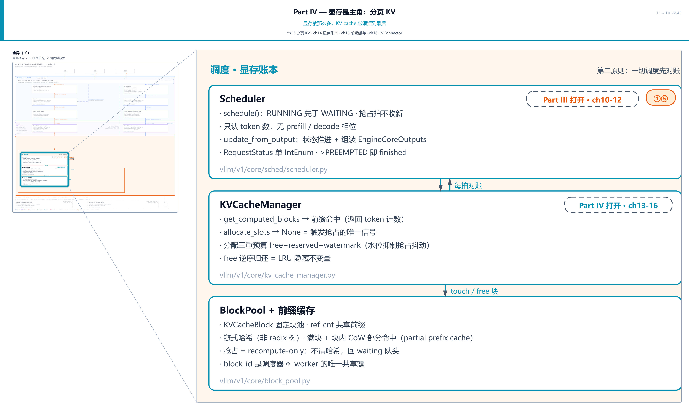

> *图注：Part IV「显存是主角：分页 KV」共四章（ch13-16）。L0 全图上本 Part 的区域是「调度 · 显存账本」整列（Scheduler↔KVCacheManager↔BlockPool 这条链），在此亮起、区域外退后：上半 Scheduler 的 token 账本[第 10 章](../../ch10-continuous-batching-chunked-prefill/narrative/chapter.md)拆过，Part IV 的四章把目光移到它下面的 KVCacheManager/BlockPool，顺着 block_id 一路追到 GPU 列的页表与槽位：ch13 分页 KV（本章）、ch14 显存账本、ch15 前缀缓存、ch16 KVConnector。本章打头，先把块的世界整个打开；后面三章分别接着问「池子多大」「前缀怎么复用」「块怎么跨机器搬」。*

放大之后，本章自己的地图长这样：

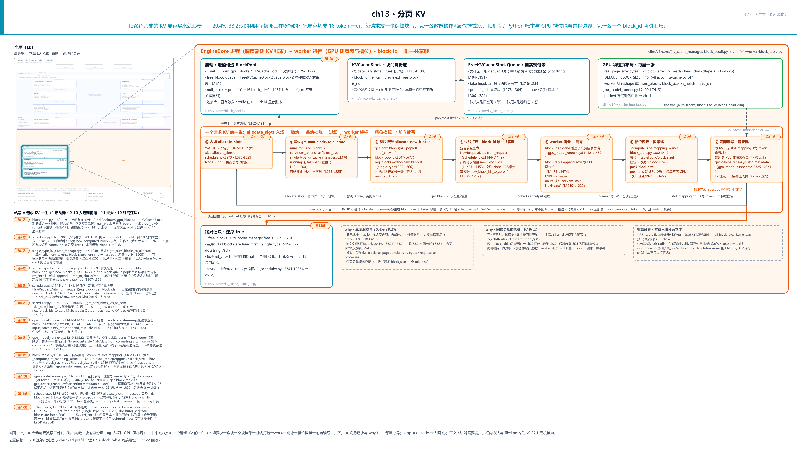

> *图注：本章放大的是[第 1 章](../../ch01-vllm-v1-in-one-map/narrative/chapter.md) L0 图左下「调度 · 显存账本」列的下半。[第 10 章](../../ch10-continuous-batching-chunked-prefill/narrative/chapter.md)翻开过上半（Scheduler 的 token 账本），本章打开它下面的 KVCacheManager/BlockPool，再顺着 block_id 过进程，把 worker 侧的页表与槽位一起圈进来；它就是[第 1 章](../../ch01-vllm-v1-in-one-map/narrative/chapter.md)那笔「100 token 领 7 块」小账的机器本体。图上三段读：北行是启动期一次性的家当，即池的构造与三件元数据（块的身份证、自由队列、GPU 物理页布局）；中排 ①-⑦ 是一个请求的 KV 的一生七拍：入场 allocate_slots → 数块 → 拿块挂账 → 过线打包 → worker 镜像 → 槽位换算 → 前向读写，回环箭头是 decode 长大回到 ①；南行是终局还块（逆序 free）。被当黑盒用了三章的 allocate_slots 在此打开；F7 伏笔（block_table 间接寻址的代价）埋在 ⑦ 前向读写。站号 1-12 = 一个请求的 KV 一生流经代码的顺序（第 1 站启动期先有池、第 2-10 站入场到前向、第 11 站长大、第 12 站终局还块），正文按讲解需要编排、不必照站号读。*

读法建议：想知道「凭什么利用率能顶到满」，从[「三源浪费」](#三源浪费旧系统只用了两三成显存)读起；只想看账本三件套长什么样，跳[「池的出生」](#池的出生一秒发完全部身份证站-1)和[「自由队列」](#自由队列指针长在块身上站-1-续)；关心[第 10 章](../../ch10-continuous-batching-chunked-prefill/narrative/chapter.md)那个 None 的出生地，直奔[「入场要块」](#入场要块allocate_slots-三段式站-2-4)；想弄懂一个 token 的 KV 到底放进显存哪个格子，看[「槽位恒等式」](#槽位恒等式一个位置号怎么变成一个物理槽位站-9)；想知道多卡部署下一拍的消息怎么往返（EngineCore 与 worker 各发什么、收什么、何时），直奔[「一拍两次 RPC」](#一拍两次-rpcenginecore-与-worker-的消息往返清单)；想跟全程，按序读。

还有一句环境交代，全章的数值表都适用：本章实测来自配套精简版：按 v0.27.1 只做减法抽出的「账本三件套 + worker 页表」，host 上实跑纯控制流，不依赖 GPU 与 vLLM 运行时。它与真实引擎有三处刻意差别，后文碰到会就近再提：其一，精简版关掉前缀缓存跑（`enable_prefix_caching=False`，cache 配置里的正交开关，真实部署默认开，vllm/config/cache.py:L93），所以本章 `allocate_slots` 里「挂命中块」一段恒空、「写回满块」一段早退，这两段的戏在[前缀缓存章（第 15 章）](../../ch15-prefix-caching/narrative/chapter.md)，它开门第一件事就是回答「满块的哈希什么时候算、谁来算」；其二，host 无 CUDA，槽位换算走 kernel 的逐行 CPU 镜像（同一恒等式、同一变量名，CUDA 分支逐字保留），新块清零走 CPU 分支；其三，多卡部署里调度器与 worker 分属两个进程（单卡默认部署两者同住一个进程，同一条消息契约照样成立），块表过线天然各持一份，单进程驱动脚本在打包时刻手工快照防就地改动。凡表内数字都是实跑输出，一个没改。

## 显存为什么是主角：一个 token 的 KV 有多大

先回到 L0 图最底下那块物理显存。一个 token 在每一层算注意力时产出一组 K（键）和 V（值）向量，这两个向量后面每个 token 都要用，所以必须存着，这就是 KV cache。它每个 token 占多少字节？一笔标准口径的账（说明性计算例，不是源码断言）：

```text
每 token KV 字节数 = 2 × num_layers × num_kv_heads × head_dim × 每元素字节数
```

四个因子各自的意思：**2** 是 K、V 各一份；**num_layers** 是 Transformer 层数，每层各存一套；**num_kv_heads × head_dim** 是注意力头数乘每头维度。本章的工作例都按 MHA 讲（多头注意力，KV 头数等于注意力头数；GQA/MQA 这类把 KV 头数压少的变体，数学放到后面的注意力变体章）；最后是精度，fp16（半精度浮点，每个数 2 字节）最常见。代入 Llama-2-7B（Meta 的 70 亿参数模型，FP16，32 层 × 32 头 × 128 维）：2 × 32 × 32 × 128 × 2 = 524288 B，约 0.5 MB/token。一条 4096-token 的序列，KV 就是 2 GiB。权重之外剩下的显存几乎全归 KV。Part IV 那句「显存就那么多」不是口号，是这道乘法的直接后果。

那「一块」KV 显存物理上长什么样？worker 侧每层持有一块张量，一页装多少字节由一个纯公式决定：

```python
# vllm/v1/kv_cache_interface.py:L183-L226
@dataclass(frozen=True, kw_only=True)
class AttentionSpec(KVCacheSpec):
    num_kv_heads: int
    head_size: int
    dtype: torch.dtype
    # … 省略：kv_quant_mode / page_size_padded / indexes_kv_by_block_stride
    #       三个量化与布局旋钮（量化章再打开）……

    # … 省略：unpadded_page_size_bytes / page_size_bytes 两个属性
    #       （在真页大小上叠加量化scale与对齐 padding，对外的口径）……

    @property
    def real_page_size_bytes(self) -> int:
        # … 省略：nvfp4 / int4 量化时 head_dim 的两个特判，各自把局部别名
        #       head_dim 定成不同值（无量化时 head_dim = head_size 原样）……
        return (
            2                                # K、V 各一份（因子 2）         # L221
            * self.block_size                # 一页装 block_size 个 token  # L222
            * self.num_kv_heads              # 每 token 每头一份           # L223
            * head_dim
            * get_dtype_size(self.dtype)
        )                                                              # L226
```

`AttentionSpec`（注意力的形状描述）是 `KVCacheSpec` 家族（各类 KV 存储形状的基类，父类就在节选首行）里的注意力支；家族里还有 Mamba 类以循环状态代替 KV 的兄弟（`MambaSpec`，状态型存储，kv_cache_interface.py:L710），下一章显存账本按这族形状给池分组，本章只跟注意力这一支打交道。它把三个数字带到这个乘法里：块大小、KV 头数、每头维度。无量化时 `real_page_size_bytes`（真页字节数）就是全部，因子 2 的意思是「一页装 block_size 个 token 的 K 一份、V 一份」；至于 K、V 在页内怎么摆（分成上下两半页，还是逐 token 相邻打包），这笔字节账管不着：页内形状由注意力后端（vLLM 里按模型结构与 GPU 平台插拔选用的注意力 kernel 实现模块；怎么选，执行篇讲）仲裁，下一段马上遇到。

物理池的出生在 worker 侧，两步。第一步按字节数要原始缓冲：

```python
# vllm/v1/worker/gpu_model_runner.py:L7312-L7353
    def _allocate_kv_cache_tensors(
        self, kv_cache_config: KVCacheConfig
    ) -> dict[str, torch.Tensor]:
        # … 省略：docstring ……
        kv_cache_raw_tensors: dict[str, torch.Tensor] = {}
        packed_backing: torch.Tensor | None = None
        for kv_cache_tensor in kv_cache_config.kv_cache_tensors:
            if kv_cache_tensor.block_stride > 0:
                # Allocate once; all packed tensors alias the same backing.
                if packed_backing is None:
                    packed_backing = torch.zeros(          # 按字节数要的 int8 原始缓冲  # L7331
                        kv_cache_tensor.size,
                        dtype=torch.int8,
                        device=self.device,
                    )
                tensor = packed_backing
            else:
                tensor = torch.zeros(
                    kv_cache_tensor.size, dtype=torch.int8, device=self.device
                )
            for layer_name in kv_cache_tensor.shared_by:
                kv_cache_raw_tensors[layer_name] = tensor
        # … 省略：layer_names 对账 assert 一段（配置漏配一层直接报错）……
        return kv_cache_raw_tensors
```

注意两个细节：缓冲是 `torch.int8`，此刻它只是「一坨字节」，还没有类型和形状；多层可以共享同一块物理分配（packed 布局别名，跨层重叠怎么排归下一章显存账本）。第二步把字节换算成页数、摆出视图：

```python
# vllm/v1/worker/gpu_model_runner.py:L7400-L7413 · GPUModelRunner._reshape_kv_cache_tensors
                raw_tensor = kv_cache_raw_tensors[layer_name]
                packing = layer_packing.get(layer_name)
                if packing is not None:
                    # … 省略：packed 布局分支两行（下一章显存账本）……
                else:
                    assert raw_tensor.numel() % kv_cache_spec.page_size_bytes == 0
                    num_blocks = raw_tensor.numel() // kv_cache_spec.page_size_bytes  # 字节 ÷ 一页 = 页数  # L7407
                if isinstance(kv_cache_spec, AttentionSpec):
                    has_attn = True
                    # … 省略：kernel 块细分乘数四行（下一章显存账本）……
```

`num_blocks = 字节数 // page_size_bytes`。除不尽的零头连一页都当不上，assert 逼着配置保证整除。之后每层的缓冲 reshape 成什么形状，由注意力后端仲裁（`get_kv_cache_shape`，gpu_model_runner.py:L7433-L7439）：主流后端把 K/V 打进内容维，得到 `[num_blocks, num_kv_heads, block_size, 2 × head_dim]`，每个 token 的 K 和 V 相邻存放（flash_attn.py:L143 的注释原话 "K and V are packed into the content dim"）；把 K、V 分成两半页的五维排布（`[num_blocks, 2, block_size, num_kv_heads, head_dim]`）只是个别后端的选择。无论哪种，页字节数不变，分页的账不依赖页内排布（后端怎么选，执行篇讲）。把本章用到的三个刻度实跑一遍：

<!-- trace: m10 -->
| 算什么 | 公式代入 | 结果 |
|---|---|---|
| 一块页多大（小例） | 2×16×8×128×2 B | 65536 B |
| 7B 模型（Llama 2）每 token 每层 | 2×32×128×2 B | 16384 B |
| 7B 模型（Llama 2）每 token 全模型 | 16384×32 层 | 524288 B ≈ 0.5 MB |
| 4096-token 序列的 KV | 524288×4096 | 2147483648 B = 2 GiB |
| worker 换算块数 | 655360 // 65536 | 10 块（说明性视图 [10, 2, 16, 8, 128]） |

（host 上 CPU 张量代 GPU 面做的验证，同一公式、同一整除断言；页字节数与块数在真 GPU 上不变。表中视图形状是 host 精简版的说明性布局：真实 GPU 上每层缓冲 reshape 成什么形状由注意力后端的 `get_kv_cache_shape` 仲裁，主流后端是 `[num_blocks, num_kv_heads, block_size, 2 × head_dim]`、K/V 逐 token 相邻打包，不存在「上下两半页」；页字节数不变。）

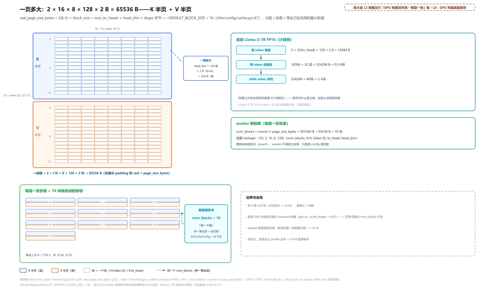

> *图注：一块页的账面形状（vllm/v1/kv_cache_interface.py:L212-L226 与 vllm/v1/worker/gpu_model_runner.py:L7400-L7413）：real_page_size_bytes = 2 × block_size × num_kv_heads × head_dim × dtype 字节。一块砖，上下两半是字节账的画法（因子 2 = K、V 各一份；主流后端实际把 K/V 按 token 相邻打包，正文与表后注已交代），K 半块蓝、V 半块橙，每半 16 个 token 位、每位 8 个 kv_head × 128 维 × 2 字节。小例一页 65536 B；放到 Llama-2-7B FP16 上每 token 全模型 0.5 MB、一条 4096-token 序列 2 GiB（计算例，非源码断言）。worker 侧把每层字节数除以页大小复原 num_blocks（图中 [10, 2, 16, 8, 128] 是说明性视图，真实形状由注意力后端仲裁），与调度器账本同一个数、同一份 config。*

这张砖图背后有一条本章反复用的不变量：**调度器账本里的块数与 GPU 上能寻址的块数必须是同一个数**。它不由谁「同步」出来：单一事实源是启动期的 KVCacheConfig，引擎一次性下发给两个进程，worker 的 `num_blocks` 只是复原 config 里的数，不做独立决策，两侧漂移会被 assert 拦住。至于「池子到底多大」（profile 怎么把显存盘出来、为什么是这么多数），那是下一章《显存账本》的主戏，本章把 `num_gpu_blocks` 当进门参数用。位置感也先立住：本节走的是 L0 图 worker/GPU 列最底层那块物理显存；接下来回到调度器进程，看账本那一侧。

## 三源浪费：旧系统只用了两三成显存

分页 KV 是 vLLM 的成名作，出处是一篇系统顶会论文：《Efficient Memory Management for Large Language Model Serving with PagedAttention》（SOSP'23，arXiv:2309.06180）。它诊断的旧设计一句话：**按请求最大长度一次性预分配连续显存**。论文原话，existing systems "pre-allocate a contiguous chunk of memory with the request's maximum length (e.g., 2048 tokens)"。请求一进门，先按「它最长可能长到多少」划一整条连续显存给它。论文给过规模感（外证，SOSP'23 论文口径）：OPT-13B（Meta 的 130 亿参数模型）一个 token 的 KV 要 800 KB，一条 2048-token 的请求预留可达 1.6 GB。

这么做的浪费，论文列了三源（外部论文证据，SOSP'23 评测）：

1. **预留空槽**（reserved slots）：为还没生成的未来 token 留的位子，生成长度是随机变量，实际输出常常远短于 max_len，留的位子大半等不到主人；
2. **内部碎片**（internal fragmentation）：按潜在最大长度超额供给的部分，教科书定义是「分配给的多于需要的」：malloc 要 29 字节给你按 32 字节对齐是一例，这里整条按 max_len 划是放大版；
3. **外部碎片**（external fragmentation）：分配器视角的浪费。空闲总量够、但东一块西一块拼不出一条连续段（论文点名 buddy allocator 这类分配器的通病），「必须连续」这个要求本身制造了碎片。

三源合起来的实测数字，就是本章开头那句：现有系统里 "only 20.4% - 38.2% of the KV cache memory is used to store the actual token states"（注意是 38.2，不是常被转引错的 38.3）。换算一下：**六到八成的 KV 显存买来就在空转**。显存浪费不是省钱的题，是吞吐的题：同样的卡，KV 装的请求越少，batch 越小，每 token 服务成本越高。论文战报：分页之后，同延迟水平下吞吐 2-4×（对比 FasterTransformer 与 Orca，这两个旧系统的谱系[第 10 章](../../ch10-continuous-batching-chunked-prefill/narrative/chapter.md)立过）。论文摘要还点了第四笔账，即「碎片 + 冗余复制」：beam search、parallel sampling 这类一条 prompt 出多条序列的采样法，各序列共享同一段前缀，旧系统却各存一份。这笔的解药（块共享 + 前缀缓存）是 Part IV 后两章的戏，先把话挂在这。

拿本章后面要实跑的例子先算笔对照账（说明性计算例，论文口径的旧设计代入）：两条请求、终长 100 与 30 token，旧设计按 max_len=2048 各预留一条：4096 个槽位里只住 130 个 token，96.83% 从头到尾没被碰过；其中 r1 那条预留 2048、用了 100，1948 个槽白买（95.12%）。而分页的做法住多少买多少，具体数字下节在块池机器（vllm/v1/core/block_pool.py:L175-L181）上实跑。

## 药方：把操作系统的分页搬进显存

论文的药方，摘要原话是 "we propose PagedAttention, an attention algorithm inspired by the classical virtual memory and paging techniques in operating systems"（我们提出 PagedAttention，一种受操作系统经典虚拟内存与分页技术启发的注意力算法）。这个类比值得当真，因为它是逐件落地的。先把操作系统那边 60 秒补完。

**操作系统的分页**。每个进程都以为自己独占一段连续的内存地址空间，这是操作系统造的假象。做法：把虚拟地址空间切成固定大小的**页**（page），物理内存切成同样大小的**帧**（frame），中间一张**页表**（page table）做翻译。「存储虚拟地址到物理地址映射的数据结构」（维基 Page table 的定义句）。翻译是一次拆分加一次拼装：虚拟地址切成两段，**虚页号 + 页内偏移**；查表把虚页号换成物理帧号；物理地址 = 帧号 × page_size + 偏移。一个说明性小例（16 位虚拟地址、页大小 256 字节）：虚拟地址 0x0317 拆成虚页号 0x03、偏移 0x17（低 8 位）；查页表第 3 项得帧号 0x0C；物理地址 = 0x0C × 0x100 + 0x17 = 0x0C17。

分页的胜负手在哪？旧时代给进程**一整段连续物理内存**，两头受气：按上限预留造成内部碎片，释放后留洞、洞拼不回大段造成外部碎片。分页用「固定大小 + 间接层」一次解决两头：物理侧按帧分发、不要求连续，外部碎片根除；每个进程最多浪费不足一帧（最后一页装不满的部分），内部碎片封顶。代价也明确：每次访存多一次查表，操作系统用 TLB（地址翻译缓存）把这个代价压下去。

vLLM 论文的类比原话，一字不差："one can think of blocks as pages, tokens as bytes, and requests as processes."，即**块当页、token 当字节、请求当进程**。对位表摆出来（右侧是本章及后文逐一打开的落点）：

| 操作系统 | vLLM v1 | 落点 |
|---|---|---|
| 页 page | 块 block（16 token 一页） | vllm/v1/core/block_pool.py:L175-L181 |
| 帧号 PFN | block_id（物理块号） | KVCacheBlock.block_id |
| 页表 page table | 逻辑块表（每请求一张） | req_to_blocks（vllm/v1/core/single_type_kv_cache_manager.py:L97） |
| 页内偏移 offset | pos % block_size | 槽位换算 kernel |
| 物理地址 | slot（物理槽位号） | vllm/v1/worker/block_table.py:L434-L440 |
| 按需调页 demand paging | 用到才领新块 | allocate_slots（站 2-4） |
| 内部碎片（< 1 页） | 尾块空位（< 1 块） | cdiv 上界 |
| TLB | 没有；代价长在注意力 kernel 里 | F7 伏笔（站 10） |

同样一条「查表换行号、偏移原样带过去」的翻译：token 位置 pos=99，99 // 16 = 6 是逻辑块号（对应虚页号），99 % 16 = 3 是块内偏移；查块表第 6 项拿到物理块号（设为 12），物理槽位 slot = 12 × 16 + 3 = 195。与 0x0317 → 0x0C17 同构，只是 vLLM 的「页表」是每个请求一行的小表，也没有 TLB，间接寻址的代价直接长在注意力 kernel 里，这笔账本章末尾挂账、执行篇结算。

**v1 的落地三件套**（站 1 起逐个拆）：整块 KV 显存预切成 num_gpu_blocks 个等大块的**块池**（对象数组一次预构）；每个请求一张**逻辑块表**（它名下块的有序清单）；GPU 上的**槽位换算**（块号 × 块大小 + 块内偏移）。先跑一遍总账：池 10 块、块大小 16，三条请求先后进场（表里的 cdiv(n, 16) 是天花板除 ⌈n/16⌉，即 ceiling division、向上取整，「n 个 token 每 16 个一页要几页」，站 2 的容量检查里它是主算术；精简版实跑，r1 完成后 r3 进场，复用 r1 还回来的块）：

<!-- trace: m1 -->
| 事件 | token 数 | cdiv(·,16) | 逻辑块表（拿到的块） | 槽容量 | 尾部浪费 | 池空闲 |
|---|---|---|---|---|---|---|
| r1 入场：100-token prompt | 100 | 7 | [1,2,3,4,5,6,7] | 112 | 12 | 2 |
| r2 入场：30-token prompt | 30 | 2 | [8,9] | 32 | 2 | 0 |
| r1 完成：逆序还块 | — | — | 回池 7 块（驱逐序 [7,6,5,4,3,2,1]） | — | — | 7 |
| r3 入场：35-token prompt（复用 r1 的块） | 35 | 3 | [7,6,5] | 48 | 13 | 4 |

四行读三件事。第一，**住多少买多少**：r1、r2 同住在场的时段（与上一节旧设计对照的是同一 workload，同样 100+30 两条），130 个 token 一共占 9 块 144 个槽，这两条的尾部浪费 12 + 2 = 14，每请求恒小于一块，对比旧设计的 3966 个白买槽位，差着两个数量级。第二，**逻辑连续、物理不相邻**：r3 的块表是 [7,6,5]，第 0 个 token 住在块 7 的 112 号槽、第 16 个 token 住在块 6 的 96 号槽、第 32 个 token 住在块 5 的 80 号槽。提货单上连续，堆场里跳着放，这就是「块当页」的直接后果。第三，**还了就能复用**：r1 一完成，7 块按 [7,6,5,4,3,2,1] 的次序回池，r3 立刻拿走前三个（为什么是这个次序，站 12 讲）。

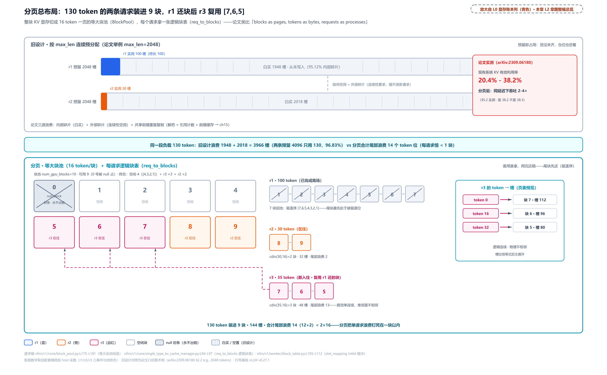

> *图注：分页总布局（vllm/v1/core/block_pool.py:L175-L181 + single_type_kv_cache_manager.py:L94-L97 + vllm/v1/worker/block_table.py:L105-L112）：上栏旧设计两条 2048 预留条只涂头部 100/30 格、白买 1948+2018 槽、段间还有外部碎片；下栏 10 格等大块池（0 号贴封条是 null 块，站 1 讲）+ 三张逻辑块表票据：r1 [1..7] 完成划线、r2 [8,9] 在住、r3 [7,6,5] 虚线回连池中 r1 还的块，复用与不相邻一眼可见。130 token、9 块、r1+r2 同住时段合计尾部浪费 14 < 2×16：分页把单请求浪费钉死在一块以内（论文实测现有系统 KV 有效利用率 20.4%-38.2%、分页后同延迟吞吐 2-4×，外证 arXiv:2309.06180）。*

这套账也有一个结构性不变量撑着：任意时刻，**各请求持有块数之和 + 空闲块数 = num_gpu_blocks − 1**（减掉 null 块）。改块归属的原语只有取块和还块两个，取一块让空闲减一、某请求加一，还一块反过来。从出生态（全部空闲）出发归纳，和不动。浪费上界也是构造性的：cdiv(n, 16) × 16 − n = (16 − n mod 16) mod 16，落在 [0, 15]，除尾块外每块全满。

最后一个旋钮：**页切多大**。块大小是个配置常量，`DEFAULT_BLOCK_SIZE = 16`（vllm/config/cache.py:L47），同时是分配、哈希、寻址三处的最小粒度。论文给过理由（外证）：块大小 16 大到能吃满 GPU 的访存模式、小到把尾部浪费控住。「大到」这半句的机制，用站 10 将看到的读侧事实就能说穿：分页后注意力读历史 KV 是穿表读，块内连续、块间断开，而 GPU 的访存喜欢长条，一次搬运的连续段越长越划算。块越大，一次连续读的 KV 段越长、查表跳转越稀：本章工作例的一页 65536 B，就是一条 64 KiB 的连续段；块切到 1 便只剩 4096 B（同一公式代入 block_size=1），每 4 KiB 就要查一次表。「小到」这半句管的是浪费：两头推一推就知道是折中，100-token 的请求在 block_size=16 下浪费 12 个位，若切 256 则 1 块浪费 156 个位。粗块把「每请求小于一块」的上界从 15 放大到 255，还让共享命中的粒度变粗（那笔账归前缀缓存章）；反过来 block_size=1 是极限情况，每 token 一条块表项、每 token 一次簿记，调度循环付不起（为什么付不起，下一节的 CPU 战场见）。中段的 8、32 为什么不另选：论文的消融量过一排块大小（论文 Fig. 18(b)，ShareGPT 与 Alpaca 两条 trace），16 到 128 在 ShareGPT 上同属最优档，Alpaca 上 32 尚可、更大就因序列短于块而显著劣化；结论原话是 16 "large enough to efficiently utilize the GPU and small enough to avoid significant internal fragmentation"（够大到吃得满 GPU、小到避开显著内部碎片），据此设默认 16。量出来的经验默认，不是推导出来的最优解。真实部署极少改它。

## 池的出生：一秒发完全部身份证（站 1）

现在走到 L0 图「调度 · 显存账本」列下半的 BlockPool 框。先有池、后有请求：引擎构造期（[第 9 章](../../ch09-engine-core-step-loop/narrative/chapter.md)握手窗口里 EngineCore 全量构造的那段）一次性把池建好，此后运行期再不构造任何块对象。构造函数全貌：

```python
# vllm/v1/core/block_pool.py:L162-L191
    def __init__(
        self,
        num_gpu_blocks: int,
        enable_caching: bool,
        hash_block_size: int,
        # … 省略：enable_kv_cache_events / metrics_collector 两个观测旁路参数 ……
    ):
        assert isinstance(num_gpu_blocks, int) and num_gpu_blocks > 0
        self.num_gpu_blocks = num_gpu_blocks
        self.enable_caching = enable_caching
        self.hash_block_size = hash_block_size
        # All kv-cache blocks.
        self.blocks: list[KVCacheBlock] = [              # 一次预构全部块对象     # L175
            KVCacheBlock(idx) for idx in range(num_gpu_blocks)
        ]
        # Free block queue that constructs and manipulates a doubly linked
        # list of free blocks (including eviction candidates when caching is
        # enabled).
        self.free_block_queue = FreeKVCacheBlockQueue(self.blocks)   # L181

        # … 省略：cached_block_hash_to_block / cached_block_hashes_by_block
        #       两行哈希查找表（前缀缓存的账本，本章当它空着）……

        # To represent a placeholder block with block_id=0.
        # The ref_cnt of null_block is not maintained, needs special care to
        # avoid freeing it.
        self.null_block = self.free_block_queue.popleft()   # 0 号块出队贴封条  # L190
        self.null_block.is_null = True                      # L191
```

三件事。第一，**对象数组一次预构**：num_gpu_blocks 个 KVCacheBlock 全部在启动期造好，运行期零构造。这是「调度器 CPU 是 v1 主战场」这条线的第一件配套纪律，why 链下一节展开。第二，**整串交给自由队列**：全部块出厂即空闲，链成一队。第三，**null 块占位**：队头第一张（block_id=0）当场被抽走、贴上 `is_null` 封条，承担占位语义（混合注意力组里当 0 号哨兵用，下一章显存账本），注释原话说它的 ref_cnt 不维护、"needs special care to avoid freeing it"，处处特判、永不出租、永不归还。出厂之后的可分配块从 1 号开始。

块的身份证本体是七个字段的 dataclass：

```python
# vllm/v1/core/kv_cache_utils.py:L117-L138
@dataclass(slots=True)
class KVCacheBlock:
    """KV-cache block metadata."""

    # Block ID, ranging from 0 to num_gpu_blocks - 1.
    block_id: int                                        # 物理块号          # L122
    # Reference count.
    ref_cnt: int = 0                                     # 引用计数          # L124
    # The hash key (block hash + group id) of the block, only available
    # when the block is full and cached.
    _block_hash: BlockHashWithGroupId | None = None      # 前缀缓存的账位（下章启用）  # L127
    # Number of prefix tokens covered by _block_hash. For full blocks this is
    # the full block boundary; partial entries can end inside a cache block.
    _block_hash_num_tokens: int | None = None            # 同上              # L130

    # Used to construct a doubly linked list for free blocks.
    # These two attributes should only be manipulated by FreeKVCacheBlockQueue.
    prev_free_block: "KVCacheBlock | None" = None        # 自由队列前指针    # L134
    next_free_block: "KVCacheBlock | None" = None        # 自由队列后指针    # L135

    # Whether the block is a null block that should never be cached.
    is_null: bool = False                                # null 块封条       # L138
```

五行是本章主角：block_id（它在 GPU 池里的编号，0 到 num_gpu_blocks−1）、ref_cnt（几个请求在共用它）、前后两个自由队列指针（下一节）、is_null 封条。两个哈希字段是前缀缓存的账位，类型名 `BlockHashWithGroupId` 里的 group id 是按注意力组记账的账位（池怎么按组分裂，下一章显存账本立），本章恒空、看见当没看见。注意块对象上**没有任何数据**——K/V 的字节全在 GPU 那头（上一节的砖），调度器进程里的块只是纯 CPU 元数据。这个「块 = 七个整数的卡片」的设定，是 v1 整个显存账本的地基。

第一行装饰器值得停十秒：`@dataclass(slots=True)`（Python 3.10+ 的参数）。普通 Python 实例每个都拖一个 `__dict__`（属性字典）支撑「随时加属性」的动态性；声明 slots 的类，实例没有这个字典、固定字段住进定长槽位，用一点动态性换每实例确定的内存和更快的属性访问。读者可以两行自验（说明性）：

```python
@dataclass(slots=True)
class Slotted:
    x: int

Slotted(1).__dict__   # AttributeError，没有 dict，x 住在槽里
```

字段固定七个、每拍高频读写的对象，正是这个开关的标准画像。它和下一节的侵入式链表合起来是一句话：**slots 定长 + 指针长在块上 = 调度循环零垃圾**（GC，垃圾回收，Python 的自动内存回收，每拍造新对象就是在给 GC 喂活）。

还有一个观测口径的伏笔：运行日志里那句 "GPU KV cache usage" 就是池的 `get_usage()`：

```python
# vllm/v1/core/block_pool.py:L807-L818
    def get_usage(self) -> float:
        """Get the KV cache usage.

        Returns:
            The KV cache usage (between 0.0 and 1.0).
        """

        # Subtract 1 to account for null block.
        total_gpu_blocks = self.num_gpu_blocks - 1     # 分母永远减一记 null  # L815
        if not total_gpu_blocks:
            return 0
        return 1.0 - (self.get_num_free_blocks() / total_gpu_blocks)
```

null 块从此渗进口径里：分母是 num_gpu_blocks − 1。6 块的小池分配 2 块，usage = 1 − 3/5 = 0.4。排障时看到 utilization 永远到不了 1 的理论值，先想想 0 号块。

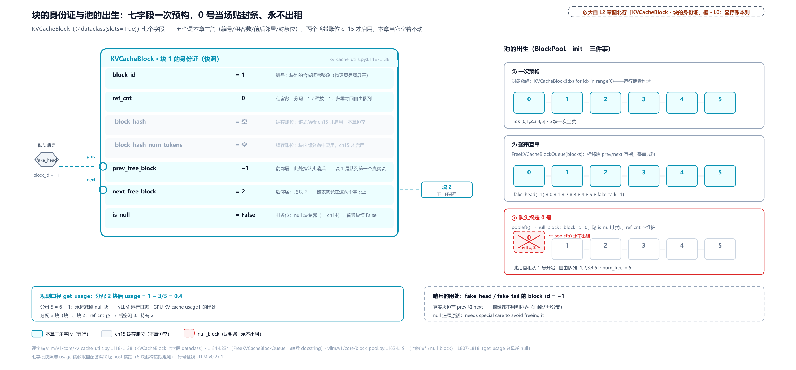

> *图注：池的出生三件事 + 一张身份证（vllm/v1/core/kv_cache_utils.py:L117-L138 与 vllm/v1/core/block_pool.py:L162-L191）：启动时一次预构全部 KVCacheBlock：七字段 slots 卡片，五行高亮是本章主角，两行哈希账位灰暗标给前缀缓存章；自由队列把整串卡片串起来，队头 0 号卡被 popleft 抽出贴 is_null 封条当 null_block，ref_cnt 不维护、处处特判。此后出租从 1 号开始，观测口径 get_usage 的分母也永远少记这一块（6 块池分 2 块：1 − 3/5 = 0.4）。*

## 自由队列：指针长在块身上（站 1 续）

空闲块怎么排队？vLLM 没有用 Python 自带的 deque（双端队列），自己写了个链表，理由全写在类 docstring 里：

```python
# vllm/v1/core/kv_cache_utils.py:L184-L234
class FreeKVCacheBlockQueue:
    """This class organizes a list of KVCacheBlock objects to a doubly linked
    list of free blocks. We implement this class instead of using Python
    builtin deque to support removing a block in the middle of the queue
    in O(1) time. To close the performance gap to the builtin deque which is
    implemented in C++, this class does not allocate any Python objects when
    manipulating the linked list. Instead, this class manipulates the
    prev_free_block and next_free_block attributes of the given blocks.
    # … 省略：LRU（least recently used，最久没用的先逐出）两条次序规则的
    #       docstring 段（驱逐策略的伏笔，本章只用「队头取、队尾还」的分配语义）……

    Args:
        blocks: A list of KVCacheBlock objects.
    """

    def __init__(self, blocks: list[KVCacheBlock]) -> None:
        self.num_free_blocks = len(blocks)               # 空闲计数字段      # L207

        # Initialize doubly links of consecutive blocks
        for i in range(self.num_free_blocks):
            if i > 0:
                blocks[i].prev_free_block = blocks[i - 1]
            if i < self.num_free_blocks - 1:
                blocks[i].next_free_block = blocks[i + 1]

        # Create a fake head and a tail block for the doubly linked list to
        # reduce branching in the code
        #
        # The implementation guaranteed that the fake head and tail
        # are NEVER got popped, so we could safely assume each real blocks
        # in the queue has prev and next blocks.
        self.fake_free_list_head = KVCacheBlock(block_id=-1)   # 哨兵：块号 −1  # L222
        self.fake_free_list_tail = KVCacheBlock(block_id=-1)   # 哨兵：块号 −1  # L223
        if self.num_free_blocks > 0:
            # Connect fake_head and fake_tail to the first and last block
            # respectively.
            self.fake_free_list_head.next_free_block = blocks[0]
            blocks[0].prev_free_block = self.fake_free_list_head
            self.fake_free_list_tail.prev_free_block = blocks[-1]
            blocks[-1].next_free_block = self.fake_free_list_tail
        else:
            # For empty list, simply connect the fake head and tail.
            self.fake_free_list_head.next_free_block = self.fake_free_list_tail
            self.fake_free_list_tail.prev_free_block = self.fake_free_list_head
```

这个设计有个名字：**侵入式链表**（intrusive linked list）。Python 程序员熟悉的链表都是「容器式」：list/deque 这些容器持有一串指向对象的引用，节点是容器的一部分。侵入式反过来：prev/next 指针作为字段直接长在数据对象身上，链表本体不拥有任何节点。它的祖师爷是 Linux 内核的 `list_head`：payload 结构体里内嵌一个 `{next, prev}` 成员，摘除一个已知节点只需重接两个指针（内核的 `list_del` 就两行赋值），不遍历、不搜索、不分配新节点。内核官方文档同时警告它缓存不友好，性能敏感处慎用（链接留给想深挖的读者：[docs.kernel.org/core-api/list.html](https://docs.kernel.org/core-api/list.html)）。vLLM 拿它不是为遍历，是为调度器热路径上的两件事：**O(1) 从队中间摘块**、**零对象分配**。前者是硬需求：前缀缓存的「救回命中块」（touch）要从驱逐候选队的中间把块捞出来，容器式 deque 从中间删是 O(n)；后者是性能补丁：deque 是 C 实现，Python 手写链表要追平它，只能一次 Python 对象都不造。于是指针手术全部落在块自己的字段上，FreeKVCacheBlockQueue 对象本身只有计数器和两个哨兵。

哨兵也是设计：fake head/tail 两个 block_id=−1 的哑块钉在两头，注释原话保证它们永不出队，于是**每个真实块恒有前驱和后继**，摘谁的代码都不用判「是不是队首/队尾」，边界分支归零。

取块的原语，`popleft_n`（拿 n 块）：

```python
# vllm/v1/core/kv_cache_utils.py:L273-L304
    def popleft_n(self, n: int) -> list[KVCacheBlock]:
        """Pop the first n free blocks and reduce num_free_blocks by n.

        Args:
            n: The number of blocks to pop.

        Returns:
            A list of n free blocks.
        """
        if n == 0:
            return []
        assert self.num_free_blocks >= n
        self.num_free_blocks -= n                        # 计数与链同步减     # L285

        curr_block = self.fake_free_list_head.next_free_block
        # Pop n blocks from the head of the list
        ret = []
        for _ in range(n):
            assert curr_block is not None
            ret.append(curr_block)
            last_block = curr_block
            curr_block = curr_block.next_free_block
            # Reset prev_free_block and next_free_block of all popped blocks
            last_block.prev_free_block = None            # 被摘者的指针清空   # L296
            last_block.next_free_block = None

        if curr_block is not None:
            # The queue is not empty, connect the fake head to
            # the new first block.
            self.fake_free_list_head.next_free_block = curr_block
            curr_block.prev_free_block = self.fake_free_list_head
        return ret
```

和它的镜像 `remove`（从中间摘一块，救回命中块的原语）：

```python
# vllm/v1/core/kv_cache_utils.py:L306-L324
    def remove(self, block: KVCacheBlock) -> None:
        # … 省略：docstring 五行与非法入参防御（若指针残缺则 raise）……
        # Link the previous block to the next block.
        block.prev_free_block.next_free_block = block.next_free_block   # 邻居互接  # L318
        # Link the next block to the previous block.
        block.next_free_block.prev_free_block = block.prev_free_block   #          # L320
        # Remove the block from the linked list.
        block.prev_free_block = block.next_free_block = None
        self.num_free_blocks -= 1
```

四行指针手术，O(1)，不碰其他任何块。五个原语（popleft/popleft_n 取、remove 中摘、append_n 挂尾、prepend_n 挂头）的六步联合手术实跑一遍（5 块小队列 + 双哨兵）：

<!-- trace: m3 -->
| 步 | 操作 | 队列（队头→队尾） | num_free | 关键指针手术 |
|---|---|---|---|---|
| 0 | 初始：相邻互串 + 双哨兵 | [0,1,2,3,4] | 5 | fake_head(−1) ↔ 0 ↔ 1 ↔ 2 ↔ 3 ↔ 4 ↔ fake_tail(−1) |
| 1 | popleft_n(1) 队头取 | [1,2,3,4] | 4 | 块 0 指针置 None；fake_head 直连块 1 |
| 2 | remove(块 2)：O(1) 中间摘 | [1,3,4] | 3 | 块 1 的 next 越过块 2 直指块 3；块 2 指针清 None |
| 3 | append_n([0]) 归还挂尾 | [1,3,4,0] | 4 | 块 0 接到块 4 之后、next 指向 fake_tail |
| 4 | popleft() 单取队头 | [3,4,0] | 3 | 拿到块 1；fake_head 直连块 3 |
| 5 | prepend_n([1]) 挂回队头 | [1,3,4,0] | 4 | 劈分挂点（前缀缓存章的 LRU 双不变量用；本章验原语语义） |

这张表同时是两条机器级证据。其一，`num_free_blocks` 计数与链上真实块数全程严格对账（六步 5→4→3→4→3→4，终态遍历 [1,3,4,0] 恰 4 块）：每个原语都是「先把邻居互接、再清被摘者、计数同步 ±1」的局部手术，归纳可证计数恒等于链长。其二，**零分配的物证**：全程 7 个对象（5 真实块 + 2 哨兵）的 id() 集合前后不变，docstring 说的 "does not allocate any Python objects" 被实测落到了机器级，不是修辞。

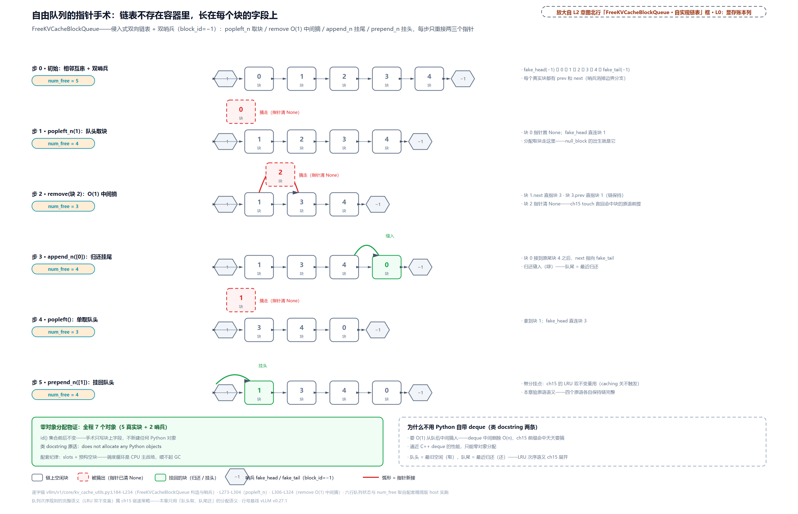

> *图注：指针长在块上（vllm/v1/core/kv_cache_utils.py:L184-L234、L273-L324）：自由队列不是容器、是长在块身上的侵入式双向链表：fake_head/fake_tail 两个哨兵（block_id=−1）保证每个真实块都有邻居，摘谁都不判边界。六拍手术 [0,1,2,3,4]→[1,2,3,4]→[1,3,4]→[1,3,4,0]→[3,4,0]→[1,3,4,0]，每步只重接两三个块上字段、全程零对象分配（trace 里 7 个对象的 id 集合不变）。为什么不用 deque：中间删除 O(n) 付不起，而前缀缓存的 touch 天天要从队中间捞人（前缀缓存章见）。*

到这里，本章第二条 why 链可以完整摆出，主角是纯 CPU 元数据账本（第一条是分页本身：三源浪费到药方那条；第三条到站 9「槽位恒等式」才现身）。**旧设计**：v0 的 BlockSpaceManager，全局静态水位垫片（默认预留 1% 空间不敢动）、按请求组核算块、PhysicalTokenBlock 对象在运行期反复分配释放。**痛点**：v1 的主战场是调度器的 CPU 时间，高并发下每拍要为几百个请求算块需求，dict/对象分配/GC（垃圾回收）会把调度循环压垮；而保守垫片本身就是容量浪费。**v1 方案**：整个账本是纯 CPU 元数据：KVCacheBlock 七字段 slots 卡片（L117-L138）、侵入式链表零分配（L184-L234）、预构空对象避免 GC（`empty_kv_cache_blocks`，kv_cache_manager.py:L180-L187；结果是零块的调用一律复用同一个预构空对象、不现场造，decode 里块内还有空位、不领新块的拍就是常客；分配失败走的则是 None，不在这条路上）。对调度器则只暴露 KVCacheBlocks 包装，docstring 原话 "to hide KVCacheManager's internal data structure from the Scheduler"（对调度器隐藏内部结构，kv_cache_manager.py:L32-L53）：调度器拿到的只是「块指派」，摸不到块对象。**代价**（诚实账）：每请求每步 O(块数) 的 Python 循环仍在，只能靠上述纪律压着，是持续的性能战场；更要命的是账本与 GPU 真相从此是两份，需要一条跨进程契约兜底，那是站 5-8 的戏。

## 入场要块：allocate_slots 三段式（站 2-4）

池子就绪，请求进场。入口是[第 10 章](../../ch10-continuous-batching-chunked-prefill/narrative/chapter.md)当黑盒用的那个 `allocate_slots`：WAITING 侧收新时调用，拿不到块返回 None：

```python
# vllm/v1/core/sched/scheduler.py:L973-L994 · Scheduler.schedule
                new_blocks = self.kv_cache_manager.allocate_slots(
                    request,
                    num_new_tokens,
                    # … 省略：九个正交参数（前缀命中块、投机前瞻、外部缓存、
                    #       整序列准入门（准入 why 见连续批处理章）、在途预约等）；
                    #       本章主路径上不是 0 就是不咬合 ……
                )                                                # L985

                if new_blocks is None:                           # None 的出生地  # L987
                    # The request cannot be scheduled.

                    # NOTE: we need to untouch the request from the encode cache
                    # manager
                    # … 省略：encoder 缓存善后两行（多模态正交）……
                    break                                        # 只收摊，绝不抢占  # L994
```

[第 10 章](../../ch10-continuous-batching-chunked-prefill/narrative/chapter.md)只见 break，本章进 `allocate_slots` 内部看 None 怎么生出来的。省略的九个参数里点一个名：前缀命中块 `new_computed_blocks`，来源是 `get_cached_block` 按内容哈希查池（block_pool.py:L198），哈希什么时候算、怎么查，[第 15 章](../../ch15-prefix-caching/narrative/chapter.md)开门见山。函数很长（L344-L565），docstring 里藏着一张总图，先看它。一段 token 序列被劈成五段：

```python
# vllm/v1/core/kv_cache_manager.py:L390-L421 · KVCacheManager.allocate_slots
        Blocks layout:
        ----------------------------------------------------------------------
        | < comp > | < new_comp > | < ext_comp >  | < new >  | < lookahead > |
        ----------------------------------------------------------------------
                                                  |   < to be computed >     |
        ----------------------------------------------------------------------
                                  |            < to be allocated >           |
        ----------------------------------------------------------------------
                                  | < to be cached (roughly, |
                                  | details below)>          |
        ----------------------------------------------------------------------
        # … 省略：下方三段「前缀缓存来源 / 是否已缓存」的分层图……

        Abbrivations:

        ```
        comp      = request.num_computed_tokens
        new_comp  = num_new_computed_tokens
                  = len(new_computed_blocks) * block_size
        ext_comp  = num_external_computed_tokens, cached by the connector
        new       = num_new_tokens, including unverified draft tokens
        lookahead = num_lookahead_tokens
        ```
```

五段从左到右：**comp**（已算过的）、**new_comp**（本拍新命中的前缀缓存块）、**ext_comp**（外部 connector 缓存的）、**new**（本拍真要算的）、**lookahead**（投机解码的前瞻槽）。本章单请求、无缓存、无 connector、无投机的主路径上，中间三段恒空，活的只有 comp 和 new。「已经算过多少 + 这一拍要算多少」恰好就是[第 10 章](../../ch10-continuous-batching-chunked-prefill/narrative/chapter.md)立的追赶公式那两个数。这张图是读 vLLM 全部 KV 代码的地图，后两章回头看它会多亮几段。

### 先数块：快慢两条路，同一本账

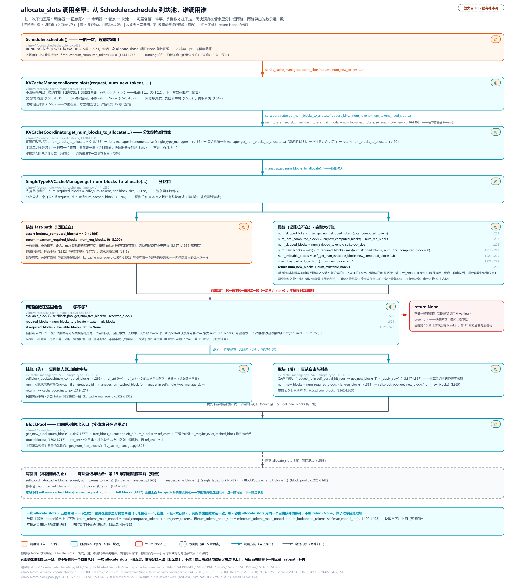

> *图注：主线是从 Scheduler.schedule 到 BlockPool 的一条链：调度器把请求交进 allocate_slots，容量检查、挂命中块、分新块、写回满块四步各自下潜（中间那层协调器 KVCacheCoordinator 在本章单组全注意力下近乎直通），容量检查下潜到单类型管理器（SingleTypeKVCacheManager）里分出快慢两路，殊途同归——只「数」不「动」，返回的只是一个数，真正摘块发生在第三段。节点上的方法名按调用链从外到内读；内层 BlockPool 的 touch（「引用计数」一节）、get_new_blocks（「再拿块挂账」一节）、cache_full_blocks（写回满块的池侧动作，本章关缓存早退、戏在[前缀缓存章](../../ch15-prefix-caching/narrative/chapter.md)）等是后文各节的主角，此处见到名字即可。写回侧（灰虚线框）本章关缓存时早退、戏在前缀缓存章；红框 return None 是容量不够的出口（回指第 10/11 章）；底部 GPU 带是同一拍并行的另一摊活，「过线」一节讲。*

往下逐层看这条链——先看开关在哪分岔。

三段式的第一段是 **容量检查**，开吃前先看冰箱。这一眼要回答的问题只有一个：**这一拍要从自由队列摘走几块**——数出来的数超过空闲，整个 allocate_slots 当场拒绝。核心算术都在 `get_num_blocks_to_allocate`（需块预测）里，中间有一道快慢分岔，先读整段再拆：

```python
# vllm/v1/core/single_type_kv_cache_manager.py:L144-L230
    def get_num_blocks_to_allocate(
        self,
        request_id: str,
        num_tokens: int,
        new_computed_blocks: Sequence[KVCacheBlock],
        # … 省略：total_computed_tokens 等四个参数与 docstring，以及
        #       滑窗类的准入上限分支（账归下一章显存账本）……
    ) -> int:
        num_required_blocks = cdiv(num_tokens, self.block_size)   # 主算术就这一行  # L178
        # … 省略：apply_admission_cap 分支（L179-L191，见上）……
        num_req_blocks = len(self.req_to_blocks.get(request_id, ()))   # 已持有几块  # L192

        if request_id in self.num_cached_block:                    # 记账位在 → fast-path
            # Fast-path: a running request won't have any new prefix-cache hits.
            assert len(new_computed_blocks) == 0
            # NOTE: With speculative decoding, request's blocks may be allocated
            # for draft tokens which are later rejected. In this case,
            # num_required_blocks may be smaller than num_req_blocks.
            return max(num_required_blocks - num_req_blocks, 0)    # 差值钳零      # L200

        num_skipped_tokens = self.get_num_skipped_tokens(total_computed_tokens)  # L202
        num_local_computed_blocks = len(new_computed_blocks) + num_req_blocks    # L203
        # Number of whole blocks that are skipped by the attention window.
        # If nothing is skipped, this is 0.
        num_skipped_blocks = num_skipped_tokens // self.block_size  # floor 不是 cdiv # L206
        # We need blocks for the non-skipped suffix. If there are still
        # local-computed blocks inside the window, they contribute to the
        # required capacity; otherwise, skipped blocks dominate.
        num_new_blocks = max(
            num_required_blocks - max(num_skipped_blocks, num_local_computed_blocks),
            0,
        )                                                          # 内层 max 见下  # L210-L213

        # Among the `new_computed_blocks`, the first `num_skipped_blocks` worth
        # of blocks are skipped; `num_req_blocks` of those may already be in
        # `req_to_blocks`, so only skip the remainder from `new_computed_blocks`.
        num_skipped_new_computed_blocks = max(0, num_skipped_blocks - num_req_blocks)  # L218

        # If a computed block is an eviction candidate (in the free queue and
        # ref_cnt == 0), it will be removed from the free queue when touched by
        # the allocated request, so we must count it in the free-capacity check.
        num_evictable_blocks = self._get_num_evictable_blocks(     # 可驱逐块也占容量  # L223
            new_computed_blocks[num_skipped_new_computed_blocks:]
        )
        if self._has_partial_local_hit(new_computed_blocks, num_local_computed_tokens):
            # Reserve the extra block that allocate_new_blocks pulls for the
            # partial-hit CoW redirect.
            num_new_blocks += 1                                   # CoW 预留      # L229
        return num_new_blocks + num_evictable_blocks               # L230
```

**主算术**仍然只有一行：`cdiv(num_tokens, block_size)`，前文总账表立过的天花板除 ⌈n/k⌉（「100 个 token 装 16 一页的块要几页」）。真正的分岔在它下面那句 dict 成员测试：**进不进 fast-path 的开关是 `request_id in self.num_cached_block`**。`num_cached_block`（已缓存满块记账位，dict：请求 id → 已写回缓存的满块数）本是前缀缓存的增量游标，在这里兼职了开关：这个键只要存在，说明请求已经过了首排（本次入场的第一次调度，新请求与被抢占后恢复都算）、不会再有新的前缀命中（代码里那句 assert 钉死），账于是简化成一句差值 `max(num_required_blocks - num_req_blocks, 0)`（需块减已持、负数归零；max 给投机解码兜底——草稿 token 被拒后目标回缩，需块可能反而小于已持）。键不存在的一切请求走慢路径，也就是下面那六行完整账。

这个键什么时候写、什么时候删？一句话：**有整块落袋才写，请求退场就删**。写它的主路是每拍收尾的写回满块——攒满几个整块就记几（代码在后面「三段式全景」一节）；首排挂命中块时也会顺手写一笔。两个不写的边界：短请求（prompt 加已生成不足 block_size）一个满块都攒不出，键一直不出现，只好每拍走慢路径——好在两条路算出的数永远一样，下文「两条路的会合点」一段逐项代入证过；关掉前缀缓存时写回整段被上层跳过，键永不出现，这正是本章开头环境交代里「精简版关缓存恒走慢路径」的机制根源。顺带一句：前缀查找只在入场首拍做（判定 `request.num_computed_tokens == 0`，scheduler.py:L744-L747）；被抢占的请求该值清 0、重新入场，自己的旧缓存可以被自己再命中——抢占「重算便宜」的根源之一。这半边的调度账[前缀缓存章（第 15 章）](../../ch15-prefix-caching/narrative/chapter.md)开门就讲。

慢路径是这本账的完全体，六行逐行读。先把它数出来的东西说准：**返回值 = 本拍将从自由队列摘走多少块**。加进返回值的都是要真摘走的——新分配的块、被 touch 摘走的可驱逐命中块，个别场景还有一类写时复制（CoW）换来的私有块（见末条）；减掉的每一项，都是「这个表位不用从池里拿实体块」的理由：

- `num_skipped_tokens = get_num_skipped_tokens(total_computed_tokens)`：注意力窗外、不再被读的 token 数（total_computed_tokens 是本地已算、本拍新命中、外部已算三者的 token 合计）。本章的全注意力下它恒 0（L661-L672，没有 token 会被跳过）；滑窗注意力（sliding window attention，每个 token 只看最近 W 个 token 的变体，W 为窗口宽度）的公式是 max(0, T − W + 1)，源码自带一个 ASCII 例，值得原样看：

```python
# vllm/v1/core/single_type_kv_cache_manager.py:L1057-L1083 · 滑窗子类的 get_num_skipped_tokens
    def get_num_skipped_tokens(self, num_computed_tokens: int) -> int:
        """
        Get the number of tokens that will be skipped for attention computation.

        For sliding window, this corresponds to the tokens that are prior to
        the current sliding window.

        Example:
            sliding_window=4, num_computed_tokens=7

            Tokens:   [ 0  1  2  3  4  5  6  7 ]
                      | ---- computed -----|
                                             ^ next token to be computed
                                   |-----------| sliding window for next token
                      |--skipped---|

        The current window contains tokens 4~7. Tokens 0~3 will be skipped for
        attention computation since they are outside the sliding window.
        Thus, get_num_skipped_tokens(7) == 4.

        # … 省略：Args/Returns 段（docstring 尾四行）……
        """
        return max(0, num_computed_tokens - self.sliding_window + 1)
```

- `num_local_computed_blocks = len(new_computed_blocks) + num_req_blocks`：**已就位的实体块数**——已持的早分配过，命中的由 touch 复用别人的，都不走 get_new_blocks。命中天然以块为单位（1 块 = block_size 个 token，docstring 原话 kv_cache_manager.py:L418），这是五段图里 new_comp 段换算的出处。
- `num_skipped_blocks = num_skipped_tokens // self.block_size`：**floor（向下取整），不是 cdiv（向上取整）**。跨窗边界的块还有一角在窗内、必须保留实体（上例 token 0..3 落在窗外、但它所在的块还装着窗内的 token，换不得），只有整块全在窗外才换成 null 占位——null 块永不出租（站 1 贴封条那位），get_usage 的分母也永远少记它。为什么敢跳、跳了为什么正确（回收不变量），下一章显存账本推。
- `num_new_blocks = max(required − max(skipped, local_computed), 0)`：内层 max 是「挂账之后无需新实体块的表长」。无跳段时 = 已持 + 命中；跳段压过已就位时以跳段为准——null 占位虽然不是实体块，**本身也占表长**（这个分支只在 ext_comp 抬高跳段基数的混合场景出现，下面的 E3 正是它）。
- `num_skipped_new_computed_blocks`：命中块里落在跳段前缀内的那部分——它们不会被 touch（不离开自由队列），所以要从可驱逐计数里剔掉。
- `num_evictable_blocks`：将被 touch 的命中块里 ref_cnt==0 且非 null 的（正躺在自由队列当驱逐候选）。touch 会把它们从自由队列**中间**摘走——上一节 remove 原语在这里等到了主人。命中块（别的请求算过、内容相同、可直接复用的块）既是「不用新分配」、又实打实离开空闲池，漏数它容量检查就失真（注释原话 so we must count it in the free-capacity check）。这条注释是第二条 why 链的另一半「预测器与分配器严格同构」的一个样本：预测用的数学必须和分配动作一一对应，漂移没有运行时校验、只有注释和单源公式防着。
- 六行之外还跟一个尾巴：partial 命中（命中的长度停在某个块的中间）时 `num_new_blocks += 1`，为 CoW 预留一个私有块——CoW 的机制一句话：共享的块谁要接着写，谁先拷一份私有；什么时候真的发生，过线一节的[「CoW 六拍」](#cow-六拍partial-命中的共享尾块什么时候换私房)单独讲。

两条路的会合点钉死：全注意力、无命中、无外部 token 时，慢路径**严格退化为 fast-path**——skipped=0 使内层 max 恰等于 num_req_blocks（与 fast-path 的减数相同），命中空使可驱逐为 0、partial 不触发，逐项代入后就是同一句 `max(required − num_req, 0)`。所以「关缓存恒走慢路径」与「开缓存走 fast-path」算出的数永远一致，短请求晚几拍写上键也只是多走几遍全写——两条路是同一本账的简写与全写。

六问实测（预测器与分配器对账，两组各对一次、全部对上）：

<!-- trace: m5 -->
| 问 | num_tokens | 已持块 | 路径 | 预测需块 |
|---|---|---|---|---|
| a 新请求 | 100 | 0 | cdiv 主算术：100/16 → 7 | 7 |
| b 新请求（非整除） | 33 | 0 | cdiv：33/16 → 3 | 3 |
| c running 长到 | 113 | 7 | fast-path：max(8−7, 0) | 1 |
| d running 恰对齐 | 112 | 7 | fast-path：max(7−7, 0) | 0 |
| e spec 拒绝回缩 | 64 | 7 | fast-path：max(4−7, 0) 钳零 | 0 |
| f 带 1 块可驱逐命中 | 32 | 0 | 慢路径：1 新块 + 1 可驱逐 | 2 |

（c/d/e 的 fast-path 需要一个缓存账位（num_cached_block），真实开缓存的部署由写回满块自然推进；精简版关缓存恒走慢路径，同一个 cdiv 差值公式、同样钳零，驱动脚本手工登记账位走通了 fast-path 支。e 的回缩是投机解码拒草稿场景，此处只取钳零算术。）

六问表走的都是主路径，慢路径的六行账再用两个完整例压实（E2 两行的账实跑自精简版；E3 的滑窗公式在驱动里按 pin 源码覆写——精简版删了滑窗子类，例后注交代推演边界）：

<!-- trace: s1 -->
| 例 | 目标表长 | 已持 | 命中 | local_computed | skipped_blocks | 新块 num_new | 可驱逐 evictable | 预测返回 |
|---|---|---|---|---|---|---|---|---|
| E2 三块命中、全冷（ref_cnt==0 躺自由队列） | cdiv(100,16)=7 | 0 | 3 | 3+0=3 | 0 | 7−3=4 | 3 | 4+3=**7** |
| E2 同局、全热（ref_cnt≥1 不在自由队列） | 7 | 0 | 3 | 3 | 0 | 4 | 0 | **4** |
| E3 滑窗 W=16 + 外部 32 token | cdiv(100,16)=7 | 0 | 2 | 2 | 3 | 7−max(3,2)=4 | 0 | **4** |

E2（全注意力，prompt=100、前缀命中 48 token——恰好 3 整块，命中不落在块中间，partial 不触发）：new_comp=48 使本拍只需新算 52，入账 num_tokens = 48+52 = 100，required = 7，local_computed = 3，新块 4。剩下全看那 3 块命中的冷热。**全冷**（三块都躺自由队列，ref_cnt==0）→ 预测 4+3 = 7，分配侧实测恰好对上这个数：touch 3 块（离开自由队列）加 get_new_blocks(4)，自由队列净减 3+4 = 7，「返回值 = 本拍摘走多少块」的语义在这里验货。**全热**（三块都正被别的请求引用，ref_cnt≥1、不在自由队列）→ 可驱逐 0 → 预测 4。共享得越热、容量越省；这句话的另一面是预测器必须逐块看 ref_cnt，不能拿「命中了 3 块」一口吞。

E3（滑窗 W=16，本地命中 2 块 + connector 外部缓存 32 token，total_computed = 64，本拍再算 36）：窗外 token = max(0, 64−16+1) = 49，跳段 = 49//16 = 3——floor 在这里救命：第 4 块跨 48/49 窗边界，token 49..63 还在窗内，必须留实体。内层 max 落在跳段支（ext_comp 抬高了跳段基数、却不进 local_computed），新块 = 7−max(3,2) = 4；命中的 2 块全落在跳段前缀内、被剔出可驱逐计数 → 预测 4。（E3 分配侧的对账是代码走读推演：外部段补块的 allocate_external_computed_blocks 在精简版已删、账归 KVConnector 章；真实挂账会是 [null, null, null] 占位 3 格、外部段另发 1 块、新块 3 块，实体块 1+3 = 4。）

六行账在手，回头把开头的五段图逐段对到块账参数上——这是最容易卡住的地方：docstring 把 comp、new_comp、ext_comp 都画成「前缀已算过」，但块账里三者的待遇完全不同（先补一词：ext_comp 里的 connector 指 KV connector，把别处算好的 KV 搬进本引擎的外挂传输模块，Part IV 压轴一站的主角）。先立住两个求和点（token 域怎么合成传进预测器的数）：

```python
# vllm/v1/core/kv_cache_manager.py:L453-L461
        # The number of computed tokens is the number of computed tokens plus
        # the new prefix caching hits
        num_local_computed_tokens = (
            request.num_computed_tokens + num_new_computed_tokens
        )
        total_computed_tokens = min(
            num_local_computed_tokens + num_external_computed_tokens,
            self.max_model_len,
        )
```

```python
# vllm/v1/core/kv_cache_manager.py:L490-L493
        num_tokens_main_model = total_computed_tokens + num_new_tokens
        num_tokens_need_slot = min(
            num_tokens_main_model + num_lookahead_tokens, self.max_model_len
        )
```

两个陷阱先记下。其一，L458-L461 这个钳过 max_model_len 的 total_computed_tokens 只是局部变量，真正传给预测器的是 L515-L516 未钳版本的「本地已算 + 外部已算」之和，滑窗跳段的基数用的是后者。其二，num_tokens_main_model 是**不带 lookahead** 的中间量：投机解码时主模型与草稿模型各算各的账，无投机时它就等于 num_tokens_need_slot。逐段映射：

| 五段（token 域） | 进块账哪一项 | 一句话 |
|---|---|---|
| comp（已算过） | 已持表长 num_req_blocks → local_computed 的加数 | 块早在表上，不用拿 |
| new_comp（本拍新命中） | len(new_computed_blocks) → local_computed 的另一加数；ref_cnt==0 者再进可驱逐计数 | touch 别人的：不新分配，但可能占容量 |
| ext_comp（外部 connector 缓存） | **不进减数**——只抬高 total_computed_tokens（→跳段基数）与目标表长；块由 allocate_external_computed_blocks 单独发（cdiv(total, bs) − len(req_blocks)，L323-L325） | token 已算过 ≠ 块不用分配 |
| new + lookahead（本拍要算 + 前瞻槽） | cdiv 的被除数（num_tokens_need_slot） | 目标表长的主要增量 |

病根就在第三行：ext_comp 的 token 在远端算过、调度器据此少排新算量（new 变小），但这些 token 的块在本地池里**一个都还没有**，必须当新块真金白银地分配——「已算过」是 token 账的事，「不用分配」是块账的事，两本账在 ext_comp 上分道扬镳。**五段图解释不了块账，准确解法就是这句话**；E3 里 max 落在跳段支，正是 ext_comp「抬基数、不进减数」的直接后果。

预测值回到 `allocate_slots` 里对着空闲块数一比。代码里反复出现的 `self.coordinator`（协调器）先交代一句：KVCacheManager 不直接摸块池，而是把请求按「注意力组」分发给各组的单类型管理器去办。本章单组全注意力，它近似直通（「组」是什么、为什么要分，下一章显存账本讲）。检查之前还有两道预算门，即 watermark 水位分支与 `full_sequence_must_fit` 整序列准入门（kv_cache_manager.py:L463-L488），why 链[第 10 章](../../ch10-continuous-batching-chunked-prefill/narrative/chapter.md)、[第 11 章](../../ch11-preemption-request-lifecycle/narrative/chapter.md)拆过，预算的账归下一章显存账本；本章只看普通容量检查这三行：

```python
# vllm/v1/core/kv_cache_manager.py:L510-L527 · KVCacheManager.allocate_slots
        num_blocks_to_allocate = self.coordinator.get_num_blocks_to_allocate(
            request_id=request.request_id,
            num_tokens=num_tokens_need_slot,
            # … 省略：五个实参 ……
        )

        # Keep `reserved_blocks` free for other in-flight sequences, and an
        # additional watermark of headroom for waiting/preempted admissions.
        available_blocks = self.block_pool.get_num_free_blocks() - reserved_blocks
        required_blocks = num_blocks_to_allocate + watermark_blocks
        if required_blocks > available_blocks:
            # Cannot allocate new blocks
            return None                                    # 不够，整笔拒绝      # L527
```

**预测需块（加预算垫片）> 空闲 → return None**。这三行就是[第 10 章](../../ch10-continuous-batching-chunked-prefill/narrative/chapter.md)「拿不到块 break」、[第 11 章](../../ch11-preemption-request-lifecycle/narrative/chapter.md)「抢占唯一触发信号」的账本内因：None 不是异常，是账本算出来的一个正常返回值。

### 再拿块挂账：逻辑块表加长一段

检查过了，第三段真拿块。`allocate_new_blocks` 的主干做三件事：算差值、取块、挂账；主干之前可能先响一段 CoW 前奏（就是上一节末条预告的那个写时复制）：代码开头那句 `if request_id in self._partial_hit_reqs`（partial 命中登记表——哪些请求的命中停在块中间、需要换尾）为真时，取一块私有块、交给 `_apply_cow`（把共享尾块原地换成私有块的记账函数）顶进表位。这段前奏什么时候触发、触发了走哪几步，本章单组全注意力主路径上恒不出现，先挂个账，过线一节的[「CoW 六拍」](#cow-六拍partial-命中的共享尾块什么时候换私房)连着 worker 侧一起讲；这里把整段读全：

```python
# vllm/v1/core/single_type_kv_cache_manager.py:L330-L369
    def allocate_new_blocks(
        self, request_id: str, num_tokens: int, num_tokens_main_model: int
    ) -> list[KVCacheBlock]:
        # … 省略：docstring ……
        cow_blocks: list[KVCacheBlock] = []
        if request_id in self._partial_hit_reqs:
            # Partial hit: redirect the shared tail to a private CoW block.
            # Replacing in place keeps the length-based allocation below
            # correct; the extra block was reserved by
            # get_num_blocks_to_allocate.
            block_idx, source_block = self._partial_hit_reqs.pop(request_id)
            cow_block = self.block_pool.get_new_blocks(1)[0]
            self._apply_cow(request_id, block_idx, source_block, cow_block)
            self.new_block_ids.append(cow_block.block_id)
            cow_blocks.append(cow_block)

        req_blocks = self.req_to_blocks[request_id]           # 这个请求的块表   # L359
        num_required_blocks = cdiv(num_tokens, self.block_size)
        num_new_blocks = num_required_blocks - len(req_blocks)  # 与预测同一公式  # L361
        if num_new_blocks <= 0:
            return cow_blocks                                 # 只换不增         # L363
        else:
            new_blocks = self.block_pool.get_new_blocks(num_new_blocks)   # 去池里取  # L365
            req_blocks.extend(new_blocks)                     # 块表加长一段     # L366
            if self._record_new_block_ids:
                self.new_block_ids.extend(b.block_id for b in new_blocks)  # 记清零账  # L368
            return cow_blocks + new_blocks                    # 又换又增         # L369
```

注意 L361 与预测器是**同一个公式**（cdiv 差值），这就是「预测器与分配器严格同构」的字面意思：同一个算术，先在检查段算一遍、再在分配段算一遍，中间没有第二套逻辑可以漂移。`req_to_blocks` 是本章的轴，即**逻辑块表**：每个请求名下一个有序块清单（`defaultdict(list)`，vllm/v1/core/single_type_kv_cache_manager.py:L97），`extend` 一次，提货单加长一段。旁边顺手记的 `self.new_block_ids`（新块 id 流水账）是给 worker 清零用的，站 6 正面讲。CoW 前奏里那句「原地替换让下面的长度差值算术照常成立」（Replacing in place keeps the length-based allocation below correct）值得盯一眼：私有块顶进表位、表长不变，主干的三件事一行都不用改——两个 return 的分岔（L363 只返回换来的 / L369 换来加新增）什么条件走哪边，同样留给「CoW 六拍」。

取块下沉到池里：

```python
# vllm/v1/core/block_pool.py:L647-L677
    def get_new_blocks(self, num_blocks: int) -> list[KVCacheBlock]:
        """Get new blocks from the free block pool.

        Note that we do not check block cache in this function.
        # … 省略：docstring 其余部分 ……
        """
        if num_blocks > self.get_num_free_blocks():
            raise ValueError(f"Cannot get {num_blocks} free blocks from the pool")

        ret: list[KVCacheBlock] = self.free_block_queue.popleft_n(num_blocks)   # 队头取   # L661

        # In order to only iterate the list once, we duplicated code a bit
        if self.enable_caching:
            for block in ret:
                # … 省略：self._maybe_evict_cached_block(block)，
                #       摘掉被复用块上的旧哈希（前缀缓存章）……
                assert block.ref_cnt == 0
                block.ref_cnt += 1                        # 新主人登记          # L668
                # … 省略：metrics 观测 ……
        else:
            for block in ret:
                assert block.ref_cnt == 0
                block.ref_cnt += 1                        # 新主人登记          # L674
                # … 省略：metrics 观测 ……
        return ret
```

`popleft_n` 从队头拿走最旧的空闲块（容量上层查过、这里 assert 兜底），然后逐块 `ref_cnt += 1`，新主人登记。两个分支对称，差的只是「取走被缓存块时先摘旧哈希」，本章关缓存，走 else 支。

### 三段式全景：None 意味着零半截账

把整条路拼起来。「三段式」是社区沿用的叫法（数块、拿块、记账），源码里实际走四步：容量检查 → 挂命中块 → 分新块 → 写回满块。两套叫法对位：数块＝容量检查、拿块＝分新块（挂账 ref_cnt 在取块里顺手完成）、记账＝写回满块；挂命中块是缓存路径多出的一步，本章主路径上第 2、4 步恒空或早退，占位即可：

```python
# vllm/v1/core/kv_cache_manager.py:L529-L565 · KVCacheManager.allocate_slots
        if (
            new_computed_block_list is not self.empty_kv_cache_blocks.blocks
            or num_external_computed_tokens > 0
        ):
            # Append the new computed blocks to the request blocks until now to
            # avoid the case where the new blocks cannot be allocated.
            self.coordinator.allocate_new_computed_blocks(    # 第二段：挂命中块   # L535
                # … 省略：四个实参（touch 引用计数，前缀缓存章）……
            )

        new_blocks = self.coordinator.allocate_new_blocks(    # 第三段：分新块     # L542
            request.request_id,
            num_tokens_need_slot,
            num_tokens_main_model,
            num_encoder_tokens,
        )

        # P/D: delay caching blocks if we have to recv from
        # remote. Update state for locally cached blocks.
        if not self.enable_caching or delay_cache_blocks:     # 关缓存 → 早退     # L551
            return self.create_kv_cache_blocks(new_blocks)

        # NOTE(woosuk): We want to commit (cache) up to num_local_computed_tokens
        # + num_external_computed_tokens + num_new_tokens, but must exclude
        # "non-committable" tokens (e.g., draft tokens that could be rejected).
        # Therefore, we cap the number at `request.num_tokens`, ensuring only
        # "finalized" tokens are cached.
        num_tokens_to_cache = min(
            total_computed_tokens + num_new_tokens,
            request.num_tokens,
        )
        self.coordinator.cache_blocks(request, num_tokens_to_cache)   # 第四段：写回  # L563

        return self.create_kv_cache_blocks(new_blocks)
```

注释里的 P/D 是 prefill/decode 分离部署的缩写：prefill 与 decode 拆到不同实例跑、块的 KV 要从远端收，delay_cache_blocks 就是为这种转运留的开关（块先分下去、KV 下一步才到，写缓存的账推迟到那时；KVConnector 章）；本章主路径上它恒假，早退只靠关缓存那半边。第二段判空用的是 `is not self.empty_kv_cache_blocks.blocks`，拿预构空对象的内部元组做同一性比较，连「空」都不新建对象（GC 纪律的最后一小块）。五次调用实跑（10 块池、块大小 16；换一组剧本专打容量边界：r1 仍是 100-token，r2 这次要 128，r3 只要 16，与 m1 的剧本不同）：

<!-- trace: m6 -->
| 调用 | 侧 | token 目标 | 预测需块 | 空闲 | 判定 | 分到的块 | 拍后空闲 |
|---|---|---|---|---|---|---|---|
| 1 | WAITING r1 入场 | 100 | 7 | 9 | 7 ≤ 9 → 过 | [1,2,3,4,5,6,7] | 2 |
| 2 | WAITING r2 入场 | 128 | 8 | 2 | 8 > 2 → None | 无（零半截账） | 2 |
| 3 | RUNNING r1 长大 | 116 | 1 | 2 | 1 ≤ 2 → 过 | [8] | 1 |
| 4 | WAITING r3 入场 | 16 | 1 | 1 | 1 ≤ 1 → 过 | [9] | 0 |
| 5 | RUNNING r1 长大 | 132 | 1 | 0 | 1 > 0 → None（抢占信号） | 无 | 0 |

五行三处看点。调用 2 被拒之后**账本零变化**：r2 不进 req_to_blocks、空闲计数原地不动。None 的出口都在容量检查段（本章主路径的普通容量检查，加上上方 full_sequence_must_fit 整序列准入门那处），且都排在挂命中块、分新块、写回之前，被拒者一个记账动作都没发生，不是事后回滚。要把话说全：检查段之前有一个簿记调用 `remove_skipped_blocks`，给滑窗类注意力组释放窗外块的动作，源码注释明说即使本请求被拒也照做（kv_cache_manager.py:L495-L508，在节选起点上方）；全注意力主路径下它恒为 no-op（single_type_kv_cache_manager.py:L646-L651 注释原话：全注意力在请求结束前从不释放任何 token），所以「零半截账」在本章主路径成立，是路径性质，不是这个函数在所有注意力类型下的保证。调用 4 是踩线过（1 ≤ 1）。调用 5 的 None 发生在 RUNNING 侧：同一句 return None，在 WAITING 侧只 break（等下一拍），在 RUNNING 侧进[第 11 章](../../ch11-preemption-request-lifecycle/narrative/chapter.md)拆过的抢占环（赶人腾块再重试）。信号只有一个，后果按侧分岔。（「token 目标」列是 num_computed_tokens + num_new_tokens 的合计；真实引擎里这个数由调度器乐观推进，见[第 10 章](../../ch10-continuous-batching-chunked-prefill/narrative/chapter.md)，驱动脚本手工维护。）

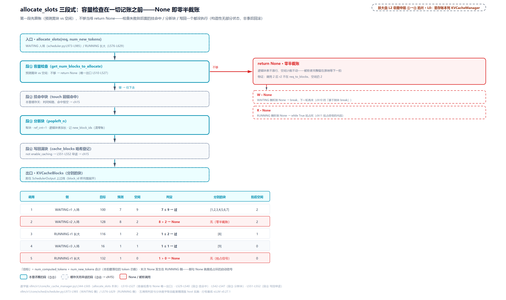

> *图注：allocate_slots 三段式（vllm/v1/core/kv_cache_manager.py:L344-L565）：第一段先算账，需块预测对上空闲块数，不够当场 return None（主路径零半截账：逻辑块表不添行、空闲不动，被拒者完整留到下一拍）；第二段挂前缀命中块（本章缓存关、恒空）；第三段 popleft_n 拿块挂账；第四段写回满块（早退）。五调用实录 7≤9 过 / 8>2 拒 / 1≤2 过 / 1≤1 恰过 / 1>0 拒，最后一次在 RUNNING 侧，那句 None 就是抢占环的启动信号（[第 11 章](../../ch11-preemption-request-lifecycle/narrative/chapter.md)）。*

### 引用计数：一块的一生

拿块时那行 `ref_cnt += 1` 值得单独开一节，它是块共享的记账术。**引用计数**（reference counting）不是 vLLM 发明：给资源记一个「有几个人在用」的整数，引用建立 +1、销毁 −1、归零回收。CPython 的对象生命周期就是它（`sys.getrefcount(obj)` 现场可查，说明性：赋一个名字 +1、del 一个名字 −1），C++ 的 `std::shared_ptr` 也是它。vLLM 把它明晃晃写成了块上一个可见字段，加减各在一个原语里：

```python
# vllm/v1/core/block_pool.py:L702-L742
    def touch(self, blocks: Sequence[KVCacheBlock]) -> None:
        """Touch a block increases its reference count by 1, and may remove
        the block from the free queue. This is used when a block is hit by
        another request with the same prefix.
        # … 省略：docstring 其余部分 ……
        """
        for block in blocks:
            # ref_cnt=0 means this block is in the free list (i.e. eviction
            # candidate), so remove it.
            if block.ref_cnt == 0 and not block.is_null:
                self.free_block_queue.remove(block)     # 从驱逐候选队里救回   # L714
            block.ref_cnt += 1                          # 「我也要这块」       # L715
            # … 省略：metrics 观测 ……

    def free_blocks(self, ordered_blocks: Iterable[KVCacheBlock]) -> None:
        """Free a list of blocks. The blocks should be ordered by their
        eviction priority, where the first block will be evicted first.
        # … 省略：docstring 其余部分 ……
        """
        # Identify blocks with hash (LRU cache) and without it (never match APC)
        blocks_with_hash = []
        blocks_without_hash = []
        for block in ordered_blocks:
            block.ref_cnt -= 1                          # 「我不要了」         # L731
            if block.ref_cnt == 0 and not block.is_null:
                # When caching is disabled we always append for better
                # GPU cache locality from reusing recently used blocks
                if block.block_hash is None and self.enable_caching:
                    blocks_without_hash.append(block)
                else:
                    blocks_with_hash.append(block)

        # Blocks without hash get evicted first - prepend them last to the tail
        self.free_block_queue.prepend_n(blocks_without_hash)   # 劈分挂头（缓存章）  # L741
        self.free_block_queue.append_n(blocks_with_hash)       # 归零挂尾           # L742
```

`touch` 是「我也要这块」：+1，若块正躺在自由队列（ref_cnt 为 0 的驱逐候选）就先 O(1) 摘出来，上一节的 remove 原语在这里等到了它的主人（真实调用场景是前缀命中，前缀缓存章开门见山）。`free_blocks` 是「我不要了」：逐块 −1，**恰在归零且非 null 时**挂回自由队列尾。与 shared_ptr 的两点不同值得点破：其一，归零是**回池待复用**、不是销毁，块是池化资源，像操作系统的页帧回收后再分发；其二，引用计数的经典死穴「环引用」在块世界天然不存在：计数图里块不持有块，`ref_cnt` 是个整数不是指针，共享结构是「请求→块」的有向无环图（自由队列那对 `prev`/`next` 前后指针只是队列缝线，不进计数）。而 [第 11 章](../../ch11-preemption-request-lifecycle/narrative/chapter.md)拆抢占时借走过 `free_blocks` 的劈分两行（L741-L742，哈希留表的伏笔），现在上下文补全了：caching 关闭时劈分条件恒假、全走 `append_n` 挂尾，注释明说这是为了「复用最近用过的块、吃 GPU 缓存局部性」；开缓存后这两行变成 LRU 驱逐序的双不变量，前缀缓存章见。

一块的一生走一遍（6 块池，块 1 与 null 块 0）：

<!-- trace: m4 -->
| 动作 | 块 | ref_cnt | 空闲块 | 回池？ |
|---|---|---|---|---|
| r1 首次分配 get_new_blocks | 1 | 0→1 | 4 | 否（新主人登记） |
| r2 命中同前缀 touch | 1 | 1→2 | 4 | 否（ref_cnt≠0 无需出队；块本就不在自由队列） |
| r1 结束 free_blocks | 1 | 2→1 | 4 | 否（未归零，r2 还在用，这正是共享的物理意义） |
| r2 结束 free_blocks | 1 | 1→0 | 5 | 是（归零且非 null → 挂队尾） |
| touch 救回驱逐候选 | 1 | 0→1 | 4 | 出队（空闲 5→4） |
| 再 free_blocks | 1 | 1→0 | 5 | 是（归零回池） |
| free null_block（占位块特判） | 0 | 不维护 | 5 | 否（is_null 挡住，空闲不变） |

第三行是全表的戏眼：r1 先退租，房间不挂出去——室友 r2 还在读，这就是共享前缀省显存的物理机制（论文那第四笔「冗余复制」的解药，前半句在此落地）。最后一行是 null 块的特判闭环：free 到它时 is_null 挡住，ref_cnt 从来不维护、也从不需要。这张表同时证着一条不变量：对非 null 块，**在自由队列 ⟺ ref_cnt == 0**。三个原语各自维护这个等价（+1 配出队、−1 配归零入队），归纳全程成立。

## 过线：block_id 是两个进程唯一的共同语言（站 5-8）

账本在调度器进程里改完了，GPU 在 worker 进程手里，L0 图上，这条账要过那条进程边界。先立总原则：**调度器独占元数据**（谁用哪块、ref_cnt、自由队列，全在 EngineCore 进程的 Python 里），**worker 独占 GPU 张量**（页表、槽位、KV 缓冲）。两边唯一都认得的键，是 block_id。

怎么传？复用[第 10 章](../../ch10-continuous-batching-chunked-prefill/narrative/chapter.md)立过的差量协议（首件全量、补件增量），本章打开其中块表这一维。调度器收尾打包：

```python
# vllm/v1/core/sched/scheduler.py:L1144-L1149 · Scheduler.schedule
            new_reqs_data = [
                NewRequestData.from_request(
                    req, req_to_new_blocks[req.request_id].get_block_ids()   # 全量块表  # L1146
                )
                for req in scheduled_new_reqs
            ]
```

```python
# vllm/v1/core/sched/scheduler.py:L1451-L1453 · Scheduler._make_cached_request_data
            new_block_ids.append(
                req_to_new_blocks[req_id].get_block_ids(allow_none=True)  # 增量  # L1452
            )
```

新请求首帧带**全量**块表（整张提货单随请求档案过线）；已在跑的请求每拍只带**增量** new_block_ids。`get_block_ids(allow_none=True)` 的语义是「一个新块都没有就返回 None」（kv_cache_manager.py:L89-L91），连电报都省了、不占带宽。[第 10 章](../../ch10-continuous-batching-chunked-prefill/narrative/chapter.md)预告过的那个分叉也在这条线上：被抢占恢复的请求，new_block_ids 是**整表替换**而非追加，因为恢复者领到的是一套全新的块，追加语义对不上旧表。

worker 收到后维护自己的镜像，三种动作各归各位：

```python
# vllm/v1/worker/gpu_model_runner.py:L1442-L1474 · GPUModelRunner._update_states
            if not resumed_from_preemption:
                if new_block_ids is not None:
                    # Append the new blocks to the existing block IDs.
                    for block_ids, new_ids in zip(req_state.block_ids, new_block_ids):
                        block_ids.extend(new_ids)                # 在跑：差量追加  # L1446
            else:
                assert req_index is None
                assert new_block_ids is not None
                # The request is resumed from preemption.
                # Replace the existing block IDs with the new ones.
                req_state.block_ids = new_block_ids              # 恢复者：整表替换  # L1452
            # … 省略：新请求/掉批请求走 reqs_to_add 建档、async 恢复 output_token_ids
            #       两段（异步调度章拆过）……

            # Update the persistent batch.
            self.input_batch.num_computed_tokens_cpu[req_index] = num_computed_tokens
            if new_block_ids is not None:
                self.input_batch.block_table.append_row(new_block_ids, req_index)  # L1474
```

最后一行是落点：块 id 写进 worker 侧页表。页表本体的形状：

```python
# vllm/v1/worker/block_table.py:L105-L112 · BlockTable.__init__
        self.block_table = self._make_buffer(
            self.max_num_reqs, self.max_num_blocks_per_req, dtype=torch.int32   # 页表  # L106
        )
        self.num_blocks_per_row = np.zeros(max_num_reqs, dtype=np.int32)        # 行长 # L108

        self.slot_mapping = self._make_buffer(
            self.max_num_batched_tokens, dtype=torch.int64                     # 槽位表 # L111
        )
```

`block_table` 是 `[max_num_reqs, max_blocks_per_req]` 的 int32 大表，**每请求一行、每块一格**，正是「页表的显存版」；`num_blocks_per_row` 给每行记账（写到第几格）；旁边的 `slot_mapping` 先按下（站 9 的主角）。两张表的载体都是 CpuGpuBuffer（CPU/GPU 双镜像缓冲：CPU 侧写、一次 commit 拷上 GPU；双镜像的内景在执行篇持久批次章）。写行的入口：

```python
# vllm/v1/worker/block_table.py:L138-L154
    def append_row(
        self,
        block_ids: list[int],
        row_idx: int,
    ) -> None:
        if not block_ids:
            return

        # … 省略：use_hybrid_blocks 细分分支（分配块 ≠ kernel 块时拆块，
        #       下一章显存账本；单组同尺寸时直通）……

        num_blocks = len(block_ids)
        start = self.num_blocks_per_row[row_idx]                # 行内接着写   # L152
        self.num_blocks_per_row[row_idx] += num_blocks
        self.block_table.np[row_idx, start : start + num_blocks] = block_ids   # L154
```

`append_row` 是差量追加：从行长记账的位置接着写新块 id，不重写整行。过线实录（精简版单进程驱动、打包时刻手工快照；真实两进程经消息序列化天然各持一份）：拍 1 新请求 r1（33 token）首发全量 ([1,2,3],)，worker 建档 CachedRequestState.block_ids=[1,2,3]、页表行 0 写 [1,2,3]；拍 1.5 r1 无新块 → None，不占带宽、worker 无动作；拍 2 r1 长到 49 token，增量 ([4],)，worker 侧 extend 成 [1,2,3,4]、页表行 0 差量补一格（行长 3→4）；拍 3 同帧 r2 首发全量 ([5],) + r1 增量 None。恢复者小图：抢占前 [1] → 恢复后整表替换 [2,3]（assert req_index is None 的那条路）。

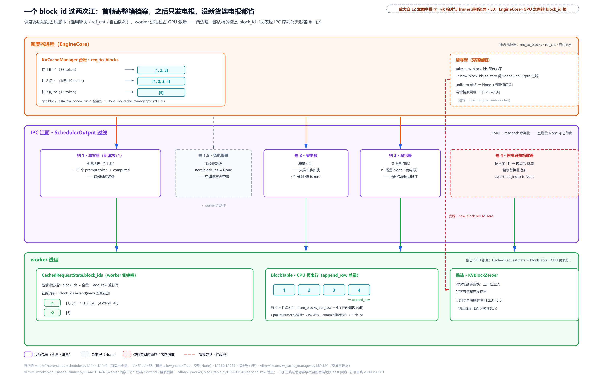

> *图注：block_id 跨进程契约（scheduler.py:L1144-L1149/L1451-L1453 + gpu_model_runner.py:L1442-L1474 + block_table.py:L138-L154）：调度器进程独占块账本、worker 进程独占 GPU 张量，两边唯一共享的键是 block_id。首帧新请求寄整箱档案（全量块表 [1,2,3]），之后每拍只发电报（增量 [4]；没新块连电报都省，allow_none=True 得 None 不占带宽）；被抢占恢复的客户整本档案重寄（[1]→[2,3] 整表替换）。worker 收到电报做三件事：block_ids 差量 extend、append_row 写 CPU 页表行、把新块 id 交保洁（new_block_ids_to_zero 旁路）。*

### 清零账：新块先保洁再交房

图里那条红色旁路（new_block_ids_to_zero）值得正面讲。**旧问题**：块是从自由队列回收的，上一任主人留下的字节还躺在显存里，torch.zeros 只在启动期成立，此后每一页都被反复转租。**痛点**：注意力读到陈旧数据不报错、只出错，NaN（非数字浮点值）会顺着注意力输出污染整条序列，且无从排查。**v1 方案**是一条三段通道。调度器侧每步排干新块流水账：

```python
# vllm/v1/core/sched/scheduler.py:L1260-L1272
    def _get_new_block_ids_to_zero(self) -> list[int] | None:
        # Drain new attention block ids every step so the manager-side list
        # does not grow unbounded; only kv-cache zeroing consumes them.
        new_block_ids_to_zero = self.kv_cache_manager.take_new_block_ids()   # 排干  # L1263
        if not self.needs_kv_cache_zeroing:
            return None

        # … 省略：async KV load 覆写区跳过集合（KVConnector 章）……
        return new_block_ids_to_zero or None
```

注释原话点明动机："does not grow unbounded"（不能无限增长），所以流水账每步清仓，随 SchedulerOutput 过线。worker 开场三件事之一就是执行：

```python
# vllm/v1/worker/gpu_model_runner.py:L1219-L1222 · GPUModelRunner._update_states
        # Zero GPU memory for freshly allocated cache blocks to prevent
        # stale NaN/data from corrupting attention or SSM computation.
        if scheduler_output.new_block_ids_to_zero:
            self._zero_block_ids(scheduler_output.new_block_ids_to_zero)    # L1222
```

注释原话就是 why 的全部："prevent stale NaN/data from corrupting attention or SSM computation"（防陈旧 NaN/数据污染注意力或 SSM 计算；SSM 是 Mamba 类状态空间模型的计算，见[下一章显存账本（第 14 章）](../../ch14-memory-ledger/narrative/chapter.md)）。`_zero_block_ids` 背后是 KVBlockZeroer：构造期预计算各段绝对地址表，每步用一个 Triton kernel（vLLM 写 GPU kernel 用的语言，下一节「槽位恒等式」正面介绍）把名单上的块整页清零（host 精简版走同地址表的 CPU 分支）。实跑一组混合精度两层池：预置陈旧字节 7 铺满两层 → 清 [1,2,3,4,5,6] → 两层的块 1..6 全归零、块 0（null）的陈旧字节原样保留（永不出租、无须清）；第二次排干 → None（排干语义）。还有个开关值得记：`needs_kv_cache_zeroing` 什么时候开？源码 docstring 给了两个真实触发（kv_cache_interface.py:L1014-L1022）：模型里有 Mamba 层（状态在写全之前就会被读，#35219）；混合精度 KV（回收块跨组被另一组按不同精度重新解释，陈旧字节解成 NaN/Inf；实跑那组混合精度两层池踩的正是这个触发）。均匀单组的纯注意力则免清零，通道直接关（None，scheduler.py:L1264-L1265），docstring 原话 "Uniform-precision caches skip zeroing"。为什么敢免：注意力只读 seq_len 内已写过的位置，没写过的槽位永远读不到（注意不是「新块马上会被整块覆写」；站 11 的节奏总账是现成反例：31/32 仍 2 块、33 才进第 3 块，新块当拍只住进 1 个 token 位，其余 15 个槽要等后续拍逐个写），清零是白付带宽。代价与豁免都摆在明处。这笔护栏属于一组更大的组合（整序列门、准入上限、CoW 拷贝管线）：整序列门与准入上限归下一章显存账本，CoW 拷贝管线紧接着讲——worker 开场就排在清零那两行 if 的后面。

### CoW 六拍：partial 命中的共享尾块什么时候换私房

先把适用面立住，免得在本章主路径上白找：CoW 的唯一触发是 **partial 命中**——本拍前缀命中的长度停在某个块的**中间**（判定就是「有命中、且命中长度不是块的整数倍」）。这要求缓存查找能以比块更细的粒度命中，而单组部署做不到：本章的单组全注意力里，哈希记账粒度与块大小相等（hash_block_size，每多少 token 算一次内容哈希；单组直接返回一对相等的 (bs, bs)，kv_cache_utils.py:L649-L651），命中长度恒为块整数倍，**永无 partial、永无 CoW**。这正是精简版把 CoW 整段删给前缀缓存章的原因；只有多组混合部署（哈希粒度取各组的公约数，命中才可能停在块中间）才走得到这条路。但它在 allocate_slots 账上的完整时机值得本章点透——六拍管线，前三拍在调度器侧（前文都见过），后三拍在过线与 worker 侧，正好把本章两半缝起来。

**拍 1（预测 +1）**：`get_num_blocks_to_allocate` 末尾那句 `num_new_blocks += 1`（L226-L229，就是「先数块」代码块里标了 CoW 预留的那行）——容量检查为那个还不存在的私有块先占一个位。**拍 2（挂账登记）**：挂命中块的函数检测到 partial，记 `_partial_hit_reqs[请求] = (block_idx, 共享尾块)`，并把 num_cached_block 下修到整块边界 `block_idx`（L283-L289）——块内那半截不算「已缓存」，私有拷贝写满后会重新走写回。**拍 3（换尾）**：`allocate_new_blocks` 开场消费登记——就是上一节代码块开头那段 CoW 前奏：get_new_blocks(1) 拿私有块，`_apply_cow` 把 `req_blocks[block_idx]` **原地**换成它。_apply_cow 本体与它的引用账：

```python
# vllm/v1/core/single_type_kv_cache_manager.py:L405-L425
    def _apply_cow(
        self,
        request_id: str,
        block_idx: int,
        source_block: KVCacheBlock,
        cow_block: KVCacheBlock,
    ) -> None:
        """Redirect a partial prefix-cache hit to a private CoW block.

        Both copy endpoints stay retained until the copy has run on the worker,
        so a same-step free cannot recycle them: ``source_block`` keeps its
        hit-ref, ``cow_block`` takes an extra ref beyond the one handed to the
        request.
        """
        req_blocks = self.req_to_blocks[request_id]
        assert block_idx < len(req_blocks)
        assert req_blocks[block_idx] is source_block
        assert not source_block.is_null and source_block.ref_cnt > 0
        req_blocks[block_idx] = cow_block
        self._pending_cow_copies.append((source_block, cow_block))
        cow_block.ref_cnt += 1
```

docstring 就是账本：**两端都要活到 worker 拷完**。共享尾块 source 被 touch 过（挂账 +1）、被换出请求块表后**不减**——这就是保留引用，保证拷贝执行时源块没被别人回收；cow 块 = 请求持有 1 + 这里额外 +1 = 2。**拍 4（返回值分岔）**：换完尾再算差值（上一节的 L361 同款）——差值 ≤ 0 就只返回 cow_blocks（本拍 **只换不增**，典型形态：整条 prompt 都落在共享前缀上、没有越出命中的净新增）；> 0 就返回 cow_blocks + new_blocks（**又换又增**）。上一节代码块里标了「只换不增 / 又换又增」的那两个 return，分的就是这个岔。**拍 5（过线）**：schedule() 收尾把 `_pending_cow_copies` 排干成 `KVCacheBlockCopy`（只带 src/dst 两个块号的轻量记录）塞进 SchedulerOutput，两端块挂保留引用、按围栏（fence，等某个序号到达才放行的同步屏障——这里是调度步序号 sched_step_seq）延迟释放：

```python
# vllm/v1/core/sched/scheduler.py:L1181-L1190
        kv_cache_block_copies, cow_retained_blocks = (
            self.kv_cache_manager.take_kv_cache_block_copies()
        )
        if kv_cache_block_copies:
            # The copies run with this step's execution; the first non-empty
            # step at or after it gets seq `sched_step_seq + 1` (0-token steps
            # do not advance the seq), and its completion implies the copies
            # have run.
            self._free_cow_retained_blocks(cow_retained_blocks, self.sched_step_seq + 1)
        pending_kv_cache_block_copies = kv_cache_block_copies or None
```

为什么是「sched_step_seq + 1 的围栏」而不是当场释放：拷贝指令此刻可能还在路上或在 GPU 排队，本拍完成不等于拷贝完成；围栏押到下一个非空步，那个步的完成即蕴含拷贝已执行，到期的 free_blocks 把 source 从 1 减到 0（回池）、cow 从 2 减到 1（留给请求）。**拍 6（worker 执行）**：`_update_states` 里先清零、后拷贝、再进前向——两个 if 的次序注释写明 after zeroing new blocks and before forward：

```python
# vllm/v1/core/sched/output.py:L253-L259
    # Block IDs freshly allocated from the pool during this scheduling step.
    # The worker zeros the corresponding GPU memory before the blocks are used,
    # preventing stale NaN/data from corrupting attention or SSM computation.
    new_block_ids_to_zero: list[int] | None = None

    # CoW copies to apply after zeroing new blocks and before forward.
    kv_cache_block_copies: list[KVCacheBlockCopy] | None = None
```

（cow 块对 worker 来说就是新块——`allocate_new_blocks` 前奏里 `self.new_block_ids.append(cow_block.block_id)` 那行把它记进了清零名单。）拷贝本体 `copy_kv_cache_blocks_inplace` 把每层存储视为 `[num_blocks, page_bytes]` 的字节矩阵，对每个 (src, dst) 对执行一句 `blocks[dst] = blocks[src]` 整页搬运（vllm/v1/worker/utils.py:L528-L567）。

走读一个完整例对账（E4，代码走读推演——精简版删了 CoW 整段无法实跑，数字按上列锚点逐步推演；块大小 32、多组部署哈希粒度 16、prompt=36、命中到 token 16）。**预测段**：查得 1 块命中但只盖 16 token，16 % 32 ≠ 0，partial 成立，登记 (block_idx=0, blkX)；required = cdiv(36,32) = 2、local_computed = 1 → 新块 1；blkX 冷（ref_cnt==0）可驱逐 1；partial +1 → 总预测 3。**分配侧**：touch blkX（净减 1）、换尾取 1（净减 1）、差值 cdiv(36,32)−1 = 1 再取 1（净减 1）→ 自由队列净减 3 = 预测 3，预测器与分配器在这条支上同样同构。**worker 侧**：过线 [(blkX → cow)]，先清零（cow 与新块）再整页拷 32 槽字节，随后 prefill 的 token 16..35 写进 cow 的槽 16..31 和新块的槽 0..3——共享方 blkX 后半截的陈旧字节永远不被读到。半块命中既省显存又不出错，闭环就在这六拍里。

与 v0 经典 CoW 的对比，pin 里的官方文档一段话讲完（v0 引擎代码本体已随旧架构删除，只能引文档原话）：

```text
# docs/design/metrics.md:L516-L530
Historically, [vLLM has long supported beam search](https://github.com/vllm-project/vllm/issues/6226). The
SequenceGroup encapsulated the idea of N Sequences which
all shared the same prompt kv blocks. This enabled KV cache block
sharing between requests, and copy-on-write to do branching. CPU
swapping was intended for these beam search like cases.

Later, the concept of prefix caching was introduced, which allowed KV
cache blocks to be shared implicitly. This proved to be a better
option than CPU swapping since blocks can be evicted slowly on demand
and the part of the prompt that was evicted can be recomputed.

SequenceGroup was removed in V1, although a replacement will be
required for "parallel sampling" (`n>1`).
[Beam search was moved out of the core](https://github.com/vllm-project/vllm/issues/8306). There was a
lot of complex code for a very uncommon feature.
```

同族机制：多个序列共享同一物理块、谁要接着写谁才拷一份私有，省的都是「共享只读前缀」的显存。差别在服务的对象——v0 的 CoW 服务 SequenceGroup（v0 的请求组抽象，把 beam search 束搜索、parallel sampling 一次采多条这类「一 prompt 多序列」封装成一组）分叉：n 条 Sequence 共享 prompt 块，分叉时拷尾块；v1 这条服务前缀缓存的 partial 命中：命中的共享尾块只有前半截有效、本请求要接着写后半截。分叉方从「同组兄弟序列」换成了「缓存里不明身份的任何前任」。SequenceGroup 在 V1 移除、beam search 移出核心，这条老机制换了雇主继续上岗。至于哈希侧的全套——哈希什么时候算、怎么以 16 粒度命中、+1 预留的实测账——[前缀缓存章（第 15 章）](../../ch15-prefix-caching/narrative/chapter.md)进阶一节开课，本章到此收口。

### 先把地图寄出去：块表先行拷贝

页表写好了，什么时候上 GPU？每拍 `_prepare_inputs`（组输入）开场干的**第一件实事**就是它（前面只有两句赋值加两个断言的纯簿记）：

```python
# vllm/v1/worker/gpu_model_runner.py:L1977-L1979 · GPUModelRunner._prepare_inputs
        # OPTIMIZATION: Start copying the block table first.
        # This way, we can overlap the copy with the following CPU operations.
        self.input_batch.block_table.commit_block_table(num_reqs)      # L1979
```

注释原话：先开始拷块表，让这次 H2D（host to device，CPU 到 GPU）搬运与后面的 CPU 活（组 token、采样元数据）**并行**跑。而且只拷活跃行：`commit_block_table(num_reqs)` 只拷前 num_reqs 行（block_table.py:L213-L214），实跑里 2 个活跃请求、第 3 行被 CPU 侧写脏了 9，但 GPU 镜像的第 3 行仍是 0，本拍没上场的请求，一个字节都不搬。慢车道先发车，是[第 12 章](../../ch12-async-scheduling/narrative/chapter.md)重叠心跳哲学在块表上的又一次落地。

### 一拍两次 RPC：EngineCore 与 worker 的消息往返清单

块表差量、清零名单、CoW 拷贝对——过线的每一维都拆过了，还剩最后一问：这些消息整体怎么发、谁收、什么时候发什么时候收。先交代部署形态，它决定这一切是否存在：执行器后端 `distributed_executor_backend`——单卡默认 uni（UniProcExecutor，单进程执行器：worker 对象与调度器同住 EngineCore 进程，execute_model 是一次普通方法调用，零消息队列；本章精简版跑的就是这个形态）；多卡默认 mp（MultiprocExecutor，多进程执行器：每个 worker 起成子进程）。只有 mp 下一拍才有两次真正的跨进程往返。mp 下 EngineCore 进程每拍的骨架（[第 9 章](../../ch09-engine-core-step-loop/narrative/chapter.md)拆过它的两段契约与逐拍耗时，本章看消息流）：

```python
# vllm/v1/engine/core.py:L584-L614 · EngineCore.step
    def step(self) -> tuple[dict[int, EngineCoreOutputs], bool]:
        """Schedule, execute, and make output.

        Returns tuple of outputs and a flag indicating whether the model
        was executed.
        """

        # Check for any requests remaining in the scheduler - unfinished,
        # or finished and not yet removed from the batch.
        if not self.scheduler.has_requests():
            return {}, False
        scheduler_output = self.scheduler.schedule(self._should_throttle_prefills())
        future = self.model_executor.execute_model(scheduler_output, non_block=True)
        grammar_output = self.scheduler.get_grammar_bitmask(scheduler_output)
        with (
            self.capture_iteration_details(scheduler_output) as iteration_details,
            self.log_error_detail(scheduler_output),
        ):
            model_output = future.result()
            if model_output is None:
                model_output = self.model_executor.sample_tokens(grammar_output)

        # Before processing the model output, process any aborts that happened
        # during the model execution.
        self._process_aborts_queue()
        engine_core_outputs = self.scheduler.update_from_output(
            scheduler_output, model_output
        )
        self._attach_iteration_details(engine_core_outputs, iteration_details)

        return engine_core_outputs, scheduler_output.total_num_scheduled_tokens > 0
```

（with 那两句是观测与错误归因的上下文管理器，与消息流无关，看中间五句即可。）这五句里藏着两次 RPC。**第一次**：`execute_model` 带着 SchedulerOutput 以 `non_block=True` 下发——消息投进队列立刻拿到 Future（异步调用凭证，先拿票、稍后凭票取结果）返回，EngineCore 不等，转身在 CPU 上算结构化输出的语法位掩码（grammar bitmask，标记每个位置语法上允许哪些 token 的 int32 大数组）；掩码算完才 `future.result()` 收第一次应答。应答内容是 None，含义不是出错，而是「**前向已 launch、采样等第二次 RPC**」（空批等会返回非 None、第二次 RPC 整段跳过的分支，[第 9 章](../../ch09-engine-core-step-loop/narrative/chapter.md)实测过）。None 到手后发起**第二次** RPC：`sample_tokens` 把掩码发下去，worker 把掩码盖在 logits 上、采样、D2H（GPU 到 CPU）、组装 ModelRunnerOutput 回程。两次 RPC 之间那段时间，CPU 掩码计算与消息在途、GPU 前向三方**重叠**——这就是把一步劈成两次 RPC 的全部意义：掩码必须在采样前、又不必在前向前，于是被摘出关键路径。

通道就两条。**下行一条广播 MQ**（`rpc_broadcast_mq`，广播消息队列）：EngineCore 一次入队，全体 worker 各读一份，实现是 vLLM 自带的共享内存环形缓冲消息队列。**上行每个 worker 一条应答 MQ**（`worker_response_mq`）：worker 是写者、EngineCore 是读者。应答不是全员回：下行消息里带 `output_rank`（唯一回话的 worker 编号，按 TP/PP（张量并行/流水线并行，多卡切模型的两刀）布局落在最后一个流水级的头上——TP=8、PP=4 的 32 卡部署里是 24 号；编号公式归[第 17 章](../../ch17-executor-worker-model-runner/narrative/chapter.md)），其余 worker 算完就扔。顺带一个尺寸彩蛋：MQ 24MiB 默认值的注释点名，尺寸依据正是那个语法掩码（1024 个请求的批量）。至于序列化载体（pickle 带外缓冲、超上限改走 zmq）和应答怎么按调用顺序配对，传输层内景归[第 17 章](../../ch17-executor-worker-model-runner/narrative/chapter.md)。

传什么、收什么，SchedulerOutput 的字段注释自己说得很清楚：

```python
# vllm/v1/core/sched/output.py:L192-L216
@dataclass
class SchedulerOutput:
    # list of the requests that are scheduled for the first time.
    # We cache the request's data in each worker process, so that we don't
    # need to re-send it every scheduling step.
    scheduled_new_reqs: list[NewRequestData]
    # list of the requests that have been scheduled before.
    # Since the request's data is already cached in the worker processes,
    # we only send the diff to minimize the communication cost.
    scheduled_cached_reqs: CachedRequestData

    # req_id -> num_scheduled_tokens
    # Number of tokens scheduled for each request.
    num_scheduled_tokens: dict[str, int]
    # Total number of tokens scheduled for all requests.
    # Equal to sum(num_scheduled_tokens.values())
    total_num_scheduled_tokens: int
    # req_id -> spec_token_ids
    # If a request does not have any spec decode tokens, it will not be
    # included in the dictionary.
    scheduled_spec_decode_tokens: dict[str, list[int]]
    # req_id -> encoder input indices that need processing.
    # E.g. if a request has [0, 1], it could mean the vision encoder needs to
    # process that the request's 0-th and 1-st images in the current step.
    scheduled_encoder_inputs: dict[str, list[int]]
```

（最后两个字段：投机解码的草稿 token 名单、多模态编码器的输入索引，本章主路径恒空。）四条 ownership 事实把「消息里有什么」钉死。其一，**差量协议**：新请求首帧全量档案（含本章站 5 的首帧全量块表与 prompt token），老请求只发增量（new_block_ids、num_scheduled_tokens 等）。其二，**token 流向不对称**：prompt 只过线一次；decode 拍的采样 token 由 worker 自己采、经 `ModelRunnerOutput.sampled_token_ids` 只回程一次——调度器不把生成 token 发回去（例外：投机草稿随下行，就是上面 scheduled_spec_decode_tokens）。其三，**消息体里永远没有 GPU 张量**：ModelRunnerOutput 的类注释明说「要序列化发给调度进程、torch.Tensor 太贵，刻意用 list」；输入张量同样不跨进程，worker 拿 block_id 加 num_scheduled_tokens 在本地重建（上一小节的块表先行拷贝是其中一环，重建内景归执行篇）。block_id 是两个进程唯一的共同语言，这句话在 mp 部署下是字面成立的。其四，一个例外：配了 KV connector 时 output_rank 置 None、全 rank 各回一份、执行器收齐后聚合（账归[KVConnector 章（第 16 章）](../../ch16-kv-connector/narrative/chapter.md)）。

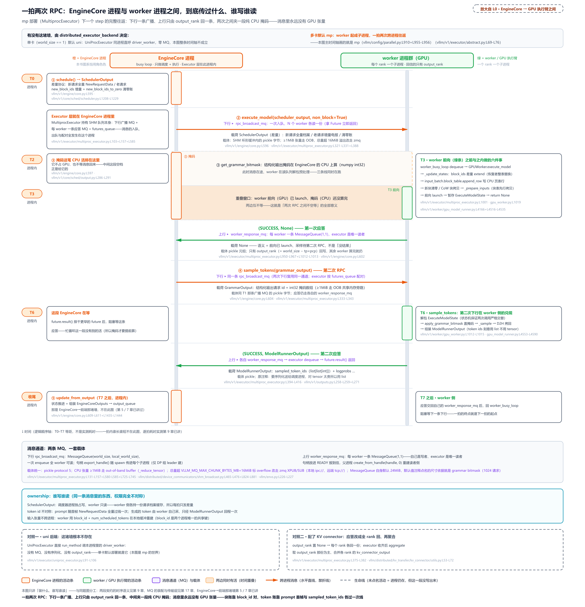

> *图注：mp 部署下 EngineCore.step() 一拍两次跨进程 RPC（core.py:L584-L614 + multiproc_executor.py:L321-L343/L372-L416 + shm_broadcast.py:L465-L476）。双生命线：左 EngineCore 进程（执行器也在它手里——两条消息队列的入队、出队、配对全在本进程）、右 worker 进程群，高亮的 output_rank 是唯一回话者。下行两次（execute_model 带 SchedulerOutput 差量、sample_tokens 带语法掩码）走同一条广播 MQ、一次入队全 worker 各读一份；上行两次（第一次应答 None = 前向已 launch、第二次 ModelRunnerOutput = list 化的采样 token）只由 output_rank 回。两次 RPC 之间的重叠带是这套设计的意义所在：CPU 掩码计算与消息在途、GPU 前向互不等。底部三块：两条 MQ 的构造与载体（pickle5、≥1MiB 走带外、16MiB 溢出转 zmq）、ownership 三条、两个对照（uni 后端零 MQ = 本章精简版形态；配 KV connector 时全 rank 回 + 聚合）。轴上 T0–T7 等距是**逻辑顺序、不是实测耗时**——逐拍耗时实测见[第 9 章](../../ch09-engine-core-step-loop/narrative/chapter.md)，消息队列装配与传输内景见[第 17 章](../../ch17-executor-worker-model-runner/narrative/chapter.md)；也别与[第 5 章](../../ch05-zmq-topology-and-protocol/narrative/chapter.md)那堵墙混淆——那里是 frontend 与 EngineCore 之间的 ZMQ，这里是 EngineCore 与 worker 之间的共享内存消息队列，一拍两次往返说的是后者。*

## 槽位恒等式：一个位置号怎么变成一个物理槽位（站 9）

页表上了 GPU，下一问：一个 token 的 KV 到底放进哪个格子？答案是一条恒等式，但先补 30 秒算术底座。**行主序摊平**：GPU 张量在内存里就是一条线，`[num_blocks, block_size]` 的两维下标 (b, off) 摊平成线性下标就是 b × block_size + off（NumPy 官方口径：ndarray 是「一段连续内存 + 一套索引方案」，默认按 C 语言的行主序排）；逆运算是整除取余（divmod：商 + 余数分解）；数块数是天花板除（cdiv）。本章三处主算术同形：cdiv 数块、divmod 拆位置、乘加摊平成槽位。

换算发生在哪、用什么写？这又是一条完整的 why 链（本章第三主角）。**旧设计**：在 CPU 上用 numpy 算好每个「请求、位置」到槽位的映射，再整段拷上 GPU。**痛点**有两个：其一，本拍的 positions（每个 token 的序列位置）本身就是 GPU 张量：

```python
# vllm/v1/worker/gpu_model_runner.py:L2188-L2201 · GPUModelRunner._prepare_inputs
        self.positions[:total_num_scheduled_tokens] = (
            self.num_computed_tokens[req_indices_gpu].to(torch.int64)   # GPU 张量取已算数  # L2189
            + self.query_pos.gpu[:total_num_scheduled_tokens]           # + GPU 上的位置基   # L2190
        )
        # … 省略：seq_lens 组装 ……
        self.input_batch.block_table.compute_slot_mapping(              # 张量进、不落 CPU # L2197
            num_reqs,
            self.query_start_loc.gpu[: num_reqs + 1],
            self.positions[:total_num_scheduled_tokens],
        )
```

CPU 算法得先把 positions 从 GPU 拉回来（D2H 同步，device to host；[第 12 章](../../ch12-async-scheduling/narrative/chapter.md)立的同步禁区：一处同步就把藏好的等待全部拽回前台，斩断异步调度）；其二，O(token 数) 的 Python/numpy 循环每拍都付。**v1 方案**：换算本身搬上 GPU，用 Triton 写。Triton 是什么？官方 README 自述 "a language and compiler for writing highly efficient custom Deep-learning primitives"（写高效深度学习算子的语言与编译器），赌注是「把块级并行留给程序员、把寄存器/线程排布留给编译器」，比写 CUDA C++ 生产力高（vLLM 从融合算子到本节这个换算 kernel 都用它写；起源是 PLDI'19 的 tile 中间语言论文，现为社区项目）。读它的 kernel 只需五个词汇，官方 vector-add 教程一行一个：`@triton.jit`（标记这是 kernel）、`tl.program_id`（我是第几个程序实例）、`tl.arange` + mask（我负责的下标向量、越界掩码）、`tl.load` / `tl.store`（带掩码读写显存）；启动时给一个 grid（程序实例布局，同 CUDA grid）。派发与 kernel 本体：

```python
# vllm/v1/worker/block_table.py:L182-L211
    def compute_slot_mapping(
        self,
        num_reqs: int,
        query_start_loc: torch.Tensor,
        positions: torch.Tensor,
    ) -> None:
        num_tokens = positions.shape[0]
        if self.slot_mapping_mode == SlotMappingMode.NONE:
            # Mamba/GDN groups consume the block table as recurrent state
            # indices and do not use per-token slot mappings.
            return
        # … 省略：mode 断言一行 ……
        _compute_slot_mapping_kernel[(num_reqs + 1,)](     # grid：每请求一程序 + 1 个专职尾  # L195
            num_tokens,
            self.max_num_batched_tokens,
            query_start_loc,
            positions,
            self.block_table.gpu,
            self.block_table.gpu.stride(0),
            self.block_size,
            self.slot_mapping.gpu,
            # … 省略：七个 constexpr 实参（kernel 块大小、CP 分片常数、PAD_ID 等）……
        )
```

开头 NONE 分支点名的 GDN 是 Gated DeltaNet（门控 Delta 网络），与 Mamba 同路、以循环状态代替 KV 的模型，它们的块表整组当循环状态索引用、不做逐 token 槽位换算（见[下一章显存账本（第 14 章）](../../ch14-memory-ledger/narrative/chapter.md)）。grid 是 `(num_reqs + 1,)`：每个程序实例处理一个请求的 token 区间（query_start_loc 切段），**多出来的最后一个程序专职填 PAD 尾**。kernel 本体是单卡版（CP 上下文并行（context parallel：把一条长序列切成多段、分给多卡并行算的部署模式）的分片三处按常数 1 烘干后就是它；分片原貌归执行篇）：

```python
# vllm/v1/worker/block_table.py:L379-L442
@triton.jit(do_not_specialize=["num_tokens", "max_num_tokens"])
def _compute_slot_mapping_kernel(
    # … 省略：十五个形参（指针们、block_size、七个 constexpr）……
):
    req_idx = tl.program_id(0)                            # 我管第几个请求      # L397

    if req_idx == tl.num_programs(0) - 1:
        # Pad remaining slots for CUDA graph compatibility.
        for i in range(num_tokens, max_num_tokens, BLOCK_SIZE):   # 最后一个程序：  # L401
            offsets = i + tl.arange(0, BLOCK_SIZE)                # 尾部 [n, max)    # L402
            tl.store(
                slot_mapping_ptr + offsets,
                PAD_ID,                                    # 全填 -1           # L405
                mask=offsets < max_num_tokens,
            )
        return

    start_idx = tl.load(query_start_loc_ptr + req_idx).to(tl.int64)    # 我的 token 区间  # L410
    end_idx = tl.load(query_start_loc_ptr + req_idx + 1).to(tl.int64)

    # … 省略：CP 分片三处（virtual_block_size 放大 / is_local 本秩判定 /
    #       local_block_offsets 重排）与请求行基址一行（row_offset =
    #       req_idx * block_table_stride）；单卡下退化为恒等：
    #       block_indices 即 pos // block_size、local_block_offsets 即 pos ……
    for i in range(start_idx, end_idx, BLOCK_SIZE):
        offsets = i + tl.arange(0, BLOCK_SIZE)
        mask = offsets < end_idx
        pos = tl.load(positions_ptr + offsets, mask=mask, other=0)      # 读位置      # L418
        # … 省略：CP 重排后的 block_indices 计算 ……
        block_numbers = tl.load(                                  # 查页表拿块号  # L434
            block_table_ptr + row_offset + block_indices,
            mask=mask & is_local,
            other=0,
        ).to(tl.int64)
        slot_offsets = local_block_offsets % block_size           # 块内偏移      # L439
        slot_ids = block_numbers * block_size + slot_offsets      # ★ 恒等式本体  # L440
        slot_ids = tl.where(is_local, slot_ids, PAD_ID)           # PAD（单卡不触发）# L441
        tl.store(slot_mapping_ptr + offsets, slot_ids, mask=mask) # 写槽位表      # L442
```

恒等式就是标了 ★ 的那行：

```text
slot = block_table[req][pos // block_size] × block_size + pos % block_size
```

读法：位置除以块大小得到**逻辑块号**（页表第几项），查块表行拿到**物理块号**，块号乘块大小加**块内偏移**，摊平成全局槽位，与开头 OS 那笔 0x0317 → 0x0C17 的翻译一字不差。PAD 尾那段的 why 顺带记下：CUDA graph（固定形状捕获回放的执行加速机制，执行篇编译章）捕获的是 max 形状的执行，尾部空槽每拍必须重填 -1（PAD_SLOT_ID）。上一拍残留的合法槽位会让本拍的 padding token（实际 token 数不足 CUDA graph 捕获时的 max 形状时、用来填空位的占位 token，它们也各占槽位表一格）写进别人的块。这与清零账那节「读到陈旧数据不报错、只出错」是同一族坏事：残留（旧槽位值也好、旧字节也好）不清理，写坏与读坏都静默发生，所以两头的护栏同构，一头是 PAD 尾每拍重填，一头是新块先保洁再交房。块表行 [3,1,7]、48 个位置全跑一遍（host 上 kernel 的逐行 CPU 镜像，同一恒等式、同一 PAD 尾、同一变量名）：

<!-- trace: m9 -->
| pos | pos//16 | 块表项 | 块号 | pos%16 | slot = 块号×16 + 偏移 |
|---|---|---|---|---|---|
| 0 | 0 | [3,1,7][0] | 3 | 0 | 48 |
| 15 | 0 | [3,1,7][0] | 3 | 15 | 63 |
| 16 | 1 | [3,1,7][1] | 1 | 0 | 16 |
| 31 | 1 | [3,1,7][1] | 1 | 15 | 31 |
| 32 | 2 | [3,1,7][2] | 7 | 0 | 112 |
| 47 | 2 | [3,1,7][2] | 7 | 15 | 127 |
| PAD 尾：pos ∈ [20,64) | — | （另一场景，行 [1,2] 的 20-token 请求） | — | — | 全 -1 |
| 另一请求 pos 15（行 [5]） | 0 | [5][0] | 5 | 15 | 95 |

表里藏着一个值得盯三秒的现象：位置 16-31 的物理槽位（16..31）反而**低于**位置 0-15 的（48..63）——位置越走越高、槽位先降后升。间接寻址让物理与逻辑彻底脱钩，这就是「翻页」的直接可视化。两条机器性质顺表可验：**双射**，slot = 块号×16+偏移 是「16 进制两位数」的位值分解，块号与偏移可从 slot 唯一恢复（slot//16、slot%16），读腿复算 112 → 块 7 偏移 0、16 → 块 1、48 → 块 3，与写腿无损对上；**PAD 不冲突**，合法 slot 最小是 1×16（块 0 是 null、永不被出租），值域与 {-1} 不相交，消费端放心拿 -1 判无效。

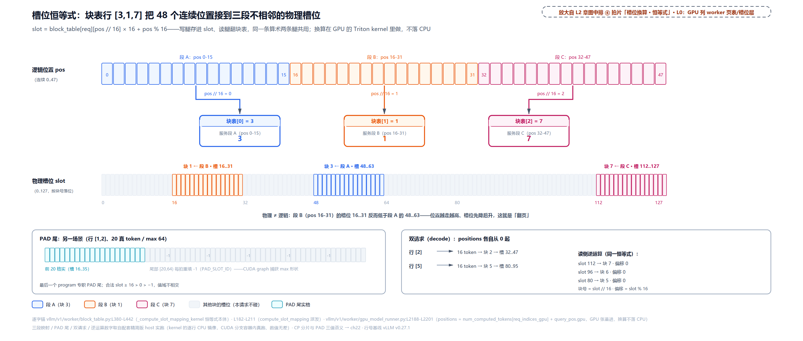

> *图注：槽位恒等式（vllm/v1/worker/block_table.py:L379-L442）：上带逻辑位置 0..47 连续，中间一张块表行 [3,1,7]，下带物理槽位 0..127，三段各接一块：pos 0-15 → 块 3 → 48..63、pos 16-31 → 块 1 → 16..31、pos 32-47 → 块 7 → 112..127，中段槽位低于左段的错位就是间接寻址脱钩的直接可视化。换算是 GPU 上的 Triton kernel（positions 本身是 GPU 张量、全程不落 CPU），尾部 [num_tokens, max) 每拍重填 -1 保 CUDA graph。写腿存进 slot、读腿翻块表，同一条恒等式两条腿共用。*

**代价**也照例诚实：一次 kernel launch 有固定的微秒级开销（小 batch 也是它）；kernel 内逻辑被 CP 分片和混合布局（分配块与 kernel 块异尺寸时的拆块排布，下一章显存账本）细分复杂化；PAD 的值语义贯穿全栈，PAD_SLOT_ID（-1）、NULL_BLOCK_ID（0）各有分工，哪个 kernel 吃哪个 pad 要记牢（深挖归执行篇）。vLLM 为什么认这笔账？回去看痛点那条 D2H：不落 CPU 省下的不只是 Python 循环，是整条同步链。

## 写直读弯：前向的两条腿（站 10）

槽位算好了，前向真正用它的时候长什么样？一个 KV 池子，两条腿：

**写腿**：这一拍算出的每个 token 的 K/V，按 slot_mapping 里自己那个门牌号直塞。每 token 一个槽位，O(1) 直寻址，一次按索引散写（scatter）落账。

**读腿**：下一拍注意力要读全部历史 KV 时，交给注意力后端 metadata 的不是门牌号列表，而是**页表本身**（按注意力组取，`kv_cache_gid` 是组 id；本章单组、只此一个，「组」下一章讲）：

```python
# vllm/v1/worker/gpu_model_runner.py:L2325-L2341
        def _get_block_table(kv_cache_gid: int):
            # … 省略：encoder-only 模型的 if 分支（直接造一张全零表）……
            else:
                blk_table = self.input_batch.block_table[kv_cache_gid]
                blk_table_tensor = blk_table.get_device_tensor(num_reqs_padded)   # 页表张量交出去  # L2336

            # Fill unused block table entries with NULL_BLOCK_ID (null block)
            # for CUDAGraph padding. Block 0 is reserved for padding.
            blk_table_tensor[num_reqs:num_reqs_padded].fill_(NULL_BLOCK_ID)   # pad 行填 0     # L2340
            return blk_table_tensor
```

读腿拿到的块表张量先 pad 到固定形状（CUDA graph 要形状不变），未用行全填 NULL_BLOCK_ID（= 0），null 块的名字在这兑现：pad 行指向 0 号块，读它永远安全（永无真数据的占位块）。于是注意力 kernel 必须自己学会**穿表**：拿到一串块号，逐块跳着读，块内连续、块间断开。两条腿没有先后因果（写的是本拍新 token、读的是历史 token），但共享同一个池子、同一张表、同一条恒等式。

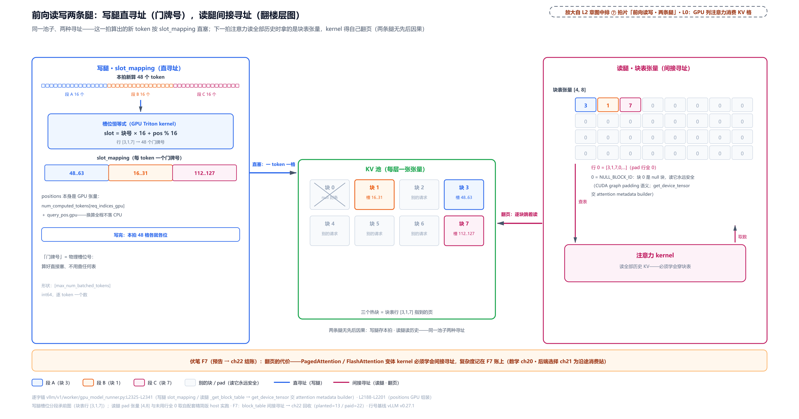

> *图注：前向读写两条腿（vllm/v1/worker/gpu_model_runner.py:L2325-L2341）：写腿直、读腿弯。本拍 48 个新 token 各领一个门牌号（slot_mapping，恒等式现算、GPU 上不落 CPU），K/V 按号直塞；下一拍注意力读全部历史时拿到的是楼层图（块表张量 pad 后 [4,8]、未用行全 0，即 null 块，读它永远安全），kernel 得自己翻页寻址。直与弯的差价（PagedAttention/FlashAttention 变体 kernel 的复杂度）记在 F7 账上，执行篇结算。*

这里把本章一直按着的一句话说透：**分页的总账单，就记在读腿上**。连续布局下注意力读 KV 是一次大段顺序读；分页后它必须穿块表间接寻址：块内连续、块间跳转、还要处理页边界。这就是 PagedAttention/FlashAttention 变体 kernel（FlashAttention 是当下最主流的快速注意力 kernel 家族，vLLM 的注意力后端大多基于它改造；后端怎么选，执行篇正面讲）比连续读复杂的全部原因，也是分页 KV 唯一没法治的「结构性代价」（外部碎片与超额预留被页化根治，尾部浪费被钉死在每请求不足一块，见开头那张总账表）。这笔账怎么付、kernel 内部长什么样（块内并行、页边界处理、PAD 三值语义、CP 分片），执行篇专门讲 slot_mapping 与 block_table 的那一章来结；注意力的数学本身（为什么要读全部历史、online softmax 怎么把它算得起）在它前面有一整章原理铺垫，后端怎么选、怎么仲裁页表布局再往后一章。

## 长大与退房：每 16 个 token 一只新箱（站 11-12）

回到调度器侧收尾。decode 稳态里每个请求每拍多 1 个 token，它的块表什么时候变长？RUNNING 循环里的领块点：

```python
# vllm/v1/core/sched/scheduler.py:L576-L629 · Scheduler.schedule
            with record_function_or_nullcontext("schedule: allocate_slots"):
                while True:
                    new_blocks = self.kv_cache_manager.allocate_slots(
                        request,
                        num_new_tokens,
                        num_lookahead_tokens=self.num_lookahead_tokens,
                    )                                                # L582

                    if new_blocks is not None:
                        # The request can be scheduled.
                        break                                        # 拿到块，出环   # L586

                    # The request cannot be scheduled.
                    # Preempt the lowest-priority request.
                    # … 省略：抢占环主体（PRIORITY 支账目回滚、FCFS pop 队尾、
                    #       六件事带回同构初态；抢占章已拆，此处不重讲）……
                    preempted_reqs.append(preempted_req)
                    if preempted_req == request:
                        # No more request to preempt. Cannot schedule this request.
                        break

            if new_blocks is None:
                # Cannot schedule this request.
                break
```

环的内部[第 11 章](../../ch11-preemption-request-lifecycle/narrative/chapter.md)拆完了，本章只看块侧的节奏。fast-path 的算术（cdiv 差值、负数归零，即 `max(num_required_blocks - num_req_blocks, 0)`）决定了一切：箱内还有空位的那些拍，差值是 0，是**免账拍**，不领块、不发增量、worker 无动作；总 token 越过 16 倍数后的第一拍，差值变 1，是**块界拍**，领一块、发一条增量电报。两条 30-token 请求的长大（8 块池，六拍精选）：

<!-- trace: m11 -->
| 拍 | 请求 | token 总数 | cdiv(·,16) | 已持 | 本拍新块 | 拍后空闲 |
|---|---|---|---|---|---|---|
| 0 | r1+r2 入场（各 30-token prompt） | 30 | 2 | 0 | [1,2] / [3,4] | 3 |
| 1 | r1 | 38 | 3 | 2 | [5] | 2 |
| 2 | r1（块内免账拍） | 44 | 3 | 3 | []（0 新块） | 2 |
| 3 | r1 | 52 | 4 | 3 | [6] | 1 |
| 4 | r2 | 46 | 3 | 2 | [7] | 0 |
| 5 | r1（触发抢占环） | 65 | 5 | 4 | [7]（弹 r2 后重试所得） | 2 |

（表里 token 数一拍跳好几个，decode 稳态每拍本只 +1，驱动脚本为快进每拍多喂几个 token、专在块界前后落脚，免账拍与块界拍各留了样本，r2 的中间拍省略未列；「token 总数」列是 num_computed_tokens + 本拍喂入数的合计，真实引擎里由调度器乐观推进，见[第 10 章](../../ch10-continuous-batching-chunked-prefill/narrative/chapter.md)，驱动脚本手工维护。）

节奏总账（实测的完整刻度）：30 → 2 块、31/32 仍 2 块、33..48 → 3 块、49..64 → 4 块、65..80 → 5 块，相邻两次领块恰好隔 16 个 token，持有块数恒等于 cdiv(总 token, 16)。拍 2 是免账拍的样本（44 ≤ 48，块内还有 4 个空位）；拍 5 是池干的那拍：r1 要第 5 块、空闲 0，None 进抢占环，r2（队尾最年轻）被弹走、3 块按 [7,4,3] 逆序回池，r1 原样重试拿到 7 号，被抢者的代价（重算语义）[第 11 章](../../ch11-preemption-request-lifecycle/narrative/chapter.md)算过。宏观感受一下这套节奏为什么必须精确：decode 每 token 0.5 MB（Llama-2-7B 口径的计算例），1000 条并发各涨 1 个 token 就是 0.5 GB。「每 16 个 token 多要一块」错一拍（一块 ≈ 16 × 0.5 MB = 8 MB），十几条请求在块界附近错拍，就是几十上百 MB 级的账差。

请求终于完成（或被撤单），退房。调用链三级：

```python
# vllm/v1/core/sched/scheduler.py:L2329-L2354
    def _free_blocks(self, request: Request):
        assert request.is_finished()
        self._free_request_blocks(request)
        del self.requests[request.request_id]

    # … 省略：中间隔着 pause_state 两个小工具属性（与块账无关）……
    def _free_request_blocks(self, request: Request):
        """Free the request's KV blocks, deferring the return to the block
        pool when an in-flight GPU step may still write them.
        """
        if not self.defer_block_free or (
            # Last scheduled step already processed: no in-flight write remains
            # (always the case for a normal finish), so free now.
            request.last_sched_seq <= self.processed_step_seq
        ):
            self.kv_cache_manager.free(request)          # 即时支            # L2350
            return
        # … 省略：deferred 支（async 调度下先扣在 deferred_frees
        #       等在途步栅栏，异步调度章拆过的步序对账）……
```

中间一跳是门面（顺手放掉 partial 尾块钉住的几块，前缀缓存与 connector 章的账），再落到组管理器：

```python
# vllm/v1/core/kv_cache_manager.py:L567-L578
    def free(self, request: Request) -> None:
        """Free the blocks allocated for the request.
        We free the blocks in reverse order so that the tail blocks are evicted
        first when caching is enabled.
        # … 省略：docstring 尾部三行 ……
        """
        pins = self._partial_tail_pins.pop(request.request_id, None)   # partial 尾块钉  # L575
        if pins:
            self.block_pool.free_blocks(pins)
        self.coordinator.free(request.request_id)                      # 扇到各组       # L578
```

最后一跳是本站的正主：

```python
# vllm/v1/core/single_type_kv_cache_manager.py:L519-L527
    def free(self, request_id: str) -> None:
        """
        Free the blocks for the request.

        Args:
            request_id: The request ID.
        """
        # Free blocks in reverse order so that the tail blocks are freed first.
        self.block_pool.free_blocks(reversed(self.pop_blocks_for_free(request_id)))  # ★ 逆序  # L527
```

那颗 ★ 是本站的全部戏：**从尾块开始还**。docstring 原话 "tail blocks are freed first"。表分两段实验：步 1-4 在 11 块裸池上单验次序（走到自由队列只剩 [3,2,1] 为止）；步 5-6 **换一套 5 块新池**（除 null 块外可用 4）从 Scheduler 入场跑到完成；步 5 格里「可用 4 剩 1」是新池的计数，不接步 4 的队列态：

<!-- trace: m12 -->
| 步 | 动作 | 自由队列（队头→队尾） | 拿到 | 观察 |
|---|---|---|---|---|
| 1 | 分配 5 块 | [6,7,8,9,10] | —（r 持 [1,2,3,4,5]） | 新鲜块队头还剩 6..10 |
| 2 | 终局 free（reversed 传入） | [6,7,8,9,10,5,4,3,2,1] | — | 归还序挂队尾：尾块 5 最先处于被驱逐位 |
| 3 | 再分配 5 块 | [5,4,3,2,1] | [6,7,8,9,10] | 先耗尽新鲜块 |
| 4 | 再分配 2 块 | [3,2,1] | [5,4] | 新鲜块尽后按尾块优先复用 |
| 5 | Scheduler 端到端：48-token 入场 | （换 5 块新池：可用 4 剩 1） | [1,2,3] | req_to_blocks 记 3 块 |
| 6 | _free_blocks（请求完成） | 驱逐序 [3,2,1] 挂队尾 | — | 空闲 1→4，req_to_blocks 销账 |

步 2 看见次序的物证：reversed 传入后，归还段挂上队尾的顺序是 [5,4,3,2,1]——**尾块 5 排在被驱逐的最前位**。步 3-4 看见它的效果：新鲜块耗尽后，最先被复用的是尾块。为什么非要逆序？如果按分配序还，队头（先驱逐侧）会出现这条请求**前缀的头几块**，驱逐时就会从「最长可复用前缀」的腰部下刀，把还能命中的前缀斩断（LRU 命中率静默劣化）。逆序还块让尾块（离写作前沿最近、前缀价值最低的部分）先当驱逐候选人，头块的缓存价值被保护到最后。开缓存后这半边不变量与 free_blocks 的劈分两行合成完整的 LRU 双不变量，前缀缓存章正面推。还有一笔[第 11 章](../../ch11-preemption-request-lifecycle/narrative/chapter.md)立过的伏笔在此收口：终局 free 不清块上的哈希，满块归还后留在哈希表里当驱逐候选，下一个同前缀请求还能命中。这是前缀复用的物质基础：**块回了池，前缀留在账上**。

## 总结：账本列的下半点亮

本章点亮的是 L0 图「调度 · 显存账本」列的**下半**，即 KVCacheManager 之下的 BlockPool、自由队列、引用计数，连同过线到 worker 侧的页表、清零账、槽位换算。与[第 10 章](../../ch10-continuous-batching-chunked-prefill/narrative/chapter.md)（token 预算）、[第 11 章](../../ch11-preemption-request-lifecycle/narrative/chapter.md)（抢占与一生）合起来，调度账本列从外到里全部打开；调度器三章里反复出现的「借 block_id、还 block_id」，从此每个 id 都有了实物。开篇三问的答案：**浪费被谁吃掉**：预留空槽、内部碎片、外部碎片三源（外加共享前缀的冗余复制），旧系统按最大长度连续预分配的必然代价，论文实测有效利用率 20.4%-38.2%；**凭什么敢按需拿页**：固定大小 + 间接层这对操作系统老配方，等大块池一次预构、每请求一张逻辑块表、按 cdiv 差值领块，浪费被钉死在「每请求不足一块」，代价是注意力 kernel 从此要穿表读（F7，账单在执行篇）；**隔着进程凭什么对上账**：block_id 是两个进程唯一的共同语言，调度器独占元数据、worker 独占张量，全量首帧 + 增量电报 + 恢复者整表替换 + 新块清零旁路，一套差量协议把两个世界钉在同一份 KVCacheConfig 上。带三件事走：

1. **账本三件套是一台纯 CPU 的机器**。块是七个整数的 slots 卡片（两个哈希账位留给缓存），自由队列是指针长在块身上的侵入式链表（O(1) 中摘、零对象分配），共享靠明晃晃的引用计数（+1 登记、−1 退租、归零才回池）。这台机器活在调度器进程里，一拍要给几百个请求算账，所以它的每一条纪律（预构、复用空对象、哨兵消分支）都是在护调度循环的毫秒。
2. **预测器与分配器是同一个公式跑两遍**。cdiv 差值先在容量检查算（不够 → None，零半截账），再在分配段算（popleft_n + ref_cnt=1 + 块表加长）。预测器内部分岔：num_cached_block 记账位在就 fast-path 一句差值，不在就慢路径六行账——后者是同一本账的全写，数的是「本拍从自由队列摘走多少块」。None 不是异常是算出来的答案：WAITING 侧听到它等下一拍，RUNNING 侧听到它进抢占环。
3. **一条恒等式两条腿，写直读弯**。slot = 块表[pos//16] × 16 + pos%16，写腿每 token 一个门牌号直塞，读腿让注意力 kernel 自己翻表跳读。换算在 GPU 的 Triton kernel 里做（positions 本身是 GPU 张量，落 CPU 就要付一次 D2H 同步）。分页的总账单记在读腿上，执行篇结算。

最后替读者把一拍里块池的全部事件按发生顺序缝成一张对齐表（正文拆在六处，事件全是上面拆过的锚点，无新内容）：

| 侧 | 一拍的事件序 |
|---|---|
| 调度器 | 数块（cdiv 差值对空闲，不够 → None；fast-path 与慢路径同一本账）→ 拿块挂账（get_new_blocks：popleft_n 队头取、ref_cnt 登记、块表 extend；partial 命中先换 CoW 私有尾块）→ 打包过线（新请求全量块表、在跑请求增量电报，无新块连电报都省；mp 部署下 execute_model 走广播 MQ、非阻塞，掩码与 GPU 前向重叠）→ 排干清零账（take_new_block_ids，随 SchedulerOutput 过线，免清零的部署丢弃）→ 排干 CoW 拷贝对（partial 命中才有，围栏延迟释放两端） |
| worker | 新块保洁（_zero_block_ids，免清零的部署跳过；有 CoW 拷贝对则保洁后整页拷、再进前向）→ 镜像更新（block_ids 差量 extend / 恢复者整表替换，append_row 写页表行）→ 块表先拷（commit_block_table 只拷活跃行）→ 算槽位（compute_slot_mapping，恒等式在 GPU 上跑）→ 前向两腿（写腿按门牌号直塞、读腿穿块表跳读）→ 采样回程（sample_tokens 收掩码后，只有 output_rank 回 ModelRunnerOutput） |

调度器改账、block_id 过线、worker 照单动张量，这套顺序每拍重演；两条腿共享同一个池、同一张表、同一条恒等式。

但本章有一件事从头到尾当参数用：`num_gpu_blocks`，池子多大。它是谁算出来的？权重加载完、真跑一次前向量出激活峰值、剩下的显存除以页大小，profile 三步定账，连同水位与准入门的预算、混合注意力（Mamba、滑窗）怎么把一张表变成多张、null 块的占位语义，是下一章《显存账本》的全部戏。而本章埋在读腿上的那颗种子（注意力 kernel 怎么穿块表），会在执行篇发芽：数学先铺路，kernel 后结账。
