# 第 14 章　显存账本

[第 13 章](../../ch13-paged-kv/narrative/chapter.md)把块池整个打开了：等大的块、每请求一张块表、引用计数、自由队列。可有一个数它从头到尾当进门参数用，就是 `num_gpu_blocks`：池子一共多少块。这个数是谁定的？vLLM 的做法听着莽：启动时先拿假数据跑一遍真前向，把权重、激活峰值、CUDA 图占的显存全称一遍，剩下的才分给 KV。一笔账凭什么一次算清？算小了并发白白浪费，算大了运行期炸给你看。更扎心的是门的问题：账定了，请求进门时凭什么担保整条序列装得下？vLLM 的历史上有过一条 10 万 token 的 prompt，守着一个使用率 0.0% 的池子永远进不了门，把后面所有请求一起堵死（issue #39734）——这道死锁怎么来的、怎么被根治的？还有混合模型：有的层要全部历史、有的层只要一个滑窗、有的层干脆不存 KV 只存一份固定状态，一个池子怎么切才不浪费？

三问连着答：**饼有多大**（启动三步定账）、**怎么切**（混合层潮与适配协议）、**门多紧**（准入门与水位）。

[第 10 章](../../ch10-continuous-batching-chunked-prefill/narrative/chapter.md)到[第 12 章](../../ch12-async-scheduling/narrative/chapter.md)把 `allocate_slots`（调度器领块的入口）当黑盒用了三章；[第 13 章](../../ch13-paged-kv/narrative/chapter.md)打开了黑盒的下半，即块池内部；worker 侧 `init_device`（设备初始化）的完整装配序要到[第 17 章](../../ch17-executor-worker-model-runner/narrative/chapter.md)（Part V）才正面拆，其中「量显存」那一截本章先提前展开。本章补上中间缺的那层：**账本本身**。L0 图「调度 · 显存账本」列（[第 1 章](../../ch01-vllm-v1-in-one-map/narrative/chapter.md) Part 速览表里的「KV 账本列」指的就是它）里 Scheduler 之下的 KV 半区再分上下：上半是 KVCacheManager 的定账管线与两道运行期的门（本章打开），下半是 BlockPool 与块表（前一章刚打开）。本章从池往上走，连同它头顶那条启动装配带（EngineCore 出生时量家当的一截）。

## 你在这里

Part IV 的总问题只有一句：**显存就那么多，KV cache 必须活到最后**。[第 13 章](../../ch13-paged-kv/narrative/chapter.md)回答了「块长什么样」；本章回答它头顶的问题：「池多大、谁定的、门多紧」。

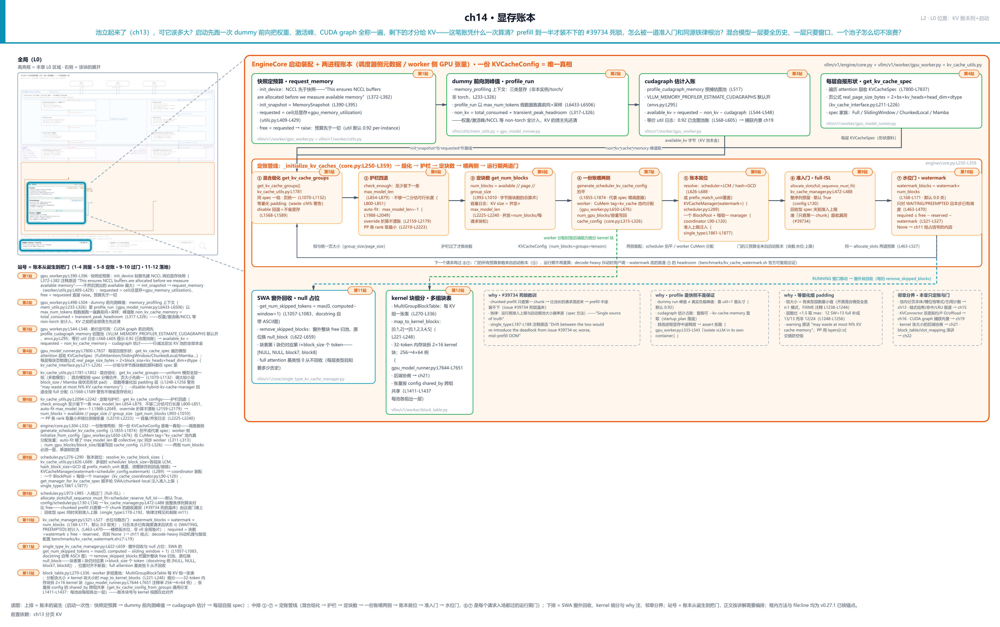

> *图注：本章放大的是[第 1 章](../../ch01-vllm-v1-in-one-map/narrative/chapter.md) L0 图「调度 · 显存账本」列（Scheduler 之下的 KV 半区）的上半，加上它头顶的启动装配带。[第 13 章](../../ch13-paged-kv/narrative/chapter.md)打开过这半区的下半（BlockPool 与块表），本章从池往上走：先看启动期 EngineCore 怎么量出 `num_gpu_blocks`，再看请求进门要过的门。图上三段读：北行四站是启动期一次性的测量（快照定预算 → dummy 前向测峰值 → CUDA 图估计入账 → 每层自报形状）；中排 ①-⑦ 是定账管线（混合组化 → 护栏 → 定块数 → 一份账喂两侧 → 账本就位 → 准入门 → 水位门，⑥⑦ 是每个请求入场都过的运行期门；①-⑦ 就是图上行内那七张卡片「① 混合组化」到「⑦ 水位门」的编号，即定账管线依次经过的七景；卡片在正文里各有放大图，放大图右上角印着「L2 拍片N」徽标，N 与这里的编号一一对应，「拍片」这组字样只出现在那几张放大图上，护栏四道不单占站号）；南行是 SWA 窗外回收、kernel 块细分、三条 why 注与一条邻章分界。站号 1-12 = 账本从诞生到把门流经代码的顺序（1-4 测量 · 5-8 定账 · 9-10 过门 · 11-12 落地），正文按讲解需要编排、不必照站号读。两套编号的对应：拍片①组化 = 站 5、②护栏与③定块数同占站 6（「护栏四道不单占站号」说的就是它）、④喂两侧 = 站 7、⑤账本就位 = 站 8、⑥⑦两道门 = 站 9-10。*

读法建议：想知道「池子的数怎么来的」，从[「饼有多大」](#饼有多大一次-dummy-前向定终身站-1-3)读起；关心装不下时的报错与自动适配，跳[「字节换块数」](#字节换块数护栏四道含站-46)；想知道死锁怎么回事，直奔[「门多紧」](#门多紧超收死锁与抖动换来的三道预算站-9-10)；想先给混合模型建个干净的心智模型，从[「先立模型」](#先立模型两公理与四条推论)读起（两公理四推论罩住后半每一节）；想看一张表为什么伺候不了混合模型，读[「失败演示」](#拿一张表去解混合模型失败演示)；想知道这条协议怎么被模型潮一步步逼出来，读[「迭代史」](#迭代史推论被现实逐条撞上的顺序)；有模型要接入 vLLM，看[「协议的分发面」](#协议的分发面四条归一化路)末尾的适配面小节；冲 DeepSeek V4 来的读者，直奔[「压力测试」](#压力测试deepseek-v4-接入)，层画面、形状因子链、压缩记账、装包对齐四节连读；想跟全程，按序读。

照例交代取证环境，全章数值表都适用：本章实测来自配套精简版，按 v0.27.1 只做减法抽出的「定账 + 门 + 组化」三幕，host 上实跑纯控制流，不依赖 GPU 与 vLLM 运行时。它与真实引擎有三处刻意差别，后文碰到会就近再提：其一，host 无 CUDA，显存快照读数与 CUDA 图估计值是**注入的示教值**（算术路径与源码逐字一致，凡涉及设备读数的表格都会标明）；其二，精简版关掉前缀缓存跑（`enable_prefix_caching=False`，cache 配置里的正交开关，真实部署默认开，vllm/config/cache.py:L93），本章讲的定账与门都不依赖它；其三，多卡部署里调度器与 worker 分属两个进程（单卡默认两者同住一个进程，同一份 config 契约照样成立），本章按单进程视角讲、多卡差异在流水线并行处单独点出。

## 饼有多大：一次 dummy 前向定终身（站 1-3）

先站到 L0 图的启动装配带上。EngineCore 出生时要干一件事：把「这张卡上我能用多少显存、其中多少归 KV」一次算清，之后运行期不再重算。这本账的旧设计不存在：早期推理系统没有系统内的账本，「权重之外全给缓存」是直觉不是公式，没人能回答「到底能开多大 batch、几条并发」：分多了运行期 OOM，分少了池空转、并发被白白压住。痛点是被卡的并发容量与稳定性：KV 池是全部请求的共享预算，预算错 = 崩溃或浪费。[第 13 章](../../ch13-paged-kv/narrative/chapter.md)算过那笔 0.5 MB/token 的账（Llama-2-7B FP16）；放到 24 GB 的卡上，权重吃掉 14 GB 后，池只剩大约 8 GB，每一 GB 都金贵。v1 的方案是**测量式分配**：不让人算，启动时量出来。代价也直说：量的是快照不是保证，只能靠预算比例留头寸（预先留出的余量），本节末尾展开。

### 预算先于一切：总显存乘一个比例（站 1）

账本第一步不量任何东西，先定预算。`gpu_memory_utilization`（GPU 显存利用率，vLLM 最常被调的启动参数之一）就是那个比例：

```python
# vllm/v1/worker/utils.py:L409-L429
def request_memory(init_snapshot: MemorySnapshot, cache_config: CacheConfig) -> int:
    """
    Calculate the amount of memory required by vLLM, then validate
    that the current amount of free memory is sufficient for that.
    """
    requested_memory = math.ceil(
        init_snapshot.total_memory * cache_config.gpu_memory_utilization   # L415
    )

    if init_snapshot.free_memory < requested_memory:                      # L418
        raise ValueError(
            f"Free memory on device {init_snapshot.device_} "
            # … 省略：报错正文五行（报出空闲/总量/预算三个数，
            #       建议降 utilization 或清掉同卡的其他进程）……
        )

    return requested_memory                                              # L429
```

三行各有讲究。**分母是总显存，不是空闲显存**：`total_memory × utilization`，初学者最容易读错成「空闲的 92%」。默认值 0.92（vllm/config/cache.py:L68-L75），官方 CLI 文档的原话是 "a per-instance limit, and only applies to the current vLLM instance"：同一张卡跑两个 vLLM 实例，各设 0.46，各圈各的互不越界（多实例共存的标准玩法）。80 GB 卡上一笔说明性账：单实例默认预算 = 80 × 0.92 = 73.6 GB，哪怕卡上还空着 79 GB，vLLM 也只按 73.6 这份预算定账；若另一个进程先占了 10 GB（free 只剩 70），`free < requested` 直接 raise，报错把三个数都打给你，让你降比例或清场。**预算先于一切**：还没量任何东西，先回答「你最多能用多少」。同类参数对照一句帮定位（这不是 vLLM 独有的怪癖）：SGLang 的 `--mem-fraction-static` 圈的是「权重 + KV 池」两块静态分配、激活吃圈外剩余（[SGLang 官方文档](https://docs.sglang.io/advanced_features/server_arguments.html)）；vLLM 把激活与图池也算进圈内再用差价扣。圈法不同、思想同源：先按总显存比例圈地，再在圈内做减法。

为什么 0.92 不是 1.0？留的 8% 不是浪费：CUDA context（驱动运行时，进程用 GPU 的固定开销）、系统占用，以及后文要讲的「快照不是保证」的余量，都在这份头寸里。

还有一个顺序问题值得停一秒：`init_snapshot`（启动时的显存快照）是干净的吗？源码把顺序写死了（这段装配序[第 17 章](../../ch17-executor-worker-model-runner/narrative/chapter.md)稍后细拆）：**分布式初始化刻意排在快照之前**，注释原话 "This ensures NCCL buffers are allocated before we measure available memory"，NCCL 通信缓冲（多卡时可达数百 MB，量级示意）属于「起了就一直在」的债主，先把它记进账里再拍照，测出的可用显存才不虚高。拍照前还 `gc.collect()` 加 `empty_cache()` 清碎片。本章直接用它的两件产物：`init_snapshot` 与 `requested_memory`。

### 三本显存账：为什么快照要拍三张（站 2）

预算定了，第二步量「KV 之前的债主一共占多少」。这事比听着难，因为一张卡上的显存其实有三本账，PyTorch 官方 CUDA 文档讲得很清楚：

1. **allocated（已分配）**：张量真正占的，`memory_allocated()` 读；
2. **reserved（已保留）**：PyTorch 缓存分配器圈走没还的（释放的张量内存留在自己的池里备复用），官方警告原话 "The unused memory managed by the allocator will still show as if used in nvidia-smi"；
3. **非 torch 分配**：NCCL 通信缓冲、cuBLAS workspace、CUDA context 这些库级分配，**不在上述任何 torch 统计里**（[PyTorch CUDA 官方文档](https://docs.pytorch.org/docs/2.13/notes/cuda.html)）。

nvidia-smi 看到的是三本之和。一笔说明性例：nvidia-smi 显示已用 10 GB、`memory_reserved()` 是 8 GB、`memory_allocated()` 是 6 GB：6 GB 活张量（权重+当前激活），2 GB 是分配器扣着备复用的池，剩 2 GB 是 torch 账外的库级分配。若直接拿 torch 统计当「全部占用」去定 KV 预算，池会定大 2 GB，运行期 NCCL 一发力就是 OOM。这正是 vLLM 的显存快照要**同时**读驱动级空闲（free memory）与 torch 统计、把差额记为「非 torch」的原因。

三本账一次对齐的机制是 `memory_profiling` 上下文管理器（vllm/utils/mem_utils.py:L233-L326）：基线那张直接复用启动时的 `init_snapshot`（记作 `before_create`，本实例创建前拍的），profiling 里再补拍两张：跑前一张（`before_profile`，权重与通信库落地后）、出来后一张（`after_profile`，垃圾回收后）。docstring 自带一个量化的三类显存例子，正好实跑一遍（示教注入的读数、真实的算术；一处取整偏差先挑明：docstring 例里 NCCL 先占 0.5 GiB、到峰时才涨成 1，下表从 before_profile 起即记 1，只影响中间快照的 free 读数，总量账分毫不变）。例子的三类按**占用主体**切，与前面 allocated/reserved/非 torch 那三本只是刀口不同，逐条对上：

- **cat2 = 本实例的 torch 圈内**：allocated 加上分配器圈走的 reserved 合并算；
- **cat1 = 同卡他进程**：由 before_create 基线一次性定住（那时本实例 torch 占用为零，卡上已用的全是他进程的）；
- **cat3 = 本实例 torch 外的库级分配**：其后非 torch 部分的增量（快照的算法：非 torch = 驱动级已用 − torch 保留）。

<!-- trace: m2 -->
| 时点 | cat1 他进程 | cat2 torch | cat3 非torch | 读数/账目 |
|---|---|---|---|---|
| before_create | 1 | 0 | 0 | free 9 GiB |
| before_profile（权重+NCCL 落地） | 1 | 2 | 1 | free 6 GiB |
| during peak（dummy 前向峰） | 1 | 4 | 1 | 激活峰 2 GiB（torch_peak_increase 2147483648 B） |
| after_profile（gc 后） | 1 | 3 | 1 | free 5 GiB → total_consumed = 4294967296 B（4.0 GiB） |
| 峰值账 | — | — | — | transient = torch 峰 4（during 峰行 cat2）− after torch 3 = 1.0 GiB（1073741824 B）；non_kv = 4294967296 + 1073741824 = 5368709120 B（5.0 GiB = 权重 2 + 峰 2 + 非torch 1；「峰 2」里 1 GiB gc 后仍常驻、已含在 total_consumed 4 里，纯路过的只有 transient 这 1 GiB） |

峰值账的两项怎么算的，源码一行是一行：

```python
# vllm/utils/mem_utils.py:L314-L326 · memory_profiling（上下文管理器）
    # Measure total consumption via mem_get_info() instead of
    # memory_reserved(), which goes negative when pluggable allocators
    # (e.g. cumem) bypass PyTorch's tracking.
    result.total_consumed = (
        result.before_create.free_memory - result.after_profile.free_memory
    )                                                                     # L319

    # total_consumed already covers persistent torch allocations; add only the
    # transient peak headroom to avoid double-counting.
    result.transient_peak_headroom = (
        result.after_profile.torch_peak - result.after_profile.torch_allocated
    )
    result.non_kv_cache_memory = result.total_consumed + result.transient_peak_headroom   # L326
```

`total_consumed`（总消耗）走驱动级口径：基线空闲减去结束后空闲，权重、常驻激活、非 torch 分配全在内，连可插拔分配器绕开 torch 记账的部分也穿得透（注释里点名的正是这事）。`transient_peak_headroom`（瞬时峰值余量）是 torch 峰值高于常驻的部分，即「路过但最胖的」（口径对齐一句：表里 cat2 列是「torch 圈内」的合并读数，公式读的是快照原生字段 `torch_peak` / `torch_allocated`；docstring 例中两组账面相同，transient 里的 4 与 3 就是 during 峰行与 after 行的 cat2）。两项不重不漏：前者数「住下的」，后者数「峰值瞬间比常驻多占的」，`torch_peak ≥ torch_allocated` 保证第二项非负。**账本宁记峰值不记现状**：这 10 GB 卡的例子里若少记 1 GB 的 transient，运行期第一批真实请求的激活一起冲高时就会 OOM。

上下文里跑的正主是 `profile_run`，拿假数据跑一遍真前向：

```python
# vllm/v1/worker/gpu_model_runner.py:L6492-L6506 · GPUModelRunner.profile_run
        # Add `is_profile` here to pre-allocate communication buffers
        hidden_states, last_hidden_states = self._dummy_run(
            self.max_num_tokens, is_profile=True                        # L6494
        )
        if get_pp_group().is_last_rank:
            if self.is_pooling_model:
                # … 省略：pooling 模型分支一行（嵌入/打分类模型面）……
                output = self._dummy_sampler_run(last_hidden_states)
        else:
            output = None
        self._sync_device()
        del hidden_states, output
        self.encoder_cache.clear()
        gc.collect()
```

两个细节：假数据的规模是 `max_num_tokens`（一步能排进 batch 的最大 token 数）。激活峰值由**最大一步**决定，所以拿它当形状；采样器也一起跑（`_dummy_sampler_run`），因为采样缓冲同样吃显存。多模态模型还要另量 encoder 与编码缓存，纯文本主线不展开。

### 一行减法：连图池一起扣干净（站 3）

第三步做减法。先看全段，再拆两笔：

```python
# vllm/v1/worker/gpu_worker.py:L498-L548 · Worker.determine_available_memory
        # Execute a forward pass with dummy inputs to profile the memory usage
        # of the model.
        with memory_profiling(
            self.init_snapshot,
            weights_memory=int(self.model_runner.model_memory_usage),
        ) as profile_result:
            self.model_runner.profile_run()                             # L504

        # Profile CUDA graph memory if graphs will be captured.
        # … 省略：ROCm/XPU 平台差异注释五行（ROCm 已并入、XPU 排除）……
        cudagraph_memory_estimate = 0
        if (
            current_platform.is_cuda_alike()
            and self.vllm_config.compilation_config.cudagraph_mode != CUDAGraphMode.NONE
        ):
            cudagraph_memory_estimate = self.model_runner.profile_cudagraph_memory()   # L517

        # Respect the opt-in flag as originally designed.
        cudagraph_memory_estimate_applied = (
            cudagraph_memory_estimate
            if envs.VLLM_MEMORY_PROFILER_ESTIMATE_CUDAGRAPHS
            else 0
        )

        # … 省略：三个字段写入结果（total_consumed / peak_activation_memory /
        #       cudagraph_memory_estimate）……

        free_gpu_memory = profile_result.after_profile.free_memory
        # NOTE(woosuk): Here we assume that the other processes using the same
        # GPU did not change their memory usage during the profiling.
        assert self.init_snapshot.free_memory >= free_gpu_memory, (
            # … 省略：报错正文（同容器的其他进程在 profile 期间释放了显存，
            #       建议 "isolate vLLM in its own container"）……
        )
        self.available_kv_cache_memory_bytes = (
            self.requested_memory
            - profile_result.non_kv_cache_memory
            - cudagraph_memory_estimate_applied
        )                                                                # L548
```

最后一行就是本章的主角：**available_kv = 预算 − 非 KV 占用 − CUDA 图估计**，一行减法定出 KV 池的全部本金。三笔里最值得讲的是第三笔：为什么 CUDA 图（把一段 GPU 调用序列录下来重放的机制，[第 1 章](../../ch01-vllm-v1-in-one-map/narrative/chapter.md)立过）的显存要吃 KV 的预算？因为图重放要求各步读写**同一批地址**，捕获期创建的张量被锁进一块「图私有显存池」，独立记账、随图对象常驻。这笔债若不入账，KV 池就会定大，捕获时 OOM。而它能被**预估**的依据是共享池语义：多个图可以共享一块私有池（前提是按捕获顺序回放，PyTorch 官方原话 "It's safe for a set of graphs to share a private pool if you know they'll always be replayed in the same order they were captured"）。vLLM 据此真捕取样：开一个**临时的共享图池**（共享语义与真实捕获相同、句柄独立，注释原话 "Use a temporary pool for profiling to avoid fragmentation in the main pool"，不污染真实捕获要用的主池），全部 wrapper（每张 CUDA 图的包装对象，`CUDAGraphWrapper` 一族的实例）的池句柄被临时换到它上面、finally 里换回；每种模式只真捕**前两个**形状，第一捕量出共享底座，第二捕量出每张图的边际占用，其余形状按「首捕 + 每图边际 × (n−1)」外推（每图下限 1 MiB，debug 日志把这笔账写作 "first-capture + (%d-1) × %.2f MiB per-graph"）。估计不是拍脑袋，是有实测锚点的外推。开关 `VLLM_MEMORY_PROFILER_ESTIMATE_CUDAGRAPHS` 默认开（vllm/envs.py:L295），日常说的「0.92 已经含了图池的账」就是它。图捕获本身的编排（warmup、逐形状捕获）归编译章，此处只认显存侧的归属。

中间那个 assert 是「快照不是保证」的防御：如果 profile 期间同卡其他进程**释放**了显存（after 的 free 反而变多），说明环境在动，测出的账不可信，直接拒跑。整段跑完，12.5 GB 假想卡上的一笔完整账（示教读数、真算术；这一景刻意取 util 0.8 而非默认 0.92，12.5 GiB 卡配 0.8 让三个数凑整好验算）：

<!-- trace: m1 -->
| 步 | 动作 | 关键算式 | 结果 |
|---|---|---|---|
| 一 | request_memory 定预算 | ceil(13421772800 × 0.8)（12.5GiB 卡 × util 0.8） | requested = 10737418240 B（10.0 GiB）；free=5 时直接 raise |
| 二 | memory_profiling 峰值账 | total_consumed 1342177280 + transient 268435456（权重 0.75 + 峰 0.25 + 非 torch 0.5） | non_kv = 1610612736 B（1.5 GiB） |
| 三 | 一行减法 | 10737418240 − 1610612736 − 536870912（cudagraph 估计 0.5 GiB） | available_kv = 8589934592 B（8.0 GiB） |
| 四 | 字节换块数 | 8589934592 // 262144 // 32（page = 2×16×32×128×2） | 1024 块；护栏需 2147483648 B（2.0 GiB）≤ 8.0 GiB → 过 |
| 读数 | 容量/并发核算 | 容量 = 1024 × 16；并发 = 1024 / 256（每 token KV 524288 B = 0.5 MiB） | 容量 16384 token；max_model_len 4096 下并发 4.0× |

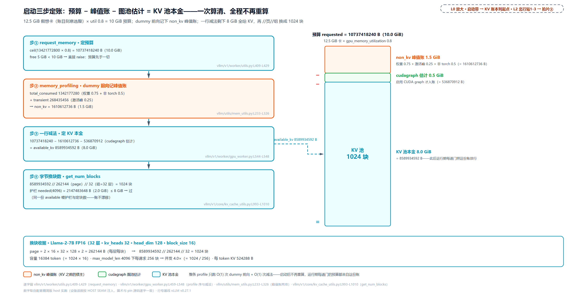

> *图注：L0 启动段的定账放大（对应 L2 章图北行站 1-3）。左四步管道：request_memory 按总显存 × util 定预算（free 不足直接 raise）→ memory_profiling 记峰值账 → 一行减法 requested − non_kv − cudagraph = available_kv → 除页除层换块数；右侧把 10 GiB 预算瀑布式剖成 1.5 + 0.5 + 8.0 三段，就是同一行减法的可视化。8 GiB 本金换成 1024 块、容量 16384 token、4096 长度下并发 4×。池多大，这一趟减法说了算；此后运行期的每道门都照这份账放行。*

（表中第四步的换块数与护栏，下一节展开。）

三步定账的代价也要说全：**profile 是快照不是保证**。dummy 前向的激活峰是「最大一步」的峰，真实负载里多模态编码、异常长度的采样缓冲都可能超出。防御只有两条：`gpu_memory_utilization < 1` 留头寸（默认 0.92），以及 assert 拦住「环境在动」的启动。v0.27 还加了一条复跑通道：把测得的 KV 内存建议落盘成 startup plan，复跑时用 `--kv-cache-memory-bytes` 直接取上次测值、跳过 profile 的漂移（旁路，主线不展开）。

## 字节换块数：护栏四道（含站 4、6）

有了字节数，还要换成块数、并保证这份账能开工。现在走到 L0 图启动带与「调度 · 显存账本」列的交界：`get_kv_cache_configs`（定账总控，vllm/v1/core/kv_cache_utils.py:L2094-L2242），它的 docstring 五步流程（合并全 worker 的 spec → 全模型分组 → override 折算与 auto-fit → 逐 worker 护栏出 config → 流水线取最小）差不多就是本章剩下内容的大纲。本节先走「换算与护栏」这半。

### 每层自报形状：spec 是全部原料（站 4）

换算需要两个输入：一页多大、一「组」多少层。前者每层自己报：

```python
# vllm/v1/worker/gpu_model_runner.py:L7800-L7837
    def get_kv_cache_spec(self) -> dict[str, KVCacheSpec]:
        """
        Generates the KVCacheSpec by parsing the kv cache format from each
        Attention module in the static forward context.
        Returns:
            KVCacheSpec: A dictionary mapping layer names to their KV cache
            format. Layers that do not need KV cache are not included.
        """
        # … 省略：ec_transfer（EC＝encoder cache 编码缓存的跨实例传输；
        #       专职 producer 的实例不进 KV 账本）一行早退 ……
        kv_cache_spec: dict[str, KVCacheSpec] = {}
        layer_type = cast(type[Any], AttentionLayerBase)
        attn_layers = get_layers_from_vllm_config(self.vllm_config, layer_type)
        for layer_name, attn_module in attn_layers.items():
            if isinstance(attn_module, Attention) and (
                kv_tgt_layer := attn_module.kv_sharing_target_layer_name
            ):
                # … 省略：跨层 KV 共享（该层借用目标层的缓存，
                #       不自报 spec，省显存的一条正交通道）……
                continue
            # Skip modules that don't need KV cache (eg encoder-only attention)
            if spec := attn_module.get_kv_cache_spec(self.vllm_config):
                # … 省略：后端 stride 索引能力回填七行 ……
                kv_cache_spec[layer_name] = spec
        return kv_cache_spec
```

`KVCacheSpec`（KV 缓存形状描述）是每层交上来的「自我介绍」：注意力层报 `AttentionSpec` 家族，最常见 `FullAttentionSpec`（全历史）、回收型的 `SlidingWindowSpec`（滑窗）、`ChunkedLocalAttentionSpec`（分块局部），Mamba 层报 `MambaSpec`（状态型，下节讲）。页大小的物理公式[第 13 章](../../ch13-paged-kv/narrative/chapter.md)嵌过：`real_page_size_bytes = 2 × block_size × num_kv_heads × head_dim × dtype`（vllm/v1/kv_cache_interface.py:L211-L226），一页装 16 个 token 的 K 一份、V 一份。**spec 是分组与字节换块数的全部原料**，这句后面反复用到：每层自己知道自己要多少历史，这是账本能精确到层的前提。

### 总算术：除两次，页和层（站 6）

字节换块数的总算术只有一行：

```python
# vllm/v1/core/kv_cache_utils.py:L993-L1010
def get_num_blocks(
    vllm_config: VllmConfig,
    num_layers: int,
    available_memory: int,
    page_size: int,
) -> int:
    # … 省略：docstring 七行（参数说明）……
    num_blocks = int(available_memory // page_size // num_layers)       # L1008
    num_blocks = max(num_blocks, 0)
    return may_override_num_blocks(vllm_config, num_blocks)
```

`available // page_size // num_layers`：先除一页的字节数得「页数」，再除每块的层数得「块数」，因为一个块 id 在**每一层**都要有一页（[第 13 章](../../ch13-paged-kv/narrative/chapter.md)的账：块表是每请求一张、物理页是每层一份）。uniform 模型（全部层同一个 spec）里 `num_layers` 就是全模型层数；混合模型按组算，下一节展开。两次整除的零头直接丢：账本向下取整，宁少勿超；又因两条都是非负整除，预算只增时块数只增不减。拿前一笔账验算：8 GiB ÷ 262144 B/页 ÷ 32 层 = 1024 块，容量 1024 × 16 = 16384 token；`max_model_len`（模型允许的最大序列长度）4096 下每请求 256 块，并发 1024 / 256 = 4.0 条。

### 装不下就明说：护栏一与护栏二的二分估长

账算出来若连**一条** `max_model_len` 的请求都装不下，这个引擎开不了工，池是死的。第一道护栏就是这条活性下限：

```python
# vllm/v1/core/kv_cache_utils.py:L751-L788
def _check_enough_kv_cache_memory(
    available_memory: int,
    get_needed_memory: Callable[[], int],
    max_model_len: int,
    estimate_max_model_len: Callable[[int], int],
):
    if available_memory <= 0:
        raise ValueError(
            "No available memory for the cache blocks. "
            "Try increasing `gpu_memory_utilization` when initializing the engine "
            # … 省略：报错尾两行（官网省显存指南链接）……
        )

    needed_memory = get_needed_memory()

    if needed_memory > available_memory:
        estimated_max_len = estimate_max_model_len(available_memory)
        estimated_msg = ""
        if estimated_max_len > 0:
            estimated_msg = (
                "Based on the available memory, "
                f"the estimated maximum model length is {estimated_max_len}. "
            )

        raise ValueError(
            f"To serve at least one request with the model's max seq len "
            f"({max_model_len}), ({format_gib(needed_memory)} GiB KV "
            # … 省略：报错尾六行（建议调 utilization 或降 max_model_len）……
        )
```

差 1 字节也拦：护栏一的边界场景里 `available = 33554431`、`needed = 33554432`，照样 raise。但真正的巧思在报错里的那半句 "the estimated maximum model length is …"：装不下时不光说不行，还算出**能行多长**，这一步就是护栏二（二分估长）。算法是二分：

```python
# vllm/v1/core/kv_cache_utils.py:L820-L851 · estimate_max_model_len
    # Save the original max_model_len to restore after estimation
    original_max_model_len = vllm_config.model_config.max_model_len

    # Define a function to check if a given model length fits in memory
    def fits_in_memory(model_len: int) -> bool:
        # Temporarily modify the max_model_len for this calculation
        vllm_config.model_config.max_model_len = model_len
        # Calculate memory needed for the given model length
        memory_needed = max_memory_usage_bytes(vllm_config, kv_cache_spec.values())
        return memory_needed <= available_memory

    try:
        # Binary search for the maximum model length
        left, right = 1, original_max_model_len

        # If even the smallest model length doesn't fit, return 0
        if not fits_in_memory(left):
            return 0

        # Binary search for the maximum model length that fits
        result = 1
        while left <= right:
            mid = (left + right) // 2
            if fits_in_memory(mid):
                result = mid
                left = mid + 1
            else:
                right = mid - 1
        return result
    finally:
        # Always restore the original max_model_len to avoid side effects
        vllm_config.model_config.max_model_len = original_max_model_len
```

二分能用的根是单调性：`fits(len)` 问「装下一条 len 长的请求需要多少字节」，需要量 = `cdiv(len, bs) × 页 × 层数`，随 len 只增不减：每层的 KV 只会越攒越多。在单调谓词上做标准 upper-bound 二分，O(log L) 收敛；`try/finally` 恢复原值，估算不留副作用。2 层小模型上实跑一遍（场景 available 只够 100 个 16-token 长度块；进表前先说明两件事：「探针 N」指二分搜索的第 N 次求值，与上段护栏一那个边界场景是两个用法；表首行的护栏一另起一景，available 卡在差 1 字节的临界值上，别拿它去对上面那 100 块）：

<!-- trace: m4 -->
| 护栏/探针 | 输入/试长度 | 需字节（长度块） | 判定与动作 |
|---|---|---|---|
| 护栏一 check_enough | available 33554431 B（差 1 字节） | needed(4096) = 33554432 B | raise：拦下并在报错里附二分估长提示 |
| 探针 1（fits 早退检查） | len 1 | 131072（1） | fits：result=1，进二分 |
| 探针 2 | len 4096 | 33554432（256） | 256 > 100 不装 → 右缩 |
| 探针 3 | len 2048 | 16777216（128） | 128 > 100 不装 → 右缩 |
| 探针 4 | len 1024 | 8388608（64） | 64 ≤ 100 装下 → 记 result=1024 |
| 探针 5 | len 1536 | 12582912（96） | 96 ≤ 100 装下 → 记 result=1536 |
| 探针 6 | len 1792 | 14680064（112） | 112 > 100 不装 → 右缩 |
| 探针 7 | len 1664 | 13631488（104） | 104 > 100 不装 → 右缩 |
| 探针 8 | len 1600 | 13107200（100） | 100 ≤ 100 装下 → 记 result=1600（终值） |
| 探针 9 | len 1632 | 13369344（102） | 102 > 100 不装 → 右缩 |
| 探针 10 | len 1616 | 13238272（101） | 101 > 100 不装 → 右缩 |
| 探针 11 | len 1608 | 13238272（101） | 101 > 100 不装 → 右缩 |
| 探针 12 | len 1604 | 13238272（101） | 101 > 100 不装 → 右缩 |
| 探针 13 | len 1602 | 13238272（101） | 101 > 100 不装 → 右缩 |
| 探针 14 | len 1601 | 13238272（101） | 区间收敛 → 返回 1600；max_model_len 原值 8192 无副作用恢复 |
| 护栏三 auto-fit | original_max_model_len=-1、available 13107200 B | 组口径二分 15 探针 | max_model_len 8192 → 1600（并在启动序里 collective_rpc 同步 worker） |
| 护栏四 override 折算 | override=3、profiled 13107200 B | 折算 available = 3 × 131072 = 393216 B | num_blocks=3：护栏/定块同按折算容量规划，账本不漂移 |
| 护栏四 PP 取最小 | 两 worker 200 / 90 长度块 | 张量 13107200 → 5898240 B（缩到 90 页；PP 各 worker 只持 1 层，此行 1 块是单层页、非探针行的两层整块） | 两 rank 同取 90 块，张量按比例缩不空耗 |

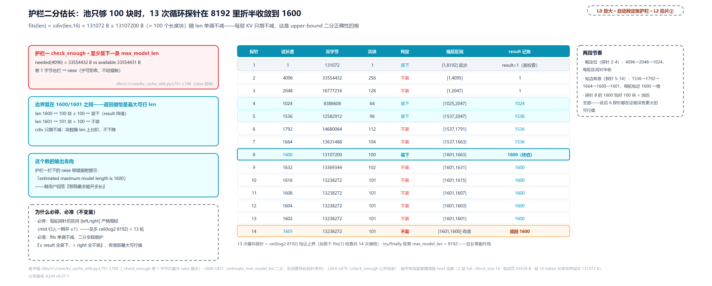

> *图注：L0 启动段定账护栏的放大（对应 L2 章图中排拍片②）。左：护栏一差 1 字节也拦（33554431 < 33554432 → raise）；左列「输出去向」面板：估出的长度写进这条报错的提示（estimated maximum model length is 1600），替用户回答「那我最多能开多长」，这个数就是右边这张表的产物；右：二分在 8192 里折半试探，4096 要 256 块不装、1024 要 64 块装下、1600 恰好 100 块装下、1601 又要 101 块，循环 13 次、恰达 ⌈log₂ 8192⌉ 上界，加首个 fits(1) 早退检查共 14 次调用。fits(len) 随 len 单调不减（每层 KV 只增不减）是二分正确性的根；全程 try/finally 恢复 max_model_len 无副作用。*

### 人工指定与流水线取最小：护栏三、四

护栏三是 auto-fit：`max_model_len` 传 `-1` 表示「不指定，能开多长开多长」。启动时在**各 worker 的投影组**（全模型分组投到该 worker 所持层上的子集；PP 时各组按流水段切开，单卡时就是全部组）上分别跑二分、取最小，瓶颈 worker 说了算，把长度直接定在账面上；`-1` 时二分的搜索上界取模型配置里的原生上下文上限（本例 8192）。m4 表那行的「15 探针」是这么数的：二分共 14 次求值（含首个 fits(1) 检查），加定长 1600 后护栏一按新长度复核需求的一次。同一个求值函数既当探针又当复核，两个口径殊途同归到 1600。护栏四是 `num_gpu_blocks_override`（人工指定块数，测试里常用来制造小池子逼抢占）的**折算**：

```python
# vllm/v1/core/kv_cache_utils.py:L2159-L2179 · get_kv_cache_configs
    # If `num_gpu_blocks_override` is set, the cache size that will actually
    # be allocated is decoupled from the profiled `available_memory`:
    # `may_override_num_blocks` in `get_kv_cache_config_from_groups` clamps
    # `num_blocks` to the override. Reflect that in `available_memory` here so
    # auto-fit, the admission check, and the per-worker config builder all
    # plan against the same effective capacity.
    override = vllm_config.cache_config.num_gpu_blocks_override
    if override is not None:
        adjusted_memory: list[int] = []
        for groups, avail_mem in zip(projected_groups_per_worker, available_memory):
            if not groups:
                adjusted_memory.append(avail_mem)
                continue
            bytes_per_block = _pool_bytes_per_block(vllm_config, groups)
            # … 省略：override 记日志两行 ……
            adjusted_memory.append(override * bytes_per_block)
        available_memory = adjusted_memory
```

关键在注释那句 "so auto-fit, the admission check, and the per-worker config builder all plan against the same effective capacity"：人工指定块数不是简单替换一个数，而是把 `available_memory` 也改写成 `override × 每块字节`：auto-fit、准入门、配置产出全部按折算后的容量规划。**账本不许有两套数**，这条纪律贯穿本章。

护栏四的后半在函数尾部，先铺适用场景：`kv_cache_configs` 是每 worker 一份的清单，单卡只有一份；流水线并行（PP，模型按层切到多张卡）时每个 rank 一份（代码注释里的 rank 即各卡的 worker 进程），各卡显存与所持层数不同，各自 profile 量出的可用字节不同，算出的块数也就不齐。所以这段代码没有一个 PP 字样、却无条件对每份配置跑：单卡时对一个数取 `min` 是恒等操作、无害，多 rank 块数不齐时才真正生效。

```python
# vllm/v1/core/kv_cache_utils.py:L2210-L2242 · get_kv_cache_configs
    # Change the num_blocks of each rank to the smallest among all ranks.
    # We also need to shrink the tensor size proportionally to avoid
    # allocating unused memory.
    min_num_blocks = min(
        kv_cache_config.num_blocks for kv_cache_config in kv_cache_configs
    )
    for kv_cache_config in kv_cache_configs:
        num_blocks_old = kv_cache_config.num_blocks
        kv_cache_config.num_blocks = min_num_blocks

        # Shrink tensor size proportionally
        for tensor in kv_cache_config.kv_cache_tensors:
            assert tensor.size % num_blocks_old == 0
            tensor.size = tensor.size // num_blocks_old * min_num_blocks   # L2223

        if len(kv_cache_config.kv_cache_groups) > 0:
            # … 省略：容量/并发核算与两条启动日志（下一节展开）……
    return kv_cache_configs
```

走读三步：第一步 `min` 取全场瓶颈（一个块的页分散在各 rank 所持的层上，最穷的 rank 给所有人封顶）；第二步把每份的 `num_blocks` 都改写成这个最小值，调度器一本账只认一个块数；第三步把张量字节等比缩下来。缩的对象 `kv_cache_tensors` 在这首次露面：它是 config 开出的物理显存分配清单，每个条目是一张将来要在 GPU 上真分配的张量，`size` 记字节数，真分配发生在后文「落地为物理张量：四段式张量账」一节（worker 侧的块表换算见章末「worker 侧落地」），此刻只是账面数字。为什么缩、又为什么这么缩：块数已降到全场最小，张量若仍按原块数的字节去分配，就是买用不上的显存；而 `size` 是字节不是块数，先 `// num_blocks_old` 除回每块字节、再乘上新块数，`assert` 整除保的是页对齐——每块必须是整数页，账被动过手脚、除出零头就当场拦下。

表末 PP 行就是第三步的实跑实例：2 层小模型按 PP 切成两个 worker、各持 1 层，A 量出 200 块、B 量出 90 块，全场取 90。这行的块口径也随 PP 换了：每 worker 只持 1 层，1 块就是一张单层页 65536 B，不是探针行那种两层共 131072 B 的长度块；65536 正是「每层自报形状」一节页公式的代入值：每头 128 维 × 8 个 KV 头 × 每页 16 token × K/V 各一份 × fp16（16 位半精度浮点）每数 2 字节。所以 A 的张量是 200 × 65536 = 13107200 B，缩到 90 页 = 5898240 B，与表内数字一致；它与探针行的 13107200 数值相同并非同一笔账：那边 100 个两层整块、这边 200 张单层页，同一字节数的两种块口径。这个口径差不能放着不管：调度器账本里只记一个块数，块折合多少字节全靠口径对齐；若调度器按 131072 B 的两层整块记账、worker 手里却是 65536 B 的单层块，同一个「100 块」在两边就是不同的字节数，调度器以为放得下的请求 worker 那边根本装不下，或者反过来白白拒单。所以块的字节口径必须全场唯一，而「定账单点产出一份账、同一份账喂调度器进程与全部 worker 进程」正是下一节『一份账喂两侧』要拆的事。

## 一份账喂两侧（站 7）

定账的产物是 `KVCacheConfig`（num_blocks + 分组 + 张量布局），它要去两个世界：调度器进程拿它建账本，worker 进程拿它真分配显存。开读前先交代一条改名链，免得三个名字读成三笔钱。这笔数的出生地在站 3：各 worker 用一行减法量出 `available_kv_cache_memory_bytes`。汇到 EngineCore，入参名换成 `available_gpu_memory`（多卡时是一张逐 worker 的清单）；再传进定账总控 `get_kv_cache_configs`，形参又写成 `available_memory`。一路下来三个名字、一个数，行文统称 available_kv。先看总览图，再进总编排：

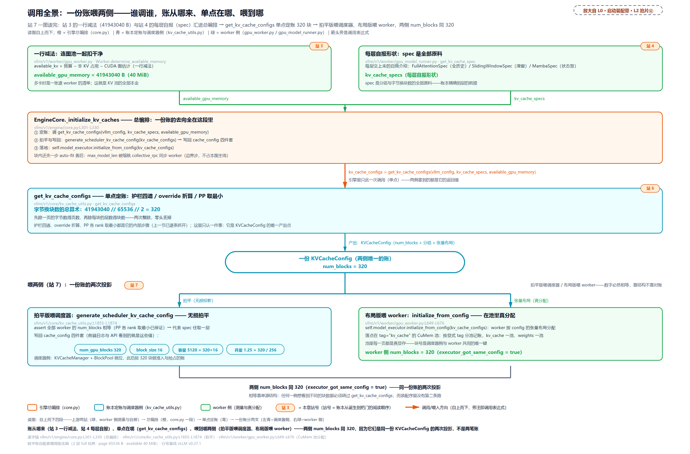

> *图注：L0 图「调度 · 显存账本」列启动带的放大，站 7 的调用关系一图看全：账从哪来（站 3 一行减法量出的可用字节、站 4 各层自报形状）→ 单点定账在哪（get_kv_cache_configs，护栏四道上一节已拆，这一景 40 MiB 算到 320 块）→ 喂到哪两侧（拍平版给调度器建账本，布局版给 worker 在 CuMem（vLLM 的显存分配器）显存池真分配）。先在图上认全这三段再进下面的代码块，正文按讲解需要逐段展开。*

```python
# vllm/v1/engine/core.py:L301-L330 · EngineCore._initialize_kv_caches
        # Track max_model_len before KV cache config to detect auto-fit changes
        max_model_len_before = vllm_config.model_config.max_model_len

        kv_cache_configs = get_kv_cache_configs(
            vllm_config, kv_cache_specs, available_gpu_memory
        )

        # If auto-fit reduced max_model_len, sync the new value to workers.
        # This is needed because workers were spawned before memory profiling
        # and have the original (larger) max_model_len cached.
        max_model_len_after = vllm_config.model_config.max_model_len
        if max_model_len_after != max_model_len_before:
            self.collective_rpc("update_max_model_len", args=(max_model_len_after,))

        scheduler_kv_cache_config = generate_scheduler_kv_cache_config(kv_cache_configs)
        vllm_config.cache_config.num_gpu_blocks = scheduler_kv_cache_config.num_blocks   # L316
        kv_cache_groups = scheduler_kv_cache_config.kv_cache_groups
        if kv_cache_groups:
            vllm_config.cache_config.block_size = min(
                g.kv_cache_spec.block_size for g in kv_cache_groups
            )
            num_tokens, max_concurrency = get_kv_cache_capacity(
                vllm_config, scheduler_kv_cache_config
            )
            vllm_config.cache_config.kv_cache_size_tokens = num_tokens    # L325
            vllm_config.cache_config.kv_cache_max_concurrency = max_concurrency  # L326

        vllm_config.validate_block_size()

        self.model_executor.initialize_from_config(kv_cache_configs)     # L330
```

三个动作值得逐个看。**其一，auto-fit 的善后**：worker 是在 profile **之前**拉起的（装配序[第 17 章](../../ch17-executor-worker-model-runner/narrative/chapter.md)细拆），它们缓存的是原始的较大 `max_model_len`；auto-fit 把长度缩小后要 `collective_rpc("update_max_model_len")` 同步过去，不然两边按不同长度算账。**其二，写回四件套**：`num_gpu_blocks` / `block_size` / `kv_cache_size_tokens`（池能装多少 token）/ `kv_cache_max_concurrency`（满长度请求能并发几条）写进 `cache_config`，前端日志与 API 看到的就是这些值。容量与并发怎么算的，两条布局各跑一遍（第二行有三个没见过的记号：SWA、在途、cap 公式，下一段立刻逐个交代，先扫一眼位置即可）：

<!-- trace: m15 -->
| 布局 | 每请求块数 | 并发 | 容量（token） |
|---|---|---|---|
| uniform Llama-2-7B | 256（=cdiv(4096,16)，单组） | 4.0（=1024/256） | 16384（=4.0×4096=1024×16） |
| 混合（in_flight 8192） | 513（full 256 + swa cap 257，cap=cdiv(min(511+8192,4096),16)+1） | 1.9961（=1024/513） | 8176 |

uniform 一行全是旧相识：序列全长 4096、每块 16 token、池 1024 块，就是「总算术」一节那笔 8 GiB 验算账的原班数字；每请求 256 块、并发 1024/256 = 4.0、容量 16384，照抄进表。混合一行要先认一个新角色：SWA（Sliding Window Attention，滑动窗口注意力）层只保留最近 W 个 token 的 KV（W 是窗口大小，这一景取 512），所以它每请求占的块数不随序列全长涨、有个封顶；full 组（全注意力层，按整序列记块）配上一个 SWA 组，就是表里第二行的布局。SWA 到底是什么、为什么按组记账，下一节「怎么切」完整展开；这里只需要「它有个封顶」这一个事实，把封顶 257 逐因子算出来。

封顶 257 要代入三个数：窗、在途、长度上限。窗是 512：窗口盖住当前 token 加它前面的 511 个（窗减一），这 511 个历史 token 的 KV 是 SWA 层必须留住的；窗口里最新的那个 token 通常还在途上，归下一项计。

「在途」是哪些 token？调度器每一拍会把一批 token 排进 batch 交给模型去算，从交出去到结果回来之间有一段空档，这批 token 就处在「已经排进 batch、这一拍还没算完」的状态；书里把结果回来、数字定死这一步叫落账，落账之前它们都算在途。在途期间它们的 KV 块既不能回收、也不能挪给别人用，账上必须留着。上界参数 `max_in_flight_tokens` 就是为这段空档留的：一拍排进去的 token 数不超过 `max_num_batched_tokens`，而多卡流水线或异步调度时会有多个批同时在途，源码把它写作「同时在途的批数 × `max_num_batched_tokens`」（vllm/config/vllm.py:L553-L561）；本例单批、配置里 `max_num_batched_tokens` 取 8192，所以在途上界就是 8192。加减这个数的时机在「门多紧」一节正面拆，这里只需要这个上界。

两项相加 511 + 8192 = 8703，被 max_model_len 压到 4096，这个 4096 就是前文 uniform 例里的序列全长上限；4096 个 token 按每块 16 个正好切满 256 块，再 +1 顶着「窗口起点不在块首」的最坏错位，封顶 = 256 + 1 = 257。

每请求块数 = 各组之和：full 组按整序列记 256（就是 uniform 行那个数），SWA 组记封顶 257，合计 513。并发 = 同一个池 1024 块 ÷ 513 = 1.9961，容量 = int(1.9961 × 4096) = 8176（容量恒等式 tokens = 并发 × max_model_len）。这就是混合行的看点 **公式通用**：每请求块数按组求和之后，用的还是 uniform 行那套 `num_blocks / 每请求块和` 出并发、再乘 max_model_len 出容量，两条布局共用一条公式。启动日志那两行 "GPU KV cache size: %s tokens" 与 "Maximum concurrency for %s tokens per request: %.2fx"（kv_cache_utils.py:L2225-L2240）输出的就是这两笔。

257 这个值别过度解读：这一景在途 8192 太大，把封顶一路顶到了 max_model_len，SWA 组只比整序列的 256 多记 1 块，窗口语义近乎退化。窗口真正发力在小在途与长序列，那笔收益账留到「回收感知准入上限」一节末的收益合成再算。

**其三，喂两侧**。调度器侧拿到的是拍平版：

```python
# vllm/v1/core/kv_cache_utils.py:L1855-L1874
def generate_scheduler_kv_cache_config(
    kv_cache_configs: list[KVCacheConfig],
) -> KVCacheConfig:
    """
    Generate the KV cache configuration for the scheduler.
    """
    assert all(
        [cfg.num_blocks == kv_cache_configs[0].num_blocks for cfg in kv_cache_configs]
    )
    # All workers have the same kv_cache_config except layer names, so use
    # an arbitrary one to initialize the scheduler.
    cfg = copy.deepcopy(kv_cache_configs[0])
    for group in cfg.kv_cache_groups:
        if isinstance(group.kv_cache_spec, UniformTypeKVCacheSpecs):
            # All layers in the UniformTypeKVCacheSpecs have the same type,
            # so use an arbitrary one to initialize the scheduler.
            group.kv_cache_spec = next(
                iter(group.kv_cache_spec.kv_cache_specs.values())
            )
    return cfg
```

`generate_scheduler_kv_cache_config` 只做无损拍平：断言全部 worker 的 num_blocks 相等（PP 取最小已保证），代表 spec 任取一层。worker 侧拿到的是同一份 config 的张量布局，据此在 GPU 上真分配显存，落点在 CuMemAllocator（vLLM 的显存分配器）的 `tag="kv_cache"` 池里。这个分配器按显式 tag 分池记账，kv_cache 一池、weights 一池，互不混账。分池直接服务一个特性：「睡觉/唤醒」（sleep/wake，把整池显存让渡给同卡其他进程、需要时再收回）就是按池整批操作的，两本分池账正是它的记账单位（分配本体 vllm/v1/worker/gpu_worker.py:L649-L676，[第 17 章](../../ch17-executor-worker-model-runner/narrative/chapter.md)会嵌这段细拆）。装配序实跑（2 层小模型、40 MiB 可用）：

<!-- trace: m9 -->
| 装配步 | 动作 | 关键数 | 落账 |
|---|---|---|---|
| 收 spec | worker 每层自报形状 | page 65536 × 2 层 = 每块 131072B | — |
| 定账 | get_kv_cache_configs 单点产出 | available 41943040 B → 41943040 // 65536 // 2 | num_blocks = 320 |
| 写回 | cache_config 四件套 | block_size 16、容量 5120 = 320×16 | 并发 1.25 = 320 / 256（4096 长度每请求 256 块） |
| 喂两侧 | 拍平版喂调度器 / 布局版喂 worker | worker initialize 拿到同 config | 两侧 num_blocks 同 320（executor_got_same_config=true） |

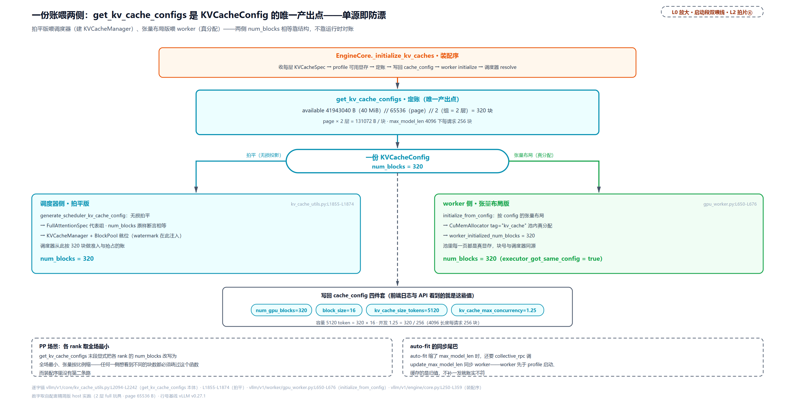

> *图注：L0 启动段到「调度 · 显存账本」列与 GPU 列的双喂线放大（对应 L2 章图中排拍片④）。profile 出 40 MiB 可用，定账函数单点算到 320 块，写回 cache_config 四件套（num_gpu_blocks=320、block_size=16、容量 5120 token、并发 1.25×），拍平版喂调度器建 KVCacheManager、张量布局版喂 worker 在 kv_cache 池内真分配。两侧数字必然一致：它们是同一份 KVCacheConfig 的两次投影；PP 场景各 rank 先取最小再缩张量，单源即防漂，任何一侧想看到不同的块数都必须绕过这个函数，而装配序里没有第二条路。*

这里的不变量值得一句论证：`get_kv_cache_configs` 是 `KVCacheConfig` 的**唯一产出点**（engine/core.py:L304-L306 单点调用），调度器侧只做无损拍平、worker 侧只做按布局分配、PP 时显式取最小，两侧 num_blocks 永远相等，靠的是**结构**，不是运行时对账。

## 怎么切：混合层潮与 KV cache 的适配协议（站 5、8）

到此为止的账都默认全部层长一个样：一张块表、`num_layers` 除一次了事。多数模型确实如此，可 2025 年起的主力模型一个接一个地不是了：Gemma 掺滑窗层、Jamba 掺 Mamba 层、DeepSeek V4 一层里同时挂四类缓存。vLLM 的应对不是给每个模型写一套账本，而是铺了一条**适配协议**：每层自己交一张申报表（spec，什么形状、保留多少历史），账本按申报把层分成组、归一形状，物理显存按组摆布——新模型来了按协议申报即可接入，申报形态超出既有框架时，协议才长出新部件。本段走法是一条认知链：先弄清层的类型差在哪，再用两条公理四条推论把整个问题立成理论模型；此后每一节都是某条推论的落地：申报表（spec）是层把形状与语义自报上来，迭代史是推论被现实逐条撞上的顺序，失败演示兑现推论①，四路分发是推论②③的调度实现，DeepSeek V4 是四条全撞的压力测试，物理张量账是推论③的最终形态，两把尺子收尾。现在走进 L0 图「调度 · 显存账本」列的**池内**：一个池子怎么伺候好几种层。

### 层的类型不一样了：滑窗、分块、Mamba

「不一样」先拆开说是哪里不一样。三种不一样一个比一个深：保留的历史长短不同、不同类型混进同一座模型、缓存的科目本身不同——第三种连「按 token 记账」都不成立了。三种各立一个概念，它们是本节和后面全部理论的载荷。

**第一种：保留多少历史不一样。滑动窗口注意力**（Sliding Window Attention，SWA；站 7 的混合行只借了它「有封顶」这一个事实，这里正式介绍它）：每个 token 只「看得见」前面 W 个 token（W 就是窗口大小），位置 i 的 query 只对 `[i−W+1, i]` 的 key/value 算注意力。动机就是 KV 账：全注意力层每生成一个 token 要为**全部历史**存 K/V，序列越长池越大；SWA 层的 KV 需求封顶在 W，与序列长度无关。省显存的理由值得说到根上：既然位置 i 的注意力只扫这一个窗口，比窗口起点更早的 token 就不在任何**未来** query 的窗口里了，没有人会再读它们的 K/V，而没人再读的 KV 不必继续占着显存，可以整块还给池子。全注意力层没有这条性质（每个历史 token 对每个后续 query 都可见），它的块一个都不能扔。这条「能还 / 不能还」的分野，就是后面失败演示要亲手推到矛盾上的那件事。这路数的工程化出自 Mistral 7B（arXiv:2310.06825）：W=4096，配「滚动缓冲区」，论文原话 "The cache has a fixed size of W, and the keys and values for the timestep i are stored in position i mod W of the cache"，i 超过 W 后老位置直接被覆写，32k 序列上省 8 倍缓存显存。常被问的「窗口截断了信息怎么传远」：答案是层层接力，第 k 层每个位置能看到上一层 `[i−W, i]` 的隐状态，信息逐层向前搬，k 层之后理论可达 k × W（论文按 W=4096 算出 32 层约 131K token 的理论跨度）。vLLM 的实现与 Mistral 的环不同**粒度**：Mistral 是 token 级的环（覆写），vLLM 是**块级**的回收，窗外整块 free 归池、原位换 null 占位（实跑在「门多紧」的「SWA 的还账方式」），没有环形覆写。差异不是风格：分页是 vLLM 一切显存操作的地基，回收也不例外。

**第二种：不同类型混进同一座模型。混合注意力模型**（hybrid attention）：省 KV 的层与管全局的层按固定比例掺着排，这是 Gemma、Llama、gpt-oss 这批模型的真实架构。Gemma 3 技报（arXiv:2503.19786）说得直白："A challenge with long context is the memory explosion of the KV cache during inference. To reduce this issue, we interleave multiple local layers between each global layer"，5 个局部层配 1 个全局层（5:1），局部层窗口 1024，消融显示纯全局布局的 KV 开销约 60%、混合后压到 15% 以下。LLaMA 4 是 3 local : 1 full，局部层是「分块注意力」（chunked attention，块大小 8192，块内互看）。gpt-oss 每两层一块交替 dense 与 sliding-128（128 token 的窗口）；配上 EAGLE（一种投机解码方案：小草稿模型先猜几个 token、大模型一次验证，采样篇展开）的草稿层后正是 12 个滑窗层 + 13 个全注意力层，这个 12+13 马上会再见到。对推理引擎，这一切意味着一件事：**一个模型各层自报的 KVCacheSpec 不再全同**，一张块表伺候不了。（vLLM 官方的混合 KV 管理设计文档是这条线讲得最全的参考：[docs.vllm.ai/en/latest/design/hybrid_kv_cache_manager](https://docs.vllm.ai/en/latest/design/hybrid_kv_cache_manager/)。）

**第三种：缓存的科目本身不同。Mamba 与状态空间模型**（SSM）：把「记住全部历史」从「每 token 存一对 K/V」换成「把历史压进一个固定形状的状态张量」，像 RNN 一样边走边压缩，序列再长它的「缓存」也不长一个字节（Mamba 论文 arXiv:2312.00752 的摘要账：5× 于 Transformer 的推理吞吐、序列长度线性伸缩）。主流落地是混合：Jamba（arXiv:2403.19887）按 attention : Mamba = 1:7 掺层，账面收益 "an 8x smaller KV cache compared to a vanilla Transformer"（256K 上下文 4 GB 对纯 Transformer 32 GB）。对账本的意义：Mamba 层进账本时报的是 `MambaSpec`，它的一页装的是一份固定形状的状态张量（卷积状态与 SSM 状态合起来算），大小由**状态形状**决定，既不随 block_size 缩放，也不随序列长度涨——序列跑到十万 token，它要留的还是这一份。这正是它省显存的本钱，也是它在池里最别扭的地方：别的层的页按 token 数算，它按状态形状算，两边的页宽天生对不上。注意它不是 KV cache，账本科目不同，这个差别马上在「协议的分发面」的页统一三条出路处收账。

这一批模型里还有一位要单独交代：**DeepSeek V4**。它是本书 Part VI（模型层）后半程逐章拆读的主角：[第 24 章](../../ch24-primer-attn-variants/narrative/chapter.md)立注意力变体的数学，[第 28 章](../../ch28-deepseek-v4-principles/narrative/chapter.md)把它的原理账逐件算清，[第 26 章](../../ch26-deepseek-indexer-nsa-dsa/narrative/chapter.md)拆它怎么挑要看的 token，[第 29 章](../../ch29-deepseek-v4-assembly/narrative/chapter.md)把它整个拼装起来。本章不展开那条线，只拿它给这条协议做一次压力测试：V4 一层里同时挂着四类缓存、账本上四种页宽并存；真实在产的旗舰模型就是这种量级，协议得接住它。

把这三件事实翻译成理论模型的语言，恰好是两个词：SWA 与全注意力之别是**语义**之别（同一块 KV 什么时候可以还），Mamba 状态页与注意力页之别是**形状**之别（一页有多大），混合模型把两种之别同时搬进一座模型。理论模型只需要两个输入（每层的形状、每层的语义），下一节把它们立成公理，推论会自己长出来。

### 先立模型：两公理与四条推论

读代码之前，先把问题本身想清楚。这一节扔掉全部 vLLM 名词，只留两样东西：形状不一的层、一个池子。两条公理立起来，四条推论推下去，本章后半每一节的核心问题在读代码之前就应该有了答案。四条推论各带一枚「落地」标签，指向兑现它的节；读完本节你可以拿四道题自测：一张块表为什么伺候不了两种层（推论①）、页宽为什么必须对齐（推论②）、不对齐时除了垫还能怎么办（推论③）、接入一个新模型到底要动多少东西（推论④）。

**公理一（形状）：每层的缓存形状 = 每 token 字节 × 每块 token 数。** 第一个数记作 $`b`$：存一个 token 的缓存要付多少字节，由头数、每头维度、数据类型（以及压缩）算出。第二个记作 $`t`$：一个块装多少个 token。乘积是**页宽** $`p = b \times t`$，即这个层每租用一个块号要付的物理面积。玩具算例：A 层每 token 2 字节、每块 16 token，页宽 2 × 16 = 32 字节；B 层每 token 6 字节、同块长，页宽 96 字节。混合模型之所以是问题，源头就在这：$`b`$ 与 $`t`$ 都是模型说了算的数，层与层可以不同。

**公理二（货币）：池子只认一种货币——块号。** 分配、回收、引用计数、空闲队列、调度器的准入与抢占、启动日志里的池容量与并发，账面上流动的从头到尾只有块号，没有任何一处问「这个块号在你那层兑现多少字节」。这条公理拆成三条货币规则，每条后面都要单独用：

- **规则一：块是分配与回收的最小单位。** 池的进出库全部以整块为操作对象——分配整块整块取、驱逐整块整块重置、释放整块整块还；不存在「某层的半块」这种操作数。
- **规则二：块的账面身份里没有层。** 每个块记的是块号、引用计数、缓存哈希（键为「内容哈希 + 组号」）与队列链指针。想按层区别对待一个块，连可用的键都没有。
- **规则三：块表按组发，一个块号在组内映射到每层各一页。** 共享一张块表的层被账本当**同一层**对待：块号 b 发下来，组内每一层都在 b 里兑现自己的一页。

前两条规则在前一章的块池里已经见过实形（等大块、自由队列、引用计数），第三条是混合模型进场后才有的新结构，「失败演示」一节用源码把它钉死。两条公理合起来一句话：**面积因层而异（公理一），货币全场唯一（公理二）**——本章后半的全部张力都夹在这中间。

**推论①（一表一语义）：共享一张块表的层，对「哪些块能还」必须给出同一个答案。** 由规则一与规则三直接推出：回收以整块为单位、作用域是整组，还掉块 b 就是组内**所有**层的 b 页一起还——账本没有「还掉 A 层的 b、保留 B 层的 b」这个操作（规则二连记录层的键都没给）。于是「哪块都不能还」的全历史层与「窗外块随时能还」的滑窗层塞进同一张表时，两种语义只能活一个：按全历史管，滑窗层白占显存；按窗口管，全历史层丢数据。**保留语义不同的层必须分表。**【落地：「拿一张表去解混合模型」整节是这条推论的失败演示】

**推论②（对齐必然）：块在组间自由流动，租一块付的面积就必须全池统一。** 自由队列不认组（规则一只认块），任何一个空闲块都可能被发给任何一个组；若两组的「一块」面积不同，「池里有 1000 块」说不清对应多大显存，调度器按块数放行的请求到 worker 那边就会有的层装得下、有的装不下。归一化只有两条无损路，全看整除性：大页宽是小页宽的整数倍（$`96 \bmod 32 = 0`$）时，小页层把每块 token 数调大（16 → 48，页宽 32 → 96），每 token 字节一个没动、**容量零损失**，代价只是切得粗了（序列尾部零头最多从 15 个 token 变 47 个）；不整除但语义容得下时物理垫高，垫出的面积白付。跨型不整除（$`80 \bmod 32 = 16 \neq 0`$）两条路全死，硬拆成几个池又把一种货币撕成几份——而块命中数要到运行时才知道，静态按类型定量分池必然爆仓（「迭代史」有实证）。【落地：「协议的分发面」的页统一三出路，是这三种情形的调度实现】

**推论③（pack 必然）：跨型不整除时，唯一无损解是把「等宽」换成「时间复用」。** 既然每块面积没法全池相等（推论②死路），就不再追求相等：全部组共用一条块号轴，每个组在块内有自己的偏移区间，**一个块号同一时刻只借给一个组**——不同组的布局因此可以物理重叠，谁也不用垫。旧约束「每块等宽」被替换成新约束「组内偏移互不冲突」：同组的层同时活跃，组内偏移必须两两不交；跨组的块一次只借一家，重叠无害。【落地：「落地为物理张量」的 packed 布局是它的物理形态；「压力测试」的 V4 是推它出场的主力】

**推论④（适配程度）：层只申报形状与语义，申报离既有框架越远、要过的档越多。** 池子不读模型名，读的只有申报表（公理一的 $`b`$、$`t`$ 与语义标注）。申报落得进既有的形状类别与回收规则，零代码接入；申报的形状或语义超出了，就得逐层往下加东西：改申报字段、换回收与命中规则、换物理布局与寻址——一共四档（零适配 → 申报适配 → 管理器适配 → 后端适配）。**申报的离谱程度决定适配深度。**【落地：「协议的分发面」末尾的适配面小节给四档全表；「压力测试」的 V4 四档全占】

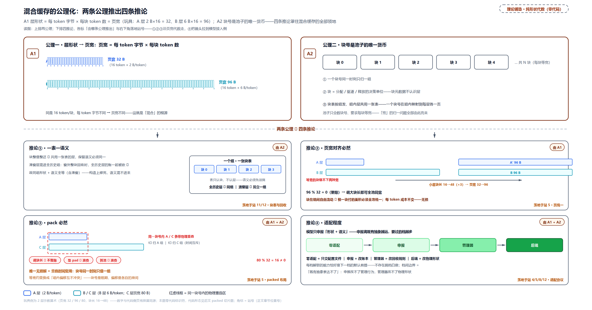

> *图注：纯理论模型，零 vLLM 标识符。上排两张公理卡：公理一（形状），层缓存形状 = 每 token 字节 × 每 block token 数 = 页宽，玩具例 A 层 2B×16=32、B 层 6B×16=96，同块长而每 token 字节不同，这就是「混合」的根源；公理二（货币），块号是池子唯一货币，三条规则：块是分配/回收的最小单位、块的身份只到（哈希、组）没有层粒度、块表按组发且一个块号在组内映射到每层各一页。中排四条推论各占一角，每张卡右下的「落地」标签指向本章兑现它的节：①一表一语义，整块回收 ⇒ 共享一张表的层必须同一保留语义（落地：失败演示节）；②页宽对齐必然，块在组间自由流动 ⇒ 租一块付的面积必须全池统一，整除时调 t 无损对齐（96%32=0、16→48、32→96）、不整除垫 pad 白付面积（落地：分发面·页统一）；③pack 必然，跨型不整除（80%32=16≠0）⇒ 唯一无损解是重叠时间复用，等宽约束换成组内偏移互不冲突、一个块号同一时刻只借一组（卡右下 t₁→A 组、t₂→C 组即所有权的时间互斥示意；落地：张量账·packed）；④适配程度，模型只申报形状+语义，离谱程度决定适配深度（零/申报/管理器/后端四档；落地：分发面·适配面小节）。底带判定链收口：全同直装 → 整除调 t → 不整除垫/拒收 → 跨型 pack 重叠，右侧指针给出代码形态的去处（后文 packed 切片图与「压力测试」V4 节）。*

四条推论就是本章后半的地图，做个自查再出发：后面「迭代史」你会看到四个纪元恰好是四条推论被现实逐条撞上的顺序；「失败演示」是推论①的现场；「分发面」的每一路都标着它实现的是哪条推论的哪种情形；V4 是四条全撞的极限样本。读到任何一段代码犯迷糊时，先问「这是哪条推论的落地」，路就直了。理论模型怎么落成代码，从每层的申报表开始。

### spec：每层向账本的申报表

理论模型里的「每 token 字节、每块 token 数、保留多少历史」，落进代码就是 `KVCacheSpec`，站 4 立过它是「每层交上来的自我介绍」，这里把它当**协议的申报面**正式打开。两个科目：**形状**（block_size、num_kv_heads、head_dim、dtype，算出页宽）与**语义**（保留多少历史：全历史、滑窗 W、分块局部、状态型；语义决定这个层的块什么时候可以还）。

拿一个最普通的层把页宽算一遍。Llama 系的全注意力层：8 个 KV 头、每头 128 维、fp16、每块 16 token。每 token 字节 = K 与 V 各一份 × 8 头 × 128 维 × 每数 2 字节 = 4096 B；页宽 = 4096 × 16 = 65536 B。这个层每租一个块号兑现 64 KiB，理论模型的 $`p = b \times t`$ 原样代入。全模型的申报表收齐，「字节换块数」那节的一行除法（字节 ÷ 页宽 ÷ 层数）才有原料：**spec 是分组与字节换块数的全部原料**，站 4 那句原话在这里正式兑现。

**谁交表、谁不交。** 收集面就是站 4 内嵌过的 `get_kv_cache_spec`（gpu_model_runner.py:L7800-L7837）里那三个省略号。遍历对象是全部 AttentionLayerBase 模块，不止 Attention 类：V4 的滑窗缓存、压缩器状态这类缓存组件构造时把自己注册进 forward context（前向计算的全局登记簿，模块构造时挂进去、遍历时被枚举），就从这里被收集，「新缓存组件自动进账本」由此得到机制保证。三种情况不产生申报：整栋交白卷的（EC 专职 producer）、账记在邻居名下的（跨层 KV 共享层）、其余逐层自报。不变量一句话：**一条物理缓存张量恰有一条 spec 记账**（共享层的账由目标层那条覆盖）。广播要包在 set_current_vllm_config 上下文里跑，因为寻址布局的查询链依赖当前配置（L7830-L7833 注释）。逐分支：

<!-- trace: spec-collection -->
| 分支 | 判据（锚点） | 动作 | 一句话语义 |
|---|---|---|---|
| 分支一：EC 专职 producer 整体返空 | has_ec_transfer() 且非 consumer（gpu_model_runner.py:L7808-L7809） | return {} | EC（encoder cache，多模态编码缓存的跨实例传输）里专职 producer 的实例只算编码缓存发给 consumer，不进本地 KV 账本；这也让 EngineCore 侧 has_kv_cache 可为假（core.py:L281-L297 给 available_memory=[0]*n） |
| 分支二：KV 共享跳过 | kv_sharing_target_layer_name 非空（L7814-L7825） | 登记进共享表后 continue | 本层不建 spec，账在目标层名下（You-Only-Cache-Once 类省显存）；分配后由 L7581-L7583 别名到目标层的张量 |
| 分支三：逐层自报 | 其余全部层（L7827-L7835） | spec = attn_module.get_kv_cache_spec(vllm_config)；AttentionSpec 再补 backend.indexes_kv_by_block_stride()（L7832-L7834） | 协议核心：每个模块自己申报缓存格式；indexes_kv_by_block_stride 是 packed 寻址兼容位（num_blocks 是否物理最外维），收集面预填、「落地为物理张量」的切片断言消费 |
| V4 视角（数字例） | c4 层枚举 5 个模块 / c128 层 3 个 / c1 层 1 个 | 各报各的（census＝逐层户口清点：数每层报几本账；见「压力测试」） | 一个 EAGLE draft 层与 target 共享 KV，报 0 条账 |

数量感一句：一次 V4 启动，61 个注意力层枚举出 243 条申报（c4/c128＝压缩比 4 与 128 的 V4 注意力层族、c1＝不压缩的纯滑窗层，来历「压力测试」正面拆；c4 层 5 条 × 30 + c128 层 3 条 × 31），一个层名下挂几本账全看它构造了哪些模块，「压力测试」一节逐条数。链上还有一个边角站记档即可：任一层申报 non_causal=True（Prefix LM 的双向注意力）时，收集后强制关掉 chunked prefill 与前缀缓存，两者都假设因果注意力、非因果 prefill 会腐蚀缓存（core.py:L265-L279）。

**把全链路挂墙上。** 申报只是初始化长链的一站。从引擎启动到每层拿到自己的视图是一条自顶向下的直线调用链，逐站职责先列成表（每站谁调谁、锚在哪，正文后文逐站下潜）：

<!-- trace: init-call-tree -->
| 站 | 谁调谁（锚点） | 一句话职责 |
|---|---|---|
| 入口编排 | EngineCore._initialize_kv_caches（core.py:L250-L332） | 八步顺序总编排：注册 → 收 spec → non_causal 检查 → profile → 定账 → 拍平喂调度器 → worker 落地 → warm up |
| 注册菜单 | register_all_kvcache_specs(vllm_config)（core.py:L254） | engine-core 进程注册 11 项内置 spec→manager 映射，再加平台钩子 |
| 广播收 spec | model_executor.get_kv_cache_specs()（core.py:L257 → abstract.py:L149-L150 即 collective_rpc）→ GPUModelRunner.get_kv_cache_spec（gpu_model_runner.py:L7800-L7837） | 广播到每个 worker，每层注意力模块自报 KVCacheSpec（收集三分支见上表） |
| non_causal 旁路 | core.py:L265-L279 | 任一层 spec 带 non_causal=True（Prefix LM 双向注意力）→ 强制关 chunked prefill 与 prefix caching——非因果 prefill 会腐蚀缓存 |
| 定可用 | determine_available_memory()（core.py:L293） | worker 侧跑 profile 峰值后剩余量（→「饼有多大」三步定账） |
| 定账分发 | get_kv_cache_configs(...)（core.py:L304-L306 → kv_cache_utils.py:L2094-L2242） | 合并全 worker spec → 四路分发 → packed 布局 → 护栏四道 → 出 KVCacheConfig |
| 拍平喂调度器 | generate_scheduler_kv_cache_config（core.py:L315）+ block_size = min(各组)（L318-L321） | 调度器只拿一份解包后的代表 spec 配置；四件套写回 cache_config（→「一份账喂两侧」） |
| worker 落地 | initialize_from_config（core.py:L330 → abstract.py:L118-L120 广播 → gpu_worker.py:L650-L665） | 先 ensure_kv_transfer_initialized 再 initialize_kv_cache（kv connector 即跨进程搬运 KV 的接入组件；顺序有讲究：后者会注入与它无关的组） |
| runner 内部十步 | GPUModelRunner.initialize_kv_cache（gpu_model_runner.py:L7624-L7681） | deepcopy 配置 → 补 encoder-only 层 → 并入 kv sharing 层 → 建 attn/ssu backend → kernel 块细分（管理块 256 拆 4×64）→ metadata builders → 双路径分配 → kv_transfer 注册 |
| 终点双写 | bind_kv_cache（gpu_model_runner.py:L7588-L7593 → utils.py:L466-L525） | 按层号分桶填 runner 平铺张量列表 + 对 forward context 每层调 layer.bind_kv_cache（层实例把原始分配拆成它需要的视图） |

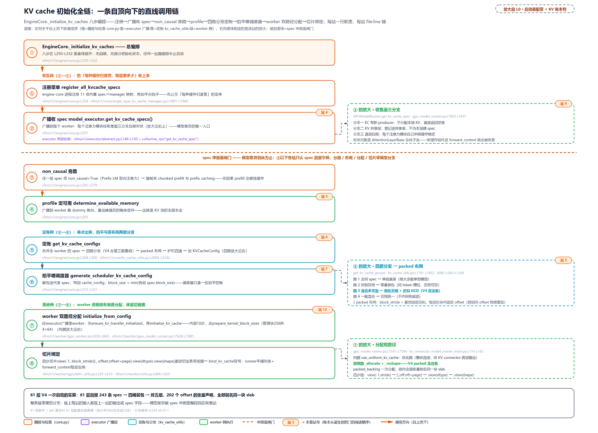

> *图注：本章后半的导览图（L0 启动装配带 × KV 账本列的放大）。左列主干就是调用序：收集段①—④把「每种缓存归谁管、每层要多少」收上来（注册 11 项 spec→manager 菜单 → 广播收 spec → non_causal 旁路 → profile 定可用），定账段⑤—⑥单点出账（四路分发 → packed 布局 → 护栏 → 拍平喂调度器），落地段⑦—⑧ worker 按布局真分配、逐层切视图，任何一站抛错即中止启动、无回跳。右列虚线是三处放大：收集面三分支（站 4，本节刚拆）、四路分发与 packed 布局（站 5，「协议的分发面」）、分配双路径（站 12，「落地为物理张量」）。琥珀虚线是全链最重要的性质：spec 申报面闸门——模型差异到此为止，收集段之后各站只认 spec 自报字段，分组/布局/分配/切片零模型分支。底带数量感：61 层 V4 一次启动自报 243 条 spec → 四桶装包 → 终五组、202 个 offset 的张量声明，全部别名同一块 slab。与「一份账喂两侧」那张调用全景的分工：那张放大站 7 单点定账的进出账，这张从引擎启动串到每层拿到视图。*

**申报决定适配深度**——推论④在这里先立一半。池子读的不是模型，是申报表：申报落得进既有 spec 类型与既有回收规则，接入零代码；申报的形状或语义越出格，要写的东西就越多。四档的一句话版先立住，完整清单归「协议的分发面」末尾的适配面小节：**零适配**（通用层只交 config，分配/前缀缓存/驱逐全套白捡）→ **申报适配**（重写申报方法、加字段、注册新 spec 类）→ **管理器适配**（连「哪些块能还、什么算命中」都要换，写新管家子类）→ **后端适配**（物理布局与 kernel 寻址都要换，写新注意力后端）。多数模型停在第一档，V4 四档全占（「压力测试」逐档点验）。

### 迭代史：推论被现实逐条撞上的顺序

上一节立好的四条推论不是一次出题一次答的：每一条都是先被一款真实模型撞上，vLLM 才为它写出落地代码。把这条线立住，后面每条规矩才不是凭空设计；也才能回答一个更根本的问题：这套东西到底是什么。答案先立住：**这是 vLLM 为「混合层潮」铺的适配协议，不是为某款模型打的补丁集。** 四个纪元逐个走，每纪元仍是旧设计、痛、方案、代价的完整链，末尾各钉一枚理论标签——纪元的顺序恰好是推论被撞的顺序，这不是巧合：越浅的推论越早被规模化的模型踩到。

旧世界先看清楚，它缺的不是某条推论，是公理二本身。v0（vLLM 第一代引擎，[第 1 章](../../ch01-vllm-v1-in-one-map/narrative/chapter.md)立过 v0/v1 两代的分野）没有为「各层缓存形状不同」留位置，Jamba 这批最早的混合模型靠手工补丁挤进来：Mamba 状态存成独立张量，按 `max_num_seqs`（调度器允许的最大并发序列数）预分配，并发猜大了启动直接 OOM、猜小了请求排队容量白扔（[PyTorch 官方博客](https://pytorch.org/blog/hybrid-models-as-first-class-citizens-in-vllm/)，vLLM 团队撰文，2025-11-05）。比 OOM 更深的问题是账本割裂：状态张量游离在块池之外，**块号这种货币对它根本不流通**——前缀缓存（把已算过的公共前缀 KV 留在池里给后续请求复用）、KV 传输（把算好的 KV 搬进别的进程，[第 16 章](../../ch16-kv-connector/narrative/chapter.md)的正题）、PD 分离（prefill 与 decode 两阶段拆开部署，[第 37 章](../../ch37-pd-disaggregation/narrative/chapter.md)的正题）这三件依赖统一块账本的特性，对混合模型全部无效。v1 的方案是统一 KV 分配器：不管什么形状的缓存，都从同一个分配器领块，公理二由此推广到全部缓存形态，三件事一起解锁。官方博客把 2025-11-05 称为混合模型成为「一等公民」的日子；代价也直说，V0 的手工补丁退役，换来一整套要伺候多种页形状的分配机制，本章后半的全部复杂度都是这份学费。

**纪元一·全同 spec：连推论①都用不上。** Qwen2.5、DeepSeek V3.1 这批模型所有层交同一张申报表：同一形状、同一语义、同一页宽。推论①问「哪些块能还」，全模型只有一个答案；推论②的归一化无事可做——一组了事、一张块表、除一次层数。协议为它们准备的第一路也是最短的路，今天大多数模型的日常仍停在这里。**理论标签：公理即答案，四条推论无一登场。**

**纪元二·同型异宽：第一次撞上推论②，归一化出了个聪明解。** 痛点来自 DeepSeek V3.2 的索引器缓存：132 B/token 对主 MLA（multi-head latent attention，多头潜在注意力：把每 token 的 K、V 联合压进一个低秩潜在向量再缓存，DeepSeek-V2 起的省显存路数）的 656 B/token（构成＝512 B FP8 潜在分量 + 16 B scale + 128 B bf16 RoPE，V3.2 官方口径，数学归[第 24 章](../../ch24-primer-attn-variants/narrative/chapter.md)），同是注意力缓存、每块 token 槽数相同、只是每 token 字节不同——页宽不一，推论②第一次登场。调块长除不尽（656 与 132 无整除关系），但真正的机会在别处：这批层**语义相同、槽数相同**，何必让每层单独过关？把它们并成一个组，按公理二规则三「一个块号 = 组内每层各一页」直接记账，全池统一面积就从「每层页宽」升格为「组页之和」，谁也不用调、谁也不用垫。vLLM 为此造了 UniformTypeKVCacheSpecs（同型 spec 的打包容器，把每块槽数相同的层捆成一个分配单位），落在 [PR #25101](https://github.com/vllm-project/vllm/pull/25101)（2025-09）；动机除了 V3.2 还有 MTP 层（multi-token prediction，多 token 预测：DeepSeek 系模型自带的投机解码头，一次预测多个 token 供大模型验证）与 MiniCPM 4.1（面壁智能的开源小模型，索引器缓存同样偏小）。代价：「组」这个概念从此有了内部结构，组页宽成了成员页之和。**理论标签：推论②在此落地，且落地姿势比逐层归一更省（并组让对齐在组粒度一次完成）。**

**纪元三·混合潮：撞上推论①，分表加共池成了刚需。** Gemma3（5 局部 : 1 全局）、LLaMA 4（3 局部 : 1 全局）、gpt-oss（每两层一块交替 dense 与 sliding-128）、Qwen3-Next（阿里的混合架构模型，全注意力 : 线性注意力 = 1:3）把「跨类型的层共享同一个物理池」变成刚需，这就是社区说的 hybrid attention 潮。痛在两头：一头是推论①——full 与滑窗对「哪些块能还」给出的答案相反，一张表必然把两个答案压扁成一个（下一节就亲手做这个失败实验）；另一头是推论②的硬面：分了表还得共池，静态按类型定量分池立刻被前缀缓存否掉：块命中数要到运行时才知道，社区深读转述这段设计取舍时的原话是「无法预知运行时会有多少个 block 被命中」。浪费侧也有实数：Qwen3-Next 的线性层每请求只要固定 1 个状态块，按页统一朴素分配会把每个线性层摊到与全注意力层同样的块数，而线性层的数量还更多，浪费直接放大。方案就是两条推论各兑现一半：**分表（推论①）+ 共池（推论②）**，每组一张私有块表、全部组共享一个池。社区把这套跨类型共池机制叫 HMA（Hybrid Memory Allocator，混合内存分配器）：共享物理 buffer、页对齐（×放大或 padding）、同一块物理内存在不同组眼里解释成不同形状；同期的 [PR #24486](https://github.com/vllm-project/vllm/pull/24486)（2025-09 开、10 月合）把 kernel 认的块大小与 KV 页大小解耦，高性能内核不再被小页层的页形状绑架（这个解耦的下游就是本章末「大块拆小块」那节的换算）。代价：页统一三条出路各有账（垫高白付显存），多组之后「哪些请求认领哪些块」的命中语义复杂化，官方自认只干净支持全注意力加恰好一种其它类型（[第 15 章](../../ch15-prefix-caching/narrative/chapter.md)展开）。**理论标签：推论①在此落地（分表），推论②的页对齐同步落地（共池的硬约束）。**

**纪元四·V4：推论②③的极限与推论④的第四档一起撞上。** DeepSeek V4 一层里同时挂四类缓存、全模型四种页宽（逐笔来历见「形状因子链」小节），其中三种小页没有一个除得尽最大页 37440——推论②的两条路当场死（页统一 NotImplementedError 的现场在「页统一」小节末尾）；层又跨语义、跨块长，纪元二那路并组要同槽数，也装不下它。到这一步理论只剩推论③一条路：重叠时间复用。协议的回应不是开特例，是长新部件：新 spec 类（SlidingWindowMLASpec，滑窗缓存与压缩器状态用它申报）与新字段（compress_ratio 等）让层照常申报；第三条分组路（元组装包；元组＝不同页宽的层捆成的最小分配单元，「压力测试」详拆）接住多元组；packed 重叠布局把推论③落地，理论模型里那句「一个块号同一时刻只归一组」从此有了物理形态；物理行布局与压缩寻址则把推论④推到第四档（新注意力后端）。代价也直说，后文逐笔兑现：切片条带物理碎片化（「落地为物理张量」末那笔 2.6% 的账）、同页配对的块形被页宽焊死（源码两处 TODO 自认应自动推导）。V4 不是挤进旧框架的特例，是推动协议长成今天这副样子的那个模型：2026-04-24 与 vLLM 官方支持博客同天落地，把整套机制推到压力测试的极限，本章后文的 V4 几节就是那场测试在账本侧的记录。最锋利的一笔提前点一句：V4 全新的压缩器状态靠申报一个**既有的**滑窗 spec 类型，免费接住了窗外回收与前缀缓存全套机制。推论④反过来用就是省力武器：申报得越靠近既有语义，白捡的越多，「压力测试」一节看到它。**理论标签：推论②③的极限在此兑现为第三路与 packed，推论④在此走到第四档。**

把这条线的时间坐标钉一下：2024-11，Marconi 论文（[arXiv:2411.19379](https://arxiv.org/abs/2411.19379)，MLSys 2025）先诊断了混合模型前缀缓存这道难题（状态不可回滚、缓存条目量级失衡），学界先于工程看到了坎；2025-09/10，纪元二、三的两个 PR 把组化机制立起来；2025-11-05，一等公民；2026-04-24，V4 双落地。四个纪元一层比一层深，但都是同一条协议在生长：新模型来了按协议申报（spec）、按申报分发（四路），现有机制（滑窗回收、前缀缓存、CUDA 图）白捡复用。

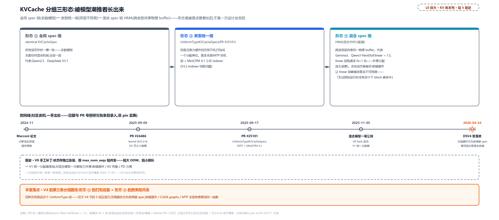

> *图注：L2 章图站 5（混合组化）的前史带，图面自带「站 5 前史」指北签。左：演进前的旧世界，V0 手工补丁（Mamba 状态独立张量、按 max_num_seqs 猜并发：猜大 OOM、猜小排队）到 V1 统一分配器（前缀缓存 / KV 传输 / PD 分离三件事一起解锁）；右：三张演进卡，①全同 spec 组（多数模型，无需混合机制）→ ②类型统一组 UniformTypeKVCacheSpecs（PR #25101，动机是 MTP 投机层与 MiniCPM 4.1 的小页索引器缓存）→ ③混合 spec 组 HMA（Gemma3、Qwen3-Next full:linear = 1:3 共享同一物理 buffer，多块池被否的引文「无法预知运行时会有多少个 block 被命中」写在卡内）；下方时间线五节点：2024-11 Marconi 论文 → 2025-09-09 PR #24486 → 2025-09-17 PR #25101 → 2025-11-05 混合模型一等公民 → 2026-04-24 DSV4 双落地；底部橙色落点条：本章后文 V4 节拆的第三条分组路径，是形态②的打包容器接住形态③的跨类型共池——四种页宽装进多个 UniformType 组。日期与 PR 号为社区史料（官方博客与 GitHub PR，一手出处），分组代码以本章 pin 为准。*

### 拿一张表去解混合模型：失败演示

推论①说「保留语义不同的层必须分表」。这不是设计品味，可以当场检验：本节拿「一张表」方案去解一个最小的混合模型，两种管法各做一遍，亲手把它推到矛盾上，最后看代码里这条约束长在哪。

**实验设置。** Gemma3 式 10 个 SWA 层 + 2 个 full 层（下一节「分桶等量」切 6 组用的就是这组数字），块长 16 token、窗口 512、序列长 4096 token。「一张表」方案的意思按公理二展开：全模型 12 层共用一张块表，一个块号发下来 12 层各兑现一页（规则三），回收按整块走（规则一）。实验只回答一个问题：**块表第 b 项什么时候可以还？** 两种层对这个问题给出相反的答案，一张表只能选一边。

**第一遍：按 full 语义管，哪块都不还。** 4096 token 全程在册，每层每请求占 cdiv(4096, 16) = 256 块。可 SWA 层根本用不了这么多：窗口 512 意味着稳态只需 cdiv(511, 16) + 1 = 33 块（准入上限公式在在途 0 时的取值，推导见「门多紧·回收感知准入上限」）。于是每请求每个 SWA 层白占 256 − 33 = 223 块；换算成字节示意（套本章 2 层小模型同款的 65536 B 页宽）：223 × 65536 = 14,614,528 B ≈ 13.9 MiB——一个 SWA 层一条请求的账面虚置，10 个 SWA 层就是十倍，而这些块本来可以回池接客。它的现实形态就是下一节开头的回退开关：`--disable-hybrid-kv-cache-manager` 把滑窗层全部提升成全注意力，warning 原话自认 "we do not enable any optimizations for saving KV cache memory"。**浪费，但账是对的**：装得下，只是贵。

**第二遍：按窗口语义管，窗外就还。** 这一遍坏的是正确性。full 层每个历史 token 对每个后续 query 都可见（全注意力的定义）；序列推进到第 4079 个 token 时，按窗口语义前 223 块已在途中陆续归池（窗外 token = 4079 − 512 + 1 = 3568，3568 // 16 = 223 块，盖着位置 0 到 3567），而 full 层此刻的每个 query 都还要读它们。两笔坏账同时发生：仍在读的 token 落到 NULL 占位页，**丢历史**；归池的块被新请求租走，**跨请求串写**。回收安全的前提是「被收块对后续任何计算不可见」（「门多紧·SWA 的还账方式」立这条不变量），全注意力类型把这条前提焊死在代码里：管家（每组一个的类型专属缓存管理员，按 spec 查注册表选，装配见「两把尺子与装配」）报「多少 token 已滑出窗口、不再被读」的 `get_num_skipped_tokens` 在全注意力管家那里不覆写、基类恒返 0，从不还账。强行统一成窗口语义，等于把它没有的「窗外」强加给它。

<!-- trace: m17 -->
| 假想世界 | 一张块表的样子 | 后果 | 证据锚 |
|---|---|---|---|
| 都不回收 | 全模型按 full 语义一张表（`--disable-hybrid-kv-cache-manager` 的现实形态） | 窗外 KV 白占到请求结束，省的只剩计算侧；SWA 层 4096 序列白占 223 块（256−33） | kv_cache_utils.py:L1568-L1589 warning 原话；「协议的分发面」分组表末行已实跑 |
| 都按窗口回收 | 滑窗语义统治全表，full 层的旧块也当窗外账收走、原位换 NULL | 仍在读的 token 落到 NULL 页＝丢历史；块归池转租他人＝跨请求串写，正确性当场损坏 | 回收安全的前提是「被收块对后续任何计算不可见」（后文回收一节的不变量）；full 管家 get_num_skipped_tokens 恒 0（基类默认 return 0）正是这条前提的代码形态 |
| 分表分管家（现实） | 每组一张私有块表＋类型专属管家：full 组全长持有、SWA 组窗外整块回收 | 账目两清、各语义无损；新代价是跨类型命中语义 | 管家按 spec 查注册表选（get_manager_for_kv_cache_spec）；跨类型命中只干净支持 full＋恰好一种其它（kv_cache_utils.py:L1189-L1194），[第 15 章](../../ch15-prefix-caching/narrative/chapter.md)展开 |

**矛盾出在结构，不在参数。** 两遍实验的失败不是「块长没选好」或「窗口太窄」，是「一张表」这个结构本身答不了「哪些块能还」：它只有一个是/否答案，而两种层需要两个相反的答案。把这个矛盾钉到代码上，靠的是公理二那三条货币规则的源码同构——「组」是什么、块的账面身份里有什么，源码说得比任何转述都直白：

```python
# vllm/v1/kv_cache_interface.py:L957-L967 · KVCacheGroupSpec
@dataclass
class KVCacheGroupSpec:
    """
    Represents a group of model layers that share the same KV cache block table.
    These layers are regarded as one layer in the KV cache manager.
    """

    # The names of model layers in this group
    layer_names: list[str]
    # The KV cache spec of this manager layer
    kv_cache_spec: KVCacheSpec
```

docstring 一句定音：共享块表的层被账本「当作同一层」。配套的事实链每条有锚：分配与回收全部以整块为操作单位（BlockPool 的分配从自由队列 `popleft_n` 整块整块取、前缀驱逐整块重置哈希、释放整块归还，block_pool.py:L647-L698）；块对象的全部字段是块号、引用计数、缓存哈希（键为「内容哈希 + 组号」）与自由队列链指针——**没有「层」这个粒度**（KVCacheBlock，kv_cache_utils.py:L118-L137）。所以释放块 b 必然是「该组所有层的 b 页一起还」，想只还一层，连记录层的键都没有。两种保留语义要在这种结构里共存，唯一的路就是放进不同的表：**分表是唯一无损解**。

**正解与内存视图。** 分表后：full 层一张表（全历史语义、全长持有），SWA 层一张表（窗口语义、窗外即还），各配各的管家。物理显存还是同一片——两组共享同一个 BlockPool，变的是**解读**：同一个块号，full 管家读作「持有到请求结束」，SWA 管家读作「窗外即可还」。社区把这套关系叫**内存视图**（memory view）：物理内存是同一片，对物理内存的解读各表各的。这个概念后面还会回来一次：「落地为物理张量」里 V4 的 243 条层账全部折进一块物理 slab，靠的正是同一招（多层声明、一片物理、各持各的视图）。推论①兑现完毕；分了表的组还要共享同一个块池，于是回到推论②，下一节进分发面，看归一化在代码里有几条路。

### 协议的分发面：四条归一化路

现在下潜。「spec 申报表」一节挂在墙上的初始化全链路导览图，第⑤步写着「四路分发定账」——`get_kv_cache_configs`（「一份账喂两侧」走过的站 6 单点定账函数）合并全部 worker 的申报表后，第一道工序就是调 `get_kv_cache_groups`（kv_cache_utils.py:L1781-L1852）：把层切成组、把形状归一，让池子回到「一种货币」。四条路各对应推论②③的哪种情形，下面走到哪条就标到哪条。进门先过两个边角开关，各一句记档：`--disable-hybrid-kv-cache-manager` 时先 `unify_hybrid_kv_cache_specs` 把滑窗 spec 全部提升成全注意力，混合模型退化成单组全按 full 管理（上一节浪费侧的现实形态）；attention-free 模型（没有任何层要 KV）直接返回空组表（L1797-L1800），KVCacheManager 走无 KV 路径。然后是四路 if/elif：

```python
# vllm/v1/core/kv_cache_utils.py:L1794-L1819 · get_kv_cache_groups（进门开关与四路分发）
    if vllm_config.scheduler_config.disable_hybrid_kv_cache_manager:          # L1794
        unify_hybrid_kv_cache_specs(kv_cache_spec)

    if is_kv_cache_type_attention_free(kv_cache_spec):                        # L1797
        # This returns an empty list to allow for the KVCacheManager to handle
        # attention free models.
        return []

    if is_kv_cache_spec_uniform(kv_cache_spec):                               # L1802
        # KV cache of all layers are the same, which is true for
        # most models. Allocate the same amount of memory for
        # each layer.
        return _get_kv_cache_groups_uniform_spec(kv_cache_spec)
    elif uniform_spec := UniformTypeKVCacheSpecs.from_specs(kv_cache_spec):   # L1807
        # All layers need the same number of token slots (e.g., all layers are
        # full attention, or all layers are sliding window attention with the
        # same window size). Put all layers into one group.
        return _get_kv_cache_groups_uniform_type(uniform_spec)
    elif grouped_specs := group_and_unify_kv_cache_specs(kv_cache_spec):      # L1812
        # DeepseekV4 case: All layers need the same number of token slots,
        # yet some layers are full attention while others are sliding window
        # attention in different sizes. Need to group layers into multiple
        # UniformTypeKVCacheSpecs.
        kv_cache_groups = _get_kv_cache_groups_uniform_groups(grouped_specs)
        _annotate_eagle_groups_deepseek_v4(vllm_config, kv_cache_spec, kv_cache_groups)
        return kv_cache_groups
```

（第四路是 fall-through：前三路都不中，先抽出 hidden-state 层（HiddenStateCacheSpec，缓存的不是 K/V 而是隐状态的一族层）再 unify 页宽、分桶等量，就是下面两个小节的机制，L1821-L1841。）

四路全景，一张表看全（「理论对应」列就是本节的路标）：

| 路 | 判据 | 理论对应 | 接住谁 | 产出 |
|---|---|---|---|---|
| 一·全同 spec | 所有层申报表一模一样 | 推论②的全同情形：归一化无事可做 | 多数单型模型（Llama、Qwen2.5、DeepSeek V3.1） | 一组了事、一张块表 |
| 二·同型打包 | 每块 token 槽数相同、页宽可不同，装得进一个 UniformTypeKVCacheSpecs | 推论②的并组解：全池面积升格为组页之和 | DeepSeek V3.2（656/132 B/token）、MTP 层、MiniCPM 4.1 | 一个元组组：一个块号 = 组内每层各一页 |
| 三·多元组重组 | SlidingWindowMLASpec 在场且页宽多于一种 | 推论②的死局 + 推论③的重叠时间复用 | DeepSeek V4（三种小页除不尽最大页） | 多个 UniformType 组 + packed 重叠布局（「压力测试」拆） |
| 四·通用等页 | 前三路都不中：先抽 hidden-state 层、页统一、分桶等量 | 推论①的分表 + 推论②的整除/垫两条路 | Gemma3、gpt-oss、Jamba、Qwen3-Next（页宽可统一的混排） | 等大块组，每组一张私有块表 |

这张表最重要的性质不在表内：**四路的判据全部来自 spec 自报的属性**（类型、block_size、sliding_window、页宽），分路本身不读任何模型名。v1/core 里仅有的 V4 字样集中在分组与组布局处：分组后的 EAGLE 组标注（读 spec 的 model_version 字段判别，FIXME 自认 hacky）与几处注释、变量名，都不参与分路判定。第三路与 packed 确实是专为 V4 长出的部件（group_and_unify 的 docstring 自陈 "Currently, this is only used for DeepseekV4"），但「部件挂在谁名下」与「按模型名分发」是两回事：路为申报形态而开，不为模型名而开。模型差异被申报面吸收，「适配协议」在分发环节的代码形态就是这条性质。V4 的走向先按下（「压力测试」整节拆），这里把最常用的第四路下潜完——它伺候了今天绝大多数混合模型。

#### 分桶等量：为什么每组层数必须相同

第四路先兑现推论①（按类型分表），再兑现推论②（分了表的组还要共池，块面积必须统一）。规矩一句话：**类型相同的层并成一个桶，再把桶切成层数相等的组**。

为什么组要等大？推论②的账在这里换了个算法：分了表的组共用同一个 BlockPool，块号全池通用，任何一个空闲块都可能被分给任何一个组；而一个块号落到组里兑现多少面积，取决于这个组有几层——公理二规则三说块号在组内映射到每层各一页，组里 N 层，一个块号就要兑现 N 页。两组层数不等时，同一个块号在两边的字节数就不等，池里「一个块有多大」会随你从哪个组看而变。麻烦在于池的记账从头到尾只认块数：`num_blocks`、空闲队列长度、使用率分母、启动日志里的容量与并发，全是「块数 × 每块字节」；块大小不唯一，这些数就集体失真，调度器按块数放行的请求到了 worker 那边可能多占或少占一批页。源码把这条写作假设 1，给的理由是碎片：不同大小的块混在一个自由队列里，没法互换着用。所以硬约束是**每组每块物理字节数相等**：先统一页宽（否则同一组内层与层之间的页都不等，下一小节专讲），再凑齐每组层数（本小节的 padding 就是补这个）。这条硬约束的落地就是下面这段代码：

```python
# vllm/v1/core/kv_cache_utils.py:L1233-L1280 · _get_kv_cache_groups_uniform_page_size
    # Split each group into smaller groups, to make the number of layers in each
    # group identical. Add padding to the last group of each type if necessary.
    # E.g., (full.0, full.1), (sw.0, sw.1, sw.2)
    # split to 3 groups with 2 layers each:
    # (full.0, full.1), (sw.0, sw.2), (sw.1, padding).
    # FIXME(Chen): At the moment of writing this code (2025-06-02), all
    # open-source hybrid model follows a n:1 pattern between different attention
    # types (e.g., Gemma3 5:1 between sw and full, LLaMA4 3:1 between local and
    # full), so we can use the "1" in the n:1 pattern as the group size, which
    # is the minimum number of layers among all attention types. Need a better
    # strategy if we want to support more complex patterns (e.g., 20 full + 30
    # sw, where the group size should be 10).
    min_num_layers = min([len(layers) for layers in layer_buckets])       # L1245
    group_size = min_num_layers
    max_num_layers = max([len(layers) for layers in layer_buckets])
    if max_num_layers < min_num_layers * 1.5:
        # If the number of layers is not much larger than the minimum number of
        # layers, use the maximum number of layers as the group size to avoid
        # too many padding layers. A typical example is gpt-oss-20b + eagle,
        # with 12 sw + 13 full. We pad it to (13 sw, 13 full) instead of
        # (12 sw, 24 full). 1.5 is a heuristic to avoid too many padding
        # layers while accommodating speculative decoding drafters that add
        # extra layers to one attention type.
        group_size = max_num_layers                                      # L1256
    grouped_layers = []
    for layers in layer_buckets:
        num_padding_layers = group_size - len(layers) % group_size
        if num_padding_layers != group_size:
            logger.warning(
                "Add %d padding layers, may waste at most %.2f%% KV cache memory",  # noqa
                num_padding_layers,
                num_padding_layers / len(layers) * 100,
            )
        num_groups = cdiv(len(layers), group_size)
        # In PP case, say if we have
        # - stage 0: full.0, sw.0, sw.1
        # - stage 1: full.1, sw.2, sw.3
        # We should have 3 groups: (full.0, full.1), (sw.0, sw.2), (sw.1, sw.3)
        # It can't be (full.0, full.1), (sw.0, sw.1), (sw.2, sw.3) because
        # … 省略：反例的四行展开（连续切会让某 stage 出空组、补 padding 更浪费）……
        # To avoid this, we assign layers[i::num_groups] to the i-th group
        # instead of layers[i * group_size: (i + 1) * group_size]
        for i in range(num_groups):
            grouped_layers.append(layers[i::num_groups])                 # L1279
    return create_kv_cache_group_specs(kv_cache_spec, grouped_layers)
```

四个决策。**组大小默认取各类型层数的最小值**：开源混合模型都是 n:1 模式，那个「1」（全局层的层数）天然是组大小。**1.5 启发式**：层数比不大时取 max 免得 padding 过多，12 SW + 13 full 补成 13/13（padding 1 层），比按 min=12 切（full 桶要补 11 层到 24）划算得多；padding 层白占显存，warning 原话 "may waste at most N% KV cache memory" 把账打给你。**PP 交错分派** `layers[i::num_groups]`：按步长切片入组，让流水线每个 stage 都有活干，不出空组。**落点**是 `KVCacheGroupSpec`，每组 = 同型层名表 + 合并后的代表 spec。四个场景实跑：

<!-- trace: m5 -->
| 场景 | 分桶层数 | 组大小 | 分组结果 | 代价/账 |
|---|---|---|---|---|
| uniform 对照 | 32 full | 32 | 1 组 × 32 层（多数模型） | 无 padding、单块表 |
| Gemma3 式 10+2 | SWA 10 / full 2 | 2（=min） | 6 组 × 2 层；SWA 第 0 组拿 layers 0,5（layers[i::n] 交错） | 无 padding；PP 交错避免某 stage 出空组 |
| 12 SW + 13 full | SWA 12 / full 13 | 13（13 < 12×1.5=18 → 取 max 非 min） | 2 组：SWA 12 层 + 1 padding、full 13 层 | 补 1 层 padding，浪费上界 8.33%（warning 原话 may waste at most 8.33% KV cache memory） |
| disable 回退 | SWA 5 / full 1 | — | 1 组全按 full 分配，sliding_window=512 只记录不生效 | 窗外 KV 白占显存（warning：we do not enable any optimizations for saving KV cache memory） |

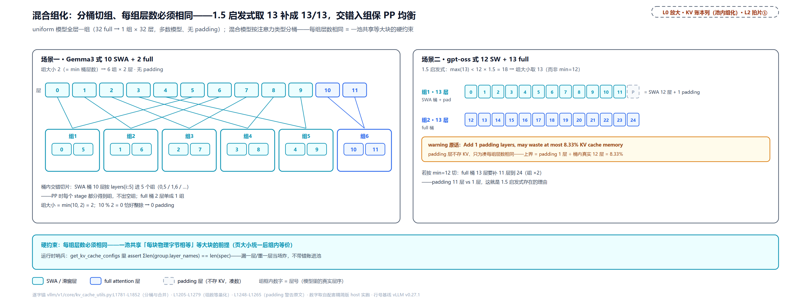

> *图注：L0「调度 · 显存账本」列池内的组化层放大（对应 L2 章图中排拍片①）。左：Gemma3 式 10 SWA + 2 full 以组大小 2 切成 6 组，SWA 层按 layers[i::5] 交错入组（[0,5] / [1,6] / …），PP 时每个 stage 组数均衡；右：gpt-oss 式 12 SW + 13 full 因为 13 < 12×1.5=18，组大小取 13：SWA 桶补 1 个 padding 层凑 13/13（浪费上界 8.33%），比按 min=12 切（full 桶要补 11 层到 24）划算得多。每组层数必须相同，这是一池共享等大块的硬约束。*

末行「disable 回退」就是本节（协议的分发面）开头那个开关的实跑：一张表、实现简单，窗口外的 KV 白占显存，省下的只剩计算侧。

等字节这条硬约束的完整清单在 `_get_kv_cache_groups_uniform_page_size` 的 docstring 里（kv_cache_utils.py:L1169-L1198），六条假设：每组每块物理字节相等（不同大小的块混住会碎片化）、组内同 block_size、每 token 每层字节由模型定（当前只支持各层相同）、每组层数相同（padding 补齐）、组内同注意力类型、以及官方自认的第六条：跨类型的最长命中决策 "only supports one attention type or two types of full-attention plus exactly one another type"（那套决策的细节在[第 15 章](../../ch15-prefix-caching/narrative/chapter.md)）。作用域也要说破：这六条管的是等页路径（docstring 就挂在 `_get_kv_cache_groups_uniform_page_size` 上），那四条分支在更早处就把不满足的层引去了别路。

#### 页统一：三条出路

等量化的前提是各层页字节已经相等；不等时先统一——这就是推论②在第四路里的调度实现，三条出路正好对应理论里的三种情形：整除的调块长（无损）、不整除但垫得下的物理垫高（有损面积、保正确性）、都不行的拒收（宁可报错不给错账）。`unify_kv_cache_spec_page_size`（kv_cache_utils.py:L1070-L1132）以最大页为基准，每层三条出路：

```python
# vllm/v1/core/kv_cache_utils.py:L1091-L1132 · unify_kv_cache_spec_page_size
    page_sizes = {layer.page_size_bytes for layer in kv_cache_spec.values()}
    if len(page_sizes) <= 1:
        # All layers have the same page size, no need to unify.
        return kv_cache_spec

    max_page_size = max(page_sizes)
    new_kv_cache_spec = {}
    for layer_name, layer_spec in kv_cache_spec.items():
        if layer_spec.page_size_bytes == max_page_size:
            new_kv_cache_spec[layer_name] = layer_spec
        elif isinstance(layer_spec, MambaSpec):
            # MambaSpec's page size is determined by its state shapes and does
            # not scale with block_size, so pad the page instead. This is the
            # … 省略：注释后半（与平台对齐 Mamba 页的同一 pad 机制，
            #       草稿模型页更大时会走到这里）……
            new_spec: KVCacheSpec = replace(layer_spec, page_size_padded=max_page_size)
            assert new_spec.page_size_bytes == max_page_size
            new_kv_cache_spec[layer_name] = new_spec
        else:
            layer_page_size = layer_spec.page_size_bytes
            if max_page_size % layer_page_size == 0:
                ratio = max_page_size // layer_page_size
                new_block_size = layer_spec.block_size * ratio
                new_spec = replace(layer_spec, block_size=new_block_size)
            elif (
                isinstance(layer_spec, AttentionSpec)
                and layer_spec.indexes_kv_by_block_stride
            ):
                new_spec = replace(layer_spec, page_size_padded=max_page_size)
            else:
                raise NotImplementedError(
                    f"Layer {layer_name}: page size is not divisible by the "
                    "maximum page size and cannot be padded. Padding is only "
                    "supported for attention layers whose backend indexes KV "
                    "pages by the block stride (indexes_kv_by_block_stride is "
                    "True)."
                )
            assert new_spec.page_size_bytes == max_page_size
            new_kv_cache_spec[layer_name] = new_spec
    return new_kv_cache_spec
```

三条出路各有一笔账。**调大 block_size**：页 = 2 × bs × heads × dim × dtype 随 bs 线性放大，小页层把块大小翻倍、页就翻倍，每 token 字节不变，**容量零损失**；代价是切得粗了，这一层的一页从装 16 个 token 变成装 32 个，序列尾部不满一块的零头最多从 15 个 token 变成 31 个（后文「两把尺子与装配」一节会看到它怎么牵动调度尺与哈希尺）。**物理 pad**：Mamba 状态页和「后端按 stride 索引」的层只能垫高。Mamba 为什么走不通上一条路：它的一页装的是状态张量，大小由状态形状算出、跟 block_size 无关，把块大小翻倍，它的页一个字节都不会变；而它又要跟注意力层共用同一个块号空间，出路就只剩把页垫到最大页。垫高只动分配的字节数（`page_size_padded` 改了，状态形状一个字节没动），所以只花显存、不坏正确性，表里 4096 → 65536 那行就是它。「按 stride 索引」指这类注意力后端定位一页用「基址 + 块号 × 固定步长」，不问页内真实字节排到哪，垫高的页尾根本不会被寻址，pad 同样安全。两路的垫出字节都照付显存。**拒收**：既不整除又垫不了的直接 `NotImplementedError`，宁可拒收，不给错账。五个场景实跑：

<!-- trace: m6 -->
| 输入 | 页字节（前→后） | 出路 | 结果/代价 |
|---|---|---|---|
| 等页 {a,b} 同 65536 | 65536 → 65536 | 原样返回（同一 dict） | 零开销 |
| 小层 heads 4（32768） | 32768 → 65536 | block_size 16 → 32（×2 线性放大） | 每 token 字节不变，容量零损失 |
| Mamba 状态页 4096 | 4096 → 65536（pad） | page_size_padded 物理垫高，block_size 16 不变 | 每页浪费 61440B（93.75%） |
| 畸形页 40000（非 stride） | 40000 → 拒收 | 65536 % 40000 = 25536（不整除 → 拒收） | NotImplementedError |
| 畸形页 40000（stride 索引） | 40000 → 65536（pad） | indexes_kv_by_block_stride=True → 允许 pad | 后端按 stride 寻址吃得下 pad |

Mamba 那行 93.75% 的浪费是极端例（状态页远小于注意力页时的代价）；真实混合模型靠 Mamba 状态够大让页自然接近，pad 的浪费小得多。

三条出路的终点都是「所有层落到同一个最大页」。这正是 DeepSeek V4 进不来的地方：它的三种小页没有一个除得尽最大页 37440、又都不是 stride 索引层，按这里的规矩该 NotImplementedError 拒收。vLLM 没有拒收它——协议为它长出了四路表里的第三路，「压力测试」整节拆。

#### 接入一个新模型要动哪几个地方

推论④在这里兑现：申报决定适配深度。模型侧的缓存需求用「spec 申报」向上表达，框架用「注册表」把 spec 类型映射到管理器，物理形状由注意力后端敲定——四档就是依次越过这三层中的更多层。全表（每档「必须实现什么 / 得到什么 / 何时必须下一档」逐列，pin 实例钉在末列）：

<!-- trace: adaptation-ladder -->
| 档位 | 模型侧必须实现 | 得到什么 | 何时必须下一档（边界判据） | pin 实例 |
|---|---|---|---|---|
| ① 零适配 | 无——用通用 Attention 层 + 只给 HF config（sliding_window / kv_cache_dtype） | 分配/前缀缓存/驱逐/命中全套生命周期零代码 | 缓存几何或语义超出既有 spec 字段能表达（通用生产者只认 sliding_window 与 kv_cache_dtype 两个旋钮） | Llama/Qwen 全注意力（FullAttentionSpec）、Gemma 滑窗（config.sliding_window → SlidingWindowSpec），都走 attention.py:L621-L696 通用分支 |
| ② 申报适配 | 重写 get_kv_cache_spec / 给 spec 加字段 / 新 spec 类 + 注册表注册（树外用 @register_kv_cache_spec 装饰器） | 框架按你的账本记页宽与分组，spec 类型经注册表自动选中配套 Manager | 既有 Manager 的回收/命中策略对你的注意力是错的——申报只能「选」管理器（查表），改不了管理器行为 | RSWA：13 行申报（rswa_attention.py:L25-L37）+ RSWASpec 仅加 rswa_window 字段（interface.py:L479-L519）+ 注册；DSV4 四个申报面（主 KV / Indexer / 压缩器状态 / SWA） |
| ③ 管理器适配 | SingleTypeKVCacheManager 子类（重写 remove_skipped_blocks / find_longest_cache_hit 等）+ 把 spec 注册到新 Manager | 自定义「哪些块何时可释放、什么算命中」，内存上界可控 | kernel 索引的物理形状/块尺寸/stride/元数据折算变了——这些不在 spec 里 | SlidingWindowManager（掉头回收+连续命中）、RSWAManager（释放中间 gap，O(prefix+window)，single_type_kv_cache_manager.py:L832-L873）、MambaManager（状态块管理） |
| ④ 后端适配 | 新 AttentionBackend + MetadataBuilder + get_kv_cache_shape/kernel_block_sizes/preferred_block_size/stride_order | 自定义物理布局与 kernel 寻址，配合申报面构成完整落地 | —（最深层；DSV4 到此为止） | DeepseekSparseSWABackend（preferred 256、MultipleOf(64)）、DeepseekV4FlashMLABackend（(nb,bs,584)、无 impl 类）、CompressorBackend+Builder（压缩槽位映射） |

阶梯单调加深：档 N 的能力严格包含档 N−1，且每一档都由「既有抽象表达不了」触发，不存在跳档白做——申报改不了管理行为（注册表只是查表），管理器改不了物理形状（`get_kv_cache_shape` 在后端手里），职责边界与 spec → 注册表 → 后端三层接口一一对应。第二档的最好标本是 DeepSeek V3.2 的 R-SWA 层（Reference Sliding Window Attention 的变体：prefill 段全局可见、只保留最近 rswa_window 个生成 token 的 KV），接入面的全部代码就是重写一个方法，13 行：

```python
# vllm/model_executor/layers/attention/rswa_attention.py:L25-L37 · RSWAAttention.get_kv_cache_spec
    def get_kv_cache_spec(self, vllm_config: VllmConfig) -> KVCacheSpec | None:
        spec = super().get_kv_cache_spec(vllm_config)
        if spec is None:
            return None
        return RSWASpec(
            block_size=vllm_config.cache_config.block_size,
            num_kv_heads=self.num_kv_heads,
            head_size=self.head_size,
            head_size_v=self.head_size_v,
            dtype=self.kv_cache_torch_dtype,
            kv_quant_mode=get_kv_quant_mode(self.kv_cache_dtype),
            rswa_window=self._rswa_window,
        )
```

先复用基类全部推导，再包成多带一个 `rswa_window` 字段的 RSWASpec；注册表里加一项（RSWASpec → RSWAManager，分组基类取 FullAttentionSpec，single_type_kv_cache_manager.py:L1923-L1925），基类决定它与全注意力同组——分组、分配、块表零改动，行为差异（gap 块驱逐，把每请求 KV 压到 O(prefix + window)）全在 manager 子类里。注意这个例子恰好是②③成对出现：13 行申报是「选票」，RSWAManager 才是「政策」（类 docstring 自述，申报的目的就是让管理器实例化成 RSWAManager，rswa_attention.py:L14-L18）。注册表本身就是为接入设计的：

```python
# vllm/v1/kv_cache_spec_registry.py:L190-L207 · register_kv_cache_spec（docstring 示例与实现）
    Examples:
    - Register a new specs:
        @register_kv_cache_spec(
            manager_class=FullAttentionManager,
            uniform_type_base_spec=FullAttentionSpec
        )
        @dataclass(frozen=True, kw_only=True)
        class CustomFullAttentionSpec(FullAttentionSpec):
            pass
    """

    def decorator(kvcache_spec_cls: type["KVCacheSpec"]) -> type["KVCacheSpec"]:
        KVCacheSpecRegistry.register(
            kvcache_spec_cls=kvcache_spec_cls,
            manager_class=manager_class,
            uniform_type_base_spec=uniform_type_base_spec,
        )
        return kvcache_spec_cls
```

装饰器登记「spec 类型 → 管家类型 + 分组基类」；启动时 `register_all_kvcache_specs` 先铺 11 项内置菜单（FullAttention、SlidingWindow、Mamba、ChunkedLocal、Cross…，single_type_kv_cache_manager.py:L1881-L1942）再调平台钩子。门禁在定账入口：每层 spec 查不到基类或管家直接 ValueError，报错自带修复指引 "Please register it using @register_kv_cache_spec decorator"（kv_cache_utils.py:L2143-L2145）；模块 docstring 明说这是为树外平台准备的，不改 vLLM 核心代码就能挂自定义缓存类型。

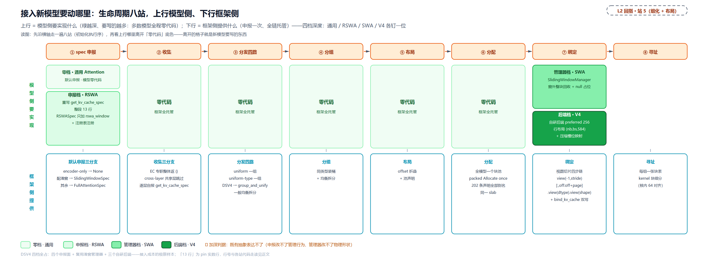

> *图注：推论④的全景图，与理论模型图的推论④互指——那张讲「申报的离谱程度决定适配深度」的道理，这张讲每一档动哪里。横轴是缓存初始化的生命周期八站：spec 申报→收集→分发四路→分组→布局→分配→绑定→寻址；上行是模型侧要实现什么（四档色深：零档全绿＝通用 Attention 只递 config；申报档＝RSWA 重写 13 行申报；管理器档＝SlidingWindowManager 换回收规则；后端档＝V4 自研后端 preferred 256 与压缩槽位映射），下行是框架侧提供什么（收集三分支 / 四路分发 / 类型装桶均衡拆分 / offset 折叠与池声明 / 块池与 Allocate once / 视图切片四步链 / 每组一张块表与 kernel 块细分）。大多数模型全程绿灯零代码；申报离既有抽象越远，绿灯里要自己写的格子越多。DSV4 是四档全占的极限样本（四个申报面 + 复用 SlidingWindowManager + 三个自研后端）。*

接入这件事收成一句：**先申报、再看落哪路、最后才问要不要长新物**。多数接入到第二问就结束；申报形态超出四路判据时，协议才长新东西——V4 就是完整示范：新 spec 类、新字段、第三路、packed 布局、分配侧切片五段改动每段有锚，「压力测试」与「落地为物理张量」逐段兑现。

### 压力测试：DeepSeek V4 接入

迭代史纪元四的现场复盘。开场先把靶子立全：**四条推论 V4 全撞**——推论①（滑窗、状态、全历史三种保留语义并存）、推论②（四种页宽、三种小页除不尽最大页）、推论③（唯一出路是 packed 重叠布局）、推论④（一路适配到第四档，自研后端）；一层名下挂多本账、压缩让「一个 256-token 块」在不同层兑现不同行数，也都在这份清单里。四小节推进：先把这一层看明白（模型侧），再走形状因子链（从 config 一路推到页宽，顺带数每层报几本账），再记压缩块的写入账，最后走装包与对齐的全程。取证口径先交代（四小节数字同源）：页宽 census 与分组结果来自 pin 真码的 host 桩跑，vllm.config 一类配置模块用桩替换，spec 构造与分组代码零改动；逐层压缩比表取官方回归测试的 5 层玩具表 [0, 0, 4, 128, 0]（源码逐层读 config 表、max(1,·) 把 0 折成 1，attention.py:L210-L213）；窗口：实发 config 写的是 128（vLLM 官方博客的「滑窗 128」、[第 28 章](../../ch28-deepseek-v4-principles/narrative/chapter.md)那条 128 token 常数滑窗带就是它），本章 host 桩跑取 8192 是示教值（窗口跨更多块、桶键更好认），页宽、桶数、切组与 stride 均不随窗口值变，仅桶键的窗口标签不同。

#### 先把这一层看明白

四路表里 V4 落第三路的理由已经摆过：三种小页除不尽最大页、又不是 stride 索引层，按等页规矩该 NotImplementedError 拒收——但这个模型是 DeepSeek V4（DeepSeek 的混合注意力旗舰，本章压力测试的实例），vLLM 没有拒收它，协议为它长出了第三条路。要懂这条路为什么长这样，得先认识这个模型：本小节立画面，接着的形状因子链与压缩记账两小节数账，最后拆装包。

Gemma3、gpt-oss 的混排只是「窗口多宽、几层一换」，每个层的内部还是同一副注意力骨架；V4 往前再走一步，把压缩、滑窗、检索三件事装进同一个层。名字先对齐，免得两套文献对不上号：DeepSeek 官方叫 CSA（Compressed Sparse Attention，压缩稀疏注意力）与 HCA（Heavily Compressed Attention，重压缩注意力），vLLM 代码里叫 c4a/c128a（压缩比 4 与 128 的注意力层族，下文简称 c4/c128），两套名字指同一批层。这么折腾值不值，官方给过总账：1M token 设定下 V4-Pro 的单 token 推理 FLOPs（浮点运算次数，算力开销的计量）只要 V3.2 的 27%、KV cache 只要 10%（[DeepSeek 模型卡](https://huggingface.co/deepseek-ai/DeepSeek-V4-Pro)）；vLLM 侧的口径：1M 上下文每序列 KV 9.62 GiB，对 V3.2 形态的 83.9 GiB，约 8.7 倍（[vLLM 官方博客](https://vllm.ai/blog/2026-04-24-deepseek-v4)）。这两笔账是谁省出来的、代价是什么，[第 28 章](../../ch28-deepseek-v4-principles/narrative/chapter.md)逐件算清；本章只把这一层的静态画面立住，然后进账本。

一个 c4 层里，KV 沿三股流走。**滑窗流**：最近一个窗口内的 token 原样存 KV、不压缩，近处的原文永远直读，粗粒度但便宜。**压缩流**：压缩器每凑满 4 个 token，把它们的 KV 加权压成一份（c4 的压缩窗带重叠，8 个 token 以步长 4 滑出两份），远处的细粒度记忆全在这条流上。**检索流**：indexer（索引器，给压缩 KV 配的检索头）在压缩键上为每个 query 打分、挑出 top 条目，注意力真正读的就是挑出来的这些，每个 query 只看 top-k 条（官方 config 的 `index_topk`：Flash 512、Pro 1024，[第 29 章](../../ch29-deepseek-v4-assembly/narrative/chapter.md)立过双值；本章 61 层 census 是 Pro 形态）——1M token 压到 4:1 仍是 25 万条的量级，不挑读不动。主 KV 沿用 MLA（纪元二立过的多头潜在注意力；584 B 特形与多头的数学归[第 24 章](../../ch24-primer-attn-variants/narrative/chapter.md)展开）。c128（HCA）是同一副骨架的重压缩版：每 128 个 token 才压一份、不挑，压缩序列短到 1M token 也只剩约 8k 条，直接全看（它的 topk 上限 8192 恰好盖满）。还有两种角色不在主线上。c1 层不压缩、只有滑窗流（MTP 草稿层恒为这种；实发模型的逐层表里写 0 就表示纯滑窗层，下一小节的 max(1,·) 折叠说的就是它）。mHC（Manifold-Constrained Hyper-Connections，流形约束超连接）改的则不是注意力而是残差：残差从「加回去」扩成多条并行流、由学出来的门控调和，落在模型代码的 hc_pre / hc_post 两个钩子上（每个半层前降投、算完抬升拼回残差），算力开销不大（细账归[第 28 章](../../ch28-deepseek-v4-principles/narrative/chapter.md)），换前层信息不被深堆叠冲淡。

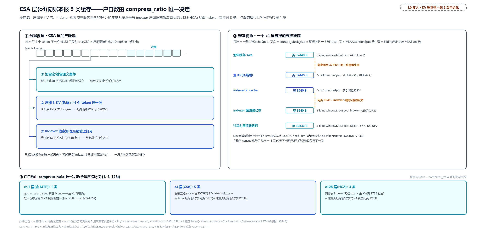

> *图注：L2 站 5（混合组化）的放大，把一个 CSA 层拆开看它向账本报的缓存户口。左（数据视角）：token 流分三股，滑窗流近窗原文直存、压缩主 KV 流每 r=4 个 token 压一份、indexer 检索流在压缩键上打分挑 top 条目；右（账本视角）：五挂缓存各是一条 spec，滑窗缓存与压缩主 KV 同页 37440 B（刻意共享同一张物理张量）、indexer k_cache 与 indexer 内嵌压缩器状态同页 8640 B、注意力压缩器状态 32832 B；底：户口数由 compress_ratio 唯一决定——c1 层（含 MTP）只报 1 类（主 KV 不报账，get_kv_cache_spec 返回 None）、c4 层 5 类、c128 层 3 类（去 indexer 两挂，主 KV 独占 1728 页）。三股流各挂各的账：一层之内就已是混合缓存。*

#### 形状因子链：从 config 到页宽

对着解剖图数账。理论画面里的三股流，落到账本上是四类缓存：主 KV（压缩流的正式账，全历史）、索引器 KV（检索流自己的 KV 账）、每层一挂的滑窗缓存（每层构造一个，attention.py:L319-L325）、压缩器状态（注意力与 indexer 各带一份自己的）。四类缓存、七种形态、四种页宽，全压在这一个模型的账上；spec 家族只有两支：MLAAttentionSpec（MLA 型，主 KV 与索引器报它）与 SlidingWindowMLASpec（V4 新设的滑窗型，滑窗缓存与压缩器状态报它）。

这一小节把整条推导链走一遍，四环：**config 原始参数 → 每槽字节 → 每块槽数 → 576 对齐 → 页宽**，最后数每层报几本账。链条上每个因子都有 pin 锚，来历不明的数字不许进表。

**第一环：每槽字节。** 主 KV 每槽 584 B，拆开是 448 B NoPE + 128 B RoPE + 8 B fp8 scale：NoPE 是 MLA 潜在向量不带位置编码的主段，RoPE 是带旋转位置编码的短分量（两者合起来就是每 token 压缩后的全部 KV），fp8 scale 是块量化的缩放字节。584 B 是 fp8_ds_mla 布局（V4 的主部署形态）的特形，源码注释原话 "fp8_ds_mla is a UE8M0 block-scaled uint8 layout and needs 576B alignment"：UE8M0（FP8 块量化的纯指数缩放格式，8 bit 无符号指数）布局对显存对齐有硬要求 576，页字节要向上取整到 576 的倍数（构造期的 _apply_alignment_padding，kv_cache_interface.py:L353-L359）；对照 plain 布局（bf16 与逐张量 fp8）用自然元素对齐 512。**页宽因此不是 584 的倍数、而是 576 的倍数**，每页为对齐多付一点，第三环逐笔见。

**indexer 每槽 132 B** = 128 B fp8 数据 + 4 B fp32 scale（attention.py:L788-L789 注释原话 "head_dim bytes = 128 fp8 + 4 fp32 scale = 132."），scale 的字节直接算在头维里（L698-L699 注释 "head_dim already carries the fp8 scale padding"）。最厚的一笔是压缩器状态：每槽 8192 B（c4）/ 4096 B（c128），它的形状值得逐因子拆开——这正是下一环。

**第二环：压缩器状态的形状因子。** 压缩器要凑满一个压缩比才产出一份正式压缩 KV，凑的过程中原料得暂存，这就是状态；社区深读技报（[DeepSeek V4 KVCache Management](https://mengqingcao.github.io/posts/deepseek-v4-kvcache-management/)）把这状态读成两半：攒下的 KV 原料与 softmax 打分各占一半。状态缓存自己也是一本滑窗账，窗宽由压缩比硬推。pin 注释把两个族的块形直接写了出来——c4 的 [4, 2*512*2*4] 与 c128 的 [8, 512*2*4]：

```python
# vllm/models/deepseek_v4/compressor.py:L173-L189 · CompressorStateCache.__init__
        assert self.dtype == torch.float32
        assert compress_ratio in [4, 128]                                      # L174
        coff = 1 + (compress_ratio == 4)
        self.sliding_window = coff * compress_ratio                            # L176
        # Block size is constrained by tensor sharing between compressor states
        # and KV blocks. Since compressor states share the same physical tensor
        # as KV blocks, they must use the same page size.
        # The KV block shape [256//4, head_dim] = [64, 584] determines:
        # - C4 compressor block shape [4, 2*512*2*4] -> block_size = 4
        # - C128 compressor block shape [8, 512*2*4] -> block_size = 8
        # TODO(yifan): make block size automatically determined and configurable.
        if compress_ratio == 4:
            self.block_size = 4                                                # L185
        elif compress_ratio == 128:
            self.block_size = 8
        else:
            raise ValueError(f"Invalid compress ratio: {compress_ratio}")
```

c4 到窗 8、块 4，c128 到窗 128、块 8；块大小 4/8 不是拍脑袋——注释给的是同一约束的另一面：状态块与 KV 块共物理张量，KV 块形 [256//4, 584] 反推状态块形。形状里每个因子逐个对上号：

<!-- trace: v4-compressor-shape-factors -->
| 乘积位 | C4 形状 [4, 2*512*2*4] | C128 形状 [8, 512*2*4] | 含义（一句人话） | pin 锚点 |
|---|---|---|---|---|
| ① 第一维：槽数 | 4 | 8 | block_size：一页装几个压缩条目（C4 每 4 个原始 token 压出 1 条，C128 每 128 个压出 1 条）——写死在 if/elif | compressor.py:L184-L187 |
| ② 乘积首位：2 | 2 | 2 | kv_state + score_state 两份子状态向量（不是「K 与 V 两份」）：每个压缩位置同时存压缩 KV 状态与压缩打分状态 | compressor.py:L295-L300（state_dim=2*coff*head_dim，注释 kv_state + score_state） |
| ③ 512 | 512 | 512 | head_dim 压缩器头宽 = 448 NoPE + 64 RoPE（indexer 内嵌压缩器取 128） | attention.py:L201-L203 / attention.py:L740、sparse_mla.py:L74-L77 |
| ④ C4 独有的 2 | 2 | 省略（=1） | coff=1+(compress_ratio==4) 重叠系数：定状态桶滑窗 coff*compress_ratio——C4 窗 8（步长 4 相邻窗重叠一半）、C128 窗 128 不重叠 | compressor.py:L175-L176 |
| ⑤ 乘积末位：4 | 4 | 4 | fp32 每数 4 字节——assert dtype==torch.float32，压缩器状态永远 fp32，与主 KV 的 fp8_ds_mla 无关 | compressor.py:L173 |
| 每槽字节（②×③×④×⑤） | 2×512×2×4 = 8192 B | 2×512×1×4 = 4096 B | 一个压缩条目的一行状态 | 乘自上四行 |
| 块（原始页）字节（①×每槽） | 4×8192 = 32768 B | 8×4096 = 32768 B | 两族原始页字节刻意相等——注释明说 they must use the same page size（TODO 收尾：4/8 是手工调出来的） | compressor.py:L177-L189 |
| 576 对齐后页宽 | round_up(32768, 576) = 32832 B（+64 B 垫） | 32832 B | fp8_ds_mla UE8M0 分页布局要求 576B 对齐；同页宽 ⇒ 同桶、packed 布局里可同 offset 互相别名 | kv_cache_interface.py:L353-L359、compressor.py:L192-L194、sparse_swa.py:L93-L94 |

两个族每槽差一倍（8192 对 4096），整页却刻意做成一样：槽数与重叠系数的乘积互换恰好抵消（$`4 \times 2 = 8 \times 1`$），32768 = 32768，垫完 576 对齐同为 32832——这是「状态块与 KV 块共享物理张量」的算术前提，也是两族状态能同页、后续能落进同一个桶的底层原因。宽度公式统一三处：state_dim = 2 × coff × head_dim，注意力压缩器 c4 = 2×2×512 = 2048、c128 = 2×1×512 = 1024、indexer 内嵌压缩器 = 2×2×128 = 512（compressor.py:L296）。

**第三环：每块槽数。** 主 KV 与索引器的 block_size 不是写死：用户没指定 `--block-size` 时取后端偏好，V4 后端族声明 256（get_preferred_block_size，sparse_swa.py:L119-L121，协商链归执行篇）。256 定了，每块物理槽数就被压缩比唯一决定：storage_block_size = block_size // compress_ratio（kv_cache_interface.py:L403-L405），c4 一块 64 槽、c128 一块 2 槽，这条除法是下一小节「管理面/物理面」两套坐标系的换算尺。页宽的底数在 spec 类里：

```python
# vllm/v1/kv_cache_interface.py:L403-L413 · MLAAttentionSpec
    @property
    def storage_block_size(self) -> int:
        return self.block_size // self.compress_ratio                           # L405

    @property
    def real_page_size_bytes(self) -> int:
        if self.cache_dtype_str == "fp8_ds_mla":
            if self.model_version == "deepseek_v4":
                # DeepSeekV4: 448B NoPE + 128B RoPE + 8B fp8 scale = 584B per token.
                # head_size stays semantic (512); bytes are determined here.
                return self.storage_block_size * 584                            # L413
```

两环合龙，四笔账把常数全部代入（页 = storage_block_size × 每槽字节，再取整到 576）：c4 主 KV 64 槽 × 584 B = 37376 → 37440（= 65×576，为对齐多付 64 B），滑窗缓存同式同页；c128 主 KV 2 槽 × 584 B = 1168 → 1728（= 3×576，多付 560 B）；indexer 64 槽 × 132 B = 8448 → 8640；压缩器状态 c4 4 槽 × 8192 B 与 c128 8 槽 × 4096 B 都得 32768 → 32832（= 57×576，两族同页，第二环已拆到因子）。

**第四环：谁报几本账。** 链条算完页宽，还差每层挂几本账，代码一句话定一半：

```python
# vllm/models/deepseek_v4/attention.py:L655-L674 · DeepseekV4Attention.get_kv_cache_spec
    def get_kv_cache_spec(self, vllm_config: VllmConfig) -> KVCacheSpec | None:
        if (
            self.compress_ratio <= 1
        ):  # SWA part. Allocated separately as DeepseekV4SWACache.
            return None                                                        # L659
        # fp8_ds_mla is a UE8M0 block-scaled uint8 layout and needs 576B
        # alignment; plain bf16 / per-tensor fp8 rows use natural element-size
        # pages.
        uses_fp8_ds_mla_layout = self.kv_cache_dtype == "fp8_ds_mla"
        return MLAAttentionSpec(
            block_size=vllm_config.cache_config.block_size,                    # L665
            num_kv_heads=1,
            head_size=self.head_dim,
            dtype=torch.uint8 if uses_fp8_ds_mla_layout else self.kv_cache_torch_dtype,
            compress_ratio=self.compress_ratio,                                # L669
            cache_dtype_str=self.kv_cache_dtype,
            alignment=576 if uses_fp8_ds_mla_layout else 512,
            model_version="deepseek_v4",
            kv_quant_mode=get_kv_quant_mode(self.kv_cache_dtype),             # L673
        )
```

c1 层的主 KV 不报账：返回 None，注释明说滑窗那半另册处理，所以 c1 层唯一的缓存面就是那个滑窗缓存。c4/c128 层才报主 KV，spec 带三个 V4 专属字段 compress_ratio / alignment / model_version（kv_cache_interface.py:L389-L395 的注释明写 "DeepseekV4 only fields"）。c4 层还有两挂 indexer 侧的账：indexer.k_cache 报一份不带 model_version 的 MLAAttentionSpec（attention.py:L698-L710），indexer 自己又内嵌一个压缩器、带出第二个压缩器状态缓存（attention.py:L799-L809），七种形态里最容易被漏数的就是这一挂。逐层 census：

<!-- trace: v4-cache-spec-census -->
| 层 | compress_ratio | spec 类数 | 自报的缓存面 | 页宽贡献 |
|---|---|---|---|---|
| 层 0 | 0（c1：max(1, 0) 折成 1） | 1 | swa | 37440 |
| 层 1 | 0（c1） | 1 | swa | 37440 |
| 层 2 | 4（c4） | 5 | swa, main, indexer, indexer_state, attn_state | 37440 / 8640 / 32832 |
| 层 3 | 128（c128） | 3 | swa, main, attn_state | 37440 / 1728 / 32832 |
| 层 4 | 0（c1） | 1 | swa | 37440 |
| 合计 | — | 11 条 spec | 4 种页宽 | 37440 / 8640 / 32832 / 1728 |

表格读法：census 是 compress_ratio 表的确定函数——c1 层恰 1 类、c4 层恰 5 类、c128 层恰 3 类（合法压缩比仅 1/4/128，越界 raise），全模型 spec 总数 = 1·n(c1) + 5·n(c4) + 3·n(c128)；真实模型把玩具表换成实际逐层表即可，公式不变（MTP 层恒折成 1）。列里的 swa / main / indexer / indexer_state / attn_state 是 census 记的形态名，对应正文的滑窗缓存、主 KV、索引器 KV、indexer 压缩器状态、注意力压缩器状态。

七种形态只占四种页宽，靠的是三对刻意同页，每对都有源码注释作证。这个「四」的分量要先掂足：三对同页不是顺手省显存的彩蛋，是在 **构造宽度桶**——一档页宽一行、同页的形态折进行里的记账单位。往后整条布局线都以桶记账：一个块号归了哪个组、它名下哪些桶的条带在用、哪些桶闲着、浪费算成多少，全部按桶清点。四页宽因此不是这条推导链的终点，而是接下来三站的输入：下一小节补桶宽的物理口径（一页背后每块几行），「装包与对齐」把桶消费成五个组，「落地为物理张量」末尾再把组与桶摆成一张矩阵、收拢整条线。回到这三对同页，最扎眼的一对：滑窗缓存与 c4 主 KV（源码注释叫 C4A，后缀 A 即主 KV，这组后缀名下文沿用）同页 37440。同字节、异窗口，这不是巧合是设计——两类块共享同一张物理张量，所以必须同页，C4A 的块形 [256//4, 584] 反过来把滑窗块的 block_size 定在 64 token：

```python
# vllm/v1/attention/backends/mla/sparse_swa.py:L77-L82 · DeepseekV4SWACache.__init__
        # Block size is constrained by tensor sharing between SWA and C4A KV blocks.
        # Since both block types share the same physical tensor, they must use the
        # same page size. The C4A KV block shape [256//4, head_dim] = [64, head_dim]
        # determines the SWA block size of 64 tokens per block.
        # TODO(yifan): make SWA block size automatically determined and configurable.
        self.block_size = 64
```

TODO 注释自认这层耦合是待解的硬编码。第二对在两族注意力压缩器状态之间（c4 与 c128 同页 32832）——块大小 4/8 与同页 32832 的来历就是第二环引的那段 pin 注释与因子表（compressor.py:L177-L189：状态块与 KV 块共物理张量、页宽反推块形、两族 4×8192 = 8×4096 刻意相等），这里不重复引。第三对最隐蔽：indexer 内嵌的第二个压缩器状态（head_dim 128，页宽算到 8640）恰好与 indexer KV 同页 8640，它不独立成宽度桶也不另立页宽，全模型四种页宽里跟着 indexer 走。对账本的意义：页宽的多样性不是待统一的麻烦，是模型侧显存复用的刻意设计，等页路径的 unify 三条出路一条都接不住它。宽度桶的户口到此立住——四个桶、每桶躺着哪些形态，就是往后所有布局账的行科目；这条线接下来先补桶宽的物理口径（64 槽、2 槽在运行期怎么兑现），再经装包进组，最后在组×桶矩阵收拢。

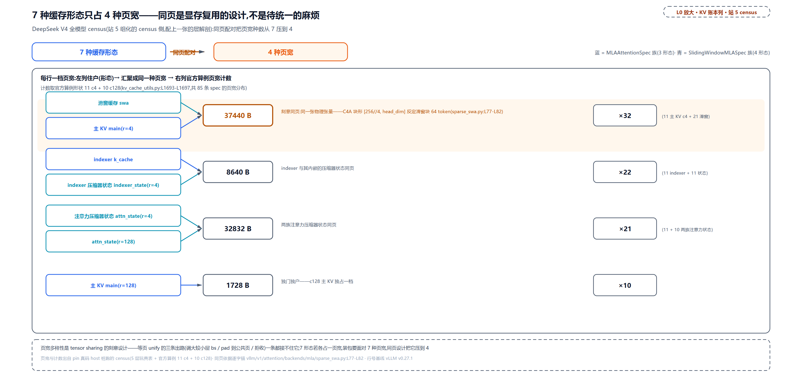

> *图注：站 5 组化的 census 侧放大（配上一张的层解剖：那张拆一层，这张看全模型的页宽账）。左列七种形态经同页配对收进右列四档页宽：37440 由 c4 主 KV 与滑窗缓存刻意同页（同一张物理张量，C4A 块形 [256//4, head_dim] 反定滑窗块 64 token）、8640 由 indexer 与其内嵌压缩器状态同页、32832 由 c4/c128 两族注意力压缩器状态同页、1728 由 c128 主 KV 独占；右条给官方算例形状（11 c4 + 10 c128、共 85 条 spec）的页宽计数：37440×32、8640×22、32832×21、1728×10。页宽多样性是共享物理张量的刻意设计，等页 unify 的三条出路（调大块、pad、拒收）一条都接不住它；右列四档即四个宽度桶，往后布局账的行单位。*

#### 压缩块的记账口径：管理面 256、物理面 64 行

形状因子链走完（页宽是静态账），接着问写入：一个 token 算完，它的压缩 KV 落到物理货架哪一格？这一问顺带补上宽度桶的另一半来历：census 把桶宽算成了字节数，这里看它落到物理形状——同一页 37440，滑窗侧是 64 个 token 各占一行，主 KV 侧是 256 个管理 token 压成的 64 行，行数从压缩比除出来。V4 用两套坐标系记这本账。**管理面**按 256-token 的块发块号，块表、块分配、前缀哈希全按这个口径，调度器眼里一块就是 256 个 token；**物理面**每块只有 256//r 行（r＝压缩比，kernel 里的 COMPRESS_RATIO），c4 一块 64 行、c128 一块 2 行——上一小节第三环那条 storage_block_size 除法就是两套坐标系的换算尺，256 的来历（后端偏好）也在那里立过。

两套坐标系靠槽位映射缝合，kernel 主体十来行：

```python
# vllm/v1/attention/backends/mla/compressor_utils.py:L24-L50 · _compressed_slot_mapping_kernel
    batch_idx = tl.program_id(0)

    query_start = tl.load(query_start_loc_ptr + batch_idx)
    query_end = tl.load(query_start_loc_ptr + batch_idx + 1)
    query_len = query_end - query_start

    seq_len = tl.load(seq_lens_ptr + batch_idx)
    start_pos = seq_len - query_len                                               # L31

    for i in range(0, query_len, TRITON_BLOCK_SIZE):
        offset = i + tl.arange(0, TRITON_BLOCK_SIZE)
        mask = offset < query_len

        pos = start_pos + i + tl.arange(0, TRITON_BLOCK_SIZE)                      # L37
        is_valid = (pos + 1) % COMPRESS_RATIO == 0                                 # L38
        pos_after_compress = pos // COMPRESS_RATIO                                 # L39

        block_ids = pos_after_compress // block_size
        block_numbers = tl.load(
            block_table_ptr + batch_idx * block_table_stride + block_ids,
            mask=mask & is_valid,
        )
        slot_ids = block_numbers * block_size + pos_after_compress % block_size    # L46

        # NOTE
        slot_ids = tl.where(is_valid, slot_ids, PAD_ID)                            # L49
        tl.store(slot_mapping_ptr + query_start + offset, slot_ids, mask=mask)
```

三行承重。`is_valid = (pos+1) % r == 0`（L38）：只有凑满 r 个 token 的最后一位才产生要写的压缩条目，每 r 个位置恰一位有效；`pos_after_compress = pos // r`（L39）：压缩后的行号，随 pos 严格单调；`slot = 块号 × block_size + 压缩位 % block_size`（L46）：物理行坐标。注意 kernel 形参 block_size 传的是 storage_block_size（调用方 sparse_mla.py:L208-L216 与 indexer.py:L797-L805 都这么传），kernel 眼里的「块」是物理块 64，不是管理块 256；不满 r 的位置整体置 PAD_ID=-1（L49），外层封装函数 get_compressed_slot_mapping 还会先把输出 fill_(-1)（compressor_utils.py:L62-L68），未覆写位天然是 -1。

写入侧对 -1 的保证在 V4 自己的融合 kernel：全部四个 triton（vLLM 写 GPU kernel 用的 Python 框架，kernel 代码长得就像普通 Python）入口都有同款双保险，逐字摘一段：

```python
# vllm/models/deepseek_v4/common/ops/fused_compress_quant_cache.py:L157-L165 · 融合压缩写入 kernel 入口
    token_idx = tl.program_id(0)

    slot_id = tl.load(slot_mapping_ptr + token_idx)
    if slot_id < 0:                                                            # L160
        return

    position = tl.load(positions_ptr + token_idx)
    if (position + 1) % COMPRESS_RATIO != 0:                                   # L164
        return
```

两道独立早退：槽位映射的 -1 一道、位置判定一道。两道拦的是同一件事的两种表述，「这一位不归我写」是账面表达、「这一位物理上没有格」是语义事实，任一道失守另一道仍挡住脏写。官方回归测试（tests/v1/attention/test_indexer_deepseek_v4_slot_mapping.py:L37-L118，上一节 census 的玩具层表就出自它）把这个映射连同跨块界场景钉成了期望张量：单请求已算 240 个 token、本拍 40 个 query（序列长 280）、块表 [5, 7]。取证口径照实说：该测试标了 CUDA-only，本机无 GPU 未实跑，下表是期望张量的逐行转录，并已按 kernel 公式在 host 逐位手推复核（两套算法对上了每一个数）：

<!-- trace: v4-cache-compress-write-path -->
| token 绝对位 pos | (pos+1)%4==0？ | 压缩位 pos//4 | 压缩位//64 → 查块表 | slot = 块号×64 + 压缩位%64 |
|---|---|---|---|---|
| 240、241、242 | 241/242/243 % 4 = 1/2/3 → 否 | — | — | 三个 -1（不凑整不写） |
| 243 | 244 % 4 = 0 → 是 | 60 | 60//64 = 0 → 块表[0] = 5 | 5×64 + 60 = 380 |
| 247 / 251 / 255 | 是（每 4 个恰一位） | 61 / 62 / 63 | 均 0 → 5 | 381 / 382 / 383（块 5 的最后三格） |
| 259 | 是 | 64 | 64//64 = 1 → 块表[1] = 7 | 7×64 + 0 = 448（跨存储块界换块） |
| 263、267、271、275、279 | 是 | 65 / 66 / 67 / 68 / 69 | 均 1 → 7 | 449 / 450 / 451 / 452 / 453 |
| 40 位合计 | 10 是 + 30 否 | 60..69 连续 10 位 | 前 4 位块 5、后 6 位块 7 | 10 个有效槽 380-383、448-453；30 个 -1（写入侧双保险跳过） |

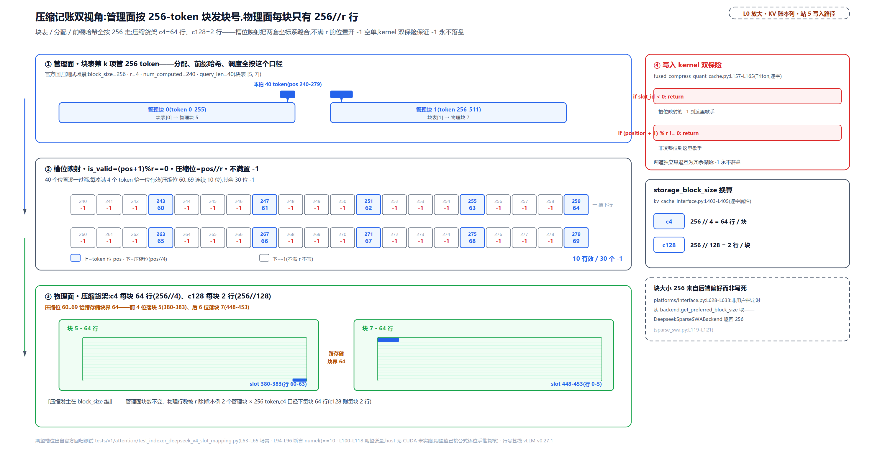

> *图注：站 5 组化的写入路径侧放大（接上一图的 census：页宽是静态账，这张看 token 怎么落进物理行）。上（管理面）：块表第 k 项管 256 token，本拍 40 个 token（pos 240-279）跨在管理块 0/1 上，块表 [5, 7] 映到物理块 5/7；中（槽位映射）：40 个位置逐一过筛，is_valid=(pos+1)%r==0 的恰 10 位（压缩位 60..69 连续），其余 30 位 -1；下（物理面）：压缩货架每块 64 行，压缩位 60..69 恰跨存储块界 64，前 4 位落块 5（slot 380-383）、后 6 位落块 7（slot 448-453）；右栏：写入 kernel 的双保险（slot<0 与非凑整位各 return 一次）与 storage_block_size 换算（c4 每块 64 行、c128 每块 2 行），块大小 256 来自后端偏好而非写死。压缩发生在 block_size 维：管理面块数不变、物理行数被 r 除掉。*

表里最有信息量的是跨块界那一行：压缩位 60..69 连续 10 位，恰跨 64 的倍数这条块界，前 4 位落物理块 5 的行 60-63（slot 380-383），后 6 位落物理块 7 的行 0-5（slot 448-453）——管理面上这 40 个 token 只跨了块表 [5, 7] 两项，物理面上落点自动换块。这个回归测试防的 bug 正是沿用未压缩的 slot_mapping：40 个位置全当有效、压缩位错 4 倍。管理面与物理面的分工一句话收束：**压缩发生在 block_size 维**，块数（管理面）不变，每块的行数（物理面）被 compress_ratio 除掉。

#### 装包与对齐：桶、元组、近似 GCD

写入账记完，回到分发：这一小节是推论③在分组侧的落地现场（布局侧的落地归「落地为物理张量」），照例先玩具算例后真实配置；census 立下的四个宽度桶也从这里进入消费——装包、对齐、切组，本节末的五个组每组名下各持哪些桶，就是「落地为物理张量」末尾那张组×桶矩阵的列。术语先辨一个字：本节下文说的「桶」是装包桶，按 spec 族分堆，与按页宽归行的宽度桶是两个轴——MLA 装包桶横跨三种页宽、37440 宽度桶横跨 MLA 与滑窗两族，下文「四桶元组数」说的是前者。[第 15 章](../../ch15-prefix-caching/narrative/chapter.md)讲跨类型命中时会回来对四路全貌。V4 在四路梯子上逐级下落：第一路不中（七种形态、两族家族）；第二路也不收，MLA 全家（压缩比大于 1，每块只要少量槽）与滑窗族（每 token 一槽）本就不同型，滑窗族还占着四种形态，「窗口大小不同的滑窗不是同一型」是该类 docstring 的原文（kv_cache_interface.py:L840-L842）。消歧一句：第三路注释首句 "All layers need the same number of token slots" 不能按字面读成「各层每块槽数相等」，c4 主 KV 与索引器 64 槽、c128 主 KV 2 槽、各族压缩器状态 4/8 槽并不等；分路的真正依据在后半句，同为 token 槽型缓存的层里混了全历史与三种窗口宽度，装不进第二路的「同型」单组。落到第三路的判据，两个 guard 都是先验检查：

```python
# vllm/v1/core/kv_cache_utils.py:L1599-L1607 · group_and_unify_kv_cache_specs
    if not any(
        isinstance(spec, SlidingWindowMLASpec) for spec in kv_cache_spec.values()
    ):
        return None

    # SlidingWindowMLASpec models with uniform page sizes don't need tuple packing.
    page_sizes = {spec.page_size_bytes for spec in kv_cache_spec.values()}
    if len(page_sizes) <= 1:
        return None
```

没有 SlidingWindowMLASpec 就 return None 落回等页路径；页宽只有一种也 return None（uniform 页宽的滑窗模型不必打包）。V4 必然双条件命中：七种形态里四种报 SlidingWindowMLASpec（滑窗缓存与三挂压缩器状态）、页宽实测四种（函数 docstring 自报家门："Currently, this is only used for DeepseekV4"）。反过来问：若硬把 V4 塞进等页路径会怎样？三种小页 32832、8640、1728 没有一个整除最大页 37440，unify 的出路只剩 pad，而 pad 只留给 MambaSpec 与按 stride 索引的层；即便 unify 抛出 NotImplementedError，分配兜底 `_try_get_full_allocation_fallback_groups` 见到 SlidingWindowMLASpec 直接 return None（kv_cache_utils.py:L1540-L1544）。第三路不是优化，是唯一可行解。

第三路分三步：分桶（`group_and_unify_kv_cache_specs`，L1592-L1632：MLA 全家一桶、滑窗族按 (block_size, window) 分桶）→ 按层元组打包 → 近似 GCD 对齐各桶元组数。**层元组（layer tuple）** ＝一组不同页宽的层捆成的最小分配单元，整组一起分、不再拆开。近似 GCD 求什么？各桶元组数通常不齐，而真公约数往往不存在（21 本就不是 11 的倍数）：它把每个候选 d 都试一遍，数每个桶的元组数要向上取整到 d 的倍数得垫几层，垫得最少的胜出。先拿两组玩具手算走通（示意，非实跑）：两个桶、元组数 2 与 3，候选 d 只有 2 和 3，$`\mathrm{pad}(2)`$ 是桶二 3 取整到 4 垫 1、$`\mathrm{pad}(3)`$ 是桶一 2 取整到 3 垫 1，打平、平局取大，d=3。最要紧的一点在这就看清了：**对齐只活在择 d 的计数里，实际切组不添任何实体层**，桶一还是 2 个元组原样一组，谁也不凑数（对照等页路径的 padding：那边垫的是真层、白占显存）。再上真实算例，`_get_kv_cache_groups_uniform_groups`（kv_cache_utils.py:L1670-L1754）按注释自带的示例层数走，注释值得逐字读：

```python
# vllm/v1/core/kv_cache_utils.py:L1691-L1697 · _get_kv_cache_groups_uniform_groups
    # We define a layer tuple as a group of layers with different page sizes, and
    # one UniformTypeKVCacheSpecs contains a list of layer tuples.
    # For example, if we have 11 C4 layers and 10 C128 layers, we can define a layer
    # tuple as [C4I, C4A, C128], and the full_mla_group will contain "11" layer tuples.
    # The other uniform KV cache specs will be similarly partitioned into layer tuples.
    # Say we have 21 SWA layers, all with the same page size, then we will have "21"
    # layer tuples.
```

装包的实跑：MLA 全家一桶，C4I、C4A、C128A（依次是 c4 层的索引器 KV、c4 层的主 KV、c128 层的主 KV，后缀名沿用源码注释的叫法）共 32 份 spec 全体并入，按 11 个 [C4I, C4A, C128] 元组打包（元组第三格的 C128 是注释对 C128A 的简写；C128A 只有 10 层、天然短一截），组的页＝32 份 spec 页之和 524160 B（= 11×37440 + 11×8640 + 10×1728）；一个块号在这个组里，就是组内每层各占一页。滑窗族按 (block_size, window) 键切三桶（L1613-L1618）：21 个滑窗缓存 (64, 8192)（示教窗，实发 128）一桶；(4, 8) 桶 22 份——注意力压缩器状态 11 份 + indexer 压缩器状态 11 份，两种页宽（32832 与 8640）同桶，桶内每页宽层数恰等（11 = 11）；c128 状态 (8, 128) 10 份一桶。四桶元组数 [11, 21, 11, 10] 不齐，对齐靠近似 GCD（GCD＝最大公约数）：

```python
# vllm/v1/core/kv_cache_utils.py:L1635-L1648 · _approximate_gcd
def _approximate_gcd(values: Sequence[int], *, lower_bound: int | None = None) -> int:
    """Pick a chunk size that minimizes total upward padding.

    Each x is rounded up to a multiple of d:

      x -> ceil(x / d) * d

    Total padding is:

      pad(d) = sum_i (ceil(x_i / d) * d - x_i)

    We brute-force d in [lower_bound, max(values)] (fine for small lists / small
    maxima) and return the d with minimum padding. Ties prefer larger d.
    """
```

实证：d=11 的成本口径最省，只多计 2（滑窗桶 21 计到 22、c128 状态桶 10 计到 11）；对照 d=12 要多计 7、d=21 要多计 31。对齐后切组，一个真 padding 层都不添：滑窗桶按 `layer_tuples[i::num_tuple_groups]` 交错切成 11+10 两组（等量分桶那节 `layers[i::num_groups]` 的同一手法），(8, 128) 桶一组 10 层，短的那截与 MLA 桶里 C128A 天然短一截同理；(4, 8) 桶 22 份 = 11 元组 × 每元组 2 层，整桶 1 组。终 5 组：MLA 元组组、滑窗两组、(4,8) 状态组、(8,128) 状态组。组间断言是打包正确性的哨兵：MLA 桶必须纯 MLA（L1681-L1685）、滑窗桶必须纯 SlidingWindowMLASpec（L1711-L1715）、桶内每个页宽的层数必须相同（L1726-L1729）。全模型实跑对账：

<!-- trace: v4-cache-uniform-groups-verify -->
| 装包桶（group_and_unify） | 层数 / 成员 | 页宽构成 | 元组数 | 近似 GCD 对齐后 | 终组 |
|---|---|---|---|---|---|
| 入场 census | 85 条 spec | 37440×32、8640×22、32832×21、1728×10 | — | — | 页宽 4 种 |
| MLA 桶（第一组限定纯 MLA） | 32 | 37440×11、8640×11、1728×10 | 11 | 11（已齐） | G0：块 256、组页 524160 |
| SWA 桶 (64, 8192)（示教窗口；实发 128） | 21 | 37440×21 | 21 | 对齐 22（实切 11+10） | G1 + G2 交错切 11 + 10 |
| 状态桶 (4, 8) | 22 | 32832×11、8640×11 | 11 | 11（已齐） | G3：一组 22 层 = 11 元组 × 每元组 2 层 |
| 状态桶 (8, 128) | 10 | 32832×10 | 10 | 对齐 11（实为一组 10） | G4 |
| _approximate_gcd | values [11, 21, 11, 10]、lower_bound 11 | d=11 → pad=2 全场最小（d=12 → 7、d=21 → 31） | chosen 11 | rounded_up [11, 22, 11, 11] | 终 5 组 |
| 块尺寸两把尺 | 组块 [256, 64, 64, 4, 8] | — | — | — | scheduler LCM 256 / hash GCD 4（prefix_match_unit 未设） |
| packed 布局 | block_stride 524160、70 个偏移 | offset 0 被 5 个组共享 | — | — | 页统一若硬走：37440%8640=2880、%1728=1152、%32832=4608 全除不尽 |

硬约束从「每组每块字节相等」换成了「块号在重叠打包布局里各有落点」：五组共用一条块号轴，物理块步长 block_stride = 524160 B，取的是最宽一组的组页和（MLA 组的密排宽度，恰为全场最大组页和：装包前的滑窗桶页和更大，但已被切成 11+10 两组、终组页和反而小）；每组在自己偏移上密排、组间布局允许重叠，因为一个块 id 同一时刻只归一组（`_get_packed_kv_cache_layout`，L1283-L1305）。70 个不同字节偏移里 offset 0 被 5 个组共享是常态，块号轴怎么落成物理张量，「落地为物理张量」整节拆。调度器侧还有一笔实数：五组的组块尺寸 [256, 64, 64, 4, 8] 送进「两把尺子与装配」那两把尺（调度尺取 LCM＝最小公倍数、哈希尺取 GCD 或用户以 prefix_match_unit 覆盖的更细粒度，V4 没设覆盖），得 scheduler 尺 256 / hash 尺 4——V4 的前缀哈希每 4 token 一枚、命中对齐 256，[第 15 章](../../ch15-prefix-caching/narrative/chapter.md)的粒度视图会再用到这两个数。

**最后上真实配置：61 层。** 口径先挑明：61 层的逐层压缩比表不在 pin 里（pin 只有 docstring 玩具 11+10 与回归测试 5 层表），层分布 30 个 c4 + 31 个 c128 出自 vLLM 官方博客原话 "30 c4a layers and 31 c128a layers (61 total)"；下表数字是 pin 算法零改动实跑复算的结果，五组宽度与块数同社区深读文章逐一吻合——「官方口径 + pin 公式复算命中」，与 pin 内算例 11+10 分开读：

<!-- trace: v4-61layer-config -->
| 装包桶（group_and_unify） | 层数与页宽构成 | 元组数 | dense width（组页和） |
|---|---|---|---|
| census | 61 层 = 30 c4 + 31 c128 → 243 条 spec（30×5 + 31×3 = 150+93） | — | 4 种页宽 37440 / 8640 / 32832 / 1728 |
| MLA 桶（第一组限定纯 MLA） | 91 层：30×37440 + 30×8640 + 31×1728 | 31 | 1435968 |
| SWA 桶（块 64、窗 8192；示教窗口，实发 128） | 61 层 × 37440 | 61 | 装包 2283840 → 按 layer_tuples[0::2]/[1::2] 拆两组：1160640（31 层）/ 1123200（30 层） |
| 状态桶（块 4、窗 8） | 60 层：30×8640（indexer 状态）+ 30×32832（注意力状态） | 30 | 1244160 |
| 状态桶（块 8、窗 128） | 31 层 × 32832 | 31 | 1017792 |
| 近似 GCD | values [31,61,30,31]、lower_bound 31（MLA 桶元组数） | 暴力扫描 d=31..61 | d=31 pad=2 全场最小（d=32 pad=7、d=61 pad=91）——61 是质数与 31 互质，无公因数可整除，必须近似 |
| 对齐 | rounded_up [31,62,31,31] | pad 明细：61→62 垫一层、30→31 垫一层、31 与 31 不垫 | 终五组总层数 243（每条 spec 恰属一组） |
| packed 收尾 | block_stride = max(dense) = 1435968（MLA 组最宽） | num_blocks = available // 1435968 | 10GiB（10737418240 B）→ 7477 块；五组 dense 与 7477 均与社区文章逐一吻合（复算双向命中） |

对照 11+10：结构完全同构（[11, 21, 11, 10] 到 d=11、[31, 61, 30, 31] 到 d=31，pad 都是 2、都是五组），只是层数放大，同一套算法零改动吃下真实配置，这本身就是适配协议的验证。61 层还有个玩具里没有的看点：61 是质数、与 31 互质，无公因数可整除，「必须近似」在这里不是巧合是常态。

边界三句话收束：584 B 特形与 compress_ratio 的数学归[第 24 章](../../ch24-primer-attn-variants/narrative/chapter.md)与[第 28 章](../../ch28-deepseek-v4-principles/narrative/chapter.md)展开，本章只消费结论；模型侧三件套（索引器、压缩器、滑窗缓存）与张量布局落点，归[第 29 章](../../ch29-deepseek-v4-assembly/narrative/chapter.md)的拼装实战；开 MTP 时最后一层（MTP 注意力恒为末层）所在组被标注 `is_eagle_group`（`_annotate_eagle_groups_deepseek_v4`，kv_cache_utils.py:L1757-L1778，FIXME 自认 hacky），草稿层怎么混编归投机解码线。账本侧本章已给全：四类缓存、七种形态、四种页宽、五组归属。推论④的四档也在此归位（兑现 spec 申报表一节「逐档点验」的承诺）：逐层 compress_ratios 表是第①档（config 就够）、四个 get_kv_cache_spec 申报面是第②档、窗外回收经申报既有滑窗 spec 类型白捡 SlidingWindowManager（第③档的复用面，一行管理器代码不用写）、三个自研后端与压缩槽位映射是第④档——四档全占的孤本。

顺带把视野拉远一步：同一道「混合层的缓存怎么管」，隔壁引擎给出了镜像的解。SGLang 走分离双池——Mamba/线性层的状态按请求级另立一池、KV 按 token 级一池，配树形的 MambaRadixCache 管状态命中，命中到的状态必须拷贝一份、不能共享（[SGLang 官方博客](https://pytorch.org/blog/hybrid-models-meet-sglang-more-than-full-attention/)，2025-12）。LMSYS（SGLang 背后的研究组织）的 Unified Radix Cache 把「每类层一条复用规则」做成树组件，DSV4 在它那里被建模成全注意力（FULL）与滑窗（SWA）两个组件、压缩池做成 sidecar（伴生小池）（[LMSYS 博客](https://lmsys.org/blog/2026-08-11-unified-radix-cache/)，2026-08）。vLLM 的答案是本章这条：单池调和，所有形态挤进一个块池、按 spec 分账。两条路线互为镜像，都被同一批模型压力测试过；孰优孰劣要看负载，本书的立场只到「同一问题存在多种自然的分解」为止。

### 落地为物理张量：四段式张量账

组切好了、页统一了（或像 DeepSeek V4 那样装了包），最后一道工序是物理的：config 开出的张量清单，怎么变成 GPU 上真实的显存。这本账要分四段记：**声明 X**（多少条 KVCacheTensor）→ **物理 Y**（真分配几次显存）→ **一次分配**（packed 布局下全部声明别名同一块 backing）→ **Z 个视图**（每层拿到的是切片视图，不是独立张量）。声明与物理分离是这套接口的设计核心，先把「声明」这个概念立准——`KVCacheTensor` 是账面条目不是张量，真分配发生在 worker 侧：

```python
# vllm/v1/kv_cache_interface.py:L945-L954 · KVCacheTensor
@dataclass
class KVCacheTensor:
    """
    A class for specifying how the workers should initialize the KV cache.
    """

    size: int  # size of the KV cache tensor in bytes
    shared_by: list[str]  # layer names that share the same KV cache tensor
    offset: int = 0  # byte offset of this layer within a contiguous block
    block_stride: int = 0  # total bytes per block in a packed layout (0 = not packed)
```

四个字段里 `offset` 与 `block_stride` 就是为 packed 布局长出来的（老布局两者皆 0），`shared_by` 记共享这条声明的层名。`get_kv_cache_config_from_groups`（kv_cache_utils.py:L1361-L1443）按组的形态给三种布局，一张表看全：

| 布局 | 谁的形态 | 张量怎么分 | 一个块号兑现什么 |
|---|---|---|---|
| Uniform 逐层 | 单组、全同或同型异宽（第二路的 V3.2 形态） | 逐层各一张张量，按各自页分账 | 该层一页 |
| Grouped 分池 | 多组、等页路径（Gemma3 / gpt-oss） | group_size 个池，每池由每组各出一层共享 | 每组各一页（等大） |
| Packed 重叠 | 多个 UniformType 组（V4 第三路的产出） | 全部组密排进同一条 slab，每层在固定 offset 抽条带 | 组内每层各一页（组页和） |

前两种是老住户，收紧着讲；第三种是推论③的物理形态、协议为 V4 长出的新落地，本节主菜。开拆之前先把三类模型的总账对齐（「组」「声明（KVCacheTensor）」「物理分配」三列分开数；取证为 pin 真码 host 桩跑零改动，V4 行的 61 层口径同前）：

<!-- trace: tensor-declaration-account -->
| 模型类 | 组 | 声明（KVCacheTensor） | 物理分配 | 块数账 | 对账亮点 |
|---|---|---|---|---|---|
| Uniform 单型（32 层同 spec） | 1 组（32 层合并） | 32 条：每条 shared_by=单层、block_stride=0 | 32 张独立 int8 zeros（1:1） | 页 65536：1073741824//65536//32 = 512 块/层，每张 33554432 B（32 MiB） | 总账 32×33554432 = 1073741824 恰好吃满 1 GiB |
| Grouped 同页（6 full + 4 swa） | 3 组 [3,3,4]（full 桶垫 2、浪费上界 33.33%，warning 原文落 trace） | 4 池：3 池 shared_by=3 层（每组第 i 层各一）+ 1 池 shared_by=1 层 | 4 张独立 zeros | 页 65536：1073741824//65536//4 = 4096 块/池 | 10 位住户 4 个柜：组间共用同一池靠「不同组不同块表」分流 |
| V4 packed（61 层 243 条层账） | 5 组（91/31/30/60/31 层） | 202 个 offset 桶：shared_by 直方图 167×1 + 31×2 + 3×3 + 1×5 = 243 | 1 块 slab（Allocate once，202 条全部别名同一 backing） | block_stride 1435968：10737418240//1435968 = 7477 块；slab = 1435968×7477 = 10736732736 B | floor 余 685504 B 闲置；声明 202 → 物理 1，三视角同一物（1 slab / 202 桶 / 5 条密宽带） |
| 202 的逐组构成（新开 offset 数） | G0 91 / G1 27 / G2 0 / G3 57 / G4 27 | 91+27+0+57+27 = 202（组内 offset 严格递增 ⇒ 每组自有 offset 数=层数；折叠只发生在跨组） | — | G2 后半 swa 组 30 个 offset 与 G1 前半组阶梯 37440×k 完全重合 → 新开 0 | 跨组相撞共 35 桶，实跑三例：swa(L32) 与 main(L13) 同 offset 599040；indexer_state(L10) 与 main(L9) 同 414720；attn_state(L54) 与 indexer_state(L19) 同 787968——安全因「一个块号同一时刻只借给一组」 |

三类模型的「层账 : 声明 : 物理」= 32:32:32 / 10:4:4 / 243:202:1。规则一句话：**物理分配数只看每条声明上的 block_stride 字段**——零则独立 `torch.zeros`、正则全部别名同一 backing（分配循环的源码在 packed 段落内嵌），声明总数反而不相干；声明数本身是「分组 + 布局」两个纯函数的复合。这张总账下面三段逐段兑现。

**Grouped 分池**的方案注释里那张 ASCII 图值得逐字读：

```python
# vllm/v1/core/kv_cache_utils.py:L1411-L1437 · get_kv_cache_config_from_groups
    else:
        # General case:
        # We will have group_size memory pools, each is shared by one layer from
        # each group. As layers of different groups have different block table,
        # they will use different parts of the shared Tensor.
        # The memory layout for 3 groups (full.0, full.1), (sw.0, sw.2),
        # (sw.1, padding) will be: (group_size = 2)
        # full.0, sw.0, sw.1: share a Tensor with size=available_memory//2
        # full.1, sw.2: share another Tensor with size=available_memory//2
        group_size = max(len(group.layer_names) for group in kv_cache_groups)

        page_size = get_uniform_page_size(
            [group.kv_cache_spec for group in kv_cache_groups]
        )
        assert group_size > 0, "group_size must be greater than 0"
        num_blocks = get_num_blocks(
            vllm_config, group_size, available_memory, page_size
        )
        kv_cache_tensors = []
        for i in range(group_size):
            shared_by = []
            for j in range(len(kv_cache_groups)):
                if i < len(kv_cache_groups[j].layer_names):
                    shared_by.append(kv_cache_groups[j].layer_names[i])
            kv_cache_tensors.append(
                KVCacheTensor(size=page_size * num_blocks, shared_by=shared_by)
            )
```

方案一句话：**group_size 个内存池，每个池由每组各出一层共用**。上面例子里 full.0 / sw.0 / sw.1 共享一张张量、full.1 / sw.2 共享另一张（sw.1 组只有一层，第二池就没有它）。为什么敢共享？注释原话给了答案："As layers of different groups have different block table, they will use different parts of the shared Tensor"——**一个 block_id 同一时刻只归一个组用**（块一经分给某组的请求，就只出现在那个组的私有块表里），共享的是房间面积，不是钥匙。`num_blocks = available // page // group_size` 在这里再除一次组内层数。三组两池的实跑（第二行单组异宽就是 Uniform 逐层的形态，逐层各一张按页分账）：

<!-- trace: m7 -->
| 布局 | group_size | 张量数 | 每张量共享者 | 尺寸 |
|---|---|---|---|---|
| 通用（3 组） | 2 | 2 | 张量一 [full.0, sw.0, sw.1]；张量二 [full.1, sw.2] | 各 655360B（=65536×10 页） |
| 单组异宽（l0 heads 8 / l1 heads 4） | 1（2 层） | 2 | 逐层各一：[l0] / [l1] | 327680B / 163840B（按各自页分账，5 块） |

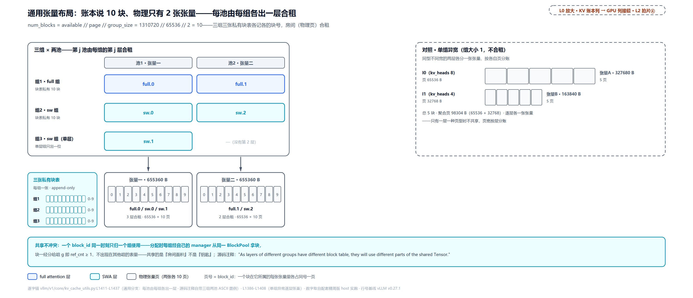

> *图注：L0 的「调度 · 显存账本」列与 GPU 列接缝处放大（对应 L2 章图中排拍片④的 worker 半边）。左：三组 × 两池的指派矩阵（组 3 只有 sw.1 一层，第二池没有它的位）落到两张 10 页的物理张量（各 655360 B），三组各持一张私有块表；右：单组异宽对照，逐层各一张张量按页宽分账。共享不冲突的原因写在源码注释里：一个 block_id 同一时刻只归一个组使用，共享的是物理面积，钥匙（块表条目）各自私有。*

**Packed 重叠**就是推论③的物理形态：把「等大块」这条老约束整个换掉。开启判据是结构判定、不认模型名：所有组的 spec 都是 UniformTypeKVCacheSpecs（V4 分组的天然产出）即默认开；其他多组形态可经 kv connector 的实验开关 opt in（`_use_packed_kv_cache_config`，kv_cache_utils.py:L1308-L1327，注释挂 issue 42082 标 experimental）。照 P4 的走法，先用两组玩具把布局与切片完整走一遍、再上真实 61 层复演。布局函数只有 20 行：

```python
# vllm/v1/core/kv_cache_utils.py:L1286-L1305 · _get_packed_kv_cache_layout（docstring 与布局循环）
    """Lay out each cache group densely in one shared block slab.

    A block ID is owned by one cache group at a time, so layouts from different
    groups may overlap. Layers within a group remain disjoint.
    """
    layers_by_offset: dict[int, list[str]] = defaultdict(list)
    block_stride = 0
    for group in kv_cache_groups:
        spec = group.kv_cache_spec
        byte_offset = 0
        for layer_name in group.layer_names:
            if isinstance(spec, UniformTypeKVCacheSpecs):
                page_size = spec.kv_cache_specs[layer_name].page_size_bytes    # L1298
            else:
                page_size = spec.page_size_bytes
            layers_by_offset[byte_offset].append(layer_name)                   # L1301
            byte_offset += page_size
        block_stride = max(block_stride, byte_offset)                          # L1303
    assert block_stride > 0
    return block_stride, layers_by_offset
```

docstring 那两句就是推论③的所有权约定：组内不重叠（同组同时活跃）、跨组可重叠（一个块号同刻只借一组）。循环做的事：每组组内按层序 `byte_offset += page_size` 累进密排，同 offset 的层名落进同一桶，跨组的层会共用一个桶（时间复用的重叠）；`block_stride`（块格宽）取最宽一组的组页和。config 侧再两行算术：`num_blocks = available_memory // block_stride`（除数是整条 slab 的格宽，不再是任何单页），每个出现过的字节偏移发一张 KVCacheTensor（size=总宽、shared_by=该桶层名、offset、block_stride，`_get_kv_cache_config_packed`，L1330-L1358）——`KVCacheTensor` 的 offset 与 block_stride 两个字段就是为这个布局长出来的，老布局两者皆 0。分配侧只认 block_stride：

```python
# vllm/v1/worker/gpu_model_runner.py:L7325-L7342 · _allocate_kv_cache_tensors（packed backing）
        kv_cache_raw_tensors: dict[str, torch.Tensor] = {}
        packed_backing: torch.Tensor | None = None
        for kv_cache_tensor in kv_cache_config.kv_cache_tensors:
            if kv_cache_tensor.block_stride > 0:
                # Allocate once; all packed tensors alias the same backing.
                if packed_backing is None:
                    packed_backing = torch.zeros(
                        kv_cache_tensor.size,
                        dtype=torch.int8,
                        device=self.device,
                    )
                tensor = packed_backing
            else:
                tensor = torch.zeros(
                    kv_cache_tensor.size, dtype=torch.int8, device=self.device
                )
            for layer_name in kv_cache_tensor.shared_by:
                kv_cache_raw_tensors[layer_name] = tensor
```

整条 slab（`packed_backing`，一块 int8 大张量）只分配一次，所有 packed 张量全是它的别名；block_stride==0 的张量（与非 packed 布局混布时）各自独立分配。每层拿到自己的条带靠四步切片：

```python
# vllm/v1/worker/gpu/attn_utils.py:L225-L233 · _reshape_attention_kv_cache（packing 分支）
    if packing is not None:
        offset, block_stride = packing
        assert inv_order[0] == 0
        page_bytes = prod(kv_cache_shape[1:]) * get_dtype_size(dtype)
        kv_cache = (
            kv_raw_tensor.view(-1, block_stride)[:, offset : offset + page_bytes]    # L230
            .view(dtype)
            .view(permuted_kv_cache_shape)
        )
```

四步链：`view(-1, block_stride)` 把整条 slab 折成 [num_blocks, block_stride] 的块矩阵，每行一块；`[:, offset : offset + page_bytes]` 每块只抽本层那条 page_bytes 宽的竖带；`.view(dtype)` 把 int8 重释成缓存 dtype；`.view(permuted_kv_cache_shape)` 成形。**层视图由此是散在各块固定 offset 的条带**：物理上隔着 block_stride 的周期重复、不连续。开头的断言 `inv_order[0] == 0` 要求 num_blocks 是物理最外维——这正是收集面预填的 indexes_kv_by_block_stride（spec 申报表那节的伏笔）在这里被消费，布局能这么切的前提就是块维在最外。两页真算例，先玩具后真实：

<!-- trace: packed-view-slicing -->
| 步 | 对象 | 算式/切片 | 结果 |
|---|---|---|---|
| A 组密排 | a0、a1 各页 37440 | 组内 byte_offset 累进 0→37440→74880（组内不重叠） | 组宽（dense width）74880 |
| B 组密排 | b0 页 8640、b1 页 32832 | byte_offset 累进 0→8640→41472 | 组宽 41472 |
| 块格宽 | block_stride = max(74880, 41472) | _get_packed_kv_cache_layout（kv_cache_utils.py:L1303） | 74880 |
| 池块数 | num_blocks = 1000000 // 74880 | _get_kv_cache_config_packed（kv_cache_utils.py:L1342；floor 余 26560 B 闲置） | 13 块；slab 总宽 total_size 973440 |
| 偏移桶 | layers_by_offset | offset 0=[a0,b0]（跨组重叠）、8640=[b1]、37440=[a1] | 3 个 distinct offset；每个 offset 发一张 KVCacheTensor(size=973440, shared_by=该桶层) |
| 切 a0 | A 组层 0 | view(-1,74880)[:,0:37440] | [13,37440] uint8 |
| 切 b0 | B 组层 0 | view(-1,74880)[:,0:8640]——与 a0 同 offset 0，跨组物理重叠 | [13,8640] uint8 |
| 切 b1 | B 组层 1 | view(-1,74880)[:,8640:41472] 再 .view(float32)：条带 32832 字节 ÷ 4 字节/元素 | [13,8208] float32 |
| 切 a1 | A 组层 1 | view(-1,74880)[:,37440:74880]（组内 offset 37440，不与 a0 重叠） | [13,37440] uint8 |

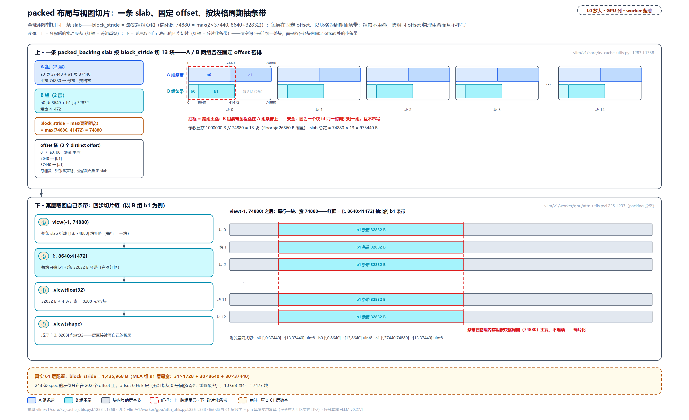

> *图注：上：一条 packed_backing slab 按 block_stride 切成 13 块（简化例 74880×13=973440 B），A 组两层（37440+37440）密排在格内、组宽 74880 定格宽，B 组两层（8640+32832）另起 offset 0 密排；同一格的左端字节被 a0（A 组）与 b0（B 组）同时占用，红框标跨组重叠——安全，因为一个块 id 同一时刻只归一组。下：某层取回自己条带的四步切片（以 b1 为例）：view(-1, 74880) 折成 [13, 74880] 块矩阵，[:, 8640:41472] 每块只抽 b1 那条 32832 B 竖带（红框标碎片化：条带在物理内存里按块格周期重复、不连续），再 .view(float32) 重释为 8208 元素、.view(shape) 成形。角注真实 61 层数字：block_stride=1435968（MLA 组 91 层最宽）、202 个 offset、10 GiB 显存换 7477 块。*

玩具走通，真实 61 层复演——同一套布局算法零改动吃下，这笔账也正好对回本节开头那张总账：五组 dense width 里最大的 1435968 成为 block_stride，10 GiB 示教显存换 7477 块（floor 余 685504 B 闲置）；243 条 spec 的层位分布在 202 个字节偏移上，五个组都从 offset 0 起步、那里重叠最密（offset 0 一桶压 5 层，每组第一层都在这）。碎片化的直观账：某层页 37440 只占块格 1435968 的 2.6%，其余 97.4% 是别组层位。这正是「一个块 id 同刻只归一组」换来静态零垫页的机制：不拆池、不垫 pad、按时间复用（窄组持块时的行尾闲置是另一本账，下一小节矩阵里逐格算）。切片收尾在 bind_kv_cache 双写：切好的视图一边按层号填进 runner 的平铺张量列表（KV connector 注册用），一边对 forward context 每层调 layer.bind_kv_cache（层实例把原始分配拆成它需要的视图，如 Mamba 拆 conv/ssm，vllm/v1/worker/utils.py:L466-L525），这就是初始化全链路导览图（spec 申报表一节挂的那张）的终点站。四段式张量账在此收拢：**243 条层账 → 202 个声明桶 → 1 次物理分配 → 243 个视图**。「失败演示」立的内存视图概念走到极限形态：物理显存自始至终只有一块 slab，每层拿到的是自己那条条带的解读权。推论③的「重叠时间复用」，至此从理论模型里的一句话长成了完整的代码形态。代码形态齐了，宽度桶这条线还差最后一笔：census 立的四桶、装包切的五组，摆成一张矩阵，这套布局的浪费账一眼可读——也顺带接上社区那张 planning 图。

#### 组×宽度桶矩阵：同一张布局换个视角

packed 布局至此都是竖着讲的：每组一条密排宽带、一条 offset 阶梯，组间靠「一个块号同刻只归一组」拼在同一块 slab 上。同一张布局还可以横过来看：**行是 census 立的四个宽度桶（37440 / 32832 / 8640 / 1728），列是装包切出的五个组**，格子记该组在这个桶上的账——valid 格是它名下的层账（哪类形态、几层、共几 Byte），其余是浪费归因。这个视角在 pin 代码里没有对应的数据结构（声明按 offset 出、不按桶出），但它是布局账最自然的读法：一个块号归了组 g，就是 g 那一列生效，哪些桶的条带在被写、哪些桶闲着，顺着列一眼读尽。社区那张 DeepSeek V4 planning 图（前文引过的[社区深读技报](https://mengqingcao.github.io/posts/deepseek-v4-kvcache-management/)所配的 gpu_kv_planning，图源标注 @ivanium）画的正是这个矩阵；本节先把 pin 侧的矩阵立准，再拿它与社区图逐格对读。

先把「浪费」的语义立准，这是矩阵里最容易被读错的部分。组 g 持有一块时，它真正写的范围是什么？回看本节开头内嵌的布局循环：每组 `byte_offset` 从 0 起、逐层 `+= page_size` 累进（组内密排不重叠，docstring 第二句 "Layers within a group remain disjoint"），落到块上就是**行首一段连续区间 [0, dense)**——dense 是该组的组页和（装包表立过的 dense width）；块格宽 `block_stride` 取最宽租客（max 不是 sum）。于是窄组持块时，行尾 [dense, block_stride) 这一段**没有任何层寻址**：闲置不是散斑，是尾部一整段。G0 主账组 dense = stride、闲置恒 0，组越窄行尾越长。「真的没人写」不是口号，是一条三环执行链：协调器（KVCacheCoordinator，把请求的领块指令按组转交各管家的那层，装配见「两把尺子与装配」）逐管家发号（kv_cache_coordinator.py:L238-L268）→ 管家按 cdiv 向共享 BlockPool 领块，领块先断言 `ref_cnt == 0` 再递增（引用计数；块 id 被持有期间唯一 owner 的凭证，single_type_kv_cache_manager.py:L360、block_pool.py:L647-L677）→ 层拿到的只是本组条带的行切片视图（attn_utils.py:L225-L233，四步链本节已内嵌），条带之外根本不寻址。时间复用的另一面还有测试级证明：

```python
# tests/v1/core/test_contiguous_kv_packing.py:L286-L308 · test_group_owned_blocks_do_not_alias（节选）
    def test_group_owned_blocks_do_not_alias(self):
        groups = _make_groups(n_c4=3, n_c128=2, n_swa=5)
        num_blocks, tensors = _get_kv_cache_config_packed(
            _mock_vllm_config(), groups, 100 * 1024 * 1024
        )
        views = _make_views(groups, num_blocks, tensors)

        # … 省略：枚举组号当块号，把每块分给同号组、逐层 fill 各自视图后断言互不串写 …

        # Once the first group releases its block, another group may reuse it.
        for layer_name in groups[1].layer_names:
            views[layer_name][0].fill_(255)
        for layer_name in groups[1].layer_names:
            assert (views[layer_name][0] == 255).all()
```

前半段把不同的块分给不同的组、各自填充后互不串写（单主成立）；注释行之后，第一个组让出块 0、第二个组复用并覆写成功（时间复用成立）。矩阵里「这格此刻归谁」随时间翻转，底座就是这一收一发。

61 层 Pro 版（本章主线形态）的矩阵全账如下（行 = 宽度桶、列 = 组；valid 格记形态 ×层数 = Byte，浪费格记该桶条带落在行尾里的并集字节——浪费格下文称灰格，就是社区图里那些灰底的 wasted 格；格内形态名沿 census 的叫法加层族下标，如 main_c4 = c4 层主 KV、attn_state_c128 = c128 族的注意力压缩器状态）：

<!-- trace: planning-width-bucket-matrix -->
| 宽度桶 \ 组 | G0 主账 | G1 swa 前半 | G2 swa 后半 | G3 c4 状态 | G4 c128 状态 |
|---|---|---|---|---|---|
| 37440 | main_c4 ×30 = 1123200 | swa ×31 = 1160640 | swa ×30 = 1123200 | 闲置 112320（3 条并集） | 闲置 290880（12 条并集；不去重 449280） |
| 32832 | 闲置 0（最宽租客无行尾） | 闲置 65664（2 条） | 闲置 98496（3 条） | attn_state_c4 ×30 = 984960 | attn_state_c128 ×31 = 1017792 |
| 8640 | indexer ×30 = 259200 | 闲置 60480（7 条） | 闲置 69120（8 条） | indexer_state ×30 = 259200 | 闲置 112320（13 条） |
| 1728 | main_c128 ×31 = 53568 | 闲置 53568（31 条全中） | 闲置 53568（31 条） | 闲置 53568（31 条） | 闲置 53568（31 条） |
| 行闲置（block_stride 1435968 − dense） | 0（0%） | 275328（19.174%） | 312768（21.781%） | 191808（13.357%） | 418176（29.122%） |
| 灰格和 vs 行闲置 | 0 = 0 | 179712 < 275328 | 221184 < 312768 | 165888 < 191808 | 456768 > 418176 |

读表先看 valid 格的分布，census 的三对同页在这里现出原形：37440 行 G0/G1/G2 三列 valid——swa ≡ main_c4 同页对天然跨组（主账组与两个滑窗半组共用一行）；8640 行 G0 与 G3 各半——indexer ≡ indexer_state 同页对一头在主账组、一头在状态组；32832 行 G3/G4 valid——两族注意力状态同页对；1728 行只有 G0——main_c128 独占一桶。**同页配对在矩阵上就是同一行跨多列 valid**：「七种形态压进四种页宽」落到布局账上，是行少了、列上的条带折着用。顺带一验对账扣：G0 三个 valid 格相加 1123200 + 259200 + 53568 = 1435968，恰是它的 dense（= stride）——每列 valid 格之和就是该组的组页和，矩阵与装包表在此互锁。

三条读表纪律，都来自实跑。其一，**浪费格不可跨桶加总**：行尾里各桶的条带互相别名（跨组 offset 折叠的镜像面），表末行的对照就是警示——G1-G3 的灰格和小于行闲置（骑跨 dense 边界的条带两边都不计），G4 的灰格和 456768 B 反而超出（37440 桶里 G0 主账条带与 G1/G2 滑窗条带同 offset 相撞）；格和既可偏低也可偏高，桶视角只做归因、不做守恒。其二，**valid 格不等于零浪费**：G4 在 32832 桶是 valid，但同桶 G3 的条带超出 G4 密排的部分，在 G4 持块时同样闲着；每列唯一可加总的浪费量是行闲置（stride − dense 一个数）。其三，**行闲置是组间轴，与前文那笔 2.6% 分属两本账**：2.6% 是组内切片的碎片化直观账（某层条带隔着块格周期重复、不连续）；行闲置说的是整块视角下「窄组持块用不满」，它随块主分布波动——静态最坏（全池都由最窄的 G4 持有）就是 29.122%，最好 0%（全由 G0 持有），运行时落在两者之间，差额靠时间复用收回。

**与社区图对读。** gpu_kv_planning 按 43 层 Flash 形态画（V4 的轻量档：压缩比表 [0, 0] + [4, 128]×20 + [4]，即 2 个纯滑窗层 + 21 个 c4 + 20 个 c128，官方 config.json 的前 43 项、第 44 项的 0 是 MTP 占位；[第 36 章](../../ch36-d4-flash-96gb-deployment/narrative/chapter.md)部署实战的主角）。同一个机制在 pin 上原样复现，头条数字精确对上：Flash 也走第三路（"DeepseekV4 case"）进 packed，四桶元组数 [21, 43, 21, 20]，`_approximate_gcd` 选 d = 22（43 拆成 22+21 两个半组、总垫 5；带 MTP 的 44 本窗口账则两半组各 22、总垫 4，部署章「两个 22 层子组」即此口径）——社区图说的「分 5 组」「组大小 22」不是版本差异，是同一条近似 GCD 算法对同一层构的输出，pin v0.27.1 复算分毫不差；block_stride 1002240、140 条 offset 声明、10 GiB 换 10713 块，stride 与部署章登记的同一数字互证。真正的差异在叙述粒度，三条。

其一，**博客是三桶、pin 是四桶**。博客把全部层账收进小 / 中 / 大三个宽度桶 tensor（对应关系为本书按 pin 页宽代入的映射口径），attn_state 的 32832 没有自己的桶、被并进大/中桶一起叙述；pin 单列第四桶 32832，且靠三对同页（同宽即同桶、零垫），不需要把任何层页垫到别族页宽。博客三桶的 valid/wasted 分布（转录口径）：大桶五组全 valid，中桶主账与两个状态组 valid、两个滑窗组 wasted，小桶只有主账 valid——把这张 3×5 的格子图与上面的 4×5 矩阵并排看，行列语义一模一样。

其二，**「22×3 个 tensor、每个被所有组共享」是同一布局的粗粒度讲法**。博客版每块在 3 个桶 tensor 里各占一页，一块的足迹是三页之和；pin 版一块是一整行 block_stride 字节，140 条 offset 声明全部别名同一块 slab。「每个 tensor 被所有组共享」在 pin 的对应是 offset 折叠：跨组撞到同一字节偏移的层折进同一张声明，shared_by 天然跨组——Flash 的 G2 后半 swa 组新开 0 个 offset、21 条条带与 G1 的阶梯完全重合，就是「共享」二字最极致的实拍。足迹对读（博客侧数字为按 pin 页宽代入的推导口径，原文桶页宽未转录）：博客版一块 47808 B（= 1728 + 8640 + 37440，恰是 pin 主包一个层元组 [C4I, C4A, C128] 的宽度）；pin 一块 1002240 B（最宽组整栈 62 层，max 不是 sum）——博客的「一块」量级恰是 pin 的「一个元组」。

其三，**Wasted 格是同一笔闲置账的桶视角**。博客版 Wasted 格 = 本组不用那桶的整页，格间可以加总；pin 版浪费 = 行尾（stride − dense）一个数，桶级归因只是「行尾里该桶条带的并集」，格间不可加总（上表 G4 已示范：格和 456768 > 行闲置 418176）。几何不同、账同源：块粒度由最宽租客定，窄组持块用不满，差额靠「一个块号同一时刻一个组主」的时间复用收回。

版本口径一句收束：博客读的是 2026-06 时点的实现，叙述粒度与 pin 不同（另一处易见差异：博客版 swa 走 256 管理面、pin 是 64），机制一致，Byte 级数字一律以 pin 实跑为准。

图下那行运行时数字也顺手认领：len = 258 的请求，各组分配 2/2/2/33/65 块、滑窗族组「前面的块立刻释放、实占 1」（博客转录口径）。这在本书已有完整走读，此处只认数不重讲：每组一套 cdiv 账（管家 `num_required_blocks = cdiv(num_tokens, block_size)`，五组管理面块长 [256, 64, 64, 4, 8]，pin 侧算出 2/5/5/65/33——两本状态账 65/33 与博客同数，swa 组 pin 得 5 块、博客 2 块，差就差在 swa 管理面 64 对 256）；「立即释放」是「门多紧」那节 SWA 的还账方式（窗外 token = computed − window + 1、整除块长收整块、null 占位，站 11）跑完后的稳态，Flash 窗 128 对这个 258-token 请求回收 (258 − 128 + 1) // 64 = 2 块、5 块实持 3。博客说「组 4/5 走 SlidingWindowManager」，pin 侧是五组中的四组（G1-G4 全申报滑窗族 spec），只有 G0 主账组全长持有；同一请求几张组账各演各的实拍，[第 15 章](../../ch15-prefix-caching/narrative/chapter.md)「组的实拍与判据」给过双组版本。一句话：图下那行字是静态矩阵的运行时投影——矩阵告诉你每格多大，cdiv 告诉你每格要几块，站 11 告诉你哪几块会还。

### 两把尺子与装配：LCM、GCD、每组一个管家

物理张量落地，「怎么切」只剩收尾两件事，都是推论②那句「块在组间自由流动」在调度侧的余波：组化之后各组块大小可能不同，调度器需要两把对齐的尺子；每组的管家也要装配到位。先看尺子：

```python
# vllm/v1/core/kv_cache_utils.py:L626-L688
def resolve_kv_cache_block_sizes(
    kv_cache_config: KVCacheConfig,
    vllm_config: VllmConfig,
) -> tuple[int, int]:
    """Resolve (scheduler_block_size, hash_block_size).

    - ``scheduler_block_size`` is the token-alignment invariant used by the
      scheduler (e.g. for ``num_computed_tokens`` rounding). Single group:
      ``cache_config.block_size * dcp``. Multiple groups: LCM of every
      group's effective block size. Attention groups are scaled by DCP;
      Mamba groups keep their full per-rank state and are not scaled.
    - ``hash_block_size`` is the granularity at which ``Request.block_hashes``
      is computed. Single group: equals scheduler block size. Multiple groups:
      ``cache_config.prefix_match_unit`` override if set, else the GCD of
      group block sizes; every group's block size must be divisible by it.
    # … 省略：docstring 尾三行（哈希不活跃或 mamba 非 align 时回退 scheduler 粒度）……
    """
    cache_config = vllm_config.cache_config
    dcp = vllm_config.parallel_config.decode_context_parallel_size
    groups = kv_cache_config.kv_cache_groups

    if len(groups) <= 1:
        bs = cache_config.block_size * dcp
        return bs, bs

    group_block_sizes = [
        g.kv_cache_spec.block_size * dcp
        if isinstance(g.kv_cache_spec, AttentionSpec)
        else g.kv_cache_spec.block_size
        for g in groups
    ]
    scheduler_block_size = math.lcm(*group_block_sizes)                  # L659

    # Block hashes are only consumed by prefix caching and KV connectors
    # (P/D, offloading); when neither is active, keep hash_block_size equal
    # to the scheduler block size.
    connector_enabled = vllm_config.kv_transfer_config is not None
    if not (cache_config.enable_prefix_caching or connector_enabled):
        return scheduler_block_size, scheduler_block_size

    # … 省略：mamba 组块大小 ≠ cache 块大小（注释所谓非 align）时
    #       回退 scheduler 粒度的判定九行 ……
    requested = cache_config.prefix_match_unit
    hash_block_size = (
        requested if requested is not None else math.gcd(*group_block_sizes)
    )                                                                    # L681
    if any(bs % hash_block_size != 0 for bs in group_block_sizes):
        raise ValueError(
            f"Invalid prefix_match_unit={hash_block_size}; all KV cache group "
            f"block sizes must be divisible by prefix_match_unit. "
            f"Got group block sizes={group_block_sizes}."
        )
    return scheduler_block_size, hash_block_size
```

**调度尺取 LCM（最小公倍数）**：`num_computed_tokens`（请求已算 token 数，[第 10 章](../../ch10-continuous-batching-chunked-prefill/narrative/chapter.md)立的账）按这把尺取整，它必须是所有组块边界的公共倍数，否则取整后总有一组停在半块（docstring 里乘的 dcp 是解码上下文并行的缩放因子，单卡恒 1，多卡叙事不展开）。**哈希尺取 GCD（最大公约数）** 或 `prefix_match_unit` 覆盖：前缀哈希按这把尺切（每个组的块大小都必须整除它，否则 ValueError）。GCD 是「每个组都认的刻度」，取它保前缀复用粒度（哈希的消费者就是摘录注释点名的两类：前缀缓存，与 KVConnector。KVConnector 是跨机搬运 KV cache 的接入组件，机制本体在 Part IV 末章 KVConnector 章正面拆）。六场景实跑：

<!-- trace: m8 -->
| 场景 | 组块大小 | scheduler / hash | 理由 |
|---|---|---|---|
| 单组 | 16 | 16 / 16 | 两把尺子合一（×dcp 恒 1） |
| 双组 + 前缀缓存 | 16, 32 | 32 / 16 | scheduler=lcm=32；hash=gcd=16 |
| prefix_match_unit 覆盖 | 16, 32 | 32 / 8 | 配置覆盖 GCD → 更细命中粒度 |
| unit 不整除 | 16, 32 | raise | 16 % 5 = 1、32 % 5 = 2 → ValueError |
| 无缓存无 connector | 16, 32 | 32 / 32 | 哈希没人消费 → hash 退回 scheduler 粒度 |
| mamba 非 align | 16, 64 | 64 / 64 | mamba 状态格 64 ≠ cache 块格 16，GCD 哈希边界取不出 mamba 状态 → 回退 |

末行「mamba 非 align」值得两句展开。Mamba 组的「块」计的不是 KV 页，而是**多少 token 存一份状态检查点**，`mamba_block_size` 是与注意力块大小无关的独立配置：前缀缓存开着时默认对齐到 cache 块大小（配置注释原话，对齐是「前缀缓存的基本粒度」），用户也可以另设。另设之后状态检查点落进自己的 64-token 格、与 16-token 的注意力块格分道：GCD=16 的哈希边界只有四分之一（64 的倍数）落得进任何状态检查点，其余边界上的前缀命中根本取不出 mamba 状态，细粒度哈希伺候不了它，于是回退 scheduler 粒度 64（两种格在那里同时对齐：注意力 4 块、mamba 1 块）。源码注释把这条禁令写作 "break divisibility"，破的不是「16 整除 64」这条算术（它成立），而是「每个哈希边界都能被所有组兑现」这条对齐。

`prefix_match_unit=8` 那行的代价与收益（哈希条目更多、换更细的前缀命中）是[第 15 章](../../ch15-prefix-caching/narrative/chapter.md)的前置，这里先把两把尺立住。

装配收尾在启动序里三步走（vllm/v1/engine/core.py:L156-L168）：`resolve_kv_cache_block_sizes` → 构造 `Scheduler`（内部建 `KVCacheManager`，`watermark=`（水位参数，下一节的主角）在这里注入）→ coordinator 装配。装配形态一句话：**一个 BlockPool，每组一个类型专属管家**：

```python
# vllm/v1/core/kv_cache_coordinator.py:L90-L120 · KVCacheCoordinator.__init__
        self.block_pool = BlockPool(
            num_gpu_blocks=kv_cache_config.num_blocks,
            enable_caching=enable_caching,
            hash_block_size=hash_block_size,
            # … 省略：事件与指标两行 ……
        )

        # … 省略：EAGLE（投机解码草稿）组标注七行 ……
        self.single_type_managers = tuple(
            get_manager_for_kv_cache_spec(
                kv_cache_spec=kv_cache_group.kv_cache_spec,
                max_in_flight_tokens=max_in_flight_tokens,
                max_model_len=max_model_len,
                block_pool=self.block_pool,
                # … 省略：缓存/组号/对齐粒度等参数五行 ……
            )
            for i, kv_cache_group in enumerate(self.kv_cache_config.kv_cache_groups)
        )
```

池只有[第 13 章](../../ch13-paged-kv/narrative/chapter.md)拆过的那一个（等大块、自由队列、引用计数），管家的类型按组内 spec 查注册表选：全注意力组用 `FullAttentionManager`、滑窗组用 `SlidingWindowManager`。而 `get_manager_for_kv_cache_spec`（vllm/v1/core/single_type_kv_cache_manager.py:L1861-L1878）构造滑窗/分块管家时还顺手干了一件本章后半场最重要的事：把准入上限注入进去，下节正面拆。

## 门多紧：超收、死锁与抖动换来的三道预算（站 9-10）

账定了，镜头切到运行期。每个请求进场要过 `allocate_slots` 的门，门的所有预算参数都来自启动账本，**运行期不再重算**。现在走到 L0 图「调度 · 显存账本」列内 Scheduler 与 KVCacheManager 的接缝。这道门的设计史是 vLLM 的一堂公开课：两个月里连踩了两个方向相反的坑。

### 两幕史：门太松会抖，门太紧会死

**第一幕：门太松。** 2026 年 3 月之前的默认行为，PR [#37307](https://github.com/vllm-project/vllm/pull/37307) 的描述原话是 "The default behaviour of vLLM is to schedule requests if the first chunk of a request fits"：chunked prefill（切块预填充）下，准入只看**第一个 chunk** 装不装得下。一条比池还长的请求照样进门：prefill 推进到池满被抢占、释放重排、再调度又只查第一 chunk、又放行，无限循环。PR 给的重现例：4 条 100k ISL（input sequence length，输入序列长度）请求已占 KV 池约 90%，第 5 条仍被放进来，形成 "a continuous prefill overhead that starves decode requests"，吞吐从约 100 tok/s/GPU 跌到 1.5 tok/s/GPU。修复就是加**整序列准入门**：准入前按完整输入长度算块数、不够直接拒。基准战报（Qwen3-235B-FP8，40k 入 / 1k 出）：吞吐 271 → 387 tok/s、TTFT（首 token 延迟）159s → 106s、TPOT（每输出 token 耗时）159ms → 103ms。评审里 mgoin 的意见干脆利落："I actually think we shouldn't have a config at all, this should just be the scheduler's behavior"，于是 `scheduler_reserve_full_isl` 默认 True。

**第二幕：门太紧。** 门立起来一个月后，issue [#39734](https://github.com/vllm-project/vllm/issues/39734)（2026-04-13）：Gemma-4-31B-it 混合模型、2×H100 双卡张量并行（TP，tensor parallel，把一层切到多卡算），KV 池只装得下约 76,640 token，而 `max_model_len = 262,144`，一条约 100k 的 prompt 永远卡在 WAITING，日志反复打印 "Waiting: 1 reqs, GPU KV cache usage: 0.0%"，零吞吐。根因（贡献者 he-yufeng 的分析原话）："the deadlock happens because can_fit_full_sequence() checks against currently free blocks"：**运行期准入门按全长计块，而启动期池大小器按回收感知计**（滑窗层的窗外块会回收，稳态占用远小于全长）。两个公式不一致：启动说「池够开这个 max_model_len」，运行说「全长装不下」，这条请求永远过不了门，又永远排在队头，把后面所有人堵死（head-of-line blocking，队头阻塞）。修复 PR [#40946](https://github.com/vllm-project/vllm/pull/40946)（2026-04-27 合入）的思路不是加运行时校验，而是**单源化**：给滑窗/分块 spec 加一个共享方法，让 "startup pool sizing and runtime admission use the same recycling-aware bound"，启动定池和运行放行用**同一个公式**算上限。同一个机制后来镜像进了 vllm-ascend（vLLM 的华为昇腾 NPU 移植版，#9548）。

两幕合起来的教训就一句话：**门与账本若用两套公式，向松漂是抢占循环或 mid-prefill OOM（装到一半炸），向紧漂是队头阻塞死锁**。pin 源码里那条注释 "Drift between the two would re-introduce the deadlock from issue #39734 or, worse, mid-prefill OOM"，两个方向都在这句话里。顺带一个对照系帮定位：#37307 的描述里点名 TRT-LLM（NVIDIA 的 TensorRT-LLM 推理引擎）更保守，"unlike TRT-LLM's more conservative full-ISL + max-new-tokens reservation"（连最大输出长度都一并预留）；vLLM 取中：输入全长预留，输出长度未知不预留，增长靠水位与抢占兜底。这正是本节第三道门的由来。

### 第一道：整序列准入门

门的参数与调用点：

```python
# vllm/config/scheduler.py:L130-L134 · SchedulerConfig
    scheduler_reserve_full_isl: bool = True
    """If True, the scheduler checks whether the full input sequence length
    fits in the KV cache before admitting a new request, rather than only
    checking the first chunk. Prevents over-admission and KV cache thrashing
    with chunked prefill."""
```

```python
# vllm/v1/core/sched/scheduler.py:L965-L985 · Scheduler.schedule
                reserved_blocks = 0
                if load_kv_async:
                    # An async load holds its blocks for the whole transfer with
                    # no forward progress and isn't preemptible here. Admit it
                    # only if it fits in (free - other in-flight reservations), to
                    # avoid deadlock and predictable preemptions.
                    reserved_blocks = self._inflight_prefill_reserved_blocks()

                new_blocks = self.kv_cache_manager.allocate_slots(
                    request,
                    num_new_tokens,
                    # … 省略：前缀命中与外部已算 token 等参数六行 ……
                    full_sequence_must_fit=self.scheduler_reserve_full_isl,   # L982
                    reserved_blocks=reserved_blocks,
                    has_scheduled_reqs=bool(self.running),
                )
```

调用点把门要用的几样预算显式传入：`full_sequence_must_fit`（整序列检查开不开）、`reserved_blocks`（异步 KV 加载时其它在途 prefill 的预约块数；那条线归 Part IV 末章 KVConnector，此处只认「新来的请求不能占掉在途 prefill 已经预约的块」）、`has_scheduled_reqs`（本步是否已有调度请求，水位门用）。门本体：

```python
# vllm/v1/core/kv_cache_manager.py:L463-L488 · KVCacheManager.allocate_slots
        watermark_blocks = 0
        # The watermark is applied to waiting/preempted requests only, and only
        # when there's at least one request already scheduled.
        if has_scheduled_reqs and request.status in (
            RequestStatus.WAITING,
            RequestStatus.PREEMPTED,
        ):
            watermark_blocks = self.watermark_blocks                    # L470

        if full_sequence_must_fit:
            # First check and fail if the full request sequence won't fit.
            full_num_tokens = min(request.num_tokens, self.max_model_len)

            num_blocks_to_allocate = self.coordinator.get_num_blocks_to_allocate(
                request_id=request.request_id,
                num_tokens=full_num_tokens,
                # … 省略：已算/编码 token 等参数四行 ……
                apply_admission_cap=True,
            )
            required_blocks = num_blocks_to_allocate + watermark_blocks  # L486
            if required_blocks > self.block_pool.get_num_free_blocks():
                return None
```

门内三步：按整条序列算块数（`apply_admission_cap=True` 这个开关马上讲）、加上水位、与空闲块比，不够返回 None，请求留在 WAITING（这里等的都是本地显存；还有一类请求等的不是显存而是**远程 KV**——别的进程算好、正在路上搬运的缓存，这类等待在调度器里另走一条隔离队列、免得堵住队头，远程 KV 到位的完整路径归[第 35 章](../../ch35-distributed-tp-pp-dp-ep/narrative/chapter.md)）。10 块小池上四轮实跑（200 token 的请求、chunked prefill 首 chunk 16 token；free 为什么是 9 不是 10：池里恒有一块 null 占位块占着一个块位，下一小节「SWA 的还账方式」细讲）：

<!-- trace: m10 -->
| 轮 | 门配置 | 需求计算 | 判定 |
|---|---|---|---|
| 一 | full-ISL 门开（默认） | 整序列 cdiv(200,16)=13 块（首 chunk 只 1 块） | 13 > free 9 → None 拒之门外 |
| 二 | 门关（旧行为=只查第一 chunk） | 首 chunk cdiv(16,16)=1 块 | 1 ≤ 9 → 放进；chunk1 后实持 1 块、free 8。200 token 的请求在 160 token 的池里，prefill 到中途必然装不下 |
| 三（换 64-token 请求，演示 reserved） | 门开 + reserved 7 | cdiv(64,16)=4 块 | 可用 = 9 − 7 = 2；4 > 2 → None |
| 四（换 32-token 请求） | 门开 + reserved 7 | cdiv(32,16)=2 块 | 2 ≤ 2 → 放行（给在途 prefill 留足预约） |

门为什么灵：**封顶论证**。准入时每个在场请求的「封顶需求」都过了门检，Σ(封顶) ≤ 池容量，此后每步的增量需求都封顶于整序列总需求，不存在「中途才发现不够」的时刻。旧行为只查第一 chunk，缺的就是这条封顶。门的代价也直说：整序列检查比首 chunk 保守，第一条长请求可能占着门不放、batch 装不满，吞吐换活性。

### SWA 的还账方式：窗外块回收与 null 占位（站 11）

第一幕的修复靠「按全长算」，但第二幕告诉我们：对**回收型层**（滑窗、分块局部），全长算得太狠，它们的稳态占用远小于全长。要理解修复，先看这些层怎么「还账」。每个管家类型自己知道要多少历史：

```python
# vllm/v1/core/single_type_kv_cache_manager.py:L1057-L1083
    def get_num_skipped_tokens(self, num_computed_tokens: int) -> int:
        """
        Get the number of tokens that will be skipped for attention computation.

        For sliding window, this corresponds to the tokens that are prior to
        the current sliding window.

        Example:
        sliding_window=4, num_computed_tokens=7

        Tokens:   [ 0  1  2  3  4  5  6  7 ]
                  | ---- computed -----|
                                         ^ next token to be computed
                               |-----------| sliding window for next token
                  |--skipped---|

        The current window contains tokens 4~7. Tokens 0~3 will be skipped for
        attention computation since they are outside the sliding window.
        Thus, get_num_skipped_tokens(7) == 4.
        # … 省略：docstring 尾两行（Args/Returns）……
        """
        return max(0, num_computed_tokens - self.sliding_window + 1)     # L1083
```

一行公式 `max(0, computed − window + 1)`：已算 7 个 token、窗口 4，下一个 token 的窗口盖住 4~7，窗外 0~3 共 4 个 token，**从此任何注意力计算都不再读它们**，块可以还。全注意力管家不覆写这个方法、基类直接 `return 0`（注释原话 "The default behavior is to not skip any tokens"，等价于同一算式取窗口无限的极限），从不还账。这是「每层类型自知历史」在账本侧的落点。还账的动作：

```python
# vllm/v1/core/single_type_kv_cache_manager.py:L622-L659
    def remove_skipped_blocks(
        self,
        request_id: str,
        processed_computed_tokens: int,
        num_prompt_tokens: int | None = None,
    ) -> None:
        """
        Remove and free the blocks that are no longer needed for attention computation.
        The removed blocks should be replaced by null_block.
        # … 省略：docstring 中段五行（依赖 get_num_skipped_tokens，
        #       各注意力类型各自实现）……
        """
        del num_prompt_tokens
        # Remove the blocks that will be skipped during attention computation.
        num_skipped_tokens = self.get_num_skipped_tokens(processed_computed_tokens)
        if num_skipped_tokens <= 0:
            # This indicates that ALL tokens are inside attention window.
            # Thus we do not need to free any blocks outside attention window.
            # A typical case is full attention that we never free any token
            # before the request is finished.
            return
        blocks = self.req_to_blocks[request_id]
        num_skipped_blocks = num_skipped_tokens // self.block_size
        # `num_skipped_tokens` may include tokens that haven't been allocated yet
        # (e.g., when the attention window moves into the external computed tokens
        # range), so we must cap to the number of blocks that currently exist for
        # this request.
        num_skipped_blocks = min(num_skipped_blocks, len(blocks))
        self._remove_blocks_in_range(request_id, 0, num_skipped_blocks)
```

只收**整块**（窗外 token 数整除块大小），块表开头一段逆序 free 归池、**原位换 null_block 占位**。为什么必须占位而不是把表缩短？位置不变量：块表第 i 项恒对应第 i×block_size 个 token（[第 13 章](../../ch13-paged-kv/narrative/chapter.md)的槽位恒等式靠它）。占位保住对齐，注意力 kernel 照表读、读到 NULL 的位置本来就在窗外、根本不会读。这套还账还是**每组各演各的**：组化给了每组一张私有块表，同一个请求在 full 组的表里全长在册、一个 NULL 都没有，在 SWA 组的表里开头早已是一排 NULL，两张表各按各的语义记账、互不越界（「拿一张表去解混合模型」的失败演示里「分表是唯一无损解」的兑现正在此处；DeepSeek V4 那五组同理，full 管家与滑窗管家各收各的账）。null 块在池里也要单独照顾：

```python
# vllm/v1/core/block_pool.py:L187-L191 · BlockPool.__init__
        # To represent a placeholder block with block_id=0.
        # The ref_cnt of null_block is not maintained, needs special care to
        # avoid freeing it.
        self.null_block = self.free_block_queue.popleft()
        self.null_block.is_null = True
```

引用计数不维护（占位不租给任何人），释放、清零、使用率分母三处都要为它单写一条分支。16-token 请求（持 4 块）在窗口 4、块 4 的设定下推进（池 8 块）：

<!-- trace: m13 -->
| 轮 | processed（已算） | 窗外 token / 整块回收 | 块表形态 | 实持 / 池 free |
|---|---|---|---|---|
| 初始 | 0 | 0 / 0 | [b1, b2, b3, b4] | 4 / 3 |
| 推进一 | 7 | 4 / 1 | [NULL, b2, b3, b4] | 3 / 4 |
| 推进二 | 11 | 8 / 1 | [NULL, NULL, b3, b4] | 2 / 5 |
| 推进三 | 15 | 12 / 1 | [NULL, NULL, NULL, b4] | 1 / 6 |
| 稳态 | 60（64-token 序列、池 64 块，window 8） | 53 / 13 | [NULL×13, …] | 3 / 60（3 块 = 12 个 token 槽位，每块 4 槽，窗口那 8 个 token 从 53 起、落在这 3 块里；3 块里最早的那个槽位已经出窗，但与窗内同块、被整块保留；按 token 数算真正未回收的是 64 − 53 = 11 个，12 是槽位数不是 token 数） |
| 对照 full | 10000 | 0 / 0（get_num_skipped_tokens 恒 0） | 从不回收 | 全长持有到请求结束 |
| 对照 chunked | 13 / 8 / 7 | 8 / 8 / 0（按 chunk 对齐） | 整 chunk 回收 | computed 13→收 8、7→0 |

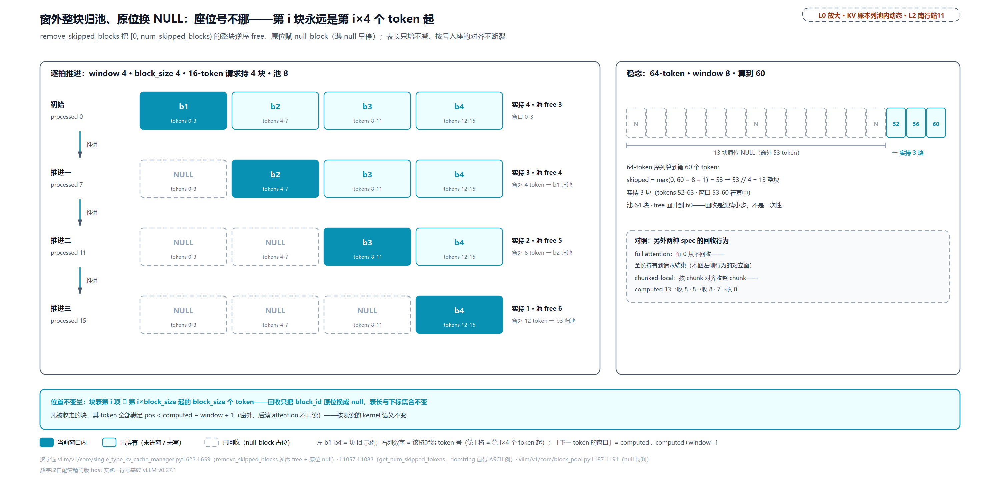

> *图注：L0「调度 · 显存账本」列池内动态的放大（对应 L2 章图南行站 11）。左：窗口 4、块 4 的请求算到第 7 个 token 时 tokens 0-3 落到窗外，整块 b1 归还块池、该块位换成立 NULL 占位；推进到 11、15，b2、b3 依次离场，实持 4→3→2→1、池 free 3→4→5→6。SWA 的显存回收是连续小步，不是一次性。右：稳态 64-token 序列算到 60 时 13 块已归池、实持仅 3 块（tokens 52-63）。块位号不变：第 i 块永远是第 i×4 个 token 起，注意力 kernel 照表读、读到 NULL 的位置本来就在窗外不读；full attention 对照全长持有到请求结束。*

末两行对照补两句场景。「稳态」行换了景：64-token 序列、池 64 块（free 60 = 64 − 实持 3 − null 1）。「对照 chunked」行是分块局部注意力的同款还账，只是它的「窗口」是当前 chunk：chunk 8、块 8 时已算 13 个 token，注意力只看第 8~15 那一块，前面 0~7 共 8 个 token 整块归还（`get_num_skipped_tokens(13) == 8`，docstring 自带此例）；已算恰 8 个时同样收 8（刚跨进新 chunk），已算 7 个时还在第一块内、收 0。回收永远对齐到 chunk 边界，与 SWA 对齐到窗外整块同理，只是取整的尺子从窗口换成了 chunk。

注意时点：`remove_skipped_blocks` 在每个 chunk 的分配预测**之前**先跑（kv_cache_manager.py:L504-L508 的调用），且基准是 processed（已落账）而非乐观的 computed：在途步的注意力窗口还在读的块不能收。这个时序是下一道门的正确性前提。

### 第二道：回收感知准入上限——单源铁律

有了回收，滑窗层的**稳态**占用就封顶了：窗口内 + 在途。上限的公式写在 spec 上：

```python
# vllm/v1/kv_cache_interface.py:L587-L618
    def max_admission_blocks_per_request(
        self, max_in_flight_tokens: int, max_model_len: int
    ) -> int:
        """Per-request admission cap, in blocks.

        Single source of truth for both startup pool sizing
        (`max_memory_usage_bytes`) and the runtime admission gate. Per-request
        real-held blocks plateau at this bound because
        `SlidingWindowManager.remove_skipped_blocks` runs from `allocate_slots`
        before each chunk's `get_num_blocks_to_allocate`.
        # … 省略：docstring 尾两行（max_in_flight_tokens 的定义指引）……
        """
        # During chunked prefill, we hold KV for the last `sliding_window-1`
        # computed tokens plus the in-flight tokens (frees happen on the
        # processed-token basis); never more than `max_model_len`.
        num_tokens = min(self.sliding_window - 1 + max_in_flight_tokens, max_model_len)   # L604
        # +1 because the sliding window may not start from the beginning of
        # the block. E.g. block size 4 and num_token 4 needs two blocks
        # [XXCD][EF] to store the 6-token window [CDEF].
        return cdiv(num_tokens, self.block_size) + 1                     # L608

    def max_memory_usage_bytes(self, vllm_config: VllmConfig) -> int:
        # … 省略：DCP 断言两行（上下文并行不支持滑窗）……
        max_blocks = self.max_admission_blocks_per_request(
            max_in_flight_tokens=vllm_config.max_in_flight_tokens,
            max_model_len=vllm_config.model_config.max_model_len,
        )
        return max_blocks * self.page_size_bytes
```

三个部件。`max_in_flight_tokens` 是「已排进 batch、还没落账的 token 数」的上界（前文算 257 用的那个 8192，口径一致）。`sliding_window − 1` 里的减一：窗口 W 个位置里最新的那个 token 通常还堵在途上（已经算在在途项里了），落账在册的只占 W−1，两项相加恰好盖满窗口。这两项为什么要加在一起，源头在回收的时点：窗外块的回收按 processed（已落账）基准做，一拍里在途的那批 token 的块还收不回来，所以最坏一瞬实持 = 窗口内已落账的 W−1 个 + 整批在途的 token。`+1` 顶着「窗口起点不在块首」的最坏错位（注释原例：块大小 4、6-token 窗口 [CDEF] 要占 [XXCD][EF] 两块）；docstring 第一句就是本章的铁律原文——**"Single source of truth for both startup pool sizing and the runtime admission gate"**：同一个方法喂启动期池大小器（`max_memory_usage_bytes` 直接拿它乘页大小）与运行期准入门。运行侧的夹取：

```python
# vllm/v1/core/single_type_kv_cache_manager.py:L178-L191 · SingleTypeKVCacheManager.get_num_blocks_to_allocate
        num_required_blocks = cdiv(num_tokens, self.block_size)
        if apply_admission_cap and self._max_admission_blocks_per_request is not None:
            # Recycling-aware specs (SWA, chunked-local) cap the per-request
            # reservation here so admission matches the startup pool sizer
            # (`SlidingWindowSpec.max_admission_blocks_per_request` / its
            # chunked-local counterpart). `remove_skipped_blocks` runs from
            # `allocate_slots` before each chunk's `get_num_blocks_to_allocate`,
            # so per-request peak real-held blocks <= this cap, which keeps
            # `sum(reservations) <= pool` <=> `sum(peak_real_held) <= pool`.
            # Drift between the two would re-introduce the deadlock from
            # issue #39734 or, worse, mid-prefill OOM.
            num_required_blocks = min(
                num_required_blocks, self._max_admission_blocks_per_request   # L190
            )
```

注意这段推理链，它回答为什么「按上限放行」不会超收：`remove_skipped_blocks` 在每个 chunk 的预测前先跑，所以每请求**峰值实持** ≤ cap；于是「预约之和 ≤ 池」⟹「峰值实持之和 ≤ 池」，放行安全（反向不必成立：预约比峰值保守，正是要的）。而这一切**没有运行时校验**，靠单源 + 注释防御：上一节整序列门里那个 `apply_admission_cap=True` 就是打开这个夹取的开关（只有整序列门打开它：准入要按封顶算，运行中的增量预测不用夹）。装配点在管家工厂：`get_manager_for_kv_cache_spec` 构造滑窗/分块管家时把这个上限算好注入（single_type_kv_cache_manager.py:L1861-L1878，注释再强调一遍 single source of truth）。窗口 8、块 4、在途 8 的推进实跑（混合门那行另起一景：窗口 512、块 16、在途 0 的 SWA 组配 full 组，池 1000、4096-token 请求）：

<!-- trace: m11 -->
| 轮 | 场景 | 关键数 | 判定/落账 |
|---|---|---|---|
| 公式 | SWA cap | cdiv(min(8−1+8, 64), 4)+1 = cdiv(15,4)+1 = 5 | cap = 5（+1 顶着窗口不在块首的最坏错位 [XXCD][EF]） |
| 公式对照 | chunked cap（无 +1） | cdiv(8+0, 4) = 2 | chunked 窗口从块首开始 |
| 推进 1 | computed 0 → 8 | 首 chunk 需 2 块 | 实持 2 ≤ cap 5 |
| 推进 2 | computed 8 → 16 | 窗外 1 token（<1 块，不收）→ 需补 2 | 实持 4 ≤ 5 |
| 推进 3 | computed 16 → 24 | 窗外 9 token → 收 2 块、补 2 | 实持 4 ≤ 5（稳态） |
| 推进 4..8 | computed 24…56 | 每步窗外多 2 块、补 2 块 | 实持稳在 4 ≤ 5，池 free 回升 |
| 混合门 | 4096 请求过 full-ISL 门 | full 组 cdiv(4096,16)=256；SWA 组不夹 256 / 夹到 33（=cdiv(511,16)+1） | 总需求 256+33=289 ≤ free 999 → 放行；不夹则 512，并发白丢一半 |

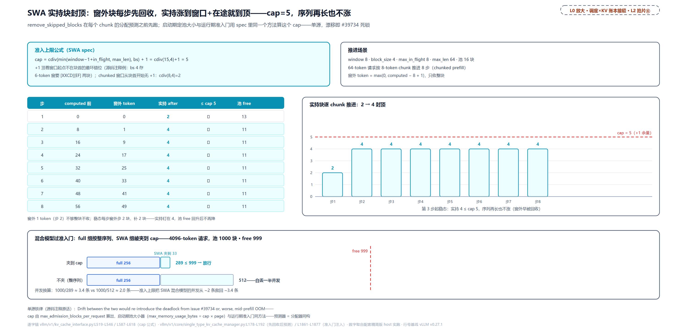

> *图注：L0「调度 · 显存账本」列内 Scheduler 与 KVCacheManager 接缝的准入门放大（对应 L2 章图中排拍片⑥）。上：SWA 请求逐 chunk 推进，窗外块每步先回收归池，实持块从 2 涨到 4 就封顶（cap=5 留了 +1 的块首错位余量），序列再长实持也不涨；下：混合模型过准入门，full 组按整序列 256 块、SWA 组被夹到 33 块，总 289 ≤ 999 放行；不夹则要按 512 算，1000 块的池并发从约 3.4 条掉到约 2 条。cap 由 spec 的同一个方法算出，启动期定池大小、运行期放请求进门共用，单源，漂移即 #39734 死锁。*

混合门那行就是第二幕的修复现场：夹取后同一池子的并发从约 2 条救回约 3.4 条。拿 #39734 的场景心算（示意推演，非 issue 原文数字）：一条 100k prompt 按全长要 cdiv(100000,16) ≈ 6250 块；窗口 1024、块 16、在途按一个 16-token chunk 计的 SWA 层，回收感知稳态只要 cdiv(1023+16,16)+1 = 66 块。6250 与 66 的鸿沟，被一个公式抹平。与前文混合布局表那行的 257（cap=cdiv(min(511+8192,4096),16)+1）对照，差别只在 `max_in_flight_tokens` 一个代入值：在途 0 时窗口项生效得 33，在途 8192 时 max_model_len 顶住得 257。

门立完了，把「怎么切」分账的收益合成一笔看。一张表的世界里，每请求的账必须按最保守的语义（全历史）摊给全部层；分组后是各组各按各的语义封顶再求和，差距由回收型组的「封顶不随长度涨」单调拉开。三个静态口径加一个动态口径，各兑现一次：

<!-- trace: m18 -->
| 口径 | 一张表（最保守语义说了算） | 组化后（各组各按各的语义） | 落账 |
|---|---|---|---|
| 4096-token 请求过准入门（窗 512、在途 0、池 1000） | full 256 + SWA 按全长 256 = 512 | full 256 + SWA 夹到 33 = 289 | 并发 1.9531 → 3.4602（同池 1000） |
| 死锁修复场景 100000-token prompt（窗 1024、在途 16） | 按全长 cdiv(100000,16) = 6250 块 | 回收感知 cdiv(1023+16,16)+1 = 66 块 | 6250 → 66：鸿沟被单源公式抹平 |
| 混合容量核算（在途 8192 顶到 max_len 4096、池 1024） | —（uniform 无此形态） | full 256 + cap 257 = 513 | 并发 1.9961（对照 uniform：每请求 256 → 4.0） |
| 运行期还账（decode 推进中） | full 管家从不还账（skipped 恒 0） | SWA 组每步窗外整块归池：实持 4→3→2→1 | 池 free 回升 3→4→5→6（前文推进一~三） |

第三行别过度解读：在途 8192 顶住 max_model_len 时 cap 257 只比全长 256 多 1，这一景分组几乎没省（并发 1.9961 对 uniform 的 4.0）；窗口真正发力在两头：在途小时（准入门那行的 33），序列长时（32768 长度 full 组要 2048 块、SWA 组封顶 545）。最后一行补上动态半边：full 组从不还账，SWA 组每步把窗外整块还回池里，省显存不是准入时的一笔折扣，是运行期每拍都在发生的还账。512 对 289、6250 对 66、513 对 256：三个口径三个数，背后是同一个公式，这就是 PR #40946 单源化的全部含义。

### 第三道：水位，吞吐换稳定

整序列门管住了输入长度，但有一类超收它管不着：**输出长度未知**。准入时只预留输入，decode 每拍都在长。decode 密集负载（输出远大于输入）高并发下会发生什么，官方 benchmark 脚本的头部注释写得像教材（benchmarks/kv_cache_watermark.sh）：

```text
# Why this workload triggers thrashing:
#   Requests are admitted based on the KV cache they need *at admission time*.
#   With `--scheduler-reserve-full-isl` (default) the input length is reserved up
#   front, but the *output* length is unknown and unreserved. A decode-heavy
#   workload (output >> input) at high concurrency therefore over-admits while
#   requests are short, then runs out of KV cache as they all grow during decode
#   -> the scheduler preempts (recompute) recently-admitted requests, re-prefills
#   them later, and repeats. The watermark keeps a block of KV cache free so
#   running requests can grow into it instead of triggering this churn.
#
# … 省略：脚本机制五行（KV 约束配置下启动 vllm serve、扫水位取值、
#       收抢占/吞吐/延迟指标并画图）……
# Default workload: concurrency 200, input ~300 tokens, output ~4000 tokens
```

抖动环六步：准入只预留输入 → 短时超收 → 全体增长 → 池尽 → 抢占刚准入者 → 重 prefill → 回到第一步（抢占环的内景[第 11 章](../../ch11-preemption-request-lifecycle/narrative/chapter.md)拆过：v1 只有 recompute 一条路，被抢者全部块释放、num_computed_tokens 归零、回队头）。脚本的复现口径：并发 200、输入约 300、输出约 4000、KV 池压到均值需求的约 1.5 倍。水位的回答是给「增长」留一块垫片（垫片 = 水位预留的那块空闲，下文与 headroom 同义；区别于 0.92 预算里留的头寸：那是启动期的余量，这是运行期的）：

```python
# vllm/config/scheduler.py:L136-L141 · SchedulerConfig
    watermark: float = Field(default=0.0, ge=0.0, lt=1.0)
    """Fraction of total KV cache blocks to keep free (the watermark) when
    admitting waiting or preempted requests into the running queue. This headroom
    helps avoid frequent KV cache eviction and the resulting repeated preemption
    of requests when GPU memory is scarce. Must be in the range [0.0, 1.0); 0.0
    (the default) disables the watermark."""
```

块数在 KVCacheManager 构造时就算死：`watermark_blocks = int(watermark × num_blocks)`（vllm/v1/core/kv_cache_manager.py:L171）。计入的条件在门段开头已经见过（L463-L470）：**两个条件同时成立**才把水位算进 required：本步已有调度请求（`has_scheduled_reqs`），且来者是 WAITING 或 PREEMPTED。随后与稳态判定合流（L521-L527）：

```python
# vllm/v1/core/kv_cache_manager.py:L521-L527 · KVCacheManager.allocate_slots
        # Keep `reserved_blocks` free for other in-flight sequences, and an
        # additional watermark of headroom for waiting/preempted admissions.
        available_blocks = self.block_pool.get_num_free_blocks() - reserved_blocks
        required_blocks = num_blocks_to_allocate + watermark_blocks          # L524
        if required_blocks > available_blocks:
            # Cannot allocate new blocks
            return None
```

这笔 `num_blocks_to_allocate` 已不是第一道门那笔整序列数：两道门之间源码按本步重算了一遍——`num_tokens_need_slot`（本步要落槽的 token 数：已算 + 新排入的 token + lookahead，封顶 max_model_len；kv_cache_manager.py:L490-L519），不夹准入上限，L524 比的是这笔；上一节「运行中的增量预测不用夹」说的就是它。一次 `allocate_slots` 调用里两笔先后各查各的：第一道门查整条序列装不装得下，这一道查本步增量够不够。

这个 None 与整序列门的 None 同一个出口：WAITING 侧等下一拍，RUNNING 侧进抢占环。10 块池、水位 0.5（`watermark_blocks = 5`）三轮判定：

<!-- trace: m12 -->
| 轮 | 请求状态 / has_scheduled_reqs | required 计算 | 判定 |
|---|---|---|---|
| 一 | WAITING / True | 5 块 + 水位 5 = 10 | 10 > free 9 → None（headroom 留给 running 长大） |
| 二 | WAITING / False（首拍空转） | 5 + 0 = 5 | 5 ≤ 9 → 放行（池全空时再保守就永远开不了工） |
| 三 | RUNNING / True | 5 + 0 = 5（精修版只对 WAITING/PREEMPTED） | 5 ≤ 9 → 放行（在座长个不受垫片约束） |

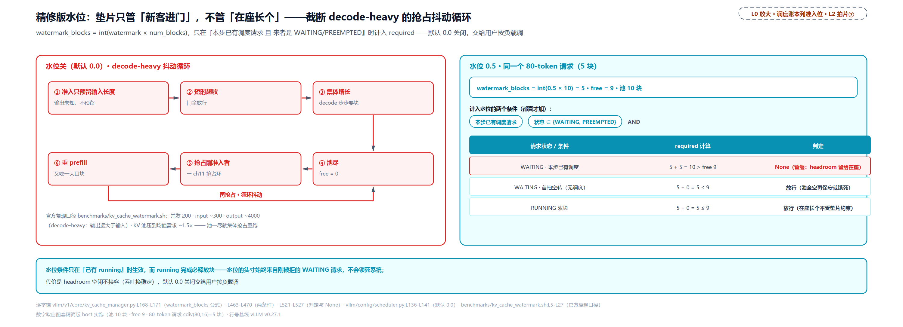

> *图注：L0「调度 · 显存账本」列准入位的放大（对应 L2 章图中排拍片⑦）。左（水位关，默认 0.0）：decode 密集负载的六步抖动环，准入只预留输入、短时超收、集体增长、池尽、抢占刚准入者、重 prefill，循环往复；右（水位 0.5）：同一个 80-token 请求在 10 块的池前被暂缓（5 块需求 + 5 块水位 = 10 > free 9），把 headroom 留给已就座的请求加椅子。首拍空转与 RUNNING 涨块不扣水位：垫片只管「新客进门」，不管「在座长个」。吞吐换稳定，默认关闭交给用户按负载调。*

两个条件各自防一种笨：首拍不算水位（轮二），池全空时若还算水位，第一条请求永远进不来，系统开不了工；RUNNING 不算水位（轮三），垫片是给「增长」留的，在座的请求自己就是增长本身。这套「精修版水位」对照的是 v0 的老办法：v0 的 BlockSpaceManager 用全局静态垫片（默认 1%），不管有没有 running、不管来者是谁一律垫，保守浪费；v1 裸奔两代后在 #44594（2026-06-11）把它以精修形态请回来，默认 0.0 关闭。代价始终是那句：**headroom 空闲不接客，吞吐换稳定**——交给用户按负载调，官方脚本就是调参的复现台。

## worker 侧落地：每组一张表、大块拆小块（站 12）

账本侧的故事讲完了，最后一块拼图在 GPU 半边：worker 拿到 config 真分配张量时，混合布局要每组一张块表；而**账本的块大小**与**注意力 kernel 认的块大小**还可能不同：调度器按 32-token 的块记账，而注意力 kernel 只认 16-token 的块。换算是纯乘法加法：

```python
# vllm/v1/worker/block_table.py:L220-L248
    @staticmethod
    def map_to_kernel_blocks(
        kv_manager_block_ids: np.ndarray,
        blocks_per_kv_block: int,
        kernel_block_arange: np.ndarray,
    ) -> np.ndarray:
        """Convert kv_manager_block_id IDs to kernel block IDs.

        Example:
            # kv_manager_block_ids: 32 tokens,
            # Kernel block size: 16 tokens
            # blocks_per_kv_block = 2
            >>> kv_manager_block_ids = np.array([0, 1, 2])
            >>> Result: [0, 1, 2, 3, 4, 5]

            # Each kv_manager_block_id maps to 2 kernel block id:
            # kv_manager_block_id 0 → kernel block id [0, 1]
            # kv_manager_block_id 1 → kernel block id [2, 3]
            # kv_manager_block_id 2 → kernel block id [4, 5]
        """
        if blocks_per_kv_block == 1:
            return kv_manager_block_ids

        kernel_block_ids = (
            kv_manager_block_ids.reshape(-1, 1) * blocks_per_kv_block
            + kernel_block_arange
        )                                                                   # L246

        return kernel_block_ids.reshape(-1)
```

双射换算 `kernel_id = kv_id × k + j`：大块与其 k 个小块覆盖的 token 集合逐字相等，无重号无漏号（整除性由构造期校验兜底）。`MultiGroupBlockTable`（block_table.py:L270-L336）给每个 KV 组一行，各行按需细分：同一个请求在不同组有不同行宽。kernel 块大小由**注意力后端的能力**决定：每个 KV 组各自协商，取该组全体后端都支持、且整除该组账本块大小的最大块，源码注释还举了 256 拆 4×64 的例（vllm/v1/worker/gpu_model_runner.py:L7644-L7651）。谁声明支持什么、怎么协商，归执行篇注意力后端章。实跑：

<!-- trace: m14 -->
| 轮 | 输入 | 换算 | 结果 |
|---|---|---|---|
| 纯算术 | 块 id [0, 1, 2]（kv 32 / kernel 16） | kernel_id = kv_id × 2 + j | [0, 1, 2, 3, 4, 5] |
| 恒等 | 块 id [5, 9]（不拆分） | blocks_per_kv_block=1 原样返回 | [5, 9] |
| 块表行 | append [0, 1]（32 → 2×16） | 行宽 8 → 16（×2） | 行首 [0, 1, 2, 3]（余位补 0 占位） |
| 多组 | 组 0 [0,1] / 组 1 [2] | 每组一张表，各自按需细分 | 组 0 行 [0,1,2,3]；组 1 行 [2] 原样 |
| 后端协商 | 组 0 后端认 16 / 组 1 后端认 32,16 | 取全体后端都支持的最大公因子块 | kernel_block_sizes = [16, 16]（组 0 拆、组 1 直认） |

[第 13 章](../../ch13-paged-kv/narrative/chapter.md)在读腿上埋过一个问号（注意力 kernel 穿块表读的代价），那个账归执行篇结算；本章只把「账本块号 → kernel 块号」的换算对齐：账本说的 3 号块、kernel 眼里的 6、7 号小块，指的是同一段 token。

## 总结：「调度 · 显存账本」列上半与启动带点亮

本章点亮了 L0 图「调度 · 显存账本」列 KV 半区的上半，从启动装配带的测量到 `KVCacheManager` 的两道门，加上 worker 侧每组一张块表、大块拆小块的落地。与[第 13 章](../../ch13-paged-kv/narrative/chapter.md)（池的内部）合起来，这列从上到下全通；[第 10 章](../../ch10-continuous-batching-chunked-prefill/narrative/chapter.md)到[第 12 章](../../ch12-async-scheduling/narrative/chapter.md)三章里那个当参数用的 `num_gpu_blocks`，从此有了完整的出生证明。开篇三问的答案：**饼多大**：预算（总显存 × 0.92，分母是总量、per-instance）减去峰值账（dummy 前向量出的 non_kv = 常住 + 瞬时峰）再减图池估计，一行减法定本金，`// 页 // 层`换块数，护栏四道保证这份账开得了工；**怎么切**：先立理论模型——公理一每层形状＝每 token 字节×每块 token 数（页宽）、公理二块号是池子唯一货币（整块回收、块身份无层粒度、一表管一层组），推出四条：一表一语义、页宽对齐必然、跨型不整除时 pack 必然、申报离谱程度决定适配深度（零/申报/管理器/后端四档）；这套东西由此定性为 vLLM 为「混合层潮」铺的适配协议而非补丁集：每层交 spec 申报表、四路归一化分发、按组落地张量，四个纪元恰好是四条推论被现实逐条撞上的顺序（v0 手工补丁退役、v1 统一分配器、同型打包、跨类型分表共池，V4 四条全撞、一路适配到第四档长出第三路与 packed）；等页路径按 spec 分桶、等量化组（padding 是账）、页统一三出路，每池每组出一层共享张量，两把尺 LCM/GCD 对齐调度与哈希；DeepSeek V4 七种形态、四种页宽走元组装包＋近似 GCD＋packed 重叠布局（先 11+10 后 61 层实算），形状因子链从 config 逐环推到页宽（[4, 2*512*2*4] 逐因子：槽数 × kv+score 两份 × head_dim × 重叠系数 × fp32 字节），压缩块按「管理面 256 / 物理面 64 行」两套坐标系记账，张量账四段式收拢为 243 条层账 → 202 个声明桶 → 1 块物理 slab → 243 个视图；**门多紧**：整序列门堵超收（第一幕）、回收感知上限堵门账漂移（第二幕）、水位留头寸堵输出未知的抖动，三道预算全部来自启动账本、运行期零重算。带走三件事：

1. **测量式分配是一次性契约**。启动量一次、算一次、写回 cache_config，此后运行期只有照账放行、没有重新定账。这意味着 profile 的错（真实负载峰超 dummy run）运行期没有补救，防御全在启动侧：util 留头寸、assert 拒环境漂移、护栏拦死账。代价与收益是同一枚硬币：少一分运行期开销，多一分对启动测量的信任要求。
2. **单源是防漂移的唯一手段，且贯穿始终**。一份 KVCacheConfig 单点产出喂两侧（调度器拍平、worker 按布局分配、PP 取最小）；准入上限是 spec 上的同一个方法喂启动定池与运行放行；override 折算把 available_memory 一并改写。三处都没有运行时对账：结构上让漂移不可能，比校验便宜也可靠。
3. **两条公理四条推论是混合组化的总纲**。面积因层而异、货币全场唯一，中间的张力推出全部规矩：一表一语义（语义不同必须分表）、页宽对齐必然（页统一、组等量，padding 是账）、跨型不整除走重叠时间复用（packed）、适配深度由申报离谱程度决定（四档）。V4 把对齐推到极限后换了约束——「一个块号同一时刻只归一组」的重叠时间复用，两种约束都是「一种货币」的不同保法；代价清单也诚实：padding 层白占显存、Mamba pad 极端时浪费 93.75%、切片条带只占块格的 2.6%、六条假设里官方自认「跨类型命中只干净支持 full + 恰好一种其它」。

还有一条暗线值得点名：本章的还账（窗外块回收）与[第 13 章](../../ch13-paged-kv/narrative/chapter.md)的还块（free 不清哈希）在同一块土壤上——被回收的满块，哈希还留在表上。哪些请求能认领这些块、哈希按哪把尺切（本章立住的 `hash_block_size`）、LRU 驱逐怎么挑人，下一章《前缀缓存》把这半本账接着记。

（完）
