# 第 15 章　前缀缓存

同一个 system prompt，一天被 prefill 一万遍——凭什么第二遍起能整段跳过？更具体的四个问题：vLLM 里没有 radix 树（很多读者带着「vLLM 用基数树做前缀缓存」的印象来，全仓 v1 核心代码里 grep「radix」是零命中），它靠的是每满 16 个 token 把前缀拌进一枚哈希、塞进一个平面 dict——命中凭什么「断一处即停、无需回溯」？驱逐顺序凭什么保住最长的可复用前缀？[第 11 章](../../ch11-preemption-request-lifecycle/narrative/chapter.md)里被抢占打回原形的请求，撞上这张哈希表，「重算」怎么就变成了「重载元数据+补算」？还有两个人共享半截没写满的块，谁接着写、凭什么写不坏对方？

五问连着答，就是本章：**算**（哈希怎么链出来）、**查**（命中怎么在第一个 miss 处停）、**挂与写**（命中的块怎么共享、新满的块怎么登记）、**留与逐**（驱逐顺序的两个隐藏不变量）、**进阶三幕**（块内 CoW 部分命中、混合模型的不动点调和、Marconi 式钉住）。

位置先摆好。[第 13 章](../../ch13-paged-kv/narrative/chapter.md)打开了块池的内部——等大的块、每请求一张块表、引用计数、自由队列，但它从头到尾把前缀缓存当空账本，「两个哈希账位，本章恒空、看见当没看见」；[第 14 章](../../ch14-memory-ledger/narrative/chapter.md)打开了池之上的账本——定账、准入门、混合组化，并定下了哈希的粒度尺 `hash_block_size`（GCD 或 `prefix_match_unit` 覆盖），本章直接消费这把尺。[第 11 章](../../ch11-preemption-request-lifecycle/narrative/chapter.md)拆抢占时只立了一条事实——free 归还块但不清哈希——机制正戏按下不表；[第 10 章](../../ch10-continuous-batching-chunked-prefill/narrative/chapter.md)更是把 `get_computed_blocks`（查前缀命中）整个当黑盒用了一章。本章把这几笔账全部接走：L0 图「调度 · 显存账本」列 KV 半区的**缓存面**——同一个块池、同一张块表，加上一层哈希账本之后，「还掉的块还能被命中」这件事的完整机制。

## 你在这里

Part IV 的总问题一句不变：**显存就那么多，KV cache 必须活到最后**。[第 13 章](../../ch13-paged-kv/narrative/chapter.md)回答了「块长什么样」、[第 14 章](../../ch14-memory-ledger/narrative/chapter.md)回答了「池多大、门多紧」；本章回答最后一块拼图：「算过的 KV，怎么让下一个请求白捡」。

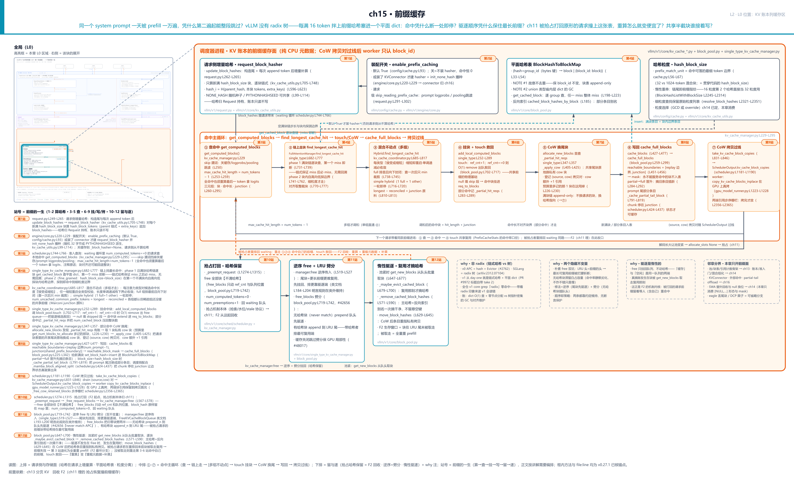

> *图注：本章放大的是[第 1 章](../../ch01-vllm-v1-in-one-map/narrative/chapter.md) L0 图「调度 · 显存账本」列 KV 半区的缓存面——[第 13 章](../../ch13-paged-kv/narrative/chapter.md)打开过这半区的块池与块表、[第 14 章](../../ch14-memory-ledger/narrative/chapter.md)打开过它上面的定账与门，本章打开的是同一块池之上那层前缀哈希账本（全部机制都是纯 CPU 元数据；只有 CoW 拷贝对过线后 worker 才动手）。图上三段读：北行是请求侧与存储面——哈希在请求上增量算、平面哈希表、粒度分离；中排 ①-⑦ 是命中主循环（查 → 链上走 → 多组不动点 → touch 挂块 → CoW 换尾 → 写回 → 拷贝过线）；南行是留与逐——抢占打回但哈希保留、逆序 free 加劈分、惰性驱逐，加三条 why 注（非 radix、两个不变量、驱逐为什么是惰性的）与邻章分界。站号 1-12 = 一个前缀的一生流经代码的顺序（1-2 算哈希 · 3-5 查 · 6-9 挂/写/拷 · 10-12 留与逐），正文按讲解需要编排、不必照站号读。*

读法建议：想知道「哈希凭什么能当指纹用」，从[「指纹」](#指纹把整条前缀压进一枚哈希站-1-2)读起；关心「为什么没有 radix 树」，看[「先澄清：radix 是隔壁的路」](#先澄清radix-是隔壁的路)（「指纹」节开头；「表」那节的图里亦有摘要）；想知道被抢占的请求怎么「重算变重载」，直奔[「留与逐」](#留与逐藏在注释里的两个不变量站-10-12)与[「收口」](#收口被打回的请求回来先查表站-10-12-的回环)；用混合模型（Gemma、gpt-oss、Jamba 这类）的读者重点看进阶三幕；想跟全程，按序读。

照例交代取证环境，全章数值表都适用：本章实测来自配套精简版——按 v0.27.1 只做减法抽出的「哈希+命中+驱逐+CoW+混合」全链，host 上实跑纯控制流，不依赖 GPU 与 vLLM 运行时，且本章跑的是 `enable_prefix_caching=True` 支（真实部署的默认值，vllm/config/cache.py:L93）。全部驱动以 `PYTHONHASHSEED=0` 播种——不播种时首块种子是 32 个随机字节，播种后是确定值（细节马上讲到），表里所有哈希字节都对这粒种子负责。两处取证口径与真实引擎有刻意差别，后文碰到会就近再提：其一，mamba 组的边界状态条目在驱动里用与 full 组同一个注册原语登记（真实代码里由 MambaManager 重写的入口内部调同一个原语，差分测试已证明两者逐字节一致）；其二，混合不动点一节的 finder 调用计数用只观察不改行为的包装器记录。

## 指纹：把整条前缀压进一枚哈希（站 1-2）

先还一笔债：开篇那句「vLLM 没有 radix 树」，值得单独讲清楚，因为它是最流传的误读。

### 先澄清：radix 是隔壁的路

**radix 树**（基数树，压缩前缀树）是 trie 的压缩形态：**边**上标一段 token 序列（不是单个 token），从根到任一节点的路径就对应一段前缀。SGLang 的 RadixAttention 走的就是这条路（[arXiv:2312.07104](https://arxiv.org/abs/2312.07104)，[LMSYS 博客](https://lmsys.org/blog/2024-01-17-sglang/)）：所有请求的前缀显式长成一棵树，每个节点挂「这段前缀的 KV 在哪些物理页」；请求来了沿树往下走就是匹配（官方文档原话 "the longest cached prefix"），正被使用的路径靠节点上的引用计数保护（"Nodes with lock_ref > 0 are protected from eviction"），驱逐策略还可插拔（lru/lfu/fifo 等五选）。**vLLM 从来没走过这条路**。家谱摆出来（均据本仓源码史实）：v0 的 APC（automatic prefix caching，自动前缀缓存——源码注释里就用这个缩写，2024 年 3 月 PR #2762）用的是哈希加独立 Evictor 对象，不是树；v1 的第一个 alpha（2024-10）落地时命中查找是个存根，TODO 注释写的就是 "Implement hash-based caching"；一个月后的 PR #9972（标题自带 "take 2"）落地了链式哈希加平面 dict——v1 从第一天起就是哈希路线。带着「vLLM 换掉了 radix 树」的印象来读 v1，会系统性读错。

两条路线的取舍，一句话版本：radix 树把「共享」做成了显式的结构（多请求共享 system prompt = 树上一个被共享的节点），任意长度天然可命中，代价是 Python 侧节点对象分配、分裂合并的 GC（垃圾回收）压力、以及与块对齐语义的反复磨合——这些正撞在 v1 调度循环最付不起的 CPU 时间上（[第 13 章](../../ch13-paged-kv/narrative/chapter.md)的 why 链：高并发下每拍要为几百个请求算账）；链式哈希加平面 dict 把「共享」交给「同前缀必同哈希」这条数学性质，零节点对象、查找退化为逐块 dict 命中，代价后面诚实摆。两家官方都没做过正面横评，这里不做「谁更优」的断言；SGLang 后来把树长成了分层的 HiCache（GPU → 主机内存 → 分布式存储，[设计文档](https://docs.sglang.io/advanced_features/hicache_design.html)）——那条往集群扩的路，是 Part IV 末章 KVConnector 的邻居，此处一句带过。

### 每满 16 个 token 盖一枚章

vLLM 的路线核心是一个函数。直觉先行：像记账式抄本——每抄满 16 个 token，就把「上一页的指纹 + 这一页的原文 + 批注」一起喂进 sha256（一种密码学哈希函数，任意长度输入压成 32 字节摘要），打出的新指纹贴在这一页上。因为上一页的指纹又含着上上页的指纹，第 i 页的指纹天然盖住了前 i+1 页**全部内容**的章；改任何一个字，那一页之后的所有指纹全部作废。

```python
# vllm/v1/core/kv_cache_utils.py:L596-L623
def hash_block_tokens(
    hash_function: Callable[[Any], bytes],
    parent_block_hash: BlockHash | None,
    curr_block_token_ids: Sequence[int],
    extra_keys: tuple[Any, ...] | None = None,
) -> BlockHash:
    """Computes a hash value corresponding to the contents of a block and
    the contents of the preceding block(s). The hash value is used for
    prefix caching. We use LRU cache for this function to avoid recomputing
    hash values for the same block contents.
    # … 省略：Args 六行（参数说明）……
    """
    if not parent_block_hash:                                             # L617
        parent_block_hash = NONE_HASH

    curr_block_token_ids_tuple = tuple(curr_block_token_ids)
    return BlockHash(                                                     # L621
        hash_function((parent_block_hash, curr_block_token_ids_tuple, extra_keys))
    )
```

公式形态（首块的 parent 是 `NONE_HASH` 种子）：

```math
hash_i = H(hash_{i-1},\ tokens_i,\ extra\_keys_i)
```

这个「父哈希拌进子哈希」的构造有密码学血统：Merkle 树（[维基](https://en.wikipedia.org/wiki/Merkle_tree)）用「每层哈希把下一层卷进来」让根哈希成为整棵树内容的指纹；把它压成一条线就是**哈希链**——git 的提交号是同族最直观的例子：每个提交的哈希包含父提交的哈希，所以一个 commit ID 命名的是整条历史，不只是一个快照。vLLM 用的是退化成链的形态，且只需要它的一条性质：**第 i 块哈希是前 i+1 块全部内容的指纹**。为什么不需要树？因为一个 token 序列只有一条历史，路径唯一，树没有分叉可利用；也不需要 Merkle 的对账证明，只需要「任意长度前缀的身份 = 链上那枚哈希」，dict 查一下就完成匹配。拿一个说明性最小例走一遍（函数形态与源码一一对应；下文把 hash_i 速记作 h₀、h₁、h₂…）：设每 16 token 一块，请求 A 的 token 记作 `A₀…A₄₉`，则 h₀ = H(seed, A₀…A₁₅)、h₁ = H(h₀, A₁₆…A₃₁)——注意 h₁ 的输入里没有前 16 个 token 的原文，但有 h₀，而 h₀ 由它们决定，所以 h₁ 是前 32 个 token 的指纹。请求 B 与 A 共享前 32 token 后分叉：B 算出的 h₀、h₁ 与 A 逐字节相等（输入相同），h₂ 分叉——共享到哪、指纹相等到哪，这就是命中查找的全部底气。

### 哈希长在请求身上：增量、只算新满块

谁在什么时机调这个函数？答案是：**哈希账本归 Request 持有，随 token 到达增量补算**，缓存那边只读不写。构造请求时算一遍，此后每产出一个 token 都顺手续算：

```python
# vllm/v1/request.py:L249-L265
    def append_output_token_ids(
        self,
        token_ids: int | list[int],
    ) -> None:
        if isinstance(token_ids, int):
            self._output_token_ids.append(token_ids)
            self._all_token_ids.append(token_ids)
        else:
            self._output_token_ids.extend(token_ids)
            self._all_token_ids.extend(token_ids)

        self.update_block_hashes()                                       # L260

    def update_block_hashes(self) -> None:
        """Compute block hashes for any new full blocks and append them."""
        if self._block_hasher is not None:
            self.block_hashes.extend(self._block_hasher(self))           # L265
```

`append_output_token_ids` 是每拍采样后入账的那一步（[第 11 章](../../ch11-preemption-request-lifecycle/narrative/chapter.md)立过这条暗线：请求活得越久，可被捡回的前缀越长）。真正干活的闭包在工具函数里，三个纪律藏在开头几行：

```python
# vllm/v1/core/kv_cache_utils.py:L705-L748
    def request_block_hasher(request: Request) -> list[BlockHash]:
        start_token_idx = len(request.block_hashes) * hash_block_size     # L706
        num_tokens = request.num_tokens

        if start_token_idx + hash_block_size > num_tokens:
            # Early stop when there no new full blocks created.
            return []                                                    # L711

        curr_mm_idx = 0
        if start_token_idx > 0:
            # Set curr_mm_idx = -1 to indicate the last mm input.
            # … 省略：两行注释——生成 token 补满的块只需考虑最后一个多模态输入 ……
            curr_mm_idx = -1

        prev_block_hash_value = (
            request.block_hashes[-1] if request.block_hashes else None
        )
        new_block_hashes: list[BlockHash] = []
        while True:
            end_token_idx = start_token_idx + hash_block_size
            if end_token_idx > num_tokens:
                # We only hash full blocks
                break                                                    # L729
            # … 省略：extra keys 组装两行（下一小节展开）……
            block_tokens = request.all_token_ids[start_token_idx:end_token_idx]
            block_hash = hash_block_tokens(
                caching_hash_fn, prev_block_hash_value, block_tokens, extra_keys
            )

            new_block_hashes.append(block_hash)
            start_token_idx += hash_block_size
            prev_block_hash_value = block_hash                           # L744

        return new_block_hashes

    return request_block_hasher                                          # L748
```

三个纪律：**起点由账本长度反推**（`len(block_hashes) × hash_block_size`——hash_block_size 是哈希的粒度尺，[第 14 章](../../ch14-memory-ledger/narrative/chapter.md)立的各组块大小的 GCD 或 prefix_match_unit 覆盖，单组模型就等于块大小 16；已算过的块绝不重算）；**只哈希满块**（`end_token_idx > num_tokens` 就 break——不满 16 个 token 的尾巴不配拥有指纹，这个决定后面「写回」一节还会回来）；**链式推进**（`prev_block_hash_value = block_hash`，每块的父就是上一块刚算出的）。37 个 token 的请求构造时只有 2 个满块哈希、append 到 50 时只补第 3 块——增量成本逐事件实测：

<!-- trace: m1 -->
| 事件 | num_tokens | 新满块哈希 | block_hashes 累计 | 判定 |
|---|---|---|---|---|
| 构造 Request（37 token） | 37 | 2 | 2 | 只算新满块——37 个 token 恰有 2 个整 16 满块 |
| append 至 43 | 43 | 0 | 2 | 未跨下一满块边界——hasher 早退返回空表 |
| append 至 50 | 50 | 1 | 3 | 跨过第 3 个满块边界——只补算这 1 块（parent=上一块哈希） |
| append 至 51 | 51 | 0 | 3 | again 未跨界——哈希账本不动（增量零成本） |
| 指纹自检 | 50 | — | 3 | hasher 结果与逐块手算逐字节相等；首块 parent=NONE_HASH 种子 |
| 断链实验：块 0 改 1 个 token | — | — | — | 块 1 的 token 原封不动，但 h₁ 因 parent 变化而全变——链式传播 |
| 两请求共享前 32 token | 32 | — | — | h₀/h₁ 逐一相等、h₂ 分叉——前缀一致 ⇔ 沿链相等 |

断链实验那行值得盯一眼：块 1 自己的 token 一个没动，它的哈希却全变了——因为 parent 变了。这不是代价，恰是指纹性质本身（「前缀任何一处改动、其后所有哈希失效」的推论）。摊销账：每满 16 token 一次 32 字节 sha256；第二个请求共享前 32 token 时，复用 2×16=32 个 token 的 KV，本步只 prefill 50−32=18 个 token——36% 的计算。

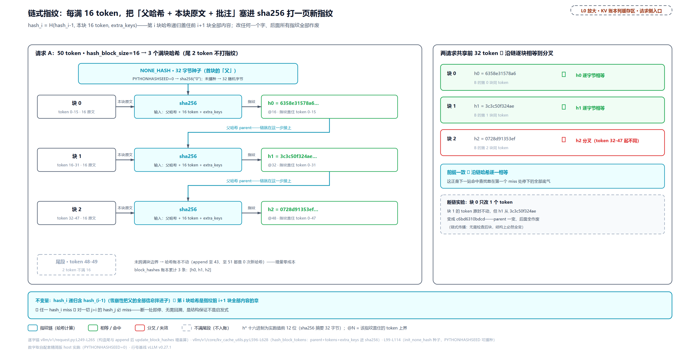

> *图注：L0「调度 · 显存账本」列缓存面的请求侧放大（对应 L2 章图北行站 1）。50 个 token 以 16 为界切成 3 个满块，每块哈希 = H(父哈希、本块 16 token、extra_keys)，首块的「父」是 32 字节种子 NONE_HASH；尾部 2 个 token 不满 16、虚框不入账——append 它们零成本。右栏两请求对照：B 与 A 共享前 32 token ⇒ 前两个哈希逐字节相等、第三个分叉；断链实验改块 0 一个 token，从 h₀ 起全变。「前缀一致 ⇔ 沿链相等」是下一节命中查找敢在第一个 miss 处停下的全部底气。*

### 种子与哈希算法：两个安全口径

首块的种子 `NONE_HASH` 不在配置里，在进程出生时定：

```python
# vllm/v1/core/kv_cache_utils.py:L99-L114
def init_none_hash(hash_fn: Callable[[Any], bytes]):
    global NONE_HASH

    hash_seed = os.getenv("PYTHONHASHSEED")
    if hash_seed is None and hash_fn in _CBOR_HASH_FUNCTIONS:
        # … 省略：warning 三行——CBOR 变体下不设种子会导致哈希跨进程不可复现 ……
    if hash_seed is None:
        NONE_HASH = BlockHash(os.urandom(32))                            # L112
    else:
        NONE_HASH = BlockHash(hash_fn(hash_seed))                        # L114
```

不设 `PYTHONHASHSEED`（Python 的进程级哈希种子环境变量）时种子是 32 个随机字节（本章驱动的表全部按 `PYTHONHASHSEED=0` 播种后的确定种子算）；设了就从种子派生——动机源码注释支持的是「跨进程可复现」：种子不同的两个进程对同一前缀算出不同哈希，多 worker 场景下缓存互相命不中（推断性表述，注释原文只给 CBOR 变体的告警）。哈希算法本身也是个配置（`prefix_caching_hash_algo`，vllm/config/cache.py:L95-L110）：默认 `sha256`——密码学哈希，文档串自述理由 "SHA256 is the most secure choice to avoid potential hash collisions"；可切 `xxhash`（非密码学、128bit、快一个数量级，[官网](https://xxhash.com/)自陈 non-cryptographic）——但文档串同时自带安全警告：非密码学哈希理论上增加碰撞风险，多租户环境下「碰撞 = 把别人的缓存当成自己的命中」，甚至泄漏他人前缀内容。碰撞概率的量级用生日悖论估（往 b bit 空间放 n 个值、出对碰撞的概率约 $`n^2/2^{b+1}`$，[维基](https://en.wikipedia.org/wiki/Birthday_attack)）：128bit 哈希、缓存 10⁹ 块时约 1.5×10⁻²¹——极小，但比 256bit 大 2¹²⁸ 倍量级，这就是「工程上可忽略」与「安全余量更小」的距离。另有 `_cbor` 后缀的两个变体管可复现性（CBOR 确定性序列化替代 Python pickle，[RFC 8949](https://www.rfc-editor.org/rfc/rfc8949.html)），点到为止。

### 同文不同义：extra_keys 的语义隔离

链上还有第三个输入 `extra_keys`。它解决的问题是：**token 一样，语义不一样**。同一个 system prompt、挂不挂 LoRA（low-rank adaptation，外挂在基座模型上的小调优模块）、多租户下两条不同盐（salt，显式拌进哈希的区分字段）的请求——token 序列完全相同，但 KV 不能互用。三个判定条件：

```python
# vllm/v1/core/kv_cache_utils.py:L430-L447
def need_extra_keys(request: Request) -> bool:
    """Check whether the blocks allocated to this request need extra hash keys.
    # … 省略：Args 四行……
    """
    # Multimodal requests need to include the MM hash.
    # LoRA requests need to include the LoRA name.
    # Request with provided cache salt need to include the salt.
    return (
        bool(request.mm_features)                                        # L444
        or (request.lora_request is not None)
        or (request.cache_salt is not None)
    )
```

组装时四源合并（多模态特征哈希、LoRA 适配器名、cache salt、prompt embeddings——最后一路本章从简），其中盐的拌法有个精打细算的细节：

```python
# vllm/v1/core/kv_cache_utils.py:L558-L593
def generate_block_hash_extra_keys(
    request: Request, start_token_idx: int, end_token_idx: int, start_mm_idx: int
) -> tuple[tuple[Any, ...] | None, int]:
    """Generate extra keys for the block hash. The extra keys can come from
    the multi-modal inputs, request specific metadata (e.g., LoRA names), and
    hashed data from prompt embeddings.
    # … 省略：Args 八行……
    """
    mm_extra_keys: list[Any]                                             # L574
    mm_extra_keys, new_start_mm_idx = _gen_mm_extra_hash_keys(
        request, start_token_idx, end_token_idx, start_mm_idx
    )
    lora_extra_keys: list[str] = _gen_lora_extra_hash_keys(request)
    cache_salt_keys: list[str] = (
        [request.cache_salt] if (start_token_idx == 0 and request.cache_salt) else []   # L580
    )
    # … 省略：prompt_embeds 一源三行与合并两行……
    if not extra_keys:
        return None, new_start_mm_idx                                    # L591

    return tuple(extra_keys), new_start_mm_idx                           # L593
```

**盐只拌首块**（`start_token_idx == 0`）——盐只需让 $`h_0`$ 变，链式传播会替它把差异带到全链每一块；mm（多模态）键带块内偏移（如 `("img-1", 8)`），同图不同位置必须不同键，只能逐块给；LoRA 名则每块都拌——按盐的同一论证，它只拌首块其实也够，源码没有注释解释这个多出来的做法，一个说得通的读法是防御式写法：mm 键反正要逐块组装，LoRA 名顺手同路，代价只是每块多几字节哈希输入。64 token、四满块的隔离实测：

<!-- trace: m3 -->
| 对象 | 块 0 extra_keys | 块 1 extra_keys | 哈希对比 | 结论 |
|---|---|---|---|---|
| 纯文本请求 | None | None | 同 token → 同哈希（基准） | need_extra_keys=False——不拌任何额外键 |
| salt=tenant-a vs tenant-b | ("tenant-a",) | None | 4 个满块哈希全不同 | 盐只拌首块，但经 parent 链传播到所有后续块 |
| lora_request=adapter-1 | ("adapter-1",) | ("adapter-1",) | 换适配器 → 哈希全变 | LoRA 名每块都拌（不像盐只拌首块） |
| mm：img-1 在 token 8 vs token 20 | ("img-1", 8)（token 8 落块 0） | ("img-1", 4)（token 20 落块 1：20−16=4） | 同图不同位置 → 键不同 | mm 键=(identifier, offset−start)——两个对照请求各只有一块带键，防同图异位误命中 |

不变量一句话：**语义相同 ⇒ 哈希逐块相同；语义不同 ⇒ 从首块起分叉**。跨语义误命中在结构上不可能，无需任何运行时检查；代价是同 token 不同租户/适配器各存一份 KV——显存换正确性。装配面收个尾：这一整套只在 `enable_prefix_caching`（默认 True）开着、或装了 KV connector（外部 KV 传输件，Part IV 末章的正戏）时才存在——

```python
# vllm/v1/engine/core.py:L220-L229
        self.request_block_hasher: Callable[[Request], list[BlockHash]] | None = None
        if vllm_config.cache_config.enable_prefix_caching or kv_connector is not None:
            caching_hash_fn = get_hash_fn_by_name(
                vllm_config.cache_config.prefix_caching_hash_algo
            )
            init_none_hash(caching_hash_fn)                              # L225

            self.request_block_hasher = get_request_block_hasher(
                hash_block_size, caching_hash_fn
            )
```

关缓存则 `request_block_hasher` 恒 None、请求侧从不算哈希——省的就是每 16 token 那次 sha256。另有请求级的跳读：要 prompt logprobs（对 prompt 每个 position 也输出对数概率）或 pooling（嵌入/打分类模型）的请求，`skip_reading_prefix_cache` 置位、命中恒零（vllm/v1/request.py:L291-L302）——这两类请求要的恰恰是「亲自算一遍 prompt」的副产品。

## 表：不是树的平面字典（存储面）

指纹有了，存哪、怎么查？现在走到 L0 图缓存面的存储侧。vLLM 的答案朴素得近乎莽撞：**一个平面 dict**。直觉：图书馆不做目录树——每本书（块）腰上贴条形码（哈希+组号打包的 bytes），借书处就一个大抽屉（dict），同码的复本摞在同一格，借谁都是先到的那本。

```python
# vllm/v1/core/block_pool.py:L33-L54
class BlockHashToBlockMap:
    """
    Cache of blocks that are used for prefix caching. It caches blocks
    from hash directly to a block or multiple blocks
    (i.e. {block_hash: KVCacheBlocks})
    - Mostly block_hash maps to a single KVCacheBlock, and KVCacheBlocks
        would simply be a KVCacheBlock.
    - Otherwise, KVCacheBlocks is a dict from {block_id: KVCacheBlock}
    A cached block is a full block with a block hash that can be used
    for prefix caching.
    The cached block may be used by running requests or in the
    free_block_queue that could potentially be evicted.

    NOTE #1: We currently don't de-duplicate the blocks in the cache,
    meaning that if a block becomes full and is cached, we don't check
    if there is already an identical block in the cache. This is because
    we want to make sure the allocated block IDs won't change so that
    block tables are append-only.
    NOTE #2: The union type is introduced in order to reduce GC costs
    from the inner dict.
    """
```

键怎么造：32 字节哈希拼上 4 字节组号（big-endian，大端序——高位字节排在前；[第 14 章](../../ch14-memory-ledger/narrative/chapter.md)立的混合组化——同一个块哈希要在**每个组**各查各的物理块，组号进键才不串门）：

```python
# vllm/v1/core/kv_cache_utils.py:L57-L66
def make_block_hash_with_group_id(
    block_hash: BlockHash, group_id: int
) -> BlockHashWithGroupId:
    """Pack a `BlockHash` and group id into a `BlockHashWithGroupId`.

    The group id is encoded using 4 bytes in big-endian order and appended to
    the block hash bytes.  This representation avoids creating tuples while
    still allowing us to recover both components when needed.
    """
    return BlockHashWithGroupId(block_hash + group_id.to_bytes(4, "big", signed=False))   # L66
```

值的两形态：多数键下就是**单个块对象**；同一个键插入第二块时才退化成内层 `{block_id: block}` 的 dict——这就是 NOTE #2 的 union 类型：为一个罕见情形给每个键常备一个内层 dict，是白给 GC 喂活；查到重复键时任取一块（`get_one_block`，block_pool.py:L61-L72）。而 NOTE #1 是全表最重要的设计决定：**故意不去重**。同一个前缀算出同一个键时，不去检查「表里是否已有等价块」，允许显存里同时存在两份内容相同的满块。为什么这么浪费？注释原话给了答案：不去重才能保证**已分配的 block_id 永不改变、块表 append-only**（[第 13 章](../../ch13-paged-kv/narrative/chapter.md)立的纪律：请求块表只追加不重写，worker 侧的块表/槽位映射才不用回滚）。去重意味着「后来的请求换掉手里的块改用表里那块」——块表要改写、跨进程的账要对冲，全是为了省那一份冗余显存。这笔账 vLLM 算得很清楚：宁可冗余，不可回写。

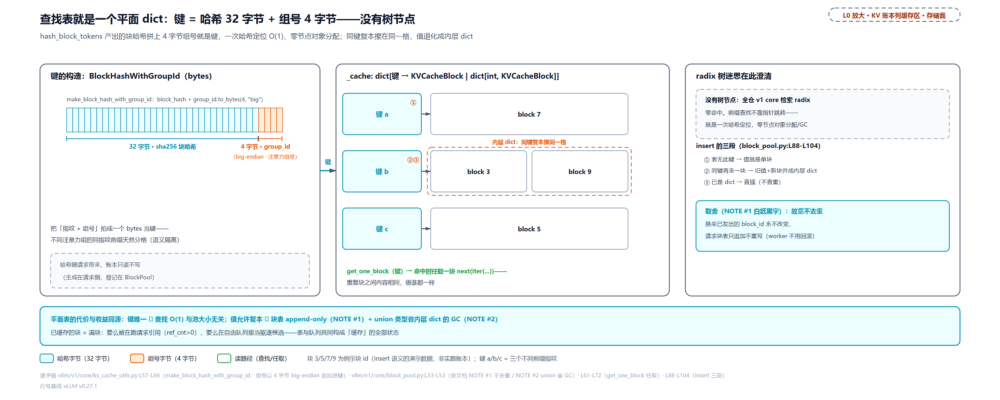

> *图注：L0 缓存面存储侧放大（对应 L2 章图北行「平面哈希表」格）。左：键的字节构成——32 字节 sha256 哈希拼 4 字节组号（big-endian）；中：insert 的三段语义——无键挂单块、同键合并内层 dict（「摞同一格」）、dict 直插，重复键 get_one_block 任取；右：radix 迷思澄清（全仓 v1 核心代码 grep「radix」零命中）与 NOTE #1/#2 的取舍——不去重换块表 append-only，union 类型省内层 dict 的 GC。对照 radix 树的指针跳转与节点分配：这里一次 dict 查找 O(1)、零节点对象。*

### 一串珠子两种戴法：粒度视图零成本重串

存储面还有一块[第 14 章](../../ch14-memory-ledger/narrative/chapter.md)埋下的拼图要接上：哈希尺 `hash_block_size`（=配置里的 `prefix_match_unit`，或各组块大小的 GCD）**可以细于物理块大小** `block_size`——比如混合模型最粗组的块是 64 token，哈希却每 16 token 一枚。这带来一个问题：粗块组按 64-token 边界查表，它需要的「第 i 个 64-块哈希」从哪来？重算一遍就输了。答案藏在链式性质里：

```python
# vllm/v1/core/kv_cache_utils.py:L2245-L2277（docstring 摘录）
class BlockHashListWithBlockSize:
    """
    Convert block-hash granularity from `hash_block_size` to `target_block_size`.
    # … 省略：五行（用途与「只支持整数倍放大」约束）……
    Each `hash_block_size` hash is
    already chained over its entire prefix, so the hash at the last
    `hash_block_size` boundary of a `target_block_size` block uniquely
    fingerprints that block's prefix; we use it directly.

    Example (`hash_block_size` = 16, `target_block_size` = 32):
    the second 16-size hash already covers tokens 0-31, so it is the 32-size
    hash:
    # … 省略：两组 ASCII 对照表（16 粒度四哈希 → 32 粒度两哈希的取法图）……
    """
```

一句话：**粗块哈希就是块内最后一枚细哈希**——16 粒度的第 2 枚哈希本来指纹了前 32 个 token，直接拿来当 32 粒度的哈希用，数学上是同一个输入的同一个输出。视图是惰性的（访问时才换算，不调哈希函数），索引公式是 view[i] = raw[(i+1)·m − 1]（m 为放大倍数、raw 是细哈希列表）。取哪个视图由一个分发函数决定：

```python
# vllm/v1/core/kv_cache_utils.py:L2321-L2351（主体）
def resolve_block_hashes(
    block_hashes: BlockHashList,
    hash_block_size: int,
    block_size: int,
    *,
    supports_fine_grained_hash_lookup: bool = False,
    alignment_tokens: int | None = None,
) -> BlockHashList:
    """Resolve the block-hash view at ``block_size``.
    # … 省略：docstring 四行……
    """
    if block_size == hash_block_size:
        return block_hashes
    if isinstance(block_hashes, BlockHashListWithBlockSize):
        # Already a block-size view
        assert block_hashes.scale_factor == block_size // hash_block_size
        return block_hashes
    # Fine-grained partial hits keep the raw hashes. The caller passes
    # alignment_tokens = hash_block_size to enable them, else >= block_size.
    if (
        supports_fine_grained_hash_lookup
        and alignment_tokens is not None
        and alignment_tokens < block_size
        and block_size % alignment_tokens == 0
    ):
        return block_hashes                                             # L2349
    assert block_size % hash_block_size == 0
    return BlockHashListWithBlockSize(block_hashes, hash_block_size, block_size)
```

三条出路：等粒度直接复用；**细粒度查找**（这个组支持块内命中探测、且对齐粒度细于块大小）原样保留细哈希列表——进阶一 phase 2 靠它探块内边界；其余包成粗视图。64 token 的四种视图实跑：

<!-- trace: m12 -->
| 视图 | 块数 | 使用的细粒度哈希索引 | 每块覆盖 token | 重算量 |
|---|---|---|---|---|
| 原始（hash_block_size=16） | 4 | 0、1、2、3 | 边界 16/32/48/64 | — |
| 粗视图（target 32） | 2 | 1、3 | 0-31 / 32-63 | 0——直接复用链尾哈希 |
| 粗视图（target 64） | 1 | 3 | 0-63 | 0 |
| 细粒度查找（alignment=16） | 4（保留原始列表） | 原始 0..3 | 供 phase 2 块内探测 | 0 |

这就是 `prefix_match_unit` 配置文档那句 "It controls matching granularity only, not how often states are stored"（只控匹配粒度、不控存储频率，vllm/config/cache.py:L56-L67）的全部机制基础：请求侧每 16 token 付一次 sha256，64-token 块的组和 16-token 粒度的探测共用同一串哈希，谁都不用重算。

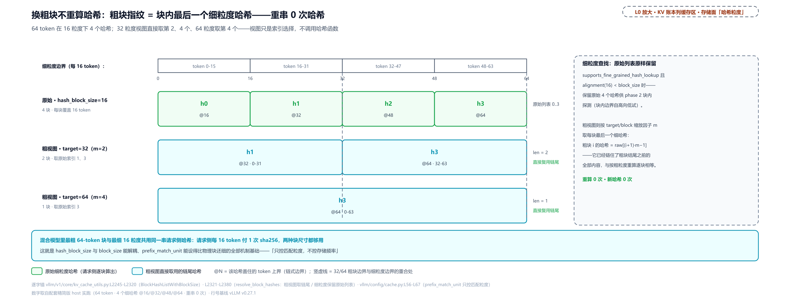

> *图注：L0 缓存面「哈希粒度」格的放大（与上图的平面表同属存储面）。顶部 64-token 标尺切成 4 个细哈希（@16/@32/@48/@64）；三行视图：原始 16 粒度 h0-h3、32 粒度直接取第 2、4 枚（覆盖 0-31 / 32-63）、64 粒度取第 4 枚——重算 0 次、0 枚新哈希，视图只是索引选择。右栏恒等式：粗块哈希 = 块内最后一枚细哈希 = 链尾即前缀指纹；细粒度查找则保留原始列表供块内探测。混合模型最粗 64-token 块与最细 16 粒度共用同一串请求侧哈希，这就是两把尺能解耦的全部秘密。*

## 查：沿链走到第一个 miss 就停（站 3-4）

哈希在请求身上攒好了，谁第一个来查？调度器。现在走到 L0 图 Scheduler 与 KVCacheManager 的接缝——waiting 循环的准入那一步：

```python
# vllm/v1/core/sched/scheduler.py:L744-L766
                # Get already-cached tokens.
                if request.num_computed_tokens == 0:                     # L745
                    did_prefix_cache_lookup = True
                    hit_diverged = False
                    # Get locally-cached tokens.
                    if self.connector is not None:
                        # … 省略：connector 分支八行（外部 KV 传输的混合感知查找，
                        #       归 Part IV 末章）……
                    else:
                        (
                            new_computed_blocks,
                            num_new_local_computed_tokens,
                            # Marconi shared-prefix junction to pin; 0 if none.
                            request.shared_prefix_boundary,
                        ) = self.kv_cache_manager.get_computed_blocks(request)
```

两个细节：只在 `num_computed_tokens == 0`（一次没算过）时查——running 中的请求不会再有新前缀命中。为什么中途不查：剩下的 prompt 本来就归这个请求自己一拍一拍算掉，中途重查只能捡到「别的请求恰好在这几拍里新写满的块」这点小概率收益，而挂命中块的记账路径只服务首次分配（下一节源码注释原话 "running requests are short-circuited there"）——命中窗口设计成就只在进门时开一次；被抢占打回的请求 `num_computed_tokens` 归零、重新进门，正好再开一次。返回的第三项 `shared_prefix_boundary`（进阶三的主角）顺手写回请求对象。命中入口的门面：

```python
# vllm/v1/core/kv_cache_manager.py:L229-L295
    def get_computed_blocks(self, request: Request) -> tuple[KVCacheBlocks, int, int]:
        """Get the computed (cached) blocks for the request.
        # … 省略：docstring 十三行（三元组说明，第三项 shared_prefix_boundary
        #       的语义进阶三展开）……
        """
        # We skip finding the prefix cache hit when prefix caching is
        # disabled or the request is marked as skipping kv cache read
        # (which happens when the request requires prompt logprobs
        # or calls a pooling model with all pooling).
        if not self.prefix_cache_lookup_enabled(request):                # L250
            return self.empty_kv_cache_blocks, 0, 0

        # NOTE: When all tokens hit the cache, we must recompute the last token
        # to obtain logits. Thus, set max_cache_hit_length to prompt_length - 1.
        # This can trigger recomputation of an entire block, rather than just
        # the single last token, because allocate_slots() requires
        # num_computed_tokens to be block-size aligned. Removing this limitation
        # could slightly improve performance in the future.
        max_cache_hit_length = request.num_tokens - 1                    # L259
        computed_blocks, num_new_computed_tokens, num_uncached = (
            self.coordinator.find_longest_cache_hit(
                request.block_hashes, max_cache_hit_length
            )
        )
        # … 省略：事件发布十行（纯观测旁路）……
        # The junction to pin is where the lagging sparse-retention group stops
        # (``num_new_computed_tokens``) plus the uncached shared prefix -- i.e.
        # the longest single-group hit. Sub-block gaps are left to the mask,
        # which floors to the alignment boundary (a no-op there).
        shared_prefix_boundary = (
            num_new_computed_tokens + num_uncached if num_uncached else 0   # L291
        )

        blocks = self.create_kv_cache_blocks(computed_blocks)
        return blocks, num_new_computed_tokens, shared_prefix_boundary
```

上限 `num_tokens − 1` 的道理[第 10 章](../../ch10-continuous-batching-chunked-prefill/narrative/chapter.md)和[第 11 章](../../ch11-preemption-request-lifecycle/narrative/chapter.md)都立过：没有最后一个 token 的前向就没有 logits（模型对下一个 token 在整个词表上的打分），全命中也必须留一个 token 亲自算。注释后半句是新的诚实账：又因为已算数必须块对齐，「重算最后 1 个 token」会放大成「重算最后**一块**」——注释自认这是未来优化点，下面用数字看清它。

### phase 1：miss 即断

单组（绝大多数模型）时协调器直接委托给全注意力管家。函数开头二十来行是块大小取值与哈希视图解析（上文 `resolve_block_hashes` 已展开，eagle（一种投机解码方案）与 DCP（解码上下文并行，多卡特性）两个分支是可省略项），核心十行在其后：

```python
# vllm/v1/core/single_type_kv_cache_manager.py:L728-L739
        computed_blocks: tuple[list[KVCacheBlock], ...] = tuple(
            [] for _ in range(len(kv_cache_group_ids))
        )
        # Phase 1: longest run of cached full blocks from the start. A missing
        # block implies every later block misses too (chained hashes).
        for block_hash in itertools.islice(full_block_hashes, max_length // block_size):   # L733
            cached_block = block_pool.get_cached_block(block_hash, kv_cache_group_ids)
            if not cached_block:
                break                                                    # L736
            for computed, cached in zip(computed_blocks, cached_block):
                computed.append(cached)
        hit_length = len(computed_blocks[0]) * block_size                # L739
```

`islice` 先按预算掐住探测块数（`max_length // block_size`），然后逐块查平面 dict，第一个 miss 就 break。**break 为什么不损失命中**——这不是工程技巧，是链式指纹的数学推论：$`hash_j`$（j>i）的输入里含着 $`hash_i`$；若表中没有来者的 $`hash_i`$ 这个键，则来者的 $`hash_j`$ 也不可能等于表中任何已登记链的 $`hash_j`$（除非两链前 i+1 块全同——而那时 $`hash_i`$ 本会命中）。所以 miss 之后必 miss，断一处即停、无需回溯，是对的，不是碰运气。查表次数至多命中块数 + 1——miss 与预算谁先到谁截停（全命中的 C 例就是预算即停、恰好等于命中块数），与池子大小无关。三个场景实测（块大小 16；A 先跑完 64 token 留下 4 个满块条目，B 共享前 32、C 与 A 完全一致、D 只有 17 token。表中行名是 B 自身的第几块，下图行名用池块号——块 0 是 null 块，同一块在图上的号恰比表里大 1）：

<!-- trace: m4 -->
| 场景·探测 | 预算 max_cache_hit_length | 探测动作 | 结果 |
|---|---|---|---|
| B·块 0（token 0-15） | 63 | get_cached_block(hash0) | 命中 → 块 1 |
| B·块 1（token 16-31） | 63 | get_cached_block(hash1) | 命中 → 块 2 |
| B·块 2（token 32-47） | 63 | get_cached_block(hash2) | miss → break——块 3 不再探（链式保证后必 miss） |
| B·汇总 | 63 | 链上走到第一个 miss 即停 | 命中 32 token（块 1、2）；本步只 prefill 后 32 token |
| C·与 A 完全一致 | 63 | islice 预算 63//16=3 块 | 命中 48——全命中也须退 1 个 token 拿 logits，块对齐再回退整块 |
| D·17 token 全命中 | 16 | 预算 1 块 | 命中 16——只重算最后 1 个 token（回退损失最小的形态） |

B 例的账：64 token 的 prompt 查 3 次表（2 命中 1 miss）命中 32，省下一半 prefill。C 例的账更值得念出声：真正必须重算的只有最后 1 个 token（要 logits），另外 15 个是块对齐连带多算的——63 砍到 48，白付 15 个 token 的重算。D 例是损失最小的形态：17 token 的请求恰好只重算 1 个。极端情况封底：哪怕 prompt 与缓存逐 token 相同，命中的物理上限也永远差着一块。

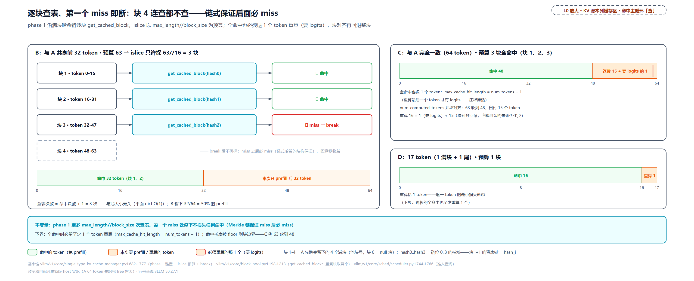

> *图注：L0 缓存面命中主循环「查 → 链上走」两拍的放大（对应 L2 站 3-4）。B 与 A 共享前 32 token：块 1、2 命中，块 3 miss 即 break，块 4 连查都不查（链式保证后必 miss）；C 与 A 完全一致，预算 63 只许探 3 块、命中 48——C 的账用红竖线劈开：真必须重算的 1 个（要 logits）+ 块对齐连带多算的 15 个，注释自认的未来优化点；D 17 token 全命中只重算 1，是退一 token 的下界形态。图例注明池块号与链位的对应（块 1-4=池块号，hash0..3=链位指纹，块 i+1 的查表键 = hash_i）。*

多组（混合模型）时这十行之上还套着一层调和——谁说了算、怎么收敛，进阶二展开；先把单组主路径走完。

## 挂：touch 救回，共享只存一份（站 6）

查到的命中块怎么变成「这个请求的块」？现在走到 L0 图命中主循环的「挂」一拍。核心是[第 13 章](../../ch13-paged-kv/narrative/chapter.md)埋过伏笔的那个动作——**touch**（当时说「前缀缓存的救回命中块，要从驱逐候选队的中间把块捞出来」）：

```python
# vllm/v1/core/block_pool.py:L702-L717
    def touch(self, blocks: Sequence[KVCacheBlock]) -> None:
        """Touch a block increases its reference count by 1, and may remove
        the block from the free queue. This is used when a block is hit by
        another request with the same prefix.
        # … 省略：Args 两行……
        """
        for block in blocks:
            # ref_cnt=0 means this block is in the free list (i.e. eviction
            # candidate), so remove it.
            if block.ref_cnt == 0 and not block.is_null:                 # L713
                self.free_block_queue.remove(block)                      # L714
            block.ref_cnt += 1                                           # L715
            # … 省略：metrics 两行（纯观测，L716-L717）……
```

两件事：引用计数 +1（[第 13 章](../../ch13-paged-kv/narrative/chapter.md)立的记账术：+1 登记、−1 退租、归零才回池）；若块此刻 ref_cnt 为 0——躺在自由队列里当驱逐候选——就把它从队列**中间**摘出来救回。摘除是侵入式双向链表的指针手术（O(1)，不是 O(n) 遍历），这正是[第 13 章](../../ch13-paged-kv/narrative/chapter.md)「为什么不用 deque」的答案在这里兑现。调用它的管账函数：

```python
# vllm/v1/core/single_type_kv_cache_manager.py:L232-L289
    def add_local_computed_blocks(
        self,
        request_id: str,
        new_computed_blocks: Sequence[KVCacheBlock],
        num_local_computed_tokens: int,
        num_external_computed_tokens: int,
    ) -> None:
        """
        Add the locally cached (prefix-hit) blocks to the request:
        1. Touch the computed blocks (paired with adding them to `req_blocks`)
           so their ref_cnt exactly tracks the referencing requests.
        1.5. (Optional) For sliding window, skipped blocks are padded with nulls.
        2. Add the remaining computed blocks.
        # … 省略：Args 八行……
        """
        # The coordinator only calls this for first-time allocations (running
        # requests are short-circuited there), so the request has no blocks yet.
        req_blocks = self.req_to_blocks[request_id]
        assert len(req_blocks) == 0
        # … 省略：skip 段计算七行（SWA 窗外段以 null 块占位——显存账本
        #       一章已立的 [NULL,…] 形态，此处只消费）……
        # Touch the computed blocks to make sure they won't be evicted.
        if self.enable_caching:
            self.block_pool.touch(new_computed_blocks)                   # L269
        else:
            assert not any(new_computed_blocks), (
                "Computed blocks should be empty when prefix caching is disabled"
            )

        # Skip blocks are padded with null blocks.
        req_blocks.extend([self._null_block] * num_skipped_blocks)
        # Add the remaining computed blocks.
        req_blocks.extend(new_computed_blocks)                           # L278
        # All cached hits (including skipped nulls) are already cached; mark
        # them so cache_blocks() will not try to re-cache blocks that already
        # have a block_hash set.
        self.num_cached_block[request_id] = len(req_blocks)
        if self._has_partial_local_hit(new_computed_blocks, num_local_computed_tokens):
            # Record the partial tail for the CoW redirect in
            # allocate_new_blocks; cap the cached count at the full blocks so
            # cache_blocks() re-caches the private copy once full.
            block_idx = num_local_computed_tokens // self.block_size
            self._partial_hit_reqs[request_id] = (block_idx, new_computed_blocks[-1])   # L288
            self.num_cached_block[request_id] = block_idx                # L289
```

三步：touch 救回 → 窗外段以 null 块占位（[第 14 章](../../ch14-memory-ledger/narrative/chapter.md)立的槽位不变量：块表第 i 项恒对应第 i×block_size 个 token）→ 命中块 extend 进请求块表。尾部那段 `_partial_hit_reqs` 记账是进阶一的钩子，此处按下。共享的物理图景——一块公共资产记在几个租客名下：

<!-- trace: m5 -->
| 时点 | 块 1 ref_cnt | 块 2 ref_cnt | 块 1 在自由队列？ | 说明 |
|---|---|---|---|---|
| A 在跑 | 1 | 1 | 否 | A 独占前 2 块 |
| A 完成 free | 0 | 0 | 是 | ref_cnt 归零但哈希仍在——块回队当驱逐候选 |
| B 准入命中+分配 | 1 | 1 | 否 | touch：0→1、O(1) remove 出队救回（B 命中 32、块 1、2） |
| C 也进场 | 2 | 2 | 否 | 同一物理块被两请求共享——共享前缀只存一份的物理基础 |
| B 完成 free | 1 | 1 | 否 | C 还引用——ref_cnt 2→1、不回队 |
| C 完成 free | 0 | 0 | 是 | 最后引用者放手 → 回 LRU 尾（尾段 4,2,1）等下一个命中 |

不变量：ref_cnt>0 的块绝不在自由队列；−1 只发生在 free_blocks（与摘账严格成对）。+1 的每一记都配一个记账动作——touch 挂命中块（与挂块成对）、get_new_blocks 挂新分配的块（分配即登记引用）；唯一的例外是进阶一 CoW 的拷贝对保留引用——cow 块会比引用它的请求数多 1，worker 拷完即还。除这一记保留外，ref_cnt 恒等于引用该块的请求数。「多请求共享一份 KV」不是拷贝，是引用计数：k 个请求共享同一段 system prompt 时，同一物理块 ref_cnt=k、显存仍是 1 份（本例 2 请求 2 块显存，各存一份则要 4 块）；救回成本 O(命中块数)。

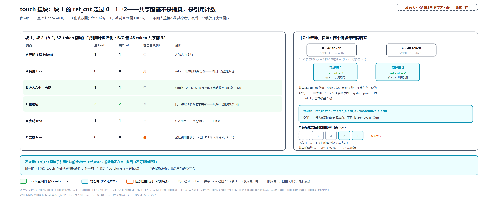

> *图注：L0 缓存面命中主循环「touch 挂块」一拍的放大（对应 L2 站 6）。左六时点演化表：A 跑（ref 1）→ A free 回队（0、在队）→ B 命中（touch 拉回 1、摘出队列）→ C 进场（2）→ B 退租（1，块不回队）→ C 放手（0、回 LRU 尾段 …3、4、2、1）；右上快照：B、C 两请求交叉共引物理块 1、2（ref_cnt=2，箭头非专属）；右中 O(1) 解剖——侵入式双向链表 prev/next 指针手术；共享前缀只存一份的物理基础是引用计数，不是拷贝。*

LRU 在[第 11 章](../../ch11-preemption-request-lifecycle/narrative/chapter.md)立过一词（最久没人用的块排最前、新分配先拿它）；本章后半它是主角，值得三句话补个背景。LRU（least recently used，最近最少使用）是缓存驱逐的经典策略：「最久没人用的先扔」，赌的是局部性——最近用过的近期更可能再用。有意思的是各系统为它付的代价谱：操作系统页面替换付不起每次访存记时间的账，用 Clock 近似（维基原话 "cannot be implemented in the critical path of operating systems"）；Redis 付不起精确 LRU 的内存账，官方文档自陈 "does not use a true LRU implementation is because it costs more memory"，改采样近似。vLLM 站在谱的哪端？**精确 LRU，零额外成本**——因为块本来就活在池里、自由队列本来就是侵入式链表（[第 13 章](../../ch13-paged-kv/narrative/chapter.md)），「最近使用顺序」不需要任何时间戳去维护，它**就是**块在队列里的位置：touch 摘出（刚用过）、free 挂尾（排到最新——刚放手、离被扔最远，后续的 free 排到它身后，才逐渐把它挤向队头变老）、分配从队头拿（扔最老的）。精确 LRU 在这里是白捡的——这也是本章后面敢在它之上继续精化的前提。

## 写回：满块才配拥有指纹（站 8）

命中的块挂上了，请求新算的块怎么变成「下一个请求的礼物」？现在走到 L0 图命中主循环的「写回」一拍。入口在管家的 `cache_blocks`（每个 chunk 调度后都会走）：

```python
# vllm/v1/core/single_type_kv_cache_manager.py:L427-L477
    def cache_blocks(
        self,
        request: Request,
        num_tokens: int,
        retention_interval: int | None = None,
    ) -> None:
        """
        Cache the blocks for the request.
        # … 省略：docstring 十行（retention_interval 三态语义，进阶三展开）……
        """
        num_cached_blocks = self.num_cached_block.get(request.request_id, 0)
        num_full_blocks = num_tokens // self.block_size

        if num_cached_blocks >= num_full_blocks:                         # L448
            return

        # Token boundaries whose reachable tail must be retained under sparse
        # retention: the replay boundary (``num_prompt - 1``, capped by
        # ``get_computed_blocks``) and any detected shared-prefix junction.
        reachable_boundaries = [request.num_prompt_tokens - 1]           # L454
        if request.shared_prefix_boundary:
            reachable_boundaries.append(request.shared_prefix_boundary)

        block_mask = self.reachable_block_mask(
            # … 省略：参数五行……
        )
        self.block_pool.cache_full_blocks(
            request=request,
            blocks=self.req_to_blocks[request.request_id],
            num_cached_blocks=num_cached_blocks,
            num_full_blocks=num_full_blocks,
            block_size=self.block_size,
            kv_cache_group_id=self.kv_cache_group_id,
            block_mask=block_mask,
        )

        self.num_cached_block[request.request_id] = num_full_blocks      # L477
```

开头的幂等闸（`num_cached_blocks >= num_full_blocks` 即 return）与结尾的进度账（`num_cached_block` 推进到满块数）配对：登记区间恰为 [已缓存、新满)（左闭右开区间），每块恰好处理一次——chunked prefill 下每个 chunk 只登记增量。真正入表的核心环：

```python
# vllm/v1/core/block_pool.py:L259-L299
        if num_cached_blocks >= num_full_blocks:
            return
        new_full_blocks = blocks[num_cached_blocks:num_full_blocks]
        assert block_mask is None or len(block_mask) == len(new_full_blocks)
        block_hashes = resolve_block_hashes(
            request.block_hashes, self.hash_block_size, block_size
        )

        new_block_hashes = block_hashes[num_cached_blocks:]
        # … 省略：事件收集三行（纯观测旁路）……
        for i, blk in enumerate(new_full_blocks):
            # Some blocks may be null or masked out when enabling sparse attention
            # like sliding window attention, or Mamba models with prefix-caching
            # in align mode. We skip null blocks here.
            if blk.is_null or (block_mask is not None and not block_mask[i]):   # L275
                continue
            block_hash = new_block_hashes[i]
            num_hash_tokens = (num_cached_blocks + i + 1) * block_size

            # Update and added the full block to the cache.
            block_hash_with_group_id = make_block_hash_with_group_id(
                block_hash, kv_cache_group_id
            )
            if blk.block_hash is not None:                               # L284
                # The only valid case where a "new full block" already has a
                # hash is partial->full promotion of the same cache block.
                assert (
                    blk.block_hash_num_tokens is not None
                    and blk.block_hash_num_tokens < num_hash_tokens
                )
                removed_hashes = self._remove_cached_block_hashes(blk)
                # … 省略：事件发布一行……
            self._insert_block_hash(                                      # L293
                block_hash_with_group_id,
                blk,
                num_tokens=num_hash_tokens,
            )
            # … 省略：事件登记两行……
```

三个决策。**只登记新满块**：不满的尾块永不在区间里（`num_full_blocks` 向下取整）——这是「满块才配拥有指纹」在写回侧的落点，呼应请求侧 hasher 的只哈希满块。**掩码控制入表**：null 块和 `block_mask=False` 的块被跳过——SWA 窗外、Mamba 对齐模式里那些**永远不可能服务命中**的块，从源头不占哈希表（省的是表内存与日后驱逐的摘除成本；mask 的稀疏形态进阶三展开，全注意力组默认 None=全登记）。**部分条目晋升**：一个块先以部分条目入过表（进阶一）、后来写满了，就摘掉旧的短条目、插一条覆盖更长边界的新条目（L285-L292 唯一合法的「新满块已有哈希」场景）。40 token 的请求（2 满块 + 8 token 尾）实测：

<!-- trace: m6 -->
| 块 | 覆盖 token | 满块？ | mask | 入表？ | _block_hash_num_tokens |
|---|---|---|---|---|---|
| 块 0（id 1） | 0-15 | 是 | —（自动写回） | 是 | 16 |
| 块 1（id 2） | 16-31 | 是 | —（自动写回） | 是 | 32 |
| 块 2（id 3） | 32-39 | 否（8 token 尾） | — | 否 | 无（null） |
| 对照·块 0 | 0-15 | 是 | True | 是（map +1） | 16 |
| 对照·块 1 | 16-31 | 是 | False | 否——永不能服务命中的块不占表 | 无 |

哈希表条目数 = 满块数；mask 对照里 2 个满块只进 1 个。注意条目上记的 `_block_hash_num_tokens`（条目覆盖到的 token 边界）——它就是日后「晋升」判定的尺。

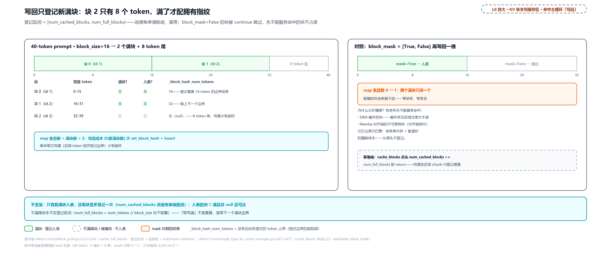

> *图注：L0 缓存面「写回」一拍的放大（对应 L2 站 8）。左：40-token prompt 的登记账——块 0、1 满块入表（登记的是覆盖 16、32 token 边界的哈希），块 2 只有 8 个 token 不入表（满了才配拥有指纹）；结论条目数=满块数 2。右：block_mask=[True,False] 对照——被掩的块连表都不进，SWA 窗外、Mamba 对齐里永不可能服务命中的块从源头不占哈希表；下配幂等闸（num_cached_blocks >= num_full_blocks 即 return）与进度账。*

## 留与逐：藏在注释里的两个不变量（站 10-12）

到这里，「算→查→挂→写」闭环了：前一个请求留下的满块，后一个请求能白捡。剩下的问题是**留下的东西怎么排序**——池子总有满的一天，驱逐谁、留谁，直接决定命中率。这一节是本章最容易被跳读、也最值得慢读的部分：两个不变量都写在注释里，都不在代码里显式执行。先看自由队列的「宪法」：

```python
# vllm/v1/core/kv_cache_utils.py:L184-L204（类文档）
class FreeKVCacheBlockQueue:
    """This class organizes a list of KVCacheBlock objects to a doubly linked
    list of free blocks. # … 省略：五行（为什么不用 deque：O(1) 中摘、零对象分配）……
    The queue is ordered by block ID in the beginning. When a block is allocated
    and then freed, it will be appended back with the eviction order:
    1. The least recent used block is at the front (LRU).
    2. If two blocks have the same last accessed time (allocated by
       the same sequence), the one with more hash tokens (the tail of a block
       chain) is at the front.
    Note that we maintain this order by reversing the block order when free
    blocks of a request. This operation is outside of this class.
    # … 省略：Args 两行……
    """
```

第 2 条规则是本章主角之一：同一次释放的块里，「覆盖哈希 token 更多者（链尾）排更靠驱逐端」。最后一句老实交代：**这个次序规则在类外维持**——类只提供 append/prepend 原语，顺序对不对，靠所有 free 路径的调用约定，没有断言兜底。

### 不变量一：free 必须逆序

旧设计与痛点先摆。朴素做法是 free 按分配顺序挂回空闲表——后果：LRU 头部会是一条缓存链的**前几个块**，池紧驱逐从头开始，等于把最长可复用前缀拦腰斩断。直觉版：还书要倒着还——书架爆了先扔「要凑齐全套才有人借」的厚书（链尾），保住人人都只借前几页的薄书（链头）。被卡的指标是前缀命中率，尤其共享 system prompt 场景：驱逐顺序错 = 命中率静默劣化，不炸不错、只是慢。实现两行：

```python
# vllm/v1/core/single_type_kv_cache_manager.py:L519-L527
    def free(self, request_id: str) -> None:
        """Free the blocks for the request.
        # … 省略：docstring 两行……
        """
        # Free blocks in reverse order so that the tail blocks are freed first.
        self.block_pool.free_blocks(reversed(self.pop_blocks_for_free(request_id)))   # L527
```

```python
# vllm/v1/core/kv_cache_manager.py:L567-L578
    def free(self, request: Request) -> None:
        """Free the blocks allocated for the request.
        We free the blocks in reverse order so that the tail blocks are evicted
        first when caching is enabled.
        # … 省略：docstring 两行……
        """
        pins = self._partial_tail_pins.pop(request.request_id, None)
        if pins:
            self.block_pool.free_blocks(pins)
        self.coordinator.free(request.request_id)
```

为什么逆序是对的，值得一句论证：链上第 i 块可被来者复用，当且仅当来者前缀 ≥ (i+1)×B；i 越大条件越苛刻，且潜在复用者集合**嵌套递减**（能用到第 5 块的人一定能用到前 4 块，反之不成立）。逆序把复用者最少的链尾送到最可牺牲的位置。反事实实测（48 token = 3 块链，4 块小池逼驱逐落在链上）：

<!-- trace: m7 -->
| 场景 | free_blocks 收到的顺序 | 自由队列尾段 | 三块中先驱逐 | 池紧取 1 块后来者命中 |
|---|---|---|---|---|
| 真实路径（manager.free 逆序） | reversed([1,2,3]) = [3,2,1] | …、3、2、1（3 最靠驱逐端） | 3（链尾） | 32 token（链头两块仍可命中） |
| 反事实（正序传入） | [1,2,3] | …、1、2、3（1 最靠驱逐端） | 1（链头） | 0——整条前缀报废 |

同样丢 1 块：逆序约定下 48 token 的前缀保住 32（67%），正序约定下命中直接归零。k 块链正序约定最坏丢 1 块即全灭——两条驱逐序的差距，就是共享 system prompt 场景的命中率差距。

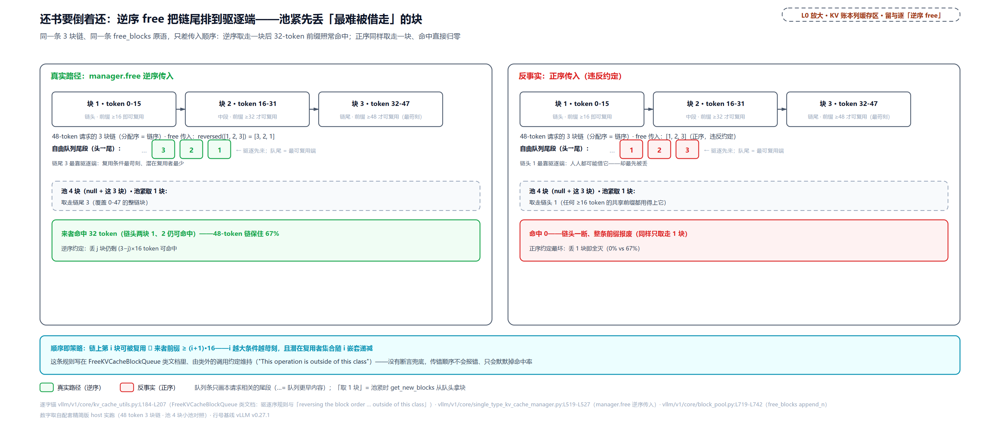

> *图注：L0 缓存面「留与逐」区「逆序 free」格的放大（对应 L2 站 11）。左右双面板对照：真实路径 reversed([1,2,3])——链尾块 3（复用条件最苛刻、要前缀凑满 48 才有人复用）排最靠驱逐端，链头块 1 沉到最可复用端，池紧取走 1 块后来者仍命中 32 token；反事实正序——先砍前缀的头，同样取 1 块、命中归零、整条前缀报废。规则写在 FreeKVCacheBlockQueue 类文档里、由类外的调用约定维持（"This operation is outside of this class"），无断言保护——顺序即策略。*

### 不变量二：无哈希块插队先走

第二个坑是 2026 年 6 月才修的（PR #42656）。v0.21 之前的 free 把**所有**释放块一律当 LRU 缓存条目挂队尾——但从未进过哈希表的块（不满、被掩、或缓存关着时算的）**永不可能命中**，它们排在缓存块后面驱逐，就是白占容量。修法在 free 原语里劈两半：

```python
# vllm/v1/core/block_pool.py:L719-L742
    def free_blocks(self, ordered_blocks: Iterable[KVCacheBlock]) -> None:
        """Free a list of blocks. The blocks should be ordered by their
        eviction priority, where the first block will be evicted first.
        # … 省略：docstring 两行……
        """
        # Identify blocks with hash (LRU cache) and without it (never match APC)
        blocks_with_hash = []
        blocks_without_hash = []
        for block in ordered_blocks:
            block.ref_cnt -= 1
            if block.ref_cnt == 0 and not block.is_null:
                # When caching is disabled we always append for better
                # GPU cache locality from reusing recently used blocks
                if block.block_hash is None and self.enable_caching:     # L735
                    blocks_without_hash.append(block)
                else:
                    blocks_with_hash.append(block)

        # Blocks without hash get evicted first - prepend them last to the tail
        self.free_block_queue.prepend_n(blocks_without_hash)             # L741
        self.free_block_queue.append_n(blocks_with_hash)                 # L742
```

无哈希块 `prepend_n` 插到**队头**（先驱逐端），有哈希块照旧挂 LRU 尾。插队原语：

```python
# vllm/v1/core/kv_cache_utils.py:L349-L368
    def prepend_n(self, blocks: list[KVCacheBlock]) -> None:
        """Put a list of blocks at the front of the free list."""
        if len(blocks) == 0:
            return

        first_block = self.fake_free_list_head.next_free_block
        # … 省略：断言两行……
        prev_block = self.fake_free_list_head
        for block in blocks:
            block.prev_free_block = prev_block
            prev_block.next_free_block = block
            prev_block = block

        prev_block.next_free_block = first_block
        first_block.prev_free_block = prev_block

        self.num_free_blocks += len(blocks)                              # L368
```

为什么这不损失任何命中率：`block_hash is None` 的块从未进过表 ⇒ 查表永不返回它 ⇒ 它的存活对命中概率零贡献——把它踢出 LRU 端只是把「永不命中」的容量先还给池。还有个精修：**缓存关闭时跳过劈分**（L735 的 `and self.enable_caching`——条件不满足时无哈希块也走 append 分支，2026 年 7 月 PR #48017）：关缓存时命中恒零、劈分失去意义，全部按序 append 让刚用过的块沉队尾——下次分配大概率复用同一物理块，GPU 显存访问的局部性更好。8 块池实测：

<!-- trace: m8 -->
| 场景 | 无哈希块去向 | 有哈希块去向 | 自由队列（头→尾） | 先驱逐 |
|---|---|---|---|---|
| 缓存开（劈分生效） | prepend_n 到队头 | append_n 到 LRU 尾 | 1、3、4、5、6、7、2 | 块 1（无哈希——never match APC） |
| 缓存关（跳过劈分） | 也走 append（GPU 局部性） | （无哈希可言） | 4、5、6、7、3、2、1 | 块 4（新块先来——刚用过的沉队尾待复用） |

一次 free 归还 2 无哈希 + 1 有哈希：劈分后两类块的驱逐优先级差 6 个身位（8 块池）。若不劈分、8 块池里滞留 3 个无哈希块，可复用容量被挤占 3/8=37.5%——这就是 #42656 修的「白占容量」。两条不变量共同的代价也要说全：**全靠约定维持、无断言保护**——将来任何新的 free 路径不遵守逆序或忘了劈分语义，不会报错，只会命中率静默劣化；劈分还让 free 多一次遍历（缓存关闭的路径已优化掉）。

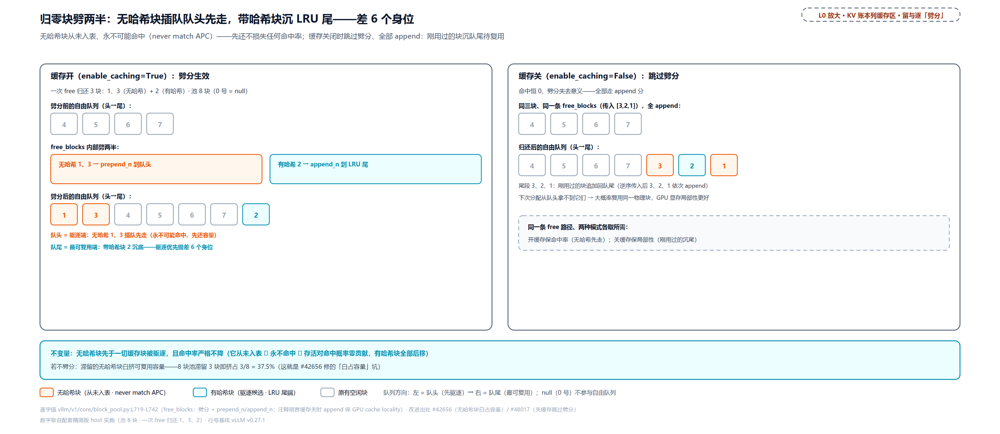

> *图注：L0 缓存面「留与逐」区「劈分」格的放大（与上图逆序图成对：逆序定同链块的相对序、劈分定两类块的相对序）。左：缓存开——一次 free 同时归还无哈希块 1、3（从未入表、never match APC）与有哈希块 2，劈分让无哈希块插队到队头先被取走、带哈希块沉到 LRU 尾（队 1,3,4,5,6,7,2）；右：缓存关——劈分被跳过、全部 append 保序（尾段 3,2,1），刚用过的块下次大概率复用同一物理块，GPU 访问更友好。两笔提交 #42656/#48017 落在页脚出处行。*

### 驱逐是惰性的：复用才摘哈希

最后一块拼图：块被 free 挂回队列时，哈希条目动没动？**没动**——free 路径从头到尾不碰哈希表。「缓存」与「空闲」不是两个集合，是同一条自由队列的两端语义：带哈希的空闲块 = 驱逐候选。为什么不在 free 时就摘掉条目？那样表里就只剩「正被引用的块」可命中——A 完成 free 之后 B 再也捡不到前缀，被抢占的请求也等不到重排回来重命中（下一节那笔回收就靠这个窗口）；free 这条高频路径还得背上逐块摘键的活。惰性的代价是哈希表里常驻着指向驱逐候选的条目——一点表内存，换来 free 恒轻与「还掉的块还能被命中」的全部价值。真正摘除发生在块被**复用**那一刻：

```python
# vllm/v1/core/block_pool.py:L647-L700
    def get_new_blocks(self, num_blocks: int) -> list[KVCacheBlock]:
        """Get new blocks from the free block pool.

        Note that we do not check block cache in this function.
        # … 省略：docstring 四行……
        """
        if num_blocks > self.get_num_free_blocks():
            raise ValueError(f"Cannot get {num_blocks} free blocks from the pool")

        ret: list[KVCacheBlock] = self.free_block_queue.popleft_n(num_blocks)   # L661

        # In order to only iterate the list once, we duplicated code a bit
        if self.enable_caching:
            for block in ret:
                self._maybe_evict_cached_block(block)                    # L666
                assert block.ref_cnt == 0
                block.ref_cnt += 1
                # … 省略：metrics 两行（纯观测）……
        else:
            # … 省略：else 分支三行（关缓存只加引用）……
        return ret

    def _maybe_evict_cached_block(self, block: KVCacheBlock) -> bool:
        """
        If a block is cached in `cached_block_hash_to_block`, we reset its hash
        metadata and evict it from the cache.
        # … 省略：Args/Returns 五行……
        """
        # … 省略：metrics 三行（纯观测）……
        evicted_hashes = self._remove_cached_block_hashes(block)         # L694
        if not evicted_hashes:
            # The block doesn't have hash, eviction is not needed
            return False
        # … 省略：事件发布一行（纯观测旁路）……
        return True
```

`popleft_n` 从队头（驱逐端）批量拿块，逐块「先摘哈希再加引用」——[第 13 章](../../ch13-paged-kv/narrative/chapter.md)读过的那句注释「取走被缓存块时先摘旧哈希」在这里兑现。摘除必须**一次摘干净**：

```python
# vllm/v1/core/block_pool.py:L571-L590
    def _remove_cached_block_hashes(
        self,
        block: KVCacheBlock,
    ) -> list[BlockHashWithGroupId]:
        block_hashes: list[BlockHashWithGroupId] = []
        if block.block_hash is not None:
            block_hashes.append(block.block_hash)
        block_hashes.extend(self.cached_block_hashes_by_block.pop(block.block_id, ()))   # L578
        if not block_hashes:
            return []

        removed_hashes: list[BlockHashWithGroupId] = []
        for block_hash in block_hashes:
            if (
                self.cached_block_hash_to_block.pop(block_hash, block.block_id)
                is not None
            ):
                removed_hashes.append(block_hash)
        block.reset_hash()
        return removed_hashes
```

为什么有「反向索引」`cached_block_hashes_by_block`（块 → 它名下全部哈希键）：进阶一之后一块可以挂**多条**条目（主哈希 + 块内部分条目别名），驱逐/重置若只摘主哈希，别名就成了指向已复用块的悬空键——查表命中一块正在被别人当新块写的 KV，数据当场错乱。反向索引把「找出这块的全部键」从 O(表大小) 扫描降到 O(该块键数)。惰性的量化面：

<!-- trace: m9 -->
| 步骤 | 动作 | 块上哈希 | map 条目数 | ref_cnt | 判定 |
|---|---|---|---|---|---|
| 1 | cache_full_blocks 满块入表 | 有 | 1 | 1 | 块与条目同时诞生 |
| 2 | free_blocks 归零回队 | 有（不清！） | 1 | 0 | 驱逐不发生在 free 时——块回队当驱逐候选 |
| 3 | get_new_blocks 复用该块 | 无（此刻才摘） | 0 | 1 | _maybe_evict_cached_block 惰性摘除 |
| 对照 1 | 一块挂主哈希+别名 | 主哈希 main | 2 | — | 部分条目时代一块多键（反向索引记账） |
| 对照 2 | _remove_cached_block_hashes | 无 | 0 | — | 主哈希+别名一次摘干净——不留悬空键 |

场景一全程 map 条目数 1→1→0：free 不减、复用才减。这条「惰性」纪律马上要担起大任——它是下一节那笔回收的机制内核。收尾前补一个特殊出口：`reset_prefix_cache`（管理接口，RLHF——人类反馈强化学习训练循环里权重会被更新）要求全部块空闲才清，否则 warning 拒绝；真清时重建空 map、全部块 reset_hash（block_pool.py:L763-L797）——**权重变了，全部缓存在数学上失效，必须整体作废**，因为哈希只指纹了 token 序列，指纹不了算出这些 KV 的权重。

## 收口：被打回的请求回来先查表（站 10-12 的回环）

素材齐了，把[第 11 章](../../ch11-preemption-request-lifecycle/narrative/chapter.md)埋的伏笔收掉。那一章拆抢占时看见了：分配不够 → 抢占 running 队尾 → 被抢请求全部块释放、`num_computed_tokens` 清零、回 waiting 队头——当时只立了一条事实：「_free_request_blocks 走到块池那层只动引用计数和自由队列，**块哈希从头到尾没被清过**」，并把三个问题按下了：链式哈希怎么增量算（本章「指纹」节已还）、驱逐从哪头吃起、为什么尾块先当驱逐候选（上一节已还）。现在第四问：被抢占的请求重排回来，会发生什么？

```python
# vllm/v1/core/sched/scheduler.py:L1274-L1315
    def _preempt_request(
        self, request: Request, timestamp: float, drop_stale_output: bool = False
    ) -> None:
        """Preempt a request and put it back to the waiting queue.
        # … 省略：docstring 五行（NOTE 与 stale 协议——抢占一章已拆）……
        """
        assert request.status == RequestStatus.RUNNING, (
            "Only running requests can be preempted"
        )
        self._free_request_blocks(request)                                # L1290
        # … 省略：编码缓存释放一行与在途 prefill 摘除一行 ……
        request.status = RequestStatus.PREEMPTED
        request.num_computed_tokens = 0                                   # L1294
        # … 省略：stale 平行账七行（抢占一章的协议，与本章无涉）……
        request.num_preemptions += 1                                      # L1309
        # … 省略：生命周期事件两行 ……
        # Put the request back to the waiting queue.
        self.waiting.prepend_request(request)                             # L1314
        self.reset_preempted_req_ids.add(request.request_id)
```

`_free_request_blocks` 一路走到 `free_blocks`——上一节读过的那个函数只动 ref_cnt 和队列位置。四步链路连起来看：

1. **free 不清哈希**：被抢请求的全部满块带着哈希回到自由队列，前缀仍留在表里；
2. **逆序 + 劈分把它们挂到最可复用端**：这些块全部带哈希（满足不变量二的 with_hash 分支），append 到 LRU 尾——驱逐序的最后。上一节两条不变量服务的正是这一步：被抢占请求的前缀块获得最长的生存窗口；
3. **重排回来重走准入查询**：回 waiting 队头的请求下一拍从「查」那节读过的同一段代码进来（`num_computed_tokens == 0` 成立），`get_computed_blocks` 沿**它自己**的 block_hashes 逐块查表——大概率一路命中到只剩尾段；
4. **touch 救回**：命中的块 ref_cnt 从 0 拉回、从驱逐候选队摘出。

「重算」由此变成「重载元数据 + 补算尾段」——主线实测（64 token、已算完、4 满块在表，随后被抢占）：

<!-- trace: m11 -->
| 阶段 | num_computed_tokens | map 条目 | 命中/补算 | 要点 |
|---|---|---|---|---|
| 主线·抢占前 | 64 | 4 | — | A 已算完 64 token、4 满块在表 |
| 主线·_preempt_request | 0 | 4 | — | free 全部块但哈希保留；回 waiting 队头、num_preemptions=1 |
| 主线·重排回来重走准入 | 0 | 4 | 重命中 48（块 1、2、3） | max_cache_hit_length=63 → 3 块 |
| 主线·allocate_slots | 0 | — | touch 救回 + 补算 16 | 重算变重载元数据+补算：16 而非 64 |
| 最坏·抢占期间池被抽干 | 0 | 0 | — | 块被 get_new_blocks 取走复用、惰性驱逐摘光哈希（最坏分支另以 48-token 请求、8 块小池模拟） |
| 最坏·重排回来 | 0 | 0 | 命中 0 | 退化为全量重 prefill：补 48 token（=该 48-token prompt 的全量） |

补算量被打到 16/64=25%（无缓存的世界里是 100%），额外成本只有 O(3) 次 touch 与查表。最坏分支也看全（另以 48-token 请求、8 块小池逼出——主线 64-token 之外的小场景，图上最坏分支框同款披露）：抢占期间池紧、块被取走复用（惰性驱逐真的发生），重算量涨回全量——补 48 即该 prompt 的 100%。上下界一句话：被抢请求恢复后的重算量 ∈ [1, P]（P 为 prompt 长）——下界 1（全命中也须重算最后一个 token 拿 logits）、上界 P（块全被惰性驱逐时）。正确性依赖一条隐式链路（free 不清哈希 → 逆序+劈分 → 重排重查 → touch），任何一环被破坏——比如某条新路径 free 时清了哈希——都直接退化到上界，没有报错。F2（[第 11 章](../../ch11-preemption-request-lifecycle/narrative/chapter.md)埋的「抢占恢复撞前缀缓存」伏笔）的期望收益因此取决于「被抢占到重排回来之间、块是否被取走」，而逆序+劈分正是给这个生存窗口续命的两条纪律。

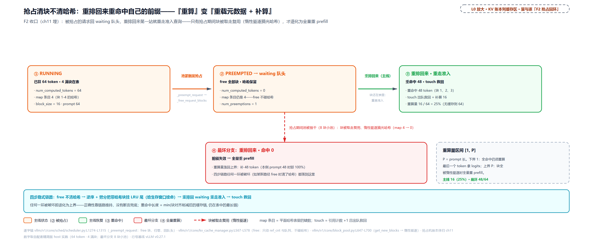

> *图注：L0 缓存面「留与逐」区从「抢占哈希保留」到「惰性驱逐」的回环放大——[第 11 章](../../ch11-preemption-request-lifecycle/narrative/chapter.md)埋、本章收。主线三状态：RUNNING（已算 64、4 满块在表）→ PREEMPTED（free 全部块、computed=0、回 waiting 队头、num_preemptions=1，但 4 条哈希原样留表）→ 重排回来重走准入（重命中 48、touch 救回、只补 16——25%，无缓存须重算 64）。「重算」的真身是重载元数据+补算；红虚线最坏分支：池被抽干、惰性驱逐摘光哈希（map 4→0），命中 0、退化为全量重 prefill；重算量区间 [1,P] 的两头都标在图上。四步链路（free 不清哈希 → 逆序+劈分挂 LRU 尾 → 重排回 waiting 重走准入 → touch 救回）任何一环破坏即退化上界——正确性靠隐式链路维持。*

（观测面顺手一提：准入时 `record_prefix_cache_stats` 记下命中 token 数与「被抢过」旗标，每拍由调度器取走上报——引擎日志里那行 `Prefix cache hit rate` 的口径就是这两笔（kv_cache_manager.py:L202-L227），官方基准靠它算前缀缓存省了多少重算。）

## 进阶一：共享半截块谁接着写——块内 CoW（站 7、9）

主线走完，接下来是三幕进阶。第一幕解决一个越来越疼的问题：**命中粒度被最粗的块绑死**。旧世界里命中只能落在满块边界——「写回」那节立过「满块才配拥有指纹」，但混合模型里最粗组的块可能是 64 甚至 1024 token：两个 prompt 共享 1000 个 token 的前缀，在 1024-token 块上**一寸也命不中**；prompt 尾部不足一块的部分永不入缓存；还有更尖锐的——命中的尾块正被别人共享着，谁接着写谁就写坏对方的缓存。v0.27.1 的 partial prefix cache（PR #45939/#46384 两连发）把这三刀一起补上。

### 先补一堂 OS 课：写时复制

**写时复制**（Copy-on-Write，CoW）是操作系统省钱的老手艺：「先共享、谁要写谁拷贝」——多个持有者共享同一份物理资源，全部只读时一分钱不花；谁先要写，谁触发一次拷贝拿私有副本（[维基](https://en.wikipedia.org/wiki/Copy-on-write)）。最著名的落地是 `fork()`：fork 后父子进程的页表指向同一批物理页、标只读带引用计数；子进程真写某页时触发缺页异常，内核拦截、分配新页、把内容拷过去、改指可写的私有页——此后各写各的。vLLM 的奠基论文（SOSP'23，[arXiv:2309.06180](https://arxiv.org/abs/2309.06180)）在 2023 年就把这招搬进了块粒度，原文自述 "implements a copy-on-write mechanism at the block granularity"，命中前缀的共享方式是 "can simply map its logical blocks to the cached physical blocks (with the last block marked copy-on-write)"——**尾块标记 CoW**，触发条件正是引用计数大于 1 时写入；论文给的收益账：beam search 场景省 37.6%-55.2% 的 KV 显存（Alpaca）。v0.27.1 做的是同一思想的直系延伸：把 CoW 的触发线从「前缀以**块边界**结束」推进到「前缀以**块内边界**结束」——触发语义（共享且将写 ⇒ 拷贝一份）、记账方式（引用计数）、拷贝时机（写之前）一样没变。账也很好算：拷一块是显存带宽级的活，重算一块是矩阵乘级的活——copy 远便宜于 recompute。

### 三件套之一：块内边界注册条目

第一件：让不满块的**已算前缀**也能被查到。新原语 `cache_partial_block` 把一个已存在的块在块内前缀边界注册进哈希表——不分配新块：

```python
# vllm/v1/core/block_pool.py:L484-L512
        if block.is_null:
            return None

        assert block_size > self.hash_block_size
        assert block_size % self.hash_block_size == 0
        assert num_tokens % block_size != 0                              # L489
        block_hash = self._get_partial_block_hash(request, num_tokens)
        num_hash_blocks = num_tokens // self.hash_block_size             # L491
        block_hash_with_group_id = make_block_hash_with_group_id(
            block_hash, kv_cache_group_id
        )
        already_cached = block.block_hash == block_hash_with_group_id or (
            self.cached_block_hash_to_block.contain(
                block_hash_with_group_id, block.block_id
            )
        )
        if (
            not already_cached
            and block.block_hash is not None
            and block.block_hash_num_tokens is not None
            and block.block_hash_num_tokens < num_hash_blocks * self.hash_block_size
        ):
            # … 省略：摘短条目两行——已有更短的注册则先摘，再插长的 ……
        self._insert_block_hash(                                         # L508
            block_hash_with_group_id,
            block,
            num_tokens=num_hash_blocks * self.hash_block_size,
        )
```

哈希取「该边界的前缀链哈希」（就是请求侧那串细哈希的第 num_tokens/hash_bs − 1 枚），断言组钉死前提（块大小是哈希粒度的整数倍、边界不落整块）。谁调它？全注意力管家在写回满块之后，顺手把 prompt 尾部最后一个哈希边界也注册上——**只登最后一个、块内中间边界故意不登**（注释原话 "intermediate hash boundaries inside the same cache block are intentionally skipped"——只登「下一个请求最可能对齐」的 prompt 边界，控制条目数）：

```python
# vllm/v1/core/single_type_kv_cache_manager.py:L791-L819
    def _cache_partial_tail_block(
        self,
        request: Request,
        num_tokens: int,
    ) -> None:
        """Cache the prompt tail when it ends inside a cache block.

        Only the final prompt hash boundary is registered as a partial
        prefix-cache entry; intermediate hash boundaries inside the same cache
        block are intentionally skipped.
        """
        hash_block_size = self.block_pool.hash_block_size
        boundary_tokens = request.num_prompt_tokens // hash_block_size * hash_block_size
        if boundary_tokens == 0 or boundary_tokens > num_tokens:
            return
        if boundary_tokens % self.block_size == 0:
            return

        blocks = self.req_to_blocks[request.request_id]
        block_idx = boundary_tokens // self.block_size
        if block_idx >= len(blocks):
            return
        self.block_pool.cache_partial_block(
            request=request,
            block=blocks[block_idx],
            num_tokens=boundary_tokens,
            kv_cache_group_id=self.kv_cache_group_id,
            block_size=self.block_size,
        )
```

### 三件套之二：phase 2 块内探测

第二件：查找侧要能**探到**这些块内条目。「查」那节嵌过的 `find_longest_cache_hit` 还有个 phase 2，当时按下了——满块链在第一个 miss 处断掉之后，细粒度模式下继续在第一个不满块**内部**自高向低探测：

```python
# vllm/v1/core/single_type_kv_cache_manager.py:L741-L762
        # Phase 2 (fine-grained only): extend into the first non-full block by
        # probing its interior hash boundaries high-to-low (longest hit first).
        if fine_grained:                                                  # L743
            assert isinstance(block_hashes, Sequence)
            scale_factor = block_size // alignment_tokens
            first_partial_idx = len(computed_blocks[0]) * scale_factor
            max_partial_idx = min(
                first_partial_idx + scale_factor - 1,
                max_length // alignment_tokens,
                len(block_hashes),
            )
            for fine_idx in range(max_partial_idx - 1, first_partial_idx - 1, -1):   # L753
                cached_tail = block_pool.get_cached_block(
                    block_hashes[fine_idx], kv_cache_group_ids
                )
                if not cached_tail:
                    continue
                for computed, cached in zip(computed_blocks, cached_tail):
                    computed.append(cached)
                hit_length = (fine_idx + 1) * alignment_tokens            # L761
                break
```

`fine_grained` 只在对齐粒度细于块大小且整除时成立（就是「表」那节 resolve 的细粒度分支）；探测范围是块内 ≤ m−1 个边界（m 为块/哈希粒度倍数），**自高向低 = 先试最长**；探到即命中到细粒度边界，hit_length = (fine_idx+1) × h。

### 三件套之三：CoW 换尾

第三件是本章开头那个问题的正面回答：**两个人共享半截没写满的块，谁接着写？** 答案：谁要写，谁换私有拷贝。命中记账在「挂」那节埋过钩子（`_partial_hit_reqs`——命中长度不对齐块界就记下共享尾块）；分配时消费：

```python
# vllm/v1/core/single_type_kv_cache_manager.py:L347-L369
        cow_blocks: list[KVCacheBlock] = []
        if request_id in self._partial_hit_reqs:                         # L348
            # Partial hit: redirect the shared tail to a private CoW block.
            # Replacing in place keeps the length-based allocation below
            # correct; the extra block was reserved by
            # get_num_blocks_to_allocate.
            block_idx, source_block = self._partial_hit_reqs.pop(request_id)   # L353
            cow_block = self.block_pool.get_new_blocks(1)[0]
            self._apply_cow(request_id, block_idx, source_block, cow_block)
            self.new_block_ids.append(cow_block.block_id)
            cow_blocks.append(cow_block)

        req_blocks = self.req_to_blocks[request_id]
        num_required_blocks = cdiv(num_tokens, self.block_size)
        num_new_blocks = num_required_blocks - len(req_blocks)
        if num_new_blocks <= 0:
            return cow_blocks
        else:
            new_blocks = self.block_pool.get_new_blocks(num_new_blocks)
            req_blocks.extend(new_blocks)
            # … 省略：两行（new_block_ids 登记）……
            return cow_blocks + new_blocks
```

```python
# vllm/v1/core/single_type_kv_cache_manager.py:L405-L425
    def _apply_cow(
        self,
        request_id: str,
        block_idx: int,
        source_block: KVCacheBlock,
        cow_block: KVCacheBlock,
    ) -> None:
        """Redirect a partial prefix-cache hit to a private CoW block.

        Both copy endpoints stay retained until the copy has run on the worker,
        so a same-step free cannot recycle them: ``source_block`` keeps its
        hit-ref, ``cow_block`` takes an extra ref beyond the one handed to the
        request.
        """
        req_blocks = self.req_to_blocks[request_id]
        assert block_idx < len(req_blocks)
        assert req_blocks[block_idx] is source_block
        assert not source_block.is_null and source_block.ref_cnt > 0
        req_blocks[block_idx] = cow_block                                 # L423
        self._pending_cow_copies.append((source_block, cow_block))       # L424
        cow_block.ref_cnt += 1                                            # L425
```

三个动作：请求块表里的共享尾块**原地**换成 cow 块（此后请求的一切写都落在自己的块上——写路径只看得见自己块表）；登记 `(source, cow)` 拷贝对；cow 块额外 +1 引用——**拷贝两端都保留到 worker 真拷完**，同一步的 free 无法回收端点（docstring 原话 "Both copy endpoints stay retained until the copy has run on the worker"）。注意预算里多要的那一块：容量预测 `get_num_blocks_to_allocate` 对部分命中请求多记 1 块（single_type_kv_cache_manager.py:L226-L230），就是这里花掉的——分配永不超发。全套实测（full 组与 mamba 组各用 64-token 块对齐混合、哈希粒度 16；A 48 token 先跑完，B 共 80 token、共享前 48——取证口径先挑明：mamba 组的边界条目在驱动里用与 full 组同一个注册原语登记，真实代码由 MambaManager 重写的入口内部调同一原语，差分测试已证逐字节一致；本章一切 mamba 场景一律用这种块大于哈希粒度的配置）：

<!-- trace: m13 -->
| 阶段 | 动作 | 关键数字 | 判定/要点 |
|---|---|---|---|
| ① 注册部分条目 | A(48) 完成后 cache_partial_block | 块 1 条目覆盖 48 token、哈希=hash[2] | 不分配新块——48 落在 64-token 块内部 |
| ② phase 1 | 满块链查 @64 边界（hash[3]） | miss | A 只缓存到 48、没有 64 边界条目 |
| ② phase 2 | 自高向低：fine_idx 2（@48）起探 | 命中（1 次查表） | hit=48——块内边界命中（细粒度对齐 16；@64 只在 phase 1 查过，phase 2 从块内最高边界 @48 起） |
| ③ CoW 换尾 | allocate_new_blocks 消费 _partial_hit_reqs | 拷贝对 2 组：块 1→3、2→5；retained 4 | cow 块 ref_cnt=2（请求+保留）——写不坏对方 |
| ④ 过线 | take_kv_cache_block_copies | copies=2、retained=4 | 调度器打包 → worker 在 GPU 上整块拷（带宽级） |

B 命中 48/80=60% 的 prompt；代价 = 每组 1 块显存（2 组共 2 块）+ 2 次 GPU 块拷贝。对照组：没有 partial-hit 的世界里命中只能落 64 边界，这两个请求**一寸也命不中**、48 token 整段重算（矩阵乘级）——这就是「拷一块远便宜于重算一块」的具体账。探测成本：phase 2 至多 scale_factor−1=3 次查表。

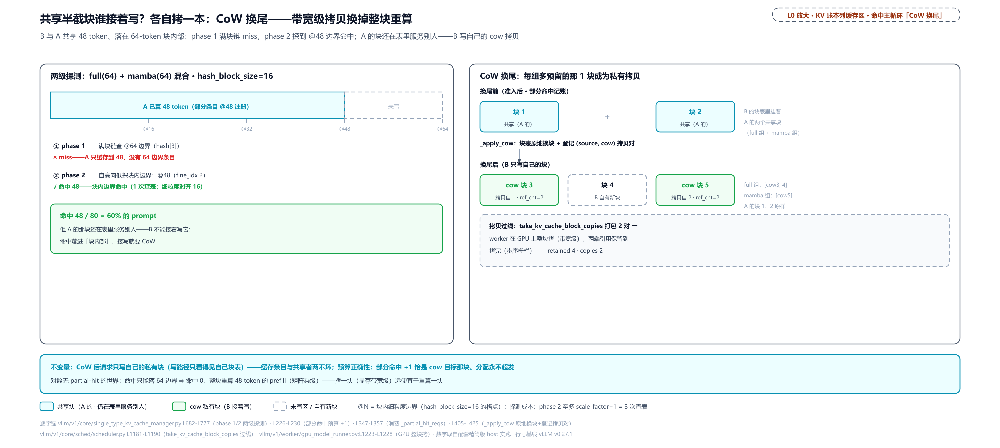

> *图注：L0 缓存面命中主循环「CoW 换尾」与「拷贝过线」两拍的放大（对应 L2 站 7、9）。左：两级探测——B 与 A 共享 48 token、落在 64-token 块内部，phase 1 查满块边界 @64 miss（A 只缓存到 48），phase 2 自高向低探到 @48 边界命中 48（占 prompt 60%）；但 A 的块还在表里服务别人——B 接着写就要 CoW。右：换尾三段——换尾前 B 块表挂 A 的共享块 → _apply_cow 原地换 cow3/cow5（各 ref_cnt=2：请求+保留）、登记 (1→3)(2→5) 拷贝对 → 原块 1、2 留表继续服务别人；右下过线盒：worker 在 GPU 上整块拷、retained 4·copies 2。左下对照组：无 partial-hit 记账时命中只能落 64 边界 ⇒ 命中 0。*

### 拷贝过线：真拷在 worker，步序有栅栏

调度器进程里只有元数据——`(source, cow)` 块号对要过线到 worker，GPU 上的真拷贝才发生。管线三跳：

```python
# vllm/v1/core/kv_cache_manager.py:L831-L846
    def take_kv_cache_block_copies(
        self,
    ) -> tuple[list[KVCacheBlockCopy], list[KVCacheBlock]]:
        """Drain pending copies and return their retained endpoints."""
        pending_copies: list[tuple[KVCacheBlock, KVCacheBlock]] = []
        for mgr in self.coordinator.single_type_managers:
            pending_copies.extend(mgr.take_pending_cow_copies())
        copies = [
            KVCacheBlockCopy(
                src_block_id=source_block.block_id,
                dst_block_id=cow_block.block_id,
            )
            for source_block, cow_block in pending_copies
        ]
        retained_blocks = [block for pair in pending_copies for block in pair]   # L845
        return copies, retained_blocks
```

```python
# vllm/v1/core/sched/scheduler.py:L1181-L1190
        kv_cache_block_copies, cow_retained_blocks = (
            self.kv_cache_manager.take_kv_cache_block_copies()
        )
        if kv_cache_block_copies:
            # The copies run with this step's execution; the first non-empty
            # step at or after it gets seq `sched_step_seq + 1` (0-token steps
            # do not advance the seq), and its completion implies the copies
            # have run.
            self._free_cow_retained_blocks(cow_retained_blocks, self.sched_step_seq + 1)
        pending_kv_cache_block_copies = kv_cache_block_copies or None
```

```python
# vllm/v1/worker/gpu_model_runner.py:L1219-L1228
        # Zero GPU memory for freshly allocated cache blocks to prevent
        # stale NaN/data from corrupting attention or SSM computation.
        if scheduler_output.new_block_ids_to_zero:
            self._zero_block_ids(scheduler_output.new_block_ids_to_zero)
        if scheduler_output.kv_cache_block_copies:
            copy_kv_cache_blocks_inplace(                                    # L1224
                self.kv_caches,
                self.kv_cache_config.num_blocks,
                scheduler_output.kv_cache_block_copies,
            )
```

第一跳 drain 拷贝对并取走两端块（retained）；第二跳打包进 `SchedulerOutput`，**retained 块的释放挂步序栅栏**（`_free_cow_retained_blocks` 把它们的归还排到「拷贝所在步确认完成后」才执行——[第 12 章](../../ch12-async-scheduling/narrative/chapter.md)立的乐观账下，调度与执行是重叠的，释放必须等执行侧确认）；第三跳 worker 在 GPU 上整块拷。还有一笔配套的「过户」：

```python
# vllm/v1/core/block_pool.py:L629-L645
    def move_block_hashes(
        self,
        src_block: KVCacheBlock,
        dst_block: KVCacheBlock,
    ) -> None:
        """Re-point ``src_block``'s prefix-cache entries to ``dst_block``.

        Used when the request owning ``src_block`` keeps writing into it
        : the prefix cache holds a private copy (``dst_block``)
        under the same hashes instead. Entries stay live; no events emitted.
        """
        assert dst_block.block_hash is None
        assert dst_block.block_id not in self.cached_block_hashes_by_block
        num_tokens = src_block.block_hash_num_tokens
        for block_hash in self._remove_cached_block_hashes(src_block):
            # `num_tokens` only applies to the first (primary) insertion.
            self._insert_block_hash(block_hash, dst_block, num_tokens=num_tokens)
```

场景：共享尾块的**原主人**（缓存条目挂在他名下那个块上）还要继续写——running 请求的块表不能换块（worker 已按块号写过 KV），于是反过来**换哈希表的指向**：把条目活着重指到 CoW 拷贝上，条目数不变、无中间窗口。实测：

<!-- trace: m10 -->
| 步骤 | 动作 | src.block_hash | dst.block_hash | map 同键指向 | 要点 |
|---|---|---|---|---|---|
| 1 | insert（src 持条目 @24） | 有 | 无 | 块 1 | 条目与块同在 |
| 2 | move_block_hashes(src, dst) | 无 | 有（num_tokens=24 跟过来） | 块 2 | 活着重指、非删了重插——map 条目数不变（1） |

块表 append-only 由它兜住：请求已发出的 block_id 序列永不改写，变的只是元数据指向。CoW 这幕的代价清单也诚实记：每次部分命中 +1 块显存 + 一次 GPU 块拷贝带宽；三套簿记叠加（`_partial_hit_reqs`、`_pending_cow_copies`、每步的已缓存账）；适用面收窄——只支持全注意力加 mamba 对齐且无 CP（上下文并行，多卡把一条序列的 KV 切到多张卡；`enable_partial_hash_hits` 装配判定在 kv_cache_coordinator.py:L581-L599，SWA 明确 assert 不支持）；块内条目让驱逐必须查反向索引（上一节已见）。另一条本章只点一句的相邻线：装了外部 KV 传输件时，「远端已算好的命中」与「本地子块尾命中」的仲裁发生在准入查询附近——归 Part IV 末章。

## 进阶二：几套注意力一起认——不动点（站 5）

第二幕回到「查」那节挂起的分支：混合模型有多个组（[第 14 章](../../ch14-memory-ledger/narrative/chapter.md)的组化——SWA 即滑动窗口注意力、Mamba 即状态空间模型，都是那一章立过的回收型/状态型层），每个组有自己的块表、自己的命中判定——**full 组要求从头连续、SWA 组只要求窗内连续、Mamba 组只要边界上那一个状态块**。一条请求的命中长度必须让**所有组同时成立**，单次扫描给不出。旧世界（早期 v1）只有一张表一种类型，混合模型要么不支持、要么全按 full 处理。vLLM 的解法直觉上是「会签合同」：合同能签多长由最挑刺的部门说了算——每个部门要么认可当前长度、要么拿红笔砍短；只要有谁砍了，全体重审一轮。长度只会越砍越短、砍到底（0）为止——所以一定散会。源码形态：

```python
# vllm/v1/core/kv_cache_coordinator.py:L685-L817
    def find_longest_cache_hit(
        self,
        block_hashes: list[BlockHash],
        max_cache_hit_length: int,
    ) -> tuple[tuple[list[KVCacheBlock], ...], int, int]:
        """
        Find the longest cache hit using an iterative fixed-point algorithm.

        Each attention type either accepts the current candidate length or
        reduces it. If any type reduces the length, restart checks over all
        types. This converges because length monotonically decreases and is
        bounded below by 0.
        # … 省略：docstring 九行（三元组说明）……
        """
        num_groups = len(self.kv_cache_config.kv_cache_groups)
        hit_length = max_cache_hit_length
        longest_hit_length = 0
        # … 省略：三行账本初始化 ……

        # Simple hybrid (1 full attn + 1 other): one iteration suffices.
        # Full attn is always first if it exists.
        is_simple_hybrid = len(self.attention_groups) == 2 and isinstance(
            self.attention_groups[0].spec, FullAttentionSpec
        )                                                             # L720

        # … 省略：eagle 记账一行 ……
        while True:                                                    # L727
            curr_hit_length = hit_length

            for idx, (spec, group_ids, manager_cls, use_eagle) in enumerate(
                self.attention_groups
            ):
                first_group_id = group_ids[0]
                # … 省略：DCP 注释与块大小两行（单卡为 1，省略分支）……
                cached_blocks = hit_blocks_by_group[first_group_id]
                if isinstance(spec, FullAttentionSpec) and cached_blocks is not None:
                    # Full attention is downward-closed: we only need to look
                    # up cached blocks once; on subsequent iterations just trim
                    # to the (reduced) current hit length.
                    curr_hit_length = min(                              # L742
                        curr_hit_length, hit_length_by_group[first_group_id]
                    )
                    continue

                # … 省略：eagle 修正十行（投机解码分支，非投机路径恒空）……
                hit_blocks, _new_hit_length = manager_cls.find_longest_cache_hit(   # L766
                    # … 省略：参数五行（就是「查」那节读过的同族 finder）……
                )
                curr_hit_length = _new_hit_length
                for group_id, blocks in zip(group_ids, hit_blocks):
                    hit_blocks_by_group[group_id] = blocks
                    hit_length_by_group[group_id] = _new_hit_length

                longest_hit_length = max(longest_hit_length, curr_hit_length)   # L790

            if curr_hit_length >= hit_length:                          # L792
                break
            hit_length = curr_hit_length
            if is_simple_hybrid:                                       # L795
                break
```

收敛性三句话：候选长度每轮要么不动、要么被某组的 finder 换成更小的返回值（finder 契约保证返回 ≤ 入参）；轮末仅当变短才重开 ⇒ 长度是对齐格点上的严格递减非负整数列——有限步必停。上界：至多 `max_cache_hit_length / lcm(各组块大小)` 轮。三个加速器：**full 组向下封闭**（命中是「从头连续的一段」，长度缩短后仍是合法命中——所以只查一次、后续轮只 min 裁剪）；**simple hybrid 一轮即停**（1 个 full + 1 个其它，full 先砍、其它复验，一轮必收敛——最常见的 full+SWA、full+Mamba 都是它）；**full 排最前**（左到右扫描先给出最紧上界，后面的组少做功）。这个套路有个大一统的名字——不动点迭代（反复应用「收紧」规则直到值不再变化；编译器的数据流分析是同款骨架，[CMU 讲义](https://www.cs.cmu.edu/afs/cs/academic/class/15745-s13/public/lectures/L5-Foundations-of-Dataflow-1up.pdf)），认出模式能省一次「这是不是 vLLM 独家怪算法」的困惑。两个场景实测（96-token prompt、full 组已缓 5 块到 80；模拟掉块——摘掉窗内条目：A 场景摘 hash[3] 一枚，B 场景 SWA48/SWA32 各摘一枚，是在模拟稀疏组掉块的效果——稀疏驻留＝SWA/Mamba 组按间隔只留少数状态块、其余放弃缓存，进阶三展开；取证口径：finder 调用计数用只观察不改行为的包装器记录）：

<!-- trace: m15 -->
| 轮次·finder | max_length 入 | hit 出 | 动作 | 要点 |
|---|---|---|---|---|
| A·第 1 轮 full | 95 | 80 | 左到右扫 5 块 | full 排首给最紧初始上界 |
| A·第 1 轮 SWA(48) | 80 | 48 | 右到左找 3 连续块 | hash[3] 被摘 → 窗口连续段断成 3 块 |
| A·收敛 | — | 48 | is_simple_hybrid 一轮即停 | full 块表裁到 3 块；uncached=80−48=32 |
| B·第 1 轮 full | 95 | 80 | 扫 5 块 | 候选长度在一轮内逐组传递 |
| B·第 1 轮 SWA(48) | 80 | 48 | 右到左 | 砍到 48 → 触发重启全类型校验 |
| B·第 1 轮 SWA(32) | 48 | 48 | 拿到的候选已是 48 | 轮内传递：[NULL,b1,b2] 也只值 48 |
| B·第 2 轮 | 48 | 48 | full 缺席（向下封闭只 min 裁剪）；两个 SWA 复验通过 | 5 次 finder 调用收敛：reconciled=48、longest=80 → uncached=32 |

场景 A（simple hybrid）1 轮 2 次调用收工；场景 B（三组）2 轮 5 次调用（第二轮 full 缺席），上界 95/16=5 轮、实测 2 轮。表里那两个 SWA finder 的动作模式值得一句展开：SWA 的 finder 从右往左找 need 个连续块（need＝窗宽折算的块数——窗 48、块 16，need=3），命中的块表形态带 null 占位（[NULL,b1,b2]——窗外块以 null 换位，[第 14 章](../../ch14-memory-ledger/narrative/chapter.md)立的形态）；Mamba 的 finder 更省——它只要边界上那**一个**状态块，前段全 null 占位（single_type_kv_cache_manager.py:L897-L994 与 L1280-L1358）。收尾段顺带把本轮的副产品算出来：

```python
# vllm/v1/core/kv_cache_coordinator.py:L798-L817
        # Truncate full attention blocks to final hit_length (if present)
        first_group = self.attention_groups[0]
        if isinstance(first_group.spec, FullAttentionSpec):
            # … 省略：四行（按最终 hit_length 裁 full 组块表）……
        # Uncached shared prefix detection: if any attn. group cached a longer
        # prefix than the reconciled hit, it is an uncached common prefix across
        # requests that a sparse-retention group hasn't cached yet.
        num_uncached_common_prefix_tokens = longest_hit_length - hit_length   # L813
        # … 省略：两行（打包返回）……
```

`longest − reconciled` 这个差值——某组曾查到更长（longest＝单组最长命中）、调和后被砍掉的那段（reconciled＝调和后的最终命中长，砍下来的差值即 uncached＝还没缓的共享前缀）——官方注释给它的定性是「各组都认、但稀疏组还没缓的共享前缀」。它是进阶三的全部原料。本幕代价：最坏多轮往返；[第 14 章](../../ch14-memory-ledger/narrative/chapter.md)引过的官方自认假设第六条仍悬着——只干净支持「full + 恰好一种其它类型」；full+Mamba 的逐组发散回退另有一条补丁链（`get_computed_blocks_for_connector`，kv_cache_manager.py:L297-L342，归 Part IV 末章）。顺带一句文档口径差：vLLM 官方的混合 KV 管理设计文档把这套查找描述成「full 左到右扫、SWA 在其内右到左扫、取交集」——那是 simple hybrid 一轮收敛时的静态等价图景；文档没提不动点，也还标着 Mamba 前缀缓存 work in progress，而 pin 代码里下一幕的钉住已经落地（[文档](https://docs.vllm.ai/en/latest/design/hybrid_kv_cache_manager/)，以源码为准）。

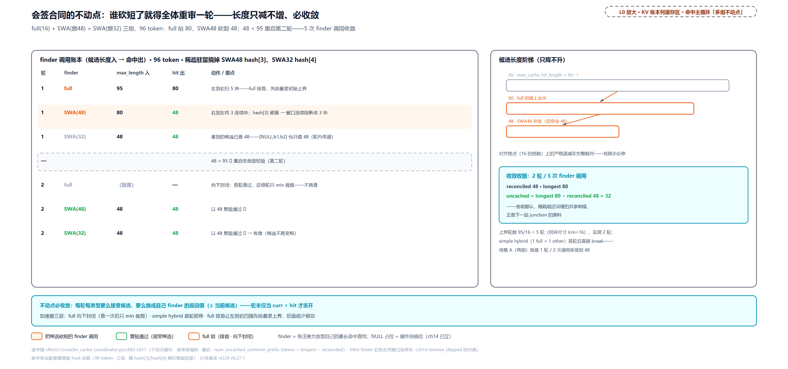

> *图注：L0 缓存面命中主循环「多组不动点」一拍的放大（对应 L2 站 5，单组直通、多组才调和）。左 finder 调用账本（full+SWA48+SWA32 三组、96 token、稀疏驻留摘掉两枚表项模拟掉块）：第 1 轮 full 95→80（砍短，左到右扫 5 块）、SWA48 80→48（窗口连续段断成 3 块）、SWA32 拿到的候选已是 48——48<95 ⇒ 重启；第 2 轮 full 缺席（向下封闭、只 min 裁剪）、两个 SWA 以 48 复验通过。右候选长度阶梯 95→80→48 单调递减 + 收敛收据（2 轮 5 次调用、longest 80 − reconciled 48 = 32——下一站 Marconi junction 的原料）。*

## 进阶三：Marconi 钉住——稀疏驻留不掉复用点（站 5 到 8 的回环）

最后一幕的主角是 Mamba 这类**状态型**层。先立外部背景，因为「钉住」这个词是从一篇论文借来的。

### 论文背景：混合模型的前缀缓存为什么难

《Marconi: Prefix Caching for the Era of Hybrid LLMs》（[arXiv:2411.19379](https://arxiv.org/abs/2411.19379)，MLSys 2025）对混合模型前缀缓存的诊断（外部论文证据，数字为 MLSys'25 评测）：注意力层配循环层的混合架构现在很常见（论文原话比例 "commonly 1 Attention layer for every 6-10 SSM layers"，点名 Jamba、Griffin、RWKV 一批）；循环层（SSM/Mamba）的状态是**原地更新**的——"a sequence's states cannot be rolled back to represent its prefixes"，不像 KV 那样「留一段用一段」，只能精确命中；且单个状态比一个 token 的 KV 大一到两个数量级。后果按块粒度细存状态会制造海量几乎不被复用的大条目：论文实测（7B 混合模型、块 32）25.0% 的 KV 块被复用，而 SSM 状态只有 0.4% 被复用；10K token 序列的状态缓存吃 17.4 GB。Marconi 的答案是准入与驱逐两个新策略（准入按复用场景分类、从第三次出现起才收；驱逐用省算力÷占显存的效用函数，比 LRU 命中率高 19.0%-219.7%），其中与本章直接相关的是一条共享前缀保护：树上 "nodes with multiple children represent the common prefixes shared by multiple requests and should not be evicted"——**多请求共享的前缀，不许驱逐**。vLLM 落地的是 PR [#37898](https://github.com/vllm-project/vllm/pull/37898)（标题自带 "[Hybrid] Marconi-style admission policy"），但要钉清楚**借了哪半条、没借哪半条**：借的是「检测到共享前缀就特意缓存/保护」这个准入思想；没借 Marconi 的 radix 树，也没借它的效用函数驱逐——vLLM 的驱逐仍是上一节的自由队列 LRU 加双不变量。PR 描述里的检测原话正是进阶二那个差值的白话版："a non-cached shared prefix exists if standard attention KVCache has hits, but SSM attention doesn't"。

### junction 三件套：产出、写回、特赦加停点

机制三件，缺一即落空。先给主角定名：junction（岔口）指多个请求的前缀分岔处那条共享段的末端，落在请求对象的字段 `shared_prefix_boundary` 上——「查」那节读过的「最长单组命中」边界。**第一件，产出**：不动点收敛时的差值 `num_uncached_common_prefix_tokens = longest − reconciled`（进阶二已见）——full 组认到 48、稀疏组（Mamba）没缓，调和命中 0，但差值 48 就是那条各组都认的共享前缀。**第二件，写回**：命中入口把它折进一个字段还回去（「查」那节嵌的 `get_computed_blocks` 尾段，`shared_prefix_boundary = num_new_computed_tokens + num_uncached`——注释原话「最长单组命中」），落点是请求对象上一个显式声明的协议字段：

```python
# vllm/v1/request.py:L190-L193
        # Block-aligned token position of a proven shared prefix worth pinning
        # in the (sparse) prefix cache; 0 means none. Set at admission for
        # hybrid/Mamba models when a shared prefix is detected (Marconi-style).
        self.shared_prefix_boundary = 0
```

调度器在准入时写、缓存写回与切 chunk 两路读——一个字段两路配合，跨模块协议而不是局部状态。**第三件，特赦与停点**：写回时（「写回」那节嵌的 `cache_blocks`）`reachable_boundaries = [replay 边界、junction]` 流进各组的 mask。先注两个词：replay 边界即重放边界——prompt 末 token 的位置 num_prompt−1。状态型层的命中只捡边界上的一个状态块、边界之后的 token 都要重放进循环层重算状态；对 prompt 末位置来说，「边界之后」虽已没有 prompt token，这条边界仍然必须保住——解码的第一个 token 正是消费「吃到 prompt 末位」的那个状态起步的，而完整共享这条 prompt 的后来请求，能命中的也恰是这一条边界；稀疏驻留（SWA/Mamba 组按间隔只留少数状态块、其余放弃缓存——马上讲）会筛掉大部分块，但这两个边界的可达尾被**强制置 True**：

```python
# vllm/v1/core/single_type_kv_cache_manager.py:L1404-L1412（Mamba 版特赦段）
        # (2) Reachable-boundary states: the replay boundary (``num_prompt - 1``,
        # capped by ``get_computed_blocks``) and any shared-prefix junction, both
        # of which segments would otherwise skip under sparse retention. A Mamba
        # hit needs exactly the single state block ending on the boundary.
        for boundary_tokens in reachable_boundaries:                    # L1408
            aligned = boundary_tokens // alignment_tokens * alignment_tokens
            boundary_block = aligned // block_size - 1
            if start_block <= boundary_block < end_block:
                mask[boundary_block - start_block] = True
```

调度器侧还有个配套停点——chunked prefill 的切块默认按预算切，但 junction 边界上的状态**必须由一个恰好在边界结束的 chunk 算出来**才可缓存，所以切 chunk 要专门停在 junction：

```python
# vllm/v1/core/sched/scheduler.py:L417-L437
        stops = (
            # Same invariant: a chunk starting mid-block stops at the boundary
            # rather than running past it.
            next_block_boundary if start % block_size != 0 else 0,
            # Never run past the last cacheable block boundary mid-chunk.
            last_cache_position,
            # Fine-grained hits: the prompt's partial-tail entry can only be
            # registered by a chunk ending exactly at its last hash boundary.
            tail_boundary
            if last_cache_position < tail_boundary < request.num_prompt_tokens
            else 0,
            # Marconi shared-prefix junction, block-floored (a sub-block
            # junction's state is not separately cacheable): cache its state
            # so sibling requests sharing the prefix can reuse it.
            start + (request.shared_prefix_boundary - start) // block_size * block_size   # L431
            if start < request.shared_prefix_boundary < end
            else 0,
        )
        # Stop at the earliest mandatory position strictly inside the chunk.
        end = min((s for s in stops if start < s < end), default=end)
        return max(end - start, 0)
```

（junction 块对齐下取整——块内子边界的状态不单独可缓存；同一组停点里还有进阶一的 partial-tail 边界。）三件套连起来实测（full+mamba 混合、A 48 token 先跑、B 共享前 48——前三行接这个场景；mask 与两个停点行是各自独立的小场景，参数见各行输入列）：

<!-- trace: m16 -->
| 阶段 | 输入 | 输出 | 要点 |
|---|---|---|---|
| junction 产出（两组都缓 @48） | full@48 + mamba@48 | hit=48、boundary=0 | reconciled==longest → uncached=0 → boundary 归零 |
| junction 产出（mamba 未缓） | full 持 48、mamba 组条目被摘 | hit=0、boundary=48 | uncached=longest(48)−reconciled(0)——各组都认但稀疏组没缓 |
| 写回 Request | admission_lookup | shared_prefix_boundary=48 | 调度器写、cache_blocks/split 读的跨模块协议 |
| mask 特赦 | retention=0、replay=159、junction=112 | 只真 2 块：位置 1（159→128）、位置 0（112→64） | 稀疏驻留不掉复用点（块内子边界按对齐下取整归属） |
| chunk 停点 | junction=64、chunk [0,100) | 停在 64（块对齐下取整） | 无 junction 不截（100 原样放行） |
| partial-tail 停点 | prompt 210、尾边界 208 | 首 chunk 停 192、次 chunk 收 208 | 边界状态真被算出来才可缓存 |

差值场景的账念出声：hit 0 但 boundary 48——「没命中」不等于「白查」，差值本身被记下，成为下一个同前缀请求的复用点。停点的代价：chunk 从 100 碎成 64+36 两次，多一次 GPU 步；收益 = 后续共享该前缀的请求命中从 0 变 48。mask 侧：稀疏驻留 8 块只留 2 块、稀疏掉 75% 的状态块而不伤两个复用点。

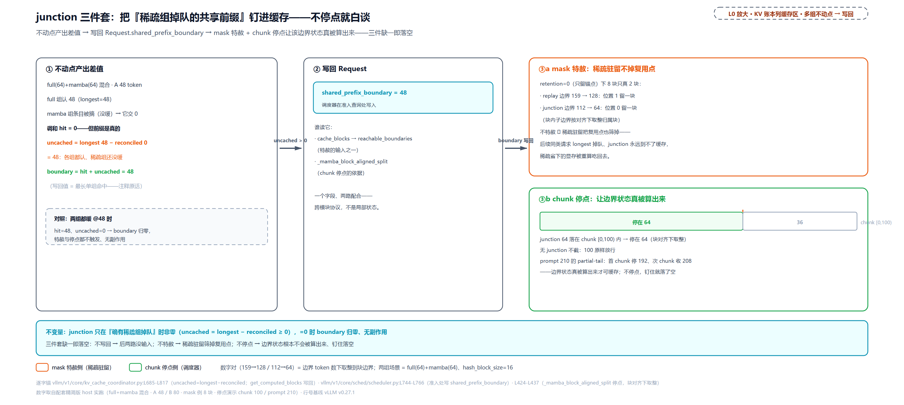

> *图注：L0 缓存面从「多组不动点」到「写回」的回环放大（对应 L2 站 5→8）。① 产出——full 认 48、mamba 未缓 → 调和 hit=0 但 uncached=48−0=48、boundary=hit+uncached=48（对照组两组都缓则归零、无副作用）；② 写回 Request.shared_prefix_boundary=48，两路读者标在图上（cache_blocks 特赦的输入、_mamba_block_aligned_split 停点的依据）；③a mask 特赦——retention=0 下 8 块只真 2 块（replay 159→128 与 junction 112→64 各留一块）；③b chunk 停点——无 junction 停 100、有 junction 停 64（块对齐下取整），prompt 210 的 partial-tail 首 chunk 192/次 chunk 208。不停点，边界状态根本不会被算出来——钉住就落了空。*

### retention_interval：显式的省显存旋钮

特赦的对偶是稀疏驻留本身——「哪些状态块值得留」的显式旋钮 `VLLM_PREFIX_CACHE_RETENTION_INTERVAL`，三态：`None`（默认）稠密全缓、`0` 只留 replay 边界、正数每段留一条。装配时校验三关：

```python
# vllm/v1/core/kv_cache_coordinator.py:L30-L57
def _validate_prefix_cache_retention_interval(
    retention_interval: int | None,
    scheduler_block_size: int,
    kv_cache_config: KVCacheConfig,
) -> None:
    if retention_interval is None:
        return

    # Retention sparsifies sliding-window and Mamba (linear-attention)
    # checkpoints; full-attention and chunked-local groups cache densely and
    # ignore it (their hit granularity must stay fine).
    if not any(
        isinstance(g.kv_cache_spec, (SlidingWindowSpec, MambaSpec))
        for g in kv_cache_config.kv_cache_groups
    ):
        raise ValueError(
            # … 省略：报错正文五行——没有 SWA/Mamba 组时设它直接 raise ……
        )

    if retention_interval < 0 or retention_interval % scheduler_block_size != 0:   # L52
        raise ValueError(
            # … 省略：报错正文三行——必须非负且整除调度块大小 ……
        )
```

为什么只对 SWA/Mamba 生效：full 组的命中粒度必须保持细，稀疏化只有损失没有收益；为什么必须整除调度块大小：分段边界要落在真实可命中的对齐格点上。实测：

<!-- trace: m17 -->
| 案例 | interval | 配置/参数 | 判定 / mask 真位 |
|---|---|---|---|
| 校验·纯 full 模型设值 | 16 | 无 SWA/Mamba 组 | raise——只对 SWA/Mamba 有意义 |
| 校验·负数 | -16 | full+swa | raise——必须非负 |
| 校验·不整除 | 24 | full+swa、sbs=16 | raise——24 不是 16 的倍数 |
| 校验·合法 | 32 | full+swa | OK（coordinator 读 env 后保留 32） |
| mask·None（默认） | None | mamba(16) 8 块 | 稠密——返回 None=全缓存 |
| mask·0 | 0 | replay 边界 79 | 只真 1 块：位置 3（79→64→块 3） |
| mask·32 | 32 | 8 块、边界 79 | 段尾 1、3、5、7 共 4 块（特赦 3 恰重合段尾） |
| SWA 对照 | 0 | 窗 48、need 3 连续块 | 位置 1、2、3——边界前的 3 连续块尾 |

mamba 8 块（128 token）：None 全缓 8 块；0 只留 1 块（省 87.5%）；32 每 2 块留 1（省 50%），特赦块恰与段尾重合、零额外开销。SWA 的特赦留的是「边界前的 need 连续块」（need＝窗宽折算的块数，见进阶二；窗语义留尾巴，不是留单块）。这是显存与命中率的交易旋钮：interval 调大省显存、但错过非 junction 的复用。同期学术界还有把「留哪些状态」形式化成动态规划、给精确最优解的工作（[arXiv:2605.05219](https://arxiv.org/abs/2605.05219) 的 checkpoint placement——预算内选一组检查点、命中时从最深的检查点恢复只重算其后缀）；它与 vLLM 这个旋钮解法处理同一问题，但派生关系没有一手证据，不写成出处，感兴趣深挖。

## 总结：「KV 账本」列的缓存面点亮

本章点亮了 L0 图「调度 · 显存账本」列 KV 半区的最后一块——缓存面：请求侧的链式哈希账本、块池之上的平面哈希表、命中的查与挂、满块的写回、驱逐的两个不变量，连同三幕进阶（块内 CoW、混合不动点、Marconi 钉住）。至此这半区从上到下全通：[第 13 章](../../ch13-paged-kv/narrative/chapter.md)的池与块表、[第 14 章](../../ch14-memory-ledger/narrative/chapter.md)的账本与门、本章的缓存，[第 10 章](../../ch10-continuous-batching-chunked-prefill/narrative/chapter.md)到[第 12 章](../../ch12-async-scheduling/narrative/chapter.md)三章里那个返回整数的 `get_computed_blocks` 黑盒、[第 11 章](../../ch11-preemption-request-lifecycle/narrative/chapter.md)按下的「free 不清哈希」，全部有了完整机制。开篇五问的答案：**凭什么跳过**——同前缀必同哈希（链式指纹，Merkle 血统），平面 dict 一查一个准；**凭什么断一处即停**——miss 后必 miss 是链式结构的数学推论，不是启发式；**驱逐凭什么保住最长前缀**——逆序 free（链尾先牺牲）加劈分（无哈希块插队先走）两个藏在注释里的不变量；**被抢占的重算怎么变便宜**——free 不清哈希、重排回来重走准入、重命中自己的前缀、touch 救回，重算量落在 [1, P] 区间内由块是否被惰性驱逐决定；**共享半截块谁接着写**——谁要写谁 CoW：换私有块、登记拷贝对、worker 在 GPU 上整块拷（带宽级换掉矩阵乘级）。带三件事走：

1. **哈希是数学、驱逐是纪律**。「断一处即停」「同前缀必同哈希」「跨语义必分叉」全部由链式结构保证，无运行时检查；而命中率真正依赖的两条 LRU 不变量（逆序、劈分）全靠 free 路径的调用约定维持、无断言兜底——前者错了会显式崩，后者错了只是静默变慢。读缓存代码时，先分清正在看的是哪一种。
2. **平面表是买来的简单**。不用 radix 树、不去重、union 类型、惰性驱逐——每一个「不做」都对应一笔显式的交易：块表 append-only（换跨进程账目稳定）、显存冗余（换 block_id 永不回写）、GC 减压（换调度循环的毫秒）。缓存没有魔法，只有被算清楚的取舍。
3. **「没命中」也可以有产出**。混合不动点的差值（longest − reconciled）把「稀疏组掉队的共享前缀」变成了显式信号，junction 三件套（写回、特赦、停点）把它钉进缓存——这是从「缓存 = 查表」到「缓存 = 主动布局」的一步，也解释了为什么混合模型的命中代码长得比单模型复杂得多。

还有半句要留给下一章：本章的哈希表只认**本进程**的块——CoW 拷贝对过线给的是本机 worker 的块号。真实的大规模部署里，prefill 常常在别的机器上算完了：那些 KV 怎么发现、怎么搬回来、与本地命中怎么仲裁——KVConnector 的双面契约（引擎侧适配器加 worker 侧传输件）是 Part IV 末章的全部戏，本章在装配开关、准入查询的 connector 分支、远端仲裁三处都只来得及点一句。带上这张平面哈希表去，下一章往它够不着的地方走。

（完）
