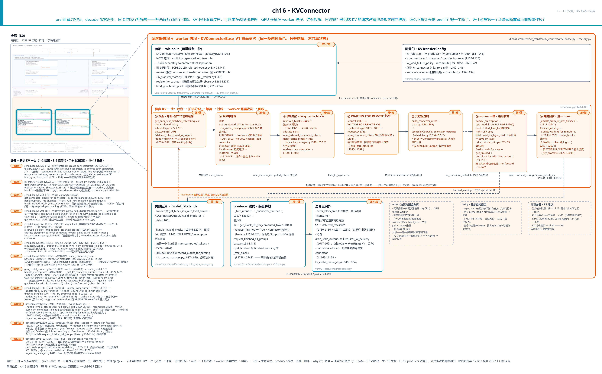
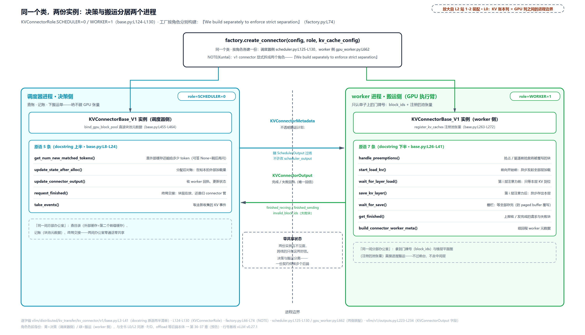
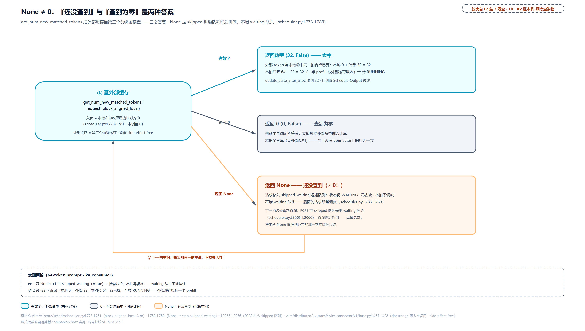
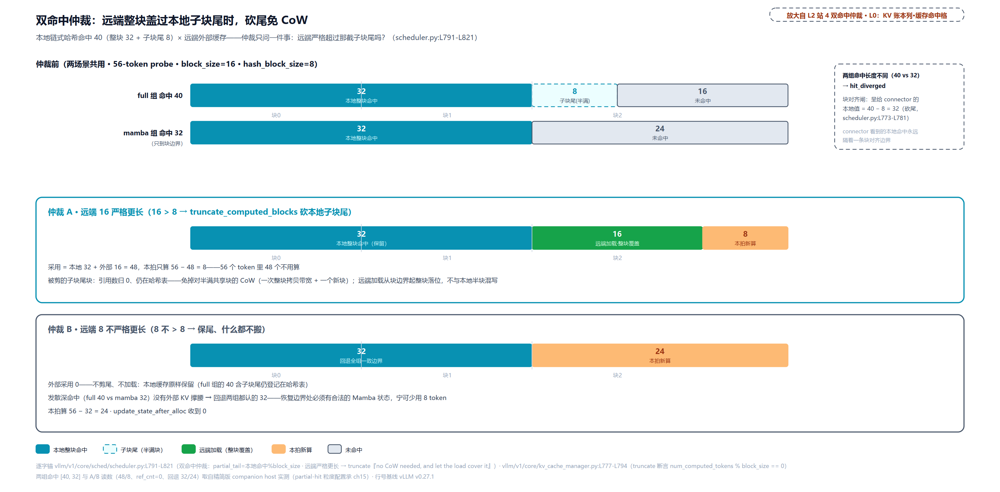
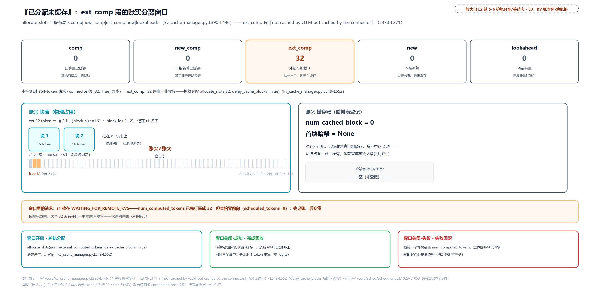
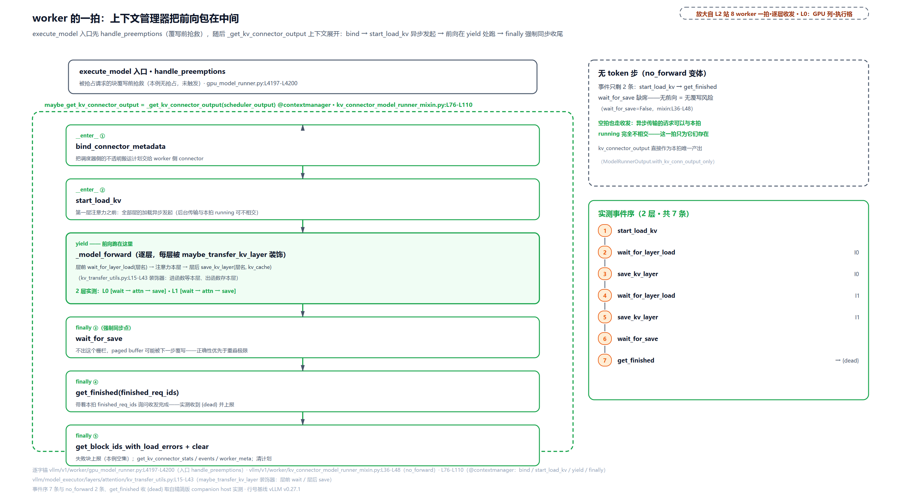
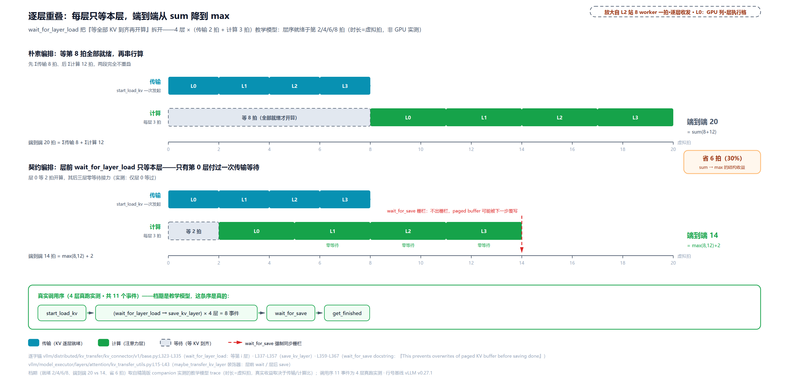
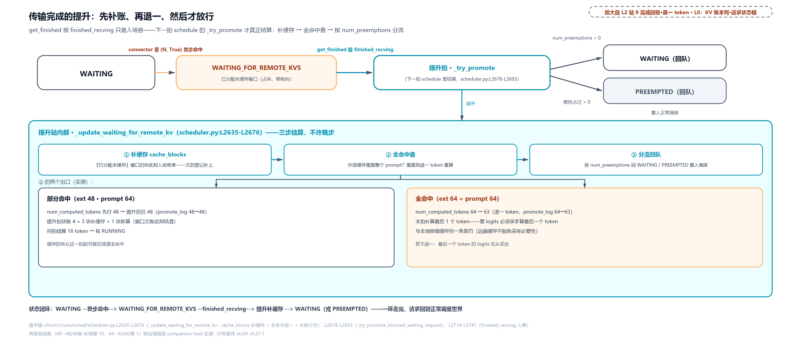
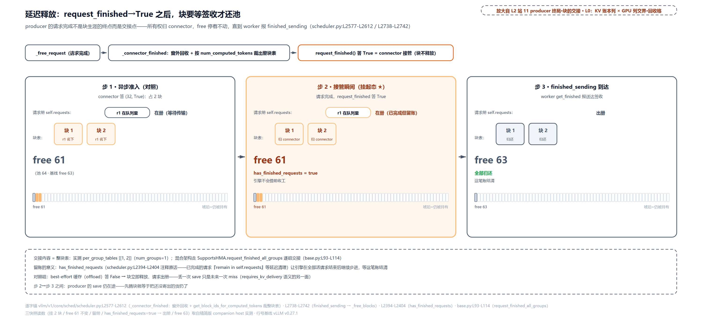

# 第 16 章　KVConnector

prefill 吃算力、decode 吃带宽，同一张卡混跑两段互相拖累——把它们拆到两个引擎各干各的，听着就顺。可 KV 必须跟着「过户」：prefill 已经算好的几十 GB 缓存不搬过去，decode 端就得从头再算一遍，拆开赚的全赔回去。麻烦在分工上：这块 KV 的账本（哪块在哪、谁在用）住在调度器进程，那里只有 CPU 和元数据；KV 本体是 GPU 张量，住在 worker 进程。谁有权搬？什么时候搬？等远端 KV 飞过来的请求占着池里的块、却一步前向都不跑，怎么不让它挤死在途的 prefill？搬一半断了，凭什么按第一个坏块截断重算、而不是整单作废？vLLM 的答案是一份劈成两半的契约——同一个类，按角色各建一份，零共享状态。凭什么这样反而更简单？

这串问题背后还有第二群顾客：显存不够用时想把 KV 挪到 CPU 内存或磁盘（offload，KV 卸载），要用时再搬回来——同样是「把块搬出去、再搬回来」。P/D（prefill/decode 分离——把预填充与逐 token 生成拆到两个引擎实例）过户和 offload 卸载，需求长得不一样，vLLM 却只用一份契约伺候两家。这份契约怎么劈、劈完怎么用，就是本章的全部戏。

位置先摆好。[第 13 章](../../ch13-paged-kv/narrative/chapter.md)打开了块池——等大的块、每请求一张块表、引用计数；[第 14 章](../../ch14-memory-ledger/narrative/chapter.md)打开了池上的账本——定账、准入门、水位，还在调用点留了一句「那条线是 Part IV 末章 KVConnector 的戏」——说的正是本章：`reserved_blocks`，异步 KV 加载时其它在途 prefill 的预约块数；[第 15 章](../../ch15-prefix-caching/narrative/chapter.md)打开了前缀缓存——链式哈希、块内 CoW（copy-on-write，写时复制）、LRU 双不变量。上一章末尾留了半句：那张哈希表只认**本进程**的块，prefill 在别的机器上算完的 KV 怎么发现、怎么搬回来、与本地命中怎么仲裁——本章把这半句全部接走。前章立的池、账本、哈希表，本章一律当黑盒只消费接口；本章立的是新的东西：**双面契约**——调度器侧与 worker 侧，一个类，两份实例，分居边界两侧。

## 你在这里

Part IV 的总问题一句没变：**显存就那么多，KV cache 必须活到最后**。前三章把一块池的内部讲完了（块长什么样、池多大门多紧、算过的怎么复用）；本章把镜头拉远，对准池的**边界**：显存世界不止这一块池，池外面的 KV 世界（另一台引擎的 GPU、CPU 内存、磁盘、分布式存储）怎么接进来。



> *图注：本章放大的是[第 1 章](../../ch01-vllm-v1-in-one-map/narrative/chapter.md) L0 图「调度 · 显存账本」列（KV 账本）与 GPU 执行臂之间那条边界（多 worker 部署下才是真进程边界）——KV 账本在调度器进程手里、GPU 张量在 worker 进程手里，契约就横跨这条线。本章打开的是这三章已读结构之上的新层：[第 13 章](../../ch13-paged-kv/narrative/chapter.md)的块池与块表、[第 14 章](../../ch14-memory-ledger/narrative/chapter.md)的账本与准入门（护轨分配消费它的 free−reserved−watermark 公式）、[第 15 章](../../ch15-prefix-caching/narrative/chapter.md)的链式哈希与 CoW（子块尾仲裁消费它们的块内边界语义）。图上三段读：北排是装配（两份实例怎么各建一份）加配置门；中排 ①-⑦ 是一个请求的异步 KV 一生（双查 → 仲裁 → 护轨分配 → 等待态 → 计划过线 → worker 收发 → 完成回收，即站号 3-9）；南排是失败回滚、producer 终局与边界三例外，加两条 why 注与一条邻章分界（F8 埋点）注。站号 1-12 = 请求流经代码的顺序（1-2 装配 · 3-9 消费者一生 · 10 失败 · 11-12 producer 终局与边界三例外），正文按讲解需要编排、不必照站号读。*

读法建议：只想知道「一个类怎么住两个进程」，读[「契约的脸」](#契约的脸一个类两份实例站-1-2)就够；关心外部缓存怎么和本地缓存合并命中，看[「第二个前缀缓存」](#第二个前缀缓存查外部none-是稍后再问站-3)与[「两本账打架」](#两本账打架子块尾仲裁站-4)；关心「等货的请求怎么不挤死别人」，直奔[「占块等货」](#占块等货护轨与已分配未缓存的窗口站-5-6)；想看 worker 侧怎么干活，[「worker 的一拍」](#worker-的一拍收单发车交回执站-8)与[「只等本层」](#只等本层传输与计算的重叠站-8-的前向内部)连读；失败处理与 producer 视角是进阶两节。想跟全程，按序读。

照例交代取证环境，全章数值表都适用：本章实测来自配套精简版——按 v0.27.1 只做减法抽出的「契约+调度器侧+worker 侧+池侧开口」全链，host 上实跑纯控制流（本章机制全部是纯 CPU 元数据与控制流路径，不涉 GPU 行为差异）；驱动用的是一个可编程的测试替身连接器，经真实工厂入口装配。四处取证口径与真实引擎有刻意差别，后文碰到会就近挑明：逐层重叠一节的时间账是教学模型；子块尾场景的 mamba 组只讲调度器可观测的行为；失败回滚一节有一例清零开关关着、由开关打开的变体补证；终局交接一例的「接管」答复是替身编程所得。

## 契约的脸：一个类，两份实例（站 1-2）

现在走到 L0 图账本列与 GPU 列之间的边界上。先把契约为什么存在讲透，再看它长什么样。

### 为什么需要它：两个引擎，两种搬运

**旧设计**：KV 困在单引擎进程的 GPU 池里。P/D 分离早期靠定制传输——v0 时代的 kv_transfer 基本只有一条路（NIXL，NVIDIA 的点对点传输库，[第 9 章](../../ch09-engine-core-step-loop/narrative/chapter.md)见过一面）；offloading 与 P/D 各写各的调度钩子，两个需求无法组合；混合模型（full 注意力加 Mamba 这类状态空间模型的混合架构）配连接器则干脆不支持。

**痛点**先算一笔账。prefill 一次算 L 个 token，注意力要做全部两两打分，计算量约等于 $`L^2`$ 乘个常数，吃**算力**；decode 每步只算 1 个新 token，却要读回全部历史 KV，吃**带宽**。同卡混跑时，prefill 的长算子挡住 decode 的小步快跑，decode 的高频小核对打断 prefill 的流水——两段的延迟目标本来就不同：TTFT（首 token 延迟）管 prefill、TPOT（每输出 token 耗时）管 decode（两个度量[第 10 章](../../ch10-continuous-batching-chunked-prefill/narrative/chapter.md)立过），服务等级目标（SLO，对延迟或吞吐的承诺上限）一紧，共置系统只能顾一头，或者堆算力两头都保。DistServe（OSDI 2024——操作系统方向顶会，[arXiv:2401.09670](https://arxiv.org/abs/2401.09670)）把这件事论证到了底：拆开「eliminating prefill-decoding interferences」，代价它也直说——KV 必须跨机搬运、传输时间计入 TTFT、两阶段要按集群带宽摆位；论文报告在双 SLO 内能多服务 7.4 倍请求（对照当时其它系统的实验数字，不是 vLLM 实测）。另一头，offload 需要的是「把块搬出去再搬回来」的通用通道——和 P/D 是同一类操作，只是方向与目的地不同。每个传输后端各写一套调度钩子等于不可组合：同时想要 P/D 和 offload 的用户只能等官方写。

**v1 方案**：一份契约把「外部 KV 世界怎么接」统一掉。`KVConnectorBase_V1` 把接口劈成两半——调度器侧管决策（查外部命中、记账、终局交接），worker 侧管搬运（拿着 GPU 张量逐层收发）——任何后端只要实现这份契约，就能同时伺候 P/D 与 offload。**代价**也必须先摆出来，后面每一节都在还这笔账：①本地与外部两套缓存都要查再手工合并，仲裁逻辑是补丁性的；②异步加载期请求占着池块却零前向进度，还要靠预约护轨防它挤死在途 prefill；③`wait_for_save` 是强制同步点，正确性优先于重叠极限；④两侧必须分开构建、不许共享状态；⑤加载失败的回滚链路（截断、去重、补登记清零）复杂且正确性敏感；⑥producer 在交接未决时被抢占，产出要整拍丢弃。

### 契约正文就是一段 docstring

这份契约的「正文」写在模块 docstring 里——两半原语逐条列清，值得整段读：

```python
# vllm/distributed/kv_transfer/kv_connector/v1/base.py:L3-L41
"""
KVConnectorBase_V1 Class for Distributed KV Cache & Hidden State
communication in vLLM v1

The class provides the following primitives:
    Scheduler-side: runs in the scheduler, binds metadata, which
    is used by the worker-side to load/save KV cache.
        get_num_new_matched_tokens() - get number of new tokens
            that exist in the remote KV cache. Might be called multiple
            times for a given request and should be side-effect free.
        update_state_after_alloc() - update KVConnector state after
            temporary buffer alloc by the CacheManager.
        update_connector_output() - update KVConnector state after
            output is received from worker-side connectors.
        request_finished() - called once when a request is finished,
            with the computed kv cache blocks for the request.
            Returns whether KV cache should be freed now or if the
            connector now assumes responsibility for freeing the
            the blocks asynchronously. Also optionally returns KV
            transfer params.
        take_events() - returns new KV events that were collected
            by the connector since the last call.

    Worker-side: runs in each worker, loads/saves KV cache to/from
    the Connector based on the metadata.
        handle_preemptions() - called for handling preempted requests
            or request evicted blocks before they are overwritten

        start_load_kv() - starts loading all KVs (maybe async)
        wait_for_layer_load() - blocks until layer i load is done

        save_kv_layer() - starts saving KV for layer i (maybe async)
        wait_for_save() - blocks until all saves are done

        get_finished() - called with ids of finished requests, returns
            ids of requests that have completed async sending/recving.
        build_connector_worker_meta() - builds metadata to be sent
            back to the scheduler-side connector
"""
```

上半是**调度器侧**五原语：查（`get_num_new_matched_tokens`）、分配后记账（`update_state_after_alloc`）、消化回传（`update_connector_output`）、终局交接（`request_finished`）、事件上报（`take_events`）。下半是 **worker 侧**七原语：覆写前抢救（`handle_preemptions`）、逐层收发四件套（`start_load_kv` / `wait_for_layer_load` / `save_kv_layer` / `wait_for_save`）、完成上报（`get_finished`）与回信（`build_connector_worker_meta`）。注意 docstring 里反复出现的括注——maybe async、blocks until、assumes responsibility for freeing asynchronously：**异步**贯穿这份契约的每一条，本章后面所有护栏、栅栏、回滚，都是为异步世界的正确性交的税。

### role：同一个类，两个进程各建一份

劈两半的物理根子是一个枚举：

```python
# vllm/distributed/kv_transfer/kv_connector/v1/base.py:L124-L130
class KVConnectorRole(enum.Enum):
    # Connector running in the scheduler process
    SCHEDULER = 0

    # Connector running in the worker process
    WORKER = 1
```

构造时注入、终身只读（`base.py:L196-L217` 的 `__init__` 把 `role` 存进 `self._role`，`role` property 只出不进；同一处还会打一条「This API is experimental」的警告——这份契约自己承认还在迭代）。真正把「劈两半」落成纪律的是工厂：

```python
# vllm/distributed/kv_transfer/kv_connector/factory.py:L43-L75
    def create_connector(
        cls,
        config: "VllmConfig",
        role: KVConnectorRole,
        kv_cache_config: "KVCacheConfig",
    ) -> KVConnectorBase:
        kv_transfer_config = config.kv_transfer_config
        if kv_transfer_config is None:
            raise ValueError("kv_transfer_config must be set to create a connector")
        connector_cls = cls.get_connector_class(kv_transfer_config)

        # check if the connector supports HMA
        hma_enabled = not config.scheduler_config.disable_hybrid_kv_cache_manager
        if hma_enabled and not cls.supports_hma_config(kv_transfer_config):
            raise ValueError(
                f"Connector {connector_cls.__name__} does not support HMA but "
                f"HMA is enabled. Please set `--disable-hybrid-kv-cache-manager`."
            )
        # … 省略：logger.info 两行（记录连接器名与 engine_id）……
        # NOTE(Kuntai): v1 connector is explicitly separated into two roles.
        # Scheduler connector:
        # - Co-locate with scheduler process
        # - Should only be used inside the Scheduler class
        # Worker connector:
        # - Co-locate with worker process
        # - Should only be used inside the forward context & attention layer
        # We build separately to enforce strict separation  # L74
        return connector_cls(config, role, kv_cache_config)
```

末行注释就是设计宣言：**分开构建，以强制严格分离**（We build separately to enforce strict separation）。同一个类，被两个调用方各自实例化一次。顺带一提，方法中段那道门检查的是 HMA（hybrid memory allocator，混合内存分配器——一池多组，混合模型的 full/Mamba 组各管各的块表；[第 15 章](../../ch15-prefix-caching/narrative/chapter.md)的混合不动点讲的就是它上面的命中调和）：混合组化默认开着，连接器若不支持逐组交接，工厂直接拒建。

两处装配各自长什么样？调度器侧在 `Scheduler` 构造函数里：

```python
# vllm/v1/core/sched/scheduler.py:L125-L158
        # Create KVConnector for the Scheduler. Note that each Worker
        # will have a corresponding KVConnector with Role=WORKER.
        # KV Connector pushes/pull of remote KVs for P/D and offloading.
        self.connector = None
        self.connector_prefix_cache_stats: PrefixCacheStats | None = None
        self.recompute_kv_load_failures = True
        self.defer_block_free = False
        # Whether a preempted request's in-flight output must be dropped; see
        # KVConnectorBase_V1.requires_kv_delivery.
        self.requires_kv_delivery = False
        kv_transfer_config = self.vllm_config.kv_transfer_config
        if kv_transfer_config is not None:
            assert not self.is_encoder_decoder, (   # L137
                "Encoder-decoder models are not currently supported with KV connectors"
            )
            self.connector = KVConnectorFactory.create_connector(
                config=self.vllm_config,
                role=KVConnectorRole.SCHEDULER,   # L142
                kv_cache_config=self.kv_cache_config,
            )
            if self.log_stats:
                self.connector_prefix_cache_stats = PrefixCacheStats()
            kv_load_failure_policy = kv_transfer_config.kv_load_failure_policy
            self.recompute_kv_load_failures = kv_load_failure_policy == "recompute"   # L148

            # With overlapping batches (async scheduling or PP), a step may
            # still be writing a freed request's KV blocks. A consumer KV
            # Connector can reallocate and fill those blocks via a load that
            # isn't ordered against that write, so defer freeing them.
            multiple_inflight_batches = self.vllm_config.max_concurrent_batches > 1
            if multiple_inflight_batches and kv_transfer_config.is_kv_consumer:
                self.defer_block_free = True   # L156

            self.requires_kv_delivery = self.connector.requires_kv_delivery   # L158
```

四面旗标一次立齐：失败策略（`recompute_kv_load_failures`）、延迟释放开关（`defer_block_free`，边界三例外之一，站 12 展开）、抢占护栏（`requires_kv_delivery`，同样站 12）、外部命中率统计（`connector_prefix_cache_stats`）。顺带一处拒绝：encoder-decoder（编码器-解码器双塔架构，翻译类模型）目前整体不支持连接器（上面 L137 的 assert）——本章主线全是纯 decoder 模型，这条拒绝只是边界声明。KVCacheManager 建好之后还有一步 `bind_gpu_block_pool`（scheduler.py:L291-L294）——把块池元数据的访问权交给调度器侧连接器：能直读、能增减引用、能迭代前缀缓存块，但绝不碰 GPU 张量。worker 侧则是另一份独立的装配：

```python
# vllm/distributed/kv_transfer/kv_transfer_state.py:L72-L94
def ensure_kv_transfer_initialized(
    vllm_config: "VllmConfig", kv_cache_config: "KVCacheConfig"
) -> None:
    """
    Initialize KV cache transfer parallel group.
    """

    global _KV_CONNECTOR_AGENT

    if vllm_config.kv_transfer_config is None:
        return

    if (
        vllm_config.kv_transfer_config.is_kv_transfer_instance
        and _KV_CONNECTOR_AGENT is None
    ):
        _sync_engine_id_across_tp(vllm_config)

        _KV_CONNECTOR_AGENT = KVConnectorFactory.create_connector(   # L90
            config=vllm_config,
            role=KVConnectorRole.WORKER,   # L92
            kv_cache_config=kv_cache_config,
        )
```

`gpu_worker.py` 在 KV cache 配置就绪后调它，以 `role=WORKER` 再建一份挂到全局变量 `_KV_CONNECTOR_AGENT` 上——与调度器那份没有任何代码联系。worker 侧建好后还收一份见面礼：`register_kv_caches`（base.py:L263-L271）把池张量按层名注册进来，worker 侧从此能按 block_ids 加张量直写 GPU 内存（怎么写，参考实现一节细看）。

### 零共享不是设计洁癖，是操作系统的硬约束

为什么非要劈两份、零共享？先把进程形态对齐（[第 1 章](../../ch01-vllm-v1-in-one-map/narrative/chapter.md)数过）：TP=1 单卡时 worker 与调度器同住 EngineCore 一个进程——本章参考实现跑的单卡 offload 正是这种形态；tp>1 或多机 P/D 时每个 GPU worker 才被派生成独立子进程。契约按其中最难的形态——真进程边界——设计；在那条边界上，「共享」本来就不存在。操作系统给每个进程一套独立的虚拟地址空间（[第 13 章](../../ch13-paged-kv/narrative/chapter.md)讲过虚拟内存与页表——按进程隔离正是每进程一张页表的直接后果），一个进程里的对象和指针在另一个进程里毫无意义；维基 Process 条目说多数现代操作系统「阻止独立进程之间的直接通信，只提供严格受控的进程间通信」。Python 层同理：跨进程队列里传对象要经 pickle 序列化，官方文档明说 `get` 到的是「重新构造的新对象，与原对象不共享内存」——对面拿到的是副本，改它不影响发送方。[第 5 章](../../ch05-zmq-topology-and-protocol/narrative/chapter.md)讲过真要跨进程共享张量得显式开共享内存（那是刻意开的门，不是默认）。所以两个进程协作只有两条路：要么开辟共享内存加锁（贵且易错），要么各持各的状态、把「需要对方知道的事」打包成消息过线。双面契约选的是后者——不共享，就没有跨进程的数据竞争，也就不需要跨进程的锁。同进程时这条边界虽不由操作系统强制，零共享仍是同一份纪律：两个角色照样各持各的状态、只让消息过线——边界将来变成真进程，代码一行不用改。

这个形状在分布式系统里有老名字：RPC（远程过程调用）的**存根对**（stub pair）——同一份接口定义在客户端与服务端各住半边，之间只有 marshalling（编组——把调用参数打包成能过线的字节流，也就是前文说的序列化）出来的消息，这正是「一份契约劈两半、分居两个地址空间」的四十年老形态（gRPC 官方文档至今沿用 stub 这个词）。必须说明：这是**结构上的类比，vLLM 并没有用 RPC**——两份连接器之间没有阻塞式的调用-应答；下行是调度器把计划随调度输出送过去，上行是 worker 在自己的一拍里主动上报（`get_finished`），形态是异步单向的。类比帮你定位它的形状，不替它发明不存在的机制。



> *图注：L0 位置——KV 账本列与 GPU 列之间的进程边界。同一个类 `KVConnectorBase_V1` 被工厂按角色建了两份：左泳道是调度器进程（查外部命中、记账、终局交接，`bind_gpu_block_pool` 直读块池元数据但绝不碰 GPU），右泳道是 worker 进程（`register_kv_caches` 拿到池张量、逐层收发）。两份实例零共享状态，跨线的只有两封信：下行的 `KVConnectorMetadata`（只读搬运计划，随 SchedulerOutput 过线）与上行的 `KVConnectorOutput`（完成与失败回执）。决策与搬运分离，正是这份契约能同时伺候 P/D、offload 多个后端的全部原因。*

### 配置门：kv_role 三态

开不开这条边界、开成什么角色，全在 `KVTransferConfig`：

```python
# vllm/config/kv_transfer.py:L41-L72
    kv_role: KVRole | None = None
    """Whether this vLLM instance produces, consumes KV cache, or both. Choices
    are 'kv_producer', 'kv_consumer', and 'kv_both'."""

    kv_rank: int | None = None
    """The rank of this vLLM instance in the KV cache transfer. Typical value:
    0 for prefill instance, 1 for decode instance.
    Currently only 1P1D is supported."""

    # … 省略：kv_parallel_size / kv_ip / kv_port / kv_connector_extra_config /
    #        kv_connector_module_path / enable_permute_local_kv 七个字段 ……

    kv_load_failure_policy: Literal["recompute", "fail"] = "fail"   # L69
    """Policy for handling KV cache load failures.
    'recompute': reschedule the request to recompute failed blocks
    'fail': immediately fail the request with an error finish reason (default)"""
```

```python
# vllm/config/kv_transfer.py:L108-L118
    @property
    def is_kv_transfer_instance(self) -> bool:
        return self.kv_connector is not None and self.kv_role in get_args(KVRole)

    @property
    def is_kv_producer(self) -> bool:
        return self.kv_connector is not None and self.kv_role in get_args(KVProducer)

    @property
    def is_kv_consumer(self) -> bool:
        return self.kv_connector is not None and self.kv_role in get_args(KVConsumer)
```

`kv_role` 三态：producer（我把算好的 KV 交出去，典型是 prefill 实例）、consumer（我收别人的 KV，典型是 decode 实例）、both（既交又收，offload 单机就是 both）；`kv_rank` 注释直说目前只支持 1P1D（一台 prefill 对一台 decode）。三个谓词是后面多处逻辑的驱动源：`is_kv_consumer` 决定延迟释放开关、`is_kv_producer` 决定抢占护栏（见站 12）、`is_kv_transfer_instance` 决定 worker 侧要不要装配。`kv_load_failure_policy` 二选一（默认 fail）——失败回滚一节的主角。

最后把镜头拉远一眼：这份契约身后已经站着一排后端。据 v0.27.1 工厂注册表共 16 项，大致四层——点对点传输库（NIXL 三型）、缓存策略层（LMCache）、分布式 KV 池（Mooncake）、原生一族（CPU 卸载两型加本章要细读的 ExampleConnector），另有组合器 MultiConnector 把不同层次叠着用（P/D 传输加 offload 同时接）。它们不是三选一的竞品，是「搬运管子、缓存管家、存储底座、教学样例」四个层次，全部实现同一份双面契约——换后端不改调度器，「接谁」只是配置项。这份契约立得越清楚，后面两章越省力：Part VIII 的 P/D 分离章讲两台引擎怎么靠它交接，KV 池化章讲 offload 怎么靠它把块搬出去再搬回来——两章各回收本章契约的一半。

## 第二个前缀缓存：查外部，None 是「稍后再问」（站 3）

现在走到 L0 图账本列的调度查询格。消费者的一生从「查」开始。

直觉：图书馆除了馆内编目（本地前缀缓存），还能查馆际互借目录（外部缓存）。查不到别急着拒——「稍后再问」把书先放到旁边的等候架，不挡后面排队的人；等目录有了答案，外馆藏书直接当已还的书用。

### 双查：先本地、后外部

waiting 循环里，connector 在场时本地命中要走一个混合感知的入口，然后再问外部：

```python
# vllm/v1/core/sched/scheduler.py:L744-L789
                # Get already-cached tokens.
                if request.num_computed_tokens == 0:
                    did_prefix_cache_lookup = True
                    hit_diverged = False
                    # Get locally-cached tokens.
                    if self.connector is not None:
                        # A KV connector transfers the missing suffix, which needs a
                        # hybrid-aware lookup that can diverge across groups.
                        (
                            new_computed_blocks,
                            num_new_local_computed_tokens,
                            request.shared_prefix_boundary,
                            hit_diverged,   # L756
                        ) = self.kv_cache_manager.get_computed_blocks_for_connector(
                            request
                        )
                    else:
                        # … 省略：无 connector 的普通路径 get_computed_blocks
                        #        （前缀缓存章的主线，本章不重讲）……

                    # Get externally-cached tokens if using a KVConnector.
                    if self.connector is not None:
                        # Present a block-aligned local hit to the connector so
                        # a strictly longer remote hit can supersede a local
                        # sub-block tail without racing its copy-on-write.
                        partial_tail = num_new_local_computed_tokens % self.block_size   # L773
                        block_aligned_local = (
                            num_new_local_computed_tokens - partial_tail
                        )
                        ext_tokens, load_kv_async = (
                            self.connector.get_num_new_matched_tokens(
                                request, block_aligned_local   # L779
                            )
                        )

                        if ext_tokens is None:
                            # The request cannot be scheduled because
                            # the KVConnector couldn't determine
                            # the number of matched tokens.
                            request_queue.pop_request()
                            step_skipped_waiting.prepend_request(request)   # L788
                            continue
```

三个要点。第一，本地命中的查询换了入口：`get_computed_blocks_for_connector`（kv_cache_manager.py:L297-L342）逐组查命中、多带一个 `hit_diverged`（组间命中长度发散）标记——connector 传的是「缺失后缀」，而混合模型各组的前缀命中长度可以不同，这个标记的用处下一节讲。第二，呈给外部的本地值是**砍过尾的块对齐值**（`block_aligned_local`，L773-L776）——子块尾仲裁的伏笔。第三，`None` 的语义：请求被移出 waiting 队头、`prepend` 进 `skipped_waiting` 退避队列——队头不堵，后面的人照常调度。

### None ≠ 0：两种「没有」

连接器侧的契约签名把三态写死了：

```python
# vllm/distributed/kv_transfer/kv_connector/v1/base.py:L465-L498
    @abstractmethod
    def get_num_new_matched_tokens(
        self,
        request: "Request",
        num_computed_tokens: int,
    ) -> tuple[int | None, bool]:
        """
        Get number of new tokens that can be loaded from the
        external KV cache beyond the num_computed_tokens.

        Args:
            request (Request): the request object.
            num_computed_tokens (int): the number of locally
                computed tokens for this request

        Returns:
            A tuple with the following elements:
                - An optional number of tokens that can be loaded from the
                  external KV cache beyond what is already computed.
                  If None, it means that the connector needs more time to
                  determine the number of matched tokens, and the scheduler
                  should query for this request again later.
                - `True` if external KV cache tokens will be loaded
                  asynchronously (between scheduler steps). Must be
                  'False' if the first element is 0.

        Notes:
            The connector should only consider the largest prefix of prompt-
            tokens for which KV cache is actually available at the time of the
            call. If the cache cannot be loaded for some tokens (e.g., due to
            connectivity issues or eviction), those tokens must not be taken
            into account.
        """
        pass
```

返回 `(可加载 token 数、是否异步加载)`。**数字**：命中，直接并入已算；**0**：确定没有，立即按零外部命中排入计算；**None**：「还没查到」——远端索引没回话、连接没就绪，不是「查过没有」。为什么值得单造一个返回值？因为把「查不到」当 0 处理，请求会立刻白算一遍 prefill，等传输通道就绪后这段 KV 全浪费；把「查不到」当阻塞处理，一个慢连接就把整个 waiting 队头堵死（[第 11 章](../../ch11-preemption-request-lifecycle/narrative/chapter.md)讲过队头阻塞的代价）。None 语义把这两种失败都避开：退避不阻塞。Notes 里还有一条硬纪律——只许报告**当下真实可用**的最长前缀，「连得上的才算」，连接有问题或已被逐出的 token 不许算进来（这句为失败回滚一节立下前提：查到的就承诺能到，到不了的走失败路径）。

实测走一遍（64-token prompt、外部缓存视角由可编程替身应答）：

<!-- trace: m2 -->
| 轮次 | connector 答复 | 裁决 | 本拍新算 token | 可观测面 |
|---|---|---|---|---|
| 步 1 | None（稍后再问） | r1 移入 skipped_waiting、状态仍 WAITING——不堵 waiting 队头 | 0 | 本拍零调度、零占块 |
| 步 2 | (32, False) 同步命中 | 本地 0 + 外部 32 = 已算 32 | 32 | r1 本拍算 64−32=32、转 RUNNING；update_state_after_alloc 收到 32 |
| 另景（ExampleConnector 磁盘版） | (32, False) 磁盘命中 | 40-token prompt 块对齐取 32（留最后 1 token 要 logits） | — | worker 先存 2 块到磁盘；调度器侧查同一 prompt 命中 32——文件系统就是外部缓存 |

步 1 退避的请求零占块、零调度——它甚至还没资格占块；步 2 答案一到，32 个外部 token 直接抵掉一半 prefill。None 语义不损失活性（liveness——只要外部世界还在动，被退避的请求不会被永久晾着）有个结构性保证：每轮 `schedule()` 先选 skipped 队头（FCFS——先来先服务，skipped 优先），退避请求每步必被重新查询一次；查询本身按契约要求 side-effect free（docstring 明说 Might be called multiple times），重复问没有代价。外部世界（远端索引、连接建立）只会把答案从 None 推进到具体数，每个退避请求的等待被系统外的进展单调消解；系统内它不占队头、不占块。



> *图注：L0 位置——账本列的调度查询格。`get_num_new_matched_tokens` 三条出边：数字（命中，与本地命中同一拍合成 num_computed_tokens）、0（确定未命中，照常排入计算）、None（还没查到——请求搬进 skipped 退避队列，waiting 队头不被堵住）。底部两拍实测：None 一拍零调度零占块，答案到达的那拍 32 个外部 token 直接抵掉一半 prefill。*

### 磁盘版参考：文件系统就是外部缓存

「外部缓存」听着玄，官方给了一个把话说明白的参考实现——ExampleConnector，外部缓存就是磁盘文件（safetensors 格式，[第 3 章](../../ch03-engineargs-to-vllmconfig/narrative/chapter.md)见过的张量落盘格式）。类头的注释自称 debug 实现，但调度器侧两原语正好当「最小样板」读：

```python
# vllm/distributed/kv_transfer/kv_connector/v1/example_connector.py:L251-L298
    def get_num_new_matched_tokens(
        self,
        request: "Request",
        num_computed_tokens: int,
    ) -> tuple[int | None, bool]:
        # … 省略：docstring 九行（与契约签名同款）……
        # NOTE: in current v1 scheduler, the num_computed_tokens is aligned
        # with the block granularity. And it expects the returned blocks and
        # num_computed_tokens to also be aligned with the block granularity.
        if not self._found_match_for_request(request):   # L276
            return 0, False

        logger.info("External Cache Hit!")

        # Now, first num_tokens_to_check tokens are hit, we need to prepare
        # the metadata for the worker connector to correctly load the KV
        token_ids = request.prompt_token_ids or []
        num_tokens_to_check = align_to_block_size(len(token_ids) - 1, self._block_size)   # L284

        return num_tokens_to_check - num_computed_tokens, False   # L286

    def update_state_after_alloc(
        self, request: "Request", blocks: "KVCacheBlocks", num_external_tokens: int
    ):
        # … 省略：docstring 五行……
        if num_external_tokens > 0:   # L297
            self._requests_need_load[request.request_id] = request
```

`_found_match_for_request` 就是「磁盘上有没有这个 prompt 的文件」；命中时按块对齐裁出可加载数（`align_to_block_size(len-1)`——留最后 1 个 token 不命中，因为采样要 logits——logits 是模型最后一层输出的未归一化概率，[第 8 章](../../ch08-logprobs/narrative/chapter.md)开篇立过，只有亲手算完最后一个 token 才有它，这条契约后面回收一节正面讲）。`update_state_after_alloc` 的判据值得记：**看 `num_external_tokens`，不看 `blocks` 空不空**——契约 docstring 专门警告过，块非空也可能什么都不用加载（组合连接器里没被选中的子连接器照样收到真块）。磁盘版这一景的实测：worker 侧先把 2 块 KV 落盘，调度器侧再查同一 prompt，命中 32——存与取共用文件系统这个「外部缓存」，一来一回就是 offload 的最小完整回路。

## 两本账打架：子块尾仲裁（站 4）

还在账本列的缓存命中格——本地命中与外部命中合并的那一次仲裁。上一章第 9 站留下的路标（CoW 拷贝对过线之后、远端命中怎么与本地共存）在这里正式接上。

直觉：两本账打架时听更全的那本。本地缓存馆只登记到半页（块内 8 个 token 的子块尾），远端馆有整块的——那就把本地那半页剪掉，免得对半满块做 CoW，让远端的整块加载盖过来；远端不比半页长，就留着半页、什么都不搬。

### 仲裁源码

```python
# vllm/v1/core/sched/scheduler.py:L791-L832
                        if partial_tail and ext_tokens > partial_tail:   # L791
                            # Remote strictly exceeds the full local hit: drop the
                            # sub-block tail so no CoW is needed, and let the load
                            # cover it. Trim the partial block out of the local
                            # computed blocks so it is not adopted from the cache.
                            new_computed_blocks = (
                                self.kv_cache_manager.truncate_computed_blocks(
                                    new_computed_blocks, block_aligned_local
                                )
                            )
                            num_new_local_computed_tokens = block_aligned_local   # L801
                            num_external_computed_tokens = ext_tokens
                        elif partial_tail:
                            # Remote does not exceed the full local hit: keep the
                            # local sub-block tail and load nothing external.
                            num_external_computed_tokens = 0
                            # Nothing to load remotely -> not an async-load step;
                            # clearing avoids the `load_kv_async` assert below.
                            load_kv_async = False
                        else:
                            num_external_computed_tokens = ext_tokens

                        if hit_diverged and num_external_computed_tokens == 0:   # L813
                            # No external tokens back the deeper local hit, so its
                            # resume boundary would have no valid Mamba state.
                            # Reconcile to the boundary every group agrees on.
                            (
                                new_computed_blocks,
                                num_new_local_computed_tokens,
                                request.shared_prefix_boundary,
                            ) = self.kv_cache_manager.get_computed_blocks(request)   # L821

                        connector_prefix_cache_queries = (
                            request.num_tokens - num_new_local_computed_tokens
                        )
                        connector_prefix_cache_hits = num_external_computed_tokens

                    # Total computed tokens (local + external).
                    num_computed_tokens = (
                        num_new_local_computed_tokens + num_external_computed_tokens
                    )
                    assert num_computed_tokens <= request.num_tokens
```

三条出边。**远端严格更长**（`ext_tokens > partial_tail`）：`truncate_computed_blocks` 把本地子块尾砍掉，本地采用值退到块对齐，远端加载按整块落位覆盖——注释原话「no CoW is needed, and let the load cover it」。为什么砍：本地子块尾住在半满共享块里（[第 15 章](../../ch15-prefix-caching/narrative/chapter.md)的块内部分命中），谁要续写谁 CoW——一次整块拷贝带宽加一个新块；而远端反正要把这一段整块写进来，先剪掉本地尾，半满块没了引用者（实测引用数归零、留在自由队列），CoW 直接省掉。**远端不严格更长**：保尾、外部为零、什么都不搬（`load_kv_async` 清 False，避免下面断言误伤）。**第三条是混合模型的补丁**：组间命中发散（`hit_diverged`）且没有外部 token 撑腰时，回退到普通 `get_computed_blocks` 的全组一致边界。

第三条值得多讲两句，因为它是最容易看不懂的分支。混合模型（full 注意力加 Mamba 状态层）各组的前缀命中长度可以不同——块压力下 full 组的尾部块可能被逐出而 Mamba 组的深层状态还活着。若把 full 组的深命中当真去恢复，恢复边界处根本没有合法的 Mamba 状态可加载（Mamba 的状态是逐段算出来的，跳段恢复不存在）。connector 传的是「缺失后缀」，只有外部 token 能把浅组补齐到深组的水平；外部一个 token 都没有，深命中就是空头支票——宁可少用几个 token，回退到每组都认的边界。

实测（probe prompt 56 token、块 16、哈希粒度 8——正是[第 15 章](../../ch15-prefix-caching/narrative/chapter.md)立过的部分命中配置，块内边界命中只在这种形态下出生；场景由 full 组加 mamba-align 组——混合模型里 Mamba 状态层所在的、分配时按它自己的粒度对齐的那个组——驱动，两组的命中长度是调度器可观测的输入，mamba 组内部的块表形态本章不展开）：

<!-- trace: m3 -->
| 场景 | 本地命中 / 子块尾 | 远端答复 | 仲裁裁决 | 可观测面 |
|---|---|---|---|---|
| 逐组探测（仲裁前） | full 组 40（含 8-token 子块尾）；mamba-align 组 32 | — | hit_diverged：两组命中长度不同 | 调度器把 block_aligned_local=32（砍尾后）呈给 connector，不呈 40 |
| A：远端 16（严格更长） | 本地 40 → 砍尾到 32 | 16 > 8 | truncate 砍本地尾 + 外部采用 16：32+16=48 | 本拍只算 56−48=8；子块尾块引用数 0、仍在哈希表（免 CoW） |
| B：远端 8（不严格更长） | 本地 40 保尾 | 8 不> 8 | 外部 0；hit_diverged 且无外部撑腰 → 回退全组一致边界 32 | 本拍算 56−32=24；update_state_after_alloc 收到 0 |

场景 A：仲裁后准入值 48 = 本地 32 + 外部 16，56 个 token 里 48 个不用算；被砍的 8-token 子块尾若不砍，采用半满共享块就得 CoW。场景 B：回退把本地命中从 40 收到 32——深命中的恢复边界处没有合法的 Mamba 状态，宁可少用 8 个 token 也不在非法边界恢复。



> *图注：L0 位置——账本列的缓存命中格。仲裁前：本地链式哈希命中到 40（第三块只满 8/16，哈希 8 粒度的块内边界条目），mamba 组只到 32。仲裁 A：远端能供 16 个 token、严格盖过 8-token 的本地尾——调度器把呈给连接器的本地值先砍成块对齐 32，远端加载按整块落位，被剪掉的半满块引用数归零、无需 CoW。仲裁 B：远端只及 8、不严格更长——保住本地尾、什么都不搬；发散的深命中（full 40 对 mamba 32）没有外部 KV 撑腰，回退到两组都认的 32。*

这条仲裁守住一条不变量：**有远端写，则本地截到块对齐**。呈给连接器的本地值恒为砍过尾的 `block_aligned_local`；凡走 truncate 路径，采用的本地前缀长度必是块大小的整数倍（`truncate_computed_blocks` 内部就有 `num_computed_tokens % block_size == 0` 断言，kv_cache_manager.py:L777-L794）——远端加载永远按整块落位，不与本地半块混写。反过来说，保尾路径不发生任何跨进程写，本地命中长度可以停在块内边界。远端覆盖本地尾，等于半满块整体让位——这条块对齐纪律是[第 13 章](../../ch13-paged-kv/narrative/chapter.md)槽位恒等式在跨引擎场景的延续：异步世界里，`num_computed_tokens` 仍然必须是块对齐的整数。

## 占块等货：护轨与「已分配未缓存」的窗口（站 5-6）

还在账本列——从命中格下到块账格。外部命中谈成了，块怎么给、给了之后请求去哪。

直觉分两层。**护轨**这层像电梯装修：装修队占着轿厢、不可中断、不出成果——物业不数台数、按余量放行：算清在途各队还欠的物料工期，只放吃不到这些余量的新队进场，可以不止一台；谁的余量被吃穿，谁就只能干等别人完工——这就是要防的僵局。**窗口**这层像酒店预扣房费不开发票：房间已经从可售名单划走、客人名字却还没登记——等传输完成再补登记；中途退房就按已入住的天数结账、剩余房间重新打扫。

### 护轨：async load 只许 fits in (free − 预约)

异步加载为什么危险？三个性质叠加：它**持有**分到的块（互斥占有了资源）、**等待**远端 KV 到达才能推进（等待另一件事）、期间这些块**不可抢占**（没有可回退的前向进度，[第 11 章](../../ch11-preemption-request-lifecycle/narrative/chapter.md)的抢占恢复靠「重算」，而它连第一步都还没算）。死锁教科书（Coffman 1971 年的四条件）说，死锁要四条同时成立：互斥、持有并等待、不可抢占、循环等待——async load 天然凑齐前三条；若多个这样的请求把池吃穿、彼此等对方释放，第四条也就凑齐了。护轨的解法是在门口拒绝「持有并等待」进场：

```python
# vllm/v1/core/sched/scheduler.py:L965-L985
                reserved_blocks = 0
                if load_kv_async:
                    # An async load holds its blocks for the whole transfer with
                    # no forward progress and isn't preemptible here. Admit it
                    # only if it fits in (free - other in-flight reservations), to
                    # avoid deadlock and predictable preemptions.
                    reserved_blocks = self._inflight_prefill_reserved_blocks()   # L971

                new_blocks = self.kv_cache_manager.allocate_slots(
                    request,
                    num_new_tokens,
                    num_new_computed_tokens=num_new_local_computed_tokens,
                    new_computed_blocks=new_computed_blocks,
                    num_lookahead_tokens=effective_lookahead_tokens,
                    num_external_computed_tokens=num_external_computed_tokens,
                    delay_cache_blocks=load_kv_async,   # L980
                    num_encoder_tokens=num_encoder_tokens,
                    full_sequence_must_fit=self.scheduler_reserve_full_isl,
                    reserved_blocks=reserved_blocks,
                    has_scheduled_reqs=bool(self.running),
                )
```

`reserved_blocks` 就是其余在途 prefill 还要多少块的预约总和——[第 14 章](../../ch14-memory-ledger/narrative/chapter.md)调用点埋的那句「新客不能吃掉在途 prefill 的口粮」，在这里兑现。预约怎么算出来的：

```python
# vllm/v1/core/sched/scheduler.py:L2614-L2633
    def _request_remaining_blocks(self, request: Request) -> int:
        """Blocks `request` still needs to allocate to hold its full sequence."""
        full_num_tokens = min(request.num_tokens, self.max_model_len)
        return self.kv_cache_manager.coordinator.get_num_blocks_to_allocate(
            request_id=request.request_id,
            num_tokens=full_num_tokens,
            # … 省略：四个块数参数（new_computed_blocks 等，与准入门同源）……
            apply_admission_cap=True,
        )

    def _inflight_prefill_reserved_blocks(self) -> int:
        """Num blocks in-flight prefills still need to finish (their reservation)."""

        return sum(
            self._request_remaining_blocks(req) for req in self._inflight_prefills
        )
```

预测器 `get_num_blocks_to_allocate` 与[第 14 章](../../ch14-memory-ledger/narrative/chapter.md)的准入门同源——同一套「这个请求还需要几块」的算式，门里门外共用，公式不会两套漂移（那章的死锁史教的正是漂移的代价）。

实测（16 块池、free 起点 15；两道门的次序：整序列门（full-ISL 门，[第 14 章](../../ch14-memory-ledger/narrative/chapter.md)的第一道预算门）先查全程块数、护轨门后查本拍块数，两门同用上面那个预测器；水位门照那章原样在 allocate_slots 里对 WAITING/PREEMPTED 请求生效，本表取水位 0、不单列它的账）：

<!-- trace: m5 -->
| 轮次 | 事件 | free / 预约 | full-ISL 门（全程 ≤ free） | 护轨门（本拍 ≤ free−预约） | 裁决 |
|---|---|---|---|---|---|
| 步 1 | r1 求入（ext 64 异步） | free 15、预约 0 | 8 ≤ 15 ✓ | 4 ≤ 15 ✓ | 准入：占 4 块 ext → free 11、预约 4（r1 尚需的余量） |
| 步 2 | r2 求入（ext 128 异步） | free 11、预约 4 | 9 ≤ 11 ✓（过） | 8 > 11−4=7 ✗ | 拒：r2 留 WAITING、不进 skipped、零占块 |
| 步 3 | r1 完成→提升→同拍续算 64（占 4 块、free 11→7）；r2 再问 | free 7、预约 0 | 9 > 7 ✗ | （前门已拒） | 拒 r2：容量真不够（非预约之锅）；r1 同拍转 RUNNING |
| 步 4 | r1 结束→释放 8 块；r2 再问 | free 15、预约 0 | 9 ≤ 15 ✓ | 8 ≤ 15 ✓ | 准入：占 8 块 ext → free 7、预约 1（r2 的尾 16 token） |

步 2 是护轨的正脸：r2 的全程 9 块过得了整序列门，本拍 8 块却过不了护轨门（11−4=7）。若没有护轨放它进来：free 掉到 3。r1 传输完成、提升续算时要重过整序列门——它全程还差 4 块 > 3，过不了门也放不了块，推进从此押在 r2 先走完上（本表数字里 r2 只差 1 块、尚能自救，那是数字凑巧，不是机制保证）。护轨挡掉的正是「完成余量被后来者吃掉」这件事本身：一旦两个 async 各自吃穿对方的余量，依赖边闭合成环，互斥、持有并等待、不可抢占、循环等待四条凑齐——谁也过不了门、谁也不释放，死锁。护轨下不构成环可以归纳着看：新成员准入时必满足「本拍需求 ≤ free − 全部在途者的剩余预约」，它拿到的资源不侵占任何在途者的完成余量；在途者们此前同理——成员之间不存在「我等你释放」的边，无环。活性收尾也有保障：worker 侧的完成上报契约保证每个传输（成功或失败）终将被报告，在途集合单调排空（步 3 到步 4 实测：r1 完成释放 8 块，r2 立刻放行）。代价同样在表里：步 2 的拒绝让 r2 晚 2 步才进来——活性换吞吐的税。

### 窗口：「已分配未缓存」

护轨过了，`allocate_slots` 带着 `delay_cache_blocks=True` 进来——这是池对契约新开的口子。块布局注释图值得对着读（五段布局，[第 13 章](../../ch13-paged-kv/narrative/chapter.md)亮过它的全景——当时中间三段恒空，那张图说后两章会多亮几段，本章轮到 ext_comp 段点亮）：

```python
# vllm/v1/core/kv_cache_manager.py:L390-L446
        Blocks layout:
        ```
        ----------------------------------------------------------------------
        | < comp > | < new_comp > | < ext_comp >  | < new >  | < lookahead > |
        ----------------------------------------------------------------------
                                                  |   < to be computed >     |
        ----------------------------------------------------------------------
                                  |            < to be allocated >           |
        ----------------------------------------------------------------------
                                  | < to be cached (roughly, |
                                  | details below)>          |
        ----------------------------------------------------------------------
        | Prefix-cached tokens from either vLLM   |
        | or connector. Can be safely removed if  |
        | they are outside sliding window.        |
        ----------------------------------------------------------------------
        |   < cached by vLLM >    | not cached by |
                                  | vLLM, but     |
        | ref_cnt  | ref_cnt not  | cached by     |
        | increased| increased yet| connector     |
        ----------------------------------------------------------------------
        ```

        Abbrivations:

        ```
        comp      = request.num_computed_tokens
        new_comp  = num_new_computed_tokens
                  = len(new_computed_blocks) * block_size
        ext_comp  = num_external_computed_tokens, cached by the connector
        new       = num_new_tokens, including unverified draft tokens
        lookahead = num_lookahead_tokens
        ```
        # … 省略：NOTE 三行（draft token＝投机解码草拟、待验证的 token，只缓存已验证的——下文 cache_blocks 的封顶注释展开）与分配三阶段说明……
```

**ext_comp** 段是本章才点亮的一段：「not cached by vLLM, but cached by the connector」——外部已算、马上要装进来的 token。分配尾段把这段的处理写死：

```python
# vllm/v1/core/kv_cache_manager.py:L529-L565
        if (
            new_computed_block_list is not self.empty_kv_cache_blocks.blocks
            or num_external_computed_tokens > 0
        ):
            # Append the new computed blocks to the request blocks until now to
            # avoid the case where the new blocks cannot be allocated.
            self.coordinator.allocate_new_computed_blocks(   # L535
                request_id=request.request_id,
                new_computed_blocks=new_computed_block_list,
                num_local_computed_tokens=num_local_computed_tokens,
                num_external_computed_tokens=num_external_computed_tokens,
            )

        new_blocks = self.coordinator.allocate_new_blocks(
            request.request_id,
            num_tokens_need_slot,
            num_tokens_main_model,
            num_encoder_tokens,
        )

        # P/D: delay caching blocks if we have to recv from
        # remote. Update state for locally cached blocks.
        if not self.enable_caching or delay_cache_blocks:   # L551
            return self.create_kv_cache_blocks(new_blocks)

        # NOTE(woosuk): We want to commit (cache) up to num_local_computed_tokens
        # + num_external_computed_tokens + num_new_tokens, but must exclude
        # "non-committable" tokens (e.g., draft tokens that could be rejected).
        # Therefore, we cap the number at `request.num_tokens`, ensuring only
        # "finalized" tokens are cached.
        num_tokens_to_cache = min(
            total_computed_tokens + num_new_tokens,
            request.num_tokens,
        )
        self.coordinator.cache_blocks(request, num_tokens_to_cache)

        return self.create_kv_cache_blocks(new_blocks)
```

ext 段的块照常挂上块表（L535，物理占用、free 计数掉下去）；但 `delay_cache_blocks` 为真时**跳过 `cache_blocks`**（L551 直接返回）——块不进哈希表、缓存账为零。请求随即进入等待态：

```python
# vllm/v1/core/sched/scheduler.py:L1023-L1053
                if load_kv_async:
                    # If loading async, allocate memory and put request
                    # into the WAITING_FOR_REMOTE_KV state.
                    request.status = RequestStatus.WAITING_FOR_REMOTE_KVS   # L1026
                    step_skipped_waiting.prepend_request(request)
                    # Set num_computed_tokens even though KVs are not yet loaded.
                    # request.num_computed_tokens will not be used anywhere until
                    # the request finished the KV transfer.
                    #
                    # If a transfer error is reported by the connector,
                    # request.num_computed_tokens will be re-set accordingly in
                    # _update_requests_with_invalid_blocks.
                    #
                    # When the transfer is finished, either successfully or not,
                    # request.num_computed_tokens will correctly reflect the number
                    # of computed tokens.
                    # _update_waiting_for_remote_kv will then cache
                    # only the successfully loaded tokens.
                    request.num_computed_tokens = num_computed_tokens   # L1041
                    self._inflight_prefills.add(request)
                    if self.needs_kv_cache_zeroing:
                        # Skip zeroing of the blocks the async load will
                        # overwrite; the zeroing could race the write.
                        self._skip_zero_block_ids.update(   # L1046
                            self.kv_cache_manager.get_zeroing_block_ids_in_range(
                                request.request_id,
                                num_new_local_computed_tokens,
                                num_computed_tokens,
                            )
                        )
                    continue
```

三个动作：状态置 `WAITING_FOR_REMOTE_KVS`、prepend 进 skipped 队列（和 None 退避住同一个院子，但身份不同——它已经占块了）；`num_computed_tokens` **先行设置**（注释明说传输完成前没人消费它——一笔先记的账，失败时由截断逻辑重设）；最后一条是清零护栏——需要清零的部署（[第 13 章](../../ch13-paged-kv/narrative/chapter.md)讲过 KVBlockZeroer 防陈旧 NaN）里，把异步加载将覆写的块登记进 `_skip_zero_block_ids`：清零 kernel 与远端写入会竞争同一块内存，干脆跳过清零（失败后重算区要清零，失败回滚一节补登记——那里能看见这条跳过的反面）。



> *图注：L0 位置——账本列的块账格。五段布局里 ext_comp 段是本章新开的口子：延迟入缓存让块「先占位、后登记」。实测：64-token 请求外部可加载 32 → 2 块划入块表、缓存账 0、free 从 63 掉到 61；请求停在 WAITING_FOR_REMOTE_KVS、num_computed_tokens 已先行写成 32 但没有一拍前向消费它——账实分离的窗口态。窗口三端点：开启于护轨分配，关闭于传输完成（补缓存）或失败（按第一个坏块截断）。*

窗口期的可观测面（64 块池、64-token 请求、外部 32）：块表挂上 2 块（block_ids [1,2]），`num_cached_block=0`、首块哈希为 None——「已分配未缓存」；free 从 63 掉到 61；`num_computed_tokens` 先行写成 32，本拍零前向。这是块生涯的第一个挂起态：**账本说它归这个请求，物理上还没有效数据**——账实分离是异步契约的常态，后面还有两个同族的挂起态（交接未送达、已释放未归还）。

## 一封不透明的搬运单（站 7）

现在走到账本列的出口格——调度器侧的全部产出，要从这里过线到 GPU 列。

决策侧怎么把「本步要搬什么」告诉搬运侧？不是发一堆零散调用，而是包成一封信：

```python
# vllm/distributed/kv_transfer/kv_connector/v1/base.py:L500-L539
    @abstractmethod
    def update_state_after_alloc(
        self, request: "Request", blocks: "KVCacheBlocks", num_external_tokens: int
    ):
        # … 省略：docstring 十八行——核心警告是 Decide whether to load based on
        #        num_external_tokens, not on whether blocks is empty ……
        pass

    @abstractmethod
    def build_connector_meta(
        self, scheduler_output: SchedulerOutput
    ) -> KVConnectorMetadata:
        """
        Build the connector metadata for this step.

        This function should NOT modify fields in the scheduler_output.   # L533
        Also, calling this function will reset the state of the connector.

        Args:
            scheduler_output (SchedulerOutput): the scheduler output object.
        """
        pass
```

`build_connector_meta` 的两条纪律写在 docstring 里：**不许改 scheduler_output**（决策侧只读、只产计划）；**调用即重置**（一拍一清账，连接器的内部状态不跨拍残留）。产出物 `KVConnectorMetadata` 对调度器是**不透明的**——它是什么结构、里面装什么，完全是后端自己的事；调度器只负责把它塞进调度输出：

```python
# vllm/v1/core/sched/scheduler.py:L1233-L1237
        # 2. Wrap up all the KV cache load / save ops into an opaque object
        # 3. Clear the internal states of the connector
        if self.connector is not None:
            meta = self._build_kv_connector_meta(self.connector, scheduler_output)
            scheduler_output.kv_connector_metadata = meta   # L1237
```

这封下行信随 `SchedulerOutput` 走完调度器到 worker 的全部过线路径（那是[第 5 章](../../ch05-zmq-topology-and-protocol/narrative/chapter.md)的 ZMQ 边界和[第 12 章](../../ch12-async-scheduling/narrative/chapter.md)的异步调度的事，本章不重讲）。回程是另一封信 `KVConnectorOutput`（vllm/v1/outputs.py:L223-L248）：装着 `finished_sending` / `finished_recving`（异步收发完成）、`invalid_block_ids`（失败块）——worker 一拍干完活，把回执塞进去带回来。**决策侧只产计划、搬运侧只认 block_ids 加张量**——两封信是这两个世界之间仅有的往来，也是「换后端不改调度器」的物理基础：调度器从头到尾没见过后端的任何数据结构。

## worker 的一拍：收单、发车、交回执（站 8）

跨过边界，走进 L0 图的 GPU 列。计划到了 worker 手里，一拍怎么干？

直觉：装卸队围着流水线干活。开工前统一收单、统一发车；流水线上每站干自己的活；下班前必须等最后一车货装完、交完回执才散场——哪怕今天线上没活，收单发车和交回执也照走。

### 一个上下文管理器就是一拍

worker 侧的编排全在一个生成器函数里。这里插一句 Python 底座：`@contextmanager` 装饰器让你不写 `__enter__`/`__exit__` 类、只用一个恰好 yield 一次的生成器函数定义 with 上下文——**yield 之前的代码对应 enter，yield 之后（通常包在 finally 里）对应 exit，with 块内抛异常时异常会在 yield 点重新抛进生成器，所以收尾逻辑必须放 finally**（[Python 文档](https://docs.python.org/3/library/contextlib.html#contextlib.contextmanager)原话的意思）。本章这个函数正是这种写法的教科书示范：

```python
# vllm/v1/worker/kv_connector_model_runner_mixin.py:L76-L112
    @staticmethod
    @contextmanager
    def _get_kv_connector_output(
        scheduler_output: "SchedulerOutput",
        wait_for_save: bool = True,
        defer_finalize: bool = False,
    ) -> Generator[KVConnectorOutput, None, None]:
        output = KVConnectorOutput()

        # Update KVConnector with the KVConnector metadata forward().
        kv_connector = get_kv_transfer_group()
        assert isinstance(kv_connector, KVConnectorBase)
        assert scheduler_output.kv_connector_metadata is not None
        kv_connector.bind_connector_metadata(scheduler_output.kv_connector_metadata)   # L89

        # Background KV cache transfers happen here.
        # These transfers are designed to be async and the requests
        # involved may be disjoint from the running requests.
        # Do this here to save a collective_rpc.
        kv_connector.start_load_kv(get_forward_context())   # L95
        try:
            yield output   # L97
        finally:
            if wait_for_save and not defer_finalize:
                kv_connector.wait_for_save()   # L100

            output.finished_sending, output.finished_recving = (
                kv_connector.get_finished(scheduler_output.finished_req_ids)   # L103
            )
            output.invalid_block_ids = kv_connector.get_block_ids_with_load_errors()   # L105

            # … 省略：stats / events / worker_meta 三行回填（观测面，收尾）……
            if not defer_finalize:
                kv_connector.clear_connector_metadata()   # L112
```

enter 段两步：`bind_connector_metadata` 拆信（把不透明计划交给 worker 侧连接器）；`start_load_kv` 在第一层注意力之前把全部层的加载**异步发起**——注释专门说明这些传输涉及的请求可以与本拍 running 完全不相交（等货的请求还躺在 skipped 队列里，它们的块正在被灌数据），顺路省一次跨 worker 的聚合调用。`yield` 处模型前向跑在中间。finally 段四步：`wait_for_save` 强制同步（下一节的主角）；`get_finished` 带着本拍 `finished_req_ids` 询问收发完成；`get_block_ids_with_load_errors` 收失败块；`clear_connector_metadata` 清计划——一拍一清。**finally 是正确性的落点**：哪怕前向抛异常，「存完才能放人走、完成必须上报」也必须执行。

挂进模型执行的位置（GPU 侧 runner）：

```python
# vllm/v1/worker/gpu_model_runner.py:L4420-L4456
        # Run the model.
        # Use persistent buffers for CUDA graphs.
        # When spec decode is enabled, defer connector finalization
        # (wait_for_save + clear metadata) until after draft model runs.
        defer_kv_connector_finalize = self.speculative_config is not None   # L4424
        # … 省略：EPLB prepare_forward 七行（负载均衡旁路，与本章无关）……
        with (
            set_forward_context(
                attn_metadata,
                self.vllm_config,
                # … 省略：前向上下文参数若干行（num_tokens / cudagraph / slot_mapping 等）……
            ),
            record_function_or_nullcontext("gpu_model_runner: forward"),
            self.maybe_get_kv_connector_output(
                scheduler_output,
                defer_finalize=defer_kv_connector_finalize,
            ) as kv_connector_output,   # L4448
        ):
            model_output = self._model_forward(
                input_ids=input_ids,
                positions=positions,
                # … 省略：其余前向参数（intermediate_tensors / inputs_embeds / model_kwargs）……
            )
```

连接器上下文与 `set_forward_context` 并排包住 `_model_forward`——`start_load_kv` 在前向首层之前发起、`wait_for_save` 在整个前向之后收尾；投机解码（[第 12 章](../../ch12-async-scheduling/narrative/chapter.md)提过的小模型草拟大模型验证）开着时把收尾推迟到 draft 模型跑完。另有一个常被漏掉的细节：`execute_model` 入口处还有一次更早的连接器调用——`handle_preemptions(kv_connector_metadata)`（gpu_model_runner.py:L4197-L4200），在 `_update_states` 把块复用、覆写**之前**先叫一声：使用异步保存的卸载类连接器要趁块还活着，把该抢救的先存出去（base.py:L297-L302 的默认实现是空——大多数后端不需要抢救）。

还有一个变体：本拍没有任何 token 要算（空拍），连接器活动照走不误——`kv_connector_no_forward`（mixin L36-L48）只跑 bind 加 `start_load_kv` 加收尾上报，`wait_for_save=False`（没有前向就没有 paged buffer 覆写风险，省掉这次同步）。空拍存在的意义就是纯异步收发：等货的请求们不占本拍算力，它们的传输在后台推进，完成上报照常回传。



> *图注：L0 位置——GPU 列的执行格。execute_model 的一拍：入口先 handle_preemptions（覆写前抢救），随后上下文管理器展开——bind 把不透明计划交给 worker 侧连接器，start_load_kv 在第一层注意力之前把全部层的加载异步发起；前向在 yield 处跑，层装饰器逐层等本层、存本层；finally 里 wait_for_save 是强制同步点、get_finished 带着本拍 finished_req_ids 询问收发完成、get_block_ids_with_load_errors 收失败块、clear 清计划。右栏是空拍变体：事件序只剩 start_load_kv 与 get_finished 两条、wait_for_save 缺席（bind 与清计划照走，只是不进事件序；没有前向就没有 paged buffer 覆写风险）——异步传输与本拍 running 可以完全不相交。*

## 只等本层：传输与计算的重叠（站 8 的前向内部）

还在 GPU 列——从执行格下潜到层执行格，前向的内部。

直觉：自助餐传菜带。后厨按道次序出菜，你吃完一道接一道——不用等全桌菜上齐才动筷，只在拿到第 i 道之前等它一下。

### 层装饰器

契约最深的挂点不在 runner、在模型层——每个注意力层的执行函数被一个装饰器包着：

```python
# vllm/model_executor/layers/attention/kv_transfer_utils.py:L37-L61
    @wraps(func)
    def wrapper(*args, **kwargs):
        if not has_kv_transfer_group() or not is_v1_kv_transfer_group():   # L39
            return func(*args, **kwargs)

        layer_name = _resolve_layer_name(args[layer_name_index])

        # Extract attention context (metadata, layer, kv_cache, layer_slot_mapping)
        attn_metadata, _, kv_cache, _ = get_attention_context(layer_name)
        connector = get_kv_transfer_group()
        if attn_metadata is None or not connector.has_connector_metadata():   # L47
            return func(*args, **kwargs)

        # Wait for KV layer on entry
        connector.wait_for_layer_load(layer_name)   # L51

        # Execute the function
        result = func(*args, **kwargs)

        # Save KV cache layer on exit
        connector.save_kv_layer(layer_name, kv_cache, attn_metadata)   # L57

        return result

    return wrapper
```

前两道闸门保证零开销旁路：没配连接器、或本拍没有计划（`has_connector_metadata` 为假），装饰器原样直通——不配 KVConnector 的部署一分钱不花。正路只有两行：层执行**前** `wait_for_layer_load`——阻塞到**本层**的 KV 到位；层执行**后** `save_kv_layer`——本层算完的 KV 异步存出。契约侧这四个抽象的分工（base.py:L304-L367）：

```python
# vllm/distributed/kv_transfer/kv_connector/v1/base.py:L304-L367
    @abstractmethod
    def start_load_kv(self, forward_context: "ForwardContext", **kwargs: Any) -> None:
        """
        Start loading the KV cache from the connector to vLLM's paged
        KV buffer. This is called from the forward context before the
        forward pass to enable async loading during model execution.
        # … 省略：Args 两行与 Note 三行……
        """
        pass

    @abstractmethod
    def wait_for_layer_load(self, layer_name: str) -> None:
        """
        Block until the KV for a specific layer is loaded into vLLM's
        paged buffer. This is called from within attention layer to ensure
        async copying from start_load_kv is complete.

        This interface will be useful for layer-by-layer pipelining.

        Args:
            layer_name: the name of that layer
        """
        pass

    @abstractmethod
    def save_kv_layer(
        self,
        layer_name: str,
        kv_layer: torch.Tensor,
        attn_metadata: "AttentionMetadata",
        **kwargs: Any,
    ) -> None:
        """
        Start saving a layer of KV cache from vLLM's paged buffer
        to the connector. This is called from within attention layer to
        enable async copying during execution.
        # … 省略：Args 五行……
        """
        pass

    @abstractmethod
    def wait_for_save(self):   # L359
        """
        Block until all the save operations is done. This is called
        as the forward context exits to ensure that the async saving
        from save_kv_layer is complete before finishing the forward.

        This prevents overwrites of paged KV buffer before saving done.   # L365
        """
        pass
```

`start_load_kv` 一次发起**全部层**；`wait_for_layer_load` 只等**这一层**——「每层只等本层」就是逐层重叠的全部机关。`wait_for_save` 的 docstring 原话就是正确性论据：不出这个栅栏，分页 KV 缓冲可能在保存完成前被下一步覆写（This prevents overwrites of paged KV buffer before saving done）。

### 时间账：从 sum 到 max

朴素做法是等全部 KV 到齐再开算：k 层传输串行加 k 层计算，端到端是**和**。契约形态下第 i 层注意力只等本层就绪与上一层算完：

```math
t_i=\max\!\left(t_{i-1},\;(i+1)\,T\right)+C
```

$`T`$ 是每层传输时长、$`C`$ 是每层计算时长、$`t_i`$ 是第 i 层算完的时刻——每层取「传输就绪」与「上一层算完」的较大者再算本层。传输按层序就绪时端到端约为 $`\max(\sum T,\ \sum C)`$ 加首层等待——**和**变成了**较大者**。实测（此处口径就近挑明：下表时长是虚拟拍的**教学模型参数**，不是 GPU 实测——调用序来自真实运行，真实收益取决于传输与计算的比例）：

<!-- trace: m8 -->
| 方案 | 层 0 | 层 1 | 层 2 | 层 3 | 端到端 |
|---|---|---|---|---|---|
| 朴素：等全部到齐再算 | 等到第 8 拍才开算：8..11 | 11..14 | 14..17 | 17..20 | 20 拍 = Σ传输 8 + Σ计算 12 |
| 契约形态：逐层重叠 | 等 2 拍→算 2..5 | 5..8（零等待） | 8..11（零等待） | 11..14（零等待） | 14 拍 = max(8,12)+首层等待 2 |
| 真实调用序（4 层真跑） | start_load_kv 一次发起全部层 | wait_for_layer_load 层前 / save_kv_layer 层后 ×4 | wait_for_save | get_finished | 11 个事件 |

4 层、每层传输 2 拍计算 3 拍：朴素 20 拍，重叠 14 拍，省 6 拍；层 1 到层 3 全程零等待（实测只有层 0 付过一次传输等待）。层数越多、传输与计算越接近一比一，sum 变 max 的结构收益越大。代价已经写在契约里：`wait_for_save` 是强制同步点——不出栅栏，paged buffer 可能被下一步覆写。**正确性优先于把重叠压到极限**，这与[第 12 章](../../ch12-async-scheduling/narrative/chapter.md)异步调度用重叠买吞吐、用护栏保正确的取舍是同一条哲学，只是这次的护栏长在注意力层装饰器里。



> *图注：L0 位置——GPU 列的层执行格。上泳道是传输（start_load_kv 一次发起、按层序就绪于第 2/4/6/8 拍），下泳道是计算（每层 3 拍）。朴素编排先等第 8 拍全部就绪再串行算，端到端 20；契约编排里每层注意力执行前的 wait_for_layer_load 只等本层——层 0 等 2 拍后开算，其后三层零等待接力，端到端 14。t=14 的红虚线是 wait_for_save 栅栏。时长是教学模型的虚拟拍，调用序（层前 wait、层后 save）是 4 层真跑的实测。*

## 搬运工的手艺：拿到门牌号直写内存（参考实现）

继续留在 GPU 列，但换个视角——不问「什么时候搬」，问「具体怎么搬」。回 ExampleConnector：worker 侧连接器凭什么敢直写 GPU 内存？

直觉：搬运工拿到房间号牌（block_ids）和楼层平面图（`register_kv_caches` 注册进来的池张量），不过前台、不走大堂，直接按「门牌号乘每层户数加户内偏移」找到房间搬进搬出。

```python
# vllm/distributed/kv_transfer/kv_connector/v1/example_connector.py:L122-L149
        def inject_kv_into_layer(
            dst_kv_cache_layer: torch.Tensor,
            src_kv_cache: torch.Tensor,
            slot_mapping: torch.Tensor,
            attn_metadata: AttentionMetadata,
        ) -> None:
            # … 省略：docstring 九行（目标层的形状约定）+ MLA 分支八行
            #        （MLA——压缩式注意力变体，层张量少一维，走 reshape
            #         扁平化寻址旁路）……
            else:
                block_idxs = slot_mapping // self._block_size   # L147
                offsets = slot_mapping % self._block_size
                dst_kv_cache_layer[block_idxs, :, offsets] = src_kv_cache   # L149
```

```python
# vllm/distributed/kv_transfer/kv_connector/v1/example_connector.py:L221-L246
        def extract_kv_from_layer(
            layer: torch.Tensor,
            slot_mapping: torch.Tensor,
        ) -> torch.Tensor:
            # … 省略：docstring 五行 + MLA 分支三行（同款扁平化寻址旁路）……
            block_idxs = slot_mapping // self._block_size   # L233
            offsets = slot_mapping % self._block_size
            return layer[block_idxs, :, offsets]   # L235

        connector_metadata = self._get_connector_metadata()
        assert isinstance(connector_metadata, ExampleConnectorMetadata)
        for request in connector_metadata.requests:
            if request.is_store:
                filename = self._generate_filename_debug(
                    layer_name, request.token_ids, request.mm_hashes
                )
                kv_cache = extract_kv_from_layer(kv_layer, request.slot_mapping)   # L244
                tensors = {"kv_cache": kv_cache.detach().cpu()}
                safetensors.torch.save_file(tensors, filename)   # L246
```

两个方向的对称形态：**load** 方向 `inject` 按 `slot = block_id × block_size + offset` 展开槽位、把外部数据直接写进分页缓冲；**save** 方向 `extract` 按同一公式抽出该层该请求的 KV、落盘。寻址的全部知识就是计划里的 `slot_mapping`——连接器不需要理解 vLLM 的任何中间层。这条路标顺手立住：slot_mapping 与 block_table 的间接寻址体系是[第 13 章](../../ch13-paged-kv/narrative/chapter.md)埋的线，Part V 讲执行与固定地址的那章正面回收——GPU 侧只认 block_id、块表换算到物理槽是唯一的共享真理，连接器是这条真理的又一个消费者。

实测（40-token prompt、块 16、池张量形状 4×2×16×8、寻址块 [1,2] 共 32 槽）：

<!-- trace: m14 -->
| 方向 | 动作 | 寻址 | 可观测面 |
|---|---|---|---|
| 寻址（元数据装配时） | ReqMeta 按 (block_ids, block_size) 展平 slot_mapping | slot = block_id×16+offset | 块 1：16..31；块 2：32..47；共 32 槽、户内偏移 0..15 |
| save（worker→外部缓存） | extract：layer[block_idxs, :, offsets] 抽出落盘 | 同一 slot 集合 | 落盘形状 32×2×8；逐槽值=slot 指纹逐一相等 |
| load（外部缓存→池） | inject：dst[block_idxs, :, offsets]=src 直写 | 同一 slot 集合 | 清零池后 32 槽逐一复原；未触及槽（块 0 槽 5）保持零 |

这组数字背后是一条不变量：**slot 寻址是确定性的双射**。同一份 (block_ids, block_size) 元数据展开出的槽集合，save 抽走的与 load 写回的逐槽相等——指纹＝实测时写进每个槽的特征值，取的就是槽号本身：save 落盘、load 写回后逐槽比对，逐一复原即证明按 slot 公式寻址没有走错房间；集合外的槽不被触碰（块 0 槽 5 在整池清零后仍为零）——无随机、无环境依赖，纯公式决定。对齐注：ExampleConnector 只寻址 `align_to_block_size(len-1)=32` 个 token，最后 1 个 token 留给重算（要 logits）——「第二个前缀缓存」一节磁盘版那景的同一条契约。40-token 的请求块表挂 2 块（账就此对上：40 个 token 按块本要 ceil(40/16)=3 块，对齐把 39 收到 32，进交接的只有前 2 块整块，尾部 8 个 token 不满一块、不进交接寻址，照常计算——与「留最后 1 token 要 logits」出自同一次对齐调用）、每层落 1 个磁盘文件，零中间层中转：连接器拿到计划里的 block_ids 加注册的池张量，就能在 worker 进程直写 GPU 内存。

## 到货结算：补缓存与全命中退一 token（站 9）

回到账本列——请求状态格。货到了，账怎么结？

直觉：快递到站不是直接扔门口。先签收上架（补缓存——让后面的请求能命中），整箱都到齐的还要拆最后一格重验（全命中退一个 token——要 logits 必须亲手算最后一个 token），然后才按原路放回队列重新排队。

回程的入口在 `update_from_output` 消化 `KVConnectorOutput`：

```python
# vllm/v1/core/sched/scheduler.py:L2714-L2741
    def _update_from_kv_xfer_finished(self, kv_connector_output: KVConnectorOutput):
        """   # … 省略：docstring 七行（收发完成各是什么）……
        """

        if self.connector is not None:
            self.connector.update_connector_output(kv_connector_output)   # L2726

        # KV Connector:: update recv and send status from last step.
        for req_id in kv_connector_output.finished_recving or ():   # L2729
            logger.debug("Finished recving KV transfer for request %s", req_id)
            assert req_id in self.requests
            req = self.requests[req_id]
            if req.status == RequestStatus.WAITING_FOR_REMOTE_KVS:
                self.finished_recving_kv_req_ids.add(req_id)   # L2734
            else:
                assert RequestStatus.is_finished(req.status)
                self._free_blocks(self.requests[req_id])   # L2737
        for req_id in kv_connector_output.finished_sending or ():   # L2738
            logger.debug("Finished sending KV transfer for request %s", req_id)
            assert req_id in self.requests
            self._free_blocks(self.requests[req_id])   # L2741
```

两路分流：`finished_recving`——还在等货的请求登记进 `finished_recving_kv_req_ids` 等下一步提升，**已经结束的请求**（等的是传输完成后的收尾，如全量落库）直接放块；`finished_sending`——producer 侧送完才放块（这条是终局一节的主角，先按下）。注意完成只是**入场券**：真正的结算在下一拍 `schedule` 里。

```python
# vllm/v1/core/sched/scheduler.py:L2635-L2693
    def _update_waiting_for_remote_kv(self, request: Request) -> None:
        # … 省略：docstring 五行……
        assert self.connector is not None

        if request.request_id in self.failed_recving_kv_req_ids:
            # … 省略：失败分支整段——失败回滚一节正面讲 ……
        else:
            # Now that the blocks are ready, actually cache them.
            # This will cache the blocks iff caching is enabled.
            self.kv_cache_manager.cache_blocks(request, request.num_computed_tokens)   # L2669

            # on a full prompt hit, we need to re-compute the last token
            # in order to be able to sample the next token
            if request.num_computed_tokens == request.num_tokens:   # L2673
                request.num_computed_tokens = request.num_tokens - 1   # L2674

        self.finished_recving_kv_req_ids.remove(request.request_id)

    def _try_promote_blocked_waiting_request(self, request: Request) -> bool:
        """   # … 省略：docstring 两行……
        if request.status == RequestStatus.WAITING_FOR_REMOTE_KVS:
            # finished_recving_kv_req_ids is populated during
            # update_from_output(), based on worker-side connector signals
            # in KVConnectorOutput.finished_recving
            if request.request_id not in self.finished_recving_kv_req_ids:
                return False
            self._update_waiting_for_remote_kv(request)   # L2688
            if request.num_preemptions:
                request.status = RequestStatus.PREEMPTED
            else:
                request.status = RequestStatus.WAITING   # L2692
            return True
```

结算三步：**补缓存**（L2669）——窗口期欠的账此刻还上，ext 段的块这才进哈希表，从此外部搬来的 KV 和本地算的在同一张表里可命中；**全命中退一 token**（L2673-L2674）——外部缓存覆盖整个 prompt 时，`num_computed_tokens` 退一个：采样要 logits（[第 8 章](../../ch08-logprobs/narrative/chapter.md)立过的那个未归一化概率），而 logits 只在亲手算完最后一个 token 后才存在——**远端缓存不豁免采样必要性**，这与[第 15 章](../../ch15-prefix-caching/narrative/chapter.md)本地前缀缓存全命中时退一 token 是同一条契约；**分流回队**（L2688-L2692）——被抢占过的回 PREEMPTED 队列、否则回 WAITING，重新走正常准入。至此状态机闭环：

> WAITING —外部命中（异步）→ WAITING_FOR_REMOTE_KVS —get_finished 报 finished_recving→ 提升拍补缓存 → WAITING（或 PREEMPTED）→ 重入正常调度。



> *图注：L0 位置——账本列的请求状态格。worker 的 get_finished 报 finished_recving 只是入场券：下一拍 schedule 里 _try_promote 才真正结算——先把窗口期欠的缓存账补上，再查是不是全命中（外部缓存覆盖整个 prompt 时 num_computed_tokens 从 64 退到 63、本拍重算最后 1 个 token——与本地前缀缓存同一条契约），再按 num_preemptions 分流回 WAITING 或 PREEMPTED 重入调度。*

实测两个案例：部分命中——先行记账 48，提升拍补缓存后块账 4（3 块补缓存加 1 块新算），同拍续算 16、转 RUNNING；全命中——先行 64，提升时退一成 63、本拍补算 1。「先记的账」此刻兑现成「真实已算」，账实重新对齐。

## 搬一半断了：第一个坏块截断（站 10）

还在账本列，走到失败格。这是本章最重正确性的一节——搬一半断了，凭什么按第一个坏块截断重算、而不是整单作废？

直觉：搬家搬到一半车抛锚。不是整车货扔掉重买（fail 策略），而是从第一个坏箱子处截断——已经搬进屋的留下，坏箱子之后的重新搬（recompute 策略）；室友共用的箱子只重搬一次，不能各搬各的。

### 失败怎么浮出来

失败的上报口在 worker 一拍的最后两件套里：

```python
# vllm/distributed/kv_transfer/kv_connector/v1/base.py:L369-L405
    def get_finished(
        self, finished_req_ids: set[str]
    ) -> tuple[set[str] | None, set[str] | None]:
        """
        # … 省略：docstring 十一行——要点是返回的完成 id 必须来自
        #        finished_req_ids（本次或此前某次）提供过的集合 ……
        """
        return None, None

    def get_block_ids_with_load_errors(self) -> set[int]:   # L387
        """
        Get the set of block IDs that failed to load.

        Returns:
            Set of block IDs that encountered load errors.
            Empty set if no load errors occurred.

        Notes:
            - Applies to both sync- and async-loading requests.
            - Async loading: failed blocks may be reported in any forward pass
              up to and including the pass where the request ID is returned by
              `get_finished()`. Even if failures occur, the request must still
              be reported via `get_finished()`, and the failed block IDs must
              appear here no later than that same pass.
            - Sync loading: failed blocks should be reported in the forward
              pass in which they are detected.
        """
        return set()
```

`get_finished` 的纪律：返回的完成 id 必须属于此前提供过的集合——调度器据此放块，凭空出现的 id 会砸账。`get_block_ids_with_load_errors` 的纪律：**失败块最迟与完成上报同拍出现**——即使加载失败，请求也必须照常经 `get_finished` 报完成（带着部分成功），失败块 id 不迟于那一拍上报。两条合起来保证调度器永远能配平账。

### 双策与截断

调度器侧的入口按 async 与 sync 分开扫（async 的块还没进缓存、evict 开关关；sync 的可能已缓存、要收集待逐出块）：

```python
# vllm/v1/core/sched/scheduler.py:L2846-L2913
    def _handle_invalid_blocks(
        self, invalid_block_ids: set[int], num_scheduled_tokens: dict[str, int]
    ) -> set[str]:
        # … 省略：docstring 五行……
        should_fail = not self.recompute_kv_load_failures

        # handle async KV loads (not cached yet, evict_blocks=False)
        async_load_reqs = (
            req
            for req in self.skipped_waiting
            if req.status == RequestStatus.WAITING_FOR_REMOTE_KVS
        )
        async_failed_req_ids, num_failed_tokens, _ = (
            self._update_requests_with_invalid_blocks(
                async_load_reqs,
                invalid_block_ids,
                num_scheduled_tokens,
                evict_blocks=False,
            )
        )
        # … 省略：sync 扫描（对 self.running 同款调用、evict_blocks=True）与前后 total_failed_requests / total_failed_tokens 记账四行……

        if not total_failed_requests:
            return set()

        # evict invalid blocks and downstream dependent blocks from cache
        # only when not using recompute policy (where blocks will be recomputed
        # and reused by other requests sharing them)
        if sync_blocks_to_evict and not self.recompute_kv_load_failures:
            self.kv_cache_manager.evict_blocks(sync_blocks_to_evict)

        if should_fail:
            all_failed_req_ids = async_failed_req_ids | sync_failed_req_ids
            logger.error(
                "Failing %d request(s) due to KV load failure "
                "(failure_policy=fail, %d tokens affected). Request IDs: %s",
                # … 省略：三个实参（失败数 / 失效 token 数 / id 列表）……
            )
            return all_failed_req_ids

        # … 省略：logger.warning 四行（恢复战报）……
        # Mark async requests with KV load failures for retry once loading completes
        self.failed_recving_kv_req_ids |= async_failed_req_ids   # L2913
```

`fail`（默认）整请求置错误终态；`recompute` 则标记 async 失败者进重试账本（`failed_recving_kv_req_ids`——结算一节省略的失败分支此刻接上）。截断的核心循环：

```python
# vllm/v1/core/sched/scheduler.py:L2781-L2820
        for request in requests:
            is_affected = False
            marked_invalid_block = False
            req_id = request.request_id
            # TODO (davidb): add support for hybrid memory allocator
            (req_block_ids,) = self.kv_cache_manager.get_block_ids(req_id)
            # We iterate only over blocks that may contain externally computed
            # tokens
            req_num_computed_tokens = (
                request.num_computed_tokens - num_scheduled_tokens.get(req_id, 0)
            )
            # … 省略：req_num_computed_blocks 换算一行（按块大小上取整）……
            for idx, block_id in zip(range(req_num_computed_blocks), req_block_ids):
                if block_id not in invalid_block_ids:
                    continue

                is_affected = True

                if block_id in marked_invalid_block_ids:   # L2802
                    # This invalid block is shared with a previous request
                    # and was already marked for recomputation.
                    # This means this request can still consider this block
                    # as computed when rescheduled.
                    continue

                marked_invalid_block_ids.add(block_id)   # L2811

                if marked_invalid_block:
                    # This request has already marked an invalid block for
                    # recomputation and updated its num_computed_tokens.
                    continue

                marked_invalid_block = True
                # Truncate the computed tokens at the first failed block
                request.num_computed_tokens = idx * self.block_size   # L2820
```

两个设计点。**第一个坏块截断**（L2820）：`num_computed_tokens` 截到 `idx × block_size`——坏块在块表中的序号乘块大小，恰是坏块起点的**块对齐**位置。为什么截到块边界而不是「坏块里好的那几个 token 也留下」？因为块是最小的完整性单位：一个块里只要有一个坏 token，这个块的哈希就是脏的，后续任何请求命中它都会拿到坏数据——截断必须落在块边界，这与「为什么失败也值得重算一半」一脉相承：有效前缀（坏块之前的整块）是干净的，留着；坏块之后的全部作废。**共享去重**（L2802-L2811）：批内多个请求共享同一坏块时，第一个扫到的请求认领截断与重算（把它加进 `marked_invalid_block_ids`）；后来者发现自己受影响但没有未认领的坏块，就回退到自己的缓存计数——**同一块全网只重算一次**。循环之后 `num_computed_tokens` 单调降到最长有效前缀、不回升、不越界——截断保持最长有效前缀且总重算量不翻倍。

### 补登记清零：窗口期跳过的反面

还记得护轨一节把「加载将覆写的块」登记进 `_skip_zero_block_ids` 跳过清零吗？失败之后这些块既没等到远端数据、又没被清零——重算前必须补登记：

```python
# vllm/v1/core/kv_cache_manager.py:L817-L829
    def record_blocks_for_zeroing(self, request_id: str, start_token: int) -> None:
        """Re-record the request's blocks from start_token onwards for
        zeroing, e.g. blocks a failed async KV load left unwritten.

        start_token must be block-aligned: zeroing a partially-valid block
        would wipe its valid prefix.   # L822
        """
        for mgr in self.coordinator.single_type_managers:
            if mgr.records_new_block_ids:
                assert start_token % mgr.block_size == 0
                start_idx = start_token // mgr.block_size
                blocks = mgr.req_to_blocks[request_id]
                mgr.new_block_ids.extend(blk.block_id for blk in blocks[start_idx:])
```

docstring 原话点破块对齐的理由：**给半有效的块清零会抹掉它自己的有效前缀**（zeroing a partially-valid block would wipe its valid prefix）——所以补登记的起点必须是块边界，这正好与截断的落点（`idx × block_size`）严丝合缝。

实测四景（64-token、外部 48、坏第 3 块；清零口径就近挑明：场景 2 的部署是单组 fp16，清零开关按真实规则关着——空清单是真实行为，不是漏拍；场景 2b 用开关打开的变体直接驱动补登记）：

<!-- trace: m10 -->
| 场景 | 失败块 | 处置 | num_computed_tokens | 可观测面 |
|---|---|---|---|---|
| fail 策略（默认） | 第 3 块（idx 2） | 整请求 FINISHED_ERROR | — | 块全归还：free 63/63、请求从 self.requests 移除（出册） |
| recompute（异步） | 第 3 块（idx 2） | 截断到第一个坏块前：32 | 先行 48 → 32 | 进失败重试账本；补缓存 2 块有效前缀、本拍重算 32 token |
| 共享坏块（同步） | 中间块（seed 与 b 共享） | 第一个扫到者截断：seed→16；b 回退 48 | seed 48→16；b 48 | 同一块只重算一次（marked_invalid 去重） |
| 补登记清零（开关开） | 截断区 token 32..63 | record_blocks_for_zeroing 从块对齐 32 起补登记 | — | 非块对齐 17 被断言拒；块 3、4 进清零账 |

三个数字值得盯：recompute 截断到 32，只重算 32 token（fail 策略则整单作废 64）；共享场景 seed 截到 16、b 保住 48——坏 1 块（16 token）全网只重算 16 token；清零护栏的块对齐断言，17 被拒、32 放行。「第二个前缀缓存」一节契约 Notes 那句「连得上的才算」在这里兑现成对称的承诺：查到的没到，账面退回到真实有效的前缀，多出来的重算——不整单作废，也不留脏块。

## producer 的终局：发货不等于归架（站 11）

镜头换到 producer（kv_role 为 producer 或 both 的实例）——现在走到账本列与 GPU 列交界的回收格。消费者的一生讲完了，producer 的请求结束时，块的生命周期怎么收尾？

直觉：卖家已发货、买家未确认收货。账面上订单完成了（请求 finish），仓库却不能把货架腾给别人（块不释放）——等物流签收（`get_finished` 报 finished_sending）才真正归架；店铺打烊时间也因此要等最后一单签收。

### 交接的形状

请求结束时先问连接器接不接管：

```python
# vllm/v1/core/sched/scheduler.py:L2300-L2325
    def _free_request(
        self, request: Request, delay_free_blocks: bool = False
    ) -> tuple[dict[str, Any] | None, dict[str, Any] | None]:
        assert request.is_finished()

        self._inflight_prefills.discard(request)
        connector_delay_free_blocks, kv_xfer_params = self._connector_finished(request)   # L2306

        # … 省略：EC Connector 分支八行（encoder cache 平行契约，与 KV 无关）……

        self.encoder_cache_manager.free(request)
        request_id = request.request_id
        self.finished_req_ids.add(request_id)
        if self.finished_req_ids_dict is not None:
            self.finished_req_ids_dict[request.client_index].add(request_id)

        delay_free_blocks |= connector_delay_free_blocks   # L2323
        if not delay_free_blocks:
            self._free_blocks(request)   # L2325
```

`_connector_finished` 是交接的仪式（scheduler.py:L2577-L2612）：先做**窗外回收**（`remove_skipped_blocks`，按已处理 token 基准回收窗外前缀块——滑动窗口模型窗外块早已不用），再按 `num_computed_tokens` 裁出**整块表**递给连接器；混合模型走 `SupportsHMA.request_finished_all_groups` **逐组**交接（base.py:L93-L114——每组一张块表各自过户；非 HMA 的老路径单组交接，源码注释自己标注了待废弃）。连接器的答复就是所有权裁决：

```python
# vllm/distributed/kv_transfer/kv_connector/v1/base.py:L559-L578
    def request_finished(
        self,
        request: "Request",
        block_ids: list[int],
    ) -> tuple[bool, dict[str, Any] | None]:
        """
        Called exactly once when a request has finished, before its blocks are
        freed.

        The connector may assumes responsibility for freeing the blocks
        asynchronously by returning True.

        Returns:
            True if the request is being saved/sent asynchronously and blocks
            should not be freed until the request_id is returned from
            get_finished().
            Optional KVTransferParams to be included in the request outputs
            returned by the engine.
        """
        return False, None   # L578
```

默认不接管（False——立即释放，offload 这类尽力而为（best-effort——存丢了也只是未来一次缓存 miss）缓存的常态）；返回 **True** 即接管：块不释放、请求也**留在 `self.requests` 里不出册**——`has_finished_requests`（scheduler.py:L2394-L2404）由此知道还有账没清，引擎不会提前收工（否则进程一撤，异步发送中断在半路，消费者永远等不到货）；直到 `get_finished` 报 `finished_sending`，结算一节已经看过的那行 `self._free_blocks(self.requests[req_id])`（scheduler.py:L2741）才把块还回池子。这是块生涯的第二个挂起态：**已交接未送达**——账本上请求已结束，物理上块还被发送占用。



> *图注：L0 位置——账本列与 GPU 列交界的回收格。producer 的请求完成不是块生涯的终点而是交接点：_connector_finished 先做窗外回收、按 num_computed_tokens 裁出整块表递给连接器；request_finished 返回 True 的那一刻起，块的所有权归连接器——调度器账本上请求还在（has_finished_requests 为真，引擎不会提前收工）、free 停在 61 不动；直到 worker 报 finished_sending，_free_blocks 才把 2 块还回池子（free 回 63）。对照组：offload 答 False 立即释放——丢一次 save 只是未来一次 miss。*

实测（此处口径就近挑明：接管是测试替身编程为 True 应答的——模拟 producer 的异步交接；consumer 场景默认 False、立即放块）：交接瞬间块仍挂 2 块、free 61 不变、请求留册、`has_finished_requests` 为真；`finished_sending` 到达，请求出册、free 回 63、全部归还。交接内容是整块表（逐组形态实测 `per_group_tables [[1,2]]`）。与这个挂起态配套的还有一条保活：`has_pending_push_work`（base.py:L589-L599）让引擎在全部活请求结束后继续步进，等 push 型传输排空——源码 TODO 自注将来并入 `has_unfinished_requests`，机制上它就是「打烊要等最后一单签收」的正式表达。外部命中率统计（`connector_prefix_cache_stats`）的账也在这一带结清：调度器在准入时按请求调一次统计器的 `record`，查询数记「请求长度减本地命中」、命中数记外部采用（源码注释明说在准入时记账，未调度到的查询不计数）；被抢占过的请求由 `preempted` 参数单独记一栏、不与新请求混账——记法与[第 15 章](../../ch15-prefix-caching/narrative/chapter.md)的本地前缀缓存命中率同源。

## 边界三例外：栅栏、护栏与钉住（站 12）

本章最后一站还在边界上——三个不属于消费者主线的边角，每一个都是异步世界逼出来的补丁。

### 例外一：步序栅栏 deferred_frees

异步调度（[第 12 章](../../ch12-async-scheduling/narrative/chapter.md)）让调度器领先执行一步——于是一个在途 GPU 步可能**还在写**一个已结束请求的块。consumer 侧连接器重新分配这些块、往里灌远端数据时，这次加载与那次在途写没有先后保证——直接释放等于数据竞争。装配一节见过的 `defer_block_free` 旗标（异步调度或多批并发加 consumer 时为真）就是解法：

```python
# vllm/v1/core/sched/scheduler.py:L2341-L2380
    def _free_request_blocks(self, request: Request):
        """Free the request's KV blocks, deferring the return to the block
        pool when an in-flight GPU step may still write them.
        """
        if not self.defer_block_free or (
            # Last scheduled step already processed: no in-flight write remains
            # (always the case for a normal finish), so free now.
            request.last_sched_seq <= self.processed_step_seq   # L2348
        ):
            self.kv_cache_manager.free(request)
            return
        blocks = self.kv_cache_manager.pop_blocks_for_free(request)   # L2352
        if blocks:
            self.deferred_frees.append((self.sched_step_seq, blocks))

    # … 省略：_free_cow_retained_blocks 十行——CoW 保留块同款栅栏
    #        （拷贝两端多持一记引用、等拷贝所在步过栅栏才归还——上一章缓存章立过）……

    def _drain_deferred_frees(self):
        """Return deferred blocks whose fence step has completed.

        Fences are appended in near-monotonic order (a CoW retention fence
        can lead request-free fences by one step), so stop at the first
        pending one; any satisfied entry behind it is merely freed later.
        """
        while self.deferred_frees:
            fence, _ = self.deferred_frees[0]
            if fence > self.processed_step_seq:   # L2376
                break
            _, blocks = self.deferred_frees.popleft()
            # Free in reverse order so that the tail blocks are evicted first.   # L2379
            self.kv_cache_manager.block_pool.free_blocks(reversed(blocks))
```

两段式：块先从请求块表**摘下**（`pop_blocks_for_free`——账面上请求已结束，立刻可以做），但物理归还押进 `deferred_frees` 队列，带着那一步的序号当栅栏；每步排干时只归还未过栅栏的条目，且**逆序**归还（L2379——尾部块先逐出，[第 15 章](../../ch15-prefix-caching/narrative/chapter.md)的 LRU 逆序不变量在延迟路径同样成立）。这是块生涯的第三个挂起态：**已释放未归还**。「先从账上摘下、等在途写走完再归还」这个两段式在并发编程里有老血统——Linux 内核 RCU（Read-Copy-Update，读-拷贝-更新）的摘除与回收两段：指针可以立刻摘（新读者再也看不到），真正 free 必须等**宽限期**（每个可能还在读旧版本的使用者都跨过静止态的窗口）；vLLM 没用 RCU，但那个递增的步序号正是宽限期进度标记的等价物（说明性对照，非等同）。

### 例外二：抢占护栏 drop_stale_output

producer 的交接未决时请求被抢占会怎样？抢占要释放块（[第 11 章](../../ch11-preemption-request-lifecycle/narrative/chapter.md)的恢复靠重算），可释放掉的块里 KV 还没送出去——产出的 token 对应的 KV 已经不完整，交付出去等于发货一个空箱子。契约的答复是一个属性加一个旗标：

```python
# vllm/distributed/kv_transfer/kv_connector/v1/base.py:L184-L194
    @property
    def requires_kv_delivery(self) -> bool:   # L185
        """Whether this connector hands off KV that must be reliably delivered.

        If True, a request preempted while its hand-off is still pending is
        recomputed rather than allowed to finish and hand off blocks that the
        preemption already freed. Defaults to the producer role, since only a
        producer hands KV off when a request completes. Best-effort caches
        return False, as a dropped save is just a future cache miss.
        """
        return self._kv_transfer_config.is_kv_producer   # L194
```

producer 默认 True（交接必须可靠送达）；best-effort 缓存（offload）False——丢一次 save 只是未来一次 miss。True 时抢占调用点带上丢弃旗标（`_preempt_request(preempted_req, scheduled_timestamp, drop_stale_output=self.requires_kv_delivery)`，scheduler.py:L617-L621）：交接未决被抢，本拍的在途产出整拍丢弃而非交付。宁可丢一拍输出，不发货一个空箱子。

### 例外三：producer partial-tail 钉住

最后一个是混合模型特有的精细账。mamba 对齐组的块内边界（比整块短的持久边界——源码称 durable boundary，「持久」指写进外部缓存后能活过本请求的生命周期）值得卸载——卸出去，之后来的请求才能命中子块前缀；但边界块还挂在请求块表上，随时可能被 free。解法是**钉住加交接**：

```python
# vllm/v1/core/sched/scheduler.py:L1165-L1179
        # Producer partial-tail hand-off for external KV connectors. Drained
        # before the CoW retentions are released below, so the pin lands while
        # the cow block still holds a retention ref. Without a producer-side
        # connector nothing consumes the hand-off, so skip the drain (and its
        # pin); the manager drops stale entries when the request's blocks are
        # popped for free.
        pending_partial_tail_offloads = None
        if (
            self.connector is not None
            and self.vllm_config.kv_transfer_config is not None
            and self.vllm_config.kv_transfer_config.is_kv_producer   # L1175
        ):
            pending_partial_tail_offloads = (
                self.kv_cache_manager.take_partial_tail_offloads() or None
            )
```

```python
# vllm/v1/core/kv_cache_manager.py:L848-L874
    def take_partial_tail_offloads(self) -> dict[str, list[tuple[int, int, int]]]:
        """Drain producer partial-tail offload hand-offs per request.

        Returns ``{request_id: [(group_id, block_id, boundary_tokens), ...]}``
        for the durable boundary blocks of producers' last-prompt-boundary
        partial tails. Only mamba "align" groups contribute; empty otherwise.
        A KV connector reads the referenced blocks and offloads them so a later
        request can hit the sub-block prefix.

        Each handed-off block lives off the request block table, so it is
        pinned here and unpinned when the request's blocks are freed — for a
        producer with saved tokens, after the connector reports sends done.
        """
        # … 省略：offloads 初始化与 drain 循环头八行（逐组取 (group_id, block, boundary_tokens)）……
                self.block_pool.touch((block,))   # L869
                self._partial_tail_pins.setdefault(req_id, []).append(block)   # L870
                offloads.setdefault(req_id, []).append(
                    (group_id, block.block_id, boundary_tokens)
                )
        return offloads   # L874
```

三个动作连成一线：drain 出 `{req_id: [(group_id, block_id, boundary_tokens)]}` 交给连接器去卸载；被交接的块**脱离请求块表**（表释放它也不会走）；`touch` 把它钉进 LRU 头部（L869——[第 15 章](../../ch15-prefix-caching/narrative/chapter.md)的钉住原语，Marconi 式保护的近亲），`_partial_tail_pins` 同时按请求登记这枚钉子（L870），随请求释放路径解钉（producer 存了 token 的，要等连接器报发送完成）。注释还点明时序：drain 排在 CoW 保留释放**之前**，让钉子落在保留引用还在的窗口里——三个例外里最短的一段代码，垫着最多的时序推理。

## 总结：边界点亮，Part IV 收官

本章点亮了 L0 图上最后一块 Part IV 领地：**KV 账本列与 GPU 列之间的那条边界**。[第 13 章](../../ch13-paged-kv/narrative/chapter.md)的池与块表、[第 14 章](../../ch14-memory-ledger/narrative/chapter.md)的账本与准入门、[第 15 章](../../ch15-prefix-caching/narrative/chapter.md)的前缀缓存，三章都在池**里面**；本章把池**外面**的世界接了进来——同一份契约，P/D 用它过户、offload 用它卸载，NIXL、LMCache、Mooncake 等十六个注册后端全部实现同一对接口。开篇五问的答案：**谁有权搬**——调度器侧只产计划（一封不透明的 KVConnectorMetadata）、worker 侧只认 block_ids 加注册的池张量，决策与搬运劈成两半、零共享状态，跨线的只有两封信；**什么时候搬**——查在准入（外部缓存当第二个前缀缓存，None 是「稍后再问」不堵队头）、搬在前向（层前等本层、层后存本层，端到端从和降到较大者）、结在下一拍（补缓存、全命中退一 token、分流回队）；**怎么不挤死在途 prefill**——护轨只放 fits in (free − 在途预约 − 水位) 的 async load 进场，死锁四条件在门口破掉一条；**搬一半断了凭什么不整单作废**——按第一个坏块截断到块对齐的最长有效前缀，共享坏块只重算一次，截断区补登记清零——因为块是最小的完整性单位，坏块之前的整块是干净的；**凭什么劈两半反而更简单**——不共享就没有跨进程的数据竞争、不需要跨进程的锁，复杂性被封在两封信的接口上。

三件事带走：

1. **劈两半是买来的简单**。进程地址空间本来就不共享，与其开共享内存加锁，不如同一个类按角色各建一份、只让消息过线——不共享就没有跨进程竞争，也就不需要跨进程的锁。代价是每一步「需要对方知道的事」都要显式打包：两封信、三个挂起态（已分配未缓存、已交接未送达、已释放未归还）全是这份清晰性的账单——账实分离是异步契约的常态，不是异常。

2. **外部缓存是第二个前缀缓存，但仲裁要块对齐**。查它、命中它、和本地命中合并，走的都是前缀缓存的同一条思路（含全命中退一 token 的采样契约）；唯一的新规矩是有远端写则本地截到块对齐——远端按整块落位、不与本地半块混写，免掉对半满共享块的 CoW。

3. **异步的每一分收益都有护栏在付账**。重叠的收益（sum 变 max）靠 wait_for_save 栅栏保正确；异步加载的收益（不占前向）靠预约护轨防死锁；延迟释放的收益靠步序栅栏防在途写竞争。没有一个异步收益是白拿的——读懂护栏就读懂了设计者真正担心什么。

还有半句留给后面。本章把 worker 侧连接器的工作方式讲完了，但有个角色一直是背景板：那封搬运单从调度器进程到 worker 进程，是谁在送？worker 进程里 `execute_model` 这一拍、`register_kv_caches` 那次注册，又是谁在调用？调度器进程与 worker 进程之间的执行三层——Executor、Worker、ModelRunner——是 Part V 第一站的主角，本章契约的整个 worker 半边，都挂在那三层的中层。带上这份契约去，下一章从 GPU 执行臂的上层往下走。

（完）
