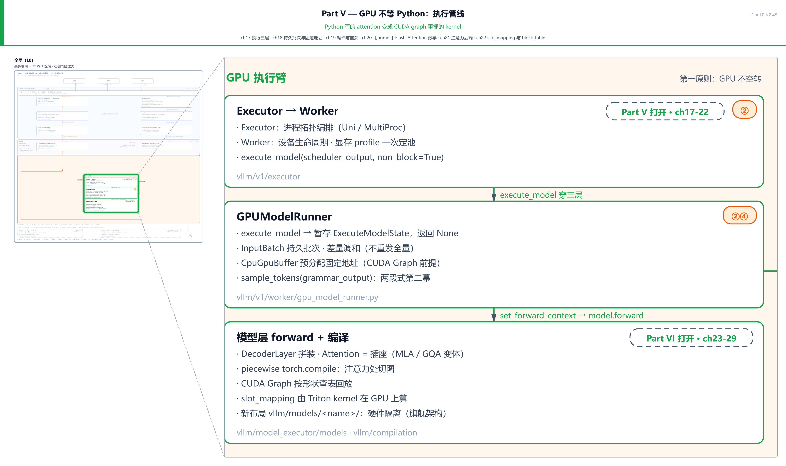
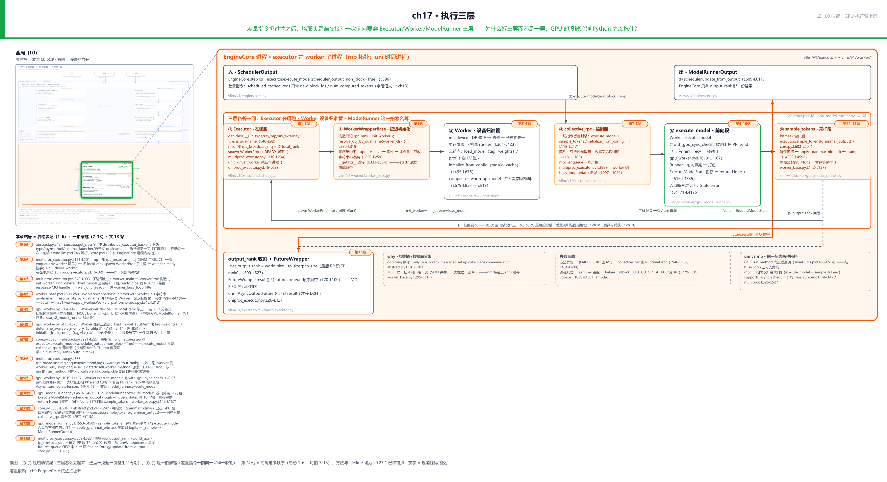
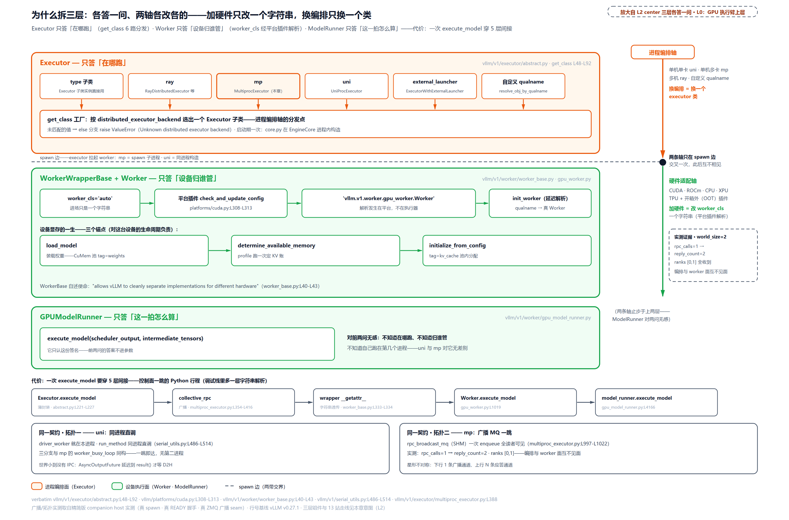
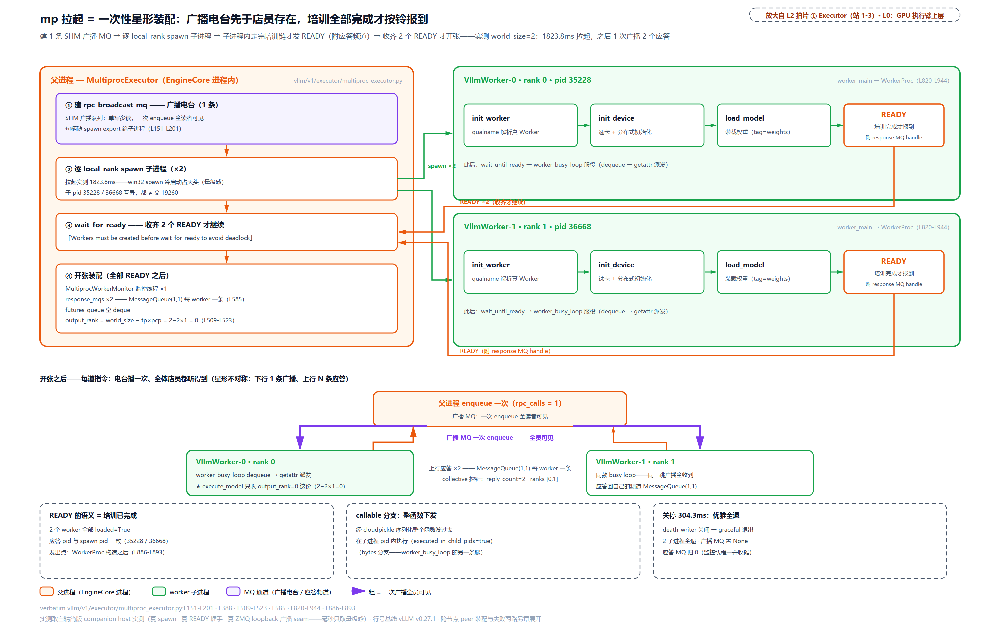
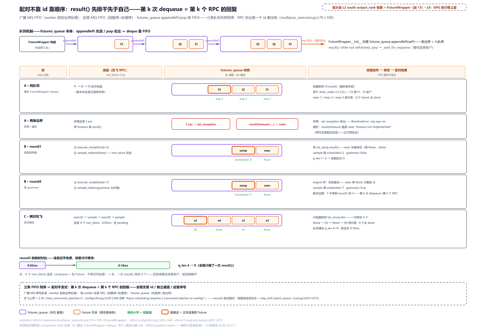

# 第 17 章　执行三层

调度器把这一拍该算的 token 摆成一张差量指令单，扔过墙；几十毫秒后，墙那头把采样好的 token id 扔回来。**墙那头是谁在接？** 八张卡就是八个进程。同一条指令怎么同时发到每一个？谁选的卡、谁加载的权重、谁量的显存？这些活你在忙循环里一次都没见过，它们是什么时候干的？再往深一步：一次前向要穿 Executor、Worker、ModelRunner 三层，外加至少一次跨进程广播——**为什么拆三层而不是一层，GPU 却没被这趟 Python 之旅拖住？**

这也是 Part V 的开篇总问题：一个 GPU 引擎，大部分代码却是 CPU 上的 Python：「Python 写的 attention」最终要变成「CUDA graph 重播的 kernel」，中间隔着整整一个执行管线。本章先立这根管线的骨架：三层各是谁、怎么装配起来、一拍怎么穿过去。差量指令怎么被调和成 GPU 输入、attention 怎么编译捕获，留给后面的章。

## 你在这里

Part V 共六章，全部在 L0 图三列中间那根 GPU 执行臂列上：ch17 执行三层（本章，立骨架）、ch18 持久批次与固定地址（差量调和）、ch19 编译与捕获、ch20 Flash-Attention 数学（原理章）、ch21 注意力后端、ch22 slot_mapping 与 block_table。



> *图注：Part V「GPU 不等 Python：执行管线」覆盖 L0 图的 GPU 执行臂整列（executor 在哪跑 / worker 设备归谁管 / model_runner 这一拍怎么算 / 模型层 module tree 加 CUDA graph 捕获区），在此亮起、区域外退后。本章打头，只取最上面两块半：执行器、worker、以及 runner 的接口；再往下（持久批次、编译捕获、算子）是 ch18-22 的戏。*

放大到本章自己这一层：



> *图注：本章放大的是[第 1 章](../../ch01-vllm-v1-in-one-map/narrative/chapter.md) L0 图三列中间那列（GPU 执行臂）的上层。[第 9 章](../../ch09-engine-core-step-loop/narrative/chapter.md)在它头顶那条循环框里拆完五拍、把 ②④ 两拍隔着墙点过名，现在进墙：中间 ①-⑥ 六块拍片就是三层本体（① Executor 在哪跑、② 延迟初始化、③ Worker 设备归谁管、④ collective_rpc 控制面、⑤ 前向段、⑥ 采样段；这六个圈号是本章 L2 图自家的编号，正文里不带说明的 ①-⑤ 一律指[第 9 章](../../ch09-engine-core-step-loop/narrative/chapter.md)的五拍），接在[第 5 章](../../ch05-zmq-topology-and-protocol/narrative/chapter.md)立过的进程边界概念与[第 10 章](../../ch10-continuous-batching-chunked-prefill/narrative/chapter.md)立过的差量协议之上。站号 = 代码走读顺序：1-6 站是**启动装配**（三层怎么立起来，只走一次），7-13 站是**一拍穿越**（指令从广播到收割，每拍心跳）；正文按讲解需要编排、不必照站号读。*

读法建议：只想知道「为什么是三层」，直奔[「为什么是三层，不是一层」](#为什么是三层不是一层)；想看星形拓扑怎么装配，跳[「mp 拉起：星形装配与 READY 握手」](#mp-拉起星形装配与-ready-握手)；控制面那条「一条广播 + 单点收割」的来龙去脉在[「一拍穿越：广播、派发、收割」](#一拍穿越广播派发收割)，其中最巧的一段（FutureWrapper 不靠 id 配对）在[「FutureWrapper：配对不靠 id，靠顺序」](#futurewrapper配对不靠-id靠顺序)；两段式的墙内侧补在[「墙内的两段式：隔着墙没走的三面」](#墙内的两段式隔着墙没走的三面)；想看 worker 怎么死怎么停，跳[「失败两路与关停三级」](#失败两路与关停三级)；想跟全程，按序读。

## 墙那头是谁：从两行调用进墙

先把墙的位置钉准。[第 9 章](../../ch09-engine-core-step-loop/narrative/chapter.md)拆 EngineCore 的一拍时，五拍里有两次调用都对着同一个对象 `self.model_executor`：②发起前向、④等结果并采样。这次带上执行臂的视角重看这两行：

```python
# vllm/v1/engine/core.py:L584-L614
    def step(self) -> tuple[dict[int, EngineCoreOutputs], bool]:
        # … 省略：docstring 与空转守卫（has_requests 早退，循环章拆过）…
        scheduler_output = self.scheduler.schedule(self._should_throttle_prefills())
        future = self.model_executor.execute_model(scheduler_output, non_block=True)  # L596
        grammar_output = self.scheduler.get_grammar_bitmask(scheduler_output)
        # … 省略：两个观测性上下文管理器（统计附件与故障兜底）…
            model_output = future.result()  # L602
            if model_output is None:
                model_output = self.model_executor.sample_tokens(grammar_output)  # L604

        # Before processing the model output, process any aborts that happened
        # during the model execution.
        self._process_aborts_queue()
        engine_core_outputs = self.scheduler.update_from_output(
            scheduler_output, model_output
        )  # L609-L611
        # … 省略：统计附件回填一行（iteration_details 收尾，与顶部省略的上下文管理器成对）…
        return engine_core_outputs, scheduler_output.total_num_scheduled_tokens > 0
```

②在 L596 发起即返回一个 future；③的 grammar bitmask（每 token 一位的允许表，[第 9 章](../../ch09-engine-core-step-loop/narrative/chapter.md)拆过它怎么藏进前向窗口）在窗口里算；L602 等到结果，如果是 None（说明「前向算完、采样欠着」），L604 再发第二跳。[第 10 章](../../ch10-continuous-batching-chunked-prefill/narrative/chapter.md)已经交代过这张差量指令单（SchedulerOutput）上写什么：新请求全量、老请求只带增量。**②④ 两次调用之间，EngineCore 侧只插了③这一段 CPU 活，其余一切事务都在墙内**。本章就是把这段墙内世界打开：指令怎么跨进程、谁在子进程里接、算完怎么回来。

墙内的代码分两个时间段讲，正好对应 L2 图的两段站号。**启动装配（站 1-6）** 只发生一次：选哪种执行器、拉起几个子进程、每个子进程里怎么选卡加载权重量显存。**一拍穿越（站 7-13）** 每拍心跳一次：广播、派发、前向、采样、收割。先立骨架，再跟心跳。

对着 L0 图说一句：从这章起我们走进「GPU 执行臂」那根列；前面十六章里它一直是循环框正下方那块没开过的黑盒。

## 第一层 Executor：只答「在哪跑」

进入新组件先定位：现在站在 L0 图 GPU 执行臂列的最上层，Executor 这一块。

### 为什么是三层，不是一层

直觉先立住（一个比喻，说完就收）：三层像医院。分诊台只答「去哪栋楼」，专科诊室对这台设备的一生负责，手术室只管眼前这台手术怎么做。换一家医院不必换手术室，进一台新设备不必动分诊台。

旧设计是什么？v0 虽有 executor、worker 之名，却没有这三层各答一问的分工：`LLMEngine` 直接持有 executor→worker，GPU 逻辑连同前向编排（runner 还只是 worker 的内部私产，不是独立一层）焊死在 worker 里，执行接口以 SequenceGroup 列表为中心，「在哪台进程跑」「这块卡怎么初始化」「这一拍怎么算」是同一坨代码。git 考古可以看清拆分的脚印：v1 起源 PR #9289（2024-10）才把 `gpu_worker.py` 与执行器目录拆出来；Executor 抽象基类和 mp 多进程后端由 PR #9856（2024-12）同批新增。三层不是一开始就有的设计，是 v1 把执行臂单独重写时才立起来的。

痛点在哪？两个**独立变化的方向**被焊死了。进程编排轴（单机单卡 / 单机多卡 mp / 多机 ray / 外部启动器 / 自定义）与硬件适配轴（CUDA / ROCm / CPU / XPU / TPU 加第三方插件）本来互不相干：每加一种硬件都要碰进程管理代码；反过来换 ray 编排又不能复用设备初始化。接口的使命写在基类 docstring 里，原文值得逐字读：

```python
# vllm/v1/worker/worker_base.py:L39-L43
class WorkerBase:
    """Worker interface that allows vLLM to cleanly separate implementations for
    different hardware. Also abstracts control plane communication, e.g., to
    communicate request metadata to other workers.
    """
```

「让 vLLM 能把不同硬件的实现干净地分开」，这就是第二层的存在理由。

v1 方案是三问切分，一问一层：

- **Executor（执行器）只答「在哪跑」**：单进程、多进程、ray 还是别的，工厂一次选定；
- **Worker 只答「设备归谁管」**：选卡、分布式、加载权重、量显存，即一张卡的一生；
- **ModelRunner 只答「这一拍怎么算」**：它只认 `(scheduler_output, intermediate_tensors)` 这个签名（`intermediate_tensors` 是流水线并行时上一段传来的中间激活（后文「Worker 层：PP 接力与转调」细讲）），不知道自己跑在第几个进程。

两轴在哪里交叉？只在拉起 worker 那条 spawn 边上交叉一次，此后互不相见。加一种硬件 = 改一个字符串，换一种编排 = 换一个类。硬件适配的分发点甚至不在执行器里，而在平台插件：

```python
# vllm/platforms/cuda.py:L307-L313
    @classmethod
    def check_and_update_config(cls, vllm_config: VllmConfig) -> None:
        parallel_config = vllm_config.parallel_config
        model_config = vllm_config.model_config

        if parallel_config.worker_cls == "auto":
            parallel_config.worker_cls = "vllm.v1.worker.gpu_worker.Worker"  # L313
```

`worker_cls` 默认值是 `"auto"`，CUDA 平台把它解析成 GPU worker 的全限定类名；ROCm、XPU、CPU 平台各给各的。执行器对这一切零感知，它只负责把字符串送到子进程。



> *图注：放大自 L0 图 GPU 执行臂列的三层行（L2 章图 center 的职责维度展开）。三条横带各答一问：Executor 带 get_class 工厂（六路分发）、Worker 带 worker_cls 字符串入口与三锚点、ModelRunner 只认方法签名；右缘两条正交轴在 spawn 边交叉一次：加硬件只改一个字符串、换编排只换一个类。底部是代价：一次 execute_model 穿 5 层间接（锚点链见下文）。*

代价也要诚实记。正交是用调用栈深度换的：一次 `execute_model` 要穿薄封装（`abstract.py:L221-L227`）→ `collective_rpc`（`multiproc_executor.py:L354-L416`）→ wrapper 的 `__getattr__` 字符串转发（`worker_base.py:L333-L334`）→ `Worker`（`gpu_worker.py:L1019`）→ runner（`gpu_model_runner.py:L4166`），**五层间接**；调试栈里多一层按字符串找属性，报错定位比直呼其名绕。这笔税每拍都交，换回的是「换硬件不碰进程代码」——对要支持十来种加速卡的仓库，值。

### 工厂 get_class：一条 elif 链定拓扑

执行臂的第一问「在哪跑」，答案是一个启动期只跑一次的静态工厂：

```python
# vllm/v1/executor/abstract.py:L47-L92
    @staticmethod
    def get_class(vllm_config: VllmConfig) -> type["Executor"]:
        executor_class: type[Executor]
        parallel_config = vllm_config.parallel_config
        distributed_executor_backend = parallel_config.distributed_executor_backend
        if isinstance(distributed_executor_backend, type):  # L53
            if not issubclass(distributed_executor_backend, Executor):
                raise TypeError(
                    "distributed_executor_backend must be a subclass of "
                    f"Executor. Got {distributed_executor_backend}."
                )
            executor_class = distributed_executor_backend
        elif distributed_executor_backend == "ray":
            # … 省略：按 VLLM_USE_RAY_V2_EXECUTOR_BACKEND 选 RayExecutorV2
            #       或 RayDistributedExecutor（多机编排，分布式章展开）…
        elif distributed_executor_backend == "mp":  # L69
            from vllm.v1.executor.multiproc_executor import MultiprocExecutor

            executor_class = MultiprocExecutor
        elif distributed_executor_backend == "uni":  # L73
            from vllm.v1.executor.uniproc_executor import UniProcExecutor

            executor_class = UniProcExecutor
        elif distributed_executor_backend == "external_launcher":
            # TODO: make v1 scheduling deterministic
            # to support external launcher
            executor_class = ExecutorWithExternalLauncher
        elif isinstance(distributed_executor_backend, str):  # L81
            executor_class = resolve_obj_by_qualname(distributed_executor_backend)
            if not issubclass(executor_class, Executor):
                raise TypeError(
                    "distributed_executor_backend must be a subclass of "
                    f"Executor. Got {executor_class}."
                )
        else:
            raise ValueError(
                f"Unknown distributed executor backend: {distributed_executor_backend}"
            )
        return executor_class
```

`distributed_executor_backend` 是 `VllmConfig` 里的配置项（[第 3 章](../../ch03-engineargs-to-vllmconfig/narrative/chapter.md)那条配置流水线的产物）。六条路：传 Executor **子类**、`ray`、`mp`、`uni`、`external_launcher`（外部启动器：假定 torchrun 之类已经摆好 RANK/WORLD_SIZE 环境变量（全局进程序号与总进程数），vLLM 每个进程只起自己那一个 worker，为 RLHF（人类反馈强化学习）训练与推理共栖一套编排而设）、自定义 qualname（全限定类名，字符串按路径 import 回来）。选完之后前端把 `executor_class` 送进 EngineCore 进程：类对象跨进程走标准 pickle，pickle 记类只记「模块.类名」的引用、对侧解包时把模块重新 import 一遍拿回同一个类。这与后文 worker_cls 明确拒收类并不矛盾：executor 类是纯拓扑代码，import 不碰设备与平台插件；worker 类解析成谁，取决于 worker 子进程里才注入的平台环境，那一步必须推迟。`EngineCore.__init__` 里一行落地（`core.py:L132`：`self.model_executor = executor_class(vllm_config)`），执行臂从此诞生。

五种形态怎么选？（六条路并数成五种：第一条传子类与末一条自定义 qualname 都算「自定义」，二并一。）官方文档的默认口径：**多机默认 Ray、单机默认 Python multiprocessing（mp）**（[并行文档](https://docs.vllm.ai/en/stable/serving/parallelism_scaling/)）；`uni` 与 `external_launcher` 是源码级选项。单卡（TP×PP=1，张量并行（TP，一层的矩阵乘切到多张卡）乘流水线并行的度数为 1）走 uni，单机多卡走 mp。这步不用用户操心：`distributed_executor_backend` 留空时，配置流水线按 world_size 自动落子，多进程默认 mp、单进程落 uni（`config/parallel.py:L911-L956`），正是[第 3 章](../../ch03-engineargs-to-vllmconfig/narrative/chapter.md)那条链上的一步。值得点破的一条事实：本 pin 版本里选 ray 默认得到的已是 RayExecutorV2：环境变量 `VLLM_USE_RAY_V2_EXECUTOR_BACKEND` 运行时默认开，官方 API 文档自述它「Inherits from MultiprocExecutor to reuse the MQ-based control plane and NCCL data plane」（继承 MultiprocExecutor，复用基于消息队列的控制面与 NCCL（NVIDIA 的 GPU 间通信库，下文 mp 拉起一节展开）数据面，[API 文档](https://docs.vllm.ai/en/latest/api/vllm/v1/executor/ray_executor_v2/)），Ray 只管 actor 的生命周期与放置，控制面整个复用 mp 的实现。**讲透 mp 就讲透了 ray 的核**；ray 全貌归分布式章。旧的 compiled-graph 后端（就是上面省略行里的 RayDistributedExecutor，envs.py 注释给它的别称「compiled-graph backend」，ray 的旧一代执行器实现）成了把环境变量置 0 的退路。

### uni：控制面的最简形态

读控制面，从最小的那个开始。uni 后端里没有子进程，`driver_worker` 就住在引擎进程里：

```python
# vllm/v1/executor/uniproc_executor.py:L45-L69
class UniProcExecutor(Executor):
    def _init_executor(self) -> None:
        """Initialize the worker and load the model."""
        self.driver_worker = WorkerWrapperBase(rpc_rank=0)  # L48
        distributed_init_method, rank, local_rank = self._distributed_args()
        kwargs = dict(
            vllm_config=self.vllm_config,
            local_rank=local_rank,
            rank=rank,
            distributed_init_method=distributed_init_method,
            is_driver_worker=True,
            shared_worker_lock=Lock(),
        )
        # … 省略：NIC 亲和的平台适配一行 …
        self.driver_worker.init_worker(all_kwargs=[kwargs])
        self.driver_worker.init_device()

        if envs.VLLM_ELASTIC_EP_SCALE_UP_LAUNCH:
            self.driver_worker.elastic_ep_execute("load_model")
        else:
            self.driver_worker.load_model()
        current_platform.update_block_size_for_backend(self.vllm_config)
```

拉起就是三连调：`init_worker`（构造真 Worker；为什么先过一层 wrapper、不直接构造？站 4 细拆）→ `init_device` → `load_model`。记住这个顺序，mp 后端在每个子进程里原样再走一遍。kwargs 里三个启动参数顺手认下，mp 拉起还会原样再见到它们：`distributed_init_method`（torch 分布式的会合地址，`tcp://ip:port` 形式，各进程靠它互相找到彼此）、`is_driver_worker`（本 worker 是否承担 driver 职责，源码 docstring 原话「handles driver responsibilities」，分布式协作里被点名的那一个，哪些事归它、细节归分布式章）、`shared_worker_lock`（跨 worker 共享的一把锁，executor 造好传进来；本版本里它护的是多模态共享内存接收缓存的并发访问）。（`load_model` 外面那个 if 是弹性专家并行的扩容加载开关，特性分支不展开，默认走 else。）而它的控制面（collective_rpc。RPC 即 remote procedure call，远程过程调用：在别的进程里调方法；collective 即「全体 worker 一起调」。它是执行器对 worker 下发一切指令的唯一入口，契约与 why 在后面「控制面」一节讲透）：

```python
# vllm/v1/executor/uniproc_executor.py:L79-L106
    def collective_rpc(  # type: ignore[override]
        self,
        method: str | Callable,
        timeout: float | None = None,
        args: tuple = (),
        kwargs: dict | None = None,
        non_block: bool = False,
        single_value: bool = False,
    ) -> Any:
        if kwargs is None:
            kwargs = {}

        if not non_block:
            result = run_method(self.driver_worker, method, args, kwargs)  # L92
            if isinstance(result, AsyncModelRunnerOutput):
                result = result.get_output()
            return result if single_value else [result]

        try:
            result = run_method(self.driver_worker, method, args, kwargs)
            if isinstance(result, AsyncModelRunnerOutput):
                return AsyncOutputFuture(result, single_value)  # L100
            future = Future[Any]()
            future.set_result(result if single_value else [result])
        except Exception as e:
            future = Future[Any]()
            future.set_exception(e)
        return future
```

「广播」退化成同进程直调 `run_method`，一次把活干完。非阻塞路径要说准：**uni 没有真异步**，方法同步算完，若是异步输出就包进 `AsyncOutputFuture`（[第 9 章](../../ch09-engine-core-step-loop/narrative/chapter.md)拆过：`result()` 只等 D2H 拷贝事件，即 GPU 显存到 CPU 内存的搬运完成，不等计算）；普通结果直接塞进一个已经完成的 Future（提货单，[第 9 章](../../ch09-engine-core-step-loop/narrative/chapter.md)立的记法：提交即拿单、之后才决定何时等）。`run_method` 的派发是三分支：

```python
# vllm/v1/serial_utils.py:L486-L510
def run_method(
    obj: Any,
    method: str | bytes | Callable,
    args: tuple[Any, ...],
    kwargs: dict[str, Any],
) -> Any:
    """… 省略：docstring（str→getattr / bytes→cloudpickle / callable→直接调）…"""
    if isinstance(method, bytes):  # L499
        func = partial(cloudpickle.loads(method), obj)
    elif isinstance(method, str):  # L501
        try:
            func = getattr(obj, method)
        except AttributeError:
            raise NotImplementedError(
                f"Method {method!r} is not implemented."
            ) from None
    else:
        func = partial(method, obj)  # type: ignore
    return func(*args, **kwargs)
```

方法名是字符串就 `getattr`，是字节就 cloudpickle 反序列化成一个函数再绑上对象，本来就是函数就直接调。**这三分支等会儿在 mp 的子进程里会原样再出现一遍**。同一个抽象、两种拓扑，这是第一份证据。

## 第二层 Worker：设备的一生

定位句：现在下到 L0 图 GPU 执行臂列的第二块，Worker。本书以 mp 后端为叙事主线（单机多卡是单机默认），uni 当作刚才那个最小对照。

### mp 拉起：星形装配与 READY 握手

mp 的形状是一个星形：1 个执行器进程（就住在 EngineCore 进程里）+ N 个 WorkerProc 子进程。装配的源头在 `_init_executor`：

```python
# vllm/v1/executor/multiproc_executor.py:L131-L234 · MultiprocExecutor._init_executor
        self.rpc_broadcast_mq: MessageQueue | None = None
        scheduler_output_handle: Handle | None = None
        # Initialize worker and set up message queues for SchedulerOutputs
        # and ModelRunnerOutputs
        if self.parallel_config.node_rank_within_dp == 0:
            # … 省略：DP leader 日志（数据并行组的领头节点）…
            max_chunk_bytes = envs.VLLM_MQ_MAX_CHUNK_BYTES_MB * 1024 * 1024
            mq_connect_ip = get_ip()
            self.rpc_broadcast_mq = MessageQueue(
                self.world_size,
                self.local_world_size,
                max_chunk_bytes=max_chunk_bytes,
                connect_ip=mq_connect_ip,
            )  # L151-L156
            scheduler_output_handle = self.rpc_broadcast_mq.export_handle()
        # Create workers
        context = get_mp_context()
        shared_worker_lock = context.Lock()
        unready_workers: list[UnreadyWorkerProcHandle] = []
        success = False
        try:
            global_start_rank = (
                self.local_world_size * self.parallel_config.node_rank_within_dp
            )
            # … 省略：fork 模式下继承 fd 的登记（防 EOF 失效，见关停一节）…
            # For CPU backend only, to setup OpenMP threads affinity
            cpu_omp_manager = OMPProcessManager(self.vllm_config)
            for local_rank in range(self.local_world_size):
                global_rank = global_start_rank + local_rank
                is_driver_worker = self._is_driver_worker(global_rank)
                with cpu_omp_manager.configure_omp_envs(
                    rank=global_rank, local_rank=local_rank
                ):
                    unready_worker_handle = WorkerProc.make_worker_process(
                        vllm_config=self.vllm_config,
                        local_rank=local_rank,
                        rank=global_rank,
                        distributed_init_method=distributed_init_method,
                        input_shm_handle=scheduler_output_handle,
                        shared_worker_lock=shared_worker_lock,
                        is_driver_worker=is_driver_worker,
                        inherited_fds=inherited_fds,
                    )
                unready_workers.append(unready_worker_handle)
                # … 省略：fork 模式下把本 worker 的两个管道 fd 登记进
                #       inherited_fds（三行，与上面省略的登记初始化同属一件事）…

            # Workers must be created before wait_for_ready to avoid
            # deadlock, since worker.init_device() does a device sync.

            # Wait for all local workers to be ready.
            self.workers = WorkerProc.wait_for_ready(unready_workers)  # L201

            # Start background thread to monitor worker health if not in headless mode.
            if self.monitor_workers:
                self.start_worker_monitor()

            self.response_mqs = []
            # Only leader node have remote response mqs
            if self.parallel_config.node_rank_within_dp == 0:
                for rank in range(self.world_size):
                    if rank < self.local_world_size:
                        local_message_queue = self.workers[rank].worker_response_mq
                        # … 省略：local_message_queue 非空断言一行 …
                        self.response_mqs.append(local_message_queue)
                    # … 省略：跨节点的对端应答队列装配（多机，分布式章）…

            # Ensure message queues are ready. Will deadlock if re-ordered
            # Must be kept consistent with the WorkerProc.

            # Wait for all input mqs to be ready.
            if self.rpc_broadcast_mq is not None:
                self.rpc_broadcast_mq.wait_until_ready()
            # Wait for all remote response mqs to be ready.
            for response_mq in self.response_mqs:
                response_mq.wait_until_ready()

            self.futures_queue = deque[FutureWrapper]()  # L232

            self._post_init_executor()
```

四步走：**先架广播电台，再招店员，收齐报到，开张装配**。`rpc_broadcast_mq` 是一条共享内存（SHM）消息队列（MessageQueue），一次 `enqueue` 全部 worker 都能读到。它先于任何 worker 存在，句柄 export 出去随 spawn 传进子进程；然后逐 `local_rank`（本机内的序号）spawn 子进程；`wait_for_ready` 等每个子进程的 READY；最后起监控线程、装配每 worker 一条的应答 MQ、开出空的 `futures_queue`（一个 `deque` 双端队列，两头都能进出；后面 FIFO（先进先出）配对的机关就在这）。上行与下行不对称：**下行 1 条广播通道，上行 N 条应答通道**。

中间那行注释值得停一下：「Workers must be created before wait_for_ready to avoid deadlock, since worker.init_device() does a device sync」：全部子进程必须先 spawn 出来才能开始等 READY，因为 worker 的设备初始化里有集合通信（多个进程一起参与的通信操作），会做设备同步：谁都在等别人，少一个都过不去。这不是 Python 级的死锁，是集合通信的本性。NCCL（NVIDIA 的 GPU 间集合通信库，all-reduce 这类「多卡汇总」操作的事实标准实现，PyTorch 分布式的底层就是它）的官方文档自己写着集合通信「Tight synchronization between communicating processors is a key aspect of collective communication」（参与方之间紧密同步是集合通信的关键特性，[NCCL 概述](https://docs.nvidia.com/deeplearning/nccl/user-guide/docs/overview.html)）。所以装配顺序是结构要求，不是风格偏好。

子进程那半边，入口是 `worker_main`：

```python
# vllm/v1/executor/multiproc_executor.py:L820-L944
    @staticmethod
    def worker_main(*args, **kwargs):
        """Worker initialization and execution loops.
        This runs a background process"""

        # Signal handler used for graceful termination.
        # SystemExit exception is only raised once to allow this and worker
        # processes to terminate without error
        shutdown_requested = threading.Event()

        def signal_handler(signum, frame):
            nonlocal shutdown_requested
            if not shutdown_requested.is_set():
                shutdown_requested.set()
                logger.debug(
                    "WorkerProc handling signal %d, raising SystemExit", signum
                )
                raise SystemExit()

        # Either SIGTERM or SIGINT will terminate the worker
        signal.signal(signal.SIGTERM, signal_handler)
        signal.signal(signal.SIGINT, signal_handler)

        # … 省略：GPU 物理卡号映射与 NIC 亲和两段平台适配（约十行）…
        worker = None
        ready_writer = kwargs.pop("ready_pipe")
        death_pipe = kwargs.pop("death_pipe", None)

        # Close inherited pipes from parent (incl. other worker pipes)
        # Explicitly passing in existing pipes and closing them makes the pipe
        # behave when using fork. Otherwise, a hidden reference to the pipes
        # exist in the child process and prevents EOF closure.
        for fd in kwargs.pop("inherited_fds", []):
            try:
                os.close(fd)
            except Exception as e:
                logger.warning("Error closing inherited connection: %s: %s", type(e), e)

        try:
            # … 省略：tracer 初始化（链路追踪的可观测性装配，五行）…
            worker = WorkerProc(*args, **kwargs)
            # … 省略：response MQ 非空断言与 numa 亲和日志（两行）…
            worker.monitor_death_pipe(death_pipe, shutdown_requested)

            # Send READY once we know everything is loaded
            ready_writer.send(
                {
                    "status": WorkerProc.READY_STR,  # L889
                    "handle": worker.worker_response_mq.export_handle(),
                    "peer_response_handles": worker.peer_response_handles,
                }
            )

            # Ensure message queues are ready. Will deadlock if re-ordered.
            # Must be kept consistent with the Executor
            if worker.rpc_broadcast_mq is not None:
                worker.rpc_broadcast_mq.wait_until_ready()
            worker.worker_response_mq.wait_until_ready()
            ready_writer.close()
            ready_writer = None

            worker.worker_busy_loop()

        except Exception:
            # NOTE: if an Exception arises in busy_loop, we send
            # a FAILURE message over the MQ RPC to notify the Executor,
            # which triggers system shutdown.
            # TODO(rob): handle case where the MQ itself breaks.

            if ready_writer is not None:
                logger.exception("WorkerProc failed to start.")
            elif shutdown_requested.is_set():
                logger.debug_once(
                    "[shutdown] WorkerProc: exiting after shutdown request"
                )
            else:
                logger.exception("WorkerProc failed.")

            # The parent sends a SIGTERM to all worker processes if
            # any worker dies. Set this value so we don't re-throw
            # SystemExit() to avoid zmq exceptions in __del__.
            shutdown_requested.set()

        except SystemExit as e:
            # … 省略：区分正常关停信号与意外终止的日志分支 …
            raise e

        finally:
            if ready_writer is not None:
                ready_writer.close()
            if death_pipe is not None:
                death_pipe.close()
            # Clean up once worker exits busy loop
            if worker is not None:
                worker.shutdown()
```

`WorkerProc` 的构造函数里就是 uni 三连调的翻版：`init_worker` → `init_device` → `load_model` 全部完成，才经 `ready_pipe` 发 READY，而且 READY 里**附着自己的应答频道**（`worker_response_mq.export_handle()`，父进程就是从这份报到信里拿到收割通道的）。之后 `worker_busy_loop()` 进服役主循环，直到永远。`except` 块里那个 `ready_writer is not None` 的判断是分流钥匙：报到信还没发出去就炸 = 启动期失败（父进程在 `wait_for_ready` 里就能看到管道异常）；发出去之后才炸 = 运行期失败（走消息队列回报，失败一节细讲）。`death_pipe` 是子进程感知父进程死亡的心跳线，也留到关停一节。



> *图注：放大自 L0 图执行臂列的 Executor 块（L2 章图站 2-3 的时序展开）。左栏父进程四步：建广播 MQ → 逐 rank spawn → wait_for_ready → 开张装配；右栏每个子进程走完 init_worker→init_device→load_model 的全部培训才发 READY（附应答频道句柄）。第二幕是稳态的星形不对称：下行一条粗广播、上行 N 条细应答，只有 output_rank 那条被收割。*

这一整套装配在配套精简版上真跑过（world_size=2，全部 worker 进程数；真 spawn 子进程、真 READY 握手、真广播队列）。先交代取证环境，本章全部实测数字共用这套说明：取证机是 Windows、无 GPU，精简版的广播/应答队列在该机上用 ZeroMQ 回环 tcp 的等价替代（[第 5 章](../../ch05-zmq-topology-and-protocol/narrative/chapter.md)那套消息库；真实部署是共享内存环形缓冲加 ipc:// 本地套接字，控制面契约一致），凡毫秒数只取结构与量级、不当部署性能结论。实测：拉起全程 1823.8ms（Windows spawn 模式解释器冷启动占大头，Linux 默认 fork 会快得多，量级感而已），得到 2 个互异 pid（进程 id：35228 与 36668，都不同于父进程 19260）的子进程；READY 的语义被验证：2 个 worker 全部「模型已加载」、应答 pid 与 spawn pid 一致；拓扑清单：1 条广播 MQ + 2 条应答 MQ（每 worker 一条 `MessageQueue(1,1)`，`multiproc_executor.py:L585`）+ 空的 futures_queue + 1 条监控线程；之后一次 `enqueue` 广播、2 个应答（rank 0 和 1 都收到），「一次广播全员可见」是真的；关停 304.3ms 后两个子进程全退、广播 MQ 置空、应答 MQ 归零。

顺带一提进程怎么生出来：`get_mp_context()` 取 multiprocessing 上下文，Unix 上默认 fork（`VLLM_WORKER_MULTIPROC_METHOD` 可改），但 CUDA 已初始化时强制换 spawn：fork 复制整个进程会连 GPU 上下文一起复制出事故，spawn 重新起解释器则干净。[第 4 章](../../ch04-two-usage-faces-one-trio/narrative/chapter.md)拆过这对两难（fork 撞 CUDA、spawn 撞 `__main__`），这里正是它的第二现场：执行臂的 worker 进程也走同一条判断线。

### 延迟初始化：先记名，后进人

站 4 的主角是子进程里那个 `WorkerWrapperBase`。它解的是一个先有鸡还是先有蛋的问题：**executor 想在子进程里造 Worker，但 Worker 类在哪个进程里解析、什么时机解析，都不是随便定的。**

```python
# vllm/v1/worker/worker_base.py:L187-L216
class WorkerWrapperBase:
    """
    This class represents one process in an executor/engine. It is responsible
    for lazily initializing the worker and handling the worker's lifecycle.
    We first instantiate the WorkerWrapper, which remembers the worker module
    and class name. Then, when we call `update_environment_variables`, and the
    real initialization happens in `init_worker`.
    """

    def __init__(
        self,
        rpc_rank: int = 0,
        global_rank: int | None = None,
    ) -> None:
        """
        # … 省略：rpc_rank 与分布式 rank 何时不同的说明（SPMD 多执行器场景，
        #       见下文）…
        """
        self.rpc_rank: int = rpc_rank
        self.global_rank: int = self.rpc_rank if global_rank is None else global_rank

        # Initialized after init_worker is called
        self.worker: WorkerBase
        self.vllm_config: VllmConfig
```

构造函数只记两个数：`rpc_rank`（执行器内的序号）和 `global_rank`（全局分布式序号）。**人还没进来，先登记工位**。真正的实例化在 `init_worker`：

```python
# vllm/v1/worker/worker_base.py:L229-L319
    @instrument(span_name="Worker init")
    def init_worker(self, all_kwargs: list[dict[str, Any]]) -> None:
        """
        Here we inject some common logic before initializing the worker.
        Arguments are passed to the worker class constructor.
        """
        kwargs = all_kwargs[self.rpc_rank]

        vllm_config: VllmConfig | None = kwargs.get("vllm_config")
        assert vllm_config is not None, (
            "vllm_config is required to initialize the worker"
        )
        self.vllm_config = vllm_config

        vllm_config.enable_trace_function_call_for_thread()

        from vllm.plugins import load_general_plugins

        load_general_plugins()  # L247

        parallel_config = vllm_config.parallel_config
        if isinstance(parallel_config.worker_cls, str):
            worker_class: type[WorkerBase] = resolve_obj_by_qualname(
                parallel_config.worker_cls
            )  # L251-L253
        else:
            raise ValueError(
                "passing worker_cls is no longer supported. "
                "Please pass keep the class in a separate module "
                "and pass the qualified name of the class as a string."
            )
        # … 省略：worker_extension_cls 动态注入基类（扩展 collective_rpc 可调面）
        #       与多模态接收缓存的构建（按需挂接）…
        with set_current_vllm_config(self.vllm_config):
            # To make vLLM config available during worker initialization
            self.worker = worker_class(**kwargs)  # L319
```

三步顺序是硬约束：**注入环境变量 → 加载插件 → 才实例化**（第一步不在本段节选里：环境变量注入是 executor 通过控制面单独调的 `update_environment_variables`（ray 后端在拉起 worker 前实调，`ray_executor.py:L326`；mp/uni 的环境随进程继承自然到位）。为什么硬？CUDA 上下文绑定在这个进程第一次调 torch CUDA 接口的时刻，而平台插件（`load_general_plugins`）可能注册或覆盖平台实现。如果 Worker 类在环境变量（比如 `CUDA_VISIBLE_DEVICES`，决定这进程看得见哪几张卡）注入前就实例化，import 期解析的设备与实际可见设备错位，后面全错。配套的第二条约束是那个 `ValueError`：**worker_cls 只收字符串、明确拒绝传类**。不是矫情：传类意味着类在父进程（executor 侧）就完成了 import 与解析，插件环境对不上；收字符串才能把「解析成类」这一步推迟到子进程、推迟到环境就绪之后。

wrapper 的最后一件法宝是一行魔法：

```python
# vllm/v1/worker/worker_base.py:L333-L334
    def __getattr__(self, attr: str):
        return getattr(self.worker, attr)
```

`__getattr__`（属性查找的兜底钩子）把一切 wrapper 自己没有的属性透传给真 Worker。控制面的 `getattr(self.worker, "execute_model")` 能命中，根子就在这行。代价也在这行：`init_worker` 之前访问任何属性都是未定义行为，靠约定不靠类型系统。

顺带把 `rpc_rank` 的 docstring 里那个术语讲透。SPMD（Single Program, Multiple Data，单程序多数据）是并行计算的经典形态：**同一份程序复制 N 份、各进程处理各自的数据、只在通信点对齐**。它和 GPU warp 的 lockstep（同一条指令同一时刻施于多个线程，SIMD 那一族）是两回事：SPMD 的各进程可以各走各的分支、各有各的进度，程序只有一份，进程间的差异全靠启动时注入的身份（rank）。[第 1 章](../../ch01-vllm-v1-in-one-map/narrative/chapter.md)引过 v1 架构文档的自述「Driver process + SPMD workers」，你此刻亲眼看到的正是它：`worker_main` 这一份入口程序被 spawn N 次，每个进程按 rank 选卡后进同一个 `worker_busy_loop`。而 docstring 里「SPMD-style offline inference」的用法是第二种：N 个引擎各带 1 个 worker（rpc_rank 全是 0、分布式 rank 各不同）：同程序还在，只是每份程序自带完整引擎。所以 `rpc_rank` 与 `global_rank` 在单执行器里恒等，在多执行器共舞时才会分家。

还有一处扩展点一笔带过：`worker_extension_cls` 允许把一个扩展类动态塞进 Worker 的基类列表，扩展出 `collective_rpc` 能调到的新方法面（上面省略的那段）。这是 RLHF 训练循环的现实驱动力：训练进程每轮更新完权重，要实时推进正在服役的 worker，靠的正是 collective_rpc「能下发任意可序列化函数」的能力（配合 OpenRLHF 这类框架；生成长回答可占 RLHF 训练总时九成的量级说法，见[官方博客](https://vllm.ai/blog/2025-04-23-openrlhf-vllm)，外部数字、保守引用）。

### init_device：NCCL 先于显存快照

站 5，Worker 出生后干的第一件大事。整段读：

```python
# vllm/v1/worker/gpu_worker.py:L303-L423
    @instrument(span_name="Init device")
    def init_device(self):
        if self.device_config.device_type == "cuda":
            # This env var set by Ray causes exceptions with graph building.
            os.environ.pop("NCCL_ASYNC_ERROR_HANDLING", None)
            parallel_config = self.parallel_config
            if (
                parallel_config.distributed_executor_backend
                not in ("ray", "external_launcher")
                # … 省略：另两个同族条件（data_parallel_backend 与单节点判定）…
            ):
                # Use local DP rank if available, otherwise use global DP rank.
                dp_local_rank = self.parallel_config.data_parallel_rank_local
                if dp_local_rank is None:
                    dp_local_rank = self.parallel_config.data_parallel_index

                tp_pp_world_size = (
                    self.parallel_config.pipeline_parallel_size
                    * self.parallel_config.tensor_parallel_size
                )

                # DP_LOCAL_RANK * TP_PP_WORLD_SIZE + TP_LOCAL_RANK
                self.local_rank += dp_local_rank * tp_pp_world_size  # L326

            # … 省略：assigned_physical_gpu_ids 的逻辑卡号→物理卡号映射校验（约三十行）…
            visible_device_index = (
                current_platform.logical_device_id_to_visible_device_id(self.local_rank)
            )  # L364-L366
            self.device = torch.device(f"cuda:{visible_device_index}")  # L367
            torch.accelerator.set_device_index(self.device)

            current_platform.check_if_supports_dtype(self.model_config.dtype)

            # Initialize the distributed environment BEFORE taking
            # memory snapshot
            # This ensures NCCL buffers are allocated before we measure
            # available memory
            init_worker_distributed_environment(
                self.vllm_config,
                self.rank,
                self.distributed_init_method,
                self.local_rank,
                current_platform.dist_backend,
            )  # L376-L382
            # … 省略：V2 model runner 的 info_once 提示两行（实验线，见下文脚注）…

            # Set random seed.
            set_random_seed(self.model_config.seed)

            # Now take memory snapshot after NCCL is initialized
            gc.collect()
            torch.accelerator.empty_cache()  # L391-L392

            # take current memory snapshot
            self.init_snapshot = init_snapshot = MemorySnapshot(device=self.device)  # L395
            self.requested_memory = request_memory(init_snapshot, self.cache_config)
            # … 省略：快照与请求显存的两条 debug 日志（四行）…
        else:
            raise RuntimeError(f"Unsupported device type: {self.device_config.device}")

        # … 省略：workspace manager 初始化（微批工作区）…

        # Construct the model runner
        if self.use_v2_model_runner:
            # … 省略：V2 实验线的 import 与构造（见下文脚注）…
        else:
            from vllm.v1.worker.gpu_model_runner import (
                GPUModelRunner as GPUModelRunnerV1,
            )

            self.model_runner = GPUModelRunnerV1(self.vllm_config, self.device)  # L421-L423
```

四步：修正 local_rank → 选卡 → **分布式初始化刻意排在显存快照之前** → 构造 runner。第一步的公式值得看一眼：数据并行组里的第 `k` 个引擎，它的 worker 用的设备号要加上 `k × (PP×TP)` 的偏移，因为同一台机器上所有引擎的 worker 共享设备号空间，不偏移就会撞卡。选卡那两行把逻辑卡号翻译成物理可见卡号再 `torch.device("cuda:N")`。

第三步是本段的关键，注释自己把动机说完了：「This ensures NCCL buffers are allocated before we measure available memory」：分布式初始化会分配 NCCL 通信缓冲（TP>1 时可达数百 MiB 量级，示意值）。如果先快照后初始化，这部分「已经用了」的显存没被记账，后面按快照算出来的 KV cache 可用账就会虚高，运行期通信缓冲真分配下去才 OOM（显存用尽报错）。显存那本账（profile 三步定 KV 账）是 Part IV 的显存章逐行拆过的，这里只需认下归属：**顺序是 Worker 的责任**，因为只有 Worker 同时握着「初始化分布式」和「量显存」两件事。顺序对了还不够，量之前还 `gc.collect()` 加 `empty_cache()` 把 Python 堆和框架缓存的碎片清干净，快照才是干净起点。

脚注一条：结尾的 `use_v2_model_runner` 分支指向 `vllm/v1/worker/gpu/` 下的 Model Runner V2。它的 README 自述「experimental … under active development」（实验性、活跃开发中），默认关。本书全书锚定 V1 实现，V2 只在此登记存在。

### 显存三锚点：weights 与 kv_cache 两个池

站 6 收尾 Worker 的一生。设备显存上的三件大事各有一个锚点：

```python
# vllm/v1/worker/gpu_worker.py:L435-L443
    def load_model(self, *, load_dummy_weights: bool = False) -> None:
        with (
            self._maybe_get_memory_pool_context(tag="weights"),  # L437
            set_current_vllm_config(self.vllm_config),
            # 20 MiB is the minimum PyTorch allows for max_split_size_mb.
            self._scoped_allocator_max_split(max_split_size_mb=20),
        ):
            self.model_runner.load_model(load_dummy_weights=load_dummy_weights)
```

```python
# vllm/v1/worker/gpu_worker.py:L649-L676
    @instrument(span_name="Allocate KV cache")
    def initialize_from_config(self, kv_cache_config: KVCacheConfig) -> None:
        """Allocate GPU KV cache with the specified kv_cache_config."""

        # Update local config with adjusted num blocks after profiling,
        # so that it's available to the warmup stage.
        self.cache_config.num_gpu_blocks = kv_cache_config.num_blocks

        # Init kv cache connector here, because it requires
        # `kv_cache_config`.
        # NOTE(Kuntai): This need to be done before `initialize_kv_cache`,
        # because `initialize_kv_cache` will inject kv cache groups not
        # related to kv cache connector (e.g. kv cache sharing layers).
        ensure_kv_transfer_initialized(self.vllm_config, kv_cache_config)  # L662

        with self._maybe_get_memory_pool_context(tag="kv_cache"):  # L664
            self.model_runner.initialize_kv_cache(kv_cache_config)

        # … 省略：路由专家捕获与 KV 清零元数据两段收尾 …
```

三锚点连成显存的一生：`load_model` 把权重装进 tag 为 `weights` 的内存池上下文；`determine_available_memory` 跑 profile 定 KV 账（那本账 Part IV 的显存章逐行拆过，此处只认归属：入口也是 Worker 的方法）；`initialize_from_config` 在 tag 为 `kv_cache` 的池里分配 KV cache。两个池 tag 是 CuMem（CUDA 内存池管理）的记账单位：按池归类后，生产级的 sleep/wake（睡觉时整池显存归还、叫醒时再要回来）才做得动，那条特性线本章不展开。`ensure_kv_transfer_initialized` 刻意排在 `initialize_kv_cache` 之前，注释给了理由：KV connector（KV cache 跨引擎搬运的双面接口，Part IV 末章的主角）要先看到完整的 config 才能注入自己的 cache 组。

三锚点之后还有一个 `compile_or_warm_up_model`，这是启动期的最后一役：warmup 各尺寸、kernel 调优、CUDA graph 捕获、采样器预热、inductor（PyTorch 的编译后端）惰性初始化、JIT（即时编译）纠察开启、GC（垃圾回收）冻结，把一切运行期才可能发生的「第一次」全部前移到启动期。为什么 warmup 排在捕获前？先让 JIT 编译与调优发生，再把稳定的执行录成图。这套编排的完整拆解是 Part V 编译章的正片，本章只立「它归 Worker 管、它在启动期跑完」这个归属。

## 控制面：一切指令皆 collective_rpc

定位句：三层已经立起来了，现在回到最上层看「指令怎么过墙」：executor 与 worker 子进程之间那条广播线（L2 站 7-8：一次 enqueue，全员可见；前面星形图第二幕里那条下行粗广播）。

先看一个清单式的事实：引擎对执行臂的全部指令（`execute_model`、`sample_tokens`、`initialize_from_config`、`determine_available_memory`、`get_kv_cache_spec`、`compile_or_warm_up_model`、加 LoRA（低秩适配器）、睡觉、健康检查）**无一例外都经同一个抽象方法 `collective_rpc` 下发**（健康检查在 mp 下也经它；uni 下它直接 no-op：worker 就在本进程，活着就是健康。RPC/collective 记法沿用本章 uni 节的定义：在别的进程里、全体 worker 一起调一个方法，下文沿用简称）：

```python
# vllm/v1/executor/abstract.py:L118-L137
    def initialize_from_config(self, kv_cache_configs: list[KVCacheConfig]) -> None:
        """Initialize the KV caches on the underlying workers."""
        self.collective_rpc("initialize_from_config", args=(kv_cache_configs,))

    def compile_or_warm_up_model(self) -> None:
        """Compile/warm up the model and capture cudagraphs on workers."""
        compilation_times: list[CompilationTimes] = self.collective_rpc(
            "compile_or_warm_up_model"
        )
        # Propagate compilation time from workers back to the main process.
        # With TP>1, compilation happens in worker processes, so the main
        # process config is never updated. Use max across workers since they
        # compile in parallel.
        if compilation_times:
            self.vllm_config.compilation_config.compilation_time = max(
                t.language_model for t in compilation_times
            )
            self.vllm_config.compilation_config.encoder_compilation_time = max(
                t.encoder for t in compilation_times
            )
```

方法名字符串进、结果列表出，连「编译耗时」这种统计都是各 worker 报回来取 max 汇总（TP>1 时编译发生在 worker 进程里，主进程的 config 本来永远不会更新，注释自己解释了为什么）。每拍心跳的两个入口也一样薄：

```python
# vllm/v1/executor/abstract.py:L221-L247
    def execute_model(
        self, scheduler_output: SchedulerOutput, non_block: bool = False
    ) -> ModelRunnerOutput | None | Future[ModelRunnerOutput | None]:
        output = self.collective_rpc(  # type: ignore[call-overload]
            "execute_model", args=(scheduler_output,), non_block=non_block
        )
        return output[0]

    def sample_tokens(
        self, grammar_output: GrammarOutput | None, non_block: bool = False
    ) -> ModelRunnerOutput | Future[ModelRunnerOutput]:
        output = self.collective_rpc(  # type: ignore[call-overload]
            "sample_tokens", args=(grammar_output,), non_block=non_block
        )
        return output[0]
```

（`# type: ignore` 之上还有两组 `@overload` 签名，只是把「阻塞返回值、非阻塞返回 Future」在类型层面说精确，运行时就这两行。）而这个唯一入口的契约，逐字写在 docstring 里：

```python
# vllm/v1/executor/abstract.py:L181-L183 · Executor.collective_rpc
        Note:
            It is recommended to use this API to only pass control messages,
            and set up data-plane communication to pass data.
```

**「建议此 API 只传控制消息，数据另设数据面通道传递。」** 这句话是本章第二大机制的契约原文：控制面/数据面分离。

这个分法不是 vLLM 发明的，是分布式系统的老原则，出身在网络设备世界：传统路由器内部本来就有两个平面：控制面跑路由协议算转发表（低频、小报文、要可靠有序），数据面（转发面）按表逐包线速转发（高频、大流量、要带宽）。SDN（软件定义网络）运动把「分离」升级成显式架构主张，权威机构 ONF 的官方定义原话：「The physical separation of the network control plane from the forwarding plane」（网络控制面与转发面的物理分离，[ONF 的 SDN 定义](https://opennetworking.org/sdn-definition/)）。如今它遍地都是：Kubernetes 官方文档第一句就是「A Kubernetes cluster consists of a control plane and one or more worker nodes」（[组件文档](https://kubernetes.io/docs/concepts/overview/components/)）：控制面做全局决策、worker 节点跑实际负载。落到本章：`collective_rpc` 广播的是几 KB 量级（示意）的差量 SchedulerOutput，GPU 之间流动的是 MB 级（示意）的激活张量。**同一个引擎拍里，控制面走便宜的共享内存队列（一拍两次小广播），数据面走 NCCL 的 all-reduce 与点对点收发（每个 transformer 层一次），两条通道的流量差着约三个数量级（量级示意），互不挤占**。把两类流量混在一条管道里会互相拖累：小指令被大流量挤住，大流量又为每个报文付指令通道的封装开销。分离自己也不是白来的：两条通道得各自装配、靠句柄对齐（mp 拉起那节逐 worker 装配应答 MQ、句柄随 spawn 传进子进程，就是这笔开销的实体）；NCCL 数据面的组初始化甚至要提前到显存快照之前、让通信缓冲计入显存账（init_device 一节见过）。

你在本书已经见过这条原则的另一半：[第 5 章](../../ch05-zmq-topology-and-protocol/narrative/chapter.md)前端边界上，ZMQ 线格式只装小载荷、多模态大张量走 OOB 共享内存旁路，同一原则、另一条边界。两端对照可以读出「分离」的通用形状：**慢通道瘦而可靠，快通道专为大流量铺路，两者只在提货句柄上交汇。**

契约的后半句「数据另设通道」还有一层含义：SchedulerOutput 的**差量化**（[第 10 章](../../ch10-continuous-batching-chunked-prefill/narrative/chapter.md)立过协议语义）让控制面自己的载荷也涨不动：广播字节量不随在座请求数线性膨胀。差量字段在 worker 侧怎么被调和回完整状态，是下一章的正片，此处只留接口。

## 一拍穿越：广播、派发、收割

定位句：骨架与契约都有了，现在跟一拍真指令穿墙：L2 图站 7-13，从 EngineCore 的 ② 到 ⑤ 之间那条完整回路。

### 一次 enqueue，全员可见

mp 后端的控制面实现：

```python
# vllm/v1/executor/multiproc_executor.py:L321-L343
    def execute_model(  # type: ignore[override]
        self, scheduler_output: SchedulerOutput, non_block: bool = False
    ) -> ModelRunnerOutput | None | Future[ModelRunnerOutput | None]:
        return self.collective_rpc(
            "execute_model",
            args=(scheduler_output,),
            unique_reply_rank=self.output_rank,  # L327
            non_block=non_block,
            timeout=envs.VLLM_EXECUTE_MODEL_TIMEOUT_SECONDS,
            kv_output_aggregator=self.kv_output_aggregator,  # L330
        )

    def sample_tokens(  # type: ignore[override]
        self, grammar_output: GrammarOutput | None, non_block: bool = False
    ) -> ModelRunnerOutput | Future[ModelRunnerOutput]:
        return self.collective_rpc(
            "sample_tokens",
            args=(grammar_output,),
            unique_reply_rank=self.output_rank,
            non_block=non_block,
            timeout=envs.VLLM_EXECUTE_MODEL_TIMEOUT_SECONDS,
            kv_output_aggregator=self.kv_output_aggregator,
        )
```

两个覆写各自只多带三样：`unique_reply_rank`（应答只收指定 rank 那份）、超时、`kv_output_aggregator`（KV 输出聚合开关，归 Part IV 末章；下面 `collective_rpc` 签名里马上交代它的默认行为，非阻塞基类本来就传）。核心全在 `collective_rpc`：

```python
# vllm/v1/executor/multiproc_executor.py:L354-L416
    def collective_rpc(  # type: ignore[override]
        self,
        method: str | Callable,
        timeout: float | None = None,
        args: tuple = (),
        kwargs: dict | None = None,
        non_block: bool = False,
        unique_reply_rank: int | None = None,
        kv_output_aggregator: KVOutputAggregator | None = None,
    ) -> Any:
        """Returns single result if unique_reply_rank and/or kv_output_aggregator
        is provided, otherwise list."""
        assert self.rpc_broadcast_mq is not None, (
            "collective_rpc should not be called on follower node"
        )
        if self.is_failed:
            raise RuntimeError("Executor failed.")  # L370

        deadline = None if timeout is None else time.monotonic() + timeout
        kwargs = kwargs or {}

        if kv_output_aggregator is not None:
                        # … 省略：KV 输出聚合（output_rank 置 None、应答改经聚合器汇总
            #       （PD 解耦域，Part IV 末章）…
        else:
            output_rank = unique_reply_rank
            aggregate = lambda x: x

        if isinstance(method, str):  # L384
            send_method = method
        else:
            send_method = cloudpickle.dumps(method, protocol=pickle.HIGHEST_PROTOCOL)  # L387
        self.rpc_broadcast_mq.enqueue((send_method, args, kwargs, output_rank))  # L388

        response_mqs: Sequence[MessageQueue] = self.response_mqs
        if output_rank is not None:
            response_mqs = (response_mqs[output_rank],)  # L392

        def get_response():
            responses = []
            for mq in response_mqs:
                dequeue_timeout = (
                    None if deadline is None else max(0.0, deadline - time.monotonic())
                )
                try:
                    status, result = mq.dequeue(timeout=dequeue_timeout)  # L401
                except TimeoutError as e:
                    raise TimeoutError(f"RPC call to {method} timed out.") from e
                if status != WorkerProc.ResponseStatus.SUCCESS:
                    raise RuntimeError(
                        f"Worker failed with error '{result}', please check the"
                        " stack trace above for the root cause"
                    )  # L404-L408
                responses.append(result)
            return responses[0] if output_rank is not None else responses

        future = FutureWrapper(
            self.futures_queue, get_response=get_response, aggregate=aggregate
        )  # L412-L414

        return future if non_block else future.result()
```

先交代一处省略：签名里的 `kv_output_aggregator` 是 KV 输出聚合开关（预填充/解码分离部署的域，Part IV 末章登记在案），默认 None 走 else 支路（`output_rank` 原样取调用方给的值、`aggregate` 恒等透传）。读三处。**L388 一行就是全部下行**：`(send_method, args, kwargs, output_rank)` 一个四元组 enqueue 进广播 MQ，装的是方法名、位置参数、关键字参数、应答收割点；TP=8 时八个 worker 各自从同一块共享内存读到同一条指令。对比 v0 的「逐 worker pickle 一份、走 N 条管道发 N 次」（O(N) 的发送），星形广播把发送侧压到 O(1)。**L384-L387 是方法名的两种形态**：字符串原样发；传了个函数，就 `cloudpickle.dumps` 把整个函数序列化发过去。cloudpickle（比标准库 pickle 更能装的序列化库）差的那一个字值在这里：标准 pickle 序列化函数是「按引用」，只记「哪个模块的什么名字」，反序列化时重新 import；lambda 和闭包根本没有可 import 的身份，`pickle.dumps` 直接抛 PicklingError。cloudpickle 按值打包，字节码连闭包变量整个装箱，任何进程 loads 回来就能调（说明性例子，可直接跑：`pickle.dumps(lambda x: x+1)` 抛错，`cloudpickle.dumps(...)` 成功；[cloudpickle](https://github.com/cloudpipe/cloudpickle)）。这就是 collective_rpc 能「下发任意函数」的底层，RLHF 权重热同步吃的就是这个能力。**L391-L392 是应答的收敛**：带了 output_rank 就只守那一个 rank 的应答频道。

### worker_busy_loop：getattr 派发与 FAILURE 回报

墙那头，每个子进程的主循环（站 8）：

```python
# vllm/v1/executor/multiproc_executor.py:L946-L1022
    class ResponseStatus(Enum):
        SUCCESS = auto()
        FAILURE = auto()

    def enqueue_output(self, output: Any):
        """Prepares output from the worker and enqueues it to the
        worker_response_mq. If the output is an Exception, it is
        converted to a FAILURE response.
        """
        if isinstance(output, AsyncModelRunnerOutput):
            try:
                output = output.get_output()  # L957
            except Exception as e:
                logger.exception("Error getting async model runner output")
                output = e

        if isinstance(output, Exception):
            result = (WorkerProc.ResponseStatus.FAILURE, str(output))
        else:
            result = (WorkerProc.ResponseStatus.SUCCESS, output)
        if (response_mq := self.worker_response_mq) is not None:
            response_mq.enqueue(result)

    def handle_output(self, output: Any):
        """Handles output from the worker. If async scheduling is enabled,
        it is passed to the async_output_busy_loop thread. Otherwise, it is
        enqueued directly to the worker_response_mq.
        """
        if self.use_async_scheduling:
            self.async_output_queue.put(output)
        else:
            self.enqueue_output(output)

    def async_output_busy_loop(self):
        """Entrypoint for the thread which handles outputs asynchronously."""

        # set device to the worker device for the thread.
        # a thread will not inherit the context of the main thread.
        # when calling any cuda runtime functions, it will implicitly
        # create a new cuda context on device 0, consuming extra memory.
        # here we set the device to the worker device for the thread,
        # enforcing the context to be the same as the main thread.
        from vllm.platforms import current_platform

        if hasattr(self.worker, "device"):
            current_platform.set_device(self.worker.device)

        while True:
            output = self.async_output_queue.get()
            self.enqueue_output(output)

    def worker_busy_loop(self):  # L997
        """Main busy loop for Multiprocessing Workers"""
        assert self.rpc_broadcast_mq is not None
        while True:
            method, args, kwargs, output_rank = self.rpc_broadcast_mq.dequeue(
                indefinite=True
            )
            try:
                if isinstance(method, str):
                    func = getattr(self.worker, method)  # L1006
                elif isinstance(method, bytes):
                    func = partial(cloudpickle.loads(method), self.worker)  # L1008

                output = func(*args, **kwargs)

                if output_rank is None or self.rank == output_rank:  # L1012
                    self.handle_output(output)
            except Exception as e:
                # Notes have been introduced in python 3.11
                if hasattr(e, "add_note"):
                    e.add_note(traceback.format_exc())
                logger.exception("WorkerProc hit an exception.")
                # exception might not be serializable, so we convert it to
                # string, only for logging purpose.
                if output_rank is None or self.rank == output_rank:
                    self.handle_output(e)
```

L1006 与 L1008 的两分支，和 uni 侧 `run_method` 的前两支逐字同构（第三支「本来就是函数」在跨进程后不存在，函数进不了共享内存，必然先被序列化成字节）。「同一抽象、两种拓扑」的第二份证据。派发命中的 `getattr(self.worker, ...)` 打在 WorkerWrapperBase 身上、经 `__getattr__` 透传真 Worker，站 4 那行魔法在这里闭环。

L1012 的过滤是收割协议的 worker 半边：**只有 `self.rank == output_rank` 的进程回写应答**，其余 worker 算完就扔（TP 下大家算的是冗余的同一份结果，收一份就够）。异常不走特殊通道：捕获、`add_note` 把子进程栈钉在异常上、照样经 `handle_output` 回写，到 `enqueue_output` 里被认出是 Exception，转成 `(FAILURE, 字符串)` 元组。父进程 `get_response` 见到非 SUCCESS 就抛 RuntimeError（上面 L404-L408）。这条「方法失败」路的完整形状在失败一节拼。

`async_output_busy_loop` 那段注释值得单独一句：线程不继承主线程的 CUDA 上下文，任何 CUDA 调用都会在设备 0 上偷偷另建一个上下文、白吃显存，所以线程先 `set_device` 把上下文钉回 worker 的卡。这个线程是把「结果从 GPU 搬回内存」的等待挪出主循环用的：开异步调度时（`use_async_scheduling`），busy loop 把输出丢进 `async_output_queue` 就回去接下一条指令，D2H 等待由这条后台线程消化。这是[第 9 章](../../ch09-engine-core-step-loop/narrative/chapter.md)结尾预告的重叠调度在执行臂这头的半边；调度器那半边（batch_queue、影子状态）是 Part III 末章《异步调度》拆过的正片。执行器侧只认一个声明面：uni 与 mp 的 `supports_async_scheduling()` 都返回 True（`uniproc_executor.py:L146-L147`、`multiproc_executor.py:L526-L527`），EngineCore 据此决定能不能开流水。

### output_rank：只从最后一个 TP rank0 收割

那个被点名的 output_rank 是谁算的、怎么算：

```python
# vllm/v1/executor/multiproc_executor.py:L509-L523
    def _get_output_rank(self) -> int:
        # Only returns ModelRunnerOutput from TP rank=0 and PP rank=-1
        # (the first TP worker of the last PP stage).
        # Example:
        # Assuming TP=8, PP=4, then the world_size=32
        # 0-7, PP rank 0
        # 8-15, PP rank 1
        # 16-23, PP rank 2
        # 24-31, PP rank 3
        # so world_size - tp_size = 32 - 8 = 24 should be PP rank = -1 (i.e. 3)
        return (
            self.world_size
            - self.parallel_config.tensor_parallel_size
            * self.parallel_config.prefill_context_parallel_size
        )
```

源码注释自带教具：TP=8、PP=4 时 world_size=32，rank 24-31 是最后一个流水段（只有它手里有最终 logits），其中 TP rank0 就是 24 = 32 − 8。公式里多乘的那个 `prefill_context_parallel_size`（PCP，vLLM 在 TP/PP/DP 之外新添的第四个并行维度：把长 prompt 的 prefill 沿序列长度切到多张卡、专攻长上下文首 token 延迟；2025 年 11 月合并的基础支持，默认 1）会扩占 world_size，要从「最后一个 PP 段」的推算里扣掉，所以是减 `tp×pcp`。PCP 的算法细节归分布式章。单卡与 TP=2 的取证环境里 output_rank 都是 0。

### FutureWrapper：配对不靠 id，靠顺序

收割侧最巧的一段。注意一个反直觉的事实：广播出去的 RPC 四元组里**没有任何请求编号**，应答里也不带。父进程怎么知道哪份应答对应哪次调用？答案是根本不需要知道：

```python
# vllm/v1/executor/multiproc_executor.py:L70-L100
class FutureWrapper(Future):
    def __init__(
        self,
        futures_queue: deque["FutureWrapper"],
        get_response: Callable[[], Any],
        aggregate: Callable = lambda x: x,
    ):
        self.futures_queue = futures_queue
        self.get_response = get_response
        self.aggregate = aggregate
        super().__init__()
        self.futures_queue.appendleft(self)  # L81

    def result(self, timeout=None):
        if timeout is not None:
            raise RuntimeError("timeout not implemented")  # L85

        # Drain any futures ahead of us in the queue.
        while not self.done():
            future = self.futures_queue.pop()  # L89
            future._wait_for_response()
        return super().result()

    def _wait_for_response(self):
        try:
            response = self.aggregate(self.get_response())
            with suppress(InvalidStateError):
                self.set_result(response)
        except Exception as e:
            with suppress(InvalidStateError):
                self.set_exception(e)
```

直觉（一个比喻）：食堂取餐口的两条队：订单按发出顺序排一条队（`futures_queue`），菜按做好顺序从同一个窗口出（每 worker 的应答 MQ 也是先进先出）；你去取自己的菜时，如果台上还有前面订单没取走的，顺手帮他们端走（L88-L90 的 while 循环：只要自己还没好，就不断从队尾弹出**最旧**的 future 替它收应答）。（`_wait_for_response` 里那行 `suppress(InvalidStateError)` 是防御性吞错：万一这个 future 已经被别人完成过，再对它设结果或异常会被 Future 拒绝，静默跳过就好。）

机制上，`appendleft` 从左进（L81）、`pop` 从右出（L89），一进一出配合恰好是先进先出；于是「第 k 次发出的 RPC」永远对应「第 k 次 dequeue 到的应答」：三条 FIFO（广播 MQ、应答 MQ、futures_queue）天然同序，配对靠顺序就够了。把它跑起来看（world_size=2、TP=2、output_rank=0；round1 调度 3 个 token、round2 调度 7 个带语法约束、round3 两对连发；环境同前述说明，队列是回环 tcp 替代、毫秒数取量级）：

<!-- trace: m12 -->
| 面 / 轮 | 发起（在飞 RPC） | futures_queue | 收割动作 | 排空 / 收割顺序 | 结果配对 |
| --- | --- | --- | --- | --- | --- |
| A·纯队列 | f1→f2→f3 依次构造（appendleft） | 3（队内序 f3,f2,f1：左进右出=FIFO） | f3.result()（最新者先收） | drain_order=[1,2,3]（f3 替 f1、f2 收尸） | resp-1/resp-2/resp-3 各归各，三 future 全 done |
| A·边界 | 异常应答 f_exc / 超时 f_to | — | result() | — | 异常转出（RuntimeError: mq says no）；timeout 未实现（原文实测） |
| B·round1 | ②exec(total=3)→④sample(None) 背靠背 | 1→2（连发两跳均未收割） | fut_samp.result() | exec 先被排空（得 None）→sample | scheduled=3、grammar=False；exec future 顺手变 done |
| B·round2 | ②exec(total=7)→④sample(grammar) | 2 | 先收最旧（engine 消费序：先 result ② 得 None、再收 ④） | exec(None)→sample | scheduled=7、grammar=True；7 不串到 round1 的 3：第 k 次 dequeue=第 k 个 RPC |
| C·两对在飞 | exec(5)→sample→exec(9)→sample 连发 4 个 | 4（0.05ms 连发、全 pending） | 只收最新的 fut_s4.result() | 一次排空 4 个：None→{5}→None→{9} | 4 个全 done、队清空；排空共 0.18ms |

三面各验一件事。**A 面**证纯队列机制：三个 future 连造，只调最新的 `f3.result()`，排空顺序却是 [1,2,3]，后到者替先到者收尸，三个全 done、各得各的值。边界也诚实：异常经 `set_exception` 转出成 RuntimeError，`result(timeout)` 直接 raise「timeout not implemented」，超时在实现里就是没有，两代执行器都没有。**B 面**证真实心跳的背靠背形态（两轮的连发形态相同：②④ 都先 non_block 发出、队列到 2，不同的是收割方向。round1 故意只收最新的 ④，演示「后到者替先到者收尸」在真实连发下照样安全；round2 反过来先收最旧，先 result ② 拿到 None、再收 ④，正是开篇经典 step() 的消费顺序。两个方向配对都成立）：round1 的 ②④ 连发两跳都在飞，收 ④ 的时候顺手把 ② 的 None 排空；round2 的 7 不串到 round1 的 3，**配对不变式**（第 k 次 dequeue 得到的必是第 k 个 RPC 的回复）被数值见证。论证三句话：广播 MQ 单写多读 FIFO（worker 按发出序处理）、应答 MQ FIFO（回复序=处理序=发出序）、futures_queue appendleft/pop 即 FIFO（构造序=发出序）；`result()` 的 while 循环每轮恰弹出一个比自己更早入队的 future 并对它做恰一次 dequeue，单调量「先于自己且未完成的 future 数」每轮严格减一、必清零，轮到自己时全局恰完成第 k 次 dequeue。**C 面**证这不是玩具场景：v0.27.1 默认心跳就是[第 9 章](../../ch09-engine-core-step-loop/narrative/chapter.md)见过的 `step_with_batch_queue`（`core.py:L655-L673`），execute_model 与 sample_tokens 背靠背 non_block 连发（开篇的经典 `step()` 则是先等 ② 的结果、拿到 None 才发第二跳：B 面 round2 收割的正是那个消费顺序，C 面验的就是默认的连发形态），且在飞上界被 `max_concurrent_batches=2` 钉死（`config/vllm.py:L539-L548`，配置注释原话「Async scheduling requires 2 concurrent batches to overlap」，异步调度需要两个并发批才能重叠）：至多两对、四个 future 在飞，C 面连发 4 个、0.05ms 发完（连发侧只付 enqueue 加包 Future 的价，近乎免费），只收最新的一个，一次 `result()` 全排空共 0.18ms（等待全部落在收割侧）。对照方案要多付一层实现：给每个 RPC 发 id、应答携带 id、父进程查表重组。FIFO 用「三条队列天然同序」把这一整套全免了。



> *图注：放大自 L0 图执行臂列 Executor 块的收割半边（L2 站 13 的机制展开）。顶部 deque 演进条（appendleft 左进、pop 右出）加五行状态表逐行对应上面那张实测表，底部是耗时对比：4 个 RPC 连发 0.05ms、一次 result() 排空 0.18ms，q_len 4→0；不变式框钉结论：三条 FIFO 同序，第 k 次 dequeue 必是第 k 个 RPC 的回复。*

至此一拍的回路闭环：② `execute_model` enqueue 一次广播 → 全员派发 → 只有 output_rank 回写 → FutureWrapper 沿序排空 → ⑤ `update_from_output` 记账。mp 下一拍心跳 = ②④ 两次这样的广播-收割循环。

## 墙内的两段式：隔着墙没走的三面

定位句：最后下到第三层 ModelRunner 的门口。[第 9 章](../../ch09-engine-core-step-loop/narrative/chapter.md)两段式契约立过**外壳**（②返回 None 暂存、④解包采样、双向断言、暂存态不变式，传菜口的比喻也是那次立的），本章不重讲外壳，补上当时隔着墙没走的三面：**Worker 层的委托与流水线接力、空槽早退那条腿、mp 下两跳的实测开销**。契约原文先钉在这：

```python
# vllm/v1/worker/worker_base.py:L142-L157
    def execute_model(
        self, scheduler_output: SchedulerOutput
    ) -> ModelRunnerOutput | AsyncModelRunnerOutput | None:
        """If this method returns None, sample_tokens should be called immediately after
        to obtain the ModelRunnerOutput.

        Note that this design may be changed in future if/when structured outputs
        parallelism is re-architected.
        """
        raise NotImplementedError

    def sample_tokens(
        self, grammar_output: GrammarOutput
    ) -> ModelRunnerOutput | AsyncModelRunnerOutput:
        """Should be called immediately after execute_model iff it returned None."""
        raise NotImplementedError
```

两段 docstring 把契约钉死：「返回 None 则必须立刻调 sample_tokens」；自注也诚实：「若结构化输出并行化重构，此设计可能改变」。

### Worker 层：PP 接力与转调

第二层在两段式里干的事，是一段流水线接力加一次纯转调：

```python
# vllm/v1/worker/gpu_worker.py:L1017-L1107
    @torch.inference_mode()
    @with_gpu_sync_check
    def execute_model(
        self, scheduler_output: "SchedulerOutput"
    ) -> ModelRunnerOutput | AsyncModelRunnerOutput | None:
        # ensure any previous non-blocking PP sends are complete
        if self._pp_send_work:  # L1023
            for handle in self._pp_send_work:
                handle.wait()
            self._pp_send_work = []

        intermediate_tensors = None
        forward_pass = scheduler_output.total_num_scheduled_tokens > 0
        # … 省略：序列并行（enable_sp）分支（实验特性，实验线归编译章）…

        if forward_pass and not get_pp_group().is_first_rank:  # L1064
            tensor_dict, comm_handles, comm_postprocess = (
                get_pp_group().irecv_tensor_dict(
                    all_gather_group=get_tp_group(),
                    all_gather_tensors=all_gather_tensors,
                )
            )
            assert tensor_dict is not None
            intermediate_tensors = AsyncIntermediateTensors(
                tensor_dict,
                comm_handles=comm_handles,
                comm_postprocess=comm_postprocess,
            )  # L1072-L1076

        with self.annotate_profile(scheduler_output):
            output = self.model_runner.execute_model(
                scheduler_output, intermediate_tensors
            )  # L1079-L1081
            # … 省略：V2 实验线的 pooling 模型补算分支（六行，V1 无此路径）…
            if isinstance(
                output, ModelRunnerOutput | AsyncModelRunnerOutput | NoneType
            ):
                return output  # L1091

        assert isinstance(output, IntermediateTensors)
        parallel_config = self.vllm_config.parallel_config
        assert (
            parallel_config.distributed_executor_backend != "external_launcher"
            and not get_pp_group().is_last_rank
        )

        # launch non-blocking send of intermediate tensors
        self._pp_send_work = get_pp_group().isend_tensor_dict(
            output.tensors,
            all_gather_group=get_tp_group(),
            all_gather_tensors=all_gather_tensors,
        )  # L1101-L1105

        return None  # L1107
```

三段接力。**先收割上拍**（L1023）：流水线并行（PP，把模型沿层切到多段，各段在不同进程，段与段之间传中间激活）的非阻塞发送句柄存到 `_pp_send_work`，这一拍先 `wait()` 确认上拍发完了才腾出发送缓冲。**再收上家的货**（L1064-L1076）：非首段的 rank 用 `irecv`（非阻塞接收）预取上段的中间张量，包成 `AsyncIntermediateTensors`（懒同步包装，妙处在「不立刻等」）：

```python
# vllm/v1/worker/gpu_worker.py:L96-L125
class AsyncIntermediateTensors(IntermediateTensors):
    """IntermediateTensors with lazy comm synchronization"""

    def __init__(
        self,
        tensors: dict[str, torch.Tensor],
        comm_handles: list[Handle] | None = None,
        comm_postprocess: list[Callable[[], None]] | None = None,
    ) -> None:
        super().__init__(tensors)
        self._comm_handles = comm_handles
        self._comm_postprocess = comm_postprocess
        self._comm_waited = False

    def wait_for_comm(self) -> None:
        if self._comm_waited:
            return
        if self._comm_handles:
            for handle in self._comm_handles:
                handle.wait()
        if self._comm_postprocess:
            for fn in self._comm_postprocess:
                fn()
        self._comm_waited = True

    def __getattribute__(self, name: str):
        # ensure `.tensors` is ready before use
        if name == "tensors" and not object.__getattribute__(self, "_comm_waited"):
            object.__getattribute__(self, "wait_for_comm")()
        return object.__getattribute__(self, name)  # L125
```

`__getattribute__`（所有属性访问的总钩子，比 `__getattr__` 更靠前）拦截 `.tensors` 的访问，首次访问才真正 `wait`，接收的等待被推迟到 runner 真正要用中间张量之时，与异步调度的重叠窗口咬合。**最后转调**（L1079）：前两步办完，把活交给 runner；末段拿到的是最终输出，原样返回（两段式走 runner 的暂存协议）；非末段拿到的是中间张量，`isend` 非阻塞发给下一段，然后 `return None`。**这个 None 不是「采样欠着」的两段式 None**，是「我是中间段、没有最终输出」的接力语义，父进程照样只从 output_rank（末段的 TP rank0）收割。PP 通信全貌归分布式章，这里只讲到懒同步一层。

两个装饰器先认一下：`@torch.inference_mode()`（PyTorch 推理模式，关掉梯度追踪）是常客；`@with_gpu_sync_check` 是 v0.27 的新纠察：编译预热结束时才 `enable_gpu_sync_check` 开闸（`gpu_worker.py:L848`），此后每次 `execute_model`/`sample_tokens` 都查一遍「没有遗留的意外同步」，启动期不查（预热本来就要同步）、运行期才查，防的就是运行期突然冒出一次同步把异步流水卡断。

委托关系的证据顺带落袋：精简版实测 Worker 层的调用序就是 `[runner.execute_model, runner.sample_tokens]` 两条，**Worker 不碰暂存槽**：槽是 runner 的私有状态，两层各管各的。

### 空槽早退：非末段的透传腿

[第 9 章](../../ch09-engine-core-step-loop/narrative/chapter.md)读 `sample_tokens` 时省略了入口的第一段，这里补上，那是双向断言的另一半：

```python
# vllm/v1/worker/gpu_model_runner.py:L4552-L4593
    @torch.inference_mode
    def sample_tokens(
        self, grammar_output: "GrammarOutput | None"
    ) -> ModelRunnerOutput | AsyncModelRunnerOutput | IntermediateTensors:
        if self.execute_model_state is None:  # L4556
            kv_connector_output = self.kv_connector_output
            self.kv_connector_output = None
            # receive sampled token ids from the last PP rank.
            if self.use_async_scheduling and not get_pp_group().is_last_rank:
                self._pp_receive_prev_sampled_token_ids_to_input_batch()
            # In case of PP with kv transfer, we need to pass through the
            # kv_connector_output
            return ModelRunnerOutput.with_kv_conn_output_only(kv_connector_output)

        # Unpack ephemeral state.
        (
            scheduler_output,
            logits,
            # … 省略：spec 元数据×2、hidden_states 等其余七字段（投机解码与
            #       slot_mapping 各归各章）…
        ) = self.execute_model_state
        # Clear ephemeral state.
        self.execute_model_state = None  # L4580

        # Apply structured output bitmasks if present.
        if grammar_output is not None:
            apply_grammar_bitmask(
                scheduler_output, grammar_output, self.input_batch, logits
            )  # L4583-L4586

        with record_function_or_nullcontext("gpu_model_runner: sample"):
            sampler_output = self._sample(logits, spec_decode_metadata)

        self._update_states_after_model_execute(
            sampler_output.sampled_token_ids, scheduler_output
        )
        # … 省略：PP 广播采样结果与 drafter 装配（分布式与投机解码各归各章）…
```

槽空着就早退，这对非末 PP rank 是常态：它们的 `execute_model` 返回的 None 是接力语义、从不写槽，④ `sample_tokens` 广播下来时走这条腿，直接返回一个空的直通输出（第一种含义）；第二种含义是异步调度加 KV 传输时捎带 connector 输出（Part IV 末章的域，一句带过）。槽非空的正路则是[第 9 章](../../ch09-engine-core-step-loop/narrative/chapter.md)拆过的「解包即清 → 施加语法掩码 → 采样」三连。**双向断言**至此看全：②的入口查「槽非空就 raise」（那章嵌过的 State error 原文），④的入口查「槽空就走透传」。一置一清、互斥推进，「前向算完、采样欠着」的中间态永不重叠也永不丢失。

### mp 两跳的实测开销

两段式在 mp 下的真实形状，三面跑完（词表 8 的 logits 行与[第 9 章](../../ch09-engine-core-step-loop/narrative/chapter.md)同款、语法允许集 {1,4}；前向深水在精简版里是删除项，logits 经脚本注入，断言、十字段打包、解包清槽、掩码施加、采样调用位全是真码；环境同前述说明）：

<!-- trace: m15 -->
| 阶段 | 动作 | execute_model_state | 返回 / 异常 | 观测 |
| --- | --- | --- | --- | --- |
| ② beat1 打包 | execute_model(批 {'g': 3}) | ExecuteModelState 10 字段（logits 占位 None → _replace 注入真行） | None | 前向算完、采样欠着；读 execute_model 签名看不到 logits 去了哪 |
| 误用防御 | 槽非空再来一次 execute_model | 非 None（beat1 未消费） | RuntimeError：State error: sample_tokens() must be called after execute_model() returns None.（原文实测） | 入口断言先炸，不产出错数据 |
| ④ beat1 解包 | sample_tokens(grammar 允许 {1,4}) | 解包→立即清 None | None（骨架返回；真采样栈不在本章） | 调用序 [_sample, _update_states_after_model_execute]；采样器看到的行 argmax=4、token5 已 -inf，favorite 5 让位给 4 |
| ② beat2 复用 | 清空后再 execute_model(批 {'g': 1}) | 重新暂存（新批） | None | 槽已清→合法；④ sample_tokens(None) 无掩码也照走配对 |
| 空槽早退 | 新 runner 直接 sample_tokens(None) | None（从未打包） | EMPTY ModelRunnerOutput（req_ids=[]） | 非末 PP rank 的纯透传分支形状 |
| Worker 层委托 | Worker.execute_model → Worker.sample_tokens | — | None → 'MRO' | 委托序 [runner.execute_model, runner.sample_tokens]（Worker 不碰槽） |
| mp 两跳计时 | beat1/2/3 各 ②+④（total 3/1/1） | — | None → dict | ② 0.36/0.16/0.15ms + ④ 0.18/0.15/0.12ms，每拍两次完整广播收割 |

前三行是[第 9 章](../../ch09-engine-core-step-loop/narrative/chapter.md)立过的骨架在 mp 全链路上的复验（含掩码真施加：favorite 5 被语法禁掉、argmax 落到允许集里的 4；允许表的数学那章证过，此处只见它在墙内被刷到 logits 上）；后三行是本章的新增面：复用合法、空槽透传、Worker 纯委托。最后一行是**代价的实测**：mp 下两段式不是一个调用劈两半那么轻，②④ 各是一次完整的广播-收割循环，实测 ② 三拍 0.36/0.16/0.15ms、④ 三拍 0.18/0.15/0.12ms（回环 tcp 替代队列上的量级感；真实部署的开销大头在序列化与共享内存搬运，不在跳数本身）。对照 uni 直调一次就在本进程、没有第二跳。收益侧那章已经算过账：掩码计算藏进前向窗口，GPU 只等前向与掩码的较大者；暂存成本只是一个 10 字段 NamedTuple（带字段名的不可变元组）的引用传递、零拷贝；但它**不在签名里**，读 `execute_model` 的签名永远看不到 logits 去了哪，这是拆两段付出的可读性代价，docstring 里那句「may be changed in future」就是设计者自己给它记的账。

## 失败两路与关停三级

定位句：一拍的回路讲完了，补上它的阴影面。L2 章图 south 的『失败两路』note 只画了半边：worker 会失败；关停那半边图上没画，本节一并讲清。多进程服务有两类故障，**每类都需要自己的路**：

**第一类：方法抛异常，进程还活着。** 路你已经见过一半：busy loop 的 `except` 捕获、`add_note` 钉上子进程栈、`(FAILURE, str(e))` 回 MQ、父进程 `get_response` 抛 RuntimeError。同步、可定位（栈就在异常 note 里）、引擎还能决策（比如只 abort 涉事请求）。

**第二类：进程被操作系统杀死**（OOM kill、段错误，Python 的 except 根本没有机会执行）。这条路靠监控线程：

```python
# vllm/v1/executor/multiproc_executor.py:L279-L319
    def start_worker_monitor(self, inline=False) -> None:
        workers = self.workers
        self_ref = weakref.ref(self)

        # Monitors worker process liveness. If any die unexpectedly,
        # logs an error, shuts down the executor and invokes the failure
        # callback to inform the engine.
        def monitor_workers():
            sentinels = [h.proc.sentinel for h in workers]  # L287
            died = multiprocessing.connection.wait(sentinels)
            _self = self_ref()
            if not _self or getattr(_self, "shutting_down", False):
                logger.debug("MultiprocWorkerMonitor: shutdown already initiated")
                return
            _self.is_failed = True
            proc = next(h.proc for h in workers if h.proc.sentinel == died[0])
            logger.error(
                "Worker proc %s died unexpectedly (exit code: %s), "
                "shutting down executor.",
                proc.name,
                proc.exitcode,
            )
            _self.shutdown()
            callback = _self.failure_callback
            if callback is not None:
                _self.failure_callback = None
                callback()  # L305

        if not inline:
            Thread(
                target=monitor_workers, daemon=True, name="MultiprocWorkerMonitor"
            ).start()
            return

        monitor_workers()

    def register_failure_callback(self, callback: FailureCallback):
        if self.is_failed:
            callback()
        else:
            self.failure_callback = callback
```

`sentinel`（哨兵句柄）是 Python 标准库自带的推荐检测手法，不是 vLLM 自创：每个进程对象带一个 OS 级句柄，「will become "ready" when the process ends」：进程一退出（无论怎么退的）就变可读，把一批哨兵喂给 `multiprocessing.connection.wait` 就能「谁先死就先报谁」（官方文档原话推荐这个用法；[multiprocessing 文档](https://docs.python.org/3/library/multiprocessing.html)。说明性骨架：`died = mp.connection.wait([p1.sentinel, p2.sentinel])` 阻塞不烧 CPU，任一进程退出立刻返回，再拿返回值逐个比对反查是谁）。任一 worker 死亡 → `is_failed=True`（此后一切 `collective_rpc` 进门就抛「Executor failed.」，上面 L370 那行）→ `shutdown()` → 回调引擎。

回调的另一端在 EngineCore 里，三行：

```python
# vllm/v1/engine/core.py:L1027-L1031 · EngineCore.__init__
        self.input_queue = queue.Queue[tuple[EngineCoreRequestType, Any]]()
        self.output_queue = queue.Queue[tuple[int, EngineCoreOutputs] | bytes]()
        executor_fail_callback = lambda: self.input_queue.put_nowait(
            (EngineCoreRequestType.EXECUTOR_FAILED, b"")
        )
```

worker 死讯被翻译成一条 `EXECUTOR_FAILED` 哨兵投进引擎自己的输入队列，与[第 5 章](../../ch05-zmq-topology-and-protocol/narrative/chapter.md)的 `ENGINE_CORE_DEAD` 死讯是同一形状的对偶：那是引擎死了通知前端，这是 worker 死了通知引擎。忙循环从队列里摸到这条哨兵就知道执行臂没了。

两路为什么都要在？只有第一路：进程死了没有消息，`collective_rpc` 永久阻塞在 dequeue 上，引擎挂死；只有第二路：一个普通方法异常也整机下线，太脆。**两路合起来才既报「方法错了」又报「进程没了」。**

关停那边是对称的三级加一条心跳线。先看引擎→worker 方向：引擎正常关停时 `shutdown()` 先关每个 worker 的 `death_writer`（父进程端的管道写端，`multiproc_executor.py:L470-L503`），再走 `_ensure_worker_termination`（L419-L468）三级：先等优雅退出（各 worker 的信号处理器把 SIGTERM 转成 SystemExit，`worker_main` 里那段）；超时了发 SIGTERM（请求终止信号）；再超时发 SIGKILL（强制击杀，进程拦不住）。

反方向，worker→引擎的心跳线：**子进程也盯着父进程**。`monitor_death_pipe`（L795-L818）开一条线程阻塞在 `death_pipe.recv()` 上，父进程一旦退出、管道写端全关，recv 抛 EOFError，子进程就地清理消息队列退出。防的是孤儿 worker：引擎崩了没人发关停信号，八张卡的显存就被僵尸进程占着。另有两件兜底：`Executor` 给自己挂了 `weakref.finalize(self, self.shutdown)`（L113）：执行器对象哪怕被垃圾回收绕过了正常关停路径，终结器也会拉一遍 shutdown（`weakref.finalize` 的这个用法[第 5 章](../../ch05-zmq-topology-and-protocol/narrative/chapter.md)在前端资源包上用过，同一招）；fork 模式下还有个阴险细节：子进程会继承**别的** worker 的管道 fd（文件描述符，操作系统给 I/O 对象的编号句柄），不显式关掉的话那个管道永远有写端开着、EOF 永远不来，所以 spawn 循环里登记 `inherited_fds`、`worker_main` 开头逐个 `os.close`（上面两段代码里都留了影子的那几行）。

## 总结：执行臂上层点亮

本章点亮的是 L0 图 GPU 执行臂列的上层：executor 在哪跑、worker 设备归谁管、model_runner 这一拍怎么算的**接口与骨架**。带三件事走：

1. **三问切分，两轴正交**。Executor 只答「在哪跑」（get_class 六路分发，uni 直调 / mp 星形）、Worker 只答「设备归谁管」（延迟初始化、NCCL 先于显存快照、三锚点两个池）、ModelRunner 只答「这一拍怎么算」（对前两问无感）。加一种硬件改一个 worker_cls 字符串、换一种编排换一个 executor 类；代价是一次 execute_model 穿五层间接。
2. **控制面一条窄路，数据面另铺**。一切指令皆经 collective_rpc 下发（docstring 契约原文「only pass control messages」；uni 下健康检查是唯一的 no-op 例外）；星形不对称：下行一次 SHM 广播全员可见，上行只从 output_rank（world_size−tp×pcp）单点收割；配对不靠 id 靠三条 FIFO 天然同序（FutureWrapper 排空巧思，实测四连发一次排空）。回扣开篇那句「GPU 没被这趟 Python 之旅拖住」：一拍只有两次小广播、连发近乎免费、等待全部落在收割侧、D2H 搬运挪进后台线程，这一半答案本章已给；另一半（前向内部不再逐层过 Python）要等 ch18 的固定地址与 ch19 的 CUDA graph 补全。
3. **两段式在墙内的形状**。Worker 层是 PP 接力（收割上拍 isend → irecv 懒同步 → 转调）加纯委托，不碰 runner 的暂存槽；空槽早退是非末段的透传腿；mp 下每拍两跳是诚实的代价。失败两路（方法异常走 MQ、进程死亡走 sentinel→EXECUTOR_FAILED）与关停三级（优雅→SIGTERM→SIGKILL，death pipe 防孤儿）给这根管线补上失败与关停的完整处理。

但站 10 的 `return None` 之前，runner 内部那段前向对你仍是黑盒：差量指令单进了墙，**worker 手里没有请求的全量状态，它凭什么能凭三个新 token 的差量指令单算出七个 token 的前向？** 每拍翻字段太贵，vLLM 的答案是让批次「持久」地活在 GPU 旁边、让所有输入住进地址固定的缓冲。下一章《持久批次与固定地址》打开这层；再往后，编译与 CUDA graph 捕获会把「这一拍怎么算」也钉死。执行臂的中层与底层，一章一章亮起来。
