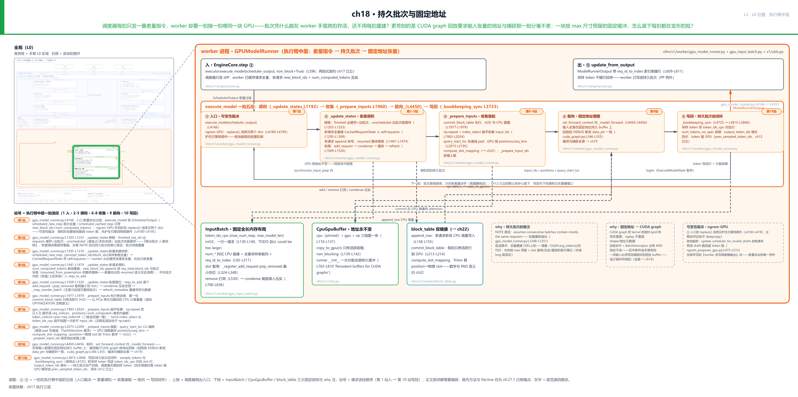
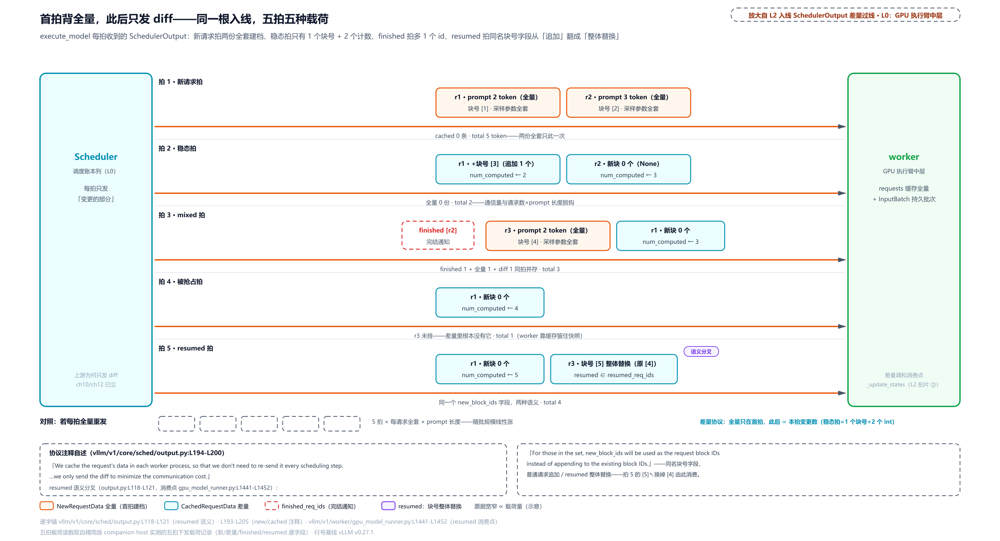
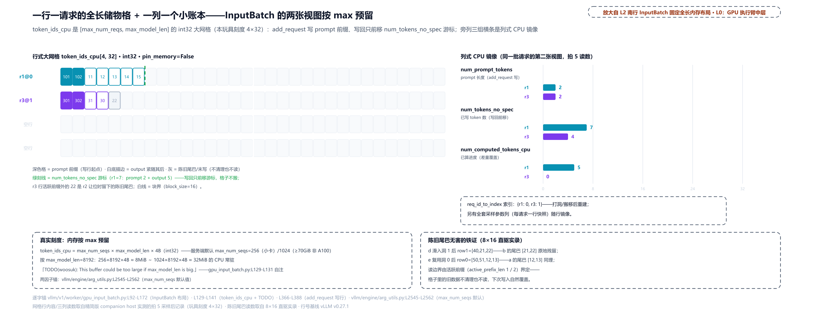
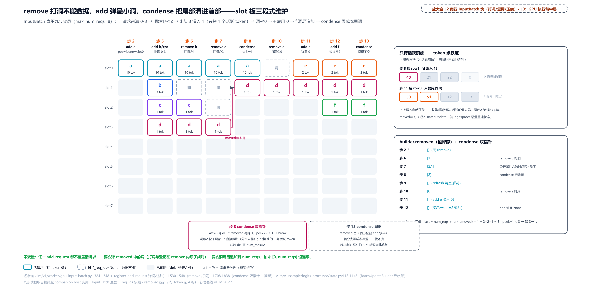
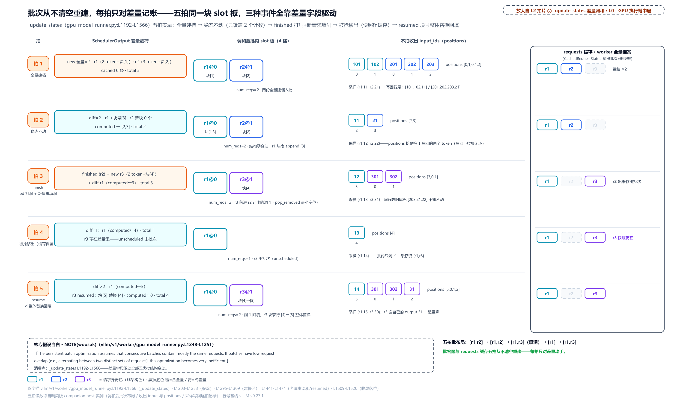
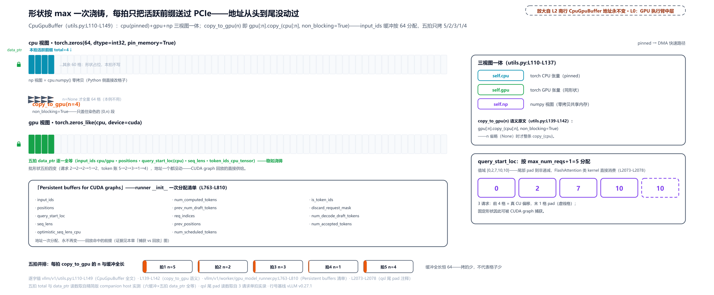
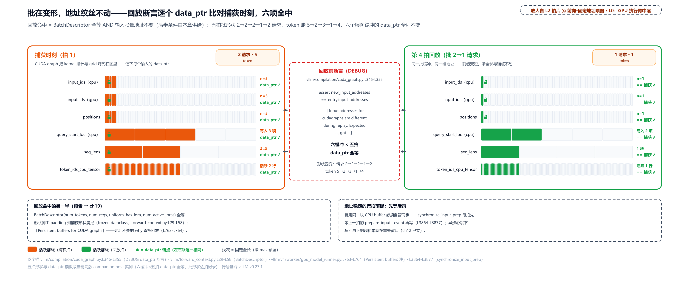
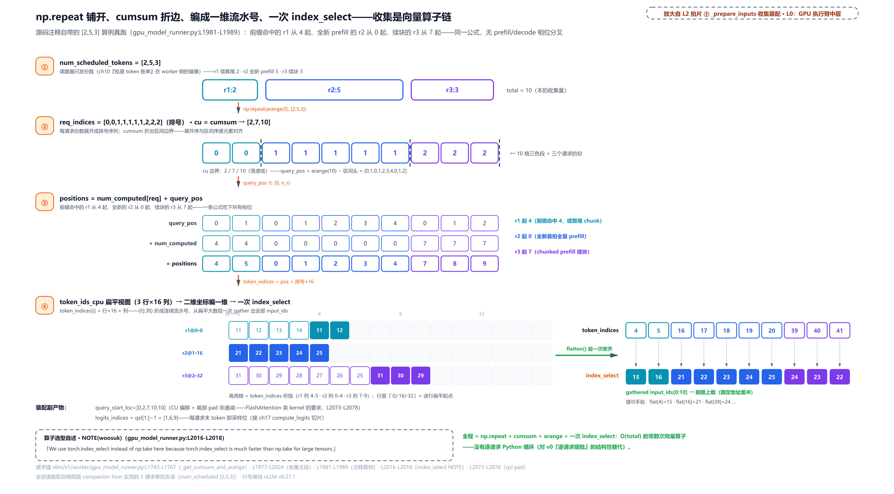

# 第 18 章　持久批次与固定地址

调度器每拍只发一叠差量指令，worker 却要一拍接一拍喂同一块 GPU。批次凭什么能在 worker 手里跨拍存活、还不用每拍重建？更苛刻的是 CUDA graph 回放（把一整串 GPU 操作录下来、之后整串重放的加速机制，下一章的主角）要求输入张量的地址与捕获那一刻分毫不差：一块按 max 尺寸预留的固定缓冲，怎么装下每拍都在变形的批？

[第 17 章](../../ch17-executor-worker-model-runner/narrative/chapter.md)结尾留的正是这个口子：差量指令单进了墙，worker 手里没有请求的全量状态，它凭什么能凭「每请求一个新 token」的小票，算出整批的前向？答案的前一半是 **批次不回家**：批次对象在 worker 进程里常驻，每拍只按差量小票记账式地微调，绝不清空重建。后一半是 **地址不搬家**：喂给 GPU 的每个张量都住在一块启动时分配、之后永不挪窝的缓冲里，每拍只把活跃的那一小段灌进去。两半合起来，才接得住下一章的 CUDA graph。本章把这两半拆开看清楚。

## 你在这里



> *图注：本章放大的是[第 1 章](../../ch01-vllm-v1-in-one-map/narrative/chapter.md) L0 图中间绿色「GPU 执行臂」列的**中层**，即 worker 进程里的 GPUModelRunner 框。[第 17 章](../../ch17-executor-worker-model-runner/narrative/chapter.md)点亮了执行臂上层（executor 在哪跑 / worker 设备归谁管 / runner 对外接口），现在下到 runner 肚子里：北行进出两条线就是上一章拆过的两段式（execute_model 进、ModelRunnerOutput 出），中间 ①-⑤ 五段拍片是一拍在 runner 内部的顺序（① 入口裁决 → ② 差量调和 → ③ 收集装配 → ④ 前向 → ⑤ 写回；这五个圈号是本章 L2 图自家的编号，不是[第 9 章](../../ch09-engine-core-step-loop/narrative/chapter.md)忙循环五拍的编号），南行三大固定结构（InputBatch / CpuGpuBuffer / block_table）是被这五段反复使用的常驻家底。本章接在四块已读结构上：[第 10 章](../../ch10-continuous-batching-chunked-prefill/narrative/chapter.md)立过的差量协议发件侧、[第 13 章](../../ch13-paged-kv/narrative/chapter.md)立过的块表与行主序摊平、[第 12 章](../../ch12-async-scheduling/narrative/chapter.md)立过的异步调度与影子状态、上一章立过的三层骨架。站号 1-10 = 请求流经代码的顺序（第 1 站入 → 第 10 站写回），正文按讲解需要编排、不必照站号读。*

读法建议：想知道差量小票长什么样、worker 怎么收，直奔[「差量指令单的收件侧」](#差量指令单的收件侧)；slot 怎么复用、洞怎么压实，跳[「行的生灭三段式」](#行的生灭三段式)；想跟一拍完整的调和，读[「一拍调和的四段动作」](#一拍调和的四段动作)；地址为什么一辈子不能变，看[「固定地址的地基」](#固定地址的地基)；收集的向量算术在[「收集装配一趟收齐」](#收集装配一趟收齐)；想跟全程，按序读。

## 差量指令单的收件侧

先站到 L0 图执行臂的入线上。调度器怎么把全量打包成差量，[第 10 章](../../ch10-continuous-batching-chunked-prefill/narrative/chapter.md)在发件侧（`schedule()` 收尾的装配现场）拆过；本章站在收件侧，看这叠小票的完整形状，和藏在里面的两个语义坑。载体是 `SchedulerOutput`，调度器每拍产出的差量指令单，[第 9 章](../../ch09-engine-core-step-loop/narrative/chapter.md)忙循环里 ② 拍隔着墙递出去的就是它：

```python
# vllm/v1/core/sched/output.py:L192-L212
@dataclass
class SchedulerOutput:
    # list of the requests that are scheduled for the first time.
    # We cache the request's data in each worker process, so that we don't
    # need to re-send it every scheduling step.
    scheduled_new_reqs: list[NewRequestData]                                  # L197
    # list of the requests that have been scheduled before.
    # Since the request's data is already cached in the worker processes,
    # we only send the diff to minimize the communication cost.
    scheduled_cached_reqs: CachedRequestData                                  # L201

    # req_id -> num_scheduled_tokens
    # Number of tokens scheduled for each request.
    num_scheduled_tokens: dict[str, int]                                      # L205
    # Total number of tokens scheduled for all requests.
    # Equal to sum(num_scheduled_tokens.values())
    total_num_scheduled_tokens: int                                           # L208
    # req_id -> spec_token_ids
    # If a request does not have any spec decode tokens, it will not be
    # included in the dictionary.
    scheduled_spec_decode_tokens: dict[str, list[int]]
    # … 省略：后续字段若干（编码器输入、公共前缀块数等）；记一个 finished_req_ids
    #    （完结请求 id 集合）：完结的旗子随下拍过线，调和段第一段消费它 …
```

协议在注释里自述了二分：`scheduled_new_reqs` 装**首次调度**的请求，`NewRequestData`（新请求全量档案：整段 prompt token、采样参数、初始块表）一次发全，因为 worker 从此替它建档，「so that we don't need to re-send it every scheduling step」（这样就不必每个调度步重发一遍）；`scheduled_cached_reqs` 装**调度过**的请求，`CachedRequestData` 只发差量（「we only send the diff to minimize the communication cost」，只发差量以最小化通信开销）。后两个字段是本拍的 token 账：`num_scheduled_tokens` 每请求排了几个，`total_num_scheduled_tokens` 是总和。[第 10 章](../../ch10-continuous-batching-chunked-prefill/narrative/chapter.md)的追赶公式在调度器侧算出的差额，就装在这里过线。第五个字段 `scheduled_spec_decode_tokens` 是[投机解码](https://docs.vllm.ai/en/latest/features/speculative_decoding/)（[第 12 章](../../ch12-async-scheduling/narrative/chapter.md)在异步兼容处立过定义）场景的附加账：每请求草稿 token 的 id 表，不开投机就没有条目（[「过线后的防御与例外」](#过线后的防御与例外)一节的主角之一）。省略的后续字段里记一个 `finished_req_ids`（完结请求 id 集合）：完结的旗子随下拍过线，[「一拍调和的四段动作」](#一拍调和的四段动作)第一段消费的就是它。

差量长什么样，看收件侧的字段：

```python
# vllm/v1/core/sched/output.py:L115-L130
@dataclass
class CachedRequestData:
    req_ids: list[str]
    # For request ids not in resumed_req_ids, new_block_ids will be appended to
    # the request's block IDs. For those in the set, new_block_ids will be used as the
    # request's block IDs instead of appending to the existing block IDs.
    resumed_req_ids: set[str]                                                 # L121
    # … 省略：new_token_ids（仅流水线并行时用，首末 stage 没有直连通道，采样 token 得由调度器送回）与 all_token_ids（多引擎连接器专用）两个注释块 …
    new_block_ids: list[tuple[list[int], ...] | None]                         # L128
    num_computed_tokens: list[int]                                            # L129
    num_output_tokens: list[int]
```

老请求的差量就三样：`new_block_ids`（本拍新分配的 KV 块号；每个请求一个元组、每个 KV cache group（KV 缓存的分池分组，[第 14 章](../../ch14-memory-ledger/narrative/chapter.md)立过）一条列表，没新块就是 `None`，[第 13 章](../../ch13-paged-kv/narrative/chapter.md)把它比作「发电报」，连电报都能省）、`num_computed_tokens`（调度器账本上的已算数）、`num_output_tokens`（该请求已产出的 output token 计数，worker 拿它核对快照里的 output 列表，快照比它长就裁到这个数对齐）。稳态 decode 拍下，一条请求的载荷常态是「至多一个块号 + 两个整数」，多数拍连块号都没有（`new_block_ids=None`），每跨一次块边界的那拍才多一个新块号。而代价埋在 `resumed_req_ids` 这个集合里：**同一个字段、两种语义**。不在集合里的请求，`new_block_ids` 是**追加**到旧块表尾部；在集合里的（被抢占后恢复的，[第 11 章](../../ch11-preemption-request-lifecycle/narrative/chapter.md)立过的 preempted → resumed 生命周期），`new_block_ids` 是**整体替换**：被抢占时块全还给池了，恢复时领的是一套全新的块，追加语义根本对不上。注释原文说得直白：对集合里的请求，「new_block_ids will be used as the request's block IDs instead of appending」。消费这个分叉的代码在后面的[「一拍调和的四段动作」](#一拍调和的四段动作)（`gpu_model_runner.py` 的 `_update_states`），这里先把坑记下。



> *图注：同一根 execute_model 入线上，五拍发出五种载荷（`output.py:L193-L205` 的协议二分）：拍 1 两个新请求各背一张全量大票（prompt + 块 + 采样参数）；拍 2 稳态拍只有两条小 diff（每条至多 1 个块号 + 2 个整数）；拍 3 同拍三类并存（r2 完结的旗子 + r3 的全量大票 + r1 的小 diff）；拍 5 r3 的块号票从「追加」翻成「整体替换」（[4] 换成 [5]），靠的就是 `resumed_req_ids` 语义分叉（`output.py:L118-L121`）。对照条在最底下：全量重发的通信量正比于请求数 × prompt 长度，差量只随本拍变更数走。发件侧的账[第 10 章](../../ch10-continuous-batching-chunked-prefill/narrative/chapter.md)已算过，这里是收件侧看到的形状。*

为什么非要差量？把 why 链四要素摆全。**旧设计**：v0 每步把整批 `SequenceGroupMetadata`（全量 token ids、完整块表、采样参数）序列化发给 worker，更朴素的做法干脆每步从零重建整个批次对象树。**痛点**：IPC（进程间通信，[第 5 章](../../ch05-zmq-topology-and-protocol/narrative/chapter.md)立的进程边界）的序列化带宽和 CPU 时间随「请求数 × prompt 长度」爆炸：decode 稳态下每拍 99% 的下发内容与上一拍完全相同，全量重发是纯浪费；千级并发时这一项就能吃掉调度预算。**v1 方案**：就是上面这份二分协议（`vllm/v1/core/sched/output.py:L193-L205`），worker 缓存请求全量、调度器只发变更。**代价**同样真实：worker 必须维护匹配的缓存与失效逻辑：两个进程的请求视图可能漂移，一边删了另一边不知道就出幽灵行；协议状态有了语义分叉（resumed 的整体替换），理解成本高一截；流水线并行时还得专门回传 `new_token_ids`；连「完结通知集合什么时候清空」都成了跨拍不变量（调度器侧是换新集合而非就地 clear，[第 10 章](../../ch10-continuous-batching-chunked-prefill/narrative/chapter.md)实测过：就地清空会连着已发出的 `SchedulerOutput` 一起清掉）。其中「worker 怎么维护这份缓存」正是本章余下的全部内容。

## 过线后的防御与例外

站 1 是 `execute_model` 的入口（`vllm/v1/worker/gpu_model_runner.py:L4166`）。收到 `SchedulerOutput` 之后、正式调和之前的第一道防御，它护的正是上面说的「两进程视图不能互相污染」：

```python
# vllm/v1/worker/gpu_model_runner.py:L4180-L4195 · GPUModelRunner.execute_model
        # If ngram_gpu is used, we need to copy the scheduler_output to avoid
        # the modification has influence on the scheduler_output in engine core process.
        # The replace is much faster than deepcopy.
        if (
            self.speculative_config is not None
            and self.speculative_config.use_ngram_gpu()
        ):
            num_scheduled_tokens_copy = scheduler_output.num_scheduled_tokens.copy()   # L4187
            spec_decode_tokens_copy = (
                scheduler_output.scheduled_spec_decode_tokens.copy()
            )
            scheduler_output = replace(                                        # L4191
                scheduler_output,
                num_scheduled_tokens=num_scheduled_tokens_copy,
                scheduled_spec_decode_tokens=spec_decode_tokens_copy,
            )
```

只在一个条件下动作：`use_ngram_gpu()`（n-gram 投机解码的 GPU 变体，马上讲它是什么）。动作本身是给两个 dict 字段各备一份 `.copy()`，再用标准库的 `replace()` 造一个只换这两个字段的新 `SchedulerOutput`。为什么？因为后面的调和阶段会**就地裁剪**这份指令单的 token 账；而 `SchedulerOutput` 这个对象在引擎核心进程里还有一份引用，worker 改了它，调度器的账本就被殃及了。注释自评选型：「The replace is much faster than deepcopy」（replace 远快于 deepcopy）。

`replace()`（标准库 `dataclasses` 的配套工具）值得停半分钟讲透，因为「浅」这个性质正是这段防御的机关。`replace(obj, **changes)` 造一个同类型新对象：把旧对象每个字段的**当前值**原样搬进新 `__init__`，只有 `changes` 点名的字段换成新值。问题是字段值是按引用传的：没点名的可变字段（list、dict），新旧对象共享同一个底层对象。跑一遍就明白（说明性例子，标准库行为，非本仓源码）：

```python
from dataclasses import dataclass, replace

@dataclass
class Step:
    tokens: dict          # 可变字段
    seq_len: int = 0

s1 = Step(tokens={"a": 3})
s2 = replace(s1, seq_len=1)     # 点名 seq_len；tokens 没点名
s2.tokens["a"] = 99             # 改新对象的 dict
assert s1.tokens["a"] == 99     # 旧对象跟着变了：没点名的可变字段是同一个 dict

s3 = replace(s1, tokens=dict(s1.tokens))   # 想断开：先造新 dict，再点名替换
s3.tokens["a"] = 0
assert s1.tokens["a"] == 99     # 这次动 s3 不再殃及 s1
```

`s2` 那五行就是陷阱本身：外壳是新的，dict 是旧的。`s3` 的姿势（先备新值、点名替换）才是「我要改这个字段且不连累原对象」的写法。回看 L4187-L4191：vLLM 正是 `s3` 的放大版，只对将要动手术的两个 dict 字段（`num_scheduled_tokens`、`scheduled_spec_decode_tokens`）备 `.copy()`，其余字段（请求列表、块账、完结集合）全部零拷贝共享，这就是「much faster than deepcopy」的由来：深拷贝要递归复制所有可达对象，这里只复制两本要改的账（[dataclasses 文档](https://docs.python.org/3/library/dataclasses.html)）。

那到底谁要改这两本账？`ngram_gpu` 是[投机解码](https://docs.vllm.ai/en/latest/features/speculative_decoding/)（小模型先猜、大模型一次验证多个的无损加速法，[第 12 章](../../ch12-async-scheduling/narrative/chapter.md)定义过、验收数学留待 Part VII 专章展开）里**不带草稿模型**的一族：n-gram / Prompt Lookup 投机解码。思路很省事：拿上下文最后 n 个 token 当搜索词，在更早的上下文里找它上一次出现的位置，把后面的续文截出来当草稿。输入里有大量「抄上文」的任务最灵：改代码（第二轮基本在抄第一轮的函数）、做摘要、答上下文问题，原作者实测 2-4 倍加速（[PLD 仓库](https://github.com/apoorvumang/prompt-lookup-decoding)）；开放式闲聊最不灵，上文里没有可抄的 n-gram，草稿命中率趋零，好在猜错回退、不亏。vLLM 的取值是 `speculative_config` 的 `method`，两个标准值：`"ngram"`（CPU 侧查找）与 `"ngram_gpu"`（把这套查找搬上 GPU 的变体：草稿生成在 GPU 上做、省掉一条 CPU 到 GPU 的路），官方文档均已收录。注意 `ngram_gpu` 是独立的 method 取值、不是在 `"ngram"` 上再开的开关：上面片段的门控 `use_ngram_gpu()`（`vllm/config/speculative.py:L1410`）判的正是 `method == "ngram_gpu"`。配成 `"ngram"` 得到的是 CPU 侧 drafter，本节这整段防御一行都不会跑。

搬上 GPU 的代价，就是本节的机关：GPU 端 proposer（草稿生产方；proposer 是源码对这类组件的正式叫法，前文说的 CPU 侧 drafter 就是同一个角色，对应 CPU 侧的 `NgramProposer`）数出「每请求实际有效的草稿有几个」之后，要**就地回退**指令单上的 token 账：排了 4 个草稿位、proposer 在上下文里只找到 2 个能抄的续文，账面就得减 2（此处的「有效」是 n-gram 查找的命中数，不是[第 12 章](../../ch12-async-scheduling/narrative/chapter.md)里大模型验收草稿的那个「接受」）。这是全代码库罕见的「worker 改写调度器输出」点：

```python
# vllm/v1/spec_decode/ngram_proposer_gpu.py:L475-L515
def update_scheduler_for_invalid_drafts(
    num_valid_draft_tokens_event: torch.cuda.Event,
    num_valid_draft_tokens_cpu: torch.Tensor,
    scheduler_output: "SchedulerOutput",
    req_id_to_index: dict[str, int],
) -> None:
    # … 省略：docstring 与 Args 四行（Trim invalid speculative slots using
    #    per-request valid draft counts，按每请求有效草稿数裁掉无效槽位）…
    req_data = scheduler_output.scheduled_cached_reqs
    num_valid_draft_tokens_event.synchronize()

    for req_id in req_data.req_ids:
        # … 省略：req_index / spec_token_ids 两道 None 早退 …
        scheduled_k = len(spec_token_ids)

        valid_k = int(num_valid_draft_tokens_cpu[req_index].item())
        valid_k = max(0, min(valid_k, scheduled_k))

        tokens_to_trim = scheduled_k - valid_k
        scheduler_output.total_num_scheduled_tokens -= tokens_to_trim        # L507
        scheduler_output.num_scheduled_tokens[req_id] -= tokens_to_trim      # L508

        if valid_k == 0:
            scheduler_output.scheduled_spec_decode_tokens.pop(req_id, None)
        else:
            scheduler_output.scheduled_spec_decode_tokens[req_id] = spec_token_ids[
                :valid_k
            ]
```

L507-L508 对总账和每请求账就地做减法。注意它减的是入口处 `replace()` 出来的那份**副本的 dict**，引擎进程侧的原件毫发无损。防御与例外，一进一出配成一对，这正是开篇点名的第二个语义坑：小票上的 token 账不是只读账，ngram-GPU 下 worker 会就地改写它。这也是差量协议「worker 只读调度器输出」惯例的唯一豁口，解释了为什么站 1 开头这段防御值得为它存在。不开 ngram-GPU，整段是空操作，一行不跑。时点也钉得住：proposer 在上一拍的采样之后、GPU 上做 n-gram 查找，数出的有效草稿数异步拷回 CPU 并记一个 CUDA event（`gpu_model_runner.py:L5067-L5085`）；本拍 `_update_states` 调和段开头（L1346，L2 图 ② 拍片内）等这个 event 到货、就地裁账，裁完的 `num_scheduled_tokens` 正是 ③ 收集装配的输入。

## 持久批次这只容器

现在下到 L2 图南行第一个固定结构。收件侧要缓存请求全量，缓存在哪？答案是一只叫 `InputBatch` 的容器（`vllm/v1/worker/gpu_input_batch.py:L92`），持久批次（persistent batch，跨拍驻留的执行批）的本体。直觉上它像剧场的一排长椅：每把椅子（slot，批内行号）自带的不是座位号而是**全长储物格**：一行 `max_model_len` 个格子，观众（请求）落座把随身的 token 从头摆起；椅子旁边一列小抽屉记每人的提示长度、已算进度。行式大网格 + 列式小账本，同一批请求的两张视图：

```python
# vllm/v1/worker/gpu_input_batch.py:L127-L145 · InputBatch.__init__
        self._req_ids: list[str | None] = []
        self.req_id_to_index: dict[str, int] = {}                            # L128

        # TODO(woosuk): This buffer could be too large if max_model_len is big.
        # Find a way to reduce the CPU memory usage.
        # This buffer is not directly transferred to the GPU, so it does not
        # need to be pinned.
        self.token_ids_cpu_tensor = torch.zeros(                             # L134
            (max_num_reqs, max_model_len),
            device="cpu",
            dtype=torch.int32,
            pin_memory=False,
        )
        self.token_ids_cpu = self.token_ids_cpu_tensor.numpy()
        # … 省略：is_token_ids 同形布尔网格与三列 num_* 镜像（下文逐列点名）…
```

主角是 L134 这个 `[max_num_reqs, max_model_len]` 的 int32 大网格 `token_ids_cpu`（`max_num_reqs` 就是配置项 `max_num_seqs`，批内并行请求数的上限，`gpu_model_runner.py:L506` 原样赋入；`max_model_len` 即单请求长度上限）。**一行 = 一个请求的全长 token 缓冲**：prompt 从头摆，output 紧随其后，一行摆到底。`req_id_to_index` 是请求 id 到行号的映射，增量调和全靠它查「这条请求在第几行」。旁边三条列式镜像是后面所有算术的基准：`num_prompt_tokens`（prompt/output 分界）、`num_tokens_no_spec`（该行活跃 token 计数，不计投机草稿；搬移、收集、写回都以它为界）、`num_computed_tokens_cpu`（调度器账本上的已算数，跨拍累积）。TODO 注释也诚实：这缓冲在 `max_model_len` 大的时候「could be too large」（可能大得离谱），作者自己留了优化作业。好在它不直接传 GPU，不用 pinned（页锁定内存；后文[「固定地址的地基」](#固定地址的地基)细讲它是什么、什么时候用）。

写行的入口是 `add_request`：把一份请求快照（`CachedRequestState`，worker 端单请求档案：prompt、output、块表、采样参数，`gpu_input_batch.py:L35`）落进某个 slot：

```python
# vllm/v1/worker/gpu_input_batch.py:L354-L398 · InputBatch.add_request
        req_index = self._register_add_request(request)

        req_id = request.req_id
        if req_index == len(self._req_ids):
            self._req_ids.append(req_id)
            self.req_output_token_ids.append(request.output_token_ids)
            self.spec_token_ids.append([])
        else:
            self._req_ids[req_index] = req_id                                 # L362
            self.req_output_token_ids[req_index] = request.output_token_ids
            self.spec_token_ids[req_index].clear()

        self.req_id_to_index[req_id] = req_index

        # Copy the prompt token ids and output token ids.
        num_prompt_tokens = length_from_prompt_token_ids_or_embeds(
            request.prompt_token_ids, request.prompt_embeds
        )
        self.num_prompt_tokens[req_index] = num_prompt_tokens
        start_idx = num_prompt_tokens
        end_idx = start_idx + len(request.output_token_ids)
        if request.prompt_token_ids is not None:
            self.token_ids_cpu[req_index, :num_prompt_tokens] = request.prompt_token_ids   # L376
        # … 省略：is_token_ids 标记网格的同步写行与 prompt_embeds 分支（多模态混合输入才有分叉）…
        self.token_ids_cpu[req_index, start_idx:end_idx] = request.output_token_ids        # L387
        self.is_token_ids[req_index, start_idx:end_idx] = True
        # Number of tokens without spec decode tokens.
        self.num_tokens_no_spec[req_index] = request.num_tokens              # L390
        # … 省略：use_replayssm 环形起点记账（Mamba 状态空间模型的 replayssm 变体专用）…
        self.num_computed_tokens_cpu[req_index] = request.num_computed_tokens  # L397
        self.block_table.add_row(request.block_ids, req_index)               # L398
```

L376 与 L387 两刀 token 写行是布局语义的全部：prompt 写进 `[req, :num_prompt]` 前缀，output 紧随其后写进 `[start, end)`；被抢占后恢复的请求带着已生成的 output 回来，也是这一刀重建整行。紧随其后的 L388 给这批格子顺手盖上「真是 token」的标记，就是省略注释里那面 `is_token_ids` 同形布尔网格的一行。片段里那对 `req_output_token_ids` 行则是每行 output 的 Python 列表镜像：大网格服务收集算术，这份列表服务逐 token 追加与搬移的读者（condense 搬行、slot 对换、异步采样的 -1 占位记账都读写它）。L362 那个 else 分支（往 `_req_ids` 指定位置**覆盖**写而不是 append）先按下，下一节讲它是怎么被安全复用的。L398 把块表行也立起来，`block_table` 就住在批次里，[第 13 章](../../ch13-paged-kv/narrative/chapter.md)叫它「页表的显存版」，它的载体正是后面[「固定地址的地基」](#固定地址的地基)一节要打开的 CpuGpuBuffer。



> *图注：InputBatch 是「行式 R×L 大网格 + 列式 CPU 镜像」的双视图容器（`gpu_input_batch.py:L92-L172`）：一行 = 一个请求的全长 token 缓冲（拍 5 时刻 r1 行活跃 7 格、r3 行活跃 4 格，活跃段之外是上一个住客的陈旧数据，灰格不清理也不读）；右列三条镜像记 prompt 分界 2/2、活跃计数 7/4、已算数 5/0。代价按 max 预留：默认配置下 256×8192×4B ≈ 8MiB 起步的 CPU 常驻（max_num_seqs 取 `arg_utils.py` 默认 256，大卡 1024 就是 32MiB 级），TODO(woosuk) 自认 could be too large。*

图注里那笔账值得展开半句：8MiB 是「256 请求 × 8192 长度 × 4 字节」的换算（第一个因子有源码锚：`vllm/engine/arg_utils.py` 里 API server 默认 `max_num_seqs=256`、大卡（H100/MI300x）1024；8192 是示例长度，4B 是 int32 定宽）。它是一次性常驻，不是每拍开销，这笔内存买的是下面整个「不清空重建」的收益。

## 行的生灭三段式

有进有出才有生灭。L2 图南行 InputBatch 块上写着三个方法名：`pop_removed`、打洞、`condense`；slot 的生灭是个三段式算法（`remove_request` 打洞 → `_register_add_request` 复用最小洞 → `condense` 压实）。直觉像剧院散场管理：退票只是把座位号划掉（**打洞**，人不挪、包不搬）；新观众优先坐最靠前的空位（**复用最小洞**）；散场毕统一把后排观众往前挪补齐空档（**压实**，挪人只搬随身物品、不擦座位上的旧痕迹）。

第一段，退场。`remove_request` 干的事少得反常：只做标记，不搬任何数据。

```python
# vllm/v1/worker/gpu_input_batch.py:L530-L548
    def remove_request(self, req_id: str) -> int | None:
        """This method must always be followed by a call to condense().

        Args:
          req_id: request to remove

        Returns:
          Removed request index, or `None` if `req_id` not recognized
        """

        req_index = self.req_id_to_index.pop(req_id, None)
        if req_index is None:
            return None

        self.batch_update_builder.removed_append(req_index)                  # L544
        self._req_ids[req_index] = None                                      # L545
        self.req_output_token_ids[req_index] = None
        self.spec_token_ids[req_index].clear()
        self.block_table.clear_row(req_index)
```

L544-L545 就是「打洞」的全部：行标记成 `None`、映射解绑、块表行清零，`token_ids_cpu` 那一行的几百个 token **原封不动**。docstring 第一句是纪律：「This method must always be followed by a call to condense()」（本方法后面必须跟一次 condense）：先打洞、批末统一压实，两段配对。为什么不就地搬？因为一次搬一行是 O(行长) 的活，攒到批末一起处理才有机会省掉一部分（洞被新人填上就不用搬了，下一节拍 3 正是这个场景）。

登记进的是 `batch_update_builder`，即 `BatchUpdateBuilder`（本拍批次变更记录器，`vllm/v1/sample/logits_processor/state.py:L18`），它替整只批次记三本账：removed（谁走了）、added（谁来了）、moved（谁挪了窝；一本「旧行号、新行号、方向」三元组账，方向枚举 `MoveDirectionality`（`vllm/v1/sample/logits_processor/interface.py:L17-L21`）共两档：`UNIDIRECTIONAL` 单向滑入、`SWAP` 双向对换；logitsprocs 沿它把旧行状态迁去新行）。后两本账的读者是 logitsprocs（采样前对 logits 逐行加工的处理器组，比如惩罚重复、过滤禁词；它们按「批内第几行」维护各自状态，所以批变了要增量重建），removed 这本账的读法有讲究，docstring 写成了契约：

```python
# vllm/v1/sample/logits_processor/state.py:L18-L37
class BatchUpdateBuilder:
    """Helps track persistent batch state changes and build
    a batch update data structure for logitsprocs
    Assumptions:
    * All information about requests removed from persistent batch
      during a step is aggregated in self._removed through calls to
      self.removed_append() at the beginning of a step. This must happen
      before the first time that self.removed, self.pop_removed()
      or self.peek_removed() are invoked in a given step
    * After the first time that self.removed, self.pop_removed()
      or self.peek_removed() are read in a step, no new removals
      are registered using self.removed_append()
    * Elements of self._removed are never directly modified, added or
      removed (i.e. modification is only via self.removed_append() and
      self.pop_removed())
    Guarantees under above assumptions:
    * self.removed is always sorted in descending order
    * self.pop_removed() and self.peek_removed() both return
      the lowest removed request index in the current step
    """
```

两条保证是三段式的地基：removed 恒**降序**排（洞号从大到小），`pop_removed()`（弹出）与 `peek_removed()`（只看不取）都返回**最小**的洞。降序表的最小元素就在表尾，`pop` 就是列表尾弹；`state.py:L102-L107` 的实现就是「排序后弹表尾」一句话。为什么最小洞优先？往下看。

第二段，进场。`_register_add_request` 决定新请求坐哪：

```python
# vllm/v1/worker/gpu_input_batch.py:L324-L348
    def _register_add_request(self, request: "CachedRequestState") -> int:
        """Track add-request operations for logits processors.
        Not applicable to pooling models.
        """

        # Fill the next empty index if there is one.
        if (new_req_index := self.batch_update_builder.pop_removed()) is None:   # L330
            # Append to end otherwise.
            new_req_index = self.num_reqs

        assert new_req_index < self.max_num_reqs
        self.batch_update_builder.batch_changed = True
        if request.sampling_params:
            # Detailed added request metadata is only required for non-pooling
            # models, to support logitsprocs.
            self.batch_update_builder.added.append(                            # L339
                (
                    new_req_index,
                    request.sampling_params,
                    request.prompt_token_ids,
                    request.output_token_ids,
                )
            )

        return new_req_index
```

L330 的海象表达式（walrus，Python 的 `:=` 行内赋值）就一句话：**有洞先弹最小洞，没洞追加到尾部**。这回答了上一节按下的 L362：`add_request` 里那个「往指定位置覆盖写」的 else 分支，覆盖的正是被弹出的洞行（那行的 `_req_ids` 必是 `None`：打洞与登记在 `remove_request` 里原子成对，活行永远不会被弹出）。最小洞优先的实际收益在第三段兑现：新人把最小的洞当场填上，批末 `condense` 就少一次滑入；增删相当的拍（下一节的拍 3 正是这种）洞被填平、condense 零成本早退；反过来，新人若去占尾部而把小洞留着，condense 就得多搬一次。L339 把 `(行号、采样参数、prompt、output)` 记进 added 账，这是 logitsprocs 按行号增量建状态的原料。

第三段，压实。`condense` 把尾部活请求滑进前部空洞，让 `[0, num_reqs)` 恒连续：

```python
# vllm/v1/worker/gpu_input_batch.py:L708-L745
    def condense(self) -> None:
        """Slide non-empty requests down into lower, empty indices. … 省略：docstring 后半 …"""
        num_reqs = self.num_reqs

        if not (empty_req_indices := self.batch_update_builder.removed):
            # All removed requests were replaced by added requests, or else no
            # requests were removed at all. No condense() needed
            return
        if num_reqs == 0:
            # The batched states are empty.
            self._req_ids.clear()
            self.req_output_token_ids.clear()
            self.spec_token_ids.clear()
            return

        # NOTE(woosuk): This function assumes that the empty_req_indices
        # is sorted in descending order.
        last_req_index = num_reqs + len(empty_req_indices) - 1                # L733
        while empty_req_indices:
            # Find the largest non-empty index.
            while last_req_index in empty_req_indices:
                last_req_index -= 1

            # Find the smallest empty index.
            empty_index = self.batch_update_builder.peek_removed()
            assert empty_index is not None
            if empty_index >= last_req_index:
                break

            # Move active request down into empty request
            # … 省略：while 循环体逐列搬移（token_ids_cpu 只拷该行活跃前缀、
            #    块表 move_row、采样参数列与 moved 登记（并把刚填掉的洞从 removed
            #    弹出，pop_removed 就在这一步）…
```

骨架是**双指针**：`last_req_index` 从最大活位往下找（跳过洞），起点取 `num_reqs + 洞数 - 1`（L733）不是随手写的：打洞时 `num_reqs` 已随映射解绑缩掉了洞数，加回来才是全网格最大行号（九步表步 8 的 `last = 2 + 2 - 1 = 3` 正是这笔账）；`peek_removed()` 从头取最小洞往上等。最小洞比最大活位小，就把大活位滑进小洞；洞反超活位，说明剩下的洞全在尾部，直接截断删除（`del _req_ids[num_reqs:]` 整段），分文不花。两个早退也值得记：removed 空则整拍零成本返回（洞全被新人填平的常见好局）；批空则清列表走人。

九步实跑把三段式全程摊开（取证口径见下节开头；表里省了第 1/3/4/9 步：初始空批、两次同型的 add、一次纯记账的 refresh_metadata：condense 首读 removed 后 builder 即封账，须 refresh 重置才能登记下一拍的洞，步 10 由此开第二轮，机制见[「一拍调和的四段动作」](#一拍调和的四段动作)的落位段；步号保留原序）：

<!-- trace: ch18-m03 -->
| 步 | 动作 | builder.removed（降序） | num_reqs | 批内 _req_ids | 关键观察 |
|---|---|---|---|---|---|
| 2 | add a（10 token） | [] | 1 | [a] | pop_removed=None → slot=num_reqs=0（追加路径） |
| 5 | add b、add c、add d（3/1/1 token） | [] | 4 | [a,b,c,d] | 四请求占满 slot 0 到 3 |
| 6 | remove b → 打洞@1 | [1] | 3 | [a,None,c,d] | 行标记 None、映射解绑、块表行清零；token 数据 [20,21,22] 原地不动 |
| 7 | remove c → 打洞@2 | [2,1] | 2 | [a,None,None,d] | 公开属性读取（合法时点）确认降序 [2,1] |
| 8 | condense | [2] | 2 | [a,d] | last=3、peek=1<3 → d 从 3 滑入 1，moved=[(3,1,UNIDIRECTIONAL)]；只拷活跃前缀 1 个 token；row1=[40,21,22]，b 的陈旧尾巴 [21,22] 留在原地无害；last 降过 2 ∈ removed 再降为 1，peek=2 ≥ 1 → break；尾部截断到 num_reqs=2 |
| 10 | remove a → 打洞@0 | [0] | 1 | [None,d] | 第二轮（refresh_metadata 已解封 builder） |
| 11 | add e（2 token） | [] | 2 | [e,d] | pop_removed=0 → e@0 最小空 slot 优先复用；row0=[50,51,12,13]；a 的陈旧尾巴 [12,13] 同样无害 |
| 12 | add f（1 token） | [] | 3 | [e,d,f] | 洞已填平 → pop 返回 None → slot=num_reqs=2 追加 |
| 13 | condense | [] | 3 | [e,d,f] | removed 空（全被 add 填平）→ 零成本早退（condense 首分支） |

步 8 那格藏着两个设计决断。其一，**只拷活跃前缀**：d 滑入 1 号洞只搬它活跃的 1 个 token，b 留下的陈旧尾巴 [21,22] 原地不动；搬移成本 ≤ 洞数 × 活跃前缀长，与整只网格的规模无关；陈旧数据无害的原因是所有读写都以 `num_tokens_no_spec` 游标为界，下一次 `add_request` 写行时会盖掉它（步 11 的 row0 同理）。其二，第 2 个洞（@2）分文未花：它落在尾部截断区，`del` 整段带走。



> *图注：九步 slot 板演化（打洞 `gpu_input_batch.py:L530-L548` → 复用 `L324-L348` → 压实 `L708-L838`）：[a] → [a,b,c,d] → 打两个洞 → condense 双指针把 d 从 3 滑入 1（moved=(3,1) 记账，三元组完整写法 (3,1,UNIDIRECTIONAL)，即单向滑入）→ 再打洞@0 → e 弹最小洞复用@0 → f 洞尽追加@2 → 早退不变。removed 表恒降序（[2,1]→[2]→refresh 清空→[0]→弹出后空）是 BatchUpdateBuilder 的契约保证（`state.py:L18-L42`），pop/peek 恒取最小洞。右上放大镜是「只拷活跃前缀」的铁证：row1=[40,21,22,0]，d 的 1 个活跃 token 在前、b 的陈旧尾巴灰着留在原地。*

这个算法为什么是对的？三条不变量论证。（一）**condense 必然终止**：循环每轮要么弹掉一个洞（removed 严格减一）要么 break，`last_req_index` 单调递减且被 while 钳在非负；两个计数器都是只减不增的有限整数，任一到底循环即停。（二）**拍末前缀连续**：循环每轮把「最小洞」换成活行、把「最大活位」变成尾区的一部分；结束时所有小于当前 last 的洞都被填过，大于等于 last 的洞全在截断区被 `del` 整段删掉，剩余 `[0, num_reqs)` 无洞。（三）**add 永不覆盖活行**：它要么弹 removed 里的洞（洞行的 `_req_ids` 必为 `None`，打洞与登记原子成对），要么 pop 返回 `None` 时 removed 已空、由（二）知前缀全活，追加落在列表尾部。三条合起来：不管请求怎么进出，批内行号永远是一段连续区间，这就是后面 GPU 侧按行号做的所有算术能成立的前提。

## 一拍调和的四段动作

容器和行规则都有了，现在把它们串成一拍。回到 L2 图中间 ② 拍片：`_update_states`（`vllm/v1/worker/gpu_model_runner.py:L1192-L1566`），每拍拿差量小票调和持久批次的方法，全章最长的一段。它的骨架是四段动作：**移除 → 建档 → 调和 → 落位**，先逐段读源码，再上五拍实测。

**第一段，移除**，又分两类。先移完结的：

```python
# vllm/v1/worker/gpu_model_runner.py:L1202-L1217 · GPUModelRunner._update_states
        # Remove finished requests from the cached states.
        for req_id in scheduler_output.finished_req_ids:
            req_state = self.requests.pop(req_id, None)                      # L1204
            # … 省略：_on_request_state_removed 回调与 late_interaction_runner 收尾（迟交互池化模型专用）…
        # Remove the finished requests from the persistent batch.
        # NOTE(woosuk): There could be an edge case where finished_req_ids and
        # scheduled_req_ids overlap. This happens when a request is aborted and
        # then resubmitted with the same ID. In this case, we treat them as two
        # distinct requests - clearing the cached states for the first request
        # and handling the second as a new request.
        for req_id in scheduler_output.finished_req_ids:
            self.input_batch.remove_request(req_id)                          # L1217
```

完结的请求两处同删：L1204 出 `self.requests` 全量缓存（runner 侧的请求档案字典，`req_id → CachedRequestState`），L1217 出持久批次（打洞）。注释记了一个边界：aborted 后同 id 重新提交，两个集合可能撞上同一 id，按两个不同请求处理：先清旧的档、再让新的走建档。（这一段之后还有三处 v0.27 的差量动作：新分配块在 GPU 侧置零防脏数据、块级原地拷贝、encoder 缓存释放，都是缓存卫生命令，与 token 账无关。）再移**没排上的**：

```python
# vllm/v1/worker/gpu_model_runner.py:L1233-L1253 · GPUModelRunner._update_states
        # Remove the unscheduled requests from the persistent batch.
        # NOTE(woosuk): The unscheduled requests are either preempted requests
        # or running requests that are not scheduled in this step. We remove
        # them from the persistent batch but keep their cached states since
        # they will be scheduled again sometime in the future.
        scheduled_req_ids = scheduler_output.num_scheduled_tokens.keys()
        cached_req_ids = self.input_batch.req_id_to_index.keys()
        resumed_req_ids = scheduler_output.scheduled_cached_reqs.resumed_req_ids
        # NOTE(zhuohan): cached_req_ids and resumed_req_ids are usually disjoint, … 省略：reset_prefix_cache 强制抢占时把 resumed 并入 unscheduled 集的说明 …
        unscheduled_req_ids = cached_req_ids - (scheduled_req_ids - resumed_req_ids)   # L1247
        # NOTE(woosuk): The persistent batch optimization assumes that
        # consecutive batches contain mostly the same requests. If batches
        # have low request overlap (e.g., alternating between two distinct
        # sets of requests), this optimization becomes very inefficient.
        for req_id in unscheduled_req_ids:
            self.input_batch.remove_request(req_id)
```

L1247 一行集合差：批里有、本拍没排的（被抢占的、或[第 10 章](../../ch10-continuous-batching-chunked-prefill/narrative/chapter.md)token 预算挤出去的），移出批次，**但缓存不动**。内层先减掉 `resumed_req_ids` 看着突兀，两边都对：被抢恢复的请求通常早已在批外（被抢那拍就移出了，减不减无所谓）；万一还留在批里（`reset_prefix_cache` 强制抢占的边界，NOTE(zhuohan) 记的就是这个场景），也要先请出去、走块表整体替换的 resumed 路线重新落位，所以一律先视同没排上。「移出批次 ≠ 删快照」：完结是永别（缓存也删），没排上是暂别（快照留在 `self.requests`，将来回来靠它重建）。末尾那条 NOTE(woosuk) 是持久批次整个优化的赌注自白：**假设连续批次大部分是同一批请求**。如果批次低重叠（比如两组请求轮番进出），这个优化「becomes very inefficient」（变得非常低效）。赌注的算术面在图注和本节末尾。

**第二段，建档**。`scheduled_new_reqs` 的每条全量档案变成一份 `CachedRequestState`，存进 `self.requests`：

```python
# vllm/v1/worker/gpu_model_runner.py:L1295-L1309 · GPUModelRunner._update_states
            req_state = CachedRequestState(
                req_id=req_id,
                prompt_token_ids=new_req_data.prompt_token_ids,
                prompt_embeds=new_req_data.prompt_embeds,
                prompt_is_token_ids=new_req_data.prompt_is_token_ids,
                mm_features=new_req_data.mm_features,
                sampling_params=sampling_params,
                pooling_params=pooling_params,
                generator=generator,
                block_ids=new_req_data.block_ids,
                num_computed_tokens=new_req_data.num_computed_tokens,
                output_token_ids=[],
                lora_request=new_req_data.lora_request,
            )
            self.requests[req_id] = req_state                                  # L1309
```

`output_token_ids=[]` 从空起步：首调度的请求还没生成任何 token。L1309 存档之后，这条请求在 worker 侧就有了全量视图，**此后调度器对它只发差量**。这就是收件侧协议二分的兑现动作。

**第三段，调和**。`scheduled_cached_reqs` 逐条对账，这里消费 resumed 语义分叉：

```python
# vllm/v1/worker/gpu_model_runner.py:L1441-L1474 · GPUModelRunner._update_states
            # Update the block IDs.
            if not resumed_from_preemption:
                if new_block_ids is not None:
                    # Append the new blocks to the existing block IDs.
                    for block_ids, new_ids in zip(req_state.block_ids, new_block_ids):   # L1445
                        block_ids.extend(new_ids)
            else:
                assert req_index is None
                assert new_block_ids is not None
                # The request is resumed from preemption.
                # Replace the existing block IDs with the new ones.
                req_state.block_ids = new_block_ids                           # L1452

            if req_index is None:
                # The request is not in the persistent batch.
                # The request was either preempted and resumed later, or was not
                # scheduled in the previous step and needs to be added again.

                # … 省略：异步调度下恢复请求的 output_token_ids 重建分支（异步调度章立过的配套）…
                reqs_to_add.append(req_state)                                 # L1465
                # Track resumed requests for ngram_gpu full tensor copy
                if is_ngram_gpu:
                    ngram_gpu_new_reqs.append(req_state)
                continue

            # Update the persistent batch.
            self.input_batch.num_computed_tokens_cpu[req_index] = num_computed_tokens   # L1472
            if new_block_ids is not None:
                self.input_batch.block_table.append_row(new_block_ids, req_index)       # L1474
```

三分支看清。**在批且常规**：块号追加进 `req_state.block_ids`（L1445）并写进批次块表行（L1474，就是[第 13 章](../../ch13-paged-kv/narrative/chapter.md)嵌过的 `append_row`「发电报」落地），已算数就地覆盖（L1472，调度器账本过线后的对账）；**在批但 resumed**：不可能，被抢占时早被移出批了（所以 L1448 敢 assert）；**不在批**（被抢恢复的、或上拍没排这拍回来的）：块表整体替换（L1452，那套全新的块），请求挂进 `reqs_to_add` 等落位。`num_computed_tokens` 的覆盖在 resumed 请求上尤其要紧：恢复时它归零（全量重算），覆盖掉快照里的旧值。盖快照的那行赋值在调和循环开头未展示的 L1406（`req_state.num_computed_tokens = num_computed_tokens`，用调度器送来的值直接盖），上面片段里可见的 L1472 盖的是批次列镜像；拍 5 r3 的 positions 从 0 起步，就是 L1406 这笔覆盖的可见后果。片段里还有个 `ngram_gpu_new_reqs.append`，ngram-GPU 专用的收集器，攒下本拍新进批的请求，批布局稳定后 GPU 侧 token 镜像的增量更新靠它知道哪些行要整行全量拷（不开 ngram-GPU 则恒空，一行不用管）。

**第四段，落位**，收尾四连：

```python
# vllm/v1/worker/gpu_model_runner.py:L1509-L1520 · GPUModelRunner._update_states
        # Add the new or resumed requests to the persistent batch.
        # The smaller empty indices are filled first.
        for request in reqs_to_add:
            self.input_batch.add_request(request)                             # L1512
            self.input_batch.update_req_spec_token_ids(request, scheduled_spec_tokens)

        # Condense the batched states if there are gaps left by removed requests
        self.input_batch.condense()                                           # L1516
        # Allow attention backend to reorder the batch, potentially
        self._may_reorder_batch(scheduler_output)                             # L1518
        # Refresh batch metadata with any pending updates.
        self.input_batch.refresh_metadata()                                   # L1520
```

`reqs_to_add` 逐个 `add_request`（注释明说「小空洞优先填」，即上一节的 `pop_removed`），紧跟的 `update_req_spec_token_ids` 把调度器送来的投机草稿 token 写进该行行尾（异步调度下先落占位、准备输入时再覆写真值；不开投机则查无条目、整步空操作）；`condense` 压实；`_may_reorder_batch`（`L1115-L1138`）把重排权交给注意力后端。docstring 点名 MLA（Multi-head Latent Attention，DeepSeek 系模型把 KV 压进低秩潜空间的注意力变体）：想把 decode（带宽受限）与 prefill/长 extend（算力受限）的请求分开各排各的，混在一起 kernel 选不出好路子（实作按本拍 token 数过不过 `reorder_batch_threshold` 阈值分桶），重排用的 `swap_states`（`gpu_input_batch.py:L586`）也遵守「只动活跃前缀」的纪律，它记进 moved 账的方向是 `SWAP`（双向对换，L666），正是方向枚举里与 condense 单向滑入（`UNIDIRECTIONAL`）相对的另一档；最后 `refresh_metadata` 重建采样元数据（把 builder 攒的 added/moved 账结算给 logitsprocs、解封 builder 开下一拍）。

四段连播一遍。取证口径先交代：下面的推演表出自配套精简版在纯 CPU 主机上的实跑：没有 GPU、没有 vLLM 运行时，前向一段用脚本写死的 logits 行顶替（批次状态、索引、收集这些数值不经过前向，不受影响），CUDA 侧的流/事件/锁页由行为等价的替身承载（只影响速度、不影响任何分支），块号是合成的小整数。剧本五拍：r1/r2 首拍全量进批 → 拍 2 decode 只收 diff → 拍 3 r2 完结 + r3 新请求（同拍删→增，洞复用）→ 拍 4 r3 被抢占（出批留缓存）→ 拍 5 r3 恢复（块整体替换 + 全量重算）：

<!-- trace: ch18-m02 -->
| 拍 | 调度器发来的差量载荷 | 调和后批内 slot 布局 | requests 缓存 | 本拍收出 input_ids（positions） | 采样 → 写回 |
|---|---|---|---|---|---|
| 1 | new 全量×2（r1：2 token+1 块；r2：3 token+1 块）；cached 0 条；total 5 | [r1@0, r2@1]，num_reqs=2 | {r1, r2}（建档） | [101,102,201,202,203]（positions [0,1,0,1,2]） | 采样 {r1:11, r2:21} → 行 [101,102,11] / [201,202,203,21] |
| 2 | new 0；cached 2 条：r1 追加块 [3]、r2 无新块；num_computed 覆盖 [2,3]；total 2 | [r1@0（块 [1,3]）, r2@1]，num_reqs=2，不动结构 | {r1, r2} | [11,21]（positions [2,3]，恰是上拍写回的两个 token） | 采样 {r1:12, r2:22}；r1 行 4 token、r2 行 5 token |
| 3 | finished {r2}；new 全量×1（r3：2 token+1 块）；cached 1 条（r1，computed 3）；total 3 | [r1@0, r3@1]，r3 落进 r2 让出的洞 1（pop_removed 最小空位） | {r1, r3}，r2 出缓存出批次 | [12,301,302]（positions [3,0,1]） | 采样 {r1:13, r3:31}；r3 行 [301,302,31]，洞行的陈旧尾巴 [203,21,22] 不搬不动 |
| 4 | new 0；cached 1 条（r1，computed 4）；num_scheduled 只含 r1；total 1 | [r1@0]，num_reqs=1，r3 出批次 | {r1, r3}，r3 快照仍在（移出批次≠删快照） | [13]（positions [4]） | 采样 {r1:14}；r1 行 6 token |
| 5 | cached 2 条：r3 在 resumed 集，new_block_ids=[5] 整体替换（原 [4]）、num_computed 归 0、排 3 token（全量重算）；total 4 | [r1@0, r3@1]（洞 1 回填；r3 块表行=[5]） | {r1, r3} | [14,301,302,31]（positions [5,0,1,2]，r3 连自己的 output 31 一起重算） | 采样 {r1:15, r3:30}；r3 行 [301,302,31,30] |



> *图注：五拍里同一个持久批次经历 全量建档 → 稳态不动 → 完结打洞 + 新请求填洞 → 被抢移出（缓存保留）→ resumed 整体替换回填（`gpu_model_runner.py:L1192-L1566`）：批容器与 requests 缓存始终不清空重建，每拍只对差量动手。右侧缓存栏是「移出批次 ≠ 删快照」的对照：拍 4 批内只剩 r1、缓存仍有 {r1,r3}；拍 5 r3 块表行 [4]→[5] 整体替换、num_computed 归 0、连自己的 output 31 一起重算。拍 2 的 positions [2,3] 恰落在拍 1 写回的两个采样 token 上，写回与收集构成闭环，调度器无需回传 token。NOTE(woosuk) 的赌注在图底：这一切的前提是「连续批次大部分是同一批请求」。*

表里能读出三件事。**其一，稳态拍有多便宜**：拍 2 的全部调和动作 = 一次块号 append + 两个计数覆盖，零 add、零 remove、零搬移，对照拍 1 的两份全量建档。设批内 R 个请求、每请求至多 L 个 token：全量重建是每拍 O(R·L) 的写入（R=256、L=8192 时就是上面那笔 8MiB 级的列重写），增量调和只花在变更上（~O(ΔN·平均行长)，ΔN 是本拍增删移的请求数）；稳态 ΔN≈0，这正是 NOTE 赌注「批次间高重叠」的算术面；反过来，请求集合轮番交替时，每个洞都要打、要填、要搬，退化为打洞加压实来回折腾，这就是 NOTE 警告的低重叠场景。**其二，同拍删→增的洞复用**：拍 3 r2 刚让出洞 1，r3 立刻填上，condense 零成本早退。**其三，resumed 的全量重算**：拍 5 r3 的 positions 从 0 重新起步、连自己拍 3 生成的 output 31 都重算一遍，因为 num_computed 归了零，追赶公式从头追起。

这张表还能证一条不变量：**每拍 `_update_states` 结束时，批内请求 ⊆ requests 缓存**，且 `req_id_to_index` 恰与批内活行一一对应。按拍内四段归纳：完结段两处同删（差集不变）；unscheduled 段只删批不删缓存（批变小，包含仍成立）；建档段先入缓存再进 `reqs_to_add`（先有档案后有批）；调和段读缓存（不存在即崩）、不在批的经 `reqs_to_add` 入批。落位的 add/condense 只改批内布局，不增删缓存键。四段都保持包含关系与映射一致，拍末命题成立。这条不变量是「移出批次 ≠ 删快照」和「resumed 靠缓存重建」能安全共存的证明。

## 固定地址的地基

调和平息，接下来要把批次变成 GPU 能吃的张量。但先回答本章标题的后一半：**为什么所有缓冲的地址一辈子不能变**。这句话的出处不在本仓，在 CUDA graph 的回放语义里；先把这条外部前提讲透，再看 vLLM 怎么供它。

CUDA graph 捕获时，把一整串 kernel launch 连同全部参数（张量指针、grid/block 形状）**烤死在图里**；回放不是「重新执行一遍代码」，而是把录下的那串操作按原参数、原地址整批再启动一次。[PyTorch 官方语义文档](https://docs.pytorch.org/docs/2.13/notes/cuda.html)的原话：Each replay runs the same kernels with the same arguments. For pointer arguments this means the same memory addresses are used（每次回放跑同一批 kernel、同一批参数；指针参数意味着同一批内存地址）；换批次的办法不是重建图，而是 By filling input memory with new data (e.g., from a new batch) before each replay, you can rerun the same work on new data（回放前往同一块输入内存灌新数据）。两个直接推论：其一，输入输出张量必须「maintain long-lived references」长期持有、从不搬家、从不释放，官方警告 If PyTorch frees the memory, a later replay can hit an illegal memory access（缓冲一释放，回放就是非法访存：「长期持有」不是优化，是正确性要求）；其二，形状也要全等（Dynamic shapes are prohibited）。vLLM 把这条前提写成了运行时检查：DEBUG 模式下，回放前重算全部输入的 `data_ptr()`（张量的起始内存地址）与捕获时的记录逐个比对：

```python
# vllm/compilation/cuda_graph.py:L346-L355 · CUDAGraphRunner.__call__
        if self.is_debugging_mode:
            # check if the input addresses are the same
            new_input_addresses = [
                x.data_ptr() for x in args if isinstance(x, torch.Tensor)
            ]
            assert new_input_addresses == entry.input_addresses, (
                f"Input addresses for cudagraphs are different "
                f"during replay. Expected {entry.input_addresses}, "
                f"got {new_input_addresses}"
            )
```

所以回放命中 = **批描述符全等 AND 地址不变**（`BatchDescriptor`：num_tokens/num_reqs/uniform（是否所有请求本拍 token 数一致）/has_lora/num_active_loras（批里挂没挂 LoRA 低秩适配器、挂了几个），`vllm/forward_context.py:L29-L58`）。前一半靠把小批 padding 到捕获形状（下一章的主菜），后一半就是本章全部固定缓冲设计的 why 终点。顺带一句值得抬头看路的：PyTorch 文档讲「变长批次共享静态缓冲池」这个模式时点名 vLLM is a notable example，本书正在读的就是官方文档里的正面教材。

现在下到 L2 图南行第二个固定结构。供给端的第一块基石是 `CpuGpuBuffer`（`vllm/v1/utils.py:L110`）。[第 13 章](../../ch13-paged-kv/narrative/chapter.md)说块表「CPU 侧写、一次 commit 拷上 GPU」的双镜像，内景就是它。全文不长，值得整段读：

```python
# vllm/v1/utils.py:L110-L149
class CpuGpuBuffer:
    """Buffer to easily copy tensors between CPU and GPU."""

    def __init__(
        self,
        *size: int | torch.SymInt,
        dtype: torch.dtype,
        device: torch.device,
        pin_memory: bool = PIN_MEMORY,
        with_numpy: bool = True,
    ) -> None:
        # these buffers are mutable runtime state, so allocate them as normal
        with torch.inference_mode(False):
            self.cpu = torch.zeros(
                *size, dtype=dtype, device="cpu", pin_memory=pin_memory
            )
            self.gpu = torch.zeros_like(self.cpu, device=device)
        self.np: np.ndarray
        # To keep type hints simple (avoiding generics and subclasses), we
        # only conditionally create the numpy array attribute. This can cause
        # AttributeError if `self.np` is accessed when `with_numpy=False`.
        if with_numpy:
            if dtype == torch.bfloat16:
                raise ValueError(
                    "Bfloat16 torch tensors cannot be directly cast to a "
                    "numpy array, so call CpuGpuBuffer with with_numpy=False"
                )
            self.np = self.cpu.numpy()                                       # L137

    def copy_to_gpu(self, n: int | None = None) -> torch.Tensor:
        if n is None:
            return self.gpu.copy_(self.cpu, non_blocking=True)
        return self.gpu[:n].copy_(self.cpu[:n], non_blocking=True)            # L142

    def copy_to_cpu(self, n: int | None = None) -> torch.Tensor:
        """NOTE: Because this method is non-blocking, explicit synchronization
        is needed to ensure the data is copied to CPU."""
        if n is None:
            return self.cpu.copy_(self.gpu, non_blocking=True)
        return self.cpu[:n].copy_(self.gpu[:n], non_blocking=True)
```

一个对象、三个视图：`self.cpu`（torch 张量，页锁定内存，即 GPU 能直接 DMA（直接内存访问：不经 CPU 中转，由专用硬件单元直接搬数据）的那块 CPU 内存，[第 12 章](../../ch12-async-scheduling/narrative/chapter.md)立过流/事件/锁页这三个 CUDA 原语的底座）、`self.gpu`（同形状的 GPU 张量）、`self.np`（CPU 张量的 numpy 零拷贝视图，L137；Python 侧的算术全在它上面做，不用再过 torch）。形状一次定死、两端一次分配。精髓在 `copy_to_gpu(n)`（L142）：**只把 `[0, n)` 活跃前缀送过 PCIe（CPU 与 GPU 之间的总线），且 non_blocking（异步发起）**。「固定形状」与「活跃前缀」是同一设计的两侧：缓冲按 max 尺寸备好（GPU 侧地址从此不变），每拍只灌实际用到的开头一段（带宽按需）。

两个外部细节把这几行撑满。**为什么 pin**：普通 CPU 内存是可分页的：操作系统随时可能把页换出去，GPU 的 DMA 引擎没法对「可能被换走的页」直接寻址，驱动只能先偷偷复制到一块钉死的暂存区再搬（[NVIDIA 官方博客](https://developer.nvidia.com/blog/how-optimize-data-transfers-cuda-cc/)的原话：GPU cannot access data directly from pageable host memory，须先 copy the host data to the pinned array）。这条隐藏中转既拖带宽（同篇实测：同一台机器页锁定传输 2.3→5.8 GB/s，成倍）也阻断重叠；直接把缓冲开成页锁定就绕开了它。**pin 了之后的新纪律**：PyTorch 默认「automatically performs necessary synchronization when copying data between CPU and GPU」（CPU↔GPU 拷贝自动做必要同步），而 `non_blocking=True` 是调用方**主动放弃这层默认保护**：拷贝调用立即返回、数据还在路上。这对一次性拷贝无所谓，对**反复复用同一块**的固定缓冲是结构性隐患：本拍的「写新数据」可能追上上一拍还没搬完的「拷贝」。所以必须显式等上一班，vLLM 把这道闸门写成了上下文管理器：

```python
# vllm/v1/worker/gpu_model_runner.py:L3864-L3877
    @contextmanager
    def synchronize_input_prep(self):
        if self.prepare_inputs_event is None:
            yield
            return

        # Ensure prior step has finished with reused CPU tensors.
        # This is required in the async scheduling case because
        # the CPU->GPU transfer happens async.
        self.prepare_inputs_event.synchronize()                              # L3873
        try:
            yield
        finally:
            self.prepare_inputs_event.record()                               # L3877
```

入口 `synchronize()`（等上一拍的 H2D，host to device，CPU 到 GPU 的搬运，真正走完）、出口 `record()`（标记本拍的拷贝），合成「先等后录」。注释点名它存在的理由：异步调度场景（[第 12 章](../../ch12-async-scheduling/narrative/chapter.md)立的默认心跳，CPU 备下一拍与 GPU 消费上一拍并行）下，CPU 到 GPU 的搬运是异步的，不等就写，本拍的新数据就会撞上还没搬完的上一拍拷贝。同步调度时代这道闸天然不需要（CPU 写完、拷完才放行）；异步成为默认，防踩才从隐式变成显式。页锁定本身也是稀缺资源：CUDA 文档警告 excessive pinned memory 会拖累整机性能，所以 vLLM 只给每拍要跨界的簿记缓冲上 pin，`token_ids_cpu` 这种纯 CPU 侧的大网格就不 pin（取证环境里 PIN_MEMORY 为 False：host 无 CUDA，只影响拷贝速度、不影响行为分支）。

最后看 runner 怎么铺地基。`__init__` 里有一整块注释开头就是「Persistent buffers for CUDA graphs」（为 CUDA graph 准备的持久缓冲）：

```python
# vllm/v1/worker/gpu_model_runner.py:L763-L810 · GPUModelRunner.__init__
        # Persistent buffers for CUDA graphs.
        self.input_ids = self._make_buffer(self.max_num_tokens, dtype=torch.int32)   # L764
        self.positions = torch.zeros(
            self.max_num_tokens, dtype=torch.int64, device=self.device
        )
        self.query_start_loc = self._make_buffer(
            self.max_num_reqs + 1, dtype=torch.int32
        )
        self.seq_lens = torch.zeros(
            self.max_num_reqs, dtype=torch.int32, device=self.device
        )
        # … 省略：num_computed_tokens（每请求已算数的 GPU 镜像；后文 L2188 算
        #    最终 positions 用的就是它）与投机侧影子列 optimistic_seq_lens_cpu /
        #    prev_num_draft_tokens，同为固定尺寸的一次性分配…
        self.req_indices = self._make_buffer(self.max_num_tokens, dtype=torch.int64)  # L783
        # Maps current batch position -> previous batch position (-1 for new reqs)
        self.prev_positions = self._make_buffer(self.max_num_reqs, dtype=torch.int64)
        self.num_scheduled_tokens = self._make_buffer(
            self.max_num_reqs, dtype=torch.int32
        )
        # … 省略：encoder_seq_lens（编码器-解码器模型的序列长列）/ inputs_embeds /
        #    is_token_ids / discard_request_mask / num_decode_draft_tokens /
        #    num_accepted_tokens，同批分配的同类缓冲…
```

`_make_buffer`（`gpu_model_runner.py:L1046`）就是把尺寸和 dtype 折进 `CpuGpuBuffer` 的小工厂。尺寸的名字先对上账：`self.max_num_tokens` 就是[第 10 章](../../ch10-continuous-batching-chunked-prefill/narrative/chapter.md)立的 token 预算 `max_num_batched_tokens`（`gpu_model_runner.py:L505` 原样赋入）；`input_ids`/`req_indices` 按它备 max，`query_start_loc`/`seq_lens` 按 `max_num_reqs`（即 `max_num_seqs`）备 max。这一块把下一节要用的每个 per-step 张量全列了：`input_ids`（收集的输出）、`positions`（每 token 绝对位置）、`query_start_loc`（每请求在本拍 token 大列里的起点）、`seq_lens`（每请求序列长）、`req_indices`（每 token 属于第几个请求）……全部在启动时一次分配，**地址从此到进程结束不再变化**。顺带一提同一区块里还有一句 OPTIMIZATION 注释：arange 类张量也缓存复用（Cache the arange tensors rather than creating them every step，`L838-L845`），连 `[0,1,2,...]` 这种常数序列都不肯每拍新建。



> *图注：CpuGpuBuffer 把每个 per-step 张量做成「cpu(pinned) + gpu + np 三视图」的固定形状双端缓冲（`vllm/v1/utils.py:L110-L149`）：地址一次分配永不再变，copy_to_gpu(n) 只把 [0,n) 活跃前缀 non_blocking 送过 PCIe。底部是五拍实证：input_ids 缓冲按 max_num_batched_tokens=64 分配，五拍实际只拷 5/2/3/1/4：带宽按需、地址恒定，两个要求同框成立。左下清单是 runner `__init__` 一次分配的持久缓冲（gpu_model_runner.py:L763-L810，首行注释 'Persistent buffers for CUDA graphs'）。*

「地址不变」不是一句口号，五拍实跑里有活体证据：批内请求 2→2→2→1→2 地变、token 账 5→2→3→1→4 地变，六个喂图缓冲（input_ids 的 cpu 与 gpu 两侧、positions、query_start_loc 的 cpu 侧、seq_lens、token_ids_cpu_tensor）的 `data_ptr` 逐拍读数**完全一致**。这正是回放断言在 host 上能对上的那半边不变量：



> *图注：回放命中 = BatchDescriptor 全等 AND 输入张量地址不变，后半条件由本章全部设计供给（`cuda_graph.py:L346-L355` 的 DEBUG 断言是它的运行期验证）。左右两联对照：捕获时刻（拍 1，2 请求、5 token）与回放时刻（拍 4，1 请求、1 token）批形状完全不同，但六个缓冲条全长相同、锁记（地址）逐一相同、只有前缀着色段缩短。形状侧的 padding 配套（批描述符五字段）归下一章；复用同一块 pinned buffer 的代价是自管同步：synchronize_input_prep 的先等后录（L3864-L3877）是地址稳定的跨拍前提。*

把这一节的账合上：**旧设计**是 eager 执行：每拍重新 launch 全部 kernel，Python dispatch 加 cudaLaunchKernel 每层几十次，decode 小批时整拍时长被 CPU 端支配；**v1 方案**是 CUDA graph 捕获回放（完整机制下一章），它带来「地址不变 + 形状全等」两条硬要求；**本章的供给**是 CpuGpuBuffer 三视图固定缓冲 + runner 持久缓冲块 + 上一节的持久批次，一切输入写回捕获时的固定地址；**代价**：峰值内存按 max_num_tokens/max_num_seqs 预留而非按需、pinned 内存稀缺、复用同一块缓冲必须自管同步（一整套事件协议）。设计链环环相扣，缺哪一环回放断言就炸。

## 收集装配一趟收齐

地基铺好，回到 L2 图 ③ 拍片（站 6-8）：`_prepare_inputs`（`gpu_model_runner.py:L1960`），把调和后的持久批次变成 GPU 输入张量。它的第一句就值得单独讲：

```python
# vllm/v1/worker/gpu_model_runner.py:L1977-L1979 · GPUModelRunner._prepare_inputs
        # OPTIMIZATION: Start copying the block table first.
        # This way, we can overlap the copy with the following CPU operations.
        self.input_batch.block_table.commit_block_table(num_reqs)
```

注释原话：先把块表拷起来，让这次 H2D 搬运与后面的 CPU 活**并行**跑。慢车道先发车：PCIe 搬运不需要 CPU 陪着，先发射出去，CPU 这边接着算索引，两边重叠。这一句的落点在块表的 commit：

```python
# vllm/v1/worker/block_table.py:L213-L214
    def commit_block_table(self, num_reqs: int) -> None:
        self.block_table.copy_to_gpu(num_reqs)
```

`copy_to_gpu(num_reqs)`，上一节的活跃前缀语义原样用在块表上：只拷前 `num_reqs` 行，本拍没上场的请求一个字节都不搬（[第 13 章](../../ch13-paged-kv/narrative/chapter.md)实测过：第 3 行被 CPU 侧写脏了，GPU 镜像的第 3 行照样是旧值，没排上就不拷）。块表日常的增量维护（`append_row` 追加新块号进 CPU 镜像行）在[「一拍调和的四段动作」](#一拍调和的四段动作)的调和段 L1474 已经发生过，这里只是把攒了一拍的增量推上 GPU。

主菜是 token 收集。三个请求同拍混在一个批里：r1 已算 4 个续 2 个、r2 全新 prefill 排 5 个、r3 续块排 3 个（一组新的合成剧本，与前文五拍的 r1/r2/r3 同名不同戏），token 账 `num_scheduled_tokens = [2, 5, 3]`。怎么把散在 `token_ids_cpu` 三行里的 10 个 token 收成一列连续的 `input_ids`？[第 13 章](../../ch13-paged-kv/narrative/chapter.md)立过行主序摊平的记法（二维下标（行、列）摊平成 行 × 每行宽 + 列），这里正是它的用武之地。先看一个一次做两件事的辅助函数：

```python
# vllm/v1/worker/gpu_model_runner.py:L1743-L1767
    def _get_cumsum_and_arange(
        self,
        num_tokens: np.ndarray,
        arange_out: np.ndarray,
        cumsum_dtype: np.dtype | None = None,
    ) -> np.ndarray:
        """Get the cumulative sum and batched arange of the given array.
        E.g., [2, 5, 3] -> [2, 7, 10], arange written to
        arange_out[:10] as [0, 1, 0, 1, 2, 3, 4, 0, 1, 2].
        Equivalent to but faster than:
        np.concatenate([np.arange(n) for n in num_tokens])
        """
        # Step 1. [2, 5, 3] -> [2, 7, 10]
        cu_num_tokens = np.cumsum(num_tokens, dtype=cumsum_dtype)            # L1756
        total_num_tokens = cu_num_tokens[-1]
        # Step 2. [2, 7, 10] -> [0, 0, 2, 2, 2, 2, 2, 7, 7, 7]
        cumsums_offsets = np.repeat(cu_num_tokens - num_tokens, num_tokens)
        # Step 3. [0, 1, 0, 1, 2, 3, 4, 0, 1, 2]
        np.subtract(
            self.arange_np[:total_num_tokens],
            cumsums_offsets,
            out=arange_out[:total_num_tokens],
        )

        return cu_num_tokens
```

docstring 自带算例：输入 `[2,5,3]`，产出两样。一是 CU 偏移（cumulative，逐项前缀和）`[2,7,10]`（第 k 项 = 前 k 个请求的 token 数之和，即每个请求在展平大列里的起终点），和**批内 arange** `[0,1,0,1,2,3,4,0,1,2]`（每个 token 在自己请求内的序号，请求一换就从 0 重新数起）。三步全是向量算子，且全部写在预分配缓冲上（`arange_out` 就是 runner 持久缓冲 `query_pos` 的 numpy 视图；`query_pos` 不在上一节那段 L763-L810 片段里，它住在同一初始化区块稍后的 arange 缓存段（L844，就是点过名的那句「Cache the arange tensors」），同批一次分配、地址同样永不再变；连 `[0,1,2,...]` 源序列都是缓存复用的 `arange_np`）。收集主段把它们串起来：

```python
# vllm/v1/worker/gpu_model_runner.py:L1981-L2024 · GPUModelRunner._prepare_inputs
        # Get request indices.
        # E.g., [2, 5, 3] -> [0, 0, 1, 1, 1, 1, 1, 2, 2, 2]
        req_indices = np.repeat(self.arange_np[:num_reqs], num_scheduled_tokens)

        # cu_num_tokens: [2, 5, 3] -> [2, 7, 10]
        # self.query_pos.np[:10]: [0, 1, 0, 1, 2, 3, 4, 0, 1, 2]
        cu_num_tokens = self._get_cumsum_and_arange(
            num_scheduled_tokens, self.query_pos.np
        )

        # Get positions.
        positions_np = (
            self.input_batch.num_computed_tokens_cpu[req_indices]            # L1993
            + self.query_pos.np[: cu_num_tokens[-1]]
        )

        # … 省略：M-RoPE / XD-RoPE 位置计算（多模态模型的专用分支）…

        # Get token indices.
        # E.g., [0, 1, 0, 1, 2, 3, 4, 0, 1, 2]
        # -> [0, 1, M, M + 1, M + 2, M + 3, M + 4, 2 * M, 2 * M + 1, 2 * M + 2]
        # where M is the max_model_len.
        token_indices = (                                                        # L2011
            positions_np + req_indices * self.input_batch.token_ids_cpu.shape[1]
        )
        token_indices_tensor = torch.from_numpy(token_indices)

        # NOTE(woosuk): We use torch.index_select instead of np.take here
        # because torch.index_select is much faster than np.take for large
        # tensors.
        torch.index_select(                                                   # L2019
            self.input_batch.token_ids_cpu_tensor.flatten(),
            0,
            token_indices_tensor,
            out=self.input_ids.cpu[:total_num_scheduled_tokens],
        )
```

收集是几条向量算子的串联，一步一步读。第一步 `np.repeat` 把每请求的份数展开成排号：`[2,5,3]` → `[0,0,1,1,1,1,1,2,2,2]`（前 2 个 token 是 0 号请求的，接着 5 个是 1 号的……）。第二步刚讲过：CU 偏移 `[2,7,10]` 加批内 arange。第三步**位置**（L1992-L1995）：`positions = num_computed_tokens_cpu[排号] + 请求内偏移`，即已算数加上本拍序号：r1 从 4 起、r2 从 0 起、r3 从 7 起。注意这里没有 prefill/decode 的分支：同一个公式，chunked prefill 与 decode 只是 `num_scheduled_tokens` 的大小不同，这正是[第 10 章](../../ch10-continuous-batching-chunked-prefill/narrative/chapter.md)「调度只认 token 数」在 worker 侧的镜像。第四步**二维折一维**（L2011）：`token_indices = positions + 排号 × max_model_len`，把（行、列）坐标编成行主序流水号（r2 的 position 0 折成 1×16+0=16，r3 的 position 7 折成 2×16+7=39）。最后一刀（L2019）：`torch.index_select` 从 `token_ids_cpu` 的**扁平视图**上按流水号一次收齐 10 个 token，直接写进持久缓冲 `input_ids.cpu` 的前缀。注释自述选型：index_select 对大张量比 np.take 快得多。

十格逐 token 实跑（`max_model_len` 取 16）：

<!-- trace: ch18-m06 -->
| # | req_index（请求） | 请求内偏移 query_pos | position（绝对位置） | 扁平索引 token_index | 收出的 token |
|---|---|---|---|---|---|
| 0 | 0（r1） | 0 | 4 | 4 | 15 |
| 1 | 0（r1） | 1 | 5 | 5 | 16 |
| 2 | 1（r2） | 0 | 0 | 16 | 21 |
| 3 | 1（r2） | 1 | 1 | 17 | 22 |
| 4 | 1（r2） | 2 | 2 | 18 | 23 |
| 5 | 1（r2） | 3 | 3 | 19 | 24 |
| 6 | 1（r2） | 4 | 4 | 20 | 25 |
| 7 | 2（r3） | 0 | 7 | 39 | 24 |
| 8 | 2（r3） | 1 | 8 | 40 | 23 |
| 9 | 2（r3） | 2 | 9 | 41 | 22 |



> *图注：收集是 O(total) 的向量算子链，不是逐请求循环（`gpu_model_runner.py:L1743-L1767` + `L1977-L2024`，源码注释自带的 [2,5,3] 算例在此真跑）：np.repeat 展开排号 → cumsum+arange 折出请求内偏移 → positions = num_computed + 偏移（r1 从 4 起、r2 从 0 起、r3 从 7 起，同一公式无相位分叉）→ token_indices = pos + 排号×16 把二维坐标编一维 → 一次 index_select 从 token_ids_cpu 扁平视图收齐 10 个 token。底部：query_start_loc=[0,2,7,10,10] 尾部 pad 到非递减；logits_indices=query_start_loc[1:] - 1=[1,6,9] 是每请求的采样位（接上一章的采样段）。*

这张表能证一条「不重不漏」：CU 偏移的相邻区间 `[query_start_loc[k], query_start_loc[k+1])` 把 `[0, total)` 精确划分给请求 k；cumsum 的定义保证每个区间宽恰为 `num_scheduled[k]`、彼此不交、并集为全段；而每格的 `position = num_computed + 请求内偏移` 落在 `[computed, computed+n)` 内，又⊆该行的已写前缀（prompt 在 `add_request` 写、output 在写回段写，`num_computed + n_scheduled = num_tokens` 正是[第 10 章](../../ch10-continuous-batching-chunked-prefill/narrative/chapter.md)追赶公式的拍末账面），所以 index_select 取到的必是真实 token，收集**永不读到未写的格子**。顺带从 `[0,2,7,10]` 里读出一个量：请求 k 的段末格 `query_start_loc[k+1] - 1`（本例即 [1,6,9]）是它本拍的**采样位**：采样要的 logits 就取自每请求段末这一格，前向按这列下标（`logits_indices`，非投机路径下正是 `query_start_loc[1:] - 1`，`gpu_model_runner.py:L2239`）取数进采样，接[第 17 章](../../ch17-executor-worker-model-runner/narrative/chapter.md)的采样段。整个收集的成本是 O(total) 的常数次向量算子：真实刻度下 total 上限就是 max_num_batched_tokens（API server 默认 2048、大卡 8192），一拍几千 token 的 gather 仍是几条向量化指令；对照 v0「逐请求 Python 循环组批」，这是结构性的替代，不是常数优化。

装配的收尾两步。先把每请求的起点写进 `query_start_loc`（CU 偏移的落地缓冲）：

```python
# vllm/v1/worker/gpu_model_runner.py:L2072-L2090 · GPUModelRunner._prepare_inputs
        # Prepare the attention metadata.
        self.query_start_loc.np[0] = 0
        self.query_start_loc.np[1 : num_reqs + 1] = cu_num_tokens            # L2074
        # Note: pad query_start_loc to be non-decreasing, as kernels
        # like FlashAttention requires that
        self.query_start_loc.np[num_reqs + 1 :].fill(cu_num_tokens[-1])      # L2077
        self.query_start_loc.copy_to_gpu()
        query_start_loc = self.query_start_loc.gpu[: num_reqs + 1]

        # Compute optimistic seq_lens (assumes all draft tokens from previous
        # iteration accepted). Store in optimistic_seq_lens_cpu for use by
        # _build_attention_metadata (max_seq_len) and discard_request_mask.
        # seq_lens (GPU) will be computed later using the same optimistic values.
        torch.add(
            self.input_batch.num_computed_tokens_cpu_tensor[:num_reqs],
            torch.from_numpy(num_scheduled_tokens),
            out=self.optimistic_seq_lens_cpu[:num_reqs],
        )
        self.optimistic_seq_lens_cpu[num_reqs:].fill_(0)
```

L2074-L2077 是**尾部 pad 惯例**的标本：真 CU 偏移只写到 `num_reqs+1` 格（`[0,2,7,10]`），剩余的尾巴全部填最后一个值（`[...10,10]`）：因为 FlashAttention 这类 kernel 要求 `query_start_loc` **非递减**，固定形状缓冲的尾巴不能留零。注意它与 `copy_to_gpu(n)` 的对偶：分配侧按 max 备好（形状永不变，图可捕获），写入侧只动活跃前缀、读取侧只拷活跃前缀、**尾巴 pad 成合法值**。「前缀拷贝」与「尾部 pad」是同一个设计在缓冲两侧的配对。下面那段 `optimistic_seq_lens_cpu`（乐观序列长：假定上一拍的投机草稿全被接受）是 spec 场景的影子状态，[第 12 章](../../ch12-async-scheduling/narrative/chapter.md)立过这族模式，路过。最后在 GPU 端把最终 positions/seq_lens 算出来并触发槽位换算：

```python
# vllm/v1/worker/gpu_model_runner.py:L2184-L2209 · GPUModelRunner._prepare_inputs
        self.query_pos.copy_to_gpu(total_num_scheduled_tokens)
        self.num_scheduled_tokens.np[:num_reqs] = num_scheduled_tokens
        self.num_scheduled_tokens.copy_to_gpu(num_reqs)
        num_scheduled_tokens_gpu = self.num_scheduled_tokens.gpu[:num_reqs]
        self.positions[:total_num_scheduled_tokens] = (                       # L2188
            self.num_computed_tokens[req_indices_gpu].to(torch.int64)
            + self.query_pos.gpu[:total_num_scheduled_tokens]
        )
        self.seq_lens[:num_reqs] = (
            self.num_computed_tokens[:num_reqs] + num_scheduled_tokens_gpu
        )
        self.seq_lens[num_reqs:].fill_(0)                                     # L2195

        self.input_batch.block_table.compute_slot_mapping(                    # L2197
            num_reqs,
            self.query_start_loc.gpu[: num_reqs + 1],
            self.positions[:total_num_scheduled_tokens],
        )

        # Copy the tensors to the GPU.
        self._prepare_input_ids(                                              # L2204
            scheduler_output,
            num_reqs,
            total_num_scheduled_tokens,
            cu_num_tokens,
        )
```

positions 在 CPU 上算过一份（`positions_np`），这里在 GPU 上又算一份（L2188，数据源换成已上载的 `num_computed_tokens` 镜像）：CPU 那份服务于收集的索引算术，GPU 这份是喂给前向的正式张量（在 GPU 端算，免得再搬一次大数组；取证环境里没有 GPU，两份计算都落在 CPU 张量上、逐拍比对数值一致）。`seq_lens` 的尾巴同样 pad 0（L2195，老规矩）。`compute_slot_mapping`（L2197）启动 Triton kernel（Triton 是写 GPU kernel 的语言与编译器，[第 13 章](../../ch13-paged-kv/narrative/chapter.md)槽位换算处正面介绍过），把每个 token 的 position 换算成 KV cache 物理槽位，那套乘加换算的数学同一章已经摊开过，block_table 的完整回收在更后面的章。最后的 `_prepare_input_ids`（L2204）把收集好的 `input_ids` 前缀上载。异步调度下它会直接消费上一拍留在 GPU 的采样 token（`prev_sampled_token_ids` 的三岔口：整段上载 / 单 slice 直拷 / 按索引 scatter，[第 12 章](../../ch12-async-scheduling/narrative/chapter.md)实测过三条路），此处只要知道：不管走哪条，落点都是那块地址不变的 `input_ids.gpu`。

## 前向与写回的闭环

L2 图 ④ 拍片，站 9：前向。到这里反而没什么新东西可讲，这正是设计的胜利：

```python
# vllm/v1/worker/gpu_model_runner.py:L4450-L4456 · GPUModelRunner.execute_model
            model_output = self._model_forward(
                input_ids=input_ids,
                positions=positions,
                intermediate_tensors=intermediate_tensors,
                inputs_embeds=inputs_embeds,
                **model_kwargs,
            )
```

四个输入全部落在固定地址的持久缓冲上。编译图和 CUDA graph 在这一层按地址回放（回放前 DEBUG 断言上一节嵌过）。捕获、padding、多尺寸图的全部机制是下一章的主角，本章只把地基交割清楚。前向之后是 ⑤ 拍片站 10：`sample_tokens` 里的 `_bookkeeping_sync`（`gpu_model_runner.py:L3723`，两段式的后半段、[第 17 章](../../ch17-executor-worker-model-runner/narrative/chapter.md)立过外壳）。先看异步分支的一段，它决定了写回主段的形状：

```python
# vllm/v1/worker/gpu_model_runner.py:L3802-L3813 · GPUModelRunner._bookkeeping_sync
            # Cache the sampled tokens on the GPU and avoid CPU sync.
            # These will be copied into input_ids in the next step
            # when preparing inputs.
            # With spec decoding, this is done in propose_draft_token_ids().
            if self.input_batch.prev_sampled_token_ids is None:
                assert sampled_token_ids.shape[-1] == 1
                self.input_batch.prev_sampled_token_ids = sampled_token_ids   # L3808
            self.input_batch.prev_req_id_to_index = {
                req_id: i
                for i, req_id in enumerate(self.input_batch.req_ids)
                if i not in invalid_req_indices_set
            }
```

默认异步心跳下，采样 token **不落 CPU**（L3808 整张张量留在 GPU 缓存，避免一次 CPU 同步，[第 12 章](../../ch12-async-scheduling/narrative/chapter.md)的主场）。片段里的 `invalid_req_indices_set` 是 `discard_request_mask` 的非零行号（`np.nonzero` 提取在 L3744-L3746，本异步分支在 L3799-L3800 物化成 list/set），这是[第 12 章](../../ch12-async-scheduling/narrative/chapter.md)立过的乐观纠错下游：盲调度按乐观假设排了 token、事后被纠出「本拍采样结果作废」的行，它决定下一片段里行的两种命运（不在集合里的写占位、在集合里的跳过）。同片段开头的 `prev_req_id_to_index`（上一拍 req_id → 行号的快照）则是这套「采样 token 留 GPU」的配套检索表：下一拍 `_prepare_input_ids` 靠它把缓存的采样 token 对回行号（前面三岔口按索引 scatter 那条路用的就是它）。同步模式下则走 D2H（device to host，GPU 搬回 CPU）拿到真 token 列表，进写回循环：

```python
# vllm/v1/worker/gpu_model_runner.py:L3815-L3846 · GPUModelRunner._bookkeeping_sync
        # Cache the sampled tokens in the model runner, so that the scheduler
        # doesn't need to send them back.
        # NOTE(woosuk): As an exception, when using PP, the scheduler sends
        # the sampled tokens back, because there's no direct communication
        # between the first-stage worker and the last-stage worker.
        req_ids = self.input_batch.req_ids
        for req_idx in range(num_sampled_tokens):
            if self.use_async_scheduling:
                sampled_ids = [-1] if req_idx not in invalid_req_indices_set else None
            else:
                sampled_ids = valid_sampled_token_ids[req_idx]

            num_sampled_ids: int = len(sampled_ids) if sampled_ids else 0

            if not sampled_ids:
                continue

            start_idx = self.input_batch.num_tokens_no_spec[req_idx]         # L3832
            end_idx = start_idx + num_sampled_ids
            # … 省略：end_idx 超 max_model_len 的断言（行长越界的保险丝）…

            self.input_batch.token_ids_cpu[req_idx, start_idx:end_idx] = sampled_ids   # L3840
            self.input_batch.is_token_ids[req_idx, start_idx:end_idx] = True
            self.input_batch.num_tokens_no_spec[req_idx] = end_idx           # L3842

            req_id = req_ids[req_idx]
            req_state = self.requests[req_id]
            req_state.output_token_ids.extend(sampled_ids)                   # L3846
```

开头注释就是本节主题：「Cache the sampled tokens in the model runner, so that the scheduler doesn't need to send them back」（把采样 token 缓存在 model runner 里，调度器就不用送回来）。循环体四件事（L3832-L3846）：从 `num_tokens_no_spec` 游标处起笔（L3832）、把采样 token 写进该行（L3840）、游标前移（L3842）、快照的 `output_token_ids` 增长（L3846）。这是 `add_request` 写行的对偶操作，行的活跃前缀就这样每拍长一格。异步分支在 CPU 行里只写占位 `-1`（台账照走、真货在 GPU），流水线并行（PP）是唯一例外（首末 stage 没直连，调度器必须送回，注释原文）。

闭环在哪？回到五拍表的拍 1 与拍 2：拍 1 采样写回 r1 行 [101,102,**11**]、r2 行 [201,202,203,**21**]；拍 2 的 positions 算出 [2,3]，**恰好落在上一拍刚写回的两个格子上**，收集收出的 input_ids 正是 [11,21]。采样 token 写进持久批次 → 下一拍从持久批次收集 → 新 token 又写回去：持久批次自产自销，一个闭环。调度器因此完全不用回传 token——差量协议里没有「把采样出的 token 送回 worker」的字段，这不是遗漏，是设计（`new_token_ids` 是流水线并行的唯一例外，注释原文；章首的 `scheduled_spec_decode_tokens` 方向相反，那是调度器发给 worker 的草稿账，不是回传）。

## 总结：执行臂中层点亮

本章点亮了 L0 图执行臂列的中层，即 GPUModelRunner 一拍之内的全部内务。带三件事走：

1. **差量协议的收件侧**。`SchedulerOutput` 二分（`output.py:L193-L205`）：新请求全量建档、老请求只发差量（新块号 + 两个整数）、完结通知随下拍清缓存；唯一的语义分叉是 resumed：同一个 `new_block_ids` 字段，常规请求追加、抢占恢复的请求整体替换。worker 侧的对应物是 `requests` 缓存 + 持久批次：**批次不回家**，每拍只做移除 → 建档 → 调和 → 落位四段记账。赌注是批次间高重叠（NOTE(woosuk) 自白），算术面是全量重建 O(R·L) 对增量 O(ΔN·行长)；代价是两进程请求视图的维护与漂移风险。
2. **slot 三段式与内存布局**。InputBatch 是「行式 R×L 大网格 + 列式镜像」：一行一个请求的全长 token 缓冲，搬移只拷活跃前缀、陈旧尾巴不清理也不读；slot 生灭靠 remove 打洞（数据不搬）→ `pop_removed` 复用最小洞 → condense 双指针压实，`[0, num_reqs)` 恒连续、add 永不覆盖活行。v0.27 还多了可变性裁决这条例外口子：ngram-GPU 的 worker 侧就地裁剪 token 账，入口用 `replace()` 浅拷贝先护住引擎侧原件。
3. **固定地址的地基**。CUDA graph 回放按原地址执行录死的 kernel（PyTorch 文档：same memory addresses are used，vLLM 是官方点名的范例），所以一切输入必须写回固定缓冲：CpuGpuBuffer 三视图（cpu pinned + gpu + np）一次分配永不再变，`copy_to_gpu(n)` 只传活跃前缀、尾部 pad 非递减，带宽按需与地址恒定同时成立；复用 pinned buffer 的纪律是 `synchronize_input_prep` 先等后录。五拍实测：批形状四变，六个喂图缓冲的 data_ptr 纹丝不动。收集侧把这套地址纪律用成了向量算术：np.repeat → cumsum/arange → 二维折一维 → 一次 index_select，O(total) 收齐整批，无 prefill/decode 分支。

但「这一拍怎么算」还欠一半：地址不变只是回放命中的条件之一，另一半是**形状全等**——每拍都在变形的批，怎么去匹配捕获时烤死的形状？答案是把小批 padding 到捕获尺寸、按尺寸分桶捕获多张图，再加上 torch.compile（PyTorch 的图编译器）的分段编译。下一章《编译与捕获》打开 CUDA graph 的完整机制，执行臂的底层从此亮起。再往后，attention 后端与 slot_mapping 的深水区（本章路过未深讲的 `compute_slot_mapping` 在那里回收）会把这根执行臂走完。
