# 第 19 章　编译与捕获

模型的 forward 是 Python 写的，GPU 却不等 Python：eager（急切，PyTorch 的默认执行模式，即每来一个算子就当场解释、当场执行）模式下，每发一个算子都要 Python 解释一遍、查一遍该调哪个实现、再把 kernel（GPU 上跑的一个函数）提交给显卡。一层 transformer 几十个算子，CPU 逐个伺候，GPU 在两次 kernel 之间饿着。vLLM 的答案是两种「预制形态」：把前向**编译**成图、再把图**捕获**成 CUDA graph（把一整串 GPU 操作录下来、之后一次调用整串重放的机制）一次回放。可这里藏着一个真问题：attention 每层都要写 KV cache，这是发生在图外面的副作用；batch 更是每一拍都在变形：上拍 3 个请求、这拍 9 个。一张把形状、地址、连 CPU 上的分支都烤死在里面的图，凭什么能一拍又一拍地命中？「形状全等才能回放」这八个字背后，是整条设计链。

[第 17 章](../../ch17-executor-worker-model-runner/narrative/chapter.md)打开了执行臂的上层（executor / worker / runner 三层），[第 18 章](../../ch18-persistent-batch-fixed-addresses/narrative/chapter.md)把 runner 肚子里的批次与缓冲拆完：所有输入住进地址固定的持久缓冲，回放命中的「地址不变」那半条件有了着落。本章接过同一块地皮的另一半：喂进去之后，前向到底以什么形态执行。答案的两半各是一条链：启动期，把 Python 变成图（切图、逐片编译、逐形状捕获）；运行期，每拍查一次表、命中就回放。编译、捕获、warmup、防退化全部前移到启动期，运行期零惊喜。

## 你在这里

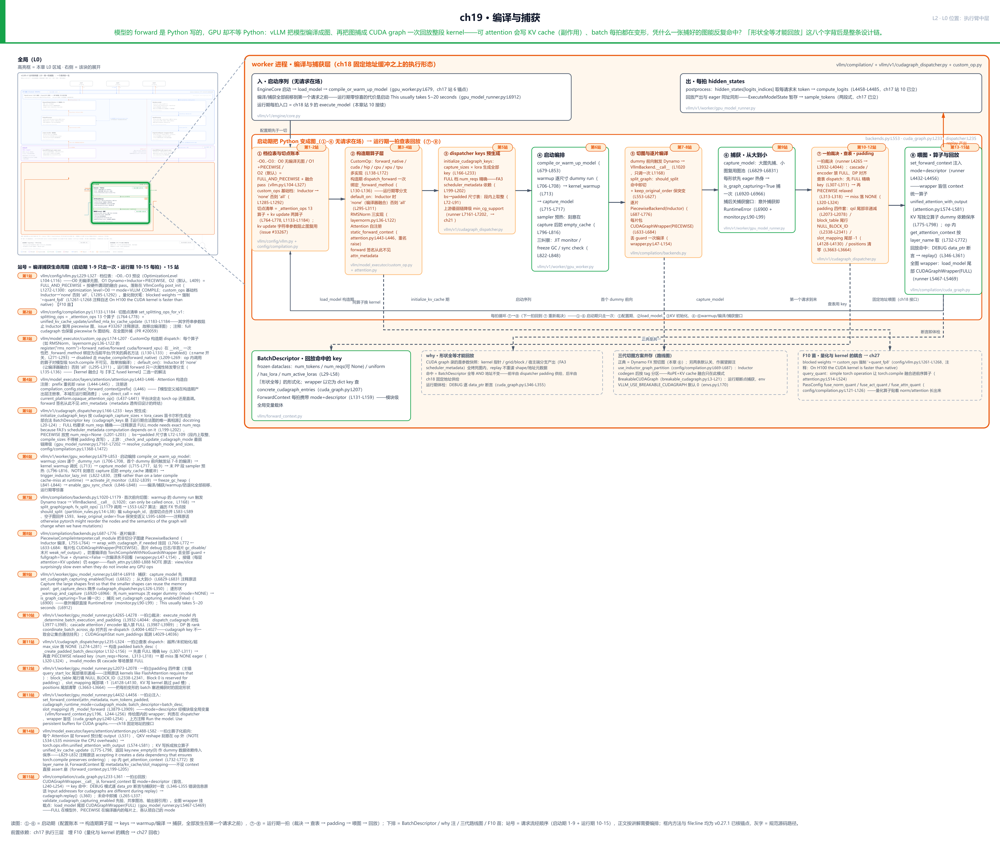

> *图注：本章放大的是[第 1 章](../../ch01-vllm-v1-in-one-map/narrative/chapter.md) L0 图中间绿色「GPU 执行臂」列的**中层**，与[第 18 章](../../ch18-persistent-batch-fixed-addresses/narrative/chapter.md)同一块地皮：上一章讲这块 GPU 每拍被「喂什么」（持久批次 + 固定地址缓冲），本章讲喂进去之后前向以什么**形态**执行：被逐片编译、再被捕获成 CUDA graph 回放。北带左入右出：左端入是启动序列（无请求在场：档位表 → 构造期算子层 → keys 预生成 → 切图编译 → 从大到小捕获）；右端出是服务期每拍的 hidden_states（⑧ 的回放产出向上汇进出框）；中间 ①-⑧ 八个拍片里 ①-⑥ 属启动期、⑦⑧ 是每拍心跳（⑦ 裁决·查表·padding → ⑧ 注入·算子化前向·回放，每拍从 ⑧ 回到 ⑦ 循环）。本章接在四块已读结构上：[第 17 章](../../ch17-executor-worker-model-runner/narrative/chapter.md)立过的三层骨架与 execute_model 两段式、上一章立过的固定地址持久缓冲、[第 13 章](../../ch13-paged-kv/narrative/chapter.md)立过的块表与槽位、[第 12 章](../../ch12-async-scheduling/narrative/chapter.md)立过的异步调度心跳。站号 1-15 = 配置 → 构造 → 编译 → 捕获 → 每拍回放的生命周期顺序（第 1 站档位表 → 第 15 站回放），正文按讲解需要编排、不必照站号读。*

读法建议：只想知道一个 `-O2` 参数背后展开了什么，直奔[「一个参数的总账」](#一个参数的总账)；算子怎么做到一份代码多平台多形态，看[「一个算子多份身体」](#一个算子多份身体)；切图在哪切、怎么切、实跑切出来什么样，读[「在哪切怎么切」](#在哪切怎么切)；运行期一拍怎么查表命中、怎么 padding，跳[「查表三出口」](#查表三出口)和[「一拍的完整账」](#一拍的完整账)；启动那几秒到几十秒都在干什么，看[「启动期的一晚」](#启动期的一晚)；想跟全程，按序读。

## 两把刀各砍一种开销

先站到 L0 图执行臂中层的最底层问一句：为什么非要「编译」和「捕获」两套东西？它们砍的是两种不同的开销。

**敌人长什么样。** PyTorch 官方博客的说法：GPU 算力涨得快，单个操作却「diminishes to just a few microseconds」（缩到只剩几微秒），这时框架提交每个操作的固定开销就冒了头：CPU 要处理张量形状这些元数据、准备 kernel 参数，这是固定成本；「at small batch sizes CPU overhead can become larger than GPU run time. When that happens, GPUs go idle between kernel calls」（小 batch 下 CPU 开销可能超过 GPU 运行时间，GPU 在两次 kernel 调用之间空闲）。LLM 的 decode（逐 token 生成阶段）正是极端场景：batch 小、每步一层一层全是短 kernel。画个量级感（说明性数字，只看比例）：

```text
一个 eager 步（示意）：
  kernel1[5us GPU] --CPU 链 ~10us--> kernel2[4us GPU] --~10us--> kernel3[5us GPU]
  GPU 有效时间 14us，却干等了 ~20us，利用率不到一半
```

**刀一：torch.compile，砍「算子个数」。** torch.compile（PyTorch 官方的「把 Python 模型编译成优化代码」工具链）分三段：Dynamo（追踪器，第一次调用时顺着你的 Python 代码抓出算子序列，遇到不支持的特性就 graph break、断点处退回 eager）抓出一张 FX 计算图（FX 是 PyTorch 的图中间表示：把模型表达成一串可以程序化查看改写的节点）；Inductor（编译后端）把图优化并生成新代码，GPU 上生成的正是 [第 13 章](../../ch13-paged-kv/narrative/chapter.md)讲过的 Triton kernel。它砍的方式是**融合**：相邻算子焊进一个 kernel，中间结果不再写回显存再读出来，而是留在寄存器里直接喂给下一步。官方博客的三合一例子（外部示例）：

```python
# 说明性：PyTorch 官方博客的融合例子
def pointwise_example(x, w, b):
    tmp = x * w
    tmp = tmp + b
    tmp = tmp.sigmoid()
    return tmp
# eager：3 个 kernel（mul / add / sigmoid），各自「读输入→算一步→写结果」，8 次显存读写
# torch.compile 后：1 个 kernel（名字形如 triton_poi_fused_add_mul_sigmoid_0）
#   三个输入一次读入、连着算完、只写最终结果，中间量全程留在寄存器，显存读写 8→4 次
```

官方教程对收益来源的总结就一句：Speedup mainly comes from reducing Python overhead and GPU read/writes（减少 Python 开销和 GPU 读写）。

**刀二：CUDA graph，砍「提交次数」。** 融合减少 kernel 个数，但剩下的 kernel 还得逐个提交：Python、C++、CUDA 驱动一层层过。CUDA graph 干脆把提交本身也录下来：回放时「submits the entire graph's work to the GPU with a single call to cudaGraphLaunch」（一次 cudaGraphLaunch 调用提交整张图的工作），「skips all layers of argument setup and kernel dispatch」（跳过从 Python 到驱动的全部参数准备与分发层）。提交开销从「按 kernel 计费」变成「按回放计费」，与 kernel 个数无关。官方战果（外部数字）：MLPerf（业界标准的 AI 硬件性能竞赛）里 Mask R-CNN 图内部分 31ms 降到 6ms（约 5 倍，整体 1.70 倍）、4096 卡 BERT 1.12 倍。而这套机制第一次被 PyTorch 原生化，正是为了小 batch 下 CPU 喂不上 GPU 的场景。

**两把刀缺一不可**：编译解决不了提交开销：kernel 再少也要逐个提交；捕获解决不了算子个数：录进去的串多长就多长。vLLM 默认把两把一起开（`vllm/config/vllm.py:L409` 的默认档 `optimization_level = O2`，下节拆开看）。

torch.compile 还有一个必须先立的概念：**guard（守卫）**。编译产物只对「抓图时的那些条件」成立：输入形状、dtype、Python 常量的值。Dynamo 把这些条件做成一组轻量检查挂在产物门口，每次调用先跑检查：通过才用编译产物，不通过就是一次 guard failure，触发重编译；重编译有上限（`recompile_limit` 默认 8），到顶就放弃、整个函数退回 eager。对形状每步都变的推理服务，这是一把双刃剑：兜得住正确性，但形状变一次重编一次，8 次封顶后性能突降。有两个开关与此相关，vLLM 全用上了：`dynamic=False` 强制全特化（官方文档原话 we will NEVER generate dynamic kernels, we will always specialize，形状钉死）；`fullgraph=True` 要求整段代码必须完整进图、出现 graph break 直接报错（`vllm/compilation/wrapper.py:L148-L154` 的取法）。为什么敢这么极端、guard 还能整个丢掉，[「片内编译片间接缝」](#片内编译片间接缝)一节给答案。

## 录的是什么

现在正式讲 CUDA graph，本章要立的新概念之一。它是 CUDA 10（2018）引入、PyTorch v1.10（2021）原生支持的机制。构建方式是**流捕获**（stream capture；流是 GPU 上的任务队列，[第 12 章](../../ch12-async-scheduling/narrative/chapter.md)立过流与事件这对原语）：把一条 CUDA 流切进捕获模式：「CUDA work issued to a capturing stream doesn't actually run on the GPU. Instead, the work is recorded in a graph」（发往捕获流的工作不在 GPU 上真跑，而是被记进一张图）。捕获期间每个 kernel 的启动配置（grid/block 划分：GPU 线程的两级编组，派几个线程块、每块几线程，一个 kernel 派出多少并行工人由此定）、参数块里的张量指针，连同宿主端（CPU 侧）算好再传给 kernel 的东西，全部录下。回放则是把录下的整串工作原样重发。官方文档的最小例子（说明性，据 PyTorch 官方模式）：

```python
# 说明性：PyTorch 官方 CUDA graph 最小用法
static_in  = torch.randn(8, 512, device="cuda")   # 长寿输入：回放永远读写这块地址
static_out = torch.empty_like(static_in)

s = torch.cuda.Stream()                            # 约束：捕获必须在非默认流
s.wait_stream(torch.cuda.current_stream())
with torch.cuda.stream(s):                         # 先热身，让 JIT（即时编译）/惰性初始化提前发生
    for _ in range(3):
        static_out.copy_(static_in * 2)
torch.cuda.current_stream().wait_stream(s)

g = torch.cuda.CUDAGraph()
with torch.cuda.graph(g):                          # 进入捕获：kernel 不执行，只被记录
    static_out.copy_(static_in * 2)

static_in.copy_(new_data)                          # 新数据拷进同一块内存，不换地址
g.replay()                                         # 一次调用，整串 kernel 照录制的参数重放
```

官方约束清单里最常踩的四条：捕获必须在非默认流；捕获中禁止 `.item()` 这类 CPU 与 GPU 的同步操作；禁止动态形状：「The graph assumes every tensor in the captured op sequence has the same size and layout in every replay」；CPU 侧工作不会被录进去，「that work will be elided during replay」（回放时被略去）。第一条的原因：默认流是条与所有流隐式同步的特殊队列，而捕获要求工作只记账不执行，两种语义撞在一起，所以必须另开一条普通侧流当录制磁带（上面示例里凭空出现的 `s = torch.cuda.Stream()` 正是这条约束的产物）。

从这些语义直接推出本章的纲领。**CUDA graph 录的是「对这块固定地址的显存执行这串 kernel launch」**：kernel 的工作量在捕获时按形状算死（grid/block 不变）、读写的数据位置在捕获时按指针烤死（replay 不会重读张量的 shape 元数据）。所以一张图能反复命中，当且仅当两个条件同时成立：

1. **形状全等**：形状变了，图执行的就是错误的工作量；
2. **地址不变**：地址变了，图读写的就不是这拍的数据。

第 2 条的供给链[第 18 章](../../ch18-persistent-batch-fixed-addresses/narrative/chapter.md)已经交割：所有输入住进启动时一次分配的持久缓冲，DEBUG 模式下回放前逐个比对 `data_ptr()`（张量的起始内存地址）与捕获时的记录。本章的主线是第 1 条：每拍都在变形的 batch，怎么去匹配一个**有限**的捕获形状集。还有个隐蔽的加深项：录死的不只是 GPU 侧：宿主端算好再传给 kernel 的分支产物也烤在图里。vLLM 源码里的直接证据是查表器的注释：「FULL mode needs exact num_reqs because FA3's scheduler_metadata computation depends on it」（`vllm/v1/cudagraph_dispatcher.py:L199-L202`）：FA3（FlashAttention-3，注意力 kernel 的一种实现）的调度元数据在 CPU 上按请求数算好才传进 kernel，所以整图回放时**连请求个数都必须与捕获时一致**。

而一刀切地「整模型捕一张图」撞上两个死结：其一，attention 写 KV cache，是图外面的副作用，Dynamo 不肯也不能全图捕获；其二，batch 每拍变形，一张固定形状的图覆盖不住。vLLM 的解法是一条组合链，也正是本章的路线图：把 attention 变成图上的**一个不透明节点**、把副作用拆成独立算子（[「让注意力进图」](#让注意力进图)）；在 attention 处**切图**、片内编译、片间接缝 eager（[「在哪切怎么切」](#在哪切怎么切)）；按形状**捕获多张图**、运行期 padding 归一后查表命中（[「查表三出口」](#查表三出口)与[「一拍的完整账」](#一拍的完整账)）。vLLM 自己那台录放机 `CUDAGraphWrapper` 的契约写在 docstring 里（`vllm/compilation/cuda_graph.py:L146-L168`）：它从执行上下文收 mode 与描述子并「blindly trust them」（盲信），不存任何持久缓冲、不拷任何输入；固定地址是上一章 runner 的职责，判责与执行就此分开。句里三个词本章后面才正式立，先各给一句白话占位：mode 是「这拍用什么形态执行」的档位（[「一个参数的总账」](#一个参数的总账)）；执行上下文是每拍装上模块级全局变量的运行环境载体（[「让注意力进图」](#让注意力进图)）；描述子是描述批形状的查表钥匙（[「查表三出口」](#查表三出口)）。这里先立住的只是契约本身。

## 一个参数的总账

L2 图 ① 拍片（站 1）。你在部署命令里只写一个 `-O2`，它背后展开为本章全部机制。这套 `-O0..-O3` 记法[第 3 章](../../ch03-engineargs-to-vllmconfig/narrative/chapter.md)站 12 立过：一个旋钮换启动/编译时间与运行性能，只借 C 编译器记法的外形与「数字越大越激进」的直觉、不借语义（出处层面只到「两边记法同构」，RFC #20283 没明写参照谁）。GCC 自己的 `-O2` 意为「几乎所有不涉及空间换时间的优化」，vLLM 的 `-O2` 是另一张表，下面拆开看：

```python
# vllm/config/vllm.py:L104-L116
class OptimizationLevel(IntEnum):
    """Optimization level enum."""

    O0 = 0
    """O0 : No optimization. no compilation, no cudagraphs, no other
    optimization, just starting up immediately"""
    O1 = 1
    """O1: Quick optimizations. Dynamo+Inductor compilation and Piecewise
    cudagraphs"""
    O2 = 2
    """O2: Full optimizations. -O1 as well as Full and Piecewise cudagraphs."""
    O3 = 3
    """O3: Currently the same as -O2s."""
```

四档的 docstring 就是本章地图：O0 什么都不开、立即启动；O1 开编译 + 分段图；O2（默认）再加整图；O3 目前与 O2 相同。「Piecewise」与「Full」是运行期档位，词表在 `CUDAGraphMode`（`vllm/config/compilation.py:L53-L103`）：

```python
# vllm/config/compilation.py:L53-L103
class CUDAGraphMode(enum.Enum):
    """Constants for the cudagraph mode in CompilationConfig.
    Meanwhile, the subset enum `NONE`, `PIECEWISE` and `FULL` are also
    treated as concrete runtime mode for cudagraph runtime dispatching.
    """

    NONE = 0
    PIECEWISE = 1
    FULL = 2
    FULL_DECODE_ONLY = (FULL, NONE)
    FULL_AND_PIECEWISE = (FULL, PIECEWISE)

    def decode_mode(self) -> "CUDAGraphMode":
        return CUDAGraphMode(self.value[0]) if self.separate_routine() else self   # L66

    def mixed_mode(self) -> "CUDAGraphMode":
        return CUDAGraphMode(self.value[1]) if self.separate_routine() else self   # L69
    # … 省略：has_mode / requires_piecewise_compilation / max_cudagraph_mode 等
    # 组合档拆解与判定方法 …

    def separate_routine(self) -> bool:
        return isinstance(self.value, tuple)

    @classmethod
    def valid_runtime_modes(cls) -> frozenset["CUDAGraphMode"]:
        return frozenset({cls.NONE, cls.PIECEWISE, cls.FULL})
```

三个**运行期模式**：NONE（不用图）、PIECEWISE（分段图：每片一张，接缝在图外）、FULL（整模型一张，连缝带 attention 全录，前提是注意力后端支持被捕获），外加两个**组合档**：值是 tuple，`decode_mode()` / `mixed_mode()` 把组合档拆成「decode 阶段用哪个、混合批用哪个」。默认 O2 用的正是 `FULL_AND_PIECEWISE`：能整图就整图，不能就落分段图。同一个 `-O2` 还顺手展开出一排融合开关：

```python
# vllm/config/vllm.py:L275-L297 · OptimizationLevel（类级常量表）
OPTIMIZATION_LEVEL_02 = {
    "compilation_config": {
        "pass_config": {
            "fuse_norm_quant": enable_norm_fusion,
            "fuse_act_quant": enable_act_fusion,
            "fuse_allreduce_rms": enable_allreduce_rms_fusion,
            "fuse_attn_quant": IS_QUANTIZED,                                    # L281
            "enable_sp": IS_DENSE,
            "fuse_gemm_comms": IS_DENSE,
            "fuse_act_padding": enable_norm_pad_fusion,
            "fuse_mla_dual_rms_norm": enable_mla_dual_rms_norm_fusion,
            "fuse_rope_kvcache": enable_rope_kvcache_fusion,
            "fuse_qk_norm_rope_kvcache": enable_qk_norm_rope_kvcache,
            "enable_qk_norm_rope_fusion": False,
            "fuse_rope_kvcache_cat_mla": enable_rope_kvcache_mla_fusion,
        },
        "cudagraph_mode": CUDAGraphMode.FULL_AND_PIECEWISE,                      # L291
        "use_inductor_graph_partition": False,
    },
    "kernel_config": {
        "enable_flashinfer_autotune": True,
    },
}
```

十来个 `fuse_*` 开关按「模型结构 + 硬件」的谓词定默认，比如 `fuse_attn_quant=IS_QUANTIZED` 只在量化模型上开。记下这个细节：**量化算子贴着 norm / attention / RoPE 长出来，催生了一整排融合开关**。量化与 kernel 的这种纠缠本章还会再撞见两次，量化篇会回来算总账。

档位最终落进 `VllmConfig` 的 post_init（构造后校验钩子）：

```python
# vllm/config/vllm.py:L1261-L1292 · VllmConfig.__post_init__
        # Enable quant_fp8 CUDA ops (TODO disable in follow up)
        # On H100 the CUDA kernel is faster than
        # native implementation
        # https://github.com/vllm-project/vllm/issues/25094
        if has_blocked_weights():                                                # L1265
            custom_ops = self.compilation_config.custom_ops
            if "-quant_fp8" not in custom_ops:
                custom_ops.append("+quant_fp8")                                  # L1268

        current_platform.apply_config_platform_defaults(self)

        if self.compilation_config.mode is None:
            if self.optimization_level > OptimizationLevel.O0:                   # L1273
                self.compilation_config.mode = CompilationMode.VLLM_COMPILE
            else:
                self.compilation_config.mode = CompilationMode.NONE

        # … 省略：ir_enable_torch_wrap 的默认推导（编译模式 + inductor 后端时才开）…

        if all(s not in self.compilation_config.custom_ops for s in ("all", "none")):
            if (
                self.compilation_config.backend == "inductor"
                and self.compilation_config.mode != CompilationMode.NONE
            ):
                self.compilation_config.custom_ops.append("none")                # L1290
            else:
                self.compilation_config.custom_ops.append("all")                 # L1292
```

三笔账：`-O0` 之外 mode 落成 `VLLM_COMPILE`（开编译）；`custom_ops` 补基础档：Inductor 编译时默认 `none`（算子全走 PyTorch 原生实现、让编译器去融合），否则 `all`（用 vLLM 手工 kernel），为什么这么选下节就是；还有开头的 `+quant_fp8`：块状量化权重（blocked weights：权重按小方块分块存储，格式为 fp8，即 8 位浮点数的量化格式）出现时，强制启用 `quant_fp8` 的手工 CUDA 算子，注释自述理由是「On H100 the CUDA kernel is faster than native implementation」。**量化格式在改变「同一个算子选哪个 kernel」**，这是量化与 kernel 耦合的第一处影子。

## 一个算子多份身体

L2 图 ② 拍片（站 3）。编译要融合，就要求算子「摊开」给编译器看；可 vLLM 里一堆算子偏偏有手工写好的 CUDA kernel（更快）。这一节的 why 链是全章的缩影。

**旧设计**：算子层直接调手工 fused kernel（把多步计算写进一个 kernel 的手工实现），哪个平台用哪份靠调用点 if-else。**痛点**：手工 kernel 对 torch.compile 完全不透明，Inductor 穿不进去，相邻算子的融合被它挡住；可 eager 模式下没有它又太慢。「kernel 融合」与「手工 fused kernel」成了二选一。**v1 方案**：CustomOp（vLLM 的多平台算子基类）：一个算子同时提供多份身体，构造期一次性选好绑死：

```python
# vllm/model_executor/custom_op.py:L103-L136
class CustomOp(nn.Module):
    """
    Base class for custom ops.
    Dispatches the forward method to the appropriate backend.
    """

    def __new__(cls, *args, **kwargs):
        # … 省略：OOT（树外设备插件）整类替换分支（插件机制，正文不展开）…
        return super().__new__(op_cls_to_instantiate)

    def __init__(self, *, enforce_enable: bool = False, compile_native: bool = False):
        super().__init__()
        self._enforce_enable = enforce_enable
        self._forward_method = self.dispatch_forward(compile_native=compile_native)   # L133

    def forward(self, *args, **kwargs):
        return self._forward_method(*args, **kwargs)                            # L136
```

`__init__` 里那一行就是全部机关：构造时调一次 `dispatch_forward`，把选中的实现**绑死**成 `_forward_method`；运行期 `forward` 只做一次属性转发：零分支、零查表。选法在 `dispatch_forward`：

```python
# vllm/model_executor/custom_op.py:L174-L207
    def dispatch_forward(self, compile_native: bool):
        # NOTE(woosuk): Here we assume that vLLM was built for only one
        # specific backend. Currently, we do not support dynamic dispatching.  # L175-L176
        compilation_config = get_cached_compilation_config()

        # … 省略：enforce_enable 的 NOTE（ViT 视觉编码器模型的多模态特例，强制启用算子）…
        enabled = self._enforce_enable or self.enabled()
        if enabled:
            compilation_config.enabled_custom_ops.update([self.__class__.name])
        else:
            compilation_config.disabled_custom_ops.update([self.__class__.name])

        if not enabled:
            # Compile forward_native to avoid eager torch ops if inside
            # opaque torch custom op (e.g. fused_moe, unified_attention, etc.)
            return self.maybe_compile(self.forward_native, enable=compile_native)

        if current_platform.is_rocm():
            return self.forward_hip
        elif current_platform.is_cpu():
            return self.forward_cpu
        elif current_platform.is_tpu():
            return self.forward_tpu
        elif current_platform.is_xpu():
            return self.forward_xpu
        elif current_platform.is_out_of_tree():
            return self.forward_oot
        else:
            return self.forward_cuda                                                 # L207
```

先查开关：被禁用就走 `maybe_compile(self.forward_native, ...)`。注意被禁用不等于裸奔，而是切到 PyTorch 原生实现、还能单独编译；启用则按当前平台返回具名方法。开头那条 NOTE 是冻结的官方自白：vLLM 假定一个进程只为一套硬件构建，不支持运行期换平台：**排班在构造期做完，运行期不可切换，想换人重启进程**。

一号例子 RMSNorm（Root Mean Square Layer Normalization，arXiv:1910.07467：把 LayerNorm 砍掉「减均值」那半个统计量、效果相当而速度更快的归一化层，LLaMA 系等主流开源模型的标配）：

```python
# vllm/model_executor/layers/layernorm.py:L35-L42
@CustomOp.register("rms_norm")                                                  # L36
class RMSNorm(CustomOp):
    """Root mean square normalization.

    Computes x -> w * x / sqrt(E[x^2] + eps) where w is the learned weight.
    Refer to https://arxiv.org/abs/1910.07467
    """
```

```python
# vllm/model_executor/layers/layernorm.py:L74-L122
    def forward_native(                                                          # L74
        self,
        x: torch.Tensor,
        residual: torch.Tensor | None = None,
    ) -> torch.Tensor | tuple[torch.Tensor, torch.Tensor]:
        """PyTorch-native implementation equivalent to forward()."""
        if residual is None:
            return ir.ops.rms_norm(
                x,
                self.weight.data if self.pass_weight else None,
                self.variance_epsilon,
                self.variance_size_override,
            )
        else:
            return ir.ops.fused_add_rms_norm.maybe_inplace(
                x,
                residual,
                self.weight.data if self.pass_weight_add else None,
                self.variance_epsilon,
                self.variance_size_override,
            )

    def forward_cuda(                                                            # L96
        self,
        x: torch.Tensor,
        residual: torch.Tensor | None = None,
    ) -> torch.Tensor | tuple[torch.Tensor, torch.Tensor]:
        if envs.VLLM_BATCH_INVARIANT:
            # … 省略：batch 不变性的实验分支（数值逐行可复现的变体）…
            return rms_norm_batch_invariant(
                x,
                self.weight.data if pass_weight else None,
                self.variance_epsilon,
                residual=residual,
            )

        return self.forward_native(x, residual)

    def forward_xpu(                                                             # L117
        self,
        x: torch.Tensor,
        residual: torch.Tensor | None = None,
    ) -> torch.Tensor | tuple[torch.Tensor, torch.Tensor]:
        return self.forward_cuda(x, residual)
```

`@CustomOp.register("rms_norm")` 把类挂进全局 `op_registry`；注册的字符串名就是配置里 `+rms_norm` / `-rms_norm` 点名开关的把手。三份身体：`forward_native` 纯 PyTorch（编译器可融合的一切平台兜底）、`forward_cuda` CUDA 路径（本例里常规情形直接回落 native；手工 kernel 的优势场景在量化、MoE（mixture of experts，混合专家：每 token 只路由到少数专家子网络）那类重算子）、`forward_xpu`（XPU，Intel 的 GPU 平台）转发 CUDA 版。开关协议的完整规则：

```python
# vllm/model_executor/custom_op.py:L271-L311
    @classmethod
    def enabled(cls) -> bool:
        # if no name, then it was not registered
        compilation_config = get_cached_compilation_config()
        custom_ops = compilation_config.custom_ops
        if not hasattr(cls, "name"):
            logger.warning_once(
                "Custom op %s was not registered, which means it won't appear "
                "in the op registry. It will be enabled/disabled based on the "
                "global settings.",
                cls.__name__,
            )
            return CustomOp.default_on()

        enabled = f"+{cls.name}" in custom_ops
        disabled = f"-{cls.name}" in custom_ops
        if enabled and disabled:
            raise ValueError(
                "custom_ops cannot both enable and disable the same operation: "
                f"{cls.name}. Remove either the '+' or '-' directive"
            )

        return (CustomOp.default_on() or enabled) and not disabled

    @staticmethod
    def default_on() -> bool:                                                    # L296
        """
        Behavior controlled by `CompilationConfig.custom_ops`: On by default if
        'all', off by default if 'none'.
        When PyTorch Inductor is used, 'none' is the default value,
        otherwise 'all'.
        """
        compilation_config = get_cached_compilation_config()
        count_none = compilation_config.custom_ops.count("none")
        count_all = compilation_config.custom_ops.count("all")
        if count_none + count_all != 1:
            raise ValueError(
                "custom_ops must contain exactly one base mode: 'all' or 'none'"
            )

        return not count_none > 0 or count_all > 0
```

`±name` 精确点名（两者同设直接 raise）；没被点名的算子由基础档定生死：必须恰含一个 `all` 或 `none`，Inductor 编译时默认 `none`。这就与上一节的落账接上了闭环：**禁用一个 CustomOp 不是删功能，而是把这段计算摊开还给编译器去融合**。官方设计文档原话：Inductor generates (fused) Triton kernels for those disabled custom ops（为被禁用的算子生成融合的 Triton kernel）。

最后一块拼图 `maybe_compile`，管的是「藏在别的算子肚子里」的 CustomOp：

```python
# vllm/model_executor/custom_op.py:L209-L231
    def maybe_compile(self, fn, *, enable: bool = True):
        """
        Compile fn if compilation enabled.
        Useful for CustomOp instances called from within a torch custom op,
        meaning the forward call is hidden from the model-level torch.compile.

        NOTE: this does not enable fusion across ops, so opaque custom ops
        should still be unwrapped wherever possible.
        """                                                                     # L217
        from vllm.config.compilation import CompilationMode

        # Do not compile if compilation disabled
        if not enable:
            return fn

        # Do not compile if global compilation disabled
        compilation_config = get_cached_compilation_config()
        if compilation_config.mode == CompilationMode.NONE:
            return fn

        # If eager backend is used, do not compile either
        if compilation_config.backend == "eager":
            return fn
        # … 省略：dynamic_arg_dims 包装与 torch.compile(dynamic=True) 尾段（
        # 对动态维显式 mark_dynamic，防止形状变化触发重编译
```

docstring 说清了场景：CustomOp 若在不透明算子（比如下一节的 `unified_attention`）内部被调用，模型级的 torch.compile 看不见这次调用，那就给它的 `forward_native` 单独包一层编译。注释也诚实：this does not enable fusion across ops（这不带来跨算子融合），能摊开的还是应该摊开。

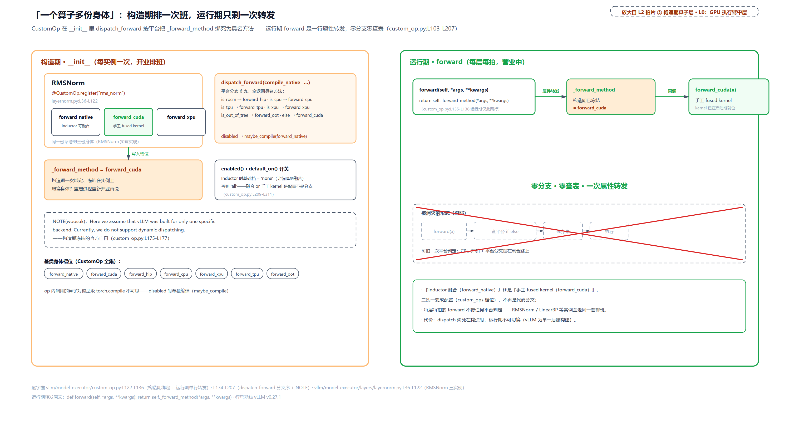

> *图注：左边是构造期：一个算子实例（以 RMSNorm 为例）名下平铺多份身体，`dispatch_forward` 按平台分支一次选中、写进 `_forward_method` 槽位；右边是运行期：每次 `forward` 只是一次属性转发，对比下方被划掉的「每拍查平台」旧形态。NOTE(woosuk) 的自白也在图上：vLLM 为单一后端构建，dispatch 烤死在构造时。*

**代价**（诚实账）：每个 CustomOp 要维护并测试多份实现、保证数值一致；dispatch 构造期冻结、运行期不可切换；`op_registry` 是全局可变状态（启用/禁用计数进编译配置，`vllm/config/compilation.py:L741-L745` 附近）。另外值得点一句对照：PyTorch 自家的 torch.library 也有一套「一个名字、多后端实现」：那套由 dispatcher（PyTorch 的算子分发层）在**每次调用**时按设备键查表；CustomOp 是 vLLM 在用户层做的「构造时一次钉死」。两套体系会在下一节会师：注意力走 torch.library 注册成正式算子，普通算子走 CustomOp。

## 让注意力进图

L2 图 ② 与 ⑧ 拍片（站 4 与站 14 的算子面）。现在攻第一个死结：attention 有副作用、要动态元数据，怎么变成图上的一个节点。这条 why 链跨度大：**旧设计**是 v0 与 v1 早期，attention 层的 forward 直接调 kernel，`attn_metadata`（注意力元数据，即本拍每请求的序列长、块表视图等执行环境）作为参数从 `model.forward` 一路透传到每一层。**痛点**有二：其一，「执行环境」泄漏进「模型定义」：每个模型文件的 forward 签名都被引擎内部结构绑架；其二，想用 torch.compile，attention 就必须是图里的一个节点，而动态控制流加外部副作用让它既进不了图、也把整图捕获卡死。**v1 方案**分两半：算子化（本节）+ forward context（前向上下文：每拍执行环境的载体，本节）；时间线上，forward context 机制 2024 年 10 月引入（PR #9029）、算子化 2025 年 1 月确立（PR #11967）。**代价**在两半讲完一起算。

先补一个外部底座：torch.library 自定义算子。官方教程的定位一句话点透：custom operator 给编译器一个显式边界（「A custom operator gives PyTorch an explicit boundary. Use it when tracing into the implementation is impossible or undesirable」：实现里有 Triton kernel、有 C++ 扩展、或不希望被追踪时，把它包成算子，编译器就不再试图看穿内部）。三个要件：注册时声明 `mutates_args`（它改写哪些输入参数，不申报的参数不许改，这是对编译器的副作用申报）；补一个 fake 实现（只算形状不碰数据：「must return tensors with the same metadata as the real kernel」，没有它 Dynamo 追踪阶段连输出形状都推不出来、直接卡住）；实现按设备注册（同名算子 CUDA 一份、CPU 一份，由 dispatcher 挑）。算子的正式身份证是限定名 `namespace::name`。`aten::add` 是老核心库的加法，`vllm::unified_attention_with_output` 就是 vLLM 注册的新算子；看到 `::` 就知道这是注册进 PyTorch 算子体系、能被 dispatch、能出现在 FX 图里的正式名字（配套细节：`torch.ops.aten.add` 是一族重载的包 OpOverloadPacket，`torch.ops.aten.add.Tensor` 才是具体重载 OpOverload，切图规则认的就是这类限定名）。

**第一半：forward context 三段接力。** 它解决的是「执行环境放哪」。

段①，构造期自注册。每个 Attention 层在 `__init__` 里把自己登记进一张全局层表：

```python
# vllm/model_executor/layers/attention/attention.py:L437-L446 · Attention.__init__
        # For cuda-alike (CUDA and ROCM) and cpu platforms, we control how
        # torch.compile works by registering the attention as one giant
        # opaque custom op. For other platforms, we directly call them
        # and let torch.compile handle them.
        self.use_direct_call = not current_platform.opaque_attention_op()        # L441

        compilation_config = vllm_config.compilation_config
        if prefix in compilation_config.static_forward_context:
            raise ValueError(f"Duplicate layer name: {prefix}")                   # L445
        compilation_config.static_forward_context[prefix] = self                  # L446
```

`prefix` 是层名（如 `model.layers.0.self_attn`）。重名直接 raise：层名是后续一切查表的键，撞名就是逻辑错误。`use_direct_call` 是平台分叉：CUDA 系平台把注意力当一整个不透明算子（走 `torch.ops.vllm.*`），其他平台直调 Python 函数、让 torch.compile 自行处理。这张 `static_forward_context`（静态前向上下文，编译配置里的层注册表）由模型定义域在构造期产出，运行期消费。

段②，每拍注入。载体是 `ForwardContext`：

```python
# vllm/forward_context.py:L131-L159
@dataclass
class ForwardContext:
    # copy from vllm_config.compilation_config.static_forward_context
    no_compile_layers: dict[str, Any]                                            # L134
    attn_metadata: dict[str, AttentionMetadata] | list[dict[str, AttentionMetadata]]
    slot_mapping: dict[str, torch.Tensor] | list[dict[str, torch.Tensor]]
    """
    Type Dict[str, AttentionMetadata] for v1, map from layer_name of each
    attention layer to its attention metadata
    Type List[Dict[str, AttentionMetadata]] for DBO. List of size two, one
    for each microbatch.
    Set dynamically for each forward pass
    """
    # set dynamically for each forward pass
    dp_metadata: DPMetadata | None = None
    # determine the cudagraph style at runtime to be FULL, PIECEWISE, or NONE.
    # by default NONE, no cudagraph is used.
    cudagraph_runtime_mode: CUDAGraphMode = CUDAGraphMode.NONE                   # L148
    batch_descriptor: BatchDescriptor | None = None                              # L149
    # … 省略：ubatch_slices / is_padding（微批与 padding 掩码的扩展字段）…
```

字段对号入座：`no_compile_layers` 就是段①那张注册表的拷贝（「不编译层」：这些层的真身藏在算子后面，图里只有算子节点，执行时要按层名找回层实例）；`attn_metadata` / `slot_mapping` 按 layer_name 索引（dict 是常规单批；代码注释里那个 list 双份是 DBO（Dual-Batch Overlap，双批重叠，把一批切成两个微批交替跑的扩展态），[第 3 章](../../ch03-engineargs-to-vllmconfig/narrative/chapter.md)立过这个标签，本章走 dict 路径不展开）；`cudagraph_runtime_mode` 与 `batch_descriptor` 是回放要用的档位与 key（后面两节的主角）。这个对象挂在**模块级全局变量**上：`vllm/forward_context.py:L196` 的一行 `_forward_context: ForwardContext | None = None` 是它唯一的家——全文件没有 threading.local（每线程各持一份属性空间的 Python 存储类）、没有 ContextVar（异步任务级隔离的上下文变量），谁来读都是同一份。装上/卸下也不走裸赋值，而是套一层上下文管理器（with 块进出时自动执行附加动作的 Python 惯用法；`@contextmanager` 装饰器把含 `yield` 的函数变成这种对象，`yield` 前的代码在进块时跑、后的在出块时跑）：

```python
# vllm/forward_context.py:L244-L256
@contextmanager
def override_forward_context(forward_context: ForwardContext | None):
    """A context manager that overrides the current forward context.
    This is used to override the forward context for a specific
    forward pass.
    """
    global _forward_context
    prev_context = _forward_context
    _forward_context = forward_context
    try:
        yield
    finally:
        _forward_context = prev_context
```

函数体第一行 `global _forward_context` 声明写的是模块全局而非局部变量；进出作用域的语义全在 try/finally 四行：进作用域，先把旧值存进 `prev_context`、再装上新值；出作用域，无论正常返回还是异常抛出，`finally` 都把旧值装回去。前向开始时，`set_forward_context`（代码嵌在[「一拍的完整账」](#一拍的完整账)里）造出本拍的 `ForwardContext`，转手交给它包住 `_model_forward`。安全性来自 **作用域** 而非线程隔离：段③ 那行 `get_forward_context()` 读的就是这个全局变量，没人把执行环境从签名里递进图，所以只要前向被 `with` 块罩住，图内多深都读得到、出了块自动还原；两层 `with` 嵌套也各存各的 `prev_context`，里层退出回到外层的值，不串味。至于「多个线程各跑一个前向怎么办」——v0.27.1 的默认执行路径上模型前向只在一个线程里跑，这份全局没有第二个写者；真到多线程各持一份的需求，才轮得到 threading.local 出场，vLLM 没用它。

段③，算子内取回：

```python
# vllm/model_executor/layers/attention/attention.py:L732-L772
def get_attention_context(
    layer_name: str,
) -> tuple[Any, "Attention | MLAAttention", torch.Tensor, torch.Tensor]:
    """Extract attention context for a given layer. …"""
    forward_context: ForwardContext = get_forward_context()
    attn_metadata_raw = forward_context.attn_metadata
    attn_metadata: AttentionMetadata
    if isinstance(attn_metadata_raw, dict):
        attn_metadata = attn_metadata_raw[layer_name]
    elif isinstance(attn_metadata_raw, list):
        # list[dict[str, AttentionMetadata]]: used in speculative decoding
        # where [0] is the base-model (non-speculative) metadata dict.
        attn_metadata = attn_metadata_raw[0][layer_name]
    else:
        attn_metadata = attn_metadata_raw
    attn_layer: Attention | MLAAttention = forward_context.no_compile_layers[layer_name]
    kv_cache = attn_layer.kv_cache
    slot_mapping = forward_context.slot_mapping
    assert isinstance(slot_mapping, dict), (
        f"Expected slot_mapping to be a dict, got {type(slot_mapping)}. "
    )
    layer_slot_mapping = slot_mapping.get(layer_name)
    return attn_metadata, attn_layer, kv_cache, layer_slot_mapping
```

按 `layer_name` 从上下文取回四样：本层的元数据、层实例（顺带拿到它的 `kv_cache` 张量）、槽位表。模型的 forward 签名从此不见 `attn_metadata`，签名里只剩它自己该有的东西。

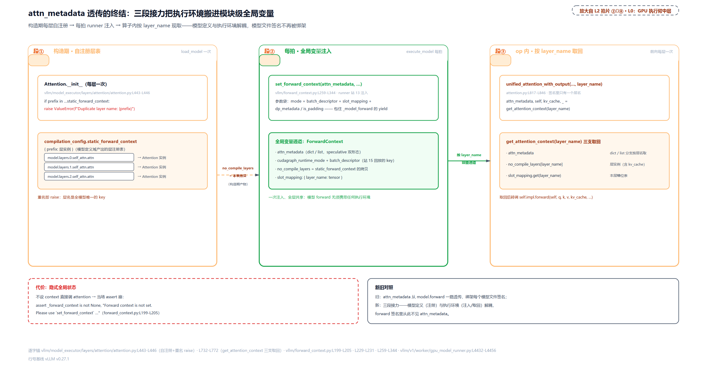

> *图注：三段泳道：左段构造期（层自注册进 `static_forward_context`，重名即 raise），中段每拍（`set_forward_context` 把元数据、图档位、批描述子装上模块级全局变量、包住模型前向），右段算子内（`get_attention_context` 按层名回查）。新旧对照在最底下：旧设计的元数据透传 vs 新设计的干净签名。代价也标着：不设 context 直接调 attention，当场 assert 崩。*

**第二半：算子化的前向本体。** `Attention.forward` 现在长这样：

```python
# vllm/model_executor/layers/attention/attention.py:L512-L582 · Attention.forward
        if output_dtype is None:
            output_dtype = query.dtype
        if self.query_quant is not None:
            # quantizing with a simple torch operation enables
            # torch.compile to fuse this into previous ops
            # which reduces overheads during decoding.
            # Otherwise queries are quantized using custom ops
            # which causes decoding overheads
            assert self.kv_cache_dtype in {"fp8", "fp8_e4m3", "nvfp4"}           # L515-L520

            # check if query quantization is supported
            if self.impl.supports_quant_query_input:
                query, _ = self.query_quant(query, self._q_scale)

        if output_shape is None:
            # Handle both 2D [num_tokens, hidden] and
            # 3D [num_tokens, heads, head_dim] query
            num_tokens = query.shape[0]
            output_shape = torch.Size((num_tokens, self.num_heads * self.head_size_v))
        output = torch.empty(output_shape, dtype=output_dtype, device=query.device)   # L531
        hidden_size = output_shape[-1]
        # Reshape the query, key, and value tensors.
        # NOTE(woosuk): We do this outside the custom op to minimize the
        # CPU overheads from the non-CUDA-graph regions.                          # L535
        query = query.view(-1, self.num_heads, self.head_size)
        output = output.view(-1, self.num_heads, self.head_size_v)
        if key is not None:
            key = key.view(-1, self.num_kv_heads, self.head_size)
        if value is not None:
            value = value.view(-1, self.num_kv_heads, self.head_size_v)
        kv_cache_dummy_dep = None
        if self.use_direct_call:
            # Skip this if sharing KV cache with an earlier attention layer.
            if (
                not self.attn_backend.forward_includes_kv_cache_update
                and self.kv_sharing_target_layer_name is None
                and key is not None
                and value is not None
            ):
                kv_cache_dummy_dep = unified_kv_cache_update(
                    key, value, self.layer_name
                )
            unified_attention_with_output(
                query,
                key,
                value,
                output,
                self.layer_name,
                kv_cache_dummy_dep=kv_cache_dummy_dep,
            )
        else:
            # Skip this if sharing KV cache with an earlier attention layer.
            encoded = _encode_layer_name(self.layer_name)
            if (
                not self.attn_backend.forward_includes_kv_cache_update
                and self.kv_sharing_target_layer_name is None
                and key is not None
                and value is not None
            ):
                kv_cache_dummy_dep = torch.ops.vllm.unified_kv_cache_update(       # L571
                    key, value, encoded
                )
            torch.ops.vllm.unified_attention_with_output(                         # L574
                query,
                key,
                value,
                output,
                encoded,
                kv_cache_dummy_dep=kv_cache_dummy_dep,
            )
        return output.view(-1, hidden_size)
```

四个设计决策按序读。**决策一：量化前置且用「简单 torch 操作」**：开头 `query_quant` 分支：KV cache 是 fp8/nvfp4（NVIDIA 的 4 位浮点量化格式）时 query 也要量化，这里刻意不用量化 custom op 而用普通 torch 算子。注释自述理由：quantizing with a simple torch operation enables torch.compile to fuse this into previous ops（普通算子能被编译器融进前面的计算），否则 custom op 挡融合、decode 期白白多开销。量化与编译的纠缠第二次露头，和 `+quant_fp8` 一样，量化篇一起收。

**决策二：output 预分配、reshape 挪到算子外**（L531 与 L534 的 NOTE）。输出不是算子返回的，是外面 `torch.empty` 好再传进去的，这叫 out-variant（输出作参数的算子形态），预分配的输出缓冲地址稳定，正合捕获的胃口。reshape 刻意放在算子外，NOTE(woosuk) 说得直白：minimize the CPU overheads from the non-CUDA-graph regions。算子外的东西属于编译片（会被编译、进图），算子内的东西属于接缝（eager 跑，连 `view` 这种不触发 GPU 操作的调用都有可感知的 CPU 成本，下一节有官方自白）。**凡是能挪出算子的都挪出去。**

**决策三：KV 写拆成独立算子 + 一张空回执。** 副作用（写 KV cache）单独成算子：

```python
# vllm/model_executor/layers/attention/attention.py:L775-L814
def unified_kv_cache_update(
    key: torch.Tensor,
    value: torch.Tensor,
    layer_name: LayerNameType,
) -> torch.Tensor:
    """
    Returns a dummy that is passed to unified_attention to signal a side effect and
    the data dependency between them to ensure torch.compile preserves ordering.
    """                                                                          # L780-L783
    layer_name = _resolve_layer_name(layer_name)
    _, attn_layer, kv_cache, layer_slot_mapping = get_attention_context(layer_name)
    if layer_slot_mapping is not None:
        assert hasattr(attn_layer.impl, "do_kv_cache_update"), (
            f"{attn_layer.impl.__class__.__name__} does not support kv cache update"
        )
        attn_layer.impl.do_kv_cache_update(
            attn_layer,
            key,
            value,
            kv_cache,
            layer_slot_mapping,
        )

    return key.new_empty(0)                                                      # L798


def unified_kv_cache_update_fake(
    key: torch.Tensor,
    value: torch.Tensor,
    layer_name: LayerNameType,
) -> torch.Tensor:
    return torch.empty(0, device=key.device, dtype=key.dtype)                    # L806


direct_register_custom_op(
    op_name="unified_kv_cache_update",
    op_func=unified_kv_cache_update,
    fake_impl=unified_kv_cache_update_fake,
    mutates_args=[],
)
```

实现体经 `get_attention_context` 拿到 kv_cache 与槽位表，调后端的 `do_kv_cache_update` 落盘写；**返回值是一个空张量** `key.new_empty(0)`（实跑验证：numel=0、shape=[0]、dtype 与 key 一致，不搬一个字节的数据）。这张空回执的用途在算子本体里：

```python
# vllm/model_executor/layers/attention/attention.py:L817-L846
@eager_break_during_capture
@maybe_transfer_kv_layer
def unified_attention_with_output(
    query: torch.Tensor,
    key: torch.Tensor,
    value: torch.Tensor,
    output: torch.Tensor,
    layer_name: LayerNameType,
    output_scale: torch.Tensor | None = None,
    output_block_scale: torch.Tensor | None = None,
    kv_cache_dummy_dep: torch.Tensor | None = None,
) -> None:
    # kv_cache_dummy_dep is not used but accepting it creates a data dependency
    # that ensures torch.compile preserves ordering between KV cache update and
    # attention forward.                                                     # L829-L831
    del kv_cache_dummy_dep
    layer_name = _resolve_layer_name(layer_name)
    attn_metadata, self, kv_cache, _ = get_attention_context(layer_name)

    self.impl.forward(
        self,
        query,
        key,
        value,
        kv_cache,
        attn_metadata,
        output=output,
        output_scale=output_scale,
        output_block_scale=output_block_scale,
    )
```

注意力的计算本体必须**晚于** KV 写（先写盘再读盘，否则读到旧数据）。编译器默认可以重排无依赖的节点，怎么让它不敢重排？把 KV 写的空回执塞进注意力算子的参数表：`del kv_cache_dummy_dep` 一行说明它不参与计算，但「接住它」这个动作在图上造出了一条数据依赖边。注释原话，accepting it creates a data dependency that ensures torch.compile preserves ordering。空回执不搬数据，只搬「先后」。算子体内其余部分就是经 `get_attention_context` 取回执行环境、转调 `impl.forward`，签名里只有一个层名，全章的「进图」到此完成：图上这个节点叫 `vllm::unified_kv_cache_update` 加 `vllm::unified_attention_with_output`，真身藏在模块级全局变量的 forward context 里。

**决策四：层名包成 opaque 类型。** 上面签名里的 `layer_name` 在 CUDA 路径走的是 `LayerName`：

```python
# vllm/utils/torch_utils.py:L845-L870
class LayerName(OpaqueBase):  # type: ignore[misc]
    """Wraps a module name string for use as a torch opaque type.

    When torch >= 2.11, this is registered as a hoisted value-type opaque
    object so that torch.compile lifts it as a graph input instead of baking
    it as a constant.  This avoids per-layer recompilation for custom ops
    that accept layer name strings (attention, MOE, KV cache, etc.).
    """                                                                          # L846-L852

    def __init__(self, value: str):
        self.value = value

    def __eq__(self, other):
        return isinstance(other, LayerName) and self.value == other.value

    def __hash__(self):
        return hash(self.value)

    def __fx_repr__(self):
        return (f"LayerName({self.value!r})", {"LayerName": LayerName})


if HAS_OPAQUE_TYPE:
    from torch._library.opaque_object import register_opaque_type

    register_opaque_type(LayerName, typ="value", hoist=True)                     # L870
```

裸字符串传给 torch.compile 会被烤成图常量：32 层模型 32 个不同字符串就是 32 次重编译。包成 opaque（不透明）类型后，torch.compile 把它 lift 成图输入而不是烤死，层与层共用一张图。这是对 issue #33267 的根治方案。那个 issue 的病根（算子的字符串参数让分段图无法复用）与当时的绕法（把 KV 写算子加进切点账本、移出编译图），下一节账本处正面讲。

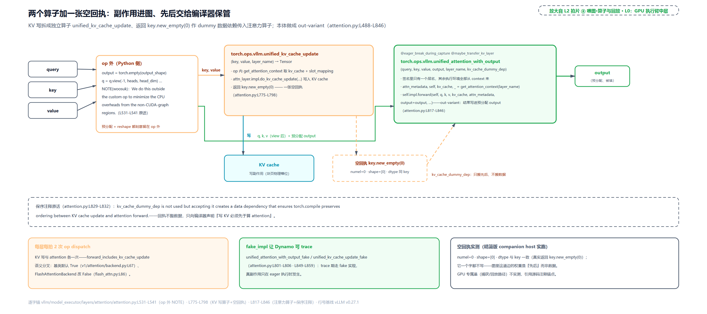

> *图注：一条横向张量流：q/k/v 先在算子外被 reshape（NOTE 原话：挪出算子以省非图区域的 CPU 开销）；`unified_kv_cache_update` 向下分两支：一支写 KV cache，一支发标注 numel=0 的空回执（回执折返向上、成为注意力算子的入参）；`unified_attention_with_output` 收下 q/k/v、预分配的 output 和那张空回执，算子内经 `get_attention_context` 转调后端。底部三块小卡：每层每拍两次算子分发（KV 写与 attention 各一次）；fake 实现让 Dynamo 能追踪；空回执的实跑实测（numel=0、shape=[0]、dtype 同 key）。*

**代价**：其一，隐式全局状态：不设 forward context 直接调 attention，当场 assert 崩（`vllm/forward_context.py:L199-L205`：Forward context is not set. Please use `set_forward_context`...）；其二，调用栈只见算子名不见层名，profiler 要专门映射；其三，KV 写与 attention 拆成两个算子，每层每拍多一次分发。代价由一个语义开关管辖：`forward_includes_kv_cache_update`（前向是否已含 KV 写）基类默认 True，`FlashAttentionBackend` 改成 False（`vllm/v1/attention/backend.py:L67` 与 `vllm/v1/attention/backends/flash_attn.py:L86`）：只有 CUDA 系这种「拆开写」的后端才付这笔钱。还有一处顺带的铺垫：算子身上两个装饰器，`@eager_break_during_capture` 是第三代捕获方案的断点钩子，挂在本章正典算子上备用，[「启动期的一晚」](#启动期的一晚)末尾见它归队；另一枚 `@maybe_transfer_kv_layer` 属 KV 跨进程搬运的扩展（PD 分离部署：prefill 与 decode 拆成两个进程，KV 要搬过去），进场等连接器卸下这层的 KV、离场再存回；没配连接器时原样直通，与本章主线无关。

## 在哪切怎么切

L2 图 ① 与 ⑤ 拍片（站 2 与站 7-8）。注意力进图了，但它是不透明节点，Inductor 融合穿不过它，整图编译等于「处处断点」。vLLM 干脆显式声明：**在注意力算子处把图切开，片内交给编译器，片间接缝 eager**。这就是 piecewise（分段）编译，本章四大主角概念（编译 torch.compile、捕获 CUDA graph、forward context、分段 piecewise）里的最后一个。它的 why 链：**旧设计**是全图 torch.compile 或全 eager 二选一：全 eager 时每层几十次 kernel 提交走 Python 分发，decode 小 batch 下 CPU 是瓶颈；全图编译时 attention 的副作用与动态分支进不了图、动态 batch 还触发反复重编译。**痛点**一句话：「编译单元」必须从整模型降到层间连续段，否则要么 CPU 喂不上、要么图捕不进。**方案**：切点账本 + 线性游走切图。**代价**：接缝留在 eager，下下节有官方自白。

**账本：在哪切。** 切点不是编译器猜的，是一份显式清单。本章与机制图叫它「切点账本」，L2 章图站 ① 上写的「切点清单」是同一个东西（最终落进配置的 `splitting_ops` 列表）：

```python
# vllm/config/compilation.py:L762-L778 · CompilationConfig（类级 _attention_ops）
    # Attention ops; used for piecewise cudagraphs
    # Use PyTorch operator format: "namespace::name"
    _attention_ops: ClassVar[list[str]] = [                                     # L764
        "vllm::unified_attention_with_output",
        "vllm::unified_mla_attention_with_output",
        # … 省略：mamba_mixer / short_conv / linear_attention / qwen_gdn /
        # sparse_attn_indexer / deepseek_v4_attention 等 10 个注意力族算子 …
        "vllm::hpc_rope_norm_forward",
    ]
```

13 个注意力族算子（普通注意力之外还有 Mamba 状态空间模型、线性注意力这些同类「不可融合」节点），全部用 `namespace::name` 限定名。组装逻辑在 `set_splitting_ops_for_v1`：

```python
# vllm/config/compilation.py:L1143-L1184 · CompilationConfig.set_splitting_ops_for_v1
        if self.pass_config.fuse_attn_quant and not self.use_inductor_graph_partition:
            self.set_splitting_ops_for_attn_fusion()
        else:
            if self.splitting_ops is None:
                # NOTE: When using full cudagraph, instead of setting an empty
                # list and capture the full cudagraph inside the flattened fx
                # graph, we keep the piecewise fx graph structure but capture
                # the full cudagraph outside the fx graph. This reduces some
                # cpu overhead when the runtime batch_size is not cudagraph
                # captured. see https://github.com/vllm-project/vllm/pull/20059
                # for details. Make a copy to avoid mutating the class-level
                # list via reference.
                self.splitting_ops = list(self._attention_ops)                  # L1155

                # unified_kv_cache_update has a string param that prevents Inductor
                # from reusing piecewise graphs. Remove it from the compiled graph.
                # This has the side-effect of excluding cache from cudagraphs but
                # that doesn't seem to affect performance.
                # https://github.com/vllm-project/vllm/issues/33267              # L1157-L1161
                if not self.use_inductor_graph_partition:
                    # … 省略：fuse_rope_kvcache / fuse_qk_norm_rope_kvcache 与
                    # 本路线互斥的两个 warning 降级块（想开 RoPE+KV 融合须换
                    # inductor 分区路线，一句话）…
                    self.splitting_ops.append("vllm::unified_kv_cache_update")   # L1183
                    self.splitting_ops.append("vllm::unified_mla_kv_cache_update")
```

两件事值得停下来。其一，KV 写两算子**追加**入账，理由最反直觉：不是因为数学不可融合，而是它的字符串参数（层名）让 Inductor 复用不了分段图。issue #33267 注释原话：has a string param that prevents Inductor from reusing piecewise graphs。把它移出编译图，顺带的副作用是 KV cache 更新不进 cudagraph；注释轻描淡写：doesn't seem to affect performance（看起来不影响性能）。上一节的 LayerName opaque 正是根治「字符串参数」这个病根的下一代方案：名字成了图输入，就不再需要靠加切点来躲。其二，开头的 NOTE：即便用 full cudagraph，也保留这份分段结构、在全图**外层**捕。运行期遇到不在捕获表的批时，还能落回分段图这条路，不用退到纯 eager（PR #20059）。

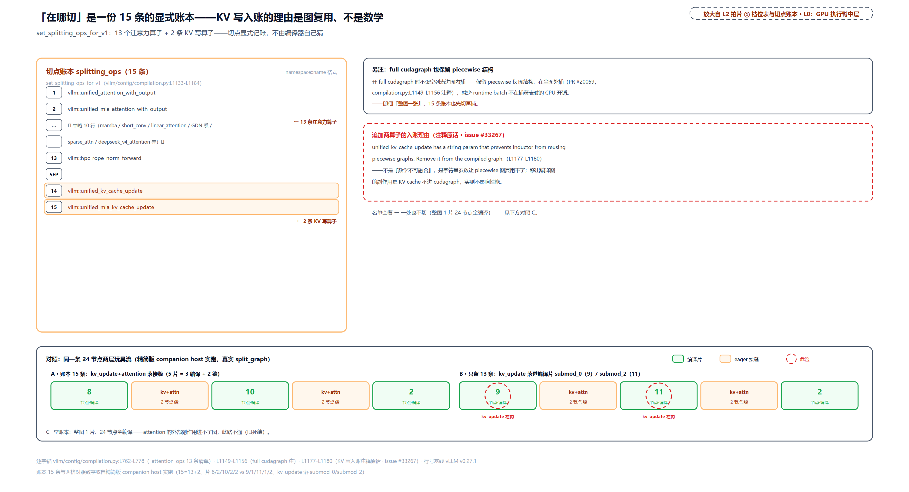

> *图注：账本 15 条 = 13 个注意力算子 + 底部分隔线下另起的 2 个 KV 写算子，后者旁挂 issue #33267 便签（字符串参数 → 图不可复用 → 干脆移出编译图）。底部左右对照：同一条两层玩具流，15 条账本下 kv_update 与 attention 落在接缝；只留 13 条时 kv_update 立刻挪进编译片（红圈标险）。右上小卡：full cudagraph 也保留分段结构、全图外捕。*

**刀具：怎么切。** 外部工具先认清：torch.fx 的 `split_module` 是官方切块刀：按回调给每个节点打分组标签，同标签归一个子模块；`keep_original_order=True` 时拆完不重排调用顺序。vLLM 的切图规则只有一条：

```python
# vllm/compilation/partition_rules.py:L14-L38
def should_split(node: torch.fx.Node, splitting_ops: list[str]) -> bool:
    """
    Check if a node should be split for dynamo graph partition.
    It operates on dynamo graph, so the node.target can be anything.
    We need to check and split only on OpOverload and OpOverloadPacket.
    """

    if node.op != "call_function":
        return False

    target = node.target

    if isinstance(target, torch._ops.OpOverloadPacket):
        # Example: "aten::add"
        return target._qualified_op_name in splitting_ops

    if isinstance(target, torch._ops.OpOverload):
        # Example: "aten::add"
        packet_name = target.name()

        # Example: "aten::add.default"
        op_overload_name = f"{packet_name}.{target._overloadname}"
        return op_overload_name in splitting_ops or packet_name in splitting_ops

    return False
```

节点目标是算子（OpOverload 或其重载包）且限定名在账本里，就切。主算法是对 FX 图的一次线性游走：

```python
# vllm/compilation/backends.py:L553-L627
def split_graph(
    graph: fx.GraphModule, splitting_ops: list[str]
) -> tuple[fx.GraphModule, list[SplitItem]]:
    _decompose_size_nodes(graph)

    # split graph by ops
    subgraph_id = 0
    node_to_subgraph_id: dict[fx.Node, int] = {}
    split_op_graphs: list[int] = []
    for node in graph.graph.nodes:
        if node.op in ("output", "placeholder"):
            continue

        # Check if this is a getitem operation on a node from an earlier subgraph.
        # If so, assign it to the same subgraph as its input to avoid passing entire
        # tuple as input to submodules, which is against standalone_compile and
        # AoTAutograd input requirement.
        if node.op == "call_function" and node.target == operator.getitem:
            # Assign this getitem to the same subgraph as its input
            input_node = node.args[0]
            if input_node.op != "placeholder":
                assert input_node in node_to_subgraph_id
                node_to_subgraph_id[node] = node_to_subgraph_id[input_node]
                continue

        if should_split(node, splitting_ops):
            subgraph_id += 1
            node_to_subgraph_id[node] = subgraph_id
            split_op_graphs.append(subgraph_id)

            # keep consecutive splitting ops together
            # (we know node.next exists because node isn't the last (output) node)
            if should_split(node.next, splitting_ops):                           # L585
                # this will get incremented by the next node
                subgraph_id -= 1
            else:
                subgraph_id += 1
        else:
            node_to_subgraph_id[node] = subgraph_id

    _merge_empty_only_subgraphs(node_to_subgraph_id, split_op_graphs)

    # `keep_original_order` is important!
    # otherwise pytorch might reorder the nodes and
    # the semantics of the graph will change when we
    # have mutations in the graph                                             # L595-L598
    with _use_lazy_graph_module(True):
        has_tuple_return = is_torch_equal_or_newer("2.12.0.dev")
        tuple_return_kwarg = {"tuple_return": True} if has_tuple_return else {}
        split_gm = torch.fx.passes.split_module.split_module(
            graph,
            None,
            lambda node: node_to_subgraph_id[node],
            keep_original_order=True,
            **tuple_return_kwarg,
        )

    outputs = []
    # … 省略：遍历子模块按 graph_id 排序、收集 SplitItem（是否切点子图 + 子模块）…
    return split_gm, outputs
```

逐行读四步。一，遍历每个节点，命中账本算子就换段子图 id。二，**连续切点合并**（L585 的先减后增）：KV 写与 attention 是两个连续切点，下一个节点也是切点时先回退一格，两者落进**同一个**子图、成为一道缝；不合并的话每层会多切一刀。三，`getitem` 归并（从早前子图取元素的节点跟着它的输入走，避免整元组当子模块输入）；空子图回并（`_merge_empty_only_subgraphs`，避免产生平凡的空段；边界优化，删了不影响语义）。四，`split_module` 落刀，`keep_original_order=True` 的注释就是为什么：模型里有改写操作（mutations，KV 写正是一个）时，重排节点会**改变语义**；这条保险丝保的是「切图不重排」。

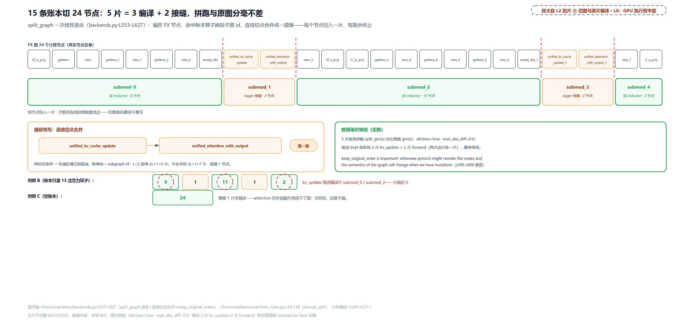

> *图注：一条 24 节点的节点流（两层玩具、节点名取自真实 FX 追踪），四道红色切刀落下后展开五个子图：三片绿框（8/10/2 节点、送编译）、两道橙框接缝（各恰 kv_update+attention 两节点、连续切点合并的产物）。右卡两条：等价核验（拼跑与原图 allclose=true、max_abs_diff=0）与 keep_original_order 的重排禁令原文。底部对照条：B 版账本只留注意力算子时 kv_update 挪进编译片（红圈），C 版空账本整图一片。*

实跑一遍。取证口径（本章三张推演表共用）：表出自配套精简版在纯 CPU 主机上的实跑：按 v0.27.1 只做减法抽出的编译与捕获组件，配真 torch 的 FX 追踪与 `split_module`、真注册的 `torch.ops.vllm.*` 统一算子、真 numpy；没有 GPU、没有 vLLM 运行时。与真实引擎的差别碰到会就近挑明：FX 图由 symbolic_trace（符号追踪）产出而非 Dynamo（`split_graph` 只看节点的限定名，两类产物同构）；CUDA graph 捕获与回放的 CUDA 段在测试里按「有 CUDA 才跑」门控，本章那两节的证据取自源码锚点；图池显存、捕获耗时这类 GPU 专属量不实测，引用源码注释的自述。凡表内数字都是实跑输出，一个没改。玩具是两层解码层切片，每层 in_proj 线性投影 → q/k/v 切片加 view → 预分配 → KV 写算子 → 注意力算子 → o_proj，算子序与真实 `Attention.forward` 一致；切点账本直接抄真实清单（15 条），另跑两个对照组：

<!-- trace: ch19-m08 -->
| 子图（执行序） | 内含节点（真实 FX 名单） | 节点数 | 是切点子图？ | 运行形态 |
|---|---|---|---|---|
| submod_0（第 1 层前段） | l0_in_proj → q/k/v 切片（getitem×3）→ view×3 → empty_like | 8 | 否 | 送 Inductor 编译 |
| submod_1（第 1 层接缝） | unified_kv_cache_update + unified_attention_with_output | 2 | 是（两切点连续，合并为一道缝） | eager 接缝 |
| submod_2（跨层中段） | view → l0_o_proj → l1_in_proj → 切片/view → empty_like | 10 | 否 | 编译 |
| submod_3（第 2 层接缝） | unified_kv_cache_update + unified_attention_with_output | 2 | 是 | eager 接缝 |
| submod_4（尾段） | view → l1_o_proj | 2 | 否 | 编译 |
| 对照 B（账本只留注意力算子） | kv_update 节点落进编译片 submod_0（9 节点）与 submod_2（11 节点） | 片数仍 5 | — | KV 写被当普通节点编进图；账本补 KV 写两算子防的正是这个 |
| 对照 C（空账本） | 整图 1 片、24 节点全编译 | 1 | 否 | attention 副作用进不了图的旧死结，此路不通 |
| 数值等价核验 | 5 片按序拼跑 split_gm(x) 对比原图 gm(x) | allclose=true、max_abs_diff=0 | — | 切图不增不减不重排 |

三层信息值得读出来。**结构**：两层玩具切出五片（3 编译 + 2 接缝），每道接缝恰好两个节点。连续切点合并的收益：不合并会是 $`3L+1`$ 片、每缝一个节点，即每层的 KV 写与 attention 各自成一道单节点缝，$`L`$ 层共 $`2L`$ 道缝、外加 $`L+1`$ 片编译段，两层玩具即 7 片）。

一般化到 $`L`$ 层模型：$`2L+1`$ 片、$`L`$ 道接缝，每拍共 $`2L`$ 次 eager 算子调用。**对照 B** 把 KV 写从账本划掉，它立刻落进编译片，issue #33267 的坑与账本解法一次看清。**不变量**：切图是纯重排不重写，论证骨架是单调量：游走一遍节点、subgraph_id 单调不减（「先减后增」在下一个节点立即抵消，永不回退进已闭合的子图），每个节点恰编入一个子图、有限节点有限步终止；`keep_original_order` 明令禁止重排。数值等价不是断言：实测五片拼跑与原图 `allclose=true`、逐元素最大差 0，且每层的后端实现各收到 2 次 KV 写与 2 次前向调用（两次运行各一次）、顺序保持。

## 片内编译片间接缝

L2 图 ⑤ 拍片（站 8）。切出来的片子怎么跑？答案是**拼跑器**：`PiecewiseCompileInterpreter` 继承自 `torch.fx.Interpreter`（FX 的逐节点解释执行器，官方文档把它叫 interpreter pattern：loop over all the Nodes in a Graph and execute them，子类覆写方法即可挂钩每个节点的执行），按序执行切好的图，钩子挂在 `call_module`：

```python
# vllm/compilation/backends.py:L730-L776
    def call_module(
        self,
        target: torch.fx.node.Target,
        args: tuple[torch.fx.node.Argument, ...],
        kwargs: dict[str, Any],
    ) -> Any:
        assert isinstance(target, str)

        gm = getattr(self.module, target)
        outputs = gm.graph.output_node().args[0]
        output = fx.map_arg(outputs, lambda node: node.meta["example_value"])      # L740

        if target in self.compile_submod_names:                                  # L742
            index = self.compile_submod_names.index(target)
            submod = self.fetch_attr(target)

            sym_shape_indices = [
                i for i, x in enumerate(args) if isinstance(x, torch.SymInt)
            ]

            # Lazy import here to avoid circular import
            from torch._inductor.compile_fx import graph_returns_tuple

            from .piecewise_backend import PiecewiseBackend

            piecewise_backend = PiecewiseBackend(
                submod,
                self.vllm_config,
                index,
                len(self.compile_submod_names),
                sym_shape_indices,
                self.vllm_backend,
                graph_returns_tuple(submod),
                submod_name=target,
            )

            self.module.__dict__[target] = wrap_with_cudagraph_if_needed(        # L766
                piecewise_backend,
                self.vllm_config,
                self.compilation_config,
                piecewise_backend.is_first_graph,
                piecewise_backend.is_last_graph,
            )

            compilation_counter.num_piecewise_capturable_graphs_seen += 1

        return output
```

第一次跑到某个子模块时，命中编译名单的（非切点片）建一个 `PiecewiseBackend`（内部送 Inductor 编译）并把包装后的产物**挂回模块树**（`self.module.__dict__[target]`），之后每次调用直接用编译产物；没命中名单的（切点算子）什么都不做，走解释器的普通调用，即 eager。别把这趟遍历误读成「真的跑了一遍模型」：它发生在 Dynamo 的追踪产物上。解释器入口收到的参数就是从图 placeholder 的 `example_value` 元数据（追踪时记下的示例值）抽出来的假值（`backends.py:L1208-L1224`），`call_module` 返回的「输出」（L740 那行 `fx.map_arg`）同样是示例值占位、不是真算出来的结果，这个类的 docstring 自认改编自 ShapeProp（torch.fx 官方的形状传播器）。真正执行模型的是挂回模块树之后的那些调用：命中名单的片走编译产物，切点算子走 eager。片段里那两行 `SymInt`（FX 的符号整数：形状待定时的占位）收集是在告诉编译器：这些输入位置是动态维，编译时别把形状烤死。整条链的触发点在启动期第一次 dummy 前向：Dynamo 追踪完成进入 vLLM 的定制后端 `VllmBackend.__call__`，其中一行断言泄露了设计的克制：「VllmBackend can only be called once」（`vllm/compilation/backends.py:L1168`，编译只许发生一次），随后调上一节的 `split_graph` 切图。

每片编译产物再包一层图包装：

```python
# vllm/compilation/backends.py:L633-L684
def wrap_with_cudagraph_if_needed(
    piecewise_backend: Any,
    vllm_config: VllmConfig,
    compilation_config: CompilationConfig,
    is_first_graph: bool,
    is_last_graph: bool,
) -> Any:
    # … 省略：docstring 与参数说明 …
    if (
        not compilation_config.cudagraph_mode.has_piecewise_cudagraphs()
        or compilation_config.use_inductor_graph_partition
    ):
        return piecewise_backend

    # We're using Dynamo-based piecewise splitting, so we wrap
    # the whole subgraph with a static graph wrapper.
    from .cuda_graph import CUDAGraphOptions

    # resolve the static graph wrapper class (e.g. CUDAGraphWrapper
    # class) as platform dependent.
    static_graph_wrapper_class = resolve_obj_by_qualname(
        current_platform.get_static_graph_wrapper_cls()
    )

    # Always assign PIECEWISE runtime mode to the
    # CUDAGraphWrapper for piecewise_backend, to distinguish
    # it from the FULL cudagraph runtime mode, no matter it
    # is wrapped on a full or piecewise fx graph.                          # L669-L674
    return static_graph_wrapper_class(
        runnable=piecewise_backend,
        vllm_config=vllm_config,
        runtime_mode=CUDAGraphMode.PIECEWISE,
        cudagraph_options=CUDAGraphOptions(
            debug_log_enable=is_first_graph,                                     # L680
            gc_disable=not is_first_graph,
            weak_ref_output=is_last_graph,
        ),
    )
```

三个开关按片的位置给：首片开 debug 日志（形状太多、只记一片就够）；**非首片禁 GC**。注释给的理由很实：分段模式下一次前向要捕几十张片图（每层一张），跨层反复跑垃圾回收会让捕获极慢，所以只有首片跑 GC；末片输出转弱引用（下下节讲为什么只有末片安全）。runtime_mode 恒为 PIECEWISE：不管包的是整图还是片，片上的 wrapper 认领的就是分段档，与模型外的 FULL wrapper 区分开。

**接缝的代价，官方自白**。被切出去的代码在 eager 跑，写在那段代码里的警告值得整段读：

```python
# vllm/v1/attention/backends/flash_attn.py:L880-L888 · FlashAttentionImpl.forward
        # IMPORTANT!
        # NOTE(woosuk): With piece-wise CUDA graphs, this method is executed in
        # eager-mode PyTorch. Thus, we need to be careful about any CPU overhead
        # in this method. For example, `view` and `slice` (or `[:n]`) operations
        # are surprisingly slow even in the case they do not invoke any GPU ops.
        # Minimize the PyTorch ops in this method as much as possible.
        # Whenever making a change in this method, please benchmark the
        # performance to make sure it does not introduce any overhead.
```

连 `view` / 切片这种**不触发任何 GPU 操作**的调用都 surprisingly slow（出乎意料地慢）。接缝是逐拍必经之路，这里每省一个 Python 调用都是纯赚。这就是上一节「reshape 挪出算子外」的动机来源，也是 piecewise 路线天生的税。

**防重编译：丢掉全部 guard。** [「两把刀各砍一种开销」](#两把刀各砍一种开销)立过 guard 与重编译的矛盾。vLLM 的解法极端而干净：

```python
# vllm/compilation/wrapper.py:L47-L54
class TorchCompileWithNoGuardsWrapper:
    """
    A wrapper class for torch.compile, it ensures that all guards are dropped
    when CompilationMode is not CompilationMode.STOCK_TORCH_COMPILE.
    When guards are dropped, the first time __call__ is invoked, a single
    compilation is triggered. Dynamo should never be traced again after that
    since we drop all guards.
    """
```

```python
# vllm/compilation/wrapper.py:L105-L154 · TorchCompileWithNoGuardsWrapper.__init__
        if mode != CompilationMode.STOCK_TORCH_COMPILE:
            # Drop all the guards.
            if self.evaluate_guards:
                # … 省略：动态形状新路线的 guard 过滤断言分支 …
                options["guard_filter_fn"] = lambda x: [
                    entry.guard_type == "SHAPE_ENV" for entry in x
                ]
            else:
                if hasattr(torch.compiler, "skip_all_guards_unsafe"):
                    # Torch 2.10+ provides skip_all_guards_unsafe
                    options["guard_filter_fn"] = torch.compiler.skip_all_guards_unsafe   # L122
                else:
                    # Equivalent fallback for older PyTorch: skip all guards
                    options["guard_filter_fn"] = lambda x: [False for _ in x]
        # … 省略：AOT 编译的上下文装配 …

        with aot_context:
            self._compiled_callable = torch.compile(
                compiled_ptr,
                fullgraph=True,                                                  # L150
                dynamic=False,
                backend=backend,
                options=options,
            )
```

`guard_filter_fn` 被换成 `skip_all_guards_unsafe`，guard 表直接清空。第一次调用触发一次编译，此后 Dynamo 永不再追踪（docstring 的契约原文）。为什么敢赌？**赌注的抵押品是上游整条设计链**：所有输入落在启动期一次分配的固定形状固定地址缓冲（[第 18 章](../../ch18-persistent-batch-fixed-addresses/narrative/chapter.md)）+ 有限个捕获形状经 padding 归一（后两节）+ 显式声明的动态维纪律。任何**编译期**假设被破坏都不会静默：`fullgraph=True` 让追踪失败直接报错，而不是生成带 guard 的多版本缓存；`dynamic=False` 把形状全特化，配合捕获路线「形状全等才回放」的本性，guard 确实无事可查，留着只会在每拍回放前白跑一遍。地址那半假设不靠运行期兜底，靠的是结构性保证：一切输入住进持久缓冲（[第 18 章](../../ch18-persistent-batch-fixed-addresses/narrative/chapter.md)），DEBUG 模式的逐地址断言（[「一拍的完整账」](#一拍的完整账)）只是它在调试模式下的体检，生产模式不开。

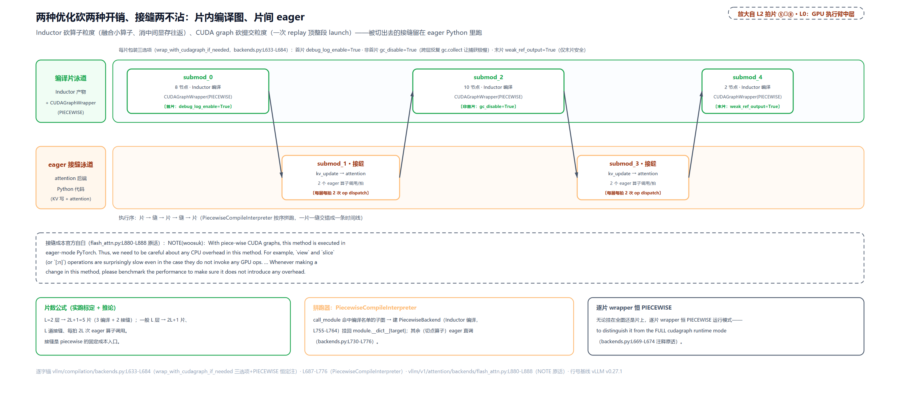

> *图注：上下两条泳道交错成一条执行线：上泳道三个绿块是编译片（标注节点数与 CUDAGraphWrapper(PIECEWISE)，角标标出首片 debug / 非首片禁 GC / 末片弱引用三选项），下泳道两个橙块是 eager 接缝（kv_update → attention）。中间引语条是 flash_attn 的官方自白：连 view/slice 都出乎意料地慢，改动必须 benchmark。底卡：片数按 $`2L+1`$ 增长、每拍 $`2L`$ 次 eager 算子调用。*

## 查表三出口

L2 图 ③ 与 ⑦ 拍片（站 5 与站 11）。现在轮到形状那半条件：捕获 N 张图覆盖 N 个形状，运行期每拍拿着真实 batch 的尺寸去查：查什么表、谁造表、怎么查。核心是把「形状」形式化成可哈希的 key：

```python
# vllm/forward_context.py:L29-L58
@dataclass(frozen=True)
class BatchDescriptor:                                                           # L30
    """
    Batch descriptor for cudagraph dispatching. We should keep the num of
    items as minimal as possible to properly and uniquely describe the padded
    batch for cudagraph.
    """

    num_tokens: int
    num_reqs: int | None = None
    """
    Number of requests in the batch. Can be None for PIECEWISE cudagraphs where
    the cudagraphs can handle any number of requests.
    """
    uniform: bool = False
    """
    True if all the requests in the batch have the same number of tokens.
    """
    has_lora: bool = False
    """
    Whether this batch has active LoRA adapters.
    """
    num_active_loras: int = 0
    """
    Number of distinct active LoRA adapters in this batch.
    When cudagraph_specialize_lora_count is enabled, separate CUDA graphs
    are captured for each num_active_loras value. This allows kernels
    (like fused_moe_lora) whose grid size depends on num_active_loras
    to be properly captured.
    """
```

frozen（不可变）dataclass：天生可哈希、进集合后不变，这是它能当 key 的全部前提。五个字段按 docstring 的纪律「越少越好，恰好唯一描述 padding 后的批」：token 数、请求数、是否每请求等长（uniform）、LoRA 相关两项（LoRA：在基座模型上叠加的小型可训练适配层；不开 LoRA 的部署后两项恒为默认值，本文不多展开）。为什么 num_reqs 可为 None？预告：分段图不在乎几个请求、整图在乎。

**表从哪来：启动期一次造全。** 造表前先过一道降级闸：注意力后端对「被 CUDA graph 捕获」的支持度不一（有的 kernel 依赖 CPU 上的动态量、捕不进图），全模型取最弱的一个。

```python
# vllm/v1/worker/gpu_model_runner.py:L7161-L7202
    def _check_and_update_cudagraph_mode(
        self,
        attention_backends: list[set[type[AttentionBackend]]],
        kv_cache_groups: list[KVCacheGroupSpec],
        is_profiling: bool = False,
    ) -> None:
        """
        Resolve the cudagraph_mode when there are multiple attention
        groups with potential conflicting CUDA graph support.
        Then initialize the cudagraph_dispatcher based on the resolved
        cudagraph_mode.
        """
        min_cg_support = AttentionCGSupport.ALWAYS                              # L7173
        min_cg_attn_backend = None

        for attn_backend_set, kv_cache_group in zip(
            attention_backends, kv_cache_groups
        ):
            for attn_backend in attn_backend_set:
                builder_cls = attn_backend.get_builder_cls()

                cg_support = builder_cls.get_cudagraph_support(
                    self.vllm_config, kv_cache_group.kv_cache_spec
                )
                if cg_support.value < min_cg_support.value:
                    min_cg_support = cg_support
                    min_cg_attn_backend = attn_backend.__name__
        cudagraph_mode = self.compilation_config.resolve_cudagraph_mode_and_sizes(
            min_cg_support,
            min_cg_attn_backend,
            self.uniform_decode_query_len,
            use_v2_model_runner=False,
            tensor_parallel_size=self.parallel_config.tensor_parallel_size,
            kv_cache_config=self.kv_cache_config,
            max_num_reqs=self.max_num_reqs,
            is_profiling=is_profiling,
        )
        # Trigger cudagraph dispatching keys initialization after
        # resolved cudagraph mode.
        self.cudagraph_dispatcher.initialize_cudagraph_keys(
            cudagraph_mode, self.uniform_decode_query_len
        )
```

`min_cg_support`（最小图支持度）从 ALWAYS（始终支持）往下被各注意力组拉低，`resolve_cudagraph_mode_and_sizes` 据此把档位与捕获尺寸降下来：**一个后端拖累全模型**。这是注意力后篇要深讲的接口，本章消费它。然后 `initialize_cudagraph_keys` 造表。造表前还有一张尺寸表要先算好：任意 batch size 上取整到哪个捕获尺寸。

```python
# vllm/v1/cudagraph_dispatcher.py:L72-L109
    def _compute_bs_to_padded_graph_size(self) -> None:
        """Pre-compute the mapping from batch size to padded graph size."""
        max_size = self.compilation_config.max_cudagraph_capture_size
        capture_sizes = self.compilation_config.cudagraph_capture_sizes
        assert max_size is not None, (
            "Maximum cudagraph capture size must be set when cudagraphs are enabled."
        )
        assert capture_sizes is not None, (
            "Cudagraph capture sizes must be set when cudagraphs are enabled."
        )
        self._bs_to_padded_graph_size: list[int] = [0] * (max_size + 1)
        for end, start in zip(
            capture_sizes + [max_size + 1],
            [0] + capture_sizes,
        ):
            for bs in range(start, end):
                if bs == start:
                    self._bs_to_padded_graph_size[bs] = start
                else:
                    self._bs_to_padded_graph_size[bs] = end

        # Validate that compile_sizes won't be changed by padding.
        # Only validate when cudagraphs are actually being used.
        if (
            self.compilation_config.compile_sizes
            and self.cudagraph_mode != CUDAGraphMode.NONE
        ):
            for size in self.compilation_config.compile_sizes:
                size = int(size)
                if size <= max_size:
                    padded = self._bs_to_padded_graph_size[size]
                    if padded != size:
                        raise ValueError(
                            f"compile_sizes contains {size} which would be "
                            f"padded to {padded}. All compile_sizes must be "
                            "values that won't be changed by cudagraph padding. "
                            "Use values from cudagraph_capture_sizes."
                        )
```

`capture_sizes` 是一组分段端点，段首保形、段内上取整到段尾。末尾的校验防一种配置事故：用户专门要求编译的尺寸如果会被 padding 改写（比如想编译 10、但 10 会被 pad 到 16），两个口径就打架了，直接 raise。key 的构造现场：

```python
# vllm/v1/cudagraph_dispatcher.py:L132-L156
    def _create_padded_batch_descriptor(
        self,
        num_tokens: int,
        uniform_decode: bool,
        has_lora: bool,
        num_active_loras: int = 0,
    ) -> BatchDescriptor:
        max_num_seqs = self.vllm_config.scheduler_config.max_num_seqs
        uniform_decode_query_len = self.uniform_decode_query_len
        num_tokens_padded = self._bs_to_padded_graph_size[num_tokens]

        if uniform_decode and self.cudagraph_mode.has_mode(CUDAGraphMode.FULL):
            num_reqs = min(num_tokens_padded // uniform_decode_query_len, max_num_seqs)
            assert num_tokens_padded % uniform_decode_query_len == 0
        else:
            uniform_decode = False
            num_reqs = min(num_tokens_padded, max_num_seqs)

        return BatchDescriptor(
            num_tokens=num_tokens_padded,
            num_reqs=num_reqs,
            uniform=uniform_decode,
            has_lora=has_lora,
            num_active_loras=num_active_loras,
        )
```

uniform decode（均匀解码：每个请求本拍都恰好推进同等 token 数，默认每请求 1 个）且档位含 FULL 时，num_reqs 按整除精确算出；否则放宽：num_reqs 直接取 padded 值并取消 uniform 标记。造表：

```python
# vllm/v1/cudagraph_dispatcher.py:L186-L233 · CudagraphDispatcher.initialize_cudagraph_keys
        # Note: we create all valid keys for cudagraph here but do not
        # guarantee all keys would be used. For example, if we allow lazy
        # capturing in future PR, some keys may never be triggered.
        if cudagraph_mode.mixed_mode() != CUDAGraphMode.NONE:
            assert self.compilation_config.cudagraph_capture_sizes is not None, (
                "Cudagraph capture sizes must be set when mixed mode is enabled."
            )
            for bs, num_active_loras in product(
                self.compilation_config.cudagraph_capture_sizes, lora_cases
            ):
                batch_desc = self._create_padded_batch_descriptor(
                    bs, False, num_active_loras > 0, num_active_loras
                )
                # Only relax for PIECEWISE mode. FULL mode needs exact num_reqs
                # because FA3's scheduler_metadata computation depends on it.   # L199-L200
                if cudagraph_mode.mixed_mode() == CUDAGraphMode.PIECEWISE:
                    batch_desc = replace(batch_desc, num_reqs=None, uniform=False)   # L202
                self.add_cudagraph_key(cudagraph_mode.mixed_mode(), batch_desc)

        # if decode cudagraph mode is FULL, and we don't already have mixed
        # mode full cudagraphs then add them here.
        if (
            cudagraph_mode.decode_mode() == CUDAGraphMode.FULL
            and cudagraph_mode.separate_routine()
        ):
            max_num_tokens = (
                uniform_decode_query_len
                * self.vllm_config.scheduler_config.max_num_seqs
            )
            assert self.compilation_config.cudagraph_capture_sizes is not None, (
                "Cudagraph capture sizes must be set when full mode is enabled."
            )
            cudagraph_capture_sizes_for_decode = [
                x
                for x in self.compilation_config.cudagraph_capture_sizes
                if x <= max_num_tokens and x >= uniform_decode_query_len
            ]
            for bs, num_active_loras in product(
                cudagraph_capture_sizes_for_decode, lora_cases
            ):
                self.add_cudagraph_key(
                    CUDAGraphMode.FULL,
                    self._create_padded_batch_descriptor(
                        bs, True, num_active_loras > 0, num_active_loras
                    ),
                )

        self.keys_initialized = True
```

两档 key 分头造：分段档放宽（num_reqs=None，分段图的缝在图外，图内不关心几个请求）；FULL 档**精确**（连 num_reqs 都算死：FA3 的调度元数据在宿主端按请求数算、烤在图里，回放时错一个请求都不行）。类 docstring 给这套 key 定了性：`cudagraph_keys` 是「运行期合法图的唯一真相源」。运行期查表：

```python
# vllm/v1/cudagraph_dispatcher.py:L235-L324
    def dispatch(
        self,
        num_tokens: int,
        uniform_decode: bool = False,
        has_lora: bool = False,
        num_active_loras: int = 0,
        valid_modes: AbstractSet[CUDAGraphMode] | None = None,
        invalid_modes: AbstractSet[CUDAGraphMode] | None = None,
    ) -> tuple[CUDAGraphMode, BatchDescriptor]:
        """
        Given conditions(e.g.,batch descriptor and if using piecewise only),
        dispatch to a cudagraph runtime mode and the valid batch descriptor.
        A new batch descriptor is returned as we might dispatch a uniform batch
        to a graph that supports a more general batch (uniform to non-uniform).
        # … 省略：Args 参数说明（invalid_modes 例：cascade attention 这类
        # 不支持 full cudagraphs 的特性传 {FULL} 排除之；None 表示不排除 …
        """
        allowed_modes = valid_modes or CUDAGraphMode.valid_runtime_modes()

        if invalid_modes:
            allowed_modes -= invalid_modes

        assert len(allowed_modes) >= 1, (
            f"No allowed cudagraph modes: valid_modes={valid_modes}, "
            f"invalid_modes={invalid_modes}"
        )
        max_size = self.compilation_config.max_cudagraph_capture_size

        if (
            not self.keys_initialized
            or self.cudagraph_mode == CUDAGraphMode.NONE
            or max_size is None
            or num_tokens > max_size                                               # L278
            or allowed_modes <= {CUDAGraphMode.NONE}                               # L279
        ):
            return CUDAGraphMode.NONE, BatchDescriptor(num_tokens)

        # … 省略：LoRA 计数专化分支（对捕获的 LoRA 数上取整匹配）…

        normalized_uniform = uniform_decode and self.cudagraph_mode.separate_routine()
        batch_desc = self._create_padded_batch_descriptor(
            num_tokens, normalized_uniform, has_lora, effective_num_active_loras
        )

        if CUDAGraphMode.FULL in allowed_modes:                                    # L307
            # check if key exists for full cudagraph
            batch_desc_to_check = batch_desc
            if batch_desc_to_check in self.cudagraph_keys[CUDAGraphMode.FULL]:
                return CUDAGraphMode.FULL, batch_desc_to_check

        if CUDAGraphMode.PIECEWISE in allowed_modes:
            # also check if the relaxed key exists for more "general"
            # piecewise cudagraph
            batch_desc_to_check = replace(batch_desc, num_reqs=None, uniform=False)   # L316
            if batch_desc_to_check in self.cudagraph_keys[CUDAGraphMode.PIECEWISE]:
                return CUDAGraphMode.PIECEWISE, batch_desc_to_check

        assert CUDAGraphMode.NONE in allowed_modes, (
            f"No matching cudagraph found and NONE is not in "
            f"allowed_modes={allowed_modes}"
        )
        return CUDAGraphMode.NONE, BatchDescriptor(num_tokens)
```

查表本体无循环无递归，三次判断：越界早退（五个条件：key 表未初始化 / 档位 NONE / max_size 未设 / num_tokens 超界 / `allowed_modes` 只剩 NONE；大批 prefill 从超界这条落 eager）→ 查 FULL 精确 key → 查 PIECEWISE 放宽 key（num_reqs 置 None 再查）→ 都不中落 NONE。`invalid_modes` 是外部特性禁档的口子：cascade attention（级联注意力，一种共享前缀的优化调度）这类不支持整图回放的特性，从上游传 `{FULL}` 进来，同形状的批就从整图降到分段图；早退条件里的第五条正是它的配套：上游若把图档禁得只剩 NONE，就地短路返回，不至于落到后面那条 assert。实跑六拍（表末列「白算行数」= padded − num_tokens：bs 被上取整到捕获档后补出来白算的行数，这笔账下节专门算）：

<!-- trace: ch19-m12 -->
| 拍 | dispatch 输入 | 构 key（num_tokens, num_reqs, uniform） | FULL 精确查 | PIECEWISE 放宽查 | 判定（mode） | 白算行数 |
|---|---|---|---|---|---|---|
| 拍1 | num_tokens=3，uniform decode（每请求 1 token） | (4, 4, True)，3 上取整到 4、num_reqs=4 | 命中 (4,4,True) | — | FULL | 1 |
| 拍2 | num_tokens=3，非均匀 mixed 批 | (4, 4, False) | miss（FULL keys 只收 uniform 档） | 命中 (4,None,False) | PIECEWISE | 1 |
| 拍3 | num_tokens=2，uniform，cascade attention 禁 FULL | (2, 2, True) | 被 invalid_modes={FULL} 排除 | 命中 (2,None,False) | PIECEWISE | 0 |
| 拍4 | num_tokens=9 超 max_size=4（force_eager 同理） | 不构 key，早退 | — | — | NONE（原样 9） | 0 |
| FULL-only 档补充 | num_tokens=3，非均匀 | (4, 4, False)，num_reqs 精确（FA3 scheduler_metadata 依赖） | 命中 (4,4,False)；bs 4 精确命中 0 白算 | 该档无 PIECEWISE keys | FULL | 1 |
| 默认刻度 | num_tokens=9（默认 51 档捕获表） | (16, None, False)，9 上取整到 16 | — | 命中 | PIECEWISE | 7 |

玩具刻度（capture_sizes=[1,2,4]）下 bs→padded 表是 {1:1, 2:2, 3:4, 4:4}：段首保形、段内上取整；预生成 3+3 个 key。默认刻度是真实部署的量级：不指定时捕获尺寸按文档模式生成（[1,2,4] 加 8 到 248 步进 8、再加 256 到 512 步进 16，上限 min(max_num_seqs×2, 512)，`vllm/config/compilation.py:L698-L706`），max_num_seqs=256 时是 **51 个捕获档 → 51 个分段 key + 35 个 FULL key（decode FULL 只收不超过 max_num_tokens 的档）= 86 个查表 key，全部启动期生成**。运行期每拍只做两次集合查询，零显存分配、零编译（每拍构的 key 只是宿主端拼一个小 dataclass，不碰显存）。

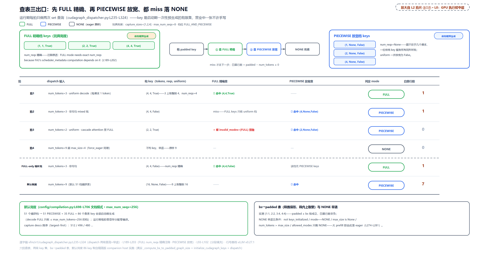

> *图注：顶部两张 key 卡：FULL 精确档 (1,1,T)(2,2,T)(4,4,T) 对 PIECEWISE 放宽档 (1,None)(2,None)(4,None)，都带「启动期预生成」徽标，FULL 卡旁是 FA3 调度元数据的注释原文。中间是构 key → 查 FULL → 查 PIECEWISE → NONE 的四步流；六拍表逐拍走过（拍 3 的 FULL 查询被红叉拦下）。底部：bs→padded 尺寸表、NONE 早退五条件、默认刻度 86 key。*

**白算的经济学**。padding 是拿算力换命中：bs=9 pad 到 16，白算 7 行。为什么可接受？decode 一行只是一个 token 的前向，便宜；prefill 一行可达数千 token，贵得多，所以捕获尺寸表只铺到 max_num_seqs 附近的 decode 量级，大 prefill 从 `num_tokens > max_size` 早退走分段图或 eager。这笔账有专门的观测指标（CUDAGraphStat 的 num_paddings），下节见它出现在裁决的返回值里。

## 一拍的完整账

L2 图 ⑦ 与 ⑧ 拍片（站 10-15）。现在把运行期一拍从头到尾串起来：裁决 → 查表（上节已拆）→ padding → 注入 → 算子化前向（[「让注意力进图」](#让注意力进图)已拆）→ 回放。入口在 `execute_model` 的收集装配之后：

```python
# vllm/v1/worker/gpu_model_runner.py:L4265-L4278 · GPUModelRunner.execute_model
            (
                cudagraph_mode,
                batch_desc,
                should_ubatch,
                num_tokens_across_dp,
                cudagraph_stats,
            ) = self._determine_batch_execution_and_padding(
                num_tokens=num_tokens_unpadded,
                num_reqs=num_reqs,
                num_scheduled_tokens_np=num_scheduled_tokens_np,
                max_num_scheduled_tokens=max_num_scheduled_tokens,
                use_cascade_attn=cascade_attn_prefix_lens is not None,
                num_encoder_reqs=len(scheduler_output.scheduled_encoder_inputs),
            )
```

`_determine_batch_execution_and_padding`（`gpu_model_runner.py:L3932-L4044`）是每拍的裁决者，SKIP裁决逻辑三笔：先判 uniform decode（`_is_uniform_decode`，每请求恰好推 1 个 token 的拍才打这个标）；再进一个内联闭包 `dispatch_cudagraph` 调上节的查表。注意它把 `disable_full=use_cascade_attn or has_encoder_output` 传进去（`L3988`）：cascade attention 或编码器输入（多模态的视觉特征）在场时禁 FULL，同形状直接降分段图；最后若数据并行（DP：多张卡各自独立跑批、对齐后协同），先 `coordinate_batch_across_dp` 让各 rank 对齐到同一个 padded 尺寸、再各自重查一次：各 rank 的图 key 若不一致，后面集合通信的形状就对不上、直接挂死。分布式全貌在更后面的章，这里只立「对齐后重查」这一层。统计面：观测开时把 `num_paddings = batch_descriptor.num_tokens - num_tokens` 记进 CUDAGraphStat，这就是上一节那笔白算账的官方出口。

**裁决说 pad 到哪，四件套把数据铺到那。** [第 18 章](../../ch18-persistent-batch-fixed-addresses/narrative/chapter.md)立过固定形状缓冲的「尾部 pad 惯例」（query_start_loc 尾部填非递减），这里是它的完整版：四个持久缓冲，pad 段各写一个专属哨兵。

```python
# vllm/v1/worker/gpu_model_runner.py:L2073-L2078 · GPUModelRunner._prepare_inputs
        self.query_start_loc.np[0] = 0
        self.query_start_loc.np[1 : num_reqs + 1] = cu_num_tokens
        # Note: pad query_start_loc to be non-decreasing, as kernels
        # like FlashAttention requires that
        self.query_start_loc.np[num_reqs + 1 :].fill(cu_num_tokens[-1])          # L2077
        self.query_start_loc.copy_to_gpu()
```

```python
# vllm/v1/worker/gpu_model_runner.py:L2338-L2341 · GPUModelRunner._build_attention_metadata
            # Fill unused block table entries with NULL_BLOCK_ID (null block)
            # for CUDAGraph padding. Block 0 is reserved for padding.
            blk_table_tensor[num_reqs:num_reqs_padded].fill_(NULL_BLOCK_ID)      # L2340
            return blk_table_tensor
```

```python
# vllm/v1/worker/gpu_model_runner.py:L4128-L4130 · GPUModelRunner._get_slot_mappings
            # Fill unused with -1. Needed for reshape_and_cache in full cuda
            # graph mode. `blk_table_tensor` -1 to match mamba PAD_SLOT_ID
            slot_mapping[num_tokens_unpadded:num_tokens_padded].fill_(-1)        # L4130
```

```python
# vllm/v1/worker/gpu_model_runner.py:L3663-L3664 · GPUModelRunner._preprocess
            if num_input_tokens > num_scheduled_tokens:
                self.positions[num_scheduled_tokens:num_input_tokens].zero_()    # L3664
```

四个缓冲的角色[第 18 章](../../ch18-persistent-batch-fixed-addresses/narrative/chapter.md)与[第 13 章](../../ch13-paged-kv/narrative/chapter.md)都立过：`query_start_loc` 是每请求 token 偏移的前缀和；`block_table` 是请求到 KV 块的页表；`slot_mapping` 是 token 到 KV 物理槽位的换算表；`positions` 是 token 的绝对位置（RoPE 旋转位置编码的输入）。每个哨兵都对着一个具体 kernel 的安全条件，实跑一遍（场景：5 个活跃请求、每请求 1 token、capture_sizes=[1,8]、max_num_seqs=8，读者可心算跟拍；裁决与槽位表两段走真实方法全调用，另三段在测试替身上逐字驱动，四个缓冲的 pad 段初始都带着上一拍的陈旧值，before/after 展示的是真实覆盖而非空写）：

<!-- trace: ch19-m13 -->
| 件套（源码锚） | 数组角色 | 本拍活跃前缀（5 请求 / 5 token） | pad 段写入 | 消费方为何安全 |
|---|---|---|---|---|
| 裁决先行（L4265-L4278 → L3932-L4044） | — | num_tokens=5、num_reqs=5、每请求 1 token（uniform decode） | 构 key (8,8,True) 命中 FULL → num_tokens_padded=8、num_reqs_padded=8（CUDAGraphStat.num_paddings=3） | 白算 3 行；decode 一行一个 token 的 forward，便宜 |
| 件1 query_start_loc（L2073-L2078） | 每请求 token 偏移（CU 前缀和） | [0,1,2,3,4,5]（0 加 5 个请求的 CU） | 尾部 3 项填 cu 末值 5 → [0,1,2,3,4,5,5,5,5] | 非递减：kernels like FlashAttention requires that；pad 段区间长 0（cu 末值对 cu 末值） |
| 件2 block_table（L2338-L2341） | 请求→块页表 | 5 行真实块 [7,9] [12,15] [3,6] [11,2] [8,10] | 行 [5:8) 填 NULL_BLOCK_ID=0（覆盖陈旧尾 [13,4] [9,14] [5,6]） | Block 0 is reserved for padding：pad 行读到空页，算出垃圾不外泄 |
| 件3 slot_mapping（L4128-L4130） | token→KV 物理槽位 | [10,11,12,13,14] | 尾 [5:8) 填 -1（覆盖陈旧尾 [99,98,97]） | reshape_and_cache 跳过 -1，KV cache 不被 pad token 污染（唯一的写副作用消费者，哨兵必须让写路径跳过） |
| 件4 positions（L3663-L3664） | token 位置（RoPE 输入） | [7,100,3,42,55] | 尾 [5:8) 清零（覆盖陈旧尾 [5.0,6.0,7.0]） | RoPE 对 pad 行算垃圾；输出只收集活跃请求的末 token，垃圾不被读出 |

这四件不是四个孤立的 trick，是**一个模式乘四个消费方**：活跃前缀逐字节不动、pad 段各写专属哨兵。逐个看哨兵为什么必须是那个值。query_start_loc 填 cu 末值：前缀和非递减是 FlashAttention 的前置条件，且 pad 段的区间长是 cu 末值减 cu 末值 = 0，注意力对空区间不派发工作；block_table 填 0：Block 0 是保留块，pad 行读到空页、算出的垃圾无害；slot_mapping 填 -1：KV 写 kernel 逐槽判 -1 跳过。这是四件里唯一动**写副作用**的，哨兵必须让写路径绕开，否则 pad token 会污染 KV cache；positions 清零：RoPE 对 pad 行算垃圾，而输出只按活跃请求的采样位（logits_indices，[第 18 章](../../ch18-persistent-batch-fixed-addresses/narrative/chapter.md)立过）收集，垃圾不被读出。四段全是定长尾段写，O(1) 次 CPU 操作零分配，把「batch 每拍变形」的归一成本压成四行赋值。

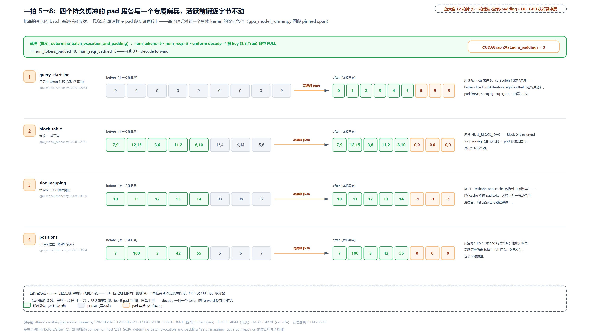

> *图注：顶部裁决横幅：构 key (8,8,True) 命中 FULL、白算 3 行。下面四行 before/after：每行活跃前缀绿格不动，陈旧尾灰格被各自哨兵覆盖（5 / 0 / -1 / 0），中箭头标各自写哪个尾段；右列是每个哨兵对着的那条 kernel 安全条件。数组值全部取自实跑输出。*

**注入与回放。** 裁决与 padding 完成后，mode 与描述子随执行上下文一起进图：

```python
# vllm/v1/worker/gpu_model_runner.py:L4432-L4456 · GPUModelRunner.execute_model
        with (
            set_forward_context(
                attn_metadata,
                self.vllm_config,
                num_tokens=num_tokens_padded,
                num_tokens_across_dp=num_tokens_across_dp,
                cudagraph_runtime_mode=cudagraph_mode,                            # L4438
                batch_descriptor=batch_desc,                                     # L4439
                ubatch_slices=ubatch_slices_padded,
                slot_mapping=slot_mappings,
                skip_compiled=has_encoder_input,
            ),
            record_function_or_nullcontext("gpu_model_runner: forward"),
            self.maybe_get_kv_connector_output(
                scheduler_output,
                defer_finalize=defer_kv_connector_finalize,
            ) as kv_connector_output,
        ):
            model_output = self._model_forward(
                input_ids=input_ids,
                positions=positions,
                intermediate_tensors=intermediate_tensors,
                inputs_embeds=inputs_embeds,
                **model_kwargs,
            )
```

这段代码的上方注释就是与上一章的接口：「Run the model. Use persistent buffers for CUDA graphs.」：持久缓冲装数据，上下文装档位与 key，`_model_forward` 里那个 `self.model(...)`（`gpu_model_runner.py:L3879-L3909` 的转发调用）进入编译图。而 `self.model` 早在加载期就被包过一层：

```python
# vllm/v1/worker/gpu_model_runner.py:L5435-L5479 · GPUModelRunner.load_model
        if (
            self.vllm_config.compilation_config.mode
            == CompilationMode.STOCK_TORCH_COMPILE
        ):
            # … 省略：原生 torch.compile 分支（不走 vLLM 的图包装体系）…
            self.model.compile(fullgraph=True, backend=backend)
            return
        # for other compilation modes, cudagraph behavior is controlled by
        # CudagraphWrapper and CudagraphDispatcher of vllm.

        # wrap the model with full cudagraph wrapper if needed.
        cudagraph_mode = self.compilation_config.cudagraph_mode
        assert cudagraph_mode is not None
        # … 省略：breakable 与 ubatching 两个实验分支 …
        elif (
            cudagraph_mode.has_full_cudagraphs()
            and not self.parallel_config.use_ubatching
        ):
            self.model = CUDAGraphWrapper(
                self.model, self.vllm_config, runtime_mode=CUDAGraphMode.FULL    # L5468
            )
```

两层挂载各认领自己的 mode：FULL wrapper 套在**模型外**（这一段），PIECEWISE wrapper 挂在**编译器内的每片上**（[「片内编译片间接缝」](#片内编译片间接缝)）。嵌套的多层 wrapper 靠 mode 区分，谁的模式谁认领。最后看回放。`CUDAGraphWrapper.__call__` 的前半是三连判定：

```python
# vllm/compilation/cuda_graph.py:L233-L261
    def __call__(self, *args: Any, **kwargs: Any) -> Any | None:
        if not is_forward_context_available():
            # No forward context means we are outside the normal
            # inference path (e.g. a vision encoder forward pass).
            # Just run the underlying function without cudagraphs.
            return self.runnable(*args, **kwargs)                                # L238

        forward_context = get_forward_context()
        batch_descriptor = forward_context.batch_descriptor
        cudagraph_runtime_mode = forward_context.cudagraph_runtime_mode

        if (
            cudagraph_runtime_mode == CUDAGraphMode.NONE
            or cudagraph_runtime_mode != self.runtime_mode
        ):
            # CUDAGraphMode.NONE could mean the profile run, a warmup run, or
            # running without cudagraphs.
            # We do not trigger capture/replay if the runtime mode is not
            # matches. This enables properly dispatching to the correct
            # CUDAGraphWrapper when nesting multiple instances with different
            # runtime modes.
            return self.runnable(*args, **kwargs)                                # L254

        assert batch_descriptor is not None
        if batch_descriptor not in self.concrete_cudagraph_entries:
            # create a new entry for this batch descriptor
            self.concrete_cudagraph_entries[batch_descriptor] = CUDAGraphEntry(
                batch_descriptor=batch_descriptor
            )
```

无上下文直通（视觉编码器这类前向不在推理主路上）；mode 不匹配直通（判定权在查表器，wrapper 盲信 docstring 原话）；匹配则以描述子查 `concrete_cudagraph_entries`（key→图条目表），命中走回放：

```python
# vllm/compilation/cuda_graph.py:L346-L361 · CUDAGraphWrapper.__call__
        if self.is_debugging_mode:
            # check if the input addresses are the same
            new_input_addresses = [
                x.data_ptr() for x in args if isinstance(x, torch.Tensor)
            ]
            assert new_input_addresses == entry.input_addresses, (
                f"Input addresses for cudagraphs are different "
                f"during replay. Expected {entry.input_addresses}, "
                f"got {new_input_addresses}"                                     # L354
            )

        # Sync offloader before replay - ensures any external dependencies
        # from pre-capture prefetches are satisfied.
        get_offloader().sync_prev_onload()
        entry.cudagraph.replay()                                                 # L360
        return entry.output
```

DEBUG 模式逐个比对输入地址（这条断言[第 18 章](../../ch18-persistent-batch-fixed-addresses/narrative/chapter.md)嵌过、且用五拍实跑验证过六个喂图缓冲的 `data_ptr` 纹丝不动，是「地址不变」这半条件的运行期体检）；然后一行 `replay()` 整串重放，返回弱引用的输出。弱引用（weakref）补一句底座：一种「不阻止对象被回收」的引用，对象只剩弱引用指着时随时可被回收，之后调用弱引用拿回 None。图输出持弱引用而非强引用，是不替下游强行保活；末片输出敢转弱引用，因为它不再被任何别的图当输入。

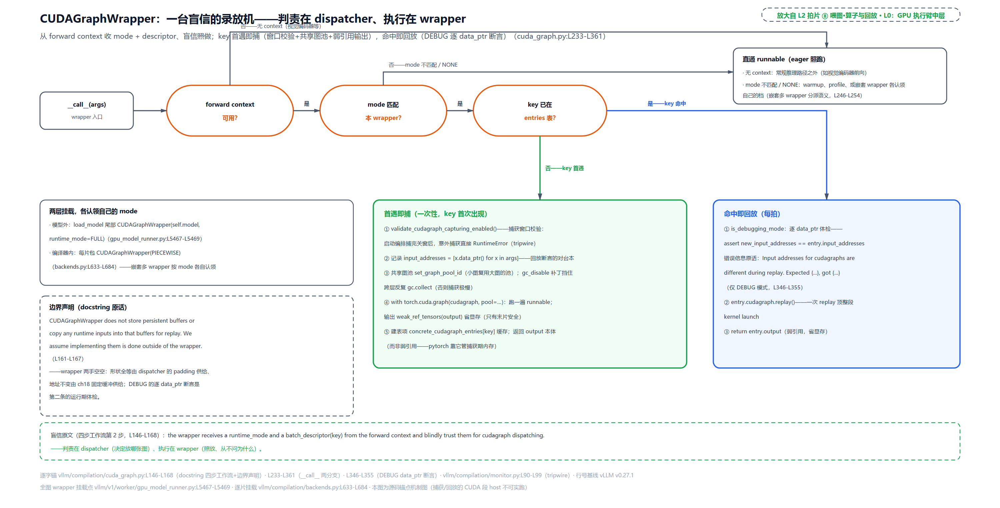

> *图注：一台盲信的录放机：入口三连判定（上下文在吗？mode 认领吗？key 在表里吗？），两处「否」都直通 runnable；key 命中走回放支（DEBUG 断言原文 + replay + 返回弱引用输出），未命中走捕获支（窗口校验、记 data_ptr、共享图池、弱引用输出；捕获支的代码在下一节）。左下小卡是边界声明原文：不存缓冲、不拷输入，固定地址是 runner 的职责。*

顺带把异步调度的一根线接上：默认心跳下（[第 12 章](../../ch12-async-scheduling/narrative/chapter.md)）本拍 dispatch 用的是乐观 seq_lens（假定上一拍的投机草稿全被接受），纠偏在 GPU 端做。本章的查表与 padding 只管形状与哨兵，不碰这层语义。

## 启动期的一晚

L2 图 ④ 与 ⑥ 拍片（站 6 与站 9）。机制全部就位，剩下的问题是谁在什么时刻把它们跑起来。答案是启动期一段编排好的流水线，「编译/捕获/warmup/防退化全部前移，运行期零惊喜」。这条 why 链的旧设计是惰性：第一个真实请求去承受 JIT 编译与首次捕获的长尾（首 token 延迟尖刺可达数百毫秒到秒级）；痛点是任何一样在服务期触发（Triton JIT、inductor 编译、意外捕获、GC 暂停、CPU 与 GPU 的同步）都是单拍延迟事故。编排本体：

```python
# vllm/v1/worker/gpu_worker.py:L679-L717
    def compile_or_warm_up_model(self) -> CompilationTimes:
        warmup_sizes: list[int] = []

        if self.vllm_config.compilation_config.mode == CompilationMode.VLLM_COMPILE:
            # warm up sizes that are not in cudagraph capture sizes,
            # but users still want to compile for better performance,
            # e.g. for the max-num-batched token size in chunked prefill.
            compile_sizes = self.vllm_config.compilation_config.compile_sizes
            warmup_sizes = compile_sizes.copy() if compile_sizes is not None else []

            if self.vllm_config.compilation_config.cudagraph_mode != CUDAGraphMode.NONE:
                cg_sizes = self.vllm_config.compilation_config.cudagraph_capture_sizes
                cg_capture_sizes = [] if cg_sizes is None else cg_sizes
                warmup_sizes = [x for x in warmup_sizes if x not in cg_capture_sizes]

            compile_ranges = self.vllm_config.compilation_config.get_compile_ranges()
            # For each compile_range, if none of the batch sizes
            # in warmup_sizes or cudagraph_capture_sizes are in the range,
            # add the end of the range to ensure compilation/warmup.
            all_sizes = set(cg_capture_sizes)
            all_sizes.update([x for x in warmup_sizes if isinstance(x, int)])
            for compile_range in compile_ranges:
                if not any(x in compile_range for x in all_sizes):
                    warmup_sizes.append(compile_range.end)

        # We skip EPLB here since we don't want to record dummy metrics
        for size in sorted(warmup_sizes, reverse=True):
            logger.info("Compile and warming up model for size %d", size)
            self.model_runner._dummy_run(size, skip_eplb=True, remove_lora=False)   # L708
        self.model_runner.maybe_remove_all_loras(self.model_runner.lora_config)

        # Warmup and tune the kernels used during model execution before
        # cuda graph capture.
        kernel_warmup(self)

        cuda_graph_memory_bytes = 0
        if not self.model_config.enforce_eager:
            cuda_graph_memory_bytes = self.model_runner.capture_model()          # L717
```

先推 warmup 尺寸清单（用户点名要编译的尺寸、减去捕获表已覆盖的、再给每个编译区间补一个边界），**从大到小**逐个 dummy 前向。第一个 dummy 前向就是全章编译链的扳机：Dynamo 追踪、`VllmBackend.__call__` 切图、逐片建 Inductor 后端，全在这一刻发生。片段里两处 skip EPLB（专家并行的负载均衡机制，Expert Parallelism Load Balancing）是旁路：预热时不想记它的 dummy 指标，与主线无关，路过。接着 kernel 调优，然后进捕获：

```python
# vllm/v1/worker/gpu_model_runner.py:L6814-L6918
    def capture_model(self) -> int:
        if self.compilation_config.cudagraph_mode == CUDAGraphMode.NONE:
            logger.warning(
                "Skipping CUDA graph capture. To turn on CUDA graph capture, "
                "ensure `cudagraph_mode` was not manually set to `NONE`"
            )
            return 0

        # … 省略：encoder cudagraph 与 torch profiler 的装配段 …
        compilation_counter.num_gpu_runner_capture_triggers += 1

        start_time = time.perf_counter()

        # Trigger CUDA graph capture for specific shapes.
        # Capture the large shapes first so that the smaller shapes
        # can reuse the memory pool allocated for the large shapes.              # L6829-L6831
        set_cudagraph_capturing_enabled(True)                                    # L6832

        with self._freeze_gc(), graph_capture(device=self.device):
            torch.accelerator.synchronize()
            torch.accelerator.empty_cache()
            start_free_gpu_memory = torch.accelerator.get_memory_info()[0]

            for (
                runtime_mode,
                batch_descs,
            ) in self.cudagraph_dispatcher.get_capture_descs():
                self._capture_cudagraphs(
                    batch_descriptors=batch_descs,
                    cudagraph_runtime_mode=runtime_mode,
                    profiler=profiler,
                )
                torch.accelerator.synchronize()

            torch.accelerator.synchronize()
            end_free_gpu_memory = torch.accelerator.get_memory_info()[0]

        # Disable cudagraph capturing globally, so any unexpected cudagraph
        # capturing will be detected and raise an error after here.
        # Note: We don't put it into graph_capture context manager because
        # we may do lazy capturing in future that still allows capturing
        # after here.
        set_cudagraph_capturing_enabled(False)                                   # L6900

        torch.accelerator.synchronize()
        torch.accelerator.empty_cache()

        # … 省略：lock_workspace（锁住 kernel 预热的 workspace 池）…

        end_time = time.perf_counter()
        elapsed_time = end_time - start_time
        cuda_graph_size = start_free_gpu_memory - end_free_gpu_memory
        # This usually takes 5~20 seconds.                                        # L6912
        logger.info_once(
            "Graph capturing finished in %.0f secs, took %.2f GiB",
            elapsed_time,
            cuda_graph_size / (1 << 30),
        )
        return cuda_graph_size
```

两个编排决策读出来。**从大到小**（`get_capture_descs` 返回降序清单，`vllm/v1/cudagraph_dispatcher.py:L326-L350` 注释 sorted largest-first for memory efficiency）：理由在图池（本节后文讲池，这里先记编排面）。**捕完关窗**：`set_cudagraph_capturing_enabled(False)` 之后，任何时刻再发生捕获就是 bug：

```python
# vllm/compilation/monitor.py:L87-L100 · 模块级全局开关
cudagraph_capturing_enabled: bool = True


def validate_cudagraph_capturing_enabled() -> None:
    # used to monitor whether a cudagraph capturing is legal at runtime.
    # should be called before any cudagraph capturing.
    # if an illegal cudagraph capturing happens, raise an error.
    global cudagraph_capturing_enabled
    if not cudagraph_capturing_enabled:
        raise RuntimeError(
            "CUDA graph capturing detected at an inappropriate "
            "time. This operation is currently disabled."
        )
```

wrapper 的捕获支每次先过这道闸（`cuda_graph.py:L277`）：服务期意外触发捕获（比如某个没预热到的形状）不会静默变慢，直接炸给你看。每个形状的捕法是「先热身后进窗」：

```python
# vllm/v1/worker/gpu_model_runner.py:L6920-L6966
    def _warmup_and_capture(
        self,
        desc: BatchDescriptor,
        cudagraph_runtime_mode: CUDAGraphMode,
        # … 省略：profile_seq_lens / allow_microbatching / num_warmups / profiler 参数 …
    ):
        if profiler is None:
            profiler = nullcontext()
        if num_warmups is None:
            num_warmups = self.compilation_config.cudagraph_num_of_warmups
        force_attention = cudagraph_runtime_mode == CUDAGraphMode.FULL
        for _ in range(num_warmups):
            self._dummy_run(
                desc.num_tokens,
                cudagraph_runtime_mode=CUDAGraphMode.NONE,                        # L6937
                force_attention=force_attention,
                uniform_decode=desc.uniform,
                allow_microbatching=allow_microbatching,
                skip_eplb=True,
                remove_lora=False,
                num_active_loras=desc.num_active_loras,
                profile_seq_lens=profile_seq_lens,
            )
        if num_warmups > 0:
            # Warmups may use auxiliary streams. Ensure all of their work has
            # completed before beginning CUDA graph capture.
            torch.accelerator.synchronize()
        with (
            profiler,
            torch.profiler.record_function(
                f"capture_{desc.num_tokens}_{cudagraph_runtime_mode.name}"
            ),
        ):
            self._dummy_run(
                desc.num_tokens,
                cudagraph_runtime_mode=cudagraph_runtime_mode,
                uniform_decode=desc.uniform,
                allow_microbatching=allow_microbatching,
                skip_eplb=True,
                remove_lora=False,
                num_active_loras=desc.num_active_loras,
                is_graph_capturing=True,                                          # L6964
                profile_seq_lens=profile_seq_lens,
            )
```

先跑 `num_warmups` 次 eager dummy（mode=NONE：让 JIT、内存分配、辅助流全部稳定下来，且不进图），同步，再把 `is_graph_capturing=True` 跑一次。这一跑经过 wrapper 时 key 未在表中，触发捕获。捕获支的代码：

```python
# vllm/compilation/cuda_graph.py:L265-L344 · CUDAGraphWrapper.__call__
        if entry.cudagraph is None:
            # … 省略：debug 日志（形状太多，只为首片开）…
            # validate that cudagraph capturing is legal at this point.
            validate_cudagraph_capturing_enabled()                                # L277

            input_addresses = [
                x.data_ptr() for x in args if isinstance(x, torch.Tensor)
            ]
            entry.input_addresses = input_addresses
            cudagraph = torch.cuda.CUDAGraph()

            with ExitStack() as stack:
                if self.cudagraph_options.gc_disable:
                    # during every model forward for piecewise cudagraph
                    # mode, we will capture many pieces of cudagraphs
                    # (roughly one per layer). running gc again and again
                    # across layers will make the cudagraph capture very slow.
                    # therefore, we only run gc for the first graph,
                    # and disable gc for the rest of the graphs.              # L287-L292
                    stack.enter_context(
                        patch("gc.collect", lambda *args, **kwargs: None)
                    )
                    stack.enter_context(
                        patch(
                            "torch.accelerator.empty_cache",
                            lambda *args, **kwargs: None,
                        )
                    )

                if self.graph_pool is not None:
                    set_graph_pool_id(self.graph_pool)                            # L304
                else:
                    set_graph_pool_id(current_platform.graph_pool_handle())

                # … 省略：offloader（权重卸载扩展态）的流同步两行 …

                # mind-exploding: carefully manage the reference and memory.
                with torch.cuda.graph(
                    cudagraph,
                    pool=self.graph_pool,
                    stream=current_stream(),
                ):
                    output = self.runnable(*args, **kwargs)
                    if self.cudagraph_options.weak_ref_output:
                        # by converting it to weak ref,
                        # the original `output` will immediately be released
                        # to save memory. It is only safe to do this for
                        # the last graph in piecewise cuadgraph mode, because
                        # the output of the last graph will not be used by
                        # any other cuda graph.                                   # L326-L331
                        output = weak_ref_tensors(output)

            # here we always use weak ref for the output
            # to save memory
            entry.output = weak_ref_tensors(output)                                # L336
            entry.cudagraph = cudagraph

            compilation_counter.num_cudagraph_captured += 1

            # important: we need to return the output, rather than
            # the weak ref of the output, so that pytorch can correctly
            # manage the memory during cuda graph capture
            return output
```

窗口校验、记下全部输入的 `data_ptr`（回放体检的基准）、进 `torch.cuda.graph` 捕获上下文跑一遍 runnable、输出转弱引用。**共享图池**值得讲透：捕获期间分配的中间张量来自图私有的内存池，官方 notes 说明池可以共享：「It's safe for a set of graphs to share a private pool if you know they'll always be replayed in the same order they were captured, and never be replayed concurrently」（一组图共享私有池的安全条件：永远按捕获顺序回放、绝不并发），并警告并发回放会互相 clobber（覆写对方的输出）。若每张图独占一池，捕 N 个形状就是 N 份峰值显存，推理服务吃不消；vLLM 让全部图共享一个池（`vllm/compilation/cuda_graph.py:L200` 取平台级全局池单例）。先把引文那句话拆开核对：前半条 vLLM 并不满足，FULL 图运行期按当拍形状乱序命中（六拍表本身就是任意命中），「从大到小」说的是捕获顺序、不是回放顺序。它敢共享，靠的是把图与图之间的数据依赖拆干净，三条各管一段。**其一，回放互斥**（引文的后半条）：FULL 档每拍至多回放一张整图；分段档一拍按层序连放 $`L+1`$ 张片图、夹着 $`L`$ 道接缝的 eager 调用，同样不并发；这个前提源码自己有交代，池初始化处留着的 TODO：将来若用多流，全局池可能不再安全（`cuda_graph.py:L197-L199`）。片图这条路径恰好也满足引文的前半条：片按层序捕获、每次回放走的也是同一层序。**其二，整图重算**：每张图回放时从头算完自己的全部中间量，池里任何地址上的值要么是本拍刚写的、要么没人再读，谁的正确性都不依赖「上一次回放留在池里的内容」。**其三，跨拍要活的数据一个都不住池里**：输入住上一章的持久缓冲，KV cache 在池外，图输出转弱引用、本拍消费完即还，池里没有任何「上一拍写了、下一拍还要读」的量。官方那句「按捕获顺序回放」是给「后一张图要消费前一张图的输出」那种一般用法预备的充分条件；vLLM 的 FULL 图之间没有这种传递（各自的输入输出都走池外），守住「绝不并发」这半就够。回到「从大到小」真正的编排收益：先捕大图占住工作集显存，小图捕获时复用剩余空间，全池净增趋近于输出张量的大小。末尾那句注释也是弱引用的边界：只有末片的输出才敢立刻释放，中间片的输出还要被下一张图当输入用。

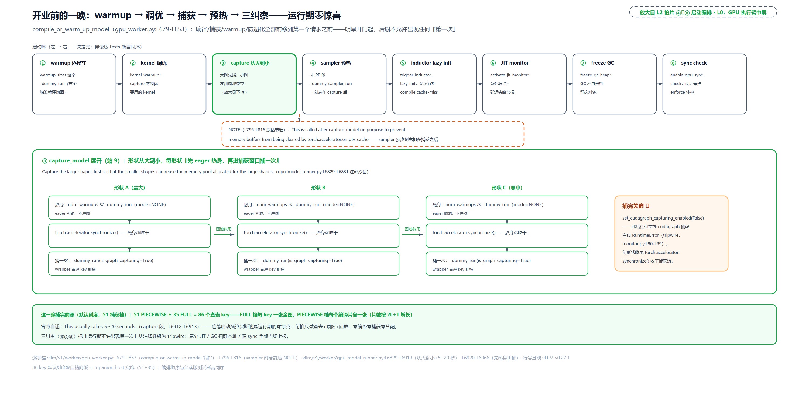

> *图注：一条时间线八个工位：warmup 逐尺寸 → kernel 调优 → capture（放大展开：形状从大到小，每形状「eager 热身 × N → 同步 → 进捕获窗捕一次」，SKIP

最后一段收尾把「运行期零惊喜」从注释升级成三件纠察：JIT 监察与同步纠察是绊线（tripwire，运行期一碰就报错的检查），冻结 GC 是事前预防。

```python
# vllm/v1/worker/gpu_worker.py:L793-L848 · Worker.compile_or_warm_up_model
        if self.use_v2_model_runner:
            # … 省略：V2 runner 分支（实验性新路径，JIT 预热交给 warmup_kernels）…
        elif get_pp_group().is_last_rank:
            # V1: Warm up sampler and preallocate memory buffer for logits and other
            # sampling related tensors of max possible shape to avoid memory
            # fragmentation issue.
            # NOTE: This is called after `capture_model` on purpose to prevent
            # memory buffers from being cleared by `torch.accelerator.empty_cache`.   # L800-L801
            max_num_reqs = min(
                self.scheduler_config.max_num_seqs,
                self.scheduler_config.max_num_batched_tokens,
            )

            # We skip EPLB here since we don't want to record dummy metrics
            hidden_states, last_hidden_states = self.model_runner._dummy_run(
                num_tokens=max_num_reqs,
                skip_eplb=True,
                cudagraph_runtime_mode=CUDAGraphMode.NONE,
            )
            # … 省略：pooling 分支 / sampler 预热调用 …

        # Reset the seed to ensure that the random state is not affected by
        # the model initialization and profiling.
        set_random_seed(self.model_config.seed)

        # Eagerly trigger inductor's once-per-process lazy inits during
        # warmup (rather than on a later compile cache-miss at runtime).
        c_config = self.compilation_config
        if c_config.mode != CompilationMode.NONE and c_config.backend == "inductor":
            from vllm.compilation.compiler_interface import (
                trigger_inductor_lazy_init,
            )

            trigger_inductor_lazy_init(self.device)                               # L830

        # All warmup is done — start monitoring for unexpected JIT
        # compilations that would cause latency spikes during inference.
        from vllm.utils.jit_monitor import activate as activate_jit_monitor

        activate_jit_monitor(                                                     # L836
            mode=self.observability_config.jit_monitor_mode,
            verbose=self.observability_config.jit_monitor_verbose,
        )

        # Freeze the worker heap so the GC won't scan static objects
        # (model weights, KV caches, CUDA graphs) during inference.
        freeze_gc_heap()                                                          # L843
        maybe_attach_gc_debug_callback()

        # Warmup / first-compile is done — activate the `VLLM_GPU_SYNC_CHECK`
        # gate so subsequent `execute_model` / `sample_tokens` calls enforce it.
        enable_gpu_sync_check()                                                   # L848
```

逐个读。sampler 预热只在流水线并行的最后一段 rank 跑（采样器住在最后一站，[第 17 章](../../ch17-executor-worker-model-runner/narrative/chapter.md)立过这个分工），按最大形状预分配 logits 与采样缓冲，NOTE 强调**刻意排在 capture 之后**：empty_cache 会清掉缓冲，顺序反了就白干。`trigger_inductor_lazy_init` 预热度量：Triton kernel 是 JIT（just-in-time，首次用到某个特化才编译、产物落磁盘缓存；同一个特化第二次近乎零成本），inductor 自己也有每进程一次的惰性初始化，注释原话：与其等到运行期某次编译缓存未命中再付，不如现在付掉。`activate_jit_monitor`：此后任何意外 JIT 编译直接暴露。`freeze_gc_heap` 的底座补一句：Python 靠引用计数即时释放对象，另有分代垃圾回收器（对象按熬过的回收轮数分三代，分配减释放超阈值就触发一轮扫描）周期性扫全堆找循环引用。启动期过后进程里全是长命对象（权重、KV cache、图），freeze 把它们搬进「永久代」、此后的回收不再扫它们，扫描停顿从全堆量级缩到增量量级（freeze 不是关 GC，是缩小扫描范围）。`enable_gpu_sync_check`：此后 execute_model 与采样路径上的任何 CPU↔GPU 同步直接抛错。**代价**照例诚实：启动显著拉长（捕获段官方自述 5~20 秒，编译耗时专门打包成 CompilationTimes 从 worker 逐级汇回主进程落日志）；图池显存独占（启动期用 profile 手法预捕全部形状、把图池计入 KV cache 预算，[第 14 章](../../ch14-memory-ledger/narrative/chapter.md)的账本收这笔账）；启动期 dummy 数据的形状假设若与真实流量不符，运行期踩到未捕获形状就回退 eager、性能突降；白算账与绊线让这种退化可见而非静默。

**路线图脚注：三代切图方案并存。** 本章讲的是正典（FX 预切图）；另两条路线并排长着。`use_inductor_graph_partition`（不在 Dynamo 的 FX 层切、而是让 Inductor 做完全部融合 pass 之后按标记分区；RoPE+KV cache 融合那类 pass 只在此模式可用，`vllm/config/compilation.py:L669-L687`）。更激进的是 BreakableCUDAGraph（实验路线，环境变量默认关）：

```python
# vllm/compilation/breakable_cudagraph.py:L3-L21 · 模块 docstring
"""Breakable CUDA graph capture/replay.

This is an alternative to :class:`CUDAGraphWrapper` that replaces vLLM's
torch.compile-based FX graph splitting with runtime stream-capture
breaks.

The idea (inspired by sgl-project/sglang#19102): instead of pre-splitting
the model into many pieces at attention boundaries, a
single capture context drives the whole forward and intercepts
attention / kv-cache custom ops at the dispatcher to end the current
stream capture, run the op eagerly, and resume capture.

The captured artifact is a list of zero-arg callables -- the bound
``CUDAGraph.replay`` for graph segments, or the user fn for eager
segments -- replayed in order at inference time.

Eager segments must operate on the same static buffers used during
capture so subsequent graph segments read the same memory addresses.
"""
```

干脆不预切图：一个捕获上下文驱动整个前向，在注意力算子的分发处「结束当前段捕获 → eager 执行 → 恢复捕获」，捕出来的产物是一串零参可调用（图段的重放加 eager 段的直调）。[「让注意力进图」](#让注意力进图)里挂在正典算子上的 `@eager_break_during_capture` 装饰器就是给它留的钩子，正典与实验路线共用同一批算子。三代并存本身就是这套设计的税：配置矩阵与测试矩阵一起膨胀。

## 总结：执行形态点亮

回到 L0 图：执行臂中层现在完整了：[第 18 章](../../ch18-persistent-batch-fixed-addresses/narrative/chapter.md)点亮「每拍喂什么」（持久批次 + 固定地址），本章点亮「以什么形态执行」——`vllm/v1/worker/gpu_model_runner.py` 的每拍前向（`L4432-L4456` 的注入与调用）跑在被 `vllm/compilation/` 切开、编译、捕获过的模型上，回放命中的一拍从 `vllm/compilation/cuda_graph.py:L360` 的那行 `replay()` 出来。Part V 的口号「Python 写的 attention 变成 CUDA graph 重播的 kernel」兑现得很精确，也很诚实：attention（连同它的 KV 写）恰恰是留在图外的那对算子；但每拍真正的 Python 只剩接缝处的算子调用和一次查表，其余整段计算都变成了重播的图。

两条命中条件的供给链各归各位：**形状全等**由查表器的 padding 尺寸表与四件套哨兵供给（`vllm/v1/cudagraph_dispatcher.py` 与 `gpu_model_runner.py` 四段），**地址不变**由上一章的持久缓冲供给，DEBUG 的逐地址断言是后者的运行期体检。而启动期那一晚（`vllm/v1/worker/gpu_worker.py:L679-L853`）把编译、捕获、预热、三件纠察全部前置：服务期不允许出现任何「第一次」。

本章两处撞见的量化影子（块状权重的 `+quant_fp8` 强制（`vllm/config/vllm.py:L1265-L1268`）与 query 量化刻意用普通算子（`vllm/model_executor/layers/attention/attention.py:L515-L524`））都是「量化格式与 kernel 选择的耦合」这句话的实例，量化篇会回来算总账。同样留给后面的还有两个接口：查表上游的最弱链降级（`min_cg_support`，注意力后篇深讲）与 slot_mapping 尾部 -1 的 pad 语义（token 批内行号到物理槽位的换算数学，槽位篇回收）。

下一块已经挂好钩子：回放最快的一拍，卡在缝里那个 eager 的 attention 身上。`unified_attention_with_output` 转调的 `impl.forward` 里面，FlashAttention 到底怎么把「整段注意力」塞进一个 kernel？online softmax 与 tiling 的数学，下一篇展开；再往后，注意力后端怎么选、优先级表怎么排、最弱链怎么降级，把执行臂走完。
