# 第 20 章　【primer】Flash-Attention 数学

上一章把这个 kernel 捕进了 CUDA graph：attention 是留在图外的那对算子之一，被整段录下来、一拍一拍地重放。可它到底在算什么？教科书答案 $`\mathrm{softmax}(QK^{\top})V`$ 要先写出一张 $`N\times N`$ 的打分表：8K 上下文、一个 head 就是一张 6700 万元素、fp16 下 134MB 的表，写出去、再读回来，GPU 大部分时间在等显存搬数据，不在算。vLLM 的 kernel 从不把这张表写出来：softmax 归一化明明要把一整行 K 的分数全部加起来，kernel 每次却只看得见一小块，而且 K 还散在分页块池里、要经 block_table 寻址。它凭什么算得和教科书逐字不差，还快好几倍？

这是 Part V 的第一篇原理章，全书四篇 primer 之一：主角不是某段源码的走读，而是一页数学，以及这页数学在 v0.27.1 源码里的落点。[第 19 章](../../ch19-compile-capture/narrative/chapter.md)讲清了「attention 为什么是图里的不透明算子」（写 KV cache 的副作用 + 动态元数据，逼得它留在 eager 的接缝里），本章掀开这个算子的内部：kernel 的数学。全章一条主线先点破： **softmax 的归一化统计量在一个合并算子 ⊕ 下满足结合律与交换律，所以注意力可以任意切块、任意顺序归并，结果不变** 。⊕ 给了拆分的许可证，显存带宽的账给了拆分的动机；这两条合起来，就是 FlashAttention 全部的秘密。

## 你在这里


> *图注：本章位置看[第 1 章](../../ch01-vllm-v1-in-one-map/narrative/chapter.md) L0 全图中间绿色「GPU 执行臂」列的**模型层**：就是那块「模型层 forward + 编译」的框，第一条写着「DecoderLayer 拼装 · Attention = 插座（MLA / GQA 变体）」。[第 19 章](../../ch19-compile-capture/narrative/chapter.md)刚把这一层捕成 CUDA graph：attention 作为不透明算子留在图外重放。本章打开的正是这个算子的内部数学。L1 图标题带的章目录一行里，ch20 标着【primer】。本章接在三块已读结构上：[第 19 章](../../ch19-compile-capture/narrative/chapter.md)立的算子化与图捕获（黑盒的来历）、[第 13 章](../../ch13-paged-kv/narrative/chapter.md)立的分页 KV（块池与每请求一张页表，kernel 读的 K/V 就住在这里）、[第 18 章](../../ch18-persistent-batch-fixed-addresses/narrative/chapter.md)立的 query_start_loc 前缀和（kernel 的序列边界入参）。原理章没有站号：正文按推导链编排（显存带宽墙 → online-softmax → 合并算子 ⊕ → tiling 分块 → IO 复杂度账 → FlashAttention-2 → LSE 合并 → cascade → kernel 的调用面），每一节是下一节的前置，按序读最顺。*

读法建议：只想知道「凭什么不写 N×N 还能算对」，直奔[「合并算子 ⊕」](#合并算子-任意分块乱序归并皆精确)和[「tiling」](#tiling把递推装进双循环)两节；关心快多少、为什么快，看[「IO 账」](#io-账数趟数不数乘加)；想知道这套数学在 vLLM 里落在哪些行代码，读[「LSE」](#lse一个标量换一次精确合并)到[「kernel 眼里的 KV」](#kernel-眼里的-kv打平右下对齐穿页表)三节；想跟全程，按序读。

### 符号速查表

后文会陆续引入记号，先列一张表备查；每个符号首次出现处，正文还会紧跟一句人话解释，不必现在死记。

| 符号 | 含义 | 首现 |
|---|---|---|
| $`N`$ / $`d`$ | 序列长度 / 头维度（每个 attention head 的向量长度；GPT-2 为 64、LLaMA 系多为 128），$`Q,K,V\in\mathbb{R}^{N\times d}`$ 的那对形状 | 本文第一节 |
| $`S`$ / $`P`$ | 打分矩阵 $`S=QK^{\top}`$ 与权重矩阵 $`P=\mathrm{softmax}(S)`$，标准实现里被物化到显存的两张 $`N\times N`$，本章故事要消灭的靶子 | 第一节 |
| $`M`$（SRAM 容量） | 片上 SRAM 的大小（以元素个数计的硬件常数），块大小与 IO 账的分母都由它定；LSE 节另有一个同字母的合并基准，本章改记 $`M^{\star}`$ 以示区分 | tiling 节 |
| $`B_r`$ / $`B_c`$ | Q 行块 / K、V 列块的大小，限定片上打分块 $`S_{ij}`$ 至多 $`B_r\times B_c`$ 而非 $`N\times N`$；$`B_c=\lceil M/4d\rceil`$、$`B_r=\min(\lceil M/4d\rceil,d)`$ | tiling 节 |
| $`T_r`$ / $`T_c`$ | Q 行块数 $`\lceil N/B_r\rceil`$ / KV 列块数 $`\lceil N/B_c\rceil`$，tiling 双循环的层数，$`T_c`$ 就是 Q 被重过几遍的趟数 | tiling 节 |
| $`m`$（行最大） | 一行分数的逐行最大值，数值稳定的平移基准，先减它再取指数 | online-softmax 节 |
| $`m_j`$ / $`d_j`$ | online-softmax 的两个 running 状态：扫到第 $`j`$ 个元素为止的最大值，与「折算到当前最大值的指数和」；分母记号 $`d_j`$ 与头维度 $`d`$ 撞名，FA 论文改记 $`\ell`$ | online-softmax 节 |
| $`e^{m_{j-1}-m_j}`$ | rescale 折算项，旧账折算到新最大值的乘数；最大值没变时等于 1，变大时小于 1 | online-softmax 节 |
| $`\oplus`$ | 二元合并算子：先取共同最大值、再把两边的账各自折算后相加；满足结合律与交换律 | 合并算子节 |
| $`S_{ij}`$ | 块打分 $`Q_iK_j^{\top}`$，形状至多 $`B_r\times B_c`$，只在 SRAM 里短暂存在的局部小表 | tiling 节 |
| $`\tilde m_{ij}`$ / $`\tilde P_{ij}`$ / $`\tilde\ell_{ij}`$ | (i,j) 块的局部统计：本块行最大、本块指数矩阵、本块行和；波浪号 = 「这一块的、还没合并的账」 | tiling 节 |
| $`\ell`$ | FA 论文给 softmax 分母起的记号，与 online-softmax 论文的 $`d`$ 是同一角色，两文异名同义 | tiling 节 |
| $`L=m+\log\ell`$ | logsumexp，把 (m, ℓ) 两个统计量压成一个标量；vLLM `return_softmax_lse` 吐出的正是它 | FlashAttention-2 节 |
| lse | 工程界对 logsumexp 的称呼（vLLM docstring：log of the softmax normalization factor），两段注意力合并的通用货币 | LSE 节 |
| softmax_scale | 分数缩放因子（默认 $`1/\sqrt{d}`$），点积先乘它再进 softmax | kernel 调用面节 |

还有一句环境交代，全章数值表都适用：本章是原理章，数值推演来自按论文忠实复现的参考实现（NumPy 写的纯 CPU 小实现，无 GPU、无 vLLM 依赖）在宿主机上的实跑输出；「精确相等」指 float64 机器精度级（差在 $`10^{-16}`$ 量级，那是舍入不是算法偏差）；「HBM 访问次数」是按算法伪码逐行逐元素的记账（可复算），不是 profiler 实测；A100 内存层级数字逐字取自论文（arXiv:2205.14135 §2.1），不是本机硬件。后文碰到会就近再提。

---

## 慢在搬运，不在计算

先给反直觉的结论：标准注意力慢，不是算得多，是搬得多。这一节先把 GPU 的两级存储立起来。

**两级存储。** GPU 的存储是个「一小快贵 + 一大慢便宜」的两级世界。大而慢的一层是 HBM（high bandwidth memory，焊在 GPU 封装内的高带宽显存，平时说的「显存」就是它）：A100 有 40-80GB，带宽 1.5-2.0TB/s。小而快的一层是片上 SRAM（CUDA 语境里的 shared memory，与寄存器同住芯片内、离计算单元最近）。这里要立一个新词：SM（streaming multiprocessor，流多处理器），GPU 的基本计算单元，一块 A100 上有 108 个；SRAM 就长在每个 SM 里，各 192KB，合计约 20MB，比 HBM 小约两千到四千倍（40GB 档约 2000 倍、80GB 档约 4000 倍）；带宽估算约 19TB/s（估算口径：NVIDIA 官方不直接标 shared memory 带宽，论文引第三方估算，arXiv:2205.14135 §2.1），快十来倍。带宽差一个数量级、容量差三个数量级，这就是全部动机的形状：大表装不进 SRAM，写 HBM 又贵。

**kernel 的执行模型。** [第 19 章](../../ch19-compile-capture/narrative/chapter.md)立过 kernel（GPU 上跑的一个函数）与 grid/thread block（线程的两级编组）。补两句本章要用的：同一 thread block 的所有线程住在同一个 SM 上，可以经 shared memory 协作；block 之间没有执行顺序保证，不能依赖彼此的结果。每个 kernel 的生命周期就三步：从 HBM 读输入 → 在 SRAM 和寄存器里算 → 把输出写回 HBM。 **kernel 边界就是 HBM 往返边界** ——这句是全章的钥匙：两个相邻 kernel 之间的数据必须走一趟显存往返，边界越少，第一段那道墙越矮。

**算力受限还是访存受限。** 判断一个 kernel 慢在「算不过来」还是「搬不过来」，尺子是算术强度（arithmetic intensity）：每读一字节摊到多少次浮点运算。强度低的是 memory-bound（访存受限），时间由搬数据决定，softmax、mask、dropout 这类逐元素与归约（把一串数缩成一个数，如求和、求最大）算子全在此列；强度高的是 compute-bound（算力受限），时间由运算决定，大内维的矩阵乘（GEMM，general matrix multiply）在此列（分类框架即 Roofline 模型，[维基](https://en.wikipedia.org/wiki/Roofline_model)）。这笔账在 A100 上差多远：fp16 矩阵乘峰值 312 TFLOP/s（每秒 312 万亿次浮点运算），HBM 只有 1.5-2.0TB/s，每字节要摊一百多次浮点运算才吃得满算力。softmax 每元素就几次运算却要整读整写，天生 memory-bound。拿本章的主角算一笔量级（说明性，只看比例）：一张 8K 上下文一个 head 的打分表，8192×8192 = 67108864 个元素，fp16 下 134217728 字节约 134.2MB；物化到 HBM 再读回约 268MB，按 1.5TB/s 走完要约 0.18ms，而表里那些指数与求和本身的计算量只有微秒量级—— **搬运比计算贵两个数量级** 。

**标准注意力的三步。** 教科书实现老老实实按定义走（arXiv:2205.14135 §2.2 Algorithm 0）：

```math
S=QK^{\top}\in\mathbb{R}^{N\times N},\qquad P=\mathrm{softmax}(S)\in\mathbb{R}^{N\times N},\qquad O=PV\in\mathbb{R}^{N\times d}
```

softmax 按行做：每行先取指数、再除以该行的指数和，把一串任意大小的打分变成一行非负、和为一的权重。三步各自成一个（或一串）kernel：

```text
# arXiv:2205.14135 §2.2 Algorithm 0（伪代码，按论文逐行）
1: 从 HBM 按块载入 Q, K，算 S = QK^T，把 S 写回 HBM
2: 从 HBM 读 S，算 P = softmax(S)，把 P 写回 HBM
3: 从 HBM 按块载入 P, V，算 O = PV，把 O 写回 HBM
```

问题就出在两张 $`N\times N`$ 中间矩阵：第 1 步写 S、第 2 步读 S 写 P、第 3 步读 P，两张表各在显存里往返。GPT-2 尺寸（N=1024、d=64，论文原例）两张共 2097152 个元素、fp16 4194304 字节；8K 上下文一个 head 就是两张 134.2MB。访存量 $`\Theta(N^2)`$，而 $`N\gg d`$ 时这正是实际花的时间（wall-clock）的主导项。**旧设计与痛点**到此清楚：三步分立、中间表物化，时间花在 HBM 往返上。

**kernel fusion 为什么救不了。** memory-bound 算子的常规武器是融合（kernel fusion）：把对同一输入的多个操作写进一个 kernel，数据从 HBM 读一次、变换做完、只写一次回。最小例子（说明性，外部示例）：「softmax 接 dropout」两层逐元素操作，不融合时每元素 4 次访存（读 x、写中间结果、读回、写 y），融合后 2 次。但朴素融合对注意力无效：$`S`$ 和 $`P`$ 是 $`O(N^2)`$ 的中间矩阵，SRAM 装不下，必须落 HBM——融合的边界就是这里。除非根本不物化。

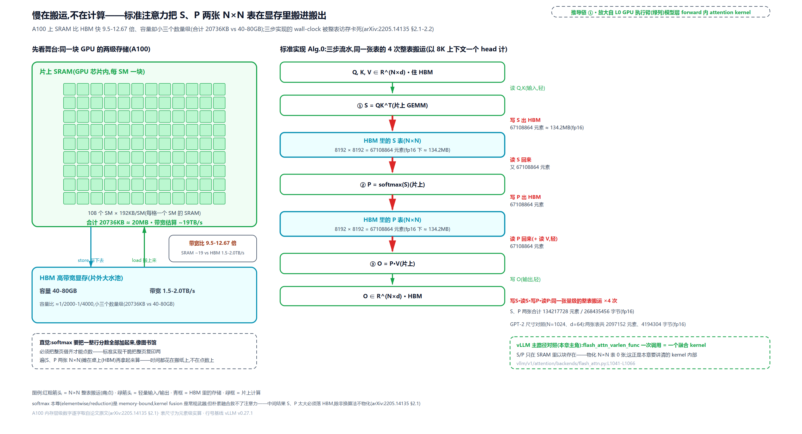

> *图注：左栏 A100 两级存储（HBM 40-80GB @ 1.5-2.0TB/s vs 片上 SRAM 每 SM 192KB × 108 = 20736KB @ ~19TB/s，带宽比 9.5-12.67 倍、容量小三个数量级，约两千到四千倍）；右栏 Alg.0 三步的四次整表搬运（写 S、读 S、写 P、读 P，每张 8192×8192 = 67108864 元素 ≈ 134.2MB），右下角虚线框是 vLLM 的对照：一次 `flash_attn_varlen_func` 调用、零张 N×N 物化。数字全部实算自参考实现与论文原数字。*

vLLM 主路径的对照就在这一行（全书前十九章一直当黑盒调用的那一行，本章要打开的就是它）：

```python
# vllm/v1/attention/backends/flash_attn.py:L1041-L1066 · FlashAttentionImpl.forward 主路径（非 cascade 分支）
                flash_attn_varlen_func(
                    q=query[:num_actual_tokens],
                    k=key_cache,
                    v=value_cache,
                    out=output[:num_actual_tokens],
                    cu_seqlens_q=cu_seqlens_q,      # L1046
                    max_seqlen_q=max_seqlen_q,
                    seqused_k=seqused_k,            # L1048
                    max_seqlen_k=max_seqlen_k,
                    softmax_scale=self.scale,       # L1050
                    causal=causal,                  # L1051
                    # … 省略：alibi/滑窗/softcap/FA3 调度元数据等形参 …
                    block_table=block_table,        # L1054
                    # … 省略：descale/s_aux/mask_mod 等 FA3/FA4 专属形参 …
                    fa_version=self.vllm_flash_attn_version,   # L1057
                    num_splits=attn_metadata.max_num_splits,   # L1062
                    # … 省略：其余形参 …
                )
```

整批 prefill 加 decode 的注意力，一次调用、一个融合 kernel 吃下，$`S`$ 和 $`P`$ 从不落地。凭什么敢？答案从一个看似无关的小问题开始：softmax 自己。

---

## softmax 的三遍怎么并成一遍

**直觉一句话**：记账时还不知道全场最大额，就每来一笔先问「是不是新最大」——是，就把旧账全部按新旧最大额之差折算，再记新账；一本账单遍扫完，恰好等于先扫一遍找最大、再扫一遍求和的结果。

**朴素版会溢出。** softmax 输入是一行打分 $`x\in\mathbb{R}^{V}`$（$`V`$ 是向量长度，这里是一行 K 的个数；沿用 online-softmax 原文记法，别与价值矩阵 $`V`$ 混淆），定义（arXiv:1805.02867 §2 Eq.(1)）：

```math
y_i=\frac{e^{x_i}}{\sum_{j=1}^{V}e^{x_j}}
```

朴素实现两遍扫描（先求分母、再算各项），数学上对，硬件上会炸：打分上千时 $`e^{1000}`$ 直接溢出成 inf，inf 除 inf 得 nan。数值上能过的写法是先减去全行最大值再取指数（safe softmax，Eq.(2)）。最大项恰好变成 $`e^0=1`$，永不溢出：

```math
y_i=\frac{e^{x_i-m_V}}{\sum_{j=1}^{V}e^{x_j-m_V}},\qquad m_V=\max_k x_k
```

代价是三遍扫描（arXiv:1805.02867 §2 Algorithm 2）：第一遍求 $`m_V`$，第二遍求分母，第三遍才算 $`y_i`$，每元素 4 次访存。多出来的那趟访存不是小事：softmax 是 memory-bound，访存就是时间。但真正的麻烦在别处： **要先看完整行拿到全局最大值，才敢算任何一项** ——这句话钉死了算法的串行性：拿不到整行，就开不了工。本章开头那个问题（kernel 每次只看得见一小块分数，凭什么算整行的 softmax）卡的就是这里。

**online-softmax：单遍。** 这个想法来自 2018 年 NVIDIA 两位工程师的一篇短文（Milakov & Gimelshein，[arXiv:1805.02867](https://arxiv.org/abs/1805.02867)），动机还不是注意力，是机器翻译输出层几万维词表上的 softmax。他们发现 $`m`$ 和分母 $`d`$（这个 $`d`$ 与头维度无关、纯是分母记号，FA 论文后来改记 $`\ell`$，本节按原文）可以在**同一遍**里维护（§3 Algorithm 3）：

```text
# arXiv:1805.02867 §3 Algorithm 3（伪代码，按论文逐行）
1: m_0 ← −∞
2: d_0 ← 0
3: for j ← 1..V:
4:     m_j ← max(m_{j-1}, x_j)
5:     d_j ← d_{j-1} · e^{m_{j-1} − m_j} + e^{x_j − m_j}
6: end for
7: for i ← 1..V:                 ← 第二遍只算输出，统计量已备好
8:     y_i ← e^{x_i − m_V} / d_V
9: end for
```

写成公式就是那两行递推（Alg.3 line 4-5）：

```math
m_j=\max(m_{j-1},\,x_j),\qquad d_j=d_{j-1}\,e^{m_{j-1}-m_j}+e^{x_j-m_j}
```

右边那一项 $`e^{m_{j-1}-m_j}`$ 就是折算因子：最大值没变时它等于 1（旧账不动）；最大值跳升时它小于 1（把旧账整体缩到新基准）。三遍的头两遍（找 max、求和）融成了一遍，每元素访存从 4 次降到 3 次（论文 §3 原话 "from 4 down to 3"；V100 实测 softmax 提速 1.3×，softmax+TopK 融合达 5×）。名字里的 online 是流式算法的意思：单遍、边来边算。作者自述灵感来自 Welford 1962 年的单遍方差算法（running mean 加修正平方和，同一套「先折算旧账、再加新项」的模式）。

**逐轮手算。** 十来行就能忠实复现（说明性代码，按 Alg.3 逐行）：

```python
def online_softmax_stats(x):
    m, d = -inf, 0.0
    for xj in x:
        m_new = max(m, xj)
        d = d * exp(m - m_new) + exp(xj - m_new)   # 先折算旧账，再记新账
        m = m_new
    return m, d
```

拿 $`x=[1,3,2,5,4]`$ 走一遍（5 个一位数，可心算；两次最大值上移：j=2 时 1→3、j=4 时 3→5，各触发一次非平凡折算 $`e^{-2}=0.1353`$；j=3、j=5 最大值不变，折算 = 1，对照分支）：

<!-- trace: ch20-m02 -->

| 轮 j | 来访 $`x_j`$ | 旧 max $`m_{j-1}`$ | 新 max $`m_j`$ | 折算项 $`e^{m_{j-1}-m_j}`$ | 旧账折算后 | 新项 $`e^{x_j-m_j}`$ | 新账 $`d_j`$ | 界 $`1\le d_j\le j`$ |
|---|---|---|---|---|---|---|---|---|
| 1 | 1 | −∞（初始 $`m_0`$） | 1.0 | —（首步无旧账） | 0 | 1.0 | 1.0 | ✓（1≤1.0≤1） |
| 2 | 3 | 1.0 | 3.0 | 0.1353 | 0.1353 | 1.0 | 1.1353 | ✓（1≤1.1353≤2） |
| 3 | 2 | 3.0 | 3.0 | 1.0（max 未变，白折算） | 1.1353 | 0.3679 | 1.5032 | ✓（1≤1.5032≤3） |
| 4 | 5 | 3.0 | 5.0 | 0.1353 | 0.2034 | 1.0 | 1.2034 | ✓（1≤1.2034≤4） |
| 5 | 4 | 5.0 | 5.0 | 1.0（max 未变） | 1.2034 | 0.3679 | 1.5713 | ✓（1≤1.5713≤5） |
| 末值核验 | safe 三遍法 | $`m_V=5.0`$ | $`d_V=1.5713`$ | online 末值恒等（Thm.1） | $`y_i=e^{x_i-m_V}/d_V`$ | 三版 y 逐项相同 | max\|差\|=0.0 | 溢出对照 x=[1000,1001]：naive→nan；safe/online→0.2689/0.7311 |

单遍扫完，末值 $`(m_V,d_V)=(5.0,\,1.5713)`$；三版（naive、safe、online）的最终 softmax 同为 `[0.0117, 0.0861, 0.0317, 0.6364, 0.2341]`，逐位相同。最后一行是溢出对照：$`x=[1000,1001]`$ 上朴素版得 nan，safe 与 online 都得 `[0.2689, 0.7311]`——减 max 的稳定性 online 一分不少地继承了。

**为什么恒等（归纳，承重）**：对元素个数归纳。基例 $`j=1`$：$`m_1=x_1`$、$`d_1=e^0=1`$，恰是长度 1 的 softmax 分母。归纳步：设旧账已是「已见元素相对旧基准的指数和」；来 $`x_j`$ 后

```math
d_j=d_{j-1}\,e^{m_{j-1}-m_j}+e^{x_j-m_j}=\sum_{k\le j}e^{x_k-m_j}
```

折算因子恰把旧账的每一项平移到新基准 $`m_j`$ 上，新账仍是「已见元素相对当前最大值的指数和」。不变式每轮保持，末轮就是 safe 版的分母（Theorem 1，arXiv:1805.02867 §3）。界也顺手有了：每项 $`e^{x_k-m_j}\le 1`$ 且最大项 = 1，故 $`1\le d_j\le j`$。论文算过，32 位浮点的分母 $`d`$ 能扛 $`1.7\times 10^{37}`$ 个元素不溢出。

![online-softmax 单遍递推：x=[1,3,2,5,4] 五轮，两次折算 0.1353、两次白折算 1.0；末值与三遍法恒等](../diagrams/ch20-fig-online-softmax-recurrence.png)

> *图注：九列状态表走五轮：两次非平凡折算 $`0.1353=e^{-2}`$（j=2、j=4，旧账缩水到 13.53%）橙底高亮，两次白折算 1.0；界列五条全过；表下三条带：naive 溢出 [nan, nan]、三版末值逐项相同、访存 4→3 次（一行 8192 个分数从 32768 次元素访问降到 24576）。底部虚线框是 vLLM 侧的照应：merge kernel 的 max_lse 稳定化（vllm/v1/attention/ops/triton_merge_attn_states.py:L278-L284）是同一招在 log 域的化身，LSE 节会合上。*

单遍递推解决了「整行才能开工」，但一条向量还得**顺序**扫。分块与并行要合法，还差一步代数。

---

## 合并算子 ⊕：任意分块、乱序归并皆精确

**直觉一句话**：⊕ 不是加法，是「并账」：每个状态 $`(m,d)`$ 是一堆指数账目的规范摘要（以 m 为基准的总额），两个状态合并就是把两堆账先折算到同一基准再相加；并账天然怎么并都一样。

两个线程各算一半的和再相加，凭什么对？靠加法的结合律：「归约可并行」是条老原理。online-softmax 的作者在 §3.1 把 (m,d) 也抽象成可归约的状态：先把整条递推写成链式（Eq.(3)）：

```math
\begin{bmatrix}m_V\\d_V\end{bmatrix}=\begin{bmatrix}x_1\\1\end{bmatrix}\oplus\begin{bmatrix}x_2\\1\end{bmatrix}\oplus\cdots\oplus\begin{bmatrix}x_V\\1\end{bmatrix}
```

单元素块 $`[x_i;1]`$ 的含义直观：最大值就是 $`x_i`$、指数和就是 1。二元算子 ⊕ 定义为（Eq.(4)）：

```math
\begin{bmatrix}m_i\\d_i\end{bmatrix}\oplus\begin{bmatrix}m_j\\d_j\end{bmatrix}=\begin{bmatrix}\max(m_i,m_j)\\[2pt]d_i\,e^{m_i-m'}+d_j\,e^{m_j-m'}\end{bmatrix},\qquad m'=\max(m_i,m_j)
```

从左到右顺序应用这条链，等价于逐元素跑 Alg.3 的 line 1-6。论文接着声明（原文）："The operation ⊕ is associative … It is also commutative"：**结合律**（可任意加括号分块，并行求值）加**交换律**（可乱序归并），并自述为简洁起见略去了证明。证明其实是被一行换元吃掉的，值得正文给出： **把每个可达状态 $`(m,d)`$ 看成分数多重集 $`\mathcal{S}`$（元素可重复的集合）的规范摘要：$`m=\max(\mathcal{S})`$、$`d=\sum_{x\in\mathcal{S}}e^{x-m}`$。摘要是多对一的（不同账本可以有同一份摘要），但 ⊕ 在摘要层面恰好实现多重集并集** 。单元素块对应 $`\{x_i\}`$；两个摘要合并，新基准取两边最大者的较大值、两笔账各自折算后相加，得到的正是并集的摘要。并集满足结合律与交换律，这条性质经由上面的对应原样传给 ⊕；Alg.3 的逐元素递推只是这条链的一种加括号方式（每步只并一个元素），末值恒等即 Theorem 1。

**四条路径实测**（沿用 $`x=[1,3,2,5,4]`$；分块方案 A = [1,3]\|[2,5]\|[4] 顺序归并，另有乱序与换括号两条对照）：

<!-- trace: ch20-m03 -->

| 归并路径 | 局部状态 (m,d) | 合并步骤 | 末态 (m,d) | 与顺序单遍相等？ |
|---|---|---|---|---|
| 基准：顺序单遍（不分块） | 逐元素 5 步递推（上一节的表） | — | (5.0, 1.5713) | —（基准） |
| 分块 A 顺序归并 (b1⊕b2)⊕b3 | (3.0,1.1353)、(5.0,1.0498)、(4.0,1.0) | (3.0,1.1353)⊕(5.0,1.0498)→(5.0,1.2034)；⊕(4.0,1.0)→(5.0,1.5713) | (5.0, 1.5713) | ✓（差 0.0） |
| 乱序归并 (b3⊕b2)⊕b1 | 同上三块，顺序颠倒 | (4.0,1.0)⊕(5.0,1.0498)→(5.0,1.4177)；⊕(3.0,1.1353)→(5.0,1.5713) | (5.0, 1.5713) | ✓（差 0.0） |
| 换括号 [1,3,2]\|[5,4] | (3.0,1.5032)、(5.0,1.3679) | (3.0,1.5032)⊕(5.0,1.3679)→(5.0,1.5713) | (5.0, 1.5713) | ✓（差 0.0） |

最耐看的是乱序那行：中间态 1.4177 与顺序路径的 1.2034 不同，末态却分毫不差——**中间账本怎么走都不影响总账**。这就是并行分块、乱序归并不改变结果的实感来源，也是后文 vLLM 两段注意力合并（cascade、split-KV）敢「谁先算完谁先并」的根据。数学到齐了，还差一步：把 $`(m,d)`$ 这对状态从「一行向量」搬到「Q 的一行 × K 的一个块」上，并让输出 $`O`$ 也参与递推。

---

## tiling：把递推装进双循环

**直觉一句话**：一格一格递推记账：每搬一小块 K/V 上 SRAM，就把手上那份「部分注意力」先折算到新最大值、再累加这一块的贡献；桌面上始终只有 $`B_r\times B_c`$ 的草稿，从不需要铺开 $`N\times N`$ 的整张表。

tiling（分块）本身是两级存储下的祖传手艺：数据装不进快存，就按块切分循环，块大小由快存容量反推。GEMM 世界里 GotoBLAS 把「分块加打包让操作数常驻缓存」做成了工业标准（[Goto & van de Geijn 2008](https://www.cs.utexas.edu/~pingali/CSE392/2011sp/lectures/a12-goto.pdf)）；「两级存储上算法至少要搬运多少数据」甚至有专门的下界理论（Hong & Kung 1981 的红蓝卵石博弈，[链接](https://www.semanticscholar.org/paper/3e69317455f7db9b1325239c6f6f52cbe29a5491)），FlashAttention 的 IO 账正是这套分析法的当代应用。但分块 GEMM 人人会，注意力卡在一处： **softmax 的分母要对一整行 K 求和，「块里只见局部、归一化要全局」，看似矛盾** ——上一节的递推正是解开它的钥匙。所以 FlashAttention（arXiv:2205.14135 §3.1 Algorithm 1）是三件套：tiling（结构）+ online-softmax（数学）+ 单 kernel 融合（工程）。块大小由 SRAM 容量反推（Alg.1 line 1）：$`B_c=\lceil M/4d\rceil`$、$`B_r=\min(\lceil M/4d\rceil,d)`$。分母里的 4，通行读法是 $`Q_i`$、$`K_j`$、$`V_j`$、$`O_i`$ 四份片上缓冲（各约 $`B\times d`$ 个元素）要同时驻留（Alg.1 line 8 连 $`O_i`$ 一起载入）；论文没明说这个常数，附录 C 只给了三条量级约束（$`B_cd=O(M)`$、$`B_rd=O(M)`$、$`B_rB_c=O(M)`$）。$`B_r`$ 封顶到 $`d`$ 倒是有出处：行块自己要驻留给出 $`M/d`$ 上限，打分块 $`S_{ij}`$ 也要驻留给出 $`M/B_c`$ 上限，而 $`B_c=\Theta(M/d)`$ 时后者就是 $`\Theta(d)`$；附录 C 推出的正是 $`B_r=\Theta(\min(M/d,d))`$，line 1 的 min(·,d) 就是两条约束取小。

算法主体（外层遍历 KV 列块 $`j`$、内层遍历 Q 行块 $`i`$，初版 FA 的循环序，FA-2 会把它对调）：

```text
# arXiv:2205.14135 §3.1 Algorithm 1 核心行（伪代码，按论文；分块/初始化/load 的脚手架略）
9:  片上算 S_ij = Q_i K_j^T ∈ R^{B_r×B_c}
10: 片上算 m̃_ij = rowmax(S_ij)，P̃_ij = exp(S_ij − m̃_ij)，ℓ̃_ij = rowsum(P̃_ij)
11: m_new = max(m, m̃_ij)，ℓ_new = e^{m−m_new}·ℓ + e^{m̃−m_new}·ℓ̃_ij
12: O ← ( ℓ·e^{m−m_new}·O + e^{m̃−m_new}·P̃_ij·V_j ) / ℓ_new
13: 写回 ℓ ← ℓ_new，m ← m_new
```

line 11 就是 ⊕ 的两块合并：online-softmax 单元素递推（Alg.3 line 5）搬到块上的形态，新来的不再是单个元素 $`e^{x_j-m}`$，而是整块的账：本块最大 $`\tilde m_{ij}`$、本块指数和 $`\tilde\ell_{ij}`$，各自折算到新基准再相加。FA 论文把分母记作 $`\ell`$，与 online-softmax 论文的 $`d`$ 异名同义；line 12 是它长在输出上的形态。写成公式：

```math
m_i^{\mathrm{new}}=\max(m_i,\tilde m_{ij}),\qquad \ell_i^{\mathrm{new}}=e^{m_i-m_i^{\mathrm{new}}}\ell_i+e^{\tilde m_{ij}-m_i^{\mathrm{new}}}\tilde\ell_{ij}
```

```math
O_i\leftarrow\frac{\ell_i\,e^{m_i-m_i^{\mathrm{new}}}O_i+e^{\tilde m_{ij}-m_i^{\mathrm{new}}}\tilde P_{ij}V_j}{\ell_i^{\mathrm{new}}}
```

line 12 里有两个容易略过的乘子。$`e^{m_i-m_i^{\mathrm{new}}}`$ 是老朋友：旧账折算到新最大值。$`\ell_i`$ 这个乘子的来历值得单独说：初版算法让 $`O_i`$ **每处理完一个 KV 块都保持归一化**（下一步的数值表里，第 1 块处理完的 $`O_i`$ 就已经是「只看前 2 个 key 的精确注意力输出」），所以更新时得先乘回 $`\ell_i`$ 把它**反归一化**成未归一的加权和 $`\ell_iO_i`$，折算、加上新块贡献 $`\tilde P_{ij}V_j`$，最后除以 $`\ell_i^{\mathrm{new}}`$ 重新归一：旧贡献和新贡献必须同处一个基准、共用一个分母，相加才有意义。这「每步除一次 $`\ell`$」的账，FlashAttention-2 节会回来算它多贵。

**2×2 分块手算。** 取手算级例子：$`N=4`$、$`d=2`$、$`B_r=B_c=2`$（$`T_r=T_c=2`$，双循环共 4 步），输入取 `Q=[[1,0],[0,1],[1,1],[2,0]]`、`K=[[1,0],[0,1],[1,1],[0,2]]`、`V=[[1,2],[3,4],[5,6],[7,8]]`；softmax_scale 显式传 1.0（vLLM 默认是 $`1/\sqrt{d}`$，见调用面一节；示教值取 1 是为了心算，默认语义不变）。循环序是原始 FA 序（外层 j、内层 i）；行 1、行 2 的最大值在第二个 KV 块从 1.0 上移到 2.0，各有一次真实折算 $`e^{-1}=0.3679`$，行 0、行 3 最大值不变（白折算对照）：

<!-- trace: ch20-m04 -->

| 块步 (j,i) | query 行 | 旧 m → 新 m | 折算因子 | $`\ell`$ 新 | O 行（该步写回，已归一化） | 与只看已见 KV 的朴素版 max\|差\| |
|---|---|---|---|---|---|---|
| (0,0) 块 S=[[1,0],[0,1]] | 行0 | −∞→1.0（首块初始化） | —（旧账为 0） | 1.3679 | [1.5379, 2.5379] | 0.0 |
| (0,0) | 行1 | −∞→1.0 | — | 1.3679 | [2.4621, 3.4621] | 0.0 |
| (0,1) 块 S=[[1,1],[2,0]] | 行2 | −∞→1.0 | — | 2.0 | [2.0, 3.0] | 0.0 |
| (0,1) | 行3 | −∞→2.0 | — | 1.1353 | [1.2384, 2.2384] | 0.0 |
| (1,0) 块 S=[[1,0],[1,2]] | 行0 | 1.0→1.0 | 1.0（max 未变） | 2.7358 | [3.5379, 4.5379] | 0.0 |
| (1,0) | 行1 | 1.0→2.0 | 0.3679（旧账缩水） | 1.8711 | [5.3864, 6.3864] | 0.0 |
| (1,1) 块 S=[[2,2],[2,0]] | 行2 | 1.0→2.0 | 0.3679 | 2.7358 | [4.9242, 5.9242] | 0.0 |
| (1,1) | 行3 | 2.0→2.0 | 1.0 | 2.2707 | [3.2384, 4.2384] | 0.0 |
| 终验（全部块完） | 4 行 | — | — | — | FA_O 与 standard_O 逐行相同 | 0.0（机器精度级求和顺序差） |

四步走完，末值与一次性 $`\mathrm{softmax}(QK^{\top})V`$ 逐行相同。更重要的是中间列「与只看已见 KV 的朴素版差 0.0」：**每处理完一个 (j,i) 块，写回的 $`O`$ 行恰好是「只看已见过的 KV」的精确注意力输出**：running $`(m_i,\ell_i,O_i)`$ 始终是已见 KV 集合的规范摘要（⊕ 节的多重集换元），来一个新块就是一次并集。全程片上打分块至多 2×2 = 4 个元素，4×4 = 16 个元素的整表从未被创建（参考实现带断言记录：实跑最大块形状恰为 (2,2)）。

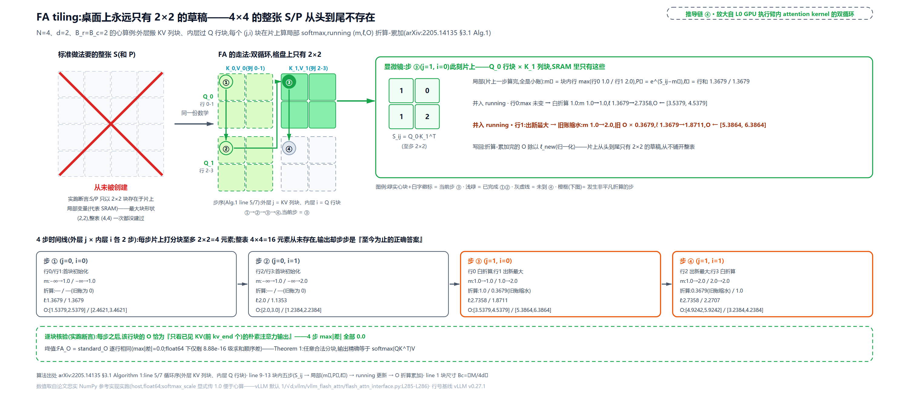

> *图注：左格盘 4×4 整表虚影打红叉「从未被创建」（实跑断言最大块形状 (2,2) vs 整表 (4,4)）；中格盘双循环按外层 j、内层 i 推进，当前 (j=1,i=0) 步绿实心，显微镜里 S_ij=[[1,0],[1,2]]、行 1 折算 0.3679（= $`e^{-1}`$）、ℓ 从 1.3679 涨到 1.8711、O 行写回 [5.3864, 6.3864]；底部时间线四步全字段，③④ 橙框 = 折算事件步。数字全部实跑自参考实现。*

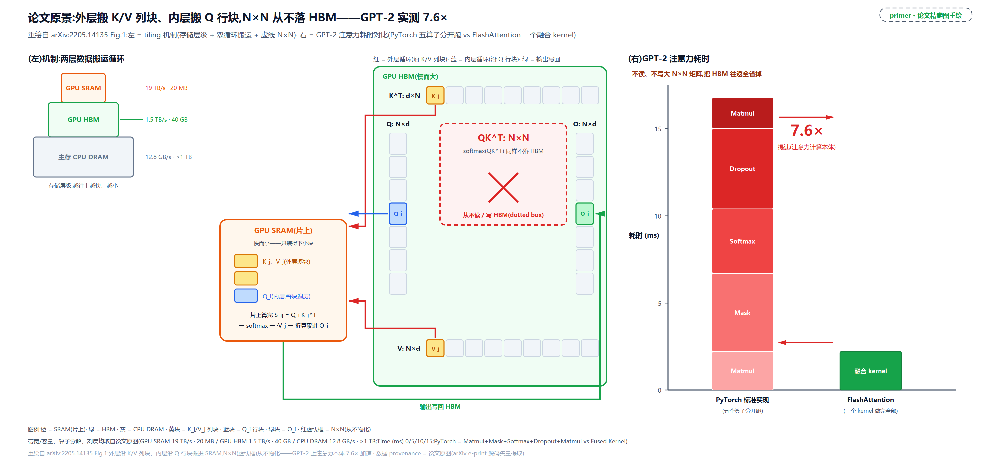

> *图注：论文的标志性配图。左：内存层级金字塔（GPU 计算 SM×108 的 SRAM 约 20MB @ 约 19TB/s → HBM 40GB @ 1.5TB/s → 主存（CPU RAM）12.8GB/s、容量逾 1TB；前两层数字逐字取自论文 §2.1，主存一行只在 Fig.1 原图上标注），外层循环（红）沿 K、V 列块搬进 SRAM、内层（蓝）沿 Q 行块，虚线框标出从不落 HBM 的 $`N\times N`$ 中间量，输出写回 HBM；右：GPT-2 注意力本体实测：PyTorch 标准实现五段 kernel（Matmul/Mask/Softmax/Dropout/Matmul）合计 16.8 ms，FlashAttention 单段融合 kernel 2.2 ms，7.6×（论文 Fig.1 原数字）。*

**精确性与代价，两条都摆在明处。** Theorem 1（arXiv:2205.14135 §3.1）：Algorithm 1 的输出**精确等于** $`\mathrm{softmax}(QK^{\top})V`$，不是近似，没有误差项；FLOP 仍是 $`O(N^2d)`$（算力一点没省），额外内存只有 $`O(N)`$（存 $`(m,\ell)`$ 统计量）。省的是两张 $`N\times N`$ 的显存与往返，量在下一节记。两点补充各一段带过：其一，训练要 backward，标准做法把 $`P`$ 存下来供反向用；FlashAttention 反过来只存 $`(O,m,\ell)`$，反向时在片上**重算** $`S`$、$`P`$。多花了 FLOP 反而更快，因为重算跑在 SRAM、读表要跑 HBM（论文 §3.1 Recomputation；推理不碰 backward，记住这个反直觉结论即可）。其二，tiling 让「两次矩阵乘 + softmax + 掩码 + dropout」全部融进**一个** CUDA kernel，中间量不出片上存储——这就是「一次 `flash_attn_varlen_func` 调用 = 一个融合 kernel」的来源。

---

## IO 账：数趟数，不数乘加

**直觉一句话**：标准版三步流水，两张 $`N\times N`$ 大表被整表搬运四回（写 S、读 S、写 P、读 P）；FA 把 K、V 各搬一次，再把轻的 Q、O 与统计量来回搬 $`\lceil N/B_c\rceil`$ 趟。块越大趟数越少，但 SRAM 只有那么大，再大下去算力反而成了瓶颈。

论文把这笔账立成了定理（arXiv:2205.14135 §3.2 Theorem 2）：

```math
\Theta(Nd+N^2)\quad\longrightarrow\quad \Theta\!\left(\frac{N^{2}d^{2}}{M}\right)
```

左边是标准注意力的 HBM 访问（含 $`N^2`$ 物化项），右边是 FlashAttention（$`M`$ 是 SRAM 容量）。证明骨架三步，每步都短：其一，K、V 共 $`\Theta(Nd)`$ 个元素，SRAM 每次只装得下 $`\Theta(M)`$，要分 $`\Theta(Nd/M)`$ 块轮流驻留；其二，每个 KV 块驻留期间，每个 query 行都要和它做点积，整个 Q 得过一遍（$`\Theta(Nd)`$）；其三，块数乘每遍开销，就是右端那一项。当 $`d`$ 只有 64-128、$`M\approx 100\mathrm{KB}`$ 时 $`d^2\ll M`$，右边比左边少一个接近 $`M/d^2`$ 的因子。

**代入真数字**（N=1024、d=64，GPT-2 头维原例；元素级精确计数，非 Θ 记号）：

<!-- trace: ch20-m05 -->

| 实现版本 | $`B_c`$ | KV 过手趟数 $`T_c`$ | 逐步访存（元素） | HBM 访问总计（元素） | 标准：该版 | 物化 N×N 表（元素） |
|---|---|---|---|---|---|---|
| 标准 Alg.0（三步） | — | 3 步各读写整表 | 1179648 + 2097152 + 1179648 | 4456448 | —（基准） | 2097152（S、P 各一张） |
| FlashAttention | 64 | 16 | 131072 + 16×200704 | 3342336 | 1.3333 | 0（免物化） |
| FlashAttention | 128 | 8 | 131072 + 8×200704 | 1736704 | 2.566 | 0（免物化） |
| FlashAttention | 256 | 4 | 131072 + 4×200704 | 933888 | 4.7719 | 0（免物化） |

读法：标准三步各 1179648、2097152、1179648（读 QK 写 S、读 S 写 P、读 P 读 V 写 O），合计 4456448 次元素访问；FA 把 K、V 各搬恰好一遍（131072），再把 Q、O、ℓ、m 这套轻量（每趟 200704 = 3Nd+4N）来回搬 $`T_c`$ 趟。$`B_c`$ 从 64 翻到 256，趟数 16→8→4，访问严格递减。渐近比值 $`M/d^2`$（按 M≈100KB＝51200 个 fp16 元素、d=64 计约 12.5）要到长序列才兑现：N=1024 的元素级精确账里，两边的常数与低阶项（标准版 $`4N^2+4Nd`$，FA 每趟 $`3Nd+4N`$ 还要乘趟数、$`B_c`$ 又封顶 256）都还占着大头，表里比值最大只到 4.77。但这条路有双重封顶：块再大装不进 SRAM；论文实测（Fig.2 中图）$`B_c`$ 超过 256 后收益封顶，算力接了瓶颈，工程上 FA-2 就取 $`\{64,128\}`$（arXiv:2307.08691 §3.3 Tuning block sizes 段）。内存脚印是另一笔：标准版物化 2097152 个元素（fp16 4194304 字节），FA 额外只要 $`(m,\ell)`$ 共 2048 个元素（4096 字节）——差三个数量级，这就是「显存占用从二次降到线性」的实感。

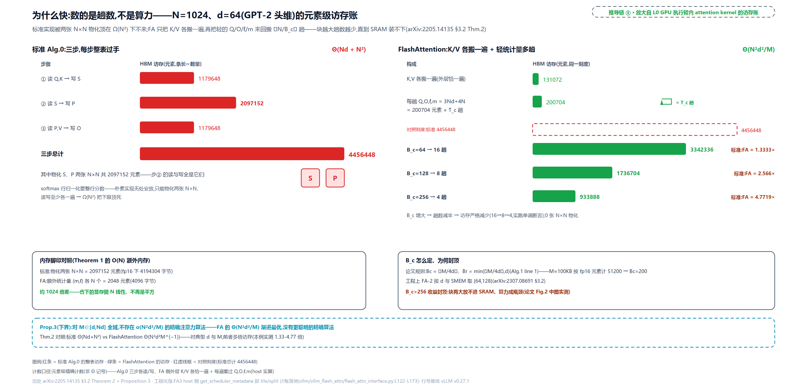

> *图注：左右同一条形刻度（满刻度 = 4456448 次元素访问）。左：标准三步的红色粗条与两张 N×N 方块；右：FA 一趟 KV 细条加每趟 200704 的循环箭头，三行绿条 3342336/1736704/933888 严格递减，比值 1.3333/2.566/4.7719；底部内存脚印对照（2097152 元素 vs 2048 元素）与 Prop.3 下界条。数字全部实算自参考实现。*

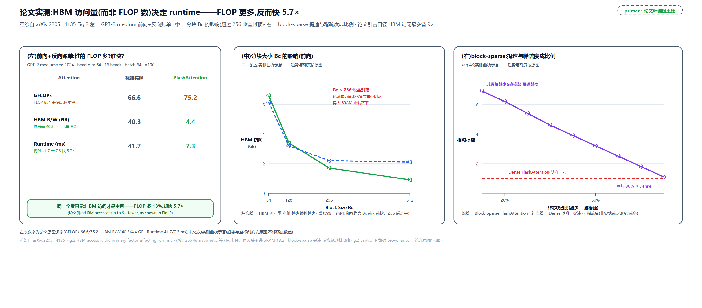

> *图注：论文的三联实测图（GPT-2 medium：N=1024、d=64、16 heads、batch 64，A100）。左联在原文里就是一张前向+反向账单表（照实重绘、数字照录原图标注）：FlashAttention 因反向重算 GFLOPs 反而更多（75.2 vs 66.6，多 13%），HBM 读写却省一个量级（4.4GB vs 40.3GB，即论文 §1 的「最多省 9×」），runtime 反超（7.3ms vs 41.7ms，快 5.7×），这正是「时间的主宰是搬运不是计算」的直接实证；中：分块 $`B_c`$ 增大、HBM 访问与前向耗时同步下降，超过 256 后收益封顶、瓶颈转给算力（§3.2 原文）；右：block-sparse 变体非零块占比越少（越稀疏）、相对 dense FlashAttention 的提速越高，与稀疏度成比例（seq 4K）。中/右曲线按原图趋势与刻度示意重绘（逐点数值论文未印）。*

还有一句理论上的收尾（Proposition 3，§3.2）：对 $`M\in[d,Nd]`$ 全域，**不存在** HBM 访问渐进更少的精确注意力算法：$`M=\Theta(Nd)`$ 时输入输出本身就逼着任何算法至少 $`\Omega(Nd)`$ 次访问。FA 的 $`\Theta(N^2d^2/M)`$ 在这个意义上最优，没有更聪明的精确算法躲在后面。工程侧这笔账也有化身：FA3 的 host 侧 `get_scheduler_metadata`（vllm/vllm_flash_attn/flash_attn_interface.py:L122-L173）就是 tile 与 split 的计账函数：数学里的 $`B_c`$、$`T_c`$，在代码里变成了 host 算好递给 kernel 的调度元数据。

---

## FlashAttention-2：今天在跑的版本

初版 FA 已经把墙拆了，但离 GEMM 的效率还远（论文自述：前向只到理论峰值的 30-50%、反向 25-35%）。FlashAttention-2（arXiv:2307.08691）没换数学，只在工程上榨了三处，综合约 2× 于 FA（A100 前向最高 230 TFLOPs/s，73% 峰值）。vLLM 今天跑的正是这一族。三处改动一句话各表，再给算法：

**(1) 循环序对调。** 初版外层遍历 KV 列块、内层遍历 Q 行块；FA-2 反过来，**外层遍历 Q 行块**：每个 Q 行块从头干到尾，行块之间互不依赖（论文 §3.2 的原话是 embarrassingly parallel），可以分给不同 thread block 沿序列长度并行。长序列、小 batch 时（并行维度 batch×heads 不够喂满 108 个 SM），这一改让 occupancy（占用率：SM 上活跃 warp 的比例；warp 是 32 线程一组的调度单位）直接上来。论文还诚实记了出处：循环序对调最早是 Phil Tillet 在 Triton 实现里先做的。

**(2) 推迟归一化。** 初版每处理一个 KV 块都要除一次 $`\ell`$（tiling 节挂过账）；FA-2 让中间 $`O`$ 保持**未归一化**，收尾只除一次。省的是 non-matmul FLOP（非矩阵乘浮点运算，softmax、除法、指数这类，跑在通用计算单元上）：A100 上 fp16 矩阵乘峰值 312 TFLOPs/s，非矩阵乘 FP32 只有 19.5 TFLOPs/s，**每条非矩阵乘指令贵 16 倍**（论文 §3.1 原话 "each non-matmul FLOP is 16× more expensive"）。

**(3) 只存一个标量。** 初版存 $`(m,\ell)`$ 两个统计量；FA-2 只存 logsumexp $`L=m+\log(\ell)`$ 一个（§3.1.1 Tweak 2 原话：不必同时存 max 与指数和，只需要 logsumexp）。vLLM `flash_attn_varlen_func` 开 `return_softmax_lse=True` 吐出来的正是这个 $`L`$——下一节的主角。

```text
# arXiv:2307.08691 §3.1 Algorithm 1 核心行（伪代码，按论文；省略载入 K/V、end for 与写回行）
3:  for 1 ≤ i ≤ T_r:                       ← 外层换成了 Q 行块
4-5:    载入 Q_i；片上初始化 O_i=0, ℓ_i=0, m_i=−∞
6:      for 1 ≤ j ≤ T_c:
8:          片上算 S_i^{(j)} = Q_i K_j^T
9:          m^{(j)} = max(m^{(j-1)}, rowmax(S))，P̃ = exp(S − m^{(j)})，ℓ^{(j)} = e^{m^{(j−1)}−m^{(j)}}·ℓ^{(j−1)} + rowsum(P̃)
10:         O^{(j)} = e^{m^{(j-1)}−m^{(j)}}·O^{(j-1)} + P̃·V_j     ← 中间不除 ℓ
12:     O_i = O^{(T_c)} / ℓ^{(T_c)}          ← 收尾只除一次
13:     L_i = m^{(T_c)} + log(ℓ^{(T_c)})     ← 只存这一个标量
17: 返回 O 与 logsumexp L
```

一处诚实的小字：论文 Alg.1 line 10 的缩放项按论文自己的不变式（未归一化的 $`O`$ 应乘 $`e^{m^{(j-1)}-m^{(j)}}`$ 折算旧账）来看，印刷的 diag 指数方向反了，参考实现按不变式修正——读原文时留意。

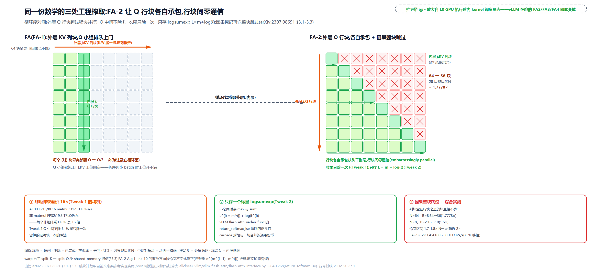

> *图注：左格盘 FA 序（外层 KV 列块，64 块全访问，每块除一次 ℓ；左盘画的是不施因果掩码的循环序对照：整块跳过与循环序正交，配因果掩码时两序同样能跳上三角块，1.7778 倍是掩码跳过本身的收益、不是循环序对调的）；中间虚线「循环序对调」；右格盘 FA-2 序（外层 Q 行块，行间无箭头 = 零通信，收尾只除一次），因果掩码的整块跳过用红叉标出：N=64、块 8 时右上三角 28 块整块跳过、只访 36 块（1.7778 倍；N=8、块 2 时 16→10，1.6 倍；两版输出对标准注意力 allclose，参考实现计数）。底部三签：16× 差价（fp16 矩阵乘 312 vs 非矩阵乘 FP32 19.5 TFLOPs/s）、$`L=m+\log\ell`$ 与 return_softmax_lse、约 2× 实测（230 TFLOPs/s = 73% 峰值）。*

因果掩码（causal mask：第 $`i`$ 个 query 只准看位置 $`\le i`$ 的 key，未来位置置 $`-\infty`$）在块世界里还有一份免费红利（论文 §3.1 Causal masking）：整列块在行块右侧的直接跳过（大约省一半工作量，实测 1.7-1.8×、N 趋大逼近 2×），对角线只落在一个块上、只需对这一个块施加逐元素掩码。warp 分工（thread block 内部的 32 线程小组）也从 split-K 改成 split-Q：split-K 让各 warp 各算一段再跨组相加、逼着 warp 反复读写 shared memory 同步；split-Q 让每个 warp 认领一段 Q 行各自算完，组间零通信。细节见论文 §3.3 与下图。

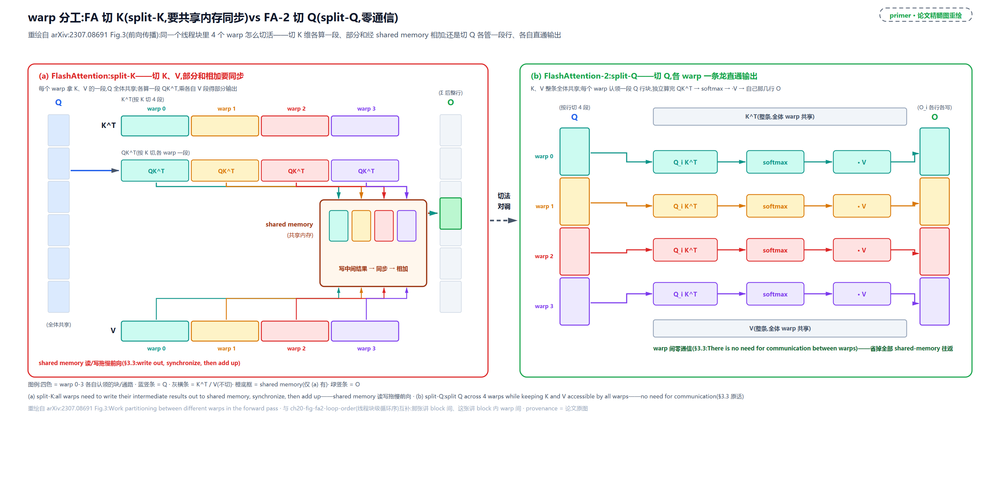

> *图注：左 (a) split-K：K 维切给 4 个 warp 各算一段 $`QK^{\top}`$，部分结果写进 shared memory、同步相加；右 (b) split-Q：切分对象换成 Q，每个 warp 独立算完自己那几行的完整输出，warp 间不再通信，省掉的正是 (a) 里那笔 shared-memory 读写。*

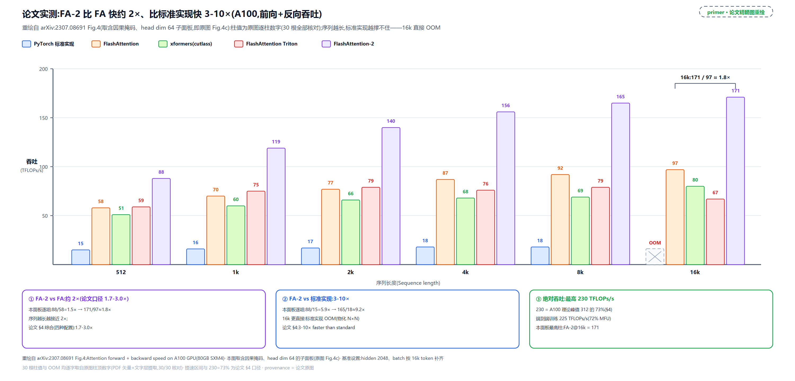

> *图注：A100 80GB SXM、head_dim=64、含因果掩码（原图 Fig.4c 子面板），前向+反向吞吐（TFLOPs/s）随序列长度 512→16k，五种实现同场、30 根柱值照录原图：标准 PyTorch 只有 15→18、16k 处物化 $`N\times N`$ 直接 OOM；FlashAttention 58→97；FA-2 88→171（16k 处 171/97 ≈ 1.8×）。底部三签是论文 §4 口径：FA-2 比 FA 快 1.7-3.0×、比标准实现 3-10×、最高 230 TFLOPs/s = 73% 理论峰值（端到端训练 225 TFLOPs/s = 72% 利用率）；230 出自论文全配置综合，本面板最高柱是 16k 处 FA-2 的 171。*

**版本族一瞥。** 这三处榨取的代价也诚实：全部贴着 A100 的硬件形态做，换一代 GPU 就得重写 kernel。FA-2 论文 §5 列的近期计划头一条就是「为 H100 再优化一轮、用上新硬件特性（TMA、第四代 Tensor Core、FP8）」；后面这串 FA-3/FA-4，正是这笔代价的账单。FlashAttention 于是不是一篇论文定终身，而是一族随 GPU 代际演进的 kernel：FA-2 是任何 Tensor Core GPU 都能跑的通用款；FA-3（[arXiv:2407.08608](https://arxiv.org/abs/2407.08608)）专为 Hopper（H100）设计，warp-specialization（warp 分工特化：不同 warp 各认领一件事）让矩阵乘与 TMA（Tensor Memory Accelerator，Hopper 起的异步搬运单元）的数据搬运异步重叠、FP8（8 位浮点低精度格式）配合非相干处理（给 Q、K 同乘一个随机正交矩阵、把离群值摊平，让 FP8 精度可用），比 FA-2 快 1.5-2.0×；FA-4（[arXiv:2603.05451](https://arxiv.org/abs/2603.05451)）专为 Blackwell（B200）设计，用 CuTE-DSL（Python 嵌入式 kernel DSL）重排流水线、以软件模拟指数与条件化 softmax 重缩放削减非矩阵乘运算，专治新一代硬件「Tensor Core 吞吐翻倍、其余单元没跟上」的非对称配比。**三代数学骨架从未变过**：分块、online-softmax、从不物化 N×N、LSE 存档与合并，全是你本章读到的这套。vLLM 把三家都收进了自带包（`vllm.vllm_flash_attn`），构造期按显卡代际决议：

```python
# vllm/v1/attention/backends/fa_utils.py:L163-L171 · FlashAttentionCuTeDSLCompileSpec.get_flash_attn_version（版本决议）
        if device_capability.major == 9 and is_fa_version_supported(3):
            # Hopper (SM90): prefer FA3
            fa_version = 3                                    # L165
        elif device_capability.major == 10 and is_fa_version_supported(4):
            # Blackwell (SM100+, restrict to SM100 for now): prefer FA4
            fa_version = 4                                    # L168
        else:
            # Fallback to FA2
            fa_version = 2                                    # L171
```

config 可覆写（`attention_config.flash_attn_version`，L176-L181），后面还有一长串能力回退（alibi、attention sinks、头维上限，L183-L270）。「这个后端内跑哪个版本」的决议到此为止；「多个后端里选谁」是下一章的题，两级选择别混。

---

## LSE：一个标量换一次精确合并

到此为止，注意力始终是一个 kernel 一口气算完。可 vLLM 里真有把一段注意力**拆开算**的地方：多条请求共享同一段长前缀时，前缀只算一遍复用给全批（下一节）；decode 时一条长 KV 切几段并行喂饱 SM（本节末尾）。拆开之后怎么精确拼回来？钥匙是一个标量。

**LSE 是什么。** logsumexp 就是 softmax 那个分母取了对数。三件事讲透它。其一，**稳定算**：naive 的指数和对大输入直接 inf，标准解法是减 max 再取对数，这正是 safe softmax 的对数化身影（arXiv:1909.03469 系统研究过它的舍入误差）：

```math
\mathrm{LSE}(x)=\log\sum_k e^{x_k}=m+\log\sum_k e^{x_k-m},\qquad m=\max_k x_k
```

每个科学计算库都有一个这样的 `logsumexp`（[scipy](https://docs.scipy.org/doc/scipy/reference/generated/scipy.special.logsumexp.html)、torch 同款）。其二，**夹逼**：

```math
\max_k x_k\;\le\;\mathrm{LSE}(x)\;\le\;\max_k x_k+\log n
```

它是把 max 软化了一点的版本，$`n`$ 个相差悬殊的数里几乎就等于最大者。其三，也是本章的命根，**可合并**：

```math
\mathrm{LSE}([a;b])=\log\!\left(e^{\mathrm{LSE}(a)}+e^{\mathrm{LSE}(b)}\right)
```

两段各自算完 LSE，再按这条恒等式合并，与一口气对拼接后的大向量算 LSE 逐位相等；而 FA-2 起每个 kernel 行尾吐的正是它（$`L=m+\log\ell`$）。一个可心算的小例（说明性）：

```math
\mathrm{LSE}_A=\log(1+1)=0.693,\qquad \mathrm{LSE}_B=\log(e^2+1)=2.127
```

```math
\mathrm{LSE}_{A\cup B}=\log(2+8.389)=2.341=\log(1+1+e^2+1)
```

段 A 是 $`x=[0,0]`$、段 B 是 $`x=[2,0]`$：分开各算、按公式合并，与直接对拼接向量 $`[0,0,2,0]`$ 一口气算，结果逐位相同。

**两段注意力怎么缝。** 设一段注意力的 KV 被拆成两截，各算出部分输出与各自的 lse：$`(O_a,l_a)`$、$`(O_b,l_b)`$。小写 $`l`$ 就是 FA-2 行尾吐出的那个 $`L`$（logsumexp 的惯用小写；与指数和 $`\ell`$ 形近，不是同一个量）。FA-2 形态下 $`O`$ 已除以自己的 $`\ell`$，是「只看本段 KV」的精确注意力输出。合并公式与 tiling 节的递推同构，只是搬到了对数域（⊕ 在 $`(\mathrm{lse},O)`$ 上的第三副面孔；稳定化基准记 $`M^{\star}`$，加星是为了不与 SRAM 容量的 $`M`$ 撞名）：

```math
M^{\star}=\max(l_a,l_b),\qquad w_a=\frac{e^{l_a-M^{\star}}}{e^{l_a-M^{\star}}+e^{l_b-M^{\star}}},\qquad O=w_aO_a+w_bO_b
```

```math
l_{\mathrm{merge}}=\log\!\left(e^{l_a-M^{\star}}+e^{l_b-M^{\star}}\right)+M^{\star}
```

直觉：$`e^{\mathrm{lse}}`$ 恰是本段全部指数质量（softmax 分母），权重 $`w_a`$ 就是「A 段的归一化质量占总盘子的比例」：两段谁的质量大谁话事，与谁前谁后无关；合并出的 $`l_{\mathrm{merge}}`$ 是一张新收据，可以继续并下一段。正确性一句话（承重）：$`e^{l_a}O_a`$ 恢复的正是 A 段的未归一化加权和，两段相加、除以总质量 $`e^{l_a}+e^{l_b}`$，就是「对拼接 KV 一次性做 softmax」——逐项相同，代数恒等。

**实跑。** 场景按 vLLM cascade 的形状构造：两条请求共享 4 token 前缀、各带私有后缀（A 3 token、B 2 token），各取最后 2 个 token 作 query：前缀段 `causal=False` 一次调用算全批，后缀段 `causal=True` 各算各的，两段各带 lse 回来合并，对照「对拼接 KV 一次性做注意力」：

<!-- trace: ch20-m07 -->

| 请求行 | 前缀段 lse | 后缀段 lse | max_lse | p_se | s_se | out_se | 前缀权重 | 后缀权重 | 合并 lse（=一次性 lse） | 合并 O[0]（=一次性 O[0]） |
|---|---|---|---|---|---|---|---|---|---|---|
| A 行0 | 3.0064 | 1.6931 | 3.0064 | 1.0 | 0.2689 | 1.2689 | 0.7881 | 0.2119 | 3.2446 | 4.0925 |
| A 行1 | 2.0064 | 2.4076 | 2.4076 | 0.6695 | 1.0 | 1.6695 | 0.401 | 0.599 | 2.9201 | 2.2957 |
| B 行0 | 4.2539 | 2.0 | 4.2539 | 1.0 | 0.105 | 1.105 | 0.905 | 0.095 | 4.3537 | 5.9034 |
| B 行1 | 3.0064 | 2.6931 | 3.0064 | 1.0 | 0.7311 | 1.7311 | 0.5777 | 0.4223 | 3.5551 | 4.1116 |

看 A 行1（反超行）：前缀 lse 2.0064 **小于**后缀 lse 2.4076，后缀权重升到 0.599——权重跟着归一化质量走，不认「前缀」的名分。四行权重对（0.7881, 0.2119）、(0.401, 0.599)、(0.905, 0.095)、(0.5777, 0.4223) 之和全为 1；合并 lse 与一次性 lse 四行逐行相等（3.2446 / 2.9201 / 4.3537 / 3.5551），合并 $`O`$ 与一次性 $`O`$ 逐位差 0.0。

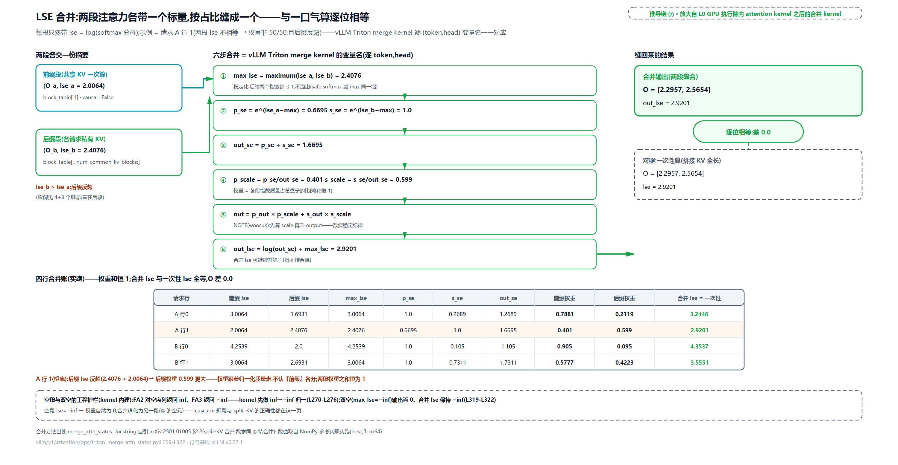

> *图注：左两入口（前缀段 lse 2.0064、后缀段 lse 2.4076 反超）；中间六步竖排：max_lse 稳定化 → p_se/s_se → out_se → 权重占比 → 加权 O → 合并 lse，变量名与 vLLM Triton kernel 逐字对应（示例链 A 行1：0.6695、1.0、1.6695、0.401/0.599、2.9201，合并 O=[2.2957, 2.5654]）；右出口与「一次性」框 diff=0.0 徽标相连；下方四行合并账与空段/双空护栏条。数字全部实跑自参考实现。*

**代码兑现。** 这套数学在 vLLM 里落成 `merge_attn_states`：分派器先挑实现（CUDA 且 dtype/头维满足 128 位对齐约束走自定义 kernel，否则回退 Triton），docstring 自己挂着论文出处：

```python
# vllm/v1/attention/ops/merge_attn_states.py:L9-L22 · merge_attn_states 分派器签名与 docstring
def merge_attn_states(
    output: torch.Tensor,
    prefix_output: torch.Tensor,
    prefix_lse: torch.Tensor,
    suffix_output: torch.Tensor,
    suffix_lse: torch.Tensor,
    # … 省略：output_lse / prefill_tokens_with_context / output_scale 三个可选参数 …
) -> None:
    """Merge partial attention outputs from prefix (KV cache) and suffix
    (new tokens) into a single output tensor using the log-sum-exp (LSE)
    rescaling method described in section 2.2 of
    https://www.arxiv.org/pdf/2501.01005.
```

自引的 arXiv:2501.01005 是 FlashInfer 论文（注意力 kernel 库，MLSys 2025，已集成进 vLLM/SGLang 等）的 §2.2：LSE rescaling 合并的成文表述，数学就是 ⊕ 结合律的两段版。Triton（[OpenAI 的 Python 化 GPU kernel 语言](https://github.com/triton-lang/triton)，不写 CUDA C++ 也能写高性能内核；写它用的正是 FA-2 循环序对调的出处 Phil Tillet 那门手艺）版 kernel 逐 (token, head) 跑六步，变量名与公式一一对应：

```python
# vllm/v1/attention/ops/triton_merge_attn_states.py:L257-L322 · merge_attn_states_kernel（⊕ 合并支路）
    # For tokens with context (token_idx < prefill_tokens_with_context),
    # perform normal merge operation
    p_lse = tl.load(
        prefix_lse + head_idx * prefix_lse_head_stride
        + token_idx * prefix_lse_token_stride
    )
    s_lse = tl.load(
        suffix_lse + head_idx * suffix_lse_head_stride
        + token_idx * suffix_lse_token_stride
    )

    # FA2 and FA3 have different behavior for when the sum-exp is 0, this namely
    # arises with 0 len seqlens. FA3 returns -inf here while FA2 returns inf.
    # If we see an inf assume FA2 and convert inf to -inf for consistency
    # and correctness.
    p_lse = float("-inf") if p_lse == float("inf") else p_lse   # L275
    s_lse = float("-inf") if s_lse == float("inf") else s_lse   # L276

    max_lse = tl.maximum(p_lse, s_lse)                           # L278 取稳定化基准 M*
    p_lse = p_lse - max_lse                                      # L279
    s_lse = s_lse - max_lse                                      # L280
    p_se = tl.exp(p_lse)                                         # L282 e^(lse−max) ≤ 1，不溢出
    s_se = tl.exp(s_lse)                                         # L283
    out_se = p_se + s_se                                         # L284

    if OUTPUT_LSE:
        out_lse = tl.log(out_se) + max_lse                       # L287 合并 lse，可继续并下一段
        # … 省略：双空护栏（max_lse == −inf 时保持 −inf）与写回三行 …
    # … 省略：p_out / s_out 两段部分输出的 tl.load 六行 …
    # NOTE(woosuk): Be careful with the numerical stability.
    # We should compute the scale first, and then multiply it with the output.
    # Do not multiply the output with tl.exp(p_lse) or tl.exp(s_lse) directly.
    p_scale = p_se / out_se                                      # L316 前缀权重 w_a
    s_scale = s_se / out_se                                      # L317 后缀权重 w_b
    out = p_out * p_scale + s_out * s_scale                      # L318 O = w_a·O_a + w_b·O_b
    # … 省略：双空（max_lse == −inf）时置 0 防 0/0=NaN 的护栏一行 …
```

对照公式读：`max_lse` 是 $`M^{\star}`$，两个 `tl.exp` 保证底数不超过 1（与 safe softmax 减 max 同一招），`p_scale` 与 `s_scale` 是 $`w_a`$ 与 $`w_b`$，L318 就是合并公式本身。三处工程细节值得记：FA2 对空序列返回 inf、FA3 返回 −inf，kernel 先做 inf→−inf 归一（L275-L276，注释原话就挂在代码里）；两边全空的角落（$`0/0`$ 会得 NaN）显式置 0；NOTE(woosuk) 那三行是数值稳定纪律：**先算比值再乘输出**，不要拿 $`e^{\mathrm{lse}-M^{\star}}`$ 直接乘大矩阵。

**split-KV：同一钥匙的第二扇门。** decode 时每个 query 只有 1 个 token，注意力退化成向量乘矩阵，原版 FA 的并行维度只剩 batch×heads：batch=1 时 A100 的 108 个 SM 几乎全闲着。FlashDecoding（[PyTorch 博客 2023-10](https://pytorch.org/blog/flash-decoding/)）的三步解法：把 KV 序列切成小块，各块并行各算各的 $`(O,\mathrm{lse})`$，最后一个廉价的归约 kernel 用 LSE 合并，数学就是本节的 ⊕，结果精确无近似（博客微基准：A100、batch 1、seq 64K，注意力本体从 2300.6µs 到 64.4µs）。vLLM 的调用面早给这条路留了参数：主路径那次调用里的 `num_splits`（flash_attn.py:L1062）就是 split 数，0 交给 kernel 自决。所以这套「softmax 可以迭代地算」的性质在两个层级同时使用：块内（tiling 递推）与块间（LSE 归并）。分布式场景同理：上下文并行把一条长序列切段分卡，跨卡归约走的还是 LSE（vllm/v1/attention/backends/flash_attn.py 里 DCP 变体的 `cp_lse_ag_out_rs` 等路径，登记不展开）。

---

## cascade attention：共享前缀只算一遍

场景很具体：一批请求都以同一段几千 token 的 system prompt（系统提示词）开头。朴素做法下，每条请求都把这段前缀的注意力从头算一遍——同一段 KV，批里 8 条请求就算 8 遍，纯浪费。cascade attention 的做法：**前缀只算一遍，复用给全批**，每条请求只算自己的尾巴，再用 LSE 合并缝回去。

先看 vLLM 怎么决定「值不值得拆」。数学上拆了永远精确（上一节证过），工程上拆不拆是笔性能账，决策函数自己声明是启发式：

```python
# vllm/v1/attention/backends/flash_attn.py:L1521-L1543 · use_cascade_attention 决策头部
def use_cascade_attention(
    common_prefix_len: int,
    query_lens: np.ndarray,
    num_query_heads: int,
    # … 省略：num_kv_heads/use_alibi/use_sliding_window/use_local_attention/num_sms/dcp_world_size 形参 …
) -> bool:
    """Decide whether to use cascade attention.

    This function 1) checks whether cascade attention is supported with the
    given configuration, and 2) heuristically decides whether using cascade
    attention can improve performance.
    """
    # Too short common prefix. Probably not worth using cascade attention.
    # We use an arbitrary threshold of 256 tokens. TODO: Tune this threshold.
    # NOTE(woosuk): This is the common case. We should return False as soon as
    # possible to avoid any unnecessary computation.
    if common_prefix_len < 256:                                 # L1541
        return False
```

共享前缀不足 256 token 直接不拆（NOTE(woosuk) 的注释明说这是常见情形、要尽早返回）；往下还有「不足 8 条请求不拆」「alibi/滑窗变体不支持」等门槛，以及与 FlashDecoding 式 split-KV 的对比：用 CTA（cooperative thread array，CUDA 文档对 thread block 的别名）波数（wave，恰好铺满全部 SM 的一批 block）做个粗模型，比两种拆法各要几波、挑波数少的。**两条线分开记**：拆分是否值得是工程启发式（阈值 + 粗模型），拆分是否精确是 ⊕ 结合律（数学保证）——前者随时可调，后者一个字不会变。

拆定了就两段各带 LSE，最后一次合并：

```python
# vllm/v1/attention/backends/flash_attn.py:L1638-L1690 · FlashAttentionImpl.cascade_attention（两段调用与合并）
    # Process shared prefix.
    prefix_output, prefix_lse = flash_attn_varlen_func(
        q=query,
        k=key_cache,
        v=value_cache,
        cu_seqlens_q=cu_prefix_query_lens,      # L1643 全批 query 一起
        seqused_k=prefix_kv_lens,               # L1644 前缀长度
        # … 省略：max_seqlen/softmax_scale/window/softcap 形参 …
        causal=False,                           # L1648 前缀无因果约束，全批共享
        block_table=block_table[:1],            # L1650 只取第 0 行页表，共享前缀那份
        return_softmax_lse=True,                # L1652 带回收据
        # … 省略：scheduler_metadata/fa_version/descale/s_aux/num_splits 形参 …
    )

    # Process suffix per query.
    suffix_output, suffix_lse = flash_attn_varlen_func(
        q=query,
        k=key_cache,
        v=value_cache,
        cu_seqlens_q=cu_query_lens,             # L1669 各请求自己的边界
        seqused_k=suffix_kv_lens,               # L1670 各自后缀长度
        # … 省略：同前缀段的外围形参 …
        causal=True,                            # L1673 后缀有因果约束
        block_table=block_table[:, num_common_kv_blocks:],   # L1675 跳过共享块、只看私有 KV
        return_softmax_lse=True,
        # … 省略：同前缀段的外围形参 …
    )

    # Merge prefix and suffix outputs, and store the result in output.
    merge_attn_states(output, prefix_output, prefix_lse, suffix_output, suffix_lse)   # L1690
```

三个形状决策都能绑回本章：前缀段 `causal=False` 且 `block_table[:1]`（批内所有 query 看的是同一段共享 KV，页表取第 0 行就够）；后缀段 `causal=True` 且页表列切片 `block_table[:, num_common_kv_blocks:]` 跳过共享块（[第 13 章](../../ch13-paged-kv/narrative/chapter.md)立的每请求一张页表，在这里被纵向切了一刀）；两段都 `return_softmax_lse=True`，末行 `merge_attn_states` 收口，就是上一节逐行读过的那十来行。省多少算一笔（说明性）：两条请求各 7/6 个 key、共享前缀 4 个，朴素全扫 13 个 key 元素，cascade 只要 4（前缀一遍）+3+2（各自后缀）= 9 个，省 4 个、比例 0.3077；一般式 $`R`$ 条请求共享 $`p`$ 个 token 前缀（前缀长度记小写 $`p`$，免与权重矩阵 $`P`$ 撞名），省 $`p\cdot(R-1)`$ 份重复扫描。共享越长、请求越多越赚，这正是决策门槛要筛的量。注意 cascade 是**注意力读侧**的复用；调度侧把共享前缀的物理块直接租给多条请求（块级共享、免复制）是[第 15 章](../../ch15-prefix-caching/narrative/chapter.md)前缀缓存的事，两层各管一段，互不替代。

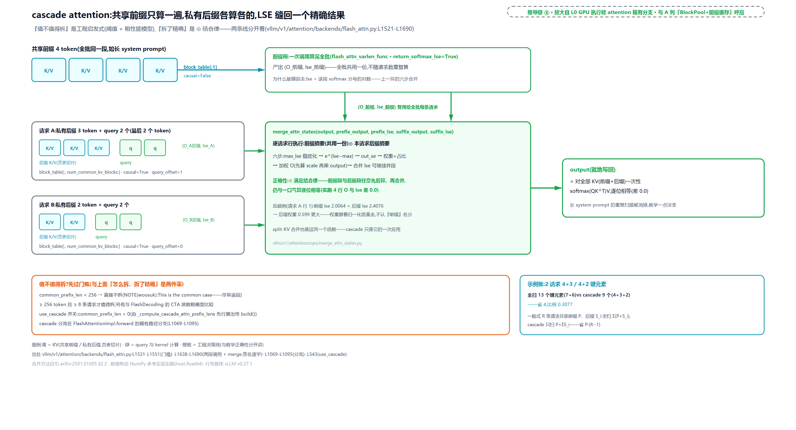

> *图注：上方共享前缀色带（block_table[:1]、causal=False）一次调用算完、双箭头复用给全批；下方两条请求泳道（A：3 token 后缀、query_offset=1；B：2 token 后缀、query_offset=0），各带 (O, lse) 小票汇入 merge_attn_states 框（签名与 pin 源码 L1690 逐字一致，内嵌六步摘要与反超例 2.0064<2.4076→0.599）；左下橙框决策线（<256 token / <8 请求不拆，NOTE(woosuk)：不拆才是常见情形）与数学线分框；右下青框扫描账 13 vs 9。*

---

## kernel 眼里的 KV：打平、右下对齐、穿页表

数学讲完，最后把 vLLM 调用面的几个约定拆开：这批形状契约决定了「整批 prefill 与 decode 一次吃下」和「K 在分页块池里也能算」。

**varlen 打平。** 推理一拍里，prefill 上千 token 与 decode 1 个 token 混批。按 padding 对齐到最长序列，每条 decode 白算上千行——prefill 是 1024 token 时就是白算 1023 行；varlen（variable-length，变长打包）的约定是把全批 query **首尾相接打平**成一条 `(total, nheads, headdim)` 的张量，再配一张 `cu_seqlens_q`（cumulative sequence lengths，累积序列边界：`batch+1` 个元素的 int32 前缀和，第 b 条序列占打平向量的第 b 到 b+1 段）切出每条序列。引擎侧的供给就一行接驳（[第 18 章](../../ch18-persistent-batch-fixed-addresses/narrative/chapter.md)立的 query_start_loc 正是这张前缀和）：

```python
# vllm/v1/attention/backends/flash_attn.py:L929-L935 · FlashAttentionImpl.forward 元数据接驳（非 cascade 主路径）
        if not attn_metadata.use_cascade:
            cu_seqlens_q = attn_metadata.query_start_loc    # L930 varlen 边界 = 引擎侧前缀和
            seqused_k = attn_metadata.seq_lens              # L931 每请求实际 KV 长度
            max_seqlen_q = attn_metadata.max_query_len
            max_seqlen_k = attn_metadata.max_seq_len
            block_table = attn_metadata.block_table         # L934 每请求页表
            scheduler_metadata = attn_metadata.scheduler_metadata
```

**causal 右下对齐。** 因果掩码贴在注意力矩阵的**右下角**：最后一条 query 与最后一条 key 同位置。kernel docstring 给了两个可逐格核的掩码例子（vllm/vllm_flash_attn/flash_attn_interface.py:L224-L234 原例；1 = 保留，0 = 掩掉）：

```text
seqlen_q=2, seqlen_k=5:          seqlen_q=5, seqlen_k=2:
    1 1 1 1 0                        0 0
    1 1 1 1 1                        0 0
                                     0 0
                                     1 0
                                     1 1
```

左例里第一条 query 只准回看前 4 个 key；右例里前三行全零（这三条 query 的位置早于所有 key，一个都看不见），全零行的输出为零。写成一行就是：query 行 $`r`$ 的全序列位置是 $`r+\mathrm{offset}`$（offset 由两长相减定），保留条件 $`c\le r+\mathrm{offset}`$。妙处在于 decode：query 只有 1 个 token、KV 有 $`N`$ 个时，唯一的 query 行天然落在最底部、与最后一个 key 同位，看见完整历史。所以长 query 的 prefill 与单 token 的 decode 能共用同一个 varlen kernel、一次调用吃下整批，cascade 后缀段也只需按请求给各自的 offset。

**softmax_scale 与三断言。** 打分的缩放因子默认 $`1/\sqrt{\mathrm{headdim}}`$（L285-L286：`softmax_scale = q.shape[-1] ** (-0.5)`）。本章玩具例显式传 1.0 是为心算，默认语义是它；不缩放的话大 $`d`$ 下点积方差随 $`d`$ 涨、softmax 会饱和（分布退化成几乎只挑最大项）。接口层的形状契约钉成三条断言（L270-L278）：`cu_seqlens_k` 与 `seqused_k` 二选一；**带 `block_table`（分页 KV）必须给 `seqused_k`**：片在池里，长度按请求给，这条就是「分页读取」的接口级表达：

```python
# vllm/vllm_flash_attn/flash_attn_interface.py:L270-L278 · flash_attn_varlen_func 分页契约三断言
    assert cu_seqlens_k is not None or seqused_k is not None, (
        "cu_seqlens_k or seqused_k must be provided"
    )
    assert cu_seqlens_k is None or seqused_k is None, (
        "cu_seqlens_k and seqused_k cannot be provided at the same time"
    )
    assert block_table is None or seqused_k is not None, (
        "seqused_k must be provided if block_table is provided"   # L277
    )
```

**穿页表读。** 论文里 $`K,V\in\mathbb{R}^{N\times d}`$ 是连续两卷胶片；vLLM 里它们被[第 13 章](../../ch13-paged-kv/narrative/chapter.md)的分页机制剪成 16 token 一页、散在块池货架上（`DEFAULT_BLOCK_SIZE=16`，vllm/config/cache.py:L47），kernel 手里只有每请求一张 block_table，取 KV 要沿页表逐块跳读：第 $`\mathrm{pos}`$ 个 token 的物理槽位 = 页表第 $`\mathrm{pos}//16`$ 项的块号乘 16 加 $`\mathrm{pos}\%16`$。[第 13 章](../../ch13-paged-kv/narrative/chapter.md)末尾挂的那笔账（「读腿弯、间接寻址的代价长在注意力 kernel 里」）在这里见到实物：本章读的每个 kernel 都天然是「PagedAttention 变体」：跳读逻辑编译在 kernel 里，页表当张量传进来；写侧（slot_mapping 逐 token 直塞）与槽位换算的 GPU 端细节，[第 22 章](../../ch22-slot-mapping-block-table/narrative/chapter.md)整章结算。

顺带澄清一个名字撞车：**tiling 的「块」与 KV cache 的「块」是两个粒度的两种块**。前者是 SRAM 容量切的计算 tile（$`B_c`$，由 $`M`$ 定，工程取 64/128），管「HBM 到 SRAM 一次搬多少」；后者是 16 token 一页的池块，管「块池怎么寻址」。两者互不知晓、各自独立——别被同一个「块」字骗了。还有一处契约反噬值得记：引擎侧填 `query_start_loc` 时要在尾部填非递减哨兵值，注释原话就是 "kernels like FlashAttention requires that"（vllm/v1/worker/gpu_model_runner.py:L2073-L2078）：kernel 的形状约定反过来管住了引擎怎么填表；block_table 尾行填 null 块同理（[第 19 章](../../ch19-compile-capture/narrative/chapter.md)讲 padding 四件套时见过）。

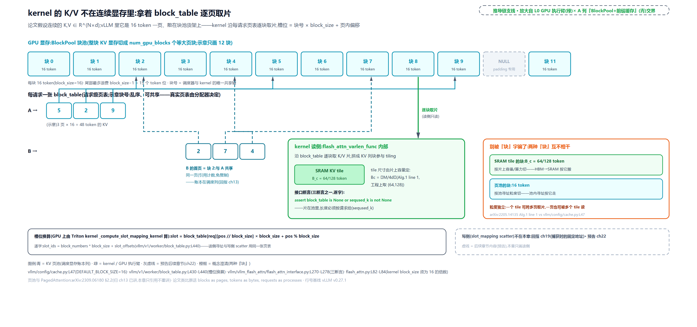

> *图注：上栏块池货架（等大 16 token 页块，示意只画 12 块，真实池 = num_gpu_blocks；块 10 是 NULL padding 块）；中栏两条页表 A=[5,2,9]、B=[2,7,4]（乱序、可共享为示意，块 2 双箭头分流），肘形箭头沿页表逐块取片；右栏 kernel 读侧框：SRAM tile $`B_c`$=64/128（容量切）与页池 16 token（寻址切）并排对比，接口断言「带 block_table 必须 seqused_k」逐字在位；写侧 slot_mapping scatter 灰虚线预告，归[第 22 章](../../ch22-slot-mapping-block-table/narrative/chapter.md)。*

---

## 总结：黑盒从此透明

回到 L0 图：本章点亮的是绿色「GPU 执行臂」列模型层框里「Attention = 插座」的那一项。[第 19 章](../../ch19-compile-capture/narrative/chapter.md)把它捕成 CUDA graph 里的不透明算子，现在这个节点内部是透明的：它跑的是 online-softmax 的分块递推，加减乘除全在片上，$`N\times N`$ 的 $`S`$、$`P`$ 从不落地。开篇的问题有了完整答案，压在一条主线上： **⊕ 满足结合律与交换律，softmax 统计量可任意分块、乱序归并** ；动机是另一笔账：注意力慢在 HBM 往返，不在算力。带四件事走：

1. **一张许可证** ：⊕ 把「先折算到公共基准、再并账」做成可结合可交换的运算，状态是多重集的规范摘要：single-pass 递推、tiling 更新 $`(m,\ell,O)`$、LSE 合并 $`(\mathrm{lse},O)`$，全是它换状态对的同一副面孔（arXiv:1805.02867 §3.1 Eq.(3)-(4)）。
2. **一笔账** ：标准实现访存 $`\Theta(Nd+N^2)`$、还要物化两张 $`N\times N`$；FA 降到 $`\Theta(N^2d^2/M)`$、额外内存 $`O(N)`$，且在这道墙上没有渐进更省的精确算法（Thm.2 与 Prop.3，arXiv:2205.14135 §3.2）。FLOP 一点没省——省的是搬运。
3. **一族 kernel** ：FA-2 定型了今天在跑的形态（外层 Q 行块、收尾归一、只存 $`L=m+\log\ell`$），FA-3/FA-4 换硬件不换数学；vLLM 按显卡代际决议版本（vllm/v1/attention/backends/fa_utils.py:L163-L171）。
4. **两处兑现** ：`merge_attn_states` 的十来行 Triton 把两段部分注意力精确缝回（vllm/v1/attention/ops/triton_merge_attn_states.py:L257-L322，docstring 自引 FlashInfer 论文 §2.2）；cascade attention 用它把「共享前缀只算一遍」做成免费的精确优化（vllm/v1/attention/backends/flash_attn.py:L1521-L1690）。

一条界线也值得带走：凡拆 **KV 轴**的（cascade、split-KV、跨卡归约），非请 ⊕ 出场合并不可；[第 10 章](../../ch10-continuous-batching-chunked-prefill/narrative/chapter.md)的 chunked prefill 拆的是 **query 轴**：因果掩码下逐行本就独立，连合并都不需要。分得清这两种拆分，注意力世界的「拆」就全在你手里了。

下一块已经挂好钩子：本章只打开了一个后端的内部，而 vLLM 桌上摆着不止一个注意力后端：FlashAttention、FlashInfer、Triton 变体，还有 MLA 这类换掉数学本身的变体。优先级表怎么排、validate 不过怎么回退、逐 KV 组怎么混布不同的后端，是紧接着那章《注意力后端》要讲的全部内容；再往后，[第 22 章](../../ch22-slot-mapping-block-table/narrative/chapter.md)会把本章两处一笔带过的 slot_mapping 与 block_table 的 GPU 端换算整章结清。数学先铺完路，接下来轮到机器。
