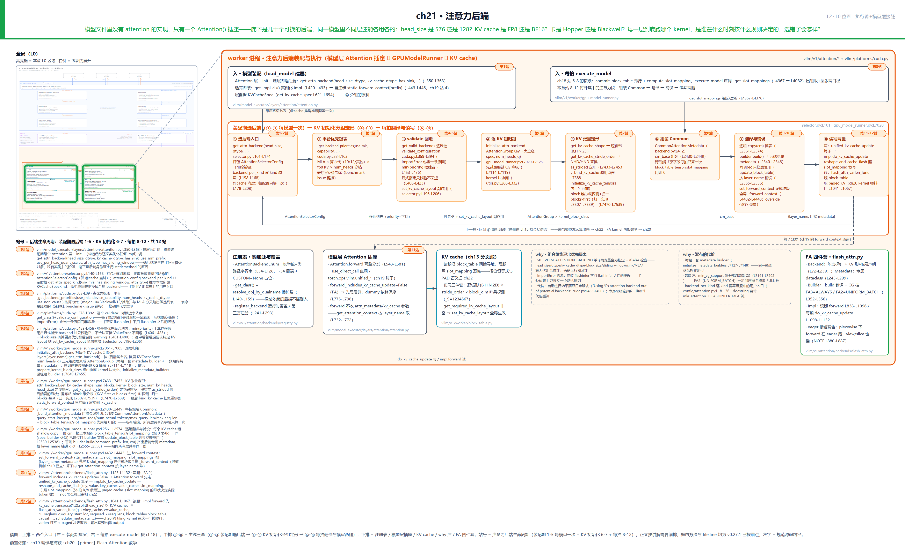
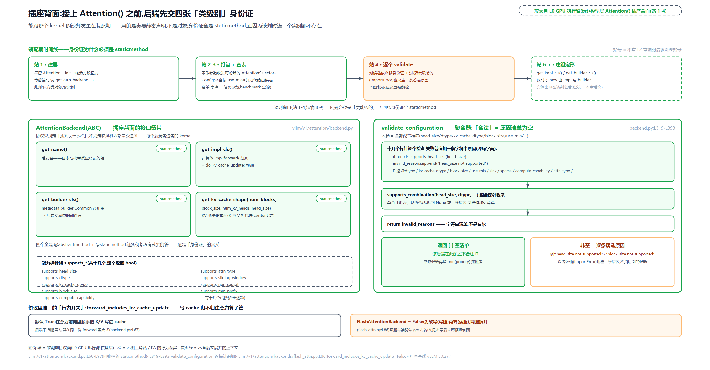
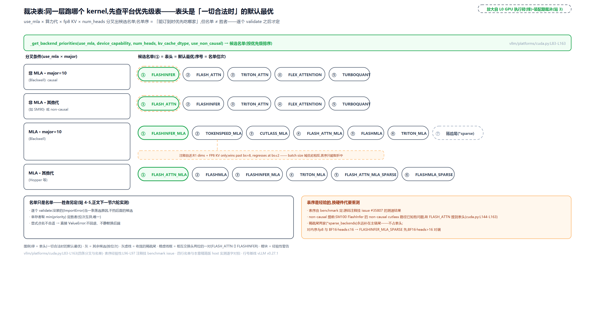
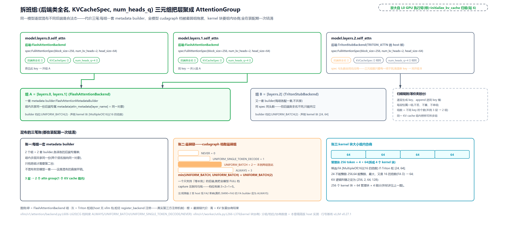
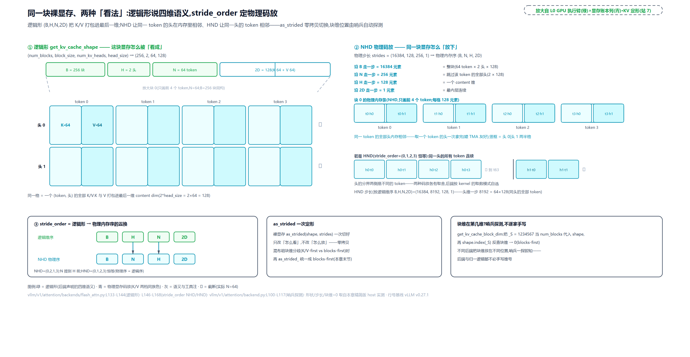
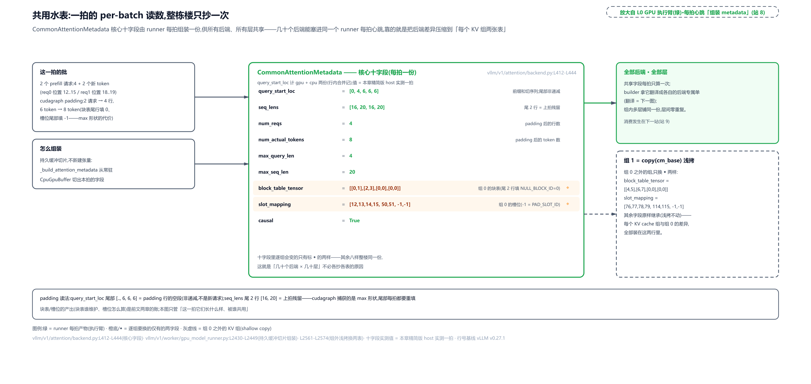
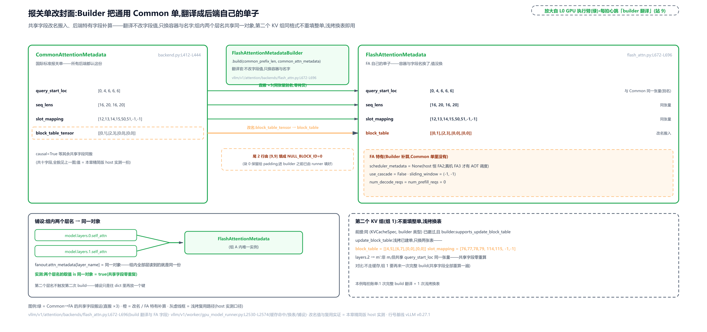
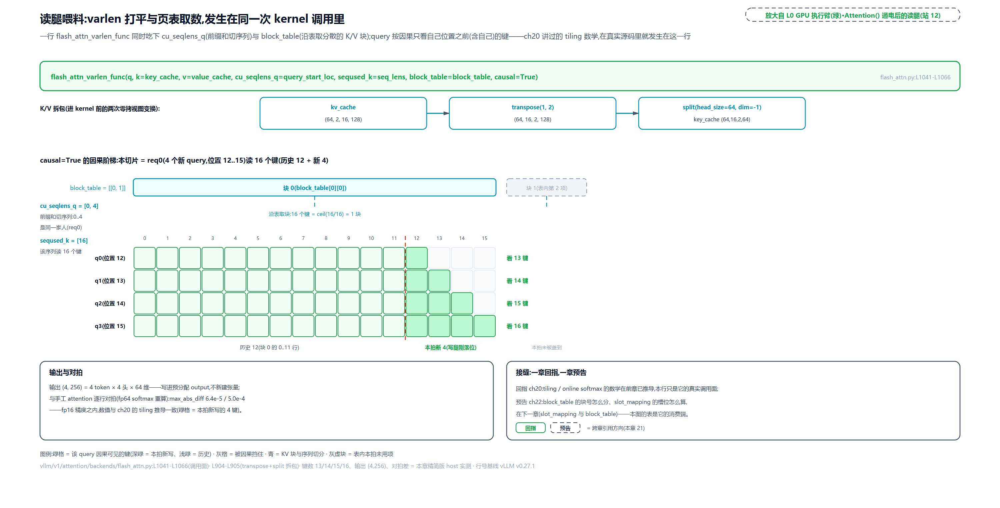

# 第 21 章　注意力后端

Part V 一路走到这里，执行臂上的注意力始终是一个黑盒：[第 19 章](../../ch19-compile-capture/narrative/chapter.md)把它包成算子录进 CUDA graph，[第 20 章](../../ch20-flash-attention-math/narrative/chapter.md)掀开盒盖看了 kernel 的数学。可有个事实一直没交代：注意力计算本身不在模型文件里。翻开 Llama 的模型代码，QKV 投影、位置编码都在，唯独找不到注意力的 kernel：计算只有一行 `self.attn(q, k, v)` 委托调用，`Attention(...)` 像个墙上的插座——插座底下是三十多个可换的后端：FlashAttention、FlashInfer、Triton、一整族 MLA 专用 kernel……而且同一个模型里不同层可以各用各的。head_size 是 576 还是 128？KV cache 是 FP8 还是 BF16？卡是 Hopper 还是 Blackwell（NVIDIA 两代 GPU 架构，H100 与 B200 各是代表）？每一层到底跑哪个 kernel，是谁、在什么时刻、按什么规则决定的？选错了会发生什么？

## 你在这里



> *图注：本章放大的是[第 1 章](../../ch01-vllm-v1-in-one-map/narrative/chapter.md) L0 图中间绿色「GPU 执行臂」列的**模型层与 KV cache 的接缝**——就是那张图里写着「Attention = 插座」的那一块，连同它背面的供电线路。上排两个入口：左入装配期建层（每个模型的注意力层构造函数触发一次后端选择，站牌第 1 站），右入每拍 `execute_model`（接[第 18 章](../../ch18-persistent-batch-fixed-addresses/narrative/chapter.md)的持久批心跳，站牌第 8 站）；中排 ①-⑧ 八张拍片卡一线铺开（②-⑦ 居中、①/⑧ 两端分踞两张入口之下），串成本章主线三幕：装配期选后端（①-③，每模型一次）→ KV 初始化期分组与定形（④-⑤，无请求在场）→ 每拍翻译与读写两腿（⑥-⑧，每拍循环回 ⑥），每个徽标头顶标着它盖住的站号（①=第1-2站、②=第3站、③=第4-5站……⑧=第11-12站）；下排从左到右是注册表、模型层插座（卡底压着一条四件套速记条：Backend+Metadata+Builder+Impl，§协议的四个角色）、KV cache 分页池、两条 why 注记，最右再压一张 FA 四件套卡（flash_attn.py 里四件套的实物方法地图，「协议」「翻译」与读写两腿各节逐件用到），插座卡与分页池之间那对「写/读」箭头（写照 slot_mapping、读照 block_table）就是读写两腿的落点。本章接在四块已读结构上：[第 19 章](../../ch19-compile-capture/narrative/chapter.md)立的算子化与 forward context 通道（`unified_kv_cache_update` / `unified_attention_with_output` 那对算子）、[第 20 章](../../ch20-flash-attention-math/narrative/chapter.md)立的 kernel 数学（`flash_attn_varlen_func`）、[第 18 章](../../ch18-persistent-batch-fixed-addresses/narrative/chapter.md)立的持久缓冲（`query_start_loc` 前缀和）、[第 13 章](../../ch13-paged-kv/narrative/chapter.md)与[第 14 章](../../ch14-memory-ledger/narrative/chapter.md)立的分页 KV 与 KVCacheSpec 分组。站号 1-12 = 注意力后端生命周期（装配期 1-5、KV 初始化 6-7、每拍 8-12），正文按讲解需要编排、不必照站号读。*

读法建议：想知道「每层跑哪个 kernel 谁说了算」，直奔[「裁决」](#裁决优先级表与-validate-回退)一节；关心同一个模型怎么混布不同后端、代价是什么，看[「分组」](#分组同一个模型各层各用各的)；KV cache 的形状和内存摆放是谁定的，读[「定形」](#定形一块裸显存两种看法)；每拍跑起来之后料怎么喂进 kernel，从[「每拍」](#每拍一张水表各后端一张单子)读到末尾；想跟全程，按序读。

照例交代取证环境，全章数值表通用：本章实测来自按 v0.27.1 源码只做减法抽出的配套精简版，在宿主机 CPU 上实跑（本机无 CUDA）。三处与真机的差异先挂出来，后文用到时不再重复：其一，宿主机上没装 FlashInfer 等外部依赖，这些候选在选择循环里以 ImportError 落选，这正是懒加载注册表在「依赖没装」时的真实行为，真机上没装 flashinfer 包时一模一样；其二，宿主机探测不到 GPU，FlashAttention 版本恒解析为 FA2，所以后端的 CUDA graph 档位（后端对「整段注意力捕成一张图重播」的支持等级，四档枚举，词表在[「最弱链」](#最弱链整模型取最弱档)节）观测为 UNIFORM_BATCH（第二高档：均匀批才可捕）、builder 产出的 `scheduler_metadata`（FA3 才有的宿主端预调度产物）为 None——真机上 SM90（Hopper 的算力代记法，这套记法「优先级表」一节交代）加 FA3 时应分别是 ALWAYS（最高档：prefill 与 decode 同批的混相批也整图可捕）与一份预调度元数据（[「分组」](#分组同一个模型各层各用各的)与[「翻译」](#翻译builder-把-common-改写成-fa-的单子)两处会再次就地挑明）；其三，读腿与写腿的算子在精简版里是逐 token 精确的数学镜像（float64 softmax、把槽位号拆回块号与块内偏移的逆运算，「写腿」一节会看到它的正向算式），与手工注意力实现对拍（两套独立实现算同一输入、逐位比对结果），误差在 fp16 精度内。凡表内数字都是实跑输出，一个没改。

---

## 插座：模型文件里没有注意力

先站到 L0 图模型层那一格。模型文件（如 `vllm/model_executor/models/llama.py` 里的 `LlamaDecoderLayer`）只做拼装：两层 RMSNorm、一个注意力模块、一个前馈，一层就齐了。注意力模块 `LlamaAttention` 是模型文件里一个约百行的类，QKV 投影、o_proj、RoPE（旋转位置编码）都在类里，唯独注意力计算本身只有一行委托。缺席要有证据，看它的 `forward` 全文：

```python
# vllm/model_executor/models/llama.py:L221-L231 · LlamaAttention.forward 全文
    def forward(
        self,
        positions: torch.Tensor,
        hidden_states: torch.Tensor,
    ) -> torch.Tensor:
        qkv, _ = self.qkv_proj(hidden_states)
        q, k, v = qkv.split([self.q_size, self.kv_size, self.kv_size], dim=-1)
        q, k = self.rotary_emb(positions, q, k)
        attn_output = self.attn(q, k, v)   # L229  注意力计算的全部：一行委托
        output, _ = self.o_proj(attn_output)
        return output
```

投影、拆包、RoPE 之后，`self.attn(q, k, v)` 把 q/k/v 递给插座就算完事（`self.attn` 的来路同样简洁：`llama.py:L203-L219` 里 `attn_cls` 按 attn_type 二选一，再 `self.attn = attn_cls(...)` 构造）。注意力真正的计算不在模型文件里，在 `Attention` 这个层类的构造函数背后。先把这条设计决策的 why 链摆全。

**旧设计**：HuggingFace 的 `modeling_*.py` 让每个模型自带注意力实现与 KV 管理，kernel 调用直接焊在模型代码里。**痛点**：模型与 kernel 焊死之后，两边都动不了。换一个新 kernel（新后端）要改几十个模型文件；反过来，新模型接入也碰不到 kernel 选择逻辑。而且「执行环境」（本拍的元数据、KV cache 张量）若经参数透传，会污染所有模型的 forward 签名（这半边的账[第 19 章](../../ch19-compile-capture/narrative/chapter.md)已算过：算子化与 forward context 就是为此而生）。**方案**：模型文件只拼层，`Attention` 是插座不是实现——每个层在构造期自己选后端、自己装好。**代价**：接入税重（新架构作者要同时懂层契约、KV 规格与注册机制），「一层到底谁实现」要跨三个文件追，本章就是把这三个文件串成一条线。

### 构造函数里的两步：先选，再装

看第一段真实源码。每个注意力层被构造时，如果构造方没有显式传入后端类，构造函数就自己去问选择器：

```python
# vllm/model_executor/layers/attention/attention.py:L343-L363 · Attention.__init__ 建层选后端段
        # NOTE: model_config may be None during certain tests
        model_config = vllm_config.model_config
        self.use_mm_prefix = model_config is not None and model_config.is_mm_prefix_lm

        # During model initialization, the default dtype is set as the model
        # weight and activation dtype.
        dtype = torch.get_default_dtype()
        if attn_backend is None:
            self.attn_backend = get_attn_backend(   # L351  建层即选：模型文件不感知具体 kernel
                head_size,
                dtype,
                kv_cache_dtype,
                use_mla=False,
                has_sink=self.has_sink,
                use_mm_prefix=self.use_mm_prefix,
                use_per_head_quant_scales=use_per_head_quant_scales,
                attn_type=attn_type,
                has_sliding_window=sliding_window is not None,
            )
        else:
            self.attn_backend = attn_backend
```

注意时机：选择发生在 `__init__` 里，此刻**还没有任何实例**——手里只有类对象。选完紧接着第二步，把选中的类变成实例：

```python
# vllm/model_executor/layers/attention/attention.py:L420-L446 · Attention.__init__ 选完即装
        impl_cls = self.attn_backend.get_impl_cls()   # L420  类 → 具体实现的桥
        self.impl = impl_cls(  # type: ignore[assignment]  # impl_cls always returns an AttentionImpl subclass
            num_heads,
            head_size,
            scale,
            num_kv_heads,
            alibi_slopes,
            sliding_window,
            kv_cache_dtype,
            logits_soft_cap,
            attn_type,
            kv_sharing_target_layer_name,
            **extra_impl_args,
        )
        self.backend = AttentionBackendEnum[self.attn_backend.get_name()]   # L434  名字反查枚举
        self.dtype = dtype

        # … 省略：四行注释（use_direct_call 的平台分叉解释，见「写腿」节）…
        self.use_direct_call = not current_platform.opaque_attention_op()   # L441

        compilation_config = vllm_config.compilation_config
        if prefix in compilation_config.static_forward_context:
            raise ValueError(f"Duplicate layer name: {prefix}")
        compilation_config.static_forward_context[prefix] = self   # L446  自注册，重名即报错
```

三件事一次做完：`get_impl_cls()` 取出实现类并实例化成 `self.impl`（往后这一层真正的注意力计算都由它跑）；用后端的名字反查注册表枚举存进 `self.backend`；把自己按 `layer_name` 注册进 `static_forward_context`（层名到层实例的注册表，[第 19 章](../../ch19-compile-capture/narrative/chapter.md)立过的算子取数通道，注册动作就发生在这里，与后端选择同处一个构造函数）。传给 impl 的形参里还有两个纯透传的名字，先认一下、后文不再解释：`alibi_slopes` 是 ALiBi 位置编码的每头斜率表——ALiBi 不给 token 加位置嵌入，而是在注意力分数上按「键离查询的距离」加一条线性斜坡、越远越压，没启用时这里是 None；`logits_soft_cap`（读腿调用点的形参名叫 softcap）是注意力分数的 tanh 软截断上限（把分数压回 ±cap 内，Gemma-2 用它稳数值），多数模型不启用。

「还没有实例就要选类」这个时机，反过来规定了协议的形状——这是下一节的主角。

## 协议：插座背面的四张身份证

现在走到 L0 图模型层与执行臂的接线处。几十个后端能塞进同一个插座，靠的是一份协议：`AttentionBackend` 抽象基类。它规定后端要交出什么，不规定后端内部怎么造。

```python
# vllm/v1/attention/backend.py:L56-L97 · AttentionBackend 抽象基类头部
class AttentionBackend(ABC):
    """Abstract class for attention backends."""

    supported_dtypes: ClassVar[list[torch.dtype]] = [torch.float16, torch.bfloat16]
    supported_kv_cache_dtypes: ClassVar[list["CacheDType"]] = [
        "auto",
        "float16",
        "bfloat16",
    ]

    # Does attention's forward() include kv cache update?
    forward_includes_kv_cache_update: bool = True   # L67  写腿归属旗标，默认「前向自己写」

    @staticmethod
    def get_supported_kernel_block_sizes() -> list[int | MultipleOf]:
        return [MultipleOf(1)]

    @staticmethod
    @abstractmethod
    def get_name() -> str:   # L75-L76  身份证一：名字
        raise NotImplementedError

    @staticmethod
    @abstractmethod
    def get_impl_cls() -> type["AttentionImplBase"]:   # L80  身份证二：实现类
        raise NotImplementedError

    @staticmethod
    @abstractmethod
    def get_builder_cls():   # L85-L86  身份证三：元数据构建器类  # -> Type["AttentionMetadataBuilder"]:
        raise NotImplementedError

    @staticmethod
    @abstractmethod
    def get_kv_cache_shape(   # L90-L97  身份证四：KV cache 逻辑形状
        num_blocks: int,
        block_size: int,
        num_kv_heads: int,
        head_size: int,
        cache_dtype_str: str = "auto",
    ) -> tuple[int, ...]:
        raise NotImplementedError
```

四个抽象方法全是 `staticmethod`，这不是风格偏好，是被时机逼出来的：选择发生在「只有类、没有实例」的阶段，实例方法要求先 `new` 出对象，而 `new` 之前要先选出是哪个类。所以能回答提问的只能是类自己。四张身份证对应后端的「四件套」：

- **Backend**（本类）：身份证与能力声明，纯静态；
- **Metadata**：后端专属的每拍元数据（[「翻译」](#翻译builder-把-common-改写成-fa-的单子)节见实物）；
- **Builder**：把引擎组装的通用元数据翻译成后端专属元数据的构建器；
- **Impl**：真正的计算实现，`forward` 算注意力、`do_kv_cache_update` 写 KV。

`forward_includes_kv_cache_update` 是个一比特的旗标，管的是「写 KV 这件事归谁」：默认 True（前向算注意力时顺手把 KV 写进 cache），FlashAttentionBackend 改成 False（先由独立算子写、再算，[「写腿」](#写腿先归档再开会)节见分晓）。[第 19 章](../../ch19-compile-capture/narrative/chapter.md)立这对算子时见过它，这里看到的是它的声明处。

### 合法不是一个布尔，是一张原因清单

`supported_dtypes` 这类 ClassVar（Python 的类变量标注：值挂在类上、不随实例变）是能力面，真正把它们用起来的是 `validate_configuration`——给定一份配置，逐个探针检查，返回「为什么不合法」的清单：

```python
# vllm/v1/attention/backend.py:L319-L393 · AttentionBackend.validate_configuration 探针聚合器
    @classmethod
    def validate_configuration(
        cls,
        head_size: int,
        dtype: torch.dtype,
        kv_cache_dtype: "CacheDType | None",
        block_size: int | None,
        use_mla: bool,
        # … 省略：has_sink / use_sparse / use_mm_prefix / use_per_head_quant_scales /
        #        device_capability / attn_type / has_sliding_window 等 11 个形参 …
    ) -> list[str]:
        invalid_reasons = []   # L339  空 = 合法
        if not cls.supports_head_size(head_size):
            invalid_reasons.append("head_size not supported")
        if not cls.supports_dtype(dtype):
            invalid_reasons.append("dtype not supported")
        if not cls.supports_kv_cache_dtype(kv_cache_dtype):
            invalid_reasons.append("kv_cache_dtype not supported")
        if not cls.supports_block_size(block_size):
            invalid_reasons.append("block_size not supported")
        # … 省略：use_mm_prefix 探针（结构与下面每个都相同）…
        if use_mla != cls.is_mla():   # L352  MLA 与非 MLA 是两个世界，探针把两边分开
            if use_mla:
                invalid_reasons.append("MLA not supported")
            else:
                invalid_reasons.append("non-MLA not supported")
        # … 省略：has_sink / use_sparse / use_per_head_quant_scales 三个同构探针 …
        if not cls.supports_compute_capability(device_capability):
            invalid_reasons.append("compute capability not supported")
        if not cls.supports_attn_type(attn_type):
            invalid_reasons.append(f"attention type {attn_type} not supported")
        # … 省略：sliding_window / non_causal / batch_invariant / kv_connector / pcp
        #        五个同构探针 …
        combination_reason = cls.supports_combination(   # L380  组合探针收尾
            head_size,
            dtype,
            kv_cache_dtype,
            block_size,
            use_mla,
            has_sink,
            use_sparse,
            use_mm_prefix,
            device_capability,
        )
        if combination_reason is not None:
            invalid_reasons.append(combination_reason)
        return invalid_reasons   # L393
```

探针名单里主要的生词是 `use_mla`：MLA（Multi-head Latent Attention，DeepSeek 系模型的低秩压缩注意力变体）在这里先当「另一族模型」的开关标签用——它凭什么单列一族，优先级表一节的「MLA 的一族」段会正面展开。紧挨着的 `has_sink` 也要当场交代：它标记模型层是否带 attention sink（注意力汇）。这是 StreamingLLM 论文（[arXiv:2309.17453](https://arxiv.org/abs/2309.17453)）发现的现象：softmax 后的注意力会把大量预算倾倒在序列开头若干 token 上，流式推理要把这小撮「汇」永久保留、其余 token 按窗口滚动，长序列输出才稳定。gpt-oss 等模型的部分层带此标记，开头构造代码里 `has_sink=self.has_sink` 传的就是它。名单里其余几个缩写维度名（`use_mm_prefix`、`use_batch_invariant`、`use_pcp`、`use_sparse`、`use_per_head_quant_scales`）在本章只当开关透传，进「同一道题只答一次」节的参数包时各给一句释义，认不得不影响主线。两个设计点值得停一秒。第一，返回值是 `list[str]` 不是布尔：单维探针（head_size 对不对、dtype 支不支持）之外还有一个 `supports_combination` 组合探针，专查跨维约束（比如「FP8 KV 只在某代卡加某个版本上合法」这类单看每一维都发现不了的规则）；失败原因逐条攒起来，最后要么空列表要么一张人能读的清单，后面会看到这张清单直接进报错信息和日志。第二，探针全挂在类上，又一次呼应「谈判发生在装配期、只有类在场」。



> *图注：`AttentionBackend` 协议的两面。左卡：四个抽象 staticmethod 身份证（`get_name` / `get_impl_cls` / `get_builder_cls` / `get_kv_cache_shape`），连实例都还没有就要能答，所以全 staticmethod；装配期时间线标出这段谈判发生在哪（站 1 建层 → 站 2-3 打包查表 → 站 4 validate → 站 6-7 建组定形）。右块：`validate_configuration` 的真实代码形状，探针失败往 `invalid_reasons` 追加一条字符串原因、`supports_combination` 收尾，双出口——空列表即合法、非空则是逐条原因。底条：写腿归属旗标默认 True、FlashAttentionBackend 改 False。*

### 黄页：枚举值是门牌号

三十多个后端住在一个注册表里：`AttentionBackendEnum`。它的形态很省事——枚举值直接就是完整类路径字符串：

```python
# vllm/v1/attention/backends/registry.py:L34-L128 · AttentionBackendEnum 头部（节选）
class AttentionBackendEnum(Enum, metaclass=_AttentionBackendEnumMeta):
    """Enumeration of all supported attention backends.

    The enum value is the default class path, but this can be overridden
    at runtime using register_backend().
    ...
    """

    FLASH_ATTN = "vllm.v1.attention.backends.flash_attn.FlashAttentionBackend"
    FLASH_ATTN_DIFFKV = (
        "vllm.v1.attention.backends.flash_attn_diffkv.FlashAttentionDiffKVBackend"
    )
    TRITON_ATTN = "vllm.v1.attention.backends.triton_attn.TritonAttentionBackend"
    # … 省略：8 个同构条目——TRITON_ATTN_DIFFKV / ROCM 族（5 个）/
    #        XPU_MLA_SPARSE / TORCH_SDPA（ViT 专用空串），
    #        全是『名字 = 完整类路径字符串』的行 …
    FLASHINFER = "vllm.v1.attention.backends.flashinfer.FlashInferBackend"
    FLASHINFER_MLA = (
        "vllm.v1.attention.backends.mla.flashinfer_mla.FlashInferMLABackend"
    )
    # … 省略：其余 21 个同构条目——各 MLA 与 sparse 家族 / NO_ATTENTION /
    #        FLEX_ATTENTION / HPC_ATTN / CPU_ATTN / TURBOQUANT 等 …
    CUSTOM = None   # 占位：第三方注册用，用前必须先 register_backend
```

注册表里只有名字和路径，没有任何 import。真要用到某个类，才走这一步：

```python
# vllm/v1/attention/backends/registry.py:L130-L159 · get_path / get_class
    def get_path(self, include_classname: bool = True) -> str:
        path = _ATTN_OVERRIDES.get(self, self.value)   # L139  先查运行时覆盖表
        if not path:
            raise ValueError(
                f"Backend {self.name} must be registered before use. "
                f"Use register_backend(Backend.{self.name}, 'your.module.YourClass')"
            )
        if not include_classname:
            path = path.rsplit(".", 1)[0]
        return path

    def get_class(self) -> "type[AttentionBackend]":
        return resolve_obj_by_qualname(self.get_path())   # L159  此刻才真正 import
```

为什么必须懒？import 一个包会把它的依赖树整棵拉起来。三十多个后端每个都可能带 CUDA 扩展或外部库，注册表 import 时全拉，等于把所有后端的依赖焊成强耦合，任何一个没装都在 import 期炸掉整个进程。懒加载把 import 推迟到「真正要用这个后端」的瞬间，没装的依赖在那一刻以 ImportError 显形，而选择器把这个 ImportError 也接住、记成一条落选原因——「没装 flashinfer」不挡 flashinfer 之后的候选，更不挡引擎启动。原理用五行就能复刻（说明性）：

```python
# 说明性：与 vllm 的 resolve_obj_by_qualname 同构的最小复刻
import importlib

def resolve(path: str):
    module_name, cls_name = path.rsplit(".", 1)      # 切出模块与类名
    module = importlib.import_module(module_name)    # 此刻才真正 import
    return getattr(module, cls_name)
```

`_ATTN_OVERRIDES` 覆盖表加 `register_backend()` 是第三方的入口：不碰 vLLM 源码就能把某个名字换绑到自己的类上（`CUSTOM = None` 的占位同理）。这套「配置里写名字、用时再 import」的形态是 Python 插件系统的祖传配方（setuptools entry_points、pytest 插件都这么干），[第 16 章](../../ch16-kv-connector/narrative/chapter.md)的 KVConnector 工厂注册表是本书里它的另一位住户。

## 裁决：优先级表与 validate 回退

现在走进第一幕的正题：选择算法本身。先把这条设计的 why 链摆全。**旧设计**：v0 只有一个 `VLLM_ATTENTION_BACKEND` 环境变量，全局指定唯一后端，兼容性靠散落在各处的 if-else 检查。**痛点**：head_size、dtype、kv_cache_dtype、block_size、滑窗、sink（上文交代的注意力汇标记）、MLA、算力代——这些维度组合出的合法集合是张爆炸表，用户不可能记住哪组合法且最优，选错了要到运行期才炸；新硬件进来还得改散落各处的检查代码。**方案**：平台按配置开出一张优先级表，选择器逐个 validate 试探，`@cache` 把同一道题摊销成一次。**代价**：自动选择的结果不完全可预测，最终坐上谁要靠启动日志确认（那行日志长什么样，本节末尾的代码就能看到）。算法本身分三步：入口打包、查表、逐个试探。先看入口。

### 同一道题只答一次

每个注意力层的构造函数都会调一次 `get_attn_backend`，一个 32 层模型就是 32 次。但同构的层问的是同一道题，答案没必要算 32 遍：

```python
# vllm/v1/attention/selector.py:L101-L174 · get_attn_backend 选择入口
def get_attn_backend(
    head_size: int,
    dtype: torch.dtype,
    kv_cache_dtype: str | None,
    use_mla: bool = False,
    # … 省略：has_sink / use_sparse / use_mm_prefix / use_per_head_quant_scales /
    #        attn_type / num_heads / has_sliding_window 形参 …
) -> type[AttentionBackend]:
    """Selects which attention backend to use and lazily imports it."""

    if kv_cache_dtype is not None:
        valid_cache_dtypes = get_args(CacheDType)
        assert kv_cache_dtype in valid_cache_dtypes, (
            f"Invalid kv_cache_dtype: {kv_cache_dtype}. "
            f"Valid values are: {valid_cache_dtypes}"
        )

    from vllm.config import get_current_vllm_config

    vllm_config = get_current_vllm_config()

    cache_config = vllm_config.cache_config
    block_size: int | None
    if cache_config is not None and cache_config.user_specified_block_size:
        block_size = cache_config.block_size   # 用户显式给过 --block-size 才带上它
    else:
        block_size = None

    # … 省略：kv_transfer_config → use_kv_connector 两条语句（4 行，KV 连接器在场是选择维度之一）…

    attn_type = attn_type or AttentionType.DECODER
    attn_selector_config = AttentionSelectorConfig(   # L140  零散参数打包成可哈希的键
        head_size=head_size,
        dtype=dtype,
        kv_cache_dtype=cast(CacheDType | None, kv_cache_dtype),
        block_size=block_size,
        # … 省略：use_mla / has_sink / use_sparse / use_mm_prefix /
        #        use_per_head_quant_scales / attn_type / has_sliding_window …
        use_non_causal=vllm_config.attention_config.use_non_causal,
        use_batch_invariant=envs.VLLM_BATCH_INVARIANT,
        use_kv_connector=use_kv_connector,
        use_pcp=vllm_config.parallel_config.prefill_context_parallel_size > 1,
    )

    # A per-KV-group override (keyed by KVCacheSpecKind) takes precedence over
    # the global backend; kinds not present in the map fall back to it.
    attention_config = vllm_config.attention_config
    backend = attention_config.backend
    if attention_config.backend_per_kind:   # L162  逐组覆写，见「分组」节
        kind = get_attn_spec_kind(
            use_mla=use_mla,
            has_sliding_window=has_sliding_window,
            attn_type=attn_type,
        )
        backend = attention_config.backend_per_kind.get(kind.value, backend)

    return _cached_get_attn_backend(   # L170  交 @cache 内层
        backend=backend,
        attn_selector_config=attn_selector_config,
        num_heads=num_heads,
    )
```

`AttentionSelectorConfig` 是个 NamedTuple（`selector.py:L24-L39`），把选后端要看的十几个维度（head_size、dtype、kv_cache_dtype、block_size、use_mla、has_sink、use_sparse、use_mm_prefix、use_per_head_quant_scales、attn_type、has_sliding_window、use_non_causal、use_batch_invariant、use_kv_connector、use_pcp）打成一个可哈希的键。五个缩写名就地注掉：`use_mm_prefix` 的 mm＝multimodal（多模态，指带图像等非文本输入的模型；这批模型把图像放在语言模型序列前缀、图像 token 之间用双向注意力，标记由此得名）；`use_batch_invariant` 是「跨批尺寸数值不变」的确定性模式（同一序列放进不同大小的批，算出的结果逐位一致）；`use_pcp`＝prefill 上下文并行（prefill context parallel，把长 prefill 序列切到多卡分段算的并行形态，上面代码里 `prefill_context_parallel_size > 1` 即开启，后文省略注里的「CP 兼容检查」查的就是它）；`use_sparse` 是稀疏注意力开关（只对一部分 query-key 对算注意力的形态，注册表里的 *_SPARSE 后端家族由此得名）；`use_per_head_quant_scales` 是「KV 量化缩放因子按头各带一份（而非全模型共享一对）」的开关（写腿一节的 `layer._k_scale` / `layer._v_scale` 就是这对因子，FA3 起才支持）。为什么要打包？因为内层挂了标准库的 `@cache` 装饰器——「同样的参数只算一次」的函数记忆化，它靠把参数当字典键来查表，参数必须可哈希；NamedTuple 的相等与哈希按值算，整包正好当键。实测摊销效果：同配置第二次调用返回的是同一个类对象（Python 的 `is` 判定成立），也就是说 32 层同构模型只有第 1 层真正跑了一遍选择，其余 31 层全部查表命中。选择配置的组合空间有限（head_size 与 dtype 就那么几种），无界缓存不存在膨胀问题，摊销是净赚。

### 优先级表：平台开出的名单

`@cache` 内层把问题转给平台（`selector.py:L177-L208`：`current_platform.get_attn_backend_cls` 拿回类路径字符串，`resolve_obj_by_qualname` import 成类；选中后若后端对 KV 内存摆放有硬要求，还会全局 `set_kv_cache_layout`，副作用见[「定形」](#定形一块裸显存两种看法)节）。平台侧的主角是一张按配置分叉的候选名单：

```python
# vllm/platforms/cuda.py:L82-L163 · _get_backend_priorities 平台优先级表
@cache
def _get_backend_priorities(
    use_mla: bool,
    device_capability: DeviceCapability,
    num_heads: int | None = None,
    kv_cache_dtype: CacheDType | None = None,
    use_non_causal: bool = False,
) -> list[AttentionBackendEnum]:
    """Get backend priorities with lazy import to avoid circular dependency."""
    from vllm.utils.torch_utils import is_quantized_kv_cache

    if use_mla:
        if device_capability.major == 10:   # L94  Blackwell 数据中心卡
            # Sparse MLA backend priorities
            # See https://github.com/vllm-project/vllm/issues/35807 for
            # benchmark results
            if kv_cache_dtype is not None and is_quantized_kv_cache(kv_cache_dtype):
                # Prefer FlashInfer for fp8 kv cache
                sparse_backends = [
                    AttentionBackendEnum.FLASHINFER_MLA_SPARSE,
                    AttentionBackendEnum.FLASHMLA_SPARSE,
                ]
            else:
                # … 省略：BF16 KV 时按 num_heads≤16 与否再分档 …
            return [
                AttentionBackendEnum.FLASHINFER_MLA,
                # R1 dims + FP8 KV only; rejected by supports_combination
                # otherwise. Behind FLASHINFER_MLA: wins past bs≈8, regresses
                # at bs≤2.   # L120-L122  经验注释：批尺寸翻转点写进源码
                AttentionBackendEnum.TOKENSPEED_MLA,
                AttentionBackendEnum.CUTLASS_MLA,
                AttentionBackendEnum.FLASH_ATTN_MLA,
                AttentionBackendEnum.FLASHMLA,
                AttentionBackendEnum.TRITON_MLA,
                *sparse_backends,
            ]
        # … 省略：major==12（消费级 Blackwell）与 Hopper 等其他代各一套 MLA 表 …
    else:
        # SM100f defaults to FlashInfer for TRTLLM causal attention, but its non-causal
        # cutlass path (used for dflash attention) is known to have problems.
        # So prefer FlashAttention when non-causal on SM100f.   # L145-L147
        if device_capability.major == 10 and not use_non_causal:
            return [
                AttentionBackendEnum.FLASHINFER,
                AttentionBackendEnum.FLASH_ATTN,
                AttentionBackendEnum.TRITON_ATTN,
                AttentionBackendEnum.FLEX_ATTENTION,
                AttentionBackendEnum.TURBOQUANT,
            ]
        else:
            return [
                AttentionBackendEnum.FLASH_ATTN,   # L158  其余代 FLASH_ATTN 提到表头
                AttentionBackendEnum.FLASHINFER,
                AttentionBackendEnum.TRITON_ATTN,
                AttentionBackendEnum.FLEX_ATTENTION,
                AttentionBackendEnum.TURBOQUANT,
            ]
```

分叉判据是 `device_capability.major`，这里要把 NVIDIA 的算力代号记法交代清楚：每代 GPU 有一对「主版本.次版本」数字，标记这块卡支持哪些硬件特性，口语拼成 smXY——9.0 写 sm90 是 Hopper（H100），10.0 写 sm100 是 Blackwell 数据中心卡（B200 这类）；注意消费级 Blackwell（RTX 50 系）是另一个 sm120，同代不同能力集，这正是表里 major==10 与 major==12 要分开出两套的原因。非 MLA 分支的对调也带着写明原因的注释：SM100 上 FlashInfer 的 non-causal cutlass 路径（cutlass 是 NVIDIA 的 CUDA 模板库，FlashInfer 依托它构建 kernel；TRTLLM 即 TensorRT-LLM，NVIDIA 的推理引擎库）已知有问题，所以开了 non-causal 时把 FLASH_ATTN 提到表头。名单内容分两个世界看。

**非 MLA 的五家**，按 v0.27.1 的表固定是这五位（Blackwell 一套序、其余代 FLASH_ATTN 与 FLASHINFER 对调，五位不变）：

| 后端 | 一句定位 |
|---|---|
| FLASH_ATTN | vLLM 自带的 flash-attention fork（`vllm_flash_attn` 包），覆盖面最广、内置 FA4/FA3/FA2 按算力代自选，不依赖额外安装 |
| FLASHINFER | NVIDIA 系注意力 kernel 库（[arXiv:2501.01005](https://arxiv.org/abs/2501.01005)），吸收了 TensorRT-LLM 的 kernel，FP8/FP4 量化注意力与新卡适配更早更激进 |
| TRITON_ATTN | vLLM 内置的纯 Triton 手写实现，不依赖任何厂商专有 kernel 库，参数宽容度最高，峰值性能通常不及前两者 |
| FLEX_ATTENTION | 包装 PyTorch 官方 FlexAttention API，`score_mod`/`mask_mod` 两个 Python 回调描述任意打分修改与掩码，官方自述性能约为手写 FA2 的九成（研究形态） |
| TURBOQUANT | Google 的 KV 量化注意力路线（[arXiv:2504.19874](https://arxiv.org/abs/2504.19874)），把 KV 压到每通道 3.5/2.5 比特让注意力直接吃，换显存极限 |

每家是一份独立的 kernel 代码，有自己的依赖与能力边界；vLLM 的选择器把它们排成偏好序逐个试探。这份表与官方设计文档同源（文档表格由脚本从注册表自动生成，依据正是 `validate_configuration` 的检查项，[docs.vllm.ai 的 Attention Backend Feature Support 页](https://docs.vllm.ai/en/latest/design/attention_backends/)可查最新表）。

**MLA 的一族**值得单独立一段，因为要先回答「MLA 是什么、凭什么单列一族」。MLA（Multi-head Latent Attention，多头潜在注意力）是 DeepSeek-V2 引入的变体（[arXiv:2405.04434](https://arxiv.org/abs/2405.04434)）：训练时学一对下投影/上投影，把每个 token 的 K、V 联合压进一个低秩「潜在向量」缓存，推理时靠「吸收」技巧把上投影矩阵乘进 Q 侧权重，于是 decode 阶段等价于一个超大头维的单份 KV——注意力直接在压缩域里算，不用先升维还原。论文自述 KV cache 缩小 93.3%、60K 上下文生成吞吐 5.76 倍。代价恰好落在本章：cache 里没有 KV 头份数（吸收后一份潜在向量全头共享）、头维是 576 这类非常规尺寸，常规 GQA 形状的 kernel 接不住。所以优先级表为 `use_mla=True` 单列一族候选，validate 里的 `MLA not supported` / `non-MLA not supported` 探针也在把两个世界分开。Blackwell 表头的六家，与上面非 MLA 五家同款两列、逐名认一下：

| 后端 | 一句定位 |
|---|---|
| FLASHINFER_MLA | NVIDIA FlashInfer 库的 MLA kernel，Blackwell 默认第一优先 |
| TOKENSPEED_MLA | TokenSpeed 项目（LightSeek 基金会开源、为 Kimi 场景打造、随 Kimi K3 落地 vLLM）；用 CuTe DSL（CUTLASS 的张量代数 DSL）编写，仅 R1（DeepSeek-R1 模型那套头数/头维固定规格）维度加 FP8 KV 合法，越界由组合探针直接拒绝 |
| CUTLASS_MLA | NVIDIA CUTLASS 模板库路线 |
| FLASH_ATTN_MLA | vLLM 自带 fork 的 MLA 实现，通用档 |
| FLASHMLA | DeepSeek 官方开源的 decode kernel，MIT 许可，面向 Hopper/Blackwell |
| TRITON_MLA | 纯 Triton 兜底 |

其他代各有各的表：Hopper 等其他代的 MLA 名单是另一套六家，序为 FLASH_ATTN_MLA → FLASHMLA → FLASHINFER_MLA → TRITON_MLA → FLASH_ATTN_MLA_SPARSE → FLASHMLA_SPARSE（`vllm/platforms/cuda.py:L136-L143`）；消费级 Blackwell（major==12）只留 TRITON_MLA 与 FLASHINFER_MLA_SPARSE_SM120 两家（`cuda.py:L130-L134`）。各家 kernel 内部是 MLA 专题的领地，本章只认名单上的名字。

名单序是**经验的**，不是推导的。最有说服力的证据就写在源码注释里：TOKENSPEED_MLA 头上那行注释自述「R1 dims + FP8 KV only; rejected by supports_combination otherwise. Behind FLASHINFER_MLA: wins past bs≈8, regresses at bs≤2」——批尺寸 8 以上它才赢、批尺寸 2 以下反而更慢，同一后端在不同批域有相反的优劣，表序只能取折中；表头注释挂着 benchmark issue 链接（vllm-project/vllm#35807），换硬件代要重测。经验表序加机器相关的 validate，也把开头 why 链里那笔代价落了地：自动选择坐上谁不完全可预测，要靠启动日志那行 `Using … attention backend out of potential backends` 确认：它就在下一节代码末尾的 `logger.info_once`。这也顺带解释了为什么表只是「候选名单」而不是「答案」：名单之外还有 validate 这道关卡，下一节。

还有一个容易混的点，两级选择要分开：外层是本章的优先级表，决定「用 FLASH_ATTN 这个后端」；内层是 `vllm_flash_attn` 包自己按算力代决议用 FA4/FA3/FA2 哪一代实现（[第 20 章](../../ch20-flash-attention-math/narrative/chapter.md)讲过版本族，三代数学骨架不变、各绑硬件代际）。后端的 CUDA graph（下文简称 CG）档位、预调度这些特性随内层分叉，后文两处会用到。



> *图注：`_get_backend_priorities`（`vllm/platforms/cuda.py:L83-L163`）按 use_mla × 算力代（major 10 = Blackwell 数据中心 / 12 = 消费级 Blackwell / 其他）× fp8 KV × num_heads 分叉出四行候选名单（四行名单逐一在图，包括「MLA·其他代（Hopper 等）」那套六家；真正省略的是消费级 Blackwell major==12 的两家表：只留 TRITON_MLA 与 FLASHINFER_MLA_SPARSE_SM120，`cuda.py:L130-L134`，图略），① 徽标 = 表头 = 一切合法时的默认最优。底下两块把边界说清：名单不等于胜者（逐个 validate、min(priority) 取胜、显式指定不合法直接 ValueError 不回退）；表序是经验参数（注释挂 benchmark issue #35807，TOKENSPEED_MLA 的批尺寸翻转点 bs≈8 / bs≤2 逐字在图）。*

### validate 回退：逐个问，坐最近的合法者

名单在手，逐个试探的循环体只有三十几行：

```python
# vllm/platforms/cuda.py:L358-L394 · get_valid_backends 逐候选试探
    @classmethod
    def get_valid_backends(
        cls,
        device_capability: DeviceCapability,
        attn_selector_config: AttentionSelectorConfig,
        num_heads: int | None = None,
    ) -> tuple[
        list[_BackendCandidate],
        dict[AttentionBackendEnum, tuple[int, list[str]]],
    ]:
        valid_backends_priorities = []
        invalid_reasons: dict[AttentionBackendEnum, tuple[int, list[str]]] = {}

        backend_priorities = _get_backend_priorities(
            attn_selector_config.use_mla,
            device_capability,
            num_heads,
            attn_selector_config.kv_cache_dtype,
            attn_selector_config.use_non_causal,
        )
        for priority, backend in enumerate(backend_priorities):   # L378  表序即优先级
            try:
                backend_class = _get_attn_backend_class(backend)
                invalid_reasons_i = backend_class.validate_configuration(
                    device_capability=device_capability,
                    **attn_selector_config._asdict(),
                )
            except ImportError:   # L385-L386  依赖没装也只是一条落选原因
                invalid_reasons_i = ["ImportError"]
            if invalid_reasons_i:
                invalid_reasons[backend] = (priority, invalid_reasons_i)
            else:
                valid_backends_priorities.append(
                    _BackendCandidate(backend_class, backend, priority)
                )

        return valid_backends_priorities, invalid_reasons
```

`enumerate` 的下标就是优先级，幸存者连同优先级收进 `_BackendCandidate`。裁决的两路在这里分叉：

```python
# vllm/platforms/cuda.py:L396-L492 · get_attn_backend_cls 两路裁决
    @classmethod
    def get_attn_backend_cls(
        cls,
        selected_backend: AttentionBackendEnum | None,
        attn_selector_config: AttentionSelectorConfig,
        num_heads: int | None = None,
    ) -> str:
        device_capability = cls.get_device_capability()
        assert device_capability is not None

        # First try checking just the selected backend, if there is one.
        if selected_backend is not None:   # L407  路一：用户点名
            try:
                backend_class = _get_attn_backend_class(selected_backend)
                invalid_reasons = backend_class.validate_configuration(
                    device_capability=device_capability,
                    **attn_selector_config._asdict(),
                )
            except ImportError:
                invalid_reasons = ["ImportError"]
            if invalid_reasons:
                raise ValueError(   # L417-L420  点名不合法：直接报错，绝不静默换
                    f"Selected backend {selected_backend} is not valid for "
                    f"this configuration. Reason: {invalid_reasons}"
                )
            else:
                logger.info("Using %s backend.", selected_backend)
                return _backend_cls_path(backend_class)

        # No selected backend or the selected backend is invalid,
        # so we try finding a valid backend.
        valid_backends_priorities, all_invalid_reasons = cls.get_valid_backends(
            device_capability=device_capability,
            attn_selector_config=attn_selector_config,
            num_heads=num_heads,
        )
        # … 省略：reasons_str / config_str 拼接与 debug 日志（把全部落选原因拼给人看）…
        if len(valid_backends_priorities) == 0:
            raise ValueError(   # L446-L449  全军覆没：报错带上每家的落选原因
                f"No valid attention backend found for {cls.device_name} "
                f"with {config_str}. Reasons: {reasons_str}."
            )

        # We have found some valid backends. Select the one with the
        # highest priority.
        selected_candidate = min(   # L453-L456  幸存者里取最小 priority
            valid_backends_priorities,
            key=lambda candidate: candidate.priority,
        )
        selected_backend_class = selected_candidate.backend_class
        selected_backend = selected_candidate.backend
        selected_priority = selected_candidate.priority

        # If the user specified --block-size (but not --attention-backend),
        # check whether that constraint precluded any higher-priority backends.
        if attn_selector_config.block_size is not None:   # L463
            ...
            # … 省略：筛出『因 block_size 落选且优先级更高』者发 warning，
            #        建议去掉 --block-size 让系统自选最优块大小（L464-L481）…
        logger.info_once(   # L482-L483  自动选择结果的确认口
            "Using %s attention backend out of potential backends: %s.",
            selected_backend.name,
            "["
            + ", ".join(
                f"'{candidate.backend.name}'" for candidate in valid_backends_priorities
            )
            + "]",
        )

        return _backend_cls_path(selected_backend_class)
```

规则收成三句：**点名就不回退**（显式指定的后端只校验它一个，不合法直接 ValueError，把原因清单原样抛出）；**自动就坐最近的合法者**（`min(priority)` 于幸存集合，表头能坐就坐表头，坐不上顺位往下）；**全军覆没就报错**（ValueError 带每家的落选原因，不存在静默无后端）——第三句不是纸面规则，trace 里真炸过一回：把模拟卡降到 SM70（Volta），FA 与 Triton 桩的算力探针双双落选（`DeviceCapability(7,0) < (8,0)`，两家各记一条 compute capability not supported），最终 ValueError 把全部落选原因原样带出（「No valid attention backend found for cuda with …」）。`--block-size` 的 warning 是个体贴的补充：用户手工指定的块大小若把更高优先级的后端挤掉了（比如块大小不是 16 的倍数挤掉 FlashAttention），日志明说「你把它挤掉了，考虑去掉这个参数」。

拿一次真实裁决的全程记账（在宿主机跑精简版，模拟 SM100 卡、head_size 64、fp16、自动选择；FLASH_ATTN 与 TRITON_ATTN 经注册机制挂到精简版的类上，FLASHINFER 等三家走真实类路径、因依赖未装而 ImportError——与真机上没装 flashinfer 包时的行为同型）：

<!-- trace: ch21-m05 -->
| 轮次 | 场景 | 候选（优先级） | 探针结果 | 判定 |
|---|---|---|---|---|
| ① | 自动选择 @ SM100 | FLASHINFER（0） | get_class → ImportError | 落选——没装依赖当一条原因，不挡后面的候选 |
| ② | 自动选择 @ SM100 | FLASH_ATTN（1） | validate_configuration 返回 []（合法） | 幸存 → min(priority) 取胜者 |
| ③ | 自动选择 @ SM100 | TRITON_ATTN（2） | []（合法） | 幸存但优先级更低，不选 |
| ④ | 自动选择 @ SM100 | FLEX_ATTENTION（3）/ TURBOQUANT（4） | ImportError | 落选 |
| ⑤ | 显式指定 TRITON_ATTN + head_size=100 | TRITON_ATTN | ["head_size not supported"]（100 不是 8 的倍数） | ValueError 直接报错——不回退、不静默换后端 |
| ⑥ | --block-size 24 @ SM90 | FLASH_ATTN（0） | ["block_size not supported"]（24 不是 16 的倍数） | 落选 → 胜者 TRITON_ATTN（2）+ 发 warning 建议去掉 --block-size |

轮⑤⑥的两条探针规则要在表边挑明归属：精简版给 TRITON_ATTN 挂进选择器的是一个继承 FA 全部探针、只把块声明改成 [24,64] 的桩，所以「head_size 得是 8 的倍数」「固定块 [24,64]」都是这个桩的声明。真身 `TritonAttentionBackend` 的探针是 head_size ≥ 32、block_size % 16 == 0（`vllm/v1/attention/backends/triton_attn.py:L385-L387` / `L293-L297`）——真机上 head_size=100 过得了 Triton 的关（轮⑤那个场景不会 ValueError），块大小 24 会被 Triton 一并拒绝、轮⑥的胜者另论；「点名不合法直接 ValueError」「--block-size 挤掉高优先级者发 warning」两个机制结论不受桩规则影响。

六轮走完，自动选择的胜者是 FLASH_ATTN。这套「一方报偏好序、另一方逐项查能力、取偏好最高的可用者、谈不拢明确报错」的形状，互联网协议里有个现成的镜子：HTTP 的服务器驱动内容协商——浏览器发 `Accept: text/html, application/xml;q=0.9, */*;q=0.8`（带质量值的愿望清单，[MDN](https://developer.mozilla.org/en-US/docs/Web/HTTP/Content_negotiation)），服务器按自身能力逐项比对选最优，一个都给不了就回 406。逐条对应着看（说明性）：

```text
HTTP:  Accept 头带 q 值的偏好序          vLLM:  优先级表（表序即偏好序）
HTTP:  服务器逐项比对能力，选最优可用    vLLM:  逐候选 validate，min(priority) 取胜
HTTP:  一个都给不了 → 406 Not Acceptable vLLM:  全军覆没 → ValueError 带全部落选原因
HTTP:  服务器也可以不理会 Accept         vLLM:  显式点名不合法 → ValueError，绝不静默换
```

类比的边界也要说一句：HTTP 的 q 值是客户端主观声明的偏好，vLLM 的表序是平台写死的经验排序（挂 benchmark、换卡要重测）。「偏好」来源不同，协商的形状相同。

最后补两条性质，算是这套算法的底。**终止与唯一性**：候选列表是有限全序，priority 两两不同；循环每轮恰好消耗一个候选、无重访，有限步必停；幸存集非空时 priority 互异使 `min` 唯一；为空则显式 raise。不存在无限回退，也不存在静默无后端。**成本**：每次选择就是候选数乘探针数次纯 Python 常数判定，本例 5 候选乘十几个探针约百次，且被 `@cache` 摊销到每配置一次，全部发生在装配期，不进每拍热路径（每拍推理都反复执行的代码路径，性能最敏感的地方）。

## 分组：同一个模型，各层各用各的

时间从装配期推进到 KV 初始化期：权重已加载、KV cache 配置已从调度器发来、还没有任何请求。这一幕回答第二个问题：选出来的后端怎么装进模型。先摆 why 链。**旧设计**：一个引擎一个全局后端，所有层共享。**痛点**：[第 14 章](../../ch14-memory-ledger/narrative/chapter.md)立过混合注意力模型：Gemma、gpt-oss 这批模型里滑窗层与全注意力层按固定比例掺着排，各层自报的 KVCacheSpec 不再全同；一个全局后端要同时伺候两类层，只能选「对谁都合法」的，把某类层更优的专用后端排除在外（MLA 层与全注意力层共存时更甚：根本不存在两边都合法的后端）。**方案**：把层按「后端 + KV 规格」聚成小组，每组各用各的后端，这就是逐 KV 组混布。**代价**：每组一套元数据构建器、全模型 CUDA graph 档位被最弱组拖累、块大小要组内协商，三笔账这一幕逐一结清。

### 用户入口：分机表

混布的用户面是一个配置字段。全局 `backend` 是总机默认，`backend_per_kind` 是分机表：

```python
# vllm/config/attention.py:L17-L36 · AttentionConfig
@config
class AttentionConfig:
    """Configuration for attention mechanisms in vLLM."""

    backend: AttentionBackendEnum | None = None
    """Attention backend to use. Use "auto" or None for automatic selection."""

    minimax_m3_msa_decode_backend: MiniMaxM3MSADecodeBackend = "triton"
    """Sparse decode kernel used by the MiniMax M3 MSA backend."""

    backend_per_kind: dict[str, AttentionBackendEnum] = field(default_factory=dict)
    """Per-KV-cache-group attention backend overrides, keyed by
    `KVCacheSpecKind` (e.g. `{"mla_attention": "FLASHINFER_MLA",
    "sliding_window_mla": "TRITON_MLA"}`). This lets a model that splits its
    layers across multiple KV-cache groups (e.g. interleaved full and
    sliding-window attention) use a different backend per group.

    An entry overrides `backend` for layers of the matching kind; kinds not
    listed fall back to `backend` (or automatic selection). A selected backend
    that is invalid for that kind raises at startup."""
```

键是 `KVCacheSpecKind`——十种「组类型」（full_attention、mla_attention、sliding_window、sliding_window_mla、mamba、cross_attention 等，`vllm/v1/kv_cache_interface.py:L94-L104`），值是要换绑的后端。docstring 自带例子：MLA 层用 FLASHINFER_MLA、滑窗 MLA 层用 TRITON_MLA。层属于哪个 kind 由三个信号推导（`selector.py:L61-L98` 的 `get_attn_spec_kind`）：注意力类型先分走 encoder 侧两种，剩下的按 use_mla 与 has_sliding_window 两两组合落进四种 kind：

```python
# vllm/v1/attention/selector.py:L88-L98 · get_attn_spec_kind 推导矩阵主体
    if attn_type == AttentionType.ENCODER_ONLY:
        return KVCacheSpecKind.ENCODER_ONLY_ATTENTION
    if attn_type == AttentionType.ENCODER_DECODER:
        return KVCacheSpecKind.CROSS_ATTENTION
    if use_mla:
        if has_sliding_window:
            return KVCacheSpecKind.SLIDING_WINDOW_MLA
        return KVCacheSpecKind.MLA_ATTENTION
    if has_sliding_window:
        return KVCacheSpecKind.SLIDING_WINDOW
    return KVCacheSpecKind.FULL_ATTENTION
```

覆写发生在 `get_attn_backend` 打包完配置之后、进 `@cache` 之前（前面入口代码的 L162-L168）：本层的 kind 命中分机表就换掉全局 backend，没命中的继续走总机默认。被点名的后端若对该 kind 不合法，启动即报错（validate 的老规矩）。

### 三元组拆班组

用户侧只是愿望，真正把层聚成组的是 runner 的初始化流程。现在走到 L0 图执行臂的 `initialize_kv_cache` 一侧：

```python
# vllm/v1/worker/gpu_model_runner.py:L7030-L7045 · initialize_attn_backend 内 · AttentionGroupKey
        class AttentionGroupKey(NamedTuple):
            """Deduplication key for attention groups within a KV cache group.
            ...
            """

            attn_backend: type[AttentionBackend]
            kv_cache_spec: KVCacheSpec
            num_heads_q: int
```

（docstring 省略处说的是第三维的理由：builder 的临时缓冲按 `num_heads_q` 定尺寸、组内必须一致，头数不同的层（比如投机解码里头数更少的草稿模型层；投机解码：草稿模型先猜几个 token、目标模型一次验证的加速法）必须分开建 builder。`num_heads_q` 是 query 头数；GQA（分组查询注意力，`vllm/model_executor/layers/attention/attention.py` 全章都在这个形态下工作）里多个 query head 共享同一对 key/value head，`num_kv_heads < num_heads`，所以 query 头数与 KV 头数是两个数。顺带澄清一个常见误会：MLA 不是 GQA 的极端形态，GQA 的极端是 MQA（全部 query head 共用一对 KV head），MLA 走的是压缩换维度的另一条路。）

归组循环对每个 KV cache 组逐层问一遍：

```python
# vllm/v1/worker/gpu_model_runner.py:L7061-L7089 · get_attn_backends_for_group 归组循环
            for layer_name in kv_cache_group_spec.layer_names:
                attn_backend = layers[layer_name].get_attn_backend()

                # … 省略：FastPrefill 包装分支（KV 跨层共享的快 prefill 特性，正交旁支）…

                full_cls_name = attn_backend.full_cls_name()   # L7070  类全名做键（动态子类安全）
                layer_kv_cache_spec = kv_cache_group_spec.kv_cache_spec
                if isinstance(layer_kv_cache_spec, UniformTypeKVCacheSpecs):   # 混合类型组：逐层取各自的 spec
                    layer_kv_cache_spec = layer_kv_cache_spec.kv_cache_specs[layer_name]
                # … 省略：非注意力层（Mamba 等）无 num_heads、回退 0 的六行注释 …
                num_heads_q = getattr(layers[layer_name], "num_heads", 0)
                key = (full_cls_name, layer_kv_cache_spec, num_heads_q)   # L7081  三元组
                attn_backends[key] = AttentionGroupKey(
                    attn_backend, layer_kv_cache_spec, num_heads_q
                )
                attn_backend_layers[key].append(layer_name)   # L7085  同键的层名挂进同一桶
```

键是三元组（后端类全名、该层 KVCacheSpec、query 头数）。用类全名而不是类对象做键，注释自陈理由：动态造的后端子类若没缓存好，每层会是不同对象，按全名归并更稳。这个循环在数学上是一次等价类划分：每层恰好被访问一次，归属由它的 key 唯一决定，各桶两两不相交且并集为全部层——层不丢、不重、不串组。每个桶就是一个 `AttentionGroup`（`vllm/v1/worker/utils.py:L217-L227`：backend、layer_names、kv_cache_spec、kv_cache_group_id 四个字段，外加每组的 metadata_builders 列表）。每组循环跑完，`get_attn_backends_for_group` 交回两份：`{组键: 层名列表}` 的映射、该组出现过的后端类集合（下面尾段代码里 `attn_backends[0]` 喂给建组、`attn_backends[1]` 喂给 CUDA graph 降级关卡，它的形参类型 `list[set[type[AttentionBackend]]]` 收的正是这份集合）。

建组之前有一道必须先过的关卡：

```python
# vllm/v1/worker/gpu_model_runner.py:L7107-L7125 · initialize_attn_backend 尾段
        attention_backend_maps = []
        attention_backend_list = []
        for kv_cache_group_spec in kv_cache_config.kv_cache_groups:
            attn_backends = get_attn_backends_for_group(kv_cache_group_spec)
            attention_backend_maps.append(attn_backends[0])
            attention_backend_list.append(attn_backends[1])

        # Resolve cudagraph_mode before actually initialize metadata_builders
        self._check_and_update_cudagraph_mode(   # L7115  先降级再建 builder
            attention_backend_list,
            kv_cache_config.kv_cache_groups,
            is_profiling=is_profiling,
        )
        # … 省略：CP 兼容检查两行 …
        for i, attn_backend_map in enumerate(attention_backend_maps):
            self.attn_groups.append(create_attn_groups(attn_backend_map, i))
```

顺序有讲究：先按全部组的最弱能力定下 CUDA graph 档位，再建 builder——避免按高档建完又推倒重来。这道「最弱链」关卡展开看。

拿一个 3 层玩具模型实跑归组全程（3 层同在一个 KV cache 组、同 spec（FullAttentionSpec，管理块 256（调度器账本侧的池块单位，与后端的 kernel 块是两个口径，见「kernel 块协商」节）、num_kv_heads=2、head_size=64）、同 query 头数 4；L0/L1 用 FlashAttentionBackend，L2 用一个声明固定块 [24,64] 的 Triton 桩后端，经构造函数直传混入——归组逻辑与真实加载走同一条 `initialize_attn_backend`）：

<!-- trace: ch21-m08 -->
| 轮次 | 阶段 | 对象 | 关键标量 | 产出 |
|---|---|---|---|---|
| ① | 逐层归组 | model.layers.0.self_attn（FlashAttentionBackend） | key=(后端类全名 FlashAttentionBackend, spec, 4) | 组 A |
| ② | 逐层归组 | model.layers.1.self_attn（FlashAttentionBackend） | 同 key → 并入 | 组 A=[L0, L1] |
| ③ | 逐层归组 | model.layers.2.self_attn（TritonStubBackend） | full_cls_name 不同 → 新 key（spec 与头数都相同也没用） | 组 B=[L2] |
| ④ | 最弱链 CG | 组 A 与组 B 的 builder 各自报档 | 两者皆 UNIFORM_BATCH（2）→ min_cg_support=UNIFORM_BATCH（2） | 全模型 CG 档被压到均匀批 |
| ⑤ | kernel 块协商 | 管理块 256 vs 声明并集 | FA=[MultipleOf(16)]（256%16==0 ✓）、Triton=[24,64] → 256 = 4 × 64 | kernel 块 64（256 拆 4 块） |
| ⑥ | 定形 bind | 裸显存按新 kernel 块 as_strided | 逻辑形 (256, 2, 64, 128)、每层 .kv_cache 绑定 | 3 层全部绑定成功 |

轮次③最能说明问题：spec 与头数全同，仅后端类全名不同就分了家——三元组缺一不可。第一笔账也在此显形：组 A 与组 B 各领一套 metadata builder、组内多层共享同一份，不混布的话全模型一套就够。这套多余的构建器就是混布最直接的开销。轮④-⑥ 在表里只是先记账，机制随后三节逐节展开：④ 的 CG 四档词表要到「最弱链」一节才立，⑤ 的两套块号对账再见「kernel 块协商」一节，⑥ 的 as_strided 连同裸显存、逻辑形两个词，到「定形」一节才正式交代。



> *图注：`initialize_attn_backend`（`vllm/v1/worker/gpu_model_runner.py:L7020-L7125`）的归组与三笔账。顶带三张层卡：L0 首见此 key 开组 A、L1 同 key 并入、L2 后端类全名不合另立组 B（KVCacheSpec 与 num_heads_q=4 都相同也没用）。账一（每组一套 builder）：组 A 与组 B 各配一套、组内多层共享同一份，不混布则全模型一套（图中左块）。账二（CG 阶梯）：四档刻度 NEVER=0 < UNIFORM_SINGLE_TOKEN_DECODE=1 < UNIFORM_BATCH=2 < ALWAYS=3，本例两组皆报 2、min 得 2（host 恒 FA2 的诚实注在图上；真机 FA3 报 ALWAYS）。账三（块协商）：管理块 256 = 4 × 64，FA 声明 MultipleOf(16)、Triton 桩声明 [24,64]，KV 逻辑形定为 (256,2,64,128)。混布不是免费的，三笔账都在装配期一次结清。*

### 最弱链：整模型取最弱档

轮次④那道关卡，代码是一遍求最小值：

```python
# vllm/v1/worker/gpu_model_runner.py:L7161-L7202 · _check_and_update_cudagraph_mode 最弱链
    def _check_and_update_cudagraph_mode(
        self,
        attention_backends: list[set[type[AttentionBackend]]],
        kv_cache_groups: list[KVCacheGroupSpec],
        is_profiling: bool = False,
    ) -> None:
        """
        Resolve the cudagraph_mode when there are multiple attention
        groups with potential conflicting CUDA graph support.
        Then initialize the cudagraph_dispatcher based on the resolved
        cudagraph_mode.
        """
        min_cg_support = AttentionCGSupport.ALWAYS
        min_cg_attn_backend = None

        for attn_backend_set, kv_cache_group in zip(
            attention_backends, kv_cache_groups
        ):
            for attn_backend in attn_backend_set:
                builder_cls = attn_backend.get_builder_cls()

                cg_support = builder_cls.get_cudagraph_support(
                    self.vllm_config, kv_cache_group.kv_cache_spec
                )
                if cg_support.value < min_cg_support.value:   # L7185  取更弱者
                    min_cg_support = cg_support
                    min_cg_attn_backend = attn_backend.__name__
        cudagraph_mode = self.compilation_config.resolve_cudagraph_mode_and_sizes(   # L7188
            min_cg_support,
            min_cg_attn_backend,
            # … 省略：uniform_decode_query_len / TP 尺寸 / max_num_reqs 等六个实参 …
        )
        # Trigger cudagraph dispatching keys initialization after
        # resolved cudagraph mode.
        self.cudagraph_dispatcher.initialize_cudagraph_keys(   # L7200
            cudagraph_mode, self.uniform_decode_query_len
        )
```

`AttentionCGSupport` 是后端 builder 声明的四档 CG 支持枚举（`vllm/v1/attention/backend.py:L606-L620`）：ALWAYS（混相批也能整图捕——就是[第 19 章](../../ch19-compile-capture/narrative/chapter.md) CUDAGraphMode 词表里的 FULL 档）、UNIFORM_BATCH（均匀批可捕）、UNIFORM_SINGLE_TOKEN_DECODE（只有每请求单 token 的 decode 可捕）、NEVER（捕不了）。全模型取 `min`：一个 UNIFORM_BATCH 后端混进来，整模型的 FULL 档 CUDA graph 就只在均匀批可用。这不是假设：FlashAttention 的 builder 自己就是按版本分档的活例：

```python
# vllm/v1/attention/backends/flash_attn.py:L352-L356 · FlashAttentionMetadataBuilder 类属性
    _cudagraph_support = (
        AttentionCGSupport.ALWAYS
        if get_flash_attn_version() == 3
        else AttentionCGSupport.UNIFORM_BATCH
    )
```

FA3 报 ALWAYS、FA2 报 UNIFORM_BATCH，一行类属性二选一，二选一的原因写在类头顶着的那段注释里（`flash_attn.py:L334-L351`）：FA3 自述「全场景可整图捕」；FA2 的坎是它对 `max_query_len=1`（纯 decode 形状）有一套 packed-GQA（把多组 query head 打包着算的专用路径）特殊处理，按这个形状捕出来的图放到混相批上不能重放，于是只能报 UNIFORM_BATCH。先排除一个误会：FA2 降档不是因为缺了 FA3 那套宿主端预调度（[「翻译」](#翻译builder-把-common-改写成-fa-的单子)节会见）——预调度与档位一样随版本分叉，但注释写明的直接原因是上面这条形状特判。宿主机取证时版本恒解析为 FA2，所以前面实跑表里两组都观测为 UNIFORM_BATCH（值 2）；真机 SM90 上 FA3 会报 ALWAYS。降级链的下游（`resolve_cudagraph_mode_and_sizes` 按最弱档裁剪编译配置、`initialize_cudagraph_keys` 预生成档位键）是[第 19 章](../../ch19-compile-capture/narrative/chapter.md)立过的档位机制，本章只交代后端侧喂进去的那个最小值。

### kernel 块协商

轮次⑤的协商解决一个单位换算问题。调度器那头的块是**管理块**（256 token 一块的池块，账本侧的单位），而每个后端声明的是自己 kernel 吃的**kernel 块**（FA 声明 16 的倍数皆可，有的后端只认固定值：真身如 flashmla 的 [64]、flashinfer_mla 的 [32,64]，声明处分别是 `vllm/v1/attention/backends/mla/flashmla.py:L59` 与 `vllm/v1/attention/backends/mla/flashinfer_mla.py:L134`；本章实跑混入的 Triton 桩声明 [24,64]，下文按桩值对账）。混布组内两个单位要对齐，规则写在 `select_common_block_size`（`vllm/v1/worker/utils.py:L266-L332`）：

```python
# vllm/v1/worker/utils.py:L266-L332 · select_common_block_size（docstring 节选后）
def select_common_block_size(
    kv_manager_block_size: int,
    backends: list[type[AttentionBackend]],
) -> int:
    """
    Select a block size that is supported by all backends and is a factor of
    kv_manager_block_size.
    ...
    """

    def block_size_is_supported(
        backends: list[type[AttentionBackend]], block_size: int
    ) -> bool:
        """Check if the block size is supported by all backends."""
        for backend in backends:
            is_supported = False
            for supported_size in backend.get_supported_kernel_block_sizes():
                if isinstance(supported_size, int):
                    if block_size == supported_size:
                        is_supported = True
                elif isinstance(supported_size, MultipleOf):   # 倍数声明：能整除即支持
                    if block_size % supported_size.base == 0:
                        is_supported = True
                else:
                    raise ValueError(f"Unknown supported size: {supported_size}")
            if not is_supported:
                return False
        return True

    # Case 1: if the block_size of kv cache manager is supported by all backends,
    # return it directly.
    if block_size_is_supported(backends, kv_manager_block_size):
        return kv_manager_block_size

    # Case 2: otherwise, the block_size must be an `int`-format supported size of
    # at least one backend. Iterate over all `int`-format supported sizes in
    # descending order and return the first one that is supported by all backends.
    ...
    for supported_size in sorted(all_int_supported_sizes, reverse=True):   # 从大到小试
        if kv_manager_block_size % supported_size != 0:
            continue
        if block_size_is_supported(backends, supported_size):
            return supported_size
    raise ValueError(f"No common block size for {kv_manager_block_size}. ")
```

两条路：管理块人人支持就直接用（单后端模型几乎总是这条路）；否则从各家声明的固定值里从大到小找第一个「能整除管理块且人人支持」的。本例：管理块 256，FA 声明 16 的倍数、Triton 桩声明 [24,64]，24 整不动 256、64 可以（64 又是 16 的倍数）——kernel 块定 64，一个 256-token 管理块拆成 4 个 kernel 块。块表（block_id 的列表）在调度器的账本里仍按管理块记账，但两套口径在块表登记、喂 kernel 之前就对上了：runner 侧的块表容器 `BlockTable` 构造时就知道 kernel 块大小，两套单位不一致时由 `map_to_kernel_blocks`（`vllm/v1/worker/block_table.py:L220-L248`）把管理块号换算成 kernel 块号，核心只有三句：

```python
# vllm/v1/worker/block_table.py:L240-L248 · BlockTable.map_to_kernel_blocks 换算核心
        if blocks_per_kv_block == 1:   # L240  两套口径一致：管理块号原样就是 kernel 块号
            return kv_manager_block_ids

        kernel_block_ids = (
            kv_manager_block_ids.reshape(-1, 1) * blocks_per_kv_block   # L244  管理块号竖成一列、逐个乘上放大率
            + kernel_block_arange   # L245  行向量 [0,1,...,放大率-1] 广播加上去
        )

        return kernel_block_ids.reshape(-1)   # L248  摊平回一维块号流
```

一行早退是口径一致时的常态；真要换算就是一次广播乘加，`blocks_per_kv_block` 就是放大率——本例 256÷64=4：0 号管理块乘 4 再加 `[0,1,2,3]` 展开成 kernel 块号 [0,1,2,3]，1 号展开成 [4,5,6,7]，逐块连续、互不重叠，按上面的算术一个管理块号恰好对应 4 个 kernel 块号。这张表在哪个时机被调用、表宽怎么随之从管理块数放大到 kernel 块数，是[下一章](../../ch22-slot-mapping-block-table/narrative/chapter.md)《slot_mapping 与 block_table》的正题。kernel 拿到的表项与 cache 的 64-token 块维因此是同一单位。

## 定形：一块裸显存，两种看法

分组完成，接下来把 KV cache 显存「看成」后端要的形状。现在走到 L0 图 KV cache 那一列。先补一个 PyTorch 的底层记法，它是这一节的钥匙：**张量 = 一段一维裸存储 + 形状 + 步长**。步长（stride）是每维下标走一格要跳多少元素——一个 (3,3) 行主序张量的步长是 (3,1)，转置不搬数据、只对调形状与步长。「形状」是逻辑的，「步长」才描述字节怎么摆。`torch.as_strided`（官方文档：「Create a view of an existing torch.Tensor input with specified size, stride and storage_offset」，[PyTorch 文档](https://docs.pytorch.org/docs/stable/generated/torch.as_strided.html)）是这套机制裸露出来的最小接口，在同一块存储上按指定大小与步长开零拷贝新视图（说明性）：

```python
# 说明性：PyTorch 文档原例的骨架
x = torch.randn(3, 3)                  # 行主序存储，stride (3, 1)
torch.as_strided(x, (2, 2), (1, 2))    # 行步长 1、列步长 2 → 按列读的零拷贝视图
```

后端自报布局就是两件套——逻辑形说「下标怎么写」，置换说「字节怎么摆」：

```python
# vllm/v1/attention/backends/flash_attn.py:L133-L168 · FlashAttentionBackend 布局声明
    @staticmethod
    def get_kv_cache_shape(
        num_blocks: int,
        block_size: int,
        num_kv_heads: int,
        head_size: int,
        cache_dtype_str: str = "auto",
    ) -> tuple[int, ...]:
        if block_size % 16 != 0:
            raise ValueError("Block size must be a multiple of 16.")
        # K and V are packed into the content dim: logical (B, H, N, 2*D).
        return (num_blocks, num_kv_heads, block_size, 2 * head_size)   # L144

    @staticmethod
    def get_kv_cache_stride_order(
        include_num_layers_dimension: bool = False,
    ) -> tuple[int, ...]:
        # `stride_order` indicates the permutation that gets us from
        # `get_kv_cache_shape` (logical (B, H, N, 2*D)) to the actual memory
        # layout we want.
        cache_layout = get_kv_cache_layout()
        if cache_layout == "NHD" and include_num_layers_dimension:
            # (num_blocks, num_layers, block_size, num_kv_heads, 2*head_size)
            return (1, 0, 3, 2, 4)
        elif cache_layout == "NHD":
            # (num_blocks, block_size, num_kv_heads, 2*head_size)
            stride_order = (0, 2, 1, 3)   # L159  token 维与头维对调
        elif cache_layout == "HND" and include_num_layers_dimension:
            # (num_blocks, num_kv_heads, num_layers, block_size, 2*head_size)
            return (1, 2, 0, 3, 4)
        elif cache_layout == "HND":
            # (num_blocks, num_kv_heads, block_size, 2*head_size)
            stride_order = (0, 1, 2, 3)   # L165  恒等
        else:
            raise ValueError(f"Unknown cache layout format {cache_layout}.")
        return stride_order
```

逻辑形 (B, H, N, 2D)：块数 × KV 头数 × 块内 token 数 × 2 倍头维。K 和 V 打包进最后一维（内容维各占 head_size，读腿 `split` 时按这条缝拆开）。NHD 与 HND 是两种物理码放，各喂一种取数模式：**NHD** 把 token 维提前，同一 token 的所有头在内存里挨着（取一个 token 的全部头一次拿完，对 TMA 这类按描述符整块搬运的硬件单元友好）；**HND** 恒等置换，同一个头的所有 token 挨着。拿前面实跑的定形账看两种摆法的步长（逻辑形 (256, 2, 64, 128)，数字来自本章实跑；首位 256 是 kernel 块数，此例恰与管理块大小 256 同数纯属巧合，块维 64 才是每块的 token 数）：NHD 物理步长按逻辑维序 (B,H,N,2D) 列是 (16384, 128, 256, 1)：头维走一格只跳 128（同 token 的另一头），块维走一格跳 16384（64 token × 2 头 × 128）；本章图上②的四行逐维注解按物理维序 (B,N,H,2D) 逐一给出 16384 / 256 / 128 / 1——同一组数换了种排法，不是另一份；HND 则是 (16384, 8192, 128, 1)：头维走一格跳 8192（64 token × 128，同一头的整段 token）。两份视图字节总量相同、元素总数相同，唯独「每维走一格跳几步」不同。GPU kernel 生态里物理布局不是审美问题：不同 kernel 对「块内 token 连续还是头连续」各有硬性要求，所以 vLLM 把逻辑形与物理序拆成两个声明、由 `as_strided` 在中间零拷贝兑换：

```python
# vllm/v1/worker/gpu_model_runner.py:L7433-L7453 · _reshape_kv_cache_tensors 消费点
                    kv_cache_shape = attn_backend.get_kv_cache_shape(   # L7433  逻辑形
                        kernel_num_blocks,
                        shape_block_size,
                        kv_cache_spec.num_kv_heads,
                        kv_cache_spec.head_size,
                        cache_dtype_str=layer_cache_dtype_str,
                    )
                    try:
                        kv_cache_stride_order = attn_backend.get_kv_cache_stride_order()   # L7441  物理置换
                        assert len(kv_cache_stride_order) == len(kv_cache_shape)
                    except (AttributeError, NotImplementedError):
                        kv_cache_stride_order = tuple(range(len(kv_cache_shape)))   # 未声明则恒等
                    raw_tensor = kv_cache_raw_tensors[layer_name]
                    kv_caches[layer_name] = _reshape_attention_kv_cache(   # L7446  as_strided 定形
                        raw_tensor,
                        kv_cache_spec,
                        kv_cache_shape,
                        kv_cache_stride_order,
                        kernel_num_blocks,
                        packing,
                    )
```

上面这段定形消费点住在外层 `initialize_kv_cache_tensors`（`gpu_model_runner.py:L7541` 起）的通用腿里——这个外层开头还有一道两路分派，满足条件者另有一条共享一次分配的快路：

```python
# vllm/v1/worker/gpu_model_runner.py:L7558-L7578 · GPUModelRunner.initialize_kv_cache_tensors 两路分派
        if self.use_uniform_kv_cache(self.attn_groups):   # L7558  快路门
            kv_caches, cross_layers_kv_cache, attn_backend = (
                self.allocate_uniform_kv_caches(   # L7560  快路：一次分配、全体层共享
                    # … 省略：五个实参 …
                )
            )
            # … 省略：cross_layers 两行挂到 self 的收尾 …
        else:
            # Fallback to the general case
            # … 省略：一行注释 …
            kv_cache_raw_tensors = self._allocate_kv_cache_tensors(kv_cache_config)
            # … 省略：注释与空行 …
            kv_caches = self._reshape_kv_cache_tensors(   # L7576  前面走读的定形消费点住在这条腿
                kv_cache_raw_tensors, kernel_block_sizes
            )
```

快路门 `use_uniform_kv_cache` 查的不止「同构」一条（`kv_connector_model_runner_mixin.py:L115-L162` 的 docstring 自述三条件）：KV 配置只有单组、在场的 KV 连接器（[第 16 章](../../ch16-kv-connector/narrative/chapter.md)立的挂件）偏好跨层连续块、后端按块步长索引 KV——三个都满足才值得让全体层共享同一块底层显存（同一块号下所有层的 KV 挨着放，连接器搬运时一整块一次搬全楼）。本章玩具模型两组异构、也没有连接器在场，这道门直接 False，走的正是 else——前面那段 `as_strided` 定形，就是从这条通用腿调进去的。定形之后 `bind_kv_cache` 把张量绑到 `static_forward_context` 里每个层实例的 `.kv_cache` 上——第三幕读写两腿用的就是它。

块维在哪一位，不用每个后端手写维号，有个哨兵探测（先埋一个全表唯一的值、再看它落在哪一位的技巧）：

```python
# vllm/v1/attention/backend.py:L99-L117 · get_kv_cache_block_dim 哨兵探测
    @classmethod
    def get_kv_cache_block_dim(
        cls,
        block_size: int,
        num_kv_heads: int,
        head_size: int,
        cache_dtype_str: str = "auto",
    ) -> int:
        """Discover which tensor dim is the block index, since different
        backends lay out dims differently."""
        _S = 1234567
        shape = cls.get_kv_cache_shape(   # L110  哨兵当 num_blocks 代入
            _S,
            block_size,
            num_kv_heads,
            head_size,
            cache_dtype_str=cache_dtype_str,
        )
        return shape.index(_S)   # L117  反查哪一维是块维
```

把 1234567 当块数喂进形状函数，再看它出现在第几位——FA 的形状里它在第 0 位（blocks-first），有的后端把它放在后面。这个探测是混布的安全检查：不同后端若块维位置不一致（块维在后 vs 在前），同一个 block_id 会映射到不同字节偏移，共享一块裸显存就乱了。runner 的 `_has_mixed_attention_kv_layout`（`gpu_model_runner.py:L7481-L7505`）逐组探测，发现分歧就用 `as_strided_` 把全部张量统一成 blocks-first：同一 block_id 必须映射到同一字节，这是分页池共享的底线。（编码器-解码器共享一块 cache 的 Whisper 类模型也会触发这条归一路。）

还剩一个全局副作用要交代：有的后端对 KV 物理摆放有硬要求（比如整模型必须 NHD）。这笔账记在选择器选中后端的那一刻：「同一道题只答一次」一节的选择入口把问题交给 `@cache` 内层，内层解出胜者类之后、`return` 之前，还有一段收尾：

```python
# vllm/v1/attention/selector.py:L196-L206 · _cached_get_attn_backend 尾段（@cache 内层）
    # Adjust kv cache layout if the selected backend requires a specific one
    required_layout = backend.get_required_kv_cache_layout()   # L197  后端自报的硬性布局要求，None 表示不挑
    if required_layout is not None:
        from vllm.v1.attention.backends.utils import set_kv_cache_layout

        set_kv_cache_layout(required_layout)   # L201  选中即全局生效
        logger.info_once(
            "Using %s KV cache layout for %s backend.",
            required_layout,
            backend.get_name(),
        )
```

后端自报要哪种布局，要的就当场把全局布局设成它要的，日志「Using NHD KV cache layout for ... backend」是它的确认口。落点正是本节前面走读过的消费端：`get_kv_cache_stride_order` 开头读的 `cache_layout = get_kv_cache_layout()`，与此处的 `set_kv_cache_layout` 一写一读、同一个全局约定——后端的选择反过来改了全模型的内存摆放约定，这是「选后端」这件事影响面最大的一笔。



> *图注：后端自报 KV 布局两件套的消费现场。左①逻辑形轴条 (256, 2, 64, 128) = 256 kernel 块 × 2 KV 头 × 64 token/块 × 2×64（K 与 V 挤在最后一维，首格标 K·64 | V·64）；右②步长四行逐维注解（NHD：16384 = 64×2×128、256 = 2×128、128、1；HND 头维 8192 = 64×128）与两条内存条对照：NHD 同 token 的头相邻装箱、HND 同头的 token 连续；底③置换图把逻辑 [B H N 2D] 到 NHD [B N H 2D] 的交叉箭头画明，`as_strided` 零拷贝一次定形、块维位置由哨兵 1234567 代入反查（得 0，blocks-first）。*

## 每拍：一张水表，各后端一张单子

装配期结束，请求进场，进入第三幕：每拍心跳。L0 图上这就是执行臂 `execute_model` 那一格——[第 18 章](../../ch18-persistent-batch-fixed-addresses/narrative/chapter.md)拆过的每拍准备流程走完后（`commit_block_table` 与槽位换算先行，产出块表与槽位两个张量），注意力段接棒，分两步：先把全楼共用的读数抄一遍，再逐组翻译成各后端要的单子。

### 组装 Common：全楼一张水表

所有后端、所有层共享的 per-batch 信息每拍只算一次，装进 `CommonAttentionMetadata`：

```python
# vllm/v1/worker/gpu_model_runner.py:L2430-L2449 · _build_attention_metadata 组装 cm_base
        cm_base = CommonAttentionMetadata(
            query_start_loc=self.query_start_loc.gpu[: num_reqs_padded + 1],   # L2431  前缀和切序列
            query_start_loc_cpu=self.query_start_loc.cpu[: num_reqs_padded + 1],
            seq_lens=self.seq_lens[:num_reqs_padded],   # L2433  每请求历史长度
            _seq_lens_cpu=seq_lens_cpu,
            _num_computed_tokens_cpu=num_computed_tokens_cpu,
            seq_lens_cpu_upper_bound=seq_lens_cpu_upper_bound,
            replayssm_decode_base_cpu=replayssm_decode_base_cpu,
            num_reqs=num_reqs_padded,
            num_actual_tokens=num_tokens_padded,   # L2439  本拍 token 数（带 padding 的拍里是 padded 值）
            max_query_len=max_query_len,
            max_seq_len=max_seq_len,
            block_table_tensor=block_table_gid_0,   # L2442  先填组 0 的
            slot_mapping=slot_mapping_gid_0,   # L2443  同上
            causal=True,
            is_prefilling=is_prefilling,
            positions=self.positions[:num_tokens_padded],
            mm_req_doc_ranges=req_doc_ranges,
            rswa_prefix_lens=rswa_prefix_lens,
        )
```

核心字段十份（`query_start_loc` 有 gpu 与 cpu 两份）：谁在批里（num_reqs）、各多长（query_start_loc / seq_lens / 两个 max）、表指哪（block_table_tensor）、槽位哪（slot_mapping）、因果与否（causal）。`query_start_loc` 就是[第 18 章](../../ch18-persistent-batch-fixed-addresses/narrative/chapter.md)立的持久缓冲前缀和（每请求在本拍 token 大列里的起点，读腿那节会看到它换了身 FA 的名字）；`block_table_tensor` 与 `slot_mapping` 是[第 13 章](../../ch13-paged-kv/narrative/chapter.md)立的读写两张表的接口形态——本章把它们当「已就位的字段」消费，表怎么算出来是[下一章](../../ch22-slot-mapping-block-table/narrative/chapter.md)的全部内容。中段几个长尾字段（replayssm、rswa 等）是 Mamba 与滑窗扩展态的旁支，本章不展开。字段值全部来自持久缓冲的切片，不新建张量。

`num_actual_tokens` 的口径要单独说破，不然拿前缀和验算会对不上：本拍真实 6 个 token（4+2），padding 到 8（CUDA graph 捕的 max 形状 4 行/8 token），所以本例的 `num_reqs=4`、`num_actual_tokens=8` 装的都是 padded 值（下文图卡上印的就是它们）——字段名里的 actual 是与捕获尺寸上限相对的口径，它同时是 `positions` 等持久缓冲的切片长度；不带 padding 的拍里它就是真值。padding 位不进 kernel 的说法不受影响：前缀和里两个 pad 请求是零长度区间（[0,4,6,6,6] 的第 3、4 段都是 6→6），读腿按 cu_seqlens 切序列永远轮不到它们；写腿那半的 pad 位怎么被挡住，凭据押在槽位尾格那个 -1 哨兵上，程序是下一章的正题。

块表进 metadata 前还有一步 tail 处理：

```python
# vllm/v1/worker/gpu_model_runner.py:L2325-L2341 · _get_block_table（_build_attention_metadata 内嵌闭包）
        def _get_block_table(kv_cache_gid: int):
            assert num_reqs_padded is not None and num_tokens_padded is not None
            kv_cache_spec = kv_cache_groups[kv_cache_gid].kv_cache_spec
            if isinstance(kv_cache_spec, EncoderOnlyAttentionSpec):
                # … 省略：encoder-only 组建全零表的五行 …
            else:
                blk_table = self.input_batch.block_table[kv_cache_gid]
                blk_table_tensor = blk_table.get_device_tensor(num_reqs_padded)

            # Fill unused block table entries with NULL_BLOCK_ID (null block)
            # for CUDAGraph padding. Block 0 is reserved for padding.
            blk_table_tensor[num_reqs:num_reqs_padded].fill_(NULL_BLOCK_ID)   # L2340
            return blk_table_tensor
```

真实批 2 个请求、CUDA graph 捕的是 4 行的 max 形状，多出来的 2 行填 `NULL_BLOCK_ID`（0 号块，保留给 padding 的空块，[第 19 章](../../ch19-compile-capture/narrative/chapter.md)的 padding 套件之一）；槽位表 `slot_mapping` 的尾格同理填 -1（PAD 哨兵；kernel 拿到 -1 会怎么处理，是[下一章](../../ch22-slot-mapping-block-table/narrative/chapter.md)「PAD 程序」的正题——本章数值表里认得这个哨兵就够了）。尾部每拍重填，上拍残留活不过这一拍。



> *图注：全楼共用水表。中心卡是 `CommonAttentionMetadata` 的字段清单（`vllm/v1/attention/backend.py:L412-L444`，query_start_loc 行注明 gpu+cpu 两份=核心十份），实测一拍的值逐字段标注：query_start_loc=[0,4,6,6,6]（前缀和、尾部非递减 pad）、seq_lens=[16,20,16,20]（尾 2 行是上拍残留）、num_reqs=4 / num_actual_tokens=8 / max_query_len=4 / max_seq_len=20；◆ 两行（块表/槽位）橙底高亮=逐组要换的仅此两样，组 1 的浅拷卡只列换上的表值与槽位值；底条是 padding 读法三则。*

### 翻译：Builder 把 Common 改写成 FA 的单子

Common 是全楼只抄一次的水表读数；各后端要的则是自家格式的单子，翻译官是 builder。先看它怎么拆开 Common：

```python
# vllm/v1/attention/backends/flash_attn.py:L458-L476 · FlashAttentionMetadataBuilder.build 开场
    def build(
        self,
        common_prefix_len: int,
        common_attn_metadata: CommonAttentionMetadata,
        fast_build: bool = False,
    ) -> FlashAttentionMetadata:
        """
        fast_build disables AOT scheduling, used when there will be few
        iterations i.e. spec-decode
        """
        num_reqs = common_attn_metadata.num_reqs
        num_actual_tokens = common_attn_metadata.num_actual_tokens
        max_query_len = common_attn_metadata.max_query_len
        max_seq_len = common_attn_metadata.max_seq_len
        query_start_loc = common_attn_metadata.query_start_loc
        seq_lens = common_attn_metadata.seq_lens
        block_table_tensor = common_attn_metadata.block_table_tensor
        slot_mapping = common_attn_metadata.slot_mapping
        causal = common_attn_metadata.causal
```

纯解构赋值，无拷贝无变换。FA 特有字段在中间补算，最典型的是这份调度元数据：

```python
# vllm/v1/attention/backends/flash_attn.py:L642-L650 · build() 主路径的 schedule 闭包调用
        else:
            scheduler_metadata = schedule(
                batch_size=num_reqs,
                cu_query_lens=query_start_loc,
                max_query_len=max_query_len,
                seqlens=seq_lens,
                max_seq_len=max_seq_len,
                causal=causal,
            )
```

`scheduler_metadata` 是 FA3 新增的宿主端预调度：kernel 启动前在 CPU 上把「这批请求怎么分工给各 CTA」（CTA 是 GPU 上一个线程组的正式称呼，[第 20 章](../../ch20-flash-attention-math/narrative/chapter.md)立过）算好，当不透明元数据传进 kernel。把它从 kernel 内挪到 builder 里提前算，动机是省掉 device 侧每拍现算调度；上游 FA 仓对「为什么」没有成文说明，这个机制解释是依接口形状与 vLLM 侧注释推定的，别当官方口径。两个佐证性的旁注：FA2 没有这个接口、schedule 返回 None（版本差异，连回前面两级选择）；`fast_build` 参数在迭代很少的场景（spec-decode，就是前面分组一节说的投机解码）主动关掉预调度，源码注释自述原因「not worth the overhead」（`flash_attn.py:L478`）——它有非零的构建成本。最后装配：

```python
# vllm/v1/attention/backends/flash_attn.py:L672-L696 · build() 装配 FlashAttentionMetadata
        attn_metadata = FlashAttentionMetadata(
            num_actual_tokens=num_actual_tokens,
            max_query_len=max_query_len,
            query_start_loc=query_start_loc,
            max_seq_len=max_seq_len,
            seq_lens=seq_lens,
            block_table=block_table_tensor,   # L678  改名搬入：去掉 _tensor 后缀
            slot_mapping=slot_mapping,   # L679  直搬
            # … 省略：dcp 的两个旁支字段（max_dcp_context_kv_len / dcp_context_kv_lens）…
            num_decode_reqs=num_decode_reqs,
            num_prefill_reqs=num_prefill_reqs,
            num_decode_tokens=num_decode_tokens,
            num_prefill_tokens=num_prefill_tokens,
            use_cascade=use_cascade,
            common_prefix_len=common_prefix_len,
            scheduler_metadata=scheduler_metadata,   # L688  FA 特有字段
            # … 省略：cu_prefix_query_lens / prefix_kv_lens / suffix_kv_lens /
            #        prefix_scheduler_metadata / max_num_splits …
            causal=causal,
            sliding_window=effective_sliding_window,
        )
```

「翻译」的两半同框：Common 字段改名搬入（`block_table_tensor` 去掉后缀变 `block_table`），FA 特有字段补算后填进自己的栏位。特有字段里的 `use_cascade` 值得先认一下：它是 FA 级联注意力的开关（批里多个请求共享同一段长前缀时，先对公共前缀算一遍、再逐请求补各自的尾巴，省掉每个请求重算一遍前缀）；build 入参 `common_prefix_len` 说的就是那段公共前缀多长。本例两个请求没有公共前缀，值是 False（实跑表与图上印的即此），后文读腿的取料代码会按它分路。混布模型的第二个 KV 组若同 spec 同 builder，整单都不用重填——浅拷只换表：

```python
# vllm/v1/attention/backends/flash_attn.py:L728-L737 · update_block_table 浅拷复用
    def update_block_table(
        self,
        metadata: FlashAttentionMetadata,
        blk_table: torch.Tensor,
        slot_mapping: torch.Tensor,
    ) -> FlashAttentionMetadata:
        new_metadata = copy.copy(metadata)   # L734  浅拷
        new_metadata.block_table = blk_table   # L735  只换这两张表
        new_metadata.slot_mapping = slot_mapping
        return new_metadata
```

runner 侧的编排把三段串起来（分派、铺设、逐组换表）：

```python
# vllm/v1/worker/gpu_model_runner.py:L2526-L2574 · _build_attn_group_metadata 分派 + 逐组换表
            if for_cudagraph_capture:
                attn_metadata_i = builder.build_for_cudagraph_capture(
                    common_attn_metadata
                )
            elif (
                cache_key in cached_attn_metadata
                and builder.supports_update_block_table
            ):   # L2530-L2533  同 (spec, builder) 建过 → 只换表复用
                attn_metadata_i = builder.update_block_table(
                    cached_attn_metadata[cache_key],
                    common_attn_metadata.block_table_tensor,
                    common_attn_metadata.slot_mapping,
                )
            else:
                attn_metadata_i = builder.build(   # L2540  完整翻译
                    common_prefix_len=cascade_attn_prefix_len,
                    common_attn_metadata=common_attn_metadata,
                    **extra_attn_metadata_args,
                )
                if builder.supports_update_block_table:
                    cached_attn_metadata[cache_key] = attn_metadata_i

            # … 省略：ubatch 分支（数据并行批一分为二时的 dict 选层）…
            for layer_name in attn_group.layer_names:
                attn_metadata_dict[layer_name] = attn_metadata_i   # L2556  组内铺同一份

        # Prepare the attention metadata for each KV cache group and make layers
        # in the same group share the same metadata.
        # … 省略：spec_decode_common_attn_metadata 初始化与 encoder 组的 seq_lens 特例 …
        for kv_cache_gid, kv_cache_group in enumerate(kv_cache_groups):
            cm = copy(cm_base)  # shallow copy   # L2562  浅拷通用单

            # Basically only the encoder seq_lens, block_table and slot_mapping change
            # for each kv_cache_group.
            # … 省略：_get_encoder_seq_lens 一行 …
            if kv_cache_gid > 0:
                cm.block_table_tensor = _get_block_table(kv_cache_gid)   # L2573  逐组换表
                cm.slot_mapping = slot_mappings[kv_cache_gid]   # L2574
```

缓存键是 `(KVCacheSpec, builder 类型)`，拼键一行就在节选上方 `gpu_model_runner.py:L2492`（`cache_key = (kv_cache_spec, type(builder))`）：混合组之间只有表和槽位不同，其余字段白拿第一组的。铺设立得住一个不变量：**翻译不改字段值，只换容器与名字**——build 对共享字段只做解构赋值、装配时原引用搬入 dataclass，所以同组两层的 metadata 是同一个对象（Python `is` 判定成立），复用版与其余字段也逐一同一（`query_start_loc` 等是同一张量）。实跑一遍翻译全程（批 = 2 个 prefill 请求、padding 到 4 行 8 token；模型 2 个 KV cache 组，组 0 两层同后端、组 1 一层同 spec 同 builder，正好复刻换表复用路径；FA 特有字段的三项值受宿主机恒 FA2 影响：scheduler_metadata 为 None、无 AOT（ahead-of-time，提前在 CPU 上算好）调度，真机 FA3 下这里会多一笔宿主端预调度计算）：

<!-- trace: ch21-m11 -->
| 轮次 | 流水段 | 动作 | 关键数值 | 产出 |
|---|---|---|---|---|
| ① | 每拍入口 | 2 请求 padding 到 4 行/8 token，持久缓冲切片组装 cm_base | query_start_loc=[0,4,6,6,6]、seq_lens=[16,20,16,20]（尾 2 行上拍残留） | CommonAttentionMetadata（共享字段只算一次） |
| ② | 块表尾行填充 | _get_block_table 把 padded 行填 NULL_BLOCK_ID | 尾 2 行 [9,9] → [0,0]（Block 0 保留给 padding） | 块表 pad 完成 |
| ③ | 翻译 | FA builder.build(cm_base)：Common 字段改名搬入 + FA 特有字段补算 | block_table_tensor→block_table 直搬；scheduler_metadata=None（host 恒 FA2，真机 FA3 才有）；use_cascade=False；sliding_window=(-1,-1)（即不启用滑窗，本玩具模型无滑窗层） | FlashAttentionMetadata |
| ④ | layer_name 铺设 | 组 0 两个层名指向同一对象 | m[L0] is m[L1]（fanout，组内共享同一份） | attn_metadata dict |
| ⑤ | 逐组换表 | copy(cm_base) 只换 block_table/slot_mapping | 组 1 表=[[4,5],[6,7],[0,0],[0,0]]、槽位=[76,77,78,79,114,115,-1,-1] | cm_1 |
| ⑥ | 换表复用 | 组 1 同 (spec, builder 类型) 缓存命中 → update_block_table 浅拷只换表 | m[L2] 非 m[L0] 但共享 query_start_loc 同一张量 | L2 的 FA metadata（零重算） |



> *图注：翻译的 before/after 对照。左 Common 右 FA：三路绿色直搬（query_start_loc / seq_lens / slot_mapping，同张量别名）加一路橙色改名（block_table_tensor → block_table，尾 2 行 [9,9] 填成 NULL_BLOCK_ID=0 的填充注挂在箭头下）；右卡 FA 特有块（scheduler_metadata=None（host 恒 FA2）、use_cascade=False、sliding_window=(-1,-1)）；底部两层 fanout（m[L0] is m[L1] 同一对象）与组 1 浅拷换表（表与槽位值逐字在图，m′ 共享 query_start_loc）。*

翻译完的单子最后要挂到取数通道上。`execute_model` 用一个上下文管理器把整包交给[第 19 章](../../ch19-compile-capture/narrative/chapter.md)立的模块级全局 forward context：

```python
# vllm/v1/worker/gpu_model_runner.py:L4432-L4456 · execute_model 里的 set_forward_context
        with (
            set_forward_context(
                attn_metadata,   # L4434  {layer_name: 后端专属 metadata}
                self.vllm_config,
                num_tokens=num_tokens_padded,
                # … 省略：num_tokens_across_dp / cudagraph_runtime_mode /
                #        batch_descriptor / ubatch_slices 四个实参 …
                slot_mapping=slot_mappings,   # L4441  层版槽位
                skip_compiled=has_encoder_input,
            ),
            # … 省略：record_function 计时与 KV 连接器输出两个并列 with 项 …
        ):
            model_output = self._model_forward(
                input_ids=input_ids,
                positions=positions,
                intermediate_tensors=intermediate_tensors,
                inputs_embeds=inputs_embeds,
                **model_kwargs,
            )
```

`{layer_name: metadata}` 与层版 slot_mapping 挂进全局变量，模型前向开始后，算子按层名回查（`get_attention_context`，`attention.py:L732-L772`）。通道本身 ch19 立过，本章交的料就是上面这两样。

## 写腿：先归档，再开会

前向跑起来了，每个注意力层依次经过 `Attention.forward`。FA 的 `forward_includes_kv_cache_update=False`（协议一节见过的那面旗），所以它先把本拍新 K/V 归档进 cache、拿到回执，再去算注意力：

```python
# vllm/model_executor/layers/attention/attention.py:L526-L582 · Attention.forward 分发段
        if output_shape is None:
            # Handle both 2D [num_tokens, hidden] and
            # 3D [num_tokens, heads, head_dim] query
            num_tokens = query.shape[0]
            output_shape = torch.Size((num_tokens, self.num_heads * self.head_size_v))
        output = torch.empty(output_shape, dtype=output_dtype, device=query.device)
        hidden_size = output_shape[-1]
        # Reshape the query, key, and value tensors.
        # NOTE(woosuk): We do this outside the custom op to minimize the
        # CPU overheads from the non-CUDA-graph regions.   # L534-L535  reshape 刻意在算子外
        query = query.view(-1, self.num_heads, self.head_size)
        output = output.view(-1, self.num_heads, self.head_size_v)
        if key is not None:
            key = key.view(-1, self.num_kv_heads, self.head_size)
        if value is not None:
            value = value.view(-1, self.num_kv_heads, self.head_size_v)
        kv_cache_dummy_dep = None
        if self.use_direct_call:
            # Skip this if sharing KV cache with an earlier attention layer.
            if (
                not self.attn_backend.forward_includes_kv_cache_update   # L546  FA=False → 先写
                and self.kv_sharing_target_layer_name is None
                and key is not None
                and value is not None
            ):
                kv_cache_dummy_dep = unified_kv_cache_update(   # L551  写腿算子
                    key, value, self.layer_name
                )
            unified_attention_with_output(
                query,
                key,
                value,
                output,
                self.layer_name,
                kv_cache_dummy_dep=kv_cache_dummy_dep,   # L560  回执喂给注意力算子保序
            )
        else:
            # Skip this if sharing KV cache with an earlier attention layer.
            encoded = _encode_layer_name(self.layer_name)
            if (
                not self.attn_backend.forward_includes_kv_cache_update   # L566
                and self.kv_sharing_target_layer_name is None
                and key is not None
                and value is not None
            ):
                kv_cache_dummy_dep = torch.ops.vllm.unified_kv_cache_update(   # L571
                    key, value, encoded
                )
            torch.ops.vllm.unified_attention_with_output(   # L574
                query,
                key,
                value,
                output,
                encoded,
                kv_cache_dummy_dep=kv_cache_dummy_dep,
            )
        return output.view(-1, hidden_size)
```

代码里并存的 `head_size` 与 `head_size_v` 先区分一下：后者是 value 侧的头维，个别模型 V 的头维与 Q/K 不同（常规模型里两者相等），vLLM 全程分开传、不写死「两者必相等」的假设。两个分支是同一套逻辑的两种调用形态：CUDA 系平台把注意力注册为不透明算子走 `torch.ops.vllm.*`（进编译图，[第 19 章](../../ch19-compile-capture/narrative/chapter.md)的正典路径），层名先经 `_encode_layer_name` 编码再传（算子签名收的是编码后的字符串）；其他平台直调 Python 函数（`use_direct_call` 旗标在构造函数里按平台定，见本章开头第二段源码的 L441）。`kv_sharing_target_layer_name` 非空表示本层与更早的层共享 KV（跨层共享的层跳过写腿，写一次就够）。写腿算子的身体只有几行：

```python
# vllm/model_executor/layers/attention/attention.py:L775-L798 · unified_kv_cache_update 算子体
def unified_kv_cache_update(
    key: torch.Tensor,
    value: torch.Tensor,
    layer_name: LayerNameType,
) -> torch.Tensor:
    """
    Returns a dummy that is passed to unified_attention to signal a side effect and
    the data dependency between them to ensure torch.compile preserves ordering.
    """
    layer_name = _resolve_layer_name(layer_name)
    _, attn_layer, kv_cache, layer_slot_mapping = get_attention_context(layer_name)   # L785  按层名取料
    if layer_slot_mapping is not None:
        assert hasattr(attn_layer.impl, "do_kv_cache_update"), (
            f"{attn_layer.impl.__class__.__name__} does not support kv cache update"
        )
        attn_layer.impl.do_kv_cache_update(   # L790  后端多态落点  # type: ignore[attr-defined]
            attn_layer,
            key,
            value,
            kv_cache,
            layer_slot_mapping,
        )

    return key.new_empty(0)   # L798  空 tensor 当回执
```

按层名从 forward context 取回本层的 `kv_cache` 与 `slot_mapping`，转调后端的 `do_kv_cache_update`，最后返回一个零元素空 tensor 当回执——回执不搬数据，只给编译器看：注意力算子接住它，图上就多了一条「先写后算」的数据依赖边，编译器不敢重排（这套保序机制 ch19 立算子时讲过，这里是它的日常运行）。FA 的落点：

```python
# vllm/v1/attention/backends/flash_attn.py:L1098-L1132 · FlashAttentionImpl.do_kv_cache_update
    def do_kv_cache_update(
        self,
        layer: torch.nn.Module,
        key: torch.Tensor,
        value: torch.Tensor,
        kv_cache: torch.Tensor,
        slot_mapping: torch.Tensor,
    ) -> None:
        if self.attn_type in (AttentionType.ENCODER_ONLY, AttentionType.ENCODER):
            # For encoder attention,
            # we use direct Q, K, V tensors without caching
            return   # L1109  encoder 侧无 KV cache，早退

        # Scatter write into the KV cache using slot_mapping indices.
        # No TMA kernel is invoked here, so stride canonicalization is not needed.   # L1112
        # (B, H, N, 2*D) -> ((B, N, H, D), (B, N, H, D))
        key_cache, value_cache = kv_cache.transpose(1, 2).split(self.head_size, dim=-1)   # L1114  沿内容维拆 K/V

        # Reshape the input keys and values and store them in the cache.
        # Skip this if sharing KV cache with an earlier attention layer.
        # NOTE(woosuk): Here, key and value are padded while slot_mapping is
        # not padded. However, we don't need to do key[:num_actual_tokens]
        # and value[:num_actual_tokens] because the reshape_and_cache_flash
        # op uses the slot_mapping's shape to determine the number of
        # actual tokens.   # L1118-L1122  槽位表的形状就是 token 数
        reshape_and_cache_flash(   # L1123
            key,
            value,
            key_cache,
            value_cache,
            slot_mapping,
            self.kv_cache_dtype,
            layer._k_scale,   # L1130  KV 量化缩放因子，FP8 KV 时才参与
            layer._v_scale,   # L1131
        )
```

L1112 那行注释值得单独念一遍：**这条写腿路径不经过 TMA**（TMA 是 Hopper 起的专用数据搬运硬件单元，一条指令按描述符整块搬运；读腿要按它的规矩摆字节，写腿逐 token 散写不碰它，所以不用做步长规整——同一块 cache、读写两套纪律）。算子本体是个薄包装：

```python
# vllm/_custom_ops.py:L2614-L2633 · reshape_and_cache_flash 薄包装
def reshape_and_cache_flash(
    key: torch.Tensor,
    value: torch.Tensor,
    key_cache: torch.Tensor,
    value_cache: torch.Tensor,
    slot_mapping: torch.Tensor,
    kv_cache_dtype: str,
    k_scale: torch.Tensor,
    v_scale: torch.Tensor,
) -> None:
    torch.ops._C_cache_ops.reshape_and_cache_flash(   # L2624  转发 CUDA kernel
        key,
        value,
        key_cache,
        value_cache,
        slot_mapping,
        kv_cache_dtype,
        k_scale,
        v_scale,
    )
```

语义一句话：对每个 token 取 `slot = slot_mapping[i]`，把 `key[i]` / `value[i]` 写进 cache 相应块内槽位（slot 到「块号、块内偏移」的逆分解在 kernel 内做），pad 位不落格（凭据同前：槽位尾的 -1 哨兵，程序下一章展开）。`slot_mapping` 的形状决定实际 token 数：key 与 value 是 padded 的而槽位表不 pad，算子以槽位表为准，这就是 NOTE 那段话的全部意思。实跑验证落位：req0 本拍 4 个新 token 的槽位是 [12,13,14,15]（slot = 块号×块大小+偏移：12 = 0×16+12），写完后块 0 第 12 到 15 行逐位等于本拍的 k，散写落格，一处不差。这份槽位表是组 0 的。同一批请求逐组各挂各的块：「翻译」一节轮⑤印的组 1 那份里，req0 的 4 个槽位是 [76,77,78,79]（76 = 4×16+12），req1 的两个是 [114,115]（位置 18/19 越过 16-token 块界、落到表行第 1 项：114 = 7×16+2）。req1 在组 0 那份的两个槽位是 [50,51]（50 = 3×16+2，「每拍」一节的图印着它们）。两组块号互不重叠，对照数值表时认准组号。槽位号是怎么从块表算出来的（[第 13 章](../../ch13-paged-kv/narrative/chapter.md)埋的那笔「读腿弯」的账，写腿这半已在此见到消费端）是[下一章](../../ch22-slot-mapping-block-table/narrative/chapter.md)的正题。

## 读腿：kernel 在这一行被喂料

写完归档，回执到手，注意力算子开算。FA 实现的开场先交代契约与拆包：

```python
# vllm/v1/attention/backends/flash_attn.py:L850-L905 · FlashAttentionImpl.forward 头部
        """Forward pass with FlashAttention.

        Args:
            query: shape = [num_tokens, num_heads, head_size]
            key: shape = [num_tokens, num_kv_heads, head_size]
            value: shape = [num_tokens, num_kv_heads, head_size]
            kv_cache: shape =
                [num_blocks, num_kv_heads, block_size, 2 * head_size]
            attn_metadata: Metadata for attention.
        Returns:
            shape = [num_tokens, num_heads * head_size]
        # … 省略：FP8 descale 的形状说明三行 …
        """
        assert self.vllm_flash_attn_version is not None, (
            "FlashAttention version not detected."
        )
        # … 省略：output_scale 不支持的四行防御 …
        if attn_metadata is None:
            # Profiling run.
            return output.fill_(0)   # L876  启动期量显存的假前向

        attn_type = self.attn_type

        # IMPORTANT!
        # NOTE(woosuk): With piece-wise CUDA graphs, this method is executed in
        # eager-mode PyTorch. Thus, we need to be careful about any CPU overhead
        # in this method. For example, `view` and `slice` (or `[:n]`) operations
        # are surprisingly slow even in the case they do not invoke any GPU ops.
        # Minimize the PyTorch ops in this method as much as possible.
        # Whenever making a change in this method, please benchmark the
        # performance to make sure it does not introduce any overhead.   # L880-L887

        num_actual_tokens = attn_metadata.num_actual_tokens

        # Handle encoder attention differently - no KV cache needed
        if attn_type in (AttentionType.ENCODER_ONLY, AttentionType.ENCODER):
            # … 省略：encoder 侧直用 Q/K/V 的早退段（10 行，转发 _forward_encoder_attention）…

        # (B, H, N, 2*D) -> ((B, N, H, D), (B, N, H, D))
        key_cache, value_cache = kv_cache.transpose(1, 2).split(self.head_size, dim=-1)   # L904-L905  拆 K/V
        # … 省略：退化步长规整与 FP8 视图两段（TP，张量并行，把一层切到多卡算；切完 num_kv_heads=1 时为满足 TMA 对齐而规整步长）…
```

docstring 把 KV cache 的逻辑形写死为 `[num_blocks, num_kv_heads, block_size, 2 * head_size]`。[「定形」](#定形一块裸显存两种看法)节那次 `as_strided` 的形状，在这里被消费。L904-L905 一行拆包：transpose 对调头维与 token 维、`split` 沿内容维切出 K 与 V 两份视图（零拷贝，只改形状与步长）。NOTE(woosuk) 那段警告是性能自白：分段编译下本方法在 eager 区跑（[第 19 章](../../ch19-compile-capture/narrative/chapter.md)的片间接缝），连 `view` 和切片这种不碰 GPU 的操作都有可观的 CPU 开销，改这里必须 benchmark——这就是为什么 reshape 被提前到算子外（写腿一节 L534-L535 的 NOTE）。

取料与调用：

```python
# vllm/v1/attention/backends/flash_attn.py:L929-L935 · forward 非 cascade 主路径取料
        if not attn_metadata.use_cascade:
            cu_seqlens_q = attn_metadata.query_start_loc   # L930  varlen 边界
            seqused_k = attn_metadata.seq_lens   # L931  每请求 KV 长度
            max_seqlen_q = attn_metadata.max_query_len
            max_seqlen_k = attn_metadata.max_seq_len
            block_table = attn_metadata.block_table   # L934  页表（就是前文的块表，见下）
            scheduler_metadata = attn_metadata.scheduler_metadata
```

```python
# vllm/v1/attention/backends/flash_attn.py:L1041-L1067 · flash_attn_varlen_func 读腿调用
                flash_attn_varlen_func(
                    q=query[:num_actual_tokens],
                    k=key_cache,
                    v=value_cache,
                    out=output[:num_actual_tokens],
                    cu_seqlens_q=cu_seqlens_q,   # L1046  前缀和切序列
                    max_seqlen_q=max_seqlen_q,
                    seqused_k=seqused_k,   # L1048  每请求实际 KV 长度
                    max_seqlen_k=max_seqlen_k,
                    softmax_scale=self.scale,
                    causal=causal,   # L1051  因果：只看自己之前的键
                    alibi_slopes=self.alibi_slopes,
                    window_size=sliding_window_size,
                    block_table=block_table,   # L1054  页表指路取分散的 K/V 块
                    softcap=self.logits_soft_cap,
                    scheduler_metadata=scheduler_metadata,   # L1056  FA3 预调度
                    fa_version=self.vllm_flash_attn_version,
                    # … 省略：q/k/v_descale（FP8）/ dynamic_causal /
                    #        s_aux / mask_mod / aux_tensors 七个形参 …
                    num_splits=attn_metadata.max_num_splits,
                )
                return output
```

先认两个 FA 侧的名字。`block_table` 在这一侧的语境里叫**页表**——就是前文的块表，沿用[第 13 章](../../ch13-paged-kv/narrative/chapter.md)分页 KV 立过的操作系统分页类比（进程拿虚页号查页表得页帧号，这里按块号查表得显存里的块）。`cu_seqlens_q` 这个名字也要认一下：FA 的 varlen 家族用「累积序列长度」前缀和数组给打平的批切边界（docstring：「The cumulative sequence lengths of the sequences in the batch, used to index into q」）。它就是 `query_start_loc` 在 FA 接口侧的名字（说明性小例：长度 [5,3,2] 的三请求批对应 [0,5,8,10]，q[0:5] 是请求 0、q[5:8] 是请求 1）。变长打平让一个 launch 吃下整批，padding 位根本不进 kernel。[第 20 章](../../ch20-flash-attention-math/narrative/chapter.md)推导的 tiling 数学、因果掩码的右下对齐、穿页表跳读，全部发生在这一行调用的另一侧；`causal=True` 说的是每个 query 只看排在自己前面（含自己）的键。

拿实跑对拍看因果阶梯与页表取数。参数先交代一句：从「每拍」起的第三幕实跑用的是另一组更小的玩具参数（块大小 16、64 块，K/V 张量逻辑形 (64,2,16,128)），与「定形」节引用的那组（256 块、块大小 64，逻辑形 (256,2,64,128)）不是同一次跑——组更小、机制相同，下文形状按小的一组读。对拍场景是 req0 单请求切片：4 个新 query 在位置 12..15，历史 12 个 token，组 0 的块表 [0,1]；读腿对拍用逐 token 精确的数学镜像，与手工 attention 实现比对。`cu_seqlens_q=[0,4]`、`seqused_k=[16]`、`block_table=[[0,1]]`：q0 在位置 12，能看 13 个键；q1 看 14 个；q2 看 15 个；q3 在位置 15 看 16 个。输出形状 (4, 256)（4 token × 4 头 × 64 维），与手工实现对拍：首行（token 0）与末行（token 3）两条输出行各自的逐元素最大绝对误差是 6.4e-05 与 5.0e-04，在 fp16 精度内，是「kernel 语义与教科书 softmax 逐字等价」的数值证据（[第 20 章](../../ch20-flash-attention-math/narrative/chapter.md)的理论结论在这里落到真实调用面）。



> *图注：`flash_attn_varlen_func`（`vllm/v1/attention/backends/flash_attn.py:L1041-L1067`）的喂料全景。顶部调用面一行逐字符对应源码，其下一行是 K/V 拆包形状流 (64,2,16,128) → transpose(64,16,2,128) → split 两个 (64,16,2,64)（自中部铺向右侧）；中部因果阶梯 16 列全画：q0（位置 12）看 13 键、q1 看 14、q2 看 15、q3 看 16（深绿 = 本拍新写的 4 个、浅绿 = 历史、灰 = 被因果挡掉），块 0 盖 16 键，块 1 是表内第 2 项、本拍未盖到——req0 的 16 个键恰好一块装满，块表宽度按每请求最大块数预留，kernel 按 seqused_k 只寻址用得上的项，闲项不参与寻址；底部左侧是输出 (4,256) 与对拍 6.4e-05 / 5.0e-04，右侧一章回指、一章预告。ch20 的数学与 ch22 的页表在这一行接线。*

## 总结：插座的背面点亮

回到 L0 图：本章点亮的是执行臂列模型层框里「Attention = 插座」那一块的**背面**。[第 19 章](../../ch19-compile-capture/narrative/chapter.md)把它包成图里的不透明算子，[第 20 章](../../ch20-flash-attention-math/narrative/chapter.md)点亮了算子内部一家的数学，本章补上「这一家是谁选的、怎么装的、每拍怎么喂的」：插座背面的选、装、喂三幕全部透明。开篇的问题至此有完整答案，压在三条主线上。

1. **选：优先级表加 validate 回退。** 平台按 use_mla 与算力代开出有序候选名单（表序即默认最优，且是挂 benchmark 的经验值），选择器逐个 `validate_configuration`（依赖没装也只是一条落选原因），`min(priority)` 于幸存者取胜；用户点名则只校验一个、不合法直接报错绝不静默换。同一配置被 `@cache` 摊销成一次，全在装配期，不进热路径。这套「偏好序 + 能力过滤 + 最优可用者」与 HTTP 内容协商同构。
2. **装：三元组分组，最弱链定档。** 层按（后端类全名、KVCacheSpec、query 头数）聚成 AttentionGroup，同一模型逐 KV 组混布不同后端是合法态；代价三笔都在装配期结清——每组一套 metadata builder、全模型 CUDA graph 档位取全部后端最弱档（FA2 一组就能把 FULL（即 ALWAYS）档压到均匀批）、kernel 块大小组内协商（256 管理块拆 4×64）。KV 显存按后端自报的逻辑形与 NHD/HND 置换 `as_strided` 一次定形，块维位置由哨兵探测、混布分歧归一 blocks-first。
3. **喂：一张水表、一张单子、两条腿。** 每拍 runner 组装一份 CommonAttentionMetadata（共享字段全楼只算一次），builder 翻译成后端专属单子（改名搬入加特有字段补算），按层名铺进 forward context；写腿 `reshape_and_cache_flash` 照 slot_mapping 散写新 K/V（回执保「先写后算」），读腿 `flash_attn_varlen_func` 照 block_table 穿页表取历史——[第 20 章](../../ch20-flash-attention-math/narrative/chapter.md)的 kernel 在这一行被喂料。

三条边界也值得带走：MLA 后端一族只在优先级表里点了名，内部实现是它们自己专题的内容；模型层怎么从权重与配置拼成完整的 `LlamaDecoderLayer`，属于[第 23 章](../../ch23-model-layer-assembly/narrative/chapter.md)的拼装四件套；而本章从头到尾当「已就位接口字段」消费的两样东西（写腿的 slot_mapping、读腿的 block_table），它们的 GPU 端换算、PAD 哨兵程序、双口径装配，就是紧接着的[下一章](../../ch22-slot-mapping-block-table/narrative/chapter.md)《slot_mapping 与 block_table》的全部内容。[第 13 章](../../ch13-paged-kv/narrative/chapter.md)埋在分页 KV 里的那笔间接寻址的账，在那里整章结清。
