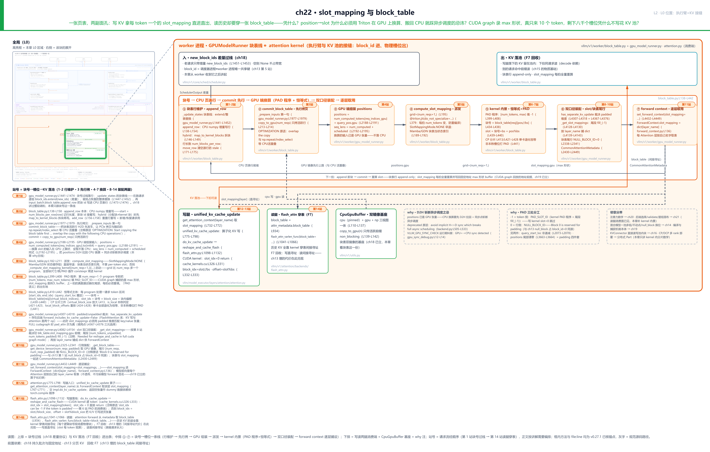
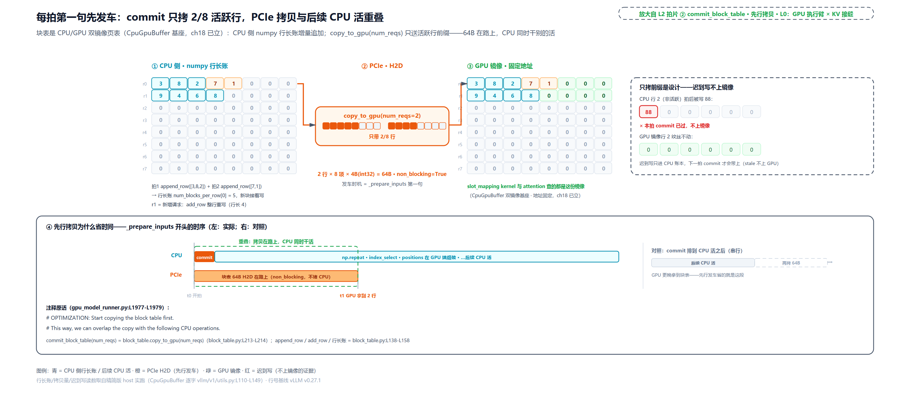
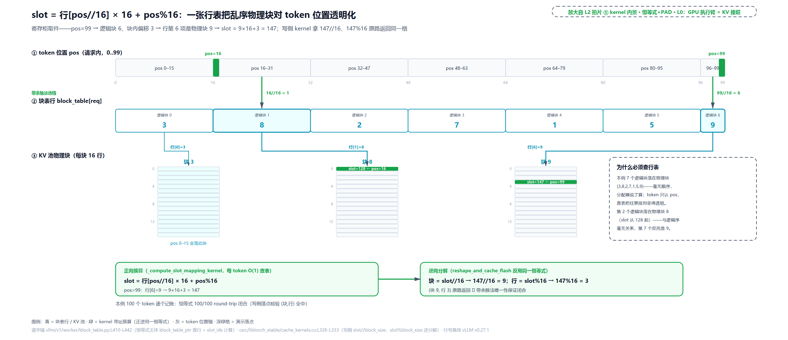
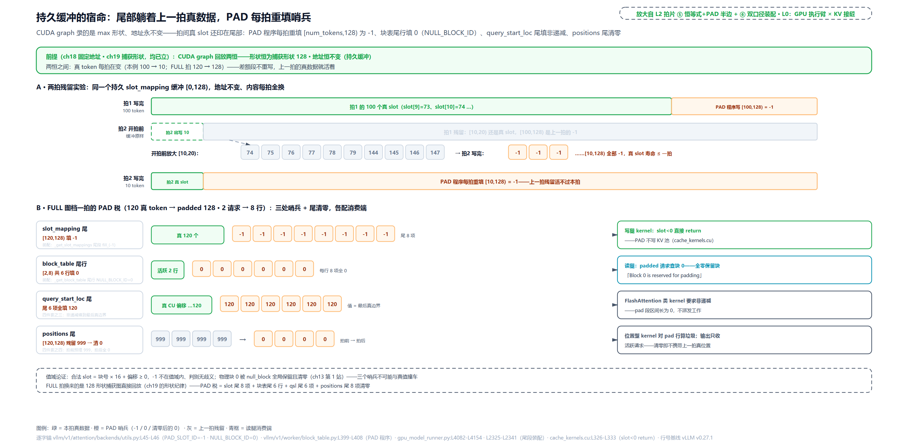
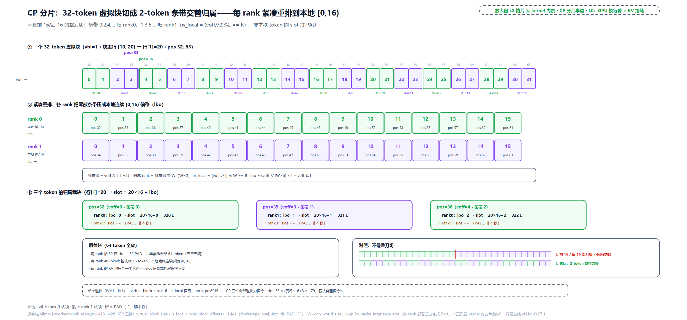
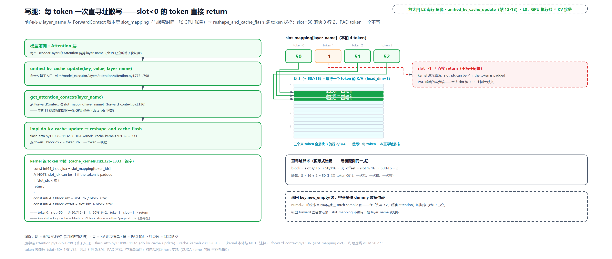
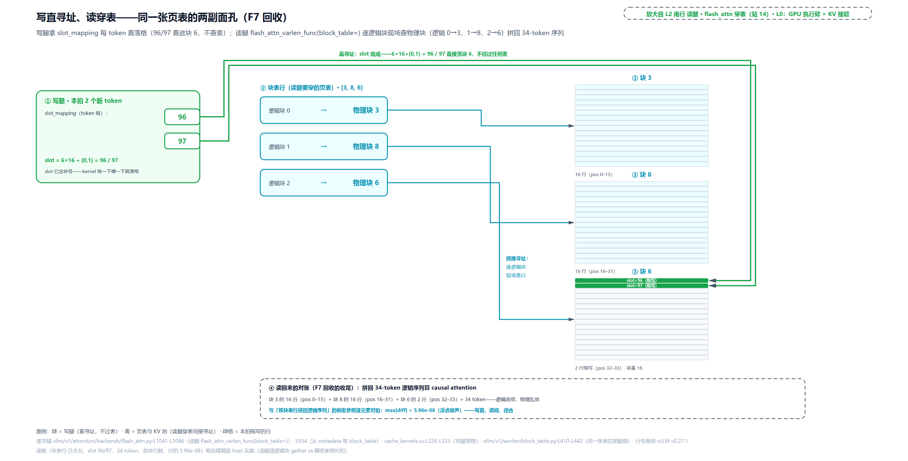

# 第 22 章　slot_mapping 与 block_table

Part V 的口号是「GPU 不等 Python」。走到这里，执行臂上层的骨架（[第 17 章](../../ch17-executor-worker-model-runner/narrative/chapter.md)）、每拍喂什么的持久批次（[第 18 章](../../ch18-persistent-batch-fixed-addresses/narrative/chapter.md)）、以什么形态执行的编译与捕获（[第 19 章](../../ch19-compile-capture/narrative/chapter.md)）、注意力本身的数学与后端选择（前两章）都立完了，只剩最后一条线没接上：调度器发过来的 block_id，到底怎么变成 GPU 上的物理槽位？这条线上挤着三个真问题。其一，CUDA graph 录的是 max 形状的活：设 `max_num_batched_tokens=8192`（说明性取值），可真实的一拍常常只来十来个 token，图回放起来多出来的八千多个槽位凭什么不把 KV 池写花？其二，把 position 到 slot 的换算搬回 CPU 用 numpy 算完再拷过去，代码好写十倍，vLLM 为什么宁肯写一个 Triton kernel 也绝不这么做？其三，同一张页表为什么长出两副面孔：写 KV 的 kernel 拿着每 token 一个的 `slot_mapping` 直进直出，读历史的 attention 却必须穿每请求一张的 `block_table` 间接寻址？三个问题的答案系在同一条线上，主战场是 `vllm/v1/worker/block_table.py`。

## 你在这里



> *图注：本章放大的是[第 1 章](../../ch01-vllm-v1-in-one-map/narrative/chapter.md) L0 图中间绿色「GPU 执行臂」列的**最下沿**，即执行臂与 KV 池的接缝。[第 13 章](../../ch13-paged-kv/narrative/chapter.md)从 KV 账本那头走到过这里（worker 镜像与槽位换算是它第 7 站与第 9 站），但当时只给了单卡形态的简写；本章把这条接缝整个打开：block_id 进、物理槽位出、KV 落池。上排进出两条线：左入是[第 18 章](../../ch18-persistent-batch-fixed-addresses/narrative/chapter.md)拆过的 new_block_ids 差量过线，右出是 KV 落池（分页伏笔的回收点）；中排 ①-⑦ 是块号到槽位的一条线（行维护 → 先行拷贝 → GPU 端组装 → 派发 → kernel 内景 → 双口径装配 → 逐层铺设），下排是写读两条腿的消费端与 CpuGpuBuffer 基座。站号 1-14 = 块号→槽位→KV 落池流经代码的顺序（第 1-2 站 CPU 行维护、第 3 站先行拷贝、第 4-7 站 GPU 换算、第 8-11 站装配、第 12-14 站两腿消费），正文按讲解需要编排、不必照站号读。*

读法建议：想知道「凭什么不能搬回 CPU 算」，从[「一句 .cpu() 的价钱」](#为什么换算必须在-gpu一句-cpu-的价钱)读起；只想看恒等式与它的逆运算，跳[「恒等式与它的逆运算」](#kernel-主景一恒等式与它的逆运算)；被 PAD 哨兵绕晕的，直奔[「PAD 程序与两个哨兵」](#kernel-主景二pad-程序与两个哨兵)；关心多卡分片那几行数学的，看[「CP 分片不是整刀切」](#kernel-主景三cp-分片不是整刀切)；想知道 slot_mapping 到底开多宽、两副面孔差在哪，读[「双口径」](#双口径slot_mapping-到底开多宽)与[「写腿」](#写腿每个-token-一次直寻址)、[「读腿」](#读腿穿表间接寻址分页的账单在此结清)；混合模型的大箱换小箱、Mamba 的状态索引，在[「变体与边界」](#变体与边界块还有别的尺寸表还有别的用法)；想跟全程，按序读。

照例交代取证环境，全章数值表通用：本章实测来自按 v0.27.1 只做减法抽出的配套精简版，在 host 上实跑。Triton kernel 与两个 CUDA 算子走逐行同构的 CPU 镜像（同一恒等式、同一 PAD 尾、同一变量名，设备侧分支逐字保留；同一套换算逻辑已在真 GPU 上对拍逐位一致）。凡性能量级（如 kernel launch 的微秒级）是说明性量级，不是本章实测；凡表内数字都是实跑输出，一个没改。

## 为什么换算必须在 GPU：一句 .cpu() 的价钱

先站到 L0 图执行臂与 KV 池的接缝上，看这一拍换算的输入从哪来。[第 18 章](../../ch18-persistent-batch-fixed-addresses/narrative/chapter.md)跟 `_prepare_inputs` 走过这一段（整段嵌到 L2209、讲解停在 positions）。positions 就是在这里组装的，组装完顺手把换算也派发了：

```python
# vllm/v1/worker/gpu_model_runner.py:L2188-L2201 · GPUModelRunner._prepare_inputs
        self.positions[:total_num_scheduled_tokens] = (
            self.num_computed_tokens[req_indices_gpu].to(torch.int64)  # GPU 张量：每请求已算数  # L2189
            + self.query_pos.gpu[:total_num_scheduled_tokens]          # GPU 张量：请求内位置   # L2190
        )
        self.seq_lens[:num_reqs] = (
            self.num_computed_tokens[:num_reqs] + num_scheduled_tokens_gpu
        )
        self.seq_lens[num_reqs:].fill_(0)                              # 尾部 pad 0，老规矩    # L2195

        self.input_batch.block_table.compute_slot_mapping(             # 张量进、张量出，不落 CPU  # L2197
            num_reqs,
            self.query_start_loc.gpu[: num_reqs + 1],
            self.positions[:total_num_scheduled_tokens],
        )
```

注意 L2189-L2190 的两个加数**都已经在 GPU 上**：`num_computed_tokens` 是早就上载的 GPU 镜像，`query_pos.gpu` 是请求内位置的 GPU 缓冲。positions 这个「和」自出生起就没在 CPU 待过。

现在把 why 链摆全。**旧设计**：在 CPU 上用 numpy 把每个（请求、位置）到槽位的映射算好，再整段拷上 GPU，代码直白：别的系统不少就这么干，vLLM v1 自己也不是生来就这么讲究：直到 2026 年 3 月的 #32951 之前，`compute_slot_mapping` 就是 CPU numpy 查表、外加一句 `commit_slot_mapping` 的 H2D 拷贝；把它换成 Triton kernel，与零气泡异步调度（调度与执行的重叠不再留等待空窗，[第 12 章](../../ch12-async-scheduling/narrative/chapter.md)立过的重叠心跳的进一步收紧）是同一次落地。**痛点**分两笔。第一笔是致命的：CPU 算法得先把 positions 从 GPU 拉回来，而 PyTorch 官方 CUDA 语义文档写得很直白："PyTorch automatically performs necessary synchronization when copying data between CPU and GPU or between two GPUs"（CPU 与 GPU 之间拷数据时 PyTorch 自动做必要的同步）。`.cpu()` 这一句不是「拿个数」，是让 CPU 原地站住：按流（stream）的语义，GPU 上的操作按宿主提交的顺序执行，positions 是前面一串 kernel 的产物，排在它们之后；读它的这次拷贝必须等生产者全部跑完、数据落地才轮到自己，而 PyTorch 默认还要把「拷贝完成」也等掉：**读一个 GPU 张量，等于排空它身后整条流水**。官方调优指南干脆给了黑名单，开头就是 "Avoid unnecessary synchronizations, to let the CPU run ahead of the accelerator as much as possible"（避免不必要的同步，让 CPU 尽量跑在加速器前面），点名六类强制同步：`print(cuda_tensor)`、`cuda_tensor.item()`、`cuda_tensor.cpu()`、`.to(device)`（与 `.cpu()` 同类）、`cuda_tensor.nonzero()`、以及最阴的一类：把 CUDA 张量放进 Python 控制流，比如 `if (cuda_tensor != 0).all()`：一行拷贝都没写，Python 要布尔真值，同步照样发生。两拍对照一眼见血（说明性）：

```python
# 说明性对照：同一笔换算的两种命运
launch_kernel(block_table_gpu, positions_gpu, slot_mapping_gpu, n)  # 发射即返回，CPU 去编排下一拍
pos = positions_gpu.cpu()   # 站住：等生产者跑完 + 拷贝落地，重叠清零（每拍一次）
```

这笔账在本书不是新知识：[第 12 章](../../ch12-async-scheduling/narrative/chapter.md)立异步调度时，就把这条纪律写成了两处白纸黑字：注意力后端公共接口上那两个 deprecated 属性的措辞（"Prefer using device seq_lens directly to avoid implicit H<>D sync which breaks full async scheduling"，`vllm/v1/attention/backend.py:L505-L533`），以及 v0.27 的运行期纠察 `VLLM_GPU_SYNC_CHECK`（warmup 之后 `execute_model` 里任何 CPU↔GPU 同步直接抛错）。[第 12 章](../../ch12-async-scheduling/narrative/chapter.md)当时留了话：后面讲 slot_mapping 与 block_table 的那章会遇到这条纪律最著名的反面案例，就是这里。第二笔痛点是量：O(token 数) 的 Python/numpy 循环每拍都付，三笔开销（循环、D2H 同步、H2D 回拷）对一次异步 kernel launch。

**v1 方案**就是本章主角：换算本身搬上 GPU，用 Triton 写成 kernel，positions 进、slot_mapping 出，全程不落 CPU。**代价**也要先亮出来：一次 kernel launch 有固定的微秒级开销（说明性量级，小 batch 也是它）；kernel 内逻辑被上下文并行分片和混合布局细分搞复杂了（后面「CP 分片」与「变体与边界」两节正面展开）；还有一笔贯穿全栈的：PAD 的值语义，`PAD_SLOT_ID`（-1）与 `NULL_BLOCK_ID`（0）各有分工，哪个 kernel 吃哪个 pad 要记牢（「PAD 程序」一节专讲）。vLLM 为什么认这笔账？回看痛点第一笔：不落 CPU 省下的不只是 Python 循环，是整条同步链：异步调度的重叠心跳就建在「CPU 抢跑」上，一处 `.cpu()` 就把它打回串行。

## CPU 这边的账本：五原语与先行拷贝

接缝的 CPU 半边是一张账本（站号轨道第 1-3 站）。`BlockTable`（`vllm/v1/worker/block_table.py`）本体是 `[max_num_reqs, max_num_blocks_per_req]` 的 int32 表：每行一个请求、每项一个物理块号，载体是[第 18 章](../../ch18-persistent-batch-fixed-addresses/narrative/chapter.md)立过的 `CpuGpuBuffer`（`vllm/v1/utils.py:L110`）：CPU 侧 pinned 张量 + GPU 侧镜像 + numpy 视图三件一体，`copy_to_gpu(n)` 只传活跃前缀、`non_blocking=True`。另配一根 int32 的行长账 `num_blocks_per_row`，记每行实际写了几项（真正用 int64 载体的是后文 slot_mapping 缓冲，block_table.py:L110-L111；槽位号要盛下「块号 × 块大小」的乘积，位宽给得更宽）。

行怎么写？[第 18 章](../../ch18-persistent-batch-fixed-addresses/narrative/chapter.md)在差量调和里见过调用点：老请求 block_ids.extend 增量、被抢占恢复的整表替换，然后 `append_row(new_block_ids, req_index)` 落行（`gpu_model_runner.py:L1473-L1474`）。本体值得整段读：

```python
# vllm/v1/worker/block_table.py:L138-L180
    def append_row(
        self,
        block_ids: list[int],
        row_idx: int,
    ) -> None:
        if not block_ids:
            return

        if self.use_hybrid_blocks:
            block_ids = self.map_to_kernel_blocks(          # 分配块≠kernel 块时先拆块，见「变体与边界」
                np.array(block_ids), self.blocks_per_kv_block, self._kernel_block_arange
            )

        num_blocks = len(block_ids)
        start = self.num_blocks_per_row[row_idx]            # 行长账：从上次写到的地方接着写
        self.num_blocks_per_row[row_idx] += num_blocks
        self.block_table.np[row_idx, start : start + num_blocks] = block_ids

    def add_row(self, block_ids: list[int], row_idx: int) -> None:
        self.num_blocks_per_row[row_idx] = 0                # 重置重写：新增/恢复请求用
        self.append_row(block_ids, row_idx)

    def clear_row(self, row_idx: int) -> None:
        num_blocks = self.num_blocks_per_row[row_idx]
        if num_blocks > 0:
            self.block_table.np[row_idx, :num_blocks] = 0
        self.num_blocks_per_row[row_idx] = 0

    def move_row(self, src: int, tgt: int) -> None:
        num_blocks = self.num_blocks_per_row[src]
        block_table_np = self.block_table.np
        block_table_np[tgt, :num_blocks] = block_table_np[src, :num_blocks]
        self.num_blocks_per_row[tgt] = num_blocks
        # Clear the vacated source row: dummy-run batches dereference stale
        # rows as mamba state slots and write state in place there, possibly
        # after the blocks have been freed and reallocated.
        block_table_np[src, :num_blocks] = 0                # 搬完清空源行
        self.num_blocks_per_row[src] = 0

    def swap_row(self, src: int, tgt: int) -> None:
        src_tgt, tgt_src = [src, tgt], [tgt, src]
        self.num_blocks_per_row[src_tgt] = self.num_blocks_per_row[tgt_src]
        self.block_table.np[src_tgt] = self.block_table.np[tgt_src]
```

五个原语各管一段生命周期。`append_row` 是差量追加：行长账记着「这行写到第几项」，新块号接着写，一拍只搬增量；调度器那边 `new_block_ids` 本来就只发增量电报（`vllm/v1/core/sched/scheduler.py:L1451-L1453`，[第 18 章](../../ch18-persistent-batch-fixed-addresses/narrative/chapter.md)拆过差量协议，block_id 是两个进程之间唯一的共享键，[第 13 章](../../ch13-paged-kv/narrative/chapter.md)立过）。`add_row` 先把行长账归零再追加，等于整行重写，新增或被抢占后恢复的请求用（恢复时块表是全新的，[第 18 章](../../ch18-persistent-batch-fixed-addresses/narrative/chapter.md)的三分支）。`clear_row` 是退房清行。`swap_row` 给注意力后端重排批次用（有的后端如 FlashInfer，靠 `reorder_batch_threshold` 开关声明，要求请求按阶段分组：decode、extend、prefill 各归各区，重排就是行对换）。`move_row` 给批次压实（condense）搬行。它藏着 v0.27.1 一个真实的 bugfix（#49757），注释原文说得很清楚：搬完必须清空源行，因为 dummy-run 批（CUDA graph 捕获期喂的假批）会把陈旧行**当成 Mamba 状态槽**在原位写状态；而那些块可能早已被释放、又分给了别的请求。不清源，假批就会往已经属于别人的块里写状态数据。

账本攒了一拍，什么时候上 GPU？[第 13 章](../../ch13-paged-kv/narrative/chapter.md)见过那三行：`_prepare_inputs` 开场第一句实事就是 `commit_block_table(num_reqs)`（`gpu_model_runner.py:L1977-L1979`，注释原话 "OPTIMIZATION: Start copying the block table first. This way, we can overlap the copy with the following CPU operations"），commit 就是 `copy_to_gpu(num_reqs)`：只拷活跃行，本拍没上场的请求一个字节都不搬。本章补上时序的完整样子：



> *图注：三泳道（`vllm/v1/worker/block_table.py:L138-L154` 与 `L213-L214`）。CPU 道上 `append_row` 差量追加：请求 r0 两拍分别拿到 [3,8,2] 和 [7,1]，行长账接成 5 项；PCIe 道上 `copy_to_gpu(2)` 只带 2/8 行、64 字节（int32 每行 8 项），并且在 `_prepare_inputs` 第一句发车，路上时间与后续 CPU 活（np.repeat、index_select 这些）重叠；GPU 道拿到活跃行镜像，供后面的换算 kernel 与 attention 查表。右下角是「只拷前缀」的反证：非活跃行在 CPU 侧后写了 88，GPU 镜像纹丝不动。没排上就不拷，是设计不是偷懒。*

慢车道先发车，是[第 12 章](../../ch12-async-scheduling/narrative/chapter.md)重叠心跳在块表上的又一次落地。**只拷活跃行为什么安全？** 边界在读侧：换算 kernel 每拍只派 `num_reqs` 个程序、也就只读前 `num_reqs` 行；attention 拿表也只取活跃区间，padded 尾行由装配处补 0（见后文[「PAD 程序」](#kernel-主景二pad-程序与两个哨兵)节）。非活跃行没有消费方：CPU 侧对它的任何后写（图右下角的 88）都碰不到 GPU 镜像。活跃行这边则整行随 commit 同步：行长账记几项，读侧就只会查前几项（请求的历史长度决定查表深度），两边永远对得上。而快车道（换算本身）为什么必须整个住在 GPU 端，上一节已经算过账，接下来就进 kernel。

## kernel 主景一：恒等式与它的逆运算

现在走到 L0 图接缝的 GPU 半边，站号轨道第 4-7 站。派发入口全长这样：

```python
# vllm/v1/worker/block_table.py:L182-L211
    def compute_slot_mapping(
        self,
        num_reqs: int,
        query_start_loc: torch.Tensor,
        positions: torch.Tensor,
    ) -> None:
        num_tokens = positions.shape[0]
        if self.slot_mapping_mode == SlotMappingMode.NONE:
            # Mamba/GDN groups consume the block table as recurrent state
            # indices and do not use per-token slot mappings.
            return                                        # Mamba/GDN 组早退，见「变体与边界」
        assert self.slot_mapping_mode == SlotMappingMode.TOKEN_TO_KV_SLOT

        _compute_slot_mapping_kernel[(num_reqs + 1,)](    # grid：每请求一个程序，多出一个专职 PAD  # L195
            num_tokens,
            self.max_num_batched_tokens,
            query_start_loc,
            positions,
            self.block_table.gpu,
            self.block_table.gpu.stride(0),
            self.block_size,
            self.slot_mapping.gpu,
            KV_CACHE_BLOCK_SIZE=self.kv_cache_block_size,       # 全部块尺寸/卡编号/PAD 值
            BLOCKS_PER_KV_BLOCK=self.blocks_per_kv_block,       # 作 constexpr 烤进 kernel
            TOTAL_CP_WORLD_SIZE=self.dcp_world_size,            # （喂的是 dcp 组，      # L206
            TOTAL_CP_RANK=self.dcp_rank,                        #  见「CP 分片」）       # L207
            CP_KV_CACHE_INTERLEAVE_SIZE=self.cp_kv_cache_interleave_size,
            PAD_ID=PAD_SLOT_ID,
            BLOCK_SIZE=1024,
        )
```

[第 13 章](../../ch13-paged-kv/narrative/chapter.md)嵌过这份派发的简写（constexpr 当时折叠了），也用五个词立过 Triton 的语言底座（`@triton.jit`、`tl.program_id`、`tl.arange` + mask、`tl.load`/`tl.store`、grid）。本章把 kernel 全文铺开。[第 13 章](../../ch13-paged-kv/narrative/chapter.md)当时按住了三样：CP 分片原貌、do_not_specialize、PAD 语义的深水区。三样都在这里。补一句 constexpr 的意思：标了 `tl.constexpr` 的形参是编译期常量，调用时不再随值变化、编译器可以直接折叠，所以全部块尺寸、卡编号（rank）与 PAD 值都以实参关键字烤进 kernel，每拍变化的只有前两个标量（这正是后文 do_not_specialize 要护的对象）。

```python
# vllm/v1/worker/block_table.py:L379-L442
@triton.jit(do_not_specialize=["num_tokens", "max_num_tokens"])   # 防逐拍重编译，见下文    # L379
def _compute_slot_mapping_kernel(
    num_tokens,
    max_num_tokens,
    query_start_loc_ptr,  # [num_reqs + 1], int32
    positions_ptr,  # [num_tokens], int64
    block_table_ptr,  # [max_num_reqs, max_num_blocks_per_req], int32 (flat)
    block_table_stride,  # max_num_blocks_per_req
    block_size,
    slot_mapping_ptr,  # [max_num_tokens], int64
    KV_CACHE_BLOCK_SIZE: tl.constexpr,
    BLOCKS_PER_KV_BLOCK: tl.constexpr,
    TOTAL_CP_WORLD_SIZE: tl.constexpr,
    TOTAL_CP_RANK: tl.constexpr,
    CP_KV_CACHE_INTERLEAVE_SIZE: tl.constexpr,
    PAD_ID: tl.constexpr,
    BLOCK_SIZE: tl.constexpr,
):
    req_idx = tl.program_id(0)                                # 我是第几个程序实例           # L397

    if req_idx == tl.num_programs(0) - 1:
        # Pad remaining slots for CUDA graph compatibility.
        for i in range(num_tokens, max_num_tokens, BLOCK_SIZE):   # 最后一个程序：       # L401
            offsets = i + tl.arange(0, BLOCK_SIZE)                # 尾部 [n, max)        # L402
            tl.store(
                slot_mapping_ptr + offsets,
                PAD_ID,                                       # 全填 -1              # L405
                mask=offsets < max_num_tokens,
            )
        return

    start_idx = tl.load(query_start_loc_ptr + req_idx).to(tl.int64)     # 我的 token 区间   # L410
    end_idx = tl.load(query_start_loc_ptr + req_idx + 1).to(tl.int64)

    virtual_block_size = KV_CACHE_BLOCK_SIZE * TOTAL_CP_WORLD_SIZE     # CP 三件之一        # L413
    row_offset = req_idx * block_table_stride
    for i in range(start_idx, end_idx, BLOCK_SIZE):
        offsets = i + tl.arange(0, BLOCK_SIZE)
        mask = offsets < end_idx
        pos = tl.load(positions_ptr + offsets, mask=mask, other=0)      # 读位置            # L418
        virtual_block_indices = pos // virtual_block_size
        virtual_block_offsets = pos - virtual_block_indices * virtual_block_size
        is_local = (                                            # CP 三件之二：本 rank 判定   # L421
            virtual_block_offsets // CP_KV_CACHE_INTERLEAVE_SIZE
        ) % TOTAL_CP_WORLD_SIZE == TOTAL_CP_RANK
        local_block_offsets = (                                 # CP 三件之三：偏移重排   # L424
            virtual_block_offsets // (TOTAL_CP_WORLD_SIZE * CP_KV_CACHE_INTERLEAVE_SIZE)
        ) * CP_KV_CACHE_INTERLEAVE_SIZE + (
            virtual_block_offsets % CP_KV_CACHE_INTERLEAVE_SIZE
        )

        block_indices = (
            virtual_block_indices * BLOCKS_PER_KV_BLOCK        # 混合布局细分乘子        # L431
            + local_block_offsets // block_size
        )
        block_numbers = tl.load(                                # 查页表拿块号            # L434
            block_table_ptr + row_offset + block_indices,
            mask=mask & is_local,
            other=0,
        ).to(tl.int64)
        slot_offsets = local_block_offsets % block_size         # 块内偏移                # L439
        slot_ids = block_numbers * block_size + slot_offsets    # ★ 恒等式本体           # L440
        slot_ids = tl.where(is_local, slot_ids, PAD_ID)         # 非本 rank 槽位打 PAD        # L441
        tl.store(slot_mapping_ptr + offsets, slot_ids, mask=mask)  # 写槽位表             # L442
```

**组织方式**先看清（收银台的比喻一句话点破：一个收银台管一队顾客，多出来的那一位不接客）。grid 是 `(num_reqs + 1,)`：前 `num_reqs` 个程序实例各领一个请求的 token 区间（区间由 `query_start_loc` 的相邻两项圈定（`[start_idx, end_idx)`，L410-L411）；区间内按 `BLOCK_SIZE=1024` 一块一块循环。多出来的最后一个程序（`req_idx == tl.num_programs(0) - 1`；`num_programs` 是启动时 grid 里程序的总数，这里就是 num_reqs + 1）不领请求，专职把 `[num_tokens, max_num_tokens)` 填成 PAD；它的故事下一节讲。两类程序的分工合起来保证持久缓冲**每拍无重无漏全量重写**：`query_start_loc` 单调非递减且首项为 0（`_prepare_inputs` 在 `gpu_model_runner.py:L2073-L2078` 显式保非递减，注释说 "kernels like FlashAttention requires that"），program i 写 `[qsl[i], qsl[i+1])`，区间首尾相接且互斥、并集恰为 `[0, num_tokens)`；最后那个 PAD 程序写 `[num_tokens, max)`，与前述并集不相交。每个位置每拍被写恰好一次，上一拍的残留不可能活过这一拍。实跑两拍记账（拍 1 是 chunked prefill：请求 r0 一口气来 100 个 token（位置 0..99）、r1 是已算过 100 个的续算请求、本拍再来 20 个（位置 100..119）；拍 2 双 decode 各 1 个；`max_num_batched_tokens=128`；块表行取 r0=[3,8,2,7,1,5,9]（下文恒等式表还会用它算个遍）、r1 的行[6]=6、行[7]=8，两拍的位置只穿到这两项）：

<!-- trace: m2 -->
| 拍 | program_id | 角色 | token 区间 [start,end) | 区间长 | tile 循环轮数（BLOCK_SIZE=1024） | 产出 | 判定 |
|---|---|---|---|---|---|---|---|
| 拍1 | 0 | 请求 r0 恒等式 | [0, 100) | 100 | 1 | slot[0]=48 … slot[99]=147 | 真 slot |
| 拍1 | 1 | 请求 r1 恒等式 | [100, 120) | 20 | 1 | slot[100]=100 … slot[119]=135 | 真 slot |
| 拍1 | 2 | PAD 程序 | [120, 128) | 8 | 1 | slot[120..127]=-1 | 哨兵 |
| 拍2 | 0 | 请求 r0 恒等式 | [0, 1) | 1 | 1 | slot[0]=148（pos=100） | 真 slot |
| 拍2 | 1 | 请求 r1 恒等式 | [1, 2) | 1 | 1 | slot[1]=136（pos=120） | 真 slot |
| 拍2 | 2 | PAD 程序 | [2, 128) | 126 | 1 | slot[2..127] 全部重填 -1 | 哨兵 |

两拍的 num_tokens 分别是 120 与 2。num_tokens 正是那个每拍都在变、do_not_specialize 名单要护的头号标量（另一项 max_num_tokens 本例两拍恒 128，取值随部署配置走，也一起进名单）。grid 全程 3 个程序、每区间一轮 tile，整件事一次 launch 落定。表里还有一处容易看岔的巧合：拍 1 r1 行的 slot[100]=100 与下标同值。这不是「slot 恒等于下标」，是 pos=100 的逻辑块号恰为 6、r1 行[6] 登记的物理块也恰是 6，6×16+4=100 撞了个正着；拍 2 同一个 pos=100 查 r0 的行（行[6]=9），slot=148，真值就露出来了。

**恒等式**就是标了 ★ 的 L440。直觉一句：每个 token 的存根上写着「第几个柜架、架内第几格」；柜架在库房里的实际摆放是乱的，柜台（块表行）查一眼把逻辑柜架号换成物理柜号；柜号乘每柜格数加格内序号，就是槽位。单卡形态（`TOTAL_CP_WORLD_SIZE=1`、`CP_KV_CACHE_INTERLEAVE_SIZE=1`）下 L413/L421-L428 全部退化：`virtual_block_size` 就是 block_size、`is_local` 恒真、`local_block_offsets` 就是 `pos % block_size`。[第 13 章](../../ch13-paged-kv/narrative/chapter.md)给的正是这个烘干后的样子。写出来：

```text
slot = block_table[req][pos // block_size] × block_size + pos % block_size
```

位置除以块大小得逻辑块号，查块表行拿到物理块号，块号乘块大小加块内偏移，摊平成全局槽位，正是 OS 页表那笔「虚页号查页表得页帧号」的翻译（[第 13 章](../../ch13-paged-kv/narrative/chapter.md)立过类比，行主序摊平与带余除法的算术底座也在那一章）。本章把表加宽，并让写腿 kernel 现场把每个 slot **拆回去**，补上恒等式的另一半（以前只口头说过）：



> *图注：恒等式与它的逆运算（`vllm/v1/worker/block_table.py:L434-L440` 与 `csrc/libtorch_stable/cache_kernels.cu:L332-L333`）。块表行 [3,8,2,7,1,5,9] 七个逻辑块对应七个乱序的物理块。pos=99：99//16=6 是逻辑块、99%16=3 是块内偏移，查行第 6 项得物理块 9，slot=9×16+3=147；写腿 kernel 拿着 147 反过来 147//16=9、147%16=3，回到同一格。注意第 1 个逻辑块落在物理块 3（slot 从 48 起）而第 2 个落在物理块 8（slot 从 128 起）：物理与逻辑毫无关系，一张行表把任意排列对 token 位置透明化。*

100-token prompt 全量跑一遍，右三列是写腿 kernel 的逆分解（两列）与落点核验：

<!-- trace: m1 -->
| token 位置 pos | 逻辑块 = pos//16 | 块内偏移 = pos%16 | 页表行[逻辑块]（物理块） | slot = 物理块×16+偏移 | 写侧逆分解 slot//16 | 写侧逆分解 slot%16 | 写腿落点核验（块，行） |
|---|---|---|---|---|---|---|---|
| pos=0 | 0 | 0 | 行[0]=3 | slot=48 | 3 | 0 | (3, 0) ✓ |
| pos=15 | 0 | 15 | 行[0]=3 | slot=63 | 3 | 15 | (3, 15) ✓ |
| pos=16 | 1 | 0 | 行[1]=8 | slot=128 | 8 | 0 | (8, 0) ✓ |
| pos=32 | 2 | 0 | 行[2]=2 | slot=32 | 2 | 0 | (2, 0) ✓ |
| pos=80 | 5 | 0 | 行[5]=5 | slot=80 | 5 | 0 | (5, 0) ✓ |
| pos=99 | 6 | 3 | 行[6]=9 | slot=147 | 9 | 3 | (9, 3) ✓ |

正逆为什么必然闭合？一句论证：记物理块号 $`b \ge 0`$、偏移 $`o \in [0,16)`$，则 slot = b×16+o 且 0≤o<16 恰是 slot 的唯一带余除法表示。商余表示唯一，所以 slot//16 必回到 b、slot%16 必回到 o。实跑 100 个 token 全部 round-trip 成立，一个不漏。这条双向闭合是后面两腿消费的根基：写腿按 slot 直塞（本章[「写腿」](#写腿每个-token-一次直寻址)节看它的 CUDA kernel），读腿翻块表（[「读腿」](#读腿穿表间接寻址分页的账单在此结清)节），两条腿共用同一条恒等式。

**最后说装饰器那行**（L379）。它护的是另一个「每拍都在变」：标量实参的特化。Triton 的 JIT 会偷看传进来的每个整型实参，看两样：是不是等于 1、能不能被 16 整除（以 Triton v3.0.0 源码为准，`python/triton/runtime/jit.py`；官方 API 页对这套机制一行散文都没有，证据只能锚源码）。等于 1 的被当编译期常量折进去，死分支消除（if 条件在编译期已知、整段分支直接删掉）、循环展开（把循环摊成顺序指令、省掉每轮的循环开销）都敢做；被 16 整除的烙成对齐属性进 IR（中间表示，即编译器内部表示代码的形式，[第 19 章](../../ch19-compile-capture/narrative/chapter.md)说过 FX 是 PyTorch 的图中间表示，IR 就是这类东西的通称）；PyTorch 官方博客 dump 出的真实 Triton IR 里逐字可见 `%arg3: i32 {tt.divisibility = 16 : i32}`，编译器据此敢做向量化访存（一条指令同时搬多个数）。问题在**特化进缓存键**：键里记的是桶不是精确值，17、18、19 同属「两样都不占」桶、共用一份编译产物；但 num_tokens=1 是「等于 1」桶、=16 是「整除」桶、=17 是无特权桶，三把不同的键、三份编译产物，撞上新桶的那一拍要现场编译（JIT 编译流程与磁盘缓存是[第 19 章](../../ch19-compile-capture/narrative/chapter.md)立的），毫秒到秒级的停顿落在热路径上。对照一下（说明性）：

```python
# 说明性：特化桶与缓存键（语义按 Triton v3.0.0 源码核过）
@triton.jit                            # 无豁免
def k1(x_ptr, n): ...
@triton.jit(do_not_specialize=["n"])   # 本仓 kernel 的姿势
def k2(x_ptr, n): ...

k1[(1,)](x, 1)    # n==1 → 「等于 1」特化 → 缓存键 A → 编译第 1 次
k1[(1,)](x, 16)   # n%16==0 → 整除特化 → 键 B → 编译第 2 次
k1[(1,)](x, 17)   # 两样都不占 → 键 C → 编译第 3 次
k1[(1,)](x, 18)   # 与 17 同桶（键 C）→ 缓存命中，免编译
k2[(1,)](x, 1)    # n 已除名：任何值同一把键
k2[(1,)](x, 99)   # 命中同一份 kernel，零编译
```

若 n 是每拍在 {1, 16, 17+} 之间游走的 num_tokens，一个运行日就能把三把键全撞出来，每次首撞都在热路径上现场编译；`do_not_specialize` 把参数从特化（连带缓存键）里整体除名，全值一把键。这不是孤例招式，是仓库级纪律：`vllm/v1/worker/mamba_utils.py` 三处 `do_not_specialize=["num_reqs"]`、`vllm/v1/worker/utils.py` 一处 `["n_blocks"]`、vendored 在 vllm/third_party 的 flash_linear_attention（随 vllm 包内置的线性注意力库）里多处 `["T"]`/`["NB"]`，讲的就是「每拍可变的批量维标量一律除名特化」，连 warmup 基建里都有专门的函数去读 kernel 的这份标注。当前 main 分支这门语义仍在（特化实现下沉到了 C++，Python 侧只剩开关），门控跨版本稳定（[Triton jit 源码](https://github.com/triton-lang/triton/blob/v3.0.0/python/triton/runtime/jit.py)、[triton.jit API 页](https://triton-lang.org/main/python-api/generated/triton.jit.html)、[PyTorch 博客的 IR 物证](https://pytorch.org/blog/triton-kernel-compilation-stages/)）。

## kernel 主景二：PAD 程序与两个哨兵

回头看 kernel 开头那段（L399-L408），grid 多出来的那个程序。它为什么必须存在、为什么**每拍**都要跑？

根子在 [第 19 章](../../ch19-compile-capture/narrative/chapter.md)立的形状纪律：CUDA graph 录的是「对固定地址显存执行这串 kernel launch」，grid、指针全在捕获时烤死，回放不会重读张量的 shape 元数据。slot_mapping 是 `[max_num_batched_tokens]` 的**持久**缓冲：地址不变是回放命中的前提，但活跃前缀长度每拍不同。地址不能动、长度天天变，唯一的出路是：形状恒按 max 摆、尾部用「可跳过的哨兵」补齐。麻烦在于尾部不是空白：持久缓冲上一拍的**真数据**还躺在那里。剧场包场的比喻一句话：登记 128 座、今晚真观众只来 120，空座得放「留座」牌，而且昨晚的观众名单还印在册子尾部，每晚开演前必须重挂。实跑两拍把「残留」拍在案（拍 1 跑 100 个 token、拍 2 只跑 10 个；块表行 [4,9,8,7,6,3,5,2]）：

<!-- trace: m3 -->
| pad 值 | 侧 / 装配处 | 本例填充区间 | 消费端 | 安全理由 |
|---|---|---|---|---|
| -1 (PAD_SLOT_ID) | token 侧 · kernel PAD 程序（每拍重填） | 拍1 [100,128) / 拍2 [10,128) | 写腿 kernel：slot<0 直接 return | 合法 slot 恒 ≥0 |
| -1 (PAD_SLOT_ID) | token 侧 · _get_slot_mapping 尾段 fill_(-1) | FULL 拍 [120,128) | 同上（reshape_and_cache 跳写） | 同上 |
| 0 (NULL_BLOCK_ID) | 行侧 · _get_block_table 尾行 | [2,8) 共 6 行 | 读腿：padded 请求查块 0（全零保留块） | 块 0 全局保留（null_block，永不出租；来历见后文） |
| 120（尾部非递减值） | query_start_loc 尾部（四件套之三） | 尾部 6 项全填 120 | FA 类 kernel 要求非递减 | 值 = 最后一个真请求边界 |
| 0（清零） | positions 尾部（四件套之四） | [120,128) 拍前残留 999、拍后全 0 | 不携带上一拍真位置 | 清零即无信息 |

拍 2 开拍前，[10,20) 那段还躺着拍 1 的真 slot 74..79 与 144..147；PAD 程序跑完，全部变 -1。残留的寿命不超过一拍：这正是上一节那条「无重无漏覆盖」论证的直接后果。

两个取值为什么是 -1 和 0？这是**哨兵值**（sentinel value）手法：算法里约定一个特殊值，见到它就知道特殊状态到了（Wikipedia 的定义与别名：flag value / trip value / rogue value / dummy data）。铁律只有一条：取值必须保证与全部合法数据不撞；撞了就是信号与数据分不清的经典难题。你早就见过它：C 字符串末尾的 `\0` 不是文本，是「到头了」；Wikipedia 列的同构例（非负整数序列末尾放 -1 表示结束）与 PAD_SLOT_ID 的选择一模一样。安全语言里这套大多被 option 类型（强制显式处理「没有值」的类型）取代，但 GPU 的 int 张量里没有 option type：kernel 吃的是扁平整数、追求无分支批量访存，哨兵就是 GPU 数据布局的原生写法。本章两个哨兵对铁律的两种落地值得并排看：slot 的合法值域天然全非负（块号 ≥0、偏移 ≥0），**-1 免检**；块号的合法值域天然从 0 起，0 本来是合法块号，**不能直接当哨兵**，除非像 vLLM 这样先「把 0 号块让出来」：调度器的 null_block 从队头占走 block_id=0、永不出租（[第 13 章](../../ch13-paged-kv/narrative/chapter.md)第 1 站），于是块表尾行填 0 后，padded 请求去查也只读到一块全零。同一个手法、两个值域、两种实现选择：一个天然免检，一个要靠系统先让出一个值。

三处分工的地图（表中前三行）与配套两件（后两行）合计就是 [第 19 章](../../ch19-compile-capture/narrative/chapter.md)展示过的 padding 四件套，那里逐件配过消费方与实跑。本章补的是四件套里 slot_mapping 这件的两个落笔处及其分工：kernel 的 PAD 程序每拍把 `[num_tokens, max_num_batched_tokens)` 整段重刷（治持久缓冲的跨拍残留，**无论什么图档都跑**）；装配处 `_get_slot_mapping` 的尾段 `fill_(-1)` 再对切给 metadata 的精确口径补 `[num_tokens_unpadded, num_tokens_padded)`（`gpu_model_runner.py:L4128-L4130`，注释原话 "Needed for reshape_and_cache in full cuda graph mode"）。两处不冲突：哨兵是幂等的，多写一次仍是 -1。



> *图注：PAD 三处分工与残留实验（`vllm/v1/worker/block_table.py:L399-L408` 与 `gpu_model_runner.py` 三段）。上半是两拍残留实验：拍 1（100 token）→ slot_mapping 尾 [100,128) 填 -1；拍 2（10 token）开拍前 [10,20) 还印着拍 1 的真 slot 74..79、144..147，PAD 程序拍后全部重刷成 -1。「每拍重填」不是洁癖，是持久缓冲的必然要求。下半是 FULL 图档一拍的完整四件：真 120 token pad 到 128、2 请求 pad 到 8；slot 尾 8 项 -1、块表尾 [2,8) 行全 0（Block 0 is reserved for padding）、query_start_loc 尾部非递减填 120、positions 尾 [120,128) 由预埋的残留 999 清为 0。每个哨兵各配消费端的跳过逻辑：写腿 kernel 见 slot<0 直接 return，读腿 padded 请求查块 0 只读到全零。*

写腿消费哨兵的那一行，到[「写腿」](#写腿每个-token-一次直寻址)节的 CUDA kernel 里看原文。这里先把 PAD 语义的账结了：它不是四个孤立 trick，是同一个模式乘四个消费方，是「静态形状装载、动态语义使用」的桥，一头是 [第 19 章](../../ch19-compile-capture/narrative/chapter.md)的形状纪律，一头是每拍的真实批量。开篇第一问也在这里用实测收口：同一拍 FULL 图档跑完，真 token 的 KV 确实落进自己的物理块（r0 行首的块 3 被写），所有未分配的池块保持预填值、一个字节没动。空槽不写花 KV 池，是跑出来验证过的事实，不是推演。

## kernel 主景三：CP 分片不是整刀切

kernel 中段那三件（L413、L421-L423、L424-L428），单卡下全部退化为恒等，但它们不是死代码，是在给一套多卡部署打工：**DCP，解码上下文并行**（Decode Context Parallel）。

先说它解决什么。张量并行（TP，沿注意力头维把模型切开分给多卡）之后，KV cache 有一类模型切不动：MLA（DeepSeek 系的低秩注意力，KV 头只有一个）这类单 KV 头模型，沿头维没得切，KV cache 在每张卡上都是完整一份。vLLM 官方文档的定位句："The core of decode context parallel is how to shard the KV cache across GPUs."（解码上下文并行的核心是怎么把 KV cache 切到多卡），做法是 TP 之后沿 token 维再切一刀。切法是**交错**而不是连续两半，官方理由句也直白："We use an interleaving strategy to shard the KV cache along the T dimension, so that kv cache for future tokens can be naturally sharded along the T dimension."（交错切让未来新长的 KV 天然轮流派到各卡；decode 的 KV 是逐 token 长出来的，前一半归 rank0 那种整刀切会让新 token 全挤到同一侧）。归属公式与最小例来自落地 PR #23734："the kvcache for the token with token_idx i is stored on the GPU where dcp_rank == i % dcp_world_size"，例子里 rank0 存 0, 2, 4, 6, 8、rank1 存 1, 3, 5, 7。`-dcp` 旗标不增加卡数、只消 KV 冗余（官方口径 "does not increase the number of GPUs we need to launch, but just reduces the KV cache duplication"，取值范围 [1, tp_size/头数]；头数=KV 头数：TP 先按 KV 头把卡分组、组内各卡持同一份 KV，dcp 只能沿 token 维在组内再切，切到每组一张卡就是上限）。与它成对的是 PCP（prefill 侧的上下文并行，[第 17 章](../../ch17-executor-worker-model-runner/narrative/chapter.md)立过背景卡），两者同受旗标调度；多卡部署形态属分布式篇，本章只看 kernel 内的数学。

于是换算要多回答一层：「全局 token 归我吗？归我 → 它在本卡的局部号是多少？」直觉一句：不是前 16 张牌给 A、后 16 张给 B 的整刀切，而是一副 32 张的牌每次两张交替发给两家；每人把自己收到的对子按收到顺序紧凑码好，别人的牌一律记「过」。对照着 kernel 三件读。设世界大小 $`W`$（组内卡数）、本卡编号（rank）$`R`$、交错粒度 $`I`$（每 $`I`$ 个 token 一条小条带）：

- **件一（L413）**：`virtual_block_size = KV_CACHE_BLOCK_SIZE × W`，把 $`W`$ 个 rank 的块拼成一个虚拟大块。token 先在虚拟大块里定位：`vbi = pos // 虚拟块大小`、`voff = pos - vbi × 虚拟块大小`。为什么放大？每个 rank 的块表行只登记**本 rank 持有的那部分块**，$`W`$ 个 rank 的局部块拼起来才等于逻辑上的完整序列；虚拟大块就是那个「逻辑完整」的坐标系统。
- **件二（L421-L423）**：`is_local = (voff // I) % W == R`，虚拟块内按 $`I`$-token 条带**交替**归属，第 `voff // I` 号条带轮流派给各 rank。这就是「不是整刀切」的出处：32-token 的虚拟块（`block_size=16`、$`W=2`$）被切成 2-token 小条，0,2,4,… 号条带归 rank0，1,3,5,… 归 rank1。
- **件三（L424-L428）**：`local_block_offsets = (voff // (W×I)) × I + voff % I`，本 rank 拿到的零散条带按收到顺序**紧凑重排**成本地连续偏移。非本 rank 的 token，slot 直接打 PAD（L441 的 `tl.where` 按条件逐元素二选一：本 rank 给算出的 slot、非本 rank 给 -1）。

实跑走一遍（$`W=2`$、$`I=2`$、block_size=16 → 虚拟块 32 token；两 rank 各持块表行 [10,20]；只看第二个虚拟块 vbi=1、行内第 1 项=20）：

<!-- trace: m8 -->
| pos（vbi=1 段） | voff = pos-32 | 条带号 = voff//2 | 归属 rank = (voff//2)%2 | local_block_offsets | slot（rank0） | slot（rank1） |
|---|---|---|---|---|---|---|
| 32 | 0 | 0 | 0 | 0 | 320 | -1 |
| 33 | 1 | 0 | 0 | 1 | 321 | -1 |
| 34 | 2 | 1 | 1 | 0 | -1 | 320 |
| 35 | 3 | 1 | 1 | 1 | -1 | 321 |
| 36 | 4 | 2 | 0 | 2 | 322 | -1 |
| 37 | 5 | 2 | 0 | 3 | 323 | -1 |
| 38 | 6 | 3 | 1 | 2 | -1 | 322 |

pos=35（voff=3、条带 1）属 rank1，重排后本地偏移 1，slot = 20×16+1 = 321；pos=36（条带 2）回到 rank0。两个 rank 的 token 在全局序列里交错，在各自的本地坐标里却各自连续。



> *图注：交错分片三件（`vllm/v1/worker/block_table.py:L413-L428`）。一个 32-token 虚拟块按 2-token 条带交替涂色：条带 0,2,4,… 归 rank0、1,3,5,… 归 rank1（is_local = (voff//2)%2==R），不是前 16/后 16 的整刀切。每 rank 把自己的零散条带紧凑重排成本地连续 [0,16) 偏移（rank0 ← 32,33,36,37…、rank1 ← 34,35,38,39…），非本 rank 的 slot 打 PAD。64 个 token 里每 rank 恰好 32 真 slot + 32 PAD，每 rank 的 KV 池只存一半。*

三条性质可验。**归属唯一**：`voff = u×(W×I) + w×I + i`（u=虚拟块内大段号、w=条带归属、i=条带内偏移）由嵌套带余除法唯一分解，`w = (voff//I) % W` 恰选一个 rank。64 token 里 rank0 恰 32 真 + 32 PAD、rank1 同，无重无漏。**本地连续**：重排公式只依赖 (u,i)，同 rank 内不同 (u,i) 映到不同条带单元，每 rank 每 32-token 虚拟块恰得 16 个连续本地偏移 [0,16)，两 rank 合计 32，恰好铺满虚拟块。**单卡退化**：$`W=1`$、$`I=1`$ 时虚拟块大小=block_size、is_local 恒真、本地偏移=pos%block_size，三件全部坍缩成普通恒等式（实跑对照：单卡那次块表行取 [10,20,11,21]，pos=35 查行[2]=11、算出 179 = 11×16+3，与不分片一字不差）。同一个 kernel 服务所有部署形态，单卡用户不必知道这些行存在。

一处版本细节别看走眼：v0.27.1 里喂给 `TOTAL_CP_*` 的是 **dcp** 组：派发处 L206-L207 喂的是 `self.dcp_world_size` / `self.dcp_rank` 两个字段，值来自构造期 L129-L130 的 `get_dcp_group()`；PCP 组的 rank 也探测了（构造期 try/except）但存而不用：PCP 有自己的 manager，不走这套 slot 数学。

## 双口径：slot_mapping 到底开多宽

kernel 算完了，进入装配段（站号 8-11）。这里有一个此前各章都没展开的裁决：交给消费端的 slot_mapping，到底按真实 token 数开，还是按 padded 形状开？

由来要回指一下：[第 19 章](../../ch19-compile-capture/narrative/chapter.md)把 KV 写拆成独立算子时亮过一个语义开关 `forward_includes_kv_cache_update`（前向是否已含 KV 写）：基类默认 True，FlashAttentionBackend 改成 False（`vllm/v1/attention/backend.py:L67` 与 `vllm/v1/attention/backends/flash_attn.py:L86`）：CUDA 系后端的 KV 写与 attention 是**两个 op**，每层每拍各多一次分发。当时它只是「代价」栏的一句话；代价有下游后果，后果在本章兑现：

```python
# vllm/v1/worker/gpu_model_runner.py:L4307-L4318 · GPUModelRunner.execute_model
            # True if any attention backend handles KV cache update separately
            # from forward() (i.e., forward_includes_kv_cache_update=False). When true,
            # slot_mappings must use padded dimensions to match the key/value tensors.
            has_separate_kv_update = not all(
                all(
                    g.backend.forward_includes_kv_cache_update
                    for g in self.attn_groups[id]
                )
                for id, spec in enumerate(self.kv_cache_config.kv_cache_groups)
                if not isinstance(spec.kv_cache_spec, EncoderOnlyAttentionSpec)
            )
            pad_attn = cudagraph_mode == CUDAGraphMode.FULL
```

为什么 KV 写独立成 op 就必须 padded？往下看 `do_kv_cache_update` 收到的东西：FULL 图档下 key/value 张量按 padded 形状（如 128）铺：它们是要进 CUDA graph 的张量，形状在捕获时烤死（[第 19 章](../../ch19-compile-capture/narrative/chapter.md)立的回放条件：形状全等才命中）；slot_mapping 这一侧同样是要进图的输入，调用方根本拿不出「变长形状」可给，唯一给得出去的固定形状就是 padded 形状。而写 kernel 的网格按 **slot_mapping 的长度**开（下一节 woosuk 的 NOTE 原文）：捕获时若 slot_mapping 只给 120，烤死的网格就永远只写 120 行，真来 128 个 token 的那一拍，尾部 8 个 token 的 KV 静默丢失。所以只要「KV 写独立」或「FULL 图档」任一成立，slot_mappings 就得按 padded 口径给。裁决落地是个三元选择（`gpu_model_runner.py:L4367-L4376`）：`num_tokens_padded if pad_attn or has_separate_kv_update else num_tokens_unpadded`。同一份批量按四个组合实测（真实 120 token / 2 请求，FULL 捕获形状 128×8）：

<!-- trace: m7 -->
| 后端 | 图档 | has_separate_kv_update | pad_attn | 交给 _get_slot_mappings 的口径 | slot_mapping 长度 | 尾段 |
|---|---|---|---|---|---|---|
| FlashAttention（KV 写独立成 op） | NONE | True | False | padded 口径（本拍无图档 padding，padded=120） | 120 | 无 -1 尾段 |
| FlashAttention（KV 写独立成 op） | FULL | True | True | padded=128 | 128 | [120,128) 全 -1 |
| 默认后端（KV 写并入 forward） | FULL | False | True | padded=128 | 128 | [120,128) 全 -1 |
| 默认后端（KV 写并入 forward） | NONE | False | False | unpadded=120 | 120 | 无 -1 尾段 |

只有「默认后端 + 无图档」拿到 120 长度的 unpadded 口径，其余三种全 padded。注意 FlashAttention 后端**即使无图档也强制 padded**，因为它的 key/value 本来就按 padded 形状铺。开关的静态性保证这条裁决不抖：`forward_includes_kv_cache_update` 是类属性，构造后不变；`pad_attn` 由本拍 BatchDescriptor 查表结果决定（[第 19 章](../../ch19-compile-capture/narrative/chapter.md)的查表三出口）。padded ≥ unpadded 恒成立（捕获形状按分桶向上 pad），差额段非负、由哨兵补齐，无未定义间隙。

口径定了，装配本体是外层方法 `_get_slot_mappings`（`gpu_model_runner.py:L4082-L4154`；单复数不是笔误：它内部为每个 KV cache 组定义单数的 `_get_slot_mapping(kv_cache_gid)` 闭包、每组一调汇成 by_gid 字典）：

```python
# vllm/v1/worker/gpu_model_runner.py:L4113-L4143 · GPUModelRunner._get_slot_mappings
        def _get_slot_mapping(kv_cache_gid: int):
            # … 省略：assert 一行与 kv_cache_spec 取值三行；encoder-only 组的
            #       if 分支直接返回零向量表（torch.zeros），不进块表 ……
            else:
                blk_table = self.input_batch.block_table[kv_cache_gid]
                slot_mapping = blk_table.slot_mapping.gpu[:num_tokens_padded]   # 按口径切前缀  # L4126

            # Fill unused with -1. Needed for reshape_and_cache in full cuda
            # graph mode. `blk_table_tensor` -1 to match mamba PAD_SLOT_ID
            slot_mapping[num_tokens_unpadded:num_tokens_padded].fill_(-1)       # 尾段补哨兵    # L4130

            return slot_mapping

        slot_mappings_by_gid = {
            gid: _get_slot_mapping(gid)
            for gid, _ in enumerate(self.kv_cache_config.kv_cache_groups)
        }

        slot_mappings_by_layer: dict[str, torch.Tensor] = {}
        for gid, kv_cache_group in enumerate(self.kv_cache_config.kv_cache_groups):
            slot_mapping = slot_mappings_by_gid[gid]
            for layer_name in kv_cache_group.layer_names:
                slot_mappings_by_layer[layer_name] = slot_mapping     # 同一份张量铺成 dict  # L4143
```

三个动作：按口径切持久缓冲的前缀（L4126，注意切的是 `slot_mapping.gpu` 这个固定地址的 view）；尾段补 -1（L4130，[「PAD 程序」](#kernel-主景二pad-程序与两个哨兵)节那笔账的第二落笔处）；再按 `layer_name` 把同一份张量铺成 dict：同组的层共享一份，model 里每个 Attention 层按自己的层名取。块表这边对称地走 `_get_block_table`：取 GPU 镜像 `get_device_tensor(num_reqs_padded)`、尾行填 NULL_BLOCK_ID（`gpu_model_runner.py:L2325-L2341`，[第 13 章](../../ch13-paged-kv/narrative/chapter.md)嵌过全文）。两样连同 query_start_loc、seq_lens、positions 一起进 `CommonAttentionMetadata`（`gpu_model_runner.py:L2430-L2449`：`block_table_tensor=` 与 `slot_mapping=` 两个关键字参数并排）。读腿的表与写腿的索引在同一份元数据里过桥给全部注意力后端；那个 dataclass 上两个 deprecated 属性的措辞，就是[第 12 章](../../ch12-async-scheduling/narrative/chapter.md)引过的 D2H 禁忌成文。最后一站：`set_forward_context(slot_mapping=slot_mappings, …)`（`gpu_model_runner.py:L4432-L4449`）把 by-layer dict 装进线程局部的 ForwardContext（`vllm/forward_context.py:L136` 的 `slot_mapping` 字段）。机制本体（thread-local、算子按层名取、不污染模型 forward 签名）是[第 19 章](../../ch19-compile-capture/narrative/chapter.md)立的算子化纪律，此处只是 slot_mapping 这位乘客上车。

## 写腿：每个 token 一次直寻址

进前向，站号轨道第 12-13 站。模型里每个 Attention 层先调 `unified_kv_cache_update(key, value, layer_name)`；算子的来龙去脉（thread-local 取上下文、空张量回执保 torch.compile 的先写后读顺序）[第 19 章](../../ch19-compile-capture/narrative/chapter.md)拆完，本章顺着它走到终点：后端的 `do_kv_cache_update`。

```python
# vllm/v1/attention/backends/flash_attn.py:L1098-L1132
    def do_kv_cache_update(
        self,
        layer: torch.nn.Module,
        key: torch.Tensor,
        value: torch.Tensor,
        kv_cache: torch.Tensor,
        slot_mapping: torch.Tensor,
    ) -> None:
        if self.attn_type in (AttentionType.ENCODER_ONLY, AttentionType.ENCODER):
            # For encoder attention,
            # we use direct Q, K, V tensors without caching
            return                                              # encoder 注意力不落池

        # Scatter write into the KV cache using slot_mapping indices.
        # No TMA kernel is invoked here, so stride canonicalization is not needed.
        # (B, H, N, 2*D) -> ((B, N, H, D), (B, N, H, D))
        key_cache, value_cache = kv_cache.transpose(1, 2).split(self.head_size, dim=-1)

        # Reshape the input keys and values and store them in the cache.
        # Skip this if sharing KV cache with an earlier attention layer.
        # NOTE(woosuk): Here, key and value are padded while slot_mapping is
        # not padded. However, we don't need to do key[:num_actual_tokens]
        # and value[:num_actual_tokens] because the reshape_and_cache_flash
        # op uses the slot_mapping's shape to determine the number of
        # actual tokens.
        reshape_and_cache_flash(                                 # 逐 token 散写落池       # L1123
            key,
            value,
            key_cache,
            value_cache,
            slot_mapping,
            self.kv_cache_dtype,
            layer._k_scale,
            layer._v_scale,
        )
```

块内那两行注释里有两个生词，先交代：TMA（NVIDIA Hopper（H100 那一代 GPU 架构）起引入的硬件张量搬运单元）是另一类 kernel 用的搬运通道，用它的 kernel 对张量步长（stride，各行在显存里的间隔）有规范形式要求、得先做步长规范化（stride canonicalization）；本 kernel 不走 TMA，所以注释说「不需要」。两行是维护者备忘，不在本章线上。

woosuk 的 NOTE 正是上一节双口径裁决的对侧证词：key/value 可以是 padded 的（128 行），slot_mapping 不必跟着 pad，因为写 kernel **以 slot_mapping 的形状定 token 数**。NOTE 与裁决字面相反，账要当场对平：NOTE 写的「not padded」说的是无图档的拍（那时 padded 与 unpadded 同值，上面四组合表第一行的 120），字面成立；FULL 拍 slot_mapping 确实 pad 到 128，而 NOTE 点破的机制（kernel 以 slot_mapping 形状定 token 数、-1 段被跳过）恰是 padded 口径无害的原因。裁决与 NOTE 不矛盾：裁决说「图档下必须敢给 padded 形状」，NOTE 说「给了之后 kernel 自己会对齐真实批量」；后者正是前者敢 pad 的前提。这也顺带解释了 padded 口径下为什么敢让 key/value 带着垃圾行进 kernel：垃圾行对应的 slot 是 -1，kernel 见 -1 直接跳。看它本体（CUDA C++）：

```cpp
// csrc/libtorch_stable/cache_kernels.cu:L315-L342
__global__ void reshape_and_cache_flash_kernel(
    const scalar_t* __restrict__ key,    // [num_tokens, num_heads, head_size]
    const scalar_t* __restrict__ value,  // [num_tokens, num_heads, head_size]
    cache_t* __restrict__ key_cache,     // NHD or HND, shape see comments below
    cache_t* __restrict__ value_cache,   // same above
    const int64_t* __restrict__ slot_mapping,  // [num_tokens]
    // … 省略：十一个 stride/尺寸/缩放形参（block_stride、page_stride、head_stride、key_stride、value_stride、num_heads、head_size、block_size、k_scale、v_scale、kv_scale_stride）……
) {
  const int64_t token_idx = blockIdx.x;
  const int64_t slot_idx = slot_mapping[token_idx];        // 每 token 一个门牌号      // L327
  // NOTE: slot_idx can be -1 if the token is padded
  if (slot_idx < 0) {                                       // PAD 消费端：见 -1 即跳   // L329
    return;
  }
  const int64_t block_idx = slot_idx / block_size;          // 恒等式的逆运算：块号    // L332
  const int64_t block_offset = slot_idx % block_size;       // 恒等式的逆运算：行号    // L333
  const int n_elems = num_heads * head_size;

  // pointers to the beginning of the source row for this token.
  const scalar_t* __restrict__ key_src = key + token_idx * key_stride;
  const scalar_t* __restrict__ value_src = value + token_idx * value_stride;

  // find the start position inside the kv-cache for this token.
  cache_t* __restrict__ key_dst =
      key_cache + block_idx * block_stride + block_offset * page_stride;
```

grid 按 token 开（`blockIdx.x` 就是 token_idx），每 token 一次**直寻址**：查一次 slot_mapping、一次整除一次取余拆回（块号、行号），K/V 两行写进页张量。L332-L333 就是恒等式的逆（[「恒等式」](#kernel-主景一恒等式与它的逆运算)节那张表右两列的出处）：147 拆回 (9,3)，正逆闭合在此兑现。L329 那两行是 PAD 哨兵的消费端，注释原话 "slot_idx can be -1 if the token is padded"。[「PAD 程序」](#kernel-主景二pad-程序与两个哨兵)一节那张分工表里「写腿 kernel：slot<0 直接 return」那行，原文兑现。



> *图注：写腿一跳到底（`vllm/model_executor/layers/attention/attention.py:L775-L798` → `vllm/v1/attention/backends/flash_attn.py:L1123` → `csrc/libtorch_stable/cache_kernels.cu:L326-L333`）。前向内 Attention 层报上 layer_name，从 ForwardContext 取本层 slot_mapping（与装配时同一张量）；kernel 逐 token：token0 slot=50 → 50//16=3、50%16=2，K/V 行直落块 3 行 2；token1 slot=-1 直接 return。算子返回 `key.new_empty(0)` 的空张量（实跑 numel=0）作 dummy 数据依赖，保 torch.compile 里先写后读的顺序，那半边故事在编译章。*

## 读腿：穿表间接寻址，分页的账单在此结清

同一个前向里（站号轨道最后一站，第 14 站），attention 算子读历史 KV 时走的是另一副面孔。FlashAttention 后端的 forward 从 metadata 解包出块表张量（`flash_attn.py:L934` 的 `block_table = attn_metadata.block_table`，就是装配段 `_get_block_table` 交出去、尾行补过 0 的那份），然后整张表进 kernel：

```python
# vllm/v1/attention/backends/flash_attn.py:L1041-L1066 · FlashAttentionImpl.forward
                flash_attn_varlen_func(
                    q=query[:num_actual_tokens],
                    k=key_cache,
                    v=value_cache,
                    out=output[:num_actual_tokens],
                    cu_seqlens_q=cu_seqlens_q,               # 每请求 query 段的前缀和
                    max_seqlen_q=max_seqlen_q,
                    seqused_k=seqused_k,                     # 每请求的历史长度
                    max_seqlen_k=max_seqlen_k,
                    softmax_scale=self.scale,
                    causal=causal,
                    alibi_slopes=self.alibi_slopes,
                    window_size=sliding_window_size,
                    block_table=block_table,                 # ★ 页表整个交给 kernel   # L1054
                    softcap=self.logits_soft_cap,
                    scheduler_metadata=scheduler_metadata,
                    # … 省略：量化 descale / FA4 掩码 / sink 等分支形参 ……
                )
```

标 ★ 那行就是[第 13 章](../../ch13-paged-kv/narrative/chapter.md)埋的那笔账的结账窗口。attention kernel 拿到的不是门牌号列表，是**页表本身**：算第 r 个请求的注意力，要读它全部历史的 K/V，逐逻辑块现场查表拿物理块号，跳着读，块内连续、块间断开。图书馆闭架借阅一句话点破两腿的差别：还书（写腿）你直接塞进指定格子，根本不用过管理员；取书（读腿）你只能递索书单（块表行），管理员按单逐层取、拼成一摞看起来连续的书：你看到的是连续的历史，书库里其实是乱架存放。

[第 13 章](../../ch13-paged-kv/narrative/chapter.md)在讲分页 KV 时把一直按着的那句话说透后埋了账：**分页的总账单，就记在读腿上**。连续布局下注意力读 KV 是一次大段顺序读，分页后必须穿表间接寻址，这是 PagedAttention/FlashAttention 变体 kernel 比连续读复杂的全部原因，也是分页唯一没法治的结构性代价。当时说「这笔账执行篇专门讲 slot_mapping 与 block_table 的那一章来结」。现在结账：



> *图注：同一张页表的两副面孔（`vllm/v1/attention/backends/flash_attn.py:L934` 与 `L1041-L1066`；写腿对照 `cache_kernels.cu:L326-L333`）。块表行 [3,8,6]、请求已长到 34 token。上路径写腿：本拍 2 个新 token 的 slot=6×16+{0,1}=96/97，**不经过任何表**直落物理块 6 前两行。下路径读腿：flash_attn_varlen_func(block_table=) 逐逻辑块现场查物理块（逻辑 0→物理 3，16 行历史、逻辑 1→物理 8（16 行历史）、逻辑 2→物理 6（本拍刚写的 2 行），拼回 34-token 逻辑序列算 causal attention。右下角是与「按块表行拼回逻辑序列」的稠密参照逐元素对拍：最大偏差 5.96e-08，浮点噪声级。写直读间，闭合。*

两副面孔的对偶至此完整。**写腿直寻址**：每 token 一个 slot，O(1) 查一次写一次，表多长与它无关，因为写永远只写「本拍新来的 token」，新 token 的位置是已知的。**读腿间接寻址**：表随请求一起长大，历史越长穿越的表项越多，因为读要的是「全部历史」，而历史被分页打散在池子里，唯一的复原线索就是这张表。这不对称不是实现偷懒，是分页 KV 的本质税：调度器侧买到的利用率（[第 13 章](../../ch13-paged-kv/narrative/chapter.md)的账：旧系统 KV 显存利用率 20.4%-38.2%，分页后顶到满、同延迟吞吐 2-4 倍），兑现处就在 kernel 里这一次次穿表。注意力后端一篇从「怎么选后端、逐组混布怎么消费块表」的角度路过过这里；本章补上的是 kernel 内景与写读两腿的完整闭环。

## 变体与边界：块还有别的尺寸、表还有别的用法

主线讲完了，四条支线各值一节：它们都是同一份代码的真实形态，不是边角料。

**分配块 ≠ kernel 块（大箱换小箱）。** 开篇代价栏与 L431 kernel 注释里点名的「混合布局细分」说的就是这一支。`BlockTable.__init__` 里有个容易看漏的解耦：构造参数 `block_size` 是 KV 管理（调度器分配）的块大小，`kernel_block_size` 是注意力 kernel 要求的块大小：

```python
# vllm/v1/worker/block_table.py:L82-L103 · BlockTable.__init__
        if kernel_block_size == block_size:
            # Standard case: allocation and computation use same block size
            # No block splitting needed, direct mapping
            self.block_size = block_size
            self.blocks_per_kv_block = 1
            self.use_hybrid_blocks = False
        else:
            # Hybrid case: allocation block size differs from kernel block size
            # Memory blocks are subdivided to match kernel requirements
            # Example: 32-token memory blocks with 16-token kernel blocks
            # → Each memory block corresponds to 2 kernel blocks
            # … 省略：整除校验 raise ……
            self.block_size = kernel_block_size
            self.blocks_per_kv_block = block_size // kernel_block_size   # 细分乘子
            self.use_hybrid_blocks = True

        self.max_num_blocks_per_req = max_num_blocks_per_req * self.blocks_per_kv_block  # L103
```

为什么会出现两个尺寸？后端会对 kernel 块大小提约束：FlashAttention 声明 `[MultipleOf(16)]`（`flash_attn.py:L82-L84`，必须是 16 的倍数），别的后端声明别的；每组取全部后端的公共尺寸由 `select_common_block_size` 定（`vllm/v1/worker/utils.py:L266-L332`：管理块尺寸本身被全部后端接受就直取，否则从 int 型候选里降序取第一个公共因子）。对不齐时，分配照旧按 32 token 一块（调度器与前缀缓存的账本不用动），worker 侧在**写表的时候**把每个大箱号展开成小箱号：

```python
# vllm/v1/worker/block_table.py:L220-L248
    @staticmethod
    def map_to_kernel_blocks(
        kv_manager_block_ids: np.ndarray,
        blocks_per_kv_block: int,
        kernel_block_arange: np.ndarray,
    ) -> np.ndarray:
        """Convert kv_manager_block_id IDs to kernel block IDs.

        Example:
            # kv_manager_block_ids: 32 tokens,
            # Kernel block size: 16 tokens
            # blocks_per_kv_block = 2
            >>> kv_manager_block_ids = np.array([0, 1, 2])
            >>> Result: [0, 1, 2, 3, 4, 5]

            # Each kv_manager_block_id maps to 2 kernel block id:
            # kv_manager_block_id 0 → kernel block id [0, 1]
            # kv_manager_block_id 1 → kernel block id [2, 3]
            # kv_manager_block_id 2 → kernel block id [4, 5]
        """
        if blocks_per_kv_block == 1:
            return kv_manager_block_ids

        kernel_block_ids = (
            kv_manager_block_ids.reshape(-1, 1) * blocks_per_kv_block
            + kernel_block_arange
        )

        return kernel_block_ids.reshape(-1)
```

分配块 b 展开成 kernel 块 [2b, 2b+1]（乘子为 2 时），保序、单射、像恰好铺满 kernel 块号域，docstring 自带 [0,1,2]→[0..5] 的例。展开发生在 `append_row` 入口（前嵌五原语处那个 if），kernel 侧只需把乘子乘进查表列（L431 的 `virtual_block_indices * BLOCKS_PER_KV_BLOCK`），外层恒等式一字不变。实跑（分配块 32 token × kernel 块 16 token）：

<!-- trace: m9 -->
| 分配块号 b（32-token） | 拆成 kernel 块（16-token） | append_row 落表行 | slot 区间（本例 b=7） |
|---|---|---|---|
| b=0 | [0, 1] | 行=[0, 1] | — |
| b=1 | [2, 3] | 行=[2, 3] | — |
| b=2 | [4, 5] | 行=[4, 5] | — |
| b=7 | [14, 15] | 行=[14, 15] | pos 0→224 … pos 15→239；pos 16→240 … pos 31→255 |

b=7 落表行 [14,15]：pos 0 的 slot=14×16+0=224、pos 15 到 239，pos 16 恰好跨进 kernel 块 15（slot=240）：跨块点精确落在 16 的倍数上，token 完全无感。代价是表宽按乘子放大（`max_num_blocks_per_req × blocks_per_kv_block`，L103）。

**表宽还有一道 128-token 对齐。** 构造期 `get_block_table_width`（`block_table.py:L20-L40`）先按 token 数对齐：`block_alignment = token_alignment // gcd(token_alignment, block_size)`，把 max_num_blocks 向上凑成 block_alignment 的倍数（`token_alignment=128` 是 #50302 把某索引器的要求推广到全部后端的结果，即块表每行的 token 容量对齐到 128），再除以 kernel 块大小定宽。乘数效应实测：5 个 32-token 块不满 128 对齐 → 凑到 8 块 → 宽 8×32//16=16；已对齐的 4 块不再放大 → 宽 8；NONE 组（下一支线）不施加对齐 → 宽 10。

**SlotMappingMode.NONE：块表当状态索引用。** 派发处开头那个早退不是防御性编程：Mamba/GDN（以循环状态代替 KV 的模型，[第 14 章](../../ch14-memory-ledger/narrative/chapter.md)立过混合组化）的「块」存的是每请求一份的**状态**，不是逐 token 的 KV。一块就是一个状态槽，块表行就是状态索引表，根本没有「第几个 token 落第几槽」这回事。模式按 KV cache spec 装配（`gpu_model_runner.py:L7254-L7272`：MAMBA 组给 NONE、其余 TOKEN_TO_KV_SLOT），块尺寸或模式不符时整个 InputBatch 连同块表重建。早退的效果拿测试哨兵验过最干净：把 slot_mapping 缓冲预填 777 再调 `compute_slot_mapping`，NONE 组原样 777 一个字节不动；多组混布 `[TOKEN_TO_KV_SLOT, NONE]` 时，第二组（4 个 32-token 块、不对齐）表宽恰为 4×2（乘子 2 来自 kernel 块细分），第一组照常换算。顺带一句：`move_row` 那条「搬完清源」的 bugfix 防的正是 NONE 组，dummy-run 批会把陈旧行当 Mamba 状态槽原位写状态。

**多组扇出与一份快照。** 混合模型有多个 KV cache 组（[第 14 章](../../ch14-memory-ledger/narrative/chapter.md)），`MultiGroupBlockTable`（`block_table.py:L270-L376`）就是「每组一张 BlockTable」再加一层扇出：append_row/add_row/clear_row/move_row/swap_row、commit、compute_slot_mapping 全部 for 循环打给每组，`block_tables[idx]` 取第 i 组，这就是装配段 `slot_mappings_by_gid` 那个 dict 的出处。最后一条数据所有权纪律：routed_experts 的 MoE（混合专家）路由捕获特性（router 的路由决策在图外单独录进一块设备缓冲、事后由异步 D2H 拷回 CPU 慢慢消费）会把本拍的 slot_mapping 也拷进**私有**设备缓冲再用（`gpu_model_runner.py:L2347-L2358`）：共享缓冲会被下一拍 `_prepare_inputs` 覆写，而那次异步 D2H 可能还在途（拷贝还没落地，缓冲却要被改），慢用的数据必须先拷快照。

## 总结：接缝合拢

回到 L0 图：执行臂与 KV 池的接缝，整块点亮了。这块地上本章交出的账：CPU 半边，行长账五原语差量维护一张双镜像页表，commit 只拷活跃行且抢在 `_prepare_inputs` 第一句发车；GPU 半边，一个 Triton kernel 用 `grid=(num_reqs+1,)` 把恒等式与 PAD 重填一次算完，positions 进、slot_mapping 出，全程不落 CPU；装配半边，padded/unpadded 双口径按两个静态开关裁决，块表尾行补 0、slot 尾段补 -1，两样一起进 CommonAttentionMetadata 与 ForwardContext；消费半边，写腿每 token 一次直寻址（逆分解拆回块号行号）、读腿穿表间接寻址，同一张页表的两副面孔，正逆恒等式双向闭合。

Part V 到此收官。六章合起来的执行臂：[第 17 章](../../ch17-executor-worker-model-runner/narrative/chapter.md)立了三层骨架，[第 18 章](../../ch18-persistent-batch-fixed-addresses/narrative/chapter.md)让所有输入住进固定地址，[第 19 章](../../ch19-compile-capture/narrative/chapter.md)把前向编译捕获成可回放的图，前两章给了注意力数学与后端选择，本章把臂膀的最后一条线接进 KV 池。三个开场问题各有了答案：八千多个空槽不写花 KV 池，靠的是每拍重填的 -1 哨兵加写 kernel 的 slot<0 跳过；换算不搬回 CPU，因为 positions 本来就生在 GPU 上、一句 `.cpu()` 就把异步调度的重叠心跳打回串行；一张页表两副面孔，是因为写只碰「本拍新 token」（位置已知、直寻址够用），读要的是「全部历史」（被分页打散、只能穿表复原）。分页买来的利用率，税就交在读腿。

还有一个回环值得点破：写腿落下的 KV 留在池子里，它们的故事没有完：下一拍同一个请求的读腿会把它们连同更早的历史一起读走（decode 的每一拍都如此），别的请求命中相同前缀时也会读到它们（[第 15 章](../../ch15-prefix-caching/narrative/chapter.md)前缀缓存的物质基础，正是「块表行恰好相同」这一事实）。块表行 append-only 地长，slot_mapping 每拍全量重算、写回同一块固定地址的 max 形状缓冲。后者是 [第 19 章](../../ch19-compile-capture/narrative/chapter.md)回放命中的地址前提，也是本章所有 PAD 哨兵存在的理由。

下一程换地图：执行臂会跑了，可臂膀挥舞的还是一个「模型」：`model.forward` 那行代码是谁拼出来的？DecoderLayer 怎么垒成一座模型、权重怎么落位、一个新模型怎么登记进系统？Part VI「模型的形状」从模型定义层重新出发，它的总问题已经等在门口：接入一个新架构为什么只需要拼层？答案是：Attention 是插座，不是实现。
