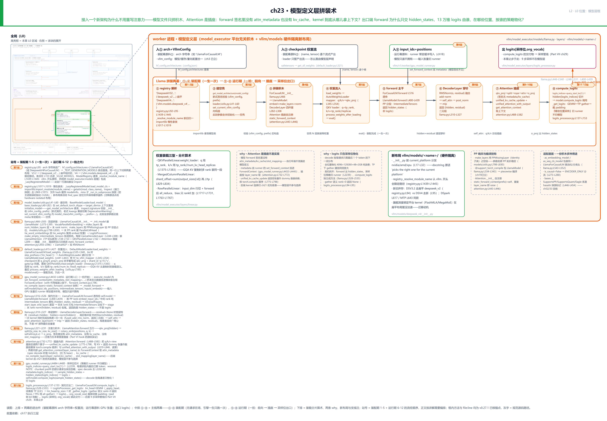
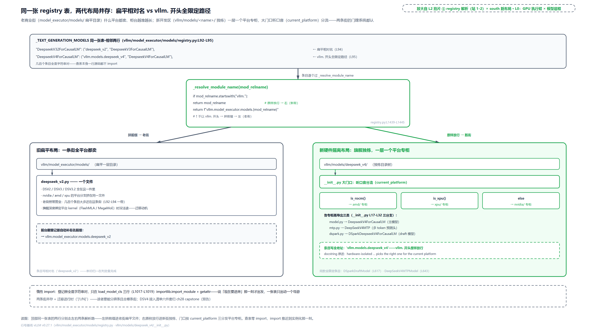
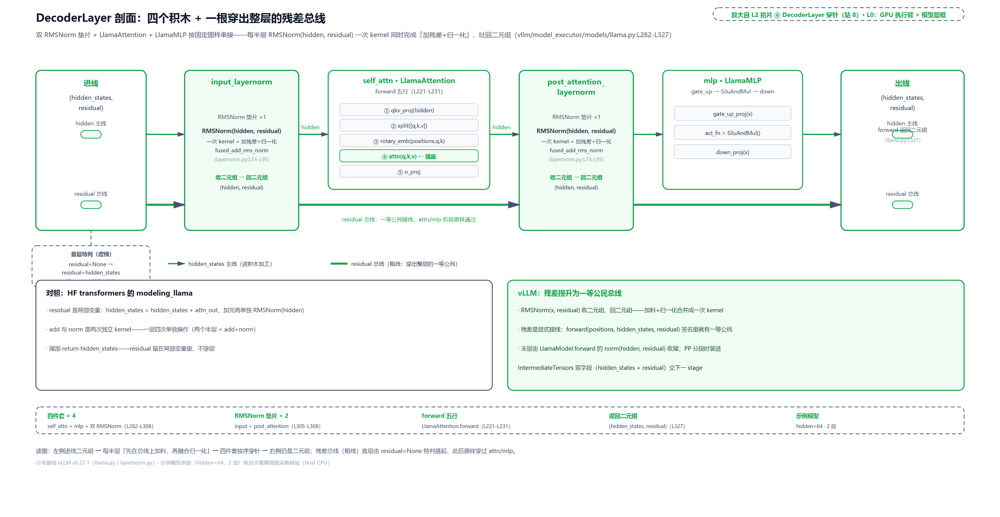
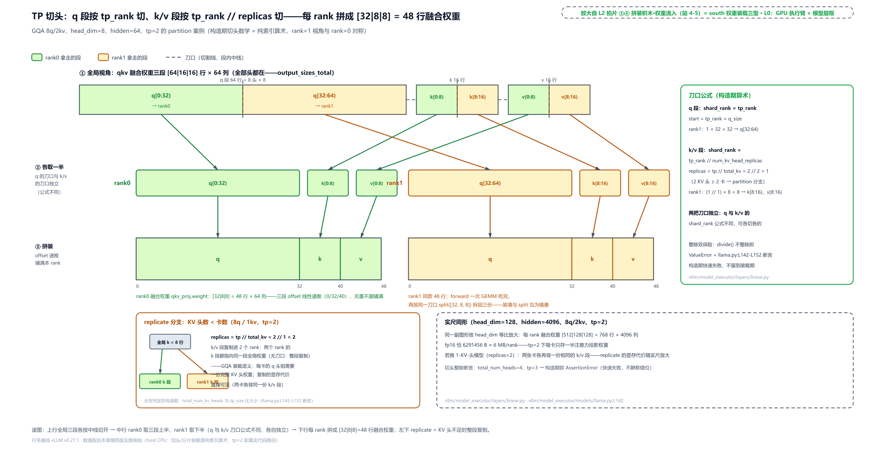
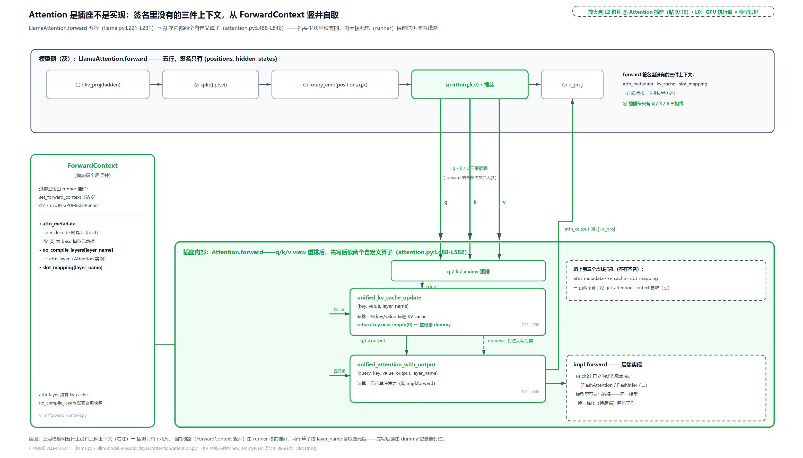
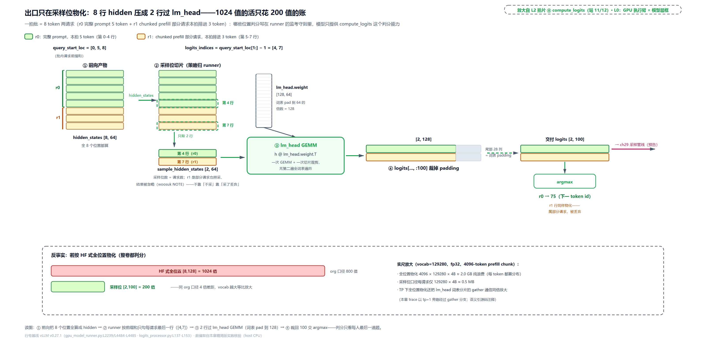

# 第 23 章　模型定义层拼装术

翻开 HuggingFace transformers 的 `modeling_llama.py`，每个模型自带一套注意力实现和 KV 管理：`forward` 的签名里赫然列着 `past_key_values`（一个管 KV 缓存的 Cache 对象）和 `attention_mask`，lm_head 也在 forward 里面一口气算完。vLLM 的 `llama.py` 同名同构，却是另一副样子：`LlamaAttention.forward` 的签名里没有 `attn_metadata`、没有 `kv_cache`，前后加起来五行代码。**注意力 kernel 到底在哪儿跑，模型层凭什么一行不用改？** 出口端更奇怪：`forward` 只交出 `hidden_states`，13 万维的 logits 是谁、在哪些位置、按谁的策略物化的？为什么不学 HF 在 forward 里把所有位置的 logits 全算完？最后一问：接入一个新架构要付多少「接入税」，v0.27 的 `vllm/models/` 新布局把税表改成了什么样？

这也是 Part VI「模型的形状」的开篇总问题：接入一个新架构为什么只需要拼层？答案是本章要立的一句话——**Attention 是插座，不是实现**。[第 21 章](../../ch21-attention-backends/narrative/chapter.md)从后端选择的角度路过过这句话，本章从模型定义层正面立论：拿 Llama 当最简参考模型（`vllm/model_executor/models/llama.py` 全文 552 行，可以整读），把模型文件拆成两幕看：**装配幕**（引擎一生只跑一次：查表拿类、建空壳、拼积木、灌权重）与**运行幕**（每拍一遍：前向、穿层、出 hidden_states、在采样位物化 logits）。两幕的分界，本身就是「拼装术」这个名字的来历。

## 你在这里

Part VI 共六章，全部落在 L0 图中间那根 GPU 执行臂的模型层框上：ch23 模型定义层拼装术（本章，Part 开篇）、ch24 注意力变体数学（原理章）、ch25 MLA 的两种展开、ch26 DeepSeek 索引器、ch27 量化（原理章）、ch28 实战：DeepSeek-V4 拼装（收官）。


> *图注：Part VI「模型的形状：接入新架构只需拼层——Attention 是插座不是实现」覆盖 L0 图 GPU 执行臂内的模型定义块，在此亮起、区域外退后。本章打头，先打开这一块的四件套骨架：registry 接入 / DecoderLayer 积木 / 权重加载 / forward 契约；注意力的变体数学、MLA、索引器与量化，是后面五章在这副骨架上换的零件。*

放大到本章自己这一层：



> *图注：本章放大的是[第 1 章](../../ch01-vllm-v1-in-one-map/narrative/chapter.md) L0 图三列中间那列（GPU 执行臂）中段的模型层框，也就是那张图里写着「Attention = 插座」的那一块；[第 22 章](../../ch22-slot-mapping-block-table/narrative/chapter.md)把读者送到了 attention kernel 门口，本章从门的另一侧（模型的被调方）重新打开同一批层。上排进出件：装配幕吃 arch 字符串与 checkpoint 权重流，运行幕吃 runner 的 GPU 输入张量，出口交 logits；中排 ①-④ 是装配幕（registry 解析 → 建空壳 → 拼装积木 → 权重流入）、⑤-⑧ 是运行幕（forward 主干 → DecoderLayer 穿针 → Attention 插座 → compute_logits）；下排是装载分片算术、两条 why 注记、新布局与支线。站号 = 请求流经代码的顺序：1-5 站装配期（一生一次）、6-12 站运行期（一拍之内；①-⑧ 是格子序号——装配幕 4 格盖第 1-5 站、运行幕 4 格盖第 7-12 站，第 6 站是上排进件 input_ids+positions），正文按讲解需要编排、不必照站号读。*

读法建议：想知道「一个模型怎么被字符串点名进来」，从[「一个字符串进厂」](#一个字符串进厂registry-与两套布局)读起；只想看空壳怎么长成模型，跳[「拼积木」](#拼积木一棵模块树怎么长出来)；被残差绕晕的，直奔[「单层四件套」](#单层四件套decoderlayer-与残差总线)；关心多卡怎么分权重，看[「切头与融合」](#切头与融合一份-qkv-权重的分家计划)与[「权重流入」](#权重流入改地址单与三种刀法)；想跟一拍前向，读[「一拍」](#一拍从挂上下文到逐层穿针)与[「Attention 是插座」](#attention-是插座三件东西不走参数)；「logits 凭什么不全算」的答案在[「出口」](#出口logits-只在采样位物化)；想跟全程，按序读。

照例交代取证环境，全章数值表通用：本章实测来自按 v0.27.1 只做减法抽出的配套精简版，在 host CPU 上实跑。tp=2 的多卡视角由一个测试旋钮承载：切头数学与装载分片是纯索引运算、不碰集合通信，tp=2 下跑的就是真实代码路径；集合通信（gather、all_reduce）只在单卡旁路形态下经过，「rank>0 拿 None」「bias 只 rank0 加」这类多卡语义一律引源码注释、不引运行值；注意力数学由与配套精简版的测试集（下文称「测试电池」）同款的参考后端注入（真实注入位是 `vllm/model_executor/layers/attention/attention.py:L251` 的 `attn_backend` 参数，后端怎么选是[第 21 章](../../ch21-attention-backends/narrative/chapter.md)的账）。凡表内数字都是实跑输出，一个没改；凡「算一笔账」的量级（如 2 GB）是说明性算术，不是实测。

## 同一对文件，两种契约

先认亲。`vllm/model_executor/models/llama.py` 的文件头写着 "Adapted from modeling_llama.py"，说明 vLLM 的每个模型文件都是从 HF transformers 的同名文件改写来的。改的不是细节，是**契约**：谁管 KV、谁管注意力实现、logits 在哪一步物化。这份「同源异契约」是全章 why 链的对照面，值得先把两边的签名并排看一眼。

HF 那边（外部示例，transformers 现行 main 分支）：`LlamaAttention.forward` 收 `hidden_states / position_embeddings / attention_mask / past_key_values`，KV 缓存的管理穿在签名参数里；`LlamaForCausalLM.forward` 的尾段长这样：

```python
# 外部示例：transformers modeling_llama.py · LlamaForCausalLM.forward 尾段（现行 main 分支）
    slice_indices = slice(-logits_to_keep, None) if isinstance(logits_to_keep, int) else logits_to_keep
    logits = self.lm_head(hidden_states[:, slice_indices, :])
```

lm_head 在 forward 内部，logits 是 forward 的返回值。顺带一个诚实的注脚：HF 后来也加了 `logits_to_keep` 参数（默认 0 = 全位置；生成时传 1 只算最后一个 token，注释原话 "Only compute necessary logits"），说明「不必全算」这件事两边都想到了。差别在于：HF 的方案是**给 forward 加一个参数**，「哪些位置要算」由调用方每次传进来；vLLM 的选择更彻底：forward 压根不长 lm_head，「哪些位置要 logits」整个决策搬去了 runner。这半边的账[「出口」](#出口logits-只在采样位物化)一节细算。

vLLM 这边，注意力积木的 forward 全文五行：

```python
# vllm/model_executor/models/llama.py:L221-L231 · LlamaAttention.forward
    def forward(
        self,
        positions: torch.Tensor,
        hidden_states: torch.Tensor,
    ) -> torch.Tensor:
        qkv, _ = self.qkv_proj(hidden_states)                             # L226
        q, k, v = qkv.split([self.q_size, self.kv_size, self.kv_size], dim=-1)  # L227
        q, k = self.rotary_emb(positions, q, k)                           # L228
        attn_output = self.attn(q, k, v)                                  # L229
        output, _ = self.o_proj(attn_output)                              # L230
        return output
```

签名里只有 `positions` 和 `hidden_states`。没有 `attn_metadata`（本拍的注意力元数据）、没有 `kv_cache`（KV 缓存张量）、没有 `slot_mapping`（KV 落池的槽位表）。[第 22 章](../../ch22-slot-mapping-block-table/narrative/chapter.md)辛辛苦苦算出来的那两样东西，在这里连参数都不是。L229 那行 `self.attn(q, k, v)` 是一次委托：q/k/v 三根线插进墙上的插座，注意力怎么算、写在哪儿、从哪儿读历史，插座自己知道。三处契约差异就此立住：① 注意力执行环境不走参数；② forward 只出 `hidden_states` 不出 logits；③ 注意力实现根本不在模型文件里。三处的答案分别在[「Attention 是插座」](#attention-是插座三件东西不走参数)、[「出口」](#出口logits-只在采样位物化)与本章全篇。

## 一个字符串进厂：registry 与两套布局

装配幕第一站，现在走到 L0 图模型层框的最上游：一个字符串怎么变成一个模型类。每个 HF 模型仓的 `config.json` 里都有一行 `"architectures": ["LlamaForCausalLM"]`，它记录「这个 checkpoint 保存自哪个类」。有个容易困惑的点值得先拆开：同一个 config.json 里有两个身份字段，服务两套解析体系。HF 自家的 `AutoModelForCausalLM.from_pretrained` 主要读 `model_type`（如 `"llama"`，只到家族粒度），走它自己的配置类→模型类映射；vLLM 则直接拿 `architectures` 里的**完整类名**去自己的注册表查，精确到具体变体（`LlamaForCausalLM` 与 `LlamaBidirectionalForSequenceClassification` 是两个条目，键不同、查到的类不同，模块却同是 llama）。所以 vLLM 报「architecture not supported」时报的总是那个完整类名（外部现核：unsloth/Llama-3.2-1B 的 config.json 里 `architectures=["LlamaForCausalLM"]`、`model_type="llama"`、32 头 / 8 KV 头、`tie_word_embeddings=true`，两个字段同时在场）。

查的表在 `vllm/model_executor/models/registry.py`。最有看头的是这四行：同一张表里，两代目录布局并存。

```python
# vllm/model_executor/models/registry.py:L92-L95 · _TEXT_GENERATION_MODELS 节选
    "DeepseekV2ForCausalLM": ("deepseek_v2", "DeepseekV2ForCausalLM"),
    "DeepseekV3ForCausalLM": ("deepseek_v2", "DeepseekV3ForCausalLM"),
    "DeepseekV32ForCausalLM": ("deepseek_v2", "DeepseekV3ForCausalLM"),   # L94 扁平：一个文件塞三代
    "DeepseekV4ForCausalLM": ("vllm.models.deepseek_v4", "DeepseekV4ForCausalLM"),  # L95 新布局：全限定路径
```

L92-L94 是旧扁平布局：模块名写相对名，三代 DeepSeek 挤在 `model_executor/models/deepseek_v2.py` 一个文件里。L95 是 v0.27 的新政：模块名写全限定路径 `vllm.models.deepseek_v4`，指向一个独栋目录包。两条路在同一个函数里分流：

```python
# vllm/model_executor/models/registry.py:L1439-L1445 · _resolve_module_name
def _resolve_module_name(mod_relname: str) -> str:
    # Allow registry entries to point at fully-qualified module paths (e.g.
    # ``vllm.models.deepseek_v4``) for models that live outside the legacy
    # ``vllm.model_executor.models`` flat layout.
    if mod_relname.startswith("vllm."):
        return mod_relname                                              # L1444 新布局：原样放行
    return f"vllm.model_executor.models.{mod_relname}"                  # L1445 旧扁平：自动补街名
```

`vllm.` 开头原样返回，否则拼上旧目录的前缀。启动时 `ModelRegistry` 把十来个分类字典合并成一张 `_VLLM_MODELS` 大表（`registry.py:L723-L734`），几百个条目逐个经 `_resolve_module_name` 包成**惰性条目**，注意这一步一个模型文件都没 import：

```python
# vllm/model_executor/models/registry.py:L1017-L1019 · _LazyRegisteredModel.load_model_cls
    def load_model_cls(self) -> type[nn.Module]:
        mod = importlib.import_module(self.module_name)                 # L1018
        return getattr(mod, self.class_name)
```

三行就是惰性的全部机关，值得把 Python 底座说透：`import` 语句不只是「找到模块」，它会**执行模块的顶层代码**。vLLM 的模型文件顶层 import 各平台的 kernel 库，import 即重。`importlib.import_module("a.b")` 是同一件事的函数形态：吃模块路径字符串、返回模块对象。于是「惰性导入」有了最朴素的实现：注册表里只存字符串对 `(模块名、类名)`，谁也不 import；第一次真要类时才 `import_module` 拿模块、`getattr` 按名取出类。标准库其实有个 `importlib.util.LazyLoader`（首次访问属性才真加载的假模块对象），但官方文档同时警告它会把加载错误推迟到属性访问时、报错脱离上下文，所以 vLLM 没用它，惰性单位干脆就是「整个 import 调用」。收益直接：几百条目表的成本只是几百个字符串元组，启动路径上只有你用的那一个模型文件被真正执行。

惰性还有第二层，管的是「接口探测」（这个类支不支持流水线并行、是不是池化模型这类 `hasattr` 式体检）：`inspect_model_cls`（`registry.py:L969-L1015`）优先读按**文件内容 hash** 缓存的 modelinfo JSON，hash 命中就免 import；miss 才真去探测，而且探测挪到子进程里跑，注释原话 "Performed in another process to avoid initializing CUDA"（换个子进程，免得把主进程的 CUDA 环境初始化了）。新布局条目经 `importlib.util.find_spec` 定位文件路径（`registry.py:L975-L982`，注释点名 hardware-isolated 布局），让同一套 hash 缓存对新街也温热。

回到两套布局本身，把 why 链摆全。**旧设计**：`model_executor/models/` 扁平目录，一个架构一个 `.py`，文件内 if-else 分平台。**痛点**：深度绑定平台 kernel 的旗舰模型没法维护了。DeepSeek-V4 这类模型，注意力用 FlashMLA、MoE 用 MegaMoE，各平台一套 kernel 依赖，全塞进一个文件里，平台分支缠死，文件没法读；顺带一提，旧 `model_executor/models` 目录历史上一直被 mypy 类型检查排除在外，类型债也在涨。**v1 方案**（外部现核，迁移由 WoosukKwon 的系列 PR 启动：#43004「[Model Refactoring] Migrate DeepSeek V4 to vllm/models/ [1/N]」，2026-05 合并）：旗舰新模型各占一个包 `vllm/models/<name>/`，包内按硬件平台分子包，大门口分流：

```python
# vllm/models/deepseek_v4/__init__.py:L14-L32 · 平台分发
# Pick the per-platform implementation. The NVIDIA branch is the static
# default that mypy sees; the ROCm/XPU branches override at runtime and are
# kept type-compatible via ``# type: ignore[assignment]``.
if current_platform.is_rocm():
    from .amd.dspark import (  # type: ignore[assignment]
        DSparkDeepseekV4ForCausalLM,
    )
    from .amd.model import DeepseekV4ForCausalLM
    from .amd.mtp import DeepSeekV4MTP
elif current_platform.is_xpu():                                          # L23
    from .xpu.dspark import DSparkDeepseekV4ForCausalLM  # type: ignore[assignment]
    from .xpu.model import DeepseekV4ForCausalLM  # type: ignore[assignment]
    from .xpu.mtp import DeepSeekV4MTP  # type: ignore[assignment]
else:
    from .nvidia.dspark import (  # type: ignore[assignment]
        DSparkDeepseekV4ForCausalLM,
    )
    from .nvidia.model import DeepseekV4ForCausalLM  # type: ignore[assignment]
    from .nvidia.mtp import DeepSeekV4MTP  # type: ignore[assignment]
```

模块头 docstring 原话："The actual implementation lives under `nvidia/` and `amd/`; this module picks the right one for the current platform"。真实现住在平台子包里，这个门口只负责按 `current_platform` 引路，再导出 ForCausalLM / MTP（multi-token prediction，多 token 预测，投机解码（[第 1 章](../../ch01-vllm-v1-in-one-map/narrative/chapter.md)立过）的草稿零件）/ DSpark 三类公共名字。对外的类名不变：registry 拿到的永远是 `DeepseekV4ForCausalLM`，平台差异被 `__init__` 吸收。



> *图注：同一张 registry 表里两代布局并存（`vllm/model_executor/models/registry.py:L92-L95` 与 `L1439-L1445`、`vllm/models/deepseek_v4/__init__.py:L17-L32`）。上：两条条目，`'DeepseekV32ForCausalLM': ('deepseek_v2', …)` 相对名 vs `'DeepseekV4ForCausalLM': ('vllm.models.deepseek_v4', …)` 全限定。中：`_resolve_module_name` 判定盒，`startswith("vllm.")` 原样放行进新街、否则拼 `vllm.model_executor.models.` 前缀进老街。左：老街一个 `deepseek_v2.py` 塞 DSV2/V3/V3.2 全平台分支。右：新街独栋目录的 `__init__.py` 三分支平台分发（is_rocm→amd/、is_xpu→xpu/、else→nvidia/），各专柜导出三类。底注：import 推迟到 `load_model_cls` 一刻（L1017-L1019）、迁移是 `[1/N]` 进行时、DSV4 接入清单归 Part VI 收官的实战章。*

**代价**也要诚实：新旧两套并存（DSV3.2 还在扁平老街上），读者看 registry 条目要能一眼分辨两代；「一层到底谁实现」开始要跨目录追（`__init__` 引到 `nvidia/model.py`）；DSV4 的完整接入清单（模型四件套加 MTP 钩子、registry 条目、KV cache 规格自报、平台子类、量化分发、编译注册）是 Part VI 收官实战章的 capstone 素材，本章只教「分辨两代」加「全限定路径 + 平台分发」这两个事实。顺带一句给后面的伏笔：这套 `vllm.` 开头的全限定写法不止 DSV4 一家，`DSparkDraftModel`（L617）与 `DeepSeekV4MTPModel`（L643）是同款条目——它们是投机解码的零件，本书讲投机解码的章节会回来认领。

## 建空壳：四段装载编排

字符串变成了类，接下来谁拿这个类去实例化？现在走到 L0 图执行臂的 runner 与模型层的接缝上。入口在 `GPUModelRunner.load_model`。[第 17 章](../../ch17-executor-worker-model-runner/narrative/chapter.md)立执行三层时把 runner 的职责列过账，装载就是其中「引擎启动期干完、运行期不再碰」的那部分：

```python
# vllm/v1/worker/gpu_model_runner.py:L5302-L5326 · GPUModelRunner.load_model（节选）
    @instrument(span_name="Loading (GPU)")
    def load_model(self, load_dummy_weights: bool = False) -> None:
        # … 省略：docstring、启动日志与 EPLB 状态初始化 …
        try:
            with DeviceMemoryProfiler() as m:
                time_before_load = time.perf_counter()
                if load_dummy_weights:
                    self.load_config.load_format = "dummy"
                model_loader = get_model_loader(self.load_config)        # L5323 选 loader
                self.model = model_loader.load_model(                    # L5324 模型进厂
                    vllm_config=self.vllm_config, model_config=self.model_config
                )
                # … 省略：LoRA / drafter / EPLB 分支（无对应配置时全部跳过）……
```

第一行装饰器值得三句注解，不然读者会当它不存在：`@instrument(span_name="Loading (GPU)")` 把整个函数的一次调用记成一个 **span**，也就是 OpenTelemetry（CNCF 的可观测标准）trace 模型里「一次带名字、带起止时间的操作记录」，一次请求的因果链是一棵 span 树。环境装了 opentelemetry 时这段装载耗时会被记进启动 trace；没装时 `instrument` 直接返回原函数，行为一字不差（no-op 兜底，`vllm/tracing/__init__.py:L90` 起，后端表目前只有 "otel" 一项）。span 名是手写字符串，所以叫 "Loading (GPU)" 而不是函数名。

`get_model_loader` 按 `load_format` 查表选 loader（default / dummy / bitsandbytes / … 一张表；默认 auto 走 DefaultModelLoader）。`get_model` 是同一文件里的统一入口（`vllm/model_executor/model_loader/__init__.py:L122-L142`）。选中的 loader 继承同一套编排骨架——这是装配幕的总谱，四段一段不能乱：

```python
# vllm/model_executor/model_loader/base_loader.py:L42-L82 · BaseModelLoader.load_model
    @instrument(span_name="Load model")
    def load_model(
        self, vllm_config: VllmConfig, model_config: ModelConfig, prefix: str = ""
    ) -> nn.Module:
        """Load a model with the given configurations."""
        device_config = vllm_config.device_config
        load_config = vllm_config.load_config
        load_device = (
            device_config.device if load_config.device is None else load_config.device
        )
        target_device = torch.device(load_device)
        with set_default_torch_dtype(model_config.dtype):                # L53 第一段：dtype 上下文
            with target_device:                                          # L54 设备上下文
                model = initialize_model(                                # L55 第二段：建空壳
                    vllm_config=vllm_config,
                    model_config=model_config,
                    prefix=prefix,
                )

            log_model_inspection(model)

            logger.debug("Loading weights on %s ...", load_device)
            self.load_weights(model, model_config)                       # L64 第三段：权重流入

            # … 省略：峰值显存日志（源注释说它是为在线量化的测试覆盖率而记）……

            # Process weights into kernel format. Note that when using online
            # quantization, weights are (typically) quantized as they are loaded.
            if _has_online_quant(model):
                finalize_layerwise_processing(model, model_config)

            process_weights_after_loading(model, model_config, target_device)  # L80 第四段：后处理

        return model.eval()                                              # L82 冻结：装配完成
```

四段各管一段：**定基调**（L53-L54 两个上下文管理器，让接下来构造期创建的所有参数出厂即落在正确的 dtype 与设备上，省得每个层自己 `.to(device)`）、**搭毛坯**（`initialize_model` 建空壳）、**进家具**（`self.load_weights` 流式灌权重，第三站细讲）、**竣工验收**（`process_weights_after_loading` 把权重重排成 kernel 要的格式，`eval()` 把整树切到推理模式收尾）。`eval()` 对 Llama 这类没有 Dropout/BatchNorm 的模型近乎仪式，但它是装配期「整树冻结」的官方句点：此后引擎除非权重热更新（RL 换权重那种场景），不再动一颗钉子。

第二段建空壳的本体：

```python
# vllm/model_executor/model_loader/utils.py:L40-L64 · initialize_model（前半）
@instrument(span_name="Initialize model")
def initialize_model(
    vllm_config: VllmConfig,
    *,
    prefix: str = "",
    model_class: type[nn.Module] | None = None,
    model_config: ModelConfig | None = None,
) -> nn.Module:
    """Initialize a model with the given configurations."""
    if model_config is None:
        model_config = vllm_config.model_config
    if model_class is None:
        model_class, _ = get_model_architecture(model_config)            # L52 查表拿类（上一节的表）

    if vllm_config.quant_config is not None:
        configure_quant_config(vllm_config.quant_config, model_class)

    signatures = inspect.signature(model_class.__init__)                 # L57 签名校验
    all_params = [param.name for param in signatures.parameters.values()]
    if "vllm_config" in all_params and "prefix" in all_params:
        # new-style model class
        with set_current_vllm_config(vllm_config, check_compile=True, prefix=prefix):  # L61
            model = model_class(vllm_config=vllm_config, prefix=prefix)  # L62 构造
            record_metadata_for_reloading(model)
            return model
    # … 省略：老式 kwargs 猜参兼容段（只剩 DeprecationWarning）……
```

两个新式契约在这几行里：`__init__` 只收 `(vllm_config, prefix)`（`vllm_config` 是[第 3 章](../../ch03-engineargs-to-vllmconfig/narrative/chapter.md)立过的配置聚合体；老式模型类要什么 config 就猜什么参的兼容段还在，但只剩一条弃用警告）；构造包在 `set_current_vllm_config` 上下文里，让构造期的任何深层代码都能拿到全局配置；尾行 `record_metadata_for_reloading` 给每层记下参数与 buffer 的元数据，供日后层粒度的权重重载（RL 换权重那类场景）恢复用，认脸即可。为什么叫「空壳」：`LlamaForCausalLM(vllm_config=…, prefix=…)` 只是照着配置把模块树**搭出来**：每层的形状、切分、融合全都定了，但此刻参数还是未初始化的壳，权重在第三段才进来。装配期的本质由此可以说清：**所有体系结构决策（TP 切分、层融合、量化绑定、后端选择）全部固化在装配期，运行期的每一拍只剩纯计算**。这也是两幕分界的意义：装配幕跑一次、产出「一棵静态模块树 + 三个可调用契约方法 + 几个钩子」；运行幕零 Python 装配，每拍只是同一棵树的前向（[第 19 章](../../ch19-compile-capture/narrative/chapter.md)之后更是编译图与 CUDA graph 回放）。

## 拼积木：一棵模块树怎么长出来

空壳怎么长？从顶往下走。顶层类不长，值得整段读，它是三方法契约的持有者，本章后面两幕的入口全在这里：

```python
# vllm/model_executor/models/llama.py:L446-L503 · LlamaForCausalLM（装配半场）
class LlamaForCausalLM(
    LocalArgmaxMixin,
    nn.Module,
    SupportsLoRA,
    SupportsPP,
    SupportsEagle,
    SupportsEagle3,
    SupportsQuant,
):
    hf_to_vllm_mapper = LlamaModel.hf_to_vllm_mapper
    # LoRA specific attributes
    packed_modules_mapping = {
        "qkv_proj": ["q_proj", "k_proj", "v_proj"],
        "gate_up_proj": ["gate_proj", "up_proj"],
    }
    embedding_modules = {
        "embed_tokens": "input_embeddings",
        "lm_head": "output_embeddings",
    }

    def __init__(
        self,
        *,
        vllm_config: VllmConfig,
        prefix: str = "",
        layer_type: type[nn.Module] = LlamaDecoderLayer,
    ):
        super().__init__()
        config = vllm_config.model_config.hf_config
        quant_config = vllm_config.quant_config
        self.config = config

        self.model = self._init_model(                                   # L478 骨架
            vllm_config=vllm_config,
            prefix=maybe_prefix(prefix, "model"),
            layer_type=layer_type,
        )

        if get_pp_group().is_last_rank:
            self.lm_head = ParallelLMHead(                               # L485 出口投影头
                config.vocab_size,
                config.hidden_size,
                quant_config=quant_config,
                prefix=maybe_prefix(prefix, "lm_head"),
            )
            if config.tie_word_embeddings:
                self.lm_head = self.lm_head.tie_weights(self.model.embed_tokens)  # L492 绑定

            logit_scale = getattr(config, "logit_scale", 1.0)
            self.logits_processor = LogitsProcessor(                     # L495 出口三步
                config.vocab_size, scale=logit_scale
            )
        else:
            self.lm_head = PPMissingLayer()

        self.make_empty_intermediate_tensors = (
            self.model.make_empty_intermediate_tensors
        )
```

三个看点。**一看 bases**：`SupportsPP / SupportsQuant / SupportsEagle…` 一排标记类，本身没有实现，是给外部 `hasattr` 式探测用的「我会什么」铭牌（流水线并行探测、量化探测、投机解码探测各认各的）；`packed_modules_mapping` 声明「qkv_proj 是 q/k/v 三个的融合」，LoRA（低秩适配器，外挂的小插件）挂上时要按这张表对账拆包；那类外挂适配器的账不在本书主线。**二看 lm_head**：`ParallelLMHead` 是词表分片的输出头，它干脆就是 `VocabParallelEmbedding` 的子类（`vllm/model_executor/layers/vocab_parallel_embedding.py:L520`），词表按 TP 均分、每卡只算自己那段词表的 logits，进（embed）出（lm_head）两头共用同一套分区账。L492 那行是**权重绑定**（weight tying）：`tie_word_embeddings` 为真时 lm_head 不再有自己的权重，直接复用 embed_tokens 那份矩阵。这招有来历（外部现核）：Press & Wolf 2017 验证了输入嵌入与输出投影共享一份矩阵不但省一大块参数（词表大时 lm_head 常是模型最大的单一权重），困惑度反而略好；现代模型的用法是小杯绑、大杯不绑：Llama-3.2-1B 是 `true`、Llama-3.1-8B 是 `false`。绑定的装载后果（checkpoint 里没有 lm_head 键、装载要跳过它）第三站见。词表还有一个本书第一次遇到的细节：`pad_vocab_size` 把词表补到 64 的倍数（`DEFAULT_VOCAB_PADDING_SIZE = 64`，`vocab_parallel_embedding.py:L32` 与 `L87-L89`）——为了让分片刀口切得整齐，交货时再把 padding 裁掉，裁的那一刀在[「出口」](#出口logits-只在采样位物化)。

**三看分工**：`LlamaForCausalLM` 只做三件事：建骨架 `self.model`、末段建 `lm_head + logits_processor`、把 `make_empty_intermediate_tensors` 挂成别名。骨架的装配：

```python
# vllm/model_executor/models/llama.py:L334-L395 · LlamaModel（装配半场）
@support_torch_compile(
    # TODO[#32068]: Investigate recompilation
    # mark_unbacked_dims={"input_ids": 0},
    dynamic_arg_dims={
        "input_ids": {0: "b"},
        "positions": {0: "b"},
        "intermediate_tensors": {0: "b"},
        "inputs_embeds": {0: "b"},
    },
)
class LlamaModel(nn.Module, EagleModelMixin):
    hf_to_vllm_mapper = WeightsMapper(                                   # L345 改地址单，第三站细讲
        orig_to_new_stacked={
            # weight_name: (param_name, shard_id)
            ".q_proj": (".qkv_proj", "q"),
            ".k_proj": (".qkv_proj", "k"),
            ".v_proj": (".qkv_proj", "v"),
            ".gate_proj": (".gate_up_proj", 0),
            ".up_proj": (".gate_up_proj", 1),
        }
    )

    def __init__(
        self,
        *,
        vllm_config: VllmConfig,
        prefix: str = "",
        layer_type: type[nn.Module] = LlamaDecoderLayer,
    ):
        super().__init__()

        config = vllm_config.model_config.hf_config
        quant_config = vllm_config.quant_config

        self.config = config
        self.quant_config = quant_config

        self.vocab_size = config.vocab_size

        if get_pp_group().is_first_rank or (
            config.tie_word_embeddings and get_pp_group().is_last_rank
        ):
            self.embed_tokens = VocabParallelEmbedding(                  # L376 进口：词表分片嵌入
                self.vocab_size,
                config.hidden_size,
                quant_config=quant_config,
            )
        else:
            self.embed_tokens = PPMissingLayer()
        self.start_layer, self.end_layer, self.layers = make_layers(     # L383 中段：堆 N 层
            config.num_hidden_layers,
            lambda prefix: layer_type(vllm_config=vllm_config, prefix=prefix),
            prefix=f"{prefix}.layers",
        )
        if get_pp_group().is_last_rank:
            self.norm = RMSNorm(config.hidden_size, eps=config.rms_norm_eps)
        else:
            self.norm = PPMissingLayer()

        self.make_empty_intermediate_tensors = make_empty_intermediate_tensors_factory(  # L393
            ["hidden_states", "residual"], config.hidden_size
        )
```

骨架三件：进口 `embed_tokens`（首段才建）、中段 `make_layers` 堆 `num_hidden_layers` 层、出口 `norm`（末段才建）。类头上那个 `@support_torch_compile` 是[第 19 章](../../ch19-compile-capture/narrative/chapter.md)piecewise 编译的模型侧挂钩：`dynamic_arg_dims` 声明批维动态（同一份编译产物吃可变 token 数），这里只认脸不重讲。`get_pp_group().is_first_rank / is_last_rank` 这些分支是流水线并行（PP，按层把模型切成几段分到多卡接力）的层位裁决；本章按单卡讲，单卡下 `is_first_rank` 与 `is_last_rank` 同时为真、所有 PP 分支都走「常见路」，多卡部署的通信与调度是另一章的领地。但这些 PP 分支能写得这么安静，靠的是一个哨兵：

```python
# vllm/model_executor/models/utils.py:L785-L830 · PPMissingLayer 与 make_layers
class PPMissingLayer(torch.nn.Identity):
    """
    A placeholder layer for missing layers in a pipeline parallel model.
    """

    def __init__(self, *args, **kwargs):
        super().__init__()

    def forward(self, *args, **kwargs):
        """Return the first arg from args or the first value from kwargs."""
        return args[0] if args else next(iter(kwargs.values()))


def make_layers(
    num_hidden_layers: int,
    layer_fn: LayerFn,
    prefix: str,
) -> tuple[int, int, torch.nn.ModuleList]:
    """Make a list of layers with the given layer function, taking
    pipeline parallelism into account.

    Args:
        num_hidden_layers: Total number of hidden layers in the model.
        layer_fn: Function to create a layer given its index.
        prefix: Prefix for layer names.

    Returns:
        Tuple of (start_layer, end_layer, modules).
    """
    from vllm.distributed.parallel_state import get_pp_group
    from vllm.distributed.utils import get_pp_indices
    from vllm.model_executor.offloader import get_offloader

    start_layer, end_layer = get_pp_indices(                             # L818 均分层区间
        num_hidden_layers, get_pp_group().rank_in_group, get_pp_group().world_size
    )

    modules = torch.nn.ModuleList(
        [PPMissingLayer() for _ in range(start_layer)]                   # L823 头部空段：占位
        + get_offloader().wrap_modules(
            layer_fn(prefix=f"{prefix}.{idx}") for idx in range(start_layer, end_layer)
        )
        + [PPMissingLayer() for _ in range(end_layer, num_hidden_layers)]  # L827 尾部空段：占位
    )

    return start_layer, end_layer, modules
```

`get_pp_indices` 把 N 层按 rank 均分出 `[start, end)`，不属于本段的层位**不删除、用 `PPMissingLayer` 占住座**（顺带认脸中段那行 `get_offloader().wrap_modules`：层权重卸载的包装钩子，常态下原样透传，与本章主线无关）。为什么占位而不是干脆少建几层？账记在参数名上。PyTorch 的模块是树，`state_dict`（模块树的状态字典，键是参数名）的名字规则是「属性路径 + ModuleList 序号 + 参数名」点连接。一个说明性玩具就能复现这套规则（外部，PyTorch 标准行为）：

```python
# 说明性示例：最小复现 Llama 参数命名规则的玩具树
class Attn(nn.Module):
    def __init__(self):
        super().__init__()
        self.q_proj = nn.Linear(4, 4, bias=False)

class Model(nn.Module):
    def __init__(self, n):
        super().__init__()
        self.layers = nn.ModuleList([Attn() for _ in range(n)])

class ForCausalLM(nn.Module):
    def __init__(self, n):
        super().__init__()
        self.model = Model(n)

m = ForCausalLM(2)
print(list(m.state_dict().keys()))
# → ['model.layers.0.q_proj.weight', 'model.layers.1.q_proj.weight']
```

真实 Llama 的 `model.layers.31.self_attn.qkv_proj.weight` 只是这棵树再深几层。键名完全由「树的结构与属性名」决定。所以 PP 切法一变，如果删掉空段层，后面所有层的序号全体前移、名字漂移，checkpoint 就对不上号了。占位保住序号：`model.layers.31.…` 在任何 PP 切法下都指向同一层，权重装载按名分发不漂移（loader 侧 AutoWeightsLoader 递归分发时对空段子模块直接不喂权重——`_load_module` 开头的 isinstance 检查，`models/utils.py:L317-L324`；另有一套按参数名前缀判断的 `is_pp_missing_parameter`，`models/utils.py:L855` 起，服务于自写 `load_weights` 的一批模型（deepseek 系、arctic、dbrx 等）与 bitsandbytes loader，不在本章 Llama 路径上），前向侧 `islice(layers, start, end)` 只迭代本段真层、占位牌根本不上台。这与[第 18 章](../../ch18-persistent-batch-fixed-addresses/narrative/chapter.md)的固定地址、[第 19 章](../../ch19-compile-capture/narrative/chapter.md)的固定形状是同一族手法：**用不变量换可预测性**。

每层真层是 `LlamaDecoderLayer`，下一节整段拆开。这里先补装配幕的最后一个挂钩：每个 `LlamaAttention` 构造到尾部，会把自己登记进一本全局花名册：

```python
# vllm/model_executor/layers/attention/attention.py:L437-L448 · Attention.__init__ 尾段
        # For cuda-alike (CUDA and ROCM) and cpu platforms, we control how
        # torch.compile works by registering the attention as one giant
        # opaque custom op. For other platforms, we directly call them
        # and let torch.compile handle them.
        self.use_direct_call = not current_platform.opaque_attention_op()

        compilation_config = vllm_config.compilation_config
        if prefix in compilation_config.static_forward_context:
            raise ValueError(f"Duplicate layer name: {prefix}")          # L445 重名当场拒收
        compilation_config.static_forward_context[prefix] = self         # L446 自注册
        self.attn_type = attn_type
```

L446 一行就是全部动作：`static_forward_context[prefix] = self`，注意力层出生时自己往编译配置的花名册上登记「我叫 `model.layers.0.self_attn.attn`，值日的是我」，重名当场 raise。这本花名册就是[第 19 章](../../ch19-compile-capture/narrative/chapter.md)立的 `static_forward_context`：运行期 `ForwardContext.no_compile_layers` 就是它的快照（`vllm/forward_context.py:L132-L136`），编译系统按册找人、运行期上下文按册取层，模型代码此后不必自报家门。普通 Attention 在 `__init__` 里自动登记；后文会看到 MoE 一类层要手动登记，这是接入税的一部分，实战章再算。

## 单层四件套：DecoderLayer 与残差总线

现在把 L2 图站号轨道的第 8 站那一格放大：一个 `LlamaDecoderLayer` 里到底有什么。直觉先给：**乐高说明书**。一层就是四块标准件按固定图样串起来：两块 RMSNorm 垫片、一个注意力块、一个 MLP 块。与 HF 最大的不同是那根「残差总线」：HF 把 residual 藏在局部变量里逐步加，vLLM 把它提升成穿出整层的一等公民接线：每半层在总线上「先加料再归一化」，而且加料和归一化合并成一次 kernel。

```python
# vllm/model_executor/models/llama.py:L248-L331 · LlamaDecoderLayer
class LlamaDecoderLayer(nn.Module):
    def __init__(
        self,
        vllm_config: VllmConfig,
        prefix: str = "",
        config: LlamaConfig | None = None,
        attn_layer_type: type[nn.Module] = LlamaAttention,
    ) -> None:
        super().__init__()

        config = config or vllm_config.model_config.hf_config  # L258 三样解包的起点
        cache_config = vllm_config.cache_config                # L259 llama.py 里唯一一处解包 cache_config
        quant_config = self.get_quant_config(vllm_config)

        self.hidden_size = config.hidden_size
        max_position_embeddings = getattr(config, "max_position_embeddings", 8192)
        # Support abacusai/Smaug-72B-v0.1 with attention_bias
        attention_bias = getattr(config, "attention_bias", False) or getattr(
            config, "bias", False
        )
        bias_o_proj = attention_bias
        # support internlm/internlm3-8b with qkv_bias
        if hasattr(config, "qkv_bias"):
            attention_bias = config.qkv_bias

        # By default, Llama uses causal attention as it is a decoder-only model.
        # You can override the HF config with `is_causal=False` to enable
        # bidirectional attention, which is used in some embedding models
        # (e.g. parasail-ai/GritLM-7B-vllm)
        if getattr(config, "is_causal", True):
            attn_type = AttentionType.DECODER
        else:
            attn_type = AttentionType.ENCODER_ONLY

        self.self_attn = attn_layer_type(                                # L282 件一：注意力
            config=config,
            hidden_size=self.hidden_size,
            num_heads=config.num_attention_heads,
            num_kv_heads=getattr(
                config, "num_key_value_heads", config.num_attention_heads
            ),
            max_position_embeddings=max_position_embeddings,
            quant_config=quant_config,
            bias=attention_bias,
            bias_o_proj=bias_o_proj,
            cache_config=cache_config,
            prefix=f"{prefix}.self_attn",
            attn_type=attn_type,
        )
        self.mlp = LlamaMLP(                                             # L297 件二：前馈
            hidden_size=self.hidden_size,
            intermediate_size=config.intermediate_size,
            hidden_act=config.hidden_act,
            quant_config=quant_config,
            bias=getattr(config, "mlp_bias", False),
            prefix=f"{prefix}.mlp",
        )
        self.input_layernorm = RMSNorm(config.hidden_size, eps=config.rms_norm_eps)   # L305 件三四：双垫片
        self.post_attention_layernorm = RMSNorm(
            config.hidden_size, eps=config.rms_norm_eps
        )

    def forward(
        self,
        positions: torch.Tensor,
        hidden_states: torch.Tensor,
        residual: torch.Tensor | None,
    ) -> tuple[torch.Tensor, torch.Tensor]:
        # Self Attention
        if residual is None:                                             # L317 首层特判
            residual = hidden_states
            hidden_states = self.input_layernorm(hidden_states)
        else:
            hidden_states, residual = self.input_layernorm(hidden_states, residual)  # L321 融合 add-norm
        hidden_states = self.self_attn(positions=positions, hidden_states=hidden_states)

        # Fully Connected
        hidden_states, residual = self.post_attention_layernorm(hidden_states, residual)  # L325
        hidden_states = self.mlp(hidden_states)
        return hidden_states, residual

    def get_quant_config(self, vllm_config: VllmConfig) -> QuantizationConfig | None:
        """Get quantization config for this layer. Override in subclasses."""
        return vllm_config.quant_config
```

装配面一目了然：`self_attn + mlp + 双 RMSNorm` 四件套（L282-L308），构造参数全部从 `vllm_config` 与 hf config 解包。注意 L258-L260 的分寸：在这份模型文件里，`vllm_config` 的下渗到 DecoderLayer 这一深度为止——壳层的 `ForCausalLM` / `LlamaModel` 同样从它解包 config 与 quant_config，而再往里的积木（llama.py 的 Attention / MLP / RMSNorm）构造签名里拿到的全是解包好的 hidden_size、头数、quant_config、cache_config 零件，这让层积木可以被别的骨架复用。两处兼容分支顺带认脸：`attention_bias/qkv_bias` 是 Smaug / internlm3 两家变体的开关（标准 Llama 恒 False）；`is_causal=False` 会把注意力类型切成 `ENCODER_ONLY`（双向注意力，嵌入模型用，文末「别种车身」再回来看它）。

forward 的看点全在 residual。**首层特判**（L317-L319）：第一层没有残差可加，总线从输入直接搭起：`residual = hidden_states`，然后单独做一次归一化。**此后每一半层**（L321、L325）：`RMSNorm(hidden_states, residual)` 收二元组、回二元组，一次 kernel 同时完成「加残差 + 归一化」。看 RMSNorm 的实现就能确认这个二元组语义不是注释修辞：

```python
# vllm/model_executor/layers/layernorm.py:L74-L95 · RMSNorm.forward_native
    def forward_native(
        self,
        x: torch.Tensor,
        residual: torch.Tensor | None = None,
    ) -> torch.Tensor | tuple[torch.Tensor, torch.Tensor]:
        """PyTorch-native implementation equivalent to forward()."""
        if residual is None:
            return ir.ops.rms_norm(
                x,
                self.weight.data if self.pass_weight else None,
                self.variance_epsilon,
                self.variance_size_override,
            )
        else:
            return ir.ops.fused_add_rms_norm.maybe_inplace(              # L88 一个 op：加残差+归一化
                x,
                residual,
                self.weight.data if self.pass_weight_add else None,
                self.variance_epsilon,
                self.variance_size_override,
            )
```

RMSNorm 本身（不减均值、只按均方根缩放的 LayerNorm 极简版）[第 19 章](../../ch19-compile-capture/narrative/chapter.md)讲 CustomOp 融合时立过，不重讲；片段里的 `ir.ops.*` 是 vLLM 内部的自定义算子注册命名空间（`from vllm import ir`，docstring 说「PyTorch-native」也经它派发），认脸即可。这里的新东西是 L88 那个 `fused_add_rms_norm`：传入 `x` 与 `residual`，返回 `(归一化结果，更新后的残差)` 二元组。为什么值得融合？省的是显存来回：不融合的话，「attn 输出 + 残差」要先写一遍显存得到和、再读一遍算归一化；融合后一趟 kernel 全办完。这笔账值多少（说明性算术，非实测）？拿本章示例模型 hidden=64、8-token 批、fp32 记：每个垫片多付的「写和 + 读和」一趟 ≈ 2×8×64×4B = 4 KB/拍，一层两个垫片、L 层就 8L KB/拍；换成 hidden=4096、4096-token 的实尺 chunk，同一公式是 2×4096×4096×4B ≈ 134 MB/垫片，这就是「显存来回」四个字的量级。代价也如实交代：融合算子不是天生就有的，`ir.ops` 命名空间按平台优先级派发，CUDA 与 ROCm 各有专门的融合 kernel（`vllm/kernels/` 下注册），没有融合实现的平台退回的就是那份「先相加、再归一化」的两步 native 版（`vllm/ir/ops/layernorm.py:L44-L62`）。对 HF 的对照由此成立：HF 的 DecoderLayer 把 residual 藏在局部变量里，「attn 残差相加、norm、mlp、残差相加、norm」是四次独立操作；vLLM 把 residual 提升为**层间一等公民**：它是 `forward` 签名里的形参、返回值里的二元组、一路穿到 `LlamaModel.forward` 的 `norm(hidden_states, residual)` 收尾，甚至穿进 PP 分段的 `IntermediateTensors`（中间张量容器，字段就是 `hidden_states` 与 `residual` 两个名字，`make_empty_intermediate_tensors_factory(["hidden_states", "residual"], hidden_size)` 造的空壳也是这两个字段，L393 那行此刻有了着落）。



> *图注：单层剖面（`vllm/model_executor/models/llama.py:L248-L331`、`vllm/model_executor/layers/layernorm.py:L74-L95`）。左侧进线 `(hidden_states, residual)` 二元组，首层特判 residual=hidden（`llama.py:L317-L319`）；四件套按序 input_layernorm → self_attn（内画 qkv_proj→split→rope→attn 插座→o_proj 五步缩略）→ post_attention_layernorm → mlp（gate_up→SiluAndMul→down）；两个 RMSNorm 垫片处一次 kernel 同时完成加残差+归一化（fused_add_rms_norm）并回二元组，attn/mlp 段残差总线原样通过；右侧出线仍是二元组。底条 HF 对照：藏局部变量、分步操作（两次显式残差加法、两次独立归一化）。示例模型 hidden=64、2 层。*

件二 MLP 的全文更短，也值得嵌：它是「融合」这个主题在 MLP 侧的样本。

```python
# vllm/model_executor/models/llama.py:L79-L119 · LlamaMLP
class LlamaMLP(nn.Module):
    def __init__(
        self,
        hidden_size: int,
        intermediate_size: int,
        hidden_act: str,
        quant_config: QuantizationConfig | None = None,
        bias: bool = False,
        prefix: str = "",
        reduce_results: bool = True,
        disable_tp: bool = False,
    ) -> None:
        super().__init__()
        self.gate_up_proj = MergedColumnParallelLinear(                  # L92 两路投影融合成一个层
            input_size=hidden_size,
            output_sizes=[intermediate_size] * 2,
            bias=bias,
            quant_config=quant_config,
            disable_tp=disable_tp,
            prefix=f"{prefix}.gate_up_proj",
        )
        self.down_proj = RowParallelLinear(                              # L100 降维归约
            input_size=intermediate_size,
            output_size=hidden_size,
            bias=bias,
            quant_config=quant_config,
            reduce_results=reduce_results,
            disable_tp=disable_tp,
            prefix=f"{prefix}.down_proj",
        )
        if hidden_act != "silu":
            raise ValueError(
                f"Unsupported activation: {hidden_act}. Only silu is supported for now."
            )
        self.act_fn = SiluAndMul()

    def forward(self, x):
        x, _ = self.gate_up_proj(x)
        x = self.act_fn(x)
        x, _ = self.down_proj(x)
        return x
```

`gate_up_proj` 把 gate 与 up 两个投影 fuse 成一个 `MergedColumnParallelLinear`（`output_sizes=[intermediate]*2`，两段输出拼一根权重），`SiluAndMul` 把 gate 段过 SiLU 激活后与 up 段逐元素相乘，`down_proj` 降回 hidden 维。这套结构有个名字：**SwiGLU**（GLU 门控变体）：输入投影成两份，一份过 SiLU 当门、一份原样当值，相乘后输出；Shazeer 2020 系统验证了它比朴素 ReLU/GELU MLP 效果好，PaLM 与 Llama 系就此采纳，`hidden_act` 只认 "silu"（else raise，L109-L112）正是因为这条链路写死了 `SiluAndMul`，config.json 里那个 `"hidden_act": "silu"` 说的就是它。为什么要 fuse 成一个层？forward 少一次 kernel 启动、GEMM（general matrix-matrix multiply，通用矩阵乘，线性层 forward 的计算本体）更大更胖；代价是装载侧要多干一份活（两段怎么各自定位、怎么切分），正是下一节的主题。

## 切头与融合：一份 qkv 权重的分家计划

注意力积木的构造函数是全章数学最密的一段，先给直觉：**切蛋糕**。8 块 Q 蛋糕（query 头）均分给 2 个人（rank）各 4 块；2 块 KV 小蛋糕，人数不超过蛋糕数就照切（partition），人数超过蛋糕数就每人复刻一份一模一样的（replicate）；切完把 Q/K/V 三段拼成一根融合权重（qkv_proj），forward 一次 GEMM 吃完、再按刀口 split 回三份。

```python
# vllm/model_executor/models/llama.py:L138-L219 · LlamaAttention.__init__（主体）
        layer_idx = extract_layer_index(prefix)
        self.hidden_size = hidden_size
        tp_size = get_tensor_model_parallel_world_size()                 # L140 张量并行度
        self.total_num_heads = num_heads
        assert self.total_num_heads % tp_size == 0                       # L142 切不动就当场报错
        self.num_heads = self.total_num_heads // tp_size
        self.total_num_kv_heads = num_kv_heads
        if self.total_num_kv_heads >= tp_size:                           # L145 二分支：
            # Number of KV heads is greater than TP size, so we partition
            # the KV heads across multiple tensor parallel GPUs.
            assert self.total_num_kv_heads % tp_size == 0                # L148 切
        else:
            # Number of KV heads is less than TP size, so we replicate
            # the KV heads across multiple tensor parallel GPUs.
            assert tp_size % self.total_num_kv_heads == 0                # L152 复制
        self.num_kv_heads = max(1, self.total_num_kv_heads // tp_size)   # L153 每卡 KV 头数

        head_dim = getattr(config, "head_dim", None)
        self.head_dim = head_dim or self.hidden_size // self.total_num_heads
        self.q_size = self.num_heads * self.head_dim                     # L157 q 段行数
        self.kv_size = self.num_kv_heads * self.head_dim                 # L158 k/v 段行数
        self.scaling = self.head_dim**-0.5
        self.max_position_embeddings = max_position_embeddings

        self.qkv_proj = QKVParallelLinear(                               # L162 三段融合
            hidden_size=hidden_size,
            head_size=self.head_dim,
            total_num_heads=self.total_num_heads,
            total_num_kv_heads=self.total_num_kv_heads,
            bias=bias,
            quant_config=quant_config,
            prefix=f"{prefix}.qkv_proj",
        )

        self.o_proj = RowParallelLinear(                                 # L172 行并行收尾
            input_size=self.total_num_heads * self.head_dim,
            output_size=hidden_size,
            bias=bias_o_proj,
            quant_config=quant_config,
            prefix=f"{prefix}.o_proj",
        )

        self._init_rotary_emb(config, quant_config=quant_config)

        # … 省略：L182-L201 layer_types 滑窗层型分支（Gemma3 一类按层配滑动窗口）……
        attn_cls = (
            EncoderOnlyAttention
            if attn_type == AttentionType.ENCODER_ONLY
            else Attention
        )

        self.attn = attn_cls(                                            # L209 插座：并行线性层家族之外的积木
            self.num_heads,
            self.head_dim,
            self.scaling,
            num_kv_heads=self.num_kv_heads,
            cache_config=cache_config,
            quant_config=quant_config,
            per_layer_sliding_window=sliding_window,
            attn_type=attn_type,
            prefix=f"{prefix}.attn",
        )
```

L140-L159 这二十行是切头数学：query 头必须被 tp_size 整除（L142，切不动当场断言）；KV 头走二分支：头数不少于卡数就切（L148），少于卡数就复制（L152），每卡 KV 头数 `max(1, total//tp)`（L153，tp 大于头数时整除得 0，兜成 1）。派生出 `q_size`/`kv_size` 两个段宽，forward 里 `split([q_size, kv_size, kv_size])` 的刀口就来自这里。`rotary_emb` 是 RoPE（旋转位置编码）的工厂产物：给 q/k 按 token 的绝对位置做一次旋转，让点积只依赖相对位置差。本章当黑盒工厂用，旋转数学留给注意力数学的原理章。`self.attn` 是插座，本章后半场的主角。

KV 头为什么会有「少于卡数」这种形态？这是 GQA 的设计后果，值得三句讲清（外部现核）：标准多头注意力 MHA 每个 query 头配一份独立 KV，生成期 KV cache 随头数膨胀、带宽压力大；MQA 把所有 query 头压到共享一份 KV，cache 缩到最小但质量打折；GQA 取中间值：query 头分组、组内共享一份 KV 头，cache 按组数线性增长、质量贴近 MHA（Ainslie et al. 2023，Llama-2/3 与 Mistral 均采纳）。现核数字：Llama-3.1-8B 与 Llama-3.2-1B 都是 32 query 头 / 8 KV 头。TP 不超过 8 时走切分（每卡若干 KV 头），TP=16 时 8<16 走复制，`tp_rank // num_kv_head_replicas` 那行除法就是为这一刻准备的。头数比的数学谱系（MHA/GQA/MQA 怎么 traded off）是下一章的正题，这里只需要「KV 头数被 GQA 设计得很小 → 大 TP 时切不动 → 要复制」这条线。

融合层的账在 `QKVParallelLinear` 的构造里再算一遍（模型层只 assert，层构造里用 `divide` 重算，双保险）：

```python
# vllm/model_executor/layers/linear.py:L1066-L1088 · QKVParallelLinear.__init__（切分账）
        self.hidden_size = hidden_size
        self.head_size = head_size
        self.v_head_size = v_head_size if v_head_size is not None else head_size  # L1068
        self.total_num_heads = total_num_heads
        if total_num_kv_heads is None:                                    # L1070 缺省回退：MHA
            total_num_kv_heads = total_num_heads
        self.total_num_kv_heads = total_num_kv_heads
        # Divide the weight matrix along the last dimension.
        tp_size = get_tensor_model_parallel_world_size() if not disable_tp else 1
        self.num_heads = divide(self.total_num_heads, tp_size)           # L1075 不整除即 ValueError
        if tp_size >= self.total_num_kv_heads:
            self.num_kv_heads = 1
            self.num_kv_head_replicas = divide(tp_size, self.total_num_kv_heads)  # L1078 复制乘数
        else:
            self.num_kv_heads = divide(self.total_num_kv_heads, tp_size)
            self.num_kv_head_replicas = 1
        input_size = self.hidden_size
        self.output_sizes = [
            self.num_heads * self.head_size * tp_size,  # q_proj         # L1084 记的是全秩总量
            self.num_kv_heads * self.head_size * tp_size,  # k_proj
            self.num_kv_heads * self.v_head_size * tp_size,  # v_proj
        ]
        output_size = sum(self.output_sizes)
```

`num_kv_head_replicas`（复制乘数）在这里出生：tp=2、KV 头=1 时 replicas=2，两张卡各要背一份相同的 KV 投影权重。`output_sizes` 记的是**全秩总量**（每段乘了 tp_size），每 rank 实际持有的是它除以 tp 的份额。顺带认脸 L1068 的 `v_head_size`：v 段每头宽度，缺省等于 `head_size`，是给 MLA 那类 v 段形状特殊的后端留的口子（Part VI 后面的 MLA 章展开）；多数模型两值相等，本章当它就是 head_size。五个案例的实跑账（精简版、tp=2 由测试旋钮承载，切头是纯索引运算）：

<!-- trace: m2 -->
| 案例 / 分支 | tp | num_heads/rank | num_kv_heads/rank | num_kv_head_replicas | q_size | kv_size | 融合权重每 rank 三段 [q\|k\|v]（行×列） |
|---|---|---|---|---|---|---|---|
| A·partition：8q/2kv，tp=2，rank=1（2≥2 整除→切） | 2 | 4 | 1 | 1 | 32 | 8 | [32\|8\|8]=48 行 ×64 列 |
| B·replicate：8q/1kv，tp=2（2%1==0→复制） | 2 | 4 | 1 | 2 | 32 | 8 | [32\|8\|8]=48 行 ×64 列（k/v 段两卡装同一段） |
| C·退化基线：4q/2kv、head_dim=16，tp=1 | 1 | 4 | 2 | 1 | 64 | 32 | [64\|32\|32]=128 行 ×64 列 |
| D·整除断言：4q 头，tp=3 | 3 | —构造即 AssertionError | — | — | — | — | total_num_heads % tp 不整除，快速失败 |
| E·实尺：8q/2kv，head_dim=128，tp=2，rank=1 | 2 | 4 | 1 | 1 | 512 | 128 | [512\|128\|128]=768 行 ×4096 列 |

案例 A（8 头 / 2 KV 头 / head_dim=8 / hidden=64 / tp=2，rank=1 视角）：q 段每卡 4×8=32 行、k/v 段各 1×8=8 行，融合权重 [32|8|8]=48 行 ×64 列，恰为全局 96 行（64+16+16）之半。案例 B（1 个 KV 头）：走 replicate 分支，replicas=2，两卡的 k/v 段指向全局同一段。案例 C 是 tp=1 退化基线（换了一组头形：4 头 × head_dim=16，不切）。案例 D 显示整除断言的快速失败。案例 E 换成实尺（head_dim=128、hidden=4096）：每 rank 融合权重 768×4096，fp16 恰 6 MB（6291456 字节），同一张图放大后的样子。



> *图注：三带切分图（`vllm/model_executor/models/llama.py:L140-L159`、`vllm/model_executor/layers/linear.py:L1375-L1383`）。上带全局权重 [64|16|16] 行（案例 A 口径，head_dim=8）：q 长条与 k/v 短条各自中线虚线刀口、半段染 rank 色。中带 rank0 取上半（q[0:32)、k[0:8)、v[0:8)）、rank1 取下半。q 的刀口与 k/v 的刀口独立，因为 shard_rank 公式不同（q 段用 tp_rank、k/v 段用 tp_rank//replicas）。下带两 rank 各拼成 [32|8|8]=48 行融合权重（offset 刻度 0/32/40/48 递推铺满，forward 的 split 与装填段宽互为镜像）。左下 replicate 小图：8q/1kv 时 replicas=2，两卡的 k 段箭头同源、无刀口整段复制。右下实尺注脚：head_dim=128 时 [512|128|128]=768 行 ×4096 列、fp16 约 6 MB/rank。*

表里那条不变量值得单独说破，它是「融合不丢东西」的证明：**三段 offset 线性递推，每 rank 的融合权重恰被 q/k/v 三段无重不漏铺满**。q 段从 0 起铺 [0, q_size)，k 段起点恒等于 q 段终点，v 段再接上；段宽全是正整数，区间两两相邻不相交；三段总长 = `num_heads*head_dim + num_kv_heads*head_dim + num_kv_heads*v_head_size`，与层构造里 `sum(output_sizes)/tp` 是同一公式，所以拼接并集恰好是整张每 rank 权重。案例 A 的刻度就是它：[0,32)+[32,40)+[40,48) 拼成 48 行整。而 forward 的 `split([q_size, kv_size, kv_size])` 与装载段的宽度互为镜像：装进去的时候按什么宽度拼，forward 就按什么宽度拆。

这套「列并行接行并行」的成对结构不是 vLLM 发明的，来历值得点破（外部）：Megatron-LM（NVIDIA 2019）针对 transformer 给出经典配对：第一层沿输出维切、第二层沿输入维切，前者的输出天然按块分好、直接喂后者，后者在非线性激活之后一次 all-reduce 汇总部分和。「列并行 / 行并行」这对名字来自论文自己的记法：它按 `Y = XA` 把权重 A 当 [输入维，输出维] 矩阵，输出维落在 A 的列上（「列并行」由此得名）、输入维落在行上；而 PyTorch 的线性层权重按 [out_features, in_features] 存储（forward 实际算的是输入乘它的转置），同一个「沿输出维切」在两套记法里一处切列、一处切行。为免打架，本章下文一律只说「沿输出维 / 沿输入维」、不再给行/列括注。论文的两层 MLP 例子：`Y = GeLU(XA)`、`Z = Dropout(YB)`，A 沿输出维切 `[A_1, A_2]` 各卡独立算，B 沿输入维切，各卡 `Y_i B_i` 得部分和、末尾一次 all-reduce 得完整 Z，一个子块从头到尾只要 1~2 次集合通信。本章看到的 `qkv_proj`（列并行）→ attn → `o_proj`（行并行 + all_reduce），与 `gate_up_proj`（列并行）→ SiluAndMul → `down_proj`（行并行 + all_reduce），就是这个两层模板在 attention 和 MLP 上的两次复用；成了本书后续一切「并行线性层」的读法底座。all-reduce 这个词先按下（集合通信原语，多卡互发汇总数据的动词之一，[第 3 章](../../ch03-engineargs-to-vllmconfig/narrative/chapter.md)给过 TP/PP/DP 词汇表），通信机制本体在讲多卡部署的章节展开。

## 权重流入：改地址单与三种刀法

装配幕最后一站。空壳搭好了，checkpoint（权重存档）里的张量怎么流进来。先看数据从哪来：HF 模型仓的主体是一串 `model-0000X-of-0000Y.safetensors` 分片加一个 `model.safetensors.index.json`，index 里一张 `weight_map` 把每个参数名指到一个分片文件。safetensors 格式（[第 3 章](../../ch03-engineargs-to-vllmconfig/narrative/chapter.md)给过「安全 + 快」的定位）内部是「文件头 JSON（张量名、形状、字节偏移）+ 裸张量数据」。因为头里有每个张量的字节区间，加载器能**只取需要的张量、流式取、不整块进内存**。这层能力的 OS 底座是 mmap（内存映射文件）：普通读文件是 open 之后 read，内核先替你把读过的文件内容留在自己管的一块缓存（页缓存）里，read 再从那里把字节拷进你程序的缓冲；mmap 是另一条路，告诉内核「把文件的某段映射进我的地址空间」，之后程序直接用下标访问那块内存，文件内容直接变成可下标访问的内存（Python 官方文档的定义句："Memory-mapped file objects behave like both bytearray and like file objects"）。一个约束要诚实交代：映射的偏移必须按页对齐（操作系统按页管理内存，不能按任意字节起映），所以 safetensors 的做法是映射整个文件、再在映射内部按头表的字节偏移切张量；它自称的 "zero-copy" 是官方页对自家 mmap 路径的表述。装载侧的流式就架在这两层上。

入口两行，语义分工干净：loader 只管产出 `(名字、张量)` 流，**怎么落由模型自己声明**：

```python
# vllm/model_executor/model_loader/default_loader.py:L414-L427 · DefaultModelLoader.load_weights（核心段）
    @instrument(span_name="Load weights")
    def load_weights(self, model: nn.Module, model_config: ModelConfig) -> None:
        # … 省略：torchao 装载策略前置特例（量化章的领地）……
        self._init_ep_weight_filter(model_config)                         # L425 EP（专家并行）权重过滤初始化

        loaded_weights = model.load_weights(self.get_all_weights(model_config, model))  # L427 流式喂进
```

`get_all_weights` 逐分片、按 weight_map 顺序产出 `(name, tensor)`；`model.load_weights` 是模型层自己实现的方法。为什么不走 PyTorch 标准的 `load_state_dict`（按名字表严格匹配、整块拷贝）？因为 vLLM 要干的三件事它都干不了：**改名**（q_proj→qkv_proj）、**递归分发**（按子模块逐级下放）、**TP 切片**（每卡只装自己那段）。三件事全发生在「名字表」上，逐一拆开。

**改名**靠装配幕已经见过的那张改地址单（`llama.py:L345-L354` 的 `hf_to_vllm_mapper`）：五条 `orig_to_new_stacked` 映射，把 checkpoint 的 `.q_proj/.k_proj/.v_proj` 改写成 `.qkv_proj` 并盖上分拣标签 shard_id `'q'/'k'/'v'`，gate/up 同理盖 `0/1`。直觉：快递转运中心按改址单换地址、盖章，分拣员再按楼层递归分发：`AutoWeightsLoader`（`vllm/model_executor/models/utils.py:L173` 起）只遍历一遍权重流，按子模块名逐级下放，遇到自带 `load_weights` 的子模块（`LlamaModel` 带着那张 mapper）就整批委派。`LlamaForCausalLM.load_weights` 顶层只特批一种件：

```python
# vllm/model_executor/models/llama.py:L535-L540 · LlamaForCausalLM.load_weights
    def load_weights(self, weights: Iterable[tuple[str, torch.Tensor]]) -> set[str]:
        loader = AutoWeightsLoader(
            self,
            skip_prefixes=(["lm_head."] if self.config.tie_word_embeddings else None),
        )
        return loader.load_weights(weights)
```

权重绑定模型的 checkpoint 里**只有一份** embed 权重、没有 lm_head 键，`skip_prefixes=['lm_head.']` 跳过这个不存在的名字（若不跳，严格对账会把「checkpoint 里找不到 lm_head」记成缺失）。这与装配侧 L492 的 `tie_weights` 是同一枚硬币的两面：那边复用指针，这边免单。

**TP 切片**是重头戏。改完名的张量最终落到融合层的 `weight_loader`。三种并行线性层各有一把自己的刀，先看最复杂的 QKV：

```python
# vllm/model_executor/layers/linear.py:L1315-L1383 · QKVParallelLinear.weight_loader（q/k/v 路径）
        assert loaded_shard_id in ["q", "k", "v"]

        # If output dim is defined, use the default loading process.
        if output_dim is not None:
            if loaded_shard_id == "q":
                shard_offset = 0
                shard_size = self.num_heads * self.head_size
            elif loaded_shard_id == "k":
                shard_offset = self.num_heads * self.head_size          # L1323 k 段起点=q 段终点
                shard_size = self.num_kv_heads * self.head_size
            elif loaded_shard_id == "v":
                shard_offset = (self.num_heads + self.num_kv_heads) * self.head_size
                shard_size = self.num_kv_heads * self.v_head_size

            if isinstance(param, BlockQuantScaleParameter):              # L1329 量化特例，见文末伏笔
                weight_block_size = getattr(self, "weight_block_size", None)
                shard_size, shard_offset = adjust_block_scale_shard(
                    weight_block_size, shard_size, shard_offset
                )

            # … 省略：packed / Marlin / bitsandbytes 三类量化装载特例，含 is_sharded_weight
            # 的取值两行（未预切分且非 bnb4bit 时为 False；量化章的领地）……

            param_data = param_data.narrow(output_dim, shard_offset, shard_size)   # L1375 切出本 rank 目标段
            if loaded_shard_id == "q":
                shard_rank = self.tp_rank                                # L1377 q 段：按卡号切
            else:
                shard_rank = self.tp_rank // self.num_kv_head_replicas   # L1379 k/v 段：除以复制乘数
            start_idx = shard_rank * shard_size

            if not is_sharded_weight:
                loaded_weight = loaded_weight.narrow(output_dim, start_idx, shard_size)
```

两步 narrow，两个坐标系：第一步（L1375）在**本 rank 的融合权重**里切出目标段（shard_id 定位：q 段 [0, q_size)、k 段接着、v 段再接，就是上一节那条 offset 递推）；第二步（L1383）在**全局 checkpoint 权重**里切出本 rank 该拿的那段，起点 `start_idx = shard_rank × shard_size`。L1377-L1379 是 GQA 复制的装载语义本体：q 段的 shard_rank 就是 `tp_rank`，k/v 段的 shard_rank 是 `tp_rank // num_kv_head_replicas`。replicas=2 时，rank0 与 rank1 算出同一个 shard_rank=0，**同一段 KV 权重被复制进两张卡**。这不是覆盖漏洞，是设计使然：GQA 下每卡的 q 头组需要对齐一份完整的 KV 头权重，切不动就每人一份。

另外两把刀短得多。Merged（gate_up）：

```python
# vllm/model_executor/layers/linear.py:L829-L834 · MergedColumnParallelLinear.weight_loader（段定位）
        assert loaded_shard_id < len(self.output_sizes)
        if output_dim is not None:
            shard_offset = sum(self.output_sizes[:loaded_shard_id])     # L831 前面各段之和
            shard_size = self.output_sizes[loaded_shard_id]
            shard_offset //= self.tp_size
            shard_size //= self.tp_size
```

与 QKV 同构的分段思想、更简单的无复制情形：gate 段在前 up 段在后，段定位后各除以 tp。Row（o_proj / down_proj）换了个维度：

```python
# vllm/model_executor/layers/linear.py:L1717-L1730 · RowParallelLinear.weight_loader
    def weight_loader(self, param: Parameter, loaded_weight: torch.Tensor):
        input_dim = getattr(param, "input_dim", None)
        use_bitsandbytes_4bit = getattr(param, "use_bitsandbytes_4bit", False)
        is_sharded_weight = getattr(param, "is_sharded_weight", False)
        # bitsandbytes loads the weights of the specific portion
        # no need to narrow
        is_sharded_weight = is_sharded_weight or use_bitsandbytes_4bit

        param_data = param.data
        if input_dim is not None and not is_sharded_weight:
            shard_size = param_data.shape[input_dim]
            start_idx = self.tp_rank * shard_size                       # L1728 沿输入维切
            loaded_weight = loaded_weight.narrow(input_dim, start_idx, shard_size)
```

Row 型沿输入维切，因为它的计算侧对偶是「各卡算部分和、末尾归约」：

```python
# vllm/model_executor/layers/linear.py:L1760-L1769 · RowParallelLinear.forward（计算侧对偶）
        # Matrix multiply.
        # Only fuse bias add into GEMM for rank 0 (this ensures that
        # bias will not get added more than once in TP>1 case)
        bias_ = None if (self.tp_rank > 0 or self.skip_bias_add) else self.bias   # L1763 bias 只 rank0 加
        output_parallel = self.quant_method.apply(self, input_parallel, bias_)

        if self.reduce_results and self.tp_size > 1:
            output = tensor_model_parallel_all_reduce(output_parallel)  # L1767 部分和归约
        else:
            output = output_parallel
```

沿输入维切的每份输出是**部分和**（各卡只乘了自己那段输入列），必须 all-reduce 加起来才是完整结果；bias 只许 rank0 加一次，不然归约时会被加 tp 遍。三型同台的实跑账（三型都用「每行预埋自身编号」的全局权重做逐元素验证，rank=1 视角，head_dim=16）：

<!-- trace: m7 -->
| 装载型 / 案例 rank=1 | shard_id | shard_offset（段起点） | shard_size | shard_rank 公式 | start_idx | 取全局区间 | 落进融合权重 | 校验 |
|---|---|---|---|---|---|---|---|---|
| QKV·partition（8q/2kv，tp=2） | q | 0 | 64 | tp_rank=1 | 64 | q_global[64:128) | w[0:64) | 逐元素相等 |
| QKV·partition | k | 64 | 16 | tp_rank//replicas=1//1=1 | 16 | k_global[16:32) | w[64:80) | 逐元素相等 |
| QKV·partition | v | 80 | 16 | tp_rank//replicas=1//1=1 | 16 | v_global[16:32) | w[80:96) | 逐元素相等 |
| QKV·replicate（8q/1kv，replicas=2） | k | 64 | 16 | tp_rank//replicas=1//2=0 | 0 | k_global[0:16)（rank0 同段） | w[64:80) | 相等——同一段复制进两卡 |
| Merged·gate_up（output_sizes=[32,32]） | gate（id=0） | 0 | 16 | tp_rank=1 | 16 | gate[16:32) | w[0:16) | 逐元素相等 |
| Merged·gate_up | up（id=1） | 16 | 16 | tp_rank=1 | 16 | up[16:32) | w[16:32) | 逐元素相等 |
| Row·o_proj（权重[32,64]，沿 input 维切） | —（不分段） | — | 32（本秩 input 列） | tp_rank=1 | 32 | 全局第[32:64)列 | 整张 w | 相等（bias 只 rank0 加、tp>1 时 all_reduce） |

七行覆盖三种刀法：QKV 的 q/k/v 各一次（每段两回 narrow）、replicate 行展示「两个 rank 取同一段」的复制语义、Merged 的 gate/up 各一次、Row 一次沿输入维切。玩具尺寸按行独立记账（QKV/Merged 行同用 64 列宽的输入、Row 行单独一组「输出 32、输入 64」），三行验的是各自的刀法公式、不共用一副形状账。每行校验列都是逐元素比对通过：装载不是「大概对」，是每一位都对得上。统一骨架一句话：`start_idx = shard_rank × shard_size`，且 `shard_size = 全局段长 // tp_size`（divide 保证整除、不整除构造期就 ValueError）：partition/Merged/Row 三型里 shard_rank = tp_rank，区间 [r·s,(r+1)·s) 相邻不相交、并集恰铺满全局段；QKV 的 k/v 段把 shard_rank 换成 `tp_rank // replicas`，replicas 个相邻 rank 故意取同一段，这就是复制。量级感：装完一个 DecoderLayer 的四个并行线性层共 **7 次 weight_loader 调用**（qkv 三次 + gate_up 两次 + o_proj/down 各一次），全部是窄拷贝、零通信。

权重全部落位后，回到总谱的第四段：`process_weights_after_loading`（`vllm/model_executor/model_loader/utils.py:L100-L134`）内部对量化模块与注意力层各做一轮收尾（重排成 kernel 要的格式、KV scale 之类；未量化的模型近乎空转，细节从略）；最后 `model.eval()`，装配幕就此结束，引擎一生只走到这里一次。

顺带一笔伏笔：上面 QKV loader 里跳过的 `BlockQuantScaleParameter`、packed/Marlin、bitsandbytes 那几段特例，全是「量化权重与普通权重装载刀法不同」的证据。[第 27 章](../../ch27-quantization/narrative/chapter.md)专讲量化，届时回来把这几段补齐。

## 一拍：从挂上下文到逐层穿针

装配幕结束，进入运行幕。现在走到 L0 图执行臂的每拍循环里。入口接[第 17 章](../../ch17-executor-worker-model-runner/narrative/chapter.md)立的执行三层、[第 18 章](../../ch18-persistent-batch-fixed-addresses/narrative/chapter.md)立的持久批次：runner 的 `execute_model`（`@torch.inference_mode` 下，`vllm/v1/worker/gpu_model_runner.py:L4165-L4175`）在 `_prepare_inputs` 把输入装配完后，带着本拍的注意力元数据进前向：

```python
# vllm/v1/worker/gpu_model_runner.py:L4432-L4456 · execute_model 前向段
        with (
            set_forward_context(                                          # L4433 挂上下文
                attn_metadata,
                self.vllm_config,
                num_tokens=num_tokens_padded,
                num_tokens_across_dp=num_tokens_across_dp,
                cudagraph_runtime_mode=cudagraph_mode,
                batch_descriptor=batch_desc,
                ubatch_slices=ubatch_slices_padded,
                slot_mapping=slot_mappings,
                skip_compiled=has_encoder_input,
            ),
            # … 省略：record_function 计时与 KV connector 输出两个并列上下文 ……
        ):
            model_output = self._model_forward(                          # L4450 前向
                input_ids=input_ids,
                positions=positions,
                intermediate_tensors=intermediate_tensors,
                inputs_embeds=inputs_embeds,
                **model_kwargs,
            )
```

`set_forward_context` 把本拍的 `attn_metadata`、`slot_mapping` 挂进 `ForwardContext`（[第 19 章](../../ch19-compile-capture/narrative/chapter.md)立的通道，`vllm/forward_context.py:L132` 起的 dataclass，住在模块级全局变量上、由 with 作用域装上卸下，安全性来自作用域而非线程隔离，其中 `no_compile_layers` 就是装配期那本 static_forward_context 花名册的快照；后文与图里把这口按层名取执行环境的模块级全局通道短称作「竖井」）。节选里其余实参（CUDA graph 档位 `cudagraph_runtime_mode`、批描述子 `batch_descriptor`、微批切片 `ubatch_slices`、DP 侧 token 数 `num_tokens_across_dp`）都是[第 19 章](../../ch19-compile-capture/narrative/chapter.md)语境里的旧相识，认脸即可。注意输入张量的所有权：`input_ids`、`positions` 全是 runner 的常驻固定地址缓冲（[第 18 章](../../ch18-persistent-batch-fixed-addresses/narrative/chapter.md)立的底盘），**模型只读不拥有**。这行边界让模型层可以完全无状态地被编译与捕获。`_model_forward`（def 在 L3879）就是 `self.model(...)` 的一层薄封装。

模型侧接到这四样输入，契约方法一开跑：

```python
# vllm/model_executor/models/llama.py:L516-L533 · 契约两方法
    def forward(
        self,
        input_ids: torch.Tensor | None,
        positions: torch.Tensor,
        intermediate_tensors: IntermediateTensors | None = None,
        inputs_embeds: torch.Tensor | None = None,
    ) -> torch.Tensor | IntermediateTensors:
        model_output = self.model(                                       # L523 透传给骨架
            input_ids, positions, intermediate_tensors, inputs_embeds
        )
        return model_output

    def compute_logits(                                                  # L528 契约方法二
        self,
        hidden_states: torch.Tensor,
    ) -> torch.Tensor | None:
        logits = self.logits_processor(self.lm_head, hidden_states)      # L532
        return logits
```

`forward` 全部工作就是透传。真身在骨架的 forward 里：

```python
# vllm/model_executor/models/llama.py:L400-L439 · LlamaModel.forward
    def forward(
        self,
        input_ids: torch.Tensor | None,
        positions: torch.Tensor,
        intermediate_tensors: IntermediateTensors | None,
        inputs_embeds: torch.Tensor | None = None,
        **extra_layer_kwargs,
    ) -> torch.Tensor | IntermediateTensors | tuple[torch.Tensor, list[torch.Tensor]]:
        if get_pp_group().is_first_rank:
            if inputs_embeds is not None:
                hidden_states = inputs_embeds
            else:
                hidden_states = self.embed_input_ids(input_ids)          # L412 首 rank：查表嵌入
            residual = None
        else:
            assert intermediate_tensors is not None
            hidden_states = intermediate_tensors["hidden_states"]        # L416 中间 rank：解包接力
            residual = intermediate_tensors["residual"]

        # … 省略：循环前的首行 aux 采集（EAGLE3 草稿特征钩子，见文末）……
        for idx, layer in enumerate(
            islice(self.layers, self.start_layer, self.end_layer)        # L421 只迭代本段真层
        ):
            hidden_states, residual = layer(
                positions, hidden_states, residual, **extra_layer_kwargs
            )
            # … 省略：循环内每层一次的 aux 采集（同一钩子）……

        if not get_pp_group().is_last_rank:
            return IntermediateTensors(                                  # L431 非末 rank：打包交棒
                {"hidden_states": hidden_states, "residual": residual}
            )

        hidden_states, _ = self.norm(hidden_states, residual)            # L435 末 rank：融合收尾
        # … 省略：尾部 aux 返回分支（非空时改回 (hidden_states, aux) 二元组，见文末）……
        return hidden_states
```

单卡下的路径一目了然：查表嵌入得 `hidden_states`、`residual=None` 起步，`islice` 只迭代本段真层（占位牌不进循环），每层吃二元组吐二元组，末尾 `norm(hidden_states, residual)` 一次融合 add-norm 收尾。多卡 PP 的路径也在这里写全了：中间 rank 从 `IntermediateTensors` 解包 `(hidden_states, residual)` 接力、非末 rank 把二元组打包交棒。PP 分段的载荷恰好就是残差总线的两个名字，这不是巧合：residual 既然是层间一等公民，跨 rank 的「层间」自然也是它的辖区。

层内的穿针在[「单层四件套」](#单层四件套decoderlayer-与残差总线)已经整段读过，这里只补一笔时序视角：一拍之内，`hidden_states` 在「归一化 → 注意力 → 归一化 → MLP」的流水上走，`residual` 在总线上一路直通、只在两个 RMSNorm 垫片处被「加料再归一化」。层与层之间交接的永远是那个二元组。注意力那一格 internals 是下一节。

## Attention 是插座：三件东西不走参数

运行幕走到 L0 图写着「Attention = 插座」的那一块。把插座的盖子掀开，先看它的对外签名与官方自述：

```python
# vllm/model_executor/layers/attention/attention.py:L488-L507 · Attention.forward（签名与自述）
    def forward(
        self,
        query: torch.Tensor,
        key: torch.Tensor,
        value: torch.Tensor,
        # For some alternate attention backends like MLA the attention output
        # shape does not match the query shape, so we optionally let the model
        # definition specify the output tensor shape.
        output_shape: torch.Size | None = None,
        output_dtype: torch.dtype | None = None,
    ) -> torch.Tensor:
        """
        The KV cache is stored inside this class and is accessed via
        `self.kv_cache`.

        Attention metadata (`attn_metadata`) is set using a context manager in
        the model runner's `execute_model` method. It is accessed via forward
        context using
        `vllm.forward_context.get_forward_context().attn_metadata`.
        """
```

签名只收 q/k/v（加两个可选的输出形状参数，给 MLA 那类输出形状与 query 不同的后端留的口子）。docstring 把契约说得再直白不过：KV cache 存在 `self.kv_cache` 里；attn_metadata 由 model runner 的 `execute_model` 用上下文管理器挂好，经 forward context 取。**执行环境不走参数**。内部主干：

```python
# vllm/model_executor/layers/attention/attention.py:L526-L582 · Attention.forward（主体，节选）
        if output_shape is None:
            # Handle both 2D [num_tokens, hidden] and
            # 3D [num_tokens, heads, head_dim] query
            num_tokens = query.shape[0]
            output_shape = torch.Size((num_tokens, self.num_heads * self.head_size_v))
        output = torch.empty(output_shape, dtype=output_dtype, device=query.device)
        hidden_size = output_shape[-1]
        # Reshape the query, key, and value tensors.
        # NOTE(woosuk): We do this outside the custom op to minimize the
        # CPU overheads from the non-CUDA-graph regions.
        query = query.view(-1, self.num_heads, self.head_size)           # L536 视图重排
        output = output.view(-1, self.num_heads, self.head_size_v)
        if key is not None:
            key = key.view(-1, self.num_kv_heads, self.head_size)
        if value is not None:
            value = value.view(-1, self.num_kv_heads, self.head_size_v)
        kv_cache_dummy_dep = None
        if self.use_direct_call:                                         # L543 平台分路
            # Skip this if sharing KV cache with an earlier attention layer.
            if (
                not self.attn_backend.forward_includes_kv_cache_update
                and self.kv_sharing_target_layer_name is None
                and key is not None
                and value is not None
            ):
                kv_cache_dummy_dep = unified_kv_cache_update(            # L551 写 KV
                    key, value, self.layer_name
                )
            unified_attention_with_output(                               # L554 读算
                query,
                key,
                value,
                output,
                self.layer_name,
                kv_cache_dummy_dep=kv_cache_dummy_dep,
            )
        else:
            # … 省略：else 分支（同一对算子走 torch.ops.vllm.* 注册名，进图的那条路）……
        return output.view(-1, hidden_size)
```

先把 q/k/v 从 `[tokens, hidden]` 视图重排成 `[tokens, heads, head_dim]`（L536-L541，注释特意说明这步放在算子外做，省非图区的 CPU 开销），然后调**两个算子**：`unified_kv_cache_update` 写 KV，`unified_attention_with_output` 读算。两条路（`use_direct_call` 直呼函数 vs `torch.ops.vllm.*` 注册名）是「进不进编译图」的平台裁决，算子本体相同。两个算子的肚子里才是插座取电的全貌：

```python
# vllm/model_executor/layers/attention/attention.py:L732-L798 · get_attention_context + unified_kv_cache_update
def get_attention_context(
    layer_name: str,
) -> tuple[Any, "Attention | MLAAttention", torch.Tensor, torch.Tensor]:
    """Extract attention context for a given layer.
    … 省略：Args/Returns 文档（四元组各是什么）……
    """
    forward_context: ForwardContext = get_forward_context()              # L754 竖井
    attn_metadata_raw = forward_context.attn_metadata
    attn_metadata: AttentionMetadata
    if isinstance(attn_metadata_raw, dict):
        attn_metadata = attn_metadata_raw[layer_name]                    # L758 按层名取
    elif isinstance(attn_metadata_raw, list):
        # list[dict[str, AttentionMetadata]]: used in speculative decoding
        # where [0] is the base-model (non-speculative) metadata dict.
        attn_metadata = attn_metadata_raw[0][layer_name]                 # L762 投机解码取 [0]
    else:
        attn_metadata = attn_metadata_raw
    attn_layer: Attention | MLAAttention = forward_context.no_compile_layers[layer_name]
    kv_cache = attn_layer.kv_cache
    slot_mapping = forward_context.slot_mapping
    assert isinstance(slot_mapping, dict), (
        f"Expected slot_mapping to be a dict, got {type(slot_mapping)}. "
    )
    layer_slot_mapping = slot_mapping.get(layer_name)
    return attn_metadata, attn_layer, kv_cache, layer_slot_mapping


def unified_kv_cache_update(
    key: torch.Tensor,
    value: torch.Tensor,
    layer_name: LayerNameType,
) -> torch.Tensor:
    """
    Returns a dummy that is passed to unified_attention to signal a side effect and
    the data dependency between them to ensure torch.compile preserves ordering.
    """
    layer_name = _resolve_layer_name(layer_name)
    _, attn_layer, kv_cache, layer_slot_mapping = get_attention_context(layer_name)
    if layer_slot_mapping is not None:
        assert hasattr(attn_layer.impl, "do_kv_cache_update"), (
            f"{attn_layer.impl.__class__.__name__} does not support kv cache update"
        )
        attn_layer.impl.do_kv_cache_update(  # type: ignore[attr-defined]  # L790 写 KV 落池
            attn_layer,
            key,
            value,
            kv_cache,
            layer_slot_mapping,
        )

    return key.new_empty(0)                                              # L798 空回执
```

`get_attention_context(layer_name)` 返回四元组：attn_metadata（按层名从 dict 取；投机解码时整个字段是 `list[dict]`、`[0]` 是 base 模型那份，L759-L762 的注释写明了这个约定）、注意力层实例本身（从花名册 `no_compile_layers` 找人，kv_cache 挂在它身上）、以及本层的 slot_mapping。[第 22 章](../../ch22-slot-mapping-block-table/narrative/chapter.md)的写腿（`do_kv_cache_update` 拿 slot_mapping 散写 KV 落池）就从 L790 这里被调用。最末 L798 那行 `return key.new_empty(0)` 是个 0 元素的空张量，[第 19 章](../../ch19-compile-capture/narrative/chapter.md)叫它**空回执**：写 KV 是副作用、返回值没人用，编译器眼里这段代码可以被重排甚至消除；让它「吐」一个空张量、下一个算子「收」这个空张量，图上就多出一条 写→读 的边，顺序被钉死。读算子那头：

```python
# vllm/model_executor/layers/attention/attention.py:L817-L846 · unified_attention_with_output
@eager_break_during_capture
@maybe_transfer_kv_layer
def unified_attention_with_output(
    query: torch.Tensor,
    key: torch.Tensor,
    value: torch.Tensor,
    output: torch.Tensor,
    layer_name: LayerNameType,
    output_scale: torch.Tensor | None = None,
    output_block_scale: torch.Tensor | None = None,
    kv_cache_dummy_dep: torch.Tensor | None = None,
) -> None:
    # kv_cache_dummy_dep is not used but accepting it creates a data dependency
    # that ensures torch.compile preserves ordering between KV cache update and
    # attention forward.
    del kv_cache_dummy_dep                                               # L832 收回执、立刻丢弃
    layer_name = _resolve_layer_name(layer_name)
    attn_metadata, self, kv_cache, _ = get_attention_context(layer_name)

    self.impl.forward(                                                   # L836 交给后端实现
        self,
        query,
        key,
        value,
        kv_cache,
        attn_metadata,
        output=output,
        output_scale=output_scale,
        output_block_scale=output_block_scale,
    )
```

函数头上两个装饰器（`@eager_break_during_capture` 与 `@maybe_transfer_kv_layer`）管 CUDA graph 捕获时的提前断点与 KV 层传输这类边角机关，认脸即可、与本章主线无关。L832 把回执收下、立刻 `del`：参数**不使用但接受**，这个事实本身就是数据依赖（注释原话 "creates a data dependency that ensures torch.compile preserves ordering"）。L836 一行交代终点：`self.impl.forward`，[第 21 章](../../ch21-attention-backends/narrative/chapter.md)的优先级表在装配期选定的那个后端实现。这套「假返回值保序」是编译世界的老智慧（跨过程依赖没法用类型表达时，传一个只为顺序存在的令牌）；PyTorch 官方的正路是把副作用算子注册成 custom op 并声明 `mutates_args`（[第 19 章](../../ch19-compile-capture/narrative/chapter.md)讲过那条路），空回执是不走注册时的同效手法：CUDA graph 捕获同样只认真实张量依赖，这张 0 元素回执就是唯一的顺序线索。



> *图注：上下两层（`vllm/model_executor/models/llama.py:L221-L231` 上层、`vllm/model_executor/layers/attention/attention.py:L488-L846` 下层）。上层模型侧五行芯片 ①qkv_proj→②split→③rotary_emb→④attn（绿高亮插头）→⑤o_proj，签名注「forward 签名里没有的三件上下文：attn_metadata · kv_cache · slot_mapping」。三根插脚竖线接入下层插座内部：q/k/v view 重排后先调 unified_kv_cache_update（写 KV 落池、返回 new_empty(0) 空回执）再调 unified_attention_with_output（读算），中间虚线 dummy 钉住先写后读。两算子都经 get_attention_context(layer_name) 从左侧 ForwardContext 竖井取四元组；竖井由 runner 的 set_forward_context 在进模型前挂好，投机解码时 attn_metadata 是 list[dict] 取 [0]。右下注：impl.forward 由[第 21 章](../../ch21-attention-backends/narrative/chapter.md)的优先级表选定，模型层与后端选择解耦。*

至此把 why 链四要素摆全（这一条是 Part VI hook 的出处）。**旧设计**：HF 的 `modeling_*.py` 每个模型自带注意力实现与 KV 管理，kernel 调用焊在模型代码里。**痛点**：焊死之后两边都动不了，换一个新 kernel 要改几十个模型文件；新模型接入也碰不到 kernel 选择；执行环境若经参数透传，会污染所有模型的 forward 签名。**v1 方案**：模型文件只拼层，`Attention` 是插座：构造期选好后端并自注册进花名册，运行期三件上下文按 layer_name 从 ForwardContext 取，模型签名保持纯净。**代价**：接入税重，新架构作者要同时懂层契约、KV 规格与注册机制，「一层到底谁实现」要跨三个文件追（模型文件 → 插座 → 后端 impl）；这正是本章把它当一门「术」来讲的原因。顺带一个验证样本：本章配套的测试电池里有一条专门断言「forward 签名里没有 attn_metadata/kv_cache/slot_mapping」，另一条专门验证投机解码 list[dict] 取 [0] 的语义——契约被测试钉在墙上。

## 出口：logits 只在采样位物化

运行幕最后一站，回到开篇第二问：13 万维 logits 是谁、在哪些位置、按谁的策略物化的。先摆 why 链。**旧设计**：HF 的 `ForCausalLM.forward` 在函数内跑 lm_head、返回全部位置的 logits，这是**训练语义**，每个位置都要算 loss。v0 早期推理沿用此形状。**痛点**：decode 批次每请求只有最后一个 token 需要下一词分布。算一笔账（说明性算术，词表取 DeepSeek 的 129280、fp32 每值 4 字节）：一个 4096-token 的 prefill chunk 若照 HF 语义全位置物化，`4096 × 129280 × 4B ≈ 2.0 GB`，纯浪费；采样位口径每请求只要 `129280 × 4B ≈ 0.5 MB`。且 TP 下 lm_head 按词表分片，全量物化意味着全量 gather（把各卡的分片拼回一份的集合通信操作，本节末尾的 `_gather_logits` 细讲），通信量同倍放大。**v1 方案**：契约拆成两半：模型出 `hidden_states`，「哪些位置要 logits」的策略归 runner；切片之后才调 `compute_logits`。**代价**：模型类必须同时实现两个方法加 `make_empty_intermediate_tensors`（接入面变大）；策略分散在 runner（普通批、投机解码、pooling 各不同，模型层无法自洽）；流水线场景还得跨 rank 广播 logits（`gpu_model_runner.py:L4486-L4514` 的分支）；「logits 用什么精度」也多了一个 `head_dtype` 自由度。值不值，看完实现再下结论。

策略的 runner 侧本体（[第 18 章](../../ch18-persistent-batch-fixed-addresses/narrative/chapter.md)立过的 `query_start_loc`，即批内每请求 token 区间的前缀和，在这里派上用场）：

```python
# vllm/v1/worker/gpu_model_runner.py:L2232-L2240 · 采样位策略
        use_spec_decode = len(scheduler_output.scheduled_spec_decode_tokens) > 0
        if not use_spec_decode:
            # NOTE(woosuk): Due to chunked prefills, the batch may contain
            # partial requests. While we should not sample any token
            # from these partial requests, we do so for simplicity.
            # We will ignore the sampled tokens from the partial requests.
            # TODO: Support prompt logprobs.
            logits_indices = query_start_loc[1:] - 1                     # L2239 每请求最后一行
            spec_decode_metadata = None
```

一行公式 `query_start_loc[1:] - 1` 的含义：每请求本拍已算 token 的最后一行（前缀和的下一项减一）。woosuk 的 NOTE 值得整段读：chunked prefill（切块预填充，[第 10 章](../../ch10-continuous-batching-chunked-prefill/narrative/chapter.md)）让批里可能混着「本拍只排进一部分 token」的部分请求，按理它们不该采样，但这里**照采、结果忽略**。工程上取简单换正确，与其为部分请求单独走一套「不采」的分支，不如统一采了丢掉。投机解码走另一分支（L2242-L2262）：`logits_indices` 换用 `spec_decode_metadata.logits_indices`——那套位置策略怎么定，讲投机解码的章节展开；普通批与投机批共用同一个出口段。调用点在前向之后：

```python
# vllm/v1/worker/gpu_model_runner.py:L4458-L4485 · execute_model 出口段（节选）
        with record_function_or_nullcontext("gpu_model_runner: postprocess"):
            if self.use_aux_hidden_state_outputs:
                # True when EAGLE 3 is used.
                hidden_states, aux_hidden_states = model_output
            else:
                # Common case.
                hidden_states = model_output
                aux_hidden_states = None

            if not self.broadcast_pp_output:
                # Common case.
                if not get_pp_group().is_last_rank:
                    # Return the intermediate tensors.
                    assert isinstance(hidden_states, IntermediateTensors)
                    self.kv_connector_output = kv_connector_output
                    return hidden_states

                # … 省略：pooling 分支（池化模型走 _pool，不走 compute_logits）……

                sample_hidden_states = hidden_states[logits_indices]     # L4484 切片
                logits = self.model.compute_logits(sample_hidden_states)  # L4485 契约方法二
```

两行就是调用侧的全部：切片、调用。模型的 `compute_logits`（前文已嵌，`llama.py:L528-L533`）把活转给 `LogitsProcessor`，出口三步的真身：

```python
# vllm/model_executor/layers/logits_processor.py:L137-L153 · LogitsProcessor._get_logits
    def _get_logits(
        self,
        hidden_states: torch.Tensor,
        lm_head: VocabParallelEmbedding,
        embedding_bias: torch.Tensor | None,
    ) -> torch.Tensor | None:
        # Get the logits for the next tokens.
        logits = self._apply_head(lm_head, hidden_states, embedding_bias)  # L144 第一步：分片 GEMM

        # Gather logits for TP
        if lm_head.tp_size > 1:
            logits = self._gather_logits(logits)                          # L148 第二步：TP 拼装

        # Remove paddings in vocab (if any).
        if logits is not None:
            logits = logits[..., : self.org_vocab_size]                   # L152 第三步：裁 padding
        return logits
```

三步对应三个已立的概念：`_apply_head` 是词表分片的 lm_head GEMM；`_gather_logits` 把各卡的词表段拼回全量；最后 `[..., :org_vocab_size]` 把词表 padding 裁掉：`pad_vocab_size` 补到 64 倍数（装配幕立过的那刀）在这里裁回来。第二步的多卡语义值得停下来讲清楚，因为它有一个本书第一次遇到的「合法 None」：

```python
# vllm/model_executor/layers/logits_processor.py:L84-L96 · _gather_logits
    def _gather_logits(self, logits: torch.Tensor) -> torch.Tensor:
        """gather/all-gather the logits tensor across model parallel group."""
        if self.use_all_gather:
            # Gather is not supported for some devices such as TPUs.
            # Use all-gather instead.
            # NOTE(woosuk): Here, the outputs of every device should not be None
            # because XLA requires strict SPMD among all devices. Every device
            # should execute the same operations after gathering the logits.
            logits = tensor_model_parallel_all_gather(logits)
        else:
            # None may be returned for rank > 0
            logits = tensor_model_parallel_gather(logits)
        return logits
```

两个集合通信原语的差别得先立词汇（外部，NCCL（NVIDIA 的 GPU 集合通信库）语义；[第 3 章](../../ch03-engineargs-to-vllmconfig/narrative/chapter.md)立过「集合通信」这个总词）：两个 rank 各持向量 [1,2]（rank0）与 [3,4]（rank1），**all-gather** 之后两卡都拿到拼好的 [[1,2],[3,4]]；**gather** 同样拼全量但只有 root（rank0）拿到，其余 rank 空手。所以 "None may be returned for rank > 0"（L94）不是偷懒：gather 的产物本来就不在非 root 手里，下游只有 rank0 继续走。TPU 等 XLA（谷歌的线性代数编译器，JAX/TF 与 TPU 的执行底座）平台不支持 gather 语义，退回 all-gather，woosuk NOTE 写明原因：XLA 要求严格 SPMD（单程序多数据，每台设备执行完全相同的操作），「有的 rank 拿 None 有的 rank 拿张量」这种分叉在 XLA 下不合法，所以全员持全量。

出口全链的实跑账（一拍批 = 8 token 两请求：r0 完整 prompt 5 token、r1 是 chunked prefill 部分请求本拍排进 3 token；示例模型 vocab=100、hidden=64）：

<!-- trace: m5 -->
| 阶段 | 动作 / 公式 | 形状或值 | 说明 |
|---|---|---|---|
| 批构成 | 两请求拼批（query_start_loc 前缀和） | [0,5,8] | r0 占 5 token、r1 本拍排进 3 token（部分请求） |
| 前向（契约方法一） | model(input_ids, positions) | hidden_states=[8,64] | 全 8 个位置都算；返回 hidden 不是 logits |
| 采样位策略（归 runner） | logits_indices = query_start_loc[1:] - 1 | [4,7] | r0 取第 4 行、r1 取第 7 行——部分请求也采、结果被忽略（woosuk NOTE） |
| 切片 | sample_hidden_states=hidden_states[logits_indices] | [2,64] | 8 行压到 2 行 |
| compute_logits（契约方法二） | h @ lm_head.weight.T | [2,128] | lm_head 权重已 pad 到 64 倍数=128 |
| TP gather 分支 | lm_head.tp_size>1 才 gather | tp=1 不进 | 单卡旁路；多 rank 时 gather 语义 rank>0 返回 None |
| 裁词表 padding | logits[..., :100] | [2,100] | 128 裁回 org_vocab=100 |
| 交付采样 | argmax（取最大分值的下标）取下一 token | r0→75 | r1 同样出了一行 logits（argmax=27），但属部分请求、被丢弃 |
| 反事实：HF 式全位置物化 | 全 8 行都过 lm_head | 1024 值（org 口径 800） | 采样位口径只 200 值——4 倍差距，vocab 越大差距不变地等比放大 |



> *图注：四站张量流（trace m5 实跑口径）。① 前向产物 hidden_states [8,64]（八行双色：r0 五行一色、r1 三行另一色，r1 是部分请求）；② 采样位切片 logits_indices=[4,7]（公式 query_start_loc[1:]−1 立在刀口上，两根虚线只勾第 4、7 行）得 [2,64]；③ lm_head GEMM 到 [2,128]（词表 pad 到 64 倍数，尾部 28 列灰）；④ 裁 padding [:, :100] 得交付 logits [2,100]，argmax 出下一 token（r0→75；r1 那行属部分请求被丢弃）。底条反事实：HF 式全位置物化 1024 值（org 口径 800）vs 采样位 200 值——同口径 4 倍；实尺算术 4096×129280×4B≈2.0 GB、每请求 0.5 MB、TP gather 同倍放大（本章 trace 以 tp=1 旁路经过）。*

表里那条不变量把「切片不会漏也不会多」说死了：`query_start_loc` 是批内请求前缀和（首项 0、严格递增，每个进批请求本拍至少排 1 个 token），`logits_indices = qsl[1:] - 1` 对每请求取 `qsl[r+1]-1`，它满足 `qsl[r] ≤ qsl[r+1]-1 < qsl[r+1]`，即恰落在本请求自己的区间内、且取到区间最后一行；索引个数 = len(qsl)-1 = 请求数。所以物化行数恰等于请求数：本例 8 行压 2 行，无一请求落空、无一请求多采。部分请求也占着非空区间，被采出的行随后被调度侧忽略——正确性不靠「不采」而靠「采了丢弃」（woosuk NOTE 的取舍）。出口三步的算术账也顺带清了：一次 GEMM [2,64]×[64,128] 加一次切片裁剪，没有第二遍全词表遍历。

v0.27 给这个出口添了三张新面孔，认脸即可。其一，柜台可外包：`@PluggableLayer.register("logits_processor")`（`logits_processor.py:L21-L31`）把 LogitsProcessor 登记成具名插槽，OOT（out-of-tree，树外插件）平台可以整体换掉它。这套插件体系值得一句背景：vLLM 官方插件系统让不改一行 vLLM 代码就能注册自定义平台/模型/算子（entry points 五组，据 2026-09 官方文档；昇腾的 vllm-ascend 就是独立发版的 OOT 平台），`PluggableLayer` 是同一思路下沉到「层」粒度的后门；与本 Part 相关的另一处注册点在 MLA 层（`vllm/model_executor/layers/mla.py:L35`），同款注册点全仓合计约二十处（并行线性层、词表嵌入、mamba 系、MoE 各家族都有）。其二，小票（logits）的精度可选：`head_dtype` 可以让 lm_head 用 fp32 算（`logits_processor.py:L57-L61`，配置经 `--hf-overrides` 传），给 RL 训推对账用，训练侧 fp32 的 head 在推理侧也对成 fp32，数值才对得上。其三，大客户免打全表：`get_top_tokens`（`logits_processor.py:L155-L205`）做词表并行的局部 argmax 归约，docstring 自报通信量 O(batch×2×tp_size) 对 O(batch×vocab_size)；投机解码的草稿模型只要 argmax 不要全量 logits，用它可以免掉整次全词表 gather，它的启用方与消费细节在本书讲投机解码的章节展开。

三处契约差异的答案至此全部落地：注意力执行环境不走参数（插座 + ForwardContext 竖井）、logits 不在 forward 物化（两方法契约 + 采样位策略归 runner）、注意力实现不在模型文件里（后端注册表 + 优先级表）。开头第一问「模型层凭什么一行不用改」也有了完整回答：因为模型层根本没有「行」可改——它只声明形状与拼装，执行环境由 runner 挂、kernel 由后端给。

## 同一副骨架的别种车身：适配器与预埋钩

主线讲完，两条支线各值一小节——它们都是同一份代码的真实形态，不是边角料。

**一套底盘多种车身。** `llama.py` 文件尾还有两个类，各只有一行 `pass`：

```python
# vllm/model_executor/models/llama.py:L543-L552 · 适配器包装
class LlamaBidirectionalForSequenceClassification(as_seq_cls_model(LlamaForCausalLM)):
    # This class sets the correct attention type and pooling type
    # through LlamaBidirectionalConfig.
    pass


class LlamaBidirectionalModel(as_embedding_model(LlamaForCausalLM)):
    # This class sets the correct attention type and pooling type
    # through LlamaBidirectionalConfig.
    pass
```

`as_embedding_model / as_seq_cls_model` 是包装工厂：拿同一个 `LlamaForCausalLM` 骨架，换上池化头（嵌入模型）或分类头（序列分类），底盘积木一个不动。配套的机关在 DecoderLayer 那段见过的 `is_causal` 分流（L273-L280）：嵌入模型要双向注意力，config 里 `is_causal=False` 就把 attn_type 切成 `ENCODER_ONLY`，注意力插座换一种因果掩码的语义。这就是「拼装术」的延伸收益：积木标准化之后，「一份积木多种用途」只需要在出口与开关上做文章——runner 侧也有对应分支（pooling 模型走 `_pool` 不走 `compute_logits`，前嵌出口段的省略处）。

**预埋的膨胀螺栓。** 往回看 `LlamaModel.forward` 里被省略的那两行 `_maybe_add_hidden_state` 与尾部的 aux 返回分支：那是 `EagleModelMixin` 的钩子，逐层采集 hidden_states 给 EAGLE3 草稿模型当特征；bases 上那排 `SupportsEagle / SupportsEagle3 / LocalArgmaxMixin` 标记，是 runner 用 `hasattr` 探测「这模型能不能当投机解码的目标/草稿」的铭牌（`use_aux_hidden_state_outputs` 在 `gpu_model_runner.py:L4459-L4465` 被消费——前面出口段嵌过那段的开头）。平时这些钩子空着不影响结构，讲投机解码的章节装 EAGLE 时直接挂上去。顺带把 registry 一节留的那两个同款全限定条目（`DSparkDraftModel`、`DeepSeekV4MTPModel`）也归到这里：它们是 DeepSeek 系 MTP（multi-token prediction，多 token 预测）草稿模型的注册名，同属投机解码的零件箱。

## 总结：模型层点亮

回到 L0 图：GPU 执行臂中段那个写着「Attention = 插座」的模型层框，整块点亮了。这块地上本章交出的账，按两幕清点。**装配幕（一生一次）**：一个 arch 字符串经 registry 查表（新旧两套布局并存，`vllm.` 开头全限定走新街）、惰性 importlib 拿到类；四段装载编排（dtype/device 上下文 → 建空壳 → 权重流入 → 后处理加 eval）在 runner 的 `load_model` 里跑完；空壳按「ForCausalLM → Model → DecoderLayer → Attention/MLP/RMSNorm」的层次长成，PP 空段用哨兵占位保参数名稳定，每个插座出生时自注册进编译花名册；权重按改地址单改名（q/k/v→qkv_proj 加 shard_id）、经三种刀法切片落位（q 段按 tp_rank 切、k/v 段按 tp_rank 除以复制乘数、Row 型沿输入维切），GQA 复制的语义就在那一行除法里。**运行幕（一拍之内）**：runner 把三件上下文挂进 ForwardContext、模型签名不见；forward 透传进骨架，residual 作为层间一等公民二元组穿针、每半层一次融合 add-norm；注意力五行委托插座，插座按 layer_name 取上下文、写算子留空回执保序、读算子交给[第 21 章](../../ch21-attention-backends/narrative/chapter.md)选定的后端；出口处 runner 用一行前缀和公式切出采样位，`compute_logits` 三步（分片 GEMM → TP gather → 裁 padding）物化 logits 交棒采样管线。

开篇三问各有了答案。注意力 kernel 在哪儿跑：在插座后面的后端 impl 里，模型层只出 q/k/v 三根线，执行环境从模块级全局竖井取，所以换后端模型一行不改。logits 谁物化、在哪、按谁的策略：runner 切片、模型出能力（compute_logits）、策略写在前缀和公式与投机解码的 metadata 里，decode 批每请求只物化 1 行，全位置物化的 2 GB 反面教材就是为什么。接入税改成了什么样：新架构仍然要过「模型四件套 + registry 条目 + KV 规格 + 量化分发 + 编译注册」的清单，但 v0.27 起旗舰架构可以搬进 `vllm/models/<name>/` 独栋楼、按平台分专柜，平台分支不再缠死一个文件；迁移在进行中，两条街还要并存一阵。

拼装术的哲学就一句话：**把所有体系结构决策固化在装配期，让运行期只剩纯计算**。下一程在同一副骨架上进一层：本章把 `num_kv_heads` 当配置数字用了，它背后的头数谱系（MHA、GQA、MQA 各自的 KV 账，以及把 KV 压到极致的 MLA 低秩分解）是 Part VI 下一章（注意力变体数学的原理章）的正题；再往后，MLA 的两种展开、DeepSeek 索引器、量化装载，最后在 DeepSeek-V4 的实战拼装里把这副骨架的全部挂钩位用一遍。积木已经认识，接下来看积木里的数学。
