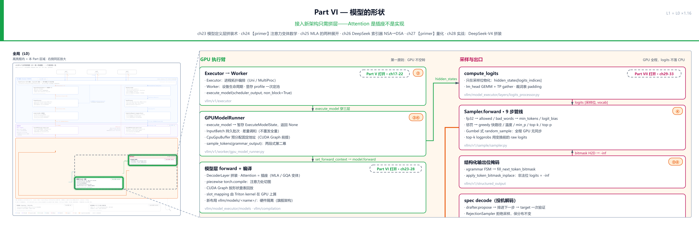
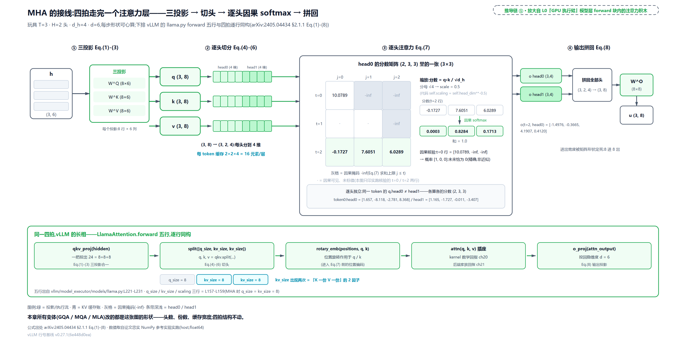
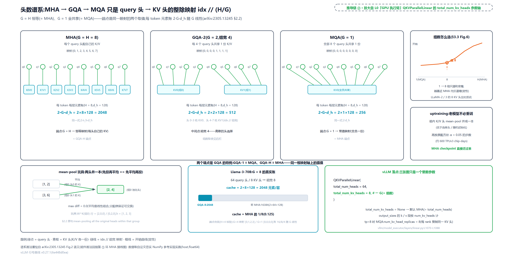
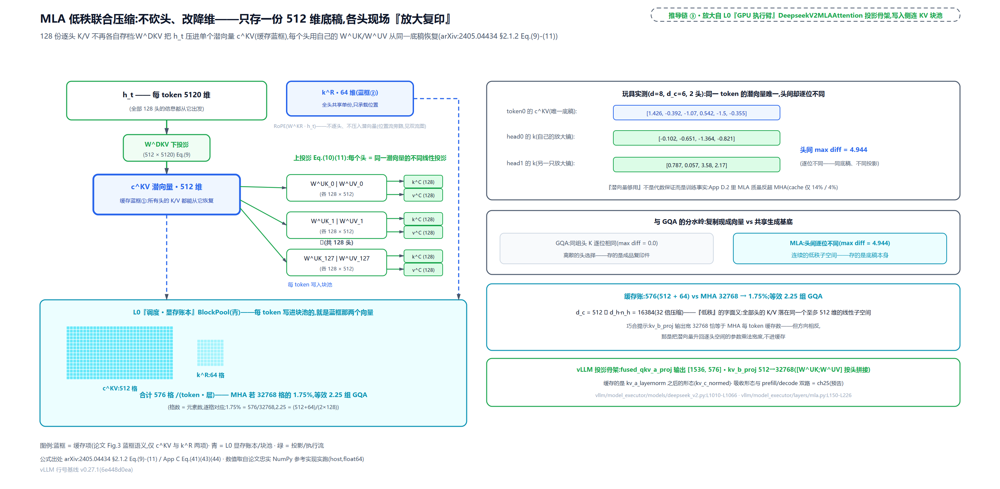
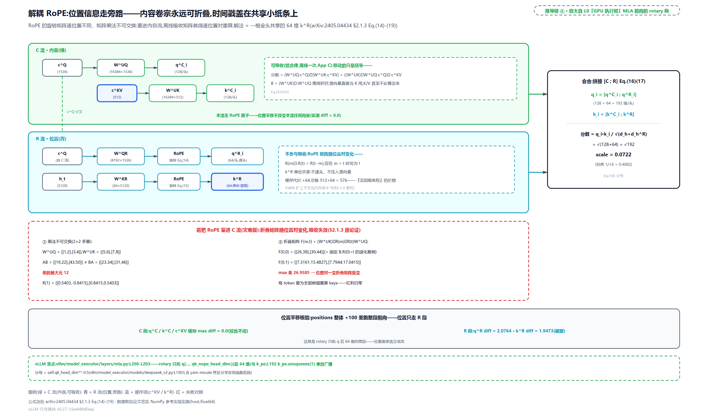
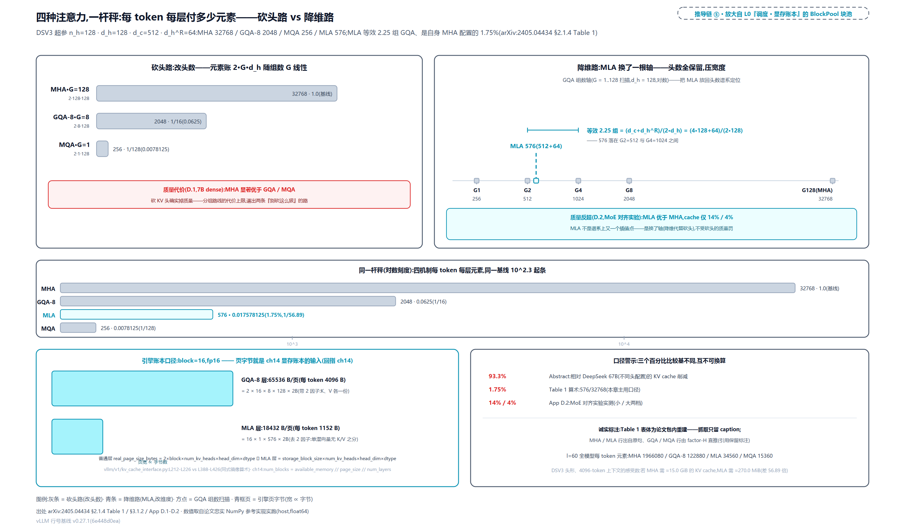

# 第 24 章　【primer】注意力变体数学

[上一章](../../ch23-model-layer-assembly/narrative/chapter.md)拼层的时候，每个注意力积木长得一模一样：`qkv_proj` 一把投出 Q/K/V，`o_proj` 收尾，五行完事。可形状账里早埋着问题：Llama-3-70B 有 64 个 query 头，却只配 8 份 K/V：query 段是 KV 段的 8 倍宽。这不是配置疏忽，是刻意省钱。DeepSeek-V3 更极端：128 个头的注意力，每个 token 每层要缓存的不是 $`2\times128\times128=32768`$ 个元素，而是 576 个；而且 KV cache 里装的甚至不是 K 和 V，是一个 512 维「潜向量」加一根 64 维、所有头共享的 key——谁也没法直接拿这两个东西去算 $`\mathrm{softmax}(q^{T}k)`$。128 个头凭什么共用一份 576 维缓存还够用、质量还不掉？这 512+64 从哪来、被压掉的 K/V 上投影去哪了、每个 token 都要的位置编码 RoPE 又塞在哪？

这是 Part VI 的第一篇原理章（全书四篇 primer 的第二篇）：主角不是某段源码的走读，而是两篇论文的数学（GQA 分组 query 注意力，[arXiv:2305.13245](https://arxiv.org/abs/2305.13245)；DeepSeek-V2 的 MLA 多头潜注意力，[arXiv:2405.04434](https://arxiv.org/abs/2405.04434)），以及这页数学在 v0.27.1 源码里的落点。全章主线一句话： **注意力变体是「KV cache 每 token 每层付多少元素」的账** 。先立 MHA（多头注意力）基线的账 $`2 n_h d_h`$，再走砍头路（MQA 多 query 注意力与 GQA 沿头数轴插值），最后走降维路（MLA 低秩压缩 + 解耦 RoPE + 离线吸收），总账收到 576=512+64。配对关系先说清：本章讲纸面数学与模型侧的投影骨架；这份数学在运行期的两种展开（预填充物化、解码吸收）是下一章的正题。

## 你在这里



> *图注：本章位置看[第 1 章](../../ch01-vllm-v1-in-one-map/narrative/chapter.md) L0 全图中间绿色「GPU 执行臂」列的模型层框，即写着「DecoderLayer 拼装 · Attention = 插座（MLA / GQA 变体）」的那块；顺带认 L0 右侧青色 KV 池列（「调度 · 显存账本」带里的 BlockPool），每 token 写进块池的宽度正是本章要付的账。L1 图底部章目录里，ch24 标着【primer】。本章接在四块已读结构上：[第 23 章](../../ch23-model-layer-assembly/narrative/chapter.md)拼好的注意力积木（本章翻开积木看内部形状）、[第 21 章](../../ch21-attention-backends/narrative/chapter.md)的后端家族（吃形状的黑盒，选型时问「head_size 是 576 还是 128」，答案在本章）、[第 13 章](../../ch13-paged-kv/narrative/chapter.md)的分页块池与[第 14 章](../../ch14-memory-ledger/narrative/chapter.md)的显存账本（分页只治碎片不降总量，总量这半边的账本章来付）、[第 20 章](../../ch20-flash-attention-math/narrative/chapter.md)的 kernel 数学（kernel 吃的就是本章定形状的 Q/K/V）。原理章没有站号：正文按推导链编排（元素账 → MHA 基线 → 砍头路 → 降维路 → 吸收 → 解耦 RoPE → 落地走读 → 总账），每一节是下一节的前置，按序读最顺。*

读法建议：只想知道 576 怎么来的，直奔[「降维路」](#降维路mla-把-kv-压进一个潜向量)与[「总账」](#总账四种机制一杆秤)两节；想看 vLLM 代码长什么样，读[「落地走读」](#落地走读论文矩阵长在模块名里)；想跟全程，按序读。

### 符号速查表

后文会陆续引入记号，先列一张表备查；每个符号首次出现处，正文还会紧跟一句人话解释，不必现在死记。

| 符号 | 含义 | 首现 |
|---|---|---|
| $`h_t`$ | 第 $`t`$ 个 token 的隐状态（注意力层的输入向量，长 $`d`$），一切投影的出发点；vLLM 里就是 hidden_states 的一行 | MHA 基线节 |
| $`d`$ | 模型隐维度（$`h_t`$ 的长度）；DSV2/DSV3（DeepSeek-V2/-V3 的缩写，下同）分别取 5120/7168 | MHA 基线节 |
| $`n_h`$ / $`d_h`$ | 注意力头数 / 每头维度（DSV2/V3 都是 128/128）；$`n_h`$ 乘进 MHA 每 token 缓存账 $`2 n_h d_h`$，是砍头路要砍的那个数 | MHA 基线节（$`d_h`$ 先在一本账节出场） |
| $`W^{Q}`$ / $`W^{K}`$ / $`W^{V}`$ | MHA 三投影矩阵（形状 $`d_h n_h\times d`$）；vLLM 里融合成 `qkv_proj` 一条 GEMM（general matrix-matrix multiply，通用矩阵乘，线性层 forward 的计算本体） | MHA 基线节 |
| $`q_{t,i}`$ / $`k_{t,i}`$ / $`v_{t,i}`$ | 投影结果切成 $`n_h`$ 份后、第 $`i`$ 个头分到的切片（各长 $`d_h`$） | MHA 基线节 |
| $`o_{t,i}`$ / $`u_t`$ / $`W^{O}`$ | 第 $`i`$ 个头的注意力输出 / 拼回全头过输出投影后的层输出 / 输出投影矩阵 | MHA 基线节 |
| $`l`$ | Transformer 层数，每 token 元素账都要乘的层数因子（Table 1 每行都带） | 元素账节 |
| $`n_{kv}`$ | KV 头数，一本账节账式 $`2 n_{kv} d_h l`$ 的头数因子：MHA 下 $`n_{kv}=n_h`$，砍头路要砍的就是它 | 一本账节 |
| $`H`$ / $`G`$ | GQA 论文记号：query 头总数 / 组数（$`H`$ 即 MHA 基线的 $`n_h`$：MHA 下 KV 头数=头数，账里的 $`n_{kv}`$ 就是 $`H`$）。GQA-1=MQA、GQA-H=MHA；vLLM 里 $`G`$ 就是 `total_num_kv_heads` 一个整数 | 砍头路节 |
| $`c_t^{KV}`$ | K/V 联合压缩潜向量（长 $`d_c=512`$）：KV cache 里装的东西本体；vLLM 缓存的是它过 RMSNorm 后的形态 | 降维路节 |
| $`W^{DKV}`$ / $`W^{UK}`$ / $`W^{UV}`$ | 下投影（$`d_c\times d`$，把 $`h_t`$ 压进潜空间）/ 两个上投影（各 $`d_h n_h\times d_c`$，从潜向量逐头恢复 K/V） | 降维路节 |
| $`k_t^{C}`$ / $`v_t^{C}`$ | 从潜向量恢复出的逐头 K/V（上标 C=压缩路/Content）：每个头是同一潜向量的不同线性投影 | 降维路节 |
| $`d_c`$ | KV 压缩维度（=512=$`4 d_h`$）；$`d_c\ll d_h n_h`$（512 远小于 16384）就是「低秩」的字面义 | 降维路节 |
| $`c_t^{Q}`$ / $`d_c'`$ / $`W^{DQ}`$ / $`W^{UQ}`$ | query 侧压缩潜向量（长 1536）/ query 压缩维度 / query 下、上投影：压的是训练激活内存，不压 cache（query 不进 KV cache） | 降维路节 |
| $`q_{t,i}^{R}`$ / $`k_t^{R}`$ / $`d_h^{R}`$ | 解耦 RoPE 的逐头 query / 所有头共享的单份 key / 这两者的每头维度（=64=$`d_h/2`$）；$`k^{R}`$ 是 MLA 唯一的额外缓存项 | 解耦 RoPE 节 |
| $`W^{QR}`$ / $`W^{KR}`$ / $`\operatorname{RoPE}(\cdot)`$ | 解耦 RoPE 的两个投影 / 旋转位置编码算子（按位置施加正交旋转） | 解耦 RoPE 节 |
| $`[\cdot\,;\cdot]`$ | 向量拼接：$`q_i=[q_i^{C};q_i^{R}]`$、$`k_i=[k_i^{C};k^{R}]`$，内容段与位置段在打分前拼成一整条（每头 128+64=192 维） | 解耦 RoPE 节 |
| $`\sqrt{d_h+d_h^{R}}`$ | MLA 的缩放分母（=√192）：拼接后每头 192 维，分母不再是 $`\sqrt{d_h}`$；代码即 `qk_head_dim**-0.5` | 解耦 RoPE 节 |
| 2.25 groups | MLA 的 KV cache 等效 GQA 组数：$`(d_c+d_h^{R})/(2 d_h)=576/256=2.25`$，把 MLA 放回头数谱系定位的换算（Table 1 caption 原句） | 总账节 |

还有一句环境交代，全章数值表都适用：本章数值推演来自按两篇论文忠实复现的参考实现（NumPy、纯 CPU、无 vLLM 依赖）在宿主机上的实跑输出，浮点一律 float64（真实 GPU kernel 是 fp16/bf16 输入，浮点末位舍入层面的数值行为不在本章取证范围）；「恒等」断言均有实跑见证，等式的数学依据是结合律，不是浮点巧合。vLLM 侧的数字（页字节、头数、权重形状）本机没有 vLLM 包可跑，是按 v0.27.1 源码公式做的同式算术镜像（纯乘法与整除，锚点行号已对源码工作树逐条核真），不是 import 实跑；论文常数（93.3%、14%/4%、α=0.05、600 chip-days、8 组）逐字取自两篇论文原文。后文碰到会就近再提。

---

## 一本账：KV cache 同时卡住带宽与容量

先立全章的靶子。自回归解码像记账：每记一笔新账，都要把整本旧账重读一遍——因果注意力让第 $`t`$ 步的分数对全部 $`j\le t`$ 求和（MHA 的式(7) 求和上限，MHA 基线节马上展开），所以每个历史 token 的 K/V 此后每一步都要被读一次（带宽）；同时这本账全程摊在桌上不能收：K/V 从生成第一个 token 起就驻留显存直到请求结束（容量）。同一个数（每 token 的账本宽度）同时卡住这两件事，这就是全章的账：

```math
2\cdot n_{kv}\cdot d_h\cdot l
```

那个 2 是「K 一份、V 一份」，$`n_{kv}`$ 是 KV 头数，$`d_h`$ 是每头维度（DSV3 取 128，MHA 基线节正式展开），$`l`$ 是层数。[第 13 章](../../ch13-paged-kv/narrative/chapter.md)的分页解决了碎片与前缀共享，[第 14 章](../../ch14-memory-ledger/narrative/chapter.md)的账本解决了「池子里还剩多少块」——但每 token 总量这一半，分页一个数都省不下来。本章的全部变体，改写的都是上式里的头数与维度。

先感受这个数的量级（说明性算例，按各模型公开 config 算的账，vLLM 侧锚点已对 v0.27.1 源码逐条核验）：

<!-- trace: ch24-m01 -->
| 账目行 | 算式 | 数值 | 出处/口径 |
|---|---|---|---|
| Llama-2-7B FP16 每 token 整模型（l=32） | 2×32 层×32 kv 头×128 维×2B | 524288 B = 0.5 MiB | 按 Llama-2-7B config 算的账（24GB 卡权重吃 14GB 后池只剩约 8GB） |
| DSV3 若 MHA（每层，Table 1 口径） | 2·n_h·d_h = 2×128×128 | 32768 元素 | arXiv:2405.04434 §2.1.1 尾句「MHA needs to cache 2n_h·d_h·l elements」 |
| DSV3 若 MHA（实际 qk 宽口径） | 128×(192+128)（K 逐头按 MLA 的 192 维 qk 宽） | 40960 元素 | 按 MLA 实际 192 维 query-key 宽逐头计的账；与上行差异=K 每头按 192 还是 128 计，两口径并存、引用时须挑明 |
| DSV3 MQA（每层） | 2·1·128 | 256 元素 | Table 1 MQA 行（factor-H 直推，见砍头路节） |
| DSV3 GQA-8（每层） | 2·8·128 | 2048 元素 | Table 1 GQA 行 |
| DSV3 MLA（每层） | d_c+d_h^R = 512+64 | 576 元素（≈MHA 的 1.75%） | §2.1.3 尾句+§3.1.2 超参；1.75% 由 576/32768 算得（约） |
| 口径警示行 | 93.3 / 1.75 / 14 / 4 | 三个百分比互不可换算 | Abstract（vs DeepSeek 67B）/Table 1 算术/App D.2 MoE（混合专家架构）实测，比较基各不相同 |

第二行的 32768 与第三行的 40960 要当场挑明：Table 1 的公式把 K/V 每头都按 128 维计；第三行的算例把 K 逐头按 MLA 实际的 192 维 query-key 宽计（$`d_h+d_h^{R}`$，192=128+64 的拼接宽；解耦 RoPE 节展开，此处先当口径常数）。两个口径都对，说的是不同的事，引用时别混。倒数第一行的警示先记下，总账节会正面收：93.3% 是 DSV2 论文摘要相对 DeepSeek 67B（不同头配置的老模型）的口径，1.75% 是本章按 Table 1 公式加 DSV3 超参的纯算术，14%/4% 是论文附录 D.2 里 MoE 对齐实验的实测——三个数比较基不同，互相不可换算。

把第二行放大到整模型（说明性）：DeepSeek-V2 整模型（60 层；头形与 V3 完全相同）、4096-token 上下文、fp16，若 MHA 需要 16106127360 B 约 15.0 GiB 的 KV cache；MLA 只需要 283115520 B 约 270.0 MiB，差 56.89 倍。这笔账在引擎侧落在哪？[第 14 章](../../ch14-memory-ledger/narrative/chapter.md)的显存账本拿 `num_blocks = available // page_size // num_layers` 数块数，`page_size` 就是下面这个属性算出来的：

```python
# vllm/v1/kv_cache_interface.py:L211-L226 · AttentionSpec.real_page_size_bytes（普通注意力层的页字节）
    @property
    def real_page_size_bytes(self) -> int:
        if self.kv_quant_mode.is_nvfp4:
            # Packed layout: fp4 data + fp8 block scales per head.
            head_dim = nvfp4_kv_cache_full_dim(self.head_size)
        elif self.kv_quant_mode == KVQuantMode.INT4_PER_TOKEN_HEAD:
            head_dim = self.head_size // 2
        else:
            head_dim = self.head_size
        return (
            2                                        # L221
            * self.block_size
            * self.num_kv_heads
            * head_dim
            * get_dtype_size(self.dtype)
        )
```

乘积里的 2 就是「K 一份、V 一份」，`num_kv_heads` 就是头数——账本公式在代码里的长相与式子逐项对应（量化打包分支是[第 27 章](../../ch27-quantization/narrative/chapter.md)的入口）。全章后面每一种变体，要么动 `num_kv_heads`（砍头路），要么让 MLA 用另一份没有 2 的公式（总账节见 `MLAAttentionSpec`）。

---

## 基线 MHA：论文式(1)-(8) 与五行代码

砍之前先看清基线。标准多头注意力（MHA，Multi-Head Attention）出自 2017 年的 Transformer 论文（[arXiv:1706.03762](https://arxiv.org/abs/1706.03762)）：一个「头」=一组自己的 $`W^{Q}/W^{K}/W^{V}`$ 投影加一次缩放点积注意力，$`h`$ 个头各算各的再拼接。为什么多头：论文原话是让模型「同时从不同表示子空间、不同位置获取信息」——softmax 的输出是对全体 value 的加权平均，单头一次只能形成一种关注模式，平均化会把不同的关注倾向抹平；多头让各组投影各学各的再拼回来。DeepSeek-V2 论文把这条 MultiHead 公式按单个 token 展开，就是本节的式(1)-(8)（arXiv:2405.04434 §2.1.1）。

四拍走起。第一拍，隐状态三投影：

```math
\mathbf{q}_{t} = W^{Q}\mathbf{h}_{t},\qquad
\mathbf{k}_{t} = W^{K}\mathbf{h}_{t},\qquad
\mathbf{v}_{t} = W^{V}\mathbf{h}_{t}
```

$`h_t\in\mathbb{R}^{d}`$ 是第 $`t`$ 个 token 的隐状态；三个投影矩阵形状都是 $`d_h n_h\times d`$——这个形状本身就是「$`n_h`$ 组投影纵向拼接」的一体化记法。第二拍，切成 $`n_h`$ 个头（论文给了三条独立编号的等式，式(4)-(6)，语义就是下面这一句）：

```math
[\mathbf{q}_{t,1};\ldots;\mathbf{q}_{t,n_h}]=\mathbf{q}_{t}
```

K、V 同款切法，每头拿到自己那条 $`d_h`$ 维切片。第三拍，逐头注意力（式(7)）：

```math
\mathbf{o}_{t,i}=\sum_{j=1}^{t}\operatorname{Softmax}_{j}\left(\frac{\mathbf{q}_{t,i}^{T}\mathbf{k}_{j,i}}{\sqrt{d_{h}}}\right)\mathbf{v}_{j,i}
```

求和上限是 $`j\le t`$——因果性就写在这个上限里；分母 $`\sqrt{d_h}`$ 是点积缩放（防维度大时 softmax 饱和，[第 20 章](../../ch20-flash-attention-math/narrative/chapter.md)在 kernel 内部见过它）；$`\operatorname{Softmax}_{j}`$ 的下标 $`j`$ 表示概率对 $`j`$ 归一、每行和为 1（下面玩具表 t=2 行的 [0.0003, 0.8284, 0.1713] 就是它算出的权重）。第四拍，拼回输出（式(8)）：

```math
\mathbf{u}_{t}=W^{O}[\mathbf{o}_{t,1};\ldots;\mathbf{o}_{t,n_h}]
```

一个值得停半拍的形状自由度：2017 年原论文把头数×头维绑定在隐维度上（Table 3 base 行 $`h=8`$，原论文以 $`h`$ 记头数、即本章的 $`n_h`$；每头 $`d_k=d_{\mathrm{model}}/h=64`$、$`d_{\mathrm{model}}=512`$，均分）；现代 LLM 把 $`n_h\times d_h`$ 当独立乘积设计——DSV3 是 128 头×128 维=16384，比隐维度 7168 的两倍还多。乘积一旦独立于隐宽度暴涨，元素账 $`2 n_h d_h`$ 随之暴涨，这正是接下来三代变体要优化的那个乘积。

推导要在玩具上过一遍数字才落地。取 T=3 个 token、2 个头、$`d_h=4`$、$`d=6`$（小到每步形状可心算；张量按 token、头、头维的顺序排布，与[第 20 章](../../ch20-flash-attention-math/narrative/chapter.md)varlen 打平那段的 `(total, nheads, headdim)` 是同一条约定）：

<!-- trace: ch24-m02 -->
| 拍 | 论文式 | 本例形状/数值 | vLLM 同构（llama.py） |
|---|---|---|---|
| ① 三投影 | Eq.(1)-(3) | h(3,6)→q/k/v(3,8)；W∈8×6 | qkv_proj 一把投出（forward 第一行） |
| ② 逐头切分 | Eq.(4)-(6) | (3,8)→(3,2,4)，每头 4 维 | split([q_size, kv_size, kv_size])——kv_size 出现两次就是「K 一份 V 一份」 |
| ③ 逐头注意力 | Eq.(7) | 分数(2,3,3)；scale=1/√4=0.5；t=2 行 probs=[0.0003, 0.8284, 0.1713] | attn 插座（第 20/21 章的 kernel 吃这三块）；scaling=head_dim**-0.5 |
| ④ 输出拼回 | Eq.(8) | o(3,2,4)→u(3,8) | o_proj 收尾（forward 末行） |
| 因果核验 | Eq.(7) 求和上限 j≤t | t=0 行只有 j=0 可见（分数 10.0789），j=1/j=2 为 -inf→概率恰 0 | 因果性=kernel 的 causal 掩码（讲 kernel 数学的那章已讲） |
| 每 token 缓存账 | Eq.(2)(3) 投影宽度 | k_heads[0]+v_heads[0]=16 元素=2×2×4 | kv_size 出现两次的代码形态 |

表里第 ③ 行的数字值得亲手核一遍：head 0 在 $`t=2`$ 行的三个分数（已乘缩放 0.5）是 $`[-0.1727,\,7.6051,\,6.0289]`$，softmax 后 $`[0.0003,\,0.8284,\,0.1713]`$、和恰为 1.0；因果掩码把上三角置 $`-\infty`$，softmax 分子 $`e^{-\infty}=0`$，未来 token 的贡献精确为零（不是近似）——这就是因果不变量。另一个不变量是宽度守恒：式(4)-(6) 把 $`n_h d_h`$ 维向量切成 $`n_h`$ 条，式(8) 的 $`W^{O}`$ 又把它拼回，进出宽度被矩阵形状定死。

这套四拍在 vLLM 里就是[第 23 章](../../ch23-model-layer-assembly/narrative/chapter.md)拼过的那五行——本章翻过来看形状契约：

```python
# vllm/model_executor/models/llama.py:L221-L231 · LlamaAttention.forward（ch23 的五行，本章看 split 尺寸）
    def forward(
        self,
        positions: torch.Tensor,
        hidden_states: torch.Tensor,
    ) -> torch.Tensor:
        qkv, _ = self.qkv_proj(hidden_states)
        q, k, v = qkv.split([self.q_size, self.kv_size, self.kv_size], dim=-1)  # L227
        q, k = self.rotary_emb(positions, q, k)                                 # L228
        attn_output = self.attn(q, k, v)
        output, _ = self.o_proj(attn_output)
        return output
```

四拍对五行：`qkv_proj` 是第一拍（三个投影融合成一条 GEMM），`split` 是第二拍，`attn` 插座是第三拍（kernel 在插座后面，[第 21 章](../../ch21-attention-backends/narrative/chapter.md)选的那个），`o_proj` 是第四拍；`rotary_emb` 是位置编码，本章解耦 RoPE 节才正面拆它。尺寸的出生地在构造里（ch23 已逐行走过 TP 切分/复制的机器，这里只认三个宽度）：

```python
# vllm/model_executor/models/llama.py:L157-L159 · LlamaAttention.__init__（段宽与缩放）
        self.q_size = self.num_heads * self.head_dim        # L157
        self.kv_size = self.num_kv_heads * self.head_dim    # L158
        self.scaling = self.head_dim**-0.5                  # L159
```

MHA 时 `num_kv_heads == num_heads`，`q_size == kv_size`，split 尺寸表是 $`[8,8,8]`$ 这种三段等宽；本章开篇那个「q_size 是 kv_size 的 8 倍」，就是 `num_kv_heads < num_heads` 的那一刻。全章后面所有变体改的都是这两个宽度，不改五行结构。



> *图注：上排论文四拍（arXiv:2405.04434 §2.1.1 式(1)-(8)）：$`h_t`$ (3,6) 三投影成 (3,8)、裁成 2 头×4 维、每头各算各的因果 softmax（缩放 1/√4=0.5）、再拼回 (3,8)；下排 vLLM 五行（qkv_proj/split/rotary/attn/o_proj）逐列对齐同拍同色。split 尺寸表 [8,8,8] 里 kv_size 写两遍，就是「K 一份 V 一份」的 2 因子在代码里的长相；t=2 行的 probs [0.0003, 0.8284, 0.1713]（和 1.0）与 t=0 行的因果掩码同表里的数字逐一来自本章数值推演。本章所有变体改的都是这张图的形状，不改四拍结构。*

---

## 砍头路：从 MQA 到 GQA 的插值

账式 $`2\cdot n_{kv}\cdot d_h\cdot l`$ 里，头数 $`n_{kv}`$ 是最显眼的可砍项。这条路上有两代设计。

**MQA：砍到 1。** MQA（Multi-Query Attention，多 query 注意力）出自 Shazeer 2019 年的单人短文《Fast Transformer Decoding: One Write-Head Is All You Need》（[arXiv:1911.02150](https://arxiv.org/abs/1911.02150)）——标题戏仿的正是他自己参与的 2017 年《Attention Is All You Need》（他是八位作者之一）。所谓 write-head：K/V 是每个新 token 都要「写入」cache 的那一侧，所以叫写头；「一个写头就够了」= 全部 query 头共享 1 个 K 头 + 1 个 V 头。收益直接写进账：头数从 $`H`$ 到 1（$`H`$ 即 MHA 基线的 $`n_h`$：MHA 下 KV 头数=头数，前文账里的 $`n_{kv}`$ 就是它），每 token 元素账与每步加载量都除以 $`H`$（GQA 论文 §2.2 原话「reducing the size of the key-value cache and therefore amount of data that needs to be loaded by a factor of H」，arXiv:2305.13245）。代价也写进同一篇：「对带宽与容量都是更激进的砍法」，K/V 能表达的线性映射空间维数同步除以 $`H`$，省钱省的是同一刀，砍掉的也是同一刀。Shazeer 2019 的摘要自报「相对基线只有轻微质量损失」；后面的消融（总账节 D.1）会把这条质量罚量出来。PaLM（Google 的大模型）用了 MQA；MQA 从零训练时还有不稳定的记录（GQA 论文附录 A：loss 尖峰、长输入微调发散）。

<!-- trace: ch24-m03 -->
| 配置（H=32, d_h=128） | 每 token 每层元素 | 缩减倍数（vs MHA） | vLLM tp=8 头数账（镜像） |
|---|---|---|---|
| MHA（G=32） | 2×32×128=8192 | 1（基线） | num_kv_heads=4, replicas=1（tp<KV 头：切分） |
| GQA-8 | 2048 | 4 | num_kv_heads=1, replicas=1（tp=KV 头） |
| GQA-4 | 1024 | 8 | num_kv_heads=1, replicas=2（tp>KV 头：复制） |
| MQA（G=1） | 2×1×128=256 | 32（factor-H 原句） | num_kv_heads=1, replicas=8（每 rank 复制同一 KV 头） |
| 玩具核验（H=4, d_h=2） | 16→4（kv_head_map=[0,0,0,0]） | 4=H | 跨头 K max diff=0.0，四头吃同一份（广播，非四份拷贝） |

表尾玩具行的实测值得停一秒：4 个头吃的 K 逐位相同（最大差 0.0），MQA 的「共享」是广播一份现成向量，不是四份拷贝。表里最后三列引出一个工程问题：MQA 只剩 1 个 KV 头，[第 23 章](../../ch23-model-layer-assembly/narrative/chapter.md)讲过的张量并行（TP，tensor parallel，按权重切多卡）切不动它，只能整份复制到每张卡——`num_kv_head_replicas=8` 就是那行除法的产物。Pope et al. 2022（Google 的 500B 级推理效率研究，[arXiv:2211.05102](https://arxiv.org/abs/2211.05102)）摘要实测 MQA 的低显存能让上下文扩 32 倍，前提是原文说的「with appropriate partitioning」（配得当的切分：单 KV 头小到可以沿 batch 维分片，而不是复制到每张卡）。不做那种分片、只复制时，这笔账要重算：MQA 模型账面（单份、不分片）省到 1/32，但 TP=8 复制下无论按每卡还是全机合计都只省到 1/4（每卡 1 份、八卡合计 8 份，对 MHA 切分后的每卡 4 份、合计 32 份，两个口径同步退化），省下的显存被复制吃回；GQA 论文引 Pope，引的正是「复制造成浪费」这一点（§2.2 原句只作定性论证，1/4 是按上表 H=32、tp=8 算的例账）。

**GQA：插值。** GQA（Grouped-Query Attention，分组 query 注意力，arXiv:2305.13245 §2.2）的定义一句话：query 头分成 $`G`$ 组，每组共享一份 K 头和 V 头。GQA-1 就是 MQA，GQA-H（组数=头数）就是 MHA——两个极端是同一个定义的端点，中间的每个 $`G`$ 都是插值点：比 MQA 质量高、比 MHA 快。「分组」在数学上只是一张整除映射表：头 $`i`$ 归组 $`i//(H/G)`$，连续分组，与 Hugging Face（HF，开源 transformers 库的出品方）的 `repeat_kv` 播映约定一致（把每份 KV 映给组内各 query 头；vLLM 不做这种运行时广播，分组直接落成权重层的段宽差，见下文 linear.py 的头数账，细节不展开）：

<!-- trace: ch24-m04 -->
| 步/项 | 数值/算式 | 判定/出处 |
|---|---|---|
| Llama-3-70B 分组 | 64 query 头/8 KV 头→组宽 8 | 每 8 个 query 头共享 1 份 K/V；cache 16384→2048（1/8, 0.125） |
| 组映射（连续分组） | kv_head_of_query_head(8,2)=[0,0,0,0,1,1,1,1] | idx // 组宽；§2.2「divides query heads into G groups」 |
| mean-pool 转换 | 组0：头0 K=[1, 2]、头1 K=[3, 6]→池化头 K=[2, 4]（另取 H=4、G=2 的小例，每 2 头一组；上行映射是 H=8） | 先投再平均==先平均再投（max diff=0.0，线性）；§2.2 原句，优于选单头/随机初始化（§2.1） |
| uptraining（升格补训）配方 | α=0.05 原配方步数（约 600 TPUv3 chip-days） | MHA checkpoint 不必重训；§2.1/§3.1 |
| 组数取舍（Fig.6） | 1→8 组只温和变慢、近 MHA 代价递增；作者选 8 | §3.3；LLaMA-2/3 的 8 KV 头出处 |
| 端点合拢核验 | G=4 映射[0,1,2,3]（恒等=MHA）；G=1 映射[0,0,0,0]（常值=MQA） | 元素账 16/8/4 随 G 线性；组内 K diff=0.0、跨组 diff=1.498662 |

表里四行各答一个工程问题。第一行是本章开篇的形状账：64/8 的组宽 8，cache 付 MHA 的 1/8。第二行是分组本身。第三行是「已有 MHA checkpoint 怎么迁过来」：把每组原有的几个 KV 头投影矩阵做算术平均（mean-pool），因为平均是线性运算，先投再平均与先平均再投严格相等（实测 max diff=0.0）；论文试过三种转换，mean-pool 优于挑一个头、更优于随机重初始化，保留下来的预训练信息最多。第四行是补练：mean-pool 之后按原预训练配方再练 $`\alpha=0.05`$ 比例的步数（论文主实验约 600 TPUv3 chip-days，即芯片数乘天数的算力计量，原训练量的 5%），LLaMA 系就这么从 MHA 迁到 GQA-8。组数本身不是越小越好也不是越大越好：论文 Fig.6 实测（XXL 模型、输入 2048/输出 512），从 1 组加到 8 组推理时间只温和上涨，越靠近 MHA 代价越大，作者据此选 8——LLaMA-2/3 的 8 个 KV 头出处即此。

还有一条规模账（§2.2 论证）：KV cache 随模型维度线性涨，而 FLOPs（浮点运算次数）与参数量随维度平方涨。模型越大，KV 带宽占比反而越高，GQA 让带宽与容量的缩减随规模同比保持（MQA 则越大的模型砍得越狠）。生态面（各模型报告一手核实）：GQA 是 2023 年后开源大模型的默认——Llama-2 只在 70B 大杯换 GQA（Llama 2 论文原话：为改进推理扩展性），7B/13B 小杯仍是 MHA；Llama-3 全系 8 KV 头，Mistral-7B、Qwen2、Gemma-2 都用 GQA；MQA 还留在小模型上（Gemma-1 的 2B 档用 MQA、7B 档用 MHA，到 Gemma-2 回摆到 GQA）；MLA 是 DeepSeek 系与 Kimi K2 的路线（K2 的 MLA 设计自述「与 DeepSeek-V3 相似」，头数从 128 减到 64 以降长上下文推理开销）。Llama-2 只在大杯换、Gemma 两代之间从 MQA 回摆，这两条正好印证 Fig.6 的组数取舍曲线。

vLLM 落点出奇地小：整条谱系就是 `QKVParallelLinear` 的一个整数参数。

```python
# vllm/model_executor/layers/linear.py:L1022-L1030 · QKVParallelLinear docstring（源码自己的一句话定义）
class QKVParallelLinear(ColumnParallelLinear):
    """Linear layers for the attention's QKV transformation.

    Linear layers for the linear transformation of the query, key, and value
    vectors in the attention layer. The weight matrix is concatenated along
    the output dimension. The layer is parallelized along the head dimension.
    When the number of key/value heads is smaller than the number of query
    heads (e.g., multi-query/grouped-query attention), the key/value head may
    be replicated while the query heads are partitioned.
```

构造里 `total_num_kv_heads=None` 时默认取 `total_num_heads`（linear.py:L1070-L1072）：MHA 是默认值；GQA 传组数 $`G`$；MQA 传 1。段宽账在 linear.py:L1083-L1088：`output_sizes` 三段里 q 段按 `num_heads` 计、k/v 两段按 `num_kv_heads` 计——「分组」在权重层就落成这个段宽差：每 $`H/G`$ 个 query 头共用一份 KV，头归组的除法 $`i//(H/G)`$ 体现为 k/v 两段按更少的头数计宽（TP 切分/复制的机器[第 23 章](../../ch23-model-layer-assembly/narrative/chapter.md)已逐行走过，此处不重讲）。



> *图注：重绘自 arXiv:2305.13245 Fig.2 与 Fig.1、Fig.6（§2.2/§2.1/§3.3）：MHA 每个 query 头配自己的 K/V；MQA 全员共享一份；GQA-g 每组一份——三面板的连线就是映射 idx//(H/G)（H=8、G=2 时头 0-3 接 KV0、头 4-7 接 KV1，端点 G=1 全共享/G=8 恒等）。每 token 元素账 2·G·d_h 随 G 线性：H=8、d_h=128 时 MHA/GQA-2/MQA 分别 2048/512/256。右侧组数取舍曲线（Fig.6 语义，无数值刻度）：1→8 组温和、近 MHA 递增，作者选 8；下方 mean-pool 小例（[1,2]+[3,6]）/2=[2,4]、α=0.05 uptraining 约 600 TPUv3 chip-days；Llama-3-70B 的 16384→2048（1/8）比例条与 vLLM 落点（total_num_kv_heads 一个整数，None 默认 MHA）同图。*

砍头路到此：账从 $`2H d_h`$ 压到 $`2G d_h`$，质量换显存，端点重合、处处插值。但消融（总账节 D.1）会确认：这条路无论怎么插都有质量罚。DeepSeek 换了一根轴。

---

## 降维路：MLA 把 K/V 压进一个潜向量

MLA（Multi-head Latent Attention，多头潜注意力，arXiv:2405.04434 §2.1.2）的思路：不砍头，改降维。先垫一个代数背景：矩阵的秩是它真正张成的维度数；一个 $`d\times D`$ 的大变换若秩不超过 $`r`$，恰好可以写成「降维矩阵×升维矩阵」两个小矩阵的乘积，中间那根 $`r`$ 维细腰就是信息瓶颈的宽度。深度学习反复用这条低秩分解：ALBERT（[arXiv:1909.11942](https://arxiv.org/abs/1909.11942)）把词表嵌入拆成两段省嵌入参数，LoRA（[arXiv:2106.09685](https://arxiv.org/abs/2106.09685)）把微调增量约束成 $`B\cdot A`$ 省训练参数，MLA 把同一套代数搬到「省推理 KV cache」——中间那个低维向量从此要常驻显存、每个新 token 都要读写（「latent/潜向量」的叫法承自自编码器一脉的隐表示：它不是 K 或 V 本身，是它们的压缩底稿）。需要说明：MLA 论文的引用谱系是 MHA/MQA/GQA，并没有引用 LoRA/ALBERT，「三代应用」是结构同构的归纳，不是学术引用链。用 DSV3 形状感受一下：满秩 K 投影 $`W^{K}\in\mathbb{R}^{16384\times7168}`$ 约 1.17 亿参数；MLA 走细腰只要

```math
512\times7168+16384\times512=12058624\approx1.2\times10^{7}
```

约 1200 万。更重要的是推理每 token 每层只缓存 512 维（加一根 64 维旁路），而不是 32768 个元素。

论核心式（§2.1.2 式(9)-(11)）。先压缩：

```math
\mathbf{c}_{t}^{KV}=W^{DKV}\mathbf{h}_{t}
```

$`c_t^{KV}\in\mathbb{R}^{d_c}`$ 是 K/V 联合压缩潜向量，$`d_c\ll d_h n_h`$（512 远小于 16384——「低秩」的字面义）；$`W^{DKV}\in\mathbb{R}^{d_c\times d}`$ 是下投影。要用时上投影恢复：

```math
\mathbf{k}_{t}^{C}=W^{UK}\mathbf{c}_{t}^{KV},\qquad
\mathbf{v}_{t}^{C}=W^{UV}\mathbf{c}_{t}^{KV}
```

$`W^{UK},W^{UV}\in\mathbb{R}^{d_h n_h\times d_c}`$ 是两个上投影。关键论断在原文紧随其后的一句：推理只需要缓存 $`c_t^{KV}`$（$`d_c l`$ 个元素），而且由于 $`W^{UK}`$ 可吸进 query 侧、$`W^{UV}`$ 可吸进输出侧（吸收节正面推导），「我们甚至不需要把 K 和 V 算出来」。query 侧同构地压一道（式(12)-(13)）：

```math
\mathbf{c}_{t}^{Q}=W^{DQ}\mathbf{h}_{t},\qquad
\mathbf{q}_{t}^{C}=W^{UQ}\mathbf{c}_{t}^{Q}
```

玩具上跑数字（$`d=8`$、2 头、$`d_h=4`$、$`d_c=6`$、$`d_h^{R}=2`$、T=4；$`d_h^{R}`$ 是旁路共享 key 的维度，即开篇那根 64 维，为什么要有它解耦 RoPE 节揭晓）：

<!-- trace: ch24-m05 -->
| 量 | 玩具（d=8, H=2, d_h=4, d_c=6, d_h_R=2） | DSV2 真值（V3 头形/潜维全同） |
|---|---|---|
| 潜向量 c^KV | 形状(4,6)；token0=[1.426, -0.392, -1.07, 0.542, -1.5, -0.355] | 512 维（W_DKV 形状 512×5120） |
| 逐头上投影 k^C/v^C | (4,2,4)；W_UK/W_UV 形状 8×6 | W_UK/W_UV 形状 16384×512；kv_b_proj 输出宽 32768（=[W^UK;W^UV] 按头拼接） |
| 头间关系 | head0 k=[-0.102, -0.651, -1.364, -0.821] vs head1 k=[0.787, 0.057, 3.58, 2.17]（max diff=4.944） | 128 头是同一潜向量的不同线性投影——头间全不同 |
| 对照 GQA | 同组头 K 逐位相同（max diff=0.0），复制现成向量（离散头选择） | MLA 共享的是生成基底（连续低秩子空间），本质差异 |
| 每 token 缓存 | 6+2=8 vs MHA 等价 2×2×4=16 | 576（512+64）vs 32768（约 1.75%）；等效 2.25 组 GQA |
| 蓝框语义 | cache 只装 (c_KV, k_R)：形状 (4,6)+(4,2)，无任何逐头量 | V3 重述式 V3-1/V3-3 直接蓝框（V3 报告的式号，落地走读节末交代）；c^KV 存 RMSNorm 后形态（kv_c_normed） |

第三、四行是本节的关键对照，值得盯着数字看：GQA 同组头吃的 K 逐位相同（差 0.0，广播一份现成向量）；MLA 两个头从同一潜向量恢复出的 K 逐位不同（差 4.944，各自过自己的 $`W^{UK}_i`$）。**GQA 共享的是现成向量（离散的头选择），MLA 共享的是生成基底（连续的低秩子空间）** ——这是两条压缩路在数学上的分水岭。由此有个不变量：MLA 全部 $`n_h`$ 个头的 $`k^{C}/v^{C}`$ 落在同一个至多 $`d_c`$ 维的线性子空间里，每 token 576 个元素携带的 K/V 信息上限就是这个子空间加一根共享 $`k^{R}`$，这是压缩比的数学边界。也要诚实：**「潜向量够用」不是代数保证，是训练事实**：$`W^{DKV}/W^{UK}`$ 得学会把任务所需的信息保进这个子空间；附录 D.2 的实验证据（总账节展开）是 MLA 质量反超 MHA，而 D.1 显示砍头路线确实掉质量。

「降维代替砍头」为什么能绕开质量罚？直觉一秒钟：GQA 的 2.25 组如果真用离散头选择实现（每 57 个头共用一份 K/V），表达力损失直接可测；MLA 的「等效 2.25 组」只是缓存账的换算，128 个头仍然各持各的 $`W^{UK}_i/W^{UV}_i`$，在潜空间的 512 维里各看各的投影——头数一个没砍。一个巧合数字要拆穿：kv_b_proj 的输出宽 32768 恰好等于 MHA 每 token 缓存数，但方向相反：那是参数侧把潜向量升回逐头空间的乘法宽度，不进缓存。



> *图注：重绘自 arXiv:2405.04434 Fig.3（§2.1）的 MLA 面板：$`h_t`$（每 token 5120 维）经 W^DKV（512×5120）压进单个 512 维潜向量 c^KV（全图主蓝框，KV cache 装的就是它），128 个头各持 W^UK_i/W^UV_i（逐头切片各 128×512，纵向拼成整条 16384×512 的 W^UK/W^UV，形状见上表）把它上投影成自己那份 k^C/v^C。玩具数值例：token0 的潜向量 [1.426, -0.392, -1.07, 0.542, -1.5, -0.355]，head0 与 head1 恢复出的 K 逐位不同（max diff=4.944），对照 GQA 同组差 0.0，即「复制现成向量 vs 共享生成基底」。右侧块池每 token 512 格+64 格=576 格（vs MHA 32768 的约 1.75%、等效 2.25 组）；kv_b_proj 输出宽 32768 是参数侧乘法宽度不进缓存（与 MHA 缓存数同值是巧合）；vLLM 骨架（fused_qkv_a_proj 输出 [1536, 576]、kv_b_proj 512→32768、缓存 RMSNorm 后的 kv_c_normed）同图标注。*

**query 侧的旋钮是独立的。** 式(12)-(13) 压的是训练期激活内存——训练时中间激活都要留着算梯度，query 先过 1536 维细腰再展开，激活省 16 倍；但 query 根本不进 KV cache，这个旋钮与推理显存无关。证据有二。论文侧：DeepSeek-V2-Lite（附录 B.1：27 层、16 头、隐维 2048）干脆不压 query，KV 压缩维 $`d_c=512`$ 不变。代码侧：vLLM 同一份代码吃两种配置（落地走读节会看到 `q_lora_rank=None` 的退化分支）。两代配置对照：

<!-- trace: ch24-m06 -->
| 项 | V2（压 query；q_lora_rank=1536） | V2-Lite（不压；q_lora_rank=None） |
|---|---|---|
| hidden/头 | d=5120, 128 头×128 | d=2048, 16 头×128（App B.1：27 层） |
| q 路径 | h→W^DQ(1536×5120)→c^Q(1536)→W^UQ(16384×1536)+W^QR(8192×1536) | h→q_proj(2048→3072)直投（无 $`c^{Q}`$ 瓶颈） |
| 瓶颈激活 | 1536（不压则 24576；压缩比 16） | 3072（直投，无此账） |
| 模块名（vLLM） | fused_qkv_a_proj 出 [1536, 576]+q_a_layernorm+q_b_proj | kv_a_proj_with_mqa 出 576+q_proj |
| 每 token 缓存 | 576（512+64） | 576（相同——query 旋钮不动 cache） |
| 玩具双分支核验 | c^Q 形状(4,5)；吸收==naive（max diff=0.0，舍入显示值） | 无 c^Q（W_DQ/W_UQ 缺席）；同样可吸收（max diff=0.0，舍入显示值） |

表里 q 路径一行值得多看一眼：Lite 侧直投的 3072 是 16 头×每头 192 的拼接宽（128 内容+64 位置，即构造里的 `qk_head_dim`），`q_proj` 的输出宽公式与 V2 侧 `q_b_proj` 同一条（头数×`qk_head_dim`），区别只是输入不经过细腰。表里两行「每 token 缓存」完全相同：蓝框 $`\{c^{KV},k^{R}\}`$ 的计算图不经过 $`c^{Q}`$（式(9) 与旁路 key 的输入都是 $`h_t`$），改 query 旋钮不碰缓存集合——这是结构必然，不是配置巧合（玩具双分支实测缓存同形）。表里的 max diff=0.0 均为按十二位小数记录的显示值：整段前向对拍的原始差停在 float64 舍入噪声量级，等式的依据是结合律（吸收节同此口径）。

---

## 吸收：结合律让 K/V 不必物化

潜向量只解决了「存多少」；「用的时候要不要先还原成 K/V」由结合律回答。直觉：总价=单价×数量，三个数先乘哪两个、结果都一样——这是乘法结合律；矩阵不满足交换律，但结合律无条件成立，括号随便挪。注意力分数（压缩段的贡献）有三种算法，逐位相等：

```math
s = \mathbf{q}_{t,i}^{C\;T}\,\mathbf{k}_{j,i}^{C}
  = \mathbf{q}_{t,i}^{C\;T}\left(W^{UK}_{i}\,\mathbf{c}_{j}^{KV}\right)
  = \left((W^{UK}_{i})^{T}\mathbf{q}_{t,i}^{C}\right)^{T}\mathbf{c}_{j}^{KV}
```

第一种是 naive 形态：把 $`k^{C}`$ 物化出来再点积（论文附录 C：「naive 公式需要从 $`c^{KV}`$ 恢复 $`k^{C}`$ 与 $`v^{C}`$」）。第二种把 $`W^{UK}`$ 预乘进 query 侧：query 被投进潜空间，直接与潜向量点积，K 从未物化。第三种更彻底：$`B=(W^{UK})^{T}W^{UQ}`$ 只含模型参数，离线一次算好（附录 C 原话：「这个优化只与模型参数有关，可以离线一次完成」）。输出侧同理，把 $`W^{UV}`$ 吸进 $`W^{O}`$：

```math
\mathbf{e}_{t,i}=\sum_{j=1}^{t}p_{tj,i}\,\mathbf{c}_{j}^{KV},\qquad
\mathbf{u}_{t}=W^{O}\,[\,W^{UV}_{1}\mathbf{e}_{t,1};\ldots;W^{UV}_{n_h}\mathbf{e}_{t,n_h}\,]
```

注意力权重 $`p_{tj,i}`$（就是式(7) 括号里那个对 $`j`$ 归一的 Softmax 权重）直接作用在潜向量上，加权和 $`e_{t,i}`$ 在潜空间里攒好，再一次性上投影。手算 2×2 见证三种次序：

<!-- trace: ch24-m07 -->
| 结合次序 | 计算 | 中间量 | 分数 |
|---|---|---|---|
| ① 物化（naive/展开） | q=W^UQ·c^Q, k=W^UK·c^KV | q=[-1.5, -2.5], k=[28, 38] | -137 |
| ② 吸收（query 进潜空间） | q̂=(W^UK)^T·q | q̂=[-25, -29]（k 从未物化） | -137 |
| ③ 离线折叠 | B=(W^UK)^T·W^UQ 一次算好 | B=[[26,38],[30,44]]；B·c^Q=[-25, -29] | -137 |
| 整段前向核验（T=4 玩具） | naive vs absorbed 逐元素对拍 | max diff=0.0（float64 实测，十二位小数记录——原始差在舍入噪声量级）；缩放同为 0.408248 | 结合律（离线一次，App C 原句） |
| vLLM 脚印（DSV3 形状） | kv_b_proj 权重 view(512,128,256) 后 split | W_UK/W_UV 各(512,128,128)；W_UK_T(128,128,512)、W_UV(128,512,128) 转置副本 | mla_attention.py:L1027-L1035/L1092-L1100（镜像）；bmm（批量小矩阵乘）消费=下一章 |

（手算用 $`W^{UQ}=[[1,2],[3,4]]`$、$`W^{UK}=[[5,6],[7,8]]`$、$`c^{Q}=[0.5,-1]`$、$`c^{KV}=[2,3]`$，三种次序同得 -137；缩放 0.408248 即玩具的 $`1/\sqrt{d_h+d_h^{R}}=1/\sqrt6`$——标量数乘与括号移动交换，吸收不碰缩放。）术语口径统一一下：V2 正文 §2.1.2 说吸进 $`W^{Q}`$ 是简写；带 query 压缩的精确路径是吸进 $`W^{UQ}`$（附录 C 口径），本章一律用后者。

代价要诚实说。吸收这一步参数一个不省：吸收后的逐头矩阵 $`B_i\in\mathbb{R}^{512\times1536}`$、输出侧 $`W^{O}`$ 吸收后是 $`5120\times(128\cdot512)`$（DSV2 隐宽；DSV3 相应为 $`7168\times(128\cdot512)`$），vLLM 甚至另存了转置副本（下见）；省的是解码期「为全部前缀 token 物化 $`k^{C}/v^{C}`$」的乘法与搬运。预填充期反过来：一次几百个 token 一起算，先把潜向量上投影成完整 K/V 再做标准 MHA 反而划算（GEMM 吃得满）。两种形态各有主场，vLLM 在同一层里两路都跑——怎么分流是下一章开篇。本章只需确信：两者由结合律数学等价（玩具整段前向实测对拍，原始差停在 float64 舍入噪声量级，数值表按十二位小数记录为 0.0）。

吸收不是运行时算的，是装载后一次性备料。脚印在权重后处理：

```python
# vllm/model_executor/layers/attention/mla_attention.py:L1027-L1035 · MLAAttention.process_weights_after_loading：拆出 W_UK/W_UV
        kv_b_proj_weight = kv_b_proj_weight.view(
            self.kv_lora_rank,
            self.num_heads,
            self.qk_nope_head_dim + self.v_head_dim,
        )

        W_UK, W_UV = kv_b_proj_weight.split(                     # L1033 拆成 [W^UK; W^UV] 两半
            [self.qk_nope_head_dim, self.v_head_dim], dim=-1
        )
```

`kv_b_proj` 的权重（512, 32768）先 view 成 (512, 128, 256)——按头拆开，再把每头 256 拆成 nope 128 加 v 128 两半。随后转置成 bmm 友好的形状存副本（mla_attention.py:L1092-L1100）：`W_UV` 转成 (128, 512, 128)、`W_UK_T` 重排成 (128, 128, 512)。这两个副本就是「离线一次完成」在代码里的长相；谁在运行时消费它们，是下一章的第一站。

---

## 解耦 RoPE：位置信息走旁路

[第 23 章](../../ch23-model-layer-assembly/narrative/chapter.md)拼层时把 `rotary_emb` 当黑盒工厂用，留下一句承诺：旋转数学留给原理章。现在兑现。RoPE（Rotary Position Embedding，旋转位置编码，出自 RoFormer 论文，[arXiv:2104.09864](https://arxiv.org/abs/2104.09864)）不是把位置加进输入，而是在注意力打分前对 q 和 k 各乘一个随位置变化的正交旋转矩阵。最简的二维对（说明性例子，外部记法）：把向量切成一对一对的二维组，位置 $`m`$ 的那对乘

```math
R_m=\begin{pmatrix}\cos m\theta & -\sin m\theta\\[2pt] \sin m\theta & \cos m\theta\end{pmatrix}
```

不同维度对用不同频率 $`\theta_i`$（这里的下标 $`i`$ 编号维度对，不是式(7) 起用作头编号的那个 $`i`$；低维转得快、高维转得慢，像钟表的秒针分针时针各走各的）。设两个 token 的基向量都是 $`(1,0)`$、频率取 45°/位：位置 0 是 $`(1,0)`$，位置 1 转到 $`(0.707, 0.707)`$，位置 2 转到 $`(0,1)`$。算 q 与 k 的内积：q 在位置 0、k 在位置 1，得 0.707；q 在位置 1、k 在位置 2，同样 0.707；q 在位置 2、k 在位置 1，也是 0.707——**只要相对距离相同，内积相同**；距离 0 时内积 1、距离 2 时 0、距离 3 时 -0.707。旋转的几何保证了内积只依赖位置差 $`m-n`$（先转 $`m`$ 再与转了 $`n`$ 的向量点积，等于只看两个角度的差），这正是注意力想要的相对位置语义；论文还证明其选频带长程衰减（远处 token 内积总体更小）。对本章最关键的结构事实是：**RoPE 是作用在投影之后的、逐位置不同的矩阵**：每个位置 $`m`$ 一个不同的 $`R_m`$，它不是模型参数，不能并入 $`W`$ 提前算掉。RoPE 是开源 LLM 的事实标准（Llama/Qwen/DeepSeek 全系在用），所以「RoPE 矩阵位置敏感、破坏吸收」不是 MLA 一家的麻烦，是整个 RoPE 时代任何想做 KV 低秩压缩的架构都要过的一道坎。

**冲突。** 吸收节把三种次序折成离线矩阵 $`B=(W^{UK})^{T}W^{UQ}`$，前提是 query 权重与 $`W^{UK}`$ 之间没有别的东西。RoPE 偏偏要在中间插。先钉死下标：$`m`$ 是被 attend 的历史 token 的位置（key 侧，接替式(7) 里 $`j`$ 的角色），$`t`$ 是当前生成 token 的位置（query 侧，还是式(7) 的那个 $`t`$）。若对压缩后的 $`k^{C}`$ 施加 RoPE（key 在位置 $`m`$ 被 $`R_m`$ 旋、query 在位置 $`t`$ 被 $`R_t`$ 旋），分数变成

```math
s=\left(W^{UQ}\mathbf{c}^{Q}\right)^{T}R_t^{T}\,R_m\,\left(W^{UK}\mathbf{c}^{KV}\right)
```

中段因子 $`R_t^{T}R_m`$ 夹在 query 权重与 $`W^{UK}`$ 之间，且与当前生成 token 相关的 $`R_t^{T}`$ 紧贴 query 权重一侧（论文 §2.1.3 原话就是这么论证的：与当前生成 token 相关的 RoPE 矩阵将落在 $`W^{Q}`$ 与 $`W^{UK}`$ 之间，而矩阵乘法不服从交换律）。想吸收，就得把中段折成一个矩阵给 query 侧预乘：设 $`\hat{\mathbf{q}}=F\cdot\mathbf{c}^{Q}`$ 且要求 $`s=\hat{\mathbf{q}}^{T}\mathbf{c}^{KV}`$，解出的 $`F`$ 是中段矩阵 $`(W^{UQ})^{T}R_t^{T}R_m\,W^{UK}`$ 的转置——它不再是常量 $`B`$，而是位置对的函数：

```math
F(m,t)=(W^{UK})^{T}\,R_m^{T}\,R_t\,W^{UQ}
```

数值见证（2×2，$`W^{UQ}/W^{UK}`$ 沿用吸收节那对矩阵）：

<!-- trace: ch24-m08 -->
| 步 | 计算 | 结果 | 判定 |
|---|---|---|---|
| ① 交换律直感 | AB 与 BA（W_UQ=[[1,2],[3,4]], W_UK=[[5,6],[7,8]]） | AB=[[19,22],[43,50]], BA=[[23,34],[31,46]] | AB≠BA，差 [[-4,-12],[12,4]]（最大元 12） |
| ② RoPE 正交性 | 同位同旋内积 vs 旋转前；异位内积 | 1.3343 == 1.3343（diff=0.0）；异位 -0.8834 | 位置信息只在相对位置差上，两个旋转的乘积仅在 m=t 时为 I |
| ③ 灾难版：RoPE 施于 k^C | F(0,0)=(W^UK)^T·R(0)^T·R(0)·W^UQ；F(0,1)=(W^UK)^T·R(1)·W^UQ, R(1)=[[0.5403,-0.8415],[0.8415,0.5403]] | F(0,0)=[[26,38],[30,44]]（=固定 B）；F(0,1)=[[7.3161,15.4827],[7.7944,17.0415]] | 折叠矩阵随位置对变化（max 差 26.9585）→无单一离线形态，吸收失效（§2.1.3 原论证） |
| ④ 解法核验：位置只走 R 段 | positions 整体 +100 重跑整段前向 | C 段 q^C/k^C/c^KV max diff=0.0；R 段 q^R diff=2.0764、k^R diff=1.9473 | 解耦成立：mla.py 里 rotary 只吃后 64 维与 k_pe；k_pe 单份广播 |
| ⑤ 缩放分母 | √(d_h+d_h^R) | 玩具 1/√6=0.4082；DSV3 1/√192=0.0722 | Eq.(18)；deepseek_v2.py:L1003 qk_head_dim**-0.5 |
| ⑥ YaRN 彩蛋 | 上下文扩展只作用共享 k^R | §3.1.4 原句「as it is responsible for carrying RoPE」 | 结构决定扩展点，位置维度独立成流 |

第一行是交换律失效的直感（AB 与 BA 差最大元 12）；第三行是它的灾难版：位置对一变，可折叠矩阵就从 $`[[26,38],[30,44]]`$ 跳到 $`[[7.3161,15.4827],[7.7944,17.0415]]`$——不存在一个对所有位置成立的固定形态，离线吸收的红利归零，每生成一个 token 都要为全部前缀重算 keys。第三行里 $`F(0,1)`$ 按上面的记号是 key 在位置 0、query 在位置 1 的折叠矩阵；$`R(1)`$ 的旋转频率取 1 rad/位（0.5403 就是 cos 1 rad），与 RoPE 引子例的 45°/位 是两套演示参数；相对位置的结论与频率取值无关。第二行的 1.3343/-0.8834 出自同一 run 的随机四维 q/k 对：q、k 同旋到位置 123 再点积，与未旋时对拍得 1.3343（同位同旋不改内积）；k 改旋到位置 456 作异位对照得 -0.8834（不是上文 2D 玩具的基向量，正交性结论与 2D 玩具一致）。

**解法：解耦。** 位置信息不走压缩流，走旁路（§2.1.3 式(14)-(15)）：query 侧逐头一条，key 侧所有头共享一根单份：

```math
[\mathbf{q}_{t,1}^{R};\ldots;\mathbf{q}_{t,n_h}^{R}]=\mathbf{q}_{t}^{R}=\operatorname{RoPE}(W^{QR}\mathbf{c}_{t}^{Q})
```

```math
\mathbf{k}_{t}^{R}=\operatorname{RoPE}(W^{KR}\mathbf{h}_{t})
```

$`q^{R}`$ 每头一根（$`d_h^{R}=64`$ 维，从 $`c^{Q}`$ 投出），$`k^{R}`$ 全模型一根（64 维，直接从 $`h_t`$ 投出，不逐头、不压入潜向量）。打分前拼接（式(16)-(17)）：

```math
\mathbf{q}_{t,i}=[\mathbf{q}_{t,i}^{C};\mathbf{q}_{t,i}^{R}],\qquad
\mathbf{k}_{t,i}=[\mathbf{k}_{t,i}^{C};\mathbf{k}_{t}^{R}]
```

每头拼成 192 维（内容 128+位置 64），注意力与输出投影照旧（式(18)-(19)）：

```math
\mathbf{o}_{t,i}=\sum_{j=1}^{t}\operatorname{Softmax}_{j}\left(\frac{\mathbf{q}_{t,i}^{T}\mathbf{k}_{j,i}}{\sqrt{d_{h}+d_{h}^{R}}}\right)\mathbf{v}_{j,i}^{C},\qquad
\mathbf{u}_{t}=W^{O}[\mathbf{o}_{t,1};\ldots;\mathbf{o}_{t,n_h}]
```

分母随拼接变成 $`\sqrt{d_h+d_h^{R}}=\sqrt{192}`$（代码 `qk_head_dim**-0.5`，落地走读节对行号）。结构不变量（表 ④ 行的实测）：把全部 positions 整体平移 +100 重跑整段前向，压缩段逐位纹丝不动（$`c^{KV}`$ 及 $`q^{C}/k^{C}`$ 的 max diff=0.0），位置信息一个比特都进不了压缩段，折叠矩阵才保持常量。动的只有 R 段：$`k^{R}`$ 本就是位置的函数，随位重旋正是它的职责（每个 token 的 $`k^{R}`$ 在它自己的位置写入一次、此后不再改写）。反过来（③ 行）若位置进入压缩段，折叠矩阵变成位置函数。两者合起来就是解耦的合法性。旁路不是免费的：$`k^{R}`$ 也要缓存，总账从 $`d_c=512`$ 变成 $`d_c+d_h^{R}=576`$——这 64 个元素是「买回吸收权」的价格。收尾一个结构性红利（表 ⑥ 行）：DSV2 做长上下文扩展用的 YaRN（调 RoPE 频率的配方，[arXiv:2309.00071](https://arxiv.org/abs/2309.00071)，论文描述为「基于 NTK-aware 插值与注意力熵」）只作用于 $`k^{R}`$，论文原句「因为承载 RoPE 的正是它」。位置维度独立成流之后，动位置编码的操作就有了干净落点：只动这根 64 维向量，512 维潜向量与 RoPE 无关、不用动。



> *图注：上泳道内容流（C 流，可压缩、可吸收：$`B=(W^{UK})^{T}W^{UQ}`$ 离线一次、缓存为 $`c^{KV}`$ 512 维蓝框）；下泳道位置流（R 流，承载 RoPE、所有头共享单份 64 维 $`k^{R}`$ 蓝框、不参与吸收）；两道在 $`[C;R]`$ 拼接节点会合，分母 $`\sqrt{128+64}=\sqrt{192}`$（scale=0.0722；玩具 0.4082）。左侧红色警示框是「若把 RoPE 塞进 C 流 → 吸收失效（灾难版）」的数值见证：$`AB=[[19,22],[43,50]]\neq BA=[[23,34],[31,46]]`$（差最大元 12），折叠矩阵 $`F(0,0)=[[26,38],[30,44]]`$ vs $`F(0,1)=[[7.3161,15.4827],[7.7944,17.0415]]`$（max 差 26.9585）——位置对一变、离线形态就没了。底部实测条：positions+100 后 C 段 max diff=0.0、R 段 $`q^{R}`$ 2.0764/$`k^{R}`$ 1.9473；YaRN 只作用 $`k^{R}`$。*

---

## 落地走读：论文矩阵长在模块名里

数学走完，现在把这页数学按 v0.27.1 源码对回去。投影骨架在 `DeepseekV2MLAAttention` 的构造里——论文八矩阵在这里全部有了模块名：

```python
# vllm/model_executor/models/deepseek_v2.py:L1010-L1066 · DeepseekV2MLAAttention.__init__（投影骨架）
        if self.q_lora_rank is not None:
            self.fused_qkv_a_proj = DeepSeekV2FusedQkvAProjLinear(
                proj_input_size,
                [self.q_lora_rank, self.kv_lora_rank + self.qk_rope_head_dim],  # L1013 输出两段 [1536, 576]
                quant_config=quant_config,
                prefix=f"{prefix}.fused_qkv_a_proj",
            )
        else:
            self.kv_a_proj_with_mqa = ReplicatedLinear(
                proj_input_size,
                self.kv_lora_rank + self.qk_rope_head_dim,
                bias=False,
                quant_config=quant_config,
                prefix=f"{prefix}.kv_a_proj_with_mqa",
            )

        # … 省略：DCP qrep 装配（L1026-L1033，decode context parallel 的 query 复制分支，分布式章内容）…
        if self.q_lora_rank is not None:
            self.q_a_layernorm = RMSNorm(self.q_lora_rank, eps=config.rms_norm_eps)
            self.q_b_proj = q_proj_cls(
                self.q_lora_rank,
                self.num_heads * self.qk_head_dim,
                bias=False,
                quant_config=quant_config,
                prefix=f"{prefix}.q_b_proj",
            )
        else:
            self.q_proj = q_proj_cls(
                proj_input_size,
                self.num_heads * self.qk_head_dim,
                bias=False,
                quant_config=quant_config,
                prefix=f"{prefix}.q_proj",
            )
        self.kv_a_layernorm = RMSNorm(self.kv_lora_rank, eps=config.rms_norm_eps)
        self.kv_b_proj = ColumnParallelLinear(
            self.kv_lora_rank,                                     # L1053 512 进
            self.num_heads * (self.qk_nope_head_dim + self.v_head_dim),  # L1054 32768 出
            bias=False,
            quant_config=quant_config,
            prefix=f"{prefix}.kv_b_proj",
        )
        self.o_proj = RowParallelLinear(
            self.num_heads * self.v_head_dim,
            self.hidden_size,
            bias=False,
            reduce_results=reduce_results,
            quant_config=quant_config,
            prefix=f"{prefix}.o_proj",
        )
```

逐个对账：`fused_qkv_a_proj` 输出两段 $`[1536,\,576]`$——一段是 $`W^{DQ}`$（式(12) 的 query 下投影），一段是 $`W^{DKV}`$ 加 $`W^{KR}`$（式(9) 的 512 维潜向量加式(15) 的 64 维旁路 key），两个下投影融合成一条 GEMM。`q_lora_rank=None` 的 else 分支就是 V2-Lite 不压 query 的配置：换成 `kv_a_proj_with_mqa`（只出 576）加直投的 `q_proj`，上一节表里两列配置对应同一段代码的两个分支。顺带认一个命名彩蛋：`kv_a_proj_with_mqa` 里的 with_mqa 是 DeepSeek 权重文件自带的名字，它自证了解码侧这套潜向量以 MQA 形状参与计算（吸收后的视角）。`q_a_layernorm`/`kv_a_layernorm` 是潜向量后的 RMSNorm（[第 19 章](../../ch19-compile-capture/narrative/chapter.md)立过的归一化层：不减均值、只除以自身分量的均方根；本章只放公式备查）：

```math
x/\sqrt{\mathrm{mean}(x^{2})+\epsilon}
```

论文 §3.1.2 专门解释了动机：MoE 与 MLA 叠加使每层输出尺度偏大，在压缩潜向量后加 norm、在宽度瓶颈乘额外 scale 因子稳训练。这两个 norm 在权重文件里也是独立条目（`q_a_layernorm.weight` / `kv_a_layernorm.weight`），加载时逐个对号，论文数学的每个算子都长在权重名里；同一段构造的后段还有个 YaRN 专用分支（deepseek_v2.py:L1082-L1089：`deepseek_yarn` 配置时 scaling 再乘 mscale 的平方，即 YaRN 的注意力温度修正），本节不展开。`q_b_proj` 输出宽 $`128\times192`$：它是 $`[W^{UQ};W^{QR}]`$ 按头拼接（式(13) 加式(14) 都从 $`c^{Q}`$ 出）。`kv_b_proj` 从 512 升到 $`128\times(128+128)`$：$`[W^{UK};W^{UV}]`$ 按头拼接（吸收节拆开的就是它）。`o_proj` 是 $`W^{O}`$。

标准前向在通用层 `mla.py`——这是论文式(9)-(19) 与代码逐行对得上的最干净现场：

```python
# vllm/model_executor/layers/mla.py:L150-L226 · MultiHeadLatentAttentionWrapper.forward
    def forward(
        self,
        positions: torch.Tensor,
        hidden_states: torch.Tensor,
        llama_4_scaling: torch.Tensor | None = None,
    ) -> torch.Tensor:
        q_c = None
        kv_lora = None

        if self.q_lora_rank is not None:
            # … 省略：三行参数自检 assert …
            qkv_lora = self.fused_qkv_a_proj(hidden_states)[0]
            q_c, kv_lora = qkv_lora.split(               # L171 式(12)+(9)(15)：q_c | kv_lora 两段
                [self.q_lora_rank, self.kv_lora_rank + self.qk_rope_head_dim],
                dim=-1,
            )
            q_c = self.q_a_layernorm(q_c)                # L175 潜向量后 RMSNorm
            q_proj_layer = self.q_b_proj
            q_proj_input = q_c
        else:
            # … 省略：两行参数自检 assert …
            kv_lora = self.kv_a_proj_with_mqa(hidden_states)[0]
            q_proj_layer = self.q_proj
            q_proj_input = hidden_states

        kv_c, k_pe = kv_lora.split([self.kv_lora_rank, self.qk_rope_head_dim], dim=-1)
        kv_c_normed = self.kv_a_layernorm(kv_c)          # L190 缓存的是 RMSNorm 后的 c^KV
        # Add head dim of 1 to k_pe
        k_pe = k_pe.unsqueeze(1)                         # L192 共享 key 加头维，广播给所有头

        q = q_proj_layer(q_proj_input)[0]
        heads = self.num_heads
        # … 省略：dcp_q_replicate 的头数翻倍分支（L196-L197）…
        q = q.view(-1, heads, self.qk_head_dim)          # L198 (T, heads, 192)

        if self.rotary_emb is not None:
            q[..., self.qk_nope_head_dim :], k_pe = self.rotary_emb(
                positions, q[..., self.qk_nope_head_dim :], k_pe   # L200-L203 只旋 q 的后 64 维与 k_pe
            )

        # … 省略：indexer 分支（L205-L206，NSA=Native Sparse Attention / DSA=DeepSeek Sparse Attention，稀疏注意力的入口，讲索引器的那章展开）…
        # … 省略：llama_4_scaling 与 dcp 复制分支（L208-L213，下面的 q_dcp_replicated 在此出生）…

        attn_out = self.mla_attn(
            q,
            kv_c_normed,                                 # 传潜向量本身——K/V 不必物化的现场
            k_pe,
            output_shape=(hidden_states.shape[0], self.num_heads * self.v_head_dim),
            q_dcp_replicated=q_dcp_replicated,
        )

        # … 省略：g_proj 门控分支（L223-L224）…
        return self.o_proj(attn_out)[0]
```

对着上一节的式子读：`split` 两刀分别切出 $`c^{Q}`$ 与 $`(c^{KV}\Vert k^{R})`$；`k_pe.unsqueeze(1)` 是「共享单份」的形状级表达（k_pe 即式(15) 的 $`k^{R}`$，一根 64 维向量广播给 128 个头）；最妙的是 L200-L203：rotary 只吃 `q[..., qk_nope_head_dim:]`（每头的后 64 维）与 `k_pe`，前 128 维内容段不进旋转，这正是解耦 RoPE 的代码形态，也解释了构造里 rotary 只按 `qk_rope_head_dim` 建 64 维（deepseek_v2.py:L1075-L1080，`is_neox_style=False` 选的是 GPT-J 交错式配对——相邻维两两成对旋转，DeepSeek 权重即此约定；Llama 的半分式对应 `True`。两种布局等价、只差基的排列，不影响本章推导用到的相对位置性质）。`mla_attn` 插座收到的是 `q`、`kv_c_normed`、`k_pe` 三样：潜向量直接进注意力，K/V 在这条前向里从头到尾没有以「每头一份」的形态存在过。省略的 `indexer` 分支（L205-L206）是 NSA/DSA 稀疏索引器的挂点，后面讲 DeepSeek 索引器的章节从这行接走。

插座内部的规格自白两行（`MLAAttention` 的构造，mla_attention.py:L393 与 L397）：

```python
# vllm/model_executor/layers/attention/mla_attention.py:L383-L398 · MLAAttention.__init__（规格两行）
        self.kv_b_proj = kv_b_proj
        self.dcp_q_replicate = dcp_q_replicate
        self.W_UK_T_dcp_qrep: torch.Tensor | None = None
        self.head_size = kv_lora_rank + qk_rope_head_dim          # L393
        self.layer_name = prefix
        self.indexer = indexer
        self.non_causal_multi_token_decode = non_causal_multi_token_decode
        self.num_kv_heads = 1                                      # L397
        self.qk_head_dim = self.qk_nope_head_dim + self.qk_rope_head_dim
```

`head_size = 512+64 = 576`：每 token 写进 KV cache 的宽度。`num_kv_heads = 1`：128 个注意力头，对缓存层只报 1 个 KV 头——「MQA 形状、潜向量内容」的规格级表达（[第 21 章](../../ch21-attention-backends/narrative/chapter.md)选后端时问的「head_size 是 576 还是 128」，576 就是这么来的）。这份规格经 `get_kv_cache_spec` 报给显存账本（mla_attention.py:L1140-L1152）：

```python
# vllm/model_executor/layers/attention/mla_attention.py:L1140-L1152 · MLAAttention.get_kv_cache_spec
    def get_kv_cache_spec(self, vllm_config: VllmConfig) -> KVCacheSpec:
        kv_cache_dtype = kv_cache_dtype_str_to_dtype(
            self.kv_cache_dtype, vllm_config.model_config
        )
        return MLAAttentionSpec(
            block_size=vllm_config.cache_config.block_size,
            num_kv_heads=1,                                        # L1146
            head_size=self.head_size,
            dtype=kv_cache_dtype,
            cache_dtype_str=self.kv_cache_dtype,
            kv_quant_mode=get_kv_quant_mode(self.kv_cache_dtype),
            non_causal_multi_token_decode=self.non_causal_multi_token_decode,
        )
```

论文记号与 vLLM 记号的官方对照表，源码自己写在 `mla_attention.py` 的模块 docstring 里（节选）：

```text
# vllm/model_executor/layers/attention/mla_attention.py:L33-L63 · 模块 docstring（数学文档节选）
## More Extent Definitions:

C           Context length, `Skv - Sq`
H           hidden size
N           number of attention heads
Lq          latent dimension for Q              1536 in DSV3
Lkv         latent dimension for K/V            512 in DSV3
P           nope dimension, no rope.            128 in DSV3
R           rope dimension, goes through rope.  64 in DSV3
V           V head dim.                         128 in DSV3

## Vector/Matrix Definitions

h_t         hidden states (input to attention)  shape [Sq, H]
q_c         latent/compressed Q                 shape [Sq, Lq]
q_nope      uncompressed Q (no-rope)            shape [Sq, N, P]
q_pe        uncompressed Q (rope)               shape [Sq, N, R]
kv_c        latent/compressed KV                shape [Skv, Lkv]
k_pe        decoupled k position embeddings     shape [Skv, R]
W_DQ        project h_t to q_c                  shape [H, Lq]
W_UQ        project q_c to q_nope               shape [Lq, N * P]
W_QR        project q_c to q_pe                 shape [Lq, N * R]
W_DKV       project h_t to kv_c                 shape [H, Lkv]
W_UK        project kv_c to k_nope              shape [Lkv, N * P]
W_KR        project h_t to k_pe                 shape [H, R]
W_UV        project kv_c to v                   shape [Lkv, N * V]
W_O         project v to h_t                    shape [N * V, H]
```

论文的 $`W^{DQ}`$ 到 $`W^{O}`$ 八矩阵在这里逐一同名同维度（docstring 按 torch 的输入维在前记法记形状，如 W_DKV shape [H, Lkv]=5120×512，与本章输出维在前的约定互为转置；docstring 的 H 是隐维度（5120/7168），与速查表 GQA 论文记号的 H=query 头总数撞字母，读表时注意区分；维度注释就地写着 DSV3 的 1536/512/128/64/128），紧随其后的 L88-L91 还写明 `kv_b_proj` 是 $`[W\_UK;W\_UV]`$、`q_b_proj` 是 $`[W\_UQ;W\_QR]`$ 按头拼接。同一文件里还并排着一个对照物：`DeepseekAttention`（deepseek_v2.py:L136-L137）的 docstring 自述「Deepseek v1 用的普通 MHA 实现」——同一个文件里 DeepSeek 家两代注意力（V1 的 MHA/GQA 与 V2 起的 MLA）并排，`total_num_kv_heads=config.num_key_value_heads` 那行就是谱系在 V1 侧的落点。

最后一代际沿用：DeepSeek-V3 技术报告（[arXiv:2412.19437](https://arxiv.org/abs/2412.19437) §2.1.1）把 MLA 压缩成一节重述，数学与 V2 完全一致，只是把「需要缓存 $`c^{KV}`$ 与 $`k^{R}`$」直接用蓝框写进式 V3-1 与 V3-3——比 V2 原文更醒目的「KV cache 装的是什么」。超参一字未改：$`n_h=128`$、$`d_h=128`$、$`d_c=512`$、$`d_c'=1536`$、$`d_h^{R}=64`$（§4.2）；576 口径跨代稳定，不是 V2 的一次性配置；V3 报告显式声明的架构变化都在 MoE 侧。上面的维度注释「1536/512/128/64/128 in DSV3」就是源码侧的自证。再往后的 V4 演化（统一 head_dim 语义、fp8 自定义布局、上下文压缩）本章不展开，总账节末尾给入口。

---

## 总账：四种机制一杆秤

四条路放进同一张表。论文 Table 1（arXiv:2405.04434 §2.1.4）给出每 token 每 $`l`$ 层的元素数（按元素计、不分精度；表体由论文 caption 与正文原句重建，论文 HTML 文本层只保留了 caption——MHA 行出自 §2.1.1 尾句、MLA 行出自 §2.1.3 尾句、GQA/MQA 行由 factor-H 直推，引用保留此标注）：

| Attention | KV cache（每 token） |
|---|---|
| MHA | $`2n_{h}d_{h}l`$ |
| MQA | $`2d_{h}l`$ |
| GQA | $`2n_{g}d_{h}l`$ |
| MLA | $`(d_{c}+d_{h}^{R})l`$ |

$`n_{g}`$ 就是前文的组数 $`G`$（Table 1 保留论文原记号）。代 DSV3 超参（$`n_h=128`$、$`d_h=128`$、$`d_c=512`$、$`d_h^{R}=64`$，每层）：

<!-- trace: ch24-m09 -->
| 机制 | 每 token 每层元素 | 相对 MHA | 页字节（block=16, fp16, 镜像） |
|---|---|---|---|
| MHA | 2·128·128=32768 | 1.0（基线） | 1048576 B/页（若 128 KV 头）；每 token 65536 B |
| GQA-8 | 2·8·128=2048 | 0.0625（1/16） | 65536 B/页；每 token 4096 B |
| MQA | 2·1·128=256 | 0.0078125（1/128） | 8192 B/页；每 token 512 B |
| MLA | 512+64=576 | 0.017578125（≈1.75%，1/56.89） | 18432 B/页（去 2 因子）；每 token 1152 B |
| 2.25 组换算 | (d_c+d_h^R)/(2·d_h)=(4·128+64)/(2·128) | 2.25，576 插在 G2=512 与 G4=1024 之间 | Table 1 caption 原句（equal to GQA with only 2.25 groups） |
| 消融口径 | D.1：7B dense 上 MHA 显著优于 GQA/MQA（分组路线的质量罚上限） | D.2：MoE 上 MLA 反超 MHA，cache 仅 14%/4% | 93.3/1.75/14%/4% 三个百分比比较基不同，不可混用 |

先看消融怎么分工。附录 D.1（7B dense，不带 MoE 的稠密模型、1.33 万亿训练 token、靠调整层数把参数量对齐到同档的对照实验）：MHA 显著优于 GQA 与 MQA，砍头路无论怎么插值都有质量罚，这是那条路的上限。附录 D.2（MoE 对齐实验，小模型 16B 总参/2.4B 激活、大模型 250B/21B）：MLA 性能反超 MHA，且 KV cache 只需 MHA 的 14%（小）/4%（大），降维路把质量罚绕开了。摘要那句「KV cache 降 93.3%、生成吞吐 5.76 倍」是相对 DeepSeek 67B（不同头配置的老模型）加部署侧量化（KV 元素压到平均 6 bit，量化数学在[第 27 章](../../ch27-quantization/narrative/chapter.md)）的口径——与表里的 1.75%（纯算术、对自身 MHA 配置）、14%/4%（MoE 实测）三个数比较基各不相同，混用必错。

再看 2.25 组换算的定位意义：MLA 的 576 插在 GQA-2（512）与 GQA-4（1024）之间——缓存账上它恰好等于 2.25 组（$`576=2.25\times256`$，一个不多一个不少）。但这笔账在 MLA 买到的远不止 2.25 份离散的 K/V：128 个头各持各的 $`W^{UK}_i/W^{UV}_i`$（降维路算过），表达力是连续的低秩子空间。D.1/D.2 合起来说：它在头数谱系上不是又一个插值点，它换了一根轴（降维代替砍头），所以不受 D.1 那条质量罚。谱系端点也在账上合拢：GQA 公式取 $`G=H`$ 得 MHA 行、取 $`G=1`$ 得 MQA 行，同一根轴的两个端点。

这笔账在引擎侧怎么落？页字节两份公式（镜像算术，本机无 vLLM 包）。普通层带 2 因子（元素账节嵌过 `AttentionSpec.real_page_size_bytes`）；MLA 层去掉 2、按单份潜向量计：

```python
# vllm/v1/kv_cache_interface.py:L388-L426 · MLAAttentionSpec（MLA 层的页字节，无 2 因子）
@dataclass(frozen=True, kw_only=True)
class MLAAttentionSpec(FullAttentionSpec):
    # TODO(Lucas/Chen): less hacky way to do this
    cache_dtype_str: str | None = None
    # DeepseekV4 only fields. Non-DeepseekV4 MLA models leave these at defaults.
    alignment: int | None = None  # Default to None for no padding.
    compress_ratio: int = 1  # Default to 1 for no compression.
    model_version: str | None = None
    # Marks draft groups that flatten a non-causal query block into decode rows.
    non_causal_multi_token_decode: bool = False

    def __post_init__(self):
        super().__post_init__()
        _apply_alignment_padding(self)

    @property
    def storage_block_size(self) -> int:
        return self.block_size // self.compress_ratio

    @property
    def real_page_size_bytes(self) -> int:
        if self.cache_dtype_str == "fp8_ds_mla":                # L409 DSV4/V3.2 特形入口
            if self.model_version == "deepseek_v4":
                # DeepseekV4: 448B NoPE + 128B RoPE + 8B fp8 scale = 584B per token.
                # head_size stays semantic (512); bytes are determined here.
                return self.storage_block_size * 584
            # V3.2 main MLA: 656-byte custom layout (kv_lora_rank=512 +
            # qk_rope_head_dim=64, head_size=576). See flashmla_sparse.py.
            return self.block_size * 656
        if self.kv_quant_mode == KVQuantMode.INT4_PER_TOKEN_HEAD:
            head_dim = self.head_size // 2
        else:
            head_dim = self.head_size
        return (
            self.storage_block_size
            * self.num_kv_heads
            * head_dim
            * get_dtype_size(self.dtype)
        )
```

fp16、block=16 的镜像账（表里第四列）——GQA-8 层每页与 MLA 层每页：

```math
2\times16\times8\times128\times2=65536\ \mathrm{B},\qquad 16\times1\times576\times2=18432\ \mathrm{B}
```

这份页字节正是[第 14 章](../../ch14-memory-ledger/narrative/chapter.md)账本 `num_blocks = available // page_size // num_layers` 的输入——本章的纸面总账在引擎里就是这么接上的。这段代码同时预告了下一代：`fp8_ds_mla` 分支是 DeepSeek-V4 的 584 B/token 自定义布局（448 B 无位置段+128 B 旋转段+8 B 缩放因子）与 V3.2 稀疏 MLA 的 656 B 布局，`compress_ratio` 字段是上下文压缩的入口；特形 KV 与通用后端不兼容、需要独立后端家族（[第 21 章](../../ch21-attention-backends/narrative/chapter.md)见过那族 MLA kernel），这些展开都归后面的章节。



> *图注：重绘自 arXiv:2405.04434 §2.1.4 Table 1 与 §2.1.1 prose（表体按论文 caption 与正文重建、公式行均有原文出处）：左栏砍头路沿头数轴 32768→2048→256（质量罚见附录 D.1），右栏降维路 MLA 576 定位在 G2=512 与 G4=1024 之间（换算 (4·128+64)/(2·128)=2.25 组；质量反超见 D.2）；中部对数同尺度四条（≈1.75%，即 1/56.89）；右下块池页字节 GQA-8 层 65536 B vs MLA 层 18432 B（带/去 2 因子的两份 page_size 公式，即 ch14 账本 num_blocks 的输入）；l=60 全模型四值 1966080/122880/15360/34560 与 4096-token 感受数（15.0 GiB/270.0 MiB）同图；93.3/1.75/14-4 三个百分比的口径警示在图下方。*

---

## 总结：模型层的形状账点亮


> *图注：全书骨架（与[第 1 章](../../ch01-vllm-v1-in-one-map/narrative/chapter.md)开篇同一张图，回望用）。本章点亮两处：中列绿色 GPU 执行臂上模型层框里「Attention = 插座（MLA / GQA 变体）」的内部数学——插座吃进的 Q/K/V 头形由本章的谱系与压缩决定；右列青色 KV 池里每 token 写进块池的宽度：576 个元素（潜向量 512+共享 key 64）就是本章付清的账，它经 `get_kv_cache_spec` 报给[第 14 章](../../ch14-memory-ledger/narrative/chapter.md)的显存账本。*

开篇的几个问题现在各有了答案。**576 从哪来**：512 是 KV 联合压缩的潜向量宽 $`d_c`$（式(9)），64 是解耦 RoPE 的共享旁路 key $`k^{R}`$（式(15)）——「买回吸收权」的价格加在压缩账上。**被压掉的 K/V 上投影去哪了**：一个都没少。$`W^{UK}/W^{UV}`$ 长在 `kv_b_proj` 里，要么用时物化（预填充划算）、要么按结合律离线吸进 query/输出侧（解码划算，vLLM 装载后就把权重拆好转置好）。两种形态数学等价，怎么分流是下一章。**RoPE 塞在哪**：不塞进潜向量（位置矩阵逐位置不同、夹在中间破坏结合律，实测 F(0,0)≠F(0,1)），单独走一根所有头共享的 64 维旁路，两流在拼接处会合、分母 √192，顺带让 YaRN 这类上下文扩展只动这根 64 维向量。

账本收束成三行话：MHA 每 token 每层付 $`2n_hd_h`$（DSV3 头形 32768）；砍头路沿头数轴插值（MQA 256、GQA-8 2048），代价是质量罚（D.1）；降维路把 K/V 压进 512 维潜空间（MLA 576≈1.75%、等效 2.25 组），性能反超 MHA（D.2）。在 vLLM 里，前三行是一个整数参数（`total_num_kv_heads`），第四行是一套投影骨架加一个没有 2 因子的页字节公式。

下一程回到运行期。本章的数学留下一个悬而未决的工程分岔：预填充一次几百个 token、解码一步一个 token，同一份潜向量账，两种算法各占一个主场。源码 docstring 把它写在最前面：

```text
# vllm/model_executor/layers/attention/mla_attention.py:L13-L24 · 模块 docstring（两路决策开篇）
MLA has two possible ways of computing, a data-movement friendly approach and a
compute friendly approach. We generally want to use the compute friendly
approach for "prefill" (i.e. the ratio Sq / Skv is relatively large, often near
1) and the data-movement friendly approach for "decode" (i.e. the ratio
Sq / Skv is small, often near 0).

NOTE what we deem small and large is currently determined by if it is labelled
prefill or decode by the scheduler, but this is something we should probably
tune.

Main reference: DeepseekV2 paper, and FlashInfer Implementation
(https://arxiv.org/abs/2405.04434 and https://github.com/flashinfer-ai/flashinfer/pull/551).
```

预填充走 compute friendly（把潜向量上投影成完整 K/V、按 MHA 算），解码走 data-movement friendly（query 先乘吸收权重进潜空间、576 维当 MQA 算、输出再上投影）——$`S_q/S_{kv}`$ 这个比值（$`S_q`$ 是本步 query token 数，$`S_{kv}`$ 是缓存里的 KV token 数）谁在什么时刻判、同一层里两种 token 怎么混着跑、吸收矩阵的 bmm 现场长什么样，是下一章《MLA 的两种展开》的全部内容。再往后，讲 DeepSeek 索引器的章节从本章省略的那行 indexer 分支接走；讲 DeepSeek-V4 拼装的收官章把 584 B 布局与上下文压缩叠回今天这套骨架。纸面上的形状已经认清，接下来看它一天跑几百万次的两种跑法。
