# 第 25 章　MLA 的两种展开

[上一章](../../ch24-primer-attn-variants/narrative/chapter.md)把 MLA 的数学留在了纸面上：KV cache 只存 576 维潜向量，K 和 V 的上投影要么用时物化、要么按结合律吸进权重。可真跑起来全是新问题。写 cache 的腿到底写了什么？576 维里连 K 和 V 都没分开，注意力 kernel 拿什么打分？prefill 一次来几百个新 token，把每个潜向量都上投影成 128 个头各自的 K 和 V，这要是整段物化，显存不就先炸了？更麻烦的是同一个批里既有 prefill 又有 decode：前者该走展开、后者该走吸收，可 `forward` 只有一个。这一刀是谁画的、画在哪个维度上、画错了会怎样？最后还有一问：576 维的特形 cache 和普通层的 KV 池根本不同形，它凭什么还能跟滑窗层、压缩层挤进同一个池？

这一章把 L0 图模型层里那只写着 MLA 的插座拆开看。答案先剧透一句：**同一层数学、两种算法、一次前向里按 token 切一刀**。prefill 段把潜向量「上投影」成完整 K/V 按标准 MHA 算（算得多、读得少时划算），decode 段反过来把每个头的 q 先「吸收」进潜空间、576 维当单头 MQA 算（带宽紧张时只搬一份潜向量）。切刀的答案在 `forward_impl` 里的两行代码，而批能被这么切，靠的是每拍开始前的一次物理重排。全部线索都在源码里，逐站去看。

## 你在这里

本章还在 Part VI「模型的形状」里：上一章给了注意力的形状数学，本章把其中最特殊的一种（MLA）落成代码，下一章讲 DeepSeek 的索引器，量化与实战拼装殿后。放大到本章自己这一层：

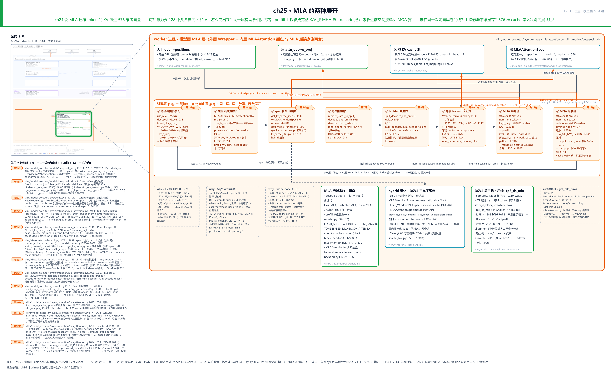

> *图注：本章放大的是[第 1 章](../../ch01-vllm-v1-in-one-map/narrative/chapter.md) L0 图三列最右那列（③ GPU 执行臂）模型层框里的 MLA 层——就是[第 23 章](../../ch23-model-layer-assembly/narrative/chapter.md)点亮的那副「Attention = 插座」骨架中，KV 侧换成了 576 维潜向量的那只特殊插座。它接在四块已读结构上：[第 24 章](../../ch24-primer-attn-variants/narrative/chapter.md)的低秩压缩与解耦 RoPE 数学（本章不重推）、[第 21 章](../../ch21-attention-backends/narrative/chapter.md)的后端插座与选择机制、[第 22 章](../../ch22-slot-mapping-block-table/narrative/chapter.md)的 slot_mapping/block_table 分页寻址、[第 14 章](../../ch14-memory-ledger/narrative/chapter.md)的一组一管理器账本。中排三幕，与图题同口径：①-③ 装配幕（选型拼积木 → 插座与吸收重排 → spec 自报与组化——站 1-4 一生一次、站 5-6 启动期一次，时机不同、都属装配期）、④-⑤ 每拍前置（批重排 + 数边界）、⑥-⑧ 前向幕（外层低秩链与切刀 → 两条展开腿）。站号 = 请求流经代码的顺序；圆号与站号一一对应（①-③=站 1-6、④-⑤=站 7-8、⑥-⑧=站 9-13）。正文按讲解需要编排，不必照站号读。*

读法建议：想知道两条展开的数学总纲，从[「同一锅汤的两种盛法」](#同一锅汤的两种盛法)读起；关心这层怎么被拼出来，看[「装配幕」](#装配幕三岔口与六块积木)与[「装配收尾」](#装配收尾同一份权重三种形状)；想跟一拍前向，按序读外层低秩链、MHA 腿、MQA 腿三节；「这一刀是谁画的」的答案在[「切刀」](#切刀同一前向两段数学)与[「谁画的线」](#谁画的线四区重排与后端自报阈值)；显存会不会炸的答案在[「小锅炖整锅汤」](#小锅炖整锅汤分块上投影与-lse-合并)；只关心 KV 池怎么组的，直奔[「组化」](#组化一层自报什么池就长什么样)；想看第三代长什么样，读[「DSV4 的压缩格」](#第三代dsv4-的压缩格与-584b-布局)。想跟全程，按序读。

照例交代取证环境，全章数值表通用。本章实测来自按 v0.27.1 只做减法抽出的配套精简版，在 host CPU 上实跑（真 torch、float32），经真实注册位注入参考后端；七个数值轨迹全部真跑得出，等价性测试三十八例全过。两点诚实边界：其一，FlashMLA（DeepSeek 官方开源的 MLA decode kernel，[第 21 章](../../ch21-attention-backends/narrative/chapter.md)见过它的身份）这类 CUDA kernel 面，由承载文件头伪码精确数学的镜像替身执行，表里的等价性数字（max diff 0.000000 一类）是「伪码数学」的 host 实证，不是 GPU kernel 的位级产物；其二，字节账一律按源码口径单列计算（bf16 两字节、fp8 一字节），不是实测显存占用。凡表内数字都是实跑输出，一个没改；「算一笔账」的量级是说明性算术。

## 同一锅汤的两种盛法

先把两腿的数学总纲立起来。真相源不在任何一篇论文里，而在 `mla_attention.py` 的文件头：这份模块文档把两种展开的动机、代价和两路伪码写得清清楚楚，本章后面每一节都在兑现它。先看动机段：

```text
# vllm/model_executor/layers/attention/mla_attention.py:L13-L31 · 模块头文档（两路总纲，节选）
MLA has two possible ways of computing, a data-movement friendly approach and a
compute friendly approach. We generally want to use the compute friendly
approach for "prefill" (i.e. the ratio Sq / Skv is relatively large, often near
1) and the data-movement friendly approach for "decode" (i.e. the ratio
Sq / Skv is small, often near 0).

NOTE what we deem small and large is currently determined by if it is labelled
prefill or decode by the scheduler, but this is something we should probably
tune.

Main reference: DeepseekV2 paper, and FlashInfer Implementation
(https://arxiv.org/abs/2405.04434 and https://github.com/flashinfer-ai/flashinfer/pull/551).

Deepseek's MLA attention works the following way:
* Use a single latent vector to represent the per-token entry of the KV cache.
* For decode (i.e. the memory friendly approach) the attention "simulates" a
multi-head attention, while the compute is similar to multi-query attention.
```

两个词定性了：prefill 走 compute friendly（算力友好），decode 走 data-movement friendly（搬运友好）。判据是一个比值 $`S_q/S_{kv}`$：本步有几个 query token（$`S_q`$），要从 cache 读多少历史 KV token（$`S_{kv}`$）。prefill 时一批新 token 同时进层，$`S_q`$ 大、比值接近 1；decode 时每步只出一个新 token，历史却全在，比值趋近 0。

先把 why 链摆全，再读伪码。**旧设计**：MHA/GQA 世界里每 token 每层缓存 K、V 各 `num_kv_heads × head_dim` 个元素（KV 头数乘头维，两个 config 字段）。DeepSeek-V3 若按 128 头 MHA 存，每 token 每层要 128×(192+128)=40960 个元素；Llama-70B 的 GQA（8 个 KV 头）也要 2048。[第 13 章](../../ch13-paged-kv/narrative/chapter.md)的分页解决了碎片，没有降每 token 的总量。**痛点**：KV cache 是长上下文批量并发的显存天花板，装不下就只剩砍 batch 或砍上下文两条路。**v1 方案**：DeepSeek-V2 论文（arXiv:2405.04434）把 KV 联合压进 512 维潜向量，加上 64 维解耦 RoPE 旁路，cache 每 token 只存 576 个元素（[第 24 章](../../ch24-primer-attn-variants/narrative/chapter.md)的账表里 40960 与 576 两行都已列出，按实际 qk 宽口径相除即 71.1 倍）；代价是注意力从此要先「展开」才能算，而展开有两条数学等价的路，选哪条由 $`S_q/S_{kv}`$ 决定。**代价**（诚实列全，后面各节逐一兑现）：上投影要物化大张量，得分块（见[「小锅炖整锅汤」](#小锅炖整锅汤分块上投影与-lse-合并)）；同一层跑两条数值路径，正确性靠精确合并对齐；特形 cache 与所有通用后端不兼容，要自立两套后端家族；decode 腿的权重要以重排副本多存一份（见[「装配收尾」](#装配收尾同一份权重三种形状)）。

文件头的两路伪码是本章的数学底本。先看符号账本和 compute friendly 一路：

```text
# vllm/model_executor/layers/attention/mla_attention.py:L44-L63 · 文件头文档（符号账本，节选）
## Vector/Matrix Definitions

h_t         hidden states (input to attention)  shape [Sq, H]
q_c         latent/compressed Q                 shape [Sq, Lq]
q_nope      uncompressed Q (no-rope)            shape [Sq, N, P]
q_pe        uncompressed Q (rope)               shape [Sq, N, R]
kv_c        latent/compressed KV                shape [Skv, Lkv]
k_pe        decoupled k position embeddings     shape [Skv, R]
W_DQ        project h_t to q_c                  shape [H, Lq]
W_UQ        project q_c to q_nope               shape [Lq, N * P]
W_DKV       project h_t to kv_c                 shape [H, Lkv]
W_UK        project kv_c to k_nope              shape [Lkv, N, P]
W_KR        project h_t to k_pe                 shape [H, R]
W_UV        project kv_c to v                   shape [Lkv, N, V]
W_O         project v to h_t                    shape [N * V, H]
```

这份账本就是全章的坐标系：N 个头、P 维 nope（不旋转段）、R 维 rope（旋转段）、L 维潜空间（DSV3 实尺 128/128/64/512）。两条伪码各领一段，先看 compute friendly：

```text
# vllm/model_executor/layers/attention/mla_attention.py:L66-L91 · 文件头文档（MHA 展开伪码）
## Compute Friendly Approach (i.e. "forward_mha"):

q_c      = h_t @ W_DQ
q_nope   = (q_c @ W_UQ).view(Sq, N, P)
q_pe     = RoPE(q_c @ W_QR).view(Sq, N, R)
new_kv_c = h_t @ W_DKV
new_k_pe = RoPE(h_t @ W_KR)
kv_c     = torch.cat([new_kv_c, cache_kv_c], dim=0)
k_pe     = torch.cat([new_k_pe, cache_k_pe], dim=0)
k_nope   = (kv_c @ W_UK.view(Lkv, N * P)).view(Skv, N, P)
v        = (kv_c @ W_UV.view(Lkv, N * V)).view(Skv, N, V)

// MHA with QK headdim = P + R
//           V headdim = V
//      sdpa_o shape [Sq, N, V]
sdpa_o = scaled_dot_product_attention(
    torch.cat([q_nope, q_pe], dim=-1),
    torch.cat([k_nope, k_pe.unsqueeze(1).expand(-1, N, -1)], dim=-1),
    v
)
return sdpa_o @ W_O

NOTE: in the actual code,
    `kv_b_proj` is [W_UK; W_UV] concatenated per head
    `q_b_proj` is [W_UQ; W_QR] concatenated per head
    `out_proj` is W_O
```

MHA 展开一路的方向是 **动 cache 侧**：把全部 $`S_{kv}`$ 个潜向量逐个乘 `W_UK`、`W_UV`，还原成 128 个头各自的 K 和 V（每 token 40960 个元素），然后跑一个最标准的多头注意力。上投影的算力被大量 query 摊薄：一份 K/V 被 $`S_q`$ 个 query 复用，$`S_q`$ 越大越划算。末尾的 NOTE 是代码与记号的对照表：`kv_b_proj`（上投影层）就是 `W_UK` 和 `W_UV` 按头拼接的载体；同理 `q_b_proj` 是 `W_UQ` 与 `W_QR`（q 的 rope 段上投影——符号账本节选未单列这一行，上面伪码 `q_pe = RoPE(q_c @ W_QR)` 首次用它）按头拼接的载体。

再看 data-movement 一路，方向整个反过来：

```text
# vllm/model_executor/layers/attention/mla_attention.py:L94-L118 · 文件头文档（MQA 吸收伪码）
## Data-Movement Friendly Approach (i.e. "forward_mqa"):

Runtime
q_c      = h_t @ W_DQ
q_nope   = (q_c @ W_UQ).view(-1, N, P)
ql_nope  = einsum("snh,lnh->snl", q_nope, W_UK)
q_pe     = RoPE(q_c @ W_QR).view(Sq, N, R)
new_kv_c = h_t @ W_DKV
new_k_pe = RoPE(h_t @ W_KR)
kv_c     = torch.cat([new_kv_c, cache_kv_c], dim=0)
k_pe     = torch.cat([new_k_pe, cache_k_pe], dim=0)

// MQA with QK headdim = Lkv + R
//           V headdim = Lkv
//      sdpa_o shape [Sq, N, Lkv]
// NOTE: this is less compute-friendly since Lkv > P
//       but is more data-movement friendly since its MQA vs MHA
sdpa_o = scaled_dot_product_attention(
    torch.cat([ql_nope, q_pe], dim=-1),
    torch.cat([kv_c, k_pe], dim=-1),
    kv_c
)

o = einsum("snl,lnv->snv", sdpa_o.reshape(-1, N, Lkv), W_UV)
return o.view(-1, N * V) @ W_O
```

MQA 吸收一路 **动 q 侧**：`mla_attention.py` 这段伪码的关键一行是 `ql_nope = einsum("snh,lnh->snl", q_nope, W_UK)`，把每个头的 q 先乘 `W_UK` 换算成 512 维「潜语言」，此后注意力直接在潜向量上做。注意注释里的诚实账：`Lkv > P`（512 大于 128），每个 query 的计算量反而更大；换来的是注意力形状变成了 **单 KV 头的 MQA**，QK 头维 576、V 头维 512，cache 里的潜向量一行都不用动。这正是文件头那句「simulates a multi-head attention, while the compute is similar to multi-query attention」的含义：输出仍等价于 128 头 MHA（输出侧再乘 `W_UV` 上投影回 V 维），计算形态却是 MQA。

两条路的等价性来自矩阵乘法结合律，这笔推导留到[「MQA 吸收腿」](#mqa-吸收腿把-q-翻译进潜空间)配合数值现场做。这里先把两腿的带宽与算力账写成两条量纲式（DSV3 尺寸：N=128 头、P=128 nope 维、L=512 潜维、R=64 rope 维）：

```math
\mathrm{read}_{MHA}\propto N\,(P{+}R)\,S_{kv}=24576\,S_{kv},\qquad
\mathrm{read}_{MQA}\propto (L{+}R)\,S_{kv}=576\,S_{kv}
```

读进计算单元的 K 侧字节数差 42.7 倍，方向与算力相反（口径先说清：这两条量纲式只算打分要读的 K 侧；连 V 侧一起算是 40960 对 1088、约 37.6 倍；后文的 71 倍则是「全展开 40960 对照潜向量 576」的每 token 元素账——三处倍数口径不同，方向一致）。这就是「同一锅汤、两种盛法」：数学上同一锅，工程上 prefill 盛给算力、decode 盛给带宽。

这段工程史值得补一笔，因为它解释了为什么文件头把一个 2024 年 10 月的 FlashInfer PR 列为 Main reference。「吸收」在 DeepSeek-V2 论文里只是附录 C 的一条矩阵恒等式，DeepSeek 最初开源的参考实现走的反而是每步上投影的 naive 路线。把它变成「decode = MQA」的引擎路线、并论证 prefill 千万别这么干的，是推理社区：SGLang v0.3（2024-09，官方博客原话把 weight absorption 列为已落地优化，DeepSeek MLA 解码吞吐 3 到 7 倍）开了头；FlashInfer PR #551（2024-10 提出、11 月合入，即上面文件头亲引的那个 PR）做了系统分析，结论级原话是「Mat Absorb is only suitable for decode, do not use Mat Absorb for prefill」，并算出吸收版 decode 只需 naive 版约 1% 的计算量、prefill 硬用吸收要多约 3.4 倍 FLOPs；随后 DeepSeek 官方开源 FlashMLA（README 自述就是 MQA 形态、`head_dim_k=576`），Red Hat 主导的实现进了 vLLM v0.7.1（2025-02，8×H200 上 MLA 带来 3.4 倍吞吐、KV 容量约 9.6 倍）。Red Hat 那篇博客还诚实记了一笔反向账：低并发冷启动时 MHA 的首 token 延迟仍占优，单请求摊不动吸收路线的预处理。没有免费午餐，只有「谁在主场」。

## 装配幕：三岔口与六块积木

现在走到 L0 图模型层框的装配期。MLA 层不是运行时开关，是装配期就定死的层类型。选型发生在 `DeepseekV2DecoderLayer` 的构造函数里，一个三岔口：

```python
# vllm/model_executor/models/deepseek_v2.py:L1226-L1238 · DeepseekV2DecoderLayer 选型三岔
        kv_lora_rank = getattr(config, "kv_lora_rank", 0)
        use_mha = config.model_type == "deepseek" or all(
            dim == 0 for dim in (qk_nope_head_dim, qk_rope_head_dim)
        )

        self.use_mha = use_mha

        if use_mha:
            attn_cls = DeepseekAttention
        elif model_config.use_mla:
            attn_cls = DeepseekV2MLAAttention
        else:
            attn_cls = DeepseekV2Attention
```

三岔的判据有两层。第一层 `use_mha`：最老的 DeepSeek 模型（`model_type == "deepseek"`）或 config 里两个 head dim 全为 0，说明这个 checkpoint 根本没配 MLA，走老式 MHA。第二层 `model_config.use_mla`：它是 `vllm/config/model.py:L1791-L1792` 的一个属性，`return self.is_deepseek_mla and not envs.VLLM_MLA_DISABLE`，即「config 认出是 DeepSeek 系 MLA 且用户没设环境变量禁用」。两道关都过，本层才装配成 `DeepseekV2MLAAttention`；否则退到普通注意力类 `DeepseekV2Attention`（GQA 家族，形状数学见[第 24 章](../../ch24-primer-attn-variants/narrative/chapter.md)）。装配之后不再切换：一个 DeepSeek-V3 的层永远走 MLA 的两条腿，没有「运行时降级回 MHA」这回事。

`DeepseekV2MLAAttention.__init__` 拼的是六块投影积木。[第 23 章](../../ch23-model-layer-assembly/narrative/chapter.md)立过「模型文件只做拼装」，这里是这句话在 MLA 侧的现场：

```python
# vllm/model_executor/models/deepseek_v2.py:L1006-L1066 · DeepseekV2MLAAttention.__init__ 投影装配
        # Use input_size for projection input dimensions if provided,
        # otherwise default to hidden_size (used in Eagle3 Deepseek with MLA)
        proj_input_size = input_size if input_size is not None else self.hidden_size

        if self.q_lora_rank is not None:
            self.fused_qkv_a_proj = DeepSeekV2FusedQkvAProjLinear(
                proj_input_size,
                [self.q_lora_rank, self.kv_lora_rank + self.qk_rope_head_dim],
                quant_config=quant_config,
                prefix=f"{prefix}.fused_qkv_a_proj",
            )
        else:
            self.kv_a_proj_with_mqa = ReplicatedLinear(
                proj_input_size,
                self.kv_lora_rank + self.qk_rope_head_dim,
                bias=False,
                quant_config=quant_config,
                prefix=f"{prefix}.kv_a_proj_with_mqa",
            )

        # … 省略：qrep_enabled 六行（DCP 分布式 q 复制开关，本章不进）…
        q_proj_cls = (
            DCPGroupColumnParallelLinear if qrep_enabled else ColumnParallelLinear
        )
        if self.q_lora_rank is not None:
            self.q_a_layernorm = RMSNorm(self.q_lora_rank, eps=config.rms_norm_eps)
            self.q_b_proj = q_proj_cls(
                self.q_lora_rank,
                self.num_heads * self.qk_head_dim,
                bias=False,
                quant_config=quant_config,
                prefix=f"{prefix}.q_b_proj",
            )
        else:
            self.q_proj = q_proj_cls(
                proj_input_size,
                self.num_heads * self.qk_head_dim,
                bias=False,
                quant_config=quant_config,
                prefix=f"{prefix}.q_proj",
            )
        self.kv_a_layernorm = RMSNorm(self.kv_lora_rank, eps=config.rms_norm_eps)
        self.kv_b_proj = ColumnParallelLinear(
            self.kv_lora_rank,
            self.num_heads * (self.qk_nope_head_dim + self.v_head_dim),
            bias=False,
            quant_config=quant_config,
            prefix=f"{prefix}.kv_b_proj",
        )
        self.o_proj = RowParallelLinear(
            self.num_heads * self.v_head_dim,
            self.hidden_size,
            bias=False,
            reduce_results=reduce_results,
            quant_config=quant_config,
            prefix=f"{prefix}.o_proj",
        )
```

按出场顺序认六块积木（DSV3 实尺）：

1. **`fused_qkv_a_proj`**：一个融合下投影（`MergedColumnParallelLinear` 家族的定制件，按输出列分片、多段输出拼接的并行线性层，[第 23 章](../../ch23-model-layer-assembly/narrative/chapter.md)的 qkv 融合同族），输出段宽 `[1536, 576]`。它一次 GEMM 同时干两件事：把 hidden 压进 q 潜段 1536 维（`W_DQ`），以及把 hidden 压进 KV 段 576 维（`W_DKV` 与 `W_KR` 拼在一起）。q 低秩与 KV 压缩共享一次大矩阵乘，这是「融合」的实义。
2. **`q_a_layernorm`**：q 潜段的中点归一化（RMSNorm，[第 23 章](../../ch23-model-layer-assembly/narrative/chapter.md)立过）。低秩链的惯例：压下去之后、投上来之前归一化一次。
3. **`q_b_proj`**：q 上投影，1536 维投回 `128 × 192`（每头 nope 128 + rope 64），即伪码里的 `W_UQ` 与 `W_QR` 按头拼接。
4. **`kv_a_layernorm`**：潜向量归一化，512 维，只打可压缩段（为什么只打一半，见[「一拍之内」](#一拍之内外层低秩链与解耦-rope)一节）。
5. **`kv_b_proj`**：KV 上投影，512 维投到 `128 × (128 + 128)`（`ColumnParallelLinear`：按输出维切分的并行线性层，[第 23 章](../../ch23-model-layer-assembly/narrative/chapter.md)立过）。这就是伪码 NOTE 里的 `[W_UK; W_UV]`：权重按头拼接成一个大矩阵，MHA 腿用它的原形状，吸收腿从它拆副本。
6. **`o_proj`**：输出投影（`RowParallelLinear`，沿输入维分片、行方向并行），把 128 头 × 128 维的注意力输出投回 hidden 7168 维。

无 q 低秩的对照分支也值得一眼：`q_lora_rank` 为 None 时（部分小模型不压 q），`kv_a_proj_with_mqa`（`ReplicatedLinear`，每个 TP rank 持全量副本、不分片的线性层；名字里的 with_mqa 是历史遗留：这种形态的 KV 段与 MQA 形状相合）单独压 KV，q 直接从 hidden 投。q 低秩的三件（融合块的 q 段、`q_a_layernorm`、`q_b_proj`）收成一整块 `q_proj`，积木从六件变五件，骨架不变。

积木拼好后怎么交给运行时？看 `mla.py` 的装配交接：

```python
# vllm/model_executor/layers/mla.py:L110-L127 · MultiHeadLatentAttentionWrapper 构造内层插座
        self.mla_attn = MLAAttention(
            num_heads=self.num_heads,
            scale=scale,
            qk_nope_head_dim=self.qk_nope_head_dim,
            qk_rope_head_dim=self.qk_rope_head_dim,
            v_head_dim=self.v_head_dim,
            q_lora_rank=self.q_lora_rank,
            kv_lora_rank=self.kv_lora_rank,
            cache_config=cache_config,
            quant_config=quant_config,
            prefix=f"{prefix}.attn",
            kv_b_proj=self.kv_b_proj,                                        # L121
            dcp_q_replicate=self.dcp_q_replicate,
            use_sparse=self.is_sparse,
            indexer=self.indexer,
            topk_indices_buffer=mla_modules.topk_indices_buffer,
            non_causal_multi_token_decode=non_causal_multi_token_decode,
        )
```

模型侧把投影打包成 `MLAModules` 数据类（`mla.py:L14-L31`，字段就是六积木、`rotary_emb`（RoPE 模块）加 indexer 相关的可选项）注入外层 `MultiHeadLatentAttentionWrapper`；外层再构造内层插座 `MLAAttention`。注意 L121：`kv_b_proj` 的引用被一并交进插座。这不是多余的参数传递——下一节的权重吸收重排要从它手里拿权重。双层结构的分工：外层 Wrapper 管「展开前的预处理」（q 低秩链、KV 压缩、RoPE）与 o_proj 收尾，内层插座管 KV 写入、两条腿的分流和后端调用。

插座自己在构造时做两件事。一是选后端并验明正身：

```python
# vllm/model_executor/layers/attention/mla_attention.py:L421-L436 · MLAAttention.__init__ 后端断言
        dtype = torch.get_default_dtype()
        if attn_backend is not None:
            assert attn_backend.is_mla(), (
                f"MLAAttention: attn_backend must be an MLA backend, "
                f"got {attn_backend.get_name()} instead"
            )
            self.attn_backend = attn_backend
        else:
            self.attn_backend = get_attn_backend(
                self.head_size,
                dtype,
                kv_cache_dtype,
                use_mla=True,
                use_sparse=use_sparse,
                num_heads=self.num_heads,
            )
```

`is_mla()` 是 MLA 后端家族的身份证（家族基类统一返回 True，见[「特形 cache 的两套后端家族」](#特形-cache-的两套后端家族)）。通用后端接不住 576 维特形 cache，选错家族当场断言拒绝。选择机制本身（优先级表、validate 协商）归[第 21 章](../../ch21-attention-backends/narrative/chapter.md)，本章不重表。二是把自己注册进 `static_forward_context`（`mla_attention.py:L516-L518`，以层名为键的全局花名册，[第 23 章](../../ch23-model-layer-assembly/narrative/chapter.md)的编译注册同款）——后文启动期收 KV spec 时，runner 就是按这份花名册逐层来收的。注册之外，`__init__` 还装配第二套 prefill 后端（`mla_attention.py:L520-L550`），这层关系也留到后端家族一节细说。

装配期还有个身份问题：外层 Wrapper 自己是 `@PluggableLayer.register("multi_head_latent_attention")` 注册的插件层（`mla.py:L34-L36`，[第 23 章](../../ch23-model-layer-assembly/narrative/chapter.md)在 logits_processor 见过同款注册点）。树外平台（OOT，out-of-tree，不改 vLLM 源码的插件）可以整体换掉外层实现（连 RoPE 和 o_proj 一起换）。这是接入税的另一面：一个 MLA 实现者要同时懂投影积木、两套后端家族、特形 spec 自报和吸收重排四件事，而框架用注册点把这四件里的每一件都留了替换的口子。

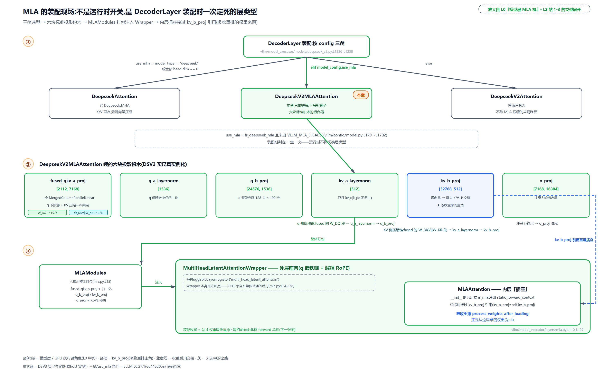

> *图注：MLA 层的装配三段读序。上：DecoderLayer 三岔（老 Deepseek MHA / use_mla / 普通注意力），use_mla = is_deepseek_mla 且未设 VLLM_MLA_DISABLE，装配期定死。中：六块积木条带（DSV3 实尺：fused_qkv_a_proj [2112,7168]、q_a_layernorm [1536]、q_b_proj [24576,1536]、kv_a_layernorm [512]、kv_b_proj [32768,512]、o_proj [7168,16384]），fused 块画成双拼——W_DQ 出 1536 与 W_DKV‖W_KR 出 576 一次 GEMM 完成。下：MLAModules 打包注入 Wrapper（PluggableLayer 注册点，OOT 后门），内层 MLAAttention 插座经 `kv_b_proj=self.kv_b_proj` 接过引用（蓝虚线），下一节的吸收重排从这里拿权重。*

## 装配收尾：同一份权重，三种形状

装配幕的最后一站发生在权重加载完成之后。吸收腿要的 `W_UK`、`W_UV` 不是现成形状，得拆、得重排。`process_weights_after_loading`（权重加载后的钩子，每个线性层都有机会在此做后处理）一生只跑一次：

```python
# vllm/model_executor/layers/attention/mla_attention.py:L994-L1100 · MLAAttention.process_weights_after_loading
    def process_weights_after_loading(self, act_dtype: torch.dtype):
        # we currently do not have quantized bmm's which are needed for
        # `W_UV` and `W_UK_T`, we just store fp16/bf16 copies and perform
        # the bmm's in 16-bit, the extra memory overhead of this is fairly low
        kv_b_proj_weight = get_and_maybe_dequant_weights(
            self.kv_b_proj, out_dtype=act_dtype
        ).T

        # … 省略：dcp_q_replicate 校验与形状断言 [kv_lora_rank, num_heads×(P+V)] …
        kv_b_proj_weight = kv_b_proj_weight.view(
            self.kv_lora_rank,
            self.num_heads,
            self.qk_nope_head_dim + self.v_head_dim,
        )

        W_UK, W_UV = kv_b_proj_weight.split(                                 # L1033
            [self.qk_nope_head_dim, self.v_head_dim], dim=-1
        )

        # … 省略：ROCm aiter 的 mxfp4/fp8 量化分支与 1024 档 kernel 预编译循环（if/elif 两分支）…
        else:
            # Convert from (L, N, V) to (N, L, V)
            replace_parameter(self, "W_UV", W_UV.transpose(0, 1), prefer_copy=True)     # L1094
            # Convert from (L, N, P) to (N, P, L)
            replace_parameter(self, "W_UK_T", W_UK.permute(1, 2, 0), prefer_copy=True)  # L1096
            # … 省略：dcp_q_replicate 时 W_UK_T 的跨卡 all-gather 尾巴 …
```

三步拆解。第一步整体转置：`kv_b_proj` 权重原是 `[32768, 512]`（DSV3，输出维在前），`.T` 变 `[512, 32768]`。第二步 `view` 成 `[512, 128, 256]`：512 是潜维 L，128 是头数 N，256 是每头的 `P+V`（nope 128 加 v 128）。第三步 L1033 沿最后一维 `split` 成两半：`W_UK` 形状 `[512, 128, 128]`（给 K 的半段）、`W_UV` 形状 `[512, 128, 128]`（给 V 的半段）。到这一步为止只是 view 和切片，还没有复制数据。

真正的交易在 L1094 与 L1096：`replace_parameter`（把模块参数原位替换的工具函数）把两半权重重排成 **bmm 就绪** 的形状并常驻——`W_UV` 转成 `[128, 512, 128]`（N、L、V），`W_UK` 重排成 `W_UK_T` `[128, 128, 512]`（N、P、L，名字里的 T 提醒它来自转置）。为什么是这个形状？因为吸收腿想用 `torch.bmm`（批量矩阵乘，一次完成 N 个头各自的乘法）：q 侧按头堆叠成 `(N, B, P)` 后，`(N, B, P) × (N, P, L)` 直接吐 `(N, B, L)`，权重必须按头做 batch 维排布。

代价明码标价：此后同一份权重以三种排布同时常驻——原形状 `kv_b_proj [32768,512]` 归 prefill 腿用（`ColumnParallelLinear` 的 GEMM 要原形状），`W_UK_T` 与 `W_UV` 两份 bmm 副本归 decode 腿用。代码注释自己承认了这笔账：暂无量化版 bmm 可用，就存 16-bit 副本做 16-bit 乘法，「额外显存开销 fairly low」（相对整模型权重确实低，但它是真实的、每层一份的冗余）。

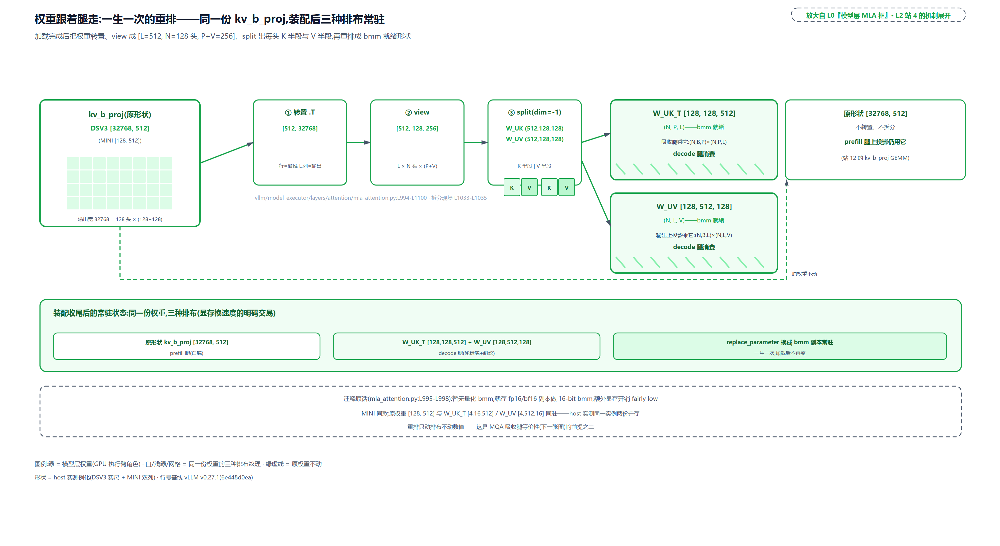

> *图注：左：kv_b_proj 原权重 [32768,512]（MINI 档同款 [128,512]，见下节定义），prefill 腿继续用原形状。中：三步拆解——`.T` 转置、`view(L,N,P+V)` 按头立起、`split(dim=-1)` 切出 K 半段 W_UK 与 V 半段 W_UV。右：`replace_parameter` 造出两份 bmm 副本：W_UK_T [128,128,512]（N,P,L）给吸收腿的 `(N,B,P)×(N,P,L)`，W_UV [128,512,128]（N,L,V）给输出上投影的 `(N,B,L)×(N,L,V)`。底条：三种排布同驻（注释原话「存 fp16/bf16 副本做 16-bit bmm，开销 fairly low」）。*

## 一拍之内：外层低秩链与解耦 RoPE

装配完成，进入运行期。现在走到 L0 图模型层框的一拍前向。每个 token 进 MLA 层，先过外层 Wrapper 的低秩链，把「可压缩」与「位置」两类信息分装。直觉先给一句：搬家先打包——q 压成 1536 维一只箱，全楼 128 户共用的 KV 压成 576 维一只箱；易碎的位置信息单独缠膜单独摆放，绝不混进可压缩的箱体。

```python
# vllm/model_executor/layers/mla.py:L150-L226 · MultiHeadLatentAttentionWrapper.forward
    def forward(
        self,
        positions: torch.Tensor,
        hidden_states: torch.Tensor,
        llama_4_scaling: torch.Tensor | None = None,
    ) -> torch.Tensor:
        q_c = None
        kv_lora = None

        if self.q_lora_rank is not None:
            # … 省略：三段 assert 防御（fused/q_a_layernorm/q_b_proj 三件非空各一段）…
            qkv_lora = self.fused_qkv_a_proj(hidden_states)[0]                 # L170
            q_c, kv_lora = qkv_lora.split(
                [self.q_lora_rank, self.kv_lora_rank + self.qk_rope_head_dim],
                dim=-1,
            )
            q_c = self.q_a_layernorm(q_c)
            q_proj_layer = self.q_b_proj
            q_proj_input = q_c
        else:
            # … 省略：无 q 低秩分支（kv_a_proj_with_mqa 直接压 KV、q 直接投影）…

        kv_c, k_pe = kv_lora.split([self.kv_lora_rank, self.qk_rope_head_dim], dim=-1)  # L189
        kv_c_normed = self.kv_a_layernorm(kv_c)
        # Add head dim of 1 to k_pe
        k_pe = k_pe.unsqueeze(1)

        q = q_proj_layer(q_proj_input)[0]
        heads = self.num_heads
        # … 省略：dcp_q_replicate 的头数放大两行 …
        q = q.view(-1, heads, self.qk_head_dim)

        if self.rotary_emb is not None:
            q[..., self.qk_nope_head_dim :], k_pe = self.rotary_emb(         # L201-L203
                positions, q[..., self.qk_nope_head_dim :], k_pe
            )

        # … 省略：indexer 调用位（稀疏 MLA，下一章）、llama_4_scaling 门控
        #    与 dcp q 备份三行（下方 mla_attn 的 q_dcp_replicated 形参一并省略）…

        attn_out = self.mla_attn(
            q,
            kv_c_normed,
            k_pe,
            output_shape=(hidden_states.shape[0], self.num_heads * self.v_head_dim),
        )

        # … 省略：g_proj 门控（部分变体才有）…

        return self.o_proj(attn_out)[0]
```

一段 token 流过外层的完整账如下（用 **MINI 档**：头数与头维缩到 4/16/16 便于心算逐位核对，潜维 512 与 rope 64 保持实尺，表内数值为 MINI 配置真跑输出，后文表格与图注沿用这个名字；末行给 DSV3 实尺对照。对照基线先交代：表里的「手工链」指按文件头伪码逐步手搭的参照实现，「与手工链逐位相等」就是与它比对；rope 段的「差」是同一段旋转前后的差，pos=0 时旋转是恒等、pos=1 起才生效，用它证明旋转恰好只发生在该发生的位置）：

<!-- trace: ch25-m02 -->
| 步骤 | 动作（mla.py:L150-L226） | 张量形状 | 关键判定/数值 |
|---|---|---|---|
| 输入 | hidden_states 进层 | [5, 128] | 每 token 一行（DSV3 为 7168） |
| 融合下投影 | fused_qkv_a_proj 一次 GEMM（W_DQ‖W_DKV‖W_KR 融合） | [5, 640] | 640 = q 潜段 64 + KV 段 576——一次矩阵乘同时压 q 与 KV |
| q 低秩链 | split 出 q_c → q_a_layernorm → q_b_proj → view | [5, 64] → [5, 4, 80] | 低秩链中点归一化；80 = nope 16 + rope 64 |
| KV 第二刀 | kv_lora 段切 kv_c \| k_pe | [5, 512] \| [5, 64] | kv_c 是可压缩潜向量；k_pe 是解耦位置段 |
| 归一化只打一半 | kv_a_layernorm 只打 kv_c（k_pe 不归一） | [5, 512] | 与手工链逐位相等：max diff 0.0000 |
| RoPE 只打 rope 段 | rotary_emb(positions, q[...,16:], k_pe)——nope 段不进旋转 | q [5, 4, 80] / k_pe [5, 1, 64] | nope 段逐位相等=true；rope 段 pos=0 差 0.0000（旋转恒等）、pos=1 差 0.9517（旋转生效） |
| 交内层 | mla_attn(q, kv_c_normed, k_pe) | [5,4,80] / [5,512] / [5,1,64] | cache 写腿输入=潜向量拼接 [5, 576]——cache 里只有潜向量、无任何完整 K/V |
| 收尾 | o_proj(attn_out) → 输出 | [5, 128] | 回到 hidden 维 |
| DSV3 实尺对照 | 同一装配式代入 7168/1536/128/128/64/512/128 | fused [2112,7168] / q_b [24576,1536] / kv_b [32768,512] / o [7168,16384] | 每 token 每 layer cache 只存 576 元素，对照 MHA 等价 40960（=128×(192+128)）为 71.1 倍；Llama-70B GQA 为 2048，MLA 约 3.6 倍于 GQA 的节省 |

表里最要紧的是 L189 与 L201-L203 这两刀。L189 把 KV 段再切成 `kv_c`（512 维潜向量）与 `k_pe`（64 维解耦位置键，即[第 24 章](../../ch24-primer-attn-variants/narrative/chapter.md)的共享旁路 $`k^{R}`$）；`kv_a_layernorm` 只打 `kv_c`，位置段不归一。L201-L203 的旋转调用，读集与写集都只含 rope 切片：q 只喂 `q[..., 128:]`（尾部 64 维），k 只喂 `k_pe`。nope 段与 `kv_c` 从头到尾不被 RoPE 触碰。

这不是实现细节，是吸收腿的数学前提。[第 24 章](../../ch24-primer-attn-variants/narrative/chapter.md)证过：RoPE 旋转是逐 token 的对角块矩阵，与 `W_UK` 的线性投影不可交换。若位置旋转混进 nope 段，「先吸收再点积」的结合律推导当场失效。解耦存放正是让「不可交换区」（rope 段）与「压缩区」（潜向量）不相交——表里的实证（nope 段与未旋转手工链逐位相等、rope 段 pos=0 恒等而 pos=1 起差 0.9517）说明旋转恰好只发生在该发生的地方。至于 `k_pe` 为什么不过 `kv_a_layernorm`——那不是另一条数学律，是训练定式的复刻：checkpoint 里 RMSNorm 只压过压缩段，位置旁路从下投影出来就没归一化，推理要逐位复刻前向就不能补打。`k_pe` 上那一行 `unsqueeze(1)` 也值得记：位置键立起一个头维，后面 MHA 腿把它广播给 128 个头共用。

外层最后把三样东西交给内层插座：q（`[Sq, 128, 192]`）、归一化后的 `kv_c_normed`（`[Sq, 512]`）、`k_pe`（`[Sq, 1, 64]`）。注意交给插座的 KV 侧没有任何完整 K 和 V。写腿在内层：`MLAAttention.forward` 先取本层上下文（attention metadata 与 KV cache 张量、slot_mapping 槽位表都从模块级全局竖井拿，[第 21 章](../../ch21-attention-backends/narrative/chapter.md)的通道），把本步新 token 的 576 维潜向量拼接（`kv_c_normed` 加 `k_pe`）照 slot_mapping 散写进分页 cache（`impl.do_kv_cache_update`，`mla_attention.py:L647-L654`；寻址底座是[第 22 章](../../ch22-slot-mapping-block-table/narrative/chapter.md)的 block_table/slot_mapping）。从此刻起，cache 里自始至终只有潜向量，没有任何完整 K/V 落过池。两条展开腿要的 K/V，要么算前临时造，要么根本不造。

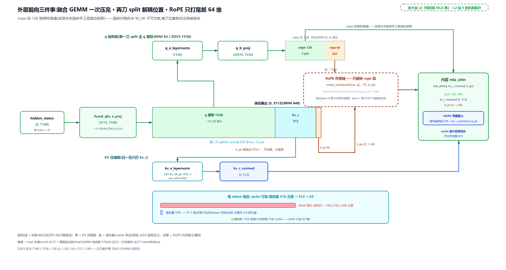

> *图注：一个 token 流过外层的三件事。主带：hidden（DSV3 7168 维）经一次融合 GEMM 变 2112 宽——q 潜段 1536 走 q_a_layernorm→q_b_proj 上投影成 128×192；KV 段 576 再切一刀：512 维 kv_c（归一化后进 cache）与 64 维 k_pe（单独旋转、不归一、不压缩）。最关键的标注是 RoPE 作用域框：只罩住 q 尾部 64 维与 k_pe，nope 段 128 维在框外原样直通（实测逐位相等；pos=0 差 0.0000、pos=1 差 0.9517 证明旋转确实只打 rope 段）。右侧插座收三路，写腿进 cache 的就是 576 维拼接。底账：每 token 每 layer 576 元素对照 MHA 40960（71.1 倍）、GQA 2048（约 3.6 倍）。*

## MHA 展开腿：现切现卖的完整 K/V

prefill 一批新 token 进层，走 MHA 腿。直觉一句话：自助餐现切——一次来一整批客人（本例 140 位），后厨干脆把浓缩汤底（潜向量）一次性还原成每头各自的 K/V 标准菜，走通用流水线出餐；人多摊得薄，多切几刀不心疼。零星几位客人时这么干就亏了，那是下一节 MQA 腿的主场。

入口在 `forward_impl`（内层插座的分流中枢，完整的切刀现场见[「切刀」](#切刀同一前向两段数学)一节）。prefill 段的 token 走 `impl.forward_mha`：

```python
# vllm/model_executor/layers/attention/mla_attention.py:L2581-L2666 · MLACommonBaseImpl.forward_mha
    def forward_mha(  # type: ignore[override]
        self,
        q: torch.Tensor,
        kv_c_normed: torch.Tensor,
        k_pe: torch.Tensor,
        kv_c_and_k_pe_cache: torch.Tensor,
        attn_metadata: MLACommonMetadata,
        k_scale: torch.Tensor,
        output: torch.Tensor,
        output_scale: torch.Tensor | None = None,
    ) -> None:
        assert attn_metadata.prefill is not None
        assert self.dcp_world_size != -1

        prefill_metadata = attn_metadata.prefill
        assert prefill_metadata.prefill_backend is not None
        # … 省略：fp8 prefill 的 q 预转换（use_fp8_prefill 判定与 q.to）…

        has_context = prefill_metadata.chunked_context is not None
        # … 省略：output_scale 与 has_context 的互斥断言 …

        kv_nope = self.kv_b_proj(kv_c_normed)[0].view(                        # L2608-L2610
            -1, self.num_heads, self.qk_nope_head_dim + self.v_head_dim
        )
        k_nope, v = kv_nope.split([self.qk_nope_head_dim, self.v_head_dim], dim=-1)  # L2611
        k = self._concat_k_nope_k_pe(k_nope, k_pe)                           # L2612
        # … 省略：fp8 prefill 的 k/v 预转换 …

        output_prefill = prefill_metadata.prefill_backend.run_prefill_new_tokens(
            q=q,
            k=k,
            v=v,
            return_softmax_lse=has_context,
            # … 省略：out/output_scale 直写参数 …
        )

        if has_context:
            # … 省略：历史上下文段——分块上投影 + merge（见「小锅炖整锅汤」）…
        elif output_scale is None:
            # With output_scale set, backend already wrote into `output` in place.
            assert isinstance(output_prefill, torch.Tensor)
            output_prefill = output_prefill[..., : self.v_head_dim]
            output_prefill = output_prefill.flatten(start_dim=-2)
            output.copy_(output_prefill)
```

L2608-L2612 是这条腿的全部机关。`kv_b_proj` 以原形状上投影（这里用的就是那份没动过的 `[32768,512]` 权重），一次 GEMM 同时出 K 和 V 的原料：`[Sq, 512]` 乘上去得 `[Sq, 128, 256]`，view 立起头维，再沿最后一维 split 成 `k_nope [Sq, 128, 128]` 与 `v [Sq, 128, 128]`。然后 `_concat_k_nope_k_pe` 把广播后的 rope 段拼到 K 尾部，K 变 `[Sq, 128, 192]`。至此 q/k/v 三样全是标准 MHA 形状，交给 prefill 后端（`run_prefill_new_tokens`，五选一的通用家族，见[「特形 cache 的两套后端家族」](#特形-cache-的两套后端家族)）。

一段 fresh prefill（首块、无历史上下文）的完整走读如下。注意门槛数字 140 与 128 的关系：FlashMLA 后端自报的分流阈值是 128，本例 140 个新 token 超过阈值才进这条腿，小于等于它的尾段会被划去 MQA 路径（账在[「谁画的线」](#谁画的线四区重排与后端自报阈值)）：

<!-- trace: ch25-m03 -->
| 阶段 | 动作（mla_attention.py:L2581-L2666） | 张量 | 形状/数值 |
|---|---|---|---|
| 入口判定 | forward_impl 切刀：num_mqa_tokens=num_decode_tokens=0 | 整批走 MHA 腿 | num_prefills=1 / num_decode_tokens=0 / chunked_context=None |
| 上投影 | kv_b_proj(kv_c_normed) 一次 GEMM，view 成每头两半 | kv_nope | [140, 4, 32]——32 = nope 16 + v 16（同一 GEMM 出 K/V 两半） |
| 拆 K/V | 沿最后一维 split 成 [16, 16] | k_nope / v | [140, 4, 16] / [140, 4, 16] |
| 拼 rope | _concat_k_nope_k_pe(k_nope, k_pe) | k | [140, 4, 80]——k_pe expand 到头维，各头共用同一段位置键 |
| 标准 MHA | prefill_backend.run_prefill_new_tokens(q, k, v) | q / k / v | [140,4,80] / [140,4,80] / [140,4,16]——通用后端即可算，无特形 |
| 验证 | 与上投影 MHA 参照（文件头 Compute Friendly 伪码）逐元素对照 | max abs diff | 0.000000 |
| 元素账（MINI） | 每 token 上投影 K+V 元素 | 384 元素/token；全批 140 token 共 53760 | 对照潜向量全量 80640（=140 token × 576） |
| 元素账（DSV3） | 每 token 上投影 K+V | 128×(128+64)+128×128 = 40960 元素 vs 潜向量 576 | 71 倍算力支出——prefill 算力富余时愿意付这笔换标准 MHA kernel（kv_b_proj [32768,512]） |

先挑明表里的一个缩维伪象：MINI 档把头数与头维缩到 4/16/16，上投影元素（384）反而小于潜向量（576）。真实比例看 DSV3 行：每 token 上投影 40960 个元素，是潜向量 576 的 71 倍。这笔算力支出为什么愿意付？因为 $`S_q`$ 大：每份上投影出来的 K/V 被 140 个 query 复用，摊到每个 query 头上的额外算力很小，而换来的是「任何通用 MHA kernel 都能算」的标准形状。这正是文件头 compute friendly 的含义。

表中「验证」行值得多说一句。MHA 腿的输出与文件头 Compute Friendly 伪码的参照实现逐元素一致（diff 0.000000），这份 oracle 同时服务下一节的 MQA 腿与后面的混批切刀，两条腿的「数学等价」不是口头断言，是三组数值对照。

`has_context` 分支先按下不表：chunked prefill 的后续块要同时看历史上下文，上投影大张量会撑爆显存，源码为此准备了分块方案，整节留给[「小锅炖整锅汤」](#小锅炖整锅汤分块上投影与-lse-合并)。

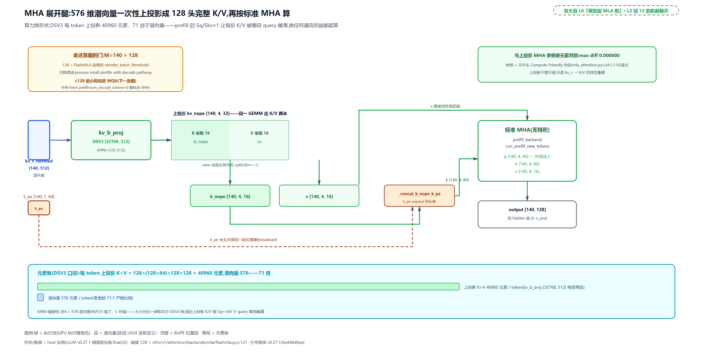

> *图注：MHA 腿的单向流水。潜向量窄条 [140,512] 经 kv_b_proj（DSV3 权重 [32768,512]）一发 GEMM 上投影成宽条 [140,4,32]（每头 K 半段 16 + V 半段 16；DSV3 为 [Sq,128,256]），split 成 k_nope 与 v，k_pe 广播拼到 K 尾成 [140,4,80]，交给标准 MHA。条宽对比呈现 576→40960 的放大（DSV3 口径，71 倍），被 140 个 query 摊薄才划算。门槛盒：M=140 大于 FlashMLA 自报阈值 128（注释原话 process small prefills with decode pathway）。验证盒：与伪码参照 max diff 0.000000。*

## MQA 吸收腿：把 q 翻译进潜空间

decode 的场景完全反过来：每请求每步只有 1 个新 query，历史上下文却全量在池。直觉一句话：查字典的两种顺序——要么把整本词典复印 128 份人手一册（每头上投影一份 K），要么先把每人的提问翻译成页码语言（把 q 乘进潜空间）再一起翻同一本词典。decode 每步只有一两个词要查，复印 128 本显然亏，翻同一本（576 维潜向量）就够。

数学上这是结合律。注意力分数的 nope 段是个双线性型：

```math
\mathrm{score}
= q_{\mathrm{nope},i}^{\top} k_{\mathrm{nope},i}
= q_{\mathrm{nope},i}^{\top}\left(W_{UK,i}^{\top} c\right)
= \left(W_{UK,i}\, q_{\mathrm{nope},i}\right)^{\top} c
```

c 是 512 维潜向量，$`W_{UK,i}`$ 是第 i 个头的上投影矩阵。中间那行是「先上投影 K 再点积」（MHA 腿、也是 naive 路线）；最右那行是「先把 q 乘进潜空间再点积」（吸收路线）。矩阵乘法满足结合律，先算哪个括号结果不变。输出侧同理：注意力在潜空间算出的 $`(B, N, L)`$ 再乘 `W_UV` 上投影回 V 维。两个前提缺一不可：nope 段无 RoPE（上一节的解耦不变量），以及 `W_UK_T`/`W_UV` 与 `kv_b_proj` 拆自同一份权重（装配收尾的重排只动排布不动数值）。

源码现场（`forward_impl` 的下半段，仍是减法呈现）：

```python
# vllm/model_executor/layers/attention/mla_attention.py:L831-L949 · forward_impl 的 MQA 吸收腿
        if num_mqa_tokens > 0:
            # … 省略：q_dcp_replicated 分支与 decode 段输出切片选取 …
            mqa_q = q[:num_mqa_tokens]
            mqa_output_slice = output[:num_mqa_tokens]

            mqa_q_nope, mqa_q_pe = mqa_q.split(
                [self.qk_nope_head_dim, self.qk_rope_head_dim], dim=-1
            )

            # Convert from (B, N, P) to (N, B, P)
            mqa_q_nope = mqa_q_nope.transpose(0, 1)

            # … 省略：ROCm aiter 的 fp4/fp8 bmm 替换与头数填充 …
            N, B, P = mqa_q_nope.shape
            W_UK_T = self.W_UK_T  # … 省略：DCP q 复制时换用 W_UK_T_dcp_qrep …
            assert W_UK_T is not None
            _, _, L = W_UK_T.shape
            mqa_ql_nope = mqa_q_nope.new_empty((N, B, L))

            # Multiply (N, B, P) x (N, P, L) -> (N, B, L)
            torch.bmm(mqa_q_nope, W_UK_T, out=mqa_ql_nope)                   # L888

            # Convert from (N, B, L) to (B, N, L)
            mqa_ql_nope = mqa_ql_nope.transpose(0, 1)

            # … 省略：fp8 拼接与 DCP all-gather …
            mqa_q = (mqa_ql_nope, mqa_q_pe)

            # call decode attn
            if not self.impl.is_sparse:
                assert attn_metadata.decode is not None
            attn_out, lse = self.impl.forward_mqa(mqa_q, kv_cache, attn_metadata, self)  # L919
            # … 省略：DCP 的 LSE 归并三分支 …

            # v_up projection
            self._v_up_proj(attn_out, out=mqa_output_slice)                  # L949
```

四个动作。第一，q 沿头维转置成 `(N, B, P)`：batch 维收到第二维，让头做 bmm 的 batch 维。第二，L888 的 `torch.bmm`：`(N, B, P)` 乘 `W_UK_T (N, P, L)` 得 `(N, B, L)`，一次批量乘法完成全部头的吸收，这就是结合律最右行的批量形态。第三，L919 交给 `forward_mqa`：吸收后的 q 拼上 rope 段成 `(B, N, 576)`，后端 kernel 以「单 KV 头的 MQA」直接读分页 cache。第四，L949 `_v_up_proj` 把 kernel 输出 `(B, N, L)` 按 `(N, B, L) × (N, L, V)` 乘 `W_UV` 上投影回 V 维，写进 output 的 decode 段。

kernel 那一侧长什么样？以 FlashMLA 后端为例，`forward_mqa` 的最终调用面（`vllm/v1/attention/backends/mla/flashmla.py:L332-L342`）：`flash_mla_with_kvcache(q=q, k_cache=..., block_table=attn_metadata.decode.block_table, cache_seqlens=..., head_dim_v=self.kv_lora_rank, ...)`。三个细节：`k_cache` 先 `unsqueeze(-2)` 立一个头维（单 KV 头）；寻址走 block_table（[第 22 章](../../ch22-slot-mapping-block-table/narrative/chapter.md)的分页间接寻址）；`head_dim_v` 直接传 `kv_lora_rank`——kernel 眼里 V 的头维就是潜维 512，输出侧的上投影它不管，那是我方 `_v_up_proj` 的事。DeepSeek 官方 FlashMLA 的 README 自述正是 MQA 形态（`head_dim_k=576`），吸收路线的官方 kernel 化。

三条请求各 decode 一步的数值现场（结合律实证取 head 0、请求 0、其第 7 个历史 token）：

<!-- trace: ch25-m04 -->
| 轮次 | 路线/动作 | 算式（形状） | 数值/判定 |
|---|---|---|---|
| 结合律·路线 A | 先上投影 K 再点积 | k_nope = c @ W_UK（512→16）后 dot(q_nope, k_nope) | 注意力分数 = 1.569422 |
| 结合律·路线 B | 先把 q 吸收进潜空间 | q_l = q_nope @ W_UK^T（16→512）后 dot(q_l, c) | 分数 = 1.569422——与 A 完全相同 |
| 两路之差 | \|A − B\| | 乘法结合律 dot(q, c·W_UK) = dot(q·W_UK_T, c) | 0.000000（fp32 舍入级） |
| 吸收 bmm | torch.bmm(q_nope, W_UK_T)（L888） | (4,3,16)×(4,16,512) → (4,3,512) | absorbed_ql [3,4,512]——每头 q 换说 512 维潜语言 |
| 单头 MQA | forward_mqa（L919）：拼 rope 段 (3,4,576) 直接读分页 cache | kernel 只见 1 个 KV『头』 | decode_seq_lens [8,4,13]，attn_out [3,4,512] |
| 输出上投影 | _v_up_proj（L949）：bmm 乘 W_UV | (4,3,512)×(4,512,16) → (4,3,16) | 输出 [3,64]=N×V，写回 output 的 decode 段 |
| 读字节账（DSV3 fp16） | 本步搬全部历史 KV 进计算单元 | MQA 腿 28800 B vs MHA 等价 2048000 B | 576 维单份潜向量 vs 40960 维全展开——25 行 cache 合计 |

表首三行是本章招牌证据：两条路线算出同一个分数 1.569422，差 0.000000。末行是这条腿存在的理由：本步要把 25 行 cache（8+4+13 条历史）搬进计算单元，MQA 腿搬 28800 字节，若按 MHA 展开要 2048000 字节——近两个数量级（71 倍）的差距把 decode 的带宽瓶颈松开。

代价也要两笔明码。其一，`W_UK_T` 与 `W_UV` 以 bmm 副本与原权重同驻（装配收尾已算过）。其二，每个 decode token 多两次 bmm（吸收一次、输出上投影一次）——算得多一点（L=512 大于 P=128），搬得少近两个数量级（71 倍），这笔交换在 decode 主场是净赚，在 prefill 主场是净亏（FlashInfer PR #551 的 3.4 倍 FLOPs 账）。

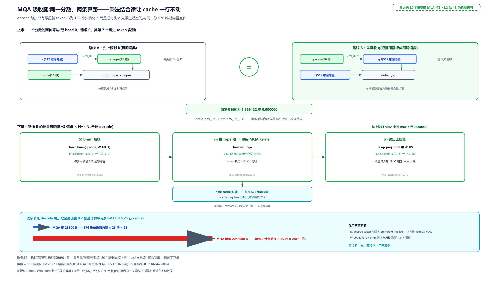

> *图注：上半是结合律双路对照：路线 A「先上投影」把 c 乘 W_UK 变 16 维 k_nope 再点积（每头复印一份 K）；路线 B「先吸收」把 q_nope 乘 W_UK^T 变 512 维潜语言再与 c 点积（翻译不复印）。中缝等号徽标：两路同分 1.569422，差 0.000000。下半是 B 路线的批量形态三站：torch.bmm (4,3,16)×(4,16,512)→(4,3,512)（L888）→ forward_mqa 以 (3,4,576) 单头 MQA 直读 25 行分页 cache（decode_seq_lens 8/4/13，只读不动，L919）→ _v_up_proj (4,3,512)×(4,512,16)（L949）。底账：25 行 cache 搬 28800 B 对照 MHA 展开的 2048000 B，代价是每 token 两次 bmm。*

## 切刀：同一前向、两段数学

两条腿都认完了，现在回答开篇的核心问题：同一个批里 prefill 和 decode 混着，`forward` 只有一个，谁在分流？答案朴素得近乎让人扫兴：两行赋值，在 token 维切一刀。

先看切刀前的裁剪。批的 token 缓冲可能为 CUDA graph 捕获而 padding 过（[第 19 章](../../ch19-compile-capture/narrative/chapter.md)的捕帧语义），`num_actual_tokens`（本拍真实 token 数）把各张量裁回真实长度：

```python
# vllm/model_executor/layers/attention/mla_attention.py:L746-L772 · MLAAttention.forward_impl 的裁剪与切刀
        fp8_attention = is_quantized_kv_cache(self.kv_cache_dtype)
        # … 省略：prefill 上下文并行（PCP）与 DCP 组合时的融合量化拒绝分支 …

        # Inputs and outputs may be padded for CUDA graphs
        output_padded = output
        output = output[:num_actual_toks, ...]
        q = q[:num_actual_toks, ...]
        # … 省略：k_c_normed / k_pe / q_dcp_replicated 同款裁剪与 fp8 cache 视图 …

        assert (
            attn_metadata.num_decodes is not None
            and attn_metadata.num_prefills is not None
            and attn_metadata.num_decode_tokens is not None
        )
        num_mqa_tokens = attn_metadata.num_decode_tokens              # L771
        num_mha_tokens = q.size(0) - num_mqa_tokens                   # L772
```

L771-L772 就是那把刀：`num_mqa_tokens` 直接取 metadata 里的 `num_decode_tokens`（谁数出来的、什么时候数的，下一节交代），`num_mha_tokens` 是其余。注意切的是 **token 维的前缀与后缀**，不是请求维：刀左边的 token 全走 MQA 吸收，刀右边的全走 MHA 上投影。两段调用各拿各的切片：

```python
# vllm/model_executor/layers/attention/mla_attention.py:L812-L829 · MLAAttention.forward_impl 的 MHA 腿调用（token 维后缀）
        if num_mha_tokens > 0:
            # … 省略：mha_use_quant_output 的输出缓冲选取 …
            self.impl.forward_mha(  # type: ignore[attr-defined]
                q[num_mqa_tokens:],
                k_c_normed[num_mqa_tokens:],
                k_pe[num_mqa_tokens:],
                kv_cache,
                attn_metadata,
                self._k_scale,
                output=mha_output[num_mqa_tokens:num_actual_toks],
                output_scale=mha_output_scale,
            )
```

MQA 腿（上一节 L831 起）对称地拿 `q[:num_mqa_tokens]`，输出写 `output[:num_mqa_tokens]`。顺带把名字对上：片段里的 `k_c_normed` 就是外层 `forward` 交进插座的 `kv_c_normed`，进 `forward_impl` 后换了形参名（源码注释 `# key in unified attn` 自证）。两段写回同一 output 缓冲的不相交切片，拼起来正好铺满。一个混批的完整账（三条 decode 请求加两个带历史上下文的 prefill chunk）：

<!-- trace: ch25-m06 -->
| 请求 | 角色 | query/seq | token 行区间 | Sq/Skv | 走哪条腿 |
|---|---|---|---|---|---|
| req0 | decode | 1/11 | [0,1) | 0.091 | MQA 吸收 |
| req1 | decode | 1/6 | [1,2) | 0.167 | MQA 吸收 |
| req2 | decode | 1/9 | [2,3) | 0.111 | MQA 吸收 |
| req3 | prefill chunk（已算 30） | 140/170 | [3,143) | 0.824 | MHA 上投影 |
| req4 | prefill chunk（已算 50） | 150/200 | [143,293) | 0.750 | MHA 上投影 |
| 切刀 | num_mqa_tokens=num_decode_tokens / num_mha_tokens=其余 | 3 / 290 | q[:3] 与 q[3:] | — | 两段写回 output[0:3) / output[3:293) 的不相交切片（token 维切，不是请求维） |
| 验证 | 与整批上投影 MHA 参照逐元素对照 | max abs diff 0.000000 | — | — | 两腿混合后与单腿数学完全一致——同一数学、两种算法 |

这张表把文件头 L13-L21 的总纲变成了批内实景：同一拍里 $`S_q/S_{kv}`$ 从 0.091 跨到 0.824，差约 9 倍，恰好一边一个主场。293 个 token 里 3 个走 MQA、290 个走 MHA，一次前向完成。相比 v0.21 时代「prefill 批和 decode 批各跑各的 forward」，v0.27 的形态是把批排好之后在同一层里切一刀，混批不再拆道。

切刀的不变量值得点破：`num_decode_tokens + num_prefill_tokens == num_tokens` 与 `num_decodes + num_prefills == num_reqs` 这两条断言写在 builder 的 build 尾部（`mla_attention.py:L2065-L2066`），是「刀不丢不重」的运行时哨兵。token 维前缀恰好等于全部 decode token，靠的是批的物理顺序：decode 区必须排在最前。这引出最后一问——谁把批排成这样的？

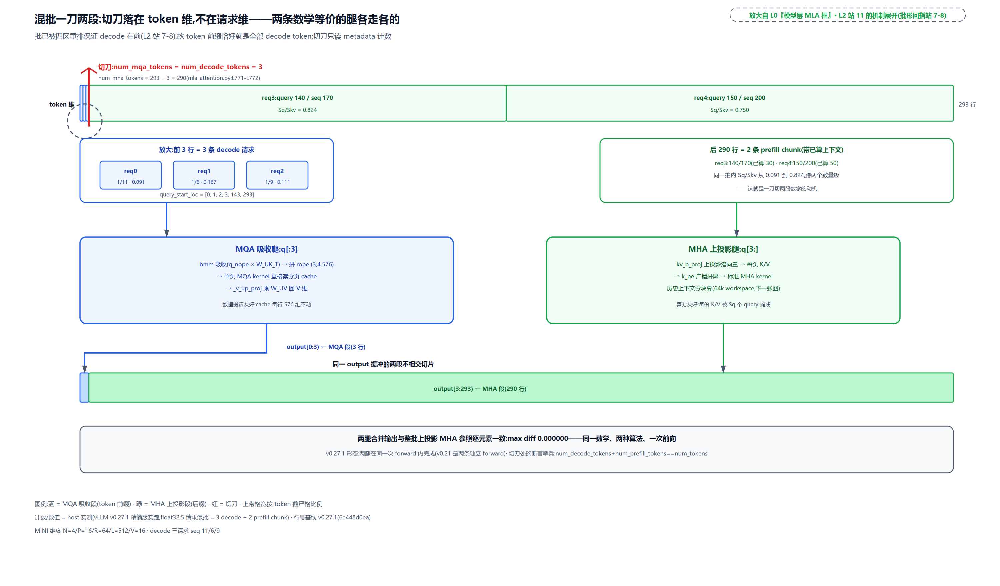

> *图注：上带是排好序的 293 个 token（三小格 decode 各 1 token 加两长格 prefill 140/150，各标 query/seq 与 Sq/Skv）。红切刀落在第 3 行：num_mqa_tokens=num_decode_tokens=3，num_mha_tokens=293−3=290，刀位是 token 维前缀而非请求边界（批序由四区重排保证 decode 在前）。下带分叉两条腿：前段 MQA 吸收（bmm→单头 kernel→v_up），后段 MHA 上投影（kv_b_proj→标准注意力），出口并回同一 output 的 [0,3) 与 [3,293) 不相交切片。实测两腿合并与整批单腿数学逐位一致（max diff 0.000000）。*

## 谁画的线：四区重排与后端自报阈值

现在走到 L0 图执行臂的调度前置段，回补切刀的另一半答案。批的排序不是调度器的善意，是 MLA 后端的要求。runner 每拍在准备输入前调一次：

```python
# vllm/v1/worker/gpu_model_runner.py:L1115-L1138 · GPUModelRunner._may_reorder_batch
    def _may_reorder_batch(self, scheduler_output: "SchedulerOutput") -> None:
        """
        Update the order of requests in the batch based on the attention
        backend's needs. For example, some attention backends (namely MLA) may
        want to separate requests based on if the attention computation will be
        compute-bound or memory-bound.

        Args:
            scheduler_output: The scheduler output.
        """
        # Attention free models have zero kv_cache_groups, however models
        # like Mamba are also attention free but use the kv_cache for
        # keeping its internal state. This is why we check the number
        # of kv_cache groups instead of solely checking
        # for self.model_config.is_attention_free.
        if len(self.kv_cache_config.kv_cache_groups) == 0:
            return

        if self.reorder_batch_threshold is not None:
            reorder_batch_to_split_decodes_and_prefills(
                self.input_batch,
                scheduler_output,
                decode_threshold=self.reorder_batch_threshold,
            )
```

docstring 点名 MLA：有的后端要按「注意力是算力受限还是访存受限」分开摆请求。重排函数把持久批（[第 18 章](../../ch18-persistent-batch-fixed-addresses/narrative/chapter.md)的固定地址批）划成四个互斥区：

```python
# vllm/v1/attention/backends/utils.py:L694-L724 · reorder_batch_to_split_decodes_and_prefills 的四区划分
    # Mutually exclusive categories (exactly one True per request):
    # 1. No context yet -> prefill
    # 2. Has context, above threshold -> long_extend
    # 3. Has context, below threshold, still prefilling -> short_extend
    # 4. Has context, below threshold, done prefilling -> decode
    is_pure_prefill = ~has_context
    is_long_extend = has_context & ~is_below_threshold
    is_short_extend = has_context & is_below_threshold & ~done_prefilling
    is_decode = has_context & is_below_threshold & done_prefilling

    # Desired order: decode → short_extend → long_extend → prefill
    req_regions = np.zeros(num_reqs, dtype=np.int32)  # 0 = decode by default
    req_regions[is_short_extend] = 1
    req_regions[is_long_extend] = 2
    req_regions[is_pure_prefill] = 3

    num_decodes = int(is_decode.sum())
    num_short_extends = int(is_short_extend.sum())
    num_long_extends = int(is_long_extend.sum())
    num_prefills = int(is_pure_prefill.sum())

    target_regions = np.repeat(
        [0, 1, 2, 3],
        [num_decodes, num_short_extends, num_long_extends, num_prefills],
    ).astype(np.int32)

    needs_swap = req_regions != target_regions

    if not needs_swap.any():
        return False
    # … 省略：换位循环（按目标区排序，swap_states 交换槽位直至归位）…
```

四个布尔由三个条件组合而来：有没有已算上下文（`has_context`）、本拍调度的 token 数是否低于阈值（`is_below_threshold`）、prompt 是否已算完（`done_prefilling`）。注释自夸「exactly one True per request」：四式两两不相交且覆盖全部组合，每个请求恰好落一区。目标顺序 decode 在最前、prefill 在最后，中间按 short_extend、long_extend 排；不匹配的槽位通过 `swap_states`（[第 18 章](../../ch18-persistent-batch-fixed-addresses/narrative/chapter.md)的槽位交换原语）换位归位。换位是纯置换：批成员不变、各请求状态不变，只挪位置。已排好的批再排一遍，`needs_swap` 全假，直接返回。

阈值从哪来？后端自报。FlashMLA 的 builder 声明：

```python
# vllm/v1/attention/backends/mla/flashmla.py:L118-L122 · FlashMLAMetadataBuilder 自报阈值
class FlashMLAMetadataBuilder(MLACommonMetadataBuilder[FlashMLAMetadata]):
    _cudagraph_support: ClassVar[AttentionCGSupport] = AttentionCGSupport.UNIFORM_BATCH
    query_len_support: ClassVar[QueryLenSupport] = QueryLenSupport.UNIFORM
    reorder_batch_threshold: int = 128  # process small prefills with decode pathway
    # ^ TODO(matt): tune this
```

128，注释原话「process small prefills with decode pathway」（小 prefill 也走 decode 路径），后面还跟着一句诚实的 TODO：这个值该调优。FA-MLA（FlashAttention 系的 MLA decode 后端，源码名 `FLASH_ATTN_MLA`）同款自报 512。runner 把全部 KV 组的 builder 声明取最小值统一执行（`gpu_model_runner.py:L7220-L7238` 的 `calculate_reorder_batch_threshold`，docstring 原话解释了为什么敢取最小：后端应该能支持比自己申报更低的阈值，最多把 decode 当 prefill 算、吃点性能罚；没有组申报就保持禁用）。

阈值的工程含义要讲透：低于阈值的 chunked prefill 尾段（比如 64 个 token 的收尾块）也会被划进 MQA 段。这些段按 MHA 展开算力不划算，query 太少摊不动上投影；按吸收走单份潜向量反而便宜。所以「decode 段」的确切含义是「query 数低于阈值的段」，`split_decodes_and_prefills`（数边界的函数）的 docstring 把批序约定写成了契约：

```python
# vllm/v1/attention/backends/utils.py:L564-L593 · split_decodes_and_prefills 的批序契约
def split_decodes_and_prefills(
    common_attn_metadata: CommonAttentionMetadata,
    decode_threshold: int = 1,
    require_uniform: bool = False,
    treat_short_extends_as_decodes: bool = True,
) -> tuple[int, int, int, int]:
    """
    Assuming a reordered batch, finds the boundary between prefill and decode
    requests.

    The batch is expected to be ordered as:
        decode → short_extend → long_extend → prefill

    Args:
        common_attn_metadata: CommonAttentionMetadata object containing the
            batch metadata.
        decode_threshold: The maximum query length to be considered a decode.
        require_uniform: If True, requires that all decode requests have the
            same query length. When set, some queries may be considered prefills
            even if they are <= decode_threshold, in order to ensure uniformity.
        treat_short_extends_as_decodes: If True (default), short extends
            (query_len <= threshold but still prefilling) are counted as
            decodes. If False, they are counted as prefills.

    Returns:
        num_decodes: The number of decode requests.
        num_prefills: The number of prefill requests.
        num_decode_tokens: The number of tokens in the decode requests.
        num_prefill_tokens: The number of tokens in the prefill requests.
    """
```

开篇第一句就是「Assuming a reordered batch」：它不负责排，只负责在排好的批上找边界（第一个 query 长度超阈值的请求出现在哪，边界就在哪一行 token）。这份契约由谁兑现？每拍 `MLACommonMetadataBuilder.build`（`mla_attention.py:L2056-L2063`）拿着 `decode_threshold=self.reorder_batch_threshold` 调它，数出 `num_decodes / num_prefills / num_decode_tokens / num_prefill_tokens` 四个计数，装进 MLA 专属的批元数据（三个计数字段是「New for MLA」的注释原话，`mla_attention.py:L1473-L1477`）。前向里 L771 那把刀读的正是这份计数。

一次五请求乱序批的重排全账（手算档：阈值取 2 便于心算、计数函数真跑；它与小节里跑数值表的 MINI 档是两套示教配置，这里的「档」指阈值不指模型缩尺。生产档见末行）：

<!-- trace: ch25-m07 -->
| 请求 | 已算/prompt | 本拍调度 | has_context | ≤阈值(2) | done_prefilling | 判定区 |
|---|---|---|---|---|---|---|
| p0 | 0/8 | 8 | false | false | false | prefill（首块，无上下文） |
| long | 8/20 | 12 | true | false | false | long_extend（有上下文、超阈值） |
| short | 15/16 | 1 | true | true | false | short_extend（尾段未完） |
| d0 | 10/10 | 1 | true | true | true | decode（prompt 已算完） |
| d1 | 31/31 | 1 | true | true | true | decode（prompt 已算完） |
| 换位 | swap_states 3 次：[3,0] → [3,4] → [3,1] | — | — | — | — | 批序 p0,long,short,d0,d1 → d0,d1,short,long,p0 |
| 数边界 | 排好后 query_lens=[1,1,1,12,8]，真实 split_decodes_and_prefills(阈值 2) 数边界 | 总 token=3+20 | — | — | — | num_decodes=3 / num_prefills=2 / num_decode_tokens=3 / num_prefill_tokens=20——short 的 1-token 尾段数进 decode 段 |
| 幂等 | 已排好的批（d0,d1,p0）再过一遍 | — | — | — | — | 返回未改动、零 swap |
| 生产档阈值 | FlashMLA 128（注释 'process small prefills with decode pathway'）、FA-MLA 512 | — | — | — | — | runner 取各组最小：min(128,512)=128；无组 → None 不重排 |

表里 short 的行是这条机制最细的一格：它的 prompt 只差 1 个 token 没算完（15/16），本拍调度 1 个 token，低于阈值，于是这个「名义上的 prefill 尾段」被数进 decode 段、走吸收路。本批的 `num_decode_tokens=3` 由 2 个真 decode 加 short 的 1-token 尾段凑成：计数器只看 query_len 是否不超过阈值，不区分真 decode 与尾段。上一节混批表里的 `num_decode_tokens=3` 用的是同一口径，那批的 3 个全部来自真 decode（批里没有尾段）；两表对账只对口径，别把构成也当成一样。

至此，切刀的三个环节全部接上了：runner 按后端自报阈值每拍重排（四区互斥、decode 在前）→ builder 在排好的批上数边界（四计数）→ 前向在 token 维切一刀（两段各走各的数学）。谁画的线？后端画的（自报阈值），runner 执行（重排），前向消费（切刀）。

## 小锅炖整锅汤：分块上投影与 LSE 合并

MHA 腿还有一个显存问题没兑现。文件头文档在两路伪码之后专门写了一段 Chunked Prefill，先把问题说破：

```text
# vllm/model_executor/layers/attention/mla_attention.py:L127-L132 · 文件头文档（分块动机）
However, the compute-friendly approach can potentially run out of memory if Skv
is large due to: `k_nope = (kv_c @ W_UK).view(Skv, N, P)`

To mitigate this, we chunk the computation of attention with respect to the
current context (i.e. `cache_kv_c` and `cache_k_pe`) so that we can used a
fixed workspace size.
```

chunked prefill 的后续块要同时看历史上下文（比如已算 30 个 token 的块要把那 30 个也上投影）。历史一长，`Skv × N × (P+V)` 的上投影张量线性膨胀，整段物化就是奔着爆显存去的。对策是分块：历史上下文按固定容量的 workspace（一块启动期就定好大小的暂存缓冲）切片，一块一块上投影、一块一块算。直觉一句话：灶台只放得下小锅，那就分几锅熬，每锅熬好先记账，最后按各锅热度权重精确合成——数学上与一锅炖逐位等价，绝无近似。

workspace 定容的公式带着源码注释自带的算例：

```python
# vllm/model_executor/layers/attention/mla_attention.py:L1803-L1831 · determine_chunked_prefill_workspace_size
    @staticmethod
    def determine_chunked_prefill_workspace_size(vllm_config: VllmConfig) -> int:
        scheduler_config = vllm_config.scheduler_config
        cache_config = vllm_config.cache_config
        model_config = vllm_config.model_config

        chunked_prefill_workspace_size = min(
            # Try for 8 full length request or at least 4 pages per-request
            max(
                8 * model_config.max_model_len,
                4 * scheduler_config.max_num_seqs * cache_config.block_size,
            ),
            # For long-context models try not to over-allocate limiting
            # kv-cache space, limiting it to 64k tokens,
            # which would result in the workspace being:
            #   2*(576)*(64*1024) = 144mb
            # (assuming 576 MLA head dim, and fp16)
            # which would result in up-projected context being
            #   2*(192*128)*(64*1024) = 3gb
            # (assuming 192 QK head dim, 128 heads, and fp16)
            64 * 1024,
        )

        # Enforce that we enough for at least 1 page per request
        chunked_prefill_workspace_size = max(
            chunked_prefill_workspace_size,
            scheduler_config.max_num_seqs * cache_config.block_size,
        )

        return chunked_prefill_workspace_size
```

容量取「8 个满长请求或每请求至少 4 页」与 64k token 的较小值。注释里的两个数正是本节的账：64k token 的 workspace 装潜向量是 576×64×1024×2 字节，若不 chunk、全量上投影仅 K 一项就是 192×128×64×1024×2 字节。这里必须就近挑明一处注释勘误（取证环境核对过）：注释自称 workspace 144mb，但按它自己的公式 $`2\times576\times65536=75497472`$ 字节，精确值是 72 MiB，口径恰差 2 倍；3gb 那个数倒是相符：

```math
2\times192\times128\times65536\approx3.0\times10^{9}
```

注释的相对结论（两个数量级的差距）不受影响，绝对数以精确积为准。

分块循环的主体在 `_compute_prefill_context`：

```python
# vllm/model_executor/layers/attention/mla_attention.py:L2301-L2333 · MLACommonBaseImpl._compute_prefill_context
    def _compute_prefill_context(
        self,
        q: torch.Tensor,
        kv_c_and_k_pe_cache: torch.Tensor,
        attn_metadata: MLACommonMetadata,
        k_scale: torch.Tensor,
    ):
        assert attn_metadata.prefill is not None
        prefill_metadata = attn_metadata.prefill
        assert prefill_metadata.prefill_backend is not None
        assert prefill_metadata.chunked_context is not None

        use_fp8_prefill = prefill_metadata.q_data_type == current_platform.fp8_dtype()

        output = None
        merge_output = None
        iters = len(prefill_metadata.chunked_context.seq_tot)
        workspace = prefill_metadata.chunked_context.workspace

        if use_fp8_prefill:
            q = q.to(prefill_metadata.q_data_type)

        for i in range(iters):
            toks = prefill_metadata.chunked_context.seq_tot[i]
            if self.kv_cache_dtype == "fp8_ds_mla":
                ops.cp_gather_and_upconvert_fp8_kv_cache(
                    src_cache=kv_c_and_k_pe_cache,
                    dst=workspace[:toks],
                    block_table=prefill_metadata.block_table,
                    workspace_starts=prefill_metadata.chunked_context.cu_seq_lens[i],
                    batch_size=attn_metadata.num_prefills,
                    seq_starts=prefill_metadata.chunked_context.starts[i],
                )
            # … 省略：另外两路 gather（按缓存格式选一）；之后每块上投影、
            #    交 prefill 后端算一块、merge_attn_states 并入 running …
```

循环变量与切片账都记在 `chunked_context` 元数据里（每块起止、累积长度、workspace 切片）。每轮干三件事：按 block_table 把这一块的潜向量 gather 进 workspace、现场上投影、交 prefill 后端算这块与全部 query 的注意力，然后把结果并进 running 累积。算完即弃，workspace 下一轮复用。大张量永不整段物化。下文数值表给两份结果定个名：历史块累积下来的 `(o, l)` 记作 prefix，新 token 段经 prefill 后端一次算出的那份记作 suffix，终合并就是两者的 `merge_attn_states`。

「按热度权重精确合成」的数学担当是 `merge_attn_states`（LSE 精确合并，[第 20 章](../../ch20-flash-attention-math/narrative/chapter.md)的 log-sum-exp 就是它的记号）。恒等式一行写完：设块 1 已累积输出 $`o_1`$ 与 $`l_1=\mathrm{LSE}_1`$，新块算出 $`o_2, l_2`$，则

```math
o=\frac{e^{l_1}\,o_1+e^{l_2}\,o_2}{e^{l_1}+e^{l_2}},
\qquad
l=\log\!\left(e^{l_1}+e^{l_2}\right)
```

这恰是 softmax 分块合并的精确恒等式（全局分母等于各块分母之和，exp 可加），与[第 20 章](../../ch20-flash-attention-math/narrative/chapter.md)online softmax 是同一手法的块间推广——那里按 key 流式滚动，这里按块批量合并。两层证据（手算档：单头单 query、6 个 key 分 3 块的玩具算例，跑的仍是真实 merge 算子、每步可心算复核——与缩尺模型的 MINI 档不是一套配置；实跑档：带 workspace 的分块循环）：

<!-- trace: ch25-m08 -->
| 轮次 | 块（scores→probs） | 块输出 / LSE | 合并权重（e^LSE 归一） | 合并后输出 / LSE |
|---|---|---|---|---|
| 块1 | [1.0, 2.0] → [0.2689, 0.7311] | 24.6212 / 2.3133 | —（直填 running） | 24.6212 / 2.3133 |
| 块2 | [3.0]（单 key，prob=1.0） | 20.0000 / 3.0000 | 块1 0.3348 : 块2 0.6652 | 21.5470 / 3.4076 |
| 块3 | [0.5, 0.2, 4.0] → [0.0287, 0.0213, 0.9501] | 6.9214 / 4.0512 | 块12 0.3444 : 块3 0.6556 | 11.9588 / 4.4735 |
| 整块参照 | 6 个 key 放一个 softmax 里算 | — | — | 11.9588 / 4.4735——与逐块合并逐位一致（输出差 0.000001 / LSE 差 0.000000） |
| 实跑·分块 | context 150 / workspace 64 → 3 块（64/64/22），每块现场上投影算完即弃 | 块间 merge 2 次 + suffix 终合并 1 次 | 末次块间 merge 的 LSE：prefix 5.040 / suffix 3.394 | 与全量上投影参照 max diff 0.000000 |
| workspace 字节账（64k 档） | workspace 只装潜向量：75497472 B（fp16） | 若不 chunk 全量上投影仅 K 就 3221225472 B（3 GB） | — | 源码注释自称 144mb 实为 72 MiB（口径差 2 倍，引注释须带勘误）——大张量永不整段物化 |

手算档值得逐格看：块 2 只有一个 key，块内 softmax 输出就是它自己（20.0000），但 LSE（3.0000）比块 1（2.3133）高，合并权重便偏向块 2（0.6652 比 0.3348）——「热度」高的块在全局 softmax 里话语权大，这就是 $`e^{l}`$ 权重的直觉。三轮合并后的输出与把六个 key 放进同一个 softmax 逐位一致。实跑档是这套数学装进循环的样子：150 个历史潜向量分 64/64/22 三批，与 140 个新 token 的 suffix 段做终合并，输出与全量上投影 diff 0.000000。

这块代价真实到什么程度？有一次提交专门优化 workspace 复用，端到端 TTFT 改善 3.9%（提交信息原话），说明分块循环本身也在被人继续抠。而 64k 档的对比已经足够悬殊：72 MiB 的锅，兜住本要 3 GB 的上投影。

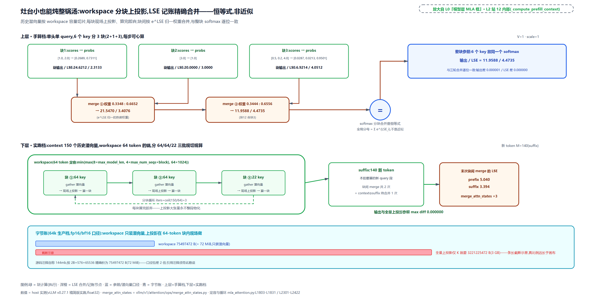

> *图注：上层手算档：6 个 key 分 3 块（2+1+3），每块自算 softmax 输出与 LSE，合并按 e^LSE 归一权重（0.3348:0.6652、0.3444:0.6556）加权，三轮后与整块 softmax 逐位相同（11.9588/4.4735，差 0.000001/0.000000）——恒等式不是近似，注释「全局分母=Σ e^LSE_i」。下层实跑档：workspace 64 token 的锅里 150 个历史潜向量分 64/64/22 三批现场上投影、算完即弃（iters=ceil(150/64)=3），块间 2 次加 context⊕suffix 终合并共 3 次 merge_attn_states，输出与全量上投影一致（diff 0.000000）。底部字节账：75497472 B（72 MiB）对照 3221225472 B（3 GB）。*

## 特形 cache 的两套后端家族

前向的故事讲完了。现在回到 L0 图，从模型层框往两边看：本章走过的这条 MLA 层挂在两套后端家族上，还要向 KV 池报一个特形形状。这两件事都发生在启动期，先看 spec。`MLAAttention` 给 KV 池的申报只有几行：

```python
# vllm/model_executor/layers/attention/mla_attention.py:L1140-L1176 · MLAAttention.get_kv_cache_spec 与 _v_up_proj
    def get_kv_cache_spec(self, vllm_config: VllmConfig) -> KVCacheSpec:
        kv_cache_dtype = kv_cache_dtype_str_to_dtype(
            self.kv_cache_dtype, vllm_config.model_config
        )
        return MLAAttentionSpec(
            block_size=vllm_config.cache_config.block_size,               # L1145
            num_kv_heads=1,                                              # L1146
            head_size=self.head_size,
            dtype=kv_cache_dtype,
            cache_dtype_str=self.kv_cache_dtype,
            kv_quant_mode=get_kv_quant_mode(self.kv_cache_dtype),
            non_causal_multi_token_decode=self.non_causal_multi_token_decode,
        )

    def _v_up_proj(self, x: torch.Tensor, out: torch.Tensor):             # L1154
        # Convert from (B, N, L) to (N, B, L)
        x = x.view(-1, self.num_heads, self.kv_lora_rank).transpose(0, 1)  # L1156
        out = out.view(-1, self.num_heads, self.v_head_dim)
        # … 省略：ROCm aiter 的 fp4/fp8 batched GEMM 分支 …
        else:
            # Multiply + Transpose (N, B, L) x (N, L, V)->(N, B, V)->(B, N, V)
            torch.bmm(x, self.W_UV, out=out.transpose(0, 1))              # L1176
```

三个字段与伪码世界一一对应：`num_kv_heads=1`（潜向量是「单头」的，比 MQA 的一个写头还要少一层维度）；`head_size = kv_lora_rank + qk_rope_head_dim = 576`（潜向量加 rope 的拼接宽，正是写腿进 cache 的那一行；这是 V2/V3 记法下的公式，V4 的统一记法下行宽口径不同，对账见[「第三代」](#第三代dsv4-的压缩格与-584b-布局)一节）；`cache_dtype_str` 原样透传（fp8_ds_mla 这类自定义布局的字节账在 spec 侧特算，见[「第三代」](#第三代dsv4-的压缩格与-584b-布局)）。顺手把 `_v_up_proj` 的真身也认了：块尾这个方法就是 MQA 腿第四个动作的实现现场——`(B, N, L)` 转回 `(N, B, L)`（L1156），最后一行 `torch.bmm` 乘 `W_UV` 写回输出（L1176）。

这份 spec 之所以「特形」，看家族基类的 cache 形状声明最直观：

```python
# vllm/model_executor/layers/attention/mla_attention.py:L1360-L1397 · MLACommonBackend
class MLACommonBackend(AttentionBackend):
    @staticmethod
    def get_name() -> str:
        return "TRITON_MLA"

    @staticmethod
    def get_builder_cls() -> type["MLACommonMetadataBuilder"]:
        return MLACommonMetadataBuilder

    @staticmethod
    def get_kv_cache_shape(
        num_blocks: int,
        block_size: int,
        num_kv_heads: int,  # assumed to be 1 for MLA
        head_size: int,
        cache_dtype_str: str = "auto",
    ) -> tuple[int, ...]:
        return (num_blocks, block_size, head_size)                        # L1377

    # … 省略：get_kv_cache_stride_order（跨层分配默认不支持，须子类显式开启）…

    @classmethod
    def get_supported_head_sizes(cls) -> list[int]:
        return [320, 576]

    @classmethod
    def is_mla(cls) -> bool:
        return True
```

L1377 返回的 cache 形状是 `(num_blocks, block_size, head_size)`，三维，连 K 和 V 都不拆（对照[第 21 章](../../ch21-attention-backends/narrative/chapter.md)通用后端的 `(num_blocks, block_size, num_kv_heads, head_size × 2)` 那类形状，K/V 维是标配）。`get_supported_head_sizes` 只认 320 和 576 两个白名单值。这样的形状所有通用后端都对不上，所以 MLA 自立 decode 后端家族，`is_mla()=True` 是家族身份证（装配时那句断言验的就是它），FlashMLA、FlashInfer-MLA、Triton-MLA 等成员的选择优先级表[第 21 章](../../ch21-attention-backends/narrative/chapter.md)已立，本章不重表。

但故事只讲了一半：decode 腿要吃 576 维特形 cache 的 MQA kernel，prefill 腿上投影完成后形状回归标准 MHA，通用 kernel 接得住。于是 v0.27 拆出了第二根选择轴——prefill 后端独立成族，五选一：

```python
# vllm/v1/attention/backends/mla/prefill/registry.py:L34-L57 · MLAPrefillBackendEnum
class MLAPrefillBackendEnum(Enum, metaclass=_MLAPrefillBackendEnumMeta):
    """Enumeration of all supported MLA prefill backends."""

    FLASH_ATTN = (
        "vllm.v1.attention.backends.mla.prefill.flash_attn.FlashAttnPrefillBackend"
    )
    FLASHINFER = (
        "vllm.v1.attention.backends.mla.prefill.flashinfer.FlashInferPrefillBackend"
    )
    TRTLLM_RAGGED = (
        "vllm.v1.attention.backends.mla.prefill.trtllm_ragged."
        "TrtllmRaggedPrefillBackend"
    )
    TOKENSPEED_MLA = (
        "vllm.v1.attention.backends.mla.prefill.tokenspeed_mla."
        "TokenspeedMLAPrefillBackend"
    )
    ROCM_AITER_FA = (
        "vllm.v1.attention.backends.mla.prefill.aiter_flash_attn."
        "AiterFlashAttnPrefillBackend"
    )
    # Placeholder for third-party/custom backends - must be registered before use
    # set to None to avoid alias with other backend, whose value is an empty string
    CUSTOM = None
```

五家身份各一句话。FLASH_ATTN 与 FLASHINFER 是 prefill 通用款（vLLM 自带的 vllm_flash_attn fork 与 NVIDIA FlashInfer 库的 context kernel，[第 20 章](../../ch20-flash-attention-math/narrative/chapter.md)与[第 21 章](../../ch21-attention-backends/narrative/chapter.md)的老朋友）。TRTLLM_RAGGED 是 NVIDIA TensorRT-LLM 的 context 段 kernel，「ragged」指变长打平布局（不 padding、按累积长度切序列，与[第 21 章](../../ch21-attention-backends/narrative/chapter.md)的 cu_seqlens 记法同族）。TOKENSPEED_MLA 是 LightSeek 基金会 TokenSpeed 项目的 prefill 实现。ROCM_AITER_FA 是 AMD AITER 库（AI Tensor Engine for ROCm，AMD 官方 kernel 库）的 FlashAttention 系实现，2025-08 起官方支持 MLA 层推理，是 AMD 卡上跑 DeepSeek 系的主力路径。末尾 CUSTOM 留了第三方注册槽。

两轴各选各的：decode 后端管「特形 kernel 读潜 cache」，prefill 后端管「标准 MHA 计算」，一个 MLA 层同时是两套家族的客户（装配现场在 `mla_attention.py:L520-L550`）。跨厂商的通用 kernel 都能参与 prefill 族，因为上投影已把形状还原成行业标准；decode 族则必须为特形重写。这正是「两种展开」在后端世界的投影：展开到哪一侧，决定谁能接活。

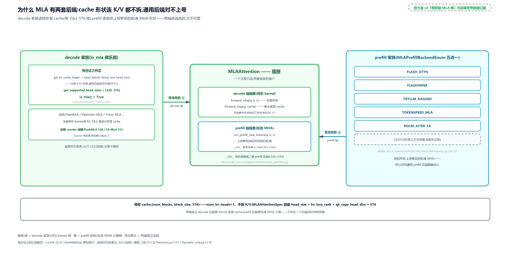

> *图注：中轴是 MLAAttention 插座：decode 轴抽象 forward_mha/forward_mqa 双入口，prefill 轴抽象 run_prefill_new_tokens；装配位断言后端 is_mla 并另装第二套 prefill 后端。左翼 decode 家族：身份证三件套——cache 形状 (num_blocks, block_size, head_size) 无 K/V 拆维、head_size 白名单 [320,576]、is_mla()=True；成员选择优先级表[第 21 章](../../ch21-attention-backends/narrative/chapter.md)已立（回指）；自报分流阈值 128/512。右翼 prefill 家族五名牌（FLASH_ATTN / FLASHINFER / TRTLLM_RAGGED / TOKENSPEED_MLA / ROCM_AITER_FA）加 CUSTOM 注册槽。两支选择箭头互相独立：各选各的。*

## 组化：一层自报什么，池就长什么样

spec 报出去了，谁收、收到之后干什么？现在走到 L0 图三列之下那条「GPU 显存 · KV cache 池」横带——其中「潜 KV cache 池」那格标着「第 25 章打开」，正是本章点亮的那块：模型层的申报线从执行臂往下，接进[第 14 章](../../ch14-memory-ledger/narrative/chapter.md)的账本。那一章立过「一组一管理器共享一池」：混合注意力模型（Gemma3 的 5:1 滑窗比全量、LLaMA4 的 3:1、Mamba 混合）按 KVCacheSpec 把层分组，每组一个管理器，各组共用一个 BlockPool。当时给的外部底座是「模型层自报形状」。本章兑现 MLA 侧的实测：自报的入口在 runner。

```python
# vllm/v1/worker/gpu_model_runner.py:L7800-L7835 · GPUModelRunner.get_kv_cache_spec
    def get_kv_cache_spec(self) -> dict[str, KVCacheSpec]:
        """
        Generates the KVCacheSpec by parsing the kv cache format from each
        Attention module in the static forward context.
        Returns:
            KVCacheSpec: A dictionary mapping layer names to their KV cache
            format. Layers that do not need KV cache are not included.
        """
        # … 省略：KV transfer consumer 的早退分支 …
        kv_cache_spec: dict[str, KVCacheSpec] = {}
        layer_type = cast(type[Any], AttentionLayerBase)
        attn_layers = get_layers_from_vllm_config(self.vllm_config, layer_type)
        for layer_name, attn_module in attn_layers.items():
            # … 省略：跨层 KV 共享层跳过（登记进 shared_kv_cache_layers，不占自己的池位）…
            # Skip modules that don't need KV cache (eg encoder-only attention)
            if spec := attn_module.get_kv_cache_spec(self.vllm_config):
                if isinstance(spec, AttentionSpec):
                    backend = attn_module.get_attn_backend()
                    # indexes_kv_by_block_stride() -> get_kv_cache_stride_order()
                    # -> get_kv_cache_layout() needs the current vLLM config.
                    with set_current_vllm_config(self.vllm_config):
                        indexes = backend.indexes_kv_by_block_stride()
                    spec = replace(spec, indexes_kv_by_block_stride=indexes)
                kv_cache_spec[layer_name] = spec
```

runner 拿着装配期那份 `static_forward_context` 花名册（每层的插座都在上面）逐层调 `get_kv_cache_spec`，收成一张「层名到 spec」的字典。谁不报（返回 None，比如 DSV4 的滑窗段走子缓存另报）就不进这张表。分组决策交给 `get_kv_cache_groups` 的四级分流：

```python
# vllm/v1/core/kv_cache_utils.py:L1781-L1852 · get_kv_cache_groups 四级分流
def get_kv_cache_groups(
    vllm_config: VllmConfig, kv_cache_spec: dict[str, KVCacheSpec]
) -> list[KVCacheGroupSpec]:
    """..."""
    if vllm_config.scheduler_config.disable_hybrid_kv_cache_manager:
        unify_hybrid_kv_cache_specs(kv_cache_spec)

    if is_kv_cache_type_attention_free(kv_cache_spec):
        # … 省略：attention-free 模型返回空表（Mamba 状态另有去处）…
        return []

    if is_kv_cache_spec_uniform(kv_cache_spec):
        # KV cache of all layers are the same, which is true for
        # most models. Allocate the same amount of memory for
        # each layer.
        return _get_kv_cache_groups_uniform_spec(kv_cache_spec)
    elif uniform_spec := UniformTypeKVCacheSpecs.from_specs(kv_cache_spec):
        # All layers need the same number of token slots (e.g., all layers are
        # full attention, or all layers are sliding window attention with the
        # same window size). Put all layers into one group.
        return _get_kv_cache_groups_uniform_type(uniform_spec)
    elif grouped_specs := group_and_unify_kv_cache_specs(kv_cache_spec):
        # DeepseekV4 case: All layers need the same number of token slots,
        # yet some layers are full attention while others are sliding window
        # attention in different sizes. Need to group layers into multiple
        # UniformTypeKVCacheSpecs.
        kv_cache_groups = _get_kv_cache_groups_uniform_groups(grouped_specs)
        _annotate_eagle_groups_deepseek_v4(vllm_config, kv_cache_spec, kv_cache_groups)
        return kv_cache_groups

    # … 省略：HiddenStateCacheSpec 层抽出（产 filtered_spec）与页大小归一回填 …
    try:
        filtered_spec = unify_kv_cache_spec_page_size(filtered_spec)
    except NotImplementedError:
        # … 省略：allocation-only 回退（仍失败则 raise）…
        raise
    groups = _get_kv_cache_groups_uniform_page_size(filtered_spec)

    return groups
```

四级从宽到严往下走：全部层 spec 完全相同，一组（多数模型走这条早退）；token 槽数相同但格式有别，仍一组；DSV4 这种「槽数相同、滑窗尺寸各异」的，`group_and_unify` 拆成多组（注释点名 DeepseekV4 case）；最一般的混合，页大小归一后多组。每级的判据都是 spec 字段的等价类。片段首尾两处旁路交代半句：开头 `disable_hybrid_kv_cache_manager` 两行是用户配置要求退回单管理器时的兜底，把滑窗 spec 统一成全注意力 spec（源码会打 warning：滑窗丢 token 的省显存优化就此放弃）；`_annotate_eagle_groups_deepseek_v4` 只在启用 Eagle 推测解码（用草稿模型加速解码）且模型为 DSV4 时，给含 MTP 层的组打个标——两处都不改变四级分流的判据。

等价类的边界写死在 spec 的 `merge` 里，MLA 的断言比通用 spec 严四倍：

```python
# vllm/v1/kv_cache_interface.py:L429-L468 · MLAAttentionSpec.merge 组内等价断言
    @classmethod
    def merge(cls, specs: list[Self]) -> Self:
        assert all(isinstance(spec, MLAAttentionSpec) for spec in specs), (
            "All attention layers in the same KV cache group must be MLAAttentionSpec."
        )
        cache_dtype_str_set = set(spec.cache_dtype_str for spec in specs)
        compress_ratio_set = set(spec.compress_ratio for spec in specs)
        model_version_set = set(spec.model_version for spec in specs)
        block_stride_set = set(spec.indexes_kv_by_block_stride for spec in specs)
        assert (
            len(cache_dtype_str_set) == 1
            and len(compress_ratio_set) == 1
            and len(model_version_set) == 1
            and len(block_stride_set) == 1
        ), (
            "All attention layers in the same KV cache group must use the same "
            "quantization method, compress ratio, model version, and KV block "
            "stride indexing."
        )
        # … 省略：merged_spec 组装与 AttentionSpec 逐字段复核 …
        return merged_spec
```

量化方法、压缩比、模型版本、块步进索引，四个 MLA 专属字段组内必须全同，缺一当场断言。自报错一个字段，这层就进错组、跟不相容的层共享物理页，池子当场报销。

DSV4 是这条链最大的用户：一个模型三类子缓存同池分组。压缩层报 `MLAAttentionSpec(compress_ratio=4, alignment=576)`；滑窗段由一个独立的 `DeepseekV4SWACache` 子缓存层另报 `SlidingWindowMLASpec`（窗口 4096 是本章 trace 实测档的自设值，官方 V4-Flash/V4-Pro 的 config 与 vLLM 默认都是 128；block 64 与页 65536 字节不受窗口影响，页大小 = block 64 × head 512 元素 × 2B）；indexer 还有自己的一份 cache（机制归下一章）。还有一处页粒度协商值得一提：滑窗子缓存的 block_size 64，恰好等于压缩层 256 除以 compress_ratio 4 的存储块 64，两者共享同一物理张量粒度（`vllm/v1/attention/backends/mla/sparse_swa.py:L77-L82` 的注释写明了这笔对齐）。一个注意力层拆出多个 KV 子缓存、全部进同一个分组原料池，「一层一报」的账本在 DSV4 身上长到了最复杂的形态。

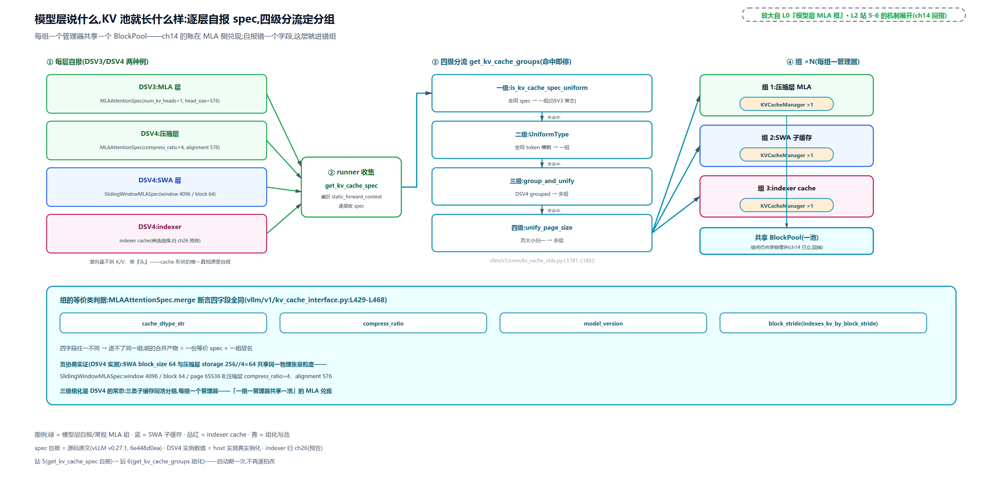

> *图注：左起层堆：DSV3 的层自报 MLAAttentionSpec(num_kv_heads=1, head_size=576)；DSV4 压缩层报 compress_ratio=4、alignment 576；滑窗层另报 SlidingWindowMLASpec（window 4096 为 trace 档、官方 config 128 / block 64 / page 65536 B——图上窗口值按 trace 档画）；indexer cache 归下一章。中：runner 按花名册逐层收集（get_kv_cache_spec 遍历 static_forward_context）。右：四级分流（全同 spec → 一组；全同 token 槽数 → 一组；DSV4 grouped → 多组；页归一 → 多组），每组一个 KVCacheManager 徽标，共享底部一个 BlockPool 长条（[第 14 章](../../ch14-memory-ledger/narrative/chapter.md)的账）。底板：merge 断言四字段全同（cache_dtype_str / compress_ratio / model_version / block_stride），页协商 256//4=64 的对齐实证。*

## 第三代：DSV4 的压缩格与 584B 布局

收束在演化线上。DeepSeek-V4（arXiv:2606.19348，2026-04-26 提交）把 MLA 推到第三代：上下文按层压缩、KV 字节再压掉近八成（每 token 有效 146 B，三代账见下）、输出侧也低秩化。本章只取与「两种展开」和组化直接相关的面，索引器与 MoE 拼装归后面两章。

先看论文给两个新名字的分工（一句话版）：CSA（Compressed Sparse Attention）先把每 m 个 token 的 KV 压成 1 个条目、再在压缩格上做稀疏选择；HCA（Heavily Compressed Attention）用大得多的压缩率 m′ 重压缩、不做稀疏。容易混的一点要点破：滑窗不是 HCA 的别名，它是两类层之外的第三条旁路——最近 n_win 个 token 不压缩、原样保留。config 里的 `compress_ratios` 逐层表就是论文的 m 与 m′：V4-Flash 的表形如 `[0,0,4,128,4,128,…,4,0]`（4 是 CSA 层、128 是 HCA 层、0 不压缩、末位 0 属 MTP 层），同一模型不同层压缩比不同。

逐层解析在装配期完成：

```python
# vllm/models/deepseek_v4/attention.py:L203-L213 · DeepseekV4Attention 逐层 compress_ratio 解析
        self.nope_head_dim = self.head_dim - self.rope_head_dim
        self.n_groups = config.o_groups
        self.n_local_groups = self.n_groups // tp_size
        self.window_size = config.sliding_window
        # NOTE(zyongye) Compress ratio can't be 0
        # we do this for because MTP layer is not included
        # in the compress ratio list
        if layer_id < config.num_hidden_layers:
            self.compress_ratio = max(1, config.compress_ratios[layer_id])
        else:
            self.compress_ratio = 1
```

`max(1, ·)` 护栏把表里的 0 钳成 1（注释解释：MTP 层（multi-token prediction，多 token 预测草稿层，[第 23 章](../../ch23-model-layer-assembly/narrative/chapter.md)在 registry 见过它的注册名）不在压缩表里，行数对不齐时恒取 1）。这里与上文「末位 0 属 MTP 层」对一下账：实测官方 V4-Flash 的 config，表确实带了 MTP 行（44 行对 43 层、末位 0），与注释「不在表里」的假设相反；但这行永远不被读——MTP 层的 layer_id 已达 num_hidden_layers，走 else 恒 1、不查表。vLLM 按「表可能不含 MTP 行」的保守假设写护栏，两种表形都兜得住，`max(1, ·)` 真正钳的是表头那两个真实不压缩层的 0。spec 自报按压缩比分叉：

```python
# vllm/models/deepseek_v4/attention.py:L655-L674 · DeepseekV4Attention.get_kv_cache_spec
    def get_kv_cache_spec(self, vllm_config: VllmConfig) -> KVCacheSpec | None:
        if (
            self.compress_ratio <= 1
        ):  # SWA part. Allocated separately as DeepseekV4SWACache.
            return None
        # fp8_ds_mla is a UE8M0 block-scaled uint8 layout and needs 576B
        # alignment; plain bf16 / per-tensor fp8 rows use natural element-size
        # pages.
        uses_fp8_ds_mla_layout = self.kv_cache_dtype == "fp8_ds_mla"
        return MLAAttentionSpec(
            block_size=vllm_config.cache_config.block_size,
            num_kv_heads=1,
            head_size=self.head_dim,
            dtype=torch.uint8 if uses_fp8_ds_mla_layout else self.kv_cache_torch_dtype,
            compress_ratio=self.compress_ratio,
            cache_dtype_str=self.kv_cache_dtype,
            alignment=576 if uses_fp8_ds_mla_layout else 512,
            model_version="deepseek_v4",
            kv_quant_mode=get_kv_quant_mode(self.kv_cache_dtype),
        )
```

压缩比大于 1 的层报特形 spec（compress_ratio 与 alignment 都带上）；不压缩的层返回 None，滑窗段交给独立的 SWA 子缓存另报。上一节说的「三类子缓存」，出处就在这。`fp8_ds_mla` 这个字符串值得停下来认一认：它不是 vLLM 自创的格式名，是 DeepSeek 官方两代演进的产物。V3.2-Exp（2025-09 官宣）首次给旗舰配上 FP8 量化的 KV cache；V4 论文 §2.3.4 把配方写死成原话「BF16 precision is used for the rotary positional embedding (RoPE) dimensions, while FP8 precision is applied to the remaining dimensions」，翻译过来就是 rope 段保 BF16、其余压 FP8，KV 再省近半。缩放因子用 UE8M0（8 位纯指数、只许 2 的幂的缩放格式，编码规范与硬件侧细节在[第 27 章](../../ch27-quantization/narrative/chapter.md)展开；V4 官方 config.json 的量化字段明写 `scale_fmt: "ue8m0"`）。一个防跑偏的提醒：论文只给配方不给 584、656 这些字节数，字节级布局的真相源是本仓源码注释。读者去论文里找 584 找不到，是正常现象。

字节账记在 spec 的两条属性里，这是「语义维数」与「物理字节」分开记账的工程：

```python
# vllm/v1/kv_cache_interface.py:L388-L426 · MLAAttentionSpec 的存储与字节特账
@dataclass(frozen=True, kw_only=True)
class MLAAttentionSpec(FullAttentionSpec):
    # TODO(Lucas/Chen): less hacky way to do this
    cache_dtype_str: str | None = None
    # DeepseekV4 only fields. Non-DeepseekV4 MLA models leave these at defaults.
    alignment: int | None = None  # Default to None for no padding.
    compress_ratio: int = 1  # Default to 1 for no compression.
    model_version: str | None = None
    # Marks draft groups that flatten a non-causal query block into decode rows.
    non_causal_multi_token_decode: bool = False

    def __post_init__(self):
        super().__post_init__()
        _apply_alignment_padding(self)

    @property
    def storage_block_size(self) -> int:
        return self.block_size // self.compress_ratio               # L404-L405

    @property
    def real_page_size_bytes(self) -> int:
        if self.cache_dtype_str == "fp8_ds_mla":
            if self.model_version == "deepseek_v4":
                # DeepseekV4: 448B NoPE + 128B RoPE + 8B fp8 scale = 584B per token.
                # head_size stays semantic (512); bytes are determined here.
                return self.storage_block_size * 584
            # V3.2 main MLA: 656-byte custom layout (kv_lora_rank=512 +
            # qk_rope_head_dim=64, head_size=576). See flashmla_sparse.py.
            return self.block_size * 656
        # … 省略：INT4 与常规 dtype 的页字节数（storage×heads×head_dim×dtype_size）…
```

`storage_block_size`（存储块大小）= 页大小除以压缩比：每 4 个 token 才占 1 个存储块位。`real_page_size_bytes`（每页真实字节数）对 fp8_ds_mla 走特账，按 `model_version` 分两代：V4 每格 584 字节（448B FP8 nope 段 + 128B BF16 rope 段 + 8B 缩放），V3.2 每格 656 字节（512B FP8 + 16B 四个 fp32 缩放 + 128B BF16 rope）。就近挑明一处注释口径：上面源码注释原话写「584B per token」，它的 per token 实指每压缩条目（每存储格）——4 个 token 共一格，每 token 有效字节是 146；[第 24 章](../../ch24-primer-attn-variants/narrative/chapter.md)总账行的「584 B/token」同此口径，逐字节核账时别把两处当矛盾。三代布局的完整账：

<!-- trace: ch25-m12 -->
| 布局 | 每 token/每格字节 | 构成 | 对照 DSV3 1152B |
|---|---|---|---|
| DSV3 bf16 | 1152 B/token | 576 元素 × 2B（512 nope + 64 rope，全 bf16） | 基线（page 73728 B / block 64） |
| DSV3.2 fp8_ds_mla | 656 B/token | 512B fp8 nope + 16B（4 个 fp32 scale）+ 128B bf16 rope | 1.76 倍节省（page 167936 B / block 256） |
| DSV4 fp8_ds_mla | 584 B/存储格（覆盖 4 个 token） | 448B fp8 nope + 128B bf16 rope（不量化保精度）+ 8B scale（7 个 ue8m0 + 1B pad） | 每 token 有效 146 B——7.9 倍节省 |
| DSV4 存储/对齐 | storage_block_size = 256//4 = 64 | real_page_size_bytes = 64×584 = 37376 B，对齐后 37440（alignment 576） | 语义 head_size 512 与物理字节分离记账 |
| compress_ratios 逐层 | config [1,4,128,4,1]（迷你档逐层表，官方 V4-Flash 表形见上文）→ 解析同值 | MTP 层（layer_id≥num_hidden_layers）恒 1；max(1,·) 护栏把 0 钳成 1 | 同一模型不同层压缩比不同（128 档也合法） |
| spec 自报分叉 | 压缩层报 MLAAttentionSpec(compress_ratio=4, alignment 576)；≤1 层返回 None | SWA 段由 DeepseekV4SWACache 另报 SlidingWindowMLASpec（window 4096 为 trace 档、官方 128 / block 64 / page 65536 B） | 一层注意力拆多个 KV 子缓存——组化原料池见本章组化机制 |
| 记法双格式 | DSV4 统一 head_dim 512 + rope 64 → 换算 nope 448、kv_lora 512 | get_mla_dims 一处函数吃两代记法，下游只认 MLADims | 记法漂移的税由框架侧吃 |

两代 FP8 布局里 nope 段宽度不同（512 对 448）不是笔误：V4 把记法统一成 `head_dim=512`，其中 rope 占 64，nope 就是 448；V3.2 的潜维仍是 512 加 rope 64。顺着这笔必须把 V4 的 cache 行宽当面算清，否则拿上一节 V3 的公式去套会对不出账。V3 config 的 `kv_lora_rank` 只指潜段，rope 64 是写 cache 时另拼上去的第二支，行宽 = `kv_lora_rank + qk_rope_head_dim` = 576。V4 不这么记：KV 下投影（`attention.py` 里 `fused_wqa_wkv` 的第二段，输出宽就是 head_dim，是 V3 `fused_qkv_a_proj` 的对应件）一发吐出一支 512 维整向量，rope 段就装在这支向量里、不再另拼，归一化也是整支一起过（`RMSNorm(head_dim)`）。所以 V4 的 cache 每行 512 个元素（nope 448 与 rope 64 同支存放），spec 里 `head_size=self.head_dim=512` 与注释「head_size stays semantic (512)」说的正是它。

584 B 也恰是一行 512 元素的字节账：448B fp8 nope + 128B bf16 rope（64 元素 × 2B）+ 8B scale。

`get_mla_dims` 把 `head_dim` 塞进 `MLADims.kv_lora_rank` 交给下游时，这个字段名在两代之间的语义就漂了：V3 的 kv_lora_rank 指「rope 之外的潜段宽」，V4 映射里携带的是「含 rope 的整行宽」，拿 V3 公式去套会把 rope 数两遍、错得 576。映射后真正被下游消费的维数是自洽的：q 侧每头宽 = qk_nope 448 + rope 64 = 512（与 `wq_b` 输出 `n_heads × head_dim` 对上），`v_head_dim = head_dim`（压缩格同时当 key 与 value 用，输出侧才有 inverse-RoPE 那笔账）。三件不变的事值得记：rope 段三代始终 BF16 不量化（位置信息保精度，量化收益最差而损伤最险的段——理由的出处是本仓源码注释，论文只给配方未论证）；语义 `head_size` 保持不动（字节在 real_page_size_bytes 特算，两本账分开）；compress_ratio 解析恒不低于 1（护栏与 MTP 恒 1 保住存储账不会除零）。

读写代价也要记：压缩比大于 1 的层，进 cache 要先过 `DeepseekCompressor`（`vllm/models/deepseek_v4/compressor.py`，compress、norm、RoPE、store 一条龙的融合核），每 4 个 token 写一格；cache 命中与前缀共享的读写粒度因此从单 token 变成 4-token 压缩格（一格对应 4 个 token，按格进出），具体命中语义的展开归 DeepSeek-V4 拼装收官章。1M 上下文下这套组合拳的官方数字：V4-Pro 只用 V3.2 的 27% 单 token 推理 FLOPs 与 10% KV cache（V4-Flash 更是 10% 与 7%）。

记法漂移的税最后交代。DSV2/V3 的 config 用分离字段（`kv_lora_rank`、`qk_nope_head_dim`、`v_head_dim` 各报各的），DSV4 改用统一 `head_dim=512` 加 `qk_rope_head_dim=64`。框架侧一个函数吃下两代记法：

```python
# vllm/model_executor/layers/attention/mla_attention.py:L1499-L1530 · get_mla_dims 双格式兼容
class MLADims:
    q_lora_rank: int | None
    kv_lora_rank: int
    qk_nope_head_dim: int
    qk_rope_head_dim: int
    v_head_dim: int


def get_mla_dims(model_config: ModelConfig) -> MLADims:
    hf_text_config = model_config.hf_text_config

    # Check if this is a DeepseekV4 config (uses unified head_dim + rope_head_dim)
    if hasattr(hf_text_config, "compress_ratios"):
        # DeepseekV4 style config: unified head_dim with rope_head_dim
        head_dim = hf_text_config.head_dim
        rope_head_dim = hf_text_config.qk_rope_head_dim
        return MLADims(
            q_lora_rank=hf_text_config.q_lora_rank,
            kv_lora_rank=head_dim,
            qk_nope_head_dim=head_dim - rope_head_dim,
            qk_rope_head_dim=rope_head_dim,
            v_head_dim=head_dim,
        )

    # DeepseekV2/V3 style config
    return MLADims(
        q_lora_rank=getattr(hf_text_config, "q_lora_rank", None),
        kv_lora_rank=hf_text_config.kv_lora_rank,
        qk_nope_head_dim=hf_text_config.qk_nope_head_dim,
        qk_rope_head_dim=hf_text_config.qk_rope_head_dim,
        v_head_dim=hf_text_config.v_head_dim,
    )
```

探测键是「有没有 compress_ratios 字段」：有就走统一记法换算（nope = head_dim − rope），没有就按分离字段直读。下游全部只认归一后的 `MLADims`，两代 config 的差异被这一个函数吸收。顺带一提，DSV4 还把低秩推到了输出侧：`o_lora_rank` 与 `o_groups`（输出按组压进低秩再投回，装配在 `attention.py:L199-L262`），输出投影还带 inverse-RoPE（论文原话「apply RoPE with position −i on the last 64 dimensions」——压缩格同时充当 key 与 value，输出侧要用反向旋转把位置信息解掉）。点到为止，完整走读归 DeepSeek-V4 拼装的收官章。

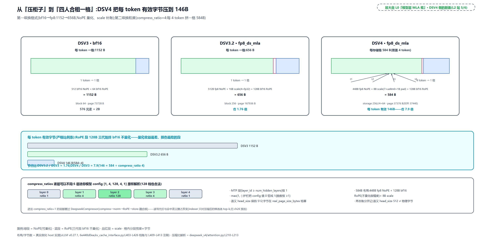

> *图注：三列储物柜对照。DSV3 bf16：每格 1152 B（1 token 一格，NoPE 512 与 RoPE 64 全 bf16，page 73728 B）。DSV3.2：656 B（512 fp8 + 16 scale + 128 rope，省 1.76 倍）。DSV4：584 B 一格且 4 个 token（t1-t4）挤进同一格——448 fp8 NoPE + 128 bf16 RoPE + 8 scale（7 个 ue8m0 + 1B pad），每 token 有效 146 B，累计 7.9 倍；storage_block_size 256//4=64、page 37376 B 对齐 37440。三件不变：RoPE 段三代恒 bf16；语义 head_size 512 与物理字节分开记；进出都过 DeepseekCompressor。底部 compress_ratios 逐层色带 [1,4,128,4,1]，MTP 恒 1、max(1,·) 护栏。*

## 总结：模型层的 MLA 框点亮

回到 L0 图：GPU 执行臂模型层那只 MLA 插座，连同它向 KV 池伸出的申报线，整块点亮了。按三幕清点。**装配幕**（站 1-4 一生一次、站 5-6 启动期一次）：DecoderLayer 三岔按 config 定死层类型，六块投影积木拼出低秩链，外层 Wrapper 做展开前的预处理，内层插座接管 `kv_b_proj` 引用；权重加载后吸收重排拆出 `W_UK_T`、`W_UV` 两份 bmm 副本，同一份权重三种形状同驻；启动期每层自报 `MLAAttentionSpec(num_kv_heads=1, head_size=576)`，runner 按花名册收集，`get_kv_cache_groups` 四级分流定组，merge 的四字段断言是组的等价类判据。**每拍前置**：runner 按后端自报阈值（FlashMLA 128）把持久批排成 decode、short_extend、long_extend、prefill 四区，builder 在排好的批上数出四个计数。**前向幕**（一拍之内）：外层一次融合 GEMM 压出 q 潜段与 576 维 KV 段、RoPE 只打 rope 段；写腿把潜向量散写进分页 cache；`forward_impl` 在 token 维切一刀，前段 MQA 吸收（q 乘进潜空间、单头 kernel 直读 cache、输出再上投影），后段 MHA 展开（kv_b_proj 上投影成完整 K/V、交给通用 prefill 后端）；历史上下文按 64k workspace 分块上投影、LSE 精确合并，大张量永不整段物化。

开篇的问题各有了答案。**576 维拿什么打分**：要么上投影成完整 K/V 按标准 MHA 算（prefill），要么按结合律把 q 吸收进潜空间按单头 MQA 算（decode），两条路数值逐位相同。**这一刀是谁画的**：后端自报阈值、runner 四区重排、builder 数边界、前向两行赋值切 token 维；刀划错了段（比如小 prefill 走了展开路）不炸正确性，只亏性能。**显存炸不炸**：fresh prefill 只上投影新 token；带历史的 chunked prefill 按 workspace 分块，72 MiB 的锅兜 3 GB 的活。**怎么跟别的层共池**：自报特形 spec，与滑窗层、indexer cache 在四级分流里各归各组、共享一个 BlockPool。DSV4 再往池子里加了两样：compress_ratio=4 的压缩格（每 4 token 一格）与 fp8_ds_mla 的 584B 布局（rope 段保 BF16、其余 FP8），三代把每 token 有效字节从 1152 压到 146。

下一程在同一块地里继续挖。本章两次路过同一个位置：外层 forward 里被省略的那处 indexer 调用位，与组化一节里那句一笔带过的「indexer 还有自己一份 cache」。CSA 层把每 4 个 token 压成一格之后，注意力并不全看：论文的 lightning indexer（低秩、多头打分的选 token 部件）先给候选格打分、只选 top-k 进注意力。打分怎么打、top-k 怎么选、稀疏化之后正确性靠什么兜底，是下一章《DeepSeek 索引器》的正题。潜向量池已经就位，接下来看谁在池子里挑座位。
