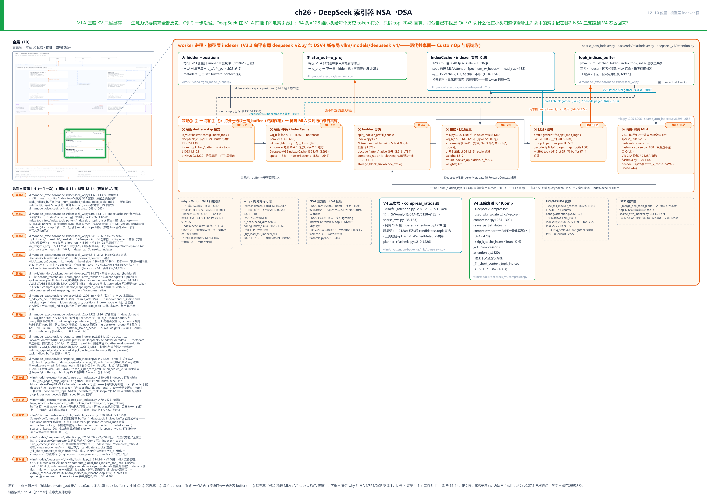
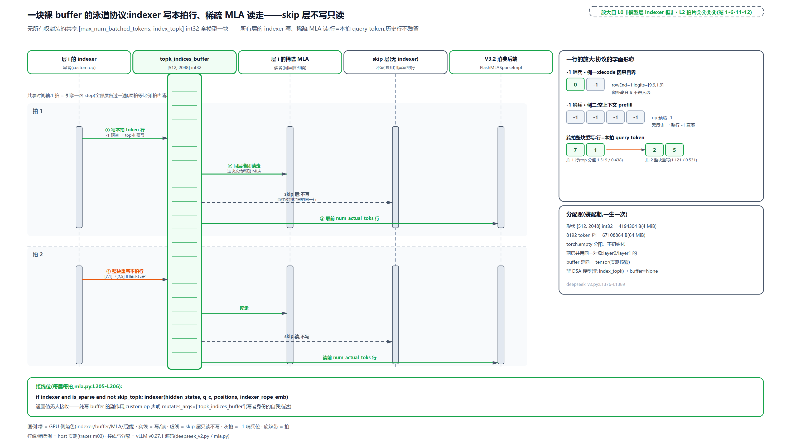
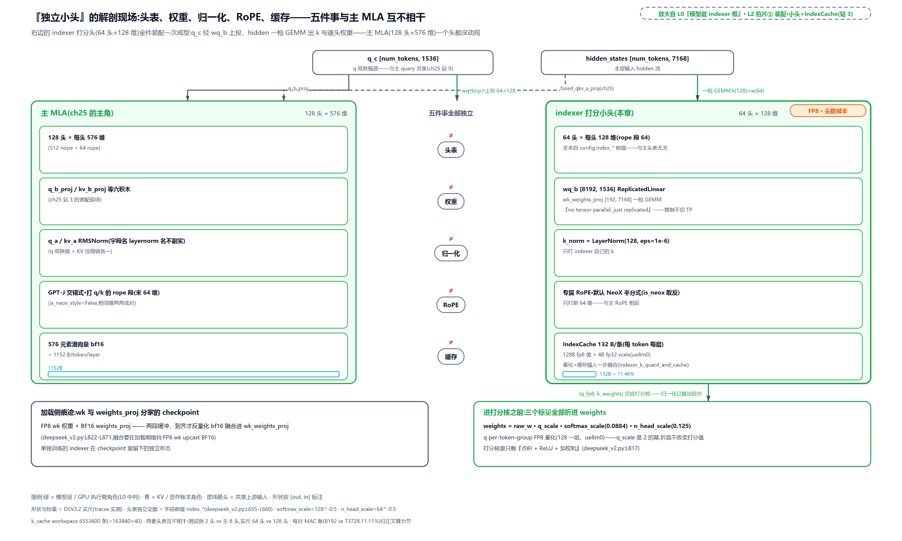
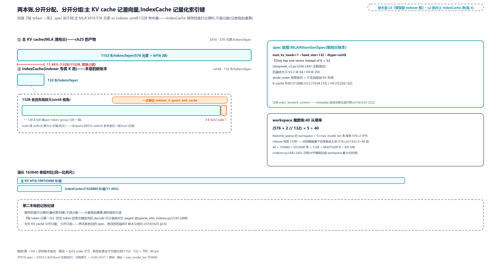
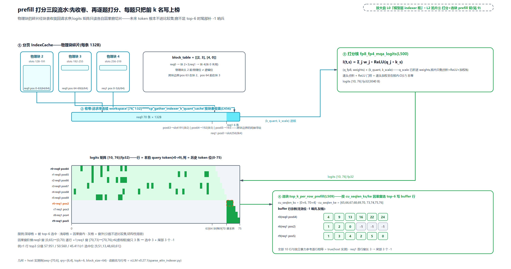
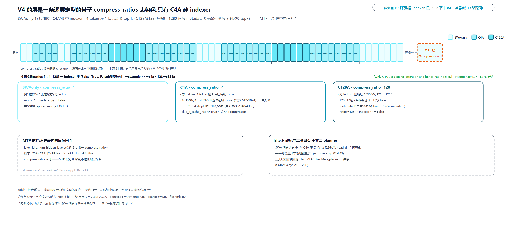
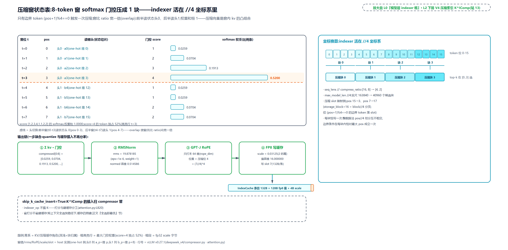
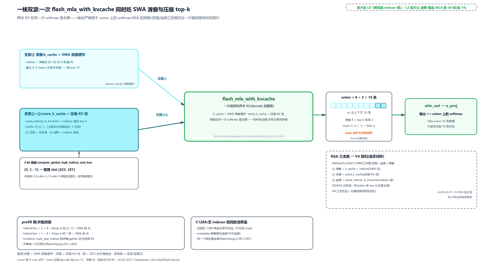

# 第 26 章　DeepSeek 索引器 NSA→DSA

[上一章](../../ch25-mla-two-expansions/narrative/chapter.md)把每 token 的 KV 压进 576 维潜向量，显存账平了。可注意力欠的另一半账一笔没还：生成第 10 万个 token 时，前面那 10 万条潜向量还是得逐条进 kernel 打分，计算量随长度平方涨，$`O(L^2)`$ 一步没省。DeepSeek 的答案是在 MLA 前面再挂一个部件——「闪电索引器」：一组 64 头、每头 128 维的独立小头先给每个历史 token 打个分，只挑分数最高的 2048 个交给主注意力真算。听上去像把问题原样复制了一遍？打分自己不也要扫全部历史、不也是 $`O(L^2)`$？凭什么一个头数只有主注意力一半、还能压进 FP8 的小头，就知道该看哪里？挑中的 2048 个索引记在哪？为什么全模型 61 层共用一块裸 buffer，连个封装都没有？历史 token 的打分原料是不是每步都要重算一遍？还有个来历问题：NSA 论文里的三条支路（压缩、选择、滑窗）在 V3.2 被砍得只剩一条，怎么到了 V4 的代码里又一条条回来了？

这一章把 L0 图 GPU 执行臂模型层里那只 indexer 框拆开。答案先剧透一句：**把「决定看哪里」和「看完怎么算」拆成两个模块，中间用一块全模型共享的 `topk_indices_buffer` 传话**。打分器自己确实还是平方复杂度：它没被消灭，被换成了一件便宜活：头数减半、FP8 低精度、推理期无反向。真正贵的多头注意力从「读完全部历史」变成「只读选中的 k 条」，$`O(L^2)`$ 降成 $`O(Lk)`$。历史 token 的打分原料每 token 只算一次，量化后存进一本独立的 IndexCache；谱系上，NSA 的三支路在第四代的滑窗加压缩池里结构性回归。全部线索都在源码里，按装配、一拍、消费三幕逐段去看。

## 你在这里

本章还在 Part VI「模型的形状」里：上一章给了 MLA 的两种展开，本章给 MLA 挂上「先选再看」的索引器，下一章是量化原理篇，再往后是 DeepSeek-V4 整机拼装的收官。放大到本章自己这一层：



> *图注：本章放大的是[第 1 章](../../ch01-vllm-v1-in-one-map/narrative/chapter.md) L0 图 GPU 执行臂模型层里、[第 23 章](../../ch23-model-layer-assembly/narrative/chapter.md)点亮的注意力插座骨架上新挂的一只框——正是[第 25 章](../../ch25-mla-two-expansions/narrative/chapter.md)两次路过（外层 forward 里省略的调用位、组化节一笔带过的那份 cache）都没展开的 indexer 挂点。它接在五块已读结构上：[第 24 章](../../ch24-primer-attn-variants/narrative/chapter.md)的 MLA 低秩数学（q_c 潜向量与吸收，本章直接消费、不重推）、[第 25 章](../../ch25-mla-two-expansions/narrative/chapter.md)的 MLA 外层前向与 KV 池组化、[第 22 章](../../ch22-slot-mapping-block-table/narrative/chapter.md)的 block_table 分页寻址、[第 21 章](../../ch21-attention-backends/narrative/chapter.md)的后端四件套与 builder 翻译、[第 19 章](../../ch19-compile-capture/narrative/chapter.md)的 ForwardContext 竖井。图分三幕：①-② 装配幕（buffer 分配、skip 层模式、独立小头、IndexCache spec 自报，站 1-4，一生一次）、③-⑤ 每拍幕（builder 切块、接线打分、选块落 buffer，站 5-11）、⑥ 消费幕（V3.2 稀疏 MLA 与 V4 双源，站 12-14）。站号 = 请求流经代码的顺序，正文按讲解需要编排、不必照站号读；顶部高亮框头标名两代并存：V3.2 扁平布局 `deepseek_v2.py` ⇆ DSV4 新布局 `vllm/models/deepseek_v4/`，共享同一打分算子与后端族；下排灰字是谱系 why 注与 V4/FP4/DCP 支撑注。*

读法建议：想知道这套东西为什么存在、NSA/DSA/CSA 三跳各给了什么，从[「谱系三跳」](#谱系三跳谁决定看哪里)读起；关心打分公式长什么样、能不能手算，看[「打分数学」](#打分数学一个可手算的选票器)；想看装配期发生了什么，按序读[「装配幕一」](#装配幕一一块裸-buffer一群不投票的层)与[「装配幕二」](#装配幕二独立小头与第二本账)；想跟一拍前向，按序读[「一拍之内」](#一拍之内接线量化三个标量折进权重)、[prefill 打分](#prefill-打分两张限重牌三段流水线)、[decode 打分](#decode-打分不收卷直接翻柜)；indexer 的产出怎么被主注意力消费，看[「消费幕」](#消费幕把逻辑位翻译回物理-slot)；第四代怎么把三支路装回来，直奔[「V4」](#v4三支路装了回来)。想跟全程，按序读。

照例交代取证环境，全章数值表通用。本章实测来自按 v0.27.1 只做减法抽出的配套精简版，在 host CPU 上实跑（真 torch、float32、真 `torch.library` 注册的统一算子），等价性测试三十六例全过。四点诚实边界：其一，CUDA kernel 面（DeepGEMM 的 mqa_logits 打分核族、top-k 选择核族、FlashMLA 稀疏核、融合量化核；DeepGEMM 是 DeepSeek 自家开源的 FP8 GEMM 核库，本章 prefill 一节展开）由承载其精确数学的镜像替身执行，表里的等价性数字（max diff 0.000000 一类）是「kernel 数学」的 host 实证，不是 GPU kernel 的位级产物；其二，全部数值档是 float32，生产里打分路径部分跑 bf16；其三，decode 的三把 top-k 剪刀在 host 上无 CUDA，实跑的是逐行兜底核，另外两把的选择条件按 Hopper（sm90）布尔求值列账——生产 sm90 上 topk=2048 且行数不超过 32 时确实会真选协作核；其四，手算例把头数与上下文缩到能心算的规模（2 头、4 到 76 条历史），但 head_dim=128、132B 条目布局保持实尺几何；DSV3.2 实尺只做形状与字节账、不跑前向；V4 的 compress_ratios 逐层排布随 checkpoint 发布，演示用 [1, 4, 128] 三个实例讲分型机制，不杜撰 61 层的排布。

## 谱系三跳：谁决定看哪里

先把「稀疏注意力」这个词放回它的大背景里。长上下文推理有两本越背越重的账：KV cache 的显存（[第 24 章](../../ch24-primer-attn-variants/narrative/chapter.md)的 MLA 压缩已经把这本砍到 576 维）和注意力的计算量（谁也没砍）。共识的解法是同一句：一小撮关键 token 主导注意力结果，只对这一小撮真算。分歧在**怎么找这一小撮**。

业界一直有两条路线（外部生态综述，[arXiv:2502.11089](https://arxiv.org/abs/2502.11089) 的相关工作一节给了系统对比）。一条是**训练无关**：不碰模型权重，推理引擎侧用启发式规则在线挑（H2O 按累积注意力分数做驱逐，Quest 给每页 KV 维护 min/max 侧缓存按 query 挑页，infLLM 用 k-means 做块级检索）。优点是任何现成模型即插即用；缺点是推理时挑出来的 token 不是模型训练时习惯看的 token。NSA 论文给了三条具体批判（论文口径）：这类方法各自只在推理的某一阶段起作用（驱逐只在 decode、页选择主要在 prefill）；GQA 下逐头各选各的再取并集，实际要读的 KV 反而被撑大；k-means、SimHash（局部敏感哈希——把相似输入高概率压进同一个桶、用来快速筛近邻的确定性哈希）这类离散选择操作挡住梯度，没法跟训练联训。反映在它的 LongBench 对比上（LongBench 是长上下文理解基准、分高为优；7B 档、论文口径）：H2O 0.303、infLLM 0.383、Quest 0.392，全部低于全注意力基线 0.437。另一条是**原生可训练**：把「稀疏可见范围」直接放进预训练目标，模型学会在稀疏视野下工作。DeepSeek 全线押注这条，2025-02 同周 Moonshot 的 MoBA（[arXiv:2502.13189](https://arxiv.org/abs/2502.13189)，MoE 式块级门控）宣示了同一立场。

第一跳就是 NSA（Native Sparse Attention，原生稀疏注意力，[arXiv:2502.11089](https://arxiv.org/abs/2502.11089)）。它的结构是三条并行支路（论文默认超参，说明性）：

- **压缩支路**：历史按块长 32、步长 16 交叠切块，每块经一个可学习 MLP 压成一个 token，对这份粗历史做注意力，便宜地看全局轮廓。
- **选择支路**：按更大的块长 64 分块，每个 query 只挑注意力分数最高的 16 个块细算。妙处在选块的分数不另算：直接复用压缩支路已经算出的注意力分布，打分零额外成本。
- **滑窗支路**：最近 512 个 token 原样细算，近处永远全看。

三支输出各乘一个逐 token 的可学习门控（MLP 加 sigmoid，值域 [0,1]）相加；三支各配独立的 K/V 投影，防止信息抄近路串支路。拿 4096 长的序列过一遍（说明性）：压缩支路看约 254 个压缩 token，选择支路复用分数选 16 块约 1024 个真 token，滑窗 512 个，读的 KV 从 4096 条降到约 1800 条量级，且「看哪里」是训练学出来的。收益是论文口径的 64k 上下文相对 Triton FlashAttention-2 前向 9.0 倍、decode 11.6 倍，LongBench 0.469 反超全注意力基线。但代价摆在结构里：三条支路三套投影、一个门控网络，模型侧的复杂度不低。vLLM v0.27.1 里没有 NSA 的直接落地——它是概念前身；DSA 的落地入口在本章反复走读的 `vllm/model_executor/models/deepseek_v2.py`（registry 把 `DeepseekV32ForCausalLM` 路由到它，见 `vllm/model_executor/models/registry.py:L94`）。

第二跳是 DSA（DeepSeek Sparse Attention，[arXiv:2512.02556](https://arxiv.org/abs/2512.02556)，2025-09 随 V3.2-Exp 官宣、2025-12 成文）。这跳是激进的减法：**三支路砍成一支**。不再有压缩、不再有滑窗、不再有门控，只剩一件事：一个独立的「闪电索引器」（lightning indexer）给每个历史 token 打分，top-k 进主注意力，其余丢弃。vLLM 本章的主角就是它。

第三跳是 V4 的 CSA（压缩稀疏注意力，[arXiv:2606.19348](https://arxiv.org/abs/2606.19348)；身份与收益账[第 25 章](../../ch25-mla-two-expansions/narrative/chapter.md)已立，不重讲）：打分的对象从 token 换成「每 4 个 token 压成的块」，序列长先除以 4，滑窗与压缩以新形态回归——本章末段展开。

先立打分数学，再看它为什么便宜得起。

## 打分数学：一个可手算的选票器

DSA 的全部决策压进一个打分式（论文 Eq.(1)）：

```math
I_{t,s}=\sum_{j=1}^{H^{I}} w_{t,j}\cdot\mathrm{ReLU}\!\left(q_{t,j}^{\top}k_s\right)
```

逐项读。当前 query 位置是 $`t`$，候选历史 token 是 $`s`$。$`H^{I}`$ 是索引器自己的头数（V3.2 实尺 64 个，名字里的 I 就是 indexer）。每个头 $`j`$ 把自己的 query 向量 $`q_{t,j}`$（128 维）与 token $`s`$ 的索引键 $`k_s`$（每个 token 一根、全体头共用，MQA 形态）做点积，过 ReLU 把负相关截成零，再乘上这个头的标量权重 $`w_{t,j}`$ 求和。三件值得停一下的设计：

**为什么是 ReLU 不是 softmax**。论文原话是为吞吐考虑：ReLU 在核里好算，且没有对全序列归一化的依赖（softmax 得先看完所有分数才能归一，ReLU 逐对独立）。代价是分数不再是概率，只是个序，够 top-k 用。

**为什么权重 $`w_{t,j}`$ 可正可负**。它由当前 hidden 线性投影而来，逐 token 变化。负权重的含义是「这个头此刻不可信，它的高分反而压低总分」——64 个头的贡献是可学习地加权，不是简单平均。

**query 从哪来**。$`q_{t,j}`$ 不是从头算的：它从 MLA 的 1536 维 q_c 潜向量上投而来（`wq_b` 干的活）。V4 论文把这个共享写成了明话：主注意力的潜 query 向量，同时也是索引器 query 的上投起点——同一条低秩链，末端分出两支上投。也就是说索引器与主注意力共用同一个低秩瓶颈（[第 24 章](../../ch24-primer-attn-variants/narrative/chapter.md)的 q_c，[第 25 章](../../ch25-mla-two-expansions/narrative/chapter.md)站 9 算出它之后顺手交给 indexer）。它不是长在模型外面的外挂，是插在低秩链上的一根细支。

选完之后主注意力只对赢家算（论文 Eq.(2)）：

```math
u_t=\mathrm{Attn}\!\left(h_t,\;\left\{\,c_s \mid I_{t,s}\in \mathrm{Top}_k\!\left(I_{t,:}\right)\right\}\right)
```

式里两张生面孔先认。[第 24 章](../../ch24-primer-attn-variants/narrative/chapter.md)符号速查表里「一切投影的出发点」的 $`h_t`$，在这里同符号同义：第 $`t`$ 个 query token 的隐状态、整根输入向量（长 $`d`$），不是新量。论文原话说 $`q_{t,j}`$ 与 $`w_{t,j}`$ 都「derived from $`h_t`$」，所以 $`\mathrm{Attn}(h_t,\cdot)`$ 不是拿裸隐状态当 query，而是「query 侧由 $`h_t`$ 投影而来」的缩写——MLA 实例化下这条投影就是上面「query 从哪来」那条低秩链，主注意力的 query 与索引器的 $`q_{t,j}`$ 同从 $`h_t\to q_c`$ 上投。$`u_t`$ 是位置 $`t`$ 的注意力输出（速查表里的同名 $`u_t`$ 指过输出投影后的层输出，同名不同物，别混）；$`c_s`$ 就是[第 25 章](../../ch25-mla-two-expansions/narrative/chapter.md)那本 576 维潜向量池里的条目。k=2048，`-1` 哨兵表示这一位没选中任何 token。打分与真算都直接发生在潜向量坐标系上。这正是[第 25 章](../../ch25-mla-two-expansions/narrative/chapter.md)立过的「MQA 吸收」形态的天然搭档：token 粒度选择，而不是 NSA 的块粒度。这个式子在本仓的落点就是打分核的调用位：`vllm/model_executor/layers/sparse_attn_indexer.py:L500` 的 `fp8_fp4_mqa_logits`，64 头点积、ReLU、逐头加权在核内一次完成，prefill 一节走读到它。

拿一个两头迷你例把它手算实（数字为 host 实跑，头数与维度缩到可心算、数学同式）。设 2 个头、4 维（实尺 128 维）、4 个历史 token；头 1 的 query 是 `[1, 0, 2, -1]`，头 2 是 `[0, 3, 1, 1]`；逐头权重 w = [1.5, -0.5]（第二个头是抑制项）。四个历史 token 的索引键分别是 k_0 = [2, 1, 0, 1]、k_1 = [-1, 0, 1, 2]、k_2 = [0, 1, 1, 0]、k_3 = [1, 1, -1, 0]。先对第 0 个 token 的索引键 k_0，两个头各做一次点积：

```math
q_{1}\cdot k_0=1\times 2+0\times 1+2\times 0+(-1)\times 1=1,\qquad
q_{2}\cdot k_0=0\times 2+3\times 1+1\times 0+1\times 1=4
```

ReLU 不动这两个正数，加权求和：

```math
I_{t,0}=1.5\times 1-0.5\times 4=-0.5
```

看，头 2 的高分被负权重压成了负贡献。四个 token 全算完取 top-2，主注意力就只算被选中的那两条：

<!-- trace: ch26-m01 -->
| 阶段 | 动作 | 实测数值 | 判定/说明 |
|---|---|---|---|
| 手算-输入 | 2 头 query / 4 个历史 key / 逐头权重 w=[1.5, -0.5] | q_h1·k_0=1, q_h2·k_0=4 | 点积逐头逐 key |
| 手算-门控 | ReLU(q·k)：负点积门成 0 | h1: [1, 0, 2, 0]；h2: [4, 3, 4, 2] | 8 个点积中 2 个为负被门掉 |
| 手算-加权 | I_s = 1.5·ReLU_h1 − 0.5·ReLU_h2 | [-0.5, -1.5, 1, -1] | 负权重压制第 2 头（s=0 头 2 得 4 仍 -0.5） |
| 手算-选择 | top-2（降序、tie 取小） | 选中 [2, 0]，分值 [1, -0.5] | k=2 的 top-k 就是主注意力要算的条目 |

表里能看到 ReLU 的两次出手（8 个逐头点积里 2 个负值被门成 0）和负权重的压制（$`s=0`$ 处头 2 得 4 分，总分仍是 -0.5）。这个四维小例就是全部打分数学；实尺只是把 2 头换成 64 头、4 维换成 128 维、4 条历史换成 16 万条。

接下来是最诚实的一笔账：这个方案到底省了多少？打分自己扫全历史，没省；省的是主注意力那头。一步一层的 QK 侧乘加（MAC）账，L 取 128k（131072）、k 取 2048：

<!-- trace: ch26-m09 -->
| 账项 | 构成 | 量 | 判定/对照 |
|---|---|---|---|
| 主注意力 | dense MLA QK：128 头×576 维×131072 对 | 9663676416 MAC | 每步每层都要读完全部历史 |
| 换稀疏 | 稀疏主注意力 QK：128×576×2048 | 150994944 MAC | 只算选中 k=2048 条：省 64 倍（主注意力侧） |
| indexer | 打分仍扫全历史：64 头×128 维×131072 对 | 1073741824 MAC | 为 dense 主注意力的 11.11%（FP8 再省） |
| 合计 | 稀疏主注意力 + indexer | 1224736768 MAC | vs dense 9663676416：总算量降至 1/7.89 |
| 实尺 | L=163840（DSV3.2 max_model_len） | 163840/2048 = 80 倍 | 打分矩阵峰值 16384×163840×4 B = 10240 MiB → 切块压住 |
| 第二本账 | IndexCache 132B/token/layer × 61 层 × 163840 | 1319239680 B（1.23 GiB） | 主 KV bf16 同规模 10.72 GiB 的 11.46% |

表尾这行「第二本账」提前用了装配幕二的叫法：它指 IndexCache 相对主 KV cache 的第二本显存账，与开篇「显存/计算」那两本不是同一套分法。

写成一行结构式：

```math
\underbrace{128\cdot 576\cdot L}_{\mathrm{dense\ MLA}}
\;\longrightarrow\;
\underbrace{64\cdot 128\cdot L}_{\mathrm{indexer}}\;+\;\underbrace{128\cdot 576\cdot k}_{\mathrm{sparse\ MLA}}
```

两个比值是结构常数，与长度无关：indexer 与 dense 主注意力的每对 (query, key) 乘加之比是 $`64\cdot128/(128\cdot576)=1/9`$（约 11%）；主注意力侧自身省 $`L/k`$（128k 时 64 倍，163840 实尺 80 倍）。这就是本章反复要兑现的那句话：平方复杂度 **没有被消灭，被换成了便宜项**——少一半头、FP8 低精度、推理期无反向。FP8/FP4 再给常数级的吞吐加成（论文口径另计）。而表里最后一行预告了下一节的主角：打分要扫全历史，历史 token 的索引键就必须只算一次、存起来跨拍复用，这就是 IndexCache 存在的根本原因。表的实尺一行还埋着一个雷：打分矩阵 logits 本身峰值能到 10240 MiB，怎么不炸，prefill 一节交代。

最后是「凭什么信它」。一个头数减半的低精度小头给 128 头的 MLA 指路，指错了怎么办？可信度是训练期买的（论文口径）：训练分两阶段：warm-up 阶段只训索引器（其余参数冻结，学习率 1e-3，2.1B token，此时主模型仍是稠密注意力），sparse 阶段全部参数放开（学习率 7.3e-6，943.7B token，top-k=2048 生效）。索引器用单独的 KL 损失对齐主注意力：

```math
L^{I}=\sum_t D_{KL}\!\left(p_t\,\|\,\mathrm{Softmax}(I_t)\right)
```

其中 $`p_t`$ 是主注意力各头分数求和后 L1 归一化的分布，$`D_{KL}`$ 是 KL 散度（衡量两个分布差多大的标准度量，训练目标是让索引器的分数分布向主注意力看齐）；且索引器的输入被 detach，梯度不回流入主模型，训练开销与主目标解耦。推理侧的字面证据本章会在装配幕里亲眼看到：config 里一整套 `index_*` 前缀的独立头表，和一段专门处理 FP8 索引器权重的加载函数。

## 装配幕一：一块裸 buffer，一群不投票的层

现在走进 L2 图的 ①（站 1-2）。装配期是模型 `__init__` 里一生只跑一次的代码。

第一个要立住的东西是**传话的载体**。indexer 在 MLA 层里算，选出的索引要交给同层的稀疏注意力后端用。候选设计至少有三个：indexer 把索引当返回值交出去；每层一块私有 buffer；一个队列。vLLM 的选择是第四种：**模型入口分配一块全模型共享的裸 buffer**，`deepseek_v2.py` 的模型入口：

```python
# vllm/model_executor/models/deepseek_v2.py:L1376-L1389 · DeepseekV2Model.__init__：DSA 探测与共享 buffer 分配
self.device = current_platform.device_type
self.hidden_size = config.hidden_size
self.vocab_size = config.vocab_size
self.is_v32 = hasattr(config, "index_topk")  # L1379
if self.is_v32:
    topk_tokens = config.index_topk
    topk_indices_buffer = torch.empty(  # L1382
        vllm_config.scheduler_config.max_num_batched_tokens,
        topk_tokens,
        dtype=torch.int32,
        device=self.device,
    )
else:
    topk_indices_buffer = None
```

先看探测：`hasattr(config, "index_topk")`。config 里有没有 `index_topk` 这个字段，就是「这是不是 DSA 架构」的判据。旧版 DeepSeek（V2/V3）的 config 没有它，`topk_indices_buffer` 保持 None，后面整条索引器链都不装配。（同样的探测键戏码[第 25 章](../../ch25-mla-two-expansions/narrative/chapter.md)见过一次：`compress_ratios` 字段探测 DSV4。）

再看分配：形状 `[max_num_batched_tokens, index_topk]`、int32。**行是「本拍进模型的 query token」，列是 top-k 个选中位**。行数按调度器一拍最多塞多少 token 开（典型 512 或 8192 档），列数就是 k（2048）。512 档是 $`512\times2048\times4`$ 字节 = 4 MiB，8192 档 64 MiB。一块小账，但它的形状设计定了两件事：每个 query token 恰好占一行，跨拍同一行的旧值会被整块重写。

「裸」是指没有任何所有权封装：不是谁的成员、没有读写锁、没有版本号。61 层里建了索引器的层写它，61 层的稀疏 MLA 读它，凭的只有两条纪律——**每拍每层先写后读**（接线代码保证，一拍之内见），**写之前整段预清 -1**（打分算子保证）。这样的设计不是偷懒：马上会看到，跨层复用恰恰需要「别的层写的行我也能读」。

第二个要立住的是**不是每层都投票**。同在装配期，每个 MLA 层的 `__init__` 里有一段三旋钮逻辑，决定本层建不建索引器：

```python
# vllm/model_executor/models/deepseek_v2.py:L1091-L1119 · DeepseekV2MLAAttention.__init__：IndexCache config 三旋钮
self.is_v32 = hasattr(config, "index_topk")  # L1091

# IndexCache config
# Refer: https://arxiv.org/abs/2603.12201 for more details.
_skip_topk = False
is_mtp_layer = False
if self.is_v32:
    _index_topk_freq = getattr(config, "index_topk_freq", 1)
    _index_topk_pattern = getattr(config, "index_topk_pattern", None)
    _index_skip_topk_offset = getattr(config, "index_skip_topk_offset", 2)
    layer_id = extract_layer_index(prefix)

    if _index_topk_pattern is None:
        _skip_topk = (
            max(layer_id - _index_skip_topk_offset + 1, 0) % _index_topk_freq
            != 0
        )
    elif 0 <= layer_id < len(_index_topk_pattern):
        _skip_topk = _index_topk_pattern[layer_id] == "S"  # L1109

    # The skip pattern only governs backbone layers. MTP/nextn
    # layers (layer_id >= num_hidden_layers) always build a full
    # indexer: they compute indices at draft step 0 and toggle
    # at runtime via set_skip_topk
    # (index_share_for_mtp_iteration).
    _num_hidden_layers = getattr(config, "num_hidden_layers", None)
    is_mtp_layer = (
        _num_hidden_layers is not None and layer_id >= _num_hidden_layers
    )
```

这里必须先做一个同名异物澄清，否则后面的叙述会拧成死结。**IndexCache 这个词在本章有两个完全不同的指称**：一个是论文 [arXiv:2603.12201](https://arxiv.org/abs/2603.12201)（智谱 GLM 团队）提出的方法「跨层索引复用」，上面源码注释直引的就是它，config 三旋钮 `index_topk_freq` / `index_topk_pattern` / `index_skip_topk_offset` 就是它的落地；另一个是 vLLM 里的类 `DeepseekV32IndexerCache`，索引器打分原料的 K 缓存（132B 一条的那本账，装配幕二的主角）。一个管「少打几次分」，一个管「打分的原料存哪」，名字撞了车。本章行文里说「跨层复用」指前者，说「第二本账」指后者。

跨层复用的动机来自一个测量（论文口径，30B 的 GLM-4.7-Flash）：相邻 transformer 层的 top-k 选块重合度高达 70%-100%——索引器分数本来就在层间长得像。那么不必每层都真算：把层分成两类，F 层（Full）保留索引器真算选块，S 层（Shared）不建索引器、直接继承最近一个 F 层写进共享 buffer 的选块。两种配置写法正对应源码里的两条臂：`index_topk_pattern` 逐层字符串（"S" 即跳过），或 `index_topk_freq` 加偏移的算术式（每 freq 层一个 F）。收益也是论文口径：75% 的索引器计算被移除，prefill 19.5s 到 10.7s（1.82 倍）、decode 58 到 86 token/s（1.48 倍）。有个耐人寻味的细节：不训练就直接均匀交错（每 4 层一个 F）会掉分（LongBench 平均 50.2 掉到 43.0），要让共享同一索引器的层用 KL 蒸馏对齐后再交错才不掉（51.6）。所以 pattern 由 checkpoint 说了算，vLLM 只按表执行。生态上也值得记一笔：DeepSeek 造了 DSA，砍 DSA 索引器开销最系统的工作来自智谱，vLLM 把两家的成果装进了同一套 config。

注意 S 层复用的是「最近一个 F 层写进共享 buffer 的**同一行**」，这解释了为什么 buffer 必须裸共享：如果每层一块私有 buffer，S 层就得跨层拷贝；共享一块，S 层的稀疏 MLA 直接读**同一拍里排在前面的 F 层**刚写好的那一行，零成本。不是上一拍的旧值：每拍整块重写，上一拍的行对本拍早已过期；同一拍内 61 层按序执行，S 层读到的一定是本拍新鲜值。这条新鲜性在算式臂有结构保证：偏移默认 2 恰好把头两层钉成 F，此后任何 S 层在本拍内必有先行的 F 层；pattern 臂则是 checkpoint 的字符串表，这层保证就交给了发布权重的一方——表里只要不让任何 S 层排在第一个 F 层之前即可。消费侧为此留了显式兜底（消费幕见）。

最后是 MTP 护栏。MTP/nextn（multi-token prediction，多 token 预测头）是 DeepSeek-V3 起就有的配置：训练时给每个位置多训一个「再往前多预测一步」的 Transformer 层，推理时这个层改行当投机解码的草稿模型——小模型猜、大模型验（[第 14 章](../../ch14-memory-ledger/narrative/chapter.md)的 EAGLE 括注立过同款行为）：先便宜地猜几个候选 token，主模型一次前向批量验证，猜对就一口吃下多个 token。所以 checkpoint 里主干 61 层之后还挂着 MTP 层（layer_id 大于等于 num_hidden_layers）。落到索引器账上：投机解码一轮里多个 draft step 过同一批新 token，共享同一份「新 token 集合」的索引。所以 MTP 层**恒建全量索引器**、在 draft step 0 算一次，后续 step 经 `set_skip_topk` 运行时切换复用。源码注释里藏着为什么不能简单冻结 skip 标志的坑：draft 前向里在场的只有草稿模型自己（就是这一个 MTP 层，backbone 的 61 层不参与草稿轮的这几次前向；草稿轮谁在场、怎么轮转，投机解码线 Part VII 展开），这些行的写者便只剩 MTP 层。把它的 skip 冻成 True，它就会去读一块永不写入的 buffer。另外装配还有一笔对账：`index_topk_freq` 大于 1 时只有部分层建索引器，但 checkpoint 仍为全部层发索引器权重，加载侧按层名前缀把没建索引器的层的权重直接丢弃（`deepseek_v2.py:L1572-L1576` 的注释原话就是为这事写的）。



> *图注：一块 `[max_num_batched_tokens, index_topk]` int32 裸 buffer 的生命周期，泳道是角色、时间轴是拍。拍 1：本层 indexer 在稀疏 MLA 之前写本拍 query token 的行（先 -1 预清、再被 top-k 覆写），同层稀疏 MLA 随即读走；skip 层（虚线）不写、直接读别层写的同一行；消费后端取前 num_actual_toks 行。拍 2 高亮同一行的整块重写：`[7,1]` 变 `[2,5]`，历史行的旧值不残留——「每轮只对新增 token 算 index」在 buffer 上的字面形态。右侧行放大给 -1 哨兵两例：decode 因果自界时窗内只有 1 条，行是 `[0,-1]`，窗外的高分 9 不得入选；空上下文的 prefill 整行 -1。右下分配卡记这笔账的来处：两档字节（512 档 4194304 B=4 MiB、8192 档 64 MiB）、分配不初始化、全模型各层拿到的是同一个对象（非 DSA 架构则整块 None）。底部是 `mla.py:L205-L206` 的接线原文与 `mutates_args=['topk_indices_buffer']` 的写者自我声明。*

## 装配幕二：独立小头与第二本账

接着走进 L2 图的 ②（站 3-4）。这一幕回答两个问题：那组「独立小头」长什么样、有多独立；打分原料的缓存怎么立账。

先看小头本体。`Indexer` 类是 V3.2 闪电索引器的全部装配现场：

```python
# vllm/model_executor/models/deepseek_v2.py:L645-L726 · Indexer.__init__：独立小头的全部装配证据（节选）
class Indexer(nn.Module):
    def __init__(
        self,
        vllm_config: VllmConfig,
        config: DeepseekV2Config | DeepseekV3Config,
        hidden_size: int,
        q_lora_rank: int,
        quant_config: QuantizationConfig | None,
        cache_config: CacheConfig | None,
        topk_indices_buffer: torch.Tensor | None,
        prefix: str = "",
        is_inplace_rope: bool = False,
    ):
        super().__init__()
        # … 省略：vllm_config/config/quant_config 三行自存 …
        self.topk_tokens = config.index_topk  # L663
        self.n_head = config.index_n_heads  # 64
        self.head_dim = config.index_head_dim  # 128
        self.rope_dim = config.qk_rope_head_dim  # 64
        self.q_lora_rank = q_lora_rank  # 1536
        # no tensor parallel, just replicated
        self.wq_b = ReplicatedLinear(  # L669
            self.q_lora_rank,
            self.head_dim * self.n_head,
            bias=False,
            quant_config=quant_config,
            prefix=f"{prefix}.wq_b",
        )
        # Fused wk + weights_proj: single GEMM producing [head_dim + n_head].
        # FP8 wk weights are upcasted to BF16 during loading to maintain fusion.
        self.wk_weights_proj = MergedColumnParallelLinear(  # L678
            hidden_size,
            [self.head_dim, self.n_head],
            bias=False,
            quant_config=None,
            disable_tp=True,
            prefix=f"{prefix}.wk_weights_proj",
        )
        self.k_norm = LayerNorm(self.head_dim, eps=1e-6)  # L686
        self.softmax_scale = self.head_dim**-0.5  # L687

        self.scale_fmt = "ue8m0"
        self.quant_block_size = 128  # TODO: get from config  # L690
        self.topk_indices_buffer = topk_indices_buffer

        # NOTE: (zyongye) we use fp8 naive cache,
        #       where we store value in fp8 and scale in fp32
        #       per self.quant_block_size element
        self.k_cache = DeepseekV32IndexerCache(  # L696
            head_dim=self.head_dim + self.head_dim // self.quant_block_size * 4,
            dtype=torch.uint8,
            prefix=f"{prefix}.k_cache",
            cache_config=cache_config,
        )
        # … 省略：max_model_len/max_total_seq_len 两行与 import …
        self.indexer_op = SparseAttnIndexer(  # L707
            self.k_cache,
            self.quant_block_size,
            self.scale_fmt,
            self.topk_tokens,
            self.head_dim,
            self.max_model_len,
            self.max_total_seq_len,
            self.topk_indices_buffer,
        )

        self.is_inplace_rope = is_inplace_rope
        self.n_head_scale = self.n_head**-0.5  # L719
        # … 省略：use_fused_indexer_q 的 CUDA 融合分支开关 …
```

「独立」的证据就在头几行：头表四件套全部来自 `config.index_*` 前缀的字段：`index_topk`（k）、`index_n_heads`（64 头）、`index_head_dim`（128 维）、加上共用的 `qk_rope_head_dim`（旋转段 64）。主注意力的 128 头在这些字段里一个都没出现：**两套头表互不相干**， indexer 想有几个头、每头多宽，是 checkpoint 自己的事。

三件装配决策值得逐个说透。

**`wq_b` 用 ReplicatedLinear，注释原话「no tensor parallel, just replicated」**。张量并行会把一个大的输出维度切成片分给各卡（[第 23 章](../../ch23-model-layer-assembly/narrative/chapter.md)的装配账）；索引器偏不切——每张卡持有完整的 64 头小头、对同一批输入各算各的打分。为什么可以这样：索引器要写的只是本拍 query token 的 buffer 行，TP 各卡的输入（hidden 与 q_c）本来就是全量复制的，各卡算出的是同一份结果、各自写进自己卡上那份 buffer 副本——冗余换来零跨卡对账，切了反而要多一次跨卡同步。

**`wk_weights_proj` 一枪 GEMM 出两样东西**。它的输出维度是 `[head_dim, n_head]` 两段拼接，即 128 维的索引键 key 与 64 个逐头权重 $`w`$，一次矩阵乘同时产出，运行时按列切开用。融合的代价写在注释里：有的 checkpoint 把 WK 段存成 FP8、权重段存成 BF16，加载时得先把 FP8 段反量化到 BF16 才能拼进同一个权重矩阵。这正是谱系一节预告的「单独训练的工程痕迹」：

```python
# vllm/model_executor/models/deepseek_v2.py:L822-L840 · _try_load_fp8_indexer_wk：FP8 索引器权重的专门加载路径
def _try_load_fp8_indexer_wk(
    name, tensor, buf, params_dict, loaded_params, pp_missing_layer_names
):
    """
    We fuse the WK and weights_proj projections, but in some checkpoints WK is stored
    in FP8 with a separate weight_scale_inv, while weights_proj is stored in BF16.
    Upcasting to BF16 during loading enables the fusion. This function loads the FP8 WK
    weights and scale, and when both are available, dequantizes to BF16 and stores into
    the fused wk_weights_proj.weight parameter.
    """
    if "indexer.wk." not in name or "wk_weights" in name:
        return False  # Weight is not an isolated WK weight for the indexer, ignore.
    is_weight = name.endswith(".weight") and tensor.dtype == torch.float8_e4m3fn
    is_scale = "weight_scale" in name
    if not is_weight and not is_scale:
        return False  # WK is not in FP8 format, ignore.
    # Buffer this tensor (weight or scale) until both have arrived.
    layer_prefix = name.rsplit(".wk.", 1)[0]  # e.g. "model.layers.0.self_attn.indexer"
    fused_name = f"{layer_prefix}.wk_weights_proj.weight"
```

一段 checkpoint 里 WK 是 FP8 带 `weight_scale_inv`、weights_proj 是 BF16 的形态，就是索引器单独走 FP8 训练留下的落盘痕迹；权重和 scale 先进缓冲、到齐才反量化融合，是这段加载函数的全部工作。推理代码里专门为一个部件写一段权重格式适配，等于把「它是单独训练的」写在了明面上。

**`k_cache` 每条 132 字节**。`head_dim + head_dim // quant_block_size * 4` = 128 + 4：128 字节 FP8 值加 4 字节 fp32 scale。注释原话「we use fp8 naive cache, where we store value in fp8 and scale in fp32 per quant_block_size element」：每 128 个值一组、每组配一个 scale 的朴素 FP8 缓存（scale 格式 ue8m0，只许 2 的幂，[第 25 章](../../ch25-mla-two-expansions/narrative/chapter.md)注过一次，编码规范[第 27 章](../../ch27-quantization/narrative/chapter.md)展开）。

`k_cache` 的类就是本章第二本账的本体：

```python
# vllm/model_executor/models/deepseek_v2.py:L616-L642 · DeepseekV32IndexerCache：IndexCache 本体与 spec 自报
class DeepseekV32IndexerCache(torch.nn.Module, AttentionLayerBase):
    def __init__(
        self, head_dim: int, dtype: torch.dtype, prefix: str, cache_config: CacheConfig
    ):
        super().__init__()
        self.kv_cache = torch.tensor([])
        self.head_dim = head_dim
        self.prefix = prefix
        self.cache_config = cache_config
        self.dtype = dtype
        compilation_config = get_current_vllm_config().compilation_config
        if prefix in compilation_config.static_forward_context:
            raise ValueError(f"Duplicate layer name: {prefix}")
        compilation_config.static_forward_context[prefix] = self  # L629

    def get_kv_cache_spec(self, vllm_config: VllmConfig) -> KVCacheSpec:
        return MLAAttentionSpec(  # L632
            block_size=self.cache_config.block_size,
            num_kv_heads=1,
            head_size=self.head_dim,
            dtype=self.dtype,
        )  # Only has one vector instead of K + V

    def forward(self): ...

    def get_attn_backend(self) -> AttentionBackend:
        return DeepseekV32IndexerBackend
```

把它跟[第 25 章](../../ch25-mla-two-expansions/narrative/chapter.md)的组化账本对上：这个类走的是同一套启动期流程：注册进 `static_forward_context`（[第 23 章](../../ch23-model-layer-assembly/narrative/chapter.md)的竖井花名册）、`get_kv_cache_spec` 自报形状、`get_attn_backend` 自报后端。它报的是 `MLAAttentionSpec(num_kv_heads=1, head_size=132)`，行尾注释一句「Only has one vector instead of K + V」，索引键只有一根向量，没有 K 和 V 之分。报上去之后，[第 14 章](../../ch14-memory-ledger/narrative/chapter.md)的账本会把它与主 KV cache（bf16、576 元素、1152B 一条）**分开分组、分开分配**：同是「每 token 一条」，却是两本独立的账。后端是 `DeepseekV32IndexerBackend`（块大小 64），第四代有个子类 `DeepseekV4IndexerBackend`（块 256），两代共享同一个后端族。

为什么必须立第二本账、而不是往主 KV cache 里捎带？三笔账摆在一起就清楚了：字节上 132B 对 1152B，只有 11.46%，混在一起定池就得按大条目对齐、白亏；格式上它是 uint8 的裸字节布局，主 cache 是 bf16 元素张量；生命周期上它**只写不读给注意力**：主 cache 的潜向量要进注意力真算，IndexCache 的量化索引键只喂打分核。缓存的是打分原料（量化索引键），**不是分数**——分数每拍都要按新 query 重算，原料每 token 只算一次。

这本账还有一笔 workspace 的联动预算，值得单独看一眼，因为它解释了一个魔数：

```python
# vllm/v1/attention/backends/mla/indexer.py:L442-L452 · get_max_prefill_buffer_size：workspace 魔数账
def get_max_prefill_buffer_size(vllm_config: VllmConfig):
    max_model_len = vllm_config.model_config.max_model_len
    # NOTE(Chen): 40 is a magic number for controlling the prefill buffer size.
    # Each entry is 128 fp8 bytes and 4 scale bytes for a total of 132 bytes.
    # The flashmla_sparse backend uses a workspace size of 5 * max_model_len.
    # The memory usage of the workspace there is 576 * 2 bytes; so we size this as
    # (576 * 2 // 132) * 5 = 40 to maximize this workspace size while still fitting
    # within the flashmla_sparse workspace.
    # For DeepSeek-V3.2, the max_model_len is 163840.
    #   40 * 163840 * 132 = 865075200 bytes = 825 MB
    return max_model_len * 40
```

prefill 打分前要先把历史索引键从分页 cache 收进一段连续 workspace（下一节的事），收多少条就是这段函数定的。40 不是拍脑袋：稀疏 MLA 那边的 FlashMLA 后端已经为 gather 开了 `5×max_model_len` 条、每条 1152B 的 workspace；索引键这边每条只有 132B，于是取 `(576×2)//132` 再乘 5 得 40，**刚好把索引键的 workspace 塞进别人已有的预算里，不多占一分**。163840 长度下 40×163840×132B = 825MB。两个互不相干的部件在显存预算上咬合成一个整体，这种「对齐别人的账本」是读这套代码时反复会遇到的手法。



> *图注：左主右副的解剖对照。左边是主 MLA（128 头、吸收后共用 576 维潜向量；MHA 展开口径下每头 192+128 维，[第 25 章](../../ch25-mla-two-expansions/narrative/chapter.md)的主角），右边是 indexer 小头（64 头×128 维，带「FP8 · 头数减半」徽标）。中列五件事逐一画了不等号：头表（index_* 前缀对 num_attention_heads）、权重（wq_b 从 1536 维 q_c 上投且复制不切 TP、wk_weights_proj [192,7168] 一枪出 key+权重）、归一化（k_norm 是 LayerNorm eps=1e-6，与主链的 RMSNorm 不同族）、RoPE（专属实例，默认 NeoX 半分式，与主 RoPE 的 GPT-J 交错式配对相反）、缓存（132B 量化条目对 576 元素潜向量）。字节条按真实比例：132B 是 1152B 的 11.46%。底部两卡各记一件事：左下加载侧痕迹——checkpoint 里 FP8 的 wk 与 BF16 的 weights_proj 分家存盘、两段缓冲到齐才反量化融合进 `wk_weights_proj`（索引器单独训练的落盘证据，前文走读过这条加载路径）；右下注明三个标量（softmax_scale 0.0884、n_head_scale 0.125、q_scale）全部折进 weights——打分核里只剩点积、ReLU、加权和。*



> *图注：上条是主 KV cache（MLA 潜向量，bf16、576 元素 = 1152B/token/layer），下条是 IndexCache（索引键，uint8、132B/token/layer），条目放大图剖开 128B FP8 值加 4B fp32 scale（ue8m0），量化与缓存插入由 `indexer_k_quant_and_cache` 一步融合完成。右栏 spec 自报（num_kv_heads=1、head_size=132、块 64 对 256）与 workspace 魔数账：(576×2//132)×5=40，40×163840 条×132B=825MB，恰好在 FlashMLA 稀疏后端的 workspace 预算内。底部同一比例尺的满长对比：单层满长 21626880B 对 188743680B，11.46%。记账纪律三条：缓存的是打分原料不是分数；每 token 只算一次、跨拍只读；与主 KV 分开分配、分开分组。*

顺带把实尺形状账立在这（host 实跑的真实例化装配，取 DSV3.2 config）：

<!-- trace: ch26-m01 -->
| 阶段 | 动作 | 实测数值 | 判定/说明 |
|---|---|---|---|
| 装配-头表 | 头表全来自 config.index_* | indexer 2 头 vs 主注意力 8 头 | 实尺 64 头 vs 128 头，两套头表互不相干 |
| 装配-实尺 | wq_b [8192, 1536] 复制不切 TP；wk_weights_proj [192, 7168] | 一枪 GEMM 出 key 128 + 逐头权重 64 | k_cache 132B/条；workspace 6553600 |

第一行是测试档的小 config（2 头对 8 头），第二行直接换到实尺：`wq_b` 权重 `[8192, 1536]`（64 头×128 维从 1536 维 q_c 上投）、`wk_weights_proj` 权重 `[192, 7168]`（7168 维 hidden 出 128+64）、缓存每条 132B、workspace 上限 6553600 条。

还有一段布局闲笔值得两句。V3.2 其实有两套落地：registry 目前把 `DeepseekV32ForCausalLM` 路由到本章走的扁平 `deepseek_v2.py`（`vllm/model_executor/models/registry.py:L94`），但 `vllm/models/deepseek_v32/` 下已经备好硬件隔离版的新布局，打分数学与扁平版同构，差异在融合程度（一个 `fused_norm_rope` 核把 MLA 与索引器的归一化、RoPE、KV 插入、buffer 清 -1 全做掉，因此它的算子调用带 `skip_topk_buffer_clear=True` 免得重复清两遍）。[第 23 章](../../ch23-model-layer-assembly/narrative/chapter.md)讲 v0.27 的旗舰布局新政时见过这个模式；本章按 registry 的实际路由走扁平版，新布局点到为止。

## 一拍之内：接线、量化、三个标量折进权重

装配结束，进入每拍。现在走到 L2 图的 ④（站 6-7）：一个 decode 步里，索引器在哪一步被叫、被叫之后算什么。

先看接线位——整章的命脉两行：

```python
# vllm/model_executor/layers/mla.py:L189-L206 · MultiHeadLatentAttentionWrapper.forward：indexer 接线位
kv_c, k_pe = kv_lora.split([self.kv_lora_rank, self.qk_rope_head_dim], dim=-1)  # L189
kv_c_normed = self.kv_a_layernorm(kv_c)
# Add head dim of 1 to k_pe
k_pe = k_pe.unsqueeze(1)

q = q_proj_layer(q_proj_input)[0]
heads = self.num_heads
if self.dcp_q_replicate:
    heads *= q_proj_layer.group_size
q = q.view(-1, heads, self.qk_head_dim)

if self.rotary_emb is not None:
    q[..., self.qk_nope_head_dim :], k_pe = self.rotary_emb(
        positions, q[..., self.qk_nope_head_dim :], k_pe
    )

if self.indexer and self.is_sparse and not self.skip_topk:  # L205
    self.indexer(hidden_states, q_c, positions, self.indexer_rope_emb)  # L206
```

位置很讲究：MLA 外层已经算完 `q_c` 潜段、`kv_c`/`k_pe`、q 上投影与主 RoPE（前面十几行全是[第 25 章](../../ch25-mla-two-expansions/narrative/chapter.md)站 9 的旧戏），**在把这些交给内层稀疏 MLA 之前**，先调索引器。三个条件分别是：这层建了 indexer、这层是稀疏注意力、这层本拍不 skip。最扎眼的是 L206：**调用返回值没有人接**。索引器不产出张量交回主链，它唯一的产出就是写进共享 buffer 的副作用；写者身份由算子注册时的 `mutates_args=['topk_indices_buffer']` 自我声明（自定义算子的变更参数声明，[第 19 章](../../ch19-compile-capture/narrative/chapter.md)的编译捕获账里见过这族机制）。写完之后，同层稍后的稀疏 MLA 从同一块 buffer 取行消费。skip 层在这里直接跳过调用，buffer 里留着本拍别的层已写好的值。

`self.indexer(hidden_states, q_c, positions, self.indexer_rope_emb)` 递进去四样：hidden（给 `wk_weights_proj` 出 key 与权重）、`q_c`（1536 维潜 query， indexer 与主 query 共享低秩瓶颈的那根线）、positions、以及**专属 RoPE**。注意索引器不用主链的 RoPE，自己另配了一个，且配对方式与主 RoPE 相反：主链是 GPT-J 交错式（相邻维两两成对旋转，`is_neox_style=False`，[第 24 章](../../ch24-primer-attn-variants/narrative/chapter.md)立过这条约定），索引器默认取反、用 NeoX 半分式（前后两半各自旋转，配置字段 `indexer_rope_interleave` 置 True 才切回交错式；装配处 `is_neox_style=not getattr(config, "indexer_rope_interleave", False)`）。为什么敢不一样：索引器是独立小头，它的 key 与 query 自己跟自己配对，不需要跟主注意力的旋转坐标系对齐，训练时它爱怎么转就怎么转。

进了 `Indexer.forward`，可读分支（非 ROCm 非融合路径；ROCm 是 AMD 的 GPU 计算平台，与 NVIDIA 的 CUDA 对位的另一套软件栈）把打分前的全部预处理做完：

```python
# vllm/model_executor/models/deepseek_v2.py:L780-L819 · Indexer.forward 可读分支：RoPE、切分与折叠
else:
    q_pe, q_nope = torch.split(
        q, [self.rope_dim, self.head_dim - self.rope_dim], dim=-1
    )
    # Fused wk + weights_proj: one GEMM, then split
    kw, _ = self.wk_weights_proj(hidden_states)
    k = kw[:, : self.head_dim]
    weights = kw[:, self.head_dim :]

    k = self.k_norm(k)
    k_pe, k_nope = torch.split(
        k, [self.rope_dim, self.head_dim - self.rope_dim], dim=-1
    )

    q_pe, k_pe = rotary_emb(positions, q_pe, k_pe.unsqueeze(1))
    # … 省略：两行 reshape 注释与形状还原（NeoX 编译期会多出前导维）…
    q = torch.cat([q_pe, q_nope], dim=-1)
    # `k_pe` is [num_tokens, rope_dim] (MQA).
    k = torch.cat([k_pe, k_nope], dim=-1)

# we only quant q here since k quant is fused with cache insertion  # L806
q = q.view(-1, self.head_dim)
q_fp8, q_scale = per_token_group_quant_fp8(
    q,
    self.quant_block_size,
    column_major_scales=False,
    use_ue8m0=self.scale_fmt is not None,
)
q_fp8 = q_fp8.view(-1, self.n_head, self.head_dim)
q_scale = q_scale.view(-1, self.n_head)

weights = weights * q_scale * self.softmax_scale * self.n_head_scale  # L817

return self.indexer_op(hidden_states, q_fp8, k, weights)
```

（融合分支 `fused_indexer_q_rope_quant` 把 RoPE、量化、折 scale 装进一个 Triton 核，ROCm 分支走原地 RoPE；按设计三条路数学等价，本章的对账表只覆盖可读分支、未单列另外两条，走读可读分支。）

流程一句话：q 先切出 rope 段（前 64 维）与 nope 段；`wk_weights_proj` 一枪出 key 与逐头权重；key 过 `k_norm` 后同样切两段；**RoPE 只打 rope 段**（与主 MLA 的解耦 RoPE 同款纪律），拼回 128 维。然后是最有味道的两步。

**q 量化、k 不量化**。L806 的注释说得明白：这里只量化 q，因为 k 的量化跟缓存插入是融合在一起的——新 token 的索引键进打分算子后，由 `indexer_k_quant_and_cache` 一个核完成「量化 + 写进分页 IndexCache」，不在 Python 侧来回倒。q 的量化是 per-token-group FP8：每 128 个值一组、每组一个 ue8m0 scale（2 的幂）。

**三个标量全部折进 weights**。L817 一行乘法把 `q_scale`（量化 scale，逐 token 逐头）、`softmax_scale`（$`128^{-0.5}\approx0.0884`$）、`n_head_scale`（$`64^{-0.5}=0.125`$，多头加权和的尺度补偿）三样全部乘进逐头权重。这样打分核里就只剩点积、ReLU、加权和，一行标量乘法都不剩，这就是注释原话说的「标量归一化搬出核」。这件事的合法性不是显然的，值得当面证一遍。

**折叠不变量**：设 $`s>0`$（ue8m0 scale 是 2 的幂、恒正）：

```math
\mathrm{ReLU}(s\,x)=s\,\mathrm{ReLU}(x)\quad(s>0)
\;\;\Longrightarrow\;\;
\sum_{j}(w_j\,s)\cdot\mathrm{ReLU}\!\left(\frac{q_j}{s}\cdot k\right)
=\sum_{j}w_j\cdot\mathrm{ReLU}(q_j\cdot k)
```

正部对正数线性、负部仍为零，所以把 q 除以 $`s`$ 存成 FP8、同时把 $`s`$ 乘进 $`w_j`$，分数的数学值逐项不变。`softmax_scale` 与 `n_head_scale` 是额外正标量，同样可提。host 实跑的对账：

<!-- trace: ch26-m01 -->
| 阶段 | 动作 | 实测数值 | 判定/说明 |
|---|---|---|---|
| forward-量化 | q per-token-group FP8（ue8m0） | q_fp8 [5, 2, 128] float8_e4m3fn；q_scale(token0,head0)=0.000976562 | 与独立参考逐位相等=true |
| forward-折叠 | weights = raw_w·q_scale·softmax_scale·n_head_scale | 0.088388·0.707107 两标量并入 | 折叠后最大偏差 0.000000 |

量化逐位相等、折叠零偏差，「搬出核」是无损搬运。（表里 0.707107 是两头小档的 $`2^{-0.5}`$；实尺 64 头对应 0.125。）

还有一笔 k 侧的账要补，免得「一行标量乘法都不剩」读到打分调用时对不上。k 的 ue8m0 scale 没折走、也折不走：q 的 scale 逐 token 逐头取值，对固定一行 query 是常量，才提得进逐头权重；k 的 scale 却逐历史 token 变，提不进任何一行权重，只能随值成对进核（prefill 调用递的就是 `(k_quant, k_scale)` 一对，decode 把 132B 条目视图整本交核、那 4B scale 随行），由核在逐 key 反量化时乘回——DeepGEMM 接口的惯例。「标量归一化搬出核」专指 w 侧那三个可提的正标量。

最后半步是算子入口的准备工作（站 8，已入 ⑤ 的地界）。`indexer_op` 背后的自定义算子 `sparse_attn_indexer`（`sparse_attn_indexer.py:L296` 起）先做三件事：从 ForwardContext 按层名（`k_cache.prefix`）取回本层的 metadata。metadata 不走参数、走竖井隐式契约，[第 21 章](../../ch21-attention-backends/narrative/chapter.md)的 builder 翻译与[第 25 章](../../ch25-mla-two-expansions/narrative/chapter.md)的 metadata 幕都立过这套；把新 token 的 k 量化并插入 IndexCache（V4 会把这件活交给压缩机，届时见）；以及给 buffer 预清哨兵：

```python
# vllm/model_executor/layers/sparse_attn_indexer.py:L426-L432 · sparse_attn_indexer：buffer 预清 -1 哨兵
# The buffer must be pre-filled with -1 (the "no token" sentinel) before the
# top-k kernels scatter valid indices into it. On the fused deepseek_v32
# nvidia path, _fused_norm_rope_kernel already cleared the same
# [:num_tokens, :topk] region earlier in this forward, so skip the redundant
# fill.
if not skip_topk_buffer_clear:
    topk_indices_buffer[: hidden_states.shape[0]] = -1  # L432
```

先把本拍要写的整段刷成 -1，选择核只覆写前「min(k, 窗长)」个位置：窗不足时尾部哨兵无人覆写、天然保留。装配幕一图注里那两个 -1 例子的出处就是这里。

## prefill 打分：两张限重牌，三段流水线

现在走到 L2 图的 ③ 切块臂与 ⑤ 的 prefill 臂（站 5、9）。prefill 一来就是几百上千个新 query token，每个都要对全部历史打分，先解决「打分矩阵会不会炸」。

会。打分输出 logits 是 $`M\times N`$ 的 fp32 矩阵（M 是本 chunk 的 query 数、N 是历史总长）。实尺最坏一笔：一拍 16384 个 query（前提是部署把 `max_num_batched_tokens` 配到 16384 档，即比装配幕一账里的典型 512/8192 更高的一档，一拍打满它）对 163840 条历史，$`16384\times163840\times4`$ 字节 = 10240 MiB——一个中间张量吃掉一整张卡的显存。解法是在 builder 侧把 prefill 切成 chunk，每个 chunk 的 logits 峰值被两张「限重牌」压住：

```python
# vllm/v1/attention/backends/mla/indexer.py:L77-L123 · split_indexer_prefill_chunks：双预算贪心切块
def split_indexer_prefill_chunks(
    seq_lens_cpu: torch.Tensor,
    query_lens_cpu: torch.Tensor,
    workspace_size: int,
    max_logits_bytes: int,
    request_offset: int = 0,
) -> list[tuple[slice, slice]]:
    """
    Split prefill requests into chunks for the sparse indexer, respecting:
    - N constraint: total_seq_lens <= workspace_size (existing O(N) workspace)
    - Logits constraint: M * N * 4 <= max_logits_bytes

    When a single request-level chunk still exceeds the logits budget,
    sub-chunks on the query dimension (M) to bound peak memory.

    Returns list of (req_slice, query_slice) tuples.
    """
    chunks: list[tuple[slice, slice]] = []
    n = len(seq_lens_cpu)
    max_logits_elems = max_logits_bytes // 4
    end = 0

    while end < n:
        start, chunk_m, chunk_n = end, 0, 0

        while end < n:
            q, s = query_lens_cpu[end].item(), seq_lens_cpu[end].item()
            new_m, new_n = chunk_m + q, chunk_n + s
            if new_n <= workspace_size and new_m * new_n <= max_logits_elems:  # L105
                chunk_m, chunk_n = new_m, new_n
                end += 1
            else:
                break

        # A single request can exceed the budget, requiring sub-chunking
        # on the query dimension.
        if end == start:
            chunk_m, chunk_n = query_lens_cpu[end].item(), seq_lens_cpu[end].item()
            end += 1

        req_slice = slice(start + request_offset, end + request_offset)
        max_q = max(1, max_logits_elems // chunk_n) if chunk_n > 0 else max(1, chunk_m)
        for q_off in range(0, chunk_m, max_q):
            sub_m = min(max_q, chunk_m - q_off)
            chunks.append((req_slice, slice(q_off, q_off + sub_m)))

    return chunks
```

两张牌。**N 牌**：chunk 内历史总长不超过 workspace（装配幕二算过的 `max_model_len×40` 条、825MB，这是收卷长桌的长度）；**logits 牌**——$`M\cdot N\cdot 4`$ 字节不超过 `VLLM_SPARSE_INDEXER_MAX_LOGITS_MB` 预算。算法是贪心：按请求序往 chunk 里塞，下一个请求会让任一张牌超标就封口发车。单个请求自己就超 logits 预算时（end 没动过），强制收下再按 query 维 M 子切（`max_q` 行一片）。覆盖性是结构保证的：外层每轮 end 严格前进，请求必耗尽；片内切片首尾相接。

把几个档位的例子跑实（host 实跑）：

<!-- trace: ch26-m04 -->
| 轮次（贪心累积） | 动作 | M·N 账 | 判定 |
|---|---|---|---|
| 贪心-1 | req0 试装入 chunk1 | N=300, M=100, M·N=30000 | 30000 ≤ 30000 且 300 ≤ 500 → 收 |
| 贪心-2 | req1 试并入 chunk1 | N=500, M=160, M·N=80000 | 80000 > 30000 → 拒，chunk1 封口 |
| 贪心-3 | req1 开 chunk2 | N=200, M=60, M·N=12000 | 收 |
| 贪心-4 | req2 试并入 chunk2 | N=450, M=140, M·N=63000 | 63000 > 30000 → 拒，chunk2 封口 |
| 贪心-5 | req2 开 chunk3 | N=250, M=80, M·N=20000 | 收（末请求收尾） |
| N约束 | workspace 先超：[100,100,100]/[10,10,10]，上限 250 | N: 200 → 300 | 300 > 250 → req2 另开一块（2 块收尾） |
| M子切 | 单请求 [1000]/[40]，预算 2500 元素 | max_q = 2500//1000 = 2 | 40 行 → 20 片，首三片 0:2 / 2:4 / 4:6 |
| 实尺 | 16384 query × 163840 历史 | 不切 10737418240 B = 10240 MiB | max_q=819 → 21 片（末片 4 行），片峰 536739840 B（511.88 MiB） |

前五行看贪心怎么收怎么拒；「N约束」行是 workspace 牌先超的例子；「M子切」行是单请求超预算拆 20 片；末行是实尺：不切 10240 MiB 的打分矩阵被切成 21 片、片峰压在 512 MiB 预算线下。**打分的 $`O(L^2)`$ 没少算一个数，只是不再同时活着**——峰值显存从二次方问题降成了常数预算问题。代价也在明面上：计算一点没省，每个 chunk 都要独立启动打分与选块核；省下的是峰值显存，不是计算量。

切完块，每个 chunk 走三段流水（站 9 的主循环，节选）：

```python
# vllm/model_executor/layers/sparse_attn_indexer.py:L449-L528 · sparse_attn_indexer：prefill 打分主循环（节选）
for chunk in prefill_metadata.chunks:
    cu_seqlen_ks = chunk.cu_seqlen_ks
    cu_seqlen_ke = chunk.cu_seqlen_ke
    assert chunk.local_cu_seq_lens is not None
    k_quant = k_quant_full[: chunk.max_local_total_seq_lens]
    k_scale = k_scale_full[: chunk.max_local_total_seq_lens]
    if not chunk.skip_kv_gather and chunk.local_total_seq_lens > 0:
        ops.cp_gather_indexer_k_quant_cache(  # L456
            kv_cache,
            k_quant,
            k_scale,
            chunk.block_table,
            chunk.local_cu_seq_lens,
        )

    q_slice = q_quant[chunk.token_start : chunk.token_end]
    # … 省略：q_scale 切片与 FP4 的 DeepGEMM 标量类型 cast、XPU 分支（Intel GPU 平台）…
    topk_indices = topk_indices_buffer[
        chunk.token_start : chunk.token_end, :topk_tokens
    ]  # L470-L472

    if chunk.local_total_seq_lens == 0:
        logits = q_slice.new_empty((q_slice.shape[0], 0), dtype=torch.float32)
        topk_indices.fill_(-1)  # L476
    else:
        logits = fp8_fp4_mqa_logits(  # L500
            (q_slice_cast, q_scale_slice),
            (k_quant_cast, k_scale_cast),
            weights[chunk.token_start : chunk.token_end],
            cu_seqlen_ks,
            cu_seqlen_ke,
            clean_logits=False,
        )
        num_rows = logits.shape[0]
        ops.top_k_per_row_prefill(  # L509
            logits,
            cu_seqlen_ks,
            cu_seqlen_ke,
            topk_indices,
            num_rows,
            logits.stride(0),
            logits.stride(1),
            topk_tokens,
        )

    # … 省略：_merge_dcp_topk_global 的 DCP 合并调用（单卡是 no-op，本节末尾交代）…
```

三段各司其职。**第一段收卷**（L456）：`cp_gather_indexer_k_quant_cache` 拿着 chunk 的 block_table，把散在分页 IndexCache 各物理块里的量化索引键收拢成请求序连续的 workspace——物理块 2、3 的碎片在长桌上回到逻辑连续（寻址底座是[第 22 章](../../ch22-slot-mapping-block-table/narrative/chapter.md)的 block_table 间接寻址）。收卷前那行守卫的两个条件各管一事：`skip_kv_gather` 只在「本块是某请求 M 子切的首片」时为假，同一请求的后续片沿用首片收好的 workspace、不重收（builder 侧按 `query_slice.start > 0` 置位，`indexer.py:L854`）；`local_total_seq_lens > 0` 则把没有历史的空上下文块连收卷都免了。**第二段打分**（L500）：`fp8_fp4_mqa_logits` 对 (q_fp8, weights) 与 (k_quant, k_scale) 算出 Eq.(1) 的整片 logits：逐头点积、ReLU、逐头加权全在核内，$`O(L^2)`$ 的本尊就是这一行（打分核的来历见下面一段）。**第三段选块**（L509）：`top_k_per_row_prefill` 按每行的因果窗 `[ks, ke)` 选 top-k 写进 buffer 行（L470-L472 的切片），空上下文的行整行填 -1（L476）。

打分核值得停三十秒。`fp8_fp4_mqa_logits` 里的词根 mqa_logits 来自 DeepGEMM——DeepSeek 自家开源的 FP8 GEMM 核库（[github.com/deepseek-ai/DeepGEMM](https://github.com/deepseek-ai/DeepGEMM)，MIT 许可，覆盖 Hopper 与 Blackwell 两代，README 自述 H800 上 1550 TFLOPS）。这个仓库专门收录了一对为 V3.2 闪电索引器做的核：`fp8_mqa_logits` 与 `fp8_paged_mqa_logits`，README 的描述就是「加权的 ReLU MQA logits 核」。**论文公式、官方核、vLLM 封装三层同源**：Eq.(1) 在 DeepGEMM 里是核，在 vLLM 里是函数名里的 mqa_logits，前缀 fp8_fp4 是 vLLM 封装层对 FP8/FP4 两种缓存格式的双态支持。所以「打分便宜到扫得动全部历史」不是修辞：整条打分路径跑在为它量身定做的 FP8 GEMM 上。

两请求小例把因果窗与哨兵看实（host 实跑；几何：req0 历史 64 条、req1 历史 2 条，topk=6，块大小 64，物理块从 2 起——物理位与逻辑位故意错开）：

<!-- trace: ch26-m05 -->
| 行 | query（请求/位置） | 因果窗 [ks, ke) | buffer 行（相对请求基址） | top 分值（前 3） |
|---|---|---|---|---|
| r0 | req0 pos64 | 窗 [0, 65) 共 65 候选 | 选中 [4, 9, 13, 16, 22, 24] | top 分值 [0.000, 0.000, 0.000, …] |
| r1 | req0 pos65 | 窗 [0, 66) 共 66 候选 | 选中 [9, 51, 13, 48, 60, 61] | top 分值 [57.951, 50.560, 45.411, …] |
| r2 | req0 pos66 | 窗 [0, 67) 共 67 候选 | 选中 [9, 16, 20, 22, 23, 24] | top 分值 [0.000, 0.000, 0.000, …] |
| r3 | req0 pos67 | 窗 [0, 68) 共 68 候选 | 选中 [36, 61, 7, 34, 44, 58] | top 分值 [12.264, 9.925, 9.695, …] |
| r4 | req0 pos68 | 窗 [0, 69) 共 69 候选 | 选中 [30, 1, 23, 50, 47, 61] | top 分值 [5.783, 5.410, 4.776, …] |
| r5 | req0 pos69 | 窗 [0, 70) 共 70 候选 | 选中 [11, 12, 13, 15, 21, 22] | top 分值 [0.000, 0.000, 0.000, …] |
| r6 | req1 pos2 | 窗 [70, 73) 共 3 候选 | 选中 [1, 2, 0, -1, -1, -1]（-1 ×3） | top 分值 [7.309, 1.111, 1.096, …] |
| r7 | req1 pos3 | 窗 [70, 74) 共 4 候选 | 选中 [2, 1, 3, 0, -1, -1]（-1 ×2） | top 分值 [0.000, -7.380, -12.693, …] |
| r8 | req1 pos4 | 窗 [70, 75) 共 5 候选 | 选中 [2, 4, 3, 1, 0, -1]（-1 ×1） | top 分值 [9.076, 3.777, 3.073, …] |
| r9 | req1 pos5 | 窗 [70, 76) 共 6 候选 | 选中 [1, 3, 4, 2, 5, 0] | top 分值 [10.559, 6.398, 5.026, …] |

三处值得指。r0 到 r5 是 req0 的六个 query：因果窗从 65 涨到 70，query 越靠后能看的越多，且 req1 的行（r6 起）窗从 70 起跳，绝不看 req0 的内容（请求间隔离写在窗里）。r6 的窗只有 3 条候选，top-6 选不满，尾部 3 个 -1 哨兵，**窗不足时哨兵数量恰好是 k 减候选数**。而因果性是结构保证的：选择核只读 `logits[r, ks[r]:ke[r]]` 的切片，窗外的分数根本不进比较集——不是「过滤掉」而是「从未参与」。（top 分值一列是行内前三的舍入显示，选择只比序不比绝对值；同一拍里各行分数尺度差异很大，如 r1 的 57.951，说明打分核确实逐行只对窗内真算。）



> *图注：流水线从左到右四格：① 是原料分页池，②③④ 才是三段流水（收卷→打分→选块）。① 分页 IndexCache 的三张物理块卡（块 2、3、4；条高示碎片：块 2 占满 64 格，块 3、块 4 各只占 6 格），② `cp_gather_indexer_k_quant_cache` 按块表 `[[2,3],[4,0]]` 收成请求序 workspace（76 条×132B；跨块边界例：req0 逻辑位 63 落物理 slot 191、位 64 落 192，块 2 到块 3 的换块就发生在这条线上），③ `fp8_fp4_mqa_logits` 出 logits 矩阵 [10,76]（行=query token、列=历史 token；逐头点积、ReLU、加权在核内），④ `top_k_per_row_prefill` 按每行因果窗 `[ks,ke)` 选 top-6 写 buffer 行。req1 首行窗只 3 条、尾部 3 个 -1。与 decode 路的对照：prefill 先收卷再打分，decode 不收卷、直接翻柜——柜子就是分页 IndexCache，打分核拿每请求的块表自己翻页读（下节展开）。*

## decode 打分：不收卷，直接翻柜

decode 是索引器设计里最见性格的一步（L2 图 ⑤ 的 decode 臂，站 10）。**每轮只对新增 token 算 index**——decode 每拍每请求只有一两个新 token（开了投机解码就是 `next_n` 个），为这一两行 query 把十几万条历史 gather 一遍显然不划算。于是 decode 路不收卷、直接翻柜：柜子就是分页 IndexCache，打分核拿着每请求的块表自己翻页寻址。

```python
# vllm/model_executor/layers/sparse_attn_indexer.py:L530-L665 · sparse_attn_indexer：decode 打分与 top-k 三核分派（节选）
if has_decode:
    decode_metadata = attn_metadata_narrowed.decode
    assert decode_metadata is not None
    kv_cache = kv_cache_as_quant_view(kv_cache, head_dim, use_fp4_cache)
    decode_lens = decode_metadata.decode_lens
    # … 省略：三档 q 打包——空 decode 批垫一行占位保形、批内各请求 token 数不齐时 pack_seq_triton 补零对齐、齐批直接 reshape …
    batch_size = padded_q_quant_decode_tokens.shape[0]
    next_n = padded_q_quant_decode_tokens.shape[1]
    num_padded_tokens = batch_size * next_n
    seq_lens = decode_metadata.seq_lens[:batch_size]
    # seq_lens is always 2D: (B, next_n) for native spec decode, (B, 1)
    # otherwise. deep_gemm fp8_fp4_paged_mqa_logits requires 2D context_lens;
    # the downstream topk kernels accept both 1D and 2D.
    # … 省略：FP4 的 int8 视图 cast 与 XPU 分支 …
    logits = fp8_fp4_paged_mqa_logits(  # L603
        (padded_q_quant_cast, padded_q_scale),
        kv_cache,
        weights[:num_padded_tokens],
        seq_lens,
        decode_metadata.block_table,
        decode_metadata.schedule_metadata,
        max_model_len=max_model_len,
        clean_logits=False,
    )
    num_rows = logits.shape[0]
    topk_indices = topk_indices_buffer[:num_padded_tokens, :topk_tokens]  # L614

    use_cooperative_topk = (  # L616
        current_platform.is_cuda()
        and topk_tokens in (512, 1024, 2048)
        and num_rows <= 32
        and logits.stride(0) % 4 == 0  # TMA 16-byte alignment
        and current_platform.has_device_capability(90)
        and not current_platform.is_device_capability_family(120)
    )
    use_persistent_topk = current_platform.is_cuda() and topk_tokens in (  # L624
        512,
        1024,
        2048,
    )
    if use_cooperative_topk:
        # … 省略：workspace 领取一行 …
        torch.ops._C.cooperative_topk(
            logits,
            seq_lens,
            topk_indices,
            topk_workspace,
            topk_tokens,
            attn_metadata_narrowed.max_seq_len,
        )
    elif use_persistent_topk:
        # … 省略：workspace 领取一行 …
        torch.ops._C.persistent_topk(
            logits,
            seq_lens,
            topk_indices,
            topk_workspace,
            topk_tokens,
            logits.shape[1],
        )
    else:
        ops.top_k_per_row_decode(
            logits,
            next_n,
            seq_lens,
            topk_indices,
            num_rows,
            logits.stride(0),
            logits.stride(1),
            topk_tokens,
        )
```

关键一行是 L603 的 `fp8_fp4_paged_mqa_logits`，DeepGEMM 那对核里的另一个，paged 版。调用方不再喂给这个核连续的 key 数组，而是把 `kv_cache`（分页池本体）、`block_table`（每请求的块表）和 `schedule_metadata`（DeepGEMM 的宿主端预调度单，[第 21 章](../../ch21-attention-backends/narrative/chapter.md)见过这个 AOT 分工手法）直接交给它，核自己按块表翻页读。query 侧只有本拍 token（含投机窗口——`seq_lens` 是 `(B, next_n)` 的二维上下文长，spec 位 j 的因果上界是 `seq_len − next_n + j + 1`：本拍 next_n 个新 token 里它排第 j 个，绝对位置是 `seq_len−next_n+j`，因果窗看得见自己所以再 +1，最后一个 spec 位恰好看全 L）。这一步就是「历史索引键每 token 只算一次」的兑现处：**新 token 只算自己的 key 写进 cache，打分读的是全体历史的缓存，谁也不重算**。

选 top-k 的代码（L616 起）暴露了 decode 的批形特点：行数极少（一个 decode 批也就几十行）、每行的候选极多（全历史）。于是有三把剪刀可选，条件分派：

- `cooperative_topk`（协作核）：`topk_tokens in (512,1024,2048)`、行数 ≤32、stride 对齐（TMA 16 字节对齐，TMA 是 Hopper 起的张量内存加速单元）、算力 90 起、且不是 120 家族。
- `persistent_topk`（常驻核）：只要 topk 是那三档之一就可用。
- `top_k_per_row_decode`（逐行核）：兜底。

这三个名字不是随便起的，各自对应一种 CUDA 启动模式。普通 kernel 的线程块之间互不等待，全网格没有屏障；**协作启动**（cooperative launch，CUDA 9 引入）保证所有块同时驻留在 GPU 上，块间屏障才安全，代价是网格规模被 occupancy 上限（GPU 上同时驻留的线程块数上限）卡死，所以它只适合小网格，而「行数 ≤32 加 stride 对齐加 sm90」这串条件本质上就是在现场核验「这批卡得进协作驻留、硬件支持」；**常驻核**（persistent kernel）是另一路：只启动固定数量的块，每块用 grid-stride 循环把活吃完，规模不受网格上限限制。`topk∈{512,1024,2048}` 的专用核走的这条路。逐行核是普通启动的兜底。对照一句防过度泛化：GEMM、注意力这类算力大核依旧用普通启动：它们不需要跨块屏障，反而要把网格铺得尽可能大才吃得满算力，被协作驻留的块数上限一卡、GPU 反倒喂不饱。三把剪刀剪出的结果逐位一致（降序、tie 取小 index），换核只换速度不换语义。

host 上无 CUDA，实跑的是逐行兜底核，另两把的条件按 sm90 布尔求值列账。四行小例（2 请求、`next_n=2`、seq_len=40——按公式口径的上下文长，已含本拍 2 个新 token、纯历史 38 条、topk=6）：

<!-- trace: ch26-m06 -->
| 行 | query（请求/spec 位） | rowEnd（因果界） | buffer 行 | top3 分值 |
|---|---|---|---|---|
| r0 | req0 spec 位 0 | rowEnd = 40 - 2 + 0 + 1 = 39 | 选中 [17, 34, 25, 36, 14, 0] | top3 [6.010, 4.104, 3.654] |
| r1 | req0 spec 位 1 | rowEnd = 40 - 2 + 1 + 1 = 40 | 选中 [24, 15, 11, 9, 25, 38] | top3 [28.654, 27.365, 25.447] |
| r2 | req1 spec 位 0 | rowEnd = 40 - 2 + 0 + 1 = 39 | 选中 [3, 11, 12, 22, 29, 34] | top3 [0.000, 0.000, 0.000] |
| r3 | req1 spec 位 1 | rowEnd = 40 - 2 + 1 + 1 = 40 | 选中 [0, 2, 4, 5, 6, 9] | top3 [0.000, 0.000, 0.000] |
| 三核 | 同输入 [3,64] logits、seq_lens [64,40,7]、k=8 | per_row == cooperative == persistent | 选中集合逐行相等=true | — |
| tie | 行 [9,2,2] 取 top-2 | 输出 [0,1] | 两个 2 并列取小 index，插入排序 tie-break | — |
| 分派 | topk=2048、rows=32、sm90 | cooperative=True | rows=33 → cooperative 假、persistent 真；topk=3000 → per_row 兜底 | — |

因果界的递增一眼可见：spec 位 0 只看到 39 条（它自己之前的历史），spec 位 1 看全 40——投机窗口里越靠后的位置「提前看到的未来」越多，因果上界逐位 +1。「三核」行是同输入喂三把剪刀的对账（选中集合逐行相等），「tie」行是并列分数取小 index 的确定性。

## 消费幕：把逻辑位翻译回物理 slot

buffer 写好了，轮到主注意力来读。现在走到 L2 图的 ⑥，消费幕的 V3.2 臂（站 12）。

先补上 ⑤ 尾站（站 11）的落账细节：buffer 行就是本拍 query token。prefill 段写 `[token_start:token_end]` 的切片（上一节 L470-L472 已见），decode 段写前 `num_padded_tokens` 行（即 q 打包补齐到 `(B, next_n)` 形后的总行数；三档打包：本拍没有 decode token 时垫一行占位保形、批内各请求 token 数不齐时 `pack_seq_triton` 补零对齐、齐批直接 reshape。消费侧只读前 `num_actual_toks` 行，见下）。同一行上一拍的值呢？被本拍整块重写——历史 token 的行上一拍已被消费，留着的旧值没有任何用途，host 实跑里先写 `[7,1]` 再写 `[2,5]`，旧值不残留。这就是「每轮只对新增 token 算 index」在 buffer 侧的完整闭环：**行跟着拍走，键跟着 token 走**。

消费侧第一个动作是**地址翻译**。indexer 写进 buffer 的是「请求内第几个 token」的逻辑位（打分核按请求序的 workspace 或分页池算出来的序），但主注意力要从分页 KV cache 里取数据，需要的是物理 slot。翻译公式（`sparse_utils.py` 的 Triton 核 docstring，也就是[第 13 章](../../ch13-paged-kv/narrative/chapter.md)埋下的 F7 伏笔「block_table 间接寻址的代价」在稀疏路径的再现）：

```python
# vllm/v1/attention/backends/mla/sparse_utils.py:L120-L140 · triton_convert_req_index_to_global_index：契约
def triton_convert_req_index_to_global_index(
    req_id: torch.Tensor,  # int32 [num_tokens]
    block_table: torch.Tensor,  # int32 [num_requests, max_num_blocks_per_req]
    token_indices: torch.Tensor,  # int32 [num_tokens, NUM_TOPK_TOKENS]
    BLOCK_SIZE: int = 64,
    NUM_TOPK_TOKENS: int = 2048,
    BLOCK_N: int = 128,  # tile width along columns
    HAS_PREFILL_WORKSPACE: bool = False,
    prefill_workspace_request_ids: torch.Tensor | None = None,
    prefill_workspace_starts: torch.Tensor | None = None,
    return_valid_counts: bool = False,
) -> torch.Tensor | tuple[torch.Tensor, torch.Tensor]:
    """
    out[token_id, indice_id] =
        block_table[req_id[token_id],
            token_indices[token_id, indice_id] // BLOCK_SIZE] * BLOCK_SIZE
        + token_indices[token_id, indice_id] % BLOCK_SIZE

    Only when token_indices[token_id, indice_id] == -1 do we output -1.
    For safety, we also output -1 if the derived block_id would be
        out-of-bounds.
    # … 省略：docstring 尾段（HAS_PREFILL_WORKSPACE 映射与 return_valid_counts 的说明）…
```

`out = block_table[req, idx//BLOCK]×BLOCK + idx%BLOCK`。除以块大小得逻辑块号（模得块内偏移）、查块表行拿物理块号、乘加摊平成全局槽位。这套算术读者应该已经很眼熟了：[第 13 章](../../ch13-paged-kv/narrative/chapter.md)的槽位恒等式、[第 22 章](../../ch22-slot-mapping-block-table/narrative/chapter.md)的块表间接寻址，同一套翻译在稀疏路径原样再来一遍；`-1` 直通 `-1`（哨兵不翻译、不参与注意力）。

翻译完就是真算。V3.2 的消费后端 `FlashMLASparseImpl`：

```python
# vllm/v1/attention/backends/mla/flashmla_sparse.py:L838-L875 · FlashMLASparseImpl.forward_mqa：消费入口
def forward_mqa(
    self,
    q: torch.Tensor | tuple[torch.Tensor, torch.Tensor],
    kv_c_and_k_pe_cache: torch.Tensor,
    attn_metadata: FlashMLASparseMetadata,
    layer: AttentionLayer,
) -> tuple[torch.Tensor, torch.Tensor | None]:
    # NOTE(lucas): for the sparse FlashMLA kernels the kernels want to use
    # MQA 576/512 approach for both prefill and decode

    # Concatenate q if it's a tuple (ql_nope, q_pe)
    if isinstance(q, tuple):
        ql_nope, q_pe = q
        q = self.q_concat_buffer[: ql_nope.shape[0]]
        ops.concat_mla_q(ql_nope, q_pe, q)

    num_actual_toks = q.shape[0]

    # Get topk indices
    assert self.topk_indices_buffer is not None
    topk_indices = self.topk_indices_buffer[:num_actual_toks]  # L858

    use_fp8_cache = self.kv_cache_dtype == "fp8_ds_mla"

    if not use_fp8_cache:
        attn_out = self._forward_bf16_kv(
            q, kv_c_and_k_pe_cache, topk_indices, attn_metadata
        )
    elif attn_metadata.fp8_use_mixed_batch:
        attn_out = self._forward_fp8_kv_mixed_batch(
            q, kv_c_and_k_pe_cache, topk_indices, attn_metadata
        )
    else:
        attn_out = self._forward_fp8_kv_separate_prefill_decode(
            q, kv_c_and_k_pe_cache, topk_indices, attn_metadata
        )

    return attn_out, None
```

入口简洁得近乎敷衍：q 拼好、取 buffer 的前 `num_actual_toks` 行（L858）、按 KV dtype 分三条路径（bf16、FP8 混批、FP8 分离；差异在[第 25 章](../../ch25-mla-two-expansions/narrative/chapter.md)的 656B 布局账里，此处不重讲），全部汇到 `flash_mla_sparse_fwd`：**在 576 维潜向量上只对选中条目真算，$`O(Lk)`$ 的兑现处**。注释里那句「sparse FlashMLA kernels 用 MQA 576/512 方式同时服务 prefill 与 decode」呼应[第 25 章](../../ch25-mla-two-expansions/narrative/chapter.md)的吸收腿：稀疏路径统一走单头形态，因为潜向量池本来就是单头的。

还有一处装配期的细节值得点名——skip 层没有 indexer，谁替它拿 buffer？消费侧公共基类 `SparseMLACommonImpl` 在装配时接管 buffer，来源二选一：

```python
# vllm/model_executor/layers/attention/sparse_mla_attention.py:L483-L490 · SparseMLACommonImpl：buffer 接管的显式兜底
# The indexer carries the shared buffer for normal layers and tests;
# the explicitly-passed buffer covers backbone skip layers, whose
# indexer is not constructed (see deepseek_v2.py).
self.topk_indices_buffer: torch.Tensor | None = (
    indexer.topk_indices_buffer  # type: ignore[attr-defined]
    if indexer is not None
    else topk_indices_buffer
)
```

正常层从 indexer 身上取（同一对象），skip 层 indexer 压根没建、由显式传参兜底，注释把这两种情形写得明明白白。裸共享 buffer 的设计在这里收口：S 层没有生产者，但它是合法的读者。

至此 V3.2 的完整闭环走完了：MLA 外层算完 q_c 顺手喂 indexer，indexer 写 buffer，稀疏 MLA 读 buffer 只算选中条目，输出回外层 o_proj。decode 走刚看的 `forward_mqa` 入口；走读的 FlashMLA 后端里 prefill 也汇进同一入口，别的平台的后端（FlashAttention、FlashInfer 两家的稀疏实现）则有一条 masked-MHA 腿：top-k 翻成掩码走 `_run_masked_mha`，chunked prefill 时还配着两个帮手——把 top-k 重映射成本地区间的 `_remap_topk_to_ranges`、与已算后缀做 LSE 合并的 `merge_attn_states`（`sparse_mla_attention.py:L740-L829`；LSE 合并的数学[第 25 章](../../ch25-mla-two-expansions/narrative/chapter.md)整节走读过）。这条腿的分段时机与触发条件不在此展开，点到为止。三代谱系的第二跳全部落地。往后看第四代之前，把分布式的一笔边界账先记下：`sparse_attn_indexer` 里还有一个 `_merge_dcp_topk_global` 调用（prefill 循环尾与 decode 尾各一处），单卡上是 no-op。它服务 DCP（解码上下文并行，[第 22 章](../../ch22-slot-mapping-block-table/narrative/chapter.md)词头已立）：历史被交错分片到多卡时，各卡只对本地分片打分，然后只交换各自的 top-k 候选就能精确还原全局 top-K。为什么「只换候选」是精确的，docstring 把论证写成了明文：

```python
# vllm/model_executor/layers/sparse_attn_indexer.py:L85-L93 · _merge_dcp_topk_global docstring：只换本地 top-k 为何精确
``topk_indices`` are this rank's local top-K positions into its 1/N KV
shard. A token in the global top-K must also be in its owning rank's local
top-K (at most ``topk_tokens - 1`` tokens rank globally above it, hence at
most that many on its own rank), so exchanging only the per-rank local
candidates is exact -- equivalent to all-gathering the full logit matrix,
but it ships ``dcp_world_size * topk_tokens`` candidates instead of the whole
score row. Overwrites ``topk_indices`` with global token ids (``-1`` for
padding); the attention backend localizes them back to physical slots per
rank.
```

直译过来：全局 top-K 里任何一个 token，排在它前面的全局至多 topk-1 个、它自己 rank 上只会更少，所以它必在所属 rank 的本地 top-K 里；只换 `world_size×topk` 个候选，就等价于 all-gather 整张分数矩阵。深讲归[第 34 章](../../ch34-distributed-tp-pp-dp-ep/narrative/chapter.md)。

## V4：三支路装了回来

最后一幕：第四代。走到 L2 图的 ⑥ V4 臂与下排的 V4 注（站 13-14）。先把 why 链摆正：**旧设计**是 V3.2 的 token 级 top-k。**痛点**：索引器自身的 $`O(L^2)`$ 在超长上下文下仍然大。打分数学一节的诚实账里它是 dense 主注意力的 11%，L 再涨它跟着涨，而「打分扫全历史 16 万条」本身就是带宽瓶颈。**方案**：CSA 先把打分的对象压缩：每 4 个 token 压成 1 个压缩块，索引器活在「除以 4」的坐标系里（163840 条历史变 40960 个候选块），块上跑与 DSA 同款的打分。**代价**：读写粒度从 token 变 4-token 压缩格——cache 与前缀共享从此按格进出、一格连带 4 个 token（[第 25 章](../../ch25-mla-two-expansions/narrative/chapter.md)组化账立过「按格进出」）；层类型多态（一张逐层表把层分成三类）、记账复杂度全上来。

先看层怎么分型。V4 的 config 里有一张 `compress_ratios` 逐层表（checkpoint 发布，vLLM 不设默认值），装配时逐层取值定型：

```python
# vllm/models/deepseek_v4/attention.py:L207-L297 · DeepseekV4Attention.__init__：compress_ratios 定型与 indexer 装配（节选）
# NOTE(zyongye) Compress ratio can't be 0
# we do this for because MTP layer is not included
# in the compress ratio list
if layer_id < config.num_hidden_layers:
    self.compress_ratio = max(1, config.compress_ratios[layer_id])
else:
    self.compress_ratio = 1  # L213：MTP 层恒 1
# … 省略：attn_sink/o_lora/wq_b 与 eager_scratch_pool（eager 执行档全模型复用的预分配暂存池）等与本章无关的装配 …
self.indexer = None
if self.compress_ratio == 4:  # L277
    # Only C4A uses sparse attention and hence has indexer.  # L278
    # aux_stream_list[2] is free here (outer GEMMs joined) for the inner
    # overlap of wq_b+fused_indexer_q_rope_quant vs compressor. None on
    # ROCm, where aux_stream_list is None.
    indexer_aux_stream = (
        aux_stream_list[2] if aux_stream_list is not None else None
    )
    self.indexer = DeepseekV4Indexer(
        vllm_config,
        config=config,
        hidden_size=self.hidden_size,
        q_lora_rank=self.q_lora_rank,
        quant_config=quant_config,
        cache_config=cache_config,
        topk_indices_buffer=topk_indices_buffer,
        compress_ratio=self.compress_ratio,
        prefix=f"{prefix}.indexer",
        aux_stream=indexer_aux_stream,
        eager_scratch_pool=eager_scratch_pool,
    )
```

三类层的账一句话立完：`compress_ratio=1` 是 SWAonly（只滑窗，[第 14 章](../../ch14-memory-ledger/narrative/chapter.md)立过的滑窗注意力路线，V4 里是最近 `sliding_window` 个 token 的旁路缓存）；`=4` 是 C4A（4 token 压 1 块、带索引器做块级 top-k，也就是[第 25 章](../../ch25-mla-two-expansions/narrative/chapter.md)论文名「CSA 层」在代码里的名字，注释原话「Only C4A uses sparse attention and hence has indexer」）；`=128` 是 C128A（128 压 1，对应论文口径的 HCA 层：Heavily Compressed Attention，重压缩注意力，只重压缩、不做稀疏选择）。MTP 层不在表内、恒 1（L213 的护栏）。数字账：满长 163840（沿 V3.2 的档作对照；V4 的实际上下文上限随部署的 max_model_len 定）时 C4A 有 40960 个候选块，远超 top-k（官方 V4 论文 §4.2.1 的配置是 top-k 512（Flash）·1024（Pro），明说比 V3.2 训练时的 2048 选得更小），总归要真打分；C128A 的 1280 个候选在 metadata 期被无条件全选，这条路径根本不比较 topk（`vllm/models/deepseek_v4/sparse_mla.py:L353-L419` 的核枚举 `(pos+1)//128` 的全部候选、写进直选表），对应论文 HCA「只重压缩、不做稀疏选择」的设计，连索引器都不建。C4A 的全选边界在上下文 4×topk，官方两档分别是 2048 与 4096。



> *图注：61 格层带按 compress_ratios 表染成三色：SWAonly(1) 只滑窗、C4A(4) 带 indexer 做 4 压 1 块级 top-k、C128A(128) 压缩后 1280 个候选在 metadata 期直算全选（不比较 topk、不建 indexer）。只有 C4A 格画 indexer 小图标；MTP 尾格钉死 compress_ratio=1。着色与分界均为示意。具体逐层 Pattern 随 checkpoint 发布，vLLM 不设默认值。三类层各有独立的 FlashMLA 调度元数据（tile_scheduler 不共享，因为三者的 topk 与页宽配置不同）；SWA 块与 C4A 压缩块共享物理张量页（同 64-token 页宽）。消费侧一核双源见后图。*

C4A 的索引键不再由打分算子插入，改由**压缩机**生产。`DeepseekCompressor` 是 V4 新部件：把 KV 按 softmax 门控压成块的核（[第 25 章](../../ch25-mla-two-expansions/narrative/chapter.md)提过它同时服务主压缩 KV 池；这里看它的索引侧输出）。装配的核心两件：

```python
# vllm/models/deepseek_v4/compressor.py:L284-L300 · DeepseekCompressor.__init__：融合 GEMM 与部分状态缓存
self.fused_wkv_wgate = MergedColumnParallelLinear(
    self.hidden_size,
    [self.coff * self.head_dim, self.coff * self.head_dim],
    bias=False,
    return_bias=False,
    quant_config=None,
    disable_tp=True,
    prefix=f"{prefix}.fused_wkv_wgate",
)
self.norm = RMSNorm(self.head_dim, self.rms_norm_eps)

self.state_cache = CompressorStateCache(
    state_dim=2 * self.coff * self.head_dim,  # kv_state + score_state
    dtype=state_dtype,
    compress_ratio=compress_ratio,
    prefix=f"{prefix}.state_cache",
)
```

`fused_wkv_wgate` 又是一枪融合 GEMM：输出两段等宽的 KV 与门控 score（与 V3.2 的 `wk_weights_proj` 同款手法）。代码里的 `coff` 是交叠系数，源码一行 `coff = 1 + overlap`（`compressor.py:L253`）：C4A 交叠开着时为 2，正是双路投影的路数、窗宽 = coff×压缩比 = 8；C128A 无交叠、为 1（窗宽就是 128，不借邻居）。`state_cache` 是压缩机的第三本小账：fp32 部分状态（kv_state 前半、score_state 后半），存「压缩块还没攒满 4 个 token」的零头：不到块边界先躺在这儿，攒满 4 个才压。

压缩本身在一个 8-token 交叠窗上做（窗比 4 宽一倍，前半经投影头 0、后半经投影头 1，论文 Eq.(9)-(11) 的双路设计；门控分数过 softmax 得权重、加权求和、再 RMSNorm、RoPE 打在压缩位上、最后量化写缓存）。窗宽翻倍不是浪费：交叠让每个压缩块都看得见前一块的 4 个 token，块边界上的 token 不至于被压成「只见过半截上下文」的孤值。双投影头的分工同理——借来的邻居 token 与本块 token 身份不同，各走各的投影与可学习位置偏置（论文里的 C^a/C^b 两路），门控各自对位地学。防一个撞名：这两个「头」是压缩机自己的投影头，与索引器的 64 个打分头无关。窗的搭法顺带交代：每个新 token 的 kv 与门控分数都先由 `save_partial_states` 落进前面那本 fp32 状态账（没到边界的 token 就躺在这里），块的边界 token 到齐时压缩核才从状态账里取 8 项：本块的 4 个再加向前借的上一块 4 个（表里 pos 0..3 是上一块、pos 4..7 是本块），窗随块边界滑动。拿一个 one-hot 迷你例把整条链看实（host 实跑，门控分数 [1,2,3,4,1,1,2,2]）：

<!-- trace: ch26-m11 -->
| 窗位 t | pos | 读哪头（状态切片） | 门控 score | softmax 权重 |
|---|---|---|---|---|
| 窗 t=0 | pos 0 | 头0（a0） | score 1 | 门控 0.0259 |
| 窗 t=1 | pos 1 | 头0（a1） | score 2 | 门控 0.0704 |
| 窗 t=2 | pos 2 | 头0（a2） | score 3 | 门控 0.1913 |
| 窗 t=3 | pos 3 | 头0（a3） | score 4 | 门控 0.5200 |
| 窗 t=4 | pos 4 | 头1（b4） | score 1 | 门控 0.0259 |
| 窗 t=5 | pos 5 | 头1（b5） | score 1 | 门控 0.0259 |
| 窗 t=6 | pos 6 | 头1（b6） | score 2 | 门控 0.0704 |
| 窗 t=7 | pos 7 | 头1（b7） | score 2 | 门控 0.0704 |
| 压缩 | Σ kv·门控（前 8 维 one-hot 账） | dim3 权重最大 0.5200 | compressed[0:8] = [0.0259, 0.0704, 0.1913, 0.5200, …] | — |
| 归一 | RMSNorm（eps=1e-6，weight=1） | rrms = 19.878185 | normed 首维 0.514586 | — |
| 旋转 | GPT-J RoPE 打末 64 维、位置=压缩位 4 | 前 64 维（nope）不动 | 压缩块的『位置』= (7//4)*4 | — |
| 落缓存 | FP8 写 slot 7（132B/条） | scale = 0.03125（2 的幂） | 值首维 16.000000 | — |
| 坐标 | builder：seq_lens [16,8] → [4,2] | slot 15 → 3；7 → 17 | 16 token → 4 压缩块：top-k 在 [0..3] 选 | — |

两个不变量撑着这张表。**每个 token 恰属一个压缩块**（块号 = pos//4，只有边界 token `(pos+1)%4==0` 触发一次压缩写，每块恰写一次）：「恰属」说的是写入归属，窗内容向前借邻居是刻意的交叠，两者并不打架。**窗内 softmax 权重和恒为 1**——压缩向量是窗内 kv 的凸组合，范数有界，量化 scale 必有限。同一张表里还有两本 slot 账要分清：落缓存一行的 slot 7 是迷你例给单请求直写的槽位；真实系统里槽位由 builder 的压缩 slot 映射按压缩块号查块表分页算出（就是坐标行那本账），同一个 pos 7 在双请求布局里落在 17。表尾坐标行的换算小账：req0 的 pos 15 是它块 3 的边界 token，压缩块落在压缩页 0 的 slot 3；req1 的 pos 7 是它块 1 的边界 token，落在第 1 页第 1 格，1×16+1=17（压缩页宽 16=64//4；压缩 cache 里只有边界 token 各占一个 slot）；seq_lens 整段除以 4，16 个 token 变 4 个候选块，**top-k 从 token 位搬进了块位**。这张表右缘的坐标轴（token 位 0..15 收拢成块 0..3）就是「活在除以 4 的坐标系里」的字面图解。



> *图注：主体是 8 行窗位状态表（窗位/pos/读哪个头切片/门控分数/softmax 权重比例条，权重和 1.0000；t=3 行高亮：score 4 的 token 独占 52%），前半读头 0、后半读头 1，交叠窗宽 8 = 2×压缩比 4。表下输出链四步：Σ kv·门控 → RMSNorm（rrms 19.878185，eps 1e-6）→ GPT-J 式 RoPE 只打末 64 维、位置用压缩位 4=(7//4)*4 → FP8（scale 0.03125，2 的幂）写 slot 7 的 132B 条目（128B 值 + 4B scale）。右缘坐标轴把 16 个 token 位收拢成 4 个压缩块：top-k 在 [0..3] 里选；实尺 163840 → 40960 候选块；分页也换算（storage_block=16=block//4）。`skip_k_cache_insert=True`：索引键的插入归压缩机，打分算子不再插。*

索引器本体 `DeepseekV4Indexer` 的装配把坐标系换算写到了每一行：

```python
# vllm/models/deepseek_v4/attention.py:L770-L822 · DeepseekV4Indexer.__init__ 尾段：压缩坐标系与缓存布局
self.topk_indices_buffer = topk_indices_buffer  # L770

self.max_model_len = (
    vllm_config.model_config.max_model_len // self.compress_ratio
)  # L772-L774
self.prefix = prefix

self.max_total_seq_len = (
    get_max_prefill_buffer_size(vllm_config) // self.compress_ratio
)

assert cache_config is not None, "Deepseek V4 indexer requires cache_config"
if self.use_fp4_kv:
    # MXFP4 stores two values per byte plus one UE8M0 byte per 32 values.
    # head_dim bytes = 64 packed values + 4 UE8M0 scales = 68.
    k_cache_head_dim = self.head_dim // 2 + self.head_dim // MXFP4_BLOCK_SIZE
else:
    # NOTE(yifan): FP8 indexer cache uses the same layout as V3.2:
    # head_dim bytes = 128 fp8 + 4 fp32 scale = 132.
    k_cache_head_dim = (
        self.head_dim + self.head_dim // self.quant_block_size * 4
    )
self.k_cache = DeepseekV4IndexerCache(  # L792
    head_dim=k_cache_head_dim,
    dtype=torch.uint8,
    prefix=f"{prefix}.k_cache",
    cache_config=cache_config,
    compress_ratio=self.compress_ratio,
)
self.compressor = DeepseekCompressor(  # L799
    vllm_config=vllm_config,
    compress_ratio=self.compress_ratio,
    hidden_size=hidden_size,
    head_dim=self.head_dim,
    rotate=True,
    prefix=f"{prefix}.compressor",
    k_cache_prefix=self.k_cache.prefix,
    use_fp4_cache=self.use_fp4_kv,
    eager_scratch_pool=eager_scratch_pool,
)

self.indexer_op = SparseAttnIndexer(
    self.k_cache,
    self.quant_block_size,
    self.scale_fmt,
    self.topk_tokens,
    self.head_dim,
    self.max_model_len,
    self.max_total_seq_len,
    self.topk_indices_buffer,
    skip_k_cache_insert=True,  # L820：插入归 compressor
    use_fp4_cache=self.use_fp4_kv,
)
```

三处换算盯住：`max_model_len` 与 workspace 上限全部 `//compress_ratio`（ indexer 以为自己在伺候一个 40960 长的序列）；`DeepseekV4IndexerCache` 带上 `compress_ratio`（缓存按压缩块增长）；`SparseAttnIndexer` 多带一个 `skip_k_cache_insert=True`（L820）：索引键的插入从打分算子手里移交压缩机。同一个 CustomOp 服务两代，差异全部参数化。缓存布局两档：FP8 与 V3.2 同款 132B；FP4（MXFP4）是 68B——64B 打包值（一字节塞两个值）加 4B ue8m0 scale（每 32 个值一组）。这个 FP4 档是论文做量化感知训练换来的：索引器的 QK 路径「缓存、加载与相乘全部在 FP4 完成」、索引分数从 FP32 降到 BF16，论文口径 top-k 选择器 2 倍加速、KV 条目召回保持 99.7%（[arXiv:2606.19348](https://arxiv.org/abs/2606.19348) §5.2.1）。开关是 `use_fp4_indexer_cache`（默认关，`vllm/config/attention.py:L68-L73`），builder 侧断言仅 Blackwell 数据中心 GPU（sm_10x）可用。FP4 时 q_scale 不再折进 weights 而是单独传核，这是它逃出 L817 折叠公式的唯一例外（出处是算子入口的双向断言：`use_fp4_cache=True` 时 q_scale 必须非 None、FP8 路必须为 None，`sparse_attn_indexer.py:L372-L377`）。量化编码本身的数学（FP8 e4m3、MXFP4 打包、ue8m0 为什么只许 2 的幂）是[第 27 章](../../ch27-quantization/narrative/chapter.md)的正题。

forward 里还有一条短路径和一个并行戏法：

```python
# vllm/models/deepseek_v4/attention.py:L831-L892 · DeepseekV4Indexer.forward：短上下文全选与双流并行（节选）
def forward(
    self,
    hidden_states: torch.Tensor,
    qr: torch.Tensor,
    compressed_kv_score: torch.Tensor,
    indexer_weights: torch.Tensor,
    positions: torch.Tensor,
    rotary_emb: nn.Module,
) -> torch.Tensor:
    compressor = self.compressor

    attn_metadata = get_forward_context().attn_metadata
    if isinstance(attn_metadata, dict):
        indexer_metadata = cast(Any, attn_metadata[self.k_cache.prefix])
        if indexer_metadata.max_seq_len // self.compress_ratio <= self.topk_tokens:
            # candidates num smaller than topk, every candidate is selected
            # but we still need to build k cache
            compressor(compressed_kv_score, positions, rotary_emb)
            assert self.topk_indices_buffer is not None
            num_tokens = (
                indexer_metadata.num_decode_tokens
                + indexer_metadata.num_prefill_tokens
            )
            if num_tokens > 0:
                _fill_short_context_topk_indices[(num_tokens,)](
                    self.topk_indices_buffer,
                    positions,
                    TOP_K=self.topk_tokens,
                    COMPRESS_RATIO=self.compress_ratio,
                    PADDED_TOP_K=triton.next_power_of_2(self.topk_tokens),
                    num_warps=8,
                )
            return self.topk_indices_buffer

    def wq_b_and_q_quant():
        # … 省略：wq_b 上投 + fused_indexer_q_rope_quant 一核三件事 …
        return fused_indexer_q_rope_quant(...)

    # compressor returns None and writes K to the indexer KV cache; the
    # join orders that write before indexer_op (skip_k_cache_insert=True).
    (q_quant, weights), k = maybe_execute_in_parallel(  # L885
        wq_b_and_q_quant,
        lambda: compressor(compressed_kv_score, positions, rotary_emb),
        self.ln_events[0],
        self.ln_events[1],
        self.aux_stream,
    )
    return self.indexer_op(hidden_states, q_quant, k, weights)
```

**短上下文全选**：候选数 `max_seq_len//compress_ratio` 不超过 topk 时，n 个元素选 k 个且 $`n\le k`$，top-k 恒为全集，与分数无关，打分整个跳过，`_fill_short_context_topk_indices` 一个 Triton 核直填 0..n-1、尾部 -1。但注释紧跟着补一句「but we still need to build k cache」：缓存照建——后续拍上下文涨过阈值后打分要用，这一拍的压缩键不能欠账。批级阈值是上下文 4×topk，官方两档 config 分别落在 2048（Flash）与 4096（Pro）：短请求的 prefill 与早期 decode 整批判全选，打分成本归零、建缓存照付。

**双流并行**：q 侧的上投加量化与压缩机的压缩写缓存互不依赖，`maybe_execute_in_parallel` 把一段放到辅助 CUDA 流上重叠执行。CUDA 流（stream）是 GPU 上的排队通道：同一条流里的操作按发射顺序串行，不同流之间可以真并发，代价是跨流从此没有隐式顺序，谁等谁要自己声明。这里的工具是一对事件（event，[第 12 章](../../ch12-async-scheduling/narrative/chapter.md)的跨车道哨兵）：join 点保证「压缩机写完 K 缓存」先于「打分算子读缓存」，源码注释原话「the join orders that write before indexer_op」。两段都是小核、设备吃不满，重叠才有净收益（ROCm 没有辅助流，自动退化为串行）。

全选快路径的行级账（host 实跑，TOP_K=8、COMPRESS_RATIO=4）：

<!-- trace: ch26-m12 -->
| pos | candidates=(pos+1)//4 | 选中 | 哨兵 |
|---|---|---|---|
| pos 7 | candidates = (7+1)//4 = 2 | 选中 [0, 1] | -1 ×6 |
| pos 15 | candidates = (15+1)//4 = 4 | 选中 [0, 1, 2, 3] | -1 ×4 |
| pos 20 | candidates = (20+1)//4 = 5 | 选中 [0, 1, 2, 3, 4] | -1 ×3 |
| pos 31 | candidates = (31+1)//4 = 8 | 选中 [0, 1, 2, 3, 4, 5, 6, 7] | 无哨兵 |
| pos 32 | candidates = (32+1)//4 = 8 | 选中 [0, 1, 2, 3, 4, 5, 6, 7] | 无哨兵 |
| pos 31 边界 | candidates = 32//4 = 8 = topk | 整行 [0..7] 无 -1 | ≤ 含等号：全选即最优 |
| 批判定 | max_seq_len=32 → 32//4=8 ≤ 8 快路径 | max_seq_len=36 → 9 > 8 正常打分 | 批内 max pos ≤ 31 必走快路径 |
| 阈值换算 | 实尺算式 = 4×topk（示例沿 k=2048 的旧档） | 4×2048 = 8192 | 官方 V4 两档 k 更小（见上文），阈值按 4×k 等比缩 |
| 不省建缓存 | pos 3 一拍双产物 | k_cache slot 0 写入量化压缩键 | buffer 行 [0, -1, -1, -1, -1, -1, -1, -1] |

最后一行最见设计品味：pos 3 只攒出 1 个压缩块，buffer 行选 [0] 其余全 -1——**同一拍里缓存先建、选块极简**，两件事的节奏被拆开了。

最后是消费——谱系闭环的地方。V4 decode 的一次注意力要同时吃三样东西：滑窗内的原始 KV、压缩池里 indexer 选中的 top-k 块、（C128A 的）全选块。`flashmla.py` 的 `_forward_decode` 把它们合进**一次**核调用：

```python
# vllm/models/deepseek_v4/nvidia/flashmla.py:L163-L244 · _forward_decode：C4A 换算与一核双源（节选）
topk_indices = None
topk_lens = None
if not swa_only:
    assert attn_metadata is not None
    assert swa_metadata.is_valid_token is not None
    block_size = attn_metadata.block_size // self.compress_ratio
    is_valid = swa_metadata.is_valid_token[:num_decode_tokens]
    if self.compress_ratio == 4:
        # C4A: local indices differ per layer (filled by Indexer).
        assert self.topk_indices_buffer is not None
        global_indices, topk_lens = compute_global_topk_indices_and_lens(  # L173
            self.topk_indices_buffer[:num_decode_tokens],
            swa_metadata.token_to_req_indices,
            attn_metadata.block_table[:num_decodes],
            block_size,
            is_valid,
            output_buffers=self._global_topk_output_buffers(
                self.topk_indices_buffer[:num_decode_tokens]
            ),
        )
        topk_indices = global_indices.view(num_decode_tokens, 1, -1)
    else:
        # C128A: pre-computed during metadata build.
        topk_indices = attn_metadata.c128a_global_decode_topk_indices  # L186
        topk_lens = attn_metadata.c128a_decode_topk_lens

swa_indices = swa_metadata.decode_swa_indices
swa_lens = swa_metadata.decode_swa_lens
# … 省略：q/缓存视图整形与三类层各自的 tile_scheduler 元数据选择 …

out, _ = flash_mla_with_kvcache(  # L228
    q=q,
    k_cache=swa_cache,
    block_table=None,
    head_dim_v=512,
    tile_scheduler_metadata=tile_metadata,
    cache_seqlens=None,
    is_fp8_kvcache=True,
    indices=swa_indices,
    topk_length=swa_lens,
    softmax_scale=self.scale,
    attn_sink=self.attn_sink,
    extra_k_cache=kv_cache if not swa_only else None,  # L240：第二本 KV
    extra_indices_in_kvcache=topk_indices,  # L241：压缩池里的 top-k 位
    extra_topk_length=topk_lens,
    out=output.unsqueeze(1),
)
```

先看换算：C4A 的 buffer 行存的是「请求内压缩坐标」（除以 4 的坐标系里第几块），`compute_global_topk_indices_and_lens` 按块表把它换算成压缩池的物理 slot，与 V3.2 的 `triton_convert_req_index_to_global_index` 同一个翻译、换了个坐标系（本节开头的块表换算在压缩坐标系的再现）。这里查的块表是压缩 KV 池自己的，块宽按 `attn_metadata.block_size // compress_ratio` 算——256 token 的页除以 4、每块 64 个压缩位，[3,1] 才翻成 5×64+3=323、5×64+1=321。这本账别跟 indexer 132B cache 混了：那是另一本独立分页的池（V4 页宽同样 256 token，装配幕立过「块 256」），本节压缩机小例用的是 64 token 的小档页、压缩页宽 16。拿 16 去分解 323 会得到数值巧合相同的 20×16+3，账本却是另一本。C128A 干脆没有 indexer，直接吃 metadata 期算好的全选表（L186）。prefill 侧同构地合流，细节不展开：`_forward_prefill`（`flashmla.py:L246` 起）逐 chunk 先把压缩池与滑窗两路 KV 连续 gather 进同一段 workspace，`combine_topk_swa_indices`（L341）把 top-k 位与滑窗位拼成并集索引，再交 `flash_mla_sparse_fwd`（L355）合算，分段时机与 decode 的「一核双源」不同。

再看那次调用本身——`flash_mla_with_kvcache` 一次吃两本 KV：主 `k_cache` 给 SWA 滑窗缓存、`indices` 给滑窗位；`extra_k_cache` 给压缩 KV 池、`extra_indices_in_kvcache` 给 indexer 选的 top-k 位。参数表里的 `attn_sink` 顺带一句：注意力下沉，每头一个可学习标量，指数加进 softmax 分母、充当吸收富余注意力的虚拟出口（装配段标过它与本章无关的部件）。**两路在同一次 softmax 里合算**。host 实跑的对账例：位置 15、滑窗 8。SWA 出 [8..15] 共 8 条、top-k 有效 2 条（buffer 行 [3,1,-1] 换算成物理 slot [323,321]），并集 10 条对全上下文 16 条，输出与「并集上的 softmax」严格相等（max diff 0.000000）。滑窗与选中块若有重叠也由核内处理，不重不漏——本例就是现成实证：top-k 选中的压缩块 3 覆盖 token 12-15、恰落在滑窗 [8..15] 里，输出仍与并集 softmax 严格相等，说明重叠部分核内只算了一次。



> *图注：中央是 `flash_mla_with_kvcache` 核（L228-L244 的调用面），左上源是 SWA 滑窗缓存（k_cache + indices=滑窗位 [8..15]），左下源是压缩 KV 池（extra_k_cache + extra_indices_in_kvcache=top-k 位；buffer 行 [3,1,-1] 经 C4A 换算变物理 slot [323,321]，块表块 5 的 5×64+3 与 5×64+1，页宽 64 压缩位=256 token 页的 //4）。union 账：8+2=10 条对全上下文 16 条，输出与并集 softmax 严格相等（host 实测 max diff 0.000000）。图角 NSA 谱系卡：三支路（[arXiv:2502.11089](https://arxiv.org/abs/2502.11089)）——滑窗对应 k_cache+indices、压缩对应 extra_k_cache、选择对应 extra_indices_in_kvcache（indexer 选）。DSA 砍成一支（本章主线），V4 三支在这一核里结构性回归；vLLM v0.27.1 无 NSA 独立落地。prefill 侧同构：top-k 段与 SWA 段先 `combine_topk_swa_indices` 拼并集（token0 长度 2+4=6），再与连续 gather 的 KV 合算；C128A 走 metadata 期的直选表（不比较 topk、无条件全选）。*

对着谱系把这张图读一遍：NSA 的滑窗支路回来了（SWA 缓存旁路），压缩支路回来了（压缩 KV 池，而且与 NSA 不同，V4 压缩后的块本身就是真算的 KV 载体，「看哪里」与「看什么」合成一回事），选择支路回来了（indexer 的块级 top-k）。三支不再各自算注意力再门控混合，而是在一次核调用里作为一个集合合算——结构回归、实现翻新。

## 总结：模型层的 indexer 框点亮

回到 L0 图：GPU 执行臂模型层里那只 indexer 框，连同它伸向 KV 池的第二本申报线，整块点亮了。按三幕清点。**装配幕**（站 1-4，一生一次）：模型入口按 `index_topk` 字段探测 DSA、分配全模型共享的 `topk_indices_buffer`；每层按三旋钮算 skip 模式，S 层不建索引器、F 层装配独立小头（头表全来自 `index_*` 字段、`wq_b` 复制不切 TP、`wk_weights_proj` 一枪出 key 与逐头权重），`DeepseekV32IndexerCache` 自报 `MLAAttentionSpec(num_kv_heads=1, head_size=132)`、与主 KV cache 分开分组，第二本账就此立账，workspace 按魔数 40 对齐别人的预算。**每拍幕**（站 5-11）：builder 按双预算切 prefill 块；MLA 外层算完 q_c 在交棒前先调 indexer（返回值无人接收）；q 上投、专属 RoPE（默认 NeoX 半分式）、FP8 量化、三标量折进 weights；K 量化与缓存插入融合；prefill 收卷打分选块、decode 直接对分页池打分，top-k 写 buffer 行、-1 预清兜底。**消费幕**（站 12-14）：V3.2 把逻辑位换算成物理 slot、稀疏 FlashMLA 只算选中条目；V4 活在除以 4 的压缩坐标系里，压缩机生产压缩索引键、短上下文全选跳打分、一次核调用吃 SWA 与压缩 top-k 两本 KV——NSA 三支路结构性回归。

开篇的问题各有了答案。**打分不也是 $`O(L^2)`$ 吗**：是，没被消灭，被换成便宜项：结构常数 1/9 的每对开销（头数减半加 FP8），主注意力侧自身省 $`L/k`$（实尺 80 倍），总算量降到约八分之一。**凭什么小头知道该看哪里**：训练期买的可信度——单独 KL 损失对齐主注意力分布、输入 detach，推理侧的字面证据是独立的 `index_*` 头表与专门的 FP8 权重加载路径。**索引记在哪、为什么裸共享**：一块 `[max_num_batched_tokens, index_topk]` int32，行是本拍 query token、整块重写；裸共享正是跨层复用（S 层读 F 层写的同一行）与 MTP 层复用的前提，纪律只有先写后读加预清 -1 两条。**历史原料重算吗**：不。每 token 只算一次，量化成 132B 存进第二本账，prefill 收卷、decode 直接翻页。**三支路怎么回来**：V4 的 `compress_ratios` 逐层表把层分成 SWAonly、C4A、C128A 三类，只有 C4A 建索引器且活在块坐标系，滑窗与压缩 top-k 在 `flash_mla_with_kvcache` 的一次调用里合流。

下一程回到工具箱。本章一路把 FP8 当日用品用：q 按 128 个一组量化、scale 是 2 的幂、V4 干脆把索引器 QK 路径压进 FP4 还能召回 99.7%。这些数字背后是一整套编码格式与缩放因子的设计：e4m3 的尾数指数怎么分、ue8m0 为什么只许 2 的幂、per-token-group 分组量化在什么粒度上折中精度与开销、量化感知训练怎么保住召回。下一章《量化》就是这笔账的正题；算清了它，本章打分链里每一个「便宜」才能落到实处。
