# 第 27 章　【primer】量化

[第 19 章](../../ch19-compile-capture/narrative/chapter.md)埋过三处影子：块状 FP8 权重一露面，`+quant_fp8` 手工算子就被强制打开；query 量化偏要绕开 custom op、改用普通 torch 算子；量化算子贴着 norm 和 attention 长出一整排 `fuse_*` 融合开关。当时只丢下一句「量化篇回来算总账」。这本账还有更扎心的另一半。把 FP16 权重直接四舍五入到 INT4 的 16 个台阶（这个朴素做法叫 RTN，round-to-nearest），OPT-175B 在 WikiText2（维基百科语料的语言建模基准）上的困惑度（perplexity，PPL：语言模型「变傻程度」的标准刻度，把模型对每个 token 的平均负对数似然取指数，直觉上等于「每一步的预测不确定性摊到多少个候选词」，越低越好）从 8.34 掉到 10.54，模型明显变傻但还认字；降到 8 个台阶的 INT3 则当场痴呆，PPL 冲到 7.3e3，每一步都相当于在七千个候选词里乱猜。

而 GPTQ 用同样 4 个 bit、同一副量化网格，PPL 只掉 0.03（8.34→8.37）。bit 没变、网格没变、连推理 kernel 都没变，变的只有一件事：按什么顺序 round、round 完怎么用还没 round 的权重找补。

这个找补的数学是什么（GPTQ）？AWQ 为什么说保护权重该看激活的分布、不该看权重本身？SmoothQuant 为什么说量化难度可以在激活和权重之间搬家？最后一问：这三篇论文全是离线的数学，凭什么决定你的卡上跑的是 Marlin 还是 Machete？四个问题串起来，就是本章。

## 你在这里


> *图注：本章位置看[第 1 章](../../ch01-vllm-v1-in-one-map/narrative/chapter.md) L0 全图中间绿色「GPU 执行臂」列的「模型层 forward + 编译」盒，就是 Part VI 导览带里 ch27 这一格。[第 23 章](../../ch23-model-layer-assembly/narrative/chapter.md)把 DecoderLayer 拼进这只盒，[第 19 章](../../ch19-compile-capture/narrative/chapter.md)把盒里的计算捕成 CUDA graph；L0 没有给量化画专属块，量化的宿主就是模型层。本章往下问一层：拼好的层里，权重以什么数值格式躺进显存、forward 时由谁还原成高精度。正文接在三块已读结构上：[第 19 章](../../ch19-compile-capture/narrative/chapter.md)立的编译与 CustomOp（本章末节回收它埋的三处量化影子）、[第 20 章](../../ch20-flash-attention-math/narrative/chapter.md)立的算术强度与「慢在搬运不在计算」（那里算的是注意力，这里算的是权重搬运）、[第 14 章](../../ch14-memory-ledger/narrative/chapter.md)立的显存账（量化是显存账最直接的省钱阀门）。原理章没有站号：正文按推导链编排（带宽账 → 均匀量化底座 → 粒度谱 → RTN 之死 → GPTQ → AWQ → SmoothQuant → FP8 → FP4 → vLLM 四重门），每一节是下一节的前置，按序读最顺。*

读法建议：只想知道「4 bit 权重凭什么又小又快」，读[带宽账](#先立带宽账省的是搬运不是算力)一节；想看「量化到底怎么算」，从[底座](#一把尺子十六个刻度均匀量化的底座)读到[RTN 之死](#全场共用一把尺的代价rtn-之死)；想跟三篇论文的数学，直奔 [GPTQ](#gptq把找补做成数学)、[AWQ](#awq给显著权重戴放大镜)、[SmoothQuant](#smoothquant难度可以搬家)三节；关心格式与工程侧（FP8/FP4、你的卡上跑哪个 kernel），读 [FP8](#fp8尺子自己会变疏密)、[FP4](#fp4-与两级秤一把称不动就配两把)与[四重门](#运行期只消费网格vllm-的四重门)三节；想跟全程，按序读。

### 符号速查表

后文会陆续引入记号，先列一张表备查；每个符号首次出现处，正文还会紧跟一句人话解释，不必现在死记。

| 符号 | 含义 | 首现 |
|---|---|---|
| Δ | 量化步长（尺子的刻度间距）：除以它、取整、再乘回；Δ 由被量化对象的绝对最大值定，离群值一进来就被焊死在这个分母里 | 均匀量化底座 |
| N | 量化位数：每个值存几个 bit；格点数 2^N、步长随 N 指数缩小 | 均匀量化底座 |
| zp | 零点（zero-point）：整数码域里代表实数 0 的那个码；分布整体偏一侧时用它平移网格原点 | 均匀量化底座 |
| q | 整数码：round(x/Δ)+zp 落进的整数；kernel 里 qweight 存的就是一列列 q 打包后的位 | 均匀量化底座 |
| x̂ | 反量化值：把 q 乘回步长得到的近似值，x̂=(q−zp)·scale；与大写的 X̂（SmoothQuant 的平滑后激活，另一义）不同，各自就地定义 | 均匀量化底座 |
| T / C_i / C_o | token 数 / 输入通道维 / 输出通道维：粒度谱的三根轴，也是 GEMM 外维与内维的分界 | 粒度谱 |
| m_i / m | 通道 i 的绝对最大值 / 全张量绝对最大值：有效级数 2^N·m_i/m 的分子分母，RTN 之死的全部数学 | RTN 之死 |
| W / X 布局 | 层权重 / 层输入。两套记法并存：GPTQ 与 AWQ 的矩阵式写层输出 WX（W 为 (out,in)、X 每列一条样本），SmoothQuant 写 Y=XW（X 为 (T,C_i)、每行一条样本），互为转置，读论文须自带翻译 | GPTQ |
| H_F = 2X_F X_F^T | 层重建误差对权重行的 Hessian（二阶导数矩阵）：只依赖层输入、与权重无关，GPTQ 全行同序的合法性来源 | GPTQ |
| [H⁻¹]_qq | 逆 Hessian 的 q 对角元：动第 q 个权重的价格标签（值大=方向平坦=便宜），也是补偿量的分母 | GPTQ |
| w_q / δ_F | OBQ 当前贪心选中的权重 / 量化它之后对其余未量化权重的一步最优补偿 | GPTQ |
| F | 还没量化的权重下标集合；GPTQ 里退化为「还没量化的列」 | GPTQ |
| d_row / d_col | 权重矩阵的行数（输出维）/ 列数（输入维），复杂度账的两个参数 | GPTQ |
| B / E / Q | lazy batch 的列块大小（论文 B=128）/ 块误差账本 / 量化输出矩阵 | GPTQ |
| λ | dampening：H 对角线加的小常数（1% 平均对角元），防反复求逆的数值误差 | GPTQ |
| g_idx | act_order 检查点里的逐行组索引：量化时行置换的产物 | GPTQ |
| s / s_j | 逐输入通道缩放因子：AWQ 的放大镜与 SmoothQuant 的搬家系数是同一记号，激活除以它、权重乘它，乘法结果严格不变 | AWQ |
| Δ′ | 缩放后的组步长：权重乘 s 后重新定出的尺子；AWQ 观察到它通常不变（Δ′≈Δ） | AWQ |
| RoundErr(·) | 取整误差：期望恒约 0.25、与被量化数值大小无关，AWQ 误差比分析的支点 | AWQ |
| s_X / α | 逐通道平均激活幅度 / 插值指数：AWQ 的搜索空间 s=s_X^α；SmoothQuant 里 α 是迁移强度（0=不搬、1=全搬），两文同字母不同含义 | AWQ / SmoothQuant |
| X̂ / Ŵ | 平滑后的激活 / 调整后的权重：SmoothQuant 的全部产出，运行期只见它们不见 s（GPTQ 目标式里的 Ŵ 另指量化近似 W，就地定义） | SmoothQuant |
| e4m3 / e8m0 / e2m1 | 浮点格式名：e=指数位数、m=尾数位数。e4m3 是 FP8 主力（±448）；e8m0 纯指数、只能是 2 的幂；e2m1 是 FP4（16 个格点） | FP8 / FP4 |
| QuantKey / ScaleDesc | vLLM v0.27 的量化方案一等值：dtype × scale 描述（dtype/静态/粒度，可再叠一级 scale2）× 对称性，kernel 选择、CLI 简写、编译开关共用这套词 | FP4（FP8 节落点段先点名） |

还有一段环境交代，全章数值都适用：本章是原理章，数值推演来自按论文忠实复现的参考实现（NumPy 纯 CPU 小实现，无 GPU、无 vLLM 依赖）在宿主机上的实跑输出；「精确相等」指 float64 机器精度级（差在 10 的负 16 次方量级，那是舍入不是算法偏差），真实 GPU 上权重是 fp16/bf16、累加走 fp32，相邻浮点格点间距（ulp）级别的行为差异不在取证范围。取整用 NumPy 的银行家舍入（0.5 取偶），本章所有例子选值避开了 0.5 平手点，不影响「误差不超过半格」的性质。PPL、加速比这类模型级数字一律引自论文原表（各处带 arXiv 编号），合成小层的误差只是它们的定性对应物。e4m3/e8m0/e2m1 的格点按格式规范位级枚举（宿主机无 torch；与 torch.float8_e4m3fn 语义一致），vLLM 侧常量（±448、kernel 算力门槛、group_size）取自 pin 源码的 file:行号，非本机运行产出。后文碰到会就近再提。

---

## 先立带宽账：省的是搬运，不是算力

**直觉一句话**：量化是把权重换成更少的 bit 存；decode 每 token 前向都要把全部权重从显存搬一遍，bit 少一半、搬运就少一半。快在搬运，不在计算。

先把「为什么值得量化」这笔账立清楚，后面三篇论文的精度战才有战场。[第 20 章](../../ch20-flash-attention-math/narrative/chapter.md)立过算术强度（arithmetic intensity，每读一字节摊多少次浮点运算）与 memory-bound（访存受限：时间由搬数据决定）的尺子，这里拿来算权重。decode 阶段 batch=1，每个 Linear 层做的是矩阵-向量积：一个权重每 token 只参与一次乘加（2 FLOPs），搬运成本是它的存储字节。于是算术强度 = 2÷(bit/8) = **16/bit**：FP16 权重是 1 FLOP/Byte，INT8 是 2，INT4 是 4。AWQ 论文拿 RTX 4090 实测过这台天平：峰值算力 165 TFLOPS、显存带宽 1TB/s，算术强度低于 165 的负载全是 memory-bound（arXiv:2306.00978 §4.1）；FP16 生成阶段的实测算术强度约等于 1，深陷墙内。代入一层 4096×4096 的权重：FP16 要搬 33554432 字节，INT4 只要 8388608 字节，四分之一。FLOPs 一个没省，搬运省了四分之三，而这类负载的时间恰恰由搬运决定。

这不是纸面推理。GPTQ 论文为自己的 3-bit OPT-175B 写了专门的「量化矩阵 × 全精度向量」kernel，按需在寄存器里动态反量化权重，实测每 token 延迟从 230ms 降到 71ms（A100，3.24×）、589ms 到 130ms（A6000，4.53×），并自述「提速几乎全部来自 kernel 少搬显存」（原文：almost all of the speedup is due to our kernels）；§6 又诚实补了一刀：our method obtains speedups from reduced memory movement, and does not lead to computational reductions（arXiv:2210.17323 §5-§6）。反量化本身甚至多花计算：解包一个 4-bit 权重要一次移位、一次按位与、一次乘加，而用它算乘法只要一次乘加。花计算买带宽，这笔交易在 memory-bound 的负载上是划算的。

那为什么不把激活也一起压？可以，而且收益不同。这里需要一张硬件底牌（说明性，外部资料，数字出自 NVIDIA 各代架构发布文）：

| 世代 | 年份 | Tensor Core 新增的低精度操作数 |
|---|---|---|
| Volta | 2017 | FP16 |
| Turing | 2018 | INT8、INT4 |
| Ampere | 2020 | BF16、TF32 |
| Hopper | 2022 | FP8（配 Transformer Engine 自动逐层选精度） |
| Blackwell | 2024/2025 | FP4、FP6（NVFP4 的块缩放直接在硬件里做） |

Tensor Core（GPU 里专做矩阵乘加的单元）每代把主力计算的位宽再砍半、峰值吞吐再翻一倍上下。对量化叙事关键的是表里的一个空格：**没有任何一代提供 INT4×FP16 混合操作数的矩阵乘**。GPTQ §1 明说 lack of hardware support for mixed-precision operands (e.g. FP16 x INT4)，AWQ §4.2 同句（the hardware does not provide multiplication instructions between INT4 and FP16）。于是量化推理分出两条路线，收益来源完全不同：

- **W4A16（权重 4 bit、激活 16 bit）**：压得最狠、显存省最多，但矩阵乘仍走 FP16 路径，kernel 里边反量化边乘（Marlin/Machete/Exllama 这一族干的就是这个），收益全在带宽。GPTQ、AWQ 在这条路上。
- **W8A8（权重激活都 8 bit）**：双低精度操作数 Tensor Core 原生认，矩阵乘吞吐直接翻倍，收益在算力。但激活也得量化，而激活正是离群值的老巢。SmoothQuant 在这条路上。

两条路共享同一个敌人：低 bit 的网格太糙，直接四舍五入（RTN）会把模型打傻，也就是开头那张 8.34→10.54→7.3e3 的账单。本章主线就是打这个敌人：先看清敌人（量化的底座、粒度、离群值病理），再看三味药（GPTQ 换 round 的方式、AWQ 换量化的网格、SmoothQuant 换数值的分布），最后看格式层（FP8/FP4 把「更少 bit」做进硬件）和 vLLM 怎么在运行期消费这一切。

---

## 一把尺子十六个刻度：均匀量化的底座

**直觉一句话**：量化 = 换一把只有 2^N 个刻度的尺子量同一个东西。先除以步长 Δ 把数搬进刻度编号（整数），读完再乘回 Δ；分布不居中就再记一个零点 zp，网格原点平移而间距不变。

三篇论文共享同一个底座公式（SmoothQuant §2 Eq.1，arXiv:2211.10438）：

```math
\bar{X}^{\mathrm{INT8}}=\mathrm{Round}\!\left(X^{\mathrm{FP16}}/\Delta\right),\qquad
\Delta=\max(|X|)/\left(2^{N-1}-1\right)
```

一步一步读：$`X`$ 是浮点张量，$`\bar{X}`$ 是量化后的整数码；除以 $`\Delta`$ 把值域压进刻度编号的量程，Round 落到最近的格点，反量化就是乘回 $`\Delta`$。$`N`$ 是位数（INT8 的 8、INT4 的 4），$`2^N`$ 是全部格点数，分母 $`2^{N-1}-1`$ 是对称网格的正半边格数。$`\Delta`$ 由绝对最大值定，这句话先记下，它是后文一切祸事的种子：一个离群值进分母，所有人的刻度都被撑疏。

**误差有多小，一句话就能钉死**：任意实数到最近整数的距离不超过 1/2，乘回步长得单点误差 $`|x-\hat{x}|\le\Delta/2`$（$`\hat{x}`$ 即乘回步长的反量化值）。这个界对一切 x 一致成立，不需要任何假设，均匀量化的全部保真度都压在「半个刻度」里。

**对称与非对称。** 上式假设分布关于 0 居中（对称量化，zp=0）。分布整体偏一侧时它亏格点：ReLU（把负值清零的最常见激活函数）之后的激活全非负，负半边 8 个码全浪费；反过来权重行整体偏负也一样。非对称量化（min-max 网格）再花一个自由度，把网格原点搬过去（$`q_{\min}`$/$`q_{\max}`$ 是整数码域的两端，INT4 即 −8 与 7）：

```math
\mathrm{scale}=\left(x_{\max}-x_{\min}\right)/\left(q_{\max}-q_{\min}\right),\qquad
\mathrm{zp}=q_{\min}-\mathrm{Round}\left(x_{\min}/\mathrm{scale}\right)
```

分母是整个码域的宽度 $`q_{\max}-q_{\min}`$（INT4 即 15：16 个码之间共 15 格间距），不是对称式的正半边坡数——值域范围要摊满全部 16 个码。反量化就是 x̂=(q−zp)·scale。效果是最小值精确落 $`q_{\min}`$、最大值精确落 $`q_{\max}`$，两端都不浪费。zp 本身是个整数（存在检查点里），平移不改变间距，误差界还是半个刻度。

**一个读论文的坑，现在就挑明**：分母写法有两派。SmoothQuant Eq.1 用 $`2^{N-1}-1`$（N=8 时 127），AWQ Eq.1 用 $`2^{N-1}`$（N=4 时 8）——前者保证最大值落在格点上，后者假设最大值顶满网格边缘，同一思想、两种约定，读的时候自带翻译。vLLM 参考实现的对称分支走的是前一派（下一段代码可见）。

**手推一遍。** 取 8 个值做 INT4 对称量化：x=[0.9, -0.4, 0.15, -1.0, 0.62, -0.77, 0.3, 0.05]，absmax=1.0，Δ=1.0/7=0.1429。再取 ReLU 之后的全非负四值（0, 0.53, 1.0, 0.73）做非对称：scale=(1.0−0)/15=1/15=0.0667、zp=-8（0 映到码 -8、1.0 映到码 7）。逐值走「除以尺子、取整、乘回」：

<!-- trace: ch27-m01 -->

| 分布 | 输入 x_i | x_i/Δ | 整数码 q | 反量化 x̂_i | 误差 x_i−x̂_i |
|---|---|---|---|---|---|
| 对称 Δ=0.1429 | 0.9 | 6.3 | 6 | 0.8571 | 0.0429 |
| 对称 Δ=0.1429 | -0.4 | -2.8 | -3 | -0.4286 | 0.0286 |
| 对称 Δ=0.1429 | 0.15 | 1.05 | 1 | 0.1429 | 0.0071 |
| 对称 Δ=0.1429 | -1.0 | -7.0 | -7 | -1.0 | 0.0 |
| 对称 Δ=0.1429 | 0.62 | 4.34 | 4 | 0.5714 | 0.0486 |
| 对称 Δ=0.1429 | -0.77 | -5.39 | -5 | -0.7143 | -0.0557 |
| 对称 Δ=0.1429 | 0.3 | 2.1 | 2 | 0.2857 | 0.0143 |
| 对称 Δ=0.1429 | 0.05 | 0.35 | 0 | 0.0 | 0.05 |
| 非对称 zp=-8 | 0 | 0.0 | -8 | 0.0 | 0.0 |
| 非对称 zp=-8 | 0.53 | 7.95 | 0 | 0.5333 | -0.0033 |
| 非对称 zp=-8 | 1.0 | 15.0 | 7 | 1.0 | 0.0 |
| 非对称 zp=-8 | 0.73 | 10.95 | 3 | 0.7333 | -0.0033 |

三处值得看：对称行的最大误差 0.0557，恰好压在界 Δ/2=0.0714 之内；-1.0 是 absmax 本尊，精确落格（定尺者永远不亏）；非对称行的两个端点 0 与 1.0 都精确落格，网格一格不浪费。INT4 的全部本事，就是这 16 个码。

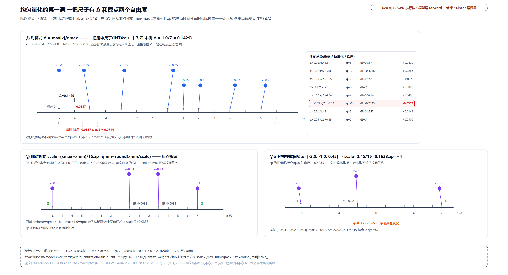

> *图注：上下两半同一值域的数轴。上半对称网格（等距刻度、0 居中，Δ=0.1429），8 个值逐点投影到格点，误差都不过半格；下半非对称网格（刻度仍等距，仅原点平移 zp），标出 xmin→qmin、xmax→qmax 两端精确落格；右下还有负偏置分布的对照（zp 为正、原点搬到分布实际位置）。页脚带 512 个随机值的统计：N=4 最大误差 0.1947 ≤ 界 0.195、N=8 缩到 0.0081，各自钉在半格界内（N=4 与 N=8 是两次独立抽样；「位每加一、步长近似减半」是结构事实，同数据下 4→8 bit 的步长比恰为 127/7≈18）。数字全部实跑自参考实现。*

论文里的 Δ 和 zp，在 vLLM 源码里都有名有姓。整数均匀量化的参考实现（服务测试与基准，真正产检查点的数学在离线工具里，后面会看到）长这样：

```python
# vllm/model_executor/layers/quantization/utils/quant_utils.py:L672-L707 · quantize_weights（组内定尺与取整）
    # Compute scale for each group
    max_val = torch.max(w, 0, keepdim=True).values   # L673 组内 max
    min_val = torch.min(w, 0, keepdim=True).values

    max_q_val = quant_type.max()
    min_q_val = quant_type.min()

    w_s = torch.Tensor([1.0]).to(w.device)  # unscaled case
    maybe_w_zp = None
    if group_size is not None:
        if zero_points:
            assert not quant_type.is_signed() and quant_type.max() > 0   # L683 unsigned 码域断言
            w_s = (max_val - min_val).clamp(min=1e-5) / quant_type.max()   # L684 非对称：min-max 定尺
            maybe_w_zp = (
                torch.round(torch.abs(min_val / w_s)).clamp(min_q_val, max_q_val).int()   # L686 零点
            )
        else:
            # … 省略：避免除零的 torch.inf 护航注释两行 …
            w_s = torch.max(                                                  # L691 对称：absmax 定尺
                abs(max_val / (max_q_val if max_q_val != 0 else torch.inf)),
                abs(min_val / (min_q_val if min_q_val != 0 else torch.inf)),
            )

    # Quantize
    w_q = torch.round(w / w_s).int() + (maybe_w_zp if zero_points else 0)   # L697 取整加零点
    w_q = torch.clamp(w_q, min_q_val, max_q_val)   # L698 clamp 兜住越界
    # … 省略：反量化参考 w_ref=(w_q-zp)*w_s 与形状还原 …
```

对照公式读：L684 与 L691 正是非对称/对称两条定尺分支，L686 是零点，L697 是「除以尺子、取整、加零点」，L698 的 clamp 数学上对称式永远不会触发（absmax 定尺保证不越界），留着是浮点护栏。注意一个记法差：论文/GPTQ 记法把码域当 signed（zp 里含 q_min 平移，手推例的 −8 即此），vLLM 的非对称分支用 unsigned 码域（L683 的 assert 就是此意），zp 算的是 round(|min|/w_s)；两套码差一个 q_min 平移，反量化结果相同。存储账顺带结了：4 bit 权重每元素半字节，是 FP16 的四分之一，上一节那笔搬运账的来源。

---

## 谁跟谁共享一把尺子：粒度谱

**直觉一句话**：粒度就是「谁跟谁共享一把尺子」。离群值在哪个轴上，就该给哪个轴发尺子；但激活的尺子若挂在 GEMM 的内维上，乘加做到一半就得换尺，Tensor Core 不干。

底座公式里 $`\Delta`$ 由谁的最大值定，决定了粒度。对激活矩阵 X（T 行 token × C_i 列输入通道）与权重 W（C_i × C_o，输出通道；SmoothQuant §2 Figure 3 的坐标系）：

- **per-tensor**：整个矩阵一把尺。最省（一个 scale 标量），也最糙。
- **per-token**：每个 token 一把尺（沿 T 维）。激活量化的常用档。
- **per-channel**：权重按输出通道、激活按输入通道各配一把（沿 $`C_o`$ / $`C_i`$ 维）。
- **group-wise**：per-channel 的粗化版，每 g 个连续元素共享一把（g128、g64、g32）。

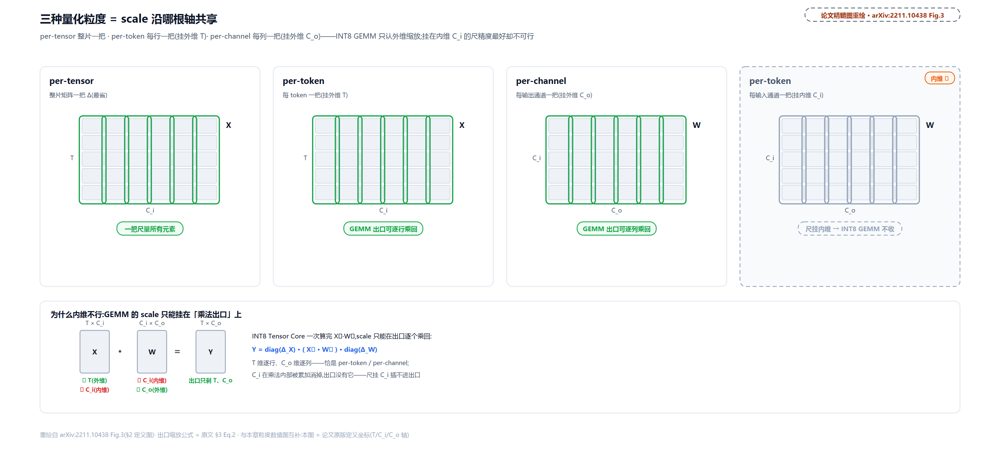

> *图注：论文的定义图。per-tensor 整阵一个 scale；per-token 沿 token 维 T 每行一个；per-channel 权重沿输出通道维 C_o 每列一把（第三格）。挂在输入通道维 C_i 上的尺则是第四格的灰区——W 按行、每输入通道一把，内维、INT8 GEMM 不收；激活侧逐列定尺同样挂 C_i、同样不可行（下一张图灰掉的 per-channel 一格）。灰色的关键约束：要让 vector-wise 量化高效吃进 INT8 GEMM kernel，scale 只能取矩阵乘的外维（token 维 T 与输出通道维 C_o，算完统一乘回），不能取内维（输入通道维 C_i）。*

为什么内维不行？看 GEMM 怎么用 scale（SmoothQuant §3 Eq.2）：

```math
Y=\mathrm{diag}(\Delta_X)\cdot\left(\bar{X}\cdot\bar{W}\right)\cdot\mathrm{diag}(\Delta_W)
```

$`\Delta_X`$ 与 $`\Delta_W`$ 是激活、权重各自的尺子按外维收成的向量（per-token 的 Δ 逐 token 一把、per-channel 的 Δ 逐输出通道一把，装进对角阵就是整行/整列一次乘回）。外维的 scale 可以等矩阵乘整趟算完、在对角阵里一次性乘回，不惊动乘加序列。内维（缩减维）的 scale 却要在乘加循环中途逐 k 步介入，Tensor Core 的高吞吐乘加序列（MMA）容不得这种低吞吐指令插队（§3 原文：do not tolerate the insertion of instructions with a lower throughput）。代价的实测很惨烈，SmoothQuant §3 Table 1（OPT-175B，四任务平均准确率）：FP16 71.6% → INT8 per-tensor 32.3% → per-token 31.7% → **per-channel 71.4%**。精度上只有 per-channel 把基线保住了；工程上只有它不可行。精度与可行性的交集里，剩下 per-tensor、per-token 与 group-wise。

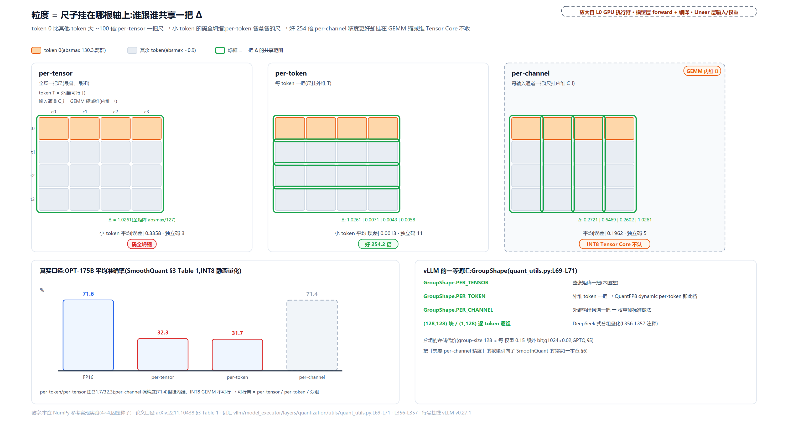

> *图注：三张同构的 4×4 矩阵（token 0 是离群行，~130 vs 其他 ~0.9），绿框标「谁共享一把 Δ」：per-tensor 全阵一框、per-token 每行一框、per-channel 每列一框。结果三枚芯片：per-tensor 小 token 平均误差 0.3358、只剩 3 个独立码；per-token 误差 0.0013、11 个独立码（好 254 倍：0.3358 对 0.00132，四把尺 Δ 各自定）；per-channel 误差 0.1962 被打成灰色「INT8 GEMM 不可行」，旁边挂着 Table 1 的四根准确率条（71.6/32.3/31.7/71.4）。底部是 vLLM 的词汇与分组账：GroupShape 三档加 (128,128)/(1,128) 块，g128 约每权重 0.15 额外 bit、g1024 约 0.02。数字全部实跑自参考实现。*

vLLM v0.27 给这套粒度起了正式的名字，kernel 选择、CLI 简写、编译开关全用同一套词。词根是 GroupShape：

```python
# vllm/model_executor/layers/quantization/utils/quant_utils.py:L44-L70 · GroupShape（粒度的正式词汇）
class GroupShape(_GroupShape):
    """
    This class describes the quantization group shape.
    It includes static members for common shapes (per-tensor, per-token).
    """

    # Aliases for common quantization group shapes
    PER_TENSOR: ClassVar["GroupShape"]
    PER_TOKEN: ClassVar["GroupShape"]
    PER_CHANNEL: ClassVar["GroupShape"]

    def is_per_tensor(self) -> bool:
        return self.row == -1 and self.col == -1

    def is_per_token(self) -> bool:
        return self.row == 1 and self.col == -1

    def is_per_channel(self) -> bool:
        return self.row == -1 and self.col == 1

    def is_per_group(self) -> bool:
        return self.row == 1 and self.col >= 1


GroupShape.PER_TENSOR = GroupShape(-1, -1)
GroupShape.PER_TOKEN = GroupShape(1, -1)
GroupShape.PER_CHANNEL = GroupShape(-1, 1)
```

元组语义就是「每 (row, col) 个元素共享一把尺」，-1 表示该维不限。浮点侧的参考实现 `scaled_quantize` 在函数头把全张量/逐行/逐列/DeepSeek 式 128×128 块/(1,128) 逐 token 逐组五档列成了注释词汇表（quant_utils.py:L351-L358），FP8 一节会进它的本体。

分组粒度的账也摆明白：每 g 个元素多存一个 scale。GPTQ §5 算过，group 1024 摊每权重约 0.02 额外 bit、group 128 约 0.15（论文 Table 7：2-bit 量化下 g128 的 PPL 9.58、g32 压到 8.94）。粒度是第一味药，但它有价签，而且治不了根——因为病根不在粒度，在离群值本身。

---

## 全场共用一把尺的代价：RTN 之死

**直觉一句话**：一个通道冒出离群值，大家共用的那把尺就被撑疏，其余通道的值全被压进寥寥几个刻度里。离群通道不改别人的值，只改大家共用的那把 Δ。

把这句话变成数学。per-tensor 量化下，设通道 i 的绝对最大值是 $`m_i`$、全张量的绝对最大值是 $`m`$，则 Δ=m/(2^(N-1)−1)。通道 i 的值全部落在 ±m_i/Δ 之内，占得的量化级数是：

```math
\frac{2\,m_i}{\Delta}=\frac{2\left(2^{N-1}-1\right)m_i}{m}\;\approx\;\frac{2^{N}\,m_i}{m}
```

右端 $`2^{N}\,m_i/m`$ 是 SmoothQuant §3 obs.2 的原式（论文按 $`2^{N}`$ 口径；与左端严格算差 $`2/2^{N}`$，N=8 时约 0.8%，本章后文数字沿用论文口径）。一行就把死因写完了：**普通通道的可用台阶数，被离群比值线性吃掉**。离群通道大 70 倍，普通通道在 INT8（256 级）下只剩 3.66 级，INT4（16 级）下只剩 0.229 级，值连一个非零格点都够不着。合成一个 8 token × 4 通道的矩阵实测：通道 0 逐 token 持续在 ~70（SmoothQuant §3 obs.3 的离群模式），通道 1-3 在 ~1 量级：

<!-- trace: ch27-m03 -->

| 通道 j | 通道 max m_j | 有效级数 256·m_j/m | per-tensor 平均误差 | per-channel 平均误差 | per-tensor 独立码数 |
|---|---|---|---|---|---|
| 0（离群） | 77.0 | 256.0 | 0.1102 | 0.1102 | 8 |
| 1（普通） | 1.5 | 5.0 | 0.131 | 0.0021 | 5 |
| 2（普通） | 2.06 | 6.84 | 0.217 | 0.0034 | 5 |
| 3（普通） | 2.44 | 8.12 | 0.1712 | 0.0045 | 5 |

（显示舍入的说明：有效级数按参考实现内部完整精度的通道 max 计算，max 列只印了两三位小数——拿表内 max 复算会差末位一格，如 256·1.5/77=4.99 对表里的 5.0，结论不受影响。）

通道 0 两种粒度的误差一模一样，它自己就是 per-tensor 尺子的定尺者，从不吃亏；三个普通通道的误差平均差 52 倍（0.173 对 0.0033；逐通道相除在 38-64 倍之间）。坍缩长什么样，看通道 1 的 8 个原始值（INT8 对称、全张量 Δ=77/127，数字取自同一份实跑输出）：

| 通道 1 的原始值 | per-tensor 反量化 |
|---|---|
| -0.52 | -0.61 |
| 1.14 | 1.21 |
| -0.55 | -0.61 |
| -0.79 | -0.61 |
| -0.61 | -0.61 |
| 0.19 | 0.0 |
| 0.78 | 0.61 |
| -1.5 | -1.21 |

八个值坍到 5 个独立码上，梯度全平了；per-channel 一把尺一通道，反量化几乎复原（逐值回到原始值 ±0.01 内，这就是表里 0.0021 的含义）。合成例子是不是危言耸听？SmoothQuant 论文拿真实模型验证过（§2 Figure 4）：OPT-13B 某线性层的输入激活里，少数通道幅度**大于 70**、且逐 token 持续出现在固定通道；权重分布则平坦均匀（§3 obs.1：权重用 INT8 甚至 INT4 量化都不掉精度，激活才是难点）。

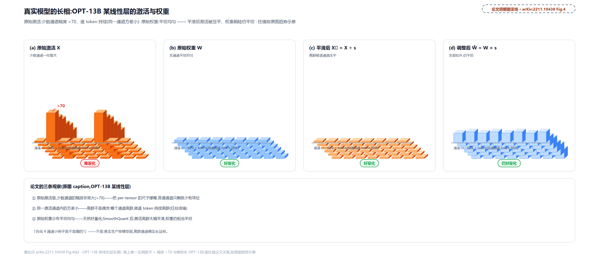

> *图注：论文的实测证据，四格对比量化前后的激活与权重幅度。三条观察原文照录：(1) 原始激活少数通道幅度大于 70；(2) 同一激活通道内部方差小（离群逐 token 持续，不是偶发）；(3) 原始权重分布平坦均匀。柱值按原图趋势示意（逐柱数值论文未印），70 的量级与「>70」三条观察是原文的。*

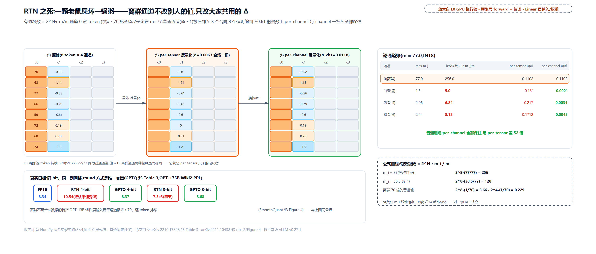

> *图注：三行热图条。行 1 原始矩阵（通道 0 一柱擎天 [70,63,77,66,59,72,68,74]，通道 1 八值可读）；行 2 per-tensor 量化-反量化后（Δ=0.6063，通道 1 坍成 [-0.61,1.21,-0.61,-0.61,-0.61,0,0.61,-1.21] 的台阶）；行 3 per-channel 反量化几乎复原。右表逐通道账：max [77.0,1.5,2.06,2.44] → 有效级数 [256.0,5.0,6.84,8.12]，per-tensor/per-channel 误差 52 倍差；底部公式自检 2^8·(77/77)=256、2^8·(1/70)=3.66、2^4·(1/70)=0.229 与论文口径 PPL 芯片（8.34/10.54/8.37、7.3e3/8.68）。数字全部实跑自参考实现。*

这份死因分析对应到真实模型，就是开头的账单（GPTQ §5 Table 3，OPT-175B、WikiText2）：FP16 8.34；RTN 4-bit 10.54（还认字但变傻）、3-bit 7.3e3（痴呆）；而 GPTQ 同样 4 bit 是 8.37、3 bit 是 8.68。**bit 没变、网格没变，死的只是 round 的方式**。

处方预告，三味药各治一个层面：

- GPTQ 治「怎么 round」：量化一列就用还没量化的列找补误差；
- AWQ 治「在哪个网格上 round」：重要通道先放大再量化；
- SmoothQuant 治「送进网格前数值长什么样」：把难度在激活和权重之间搬平。

三味药都不动 bit 数，这正是它们值得一页页推导的原因。

---

## GPTQ：把「找补」做成数学

**直觉一句话**：量化一列、记一笔误差账，趁后面的列还没定格，把这笔账摊给它们扛；列与列有相关性，先定格列的误差可以被后定格的位置吸收。lazy batch 再把一笔笔零星划账攒成月底一次大额总账。

先把出身交代清楚。GPTQ（Frantar、Ashkboos、Hoefler、Alistarh，2022-10，arXiv:2210.17323）是 one-shot（一次性、不重训练）的训练后量化（PTQ，post-training quantization）：只用 128 条随机采样的 C4 网页清洗语料（每条 2048 token，不含任何任务数据）跑一遍校准（拿这批数据过一遍网络、记下各层输入，喂给算法的就是它，下一小节就见），把 175B 模型压到 3-4 bit 只要单卡 A100 约 4 GPU 小时。它的直接前身是同组的 OBQ：

> *直觉：OBQ（Optimal Brain Quantization，arXiv:2208.11580）把 1993 年的二阶剪枝框架 OBS（Optimal Brain Surgeon，用逆 Hessian 给「删哪个权重最不伤」定价）推广到量化——逐权重贪心、每量化一个就用 Hessian 信息补偿其余。数学正确，但复杂度 O(d_row·d_col^3)（d_row、d_col＝该层权重矩阵的行数、列数，如一层 4096×4096），ResNet-50（25M 参数）要一小时，十亿级参数跑不动。GPTQ 的三步工程化全是冲着它来的。你不需要去读那篇论文，GPTQ 论文 §3 自己把 OBQ 讲全了。*

### 目标与工具：Hessian 是敏感度计

GPTQ 的优化目标是一层一层的输出重构（§3 Eq.1）：

```math
\underset{\hat{\mathbf{W}}}{\arg\min}\;\left\|\mathbf{W}\mathbf{X}-\hat{\mathbf{W}}\mathbf{X}\right\|_2^2
```

$`\mathbf{X}`$ 是校准数据跑过网络得到的该层输入矩阵（每列一条样本）；$`\hat{\mathbf{W}}`$ 是量化后的近似权重矩阵，argmin 要搜的就是它（同一顶帽子在 SmoothQuant 一节另指「平滑后的权重」，两处各自就地定义，符号表有备注）。误差按 $`\mathbf{W}`$ 的行分解，各行独立可解。这一步需要 Hessian（二阶导数矩阵）：把函数的所有二阶偏导排成方阵，它描述函数在一点的弯曲程度，梯度管斜坡往哪边斜，Hessian 管坡往哪边弯。手算一个十秒可验的例子（说明性）：f(x,y)=x²+3xy+2y² 的 Hessian 是 [[2,3],[3,4]]，常数、对称。它在本章的角色是 **敏感度计**：沿曲率大的方向动参数，损失涨得多；平坦方向怎么动都行。GPTQ 的损失（对一行权重）对权重是二次的，只差一步展开就能看见。把一行权重与其最终量化结果之差记作差向量 $`\boldsymbol{\delta}`$，这一行的输出误差就是：

```math
\left\|\mathbf{w}\mathbf{X}-\hat{\mathbf{w}}\mathbf{X}\right\|_2^2=\left\|\boldsymbol{\delta}\mathbf{X}\right\|_2^2=\boldsymbol{\delta}\,\mathbf{X}\mathbf{X}^{\top}\boldsymbol{\delta}^{\top}
```

（差向量的每个分量就是 $`\mathbf{w}`$ 与 $`\hat{\mathbf{w}}`$ 对应元素之差。）展开后每项至多两个偏差分量相乘，这类式子叫二次型。对偏差求二阶导，对称的中间因子左右各出现一次、两项相加翻倍，Hessian 恰为 $`2\mathbf{X}\mathbf{X}^{\top}`$；等量化推进到只剩一部分列，把 $`\mathbf{X}`$ 限制在那些还没量化的通道上，就是：

```math
\mathbf{H}_F=2\,\mathbf{X}_F\mathbf{X}_F^{\top}
```

$`F`$ 是还没量化的权重下标集合（权重矩阵的列，即输入通道），$`\mathbf{X}_F`$ 就是 $`\mathbf{X}`$ 里这些通道对应的行。注意这个式子里**没有权重**——Hessian 只由层输入决定。这是全节最值钱的一个事实，GPTQ 的第一步工程化就站在它上面。

OBQ 的算法（§3 Eq.2）是个二连：贪心挑「补偿代价最小」的下一个权重（代价用逆 Hessian 对角元当折扣），量化它，然后对其余权重做一步最优补偿：

```math
w_q=\underset{w_q}{\arg\min}\;\frac{\left(\mathrm{quant}(w_q)-w_q\right)^2}{\left[\mathbf{H}_F^{-1}\right]_{qq}},\qquad
\boldsymbol{\delta}_F=-\,\frac{w_q-\mathrm{quant}(w_q)}{\left[\mathbf{H}_F^{-1}\right]_{qq}}\cdot\left(\mathbf{H}_F^{-1}\right)_{:,q}
```

$`[\mathbf{H}_F^{-1}]_{qq}`$ 在分母上，就是动第 q 个权重的价格标签：值大说明该方向平坦、同样大小的舍入误差被折扣得多，量化它便宜，argmin 每步先挑这种；值小（曲率大、误差会被放大得多）的「贵」权重反而被推到最后，彼时还能找补的未量化权重已所剩无几，论文 §4 Step 1 正是用这一点解释贪心序的收益有限。$`\boldsymbol{\delta}_F`$ 沿逆 Hessian 的列方向，把量化误差摊给所有还没定型的权重。这一步不是拍脑袋，当场能解出来。设这一行的「最终偏差向量」$`\mathbf{v}`$（每个权重与其最终取值之差），它的 q 分量已钉死、其余分量任选，要求解的是带一个约束的二次型最小化：

```math
\min_{\mathbf{v}}\;\mathbf{v}^{\top}\mathbf{H}_F\mathbf{v}\qquad\mathrm{s.t.}\quad v_q=w_q-\mathrm{quant}(w_q)
```

一阶条件：梯度 $`2\mathbf{H}_F\mathbf{v}`$ 只许剩 q 方向的分量（其余方向都能自由动，最优处梯度必与它们垂直）。把它写成式子、左乘 $`\mathbf{H}_F^{-1}`$：

```math
\mathbf{H}_F\mathbf{v}=c\,\mathbf{e}_q\quad\Longrightarrow\quad\mathbf{v}=c\,\left(\mathbf{H}_F^{-1}\right)_{:,q}
```

解只能落在 $`(\mathbf{H}_F^{-1})_{:,q}`$ 这条线上，再用「q 分量 = $`w_q-\mathrm{quant}(w_q)`$」定出比例系数——分母恰好是对角元 $`[\mathbf{H}_F^{-1}]_{qq}`$，价格标签站在分母上的数学来历就在这一步。其余权重要加上的是偏差的相反数，取负就是 $`\boldsymbol{\delta}_F`$。这是 OBS 框架 1993 年传下来的经典一步，GPTQ 原样继承。之后用一步高斯消元把 $`q`$ 行列从逆矩阵里删掉（§3 Eq.3），循环到量化完。每个权重都要更新一次整片 $`\mathbf{H}^{-1}`$，这就是立方复杂度的来源。

### 三步工程化：从跑不动到 175B 可跑

**第一步：任意固定列序。** OBQ 的贪心序看着聪明，实测收益很小（论文发现固定任意序的最终误差与贪心相近），尤其在参数众多的大层上。真正值钱的是那个「H 只认输入不认权重」的事实：既然 $`\mathbf{H}_F`$ 对所有行相同，「还没量化的集合 F」就可以全行同步——所有行按**同一列序**推进，$`\mathbf{H}^{-1}`$ 的更新从每个权重一次降到每列一次。复杂度从 O(d_row·d_col³) 降到 O(max{d_row·d_col², d_col³})。代入一层 4096×4096：2.8e14 → 6.9e10 FLOPs，提速 4096 倍（= min{d_row, d_col}）。

**第二步：lazy batch。** 剩下的更新还是慢，因为算术强度太低：一次更新要摸一整片大矩阵，每元素却只摊几个 FLOP，GPU 的算力喂不饱、全卡在访存上。救场的是论文 §4 Step 2 的一个观察：**第 i 列的最终取整决策只受落在第 i 列自己身上的更新影响**，对后续列的补偿此刻不着急给。于是把列切成 B=128 一块：块内逐列「量化、记误差、即时补偿块内」，块末把攒下的误差账一次性大矩阵乘摊给块外全部剩余列。计算量一点没少，少的是访存趟数。

**第三步：Cholesky 重构。** 反复做增量求逆会累积数值误差，把 $`\mathbf{H}^{-1}`$ 推成不定矩阵，补偿方向随之失真，模型一大必炸。注意到真正需要的只是逆矩阵「每行从对角线开始」的那一段，而这正是 Cholesky 分解（把对称矩阵分解成上三角乘其转置）一步就能预取的东西：开局对 $`\mathbf{H}^{-1}`$ 整体做一次 Cholesky，之后只读不写。为什么等价，论文 §4 Step 3 自己点破了机制：Eq.3 的「删 q 行列」对对称的 $`\mathbf{H}^{-1}`$ 做的事，正是 Cholesky 消元递推做的一步——唯一的差别是 Cholesky 顺手把行 q 除以 $`[\mathbf{H}^{-1}]_{qq}`$ 的平方根归一（手推例里 $`U_{jj}`$ 扮演的角色，马上见到）。所以开局一次完整分解等于把全部增量更新预先算完，只是不再一步步对逆矩阵动手，也就没有逐步消元的累积误差。再配一点 dampening（对角线加 $`\lambda`$，取平均对角元的 1%），175B 量级就稳了。手推例子的 $`\mathbf{H}`$ 只有 4×4，离不可逆远得很、手算就稳；不定阵的风险要到真实大层的反复求逆里才滚得出来（本段开头说的那种失真），dampening 上的是那类情形的保险。

三步合起来就是论文的 Algorithm 1（§4；内层循环 quantize column 等四行英文注释照抄论文原注释，三条中文注释是本章加的）：

```text
# arXiv:2210.17323 §4 Algorithm 1（伪代码，按论文逐行）
Q <- 0;  E <- 0;  H^{-1} <- Cholesky(H^{-1})^T        # 开局一次分解
for i = 0, B, 2B, ... do                              # 外层：块
    for j = i .. i+B-1 do                             # 内层：块内逐列
        Q[:,j]  <- quant(W[:,j])                      # quantize column
        E[:,j-i] <- (W[:,j] - Q[:,j]) / [H^{-1}]_{jj} # quantization error
        W[:,j:(i+B)] <- W[:,j:(i+B)] - E[:,j-i] * H^{-1}[j, j:(i+B)]   # update weights in block
    W[:, (i+B):] <- W[:, (i+B):] - E * H^{-1}[i:(i+B), (i+B):]        # update all remaining weights
```

### 手推一遍：1×4 的权重行，B=2

取一行权重 w=[0.45, -0.2, -0.05, 0.15]，网格用论文 §5 Setup 的 per-row min-max 式（scale=0.65/15=0.04333、zp=-3，过程开始前固定，GPTQ 与 RTN 用同一副网格）。校准样本取 4 条 0/1 短样本，排成 4×4 矩阵 X=[[1,0,0,1],[0,1,0,1],[0,0,1,1],[1,1,0,0]]（样本按行存；上式与论文把样本按列存、写 H_F=2X_F X_Fᵀ，同一个 H 互为转置——见符号表 W/X 行）。H=2XᵀX 可以手算，结果是 [[4,2,0,2],[2,4,0,2],[0,0,2,2],[2,2,2,6]]（比如 H 的 (0,0) 元 = 2×（第 0 个特征的 4 条样本平方和）= 2×2 = 4，其余同理）。dampening 取 λ=0.04（平均对角元 4 的 1%）。块大小取 2，让 lazy batch 的结构在 4 列里完整出现。逐轮走（表头「量化实值」就是底座一节的反量化值 x̂，即 (q−zp)·scale）：

<!-- trace: ch27-m04 -->

| 轮 | 块 | 列 j | 量化前工作权重 | U_jj | 码 q_j | 量化实值 | 误差账 (w−ŵ)/U_jj | 本轮后未定格的 W |
|---|---|---|---|---|---|---|---|---|
| 1 | A | 0 | 0.45 | 0.60637 | 7 | 0.43333 | 0.02749 | [0.43333, -0.19445, -0.05, 0.15] |
| 2 | A | 1 | -0.19445 | 0.57172 | -7 | -0.17333 | -0.03693 | [0.43333, -0.17333, -0.05, 0.15] |
| 块末 | A | — | E=[0.02749, -0.03693] | — | — | — | — | [0.43333, -0.17333, -0.04519, 0.1451] |
| 3 | B | 2 | -0.04519 | 0.85195 | -4 | -0.04333 | -0.00218 | [0.43333, -0.17333, -0.04333, 0.14448] |
| 4 | B | 3 | 0.14448 | 0.40689 | 0 | 0.13 | 0.03559 | [0.43333, -0.17333, -0.04333, 0.13] |
| 块末 | B | — | E=[-0.00218, 0.03559] | — | — | — | — | 无剩余列，总账空转 |

U 是 Cholesky 上三角（$`U^\top U=\mathbf{H}^{-1}`$），$`U_{jj}`$ 就是算法里那个 $`[\mathbf{H}^{-1}]_{jj}`$。三个看点：

1. **换码发生了**。第 1 列量化后，误差账 0.02749 即时改写块内的第 2 列，把它的工作权重从 -0.2 推到 -0.19445，取整从 RTN 的 -8 翻成 -7。最终 GPTQ 码 $`[7,-7,-4,0]`$，RTN 码 $`[7,-8,-4,0]`$，全行只差这一位，但这一位是找补出来的。
2. **lazy 是真的 lazy**。第 3、4 列的改写全部推迟到块 A 末尾，由攒下的账 $`\mathbf{E}=[0.02749,-0.03693]`$ 一次乘 U 的右上角块摊过去（-0.05→-0.04519、0.15→0.1451）。参考实现做过逐位对账：块大小取 8 与取 3 量化码逐位相同；Cholesky+lazy 与朴素逐列跑 Eq.2/Eq.3 也逐位相同（反量化值最大差 0.0）。**lazy batch 与 Cholesky 只改执行方式，不改结果**——终止性也直白：列指针每轮严格 +1，已定格列被显式覆写、此后无人再读。
3. **优化的是层输出，不是单点**。这一行按 Eq.1 记分：GPTQ 的层输出误差 0.001667，RTN 是 0.003978，好 2.4 倍；而第 2 列的单点误差反而是 GPTQ 更大（0.02667 对 0.01667）。二阶补偿牺牲个别格点的精度，换整层输出更贴近原值——这正是「找补」与「逐点四舍五入」的本质区别。

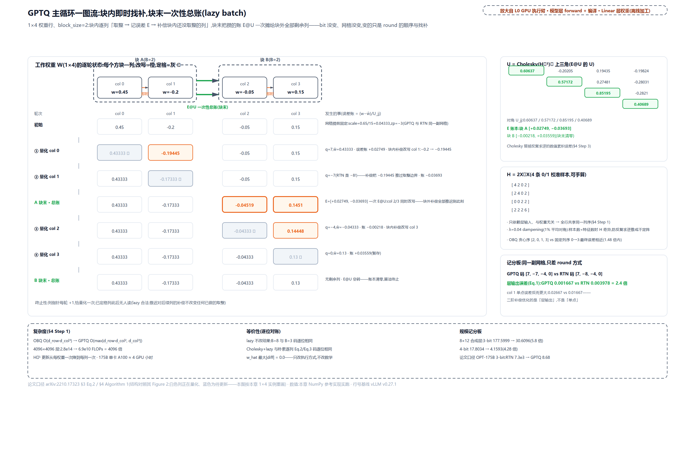

> *图注：一条 1×4 权重行画成 4 个方块、两个块外框（A/B）。块内细箭头是即时补偿（col 0 → col 1；图面 col 下标从 0 记，正文说的第 1/2 列即 col 0/1），块末粗箭头是一次性总账（块 A 末尾 E@U 射向 col 2/3，改写 [-0.05,0.15]→[-0.04519,0.1451]），已定格列打勾灰化。右列面板：U 上三角全值（对角 0.60637/0.57172/0.85195/0.40689）与 E 账本；H=2XᵀX 四行逐字、λ=0.04；OBQ 贪心序 [2,0,1,3] 对照；记分板 GPTQ [7,-7,-4,0] vs RTN [7,-8,-4,0]、层误差 0.001667 vs 0.003978、col 1 单点 0.02667 vs 0.01667；复杂度 2.8e14→6.9e10（4096 倍）、175B 约 4 GPU 小时；底部两行等价对账（B=8 与 B=3 码逐位相同、Cholesky 与朴素逐列相同）与 8×12 记分板（3-bit 177.5999→30.6096 好 5.8 倍、4-bit 17.8034→4.1593 好 4.28 倍）。数字全部实跑自参考实现。*

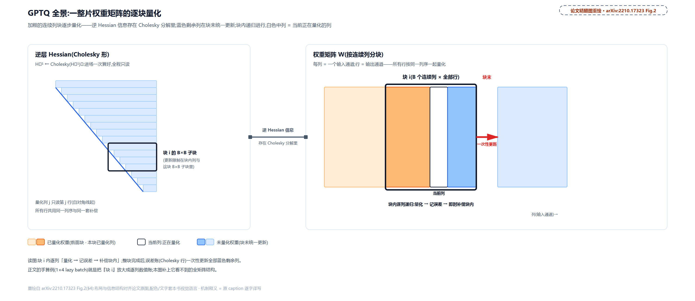

> *图注：作者自己的算法全景图，补上手算例看不到的「一整块矩阵长什么样」。加粗的连续列块逐步量化，靠 Cholesky 分解里存的逆 Hessian 信息补偿；蓝色是待更新的剩余权重，块末统一摊账；量化在块内递归进行，白色中列是当前正在量化的列。对照上一张图的 1×4 特写：那里看逐轮数值账，这里看全矩阵结构。*

规模口径收个尾：8×12 合成层（特征相关、Hessian 各方向曲率悬殊）上 3-bit RTN 误差 177.5999 对 GPTQ 30.6096（5.8 倍）、4-bit 17.8034 对 4.1593（4.28 倍）；论文口径就是开头那对数字，OPT-175B 3-bit 从 RTN 的 7.3e3 回到 8.68。贪心与固定序的差距实测在 1.48 倍以内，GPTQ 用这点精度换三个数量级的速度，175B 才做得动。

### 落到 vLLM：运行期没有二阶

关键分工：**二阶补偿全部发生在离线**。产 GPTQ 检查点的是离线工具链——历史上的 AutoGPTQ（2025-04 已存档）与 AutoAWQ（2025-05 已弃用）都退了役，现役正主是 vLLM 官方的 llm-compressor（Red Hat AI 与 vLLM 项目共建，GPTQ/AWQ/FP8/FP4 一个 recipe 体系全收）；但**工具死了、格式没死**，HuggingFace 上海量 GPTQ/AWQ 检查点还是两家老工具的格式（qweight/scales/qzeros/g_idx 布局一致），vLLM v0.27 照常消费。仓库里这份 `gptq_quantize_weights` 是给测试与基准用的参考实现，注意它只做 RTN 网格加行置换：

```python
# vllm/model_executor/layers/quantization/utils/quant_utils.py:L741-L772 · gptq_quantize_weights（测试用参考实现）
def gptq_quantize_weights(
    w: torch.Tensor,
    quant_type: ScalarType,
    group_size: int,
    act_order: bool,
    test_perm: torch.Tensor | None = None,
):
    # … 省略：形状与类型断言 …
    w_ref, w_q, w_s, _ = quantize_weights(w, quant_type, group_size)   # L758 同一副均匀网格直接取整

    # Apply act_order
    g_idx = torch.empty(0, dtype=torch.int, device=w.device)
    rand_perm = torch.empty(0, dtype=torch.int, device=w.device)
    if act_order:
        assert group_size < size_k, (   # L764 size_k：输入维，组沿它切
            "For act_order, groupsize = {} must be less than size_k = {}".format(
                group_size, size_k
            )
        )

        w_ref, w_q, g_idx, rand_perm = permute_rows(w_q, w_ref, group_size, test_perm)   # L770 行置换，g_idx 即置换后的组索引

    return w_ref, w_q, w_s, g_idx, rand_perm
```

离线那侧的 act_order（检查点里的 desc_act 开关）做的是行置换：把重要的列排进更早的组，置换的产物就是 `g_idx`（每个权重属于哪个组）。行、列不是打架：vLLM 代码把权重按（输入维×输出维）存放，GPTQ 数学里的列（输入通道）在代码里正是行，紧接着下面 create_weights 代码块里的 (input_size, output_size) 说的就是这个形状。检查点装进 vLLM 后，构造期的现场长这样：

```python
# vllm/model_executor/layers/quantization/auto_gptq.py:L341-L358 · AutoGPTQLinearMethod.create_weights
        mp_linear_kernel_config = MPLinearLayerConfig(
            full_weight_shape=(input_size, output_size),
            partition_weight_shape=(
                input_size_per_partition,
                output_size_per_partition,
            ),
            weight_type=self.quant_config.quant_type,
            act_type=params_dtype if input_dtype is None else input_dtype,
            group_size=self.quant_config.group_size,
            zero_points=False,
            has_g_idx=self.quant_config.desc_act,
        )

        kernel_type = choose_mp_linear_kernel(mp_linear_kernel_config)   # L354 构造期现场选 kernel

        if kernel_type.__name__ not in self._kernel_backends_being_used:
            logger.info("Using %s for AutoGPTQLinearMethod", kernel_type.__name__)
            self._kernel_backends_being_used.add(kernel_type.__name__)
```

先建 qweight/scales/qzeros/g_idx 四个参数占位，把这一层描述成一张「格式说明书」（MPLinearLayerConfig：形状、位宽、group_size、有无 g_idx），然后交给 `choose_mp_linear_kernel` 现场挑一个执行 kernel——挑的规则、候选表、以及为什么 H100 和 A100 会挑中不同的 kernel，本章最后一节专门算这笔总账。

---

## AWQ：给显著权重戴放大镜

**直觉一句话**：重要的字先用放大镜看。权重乘 s=2 放大后落在更大的数上取整（格点相对更密），量完把结果除回 s，乘积一分不变，变的只是「在哪个尺度上取整」。至于谁重要，不看字本身多大（权重范数），看它要乘的激活有多大。

GPTQ 的找补很重数学：校准、求逆、逐列推。AWQ（Lin 等，MIT，arXiv:2306.00978，MLSys 2024 最佳论文）走了条轻得多的路，起点是一个实验发现：**权重不是同等重要的**。INT3-g128 量化下，只把约 1% 的权重通道留在 FP16，PPL 就能大幅回升；而这 1% 怎么挑，天差地别：按激活幅度挑，OPT-6.7B 从 23.54 回到 11.39；按权重范数挑只有 22.37、随机挑 24.23，跟不挑的 RTN（23.54）一个量级（§3.1 Table 1，论文结论：按权重挑的改善与随机选无异）。道理顺着读就通：权重通道乘着大激活，它的量化误差会被放大整列；权重本身大不大，跟输出误差没关系。**做权重量化，看的却是激活分布**，这就是名字里 activation-aware 的由来。

但混合精度（少数权重 FP16、多数 INT）硬件不友好。AWQ 的解法是一个严格等价的缩放，把「保护」藏进纯整数的格式里。设一组权重里有个显著权重 $`w`$，量化器还是底座那一套（§3.2 Eq.1，注意分母是 $`2^{N-1}`$ 派）：

```math
Q(w)=\Delta\cdot\mathrm{Round}\left(w/\Delta\right),\qquad \Delta=\max(|\mathbf{w}|)/2^{N-1}
```

给 $`w`$ 乘 $`s>1`$、给激活除以 $`s`$，乘法结果严格不变（标量乘法结合律），但量化的发生地点变了（Eq.2）：

```math
Q(w\cdot s)\cdot\frac{x}{s}=\Delta'\cdot\mathrm{Round}\left(\frac{w\,s}{\Delta'}\right)\cdot x\cdot\frac{1}{s}
```

误差谁大谁小？AWQ 给了三条经验观察（§3.2）：其一，取整误差 $`\mathrm{RoundErr}(\cdot)`$ 的期望恒约 0.25，与被量化的数值大小无关（Round 把浮点映到整数，误差大致均匀分布在 [0, 0.5]，平均 0.25；参考实现对 20 万个均匀样本实测均值 0.2502）；其二，放大单个元素通常不改组内最大值，故 $`\Delta'\approx\Delta`$；其三，$`\Delta`$ 与 $`x`$ 在 FP16 里本身无量化误差。代入两个误差式（Eq.3）：

```math
\mathrm{Err}\left(Q(w)\,x\right)=\Delta\cdot\mathrm{RoundErr}\left(w/\Delta\right)\cdot x
```

```math
\mathrm{Err}\left(Q(w\,s)\cdot(x/s)\right)=\Delta'\cdot\mathrm{RoundErr}\left(w\,s/\Delta'\right)\cdot x\cdot\frac{1}{s}
```

两式期望之比是：

```math
\frac{\Delta'}{\Delta}\cdot\frac{1}{s}\;<\;1
```

显著权重的相对量化误差自动除以了 s。手算一组 [0.9, 9.9]（9.9 是定尺者，0.9 是显著权重，取 s=2、x=1.0 便于心算）：

<!-- trace: ch27-m05 -->

| 阶段 | 被量化的数 | 尺子 | 整数码 | 乘回后的贡献 | 误差 |
|---|---|---|---|---|---|
| 不缩放（RTN） | w | 1.2375 | 1 | 1.2375 | 0.3375 |
| 乘 s=2、激活除 2 | w·s=1.8 | 1.2375（组 max 不变） | 1 | 0.61875 | -0.28125 |
| 单点误差比 | — | — | — | — | 0.83333 |
| 理论误差比（期望口径） | — | — | — | — | 0.5 |

放大后的 $`w\,s=1.8`$ 没超过组内 max 9.9，尺子纹丝不动（$`\Delta'=\Delta=1.2375`$，观察二的现场示范）；同一权重在放大后的网格上取整，误差从 0.3375 缩到 0.28125。注意单点比 0.83333 并不等于理论比 0.5：RoundErr 是期望 0.25 的随机变量，单点可以偏离期望（本例的取整误差恰是负的），0.5 描述的是平均口径。

s 是不是越大越好？不是，论文的 Table 2（OPT-6.7B 实测）画出了两头堵：

| s | 1 | 1.25 | 1.5 | 2 | 4 |
|---|---|---|---|---|---|
| Δ′≠Δ 的组占比 | 0% | 2.8% | 4.4% | 8.2% | 21.2% |
| 平均误差比 (Δ′/Δ)·(1/s) | 1 | 0.804 | 0.676 | 0.519 | 0.303 |
| Wiki-2 PPL | 23.54 | 12.87 | 12.48 | 11.92 | 12.36 |

显著通道的误差比一路降（1→0.303），PPL 却在 s=2 触底反弹：放大到一定程度，组内 max 真的被顶上去了（s=4 时 Δ′/Δ>1 的组占到 21.2%），**非显著通道**的误差反被 $`\Delta'/\Delta`$ 放大。保护与反噬的分界点就是甜点。于是 AWQ 干脆不手定 s，而是搜：目标函数是「缩放后的量化输出对原输出的偏差」（Eq.4）：

```math
\mathcal{L}(\mathbf{s})=\left\|Q\!\left(\mathbf{W}\,\mathrm{diag}(\mathbf{s})\right)\!\left(\mathrm{diag}(\mathbf{s})^{-1}\mathbf{X}\right)-\mathbf{W}\mathbf{X}\right\|
```

式子按论文原样抄录，沿用 WX 记法（$`\mathrm{diag}(\mathbf{s})^{-1}`$ 从左边乘 $`\mathbf{X}`$，与 GPTQ 的 Eq.1 同一套）；换到本章统一的 Y=XW 记法，它就是 SmoothQuant Eq.3 的同款对偶：激活右乘 $`\mathrm{diag}(\mathbf{s})^{-1}`$、权重左乘 $`\mathrm{diag}(\mathbf{s})`$ 后再量化。搜索空间一维（Eq.5）：

```math
\mathbf{s}=\mathbf{s}_X^{\,\alpha},\qquad \alpha^{*}=\underset{\alpha}{\arg\min}\;\mathcal{L}\!\left(\mathbf{s}_X^{\alpha}\right)
```

$`\mathbf{s}_X`$ 是逐通道的平均激活幅度，$`\alpha\in[0,1]`$ 网格搜 20 个点（0 是不缩放即 RTN，1 是最激进）。无反传、无矩阵求逆，一维网格快搜即得（论文自述 fast grid search）；合成层上 $`\alpha^{*}=0.32`$，损失从 13.2416 降到 7.197（好 1.84 倍），曲线 U 形，两端都差。「看激活不看权重」至此被做成了一个超参。

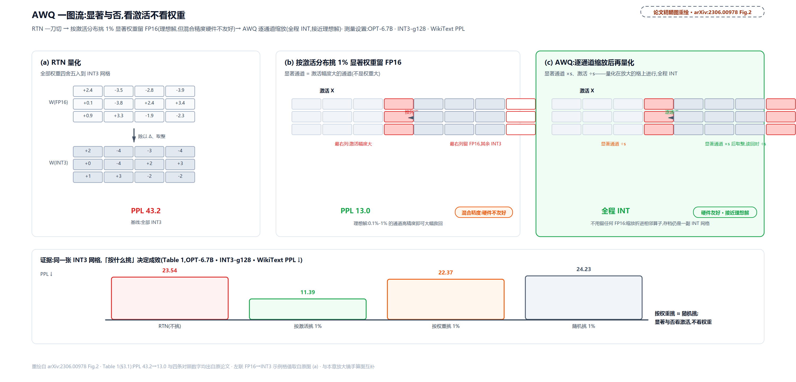

> *图注：论文的核心三联图（OPT-6.7B、INT3-g128、WikiText PPL）。左：RTN 全 INT，PPL 43.2；中：按激活分布挑 1% 显著权重保留 FP16 的理想解，PPL 13.0，混合精度格式硬件不高效；右：AWQ 按同一激活感知原则做逐通道缩放，保护显著权重且全程整数格式。（这组 43.2/13.0 出自论文 Figure 2 的评测，上文 §3.1 Table 1 的 RTN 基线则是 23.54——同一模型同一设置、论文两套实验的 RTN 起点不同，本章按各自原表照录。）*

![AWQ 放大镜：同一组 [0.9, 9.9]，显著权重 ×2、激活 ÷2 后在放大后的网格上取整，平均口径误差减半；s 再大就轮到非显著通道被反噬](../diagrams/ch27-fig-awq-magnifier.png)

> *图注：上下两半同一根组内数轴。上半原网格（Δ=9.9/8=1.2375，9.9 定尺），w=0.9 量化到 1.2375、误差 +0.3375 标红；中间一对双向箭头（权重 ×s、激活 ÷s）与等价注记；下半放大后 w·s=1.8 取整贡献 0.61875、误差 -0.28125 标绿。右列：Table 2 五档 s 的误差比与 PPL 迷你条形（s=2 绿甜点、s=4 反弹）、合成层协议（Δ′≠Δ 占 0.0547、平均 Δ′/Δ=1.0202、平均误差比 0.5101）、α 网格 20 点的 U 形损失曲线（α*=0.32，L 13.2416→7.197）。底注：单点比 0.83333 对理论 0.5、RoundErr 期望 0.25（20 万样本实测 0.2502）。数字全部实跑自参考实现。*

### 落到 vLLM：s 早已折进 scales，打包贴着 SIMD

运行期一行 AWQ 数学都没有——$`\mathbf{s}`$ 在离线就乘进了权重、除进了（折进前一层的）激活，检查点里的 scales 已经是「放大后的网格」的尺子。运行期能看见的 AWQ 只剩两样硬功夫。第一样是打包。4-bit 权重不是自然堆进内存的：解包一个 4-bit 权重要 1 次 shift、1 次按位 AND、1 次 FMA（fused multiply-add，一次乘加指令），而拿它算乘法只要 1 次 FMA，**解包比使用还贵两倍**（AWQ §4.2 的账）。出路是按 SIMD 位宽重排打包次序，让一条向量指令一次解一批：

```python
# vllm/model_executor/layers/quantization/utils/quant_utils.py:L880-L899 · awq_pack（SIMD 感知打包）
def awq_pack(
    q_w: torch.Tensor,
    num_bits: int,
    size_k: int,
    size_n: int,
):
    assert q_w.shape == (size_k, size_n)

    # Interleave column dim (for the dequantize code) and pack it to int32
    if num_bits == 4:
        interleave = numpy.array([0, 2, 4, 6, 1, 3, 5, 7])   # L890 GPU 端 8 个一组的交错序
    elif num_bits == 8:
        interleave = numpy.array([0, 2, 1, 3])
    # … 省略：按 interleave 重排后压进 int32 的收尾 …
```

SIMD（single instruction multiple data，一条指令同时作用于宽寄存器里的多个数据车道）是 CPU 与 GPU 共用的吞吐形态；ARM NEON 的 128 位寄存器装 32 个 4-bit 权重，论文按 $`w_0,w_{16},w_1,w_{17},\ldots`$ 重排后 3 条 SIMD 指令解完全部 32 个；GPU 端则是 8 个一组按 $`w_{0,2,4,6,1,3,5,7}`$ 打包。L890 这行 interleave 与论文 §4.2 的 GPU 方案一字不差，手算例的打包结果是把码 $`[0,1,2,3,4,5,6,7]`$ 重排成 $`[0,2,4,6,1,3,5,7]`$ 再压进一个 32 位字（0x75316420）。

第二样是执行路径的启发式切换：

```python
# vllm/model_executor/layers/quantization/auto_awq.py:L930-L954 · AutoAWQLinearMethod.apply（非 Marlin 路径）
        # num_tokens >= threshold
        FP16_MATMUL_HEURISTIC_CONDITION = x.shape[:-1].numel() >= 256   # L944
        # Batch invariant mode requires torch.matmul path
        # for Triton override
        if FP16_MATMUL_HEURISTIC_CONDITION or envs.VLLM_BATCH_INVARIANT:
            out = ops.awq_dequantize(qweight, scales, qzeros, 0, 0, 0)
            out = torch.matmul(reshaped_x, out)
        else:
            out = ops.awq_gemm(reshaped_x, qweight, scales, qzeros, pack_factor)   # L951 pack_factor：每个字节打包的 4-bit 码数
```

token 数不足 256（decode 的常态）走 `awq_gemm` 融合 kernel，边反量化边乘，省的是搬运；token 一多（prefill），融合反量化的额外计算开始超过省下的带宽，干脆整体反量化回 FP16 再普通 matmul。门槛写死 256，一条注释都不多解释。同一份 AWQ 检查点在够新的卡上其实会先被 Marlin 路径截走，那是最后一节的戏。

---

## SmoothQuant：难度可以搬家

**直觉一句话**：激活里的离群值是烫手山芋。SmoothQuant 在激活和权重之间乘一对儿互为倒数的缩放因子：激活除以 $`s`$、权重乘上 $`s`$（逐通道），把山芋从激活侧搬一部分到权重侧。乘法结果严格不变，变的只是「谁难量化」；搬多少由 α 定：0 是不搬、1 是全搬、0.5 是对半。

前两味药都在 W4A16 路线上，激活全程 FP16，躲开了离群值。SmoothQuant（Xiao、Lin 等，MIT，arXiv:2211.10438）迎着离群值上，为的是 W8A8：把激活也压到 8 bit，矩阵乘整个进低精度 Tensor Core（§1 那张代际表的 FP8/INT8 格）。难处也正在此——RTN 之死一节算过这笔账：激活难量化、权重好量化（per-tensor 下权重平平无奇），而激活的 per-channel 精度救星挂在 GEMM 内维、不可行（粒度谱的灰色行）。

SmoothQuant 的招是逐通道的等价变换（§4 Eq.3）：

```math
\mathbf{Y}=\left(\mathbf{X}\,\mathrm{diag}(\mathbf{s})^{-1}\right)\cdot\left(\mathrm{diag}(\mathbf{s})\,\mathbf{W}\right)=\hat{\mathbf{X}}\hat{\mathbf{W}}
```

等价性不需要任何归纳，逐项消去即可。乘积的第 (t,o) 元：

```math
\sum_{j}\frac{X_{t,j}}{s_j}\cdot\left(s_j\,W_{j,o}\right)=\sum_{j}X_{t,j}\,W_{j,o}
```

每个求和项里 $`s_j`$ 与它的倒数严格相消，右端就是未缩放乘积 $`\mathbf{X}\mathbf{W}`$ 的第 (t,o) 元。参考实现实测 max|X̂Ŵ−XW|=0.0（float64 精确）。更妙的是落点：激活通常来自上一层（LayerNorm 或 Linear），把 1/s 直接折进上一层的参数就行，**离线折、运行期零开销**，一个多出来的乘法都没有。

搬多少？两个极端先看清。全不搬（α=0，s_j=1/max|W_j| 只归一权重行），离群原封不动留在激活里，激活难量化；全搬（α=1，s_j=max|X_j|），激活每通道 max 全变 1、离群全进权重，权重行 max 被顶爆。配平的甜点在中间（§4 Eq.4）：

```math
s_j=\max\left(|X_j|\right)^{\alpha}\Big/\max\left(|W_j|\right)^{1-\alpha},\qquad j=1,\ldots,C_i
```

α=0.5 时 s_j=√(max|X_j|/max|W_j|)，代入后恰有 max|X̂_j| = max|Ŵ_j| = √(max|X_j|·max|W_j|)：同通道的激活与权重 max 相当，量化难度精确对半分。用 6 token × 4 通道的合成激活（通道 0 逐 token 离群 ~70，量级即 SmoothQuant Figure 4 的实测）配 4×2 权重（行 max [0.5, 2.0, 1.0, 1.0]）走一遍：

<!-- trace: ch27-m06 -->

| 通道 j | max\|X_j\| | max\|W_j\| | s_j（α=0.5） | max\|X̂_j\| | max\|Ŵ_j\| |
|---|---|---|---|---|---|
| 0（离群） | 77.0 | 0.5 | 12.4097 | 6.2048 | 6.2048 |
| 1（普通） | 0.9 | 2.0 | 0.6708 | 1.3416 | 1.3416 |
| 2（普通） | 1.2 | 1.0 | 1.0954 | 1.0954 | 1.0954 |
| 3（普通） | 0.8 | 1.0 | 0.8944 | 0.8944 | 0.8944 |

配平恒等式逐通道成立（四对 max 两两相等，绿色对账列）；激活通道间的差距从 96.2 倍压到 6.9 倍，权重侧依然平缓。α 的三档对照（合成层 W8A8 误差，同一份实跑输出）：

| α | 语义 | W8A8 误差 |
|---|---|---|
| 0 | 不搬（离群留在激活） | 0.4404 |
| 0.5 | 对半（配平甜点） | 0.2326 |
| 1 | 全搬（激活平了，权重行 max 爆到 [38.5, 1.8, 1.2, 0.8]） | 0.2742 |

两端都差、中间最好；9 点扫描的最优点恰在 0.5。论文的真实口径：OPT/BLOOM 全系甜点 0.5，离群更凶的 GLM-130B（约 30% 通道有离群）要 0.75；真实收益看 OPT-175B 的 W8A8 对照（§5.1 Table 3，WikiText PPL）：FP16 10.99，朴素 W8A8 直接崩到 93080，SmoothQuant 最激进的 O3 档 11.17。掉 0.18，换矩阵乘全程 INT8、最高 1.56× 加速与一半显存。

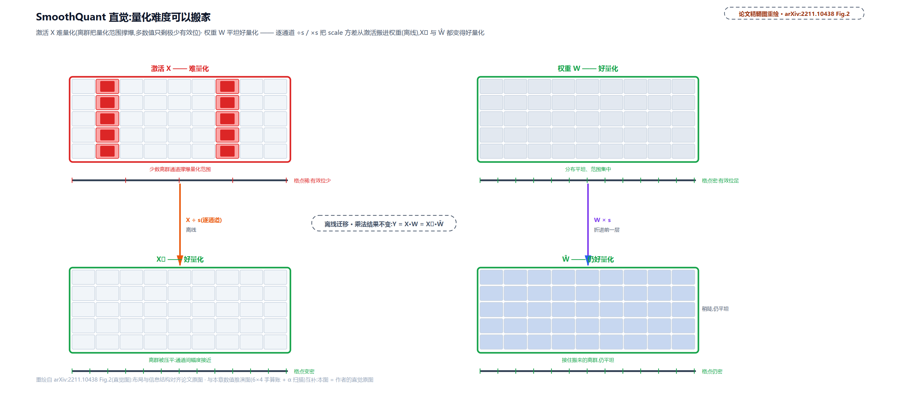

> *图注：论文的搬家直觉图，上下两行对照。上行是量化前：左列激活 X 的少数离群通道把量化范围撑爆（多数值只剩极少有效位），右列权重 W 分布平坦；中间横带是逐通道的 ÷s/×s 对偶缩放（离线执行）；下行是平滑后：左列 X̂ 与右列 Ŵ 都变得好量化。运行期激活已经平滑，不出现任何额外算子。*

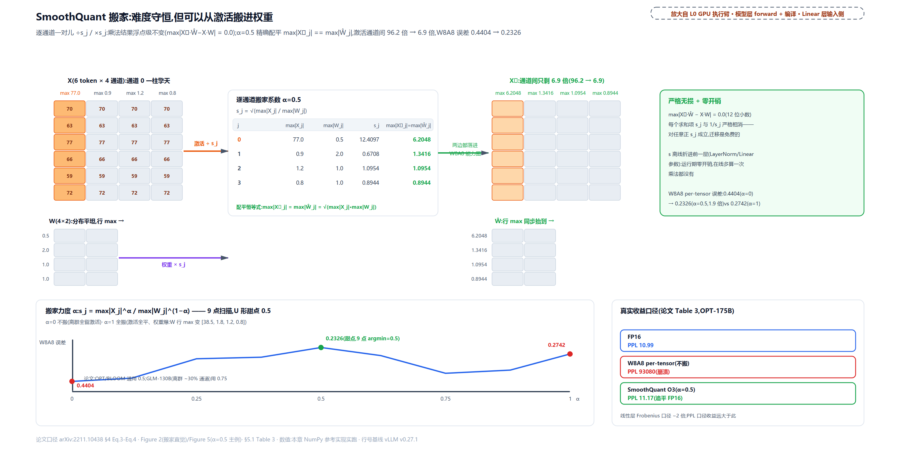

> *图注：左 X 热图（通道 0 印 [70,63,77,66,59,72]、列 max [77.0,0.9,1.2,0.8]）与平坦的 W（行 max [0.5,2.0,1.0,1.0]）；中间逐通道迁移表，s=[12.4097,0.6708,1.0954,0.8944]，配平列 [6.2048,1.3416,1.0954,0.8944] 绿色高亮、逐行对账；右 X̂/Ŵ 热图同值。等价面板 max|X̂·Ŵ−X·W|=0.0 与零开销注记；底部 α 曲线 9 点、三锚点 0.4404/0.2326（argmin=0.5）/0.2742，α=1 注权重行 max [38.5,1.8,1.2,0.8]；论文甜点 OPT/BLOOM 0.5、GLM-130B 0.75 与真实收益三芯片（PPL 10.99/93080/11.17）。数字全部实跑自参考实现。*

### 落到 vLLM：O1 档与 O3 档都活着

SmoothQuant 论文给了三档效率设置（§5.1 Table 2）：O1 权重 per-tensor + 激活 per-token 动态；O2 激活 per-tensor 动态；O3 激活 per-tensor 静态（离线用校准样本定死 scale）。vLLM 的 W8A8 激活侧就是这套取舍的化身。动态 per-token 一档在 `QuantFP8` 的纯 PyTorch 参考实现里最清楚（它同时是编译图里的合法节点，本章末节回来收这根线）：

```python
# vllm/model_executor/layers/quantization/input_quant_fp8.py:L186-L216 · QuantFP8.forward_native
        if self.is_group_quant and not self.static:
            assert scale is None, "Dynamic group quantization does not use scale"
            return self._quantize_group_native(x)

        # … 省略：static/scale_ub 校验断言 …
        if scale is None:
            if self.group_shape == GroupShape.PER_TOKEN:
                x_max, _ = x.abs().max(dim=-1)   # L199 每个 token 一把尺（O1 档）
                x_max = x_max.unsqueeze(-1).to(torch.float32)
                # … 省略：scale_ub 上限截断两行 …
            else:
                x_max = x.abs().max().unsqueeze(-1).to(torch.float32)   # L204 per-tensor（O2 档）

            scale = (x_max / _FP8_MAX).clamp(min=_FP8_MIN_SCALING_FACTOR)   # L206 amax 对称定尺
        # … 省略：static scale 的广播预处理 …
        out = (
            x.to(torch.float32)
            * group_broadcast(scale.to(torch.float32), x.shape[-2:]).reciprocal()
        )
        out = out.clamp(_FP8_MIN, _FP8_MAX).to(_FP8_DTYPE)   # L216 clamp 后转 e4m3
        return out, scale
```

L199 是 per-token、L204 是 per-tensor，一格分支之差；静态档（O3）的 scale 则在装载期从检查点读入（`input_scale` 参数，FP8 一节看落点）。DeepSeek 系 FP8 检查点沿用的逐 token 动态量化，正是论文的 O1 档。

---

## FP8：尺子自己会变疏密

**直觉一句话**：INT 的刻度从左到右等距，一把刚性直尺；FP8 的刻度按 2 的幂分段，每段内等距、段间步长翻倍——小数区密、大数区疏。离群值天生有大格点可落，普通值保住相对精度，代价是绝对精度不均匀。

前面三味药都在跟「等距格点 + 一把尺」的病根搏斗。还有一条路：把格点本身改成不等距。FP8 的两种编码不是谁随手定的，是 NVIDIA、ARM、Intel 三家 2022 年联合提出的标准（arXiv:2209.05433），后被 OCP（开放计算项目，硬件厂商的开放标准联盟）采纳：**e4m3**（1 符号 + 4 指数 + 3 尾数）最大 ±448、格点密，存权重与前向激活；**e5m2**（5 指数 + 2 尾数）最大 ±57344、范围大，存梯度这类范围敏感的量。e4m3 为多要一截动态范围放弃了 IEEE 式的 Inf（那个编码让给 NaN，且只有一种 NaN），这是它能从 IEEE 风格的 240 上限撑到 448 的原因；PyTorch 的 dtype 名 `float8_e4m3fn` 里 fn 后缀就是「无 Inf（f）+ 非 IEEE 的 NaN 编码（n）」。本章只跟 e4m3 打交道。

格点长什么样，位级枚举最诚实（按规范逐位生成）：e4m3 有 126 个正格点，其中 **55 个挤在 (0,1) 区间**、23 个不小于 64；正规段每段 8 个等距格点、段间步长翻倍——[0.5,1) 段步长 0.0625，[1,2) 段 0.125，一路倍增到 [256,448] 段的 32。对照 INT8：同样 8 bit，等距铺满 ±448 的话步长恒为 3.5137，大于 1 的值挤作一团、小于 1 的区间空无一格。对 RTN 之死那个场景（离群 70、普通值 1），等距尺下普通通道只剩三级上下（256/70≈3.66）；指数尺的相对间隔处处约 $`2^{-3}`$，离群有格点、普通值有密度。这就是 W8A8 激活侧选 FP8 不选 INT8 的格式层理由，也是 FP8 不需要 zero-point 的原因：格点自身对称地覆盖了动态范围，amax 对称量化一路到格点：

```math
\mathrm{scale}=448/\max(|x|),\qquad x_q=\mathrm{clamp}\left(x\cdot\mathrm{scale},\;-448,\;448\right)
```

小例（说明性，位级枚举可复核）：x=[1.0, 0.55, -0.3, 0.9, 100.0]，scale=4.48；100.0 精确映到 448（定尺者永远精确），0.55×4.48=2.464 落格 2.5，全组最大误差 0.008。DeepSeek 系 FP8 权重连补偿算法都不太需要，amax 对称就够用，是格式替算法干了活。

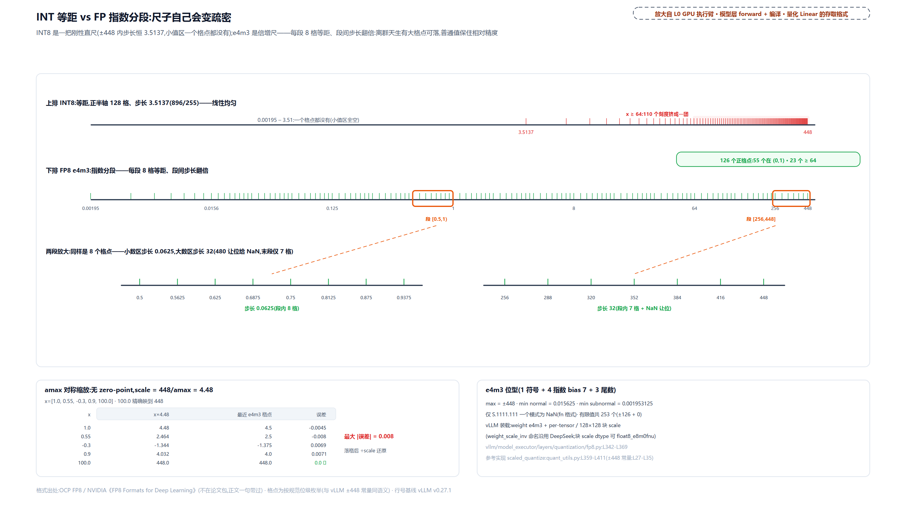

> *图注：一根对数感数轴上两排刻度。上排 INT8 的 127 个正刻度在线性位置挤成一团（x≥64 处 110 个刻度堆成红团，小值区全空）；下排 e4m3 的 126 个正格点全程铺开，段界 [0.00195,0.0156,0.125,1,8,64,256,448] 标注，[0.5,1) 与 [256,448] 两段放大条逐格可见（步长 0.0625 与 32，后者 480 让位 NaN）。右侧 amax 缩放示例五行逐值（4.48/2.464/-1.344/4.032/448 → 落格 4.5/2.5/-1.375/4.0/448，最大误差 0.008）；位型面板：1+4+3、bias 7、max 448、min normal 0.015625、min subnormal 0.001953125、仅 S.1111.111 为 NaN。数字全部位级枚举自参考实现。*

浮点侧的参考实现与整数版同骨架、少 zero-point（组内 amax → scale → clamp → 转格式，返回倒数 scale 供反量化）。先点破一个同名陷阱：这里的 scale=448/amax 是 $`1/\Delta`$（乘上去用、返回时取倒数），SmoothQuant 一节 forward_native 里的同名变量 scale=x_max/448 则是 $`\Delta`$ 本尊（除法用）——两处约定互为倒数，对照读时别被同一个名字骗到：

```python
# vllm/model_executor/layers/quantization/utils/quant_utils.py:L392-L411 · scaled_quantize（浮点分组量化）
    # Compute scales
    min_val, max_val = x_blkd_permd.aminmax(dim=-1)
    amax = torch.maximum(min_val.abs(), max_val.abs()).clamp(min=1e-12)   # L397 组内 amax
    _, fp8_max = get_fp8_min_max()
    scale = fp8_max / amax                                                # L399 对称定尺：448/amax

    # Apply scale and convert from:
    # (BLK_M, BLK_N, BLOCK_SIZE_M * BLOCK_SIZE_N) to (M, N)
    x_scl_sat = (
        (x_blkd_permd * scale.unsqueeze(-1))
        .clamp(min=finfo.min, max=finfo.max)                              # L405 clamp 到格式范围
        .reshape(blk_m, blk_n, group_shape[0], group_shape[1])
        .permute(0, 2, 1, 3)
        .reshape(x.shape)
    )

    return x_scl_sat.to(quant_dtype).contiguous(), scale.float().reciprocal()   # L411 转格式，返回倒数
```

装载侧的参数面（weight 以 e4m3 装、scale 按 per-tensor 或 128×128 块两种粒度）：

```python
# vllm/model_executor/layers/quantization/fp8.py:L341-L386 · Fp8LinearMethod.create_weights
        weight = create_fp8_weight_parameter(
            output_size_per_partition, input_size_per_partition, weight_loader
        )
        layer.register_parameter("weight", weight)                        # L345 权重本体：e4m3

        # WEIGHT SCALE
        if not self.block_quant:
            # … 省略：per-tensor 的 PerTensorScaleParameter 分支 …
        else:
            assert not self.act_q_static
            assert self.weight_block_size is not None
            scale = create_fp8_scale_parameter(
                BlockQuantScaleParameter,
                output_partition_sizes,
                input_size_per_partition,
                self.weight_block_size,
                weight_loader,
                scale_dtype=(torch.float8_e8m0fnu if self.is_scale_e8m0 else None),   # L366 块 scale 可用 e8m0 承载
            )
            # The weight_scale_inv name is intentional for deepseekv3
            layer.register_parameter("weight_scale_inv", scale)           # L369 命名沿用 DeepSeek 检查点

        # INPUT ACTIVATION SCALE
        if self.act_q_static:
            scale = create_fp8_input_scale(output_partition_sizes, weight_loader)
            set_weight_attrs(scale, {"scale_type": "input_scale"})
            layer.register_parameter("input_scale", scale)                # L375 静态激活 scale（O3 档）

        self.fp8_linear = init_fp8_linear_kernel(
            activation_quant_key=self.activation_quant_key,
            weight_quant_key=self.weight_quant_key,
            weight_shape=layer.weight.shape,
            input_dtype=self.input_dtype,
            out_dtype=self.out_dtype,
            module_name=self.__class__.__name__,
        )
```

三个落点对号入座：L369 的 `weight_scale_inv` 名字不改、沿用 DeepSeek 检查点（128×128 块量化的那一族）；L366 出现了新面孔 `float8_e8m0fnu`，它是下一节的主角；L375 是 SmoothQuant O3 档的静态激活 scale。末尾的 `init_fp8_linear_kernel` 拿两个 QuantKey 选执行 kernel——FP8 版的「构造期选 kernel」，规则与最后一节的混精版同构。

---

## FP4 与两级秤：一把称不动就配两把

**直觉一句话**：e2m1 只有一个指针对，一把秤称不动整张权重。给每 16 个值配一把小秤（e4m3 块 scale）管精调，再配一台总秤（fp32 全局）管所有小秤的量程。e8m0 则是只会跳挡的秤：只能停在 2 的幂上。

把 bit 砍到 4，浮点格式的账就紧了。e2m1（1 符号 + 2 指数 + 1 尾数）全部格点是 ±{0, 0.5, 1, 1.5, 2, 3, 4, 6}，共 16 个编码，块内动态范围只有 6/0.5=12 倍。拿「单级全局 scale」去量一张真实权重必翻车：设全张量 amax=6（scale=1.0），一块 16 个全在 0.083-0.118 的小值，除以尺子后全部落在 0 与 0.5 之间、一个非零格点都够不着，整块坍缩到 0，平均误差 0.0983。两级缩放救场：块 scale 取 e4m3 的 0.019531（专管这一小块的量程），小块除以它变成 4.25-6.04，正好落在 4 与 6 两个格点上，反量化 0.0781/0.1172，平均误差 0.011，**改善 8.9 倍**。全局那级 fp32 标量兜住所有小秤的公共量程，运行期两级乘积预计算成一个 alpha（又一个撞车的 α：这里是 NVFP4 两级 scale 的乘积，与 AWQ 的搜索指数、SmoothQuant 的迁移强度都无关），kernel 只做一次乘。

e8m0 是块 scale 的另一种编码：8 位纯指数、无符号无尾数，值只能是 2 的幂。这是 OCP Microscaling（MX）规范的刻意设计——scale 是 2 的幂时，应用 scale 只需移位、不需要乘法电路，硬件层的取舍。代价是取整：软件侧的落地就一行（`_quantize_group_native`，ue8m0 分支）：

```python
# vllm/model_executor/layers/quantization/input_quant_fp8.py:L240-L248 · QuantFP8._quantize_group_native（e8m0 取整）
        x_grouped = x.view(-1, num_groups, self.group_size)
        absmax = x_grouped.abs().max(dim=-1, keepdim=True)[0].float()
        scales_raw = absmax / _FP8_MAX
        if self.use_ue8m0:
            scales_raw = torch.exp2(torch.ceil(torch.log2(scales_raw)))   # L244 向上取整到最近的 2 的幂
        scales = (scales_raw).clamp(min=_FP8_MIN_SCALING_FACTOR)

        x_scaled = x_grouped / scales
        x_quant = x_scaled.clamp(_FP8_MIN, _FP8_MAX).to(_FP8_DTYPE)       # L248
```

L244 的「取以 2 为底的对数、向上取整、再取 2 的幂」三连就是 e8m0 的全部数学：向上取「最近的不小于」，保证量化的值不溢出（向下取整会让 amax 超格），代价是平均多花约 1.44 倍的 scale（对数均匀假设下理论开销 1/ln2=1.4427，参考实现百万样本实测 1.4426）。几个取整实例：0.013→0.0156、0.02→0.0312、1.2→2.0、3.0→4.0。

「FP4」在生态里有两个配方，认准了再选（说明性，外部资料，出处 NVIDIA 官方博客与 OCP 规范）：**MXFP4** 是 OCP MX 标准版：每 32 元素一块、scale 用 e8m0（只会 2 的幂）；**NVFP4** 是 NVIDIA Blackwell 世代的版本：每 **16** 元素一块、scale 换 **e4m3**（能表达非 2 的幂的精调系数），上面再叠一级 fp32 全局标量，等效存储约 4.5 bit/元素。官方给过同一权重块的量化均方误差（MSE：各点误差平方取平均）对照：e4m3 块 scale 0.08 对 e8m0 的 0.72，差一个量级；DeepSeek-R1-0528 量化到 NVFP4 相比 FP8 精度掉不超过 1%、显存较 FP16 省 3.5 倍。v0.27.1 的现状：NVFP4 走 `modelopt.py`（普通 Linear 层也能用），MXFP4 走 `mxfp4.py` 且只服务 MoE 检查点（下一章的主战场）。装载面三件套：

```python
# vllm/model_executor/layers/quantization/modelopt.py:L1151-L1190 · ModelOptNvFp4LinearMethod.create_weights
        weight = ModelWeightParameter(
            data=torch.empty(
                # 2 fp4 items are packed in the input dimension
                layer.output_size_per_partition,
                layer.input_size_per_partition // 2,
                dtype=torch.uint8,                                          # L1156 两个 e2m1 打包进一个 uint8
            ),
            input_dim=1,
            output_dim=0,
            weight_loader=weight_loader,
        )
        layer.register_parameter("weight", weight)

        # Input Global Scale
        input_global_scale = PerTensorScaleParameter(
            data=torch.empty(len(output_partition_sizes), dtype=torch.float32),
            weight_loader=weight_loader,
        )
        layer.register_parameter("input_scale", input_global_scale)        # L1169 激活全局 fp32

        # Weight Global Scale
        weight_global_scale = PerTensorScaleParameter(
            data=torch.empty(len(output_partition_sizes), dtype=torch.float32),
            weight_loader=weight_loader,
        )
        layer.register_parameter("weight_scale_2", weight_global_scale)    # L1176 权重全局 fp32

        # Per Block Weight Scale
        weight_scale = ModelWeightParameter(
            data=torch.empty(
                output_size_per_partition,
                input_size_per_partition // self.quant_config.group_size,  # L1182 每 16 输入元素一把
                dtype=weight_dtype,                                        # L1183 块 scale：e4m3
            ),
            input_dim=1,
            output_dim=0,
            weight_loader=weight_loader,
        )
        layer.register_parameter("weight_scale", weight_scale)
```

三件套逐行对号：uint8 双打包的权重（L1151-L1162）、每 16 输入元素一个 e4m3 块 scale、input_scale 与 weight_scale_2 两个 fp32 全局标量，装载期再预计算 alpha=两级乘积。这套「dtype × 两级 scale」的事实，v0.27 用 QuantKey 的双层描述写进了正式词汇：

```python
# vllm/model_executor/layers/quantization/utils/quant_utils.py:L146-L156 · QuantKey 常量表（节选）
kFp8DynamicTokenSym = QuantKey(FP8_DTYPE, kDynamicTokenScale, symmetric=True)

kNvfp4DynamicGroupScale = ScaleDesc(FP8_DTYPE, False, GroupShape(1, 16))
kNvfp4Dynamic = QuantKey(
    FP4_DTYPE, scale=kNvfp4DynamicGroupScale, scale2=kStaticTensorScale    # L150 scale=块内 e4m3、scale2=全局 fp32
)

kNvfp4StaticGroupScale = ScaleDesc(FP8_DTYPE, True, GroupShape(1, 16))
kNvfp4Static = QuantKey(
    FP4_DTYPE, scale=kNvfp4StaticGroupScale, scale2=kStaticTensorScale
)
```

`kNvfp4Dynamic` 一行就是 NVFP4 的完整身份证：FP4 位型 + (1,16) 组内 scale + 全局二级 scale。「这是什么量化」从散文变成可相等比较的一等值，是下一节四重门里 kernel 能按格式选人的前提。词表的消费方不止 kernel 选择：CLI 的 `--quantization` 简写（fp8_per_block、nvfp4_per_token 这类）在 vllm/config/quantization.py 里脱糖成 QuantSpec 字段上的 QuantKey（简写表 `_ONLINE_SHORTHANDS` L115-L143、名字表 `QUANT_KEY_NAMES` L25-L35）；编译融合 pass 的匹配器（rms_quant_fusion.py 一族）也拿 QuantKey 查表对应算子。三处消费方、一张词表。

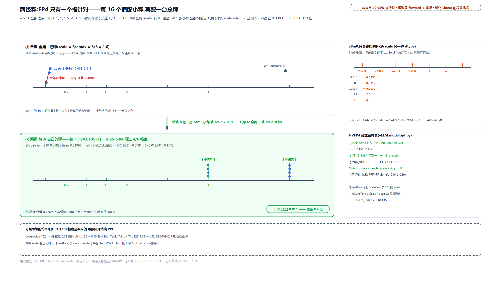

> *图注：上半单级大秤（e2m1 刻度 0/0.5/1/1.5/2/3/4/6），块 A 的 16 个点（0.083-0.118）挤在 0 附近、粗红箭头「全部坍缩到 0，平均误差 0.0983」，块 B（absmax=6）正常；下半两级（绿）：块 A 的小秤 0.019531，值放大到 4.25-6.04 落 4/6 格点，反量化 0.0781/0.1172，chip「平均误差 0.011，改善 8.9 倍」+ alpha 预计算注。右上 e8m0 面板：2 的幂挡位与五例取整（0.013→0.0156、0.02→0.0312、0.0037→0.0039、1.2→2.0、3.0→4.0）+ 开销 1.4426（理论 1/ln2=1.4427）。右下 NVFP4 三件套锚点（uint8 打包 L1151-L1162、group_size=16 块 scale、fp32 全局+alpha）与 QuantKey 的 ScaleDesc(1,16)/scale2。底部 g1024≈0.02 bit、g128≈0.15 bit 的分组账与 2-bit PPL 对照（g128 9.58 → g32 8.94）。数字全部实跑自参考实现。*

分组思想的论文账此处收拢：GPTQ §5 早就算过 group 128 摊每权重约 0.15 额外 bit、group 1024 约 0.02，用一点点存储换可观的精度（Table 7：2-bit 下 g128 的 9.58 到 g32 的 8.94）。FP4 的两级 scale 是同一思想的格式化：块内精调用 e4m3，跨块量程交给第二级，半 bit 的存储差价（4.5 对 4）买到的是「4 bit 可用」与「4 bit 玩具」的分界。这套格式数学直通下一章：DSV4 的 FP4 MoE（expert_dtype=fp4 的分发、Mxfp4MoEMethod、NVFP4 两级 scale）全部站在本节的格点上。

---

## 运行期只消费网格：vLLM 的四重门

**直觉一句话**：聪明在工厂，快在店里。GPTQ 的找补、AWQ 的放大镜、SmoothQuant 的搬家全是离线数学，产出只是一份检查点（qweight/scales/g_idx）；到了卡上，vLLM 只做四件事——进门查算力、柜台挑 kernel、后厨换包装，编译间里再挑算子路线。

现在回收[第 19 章](../../ch19-compile-capture/narrative/chapter.md)埋的三处影子，把总账摆开。这份账的名字叫「量化与 kernel 的耦合」：**量化格式自己不跑代码，跑代码的是它的 kernel；格式的每一个决定（位宽、格点类型、scale 粒度、静态动态）都会改写「用哪个 kernel、怎么编译」的答案**。vLLM 用四重门治理「格式 × 硬件」的组合爆炸。

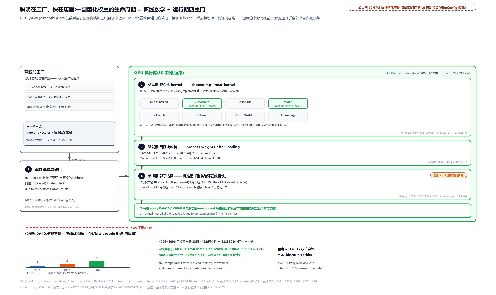

> *图注：横向流水线。左端离线工厂（GPTQ/AWQ/SmoothQuant 三枚芯片，产出 qweight/scales/g_idx）；关卡①配置期算力门（回指 L0 外围的 VllmConfig 装配）；绿带是 GPU 执行臂（L0 中列恒绿同源配色）：站②构造期优先级表柜台（CutlassW4A8>Machete>AllSpark>Marlin>Conch>Exllama>TritonW4A16>Humming 八个柜台，同一 GPTQ 检查点 H100（cap 90）走 Machete（min 90）、A100（80）落 Marlin（min 75））、站③装载期换装（Marlin repack/FP8 转置合并 shard scale/NVFP4 alpha 预计算）、站④编译期（+quant_fp8 强制、query 刻意普通算子、fuse_* 开关）、站⑤每拍 apply（W4A16/W8A8 两条消费线）。底部带宽账小条：算术强度 16/bit（FP16=1、INT8=2、INT4=4）对 4090 平衡点 165、字节账 33554432→8388608、A100 3.24×/A6000 4.53×、论文引语「speedups from reduced memory movement」。站点命名与图注 file:行号全部对得上 pin 源码。*

**第一重门：配置期，算力硬门。** 引擎装配时先认检查点：`ModelConfig._verify_quantization` 读检查点 quantization_config 的 quant_method，按 overrides 优先序逐个探测谁能认领（vllm/config/model.py:L1119-L1221，gptq 检查点被 AutoGPTQConfig 认领、ModelOpt FP4 被 modelopt_fp4 认领、DSV4 被 deepseek_v4_fp8 认领，后者是下一章的入口）。认领后落成 Config 实例，随即过算力门：

```python
# vllm/config/vllm.py:L706-L724 · VllmConfig._get_quantization_config
    @staticmethod
    def _get_quantization_config(
        model_config: ModelConfig, load_config: LoadConfig
    ) -> QuantizationConfig | None:
        """Get the quantization config."""
        from vllm.platforms import current_platform

        if model_config.quantization is not None:
            from vllm.model_executor.model_loader.weight_utils import get_quant_config

            quant_config = get_quant_config(model_config, load_config)
            capability_tuple = current_platform.get_device_capability()

            if capability_tuple is not None:
                capability = capability_tuple.to_int()
                if capability < quant_config.get_min_capability():        # L720 算力门
                    raise ValueError(
                        f"The quantization method {model_config.quantization} "
                        "is not supported for the current GPU. Minimum "
                        f"capability: {quant_config.get_min_capability()}. "
                        f"Current capability: {capability}."
                    )
```

门槛为什么存在？`get_min_capability` 的 docstring 自己招了（vllm/model_executor/layers/quantization/base_config.py:L117-L126）：

```python
# vllm/model_executor/layers/quantization/base_config.py:L117-L126 · QuantizationConfig.get_min_capability
    @classmethod
    @abstractmethod
    def get_min_capability(cls) -> int:
        """Minimum GPU capability to support the quantization method.

        E.g., 70 for Volta, 75 for Turing, 80 for Ampere.
        This requirement is due to the custom CUDA kernels used by the
        quantization method.
        """
```

最后一句是原话：**这个要求来自量化方法所用的自定义 CUDA kernel**。算力门槛不是格式的属性，是 kernel 的属性——第一重门就是耦合的总纲。

**第二重门：构造期，kernel 选择。** 模型装配时每个 Linear 层构造，先按格式要方法（[第 23 章](../../ch23-model-layer-assembly/narrative/chapter.md)立的 LinearBase 分发骨架：无量化回 UnquantizedLinearMethod，混合精度模型的常态）：

```python
# vllm/model_executor/layers/linear.py:L274-L281 · LinearBase 构造分发
        self.quant_config = quant_config
        self.prefix = prefix
        self.allow_fp8_block_shape_mismatch = False
        self.quant_method: QuantizeMethodBase
        if quant_config is None:
            self.quant_method = UnquantizedLinearMethod()
        elif quant_method := quant_config.get_quant_method(self, prefix=prefix):   # L278 逐层要方法
            self.quant_method = quant_method
```

方法在 `create_weights` 里选 kernel，GPTQ 一节已经见过现场；候选表与选择循环是这里的主角。平台优先级表（vllm/model_executor/kernels/linear/__init__.py:L411-L439）：

```python
# vllm/model_executor/kernels/linear/__init__.py:L411-L439 · _POSSIBLE_KERNELS（按性能优先序）
# in priority/performance order (when available)
_POSSIBLE_KERNELS: dict[PlatformEnum, list[type[MPLinearKernel]]] = {
    PlatformEnum.CUDA: [
        CutlassW4A8LinearKernel,
        MacheteLinearKernel,
        AllSparkLinearKernel,
        MarlinLinearKernel,
        ConchLinearKernel,
        ExllamaLinearKernel,
        TritonW4A16LinearKernel,
        HummingLinearKernel,
    ],
    # … 省略：ROCM/XPU/CPU 三张平台表 …
}
```

（表里那些名字都是外部项目、各为一代硬件而生：Marlin 是 Ampere 世代的学术与工业标杆（arXiv:2408.11743，GPTQ 原班人马），Machete 是它在 Hopper 上的正牌后继——改用 Hopper 一代的新矩阵乘指令 WGMMA 与专职异步搬显存的 TMA 单元，大 batch 优势最大；Exllama 起家于消费卡本地推理社区；AllSpark/Conch/Humming 是更新的入局者，照表录名不展开。）选择循环从表头往下试，三道闸：

```python
# vllm/model_executor/kernels/linear/__init__.py:L747-L789 · choose_mp_linear_kernel
    platform_kernels = _POSSIBLE_KERNELS.get(current_platform._enum, [])

    # Apply --linear-backend filtering when set.
    # … 省略：--linear-backend 显式过滤六行 …
    failure_reasons = []
    for kernel in platform_kernels:
        if kernel.__name__ in envs.VLLM_DISABLED_KERNELS:                 # L762 闸一：环境变量黑名单
            failure_reasons.append(
                f" {kernel.__name__} disabled by environment variable"
            )
            continue
        if (
            compute_capability is not None
            and kernel.get_min_capability() > compute_capability          # L769 闸二：算力门槛
        ):
            failure_reasons.append(
                f"{kernel.__name__} requires capability "
                f"{kernel.get_min_capability()}, current compute "
                f" capability is {compute_capability}"
            )
            continue

        can_implement, failure_reason = kernel.can_implement(config)      # L778 闸三：格式能力
        if can_implement:
            return kernel
        else:
            failure_reasons.append(
                f" {kernel.__name__} cannot implement due to: {failure_reason}"
            )

    raise ValueError(
        "Failed to find a kernel that can implement the "
        "WNA16 linear layer. Reasons: \n" + "\n".join(failure_reasons)
    )
```

黑名单、算力、`can_implement`（这层是什么位宽/group_size、TP 切分整不整除），全过即中选，构造期一次定死；全军覆没就 raise，附完整失败原因清单（排查时把这张清单贴出来就是诊断书）。拿最常见的 g128/act-order GPTQ 检查点走一遍这张表：表头的 CutlassW4A8 第一个出局，名字里的 A8 要的是 FP8 激活，纯 W4A16 检查点的 FP16 激活过不了它的 can_implement 闸；接着 H100（算力 90）走到 Machete（门槛 90）就停，A100（80）被它拦下、落到 Marlin（门槛 75）——**格式定了候选集，硬件拍板**。

边界也说准：这个路由结论依赖检查点的约束组合。不分组又无 act_order 的 GPTQ 检查点，A100 上会先被更靠前的 AllSpark 认领（它的 can_implement 拒 g_idx，Ampere 分支又只支持不分组），轮不到 Marlin。优先级表逐个试探的，正是格式约束与硬件门槛的组合。

中选后方法退化为薄壳，参数名交底、执行全权委派（GPTQ 一节见过 create_weights，这里看另一半）：

```python
# vllm/model_executor/layers/quantization/auto_gptq.py:L447-L464 · AutoGPTQLinearMethod 薄壳化
        self.kernel = kernel_type(
            mp_linear_kernel_config,
            w_q_param_name="qweight",
            w_s_param_name="scales",
            w_zp_param_name="qzeros",
            w_gidx_param_name="g_idx",
        )

    def process_weights_after_loading(self, layer: torch.nn.Module) -> None:
        self.kernel.process_weights_after_loading(layer)

    def apply(
        self,
        layer: torch.nn.Module,
        x: torch.Tensor,
        bias: torch.Tensor | None = None,
    ) -> torch.Tensor:
        return self.kernel.apply_weights(layer, x, bias)
```

「量化方法」在 v0.27 的本质到此清楚：按格式建参数 + 把执行交给选中的 kernel。顺带一提，「按优先级表逐个试、validate 不过就回退」与 Part V 注意力后端那一章立过的选择器是同一套设计模式在两个 subsystem 的两次实例化——vLLM 处理「格式 × 硬件组合爆炸」的手法是统一的。

**第三重门：装载期，换装重排。** 权重全部装完，装载器做一次全模型遍历：

```python
# vllm/model_executor/model_loader/utils.py:L103-L122 · process_weights_after_loading 全模型遍历
    for _, module in model.named_modules():
        quant_method = getattr(module, "quant_method", None)
        if isinstance(quant_method, QuantizeMethodBase):
            # When quant methods need to process weights after loading
            # (for repacking, quantizing, etc), they expect parameters
            # to be on the global target device. This scope is for the
            # case where cpu offloading is used, where we will move the
            # parameters onto device for processing and back off after.
            with device_loading_context(module, target_device):
                quant_method.process_weights_after_loading(module)   # L112 换装窗口
            # … 省略：TP 状态对账与 UMA 设备的显存回收注释 …
```

注释自述这一站是 for repacking, quantizing, etc。为什么要重排？因为**检查点格式 ≠ kernel 格式**。Marlin 的换装间最典型：

```python
# vllm/model_executor/kernels/linear/mixed_precision/marlin.py:L127-L158 · MarlinLinearKernel.process_weights_after_loading
        def transform_w_q(x):
            assert isinstance(x, BasevLLMParameter)
            permute_param_layout_(x, input_dim=0, output_dim=1, packed_dim=0)
            x.data = ops.gptq_marlin_repack(          # L130 拆包重排进 Marlin 自己的 tile 布局
                marlin_pad_qweight(
                    x.data.contiguous(), size_n, size_k, padded_n, padded_k
                ),
                perm=layer.g_idx_sort_indices,
                size_k=padded_k,
                size_n=padded_n,
                num_bits=c.weight_type.size_bits,
                is_a_8bit=is_a_8bit,
            )
            return x

        def transform_w_s(x):
            assert isinstance(x, BasevLLMParameter)
            permute_param_layout_(x, input_dim=0, output_dim=1)
            x.data = marlin_permute_scales(            # L145 scale 也重排
                marlin_pad_scales(
                    x.data.contiguous(),
                    size_n,
                    size_k,
                    padded_n,
                    padded_k,
                    c.group_size,
                ),
                size_k=padded_k,
                size_n=padded_n,
                group_size=c.group_size,
                is_a_8bit=is_a_8bit,
            )
            # … 省略：INT8 全局 scale 的特例分支 …
```

GPTQ 检查点里的 qweight 到了 Marlin 手里，先补零对齐 tile、再整个拆包重排进 Marlin 的内存布局；scale 同样重排；act_order 检查点的 g_idx 还要先排一遍序（`marlin_sort_g_idx`）。AWQ 的 interleave 打包是同一个故事（AWQ 一节见过），FP8 走转置加 shard scale 合一，NVFP4 预计算 alpha。检查点原格式至此退役，参数形态以 kernel 为准。

**每拍前向：两条消费线。** 编译图执行时（Part V 立过的 GPU 执行管线），每个量化 Linear 的 forward 落到 `quant_method.apply`，再整体转交给 kernel。W4A16 一侧就是 `apply_weights` 的融合反量化 GEMM（AWQ 一节见过老路径的 256 token 启发式，Marlin/Machete 路径连启发式都不需要）。W8A8 一侧的骨架值得整段看，「权重离线定死、激活在线现量」的分工写在这 30 行里：

```python
# vllm/model_executor/kernels/linear/scaled_mm/ScaledMMLinearKernel.py:L135-L170 · FP8ScaledMMLinearKernel.apply_weights
    def apply_weights(
        self,
        layer: torch.nn.Module,
        x: torch.Tensor | QuantizedActivation,
        bias: torch.Tensor | None = None,
    ) -> torch.Tensor:
        # … 省略：dtype/out_dtype/参数取回五行 …
        qa = as_quantized_activation(x, self.input_quant_key())   # L145 激活已被上游预量化？
        if qa is not None:
            x_data, x_s = qa.data, qa.scale
            # … 省略：直接吃预量化激活的四行 …
        else:
            assert isinstance(x, torch.Tensor)
            x_data = x
            # … 省略：形状记账两行 …
        x_2d_q = x_2d
        if qa is None:
            x_2d_q, x_s = self.quant_fp8(x_2d, x_s, x_s_ub)       # L161 否则当场在线量化
        return self.apply_scaled_mm(                              # L162 低精度 GEMM（torch._scaled_mm/CUTLASS/DeepGEMM）
            A=x_2d_q,
            B=w,
            out_dtype=out_dtype,
            As=x_s,
            Bs=w_s,
            bias=bias,
            output_shape=output_shape,
        )
```

L145 的 `as_quantized_activation` 是个值得记的契约：上游融合 kernel 若已把激活量化好，可以带着 scale 直供（免二次量化）；没有的话 L161 的 `QuantFP8` 当场现量（动态 per-token 或静态 per-tensor，SmoothQuant 一节见过它的两档分支）。

**第四重门：编译期，算子路线。** 三处影子逐一收账。影子①，块状权重强制手工算子：

```python
# vllm/config/vllm.py:L1253-L1268 · 编译配置期的 quant_fp8 强制
        def has_blocked_weights():
            if self.quant_config is not None:
                if hasattr(self.quant_config, "weight_block_size"):
                    return self.quant_config.weight_block_size is not None
                elif hasattr(self.quant_config, "has_blocked_weights"):
                    return self.quant_config.has_blocked_weights()
            return False

        # Enable quant_fp8 CUDA ops (TODO disable in follow up)
        # On H100 the CUDA kernel is faster than
        # native implementation
        # https://github.com/vllm-project/vllm/issues/25094
        if has_blocked_weights():
            custom_ops = self.compilation_config.custom_ops
            if "-quant_fp8" not in custom_ops:
                custom_ops.append("+quant_fp8")   # L1268 强制启用手工 CUDA 算子
```

[第 19 章](../../ch19-compile-capture/narrative/chapter.md)路过时只说了一句「量化格式在改变同一个算子选哪个 kernel」；现在整条链都在手上，能算清了：块量化模型（DeepSeek 系 128×128 块）的激活量化，走 `QuantFP8` 的手工 CUDA 实现比原生 PyTorch 快（注释自述在 H100 上实测），所以配置期直接把 `+quant_fp8` 钉进编译配置，不让默认规则（Inductor 后端时 custom_ops 默认 none、全走原生让编译器融合）把它放走。影子②，反方向的耦合：

```python
# vllm/model_executor/layers/attention/attention.py:L514-L524 · query 量化的算子选择
        if self.query_quant is not None:
            # quantizing with a simple torch operation enables
            # torch.compile to fuse this into previous ops
            # which reduces overheads during decoding.
            # Otherwise queries are quantized using custom ops
            # which causes decoding overheads
            assert self.kv_cache_dtype in {"fp8", "fp8_e4m3", "nvfp4"}

            # check if query quantization is supported
            if self.impl.supports_quant_query_input:
                query, _ = self.query_quant(query, self._q_scale)
```

同样的量化、同样是 `QuantFP8` 的活儿，这里却刻意用普通 torch 算子（注释自述：普通算子能被 torch.compile 融进前面的算子，custom op 反而挡融合、拖慢 decode）。一个场景强制手工 kernel、另一个场景刻意避开，选择标准只有一个：**哪条路对整条编译管线更快**。影子③，融合开关：

```python
# vllm/config/vllm.py:L275-L290 · 优化档位的量化融合谓词
OPTIMIZATION_LEVEL_02 = {
    "compilation_config": {
        "pass_config": {
            "fuse_norm_quant": enable_norm_fusion,
            "fuse_act_quant": enable_act_fusion,
            "fuse_allreduce_rms": enable_allreduce_rms_fusion,
            "fuse_attn_quant": IS_QUANTIZED,      # L281 只在量化模型上开的融合
            # … 省略：enable_sp/fuse_gemm_comms 等同表开关 …
```

`fuse_norm_quant`（norm 接量化）、`fuse_act_quant`（激活接量化）、`fuse_attn_quant`（注意力接量化）整排开关按「模型结构 + 硬件」的谓词定默认（`IS_QUANTIZED` 在量化模型上才亮），量化算子贴着 norm 和 attention 长出来的融合 pass 全在这张表上登记。至此[第 19 章](../../ch19-compile-capture/narrative/chapter.md)的三处影子全部兑付：强制、避开、融合，同一枚硬币的三面。

**选型的最后一问：该用哪个？** 三篇论文解同一个误差问题、落在不同取舍点上（各论文一手断言，加粗处为选型依据）：追最高压缩率（3-bit 甚至 2-bit）、显存是唯一瓶颈，选 GPTQ（可下探极限位宽，历史最久、检查点生态最厚）；同样 4 bit 下要更稳更快的离线产出、不想碰反传与求逆，选 AWQ（一次网格搜索，对校准集不敏感，多数场景 4-bit 的默认好选择）；瓶颈在算力吞吐、要矩阵乘进低精度 Tensor Core，选 SmoothQuant 式 W8A8（三味药中唯一把激活也压到 8 位的路线，运行期零开销）。落到 vLLM 就是同时养着两族 kernel 的原因：混精家族（Marlin/Machete/Exllama 一排柜台）吃 W4A16 检查点，scaled_mm 家族（torch._scaled_mm/CUTLASS/DeepGEMM）吃 W8A8 检查点，构造期各走各的优先级表。

---

## 总结：聪明在工厂，快在店里

回到 L0 图：本章点亮的是绿色「GPU 执行臂」列「模型层 forward + 编译」盒的量化面。[第 23 章](../../ch23-model-layer-assembly/narrative/chapter.md)拼好的那些 Linear 层，现在你知道权重是以 qweight+scales（外带 g_idx 或两级 scale）的形态躺进显存的；[第 19 章](../../ch19-compile-capture/narrative/chapter.md)编译图里的 `quant_fp8` 节点，现在你知道它是谁、为什么被强制；开篇的问题链全部闭合。带四件事走：

1. **一把尺子与它的病理**。均匀量化 = 除以 Δ、取整、乘回，误差恒不超半格；粒度是尺子的共享范围（per-tensor/token/channel/group，外维可行内维不行）；离群值的病根一行写完：有效级数 $`2^{N}\cdot m_i/m`$，RTN 之死（8.34→10.54→7.3e3）死于分母里的 max（机制出 arXiv:2211.10438 §2-§3；PPL 数字出 arXiv:2210.17323 §5 Table 3）。
2. **三味药，都不动 bit 数**。GPTQ 逐列量化、用 H=2XXᵀ（只认输入不认权重）把误差摊给未量化列，任意固定列序、lazy batch（B=128）、Cholesky 三步把立方复杂度降到 175B 可跑，同 bit 同网格 PPL 8.37 对 RTN 10.54（算法出 arXiv:2210.17323 §3-§4，PPL 出其 §5 Table 3）；AWQ 给显著通道的权重乘 s、激活除 s，误差期望比 (Δ′/Δ)·(1/s)，甜点 s=2，「显著看激活不看权重」（arXiv:2306.00978 §3）；SmoothQuant 按 s_j=max|X_j|^α/max|W_j|^(1−α) 把难度从激活搬进权重，严格等价、离线折进前层、运行期零开销（arXiv:2211.10438 §4）。
3. **格式层把「更少 bit」做进硬件**。INT 等距格点对 FP 指数分段（e4m3 的 126 个正格点 55 个在 (0,1)，动态范围换段内精度、免 zero-point）；e8m0 只许 2 的幂（应用 scale 只需移位，向上取整多花约 1.44 倍）；FP4 靠两级 scale（块内 e4m3 精调 + 全局 fp32 兜量程）才做到可用。
4. **一张总账：量化与 kernel 的耦合**。离线数学产网格，运行期四重门——配置期算力硬门（门槛来自 kernel，docstring 原话）、构造期 `choose_mp_linear_kernel` 按平台优先级表现场选（同一检查点 H100 走 Machete、A100 走 Marlin）、装载期把检查点格式重排成 kernel 格式（Marlin repack/AWQ interleave）、编译期挑算子路线（`+quant_fp8` 强制、query 量化反向避开、fuse_* 谓词）。速度的来源写在论文里：提速几乎全部来自少搬显存（A100 3.24×、A6000 4.53×），不是算得更快。

一条界线也带走：量化买的是带宽与显存，买不回精度零损耗——三味药把代价压到几乎看不见（0.03 PPL），但没有免费午餐；而训练期量化（QAT，靠直通估计器让网络学着适应低位宽）是另一条战线，推理侧的本书不展开。

下一章是 Part VI 的收官 capstone：《实战：DeepSeek-V4 拼装》。MoE、MLA、DSA 索引器、FP4 一样不缺的真实新架构，把[第 23 章](../../ch23-model-layer-assembly/narrative/chapter.md)的接入清单与本节的格式数学（DeepseekV4FP8Config 的 expert_dtype 分发、Mxfp4MoEMethod、NVFP4 两级 scale）全部串成一条龙。模型层的最后一块拼图，到那里落位。
