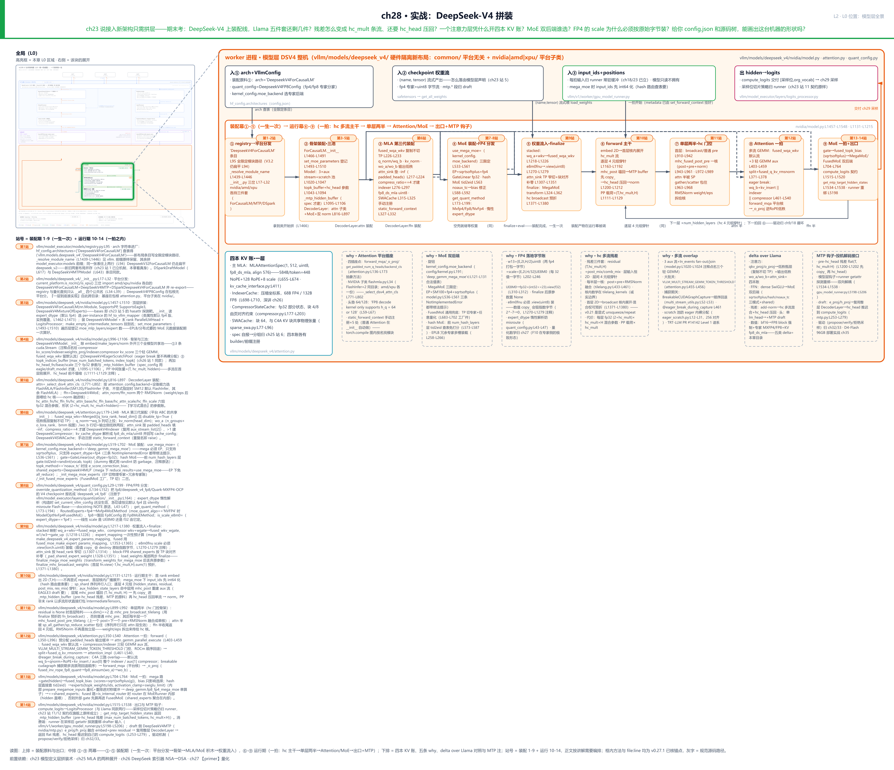
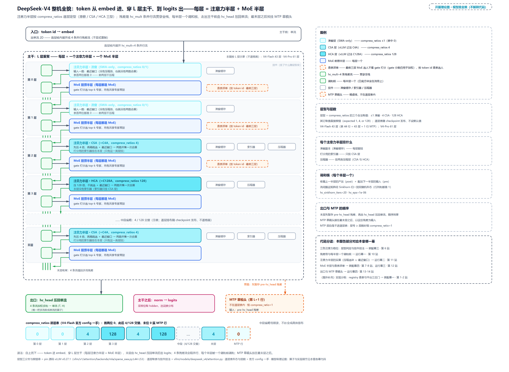
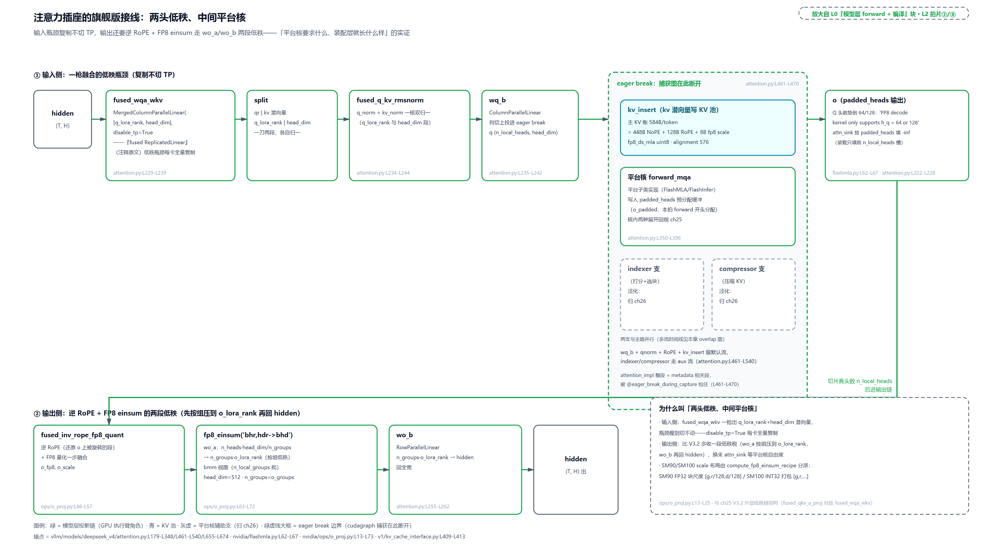
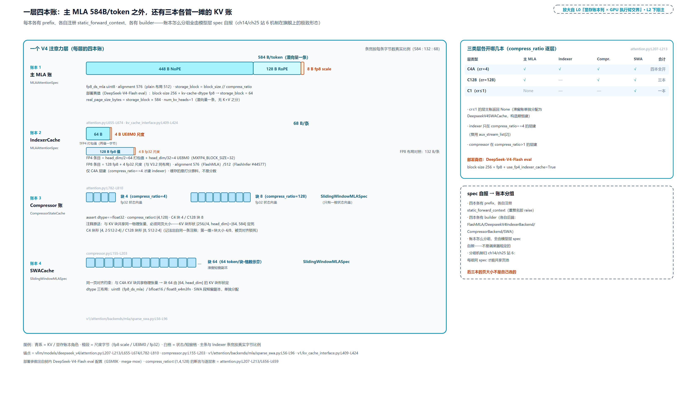
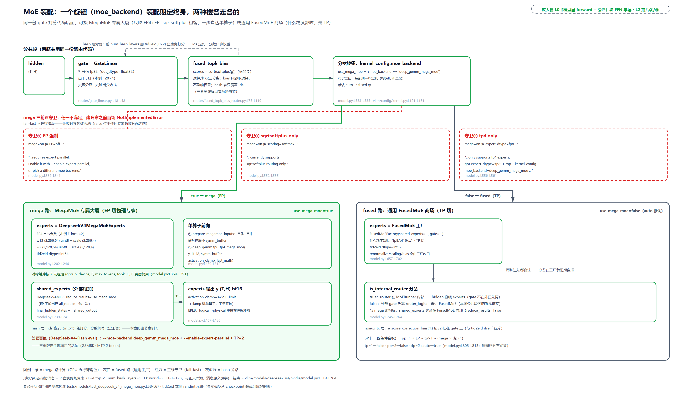
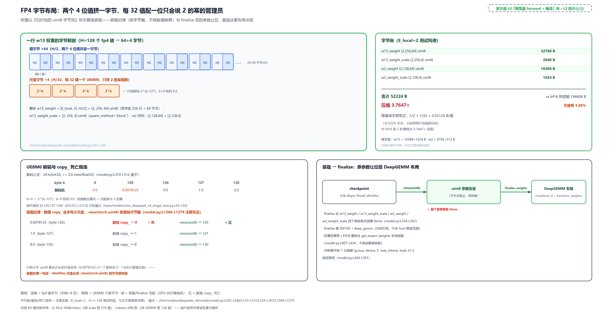
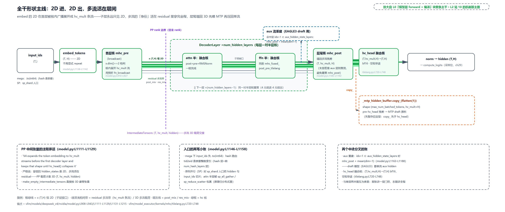
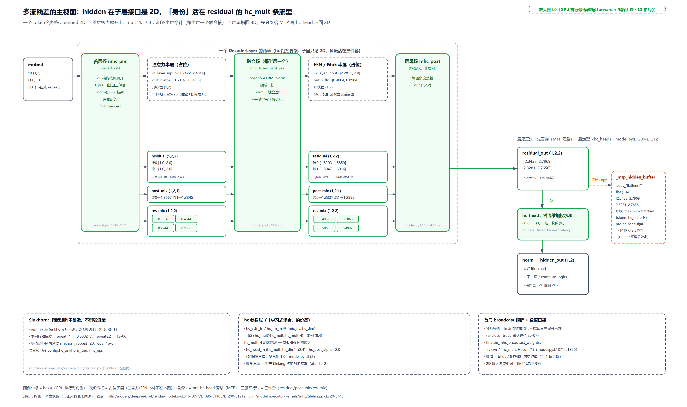
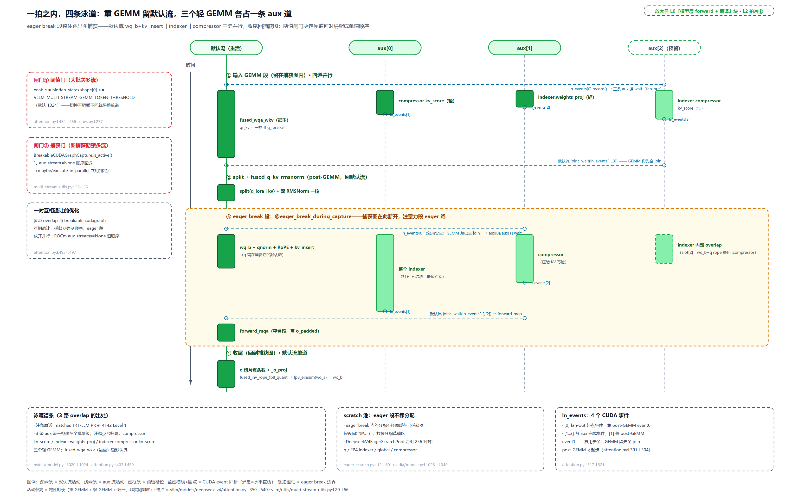
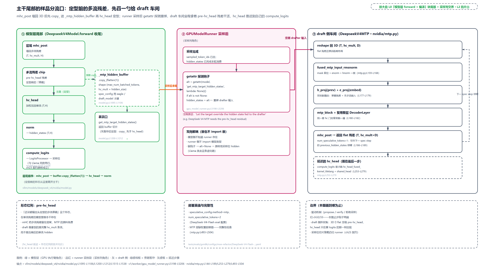

# 第 28 章　实战：DeepSeek-V4 拼装

[第 23 章](../../ch23-model-layer-assembly/narrative/chapter.md)立过一句大话：接入新架构只需拼层，Attention 是插座不是实现。期末考来了：把 DeepSeek-V4 这台真旗舰摆上装配线，Llama 那五件套（注意力、FFN、残差、输出头、数值格式）挨个对过去，居然一件都不在原样。残差不再是「加回去」：它扩成 hc_mult 条并行流（hc_mult 是 config 里的并行流条数），每半层由一组学出来的门控重新调和，走出主干前还要 hc_head 压回单流。这个凭空多出来的「多流残差」到底是什么？凭什么值得每半层多付一组参数？

注意力层更夸张：一个层同时开四本 KV 账（[第 25 章](../../ch25-mla-two-expansions/narrative/chapter.md)开了第一本，[第 26 章](../../ch26-deepseek-indexer-nsa-dsa/narrative/chapter.md)又添两本，本章凑齐第四本），输出还要先解开 RoPE、再走一段低秩才能回主干。FFN 整个换成 MoE：gate 打完分交给谁算？为什么同一份路由代码后面是两个完全不同的专家后端（DeepGEMM 单算子对通用 FusedMoE），选哪个谁说了算？FP4 的 scale 为什么必须按原始字节装载、走数值 `copy_` 会发生什么？最前几层干脆不让 gate 参与选人——按 token id 查表派单、分数只用来发工资，又是什么路数？

最后一问是全章考纲：给你一份 config.json 和这棵源码树，你能自己画出这台机器的形状吗？本章就照真实源码把 DeepSeek-V4 装一遍。先走装配幕（站 1-9，一生一次），再走运行幕（站 10-14，一拍之内）；末节教三步画图法，你画出来的应该就是本章开篇那张图。

## 你在这里



> *图注：本章放大的是[第 1 章](../../ch01-vllm-v1-in-one-map/narrative/chapter.md) L0 图中列「GPU 执行臂」的「模型层 forward + 编译」盒——[第 23 章](../../ch23-model-layer-assembly/narrative/chapter.md)在这只盒里点亮了 Llama 四件套骨架，[第 25 章](../../ch25-mla-two-expansions/narrative/chapter.md)、[第 26 章](../../ch26-deepseek-indexer-nsa-dsa/narrative/chapter.md)换上 MLA 与索引器零件，[第 27 章](../../ch27-quantization/narrative/chapter.md)定了数值格式；本章把整只盒装成一台 DeepSeek-V4 整机，Part VI 到此收官。上排是进出的四件：arch 字符串与三份配置、checkpoint 权重流、runner 的输入张量、交给采样的 hidden→logits；中排两幕：①-⑤ 装配幕（registry 与平台分发 → 骨架三池 → MLA 装配 → MoE 装配与 FP4 分发 → 权重流入 finalize），⑥-⑨ 运行幕（forward 主干 → 单层两半 → Attention 一拍 → MoE 一拍与出口加 MTP 钩子）；下排是四本 KV 账的解剖与五条 why 注、delta over Llama 对照、MTP 钩子注。站号 = 请求流经代码的顺序：装配期 1-9 站一生一次，运行期 10-14 站一拍之内（①-⑨ 是格子序号、不等于正文站号——五格装配幕依次盖站 1-2、3-5、6、7-8、9，四格运行幕依次盖站 10、11、12、13-14）；正文按讲解需要编排、不必照站号读。*

读法建议：想知道这台旗舰比 Llama 多了什么，从[「开考」](#开考llama-五件套的更换单)读起；关心平台分发与新布局，看[「装配幕一」](#装配幕一一个字符串进厂三岔门后是三栋楼)；只想看多流残差怎么穿层，直奔[「运行幕一」](#运行幕一主干2d-进-2d-出多流活在层间)；被四本 KV 账绕晕的，跳[「装配幕三」](#装配幕三注意力积木与四本-kv-账)下半段；MoE 双后端与 FP4 字节纪律在[「装配幕四」](#装配幕四moe-积木一份-gate-两个后端)与[「装配幕五」](#装配幕五权重流入的字节纪律与两步-finalize)；路由怎么手算，看[「运行幕三」](#运行幕三moe-一拍谁打分谁选择谁加权)；MTP 钩子在[「运行幕四」](#运行幕四出口与-mtp-钩子)；「接入到底要付多少税」与画图三步法，收在[「接入税的账单」](#接入税的账单)与[「三步法」](#三步法自己画出这台机器)。想跟全程，按序读。

照例交代取证环境，全章数值表通用。五个数值推演全部真跑：从 pin 树（钉住 v0.27.1 版本的那份源码树，后文「树内」即指它）逐字拷出参考实现与映射表（纯 torch、纯 python 的数学与控制流），在宿主机 CPU 上实跑（无 GPU、无 vLLM 包）。四点诚实边界：其一，多流残差的数值出自树内测试的对拍基准（`tests/kernels/test_mhc_kernels.py` 里的 `mhc_pre_ref` 一族），它们是 tilelang 生产核的对拍参照（测试容差 5e-2），生产核本体是生成的 DSL 核、Python 侧无实现；其二，路由数值出自 XPU/CPU 回退实现，CUDA 生产走同数学的自定义算子；其三，MegaMoE 的 finalize 变换与对称缓冲要 SM100（Blackwell 代数据中心卡的算力档）显卡加 deep_gemm 才能真跑，host 不复现，只引代码；其四，真实 DSV4 的 config.json 不在 pin 树内，旗舰级数字只引树内锚点（测试基线、源码注释、树内 eval 配置）或官方 config 一手，不自造维度。凡表内数字都是实跑输出，一个没改；凡标注「说明性」的量级是估的，不是实测。

---

## 开考：Llama 五件套的更换单



> *图注：本图是[第 1 章](../../ch01-vllm-v1-in-one-map/narrative/chapter.md) L0 图「GPU 执行臂」模型层的整机放大：token 从图顶进，纵穿 L 层主干（每层就是一个注意力半层加一个前馈半层），hc_mult=4 条残差流贯穿全栈，出口在图底、压回单流再出 logits，MTP 草稿头挂最末层之后。它只回答「这台机器长什么样、部件怎么配合怎么分布」，不解释代码；型号与参数细节在正文与图右侧分读面板。*

图顶的入口只做一件事：token id 进来，变成一条隐藏向量，交给主干。主干是一条从图顶贯到图底的层栈，每层都是同一个形状：一个注意力半层加一个前馈半层，层与层的差别全在注意力半层的颜色上。

三种颜色是三种注意力：最浅的那型是滑窗层，每个 token 只跟最近一小段 token 算注意力，这一小段原样存着、不做压缩。中间那型把每 4 个 token 压成一个块，再从块里挑出分数最高的几块看（论文名 CSA，Compressed Sparse Attention，压缩稀疏注意力；代码里是 compress_ratios 表上的 4）。最深那型压得更狠，每 128 个 token 压成一个块，压完整块全看、不再挑（论文名 HCA，Heavily Compressed Attention，重压缩注意力；代码里是 128）。压缩层真正算的时候，都是「压缩选出的块」和「最近窗口」两路并成一次算完；滑窗层没有压缩那一路，只有窗口。一个模型三种都要，是因为近处要细节、远处要省算力和显存，这两头的取舍本来就不一样。

贯穿全栈的那组平行细带是残差流：普通模型留一条，这里留四条（config 的 hc_mult=4），每半层由一组学出来的门控重新调和一次（图上标作调和核），走完主干由出口门控 hc_head 压回一条。

每一层都挂着 MoE 前馈（一组专家里挑几个算）；最前三层选人不看 gate 打分（gate 的分照算，只用于加权），直接按 token id 查表派单，细节在装配幕四与运行幕三；最末层之后还额外挂着一个草稿头，专门先猜下一个 token（MTP，多 token 预测头）。把这台机器的方框图记住：入口 → L 层「三色注意力 + MoE」配四条残差流 → 出口压回单流再加草稿头；下面每一小节，都是在给这张图上的某一块上色。

图上每一块，在本章都能找到对应的幕与站。装配期（一生一次）：一个 arch 字符串进厂、按平台落进三栋楼之一（装配幕一）；层型怎么从逐层配置表 compress_ratios 分出来、一块注意力积木带着四本 KV 账（装配幕三）；MoE 的一份 gate 打分、两个专家后端（装配幕四）；权重流入的字节纪律（装配幕五）。运行期（一拍之内）：主干怎么把多流穿层（运行幕一）、注意力一拍（运行幕二）、MoE 一拍（运行幕三）、出口与草稿头（运行幕四）。读法上，图上的颜色与格位就是索引，末节的三步法教你从 config 与源码树自己把这张图描出来。

先把考卷铺开。[第 23 章](../../ch23-model-layer-assembly/narrative/chapter.md)拆 Llama 时立了基线：`LlamaDecoderLayer` 是 `self_attn + mlp + 双 RMSNorm` 的组件四件套（`vllm/model_executor/models/llama.py:L248-L331`），残差是「原样保住、垫片处加料」的二元组总线，FFN 是 dense 的 gate_up→SwiGLU→down，数值是 bf16。DSV4 逐件对过去：

图上认完机器，下面这张表把五件套摊开对照：左列是 ch23 的 Llama 基线件，中间是 DSV4 更换件，后两列是锚点与本章落点。

| Llama 部件（ch23 基线） | DSV4 更换件 | 锚点 | 本章在哪节 |
|---|---|---|---|
| qkv_proj + o_proj | fused_wqa_wkv 低秩瓶颈（复制不切 TP）+ 输出侧 wo_a/wo_b 低秩两段 + attn_sink | `vllm/models/deepseek_v4/attention.py:L226-L262` | 装配幕三 |
| dense SwiGLU MLP | MoE：gate 打分选 top-k 专家 + 双后端 + shared_experts | `vllm/models/deepseek_v4/nvidia/model.py:L519-L613` | 装配幕四、运行幕三 |
| add-norm 残差总线 | mHC 多流残差：hc_mult 条流 + 每半层一个融合核 + hc_head 压回 | `vllm/model_executor/kernels/mhc/tilelang.py:L410-L461` | 运行幕一 |
| 单 lm_head | lm_head 加 MTP 草稿头（MTP=multi-token prediction，多 token 预测，[第 26 章](../../ch26-deepseek-indexer-nsa-dsa/narrative/chapter.md)立过）与 pre-hc_head 残差钩子 | `vllm/models/deepseek_v4/nvidia/mtp.py:L144-L189` | 运行幕四 |
| bf16 | FP8 block 强制 + 专家 MXFP4/FP8 + KV fp8_ds_mla | `vllm/models/deepseek_v4/quant_config.py:L29-L84` | 装配幕四、五 |

五件全换了。但考卷的另一半更值得看：**装配契约一件没变**。DSV4 的模型文件仍然只做层组装加权重名映射；`forward` 透传 hidden_states、`compute_logits` 还是那两行；权重流入还是 stacked 映射加分片装载。[第 23 章](../../ch23-model-layer-assembly/narrative/chapter.md)教的「拼层」在旗舰上原样成立，变的只是每一块积木自己长厚了。本章的读法就沿这条线：每一站先问「ch23 契约的哪一条在这里兑现」，再看「这块积木升级成了什么、代价是什么」。

还有一处结构性的变化要在开考前交代：v0.21 时代 DSV4 住在 `model_executor/models/deepseek_v4.py` 一个扁平文件里，v0.27 起整体搬进了 `vllm/models/deepseek_v4/` 一栋按硬件分层的楼（迁移是 v0.27 前后的 `Model Refactoring` 系列，PR #43004 打头）。为什么搬、搬完长什么样，就是装配幕一的内容。

## 装配幕一：一个字符串进厂，三岔门后是三栋楼

第 1 站，L0 图模型层盒的最北端。[第 23 章](../../ch23-model-layer-assembly/narrative/chapter.md)站 1 立过机制：`hf_config.architectures` 里的字符串进 registry 查表，拿到模块与类名的二元组。DSV4 的条目长这样：

```python
# vllm/model_executor/models/registry.py:L91-L95 · _TEXT_GENERATION_MODELS 节选
    "DeepseekForCausalLM": ("deepseek_v2", "DeepseekForCausalLM"),
    "DeepseekV2ForCausalLM": ("deepseek_v2", "DeepseekV2ForCausalLM"),
    "DeepseekV3ForCausalLM": ("deepseek_v2", "DeepseekV3ForCausalLM"),
    "DeepseekV32ForCausalLM": ("deepseek_v2", "DeepseekV3ForCausalLM"),   # L94：V3.2 仍走扁平老街
    "DeepseekV4ForCausalLM": ("vllm.models.deepseek_v4", "DeepseekV4ForCausalLM"),  # L95：V4 写全限定路径
```

同一个模型家族四行条目，前四代都指向扁平老街 `model_executor.models.deepseek_v2`，只有 V4 写了 `vllm.` 开头的全限定模块路径。差别的消化处在 `_resolve_module_name`：

```python
# vllm/model_executor/models/registry.py:L1439-L1446 · _resolve_module_name
def _resolve_module_name(mod_relname: str) -> str:
    # Allow registry entries to point at fully-qualified module paths (e.g.
    # ``vllm.models.deepseek_v4``) for models that live outside the legacy
    # ``vllm.model_executor.models`` flat layout.
    if mod_relname.startswith("vllm."):
        return mod_relname
    return f"vllm.model_executor.models.{mod_relname}"
```

见 `vllm.` 前缀原样放行，否则拼上老前缀。**为什么需要两套布局**？旧设计是一个 `.py` 文件塞下整个模型，包括所有平台分支。这对 Llama 这类只用通用算子的模型没负担；DSV4 不一样，它的注意力走 FlashMLA/FlashInfer 稀疏核、MoE 走 DeepGEMM 单算子，全是 NVIDIA 深度定制的 kernel，AMD 与 XPU 各有另一套实现。平台分支缠在一个文件里，文件就越长越没法读。**方案**是按硬件分层：包根放平台无关的装配逻辑（`attention.py` 的基类、`quant_config.py`），`nvidia/`、`amd/`、`xpu/` 三个子目录各放一份平台实现。**代价**也直白：「这一层到底谁实现」从此要跨目录追（基座在包根、真身在子目录），而且新旧两街并存——读 registry 要能一眼分辨两代，这正是 ch23 站 1 留给本章的功课。

第 2 站是三岔门本身，整份文件值得全文读一遍（它只有 39 行）：

```python
# vllm/models/deepseek_v4/__init__.py:L10-L39 · 平台分发（节选去版权头、docstring 与平台注释块）
from vllm.platforms import current_platform

from .quant_config import DeepseekV4FP8Config

if current_platform.is_rocm():
    from .amd.dspark import (  # type: ignore[assignment]
        DSparkDeepseekV4ForCausalLM,
    )
    from .amd.model import DeepseekV4ForCausalLM
    from .amd.mtp import DeepSeekV4MTP
elif current_platform.is_xpu():
    from .xpu.dspark import DSparkDeepseekV4ForCausalLM  # type: ignore[assignment]
    from .xpu.model import DeepseekV4ForCausalLM  # type: ignore[assignment]
    from .xpu.mtp import DeepSeekV4MTP  # type: ignore[assignment]
else:
    from .nvidia.dspark import (  # type: ignore[assignment]
        DSparkDeepseekV4ForCausalLM,
    )
    from .nvidia.model import DeepseekV4ForCausalLM  # type: ignore[assignment]
    from .nvidia.mtp import DeepSeekV4MTP  # type: ignore[assignment]

__all__ = [
    "DSparkDeepseekV4ForCausalLM",
    "DeepSeekV4MTP",
    "DeepseekV4FP8Config",
    "DeepseekV4ForCausalLM",
]
```

三岔 if 按 `current_platform` 选一份实现，re-export 四个公共名。registry 条目要的 `DeepseekV4ForCausalLM`、量化配置要 import 的 `DeepseekV4FP8Config`（`vllm/model_executor/layers/quantization/__init__.py:L116`）都取自这几个名字——对外的接口面就是 `__all__` 里这四个。注意 `DeepseekV4FP8Config` 没有平台分：量化配置在包根，各平台共用（AMD 侧差别在导出工具链，装配幕四会看到）。`DSpark` 那个名字本章只在 registry 路过，它是投机解码的零件，讲投机解码的章节会来认领。从这一站起，「一层到底谁实现」的答案固定为两句：装配骨架在包根 `attention.py`，平台核在 `nvidia/`（本章正文全程走 NVIDIA 分支）。

## 装配幕二：顶层契约复验与全模型三池

第 3 站，装配树的最顶层。先看考卷答案：ch23 契约四件套（`forward`/`compute_logits`/`load_weights`/`make_empty_intermediate_tensors`）在旗舰上原样兑现，还多了一个可选钩子：

```python
# vllm/models/deepseek_v4/nvidia/model.py:L1457-L1510 · DeepseekV4ForCausalLM（装配半场）
class DeepseekV4ForCausalLM(
    nn.Module, SupportsPP, SupportsEagle3, DeepseekV4MixtureOfExperts   # L1458：bases 即探测靶
):
    model_cls = DeepseekV4Model

    # Default mapper assumes the original FP4-expert checkpoint layout.
    # Overridden per-instance in __init__ when expert_dtype != "fp4".
    hf_to_vllm_mapper = _make_deepseek_v4_weights_mapper("fp4")          # L1464：类属性默认 fp4 版

    def __init__(self, *, vllm_config: VllmConfig, prefix: str = ""):
        super().__init__()

        config = vllm_config.model_config.hf_config
        self.config = config
        expert_dtype = getattr(config, "expert_dtype", "fp4")
        if expert_dtype != "fp4":
            self.hf_to_vllm_mapper = _make_deepseek_v4_weights_mapper(expert_dtype)  # L1473：实例覆盖

        self.model = self.model_cls(
            vllm_config=vllm_config, prefix=maybe_prefix(prefix, "model")
        )
        # … 省略：末 rank 装 ParallelLMHead、非末 rank 装 PPMissingLayer、
        #        LogitsProcessor、make_empty_intermediate_tensors 挂别名（与 Llama 同款）…
        self.set_moe_parameters()

    def set_moe_parameters(self) -> None:
        self.num_expert_groups = getattr(self.config, "n_group", 1)
        self.num_moe_layers = self.config.num_hidden_layers
        self.moe_layers: list[nn.Module] = []
        self.moe_mlp_layers: list[DeepseekV4MoE] = []
        example_moe: DeepseekV4MoE | None = None
        for layer in self.model.layers:
            # … 省略：跳过 PPMissingLayer 与非 DecoderLayer …
            if isinstance(layer.ffn, DeepseekV4MoE):
                example_moe = layer.ffn
                self.moe_mlp_layers.append(layer.ffn)
                self.moe_layers.append(layer.ffn.experts)                  # L1507：登记专家模块

        self.num_moe_layers = len(self.moe_layers)
        self.extract_moe_parameters(example_moe)
```

三件事。其一，bases 里的 `SupportsPP`/`SupportsEagle3`/`DeepseekV4MixtureOfExperts` 就是 ch23 站 5 讲过的 hasattr 探测靶：runner 与调度器不 import 模型类，只探测能力接口，管流水线并行的能力、喂 EAGLE 式 draft（EAGLE，用小草稿模型加速解码的投机解码一族）的能力、MoE 的元数据接口全挂在这三个基类上。其二，`hf_to_vllm_mapper` 是类属性默认 fp4 版、实例按 `expert_dtype` 覆盖。词典（checkpoint 名到 vLLM 参数名的翻译表）要在构造期就选好，长什么样、选错会怎样，装配幕四第 8 站展开（装载侧怎么消费这份词典，装配幕五继续）。其三，`set_moe_parameters` 在装配期遍历全部层，把每层的 MoE 模块登记进列表。这是给谁看的？给 EPLB（Expert Parallelism Load Balancer，DeepSeek 官方的专家负载均衡工具：把过载的「热」专家复制多份、再启发式地打包到各 GPU，输出的物理槽位到逻辑专家映射允许一个逻辑专家落多个物理槽）和分布式调度用的元数据。它们要的专家数、层数在这里一次算好，运行期不再遍历。专家重排怎么触发、怎么调度，归[第 34 章](../../ch34-distributed-tp-pp-dp-ep/narrative/chapter.md)；本章只需要记住「装载代码要为多槽布局留活口」，装配幕五会看到那个活口。

第 4 站下到 `DeepseekV4Model.__init__` 的中段，这里藏着本章运行幕的全部伏笔：三个全模型共享的池子。

```python
# vllm/models/deepseek_v4/nvidia/model.py:L1020-L1047 · DeepseekV4Model.__init__（三池段）
        # Three aux streams: one per non-default input GEMM in
        # DeepseekV4Attention.attn_gemm_parallel_execute
        # (compressor kv_score, indexer.weights_proj, indexer.compressor
        # kv_score). fused_wqa_wkv stays on the default stream.
        aux_stream_list = [torch.cuda.Stream() for _ in range(3)]        # L1024：三条辅助流
        padded_heads = _select_dsv4_attn_cls(vllm_config).get_padded_num_q_heads(
            config.num_attention_heads // get_tensor_model_parallel_world_size()
        )
        self.eager_scratch_pool: DeepseekV4EagerScratchPool | None = None
        if not vllm_config.parallel_config.use_ubatching:
            # TODO: support dbo if needed
            # this requires the buffer to have ubatch dim
            self.eager_scratch_pool = DeepseekV4EagerScratchPool(        # L1032：eager 草稿池
                vllm_config.scheduler_config.max_num_batched_tokens,
                padded_heads,
                config.head_dim,
                config.index_n_heads,
                config.index_head_dim,
                config.index_topk,
                current_platform.device_type,
            )

        # Reserved topk indices buffer for all Indexer layers to reuse.
        self.topk_indices_buffer = torch.empty(                           # L1043：ch26 站 1 的那块裸 buffer
            vllm_config.scheduler_config.max_num_batched_tokens,
            config.index_topk,
            dtype=torch.int32,
        )
```

一池三条 CUDA stream（[第 26 章](../../ch26-deepseek-indexer-nsa-dsa/narrative/chapter.md)立过 stream 与 event 的底座），注释点名留给三个轻 GEMM；二池 `DeepseekV4EagerScratchPool`，预分配 eager 段的输出草稿区（为什么叫 eager 段，运行幕二揭晓）；三池 `topk_indices_buffer`，正是[第 26 章](../../ch26-deepseek-indexer-nsa-dsa/narrative/chapter.md)站 1 那块 `[max_num_batched_tokens, index_topk]` 裸 buffer，全模型各索引层共用一个对象。三池的共同哲学在那章已经立过：跨层共享的裸资源不做所有权封装，纪律靠注释与使用约定。骨架的尾部还有两件：`hc_head` 的三个 fp32 参数（多流压回单流的出口核要用，运行幕一讲），和 `_mtp_hidden_buffer`——它只在投机解码配置在场时才建（`model.py:L1095-L1106`），形状 `(max_num_batched_tokens, hc_mult × hidden_size)`，是 MTP 钩子的载体，运行幕四讲。

第 5 站，骨架装配的最后一步是 `make_layers` 把 `DeepseekV4DecoderLayer` 一层层拼出来，每层领到三池的引用。单层里装什么，就是装配幕三、四的内容。

## 装配幕三：注意力积木与四本 KV 账

第 6 站，DecoderLayer 的注意力半层。先看「插座」在 v0.27 旗舰上的完全体。包根 `attention.py` 定义平台无关的基类，四个抽象方法是留给平台子类的插座点：

```python
# vllm/models/deepseek_v4/attention.py:L123-L177 · DeepseekV4Attention（平台 ABC，节选）
class DeepseekV4Attention(nn.Module, AttentionLayerBase, ABC):
    """DeepSeekV4 MLA attention layer.

    The platform-specific sparse-MLA forward (``forward_mqa`` /
    ``get_padded_num_q_heads`` / ``_o_proj`` / ``backend_cls``) is provided by a
    subclass — ``DeepseekV4FlashMLAAttention`` /
    ``DeepseekV4FlashInferSM120Attention`` /
    ``DeepseekV4FlashInferMLAAttention`` (CUDA) or
    ``DeepseekV4ROCMAiterMLAAttention`` (ROCm) — selected by the platform-specific
    deepseek_v4 model module. The base is never instantiated directly.
    """
    # … 省略：backend_cls/use_fp8_ds_mla_layout/PREFILL_CHUNK_SIZE 三个类属性 …

    @classmethod
    @abstractmethod
    def get_padded_num_q_heads(cls, num_heads: int) -> int:
        """Q head count the q/output buffers are allocated at. …"""

    @abstractmethod
    def forward_mqa(
        self, q: torch.Tensor, kv: torch.Tensor,
        positions: torch.Tensor, output: torch.Tensor,
    ) -> None:
        """Platform-specific sparse MLA forward; writes attention into ``output``."""

    @abstractmethod
    def _o_proj(self, o: torch.Tensor, positions: torch.Tensor) -> torch.Tensor:
        """Inverse-RoPE + wo_a + wo_b output projection (platform-specific)."""
```

docstring 原话：基类永不直接实例化。共享的投影装配、共享的 forward 编排都在基类；平台子类只填四个点：`forward_mqa`（打分与取值的主核）、`_o_proj`（输出投影）、`get_padded_num_q_heads`（缓冲按多少头分配）、`backend_cls`（attention 后端类）。[第 23 章](../../ch23-model-layer-assembly/narrative/chapter.md)的「Attention 是插座」说的是模型层把 kernel 委托给后端；V4 把这句推到模型内部：一个模型自带一层平台 ABC，插座套插座。NVIDIA 分支内部还有二级选择 `_select_dsv4_attn_cls`（`nvidia/model.py:L771-L802`）：不显式指定后端时，SM12 档（major==12 的 Blackwell 算力档，代码子类名 `DeepseekV4FlashInferSM120Attention` 里的 SM120 就是它）默认 FlashInfer、其余默认 FlashMLA。

再看基类 `__init__` 装出的投影链，第三代 MLA 的装配面全在这段里：

```python
# vllm/models/deepseek_v4/attention.py:L216-L262 · DeepseekV4Attention.__init__（投影装配段）
        # Padded Q head count is dictated by the platform subclass.
        self.padded_heads = self.get_padded_num_q_heads(self.n_local_heads)
        # Sink padded to the same head count, initialized to -inf (no sink
        # effect). Weight loading fills the first n_local_heads slots.
        self.attn_sink = nn.Parameter(                                   # L221：attn_sink 垫 -inf
            torch.full((self.padded_heads,), -float("inf"), dtype=torch.float32),
            requires_grad=False,
        )

        self.fused_wqa_wkv = MergedColumnParallelLinear(
            self.hidden_size,
            [self.q_lora_rank, self.head_dim],
            bias=False,
            quant_config=quant_config,
            prefix=f"{prefix}.fused_wqa_wkv",
            disable_tp=True,  # fused ReplicatedLinear               # L232：低秩瓶颈不切 TP
        )
        self.q_norm = RMSNorm(self.q_lora_rank, self.eps)
        self.wq_b = ColumnParallelLinear(
            self.q_lora_rank,
            self.n_heads * self.head_dim,
            # … 省略：bias/quant_config/prefix 三行与 wo_a 同款 …
        )

        self.kv_norm = RMSNorm(self.head_dim, self.eps)
        self.wo_a = ColumnParallelLinear(
            self.n_heads * self.head_dim // self.n_groups,
            self.n_groups * self.o_lora_rank,
            # … 省略：同上 …
        )
        self.wo_a.is_bmm = True                                          # L253：bmm 视图标记
        self.wo_a.bmm_batch_size = self.n_local_groups
        self.wo_b = RowParallelLinear(
            self.n_groups * self.o_lora_rank,
            self.hidden_size,
            # … 省略：同上 …
        )
```

三个设计点。**输入侧一枪出两样**：`fused_wqa_wkv` 把 q 的下投影（hidden→q_lora_rank）和 KV 潜向量投影（hidden→head_dim）融成一个 GEMM，与 ch25 见过的 `fused_qkv_a_proj` 同构；不寻常的是 `disable_tp=True`，注释原话「fused ReplicatedLinear」：这一层不切 TP，每张卡复制全量。为什么？q_lora_rank 只有 1024（V4-Flash 官方 config 一手；树内 indexer 注释标的是 1536，疑指更大档的 checkpoint），瓶颈已经瘦到切不动：真开 TP 的话这一层按输出维列切，1024 维瓶颈摊到多卡、每卡只剩几百维的乘法，且每张卡只持半份 qr/kv——而下游 wq_b 与 KV 插缓存要的都是全量，每层都得 all-gather 拼回，通信量按整份算、算力却被切碎，相对开销反而放大。**输出侧还有一段低秩**：`wo_a` 把每头输出按组压到 o_lora_rank，`wo_b` 再回 hidden。V3.2 的输出投影是一整块 o_proj，V4 把它拆成低秩两段，还带 `is_bmm` 视图标记（按组做批矩阵乘）；多付的是一跳低秩计算加两组参数，换来的是输出侧与平台核的解耦自由度（投影链图内注有这笔对照账）。**attn_sink 垫 -inf**：`exp(-inf)=0`，出厂是「无 sink」的干净初态，装载期才从前 n_local_heads 个槽点亮。sink（注意力下沉）[第 26 章](../../ch26-deepseek-indexer-nsa-dsa/narrative/chapter.md)在 flash_mla 参数表里顺带立过：每头一个可学习标量、指数加进 softmax 分母，充当吸收富余注意力的虚拟出口。这里接着讲它的来历与 V4 的用法：语言模型总爱把大量注意力砸在开头几个 token 上，这个「汇」2023 年被 StreamingLLM 命名（[arXiv:2309.17453](https://arxiv.org/abs/2309.17453)）；V4 论文 §2.3.3 进一步指出，有了可学习的 `exp(z'_h)` 加进分母，每个头的注意力和可以低于 1 甚至接近 0，等于给每头一条可学的「正规下水道」，不再逼某个具体 token 当下水道。`-inf` 初态就是「下水道先关着」。

平台子类长什么样？看 NVIDIA 的 FlashMLA 实现：

```python
# vllm/models/deepseek_v4/nvidia/flashmla.py:L34-L67 · DeepseekV4FlashMLAAttention
class DeepseekV4FlashMLAAttention(DeepseekV4Attention):
    """FlashMLA sparse MLA attention layer for DeepSeek V4 (CUDA)."""

    backend_cls = DeepseekV4FlashMLABackend

    def __init__(self, *args, **kwargs) -> None:
        super().__init__(*args, **kwargs)
        self._einsum_recipe, self._tma_aligned_scales = compute_fp8_einsum_recipe()

    def _o_proj(self, o: torch.Tensor, positions: torch.Tensor) -> torch.Tensor:
        return deep_gemm_fp8_o_proj(
            o,
            positions,
            self.rotary_emb.cos_sin_cache,
            self.wo_a,
            self.wo_b,
            n_groups=self.n_local_groups,
            heads_per_group=self.n_local_heads // self.n_local_groups,
            nope_dim=self.nope_head_dim,
            rope_dim=self.rope_head_dim,
            o_lora_rank=self.o_lora_rank,
            einsum_recipe=self._einsum_recipe,
            tma_aligned_scales=self._tma_aligned_scales,
        )

    @classmethod
    def get_padded_num_q_heads(cls, num_heads: int) -> int:
        # FP8 decode kernel only supports h_q = 64 or 128.              # L61：注释原话
        if num_heads > 128:
            raise ValueError(
                f"DeepseekV4 FlashMLA does not support {num_heads} heads "
                "(FP8 decode kernel requires h_q in {64, 128})."
            )
        return 64 if num_heads <= 64 else 128
```

`get_padded_num_q_heads` 把头数垫到 64 或 128，理由写在注释里：FP8 decode 核只支持这两种头数。这个数字反过来塑造装配层：attn_sink 按 padded_heads 开、输出缓冲按 padded_heads 预分配（运行幕二会看到那块缓冲）。「平台核要求什么、装配层就长什么样」，这是插座哲学的另一半。`_o_proj` 委托给同目录的算子文件：

```python
# vllm/models/deepseek_v4/nvidia/ops/o_proj.py:L13-L73 · 输出投影算子（节选）
def compute_fp8_einsum_recipe() -> tuple[tuple[int, int, int], bool]:
    """fp8_einsum recipe + scale layout for the current GPU arch.

    SM90: FP32 block scales stay [g, r/128, d/128] → sfb_gran_mn=128.
    SM100: INT32 packed scales become [g, r, ...] → sfb_gran_mn=1.
    """
    cap = current_platform.get_device_capability()
    assert cap is not None, "DeepseekV4 attention requires a CUDA device"
    einsum_recipe = (1, 128, 128) if cap.major <= 9 else (1, 1, 128)     # L23：SM90/SM100 分派
    tma_aligned_scales = cap.major >= 10
    return einsum_recipe, tma_aligned_scales


def deep_gemm_fp8_o_proj(
    o: torch.Tensor,
    positions: torch.Tensor,
    cos_sin_cache: torch.Tensor,
    wo_a: nn.Module,
    wo_b: nn.Module,
    *,
    n_groups: int,
    heads_per_group: int,
    nope_dim: int,
    rope_dim: int,
    o_lora_rank: int,
    einsum_recipe: tuple[int, int, int],
    tma_aligned_scales: bool,
) -> torch.Tensor:
    """O projection: inverse RoPE + FP8 quant + einsum + wo_b. …"""
    o_fp8, o_scale = fused_inv_rope_fp8_quant(                           # L48：先解开 RoPE
        o, positions, cos_sin_cache,
        # … 省略：分组与维度参数 …
    )
    z = torch.empty(
        (o.shape[0], n_groups, o_lora_rank), device=o.device, dtype=torch.bfloat16,
    )
    weight_scale = (
        wo_a.weight_scale if hasattr(wo_a, "weight_scale") else wo_a.weight_scale_inv
    )
    fp8_einsum(                                                          # L66：'bhr,hdr->bhd'
        "bhr,hdr->bhd", (o_fp8, o_scale), (wo_a.weight, weight_scale), z,
        recipe=einsum_recipe,
    )
    return wo_b(z.flatten(1))
```

输出链三步：`fused_inv_rope_fp8_quant` 先把注意力输出上的 RoPE 解开（V4 的 RoPE 在输出侧是可逆的，解完才能与未旋转的 wo_a 权重对齐），顺手做 FP8 量化；`fp8_einsum('bhr,hdr->bhd')` 按组做低秩压缩；`wo_b` 回 hidden。`compute_fp8_einsum_recipe` 按架构选 scale 布局，SM90 与 SM100 的组尺度排布不同，构造期一次定好——顺带解开节选里那个变量名：`tma_aligned_scales` 在 SM100 起为真，意思是 scale 要按 TMA（Hopper 代起的 GPU 异步张量搬运单元，负责给计算单元喂数据）的对齐要求排布。投影链的全貌见下图：



> *图注：一条横向数据流。hidden 先过 fused_wqa_wkv（标注 disable_tp=True、每卡复制不切 TP），一枪出 q_lora 段与 kv 潜向量段；split 后 fused_q_kv_rmsnorm 双归一；wq_b 上投进虚线框的 eager break 段——平台核 forward_mqa 写入按 padded_heads（64 或 128）预分配的输出缓冲，attn_sink 垫 -inf 的标注挂在旁边，indexer 与 compressor 两支淡化处理（[第 26 章](../../ch26-deepseek-indexer-nsa-dsa/narrative/chapter.md)的主角，本章只画接线位）。输出切片切回真头数（`[:n_local_heads]`）后进输出链：逆 RoPE 加 FP8 量化、fp8_einsum 按组低秩（wo_a）、wo_b 回 hidden。右下注对照 ch25 的 V3.2 外层链：fused_qkv_a_proj 对应 fused_wqa_wkv，差异是 V4 把低秩做到两头。主 KV 账 584B/token 的字节构成也标在图上。*

装配的最后一件事是 KV 账自报。[第 25 章](../../ch25-mla-two-expansions/narrative/chapter.md)站 6 立过机制：每层 `get_kv_cache_spec` 自报格式，KV 管理器按 spec 分组。[第 26 章](../../ch26-deepseek-indexer-nsa-dsa/narrative/chapter.md)给 indexer 与 compressor 各添了一本。V4 的主账长这样：

```python
# vllm/models/deepseek_v4/attention.py:L655-L674 · DeepseekV4Attention.get_kv_cache_spec
    def get_kv_cache_spec(self, vllm_config: VllmConfig) -> KVCacheSpec | None:
        if (
            self.compress_ratio <= 1
        ):  # SWA part. Allocated separately as DeepseekV4SWACache.
            return None
        # fp8_ds_mla is a UE8M0 block-scaled uint8 layout and needs 576B
        # alignment; plain bf16 / per-tensor fp8 rows use natural element-size
        # pages.
        uses_fp8_ds_mla_layout = self.kv_cache_dtype == "fp8_ds_mla"
        return MLAAttentionSpec(
            block_size=vllm_config.cache_config.block_size,
            num_kv_heads=1,
            head_size=self.head_dim,
            dtype=torch.uint8 if uses_fp8_ds_mla_layout else self.kv_cache_torch_dtype,
            compress_ratio=self.compress_ratio,
            cache_dtype_str=self.kv_cache_dtype,
            alignment=576 if uses_fp8_ds_mla_layout else 512,            # L671：页对齐 576
            model_version="deepseek_v4",
            kv_quant_mode=get_kv_quant_mode(self.kv_cache_dtype),
        )
```

`compress_ratio <= 1` 的滑窗层主账返回 None（滑窗账在 `DeepseekV4SWACache` 另开）；压缩层报 `MLAAttentionSpec`，fp8_ds_mla 布局要 576 字节页对齐。这一个方法只报了一本账，但 `__init__` 里还建了三本：`compress_ratio == 4` 才建 indexer（连同它的 IndexerCache，`attention.py:L276-L297`）、`compress_ratio > 1` 建 compressor（连同 CompressorStateCache）、每层都建 SWACache。四本账一次看全：



> *图注：一个注意力层框内四条并排的账本条。主 MLA 账一条 584B/token 的潜向量，按 448B NoPE、128B RoPE、8B fp8 scale 三段着色，spec 是 MLAAttentionSpec（alignment 576、storage_block=block_size//compress_ratio，树内 eval 配置 block-size 256 加 fp8 下 storage_block=64）；IndexerCache 一条 68B 的 FP4 打分缓存（64B 打包值加 4B UE8M0，FP8 版 132B）；CompressorStateCache 一格 fp32 部分状态（块 4 或 8）；SWACache 一格短窗副本（块 64，格数为示意）。右侧三类层小表：C4A（compress_ratio=4）四本全开、C128 三本、C1 滑窗层只开一本。热点注在右下机制注框的末行：后三本的页大小不是自己选的，是「与 KV 块共享同一物理张量、必须同页大小」的约束锁死的（compressor.py 注释大意，原文英文）。spec 自报→账本分组的机制是 ch25 站 6 立的，在旗舰上变成一层的四重奏。*

**这一段的 why 链**收个口。旧设计：MHA/GQA 每 token 缓存 K、V 各若干头（ch24 的账），DSV2/V3 世代压到 576 维潜向量（ch25）。痛点：长上下文批量并发的显存天花板，以及 V3.2 再上稀疏索引后「KV 的形状」成了分型主轴（ch26）。V4 的答案：统一 head_dim=512 语义、fp8_ds_mla 每 token 584 字节（[第 27 章](../../ch27-quantization/narrative/chapter.md)立过 UE8M0 的数学）、compress_ratio 逐层表把层分成三类、输出侧再收一段低秩。**代价**要诚实：特形 KV 与所有通用后端不兼容，需要独立的后端家族，spec 里的 `cache_dtype_str`/`alignment`/`compress_ratio` 字段就是给账本分组用的；compress_ratio>1 的层读写都要过压缩机，cache 命中与共享的语义和普通层不同（ch26 深讲过）；prefill 上投影还要一块 workspace（临时工作缓冲，骨架里那个 eager_scratch 池的一部分）。四本账不是炫技，是三代演化攒出来的形状。

## 装配幕四：MoE 积木，一份 gate 两个后端

第 7 站，DecoderLayer 的 FFN 半层。这里遇到本章第一块全新积木（ch23 的 Llama 是 dense FFN），先把 MoE 这个词讲透。

**MoE（Mixture-of-Experts，混合专家）是什么**。2017 年 Google 的一篇论文（[arXiv:1701.06538](https://arxiv.org/abs/1701.06538)）提出稀疏门控 MoE 层：在层里放几百上千个「专家」FFN，再养一个可训练的「门」（gate）给每个输入打分，只挑分数最高的 k 个专家干活：容量随参数量涨、计算量只随 k 涨，论文做出了最多 137B 参数的 MoE 层、模型容量提升千倍以上而计算效率只受轻微损失。这就是「条件计算」：专家有很多个，每个 token 只咨询少数几个；没被选中的专家对这个 token 完全不跑。本书反复撞到的三个词都出自这套词汇：gate（打分的门）、top-k（每 token 选 k 个）、experts（被挑的 FFN）。所以 MoE 模型的「总参数」和「激活参数」是两个数：V4-Pro 总参 1.6T、每 token 激活 49B；V4-Flash 284B 对 13B（V4 论文摘要口径）。谱系上 Shazeer 2017 立范式、GShard 与 Switch 把它搬进 Transformer FFN 位置并放大到千亿级、DeepSeekMoE 改进「专家怎么切」，前两跳的分布式视角归[第 34 章](../../ch34-distributed-tp-pp-dp-ep/narrative/chapter.md)。

**DeepSeekMoE 切法**（[arXiv:2401.06066](https://arxiv.org/abs/2401.06066)）：两条策略。细粒度专家分割：把专家切得更小更专，每 token 多选几个，同样算力下组合数指数级变多；共享专家隔离：固定留几个共享专家给所有 token 无条件过，兜住通用知识，路由专家只当专才。V4 论文明说沿用这套（§2.1），官方 V4-Flash config 一手：256 个路由专家、每 token 选 6 个、1 个共享专家，单专家中间维 2048（hidden 4096 的一半，「切得细」的直观数据）。路由亲和度从 V3 的 Sigmoid 改成 Sqrt(Softplus(·))，就是代码里的 `scoring_func="sqrtsoftplus"`；训练时激活值做了钳位（论文 §4.2.3 的 SwiGLU Clamping 小节），落进 config 就是 `swiglu_limit=10.0`。这两个「config 里看起来突兀的值」都有官方出处。

装配代码一字一段读：

```python
# vllm/models/deepseek_v4/nvidia/model.py:L519-L613 · DeepseekV4MoE.__init__（前半）
class DeepseekV4MoE(nn.Module):
    def __init__(
        self,
        vllm_config: VllmConfig,
        prefix: str = "",
        use_sequence_parallel: bool = False,
    ):
        super().__init__()

        self.tp_size = get_tensor_model_parallel_world_size()
        config = vllm_config.model_config.hf_config
        # … 省略：config 解包三行 …
        self.use_mega_moe = (
            vllm_config.kernel_config.moe_backend == "deep_gemm_mega_moe"  # L534：旋钮读一次定终身
        )
        if self.use_mega_moe and not vllm_config.parallel_config.enable_expert_parallel:
            raise NotImplementedError(                                    # L537：守卫一
                "DeepSeek V4 MegaMoE currently requires expert parallel. "
                "Enable it with --enable-expert-parallel, or pick a different "
                "moe backend."
            )
        # … 省略：routed_scaling_factor/hidden_size 等解包 …
        self.scoring_func = getattr(config, "scoring_func", "sqrtsoftplus")
        if self.use_mega_moe and self.scoring_func != "sqrtsoftplus":
            raise NotImplementedError(                                    # L553：守卫二
                "DeepSeek V4 MegaMoE currently supports sqrtsoftplus routing only."
            )
        if self.use_mega_moe and getattr(config, "expert_dtype", "fp4") != "fp4":
            raise NotImplementedError(                                    # L557：守卫三
                "DeepSeek V4 MegaMoE only supports fp4 experts; got expert_dtype="
                f"{config.expert_dtype!r}. Drop --kernel-config moe_backend="
                "deep_gemm_mega_moe for this checkpoint."
            )

        self.gate = GateLinear(                                           # L563：打分员，fp32 出分
            input_size=config.hidden_size,
            output_size=config.n_routed_experts,
            bias=False,
            out_dtype=torch.float32,
            prefix=f"{prefix}.gate",
        )

        self.gate.e_score_correction_bias = None
        self.gate.tid2eid = None
        is_hash_moe = extract_layer_index(prefix) < config.num_hash_layers  # L573：前几层是 hash 层
        self.hash_indices_dtype = torch.int64 if self.use_mega_moe else torch.int32
        if is_hash_moe:
            # hash MoE doesn't use e_score_correction_bias
            # Use randint instead of empty to avoid garbage values causing
            # invalid memory access in dummy mode (--load-format="dummy")
            self.gate.tid2eid = nn.Parameter(                             # L579：查表参数
                torch.randint(
                    0,
                    config.n_routed_experts,
                    (config.vocab_size, config.num_experts_per_tok),
                    dtype=self.hash_indices_dtype,
                ),
                requires_grad=False,
            )
        elif getattr(config, "topk_method", None) == "noaux_tc":
            self.gate.e_score_correction_bias = nn.Parameter(             # L589：偏置附件
                torch.empty(config.n_routed_experts, dtype=torch.float32),
                requires_grad=False,
            )

        if config.n_shared_experts is None:
            self.shared_experts = None
        else:
            intermediate_size = config.moe_intermediate_size * config.n_shared_experts
            self.shared_experts = DeepseekV4MLP(
                # … 省略：五个构造参数 …
                reduce_results=self.use_mega_moe,                         # L605：归约位置跟后端走
                is_sequence_parallel=use_sequence_parallel,
                prefix=f"{prefix}.shared_experts",
            )

        if self.use_mega_moe:
            self._init_mega_moe_experts(vllm_config, config, prefix)      # L611：二岔
        else:
            self._init_fused_moe_experts(vllm_config, config, quant_config, prefix)
```

读出五件事。**旋钮**：`use_mega_moe` 只看 `kernel_config.moe_backend` 是不是 `'deep_gemm_mega_moe'`（合法值表在 `vllm/config/kernel.py:L121-L131`，默认 `'auto'`），装配期读一次定终身。**三条守卫**：mega 路必须开专家并行（EP，专家分布多卡而不是复制，与 TP 相对的另一种切法，深讲归[第 34 章](../../ch34-distributed-tp-pp-dp-ep/narrative/chapter.md)）、路由只支持 sqrtsoftplus、专家只支持 fp4。三条 `NotImplementedError` 全部 fail-fast 不静默降级，消息自带修法提示（「加 --enable-expert-parallel，或换个 moe backend」「丢掉这个 backend 配置」）。**gate 是个打分员**：`GateLinear` 输出 fp32 分数，内部还有六级 GEMM 分派（`vllm/model_executor/layers/fused_moe/router/gate_linear.py:L18-L48` 的 docstring 列了 cuteDSL、DSV3 特化核、cuBLAS（NVIDIA 官方的矩阵乘库）到兜底的优先级表）。**两个互斥的路由附件**：hash 层挂 `tid2eid` 查表参数，其余层按 `topk_method=='noaux_tc'` 挂 `e_score_correction_bias` 偏置。**shared_experts 的 reduce_results 跟着后端走**：mega 路为 True、fused 路为 False。这个参数名容易读反：它是 RowParallelLinear「输出归约在这里做」的开关，不是免归约标记。mega 路为 True，TP 切分下 shared 的 down_proj 当场 all_reduce，forward 里那句外部相加拿到手的已是完整和；fused 路为 False，shared 的部分和不在自己这里归约——构造时整个 shared_experts 模块被交进 FusedMoE 工厂，由工厂内部的 runner 与路由专家的输出合并成一次归约。聚合位置两路相反，双后端图里标的就是这个。

两个附件的来历各给一句。`tid2eid`（hash MoE）：V4 论文 §2.1 原话，早期若干层的目标专家「由一个关于输入 token ID 的预定义哈希函数决定」；config 一手 `num_hash_layers=3`。分工是「选谁定死查表、给多少分现算」：专家 id 直接按 token id 索引出来，但权重仍要从 gate 的分数里取（该层 gate 照算，运行幕三有数值实证）。这个思路 2021 年 Meta 的 Hash Layers 就系统研究过（[arXiv:2106.04426](https://arxiv.org/abs/2106.04426)）：免路由参数、免负载均衡损失、免分配算法；它家的经验是「聚焦最局部的特征（token 本身）的均衡随机哈希效果最好」，与 V4 把 hash 路由放在最前几层（最贴近嵌入、上下文最浅的位置）方向一致。为什么只用前几层？论文可见文本没有解释，这里如实交代、不替它补理由。顺带一提代码里那个 `randint`：真实模型的表从 checkpoint 装载，`randint` 只是 dummy 模式（`--load-format=dummy`）的防垃圾值初始化，注释原话就是为了避免垃圾值在空跑时造成非法访存。`e_score_correction_bias`（noaux_tc）：出自 Loss-Free Balancing（[arXiv:2408.15664](https://arxiv.org/abs/2408.15664)，DeepSeek 研究员的免辅助损失负载均衡）——训练时不加辅助损失，只给每个专家的打分动态调一个偏置摁平负载；关键设计是偏置只进「选择」（排序选 top-k）不进「权重」（门控权重仍用无偏分数算），所以不污染模型学到的表征。V3 起定型为 `topk_method='noaux_tc'`，推理期这个偏置冻结成常量。手算实证放运行幕三。

装配判定全场景走一遍（树内测试构造：4 专家 top-2、hash 层 1 个、EP 两卡各得 2 个本地专家、H=I=128（H 即 hidden_size、I 即 MoE 中间维 moe_intermediate_size，E 后文字节账里记专家数）、玩具 vocab=16（vocab 即词表大小）；判定条件与报错消息逐字复刻源码；表尾的 SP 指序列并行，把序列维切块分给各卡，dp 指数据并行（Data Parallel，同一份模型复制多卡、各吃不同数据），深讲归分布式篇；条件里的 ∧ 读「且」（各项同时成立）、∨ 读「或」（任一成立））：

<!-- trace: ch28-m08 -->
| 场景 | 输入条件 | 装配判定 | 建出的参数（形状） | 后端/报错 |
|---|---|---|---|---|
| S1 层0（hash 层） | moe_backend=deep_gemm_mega_moe，EP=on | is_hash_moe=true → tid2eid；dtype=int64 | tid2eid(16,2) int64；gate(128,4) fp32 | MegaMoE(EP)：w13(2,256,64) uint8 + scale(2,256,4)；shared reduce_results=true |
| S2 层1 | 同上 | noaux_tc → e_score_correction_bias | bias(4,) fp32；gate(128,4) fp32 | 同 MegaMoE(EP) |
| S3 层1 | moe_backend=auto | use_mega_moe=false | bias(4,) fp32；tid2eid 不建 | FusedMoE 工厂(TP)；shared reduce_results=false |
| S4 | mega=on 但 EP=off | NotImplementedError | — | 消息原文：requires expert parallel. Enable it with --enable-expert-parallel, or pick a different moe backend. |
| S5 | mega=on 但 scoring=softmax | NotImplementedError | — | 消息原文：currently supports sqrtsoftplus routing only. |
| S6 | mega=on 但 expert_dtype=fp8 | NotImplementedError | — | 消息原文：only supports fp4 experts… Drop --kernel-config moe_backend=deep_gemm_mega_moe for this checkpoint. |
| SP 门 | pp=1∧EP∧tp>1∧(mega∨dp>1)（本构造 TP=2+mega 命中） | use_sequence_parallel=true | tp=1→false；pp=2→false；dp=2+auto→true | attn 段 sp_all_gather/sp_reduce_scatter 包裹（SP 原理深讲归分布式章） |

装配期的穷举不变量一句话立住：每个 MoE 层恰好建一个 gate、零或一个路由附件（tid2eid 与 bias 由 if/elif 互斥）、恰好一个专家后端（mega 与 fused 二岔恰走一支）、零或一个 shared_experts；mega 一旦成立，EP/sqrtsoftplus/fp4 三前置必须全真，否则在任何专家参数分配之前当场报错、零参数落地。真实旗舰的部署形态树内有账：DeepSeek-V4-Flash 以 `--moe-backend deep_gemm_mega_moe` 加 EP 加 TP=2 跑 GSM8K（一组小学数学应用题的常用基准）的 eval 配置（`tests/evals/gsm8k/configs/moe-refactor/DeepSeek-V4-Flash-deepgemm-mega-moe.yaml`），三条限定全满足的活体。双后端的全貌：



> *图注：上半是公共段：hidden 进 gate（fp32 出分）交给 fused_topk_bias（sqrtsoftplus 路由，三个谁打分谁选择谁加权的分工见运行幕三），hash 层用灰色小旁路标「ids 查表免打分」。中间是守卫带：三条 NotImplementedError 消息原文逐字引用，红虚线框标明它们守在专家装配之前。下半左右分岔：左 mega 路进 EP 单算子专家（w13(2,256,64) uint8 字节参数、对称缓冲（多进程对称内存里的预分配工作缓冲，分布式篇展开）按 7 元组键跨层复用、deep_gemm.fp8_fp4_mega_moe 一发算完），shared_experts 在外部相加、reduce_results=true；右 fused 路进通用 FusedMoE 工厂（TP 切专家），is_internal_router 分岔画在工厂内部，shared 聚合位置两路相反。分岔权在 kernel_config.moe_backend，装配期一次定死；底部 SP 门四条件与部署真值（--moe-backend deep_gemm_mega_moe + EP + TP=2）一并标注。*

第 8 站是 FP4/FP8 的分发，配置期的真相源是一份 84 行的 docstring 加三个方法：

```python
# vllm/models/deepseek_v4/quant_config.py:L29-L70 · DeepseekV4FP8Config（docstring 与惰性解析，节选）
class DeepseekV4FP8Config(Fp8Config):
    """FP8 config for DeepSeek V4 with expert-dtype-aware MoE dispatch.

    DeepSeek V4 checkpoints always use FP8 block quantization for
    linear/attention layers. The MoE expert weights vary by checkpoint:
    - ``expert_dtype="fp4"`` (e.g. DeepSeek-V4-Flash): MXFP4 experts
      with ue8m0 (e8m0fnu) FP8 linear scales.
    - ``expert_dtype="fp8"`` (e.g. DeepSeek-V4-Flash-Base): FP8 block
      experts with float32 FP8 linear scales.
    # … 省略：missing 值默认 "fp4" 两句 …

    NOTE: ``expert_dtype`` is resolved lazily because this config is
    constructed during VllmConfig setup, before ``set_current_vllm_config``
    is active. Reading hf_config eagerly in ``__init__`` would always see
    the default ``"fp4"`` and silently misroute Flash-Base checkpoints.
    """

    def __init__(self, *args, **kwargs):
        super().__init__(*args, **kwargs)
        self._resolved_expert_dtype: str | None = None
        # … 省略：_resolved_moe_quant_algo/_nvfp4_config 两个暂存字段 …

    @property
    def expert_dtype(self) -> str:
        if self._resolved_expert_dtype is None:
            try:
                hf_config = get_current_vllm_config().model_config.hf_config
            except Exception:
                # vllm_config not yet set; defer the decision until a
                # later call lands inside set_current_vllm_config.
                return "fp4"
            # … 省略：合法性校验与 info_once 日志 …
```

docstring 把家底交代干净：V4 的线性层与注意力层恒 FP8 block；专家按 checkpoint 分两族：fp4 族（MXFP4 专家加 UE8M0 线性 scale）与 fp8 族（FP8 block 专家加 f32 scale）。`expert_dtype` 做成 property 惰性解析，NOTE 原话值得整句读：这份配置构造在 `set_current_vllm_config` 生效之前，急切读 hf_config 恒见默认 'fp4'，会把 Flash-Base（fp8 专家）checkpoint 静默引上错路。「静默」是最坏的失败模式——不报错、跑起来、数值悄悄不对，所以这里宁可把决策推迟到配置真正生效之后。分发树在 `get_quant_method`：

```python
# vllm/models/deepseek_v4/quant_config.py:L173-L199 · get_quant_method（专家分发树）
    def get_quant_method(self, layer, prefix):
        if isinstance(layer, RoutedExperts):
            # … 省略：is_layer_skipped 早退分支 …
            if self.expert_dtype == "fp4":
                if self.moe_quant_algo == "NVFP4":
                    from vllm.model_executor.layers.quantization.modelopt import (
                        ModelOptNvFp4FusedMoE,
                    )
                    return ModelOptNvFp4FusedMoE(
                        quant_config=self._get_nvfp4_config(),
                        moe_config=layer.moe_config,
                    )
                return Mxfp4MoEMethod(layer.moe_config)                   # L191：MXFP4 专家
            # expert_dtype == "fp8": fall through to Fp8Config which
            # returns Fp8MoEMethod with block-wise float32 scales.
        return super().get_quant_method(layer, prefix)
```

专家层三岔：fp4 加 NVFP4 算法走 ModelOpt 的两级 scale 方法、fp4 走 `Mxfp4MoEMethod`、fp8 落回父类 `Fp8MoEMethod`。入口在 `override_quantization_method`（L134-L152）：hf 侧 quant_method 是 fp8、deepseek_v4_fp8、或 AMD Quark 导出的 MXFP4-OCP 检查点，且 model_type 是 deepseek_v4 或用户显式 `--quantization deepseek_v4_fp8` 强制报名（两条件满足其一即可），就报名成 `'deepseek_v4_fp8'`（注册于 `vllm/model_executor/layers/quantization/__init__.py:L164`）。Quark 是 AMD 官方的量化工具包，离线产 OCP 规范的 MXFP4/FP8 检查点给 vLLM 加载。「线性 FP8 加 MoE 专家 MXFP4」的混合与 DSV4 按 expert_dtype 分精度的哲学同构，AMD 侧部署 V4 走的就是这条产出路径（[vLLM Quark 文档](https://docs.vllm.ai/en/stable/features/quantization/quark/)），一句带过、深入留链接。

量化数学本身（MXFP4 的格点、UE8M0 为什么只有 2 的幂）是[第 27 章](../../ch27-quantization/narrative/chapter.md)的主菜，本章只讲分发与字节。但分发有一个容易踩的坑值得数值实证：同一个 `.scale` 后缀，在两条路径要翻成两套参数名：

<!-- trace: ch28-m11 -->
| checkpoint 键 | fp4 路径产物 | fp8 路径产物 |
|---|---|---|
| layers.3.ffn.experts.17.w1.scale | model.layers.3.ffn.experts.17.w1.weight_scale | model.layers.3.ffn.experts.17.w1.weight_scale_inv |
| layers.3.ffn.experts.17.w2.scale | model.layers.3.ffn.experts.17.w2.weight_scale | model.layers.3.ffn.experts.17.w2.weight_scale_inv |
| layers.3.ffn.gate.scale | model.layers.3.ffn.gate.weight_scale_inv | model.layers.3.ffn.gate.weight_scale_inv |
| layers.3.self_attn.wq_a.scale | model.layers.3.self_attn.wq_a.weight_scale_inv | model.layers.3.self_attn.wq_a.weight_scale_inv |
| layers.3.ffn.shared_experts.w2.scale | model.layers.3.ffn.shared_experts.down_proj.weight_scale_inv | model.layers.3.ffn.shared_experts.down_proj.weight_scale_inv |
| head.weight | lm_head.weight | lm_head.weight |
| embed.weight | model.embed_tokens.weight | model.embed_tokens.weight |
| （mapper 之后）model.layers.3.ffn.experts.1.w1.weight_scale | → experts.w13_weight_scale（w1/w3 共享 w13 打包） | 同构（fp8 走 w13_weight_scale_inv） |

为什么两套名：fp4 路径的专家走 `Mxfp4MoEMethod`，它把 scale 注册成 `w{1,2,3}_weight_scale`（无 `_inv` 后缀）；其余线性层走 FP8 块尺度方法，注册名是 `weight_scale_inv`。fp8 路径则全部 `weight_scale_inv`。一张 checkpoint 名单要按 expert_dtype 翻成两套参数名，词典就是装配幕二见过的 per-instance mapper。选错词典就是上表第一行翻错列，装载直接找不到参数。真正的顺序约束藏在 fp4 词典自己的 regex 表里：锚定专家路径的规则（匹配 `(\.experts\.\d+\.w[123])\.scale` 结尾的键）必须排在通用兜底规则（一切 `.scale` 结尾的键都吃）之前——顺序反了，专家的 scale 会先被兜底规则改成 `weight_scale_inv`，专属规则再也匹配不上（fp4 路径直接翻车）。shared_experts 那行演示的则是 regex 与 substr 各管一段互不相干的区段（一个改尾缀、一个改名字），这两条谁先谁后无所谓。专家键最终落位到 w13/w2 打包参数的路线在装配幕五继续。顺带一句：draft 模型文件里有同款镜像注释（`mtp.py:L69-L77`），同一张税单 draft 侧再交一遍。

## 装配幕五：权重流入的字节纪律与两步 finalize

第 9 站，checkpoint 的 (name, tensor) 流灌进空壳。[第 23 章](../../ch23-model-layer-assembly/narrative/chapter.md)站 5 立过装载三型（stacked 融合、分片、直落），旗舰版的骨架原样，先看改地址单：

```python
# vllm/models/deepseek_v4/nvidia/model.py:L1217-L1230 · DeepseekV4ForCausalLM.load_weights（映射表段）
    def load_weights(self, weights: Iterable[tuple[str, torch.Tensor]]) -> set[str]:
        stacked_params_mapping = [
            # (param_name, shard_name, shard_id)
            ("gate_up_proj", "w1", 0),
            ("gate_up_proj", "w3", 1),
            ("attn.fused_wqa_wkv", "attn.wq_a", 0),          # L1222：两个下投影融成 fused_wqa_wkv
            ("attn.fused_wqa_wkv", "attn.wkv", 1),
            ("compressor.fused_wkv_wgate", "compressor.wkv", 0),
            ("compressor.fused_wkv_wgate", "compressor.wgate", 1),
        ]
        params_dict = dict(self.named_parameters())
        loaded_params: set[str] = set()
```

三行 stacked 映射分别对应 MLP 的 gate_up、注意力的 fused_wqa_wkv（checkpoint 里 q 下投影与 kv 潜向量投影是两个名字，装配却融成了一个 GEMM，装载时按 shard_id 各写半边）、压缩机的 fused_wkv_wgate。专家权重走另一条路，主循环里的专家段藏着本章最锋利的一条注释：

```python
# vllm/models/deepseek_v4/nvidia/model.py:L1268-L1290 · load_weights 主循环（专家段，节选）
            else:
                if ".experts." in name:
                    # E8M0 scales are stored as float8_e8m0fnu in
                    # checkpoints but the MoE param is uint8. copy_()
                    # would do a numeric conversion (e.g. 2^-7 → 0),
                    # destroying the raw exponent bytes.              # L1274：注释原话
                    if (
                        "weight_scale" in name
                        and loaded_weight.dtype == torch.float8_e8m0fnu
                    ):
                        loaded_weight = loaded_weight.view(torch.uint8)  # L1279：按字节装
                    for mapping in expert_mapping:
                        param_name, weight_name, expert_id, expert_shard_id = mapping
                        if weight_name not in name:
                            continue
                        name_mapped = name.replace(weight_name, param_name)
                        # … 省略：pp 缺参检查 …
                        # We should ask the weight loader to return success or not
                        # here since otherwise we may skip experts with other
                        # available replicas.                          # L1290：为多槽副本而设
                        success = weight_loader(
                            param, loaded_weight, name_mapped,
                            shard_id=expert_shard_id,
                            expert_id=expert_id,
                            return_success=True,
                        )
                        if success:
                            name = name_mapped
                            break
                    loaded_params.add(name_mapped)
                    continue
```

两件事。**e8m0fnu 必须按字节装**：checkpoint 里 UE8M0 尺度以 `float8_e8m0fnu` dtype 存，目标参数却是 uint8；数值 `copy_` 会做类型换算，把 $`2^{-7}`$ 这样的纯指数字节直接换成 0，注释原话「destroying the raw exponent bytes」。`view(torch.uint8)` 不动字节、只换解读方式，这是唯一安全的搬运。[第 27 章](../../ch27-quantization/narrative/chapter.md)讲过 UE8M0 的值域是 2 的幂、没有尾数位；这里的坑正是它的 dtype 语义与字节语义的错位。**return_success 试探**：装载循环逐条 expert_mapping 试探，成功才落位。为什么？EPLB 的多槽布局里一个逻辑专家可能有副本落在多个物理槽，逐槽试探才不会漏装副本——装配幕二登记的 MoE 元数据在这里被消费。循环入口还有一笔 shared_experts 的准备账：block-FP8 权重按 128 块整块分片，中间维除不尽 TP 时装载前先零垫到整倍块（`model.py:L1241-L1252` 的开关、`L1328-L1351` 的实现），尾部 rank 分到的就是零垫——垫零不改数值，只让标准分片装载器切得出对齐的等份。

FP4 的完整字节账用实跑立住（树内测试构造：EP 两卡各 2 个本地专家、H=I=128）：

<!-- trace: ch28-m10 -->
| 条目 | 形状（uint8） | 字节 | 对照/语义 |
|---|---|---|---|
| w13_weight | [2,256,64] | 32768 | 两个 fp4 打包一字节（H//2 列） |
| w13_weight_scale | [2,256,4] | 2048 | 每 32 值一个 UE8M0 字节（H//32 列） |
| w2_weight | [2,128,64] | 16384 | 同构（I//2 列） |
| w2_weight_scale | [2,128,4] | 1024 | 同构（I//32 列） |
| 合计 | — | 52224 | bf16 同逻辑权重 196608 → 压缩 3.7647×；尺度开销占比 0.0588 |
| UE8M0 解码 | bytes [0,120,126,127,128] | — | →[0.0,0.0078125,0.5,1.0,2.0]；树内测试 [0,126,127,128]→[0.0,0.5,1.0,2.0] 对拍通过 |
| copy_ 破坏现场 | 值 0.0078125（byte 120） | — | 数值 copy_ → uint8 得 0；.view(uint8) 保住原始字节 120（对照值 1.0/8.0 → 数值 copy 得 1/8 无损，只有小于 uint8 量化步长的尺度死） |

字节账有个与规模无关的恒等式：每值存储成本 $`1/2 + 1/32 = 0.53125`$ 字节：两个 4 位共享一字节、每 32 值一个尺度字节，两条打包规则定了它就不随 E/I/H 变（E 专家数、I 中间维、H 隐维——成本只跟「每值怎么打包」走，不跟规模走）；对 bf16（每值 2 字节）恒是 3.7647 倍压缩，尺度税固定 5.88%。UE8M0 的解码一行写完：

```python
# vllm/models/deepseek_v4/nvidia/model.py:L309-L312 · MegaMoE 专家类的 UE8M0 解码
    @staticmethod
    def _ue8m0_uint8_to_float(sf: torch.Tensor) -> torch.Tensor:
        return (sf.to(torch.int32) << 23).view(torch.float32)
```

把字节左移 23 位正好落进 fp32 的指数字段，值等于 $`2^{b-127}`$（b=0 特判为 0）。字节布局的全解剖：



> *图注：左上解剖一个专家的 w13 一行：上段 H/2 个「双人格」字节（半格双色，两个 4 位值挤一格），下段 H/32 个 UE8M0 尺度字节（每格标 2 的幂）。右上字节账四行：w13 32768B 加 scale 2048B、w2 16384B 加 1024B、合计 52224B 对 bf16 196608B（3.7647 倍、每值 0.53125B、尺度税 5.88%）。左下 UE8M0 解码表：bytes [0,120,126,127,128] 解码为 [0.0,0.0078125,0.5,1.0,2.0]，公式 (sf.to(int32)<<23).view(float32) 逐字标注；解码表正下方是 copy_ 死亡现场三 case：0.0078125 数值 copy_ 得 0（死，红）、.view(uint8) 保住字节 120（活，绿）、1.0 与 8.0 数值 copy 无损（对照）。右下装载→finalize 流程三站：checkpoint 的 e8m0fnu 经 .view(uint8) 进 uint8 参数，finalize 时变换成 DeepGEMM 布局、四个原参数置 None（箭头标注）；对称缓冲按 7 元组键 (group,device,E,max_tokens,topk,H,I) 跨层复用。*

装载的收尾是两步 finalize，`load_weights` 的末尾两行（`model.py:L1543-L1544`）依次调它们。第一步 mega 专家的布局变换（`finalize_mega_moe_weights` 逐层转发到各 MoE 模块、再进专家类的 `finalize_weights`，即下块代码）：

```python
# vllm/models/deepseek_v4/nvidia/model.py:L324-L362 · finalize_weights（节选）
    def finalize_weights(self) -> None:
        if self._transformed_l1_weights is not None:
            return

        self._check_runtime_supported()
        # … 省略：import deep_gemm、两段 scale 的 transform_sf_into_required_layout …
        self._transformed_l1_weights, self._transformed_l2_weights = (
            deep_gemm.transform_weights_for_mega_moe(        # L348：变换成 DeepGEMM 布局
                (self.w13_weight.data.view(torch.int8).contiguous(), w13_scale),
                (self.w2_weight.data.view(torch.int8).contiguous(), w2_scale),
            )
        )
        # Drop the original loader-side parameters: the MegaMoE kernels only
        # consume the transformed views above. …
        self.w13_weight = None                                # L359：原参数全部置 None
        self.w13_weight_scale = None
        self.w2_weight = None
        self.w2_weight_scale = None
```

装载侧的四个参数在 finalize 后全部置 None，让位给 DeepGEMM 布局的变换视图，显存不双份、所有权清晰；代价是权重热更新与 EPLB 重排要走 `get_expert_weights` 的专用视图（`model.py:L407-L434`）。为什么值得变换成 DeepGEMM 布局？答案在 DeepGEMM 这个外部项目的 Mega MoE 内核（[github.com/deepseek-ai/DeepGEMM](https://github.com/deepseek-ai/DeepGEMM)，项目身份[第 26 章](../../ch26-deepseek-indexer-nsa-dsa/narrative/chapter.md)立过）：它把 EP dispatch、两段线性层（FP8×FP4）、SwiGLU、EP combine 全部融合重叠进单个 mega-kernel，让 NVLink（NVIDIA 显卡之间的专用高速互联）通信与 Tensor Core 计算互相交叠，而常规管线里这五段是多次 kernel 发射加两次通信各跑各的。这能力 2026 年 4 月才加进 DeepGEMM，vLLM 的 mega 路就是它的封装：`finalize_mega_moe_weights` 对应 README 的 `transform_weights_for_mega_moe`，对称缓冲对应 `get_symm_buffer_for_mega_moe`（要求多进程对称内存，概念归[第 34 章](../../ch34-distributed-tp-pp-dp-ep/narrative/chapter.md)），scale 要按 SM100 的 UE8M0 打包格式（回指[第 27 章](../../ch27-quantization/narrative/chapter.md)）。这也解开了装配幕四的悬念：三条守卫里，EP 强制与 fp4-only 的根源就是这块核——对称缓冲要多进程对称内存（EP 的派发与收回都在核内）、算子本身就是 FP8 激活乘 FP4 权重；sqrtsoftplus-only 那条源码没有给根因（`nvidia/model.py:L552-L555` 一句报错、无注释），nvidia 与 xpu 两处同款守卫表明它是 mega 单算子路径族的既定契约；这里如实交代，不替它补理由。[第 27 章](../../ch27-quantization/narrative/chapter.md)立过「量化与 kernel 耦合」的账：离线产什么格式、运行期就吃哪个 kernel；FP4 专家侧的耦合在这里推到极致：格式直接决定能不能走单算子路径。

第二步 finalize 是 hc 首层广播权的预折（`model.py:L1369-L1380`）：把首层混合权沿流维求和存成 `hc_attn_fn_broadcast`。为什么可折、折了省什么，运行幕一讲完 mHC 就明白。

装配幕到此收工：空壳装满、两次 finalize 完成、`eval()`（PyTorch 切到推理模式的开关）落锁。接下来把这台机器通上电。

## 运行幕一：主干，2D 进 2D 出，多流活在层间

第 10、11 站，一拍开始。先立本章最大的新概念。

**mHC 多流残差是什么**。标准残差（ch23 的 Llama 基线）是一条流：hidden 加上子层输出、再归一化、传给下一半层，几十层走完一条道。V4 把它扩成 hc_mult 条：残差状态是 `(T, hc_mult, H)` 的三维张量（T 为本拍 token 数，H 即 hidden_size），每半层由一组学出来的门控决定「子层的输入从各流怎么配、子层的新产出往各流放多少、流与流之间搬运多少」。这套机制的官方档案：Hyper-Connections（[arXiv:2409.19606](https://arxiv.org/abs/2409.19606)）先把残差从一条扩成 n 条、让网络能调整不同深度特征的连接强度；但它堆深了容易数值不稳定。mHC（Manifold-Constrained Hyper-Connections，[arXiv:2512.24880](https://arxiv.org/abs/2512.24880)，DeepSeek 自家的独立论文）修的就是这个：把残差映射约束到一个特定流形上恢复恒等映射性质，V4 论文 §2.2 明引它为 mHC 出处并给了更新式：

```math
X_{l+1} = B_l\,X_l + C_l\,F_l(A_l X_l)
```

$`X_l`$ 是 $`(n_{hc} \times d)`$ 的多流残差（$`n_{hc}`$ 即 config 的 `hc_mult`、$`d`$ 即 `hidden_size`），$`F_l`$ 是第 $`l`$ 个子层（注意力或 FFN）；三个可学映射各管一段：$`A_l`$ 从多流残差里配出子层输入，$`C_l`$ 决定子层产出往各流放多少，$`B_l`$ 是流间的残差搬运矩阵。关键是 $`B_l`$ 被约束在双随机矩阵流形（Birkhoff 多面体；『流形』这里就是所有满足行列和为 1 的矩阵凑成的集合）上：每行每列之和都是 1，谱范数（一个矩阵最多能把向量放大多少倍）不超过 1，搬运不放大信号；naive HC 的不稳定正是缺这道约束。怎么把一个普通矩阵拉到这个流形上？Sinkhorn 归一化（Sinkhorn-Knopp 算法）：对正数矩阵反复交替做行归一、列归一，收敛成双随机形态。手算一个 2×2 感受一下（说明性）：`[[4,1],[2,3]]` 先行归一（两行和都是 5）得 `[[0.8,0.2],[0.4,0.6]]`，再列归一（第一列和 1.2、第二列 0.8，各除所在列和）得 `[[0.667,0.25],[0.333,0.75]]`，如此交替若干轮，行和列和都逼近 1。mHC 论文取迭代 20 次为实用值（论文记号 t_max）——V4-Flash config 一手 `hc_sinkhorn_iters=20`，两边精确对上，「论文数字在 config 里活着」的第一现场。同一个 config 还有 `hc_mult=4`、`hc_eps=1e-06`。

生产核是 tilelang 家族（`mhc_pre_tilelang`、`mhc_fused_post_pre_tilelang` 一族）。TileLang 是一个外部 GPU 核 DSL（[github.com/tile-ai/tilelang](https://github.com/tile-ai/tilelang)，北大师生出品、站在 TVM（开源的深度学习编译器框架）编译栈上）；vLLM 这套 mHC 核取自 SGLang 的先行实现（`vllm/model_executor/kernels/mhc/tilelang_kernels.py:L191` 注释原话「Copied from … sglang … mhc.py」）。由此有一条诚实边界：核内数学在 DSL 生成物里，Python 侧只有形状契约与封装。好在树内测试带着一套纯 torch 对拍基准，本章的数值全部出自它，教学口径就是生产核的参考语义。

主干 forward 全文走读（语境：`DeepseekV4Model.forward`，参数从 runner 的常驻缓冲来，注意力元数据已由 `set_forward_context` 挂好，机制在[第 18 章](../../ch18-persistent-batch-fixed-addresses/narrative/chapter.md)与[第 23 章](../../ch23-model-layer-assembly/narrative/chapter.md)立过）：

```python
# vllm/models/deepseek_v4/nvidia/model.py:L1131-L1215 · DeepseekV4Model.forward
    def forward(
        self,
        input_ids: torch.Tensor,
        positions: torch.Tensor,
        intermediate_tensors: IntermediateTensors | None,
        inputs_embeds: torch.Tensor | None = None,
    ) -> torch.Tensor | IntermediateTensors:
        if get_pp_group().is_first_rank:
            if inputs_embeds is not None:
                hidden_states = inputs_embeds
            else:
                hidden_states = self.embed_input_ids(input_ids)   # L1142：2D (T, H) 出厂
        else:
            assert intermediate_tensors is not None
            hidden_states = intermediate_tensors["hidden_states"]

        if self.use_mega_moe:
            input_ids = input_ids.to(torch.int64)                 # L1148：hash 路由查表要

        full_num_tokens = positions.shape[0]
        if self.use_sequence_parallel:
            # … 省略：sp_padding_mask 两行与 sp_shard 入口（SP 门见装配幕四表）…
            hidden_states = sp_shard(hidden_states)
            input_ids = sp_shard(input_ids)

        residual, post_mix, res_mix = None, None, None
        aux_hidden_states: list[torch.Tensor] = []
        final_aux_recon: torch.Tensor | None = None  # avoid duplicate mhc_post call
        for idx, layer in enumerate(
            islice(self.layers, self.start_layer, self.end_layer),
            start=self.start_layer,
        ):
            hidden_states, residual, post_mix, res_mix = layer(    # L1167：4 元组穿针
                hidden_states, positions, input_ids,
                post_mix, res_mix, residual,
            )
            if idx + 1 in self.aux_hidden_state_layers:
                # Reconstruct the aux hidden state for draft models
                aux_recon = mhc_post_tilelang(                     # L1177：中途重建 aux 流
                    hidden_states, residual, post_mix, res_mix
                )
                aux_hidden_state = aux_recon.mean(dim=1)
                # … 省略：SP 时 sp_all_gather 一行 …
                aux_hidden_states.append(aux_hidden_state)
                final_aux_recon = aux_recon
        if layer is not None:
            # Reuse if the last layer was captured as an aux hidden state
            if self.end_layer in self.aux_hidden_state_layers:
                hidden_states = final_aux_recon
            else:
                hidden_states = mhc_post_tilelang(                 # L1190：层尾塌回 3D
                    hidden_states, residual, post_mix, res_mix
                )

        if not get_pp_group().is_last_rank:
            return IntermediateTensors({"hidden_states": hidden_states})  # L1195：PP 载荷 3D

        # … 省略：SP 时 sp_all_gather 回全量一行 …
        if self._mtp_hidden_buffer is not None:
            num_tokens = hidden_states.shape[0]
            self._mtp_hidden_buffer[:num_tokens].copy_(hidden_states.flatten(1))  # L1202：先暂存

        hidden_states = hc_head_fused_kernel_tilelang(             # L1204：再压回单流
            hidden_states,
            self.hc_head_fn, self.hc_head_scale, self.hc_head_base,
            self.rms_norm_eps, self.hc_eps,
        )
        hidden_states = self.norm(hidden_states)
        if len(aux_hidden_states) > 0:
            return hidden_states, aux_hidden_states
        return hidden_states
```

七件事按出现顺序。embed 出的是普通 2D `(T, H)`，不再显式 repeat，首层核内自己展开（下一段看）。mega 模式下 `input_ids` 先转 int64：hash 层的查表索引要 64 位。序列并行的 `sp_shard` 在入口把序列切碎分给各卡（门与包裹位置装配幕四表里立过，原理归[第 34 章](../../ch34-distributed-tp-pp-dp-ep/narrative/chapter.md)）。主干循环里层与层之间交接的永远是 4 元组 `(hidden_states, residual, post_mix, res_mix)`；hidden_states 恒 2D、多流形态活在 residual 里，这是全干形状主线一句话。`aux_hidden_state_layers` 命中的层中途做一次 `mhc_post` 重建 aux 流再取均值：这是给 EAGLE-3 式 draft 用的。EAGLE-3 是融合目标模型多层特征来预测 token 的投机解码框架（[arXiv:2503.01840](https://arxiv.org/abs/2503.01840)），所以目标模型要在指定深度开窗暴露中间层隐状态，`SupportsEagle3` 基类与这段重建就是它的接口侧；末层命中时结果复用、不重复塌回。PP 非末 rank 以 3D 多流形状直接打包 IntermediateTensors，注释原话「V4 expands the token embedding to hc_mult streams before the first decoder layer and keeps that shape until hc_head() collapses it」（严格说穿层的 hidden_states 是 2D，3D 的是 PP 载荷）。末 rank 层尾三连：`mhc_post` 塌回 3D、**先** `copy_` 进 `_mtp_hidden_buffer`、**再** `hc_head` 压回 2D。顺序是刻意的，暂存的是「还没被输出头定型」的残差，运行幕四看它喂谁。全干形状主线一图收拢：



> *图注：横幅主线从 embed 到 norm。首层块标 broadcast 特判（x.dim()==2 走 mhc_pre_broadcast_tilelang、核内展开 hc_mult 流、用预折的 fn_broadcast）；每层画成一对半层核芯片（融合核乘二），层间穿四条针线：x 的 2D 粗线、residual 的多流带、post_mix 与 res_mix 细线；某中间层画 aux 重建分叉（蓝虚线：idx+1∈aux_hidden_state_layers 时 mhc_post+mean(dim=1)，EAGLE-3 的开窗）；层尾三连 mhc_post→MTP buffer→hc_head；PP 断点画 rank 边界竖线标 IntermediateTensors 载荷 (T, hc_mult, hidden)。mega 下 input_ids 先 int64 化、SP 时 sp_shard 入口标在起点旁。与下一张图互为表里：本图讲全干形状，那张讲一个 token 在单层里的门控旅程。*

进单层看两半怎么走（语境：`DeepseekV4DecoderLayer.forward`，残差三件套与 2D 输入从主干穿进来）：

```python
# vllm/models/deepseek_v4/nvidia/model.py:L899-L992 · DeepseekV4DecoderLayer.forward
    def forward(
        self,
        x: torch.Tensor,
        positions: torch.Tensor,
        input_ids: torch.Tensor | None,
        post_mix: torch.Tensor | None = None,
        res_mix: torch.Tensor | None = None,
        residual: torch.Tensor | None = None,
    ) -> tuple[torch.Tensor, torch.Tensor, torch.Tensor, torch.Tensor]:
        attn_norm_weight = self.attn_norm.weight.data
        attn_norm_eps = self.attn_norm.variance_epsilon
        if residual is None:
            # Run standalone mhc_pre on first layer
            if x.dim() == 2:
                assert self.hc_attn_fn_broadcast is not None
                residual, post_mix, res_mix, x = mhc_pre_broadcast_tilelang(  # L914：首层核内展开
                    x, self.hc_attn_fn, self.hc_attn_scale, self.hc_attn_base,
                    # … 省略：rms_eps、hc_eps（两处）、alpha、sinkhorn 五个标量 …
                    norm_weight=attn_norm_weight,
                    norm_eps=attn_norm_eps,
                    fn_broadcast=self.hc_attn_fn_broadcast,     # L926：finalize 预折的权
                )
            else:
                # … 省略：3D 输入走普通 mhc_pre_tilelang 的同构分支 …
        else:
            residual, post_mix, res_mix, x = mhc_fused_post_pre_tilelang(   # L944：融合核
                x, residual, post_mix, res_mix,
                self.hc_attn_fn, self.hc_attn_scale, self.hc_attn_base,
                # … 省略：同上五个标量 …
                norm_weight=attn_norm_weight,
                norm_eps=attn_norm_eps,
            )

        if self.use_sequence_parallel:
            x = sp_all_gather(x)[: positions.shape[0]]          # L964：SP 只包 attn 段
        x = self.attn(positions, x, None)
        if self.use_sequence_parallel:
            x = sp_reduce_scatter(x)

        ffn_norm_weight = self.ffn_norm.weight.data
        ffn_norm_eps = self.ffn_norm.variance_epsilon
        residual, post_mix, res_mix, x = mhc_fused_post_pre_tilelang(       # L972：下半场同一个核
            x, residual, post_mix, res_mix,
            self.hc_ffn_fn, self.hc_ffn_scale, self.hc_ffn_base,
            # … 省略：同上 …
        )

        x = self.ffn(x, input_ids)
        return x, residual, post_mix, res_mix                    # L992：4 元组出
```

骨架就是 ch23 的「归一化→子层→归一化→子层」，只是归一化垫片换成了 hc 门控核。三个要点。**首层特判**：`residual is None` 且输入 2D 时走 `mhc_pre_broadcast_tilelang`，核内把 2D 广播展开成多流，用的是 finalize 预折的 `fn_broadcast`。可折的道理：2D 输入时各流内容相同，「先展开成 hc_mult 份再各自乘混合权」等价于「把混合权沿流维求和、直接乘 2D」，装配幕五的 `sum(dim=1)` 预折做的就是这一步，实跑验证两边最大差 1.2e-07。省掉的是一次显式的 repeat 物化。**每半层只调一个融合核**：`mhc_fused_post_pre_tilelang` 把上一个 post（收编上一子层产出）和下一个 pre（配出本子层输入）融成单核，RMSNorm 的 weight/eps 也拆出来传进核，norm 不再是独立层，这就是 DecoderLayer 装配时那两个 RMSNorm 只剩 weight 被 hc 核消费的原因。**SP 只包 attn 段**：gather 进、算注意力、reduce_scatter 出，MoE 段不包（EP 自己管分布）。

门控数学用对拍基准看（语境：`tests/kernels/test_mhc_kernels.py` 的参考实现，生产核的对拍基准；`fn` 参数形状 `(hc_mult3, hc_mult*H)`，其中 hc_mult3 = 2·hc_mult + hc_mult²）：

```python
# tests/kernels/test_mhc_kernels.py:L18-L79 · mhc 参考实现（对拍基准，节选）
def sinkhorn_normalize_ref(x: torch.Tensor, repeat: int, eps: float) -> torch.Tensor:
    x = x.softmax(-1) + eps
    x = x / (x.sum(-2, keepdim=True) + eps)
    for _ in range(repeat - 1):                                 # L21：行列交替归一
        x = x / (x.sum(-1, keepdim=True) + eps)
        x = x / (x.sum(-2, keepdim=True) + eps)
    return x

def mhc_pre_ref(residual, fn, hc_scale, hc_base, rms_eps, hc_pre_eps,
                hc_sinkhorn_eps, hc_post_mult_value, sinkhorn_repeat):
    hc_mult = residual.shape[-2]
    residual_flat = residual.flatten(-2, -1).float()
    sqrsum = residual_flat.square().sum(-1)
    mixes = (                                          # L43：门控从多流残差里算出来
        residual_flat @ fn.T * (sqrsum.unsqueeze(-1) / fn.shape[-1] + rms_eps).rsqrt()
    )
    # … 省略：hc_scale 三个标量扩到 hc_mult/hc_mult/hc_mult² 三段 …
    mixes = mixes * hc_scale + hc_base

    pre_mix = mixes[:, :hc_mult].sigmoid().unsqueeze(-1) + hc_pre_eps     # L56：A——子层输入配比
    post_mix = (
        mixes[:, hc_mult : 2 * hc_mult].sigmoid() * hc_post_mult_value
    ).unsqueeze(-1)                                                        # L59：C——产出投放比
    res_mix = mixes[:, 2 * hc_mult :].view(-1, hc_mult, hc_mult)           # L60：B 的原料

    res_mix = sinkhorn_normalize_ref(res_mix, repeat=sinkhorn_repeat, eps=hc_sinkhorn_eps)

    layer_input = (residual * pre_mix).sum(-2).bfloat16()                  # L66：配出 2D 子层输入
    return post_mix, res_mix, layer_input

def mhc_post_ref(x, residual, post_layer_mix, comb_res_mix):
    term2 = torch.bmm(comb_res_mix.mT, residual.float())                   # L78：B 的搬运
    return (x.float().unsqueeze(-2) * post_layer_mix + term2).bfloat16()
```

对照论文公式一目了然：`mhc_pre` 的三段切片就是 $`A_l`$（pre_mix，配出 layer_input 的加权和）、$`C_l`$（post_mix，乘 hc_post_mult_value 的产出投放比；模型装配把这个系数定死为 `self.hc_post_alpha = 2.0`（`nvidia/model.py:L852`），树内测试基准反而传 1.0，本章数值表用的都是生产真值 2.0）、$`B_l`$ 的原料（view 成方阵再过 Sinkhorn）；`mhc_post` 的两项恰好是公式的后两项：`post_layer_mix` 乘子层输出是 $`C_l`$ 那一段，`comb_res_mix` 转置乘残差是 $`B_l`$ 那一段。门控向量 `mixes` 从多流残差自己算出来（RMS 归一后乘 `fn`），这正是论文说的「A/B/C 动态生成」；`fn` 那份静态成分是装配的参数。六组 fp32 参数的形状账：每方向 `(2+hc_mult)·hc_mult` 行乘 `hc_mult·H` 列——hc_mult=4 时 24 行，与 V4 论文 §3.3 提到 mHC 的一个矩阵乘「输出维度只有 24」互证（(2+4)×4=24，这步等式是本章的交叉印证、非论文原话）。

一个 token 走完整旅程的数值（hc_mult=2、H=2 缩到可手查，注意力与 FFN 两半用固定占位值——mHC 混合不关心 x 从哪来，注意力本体归 ch25/26；数值是对拍基准实跑后按生产语义落 bf16 的值，0.6 显示成 0.6016 是因为 bf16 只有 8 位尾数）：

<!-- trace: ch28-m04 -->
| 站 | 动作 | 形状变化 | 关键数值（实跑） |
|---|---|---|---|
| 1 | 首层 mhc_pre（broadcast）：2D 按流展开 + pre 门控 | x0(1,2) → residual(1,2,2)+post_mix(1,2,1)+res_mix(1,2,2)+layer_input(1,2) | post_mix=[1.3667,1.3345]，layer_input=[1.2422,2.4844]，res_mix=[[0.5056,0.4944],[0.4944,0.5056]] |
| 2 | 注意力半层（占位输出，本体归 ch25/26） | (1,2) → (1,2) | x_attn=[0.6016,-0.3008] |
| 3 | 融合核 post+pre（FFN 半）：mhc_post 再 mhc_pre 一核完成 | 4 元组 → 4 元组 | residual→[[1.8203,1.5859],[1.8047,1.6016]]，layer_input=[2.2812,2.0] |
| 4 | FFN/MoE 半层（占位输出） | (1,2) → (1,2) | x_ffn=[0.4004,0.8984] |
| 5 | 层尾 mhc_post：塌回多流残差 | (1,2)+三件套 → (1,2,2) | residual_out=[[2.3438,2.7969],[2.3281,2.7656]] |
| 6 | _mtp_hidden_buffer.copy_(flatten(1))：先于 hc_head 暂存 | (1,2,2) → (1,4) | flat=[2.3438,2.7969,2.3281,2.7656] |
| 7 | hc_head：加权压回单流 | (1,2,2) → (1,2) | hidden_out=[2.7188,3.25] |
| 附 | Sinkhorn 收敛（res_mix 行和偏差） | repeat=1 → repeat=2 即收敛 | 0.000247 → 1e-06 |
| 附 | 首层 broadcast 可预折验证 | fn 沿流维求和后直接算 mixes ≡ 先展开再乘 fn | allclose=true，最大差 1.2e-07 |

两行附录各有分量：Sinkhorn 一轮迭代行和偏差就降到 2.47e-4、第二轮起 1e-6，「搬运矩阵不创造不销毁流量」的双随机形态收敛得很快（config 的 20 次是充分到奢侈的取值）；预折等价是装配幕五那步 finalize 的数值背书。形状不变量归纳一句：每半层 4 元组进 4 元组出，三件套形状恒为 residual `(T,hc_mult,H)`、post_mix `(T,hc_mult,1)`、res_mix `(T,hc_mult,hc_mult)`，子层接口恒 2D；hc_head 是唯一收敛算子，一步压回 `(T,H)`。hc_head 自己的数学也在对拍基准里（`test_mhc_kernels.py:L82-L96`）：多流残差先 RMS 归一、乘形状 `(hc_mult, hc_mult·H)` 的可学矩阵 hc_head_fn 得每流分数，sigmoid 加权（hc_head_scale 一个标量做缩放、hc_head_base 每流一个偏置）后沿流维加权求和压回 `(T,H)`——与每半层的门控同构，但没有 A/B/C 三段切片、也没有 Sinkhorn，是出口处一次性的单权混合。单层旅程图：



> *图注：上层是 2D 的 x 通路（embed 与注意力、FFN 两个占位子层，子层接口恒 2D）；三座 hc 核塔——首层核（broadcast）、融合核（每半层一个的 mhc_fused_post_pre，post+pre 融一核、RMSNorm weight/eps 进核）、层尾核——纵向贯通，立在通路各节点之间；两个占位子层正下方各挂一组三件套：residual 的两条流带（hc_mult=2）、post_mix 每流一格、res_mix 的 2×2 小方阵。首层核标 broadcast 展开（2D 输入、fn_broadcast 预折权）；注意力与 MoE 两子层画成灰虚线占位框（本体归 ch25/26 与运行幕三）；层尾右侧三连：mhc_post 塌回 3D（residual_out 的实跑值逐流标出）、旁路虚线 copy_ 进 _mtp_hidden_buffer（标 pre-hc_head，MTP 的原料）、主路 hc_head 加权压回 2D（hidden_out=[2.7188,3.25]）。图上全部数值为 hc_mult=2、H=2 的实跑 trace；hc_mult=4 时三件套形状同构放大。*

**代价的账**也要立住。参数税：每方向每层 `((2+hc_mult)·hc_mult) × (hc_mult·H)` 个 fp32。树内测试基线 hc_mult=4、H=7168 时约 24×28672×4B 每方向 2.75 MB、双半层一层约 5.5 MB，另加 base/scale 小参数与 hc_head 的 `(hc_mult, hc_mult·H)`（测试口径）；对照 Llama 的 add-norm 残差参数为零，这是「学习式混合」的价签。载荷税：PP 中间张量从单流 `(T, H)` 变 `(T, hc_mult, H)`，同样的 T 放大 hc_mult 倍。核税：hc 核真身在 tilelang 生成物里，排障时 Python 侧只见形状契约。换来的是什么？一条互补的表达轴（HC 论文的立场：残差宽度与 hidden size 解耦）、深堆叠的数值稳定（双随机约束）、以及下一幕要看到的——给 MTP 留出了一个单流管线里没有的出口形态。

## 运行幕二：注意力一拍，四条泳道一道断点

第 12 站。有了装配幕三的投影链，现在看它怎么转。基类的 `forward` 是总编排（签名里的 `llama_4_scaling` 是共享 MLA 接口留给个别家族的逐位置 q 缩放参数，DSV4 不用、恒为 None）：

```python
# vllm/models/deepseek_v4/attention.py:L350-L396 · DeepseekV4Attention.forward
    def forward(
        self,
        positions: torch.Tensor,
        hidden_states: torch.Tensor,
        llama_4_scaling: torch.Tensor | None = None,
    ) -> torch.Tensor:
        # Pre-allocate attention output with FlashMLA-padded head count.
        # The op writes into `o_padded`; we slice to n_local_heads after.
        num_tokens = hidden_states.shape[0]
        o_padded = torch.empty(                                # L359：按 padded_heads 预分配
            (num_tokens, self.padded_heads, self.head_dim),
            dtype=hidden_states.dtype,
            device=hidden_states.device,
        )

        # Metadata-independent input GEMMs + RMSNorm stay in the captured
        # graph; the metadata-dependent rest (q up-proj + kv-insert, indexer,
        # compressor, MLA attention) runs in the eager break.
        qr_kv, kv_score, indexer_kv_score, indexer_weights = (
            self.attn_gemm_parallel_execute(hidden_states)     # L369：多流输入 GEMM
        )
        qr, kv = qr_kv.split([self.q_lora_rank, self.head_dim], dim=-1)
        qr, kv = fused_q_kv_rmsnorm(                           # L372：双归一一次核
            qr, kv,
            self.q_norm.weight.data, self.kv_norm.weight.data,
            self.eps,
        )

        # attention_impl is wrapped with @eager_break_during_capture: this is
        # where the breakable cudagraph capture breaks (the attention op runs
        # eagerly between captured graph segments).
        self.attention_impl(                                   # L383：eager break 段
            hidden_states, qr, kv, kv_score, indexer_kv_score, indexer_weights,
            positions, o_padded,
        )
        o = o_padded[:, : self.n_local_heads, :]               # L393：切回真头数

        # Inverse-RoPE + wo_a + wo_b output projection (platform-specific).
        return self._o_proj(o, positions)
```

编排四步：预分配 padded 输出缓冲（FlashMLA 核只认 64 或 128 头，写完再切片）；输入 GEMM 段多流并行；`attention_impl` 段（与缓存元数据相关的部分）整体跳进 eager break；输出侧低秩投影。注释把分段理由写得很清楚：与元数据无关的输入 GEMM 与归一化留在捕获图里，与元数据相关的其余部分在 eager break 里跑——[第 19 章](../../ch19-compile-capture/narrative/chapter.md)立的 breakable cudagraph（可断点捕获：整拍图在指定边界断开、段间 eager 执行）在这里被用到了极致。先看输入 GEMM 段怎么并行：

```python
# vllm/models/deepseek_v4/attention.py:L402-L459 · attn_gemm_parallel_execute（节选）
    def attn_gemm_parallel_execute(self, hidden_states) -> tuple[Any, ...]:
        # … 省略：aux_streams 截取前三条与 ROCm None 判定 …
        # fused_wqa_wkv (heaviest) on default; the three lighter input GEMMs
        # on aux streams 0..2 when their owning module exists. ln_events[0]
        # is the fan-out start event; ln_events[1..3] are per-aux done events.
        aux_fns: list[Callable[[], Any] | None] = [None, None, None]

        if self.compressor is not None:
            compressor = self.compressor                        # mypy 局部引用（mypy=静态类型检查器）

            def compressor_kv_score() -> torch.Tensor:          # aux[0]：压缩机打分 GEMM
                return torch.mm(
                    hidden_states,
                    compressor.fused_wkv_wgate.weight.T,
                    out_dtype=torch.float32,
                )

            aux_fns[0] = compressor_kv_score

        if self.indexer is not None:
            indexer = self.indexer

            def indexer_weights_proj() -> torch.Tensor:          # aux[1]：索引器权重 GEMM
                weights, _ = indexer.weights_proj(hidden_states)
                return weights

            def indexer_compressor_kv_score() -> torch.Tensor:   # aux[2]：索引器压缩机打分
                return torch.mm(
                    hidden_states,
                    indexer.compressor.fused_wkv_wgate.weight.T,
                    out_dtype=torch.float32,
                )

            aux_fns[1] = indexer_weights_proj
            aux_fns[2] = indexer_compressor_kv_score

        def fused_wqa_wkv() -> torch.Tensor:
            return self._fused_wqa_wkv_gemm(hidden_states)

        qr_kv, (kv_score, indexer_weights, indexer_kv_score) = execute_in_parallel(
            fused_wqa_wkv,                                      # L450：默认流跑最重的
            aux_fns,
            self.ln_events[0],                                  # L452：fan-out 事件
            self.ln_events[1:4],                                # L453：各 aux 完成事件
            aux_streams,
            enable=hidden_states.shape[0]
            <= envs.VLLM_MULTI_STREAM_GEMM_TOKEN_THRESHOLD,     # L456：阈值门，默认 1024
        )
```

最重的 `fused_wqa_wkv` 留默认流，三个轻 GEMM（压缩机的打分、索引器的权重投影、索引器压缩机的打分）各占一条 aux 流——正是骨架三池的用法。门在最后一行：token 数不超过 1024 才开多流，大批直接顺序跑（流切换的启动开销在大批下赚不回来）。再看 eager break 段内部：

```python
# vllm/models/deepseek_v4/attention.py:L461-L540 · attention_impl（eager break 段，节选）
    @eager_break_during_capture                                 # L461：捕获图在此断开
    def attention_impl(
        self,
        hidden_states: torch.Tensor,
        qr: torch.Tensor,
        kv: torch.Tensor,
        kv_score: torch.Tensor,
        indexer_kv_score: torch.Tensor,
        indexer_weights: torch.Tensor,
        positions: torch.Tensor,
        out: torch.Tensor,  # [num_tokens, padded_heads, head_dim], written in place
    ) -> None:
        forward_context = get_forward_context()
        attn_metadata = forward_context.attn_metadata

        # wq_b + kv_insert (+ MLA compressor when an indexer is present) ride
        # on the default stream so q stays on its consumer stream (forward_mqa
        # downstream reads q on default). Indexer/compressor go on aux for
        # overlap with default's GEMM + cache write.
        if self.indexer is not None:
            def wq_b_kv_insert() -> torch.Tensor:               # 默认流：q 上投加缓存插入
                q = self.wq_b(qr).view(-1, self.n_local_heads, self.head_dim)
                q = self._fused_qnorm_rope_kv_insert(q, kv, positions, attn_metadata)
                return q

            # 3-way overlap (matches TRT-LLM PR #14142 Level 1): default runs
            # wq_b+kv_insert; slot [0] runs the full indexer; slot [1] runs the
            # MLA compressor. Slot [2] is reserved for the indexer's inner
            # overlap. ROCm (aux_streams is None) falls back to sequential.
            q, _ = execute_in_parallel(                          # L496：三路并行
                wq_b_kv_insert,
                [
                    lambda: indexer(hidden_states, qr, indexer_kv_score,
                                    indexer_weights, positions, self.indexer_rotary_emb),
                    lambda: compressor(kv_score, positions, self.rotary_emb),
                ],
                self.ln_events[0], [self.ln_events[1], self.ln_events[2]],
                [aux_streams[0], aux_streams[1]] if aux_streams is not None else None,
                enable=aux_streams is not None,
            )
        # … 省略：无 indexer 的双路分支与 SWA-only 单路分支 …
        self.forward_mqa(q, kv, positions, out)                  # L540：平台核写入预分配缓冲
```

C4A 层（带索引器的层）三路并行：默认流跑 `wq_b` 上投加 kv 缓存插入，aux[0] 跑整个索引器、aux[1] 跑压缩机，最后 `forward_mqa` 平台核把注意力写进预分配缓冲。注释给出谱系锚：对齐 TRT-LLM 的 PR #14142 Level 1 方案。捕获期还有一道门：`BreakableCUDAGraphCapture.is_active()` 时 aux 流整体退化为顺序（`vllm/utils/multi_stream_utils.py:L52-L55`），因为捕获窗口内开多流是非法的——breakable cudagraph 与多流 overlap 是一对互相退让的优化。这也解释了骨架那个 `DeepseekV4EagerScratchPool`：eager 段里的分配不经过图缓存，不池化就每拍裸分配。四条泳道的时间线：



> *图注：四条竖直生命线（默认流实心绿、aux0/1/2 虚线灰），共享时间轴纵向下行。第一段输入 GEMM：默认流跑最重的 fused_wqa_wkv（长条），aux0/1/2 各跑一个轻 GEMM（短条），ln_events[0] 是 fan-out 起点、[1..3] 是各 aux 完成事件，join 屏障后 split 加双 rmsnorm 回默认流。中段琥珀色 eager break 背景带横跨全图（捕获图在此断开）：默认流跑 wq_b+qnorm+RoPE+kv_insert，aux0 跑整个 indexer、aux1 跑 compressor、aux2 预留给 indexer 内部 overlap，forward_mqa 在带内收尾。末段 o_proj 回捕获图。两道闸门画在泳道左侧：token 数 ≤1024（VLLM_MULTI_STREAM_GEMM_TOKEN_THRESHOLD，大批关多流）与捕获期强制顺序（BreakableCUDAGraphCapture.is_active）。页脚注明活动条高度为定性时长示意（重 GEMM 长条、轻 GEMM 短条），非实测刻度；谱系锚 TRT-LLM PR #14142 Level 1 与 scratch 池四组 256 对齐草稿区一并标注。*

泳道图讲动态、装配幕三的投影链图讲静态接线，两张图对着看就是 Attention 一拍的全部。

## 运行幕三：MoE 一拍，谁打分谁选择谁加权

第 13 站，FFN 半层。装配幕四留了两个问题在这里答：路由怎么算、mega 单算子怎么转。先看层的 forward：

```python
# vllm/models/deepseek_v4/nvidia/model.py:L704-L764 · DeepseekV4MoE.forward（两路）
    def forward(
        self, hidden_states: torch.Tensor, input_ids: torch.Tensor | None = None
    ) -> torch.Tensor:
        if self.gate.tid2eid is not None and input_ids is None:
            raise ValueError("DeepSeek V4 hash MoE routing requires input_ids.")

        if not self.use_mega_moe:
            return self._forward_fused_moe(hidden_states, input_ids)   # L711：fused 路

        org_shape = hidden_states.shape
        router_logits, _ = self.gate(hidden_states)                    # L714：先打分
        topk_weights, topk_ids = fused_topk_bias(                      # L715：再路由
            hidden_states=hidden_states,
            gating_output=router_logits,
            scoring_func=self.scoring_func,
            e_score_correction_bias=self.gate.e_score_correction_bias.data
            if self.gate.e_score_correction_bias is not None
            else None,
            topk=self.n_activated_experts,
            renormalize=self.renormalize,
            indices_type=self.hash_indices_dtype,
            input_tokens=input_ids,                                    # L725：hash 层查表要用
            hash_indices_table=self.gate.tid2eid,
            routed_scaling_factor=self.routed_scaling_factor,
        )
        activation_clamp = (
            float(self.swiglu_limit) if self.swiglu_limit is not None else None
        )
        final_hidden_states = self.experts(                            # L732：专家一发算完
            hidden_states,
            topk_weights,
            topk_ids,
            activation_clamp=activation_clamp,                         # L736：swiglu_limit 进核
        )

        if self.shared_experts is not None:
            shared_output = self.shared_experts(hidden_states)
            final_hidden_states += shared_output                       # L741：共享专家外部相加

        return final_hidden_states.view(org_shape)

    def _forward_fused_moe(self, hidden_states, input_ids=None):
        org_shape = hidden_states.shape
        if self.experts.is_internal_router:
            # In this case, the gate/router runs inside the MoERunner class
            final_hidden_states = self.experts(                       # L751：router 进工厂内部
                hidden_states=hidden_states,
                router_logits=hidden_states,
                input_ids=input_ids,
            )
        else:
            router_logits, _ = self.gate(hidden_states)
            final_hidden_states = self.experts(                       # L758：外部 gate 先算
                hidden_states=hidden_states,
                router_logits=router_logits,
                input_ids=input_ids,
            )
        return final_hidden_states.view(org_shape)
```

mega 路四步：gate 打分、`fused_topk_bias` 路由、专家一发算完、共享专家外部相加。`swiglu_limit`（config 一手的 10.0）作为 `activation_clamp` 传进专家核——训练期的激活钳位在推理侧原样保留。fused 路有个 `is_internal_router` 分岔：为真时连 gate 都在 FusedMoE 工厂内部的 MoERunner 里跑（hidden 直喂），为假时外部 gate 先算。判定来源在构造期：DSV4 把自家的 gate 模块整个交进工厂（`FusedMoEFactory(gate=self.gate)`，`nvidia/model.py:L683-L685`），MoERunner 侧的 `is_internal_router` 就是「工厂手里有没有拿到 gate」（`self.gate is not None`，`vllm/model_executor/layers/fused_moe/runner/moe_runner.py:L318`）——DSV4 总是交，所以总走工厂内部那岔；「外部 gate」那岔是给构造时不交 gate 的模型留的。对照双后端图里 shared 聚合位置两路相反的设计。`hash` 层要求 `input_ids` 在场（主干早已 int64 化等着它）。

路由数学用纯 torch 回退实现看（CUDA 生产走同数学的 `ops.topk_hash_softplus_sqrt` 自定义算子）：

```python
# vllm/model_executor/layers/fused_moe/router/fused_topk_bias_router.py:L75-L119 · _topk_softplus_sqrt_torch
def _topk_softplus_sqrt_torch(
    topk_weights: torch.Tensor,
    topk_indices: torch.Tensor,
    token_expert_indices: torch.Tensor,
    gating_output: torch.Tensor,
    renormalize: bool = False,
    e_score_correction_bias: torch.Tensor | None = None,
    input_tokens: torch.Tensor | None = None,
    hash_indices_table: torch.Tensor | None = None,
    routed_scaling_factor: float = 1.0,
) -> tuple[torch.Tensor, ...]:
    """Pure PyTorch fallback for topk_softplus_sqrt (XPU/CPU)."""
    # scores = sqrt(softplus(gating_output))
    scores = torch.sqrt(F.softplus(gating_output.float()))          # L88：恒非负

    # Bias is used for expert SELECTION only, not for weight computation.
    # Using biased scores as weights flattens the distribution when the bias
    # is near-uniform (e.g., DSv4-Flash where all biases ≈ 8.08).
    if e_score_correction_bias is not None:
        scores_for_choice = scores + e_score_correction_bias.float()  # L94：偏置只进选择
    else:
        scores_for_choice = scores

    topk = topk_weights.shape[-1]

    if hash_indices_table is not None and input_tokens is not None:
        # Hash MoE: expert indices predetermined by lookup table
        expert_ids = hash_indices_table[input_tokens.long()]        # L103：查表定专家
        topk_indices.copy_(expert_ids)
        # Gather weights from unbiased scores
        weights = scores.gather(1, expert_ids.long())                # L106：权重仍从无偏分取
    else:
        # Standard topk selection using biased scores
        _, indices = torch.topk(scores_for_choice, k=topk, dim=-1)   # L109：选择用带偏分
        topk_indices.copy_(indices)
        weights = scores.gather(1, indices)                          # L112：权重用无偏分

    if renormalize:
        weights = weights / (weights.sum(dim=-1, keepdim=True).clamp(min=1e-20))

    topk_weights.copy_(weights * routed_scaling_factor)              # L117：乘 scaling
    return topk_weights, topk_indices
```

三分离清清楚楚：**打分**用 $`\sqrt{\mathrm{softplus}(g)}`$（softplus 把任意实数映到正数、负分不死只是分低，开方压动态范围）；**选择**用「分数加偏置」的 topk，偏置只决定谁入围；**加权**从无偏分数 gather、归一化后乘 routed_scaling_factor。注释还给了实证：DSv4-Flash 的全部偏置约 8.08、近均匀，若把偏置算进权重会把整个分布压平——这正是 Loss-Free Balancing「偏置只进选择」设计的代码级回声。hash 层的分工也在这里：专家 id 查表定死，分数只用来发工资。手算走一遍（4 专家 top-2、两个 token、renormalize、scaling=1.5；偏置故意设 [0, 0.3, 0, 0] 让 token0 的选择被翻转）：

<!-- trace: ch28-m09 -->
| token/案例 | scores=sqrt(softplus(g)) | 选择(ids) | 无bias会选 | 权重（无偏gather→归一→×1.5） | 判定 |
|---|---|---|---|---|---|
| A·token0（带bias） | [1.2097,0.9243,0.6885,1.4584] | [3,1] | [3,0] | [0.9181,0.5819] | bias=0.3 把 e0 顶掉换 e1 入围（选择翻转） |
| A·token1（带bias） | [0.8628,1.4281,0.9555,0.5597] | [1,2] | [1,2] | [0.8987,0.6013] | 边距大，bias 翻不动（对照） |
| B·token0（无bias基线） | [1.2097,0.9243,0.6885,1.4584] | [3,0] | [3,0] | [0.8199,0.6801] | 无偏基线 |
| C·token7（hash层） | 同 token0 分数 | [3,2] | [3,0] | [1.0189,0.4811] | ids 查表定死（表含 e2 不含 e0），分数只算权重 |
| C·token3（hash层） | 同 token1 分数 | [0,2] | [1,2] | [0.7117,0.7883] | e0 分低仍被表选中——hash 不看分 |

三个案例各证一件事：A 的 token0 被 0.3 的偏置翻转了选择而 token1 翻不动（偏置的力度感）；B 是无偏基线；C 的两个 token 证明 hash 表完全不看分数选人、分数只决定权重（token3 里进不了分数 top-2 的 e0 被表选中照样上岗）。不变量也立得住：renormalize 下表中五行（A 两行、B 一行、C 两行）的权重和全部恒等于 1.5（scaling 因子），偏置与 hash 表都不触碰权重来源，路径分离即证明。

最后看 mega 专家的一发算完（语境：`DeepseekV4MegaMoEExperts.forward`，吃 topk_weights/topk_ids 与钳位值）：

```python
# vllm/models/deepseek_v4/nvidia/model.py:L439-L513 · MegaMoE 专家 forward（节选）
    def forward(
        self,
        hidden_states: torch.Tensor,
        topk_weights: torch.Tensor,
        topk_ids: torch.Tensor,
        *,
        activation_clamp: float | None,
        fast_math: bool = True,
    ) -> torch.Tensor:
        # … 省略：token 数越界检查、y 输出分配、import deep_gemm …
        symm_buffer = self.get_symm_buffer()
        # … 省略：num_tokens 取值与 VLLM_MOE_SKIP_PADDING 的 is_padding 截取六行、
        #        EPLB 逻辑专家到物理副本的映射与负载记录段（含三条 not None 断言）…
        prepare_megamoe_inputs(                       # L488：量化加重排进对称缓冲
            hidden_states, topk_weights, topk_ids,
            symm_buffer.x[:num_tokens], symm_buffer.x_sf[:num_tokens],
            symm_buffer.topk_idx[:num_tokens], symm_buffer.topk_weights[:num_tokens],
            is_padding=is_padding,
        )

        # This method must have been already called during the weight loading phase.
        # We call it again here to cover the dummy weight loading case.
        self.finalize_weights()

        assert self._transformed_l1_weights is not None
        assert self._transformed_l2_weights is not None
        deep_gemm.fp8_fp4_mega_moe(                   # L505：单算子一发算完
            y,
            self._transformed_l1_weights,
            self._transformed_l2_weights,
            symm_buffer,
            activation_clamp=activation_clamp,
            fast_math=fast_math,
        )
        return y
```

专家计算被压成一次 `deep_gemm.fp8_fp4_mega_moe` 调用：激活量化与 top-k 重排由 `prepare_megamoe_inputs` 写进跨层复用的对称缓冲（按 7 元组键缓存，装配幕五的图上标过），权重用 finalize 变换好的 DeepGEMM 布局，激活钳位直通核内。对照通用 FusedMoE 管线「派发→两段 GEMM→激活→收回」的多段物化（这条工厂内部管线本章只走外壳、不展开），mega 路把整段专家计算交给一块核——EP 的通信与 Tensor Core 计算在核内交叠，这就是 DeepGEMM Mega MoE 的卖点，也是三条守卫换来的全部红利。对 fused 路要公平：它什么精度、什么并行度都能跑（精度一侧由装配幕四分发树的 fp4/fp8 两族撑着），TP 切专家即开即用；mega 路是旗舰在 SM100 加 EP 部署形态下的特化快路。选哪个谁说了算？装配幕四那句答案再念一遍：`kernel_config.moe_backend` 旋钮，装配期一次定死。

## 运行幕四：出口与 MTP 钩子

第 14 站，主干尾部。先复验 ch23 的出口契约：

```python
# vllm/models/deepseek_v4/nvidia/model.py:L1515-L1548 · 契约方法与 MTP 钩子
    def compute_logits(
        self,
        hidden_states: torch.Tensor,
    ) -> torch.Tensor | None:
        logits = self.logits_processor(self.lm_head, hidden_states)   # L1519：与 Llama 同款两行
        return logits

    def forward(
        self,
        input_ids: torch.Tensor,
        positions: torch.Tensor,
        intermediate_tensors: IntermediateTensors | None = None,
        inputs_embeds: torch.Tensor | None = None,
    ) -> torch.Tensor | IntermediateTensors:
        hidden_states = self.model(                                   # L1529：透传 hidden_states
            input_ids, positions, intermediate_tensors, inputs_embeds
        )
        return hidden_states

    def get_mtp_target_hidden_states(self) -> torch.Tensor | None:    # L1534：可选钩子
        """Pre-hc_head residual stream buffer (max_num_batched_tokens,
        hc_mult * hidden_size) for the MTP draft model. Populated by
        forward(); valid after each target step."""
        return getattr(self.model, "_mtp_hidden_buffer", None)

    def load_weights(self, weights: Iterable[tuple[str, torch.Tensor]]) -> set[str]:
        loader = AutoWeightsLoader(self, skip_substrs=["mtp."])       # L1541：mtp.* 段归 draft
        loaded_params = loader.load_weights(weights, mapper=self.hf_to_vllm_mapper)
        self.model.finalize_mega_moe_weights()
        self.model.finalize_mhc_broadcast_weights()
        return loaded_params
```

`compute_logits` 还是两行、`forward` 还是透传——「logits 只在采样位物化」的契约在旗舰上原样成立（采样位切片策略仍归 runner，ch23 站 11/12）。V4 的新意在形状旅程的收口处：hc_head 压回单流放在 `Model.forward` 尾部、`compute_logits` 之前，hidden_states 的最终形态在模型内部就定型；而 `get_mtp_target_hidden_states` 把定型前一拍的残差（就是运行幕一层尾先 copy_ 进 buffer 的那份）暴露了出去。消费端在 runner：

```python
# vllm/v1/worker/gpu_model_runner.py:L5198-L5206 · GPUModelRunner.propose_draft_token_ids（采样后的 drafter 输入重绑）
            # Let the target override the hidden state fed to the drafter
            # (e.g. DeepSeek V4 MTP needs the pre-hc_head residual). Safe to
            # rebind here: hidden_states was already consumed for sampling
            # above and is not used again in this branch.
            alt = getattr(
                self.get_model(), "get_mtp_target_hidden_states", lambda: None
            )()
            if alt is not None:
                hidden_states = alt
```

采样之后、喂 drafter 之前，runner 用 getattr 探测这个可选钩子，有就重绑。接口形态是双向解耦：模型不 import runner、runner 不 import 模型，缺钩子时 `lambda: None` 退化成普通模型。draft 侧拿到 flat 残差后怎么用：

```python
# vllm/models/deepseek_v4/nvidia/mtp.py:L144-L189 · MTP 层 forward（节选）
    def forward(
        self,
        input_ids: torch.Tensor,
        positions: torch.Tensor,
        previous_hidden_states: torch.Tensor,
        inputs_embeds: torch.Tensor | None = None,
        spec_step_index: int = 0,
    ) -> torch.Tensor:
        assert inputs_embeds is not None
        # Target stashes pre-hc_head residual as flat (T, hc_mult * D);
        # reshape to (T, hc_mult, D) — the training-time layout — before
        # the fused norm pass so both inputs are 3D-friendly.
        previous_hidden_states = previous_hidden_states.view(         # L156：reshape 回训练期 3D
            -1, self.hc_mult, self.config.hidden_size
        )
        # Fused: mask inputs at position 0 (not needed by MTP), enorm, hnorm.
        inputs_embeds, previous_hidden_states = fused_mtp_input_rmsnorm(  # L160：一核三件事
            inputs_embeds, positions, previous_hidden_states,
            self.enorm.weight.data, self.hnorm.weight.data,
            self.enorm.variance_epsilon, self.hc_mult,
        )
        # … 省略：SP 分支两行 …
        hidden_states = self.h_proj(previous_hidden_states) + self.e_proj(
            inputs_embeds
        ).unsqueeze(-2)                                               # L179：两路投影相加
        hidden_states, residual, post_mix, res_mix = self.mtp_block(  # L180：复用整层 DecoderLayer
            positions=positions, x=hidden_states, input_ids=None
        )
        hidden_states = mhc_post_tilelang(hidden_states, residual, post_mix, res_mix)
        # … 省略：SP 一行 …
        # Return the flat pre-hc_head residual so it can be re-fed as the
        # next spec step's `previous_hidden_states` when
        # num_speculative_tokens > 1. hc_head is deferred to compute_logits.
        return hidden_states.flatten(1)                               # L189：还是 pre-hc_head 形态
```

draft 侧五步：flat 残差 reshape 回训练期的 3D 形态；`fused_mtp_input_rmsnorm` 一核做完 mask 首位加双归一；`h_proj`（上一拍的残差）加 `e_proj`（本 token 嵌入）两路投影相加。V3 是融合的 eh_proj、V4 拆成两段（源码注释自述）；复用整层 `DeepseekV4DecoderLayer`（含它的 MoE，所以 checkpoint 里每个 MTP 层都背一份完整层权重，缺了直接报错，`mtp.py:L493-L504` 的完整性检查）；返回的还是 flat 的 pre-hc_head 残差，hc_head 被推迟到 draft 自己的 `compute_logits` 里才跑（`mtp.py:L253-L279`：先 `hc_head_fused_kernel_tilelang` 压回稠密 hidden、再过 shared_head 出 logits）。多猜一步时这份 flat 残差还能续喂下一个 spec step。MTP 本身（训练时多预测一步、推理时当草稿模型的来历）[第 26 章](../../ch26-deepseek-indexer-nsa-dsa/narrative/chapter.md)立过，V4 论文 §2.1 原话「沿用 V3 的策略不做修改」；草稿怎么被批量验证、拒绝采样怎么判，归投机解码的两章。钩子三段接力一图收拢：



> *图注：三分区。左（绿）模型层尾部：mhc_post 塌回 3D 后分两路，主路 hc_head→norm→compute_logits 定型出厂，旁路虚线 copy_ 进 _mtp_hidden_buffer（形状 (max_num_batched_tokens, hc_mult×hidden_size)，speculative_config 用 eagle/draft_model 才建）并由 get_mtp_target_hidden_states 暴露。中（品红）runner 段：采样后 getattr 探测的五行代码（注释原话「Let the target override the hidden state fed to the drafter」），双向解耦与缺钩子时 alt=None 的退化路画在框下。右（灰）draft 侧六站：flat 残差 reshape 回 3D→fused_mtp_input_rmsnorm（mask 首位+enorm+hnorm 一核）→h_proj(prev)+e_proj(embed)→复用整层 DecoderLayer→flat 残差（num_speculative_tokens>1 可续喂，回环箭头）→hc_head 画在虚框里标「推迟到 draft 自己的 compute_logits」。底部部署真值：method=mtp、num_speculative_tokens=2（树内 eval 配置）。*

回头看这道钩子的深意：MTP 要的原料是「还没被输出头定型的残差」，单流管线没有为它留出口——残差一路加到底、norm 之后直接进 lm_head，没有可分叉的定型前状态；mHC 的多流形态天然把「定型」做成显式一步（hc_head），定型前的状态顺手就能留一份。多流残差贵是贵，这里收了一笔结构性的利息。

## 接入税的账单

考卷答完，对账。Part VI 的 hook 说「接入新架构只需拼层」，本章全程验证了这句话——但「只需拼层」的准确表述应该补完：**拼的是平台无关积木加平台子类的四个插座点，税在各积木的规格自报与手动注册**。DSV4 的完整税单六项：

- **平台子类三套**：nvidia/amd/xpu 各实现 forward_mqa、_o_proj、get_padded_num_q_heads、backend_cls 四点（抽象点在 `vllm/models/deepseek_v4/attention.py:L136-L173`）；「一层谁实现」要跨目录追。
- **四本账规格加页对齐**：一个注意力层自报四本 KV 账（主账 `attention.py:L655-L674`），alignment 576 与 512、块 4、8、64 由「共享物理张量」连环锁定（装配幕三）。
- **五处手动注册**：attention ABC（`attention.py:L327-L332`）、MegaMoE 专家（`nvidia/model.py:L253-L256`）、IndexerCache、CompressorStateCache、SWACache 都要手动写进 `static_forward_context`（普通 Attention 在 `__init__` 里自动做，V4 的非标准层全部手工，重复名即 raise）——torch.compile 图内的自定义算子按名找模块，这五处就是它们的地址簿。
- **per-expert_dtype 权重 mapper**：一份 checkpoint 名单两套 scale 后缀（`nvidia/model.py:L1383-L1417`），词典构造期选错就是静默错路（装配幕四的表）。
- **多流 overlap 的门与池**：阈值门（大批关多流，`attention.py:L454-L456`）、捕获门（捕获期顺序回退）、eager scratch 池防裸分配（`eager_scratch.py:L12-L31`）。
- **PP 多流载荷与 SP 门**：中间张量放大 hc_mult 倍（`nvidia/model.py:L1111-L1129`）、序列并行只在 attn 段包裹且门前四条件合取（`nvidia/model.py:L805-L813`）。

对照[第 23 章](../../ch23-model-layer-assembly/narrative/chapter.md)末尾的接入清单（模型四件套加 MTP 钩子、registry 条目、KV 规格、量化分发、编译注册），旗舰把每一条都拉长了两三倍，但没有一条换了性质。新架构作者的功课量取决于积木离 Llama 多远，不取决于契约本身——契约仍是那四件套。

## 三步法：自己画出这台机器

考纲最后一问：给你 config.json 和源码树，怎么画出本章开篇那张图。三步法，每步都有固定的查表处。

**第一步，registry 查表定位模型类**。config.json 的 `architectures` 字段拿去 `registry.py` 查表；条目是扁平名就走 `model_executor/models/` 老街、是 `vllm.` 开头的全限定名就走新楼，楼门 `__init__.py` 的三岔 if 告诉你平台实现住在哪个子目录。这一步定「装配线入口」。

**第二步，读 `__init__` 树画积木框**。从 ForCausalLM 的 `__init__` 往下读：它装了什么 Model、Model 装了哪些全局资源（V4 的三池一眼可辨——按 max_num_batched_tokens 分配的裸 buffer 与 stream 列表就是共享池的签名）、`make_layers` 装的 DecoderLayer 里有哪些子件。config.json 同步读：`compress_ratios` 表告诉你注意力层分几类、`hc_mult` 告诉你残差几条流、`n_routed_experts`/`num_experts_per_tok`/`num_hash_layers` 告诉你 MoE 的形状、`expert_dtype` 与 quant_method 告诉你数值格式走哪族。这一步画出的框就是 L2 图中排的九个拍片。

**第三步，沿 `forward` 走线画数据流**。从 `Model.forward` 进，逐层下钻：层间交接什么形状（V4 的 4 元组签名直接告诉你残差是多流）、每个子层吃什么吐什么、尾部在哪个算子收敛形状（hc_head）。走线里每遇到 `getattr(self, ..., lambda: None)` 式的探测点就画一条虚线（那是可选能力的接口），遇到 `raise NotImplementedError` 就画一道守卫门。这一步画出的箭头就是 L2 图的十五条流与回环。

三步走完，你手上的图应该能回答四个问题：一拍之内数据走什么形状的路径（运行幕一）、哪些组件一生只装一次（装配幕）、哪些行为有门守着（守卫与阈值）、税交在哪几处（上一节的账单）。这也是读任何新架构接入 vLLM 的通用方法——[第 1 章](../../ch01-vllm-v1-in-one-map/narrative/chapter.md)那张 L0 全图逐章点亮的模型层块，到本章整块点亮；下一台新旗舰进门时，同一张 L0 上多出的那几个框，用同样的三步拆开就行。

## 收尾：模型层整块点亮

回到 L0 图：本章点亮的是 GPU 执行臂「模型层 forward + 编译」盒的最后一块拼图，Part VI 六章在旗舰上合龙（整机四件套的落点：`vllm/models/deepseek_v4/nvidia/model.py:L1457-L1548`）。开篇的问题链逐个收口。**五件套还剩几件**：零件全换（注意力低秩两头、FFN 换 MoE、残差多流、输出头加 draft、数值全量化），契约一件没变。**残差凭什么多流**：mHC 把残差扩成 hc_mult 条流、每半层一组动态门控，搬运矩阵约束在双随机流形上保深堆叠稳定，代价是参数税与核税。**一个层凭什么四本账**：三代 MLA 演化加 ch26 的索引器，KV 的形状成了分型主轴，spec 自报机制让账本跟着形状走。**MoE 交给谁算**：gate 打分、sqrtsoftplus 路由三分离（打分/选择/加权）、一个旋钮在两个后端之间装配期定终身。**FP4 的 scale 为什么按字节装**：UE8M0 是纯指数字节，数值换算会把 2 的负七次方抹成零，view(uint8) 是唯一安全搬运。**hash MoE 什么路数**：前几层选谁由 token id 查表定死、分数只发工资，学习路由的全部麻烦在这几层从根上消失。**能自己画图吗**：三步法，registry 查表、init 树画框、forward 走线——本章开篇那张图就是样板答案。

带四件事走。第一，**装配契约的成色**：模型文件只做层组装加权重名映射，这条 ch23 的判断在旗舰上复验成立；新布局（平台分楼）改的是代码组织，不是契约。第二，**形状旅程的骨架**：2D 进 2D 出、多流活在层间、hc_head 是唯一收敛算子、MTP 钩子在定型前分叉，这是 V4 全部结构创新的形状语言。第三，**路由三分离**：打分（sqrt(softplus)）、选择（带偏置 topk）、加权（无偏 gather 加归一化）各走各路，偏置与 hash 表都不碰权重。第四，**字节纪律**：FP4 的 0.53125 字节每值、e8m0fnu 的按字节装载、finalize 后的原参数清零——量化格式的每一条规矩都长在装载与 kernel 的交界上。

模型层的故事到这里讲完，但这台机器还没跑完一整拍。hc_head 压回的 hidden_states 交给 lm_head 后，出来的是全词表的 logits：129280 个数（约 13 万维，V4-Flash 官方 config 一手）里选 1 个 token 出门，vLLM 把这件事拆成九道关卡，还在主路径上明令弃用 `torch.multinomial`。[下一章](../../ch29-sampler-pipeline/narrative/chapter.md)打开采样出口列：Sampler 的 9 步管线，Part VII「选一个 token 出门」由此开篇。再往后，分布式篇会把本章装配出的整机拆到多卡（EP/SP 的深账在 [第 34 章](../../ch34-distributed-tp-pp-dp-ep/narrative/chapter.md)），部署实战章会把它整台塞进 96 GB 的显卡——这台机器的真正考题，都在后面。
